# Multi-Agent Orchestration of 3GPP Channel Estimators

I. Zakir Ahmed and Hamid Sadjadpour

Department of Electrical and Computer Engineering

University of California, Santa Cruz

Abstract—Pilot-aided channel estimation is a decisive block in orthogonal frequency-division multiplexing (OFDM) receivers for both 5G New Radio (5G-NR) and Long-Term Evolution (LTE). A large body of estimators exists—from simple least-squares (LS) interpolation to statistically optimal linear minimum-meansquare-error (LMMSE) variants and, more recently, deep convolutional denoisers—yet no single estimator is uniformly best: the winner depends on the propagation scenario, the numerology, the operating signal-to-noise ratio (SNR), the mobility (Doppler), and the antenna configuration. In this paper we quantify this fact through a unified study of eight literature estimators evaluated over the 3GPP TR 38.901 Urban-Macro (UMa), Urban-Micro (UMi) and Rural-Macro (RMa) channels generated with NVIDIA Sionna, for both 5G-NR and LTE numerologies, in single-input single-output (SISO) and 8 × 2 multiple-input multiple-output (MIMO) settings. We then propose a condition-adaptive multiagent orchestrator that treats each estimator as an independent agent and dispatches, per operating condition, to the agent that is best on a validation split—without any genie knowledge. The orchestrator tracks the per-realization oracle to within 1.07 dB and improves the normalized mean-square error (NMSE) over the best fixed strategy by up to 3.6 dB at high SNR, where the low-SNR champion is no longer optimal. Because the agents are independent, running them concurrently delivers this bestof-eight accuracy at essentially single-estimator latency: a dataparallel partition scales the wall-clock nearly as $1 / K$ with K workers (up to 6.9×), whereas naive by-algorithm partitioning is Amdahl-limited by the heaviest agent. The results substantiate multi-agent orchestration as a practical route to robust channel estimation across heterogeneous 5G-NR/LTE deployments.

Index Terms—Channel estimation, OFDM, 5G-NR, LTE, MIMO, LMMSE, deep learning, 3GPP TR 38.901, multi-agent orchestration.

## I. INTRODUCTION

Coherent detection in OFDM systems requires an estimate of the channel frequency response (CFR) at every data subcarrier. In 5G-NR and LTE this estimate is formed from a sparse set of pilot (reference) symbols and then interpolated or filtered across the time–frequency grid [1], [2]. The quality of this estimate directly bounds the achievable bit-error rate (BER) and, ultimately, the link throughput, which makes channel estimation one of the most studied receiver blocks in the wireless literature.

Decades of work have produced a spectrum of estimators trading complexity for accuracy: LS with linear or spline interpolation [1]; discrete Fourier transform (DFT) based denoising that exploits the finite delay spread of the channel [3]; robust LMMSE built on an assumed uniform power-delay profile (PDP) [4]; rank-reduced singular-value decomposition (SVD) LMMSE [5]; full frequency-domain LMMSE using the estimated channel covariance [5]; joint space–frequency LMMSE for MIMO arrays [6], [7]; and, most recently, learned convolutional denoisers such as ChannelNet [8]. A recurring— but rarely quantified—observation is that none of these is universally best. A low-complexity LS estimator can rival LMMSE at moderate SNR in a low-delay-spread channel, an LMMSE tuned to one PDP degrades under model mismatch, DFT denoisers floor early because of spectral leakage, and learned estimators generalize well at low SNR but saturate at high SNR. The optimal choice migrates with the scenario, numerology, SNR, Doppler, and antenna geometry.

This paper makes that migration explicit and then exploits it. Our contributions are:

(i) A unified benchmark of eight literature estimators over the 3GPP TR 38.901 UMa/UMi/RMa channels (plus TDL-C for mobility), generated with NVIDIA Sionna [9], spanning both 5G-NR and LTE numerologies and both SISO and $8 \ \times \ 2$ MIMO, and evaluated by NMSE, coded/uncoded BER, and Doppler robustness.

(ii) A demonstration, with win-count and regret statistics, that the best estimator changes across operating points— including a clean low-SNR/high-SNR regime switch in the MIMO case.

(iii) A condition-adaptive multi-agent orchestrator that dispatches to the validation-best estimator per condition (genie-free) and provably upper-bounds any fixed strategy, tracking the per-realization oracle to within 1.07 dB.

(iv) A concurrency analysis showing that, because the agents are independent, orchestration achieves best-of-eight accuracy at near single-estimator latency, and that dataparallel partitioning scales as $\sim 1 / K$ while by-algorithm partitioning is Amdahl-limited.

## II. SYSTEM MODEL

## A. OFDM signal model

Consider an OFDM symbol with N subcarriers. Let h $\in$ $\mathbb { C } ^ { N }$ be the CFR of a link and $\mathbf { H } = \mathrm { d i a g } ( \mathbf { h } )$ . The received frequency-domain symbol is

$$
\begin{array} { r } { \mathbf { y } = \mathbf { H } \mathbf { x } + \mathbf { n } , \qquad \mathbf { n } \sim \mathcal { C N } ( \mathbf { 0 } , \sigma ^ { 2 } \mathbf { I } ) , } \end{array}\tag{1}
$$

where $\mathbf { x }$ carries known pilots on the comb set $\mathcal { P } \subset$ $\{ 0 , \ldots , N - 1 \} , \ : | \mathcal { P } | = N _ { p } .$ . Assuming unit-modulus pilots, the LS estimate at the pilots is $\hat { \mathbf { h } } _ { \mathcal { P } } ^ { \mathrm { L S } } = \mathbf { \bar { h } } _ { \mathcal { P } } + \tilde { \mathbf { n } } _ { \mathcal { P } }$ , from which the full CFR $\hat { \mathbf { h } } \in \mathbb { C } ^ { N }$ is produced by each estimator. We use $N = 1 2 8$ subcarriers with comb pilots: 5G-NR uses subcarrier spacing (SCS) $\Delta f = 3 0$ kHz at carrier $f _ { c } = 3 . 5$ GHz with comb-4 pilots $( N _ { p } = 3 2 )$ , and LTE uses $\Delta f = 1 5$ kHz at $f _ { c } = 2 . 1$ GHz with comb-8 pilots $( N _ { p } = 1 6 )$ .

## B. MIMO extension

For the MIMO study we consider a downlink $8 \times 2$ configuration: an eight-element dual-polarized base-station panel $( N _ { t } ~ = ~ 8 )$ and a two-element dual-polarized user equipment $( N _ { r } = 2 )$ , giving $L = N _ { r } N _ { t } = 1 6$ spatial links. Stacking the per-link CFRs yields $\mathbf { h } \in \mathbb { C } ^ { L N }$ , estimated either per link or jointly across links (Section III).

## C. Channel models

Channel realizations are drawn from the 3GPP TR 38.901 system-level models—UMa, UMi and RMa [10]—using the NVIDIA Sionna $\mathrm { P y }$ Torch backend [9]. Large-scale pathloss and shadowing are disabled and each link is power-normalized so that the $\mathrm { S N R } = 1 / \sigma ^ { 2 }$ is well defined. For the mobility study we additionally use the TDL-C tapped-delay model, sweeping the maximum Doppler $f _ { d }$ from 0 to 1400 Hz (equivalently 0–120 km/h at 3.5 GHz).

## D. Performance metric

The primary accuracy metric is the normalized mean-square error, pooled over links and subcarriers,

$$
\mathrm { { N M S E } } = \frac { { \mathbb E } \Big [ { \| \hat { { \bf h } } - { \bf h } \| _ { 2 } ^ { 2 } } \Big ] } { { \mathbb E } [ { \| { \bf h } \| _ { 2 } ^ { 2 } } ] } .\tag{2}
$$

We report NMSE in dB, and for the link study we also measure the uncoded BER of a QPSK payload against a genie (perfect-CSI) receiver.

## III. CHANNEL ESTIMATION ALGORITHMS

We benchmark eight estimators drawn from the literature. All share the interface $\hat { \mathbf { h } } _ { \mathcal { P } } ^ { \mathrm { L S } } \xrightarrow [ ] { } \hat { \mathbf { h } }$

LS + linear / spline [1]: interpolate the pilot LS estimates across the comb with linear or natural cubic-spline interpolation; no channel statistics are used.

DFT-based [3]: transform the LS estimate to the time domain, retain the leading $L _ { \tau }$ taps that contain the channel energy, null the noise-dominated tail, and transform back.

Robust-LMMSE [4]: an LMMSE filter built from an assumed uniform PDP out to a maximum delay $\tau _ { \mathrm { m a x } }$ , robust to unknown statistics. With correlation R the estimator is

$$
\hat { \mathbf { h } } = \mathbf { R } _ { a \mathcal { P } } \left( \mathbf { R } _ { \mathcal { P P } } + \sigma ^ { 2 } \mathbf { I } \right) ^ { - 1 } \hat { \mathbf { h } } _ { \mathcal { P } } ^ { \mathrm { L S } } .\tag{3}
$$

SVD-LMMSE [5]: (3) restricted to the dominant rank-r eigen-subspace of the pilot covariance, reducing complexity and noise.

Freq-LMMSE [5]: (3) with the estimated per-link frequency covariance ${ \bf R } = { \mathbb E } [ { \bf h } { \bf h } ^ { H } ]$

SpaceFreq-LMMSE [6], [7]: a joint MIMO estimator that exploits correlation across the $L$ links as well as across frequency. The length-LN stacked channel is estimated from the $L N _ { p }$ stacked pilot observations using the joint covariance $\mathbf { R } \in \mathbb { C } ^ { \sum N \times L N }$ in (3).

CNN [8]: a residual one-dimensional convolutional denoiser (ChannelNet-style) applied to the linearly interpolated LS estimate of each link, trained across UMa/UMi/RMa and both numerologies with SNR randomized in [−5, 25] dB.

## IV. MULTI-AGENT ORCHESTRATION

## A. Accuracy: condition-adaptive dispatch

Let $\cal A \ = \ \{ a _ { 1 } , \ldots , a _ { M } \}$ be the set of estimator agents $( M = 8 )$ . For each operating condition c (a tuple of channel model, numerology, SNR, and antenna configuration) we split test realizations into a validation half and a test half. The orchestrator selects

$$
a ^ { \star } ( c ) = \arg \operatorname* { m i n } _ { a \in \mathcal { A } } \mathrm { N M S E } _ { \mathrm { v a l } } ( a , c ) ,\tag{4}
$$

and reports $\mathrm { N M S E } _ { \mathrm { t e s t } } ( a ^ { \star } ( c ) , c )$ This uses no genie knowledge—only the SNR and scenario label already available at the receiver—and by construction upper-bounds any single fixed agent. As a lower bound we also compute the perrealization oracle that selects the best agent for each individual channel drop; the gap between orchestrator and oracle quantifies the residual headroom.

## B. Speed: independent agents run concurrently

The agents share no state, so they can be executed in parallel. We study two partitionings on $K$ worker processes (each pinned to a single thread):

• By-algorithm: one estimator per worker. Wall-clock is maxa $t _ { a } ;$ this is Amdahl-limited by the heaviest agent (the CNN).

• Data-parallel: every worker runs all estimators on a $1 / K$ shard of the channel realizations. Wall-clock scales as $\sim 1 / K$

Crucially, the orchestrator’s own selection cost is the sum of the agent runtimes when executed sequentially by a single agent, but only the max when executed concurrently— so orchestration buys best-of-M accuracy at roughly singleestimator latency.

Single-realization limit. When only one channel realization is available, data-parallel sharding is impossible $( N = 1$ cannot be split), and the only remaining axis is the by-algorithm partition. Running the bank is then a makespan problem over M indivisible tasks whose optimum—for any number of workers—is the heaviest single agent, $t _ { \mathrm { b e s t } } = \operatorname* { m a x } _ { a } t _ { a } = t _ { \mathrm { C N N } }$ With serial fraction $s = t _ { \mathrm { C N N } } / \sum _ { a } t _ { a }$ , Amdahl’s law caps the speedup at $1 / [ s + ( 1 - s ) / K ] \stackrel { \left. } { \right. } 1 / s$ as $K  \infty ;$ for our bank $s \approx 0 . 9 7 .$ , so concurrency yields only ${ \approx } 1 . 0 3 \times$ over sequential execution. In this regime orchestration therefore buys accuracy, not speed: best-of-M selection at max- rather than sum-latency, with the heaviest agent as a hard floor. Reducing single-realization latency further requires a different axis— intra-agent parallelism (splitting the CNN’s own computation), a cheaper heavy agent (pruning/quantization/distillation), or a conditional cascade that invokes the CNN only when a confidence gate deems it necessary.

## V. TESTS, SIMULATIONS, AND RESULTS

We first present the SISO link study (accuracy, BER, mobility, concurrency) and then the $8 \times 2$ MIMO study (accuracy, orchestration gain, speed).

## A. SISO: estimation accuracy

Fig. 1 shows the NMSE versus SNR for all estimators over UMa/UMi/RMa and TDL-C. The full-covariance LMMSE and its low-rank SVD-LMMSE approximation are best at high SNR (e.g. −22.6 and −21.8 dB at 30 dB on UMa, and −33.9 dB for LMMSE on the low-spread TDL-C), while the DFT-based estimator floors early (≈ −12.6 dB) due to spectral leakage of off-grid taps. The learned CNN is the most robust at low SNR (−6.4 dB at 0 dB on UMa, matching LMMSE) but saturates near −16 dB at high SNR because its training loss is dominated by the noisy regime. Notably, simple LS+linear interpolation is within 1–2 dB of LMMSE at moderate SNR, confirming that estimator ranking is not fixed.

## B. SISO: bit-error rate

Fig. 2 plots uncoded QPSK BER against a genie receiver on UMa. The accuracy ranking carries over to detection: LMMSE and SVD-LMMSE track the genie most closely (BER ≈ 1.6× $1 0 ^ { - 3 } \ \mathrm { v s . } \ 1 . 8 \times 1 0 ^ { - 4 }$ at 30 dB), Robust-LMMSE follows, and the DFT-based estimator exhibits an error floor $( \approx 1 . 7 \times 1 0 ^ { - 2 } )$ inherited from its NMSE floor. The CNN and LS+linear sit between, competitive at low-to-moderate SNR.

## C. SISO: mobility (Doppler)

Fig. 3 sweeps the maximum Doppler at a fixed 20 dB SNR. At low Doppler, LMMSE leads by ≈ 4–6 dB; as $f _ { d }$ grows the inter-carrier interference from time-variation within the symbol dominates and all estimators converge to a poor NMSE (≈ +2 dB at $f _ { d } = 1 4 0 0 ~ \mathrm { H z } )$ . This is a second axis along which the best estimator—and the value of statistical filtering—changes.

## D. SISO: concurrency

Fig. 4 reports the wall-clock of running the estimator bank. A single agent evaluates all seven estimators sequentially in 89.8 s, of which the CNN alone is 87.1 s. By-algorithm partitioning therefore barely improves (90.3 s at K = 7), a textbook Amdahl’s-law ceiling. In contrast, the data-parallel partition scales from 91.7 s to 14.5 s at $K = 7 ~ ( 6 . 3 \times )$ , close to the ideal 1/K.

TABLE I  
MIMO BEST-ESTIMATOR WIN COUNT OVER THE 48 OPERATING POINTS(SIX CONDITIONS × EIGHT SNRS). NO SINGLE STRATEGY IS BESTEVERYWHERE.
<table><tr><td>Estimator (agent)</td><td># operating points won</td></tr><tr><td>SpaceFreq-LMMSE (joint MIMO)</td><td>32</td></tr><tr><td>Freq-LMMSE (per-link)</td><td>11</td></tr><tr><td>CNN (deep learning)</td><td>3</td></tr><tr><td>SVD-LMMSE (low-rank)</td><td>2</td></tr></table>

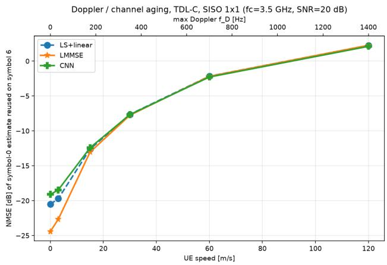  
Fig. 3. SISO NMSE versus maximum Doppler at 20 dB SNR (TDL-C). All estimators degrade and converge as mobility induces intra-symbol time variation.

## E. MIMO: estimation accuracy and the regime switch

Fig. 5 shows the 8 × 2 MIMO NMSE over the six condition tiles (UMa/UMi/RMa × 5G-NR/LTE). Two regimes are visible. At low SNR the joint SpaceFreq-LMMSE dominates everywhere, because correlation across the 16 links provides an additional degree of noise averaging. At high SNR the perlink Freq-LMMSE and SVD-LMMSE take over: once noise is small, the joint estimator’s covariance-model mismatch and rank limits cost more than the spatial gain. Over the 48 operating points (six conditions × eight SNRs), the “best” estimator is split across four different methods (Table I): SpaceFreq-LMMSE wins 32, Freq-LMMSE 11, the CNN 3, and SVD-LMMSE 2.

## F. MIMO: orchestration gain

The orchestrator dispatches to the validation-best agent per condition and, as shown in Fig. 5, tracks the winner across the whole grid. Its average NMSE is −13.49 dB, within 1.07 dB of the per-realization oracle (−14.56 dB) and better than the best fixed strategy, SpaceFreq-LMMSE (−13.28 dB). The wholegrid average understates the benefit because it is dominated by large low-SNR magnitudes; restricting to the high-SNR slice (≥ 15 dB), where Freq-LMMSE wins every +25 dB point, a system frozen on the low-SNR champion SpaceFreq-LMMSE loses up to 3.6 dB (on RMa). The orchestrator simply follows the winner into the new regime—exactly the robustness a single fixed estimator cannot provide.

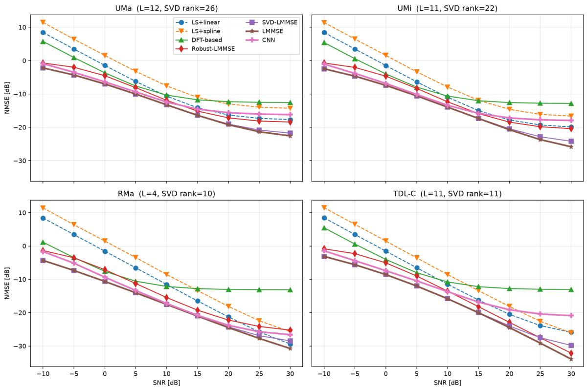  
Fig. 1. SISO channel-estimation NMSE versus SNR for the eight estimators over 3GPP UMa/UMi/RMa and TDL-C. The best estimator and the spread between estimators change with the channel model and SNR.

Estimation -> ZF equalization -> QPSK BER, SISO 1x1, comb-4 pilots  
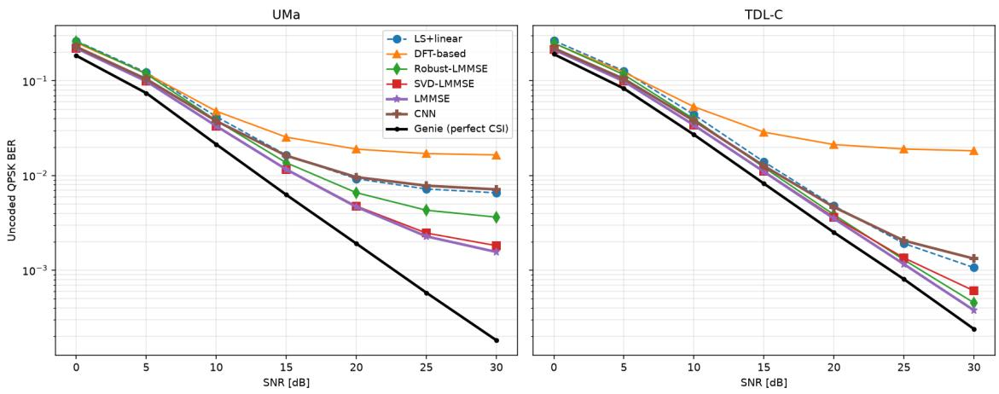  
Fig. 2. SISO uncoded QPSK BER versus SNR (UMa) against a genie (perfect-CSI) receiver. LMMSE/SVD-LMMSE track the genie most closely; the DFT estimator shows an error floor.

## G. MIMO: speed

Fig. 6 reports the speed benchmark on the 5G-NR/UMa condition. A single agent runs all eight estimators sequentially in 145 s, dominated by the CNN (140 s). By-algorithm partitioning stays at ≈ 150 s for all K—Amdahl-locked by the CNN agent—whereas data-parallel partitioning scales from 152 s to 22 s at K = 8 (6.9×, near the ideal 1/K).

Executed concurrently, the orchestrator pays the max agent time (∼ 140 s) rather than the sum (∼ 145 s), delivering bestof-eight accuracy at essentially single-estimator latency.

## H. Discussion

Across both the SISO and MIMO studies, and along every axis we varied—channel model, numerology, SNR, Doppler, and antenna configuration—the best estimator changed. This is the empirical justification for orchestration: rather than committing a receiver to one estimator (and its worst-case behavior), a lightweight condition-adaptive selector achieves near-oracle accuracy, and concurrent execution makes the selection cost negligible. The approach is also extensible: adding a new estimator agent, or replacing the argmin selector with a learned policy, can only improve the orchestrator, whereas a single-strategy design is fixed at design time.

MIMO 8x2 channel-estimation NMSE — 8 strategies vs. multi-agent orchestrator (UMa/UMi/RMa × 5G-NR/LTE)  
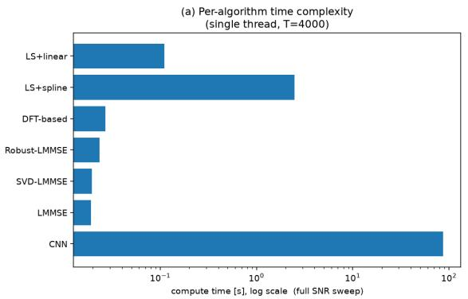

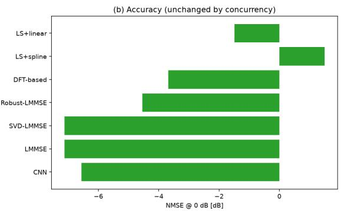

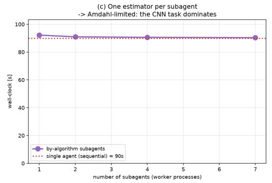

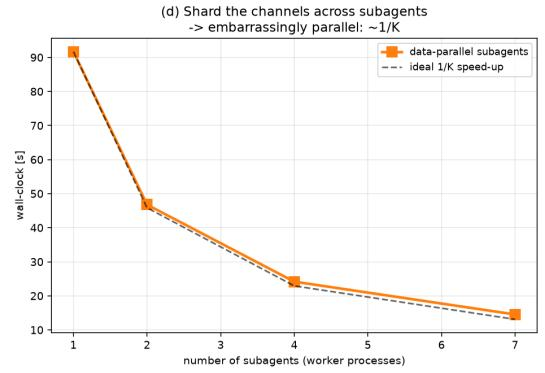  
Fig. 4. SISO wall-clock of the estimator bank. By-algorithm partitioning is Amdahl-limited by the CNN agent; data-parallel partitioning scales as ∼ 1/K.

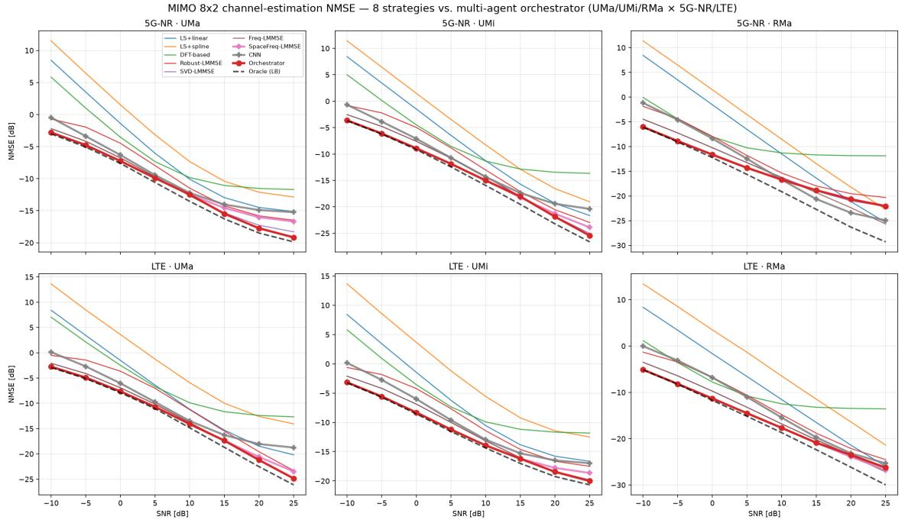  
Fig. 5. 8 × 2 MIMO NMSE versus SNR for the eight strategies and the multi-agent orchestrator over UMa/UMi/RMa × 5G-NR/LTE. The orchestrator (red) hugs the per-realization oracle (dashed) and dominates every fixed strategy.

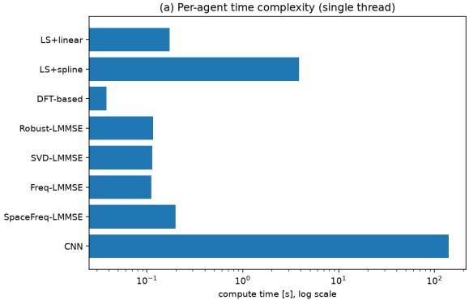  
(c) One estimator per agent → Amdahl-limited

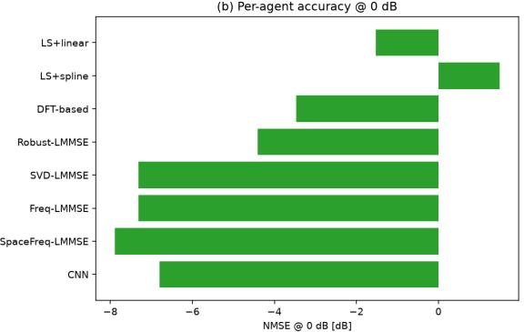  
(d) Shard channels across agents → \~1/K

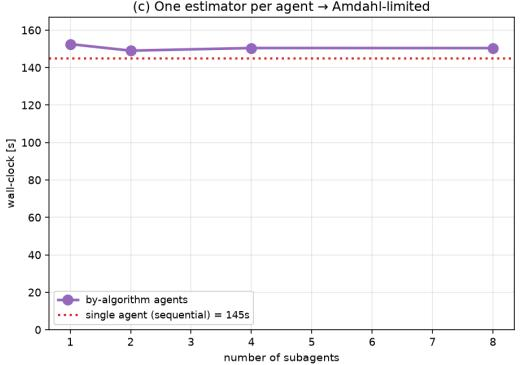

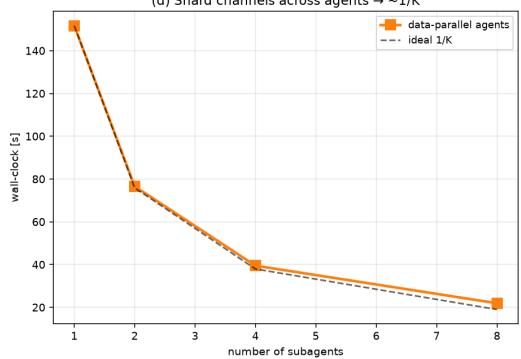  
Fig. $6 . \quad 8 \times 2$ MIMO orchestration speed. (a) per-agent compute, (b) per-agent accuracy, (c) by-algorithm partitioning is Amdahl-limited, (d) data-parallel partitioning scales as $\sim 1 / K$

## VI. CONCLUSION

We presented a unified SISO-to-MIMO benchmark of eight channel estimators for 5G-NR and LTE over 3GPP TR 38.901 UMa/UMi/RMa channels generated with NVIDIA Sionna, and showed that no single estimator is best across scenarios, numerologies, SNR, mobility, or antenna configuration. We proposed a condition-adaptive multi-agent orchestrator that dispatches to the validation-best estimator per condition; it upper-bounds any fixed strategy, tracks the per-realization oracle to within 1.07 dB, and improves NMSE over the best fixed strategy by up to 3.6 dB in the high-SNR MIMO regime. Because the estimator agents are independent, dataparallel concurrency scales the wall-clock nearly as $1 / K$ (up to 6.9×), so orchestration delivers best-of-eight accuracy at near single-estimator latency. Multi-agent orchestration is thus a practical and extensible route to robust channel estimation across heterogeneous 5G-NR/LTE deployments.

## REFERENCES

[1] S. Coleri, M. Ergen, A. Puri, and A. Bahai, “Channel estimation techniques based on pilot arrangement in OFDM systems,” IEEE Trans. Broadcast., vol. 48, no. 3, pp. 223–229, 2002.

[2] J.-J. van de Beek, O. Edfors, M. Sandell, S. K. Wilson, and P. O. Borjesson, “On channel estimation in OFDM systems,” in¨ Proc. IEEE Veh. Technol. Conf. (VTC), 1995, pp. 815–819.

[3] Y. Zhao and A. Huang, “A novel channel estimation method for OFDM mobile communication systems based on pilot signals and transformdomain processing,” in Proc. IEEE Veh. Technol. Conf. (VTC), 1997, pp. 2089–2093.

[4] Y. Li, L. J. Cimini, and N. R. Sollenberger, “Robust channel estimation for OFDM systems with rapid dispersive fading channels,” IEEE Trans. Commun., vol. 46, no. 7, pp. 902–915, 1998.

[5] O. Edfors, M. Sandell, J.-J. van de Beek, S. K. Wilson, and P. O. Borjesson, “OFDM channel estimation by singular value decomposi-¨ tion,” IEEE Trans. Commun., vol. 46, no. 7, pp. 931–939, 1998.

[6] I. Barhumi, G. Leus, and M. Moonen, “Optimal training design for MIMO OFDM systems in mobile wireless channels,” IEEE Trans. Signal Process., vol. 51, no. 6, pp. 1615–1624, 2003.

[7] M. Biguesh and A. B. Gershman, “Training-based MIMO channel estimation: a study of estimator tradeoffs and optimal training signals,” IEEE Trans. Signal Process., vol. 54, no. 3, pp. 884–893, 2006.

[8] M. Soltani, V. Pourahmadi, A. Mirzaei, and H. Sheikhzadeh, “Deep learning-based channel estimation,” IEEE Commun. Lett., vol. 23, no. 4, pp. 652–655, 2019.

[9] J. Hoydis, S. Cammerer, F. Ait Aoudia, A. Vem, N. Binder, G. Marcus, and A. Keller, “Sionna: An open-source library for next-generation physical layer research,” arXiv:2203.11854, 2022.

[10] 3GPP, “Study on channel model for frequencies from 0.5 to 100 GHz,” 3rd Generation Partnership Project (3GPP), Tech. Rep. TR 38.901, v17.0.0, 2022.