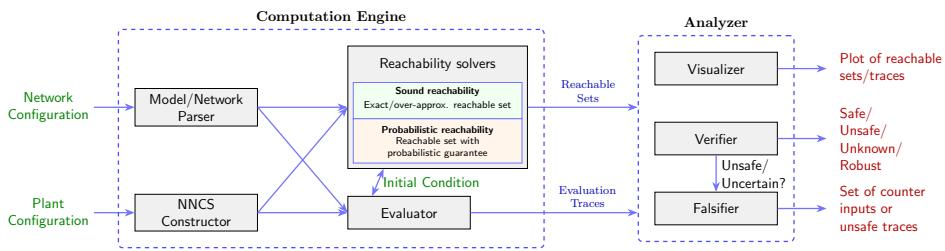
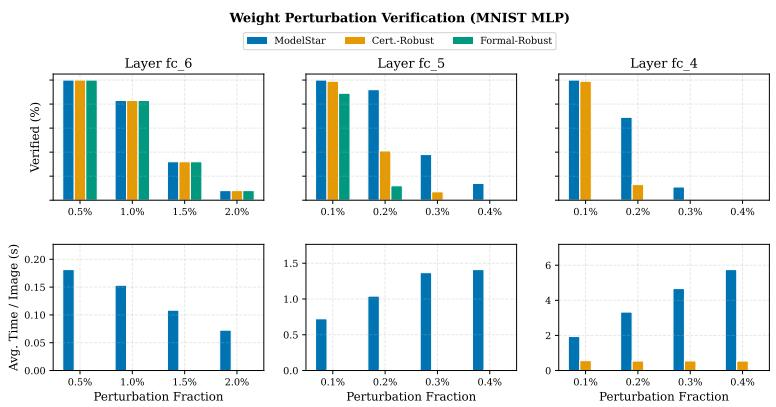
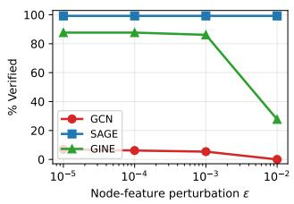
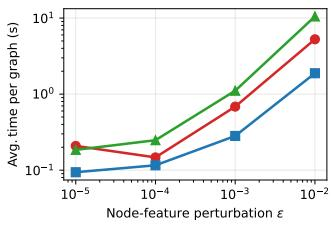
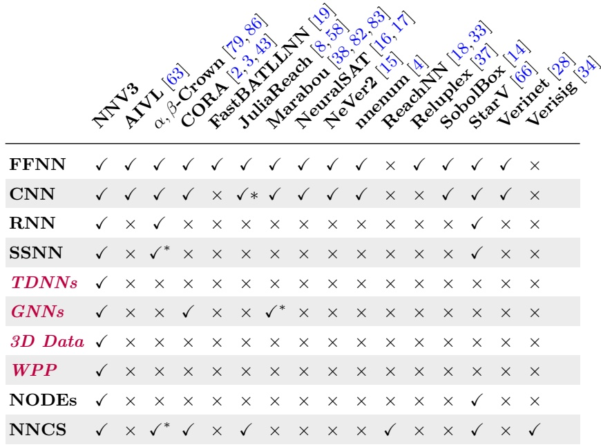

# NNV3: Expanding Neural Network Verification to New Architectures and Domains⋆

Anne M. Tumlin1, Samuel Sasaki1, Ben Wooding1, Diego Manzanas Lopez1, Muhammad Usama Zubair2, Navid Hashemi1, Hongchao Zhang1, Waseem Abbas2, Ipek Oguz1, Meiyi Ma1, and Taylor T. Johnson1

1 Vanderbilt University, USA 2 The University of Texas at Dallas, USA

Abstract. We present NNV3, the latest version of the Neural Network Verification (NNV) tool, a MATLAB framework for formal verification of deep learning models and learning-enabled cyber-physical systems. Building on the set-based reachability foundation of NNV 1.0 (FFNNs, CNNs, NNCS) and NNV 2.0 (RNNs, SSNNs, neural ODEs), NNV3 introduces new members of the Star-set family: ModelStar for verifying networks under weight perturbation, VolumeStar for video and 3D volumetric inputs, and GraphStar for graph neural networks. A conformalinference-based probabilistic reachability mode complements sound analysis for problems where deterministic verification is intractable, while FairNNV certifies counterfactual and individual fairness properties over continuous input regions. NNV3 introduces new benchmarks for malware detection, graph-based power-system models, medical imaging, variablelength time series data, and action recognition. NNV3 also incorporates tutorials and developer guides through a unified documentation site. This paper details these major updates, demonstrating NNV’s maturation into a comprehensive, robust, and accessible verification tool for a diverse range of AI systems.

## 1 Introduction

Deep neural networks (DNNs) have become integral to solving complex problems across various domains, from image classification to autonomous control. However, their deployment in safety-critical applications is hindered by their opaque nature and susceptibility to adversarial perturbations. Formal verification provides a means to analyze and rigorously guarantee the behavior of these models, which is essential for establishing trust in AI-powered systems.

The Neural Network Verification (NNV)1 tool [72] was introduced as a comprehensive, open-source MATLAB toolbox to tackle this challenge. NNV is built around a powerful computation engine that performs set-based reachability analysis, computing the set of all possible outputs for a given set of inputs. The initial release of NNV focused on providing exact and over-approximate reachability for feed-forward neural networks (FFNNs), convolutional neural networks (CNNs), and neural network control systems (NNCS) using a variety of set representations like polyhedra, zonotopes, and the novel star set.

Building on this foundation, NNV 2.0 [47] expanded the tool’s scope to handle a wider array of complex and dynamic network architectures. It introduced verification support for neural ordinary diferential equations (neural ODEs), recurrent neural networks (RNNs), and semantic segmentation neural networks (SSNNs). This version also improved scalability with new relaxed reachability methods [71] and enhanced usability by supporting standard community formats like ONNX [50] and VNNLIB [54].

This paper presents NNV3, an evolution of the NNV tool that addresses emerging challenges in AI verification and broadens the tool’s applicability to new domains and data types. While previous versions focused on expanding architectural support, NNV3 introduces verification techniques for new classes of properties and extends reachability analysis to previously intractable data modalities. The contributions span three categories. Algorithmic and model improvements introduce reachability-based verification for parameter perturbations (ModelStar [90, 91]), spatio-temporal data (VolumeStar [55]), graphstructured models (GNNV with GraphStar [75]), probabilistic guarantees via conformal inference [27], fairness properties (FairNNV [74]), and variable-length time-dependent networks [51]. New application domains unlocked by these algorithms include video classification [55], medical-image segmentation [26], power-system analysis [75], malware detection [53], ethical decision-making [74], and deployment-uncertainty robustness [90, 91]. System upgrades include a unified documentation site2 that consolidates the user guide, developer guide, API reference, etc. These advancements solidify NNV’s position as one of the most comprehensive and versatile verification frameworks available to the research community.

## 2 NNV3 vs. NNV 2.0

The core architecture of NNV, illustrated in Fig. 1, is composed of two primary modules: the Computation Engine and the Analyzer. The Computation Engine parses neural network and system models (ONNX and MATLAB formats) and performs layer-by-layer reachability analysis using set-based abstractions, including Star sets [70], ImageStar [65], and newly introduced representations such as VolumeStar (a.k.a VideoStar) [55], ModelStar [90,91], and Graph-Star [75]. In NNV3, the computation engine supports both sound reachability and a probabilistic reachability mode [27], the latter enabling scalable verification via sampling-based uncertainty quantification. The Analyzer consumes the resulting reachable sets or evaluation traces to verify system-level properties — including robustness, safety specifications expressed in VNNLIB, and fairness constraints — and supports visualization, verification, and counterexample generation. Together, these extensions broaden the scope of verifiable models while preserving the modular structure of the NNV framework.

  
Fig. 1: Updated NNV verification pipeline, composed of a computation engine and analyzer, and extended to support both sound and probabilistic reachability analysis.

Practitioners working with heterogeneous, real-world AI systems require a unified and extensible verification framework. This drives the continued evolution of NNV. Table 1 illustrates that NNV and its prior iterations support a broad spectrum of architectures and applications, including feedforward and convolutional networks (FFNNs and CNNs), recurrent models (RNNs), semantic segmentation (SSNNs), neural ODEs, and neural network control systems (NNCSs). With the release of NNV3, we expand the tool to emerging and increasingly important model classes, including graph neural networks (GNNs) and video classification architectures (VolumeStar). NNV3 addresses a broader class of deployment-relevant properties, including algorithmic fairness, parameter and weight perturbations, and probabilistic guarantees. These capabilities enable verification beyond conventional robustness analysis and reflect practical concerns encountered in real-world deployment.

NNV has been evaluated consistently in community benchmarks such as VNN-COMP [39] and ARCH-COMP [46, 56], and has served as the foundation for tutorials at DESTION [67], EMSOFT [69], DSN [36], SPIE, IAVVC, AAAI, etc., underscoring its maturity and continued relevance to the verification community (see the user guide3 and the tutorials index4 for further details).

Relation to prior publications. The set representations and analysis modes incorporated into NNV3 were introduced individually in prior work [27,55, 74,75,91]. This work contributes their systematic integration into a unified verification framework. Previously, these capabilities were implemented as independent prototypes with distinct interfaces, dispatch mechanisms, and evaluation pipelines. NNV3 consolidates these developments through a common Star-set abstraction, a shared specification interface, and a documented developer API, enabling verification specifications and reachability procedures to be used consistently across supported representations. The resulting framework is further supported by continuous integration testing, unified documentation for the full representation family, and reproducibility packages for each experiment reported in Section 5.

Table 1: Overview of major features available in NNV. Items in regular weight are NNV 1.0 baseline; blue italics denote additions introduced in NNV 2.0; purple bold denote new capabilities introduced in NNV3.
<table><tr><td rowspan=1 colspan=1>Feature</td><td rowspan=1 colspan=1>Supported (NNV 1.0, NNV 2.0, NNV3)</td></tr><tr><td rowspan=1 colspan=1>Neural Network Type</td><td rowspan=1 colspan=1>FFNN, CNN, NeuralODE, SSNN, RNN, GNN, TDNN, 3D CNN</td></tr><tr><td rowspan=1 colspan=1>Layers</td><td rowspan=1 colspan=1>MaxPool, Conv, BN, AvgPool, FC, MaxUnpool, TC, DC, NODE, GCN, GINE, Conv3D</td></tr><tr><td rowspan=1 colspan=1>Activation functions</td><td rowspan=1 colspan=1>ReLU, Satlin, Sigmoid, Tanh, Leaky ReLU, Satlins</td></tr><tr><td rowspan=1 colspan=1>Plant dynamics (NNCS)</td><td rowspan=1 colspan=1>Linear ODE, Nonlinear ODE, Continuous &amp; Discrete Time, HA</td></tr><tr><td rowspan=1 colspan=1>Set Representation</td><td rowspan=1 colspan=1>Polyhedron, Zonotope, Star, ImageStar, VolumeStar, ModelStar, GraphStar</td></tr><tr><td rowspan=1 colspan=1>Star Reach methods</td><td rowspan=1 colspan=1>exact, approx, abs-dom, relax- *</td></tr><tr><td rowspan=1 colspan=1>Reachable set visualization</td><td rowspan=1 colspan=1>exact and over-approximation</td></tr><tr><td rowspan=1 colspan=1>Verification</td><td rowspan=1 colspan=1>Safety, Robustness, VNNLIB, Fairness, Weight Perturbation, Probabilistic</td></tr><tr><td rowspan=1 colspan=1>Miscellaneous</td><td rowspan=1 colspan=1>Parallel computing, counterexample generation, ONNX, CI/CD</td></tr></table>

The remainder of the paper is organized as follows. Section 3 summarizes major new features and capabilities. Section 4 introduces the extended domain applications. We then validate new features in Section 5 and refresh the comparison with the MathWorks AI Verification Library. Finally, we discuss related works in Section 6, and conclude the paper in Section 7.

## 3 Overview and Features

This section summarizes the major features introduced in NNV3 and in Table 1. These additions extend the reachability-based verification capabilities of prior versions of NNV to new model classes, data modalities, and verification objectives, while preserving soundness guarantees and compatibility with existing analysis pipelines. Section 3.1 presents the per-feature highlights; Section 3.2 describes the underlying engine and extensibility upgrades.

## 3.1 Feature Highlights

ModelStar [90, 91]: Neural networks deployed in practice are subject to parameter uncertainty arising from quantization, numerical imprecision, and hardware faults [24, 61, 88]. To address this, NNV3 introduces ModelStar, a starset–based representation for interval-bounded weight perturbations. ModelStar enables reachability analysis under simultaneous input and parameter uncertainty. For networks with a single perturbed layer and singleton inputs, the reachable set of the perturbed layer is computed exactly; for multi-layer perturbations, sound over-approximations are constructed using Star sets. ModelStar is currently implemented for fully-connected and 2D convolutional layers and can be readily implemented for verification against weight perturbations in any linear layer. Rounding errors introduced by quantized compression can be modeled as interval-bounded specifications for ModelStar — as demonstrated in the experiments in Section 5 — but fixed-point inference arithmetic (discrete operations) is not yet modeled.5

VolumeStar (VideoStar) [55]: NNV can formally verify the robustness of video classifiers. Verification of neural networks operating on spatio-temporal data, such as videos and volumetric medical images, presents significant scalability challenges due to input dimensionality. NNV3 extends the Star and ImageStar representations [65, 70] to VolumeStar, a set abstraction for spatio-temporal inputs, e.g., an image at each time step. VolumeStar supports reachability analysis of architectures with 3D convolutional and pooling layers, including video classification networks (such as C3D [64] and I3D [12]), as well as 3D medical imaging models [89]. Using VolumeStar reachability, NNV can formally certify classification robustness for all admissible spatio-temporal perturbations within a specified input set. In addition, NNV3 extends star-based reachability analysis to time-dependent neural networks (TDNNs) by allowing the analysis horizon to vary over a bounded temporal range, generalizing prior support for fixed-length recurrent models.6

GraphStar [75]: Graph neural networks (GNNs) are increasingly used as surrogates for numerical solvers in domains such as molecular modeling, trafic forecasting, and power-system analysis [85]. NNV3 introduces GNNV, extending reachability-based verification to graph-structured learning models. GNNV implements GraphStar, a generalization of Star sets that captures both graph connectivity and uncertainty in node and edge features. This abstraction enables exact propagation of afine message-passing operations and sound overapproximation of ReLU nonlinearities in common GNN architectures, including graph convolutional networks (GCNs) [40] and graph isomorphism networks with edge features (GINE) [32]. GraphStar reachability is demonstrated on powersystem case studies, including power flow, optimal power flow, and cascading failure analysis [77].7

Probabilistic Verification [27]: Exact reachability analysis can become intractable for large networks due to exponential complexity in the number of unstable nonlinear activations. To address this limitation, NNV3 integrates a probabilistic, model-agnostic verification approach based on conformal inference. Given an input set, a neural network, and a specification, verification is performed via sampling rather than exhaustive propagation. This approach scales with inference cost and is independent of network architecture, providing probabilistic coverage guarantees for models that are beyond the practical reach of exact methods.8

Fairness Verification [74]: As machine learning systems are deployed in high-stakes decision-making settings, verification of fairness properties has become increasingly important [48]. NNV3 integrates FairNNV, a reachabilitybased framework for formally validating fairness specifications over continuous input regions. FairNNV verifies specifications corresponding to counterfactual fairness [42], which requires predictions to remain invariant under changes to sensitive attributes, and individual fairness, which enforces similar outcomes for inputs within a bounded neighborhood. Fairness is quantified using the Verified Fairness (VF) score, defined as the proportion of inputs for which fairness properties are formally certified.9

## 3.2 Core Upgrades & Extensibility

Star-set family unification. VolumeStar, GraphStar, and ModelStar are not disjoint abstractions but instances of a common Star-set template, parameterized by an anchor, a generator basis, and a polyhedral constraint on the generator coeficients.

Definition 1 (Star-set template). A star set over a tensor space $\tau$ is a tuple $\langle c , V , P , q \rangle$ consisting of an anchor $c \in { \mathcal { T } } , a$ generator basis $V = \{ v _ { 1 } , \ldots , v _ { m } \} \subset$ $\tau ,$ and a polyhedral constraint $( P , q ) \in \mathbb { R } ^ { p \times m } \times \mathbb { R } ^ { p }$ on the predicate variables $\alpha = [ \alpha _ { 1 } , \ldots , \alpha _ { m } ] ^ { \top }$ . It denotes the set

$$
\theta = \Big \{ x \in \mathcal { T } \Big \vert x = c + \sum _ { i = 1 } ^ { m } \alpha _ { i } v _ { i } , P \alpha \leq q \Big \} .
$$

Each member of the family instantiates Definition 1 by fixing $\tau$ and the semantics of the generators, and inherits the shared propagation kernel unchanged. VolumeStar, for example, takes $\mathcal { T } = \mathbb { R } ^ { H \times W \times C \times F }$ for a volume of height $H$ width $W , C$ channels, and F frames: the anchor is the nominal video, each generator is a volume encoding one direction of admissible spatio-temporal variation, and $P \alpha \leq q$ bounds the perturbation, $e . g . , \left| \alpha _ { i } \right| \leq \epsilon$ for an $L _ { \infty }$ bound applied across all frames. Star and ImageStar difer from it only in the rank of $\mathcal { T } ~ ( \mathbb { R } ^ { n }$ and $\mathbb { R } ^ { H \times W \times C }$ , respectively), whereas GraphStar carries the adjacency structure alongside the node- and edge-feature tensors, and ModelStar draws its generators from perturbed weight entries rather than from input dimensions. Extending NNV to a new modality therefore reduces to instantiating Definition 1 and implementing layer-specific dispatch over the shared propagation kernel.

Engine-level changes. Several core-engine upgrades support the new abstractions: a GNN wrapper that maps message-passing layers onto Star-set afine operations and routes adjacency through GraphStar; a 4D-tensor extension of the ImageStar reach kernels that lets VolumeStar inherit existing 3D-conv and pooling implementations; perturbation tracking in ModelStar that maintains symbolic dependencies between input generators and weight-perturbation generators across linear layers; and a probabilistic reachability mode that composes with sound reachability so that any feature implemented for the sound mode is automatically usable in the probabilistic mode.

Continuous Integration and Deployment (CI/CD). To improve reliability and maintainability, NNV3 adopts a continuous integration and continuous deployment pipeline based on GitHub Actions. The pipeline automatically builds and tests the codebase for each commit and pull request, including unit tests for core reachability methods and regression tests on established benchmarks. This ensures backward compatibility and supports sustained development of NNV as an open-source verification tool.

Extensibility and developer API. NNV3’s engine and analyzer modules are documented as a stable developer-facing $\mathrm { A P I ^ { 1 0 } }$ with guidance for adding new layer types, set representations, and verification properties.11 The unified documentation site now provides the user guide, developer guide, API reference, theory background, and the tutorials index as a single entry point. Together, these resources lower the barrier for contributors extending NNV to architectures and properties beyond those listed in Table 1.

## 4 New Domains

NNV3’s new abstractions and probabilistic mode unlock application domains previously out of reach for reachability-based methods, characterized by highdimensional inputs, structured representations, or deployment-driven threat models that exceed traditional $L _ { p } .$ -bounded robustness analysis. Below we highlight four such domains.

Malware Detection [53]: DNN malware classifiers are vulnerable to adversarial evasion, where attackers apply small functionality-preserving modifications to bypass detection. NNV3 introduces a benchmark for verifying robustness of static-feature classifiers under realistic feature-space perturbations (e.g., modifying non-executable sections, appending benign bytes), enabling formal assessment of classifier resilience under a well-defined threat model.

Power-System Analysis [75]: Power flow, optimal power flow, and cascading failure analysis are naturally graph-structured and increasingly use GNN surrogates [77], yet prediction errors carry severe operational consequences. Through GNN verification, NNV3 provides the first general-purpose framework supporting reachability analysis of such topology-aware models with both nodeand edge-feature uncertainty.

Medical Imaging Classification [26,27]: High-dimensional semantic segmentation defeats exact verification. NNV3’s probabilistic pipeline analyzes large segmentation networks on lung X-ray datasets [11,35] with dense pixel-level outputs, providing coverage guarantees while substantially reducing conservatism relative to exact methods [27].

Financial Predictions [74]: FairNNV extends NNV3 to consequential decision making systems such as credit approval and loan risk assessment [7,30,49]. Unlike statistical auditing over finite datasets, reachability-based fairness analysis certifies properties over continuous input regions, formally reasoning about bias under input perturbations and counterfactual scenarios.

  
Fig. 2: Single-layer weight-perturbation verification on the MNIST MLP. (Top) fraction of images verified safe; (bottom) average execution time per image, both vs. the $L _ { \infty }$ -norm perturbation magnitude.

## 5 Evaluation

NNV3’s primary contribution is its breadth of supported architectures, specifications, and threat models, many of which lack a direct comparison, as summarized in Table 8. Accordingly, the evaluations presented here are intended as feasibility demonstrations of the integrated framework across domains rather than exhaustive scalability studies of individual features. The per-feature suites are intentionally compact, allowing the full evaluation to be reproduced within several hours while exercising each supported analysis pipeline. More extensive feature-specific comparisons are reported in the corresponding prior works, including GraphStar against CORA [75] and the conformal verification pipeline [27]. We summarize the relevant results below and additionally refresh the NNV 2.0 head-to-head evaluation [47] against the MathWorks AI Verification Library (AIVL) [63] for FFNN and CNN models supported by both tools. All experiments were conducted using the MATLAB 2025b Docker container on a machine equipped with an Intel 24 Core i9-285K CPU, 64 GB RAM, and an NVIDIA RTX 5090 GPU with 32 GB VRAM.12

Verification Under Weight and Parameter Perturbations. We evaluate ModelStar [90, 91] on an MNIST MLP (5 hidden layers: 1024, 512, 256, 256, 256) against Certificated-Robust [81] and Formal-Robust [73] (Fig. 2). Perturbations are $L _ { \infty }$ bounds on each layer’s weight range, with magnitudes $0 . 0 5 \% / 0 . 1 \% / 0 . 2 \% / 0 .$ .4% corresponding to $1 0 \mathrm { - } / 9 \mathrm { - } / 8 \mathrm { - } / 7 \mathrm { - } \mathrm { b i t }$ quantization rounding error. While ModelStar supports independently varying perturbations for individual weights [91], the baselines support only uniform row-wise [81] or matrixwise [73] perturbations. To ensure a fair comparison, we use a common perturbation magnitude for all weights in each perturbed layer and evaluate one layer’s robustness against one perturbation magnitude at a time. On 100 MNIST test images, ModelStar consistently matches or exceeds prior bounds: at 0.2% perturbation on fc 4, it verifies the safe classification of 69/100 images versus 13 for Certificated-Robust (an absolute gain of 56 percentage points). For all three approaches, the classification safety of the NN for the unverified images is unknown due to over-approximation. The scalability of ModelStar is limited by the width and number of perturbed layers: perturbing wide or multiple layers substantially increases Star-set dimensionality, leading to higher LP-solving times in subsequent nonlinear layers. These results demonstrate that the ModelStar extension allows NNV3 to certify network robustness under quantization or hardware-induced weight uncertainty, addressing a deployment threat model beyond the reach of input-only verifiers.

  
Fig. 3: GNNV verification on IEEE-24 power flow across three architectures (GCN, SAGE, GINE-Conv) vs. node-feature perturbation ϵ (log axis). (Left) percentage of voltage-magnitude nodes verified. (Right) average verification time per graph instance (log scale).

Verification of Graph Neural Networks. We evaluate GraphStar [75] on AC power flow (PF) for the IEEE-24 bus system using 10 graph instances each for GCN, SAGE, and GINE-Conv models under the ML4ACOPF perturbation scheme [39]. We consider $L _ { \infty }$ perturbations to active and reactive power node features for $\dot { \epsilon } \in \{ 1 0 ^ { - 5 } , 1 0 ^ { - 4 } , 1 0 ^ { - 3 } , 1 0 ^ { - 2 } \}$ , with voltage magnitude as the safety constraint. A common specification and reachability configuration is applied across all three architectures, demonstrating GraphStar’s ability to verify difering message-passing architectures under a consistent threat model. Figure 3 summarizes this evaluation by reporting the percentage of voltage-magnitude nodes verified and the average verification time per graph instance for each architecture; the remaining nodes correspond to either proven violations or unknown outcomes. As GraphStar’s computational complexity depends on graph size and network depth, this evaluation serves as a feasibility demonstration on a representative power-grid system rather than a comprehensive scalability study. This demonstrates reachability-based verification of GNN surrogates and supports formal analysis of GNN-based estimators.

Verification of Spatio-Temporal and Volumetric Data. We evaluate VolumeStar [55] on the ZoomIn-4f benchmark, a 4-frame MNIST-video classifier, under $L _ { \infty }$ perturbations $\epsilon \in \{ 1 / 2 5 5 , 2 / 2 5 5 , 3 / 2 5 5 \}$ with a 30-minute timeout per sample. VolumeStar verifies 7/10 (70%) of cases at every ϵ tested (Table 2); the remaining three are unknown due to over-approximation. The scalability of VolumeStar is limited by frame count and volume: additional frames and larger spatial dimensions enlarge the generator basis, increasing memory and reachability cost per sample. This delivers the first reachability-based robustness certification for 3D-convolutional video classifiers, a modality where ImageStarbased propagation is intractable.

Probabilistic Verification. We evaluate NNV3’s probabilistic verification pipeline [27] on the TinyYOLO object detector from VNN-COMP 2023 [9]. The approach combines randomized falsification with conformal prediction–based reachability analysis. A surrogate model is trained to approximate the network, and conformal inference over a calibration set bounds its error, yielding a reachable set (Table 3). The guarantee is two-level: with confidence at least 99.9% over the draw of the calibration set, a fresh input from the sampling distribution has its output inside the reachable set with probability at least 99.9%, where the confidence follows from the calibration size and rank through a Beta tail bound [27].

We evaluate three randomly selected VNNLIB property specifications from the benchmark’s 72 instances. All three properties are verified as UNSAT (specification holds), with GPU-accelerated verification requiring 111–132 s per property. As in the sound mode, UNSAT means that the reachable set does not intersect the unsafe region. The set is not an over-approximation, however, and may omit the outputs of some inputs, so the verdict holds with the coverage and confidence stated above. Since the result is an ordinary Star set, the same specification routine checks it as in sound reachability, and any pipeline containing a CP-Star step yields a probabilistic verdict with that step’s coverage and confidence. The dominant costs are the calibration size, which grows with the requested coverage and confidence, and property complexity, since the memory of the inflated set grows with the output dimension and every output constraint requires an LP over it. The evaluation therefore serves as a feasibility demonstration on a perception-scale model rather than a scalability study.

This extends NNV to instances for which sound reachability is intractable— for example, when the network is too large for the analysis to complete—since the probabilistic mode’s cost scales with inference rather than with the number of unstable neurons.

Fairness Verification. We evaluate FairNNV [74] on the Adult Census dataset [7] using two FFNN classifiers: Small, with two hidden layers of 16 and 8 neurons, and Medium, with a single hidden layer of 50 neurons. Under counterfactual fairness, both reach Verified Fairness (VF) ∈ [87, 89]% with average verification time of 0.72–0.78 s per sample; under individual fairness, VF degrades as ϵ grows, and the small model shows the steeper VF decline, while the medium model incurs substantially higher verification cost (Table 4). This delivers persample fairness certificates over continuous input regions. A direct comparison with FairSquare [1], Justicia [23], and abstract-interpretation-based fairness certifiers [76] is not currently applicable because these approaches primarily target probabilistic or group fairness, whereas FairNNV certifies individual and counterfactual fairness through set-based reachability; extending FairNNV to groupfairness specifications is planned as future work and will enable more direct comparisons with these approaches.

Table 2: VolumeStar verification on ZoomIn-4f under $L _ { \infty }$ perturbations (10 samples per ϵ, 30-min timeout). Ver. verified robust; Unk. unknown due to over-approximation.  
Table 3: Probabilistic verification on TinyYOLO (CP-Star, local Docker build with GPU). Coverage and confidence of 0.999 each require m = 9,230 calibration samples per property.
<table><tr><td>€</td><td>Ver.</td><td>Unk.</td><td>Avg. Time (s)</td></tr><tr><td>1/255</td><td>7</td><td>3</td><td>35.54</td></tr><tr><td>2/255</td><td>7</td><td>3</td><td>37.88</td></tr><tr><td>3/255</td><td>7</td><td>3</td><td>36.49</td></tr></table>

<table><tr><td>Property</td><td>€</td><td>Time (s)</td><td>Result</td></tr><tr><td>Prop 101</td><td>1/255</td><td>131.86</td><td>UNSAT</td></tr><tr><td>Prop 277</td><td>1/255</td><td>111.92</td><td>UNSAT</td></tr><tr><td>Prop 356</td><td>1/255</td><td>111.26</td><td>UNSAT</td></tr></table>

Table 4: FairNNV verification on Adult Census: Verified Fairness (VF, %) and per-sample verification time (s). Counterfactual fairness (CF) perturbs only the sensitive attribute (ϵ=0); individual fairness (IF) additionally perturbs nonsensitive features at radius ϵ.
<table><tr><td colspan="8">CF IF (€)</td></tr><tr><td>Model</td><td>metric</td><td>(∈=0)</td><td>0.01</td><td>0.02</td><td>0.03</td><td>0.05</td><td>0.07</td><td>0.10</td></tr><tr><td rowspan="2">Small</td><td>VF (%)</td><td>89</td><td>87</td><td>84</td><td>81</td><td>69</td><td>50</td><td>22</td></tr><tr><td>Time (s)</td><td>0.78</td><td>0.89</td><td>1.06</td><td>1.40</td><td>2.17</td><td>3.41</td><td>5.53</td></tr><tr><td rowspan="2">Medium</td><td>VF (%)</td><td>87</td><td>86</td><td>84</td><td>82</td><td>71</td><td>50</td><td>27</td></tr><tr><td>Time (s)</td><td>0.72</td><td>2.64</td><td>5.76</td><td>10.10</td><td>21.75</td><td>39.73</td><td>98.70</td></tr></table>

Tool Comparison. We extend the NNV 2.0 head-to-head evaluation [47] against the MathWorks AI Verification Library (AIVL) [63] using R2025b. We evaluate AIVL’s interval-based output bounds for VNNLIB output specifications and its DeepPoly implementation for argmax robustness on residual architectures. The evaluation also incorporates two VNN-COMP-derived benchmarks, OVAL21 [5] and Collins RUL CNN [41], along with a natively trained MNIST-ResNet-8 (Tables 5, 6, 7).

On ACAS Xu (Table 5), AIVL’s interval-based bounds, its only available option for half-space output specifications under R2025b, are insuficiently precise to verify any instances, reflecting the limited precision of the applicable verification method.13 By contrast, NNV3 verifies roughly half of the instances using either exact-star or approx-star, with approx-star completing every instance in sub-second time. On RL, NNV3 verifies more instances than AIVL and identifies three additional counterexamples; the relax-star-range-50 variant illustrates the precision–cost tradeof, achieving sub-second runtime at a reduced verification rate. On the CNN benchmarks (Table 6), approx-star matches AIVL on Collins RUL and identifies one additional counterexample on OVAL21. On MNIST-ResNet-8 (Table 7), both tools verify all 25 instances at every ϵ. NNV3’s runtime increases with ϵ, whereas AIVL’s remains approximately constant; at smaller perturbation bounds, NNV3 completes verification faster than AIVL. The additional architectures and threat models supported through NNV3’s extensions to the Star-set family (Table 8) fall outside AIVL’s current coverage.

Table 5: Tool comparison on fully-connected VNNLIB benchmarks. Per cell: V verified, X violated, U unknown, T timeout, S mean per-instance time (seconds). Timeout cap: 900 s. AIVL uses est-bnds; r-50 is NNV3’s relax-star-range-50. Bold marks NNV3’s strongest verification count per benchmark.
<table><tr><td rowspan="3"></td><td colspan="6">ACAS p3 (N=20)</td><td colspan="6">ACAS p4 (N=20)</td><td colspan="5">RL (N=50)</td></tr><tr><td>V</td><td>X</td><td>U</td><td>T</td><td></td><td>S</td><td>V</td><td>X</td><td>U</td><td>T</td><td>S</td><td>V</td><td>X</td><td>U</td><td>T</td><td>S</td></tr><tr><td>AIVL</td><td>0</td><td>3</td><td>17</td><td>0</td><td>0.06</td><td>0</td><td>1</td><td>19</td><td>0</td><td>0.07</td><td></td><td>20</td><td>11</td><td>19</td><td>0</td><td>0.04</td></tr><tr><td>exact</td><td>8</td><td>3</td><td>0</td><td>9</td><td>58.23</td><td></td><td>9</td><td>3</td><td>0</td><td>8</td><td>83.99</td><td>32</td><td>15</td><td>1</td><td>2</td><td>5.36</td></tr><tr><td>approx</td><td>10</td><td>3</td><td>7</td><td>0</td><td>0.69</td><td>9</td><td>3</td><td>8</td><td>0</td><td></td><td>0.90</td><td>32</td><td>14</td><td>4</td><td>0</td><td>0.14</td></tr><tr><td>r-50</td><td>1</td><td>2</td><td>17</td><td>0</td><td>0.30</td><td>1</td><td></td><td>2 17</td><td>0</td><td></td><td>0.30</td><td>32</td><td>14</td><td>4</td><td>0</td><td>0.08</td></tr></table>

Table 6: Tool comparison on convolutional VNNLIB benchmarks. Per cell: V verified, X violated, U unknown, T timeout, S mean per-instance time (seconds). Timeout cap: 900 s. AIVL uses est-bnds; NNV3 uses approx-star.
<table><tr><td></td><td colspan="5">OVAL21 (N=30)</td><td colspan="5">Collins RUL (N=62)</td></tr><tr><td></td><td>V</td><td>X</td><td>U</td><td>T</td><td>S</td><td>V</td><td>X</td><td>U</td><td>T</td><td>S</td></tr><tr><td>AIVL</td><td>0</td><td>9</td><td>21</td><td>0</td><td>0.28</td><td>10</td><td>47</td><td>5</td><td>0</td><td>0.65</td></tr><tr><td>approx</td><td>0</td><td>10</td><td>14</td><td>6</td><td>33.47</td><td>10</td><td>47</td><td>5</td><td>0</td><td>0.29</td></tr></table>

Table 7: MNIST-ResNet-8 robustness verification at perturbation magnitude ε (25 test images per row). Both tools verify all 25 instances per row; the comparison reduces to runtime. AIVL uses verifyNetworkRobustness (DeepPoly, residual-network support added in R2024b); NNV3 uses relax-star-area-50.

<table><tr><td>Tool / ε</td><td>1/255</td><td>2/255</td><td>4/255</td><td>8/255</td></tr><tr><td>AIVL Time (s)</td><td>10.29</td><td>10.32</td><td>10.28</td><td>10.41</td></tr><tr><td>NNV3 Time (s)</td><td>6.13</td><td>8.80</td><td>13.94</td><td>34.94</td></tr></table>

<table><tr><td rowspan=1 colspan=1></td></tr><tr><td rowspan=1 colspan=1></td></tr><tr><td rowspan=1 colspan=1></td></tr><tr><td rowspan=1 colspan=1></td></tr><tr><td rowspan=1 colspan=1></td></tr><tr><td rowspan=1 colspan=1></td></tr><tr><td rowspan=1 colspan=1></td></tr><tr><td rowspan=1 colspan=1></td></tr><tr><td rowspan=1 colspan=1></td></tr></table>

Table 8: Comparison of neural network verification tools by supported architectures and applications, with ✓ meaning supported by a tool and × not supported. We use ∗ to indicate partial support. In purple italics, the newly supported architecture/applications by NNV3. WPP signifies model perturbations.

## 6 Related Work

Neural network verification has advanced through SMT-based methods (Reluplex [37], Marabou [38,83], NeuralSAT [17]), bound propagation (α, β-CROWN [79, 86]), abstract interpretation (AI2 [21], DeepPoly [60]), and geometric approaches (Star sets [68], zonotopes [59]), among many other tools [10].14 These methods excel at verifying robustness of FFNNs and CNNs but typically focus on $L _ { p }$ -bounded input perturbations. Table 8 summarizes how NNV3’s coverage compares to existing tools across architectures and application domains.

Weight and Parameter Perturbations. Most prior work assumes fixed network weights and verifies robustness only against input perturbations. Weight uncertainty from quantization, compression, or hardware faults has been studied via interval neural network (INN) verification [52], interval bound propagation [81], and verification of quantized networks [29]. ModelStar [90, 91] is complementary: INN intervals can be supplied as ModelStar perturbation specifications and propagated jointly with input uncertainty via star-set reachability.

VolumeStar. Formal verification of video classifiers has previously been investigated only in [84], using a game-theoretic framework over 2D convolutional and LSTM layers, with perturbations restricted to optical flow rather than video content. VolumeStar [55] extends ImageStar [65] from 2D images to 3D spatiotemporal data, supporting reachability through 3D convolutional and pooling layers under $L _ { \infty }$ perturbations of the video content itself.

Graph Neural Network Verification. Early GNN robustness work focused on empirical or probabilistic guarantees without formal soundness [44, 62, 78]. Recent deterministic approaches include encoding message passing as feedforward networks for Marabou [82], matrix-polynomial-zonotope GCN reachability in CORA [43], and exact methods based on incremental constraint solving [45] or MILP [31]. These target node-classification on a narrow set of architectures; GraphStar [75] generalizes to edge-aware GNNs with joint node/edge uncertainty.

Probabilistic Verification. Probabilistic verification ofers a middle ground between exact methods (guarantees but limited scalability) and testing (scalability but no guarantees). Prior approaches include statistical sampling [80], importance sampling for volume estimation [6], randomized smoothing for classification [13] and segmentation [20, 25], and conformal inference for classification [22, 87]. NNV3 integrates conformal inference with set-based reachability, extending coverage guarantees to segmentation [27].

Fairness Verification. Fairness verification has been approached via probabilistic methods [1], abstract interpretation [76], and SMT [23]. These techniques difer in the guarantee they provide: probabilistic methods yield statistical bounds, abstract interpretation produces conservative over-approximations, and SMT-based methods give satisfiability-style certificates. FairNNV [74] provides exact fairness certificates via reachability over continuous input regions.

## 7 Conclusion

NNV3 advances neural network verification beyond architectural coverage to address new property classes (fairness), data modalities (video, volumetric), and practical deployment concerns (weight perturbations, probabilistic guarantees). While specialized tools may outperform NNV on specific benchmarks, NNV uniquely supports the broadest range of architectures (GNNs, TDNNs, 3D CNNs), data modalities (images, video, time series), and property classes (robustness, fairness, probabilistic guarantees, weight perturbations).

Limitations and future work. NNV3 does not yet handle attention or autoregressive architectures, and ModelStar models continuous weight perturbations only, not fixed-point inference arithmetic. Ongoing work targets (i) a Python version to broaden adoption beyond the MATLAB ecosystem [57], (ii)

extending the Star-set family to transformers (work has already started), autoencoders, and temporal graph neural networks, (iii) discrete fixed-point arithmetic for ModelStar so that quantized inference can be verified end-to-end, and (iv) group-fairness definitions in FairNNV, which would enable direct comparison with probabilistic and group-fairness certifiers such as FairSquare [1] and Justicia [23].

Artifact availability. The evaluation artifact accompanying this paper (models, specifications, and the scripts that reproduce the results reported in Section 5) is archived on Zenodo at https://doi.org/10.5281/ zenodo.20433720 (release v3.0-atva26). NNV3 is developed openly at https: //github.com/verivital/nnv, with documentation, tutorials, and the developer API reference available at https://verivital.github.io/nnv/.

Acknowledgments. The material presented in this paper is based upon work supported by the National Science Foundation (NSF) through grant numbers 2220401 and 2325416, the Defense Advanced Research Projects Agency (DARPA) under contract number FA8750-23-C-0518, and the U.S. Department of Energy, Ofice of Science, Ofice of Advanced Scientific Computing Research, under Award Number DE-SC0025528. Any opinions, findings, and conclusions or recommendations expressed in this paper are those of the authors and do not necessarily reflect the views of DARPA, DOE, or NSF.

## References

1. Albarghouthi, A., D’Antoni, L., Drews, S., Nori, A.V.: Fairsquare: probabilistic verification of program fairness. Proc. ACM Program. Lang. 1(OOPSLA) (Oct 2017). https://doi.org/10.1145/3133904

2. Althof, M.: An introduction to CORA 2015. In: Proc. of the 1st and 2nd Workshop on Applied Verification for Continuous and Hybrid Systems. pp. 120–151. EasyChair (2015). https://doi.org/10.29007/zbkv

3. Althof, M., Grebenyuk, D., Kochdumper, N.: Implementation of taylor models in cora 2018. In: Frehse, G. (ed.) ARCH18. 5th International Workshop on Applied Verification of Continuous and Hybrid Systems. EPiC Series in Computing, vol. 54, pp. 145–173. EasyChair (2018). https://doi.org/10.29007/zzc7

4. Bak, S.: nnenum: Verification of relu neural networks with optimized abstraction refinement. In: NASA Formal Methods: 13th International Symposium, NFM 2021, Virtual Event, May 24–28, 2021, Proceedings. p. 19–36. Springer-Verlag, Berlin, Heidelberg (2021). https://doi.org/10.1007/978-3-030-76384-8 2

5. Bak, S., Liu, C., Johnson, T.: The second international verification of neural networks competition (vnn-comp 2021): Summary and results (2021), https: //arxiv.org/abs/2109.00498

6. Baluta, T., Shen, S., Shinde, S., Meel, K.S., Saxena, P.: Quantitative verification of neural networks and its security applications. In: Proceedings of the 2019 ACM SIGSAC Conference on Computer and Communications Security. p. 1249–1264. CCS ’19, Association for Computing Machinery, New York, NY, USA (2019). https://doi.org/10.1145/3319535.3354245

7. Becker, B., Kohavi, R.: Adult. UCI Machine Learning Repository (1996), https: //doi.org/10.24432/C5XW20

8. Bogomolov, S., Forets, M., Frehse, G., Potomkin, K., Schilling, C.: Juliareach: a toolbox for set-based reachability. In: Proceedings of the 22nd ACM International Conference on Hybrid Systems: Computation and Control. pp. 39–44 (2019)

9. Brix, C., Bak, S., Liu, C., Johnson, T.T.: The fourth international verification of neural networks competition (vnn-comp 2023): Summary and results (2023), https://arxiv.org/abs/2312.16760

10. Brix, C., M¨uller, M.N., Bak, S., Johnson, T.T., Liu, C.: First three years of the international verification of neural networks competition (VNN-COMP). International Journal on Software Tools for Technology Transfer 25(3), 329–339 (Jun 2023). https://doi.org/10.1007/s10009-023-00703-4

11. Candemir, S., Jaeger, S., Palaniappan, K., Musco, J.P., Singh, R.K., Xue, Z., Karargyris, A., Antani, S., Thoma, G., McDonald, C.J.: Lung segmentation in chest radiographs using anatomical atlases with nonrigid registration. IEEE Transactions on Medical Imaging 33(2), 577–590 (2014). https://doi.org/10.1109/TMI.2013.2290491

12. Carreira, J., Zisserman, A.: Quo vadis, action recognition? a new model and the kinetics dataset. In: 2017 IEEE Conference on Computer Vision and Pattern Recognition (CVPR). pp. 4724–4733 (2017). https://doi.org/10.1109/CVPR.2017.502

13. Cohen, J., Rosenfeld, E., Kolter, Z.: Certified adversarial robustness via randomized smoothing. In: International Conference on Machine Learning (ICML). pp. 1310–1320 (2019)

14. Das, S.: SobolBox: Boxed Refinement of Sobol Sequence Samples for Neural Network Verification (Competition Contribution). In: International Symposium on AI Verification. pp. 272–277. Springer (2025)

15. Demarchi, S., Guidotti, D., Pulina, L., Tacchella, A.: NeVer2: learning and verification of neural networks. Soft Computing 28(19), 11647–11665 (Oct 2024). https://doi.org/10.1007/s00500-024-09907-5

16. Duong, H., Nguyen, T., Dwyer, M.: A dpll(t) framework for verifying deep neural networks (2024), https://arxiv.org/abs/2307.10266

17. Duong, H., Nguyen, T., Dwyer, M.B.: Neuralsat: a high-performance verification tool for deep neural networks. In: International Conference on Computer Aided Verification. pp. 409–423. Springer (2025). https://doi.org/10.1007/978-3- 031-98679-6 19

18. Fan, J., Huang, C., Chen, X., Li, W., Zhu, Q.: ReachNN\*: A Tool for Reachability Analysis of Neural-Network Controlled Systems. In: Hung, D.V., Sokolsky, O. (eds.) Automated Technology for Verification and Analysis. pp. 537–542. Springer International Publishing, Cham (2020)

19. Ferlez, J., Khedr, H., Shoukry, Y.: Fast batllnn: Fast box analysis of two-level lattice neural networks. In: Proceedings of the 25th ACM International Conference on Hybrid Systems: Computation and Control. HSCC ’22, Association for Computing Machinery, New York, NY, USA (2022). https://doi.org/10.1145/3501710.3519533

20. Fischer, M., Baader, M., Vechev, M.: Scalable certified segmentation via randomized smoothing. In: International Conference on Machine Learning (ICML). pp. 3340–3351 (2021)

21. Gehr, T., Mirman, M., Drachsler-Cohen, D., Tsankov, P., Chaudhuri, S., Vechev, M.: Ai2: Safety and robustness certification of neural networks with abstract interpretation. In: 2018 IEEE Symposium on Security and Privacy (SP). pp. 3–18. IEEE (2018)

22. Gendler, A., Weng, T.W., Daniel, L., Romano, Y.: Adversarially robust conformal prediction. In: International Conference on Learning Representations (2022), https://openreview.net/forum?id=9L1BsI4wP1H

23. Ghosh, B., Basu, D., Meel, K.S.: Justicia: A Stochastic SAT Approach to Formally Verify Fairness. vol. 35, pp. 7554–7563 (May 2021). https://doi.org/10.1609/aaai.v35i9.16925

24. Guo, Y.: A survey on methods and theories of quantized neural networks (2018), https://arxiv.org/abs/1808.04752

25. Hao, Z., Ying, C., Su, H., Zhu, J., Song, J., Hu, Z.: GSmooth: Certified robustness against semantic transformations via generalized randomized smoothing. In: International Conference on Machine Learning (ICML). pp. 8465–8483 (2022)

26. Hashemi, N., Sasaki, S., Lopez, D.M., Lindemann, L., Oguz, I., Ma, M., Johnson, T.T.: Probabilistic robustness analysis in high dimensional space: Application to semantic segmentation network (2025), https://arxiv.org/abs/2509.11838

27. Hashemi, N., Sasaki, S., Oguz, I., Ma, M., Johnson, T.T.: Scaling data-driven probabilistic robustness analysis for semantic segmentation neural networks. In: The Thirty-ninth Annual Conference on Neural Information Processing Systems (2025), https://openreview.net/forum?id=liefJOFVfH

28. Henriksen, P., Lomuscio, A.: Eficient neural network verification via adaptive refinement and adversarial search. In: European Conference on Artificial Intelligence (ECAI). pp. 2513–2520 (2020)

29. Henzinger, T.A., Lechner, M., Zikelic, D.: Scalable verification of quantized neural networks. In: AAAI Conference on Artificial Intelligence. pp. 3787–3795 (2021)

30. Hofmann, H.: Statlog (German Credit Data). UCI Machine Learning Repository (1994), https://doi.org/10.24432/C5NC77

31. Hojny, C., Zhang, S., Campos, J.S., Misener, R.: Verifying message-passing neural networks via topology-based bounds tightening. In: Proceedings of the 41st International Conference on Machine Learning. ICML’24, JMLR.org (2024)

32. Hu, W., Liu, B., Gomes, J., Zitnik, M., Liang, P., Pande, V., Leskovec, J.: Strategies for pre-training graph neural networks. In: International Conference on Learning Representations (2020), https://openreview.net/forum?id=HJlWWJSFDH

33. Huang, C., Fan, J., Li, W., Chen, X., Zhu, Q.: Reachnn: Reachability analysis of neural-network controlled systems. ACM Trans. Embed. Comput. Syst. 18(5s) (Oct 2019). https://doi.org/10.1145/3358228

34. Ivanov, R., Weimer, J., Alur, R., Pappas, G.J., Lee, I.: Verisig: verifying safety properties of hybrid systems with neural network controllers. In: Proceedings of the 22nd ACM International Conference on Hybrid Systems: Computation and Control. p. 169–178. HSCC ’19, Association for Computing Machinery, New York, NY, USA (2019). https://doi.org/10.1145/3302504.3311806

35. Jaeger, S., Karargyris, A., Candemir, S., Folio, L., Siegelman, J., Callaghan, F., Xue, Z., Palaniappan, K., Singh, R.K., Antani, S., Thoma, G., Wang, Y.X., Lu, P.X., McDonald, C.J.: Automatic tuberculosis screening using chest radiographs. IEEE Transactions on Medical Imaging 33(2), 233–245 (2014). https://doi.org/10.1109/TMI.2013.2284099

36. Johnson, T.T., Lopez, D.M., Tran, H.D.: Tutorial: Safe, secure, and trustworthy artificial intelligence (ai) via formal verification of neural networks and autonomous cyber-physical systems (cps) with nnv. In: 2024 54th Annual IEEE/IFIP International Conference on Dependable Systems and Networks - Supplemental Volume (DSN-S). pp. 65–66 (2024). https://doi.org/10.1109/DSN-S60304.2024.00027

37. Katz, G., Barrett, C., Dill, D.L., Julian, K., Kochenderfer, M.J.: Reluplex: An eficient smt solver for verifying deep neural networks. In: Majumdar, R., Kunˇcak, V. (eds.) Computer Aided Verification. pp. 97–117. Springer International Publishing, Cham (2017)

38. Katz, G., Huang, D.A., Ibeling, D., Julian, K., Lazarus, C., Lim, R., Shah, P., Thakoor, S., Wu, H., Zelji´c, A., Dill, D.L., Kochenderfer, M.J., Barrett, C.: The marabou framework for verification and analysis of deep neural networks. In: Dillig, I., Tasiran, S. (eds.) Computer Aided Verification. pp. 443–452. Springer International Publishing, Cham (2019)

39. Kaulen, K., Ladner, T., Bak, S., Brix, C., Duong, H., Flinkow, T., Johnson, T.T., Koller, L., Manino, E., Nguyen, T.H., Wu, H.: The 6th international verification of neural networks competition (vnn-comp 2025): Summary and results (2025), https://arxiv.org/abs/2512.19007

40. Kipf, T.N., Welling, M.: Semi-supervised classification with graph convolutional networks. In: International Conference on Learning Representations (2017), https: //openreview.net/forum?id=SJU4ayYgl

41. Kirov, D., Rollini, S.F.: Benchmark: Remaining Useful Life Predictor for Aircraft Equipment. In: Stefen, B. (ed.) Bridging the Gap Between AI and Reality. pp. 299–304. Springer Nature Switzerland, Cham (2024)

42. Kusner, M., Loftus, J., Russell, C., Silva, R.: Counterfactual fairness. In: Proceedings of the 31st International Conference on Neural Information Processing Systems. p. 4069–4079. NIPS’17, Curran Associates Inc., Red Hook, NY, USA (2017)

43. Ladner, T., Eichelbeck, M., Althof, M.: Formal verification of graph convolutional networks with uncertain node features and uncertain graph structure. Transactions on Machine Learning Research (2025), https://openreview.net/forum?id= B6y12Ot0cP

44. Lai, Y., Zhou, J., Zhang, X., Zhou, K.: Toward certified robustness of graph neural networks in adversarial aiot environments. IEEE Internet of Things Journal 10(15), 13920–13932 (2023). https://doi.org/10.1109/JIOT.2023.3263384

45. Liu, M., Lu, C.H., Kwiatkowska, M.: Exact verification of graph neural networks with incremental constraint solving. In: Sampaio, A., Stoelinga, M. (eds.) Formal Methods. pp. 641–662. Springer Nature Switzerland, Cham (2026)

46. Lopez, D.M., Althof, M., Benet, L., Coogan, S., Forets, M., Harapanahalli, A., Johnson, T.T., Ladner, T., Schilling, C., Zhang, H., Zhong, X.: Arch-comp25 category report: Artificial intelligence and neural network control systems (ainncs) for continuous and hybrid systems plants. In: Frehse, G., Althof, M. (eds.) Proceedings of 12th Int. Workshop on Applied Verification for Continuous and Hybrid Systems. EPiC Series in Computing, vol. 108, pp. 71–121. EasyChair (2025). https://doi.org/10.29007/9vg6, /publications/paper/Gc39

47. Lopez, D.M., Choi, S.W., Tran, H.D., Johnson, T.T.: Nnv 2.0: The neural network verification tool. In: Enea, C., Lal, A. (eds.) Computer Aided Verification. pp. 397–412. Springer Nature Switzerland, Cham (2023)

48. Mehrabi, N., Morstatter, F., Saxena, N., Lerman, K., Galstyan, A.: A survey on bias and fairness in machine learning. ACM Comput. Surv. 54(6) (Jul 2021). https://doi.org/10.1145/3457607

49. Moro, S., Rita, P., Cortez, P.: Bank Marketing. UCI Machine Learning Repository (2014). https://doi.org/https://doi.org/10.24432/C5K306

50. Open Neural Network Exchange (ONNX): https://github.com/onnx/onnx

51. Pal, N., Lopez, D.M., Johnson, T.T.: Robustness verification of deep neural networks using star-based reachability analysis with variable-length time series input. In: Cimatti, A., Titolo, L. (eds.) Formal Methods for Industrial Critical Systems. pp. 170–188. Springer Nature Switzerland, Cham (2023)

52. Prabhakar, P., Afzal, Z.R.: Abstraction based output range analysis for neural networks. Curran Associates Inc., Red Hook, NY, USA (2019)

53. Robinette, P.K., Manzanas Lopez, D., Serbinowska, S., Leach, K., Johnson, T.T.: Case study: Neural network malware detection verification for feature and image datasets. In: Proceedings of the 2024 IEEE/ACM 12th International Conference on Formal Methods in Software Engineering (FormaliSE). p. 127–137. FormaliSE ’24, Association for Computing Machinery, New York, NY, USA (2024). https://doi.org/10.1145/3644033.3644372

54. Roy, A., Antony, A., Gimelli, A., Daggitt, M.L.: Vnn-lib 2.0: Rigorous foundations for neural network verification (2026), https://arxiv.org/abs/2605.07451

55. Sasaki, S., Lopez, D.M., Robinette, P.K., Johnson, T.T.: Robustness verification of video classification neural networks. In: 2025 IEEE/ACM 13th International Conference on Formal Methods in Software Engineering (FormaliSE). pp. 22–33 (2025). https://doi.org/10.1109/FormaliSE66629.2025.00009

56. Sasaki, S., Wooding, B., Johnson, T.T., Althof, M., Benet, L., Coogan, S., Forets, M., Harapanahalli, A., Koller, L., Ladner, T., et al.: Arch-comp26 category report: Artificial intelligence and neural network control systems (ainncs) for continuous and hybrid systems plants. In: Proceedings of 13th Int. Workshop on Applied Verification for Continuous and Hybrid Systems. vol. 110, pp. 85–130 (2026)

57. Sasaki, S., Wooding, B., Wang, H.D., Tumlin, A.M., Ma, M., Johnson, T.T.: n2v: Neural network verification in python (competition contribution). In: International Symposium on AI Verification. pp. 394–400. Springer (2026)

58. Schilling, C., Forets, M., Guadalupe, S.: Verification of Neural-Network Control Systems by Integrating Taylor Models and Zonotopes. In: AAAI. pp. 8169–8177. AAAI Press (2022). https://doi.org/10.1609/aaai.v36i7.20790

59. Singh, G., Gehr, T., Mirman, M., P¨uschel, M., Vechev, M.: Fast and efective robustness certification. In: Proceedings of the 32nd International Conference on Neural Information Processing Systems. p. 10825–10836. NIPS’18, Curran Associates Inc., Red Hook, NY, USA (2018)

60. Singh, G., Gehr, T., P¨uschel, M., Vechev, M.: An abstract domain for certifying neural networks. Proc. ACM Program. Lang. 3(POPL) (Jan 2019). https://doi.org/10.1145/3290354

61. Sun, X., Zhang, Z., Ren, X., Luo, R., Li, L.: Exploring the vulnerability of deep neural networks: A study of parameter corruption. In: Proceedings of the AAAI Conference on Artificial Intelligence. vol. 35, pp. 11648–11656 (2021)

62. Tao, S., Shen, H., Cao, Q., Hou, L., Cheng, X.: Adversarial immunization for certifiable robustness on graphs. In: Proceedings of the 14th ACM International Conference on Web Search and Data Mining. p. 698–706. WSDM ’21, Association for Computing Machinery, New York, NY, USA (2021). https://doi.org/10.1145/3437963.3441782

63. The MathWorks, Inc.: AI Verification Library. Natick, Massachusetts, United States (2025), https://www.mathworks.com/products/ai-verificationlibrary.html

64. Tran, D., Bourdev, L., Fergus, R., Torresani, L., Paluri, M.: Learning spatiotemporal features with 3d convolutional networks. In: 2015 IEEE International Conference on Computer Vision (ICCV). pp. 4489–4497 (2015). https://doi.org/10.1109/ICCV.2015.510

65. Tran, H.D., Bak, S., Xiang, W., Johnson, T.T.: Verification of deep convolutional neural networks using imagestars. In: Lahiri, S.K., Wang, C. (eds.) Computer Aided Verification. pp. 18–42. Springer International Publishing, Cham (2020)

66. Tran, H.D., Choi, S.W., Li, Y., Liu, Q., Okamoto, H., Hoxha, B., Fainekos, G.: Starv: A qualitative and quantitative verification tool for learning-enabled systems. In: Computer Aided Verification: 37th International Conference, CAV 2025, Zagreb, Croatia, July 23-25, 2025, Proceedings, Part II. p. 376–394. Springer-Verlag, Berlin, Heidelberg (2025). https://doi.org/10.1007/978-3-031-98679-6 17

67. Tran, H.D., Lopez, D.M., Yang, X., Musau, P., Nguyen, L.V., Xiang, W., Bak, S., Johnson, T.T.: Demo: The neural network verification (nnv) tool. In: 2020 IEEE Workshop on Design Automation for CPS and IoT (DESTION). pp. 21–22 (2020). https://doi.org/10.1109/DESTION50928.2020.00010

68. Tran, H.D., Manzanas Lopez, D., Musau, P., Yang, X., Nguyen, L.V., Xiang, W., Johnson, T.T.: Star-based reachability analysis of deep neural networks. In: Formal Methods – The Next 30 Years: Third World Congress, FM 2019, Porto, Portugal, October 7–11, 2019, Proceedings. p. 670–686. Springer-Verlag, Berlin, Heidelberg (2019). https://doi.org/10.1007/978-3-030-30942-8 39

69. Tran, H.D., Manzanas Lopez, D., Johnson, T.: Tutorial: Neural network and autonomous cyber-physical systems formal verification for trustworthy ai and safe autonomy. In: Proceedings of the International Conference on Embedded Software. p. 1–2. EMSOFT ’23, Association for Computing Machinery, New York, NY, USA (2024). https://doi.org/10.1145/3607890.3608454

70. Tran, H.D., Musau, P., Lopez, D.M., Yang, X., Nguyen, L.V., Xiang, W., Johnson, T.T.: Star-based reachability analsysis for deep neural networks. In: 23rd International Symposisum on Formal Methods (FM’19). Springer International Publishing (October 2019)

71. Tran, H.D., Pal, N., Musau, P., Lopez, D.M., Hamilton, N., Yang, X., Bak, S., Johnson, T.T.: Robustness verification of semantic segmentation neural networks using relaxed reachability. In: Computer Aided Verification: 33rd International Conference, CAV 2021, Virtual Event, July 20–23, 2021, Proceedings, Part I. p. 263–286. Springer-Verlag, Berlin, Heidelberg (2021). https://doi.org/10.1007/978- 3-030-81685-8 12

72. Tran, H.D., Yang, X., Lopez, D.M., Musau, P., Nguyen, L.V., Xiang, W., Bak, S., Johnson, T.T.: NNV: The neural network verification tool for deep neural networks and learning-enabled cyber-physical systems. In: 32nd International Conference on Computer-Aided Verification (CAV) (July 2020)

73. Tsai, Y.L., Hsu, C.Y., Yu, C.M., Chen, P.Y.: Formalizing generalization and adversarial robustness of neural networks to weight perturbations. In: Proceedings of the 35th International Conference on Neural Information Processing Systems. NIPS ’21, Curran Associates Inc., Red Hook, NY, USA (2021)

74. Tumlin, A.M., Manzanas Lopez, D., Robinette, P., Zhao, Y., Derr, T., Johnson, T.T.: Fairnnv: The neural network verification tool for certifying fairness. p. 36–44. ICAIF ’24, Association for Computing Machinery, New York, NY, USA (2024). https://doi.org/10.1145/3677052.3698677

75. Tumlin, A.M., Wooding, B., Shao, Z., Lopez, D.M., Derr, T., Johnson, T.T.: Reachability-based formal verification of graph neural networks with node and edge features. In: International Symposium on AI Verification. pp. 271–298. Springer (2026)

76. Urban, C., Christakis, M., W¨ustholz, V., Zhang, F.: Perfectly parallel fairness certification of neural networks. Proc. ACM Program. Lang. 4(OOPSLA) (Nov 2020). https://doi.org/10.1145/3428253

77. Varbella, A., Amara, K., Gjorgiev, B., El-Assady, M., Sansavini, G.: Powergraph: a power grid benchmark dataset for graph neural networks. In: Proceedings of the 38th International Conference on Neural Information Processing Systems. NIPS ’24, Curran Associates Inc., Red Hook, NY, USA (2024)

78. Wang, B., Jia, J., Cao, X., Gong, N.Z.: Certified robustness of graph neural networks against adversarial structural perturbation. In: Proceedings of the 27th ACM SIGKDD Conference on Knowledge Discovery & Data Mining. p. 1645–1653. KDD ’21, Association for Computing Machinery, New York, NY, USA (2021). https://doi.org/10.1145/3447548.3467295

79. Wang, S., Zhang, H., Xu, K., Lin, X., Jana, S., Hsieh, C.J., Kolter, J.Z.: Beta-CROWN: Eficient bound propagation with per-neuron split constraints for neural network robustness verification. In: Beygelzimer, A., Dauphin, Y., Liang, P., Vaughan, J.W. (eds.) Advances in Neural Information Processing Systems (2021), https://openreview.net/forum?id=ahYIlRBeCFw

80. Webb, S., Rainforth, T., Teh, Y.W., Kumar, M.P.: Statistical verification of neura networks. In: International Conference on Learning Representations (2019), https: //openreview.net/forum?id=S1xcx3C5FX

81. Weng, T.W., Zhao, P., Liu, S., Chen, P.Y., Lin, X., Daniel, L.: Towards certificated model robustness against weight perturbations. Proceedings of the AAAI Conference on Artificial Intelligence 34(04), 6356–6363 (Apr 2020). https://doi.org/10.1609/aaai.v34i04.6105

82. Wu, H., Barrett, C., Sharif, M., Narodytska, N., Singh, G.: Scalable verification of gnn-based job schedulers. Proc. ACM Program. Lang. 6(OOPSLA2) (Oct 2022). https://doi.org/10.1145/3563325

83. Wu, H., Isac, O., Zelji´c, A., Tagomori, T., Daggitt, M., Kokke, W., Refaeli, I., Amir, G., Julian, K., Bassan, S., et al.: Marabou 2.0: A Versatile Formal Analyzer of Neural Networks. In: Computer Aided Verification: 36th International Conference, CAV 2024. Springer (2024)

84. Wu, M., Kwiatkowska, M.: Robustness guarantees for deep neural networks on videos. In: 2020 IEEE/CVF Conference on Computer Vision and Pattern Recognition (CVPR). pp. 308–317 (2020). https://doi.org/10.1109/CVPR42600.2020.00039

85. Wu, Z., Pan, S., Chen, F., Long, G., Zhang, C., Yu, P.S.: A comprehensive survey on graph neural networks. IEEE Transactions on Neural Networks and Learning Systems 32(1), 4–24 (2021). https://doi.org/10.1109/TNNLS.2020.2978386

86. Xu, K., Zhang, H., Wang, S., Wang, Y., Jana, S., Lin, X., Hsieh, C.J.: Fast and complete: Enabling complete neural network verification with rapid and massively parallel incomplete verifiers. In: International Conference on Learning Representations (2021), https://openreview.net/forum?id=nVZtXBI6LNn

87. Yan, G., Romano, Y., Weng, T.W.: Provably robust conformal prediction with improved eficiency. In: The Twelfth International Conference on Learning Representations (2024), https://openreview.net/forum?id=BWAhEjXjeG

88. Yan, Z., Hu, X.S., Shi, Y.: Computing-in-memory neural network accelerators for safety-critical systems: Can small device variations be disastrous? IC-CAD ’22, Association for Computing Machinery, New York, NY, USA (2022). https://doi.org/10.1145/3508352.3549360

89. Yousef, R., Gupta, G., Yousef, N., Khari, M.: A holistic overview of deep learning approach in medical imaging. Multimedia Syst. 28(3), 881–914 (Jun 2022). https://doi.org/10.1007/s00530-021-00884-5

90. Zubair, M.U., Johnson, T.T., Basu, K., Abbas, W.: Verification of neural network robustness against weight perturbations using star sets. In: 2025 IEEE Conference on Artificial Intelligence (CAI). pp. 637–642 (2025). https://doi.org/10.1109/CAI64502.2025.00117

91. Zubair, M.U., Johnson, T.T., Basu, K., Abbas, W.: Modelstar: Reachability analysis-based safety verification of neural networks against model perturbations. J. Artif. Int. Res. 85 (Apr 2026). https://doi.org/10.1613/jair.1.18922