# A GENERAL HARNESS FOR PROTEIN FOUNDATION MODEL FITNESS PREDICTION

Yang Tan<sup>1,2,\*</sup> Qijia Tian<sup>1,\*</sup> Gangyu Sun<sup>1</sup> Bozitao Zhong<sup>1</sup> Mingchen Li<sup>1</sup> Yuanxi Yu<sup>1</sup> Nanqing Dong<sup>2,3,†</sup> Liang Hong<sup>1,3,†</sup>

<sup>1</sup>Shanghai Jiao Tong University <sup>2</sup>Shanghai Innovation Institute <sup>3</sup>Shanghai Artificial Intelligence Laboratory

Equal contribution. <sup>†</sup>Corresponding authors.

nanqing.dong@sii.edu.cn; hongl3liang@sjtu.edu.cn

## ABSTRACT

Accurate fitness prediction is central to protein engineering and understanding sequence– function relationships. With advances in deep learning, protein foundation models (PFMs) have become widely used for this task. Recent analyses, however, show that these models share preferences reflecting their training corpora, while unreliable inputs can further distort fitness predictions. Family-specific evolutionary evidence and structural context can help address these limitations by providing complementary constraints on model scores, motivating VENUSREM-HARNESS (VRH), a general, model-agnostic, training-free Retrieval-Enhanced Mutation harness. It fuses frozen model scores with multiple sequence alignment (MSA) evidence according to model uncertainty, then applies gated background correction and score shrinkage based on structural confidence and solvent exposure. Across 1,211 assays and 3.1 million measured variants from ProteinGym, VenusMutHub, and the newly curated viral benchmark VenusViroHub, all 71 configurations improve Spearman correlation on all 3 benchmarks by 0.073 on average, with broad gains across 5 metrics. Extended analyses relate retrieval gains to model–MSA preference differences, assess domain-level gains and immune-escape cases, and quantify computational speedups. Built with VRH, VENUSREM2 is the first to rank highest in all function, taxon, MSA-depth, and mutationdepth categories, with a ProteinGym Average Spearman of 0.556, 0.038 above the prior best.

## 1 INTRODUCTION

Single amino acid substitutions can alter stability, catalysis, recognition, and cellular fitness, making prediction central to variant interpretation and protein engineering (Zhou et al., 2024a; Notin et al., 2024). Deep mutational scanning measures these effects but covers few natural proteins and variants. Computational models scale prediction by ranking mutations from sequence or structure without assay labels (Meier et al., 2021; Frazer et al., 2021; Lin et al., 2023).

Protein foundation models (PFMs) and homologous sequences provide complementary views of evolutionary constraints. Pretrained models transfer information learned across large sequence collections (Rives et al., 2021), but their shared amino-acid preferences closely track corpus composition (Figure 1). This observation echoes the preference–performance relationship studied by Gordon et al. (2025). Homologs instead record residues tolerated at corresponding

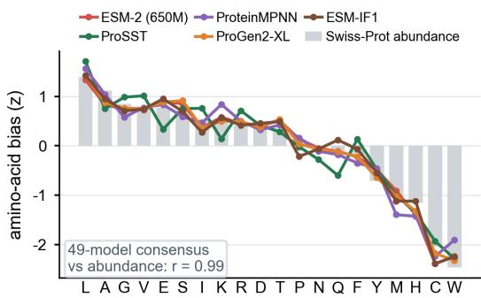  
Figure 1: Shared protein-wide amino-acid background preferences across representative models. The 49-model consensus closely follows UniProtKB/Swiss-Prot amino-acid abundance (Pearson r = 0.99).

family sites (Hopf et al., 2017): an amino acid common across proteins may be disfavored locally. Fewer than 40% of MSA site profiles jointly align with the model and corpus backgrounds in each benchmark (Appendix D.1). TRANCEPTION and VENUSREM improve frozen predictions using retrieved homologous sequences (Notin et al., 2022a; Tan et al., 2025b), but fixed weights from parameter search ignore family–corpus preference mismatch.

Homologous sequences describe evolutionary tolerance, while a substitution’s physical consequences also depend on its structural environment (Zhou et al., 2024b). Structural inputs make this context explicit: mutations in buried cores are often more destabilizing than surface substitutions, whereas exposed surfaces participate in molecular recognition (Zhang et al., 2024; Beltran et al., 2025). The usefulness of this evidence, however, depends on its reliability (Tan et al., 2024). Prediction accuracy varies across residues, and a single conformation may not represent an assay’s molecular environment; structural descriptors and conditioned scores can inherit these limitations (Jumper et al., 2021; Terwilliger et al., 2024). RSALOR weights conservation by accessibility; S3F uses surface geometry and sequence fallback at low confidence (Zhang et al., 2024; Tsishyn et al., 2025). Their weighting and fallback rules remain uncoupled from PFM bias correction.

These observations motivate integrating learned preferences with family constraints while accounting for structural reliability. How can a general harness integrate evolutionary and structural evidence to mitigate model bias and accountfor uncertainty in proteinfitness prediction?

Inspired by large language model (LLM) harnesses that coordinate inference for reliable deployment (DeepSeek-AI, 2026), we introduce VENUSREM-HARNESS (VRH), a training-free Retrieval-Enhanced Mutation harness that provides a unified and efficient inference layer around frozen PFMs for fitness prediction. The harness comprises three complementary components. Adaptive MSA fusion derives protein-specific, scale-aware mixing weights from model uncertainty, wildtype support, and model–MSA agreement. Coherence-gated calibration corrects shared model bias while preserving family evidence. Structural attenuation shrinks scores at sites with above-average solvent exposure or prediction uncertainty within each protein, without reversing mutation contrasts.

We evaluate the harness across 71 configurations on ProteinGym (Notin et al., 2024), VenusMutHub (Zhang et al., 2025), and VenusViroHub, a newly curated large-scale benchmark for mutationeffect prediction in viral proteins. Together, these benchmarks contain 1,211 assays and approximately 3.1 million measured variants. All configurations improve Spearman correlation, with mean gains of 0.068, 0.056, and 0.094 on the three benchmarks, respectively. VENUSREM2 combines the harness with 6 variants of PROSST, a structure-aware protein language model with strong zeroshot mutation-effect prediction performance (Li et al., 2024). It achieves an official ProteinGym Average Spearman of 0.556, exceeding the strongest public baseline in our comparison (0.518) by 0.038, and ranks first in all five functional categories (Figure 3). Extended ablations and domain analyses then examine component contributions and variation in gains across regions and phenotypes, using immune-escape cases as a biological consistency check. Runtime analyses further show 20.7× faster mutation lookup and 62.3× faster MSA construction through native-field reuse.

## 2 REM-HARNESS: A GENERAL FRAMEWORK FOR FITNESS PREDICTION

Family retrieval supplies local constraints; background calibration adjusts shared native preferences while preserving family evidence. Structural exposure and prediction confidence then modulate site contributions within a common interface across frozen backbones (Figure 2).

## 2.1 A COMMON SCORE-FIELD INTERFACE

Let A be the 20 amino acids and $\boldsymbol { x } = ( x _ { 1 } , \dots , x _ { L } )$ the wild-type sequence. A backbone with frozen parameters θ supplies a score field $R \doteq \dot { \mathbb { R } } ^ { L \times 2 0 }$ . Writing its output probability for residue a at site i in context $C _ { i }$ as $q _ { \theta , i } ( a ; C _ { i } )$ gives

$$
\begin{array} { r } { R _ { i , a } ^ { \mathrm { m a s k } } = \log q _ { \theta , i } ( a ; x _ { \backslash i } ) , \quad R _ { i , a } ^ { \mathrm { w t } } = \log q _ { \theta , i } ( a ; x ) , \quad R _ { i , a } ^ { \mathrm { t f } } = \log q _ { \theta , i } ( a ; x _ { < i } ) . } \end{array}\tag{1}
$$

Here, $x _ { \backslash i }$ denotes x with position i masked, and $x _ { < i }$ denotes the prefix preceding position i. Other native fields retain interface-specific scores, including unnormalized or window-aggregated outputs. Required structure enters $C _ { i } ; C _ { i }$ and frozen θ stay fixed within each Raw–VRH pair.

Let I contain n query-mapped sites with standard wild-type residues, and $n _ { i , v }$ count tokenizer symbol v in retained rows. Equal row weights and no pseudocounts define aligned frequencies and

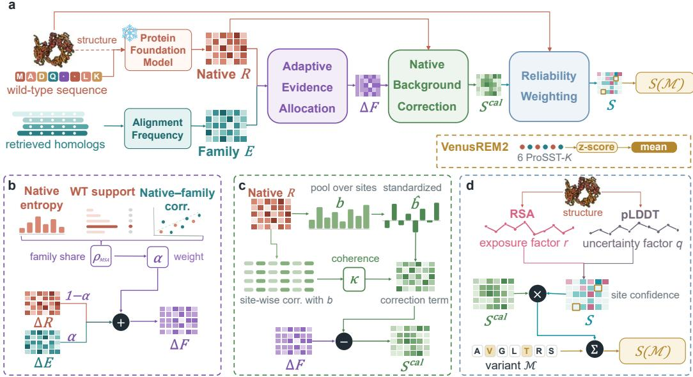  
Figure 2: Framework of VENUSREM-HARNESS. (a) Frozen PFM scores are refined using family evidence and structural context. (b) Adaptive MSA fusion adjusts the family contribution to model uncertainty and model–MSA agreement. (c) Coherence-gated calibration corrects model background bias while preserving family evidence. (d) Solvent exposure and structural confidence guide attenuation at each site before substitution contributions are aggregated into a variant score.

a log-softmax family field; either field X uses wild-type-relative contrasts:

$$
f _ { i , v } = \frac { n _ { i , v } } { \sum _ { u \in \mathcal { V } } n _ { i , u } } , \qquad E _ { i , a } = f _ { i , a } - \log \sum _ { v \in \mathcal { V } } e ^ { f _ { i , v } } , \quad i \in \mathbb { Z } ,\tag{2}
$$

$$
\begin{array} { r } { \Delta _ { i , a } ^ { X } = X _ { i , a } - X _ { i , x _ { i } } . } \end{array}\tag{3}
$$

V is the tokenizer vocabulary, including padding; E retains amino-acid columns. The site-wise log-normalizer cancels in contrasts. Equation 8 handles relative scales. Set $E _ { i } = R _ { i }$ outside I so retrieval leaves unmapped sites unchanged.

## 2.2 ADAPTIVE RETRIEVAL AS SCALE ALLOCATION

A fixed mixing weight gives different effective family contributions across backbones. To allo cate the complementary homolog evidence used by TRANCEPTION and VENUSREM (Notin et al., $2 0 2 2 \mathrm { a } ;$ Tan et al., 2025b), we distinguish a diagnostic-based target share from its scale-adjusted coefficient. On mapped sites, normalize the native field as

$$
p _ { i } ( a ) = \frac { \exp R _ { i , a } } { \sum _ { a ^ { \prime } \in \mathcal { A } } \exp R _ { i , a ^ { \prime } } } , \qquad i \in \mathcal { I } .\tag{4}
$$

With clip $( z , 0 , 1 ) = \operatorname* { m i n } \{ 1 , \operatorname* { m a x } \{ 0 , z \} \}$ , site entropy $H _ { i }$ and its normalized mean H<sup>¯</sup> summarize uncertainty:

$$
H _ { i } = - \sum _ { a \in \cal { A } } p _ { i } ( a ) \log p _ { i } ( a ) , \qquad \bar { H } = \mathrm { c l i p } \left( \frac { 1 } { n \log 2 0 } \sum _ { i \in \cal { I } } H _ { i } , 0 , 1 \right) .\tag{5}
$$

WT support π and model–family Pearson alignment $r _ { R , E }$ give two normalized retrieval cues:

$$
\pi = \frac { 1 } { n } \sum _ { i \in \cal { I } } \log p _ { i } ( x _ { i } ) , \qquad \rho _ { \pi } = \mathrm { c l i p } ( - \pi / \log 2 0 , 0 , 1 ) ,\tag{6a}
$$

$$
r _ { R , E } = \frac { 1 } { n } \sum _ { i \in \cal { I } } \mathrm { c o r r } _ { a \in \cal { A } } ( R _ { i } , E _ { i } ) , \qquad \rho _ { \mathrm { r o t } } = \frac { 1 - r _ { R , E } } { 2 } .\tag{6b}
$$

Correlations use the 20 amino-acid entries, with zero assigned to constant profiles. We set the target family share to

$$
\rho _ { \mathrm { M S A } } = ( 1 - \bar { H } ) \rho _ { \pi } + \bar { H } \rho _ { \mathrm { r o t } } .\tag{7}
$$

Low-entropy fields emphasize wild-type support; high-entropy fields emphasize model–family disagreement. This bounded interpolation is a design choice tested in Section 3.3; its conversion to a mixing coefficient follows from the scale constraint below (Appendix F.2).

Let $s _ { R } , s _ { E } > 0$ be sample standard deviations over all 19n non-WT contrasts on I. Requiring the family channel to supply a fraction $\rho _ { \mathrm { M S A } }$ of the summed weighted scales gives

$$
\rho _ { \mathrm { M S A } } = { \frac { \alpha s _ { E } } { ( 1 - \alpha ) s _ { R } + \alpha s _ { E } } } \quad \Longrightarrow \quad \alpha = { \frac { \rho _ { \mathrm { M S A } } s _ { R } } { \rho _ { \mathrm { M S A } } s _ { R } + ( 1 - \rho _ { \mathrm { M S A } } ) s _ { E } } } .\tag{8}
$$

The resulting field and contrast are

$$
F _ { i , a } = ( 1 - \alpha ) R _ { i , a } + \alpha E _ { i , a } , \qquad \Delta _ { i , a } ^ { F } = ( 1 - \alpha ) \Delta _ { i , a } ^ { R } + \alpha \Delta _ { i , a } ^ { E } .\tag{9}
$$

## 2.3 COHERENCE-GATED CALIBRATION OF THE NATIVE CHANNEL

Calibration adjusts the shared native background according to its coherence with site-level preferences, preserving family evidence. The preference perspective of Gordon et al. (2025) motivates this direction; gated and ungated variants test the rule (Section 3.4).

We summarize the background by the log-mean-exp profile of R. Let $\bar { b }$ and $s _ { b }$ be its mean and sample standard deviation across the 20 amino acids:

$$
b _ { a } = \log \left( \frac { 1 } { L } \sum _ { i = 1 } ^ { L } e ^ { R _ { i , a } } \right) , \qquad \widehat { b } _ { a } = \frac { b _ { a } - \bar { b } } { s _ { b } } .\tag{10}
$$

Set $\widehat { b } = 0$ for constant backgrounds (Appendix F.3). With $\mathrm { R e L U } ( z ) = \operatorname* { m a x } \{ 0 , z \}$ , mean site-wise coherence gives the gate:

$$
c = \frac { 1 } { L } \sum _ { i = 1 } ^ { L } \mathrm { c o r r } _ { a \in A } ( R _ { i } , b ) , \qquad \kappa ( R ) = \mathrm { R e L U } ( c ) .\tag{11}
$$

When their mean alignment is non-positive, $\kappa ( R ) = 0$ and no global correction is imposed. Otherwise, calibration removes the protein-wide direction only from the native channel:

$$
\begin{array} { r l } & { S _ { i , a } ^ { \mathrm { c a l } } = ( 1 - \alpha ) \big [ \Delta _ { i , a } ^ { R } - \kappa ( R ) ( \widehat { b } _ { a } - \widehat { b } _ { x _ { i } } ) \big ] + \alpha \Delta _ { i , a } ^ { E } } \\ & { \phantom { x x x x x x x x } = \Delta _ { i , a } ^ { F } - ( 1 - \alpha ) \kappa ( R ) ( \widehat { b } _ { a } - \widehat { b } _ { x _ { i } } ) . } \end{array}\tag{12}
$$

The factor $1 - \alpha$ preserves the family contribution while calibrating the native background.

## 2.4 STRUCTURE-ADJUSTED OUTPUT AND VARIANT SCORING

Beyond accessibility-aware conservation and confidence-dependent fallback (Zhang et al., 2024; Tsishyn et al., 2025), we jointly constrain calibrated scores by exposure and uncertainty relative to protein-specific means (Section $3 . 4 ;$ Table 1).

Let ${ \mathrm { R S A ~ } } r _ { i }$ and normalized pLDDT $\ell _ { i }$ lie in [0, 1], with uncertainty $q _ { i } = 1 - \ell _ { i }$ . Define $\bar { r }$ over positive RSA entries and $\bar { q } = \bar { 1 } - \bar { \ell }$ from mean positive pLDDT. The site weight is

$$
\lambda _ { i } = \left( 1 - \operatorname { R e L U } ( r _ { i } - { \bar { r } } ) \right) \left( 1 - \operatorname { R e L U } ( q _ { i } - { \bar { q } } ) \right) .\tag{13}
$$

Only above-mean exposure or uncertainty attenuates a site, and neither factor can reverse a contrast. The complete readout is

$$
S _ { i , a } = \lambda _ { i } S _ { i , a } ^ { \mathrm { c a l } } = \lambda _ { i } \Big [ \Delta _ { i , a } ^ { F } - ( 1 - \alpha ) \kappa ( R ) \big ( \widehat { b } _ { a } - \widehat { b } _ { x _ { i } } \big ) \Big ] .\tag{14}
$$

Missing covariates contribute one (Appendix F.4). For a variant with substitutions $\mathcal { M } = \{ ( i , a )$ $x _ { i } \to a \}$ , we sum fixed-field main effects:

$$
S ( \mathcal { M } ) = \sum _ { ( i , a ) \in \mathcal { M } } S _ { i , a } .\tag{15}
$$

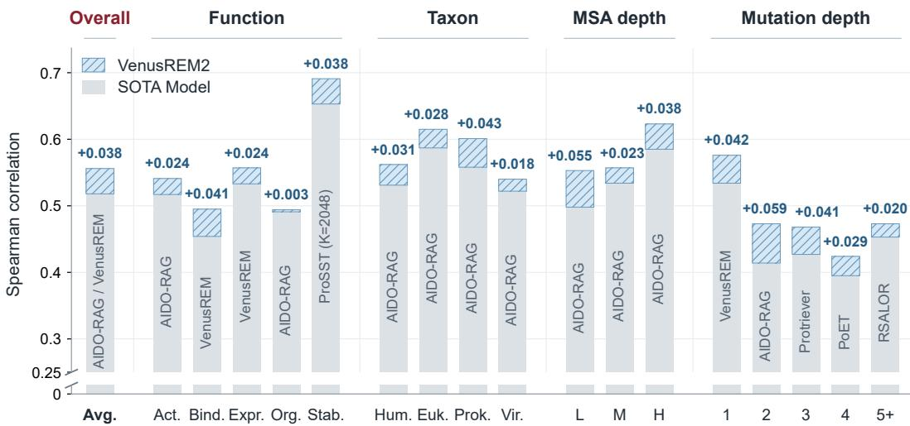  
Figure 3: ProteinGym Spearman overall and across 17 strata (Appendix Tables 14–18). Gray: strongest comparator (SOTA Model); blue hatching and labels: VENUSREM2 gains. Vertical labels identify comparators. Avg.: overall; Act./Bind./Expr./Org./Stab.: activity/binding/expression/organismal fitness/stability; Hum./Euk./Prok./Vir.: human/other eukaryotes/prokaryotes/viruses; L/M/H: low/medium/high MSA depth. Mutation depth counts substitutions per variant (5+: at least five). AIDO-RAG and PoET denote AIDO Protein-RAG (16B) and PoET (200M); AIDO-RAG and VenusREM tie overall at reported precision.

VENUSREM2 uses six PROSST vocabularies, $k \in \mathcal { K } = \{ 2 0 , 1 2 8 , 5 1 2 , 1 0 2 4 , 2 0 4 8 , 4 0 9 6 \}$ . Member k gives the harness score $S _ { k } ( v )$ using $\alpha _ { k }$ . For assay $A \ ' \mathrm s$ candidates $\nu _ { A }$ , the ensemble is:

$$
S _ { \mathrm { V e n u s R E M 2 } } ( v ; A ) = \frac { 1 } { 6 } \sum _ { k \in \mathcal { K } } \frac { S _ { k } ( v ) - \mu _ { k , A } } { \sigma _ { k , A } } .\tag{16}
$$

Here $\mu _ { k , A } , \sigma _ { k , A }$ are means and population standard deviations of predictions on $\nu _ { A } ;$ constant members contribute zero (Appendix F.5).

## 3 RESULTS

## 3.1 EXPERIMENTAL SETUP

Benchmarks and paired evaluation. We evaluate ProteinGym (217 substitution assays), Venus-MutHub (905 assays; 527 wild-type clusters), and VenusViroHub (89 assays; 616,690 substitutions), whose experimental measurements do not overlap the other benchmarks. Spearman is primary; NDCG, AUC, MCC, and top-variant recall assess complementary outcomes. Aggregation uses ProteinGym’s official Average Spearman, VenusMutHub assay-macro means, and the VenusViroHub phenotype–protein hierarchy. Appendices B.1 and B.3 detail metrics, valid assay sets, uncertainty, and curation. The 71 configurations span masked and autoregressive language models, structureaware encoders, and inverse-folding models. Raw–VENUSREM-HARNESS pairs fix checkpoints, structural inputs, and native scoring interfaces to isolate the readout (Appendix C).

## 3.2 CONSISTENT GAINS ACROSS ARCHITECTURES AND BENCHMARKS

Gains across architectures and evaluation metrics. VENUSREM-HARNESS improves Spearman for all 71 configurations on all three benchmarks, with benefits extending to discrimination and top-variant recovery. Mean Spearman increases by 0.067 on ProteinGym, 0.056 on VenusMutHub, and 0.094 on VenusViroHub, under their respective aggregation protocols. Across all five metrics, every one of the 355 model–metric pairs improves on ProteinGym and VenusViroHub; 353/355 improve or tie at reported precision on VenusMutHub (Figure 4; Appendix I.3). Gains are largest for autoregressive models on ProteinGym and VenusMutHub and masked models on VenusViroHub, while structure-aware and inverse-folding models also benefit (Appendix E).

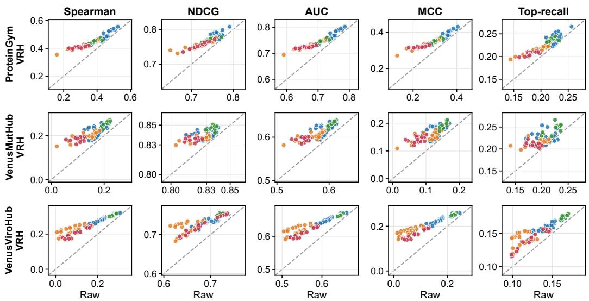  
Structure-aware Masked sequence LM Inverse folding Autoregressive LMStructure-aware Masked sequence LM Inverse folding Autoregressive LM  
Figure 4: Raw–VRH results across five metrics on ProteinGym, VenusMutHub, and VenusViroHub (top to bottom). Points represent 71 configurations; those above the diagonal indicate gains.

State-of-the-art performance on ProteinGym. Built with VENUSREM-HARNESS, the sixmember VENUSREM2 ensemble achieves a new state of the art in the official ProteinGym comparison, reaching Average Spearman 0.556, a 0.038 gain over the strongest listed baseline (0.518). It ranks first across all 17 function, taxon, MSA-depth, and mutation-depth strata (Figure 3; Appendix Tables 14–18). The 0.031 gain over the same uncalibrated ensemble isolates improvement beyond model averaging. Functional coverage also extends beyond this ensemble: all 71 configurations improve in all five ProteinGym functional categories (355/355 comparisons). The improvement across MSA-depth bins (Appendix C.1), with larger gains at low depth, supports applying the harness to sparsely sampled protein families as well as homolog-rich targets.

## 3.3 GLOBAL–LOCAL COMPLEMENTARITY AND RETRIEVAL GAINS

Retrieval gains increase with preference separation. Across 148 ProteinGym proteins scored with ESM-2 wild-type readouts, the fraction of globally–locally separated sites correlates with retrieval gain $( \rho = 0 . 3 3 8 ;$ bootstrap interval 0.179–0.481; Figure 5; Appendix D). Proteins in the highest separation quartile gain 0.058 more than those in the lowest (interval 0.033–0.086). Adjusting for sequence length, MSA depth, occupancy, and Raw performance leaves partial $\rho ~ = ~ 0 . 2 6 1$ These results support preference separation as a diagnostic of where family-specific evolutionary evidence can complement pretrained model scores across the evaluated proteins.

## Integration outperforms either evidence source alone. On the 21-assay PROSST-2048 validation split, family

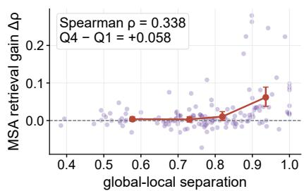  
Figure 5: Separation and retrieval gain (148 ProteinGym proteins). Red: quartile means and 95% bootstrap intervals; faint: proteins.

evidence alone reaches Spearman 0.4093, the native model 0.5573, and adaptive integration 0.5774. A coefficient sweep shows a broad performance plateau over $\alpha \in [ 0 . 6 , 0 . 9 ]$ ], which the adaptive readout matches or exceeds (Appendix F.2). The plateau persists when fold means are averaged over all ten folds of the partition, supporting flexible evidence allocation without requiring precise optimization of a single fixed mixing coefficient.

Table 1: PROSST-2048 ablation. PG (ProteinGym) validation/VMH (VenusMutHub): assay-macro; PG full: official Average Spearman; VVH (VenusViroHub): mutant-only phenotype–protein hierarchical Spearman. $\Delta _ { \mathrm { R a w } }$ reports absolute score changes (three decimals). w/o Ent. Weight. fixes $\alpha = 0 . 8 ; \mathrm { w } / \mathrm { o }$ Coh. Gating fixes $\kappa = 1$ , while w/ Coh. Gating uses $\kappa ( R )$
<table><tr><td rowspan="2">Component</td><td rowspan="2">Setting</td><td colspan="2">PG Validation (21)</td><td colspan="2">PG Full (217)</td><td colspan="2">VMH Full (905)</td><td colspan="2">VVH (89)</td></tr><tr><td>Score</td><td> $\Delta _ { \mathrm { R a w } }$ </td><td>Score</td><td> $\Delta _ { \mathrm { R a w } }$ </td><td>Score</td><td> $\Delta _ { \mathrm { R a w } }$ </td><td>Score</td><td> $\Delta _ { \mathrm { R a w } }$ </td></tr><tr><td>Raw</td><td>Native field</td><td>0.5573</td><td></td><td>0.5069</td><td></td><td>0.2126</td><td></td><td>0.2709</td><td></td></tr><tr><td>MSA fusion</td><td>w/o Ent. Weight. w/ Ent. Weight.</td><td>0.5742 0.5774</td><td>+0.017 +0.020</td><td>0.5205 0.5246</td><td>+0.014 +0.018</td><td>0.2341 0.2336</td><td>+0.022 +0.021</td><td></td><td>0.2897 +0.019 0.2901 +0.019</td></tr><tr><td>Model calibration</td><td>w/o Coh. Gating w/ Coh. Gating</td><td>0.5641 0.5788</td><td>+0.007 +0.022</td><td>0.5219 0.5284</td><td>+0.015 +0.022</td><td>0.2326 0.2369</td><td>+0.020 +0.024</td><td>0.2942</td><td>0.2841 +0.013 +0.023</td></tr><tr><td>Structural attenuation</td><td>w/ RSA, w/o pLDDT w/o RSA, w/ pLDDT</td><td>0.5826 0.5833</td><td>+0.025 +0.026</td><td>0.5329 0.5329</td><td>+0.026 +0.026</td><td>0.2499 0.2352</td><td>+0.037 +0.023</td><td>0.3085 0.2994</td><td>+0.038 +0.028</td></tr><tr><td>VENUSREM-HARNESS Full pipeline</td><td></td><td>0.5849</td><td>+0.028</td><td>0.5343</td><td>+0.027</td><td>0.2491</td><td>+0.037</td><td></td><td>0.3102 +0.039</td></tr></table>

## 3.4 CONTRIBUTIONS OF RETRIEVAL, CALIBRATION, AND SHRINKAGE

Later stages add gains beyond retrieval. Retrieval supplies 0.0201 of the 0.0276 PROSST-2048 validation gain; calibration and structural attenuation contribute the remaining 0.0075 (Table 1). All successive stages also improve on the 196 held-out ProteinGym assays, raising official Average Spearman from 0.5072 to 0.5337 and extending the component pattern beyond the operator-selection split. Across all 71 configurations, retrieval accounts for approximately 50%, 55%, and 36% of gains on ProteinGym, VenusMutHub, and VenusViroHub, respectively, showing that the relative contributions depend on the benchmark (Appendix F).

Gating improves calibration consistency. On ProteinGym, ungated correction improves on retrieval in 43/71 configurations, versus 71/71 with gating; mean gains are 0.003 and 0.012 (Table 26). Gating also exceeds ungated correction in 37/71 VenusMutHub and 68/71 VenusViroHub configurations. Excluding the scored site preserves the gate $( \rho = 0 . 9 8 5$ ; median absolute change 0.010), supporting stability against direct self-inclusion. Together, these checks support improved calibration and stable protein-level control (Figure 14; Appendix F).

Exposure and confidence provide complementary context. Combining the two covariates gives the strongest PROSST-2048 result on ProteinGym and VenusViroHub (Table 1). On calibrated ProteinGym fields, RSA-only and pLDDT-only shrinkage both reach 0.5329, increasing to 0.5343 when combined. On VenusViroHub, the combination reaches 0.3102, above RSA alone (0.3085) and pLDDT alone (0.2994). Exposure accounts for most of the structural gain on VenusMutHub, where RSA alone reaches 0.2499 and the combination 0.2491. Both covariates contribute, with benchmark-specific strengths.

## 3.5 PERFORMANCE HETEROGENEITY ACROSS VIRAL PHENOTYPES

Strong gains in protein expression and activity. Across 71 configurations, mean gains on VenusViroHub are largest for expression (+0.194) and activity (+0.150), and smaller for immune escape (+0.009) and stability (+0.007; Figure 6a). The gain pattern is consistent with the harness refining constraints relevant to protein production and function. The 21 escape assays across 12 viral protein backgrounds provide a complementary biological test: their best mean result is 0.046, motivating analysis of the antibody-specific selection they measure.

Escape assays reveal distinct selective pressures. Among 21 escape assays, 11 show positive signal (up to +0.21), 6 remain near zero, and 4 correlate negatively (down to −0.30). Negative cases map to exposed antigenic/receptor-binding regions of SARS-CoV-2 RBD and antibody-contact regions of ZIKV E. Frozen backbones score many escape substitutions as deleterious (Figure 6b); per-site escape and model tolerance anti-correlate, reaching −0.19 for structure-aware models.

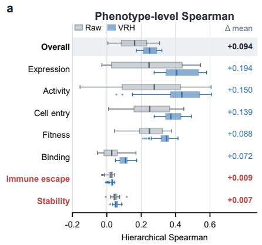

b  
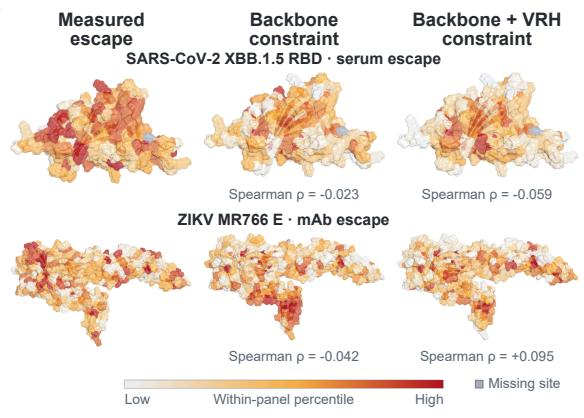

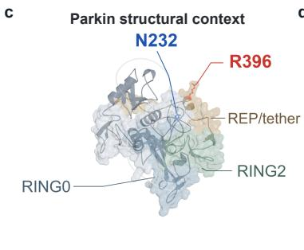

d  
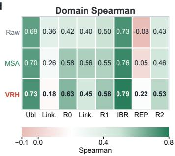

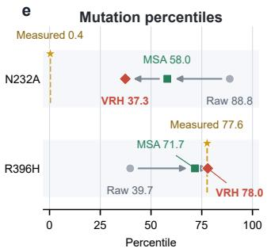  
Figure 6: (a) Raw/VRH distributions by phenotype across 71 configurations (medians, IQRs, 1.5× IQR whiskers, and outliers). Numbers indicate mean gains; red marks unresolved cases. (b) Measured escape and predicted constraint for SARS-CoV-2 XBB.1.5 RBD and ZIKV MR766 E; colors show within-panel percentiles and gray marks missing sites. (c) Parkin N232 and R396 in structural context. (d) Domain-wise Spearman. (e) N232A and R396H approach measured ranks.

This localization is consistent with distinct selective pressures: substitutions disfavored by nativeprotein constraints can evade antibody recognition. The cases link phenotype differences to selection context, motivating antibody- or serum-specific evidence.

## 3.6 RANKING GAINS ACROSS PARKIN DOMAINS

Domain-resolved gains support structural interpretation. In the Parkin VAMP-seq abundance landscape (Clausen et al., 2024), Raw, retrieval, and VRH reach Spearman 0.503, 0.585, and 0.645 across 8,756 substitutions at 462 sites. The full readout improves folded domains, including RING0 (0.425 to 0.627) and RING2 (0.427 to 0.529; Figure 6d). A cross-protein audit using pLDDT 50 to partition regions finds improvements in 83% of 214 qualifying ordered-region assays (mean $\Delta = + 0 . 0 5 6 )$ . This cross-protein agreement supports the domain analysis; Appendix G reports complementary linker and low-confidence-region comparisons.

Corrections address both overestimation and underestimation. N232A, at the start of RING1, is measured at the 0.4th percentile but ranked at 88.8 by Raw; retrieval and VRH lower it to 58.0 and 37.3. R396H in REP/tether instead rises from 39.7 to 71.7 and 78.0, approaching its measured 77.6th percentile (Figure 6c,e). These opposite shifts show that the harness can both deprioritize lowabundance substitutions and recover variants with relatively high measured abundance. The same landscape also improves in abundance-class AUC, from 0.769 for Raw to 0.815 with retrieval and 0.857 with the full harness (Appendix G). Together, the rank corrections and class-level separation link improved correlation to more useful candidate prioritization across the abundance landscape.

## 3.7 SCORING INTERFACES, EFFICIENCY, AND INTERACTION RECOVERY

Gains extend across native scoring interfaces. Masked and wild-type fields both benefit from VRH across eight paired checkpoints on all three benchmarks. Full-sequence and native-field scoring are nearly equivalent for ESM-IF1 (0.422 versus 0.421 on ProteinGym), while native teacher forcing raises PROTEINMPNN mean assay Spearman from 0.271–0.290 to 0.376–0.401 across eight checkpoints. At v 48 020, 204 of 217 assays improve, showing that the ProteinMPNN gain extends across proteins rather than being driven by a few large effects (Appendices H.2–H.3).

Field reuse amortizes variant-scoring cost. For PRO-TEINMPNN, reusing one native field per protein reduces wall-clock cost by 219–601× relative to rebuilding mutant sequences. Separately, after a shared PROSST forward pass, indexed mutation lookup is 20.7× faster and vectorized MSA count-matrix construction 62.3× faster than their loop-based implementations (Figure 7; Appendix H.1). Readout construction costs O(20L) per protein; each M-substitution variant then requires only O(M) lookup and summation, without repeating backbone inference.

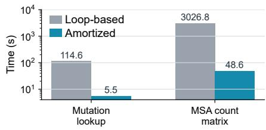  
Figure 7: Post-inference runtime on ProteinGym (2.47 million variants): loop-based versus amortized lookup and MSA construction.

Main effects support efficient multi-mutant ranking. On Olson GB1, teacher forcing raises single- and doublemutant Spearman from 0.105 to 0.306 and 0.165 to 0.284. Because a fixed native field is additive, we also rescore substitutions on their partner’s mutant background to test interaction recovery. Across 535,917 complete quartets, conditional epistasis correlation is 0.012, versus 0.005 for official scoring; both bootstrap intervals include zero (Appendix H.4). Excluding single or double mutants at the assay floor leaves 400,118 cases: double-mutant Spearman is 0.292 versus 0.152, but conditional epistasis correlation remains only 0.022 (Table 31). The ranking advantage is thus primarily supported by reusable main-effect information.

## 4 RELATED WORK

Protein models and adaptation. EVMUTATION, GEMME, and EVE infer family constraints (Hopf et al., 2017; Laine et al., 2019; Frazer et al., 2021), complementing pretrained sequence, inverse-folding, and structure-aware models (Rives et al., 2021; Hsu et al., 2022; Li et al., 2024). TRANCEPTION, POET, and VENUSREM incorporate homolog evidence (Notin et al., 2022a; Truong Jr & Bepler, 2023; Tan et al., 2025b); S3F and RSALOR exploit structural context (Zhang et al., 2024; Tsishyn et al., 2025), while homolog fine-tuning addresses likelihood-dependent performance (Gordon et al., 2025).

Evaluation resources. MaveDB archives variant-effect assays (Esposito et al., 2019), and FLIP and ProteinGym benchmark generalization and mutation-effect prediction (Dallago et al., 2021; Notin et al., 2024). PEER and VENUSFACTORY cover broader protein tasks (Xu et al., 2022; Tan et al., 2025a); ViroBench and ViroGym extend evaluation to viral nucleotide and protein applications (Ye et al., 2026; Zhou et al., 2026). Appendix A provides the extended review.

## 5 DISCUSSION AND CONCLUSION

While LLM harnesses advance into practice, understanding and harnessing biological foundation models remain less explored. VENUSREM-HARNESS addresses this gap with training-free evidence integration that improves frozen PFM predictions and enables efficient variant evaluation.

Future work could learn family constraints through trainable MSA representations and fusion, and incorporate protein–protein interaction (PPI) and protein–small-molecule inputs. These extensions would align the supplied context with recognition-dependent phenotypes and test whether mutationdependent representations improve interaction modeling.

## ACKNOWLEDGEMENT

This work was supported by the National Key Research and Development Program of China (2024YFA0917603); Shanghai Municipal Science and Technology Major Project; the AI for Science Program, Shanghai Municipal Commission of Economy and Informatization (2025-GZL-RGZN-BTBX-02009); the Computational Biology Key Program of Shanghai Science and Technology Commission (23JS1400600); Shanghai Jiao Tong University Scientific and Technological Innovation Funds (21X010200843); Science and Technology Innovation Key R&D Program of Chongqing (CSTB2022TIAD-STX0017, CSTB2024TIAD-STX0032); the Student Innovation Center at Shanghai Jiao Tong University, and Shanghai Artificial Intelligence Laboratory.

## AI USE STATEMENT

In this work, generative AI tools (OpenAI Codex) were used to refine the conceptual framing and hypotheses; to provide feedback on methodology and experimental design; to implement methods; to reformat data; to interpret and present experimental analyses; and to assist with translation. They were not used to generate synthetic datasets; they also assisted in checking algebraic derivations and their assumptions. Additionally, they were used to create and edit scientific figures, to edit code, to search and summarize literature, and to structure, draft, and language-edit the manuscript. The authors reviewed all AI-assisted work, verified reported results against the underlying evaluation artifacts and citations against their primary sources, and take full responsibility for the final text, claims, code, and figures.

## ETHICS STATEMENT

This study uses public protein sequence, structure, alignment, and deep-mutational-scanning benchmark data and involves no human participants or personal data. Mutation-effect scores are computational hypotheses that require experimental validation; reuse should follow the licenses and terms of the original datasets and pretrained models.

## REPRODUCIBILITY STATEMENT

Section 2 defines the readout and scoring equations. Section 3.1 and Appendix B specify the benchmarks, data provenance, evaluation, validation, and uncertainty estimation. Appendices C–I detail baseline implementations, global–local diagnostics and their cross-benchmark replication, complete results, component ablations, scoring interfaces, runtime measurements, and per-configuration analyses. The source code and data are available at the links below. The repository documents environment setup, optional backbone dependencies, evaluation scripts, and experiment configurations; Appendix H separates scoring-interface, runtime, and epistasis checks. Appendix J describes instal lation, command-line and dashboard workflows, and interactive score inspection.

GitHub: https://github.com/ai4protein/VenusREM-Harness

Hugging Face: https://huggingface.co/datasets/AI4Protein/VenusREM-Harness/

## REFERENCES

Arjun K. Aditham, Caelan E. Radford, Caleb R. Carr, Naveen Jasti, Neil P. King, and Jesse D. Bloom. Deep mutational scanning of rabies glycoprotein defines mutational constraint and antibody-escape mutations. Cell Host & Microbe, 33(6):988–1003.e10, June 2025. ISSN 1931- 3128. doi:10.1016/j.chom.2025.04.018. URL http://dx.doi.org/10.1016/j.chom. 2025.04.018.

Jenny J Ahn, Timothy C Yu, Bernadeta Dadonaite, Caelan E Radford, and Jesse D Bloom. Influenza hemagglutinin subtypes have different sequence constraints despite sharing extremely similar structures. Virus Evolution, 12(1), 2026. ISSN 2057-1577. doi:10.1093/ve/veag018. URL http://dx.doi.org/10.1093/ve/veag018.

Beatriz Alvarez-Rodr <sup>´</sup> ´ıguez, Sebastian Velandia-Alvarez, Christina Toft, and Ron Geller. Map-<sup>´</sup> ping mutational fitness effects across the coxsackievirus b3 proteome reveals distinct profiles of mutation tolerability. PLOS Biology, 22(7):e3002709, July 2024. ISSN 1545-7885.

doi:10.1371/journal.pbio.3002709. URL http://dx.doi.org/10.1371/journal.pbi o.3002709.

William Bakhache, Walker Symonds-Orr, Lauren McCormick, and Patrick T. Dolan. Deep mutation, insertion and deletion scanning across the enterovirus a proteome reveals constraints shaping viral evolution. Nature Microbiology, 10(1):158–168, November 2024. ISSN 2058-5276. doi:10.1038/s41564-024-01871-y. URL http://dx.doi.org/10.1038/s41564-024 -01871-y.

Antoni Beltran, Xiang’er Jiang, Yue Shen, and Ben Lehner. Site-saturation mutagenesis of 500 human protein domains. Nature, 637(8047):885–894, 2025. doi:10.1038/s41586-024-08370-4. URL https://doi.org/10.1038/s41586-024-08370-4.

Aadyot Bhatnagar, Sarthak Jain, Joel Beazer, Samuel C. Curran, Alexander M. Hoffnagle, Kyle Shan Ching, Michael Martyn, Stephen Nayfach, Jeffrey A. Ruffolo, and Ali Madani. Scaling unlocks broader generation and deeper functional understanding of proteins. In The Thirty-ninth Annual Conference on Neural Information Processing Systems, 2025. URL https://openreview .net/forum?id=yvGL2HP7pU.

Yunlong Cao, Fanchong Jian, Jing Wang, Yuanling Yu, Weiliang Song, Ayijiang Yisimayi, Jing Wang, Ran An, Xiaosu Chen, Na Zhang, Yao Wang, Peng Wang, Lijuan Zhao, Haiyan Sun, Lingling Yu, Sijie Yang, Xiao Niu, Tianhe Xiao, Qingqing Gu, Fei Shao, Xiaohua Hao, Yanli Xu, Ronghua Jin, Zhongyang Shen, Youchun Wang, and Xiaoliang Sunney Xie. Imprinted sarscov-2 humoral immunity induces convergent omicron rbd evolution. Nature, 614(7948):521–529, December 2022. ISSN 1476-4687. doi:10.1038/s41586-022-05644-7. URL http://dx.doi .org/10.1038/s41586-022-05644-7.

Caleb Carr and Jesse D. Bloom. Deep mutational scanning of lassa virus gp for escape from columbia/vrc human sera. https://github.com/dms-vep/LASV\_Josiah\_GP DMS\_Columbia\_VRC\_sera, 2026. Unpublished dataset; source data repository, commit dabb03a4eca8a33badfc84b71ff52ba057d23616 (accessed 5 September 2026).

Caleb R. Carr, Katharine H.D. Crawford, Michael Murphy, Jared G. Galloway, Hugh K. Haddox, Frederick A. Matsen, Kristian G. Andersen, Neil P. King, and Jesse D. Bloom. Deep mutational scanning reveals functional constraints and antibody-escape potential of lassa virus glycoprotein complex. Immunity, 57(9):2061–2076.e11, September 2024. ISSN 1074-7613. doi:10.1016/j.immuni.2024.06.013. URL http://dx.doi.org/10.1016/j.immun i.2024.06.013.

L. Clausen, V. Voutsinos, M. Cagiada, K. E. Johansson, M. Grønbæk-Thygesen, S. Nariya, R. L. Powell, M. K. N. Have, V. H. Oestergaard, A. Stein, D. M. Fowler, K. Lindorff-Larsen, and R. Hartmann-Petersen. A mutational atlas for parkin proteostasis. Nature Communications, 15: 1541, 2024. doi:10.1038/s41467-024-45829-4.

Bernadeta Dadonaite and Jesse D. Bloom. Deep mutational scanning of sars-cov-2 omicron ba.2 spike for escape from crowe lab monoclonal antibodies. https://github.com/dms -vep/SARS-CoV-2\_Omicron\_BA.2\_spike\_DMS\_Crowe\_mAbs, 2026. Unpublished dataset; source data repository, commit 2259fd5dfbc067d2122d8e517f980147367bedd5 (accessed 5 September 2026).

Bernadeta Dadonaite, Katharine H.D. Crawford, Caelan E. Radford, Ariana G. Farrell, Timothy C. Yu, William W. Hannon, Panpan Zhou, Raiees Andrabi, Dennis R. Burton, Lihong Liu, David D. Ho, Helen Y. Chu, Richard A. Neher, and Jesse D. Bloom. A pseudovirus system enables deep mutational scanning of the full sars-cov-2 spike. Cell, 186(6):1263–1278.e20, March 2023. ISSN 0092-8674. doi:10.1016/j.cell.2023.02.001. URL http://dx.doi.org/10.1016/j.cel l.2023.02.001.

Bernadeta Dadonaite, Jenny J. Ahn, Jordan T. Ort, Jin Yu, Colleen Furey, Annie Dosey, William W. Hannon, Amy L. Vincent Baker, Richard J. Webby, Neil P. King, Yan Liu, Scott E. Hensley, Thomas P. Peacock, Louise H. Moncla, and Jesse D. Bloom. Deep mutational scanning of h5 hemagglutinin to inform influenza virus surveillance. PLOS Biology, 22(11):e3002916, November 2024a. ISSN 1545-7885. doi:10.1371/journal.pbio.3002916. URL http://dx.doi.org /10.1371/journal.pbio.3002916.

Bernadeta Dadonaite, Jack Brown, Teagan E. McMahon, Ariana G. Farrell, Marlin D. Figgins, Daniel Asarnow, Cameron Stewart, Jimin Lee, Jenni Logue, Trevor Bedford, Ben Murrell, Helen Y. Chu, David Veesler, and Jesse D. Bloom. Spike deep mutational scanning helps predict success of sars-cov-2 clades. Nature, 631(8021):617–626, July 2024b. ISSN 1476-4687. doi:10.1038/s41586-024-07636-1. URL http://dx.doi.org/10.1038/s41586-024 -07636-1.

Bernadeta Dadonaite, Sheri Harari, Brendan B. Larsen, Lucas Kampman, Alex Harteloo, Anna Elias-Warren, Helen Y. Chu, and Jesse D. Bloom. Spike mutations that affect the function and antigenicity of recent kp.3.1.1-like sars-cov-2 variants. Journal of Virology, 99(11), November 2025. ISSN 1098-5514. doi:10.1128/jvi.01423-25. URL http://dx.doi.org/10.1128 /jvi.01423-25.

Christian Dallago, Jody Mou, Kadina E Johnston, Bruce Wittmann, Nick Bhattacharya, Samuel Goldman, Ali Madani, and Kevin K Yang. FLIP: Benchmark tasks in fitness landscape inference for proteins. In Thirty-fifth Conference on Neural Information Processing Systems Datasets and Benchmarks Track (Round 2), 2021.

Justas Dauparas, Ivan Anishchenko, Nathaniel Bennett, Hua Bai, Robert J Ragotte, Lukas F Milles, Basile IM Wicky, Alexis Courbet, Rob J de Haas, Neville Bethel, et al. Robust deep learning– based protein sequence design using ProteinMPNN. Science, 378(6615):49–56, 2022.

DeepSeek-AI. DeepSeek Harness: Everything is a plugin. https://github.com/deepsee k-ai/deepseek-harness, 2026.

Daniel Esposito, Jochen Weile, Jay Shendure, Lea M. Starita, Anthony T. Papenfuss, Frederick P. Roth, Douglas M. Fowler, and Alan F. Rubin. MaveDB: an open-source platform to distribute and interpret data from multiplexed assays of variant effect. Genome Biology, 20(1):223, 2019. doi:10.1186/s13059-019-1845-6. URL https://doi.org/10.1186/s13059-019-184 5-6.

Jonathan Frazer, Pascal Notin, Mafalda Dias, Aidan Gomez, Joseph K Min, Kelly Brock, Yarin Gal, and Debora S Marks. Disease variant prediction with deep generative models of evolutionary data. Nature, 599(7883):91–95, 2021.

Cade Gordon, Amy X. Lu, and Pieter Abbeel. Protein language model fitness is a matter of preference. In The Thirteenth International Conference on Learning Representations, 2025. URL https://openreview.net/forum?id=UvPdpa4LuV.

Sheri Harari, Rachel T Eguia, Bernadeta Dadonaite, Caelan E Radford, Cameron Stewart, David Veesler, and Jesse D Bloom. Mutations to the hcov-229e spike have counterbalancing effects on serum antibody neutralization and receptor binding, February 2026. URL http://dx.doi.o rg/10.64898/2026.02.22.707297.

Thomas Hayes, Roshan Rao, Halil Akin, Nicholas J Sofroniew, Deniz Oktay, Zeming Lin, Robert Verkuil, Vincent Q Tran, Jonathan Deaton, Marius Wiggert, et al. Simulating 500 million years of evolution with a language model. Science, 387(6736):850–858, 2025.

Martin Hesslow, Niccolo Zanichelli, Pascal Notin, Iacopo Poli, and Debora Marks. RITA: a study\` on scaling up generative protein sequence models. arXiv preprint arXiv:2205.05789, 2022.

Thomas A Hopf, John B Ingraham, Frank J Poelwijk, Charlotta PI Scharfe, Michael Springer, Chris¨ Sander, and Debora S Marks. Mutation effects predicted from sequence co-variation. Nature Biotechnology, 35(2):128–135, 2017.

Chloe Hsu, Robert Verkuil, Jason Liu, Zeming Lin, Brian Hie, Tom Sercu, Adam Lerer, and Alexander Rives. Learning inverse folding from millions of predicted structures. In International Conference on Machine Learning, pp. 8946–8970. PMLR, 2022.

Xiaohui Ju, William W. Hannon, Tomasz Kaszuba, Caelan E. Radford, Brendan B. Larsen, Samantha S. Nelson, Christopher A. Nelson, Israel Baltazar-Perez, Ofer Zimmerman, Daved H. Fremont, Michael S. Diamond, and Jesse D. Bloom. Determinants of human versus mosquito cell entry by the chikungunya virus envelope proteins, August 2025. URL http://dx.doi.org /10.1101/2025.08.25.672233.

John Jumper, Richard Evans, Alexander Pritzel, Tim Green, Michael Figurnov, Olaf Ronneberger, Kathryn Tunyasuvunakool, Russ Bates, Augustin Z<sup>ˇ</sup> ´ıdek, Anna Potapenko, et al. Highly accurate protein structure prediction with AlphaFold. Nature, 596(7873):583–589, 2021.

Caroline Kikawa, Catiana H. Cartwright-Acar, Jackson B. Stuart, Maya Contreras, Lisa M. Levoir, Matthew J. Evans, Jesse D. Bloom, and Leslie Goo. The effect of single mutations in zika virus envelope on escape from broadly neutralizing antibodies. Journal of Virology, 97(11), November 2023. ISSN 1098-5514. doi:10.1128/jvi.01414-23. URL http://dx.doi.org/10.1128 /jvi.01414-23.

Atul Kumar, Jacob D. Aguirre, Tara E. C. Condos, R. Julio Martinez-Torres, Viduth K. Chaugule, Rachel Toth, Ramasubramanian Sundaramoorthy, Pascal Mercier, Axel Knebel, Donald E. Spratt, Kathryn R. Barber, Gary S. Shaw, and Helen Walden. Disruption of the autoinhibited state primes the e3 ligase parkin for activation and catalysis. The EMBO Journal, 34(20):2506–2521, 2015. doi:10.15252/embj.201592337.

Elodie Laine, Yasaman Karami, and Alessandra Carbone. GEMME: a simple and fast global epistatic model predicting mutational effects. Molecular Biology and Evolution, 36(11):2604– 2619, 2019.

Brendan B. Larsen, Teagan McMahon, Jack T. Brown, Zhaoqian Wang, Caelan E. Radford, James E. Crowe, David Veesler, and Jesse D. Bloom. Functional and antigenic landscape of the nipah virus receptor-binding protein. Cell, 188(9):2480–2494.e22, May 2025. ISSN 0092-8674. doi:10.1016/j.cell.2025.02.030. URL http://dx.doi.org/10.1016/j.cell.2025.0 2.030.

Brendan B. Larsen, Sheri Harari, Risako Gen, Cameron Stewart, David Veesler, and Jesse D. Bloom. Functional and antigenic constraints on the nipah virus fusion protein. Proceedings ofthe National Academy of Sciences, 123(6), February 2026. ISSN 1091-6490. doi:10.1073/pnas.2529505123. URL http://dx.doi.org/10.1073/pnas.2529505123.

Ivy Larsen and Jesse D. Bloom. Deep mutational scanning of nipah virus rbp for escape from designed minibinder sol23. https://github.com/dms-vep/Nipah\_Malaysi a\_RBP\_Minibinder\_DMS, 2026. Unpublished dataset; source data repository, commit e46c09a65c9ab40f78ee78b165961e02c8252957 (accessed 5 September 2026).

Mingchen Li, Yang Tan, Xinzhu Ma, Bozitao Zhong, Huiqun Yu, Ziyi Zhou, Wanli Ouyang, Bingxin Zhou, Pan Tan, and Liang Hong. ProSST: Protein language modeling with quantized structure and disentangled attention. In The Thirty-eighth Annual Conference on Neural Information Pro cessing Systems, 2024. URL https://openreview.net/forum?id=4Z7RZixpJQ.

Zeming Lin, Halil Akin, Roshan Rao, Brian Hie, Zhongkai Zhu, Wenting Lu, Nikita Smetanin, Robert Verkuil, Ori Kabeli, Yaniv Shmueli, et al. Evolutionary-scale prediction of atomic-level protein structure with a language model. Science, 379(6637):1123–1130, 2023.

Ali Madani, Ben Krause, Eric R Greene, Subu Subramanian, Benjamin P Mohr, James M Holton, Jose Luis Olmos, Caiming Xiong, Zachary Z Sun, Richard Socher, et al. Large language models generate functional protein sequences across diverse families. Nature Biotechnology, 41(8):1099– 1106, 2023.

Celine Marquet, Julius Schlensok, Marina Abakarova, Burkhard Rost, and Elodie Laine. Expert-´ guided protein language models enable accurate and blazingly fast fitness prediction. Bioinformatics, 40(11):btae621, 2024.

Joshua Meier, Roshan Rao, Robert Verkuil, Jason Liu, Tom Sercu, and Alex Rives. Language models enable zero-shot prediction of the effects of mutations on protein function. Advances in Neural Information Processing Systems, 34:29287–29303, 2021.

Milot Mirdita, Konstantin Schutze, Yoshitaka Moriwaki, Lim Heo, Sergey Ovchinnikov, and Martin ¨ Steinegger. Colabfold: making protein folding accessible to all. Nature Methods, 19(6):679–682, 2022.

Erik Nijkamp, Jeffrey A. Ruffolo, Eli N. Weinstein, Nikhil Naik, and Ali Madani. ProGen2: Exploring the boundaries of protein language models. Cell Systems, 34(11):968–978, 2023. doi:10.1016/j.cels.2023.10.002.

Pascal Notin, Mafalda Dias, Jonathan Frazer, Javier Marchena Hurtado, Aidan N Gomez, Debora Marks, and Yarin Gal. Tranception: protein fitness prediction with autoregressive transformers and inference-time retrieval. In International Conference on Machine Learning, pp. 16990– 17017. PMLR, 2022a.

Pascal Notin, Lood Van Niekerk, Aaron W Kollasch, Daniel Ritter, Yarin Gal, and Debora Susan Marks. TranceptEVE: Combining family-specific and family-agnostic models of protein sequences for improved fitness prediction. NeurIPS 2022 Workshop on Learning Meaningful Representations ofLife, 2022b.

Pascal Notin, Aaron Kollasch, Daniel Ritter, Lood Van Niekerk, Steffanie Paul, Han Spinner, Nathan Rollins, Ada Shaw, Rose Orenbuch, Ruben Weitzman, et al. ProteinGym: large-scale benchmarks for protein fitness prediction and design. In Advances in Neural Information Processing Systems, volume 36, 2024.

C. Anders Olson, Nicholas C. Wu, and Ren Sun. A comprehensive biophysical description of pairwise epistasis throughout an entire protein domain. Current Biology, 24(22):2643–2651, 2014. doi:10.1016/j.cub.2014.09.072.

Jeffrey Ouyang-Zhang, Daniel Diaz, Adam Klivans, and Philipp Krahenb¨ uhl. Predicting a protein’s¨ stability under a million mutations. Advances in Neural Information Processing Systems, 36, 2024.

Caelan E Radford and Jesse D Bloom. Comprehensive maps of escape mutations from antibodies 10-1074 and 3bnc117 for envs from two divergent hiv strains, January 2025. URL http://dx .doi.org/10.1101/2025.01.30.635715.

Caelan E. Radford, Philipp Schommers, Lutz Gieselmann, Katharine H.D. Crawford, Bernadeta Dadonaite, Timothy C. Yu, Adam S. Dingens, Julie Overbaugh, Florian Klein, and Jesse D. Bloom. Mapping the neutralizing specificity of human anti-hiv serum by deep mutational scanning. Cell Host & Microbe, 31(7):1200–1215.e9, July 2023. ISSN 1931-3128. doi:10.1016/j.chom.2023.05.025. URL http://dx.doi.org/10.1016/j.chom.20 23.05.025.

Roshan M Rao, Jason Liu, Robert Verkuil, Joshua Meier, John Canny, Pieter Abbeel, Tom Sercu, and Alexander Rives. MSA transformer. In International Conference on Machine Learning, pp. 8844–8856. PMLR, 2021.

Adam J Riesselman, John B Ingraham, and Debora S Marks. Deep generative models of genetic variation capture the effects of mutations. Nature Methods, 15(10):816–822, 2018. doi:10.1038/s41592-018-0138-4.

Alexander Rives, Joshua Meier, Tom Sercu, Siddharth Goyal, Zeming Lin, Jason Liu, Demi Guo, Myle Ott, C Lawrence Zitnick, Jerry Ma, et al. Biological structure and function emerge from scaling unsupervised learning to 250 million protein sequences. Proceedings of the National Academy ofSciences, 118(15):e2016239118, 2021.

Cassandra AL Simonich, Teagan E McMahon, Gavin Juviler, Lucas Kampman, Helen Y Chu, and Jesse D Bloom. Mutational constraints on rsv f and its neutralization by antibodies, February 2026. URL http://dx.doi.org/10.64898/2026.02.12.705519.

Marion Sourisseau, Daniel J. P. Lawrence, Megan C. Schwarz, Carina H. Storrs, Ethan C. Veit, Jesse D. Bloom, and Matthew J. Evans. Deep mutational scanning comprehensively maps how zika envelope protein mutations affect viral growth and antibody escape. Journal of Virology, 93 (23), December 2019. ISSN 1098-5514. doi:10.1128/jvi.01291-19. URL http://dx.doi.o rg/10.1128/jvi.01291-19.

Tyler N. Starr, Allison J. Greaney, William W. Hannon, Andrea N. Loes, Kevin Hauser, Josh R. Dillen, Elena Ferri, Ariana Ghez Farrell, Bernadeta Dadonaite, Matthew McCallum, Kenneth A. Matreyek, Davide Corti, David Veesler, Gyorgy Snell, and Jesse D. Bloom. Shifting mutational constraints in the sars-cov-2 receptor-binding domain during viral evolution. Science, 377(6604): 420–424, July 2022a. ISSN 1095-9203. doi:10.1126/science.abo7896. URL http://dx.doi .org/10.1126/science.abo7896.

Tyler N. Starr, Allison J. Greaney, Cameron M. Stewart, Alexandra C. Walls, William W. Hannon, David Veesler, and Jesse D. Bloom. Deep mutational scans for ace2 binding, rbd expression, and antibody escape in the sars-cov-2 omicron ba.1 and ba.2 receptorbinding domains. PLOS Pathogens, 18(11):e1010951, November 2022b. ISSN 1553-7374. doi:10.1371/journal.ppat.1010951. URL http://dx.doi.org/10.1371/journal.p pat.1010951.

Tyler N. Starr, Samantha K. Zepeda, Alexandra C. Walls, Allison J. Greaney, Sergey Alkhovsky, David Veesler, and Jesse D. Bloom. Ace2 binding is an ancestral and evolvable trait of sarbecoviruses. Nature, 603(7903):913–918, February 2022c. ISSN 1476-4687. doi:10.1038/s41586- 022-04464-z. URL http://dx.doi.org/10.1038/s41586-022-04464-z.

Jin Su, Chenchen Han, Yuyang Zhou, Junjie Shan, Xibin Zhou, and Fajie Yuan. SaProt: protein language modeling with structure-aware vocabulary. In The Twelfth International Conference on Learning Representations, 2023.

Ning Sun, Shuxian Zou, Tianhua Tao, Sazan Mahbub, Dian Li, Yonghao Zhuang, Hongyi Wang, Xingyi Cheng, Le Song, and Eric P. Xing. Mixture of experts enable efficient and effective protein understanding and design. In NeurIPS 2024 Workshop on AIfor New Drug Modalities. bioRxiv, 2024. doi:10.1101/2024.11.29.625425. URL https://www.biorxiv.org/cont ent/10.1101/2024.11.29.625425v1.

Yang Tan, Mingchen Li, Bingxin Zhou, Bozitao Zhong, Lirong Zheng, Pan Tan, Ziyi Zhou, Huiqun Yu, Guisheng Fan, and Liang Hong. Simple, efficient, and scalable structure-aware adapter boosts protein language models. Journal of Chemical Information and Modeling, 2024.

Yang Tan, Chen Liu, Jingyuan Gao, Banghao Wu, Mingchen Li, Ruilin Wang, Lingrong Zhang, Huiqun Yu, Guisheng Fan, Liang Hong, and Bingxin Zhou. VenusFactory: An integrated system for protein engineering with data retrieval and language model fine-tuning. In Proceed ings of the 63rd Annual Meeting of the Association for Computational Linguistics (Volume 3: System Demonstrations), pp. 230–241, Vienna, Austria, July 2025a. Association for Computational Linguistics. ISBN 979-8-89176-253-4. doi:10.18653/v1/2025.acl-demo.23. URL https://aclanthology.org/2025.acl-demo.23/.

Yang Tan, Ruilin Wang, Banghao Wu, Liang Hong, and Bingxin Zhou. From high-throughput eval uation to wet-lab studies: advancing mutation effect prediction with a retrieval-enhanced model. Bioinformatics, 41, 07 2025b. ISSN 1367-4811. URL https://doi.org/10.1093/bioi nformatics/btaf189.

Yang Tan, Bingxin Zhou, Lirong Zheng, Guisheng Fan, and Liang Hong. Semantical and geometrical protein encoding toward enhanced bioactivity and thermostability. eLife, 13:RP98033, may 2025c. ISSN 2050-084X. doi:10.7554/eLife.98033. URL https://doi.org/10.7554/ eLife.98033.

Yang Tan, Yuanxi Yu, Can Wu, Bozitao Zhong, Mingchen Li, Guisheng Fan, Jiankang Zhu, Yafeng Liang, Nanqing Dong, and Liang Hong. Rank-and-Reason: Multi-agent collaboration accelerates zero-shot protein mutation prediction, 2026. URL https://arxiv.org/abs/2602.001 97.

Ashley L. Taylor and Tyler N. Starr. Deep mutational scans of xbb.1.5 and bq.1.1 reveal ongoing epistatic drift during sars-cov-2 evolution. PLOS Pathogens, 19(12):e1011901, December 2023. ISSN 1553-7374. doi:10.1371/journal.ppat.1011901. URL http://dx.doi.org/10.1371 /journal.ppat.1011901.

Ashley L Taylor and Tyler N Starr. Deep mutational scanning of sars-cov-2 omicron ba.2.86 and epistatic emergence of the kp.3 variant. Virus Evolution, 10(1), 2024. ISSN 2057-1577. doi:10.1093/ve/veae067. URL http://dx.doi.org/10.1093/ve/veae067.

Mustafa Tekpinar, Laurent David, Thomas Henry, and Alessandra Carbone. PRESCOTT: a population aware, epistatic and structural model accurately predicts missense effect. Genome Biology, 26:113, 2025. doi:10.1186/s13059-025-03581-y.

Thomas C. Terwilliger, Dorothee Liebschner, Tristan I. Croll, Christopher J. Williams, Airlie J. Mc-Coy, Billy K. Poon, Pavel V. Afonine, Robert D. Oeffner, Jane S. Richardson, Randy J. Read, and Paul D. Adams. AlphaFold predictions are valuable hypotheses and accelerate but do not replace experimental structure determination. Nature Methods, 21:110–116, 2024. doi:10.1038/s41592- 023-02087-4. URL https://doi.org/10.1038/s41592-023-02087-4.

Timothy Truong Jr and Tristan Bepler. PoET: A generative model of protein families as sequences of-sequences. Advances in Neural Information Processing Systems, 36:77379–77415, 2023.

Matsvei Tsishyn, Pauline Hermans, Fabrizio Pucci, and Marianne Rooman. Residue conservation and solvent accessibility are (almost) all you need for predicting mutational effects in proteins. Bioinformatics, 41(6):btaf322, 2025. doi:10.1093/bioinformatics/btaf322.

Ruben Weitzman, Peter Mørch Groth, Lood Van Niekerk, Aoi Otani, Yarin Gal, Debora S. Marks, and Pascal Notin. Protriever: End-to-end differentiable protein homology search for fitness prediction. In Proceedings of the 42nd International Conference on Machine Learning, volume 267 of Proceedings of Machine Learning Research, pp. 66397–66418. PMLR, 2025.

Frances C. Welsh, Rachel T. Eguia, Juhye M. Lee, Hugh K. Haddox, Jared Galloway, Nguyen Van Vinh Chau, Andrea N. Loes, John Huddleston, Timothy C. Yu, Mai Quynh Le, Nguyen T.D. Nhat, Nguyen Thi Le Thanh, Alexander L. Greninger, Helen Y. Chu, Janet A. Englund, Trevor Bedford, Frederick A. Matsen, Maciej F. Boni, and Jesse D. Bloom. Age-dependent heterogeneity in the antigenic effects of mutations to influenza hemagglutinin. Cell Host & Microbe, 32(8): 1397–1411.e11, August 2024. ISSN 1931-3128. doi:10.1016/j.chom.2024.06.015. URL http: //dx.doi.org/10.1016/j.chom.2024.06.015.

Xinyu Wu, Margareta Go, Julie V. Nguyen, Nathan W. Kuchel, Bernadine G. C. Lu, Kathleen Zeglinski, Kym N. Lowes, Dale J. Calleja, Jeffrey P. Mitchell, Guillaume Lessene, David Komander, Matthew E. Call, and Melissa J. Call. Mutational profiling of sars-cov-2 papain-like protease reveals requirements for function, structure, and drug escape. Nature Communications, 15(1), July 2024. ISSN 2041-1723. doi:10.1038/s41467-024-50566-9. URL http: //dx.doi.org/10.1038/s41467-024-50566-9.

Minghao Xu, Zuobai Zhang, Jiarui Lu, Zhaocheng Zhu, Yangtian Zhang, Chang Ma, Runcheng Liu, and Jian Tang. PEER: A comprehensive and multi-task benchmark for protein sequence understanding. In Thirty-sixth Conference on Neural Information Processing Systems Datasets and Benchmarks Track, 2022. URL https://openreview.net/forum?id=QgTZ56-z Jou.

Kevin K Yang, Niccolo Zanichelli, and Hugh Yeh. Masked inverse folding with sequence transfer for\` protein representation learning. Protein Engineering, Design and Selection, 36:gzad015, 2023.

Kevin K Yang, Nicolo Fusi, and Alex X Lu. Convolutions are competitive with transformers for protein sequence pretraining. Cell Systems, 15(3):286–294, 2024.

Dongxin Ye, Fang Hu, Han Hu, Shu Hu, Yang Tan, Wanli Ouyang, Stan Z. Li, Jie Cui, and Nanqing Dong. ViroBench: Benchmarking nucleotide foundation models on viral genomics tasks. In 32nd SIGKDD Conference on Knowledge Discovery and Data Mining - AIfor Sciences Track, 2026. doi:10.1145/3770855.3819057. URL https://openreview.net/forum?id=7vstEi tzQr.

Timothy C. Yu, Caroline Kikawa, Bernadeta Dadonaite, Andrea N. Loes, Janet A. Englund, and Jesse D. Bloom. Pleiotropic mutational effects on function and stability constrain the antigenic evolution of influenza haemagglutinin. Nature Ecology & Evolution, 10(3):452–466, December 2025. ISSN 2397-334X. doi:10.1038/s41559-025-02895-1. URL http://dx.doi.org/1 0.1038/s41559-025-02895-1.

Yingpu Yu, Maximilian A. Kass, Mengyin Zhang, Noor Youssef, Catherine A. Freije, Kelly P. Brock, Lauren C. Aguado, Leon L. Seifert, Sanjana Venkittu, Xupeng Hong, Amir Shlomai, Ype P. de Jong, Debora S. Marks, Charles M. Rice, and William M. Schneider. Deep mutational scanning of hepatitis b virus reveals a mechanism for cis-preferential reverse transcription. Cell, 187(11):2735–2745.e12, May 2024. ISSN 0092-8674. doi:10.1016/j.cell.2024.04.008. URL http://dx.doi.org/10.1016/j.cell.2024.04.008.

Liang Zhang, Hua Pang, Chenghao Zhang, Song Li, Yang Tan, Fan Jiang, Mingchen Li, Yuanxi Yu, Ziyi Zhou, Banghao Wu, et al. Venusmuthub: a systematic evaluation of protein mutation effect predictors on small-scale experimental data. Acta Pharmaceutica Sinica B, 2025.

Zuobai Zhang, Pascal Notin, Yining Huang, Aurelie C Lozano, Vijil Chenthamarakshan, Debora Marks, Payel Das, and Jian Tang. Multi-scale representation learning for protein fitness prediction. Advances in Neural Information Processing Systems, 37:101456–101473, 2024.

Bingxin Zhou, Yang Tan, Yutong Hu, Lirong Zheng, Bozitao Zhong, and Liang Hong. Protein engineering in the deep learning era. mLife, 3(4):477–491, 2024a.

Bingxin Zhou, Lirong Zheng, Banghao Wu, Yang Tan, Outongyi Lv, Kai Yi, Guisheng Fan, and Liang Hong. Protein engineering with lightweight graph denoising neural networks. Journal of Chemical Information and Modeling, 2024b.

Yichen Zhou, Jonathan Golob, Amir Karimi, Stefan Bauer, and Patrick Schwab. ViroGym: Realistic large-scale benchmarks for evaluating viral proteins. arXiv preprint arXiv:2603.06740, 2026. URL https://arxiv.org/abs/2603.06740.

## A RELATED WORK

Protein models. Protein mutation-effect prediction combines family-specific evolutionary models with pretrained protein models. EVMUTATION, GEMME, and EVE infer homolog-family constraints, while RSALOR and ESCOTT add structural context (Hopf et al., 2017; Laine et al., 2019; Frazer et al., 2021; Tsishyn et al., 2025; Tekpinar et al., 2025). ProteinGym standardizes zero-shot evaluation (Notin et al., 2024) across masked and autoregressive sequence models (Meier et al., 2021; Rives et al., 2021; Hesslow et al., 2022; Lin et al., 2023; Madani et al., 2023; Nijkamp et al., 2023; Yang et al., 2024), structure-aware encoders (Su et al., 2023; Li et al., 2024; Zhang et al., 2024; Hayes et al., 2025; Tan et al., 2025c), and inverse-folding models (Hsu et al., 2022; Dauparas et al., 2022; Yang et al., 2023). These families supply complementary sequence, evolutionary, and geometric priors.

Fitness benchmarks. Fitness benchmarks span variants, whole proteins, and nucleotide sequences. DEEPSEQUENCE compares unsupervised evolutionary scores with experimental mutation effects; FLIP defines fitness-landscape splits, ProteinGym standardizes substitution and indel evaluation, and MaveDB archives multiplexed variant-effect assays (Riesselman et al., 2018; Esposito et al., 2019; Dallago et al., 2021; Notin et al., 2024). At protein level, PEER covers function, localization, structure, and interactions, while VENUSFACTORY standardizes tasks across more than 40 datasets (Xu et al., 2022; Tan et al., 2025a). Viral benchmarks add complementary modalities: ViroBench evaluates nucleotide foundation models under phylogenetic and temporal shifts, whereas ViroGym evaluates viral-protein fitness, antigenic diversity, and forecasting (Ye et al., 2026; Zhou et al., 2026). These resources motivate explicit reporting of provenance, overlap, aggregation, and phenotype coverage in VenusViroHub.

Post-hoc calibration. Post-hoc methods add evidence without redesigning the backbone. Retrieval and family modeling underlie MSA TRANSFORMER, TRANCEPTION/TRANCEPTEVE, POET, PROTRIEVER, S3F-MSA/S2F-MSA, and VENUSREM (Rao et al., 2021; Notin et al., 2022a;b; Truong Jr & Bepler, 2023; Zhang et al., 2024; Weitzman et al., 2025; Tan et al., 2025b). Supervised alternatives fine-tune protein-specific predictors, post-train pretrained representations, or learn multimodal ensemble weights (Zhou et al., 2024b; Ouyang-Zhang et al., 2024; Tan et al., 2026); homolog fine-tuning further links accuracy to wild-type likelihood and family coverage (Gordon et al., 2025). VRH instead combines family constraints, frozen scores, and structural reliability in one training-free, architecture-agnostic readout.

## B EVALUATION, VALIDATION, AND PROVENANCE DETAILS

Appendix B.1 defines the metric-specific evaluation sets and aggregation. Appendix B.2 characterizes sequence, alignment, and structural inputs; Appendix B.3 documents viral assay provenance; Appendix B.4 summarizes the resulting benchmark and cross-model outcomes.

## B.1 METRIC DEFINITIONS AND BENCHMARK AGGREGATION

For an assay with n retained experimental-effect/model-score pairs $( y _ { i } , s _ { i } )$ , both oriented so that larger values are preferred, let $u _ { i } = \mathrm { r a n k } ( y _ { i } )$ and $v _ { i } = { \mathrm { r a n k } } ( s _ { i } )$ use average ranks for ties. Their arithmetic means are u¯ and v¯. Assay-level Spearman correlation is

$$
\rho _ { \mathrm { S } } ( y , s ) = { \frac { \sum _ { i = 1 } ^ { n } ( u _ { i } - \bar { u } ) ( v _ { i } - \bar { v } ) } { { \sqrt { \sum _ { i = 1 } ^ { n } ( u _ { i } - \bar { u } ) ^ { 2 } } } { \sqrt { \sum _ { i = 1 } ^ { n } ( v _ { i } - \bar { v } ) ^ { 2 } } } } } .\tag{17}
$$

ProteinGym and VenusViroHub use NDCG@10% with linear min–max gains $\begin{array} { c c c } { { g _ { i } } } & { { = } } & { { ( y _ { i } \textrm { -- } } } \end{array}$ min<sub>j</sub> $y _ { j } ) / ( \operatorname* { m a x } _ { j } y _ { j } - \operatorname* { m i n } _ { j } y _ { j } )$ and $k = \lfloor 0 . 1 n \rfloor$ . Here $r _ { i } ^ { ( s ) }$ and $r _ { i } ^ { ( y ) }$ are ordinal descending ranks under s and $y ;$ the evaluator orders ties with its array-sorting routine, rather than assigning average

ranks. The predicted and ideal discounted gains are

$$
\begin{array} { r l r } { \mathrm { D C G } _ { 1 0 } = \displaystyle \sum _ { i : r _ { i } ^ { ( s ) } \leq k } \frac { g _ { i } } { \log _ { 2 } \left( r _ { i } ^ { ( s ) } + 1 \right) } , } & { } & { \mathrm { I D C G } _ { 1 0 } = \displaystyle \sum _ { i : r _ { i } ^ { ( y ) } \leq k } \frac { g _ { i } } { \log _ { 2 } \left( r _ { i } ^ { ( y ) } + 1 \right) } , } \\ & { } & { \mathrm { N D C G } _ { 1 0 } = \displaystyle \frac { \mathrm { D C G } _ { 1 0 } } { \mathrm { I D C G } _ { 1 0 } } . } \end{array}\tag{18}
$$

VenusMutHub retains its full-list NDCG convention. With the same normalized relevance $g _ { i }$ , it uses exponential gain $2 ^ { g _ { i } } - 1$ at all n positions:

$$
\mathrm { N D C G } _ { \mathrm { f u l l } } = \frac { \sum _ { i = 1 } ^ { n } ( 2 ^ { g _ { i } } - 1 ) / \log _ { 2 } ( r _ { i } ^ { ( s ) } + 1 ) } { \sum _ { i = 1 } ^ { n } ( 2 ^ { g _ { i } } - 1 ) / \log _ { 2 } ( r _ { i } ^ { ( y ) } + 1 ) } .\tag{19}
$$

Its prediction sort is stable, preserving input order for ties. Thus NDCG values are compared between Raw and the harness within a benchmark, with the benchmark-specific definition held fixed.

Let $Q _ { 0 . 9 } ( \cdot )$ be the empirical 90th percentile with linear interpolation, and define $T _ { y } = \{ i : y _ { i } \geq $ $Q _ { 0 . 9 } ( y ) \}$ and $T _ { s } = \{ i \bar { : } s _ { i } \geq Q _ { 0 . 9 } \bar { ( } s ) \}$ . Ties at the threshold are retained, so these sets may exceed 10% of variants. Top-variant recall@10% is

$$
{ \mathrm { R e c a l l } } _ { 1 0 } = { \frac { | T _ { y } \cap T _ { s } | } { | T _ { y } | } } .\tag{20}
$$

For binary discrimination, ProteinGym uses its supplied DMS score bin labels. VenusMutHub and VenusViroHub use $z _ { i } = \mathbf { 1 } \{ y _ { i } \geq \mathrm { m e d i a n } ( y ) \}$ , where 1{·} is an indicator. With $n _ { + } = \Sigma _ { i }$ z<sub>i</sub> and $n _ { - } = n - n _ { + }$ , AUC uses continuous model scores and half credit for tied positive–negative pairs:

$$
\mathrm { A U C } = \frac { 1 } { n _ { + } n _ { - } } \sum _ { i : z _ { i } = 1 } \sum _ { j : z _ { j } = 0 } \left[ { \bf 1 } \{ s _ { i } > s _ { j } \} + \frac { 1 } { 2 } { \bf 1 } \{ s _ { i } = s _ { j } \} \right] .\tag{21}
$$

For MCC, predicted labels are $\hat { z } _ { i } = \mathbf { 1 } \{ s _ { i } \geq \mathrm { m e d i a n } ( s ) \}$ , giving

$$
\mathrm { M C C } = { \frac { \mathrm { T P ~ T N } - \mathrm { F P ~ F N } } { \sqrt { ( \mathrm { T P } + \mathrm { F P } ) ( \mathrm { T P } + \mathrm { F N } ) ( \mathrm { T N } + \mathrm { F P } ) ( \mathrm { T N } + \mathrm { F N } ) } } } .\tag{22}
$$

Here TP, TN, FP, FN count true positives, true negatives, false positives, and false negatives under $( z _ { i } , \hat { z } _ { i } )$ . Spearman requires nonconstant rankings; NDCG requires nonzero relevance range, positive ideal gain, and, for the truncated version, $k \geq 1$ ; AUC requires both experimental classes. The VenusViroHub evaluator excludes non-finite pairs, rejects assays with fewer than three pairs or constant scores, and records a zero-denominator MCC as undefined. ProteinGym and VenusMutHub likewise require both experimental classes for AUC/MCC, but their evaluator returns MCC 0 for constant predicted labels. Undefined values are omitted from subsequent means. All metrics are computed per assay before benchmark aggregation; VenusMutHub reports the assay macro-average. For metric q, let $\mathcal { A } _ { p b } ^ { ( q ) }$ be the assays with a defined value for phenotype $p$ and viral protein $b ,$ let $\mathcal { B } _ { p } ^ { ( q ) } = \{ b : \mathcal { A } _ { p b } ^ { ( q ) } \neq \infty \}$ , and let ${ \mathcal { P } } ^ { ( q ) } = \{ p : { \mathcal { B } } _ { p } ^ { ( q ) } \neq \emptyset \}$ . Writing the per-assay value as $m _ { p b a } ^ { ( q ) }$ gives

$$
M _ { \mathrm { V e n u s V i r o H u b } } ^ { ( q ) } = \frac { 1 } { | \mathcal { P } ^ { ( q ) } | } \sum _ { p \in \mathcal { P } ^ { ( q ) } } \frac { 1 } { | \mathcal { B } _ { p } ^ { ( q ) } | } \sum _ { b \in \mathcal { B } _ { p } ^ { ( q ) } } \frac { 1 } { | \mathcal { A } _ { p b } ^ { ( q ) } | } \sum _ { a \in \mathcal { A } _ { p b } ^ { ( q ) } } m _ { p b a } ^ { ( q ) } .\tag{23}
$$

This prevents densely assayed viral proteins from dominating. Spearman, NDCG, and top-variant recall use all 89 assays and 52 phenotype–protein cells; AUC and MCC use 82 assays and 45 cells because seven CVB3 fitness assays have single-class labels. ProteinGym leaderboard Spearman follows the official 217-assay evaluator; extended metrics retain the benchmark-specific definitions above.

Official Average Spearman, VenusMutHub macro-averaging, and VenusViroHub hierarchical aggregation follow Section 3. Uncertainty uses 20,000 paired bootstrap draws over 186 ProteinGym UniProt IDs, 527 VenusMutHub WT-sequence clusters, or the metric-valid VenusViroHub phenotype–protein cells within each of seven phenotype strata. For VenusViroHub, seed 0 and the same metric-specific draws are used across all configurations and paired Raw–VRH comparisons. Configurations are held fixed, so intervals quantify uncertainty over benchmark units rather than a model population. Appendix D gives the site-profile and separation protocols; Appendix F gives component selection and leave-one-site-out diagnostics.

## B.2 DATASET AND INPUT DISTRIBUTIONS

Sequence and alignment distributions. ProteinGym contains 217 assays spanning 186 unique UniProt IDs and 187 unique wild-type (WT) sequences, VenusMutHub contains 905 assays across 527 unique WT clusters, and VenusViroHub contributes 89 assays across 52 unique WT sequences after duplicate removal. Figure 8a–c and Table 2 compare their inputs. VenusViroHub sequences are longer on average (559 residues versus 397 and 288) but have shallower MSAs (1,217 sequences versus 8,650 and 9,791); mean MSA occupancy is 0.62, compared with 0.67 for ProteinGym and 0.69 for VenusMutHub.

(a)  
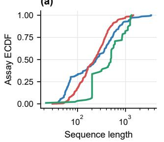

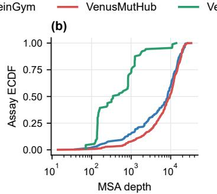

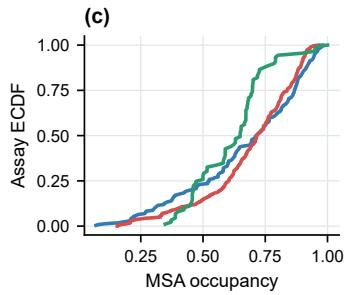

(d)  
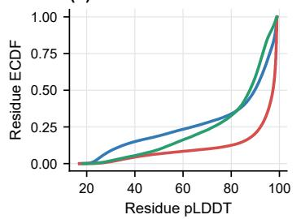

(e)  
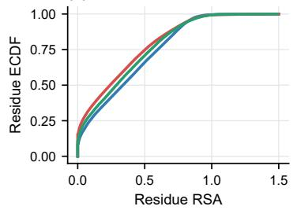  
Figure 8: Input distributions for ProteinGym (217 assays), VenusMutHub (905), and VenusViroHub (89). (a) Sequence length. (b) MSA depth. (c) MSA occupancy. (d) Residue pLDDT. (e) Residue RSA. Structure panels pool unique WT sequences; all selected structures fully cover the query.

Table 2: Assay-level input statistics for ProteinGym, VenusMutHub, and VenusViroHub, reported as mean ± standard deviation. N is the number of assays; MSA occupancy is the fraction of non-gap match-state entries; pLDDT and RSA are assay-level means.
<table><tr><td>Dataset</td><td></td><td>N assays Sequence length</td><td></td><td>MSA depth MSA occupancy Mean pLDDT Mean RSA</td><td></td><td></td></tr><tr><td>ProteinGym</td><td>217</td><td> $3 9 7 \pm 5 0 2$ </td><td> $8 , 6 5 0 \pm 6 , 7 1 3$ </td><td> $0 . 6 7 \pm 0 . 2 3$ </td><td> $8 6 . 6 \pm 1 0 . 8$ </td><td> $0 . 3 7 \pm 0 . 0 9$ </td></tr><tr><td>VenusMutHub</td><td>905</td><td> $2 8 8 \pm 2 3 9$ </td><td> $9 , 7 9 1 \pm 6 , 4 5 2$ </td><td> $0 . 6 9 \pm 0 . 1 8$ </td><td> $9 2 . 1 \pm 7 . 5$ </td><td> $0 . 3 2 \pm 0 . 0 8$ </td></tr><tr><td>VenusViroHub</td><td>89</td><td> $5 5 9 \pm 3 8 3$ </td><td> $1 , 2 1 7 \pm 2 , 6 1 0$ </td><td> $0 . 6 2 \pm 0 . 1 4$ </td><td> $8 3 . 9 \pm 9 . 8$ </td><td> $0 . 3 3 \pm 0 . 0 7$ </td></tr></table>

Structure distributions. pLDDT is read from Cα B-factors and RSA from Shrake–Rupley accessibility normalized by residue-specific maximum ASA. Selected AlphaFold2 models cover every query residue in all three benchmarks. VenusViroHub has the lowest assay-level mean pLDDT (83.9), with 41.1% of residues at pLDDT ≥ 90 and 9.7% below 50, while its mean RSA (0.33) lies between ProteinGym (0.37) and VenusMutHub (0.32). Figure 8d–e and Tables 3–4 report the full distributions.

Table 3: AlphaFold2 confidence strata over unique wild-type sequences. All selected structures cover the full query; residue percentages are pooled within each benchmark.
<table><tr><td>Dataset</td><td>Unique WT</td><td>Structures</td><td> $\mathrm { p L D D T } < 5 0 $ </td><td>50-70</td><td>70-90</td><td>≥ 90</td></tr><tr><td>ProteinGym</td><td>187</td><td>187</td><td>18.9%</td><td>9.0%</td><td>22.6%</td><td>49.5%</td></tr><tr><td>VenusMutHub</td><td>527</td><td>527</td><td>6.7%</td><td>3.3%</td><td>10.6%</td><td>79.5%</td></tr><tr><td>Venus ViroHub</td><td>52</td><td>52</td><td>9.7%</td><td>13.2%</td><td>36.0%</td><td>41.1%</td></tr></table>

Table 4: RSA strata over unique wild-type sequences. Residue percentages are pooled within each benchmark.
<table><tr><td>Dataset</td><td> $\mathrm { R S A } < 0 . 2$ </td><td>RSA 0.2–0.5</td><td> $\mathrm { R S A } \ge 0 . 5$ </td></tr><tr><td>ProteinGym</td><td>36.7%</td><td>29.4%</td><td>33.9%</td></tr><tr><td>VenusMutHub</td><td>45.8%</td><td>28.9%</td><td>25.3%</td></tr><tr><td>VenusViroHub</td><td>40.6%</td><td>30.2%</td><td>29.2%</td></tr></table>

## B.3 VENUSVIROHUB DATA CURATION AND PROVENANCE

Relation to existing benchmarks. ProteinGym provides a comprehensive benchmark for zeroshot protein fitness prediction and mutation-guided protein design. Its 217 substitution DMS assays span diverse proteins, functions, taxa, and MSA depths, but only 23 are viral (Notin et al., 2024). VenusMutHub contributes 905 high-precision measurements across 527 wild-type sequence clusters, but is not organised around viral phenotypes. ViroGym further assembled 79 viral DMS assays and broadened evaluation to immune escape and other virus-relevant phenotypes (Zhou et al., 2026). However, 23 of these assays overlap with ProteinGym, and most concern SARS-CoV-2 or influenza A. VenusViroHub complements these resources with distinct viral DMS measurements, wider virus coverage, and stronger representation of immune escape and cell entry.

Data collection. We identified candidate assays from public data portals, repositories, cited studies, and recent literature, then reconstructed each assay from its original materials. We retained quantitative measurements of single-amino-acid substitutions with an accessible mutant-level table, a recoverable wild-type sequence, mappable residue numbering, and approximately 400 or more substitutions after quality control. Assays were distinguished by study, virus strain, protein or scanned region, and phenotype. Mapped coordinates and sequences were used to identify and exclude duplicate measurements.

Data processing. Each assay was converted to a wild-type sequence, single-substitution identifier, and experimental score. Residue coordinates followed the experimental construct, using documented offsets or sequence alignment when needed. We removed missing scores, unmappable substitutions, reference-residue mismatches, and duplicate records. Replicates or experimental conditions were combined using the assay-specific rule recorded in the processing manifest. Score directions were harmonised so that larger values indicate more favourable values of the reported phenotype, while the original numerical scales were retained. The QC files retain 642,737 rows, comprising 616,690 substitutions and 26,047 wild-type controls (XnX). Controls may remain in data and score files but are excluded before computing any evaluation metric; all 89 assays are retained.

Benchmark composition. VenusViroHub contains 616,690 single-amino-acid substitutions from 89 assays, covering 18 virus types, 52 wild-type sequences, and seven phenotype groups (Table 5). Compared with ViroGym, it expands coverage from 13 to 18 virus types, from 14 to 21 immuneescape assays, and from 11 to 18 cell-entry assays. The manifest records each assay’s source, virus strain, experimental construct, coordinate convention, wild-type sequence hash, processing rule, and retained mutation count. Evaluation follows the metric-specific hierarchy in Equation 23.

Assay-level provenance. Tables 6–12 link every retained assay to its experimental readout and original study or public data repository, grouped by readout. Exact assay identifiers, construct coordinates, retained mutation counts, coordinate transformations, and assay-specific combination rules are provided in the processing manifest.

Table 5: Phenotype composition of VenusViroHub after quality control. Evaluated substitutions exclude wild-type control rows.
<table><tr><td>Harmonised phenotype</td><td>Assays</td><td>Evaluated substitutions</td></tr><tr><td>Immune escape</td><td>21</td><td>148,468</td></tr><tr><td>Cell entry</td><td>18</td><td>189,048</td></tr><tr><td>Binding</td><td>17</td><td>90,245</td></tr><tr><td>Expression</td><td>15</td><td>58,120</td></tr><tr><td>Fitness</td><td>15</td><td>114,287</td></tr><tr><td>Stability</td><td>2</td><td>11,187</td></tr><tr><td>Activity</td><td>1</td><td>5,335</td></tr><tr><td>Total</td><td>89</td><td>616,690</td></tr></table>

Antibody escape is recorded separately for monoclonal antibodies (Table 6) and polyclonal sera (Table 7). This distinction preserves the experimental context of the immune-escape comparisons.

Table 6: VenusViroHub assays with experimental readout Monoclonal-antibody escape (15 assays). Distinct rows from the same study correspond to different viral constructs or measured phenotypes. <sup>†</sup>Public dataset repository without an associated archival article.
<table><tr><td>Virus and construct</td><td>Source</td></tr><tr><td>HIV-1 BF520 Env</td><td>(Radford &amp; Bloom, 2025)</td></tr><tr><td>HIV-1 TRO11 Env</td><td>(Radford &amp; Bloom, 2025)</td></tr><tr><td>Influenza A/H3N2 HK19 HA</td><td>(Welsh et al., 2024)</td></tr><tr><td>Influenza A/H3N2 MC22 HA</td><td>(Yu et al., 2025)</td></tr><tr><td>Lassa virus Josiah GP</td><td>(Carr et al., 2024)</td></tr><tr><td>Nipah virus F</td><td>(Larsen et al., 2026)</td></tr><tr><td>Nipah virus Malaysia RBP</td><td>(Larsen et al., 2025)</td></tr><tr><td>Nipah virus Malaysia RBP</td><td>(Larsen &amp; Bloom, 2026)†</td></tr><tr><td>Rabies virus G</td><td>(Aditham et al., 2025)</td></tr><tr><td>Respiratory syncytial virus A F</td><td>(Simonich et al., 2026)</td></tr><tr><td>SARS-CoV-2 Wuhan-Hu-1 RBD</td><td>(Cao et al., 2022)</td></tr><tr><td>SARS-CoV-2 Omicron BA.2 spike</td><td>(Dadonaite &amp; Bloom, 2026)†</td></tr><tr><td>SARS-CoV-2 KP.3.1.1 spike</td><td>(Dadonaite et al., 2025)</td></tr><tr><td>SARS-CoV-2 XBB.1.5 spike</td><td>(Dadonaite et al., 2024b)</td></tr><tr><td>Zika virus E</td><td>(Sourisseau et al., 2019; Kikawa et al., 2023)</td></tr></table>

Table 7: VenusViroHub assays with experimental readout Serum-antibody escape (6 assays).
<table><tr><td>Virus and construct</td><td>Source</td></tr><tr><td>HIV-1 BF520 Env</td><td>(Radford et al., 2023)</td></tr><tr><td>Human coronavirus 229E spike</td><td>(Harari et al., 2026)</td></tr><tr><td>Influenza A/H5N1 HA</td><td>(Dadonaite et al., 2024a)</td></tr><tr><td>Lassa virus Josiah GP</td><td>(Carr &amp; Bloom, 2026)†</td></tr><tr><td>Respiratory syncytial virus A F</td><td>(Simonich et al., 2026)</td></tr><tr><td>SARS-CoV-2 XBB.1.5 RBD</td><td>(Dadonaite et al., 2024b)</td></tr></table>

Cell-entry assays (Table 8) and receptor-binding assays (Table 9) probe related but distinct steps in host interaction; their original readouts remain separate in the manifest.

Table 8: VenusViroHub assays with experimental readout Cell entry (18 assays).
<table><tr><td>Virus and construct</td><td>Source</td></tr><tr><td>Chikungunya virus E3/E2/E1</td><td>(Ju et al., 2025)</td></tr><tr><td>Chikungunya virus E3/E2/E1</td><td>(Ju et al., 2025)</td></tr><tr><td>HIV-1 BF520 Env</td><td>(Radford &amp; Bloom, 2025)</td></tr><tr><td>HIV-1 TRO11 Env</td><td>(Radford &amp; Bloom, 2025)</td></tr><tr><td>Human coronavirus 229E spike</td><td>(Harari et al., 2026)</td></tr><tr><td>Influenza A/H3N2 MC22 HA</td><td>(Yu et al., 2025)</td></tr><tr><td>Influenza A/H5N1 HA</td><td>(Dadonaite et al., 2024a)</td></tr><tr><td>Influenza A/H7N9 Anhui13 HA</td><td>(Ahn et al., 2026)</td></tr><tr><td>Influenza A/H7N9 Anhui13 HA</td><td>(Ahn et al., 2026)</td></tr><tr><td>Lassa virus Josiah GP</td><td>(Carr et al., 2024)</td></tr><tr><td>Nipah virus F</td><td>(Larsen et al., 2026)</td></tr><tr><td>Nipah virus Malaysia RBP</td><td>(Larsen et al., 2025)</td></tr><tr><td>Rabies virus G</td><td>(Aditham et al., 2025)</td></tr><tr><td>Respiratory syncytial virus A F</td><td>(Simonich et al., 2026)</td></tr><tr><td>SARS-CoV-2 XBB.1.5 RBD</td><td>(Dadonaite et al., 2024b)</td></tr><tr><td>SARS-CoV-2 Omicron BA.2 spike</td><td>(Dadonaite et al., 2024b)</td></tr><tr><td>SARS-CoV-2 KP.3.1.1 spike</td><td>(Dadonaite et al., 2025)</td></tr><tr><td>SARS-CoV-2 XBB.1.5 spike</td><td>(Dadonaite et al., 2024b)</td></tr></table>

Table 9: VenusViroHub assays with experimental readout Receptor binding (17 assays).
<table><tr><td>Virus and construct</td><td>Source</td></tr><tr><td>Chikungunya virus E3/E2/E1</td><td>(Ju et al., 2025)</td></tr><tr><td>Human coronavirus 229E spike</td><td>(Harari et al., 2026)</td></tr><tr><td>Nipah virus Malaysia RBP</td><td>(Larsen et al., 2025)</td></tr><tr><td>SARS-CoV-2 Alpha RBD</td><td>(Starr et al., 2022a)</td></tr><tr><td>SARS-CoV-2 Beta RBD</td><td>(Starr et al., 2022a)</td></tr><tr><td>SARS-CoV-2 Delta RBD</td><td>(Starr et al., 2022a)</td></tr><tr><td>SARS-CoV-2 Eta RBD</td><td>(Starr et al., 2022a)</td></tr><tr><td>SARS-CoV-2 Omicron BA.1 RBD</td><td>(Starr et al., 2022b)</td></tr><tr><td>SARS-CoV-2 Omicron BA.2.86 RBD</td><td>(Taylor &amp; Starr, 2024)</td></tr><tr><td>SARS-CoV-2 Omicron BA.2 RBD</td><td>(Starr et al., 2022b)</td></tr><tr><td>SARS-CoV-2 Omicron BQ.1.1 RBD</td><td>(Taylor &amp; Starr, 2023)</td></tr><tr><td>SARS-CoV-2 Omicron EG.5 RBD</td><td>(Taylor &amp; Starr, 2024)</td></tr><tr><td>SARS-CoV-2 Omicron FLip RBD</td><td>(Taylor &amp; Starr, 2024)</td></tr><tr><td>SARS-CoV-2 Omicron XBB.1.5 RBD</td><td>(Taylor &amp; Starr, 2023)</td></tr><tr><td>SARS-CoV-2 Omicron BA.2 spike</td><td>(Dadonaite et al., 2024b)</td></tr><tr><td>SARS-CoV-2 KP.3.1.1 spike</td><td>(Dadonaite et al., 2025)</td></tr><tr><td>SARS-CoV-2 XBB.1.5 spike</td><td>(Dadonaite et al., 2024b)</td></tr></table>

Table 10 records protein-expression and abundance assays. These measurements provide a complementary readout of protein production and persistence rather than antibody recognition.

Table 10: VenusViroHub assays with experimental readout Protein expression and abundance (15 assays).
<table><tr><td>Virus and construct</td><td>Source</td></tr><tr><td>Bat coronavirus PRD0038 RBD</td><td>(Starr et al., 2022c)</td></tr><tr><td>Bat coronavirus RmYN02 RBD</td><td>(Starr et al., 2022c)</td></tr><tr><td>Bat coronavirus RsYN04 RBD</td><td>(Starr et al., 2022c)</td></tr><tr><td>SARS-CoV-2 PLpro</td><td>(Wu et al., 2024)</td></tr><tr><td>SARS-CoV-2 Alpha RBD</td><td>(Starr et al., 2022a)</td></tr><tr><td>SARS-CoV-2 Beta RBD</td><td>(Starr et al., 2022a)</td></tr><tr><td>SARS-CoV-2 Delta RBD</td><td>(Starr et al., 2022a)</td></tr><tr><td>SARS-CoV-2 Eta RBD</td><td>(Starr et al., 2022a)</td></tr><tr><td>SARS-CoV-2 Omicron BA.1 RBD</td><td>(Starr et al., 2022b)</td></tr><tr><td>SARS-CoV-2 Omicron BA.2.86 RBD</td><td>(Taylor &amp; Starr, 2024)</td></tr><tr><td>SARS-CoV-2 Omicron BA.2 RBD</td><td>(Starr et al., 2022b)</td></tr><tr><td>SARS-CoV-2 Omicron BQ.1.1 RBD</td><td>(Taylor &amp; Starr, 2023)</td></tr><tr><td>SARS-CoV-2 Omicron EG.5 RBD</td><td>(Taylor &amp; Starr, 2024)</td></tr><tr><td>SARS-CoV-2 Omicron FLip RBD</td><td>(Taylor &amp; Starr, 2024)</td></tr><tr><td>SARS-CoV-2 Omicron XBB.1.5 RBD</td><td>(Taylor &amp; Starr, 2023)</td></tr></table>

Fitness assays (Table 11) and stability or protease-activity assays (Table 12) complete the provenance record. Distinct constructs from one study remain separate assay entries.

Table 11: VenusViroHub assays with experimental readout Viral fitness and growth (15 assays).
<table><tr><td>Virus and construct</td><td>Source</td></tr><tr><td>Coxsackievirus B3 2A</td><td>(Álvarez-Rodríguez et al., 2024)</td></tr><tr><td>Coxsackievirus B3 2B</td><td>(Álvarez-Rodríguez et al., 2024)</td></tr><tr><td>Coxsackievirus B3 2C</td><td>(Álvarez-Rodríguez et al., 2024)</td></tr><tr><td>Coxsackievirus B3 3A</td><td>(Álvarez-Rodríguez et al., 2024)</td></tr><tr><td>Coxsackievirus B3 3B</td><td>(Álvarez-Rodríguez et al., 2024)</td></tr><tr><td>Coxsackievirus B3 3C</td><td>(Álvarez-Rodríguez et al., 2024)</td></tr><tr><td>Coxsackievirus B3 3D</td><td>(Álvarez-Rodríguez et al., 2024)</td></tr><tr><td>Coxsackievirus B3 VP1</td><td>(Álvarez-Rodríguez et al., 2024)</td></tr><tr><td>Coxsackievirus B3 VP3</td><td>(Álvarez-Rodríguez et al., 2024)</td></tr><tr><td>Enterovirus A capsid</td><td>(Bakhache et al., 2024)</td></tr><tr><td>Enterovirus A replicase</td><td>(Bakhache et al., 2024)</td></tr><tr><td>Hepatitis B virus reverse transcriptase</td><td>(Yu et al., 2024)</td></tr><tr><td>Influenza A/H3N2 HK19 HA</td><td>(Welsh et al., 2024)</td></tr><tr><td>SARS-CoV-2 Omicron BA.1 spike</td><td>(Dadonaite et al., 2023)</td></tr><tr><td>SARS-CoV-2 Delta spike</td><td>(Dadonaite et al., 2023)</td></tr></table>

Table 12: VenusViroHub assays with experimental readout Protein stability and protease activity (3 assays).
<table><tr><td>Virus and construct</td><td>Source</td></tr><tr><td>Influenza A/H3N2 MC22 HA</td><td>(Yu et al., 2025)</td></tr><tr><td>Influenza A/H5N1 HA</td><td>(Dadonaite et al., 2024a)</td></tr><tr><td>SARS-CoV-2 PLpro</td><td>(Wu et al., 2024)</td></tr></table>

## B.4 VENUSVIROHUB BENCHMARK

Scope and curation. The final benchmark contains 89 viral DMS assays and 616,690 scored substitutions across seven phenotype classes: immune escape, cell entry, binding, expression, fitness, stability, and activity. No retained assay represents the same experimental measurement as an assay in ProteinGym or VenusMutHub.

Hierarchical evaluation. To prevent densely assayed viral proteins from dominating, each metric is first averaged within phenotype–protein cells, then across viral proteins within a phenotype, and finally equally across the seven phenotypes. The 71 Raw–VRH pairs use the same frozen checkpoints and five metric definitions as the other benchmarks.

Cross-model transfer. Under this hierarchy, mean Spearman rises from 0.158 to 0.252 (+0.094), with positive changes for all 71 configurations. The largest gains occur for masked sequence models (+0.151; 0.072 to 0.222) and autoregressive models (+0.107; 0.099 to 0.206). Structure-aware encoders improve from 0.215 to 0.280 (+0.065), and inverse-folding models from 0.271 to 0.307 (+0.036). Thus, family evidence contributes most strongly to sequence-only readouts while remaining complementary to geometric conditioning (Table 24).

Metric and component consistency. Averaged over the same 71 configurations, NDCG increases from 0.684 to 0.729, AUC from 0.584 to 0.634, MCC from 0.125 to 0.202, and top-variant recall from 0.133 to 0.152. Every configuration improves on every metric, yielding 355 of 355 positive model–metric comparisons (Tables 55–58). For PROSST-2048, entropy-weighted retrieval raises Spearman from 0.2709 to 0.2901, and coherence-gated calibration reaches 0.2942. RSA-only and pLDDT-only shrinkage reach 0.3085 and 0.2994, respectively, while the full readout reaches 0.3102, identifying exposure as the larger reliability correction on VenusViroHub (Table 1).

## C BASELINE MODELS AND IMPLEMENTATIONS

Table 13 lists the evaluated baselines, their readout interfaces, and official implementations within the common framework in Figure 2. All backbones are frozen and evaluated with the readout used by the reported run (Equation 1); Appendix D quantifies the shared native-background direction and interface-specific checkpoint deviations induced by these readouts. Configurations from the same family (e.g., the ESM-2 size series) count as distinct model–readout configurations. The CARP series includes 600K, 38M, 76M, and 640M models. PROTSSN covers 9 graph encoders combining $k \in \{ 1 0 , 2 0 , 3 0 \}$ neighbors with hidden widths h ∈ {512, 768, 1280}, alongside their ensemble. Both series use native wild-type fields. The PROSST series varies the structure-vocabulary size K and uses one wild-type forward pass; masked ProSST scoring is not used in the reported experiments. VENUSREM2 scores each of the six K-variants with VRH at that variant’s own entropyweighted α from Equation 8, then z-scores each K’s per-assay variant-score vector and averages the six standardized vectors. Constant-score members contribute zero after standardization. S3F con tributes two readout configurations, wild-type and masked marginals, from one checkpoint but with distinct native fields. SAPROT evaluates 35M-AF2, 650M-AF2, and 650M-PDB checkpoints with both mask and wild-type interfaces. Protein structures are AlphaFold2 predictions (Jumper et al., 2021) and query-matched alignments are built with ColabFold (Mirdita et al., 2022).

The comparison in Figure 3 is detailed in Tables 14 and 15, which report official overall and biological-category scores for one representative per model series, covering sequence, structure, and evolutionary baselines. Table 16 keeps those same rows and replaces the five biological-category columns with official taxon and MSA-depth bins: VENUSREM2 is strongest in every reported stratum, including virus (0.540) and the low-depth bin (0.553). Table 18 completes the comparison by mutation depth, the number of amino-acid substitutions per variant; VENUSREM2 ranks first in all five bins.

Table 13: Evaluated baselines, native readouts, and implementations. Readouts follow Equation 1; mask = masked marginal, wt = wild-type field, and tf = teacher forcing.
<table><tr><td>Model</td><td>Family</td><td>Evaluated variants</td><td>Readout Source</td></tr><tr><td>ESM-1B</td><td>Masked sequence LM 650M</td><td></td><td>mask, wt Official repository</td></tr><tr><td>ESM-1v</td><td>Masked sequence LM 650M</td><td></td><td>mask, wt Official repository</td></tr><tr><td>ESM-2</td><td>Masked sequence LM8M/35M/150M/650M/3B</td><td></td><td>mask, wt Official repository</td></tr><tr><td>ESMC</td><td>Masked sequence LM 300M, 600M</td><td></td><td>mask Official repository</td></tr><tr><td>CARP</td><td>Masked sequence LM 600K/38M/76M/640M</td><td></td><td>wt Official repository</td></tr><tr><td>S3F</td><td>Structure-aware</td><td>S3F</td><td>wt, mask Official repository</td></tr><tr><td>PROGEN2</td><td>Autoregressive LM</td><td>B/S/M/L/XL</td><td>Official repository</td></tr><tr><td>PROGEN3</td><td>Autoregressive LM</td><td>112M/219M/339M/762M/1B/3B</td><td>tf Official repository tf</td></tr><tr><td>RITA</td><td>Autoregressive LM</td><td>S/M/L/XL</td><td>Official repository</td></tr><tr><td>ESM3</td><td>Structure-aware</td><td>open-weight (1.4B)</td><td>mask Official repository</td></tr><tr><td>PROSST</td><td>Structure-aware</td><td>K=20/128/512/1024/2048/4096</td><td>wt Official repository</td></tr><tr><td>PROTSSN</td><td>Structure-aware</td><td>k=10/20/30, h=512/768/1280; ensemble</td><td>Official repository</td></tr><tr><td>SAPROT</td><td>Structure-aware</td><td>35M-AF2, 650M-AF2, 650M-PDB</td><td>mask, wt Official repository</td></tr><tr><td>ESM-IF1</td><td>Inverse folding</td><td></td><td>Official repository</td></tr><tr><td>PROTEINMPNN Inverse folding</td><td></td><td>tf v_48_002/010/020/030; ProteinMPNN-Soluble ×4 tf tf</td><td>Official repository</td></tr><tr><td>MIF-ST</td><td>Inverse folding</td><td></td><td>Official repository</td></tr><tr><td>VENUSREM</td><td>Retrieval-enhanced</td><td>PROSST (K=2048) + MSA</td><td>Official repository</td></tr><tr><td>RSALOR</td><td>MSA + structure</td><td>conservation × RSA</td><td>Official repository</td></tr></table>

Table 14: ProteinGym zero-shot substitution leaderboard: official 217-assay Average Spearman. Bold red, purple, and black mark the top 3 distinct scores per column at reported precision.
<table><tr><td>Rank Model</td><td></td><td>Seq</td><td>Str</td><td>Evo</td><td>Average</td><td>Activity</td><td>Binding</td><td>Expression</td><td>Organismal</td><td>Stability</td></tr><tr><td></td><td>VENUSREM2 (ours)</td><td>√</td><td>√</td><td>√</td><td>0.556</td><td>0.541</td><td>0.495</td><td>0.557</td><td>0.494</td><td>0.691</td></tr><tr><td>1</td><td>AIDO PROTEIN-RAG (16B) (Sun et al., 2024)</td><td></td><td></td><td></td><td>0.518</td><td>0.517</td><td>0.426</td><td>0.522</td><td>0.491</td><td>0.635</td></tr><tr><td>2</td><td>VENUsREM (Tan et al., 2025b)</td><td></td><td></td><td></td><td>0.518</td><td>0.495</td><td>0.454</td><td>0.533</td><td>0.459</td><td>0.650</td></tr><tr><td>3</td><td>PROSST (K=2048) (Li et al., 2024)</td><td>V</td><td></td><td></td><td>0.507</td><td>0.476</td><td>0.445</td><td>0.530</td><td>0.431</td><td>0.653</td></tr><tr><td>5</td><td>S3F-MSA (Zhang et al., 2024)</td><td></td><td></td><td></td><td>0.496</td><td>0.502</td><td>0.440</td><td>0.479</td><td>0.477</td><td>0.581</td></tr><tr><td>8</td><td>PROTRIEVER (Weitzman et al., 2025)</td><td></td><td></td><td></td><td>0.479</td><td>0.487</td><td>0.396</td><td>0.496</td><td>0.479</td><td>0.537</td></tr><tr><td>9</td><td>ESCOTT (Tekpinar et al., 2025)</td><td></td><td></td><td></td><td>0.476</td><td>0.499</td><td>0.389</td><td>0.468</td><td>0.466</td><td>0.557</td></tr><tr><td>12</td><td>PoET (200M) (Truong Jr &amp; Bepler, 2023)</td><td></td><td></td><td></td><td>0.470</td><td>0.494</td><td>0.396</td><td>0.466</td><td>0.475</td><td>0.519</td></tr><tr><td>14</td><td>ESM3 open (1.4B) (Hayes et al., 2025)</td><td></td><td></td><td></td><td>0.466</td><td>0.430</td><td>0.400</td><td>0.470</td><td>0.389</td><td>0.641</td></tr><tr><td>15</td><td>RSALOR (Tsishyn et al., 2025)</td><td></td><td></td><td></td><td>0.465</td><td>0.479</td><td>0.416</td><td>0.427</td><td>0.426</td><td>0.575</td></tr><tr><td>16</td><td>VESPAG (Marquet et al., 2024)</td><td></td><td></td><td></td><td>0.458</td><td>0.493</td><td>0.370</td><td>0.456</td><td>0.437</td><td>0.533</td></tr><tr><td>17</td><td>SAPROT (650M AF2) (Su et al., 2023)</td><td>√</td><td></td><td></td><td>0.457</td><td>0.458</td><td>0.378</td><td>0.488</td><td>0.366</td><td>0.592</td></tr><tr><td>18</td><td>TRANCEPTEVE-L (Notin et al., 2022b)</td><td>√</td><td></td><td></td><td>0.456</td><td>0.487</td><td>0.376</td><td>0.457</td><td>0.459</td><td>0.500</td></tr><tr><td>20</td><td>GEMME (Laine et al., 2019)</td><td></td><td></td><td></td><td>0.455</td><td>0.482</td><td>0.383</td><td>0.438</td><td>0.452</td><td>0.519</td></tr><tr><td>23</td><td>PROTSSN ensemble (Tan et al., 2025c)</td><td></td><td></td><td></td><td>0.449</td><td>0.466</td><td>0.366</td><td>0.449</td><td>0.396</td><td>0.568</td></tr><tr><td>40</td><td>ESM-IF1 (Hsu et al., 2022)</td><td></td><td></td><td></td><td>0.422</td><td>0.368</td><td>0.389</td><td>0.407</td><td>0.324</td><td>0.624</td></tr><tr><td>45</td><td>ESM-2 (650M) (Lin et al., 2023)</td><td></td><td></td><td></td><td>0.414</td><td>0.425</td><td>0.337</td><td>0.415</td><td>0.368</td><td>0.523</td></tr><tr><td>47</td><td>ESM-1v ensemble (Meier et al., 2021)</td><td></td><td></td><td></td><td>0.407</td><td>0.420</td><td>0.320</td><td>0.429</td><td>0.386</td><td>0.477</td></tr><tr><td>53</td><td>MIF-ST (Yang et al., 2023)</td><td>V</td><td></td><td></td><td>0.400</td><td>0.390</td><td>0.321</td><td>0.438</td><td>0.366</td><td>0.485</td></tr><tr><td>57</td><td>ESM-1B (Rives et al., 2021)</td><td>√</td><td></td><td></td><td>0.394</td><td>0.428</td><td>0.287</td><td>0.406</td><td>0.349</td><td>0.500</td></tr><tr><td>59</td><td>PROGEN3 (3B) (Bhatnagar et al., 2025)</td><td>√</td><td></td><td></td><td>0.392</td><td>0.410</td><td>0.287</td><td>0.428</td><td>0.400</td><td>0.438</td></tr><tr><td>71</td><td>RITA-XL (Hesslow et al., 2022)</td><td>√</td><td></td><td></td><td>0.373</td><td>0.366</td><td>0.302</td><td>0.414</td><td>0.384</td><td>0.398</td></tr><tr><td>72</td><td>CARP (640M) (Yang et al., 2024)</td><td>√</td><td></td><td></td><td>0.369</td><td>0.395</td><td>0.273</td><td>0.397</td><td>0.366</td><td>0.412</td></tr><tr><td>91</td><td>PROTEINMPNN (Dauparas et al., 2022)</td><td></td><td></td><td></td><td>0.257</td><td>0.197</td><td>0.163</td><td>0.198</td><td>0.164</td><td>0.565</td></tr></table>

Source and notes. Ranked rows use the official ProteinGym substitutions summary; one entry per model series, matching Table 15. VENUS REM2 uses the six-K PROSST ensemble in Table 17.

Table 15: Complete zero-shot ProteinGym substitutions comparison under the official 217-assay Average Spearman protocol, split by biological category. The same models appear by taxon and MSA depth in Table 16. Bold red, purple, and black mark the top 3 distinct scores per column at reported precision.
<table><tr><td colspan="16">Rank Model Seq Str Evo Average Activity Binding Expression Organismal Stability</td></tr><tr><td>VENUSREM2 (ours)</td><td colspan="2"></td><td></td><td></td><td>0.556</td><td>0.541</td><td>0.495</td><td>0.557</td><td></td><td>0.494</td><td>0.691</td></tr><tr><td>1 AIDO PROTEIN-RAG (16B) (Sun et al., 2024)</td><td colspan="2"></td><td></td><td>√</td><td>0.518</td><td>0.517</td><td>0.426</td><td>0.522</td><td>0.491</td><td></td><td>0.635</td></tr><tr><td>2 VENUsREM (Tan et al., 2025b)</td><td colspan="2">√</td><td>√</td><td>√</td><td>0.518</td><td>0.495</td><td>0.454</td><td></td><td>0.533</td><td>0.459</td><td>0.650</td></tr><tr><td>3 PROSST (K=2048) (Li et al., 2024)</td><td colspan="2">√</td><td>√</td><td></td><td>0.507</td><td></td><td>0.476</td><td>0.445</td><td>0.530</td><td>0.431</td><td>0.653</td></tr><tr><td>5 S3F-MSA (Zhang et al., 2024)</td><td colspan="2"></td><td>V</td><td>√</td><td>0.496</td><td></td><td>0.502</td><td>0.440</td><td>0.479</td><td>0.477</td><td>0.581</td></tr><tr><td>8 PROTRIEVER (Weitzman et al., 2025)</td><td colspan="2"></td><td></td><td>√</td><td>0.479</td><td>0.487</td><td></td><td>0.396</td><td>0.496</td><td>0.479</td><td>0.537</td></tr><tr><td>9 ESCOTT (Tekpinar et al., 2025)</td><td colspan="2"></td><td>√</td><td>√</td><td>0.476</td><td>0.499</td><td></td><td>0.389</td><td>0.468</td><td>0.466</td><td>0.557</td></tr><tr><td>12 PoET (200M) (Truong Jr &amp; Bepler, 2023)</td><td colspan="2"></td><td></td><td>√</td><td>0.470</td><td></td><td>0.494</td><td>0.396</td><td>0.466</td><td>0.475</td><td>0.519</td></tr><tr><td>14 ESM3 open (1.4B) (Hayes et al., 2025)</td><td colspan="2"></td><td>√ √</td><td></td><td>0.466</td><td></td><td>0.430</td><td>0.400</td><td>0.470</td><td>0.389</td><td>0.641</td></tr><tr><td>15 RSALOR (Tsishyn et al., 2025)</td><td colspan="2"></td><td>√</td><td>√</td><td>0.465</td><td></td><td>0.479</td><td>0.416</td><td>0.427</td><td>0.426</td><td>0.575</td></tr><tr><td>16 VESPAG (Marquet et al., 2024)</td><td colspan="2"></td><td>√</td><td></td><td>0.458</td><td></td><td>0.493</td><td>0.370</td><td>0.456</td><td>0.437</td><td>0.533</td></tr><tr><td>17 SAPROT (650M AF2) (Su et al., 2023)</td><td colspan="2"></td><td>√ √</td><td></td><td>0.457</td><td></td><td>0.458</td><td>0.378</td><td>0.488</td><td>0.366</td><td>0.592</td></tr><tr><td>18 TRANCEPTEVE-L (Notin et al., 2022b)</td><td colspan="2"></td><td>√</td><td></td><td>0.456</td><td></td><td>0.487</td><td>0.376</td><td>0.457</td><td>0.459</td><td>0.500</td></tr><tr><td>20 GEMME (Laine et al., 2019)</td><td colspan="2"></td><td></td><td>V</td><td>0.455</td><td></td><td>0.482</td><td>0.383</td><td>0.438</td><td>0.452</td><td>0.519</td></tr><tr><td>23 PROTSSN ensemble (Tan et al., 2025c)</td><td colspan="2"></td><td>√ √</td><td></td><td>0.449</td><td></td><td>0.466</td><td>0.366</td><td>0.449</td><td>0.396</td><td>0.568</td></tr><tr><td>40 ESM-IF1 (Hsu et al., 2022)</td><td colspan="2"></td><td>V</td><td></td><td>0.422</td><td></td><td>0.368</td><td>0.389</td><td>0.407</td><td>0.324</td><td>0.624</td></tr><tr><td>45 ESM-2 (650M) (Lin et al., 2023)</td><td colspan="2"></td><td>√</td><td></td><td>0.414</td><td></td><td>0.425</td><td>0.337</td><td>0.415</td><td>0.368</td><td>0.523</td></tr><tr><td>47 ESM-1v ensemble (Meier et al., 2021)</td><td colspan="2"></td><td>√</td><td></td><td>0.407</td><td></td><td>0.420</td><td>0.320</td><td>0.429</td><td>0.386</td><td>0.477</td></tr><tr><td>53 MIF-ST (Yang et al., 2023)</td><td colspan="2"></td><td>√√</td><td></td><td>0.400</td><td></td><td>0.390</td><td>0.321</td><td>0.438</td><td>0.366</td><td>0.485</td></tr><tr><td>57 ESM-1B (Rives et al., 2021)</td><td colspan="2"></td><td>V</td><td></td><td>0.394</td><td></td><td>0.428</td><td>0.287</td><td>0.406</td><td>0.349</td><td>0.500</td></tr><tr><td>59 PROGEN3 (3B) (Bhatnagar et al., 2025)</td><td colspan="2"></td><td>√</td><td></td><td>0.392</td><td></td><td>0.410</td><td>0.287</td><td>0.428</td><td>0.400</td><td>0.438</td></tr><tr><td>71 RITA-XL (Hesslow et al., 2022)</td><td colspan="2"></td><td>√</td><td></td><td>0.373</td><td></td><td>0.366</td><td>0.302</td><td>0.414</td><td>0.384</td><td>0.398</td></tr><tr><td>72 CARP (640M) (Yang et al., 2024)</td><td colspan="2"></td><td>√</td><td></td><td></td><td>0.369</td><td>0.395</td><td>0.273</td><td>0.397</td><td>0.366</td><td>0.412</td></tr><tr><td>91 PROTEINMPNN (Dauparas et al., 2022)</td><td colspan="2"></td><td>√</td><td></td><td></td><td>0.257</td><td>0.197</td><td>0.163</td><td>0.198</td><td>0.164</td><td>0.565</td></tr></table>

Source and notes. Ranked rows are from https://proteingym.org/benchmarks; one entry per model series, using its highest official Average Spearman. Seq, Str, and Evo denote sequence, structure, and evolutionary inputs.

## C.1 STRATIFIED ANALYSES BY TAXONOMY AND MSA DEPTH

Table 17 tests whether the VENUSREM2 gain is confined to one taxonomic or MSA-depth bin. Virus assays gain 0.064, the low-depth bin 0.055, and the high-depth bin 0.011. The larger low-depth gain shows that the aggregate improvement is not restricted to proteins with abundant homologs. These stratified averages characterize where the gains occur; they do not by themselves isolate the effect of retrieval from calibration or structural attenuation.

Table 18 separates variants by the number of substitutions. The same six-member ensemble leads each of the five depth bins, extending the overall comparison to both single- and multiplesubstitution variants.

Table 16: Complete zero-shot ProteinGym substitutions comparison for the same models as Table 15, split by official taxon and MSA-depth bins. MSA depth uses $N _ { \mathrm { e f f } } / L \colon$ Low < 1, Medium [1, 100), High ≥ 100. Bold red, purple, and black mark the top 3 distinct scores per column at reported precision.
<table><tr><td>Rank Model</td><td colspan="9">Seq Str Evo Human Other euk. Prok. Virus Low Medium High</td></tr><tr><td>VENUSREM2 (ours)</td><td></td><td>√ 」</td><td>√</td><td>0.562</td><td>0.615</td><td>0.601 0.540 0.553</td><td>0.557</td><td>0.623</td></tr><tr><td>1 AIDO PROTEIN-RAG (16B) (Sun et al., 2024)</td><td></td><td>√</td><td>√</td><td>0.531</td><td>0.587</td><td>0.558 0.522 0.498</td><td>0.534</td><td>0.585</td></tr><tr><td>2 VENUsREM (Tan et al., 2025b)</td><td>√</td><td>√</td><td>√</td><td>0.529</td><td>0.582</td><td>0.549 0.492 0.495</td><td>0.524</td><td>0.577</td></tr><tr><td>3 PROSST (K=2048) (Li et al., 2024)</td><td>√</td><td>√</td><td></td><td>0.516</td><td>0.573</td><td>0.549 0.4540.465</td><td>0.507</td><td>0.580</td></tr><tr><td>5 S3F-MSA (Zhang et al., 2024)</td><td></td><td>V</td><td></td><td>0.502</td><td>0.558</td><td>0.521 0.502 0.469</td><td>0.509</td><td>0.547</td></tr><tr><td>8 PROTRIEVER (Weitzman et al., 2025)</td><td></td><td></td><td>√</td><td>0.480</td><td>0.542</td><td>0.492 0.516 0.464</td><td>0.498</td><td>0.512</td></tr><tr><td>9 ESCOTT (Tekpinar et al., 2025)</td><td></td><td></td><td></td><td>0.486</td><td>0.537</td><td>0.500 0.502 0.462</td><td>0.496</td><td>0.524</td></tr><tr><td>12 PoET (200M) (Truong Jr &amp; Bepler, 2023)</td><td></td><td></td><td>√</td><td>0.482</td><td>0.541</td><td>0.464 0.4910.478</td><td>0.478</td><td>0.510</td></tr><tr><td>14 ESM3 open (1.4B) (Hayes et al., 2025)</td><td></td><td>√ √</td><td></td><td>0.480</td><td>0.548</td><td>0.530 0.406 0.397</td><td>0.466</td><td>0.575</td></tr><tr><td>15 RSALOR (Tsishyn et al., 2025)</td><td></td><td>√</td><td>V</td><td>0.473</td><td>0.530</td><td>0.496 0.477 0.467</td><td>0.468</td><td>0.529</td></tr><tr><td>16 VESPAG (Marquet et al., 2024)</td><td></td><td>√</td><td></td><td>0.474</td><td>0.532</td><td>0.4840.4210.427</td><td>0.472</td><td>0.511</td></tr><tr><td>17 SAPROT (650M AF2) (Su et al., 2023)</td><td></td><td>√ √</td><td></td><td>0.478</td><td>0.529</td><td>0.514 0.320 0.394</td><td>0.446</td><td>0.546</td></tr><tr><td>18 TRANCEPTEVE-L (Notin et al., 2022b)</td><td></td><td>√</td><td>√</td><td>0.473</td><td>0.513</td><td>0.455 0.461 0.436</td><td>0.472</td><td>0.490</td></tr><tr><td>20 GEMME (Laine et al., 2019)</td><td></td><td></td><td>√</td><td>0.469</td><td>0.516</td><td>0.4670.472 0.446</td><td>0.474</td><td>0.493</td></tr><tr><td>23 PROTSSN ensemble (Tan et al., 2025c)</td><td></td><td>√ √</td><td></td><td>0.470</td><td>0.528</td><td>0.492 0.370 0.409</td><td>0.454</td><td>0.524</td></tr><tr><td>40 ESM-IF1 (Hsu et al., 2022)</td><td></td><td>√</td><td></td><td>0.417</td><td>0.502</td><td>0.498 0.389 0.292</td><td>0.427</td><td>0.549</td></tr><tr><td>45ESM-2 (650M) (Lin et al., 2023)</td><td></td><td>√</td><td></td><td>0.457</td><td>0.486</td><td>0.458 0.261 0.338</td><td>0.409</td><td>0.513</td></tr><tr><td>47 ESM-1v ensemble (Meier et al., 2021)</td><td></td><td>√</td><td></td><td>0.458</td><td>0.464</td><td>0.413 0.294 0.316</td><td>0.409</td><td>0.495</td></tr><tr><td>53 MIF-ST (Yang et al., 2023)</td><td></td><td>√ √</td><td></td><td>0.399</td><td>0.413</td><td>0.457 0.405 0.371</td><td>0.404</td><td>0.453</td></tr><tr><td>57 ESM-1B (Rives et al., 2021)</td><td></td><td>√</td><td></td><td>0.435</td><td>0.491</td><td>0.438 0.260 0.365</td><td>0.396</td><td>0.480</td></tr><tr><td>59 PROGEN3 (3B) (Bhatnagar et al., 2025)</td><td></td><td>√</td><td></td><td>0.410</td><td>0.433</td><td>0.392 0.414 0.325</td><td>0.407</td><td>0.453</td></tr><tr><td>71 RITA-XL (Hesslow et al., 2022)</td><td></td><td>√ √</td><td></td><td>0.396 0.417</td><td>0.399 0.395</td><td>0.346 0.394 0.300 0.381 0.284 0.331</td><td>0.390 0.374</td><td>0.412</td></tr><tr><td>72 CARP (640M) (Yang et al., 2024)</td><td></td><td></td><td></td><td>0.284</td><td>0.394</td><td>0.348 0.262 0.187</td><td>0.271</td><td>0.424</td></tr><tr><td>91 PROTEINMPNN (Dauparas et al., 2022)</td><td></td><td>√</td><td></td><td></td><td></td><td></td><td></td><td>0.439</td></tr></table>

Source and notes. Ranked rows use the official ProteinGym substitutions summary; one entry per model series, matching Table 15. VENUSREM2 uses the six-K PROSST ensemble in Table 17.

Table 17: VENUSREM2 ProteinGym Average Spearman stratified by taxon and MSA depth, recomputed with the official ProteinGym evaluator. MSA depth uses $\mathrm { { \bar { \it { N } } _ { e f f } } } / L \mathrm { \Omega } :$ Low < 1, Medium [1, 100), $\mathrm { H i g h } \ge 1 0 0 . ~ \Delta$ is VRH minus Raw.
<table><tr><td>Stratification</td><td>Group</td><td>Raw</td><td>VRH</td><td> $\Delta$ </td></tr><tr><td>Taxon</td><td>Human</td><td>0.524</td><td>0.562</td><td>+0.038</td></tr><tr><td></td><td>Other eukaryotes</td><td>0.596</td><td>0.615</td><td>+0.019</td></tr><tr><td></td><td>Prokaryote</td><td>0.579</td><td>0.601</td><td>+0.022</td></tr><tr><td></td><td>Virus</td><td>0.476</td><td>0.540</td><td>+0.064</td></tr><tr><td>MSA depth</td><td>Low</td><td>0.498</td><td>0.553</td><td>+0.055</td></tr><tr><td></td><td>Medium</td><td>0.517</td><td>0.557</td><td>+0.040</td></tr><tr><td></td><td>High</td><td>0.612</td><td>0.623</td><td>+0.011</td></tr></table>

Table 18: Complete zero-shot ProteinGym substitutions comparison for the same models as Table 15, split by official mutation-depth bins. Depth is the number of amino-acid substitutions per variant; 5+ denotes at least five substitutions. Bold red, purple, and black mark the top 3 distinct scores per column at reported precision.
<table><tr><td>Rank Model</td><td></td><td>Seq Str Evo</td><td></td><td>1</td><td>2</td><td>3</td><td>4</td><td>5+</td></tr><tr><td>— VENUSREM2 (ours)</td><td></td><td>√√</td><td>√</td><td>0.576</td><td>0.473</td><td>0.468</td><td>0.424</td><td>0.473</td></tr><tr><td></td><td>1 AIDO PROTEIN-RAG (16B) (Sun et al., 2024)</td><td></td><td>√ L</td><td>0.527</td><td>0.414</td><td>0.419</td><td>0.394</td><td>0.414</td></tr><tr><td></td><td>2 VENUsREM (Tan et al., 2025b)</td><td>√</td><td>√ √</td><td>0.534</td><td>0.397</td><td>0.355</td><td>0.322</td><td>0.368</td></tr><tr><td></td><td>3 PROSST (K=2048) (Li et al., 2024)</td><td>√</td><td>√</td><td>0.521</td><td>0.394</td><td>0.317</td><td>0.277</td><td>0.332</td></tr><tr><td></td><td>5 S3F-MSA (Zhang et al., 2024)</td><td></td><td>√ L</td><td>0.499</td><td>0.333</td><td>0.378</td><td>0.346</td><td>0.383</td></tr><tr><td></td><td>8 PROTRIEVER (Weitzman et al., 2025)</td><td></td><td>√</td><td>0.473</td><td>0.320</td><td>0.427</td><td>0.387</td><td>0.427</td></tr><tr><td></td><td>9 ESCOTT (Tekpinar et al., 2025)</td><td></td><td>√ √</td><td>0.476</td><td>0.314</td><td>0.377</td><td>0.385</td><td>0.434</td></tr><tr><td></td><td>12 PoET (200M) (Truong Jr &amp; Bepler, 2023)</td><td></td><td>√</td><td>0.466</td><td>0.299</td><td>0.419</td><td>0.395</td><td>0.418</td></tr><tr><td></td><td>14 ESM3 open (1.4B) (Hayes et al., 2025)</td><td>√</td><td>√</td><td>0.487</td><td>0.337</td><td>0.307</td><td>0.285</td><td>0.363</td></tr><tr><td></td><td>15 RSALOR (Tsishyn et al., 2025)</td><td></td><td>√ √</td><td>0.474</td><td>0.292</td><td>0.369</td><td>0.392</td><td>0.453</td></tr><tr><td></td><td>16 VESPAG (Marquet et al., 2024)</td><td>√</td><td></td><td>0.456</td><td>0.247</td><td>0.346</td><td>0.323</td><td>0.367</td></tr><tr><td></td><td>17 SAPROT (650M AF2) (Su et al., 2023)</td><td>√</td><td>√</td><td>0.458</td><td>0.313</td><td>0.275</td><td>0.268</td><td>0.336</td></tr><tr><td></td><td>18 TRANCEPTEVE-L (Notin et al., 2022b)</td><td>√</td><td>√</td><td>0.446</td><td>0.278</td><td>0.349</td><td>0.331</td><td>0.382</td></tr><tr><td></td><td>20 GEMME (Laine et al., 2019)</td><td></td><td>√</td><td>0.448</td><td>0.276</td><td>0.330</td><td>0.341</td><td>0.414</td></tr><tr><td></td><td>23 PROTSSN ensemble (Tan et al., 2025c)</td><td>√</td><td>√</td><td>0.459</td><td>0.291</td><td>0.292</td><td>0.244</td><td>0.298</td></tr><tr><td></td><td>40 ESM-IF1 (Hsu et al., 2022)</td><td></td><td>√</td><td>0.440</td><td>0.350</td><td>0.301</td><td>0.294</td><td>0.358</td></tr><tr><td></td><td>45 ESM-2 (650M) (Lin et al., 2023)</td><td>√</td><td></td><td>0.422</td><td>0.248</td><td>0.205</td><td>0.163</td><td>0.218</td></tr><tr><td></td><td>47 ESM-1v ensemble (Meier et al., 2021)</td><td>√</td><td></td><td>0.403</td><td>0.215</td><td>0.173</td><td>0.153</td><td>0.218</td></tr><tr><td>53 MIF-ST (Yang et al., 2023)</td><td></td><td>√</td><td>√</td><td>0.431</td><td>0.263</td><td>0.327</td><td>0.298</td><td>0.298</td></tr><tr><td>57 ESM-1B (Rives et al., 2021)</td><td></td><td>√</td><td></td><td>0.383</td><td>0.226</td><td>0.172</td><td>0.150</td><td>0.270</td></tr><tr><td></td><td>59 PROGEN3 (3B) (Bhatnagar et al., 2025)</td><td>√</td><td></td><td>0.388</td><td>0.179</td><td>0.226</td><td>0.204</td><td>0.256</td></tr><tr><td></td><td>71 RITA-XL (Hesslow et al., 2022)</td><td>√</td><td></td><td>0.357</td><td>0.141</td><td>0.148</td><td>0.160</td><td>0.233</td></tr><tr><td>72 CARP (640M) (Yang et al., 2024)</td><td></td><td>√</td><td></td><td>0.391</td><td>0.213</td><td>0.172</td><td>0.159</td><td>0.162</td></tr><tr><td></td><td>91 PROTEINMPNN (Dauparas et al., 2022)</td><td></td><td>√</td><td>0.292</td><td></td><td>0.260</td><td>0.174</td><td>0.183 0.278</td></tr></table>

Source and notes. Ranked rows use the official ProteinGym substitutions summary; one entry per model series, matching Table 15. VENUSREM2 uses the six-K PROSST ensemble in Table 17.

## D GLOBAL–LOCAL SIGNAL DIAGNOSTICS

Appendix D.1 defines the profile comparison, and Appendix D.2 checks the consistency of model backgrounds. Appendix D.3 summarizes the cross-benchmark evidence; Appendices D.4, D.5, and D.6 examine ProteinGym, VenusMutHub, and VenusViroHub, respectively, separating shared preferences from dataset-specific family agreement.

## D.1 PROFILE CONSTRUCTION AND SEPARATION PROTOCOL

For the background–local comparison in the Introduction, each well-covered site contributes Pearson correlations across the 20 amino-acid entries between its MSA profile and each of two references: log UniProt abundance and the protein-mean native profile. A2M inputs use aligned-FASTA match states; lowercase insertions are converted to uppercase, gaps map to padding, and retained rows are counted without sequence reweighting or pseudocounts. Duplicate assays are collapsed by WT sequence, yielding 27,763, 148,983, and 29,416 complete profiles from 148, 527, and 52 representative sequences in ProteinGym, VenusMutHub, and VenusViroHub. Joint alignment requires both correlations to be at least 0.3, yielding rates of 19.7%, 24.8%, and 38.1%, respectively, over the complete profile sets. This descriptive threshold measures background–local agreement; it does not establish independence between MSA and model predictions.

For Figure 5, the separation index is the fraction of well-covered sites whose MSA preference is not jointly aligned with log UniProt abundance and the protein-mean native profile at $r \geq 0 . 3$ . All 217 ESM-2 wild-type-interface ProteinGym assays have paired Raw–MSA scores; 177 assays contain at least 20 complete site profiles and span 148 proteins. Shared-protein assays are averaged before analysis, and the site map retains the assay with the broadest complete profile. The response is the protein-mean paired Spearman gain. Intervals use 10,000 protein-level bootstrap draws; partial rank correlation controls for length, $\log _ { 1 0 }$ MSA depth, MSA occupancy, and Raw Spearman.

## D.2 NATIVE-BACKGROUND DIAGNOSTICS

Figure 9 extends the shared-preference pattern in Figure 1 with complementary diagnostics on the original 37-model cohort: it overlays model profiles, quantifies pairwise agreement, separates readout scales, and reports protein–configuration heterogeneity in directional alignment. The profiles have median pairwise Pearson $r = 0 . 9 9 5$ ; the consensus–corpus correlation is 0.993. Alignment c spans 0.01–0.99, motivating a gate that adapts to the queried protein. ESM3 is the clearest checkpoint-level departure, consistent with multimodal pretraining (Hayes et al., 2025).

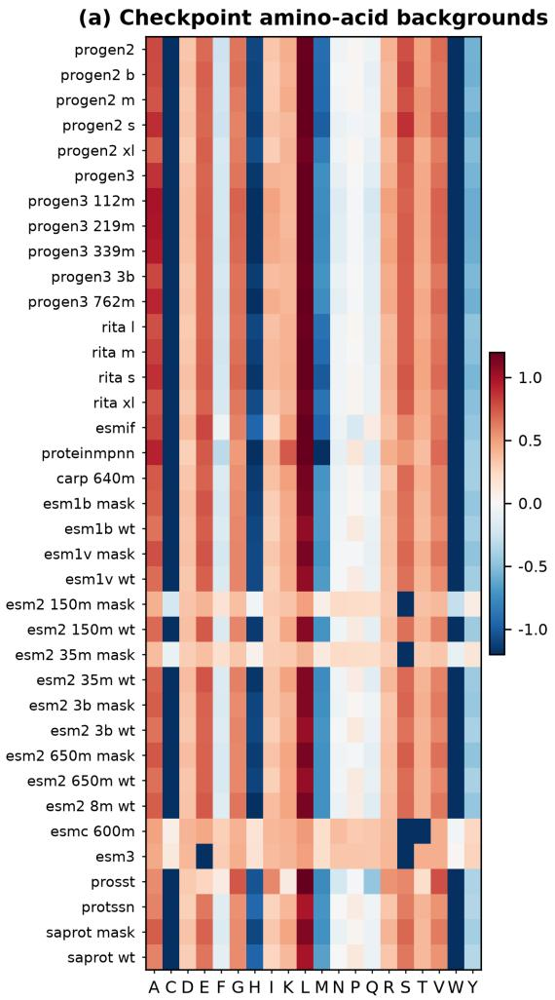

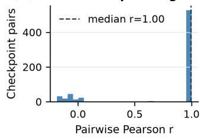

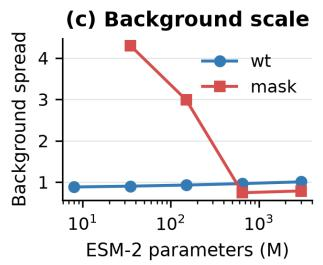

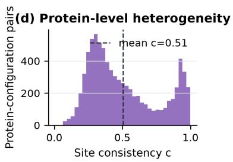  
Figure 9: Native-background diagnostics on the original 37-model cohort. (a) Protein-level aminoacid profiles versus UniProtKB/Swiss-Prot composition. (b) Pairwise Pearson correlations among those profiles. (c) Readout-scale comparison across scoring interfaces. (d) Mean directional alignment $\begin{array} { r } { \dot { c } = L ^ { - 1 } \sum _ { i } \mathrm { c o r r } _ { a } ( R _ { i } , b ) } \end{array}$ over protein–configuration pairs.

## D.3 CROSS-BENCHMARK REPLICATION

Table 19 compares the three benchmark-specific checks. Pairwise is the median correlation among model backgrounds (49 on ProteinGym and VenusMutHub, 37 on VenusViroHub); corpus compares

their consensus with UniProt composition; native–MSA reports assay-level median and pooled correlations for the original 37-model consensus; aligned sites have Pearson $r \geq 0 . 3$ with both log corpus abundance and the protein-mean native background.

Table 19: Cross-benchmark summary of native-background agreement and local MSA preference separation. Complete sites are unique WT positions with all required profiles.
<table><tr><td rowspan="2">Dataset</td><td rowspan="2">Pairwise r</td><td rowspan="2">Corpus r</td><td colspan="2">Native-MSA</td><td rowspan="2">Complete sites N</td><td rowspan="2">Aligned sites</td></tr><tr><td>Median r</td><td>Pooled r</td></tr><tr><td>ProteinGym</td><td>0.995</td><td>0.991</td><td>0.965</td><td>0.758</td><td>27,763</td><td>(%) 19.7</td></tr><tr><td>VenusMutHub</td><td>0.996</td><td>0.989</td><td>0.964</td><td>0.863</td><td>148,983</td><td>24.8</td></tr><tr><td>VenusViroHub</td><td>0.990</td><td>0.885</td><td>0.976</td><td>0.621</td><td>29,416</td><td>38.1</td></tr></table>

Checkpoint backgrounds are nearly identical across benchmarks, whereas pooled native–family agreement weakens and most sites fail the joint-alignment criterion. Figures 10–12 retain the dataset-specific distributions and family-level outcomes.

## D.4 PROTEINGYM REPLICATION

Figure 10 shows that a strong protein-mean native–MSA correlation coexists with substantial sitelevel separation: only 19.7% of complete sites align jointly with corpus and native backgrounds (Table 19). Agreement after averaging therefore does not imply interchangeable local preferences. Gains occur across all four backbone families; Appendix E reports their magnitudes.

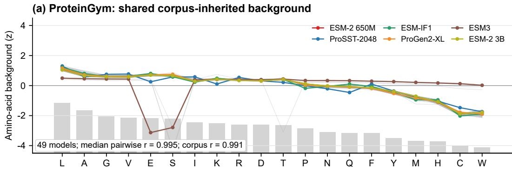

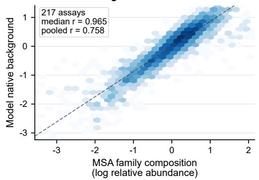

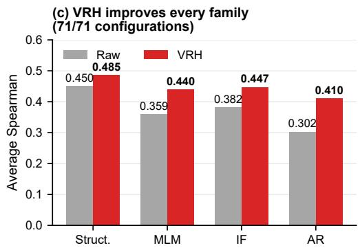  
Figure 10: ProteinGym replication. (a) Profiles from 49 models and UniProt abundance (gray bars). (b) The original 37-model native-background consensus versus MSA abundance (central 99%; correlations use all 217 × 20 pairs). (c) Raw–VRH Spearman by family across 71 configurations.

(a) VenusMutHub: shared corpus-inherited background

## D.5 VENUSMUTHUB REPLICATION

VenusMutHub reproduces the separation between shared model backgrounds and local family preferences: only 24.8% of complete sites are jointly aligned (Figure 11; Table 19). Thus the ProteinGym pattern extends to this broader assay collection. Family-level performance in Appendix E provides the corresponding prediction comparison.

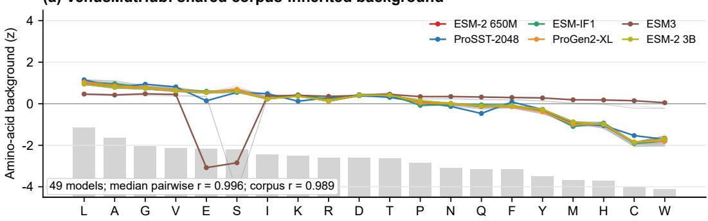

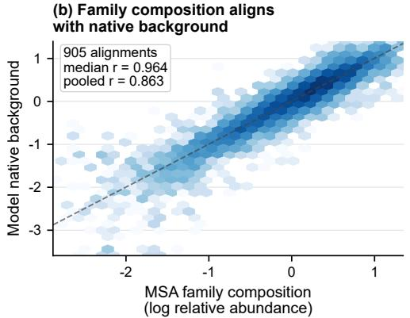

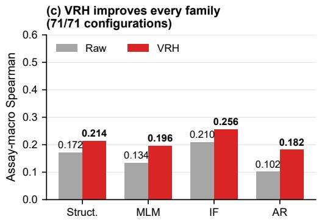  
Figure 11: VenusMutHub replication. (a) Profiles from 49 models and UniProt abundance (gray bars). (b) The original 37-model native-background consensus versus MSA abundance (central 99%; correlations use all 905 × 20 pairs). (c) Raw–VRH Spearman by family across 71 configurations.

## D.6 VENUSVIROHUB REPLICATION

Figure 12 shows the weakest pooled native–MSA agreement (r = 0.621) despite a high assay-level median, with 38.1% of complete sites jointly aligned. The median and pooled statistics summarize different levels of variation; strong within-protein agreement can therefore coexist with weaker agreement across the collection. Appendix E reports the gains across model families.

## E FULL CROSS-FAMILY RESULTS

All ProteinGym results use one versioned evaluation pipeline. Of 72 configurations, 71 have complete paired Raw–VRH coverage on all 217 assays; VENUSREM was not rescored with VRH and is excluded from paired comparisons. The comparison is uniform in sign and uneven in magnitude (Table 20): autoregressive models gain the most, and structure-aware encoders still gain after geometry is already in the backbone. Table 21 shows that the PROSST ensemble improves every reported metric, not only Spearman.

The aggregate gain is not confined to one of the five ProteinGym biological categories. Across those categories and 71 configurations, all 355 configuration–category comparisons improve in Spearman. Table 22 reports the corresponding family means; Stability shows the largest overall increase, gaining 0.095 from 0.489 to 0.584.

(a) Shared corpus-inherited background  
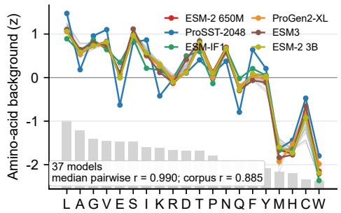

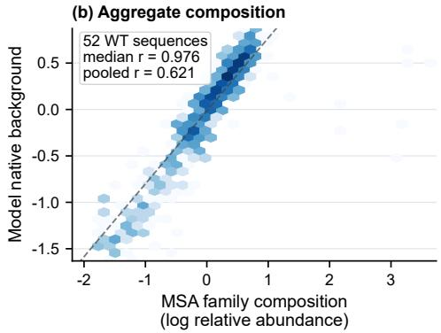

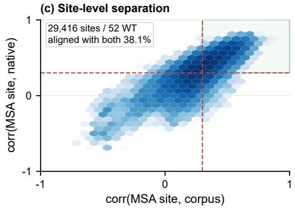

(d) VRH improves all families(d) VRH improves all families  
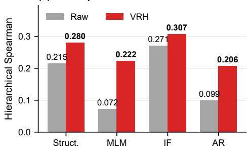  
Figure 12: VenusViroHub replication. (a) Profiles from 37 models and UniProt abundance. (b) Their native-background consensus versus MSA abundance. (c) MSA site preferences versus corpus and native backgrounds. (d) Raw–VRH Spearman by family across 71 configurations.

Table 20: ProteinGym Average Spearman by backbone family across 71 paired configurations and 217 assays. N is the number of configurations. Mean and median change are paired VRH–Raw differences; Wins / N counts configurations with positive change.
<table><tr><td>Family</td><td>N</td><td>Raw</td><td>VRH</td><td>Mean change</td><td>Median change</td><td>Wins / N</td></tr><tr><td>Structure-aware</td><td>26</td><td>0.450</td><td>0.485</td><td>+0.035</td><td>+0.029</td><td>26 / 26</td></tr><tr><td>Masked sequence LM</td><td>20</td><td>0.359</td><td>0.440</td><td>+0.081</td><td>+0.062</td><td>20 / 20</td></tr><tr><td>Inverse folding</td><td>10</td><td>0.382</td><td>0.447</td><td>+0.065</td><td>+0.070</td><td>10 / 10</td></tr><tr><td>Autoregressive LM</td><td>15</td><td>0.302</td><td>0.410</td><td>+0.108</td><td>+0.098</td><td>15 / 15</td></tr></table>

Table 21: VENUSREM2 ProteinGym metrics, reported as assay-macro mean ± standard deviation over 217 assays. These means are not official Average Spearman. $\Delta$ is VRH–Raw; the VRH column is the six-K PROSST ensemble; top-recall denotes top-variant recall.
<table><tr><td>Metric</td><td>Raw</td><td>VRH</td><td>∆</td></tr><tr><td>Spearman</td><td> $0 . 5 4 1 \pm 0 . 1 8 0$ </td><td> $0 . 5 7 5 \pm 0 . 1 5 9$ </td><td>+0.034</td></tr><tr><td>NDCG</td><td> $0 . 7 9 4 \pm 0 . 1 3 8$ </td><td> $0 . 8 1 3 \pm 0 . 1 3 0$ </td><td>+0.019</td></tr><tr><td>AUC</td><td> $0 . 7 9 6 \pm 0 . 1 0 0$ </td><td> $0 . 8 1 5 \pm 0 . 0 9 1$ </td><td>+0.019</td></tr><tr><td>MCC</td><td> $0 . 4 2 2 \pm 0 . 1 6 4$ </td><td> $0 . 4 5 0 \pm 0 . 1 5 1$ </td><td>+0.028</td></tr><tr><td>Top-recall</td><td> $0 . 2 6 1 \pm 0 . 1 3 1$ </td><td> $0 . 2 7 0 \pm 0 . 1 3 1$ </td><td>+0.008</td></tr></table>

VenusMutHub repeats the same family order (Table 23): every family improves, and autoregressive models again gain the most. Table 25 summarizes the paired benchmark units: UniProt IDs

Table 22: Mean ProteinGym Average Spearman by biological category and backbone family across the 71 configurations. Counts in the header are the number of configurations in that family. Structure = structure-aware; Masked LM = masked sequence LM; AR LM = autoregressive LM.
<table><tr><td rowspan="2">Category</td><td colspan="2">Structure (26)</td><td colspan="2">Masked LM (20)</td><td colspan="2">Inverse folding (10)</td><td colspan="2">AR LM (15)</td><td colspan="2">All (71)</td></tr><tr><td>Raw</td><td>VRH</td><td>Raw</td><td>VRH</td><td>Raw</td><td>VRH</td><td>Raw</td><td>VRH</td><td>Raw</td><td>VRH</td></tr><tr><td>Activity</td><td>0.442</td><td>0.486</td><td>0.371</td><td>0.453</td><td>0.318</td><td>0.414</td><td>0.321</td><td>0.434</td><td>0.379</td><td>0.456</td></tr><tr><td>Binding</td><td>0.381</td><td>0.407</td><td>0.288</td><td>0.353</td><td>0.327</td><td>0.384</td><td>0.251</td><td>0.313</td><td>0.320</td><td>0.369</td></tr><tr><td>Expression</td><td>0.459</td><td>0.487</td><td>0.369</td><td>0.433</td><td>0.382</td><td>0.429</td><td>0.334</td><td>0.400</td><td>0.397</td><td>0.445</td></tr><tr><td>Organismal Fitness</td><td>0.378</td><td>0.423</td><td>0.295</td><td>0.394</td><td>0.294</td><td>0.373</td><td>0.334</td><td>0.397</td><td>0.334</td><td>0.402</td></tr><tr><td>Stability</td><td>0.589</td><td>0.623</td><td>0.474</td><td>0.567</td><td>0.588</td><td>0.635</td><td>0.272</td><td>0.507</td><td>0.489</td><td>0.584</td></tr></table>

for ProteinGym, wild-type sequence clusters for VenusMutHub, and phenotype–backbone cells for VenusViroHub.

Table 23: VenusMutHub macro-averaged assay-level Spearman by backbone family across 71 paired configurations and 905 assays. Column definitions match Table 20.
<table><tr><td>Family</td><td>N</td><td>Raw</td><td>VRH</td><td>Mean change</td><td>Median change</td><td>Wins / N</td></tr><tr><td>Structure-aware</td><td>26</td><td>0.172</td><td>0.214</td><td>+0.042</td><td>+0.032</td><td>26 /26</td></tr><tr><td>Masked sequence LM</td><td>20</td><td>0.134</td><td>0.196</td><td>+0.062</td><td>+0.050</td><td>20/ 20</td></tr><tr><td>Inverse folding</td><td>10</td><td>0.210</td><td>0.256</td><td>+0.046</td><td>+0.049</td><td>10 / 10</td></tr><tr><td>Autoregressive LM</td><td>15</td><td>0.102</td><td>0.182</td><td>+0.080</td><td>+0.070</td><td>15 / 15</td></tr></table>

VenusViroHub extends the comparison to a virus-focused distribution with no ProteinGym assay overlap (Table 24). The largest mean lift occurs for masked sequence models, while every configuration improves in every family.

Table 24: VenusViroHub hierarchically aggregated Spearman by backbone family across 71 paired configurations and 89 assays, excluding wild-type controls. Column definitions match Table 20.
<table><tr><td>Family</td><td>N</td><td>Raw</td><td>VRH</td><td>Mean change</td><td>Median change</td><td>Wins / N</td></tr><tr><td>Structure-aware</td><td>26</td><td>0.215</td><td>0.280</td><td>+0.065</td><td>+0.063</td><td>26 / 26</td></tr><tr><td>Masked sequence LM</td><td>20</td><td>0.072</td><td>0.222</td><td>+0.151</td><td>+0.147</td><td>20 / 20</td></tr><tr><td>Inverse folding</td><td>10</td><td>0.271</td><td>0.307</td><td>+0.036</td><td>+0.036</td><td>10 / 10</td></tr><tr><td>Autoregressive LM</td><td>15</td><td>0.099</td><td>0.206</td><td>+0.107</td><td>+0.110</td><td>15 / 15</td></tr></table>

Table 25: Mean paired VRH–Raw changes across 71 configurations. ∆ follows each benchmark’s primary aggregation: Average Spearman for ProteinGym, assay-macro Spearman for Venus-MutHub, and hierarchical Spearman for VenusViroHub. Units follow the paired bootstrap in Appendix B.1; Wins / N counts positive changes.
<table><tr><td>Benchmark</td><td>Resampling unit</td><td>Units</td><td>Mean ∆</td><td>Wins / N</td></tr><tr><td>ProteinGym</td><td>UniProt ID</td><td>186</td><td>+0.068</td><td>71/71</td></tr><tr><td>VenusMutHub</td><td>wild-type sequence</td><td>527</td><td>+0.056</td><td>71 /71</td></tr><tr><td>VenusViroHub</td><td>phenotype-backbone cell</td><td>52</td><td>+0.094</td><td>71 /71</td></tr></table>

## F ADAPTIVE-STAGE AND COMPONENT AUDITS

## F.1 STAGE-WISE ABLATIONS

Stages across backbones. Configurations with complete staged fields follow the sequence Raw, entropy-weighted retrieval, coherence-gated correction, RSA shrinkage, and pLDDT shrinkage. Ungated correction provides a separate gate ablation. Component operators are selected on the 21-assay validation split—fold 8 of a ten-fold partition formed after shuffling sorted assay identifiers with seed 42—and then frozen. The per-configuration tables are grouped at the end in Appendix I.2; gated correction raises the aggregate mean on all three benchmarks, while RSA shrinkage improves all 71 configurations on each benchmark.

Controlled PROSST-2048 component isolation. Table 1 applies every downstream operator to the same entropy-weighted MSA field and uses the complementary calibration coefficient $1 - \alpha$ On the random 21-assay validation split, retrieval contributes 0.0201 of the total 0.0276 improvement; gating adds 0.0014, and RSA and pLDDT shrinkage add a further 0.0061, yielding 0.5849 from a Raw value of 0.5573. The held-out 196-assay ProteinGym test set follows the same order under official aggregation: retrieval contributes 0.0169, gating 0.0040, RSA shrinkage 0.0045, and pLDDT shrinkage 0.0011, producing a final score of 0.5337 from 0.5072. The ungated row is a gate intervention rather than a cumulative stage.

The coherence gate is evaluated independently of the component table. Relative to the same entropyweighted adaptive mix, gated correction improves $7 1 / 7 1 , 6 2 / 7 1$ , and 71/71 configurations on ProteinGym, VenusMutHub, and VenusViroHub, respectively; relative to ungated correction, the corresponding counts are 71/71, 37/71, and 68/71.

## F.2 ADAPTIVE SCALE ALLOCATION

Definitions and scale constraint. All logarithms are natural unless a base is shown. For $n =$ $| \mathcal { T } | > 0 .$ , let $\mathcal { D } = \{ ( i , a ) : i \in \mathbb { Z } , a \in \mathcal { A } \bar { \{ x _ { i } \} } \}$ , so $| \mathcal { D } | = 1 9 n$ . For $X \in \{ R , E \}$ , the scales in Equation 8 are

$$
{ \overline { { \Delta } } } ^ { X } = { \frac { 1 } { 1 9 n } } \sum _ { ( i , a ) \in { \mathcal { D } } } \Delta _ { i , a } ^ { X } , \qquad s _ { X } ^ { 2 } = { \frac { 1 } { 1 9 n - 1 } } \sum _ { ( i , a ) \in { \mathcal { D } } } \bigl ( \Delta _ { i , a } ^ { X } - { \overline { { \Delta } } } ^ { X } \bigr ) ^ { 2 } .\tag{24}
$$

These statistics cover all non-WT amino acids at mapped sites, irrespective of which variants an assay measured. The normalizer in Equation 2 is constant across amino acids at a site, so $\Delta _ { i , a } ^ { E } = f _ { i , a } - f _ { i , x _ { i } }$ . It also leaves the site-wise Pearson correlation unchanged. Computing the normalizer over just the amino-acid columns would therefore give the same retrieval cues and contrasts, although the fields would differ by row offsets.

Derivation and scope. Write $\rho \mathrm { ~  ~ { ~ = ~ } ~ } \rho _ { \mathrm { M S A } }$ . Normalized entropy, clipped WT support, and $( 1 - r _ { R , E } ) / 2$ lie in $[ 0 , 1 ] ;$ ; their convex interpolation therefore gives $\rho \in [ 0 , 1 ]$ . For $s _ { R } , s _ { E } > 0$ multiplying the scale constraint by its positive denominator yields

$$
\rho ( 1 - \alpha ) s _ { R } = ( 1 - \rho ) \alpha s _ { E } \quad \Longrightarrow \quad \rho s _ { R } = \alpha \big [ \rho s _ { R } + ( 1 - \rho ) s _ { E } \big ] .\tag{25}
$$

The bracket is positive, giving the unique solution in Equation 8. Its denominator is at least its nonnegative numerator, hence $0 ~ \leq ~ \alpha ~ \leq ~ 1 ;$ ; the endpoints are $\alpha ( 0 ) = 0$ and $\alpha ( 1 ) = 1$ The constraint allocates weighted marginal standard deviations, not a fraction of mixture variance, which would also contain covariance. The entropy interpolation and gate are empirical design choices; this algebra establishes the stated scale allocation, not a guarantee of fitness improvement.

Numerical and degenerate inputs. The implementation floors WT probabilities at $1 0 ^ { - 1 2 }$ before taking their logarithms and uses zero correlation for constant profiles. The scale solver rejects nonfinite scales, $s _ { E } \leq 0 ,$ , or a non-positive mapping denominator. With $s _ { R } = 0 < s _ { E }$ and $\rho < 1$ it returns $\alpha = 0$ , outside the positive-scale interpretation above. The scoring wrapper uses $\alpha = 0$ when no usable MSA exists; an adaptive-estimation failure with an available MSA invokes the logged fixed fallback $\alpha = 0 . 8$ and calibration weight 0.2. These are numerical fallback conventions, not solutions to the positive-scale constraint.

Fixed-coefficient family-field sweep. Figure 13 replaces the entropy-adaptive coefficient of Equation 8 with a fixed mixing coefficient $\alpha \in \{ 0 . 0 , 0 . 1 , \ldots , 1 . 0 \}$ , evaluated on the same PROSST-2048 fields and the same 21-assay validation split as Table 1, under both the retrieval-only readout and the full pipeline. Three observations support the adaptive design. First, both retrieval-only endpoints degrade: α=0 reduces to the Raw field and $\alpha { = } 1$ collapses to 0.4093, so neither channel suffices alone and the frozen backbone remains necessary even where family evidence is available. Second, performance forms a broad plateau over $\alpha \in [ 0 . 6 , 0 . 9 ] ( 0 . 5 6 7 - 0 . 5 7 4$ retrieval-only), showing stable performance across this coefficient range. Third, the per-protein entropy-adaptive coefficient reaches 0.5774 retrieval-only and 0.5849 with the full pipeline, matching or exceeding every fixed coefficient without per-protein tuning. The plateau shape is unchanged when fold means are averaged over all ten folds of the partition (0.531–0.537 retrieval-only over $\alpha \in [ 0 . 6 , 0 . 9 ] $ ; 0.398 at $\alpha { = } 1 )$ . Shaded intervals are 95% assay-level bootstrap intervals over the 21 validation assays.

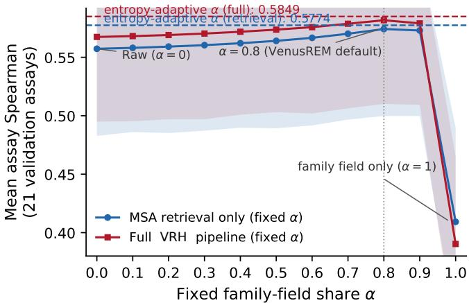  
Figure 13: Mean assay Spearman on the 21-assay validation split (PROSST-2048) under a fixed mixing coefficient α, for retrieval only and the full pipeline; bands are 95% assay-bootstrap intervals. Dashed lines: the entropy-adaptive α of Equation 8. Both endpoints degrade, and the adaptive coefficient matches or exceeds the best fixed coefficient.

Table 26 isolates the ProteinGym gate comparison: the fixed ungated correction improves 43 of 71 configurations, whereas coherence gating improves all 71 and yields the larger mean gain over retrieval.

Table 26: Coherence-gate ablation on 71 ProteinGym configurations (official Average Spearman).
<table><tr><td>Comparison</td><td>Mean ∆</td><td>Median ∆</td><td>Wins / N</td><td>Ties</td></tr><tr><td>Gated — no correction</td><td>+0.012</td><td>+0.010</td><td>71 / 71</td><td>0</td></tr><tr><td>Ungated κ = 1 − no correction</td><td>+0.003</td><td>+0.003</td><td>43 / 71</td><td>0</td></tr><tr><td>Gated − ungated κ = 1</td><td>+0.010</td><td>+0.009</td><td>71 / 71</td><td>0</td></tr></table>

## F.3 CALIBRATION IDENTITIES AND LEAVE-ONE-SITE-OUT VALIDATION

Native-channel correction. For the background in Equation 10, $\bar { b } = 2 0 ^ { - 1 } \sum _ { a \in \mathcal { A } } b _ { a }$ and $s _ { b } ^ { 2 } =$ $\begin{array} { r } { 1 9 ^ { - 1 } \sum _ { a \in \mathcal { A } } ( b _ { a } - \bar { b } ) ^ { 2 } } \end{array}$ . The implementation sets $\widehat { b } = 0$ when $s _ { b } \ \leq \ 1 0 ^ { - 8 }$ and protects Pearson denominators at $1 0 ^ { - 1 2 }$ . For fixed α and $\kappa = \kappa ( R )$ , define the corrected field

$$
G _ { i , a } = ( 1 - \alpha ) ( R _ { i , a } - \kappa \widehat { b } _ { a } ) + \alpha E _ { i , a } .\tag{26}
$$

Subtracting $G _ { i , x _ { i } }$ gives Equation 12: linearity preserves the family term $\boldsymbol { x } \Delta _ { i , a } ^ { E }$ and scales the native correction by $1 - \alpha$ . Since Pearson correlations lie in $[ - 1 , 1 ] , 0 \leq \kappa \leq 1 ;$ non-positive mean coherence gives $\kappa ~ = ~ 0$ . This establishes which channel is changed, without assuming that the background is purely bias or that its removal always improves prediction.

Excluding the focal site. For $L > 1$ , removing site i from background construction gives

$$
\begin{array} { c } { { \displaystyle b _ { a } ^ { ( - i ) } = \log \left( \frac { 1 } { L - 1 } \sum _ { 1 \leq j \leq L } e ^ { R _ { j , a } } \right) , } } \\ { { \displaystyle c _ { \mathrm { L O S O } } = \frac { 1 } { L } \sum _ { i = 1 } ^ { L } \mathrm { c o r r } _ { a \in \mathcal { A } } \left( R _ { i } , b ^ { ( - i ) } \right) , \qquad \kappa _ { \mathrm { L O S O } } = \mathrm { R e L U } ( c _ { \mathrm { L O S O } } ) . } } \end{array}\tag{27}
$$

Here LOSO denotes leave-one-site-out; removing direct self-inclusion does not imply statistical independence between sites. Across 217 PROSST-2048 assays and 187 unique WT sequences, leave-one-site-out estimation preserves the full-protein gate (Spearman $\rho = 0 . 9 8 5$ , Pearson $r =$ 0.988, median $| \Delta \kappa | = 0 . 0 1 0 )$ . Figure 14b compares the assay-level Spearman gain of adaptive calibration over the same MSA retrieval field and reports assay-bootstrap intervals within coherence quartiles. Coherence has no detectable rank association with calibration gain $( \rho = 0 . 0 1 6 , p =$ 0.811), distinguishing stability of the gate estimate from prediction of the gain magnitude.

(a) Leave-one-site-out stability  
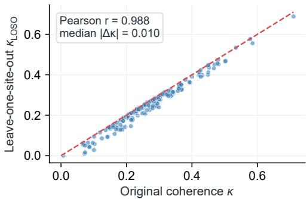

(b) Coherence-gated gain  
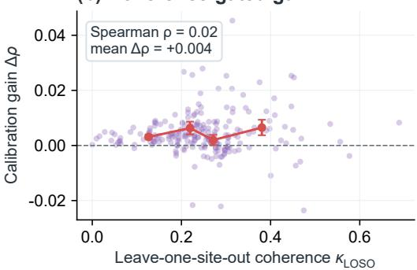  
Figure 14: Leave-one-site-out coherence across 217 PROSST-2048 assays. (a) κ<sub>LOSO</sub> preserves the full-protein gate. (b) Calibration gain over MSA retrieval versus coherence; red points show quartile means and 95% bootstrap intervals.

## F.4 EXPOSURE-AND-CONFIDENCE SHRINKAGE

Normalize pLDDT by $\ell _ { i } = \mathrm { p L D D T } _ { i } / 1 0 0$ . Let $\mathcal { T } _ { r } = \{ i : r _ { i } > 0 \}$ and $\mathcal { T } _ { \ell } = \{ i : \ell _ { i } > 0 \}$ after clipping the covariates to $[ 0 , 1 ]$ . The implementation uses

$$
\bar { r } = \frac { 1 } { \vert \mathcal { T } _ { r } \vert } \sum _ { i \in \mathcal { I } _ { r } } r _ { i } , \quad \quad \bar { \ell } = \frac { 1 } { \vert \mathcal { I } _ { \ell } \vert } \sum _ { i \in \mathcal { I } _ { \ell } } \ell _ { i } , \quad \quad \bar { q } = 1 - \bar { \ell } ,\tag{28}
$$

with a mean of zero for an empty positive-entry set. Each supplied covariate contributes its factor in Equation 13; an absent covariate array contributes one. A zero entry in a supplied array follows the formula, rather than being treated as a missing array. When neither array is supplied, $\lambda _ { i } = 1$

For any $u , { \bar { u } } \in [ 0 , 1 ] , 0 \leq \mathrm { R e L U } ( u - { \bar { u } } ) \leq 1$ , so each factor lies in [0, 1]. Their product therefore satisfies $0 \leq \bar { \lambda _ { i } } \leq \bar { 1 }$ and $| S _ { i , a } | ~ \stackrel { \cdot } { \ } \leq ~ | S _ { i , a } ^ { \mathrm { c a l } } | .$ . Positive weights preserve the sign of a site contrast; a zero weight sets it to zero. Because weights vary across sites, this does not imply unchanged cross-site ranks or preservation of the sign of a multi-substitution sum. Table 1 tests the empirical contributions of the two factors.

## F.5 VARIANT AGGREGATION AND ENSEMBLE STANDARDIZATION

For a fixed protein and member k, write $\mathcal { M } _ { v }$ for variant v’s set of substitutions, with at most one substitution per site. Equation 15 gives $\begin{array} { r } { S _ { k } ( v ) = \sum _ { ( i , a ) \in \mathcal { M } _ { v } } S _ { k , i , a } } \end{array}$ and a WT score of zero. Consequently, for substitutions $m _ { 1 } , m _ { 2 }$ at distinct sites, $S _ { k } ^ { ' ( \{ m _ { 1 } , m _ { 2 } \} ) } - S _ { k } ( \{ m _ { 1 } \} ) - S _ { k } ( \{ m _ { 2 } \} ) +$

$S _ { k } ( \emptyset ) = 0$ . This is additivity of the fixed-field readout; recomputing fields on a mutant background is a different operation.

Ensembling has also been used in ESM-1v and ProtSSN (Meier et al., 2021; Tan et al., 2025c). For the six-member ensemble, let $N _ { A } = | \mathcal { V } _ { A } | > 0$ and assume complete finite member predictions, as in the evaluated ensembles. Its normalization is

$$
\mu _ { k , A } = \frac { 1 } { N _ { A } } \sum _ { v \in \mathcal { V } _ { A } } S _ { k } ( v ) , \qquad \sigma _ { k , A } ^ { 2 } = \frac { 1 } { N _ { A } } \sum _ { v \in \mathcal { V } _ { A } } \bigl ( S _ { k } ( v ) - \mu _ { k , A } \bigr ) ^ { 2 } ,\tag{29a}
$$

$$
z _ { k , A } ( v ) = \left\{ \begin{array} { l l } { \big ( S _ { k } ( v ) - \mu _ { k , A } \big ) / \sigma _ { k , A } , } & { \sigma _ { k , A } > 0 , } \\ { 0 , } & { \sigma _ { k , A } = 0 . } \end{array} \right.\tag{29b}
$$

Equation 16 averages these six $z _ { k , A }$ values with weight $1 / 6 ,$ , including constant members as zero. Only model predictions enter $\mu _ { k , A }$ and $\sigma _ { k , A } ;$ experimental fitness values are used for evaluation, not standardization. Individual harness fields depend on the protein, MSA, structure, and backbone. The ensemble additionally depends on the declared candidate set $\mathcal { V } _ { A } \colon$ changing it can change member scales and hence the combined ranking, despite leaving every member prediction fixed.

## G PARKIN STABILITY LANDSCAPE

Parkin is a 465-residue RING-between-RING E3 ubiquitin ligase. Its VAMP-seq abundance landscape provides a cellular readout of mutational effects on folding stability and proteostasis. The original study linked reduced abundance to thermodynamic destabilization and proteasomal degradation, while also identifying local degradation signals that need not destabilize the native fold (Clausen et al., 2024). Its ubiquitin-like Ubl, RING0, RING1, IBR, REP/tether, and RING2 architecture couples folded zinc-binding domains to autoinhibitory linkers (Kumar et al., 2015). Of 8,756 measured substitutions across 462 profiled sites, 89.2% exhibit global–local separation. Raw ESM-2 650M with the wild-type interface reaches 0.503 Spearman, MSA retrieval 0.585, and VRH 0.645; abundance-class AUC rises from 0.769 to 0.815 and 0.857 (Figure 6).

The rank shift follows domain organization (Figure 6d). VRH improves every folded domain, including RING0 from 0.425 to 0.627, IBR from 0.727 to 0.786, and RING2 from 0.427 to 0.529; REP/tether rises from −0.083 to 0.221. The flexible Ubl–RING0 linker instead falls from 0.363 to 0.176. N232A lies at the 0.4th measured percentile but is ranked at the 88.8th Raw percentile; MSA retrieval and VRH move it to 58.0 and 37.3. R396H moves in the opposite direction, from 39.7 to 71.7 and 78.0, toward its measured 77.6th percentile (Figure 6e).

Cross-protein region audit. For every ProteinGym assay, we split substitutions by AlphaFold2 confidence—flexible at pLDDT < 50, ordered otherwise—and recompute within-region Spearman under the same ESM-2 650M wild-type readout, retaining subsets with at least 20 variants at five or more sites. Ordered regions improve in 83% of 214 qualifying assays (mean $\Delta \ : = \ : + 0 . 0 5 6 ;$ $5 . 6 \%$ degrade by more than 0.02). Among 65 qualifying flexible regions, 57% decrease, with mean $\Delta = - \bar { 0 . 0 2 0 }$ . The complete readout therefore exhibits a regional contrast: higher average ranking agreement in ordered regions accompanies lower average agreement in low-confidence regions.

## H SCORING INTERFACES, RUNTIME, AND EPISTASIS AUDITS

## H.1 AMORTIZED SCORE-FIELD INFERENCE

Figure 7 measures post-forward processing after one shared PROSST field has been constructed per protein. Across 2.47 million ProteinGym variants, indexed lookup reduces mutation scoring from 114.56 to 5.53 seconds $( 2 0 . 7 \times )$ , while vectorized counting reduces MSA count-matrix construction from 3,026.75 to 48.61 seconds (62.3×). Given native and family fields R and E, constructing the complete readout costs $O ( 2 0 L )$ , and scoring an M-substitution variant costs $O ( M )$ indexed lookup; the backbone parameters remain frozen. Model-resident execution, batched tokenization, vectorized field construction, and indexed lookup remove repeated work from mutation-wise loops.

## H.2 ARCHITECTURE-WIDE SCORING-INTERFACE AUDIT

For a substitution $x _ { i } \to a ,$ all three interfaces form the contrast $\Delta _ { i , a } ^ { R } = R _ { i , a } - R _ { i , x _ { i } }$ from Equation 3, but they differ in the conditioning context used to produce R. A masked marginal uses $R _ { i , a } ^ { \mathrm { m a s k } } =$ log $q _ { \theta , i } ( a ; x _ { \backslash i } ) \colon$ the wild-type residue is masked and a full length-L field requires L masked contexts, which can be batched. A wild-type or unmasked field uses $R _ { i , a } ^ { \mathrm { w t } } = \log q _ { \theta , i } ( a ; x ) \mathrm { : }$ : a single forward pass scores all sites, but the wild-type residue remains in the input, so this is a ranking interface rather than a masked conditional. Teacher forcing uses $R _ { i , a } ^ { \mathrm { t f } } = \log q _ { \theta , i } ^ { - } ( a ; x _ { < i } )$ and includes structure when the backbone requires it (Equation 1). It supplies conditionals under a declared factorization, and one native-context field can be reused across variants. These definitions are held fixed within every Raw–VRH pair (Table 27); VRH changes the readout field, not the conditioning convention.

Table 27: Conditioning and cost of three scoring interfaces. Masked inputs can be batched; teacher forcing hides the target residue at its own conditional.
<table><tr><td>Interface</td><td>Context at site i</td><td>WT residue visible</td><td>Field construction</td><td>Multi-mutant scoring</td></tr><tr><td>Masked marginal</td><td> $x _ { \backslash i }$ </td><td>No</td><td>L masked inputs</td><td>Additive native field</td></tr><tr><td>Wild-type field</td><td>Full native x</td><td>Yes</td><td>1 forward pass</td><td>Additive native field</td></tr><tr><td>Teacher forcing</td><td>Prefix x&lt;i</td><td>No (prefix only)</td><td>1 forward pass</td><td>Additive unless rescored</td></tr></table>

Bidirectional encoders: masked versus wild-type fields. Across eight paired encoder checkpoints, both masked and wild-type interfaces improve on all three benchmarks, and the same global– local gain holds across conditioning conventions (Table 28).

Table 28: Mean assay Spearman across eight paired checkpoints: ESM-1B, ESM-1V, ESM-2 8M/35M/150M/650M/3B, and SAPROT 650M-AF2. VRH uses entropy weighting. ProteinGym uses assay means (not official Average Spearman); both other benchmarks use macro-averages. Wild-type control rows are excluded from VenusViroHub evaluation.
<table><tr><td rowspan="2">Dataset</td><td colspan="3">Masked</td><td colspan="3">Wild-type</td></tr><tr><td>Raw</td><td>VRH</td><td>∆</td><td>Raw</td><td>VRH</td><td>∆</td></tr><tr><td>ProteinGym</td><td>0.389</td><td>0.468</td><td>+0.079</td><td>0.395</td><td>0.458</td><td>+0.062</td></tr><tr><td>VenusMutHub</td><td>0.157</td><td>0.218</td><td>+0.061</td><td>0.142</td><td>0.187</td><td>+0.045</td></tr><tr><td>VenusViroHub</td><td>0.082</td><td>0.239</td><td>+0.156</td><td>0.076</td><td>0.263</td><td>+0.188</td></tr></table>

Autoregressive and inverse-folding models: full-sequence likelihood versus a native field. For these architectures, full-sequence scoring teacher-forces each mutant and aggregates likelihood over the sequence, allowing the substitution to alter later conditionals. Native-field scoring instead teacher-forces the wild-type once and reads the mutant–wild-type contrast only at the mutated position. Table 29 pairs these routes on the same frozen checkpoints and ProteinGym assays.

Table 29: ProteinGym interface comparison on 217 paired assays. Full-sequence values follow the official aggregate; $\dot { \Delta }$ is native field minus full-sequence log-likelihood, and wins are paired at assay level.
<table><tr><td>Family</td><td>Model</td><td>Full sequence</td><td>Native field</td><td> $\Delta$ </td><td>Wins</td></tr><tr><td>Inverse folding</td><td>ESM-IF1</td><td>0.422</td><td>0.421</td><td>-0.001</td><td>95/217</td></tr><tr><td>Autoregressive</td><td>PROGEN2-S</td><td>0.336</td><td>0.288</td><td>-0.048</td><td>47/217</td></tr><tr><td>Autoregressive</td><td>PROGEN2-M</td><td>0.380</td><td>0.337</td><td>-0.043</td><td>54/217</td></tr><tr><td>Autoregressive</td><td>PROGEN2-B</td><td>0.378</td><td>0.330</td><td>-0.048</td><td>58/217</td></tr><tr><td>Autoregressive</td><td>PROGEN2-L</td><td>0.380</td><td>0.327</td><td>-0.053</td><td>53/217</td></tr><tr><td>Autoregressive</td><td>PROGEN2-XL</td><td>0.391</td><td>0.351</td><td>-0.040</td><td>67/217</td></tr></table>

The two routes induce almost the same ESM-IF1 ranking (assay-level Spearman 0.966), consistent with structure conditioning localizing the likelihood change. For PROGEN2, however, full-sequence likelihood retains useful downstream context and exceeds the native field by 0.040–0.053 across the five scales. The reusable field is therefore an architecture-compatible interface for VRH, not an assertion that discarding all contextual propagation must improve the backbone score.

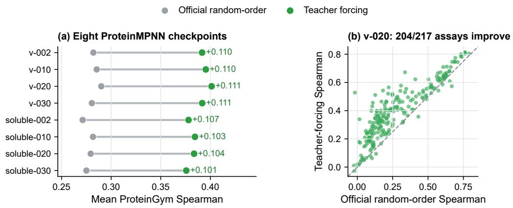

## H.3 PROTEINMPNN REVERSES THE AUTOREGRESSIVE TREND

Official score versus teacher forcing. Unlike the stable ESM-IF1 comparison and the fullsequence advantage of PROGEN2, official PROTEINMPNN scoring samples a decoding order while rebuilding each mutant sequence, making the score order-dependent. Our native teacher-forcing route evaluates one conditional amino-acid field on the native sequence and applies mutant-minuswild-type lookup (Table 30). On identical AlphaFold2 structures, this field raises mean assay Spearman from 0.271–0.290 to 0.376–0.401 across eight checkpoints while reducing wall-clock cost by 219–601×; at v 48 020, 204 of 217 assays improve (Figure 15b). The opposite directions of the ProteinMPNN and ProGen2 comparisons show that the effect of native-field scoring depends on the architecture and scoring convention. Conditional rescoring then exposes a non-additive component for the following epistasis diagnostic.

Table 30: PROTEINMPNN official random-order versus native teacher-forcing (TF) scoring.
<table><tr><td>Route</td><td>Context</td><td>Evaluations</td><td></td><td>Order Multi-mutant score</td></tr><tr><td>Official random order Mutant + structure</td><td></td><td>Per mutant</td><td>Yes</td><td>May be non-additive</td></tr><tr><td>Native TF</td><td>Native + structure</td><td>Per protein</td><td>No</td><td>Additive</td></tr><tr><td>Conditional TF</td><td>Mutant background + structure Per background No</td><td></td><td></td><td>Non-additive</td></tr></table>

Figure 15: PROTEINMPNN teacher forcing versus official random-order scoring on AlphaFold2 structures. (a) Mean assay Spearman across eight checkpoints. (b) Per-assay Spearman at v 48 020.

## H.4 PAIRWISE EPISTASIS DIAGNOSTIC

PROTEINMPNN epistasis evaluation. We evaluate epistasis on all 535,917 complete wildtype/single/single/double quartets in the GB1 binding landscape of Olson et al. (2014). Teacherforced variant scores are additive by construction, with maximum numerical deviation $4 . 8 \times 1 0 ^ { - 7 }$ so we also rescore mutation A on the B background and vice versa. Table 31 separates main effects from interactions: teacher forcing is substantially stronger for single- and double-mutant fitness, while epistasis correlations remain near zero for both the official random-order score, 0.005 with interval [−0.002, 0.013], and conditional teacher forcing, 0.012 with interval [−0.005, 0.029].

Table 31: PROTEINMPNN v 48 020 on Olson GB1; $\rho _ { \epsilon }$ is Spearman correlation with measured pairwise epistasis.
<table><tr><td>Subset</td><td>Quartets</td><td>Single TF</td><td>Single official</td><td>Double TF</td><td>Double official</td><td> $\rho _ { \epsilon }$  official</td><td> $\rho _ { \epsilon }$  conditional TF</td></tr><tr><td>All</td><td>535,917</td><td>0.306</td><td>0.105</td><td>0.284</td><td>0.165</td><td>0.005</td><td>0.012</td></tr><tr><td>Non-floor</td><td>400,118</td><td>0.312</td><td>0.091</td><td>0.292</td><td>0.152</td><td>0.012</td><td>0.022</td></tr></table>

The focused GB1 diagnostic separates representation from readout: the official and conditional routes recover little pairwise-interaction signal, while the lower-cost additive field retains substantially more main-effect signal under the same frozen backbone and structure inputs.

## I ADDITIONAL BENCHMARK TABLES

The following records separate three questions: category-specific ranking in Appendix I.1, component contributions in Appendix I.2, and alternative evaluation criteria in Appendix I.3. They retain the configuration-level evidence behind the compact summaries and mechanistic audits.

## I.1 PER-CATEGORY RAW–VRH LEADERBOARDS

Tables 32, 33, and 34 give every Raw and VRH score for ProteinGym functions, VenusMutHub assay categories, and viral phenotypes, respectively. Aggregation follows each benchmark’s primary protocol, and the Overall columns reproduce Tables 20, 23, and 24. ProSST and VENUSREM2 use the wild-type readout described in Appendix C.

Table 32: Unified Raw and VRH leaderboard on ProteinGym (official Average Spearman, UniProtunit aggregation), ranked by the Overall score over the 71 configurations. Each configuration contributes a Raw (×) and a VRH (✓) entry. Readout is the native scoring interface (mask = masked marginal, wt = wild-type field, tf = teacher forcing). Categories are the five official selection types; the best value in each column is in red.
<table><tr><td>Rank Model</td><td colspan="8">Readout VRH Overall Activity Binding Expression Organismal Stability</td></tr><tr><td>1</td><td>VenusREM2</td><td>wt</td><td>V</td><td>0.556 0.541</td><td>0.495</td><td>0.557</td><td>0.494</td><td>0.691</td></tr><tr><td>2</td><td>ProSST (K=4096)</td><td>wt</td><td>√ 0.541</td><td>0.516</td><td>0.494</td><td>0.543</td><td>0.475</td><td>0.674</td></tr><tr><td>3</td><td>ProSST (K=2048)</td><td>wt</td><td>√ 0.534</td><td>0.528</td><td>0.460</td><td>0.541</td><td>0.469</td><td>0.673</td></tr><tr><td>4</td><td>ProSST (K=1024)</td><td>wt</td><td>√ 0.532</td><td>0.513</td><td>0.467</td><td>0.533</td><td>0.476</td><td>0.670</td></tr><tr><td>5</td><td>ProSST (K=128)</td><td>wt</td><td>√ 0.525</td><td>0.508</td><td>0.472</td><td>0.517</td><td>0.463</td><td>0.663</td></tr><tr><td>6</td><td>VenusREM2</td><td>wt</td><td>X 0.524</td><td>0.480</td><td>0.479</td><td>0.538</td><td>0.444</td><td>0.681</td></tr><tr><td>7</td><td>ProSST (K=512)</td><td>wt</td><td>√ 0.524</td><td>0.507</td><td>0.464</td><td>0.520</td><td>0.464</td><td>0.665</td></tr><tr><td>8</td><td>ProSST (K=20)</td><td>wt</td><td>√ 0.510</td><td>0.493</td><td>0.452</td><td>0.507</td><td>0.446</td><td>0.650</td></tr><tr><td>9</td><td>ProSST (K=2048)</td><td>wt</td><td>X 0.507</td><td>0.476</td><td>0.445</td><td>0.530</td><td>0.431</td><td>0.653</td></tr><tr><td>10</td><td>ProSST (K=4096)</td><td>wt</td><td>X 0.498</td><td>0.444</td><td>0.472</td><td>0.507</td><td>0.416</td><td>0.652</td></tr><tr><td>11</td><td>S3F (wt)</td><td>wt</td><td>√ 0.489</td><td>0.504</td><td>0.391</td><td>0.479</td><td>0.440</td><td>0.631</td></tr><tr><td>12</td><td>S3F (mask)</td><td>mask</td><td>√ 0.488</td><td>0.496</td><td>0.407</td><td>0.472</td><td>0.443</td><td>0.619</td></tr><tr><td>13</td><td>SaProt (650M AF2, mask)</td><td>mask</td><td>√ 0.487</td><td>0.489</td><td>0.408</td><td>0.489</td><td>0.437</td><td>0.612</td></tr><tr><td>14</td><td>SaProt (650M_PDB, mask)</td><td>mask</td><td>√ 0.486</td><td>0.490</td><td>0.392</td><td>0.492</td><td>0.443</td><td>0.615</td></tr><tr><td>15</td><td>ProSST (K=1024)</td><td>wt</td><td>X 0.485</td><td>0.433</td><td>0.436</td><td>0.499</td><td>0.414</td><td>0.642</td></tr><tr><td>16</td><td>ESM3</td><td>mask</td><td>√ 0.483</td><td>0.484</td><td>0.406</td><td>0.466</td><td>0.427</td><td>0.631</td></tr><tr><td>17</td><td>ProtSSN</td><td>wt</td><td>√</td><td>0.476 0.489</td><td>0.393</td><td>0.478</td><td>0.416</td><td>0.605</td></tr><tr><td>18</td><td>ESM-IF1</td><td>tf</td><td>√</td><td>0.474 0.447</td><td>0.429</td><td>0.459</td><td>0.401</td><td>0.635</td></tr><tr><td>19</td><td>ProSST (K=512)</td><td>wt</td><td>X</td><td>0.471 0.423</td><td>0.431</td><td>0.479</td><td>0.394</td><td>0.629</td></tr><tr><td>20</td><td>ProtSSN (k=20, h=1280)</td><td>wt</td><td>√</td><td>0.470 0.482</td><td>0.390</td><td>0.469</td><td>0.406</td><td>0.603</td></tr><tr><td>21</td><td>ProtSSN (k=20, h=512)</td><td>wt</td><td>√</td><td>0.470 0.484</td><td>0.379</td><td>0.472</td><td>0.413</td><td>0.603</td></tr><tr><td>22</td><td>ESM-2 650M (mask)</td><td>mask</td><td>√</td><td>0.470</td><td>0.486</td><td>0.404</td><td>0.446</td><td>0.432 0.582</td></tr></table>

Continued on next page

Table 32 continued
<table><tr><td colspan="2">Rank Model</td><td colspan="8">Readout VRH Overall Activity Binding Expression Organismal Stability</td></tr><tr><td>23</td><td>ProtSSN (k=20, h=768)</td><td>wt</td><td>√</td><td>0.470</td><td>0.485</td><td>0.377</td><td>0.473</td><td>0.409</td><td>0.603</td></tr><tr><td>24</td><td>ProSST (K=128)</td><td>wt</td><td>X</td><td>0.469</td><td>0.417</td><td>0.440</td><td>0.472</td><td>0.387</td><td>0.628</td></tr><tr><td>25</td><td>ProtSSN (k=30, h=512)</td><td>wt</td><td>√</td><td>0.469</td><td>0.482</td><td>0.381</td><td>0.478</td><td>0.408</td><td>0.597</td></tr><tr><td>26</td><td>ESM-2 650M (wt)</td><td>wt</td><td>√</td><td>0.468</td><td>0.489</td><td>0.384</td><td>0.462</td><td>0.411</td><td>0.592</td></tr><tr><td>27</td><td>ProtSSN (k=30, h=768)</td><td>wt</td><td>√</td><td>0.467</td><td>0.481</td><td>0.386</td><td>0.463</td><td>0.407</td><td>0.597</td></tr><tr><td>28</td><td>ProtSSN (k=30, h=1280)</td><td>wt</td><td>√</td><td>0.466</td><td>0.479</td><td>0.385</td><td>0.460</td><td>0.406</td><td>0.597</td></tr><tr><td>29</td><td>S3F (mask)</td><td>mask</td><td>X</td><td>0.466</td><td>0.470</td><td>0.379</td><td>0.470</td><td>0.409</td><td>0.601</td></tr><tr><td>30</td><td>ProtSSN (k=10, h=1280)</td><td>wt</td><td>√</td><td>0.465</td><td>0.473</td><td>0.383</td><td>0.471</td><td>0.405</td><td>0.592</td></tr><tr><td>31</td><td>SaProt (35M_AF2, mask)</td><td>mask</td><td>√</td><td>0.465</td><td>0.450</td><td>0.384</td><td>0.464</td><td>0.404</td><td>0.622</td></tr><tr><td>32</td><td>ESMC-600M</td><td>mask</td><td>√</td><td>0.464</td><td>0.480</td><td>0.371</td><td>0.444</td><td>0.439</td><td>0.587</td></tr><tr><td>33</td><td>SaProt (650M_PDB, mask)</td><td>mask</td><td>X</td><td>0.463</td><td>0.464</td><td>0.370</td><td>0.488</td><td>0.405</td><td>0.590</td></tr><tr><td>34</td><td>ESM-1v (mask)</td><td>mask</td><td>√</td><td>0.462</td><td>0.482</td><td>0.364</td><td>0.453</td><td>0.440</td><td>0.572</td></tr><tr><td>35</td><td>ESM-2 3B (mask)</td><td>mask</td><td>V</td><td>0.462</td><td>0.483</td><td>0.377</td><td>0.441</td><td>0.437</td><td>0.571</td></tr><tr><td>36</td><td>ProtSSN (k=10, h=512)</td><td>wt</td><td>√</td><td>0.462</td><td>0.479</td><td>0.379</td><td>0.457</td><td>0.402</td><td></td></tr><tr><td>37</td><td>ESMC-300M</td><td>mask</td><td>√</td><td>0.460</td><td>0.479</td><td>0.370</td><td>0.433</td><td>0.433</td><td>0.592</td></tr><tr><td>38</td><td>S3F (wt)</td><td>wt</td><td>X</td><td>0.460</td><td>0.469</td><td>0.365</td><td>0.453</td><td>0.406</td><td>0.584</td></tr><tr><td>39</td><td>MIF-ST</td><td>tf</td><td>√</td><td>0.458</td><td>0.440</td><td>0.369</td><td>0.465</td><td>0.404</td><td>0.605</td></tr><tr><td>40</td><td>SaProt (650M AF2, mask)</td><td>mask</td><td>X</td><td>0.457</td><td>0.459</td><td>0.384</td><td>0.485</td><td>0.371</td><td>0.611</td></tr><tr><td>41</td><td>ProtSSN (k=10, h=768)</td><td>wt</td><td>√</td><td>0.457</td><td>0.470</td><td>0.368</td><td>0.459</td><td>0.398</td><td>0.588</td></tr><tr><td>42</td><td>ESM-1v (wt)</td><td>wt</td><td>√</td><td>0.457</td><td>0.480</td><td>0.342</td><td>0.466</td><td>0.425</td><td>0.589 0.569</td></tr><tr><td>43</td><td>ProteinMPNN (v_48_020)</td><td>tf</td><td>√</td><td>0.456</td><td>0.415</td><td>0.394</td><td>0.455</td><td>0.369</td><td></td></tr><tr><td>44</td><td>ESM-1b (mask)</td><td>mask</td><td>√</td><td>0.455</td><td>0.473</td><td>0.366</td><td>0.448</td><td>0.429</td><td>0.648 0.560</td></tr><tr><td>45</td><td>ESM-2 150M (wt)</td><td>wt</td><td>√</td><td>0.455</td><td>0.472</td><td>0.370</td><td>0.454</td><td>0.385</td><td>0.594</td></tr><tr><td>46</td><td>ESM-2 3B (wt)</td><td>wt</td><td>√</td><td>0.455</td><td>0.479</td><td>0.355</td><td>0.455</td><td>0.414</td><td>0.570</td></tr><tr><td>47</td><td>SaProt (650M AF2, wt)</td><td></td><td></td><td>0.454</td><td>0.464</td><td>0.366</td><td>0.479</td><td>0.359</td><td>0.600</td></tr><tr><td>48</td><td>ProteinMPNN (v_48_030)</td><td>wt tf</td><td>√</td><td>0.453</td><td>0.416</td><td>0.384</td><td>0.453</td><td>0.367</td><td></td></tr><tr><td>49</td><td>ESM-2 150M (mask)</td><td></td><td>√</td><td>0.452</td><td>0.466</td><td>0.367</td><td>0.432</td><td>0.409</td><td>0.645</td></tr><tr><td></td><td>CARP-640M</td><td>mask</td><td>√</td><td>0.451</td><td>0.465</td><td>0.364</td><td>0.438</td><td>0.428</td><td>0.583</td></tr><tr><td>50</td><td>ProtSSN</td><td>wt</td><td>√</td><td>0.451</td><td>0.467</td><td>0.371</td><td>0.452</td><td>0.398</td><td>0.563</td></tr><tr><td>51</td><td>ProteinMPNN (v_48_010)</td><td>wt</td><td>X</td><td></td><td>0.414</td><td>0.387</td><td>0.453</td><td></td><td>0.570</td></tr><tr><td>52</td><td>SaProt (650M_PDB, wt)</td><td>tf</td><td>√</td><td>0.451</td><td>0.451</td><td>0.346</td><td>0.474</td><td>0.366</td><td>0.635</td></tr><tr><td>53</td><td></td><td>wt</td><td>√</td><td>0.450</td><td>0.466</td><td>0.347</td><td>0.452</td><td>0.377</td><td>0.604</td></tr><tr><td>54</td><td>ESM-1b (wt)</td><td>wt</td><td>√</td><td>0.447 0.444</td><td>0.459</td><td>0.368</td><td>0.439</td><td>0.409</td><td>0.562</td></tr><tr><td>55</td><td>ProtSSN (k=20, h=1280)</td><td>wt</td><td>X</td><td></td><td>0.458</td><td>0.357</td><td>0.440</td><td>0.385</td><td>0.568</td></tr><tr><td>56</td><td>ProtSSN (k=20, h=512)</td><td>wt</td><td>X</td><td>0.443 0.443</td><td>0.414</td><td>0.370</td><td>0.441</td><td>0.392 0.359</td><td>0.567</td></tr><tr><td>57</td><td>ProteinMPNN (v_48_002)</td><td>tf</td><td>√</td><td>0.442</td><td>0.441</td><td>0.381</td><td>0.449</td><td>0.353</td><td>0.630</td></tr><tr><td>58</td><td>ESM3 ProtSSN (k=20, h=768)</td><td>mask</td><td>X</td><td>0.442</td><td>0.461</td><td>0.353</td><td>0.443</td><td>0.387</td><td>0.586</td></tr><tr><td>59</td><td>ProtSSN (k=30, h=768)</td><td>wt</td><td>X</td><td>0.441</td><td>0.459</td><td>0.363</td><td>0.435</td><td>0.386</td><td>0.567 0.562</td></tr><tr><td>60 61</td><td>ProtSSN (k=30, h=512)</td><td>wt</td><td>X</td><td>0.441</td><td>0.455</td><td>0.355</td><td>0.449</td><td>0.385</td><td>0.560</td></tr><tr><td>62</td><td>ProtSSN (k=30, h=1280)</td><td>wt</td><td>X</td><td>0.439</td><td>0.456</td><td>0.361</td><td>0.433</td><td>0.386</td><td>0.561</td></tr><tr><td>63</td><td>ProSST (K=20)</td><td>wt wt</td><td>X X</td><td>0.438 0.436</td><td>0.392 0.445</td><td>0.410</td><td>0.447</td><td>0.354</td></tr><tr><td>79</td><td>ProGen2-B</td><td>tf</td><td>√</td><td>0.422</td><td>0.454</td><td>0.303</td><td>0.431</td><td>0.407</td><td>0.514</td></tr><tr><td>80</td><td>ESM-IF1</td><td>tf</td><td>X</td><td>0.421</td><td>0.357 0.382</td><td></td><td>0.435</td><td>0.313</td><td>0.617</td></tr><tr><td>81</td><td>ProGen2-XL</td><td>tf</td><td>√</td><td>0.419</td><td>0.446</td><td>0.317</td><td>0.415</td><td>0.407</td><td>0.508</td></tr><tr><td>82</td><td>ESM-2 650M (wt)</td><td>wt</td><td>X</td><td>0.418</td><td>0.454</td><td>0.325</td><td>0.412</td><td>0.356</td><td>0.541</td></tr><tr><td>83</td><td>ProGen2-L</td><td>tf</td><td>√</td><td>0.416</td><td>0.452</td><td>0.283</td><td>0.426</td><td>0.403</td><td>0.514</td></tr><tr><td>84</td><td>ESM-2 650M (mask)</td><td>mask</td><td>X</td><td>0.415</td><td>0.431</td><td>0.337</td><td>0.415</td><td>0.368</td><td>0.523</td></tr><tr><td>85</td><td>CARP-38M</td><td>wt</td><td>√</td><td>0.415</td><td>0.422</td><td>0.346</td><td>0.406</td><td>0.351</td><td>0.547</td></tr><tr><td>86</td><td>ProGen3-339M</td><td>tf</td><td>√</td><td>0.414</td><td>0.431</td><td>0.340</td><td>0.388</td><td>0.398</td><td>0.514</td></tr><tr><td>87</td><td>ProGen3-762M</td><td>tf</td><td>√</td><td>0.413</td><td>0.441</td><td>0.310</td><td>0.391</td><td>0.409</td><td>0.516</td></tr><tr><td>88</td><td>ProGen3-3B</td><td>tf</td><td>√</td><td>0.413</td><td>0.437</td><td>0.292</td><td>0.416</td><td>0.400</td><td></td></tr><tr><td>89</td><td>ESM-1v (wt)</td><td>wt</td><td></td><td>0.410</td><td>0.445</td><td>0.293</td><td>0.430</td><td>0.381</td><td>0.521</td></tr><tr><td>90</td><td>ESMC-300M</td><td>mask</td><td>X</td><td>0.409</td><td>0.429</td><td>0.320</td><td>0.406</td><td>0.367</td><td>0.500</td></tr><tr><td></td><td>ProGen3-219M</td><td>tf</td><td>X</td><td>0.409</td><td>0.422</td><td>0.347</td><td>0.377</td><td>0.391</td><td>0.523</td></tr><tr><td>91</td><td>SaProt (35M_AF2, mask)</td><td>mask</td><td>√</td><td>0.408</td><td>0.369</td><td>0.360</td><td>0.441</td><td>0.294</td><td>0.508</td></tr><tr><td>92</td><td>RITA-L</td><td></td><td>X</td><td>0.407</td><td>0.432</td><td>0.308</td><td>0.409</td><td>0.400</td><td>0.576</td></tr><tr><td>93</td><td>ESM-2 3B (mask)</td><td>tf</td><td>√</td><td>0.407</td><td>0.423</td><td>0.321</td><td>0.403</td><td></td><td>0.486</td></tr><tr><td>94</td><td>ESMC-600M</td><td>mask</td><td>X</td><td>0.407</td><td>0.427</td><td>0.295</td><td>0.413</td><td>0.378</td><td>0.509</td></tr><tr><td>95</td><td>ESM-1v (mask)</td><td>mask</td><td>X</td><td>0.407</td><td>0.421</td><td>0.320</td><td>0.429</td><td>0.372</td><td>0.528</td></tr><tr><td>96 97</td><td>ESM-2 3B (wt)</td><td>mask</td><td>X</td><td>0.406</td><td>0.440</td><td>0.300</td><td>0.404</td><td>0.386</td><td>0.477</td></tr><tr><td></td><td>ProGen2-S</td><td>wt</td><td>X</td><td>0.406</td><td>0.425</td><td>0.328</td><td>0.381</td><td>0.366 0.385</td><td>0.521</td></tr><tr><td>98</td><td>ProGen3-1B</td><td>tf</td><td>√</td><td>0.406</td><td>0.436</td><td>0.274</td><td>0.395</td><td>0.409</td><td>0.512</td></tr><tr><td>99 100</td><td>RITA-M</td><td>tf</td><td>√</td><td>0.405</td><td>0.432</td><td>0.304</td><td>0.395</td><td>0.397</td><td>0.514</td></tr><tr><td>101</td><td>RITA-XL</td><td>tf tf</td><td>√</td><td>0.401</td><td>0.423</td><td>0.298</td><td>0.418</td><td>0.386</td><td>0.495</td></tr><tr><td>102</td><td>ProGen3-112M</td><td>tf</td><td>√</td><td>0.401</td><td>0.413</td><td>0.340</td><td>0.365</td><td>0.379</td><td>0.482</td></tr><tr><td>103</td><td>RITA-S</td><td>tf</td><td>√</td><td>0.398</td><td>0.415</td><td>0.336</td><td>0.370</td><td>0.379</td><td>0.509</td></tr><tr><td>104</td><td>ESM-2 8M (mask)</td><td></td><td>√</td><td>0.395</td><td>0.389</td><td>0.322</td><td>0.380</td><td>0.347</td><td>0.491</td></tr><tr><td>105</td><td>ESM-1b (wt)</td><td>mask</td><td>√</td><td>0.394</td><td>0.428</td><td>0.287</td><td>0.406</td><td>0.350</td><td>0.538</td></tr><tr><td></td><td>ESM-2 150M (wt)</td><td>wt</td><td>X</td><td>0.393</td><td>0.422</td><td>0.316</td><td>0.400</td><td>0.297</td><td>0.500</td></tr><tr><td>106</td><td>CARP-640M</td><td>wt</td><td>X</td><td>0.390</td><td>0.403</td><td>0.289</td><td>0.401</td><td></td><td>0.528</td></tr><tr><td>107</td><td>ProteinMPNN (v_48_020)</td><td>wt</td><td>X</td><td></td><td>0.316</td><td>0.332</td><td>0.411</td><td>0.372</td><td>0.486</td></tr><tr><td>108</td><td>ESM-1b (mask)</td><td>tf</td><td>X</td><td>0.389</td><td>0.406</td><td>0.297</td><td>0.409</td><td>0.287</td><td>0.601</td></tr><tr><td>109</td><td>ESM-2 150M (mask)</td><td>mask</td><td>X</td><td>0.389 0.388</td><td>0.400</td><td>0.326</td><td>0.402</td><td>0.354</td><td>0.480</td></tr><tr><td>110</td><td>ESM-2 8M (wt)</td><td>mask</td><td>X</td><td></td><td>0.376</td><td>0.323</td><td>0.401</td><td>0.304</td><td>0.510</td></tr><tr><td>111</td><td>ProteinMPNN (v_48_010)</td><td>wt</td><td>√</td><td>0.387 0.385</td><td>0.316</td><td>0.329</td><td>0.410</td><td>0.307</td><td>0.531</td></tr><tr><td>112</td><td>ProteinMPNN (v_48_030)</td><td>tf</td><td>X</td><td></td><td>0.309</td><td>0.330</td><td>0.404</td><td>0.284</td><td>0.584</td></tr><tr><td>113</td><td>114 ProteinMPNN (v_48_002)</td><td>tf</td><td>X</td><td>0.381</td><td>0.318</td><td>0.312</td><td>0.396</td><td>0.278</td><td>0.584</td></tr><tr><td></td><td>SaProt (35M_AF2, wt)</td><td>tf</td><td>X</td><td>0.378</td><td>0.334</td><td>0.320</td><td>0.398</td><td>0.276</td><td>0.587</td></tr><tr><td>115</td><td>ProteinMPNN-Soluble (v_48_010) tf</td><td>wt</td><td>X</td><td>0.366</td><td>0.295</td><td>0.317</td><td>0.336</td><td>0.231 0.283</td><td>0.545</td></tr><tr><td>116</td><td>ProteinMPNN-Soluble (v_48_020) tf</td><td></td><td>X</td><td>0.363 0.361</td><td>0.288</td><td>0.309</td><td>0.339</td><td>0.286</td><td>0.587 0.585</td></tr><tr><td>117 118</td><td>CARP-76M</td><td></td><td>X</td><td>0.360</td><td>0.378</td><td>0.290</td><td>0.372</td><td>0.273</td><td>0.487</td></tr><tr><td>119</td><td>ProteinMPNN-Soluble (v_48_002) tf</td><td>wt</td><td>X X</td><td>0.357</td><td>0.291</td><td>0.308</td><td>0.333</td><td>0.275</td></tr><tr><td>135 ProGen2-S</td><td>tf</td><td>X</td><td>0.288</td><td>0.300</td><td>0.272</td><td>0.309</td><td>0.291</td><td>0.269</td></tr><tr><td>136 ProGen3-339M</td><td>tf</td><td>X</td><td>0.286</td><td>0.304</td><td>0.280</td><td>0.311</td><td>0.319</td><td>0.217</td></tr><tr><td>137 ProGen3-219M</td><td>tf</td><td>X</td><td>0.264</td><td>0.274</td><td>0.279</td><td>0.288</td><td>0.296</td><td>0.185</td></tr><tr><td>138 RITA-S</td><td>tf</td><td>X</td><td>0.254</td><td>0.248</td><td>0.267</td><td>0.277</td><td>0.289</td><td>0.190</td></tr><tr><td>139 ESM-2 8M (wt)</td><td>wt</td><td>X</td><td>0.251</td><td>0.217</td><td>0.244</td><td>0.264</td><td>0.131</td><td>0.399</td></tr><tr><td>140 ProGen3-112M</td><td>tf</td><td>X</td><td>0.232</td><td>0.244</td><td>0.260</td><td>0.253</td><td>0.265</td><td>0.139</td></tr><tr><td>141 ESM-2 8M (mask)</td><td>mask</td><td>X</td><td>0.223</td><td>0.191</td><td>0.260</td><td>0.266</td><td>0.139</td><td>0.262</td></tr><tr><td>142 CARP-600K</td><td>wt</td><td>X</td><td>0.159</td><td>0.142</td><td>0.090</td><td>0.167</td><td>0.065</td><td>0.331</td></tr></table>

Table 33 retains the VenusMutHub task breakdown. Its within-benchmark ordering shows which configurations support each task beyond the assay-macro average.

Table 33: Unified Raw and VRH leaderboard on VenusMutHub (assay-macro Spearman), ranked by the Overall score over the 71 configurations. Each configuration contributes a Raw (×) and a VRH (✓) entry. Readout is the native scoring interface (mask / wt / tf). Categories are the five assay tasks; the best value in each column is in red.
<table><tr><td>Rank Model</td><td></td><td>Readout VRH Overall stability</td><td></td><td></td><td></td><td></td><td>y activity PPI bind. selectivity DTI bind.</td><td></td></tr><tr><td>1</td><td>ProteinMPNN (v_48_020)</td><td>tf</td><td>√</td><td>0.271 0.399</td><td>0.108</td><td>0.024</td><td>0.012</td><td>0.198</td></tr><tr><td>2</td><td>ESM-IF1</td><td>tf</td><td>√ 0.267</td><td>0.356</td><td>0.152</td><td>0.108</td><td>0.018</td><td>0.269</td></tr><tr><td>3</td><td>ProteinMPNN-Soluble (v_48_020) tf</td><td></td><td>√</td><td>0.265 0.396</td><td>0.106</td><td>0.036</td><td>0.000</td><td>0.093</td></tr><tr><td>4</td><td>ProteinMPNN-Soluble (v_48_030) tf</td><td></td><td>√ 0.265</td><td>0.383</td><td>0.120</td><td>0.039</td><td>0.022</td><td>0.168</td></tr><tr><td>5</td><td>ProteinMPNN (v_48_030)</td><td>tf</td><td>√</td><td>0.259 0.388</td><td>0.106</td><td>0.019</td><td>-0.020</td><td>0.137</td></tr><tr><td>6</td><td>VenusREM2</td><td>wt</td><td>√</td><td>0.258 0.351</td><td>0.122</td><td>0.113</td><td>-0.017</td><td>0.274</td></tr><tr><td>7</td><td>ProteinMPNN-Soluble (v_48_010) tf</td><td></td><td>√</td><td>0.256 0.383</td><td>0.104</td><td>0.023</td><td>-0.025</td><td>0.133</td></tr><tr><td>8</td><td>ProteinMPNN (v_48_010)</td><td>tf</td><td>√</td><td>0.256 0.383</td><td>0.095</td><td>0.038</td><td>-0.023</td><td>0.122</td></tr><tr><td>9</td><td>ProteinMPNN-Soluble (v_48_002) tf</td><td></td><td>√ 0.250</td><td>0.379</td><td>0.075</td><td>0.033</td><td>-0.016</td><td>0.152</td></tr><tr><td>10</td><td>ProSST (K=2048)</td><td>wt</td><td>√ 0.249</td><td>0.348</td><td>0.118</td><td>0.103</td><td>-0.048</td><td>0.204</td></tr><tr><td>11</td><td>ProteinMPNN (v_48_002)</td><td>tf</td><td>√ 0.244</td><td>0.370</td><td>0.069</td><td>0.021</td><td>0.020</td><td>0.134</td></tr><tr><td>12</td><td>ProSST (K=1024)</td><td>wt</td><td>√ 0.242</td><td>0.334</td><td>0.120</td><td>0.083</td><td>-0.014</td><td>0.236</td></tr><tr><td>13</td><td>SaProt (650M_PDB, mask)</td><td>mask</td><td>√ 0.240</td><td>0.319</td><td>0.139</td><td>0.090</td><td>-0.014</td><td>0.282</td></tr><tr><td>14</td><td>SaProt (650M AF2, mask)</td><td>mask</td><td>√ 0.240</td><td>0.316</td><td>0.161</td><td>0.091</td><td>0.004</td><td>0.200</td></tr><tr><td>15</td><td>ProSST (K=20)</td><td>wt</td><td>√ 0.238</td><td>0.327</td><td>0.083</td><td>0.122</td><td>-0.036</td><td>0.312</td></tr><tr><td>16</td><td>ProSST (K=4096)</td><td>wt</td><td>√ 0.237</td><td>0.324</td><td>0.117</td><td>0.096</td><td>0.031</td><td>0.177</td></tr><tr><td>17</td><td>SaProt (35M_AF2, mask)</td><td>mask</td><td>√ 0.237</td><td>0.312</td><td>0.171</td><td>0.068</td><td>-0.040</td><td>0.256</td></tr><tr><td>18</td><td>S3F (mask)</td><td>mask</td><td>√ 0.234</td><td>0.316</td><td>0.140</td><td>0.095</td><td>-0.030</td><td>0.195</td></tr><tr><td>19</td><td>ProSST (K=128)</td><td>wt</td><td>V 0.230</td><td>0.305</td><td>0.117</td><td>0.121</td><td>-0.015</td><td>0.261</td></tr><tr><td>20</td><td>MIF-ST</td><td>tf</td><td>√ 0.230</td><td>0.352</td><td>0.044</td><td>0.079</td><td>-0.106</td><td>0.169</td></tr><tr><td>21</td><td>ESM3</td><td>mask</td><td>√ 0.226</td><td>0.302</td><td>0.150</td><td>0.106</td><td>-0.034</td><td>0.142</td></tr><tr><td>22</td><td>ProSST (K=512)</td><td>wt</td><td>√</td><td>0.226 0.313</td><td>0.102</td><td>0.083</td><td>-0.037</td><td>0.264</td></tr><tr><td>23</td><td>ESM-2 150M (mask)</td><td>mask</td><td>√ 0.225</td><td>0.291</td><td>0.173</td><td>0.079</td><td>-0.002</td><td>0.206</td></tr><tr><td>24</td><td>S3F (wt)</td><td>wt</td><td>√ 0.224</td><td>0.304</td><td>0.111</td><td>0.123</td><td>-0.022</td><td>0.175</td></tr><tr><td>25</td><td>ESM-2 3B (mask)</td><td>mask</td><td>√</td><td>0.223 0.277</td><td>0.180</td><td>0.113</td><td>-0.081</td><td>0.295</td></tr><tr><td>26</td><td>ProteinMPNN-Soluble (v_48_030) tf</td><td></td><td>X 0.222</td><td>0.357</td><td>0.026</td><td>-0.030</td><td>0.030</td><td>0.131</td></tr><tr><td>27</td><td>ProteinMPNN (v_48_020)</td><td>tf</td><td>X</td><td>0.221 0.366</td><td>0.006</td><td>-0.033</td><td>-0.001</td><td>0.116</td></tr><tr><td>28</td><td>ProteinMPNN (v_48_010)</td><td>tf</td><td>X</td><td>0.218 0.360</td><td>0.013</td><td>-0.034</td><td>-0.050</td><td>0.155</td></tr><tr><td>29</td><td>ESM-2 150M (wt)</td><td>wt</td><td>√</td><td>0.216 0.288</td><td>0.127</td><td>0.110</td><td>-0.015</td><td>0.186</td></tr><tr><td>30</td><td>ESM-IF1</td><td>tf</td><td>X</td><td>0.216 0.328</td><td>0.074</td><td>0.040</td><td>0.018</td><td>0.021</td></tr><tr><td>31</td><td>ProteinMPNN-Soluble (v_48_020) tf</td><td></td><td>X</td><td>0.216 0.367</td><td>0.004</td><td>-0.049</td><td>0.000</td><td>0.031</td></tr><tr><td>32</td><td>SaProt (650M_PDB, wt)</td><td>wt</td><td>√</td><td>0.215 0.304</td><td>0.059</td><td>0.078</td><td>-0.034</td><td>0.319</td></tr><tr><td>33</td><td>ESM-2 650M (mask)</td><td>mask</td><td>√</td><td>0.213 0.280</td><td>0.149</td><td>0.100</td><td>-0.063</td><td>0.197</td></tr><tr><td>34</td><td>ProSST (K=2048)</td><td>wt</td><td>X</td><td>0.213 0.315</td><td>0.076</td><td>0.064</td><td>-0.065</td><td>0.137</td></tr><tr><td>35</td><td>ESM-2 35M (mask)</td><td>mask</td><td>√</td><td>0.212 0.280</td><td>0.158</td><td>0.049</td><td>0.003</td><td>0.185</td></tr><tr><td>36</td><td>ProteinMPNN-Soluble (v_48_010) tf</td><td></td><td>X</td><td>0.212 0.357</td><td>-0.004</td><td>-0.042</td><td>-0.070</td><td>0.167</td></tr></table>

Continued on next page

Table 33 continued
<table><tr><td colspan="2">Rank Model</td><td colspan="8">Readout VRH Overall stability activity PPI bind. selectivity DTI bind.</td></tr><tr><td>37</td><td>S3F (mask)</td><td>mask X</td><td>0.211</td><td></td><td>0.295 0.109</td><td></td><td>0.043</td><td>-0.007</td><td>0.203</td></tr><tr><td>38</td><td>ESM-1b (mask)</td><td>mask</td><td>√</td><td>0.211</td><td>0.265</td><td>0.163</td><td>0.126</td><td>-0.048</td><td>0.211</td></tr><tr><td>39</td><td>ProteinMPNN (v_48_030)</td><td>tf</td><td>X</td><td>0.210</td><td>0.357</td><td>0.009</td><td>-0.060</td><td>-0.022</td><td>0.067</td></tr><tr><td>40</td><td>SaProt (650M AF2, mask)</td><td>mask</td><td>X</td><td>0.207</td><td>0.275</td><td>0.152</td><td>0.058</td><td>0.014</td><td>0.143</td></tr><tr><td>41</td><td>ESM-1v (mask)</td><td>mask</td><td>√</td><td>0.206</td><td>0.268</td><td>0.165</td><td>0.081</td><td>-0.082</td><td>0.201</td></tr><tr><td>42</td><td>CARP-640M</td><td>wt</td><td>√</td><td>0.206</td><td>0.271</td><td>0.151</td><td>0.076</td><td>-0.094</td><td>0.236</td></tr><tr><td>43</td><td>SaProt (650M_PDB, mask)</td><td>mask</td><td>X</td><td>0.205</td><td>0.275</td><td>0.116</td><td>0.048</td><td>-0.013</td><td>0.285</td></tr><tr><td>44</td><td>SaProt (650M AF2, wt)</td><td>wt</td><td>√</td><td>0.202</td><td>0.286</td><td>0.093</td><td>0.057</td><td>-0.035</td><td>0.175</td></tr><tr><td>45</td><td>ProteinMPNN-Soluble (v_48_002) tf</td><td></td><td>X</td><td>0.198</td><td>0.340</td><td>-0.021</td><td>-0.039</td><td>-0.054</td><td></td></tr><tr><td>46</td><td>ESMC-300M</td><td>mask</td><td>√</td><td>0.198</td><td>0.254</td><td>0.151</td><td>0.106</td><td>-0.059</td><td>0.135</td></tr><tr><td>47</td><td>ESM-2 8M (mask)</td><td>mask</td><td></td><td>0.198</td><td>0.256</td><td>0.144</td><td>0.067</td><td>-0.045</td><td>0.181</td></tr><tr><td>48</td><td>ProtSSN (k=20, h=1280)</td><td></td><td>√</td><td>0.198</td><td>0.282</td><td>0.072</td><td>0.083</td><td>-0.034</td><td>0.248</td></tr><tr><td>49</td><td>ProtSSN (k=10, h=512)</td><td>wt</td><td>√</td><td>0.197</td><td>0.286</td><td>0.064</td><td>0.079</td><td>-0.050</td><td>0.162</td></tr><tr><td>50</td><td>MIF-ST</td><td>wt</td><td>√</td><td>0.196</td><td>0.317</td><td>0.017</td><td>0.029</td><td>-0.110</td><td>0.164</td></tr><tr><td>51</td><td>ProtSSN</td><td>tf</td><td>X</td><td>0.195</td><td>0.281</td><td>0.079</td><td>0.084</td><td></td><td>0.135</td></tr><tr><td>52</td><td>CARP-76M</td><td>wt</td><td>√</td><td>0.194</td><td>0.259</td><td>0.119</td><td>0.083</td><td>-0.050</td><td>0.110</td></tr><tr><td>53</td><td>ProGen2-B</td><td>wt</td><td>√</td><td>0.194</td><td>0.252</td><td>0.142</td><td>0.100</td><td>-0.034 -0.089</td><td>0.196</td></tr><tr><td>54</td><td>ESMC-600M</td><td>tf</td><td>√</td><td>0.194</td><td>0.248</td><td>0.142</td><td>0.108</td><td>-0.069</td><td>0.195</td></tr><tr><td>55</td><td>ESM-2 3B (wt)</td><td>mask</td><td>√ √</td><td>0.194</td><td>0.262</td><td>0.100</td><td>0.082</td><td>-0.060</td><td>0.210</td></tr><tr><td>56</td><td>ESM-1b (wt)</td><td>wt</td><td></td><td>0.193</td><td>0.255</td><td>0.098</td><td>0.131</td><td>-0.069</td><td>0.242</td></tr><tr><td>57</td><td>RITA-L</td><td>wt</td><td>√</td><td>0.193</td><td>0.250</td><td>0.138</td><td>0.101</td><td>-0.056</td><td>0.246</td></tr><tr><td>58</td><td>S3F (wt)</td><td>tf</td><td>√</td><td>0.193</td><td>0.271</td><td>0.082</td><td>0.068</td><td>-0.024</td><td>0.188</td></tr><tr><td>59</td><td>ProGen2-S</td><td>wt tf</td><td>X √</td><td>0.192</td><td>0.246</td><td>0.153</td><td>0.086</td><td>-0.070</td><td>0.182</td></tr><tr><td>60</td><td>ProtSSN (k=20, h=512)</td><td></td><td>√</td><td>0.192</td><td>0.270</td><td>0.078</td><td>0.095</td><td>-0.046</td><td>0.209</td></tr><tr><td>61</td><td>ProtSSN (k=10, h=1280)</td><td>wt wt</td><td>√</td><td>0.192</td><td>0.279</td><td>0.072</td><td>0.090</td><td>-0.044</td><td>0.156</td></tr><tr><td></td><td>ProtSSN (k=30, h=512)</td><td></td><td></td><td>0.191</td><td>0.276</td><td>0.073</td><td>0.077</td><td>-0.055</td><td>0.070</td></tr><tr><td>62</td><td>ProteinMPNN (v_48_002)</td><td>wt</td><td>√</td><td>0.191</td><td>0.328</td><td>-0.021</td><td>-0.032</td><td>0.001</td><td>0.142</td></tr><tr><td>63</td><td>ProtSSN (k=20, h=768)</td><td>tf</td><td>X</td><td>0.191</td><td>0.271</td><td>0.078</td><td>0.098</td><td>-0.044</td><td>0.064</td></tr><tr><td>64</td><td>ProGen3-219M</td><td>wt</td><td>√</td><td>0.190</td><td>0.242</td><td>0.155</td><td>0.101</td><td>-0.059</td><td>0.110</td></tr><tr><td>65</td><td>VenusREM2</td><td>tf</td><td>√</td><td>0.190</td><td>0.294</td><td>0.018</td><td>0.006</td><td></td><td>0.157</td></tr><tr><td>66</td><td>ProGen3-339M</td><td>wt</td><td>X</td><td>0.189</td><td>0.242</td><td>0.162</td><td>0.081</td><td>-0.049 -0.071</td><td>0.267</td></tr><tr><td>67 68</td><td>ProGen2-L</td><td>tf</td><td>√</td><td>0.188</td><td>0.243</td><td>0.146</td><td>0.084</td><td>-0.088</td><td>0.169</td></tr><tr><td>69</td><td>ESM-1v (wt)</td><td>tf</td><td>√</td><td>0.188</td><td>0.256</td><td>0.112</td><td>0.097</td><td>-0.068</td><td>0.224</td></tr><tr><td>70</td><td>SaProt (35M_AF2, mask)</td><td>wt</td><td>√</td><td>0.188</td><td>0.258</td><td>0.153</td><td>-0.017</td><td>-0.047</td><td>0.133</td></tr><tr><td>71</td><td>ESM-2 650M (wt)</td><td>mask</td><td>X</td><td>0.187</td><td>0.259</td><td>0.089</td><td>0.081</td><td>-0.056</td><td>0.180 0.188</td></tr><tr><td>72</td><td>RITA-M</td><td>wt tf</td><td>√ √</td><td>0.186</td><td>0.239</td><td>0.138</td><td>0.115</td><td>-0.101</td><td>0.203</td></tr><tr><td>73</td><td>ESM-2 35M (wt)</td><td>wt</td><td>√</td><td>0.186</td><td>0.265</td><td>0.092</td><td>0.055</td><td>-0.024</td><td>0.120</td></tr><tr><td>74</td><td>ESM3</td><td>mask</td><td>X</td><td>0.185</td><td>0.264</td><td>0.128</td><td>-0.002</td><td>-0.032</td><td>0.106</td></tr><tr><td>75</td><td>ProtSSN (k=30, h=768)</td><td>wt</td><td>√</td><td>0.185</td><td>0.262</td><td>0.077</td><td>0.092</td><td>-0.042</td><td>0.113</td></tr><tr><td>76</td><td>ProtSSN (k=30, h=1280)</td><td>wt</td><td>√</td><td>0.183</td><td>0.262</td><td>0.055</td><td>0.095</td><td>-0.042</td><td>0.167</td></tr><tr><td>77</td><td>ESM-2 3B (mask)</td><td>mask</td><td>X</td><td>0.182 0.182</td><td>0.228 0.256 0.050</td><td>0.161 0.033</td><td>0.058</td><td>-0.082 0.274</td></tr><tr><td>Rank Model</td><td></td><td colspan="8">Readout VRH Overall stability activity PPI bind. selectivity DTI bind.</td></tr><tr><td>93</td><td>ProtSSN (k=30, h=512)</td><td>wt</td><td>X</td><td>0.169</td><td>0.244</td><td>0.076</td><td>0.030</td><td>-0.057</td><td>0.182</td></tr><tr><td>94</td><td>ProtSSN (k=10, h=512)</td><td>wt</td><td>X</td><td>0.169</td><td>0.247</td><td>0.061</td><td>0.044</td><td>-0.053</td><td>0.168</td></tr><tr><td>95</td><td>ProtSSN (k=20, h=512)</td><td>wt</td><td>X</td><td>0.168</td><td>0.236</td><td>0.076</td><td>0.064</td><td>-0.043</td><td>0.171</td></tr><tr><td>96</td><td>ESM-2 150M (mask)</td><td>mask</td><td>X</td><td>0.167</td><td>0.221</td><td>0.144</td><td>-0.004</td><td>-0.033</td><td>0.190</td></tr><tr><td>97</td><td>ProtSSN (k=10, h=1280)</td><td>wt</td><td>X</td><td>0.166</td><td>0.245</td><td>0.073</td><td>0.051</td><td>-0.047</td><td>0.062</td></tr><tr><td>98</td><td>ESM-1b (mask)</td><td>mask</td><td>X</td><td>0.166</td><td>0.214</td><td>0.129</td><td>0.067</td><td>-0.048</td><td>0.174</td></tr><tr><td>99</td><td>ProtSSN (k=20, h=768)</td><td>wt</td><td>X</td><td>0.165</td><td>0.233</td><td>0.079</td><td>0.077</td><td>-0.046</td><td>0.109</td></tr><tr><td>100</td><td>ESM-2 150M (wt)</td><td>wt</td><td>X</td><td>0.165</td><td>0.223</td><td>0.120</td><td>-0.004</td><td>-0.029</td><td>0.225</td></tr><tr><td>101</td><td>ProtSSN (k=30, h=1280)</td><td>wt</td><td>X</td><td>0.162</td><td>0.232</td><td>0.056</td><td>0.061</td><td>-0.044</td><td>0.169</td></tr><tr><td></td><td>102 ProSST (K=1024)</td><td>wt</td><td>X</td><td>0.162</td><td>0.265</td><td>-0.016</td><td>0.004</td><td>-0.043</td><td>0.184</td></tr><tr><td></td><td>103 ESM-1v (mask)</td><td>mask</td><td>X</td><td>0.162</td><td>0.218</td><td>0.141</td><td>0.003</td><td>-0.093</td><td>0.180</td></tr><tr><td></td><td>104 ProSST (K=4096)</td><td>wt</td><td>X</td><td>0.161</td><td>0.250</td><td>0.013</td><td>0.004</td><td>0.029</td><td>0.155</td></tr><tr><td></td><td>105 ESM-2 3B (wt)</td><td>wt</td><td>X</td><td>0.161</td><td>0.218</td><td>0.092</td><td>0.030</td><td>-0.058</td><td>0.269</td></tr><tr><td></td><td>106 RITA-XL</td><td>tf</td><td>√</td><td>0.160</td><td>0.216</td><td>0.112</td><td>0.069</td><td>-0.100</td><td>0.162</td></tr><tr><td>107</td><td>ProtSSN (k=30, h=768)</td><td>wt</td><td>X</td><td>0.160</td><td>0.230</td><td>0.075</td><td>0.056</td><td>-0.050</td><td>0.097</td></tr><tr><td>108</td><td>CARP-38M</td><td>wt</td><td>√</td><td>0.158</td><td>0.216</td><td>0.075</td><td>0.065</td><td>-0.042</td><td>0.205</td></tr><tr><td>109</td><td>CARP-640M</td><td>wt</td><td>X</td><td>0.157</td><td>0.221</td><td>0.116</td><td>0.005</td><td>-0.119</td><td>0.187</td></tr><tr><td></td><td>110 ESMC-600M</td><td>mask</td><td>X</td><td>0.155</td><td>0.205</td><td>0.114</td><td>0.060</td><td>-0.074</td><td>0.164</td></tr><tr><td>111</td><td>ESM-1v (wt)</td><td>wt</td><td>X</td><td>0.153</td><td>0.212</td><td>0.109</td><td>0.015</td><td>-0.075</td><td>0.172</td></tr><tr><td></td><td>112 ESM-1b (wt)</td><td>wt</td><td>X</td><td>0.153</td><td>0.201</td><td>0.092</td><td>0.072</td><td>-0.057</td><td>0.209</td></tr><tr><td>113</td><td>ESM-2 650M (wt)</td><td>wt</td><td>X</td><td>0.152</td><td>0.210</td><td>0.087</td><td>0.015</td><td>-0.060</td><td>0.241</td></tr><tr><td>114</td><td>ProtSSN (k=10, h=768)</td><td>wt</td><td>X</td><td>0.152</td><td>0.221</td><td>0.052</td><td>0.053</td><td>-0.037</td><td>0.132</td></tr><tr><td></td><td>115 CARP-600K</td><td>wt</td><td>√</td><td>0.151</td><td>0.212</td><td>0.040</td><td>0.074</td><td>-0.071</td><td>0.260</td></tr><tr><td></td><td>116 ESMC-300M</td><td>mask</td><td>X</td><td>0.144</td><td>0.195</td><td>0.123</td><td>0.011</td><td>-0.073</td><td>0.132</td></tr><tr><td></td><td>117 ProSST (K=20)</td><td>wt</td><td>X</td><td>0.143</td><td>0.230</td><td>-0.031</td><td>0.013</td><td>-0.087</td><td>0.300</td></tr><tr><td></td><td>118 SaProt (35M_AF2, wt)</td><td>wt</td><td>X</td><td>0.142</td><td>0.201</td><td>0.086</td><td>-0.031</td><td>-0.037</td><td>0.234</td></tr><tr><td></td><td>119 ProSST (K=128)</td><td>wt</td><td>X</td><td>0.139</td><td>0.225</td><td>-0.020</td><td>0.009</td><td>-0.044</td><td>0.204</td></tr><tr><td>120</td><td>CARP-76M</td><td>wt</td><td>X</td><td>0.131</td><td>0.182</td><td>0.092</td><td>-0.013</td><td>-0.033</td><td>0.168</td></tr><tr><td>121</td><td>ProGen2-B</td><td>tf</td><td>X</td><td>0.124</td><td>0.172</td><td>0.111</td><td>0.004</td><td>-0.109</td><td>0.114</td></tr><tr><td>122</td><td>ProSST (K=512)</td><td>wt</td><td>X</td><td>0.124</td><td>0.219</td><td>-0.045</td><td>-0.017</td><td>-0.089</td><td>0.180</td></tr><tr><td>123</td><td>ProGen2-XL</td><td>tf</td><td>X</td><td>0.123</td><td>0.170</td><td>0.105</td><td>0.030</td><td>-0.132</td><td>0.113</td></tr><tr><td>124</td><td>ESM-2 35M (mask)</td><td>mask</td><td>X</td><td>0.122</td><td>0.179</td><td>0.106</td><td>-0.095</td><td>0.025</td><td>0.078</td></tr><tr><td>125</td><td>ProGen2-L</td><td>tf</td><td>X</td><td>0.120</td><td>0.157</td><td>0.114</td><td>-0.011</td><td>-0.108</td><td>0.227</td></tr><tr><td>126</td><td>ProGen2-M</td><td>tf</td><td>X</td><td>0.115</td><td>0.168</td><td>0.086</td><td>-0.004</td><td>-0.129</td><td>0.104</td></tr><tr><td>127</td><td>ProGen3-762M</td><td>tf</td><td>X</td><td>0.111</td><td>0.132</td><td>0.178</td><td>-0.020</td><td>-0.087</td><td>0.090</td></tr><tr><td>128</td><td>RITA-L</td><td>tf</td><td>X</td><td>0.110</td><td>0.158</td><td>0.091</td><td>-0.018</td><td>-0.066</td><td>0.080</td></tr><tr><td>129</td><td>ProGen3-339M</td><td>tf</td><td>X</td><td>0.110</td><td>0.133</td><td>0.173</td><td>-0.051</td><td>-0.077</td><td>0.146</td></tr><tr><td>130</td><td>ProGen3-3B</td><td>tf</td><td>X</td><td>0.110</td><td>0.160</td><td>0.082</td><td>0.039</td><td>-0.123</td><td>0.009</td></tr><tr><td>131</td><td>ESM-2 35M (wt)</td><td>wt</td><td>X</td><td>0.110</td><td>0.169</td><td>0.065</td><td>-0.092</td><td>-0.037</td><td>0.175</td></tr><tr><td>132</td><td>ProGen3-1B</td><td>tf</td><td>X</td><td>0.108</td><td>0.151</td><td>0.112</td><td>0.013</td><td>-0.099</td><td>0.001</td></tr><tr><td>133 134 RITA-XL</td><td>RITA-M</td><td>tf tf</td><td>X X</td><td>0.100 0.095</td><td>0.137 0.132</td><td>0.081 0.081</td><td>-0.021 -0.011</td><td>-0.068 -0.100</td><td>0.184 0.142</td></tr></table>

Table 34 retains the viral phenotype breakdown under hierarchical aggregation. Low immune-escape correlations remain visible alongside stronger intrinsic-fitness and expression scores.

Table 34: Unified Raw and VRH leaderboard on VenusViroHub (mutant-only hierarchical Spearman: means within phenotype–backbone cells, then across the seven phenotypes), ranked by the Overall score over the 71 configurations. Each configuration contributes a Raw (×) and a VRH (✓) entry. Readout is the native scoring interface (mask / wt / tf); the best value in each column is in red.
<table><tr><td colspan="2">Rank Model</td><td rowspan="2"></td><td rowspan="2">Readout VRH Overall fitness activity expression entry binding stability</td><td rowspan="2"></td><td rowspan="2"></td><td rowspan="2"></td><td rowspan="2"></td><td rowspan="2">cell</td><td rowspan="2"></td><td rowspan="2"></td><td rowspan="2">immune esc.</td></tr><tr><td></td><td></td></tr><tr><td>1</td><td>SaProt (650M_PDB, mask)</td><td>mask</td><td>√</td><td>0.320</td><td>0.394</td><td>0.577</td><td>0.569</td><td>0.4840.145</td><td></td><td>0.045</td><td>0.026</td></tr><tr><td>2</td><td>S3F (wt)</td><td>wt</td><td>√</td><td>0.318</td><td>0.404</td><td>0.582</td><td>0.540</td><td>0.493</td><td>0.111</td><td>0.052</td><td>0.046</td></tr><tr><td>3</td><td>ESM-IF1</td><td>tf</td><td>√</td><td>0.318</td><td>0.359</td><td>0.603</td><td>0.566</td><td>0.4390.173</td><td></td><td>0.060</td><td>0.026</td></tr><tr><td>4</td><td>MIF-ST</td><td>tf</td><td>L</td><td>0.317</td><td>0.391</td><td>0.542</td><td>0.553</td><td>0.4760.144</td><td></td><td>0.068</td><td>0.042</td></tr><tr><td>5</td><td>ProSST (K=2048)</td><td>wt</td><td>√</td><td>0.310</td><td>0.3660.570</td><td></td><td>0.561</td><td>0.4690.126</td><td></td><td>0.048</td><td>0.032</td></tr><tr><td>6</td><td>SaProt (650M_PDB, wt)</td><td>wt</td><td>√</td><td>0.307</td><td>0.343</td><td>0.608</td><td>0.564</td><td>0.4320.131</td><td></td><td>0.052</td><td>0.022</td></tr><tr><td>7</td><td>ProteinMPNN (v_48_010)</td><td>tf</td><td>√</td><td>0.306</td><td>0.352</td><td>0.544</td><td>0.565</td><td>0.4410.143</td><td></td><td>0.066</td><td>0.033</td></tr><tr><td>8</td><td>SaProt (650M_PDB, mask)</td><td>mask</td><td>X</td><td>0.306</td><td>0.360</td><td>0.606</td><td>0.545</td><td>0.4450.130</td><td></td><td>0.045</td><td>0.015</td></tr><tr><td>9</td><td>ProteinMPNN (v_48_020)</td><td>tf</td><td>√</td><td>0.306</td><td>0.357</td><td>0.536</td><td>0.567</td><td>0.4440.144</td><td></td><td>0.060</td><td>0.032</td></tr><tr><td>10</td><td>ProteinMPNN (v_48_002)</td><td>tf</td><td>√</td><td>0.305</td><td>0.346</td><td>0.543</td><td>0.567</td><td>0.4380.146</td><td></td><td>0.064</td><td>0.034</td></tr><tr><td>11</td><td>ProteinMPNN-Soluble (v_48_002)</td><td>tf</td><td>√</td><td>0.305</td><td>0.347</td><td>0.545</td><td>0.560</td><td>0.4380.145</td><td></td><td>0.066</td><td>0.036</td></tr><tr><td>12</td><td>ProteinMPNN-Soluble</td><td>tf</td><td>√</td><td>0.304</td><td>0.360</td><td>0.528</td><td>0.559</td><td>0.4400.145</td><td></td><td>0.061</td><td>0.035</td></tr><tr><td>13</td><td>(v_48_020) ProteinMPNN (v_48_030)</td><td>tf</td><td>√</td><td>0.304</td><td>0.352</td><td>0.538</td><td>0.570</td><td>0.4410.142</td><td></td><td>0.049</td><td>0.035</td></tr><tr><td>14</td><td>ProteinMPNN-Soluble (v_48_010)</td><td>tf</td><td>√</td><td>0.304</td><td>0.345</td><td>0.541</td><td>0.557</td><td>0.438</td><td>0.146</td><td>0.064</td><td>0.035</td></tr><tr><td>15</td><td>S3F (mask)</td><td>mask</td><td>√</td><td>0.302</td><td>0.414</td><td>0.511</td><td>0.509</td><td>0.4750.118</td><td></td><td>0.053</td><td>0.036</td></tr><tr><td>16</td><td>ProteinMPNN-Soluble (v_48_030)</td><td>tf</td><td>√</td><td>0.299</td><td>0.357</td><td>0.514</td><td>0.556</td><td>0.4380.137</td><td></td><td>0.055</td><td>0.035</td></tr><tr><td>17</td><td>VenusREM2</td><td>wt</td><td>√</td><td>0.297</td><td>0.353</td><td>0.480</td><td>0.580</td><td>0.4620.126</td><td></td><td>0.046</td><td></td></tr><tr><td>18</td><td>ProtSSN</td><td>wt</td><td>√</td><td>0.294</td><td>0.357</td><td>0.565</td><td>0.502</td><td>0.4350.117</td><td></td><td>0.044</td><td>0.033 0.036</td></tr><tr><td>19</td><td>ProtSSN (k=20, h=512)</td><td>wt</td><td>√</td><td>0.291</td><td>0.360</td><td>0.545</td><td>0.502</td><td>0.4350.119</td><td></td><td>0.042</td><td>0.033</td></tr><tr><td>20</td><td>ProtSSN (k=20, h=1280)</td><td>wt</td><td>√</td><td>0.289</td><td>0.352 0.547</td><td></td><td>0.499</td><td>0.4260.114</td><td></td><td>0.047</td><td>0.034</td></tr><tr><td>21</td><td>MIF-ST</td><td>tf</td><td>X</td><td>0.288</td><td>0.3740.480</td><td></td><td>0.485</td><td>0.4480.114</td><td></td><td>0.074</td><td>0.044</td></tr><tr><td>22</td><td>ProtSSN (k=30, h=512)</td><td>wt</td><td>√</td><td>0.288</td><td>0.357</td><td>0.560</td><td>0.484</td><td>0.4300.110</td><td></td><td>0.037</td><td>0.037</td></tr><tr><td>23</td><td>ProtSSN (k=20, h=768)</td><td>wt</td><td>√</td><td>0.287</td><td>0.352 0.551</td><td></td><td>0.485</td><td>0.4280.114</td><td></td><td>0.046</td><td>0.034</td></tr><tr><td>24</td><td>ProtSSN (k=30, h=768)</td><td>wt</td><td>√</td><td>0.286</td><td>0.357</td><td>0.547</td><td>0.487</td><td>0.4210.111</td><td></td><td>0.044</td><td>0.033</td></tr><tr><td>25</td><td>ESM-IF1</td><td>tf</td><td></td><td>0.285</td><td>0.248</td><td>0.606</td><td>0.542</td><td>0.3430.169</td><td></td><td>0.065</td><td>0.024</td></tr><tr><td></td><td>ProtSSN (k=10, h=1280)</td><td>wt</td><td>X √</td><td>0.284</td><td>0.352</td><td>0.544</td><td>0.466</td><td>0.4260.113</td><td></td><td>0.052</td><td>0.035</td></tr><tr><td>26 27</td><td>SaProt (650M AF2, mask)</td><td>mask</td><td></td><td>0.281</td><td>0.360</td><td>0.501</td><td>0.495</td><td>0.4260.118</td><td></td><td>0.035</td><td>0.032</td></tr><tr><td>28</td><td>S3F (wt)</td><td>wt</td><td>√ X</td><td>0.279</td><td>0.377</td><td>0.549</td><td>0.451</td><td>0.433 0.055</td><td></td><td>0.047</td><td>0.044</td></tr><tr><td>29</td><td>ProtSSN (k=10, h=768)</td><td>wt</td><td>√</td><td>0.279</td><td>0.347</td><td>0.522</td><td>0.472</td><td>0.4130.118</td><td></td><td>0.044</td><td>0.037</td></tr><tr><td>30</td><td>ProtSSN (k=30, h=1280)</td><td>wt</td><td>√</td><td>0.279</td><td>0.3460.533</td><td></td><td>0.474</td><td>0.417 0.107</td><td></td><td>0.036</td><td>0.037</td></tr><tr><td>31</td><td>ProSST (K=1024)</td><td>wt</td><td>√</td><td>0.275</td><td>0.329</td><td>0.436</td><td>0.538</td><td>0.4250.116</td><td></td><td>0.056</td><td>0.028</td></tr><tr><td>32</td><td>SaProt (650M_PDB, wt)</td><td>wt</td><td>X</td><td>0.273</td><td>0.3120.546 0.333 0.523</td><td></td><td>0.492</td><td>0.395 0.098</td><td></td><td>0.057</td><td>0.013</td></tr><tr><td>33 ProtSSN (k=10, h=512)</td></table>

Continued on next page

Table 34 continued
<table><tr><td colspan="2">Rank Model</td><td colspan="8">Readout VRH Overall fitness activity expression entry binding stability</td></tr><tr><td></td><td>ESM-2 3B (wt)</td><td></td><td>0.260</td><td></td><td>0.521</td><td></td><td></td><td></td><td></td><td>esc.</td></tr><tr><td>46</td><td></td><td>wt</td><td>√ 0.259</td><td></td><td>0.362 0.312 0.413</td><td>0.391 0.528</td><td></td><td>0.3960.073 0.3960.119</td><td>0.050 0.020</td><td>0.027</td></tr><tr><td>47 48</td><td>ProSST (K=20) SaProt (650M AF2, wt)</td><td>wt wt</td><td>√ √</td><td>0.259</td><td>0.268 0.542</td><td>0.487</td><td></td><td>0.333 0.100</td><td>0.049</td><td>0.028 0.031</td></tr><tr><td>49</td><td>ProteinMPNN-Soluble</td><td>tf</td><td>X</td><td>0.2560.237</td><td>0.497</td><td></td><td>0.489</td><td>0.3660.109</td><td>0.054</td><td>0.037</td></tr><tr><td></td><td>(v_48_030)</td><td></td><td></td><td></td><td></td><td></td><td></td><td></td><td></td><td></td></tr><tr><td>50</td><td>ESM-2 650M (wt)</td><td>wt</td><td>√</td><td>0.252</td><td>0.364 0.457</td><td>0.392</td><td></td><td>0.369 0.095</td><td>0.053</td><td>0.036</td></tr><tr><td>51</td><td>ESM3</td><td>mask</td><td>√</td><td>0.249</td><td>0.3200.462</td><td>0.406</td><td></td><td>0.369 0.099</td><td>0.059</td><td>0.030</td></tr><tr><td>52</td><td>ESM-1b (wt)</td><td>wt</td><td>√</td><td>0.248</td><td>0.3200.445</td><td>0.404</td><td></td><td>0.348 0.098</td><td>0.086</td><td>0.036</td></tr><tr><td>53</td><td>RITA-XL</td><td>tf</td><td>√</td><td>0.247 0.359</td><td>0.420</td><td>0.406</td><td></td><td>0.3710.107</td><td>0.058</td><td>0.010</td></tr><tr><td>54</td><td>RITA-L</td><td>tf</td><td>√ 0.247</td><td>0.363</td><td>0.449</td><td>0.390</td><td></td><td>0.3560.113</td><td>0.052</td><td>0.007</td></tr><tr><td>55</td><td>SaProt (35M_AF2, mask)</td><td>mask</td><td>√</td><td>0.245</td><td>0.3250.403</td><td>0.424</td><td></td><td>0.382 0.097</td><td>0.049</td><td>0.032</td></tr><tr><td>56</td><td>ESM-2 3B (mask)</td><td>mask</td><td>√</td><td>0.243</td><td>0.3930.456</td><td>0.314</td><td></td><td>0.403 0.050</td><td>0.053</td><td>0.036</td></tr><tr><td>57</td><td>ESM-1v (wt)</td><td>wt</td><td>√ 0.238</td><td>0.287</td><td>0.396</td><td>0.405</td><td></td><td>0.363 0.114</td><td>0.069</td><td>0.029</td></tr><tr><td>58</td><td>RITA-M</td><td>tf</td><td>√</td><td>0.237</td><td>0.3700.420</td><td>0.374</td><td></td><td>0.352 0.089</td><td>0.058</td><td>-0.007</td></tr><tr><td>59</td><td>VenusREM2</td><td>wt</td><td>X</td><td></td><td>0.236 0.242 0.420</td><td>0.500</td><td></td><td>0.351 0.072</td><td>0.034</td><td>0.032</td></tr><tr><td>60</td><td>RITA-S</td><td>tf</td><td>√</td><td></td><td>0.236 0.378 0.420</td><td>0.354</td><td></td><td>0.345 0.092</td><td>0.063</td><td>-0.004</td></tr><tr><td>61</td><td>ProGen2-XL</td><td>tf</td><td>V</td><td>0.235</td><td>0.3500.392</td><td>0.396</td><td></td><td>0.3670.106</td><td>0.039</td><td>-0.003</td></tr><tr><td>62</td><td>ESM-2 150M (wt)</td><td>wt</td><td>√</td><td>0.235</td><td>0.291 0.451</td><td>0.395</td><td></td><td>0.308 0.107</td><td>0.062</td><td>0.032</td></tr><tr><td>63</td><td>ProtSSN (k=20, h=512)</td><td>wt</td><td>X</td><td>0.233</td><td>0.352 0.420</td><td>0.361</td><td></td><td>0.3810.050</td><td>0.037</td><td>0.033</td></tr><tr><td>64</td><td>ProtSSN</td><td>wt</td><td>X</td><td></td><td>0.233 0.352 0.434</td><td>0.350</td><td></td><td>0.376 0.042</td><td>0.041</td><td>0.036</td></tr><tr><td>65</td><td>ProtSSN (k=20, h=1280)</td><td>wt</td><td>X</td><td></td><td>0.2300.3470.419</td><td>0.357</td><td></td><td>0.366 0.044</td><td>0.044</td><td>0.034</td></tr><tr><td>66</td><td>CARP-76M</td><td>wt</td><td>√</td><td>0.2300.265</td><td>0.405</td><td>0.407</td><td></td><td>0.316 0.109</td><td>0.076</td><td>0.029</td></tr><tr><td>67</td><td>ESMC-600M</td><td>mask</td><td>√</td><td>0.228</td><td>0.318 0.409</td><td>0.335</td><td></td><td>0.3650.071</td><td>0.059</td><td>0.041</td></tr><tr><td>68</td><td>ESM-2 650M (mask)</td><td>mask</td><td>√</td><td>0.227</td><td>0.388 0.376</td><td>0.309</td><td></td><td>0.372 0.058</td><td>0.049</td><td>0.041</td></tr><tr><td>69</td><td>ProtSSN (k=20, h=768)</td><td>wt</td><td>X</td><td></td><td>0.2260.3450.420</td><td>0.329</td><td></td><td>0.3670.042</td><td>0.044</td><td>0.034</td></tr><tr><td>70</td><td>ProtSSN (k=30, h=512)</td><td>wt</td><td>X</td><td></td><td>0.225 0.347 0.433</td><td>0.325</td><td></td><td>0.3690.032</td><td>0.033</td><td>0.038</td></tr><tr><td>71</td><td>ProtSSN (k=30, h=768)</td><td>wt</td><td>X</td><td>0.223</td><td>0.3500.413</td><td>0.335</td><td></td><td>0.3570.037</td><td>0.041</td><td>0.031</td></tr><tr><td>72</td><td>ESM-1b (mask)</td><td>mask</td><td>√</td><td>0.223</td><td>0.3550.362</td><td>0.314</td><td></td><td>0.355 0.063</td><td>0.075</td><td>0.039</td></tr><tr><td>73</td><td>SaProt (650M AF2, mask)</td><td>mask</td><td>X</td><td>0.222 0.255</td><td>0.477</td><td>0.398</td><td></td><td>0.2990.075</td><td>0.025</td><td>0.026</td></tr><tr><td>74</td><td>CARP-38M</td><td>wt</td><td>√</td><td>0.222</td><td>0.2440.378</td><td>0.404</td><td></td><td>0.312 0.112</td><td>0.073</td><td>0.030</td></tr><tr><td>75</td><td>ESMC-300M</td><td>mask</td><td>√</td><td>0.220 0.311</td><td>0.370</td><td>0.339</td><td></td><td>0.3560.070</td><td>0.054</td><td>0.038</td></tr><tr><td>76</td><td>ProtSSN (k=10, h=1280)</td><td>wt</td><td>X</td><td>0.220 0.344</td><td>0.407</td><td>0.303</td><td>0.363</td><td>0.039</td><td>0.047</td><td>0.036</td></tr><tr><td>77</td><td>CARP-640M</td><td>wt</td><td>√</td><td>0.215</td><td>0.374 0.286</td><td>0.299</td><td>0.361</td><td>0.065</td><td>0.087</td><td>0.034</td></tr><tr><td>78</td><td>ProtSSN (k=10, h=768)</td><td>wt</td><td>X</td><td>0.2140.335</td><td>0.384</td><td>0.309</td><td></td><td>0.3450.045</td><td>0.040</td><td>0.038</td></tr><tr><td>79</td><td>ESM-2 8M (wt)</td><td>wt</td><td>√</td><td>0.2140.231</td><td>0.371</td><td>0.392</td><td></td><td>0.2980.114</td><td>0.059</td><td>0.029</td></tr><tr><td>80</td><td>ESM-2 35M (wt)</td><td>wt</td><td>√</td><td>0.213 0.245</td><td>0.359</td><td>0.390</td><td></td><td>0.292 0.109</td><td>0.069</td><td>0.026</td></tr><tr><td>81</td><td>ProGen2-M</td><td>tf</td><td>√</td><td>0.212 0.368</td><td>0.295</td><td>0.349</td><td></td><td>0.3410.079 0.3590.078</td><td>0.044 0.034</td><td>0.006 0.004</td></tr><tr><td>82 83</td><td>ProGen3-3B CARP-600K</td><td>tf wt</td><td>√ √</td><td>0.211 0.366 0.2100.221</td><td>0.270 0.354</td><td>0.367 0.395</td><td>0.293 0.116</td></tr><tr><td colspan="8">cell Readout VRH Overall fitness activity expression entry binding stability</td><td rowspan="2"></td><td rowspan="2">immune esc.</td></tr><tr><td>Rank Model</td><td></td><td></td><td></td><td></td><td></td><td></td><td></td><td></td></tr><tr><td>101 ESM-2 8M (mask)</td><td>mask</td><td>V</td><td>0.173</td><td>0.258</td><td>0.240</td><td>0.275</td><td>0.280 0.074</td><td>0.054</td><td>0.033</td></tr><tr><td>102 ProGen2-L</td><td>tf</td><td>√</td><td>0.173</td><td>0.358</td><td>0.090 0.236</td><td>0.300 0.272</td><td>0.3400.076</td><td>0.042</td><td>0.007</td></tr><tr><td>103 RITA-XL</td><td>tf</td><td>X</td><td>0.1720.327</td><td></td><td></td><td></td><td>0.2700.043</td><td>0.065</td><td>-0.008</td></tr><tr><td>104 ProGen2-S</td><td>tf</td><td>√</td><td>0.171</td><td>0.300</td><td>0.149</td><td>0.301</td><td>0.3200.077</td><td>0.050</td><td>0.001</td></tr><tr><td>105 RITA-L</td><td>tf</td><td>X</td><td>0.1660.323</td><td></td><td>0.253</td><td>0.241</td><td>0.249 0.052</td><td>0.060</td><td>-0.014</td></tr><tr><td>106 ProGen2-XL</td><td>tf</td><td>X</td><td>0.162 0.308</td><td></td><td>0.240</td><td>0.265</td><td>0.259 0.052</td><td>0.037</td><td>-0.029</td></tr><tr><td>107 ProSST (K=20)</td><td>wt</td><td>X</td><td>0.161</td><td>0.179</td><td>0.276</td><td>0.373</td><td>0.232 0.052</td><td>-0.006</td><td>0.023</td></tr><tr><td>108 RITA-M</td><td>tf</td><td>X</td><td>0.155 0.335</td><td></td><td>0.229</td><td>0.227</td><td>0.230 0.020</td><td>0.068</td><td>-0.026</td></tr><tr><td>109 SaProt (35M_AF2, mask)</td><td>mask</td><td>X</td><td>0.1490.189</td><td></td><td>0.303</td><td>0.246</td><td>0.205 0.030</td><td>0.042</td><td>0.025</td></tr><tr><td>110 RITA-S</td><td>tf</td><td>X</td><td>0.1480.319</td><td></td><td>0.234</td><td>0.206</td><td>0.205 0.025</td><td>0.072</td><td>-0.021</td></tr><tr><td>111 ESM-2 3B (mask)</td><td>mask</td><td>X</td><td>0.1450.330</td><td></td><td>0.352</td><td>0.032</td><td>0.290-0.054</td><td>0.048</td><td>0.018</td></tr><tr><td>112 ESM-2 3B (wt)</td><td>wt</td><td>X</td><td>0.1380.321</td><td></td><td>0.342</td><td>0.019</td><td>0.277-0.055</td><td>0.046</td><td>0.017</td></tr><tr><td>113 ESM3</td><td>mask</td><td>X</td><td>0.137</td><td>0.203</td><td>0.338</td><td>0.168</td><td>0.186 0.013</td><td>0.037</td><td>0.015</td></tr><tr><td>114 ProGen2-M</td><td>tf</td><td>X</td><td>0.1170.307</td><td></td><td>0.121</td><td>0.191</td><td>0.161 0.012</td><td>0.038</td><td>-0.011</td></tr><tr><td>115 ESM-2 650M (wt)</td><td>wt</td><td>X</td><td>0.1140.321</td><td></td><td>0.232</td><td>-0.004</td><td>0.210-0.040</td><td>0.050</td><td>0.030</td></tr><tr><td>116 ESM-2 650M (mask)</td><td>mask</td><td>X</td><td>0.111</td><td>0.326</td><td>0.199</td><td>-0.001</td><td>0.218-0.040</td><td>0.042</td><td>0.031</td></tr><tr><td>117 ESMC-600M</td><td>mask</td><td>X</td><td>0.1080.190</td><td></td><td>0.263</td><td>0.077</td><td>0.180-0.015</td><td>0.036</td><td>0.024</td></tr><tr><td>118 SaProt (35M_AF2, wt)</td><td>wt</td><td>X</td><td>0.1080.122</td><td></td><td>0.272</td><td>0.193</td><td>0.117-0.025</td><td>0.048</td><td>0.026</td></tr><tr><td>119 ProGen3-3B</td><td>tf</td><td>X</td><td>0.101</td><td>0.274</td><td>0.011</td><td>0.191</td><td>0.222 -0.006</td><td>0.030</td><td>-0.013</td></tr><tr><td>120 ESMC-300M</td><td>mask</td><td>X</td><td>0.0970.181</td><td></td><td>0.220</td><td>0.074</td><td>0.165-0.020</td><td>0.033</td><td>0.023</td></tr><tr><td>121 ESM-1b (wt)</td><td>wt</td><td>X</td><td>0.094 0.248</td><td></td><td>0.190</td><td>0.025</td><td>0.125-0.025</td><td>0.066</td><td>0.027</td></tr><tr><td>122 ESM-1b (mask)</td><td>mask</td><td>X</td><td>0.093</td><td>0.253</td><td>0.190</td><td>0.020</td><td>0.129-0.031</td><td>0.063</td><td>0.029</td></tr><tr><td>123 ProGen3-1B</td><td>tf</td><td>X</td><td>0.092 0.225</td><td></td><td>0.030</td><td>0.139</td><td>0.187 0.017</td><td>0.056</td><td>-0.009</td></tr><tr><td>124 CARP-640M</td><td>wt</td><td>X</td><td>0.092</td><td>0.291</td><td>0.066</td><td>-0.003</td><td>0.174 -0.026</td><td>0.116</td><td>0.024</td></tr><tr><td>125 ProGen2-B</td><td>tf</td><td>X</td><td>0.076</td><td>0.311</td><td>-0.143</td><td>0.169</td><td>0.162 -0.003</td><td>0.049</td><td>-0.013</td></tr><tr><td>126 ESM-2 150M (mask)</td><td>mask</td><td>X</td><td>0.0710.193</td><td></td><td>0.214</td><td>-0.007</td><td>0.054-0.024</td><td>0.050</td><td>0.020</td></tr><tr><td>127 ESM-1v (wt)</td><td>wt</td><td>X</td><td>0.0690.192</td><td></td><td>0.073</td><td>-0.014</td><td>0.166-0.017</td><td>0.069</td><td>0.016</td></tr><tr><td>128 ESM-2 150M (wt)</td><td>wt</td><td>X</td><td>0.069</td><td>0.188</td><td>0.207</td><td>-0.006</td><td>0.047-0.023</td><td>0.049</td><td>0.019</td></tr><tr><td>129 ProGen2-L</td><td>tf</td><td>X</td><td></td><td>0.064 0.293 -0.156</td><td></td><td>0.122</td><td>0.156 0.008</td><td>0.032</td><td>-0.009</td></tr><tr><td>130 ESM-1v (mask)</td><td>mask</td><td>X</td><td>0.064 0.193</td><td></td><td>0.031</td><td>-0.023</td><td>0.173-0.020</td><td>0.073</td><td>0.017</td></tr><tr><td>131 ProGen3-762M 132 ProGen3-339M</td><td>tf</td><td>X</td><td>0.062</td><td>0.181</td><td>0.010</td><td>0.068</td><td>0.155 -0.013 0.138-0.012</td><td>0.026</td><td>0.008</td></tr><tr><td>133 CARP-76M</td><td>tf</td><td>X</td><td>0.0580.146 0.0500.129</td><td></td><td>0.009 0.106</td><td>0.067 0.014</td><td>0.057 -0.016</td><td>0.063 0.049</td><td>-0.003 0.013</td></tr><tr><td>134 ProGen2-S</td><td>wt</td><td>X</td><td>0.045</td><td>0.132-0.028</td><td></td><td>0.080</td><td>0.0890.002</td><td>0.045</td><td>-0.008</td></tr><tr><td>135 ProGen3-112M</td><td>tf</td><td>X</td><td>0.034 0.060 0.001</td><td></td><td></td><td>0.029</td><td>0.112-0.011</td><td></td><td>0.006</td></tr><tr><td>136 ProGen3-219M</td><td>tf</td><td>X</td><td></td><td></td><td></td><td></td><td></td><td>0.043</td><td></td></tr><tr><td></td><td>tf</td><td>X</td><td>0.033 0.102 -0.018</td><td></td><td></td><td>-0.005</td><td>0.122 -0.018</td><td>0.040</td><td>0.005</td></tr><tr><td>137 CARP-38M</td><td>wt</td><td>X</td><td>0.027</td><td>0.088</td><td>0.028</td><td>-0.013</td><td>0.047-0.019</td><td>0.043</td><td>0.013</td></tr><tr><td>138ESM-2 35M (wt)</td><td>wt</td><td>X</td><td>0.0260.098</td><td></td><td>0.052</td><td>-0.018</td><td>0.015-0.024</td><td>0.048</td><td>0.012</td></tr><tr><td>139 ESM-2 35M (mask)</td><td>mask</td><td>X</td><td>0.0260.106</td><td></td><td>0.038</td><td>-0.025 -0.026</td><td>0.024-0.022 0.021-0.017</td><td>0.046 0.041</td><td>0.014 0.012</td></tr><tr><td>140 ESM-2 8M (wt) 141 ESM-2 8M (mask)</td><td>wt mask</td><td>X X</td><td>0.017 0.015 0.066 0.002</td><td>0.065</td><td>0.021 -0.029</td></tr></table>

## I.2 PER-CONFIGURATION STAGED COMPONENT SCORES

The following tables report staged component scores for all 71 configurations on each benchmark, separating structure-aware, masked sequence, inverse-folding, and autoregressive models. They provide the configuration-level source for the stage-wise conclusions in Appendix F.1. The columns show the entropy-adaptive MSA mix, background calibration without or with the coherence gate (alternative corrections on the mix), and RSA and pLDDT shrinkage stacked on the gated branch; the final column is the full VRH readout.

ProteinGym: structural readouts. Tables 35 and 36 trace the inverse-folding and structure-aware configurations, respectively. The stages test whether family evidence and background correction still contribute when the backbone already conditions on structure.

Table 35: Per-configuration staged component scores for 10 inverse-folding configurations on ProteinGym (official 217-assay Average Spearman).
<table><tr><td>Model</td><td>Raw</td><td>Adaptive + Ungated mix</td><td>CCD</td><td>+ Gated CCD</td><td>+ RSA</td><td>+ pLDDT (Full)</td></tr><tr><td>ESM-IF1</td><td>0.421</td><td>0.466</td><td>0.457</td><td>0.467</td><td>0.473</td><td>0.474</td></tr><tr><td>MIF-ST</td><td>0.430</td><td>0.440</td><td>0.441</td><td>0.444</td><td>0.456</td><td>0.458</td></tr><tr><td>ProteinMPNN (v_48_002)</td><td>0.378</td><td>0.425</td><td>0.417</td><td>0.431</td><td>0.441</td><td>0.443</td></tr><tr><td>ProteinMPNN (v_48_010)</td><td>0.385</td><td>0.431</td><td>0.424</td><td>0.439</td><td>0.449</td><td>0.451</td></tr><tr><td>ProteinMPNN (v_48_020)</td><td>0.389</td><td>0.434</td><td>0.430</td><td>0.444</td><td>0.454</td><td>0.456</td></tr><tr><td>ProteinMPNN (v_48_030)</td><td>0.381</td><td>0.428</td><td>0.431</td><td>0.440</td><td>0.451</td><td>0.453</td></tr><tr><td>ProteinMPNN-Soluble (v_48_002)</td><td>0.357</td><td>0.409</td><td>0.408</td><td>0.418</td><td>0.428</td><td>0.430</td></tr><tr><td>ProteinMPNN-Soluble (v_48_010)</td><td>0.363</td><td>0.412</td><td>0.415</td><td>0.423</td><td>0.433</td><td>0.436</td></tr><tr><td>ProteinMPNN-Soluble (v_48_020)</td><td>0.361</td><td>0.413</td><td>0.414</td><td>0.422</td><td>0.433</td><td>0.435</td></tr><tr><td>ProteinMPNN-Soluble (v_48_030)</td><td>0.353</td><td>0.408</td><td>0.413</td><td>0.419</td><td>0.430</td><td>0.433</td></tr></table>

Table 36: Per-configuration staged component scores for 26 structure-aware configurations on ProteinGym (official 217-assay Average Spearman).
<table><tr><td></td><td></td><td>Adaptive + Ungated</td><td>CCD</td><td>+ Gated CCD</td><td></td><td>+ pLDDT</td></tr><tr><td>Model</td><td>Raw</td><td>mix</td><td></td><td></td><td>+ RSA</td><td>(Full)</td></tr><tr><td>ESM3</td><td>0.442</td><td>0.461</td><td>0.460</td><td>0.469</td><td>0.481</td><td>0.483</td></tr><tr><td>ProSST (K=1024)</td><td>0.485</td><td>0.517</td><td>0.513</td><td>0.522</td><td>0.530</td><td>0.532</td></tr><tr><td>ProSST (K=128)</td><td>0.469</td><td>0.506</td><td>0.503</td><td>0.512</td><td>0.522</td><td>0.525</td></tr><tr><td>ProSST (K=20)</td><td>0.438</td><td>0.486</td><td>0.481</td><td>0.495</td><td>0.507</td><td>0.510</td></tr><tr><td>ProSST (K=2048)</td><td>0.507</td><td>0.525</td><td>0.522</td><td>0.528</td><td>0.533</td><td>0.534</td></tr><tr><td>ProSST (K=4096)</td><td>0.498</td><td>0.525</td><td>0.522</td><td>0.531</td><td>0.538</td><td>0.541</td></tr><tr><td>ProSST (K=512)</td><td>0.471</td><td>0.507</td><td>0.503</td><td>0.513</td><td>0.522</td><td>0.524</td></tr><tr><td>ProtSSN</td><td>0.451</td><td>0.453</td><td>0.433</td><td>0.454</td><td>0.474</td><td>0.476</td></tr><tr><td>ProtSSN (k=10, h=1280)</td><td>0.435</td><td>0.438</td><td>0.420</td><td>0.438</td><td>0.462</td><td>0.465</td></tr><tr><td>ProtSSN (k=10, h=512)</td><td>0.432</td><td>0.435</td><td>0.418</td><td>0.435</td><td>0.458</td><td>0.462</td></tr><tr><td>ProtSSN (k=10, h=768)</td><td>0.424</td><td>0.426</td><td>0.408</td><td>0.427</td><td>0.454</td><td>0.457</td></tr><tr><td>ProtSSN (k=20, h=1280)</td><td>0.444</td><td>0.446</td><td>0.427</td><td>0.446</td><td>0.467</td><td>0.470</td></tr><tr><td>ProtSSN (k=20, h=512)</td><td>0.443</td><td>0.445</td><td>0.428</td><td>0.445</td><td>0.467</td><td>0.470</td></tr><tr><td>ProtSSN (k=20, h=768) ProtSSN (k=30, h=1280)</td><td>0.442 0.439</td><td>0.444</td><td>0.424</td><td>0.445</td><td>0.466</td><td>0.470</td></tr><tr><td>ProtSSN (k=30, h=512)</td><td>0.441</td><td>0.441 0.443</td><td>0.422 0.426</td><td>0.442 0.444</td><td>0.463</td><td>0.466</td></tr><tr><td>ProtSSN (k=30, h=768)</td><td>0.441</td><td>0.443</td><td>0.428</td><td>0.444</td><td>0.466</td><td>0.469</td></tr><tr><td>S3F (mask)</td><td>0.466</td><td>0.475</td><td>0.477</td><td>0.479</td><td>0.464</td><td>0.467</td></tr><tr><td>S3F (wt)</td><td>0.460</td><td>0.471</td><td>0.466</td><td>0.474</td><td>0.486</td><td>0.488</td></tr><tr><td>SaProt (35M_AF2, mask)</td><td>0.408</td><td>0.444</td><td>0.448</td><td>0.452</td><td>0.485</td><td>0.489</td></tr><tr><td>SaProt (35M_AF2, wt)</td><td>0.366</td><td>0.373</td><td>0.376</td><td>0.381</td><td>0.463 0.419</td><td>0.465</td></tr><tr><td>SaProt (650M_PDB, mask)</td><td>0.463</td><td>0.478</td><td>0.476</td><td>0.480</td><td></td><td>0.425</td></tr><tr><td></td><td>0.428</td><td></td><td>0.430</td><td></td><td>0.487</td><td>0.486</td></tr><tr><td>SaProt (650M_PDB, wt) SaProt (650M AF2, mask)</td><td>0.457</td><td>0.432 0.474</td><td>0.474</td><td>0.436 0.478</td><td>0.451</td><td>0.450</td></tr><tr><td>SaProt (650M AF2, wt)</td><td>0.424</td><td>0.427</td><td>0.427</td><td>0.433</td><td>0.486 0.452</td><td>0.487 0.454</td></tr><tr><td>VenusREM2</td><td>0.524</td><td></td><td>0.538</td><td>0.550</td><td>0.554</td><td></td></tr><tr><td></td><td></td><td>0.542</td><td></td><td></td><td></td><td>0.556</td></tr></table>

ProteinGym: sequence readouts. Tables 37 and 38 trace the autoregressive and masked sequence configurations, respectively. The full readout improves on Raw for every configuration, while the intermediate changes show how retrieval, calibration, and structural attenuation contribute differently across models.

Table 37: Per-configuration staged component scores for 15 autoregressive language model config urations on ProteinGym (official 217-assay Average Spearman).
<table><tr><td rowspan="2">Model</td><td colspan="3">Adaptive + Ungated</td><td rowspan="2">+ Gated CCD</td><td colspan="2">+ pLDDT</td></tr><tr><td>Raw</td><td>mix</td><td>CCD</td><td>+ RSA</td><td>(Full)</td></tr><tr><td>ProGen2-B</td><td>0.330</td><td>0.377</td><td>0.387</td><td>0.396</td><td>0.419</td><td>0.422</td></tr><tr><td>ProGen2-L</td><td>0.327</td><td>0.371</td><td>0.382</td><td>0.390</td><td>0.413</td><td>0.416</td></tr><tr><td>ProGen2-M</td><td>0.337</td><td>0.380</td><td>0.391</td><td>0.398</td><td>0.420</td><td>0.423</td></tr><tr><td>ProGen2-S</td><td>0.288</td><td>0.362</td><td>0.378</td><td>0.386</td><td>0.404</td><td>0.406</td></tr><tr><td>ProGen2-XL</td><td>0.351</td><td>0.373</td><td>0.375</td><td>0.385</td><td>0.415</td><td>0.419</td></tr><tr><td>ProGen3-112M</td><td>0.232</td><td>0.341</td><td>0.367</td><td>0.381</td><td>0.398</td><td>0.401</td></tr><tr><td>ProGen3-1B</td><td>0.320</td><td>0.368</td><td>0.373</td><td>0.380</td><td>0.403</td><td>0.406</td></tr><tr><td>ProGen3-219M</td><td>0.264</td><td>0.354</td><td>0.378</td><td>0.389</td><td>0.406</td><td>0.409</td></tr><tr><td>ProGen3-339M</td><td>0.286</td><td>0.364</td><td>0.385</td><td>0.395</td><td>0.412</td><td>0.414</td></tr><tr><td>ProGen3-3B</td><td>0.331</td><td>0.370</td><td>0.375</td><td>0.385</td><td>0.411</td><td>0.413</td></tr><tr><td>ProGen3-762M</td><td>0.304</td><td>0.369</td><td>0.382</td><td>0.392</td><td>0.411</td><td>0.413</td></tr><tr><td>RITA-L</td><td>0.309</td><td>0.358</td><td>0.368</td><td>0.377</td><td>0.404</td><td>0.407</td></tr><tr><td>RITA-M</td><td>0.297</td><td>0.358</td><td>0.370</td><td>0.379</td><td>0.402</td><td>0.405</td></tr><tr><td>RITA-S</td><td>0.254</td><td>0.344</td><td>0.366</td><td>0.376</td><td>0.395</td><td>0.398</td></tr><tr><td>RITA-XL</td><td>0.305</td><td>0.352</td><td>0.358</td><td>0.367</td><td>0.398</td><td>0.401</td></tr></table>

Table 38: Per-configuration staged component scores for 20 masked sequence language model configurations on ProteinGym (official 217-assay Average Spearman).
<table><tr><td>Model</td><td></td><td>Adaptive + Ungated mix</td><td>CCD</td><td>+ Gated CCD</td><td>+RSA</td><td>+ pLDDT (Full)</td></tr><tr><td></td><td>Raw</td><td></td><td></td><td></td><td></td><td></td></tr><tr><td>CARP-38M</td><td>0.314</td><td>0.342</td><td>0.356 0.249</td><td>0.367</td><td>0.409</td><td>0.415</td></tr><tr><td>CARP-600K</td><td>0.159</td><td>0.221</td><td></td><td>0.271</td><td>0.345</td><td>0.354</td></tr><tr><td>CARP-640M</td><td>0.390</td><td>0.427</td><td>0.433</td><td>0.437</td><td>0.450</td><td>0.451</td></tr><tr><td>CARP-76M</td><td>0.360</td><td>0.380</td><td>0.391</td><td>0.399</td><td>0.432</td><td>0.436</td></tr><tr><td>ESM-1b (mask)</td><td>0.389</td><td>0.430</td><td>0.436 0.414</td><td>0.440 0.418</td><td>0.453</td><td>0.455</td></tr><tr><td>ESM-1b (wt) ESM-1v (mask)</td><td>0.394</td><td>0.407 0.436</td><td>0.444</td><td>0.450</td><td>0.445</td><td>0.447</td></tr><tr><td>ESM-1v (wt)</td><td>0.407 0.410</td><td>0.419</td><td>0.428</td><td>0.433</td><td>0.461</td><td>0.462</td></tr><tr><td>ESM-2 150M (mask)</td><td>0.388</td><td>0.424</td><td>0.434</td><td>0.438</td><td>0.455 0.450</td><td>0.457</td></tr><tr><td>ESM-2 150M (wt)</td><td>0.393</td><td>0.406</td><td>0.416</td><td>0.421</td><td>0.451</td><td>0.452</td></tr><tr><td>ESM-2 35M (mask)</td><td>0.321</td><td>0.395</td><td>0.407</td><td>0.414</td><td></td><td>0.455</td></tr><tr><td>ESM-2 35M (wt)</td><td>0.329</td><td>0.355</td><td>0.367</td><td>0.377</td><td>0.427 0.419</td><td>0.430</td></tr><tr><td>ESM-2 3B (mask)</td><td>0.407</td><td>0.436</td><td>0.444</td><td>0.445</td><td>0.459</td><td>0.426</td></tr><tr><td>ESM-2 3B (wt)</td><td>0.406</td><td>0.417</td><td>0.425</td><td>0.426</td><td>0.451</td><td>0.462</td></tr><tr><td>ESM-2 650M (mask)</td><td>0.415</td><td>0.445</td><td>0.454</td><td>0.457</td><td>0.468</td><td>0.455</td></tr><tr><td>ESM-2 650M (wt)</td><td>0.418</td><td>0.429</td><td>0.438</td><td>0.440</td><td>0.465</td><td>0.470</td></tr><tr><td>ESM-2 8M (mask)</td><td>0.223</td><td>0.345</td><td>0.367</td><td>0.378</td><td>0.392</td><td>0.468</td></tr><tr><td>ESM-2 8M (wt)</td><td>0.251</td><td>0.291</td><td>0.307</td><td>0.323</td><td>0.380</td><td>0.395</td></tr><tr><td>ESMC-300M</td><td>0.409</td><td>0.438</td><td>0.440</td><td>0.446</td><td>0.458</td><td>0.387</td></tr><tr><td>ESMC-600M</td><td>0.407</td><td>0.438</td><td>0.445</td><td>0.449</td><td>0.462</td><td>0.460 0.464</td></tr></table>

VenusMutHub: structural readouts. Tables 39 and 40 trace the inverse-folding and structureaware configurations, respectively. The stages test whether family evidence and background correction still contribute when the backbone already conditions on structure.

Table 39: Per-configuration staged component scores for 10 inverse-folding configurations on VenusMutHub (assay-macro Spearman over 905 assays).
<table><tr><td rowspan="2">Model</td><td colspan="3">Adaptive + Ungated</td><td rowspan="2">+ Gated</td><td colspan="2">+ RSA</td><td rowspan="2">+ pLDDT (Full)</td></tr><tr><td>Raw</td><td>mix</td><td>CCD</td><td>CCD</td></tr><tr><td>ESM-IF1</td><td>0.216</td><td>0.260</td><td>0.243</td><td>0.260</td><td>0.268</td><td></td><td>0.267</td></tr><tr><td>MIF-ST</td><td>0.196</td><td>0.209</td><td>0.203</td><td>0.210</td><td></td><td>0.228</td><td>0.230</td></tr><tr><td>ProteinMPNN (v_48_002)</td><td>0.191</td><td>0.233</td><td>0.232</td><td>0.241</td><td></td><td>0.245</td><td>0.244</td></tr><tr><td>ProteinMPNN (v_48_010)</td><td>0.218</td><td>0.240</td><td>0.246</td><td>0.247</td><td></td><td>0.254</td><td>0.256</td></tr><tr><td>ProteinMPNN (v_48_020)</td><td>0.221</td><td>0.257</td><td>0.254</td><td>0.262</td><td></td><td>0.269</td><td>0.271</td></tr><tr><td>ProteinMPNN (v_48_030)</td><td>0.210</td><td>0.244</td><td>0.251</td><td></td><td>0.251</td><td>0.260</td><td>0.259</td></tr><tr><td>ProteinMPNN-Soluble (v_48_002)</td><td>0.198</td><td>0.236</td><td>0.231</td><td></td><td>0.241</td><td>0.249</td><td>0.250</td></tr><tr><td>ProteinMPNN-Soluble (v_48_010)</td><td>0.212</td><td>0.246</td><td>0.241</td><td></td><td>0.248</td><td>0.256</td><td>0.256</td></tr><tr><td>ProteinMPNN-Soluble (v_48_020)</td><td>0.216</td><td>0.249</td><td>0.253</td><td></td><td>0.257</td><td>0.266</td><td>0.265</td></tr><tr><td>ProteinMPNN-Soluble (v_48_030)</td><td>0.222</td><td>0.250</td><td>0.253</td><td></td><td>0.255</td><td>0.264</td><td>0.265</td></tr></table>

Table 40: Per-configuration staged component scores for 26 structure-aware configurations on VenusMutHub (assay-macro Spearman over 905 assays).
<table><tr><td></td><td></td><td>Adaptive + Ungated</td><td>CCD</td><td>+ Gated CCD</td><td></td><td>+ pLDDT</td></tr><tr><td>Model</td><td>Raw</td><td>mix</td><td></td><td></td><td>+ RSA</td><td>(Full)</td></tr><tr><td>ESM3</td><td>0.185</td><td>0.210</td><td>0.214</td><td>0.213</td><td>0.226</td><td>0.226</td></tr><tr><td>ProSST (K=1024)</td><td>0.162</td><td>0.223</td><td>0.236</td><td>0.231</td><td>0.241</td><td>0.242</td></tr><tr><td>ProSST (K=128)</td><td>0.139</td><td>0.213</td><td>0.225</td><td>0.221</td><td>0.231</td><td>0.230</td></tr><tr><td>ProSST (K=20)</td><td>0.143</td><td>0.213</td><td>0.216</td><td>0.224</td><td>0.237</td><td>0.238</td></tr><tr><td>ProSST (K=2048)</td><td>0.213</td><td>0.234</td><td>0.233</td><td>0.237</td><td>0.250</td><td>0.249</td></tr><tr><td>ProSST (K=4096)</td><td>0.161</td><td>0.225</td><td>0.228</td><td>0.230</td><td>0.238</td><td>0.237</td></tr><tr><td>ProSST (K=512)</td><td>0.124</td><td>0.210</td><td>0.220</td><td>0.217</td><td>0.226</td><td>0.226</td></tr><tr><td>ProtSSN</td><td>0.174</td><td>0.175</td><td>0.158</td><td>0.174</td><td>0.197</td><td>0.195</td></tr><tr><td>ProtSSN (k=10, h=1280)</td><td>0.166</td><td>0.168</td><td>0.155</td><td>0.167</td><td>0.191</td><td>0.192</td></tr><tr><td>ProtSSN (k=10, h=512)</td><td>0.169</td><td>0.171</td><td>0.157</td><td>0.171</td><td>0.196</td><td>0.197</td></tr><tr><td>ProtSSN (k=10, h=768)</td><td>0.152</td><td>0.156</td><td>0.143</td><td>0.155</td><td>0.178</td><td>0.178</td></tr><tr><td>ProtSSN (k=20, h=1280)</td><td>0.174</td><td>0.176</td><td>0.162</td><td>0.175</td><td>0.198</td><td>0.198</td></tr><tr><td>ProtSSN (k=20, h=512)</td><td>0.168</td><td>0.171</td><td>0.158</td><td>0.171</td><td>0.192</td><td>0.192</td></tr><tr><td>ProtSSN (k=20, h=768)</td><td>0.165</td><td>0.169</td><td>0.155</td><td>0.168</td><td>0.189</td><td>0.191</td></tr><tr><td>ProtSSN (k=30, h=1280) ProtSSN (k=30, h=512)</td><td>0.162</td><td>0.164</td><td>0.144</td><td>0.162</td><td>0.184</td><td>0.183</td></tr><tr><td>ProtSSN (k=30, h=768)</td><td>0.169</td><td>0.172</td><td>0.158</td><td>0.172</td><td>0.193</td><td>0.191</td></tr><tr><td>S3F (mask)</td><td>0.160</td><td>0.165</td><td>0.158</td><td>0.164</td><td>0.185</td><td>0.185</td></tr><tr><td>S3F (wt)</td><td>0.211</td><td>0.221</td><td>0.228</td><td>0.224</td><td>0.233</td><td>0.234</td></tr><tr><td>SaProt (35M_AF2, mask)</td><td>0.193 0.188</td><td>0.208</td><td>0.212</td><td>0.209</td><td>0.225</td><td>0.224</td></tr><tr><td>SaProt (35M_AF2, wt)</td><td>0.142</td><td>0.224</td><td>0.228</td><td>0.228</td><td>0.236</td><td>0.237</td></tr><tr><td>SaProt (650M_PDB, mask)</td><td></td><td>0.148</td><td>0.153</td><td>0.156</td><td>0.181</td><td>0.179</td></tr><tr><td></td><td>0.205</td><td>0.219</td><td>0.220</td><td>0.220</td><td>0.237</td><td>0.240</td></tr><tr><td>SaProt (650M_PDB, wt)</td><td>0.182</td><td>0.185</td><td>0.187</td><td>0.188</td><td>0.217</td><td>0.215</td></tr><tr><td>SaProt (650M AF2, mask)</td><td>0.207 0.178</td><td>0.225</td><td>0.230 0.189</td><td>0.225 0.183</td><td>0.239 0.203</td><td>0.240</td></tr><tr><td>SaProt (650M AF2, wt)</td><td></td><td>0.180</td><td></td><td></td><td></td><td>0.202</td></tr><tr><td>VenusREM2</td><td>0.190</td><td>0.243</td><td>0.255</td><td>0.248</td><td>0.257</td><td>0.258</td></tr></table>

VenusMutHub: sequence readouts. Tables 41 and 42 trace the autoregressive and masked sequence configurations, respectively. The full readout improves on Raw for every configuration, while the intermediate changes show how retrieval, calibration, and structural attenuation contribute differently across models.

Table 41: Per-configuration staged component scores for 15 autoregressive language model configurations on VenusMutHub (assay-macro Spearman over 905 assays).
<table><tr><td>Model</td><td>Raw</td><td>Adaptive + Ungated mix</td><td>CCD</td><td>+ Gated CCD</td><td>+ RSA</td><td>+ pLDDT (Full)</td></tr><tr><td>ProGen2-B</td><td>0.124</td><td>0.168</td><td>0.183</td><td>0.180</td><td>0.193</td><td>0.194</td></tr><tr><td>ProGen2-L</td><td>0.120</td><td>0.159</td><td>0.175</td><td>0.175</td><td>0.189</td><td>0.188</td></tr><tr><td>ProGen2-M</td><td>0.115</td><td>0.154</td><td>0.173</td><td>0.167</td><td>0.182</td><td>0.182</td></tr><tr><td>ProGen2-S</td><td>0.091</td><td>0.149</td><td>0.179</td><td>0.179</td><td>0.191</td><td>0.192</td></tr><tr><td>ProGen2-XL</td><td>0.123</td><td>0.148</td><td>0.149</td><td>0.153</td><td>0.178</td><td>0.176</td></tr><tr><td>ProGen3-112M</td><td>0.072</td><td>0.141</td><td>0.160</td><td>0.162</td><td>0.176</td><td>0.177</td></tr><tr><td>ProGen3-1B</td><td>0.108</td><td>0.152</td><td>0.160</td><td>0.158</td><td>0.174</td><td>0.173</td></tr><tr><td>ProGen3-219M</td><td>0.092</td><td>0.150</td><td>0.184</td><td>0.181</td><td>0.191</td><td>0.190</td></tr><tr><td>ProGen3-339M</td><td>0.110</td><td>0.154</td><td>0.177</td><td>0.174</td><td>0.190</td><td>0.189</td></tr><tr><td>ProGen3-3B</td><td>0.110</td><td>0.149</td><td>0.147</td><td>0.153</td><td>0.173</td><td>0.170</td></tr><tr><td>ProGen3-762M</td><td>0.111</td><td>0.160</td><td>0.174</td><td>0.172</td><td>0.184</td><td>0.180</td></tr><tr><td>RITA-L</td><td>0.110</td><td>0.160</td><td>0.182</td><td>0.179</td><td>0.193</td><td>0.193</td></tr><tr><td>RITA-M</td><td>0.100</td><td>0.155</td><td>0.178</td><td>0.175</td><td>0.188</td><td>0.186</td></tr><tr><td>RITA-S</td><td>0.056</td><td>0.148</td><td>0.173</td><td>0.171</td><td>0.181</td><td>0.182</td></tr><tr><td>RITA-XL</td><td>0.095</td><td>0.132</td><td>0.142</td><td>0.139</td><td>0.157</td><td>0.160</td></tr></table>

Table 42: Per-configuration staged component scores for 20 masked sequence language model configurations on VenusMutHub (assay-macro Spearman over 905 assays).
<table><tr><td></td><td></td><td>Adaptive + Ungated</td><td>CCD</td><td>+ Gated CCD</td><td>+RSA</td><td>+ pLDDT (Full)</td></tr><tr><td>Model</td><td>Raw</td><td>mix</td><td></td><td></td><td></td><td></td></tr><tr><td>CARP-38M</td><td>0.073</td><td>0.102</td><td>0.136</td><td>0.132</td><td>0.159</td><td>0.158</td></tr><tr><td>CARP-600K</td><td>0.021</td><td>0.063</td><td>0.120</td><td>0.115</td><td>0.150</td><td>0.151</td></tr><tr><td>CARP-640M</td><td>0.157</td><td>0.187</td><td>0.191</td><td>0.194</td><td>0.206</td><td>0.206</td></tr><tr><td>CARP-76M</td><td>0.131</td><td>0.149</td><td>0.172</td><td>0.174</td><td>0.192</td><td>0.194</td></tr><tr><td>ESM-1b (mask)</td><td>0.166</td><td>0.198</td><td>0.200</td><td>0.200</td><td>0.214</td><td>0.211</td></tr><tr><td>ESM-1b (wt)</td><td>0.153</td><td>0.166</td><td>0.174</td><td>0.171</td><td>0.194</td><td>0.193</td></tr><tr><td>ESM-1v (mask)</td><td>0.162</td><td>0.188 0.162</td><td>0.193 0.165</td><td>0.193</td><td>0.206</td><td>0.206</td></tr><tr><td>ESM-1v (wt) ESM-2 150M (mask)</td><td>0.153 0.167</td><td>0.203</td><td>0.221</td><td>0.168 0.216</td><td>0.187</td><td>0.188</td></tr><tr><td></td><td>0.165</td><td>0.177</td><td>0.192</td><td>0.191</td><td>0.226 0.216</td><td>0.225</td></tr><tr><td>ESM-2 150M (wt)</td><td>0.122</td><td>0.177</td><td>0.207</td><td></td><td></td><td>0.216</td></tr><tr><td>ESM-2 35M (mask) ESM-2 35M (wt)</td><td>0.110</td><td>0.134</td><td>0.169</td><td>0.199 0.159</td><td>0.212</td><td>0.212</td></tr><tr><td>ESM-2 3B (mask)</td><td>0.182</td><td>0.205</td><td>0.209</td><td>0.208</td><td>0.187</td><td>0.186</td></tr><tr><td>ESM-2 3B (wt)</td><td>0.161</td><td>0.170</td><td>0.170</td><td>0.174</td><td>0.221 0.194</td><td>0.223</td></tr><tr><td>ESM-2 650M (mask)</td><td>0.169</td><td>0.197</td><td>0.199</td><td>0.200</td><td></td><td>0.194</td></tr><tr><td>ESM-2 650M (wt)</td><td>0.152</td><td>0.163</td><td>0.167</td><td>0.165</td><td>0.214</td><td>0.213</td></tr><tr><td>ESM-2 8M (mask)</td><td>0.079</td><td>0.158</td><td>0.189</td><td>0.187</td><td>0.187 0.197</td><td>0.187</td></tr><tr><td>ESM-2 8M (wt)</td><td>0.065</td><td>0.103</td><td>0.149</td><td>0.146</td><td></td><td>0.198</td></tr><tr><td>ESMC-300M</td><td>0.144</td><td>0.177</td><td>0.181</td><td>0.182</td><td>0.176 0.196</td><td>0.176</td></tr><tr><td>ESMC-600M</td><td>0.155</td><td>0.172</td><td>0.181</td><td>0.176</td><td>0.193</td><td>0.198 0.194</td></tr></table>

VenusViroHub: structural readouts. Tables 43 and 44 trace the inverse-folding and structureaware configurations, respectively. The stages test whether family evidence and background correc tion still contribute when the backbone already conditions on structure.

Table 43: Per-configuration staged component scores for 10 inverse-folding configurations on VenusViroHub: mutant-only hierarchical Spearman over 89 assays, 52 cells, and 7 phenotypes; calibration and shrinkage use $\beta = 1 - \alpha$
<table><tr><td>Model</td><td>Raw</td><td>Adaptive + Ungated mix</td><td>CCD</td><td>+ Gated CCD</td><td>+RSA</td><td>+ pLDDT (Full)</td></tr><tr><td>ESM-IF1</td><td>0.285</td><td>0.305</td><td>0.300</td><td>0.307</td><td>0.316</td><td>0.318</td></tr><tr><td>MIF-ST</td><td>0.288</td><td>0.299</td><td>0.304</td><td>0.303</td><td>0.316</td><td>0.317</td></tr><tr><td>ProteinMPNN (v_48_002)</td><td>0.269</td><td>0.285</td><td>0.283</td><td>0.291</td><td>0.304</td><td>0.305</td></tr><tr><td>ProteinMPNN (v_48_010)</td><td>0.271</td><td>0.285</td><td>0.285</td><td>0.292</td><td>0.305</td><td>0.306</td></tr><tr><td>ProteinMPNN (v_48_020)</td><td>0.270</td><td>0.284</td><td>0.285</td><td>0.291</td><td>0.304</td><td>0.306</td></tr><tr><td>ProteinMPNN (v_48_030)</td><td>0.266</td><td>0.280</td><td>0.284</td><td>0.288</td><td>0.302</td><td>0.304</td></tr><tr><td>ProteinMPNN-Soluble (v_48_002)</td><td>0.269</td><td>0.284</td><td>0.285</td><td>0.292</td><td>0.304</td><td>0.305</td></tr><tr><td>ProteinMPNN-Soluble (v_48_010)</td><td>0.268</td><td>0.281</td><td>0.285</td><td>0.289</td><td>0.302</td><td>0.304</td></tr><tr><td>ProteinMPNN-Soluble (v_48_020)</td><td>0.265</td><td>0.280</td><td>0.282</td><td>0.288</td><td>0.302</td><td>0.304</td></tr><tr><td>ProteinMPNN-Soluble (v_48_030)</td><td>0.256</td><td>0.272</td><td>0.277</td><td>0.281</td><td>0.297</td><td>0.299</td></tr></table>

Table 44: Per-configuration staged component scores for 26 structure-aware configurations on VenusViroHub: mutant-only hierarchical Spearman over 89 assays, 52 cells, and 7 phenotypes; calibration and shrinkage use $\beta = 1 - \alpha .$
<table><tr><td rowspan="2">Model</td><td colspan="3">Adaptive + Ungated</td><td rowspan="2">+ Gated</td><td colspan="3">+ pLDDT</td></tr><tr><td>Raw</td><td>mix</td><td>CCD</td><td>CCD</td><td>+RSA</td><td>(Full)</td></tr><tr><td>ESM3</td><td>0.137</td><td>0.183</td><td>0.196</td><td>0.211</td><td></td><td>0.244</td><td>0.249</td></tr><tr><td>ProSST (K=1024)</td><td>0.204</td><td>0.243</td><td>0.247</td><td>0.250</td><td></td><td>0.272</td><td>0.275</td></tr><tr><td>ProSST (K=128)</td><td>0.179</td><td>0.223</td><td>0.232</td><td>0.234</td><td></td><td>0.261</td><td>0.264</td></tr><tr><td>ProSST (K=20)</td><td>0.161</td><td>0.211</td><td>0.213</td><td>0.224</td><td></td><td>0.254</td><td>0.259</td></tr><tr><td>ProSST (K=2048)</td><td>0.271</td><td>0.290</td><td>0.284</td><td>0.294</td><td></td><td>0.309</td><td>0.310</td></tr><tr><td>ProSST (K=4096)</td><td>0.200</td><td>0.237</td><td>0.242</td><td></td><td>0.244</td><td>0.268</td><td>0.271</td></tr><tr><td>ProSST (K=512)</td><td>0.191</td><td>0.231</td><td>0.239</td><td></td><td>0.241</td><td>0.265</td><td>0.269</td></tr><tr><td>ProtSSN</td><td>0.233</td><td>0.236</td><td>0.208</td><td></td><td>0.237</td><td>0.288</td><td>0.294</td></tr><tr><td>ProtSSN (k=10, h=1280)</td><td>0.220</td><td>0.223</td><td>0.204</td><td></td><td>0.224</td><td>0.278</td><td>0.284</td></tr><tr><td>ProtSSN (k=10, h=512)</td><td>0.202</td><td>0.206</td><td>0.180</td><td></td><td>0.207</td><td>0.265</td><td>0.272</td></tr><tr><td>ProtSSN (k=10, h=768)</td><td>0.214</td><td>0.217</td><td>0.192</td><td></td><td>0.218</td><td>0.273</td><td>0.279</td></tr><tr><td>ProtSSN (k=20, h=1280)</td><td>0.230</td><td>0.233</td><td>0.208</td><td></td><td>0.234</td><td>0.283</td><td>0.289</td></tr><tr><td>ProtSSN (k=20, h=512)</td><td>0.233</td><td>0.237</td><td>0.211</td><td></td><td>0.237</td><td>0.285</td><td>0.291</td></tr><tr><td>ProtSSN (k=20, h=768)</td><td>0.226</td><td>0.229</td><td>0.205</td><td></td><td>0.230</td><td>0.281</td><td>0.287</td></tr><tr><td>ProtSSN (k=30, h=1280)</td><td>0.210</td><td>0.214</td><td>0.181</td><td></td><td>0.215</td><td>0.273</td><td>0.279</td></tr><tr><td>ProtSSN (k=30, h=512)</td><td>0.225</td><td>0.229</td><td>0.205</td><td></td><td>0.229</td><td>0.282</td><td>0.288</td></tr><tr><td>ProtSSN (k=30, h=768)</td><td>0.223</td><td>0.227</td><td>0.199</td><td></td><td>0.228</td><td>0.280</td><td>0.286</td></tr><tr><td>S3F (mask)</td><td>0.269</td><td>0.280</td><td>0.284</td><td></td><td>0.285</td><td>0.301</td><td>0.302</td></tr><tr><td>S3F (wt)</td><td>0.279</td><td>0.291</td><td>0.291</td><td></td><td>0.296</td><td>0.314</td><td>0.318</td></tr><tr><td>SaProt (35M_AF2, mask)</td><td>0.149</td><td>0.207</td><td>0.216</td><td></td><td>0.217</td><td>0.242</td><td>0.245</td></tr><tr><td>SaProt (35M_AF2, wt)</td><td>0.108</td><td>0.121</td><td>0.126</td><td></td><td>0.127</td><td>0.199</td><td>0.209</td></tr><tr><td>SaProt (650M_PDB, mask)</td><td>0.306</td><td>0.307</td><td>0.309</td><td></td><td>0.309</td><td>0.320</td><td>0.320</td></tr><tr><td>SaProt (650M_PDB, wt)</td><td>0.273</td><td>0.280</td><td>0.280</td><td></td><td>0.283</td><td>0.307</td><td>0.307</td></tr><tr><td>SaProt (650M AF2, mask)</td><td>0.222</td><td>0.253</td><td>0.259</td><td></td><td>0.259</td><td>0.279</td><td>0.281</td></tr><tr><td>SaProt (650M AF2, wt)</td><td>0.188</td><td>0.195</td><td>0.200</td><td></td><td>0.201</td><td>0.254</td><td>0.259</td></tr><tr><td>VenusREM2</td><td>0.236</td><td>0.263</td><td></td><td>0.267</td><td>0.274</td><td>0.294</td><td>0.297</td></tr></table>

VenusViroHub: sequence readouts. Tables 45 and 46 trace the autoregressive and masked sequence configurations, respectively. The full readout improves on Raw for every configuration, while the intermediate changes show how retrieval, calibration, and structural attenuation contribute differently across models.

Table 45: Per-configuration staged component scores for 15 autoregressive language model configurations on VenusViroHub: mutant-only hierarchical Spearman over 89 assays, 52 cells, and 7 phenotypes; calibration and shrinkage use $\beta = 1 - \alpha$
<table><tr><td>Model</td><td>Raw</td><td>Adaptive + Ungated mix</td><td>CCD</td><td>+ Gated CCD</td><td>+RSA</td><td>+ pLDDT (Full)</td></tr><tr><td>ProGen2-B</td><td>0.076</td><td>0.123</td><td>0.132</td><td>0.136</td><td>0.172</td><td>0.175</td></tr><tr><td>ProGen2-L</td><td>0.064</td><td>0.121</td><td>0.136</td><td>0.137</td><td>0.169</td><td>0.173</td></tr><tr><td>ProGen2-M</td><td>0.117</td><td>0.152</td><td>0.159</td><td>0.165</td><td>0.208</td><td>0.212</td></tr><tr><td>ProGen2-S</td><td>0.045</td><td>0.114</td><td>0.128</td><td>0.133</td><td>0.167</td><td>0.171</td></tr><tr><td>ProGen2-XL</td><td>0.162</td><td>0.179</td><td>0.179</td><td>0.186</td><td>0.232</td><td>0.235</td></tr><tr><td>ProGen3-112M</td><td>0.034</td><td>0.117</td><td>0.152</td><td>0.159</td><td>0.178</td><td>0.182</td></tr><tr><td>ProGen3-1B</td><td>0.092</td><td>0.149</td><td>0.171</td><td>0.177</td><td>0.204</td><td>0.207</td></tr><tr><td>ProGen3-219M</td><td>0.033</td><td>0.115</td><td>0.152</td><td>0.158</td><td>0.177</td><td>0.181</td></tr><tr><td>ProGen3-339M</td><td>0.058</td><td>0.133</td><td>0.162</td><td>0.167</td><td>0.187</td><td>0.191</td></tr><tr><td>ProGen3-3B</td><td>0.101</td><td>0.154</td><td>0.174</td><td>0.180</td><td>0.208</td><td>0.211</td></tr><tr><td>ProGen3-762M</td><td>0.062</td><td>0.132</td><td>0.159</td><td>0.165</td><td>0.189</td><td>0.192</td></tr><tr><td>RITA-L</td><td>0.166</td><td>0.181</td><td>0.184</td><td>0.189</td><td>0.245</td><td>0.247</td></tr><tr><td>RITA-M</td><td>0.155</td><td>0.175</td><td>0.176</td><td>0.182</td><td>0.234</td><td>0.237</td></tr><tr><td>RITA-S</td><td>0.148</td><td>0.176</td><td>0.179</td><td>0.184</td><td>0.233</td><td>0.236</td></tr><tr><td>RITA-XL</td><td>0.172</td><td>0.184</td><td>0.187</td><td>0.191</td><td>0.244</td><td>0.247</td></tr></table>

Table 46: Per-configuration staged component scores for 20 masked sequence language model configurations on VenusViroHub: mutant-only hierarchical Spearman over 89 assays, 52 cells, and 7 phenotypes; calibration and shrinkage use $\beta = 1 - \alpha$
<table><tr><td>Model</td><td></td><td>Adaptive + Ungated mix</td><td>CCD</td><td>+ Gated CCD</td><td>+ RSA</td><td>+ pLDDT (Full)</td></tr><tr><td></td><td>Raw</td><td></td><td></td><td>0.112</td><td>0.213</td><td></td></tr><tr><td>CARP-38M</td><td>0.027</td><td>0.067</td><td>0.096</td><td></td><td>0.201</td><td>0.222</td></tr><tr><td>CARP-600K</td><td>0.006</td><td>0.047</td><td>0.087</td><td>0.098</td><td></td><td>0.210</td></tr><tr><td>CARP-640M</td><td>0.092</td><td>0.162</td><td>0.185</td><td>0.190</td><td>0.212</td><td>0.215</td></tr><tr><td>CARP-76M</td><td>0.050</td><td>0.090</td><td>0.113 0.192</td><td>0.130</td><td>0.221</td><td>0.230</td></tr><tr><td>ESM-1b (mask)</td><td>0.093</td><td>0.169</td><td>0.150</td><td>0.197</td><td>0.220</td><td>0.223</td></tr><tr><td>ESM-1b (wt) ESM-1v (mask)</td><td>0.094 0.064</td><td>0.127 0.140</td><td>0.173</td><td>0.159 0.180</td><td>0.240 0.200</td><td>0.248</td></tr><tr><td>ESM-1v (wt)</td><td>0.069</td><td>0.099</td><td>0.124</td><td>0.137</td><td>0.229</td><td>0.202</td></tr><tr><td>ESM-2 150M (mask)</td><td>0.071</td><td>0.153</td><td>0.175</td><td>0.182</td><td>0.205</td><td>0.238</td></tr><tr><td>ESM-2 150M (wt)</td><td>0.069</td><td>0.103</td><td>0.122</td><td>0.136</td><td>0.226</td><td>0.209</td></tr><tr><td>ESM-2 35M (mask)</td><td>0.026</td><td>0.119</td><td>0.152</td><td>0.158</td><td>0.180</td><td>0.235</td></tr><tr><td>ESM-2 35M (wt)</td><td>0.026</td><td>0.063</td><td>0.092</td><td>0.099</td><td>0.203</td><td>0.184</td></tr><tr><td>ESM-2 3B (mask)</td><td>0.145</td><td>0.199</td><td>0.216</td><td>0.218</td><td>0.240</td><td>0.213</td></tr><tr><td>ESM-2 3B (wt)</td><td>0.138</td><td>0.164</td><td>0.183</td><td>0.186</td><td>0.251</td><td>0.243</td></tr><tr><td>ESM-2 650M (mask)</td><td>0.111</td><td>0.177</td><td>0.198</td><td>0.201</td><td>0.224</td><td>0.260</td></tr><tr><td>ESM-2 650M (wt)</td><td>0.114</td><td>0.142</td><td>0.163</td><td>0.168</td><td>0.243</td><td>0.227</td></tr><tr><td>ESM-2 8M (mask)</td><td>0.015</td><td>0.108</td><td>0.140</td><td>0.149</td><td>0.170</td><td>0.252</td></tr><tr><td>ESM-2 8M (wt)</td><td>0.017</td><td>0.053</td><td>0.082</td><td>0.097</td><td>0.203</td><td>0.173</td></tr><tr><td>ESMC-300M</td><td>0.097</td><td>0.164</td><td>0.184</td><td>0.193</td><td>0.216</td><td>0.214</td></tr><tr><td>ESMC-600M</td><td>0.108</td><td>0.173</td><td>0.191</td><td>0.200</td><td>0.224</td><td>0.220 0.228</td></tr></table>

## I.3 PER-CONFIGURATION FIVE-METRIC RESULTS

Tables 47–58 are the configuration-level source of Figure 4: all 355 model–metric pairs improve on ProteinGym and VenusViroHub, and 353 of 355 improve or remain unchanged at the reported precision on VenusMutHub.

ProteinGym: structural models. Tables 47 and 48 compare the five metrics for structure-aware and inverse-folding models, respectively. The paired columns distinguish changes in ranking, binary discrimination, and recovery of top variants under the ProteinGym definitions.

Table 47: ProteinGym structure-aware models with complete five-metric Raw–VRH exports.
<table><tr><td rowspan="2">Model</td><td colspan="2">Spearman</td><td colspan="2">NDCG</td><td colspan="2">AUC</td><td colspan="2">MCC Top-recall</td></tr><tr><td>Raw</td><td>VRH Raw</td><td>VRH</td><td>Raw</td><td>VRH</td><td>Raw</td><td>VRH Raw</td><td>VRH</td></tr><tr><td>ESM3</td><td>0.442 0.4830.7670.7800.744 0.7650.346 0.3770.2280.236</td><td></td><td></td><td></td><td></td><td></td><td></td><td></td></tr><tr><td>ProSST (K=1024)</td><td></td><td>0.4850.532 0.761 0.790 0.764 0.7880.372 0.410 0.230 0.251</td><td></td><td></td><td></td><td></td><td></td><td></td></tr><tr><td>ProSST (K=128)</td><td></td><td></td><td></td><td></td><td></td><td>0.4690.5250.754 0.789 0.7570.786 0.3630.4070.2270.253</td><td></td><td></td></tr><tr><td>ProSST (K=20)</td><td></td><td>0.4380.510 0.7450.786 0.7390.7770.336 0.393 0.210 0.242</td><td></td><td></td><td></td><td></td><td></td><td></td></tr><tr><td>ProSST (K=2048)</td><td></td><td>0.5070.5340.7570.7780.7770.791 0.3980.416 0.236 0.249</td><td></td><td></td><td></td><td></td><td></td><td></td></tr><tr><td>ProSST (K=4096)</td><td></td><td>0.4980.5410.7740.7980.7730.794 0.3850.419 0.232 0.255</td><td></td><td></td><td></td><td></td><td></td><td></td></tr><tr><td>ProSST (K=512)</td><td></td><td>0.4710.524 0.759 0.7910.757 0.7850.360 0.404 0.222 0.248</td><td></td><td></td><td></td><td></td><td></td><td></td></tr><tr><td>ProtSSN</td><td></td><td>0.451 0.476 0.766 0.7770.7480.762 0.3530.3730.2280.231</td><td></td><td></td><td></td><td></td><td></td><td></td></tr><tr><td>ProtSSN (k=10, h=1280)</td><td></td><td></td><td></td><td></td><td></td><td></td><td>0.4350.4650.762 0.776 0.740 0.7560.3430.3650.226 0.231</td><td></td></tr><tr><td>ProtSSN (k=10, h=512)</td><td></td><td></td><td></td><td></td><td></td><td></td><td>0.432 0.462 0.7590.772 0.7380.7540.3410.362 0.2210.224</td><td></td></tr><tr><td>ProtSSN (k=10, h=768)</td><td></td><td></td><td></td><td></td><td></td><td></td><td>0.4240.4570.760 0.773 0.732 0.750 0.332 0.3570.226 0.228</td><td></td></tr><tr><td>ProtSSN (k=20, h=1280)</td><td></td><td></td><td></td><td></td><td></td><td></td><td>0.444 0.470 0.762 0.7750.744 0.759 0.350 0.3690.2280.230</td><td></td></tr><tr><td>ProtSSN (k=20, h=512)</td><td></td><td></td><td></td><td></td><td></td><td></td><td></td><td>0.4430.470 0.7640.7770.7430.7580.3460.3670.2270.231</td></tr><tr><td>ProtSSN (k=20, h=768)</td><td></td><td></td><td></td><td></td><td></td><td></td><td></td><td>0.442 0.470 0.7630.7750.7420.7570.3440.3660.2250.229</td></tr><tr><td>ProtSSN (k=30, h=1280)</td><td></td><td></td><td></td><td></td><td></td><td></td><td></td><td>0.4390.4660.7590.7730.7420.7560.3440.3640.2230.224</td></tr><tr><td>ProtSSN (k=30, h=512)</td><td></td><td></td><td></td><td></td><td></td><td></td><td></td><td>0.441 0.4690.7650.776 0.7410.757 0.3410.3650.2230.228</td></tr><tr><td>ProtSSN (k=30, h=768)</td><td></td><td></td><td></td><td></td><td></td><td></td><td></td><td>0.4410.4670.7660.7760.7420.7570.3450.3640.2260.228</td></tr><tr><td>S3F (mask) S3F (wt)</td><td></td><td></td><td></td><td></td><td></td><td></td><td></td><td>0.466 0.4880.770 0.7850.7550.766 0.3650.383 0.237 0.242</td></tr><tr><td>SaProt (35M_AF2, mask)</td><td></td><td></td><td></td><td></td><td></td><td></td><td></td><td>0.460 0.4890.7730.7840.752 0.7670.3610.384 0.2330.240</td></tr><tr><td>SaProt (35M_AF2, wt)</td><td></td><td></td><td></td><td></td><td></td><td></td><td></td><td>0.4080.4650.7360.7630.7240.7540.3180.3620.2150.236</td></tr><tr><td>SaProt (650M_PDB, mask)</td><td></td><td>0.463 0.486 0.7750.783 0.756 0.7670.3650.3810.2310.237</td><td></td><td></td><td></td><td></td><td></td><td>0.366 0.4250.726 0.753 0.702 0.733 0.286 0.328 0.200 0.218</td></tr><tr><td>SaProt (650M_PDB, wt)</td><td></td><td>0.4280.450 0.766 0.771 0.736 0.7490.336 0.3550.221 0.223</td><td></td><td></td><td></td><td></td><td></td><td></td></tr><tr><td>SaProt (650M AF2, mask)</td><td></td><td>0.457 0.4870.769 0.780 0.752 0.7670.3590.3830.234 0.243</td><td></td><td></td><td></td><td></td><td></td><td></td></tr><tr><td>SaProt (650M AF2, wt)</td><td></td><td>0.4240.454 0.7570.770 0.7350.750 0.3350.3550.2230.226</td><td></td><td></td><td></td><td></td><td></td><td></td></tr><tr><td></td><td></td><td></td><td></td><td></td><td></td><td></td><td>0.524 0.556 0.791 0.8080.786 0.802 0.4050.430 0.2560.266</td><td></td></tr><tr><td>VenusREM2</td><td></td><td></td><td></td><td></td><td></td><td></td><td></td><td></td></tr></table>

Table 48: ProteinGym inverse-folding models with complete five-metric Raw–VRH exports.
<table><tr><td rowspan="2">Model</td><td colspan="2">Spearman</td><td colspan="2">NDCG</td><td colspan="2">AUC</td><td colspan="2">MCC</td><td rowspan="2">Top-recall</td></tr><tr><td>Raw VRH</td><td>Raw</td><td>VRH</td><td>Raw</td><td>VRH</td><td>Raw</td><td>VRH</td><td>Raw VRH</td></tr><tr><td>ESM-IF1</td><td>0.4210.474 0.7470.7770.7290.7590.3280.372 0.2230.239</td><td></td><td></td><td></td><td></td><td></td><td></td><td></td><td></td></tr><tr><td>MIF-ST</td><td></td><td></td><td></td><td>0.430 0.4580.772 0.7780.736 0.752 0.3390.362 0.233 0.235</td><td></td><td></td><td></td><td></td><td></td></tr><tr><td>ProteinMPNN (v_48_002)</td><td>0.3780.443 0.7410.770 0.706 0.7410.302 0.3450.2180.239</td><td></td><td></td><td></td><td></td><td></td><td></td><td></td><td></td></tr><tr><td>ProteinMPNN (v_48_010)</td><td></td><td></td><td></td><td>0.3850.4510.7470.774 0.709 0.745 0.303 0.350 0.2250.244</td><td></td><td></td><td></td><td></td><td></td></tr><tr><td>ProteinMPNN (v_48_020)</td><td></td><td>0.3890.4560.7460.7740.710 0.7470.3040.3530.2260.245</td><td></td><td></td><td></td><td></td><td></td><td></td><td></td></tr><tr><td>ProteinMPNN (v_48_030)</td><td></td><td>0.381 0.453 0.736 0.769 0.707 0.746 0.296 0.352 0.218 0.240</td><td></td><td></td><td></td><td></td><td></td><td></td><td></td></tr><tr><td>ProteinMPNN-Soluble (v_48_002)</td><td></td><td>0.3570.430 0.731 0.7650.6950.734 0.282 0.3330.213 0.232</td><td></td><td></td><td></td><td></td><td></td><td></td><td></td></tr><tr><td>ProteinMPNN-Soluble (v_48_010)</td><td></td><td>0.363 0.436 0.7350.7670.697 0.737 0.286 0.3370.2150.236</td><td></td><td></td><td></td><td></td><td></td><td></td><td></td></tr><tr><td>ProteinMPNN-Soluble (v_48_020)</td><td></td><td>0.3610.4350.7310.764 0.696 0.7370.2830.3350.2150.233</td><td></td><td></td><td></td><td></td><td></td><td></td><td></td></tr><tr><td>ProteinMPNN-Soluble (v_48_030)</td><td>0.353 0.433 0.726 0.762 0.6910.735 0.273 0.3360.211 0.231</td><td></td><td></td><td></td><td></td><td></td><td></td><td></td><td></td></tr></table>

ProteinGym: sequence models. Tables 49 and 50 compare the five metrics for masked and autoregressive models, respectively. The paired columns distinguish changes in ranking, binary dis crimination, and recovery of top variants under the ProteinGym definitions.

Table 49: ProteinGym masked protein LMs with complete five-metric Raw–VRH results.
<table><tr><td>Model</td><td>Spearman</td><td>NDCG</td><td>AUC</td><td></td><td>MCC</td><td>Top-recall</td></tr><tr><td></td><td>Raw VRH</td><td>Raw VRH</td><td>Raw</td><td>VRH</td><td>Raw VRH</td><td>Raw VRH</td></tr><tr><td>CARP-38M</td><td>0.314 0.415 0.7090.7550.6750.7290.2480.322 0.186 0.212</td><td></td><td></td><td></td><td></td><td></td></tr><tr><td>CARP-600K</td><td>0.1590.3540.6490.7400.5900.6940.1270.2710.1440.194</td><td></td><td></td><td></td><td></td><td></td></tr><tr><td>CARP-640M</td><td>0.390 0.4510.747 0.7670.716 0.7480.3070.355 0.2080.223</td><td></td><td></td><td></td><td></td><td></td></tr><tr><td>CARP-76M</td><td>0.360 0.436 0.7280.7590.699 0.740 0.282 0.3390.196 0.214</td><td></td><td></td><td></td><td></td><td></td></tr><tr><td>ESM-1b (mask)</td><td>0.389 0.455 0.742 0.765 0.715 0.750 0.306 0.360 0.202 0.218</td><td></td><td></td><td></td><td></td><td></td></tr><tr><td>ESM-1b (wt)</td><td>0.3940.4470.7470.7680.7190.7470.311 0.3530.202 0.214</td><td></td><td></td><td></td><td></td><td></td></tr><tr><td>ESM-1v (mask)</td><td>0.4070.462 0.750 0.763 0.7240.753 0.320 0.3610.211 0.221</td><td></td><td></td><td></td><td></td><td></td></tr><tr><td>ESM-1v (wt)</td><td>0.410 0.457 0.752 0.771 0.727 0.752 0.324 0.357 0.210 0.219</td><td></td><td></td><td></td><td></td><td></td></tr><tr><td>ESM-2 150M (mask)</td><td>0.3880.4520.7290.7540.7150.7480.3040.3550.2050.222</td><td></td><td></td><td></td><td></td><td></td></tr><tr><td>ESM-2 150M (wt)</td><td>0.393 0.455 0.736 0.763 0.7180.751 0.310 0.355 0.210 0.225</td><td></td><td></td><td></td><td></td><td></td></tr><tr><td>ESM-2 35M (mask)</td><td>0.321 0.430 0.7050.746 0.676 0.7350.250 0.335 0.186 0.215</td><td></td><td></td><td></td><td></td><td></td></tr><tr><td>ESM-2 35M (wt)</td><td>0.329 0.426 0.712 0.756 0.682 0.734 0.2570.329 0.192 0.217</td><td></td><td></td><td></td><td></td><td></td></tr><tr><td>ESM-2 3B (mask)</td><td>0.4070.4620.7560.7770.7240.7540.3210.3640.2130.228</td><td></td><td></td><td></td><td></td><td></td></tr><tr><td>ESM-2 3B (wt)</td><td>0.406 0.4550.759 0.776 0.7250.7510.324 0.3580.2130.221</td><td></td><td></td><td></td><td></td><td></td></tr><tr><td>ESM-2 650M (mask)</td><td>0.4150.470 0.7480.774 0.7290.7580.3280.369 0.217 0.232</td><td></td><td></td><td></td><td></td><td></td></tr><tr><td>ESM-2 650M (wt) ESM-2 8M (mask)</td><td>0.4180.4680.7510.7750.7320.7580.3340.3660.2140.226</td><td></td><td></td><td></td><td></td><td></td></tr><tr><td>ESM-2 8M (wt)</td><td>0.2230.3950.6670.731 0.6230.716 0.170 0.310 0.1530.200</td><td></td><td></td><td></td><td></td><td></td></tr><tr><td>ESMC-300M</td><td>0.251 0.3870.6850.7480.641 0.713 0.196 0.297 0.1670.204</td><td></td><td></td><td></td><td></td><td></td></tr><tr><td>ESMC-600M</td><td>0.4090.460 0.751 0.7660.7280.754 0.322 0.3630.2130.222</td><td></td><td></td><td></td><td></td><td></td></tr><tr><td></td><td>0.407 0.464 0.750 0.770 0.726 0.7550.321 0.364 0.204 0.221</td><td></td><td></td><td></td><td></td><td></td></tr></table>

Table 50: ProteinGym autoregressive LM models with complete five-metric Raw–VRH exports.
<table><tr><td>Model</td><td>Spearman</td><td>NDCG</td><td></td><td>AUC</td><td>MCC</td><td></td><td>Top-recall</td></tr><tr><td></td><td>Raw VRH</td><td>Raw</td><td>VRH</td><td>Raw</td><td>VRH</td><td>Raw VRH</td><td>Raw</td></tr><tr><td>ProGen2-B</td><td></td><td>0.330 0.422 0.736 0.7650.682 0.7310.259 0.332 0.1930.212</td><td></td><td></td><td></td><td></td><td></td></tr><tr><td>ProGen2-L</td><td>0.3270.416 0.7370.7640.6810.7280.2580.3280.192 0.214</td><td></td><td></td><td></td><td></td><td></td><td></td></tr><tr><td>ProGen2-M</td><td></td><td>0.337 0.4230.7360.764 0.687 0.732 0.266 0.3330.1910.213</td><td></td><td></td><td></td><td></td><td></td></tr><tr><td>ProGen2-S</td><td></td><td>0.2880.406 0.7080.7470.6580.721 0.223 0.3140.1750.207</td><td></td><td></td><td></td><td></td><td></td></tr><tr><td>ProGen2-XL</td><td></td><td>0.351 0.419 0.7550.772 0.694 0.730 0.275 0.329 0.198 0.207</td><td></td><td></td><td></td><td></td><td></td></tr><tr><td>ProGen3-112M</td><td></td><td>0.232 0.401 0.680 0.735 0.628 0.719 0.179 0.315 0.160 0.199</td><td></td><td></td><td></td><td></td><td></td></tr><tr><td>ProGen3-1B</td><td>0.320 0.406 0.732 0.7570.677 0.722 0.251 0.316 0.1910.210</td><td></td><td></td><td></td><td></td><td></td><td></td></tr><tr><td>ProGen3-219M</td><td>0.264 0.4090.6980.7450.643 0.722 0.2030.316 0.175 0.210</td><td></td><td></td><td></td><td></td><td></td><td></td></tr><tr><td>ProGen3-339M</td><td>0.286 0.414 0.7080.7480.656 0.726 0.222 0.322 0.176 0.208</td><td></td><td></td><td></td><td></td><td></td><td></td></tr><tr><td>ProGen3-3B</td><td>0.3310.413 0.744 0.7650.683 0.727 0.257 0.3230.1950.210</td><td></td><td></td><td></td><td></td><td></td><td></td></tr><tr><td>ProGen3-762M</td><td>0.304 0.413 0.7190.753 0.6670.726 0.2370.321 0.1810.209</td><td></td><td></td><td></td><td></td><td></td><td></td></tr><tr><td>RITA-L</td><td>0.309 0.407 0.7270.7570.672 0.725 0.241 0.321 0.180 0.204</td><td></td><td></td><td></td><td></td><td></td><td></td></tr><tr><td>RITA-M</td><td>0.2970.4050.714 0.7510.664 0.722 0.230 0.3150.1770.200</td><td></td><td></td><td></td><td></td><td></td><td></td></tr><tr><td>RITA-S</td><td></td><td></td><td></td><td></td><td></td><td></td><td>0.2540.3980.6960.7430.6410.7180.2030.3140.1700.199</td></tr><tr><td>RITA-XL</td><td>0.305 0.401 0.731 0.762 0.670 0.722 0.241 0.318 0.179 0.203</td><td></td><td></td><td></td><td></td><td></td><td></td></tr></table>

VenusMutHub: structural models. Tables 51 and 52 compare the five metrics for structureaware and inverse-folding models, respectively. These assay-macro results retain the VenusMutHub metric definitions; comparisons concern Raw and the harness within each configuration rather than absolute values across benchmarks.

Table 51: VenusMutHub structure-aware models with complete five-metric Raw–VRH exports.
<table><tr><td>Model</td><td>Spearman</td><td>NDCG</td><td></td><td>AUC</td><td>MCC</td><td></td><td>Top-recall</td></tr><tr><td></td><td>Raw VRH</td><td>Raw</td><td>VRH</td><td>Raw</td><td>VRH</td><td>Raw</td><td>VRH Raw</td><td>VRH</td></tr><tr><td>ESM3</td><td></td><td>0.185 0.226 0.837 0.842 0.598 0.619 0.147 0.187 0.219 0.219</td><td></td><td></td><td></td><td></td><td></td><td></td></tr><tr><td>ProSST (K=1024)</td><td></td><td>0.162 0.242 0.822 0.8450.5850.6270.131 0.187 0.201 0.254</td><td></td><td></td><td></td><td></td><td></td><td></td></tr><tr><td>ProSST (K=128)</td><td></td><td>0.139 0.230 0.817 0.840 0.5750.620 0.103 0.176 0.181 0.234</td><td></td><td></td><td></td><td></td><td></td><td></td></tr><tr><td>ProSST (K=20)</td><td></td><td>0.1430.2380.8200.841 0.576 0.6270.1140.1890.1910.225</td><td></td><td></td><td></td><td></td><td></td><td></td></tr><tr><td>ProSST (K=2048)</td><td></td><td>0.213 0.249 0.840 0.8470.614 0.630 0.170 0.199 0.2280.246</td><td></td><td></td><td></td><td></td><td></td><td></td></tr><tr><td>ProSST (K=4096)</td><td></td><td>0.161 0.237 0.823 0.842 0.5850.623 0.120 0.188 0.1930.234</td><td></td><td></td><td></td><td></td><td></td><td></td></tr><tr><td>ProSST (K=512)</td><td></td><td></td><td></td><td></td><td></td><td></td><td>0.1240.2260.8130.840 0.5640.6170.0890.1640.1700.224</td><td></td></tr><tr><td>ProtSSN</td><td></td><td></td><td></td><td></td><td></td><td></td><td></td><td>0.174 0.195 0.836 0.839 0.5880.6010.134 0.148 0.220 0.220</td></tr><tr><td>ProtSSN (k=10, h=1280)</td><td></td><td></td><td></td><td></td><td></td><td></td><td></td><td>0.166 0.192 0.834 0.8380.5840.5980.126 0.141 0.221 0.224</td></tr><tr><td>ProtSSN (k=10, h=512)</td><td></td><td></td><td></td><td></td><td></td><td></td><td></td><td>0.169 0.197 0.835 0.839 0.5850.600 0.129 0.145 0.217 0.222</td></tr><tr><td>ProtSSN (k=10, h=768)</td><td></td><td></td><td></td><td></td><td></td><td></td><td></td><td>0.152 0.178 0.830 0.835 0.579 0.593 0.115 0.133 0.207 0.212</td></tr><tr><td>ProtSSN (k=20, h=1280) ProtSSN (k=20, h=512)</td><td></td><td></td><td></td><td></td><td></td><td></td><td></td><td>0.1740.1980.836 0.8380.590 0.6050.127 0.1540.2080.209</td></tr><tr><td>ProtSSN (k=20, h=768)</td><td></td><td></td><td></td><td></td><td></td><td></td><td></td><td>0.168 0.192 0.835 0.838 0.586 0.600 0.122 0.143 0.212 0.216</td></tr><tr><td>ProtSSN (k=30, h=1280)</td><td></td><td></td><td></td><td></td><td></td><td></td><td></td><td>0.1650.1910.835 0.840 0.5830.598 0.125 0.146 0.222 0.224</td></tr><tr><td>ProtSSN (k=30, h=512)</td><td></td><td></td><td></td><td></td><td></td><td></td><td></td><td>0.162 0.183 0.832 0.836 0.582 0.594 0.126 0.142 0.215 0.216</td></tr><tr><td>ProtSSN (k=30, h=768)</td><td></td><td></td><td></td><td></td><td></td><td></td><td></td><td>0.169 0.191 0.835 0.838 0.585 0.599 0.131 0.152 0.210 0.216</td></tr><tr><td>S3F (mask)</td><td></td><td></td><td></td><td></td><td></td><td></td><td></td><td>0.160 0.185 0.833 0.838 0.581 0.595 0.113 0.134 0.199 0.210</td></tr><tr><td>S3F (wt)</td><td></td><td>0.1930.224 0.8370.8410.596 0.614 0.1290.1630.2260.235</td><td></td><td></td><td></td><td></td><td></td><td>0.211 0.234 0.839 0.843 0.6060.621 0.156 0.178 0.230 0.221</td></tr><tr><td>SaProt (35M_AF2, mask)</td><td></td><td>0.1880.237 0.832 0.841 0.597 0.6240.162 0.1860.2080.227</td><td></td><td></td><td></td><td></td><td></td><td></td></tr><tr><td>SaProt (35M_AF2, wt)</td><td></td><td>0.142 0.179 0.8270.834 0.576 0.596 0.116 0.140 0.209 0.215</td><td></td><td></td><td></td><td></td><td></td><td></td></tr><tr><td>SaProt (650M_PDB, mask)</td><td></td><td>0.2050.2400.836 0.844 0.604 0.6230.151 0.179 0.220 0.230</td><td></td><td></td><td></td><td></td><td></td><td></td></tr><tr><td>SaProt (650M_PDB, wt)</td><td></td><td>0.182 0.215 0.836 0.840 0.594 0.610 0.1270.156 0.224 0.218</td><td></td><td></td><td></td><td></td><td></td><td></td></tr><tr><td>SaProt (650M AF2, mask)</td><td></td><td>0.2070.240 0.837 0.842 0.606 0.623 0.161 0.184 0.223 0.230</td><td></td><td></td><td></td><td></td><td></td><td></td></tr><tr><td>SaProt (650M AF2, wt)</td><td></td><td>0.1780.202 0.832 0.838 0.591 0.604 0.138 0.153 0.222 0.228</td><td></td><td></td><td></td><td></td><td></td><td></td></tr><tr><td>VenusREM2</td><td></td><td></td><td></td><td></td><td></td><td>0.190 0.2580.830 0.8460.6010.6360.1430.1980.2110.250</td><td></td><td></td></tr></table>

Table 52: VenusMutHub inverse-folding models with complete five-metric Raw–VRH exports.
<table><tr><td rowspan="2">Model</td><td>Spearman</td><td>NDCG</td><td rowspan="2"></td><td colspan="2">AUC</td><td colspan="2">MCC</td><td colspan="2">Top-recall</td></tr><tr><td>Raw VRH</td><td>Raw</td><td>VRH</td><td>Raw</td><td>VRH</td><td>Raw</td><td>VRH</td><td>Raw VRH</td></tr><tr><td>ESM-IF1</td><td>0.216 0.267 0.833 0.846 0.613 0.640 0.164 0.206 0.2030.235</td><td></td><td></td><td></td><td></td><td></td><td></td><td></td><td></td></tr><tr><td>MIF-ST</td><td></td><td>0.196 0.230 0.837 0.842 0.599 0.618 0.141 0.172 0.219 0.229</td><td></td><td></td><td></td><td></td><td></td><td></td><td></td></tr><tr><td>ProteinMPNN (v_48_002)</td><td></td><td>0.191 0.244 0.830 0.844 0.598 0.626 0.149 0.183 0.199 0.230</td><td></td><td></td><td></td><td></td><td></td><td></td><td></td></tr><tr><td>ProteinMPNN (v_48_010)</td><td>0.218 0.256 0.836 0.848 0.611 0.631 0.163 0.199 0.229 0.253</td><td></td><td></td><td></td><td></td><td></td><td></td><td></td><td></td></tr><tr><td>ProteinMPNN (v_48_020)</td><td>0.221 0.271 0.8350.851 0.611 0.638 0.164 0.194 0.225 0.266</td><td></td><td></td><td></td><td></td><td></td><td></td><td></td><td></td></tr><tr><td>ProteinMPNN (v_48_030)</td><td>0.210 0.259 0.835 0.848 0.603 0.628 0.152 0.183 0.227 0.249</td><td></td><td></td><td></td><td></td><td></td><td></td><td></td><td></td></tr><tr><td>ProteinMPNN-Soluble (v_48_002)</td><td></td><td>0.198 0.250 0.829 0.845 0.599 0.626 0.141 0.186 0.202 0.238</td><td></td><td></td><td></td><td></td><td></td><td></td><td></td></tr><tr><td>ProteinMPNN-Soluble (v_48_010)</td><td></td><td>0.212 0.256 0.8370.846 0.604 0.630 0.1480.193 0.236 0.242</td><td></td><td></td><td></td><td></td><td></td><td></td><td></td></tr><tr><td>ProteinMPNN-Soluble (v_48_020)</td><td></td><td>0.216 0.265 0.837 0.849 0.609 0.634 0.162 0.199 0.235 0.253</td><td></td><td></td><td></td><td></td><td></td><td></td><td></td></tr><tr><td>ProteinMPNN-Soluble (v_48_030)</td><td>0.222 0.265 0.839 0.849 0.610 0.637 0.163 0.212 0.236 0.255</td><td></td><td></td><td></td><td></td><td></td><td></td><td></td><td></td></tr></table>

VenusMutHub: sequence models. Tables 53 and 54 compare the five metrics for masked and autoregressive models, respectively. These assay-macro results retain the VenusMutHub metric definitions; comparisons concern Raw and the harness within each configuration rather than absolute values across benchmarks.

Table 53: VenusMutHub masked protein LMs with complete five-metric Raw–VRH results.
<table><tr><td>Model</td><td colspan="2">Spearman</td><td colspan="2">NDCG</td><td colspan="2">AUC</td><td colspan="2">MCC Top-recall</td></tr><tr><td></td><td>Raw VRH</td><td>Raw</td><td>VRH</td><td>Raw</td><td>VRH</td><td>Raw</td><td>VRH Raw</td><td>VRH</td></tr><tr><td>CARP-38M</td><td></td><td>0.073 0.158 0.816 0.831 0.543 0.587 0.057 0.120 0.195 0.206</td><td></td><td></td><td></td><td></td><td></td><td></td></tr><tr><td>CARP-600K</td><td>0.021 0.151 0.804 0.830 0.513 0.581 0.013 0.109 0.160 0.198</td><td></td><td></td><td></td><td></td><td></td><td></td><td></td></tr><tr><td>CARP-640M</td><td>0.1570.206 0.830 0.8380.584 0.609 0.1280.152 0.192 0.212</td><td></td><td></td><td></td><td></td><td></td><td></td><td></td></tr><tr><td>CARP-76M</td><td>0.131 0.194 0.826 0.837 0.567 0.600 0.099 0.152 0.200 0.224</td><td></td><td></td><td></td><td></td><td></td><td></td><td></td></tr><tr><td>ESM-1b (mask)</td><td>0.166 0.211 0.831 0.838 0.589 0.612 0.137 0.162 0.208 0.215</td><td></td><td></td><td></td><td></td><td></td><td></td><td></td></tr><tr><td>ESM-1b (wt)</td><td>0.153 0.1930.8310.836 0.582 0.604 0.1230.156 0.204 0.221</td><td></td><td></td><td></td><td></td><td></td><td></td><td></td></tr><tr><td>ESM-1v (mask)</td><td>0.162 0.206 0.830 0.838 0.581 0.606 0.124 0.165 0.198 0.215</td><td></td><td></td><td></td><td></td><td></td><td></td><td></td></tr><tr><td>ESM-1v (wt)</td><td>0.153 0.1880.831 0.837 0.577 0.595 0.122 0.147 0.199 0.210</td><td></td><td></td><td></td><td></td><td></td><td></td><td></td></tr><tr><td>ESM-2 150M (mask)</td><td>0.1670.2250.8310.8400.5880.6170.1360.1790.1970.221</td><td></td><td></td><td></td><td></td><td></td><td></td><td></td></tr><tr><td>ESM-2 150M (wt)</td><td>0.165 0.216 0.833 0.840 0.588 0.615 0.129 0.177 0.206 0.216</td><td></td><td></td><td></td><td></td><td></td><td></td><td></td></tr><tr><td>ESM-2 35M (mask)</td><td></td><td></td><td></td><td></td><td></td><td></td><td></td><td>0.122 0.212 0.821 0.840 0.565 0.612 0.093 0.165 0.174 0.230</td></tr><tr><td>ESM-2 35M (wt)</td><td></td><td></td><td></td><td></td><td></td><td></td><td></td><td>0.110 0.186 0.823 0.835 0.559 0.600 0.080 0.151 0.194 0.215</td></tr><tr><td>ESM-2 3B (mask)</td><td></td><td></td><td></td><td></td><td></td><td></td><td></td><td>0.182 0.2230.832 0.838 0.590 0.613 0.1470.174 0.208 0.218</td></tr><tr><td>ESM-2 3B (wt)</td><td></td><td></td><td></td><td></td><td></td><td></td><td></td><td>0.161 0.194 0.832 0.836 0.581 0.600 0.111 0.142 0.215 0.217</td></tr><tr><td>ESM-2 650M (mask)</td><td></td><td></td><td></td><td></td><td></td><td></td><td></td><td>0.169 0.213 0.832 0.839 0.588 0.610 0.130 0.166 0.213 0.221</td></tr><tr><td>ESM-2 650M (wt)</td><td></td><td></td><td></td><td></td><td></td><td></td><td></td><td>0.152 0.1870.8300.8360.5790.5980.1180.140 0.204 0.216</td></tr><tr><td>ESM-2 8M (mask)</td><td></td><td></td><td></td><td></td><td></td><td></td><td></td><td>0.079 0.1980.807 0.834 0.539 0.602 0.067 0.162 0.141 0.207</td></tr><tr><td>ESM-2 8M (wt)</td><td></td><td></td><td></td><td></td><td></td><td></td><td></td><td>0.0650.176 0.814 0.834 0.5350.592 0.0580.1310.169 0.204</td></tr><tr><td>ESMC-300M</td><td></td><td></td><td></td><td></td><td></td><td></td><td></td><td>0.144 0.1980.828 0.836 0.575 0.602 0.119 0.156 0.198 0.212</td></tr><tr><td>ESMC-600M</td><td>0.155 0.194 0.830 0.837 0.580 0.601 0.134 0.146 0.197 0.210</td><td></td><td></td><td></td><td></td><td></td><td></td><td></td></tr></table>

Table 54: VenusMutHub autoregressive LM models with complete five-metric Raw–VRH exports.
<table><tr><td>Model</td><td>Spearman</td><td>NDCG</td><td></td><td>AUC</td><td></td><td>MCC</td><td>Top-recall</td></tr><tr><td></td><td>Raw VRH</td><td>Raw</td><td>VRH</td><td>Raw</td><td>VRH Raw</td><td>VRH</td><td>Raw VRH</td></tr><tr><td>ProGen2-B</td><td></td><td>0.124 0.1940.8230.8370.5640.5980.1010.1590.1840.210</td><td></td><td></td><td></td><td></td><td></td></tr><tr><td>ProGen2-L</td><td></td><td>0.120 0.188 0.823 0.835 0.560 0.598 0.091 0.147 0.187 0.210</td><td></td><td></td><td></td><td></td><td></td></tr><tr><td>ProGen2-M</td><td></td><td>0.115 0.182 0.825 0.835 0.558 0.595 0.078 0.133 0.189 0.206</td><td></td><td></td><td></td><td></td><td></td></tr><tr><td>ProGen2-S</td><td></td><td>0.091 0.192 0.815 0.838 0.546 0.600 0.069 0.157 0.174 0.223</td><td></td><td></td><td></td><td></td><td></td></tr><tr><td>ProGen2-XL</td><td>0.123 0.176 0.827 0.836 0.561 0.591 0.083 0.134 0.195 0.202</td><td></td><td></td><td></td><td></td><td></td><td></td></tr><tr><td>ProGen3-112M</td><td>0.072 0.177 0.812 0.833 0.5370.594 0.0450.1370.169 0.209</td><td></td><td></td><td></td><td></td><td></td><td></td></tr><tr><td>ProGen3-1B</td><td>0.108 0.173 0.821 0.833 0.561 0.592 0.096 0.135 0.186 0.207</td><td></td><td></td><td></td><td></td><td></td><td></td></tr><tr><td>ProGen3-219M</td><td>0.092 0.190 0.816 0.835 0.548 0.600 0.073 0.149 0.183 0.212</td><td></td><td></td><td></td><td></td><td></td><td></td></tr><tr><td>ProGen3-339M</td><td>0.110 0.189 0.821 0.837 0.560 0.601 0.094 0.149 0.183 0.215</td><td></td><td></td><td></td><td></td><td></td><td></td></tr><tr><td>ProGen3-3B</td><td>0.110 0.170 0.823 0.835 0.553 0.588 0.064 0.120 0.200 0.208</td><td></td><td></td><td></td><td></td><td></td><td></td></tr><tr><td>ProGen3-762M</td><td>0.111 0.180 0.822 0.834 0.556 0.592 0.088 0.150 0.191 0.209</td><td></td><td></td><td></td><td></td><td></td><td></td></tr><tr><td>RITA-L</td><td>0.110 0.193 0.823 0.837 0.555 0.600 0.071 0.151 0.194 0.212</td><td></td><td></td><td></td><td></td><td></td><td></td></tr><tr><td>RITA-M</td><td></td><td></td><td></td><td></td><td></td><td></td><td>0.100 0.186 0.821 0.836 0.552 0.598 0.075 0.140 0.179 0.208</td></tr><tr><td>RITA-S</td><td></td><td></td><td></td><td></td><td></td><td></td><td>0.056 0.182 0.812 0.836 0.528 0.595 0.038 0.141 0.171 0.213</td></tr><tr><td>RITA-XL</td><td>0.095 0.160 0.820 0.831 0.547 0.585 0.065 0.130 0.182 0.208</td><td></td><td></td><td></td><td></td><td></td><td></td></tr></table>

VenusViroHub: structural models. Tables 55 and 56 compare the five metrics for structureaware and inverse-folding models, respectively. All scores exclude WT controls. AUC and MCC use 82 assays in 45 phenotype–protein cells, while the other metrics use all 89 assays in 52 cells.

Table 55: VenusViroHub structure-aware models with mutant-only hierarchical phenotype– backbone means; AUC/MCC use 82 assays (45 cells), and the other metrics use 89 assays (52 cells).
<table><tr><td>Model</td><td>Spearman</td><td>NDCG</td><td>AUC</td><td>MCC</td><td>Top-recall</td></tr><tr><td></td><td>Raw</td><td>VRH Raw</td><td>VRH Raw</td><td>VRH</td><td>Raw VRH</td><td>Raw VRH</td></tr><tr><td>ESM3</td><td></td><td>0.1370.249 0.690 0.7330.573 0.632 0.103 0.200 0.124 0.152</td><td></td><td></td><td></td><td></td></tr><tr><td>ProSST (K=1024)</td><td></td><td>0.2040.2750.6730.7270.6080.6450.1570.2190.1250.153</td><td></td><td></td><td></td><td></td></tr><tr><td>ProSST (K=128)</td><td></td><td>0.179 0.264 0.671 0.7250.596 0.640 0.1390.212 0.127 0.152</td><td></td><td></td><td></td><td></td></tr><tr><td>ProSST (K=20)</td><td></td><td>0.161 0.259 0.669 0.721 0.586 0.637 0.122 0.212 0.126 0.155</td><td></td><td></td><td></td><td></td></tr><tr><td>ProSST (K=2048)</td><td></td><td>0.271 0.310 0.6910.730 0.643 0.664 0.2230.252 0.135 0.157</td><td></td><td></td><td></td><td></td></tr><tr><td>ProSST (K=4096)</td><td></td><td>0.200 0.2710.674 0.7230.6090.6460.156 0.2200.1270.150</td><td></td><td></td><td></td><td></td></tr><tr><td>ProSST (K=512)</td><td></td><td></td><td></td><td></td><td>0.191 0.269 0.6810.7280.6030.643 0.1450.214 0.127 0.151</td><td></td></tr><tr><td>ProtSSN</td><td></td><td></td><td></td><td></td><td>0.233 0.294 0.716 0.737 0.622 0.657 0.1810.2350.150 0.159</td><td></td></tr><tr><td>ProtSSN (k=10, h=1280)</td><td></td><td></td><td></td><td></td><td>0.220 0.284 0.714 0.739 0.615 0.652 0.171 0.225 0.149 0.162</td><td></td></tr><tr><td>ProtSSN (k=10, h=512)</td><td></td><td></td><td></td><td></td><td>0.202 0.272 0.702 0.7350.6050.646 0.1550.2150.141 0.157</td><td></td></tr><tr><td>ProtSSN (k=10, h=768)</td><td></td><td></td><td></td><td></td><td>0.214 0.279 0.710 0.736 0.612 0.650 0.166 0.224 0.144 0.161</td><td></td></tr><tr><td>ProtSSN (k=20, h=1280) ProtSSN (k=20, h=512)</td><td></td><td></td><td></td><td></td><td>0.230 0.2890.713 0.736 0.620 0.654 0.179 0.232 0.147 0.158</td><td></td></tr><tr><td>ProtSSN (k=20, h=768)</td><td></td><td></td><td></td><td></td><td>0.233 0.291 0.714 0.736 0.622 0.655 0.179 0.233 0.145 0.156</td><td></td></tr><tr><td>ProtSSN (k=30, h=1280)</td><td></td><td></td><td></td><td></td><td>0.226 0.287 0.712 0.7370.619 0.654 0.175 0.230 0.150 0.161</td><td></td></tr><tr><td>ProtSSN (k=30, h=512)</td><td></td><td></td><td></td><td></td><td>0.210 0.279 0.706 0.732 0.609 0.649 0.159 0.221 0.146 0.156</td><td></td></tr><tr><td>ProtSSN (k=30, h=768)</td><td></td><td></td><td></td><td></td><td>0.225 0.2880.713 0.735 0.617 0.653 0.172 0.229 0.151 0.159</td><td></td></tr><tr><td>S3F (mask)</td><td></td><td></td><td></td><td></td><td>0.223 0.286 0.7080.734 0.616 0.652 0.1730.2280.144 0.156</td><td></td></tr><tr><td>S3F (wt)</td><td></td><td></td><td></td><td></td><td>0.269 0.302 0.718 0.752 0.640 0.659 0.212 0.244 0.154 0.169</td><td></td></tr><tr><td>SaProt (35M_AF2, mask)</td><td></td><td>0.149 0.2450.660 0.720 0.579 0.630 0.112 0.1980.133 0.154</td><td></td><td></td><td>0.279 0.318 0.739 0.752 0.646 0.669 0.219 0.258 0.162 0.170</td><td></td></tr><tr><td>SaProt (35M_AF2, wt)</td><td></td><td>0.108 0.209 0.650 0.699 0.555 0.612 0.076 0.162 0.119 0.140</td><td></td><td></td><td></td><td></td></tr><tr><td>SaProt (650M_PDB, mask)</td><td></td><td>0.306 0.320 0.7270.753 0.662 0.670 0.2450.259 0.164 0.171</td><td></td><td></td><td></td><td></td></tr><tr><td>SaProt (650M_PDB, wt)</td><td></td><td>0.2730.3070.7140.7350.6440.6630.2180.2440.1520.164</td><td></td><td></td><td></td><td></td></tr><tr><td>SaProt (650M AF2, mask)</td><td></td><td>0.222 0.281 0.687 0.739 0.618 0.649 0.174 0.226 0.150 0.168</td><td></td><td></td><td></td><td></td></tr><tr><td>SaProt (650M AF2, wt)</td><td></td><td>0.1880.259 0.675 0.712 0.597 0.6380.144 0.2010.138 0.153</td><td></td><td></td><td></td><td></td></tr><tr><td>VenusREM2</td><td></td><td></td><td></td><td>0.2360.2970.6960.7400.6260.6580.1830.2400.1420.162</td><td></td><td></td></tr></table>

Table 56: VenusViroHub inverse-folding models with mutant-only hierarchical phenotype– backbone means; AUC/MCC use 82 assays (45 cells), and the other metrics use 89 assays (52 cells).
<table><tr><td rowspan="2">Model</td><td>Spearman</td><td>NDCG</td><td rowspan="2"></td><td colspan="2">AUC</td><td colspan="2">MCC</td><td rowspan="2">Top-recall</td></tr><tr><td>Raw VRH</td><td>Raw</td><td>VRH Raw</td><td>VRH</td><td>Raw</td><td>VRH Raw</td></tr><tr><td>ESM-IF1</td><td></td><td>0.285 0.318 0.720 0.755 0.648 0.666 0.226 0.258 0.160 0.171</td><td></td><td></td><td></td><td></td><td></td><td></td><td>VRH</td></tr><tr><td>MIF-ST</td><td></td><td></td><td></td><td>0.2880.3170.7360.752 0.6530.6690.2340.2590.1660.173</td><td></td><td></td><td></td><td></td><td></td></tr><tr><td>ProteinMPNN (v_48_002)</td><td></td><td></td><td></td><td>0.269 0.305 0.729 0.754 0.647 0.663 0.229 0.252 0.170 0.180</td><td></td><td></td><td></td><td></td><td></td></tr><tr><td>ProteinMPNN (v_48_010)</td><td></td><td>0.271 0.3060.7280.7530.6470.664 0.2250.2530.169 0.178</td><td></td><td></td><td></td><td></td><td></td><td></td><td></td></tr><tr><td>ProteinMPNN (v_48_020)</td><td>0.270 0.306 0.722 0.749 0.6470.663 0.2250.2550.164 0.175</td><td></td><td></td><td></td><td></td><td></td><td></td><td></td><td></td></tr><tr><td>ProteinMPNN (v_48_030)</td><td></td><td>0.266 0.3040.7180.7470.644 0.662 0.221 0.251 0.1610.173</td><td></td><td></td><td></td><td></td><td></td><td></td><td></td></tr><tr><td>ProteinMPNN-Soluble (v_48_002)</td><td></td><td>0.269 0.305 0.725 0.752 0.647 0.663 0.228 0.250 0.168 0.177</td><td></td><td></td><td></td><td></td><td></td><td></td><td></td></tr><tr><td>ProteinMPNN-Soluble (v_48_010)</td><td></td><td>0.2680.3040.7260.754 0.646 0.662 0.2250.251 0.169 0.177</td><td></td><td></td><td></td><td></td><td></td><td></td><td></td></tr><tr><td>ProteinMPNN-Soluble (v_48_020)</td><td></td><td>0.265 0.304 0.7210.753 0.644 0.662 0.2210.2510.1650.176</td><td></td><td></td><td></td><td></td><td></td><td></td><td></td></tr><tr><td>ProteinMPNN-Soluble (v_48_030)</td><td></td><td>0.2560.2990.714 0.7490.640 0.660 0.215 0.2470.1630.176</td><td></td><td></td><td></td><td></td><td></td><td></td><td></td></tr></table>

VenusViroHub: sequence models. Tables 57 and 58 compare the five metrics for masked and autoregressive models, respectively. All scores exclude WT controls. AUC and MCC use 82 assay in 45 phenotype–protein cells, while the other metrics use all 89 assays in 52 cells.

Table 57: VenusViroHub masked LMs with mutant-only hierarchical phenotype–backbone means; AUC/MCC use 82 assays (45 cells), and the other metrics use 89 assays (52 cells).
<table><tr><td>Model</td><td colspan="2">Spearman</td><td colspan="2">NDCG AUC</td><td colspan="2">MCC</td><td colspan="2">Top-recall</td></tr><tr><td></td><td>Raw VRH</td><td>Raw</td><td>VRH</td><td>Raw</td><td>VRH</td><td>Raw</td><td>VRH Raw</td><td>VRH</td></tr><tr><td>CARP-38M</td><td></td><td>0.027 0.222 0.630 0.727 0.515 0.621 0.028 0.178 0.103 0.145</td><td></td><td></td><td></td><td></td><td></td><td></td></tr><tr><td>CARP-600K</td><td></td><td>0.006 0.210 0.614 0.722 0.504 0.615 0.013 0.170 0.099 0.143</td><td></td><td></td><td></td><td></td><td></td><td></td></tr><tr><td>CARP-640M</td><td></td><td>0.092 0.215 0.658 0.709 0.547 0.614 0.071 0.170 0.115 0.135</td><td></td><td></td><td></td><td></td><td></td><td></td></tr><tr><td>CARP-76M</td><td></td><td>0.050 0.230 0.637 0.728 0.527 0.625 0.040 0.181 0.109 0.151</td><td></td><td></td><td></td><td></td><td></td><td></td></tr><tr><td>ESM-1b (mask)</td><td></td><td>0.093 0.223 0.649 0.710 0.545 0.616 0.064 0.180 0.111 0.138</td><td></td><td></td><td></td><td></td><td></td><td></td></tr><tr><td>ESM-1b (wt)</td><td></td><td>0.0940.2480.6480.7300.5450.632 0.0640.192 0.1150.154</td><td></td><td></td><td></td><td></td><td></td><td></td></tr><tr><td>ESM-1v (mask)</td><td></td><td>0.064 0.202 0.6480.6970.537 0.608 0.057 0.1650.106 0.128</td><td></td><td></td><td></td><td></td><td></td><td></td></tr><tr><td>ESM-1v (wt)</td><td>0.069 0.238 0.651 0.735 0.539 0.630 0.061 0.191 0.106 0.151</td><td></td><td></td><td></td><td></td><td></td><td></td><td></td></tr><tr><td>ESM-2 150M (mask)</td><td>0.071 0.209 0.641 0.700 0.535 0.609 0.052 0.172 0.109 0.132</td><td></td><td></td><td></td><td></td><td></td><td></td><td></td></tr><tr><td>ESM-2 150M (wt)</td><td>0.069 0.235 0.639 0.720 0.533 0.626 0.050 0.185 0.109 0.145</td><td></td><td></td><td></td><td></td><td></td><td></td><td></td></tr><tr><td>ESM-2 35M (mask)</td><td>0.026 0.184 0.628 0.689 0.513 0.597 0.020 0.152 0.100 0.128</td><td></td><td></td><td></td><td></td><td></td><td></td><td></td></tr><tr><td>ESM-2 35M (wt)</td><td></td><td></td><td></td><td></td><td></td><td></td><td></td><td>0.026 0.213 0.624 0.720 0.514 0.616 0.023 0.168 0.099 0.144</td></tr><tr><td>ESM-2 3B (mask)</td><td></td><td></td><td></td><td></td><td></td><td></td><td></td><td>0.1450.2430.6890.732 0.576 0.630 0.110 0.196 0.124 0.143</td></tr><tr><td>ESM-2 3B (wt)</td><td></td><td></td><td></td><td></td><td></td><td></td><td></td><td>0.1380.260 0.684 0.736 0.572 0.639 0.103 0.203 0.122 0.153</td></tr><tr><td>ESM-2 650M (mask)</td><td></td><td></td><td></td><td></td><td></td><td></td><td></td><td>0.111 0.2270.672 0.722 0.556 0.620 0.079 0.181 0.118 0.139</td></tr><tr><td>ESM-2 650M (wt)</td><td></td><td></td><td></td><td></td><td></td><td></td><td></td><td>0.1140.252 0.6730.7340.5570.6340.082 0.1960.1190.153</td></tr><tr><td>ESM-2 8M (mask)</td><td></td><td></td><td></td><td></td><td></td><td></td><td></td><td>0.015 0.173 0.625 0.683 0.508 0.591 0.017 0.142 0.101 0.120</td></tr><tr><td>ESM-2 8M (wt)</td><td></td><td></td><td></td><td></td><td></td><td></td><td></td><td>0.017 0.214 0.6250.724 0.509 0.616 0.017 0.170 0.100 0.144</td></tr><tr><td>ESMC-300M</td><td></td><td></td><td></td><td></td><td></td><td></td><td></td><td>0.0970.220 0.668 0.712 0.550 0.615 0.073 0.177 0.126 0.141</td></tr><tr><td>ESMC-600M</td><td>0.1080.2280.666 0.717 0.557 0.6210.0850.1870.131 0.141</td><td></td><td></td><td></td><td></td><td></td><td></td><td></td></tr></table>

Table 58: VenusViroHub autoregressive LMs with mutant-only hierarchical phenotype–backbone means; AUC/MCC use 82 assays (45 cells), and the other metrics use 89 assays (52 cells).
<table><tr><td>Model</td><td>Spearman</td><td>NDCG</td><td>AUC</td><td></td><td>MCC</td><td>Top-recall</td></tr><tr><td></td><td>Raw VRH</td><td>Raw VRH</td><td>Raw</td><td>VRH Raw</td><td>VRH</td><td>Raw VRH</td></tr><tr><td>ProGen2-B</td><td>0.0760.1750.674 0.716 0.5430.5960.0640.1410.1230.141</td><td></td><td></td><td></td><td></td><td></td></tr><tr><td>ProGen2-L</td><td></td><td>0.0640.1730.6750.7240.5370.5940.0490.1390.1240.144</td><td></td><td></td><td></td><td></td></tr><tr><td>ProGen2-M</td><td></td><td>0.117 0.212 0.688 0.730 0.562 0.612 0.090 0.164 0.128 0.149</td><td></td><td></td><td></td><td></td></tr><tr><td>ProGen2-S</td><td></td><td>0.0450.171 0.6480.711 0.5280.5930.0390.140 0.113 0.137</td><td></td><td></td><td></td><td></td></tr><tr><td>ProGen2-XL</td><td></td><td>0.162 0.2350.715 0.744 0.5880.6270.1280.190 0.146 0.153</td><td></td><td></td><td></td><td></td></tr><tr><td>ProGen3-112M</td><td></td><td>0.034 0.182 0.636 0.692 0.521 0.597 0.035 0.148 0.099 0.115</td><td></td><td></td><td></td><td></td></tr><tr><td>ProGen3-1B</td><td>0.092 0.2070.667 0.712 0.549 0.609 0.0770.162 0.121 0.136</td><td></td><td></td><td></td><td></td><td></td></tr><tr><td>ProGen3-219M</td><td></td><td></td><td></td><td></td><td></td><td>0.033 0.181 0.634 0.6950.5210.597 0.0340.144 0.099 0.118</td></tr><tr><td>ProGen3-339M</td><td>0.058 0.191 0.647 0.698 0.533 0.601 0.056 0.153 0.105 0.123</td><td></td><td></td><td></td><td></td><td></td></tr><tr><td>ProGen3-3B</td><td></td><td></td><td></td><td></td><td></td><td>0.101 0.211 0.678 0.723 0.552 0.611 0.077 0.167 0.123 0.139</td></tr><tr><td>ProGen3-762M</td><td></td><td></td><td></td><td></td><td></td><td>0.062 0.192 0.652 0.705 0.534 0.602 0.052 0.151 0.106 0.127</td></tr><tr><td>RITA-L</td><td></td><td></td><td></td><td></td><td></td><td>0.1660.2470.7330.7510.5860.630 0.1240.1910.142 0.154</td></tr><tr><td>RITA-M</td><td></td><td></td><td></td><td></td><td></td><td>0.1550.2370.726 0.749 0.5810.626 0.1140.1830.1430.156</td></tr><tr><td>RITA-S</td><td></td><td></td><td></td><td></td><td></td><td>0.1480.236 0.7210.7480.579 0.6250.1130.186 0.1380.156</td></tr><tr><td>RITA-XL</td><td>0.172 0.2470.736 0.754 0.5900.6310.1300.1940.146 0.156</td><td></td><td></td><td></td><td></td><td></td></tr></table>

## J USAGE OF VENUSREM-HARNESS

The vrh package exposes VENUSREM-HARNESS through a command-line interface and a local browser-based dashboard. The workflow below summarizes the repository README: prepare inputs, choose a backbone, inspect ranked predictions, and export selected variants. Figures 16–18 reproduce the three README screenshots of the dashboard preview.

Installation and launch. In an environment with a compatible PyTorch installation, run the following commands from the repository root:

```batch
pip install -e .
vrh doctor
vrh dashboard
```

The command-line interface is invoked with vrh; the prosst extra supplies dependencies for VENUSREM2. The dependency check reports the installed backbone dependencies and cache status. Install any optional dependencies required by the chosen backbone; the README lists these extras. The dashboard opens locally at http://127.0.0.1:8765. The optional vrh demo command tests the installation on the bundled example.

1. Prepare inputs and start a prediction. Open New prediction (Figure 16). Upload the sequence and any required structure, or enter a UniProt/PDB identifier and use Fetch. Supply an MSA when available. The readiness checklist records which inputs are present. Select the model family and configuration, review the scoring scope and recipe, and click Start scoring. The Demo button fills the form with the bundled example for an initial walkthrough.

  
Figure 16: New prediction. The README dashboard preview places sequence, structure, and MSA inputs on the left and model selection on the right. The readiness checklist and Start scoring button guide submission of a prediction.

2. Inspect predictions and export a shortlist. Open Review after scoring (Figure 17). Search or filter the ranked table and select a variant to inspect its position in the structure, its rank, and the available residue evidence. Tick the desired rows and use Add to CSV to export the shortlist. Scores express relative model preference, not $\Delta \Delta G .$ . Experimental PDB B-factors are not pLDDT; confidence coloring requires a predicted structure with confidence values.

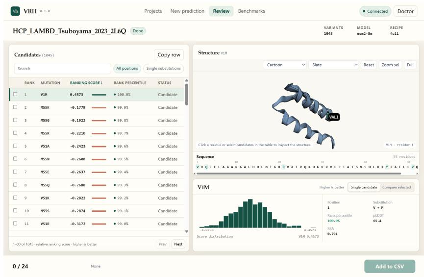  
Figure 17: Review and export. The ranked candidate table is linked to the structure viewer and residue-level evidence. Selected rows can be exported using Add to CSV. Screenshot reproduced from the README preview.

3. Browse benchmark comparisons. Open Benchmarks (Figure 18), choose a dataset, and filter by metric, functional property, or input type. Switch between Raw and the harness-adjusted view to inspect corresponding model results. The available datasets and model entries depend on the benchmark tables installed with the dashboard.

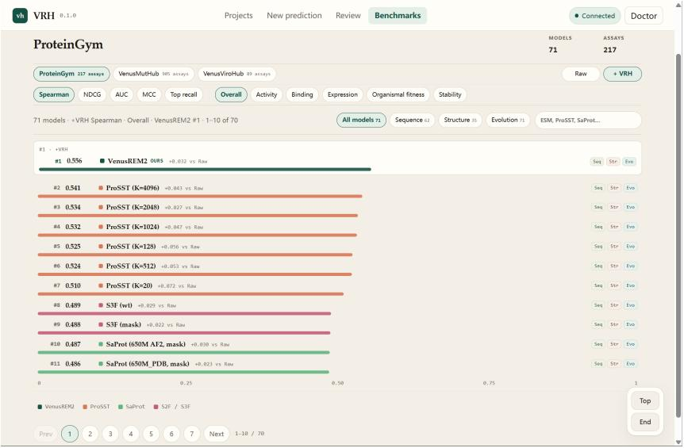  
Figure 18: Benchmark browsing. Dataset, metric, property, and input-type filters support inspection of Raw and harness-adjusted scores. The README screenshot shows the 71-configuration ProteinGym comparison.