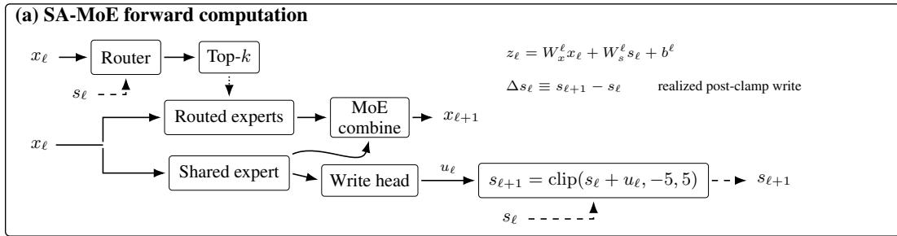
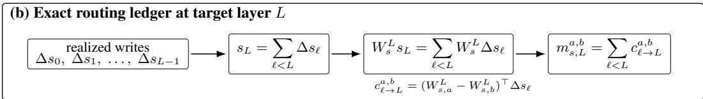
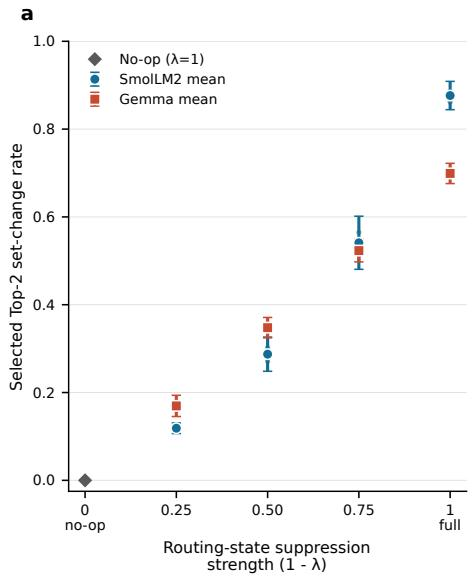
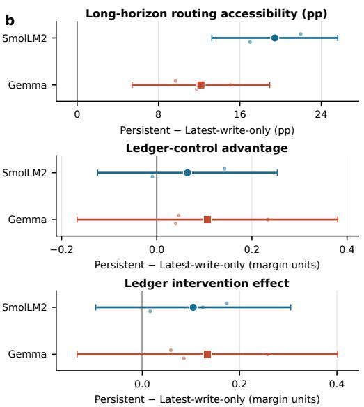
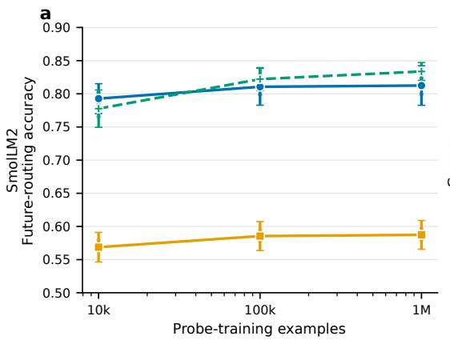
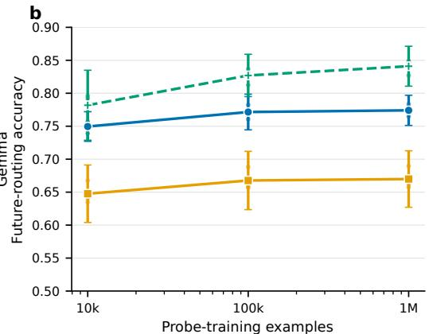
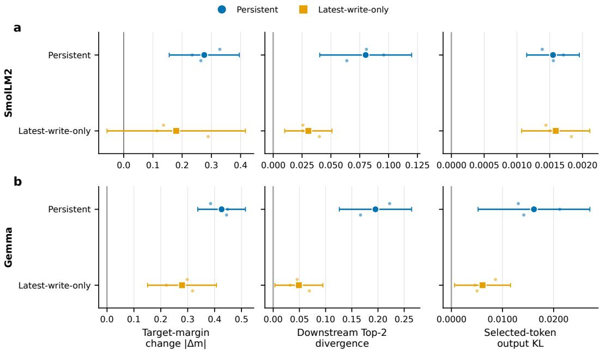
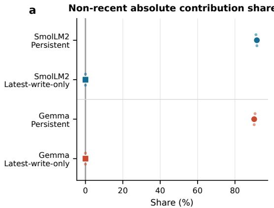
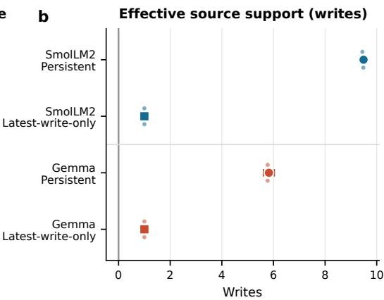

# A PERSISTENT STATE FOR AUDITABLE MIXTURE-OF-EXPERTS ROUTING

Abdurrahman Javat, Allan Kazakov

Department of Artificial Intelligence

Bahc¸es¸ehir University

Istanbul, Turkiye¨

{abdurrahman.javat,allan.kazakov}@bahcesehir.edu.tr

## ABSTRACT

Mixture-of-Experts (MoE) models repeatedly route tokens to sparse subsets of experts, but conventional routers expose no routing-specific record of how crosslayer influences accumulate. We introduce Scratchpad-Augmented Mixture-of-Experts (SA-MoE), which gives each router access to a low-dimensional persistent state that is not provided to the experts. Learned layerwise writes update this state, and their realized post-update changes exactly decompose the state-mediated contribution to any later routing margin, forming a routing ledger. Across sparsely upcycled SmolLM2- and Gemma-based models and three independent training seeds per architecture, this pathway adds less than 1% analytical forward compute and is strongly used by trained routers: local removal of its router contribution changes the selected Top-2 expert set in 87.6% and 69.9% of decisions, respectively. Relative to a matched latest-write-only control, persistent accumulation increases long-horizon future-routing accessibility by 19.4 and 12.2 percentage points, with positive effects in every seed. More than 90% of absolute ledger contribution comes from non-recent writes in both families, and full-forward suppression of ledger-selected writes changes later routing and output distributions. The ledger is an exact provenance object for the persistent-state pathway, not a complete causal explanation of routing. Sensitivity-aware scores better predict fullforward intervention effects, and post-hoc methods recover related cross-layer attribution without architectural modification. SA-MoE instead makes one routingspecific computational history explicit and directly inspectable within the model’s natural forward computation.

## 1 INTRODUCTION

Mixture-of-Experts (MoE) Transformers increase model capacity while keeping per-token computation sparse by routing each token to a small subset of experts (Shazeer et al., 2017; Lepikhin et al., 2021; Fedus et al., 2022). Because routing is repeated throughout the network, understanding why a later router favors one expert over another requires reasoning about influences that may accumulate across depth. Standard MoEs expose no routing-specific record of that history: routing is computed from the same general hidden stream used by the rest of the model. Cross-layer routing influences can be reconstructed post hoc, and prior architectures have introduced explicit memory between routers, but these approaches do not make write-level routing provenance a first-class object of the forward computation.

We introduce Scratchpad-Augmented Mixture-of-Experts (SA-MoE), which gives each router access to a low-dimensional persistent state that is not provided to the experts. A learned write updates this state after each MoE layer. The realized post-update state changes form a routing ledger: for any later router margin, the state-mediated contribution decomposes exactly into contributions from earlier realized writes. We do not claim that telescoping a recorded recurrent trajectory is unique to SA-MoE; the same algebra can be applied to other recorded recurrent states. The architectural distinction is that SA-MoE defines learned write events as the native provenance object, with a direct source-level intervention semantics.

We test whether this provenance object is useful rather than merely algebraically available. Across sparsely upcycled SmolLM2- and Gemma-based models and three independent training seeds per architecture, trained routers strongly use the state pathway. Relative to a matched latest-write-only control, persistent accumulation increases long-horizon future-routing accessibility by 19.4 and 12.2 percentage points, respectively, and more than 90% of the ledger’s absolute contribution comes from non-recent writes in both families. Ledger-selected writes also affect later routing and output distributions under full-forward suppression. At the same time, sensitivity-aware gradient×write can provide stronger intervention rankings, and post-hoc attribution on matched ordinary MoEs recovers related cross-layer influences without architectural modification.

Our contribution is therefore an MoE routing design in which one cross-layer pathway carries an explicit, inspectable computational history. SA-MoE couples a compact routing-specific state with write-level provenance, retrospective routing queries, and direct intervention on the recorded source events. This provides a complementary operating point to recurrent routing memory, hidden-stream probing, and post-hoc attribution rather than replacing them.

## 2 BACKGROUND AND RELATED WORK

## 2.1 SPARSE MOE ROUTING AND CROSS-LAYER MEMORY

Sparse MoEs activate only a small subset of experts for each token (Shazeer et al., 2017; Lepikhin et al., 2021; Fedus et al., 2022), making routing a repeated discrete allocation decision across model depth. Cross-layer routing memory itself is not new. RMoE (Qiu et al., 2025) uses a GRU-based recurrent router that carries routing-specific information between successive MoE layers. Moreover, if a recurrent trajectory $h _ { \ell }$ is recorded, any fixed linear target readout admits the identity

$$
W _ { L } h _ { L } = W _ { L } h _ { 0 } + \sum _ { \ell < L } W _ { L } ( h _ { \ell + 1 } - h _ { \ell } ) ,
$$

including when the recurrence generating $h _ { \ell }$ is nonlinear. Exact telescoping of realized state differences is therefore not unique to SA-MoE.

SA-MoE instead makes the update itself an explicit audit interface. A learned write proposal produces a realized post-clamp write that is stored as the source-level provenance object and can subsequently be queried or suppressed at its source. Our latest-write-only control tests persistence against replacement while retaining this state-and-write pathway. Memory-Aware Routing (Hou et al., 2026) addresses a different form of memory, maintaining expert-level routing preferences to encourage stable specialization rather than a per-token state propagated across model depth.

## 2.2 ARCHITECTURE-LEVEL MOE INTERPRETABILITY

Other work modifies MoE computation to make internal structure more interpretable. MoE-X (Yang et al., 2025) relates experts to a wide sparse MLP and encourages sparse expert computation, while MONET (Park et al., 2025) incorporates sparse dictionary-learning ideas into MoE training to promote more interpretable expert structure. These approaches target semantic or feature-level interpretability. SA-MoE does not require experts or individual state coordinates to have semantic meanings; its audit object is instead the computational provenance of one routing-specific pathway.

## 2.3 POST-HOC ATTRIBUTION AND CAUSAL VALIDATION

A complementary line of work reconstructs routing influences after training. Li et al. (2025) propose cross-level knowledge attribution for ordinary MoE computation, while Li et al. (2026) recursively decompose later router inputs into contributions from earlier model components and identify crosslayer routing influences that can persist across depth. We therefore do not claim that cross-layer routing attribution requires a dedicated routing state. The distinction is where the audit object originates: these post-hoc methods reconstruct contributions from ordinary model computation, whereas SA-MoE places a routing-specific state and explicit write events inside the natural forward computation. We evaluate the method of Li et al. (2026) directly on matched Ordinary MoEs rather than treating it only as related work.

Attribution also differs from causal sensitivity. Activation replacement, ablation, and patching are widely used to test whether identified components affect model behavior (Meng et al., 2022; Conmy et al., 2023), including recent analyses that intervene directly on MoE routing (Bandarkar et al., 2026; Xu et al., 2026). Our full-forward intervention follows the same general logic: a selected realized write is removed at its source and all subsequent computation is allowed to recompute. Gradient-based rankings provide a complementary sensitivity-aware comparison. Accordingly, our experiments distinguish exact forward provenance, post-hoc attribution, and intervention sensitivity rather than treating them as the same objective.

## 3 SCRATCHPAD-AUGMENTED MIXTURE-OF-EXPERTS

We study a sparse MoE architecture in which routers receive a routing-specific cross-layer state, while the experts themselves do not. At MoE layer $\ell ,$ the ordinary token representation is $x _ { \ell } \in \mathbb { R } ^ { d _ { x } }$ and the routing state is $s _ { \ell } \in \mathbb { R } ^ { d _ { s } }$ . The router computes expert logits

$$
z _ { \ell } = W _ { x } ^ { \ell } x _ { \ell } + W _ { s } ^ { \ell } s _ { \ell } + b ^ { \ell } ,\tag{1}
$$

after which Top-k routing selects the routed experts. As in an ordinary sparse MoE, the selected routed experts and a shared expert contribute to the next hidden representation $x _ { \ell + 1 }$ . The key difference is that only the router reads $s _ { \ell } ;$ the experts operate on $x _ { \ell }$ alone.

A learned write head updates the routing state after each MoE layer. Let $u _ { \ell }$ denote the write proposal produced from the layer’s shared representation. In the persistent architecture, the state evolves as

$$
s _ { \ell + 1 } = \mathrm { c l i p } ( s _ { \ell } + u _ { \ell } , - 5 , 5 ) .\tag{2}
$$

We define the realized write

$$
\Delta s _ { \ell } \equiv s _ { \ell + 1 } - s _ { \ell } ,\tag{3}
$$

which is the post-clamp state change actually retained by the model.

Exact routing ledger. Consider a target router at layer L and an audited margin between experts a and b arising from the state pathway alone:

$$
\begin{array} { r } { m _ { s , L } ^ { a , b } = \left( W _ { s , a } ^ { L } - W _ { s , b } ^ { L } \right) ^ { \top } s _ { L } . } \end{array}\tag{4}
$$

Because the persistent state is the accumulated sum of realized writes,

$$
s _ { L } = \sum _ { \ell < L } \Delta s _ { \ell } ,\tag{5}
$$

the same margin decomposes exactly as

$$
m _ { s , L } ^ { a , b } = \sum _ { \ell < L } c _ { \ell \to L } ^ { a , b } , \qquad c _ { \ell \to L } ^ { a , b } = \left( W _ { s , a } ^ { L } - W _ { s , b } ^ { L } \right) ^ { \top } \Delta s _ { \ell } .\tag{6}
$$

We call this exact write-level decomposition the routing ledger. It is exact for the persistent-state contribution to the audited router margin. Other influences on routing, including those mediated through the ordinary hidden stream x, remain outside this decomposition.

Controls. We compare Persistent SA-MoE against two matched controls:

Ordinary MoE removes the routing-state pathway entirely, so routing depends only on xℓ.

Latest-write-only keeps the same state width and write-head capacity, but removes cross-layer accumulation by replacing the state rather than accumulating it. Thus the router at layer ℓ + 1 receives only the most recently retained write-derived state. Because this recurrence is a replacement rather than an accumulation, its native audit object is not a telescoping sum of earlier state differences. Instead, its direct native attribution is structural: the currently retained state is attributed to the lates retained write.

Figure 1 summarizes the architecture and the resulting exact ledger for the persistent pathway.

  
Figure 1: SA-MoE and the routing ledger. (a) Each router reads both the ordinary hidden representation xℓ and a routing-specific persistent state $s _ { \ell } .$ , while the experts read only $x _ { \ell } .$ A write head produces a realized state update after each MoE layer. (b) Because the persistent state is the sum of realized writes, the state-mediated contribution to a later routing margin decomposes exactly into write-level contributions.

## 4 EXPERIMENTAL SETUP

Model families and training. We study two sparsely upcycled (Nakamura et al., 2025; Komatsuzaki et al., 2023) model families based on SmolLM2-135M (Ben Allal et al., 2025) and Gemma-270M (Gemma Team, 2025). For each family, we train three matched sparse architectures: an Ordinary MoE baseline, a latest-write-only control, and Persistent SA-MoE. All three variants use the same sparse backbone, with 16 routed experts, one shared expert, Top-2 routing, and matched continued-pretraining budgets of approximately 30B packed input tokens. The two state-augmented variants use a 128-dimensional routing state. Training data are sampled from FineWeb-Edu (Penedo et al., 2024), The Stack Dedup Python (Kocetkov et al., 2023), and FineMath (Ben Allal et al., 2025) with probabilities 0.50, 0.25, and 0.25. We train three independent seeds (42, 43, and 44) for each architecture in each family. Full optimization, initialization, and implementation details are given in Appendix A.

Capability evaluation. Before evaluating auditability, we first test whether adding the routing state pathway materially changes model quality. We report validation perplexity and a four-task zero-shot downstream suite consisting of HellaSwag (Zellers et al., 2019), ARC-Easy (Clark et al., 2018), PIQA (Bisk et al., 2020), and WinoGrande (Sakaguchi et al., 2020). For the downstream suite, we report the unweighted macro average of the task primary metrics. We evaluate familylevel capability preservation using frozen non-inferiority thresholds: at most a 1% relative increase in perplexity and at most a 1 percentage point decrease in downstream macro score relative to the matched Ordinary MoE. Appendix B gives the exact prompts, scoring rules, and task-specific metrics.

State use and persistence. We first ask whether trained routers actually use the routing state. For this analysis, we locally intervene on the state contribution to a router while holding the ordinary hidden representation fixed, and measure the resulting change in the selected Top-2 expert set. We then compare Persistent SA-MoE against the latest-write-only control to test whether cross-layer accumulation provides additional value beyond a same-capacity non-persistent state pathway.

Future-routing accessibility. To test whether the routing state compactly exposes future-routing information, we train probes to predict a later router’s Top-1 expert from either the native routing state or representations derived from the ordinary hidden stream. The main text compares three representation families: the native 128-dimensional routing state, a full-hidden linear probe, and a supervised 128-dimensional hidden subspace. We evaluate probe-training budgets of 104, 105, and

Table 1: Model quality and architectural cost across three training seeds. Quality columns are paired mean changes relative to Ordinary MoE; brackets give 95% Student-t intervals over training seeds $( n = 3 )$ . Macro is the unweighted mean of HellaSwag, ARC-Easy, PIQA, and WinoGrande primary metrics.
<table><tr><td>Family</td><td>Architecture</td><td>Params</td><td>Active/token</td><td>FLOPs/token</td><td>∆PPL (%)</td><td>∆Macro (pp)</td></tr><tr><td rowspan="3">SmolLM2</td><td>Ordinary MoE</td><td>1.409B</td><td>294.0M</td><td>729.6M</td><td>Ref.</td><td>Ref.</td></tr><tr><td>Latest-write-only</td><td>1.411B</td><td>296.3M</td><td>734.1M</td><td>+0.52[+0.18, +0.86]</td><td>-0.02[−0.48, +0.43]</td></tr><tr><td>Persistent</td><td>1.411B</td><td>296.3M</td><td>734.1M</td><td>+0.19[+0.12,+0.25]</td><td>-0.05[-0.14, +0.04]</td></tr><tr><td rowspan="3">Gemma</td><td>Ordinary MoE</td><td>1.401B</td><td>409.8M</td><td>876.2M</td><td>Ref.</td><td>Ref.</td></tr><tr><td>Latest-write-only</td><td>1.402B</td><td>411.4M</td><td>879.2M</td><td>+0.30 [-0.18, +0.79]</td><td>-0.49[-1.31, +0.33]</td></tr><tr><td>Persistent</td><td>1.402B</td><td>411.4M</td><td>879.2M</td><td>-0.06[-0.45, +0.32]</td><td>-0.16[-1.66,+1.35]</td></tr></table>

$1 0 ^ { 6 }$ examples. Appendix B.6 gives the full probe grids, fit selection rules, and supporting PCA and random-projection controls.

Attribution and intervention protocol. Our confirmatory intervention study uses 24 fixed finalevaluation sequences per model family, spanning prose, code, and mathematics, and 96 target routing decisions per family. For each target decision at layer $L ,$ we audit the Top-2 membership boundary between the clean second-selected expert $e _ { 2 }$ and the clean best-excluded expert $e _ { 3 }$ . For Persistent SA-MoE, the ledger score of source layer $\ell < L$ is the absolute write contribution $| c _ { \ell \to L } ^ { ( 2 , 3 ) } |$ from Eq. 6. We compare this ranking with recency, largest-write-norm, and gradient×write baselines. We also apply the post-hoc cross-layer attribution method of Li et al. (2026) to matched Ordinary MoEs. Because SA-MoE writes and Ordinary-MoE residual components are distinct audit objects, we evaluate attribution quality within each object and do not compare raw intervention magnitudes across architectures. For latest-write-only, the native direct score is defined over its structural latest-state audit object rather than over a telescoping sum of earlier state differences.

We then perform full-forward source suppression. In Persistent SA-MoE, suppressing a source write restores the post-source state to its pre-write value and allows the rest of the model to recompute naturally. In latest-write-only, suppression restores the previous retained state. We measure the resulting absolute change in the audited target margin, the divergence of later Top-2 routing decisions, and the KL divergence between the clean and intervened output distributions at the selected token. Appendix D gives the full deterministic selection procedure, ranking definitions, and control rules.

Uncertainty. For architecture-level claims, the training seed is the replication unit. We form paired seed-level contrasts and report three-seed means with 95% Student-t intervals (n = 3, 2 degrees of freedom). For within-checkpoint intervention quantities, uncertainty is estimated with paired sequence-level bootstrap resamples; these bootstrap samples are not treated as additional training replicates.

## 5 RESULTS

## 5.1 MODEL QUALITY AND ARCHITECTURAL COST

We first ask whether adding the routing-state pathway materially changes model quality or architectural cost. Table 1 reports paired architecture contrasts across the three training seeds. Persistent SA-MoE adds less than 1% active parameters and analytical forward FLOPs per token in both model families.

On SmolLM2, Persistent changes validation perplexity by +0.19% (95% CI $[ + 0 . 1 2 , + 0 . 2 5 ] \% )$ and the four-task macro score by −0.05 pp ([−0.14, +0.04] pp) relative to Ordinary MoE. Latest-writeonly also remains within both frozen non-inferiority bounds. Thus, both state-augmented variants satisfy the pre-specified SmolLM2 capability criterion.

On Gemma, the perplexity criterion is supported for both variants: Persistent changes perplexity by $- 0 . 0 6 \% ( [ - 0 . 4 5 , + 0 . { \dot { 3 } } 2 ] \% )$ , while latest-write-only changes it by +0.30% ([−0.18, +0.79]%). The downstream macro contrasts are −0.16 pp ([−1.66, +1.35] pp) for Persistent and −0.49 pp ([−1.31, +0.33] pp) for latest-write-only. Because both intervals cross the pre-specified −1 pp boundary, the complete Gemma capability criterion is inconclusive rather than supported.

  
Figure 2: State use and persistence across training seeds 42/43/44. (a) Persistent-only local statesuppression dose response from Section 5.2. (b) Persistent-minus-latest-write-only contrasts for the three frozen persistence endpoints: long-horizon routing accessibility, ledger-control advantage, and ledger intervention effect. Points are three-seed means with Student-t 95% intervals (n = 3, df= 2); · marks individual seeds.

These results establish a small architectural overhead and no detected perplexity degradation beyond the frozen tolerance in either family, while leaving downstream capability preservation on Gemma unresolved.

Matched single-GPU measurements show implementation-dependent wall-clock effects with opposite directions across the two families; we therefore report these measurements descriptively in Appendix A.7 rather than treating them as evidence of a general speedup or slowdown.

## 5.2 TRAINED ROUTERS USE THE PERSISTENT STATE

The routing ledger is only useful if trained routers actually rely on the state pathway. We therefore measure direct router dependence with a local same-state intervention. For a natural forward-pass pair $( x _ { \ell } , s _ { \ell } )$ , we attenuate only the state’s contribution to the router logits,

$$
z _ { \ell } ( \lambda ) = W _ { x } ^ { \ell } x _ { \ell } + \lambda W _ { s } ^ { \ell } s _ { \ell } + b ^ { \ell } , \qquad \lambda \in \{ 1 , 0 . 7 5 , 0 . 5 , 0 . 2 5 , 0 \} .\tag{7}
$$

The hidden representation and state are held fixed, and later model computation is not rerun. This therefore measures the direct dependence of the current routing decision on the explicit state rather than a full-trajectory intervention.

Figure 2a shows a graded response as the state contribution is removed. At full suppression $( \lambda =$ 0), the selected Top-2 expert set changes for a three-seed mean of 87.6% of SmolLM2 routing decisions and 69.9% of Gemma decisions. The corresponding seed-level intervals are [84.4, 90.9]% and [67.6, 72.2]%. Thus, in both model families, the trained routers make substantial use of the explicit routing state.

## 5.3 PERSISTENCE IMPROVES LONG-HORIZON ROUTING ACCESSIBILITY

State use alone does not establish that cross-layer accumulation matters: a router could rely on a state pathway whose useful information is effectively local. We therefore compare Persistent SA-MoE with the matched latest-write-only control.

  
Persistent native state 128 Latest-write-only native state 128 Supervised hidden subspace-128  
Figure 3: Compact access to future routing across training seeds. Future-router Top-1 prediction accuracy versus probe-training budget for the Persistent native state, matched latest-write-only native state, and a supervised 128-dimensional subspace of the Persistent model’s ordinary hidden stream. Points are three-seed means with Student-t 95% intervals $( n = 3 , \mathrm { d f } = 2 ) \colon$ · marks individual seeds.

Our primary persistence endpoint measures how well the native routing state predicts routing four or eight MoE layers ahead. At the $1 0 ^ { 6 } .$ -example probe budget, we average transition-only source-cluster accuracy over the four pre-specified horizon-4 and horizon-8 source–target pairs within each family. Figure 2b reports the paired Persistent-minus-latest-write-only contrasts across training seeds.

Persistent improves long-horizon routing accessibility by 19.4 pp on SmolLM2 (95% CI [13.2, 25.6] pp) and 12.2 pp on Gemma ([5.4, 18.9] pp). The contrast is positive in all three training seeds for both families. Thus, persistence changes the information carried by the native routing state in a way that remains visible many layers later.

The intervention-derived persistence contrasts in Figure 2b are less uniform: their three-seed means favor Persistent, but their confidence intervals cross zero. We therefore treat long-horizon accessibility as the replicated evidence for an effect of persistent accumulation, rather than claiming that persistence improves every downstream intervention metric.

The retained history is also distributed across depth rather than dominated by the most recent update. Across training seeds, non-recent writes account for 91.7% of absolute ledger contribution on SmolLM2 and 90.3% on Gemma, with effective source supports of 9.49 and 5.82 writes, respectively. These quantities describe the distribution of absolute forward contribution; they do not measure signed net support or downstream causal importance. Full definitions and per-seed results are given in Appendix C.

## 5.4 COMPACT ACCESS TO FUTURE ROUTING

We next ask whether the persistent state provides a compact representation of future routing, rather than information that is uniquely available to SA-MoE. Figure 3 compares the native 128- dimensional routing state with a supervised 128-dimensional representation learned from the same Persistent model’s ordinary hidden stream, across probe-training budgets from $1 0 ^ { 4 }$ $1 0 ^ { 6 }$ examples.

The Persistent native state substantially outperforms the matched latest-write-only state at every probe budget in both model families. At $\mathrm { 1 0 ^ { \frac { \mu } { 6 } } }$ examples, the Persistent-minus-latest-write-only gap is 22.5 pp on SmolLM2 (95% CI [19.8, 25.2] pp) and 10.4 pp on Gemma ([5.3, 15.5] pp). This is consistent with the long-horizon persistence result in Section 5.3, while using the full frozen probe aggregation rather than only the pre-specified long-horizon endpoint.

The ordinary hidden stream nevertheless contains comparable routing information. At the largest training budget, the supervised hidden subspace reaches 83.4% accuracy on SmolLM2 and 84.1% on Gemma, compared with 81.2% and 77.4% for the Persistent native state. Thus, SA-MoE does not make future-routing information uniquely available. Its architectural distinction is that a compact routing-specific representation is already present in the model’s native forward state, without first learning a separate post-hoc representation.

  
Figure 4: Downstream consequences of ledger-selected source suppression. Effects on the audited Top-2 boundary, subsequent Top-2 routing, and the selected-token output distribution for Persistent and latest-write-only. Points are three-seed means with Student-t 95% intervals (n = 3, df= 2); · marks individual seeds.

## 5.5 ATTRIBUTION QUALITY AND DOWNSTREAM CONSEQUENCES

Exact forward provenance need not coincide with the source whose removal has the largest downstream effect. We therefore compare clean-trajectory attribution scores with exhaustive full-forward source interventions. In the frozen seed-42 analysis, ledger scores correlate with intervention effects more strongly than largest-write-norm: within-target Spearman correlations are 0.369 versus 0.187 on SmolLM2 and 0.823 versus 0.341 on Gemma. Gradient×write is stronger still, reaching 0.769 and 0.890, respectively. The same ordering holds for top-source accuracy and normalized oracle regret (Appendix D). This distinction is expected: the ledger records exact forward contribution within the state pathway, whereas gradient×write additionally incorporates target-dependent downstream sensitivity.

Useful cross-layer attribution is also available without architectural modification. On matched Ordinary MoEs, the Li et al. (2026) post-hoc attribution achieves three-seed mean Spearman correlations of 0.570 on SmolLM2 and 0.620 on Gemma; gradient×component reaches 0.721 and 0.782. These values are not directly comparable with the SA-MoE numbers because state writes and Ordinary-MoE residual components are different audit objects. Operationally, if the required forward-pass quantities are retained, both ledger and Li-style scores can be materialized without a target-dependent backward pass, while gradient-based scores require target-dependent autograd. Phase-separated timing, memory, retention, and reconstruction measurements are reported in Appendix D.8.

Finally, ledger-selected writes have consequences beyond the scalar margin used to rank them (Figure 4). Across training seeds, suppressing the Persistent ledger-selected write changes the audited margin by 0.276 on SmolLM2 and 0.426 on Gemma, produces downstream Top-2 divergences of 0.080 and 0.195, and yields selected-token output KL divergences of 0.0016 and 0.0162, respectively. Latest-write-only interventions also produce downstream effects, and the Persistent-minuslatest-write-only contrasts are not uniformly resolved across training seeds. These results show that ledger-selected writes are computationally consequential, but do not imply that exact provenance is an optimal causal ranking or that persistence uniformly increases every intervention effect.

## 6 DISCUSSION AND LIMITATIONS

The contribution of SA-MoE is not that a recorded recurrent state admits a telescoping decomposition. For any recurrent trajectory $h _ { \ell }$ and fixed linear target readout $W _ { L } , W _ { L } h _ { L } = W _ { L } h _ { 0 } +$ $\begin{array} { r } { \sum _ { \ell < L } W _ { L } ( h _ { \ell + 1 } - h _ { \ell } ) } \end{array}$ ; this observation also applies to nonlinear recurrent routers such as RMoE. SA-MoE instead makes routing provenance an explicit interface of the forward computation: a dedicated routing state is updated through a learned write path, its realized post-clamp writes form the native audit object, and individual writes have a direct source-level intervention semantics. Empirically, trained routers use this pathway, persistence increases long-horizon routing accessibility relative to replacement, and the resulting history is distributed across earlier writes.

Exact provenance should also be distinguished from causal importance. The ledger exactly decomposes the state-mediated component of a realized routing margin, but it does not cover influences carried through the ordinary hidden stream or guarantee the strongest intervention ranking. Gradient×write can rank consequential sources more strongly because it incorporates downstream sensitivity, while Li et al. (2026)’s post-hoc method recovers related cross-layer attribution in ordi nary MoEs without architectural modification. Likewise, sufficiently trained hidden-state representations can match or exceed the native state’s future-routing accuracy. The value of the ledger is therefore its architecture-native routing-specific audit object, not exclusive access to routing information or universal superiority over post-hoc analysis.

Our latest-write-only control also does not hold state geometry fixed. Its replacement state is bounded by the tanh write to [−1, 1], whereas Persistent can accumulate toward the [−5, 5] clamp. The comparison therefore tests accumulation versus replacement under the state distributions produced by those mechanisms; differences in state magnitude and saturation cannot be separated from accumulation itself. State-geometry diagnostics and additional control details are reported in the appendix.

Finally, the experiments cover two sparsely upcycled model families and three training seeds per architecture. This provides replication of the principal effects but leaves wide uncertainty for some intervention contrasts and does not establish behavior at larger MoE scales. More fundamentally, the ledger audits only the persistent routing-state pathway: it does not assign semantic meaning to state coordinates, provide a complete causal explanation of expert selection, or imply improved generation quality or safety.

## 7 CONCLUSION

We introduced SA-MoE, an MoE architecture that makes one cross-layer routing pathway explicitly auditable. A compact persistent state is updated by learned write events, and the realized writes exactly decompose the state-mediated contribution to later routing margins. Across two sparsely upcycled model families and three training seeds, trained routers use this pathway, persistence increases long-horizon routing accessibility relative to a matched latest-write-only control, and the resulting ledger is distributed across earlier writes. Full-forward suppression further shows that ledger-selected writes can affect subsequent routing and model outputs.

The routing ledger is not a complete explanation of expert selection, nor is exact provenance equivalent to optimal causal ranking. Post-hoc attribution can recover related cross-layer influences without architectural modification, and sensitivity-aware methods can identify stronger intervention targets. SA-MoE instead provides a complementary design point: routing-specific provenance is represented directly in the model computation as a compact state, an explicit sequence of source events, and a native object for retrospective query and intervention.

## AI USE STATEMENT

We used generative AI tools to assist with experimental methodology, interpretation and presentation of results, code generation and implementation, and manuscript preparation. For the implementation work, generative AI was used to help write, modify, and debug research code used in model training, evaluation, probing, intervention analysis, and result processing. We also used generative AI to draft and edit manuscript text, improve organization and readability, check consistency between claims and reported results, identify relevant literature, assist with literature searches and reference formatting, and suggest titles, captions, and section structure.

All AI-assisted work was reviewed by the authors. AI-assisted code was inspected, tested, and validated against expected behavior and experimental outputs before being used for reported results. Numerical claims and interpretations were checked against the underlying experimental results and figures, and suggested citations and descriptions of prior work were verified against the original sources before inclusion. Generative AI was not treated as a source of experimental evidence, and the authors made the final decisions about the methodology, implementation, analysis, claims, and manuscript content. We take responsibility for the final content of this work, including text, code, claims, and artifacts produced with the aid of generative AI.

## ETHICS STATEMENT

This work studies model architecture and interpretability and does not involve human participants, user studies, or the collection of new personal or sensitive data. Our experiments use existing language models and research datasets comprising web text, code, and mathematical content. These source models and datasets may inherit biases, undesirable content, or other limitations from their underlying corpora. SA-MoE is intended as a mechanism for auditing one routing-specific computational pathway; the resulting provenance should not be interpreted as a guarantee of complete interpretability, model safety, or reliable behavior in deployment. We therefore avoid making claims of improved safety or generation quality from the intervention results reported in this work.

## REPRODUCIBILITY STATEMENT

Section 3 defines the SA-MoE architecture, realized routing writes, and routing-ledger equations. Section 4 specifies the model families, matched controls, evaluation roles, intervention design, and statistical treatment used for the main results. Appendix A provides dense-source revisions, MoE construction, initialization, continued-pretraining settings, parameter and compute accounting, runtime measurements, and artifact identities. Appendix B specifies validation and capability evaluation, local state suppression, and the complete future-routing probe protocol. Appendix C defines the Persistent ledger, numerical reconstruction checks, distributed-history metrics, the distinct latestwrite-only audit object, and architecture-specific suppression semantics. Appendix D gives deterministic target selection, source-ranking methods, full-forward intervention metrics, ordinary-MoE post-hoc attribution, and audit-cost measurements. Finally, Appendix E reports the individual results for training seeds 42, 43, and 44 and explicitly identifies analyses that instead use a fixed checkpoint or diagnostic pilot. These specifications cover the procedures and statistical units underlying the results in Sections 5.1–5.5.

## REFERENCES

Lucas Bandarkar, Chenyuan Yang, Mohsen Fayyaz, Junlin Hu, and Nanyun Peng. Multilingual routing in mixture-of-experts. In International Conference on Learning Representations, 2026.

Loubna Ben Allal, Anton Lozhkov, Elie Bakouch, Gabriel Mart´ın Blazquez, Guilherme Penedo,´ Lewis Tunstall, Andres Marafioti, Hynek Kydl´ ´ıcek, Agustˇ ´ın Piqueres Lajar´ın, Vaibhav Srivastav, Joshua Lochner, Caleb Fahlgren, Xuan-Son Nguyen, Clementine Fourrier, Ben Burtenshaw, Hugo´ Larcher, Haojun Zhao, Cyril Zakka, Mathieu Morlon, Colin Raffel, Leandro von Werra, and Thomas Wolf. SmolLM2: When smol goes big – data-centric training of a small language model, 2025. URL https://arxiv.org/abs/2502.02737.

Yonatan Bisk, Rowan Zellers, Ronan Le Bras, Jianfeng Gao, and Yejin Choi. PIQA: Reasoning about physical commonsense in natural language. In Proceedings of the AAAI Conference on

Artificial Intelligence, volume 34, pp. 7432–7439, 2020. doi: 10.1609/aaai.v34i05.6239. URL https://ojs.aaai.org/index.php/AAAI/article/view/6239.

Peter Clark, Isaac Cowhey, Oren Etzioni, Tushar Khot, Ashish Sabharwal, Carissa Schoenick, and Oyvind Tafjord. Think you have solved question answering? try ARC, the AI2 reasoning challenge. arXiv preprint arXiv:1803.05457, 2018. URL https://arxiv.org/abs/1803. 05457.

Arthur Conmy, Augustine N. Mavor-Parker, Aengus Lynch, Stefan Heimersheim, and Adria Garriga-Alonso.\` Towards automated circuit discovery for mechanistic interpretability. In Advances in Neural Information Processing Systems, volume 36, pp. 16318–16352, 2023. doi: 10.52202/075280-0719. URL https://proceedings.neurips.cc/paper\_files/paper/2023/hash/ 34e1dbe95d34d7ebaf99b9bcaeb5b2be-Abstract-Conference.html.

William Fedus, Barret Zoph, and Noam Shazeer. Switch transformers: Scaling to trillion parameter models with simple and efficient sparsity. Journal of Machine Learning Research, 23(120):1–39, 2022. URL https://jmlr.org/papers/v23/21-0998.html.

Gemma Team. Gemma 3. 2025. URL https://arxiv.org/abs/2503.19786.

Peixuan Hou, Yunbo Hou, Bin Chen, Li He, Jian Xu, Weiping Li, Bo Zheng, and Guojie Song. From pseudo-balancing to true specialization: Memory-aware routing for mixture-of-experts. In Findings of the Association for Computational Linguistics: ACL 2026, 2026.

Denis Kocetkov, Raymond Li, Loubna Ben Allal, Jia Li, Chenghao Mou, Yacine Jernite, Margaret Mitchell, Carlos Munoz Ferrandis, Sean Hughes, Thomas Wolf, Dzmitry Bahdanau, Leandro˜ Von Werra, and Harm de Vries. The stack: 3 TB of permissively licensed source code. Transactions on Machine Learning Research, 2023. URL https://mlanthology.org/tmlr/ 2023/kocetkov2023tmlr-stack/.

Aran Komatsuzaki, Joan Puigcerver, James Lee-Thorp, Carlos Riquelme Ruiz, Basil Mustafa, Joshua Ainslie, Yi Tay, Mostafa Dehghani, and Neil Houlsby. Sparse upcycling: Training mixture-of-experts from dense checkpoints. In The Eleventh International Conference on Learning Representations, 2023. URL https://openreview.net/forum?id=T5nUQDrM4u.

Dmitry Lepikhin, HyoukJoong Lee, Yuanzhong Xu, Dehao Chen, Orhan Firat, Yanping Huang, Maxim Krikun, Noam Shazeer, and Zhifeng Chen. GShard: Scaling giant models with conditional computation and automatic sharding. In International Conference on Learning Representations, 2021. URL https://mlanthology.org/iclr/2021/ lepikhin2021iclr-gshard/.

Junzhuo Li, Bo Wang, Xiuze Zhou, Peijie Jiang, Jia Liu, and Xuming Hu. Decoding knowledge attribution in mixture-of-experts: A framework of basic-refinement collaboration and efficiency analysis. In Proceedings of the 63rd Annual Meeting of the Association for Computational Linguistics (Volume 1: Long Papers), pp. 22431–22446, Vienna, Austria, 2025. Association for Computational Linguistics. doi: 10.18653/v1/2025.acl-long.1093. URL https: //aclanthology.org/2025.acl-long.1093/.

Wengang Li, Lingqi Zhang, Toshio Endo, and Mohamed Wahib. Understanding cross-layer contributions to mixture-of-experts routing in LLMs. In The Fourteenth International Conference on Learning Representations, 2026. URL https://openreview.net/forum?id= BqyPLOkxFY.

Kevin Meng, David Bau, Alex Andonian, and Yonatan Belinkov. Locating and editing factual associations in GPT. In Advances in Neural Information Processing Systems, volume 35, pp. 17359–17372, 2022. doi: 10.52202/068431-1262. URL https://proceedings.neurips.cc/paper\_files/paper/2022/hash/ 6f1d43d5a82a37e89b0665b33bf3a182-Abstract-Conference.html.

Taishi Nakamura, Takuya Akiba, Kazuki Fujii, Yusuke Oda, Rio Yokota, and Jun Suzuki. Dropupcycling: Training sparse mixture of experts with partial re-initialization. In The Thirteenth International Conference on Learning Representations, 2025. URL https://openreview. net/forum?id=gx1wHnf5Vp.

Jungwoo Park, Young Jin Ahn, Kee-Eung Kim, and Jaewoo Kang. Monet: Mixture of monosemantic experts for transformers. In The Thirteenth International Conference on Learning Representations, 2025. URL https://openreview.net/forum?id=1Ogw1SHY3p.

Guilherme Penedo, Hynek Kydl´ıcek, Loubna Ben Allal, Anton Lozhkov, Margaretˇ Mitchell, Colin Raffel, Leandro von Werra, and Thomas Wolf. The FineWeb datasets: Decanting the web for the finest text data at scale. Advances in Neural Information Processing Systems, 37:30811–30849, 2024. doi: 10.52202/079017-0970. URL https://proceedings.neurips.cc/paper\_files/paper/2024/ hash/370df50ccfdf8bde18f8f9c2d9151bda-Abstract-Datasets\_and\_ Benchmarks\_Track.html.

Zihan Qiu, Zeyu Huang, Shuang Cheng, Yizhi Zhou, Zili Wang, Ivan Titov, and Jie Fu. Layerwise recurrent router for mixture-of-experts. In International Conference on Learning Representations, 2025. URL https://proceedings.iclr.cc/paper\_files/paper/2025/hash/ 250a6c6a7a7216f5dec1364e9a93abf4-Abstract-Conference.html.

Keisuke Sakaguchi, Ronan Le Bras, Chandra Bhagavatula, and Yejin Choi. WinoGrande: An adversarial winograd schema challenge at scale. In Proceedings of the AAAI Conference on Artificial Intelligence, volume 34, pp. 8732–8740, 2020. doi: 10.1609/aaai.v34i05.6399. URL https://ojs.aaai.org/index.php/AAAI/article/view/6399.

Noam Shazeer, Azalia Mirhoseini, Krzysztof Maziarz, Andy Davis, Quoc V. Le, Geoffrey E. Hinton, and Jeff Dean. Outrageously large neural networks: The sparsely-gated mixture-ofexperts layer. In International Conference on Learning Representations, 2017. URL https: //openreview.net/forum?id=B1ckMDqlg.

Haolei Xu, Haiwen Hong, Hongxing Li, Rui Zhou, Yang Zhang, Longtao Huang, Hui Xue, Yongliang Shen, Weiming Lu, and Yueting Zhuang. Seeing but not thinking: Routing distraction in multimodal mixture-of-experts. In Proceedings of the 64th Annual Meeting of the Association for Computational Linguistics (Volume 1: Long Papers), pp. 31164–31178. Association for Computational Linguistics, 2026. doi: 10.18653/v1/2026.acl-long.1438.

Xingyi Yang, Constantin Venhoff, Ashkan Khakzar, Christian Schroeder De Witt, Puneet K. Dokania, Adel Bibi, and Philip Torr. Mixture of experts made intrinsically interpretable. In Proceedings ofthe 42nd International Conference on Machine Learning, volume 267, pp. 71231–71248. PMLR, 2025. URL https://proceedings.mlr.press/v267/yang25ag.html.

Rowan Zellers, Ari Holtzman, Yonatan Bisk, Ali Farhadi, and Yejin Choi. HellaSwag: Can a machine really finish your sentence? In Proceedings of the 57th Annual Meeting of the Association for Computational Linguistics, pp. 4791–4800. Association for Computational Linguistics, 2019. doi: 10.18653/v1/P19-1472. URL https://aclanthology.org/P19-1472/.

Barret Zoph, Irwan Bello, Sameer Kumar, Nan Du, Yanping Huang, Jeff Dean, Noam Shazeer, and William Fedus. St-moe: Designing stable and transferable sparse expert models, 2022. URL https://arxiv.org/abs/2202.08906.

## A MODEL, TRAINING, AND REPRODUCIBILITY

This appendix gives the model construction, initialization, optimization, analytical cost, and runtime details underlying the experiments in Section 4. Evaluation and probe specifications are given in Appendix B; ledger-specific definitions and interventions are given in Appendices C and D.

## A.1 DENSE SOURCE MODELS AND TOKENIZER PROVENANCE

We sparse-upcycle two pretrained dense language models: HuggingFaceTB/SmolLM2-135M and google/gemma-3-270m. The local model and tokenizer bytes used by the reported experi ments are reproducible from the following public repository revisions:

Table 2: Primary model and MoE configuration. The routing-state entries apply to Persistent and latest-write-only; Ordinary MoE has no routing state.
<table><tr><td></td><td>SmolLM2</td><td>Gemma</td></tr><tr><td>Dense source</td><td>SmolLM2-135M</td><td>Gemma-3-270M</td></tr><tr><td>Transformer layers</td><td>30</td><td>18</td></tr><tr><td>Hidden size</td><td>576</td><td>640</td></tr><tr><td>Expert intermediate size</td><td>1536</td><td>2048</td></tr><tr><td>Routed experts / layer</td><td>16</td><td>16</td></tr><tr><td>Shared experts / layer</td><td>1</td><td>1</td></tr><tr><td>Routed experts / token</td><td>2</td><td>2</td></tr><tr><td>Active expert paths / token</td><td>3</td><td>3</td></tr><tr><td>Routing-state width  $d _ { s }$ </td><td>128</td><td>128</td></tr><tr><td>State clamp</td><td>[−5,5]</td><td>[−5,5]</td></tr><tr><td>Sequence length</td><td>2048</td><td>2048</td></tr><tr><td>Capacity factor</td><td>none</td><td>none</td></tr><tr><td>Token dropping</td><td>none</td><td>none</td></tr></table>

<table><tr><td>Family</td><td>Repository</td><td>Reproducible revision</td></tr><tr><td>SmolLM2</td><td>HuggingFaceTB/SmolLM2-135M</td><td>93efa2f097d58c2a74874c7e644dbc9b0cee75a2</td></tr><tr><td>Gemma</td><td>google/gemma-3-270m</td><td>9b0cfec892e2bc2afd938c98eabe4e4a7b1e0ca1</td></tr></table>

For each family, the tokenizer is taken from the same repository revision as the model; no separate tokenizer repository or tokenizer revision is used. Verification against these revisions reproduces the frozen local model and tokenizer bytes. We therefore describe them as byte-compatible reproducible revisions, rather than as recovered records of the original download event. The accompanying artifact manifests record the corresponding model, tokenizer, configuration, and source-code SHA-256 hashes.

## A.2 MOE ARCHITECTURE

Every dense feed-forward block is replaced with an MoE block containing 16 routed experts and one always-active shared expert. All experts retain the MLP geometry of the corresponding dense source layer. Each token executes the shared expert and the Top-2 routed experts.

For router logits $z _ { \ell } ,$ the implementation first computes a softmax over all 16 routed experts, selects the Top-2 entries, and renormalizes their probabilities:

$$
p _ { \ell , i } = \mathrm { s o f t m a x } ( z _ { \ell } ) _ { i } , \qquad \widetilde { p } _ { \ell , i } = \frac { p _ { \ell , i } } { \sum _ { j \in \mathrm { T o p } 2 ( z _ { \ell } ) } p _ { \ell , j } + 1 0 ^ { - 8 } } \quad ( i \in \mathrm { T o p } 2 ( z _ { \ell } ) ) .\tag{8}
$$

The two selected routed-expert outputs are weighted by $\widetilde { p } _ { \ell , i }$ and summed; the always-active sharedexpert output is then added to this routed output. There is no capacity clipping or dropped-token branch.

Ordinary MoE routes from $x _ { \ell }$ only. Persistent and latest-write-only route from the concatenation of $x _ { \ell }$ and $s _ { \ell } .$ . The implemented router is a bias-free linear map; equivalently, the bias term in the general notation of Section 3 is $b _ { \ell } = 0$ for the models reported here.

## A.3 SPARSE UPCYCLING AND INITIALIZATION

Shared and routed experts are initialized as deep copies of the pretrained dense MLP at the corresponding layer. We then partially reinitialize each routed expert independently. For every routedexpert weight tensor with at least two dimensions, each entry is selected independently with probability 0.55; selected entries are replaced by draws from a Gaussian whose mean and standard deviation equal those of the original tensor. Routed-expert biases are not reinitialized. The shared expert remains an unchanged copy of the pretrained dense MLP.

Router weights use Kaiming-uniform initialization with parameter $a = 0 . 0 1$ . Routers contain no bias. The state write head is initialized to produce an exact zero write: both its weights and bias are initialized to zero. The training seed is set before sparse upcycling and data construction.

The principal experiments use three independent training seeds, 42, 43, and 44, for every model family and architecture variant. Architecture comparisons are paired by seed. The same construction algorithm and dense source checkpoint are used for matched variants, but we do not claim that historical initialized parameter tensors were retained byte-for-byte across variants.

## A.4 PERSISTENT AND LATEST-WRITE-ONLY STATE IMPLEMENTATIONS

At the beginning of each model forward pass, the routing state is initialized to zero in the hiddenstream dtype. It is then threaded through successive MoE layers for each token. The write head reads the always-active shared-expert representation $h _ { \ell } ^ { \mathrm { s h a r e d } }$ and computes

$$
u _ { \ell } = \operatorname { t a n h } \left( W _ { w } ^ { \ell } h _ { \ell } ^ { \mathrm { s h a r e d } } + b _ { w } ^ { \ell } \right) .\tag{9}
$$

The main text suppresses the write-head bias from the notation; the implementation includes it and initializes it to zero.

For Persistent,

$$
s _ { \ell + 1 } = \mathrm { c l i p } \left( s _ { \ell } + u _ { \ell } , - 5 , 5 \right) .\tag{10}
$$

For latest-write-only,

$$
s _ { \ell + 1 } = \mathrm { c l i p } \left( u _ { \ell } , - 5 , 5 \right) .\tag{11}
$$

There is no detached or separately retained accumulator in the latest-write-only model. Because uℓ is produced by a tanh, its native replacement state lies in [−1, 1] even though the common outer clamp is $[ - 5 , 5 ]$ . The resulting state-geometry difference from Persistent is discussed further in Appendix C.5.

The model state is stored in the forward dtype; the reported training runs use bf16. Attribution calculations that require state differences or router-weight dot products convert the relevant quantities to float32, as detailed in Appendix C.

## A.5 CONTINUED-PRETRAINING RECIPE

Training examples are sampled from FineWeb-Edu (Penedo et al., 2024), The Stack Dedup Python (Kocetkov et al., 2023), and FineMath-4+ (Ben Allal et al., 2025) with probabilities 0.50, 0.25, and 0.25, respectively. These are sampling probabilities before packing and are not asserted to equal the realized proportions of the packed token stream.

All reported runs use 30,000 optimizer steps and a global batch of 512 length-2048 sequences, corresponding to 1,048,576 packed input tokens per optimizer step and a nominal total of

$$
3 0 , 0 0 0 \times 1 , 0 4 8 , 5 7 6 = 3 1 , 4 5 7 , 2 8 0 , 0 0 0\tag{12}
$$

input tokens per training run.

Routed experts and remaining base-model parameters use the base learning rate. The shared expert uses 0.1η and is held at zero learning rate for the first 3,000 optimizer steps. Router and write-head parameters use $2 \eta$ . After a 1,500-step linear warmup, each parameter group follows a cosine decay to 0.1 times its peak learning rate. Weight decay is applied to eligible matrix weights but not to biases or normalization parameters.

Let $N = 1 6$ denote the number of routed experts, $f _ { i }$ the fraction of hard Top-2 assignments to expert $i ,$ and $P _ { i }$ its mean pre-Top-2 softmax probability. The load-balancing term is

$$
\mathcal { L } _ { \mathrm { b a l } } = 1 0 ^ { - 3 } N \sum _ { i = 1 } ^ { N } f _ { i } P _ { i } ,\tag{13}
$$

where both selected Top-2 slots contribute to $f _ { i }$ . Each MoE layer also uses the router z-loss (Zoph et al., 2022)

$$
\mathcal { L } _ { z } = 1 0 ^ { - 3 } \mathrm { m e a n } \left[ \mathrm { l o g s u m e x p } ( z _ { \ell } ) ^ { 2 } \right] .\tag{14}
$$

Table 3: Continued-pretraining configuration. Microbatch and accumulation differ where needed to fit the model family while preserving the same global batch and token budget.
<table><tr><td></td><td>SmolLM2</td><td>Gemma</td></tr><tr><td>Precision</td><td>bf16</td><td>bf16</td></tr><tr><td>Optimizer steps</td><td>30,000</td><td>30,000</td></tr><tr><td>Sequence length</td><td>2048</td><td>2048</td></tr><tr><td>World size</td><td>16</td><td>16</td></tr><tr><td>Global sequences / step</td><td>512</td><td>512</td></tr><tr><td>Tokens / optimizer step</td><td>1,048,576</td><td>1,048,576</td></tr><tr><td>Ordinary/Persistent microbatch / GPU</td><td>8</td><td>2</td></tr><tr><td>Ordinary/Persistent grad. accumulation</td><td>4</td><td>16</td></tr><tr><td>Latest-write-only microbatch / GPU</td><td>8</td><td>4</td></tr><tr><td>Latest-write-only grad. accumulation</td><td>4</td><td>8</td></tr><tr><td>Optimizer</td><td>AdamW</td><td>AdamW</td></tr><tr><td> $\beta _ { 1 } ^ { - } , \beta _ { 2 }$ </td><td>0.9,0.95</td><td> $0 . 9 , 0 . 9 5$ </td></tr><tr><td>€</td><td> $1 0 ^ { - 8 }$ </td><td> $1 0 ^ { - 8 }$ </td></tr><tr><td>Base peak learning rate η</td><td> $3 \times 1 0 ^ { - 4 }$ </td><td> $3 \times 1 0 ^ { - 4 }$ </td></tr><tr><td>Router/write-head learning rate</td><td> $2 \eta$ </td><td> $2 \eta$ </td></tr><tr><td>Shared-expert learning rate</td><td> $0 . 1 \eta$ </td><td> $0 . 1 \eta$ </td></tr><tr><td>Shared-expert frozen period</td><td> $3 , 0 0 0 \ \mathrm { s t e p s }$ </td><td> $3 , 0 0 0 \ \mathrm { s t e p s }$ </td></tr><tr><td>Warmup</td><td> $1 { , } 5 0 0 \ \mathrm { s t e p s }$ </td><td> $1 { , } 5 0 0 \ \mathrm { s t e p s }$ </td></tr><tr><td>Post-warmup schedule</td><td></td><td>cosine to 0.1 × peak cosine to 0.1× peak</td></tr><tr><td>Weight decay</td><td>0.1</td><td>0.1</td></tr><tr><td>Global gradient-norm clip</td><td> $1 . 0$ </td><td>1.0</td></tr><tr><td>Load-balance coefficient</td><td> $1 0 ^ { - 3 }$ </td><td> $1 0 ^ { - 3 }$ </td></tr><tr><td>Router z-loss coefficient</td><td> $1 0 ^ { - 3 }$ </td><td> $1 0 ^ { - 3 }$ </td></tr></table>

Table 4: Model size and analytical active compute. Parameter counts include each unique parameter once. Values are shown at higher precision than in the main-text table.
<table><tr><td>Family</td><td>Architecture</td><td>Params.</td><td>Active/token</td><td>Fwd. FLOPs/token</td></tr><tr><td rowspan="3">SmolLM2</td><td>Ordinary</td><td>1.4088B</td><td>294.044M</td><td>729.575M</td></tr><tr><td>Latest-write-only</td><td>1.4111B</td><td>296.321M</td><td>734.122M</td></tr><tr><td>Persistent</td><td>1.4111B</td><td>296.321M</td><td>734.122M</td></tr><tr><td rowspan="3">Gemma</td><td>Ordinary</td><td>1.4007B</td><td>409.840M</td><td>876.192M</td></tr><tr><td>Latest-write-only</td><td>1.4023B</td><td>411.354M</td><td>879.215M</td></tr><tr><td>Persistent</td><td>1.4023B</td><td>411.354M</td><td>879.215M</td></tr></table>

Auxiliary losses are averaged across MoE layers and added to the language-model cross-entropy objective.

The Gemma latest-write-only runs use microbatch 4 with gradient accumulation 8 rather than the microbatch-2, accumulation-16 shape used by the Ordinary/Persistent Gemma runs. This changes the per-device execution shape but preserves the world size, global batch, sequences per optimizer step, and nominal token budget.

## A.6 PARAMETER COUNTS AND ANALYTICAL COMPUTE

Table 4 reports the analytical model-size and active-compute quantities used in Section 5.1. Active parameters count all non-routed parameters, the always-active shared expert, and the two selected routed experts. Forward FLOPs count the reported analytical matrix-multiplication work per token and should not be interpreted as measured wall-clock latency.

Relative to Ordinary MoE, Persistent therefore increases the analytical forward FLOP count by approximately 0.62% for SmolLM2 and 0.34% for Gemma. Persistent and latest-write-only have identical parameter and analytical active-compute counts within a family.

Table 5: Common-hardware median runtime in milliseconds on one NVIDIA GH200 120GB. B1/B16 denote inference batch size; Train B4 is a forward–backward training step with batch size 4. These timings are descriptive and are not used as statistical architecture claims.
<table><tr><td>Family</td><td>Architecture</td><td>Inf. B1</td><td>Inf. B16</td><td>Train B4</td></tr><tr><td rowspan="4">SmolLM2</td><td>Ordinary</td><td>117.3</td><td>192.2</td><td>446.8</td></tr><tr><td>Latest-write-only</td><td>151.4</td><td>210.7</td><td>545.8</td></tr><tr><td>Persistent</td><td>140.9</td><td>204.2</td><td>524.4</td></tr><tr><td>Ordinary</td><td>94.3</td><td>191.8</td><td>318.4</td></tr><tr><td rowspan="3">Gemma</td><td>Latest-write-only</td><td>82.2</td><td>176.9</td><td>326.6</td></tr><tr><td>Persistent</td><td>82.5</td><td>182.3</td><td>316.4</td></tr><tr><td></td><td></td><td></td><td></td></tr></table>

## A.7 COMMON-HARDWARE RUNTIME MEASUREMENTS

We additionally measured full-sequence runtime on a common NVIDIA GH200 120GB GPU. These measurements are descriptive implementation diagnostics rather than training-seed replications. In ference measurements are full length-2048 forward passes rather than autoregressive cached decoding. The training measurement is a single-GPU forward–backward pass and excludes optimizer updates and distributed communication.

The direction of the measured runtime difference is not consistent across the two model families. We therefore use the analytical FLOP counts as the architecture-level compute accounting and report the wall-clock measurements only as implementation-specific descriptive results.

## A.8 SOURCE FREEZES AND ARTIFACT IDENTITY

The canonical Persistent and Ordinary-MoE implementation freeze is tied to Git commit 984f88b7f1aac9373a55d221154308cf82e1a2b8, with an empty tracked-diff hash in the corresponding freeze manifest. The latest-write-only runs are accompanied by launch manifests that bind the model source, baseline source, configuration, upcycling code, trainer, software environment, and run configuration to cryptographic hashes.

Result and configuration artifacts use SHA-256 identities over their exact serialized bytes. The training-seed registry additionally records a structured content hash computed from compact canonical JSON with sorted keys, comma/colon separators, UTF-8 encoding, and no trailing newline; the human-readable on-disk registry is stored as pretty, sorted JSON with a trailing newline. These identities separate the logical checkpoint record from filenames or storage locations.

The main replicated architecture-level results use training seeds 42, 43, and 44, paired by seed within each model family. Analyses that use a fixed checkpoint rather than all three training realizations are labeled explicitly at the point of use in the later appendices.

## B EVALUATION PROTOCOLS AND FUTURE-ROUTING PROBES

This appendix specifies the evaluation pools, capability metrics, local state-suppression analysis, and future-routing probes used in Sections 4 and 5. Training and model-construction details are given in Appendix A; ledger and intervention definitions are given in Appendices C and D.

## B.1 ANALYSIS ROLES AND EVALUATION POOLS

We separate analysis construction from final evaluation. Construction data are used to choose layer sets, representations, controls, and aggregation rules; where model selection is required, a separate calibration role is used. Corresponding final-evaluation examples are not inspected until those choices are frozen. Throughout the paper, “held out” refers to this analysis-role separation. It does not imply that the underlying documents were absent from the pretraining corpus of the original dense source model.

The language-model and local routing-state analyses use a balanced three-domain final-evaluation pool. For each model family, it contains 96 sequences of length 2048: 32 prose sequences from the local FineWeb-Edu sample, 32 code sequences from The Stack Dedup Python, and 32 mathematics sequences from FineMath-4+. Stable sequence identities are retained across matched architecture variants so that paired comparisons operate on the same source material.

The full-forward attribution experiment uses a smaller, independently fixed subset of this evaluation material. Its sequence and target-selection procedure is specified in Appendix D.

## B.2 VALIDATION PERPLEXITY

The validation-perplexity quantity reported in Section 5.1 is computed on the 96-sequence balanceddomain pool described above; it is not perplexity on a standard external validation corpus.

Packed examples contain pre-aligned next-token labels. No additional label shift is applied during evaluation. Each length-2048 packed sequence contains one aligned label for each of its 2048 input positions, including the final input position, so each domain contributes exactly

$$
3 2 \times 2 0 4 8 = 6 5 { , } 5 3 6
$$

valid labels and the full evaluation contains

$$
3 \times 6 5 , 5 3 6 = 1 9 6 , 6 0 8
$$

valid labels per model evaluation.

Let T denote the set of valid token positions and $\ell _ { t }$ the next-token negative log likelihood at position t. We compute

$$
\mathrm { N L L } = \frac { 1 } { | T | } \sum _ { t \in \mathcal { T } } \ell _ { t } , \qquad \mathrm { P P L } = \exp ( \mathrm { N L L } ) .\tag{15}
$$

Thus the point estimate is token weighted, both within and across domains. We do not compare absolute perplexities between SmolLM2 and Gemma because the two model families use different tokenizers.

For each architecture contrast and training seed, the same 96 source sequences are evaluated under both matched variants. Relative perplexity is formed as

$$
r _ { s } = \frac { \mathrm { P P L } _ { \mathrm { v a r i a n t } , s } } { \mathrm { P P L } _ { \mathrm { O r d i n a r y } , s } } ,\tag{16}
$$

where $s \in \{ 4 2 , 4 3 , 4 4 \}$ is the training seed. Cross-seed inference is performed on log $r _ { s } ;$ the mean and Student-t interval are transformed back to the ratio scale. Percentage changes reported in the main text are 100(r − 1). Training seed, rather than token count or bootstrap replicate, is the replication unit for these architecture-level claims.

## B.3 DOWNSTREAM CAPABILITY EVALUATION

We evaluate HellaSwag, ARC-Easy, PIQA, and WinoGrande zero-shot (num fewshot=0), without a system instruction, chat template, or free-form generation. Request construction follows the corresponding EleutherAI lm-evaluation-harness task definitions at Git commit b954108c9baaaa934b4ad842033b31a97ee30816. Our local request construction and per-example metric implementation were checked against these pinned task definitions before the canonical evaluations.

For HellaSwag, ARC-Easy, and PIQA, each candidate answer is scored by its conditional continuation log likelihood. Raw accuracy selects the candidate with largest log likelihood. For normalized accuracy, the conditional log likelihood is divided by the Python character length of the corresponding task choice before selection. Ties are resolved by the lowest candidate index.

WinoGrande uses its task-specific harness construction rather than treating the candidate word itself as an independently scored continuation. Each candidate is inserted into the task prefix and the conditional likelihood of the remaining suffix is scored; the higher-scoring completed construction is selected.

The primary task metrics are

Table 6: Downstream capability evaluation protocol.
<table><tr><td>Task</td><td>Split</td><td>Examples</td><td>Primary metric</td></tr><tr><td>HellaSwag</td><td>validation</td><td>10,042</td><td>normalized accuracy</td></tr><tr><td>ARC-Easy</td><td>test</td><td>2,376</td><td>normalized accuracy</td></tr><tr><td>PIQA</td><td>validation</td><td>1,838</td><td>normalized accuracy</td></tr><tr><td>WinoGrande</td><td>winogrande_xl validation</td><td>1,267</td><td>raw accuracy</td></tr></table>

Table 7: Three-seed mean task-level capability changes relative to matched Ordinary MoE, in percentage points. Macro is the unweighted four-task mean. These are paired architecture contrasts, not differences between model families.
<table><tr><td>Family</td><td>Architecture</td><td>HellaSwag</td><td>ARC-Easy</td><td>PIQA</td><td>WinoGrande</td><td>Macro</td></tr><tr><td rowspan="2">SmolLM2</td><td>Latest-write-only</td><td>+0.14</td><td>-0.36</td><td>+0.29</td><td>-0.16</td><td>-0.02</td></tr><tr><td>Persistent</td><td>+0.01</td><td>-0.51</td><td>+0.36</td><td>-0.08</td><td>-0.05</td></tr><tr><td rowspan="2">Gemma</td><td>Latest-write-only</td><td>-0.39</td><td>-1.09</td><td>-0.33</td><td>-0.16</td><td>-0.49</td></tr><tr><td>Persistent</td><td>-0.44</td><td>-0.36</td><td>+0.07</td><td>+0.11</td><td>-0.16</td></tr></table>

• normalized accuracy for HellaSwag;

• normalized accuracy for ARC-Easy;

• normalized accuracy for PIQA; and

• raw accuracy for WinoGrande.

The reported macro score is their unweighted arithmetic mean:

$$
\mathrm { M a c r o } = \frac { 1 } { 4 } \left( \mathrm { A c c N o r m } _ { \mathrm { H e l l a S w a g } } + \mathrm { A c c N o r m } _ { \mathrm { A R C - E a s y } } + \mathrm { A c c N o r m } _ { \mathrm { P I Q A } } + \mathrm { A c c } _ { \mathrm { W i n o G r a n d e } } \right) .\tag{17}
$$

The evaluated splits and complete example counts are shown in Table 6. Inputs are limited to 2048 tokens. When truncation is required, context is left-truncated while retaining the complete scored continuation and at least one context token.

Table 7 gives the three-seed mean task-level changes relative to the matched Ordinary MoE. Values are absolute percentage-point changes in the corresponding primary metric. Full seed-by-seed values and Student-t intervals are given in Appendix E.

## B.4 LOCAL ROUTING-STATE SUPPRESSION

The state-use experiment in Section 5.2 is a local same-state counterfactual rather than a full-forward intervention. For each natural Persistent forward pass, we retain the hidden representation $x _ { \ell }$ and routing state $s _ { \ell }$ entering a router and recompute only that router under

$$
z _ { \ell } ( \lambda ) = W _ { x } ^ { \ell } x _ { \ell } + \lambda W _ { s } ^ { \ell } s _ { \ell } + b ^ { \ell } , \qquad \lambda \in \{ 1 , 0 . 7 5 , 0 . 5 , 0 . 2 5 , 0 \} .\tag{18}
$$

As noted in Appendix A.2, the implemented routers are bias-free, so $b ^ { \ell } = 0$ in the reported models.

Neither $x _ { \ell }$ nor $s _ { \ell }$ is recomputed after attenuation, and the modified expert selection is not propagated through later model layers. The primary metric is

$$
\mathrm { T o p 2 C h a n g e } ( \lambda ) = \mathrm { P r } [ \mathrm { T o p 2 } ( z _ { \ell } ( \lambda ) ) \neq \mathrm { T o p 2 } ( z _ { \ell } ( 1 ) ) ] ,\tag{19}
$$

where Top-2 is treated as an unordered selected-expert set. The no-op endpoint $\lambda = 1$ is zero by definition, and $\lambda = 0$ removes the direct state term from the current router while leaving the naturally produced hidden representation and state fixed.

The analysis uses the 96-sequence final-evaluation pool from Appendix B.1. We first reduce the routing decisions within a checkpoint to one checkpoint-level rate. Cross-checkpoint summaries then treat training seeds 42, 43, and 44 as the three replicates and report Student-t 95% intervals with two degrees of freedom. The full-suppression Persistent seed-level rates are

$$
( 0 . 8 8 1 6 , 0 . 8 8 6 1 , 0 . 8 6 1 7 )
$$

Table 8: Frozen source–target layer pairs for future-routing prediction. Horizons count MoE-layer distance. Expert indices are local to each target router; equal numeric indices at different layers do not denote the same physical expert.
<table><tr><td>Family / source</td><td>Horizon 1</td><td>Horizon 4</td><td>Horizon 8</td></tr><tr><td>SmolLM2, source 7</td><td>7→8</td><td>7→11</td><td>7→15</td></tr><tr><td>SmolLM2, source 14</td><td>14→15</td><td>14→18</td><td>14→22</td></tr><tr><td>Gemma, source 4</td><td>4→5</td><td>4→8</td><td>4→12</td></tr><tr><td>Gemma, source 8</td><td>8→9</td><td>8→12</td><td>8→16</td></tr></table>

for SmolLM2 and

(0.6912, 0.7093, 0.6967)

for Gemma, giving the main-text means of 87.6% and 69.9%, respectively.

## B.5 INDEPENDENT FUTURE-ROUTING PROBES

For each frozen source–target layer pair, a probe predicts the clean Top-1 expert index of the target router from a representation captured at the same token position at an earlier source layer. The source representation is the actual representation available at the source router: the general hidden stream for hidden-state probes and the 128-dimensional native routing state for native-state probes.

Training, calibration, and final-evaluation roles are disjoint. The frozen probe-training budgets are

$$
1 0 ^ { 4 } , \qquad 1 0 ^ { 5 } , \qquad 1 0 ^ { 6 }
$$

association-role examples. Calibration and final evaluation each contain 98,304 examples per source layer, balanced as 32,768 examples from each of the prose, code, and mathematics domains. Each domain contribution comprises 64 selected token positions from each of 512 sequences. The finalevaluation role is not loaded until representation construction, hyperparameter selection, and fittedmodel identities are frozen.

The frozen source and target layers are shown in Table 8.

## B.6 PROBE REPRESENTATIONS AND FIT SELECTION

We evaluate the native 128-dimensional routing state and five representations of the model’s ordinary hidden stream:

1. a full-hidden multinomial linear predictor;

2. a one-hidden-layer MLP with a 128-unit ReLU bottleneck;

3. a supervised 128-dimensional hidden subspace;

4. a 128-dimensional PCA representation; and

5. a 128-dimensional random projection, averaged over five independently fixed projections.

Unless explicitly stated otherwise, a hidden-state representation is taken from the same architectural variant being evaluated. In particular, the “Persistent hidden subspace-128” curve compared with the Persistent native state in Figure 3 is learned from the Persistent model’s ordinary hidden stream; it is not an Ordinary-MoE baseline.

Captured hidden and native-state features are stored from the natural forward pass and converted to float32 before fitting. A StandardScaler is fit on probe-training examples only and then applied to calibration and final examples. Learned projected representations receive a second scaler fit only on their projected training features.

For the linear predictors, the candidate regularization values are

$$
C \in \{ 0 . 0 1 , 0 . 1 , 1 . 0 , 1 0 . 0 \} .
$$

Fitting uses scikit-learn 1.9.0 multinomial logistic regression with solver=lbfgs, max iter=1000, and tol=1e-4. Calibration macro-F1 selects the candidate; ties are resolved in favor of smaller C.

For the nonlinear bottleneck, the candidate pairs are

$$
( \alpha , \eta ) \in \{ ( 1 0 ^ { - 3 } , 3 \times 1 0 ^ { - 4 } ) , ( 1 0 ^ { - 3 } , 1 0 ^ { - 3 } ) , ( 1 0 ^ { - 4 } , 3 \times 1 0 ^ { - 4 } ) , ( 1 0 ^ { - 4 } , 1 0 ^ { - 3 } ) \} .
$$

The classifier has one 128-unit ReLU hidden layer and uses Adam with batch size 256, $\mathtt  m a x \_ i t e r = 1 0 0 0 , t o l = 1 e ^ { - 4 } , n \_ i t e r \_ n o \_ c h a n g e = 2 0 , e a r l y \_ s t o p p i n g = F a l s e ^ { - 4 } d a r a n g e ^ { 2 } d a r a n g e ^ { 2 } d a r a n g e ^ { 2 } d a r a n g e ^ { 2 } d a r a n g e ^ { 2 } d a r a n g e ^ { 2 } d a r a n g e ^ { 2 } d a r a n g e ^ { 2 } d a r a n g e ^ { 2 } d a r a n g e ^ { 2 } d a r a n g e ^ { 2 } d a r a n g e ^ { 2 } d a r a n g e ^ { 2 } d a r a n g e ^ { 2 } d a r a n g e ^ { 2 } d a r a n g e ^ { 2 } d a r a n g e ^ { 2 } d a r a n g e ^ { 2 } d a r a n g e ^ { 2 } d a r a n g e ^ { 2 } d a r a n g e ^ { 2 } d a r a n g e ^ { 2 } d a r a n g e ^ { 2 } d a r a n g e ^ { 2 } d a r a n g e ^ { 2 } d a r a n g e ^ { 2 } d a r a n g e ^ { 2 } d a r a n g e ^ { 2 } d a r a n g e ^ { 2 } d a r a n g e ^ { 2 } d a r a n g e ^ { 2 } d a r a n g e ^ { 2 } d a r a n g e ^ { 2 } d a r a n g e ^ { 2 } d a r a n g e ^ { }$ , and deterministic shuffling. Calibration macro-F1 again selects the candidate. The frozen candidate order implements the tie rule of larger α first and then smaller learning rate.

PCA uses randomized SVD with 128 components and a deterministic seed. The supervised hidden subspace is constructed from the row space of the fitted full-hidden linear classifier: the classifier coefficient matrix is converted to float64, decomposed by SVD, and deterministically orthogonally completed to 128 dimensions where necessary. The resulting 128-dimensional representation is then used as the input to the final probe. Random-projection results average five independently fixed 128-dimensional projections.

All frozen source-layer fits used for the reported analyses converged before final evaluation. Hyperparameter selection uses calibration data only; final evaluation is not used to choose a representation or fitting candidate.

## B.7 TRANSITION-ONLY DIAGNOSTIC

Figure 3 reports a diagnostic subset called transition-only. This term refers only to a transition in numeric expert-index sets. Let

$$
E _ { s } = \{ e _ { s } ^ { ( 1 ) } , e _ { s } ^ { ( 2 ) } \} , \qquad E _ { t } = \{ e _ { t } ^ { ( 1 ) } , e _ { t } ^ { ( 2 ) } \}
$$

be the clean Top-2 numeric expert indices at source and target layers for one example. After sorting each pair, the example is retained exactly when

$$
\operatorname { s o r t } ( E _ { s } ) \neq \operatorname { s o r t } ( E _ { t } ) .\tag{20}
$$

Top-2 order is therefore ignored.

Because experts at different layers are distinct modules, equality of a numeric index across layers does not imply persistence of a physical or semantic expert identity. Conversely, the mask in Equation 20 should not be interpreted as a semantic expert-change label. It is a fixed numeric-index diagnostic intended to remove examples on which the source and target Top-2 index sets happen to be identical.

For retained examples, transition-only token accuracy is ordinary Top-1 classification accuracy:

$$
A _ { \mathrm { t r a n s } } = \frac { \sum _ { i } \mathbf { 1 } [ i \in \mathcal { M } ] \mathbf { 1 } [ \hat { e } _ { i } = e _ { i } ] } { | \mathcal { M } | } ,\tag{21}
$$

where M is the mask defined above, $e _ { i }$ is the clean target Top-1 numeric expert index, and $\boldsymbol { \hat { e } _ { i } }$ is the probe prediction. The metric is undefined only if M is empty; no reported frozen pair has an empty final-evaluation mask.

## B.8 PROBE AGGREGATION AND THE TWO PERSISTENCE SUMMARIES

Two related but intentionally different probe aggregates appear in the main paper. We define them separately here to avoid conflating their numerical values.

Long-horizon persistence endpoint. The pre-specified persistence endpoint in Section 5.3 and Figure 2b uses only horizons 4 and 8 at the $1 0 ^ { 6 } .$ -example probe-training budget. Thus, for each family,

$$
\mathcal { P } _ { \mathrm { l o n g } } = \{ ( s _ { 1 } , t _ { 1 , 4 } ) , ( s _ { 1 } , t _ { 1 , 8 } ) , ( s _ { 2 } , t _ { 2 , 4 } ) , ( s _ { 2 } , t _ { 2 , 8 } ) \} ,
$$

containing four source–target pairs.

For training seed r, let $A _ { p , \prime } ^ { P }$ and $A _ { p , : } ^ { L }$ denote the final transition-only native-state accuracy for Persistent and latest-write-only on pair p. The seed-level endpoint is

$$
\Delta _ { \mathrm { l o n g } , r } = \frac { 1 } { 4 } \sum _ { p \in \mathcal { P } _ { \mathrm { l o n g } } } \left( A _ { p , r } ^ { P } - A _ { p , r } ^ { L } \right) .\tag{22}
$$

Table 9: Three-seed mean transition-only future-routing accuracy (%) for the principal probe representations. “P hidden-128” is the supervised 128-dimensional subspace learned from the Persistent model’s ordinary hidden stream. Values are equal-pair means over all six frozen source–target pairs.
<table><tr><td>Family</td><td>Representation</td><td>10k</td><td>100k</td><td>1M</td></tr><tr><td rowspan="2">SmolLM2</td><td>Persistent native state Latest-write-only native state</td><td>79.28 56.87</td><td>81.06</td><td>81.25</td></tr><tr><td>P hidden-128</td><td>77.76</td><td>58.55 82.21</td><td>58.73 83.37</td></tr><tr><td rowspan="4">Gemma</td><td>Persistent native state</td><td>74.95</td><td>77.15</td><td>77.41</td></tr><tr><td>Latest-write-only native state</td><td>64.76</td><td>66.77</td><td>66.99</td></tr><tr><td>P hidden-128</td><td>78.19</td><td>82.70</td><td></td></tr><tr><td></td><td></td><td></td><td>84.10</td></tr></table>

Training seeds are then treated as the replication unit.

The resulting seed-level contrasts, in percentage points, are

<table><tr><td>Family</td><td>Seed 42</td><td>Seed 43</td><td>Seed 44</td><td>Mean [95% CI]</td></tr><tr><td>SmolLM2</td><td>21.97</td><td>19.33</td><td>16.99</td><td>19.43 [13.24, 25.62]</td></tr><tr><td>Gemma</td><td>9.68</td><td>15.09</td><td>11.75</td><td>12.17 [5.40, 18.94]</td></tr></table>

These are the persistence values reported in Section 5.3. In particular, the previously reported 21.97 pp and 9.68 pp values are the seed-42 entries, not the three-seed means.

Figure 3 learning-curve aggregate. The probe-learning curves instead use the equal-pair mean over all six frozen source–target pairs in Table 8, including horizons 1, 4, and 8. For representation q, budget B, and training seed r,

$$
A _ { q , B , r } = \frac { 1 } { 6 } \sum _ { p \in \mathcal { P } _ { \mathrm { a l l } } } A _ { q , B , r , p } .\tag{23}
$$

Any frozen probe-fit reduction is performed within checkpoint before this equal-pair mean; the three training checkpoints remain the replication units for the Student-t intervals shown in the figure.

At the $1 0 ^ { 6 }$ -example budget, the corresponding Persistent-minus-LWO native-state contrasts are

$$
2 2 . 5 \mathrm { p p } \quad \mathrm { f o r ~ S m o l L M 2 , } \qquad 1 0 . 4 \mathrm { p p } \quad \mathrm { f o r ~ G e m m a . }
$$

These differ from Equation 22 because the Figure 3 aggregate additionally includes the two horizon-1 pairs.

Table 9 gives the numerical three-seed means underlying the principal curves in Figure 3.

Thus the native Persistent state retains a large advantage over the matched latest-write-only state at each probe budget, while the supervised representation of the Persistent model’s ordinary hidden stream can match or exceed the native state with sufficient probe training. The latter comparison is why we interpret the native state as providing compact, directly available routing information rather than information that is unique to the routing-state pathway.

## B.9 ADDITIONAL REPRESENTATION CONTROLS

The full representation study additionally evaluates the full hidden-state linear predictor, 128-unit nonlinear bottleneck, PCA-128, and five-replicate random-projection-128 controls defined in $\mathsf { A p - }$ pendix B.6. These controls address different possible explanations for the performance of the supervised hidden subspace: unrestricted linear accessibility, nonlinear probe capacity, unsupervised low-dimensional variance, and arbitrary low-dimensional projection.

The representation comparison is not parameter matched to the native routing state: a learned predictor applied to a hidden representation may contain more fitted parameters than the model’s native 128-dimensional state pathway. Accordingly, we use these probes to characterize accessibility rather than to claim an equal-resource competition between representations. The complete per-seed numerical probe record is reported in Appendix E.

Table 10: Numerical reconstruction of the Persistent ledger on the frozen construction checkpoints. Errors are maximum absolute residuals between the summed write contributions and the corresponding direct target-state margin term. This is a numerical validation of the descriptive decomposition, not an intervention result.
<table><tr><td>Family</td><td></td><td>Top-1 margin Top-2 boundary</td></tr><tr><td>SmolLM2</td><td> $3 . 8 1 5 \times 1 0 ^ { - 6 }$ </td><td> $3 . 7 8 5 \times 1 0 ^ { - 6 }$ </td></tr><tr><td>Gemma</td><td> $2 . 6 2 3 \times 1 0 ^ { - 6 }$ </td><td> $2 . 8 6 1 \times 1 0 ^ { - 6 }$ </td></tr></table>

## C LEDGER CONSTRUCTION AND PERSISTENCE DIAGNOSTICS

This appendix specifies the native Persistent routing ledger, its numerical reconstruction checks, the distributional summaries used in Section 5.3, and the distinct direct-state audit object used for latestwrite-only. Full-forward target selection, attribution rankings, intervention outcomes, and audit-cost comparisons are given in Appendix D.

## C.1 NATIVE PERSISTENT LEDGER AND NUMERICAL RECONSTRUCTION

The multi-write routing ledger is defined only for Persistent. For consecutive natural states entering successive routers, the realized source write is

$$
\Delta s _ { \ell } = s _ { \ell + 1 } - s _ { \ell } .\tag{24}
$$

This is the state change that remains after the source layer’s tanh write proposal, accumulation with the incoming state, and elementwise clamp. We never substitute the pre-clamp proposal $u _ { \ell }$ for $\Delta s _ { \ell }$

Consider a target layer t, with clean Top-1 expert $e _ { 1 }$ , clean second-selected expert $e _ { 2 } .$ , and clean bestexcluded expert $e _ { 3 }$ . Let $W _ { S } ^ { t }$ denote the columns of the target router acting on the 128-dimensional state. We retain two margin decompositions:

$$
c _ { \ell , t } ^ { \mathrm { t o p 1 } } = \Delta s _ { \ell } ^ { \top } \left( W _ { S } ^ { t } [ e _ { 1 } ] - W _ { S } ^ { t } [ e _ { 2 } ] \right) ,\tag{25}
$$

$$
c _ { \ell , t } ^ { \mathrm { s e t } } = \Delta s _ { \ell } ^ { \intercal } \left( W _ { S } ^ { t } [ e _ { 2 } ] - W _ { S } ^ { t } [ e _ { 3 } ] \right) .\tag{26}
$$

The second quantity is the contribution to the clean Top-2 membership boundary used throughout the attribution analyses.

Because $s _ { 0 } = 0 ,$

$$
\sum _ { \ell < t } c _ { \ell , t } ^ { \mathrm { t o p 1 } } = s _ { t } ^ { \top } \left( W _ { S } ^ { t } [ e _ { 1 } ] - W _ { S } ^ { t } [ e _ { 2 } ] \right) ,\tag{27}
$$

$$
\sum _ { \ell < t } c _ { \ell , t } ^ { \mathrm { s e t } } = s _ { t } ^ { \top } \left( W _ { S } ^ { t } [ e _ { 2 } ] - W _ { S } ^ { t } [ e _ { 3 } ] \right) .\tag{28}
$$

These equalities concern the direct state-mediated component of the target router logits. Influences transmitted through the ordinary hidden stream are outside this decomposition.

The model forward pass uses bf16. Natural states and router logits are captured at the actual router hook and converted to float32 for attribution; the relevant router weights are likewise copied to float32. The attribution cache stores float32 realized-write vectors, target logits, and contribution tensors. Reconstruction is therefore exact algebraically but need not be bit-exact after finiteprecision capture, subtraction, and summation.

Table 10 reports the frozen numerical validation on the construction checkpoints. The acceptance tolerance was $1 0 ^ { - 4 }$ absolute error. Both families remain more than an order of magnitude below this threshold.

## C.2 DISTRIBUTED-HISTORY METRICS

The distributed-history analysis uses the selected-set contribution $c _ { \ell , t } ^ { \mathrm { s e t } }$ from Equation 26. For brevity, write $c _ { \ell , t } = c _ { \ell , t } ^ { \mathrm { s e t } }$ and define the absolute attribution mass for target t as

$$
A _ { t } = \sum _ { \ell < t } | c _ { \ell , t } | .\tag{29}
$$

  
Figure 5: Distribution of direct state-mediated routing provenance across training seeds. (a) Fraction of absolute selected-set-margin contribution assigned to all sources except the most recent. (b) Effective source support from Equation 32. For Persistent these statistics are computed from the realized-write ledger. For latest-write-only they are 0 and 1, respectively, under the distinct structural latest-replacement audit object defined in Section C.3; they are not obtained by applying the Persistent telescoping ledger to latest-write-only. Points are three-seed means with Student-t 95% intervals $( n = 3 , \mathrm { d f = 2 ) ; \times }$ marks individual training seeds.

For $A _ { t } > 0 ;$ , define normalized absolute source weights

$$
p _ { \ell , t } = \frac { | c _ { \ell , t } | } { A _ { t } } , \qquad \sum _ { \ell < t } p _ { \ell , t } = 1 .\tag{30}
$$

Let $r ( t )$ denote the most recent eligible source before target t. The non-recent absolute contribution share is

$$
R _ { t } = \sum _ { \ell < t \atop \ell \neq r ( t ) } p _ { \ell , t } = 1 - p _ { r ( t ) , t } .\tag{31}
$$

Thus “non-recent” means every eligible source except the immediately preceding source; it does not denote a depth tercile or a fixed number of layers.

We quantify concentration with inverse Herfindahl concentration:

$$
N _ { \mathrm { e f f } , t } = \frac { 1 } { \sum _ { \ell < t } p _ { \ell , t } ^ { 2 } } = \frac { A _ { t } ^ { 2 } } { \sum _ { \ell < t } | c _ { \ell , t } | ^ { 2 } } .\tag{32}
$$

We refer to $N _ { \mathrm { e f f } , t }$ as the effective source support. It equals one when all absolute mass is assigned to one source and increases as the mass becomes distributed across sources. This is an inverseconcentration quantity, not an entropy-based effective support. We additionally record the largest absolute source share

$$
P _ { \operatorname* { m a x } , t } = \operatorname* { m a x } _ { \ell < t } p _ { \ell , t } .\tag{33}
$$

If $A _ { t } = 0 ,$ , the normalized quantities in Equations 30–32 are undefined and are omitted from the corresponding Persistent summary. All frozen Persistent targets used for the reported exact-provenance analysis have nonzero attribution mass, so this rule does not remove any reported Persistent target.

The direct-provenance analysis uses five frozen target layers per family:

$$
\{ 8 , 1 1 , 1 5 , 1 8 , 2 2 \} \quad \mathrm { f o r ~ S m o l L M 2 , } \qquad \{ 5 , 8 , 9 , 1 2 , 1 6 \} \quad \mathrm { f o r ~ G e m m a . }
$$

Each frozen target-layer summary uses the same 96-sequence evaluation pool described in Appendix B.1. Target-layer summaries are averaged with equal weight within a checkpoint. Crosscheckpoint summaries then treat training seeds 42, 43, and 44 as the replication units and use Student-t 95% intervals with two degrees of freedom.

Persistent assigns most absolute direct contribution away from the latest write. The non-recent share is 91.7% on SmolLM2 (95% CI [90.5, 92.9]%) and 90.3% on Gemma ([89.2, 91.4]%). The corresponding effective supports are 9.49 writes ([9.36, 9.62]) and 5.82 writes ([5.61, 6.04]). The largest individual source accounts for only 20.4% ([19.8, 21.0]%) of absolute mass on SmolLM2 and 31.5% ([29.5, 33.4]%) on Gemma.

These quantities use absolute contribution and therefore do not measure net signed support. As a complementary signed summary, the direct state-mediated Top-2-boundary contribution, $\textstyle \sum _ { \ell < t } c _ { \ell , t } ,$ has three-seed means 0.408 on SmolLM2 and 0.254 on Gemma, with 95% intervals [0.239, 0.577] and [0.175, 0.333], respectively. Large positive and negative source terms may therefore cancel even when absolute provenance is distributed. The distribution statistics should not be interpreted as downstream causal effects; those are tested separately in Appendix D.

## C.3 LATEST-WRITE-ONLY DIRECT-STATE AUDIT OBJECT

Latest-write-only does not use the Persistent multi-write ledger as its native audit object. Its recurrence is

$$
s _ { \ell + 1 } = \mathrm { c l i p } ( u _ { \ell } , - 5 , 5 ) ,\tag{34}
$$

so the state entering a later router directly contains only the most recent replacement value.

For target layer t, let $s _ { t }$ be the state entering the target router and let $e _ { 2 } , e _ { 3 }$ be the clean secondselected and best-excluded experts. The direct latest-state score assigned to the immediately preceding eligible source is

$$
a _ { t , \mathrm { l a t e s t } } = \left| \left( W _ { S } ^ { t } [ e _ { 2 } ] - W _ { S } ^ { t } [ e _ { 3 } ] \right) ^ { \top } s _ { t } \right| .\tag{35}
$$

Every earlier eligible source receives direct native score zero because its replacement value has already been overwritten. The state and router-weight slice are converted to float32 before this dot product. Source-score ties are resolved by descending score and then ascending source-layer index.

The zero scores in this construction have a narrow interpretation: they mean that an earlier source has zero direct contribution through the state currently entering the target router. They do not imply zero indirect influence through the ordinary hidden stream or through consequences of earlier routing decisions.

This distinction is important for Figure 5. If one instead mechanically formed

$$
\Delta s _ { \ell } = s _ { \ell + 1 } - s _ { \ell }
$$

under the latest-write-only recurrence, earlier differences would generally be nonzero and would telescope through cancellation. That is not the audit object used for the latest-write-only comparison. Under the implemented structural direct-state definition, the complete direct absolute mass belongs to the most recent replacement source; hence non-recent share is zero, effective source support is one, and largest-source share is one by construction.

Persistent and latest-write-only should therefore be understood as exposing different native directstate provenance structures: Persistent retains a sequence of realized additive state changes, whereas latest-write-only retains one direct replacement source.

## C.4 SOURCE-SUPPRESSION SEMANTICS

The full-forward source intervention uses the same hook operation for both state architectures but has a different recurrence-level interpretation.

For a selected token and source layer $\ell ,$ a pre-hook first saves the state $s _ { \ell }$ entering the source block. The source block is then allowed to run naturally, including its normal routing decision, expert computation, write proposal, and state update. A post-hook verifies the natural state transition against the clean recorded transition and then replaces the selected token’s post-source state by the saved pre-source value:

$$
\widetilde s _ { \ell + 1 } = s _ { \ell } .\tag{36}
$$

All subsequent model computation is then rerun naturally from this modified trajectory. Later hidden states, routers, expert selections, write proposals, states, and output logits are not held fixed.

For Persistent, the natural transition is

$$
s _ { \ell + 1 } ^ { P } = \mathrm { c l i p } ( s _ { \ell } + u _ { \ell } , - 5 , 5 ) ,\tag{37}
$$

whereas the intervention uses

$$
\widetilde s _ { \ell + 1 } ^ { P } = s _ { \ell } .\tag{38}
$$

Thus the intervention removes the realized post-clamp state transition at that source. This formulation is preferable to setting the proposal $u _ { \ell }$ to zero because saturation can make the realized write $\Delta s _ { \ell }$ differ from the proposal.

For latest-write-only, the natural transition is

$$
s _ { \ell + 1 } ^ { L } = \mathrm { c l i p } ( u _ { \ell } , - 5 , 5 ) ,\tag{39}
$$

while the same hook gives

$$
\widetilde s _ { \ell + 1 } ^ { L } = s _ { \ell } .\tag{40}
$$

This intervention therefore skips the current replacement and restores the previous state; it does not set the current replacement value to zero. At the next latest-write-only update the explicit state is again replaced by the newly recomputed proposal. Indirect consequences can nevertheless persist, because the intervened source may alter subsequent routing, hidden representations, and therefore later write proposals.

For the scalar audited boundary effect, the identities of the clean $e _ { 2 }$ and $e _ { 3 }$ experts are held fixed so that the same clean margin is evaluated before and after intervention. Expert selections and other downstream quantities themselves are allowed to change. Detailed target selection and downstream metrics are specified in Appendix D.

## C.5 STATE GEOMETRY AND SCOPE OF THE LATEST-WRITE-ONLY CONTROL

Persistent and latest-write-only match the routing-state width, write-head architecture, router input width, parameter count, and analytical active compute, but they do not induce the same state geometry. Because

$$
u _ { \ell } = \operatorname { t a n h } ( \cdot ) ,
$$

the latest-write-only state is intrinsically confined to [−1, 1] coordinate wise; its common outer [−5, 5] clamp is therefore inactive under exact arithmetic. Persistent instead accumulates successive proposals and can reach the [−5, 5] clamp.

Consequently, the comparison does not hold state magnitude, variance, or saturation frequency fixed. It tests persistent accumulation against replacement under the state distributions learned by those two mechanisms. We therefore do not interpret the latest-write-only comparison as isolating accumulation while controlling away every associated geometric or optimization difference.

An older fixed-checkpoint SmolLM2 diagnostic illustrates the magnitude of this difference. At source layer 14, the mean state norm was approximately 42.52 for Persistent and 9.74 for latestwrite-only, while approximately 32.96% of Persistent state coordinates were at the clamp boundary. These values are single-checkpoint diagnostics rather than three-seed estimates and are not used in the replicated statistical claims of Section 5. Probe preprocessing, including train-only standardization of native state features, is specified in Appendix B.6.

## D ATTRIBUTION, FULL-FORWARD INTERVENTION, AND AUDIT COST

This appendix specifies the fixed target-selection procedure, source-ranking methods, full-forward intervention metrics, exhaustive ranking diagnostics, ordinary-MoE post-hoc comparison, and auditcost measurements underlying the attribution results in Section 5. Persistent-ledger construction and the latest-write-only direct-state audit object are defined separately in Appendix C.

## D.1 TARGET-SEQUENCE AND DECISION SELECTION

The full-forward intervention study uses 24 fixed final-evaluation sequences and 96 target routing decisions per model family. Sequence and position selection are deterministic and outcome independent.

For each of the prose, code, and mathematics domains, the 32 candidate final-evaluation sequences from Appendix B.1 are ranked by

$$
\mathrm { S H A 2 5 6 ( s a l t \parallel \setminus 0 \parallel \mathrm { a r c h i t e c t u r e } \parallel \setminus 0 \parallel \mathrm { d o m a i n } \parallel \setminus 0 \parallel \mathrm { s a m p l e } . h a s h ) } ,\tag{41}
$$

using salt routing-ledger-confirmatory-e4-sequences-v1. Here architecture denotes the model-family identifier, smollm or gemma, rather than the Persistent, latest-write-only, or Ordinary architectural variant. Fields are UTF-8 serialized and separated by a single NUL byte. The first eight sequences in ascending hash order are retained in each domain, giving 24 sequences per family.

The fixed target layers are

$$
L \in \{ 1 5 , 2 2 \} \quad \mathrm { f o r ~ S m o l L M 2 } , \qquad L \in \{ 1 2 , 1 6 \} \quad \mathrm { f o r ~ G e m m a . }
$$

Within every selected sequence–target-layer pair, candidate positions are those with a valid aligned next-token label. They are ranked by

$$
\mathrm { S H A 2 5 6 ( s a l t \parallel \setminus 0 \parallel \mathrm { a r c h i t e c t u r e } \parallel \setminus 0 \parallel \mathrm { s a m p l e } . h a s h \parallel \setminus 0 \parallel L \parallel \setminus 0 \parallel p o s i t i o n ) } ,\tag{42}
$$

using salt routing-ledger-confirmatory-e4-events-v1. The first two positions are retained. Each sequence therefore contributes four target decisions, for

$$
2 4 \times 2 \times 2 = 9 6
$$

targets per family.

The resulting sequence and token identities are reused across matched architectural variants. Selection does not use routing margins, ledger contributions, source rankings, intervention effects, output changes, or any other downstream outcome.

## D.2 AUDITED ROUTING BOUNDARY

For every retained target decision i, let $e _ { 1 , i }$ and $e _ { 2 , i }$ be the clean first- and second-selected experts and let $e _ { 3 , i }$ be the clean highest-logit expert excluded from the Top-2 set. The primary audited quantity is the clean Top-2 membership boundary

$$
m _ { i } ^ { ( 2 , 3 ) } = z _ { L _ { i } , e _ { 2 , i } } - z _ { L _ { i } , e _ { 3 , i } } .\tag{43}
$$

The identities $e _ { 2 , i }$ and $e _ { 3 , i }$ are fixed from the clean trajectory when this scalar margin is evaluated after intervention. Routing decisions themselves are not frozen.

Every MoE layer $\ell < L _ { i }$ is an eligible source. This yields 1,776 source interventions over the 96 SmolLM2 targets and 1,344 over the 96 Gemma targets in the exhaustive SA-MoE boundary audit.

## D.3 SA-MOE SOURCE-RANKING METHODS

All source rankings are computed from the clean trajectory before any intervention outcome is observed.

Routing ledger. The primary ledger score is the magnitude of the exact Persistent selected-setmargin contribution:

$$
q _ { i \ell } ^ { \mathrm { l e d g e r } } = \left| \left( W _ { S } ^ { L _ { i } } [ e _ { 2 , i } ] - W _ { S } ^ { L _ { i } } [ e _ { 3 , i } ] \right) ^ { \top } \Delta s _ { \ell } \right| .\tag{44}
$$

Largest write norm. This control ranks sources by

$$
q _ { i \ell } ^ { \mathrm { n o r m } } = \| \Delta s _ { \ell } \| _ { 2 } .\tag{45}
$$

It tests whether the ledger merely selects unusually large state changes.

Recency. The recency baseline ranks later eligible source layers above earlier ones; its top-ranked source is the greatest $\ell < L _ { i }$

Gradient × write. The sensitivity-aware score is

$$
\begin{array} { r } { q _ { i \ell } ^ { \mathrm { g r a d \times w r i t e } } = \left| \left( \nabla _ { s _ { \ell + 1 } } m _ { i } ^ { ( 2 , 3 ) } \right) ^ { \top } \Delta s _ { \ell } \right| . } \end{array}\tag{46}
$$

The gradient is evaluated on the clean trajectory with respect to the post-source state at the same token position. The target expert identities are the fixed clean $e _ { 2 }$ and $e _ { 3 } .$ . Thus this is a local clean-trajectory sensitivity score; the realized discrete routing configuration is not itself replaced by intervention outcomes during ranking.

Matched controls. For comparisons against a ledger-selected source, three additional controls exclude that source. Random selection uses a deterministic SHA-256 ordering over model family, sample identity, token position, target layer, and candidate source. Norm matching selects the nonledger source whose realized write norm is closest to that of the ledger-selected write. Distance matching selects deterministically from the same normalized source-depth tercile as the ledgerselected source. The retained target layers contain enough eligible sources that every reported depth tercile contains non-ledger candidates.

Unless otherwise specified, deterministic score ties are broken by ascending source-layer index.

The ledger-control advantage used in the replicated persistence summary is

$$
A _ { i } = E _ { i , \mathrm { l e d g e r } } - \frac { 1 } { 3 } \left( E _ { i , \mathrm { r a n d o m } } + E _ { i , \mathrm { n o r m } } + E _ { i , \mathrm { d i s t a n c e } } \right) ,\tag{47}
$$

where E is the absolute fixed-boundary intervention effect defined below. The checkpoint-level statistic averages $A _ { i }$ over the fixed target set.

## D.4 FULL-FORWARD SOURCE INTERVENTION AND OUTCOME METRICS

State-source suppression follows the architecture-specific semantics in Appendix C.4. In both Persistent and latest-write-only, the selected token’s natural post-source state is replaced by its presource state. The model then continues normally from the modified trajectory. Later hidden representations, writes, routing decisions, experts, and output logits may all change.

For target i and source $\ell ,$ define the primary absolute fixed-boundary effect

$$
E _ { i \ell } = \left| m _ { i , \mathrm { i n t e r v e n e } ( \ell ) } ^ { ( 2 , 3 ) } - m _ { i , \mathrm { c l e a n } } ^ { ( 2 , 3 ) } \right| .\tag{48}
$$

We also retain the corresponding signed difference.

For clean and intervened Top-2 expert sets S and ${ \widetilde { S } } ,$ the routing-set distance is the Jaccard distance

$$
d _ { J } ( S , \widetilde { S } ) = 1 - \frac { | S \cap \widetilde { S } | } { | S \cup \widetilde { S } | } .\tag{49}
$$

Target Top-2 Jaccard distance applies Equation 49 at the audited target router. Target Top-1 change is the indicator that the clean and intervened Top-1 target experts differ. The reported downstream Top-2 divergence averages the corresponding Top-2 Jaccard distance over routing decisions strictly downstream of the audited target for the selected token.

At the selected token’s language-model output, let $p _ { \mathrm { c l e a n } }$ and $p _ { \mathrm { i n t } }$ denote the clean and intervened softmax distributions. Output KL is reported in the clean-to-intervention direction,

$$
D _ { \mathrm { K L } } ( p _ { \mathrm { c l e a n } } \| p _ { \mathrm { i n t } } ) = \sum _ { v } p _ { \mathrm { c l e a n } } ( v ) \log \frac { p _ { \mathrm { c l e a n } } ( v ) } { p _ { \mathrm { i n t } } ( v ) } ,\tag{50}
$$

using natural logarithms. Output Top-1 change records whether the most likely output token changes.

For the aligned next-token label $y _ { i } .$ , the NLL effect is

$$
\Delta \mathrm { N L L } _ { i } = - \log p _ { \mathrm { i n t } } ( y _ { i } ) + \log p _ { \mathrm { c l e a n } } ( y _ { i } ) ,\tag{51}
$$

so positive values indicate increased loss after intervention.

Table 11: Exhaustive full-forward ranking quality on the fixed Persistent seed-42 checkpoints. Entries are means with 95% paired sequence-bootstrap intervals over 24 source sequences and 96 targets. Higher Spearman and top-source accuracy are better; lower normalized oracle regret is better. Random supplies a selected-source baseline but no complete deterministic score vector for the SA-MoE Spearman calculation.
<table><tr><td rowspan=1 colspan=13>Family     Method                     Spearman            Top-source acc.     Normalized regret</td></tr><tr><td rowspan=5 colspan=9>SmolLM2  Random                                         0.073 [0Recency               0.150 [0.092, 0.205]Largest write norm     0.187 [0.132, 0.241]Ledger                0.369 [0.319, 0.421]Gradient × write      0.769 [0.723, 0.807]     0.771 [0</td><td rowspan=1 colspan=1>.021, 0.125]</td><td rowspan=1 colspan=1>0.706 [</td><td rowspan=1 colspan=1>0.646, 0.758]</td><td rowspan=2 colspan=1></td></tr><tr><td rowspan=1 colspan=1>0.092,0.205</td><td rowspan=1 colspan=1>0.188</td><td rowspan=1 colspan=1>0.188 [0.115, 0.271]</td><td rowspan=1 colspan=1>0.505 [0</td><td rowspan=1 colspan=1>.430, 0.580]</td></tr><tr><td rowspan=1 colspan=2>0.187</td><td rowspan=1 colspan=1>0.132,0.241</td><td rowspan=1 colspan=1>0.135</td><td rowspan=1 colspan=1>0.135 [0.062, 0.219]</td><td rowspan=1 colspan=1>0.499 [0</td><td rowspan=1 colspan=1>.437, 0.562]</td><td rowspan=3 colspan=1></td></tr><tr><td rowspan=1 colspan=1>69</td><td rowspan=1 colspan=1>0.319.0.421</td><td rowspan=1 colspan=1>0.250</td><td rowspan=1 colspan=1>0.250 [0.156, 0.344]</td><td rowspan=1 colspan=1>0.362</td><td rowspan=1 colspan=1>[0.307, 0.417]</td></tr><tr><td rowspan=1 colspan=1>.688, 0.844]</td><td rowspan=1 colspan=1>0.055 [0</td><td rowspan=1 colspan=1>.032, 0.081]</td></tr><tr><td rowspan=4 colspan=9>Gemma    Random                                         0.031 [0Recency             -0.154 [−0.201, -0.106]  0.125Largest write norm0.823 [0.779, 0.860]</td><td rowspan=1 colspan=1>.000, 0.062]</td><td rowspan=1 colspan=1>0.742 [</td><td rowspan=1 colspan=1>0.687, 0.792]</td><td rowspan=2 colspan=1></td></tr><tr><td rowspan=1 colspan=7>y -0.154 [−0.201, -0.1</td><td rowspan=1 colspan=1>06] 0.125</td><td rowspan=1 colspan=1>[0.062, 0.198]</td><td rowspan=1 colspan=1>0.629[</td><td rowspan=1 colspan=1>0.573,0.687]</td></tr><tr><td rowspan=1 colspan=2>ite norm</td><td rowspan=1 colspan=2></td><td rowspan=1 colspan=4>0.341[0.293,0.389</td><td rowspan=1 colspan=1>0.521</td><td rowspan=1 colspan=1>0.521 [0.417, 0.625]</td><td rowspan=1 colspan=1>0.267 [0</td><td rowspan=1 colspan=1>.198, 0.331]</td><td rowspan=3 colspan=1></td></tr><tr><td rowspan=2 colspan=7>Gradient × write      0.890 [0</td><td rowspan=1 colspan=1>.823</td><td rowspan=1 colspan=1>0.779,0.860</td><td rowspan=1 colspan=1>0.802</td><td rowspan=1 colspan=1>0.802 [0.729, 0.865]</td><td rowspan=1 colspan=1>0.058 [0</td><td rowspan=1 colspan=1>.033, 0.086]</td></tr><tr><td rowspan=1 colspan=2>.871, 0.907]     0.844 [0</td><td rowspan=1 colspan=1>.771, 0.917]</td><td rowspan=1 colspan=1>0.030 [0</td><td rowspan=1 colspan=1>.016, 0.046]</td></tr></table>

Within a checkpoint, target-level quantities are first grouped by their 24 source sequences. Confidence intervals use 2,000 paired sequence-level bootstrap resamples; multiple target layers and positions from one source sequence are not treated as independent replicates. For architecture-level comparisons across checkpoints, training seed is the replication unit and 95% Student-t intervals use n = 3 and two degrees of freedom.

## D.5 EXHAUSTIVE SOURCE-RANKING METRICS

The exhaustive seed-42 audit intervenes on every eligible source for every fixed target. Let

$$
E _ { i } ^ { \star } = \operatorname* { m a x } _ { \ell < L _ { i } } E _ { i \ell }\tag{52}
$$

denote the oracle fixed-boundary effect, and let $\widehat { \ell } _ { i q }$ be the top-ranked source under method q.

Raw oracle regret is

$$
R _ { i q } = E _ { i } ^ { \star } - E _ { i , \widehat { \ell } _ { i q } } ,\tag{53}
$$

and normalized oracle regret is

$$
\widetilde { R } _ { i q } = \frac { E _ { i } ^ { \star } - E _ { i , \widehat { \ell } _ { i q } } } { E _ { i } ^ { \star } } .\tag{54}
$$

Normalized regret is defined for targets with positive oracle effect. A zero-oracle target would be excluded from this normalized quantity and reported separately rather than used as a numerical denominator.

Top-source accuracy is one when the method-selected source belongs to the set of oracle-maximal sources and zero otherwise; hence ties among genuinely oracle-maximal sources all count as correct. Within-target Spearman is the rank correlation between the complete clean-trajectory source-score vector and the complete intervention-effect vector $\{ E _ { i \ell } \} _ { \ell < L _ { i } }$ . It is reported only when both rankings are defined; a constant or unavailable score vector contributes no Spearman value rather than an artificial zero correlation.

## D.6 FIXED-CHECKPOINT SA-MOE RANKING DIAGNOSTIC

Table 11 reports the exhaustive Persistent seed-42 diagnostic. These are sequence-bootstrap summaries within one trained checkpoint, not three-seed architecture-level estimates.

The ledger is therefore informative about full-forward suppression effects on its audited boundary, but exact forward contribution is not the same objective as intervention sensitivity. In this fixedcheckpoint diagnostic, gradient×write provides the stronger ranking under all three displayed metrics. We consequently use the ledger as a provenance score, not as a claim of optimal causal-source ranking.

Table 12: Ordinary-MoE attribution ranking across training seeds 42/43/44. Entries are three-seed means with 95% Student-t intervals (n = 3, df= 2). Higher Spearman and top-source accuracy are better; lower regret is better.
<table><tr><td rowspan=1 colspan=7>Family     Method                           Spearman             Top-source acc.            Regret</td></tr><tr><td rowspan=6 colspan=5>SmolLM2 Random                  -0.030[-0.046, -0.014]  0.007 [-0.023, 0.037]  0.916 [0Recency                     0.125 [0.089, 0.161]      0.090 [0.051, 0.130]Largest component norm    0.662[0.638, 0.687]      0.319 [0.240, 0.398]Li variance                  0.653                   0.090 [0.060, 0.120]Li Top-2 boundary           0.570[0.542, 0.599]            [0.172,0.251]Gradient × component      0.721 [0.670, 0.771]     0.326 [0.154, 0.499]</td><td rowspan=1 colspan=1>.905, 0.928]</td><td rowspan=1 colspan=1></td></tr><tr><td rowspan=1 colspan=1>0.089,0.161</td><td rowspan=1 colspan=1>0.090</td><td rowspan=1 colspan=1>0.051,0.130</td><td rowspan=1 colspan=1>0.683</td><td rowspan=1 colspan=1>0.683 [0.616, 0.750]</td><td rowspan=1 colspan=1></td></tr><tr><td rowspan=1 colspan=1>0.638,0.687</td><td rowspan=1 colspan=1>0.319</td><td rowspan=1 colspan=1>0.240,0.398</td><td rowspan=1 colspan=1>0.503</td><td rowspan=1 colspan=1>[0.429, 0.578]</td><td rowspan=1 colspan=1></td></tr><tr><td rowspan=1 colspan=1>0.634,0.672</td><td rowspan=1 colspan=1>0.090</td><td rowspan=1 colspan=1>0.060,0.120</td><td rowspan=1 colspan=1>0.698</td><td rowspan=1 colspan=1>[0.592, 0.803]</td><td rowspan=1 colspan=1></td></tr><tr><td rowspan=1 colspan=1>0.542,0.599</td><td rowspan=1 colspan=1>0.212</td><td rowspan=1 colspan=1>0.172,0.251</td><td rowspan=1 colspan=1>0.581</td><td rowspan=1 colspan=1>[0.510, 0.652]</td><td rowspan=1 colspan=1></td></tr><tr><td rowspan=1 colspan=1>0.670,0.771</td><td rowspan=1 colspan=1>0.326</td><td rowspan=1 colspan=1>0.154,0.499</td><td rowspan=1 colspan=1>0.404</td><td rowspan=1 colspan=1>0.404 [0.278, 0.530]</td><td rowspan=1 colspan=1></td></tr><tr><td rowspan=1 colspan=5>Gemma    Random                  -0.068 [−0.130, −0.007] 0.035 [-0.005, 0.074]  0.853 [0</td><td rowspan=1 colspan=1>.828, 0.879]</td><td rowspan=1 colspan=1></td></tr><tr><td rowspan=5 colspan=1>Recency                     0.231 [0Largest component norm    0.600 [0Li variance                  0.672 [0Li Top-2 boundary           0.620 [0Gradient × component      0.782 [0</td><td rowspan=1 colspan=1>.196, 0.266]</td><td rowspan=1 colspan=1>0.330 [0</td><td rowspan=1 colspan=1>.197, 0.463]</td><td rowspan=1 colspan=1>0.373 [0</td><td rowspan=1 colspan=1>.356, 0.390]</td><td rowspan=1 colspan=1></td></tr><tr><td rowspan=1 colspan=1>.564, 0.637]</td><td rowspan=1 colspan=1>0.260 [0</td><td rowspan=1 colspan=1>.167, 0.354]</td><td rowspan=1 colspan=1>0.455[</td><td rowspan=1 colspan=1>0.355, 0.556]</td><td rowspan=1 colspan=1></td></tr><tr><td rowspan=1 colspan=1>.651, 0.692]</td><td rowspan=1 colspan=1>0.375 [0</td><td rowspan=1 colspan=1>.218, 0.532]</td><td rowspan=1 colspan=1>0.347 [0</td><td rowspan=1 colspan=1>.239, 0.455]</td><td rowspan=1 colspan=1></td></tr><tr><td rowspan=1 colspan=1>.572, 0.668]</td><td rowspan=1 colspan=1>0.389 [0</td><td rowspan=1 colspan=1>.223, 0.555]</td><td rowspan=1 colspan=1>0.300 [0</td><td rowspan=1 colspan=1>.207, 0.393]</td><td rowspan=1 colspan=1></td></tr><tr><td rowspan=1 colspan=1>.761, 0.803]</td><td rowspan=1 colspan=1>0.521 [0</td><td rowspan=1 colspan=1>.384, 0.658]</td><td rowspan=1 colspan=1>0.207 [0</td><td rowspan=1 colspan=1>.176, 0.238]</td><td rowspan=1 colspan=1></td></tr></table>

## D.7 ORDINARY-MOE POST-HOC ATTRIBUTION

We separately apply the cross-layer routing-attribution method of Li et al. (2026) to the matched Ordinary MoEs. This analysis uses ordinary-MoE residual components as its audit objects rather than SA-MoE state writes. Raw component-intervention magnitudes are therefore not pooled with or directly compared against SA-MoE write-intervention magnitudes.

The implementation was checked against the authors’ public reference code at commit fe2366a914f1da426ab7ec4d903015e229beaa72. The upstream decomposition helpers were directly parity-tested. The maximum absolute discrepancies were $1 . 1 9 \times 1 0 ^ { - 7 }$ for the default difference breakdown and $2 . 9 8 \times 1 0 ^ { - 8 }$ for the RMSNorm/TAM helper. The Gemma adapter uses Gemma’s effective RMSNorm scale, including the implementation’s (1 + parameter) convention.

We retain two Li-style scores. Li variance uses the reference expert-score variance criterion. Li Top-2 boundary uses the same decomposed ordinary-MoE components but adapts the final score to the fixed clean $e _ { 2 } .$ -versus- ${ \cdot } e _ { 3 }$ routing boundary used in our intervention benchmark. We additionally evaluate largest-component norm, recency, deterministic random ranking, and a gradient×component sensitivity score.

As a numerical validation of the decomposition, the maximum reconstructed router-input error is $2 . 3 8 4 \times 1 0 ^ { - 7 }$ on SmolLM2 and $1 . 9 0 7 \times \dot { 1 } 0 ^ { - 6 }$ on Gemma in the frozen validation run; maximum router-logit reconstruction error is zero for both.

Unlike the single-checkpoint SA-MoE exhaustive diagnostic above, the current ordinary-MoE ranking summaries are available for training seeds 42, 43, and 44. Table 12 therefore reports three-seed means with Student-t intervals. The column labeled “regret” preserves the ordinary-MoE post-hoc artifact’s reported oracle-regret statistic; it should not be numerically pooled with SA-MoE intervention magnitudes.

These results confirm that cross-layer routing attribution does not require an explicit routing state. Li-style post-hoc attribution recovers meaningful source rankings in the Ordinary MoEs, while gradient-based sensitivity is again competitive or stronger on the intervention-ranking objective. The distinction claimed for SA-MoE is therefore the availability and semantics of its routing-specific forward audit object, not exclusive access to cross-layer routing information.

## D.8 AUDIT COST UNDER A COMMON CAPTURE POLICY

Audit cost depends on what is retained during the clean forward pass. We therefore do not equate “post-hoc” with mandatory model replay.

For SA-MoE, retaining every bf16 realized 128-dimensional write from a length-2048 forward pass requires 15.00 MiB for SmolLM2 and 9.00 MiB for Gemma. Retaining the clean Top-3 expert identities and logits in addition raises these routing-audit traces to approximately 15.70 MiB and 9.42 MiB, respectively. The live 128-dimensional state alone is 0.50 MiB for a length-2048 sequence.

Table 13: Phase-isolated attribution-cost pilot. “Capture” is one clean forward with the minimal representation required by the corresponding audit object. Peak is maximum allocated accelerator memory during that capture. For the native ledger, contribution materialization occurs during capture and requires zero incremental model passes. Li score extraction operates on captured components and likewise uses zero incremental forwards or backwards. Gradient extraction is shown separately because it is target dependent.
<table><tr><td>Family</td><td>Audit object</td><td>Capture (s)</td><td>Capture peak (GiB)</td><td>Post-capture score (s)</td><td>Gradient extraction (s)</td></tr><tr><td rowspan="2">SmolLM2</td><td>Persistent ledger</td><td>0.249</td><td>3.96</td><td>included</td><td>3.205</td></tr><tr><td>Ordinary Li components</td><td>0.752</td><td>2.85</td><td>0.152</td><td>1.146</td></tr><tr><td rowspan="2">Gemma</td><td>Persistent ledger</td><td>0.428</td><td>10.88</td><td>included</td><td>1.260</td></tr><tr><td>Ordinary Li components</td><td>0.852</td><td>10.70</td><td>0.080</td><td>1.319</td></tr></table>

If this write trace is retained, later ledger contribution queries require neither another model forward pass nor a target-dependent backward pass. Likewise, if the ordinary-MoE residual components required by the Li decomposition are retained during the clean forward, Li-style fixed-denominator scores can be formed without model replay or backward propagation. The frozen cost evidence does not provide an equivalently defined serialized retained-byte footprint for that component trace, so we do not report an asymmetric byte comparison.

Gradient×write and gradient×component additionally require target-dependent gradient information unless a differentiable clean graph is itself retained, which has a different memory trade-off.

Table 13 gives phase-isolated pilot measurements on a single NVIDIA GH200 480GB GPU. Each pilot uses one frozen sequence, batch size 8, and four target decisions. Model loading, immutableinput validation, ranking aggregation, and causal-oracle interventions are excluded from the displayed extraction phases. These timings are diagnostic measurements rather than the scientific 96- target ranking experiment.

The pilot environment uses Python 3.12.14, PyTorch 2.10.0+cu130, and Transformers 5.1.0. The Persistent pilot contains 74 eligible source interventions over four SmolLM2 targets and 56 over four Gemma targets; the ordinary-MoE component audit contains 222 and 168 source components, respectively. Gradient extraction uses four autograd calls for the four targets.

These measurements establish an operational distinction but not a universal runtime ordering. A retained SA-MoE write trace supports later algebraic ledger queries directly; a sufficiently rich retained ordinary-MoE component trace can likewise avoid replay for Li-style queries. Retention policy, component granularity, target count, and whether gradients are required all change the relevant cost.

## D.9 REPLICATED DOWNSTREAM CONSEQUENCES

The main downstream results use the ledger-selected source for Persistent and the corresponding native latest-state-selected source for latest-write-only. Table 14 reports the three-seed means underlying the main-text intervention figure. Complete seed values are additionally collected in Appendix E.

For the ledger-control advantage of Equation 47, Persistent has a three-seed mean of 0.140 margin units on SmolLM2 (95% CI [0.009, 0.270]) and 0.328 on Gemma ([0.235, 0.420]). The corresponding latest-write-only values are 0.083 ([−0.141, 0.306]) and 0.215 ([0.087, 0.342]). The paired Persistent-minus-latest-write-only contrasts are 0.057 ([−0.213, 0.327]) and 0.113 ([−0.073, 0.299]), respectively.

Thus, ledger-selected Persistent writes have replicated effects on the audited target margin, later routing, and output distribution. Persistence does not, however, produce a uniformly resolved increase over latest-write-only for every intervention outcome, and the fixed-checkpoint ranking analysis shows that gradient-based sensitivity can outperform exact forward provenance when the ob jective is specifically to identify the source with the largest full-forward perturbation.

Table 14: Full-forward source-suppression outcomes across training seeds. Entries are three-seed means with 95% Student-t intervals (n = 3, df= 2). The P–LWO row is the paired Persistentminus-latest-write-only contrast.
<table><tr><td>Family</td><td>Architecture</td><td>Target  $\vert \Delta m ^ { ( 2 , 3 ) } \vert$ </td><td>Downstream Top-2 divergence</td><td>Output KL</td></tr><tr><td rowspan="3">SmolLM2</td><td rowspan="3">Persistent Latest-write-only P-LWO</td><td>0.276 [0.156, 0.396]</td><td>0.080 [0.040, 0.120]</td><td>0.00155 [0.00115, 0.00195]</td></tr><tr><td>0.180 [−0.057, 0.417]</td><td>0.030 [0.010, 0.051]</td><td>0.00159 [0.00107, 0.00211]</td></tr><tr><td>0.096 [-0.179, 0.371]</td><td>0.050 [−0.009, 0.108]</td><td>-0.00004[-0.00064, 0.00056]</td></tr><tr><td rowspan="3">Gemma</td><td>Persistent</td><td>0.426 [0.338, 0.515]</td><td>0.195 [0.126, 0.264]</td><td>0.01615 [0.00521, 0.02709]</td></tr><tr><td>Latest-write-only</td><td>0.279 [0.151, 0.407]</td><td>0.049 [0.003, 0.095]</td><td>0.00609 [0.00063, 0.01156]</td></tr><tr><td>P-LWO</td><td>0.147[-0.034, 0.328]</td><td>0.146 [0.041, 0.251]</td><td>0.01006 [−0.00510, 0.02521]</td></tr></table>

Table 15: Seed-level quality changes relative to matched Ordinary MoE. HellaSwag, ARC-Easy, and PIQA use normalized accuracy; WinoGrande uses raw accuracy. Macro is their unweighted mean.
<table><tr><td>Family</td><td>Architecture</td><td>Seed</td><td>PPL ratio</td><td>∆Hella</td><td>∆ARC-E</td><td>∆PIQA</td><td>∆Wino</td><td>∆Macro</td></tr><tr><td>SmolLM2</td><td>Latest-write-only</td><td>42</td><td>1.00361</td><td>-0.159</td><td>-0.505</td><td>-0.054</td><td>+0.158</td><td>-0.140</td></tr><tr><td></td><td></td><td>43</td><td>1.00557</td><td>+0.309</td><td>-0.715</td><td>+0.054</td><td>+1.105</td><td>+0.188</td></tr><tr><td></td><td></td><td>44</td><td>1.00625</td><td>+0.259</td><td>+0.126</td><td>+0.871</td><td>-1.736</td><td>-0.120</td></tr><tr><td></td><td>Persistent</td><td>42</td><td>1.00213</td><td>-0.020</td><td>-0.210</td><td>+0.326</td><td>-0.158</td><td>-0.015</td></tr><tr><td></td><td></td><td>43</td><td>1.00187</td><td>+0.020</td><td>-1.389</td><td>+0.381</td><td>+0.631</td><td>-0.089</td></tr><tr><td></td><td></td><td>44</td><td>1.00161</td><td>+0.030</td><td>+0.084</td><td>+0.381</td><td>-0.710</td><td>-0.054</td></tr><tr><td>Gemma</td><td>Latest-write-only</td><td>42</td><td>1.00077</td><td>+0.149</td><td>-2.315</td><td>-0.925</td><td>+0.947</td><td>-0.536</td></tr><tr><td></td><td></td><td>43</td><td>1.00432</td><td>-0.518</td><td>-0.673</td><td>-0.109</td><td>-1.894</td><td>-0.799</td></tr><tr><td></td><td></td><td>44</td><td>1.00399</td><td>-0.797</td><td>-0.295</td><td>+0.054</td><td>+0.474</td><td>-0.141</td></tr><tr><td></td><td>Persistent</td><td>42</td><td>1.00096</td><td>-0.060</td><td>-1.305</td><td>-0.435</td><td>+1.105</td><td>-0.174</td></tr><tr><td></td><td></td><td>43</td><td>0.99928</td><td>-0.558</td><td>+0.505</td><td>-0.762</td><td>-2.210</td><td>-0.756</td></tr><tr><td></td><td></td><td>44</td><td>0.99787</td><td>-0.717</td><td>-0.295</td><td>+1.415</td><td>+1.421</td><td>+0.456</td></tr></table>

## E COMPLETE PER-SEED RESULTS AND ANALYSIS SCOPE

This appendix collects the training-seed values underlying the replicated results in the main text and Appendices B–D. Unless stated otherwise, training seeds 42, 43, and 44 are the replication units. Cross-seed intervals reported elsewhere in the paper use Student-t 95% intervals with two degrees of freedom. Within-checkpoint bootstrap samples are never treated as additional training replicates.

## E.1 MODEL QUALITY AND DOWNSTREAM CAPABILITY

Table 15 reports the seed-level quality contrasts underlying Section 5.1 and Appendix B.3. PPL is shown as the ratio to the matched Ordinary MoE; task columns are absolute percentage-point changes in the primary task metric. Thus a PPL ratio above one indicates higher perplexity, while a positive task value indicates higher accuracy.

Positive-ratio quantities such as PPL are analyzed across seeds on the natural-log scale before transforming the mean and confidence interval back to the ratio scale. Accuracy differences and other additive quantities use the ordinary arithmetic scale.

## E.2 STATE USE AND PERSISTENCE ENDPOINTS

Table 16 gives the seed-level Persistent dose-response values underlying Figure 2a. The no-op endpoint λ = 1 is exactly zero by construction.

Table 16: Persistent selected-Top-2 set-change rate under local state attenuation, in percent. The intervention holds the natural hidden representation and state fixed and changes only the current router’s direct state contribution.
<table><tr><td>Family</td><td>λ</td><td>Seed 42</td><td>Seed 43</td><td>Seed 44</td></tr><tr><td rowspan="2">SmolLM2</td><td rowspan="2">0.75 0.50 0.25 0</td><td>11.89 28.88</td><td>12.34 30.22</td><td>11.37</td></tr><tr><td>54.25 88.16</td><td>56.48 88.61</td><td>27.10 51.61 86.17</td></tr><tr><td rowspan="4">Gemma</td><td>0.75</td><td>17.88</td><td>17.03</td><td>15.94</td></tr><tr><td>0.50</td><td>34.67</td><td>35.76</td><td>33.91</td></tr><tr><td>0.25</td><td>52.08</td><td>53.47</td><td>51.44</td></tr><tr><td>0</td><td>69.12</td><td>70.93</td><td>69.67</td></tr></table>

Table 17: Seed-level Persistent-minus-latest-write-only persistence endpoints. Long-horizon accessibility is in percentage points; the two intervention endpoints are in target-margin units. The final column gives the three-seed mean and Student-t 95% interval.
<table><tr><td>Family</td><td>Endpoint</td><td>Seed 42</td><td>Seed 43</td><td>Seed 44</td><td>Mean [95% CI]</td></tr><tr><td rowspan="3">SmolLM2</td><td>Long-horizon accessibility (pp)</td><td>21.97</td><td>19.33</td><td>16.99</td><td>19.43 [13.24, 25.62]</td></tr><tr><td>Ledger-control advantage</td><td>0.143</td><td>0.060</td><td>-0.009</td><td>0.065 [−0.124, 0.253]</td></tr><tr><td>Ledger intervention effect</td><td>0.174</td><td>0.124</td><td>0.016</td><td>0.105 [-0.096, 0.305]</td></tr><tr><td rowspan="3">Gemma</td><td>Long-horizon accessibility (pp)</td><td>9.68</td><td>15.09</td><td>11.75</td><td>12.17 [5.40, 18.94]</td></tr><tr><td>Ledger-control advantage</td><td>0.046</td><td>0.234</td><td>0.040</td><td>0.106 [−0.167, 0.380]</td></tr><tr><td>Ledger intervention effect</td><td>0.059</td><td>0.257</td><td>0.086</td><td>0.134 [−0.134, 0.402]</td></tr></table>

At full suppression, the corresponding latest-write-only rates are (71.77, 72.22, 71.08)% for SmolLM2 and (58.66, 57.03, 58.46)% for Gemma.

Table 17 gives the exact seed-level contrasts used in Figure 2b. These are the frozen persistenceendpoint reductions. They should not be substituted for the separately aggregated Figure 4 quantities reported later in this appendix.

The long-horizon contrast is positive in all three training seeds for both model families. The two intervention-derived persistence contrasts have positive three-seed means but are less uniform and have intervals spanning zero.

## E.3 FUTURE-ROUTING PROBE CURVES

Table 18 gives the complete seed-level numerical record for the three representations used in the replicated main future-routing comparison: the Persistent native state, latest-write-only native state, and supervised 128-dimensional subspace of the Persistent model’s ordinary hidden stream. Values are transition-only accuracy, equal-pair averaged across all six frozen source–target pairs as defined in Appendix B.8.

At the $1 0 ^ { 6 } .$ -example budget, the within-seed Persistent-minus-latest-write-only native-state gaps are

$$
( 2 1 . 7 8 , \ 2 2 . 0 0 , \ 2 3 . 7 7 ) \ p 
$$

for SmolLM2 and

$$
( 1 0 . 2 5 , \ 1 2 . 5 5 , \ 8 . 4 5 ) \ \mathrm { p p }
$$

for Gemma. Their three-seed means are the 22.5 pp and 10.4 pp values reported in Section 5.4.   
These six-pair values are distinct from the four-pair long-horizon endpoint in Table 17.

## E.4 DISTRIBUTED PERSISTENT HISTORY

Table 19 collects the seed-level Persistent direct-provenance summaries underlying Appendix C.2. Latest-write-only has non-recent share zero, effective support one, and largest-source share one by construction under the structural direct-state audit object of Appendix C.3.

Table 18: Seed-level transition-only future-routing accuracy (%) underlying Figure 3. “P hidden-128” denotes the supervised 128-dimensional representation learned from the Persistent model’s hidden stream.
<table><tr><td>Family</td><td>Budget</td><td>Representation</td><td>Seed 42</td><td>Seed 43</td><td>Seed 44</td></tr><tr><td rowspan="7">SmolLM2</td><td>10k</td><td>Persistent native</td><td>79.28</td><td>78.37</td><td>80.18</td></tr><tr><td></td><td>Latest-write-only native</td><td>57.90</td><td>56.24</td><td>56.48</td></tr><tr><td>100k</td><td>P hidden-128</td><td>76.56</td><td>77.93</td><td>78.81</td></tr><tr><td></td><td>Persistent native</td><td>81.18</td><td>79.88</td><td>82.12</td></tr><tr><td></td><td>Latest-write-only native</td><td>59.50</td><td>57.76</td><td>58.40</td></tr><tr><td>1M</td><td>P hidden-128</td><td>81.52</td><td>82.20</td><td>82.92</td></tr><tr><td></td><td>Persistent native Latest-write-only native</td><td>81.45 59.68</td><td>79.96 57.96</td><td>82.33 58.56</td></tr><tr><td rowspan="4">Gemma</td><td></td><td>P hidden-128</td><td>82.94</td><td>83.18</td><td>83.98</td></tr><tr><td>10k</td><td>Persistent native</td><td>73.91</td><td>75.50</td><td>75.45</td></tr><tr><td></td><td>Latest-write-only native</td><td>63.47</td><td>64.05</td><td>66.76</td></tr><tr><td>P hidden-128</td><td></td><td>75.73</td><td>79.61</td><td>79.22</td></tr><tr><td rowspan="4"></td><td>100k</td><td>Persistent native</td><td>76.06</td><td>78.24</td><td>77.16</td></tr><tr><td></td><td>Latest-write-only native</td><td>65.81</td><td>65.68</td><td>68.82</td></tr><tr><td></td><td>P hidden-128</td><td>81.24</td><td>83.19</td><td>83.68</td></tr><tr><td></td><td></td><td></td><td></td><td></td></tr><tr><td rowspan="4"></td><td>1M</td><td>Persistent native</td><td>76.48</td><td>78.33</td><td>77.41</td></tr><tr><td></td><td>Latest-write-only native</td><td>66.23</td><td>65.77</td><td>68.96</td></tr><tr><td></td><td>P hidden-128</td><td>82.70</td><td>84.69</td><td>84.91</td></tr><tr><td></td><td></td><td></td><td></td><td></td></tr></table>

Table 19: Seed-level Persistent direct-provenance summaries. Contribution-share columns use absolute selected-set-margin contribution. Signed margin is the net direct state-mediated selected-setmargin contribution.
<table><tr><td>Family</td><td>Metric</td><td>Seed 42</td><td>Seed 43</td><td>Seed 44</td><td>Mean [95% CI]</td></tr><tr><td rowspan="4">SmolLM2</td><td>Non-recent absolute share (%)</td><td>91.24</td><td>92.20</td><td>91.76</td><td>91.73 [90.55, 92.92]</td></tr><tr><td>Effective source support</td><td>9.444</td><td>9.544</td><td>9.482</td><td>9.490 [9.364, 9.616]</td></tr><tr><td>Largest absolute source share (%)</td><td>20.57</td><td>20.10</td><td>20.47</td><td>20.38 [19.77, 21.00]</td></tr><tr><td>Signed direct margin</td><td>0.478</td><td>0.343</td><td>0.403</td><td>0.408 [0.239, 0.577]</td></tr><tr><td rowspan="4">Gemma</td><td>Non-recent absolute share (%)</td><td>90.75</td><td>89.84</td><td>90.28</td><td>90.29 [89.15, 91.43]</td></tr><tr><td>Effective source support</td><td>5.776</td><td>5.923</td><td>5.774</td><td>5.824 [5.613, 6.036]</td></tr><tr><td>Largest absolute source share (%)</td><td>32.12</td><td>30.58</td><td>31.70</td><td>31.47 [29.49, 33.45]</td></tr><tr><td>Signed direct margin</td><td>0.269</td><td>0.276</td><td>0.218</td><td>0.254 [0.175, 0.333]</td></tr></table>

## E.5 ORDINARY-MOE POST-HOC ATTRIBUTION ACROSS SEEDS

For completeness, Table 20 gives the training-seed values underlying the principal Ordinary-MoE attribution comparison in Section 5.5 and Appendix D.7. These quantities concern ordinary-MoE residual components and are not pooled with SA-MoE write interventions.

## E.6 FULL-FORWARD DOWNSTREAM CONSEQUENCES

Table 21 gives the exact training-seed values underlying Figure 4 and Table 14. “P–LWO” denotes the within-seed Persistent-minus-latest-write-only contrast.

The seed-level record makes the qualification in Section 5.5 explicit. Persistent ledger-selected suppression has nonzero mean downstream effects in both families, but Persistent-minus-latest-writeonly differences are not uniformly positive for every outcome and training seed.

## E.7 SCOPE OF STATISTICAL CLAIMS

Table 22 summarizes the replication and uncertainty unit for each class of analysis. This distinction is important because several supplementary forensic analyses intentionally use one frozen checkpoint and should not be interpreted as three-seed architecture-level evidence.

Table 20: Seed-level Ordinary-MoE attribution-ranking results for the Li Top-2-boundary adaptation and gradient×component. Higher Spearman and top-source accuracy are better; lower regret is better.
<table><tr><td>Family</td><td>Method</td><td>Metric</td><td>Seed 42</td><td>Seed 43</td><td>Seed 44</td></tr><tr><td rowspan="6">SmolLM2</td><td rowspan="6">Li Top-2 boundary</td><td>Spearman</td><td>0.577</td><td>0.557</td><td>0.576</td></tr><tr><td>Top-source accuracy</td><td>0.208</td><td>0.198</td><td>0.229</td></tr><tr><td>Regret</td><td>0.575</td><td>0.612</td><td>0.555</td></tr><tr><td>Spearman</td><td>0.731</td><td>0.697</td><td>0.734</td></tr><tr><td>Top-source accuracy</td><td>0.281</td><td>0.292</td><td>0.406</td></tr><tr><td>Regret</td><td>0.413</td><td>0.450</td><td>0.350</td></tr><tr><td rowspan="6">Gemma</td><td rowspan="3">Li Top-2 boundary</td><td>Spearman</td><td>0.600</td><td>0.638</td><td>0.623</td></tr><tr><td>Top-source accuracy</td><td>0.438</td><td>0.312</td><td>0.417</td></tr><tr><td>Regret</td><td>0.322</td><td>0.321</td><td>0.257</td></tr><tr><td rowspan="3">Gradient × component</td><td>Spearman</td><td>0.774</td><td>0.791</td><td>0.780</td></tr><tr><td>Top-source accuracy</td><td>0.479</td><td>0.500</td><td>0.583</td></tr><tr><td>Regret</td><td>0.221</td><td>0.204</td><td>0.197</td></tr></table>

Table 21: Seed-level full-forward source-suppression outcomes. Target $| \Delta m |$ is the absolute change in the fixed clean Top-2 boundary; downstream Top-2 is mean Jaccard distance; KL is $D _ { \mathrm { K L } } ( p _ { \mathrm { c l e a n } } \Vert p _ { \mathrm { i n t } } )$
<table><tr><td>Family</td><td>Architecture / contrast</td><td>Metric</td><td>Seed 42</td><td>Seed 43</td><td>Seed 44</td></tr><tr><td rowspan="7">SmolLM2</td><td rowspan="3">Persistent</td><td>Target  $| \Delta m |$ </td><td>0.3289</td><td>0.2344</td><td>0.2641</td></tr><tr><td>Downstream Top-2</td><td>0.0808</td><td>0.0958</td><td>0.0638</td></tr><tr><td>Output KL</td><td>0.001386</td><td>0.001709</td><td>0.001556</td></tr><tr><td rowspan="4">Latest-write-only</td><td>Target  $| \Delta m |$ </td><td>0.1365</td><td>0.1138</td><td>0.2891</td></tr><tr><td>Downstream Top-2</td><td>0.0257</td><td>0.0257</td><td>0.0400</td></tr><tr><td>Output KL</td><td>0.001442</td><td>0.001504</td><td>0.001832</td></tr><tr><td>Target  $| \Delta m |$ </td><td>0.1924</td><td>0.1206</td><td>-0.0250</td></tr><tr><td></td><td>Downstream Top-2</td><td>0.0551 -0.000056</td><td>0.0701 0.000206</td><td>0.0238 -0.000276</td></tr><tr><td rowspan="6">Gemma</td><td rowspan="3">Persistent</td><td>Output KL</td><td></td><td></td><td></td></tr><tr><td>Target  $| \Delta m |$ </td><td>0.3850</td><td>0.4488</td><td>0.4446</td></tr><tr><td>Downstream Top-2</td><td>0.2222 0.013094</td><td>0.1968 0.021198</td><td>0.1667 0.014161</td></tr><tr><td rowspan="3">Latest-write-only</td><td>Output KL</td><td>0.2982</td><td>0.2206</td><td>0.3181</td></tr><tr><td>Target  $| \Delta m |$  Downstream Top-2</td><td>0.0457</td><td>0.0324</td><td>0.0689</td></tr><tr><td></td><td>0.008626</td><td>0.004632</td><td></td></tr><tr><td rowspan="4">P-LWO</td><td>Output KL</td><td></td><td></td><td>0.005024</td></tr><tr><td>Target  $| \Delta m |$ </td><td>0.0868</td><td>0.2282 0.1644</td><td>0.1266</td></tr><tr><td>Downstream Top-2</td><td>0.1765</td><td></td><td>0.0978</td></tr><tr><td>Output KL</td><td>0.004468</td><td>0.016566</td><td>0.009137</td></tr></table>

Across all replicated analyses, the paper reports the three individual training-seed values rather than treating the large number of tokens, probe examples, routing decisions, or bootstrap draws as independent model replicates. Same-sign effects across all three seeds are useful replication evidence, but do not constitute a separate high-powered significance test.

Table 22: Scope of reported analyses. Training seed is used as the replication unit only where three independently trained checkpoints are available. Sequence-bootstrap intervals characterize withincheckpoint evaluation variation and are not substitutes for training replication.
<table><tr><td>Analysis</td><td>Checkpoint scope</td><td>Uncertainty / replication unit</td><td>Interpretation</td></tr><tr><td>Model quality and capabil- ity</td><td>Seeds 42/43/44 for each family and architecture</td><td>Training seed; Student-t (df = 2). PPL analyzed on log-ratio scale.</td><td>Replicated architecture- level result.</td></tr><tr><td>Local state-suppression dose response</td><td>Persistent and latest- write-only, seeds 42/43/44</td><td>Training seed; Student-t (df = 2)</td><td>Replicated local router- dependence result.</td></tr><tr><td>Long-horizon persistence endpoint</td><td>Persistent and latest- write-only, 42/43/44</td><td>Paired training seeds Student-t (df = 2)</td><td>seed; Primary replicated per- sistence result.</td></tr><tr><td>Main future-routing probe curves</td><td>Seeds 42/43/44</td><td>Training seed after within-checkpoint fit/pair reduction; Student-t (df = 2)</td><td>Replicated representation- accessibility result.</td></tr><tr><td>Additional hidden-state probe controls</td><td>Supplementary frozen representation analyses</td><td>Within-checkpoint probe evaluation unless explic- itly reported across seeds</td><td>Representation diag- nostic; not used as an independent training- replication claim.</td></tr><tr><td>Distributed-history prove- nance</td><td>Persistent and latest- write-only, 42/43/44</td><td>Training seed; Student-t seeds (df = 2)</td><td>Replicated descriptive direct-provenance re- sult.</td></tr><tr><td>Figure 4 source suppression</td><td>Persistent and write-only, 42/43/44</td><td>latest- Training seed for cross- seeds checkpoint summaries; paired sequence boot-</td><td>Replicated downstream intervention result. strap within checkpoint</td></tr><tr><td>SA-MoE exhaustive rank- ing diagnostic</td><td>Persistent seed 42 per family</td><td>24 source sequences; 2,000 paired sequence- bootstrap resamples</td><td>Fixed-checkpoint foren- sic comparison; not a three-seed architecture claim.</td></tr><tr><td>Ordinary-MoE Li attribu- tion</td><td>Ordinary MoE seeds 42/43/44</td><td>Training seed for cross- checkpoint summaries; sequence</td><td>Replicated post-hoc at- tribution comparison on bootstrap a distinct audit object.</td></tr><tr><td>Ledger numerical recon- struction</td><td>Frozen construction checkpoints</td><td>within checkpoint Maximum deterministic numerical residual</td><td>Implementation/numerica validation, not a statisti- cal claim.</td></tr><tr><td>State-geometry diagnostic</td><td>Older fixed SmolLM2 checkpoint where stated</td><td>Descriptive</td><td>Mechanism/control di- agnostic only.</td></tr><tr><td>Audit-cost pilot</td><td>One frozen workload per family on common hardware</td><td>Descriptive repeated tim- ing phases</td><td>Operational diagnostic; not a training-seed or universal speed claim.</td></tr></table>