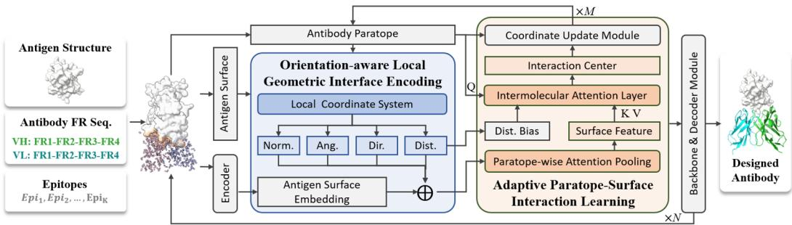
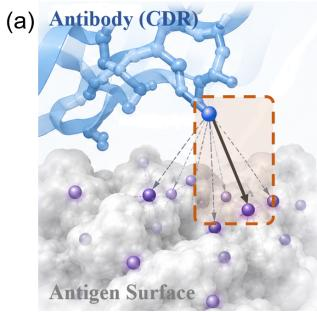
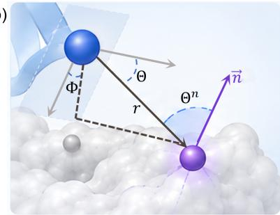
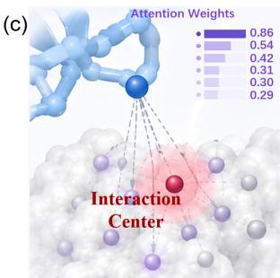

# ABGAZE: ATTENTIVE GEOMETRIC REPRESENTATION LEARNING FOR END-TO-END ANTIBODY DESIGN

Jiashuo Wang1,2,∗, Siqi Fan1,∗, Yizhen Luo1,2, Zaiqing Nie1,3,†

## ABSTRACT

Computational antibody design requires representations that capture the geometric patterns underlying antigen–antibody interactions, yet existing approaches often rely on scalar distances or surface-intrinsic features, leaving cross-molecular geometry largely implicit. We present AbGaze, an end-to-end antibody design framework based on attentive geometric representation learning, which encodes distance, spatial direction, and surface-normal orientation of antigen surfaces relative to antibody-residue local frames, and adaptively aggregates these geometric interactions according to their interfacial context. The learned interaction representation is shared across multi-CDR co-design, complex structure prediction, and affinity optimization, with local-frame geometric supervision further constraining the representation. AbGaze outperforms prior methods across all three tasks: relative to the second-best method, it improves amino-acid recovery by 7.1% and reduces structural error by 14.9% on average over the six CDRs, improves interface docking quality (DockQ) by 6.6%, and raises the affinity improvement rate (IMP) by 32.5%.

## 1 INTRODUCTION

Antibodies have been widely applied in disease therapy, diagnostics, and biomedical research due to their specific molecular-recognition capabilities (Chan et al., 2025). Antibodies recognize and bind antigenic epitopes through the complementarity-determining regions (CDRs) within their variable domains, while the high sequence and conformational diversity of CDRs enables diverse antigen– antibody binding modes (Sela-Culang et al., 2013; North et al., 2011; Weitzner et al., 2015). Therefore, computational modeling of antibodies conditioned on antigen structures requires accurate characterization of antigen–antibody interactions, where modeling the local spatial relationships at the interface is central to the problem.

Existing methods have evolved from step-by-step pipelines toward end-to-end generation (Jin et al., 2022b). Early approaches decomposed antibody modeling into sequential stages such as complex structure prediction, CDR design, and side-chain assembly, where intermediate errors could propagate across the pipeline (Jin et al., 2022a; Kong et al., 2022; Luo et al., 2022; Sircar & Gray, 2010). Recent end-to-end approaches instead jointly model antibody sequences and structures conditioned on antigen information, enabling tighter sequence–structure co-generation within a unified framework (Kong et al., 2023; Wang et al., 2025; Tan et al., 2025; Wang et al., 2026). In parallel, broader studies of protein interactions have explored interface representations learned from the geometric and chemical features of molecular surfaces (Sverrisson et al., 2021). Methods such as MaSIF learn interaction fingerprints that capture patterns associated with molecular recognition and surface complementarity, applying them to interaction-site identification and binder design (Gainza et al., 2020; 2023). These studies demonstrate that local geometric and chemical patterns at molecular interfaces provide informative cues for interaction modeling.

Despite these advances, existing interface representations can capture interaction patterns at the molecular-surface or atomic level, but provide limited explicit characterization of the crossmolecular spatial relationships that depend on local conformations at antigen–antibody interfaces. This challenge is closely related to a problem in protein–protein interaction modeling: how to represent the local geometry of intermolecular contacts. Intermolecular binding is not determined by spatial proximity alone; the distance, direction, and angle to the surface normal at which a molecule approaches the opposing surface all affect local packing and complementarity (Kuroda & Gray, 2016), while the contribution of contacts can also depend on their surrounding interface context (Lawrence & Colman, 1993; McCoy et al., 1997; Yang et al., 2003). Accordingly, interaction modeling should explicitly characterize the relative spatial relationships between a paratope conformation and the antigen surface. An effective interaction representation should therefore capture three aspects: spatial proximity between local structures, their relative orientations, and the dependence of local interaction contributions on the surrounding interface context. Distance-based representations capture spatial proximity but reduce each contact to a scalar, making configurations with similar distances but different directions indistinguishable; representations based on surface geometry and chemical features capture local surface patterns, but are not expressed relative to antibody conformations. Because these interactions are defined relative to local antibody conformations, antibody-residue local frames also provide a natural basis for structural supervision: frame-aligned point error (FAPE) (Jumper et al., 2021) and dihedral-angle constraints couple atoms with residue frames, supplying global structural supervision expressed in the same local coordinates. Given the large space of CDR conformations and binding configurations and the limited number of experimentally resolved antibody–antigen complexes, requiring a model to rediscover these interaction regularities from data can increase the burden on representation learning.

Motivated by these observations, we propose AbGaze, a unified framework for antigen–antibody interaction modeling based on orientation-aware geometry and adaptive attention. Specifically, AbGaze constructs a local interface representation using antibody-residue coordinate frames to explicitly encode distance, spatial direction, and surface-normal information. On top of this repre sentation, an adaptive atom–surface attention scheme, conditioned on interface geometry and fused with contextual node states, learns key local interactions and directs coordinate updates toward the attended surface region, optimized under FAPE and dihedral-angle supervision. This orientationaware representation acts as a binding prior that unifies multi-CDR co-design, complex structure prediction, and affinity optimization under a single masked-prediction framework, where stochastic masked decoding further yields multiple plausible sequence–structure realizations.

To summarize, our main contributions are as follows:

(i) We propose an orientation-aware local interface representation using antibody-residue coordinate frames to explicitly capture relative distance, spatial direction, and surface normals of the antigen surface.

(ii) We design an adaptive atom–surface attention mechanism conditioned on interface geometry to direct spatial updates and enable geometrically constrained interaction learning under FAPE and dihedral supervision.

(iii) We establish a binding prior that unifies multi-CDR co-design, structure prediction, and affinity optimization within a single masked-prediction framework, enabling multi-candidate sequence– structure decoding.

## 2 RELATED WORK

## 2.1 ANTIGEN-CONDITIONED ANTIBODY MODELING

Antigen-conditioned antibody modeling has evolved from localized CDR design toward end-toend sequence–structure co-design. Early landmark approaches, including HERN, MEAN, and DiffAb, investigated CDR generation by coupling sequence updates with backbone coordinates (Jin et al., 2022a; Kong et al., 2022; Luo et al., 2022). Subsequent end-to-end architectures, such as dyMEAN, established scalable full-atom graph dynamics and structural refinement pipelines (Kong et al., 2023), AbDiffuser paired full-atom diffusion generation with experimental antibody valida tion (Martinkus et al., 2023), and IgGM broadened generative modeling across diverse functional antibody and nanobody design regimes (Wang et al., 2025). More recently, flow-matching formulations have extended multi-state modeling: dyAb accommodates conformational transitions in target antigens (Tan et al., 2025), and AbFlow leverages surface-guided interaction dynamics for end-toend design (Wang et al., 2026), alongside geometry-aware frameworks like GeoGAD (Wei et al., 2026).

  
Figure 1: Overview of AbGaze. We propose AbGaze, a unified framework for antigen–antibody interaction modeling based on orientation-aware geometry and adaptive attention. The framework iteratively updates the antibody conformation by explicitly encoding the relative spatial relationships between the paratope local frames and the antigen surface, while an adaptive attention mechanism learns contextual interactions and guides structural refinement.

## 2.2 MOLECULAR INTERFACE REPRESENTATION

Characterizing molecular interaction interfaces requires capturing spatial proximity, local orientation, and surface complementarity. Surface-centric methods such as MaSIF and MaSIF-seed showed that geometric fingerprints and intrinsic surface curvature are informative for binding specificity (Gainza et al., 2020; 2023). This paradigm has been extended to pairwise point-cloud matching in PInet (Dai & Bailey-Kellogg, 2021), structural environment filtering in PeSTo (Krapp et al., 2023), and target-conditioned binder synthesis in ProBID-Net (Chen et al., 2024).

However, integrating such fine-grained surface topography into generative antibody architectures remains non-trivial. Existing generative models typically face a dichotomy in interface representation: they either operate at the residue level via local coordinate frames (Luo et al., 2022; Wei et al., 2026), thereby coarse-graining microscopic atomic contact geometry, or include atom-to-surface displacement vectors without decomposing them into residue-local reference frames (Wang et al., 2026). In contrast, AbGaze bridges fine-grained surface topography with frame-aligned local representations. By directly decomposing both antibody-frame approach directions and surface-normal incidence relationships into each residue’s local frame, AbGaze aggregates these geometric features through a dedicated two-level surface-attention module for interaction learning and geometric supervision.

## 3 METHODOLOGY

## 3.1 OVERVIEW AND PROBLEM SETTING

We represent an antigen–antibody complex as a residue graph (Jing et al., 2021) with amino-acid types and full-atom coordinates. Context and interface edges are constructed within and between the two molecules, respectively. For each epitope residue, we construct an MSMS molecular surface (Sanner et al., 1996) with vertex normals, keeping vertices within 10 A of any epitope atom.˚

Given the antigen sequence and structure and an antibody with masked target regions, AbGaze jointly generates antibody sequences and full-atom structures using a shared interface representation and atom–surface interaction learning. We adopt the general graph-based modeling and decoding framework of Kong et al. (2023).

  
(b)

  
Figure 2: Overview of local interface representation and adaptive attention. (a) Global interaction view between the antibody (CDR) residue and the antigen surface mesh. (b) Orientation-aware geometric encoding expressed in the antibody-residue local frame, capturing distance (r), spatial direction (Θ, Φ), and surface normal $( \Theta ^ { n } , \vec { n } )$ . (c) Adaptive atom–surface attention weighting used to dynamically locate the interaction center on the antigen surface.

## 3.2 ORIENTATION-AWARE LOCAL INTERFACE REPRESENTATION

To capture microscopic interactions at the antibody–antigen interface, we construct an orientationaware representation. For each antibody–antigen residue pair $e = \left( i , b _ { e } \right)$ , we relate every heavy atom of antibody residue $b _ { e }$ to every vertex of the paired antigen surface patch $\nu _ { i }$ . Both antibody and antigen heavy atoms are mapped into a standardized 14-slot vocabulary schema $p \in \{ 1 , \ldots , 1 4 \}$ (slots 1–4 hold the backbone atoms; slots 5–14 hold side-chain heavy atoms in a fixed per-type order, with unused slots padded and masked).

Residue local frame. For an antibody residue $^ { a , }$ we construct a local coordinate frame $( \mathbf { e } _ { 1 } , \mathbf { e } _ { 2 } , \mathbf { e } _ { 3 } )$ using its backbone heavy atoms $\mathbf { x } _ { a , \mathrm { N } } , \mathbf { x } _ { a , \mathrm { C } _ { \alpha } }$ , and $\mathbf { x } _ { a , \mathrm { C } }$ . Assuming non-collinear backbone atoms $( \mathbf { w } \times \mathbf { u } \neq \mathbf { 0 } )$ , we define the translation origin as $\mathbf { t } _ { a } = \mathbf { x } _ { a , \mathrm { C } _ { c } }$ and the proper rotation matrix ${ \mathbf { R } } _ { a } =$ $[ { \bf e } _ { 1 } { \bf e } _ { 2 } { \bf e } _ { 3 } ] \in \mathrm { S O } ( 3 )$ via Gram–Schmidt orthogonalization:

$$
\begin{array} { r l r l } & { \mathbf { u } = \mathbf { x } _ { a , \mathrm { C } } - \mathbf { x } _ { a , \mathrm { C } _ { \alpha } } , } & & { \mathbf { e } _ { 1 } = \frac { \mathbf { u } } { \operatorname* { m a x } ( \lVert \mathbf { u } \rVert _ { 2 } , \epsilon ) } , } \\ & { \mathbf { w } = \mathbf { x } _ { a , \mathrm { N } } - \mathbf { x } _ { a , \mathrm { C } _ { \alpha } } , } & & { \mathbf { e } _ { 2 } = \frac { \mathbf { w } - ( \mathbf { e } _ { 1 } ^ { \top } \mathbf { w } ) \mathbf { e } _ { 1 } } { \operatorname* { m a x } ( \lVert \mathbf { w } - ( \mathbf { e } _ { 1 } ^ { \top } \mathbf { w } ) \mathbf { e } _ { 1 } \rVert _ { 2 } , \epsilon ) } , } \\ & { } & & { \mathbf { e } _ { 3 } = \mathbf { e } _ { 1 } \times \mathbf { e } _ { 2 } , } \end{array}\tag{1}
$$

where $\epsilon = 1 0 ^ { - 1 2 }$ prevents division by zero. Expressing local spatial quantities in this residue frame via $\mathbf { y } ^ { \mathrm { l o c } } = \bar { \mathbf { R } } _ { a } ^ { \top } ( \mathbf { y } - \mathbf { t } _ { a } )$ guarantees that all downstream frame-aligned quantities, namely the geometric descriptors, attention queries, and attention weights (Eqs. 2–4), are strictly $\operatorname { S E } ( 3 )$ invariant to global rigid transformations of the molecular complex.

Surface-aware geometric encoding. For antibody atom slot $p$ and antigen surface vertex $j ,$ the relative displacement and surface normal expressed in the local frame of residue $a \equiv b _ { e }$ are computed as ${ \bf d } _ { p j } \doteq { \bf R } _ { a } ^ { \top } ( { \bf x } _ { a , p } - { \bf v } _ { j } )$ and $\vec { n } _ { i } ^ { \mathrm { l o c } } = \mathbf { R } _ { a } ^ { \dagger } \vec { n } _ { j }$ , where $\mathbf { d } _ { p j }$ points from surface vertex $j$ toward antibody atom p. The descriptor combines the antibody-frame approach direction with a surface-normal incidence cosine:

$$
\mathbf { g } _ { p j } = [ \phi _ { r } ( r _ { p j } ) , \mathbf { A } ( \Theta _ { p j } , \Phi _ { p j } ) , \hat { \mathbf { u } } _ { p j } , c _ { p j } , \mathbf { a } _ { p } ] \in \mathbb { R } ^ { 4 0 } ,\tag{2}
$$

where $r _ { p j } ~ = ~ \| \mathbf { d } _ { p j } \| _ { 2 } , ~ \hat { \mathbf { u } } _ { p j } ~ = ~ \mathbf { d } _ { p j } / \operatorname* { m a x } ( r _ { p j } , \epsilon )$ , and $( r _ { p j } , \Theta _ { p j } , \Phi _ { p j } )$ are the spherical coordinates of ${ \bf d } _ { p j } ; ~ \phi _ { r } ~ : ~ \mathbb { R } ~  ~ \mathbb { R } ^ { 1 6 }$ is a Gaussian radial basis (Schutt et al., 2017),¨ ${ \bf A } ( \Theta , \Phi ) =$ [sin Θ, cos Θ, sin Φ, cos $\Phi ] ^ { \top }$ a periodic directional encoding, smooth away from the polar axis of the residue frame $( \Theta = 0 , \pi$ , where $\Phi$ is undefined), $\mathbf { a } _ { p } \ \in \ \mathbb { R } ^ { 1 6 }$ the atom-type embedding, and $c _ { p j } = \hat { \mathbf { u } } _ { p j } ^ { \top } \vec { n } _ { j } ^ { \mathrm { l o c } } = \cos \Theta _ { p j } ^ { n }$ the frame-independent approach–normal cosine, with $\Theta _ { p j } ^ { n }$ the angle between the approach direction and the surface normal. The direction channels expose what scalar distances cannot: two contacts with ${ \bf d } _ { 1 } = ( r , 0 , 0 ) ^ { \top }$ and ${ \bf d } _ { 2 } = ( 0 , r , 0 ) ^ { \top }$ have equal distance but different orientation in the antibody frame, and are separated by $\mathbf { A } ( \Theta , \Phi )$ and $\hat { \mathbf { u } } _ { p j }$ ; and while a single $c _ { p j }$ does not encode the surface-normal azimuth, aggregating $c _ { p j }$ across the contacts of the patch provides incidence information about the local surface orientation. All atom–surface quantities are edge-local: computed independently for each pairing $( i , b _ { e } )$ in the frame of $^ { a , }$ never pooled across antibody residues or local frames, and mixed across edges only through the invariant edge messages ${ \bf m } _ { e }$ at the node level.

## 3.3 ADAPTIVE ATOM–SURFACE INTERACTION AND GATED COORDINATE UPDATE

We aggregate fine-grained atom–surface interactions using a two-level attention scheme.

Atom-level aggregation. Atom-wise interaction features are pooled into surface vertices via invariant attention weighting (Fuchs et al., 2020):

$$
\bar { \bf g } _ { j } ^ { ( e ) } = \sum _ { p \in a } \alpha _ { p j } { \bf g } _ { p j } , \qquad \alpha _ { p j } = \mathrm { s o f t m a x } _ { p } \left( f ( { \bf g } _ { p j } ) \right) ,\tag{3}
$$

where $f$ is a multi-layer perceptron.

Surface-level attention and interface edge readout. Content queries (Vaswani et al., 2017) are constructed from the frame-aligned local atom positions $\mathbf { q } _ { p } ^ { \mathrm { l o c } } = \dot { \mathbf { R } _ { a } ^ { \top } } ( \mathbf { x } _ { a , p } - \mathbf { t } _ { a } ) \in \mathbb { R } ^ { 3 }$

$$
\beta _ { p j } ^ { ( e ) } = \mathrm { s o f t m a x } _ { j } \left( \frac { ( \mathbf { W } _ { q } \mathbf { q } _ { p } ^ { \mathrm { l o c } } ) ^ { \top } \mathbf { W } _ { k } \bar { \mathbf { g } } _ { j } ^ { ( e ) } } { \sqrt { d } } \right) .\tag{4}
$$

Here, both the query $\mathbf { q } _ { p } ^ { \mathrm { l o c } }$ and the keys $\bar { \bf g } _ { j } ^ { ( e ) }$ are defined within the residue-local frame of $a .$

Each atom slot retrieves a surface feature vector $\begin{array} { r } { \mathbf { f } _ { p } \ = \ \sum _ { j } \beta _ { p j } ^ { ( e ) } \mathbf { W } _ { v } \bar { \mathbf { g } } _ { j } ^ { ( e ) } } \end{array}$ , which is averaged to form a residue-level interaction summary $\begin{array} { r } { \bar { \textbf { f } } = ~ \frac { 1 } { | a | } \sum _ { p \in a } \mathbf { f } _ { p } } \end{array}$ . Its normalized embedding $\mathbf { r } _ { e } ~ =$ Wr $\left( \bar { \bf f } / ( \| \bar { \bf f } \| _ { 2 } + \epsilon ) \right)$ is integrated into the interface edge message:

$$
\mathbf { m } _ { e } = \mathrm { M L P } _ { e } \left( \left[ \mathbf { h } _ { i } \parallel \mathbf { h } _ { b _ { e } } \parallel \mathbf { r } _ { e } \right] \right) .\tag{5}
$$

The invariant message me updates residue node states $\mathbf { h } _ { i }$ and parameterizes scalar gating functions for spatial updates (Satorras et al., 2021).

Attended surface centroid and transient coordinate update. Averaging $\beta _ { p j } ^ { ( e ) }$ over the valid (unmasked) atoms of residue a yields the marginal vertex distribution $\begin{array} { r } { \beta _ { j } ^ { ( e ) } = \frac { \bar { 1 } } { | a | } \sum _ { p \in a } \beta _ { p j } ^ { ( e ) } } \end{array}$ and the attended surface centroid $\begin{array} { r } { \bar { \mathbf { v } } _ { e } = \sum _ { j } \beta _ { j } ^ { ( e ) } \mathbf { v } _ { j } } \end{array}$

Within the local interaction encoder, atomic positions are maintained as 14-slot coordinates: antigen atoms enter from the observed context, while all antibody coordinates are initialized from the conserved framework template and refined during decoding (full state provenance in Appendix ${ \bf A . } 4 )$ For an epitope residue $i ,$ its transient atomic coordinates $\tilde { \mathbf { x } } _ { i , p } \in \mathbb { R } ^ { 3 }$ are updated across encoder layers via a gated message-passing scheme:

$$
\tilde { \mathbf { x } } _ { i , p } \gets \tilde { \mathbf { x } } _ { i , p } + \frac { 1 } { | \mathcal { N } _ { i } | } \sum _ { e \in \mathcal { N } _ { i } } \psi _ { p } ( \mathbf { m } _ { e } ) \big ( \mathbf { x } _ { a , p } - \bar { \mathbf { v } } _ { e } \big ) ,\tag{6}
$$

where $\mathbf { x } _ { a , p }$ is the coordinate of atom slot $p$ and $\psi _ { p } ( \mathbf { m } _ { e } )$ a slot-specific scalar gate projected from the invariant edge message ${ \bf m } _ { e }$ . Here, $\tilde { \mathbf { x } } _ { i , p }$ is a transient state that conditions downstream pairwise spatial contexts, not an explicit structure prediction. Unlike the residue-local descriptors and queries of Eqs. (2)–(4), the quantities of $\operatorname { E q } .$ . (6) live in the shared global frame of the current complex; the update acts on relative displacements and co-transforms with the complex under rigid motions (Appendix A.5).

Layer-wise geometric recurrence. The frames $( \mathbf { R } _ { a } , \mathbf { t } _ { a } )$ , the descriptors $\mathbf { g } _ { p j }$ , the queries $\mathbf { q } _ { p } ^ { \mathrm { l o c } }$ and the attended centroids $\bar { \mathbf { v } } _ { e }$ are all recomputed at each encoder layer from the current transient coordinates, while the mesh $\{ \mathbf { v } _ { j } \}$ stays anchored to the fixed antigen context. Each layer interleaves the surface-attention update with an equivariant inter-chain update whose pair-distance features are conditioned on the refined transient states $\tilde { \mathbf { x } } ^ { ( \ell ) }$ , and the update of Eq. (6) is $\operatorname { S E } ( 3 )$ -equivariant.

## 3.4 GEOMETRIC SUPERVISION

We use geometric objectives in the same residue-local frames as the interface representation: FAPE aligns every atom in every residue frame and thereby constrains global structural consistency, while the torsion terms regularize local backbone geometry; together they act as a training-time geometric prior that stabilizes what the interface representation learns.

Frame-aligned point error. Following Jumper et al. (2021),

$$
\mathcal { L } _ { \mathrm { F A P E } } = \frac { 1 } { | \mathcal { F } | | \mathcal { P } | } \sum _ { i \in \mathcal { F } } \sum _ { j \in \mathcal { P } } \operatorname* { m i n } \left( d _ { \operatorname* { m a x } } , \big | \mathbf { R } _ { i } ^ { \top } ( \hat { \mathbf { x } } _ { j } - \mathbf { t } _ { i } ) - \mathbf { R } _ { i } ^ { \star \top } ( \mathbf { x } _ { j } ^ { \star } - \mathbf { t } _ { i } ^ { \star } ) \big | _ { 2 } \right) .\tag{7}
$$

Torsion and angle loss. For backbone dihedrals $\theta \in \{ \phi , \psi , \omega \}$ and bond angles $\alpha , \mathcal { L } _ { \mathrm { t o r s i o n } }$ penalizes errors of the predicted cosines with the smooth- $\cdot \ell _ { 1 }$ penalty $\mathrm { s } \ell _ { 1 }$

$$
{ \mathcal { L } } _ { \mathrm { t o r s i o n } } = \sum _ { \theta } \operatorname { s } \ell _ { 1 } \Bigl ( \cos \hat { \theta } , \cos \theta \Bigr ) + \sum _ { \alpha } \operatorname { s } \ell _ { 1 } ( \cos \hat { \alpha } , \cos \alpha ) .\tag{8}
$$

Total objective. $\mathcal { L } _ { \mathrm { s e q } }$ is the cross-entropy of masked-token predictions summed over decoding rounds. The structure term comprises a Kabsch-aligned (Kabsch, 1976) full-atom coordinate loss ${ \mathcal { L } } _ { x } ,$ smooth- $\mathbf { \nabla } \cdot \mathbf { \rho } _ { 1 }$ bond-length losses ${ \mathcal { L } } _ { \mathrm { b o n d } }$ on backbone and sidechain bonds, ${ \mathcal { L } } _ { \mathrm { F A P E } } .$ , and Ltorsion. The docking term supervises the interface coordinates of the shadow paratope $( \mathcal { L } _ { \mathrm { S P } } )$ and the predicted inter-chain edge-distance map $( \mathcal { L } _ { \mathrm { e d } } )$ . These terms follow the implementation of Kong et al. (2023). An auxiliary smooth ${ \boldsymbol { \mathbf { \ell } } } _ { - } { \boldsymbol { \ell } } _ { 1 }$ term $\mathcal { L } _ { \mathrm { p R M S D } }$ additionally trains a per-residue RMSD prediction head on the antibody residues. The total objective is

$$
\begin{array} { r } { \mathcal { L } = \lambda _ { \mathrm { s e q } } \mathcal { L } _ { \mathrm { s e q } } + \underbrace { \lambda _ { x } \mathcal { L } _ { x } + \lambda _ { \mathrm { b o n d } } \mathcal { L } _ { \mathrm { b o n d } } + \lambda _ { \mathrm { F A P E } } \mathcal { L } _ { \mathrm { F A P E } } + \lambda _ { \mathrm { t o r s i o n } } \mathcal { L } _ { \mathrm { t o r s i o n } } } _ { \mathrm { s t r u c t u r e } } } \\ { + \underbrace { \lambda _ { \mathrm { S P } } \mathcal { L } _ { \mathrm { S P } } + \lambda _ { \mathrm { e d } } \mathcal { L } _ { \mathrm { e d } } } _ { \mathrm { d o c k i n g } } + \underbrace { \lambda _ { \mathrm { p R M S D } } \mathcal { L } _ { \mathrm { p R M S D } } } _ { \mathrm { a u x i l i a r y } } , } \end{array}\tag{9}
$$

## 3.5 GENERATION ACROSS MODELING TASKS

AbGaze decodes the sequence by stochastically revealing masked positions (Ghazvininejad et al., 2019) under a linear unmasking schedule, refining the coordinates conditioned on the partially revealed sequence: the target region starts fully masked with antibody coordinates from the conserved framework template, and each of the K reveal rounds refines the structure, predicts every stillmasked position, and commits each independently,

$$
p _ { \theta } \left( x _ { i } ^ { ( s ) } \Bigm | x ^ { ( s - 1 ) } , c \right) = \left( 1 - \rho _ { s } \right) \delta _ { \mathrm { m } } + \rho _ { s } \operatorname { s o f t m a x } \left( \mathbf { z } _ { i } ^ { ( s - 1 ) } / \tau \right) , \qquad \rho _ { s } = \frac { 1 } { K - s + 1 } , \quad \rho _ { K } = 1 , \mathrm { ~ a ~ n ~ d ~ } \quad \rho _ { K } = \frac { 1 } { K - s + 1 } .\tag{10}
$$

where m is the mask token, $x ^ { ( s ) }$ the decoding state after reveal round $s , \cdot$ c the antigen and committed context, $\mathbf { z } _ { i } ^ { ( s - 1 ) }$ the round-s decoder logits, and $K$ the number of reveal rounds. Revealed tokens are never re-masked, the final round commits the rest, and the temperature τ controls candidate diversity. Training uses the masked-prediction objective, a member of the simplified masked-crossentropy family used to train absorbing-state diffusion (Sahoo et al., 2024), with the corruption level set by an annealed context curriculum rather than a uniform prior; Appendix A.6 states its precise scope.

Masking any subset of CDRs configures joint sequence–structure design; observing the full antibody sequence yields complex structure prediction from template initialization; and affinity optimization tunes the template-initialization noise through the frozen generator, guided by a pretrained ∆∆G regressor as a differentiable proxy with a KL trust region toward $\sqrt { ( 0 , { \bf I } ) }$ . Across all four tasks, the same interface representation, attention, and equivariant refinement apply: within the shared generator there is no task-specific component or loss term, and the tasks differ only in masking, initialization, and sampling or optimization configurations; the sole component fitted outside the generator is the frozen $\Delta \dot { \Delta } G$ regressor, which contributes no term to the generator’s objective (Appendix B).

## 4 EXPERIMENTS

We evaluate AbGaze on the four settings served by the shared interface representation: all-CDR design, CDR-H3 design, complex structure prediction, and affinity optimization.

## 4.1 SETUP

Data and benchmark. Training and evaluation follow the data pipeline of Kong et al. (2023) (details in Appendix C): SAbDab (Dunbar et al., 2014) complexes clustered by CDR sequence identity (Kong et al., 2022). To rule out cross-task leakage, we hold out the single benchmark RAbD (Adolf-Bryfogle et al., 2018) (60 complexes), remove every overlapping cluster from training, and evaluate all four tasks exclusively on it. No published numbers are copied; all baselines are re-run under this protocol, with the structure-prediction and affinity baselines locally re-evaluated (Appendix C).

Baselines. We compare against RosettaAb (Adolf-Bryfogle et al., 2018), DiffAb (Luo et al., 2022), MEAN (Kong et al., 2022), HERN (Jin et al., 2022a), dyMEAN (Kong et al., 2023), and AbFlow (Wang et al., 2026). Models that fill CDRs on a docked backbone are standardized into the four-stage IgFold (Ruffolo et al., 2023), HDock (Yan et al., 2020), generation, and Rosetta pipeline of Kong et al. (2023); Wang et al. (2026).

Metrics. Sequence quality is measured by AAR and its contact-restricted variant CAAR; structure quality by TM-score (Zhang & Skolnick, 2004), lDDT (Mariani et al., 2013), and $\mathrm { C } _ { \alpha }$ RMSD after alignment; interface quality by DockQ (Basu & Wallner, 2016); and affinity by the best ∆∆G (via a shared pretrained regressor), the improvement percentage (IMP, fraction of candidates with $\Delta \Delta G < 0 )$ , and the mutation count $\Delta L$ . Evaluation must specify how the distribution over de signs is consumed; the protocol is fixed per task, with every method sampled and selected identically within the design and affinity comparisons. Design (all-CDR and CDR-H3): five samples per target at $\tau { = } 0 . 5$ , reporting the candidate with the highest AAR against the native, an oracle selection applied identically to every method. Complex structure prediction: ten stochastic draws (random shadow-paratope initialization), keeping the one with the lowest model-predicted per-residue RMSD; no ground truth is involved. Affinity optimization: thirty optimized candidates per target, reporting the best $\Delta \Delta G ;$ IMP is computed over all candidates. The budget contributes little: bestof-five adds only 2.2 AAR points over a single deterministic design (Appendix F).

## 4.2 ALL-CDR DESIGN

Table 1 evaluates the joint design of all six CDRs. The All AAR is pooled over the residues of the six CDRs, while the All RMSD is the $\mathrm { C } _ { \alpha }$ RMSD of the entire antibody. The pooled AAR reaches 66.2%, a 10% relative gain over the strongest baseline. Relative to the strongest baseline on each CDR, AbGaze improves AAR by 7.1% and reduces RMSD by 14.9% on average over the six loops, with the largest gains on the conformationally variable L3 and H3: L3 AAR reaches 0.69 (+19%) and the H3 $\mathbf { C } _ { \alpha }$ RMSD falls to 1.65 A ( ˚ −10%). Interface quality follows, with a DockQ of 0.422 vs. $0 . 3 9 6 \left( + 6 . 6 \% \right)$

The concurrent improvements across heavy- and light-chain CDRs suggest that explicit orientation and distance cues help coordinate multiple flexible loops: resolving each residue’s contacts in its own local frame against the epitope surface supports joint optimization of paratope sequence and backbone geometry, keeping adjacent loops coherent while aligning the paratope with the antigen.

## 4.3 CDR-H3 DESIGN

Table 2 evaluates CDR-H3 design on RAbD, the most widely optimized loop given H3’s decisive role in antigen recognition. On global backbone metrics, most end-to-end baselines reach comparably high performance $( \geq 0 . 8 4 \mathrm { 1 D D T } , \geq 0 . 9 7 \mathrm { T M - s c o r e } )$ , indicating that coarse loop topology is largely well-captured. AbGaze leads across sequence, interface, and structural metrics, reaching an AAR of 45.60% (+4.5%), a contact-restricted recovery of 32.20% (+11.8%), a DockQ of 0.443 (+3.5%), and the lowest $\mathrm { C } _ { \alpha } \mathrm { R M S D } \left( 8 . 0 6 \right)$ , all relative to the strongest baseline. The gains concentrate at the interface itself, suggesting that encoding the distance, direction, and angle to the surface

Table 1: Performance comparison on all-CDR antibody design. ↑ indicates higher is better, while ↓ indicates lower is better. Bold denotes the best performance.
<table><tr><td>Metric</td><td>Item</td><td>AbGaze</td><td>AbFlow</td><td>dyMEAN</td></tr><tr><td rowspan="7">AAR↑</td><td>L1</td><td>0.77</td><td>0.69</td><td>0.76</td></tr><tr><td>L2</td><td>0.85</td><td>0.82</td><td>0.83</td></tr><tr><td>L3</td><td>0.69</td><td>0.58</td><td>0.52</td></tr><tr><td>H1</td><td>0.79</td><td>0.74</td><td>0.76</td></tr><tr><td>H2</td><td>0.71</td><td>0.65</td><td>0.69</td></tr><tr><td>H3</td><td>0.43</td><td>0.38</td><td>0.38</td></tr><tr><td>All</td><td>0.662</td><td>0.597</td><td>0.601</td></tr><tr><td rowspan="6">RMSD (CA)↓</td><td>L1</td><td>0.44</td><td>0.64</td><td>0.86</td></tr><tr><td>L2</td><td>0.21</td><td>0.25</td><td>0.48</td></tr><tr><td>L3</td><td>0.65</td><td>0.65</td><td>0.94</td></tr><tr><td>H1</td><td>0.52</td><td>0.63</td><td>0.63</td></tr><tr><td>H2</td><td>0.47</td><td>0.55</td><td>0.71</td></tr><tr><td>H3</td><td>1.65</td><td>1.83</td><td>2.45</td></tr><tr><td rowspan="3">Structure</td><td>All</td><td>1.052</td><td>1.104</td><td>1.357</td></tr><tr><td>DockQ↑</td><td>0.422</td><td>0.379</td><td>0.396</td></tr><tr><td>LDDT↑ TM-Score↑</td><td>0.831 0.973</td><td>0.815 0.971</td><td>0.803 0.965</td></tr></table>

normal at which each atom approaches the epitope lets the model align local paratope geometry with epitope constraints.

Table 2: Performance comparison on CDR-H3 antibody design on the RAbD benchmark.
<table><tr><td>Method</td><td>AAR↑</td><td>TMscore ↑</td><td>IDDT ↑</td><td>CAAR↑</td><td>RMSD↓</td><td>DockQ ↑</td></tr><tr><td>RosettaAb</td><td>32.31%</td><td>0.9717</td><td>0.8272</td><td>14.58%</td><td>17.70</td><td>0.137</td></tr><tr><td>DiffAb</td><td>35.31%</td><td>0.9695</td><td>0.8281</td><td>22.17%</td><td>23.24</td><td>0.158</td></tr><tr><td>MEAN</td><td>37.38%</td><td>0.9688</td><td>0.8252</td><td>24.11%</td><td>17.30</td><td>0.162</td></tr><tr><td>HERN</td><td>32.65%</td><td></td><td></td><td>19.27%</td><td>9.15</td><td>0.294</td></tr><tr><td>dyMEAN</td><td>43.65%</td><td>0.9726</td><td>0.8454</td><td>28.11%</td><td>8.11</td><td>0.409</td></tr><tr><td>AbFlow</td><td>42.10%</td><td>0.9735</td><td>0.8518</td><td>28.80%</td><td>8.45</td><td>0.428</td></tr><tr><td>AbGaze</td><td>45.60%</td><td>0.9730</td><td>0.8455</td><td>32.20%</td><td>8.06</td><td>0.443</td></tr></table>

## 4.4 COMPLEX STRUCTURE PREDICTION

Table 3 evaluates prediction from sequences alone against the docking pipeline HDock, the hierarchical refinement of HERN, and the end-to-end baselines. Global antibody structure is nearsaturated for all end-to-end methods (TM-score ≥ 0.97); the differences appear precisely at the interface, where AbGaze attains the best DockQ (0.435) and RMSD (8.03). The simultaneous DockQ and RMSD gains indicate that the representation better resolves the paratope’s spatial arrangement relative to the antigen surface: the distance-, direction-, and orientation-structure of the static binding mode on this benchmark. These gains show that the representation characterizes the binding mode accurately.

Table 3: Performance comparison on antigen–antibody complex structure prediction.
<table><tr><td>Model</td><td>TMscore ↑</td><td>IDDT ↑</td><td>RMSD↓</td><td>DockQ ↑</td></tr><tr><td>HDock</td><td>0.9723</td><td>0.8503</td><td>18.46</td><td>0.170</td></tr><tr><td>HERN</td><td>0.9722</td><td>0.8441</td><td>10.19</td><td>0.424</td></tr><tr><td>dyMEAN</td><td>0.9730</td><td>0.8568</td><td>9.04</td><td>0.409</td></tr><tr><td>AbFlow</td><td>0.9720</td><td>0.8526</td><td>8.66</td><td>0.419</td></tr><tr><td>AbGaze</td><td>0.9735</td><td>0.8572</td><td>8.03</td><td>0.435</td></tr></table>

## 4.5 AFFINITY OPTIMIZATION

Table 4 compares affinity optimization on RAbD with the same frozen generator and the same ∆∆G regressor for all methods. AbGaze reaches the best ∆∆G (−11.10) and by far the highest improvement rate (IMP 70.6%, +17.3 points over dyMEAN and +17.8 over AbFlow): almost three quarters of the optimized candidates receive a negative predicted ∆∆G from the shared scorer. The mutations it requests are more numerous (∆L 8.07 vs. 4.25 for dyMEAN); we regard this as an acceptable trade, since IMP already scores success per candidate. That gradient ascent through the shared rep resentation alone suffices to steer affinity supports the central claim of §3.2: the orientation-aware encoding captures the interfacial context—proximity, relative orientation, and the contribution of each contact under its surrounding geometry—well enough that optimizing toward this representation, rather than merely fitting the design objective, transfers to a downstream affinity criterion. Together with the binding-mode results in prediction, this is consistent with the representation char acterizing how the antibody binds, and how strongly, more faithfully than distance- or surface-based encodings.

Table 4: Comparison of affinity optimization performance.
<table><tr><td>Method</td><td>Best ∆∆G↓</td><td>IMP (%) ↑</td><td>∆L↓</td></tr><tr><td>DiffAb</td><td>-3.29</td><td>38.8</td><td>5.62</td></tr><tr><td>dyMEAN</td><td>-4.47</td><td>53.3</td><td>4.25</td></tr><tr><td>AbFlow</td><td>-9.31</td><td>52.8</td><td>6.98</td></tr><tr><td>AbGaze</td><td>-11.10</td><td>70.6</td><td>8.07</td></tr></table>

## 5 ABLATION

We ablate the orientation-aware interaction module (Variant A) and the residue-local geometric loss (Variant B) on RAbD all-CDR design.

Orientation-aware interaction. Variant (A) replaces the local interface representation (§3.2–3.3) with standard distance-based message passing. Removing explicit spatial and normal directionality primarily weakens interface packing (DockQ −0.040, antibody Cα RMSD +0.061 A) and reduces˚ overall sequence recovery (AAR −4.1%), showing that atom–surface orientation carries information beyond scalar distances.

Local-frame geometric supervision. Variant (B) omits the residue-local FAPE and dihedral terms (§3.4), relying solely on global coordinate and auxiliary losses. While interface docking is essentially unchanged (DockQ +0.012), backbone structural quality degrades significantly (antibody Cα RMSD +0.147 A, lDDT˚ −0.043, TM-Score −0.009). The local-frame terms thus act as global geometric regularizers that constrain the relative orientation of adjacent residues and stabilize the overall fold.

Table 5: Ablation study on all-CDR antibody design.
<table><tr><td>Variant</td><td>AAR↑</td><td>RMSD</td><td>DockQ ↑</td><td>IDDT ↑</td><td>TMscore ↑</td></tr><tr><td>AbGaze (Full)</td><td>66.2%</td><td>1.052</td><td>0.422</td><td>0.831</td><td>0.973</td></tr><tr><td>(A) w/o Orient.-Aware Attn.</td><td>-4.1%</td><td>+0.061</td><td>-0.040</td><td>-0.007</td><td>-0.003</td></tr><tr><td>(B) w/o Local-Frame Supv.</td><td>-1.2%</td><td>+0.147</td><td>+0.012</td><td>-0.043</td><td>-0.009</td></tr></table>

## 6 CONCLUSION

We presented AbGaze, a unified framework for antigen–antibody interface modeling built on an orientation-aware local representation and adaptive atom–surface attention. By anchoring distance, direction, and surface-normal geometry to residue-local frames, AbGaze explicitly encodes how each antibody atom approaches the antigen surface, and its two-level attention learns which local interactions matter under each interfacial context. A single model covers all four tasks: relative to the second-best method, it improves amino-acid recovery by 7.1% and reduces per-CDR C RMSD by 14.9% on average over the six CDRs, improves DockQ by 6.6%, and raises the affinity improvement rate (IMP) by 32.5%. These results support the premise that explicitly characterizing the relative spatial relationships between paratope and epitope in antibody-residue local frames outperforms leaving them implicit in scalar distances or surface-intrinsic features. Next steps include extending the representation to flexible antigens, validating designs experimentally, and incorporating developability into the optimization objective.

## ACKNOWLEDGEMENTS

This research is supported by the Innovative Drug Research and Development National Science and Technology Major Project (No.2025ZD1803101), the Wuxi Research Institute of Applied Technologies, Tsinghua University (Grant 20242001120), and PharMolix Inc.

## REFERENCES

Jared Adolf-Bryfogle, Oleks Kalyuzhniy, Michael Kubitz, Brian D. Weitzner, Xiaozhen Hu, Yumiko Adachi, William R. Schief, and Roland L. Dunbrack. Rosettaantibodydesign (rabd): A general framework for computational antibody design. PLOS Computational Biology, 14(4):e1006112, 2018. doi: 10.1371/journal.pcbi.1006112.

Jacob Austin, Daniel D. Johnson, Jonathan Ho, Daniel Tarlow, and Rianne van den Berg. Structured denoising diffusion models in discrete state-spaces. In Advances in Neural Information Processing Systems, volume 34, pp. 17981–17993, 2021.

Sankar Basu and Bjorn Wallner. Dockq: A quality measure for protein-protein docking models. ¨ PLOS ONE, 11(8):e0161879, 2016. doi: 10.1371/journal.pone.0161879.

Andrew C. Chan, Greg D. Martyn, and Paul J. Carter. Fifty years of monoclonals: the past, present and future of antibody therapeutics. Nature Reviews Immunology, 25:745–765, 2025. doi: 10. 1038/s41577-025-01207-9.

Zhihang Chen, Menglin Ji, Jie Qian, Zhe Zhang, Xiangying Zhang, Haotian Gao, Haojie Wang, Renxiao Wang, and Yifei Qi. Probid-net: a deep learning model for protein-protein binding interface design. Chemical Science, 15(47):19977–19990, 2024. doi: 10.1039/D4SC02233E.

Bowen Dai and Chris Bailey-Kellogg. Protein interaction interface region prediction by geometric deep learning. Bioinformatics, 37(17):2580–2588, 2021. doi: 10.1093/bioinformatics/btab154.

James Dunbar, Konrad Krawczyk, Jinwoo Leem, Terry Baker, Angelika Fuchs, Guy Georges, Jiye Shi, and Charlotte M. Deane. SAbDab: the structural antibody database. Nucleic Acids Research, 42(D1):D1140–D1146, 2014. doi: 10.1093/nar/gkt1043.

Fabian B. Fuchs, Daniel E. Worrall, Volker Fischer, and Max Welling. SE(3)-transformers: 3D roto-translation equivariant attention networks. In Advances in Neural Information Processing Systems, volume 33, pp. 1970–1981, 2020. URL https://proceedings.neurips.cc/ paper/2020/hash/15231a7ce4ba789d13b722cc5c955834-Abstract.html.

Pablo Gainza, Freyr Sverrisson, Federico Monti, Emanuele Rodola, Davide Boscaini, Michael M.\` Bronstein, and Bruno E. Correia. Deciphering interaction fingerprints from protein molecular surfaces using geometric deep learning. Nature Methods, 17:184–192, 2020. doi: 10.1038/ s41592-019-0666-6.

Pablo Gainza, Sarah Wehrle, Alexandra Van Hall-Beauvais, Anthony Marchand, Andreas Scheck, Zander Harteveld, Stephen Buckley, Dongchun Ni, Shuguang Tan, Freyr Sverrisson, Casper Goverde, Priscilla Turelli, Charlene Raclot, Alexandra Teslenko, Martin Pacesa, St\` ephane Ros-´ set, Sandrine Georgeon, Jane Marsden, Aaron Petruzzella, Kefang Liu, Zepeng Xu, Yan Chai, Pu Han, George F. Gao, Elisa Oricchio, Beat Fierz, Didier Trono, Henning Stahlberg, Michael Bronstein, and Bruno E. Correia. De novo design of protein interactions with learned surface fingerprints. Nature, 617:176–184, 2023. doi: 10.1038/s41586-023-05993-x.

Marjan Ghazvininejad, Omer Levy, Yinhan Liu, and Luke Zettlemoyer. Mask-Predict: Parallel decoding of conditional masked language models. In Proceedings of the 2019 Conference on Empirical Methods in Natural Language Processing and the 9th International Joint Conference on Natural Language Processing (EMNLP-IJCNLP), pp. 6112–6121. Association for Computational Linguistics, 2019. doi: 10.18653/v1/D19-1633. URL https://aclanthology. org/D19-1633/.

Wengong Jin, Regina Barzilay, and Tommi S. Jaakkola. Antibody-antigen docking and design via hierarchical equivariant refinement. arXiv preprint arXiv:2207.06616, 2022a.

Wengong Jin, Jeremy Wohlwend, Regina Barzilay, and Tommi Jaakkola. Iterative refinement graph neural network for antibody sequence-structure co-design. In International Conference on Learning Representations, 2022b. URL https://arxiv.org/abs/2110.04624.

Bowen Jing, Stephan Eismann, Patricia Suriana, Raphael J. L. Townshend, and Ron Dror. Learning from protein structure with geometric vector perceptrons. In International Conference on Learning Representations, 2021. URL https://arxiv.org/abs/2009.01411.

John Jumper, Richard Evans, Alexander Pritzel, Tim Green, Michael Figurnov, Olaf Ronneberger, Kathryn Tunyasuvunakool, Russ Bates, Augustin Z´ıdek, Anna Potapenko, Alex Bridgland, Clemens Meyer, Simon A. A. Kohl, Andrew J. Ballard, Andrew Cowie, Bernardino Romera-Paredes, Stanislav Nikolov, Rishub Jain, Jonas Adler, Trevor Back, Stig Petersen, David Reiman, Ellen Clancy, Michal Zielinski, Martin Steinegger, Michalina Pacholska, Tamas Berghammer, Sebastian Bodenstein, David Silver, Oriol Vinyals, Andrew W. Senior, Koray Kavukcuoglu, Pushmeet Kohli, and Demis Hassabis. Highly accurate protein structure prediction with alphafold. Nature, 596(7873):583–589, 2021. doi: 10.1038/s41586-021-03819-2.

Wolfgang Kabsch. A solution for the best rotation to relate two sets of vectors. Acta Crystallographica Section A, 32(5):922–923, 1976. doi: 10.1107/S0567739476001873.

Diederik P. Kingma and Jimmy Lei Ba. Adam: A method for stochastic optimization. In International Conference on Learning Representations, 2015. URL https://arxiv.org/abs/ 1412.6980.

Xiangzhe Kong, Wenbing Huang, and Yang Liu. Conditional antibody design as 3d equivariant graph translation. arXiv preprint arXiv:2208.06073, 2022.

Xiangzhe Kong, Wenbing Huang, and Yang Liu. End-to-end full-atom antibody design. In Proceedings of the 40th International Conference on Machine Learning, volume 202 of Proceedings of Machine Learning Research, pp. 17409–17429. PMLR, 2023.

Lucien F. Krapp, Luciano A. Abriata, Fabio Cortes Rodriguez, and Matteo Dal Peraro. Pesto:´ parameter-free geometric deep learning for accurate prediction of protein binding interfaces. Nature Communications, 14(1):2175, 2023. doi: 10.1038/s41467-023-37701-8.

Daisuke Kuroda and Jeffrey J. Gray. Shape complementarity and hydrogen bond preferences in protein–protein interfaces: implications for antibody modeling and protein–protein docking. Bioinformatics, 32(16):2451–2456, 2016. doi: 10.1093/bioinformatics/btw197.

Michael C. Lawrence and Peter M. Colman. Shape complementarity at protein/protein interfaces. Journal ofMolecular Biology, 234(4):946–950, 1993. doi: 10.1006/jmbi.1993.1648.

Marie-Paule Lefranc, Christelle Pommie, Manuel Ruiz, V ´ eronique Giudicelli, Elodie Foulquier, ´ Lisa Truong, Valerie Thouvenin-Contet, and G´ erard Lefranc. IMGT unique numbering for im-´ munoglobulin and T cell receptor variable domains and Ig superfamily V-like domains. Developmental and Comparative Immunology, 27(1):55–77, 2003. doi: 10.1016/S0145-305X(02) 00039-3.

Shitong Luo, Kevin K. Yang, Minkai Xu, Zhuoran Wu, Pengtao Xie, Wengong Jin, Bowen Tang, Jian Peng, and Jianzhu Ma. Antigen-specific antibody design and optimization with diffusionbased generative models for protein structures. In Advances in Neural Information Processing Systems, volume 35, pp. 9754–9767, 2022.

Valerio Mariani, Marco Biasini, Alessandro Barbato, and Torsten Schwede. lDDT: a local superposition-free score for comparing protein structures and models using distance difference tests. Bioinformatics, 29(21):2722–2728, 2013. doi: 10.1093/bioinformatics/btt473.

Karolis Martinkus, Jan Ludwiczak, Wei-Ching Liang, Julien Lafrance-Vanasse, Isidro Hotzel, Arvind Rajpal, Yan Wu, Kyunghyun Cho, Richard Bonneau, Vladimir Gligorijevic, and Andreas Loukas. AbDiffuser: Full-atom generation of in-vitro functioning antibodies. In Advances in Neural Information Processing Systems, volume 36, 2023. URL https://proceedings.neurips.cc/paper\_files/paper/2023/ hash/801ec05b0aae9fcd2ef35c168bd538e0-Abstract-Conference.html.

A. J. McCoy, V. Chandana Epa, and P. M. Colman. Electrostatic complementarity at protein/protein interfaces. Journal ofMolecular Biology, 268(2):570–584, 1997. doi: 10.1006/jmbi.1997.0987.

Benjamin North, Andreas Lehmann, and Roland L. Dunbrack Jr. A new clustering of antibody CDR loop conformations. Journal of Molecular Biology, 406(2):228–256, 2011. doi: 10.1016/j.jmb. 2010.10.030.

Jeffrey A. Ruffolo, Lee-Shin Chu, Sai Pooja Mahajan, and Jeffrey J. Gray. Fast, accurate antibody structure prediction from deep learning on massive set of natural antibodies. Nature Communications, 14:2389, 2023. doi: 10.1038/s41467-023-38063-x.

Subham Sekhar Sahoo, Marianne Arriola, Yair Schiff, Aaron Gokaslan, Edgar Marroquin, Justin T. Chiu, Alexander Rush, and Volodymyr Kuleshov. Simple and effective masked diffusion language models. In Advances in Neural Information Processing Systems, volume 37, pp. 130136–130184, 2024. doi: 10.52202/079017-4135.

Michel F. Sanner, Arthur J. Olson, and Jean-Claude Spehner. Reduced surface: An efficient way to compute molecular surfaces. Biopolymers, 38(3):305–320, 1996. doi: 10.1002/(SICI) 1097-0282(199603)38:3⟨305::AID-BIP4⟩3.0.CO;2-Y.

V´ıctor Garcia Satorras, Emiel Hoogeboom, and Max Welling. E(n) equivariant graph neural networks. In Proceedings of the 38th International Conference on Machine Learning, volume 139 of Proceedings of Machine Learning Research, pp. 9323–9332. PMLR, 2021. URL https://proceedings.mlr.press/v139/satorras21a.html.

Kristof T. Schutt, Pieter-Jan Kindermans, Huziel E. Sauceda, Stefan Chmiela, Alexandre¨ Tkatchenko, and Klaus-Robert Muller. SchNet: A continuous-filter convolutional neural net-¨ work for modeling quantum interactions. In Advances in Neural Information Processing Systems, volume 30, 2017. URL https://proceedings.neurips.cc/paper/2017/hash/ 303ed4c69846ab36c2904d3ba8573050-Abstract.html.

Inbal Sela-Culang, Vered Kunik, and Yanay Ofran. The structural basis of antibody-antigen recognition. Frontiers in Immunology, 4:302, 2013. doi: 10.3389/fimmu.2013.00302.

Aroop Sircar and Jeffrey J. Gray. SnugDock: Paratope structural optimization during antibodyantigen docking compensates for errors in antibody homology models. PLOS Computational Biology, 6(1):e1000644, 2010. doi: 10.1371/journal.pcbi.1000644.

Freyr Sverrisson, Jean Feydy, Bruno E. Correia, and Michael M. Bronstein. Fast endto-end learning on protein surfaces. In Proceedings of the IEEE/CVF Conference on Computer Vision and Pattern Recognition, pp. 15272–15281, 2021. URL https: //openaccess.thecvf.com/content/CVPR2021/html/Sverrisson\_Fast\_ End-to-End\_Learning\_on\_Protein\_Surfaces\_CVPR\_2021\_paper.html.

Cheng Tan, Yijie Zhang, Zhangyang Gao, Yufei Huang, Haitao Lin, Lirong Wu, Fandi Wu, Mathieu Blanchette, and Stan Z. Li. dyab: Flow matching for flexible antibody design with alphafolddriven pre-binding antigen. In Proceedings of the AAAI Conference on Artificial Intelligence, volume 39, pp. 782–790, 2025. doi: 10.1609/aaai.v39i1.32061.

Ashish Vaswani, Noam Shazeer, Niki Parmar, Jakob Uszkoreit, Llion Jones, Aidan N. Gomez, Łukasz Kaiser, and Illia Polosukhin. Attention is all you need. In Advances in Neural Information Processing Systems, volume 30, pp. 5998–6008, 2017. URL https://papers.nips.cc/ paper/7181-attention-is-all-you-need.

Rubo Wang, Fandi Wu, Xingyu Gao, Jiaxiang Wu, Peilin Zhao, and Jianhua Yao. Iggm: A generative model for functional antibody and nanobody design. In The Thirteenth International Conference on Learning Representations, 2025. URL https://openreview.net/forum?id= zmmfsJpYcq.

Wenda Wang, Yang Zhang, Zhewei Wei, and Wenbing Huang. Abflow: End-to-end paratopecentric antibody design by interaction enhanced flow matching. In Proceedings ofthe 32nd ACM SIGKDD Conference on Knowledge Discovery and Data Mining, 2026. doi: 10.1145/3770854. 3780296.

Songjian Wei, Jinxiong Zhang, Yan Chen, Chunyan Tang, and Jiayang Tan. Geogad: geometryaware antibody design framework for complementarity-determining region precision engineering. Bioinformatics, 42(2):btag042, 2026. doi: 10.1093/bioinformatics/btag042.

Brian D. Weitzner, Roland L. Dunbrack Jr., and Jeffrey J. Gray. The origin of cdr h3 structural diversity. Structure, 23(2):302–311, 2015. doi: 10.1016/j.str.2014.11.010.

Yumeng Yan, Huanyu Tao, Jiahua He, and Sheng-You Huang. The HDOCK server for integrated protein–protein docking. Nature Protocols, 15(5):1829–1852, 2020. doi: 10.1038/ s41596-020-0312-x.

Jianying Yang, Chittoor P. Swaminathan, Yuping Huang, Rongjin Guan, Sangwoo Cho, Michele C. Kieke, David M. Kranz, Roy A. Mariuzza, and Eric J. Sundberg. Dissecting cooperative and additive binding energetics in the affinity maturation pathway of a protein-protein interface. Journal ofBiological Chemistry, 278(50):50412–50421, 2003. doi: 10.1074/jbc.M306848200.

Yang Zhang and Jeffrey Skolnick. Scoring function for automated assessment of protein structure template quality. Proteins: Structure, Function, and Bioinformatics, 57(4):702–710, 2004. doi: 10.1002/prot.20264.

## A EXTENDED METHOD DETAILS

This section supplements §3.2–§3.3 with the implementation-level details behind the interface representation: the atom-slot schema and the construction of interface edges (Appendix A.1), the surface-patch construction (Appendix A.2), the composition of the geometric descriptor and the normalization axes of the two-level attention (Appendix A.3), and the transient coordinate states, their layer-wise recurrence, and the SE(3)-equivariance of the interface update (Appendices A.4 and A.5). Notation follows the main text.

## A.1 ATOM-SLOT SCHEMA AND INTERFACE EDGES

Atom slots. Both molecules use the standardized 14-slot vocabulary of §3.2: slots 1–4 hold the backbone atoms $\mathrm { N } , \mathrm { C } _ { \alpha } , \mathrm { C } , \mathrm { O }$ , and slots 5–14 hold the side-chain heavy atoms in the fixed per-type order of Table 6 (at most ten; tryptophan is the only residue type that uses all of them). When a residue provides fewer atoms than its type allows, which is always the case for generated residues before side-chain completion and for any unresolved atom in an observed structure, the unused slots are padded at the $\mathrm { C } _ { \alpha }$ coordinate and flagged as padding. Padded slots are excluded wherever atom slots are enumerated: from the k-NN edge distances below, from the atom-level softmax of Eq. 3, from the atom averages ¯f and $\beta _ { j } ^ { ( e ) }$ , and from the gate indices $\psi _ { p }$ of Eq. 6.

Edges. Context edges are constructed within each molecule and interface edges between the two, both by k-NN over residues with k=9 (Table 12); the distance between two residues is the minimum Euclidean distance over all pairs of non-padded atom slots, so a single resolved contact suffices to rank a pair. Each interface edge $e = ( i , b _ { e } )$ pairs an epitope residue i with an antibody residue $b _ { e }$ and carries the surface patch $\bar { \nu _ { i } }$ of the epitope residue.

## A.2 SURFACE PATCH CONSTRUCTION

The antigen surface is computed once per context with MSMS (Sanner et al., 1996) $( 1 . 5 \mathring \mathrm { A }$ probe radius); each vertex carries the MSMS normal, oriented outward from the antigen. Following §3.1, only vertices within 10 $\mathring { A }$ of any epitope atom are retained. Each retained vertex is assigned to its nearest epitope residue, which yields per-residue patches with ${ \approx } 7 2$ raw vertices on average; each patch is randomly subsampled, or zero-padded and masked, to a fixed size of $M { = } 5 0$ vertices (Table 12) before batching. The mesh $\{ \mathbf { v } _ { j } \}$ is therefore part of the fixed antigen context: it is precomputed before refinement, never moves, and the same vertex assignment is reused at every decoding step. Padded vertices are excluded from the vertex-level softmax of Eq. 4 and from the attended centroid $\bar { \bf v } _ { e } ,$ so they can neither receive nor contribute attention mass.

Table 6: Side-chain heavy atoms occupying slots 5–14, in slot order; slots 1–4 hold the backbone atoms.
<table><tr><td>Res.</td><td>Slots 5-14</td><td>Res. Slots 5–14</td></tr><tr><td>Gly</td><td></td><td>Ser CB, OG</td></tr><tr><td>Ala</td><td>CB</td><td>Thr CB, OG1, CG2</td></tr><tr><td>Val</td><td>CB, CG1, CG2</td><td>Cys CB, SG</td></tr><tr><td>Leu</td><td>CB, CG, CD1, CD2</td><td>Pro CB, CG, CD</td></tr><tr><td>Ile</td><td>CB, CG1, CG2, CD1</td><td>Phe CB, CG, CD1, CD2, CE1, CE2, CZ</td></tr><tr><td>Asp</td><td>CB, CG, OD1, OD2</td><td>Tyr CB, CG, CD1, CD2, CE1, CE2, CZ, OH</td></tr><tr><td>Asn</td><td>CB, CG, OD1, ND2</td><td>His CB, CG, ND1, CD2, CE1, NE2</td></tr><tr><td>Glu</td><td>CB, CG, CD, OE1, OE2</td><td>Met CB, CG, SD, CE</td></tr><tr><td>Gln</td><td>CB, CG, CD, OE1, NE2</td><td>Trp CB, CG, CD1, CD2, NE1, CE2, CE3, CZ2, CZ3, CH2</td></tr><tr><td>Lys</td><td>CB, CG, CD, CE, NZ</td><td>Arg CB, CG, CD, NE, CZ, NH1, NH2</td></tr></table>

## A.3 DESCRIPTOR COMPOSITION AND ATTENTION AXES

Eq. 2 is evaluated, per interface edge, on the grid of valid atom slots × real patch vertices, that is, non-padded slots p of a against non-padded vertices j of $\nu _ { i } ,$ in the frame of $^ { a ; }$ its 40 channels tally as $1 6 + 4 + 3 + 1 + 1 6$ across $\phi _ { r } , \mathbf { A }$ , uˆ , $c _ { p j }$ , and $\mathbf { a } _ { p } .$ . The cosine $c _ { p j }$ is frame-independent by construction (Eq. 2) and its sign is interpretable: $c _ { p j } > 0$ when atom p approaches vertex $j$ from the solvent side along the outward normal, $c _ { p j } < 0$ when the approach direction points into the antigen.

The two attention levels of §3.3 normalize over the two axes of this grid separately: the atom-level weights $\alpha _ { p j }$ of Eq. 3 softmax over the valid slots $p$ for each vertex, and the surface-level weights $\beta _ { p j } ^ { ( e ) }$ of Eq. 4 softmax over the real vertices j for each slot. Masked entries are excluded from their normalization rather than zeroed after it, so no probability mass leaks onto padding. The readout $\mathbf { f } _ { p } .$ its valid-slot average ¯f, the normalized embedding $\mathbf { r } _ { e }$ , and the edge message me (Eq. 5) then follow the main text; all are strictly SE(3)-invariant because every input is frame-aligned (§3.2).

## A.4 TRANSIENT COORDINATES AND LAYER-WISE RECURRENCE

Inside the interaction encoder, coordinates live in a local complex: the antibody residues together with the epitope residues of their interface edges. At the start of each refinement round, every coordinate in the local complex is re-imposed from the current states, observed on the antigen side and predicted on the antibody side; within the round, the encoder maintains transient atomic states $\tilde { \mathbf { x } } _ { i , p }$ on the epitope side that evolve across layers through Eq. 6, while antibody-side coordinates enter as the current predictions. The transient states exist only inside the round: they are re-initialized at the next round, enter no loss, and never persist across decoding steps, so the ground-truth antigen remains the fixed context everywhere it is consumed.

Formally, let $\tilde { \mathbf { x } } ^ { ( \ell ) }$ collect the transient coordinates entering encoder layer ℓ and $\mathbf { h } ^ { ( \ell ) }$ the node states. Each layer interleaves two operators:

1. an equivariant inter-chain update: a multi-channel EGNN layer (Satorras et al., 2021) over the inter-chain edges whose radial (pair-distance) features are computed from the current coordinates of all local nodes, including the epitope-side states refined at earlier layers;

2. the surface-attention update of Eq. 6, which refines the epitope-side states. Every quantity it consumes is recomputed from the states entering the layer: the residue frames $( \bar { \mathbf { R } } _ { a } , \mathbf { t } _ { a } )$

(Eq. 1), the descriptors $\mathbf { g } _ { p j }$ and queries $\mathbf { q } _ { p } ^ { \mathrm { l o c } }$ (Eqs. 2–4), the atom-level weights $\alpha _ { p j }$ , and the attended centroids $\bar { \mathbf { v } } _ { e }$

The composition realizes the recurrence $\tilde { \mathbf { x } } ^ { ( \ell + 1 ) } = F _ { \ell } \bigl ( \tilde { \mathbf { x } } ^ { ( \ell ) } , \{ \mathbf { v } _ { j } \} , \mathbf { h } ^ { ( \ell ) } \bigr )$ . The epitope-side states written by operator 2 at layer ℓ are read by operator 1 at layers $\ell { + } 1 , \ell { + } 2 , . . .$ . exclusively through their pair-distance features, which is how the update conditions downstream distance contexts, whereas operator 2 itself consumes only the current antibody coordinates and the fixed mesh. No layer therefore mixes quantities defined in different geometric states.

Table 7 summarizes where every state consumed by the encoder comes from, how it evolves, and which training losses touch it. Complex-structure prediction is the degenerate configuration with an empty mask (the full antibody sequence is observed), and affinity optimization adds Gaussian noise to the template initialization.

Table 7: Provenance of the coordinate and sequence states consumed by the interaction encoder.
<table><tr><td>State</td><td>Initialization</td><td>Evolution</td><td>Training loss</td></tr><tr><td>antigen atoms mesh  $\{ \mathbf { v } _ { j } \}$  , normals</td><td>observed context precomputed (MSMS)</td><td>fixed fixed</td><td></td></tr><tr><td>sequence (framework)</td><td>observed</td><td>fixed</td><td></td></tr><tr><td>sequence (CDRs)</td><td>[MASK]</td><td>committed per round</td><td> $\mathcal { L } _ { \mathrm { s e q } }$ </td></tr><tr><td>coordinates (all)</td><td>framework template</td><td>refined per round</td><td>structure terms</td></tr><tr><td>transient states  $\tilde { \mathbf { x } } _ { i , p }$ </td><td>from observed antigen</td><td>Eq. 6 only</td><td>none</td></tr><tr><td>shadow paratope</td><td>predicted</td><td>predicted per round</td><td> $\mathcal { L } _ { \mathrm { S P } }$ </td></tr><tr><td>inter-chain edge distances</td><td>predicted</td><td>predicted per round</td><td> $\mathcal { L } _ { \mathrm { e d } }$ </td></tr><tr><td>RMSD head</td><td>predicted</td><td>predicted per round</td><td> $\mathcal { L } _ { \mathrm { p R M S D } }$ </td></tr></table>

## A.5 SE(3)-EQUIVARIANCE OF THE INTERFACE UPDATE

Proof of SE(3)-equivariance. Let $g = ( \mathbf { R } , \mathbf { t } ) \in \mathrm { S E } ( 3 )$ act on all input point sets, atomic coordinates and the precomputed mesh alike, as $\mathbf { x } ^ { \prime } = \mathbf { R } \mathbf { x } + \mathbf { t }$ and $\mathbf { v } _ { j } ^ { \prime } = \mathbf { R } \mathbf { \bar { v } } _ { j } + \mathbf { \bar { t } }$

1. Frames. The Gram–Schmidt construction of Eq. 1 is equivariant: ${ \mathbf { R } } _ { a } ^ { \prime } = { \mathbf { R } } { \mathbf { R } } _ { a }$ and $\mathbf { t } _ { a } ^ { \prime } =$ ${ \bf R t } _ { a } + { \bf t }$

2. Descriptors and queries. Hence $\mathbf { d } _ { p j } ^ { \prime } = \mathbf { R } _ { a } ^ { \prime \top } ( \mathbf { x } _ { a , p } ^ { \prime } - \mathbf { v } _ { j } ^ { \prime } ) = \mathbf { d } _ { p j }$ and $\vec { n } _ { j } ^ { \mathrm { l o c } \prime } = \vec { n } _ { j } ^ { \mathrm { l o c } }$ , so $\mathbf { g } _ { p j }$ the atom-level weights $\alpha _ { p j }$ , the vertex summaries $\bar { \bf g } _ { j } ^ { ( e ) }$ , and the queries $\mathbf { q } _ { p } ^ { \mathrm { l o c } }$ are strictly invariant.

3. Attention and gates. Both arguments of the logit in Eq. 4 are invariant, so $\beta _ { p j } ^ { ( e ) \prime } = \beta _ { p j } ^ { ( e ) }$ , and consequently the readout $\mathbf { f } _ { p } .$ , its average ¯f, the normalized embedding $\mathbf { r } _ { e }$ , the edge message ${ \bf { m } } _ { e } .$ , and the gates $\psi _ { p } ( \mathbf { m } _ { e } )$ are invariant.

4. Centroid and displacement basis. The attended centroid co-transforms, $\begin{array} { r l } { \bar { \mathbf { v } } _ { e } ^ { \prime } } & { { } = } \end{array}$ $\begin{array} { r } { \sum _ { j } \beta _ { j } ^ { ( e ) } ( { \bf R } { \bf v } _ { j } + { \bf t } ) = { \bf R } \bar { \bf v } _ { e } + { \bf t } , } \end{array}$ , so translation cancels in the displacement basis: $( \mathbf { x } _ { a , p } ^ { \prime } -$ $\bar { \mathbf { v } } _ { e } ^ { \prime } \tilde { \mathbf { \xi } } = \mathbf { R } ( \mathbf { x } _ { a , p } - \bar { \mathbf { v } } _ { e } )$

5. Update. Therefore $\begin{array} { r } { \tilde { \mathbf { x } } _ { i , p } ^ { \prime } = \mathbf { R } \tilde { \mathbf { x } } _ { i , p } + \mathbf { t } + \mathbf { R } \Delta \tilde { \mathbf { x } } _ { i , p } \mathrm { : } } \end{array}$ the update of Eq. 6 transforms covariantly under g.

6. Induction. The inter-chain operator of step 1 is an EGNN layer built from pair distances (invariant radial features) and point differences (covariant directions) with invariant messages, and is likewise equivariant. Taking the co-transforming input point sets as the base case, equivariance composes through the full encoder by induction over layers.

## A.6 GENERATION PROCEDURE

Training and decoding share the same masked-prediction core. Each training step draws a masking configuration (which determines the task, §3.5), reveals a random, annealed fraction of the masked residues as conditioning, initializes the masked sequence tokens to [MASK] and the masked coordinates from the template, and runs R refinement rounds of the interface encoder with the node-state memory carried across rounds; parameters are then updated under Eq. 9. Decoding mirrors this construction: starting from the same masked initialization, each reveal round runs the R refinement rounds with the memory carried over and commits tokens as in §3.5; the antibody is then rigidly aligned to the predicted paratope (Kabsch). Candidate selection at evaluation time is fixed per task in §4.1 (oracle-AAR best-of-five for the design tasks; lowest predicted per-residue RMSD over ten draws for structure prediction).

Because each committed token is drawn from softmax $\scriptstyle \left( \mathbf { z } / \tau \right)$ and the commit order is randomized, decoding defines a distribution over sequence–structure designs whose concentration is controlled by $\tau ; \tau \to 0$ recovers deterministic greedy decoding. Diversity is thus a property of the decoding procedure by construction, and we measure it empirically in Appendix E. The paragraph below makes the correspondence with absorbing-state discrete diffusion (Austin et al., 2021) precise.

Correspondence with absorbing-state discrete diffusion. Let $x = ( x _ { 1 } , \ldots , x _ { n } ) $ be the targetregion sequence over the amino-acid vocabulary $\nu ,$ extended with the absorbing state $\mathrm { m } = \mathrm { [ M A \bar { S K } ] }$ and let c collect the conditioning context (antigen, framework, and already committed residues). Write $x ^ { ( s ) }$ for the decoding state after reveal round s, with $x ^ { ( 0 ) } = \mathrm { m } ^ { n }$ The decoder logits entering round s are produced with the recurrent node-state memory carried across rounds and the coordinates refined so far; both are deterministic functions of the committed tokens and the fixed context c. Conditioned on c and this decoder state, the one-step transition factorizes over positions: still-masked positions follow Eq. 10, and committed positions are never re-masked: revealed states are absorbing along the chain. By telescoping, the schedule induces an exactly linear unmasking trajectory,

$$
\mathbb { E } \left[ \gamma _ { s } \right] = \prod _ { u = 1 } ^ { s } \left( 1 - \rho _ { u } \right) = \frac { K - s } { K } , \qquad s = 0 , \dotsc , K ,\tag{11}
$$

where $\gamma _ { s }$ is the masked fraction, the discrete counterpart of the linear schedule of absorbing-state diffusion (Austin et al., 2021). Three boundaries of the correspondence follow. Kernel: the logits condition on the recurrent hidden state and the refined coordinates as above, so the process is Markov in the sequence only jointly with this decoder state; the correspondence is therefore drawn at the level of the induced marginal unmasking schedule of the sequence channel (Eq. 11), not as an ELBO decomposition of the joint sequence–structure process. Training: the masked-prediction objective of §3.5 lies in the simplified masked-cross-entropy family used to train absorbing-state diffusion (Sahoo et al., 2024), with the corruption level swept by a curriculum instead of sampled from a uniform prior; no ELBO identity is claimed under this curriculum. Scope: only the sequence carries absorbing-state semantics; coordinates are initialized from a template (or from optimized noise, for affinity optimization) and refined by the geometric updates of §3.3, not diffused.

## B TRAINING AND TASK UNIFICATION

## Surface construction follows Appendix A.2 (MSMS, per-residue patches subsampled to $M { = } 5 0 )$ .

Training details. We train with Adam (Kingma & Ba, 2015) and an exponentially decayed learning rate. Following standard teacher-forcing annealing, each training step reveals a random fraction of the masked residues as conditioning, where the fraction is annealed from near zero toward larger values, so that the model learns to decode from every intermediate state of the generative process. All tasks are trained jointly in a single run: the masking configuration of each step determines the task (§3.5), the same objective and schedules apply to every configuration, and no task is fine-tuned or adapted separately. The affinity-scoring pathway likewise adds only a lightweight prediction head on the shared interface representation; this head is the single component fitted outside the unified run (see Task unification). All schedules and loss weights are listed in Table 12; none is tuned per task.

Task unification. All tasks share a single architecture, a single interface operator set, and the single training objective of $\operatorname { E q . 9 }$ , evaluated with one shared checkpoint; no task-specific adaptation is performed, and within the shared generator no task-specific architectural component or loss term exists. Which terms of the objective are active at each step is determined entirely by the masking configuration. In complex structure prediction the antibody sequence is fully observed (no position is masked), so the masked-token term $\mathcal { L } _ { \mathrm { s e q } }$ is vacuous by construction, and this fully observed configuration corresponds to the conditioned endpoint of the context annealing described above, the same spectrum of masking states the model is trained on. In affinity optimization the same generator is used frozen and unchanged; the $\Delta \Delta G$ regressor is the single component fitted outside the shared model: a lightweight prediction head on the shared interface representation, fit beforehand on designed variants of the training complexes only (Appendix C) and injected frozen as the differentiable affinity proxy. Its supervision and usage are external to the generator: ascent steps differentiate the frozen regressor through the frozen generator with respect to the template-initialization noise, updating neither the regressor nor the generator, and the identical frozen regressor scores every compared method (§4.5), introducing no task-specific advantage. Task adaptation thus operates entirely through masking, initialization, and sampling or optimization configurations, consistent with §3.5.

Loss terms and weights. Table 8 lists the terms of Eq. 9.

Table 8: Loss terms of $\operatorname { E q }$ ${ 9 } ;$ structure, docking, and auxiliary terms are smooth ${ \boldsymbol { \mathbf { \ell } } } _ { \mathbf { \ell } } - { \boldsymbol { \ell } } _ { 1 }$ penalties.
<table><tr><td>Term</td><td>Definition (one line)</td><td>Weight</td><td>Source</td></tr><tr><td> $\mathcal { L } _ { \mathrm { s e q } }$ </td><td>per-round CE, masked residues</td><td>1</td><td>standard</td></tr><tr><td> $\mathcal { L } _ { x }$ </td><td>Kabsch-aligned coordinates</td><td>1</td><td>Kong et al. (2023)</td></tr><tr><td> ${ \mathcal { L } } _ { \mathrm { b o n d } }$ </td><td>backbone/side-chain bond lengths</td><td>1</td><td>Kong et al. (2023)</td></tr><tr><td> $\mathcal { L } _ { \mathrm { S P } }$ </td><td>shadow-paratope coordinates</td><td>1</td><td>Kong et al. (2023)</td></tr><tr><td> $\mathcal { L } _ { \mathrm { e d } }$ </td><td>predicted inter-edge distances</td><td>1</td><td>Kong et al. (2023)</td></tr><tr><td> $\mathcal { L } _ { \mathrm { F A P E } }$ </td><td>frame-aligned point error,  $d _ { \mathrm { m a x } }$  clamp</td><td>0.5</td><td>Jumper et al. (2021)</td></tr><tr><td> $\mathcal { L } _ { \mathrm { t o r s i o n } }$ </td><td>dihedral/bond-angle cosines</td><td>0.2</td><td>Kong et al. (2023)</td></tr><tr><td> $\mathcal { L } _ { \mathrm { p R M S D } }$ </td><td>per-residue RMSD prediction</td><td>1</td><td>ours (auxiliary)</td></tr></table>

## C EVALUATION DETAILS

Data. Both the training pool and the benchmark follow the official data pipeline of Kong et al. (2023). Antibody–antigen complexes are obtained from SAbDab (Dunbar et al., 2014) (snapshot of November 12, 2022) as IMGT-renumbered (Lefranc et al., 2003) structures with paired heavy– light chains; entries with mis-annotated chains or malformed structures are dropped during cleaning, leaving 5,370 valid complexes, whose CDR boundaries are read directly from the IMGT numbering. For the benchmark split, CDR-H3 sequences are clustered with MMseqs2 at 40% sequence identity, and every cluster containing a complex of the hold-out benchmark is removed from the training and validation pools, so no training complex shares a CDR-H3 cluster with any test complex; 10% of the remaining complexes are held out for validation. A conserved framework template is extracted from the training structures for template initialization. The benchmark itself is the 60-complex RAbD set (Adolf-Bryfogle et al., 2018), likewise IMGT-renumbered. We note that SAbDab and SKEMPI share complexes (e.g., 1a2y, 2b2x appear in both), which is why per-task test sets cannot be retained under multi-task training (§4.1).

Baselines. All baselines are standardized under the unified protocol of §4.1: same benchmark, same evaluator implementations, and same per-task selection rules. For structure prediction and affinity optimization, some baselines are our locally re-trained or re-reproduced versions on RAbD, run with the identical inputs and initialization as AbGaze.

$\Delta \Delta G$ regressor. The affinity proxy is the simple prediction head on the shared interface representation described above: its weights are fit beforehand on designed variants of the training complexes only (no test complex is involved) and are frozen during optimization; the identical frozen regressor scores every method.

Metrics. DockQ is computed with the reference implementation of Basu & Wallner (2016) (github.com/bjornwallner/DockQ), applied to the CDR-H3–antigen interface consistent with Jin et al. (2022a); RMSD is the $\mathrm { C } _ { \alpha }$ RMSD of the full antibody (heavy and light chains) after Kabsch alignment, with per-CDR RMSDs aligned per loop; CAAR restricts AAR to binding residues within 6.6 A of the epitope. Experiments run on two NVIDIA A800 GPUs (80 GB each). ˚

## D COMPARISON WITH IGGM

IgGM (Wang et al., 2025) is a generative model for functional antibody design that reports CDR level AAR on its own SAbDab split. We compare against it in Table 9 rather than in the main experiments, for three reasons. First, the test sets differ: IgGM evaluates on its own SAbDab split (post-2023 entries), while our unified protocol evaluates all tasks on RAbD (§4.1); placing IgGM in the main table would require either re-training on a different split or comparing numbers across incompatible test sets. Second, our training set is smaller: IgGM trains on a larger set of antibody– antigen complexes collected with additional filtering, so AbGaze is disadvantaged in this comparison. Third, IgGM models backbone atoms only, which precludes comparison on full-atom metrics such as side-chain lDDT or atom-level interface quality.

Despite these handicaps, AbGaze outperforms IgGM on five of six CDRs, with the largest margins on the binding-critical loops H2 (+5.0 points) and L3 (+4.2 points); IgGM leads only on L1 (+2.2 points).

Table 9: CDR-level AAR comparison with IgGM on its own SAbDab split (post-2023); IgGM numbers are from its published Table 2.
<table><tr><td>CDR</td><td>AbGaze</td><td>IgGM</td><td>AbGaze wins</td></tr><tr><td>H1</td><td>0.752</td><td>0.740</td><td>√</td></tr><tr><td>H2</td><td>0.694</td><td>0.644</td><td>√</td></tr><tr><td>H3</td><td>0.397</td><td>0.360</td><td>√</td></tr><tr><td>L1</td><td>0.728</td><td>0.750</td><td>X</td></tr><tr><td>L2</td><td>0.753</td><td>0.743</td><td>√</td></tr><tr><td>L3</td><td>0.677</td><td>0.635</td><td>√</td></tr></table>

## E DIVERSITY ANALYSIS

As stated in Appendix A.6, decoding defines a distribution over designs whose concentration is controlled by τ. We quantify this on the all-CDR design setting (five samples per target, τ = 0.5): Table 10 reports, per CDR, the number of distinct sequences among the five samples and the mean pairwise normalized Hamming distance between them.

Table 10: Design diversity on all-CDR design (five samples per target, τ = 0.5).
<table><tr><td>CDR</td><td>Distinct (↑) Diversity (↑)</td></tr><tr><td>H1 2.60</td><td>0.092 21.7%</td></tr><tr><td>H2</td><td>2.93 0.127 16.7%</td></tr><tr><td>H3 4.92</td><td>0.458 1.7%</td></tr><tr><td>L1 2.00</td><td>0.070 50.0%</td></tr><tr><td>L2</td><td>1.42 0.062 70.0%</td></tr><tr><td>L3 3.93</td><td>0.181 3.3%</td></tr><tr><td>All 2.97</td><td>0.165 27.2%</td></tr></table>

Diversity differs strongly across loops: CDR-H3, the loop that dominates binding specificity and tolerates the most sequence variation, is nearly saturated (4.92/5 distinct, pairwise Hamming 0.458, and only 1.7% of targets produce identical H3 across all five samples), while the framework-proximal L2 is the most conservative (1.42 distinct, 70% identical). This pattern is consistent with the greater sequence tolerance of H3 relative to the framework-proximal loops.

## F GAINS WITHOUT DIVERSE SAMPLING

The improvements reported in the main experiments do not rely on sampling diverse candidates. To show this, we replace the diverse decoding of Appendix A.6 with a single deterministic regressionstyle design: all masked positions of the target region are predicted and committed in one forward pass from the fully masked state, without the iterative commit-and-resample schedule or the temperature τ. Table 11 evaluates this single-draw instantiation on all-CDR design under otherwise identical conditions (RAbD, same evaluator), against the full generative results of AbFlow and dyMEAN from Table 1. AAR/CAAR are pooled over CDR residues, and RMSD is the $\mathrm { C } _ { \alpha }$ RMSD of the full antibody (heavy and light chains) after Kabsch alignment.

Table 11: All-CDR design on RAbD without diverse sampling; notation as in Table 1.
<table><tr><td>Method</td><td>AAR↑</td><td>CAAR↑</td><td>RMSD↓</td><td>DockQ↑</td><td>IDDT↑</td><td>TM-Score↑</td></tr><tr><td>dyMEAN</td><td>60.1%</td><td>50.3%</td><td>1.357</td><td>0.396</td><td>0.803</td><td>0.965</td></tr><tr><td>AbFlow</td><td>59.7%</td><td>49.8%</td><td>1.104</td><td>0.379</td><td>0.815</td><td>0.971</td></tr><tr><td>AbGaze (Reg.)</td><td>64.0%</td><td>54.9%</td><td>1.021</td><td>0.407</td><td>0.834</td><td>0.974</td></tr><tr><td>AbGaze (Full)</td><td>66.2%</td><td>57.1%</td><td>1.052</td><td>0.422</td><td>0.831</td><td>0.973</td></tr></table>

Switching to the single deterministic design has little cost. Only AAR drops slightly, from 66.2% to 64.0%, and its contact-restricted variant likewise, while still leading the stronger baseline by 3.9 points; every other metric is essentially unchanged: mean RMSD improves (1.052 to 1.021 A),˚ lDDT and TM-Score are comparable, and DockQ shifts from 0.422 to 0.407, above both baselines (0.396/0.379). A single deterministic regression-style design therefore already outperforms the full generative models of AbFlow and dyMEAN on every metric: the advantage stems from the orientation-aware interface representation itself, not from diverse sampling.

We nevertheless retain the diverse absorbing-state decoding in the main protocol, for reasons orthogonal to benchmark performance. First, parity: every compared method is sampled and selected identically (§4.1), so the stochastic protocol is the like-for-like configuration. Second, practice: antibody design workflows consume a pool of diverse candidates for screening, filtering, and best-of-N retrieval, whereas a deterministic regressor collapses the pool to a single mode per target; diversity concentrates on the loops with the most design freedom (Appendix E). Diverse generative decoding is thus adopted because it matches the actual requirements of the design task.

## G HYPERPARAMETERS

Table 12 lists all hyperparameters; none is tuned per task.

Table 12: Hyperparameters.
<table><tr><td>Hyperparameter</td><td>Value</td><td>Description</td></tr><tr><td>embed dim</td><td>64</td><td>residue/atom embedding</td></tr><tr><td>hidden size</td><td>128</td><td>message-passing hidden size</td></tr><tr><td>encoder layers</td><td>3</td><td>equivariant encoder layers</td></tr><tr><td>refinement rounds R</td><td>3</td><td>rounds per decoding step</td></tr><tr><td>k (neighbors)</td><td>9</td><td>KNN neighbors per residue</td></tr><tr><td>atom channels C</td><td>14</td><td>4 backbone + ≤10 side-chain atoms</td></tr><tr><td>surface size M</td><td>50</td><td>vertices per epitope residue</td></tr><tr><td>RBF bases / cutoff</td><td> $1 6 / 1 0 \mathrm { \AA }$ </td><td>distance embedding</td></tr><tr><td>λFAPE / λtorsion</td><td> $0 . 5 / 0 . 2$ </td><td>loss weights</td></tr><tr><td> $d _ { \mathrm { m a x } }$ </td><td>10Å</td><td>FAPE clamping</td></tr><tr><td>reveal rounds K</td><td>9</td><td>unmasking steps  $\scriptstyle ( T = K + 1 = 1 0 )$ </td></tr><tr><td>temperature τ</td><td>0.5</td><td>candidate diversity</td></tr><tr><td>prediction retries</td><td>10</td><td>draws ranked by predicted RMSD</td></tr><tr><td>affinity candidates</td><td>30</td><td>optimized designs per target</td></tr><tr><td>optimization steps / lr</td><td>5 / 1.0</td><td>ascent on template noise</td></tr><tr><td>optimizer / lr</td><td> $\mathrm { A d a m } / 1 0 ^ { - 3 } \to 1 0 ^ { - 4 }$ </td><td>exponential decay</td></tr><tr><td>gradient clipping</td><td>1.0</td><td>max global norm</td></tr><tr><td>sequence-loss warmup</td><td>10 epochs</td><td>linear ramp of  $\lambda _ { \mathrm { s e q } }$ </td></tr><tr><td>batch size / epochs</td><td>16 /500</td><td></td></tr><tr><td>hardware</td><td colspan="2">2× NVIDIA A800 (80 GB)</td></tr></table>