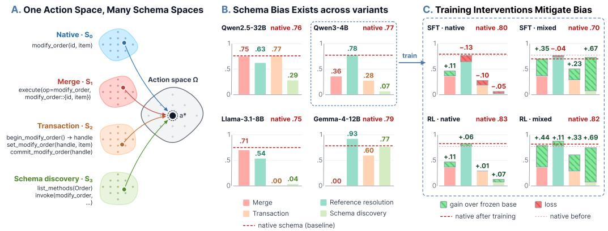
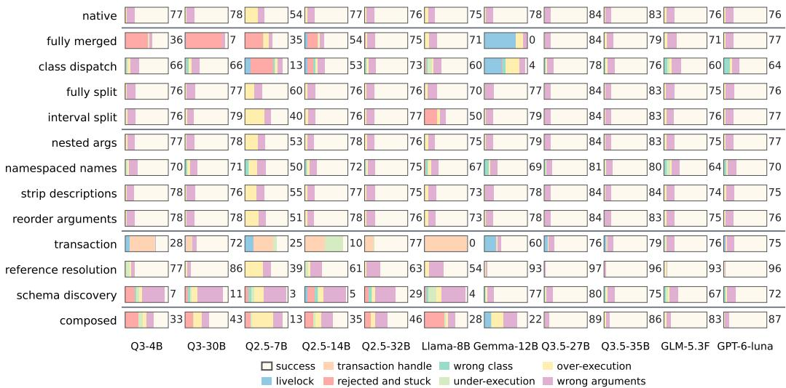
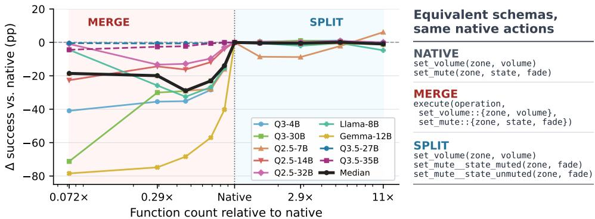
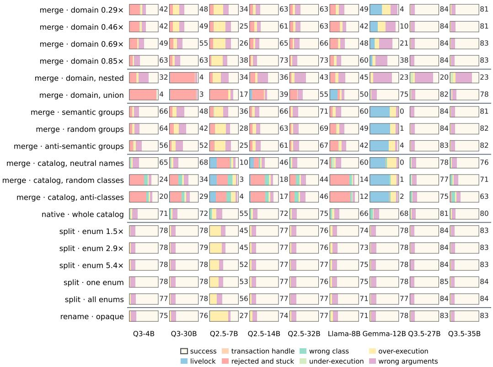
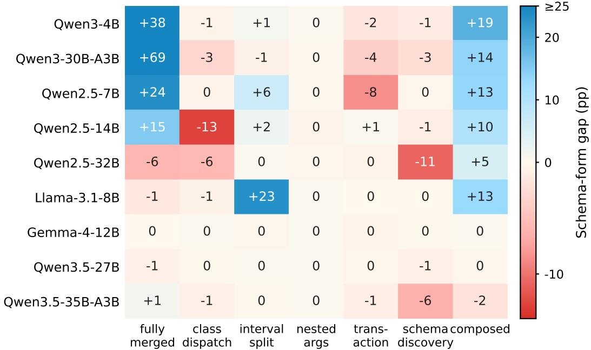

# ACTION-SPACE SHAPING FOR LLM AGENTS: MEASURING AND MITIGATING TOOL-SCHEMA BIAS\*

Yinhong Liu1,2 Zhili Tan3 Zilin Wang4,2 Zhijiang Guo4,5

1University of Cambridge 2Yinwang 3Huawei 4LARK, HKUST (GZ) 5HKUST yl535@cam.ac.uk chiliktam@gmail.com

zwang374@connect.hkust-gz.edu.cnzhijiangguo@hkust-gz.edu.cn

## ABSTRACT

Large Language Models (LLMs) have shown strong performance on tool-use agentic tasks when given a fixed tool schema. Yet a tool schema is not the action space of an agent; it is merely one interface representation of it. The same executable action can be exposed through many different, functionally equivalent tool definitions, and an agent that has truly learned a task should behave consistently across them. We show that current agents often do not, a phenomenon we term schema bias. To study this systematically, we introduce an executable transformation framework that rewrites a native tool schema using nine operators, including merging and splitting tools, altering how a single tool is expressed, and distributing one action across several dependent calls. The tasks, executable actions, and reachable states remain fixed, so any change in success is attributable to the interface alone. Evaluating eleven LLMs, including two closed models, on up to 32 schema variants, we ask how large schema bias is, how it manifests, whether the difficulty of a schema variant can be predicted without a full evaluation, and whether training removes it. We find that schema bias is substantial even for the newest models: success rates range from complete failure to 97% depending solely on the schema. To reliably estimate schema difficulty, it requires running a small sample of the target queries. Training repairs a schema variant only when that variant appears in the training data.

## 1 INTRODUCTION

Large language model (LLM) agents interact with external environments through tool calls. The interface presented to an agent is typically specified by a tool schema: a declaration of callable functions, their names and descriptions, argument structures and types, class organization. Although this schema is often treated as part of the environment, it is more accurately as one representation of the environment's action space. For example, as shown in Figure 1, one native tool modify\_order can be expressed via many different but equivalent approaches. These alternatives differ in names, factorization, and interaction length, yet they admit a mechanical translation to the same native actions and reach the same final states. They are therefore different representations of one action space, not different tasks. An agent that has learned the task should behave consistently across them. Figure 1 also illustrates four such representations, the model-dependent gaps they produce, and how training moves them.

This non-uniqueness matters for research and practice alike. Benchmarks evaluate agents under a single schema chosen by their designers, implicitly treating one representation as canonical; reinforcement-learning environments commit to one factorization of the action space; and deployed systems merge, split, or reorganize their tools mostly for engineering reasons. If agent behavior depends on these choices, benchmark scores and training gains partly reflect an arbitrary interface rather than task difficulty or transferable capability.

This points to a distinct dimension of agent generalization. Beyond robustness to prompt wording, observation noise, or distribution shift, a capable agent should be robust to equivalent representations of the same action space. We call systematic performance variation across such representations schema bias, and argue that robustness to it should be treated as a property of the agent rather than left to careful benchmark design. We study schema bias through four research questions: (RQ1) how large and systematic is schema bias; (RQ2) how does the representation change the way agents fail; (RQ3) can the difficulty of a schema be predicted without a full evaluation; and (RQ4) can training reduce schema bias, and does the reduction transfer?

  
Figure 1: Schema variants, schema bias, and training mitigation. (A) All schema variants $S _ { i }$ are just different representations of the same action space Ω: a call in any of them decodes to the same native action $a ^ { * }$ and reaches the same final state. Each space is shown with an abbreviated schema for one action. (B) Schema bias is large and model-specific. Success rates of four LLMs under four representative variants; the dashed line is each model's native-schema score. The same variant can match native for one model and collapse to zero for another (full grid in Figure 2). (C) Qwen3- 4B after SFT or RL on native-only or variant-mixture data. Hatched segments are gains (green) or losses (red). Native-only data leaves most of the bias under either method; RL on variant-mixture data mitigates bias while keeping the native score (§8).

We observe that current agents exhibit large and structured schema bias. Success ranges from complete failure to near-perfect depending only on the schema, the most difficult representation differs across model families, and neither the newest open models nor two closed models are immune. Failures follow the variant: a given schema tends to break different models in the same way, while how much it costs depends on the model. Reliably ranking schema variants by difficulty requires running a small sample of the target queries. Training repairs a variant only when that variant appears in the training data; on-policy RL does so without the tax that SFT imposes on other variants, and the gains extend to new combinations of trained schema changes but not to new kinds of change. Our contributions follow the progression from measurement to mitigation.

• Framework: we introduce an executable framework of nine operators that transform a native tool schema, from merging and splitting tools to multi-call protocols, and verify every variant against native actions and final environment states.

• Measurement: we measure schema bias in eleven LLMs across up to 32 schema variants.

• Diagnosis: we characterize how agents fail under each variant with an automatic failure taxonomy, and evaluate ways to estimate the difficulty of a schema variant, from probes that need no task queries to small samples of the target queries.

• Mitigation and transfer: we compare training-free methods, supervised fine-tuning, and onpolicy RL for reducing schema bias, and test how far their gains transfer to held-out domains, held-out schema changes, and real benchmarks.

Together, these results position robustness to the schema representation as a separate dimension of agent generalization: evaluations should report performance over a small set of verified-equivalent schemas, and training claims should be tested beyond the interface on which they were trained.

## 2 RELATED WORK

Tool-use benchmarks such as τ-bench/τ2-bench (Yao et al., 2024; Barres et al., 2025), AppWorld (Trivedi et al., 2024), BFCL (Yan et al., 2024; Patil et al., 2023), ToolSandbox (Lu et al., 2024), and ACEBench (Chen et al., 2025) evaluate each environment through one fixed tool schema (see Mohammadi et al. (2025) for a survey of agent evaluation). These schemas contain consequential representation choices: τ-bench's POMDP action space is one parameterization of its domain, AppWorld groups 457 APIs into application classes, and the Model Context Protocol (Anthropic, 2024) supports runtime disclosure of tool definitions. Our work treats such choices as variables and evaluates agents across verified-equivalent representations of the same executable action space.

Prior work on interface sensitivity primarily varies how a fixed tool is described. MetaTool (Huang et al., 2024) shows that descriptions may need to be adapted to the downstream LLM, while robustness benchmarks such as RoTBench (Ye et al., 2024) corrupt tool definitions. Closest to our setting, Lee et al. (2026) observe that small models hallucinate tool names that follow their pretraining conventions rather than the given schema, and rename tool components to match those conventions without retraining. Renaming is one of our operators; we measure it alongside eight others and ask which models and training methods remove the resulting bias. We study a different source of variation: invertible reparameterizations that preserve the available actions and reachable environment states.

Our framing is related to action-space design in reinforcement learning, where action removal, discretization, factorization, and temporal abstraction affect learning efficiency (Kanervisto et al., 2020; Vinyals et al., 2017; Sutton et al., 1999). We extend this perspective to tool-using language agents and ask whether a trained model behaves consistently across equivalent action representations. This differs from prompt-format sensitivity (Sclar et al., 2023; Mizrahi et al., 2024), which changes surrounding text without changing the factorization of the action space; matched surface controls help us separate these effects.

Function-calling data and training provide candidate interventions for schema bias. Recent pipelines synthesize executable tool environments or simulated app interactions to generate tool-use training data at scale (Xu et al., 2026; Liu et al., 2024b), and Tam et al. (2026) train a single policy to both write and use tools, so that the schemas a model creates are ones it can call. More broadly, self-improving training loops now optimize each stage of training, down to the design of the training environment itself (Chen et al., 2026); yet the tool schema is treated as a fixed part of the environment, and whether a trained model has overfit to one specific interface is rarely examined. APIGen/xLAM (Liu et al., 2024c), ToolACE (Liu et al., 2024a), and Granite function-calling (Abdelaziz et al., 2024) synthesize or granularize training data, but do not evaluate invariance across equivalent schemas. We compare supervised fine-tuning with on-policy GRPO (Shao et al., 2024) and measure both in-distribution repair and transfer to held-out domains. The schema axes also reflect long-standing API-design choices, including fine-grained REST versus coarse RPC interfaces and opaque identifiers versus natural keys (Fielding, 2000); our experiments quantify their effects on agent performance.

## 3 AN EXECUTABLE SCHEMA CONVERSION FRAMEWORK

## 3.1 FRAMEWORK COMPONENTS

The conversion framework has four components. First, a native environment provides an executable schema $S _ { 0 }$ and an execution interface that applies actions to the environment state. Each native invocation is normalized into an operation and its typed arguments; we call this record a native action. Second, a library of transformation operators rewrites $S _ { 0 }$ into a variant schema $S _ { i }$ Third, an execution adapter decodes schema-specific tool calls into native actions. Finally, a variant validator checks that $S _ { i }$ executes the same native actions and reaches the same environment states as $S _ { 0 }$ . Thus, a transformation changes how an agent expresses a tool call, but not the actual executable decisions.

## 3.2 SCHEMAS, NATIVE TRAJECTORIES, AND INTERACTION TRACES

We distinguish three objects. A native action trajectory $a ^ { * } = ( a _ { 1 } , \dots , a _ { K } ) \in \Omega ^ { * }$ records the semantic actions required by a task, which do not depend on the schema variant. A schema $S _ { i }$ specifies how those actions can be expressed. An interaction trace $\tau _ { i }$ records how an agent actually invokes tools under the given schema variant $S _ { i }$ Let $\mathcal { T } _ { i }$ be the set of completed traces under $S _ { i }$ that can achieve the same task. The execution decoder maps an observed trace to the native actions that

Table 1: The schema operator space, grouped by what each mechanism changes. Each operator is a class of mechanism; a schema variant fixes its method (Eq. 1)
<table><tr><td>Family</td><td>Operators</td><td>Mechanisms</td></tr><tr><td>Single-call</td><td>merge split</td><td>Tool-set partitioning. Re-designs tool boundaries over the native operations: several functions are fused into one tool behind a discriminator, or one tool is split by a condition on its arguments. Representative methods (Figure 2): fully merged and class dispatch for merge; fully split and interval split for split.</td></tr><tr><td></td><td>nest arguments rename</td><td>Per-tool representation. Rewrites the surface form of a single tool expression: parameter nesting structure, tool and parameter identifiers, presence of descriptions, and parameter</td></tr><tr><td></td><td>strip descriptions</td><td>order. Representative methods: nested args for nest and namespaced names for rename;</td></tr><tr><td></td><td>reorder arguments</td><td>strip descriptions and reorder arguments have a single method each.</td></tr><tr><td>Multi-call</td><td>transaction</td><td>Cross-call protocol. Spreads one native action over several dependent calls whose state must be carried across turns: transaction replaces one native action with multiple</td></tr><tr><td></td><td>reference resolution schema discovery</td><td>intermediate calls. reference resolution requires an earlier additional reference resolving</td></tr></table>

## it executes:

$$
D _ { i } : \mathcal { T } _ { i }  \Omega ^ { * } , \qquad \tau _ { i } \mapsto \hat { a } _ { i } .
$$

The decoder can be many-to-one, which means different agent traces could execute the same native trajectory. For example, a model may set transaction arguments in different orders or recover from a rejected call before committing the same action.

## 3.3 TRANSFORMATION OPERATORS

A transformation operator O is a class of mechanism that rewrites the native schema; a concrete rewrite fixes a method $m ,$ the parameters that instantiate that mechanism. A schema variant is

$$
S _ { i } = \mathcal { O } ( m , S _ { 0 } ) ,\tag{1}
$$

For example, the operator merge could have different aggregation strategies, e.g. by semantic class, by domain, or at random, defined by the method m. The main figures report only selected representative variants. We define nine operators, grouped into three categories by what they change (Table 1). Operators in the first two categories change only how the tools are presented, so each native action is still a single tool call; operators in the third category change the structure of the interaction, so a single native action is expanded into several dependent tool calls. Full variant evaluations are shown in Appendix C.3.

Tool-set partitioning changes the grouping or splitting of the native functions. The aggregation operator merge moves a tool-call decision from the function name into an argument. Which functions go together is the method m: fully merged combines all functions of a domain into one tool, class dispatch groups the functions of each class across the whole catalog, and further methods group functions by semantic similarity or at random, merge only part of a domain, or change how the merged tool takes its arguments. The splitting operator split breaks a tool apart by the value range of one argument: fully split bakes every enumerable argument into the tool name, and interval split does the same for a non-enumerable argument by cutting its range into intervals. Figure 2 includes only these two merge methods and two split methods; the remaining methods are described in Appendix C.1 and evaluated in Appendix C.3.

Per-tool representation operators modify a tool in place. We define four: nest wraps a tool's arguments into one nested object; rename changes the tool identifiers (function names), either by prefixing them with their class name (namespaced names) or by replacing them with opaque identifiers; strip descriptions and reorder arguments change only the textual presentation. Nest changes the parameter-schema tree, whereas the other three change its labels or ordering; none of them changes the selected native operation or the minimum call path.

Cross-call dependency operators expand the same native action into a sequence of tool calls with sequential dependencies: a later call consumes what an earlier call returned. We define three. Transaction replaces one native action with several intermediate calls that open a transaction, write the arguments one call at a time, and commit; such protocols are usually motivated by external requirements such as formality, validation, or auditability. Reference resolution removes one argument's value from the tool and adds a resolver: the agent first resolves the user-provided value to a handle and then passes that handle in place of the value. Schema discovery requires the agent to first list a class's methods and argument names, and to call only with the names it was given.

  
Figure 2: The model-by-schema performance grid: exact success and failure mode composition. Each cell is one model (column) on one verified-equivalent schema (row), 2,748 identical tasks. The number is the exact success rate (%), represented as the white portion of composition bar. The coloured segments are the absolute rates of the automatically detected failure modes analysed in §6. Row labels are the representative variant names following Table 1. The two rightmost columns are closed models evaluated through their APIs. The remaining variants are reported in Appendix Figure 4.

## 3.4 VALIDATING SCHEMA VARIANTS

We compare each schema variant $S _ { i }$ with the native schema $S _ { 0 }$ on the same task. Each task specifies a user query and a target native trajectory $a ^ { * }$ . The operator maps $a ^ { * }$ to a variant trace $\boldsymbol { \tau } _ { i } ^ { * }$ . During variant validation, the execution adapter runs trace $\boldsymbol { \tau } _ { i } ^ { * }$ and reconstructs native actions. $S _ { i }$ passes validation only if the reconstructed actions match $a ^ { * }$ . The schema transformation framework is not tied to a particular benchmark. We also apply the same framework to both our synthetic controlled environment and open-sourced tool-use benchmarks, such as $\tau ^ { 2 } .$ bench and BFCL.

## 4 EXPERIMENTAL SETUP

The experiments follow the four research questions: we first measure a model-by-schema performance landscape (RQ1) and analyze its failure modes (RQ2), then test ways to estimate schema difficulty cheaply (RQ3), and finally train models to reduce schema bias and test whether the gains transfer (RQ4). Every comparison within an environment holds the tasks, the native execution interface, and the scorer fixed.

In brief, the controlled synthetic environment has 12 domains, 168 native operations, and 2,748 task queries; $\tau ^ { 2 }$ -bench and BFCL serve as real-benchmark validation. Nine open-weight models from the Qwen2.5, Qwen3, Qwen3.5, Llama-3.1, and Gemma-4 families (Qwen Team, 2024; Team, 2025; Qwen Team, 2026; Dubey et al., 2024; Gemma Team, 2026) are evaluated on all 32 variants and two closed models, gpt-6-luna (OpenAI, 2026) and GLM-5.3-Flash (GLM-5 Team, 2026), on the thirteen representative variants of Figure 2. An episode succeeds when the native actions it executes match the gold actions exactly, and calls that violate the active schema are rejected and returned to the model as an error it can recover from. Appendix B gives the full setup: the synthetic domains, query statistics, and query construction, the real-benchmark adapters, the models and their settings, and the evaluation protocol.

  
Figure 3: Merging is generally more harmful than splitting. Left: colored lines show each model's change from its native-schema success rate. The black line is the median across the nine models. The x-axis represents ratio of function count between variant and native schema. We sample ten variants to span the granularity ladder from full merge to full split. Each ratio is the queryweighted mean across 12 schema domains. Right: a compact and abbreviated schema example shows how merging and enum splitting transform the native schema.

## 5 RQ1: MEASURING SCHEMA BIAS

Our first research question asks how much task success varies across equivalent schema variants, and whether that variation follows reproducible patterns rather than evaluation noise. We derive 32 verified-equivalent variants (the native schema and 31 transformed variants) from one native action space and evaluate all of them on nine open-weight models, and the representative variants also on two closed models. Figure 2 reports the representative variants (the rest are in Appendix Figure 4) together with how the failed episodes are distributed over failure modes, which §6 analyses. With tasks and native semantics fixed, success still ranges from complete failure to near-perfect depending only on the schema, and the same variant can be catastrophic for one model and harmless for another. No single variant wins on every model, and each model family is sensitive to different representations; the newest Qwen3.5 generation is the most robust but not immune. The closed models are not immune either: equivalent schemas move both by 32 points, and their weak spots are the variants that expose a large catalog (class dispatch and namespaced names) rather than the cross-call protocols that break most open models. The rest of this section organises this variation into recurring patterns by operator family.

## 5.1 RECURRING STRUCTURAL PATTERNS

Results across the nine-model by 32-variant grid are model-dependent, but recurring patterns organize much of the variation. We group them by the operator family of Table 1 and, because no pattern holds for every model, report the main trend together with its exceptions. All results use the default evaluation protocol (Appendix B.4).

Tool-set partitioning: merging is generally more harmful than splitting. Tool Merging and splitting are two opposite and complementary directions, but they do not show similar challenges to LLMs. Figure 3 compares a representative ten-step granularity ladder across all nine models, spanning 0.07× to 10.6× the native function count. Splitting largely preserves native-schema performance, whereas fully merging tools reduces success by a median of 19 points. Different merge methods cause further challenges. The merged tools above use the flat argument structure; Appendix C.1 reexpresses the same merged arguments in the nested and union forms. No structure is safe for every model: the nested form costs every model 19 to 73 points, and even the otherwise robust Qwen3.5 models, which lose under 7 points on the flat merge, fall to 0.20–0.25 on it.

Besides, which functions are merged together matters as well: at a fixed granularity, grouping semantically related operations is consistently better than random or deliberately mismatched grouping, and the gap widens as the groups get larger. Mixing argument structures within one schema variant adds a further cost: for all but one of the nine models, the mixed catalog scores below the average of its constituent structures (Appendix D.2, D.1).

Table 2: The seven failure modes. Every failed episode is assigned the first mode whose rule fires. The first four surface as explicit runtime errors or routing errors; the last three are silent failure: the episode ends with the wrong set of native actions or the wrong argument values.
<table><tr><td>Failure mode</td><td>Rule</td><td>What went wrong</td></tr><tr><td>Livelock</td><td>The episode hits the turn limit.</td><td>The agent loops on retries or clarifications without committing an action.</td></tr><tr><td>Transaction handle</td><td>A transaction flag fires: a write or commit names a transaction that was never opened, an opened transaction is never committed, a commit precedes the required writes, or a transaction is committed twice.</td><td>The begin / write / commit protocol is broken.</td></tr><tr><td>Rejected and stuck</td><td>At least one call was rejected as off-schema and fewer native actions executed than required.</td><td>The agent calls a name or argument the schema does not expose and cannot recover.</td></tr><tr><td>Wrong class</td><td>A call is routed through a dispatcher or namespace of the wrong class.</td><td>The operation is chosen from the wrong group.</td></tr><tr><td>Under-execution</td><td>Fewer native actions executed than the task requires, with no rejection.</td><td>Required steps are skipped.</td></tr><tr><td>Over-execution</td><td>More native actions executed than the task requires.</td><td>Extra or repeated actions are taken.</td></tr><tr><td>Wrong arguments</td><td>The required actions execute with at least one wrong argument value.</td><td>The right functions are called with the wrong values.</td></tr></table>

Per-tool surface changes pose limited challenges for most models. Nesting the arguments, removing descriptions, permuting argument order, and namespacing tool names leave every model close to its native score; the one exception is that opaque function names hurt the smallest Qwen2.5 model, and that sensitivity vanishes with scale (Appendix D.3).

Cross-call protocols are the hardest operators for most models. Spreading one action over several dependent calls produces the largest losses in the landscape: the transaction protocol and schema discovery collapse most earlier-generation models, often to near zero, and only the newest generation absorbs them. Reference resolution is the exception in the other direction: the models that handle the extra resolver call score at or above their native rate, so a cross-call protocol is not harmful in itself, but whether a model follows it is model-specific (§6 analyses the failure modes).

## 5.2 REAL TOOL-USE BENCHMARK VALIDATION

To test whether schema bias survives outside the synthetic grid, we evaluate all nine models on the airline and retail domains of τ2-bench under six equivalent schemas: native, fully merged, nested args, and the three cross-call protocols. Schema bias persists in the real environment, and it is domain-dependent on top of being model-dependent. On airline, most earlier-generation models score higher under some alternative schema than under the native one, and which alternative helps differs by model; on retail, the native schema is the best or near-best choice for almost every model, fully merged collapses every model to near zero, and the cross-call protocols cost most models a large share of their native score. The newest models are not exempt: the strongest model, Qwen3.5- 27B, loses under every alternative schema in both domains, and its mixture-of-experts sibling collapses under fully merged (Appendix D.5, Table 9).

## 6 RQ2: FAILURE MODES UNDER EQUIVALENT SCHEMAS

We analyze how schema representation changes the type of error an agent makes. Across failed episodes we observe seven recurring failure modes, listed in Table 2: four explicit ones (livelock, transaction handle, rejected and stuck, wrong class) and three silent ones (under-execution, overexecution, wrong arguments). The labels are automatic; in a blinded audit (Appendix E.3), three LLM proxies reach a majority label on 88% of sampled failed episodes

Failure modes cluster on certain variants and models. Figure 2 shows how the failure modes are distributed across models and representative schemas. The same native tasks produce different error types as the schema changes. Some failure modes are largely consistent across models: fully merged catalogs fail as rejected-and-stuck, the transaction protocol as broken transaction handles, and schema discovery as silent wrong arguments. Two models stand out: Qwen2.5-7B tends to over-execute under almost every variant, and Gemma-4-12B livelocks on any dispatcher. Further observations are in Appendix E.1.

Some failures invoke correct actions but use the wrong tool calls. A model sometimes invokes the correct native action but fails to write it in the presented schema: the call is off-schema, yet it decodes to the right native action. We call these schema-form failures and measure them by rerunning each variant with off-schema calls executed as the native action they decode to rather than rejected (Appendix E.2); the resulting delta in success is the schema-form gap, shown in Figure 5.

Schema-form failures concentrate on variants that rename or regroup tools and on the earlier model generations. Fully merged has by far the largest gap, driven by the Qwen3 and smaller Qwen2.5 models, which keep calling native tool names; composed variants show a clear gap for every earlier model except Gemma-4-12B, and on interval split almost all of Llama-3.1-8B's loss is schema-form. The recovered episodes are mostly rejected-and-stuck failure modes. The two Qwen3.5 models and Gemma-4-12B show almost no schema-form failures on any variant.

## 7 RQ3: PREDICTING SCHEMA DIFFICULTY WITHOUT A FULL EVALUATION

An environment designer who exposes a tool schema also decides how hard the environment is for every agent that will use it. RQ1 showed that this difficulty is large and model-specific, so before committing to a schema the designer needs to know how a given model will fare on it. Running the full query set on every candidate schema answers this reliably but expensively. We therefore ask what cheaper evidence suffices to rank candidate schemas for a model, comparing estimators by what they may observe: the model on the schema alone, or the model with a sample of the target task queries. Each estimator scores every variant, and we measure how well the scores rank one model's variants by the Spearman correlation $\rho$ with the full-set success rates, computed within each model and then averaged over the nine models.

Probing the model without task queries is not enough. We try two query-free probes, both built from a few dozen simple instructions that are written automatically from the schema's own tool descriptions and argument values, without any task queries: the likelihood the model assigns to the correct call sequence for each instruction, and a schema compliance probe, which runs the model on the instructions and records how often it follows the schema's calling convention. Both rank variants only moderately well $( \rho = 0 . 5 2$ for the likelihood and 0.57 for the compliance probe). Further to this, we note that schema difficulty is task-conditional, for example, models often follow a protocol on isolated calls yet fail it inside multi-turn tasks (Appendix F). Difficulty is therefore a joint property of the model, the schema, and the task queries.

A small sample of target queries is the reliable estimate. Running the model on about one hundred queries per candidate schema ranks the variants nearly as the full set does $( \rho = 0 . 8 1$ , and 0.92 with 800 queries), at a small fraction of the cost. Even 36 queries, as many as the probe instructions, reach $\rho = 0 . 7 2$ , so the probes fall short because they omit the tasks, not because they are small. However, whether such an estimate transfers across task distributions is uncertain. For example, a variant ranking measured on our synthetic tasks does not predict the ranking on $\tau ^ { 2 } .$ bench, whereas a ranking measured on $\tau ^ { 2 } .$ -bench predicts the ranking on BFCL moderately well (Appendix F). A designer should therefore sample from the environment's own task distribution.

## 8 RQ4: REDUCING SCHEMA BIAS THROUGH TRAINING

In this section, we ask whether training can remove schema bias and whether the gains carry over to domains and schemas that were not trained on. We compare three levers of increasing cost on Qwen3-4B: Two training-free methods, variant-specific instructions and decoding constraints; Supervised Fine-Tuning (SFT) with LoRA (Hu et al., 2022) and on-policy GRPO (Shao et al., 2024). Both training methods use the same 2,000 queries from eight training domains, either on a single schema or rotating over seven variants including native (mixed), and every model is evaluated on the twelve representative variants, including four held-out domains (settings in Appendix G). Table 3 compares all methods on the twelve representative variants.

Training-free methods fix habits that one sentence can describe. The constraint decoding method forces the first call to use tools provided in the schema. Among all variants, it turns out to help almost only on the fully merged schema. The instruction method, which describes each variant's calling convention in one sentence, clearly improves fully merged and schema discovery. Neither method has a noticeable effect on the other variants.

Table 3: Change in success from each mitigation on Qwen3-4B over the twelve representative variants of Figure 2. Base is the untrained model; every other column show delta success rate from it. changes of at least 0.03 (about 2.5 standard errors) are shaded green or red, darker for larger changes. Instruction appends variant-specific calling convention describing instructions to input prompt (Table 11); Decoding forces the first call to be schema-valid via constrained decoding. SFT and RL columns are results averaged from three seeds; Mixed data rotate over seven schema variants. Red frames mark the variants each training set contains.
<table><tr><td></td><td></td><td colspan="2">Training-free</td><td colspan="2">SFT</td><td colspan="2">RL (GRPO)</td></tr><tr><td>Variant</td><td>Base</td><td>Instruction</td><td>Decoding</td><td>Native</td><td>Mixed</td><td>Native</td><td>Mixed</td></tr><tr><td>Native</td><td>0.77</td><td></td><td>0.00</td><td>+0.02</td><td>-0.08</td><td>+0.05</td><td>+0.04</td></tr><tr><td colspan="8">Tool-set partitioning</td></tr><tr><td>Fully merged</td><td>0.36</td><td>+0.28</td><td>+0.29</td><td>+0.11</td><td>+0.34</td><td>+0.11</td><td>+0.43</td></tr><tr><td>Class dispatch</td><td>0.66</td><td>+0.01</td><td>-0.02</td><td>-0.26</td><td>0.00</td><td>+0.05</td><td>+0.05</td></tr><tr><td>Fully split</td><td>0.76</td><td>0.00</td><td>0.00</td><td>+0.05</td><td>-0.06</td><td>+0.06</td><td>+0.05</td></tr><tr><td>Interval split</td><td>0.76</td><td>+0.01</td><td>-0.04</td><td>-0.09</td><td>-0.07</td><td>+0.05</td><td>+0.05</td></tr><tr><td colspan="8">Per-tool representation</td></tr><tr><td>Nested args</td><td>0.77</td><td>+0.01</td><td>+0.01</td><td>+0.02</td><td>-0.08</td><td>+0.06</td><td>+0.04</td></tr><tr><td>Namespaced names</td><td>0.70</td><td>0.00</td><td>0.00</td><td>+0.03</td><td>+0.01</td><td>+0.07</td><td>+0.06</td></tr><tr><td>Strip descriptions</td><td>0.78</td><td>0.00</td><td>0.00</td><td>0.00</td><td>-0.10</td><td>+0.04</td><td>+0.03</td></tr><tr><td>Reorder arguments</td><td>0.78</td><td>+0.01</td><td>0.00</td><td>+0.02</td><td>-0.08</td><td>+0.06</td><td>+0.04</td></tr><tr><td colspan="8">Cross-call dependency</td></tr><tr><td>Transaction</td><td>0.28</td><td>+0.06</td><td>-0.11</td><td>-0.10</td><td>+0.23</td><td>+0.02</td><td>+0.34</td></tr><tr><td>Reference resolution</td><td>0.77</td><td>+0.03</td><td>+0.07</td><td>-0.13</td><td>-0.04</td><td>+0.06</td><td>+0.11]</td></tr><tr><td>Schema discovery</td><td>0.07</td><td>+0.45</td><td>+0.02</td><td>–0.05</td><td>+0.67</td><td>+0.06</td><td>+0.68</td></tr></table>

SFT repairs the trained variants but can tax the others. SFT on native-schema demonstrations keeps native performance but does not repair the hard variants, so the repair comes from seeing a variant during training rather than from more tool-use practice. SFT on mixed data lifts the trained variants (red frames in Table 3), while already-robust variants, trained or not, lose accuracy to different extents. This tax depends more on how the demonstrations are phrased than on how many there are (Appendix G).

On-policy RL repairs the trained variants without the tax. With either native-only or mixed data, RL keeps every variant at or above its untrained score. As with SFT, native-only data leaves the hard variants unrepaired, whereas mixed data gives the largest gains on the trained variants of any method, making it the most effective mitigation we test. The repair needs three conditions: the variant must appear in the training data, the model must be free to move far from its initialization (no KL penalty), and the environment must reject invalid calls (Appendix G).

Gains transfer to recombinations of familiar schema changes, not to new ones. Both training methods keep part of their gain on the four held-out domains, and RL keeps more than SFT. To test generalization across schemas, we run an additional SFT experiment that trains on seven schema variants and evaluates on changes held out from training (Appendix G): the gains carry over to new combinations of the trained changes and to closely related untrained variants, such as finer interval splits, but not to kinds of operator the model never saw. On real benchmarks whose tools we rewrite with the same operators, the gain appears only where the rewrite matches a trained variant (transaction on τ2-bench retail), while overall τ2-bench and BFCL scores barely change (Appendix G). Training therefore reduces the specific schema biases it targets, but does little to make the model robust to schema changes in general.

## 9 CONCLUSION

Tool schemas are representations of an agent's action space, yet current evaluations usually treat one representation as canonical. We introduced an executable framework that changes the schema while preserving native actions and final environment states. We show that success varies substantially across equivalent schemas, that this schema bias persists even for the top-ranked models, and that it is neither a small formatting effect nor a single universal penalty: it varies systematically with the model and the schema variant. The failures follow the variant: a given schema tends to break different models in the same way, while how much it costs depends on the model. Reliably ranking schema variants by difficulty requires running a small sample of the target queries. Training repairs a variant only when that variant appears in the training data; on-policy RL does so without the tax that SFT imposes on untrained variants, and the gains extend to new combinations of trained changes but not to new kinds of schema change.

Finally, we argue that schema bias should be taken into account wherever tool calling is involved: when designing the tool schemas of an environment, when training models, and when evaluating tool-calling ability. Robustness to the schema representation should become a first-class criterion for tool-using agents.

## AI USE STATEMENT

We used large language models to polish the writing of this paper. All content, analyses, and conclusions are the authors' own, and the authors checked every edit. Separately, LLMs are the subject of our experiments, and an LLM rewrote the templated evaluation queries under a grounding check that keeps the gold calls fixed (Appendix B).

## ETHICS STATEMENT

This work evaluates and trains language-model agents in a synthetic tool-use environment and on public benchmarks. It involves no human subjects, no personal or sensitive data, and no real-world side effects: every tool call is executed in a simulated environment. Closed models were accessed through their public APIs under the providers' terms of use. We do not foresee specific ethical risks beyond those common to research on language-model agents.

## REPRODUCIBILITY STATEMENT

Every variant passes reference-trace decoding and state-equivalence checks before evaluation. Across approximately 50,000 reference-trajectory checks, these tests identified three transformationimplementation errors before model evaluation and none afterward. We release the checks, environment adapters, domain specifications, transformation framework, the registry of all 32 schema variants, and the model–schema evaluation grids. Each reported configuration uses the full set of 2,748 queries with state-based scoring. One full configuration costs approximately 5 GPU-minutes with data-parallel evaluation on eight RTX 5090 GPUs, and all grids are resumable by model-schema configuration. At temperature 0.7, three independent seeds preserve the expected high-medium– low ordering for both Qwen3-4B and Llama-3.1-8B; seed standard deviations are at most 0.008, with episode-bootstrap confidence intervals reported per cell. The phrasing-and-volume SFT study completes all 160 planned evaluations (two phrasings, four data sizes, two seeds, and ten variants), each on the full query set. The two SFT-then-RL runs each use 19,200 rollout episodes and 200 optimizer steps, costing 24.2 and 24.5 GH200 GPU-hours.

The ranking analysis uses the full 9×32 model-variant matrix, with all 288 cells complete and paired at the episode level. The two additional training studies of Appendix G.6 train and evaluate every planned run (36 GRPO runs and 48 checkpoints, respectively) without selecting checkpoints or seeds, and bind training data, checkpoints, and evaluation outputs to recorded digests so that incomplete runs cannot enter the results.

## REFERENCES

Ibrahim Abdelaziz, Kinjal Basu, Mayank Agarwal, Sadhana Kumaravel, Matthew Stallone, Rameswar Panda, Yara Rizk, GP Bhargav, Maxwell Crouse, Chulaka Gunasekara, et al. Granitefunction calling model: Introducing function calling abilities via multi-task learning of granular tasks. arXiv preprint arXiv:2407.00121, 2024.

Anthropic. Introducing the model context protocol. https: //www. anthropic. com/news/ model-context-protocol,2024.

Victor Barres et al. τ2-bench: Evaluating conversational agents in a dual-control environment. arXiv preprint arXiv:2506.07982, 2025

Chao Chen, Chengzu Li, Zhiwei Li, Yinhong Liu, and Zhijiang Guo. From trainee to trainer: LLM-designed training environment for RL with multi-agent reasoning. arXiv preprint arXiv:2606.17682, 2026.

Chen Chen et al. ACEBench: Who wins the match point in tool usage? arXiv preprint arXiv:2501.12851, 2025.

Abhimanyu Dubey et al. The Llama 3 herd of models. arXiv preprint arXiv:2407.21783, 2024.

Roy Thomas Fielding. Architectural styles and the design of network-based software architectures. Doctoral dissertation, University of California, Irvine, 2000.

Gemma Team. Gemma 4 technical report. arXiv preprint arXiv:2607.02770, 2026.

GLM-5 Team. GLM-5: from vibe coding to agentic engineering. arXiv preprint arXiv:2602.15763, 2026.

Google DeepMind. Gemini 3.5 Flash model card. https: //deepmind.google/models/ model-cards/gemini-3-5-flash/,2026.

Edward J Hu, Yelong Shen, Phillip Wallis, Zeyuan Allen-Zhu, Yuanzhi Li, Shean Wang, Lu Wang, and Weizhu Chen. LoRA: Low-rank adaptation of large language models. International Conference on Learning Representations (ICLR), 2022.

Yue Huang, Jiawen Shi, Yuan Li, Chenrui Fan, Siyuan Wu, Qihui Zhang, Yixin Liu, Pan Zhou, Yao Wan, Neil Zhenqiang Gong, and Lichao Sun. MetaTool benchmark for large language models: Deciding whether to use tools and which to use. arXiv preprint arXiv:2310.03128, 2024.

JSON-RPC Working Group. JSON-RPC 2.0 specification. https: //www. jsonrpc.org/ specification,2010.

Anssi Kanervisto, Christian Scheller, and Ville Hautamäki. Action space shaping in deep reinforcement learning. In IEEE Conference on Games (CoG), 2020.

Woosuk Kwon, Zhuohan Li, Siyuan Zhuang, Ying Sheng, Lianmin Zheng, Cody Hao Yu, Joseph E. Gonzalez, Hao Zhang, and Ion Stoica. Efficient memory management for large language model serving with PagedAttention. In Proceedings of the 29th Symposium on Operating Systems Principles, 2023.

Jonggeun Lee, Woojung Song, Jongwook Han, Haesung Pyun, and Yohan Jo. Don't adapt small language models for tools; adapt tool schemas to the models. In Proceedings of the 64th Annual Meeting of the Association for Computational Linguistics (Volume 1: Long Papers), 2026.

Weiwen Liu, Xu Huang, Xingshan Zeng, Xinlong Hao, Shuai Yu, Dexun Li, Shuai Wang, Weinan Gan, Zhengying Liu, Yuanqing Yu, et al. ToolACE: Winning the points of LLM function calling. arXiv preprint arXiv:2409.00920, 2024a.

Yinhong Liu, Yimai Fang, David Vandyke, and Nigel Collier. TOAD: Task-oriented automatic dialogs with diverse response styles. In Findings of the Association for Computational Linguistics: ACL 2024, 2024b.

Zuxin Liu, Thai Hoang, Jianguo Zhang, Ming Zhu, Tian Lan, Shirley Kokane, Juntao Tan, Weiran Yao, Zhiwei Liu, Yihao Feng, et al. APIGen: Automated pipeline for generating verifiable and diverse function-calling datasets. arXiv preprint arXiv:2406.18518, 2024c.

Ilya Loshchilov and Frank Hutter. Decoupled weight decay regularization. In International Conference on Learning Representations, 2019.

Jiarui Lu, Thomas Holleis, Yizhe Zhang, Bernhard Aumayer, Feng Nan, Felix Bai, Shuang Ma, Shen Ma, Mengyu Li, Guoli Yin, et al. ToolSandbox: A stateful, conversational, interactive evaluation benchmark for LLM tool use capabilities. arXiv preprint arXiv:2408.04682, 2024.

Moran Mizrahi, Guy Kaplan, Dan Malkin, Rotem Dror, Dafna Shahaf, and Gabriel Stanovsky. State of what art? a call for multi-prompt LLM evaluation. Transactions of the Association for Computational Linguistics, 2024.

Mahmoud Mohammadi, Yipeng Li, Jane Lo, and Wendy Yip. Evaluation and benchmarking of LLM agents: A survey. In Proceedings of the 31st ACM SIGKDD Conference on Knowledge Discovery and Data Mining, 2025.

OpenAI. Introducing GPT-6 Sol and Luna. https://openai.com/index/ introducing-gpt-6-sol-and-luna/,2026.

Shishir G. Patil, Tianjun Zhang, Xin Wang, and Joseph E. Gonzalez. Gorilla: Large language model connected with massive APIs. arXiv preprint arXiv:2305.15334, 2023.

Qwen Team. Qwen2.5 technical report. arXiv preprint arXiv:2412.15115, 2024.

Qwen Team. Qwen3.5: Open-weight hybrid reasoning models. https://github.com/ QwenLM/Qwen3.5,2026.

John Schulman, Filip Wolski, Prafulla Dhariwal, Alec Radford, and Oleg Klimov. Proximal policy optimization algorithms. arXiv preprint arXiv:1707.06347, 2017.

Melanie Sclar, Yejin Choi, Yulia Tsvetkov, and Alane Suhr. Quantifying language models' sensitivity to spurious features in prompt design. arXiv preprint arXiv:2310.11324, 2023.

Zhihong Shao, Peiyi Wang, Qihao Zhu, Runxin Xu, Junxiao Song, Xiao Bi, Haowei Zhang, Mingchuan Zhang, YK Li, Y Wu, et al. DeepSeekMath: Pushing the limits of mathematical reasoning in open language models. arXiv preprint arXiv:2402.03300, 2024.

Mohammad Shoeybi, Mostofa Patwary, Raul Puri, Patrick LeGresley, Jared Casper, and Bryan Catanzaro. Megatron-LM: Training multi-billion parameter language models using model parallelism. arXiv preprint arXiv:1909.08053, 2019.

Richard S. Sutton, Doina Precup, and Satinder Singh. Between MDPs and semi-MDPs: A framework for temporal abstraction in reinforcement learning. volume 112, pp. 181–211, 1999.

Zhi Rui Tam, Chieh-Yen Lin, Yun-Nung Chen, Shao-Hua Sun, and Hung-yi Lee. Joint optimization of tool creation and use for large language model agents. arXiv preprint arXiv:2608.24571, 2026.

Qwen Team. Qwen3 technical report. arXiv preprint arXiv:2505.09388, 2025.

THUDM. slime: An LLM post-training framework for RL scaling. https: //github.com/ THUDM/slime, 2025.

Harsh Trivedi, Tushar Khot, Mareike Hartmann, Ruskin Manku, Vinty Dong, Edward Li, Shashank Gupta, Ashish Sabharwal, and Niranjan Balasubramanian. AppWorld: A controllable world of apps and people for benchmarking interactive coding agents. arXiv preprint arXiv:2407.18901, 2024.

Oriol Vinyals, Timo Ewalds, Sergey Bartunov, Petko Georgiev, Alexander Sasha Vezhnevets, Michelle Yeo, Alireza Makhzani, Heinrich Küttler, John Agapiou, Julian Schrittwieser, et al. Star-Craft II: A new challenge for reinforcement learning. arXiv preprint arXiv:1708.04782, 2017

Minrui Xu, Zilin Wang, Mengyi Deng, Zhiwei Li, Zhicheng Yang, Xiao Zhu, Yinhong Liu, Boyu Zhu, Baiyu Huang, Chao Chen, Heyuan Deng, Fei Mi, Lifeng Shang, Xingshan Zeng, and Zhijiang Guo. EnvFactory: Scaling tool-use agents via executable environments synthesis and robust RL. arXiv preprint arXiv:2605.18703, 2026.

Fanjia Yan, Huanzhi Mao, Charlie Cheng-Jie Ji, Tianjun Zhang, Shishir G. Patil, Ion Stoica, and Joseph E. Gonzalez. Berkeley function calling leaderboard. https: //gorilla.cs. berkeley.edu/blogs/8\_berkeley\_function\_calling\_leaderboard.html, 2024.

Shunyu Yao, Noah Shinn, Pedram Razavi, and Karthik Narasimhan. τ-bench: A benchmark for tool-agent-user interaction in real-world domains. arXiv preprint arXiv:2406.12045, 2024.

Junjie Ye, Sixian Wu, Guanyu Li, Tao Gui, Qi Zhang, and Xuanjing Huang. RoTBench: A multilevel benchmark for evaluating the robustness of large language models in tool learning. arXiv preprint arXiv:2401.08326, 2024.

Lianmin Zheng, Liangsheng Yin, Zhiqiang Xie, Chuyue Sun, Jeff Huang, Cody Hao Yu, Shiyi Cao, Christos Kozyrakis, Ion Stoica, Joseph E. Gonzalez, Clark Barrett, and Ying Sheng. SGLang: Efficient execution of structured language model programs. In Advances in Neural Information Processing Systems, 2024.

## A LIMITATIONS

Our framework covers nine operators and 32 schema variants, but the space of equivalent schemas is larger: other directions, such as how tool results and errors are reported or how state is exposed across calls, may reveal biases that our variants do not. The mitigation results are bounded in the same way. Training removes the bias only for the schema changes it covers and their combinations, not for new kinds of change, so every new interface design still has to be evaluated, and if necessary trained for, on its own; schema bias cannot be fixed once for all. Finally, most measurements come from a controlled synthetic environment and a finite set of models, so the size of the effect on other benchmarks and model families remains to be established.

## B EXPERIMENTAL SETUP

This appendix gives the full setup summarized in §4.

## B.1 SYNTHETIC ENVIRONMENT AND QUERIES

The controlled environment has twelve synthetic domains with 168 native operations (Table 4). Each domain defines a native tool schema, namely a system context, callable operations with typed arguments, and multi-step routines used for compositional queries, from which the tool catalog and the query sets are derived. The environment implements every operator of Table 1. The released artifact includes the native schemas, the query files, and the transformation registry.

The 2,748 task queries come in three tiers: 585 single queries requiring one native call, 1,747 compound queries combining several independent operations in one utterance, and 416 compositional queries chaining dependent steps within a domain, where later actions reuse entities established earlier. Table 5 summarizes the catalog and the queries. Every tool argument is required and 66% of arguments are enumerated, which is what makes the split operators (baking enum values into tool names) and the merge operators (routing by an operat ion enum) well defined. The model– schema landscape uses all 2,748 queries in all twelve domains. For training in §8 only, eight domains supply the training queries and four are held out to test transfer (1,789 and 959 evaluation queries). The same query and target native actions are held fixed across all schema variants.

How the queries are built. The domains are written by hand as a declarative specification modelled on real device and web interfaces (home automation, media players, calendars, in-car controls). Gold calls are sampled programmatically with a fixed seed: a single query calls one tool with sampled argument values, a compound query samples two to six independent calls within a domain, and a compositional query instantiates a hand-written multi-step routine whose later calls depend on earlier ones. Each gold call list is first rendered as a templated request and then rewritten by gemini-3.5-flash (Google DeepMind, 2026) in two passes, both conditioned on the gold calls and never changing them. The first pass writes a natural request for exactly those calls; the second adds a persona and situational context, one or two distractor remarks that map to no tool, filler, and nonlinear ordering, which roughly triples the length. Every concrete gold value must remain recoverable from the final text: the 49 queries (1.8%) whose grounding falls below 0.9 keep the templated phrasing, and mean grounding over all queries is 0.995.

Table 4: The twelve synthetic domains, native operation counts, and the intervention-training split used in RQ4. Each domain defines a grouped native tool schema (system context, callable operations, and typed arguments); the full specification is released with the artifact.
<table><tr><td>Domain</td><td>Representative operations</td><td>Ops</td><td>RQ4</td></tr><tr><td>Car cabin controller</td><td>windows, sunroof, seats, cabin climate</td><td>18</td><td>train</td></tr><tr><td>Home HVAC / thermostat</td><td>modes, zones, holds, fan settings</td><td>13</td><td>train</td></tr><tr><td>Multi-room media player</td><td>playback, sources, queues, rooms</td><td>15</td><td>train</td></tr><tr><td>Smart kitchen appliances</td><td>oven, stove, timers, presets</td><td>13</td><td>train</td></tr><tr><td>Smart laundry</td><td>wash/dry cycles, soil and water levels</td><td>13</td><td>train</td></tr><tr><td>Home security</td><td>locks, alarms, sensors, access codes</td><td>13</td><td>train</td></tr><tr><td>Smartwatch &amp; fitness</td><td>workouts, goals, hydration, notifications</td><td>13</td><td>train</td></tr><tr><td>Car navigation</td><td>routes, waypoints, ETA, traffic</td><td>13</td><td>train</td></tr><tr><td>Calendar &amp; scheduling</td><td>events, invites, reminders, availability</td><td>15</td><td>held out</td></tr><tr><td>Smart home controller</td><td>lights, scenes, rooms, automations</td><td>16</td><td>held out</td></tr><tr><td>Smart TV</td><td>inputs, apps, search, playback</td><td>13</td><td>held out</td></tr><tr><td>Robot vacuum</td><td>cleaning runs, maps, rooms, schedules</td><td>13</td><td>held out</td></tr><tr><td>Total</td><td></td><td>168</td><td></td></tr></table>

Table 5: Statistics of the controlled synthetic environment: the native tool catalog (top) and the 2,748 evaluation queries (bottom). Every query is a single user utterance whose target is one to six native calls within one domain; there are no multi-turn dialogues. Word counts are for the colloquial queries used in all experiments, with the templated source query in parentheses.
<table><tr><td>Native catalog</td><td></td></tr><tr><td>Domains</td><td>12</td></tr><tr><td>Native tools Arguments</td><td>168 (13–18 per domain) 397 (1–4 per tool, mean 2.4; all required)</td></tr><tr><td>enumerated (string enum)</td><td>261 (2–19 values, mean 3.8)</td></tr><tr><td>free string / integer / boolean</td><td>43 / 92 / 1</td></tr><tr><td>Queries</td><td></td></tr><tr><td>Queries</td><td>2,748 (198–265 per domain)</td></tr><tr><td>Gold native calls</td><td>7,818 (1–6 per query, mean 2.8)</td></tr><tr><td>single: one call</td><td>585</td></tr><tr><td>compound:  $2 / 3 / 4 / 5 / 6$  independent calls</td><td>441 / 599 / 503 / 202 / 2</td></tr><tr><td>compositional: 3 / 4 dependent calls</td><td>144 / 272</td></tr><tr><td>Tools covered by gold calls</td><td>168 of 168 (18–97 calls per tool, median 47)</td></tr><tr><td>Arguments per gold call</td><td>2.4</td></tr><tr><td>Query length, words</td><td>11–149, median 80 (templated: 9–31 mean)</td></tr><tr><td>single / compound / compositional, mean</td><td>66 / 84 / 88 (9 / 28 / 31)</td></tr></table>

## B.2 REAL BENCHMARKS

We test external validity on the retail and airline environments of $\tau ^ { 2 } .$ -bench and on BFCL multi-turn episodes. For $\tau ^ { 2 } .$ -bench, our adapter changes the exposed schema while leaving the benchmark's native execution interface, recorded trajectory, and scorer unchanged. For BFCL, we align episodes by turn and report state-independent turns separately from later turns whose executable state is unavailable. Both benchmarks keep their native task splits and serve only as validation targets for transfer.

## B.3 MODELS

Nine open-weight models are evaluated on all 32 variants: seven earlier-generation models from three families, from 4B to 32B parameters (Qwen3-4B and Qwen3-30B-A3B, Team, 2025; Qwen2.5-7B/14B/32B, Qwen Team, 2024; Llama-3.1-8B, Dubey et al., 2024; and Gemma-4-12B,

Gemma Team, 2026), and two newer-generation Qwen3.5 models (27B and 35B-A3B; Qwen Team, 2026), which use that generation's native tool-call format with thinking enabled. Qwen3.5-4B and 9B additionally appear on the merge argument structures (Table 6). Two closed models are evaluated through their APIs on the thirteen representative variants of Figure 2, with the same queries and scorer: gpt-6-luna (OpenAI, 2026) (OpenAI Responses API, reasoning effort medium) and GLM-5.3-Flash (GLM-5 Team, 2026) (default settings), one run each in September 2026. Open-weight models are served with vLLM (Kwon et al., 2023).

## B.4 EVALUATION PROTOCOL

Every model and schema variant is evaluated on the same 2,748 queries. An episode succeeds when the multiset of native actions it executes equals the gold multiset exactly, so the scoring rule does not depend on the schema used to express the actions. The environment rejects tool calls that violate the active schema and returns a recoverable error, so the agent can retry after reading the feedback. Unless noted, results use this state-based exact scoring with invalid calls rejected, and deterministic decoding.

## C SCHEMA VARIANTS

## C.1 METHODS OF EACH OPERATOR

Section 3.3 names only the representative method of each operator (Table 1). This section lists every method evaluated in the paper; Appendix C.2 shows an excerpt of each, and Appendix C.3 reports their scores.

Merge: which functions go together. Fully merged puts all functions of a domain into one dispatcher. Class dispatch puts the functions of each class, across the whole 168-function catalog, into one dispatcher per class (twelve dispatchers). Grouped merges split a domain into dispatchers of about two, four, or eight functions each, formed by semantic similarity, at random, or by deliberately mixing unrelated functions. Partial merges fuse only part of a domain and form the merge side of the granularity ladder (Figure 3); they are labelled by the resulting function count relative to native.

Merge: how the merged tool takes its arguments. All three argument structures decode to the same native call; they differ only in where the model states which function it means and where it places that function's arguments. In the flat structure, the dispatcher has an operation enum and one optional field for every argument of every member function, prefixed by the function name (set\_thermostat : : zone). In the nested structure, it has the operation enum and a single argument s object whose properties are the union of the member functions' arguments, the shape used by JSON-RPC (JSON-RPC Working Group, 2010) and MCP (Anthropic, 2024). In the union structure, there is no operat ion field: the dispatcher has one argument object per member function, and the model selects the function by filling exactly one of them. Averaged over domains, the fully merged flat, nested, and union schemas have about 1,300, 830, and 1,815 tokens and 34, 2, and 14 top-level arguments. JSON-Schema oneOf is not used because tool-call parsers do not support it reliably, which would confound parser and model failures.

Split. Fully split bakes every enumerable argument into the tool name, so set\_mute(zone, state)becomes set\_mute\_\_state\_muted(zone) and set\_mute\_\_state\_unmuted(zone); the split side of the granularity ladder bakes in progressively more arguments, up to 10.6× the native function count. Interval split does the same for one numeric argument by cutting its range into two, three, or five intervals (one, two, or four cut points).

Per-tool representation. Nest packs a subset of a tool's arguments into one nested object (one level deep in all our variants). Rename either prefixes tool names with their class as a namespace (namespaced names) or replaces them with opaque strings (opaque names). The whole catalog control is not a rename: it exposes all 168 functions with their native names and serves as the control for class dispatch and namespaced names, which expose the same catalog. Strip descriptions and reorder arguments have a single method each.

Cross-call protocols. Transaction applies the open-write-confirm sequence either to every function or to a subset, and can be composed with reference resolution so that the written arguments are handles rather than values. Reference resolution and schema discovery have a single method each.

## C.2 EXCERPTS OF EACH METHOD

Each listing is the climate-domain tool set\_thermostat unless noted. Blue marks what the operator changes relative to native; gray . . . omits unchanged fields or sibling tools. Flattenarguments is omitted because the native parameters are already flat.

Native. Default original tool schema.

```jsonl
"name": "set_thermostat",
"description": "Set a zone thermostat mode and target temperature.",
"parameters": {
"zone": {"type": "string", "enum": ["upstairs", "downstairs", "
basement","whole_house"]},
"mode": {"type": "string", "enum": ["heat", "cool", "auto", "eco", "
off"]},
"temperature": {"type": "integer"}
},
"required": ["zone", "mode", "temperature"]
}
```

Merge, flat argument structure. Thirteen named tools become one dispatcher. Every member's arguments appear as optional namespaced fields on that one tool; hard validation rejects arguments that do not belong to the chosen operati on.

```jsonl
"name": "execute",
"parameters": {
"operation": {"type": "string", "enum": ["set_thermostat", "
set_temp_range",...]},
"set_thermostat::zone": {"type": "string", "enum": ["upstairs", ...],
"optional": true},
"set_thermostat::mode": {"type": "string", "enum": ["heat", ...], "
optional": true},
"set_thermostat::temperature": {"type": "integer", "optional": true},
"set_temp-range::heat_to": {"type": "integer", "optional": true},
},
"required": ["operation"]
}
```

Merge, nested argument structure. Same members and operation enum. Arguments sit in one shared object whose properties are the union of member parameters, not a per-operation copy.

```jsonl
"name": "execute",
"parameters": {
"operation": {"type": "string", "enum": ["set_thermostat", ...]},
"arguments": {
"zone": {"type": "string", "enum": ["upstairs", ...]},
"mode": {"type": "string", "enum": ["heat", ...]},
"temperature": {"type": "integer"},
"heat_to": {"type": "integer"},
}
}
}
```

Merge, union argument structure. There is no operat ion enum. The agent selects an operation by which object is present and leaves the others unset.

{   
"name": "execute",   
"parameters": {   
"set\_thermostat": {   
"zone": {"type": "string", "enum": ["upstairs", ...]},   
"mode": {"type": "string", "enum": ["heat", ...]},   
"temperature": {"type": "integer"}   
},   
"set\_temp-range": {   
"zone": {"type": "string"},   
"heat\_to": {"type": "integer"},   
"cool\_to": {"type": "integer"}   
},   
}   
}

Merge, class dispatch (catalog scope, class grouping, flat). Same flat argument structure, one dispatcher per class, named by the class. On this single-class catalog that is one tool; a 12-class catalog has 12.

```jsonl
"name": "climate",
"parameters": {
"operation": {"type": "string", "enum": ["set_thermostat", "
set_temp_range",...]},
"set_thermostat::zone": {"type": "string", "optional": true},
},
"required": ["operation"]
}
```

Merge, semantic grouping. This is still a flat merge. Similar names and parameter sets are clustered, then each cluster is merged, so climate's 13 tools become three dispatchers rather than one. The argument structure matches merge-flat (an operat ion enum plus namespaced optional arguments). Random and anti-semantic grouping keep these three dispatcher sizes and scramble membership.

```jsonl
"name": "thermostat_humidity-ops",
"parameters": {
"operation": {"enum": ["set_thermostat", "set_thermostat_hold",
"set_temp_range", "set_humidity","set_humidity_alert",
"set_dehumidifier", "set_air_purifier", "set_vent", "
set_zone_priority"]},
"set_thermostat::zone": {"type": "string", "optional": true}
}
}
{
"name": "mode_fan_ops",
"parameters": {
"operation": {"enum": ["set_fan_mode", "set_away_mode", "
set_hvac_schedule"]}
}
}
{
"name": "filter_reminder_ops",
"parameters": {
"operation": {"enum": ["set_filter_reminder"]}
}
```

Split by enum value (fully split). mode is removed as an argument and baked into the function name. The catalog replaces one tool with five; two are shown.

{   
"name": "set\_thermostat\_mode\_heat",   
"parameters": {   
"zone": {"type": "string", "enum": ["upstairs", ...]},   
"temperature": {"type": "integer"}   
},   
"required":["zone","temperature"]   
}   
{   
"name":"set\_thermostat\_\_mode\_cool",   
"parameters": { ... }   
}

Split by numeric predicate (interval split). set\_t hermost at becomes two tools that still take temperature, but each accepts only one side of the cut.

```json
{
"name": "set_thermostat__temperature_low",
"parameters": {
"zone": {"type": "string", "enum": ["upstairs", ...]},
"mode": {"type": "string", "enum": ["heat", ...]},
"temperature": {"type": "integer", "exclusiveMaximum": 20}
}
}
{
"name": "set_thermostat__temperature_high",
"parameters": {
"zone": {"type": "string", "enum": ["upstairs", ...]},
"mode": {"type": "string", "enum": ["heat", ...]},
"temperature": {"type": "integer", "minimum": 20}
}
}
```

Nest arguments. The native three-argument object becomes one required wrapper. The inner fields are unchanged.

{   
"name":"set\_thermostat",   
"parameters": {   
"options": {   
"zone": {"type": "string", "enum": ["upstairs", ...]},   
"mode": {"type": "string", "enum": ["heat", ...]},   
"temperature": {"type": "integer"}   
}   
},   
"required": ["options"]   
}

Rename, namespaced names. Only the function name changes: the class name is prefixed as a namespace; arguments stay native.

"name": "climate\_\_set\_thermostat",   
"parameters": {   
"zone": {"type": "string", "enum": ["upstairs", ...]},   
"mode": {"type": "string", "enum": ["heat", ...]},

```snap
"temperature": {"type": "integer"}
}
}
```

Rename, opaque names. The name becomes an opaque identifier; the description and arguments stay native, so the description is the remaining routing signal.

{   
"name": "fn\_1748c5",   
"description": "Set a zone thermostat mode and target temperature.",   
"parameters": {   
"zone": {"type": "string", "enum": ["upstairs", ...]},   
"mode": {"type": "string", "enum": ["heat", ...]},   
"temperature": {"type": "integer"}   
}   
一

Strip descriptions. Function and parameter descriptions are removed; names and types stay.

```jsonl
"name": "set_thermostat",
"description": "",
"parameters": {
"zone": {"type": "string", "enum": ["upstairs", "downstairs", "
basement", "whole_house"]},
"mode": {"type": "string", "enum": ["heat", "cool", "auto", "eco", "
off"]},
"temperature": {"type": "integer"}
}
}
```

Reorder arguments. Names and types are unchanged. The declared property order, and therefore required, becomes temperature, mode, zone.

{   
"name": "set\_thermostat",   
"parameters": {   
"temperature": {"type": "integer"},   
"mode": {"type": "string", "enum": ["heat", ...]},   
"zone": {"type": "string", "enum": ["upstairs", ...]}   
},   
"required": ["temperature", "mode", "zone"]   
}

Transaction. One native call becomes five dependent calls. Nothing is executed until confirm, The mode and temperature writes match the zone write.

"name": "begin\_set\_thermostat",   
"parameters": {}   
}   
{   
"name": "set\_set\_thermostat\_\_zone",   
"parameters": {   
"txn\_id": {"type": "string"},   
"zone": {"type": "string", "enum": ["upstairs", ...]}   
},   
"required": ["txn\_id", "zone"]   
}   
{   
"name": "set\_set\_thermostat\_\_mode",

"parameters": { "txn\_id": {"type": "string"}, "mode": {"type": "string   
", .. .} }   
一   
"name": "set\_set\_thermostat\_\_temperature",   
"parameters": { "txn\_id": {"type": "string"}, "temperature": {"type": "   
integer"} }   
}   
"name": "commit\_set\_thermostat",   
"parameters": {   
"txn\_id": {"type": "string"}   
},   
"required": ["txn\_id"]   
一

Reference resolution. zone is removed from set\_thermostat. The agent must first call a resolver with a free-form query and then pass the returned handle.

```jsonl
{
"name": "resolve_set_thermostat__zone",
"parameters": {
"query": {"type": "string"}
},
"required": ["query"]
}
{
"name":"set_thermostat",
"parameters": {
"mode": {"type": "string", "enum": ["heat", ...]},
"temperature": {"type":"integer"},
"zone_ref": {"type": "string"}
},
"required": ["zone_ref", "mode", "temperature"]
}
```

Schema discovery. The upfront catalog has no set\_thermostat and no argument types. list \_methods returns those native parameter schemas at runtime; invoke accepts an untyped arguments object.

```json
{
"name": "list_methods",
"parameters": {
"class": {"type": "string", "enum": ["climate"]}
}
}
{
"name": "invoke",
"parameters": {
"class": {"type": "string", "enum": ["climate"]},
"method": {"type": "string"},
"arguments": {"type": "object"}
}
}
```

Runtime result of list\_methods ({"class": "climate"}), abbreviated:

{   
"methods": [   
{   
"name": "set\_thermostat",   
"parameters": {   
"zone": {"type": "string", "enum": ["upstairs", ...]},



Figure 4: Scores of the remaining methods of each operator, in the format of Figure 2 (nine models, 2,748 queries). Row labels give the operator and method (Table 1): partial merges along the granularity ladder (function count relative to native), the nested and union argument structures of the fully merged schema, the three grouping rules at a fixed group size, the membership and naming controls of class dispatch together with the whole-catalog control, the split ladder, and opaque names.  
```jsonl
"mode": {"type": "string", "enum": ["heat", ...]},
"temperature": {"type": "integer"}
}
},
]
}
```

## C.3 SCORES OF ALL METHODS

Figure 2 shows one representative method per operator. Figure 4 reports the remaining methods in the same format on all nine models, and Table 6 gives the fully merged schema under each argument structure, including two further newer-generation models (Qwen3.5-4B and 9B). Within an operator, the score moves with the method about as much as it moves across operators, which is why the main figures fix one method per operator and the tables below vary one factor at a time.

Table 6: Merge penalty by argument-structure encoding. Exact success on the fully merged schema (one dispatcher per domain, the same member sets as the fully merged row in Figure 2) under three typed single-call argument structures, next to each model's native score from the same run. 2,748 queries per cell; a native re-run after the grid stays within 0.3 points. Bold marks each model's lowest argument structure.
<table><tr><td>model</td><td>native</td><td>flat</td><td>nested</td><td>union</td></tr><tr><td>Qwen3-4B</td><td>.774</td><td>.367</td><td>.324</td><td>.036</td></tr><tr><td>Qwen3-30B-A3B</td><td>.774</td><td>.070</td><td>.044</td><td>.031</td></tr><tr><td>Qwen2.5-7B</td><td>.531</td><td>.357</td><td>.341</td><td>.174</td></tr><tr><td>Qwen2.5-14B</td><td>.774</td><td>.554</td><td>.361</td><td>.389</td></tr><tr><td>Qwen2.5-32B</td><td>.763</td><td>.754</td><td>.430</td><td>.547</td></tr><tr><td>Llama-3.1-8B</td><td>.739</td><td>.688</td><td>.454</td><td>.497</td></tr><tr><td>Gemma-4-12B</td><td>.785</td><td>.000</td><td>.232</td><td>.752</td></tr><tr><td>Qwen3.5-4B</td><td>.829</td><td>.800</td><td>.253</td><td>.713</td></tr><tr><td>Qwen3.5-9B</td><td>.832</td><td>.767</td><td>.235</td><td>.364</td></tr><tr><td>Qwen3.5-27B</td><td>.845</td><td>.839</td><td>.202</td><td>.824</td></tr><tr><td>Qwen3.5-35B-A3B</td><td>.835</td><td>.790</td><td>.228</td><td>.778</td></tr></table>

## D ADDITIONAL RESULTS ON MEASURING SCHEMA BIAS (RQ1)

## D.1 ARGUMENT STRUCTURES AND MIXED CALLING CONVENTIONS

Argument structure of a merged tool. Table 6 shows that no argument structure is safe for every model: nested is the worst structure for most models and costs every newer-generation model 58 to 64 points, while flat is Gemma-4-12B's worst structure (it scores zero) and union is worst for the two Qwen3 models and Qwen2.5-7B. The same ordering holds for the semantic grouped merge (about 3.3 dispatchers per domain): nested costs 29 to 60 points on every model, union 0 to 32, and flat under 30 for every model except Gemma-4-12B (78). Under the union structure, Qwen3.5-9B produced malformed tool calls on 24.8% of requests; these are scored as model failures.

Mixing argument structures in one catalog. In the granularity ladder, partial merges, which mix one dispatcher with native named tools, score below both endpoints for Llama and Qwen2.5 (Llama: 0.71, 0.42, and 0.75 for fully merged, partial, and native), and the same dip appears on τ2-bench airline. Partial merges, however, change the function count and the merged membership at the same time as they mix conventions. The matched test in Table 7 isolates the mixing: at a fixed partition into dispatchers (about 0.3× and 0.5× the native function count), every catalog exposes the same groups, names, and function count and differs only in whether all dispatchers use one argument structure or the three structures rotate across groups. The mixed catalogs have between 1,618 and 1,904 tokens, inside the range of the homogeneous ones (1,349 to 2,137). Mixing costs more than the average of its parts: H is negative with an interval excluding zero in 16 of the 18 model-bygranularity cells, and the two exceptions (Qwen2.5-14B) are within one point of zero. A mixture is nevertheless almost always better than its worst structure used throughout; the only significant exception is Qwen3-4B at 0.5× (—0.065 [—0.080, -0.048]). Mixing protocols across calls behaves differently: a catalog in which half the functions use the transaction protocol interpolates between native and fully transactional (0.36, within [0.28, 0.77], on Qwen3-4B).

## D.2 WHICH OPERATIONS SHARE A DISPATCHER

Within a domain. Three grouped merges with identical group count and sizes, differing only in which operations share a dispatcher, follow the order semantic, then random, then anti-semantic for five of the seven earlier-generation models, with a semantic-minus-anti-semantic difference of 3.9 (Qwen2.5-32B) to 18.2 points (Llama-3.1-8B). Two exceptions qualify the pattern: all three groupings score near zero for Gemma-4-12B, and Qwen3-30B-A3B reverses the order (anti-semantic 0.52, semantic 0.48). The two newer-generation models stay within one point across the three groupings. On Qwen3-4B, semantic minus anti-semantic grows with group size (3.8, 9.3, and 12.6 points at two, four, and eight functions per dispatcher): semantic grouping improves as groups grow, until everything is merged into one dispatcher, while anti-semantic grouping steadily worsens. Short of full merging, most of the loss attributed to coarser grouping is explained by which operations are grouped together.

Table 7: Matched convention-mixture test on all nine models. At each granularity target, every arm exposes the same dispatcher groups, names, and function count; the three homogeneous arms use one argument structure throughout, and the mixed score averages three balanced rotations of the structures across groups. H is mixed minus the mean of the three homogeneous arms, with a paired task bootstrap 95% interval (2,748 tasks).
<table><tr><td>model</td><td>ratio</td><td>flat</td><td>nested</td><td>union</td><td>mixed</td><td>H [95% CI]</td></tr><tr><td>Qwen3-4B</td><td>0.3×</td><td>.612</td><td>.383</td><td>.583</td><td>.411</td><td>-.115[-.124,−.105]</td></tr><tr><td rowspan="3">Qwen3-30B-A3B</td><td>0.5×</td><td>.600</td><td>.417</td><td>.555</td><td>.352</td><td>-.172[−.183, −.161]</td></tr><tr><td>0.3×</td><td>.621</td><td>.185</td><td>.624</td><td>.296</td><td>-.181[-.192, -.170]</td></tr><tr><td>0.5×</td><td>.619</td><td>.212</td><td>.580</td><td>.240</td><td>−.231 [−.242, −.219]</td></tr><tr><td rowspan="2">Qwen2.5-7B</td><td>0.3×</td><td>.333</td><td>.133</td><td>.309</td><td>.202</td><td>-.056 [-.067, -.046]</td></tr><tr><td>0.5×</td><td>.332</td><td>.100</td><td>.316</td><td>.144</td><td>−.105[−.115, −.095]</td></tr><tr><td rowspan="2">Qwen2.5-14B</td><td>0.3×</td><td>.640</td><td>.427</td><td>.610</td><td>.556</td><td>-.004[−.012, .005]</td></tr><tr><td>0.5×</td><td>.657</td><td>.471</td><td>.607</td><td>.584</td><td>.005 [-.003, .014]</td></tr><tr><td rowspan="2">Qwen2.5-32B</td><td>0.3×</td><td>.698</td><td>.475</td><td>.689</td><td>.598</td><td>−.023 [−.030, −.016]</td></tr><tr><td>0.5×</td><td>.717</td><td>.493</td><td>.722</td><td>.628</td><td>-.016[−.023, −.009]</td></tr><tr><td rowspan="2">Llama-3.1-8B</td><td>0.3×</td><td>.560</td><td>.425</td><td>.500</td><td>.464</td><td>-.031 [−.039, −.022]</td></tr><tr><td>0.5×</td><td>.591</td><td>.496</td><td>.574</td><td>.484</td><td>−.069 [−.078, −.061]</td></tr><tr><td rowspan="2">Gemma-4-12B</td><td>0.3×</td><td>.032</td><td>.374</td><td>.775</td><td>.265</td><td>-.128[−.136, −.121]</td></tr><tr><td>0.5×</td><td>.023</td><td>.468</td><td>.787</td><td>.246</td><td>-.180[-.189,-.171]</td></tr><tr><td rowspan="2">Qwen3.5-27B</td><td>0.3×</td><td>.838</td><td>.292</td><td>.841</td><td>.609</td><td>-.049 [−.054, −.043]</td></tr><tr><td>0.5×</td><td>.833</td><td>.427</td><td>.838</td><td>.665</td><td>-.034[−.040, −.028]</td></tr><tr><td rowspan="2">Qwen3.5-35B-A3B</td><td>0.3×</td><td>.818</td><td>.338</td><td>.823</td><td>.606</td><td>-.054[−.060, -.048]</td></tr><tr><td>0.5×</td><td>.821</td><td>.446</td><td>.817</td><td>.632</td><td>−.062 [−.070, −.055]</td></tr></table>

Across the whole catalog: membership, not naming. When all 168 functions are exposed at once, plain and namespaced names keep one tool per function and score nearly identically (0.71 and 0.70 on Qwen3-4B), so the gap between namespaced names and native in Figure 2 is the cost of the larger catalog, not of the prefix. Class dispatch (about 14 functions in each of 12 class-named dispatchers) scores 0.66, far above one fully merged dispatcher (0.36), but that comparison changes the number of dispatchers, their membership, and their names at once. Table 8 holds the flat structure, twelve dispatchers, and the group-size profile fixed and varies only membership and naming: the class groups with class names, the same groups with neutral names (group\_01-group\_12, with descriptions of matched length but no class information), and five random and five anti-class partitions (fixed seeds; anti-class partitions spread each class across dispatchers as evenly as possible), also with neutral names. Membership matters: class groups beat random groups by +6 (Qwen2.5-7B) to +46 points (Llama-3.1-8B), with intervals above zero for seven of eight models. Naming matters little: at most +10 points (Qwen3-8B), indistinguishable from zero for Qwen3-4B, and slightly negative for Qwen3-30B-A3B and Qwen2.5-32B, the two models whose dominant merge failure is calling the wrong dispatcher name. Gemma-4-12B is again the exception: every arrangement scores below 0.04 because it fails on any dispatcher with an operat ion enum.

## D.3 PER-TOOL CHANGES

Nesting the arguments, removing descriptions, and permuting argument order each move success by at most 4 points on every one of the nine models (Figure 2), and the few larger moves go in both directions (Qwen2.5-7B gains 1.3 points without descriptions and loses 2.4 with permuted arguments). Opaque names (Figure 4) lower Qwen2.5-7B from 0.54 to 0.27 but change every other model by at most 3 points; within Qwen2.5, the drop shrinks from 27 points at 7B to 3 at 14B and disappears at 32B. Names and descriptions are redundant routing signals: descriptions are unnecessary when names are informative (Qwen3-4B scores 0.78 without them), and names are unnecessary when descriptions remain (opaque names cost Qwen3-4B 2 points), except for the smallest Qwen2.5 model.

Table 8: Whole-catalog class-grouping controls. All arms expose the 168 native operations through twelve flat dispatchers with the same group-size profile. M (membership) is class-neutral minus the mean of five random-neutral partitions; $N$ (naming) is class-semantic minus class-neutral. Paired task bootstrap 95% intervals over 2,748 tasks. Qwen3-8B, not one of the nine main models, is included in this control only.
<table><tr><td>model</td><td>class-sem.</td><td>class-neut.</td><td>random</td><td>anti-class</td><td>M [95% CI]</td><td>N [95% CI]</td></tr><tr><td>Qwen3-4B</td><td>.662</td><td>.655</td><td>.233</td><td>.211</td><td>+.421 [.404, .438]</td><td>+.007[-.004, .019]</td></tr><tr><td>Qwen3-8B</td><td>.636</td><td>.532</td><td>.198</td><td>.198</td><td>+.335 [.317, .352]</td><td>+.103 [.085, .123]</td></tr><tr><td>Qwen3-30B-A3B</td><td>.668</td><td>.683</td><td>.283</td><td>.260</td><td>+.400 [.384, .415]</td><td>-.015[-.025, -.004]</td></tr><tr><td>Qwen2.5-7B</td><td>.176</td><td>.098</td><td>.036</td><td>.031</td><td>+.062 [.052, .073]</td><td>+.078 [.064, .091]</td></tr><tr><td>Qwen2.5-14B</td><td>.523</td><td>.460</td><td>.172</td><td>.156</td><td>+.288 [.271, .306]</td><td>+.063 [.046, .081]</td></tr><tr><td>Qwen2.5-32B</td><td>.730</td><td>.741</td><td>.442</td><td>.439</td><td>+.299 [.285, .313]</td><td>−.012[−.020, −.002]</td></tr><tr><td>Llama-3.1-8B</td><td>.610</td><td>.603</td><td>.141</td><td>.120</td><td>+.461[.444, .479]</td><td>+.007[−.005, .020]</td></tr><tr><td>Gemma-4-12B</td><td>.036</td><td>.005</td><td>.019</td><td>.022</td><td>-.014[−.018, −.011]</td><td>+.032 [.025, .039]</td></tr></table>

## D.4 RANKING INSTABILITY

On the seven earlier-generation models and all 32 schema variants (224 cells, each with the same 2,748 queries), 23 of the 31 transformed variants change the top-ranked model relative to native. Nineteen of the 21 model pairs swap order under at least one variant, and 14 pairs have a swap whose paired bootstrap interval excludes zero. On all nine models (288 cells), Qwen3.5-27B ranks first on every variant except the transaction protocol and the nested merge, and 32 of 36 model pairs swap somewhere (27 with bootstrap support). These counts measure how often rankings change; they do not imply that every swap is large or that it carries over to another benchmark.

## D.5 SCHEMA BIAS ON $\tau ^ { 2 } \mathrm { . }$ BENCH

Table 9 reports the $\tau ^ { 2 }$ -bench results behind §5.2: nine models, two domains, and six schemas. We rewrite $\tau ^ { 2 } .$ bench's tool definitions with our operators and decode every call back to the native tool, so the benchmark's own scorer is unchanged. The model under test also acts as the user simulator and as the natural-language judge, so absolute scores are not comparable with the $\tau ^ { 2 } .$ -bench leaderboard; only within-model contrasts across schemas matter. The spread is large: the gap between a model's best and worst schema is 16 to 52 points on airline and, for the models above the retail floor, 22 to 48 points on retail. The two domains disagree on the direction of the effect. Fully merged lifts Qwen2.5-14B, Qwen2.5-32B, Qwen3-4B, and Qwen3-30B-A3B by 14 to 24 points above native on airline but drops every model to at most 0.09 on retail; reference resolution and schema discovery lift Llama-3.1-8B by 16 points on airline, while they cut the retail scores of the Qwen2.5 and Qwen3 models by 11 to 37 points. Nested args is the least harmful operator, within 8 points of native in 15 of 18 model–domain cells. Gemma-4-12B scores zero under fully merged in both domains, matching its merge profile on the synthetic grid. Qwen3.5-27B is the only model whose native schema is best in both domains.

## D.6 THINKING IN THE NEWER GENERATION

Turning off thinking on Qwen3.5, with the same queries and scorer as Figure 2, shows where that generation's robustness comes from. The improvement on fully merged is mostly in the weights (a drop of 4 points without thinking), as is most of the improvement on the transaction protocol (a drop of 13 to 17 points). Schema discovery at 4B still depends on thinking (a drop of 52 points); at 9B the drop is only 10 points. This is a test-time ablation of the generation contrast in §5, not a training intervention.

Table 9: Schema bias on $\tau ^ { 2 } .$ bench: task success of nine models under six verified-equivalent schemas in the airline (50 tasks) and retail (114 tasks) domains. In the cell marked †, one task's model request timed out on all four attempts and the task is scored as a failure; every other cell finished all tasks without error. Fully merged collapses the domain's tools into one dispatcher and nested args groups each tool's arguments into objects (the same operators as the corresponding rows of Figure 2); the three protocols are the cross-call operators of Table 1. Bold marks each model's best schema per domain.
<table><tr><td>model</td><td colspan="6">airline</td><td colspan="6">retail</td></tr><tr><td></td><td>native</td><td>merged</td><td>nested</td><td>txn.</td><td>ref.</td><td>disc.</td><td>native</td><td>merged</td><td>nested</td><td>txn.</td><td>ref.</td><td>disc.</td></tr><tr><td>Qwen2.5-7B</td><td>.24</td><td>.28</td><td>.14</td><td>.18</td><td>.30</td><td>.30</td><td>.08</td><td>.04</td><td>.06</td><td>.06</td><td>.04</td><td>.03</td></tr><tr><td>Qwen2.5-14B</td><td>.20</td><td>.44</td><td>.16</td><td>.22</td><td>.42</td><td>.42</td><td>.33</td><td>.05</td><td>.30</td><td>.17</td><td>.16</td><td>.04</td></tr><tr><td>Qwen2.5-32B</td><td>.32</td><td>.46</td><td>.30</td><td>.22</td><td>.44</td><td>.42</td><td>.42</td><td>.05</td><td>.42</td><td>.28</td><td>.20</td><td>.05</td></tr><tr><td>Qwen3-4B</td><td>.26</td><td>.46</td><td>.28</td><td>.30</td><td>.38</td><td>.40</td><td>.28</td><td>.09</td><td>.20</td><td>.13</td><td>.12</td><td>.06</td></tr><tr><td>Qwen3-30B-A3B</td><td>.30</td><td>.46</td><td>.38</td><td>.28</td><td>.40</td><td>.42</td><td>.39</td><td>.05</td><td>.40</td><td>.37</td><td>.28</td><td>.04</td></tr><tr><td>Qwen3.5-27B</td><td>.72</td><td>.40</td><td>.68</td><td>.54</td><td>.56</td><td>.52</td><td>.46</td><td>.04</td><td>.20</td><td>.38</td><td>.31</td><td>.25</td></tr><tr><td>Qwen3.5-35B-A3B</td><td>.56</td><td>.04</td><td>.38</td><td>.40</td><td>.18</td><td>.16</td><td>.19</td><td>.00</td><td>.25</td><td>.20</td><td>.28</td><td>.02</td></tr><tr><td>Llama-3.1-8B</td><td>.30</td><td>.38</td><td>.32</td><td>.32</td><td>.46</td><td>.46</td><td>.06</td><td>.04</td><td>.05</td><td>.08</td><td>.04</td><td>.05</td></tr><tr><td>Gemma-4-12B</td><td>.46</td><td>.00</td><td>.48</td><td>.42</td><td>.38</td><td>.42</td><td>.48</td><td>.00</td><td>.42</td><td>.31</td><td>.26†</td><td>.21</td></tr></table>

## E ADDITIONAL RESULTS ON FAILURE MODES (RQ2)

## E.1 FAILURE MODES ACROSS MODELS AND SCALES

Within Qwen2.5, scale turns frequent, explicit failures into rarer, silent ones: at 7B, 65% of failed episodes end rejected and stuck; at 32B, failures fall to 25% of episodes and 72% of them are wrong arguments. Larger models in this family fail less often, but their remaining errors are less likely to surface as rejections. Under the transaction protocol, six of the seven earlier-generation models concentrate their failures on unused transaction handles (44 to 100% of failures); only Gemma-4- 12B livelocks instead (70%). Under schema discovery, every model is dominated by silent wrong arguments (54 to 72%). Reference resolution has no shared mode: failure rates range from 7% (Gemma-4-12B) to 61% (Qwen2.5-7B) and split among wrong arguments, under-execution, and over-execution. Final success can also hide rejected first attempts: Qwen3.5-35B-A3B scores 0.79 on fully merged but still has 38% of its first attempts rejected, against 10% for its dense 27B sibling.

## E.2 SCHEMA-FORM GAPS

Figure 5 compares two scorings of the same episodes: invalid calls rejected (the default) or executed as the native call they decode to. The gap is largest on fully merged: 69 points for Qwen3-30B-A3B, 38 for Qwen3-4B, 24 for Qwen2.5-7B, and 15 for Qwen2.5-14B. On Qwen3-4B, 544 of the 2,748 composed-variant episodes succeed when invalid calls are executed, and every one of them decodes to the gold native names; under fully merged, 66% of calls are still rejected, typically because the model calls a native name instead of the dispatcher. On composed variants the gap is 5 to 19 points for the earlier-generation models except Gemma-4-12B, whose gap is near zero. Llama-3.1-8B gains 23 points on interval split, where the other models stay within 7 points. Negative gaps, where rejection followed by a retry does better, are largest for Qwen2.5-14B on class dispatch (—13), Qwen2.5-32B on schema discovery (—11), and Qwen3.5-35B-A3B on schema discovery (—6). No newer-generation or Gemma cell has a positive gap above 2 points.

## E.3 AUDIT OF THE FAILURE LABELS

The seven failure modes of Table 2 are assigned by rules, without manual annotation. To bound their reliability, we sample 150 failed episodes approximately evenly across model-variant strata, remove the model, variant, outcome, automatic label, and decoder flags, and ask three independent LLM labelers (Qwen3, Qwen2.5, and Llama) to assign one of the seven modes to each episode. This is an audit against LLM proxies, not human validation.

A majority label (at least two of the three labelers agree) exists for 88% of the episodes. Two modes cannot be recovered by the labelers: transaction handle and rejected-and-stuck are defined by decoder flags that the blinded episodes omit, and no labeler ever chose them, although 45 of the 150 automatic labels fall in these two modes. On the majority-labelled episodes whose automatic label is one of the other five modes, the automatic label matches the majority in 77%. We therefore use the modes to compare aggregate error distributions rather than to interpret individual episodes.

  
Figure 5: Schema-form gap per model and variant. Change in success (percentage points) when off-schema calls are executed as the native action they decode to rather than rejected. Positive values (blue) are schema-form failures; negative values (red) mean rejection with retry does better than executing the decoded call. The colour scale saturates at +25; the printed number is the true gap. Nested args is a near-zero control; interval split uses one threshold.

## F ESTIMATING SCHEMA DIFFICULTY (RQ3)

Every estimator scores each variant for a model, and ρ is the Spearman correlation between these scores and the full 2,748-query success rates, computed within each model over the variants that estimator scores and then averaged over the nine models; scores are never pooled across models.

Probes that do not use the task queries. The schema compliance probe runs 36 single-operation instructions per variant, derived from the schema (three per domain, no task queries), and records compliance, the fraction of probes that execute at least one native action with no rejection. On the 13 probed variants, compliance ranks each model's variants with mean $\rho = 0 . 5 7$ (range 0.00 to 0.88). The likelihood probe converts the same instructions’ gold native calls into each variant's correct call sequence, executes it to obtain the tool responses, and scores the log-probability the model assigns to its own turns without generating; ranked by this score, $\rho = 0 . 5 2$ (range 0.24 to 0.75). Table 10 shows why the probes fall short: six of the seven earlier-generation models follow the schema-discovery protocol on isolated calls (compliance 0.67–1.00) yet score 0.03–0.29 on the task queries, and Qwen3-4B follows the transaction protocol in isolation (0.97) but scores 0.28 on tasks; conversely, the Qwen2.5 models fail the isolated transaction probe (0.00–0.03), while Qwen2.5-32B scores 0.77 on transaction tasks. The newer-generation models comply on almost every probe and also score 0.75 to 0.84 on the corresponding tasks.

Samples of the target queries. Subsampling a variant's queries (40 draws per size) ranks a model's variants with $\rho = 0 . 7 2$ at 36 queries, 0.81 at 100, and 0.92 at 800; the lower end of each range is set by the newer-generation models, whose variants differ by only a few points. The correlation uses every variant with episode-level logs (27 for Qwen3-4B and the newer-generation models, 17–19 for the others).

Table 10: Isolated-call compliance vs. full-task exact success (compliance / exact) on the variants with the largest task-conditional gaps. Compliance is the fraction of 36 schema-derived singleoperation probes executed with no rejection and no task query; exact is the full 2,748-query score of Figure 2.
<table><tr><td>model</td><td>transaction</td><td>schema discovery</td><td>opaque names</td><td>fully merged</td></tr><tr><td>Qwen3-4B</td><td>.97 / .28</td><td>.81 / .07</td><td>1.00 / .75</td><td>.33 / .36</td></tr><tr><td>Qwen3-30B-A3B</td><td>1.00 / .72</td><td>.89 / .11</td><td>1.00 / .76</td><td>.00 / .07</td></tr><tr><td>Qwen2.5-7B</td><td>.00 / .25</td><td>.67 / .03</td><td>1.00 / .27</td><td>.36 / .35</td></tr><tr><td>Qwen2.5-14B</td><td>.03 / .10</td><td>.33 / .05</td><td>1.00 / .74</td><td>.22 / .54</td></tr><tr><td>Qwen2.5-32B</td><td>.00 / .77</td><td>.92 / .29</td><td>1.00 / .77</td><td>.25 / .75</td></tr><tr><td>Llama-3.1-8B</td><td>.03 / .00</td><td>.78 / .04</td><td>1.00 / .71</td><td>1.00 / .71</td></tr><tr><td>Gemma-4-12B</td><td>1.00 / .60</td><td>1.00 / .77</td><td>1.00 / .78</td><td>.97 / .00</td></tr><tr><td>Qwen3.5-27B</td><td>1.00 / .76</td><td>1.00 / .80</td><td>1.00 / .83</td><td>1.00 / .84</td></tr><tr><td>Qwen3.5-35B-A3B</td><td>1.00 / .79</td><td>1.00 / .75</td><td>1.00 / .83</td><td>.83 / .79</td></tr></table>

Across benchmarks. Difficulty rankings do not carry over from the synthetic tasks to $\tau ^ { 2 }$ -bench for the two models with the most different schema profiles $( \rho = - 0 . 1 2 ~ \mathrm { t o } ~ - 0 . 2 5 $ for Qwen3-4B and 0.25 to 0.31 for Qwen2.5-32B, with intervals that include zero). Between $\tau ^ { 2 }$ -bench and the state-independent turns of BFCL, a stratified sample of variants reaches $\rho = 0 . 6 2$ and 0.76, and a six-variant sample 0.72 and 0.79.

## G REDUCING SCHEMA BIAS THROUGH TRAINING (RQ4)

## G.1 TRAINING-FREE METHODS

Table 11 lists the one-sentence instruction used for each variant and the decoding setting. On models other than Qwen3-4B, the schema-discovery instruction adds about 45 points for the models that follow it and almost nothing for the others. Constraining the first call raises Gemma-4-12B on fully merged from 0.00 to 0.50 and Qwen3-30B-A3B from 0.07 to 0.74, but lowers Qwen3.5-4B by 12 points. The transaction instruction adds at most 10 points (Qwen2.5-7B from 0.25 to 0.35, Qwen2.5-14B +8) and changes the remaining models by at most 4 points.

## G.2 TRAINING SETUP

All training uses Qwen3-4B-Instruct-2507 and the same 2,000 queries from the eight training domains (Table 4), phrased as templated requests. They are sampled afresh with a different seed, and any query whose domain and gold-call multiset match an evaluation query is rejected, so no evaluation task appears in training. SFT traces are oracle call sequences for these queries under the training variant, replayed through the environment to check that they reproduce the gold native actions with no rejection. RL uses the same queries as prompts; the reward is exact success plus partial credit for recalled native actions, minus penalties for spurious actions and protocol violations. Table 12 lists the hyperparameters.

## G.3 WHAT TRAINING DATA, KL PENALTY, AND FEEDBACK CONTRIBUTE

Table 13 collects the ablation runs behind §8. These ablations were run on an earlier six-variant mixture (fully merged, transaction, reference resolution, schema discovery, opaque names, and a one-argument enum split); the Mixed columns of Table 3 use the seven-variant mixture described in §8.

SFT. Training on one variant repairs it: transaction-only data lift transaction from 0.28 to 0.57, and schema-discovery-only data lift schema discovery from 0.07 to 0.74. The tax on other variants depends on the data: transaction-only data leave native unchanged and also lift fully merged to

Table 11: Training-free interventions used in §8. Instruction appends the listed sentence for each variant to the default system prompt, which already requires using only the provided tools; the native schema needs no instruction. Decoding sets vLLM tool\_choice=required on the first turn only, so the first completion is grammar-constrained to a schema-valid tool name and arguments; later turns use the default auto policy.
<table><tr><td>Variant</td><td>Instruction</td></tr><tr><td>Fully merged</td><td>All operations go through a single dispatcher tool. Set operat ion to the operation you need and pass each of its arguments under the key &lt;operation&gt;: : &lt;argument&gt;.</td></tr><tr><td>Class dispatch</td><td>Each class has one dispatcher tool named after the class. Call the tool of the right class, set operat ion to the method you need, and pass each argument under the key &lt;method&gt;: : &lt;argument&gt;.</td></tr><tr><td>Fully split</td><td>The values of enumerable arguments are part of the tool names. Call the tool whose name contains the values you need and pass only the remaining arguments.</td></tr><tr><td>Interval split</td><td>Numeric arguments are split into ranges across several tools. Call the tool whose name gives the range that contains your value, and still pass the value itself.</td></tr><tr><td>Nested args</td><td>Some arguments are grouped into nested objects. Put each argument inside the object that the tool&#x27;s parameter schema defines for it.</td></tr><tr><td>Namespaced names</td><td>Tool names are prefixed with their class name. Call each tool by its full prefixed name, using the class you intend to act on.</td></tr><tr><td>Strip descriptions</td><td>The tools come without descriptions. Infer what each tool does from its name and its argument names.</td></tr><tr><td>Reorder arguments Transaction</td><td>The order of arguments in the tool definitions is arbitrary. Fill every argument by its name, not by its position. Open a transaction and read the handle it returns, pass that exact handle to every subsequent write, and finish by</td></tr><tr><td></td><td>confirming the transaction. Do not invent or reuse handles, and do not leave a transaction unconfirmed.</td></tr><tr><td>Reference resolution</td><td>Some arguments take a handle instead of a raw value. First call the matching resolver tool with the user&#x27;s value, then pass the handle it returns.</td></tr><tr><td>Schema discovery</td><td>Retrieve a class&#x27;s available methods and argument names before the first call to that class, and use only the returned names. Do not guess argument names.</td></tr></table>

Table 12: Training hyperparameters (§8). The base model is Qwen3-4B-Instruct-2507 unless noted; the Qwen2.5-7B run uses the same LoRA recipe.
<table><tr><td>method</td><td>configuration</td></tr><tr><td>LoRA SFT</td><td>LoRA (Hu et al., 2022) rank r=32, α=64, dropout 0.05; targets  ${ \mathrm { q } } , { \mathrm { k } } , { \mathrm { v } } , { \mathrm { o } } , { \mathrm { g a t e } } , { \mathrm { u p } }$  , down_proj; loss on assistant turns only. Two epochs, learning rate  $2 \times 1 0 ^ { - 4 }$  with cosine decay and 3%warmup, AdamW (Loshchilov &amp; Hutter, 2019), bf16, batch size 1 with gradient accumulation 8. Maximum se- quence length 16k tokens (shorter cutoffs truncated transaction traces), 32k for</td></tr><tr><td>GRPO</td><td>the seven-variant mixture (the namespaced-names and fully split tool lists reach about 22k tokens), and 8k for the phrasing-and-volume study. Seeds 42 to 45. On-policy GRPO in slime (THUDM, 2025) with Megatron-LM (Shoeybi et al., 2019) (tensor parallel 2) and SGLang (Zheng et al., 2024) rollouts. Learning rate  $1 \times 1 0 ^ { - 6 }$  (constant), eight samples per prompt, 24 prompts per rollout, global batch 96, KL coefficient in {0, 0.01, 0.1} (low-variance estimator), PPO-style clipping (Schulman et al., 2017) 0.2/0.28, no entropy bonus, rollout temperature 1.0, at most 2,048 generated tokens per turn and 12 turns per episode; episodes and rollout contexts are capped at 11k tokens, or 32k for the seven-variant mix- ture. Every run uses 100 rollouts (19,200 episodes, 200 optimizer steps); an</td></tr></table>

0.75, whereas schema-discovery-only data lower native by 16 points and reference resolution by 21. Native-only data leave the hard variants unrepaired. Seeds differ widely on mixed data (native 0.60, 0.70, and 0.81 for the three seeds of the six-variant mixture, and 0.42 to 0.84 for the four seeds of the seven-variant mixture). On Qwen2.5-7B, which starts farther from its ceiling, the same mixed data raise every evaluated variant (native from 0.54 to 0.78, two seeds).

RL. On transaction data, GRPO raises the reward from —0.22 to near its ceiling within about fifteen updates and holds it for the remaining updates, with no truncated episodes. Native-only and mixed RL keep every already-robust variant at or above its untrained score; transaction-only RL with KL= 0 is the exception, lowering reference resolution from 0.77 to 0.63. Repairing schema discovery needs both the variant in the data and no KL penalty: mixed data with KL= 0 reach 0.75, while mixed data with $\mathrm { { K L } = \ 0 . 0 1 }$ reach 0.25, schema-discovery-only data with $\mathrm { { K L } = 0 . 0 1 }$ reach 0.12, and transaction-only data with $\mathrm { { K L } = \Omega 0 }$ reach 0.20. The rejection signal, not its wording, drives learning: on transaction-only data, the schema-discovery variant, which is not trained, reaches 0.49 with explained rejections and 0.49 with bare refusals, but only 0.09 when invalid calls are executed instead of rejected. Starting GRPO from the mixed SFT adapter reaches the same scores as mixed RL from the untrained model even with KL= 0.01, because SFT has already moved the model away from its initialization.

Table 13: Training ablations on Qwen3-4B: exact success on the full 2,748-query set for six of the twelve representative variants, by training method, training data, and KL coefficient (n = seeds averaged). Mixed data rotate over fully merged, transaction, reference resolution, schema discovery, opaque names, and a one-argument enum split. The last three RL rows change the environment or the reward: rejections without an explanation, no rejections (invalid calls are executed as their decoded native call), and a reward of exact success only. The SFT→RL rows start GRPO from the mixed SFT adapter.
<table><tr><td>Training data</td><td>n</td><td>Native</td><td>Fully split</td><td>Fully merged</td><td>Ref. res.</td><td>Trans.</td><td>Schema disc.</td></tr><tr><td>Untrained</td><td></td><td>0.77</td><td>0.76</td><td>0.37</td><td>0.77</td><td>0.28</td><td>0.07</td></tr><tr><td>SFT</td><td></td><td></td><td></td><td></td><td></td><td></td><td></td></tr><tr><td>native only</td><td>2</td><td>0.79</td><td>0.81</td><td>0.47</td><td>0.64</td><td>0.18</td><td>0.02</td></tr><tr><td>transaction only</td><td>2</td><td>0.81</td><td>0.79</td><td>0.75</td><td>0.83</td><td>0.57</td><td>0.35</td></tr><tr><td>schema discovery only</td><td>2</td><td>0.61</td><td>0.55</td><td>0.59</td><td>0.57</td><td>0.39</td><td>0.74</td></tr><tr><td>mixed</td><td>3</td><td>0.70</td><td>0.71</td><td>0.69</td><td>0.74</td><td>0.50</td><td>0.70</td></tr><tr><td>RL, KL= 0</td><td></td><td></td><td></td><td></td><td></td><td></td><td></td></tr><tr><td>native only</td><td>1</td><td>0.83</td><td>0.82</td><td>0.48</td><td>0.83</td><td>0.30</td><td>0.13</td></tr><tr><td>transaction only</td><td>2</td><td>0.78</td><td>0.76</td><td>0.55</td><td>0.63</td><td>0.77</td><td>0.20</td></tr><tr><td>mixed</td><td>2</td><td>0.81</td><td>0.80</td><td>0.79</td><td>0.87</td><td>0.65</td><td>0.75</td></tr><tr><td>RL, KL= 0.01</td><td></td><td></td><td></td><td></td><td></td><td></td><td></td></tr><tr><td>transaction only</td><td>1</td><td>0.77</td><td>0.76</td><td>0.57</td><td>0.81</td><td>0.74</td><td>0.49</td></tr><tr><td>schema discovery only</td><td>1</td><td>0.81</td><td>0.81</td><td>0.68</td><td>0.74</td><td>0.37</td><td>0.12</td></tr><tr><td>mixed</td><td>2</td><td>0.82</td><td>0.82</td><td>0.80</td><td>0.88</td><td>0.54</td><td>0.25</td></tr><tr><td>transaction only, bare refusals</td><td>1</td><td>0.77</td><td>0.74</td><td>0.48</td><td>0.81</td><td>0.75</td><td>0.49</td></tr><tr><td>transaction only, no rejections</td><td>1</td><td>0.79</td><td>0.78</td><td>0.46</td><td>0.81</td><td>0.76</td><td>0.08</td></tr><tr><td>transaction only, exact-match reward</td><td>1</td><td>0.78</td><td>0.77</td><td>0.50</td><td>0.66</td><td>0.72</td><td>0.11</td></tr><tr><td>SFT→RL</td><td></td><td></td><td></td><td></td><td></td><td></td><td></td></tr><tr><td>mixed, KL= 0.01</td><td>2</td><td>0.81</td><td>0.80</td><td>0.79</td><td>0.86</td><td>0.67</td><td>0.75</td></tr></table>

## G.4 PHRASING AND VOLUME OF SFT DATA

To separate how demonstrations are phrased from how many there are, we train LoRA adapters on templated or colloquially rephrased versions of the same traces (same gold calls) at 500, 1,000, 2,000, and 4,000 examples, with two seeds each, and evaluate them on ten variants in the four heldout domains (160 evaluations). Colloquial data win at every size: the mean over the ten variants is 0.680 versus 0.447 at 500 traces, 0.711 versus 0.569 at 1,000, 0.698 versus 0.473 at 2,000, and 0.691 versus 0.607 at 4,000. More data do not help beyond 1,000 colloquial traces.

## G.5 TRANSFER

Table 14 summarizes three transfer tests.

Held-out domains. With the seven-variant mixture, SFT keeps on average 43% of its trainingdomain gain on transaction (8 to 61% across four seeds) and 67% on schema discovery in the four held-out domains, while RL keeps 65% and 71% (three seeds). Held-out transaction success reaches 0.38 after SFT and 0.49 after RL.

Held-out schema changes. A separate LoRA adapter is trained on 2,000 traces rotating over seven changes (fully merged, one-cut interval split, nested args, transaction, reference resolution, opaque names, and a one-argument enum split) and evaluated on changes that were not trained: new combinations of the trained changes (transaction composed with reference resolution, and a catalog mixing several operators), a stronger version of a trained change (interval split with four cut points instead of one), new operators (splitting every enum argument, and semantic grouped merges), and new class-level structures (class dispatch and schema discovery). Relative to the untrained model, the trained changes improve by 14.6 points, new combinations by 8.8, the stronger version by 11.2, new operators by —2.4, and new class-level structures by 1.2 (exact success; recall —3.5).

Table 14: Transfer of training gains on Qwen3-4B (Appendix G.5). Changes are in exact success relative to the untrained model; in the last row, pairs of values are two seeds of SFT followed by RL.
<table><tr><td>held out</td><td>evaluated on</td><td>result</td></tr><tr><td>Domains</td><td>transaction and schema discov- ery, four held-out domains</td><td>SFT keeps 43% (transaction) and 67% (schema discovery) of its gain; RL keeps 65% and 71%</td></tr><tr><td>Schema (SFT)</td><td>changes new combination / stronger ver- sion / new operator / class-level structure</td><td> $+ 8 . 8 \ / + 1 1 . 2 \ / \ - 2 . 4 \ / \ + 1 . 2$  points (trained changes +14.6)</td></tr><tr><td>Benchmarks</td><td> $\tau ^ { 2 } .$  bench task-weighted  $/ ~ \tau ^ { 2 } -$  bench retail, transaction rewrite points / BFCL state-independent</td><td> $+ 1 . 1 , ~ - 0 . 7 ~ / ~ + 1 0 . 5 , ~ + 3 . 5 ~ / ~ + 0 . 6 , ~ + 1 . 5$ </td></tr></table>

Real benchmarks. Two seeds of SFT followed by RL (six-variant mixture) gain 9.2 and 10.7 points over the untrained model on the synthetic grid. $\dot { \mathrm { O n } } \tau ^ { 2 } .$ -bench, with tools rewritten by our operators, the task-weighted change is +1.1 and —0.7 points; retail under the transaction rewrite is the only cell whose paired interval excludes zero (+10.5 and +3.5). On BFCL, state-independent turns change by +0.6 and +1.5 points and state-dependent turns by —0.8 and —0.7.

## G.6 ADDITIONAL TRAINING STUDIES

Two further studies test whether training recipes found on the synthetic tasks hold on other targets.   
Neither changes the conclusions of §8; both show that the effect of a recipe depends on the target.

Interface factors derived from failures. We isolate three interface factors behind recurring failures on $\tau ^ { 2 } .$ -bench, each holding the task semantics fixed: whether a policy constraint is stated in the system prompt or next to the tool it governs; whether an entity is found with one composite lookup or a chain of three lookups; and whether the tool list shows every state transition or only those currently legal. On Qwen3-4B (160 tasks per factor, five realizations each), placing the policy next to the tool has no effect (0.0 points), chained lookups lower exact success by 86.1 points $( [ - 8 \mathrm { \dot { 8 } } . 5 , - 8 3 . 6 ] )$ and showing only legal transitions raises it by 8.8 points ([6.5, 11.0]). Training on the two effective factors (GRPO, three 2×2 designs, three seeds, 36 runs) shows that factors do not combine additively: covering the relevant task semantics and exposing the new interface interact negatively (—17.6 points, $[ - 2 \bar { 7 } . 0 , - 9 . 1 ] $ ), and none of the corresponding effects on $\tau ^ { 2 } .$ -bench excludes zero.

Training for an airline domain. We train Qwen3-4B on a generated airline environment (48 runs across three designs: training-data properties, interface choices, and training order) and evaluate on held-out generated airline tasks and on $\tau ^ { 2 } .$ -bench airline. Multi-turn training data lower heldout success by 14.5 points ([–22.6, —5.2]) and deeper queries raise it by 4.2 points ([0.5, 7.9]); no interface choice has an effect that survives Holm correction on either target. The best training order reverses between targets: SFT alone beats RL from the untrained model by 39.6 points ([22.5, 52.7]) on the generated tasks but trails it by 9.7 points ([–19.5, —3.1]) on $\tau ^ { 2 } .$ bench airline, where SFT followed by RL beats SFT alone by 10.8 points ([1.5, 19.0]). A training recipe should therefore be validated on the target distribution.