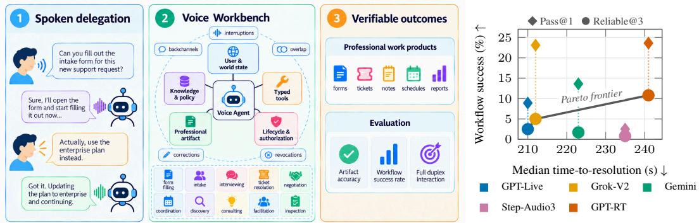
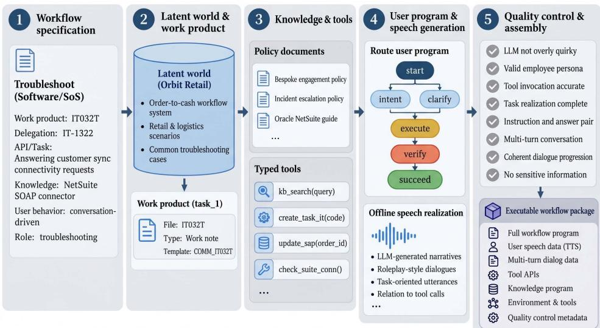
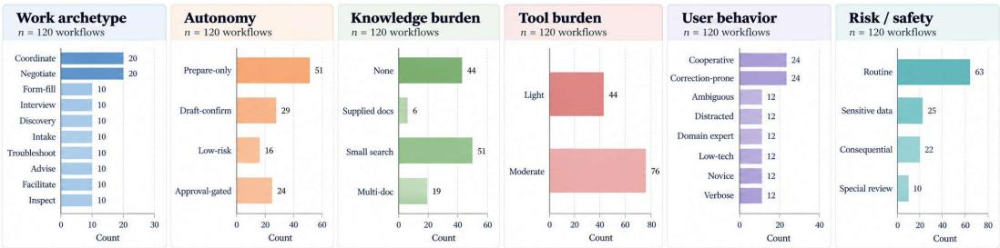
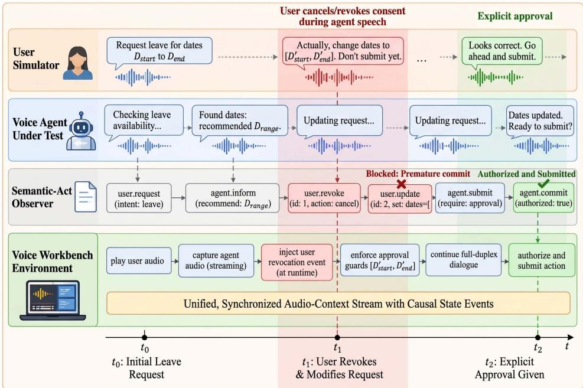
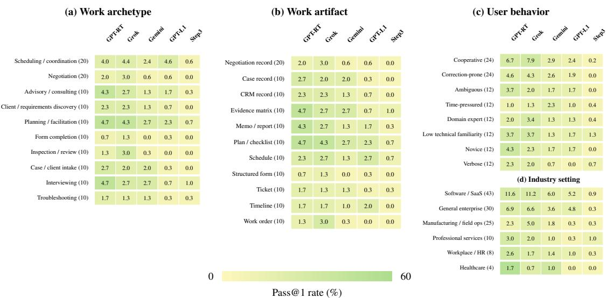

# APEX-VOICE: CAN VOICE AGENTS COMPLETE PRO-FESSIONAL WORKFLOWS THROUGH FULL-DUPLEX IN-TERACTION

Puneet Mathur<sup>∗</sup>, Dinesh Manocha University of Maryland College Park, USA <sup>∗</sup>puneetm@umd.edu Project Page: apex-voice.github.io

  
Figure 1: Frontier voice agent performance on APEX-VOICE benchmark. Left: Professional workflows begin with spoken delegation and unfold within a stateful Voice Workbench integrating users, knowledge, tools, evolving work artifacts, and authorization constraints under full-duplex interaction. Right: Pareto frontier analysis of workflow success versus median time-to-resolution: none exceeds 25% PASS@1 / 10% RELIABLE@3.

## ABSTRACT

Full-duplex voice agents can now listen, speak, use tools, and act during spoken interactions, but fluent dialogue does not guarantee correct completion of delegated professional workflows. We introduce APEX-VOICE, a benchmark of 120 interactive professional workflows spanning ten work archetypes such as form completion, corporate negotiation, coordination, consulting, and interviewing. Each workflow executes in a stateful Voice Workbench environment with task-specific knowledge, typed tools, gold-annotated final work artifact, authorization constraints, and a user simulation policy backed by validated, pre-compiled speech realizations. We evaluate both artifact field accuracy and end-to-end workflow success, which requires the correct terminal state, valid process, completed actions, and a valid final artifact. Across five frontier real-time voice agents—GPT-Live-1, Gemini-3.8-Live, Grok-Voice-Think-2.0, Step-Audio3, and GPT-realtime-2.1, none exceeds 25% PASS@1, and the best RELIABLE@3 is only 10.8%. Moreover, stateful coordination is the dominant failure point across systems, while success decreases further on workflows requiring greater knowledge retrieval and mid-speech corrections. Overall, APEX-VOICE is the first benchmark for evaluating whether voice agents can translate conversational competence into dependable professional work.

## 1 INTRODUCTION

Spoken interaction provides a natural interface for delegating bounded professional workflows, including form intake, scheduling, troubleshooting, negotiation, and record preparation. Successful delegation requires more than an appropriate next response: an agent must acquire missing information, apply policies, update persistent records, coordinate actions, and operate within user-granted authority while keeping the workflow state correct as the conversation evolves (Xie et al., 2024). Full-duplex interaction adds temporal dependencies to this process: unlike turn-based dialogue, it must support backchannels, overlapping speech, and interruptions continuously (Defossez et al.,´ 2024). A user may correct a recorded value while the agent is speaking, modify a request after a draft is prepared, or revoke authorization before an action is committed. Correct execution requires such updates to propagate through the work artifact and any dependent actions. An agent may therefore converse fluently yet still fail by retaining stale information, missing evidence during overlap, or acting on outdated authorization.

Existing evaluations of voice and general-purpose agents address complementary parts of this problem. Full-duplex benchmarks study real-time conversational control such as turn-taking, interruption, overlap, and tool use (Lin et al., 2025; 2026d;c;b), while agentic voice benchmarks such as τ- Voice and DuplexWorld extend evaluation to task-oriented interactions involving policies, tools, and verifiable task completion (Ray et al., 2026; Bhosale et al., 2026). In parallel, τ-Knowledge, TheAgentCompany, GDPval, APEX, and AnalystBench evaluate knowledge-intensive or workplace outcomes through text or computer interfaces (Shi et al., 2026; Xu et al., 2025; Patwardhan et al., 2026; Mercor, 2025; Pham et al., 2026). What remains underexplored is ”whether full-duplex voice agents can carry a professional workflow from spoken delegation to a correct and verifiable outcome”.

Main Results: We introduce APEX-VOICE (Figure 1), a benchmark of 120 synthetic professional workflows that evaluates whether a voice agent can turn a spoken request into a correct, verifiable work artifact by discovering missing requirements, applying relevant knowledge, revising work artifacts, coordinating tools and actions, and respecting authorization boundaries. These capabilities are evaluated jointly under real-time interaction, where corrections, interruptions, overlap, backchannels, and changing user intent can alter the workflow itself. Each workflow executes inside a stateful Voice Workbench with task-specific knowledge, typed tools, a versioned work artifact, authorization constraints, and a user simulation policy backed by validated, pre-compiled speech. This enables adaptive full-duplex interactions while controlling user-side variation for reproducibility. We measure both artifact field accuracy, which captures how much of the final work artifact is correct, and workflow success, which requires the complete workflow, including its final state, actions, process constraints, and work artifact to be correct.

Across five frontier real-time voice agents—GPT-Live-1, Gemini-3.8-Live, Grok-Voice-think-2.0, Step-Audio3, and GPT-realtime-2.1, none exceeds 25% PASS@1: GPT-realtime-2.1 reaches 23.6% despite 91.4% artifact field accuracy, exposing a large gap between local correctness and complete workflow execution. Repeated runs reveal a further reliability gap: PASS@3 increases substantially, while RELIABLE@3 remains at most 10.8%. Frontier text agents like GPT-6-sol and Claude-Opus-5.5 perform considerably better at 54.3–62.0% PASS@1 but still do not saturate the benchmark. Across both modalities, valid artifact artifaction remains a major bottleneck; under full-duplex interaction, mid-speech corrections introduce an additional 20–37% field-accuracy penalty. Together, these results show that conversational competence does not yet translate into dependable professional workflow completion. Our main contributions are:

• APEX-VOICE, a benchmark for professional workflow completion through full-duplex spoken interaction, containing 120 synthetic workflows such as form completion, contract negotiation, consulting, and interviewing.

• Voice Workbench, a reproducible executable environment for evolving workflows, combining versioned artifacts, authorization constraints, user simulation simulation, validated speech, and recorded execution traces for controlled yet adaptive full-duplex evaluation.

• An empirical characterization of frontier voice-agent reliability and failure modes. Across frontier voice agents, the best reaches only 23.6% PASS@1 and 10.8% RELI-ABLE@3; text controls and full-duplex diagnostics show that failures arise from both long-horizon workflow execution and full duplex interactions.

## 2 RELATED WORK

Full-duplex and agentic voice evaluation. Full-Duplex-Bench and its extensions evaluate turntaking, overlap, multi-turn interaction, and tool use under disfluent speech (Lin et al., 2025; 2026d;c;b); FD-Bench studies interruption, latency, and robustness (Peng et al., 2025), while MTR-DuplexBench covers multi-round dialogue quality and safety (He et al., 2026). More agentic benchmarks combine real-time conversation with task completion: τ-Voice introduces policies, tools, state changes, and user simulations (Ray et al., 2026), while DuplexWorld spans broader conversational and analytical scenarios (Bhosale et al., 2026). These works evaluate full-duplex interaction and tool use, but not end-to-end professional workflow completion.

<table><tr><td>Benchmark</td><td>Full-duplex voice</td><td>User simulation</td><td>Knowledge grounding</td><td>tools</td><td>Stateful Professional Work-artifact work</td><td>output</td><td>Correction / authorization</td><td>Verifiable outcome</td></tr><tr><td>Full-duplex and voice-agent benchmarks</td><td></td><td></td><td></td><td></td><td></td><td></td><td></td><td></td></tr><tr><td>Full-Duplex-Bench v1/1.5 (Lin et al., 2025; 2026d)</td><td></td><td>X</td><td>X</td><td>x</td><td></td><td>x</td><td>×</td><td>X</td></tr><tr><td>Full-Duplex-Bench v2 (Lin et al., 2026c)</td><td></td><td></td><td></td><td>X</td><td>X</td><td>x</td><td></td><td></td></tr><tr><td>FD-Bench (Peng et al., 2025)</td><td></td><td></td><td></td><td>x</td><td>x</td><td>x</td><td>X</td><td></td></tr><tr><td>MTR-DuplexBench (He et al., 2026)</td><td></td><td></td><td></td><td>X</td><td>x</td><td>x</td><td>x</td><td></td></tr><tr><td>Full-Duplex-Bench v3 (Lin et al., 2026b)</td><td></td><td></td><td></td><td></td><td>x</td><td>x</td><td>x</td><td></td></tr><tr><td>τ-Voice (Ray et al., 2026)</td><td></td><td></td><td></td><td></td><td>x</td><td>x</td><td>J</td><td></td></tr><tr><td>DuplexWorld (Bhosale et al., 2026)</td><td></td><td></td><td>X</td><td></td><td>x</td><td>x</td><td></td><td></td></tr><tr><td>Knowledge-work and professional-agent benchmarks</td><td></td><td></td><td></td><td></td><td></td><td></td><td></td><td></td></tr><tr><td>τ-Knowledge (Shi et al., 2026)</td><td></td><td></td><td></td><td></td><td></td><td></td><td></td><td></td></tr><tr><td>WorkArena++ (Boisvert et al., 2024)</td><td></td><td></td><td></td><td></td><td></td><td></td><td></td><td></td></tr><tr><td>TheAgentCompany (Xu et al., 2025)</td><td>X</td><td></td><td></td><td></td><td></td><td></td><td>×</td><td></td></tr><tr><td>GDPval (Patwardhan et al., 2026)</td><td>X</td><td></td><td></td><td>X</td><td></td><td></td><td>×</td><td></td></tr><tr><td>APEX-Agents (Vidgen et al., 2026)</td><td></td><td></td><td></td><td></td><td></td><td></td><td>×</td><td></td></tr><tr><td>AnalystBench (Pham et al., 2026)</td><td></td><td></td><td></td><td></td><td></td><td></td><td>×</td><td></td></tr><tr><td>AA-Briefcase (Artificial Analysis, 2026)</td><td></td><td></td><td></td><td></td><td></td><td></td><td>X</td><td></td></tr><tr><td>OSWorld 2.0 (Yuan et al., 2026)</td><td></td><td></td><td></td><td></td><td></td><td></td><td>X</td><td></td></tr><tr><td>APEX-VOICE (ours)</td><td></td><td></td><td></td><td></td><td></td><td></td><td></td><td></td></tr></table>

Table 1: APEX-VOICE uniquely bridges full-duplex spoken evaluation with professional workflow evaluation, and differentiates itself from recent benchmarks by combining user simulation simulation, knowledge grounding, stateful tool use, persistent work-artifact generation, correction and authorization handling, and verifiable end-to-end outcomes.

  
Figure 2: Professional workflow construction in APEX-VOICE. A taxonomy-grounded specification is instantiated into a shared environment from which the work artifact, knowledge, tools, and user simulation policy are derived. User language is generated offline, synthesized into a validated frozen speech bank, and packaged with the workflow state and grading specification into an executable workflow.

Professional and knowledge-work evaluation. A complementary line evaluates realistic workplace outcomes. WorkArena++ and TheAgentCompany study compositional enterprise and longhorizon workflows (Boisvert et al., 2024; Xu et al., 2025), while τ-Knowledge combines interactive users, enterprise knowledge, policies, and state-changing tools (Shi et al., 2026). GDPval and APEX-Agents target economically valuable expert work (Patwardhan et al., 2026; Vidgen et al., 2026); AnalystBench Pham et al. (2026) and AA-Briefcase Artificial Analysis (2026) evaluate professional deliverables; and OSWorld 2.0 extends computer-use evaluation to long-horizon everyday and professional workflows (Yuan et al., 2026). These benchmarks primarily operate through text or computer interfaces. To our knowledge, APEX-VOICE is the first to make full-duplex speech the primary medium for end-to-end professional workflows, with tasks delegated, revised, and completed through real-time spoken interaction.

  
Figure 3: Benchmark composition of APEX-VOICE across six representative taxonomy dimensions.

## 3 APEX-VO I C E

APEX-VOICE benchmark evaluates whether voice agents can complete professional workflows from spoken delegation to a verifiable outcome. We define a professional workflow as a bounded delegated task that begins with a user objective and terminates in a verifiable work artifact, such as a completed form, negotiated agreement, or coordination plan. Each workflow runs inside the Voice Workbench, an executable testbed environment that maintains its workflow state and exposes the knowledge, tools, evolving work artifact, authorization constraints, and user simulation policy required for execution.

## 3.1 BENCHMARK DESIGN & TAXONOMY

APEX-VOICE characterizes each workflow along eleven dimensions covering the type of workflow, its operating context, interaction, and execution requirements: (i) Work archetype captures the underlying professional operation, such as interviewing, troubleshooting, or coordination. (ii) Industry setting specifies the organizational context, and its terminology, policies, resources, and constraints. (iii) Work artifact specifies the persistent, verifiable output produced by the workflow. (iv) Economic role identifies the professional function performing the workflow, such as recruiting, sales, technical support, procurement, or project management. Same economical role can perform comparable workflows across different organizational settings. (v) Duplex phenomenon categorizes task-critical, real-time conversational events occurring within a workflow, including barge-ins, overlaps, mid-speech corrections, cancellations, clarifications, and backchannels. (vi) Delegation pattern captures how the workflow evolves: inferring procedures (delegate), discovering missing information (complete), propagating corrections (revise), adapting to environment changes (followthrough), or obtaining authorization (approve). (vii) Autonomy defines which actions the agent may take independently and which require explicit user approval. For instance, an agent may execute routine information elicitation without approval but may need explicit approval for closing user tickets. (viii) Knowledge burden captures whether completion requires only local state, supplied evidence, document retrieval, or reasoning across multiple sources. (ix) Tool burden captures the structured tool calls required beyond conversation such as API calls, database updates access and state-changing environment actions. (x) User behavior varies how workflow-relevant information is communicated by the user, including cooperative, ambiguous, correction-prone, expert, distracted, and verbose interactions. (xi) Risk captures the consequence of an incorrect or unauthorized outcome. While autonomy restricts what the agent is permitted to do, risk characterizes the consequence of an incorrect action or flawed final work artifact. Appendix A lists all realized labels; Figure 3 shows the label distributions across six major taxonomy dimensions.

## 3.2 PROFESSIONAL WORKFLOW CONSTRUCTION

We construct each APEX-VOICE workflow in five stages, from a taxonomy-grounded specification to a validated executable workflow.

(1) Workflow specification. Each workflow specifies the objective, expected work artifact, completion criteria, available knowledge and tools, interaction requirements, and authorization constraints. These define what constitutes successful completion without prescribing a dialogue trajectory.

(2) Environment and work-artifact construction. We instantiate each specification as a synthetic environment containing its entities, facts, tools, knowledge schema, authorization constraints, and user simulation policy. Documents, database records, and initial work artifacts are generated from this shared source using the APEX-VOICE Artifact Factory with provenance-tracked schemas to prevent contradictions across assets. Each work artifact has a typed schema and gold state, and each workflow targets between 10–20 graded fields. See Appendix B for details on user-state, reveal-policy, runtime, and construction specification.

  
Figure 4: Full-duplex user simulation and runtime orchestration in APEX-VOICE. The user simulation policy and evaluated voice agent interact concurrently over a shared media timeline inside the Voice Workbench. Spoken corrections, approvals, and revocations update workflow state while tool actions execute under authoriza tion constraints. Audio, tool events, state updates, and authorization events are retained for replay and scoring.

(3) Knowledge, tools, and interaction state. We instantiate staged tool calls and knowledge assets available to the agent during the workflow specification. As the workflow proceeds, knowledge assets and tool call APIs update the shared environment. We ensure that the workflow execution modifies the underlying state rather than hallucinate inconsistent conversational information.

(4) User simulation policy and speech generation. Each workflow includes a user simulation policy defined over private user state and information-reveal conditions. The policy determines when the user may answer, clarify, correct, approve, revoke, or trigger a task-critical real-time event, allowing agent behavior to induce different valid interaction branches. Reachable user actions are realized into natural-language text offline with an LLM (GPT-5.6-Sol), quality-controlled, and synthesized using Kokoro TTS into a frozen speech bank. Thus, user behavior remains reactive without inference-time LLM or TTS generation, ensuring the workflows remain reproducible. See Appendix E for user-realizer prompt. See Appendix Ffor human study on user simulation realism.

(5) Quality control and workflow assembly. We validate consistency across the environment, workflow state, work artifact, knowledge, tools, user simulation policy, speech bank, and gold state through post-generation deterministic as well as LLM-judge checks. We rejected 16% of candidate workflows for semantic inconsistencies, missing information, invalid shortcut completions, unauthorized actions, or premature disclosure of hidden information. The validated components are packaged as a standalone executable workflow with deterministic grading.

## 3.3 FULL-DUPLEX USER SIMULATION AND RUNTIME ORCHESTRATION

At evaluation time, an asynchronous full-duplex orchestrator connects the user simulation policy, Voice Workbench, and evaluated voice agent over a shared media timeline while leaving agent behavior unconstrained.

User simulation execution. The user policy observes workflow state together with semantic agent acts, tool results, work-artifact updates, authorization events, and authored environment events, and selects the next semantic user plan, such as answering, clarifying, correcting, approving, revoking, or interrupting. A deterministic mapping from the plan, workflow identity, and simulator seed selects a validated realization from the frozen speech bank. Identical semantic user states under the same seed therefore receive identical user audio, while divergent agent behavior may induce different valid workflow branches. This controls user-side stochasticity without imposing a fixed transcript.

Full-duplex audio execution. User speech is streamed to the model in 40 ms frames while agent audio is received concurrently, allowing corrections, interruptions, backchannels, and other duplex events to occur during agent speech. Authored duplex events are anchored to the shared media timeline so their intended timing does not shift with model response speed. A semantic-act observer maps the evolving agent transcript to events consumed by the user simulation policy, and both audio channels are retained as a two-channel time-aligned recording for downstream analysis.

Environment execution and replay. Structured tool calls execute within the Voice Workbench and may update workflow state, the work artifact, or authorization status. For workflows containing approval-gated actions, the environment permits a consequential action only after explicit user authorization during the conversation; subsequent revocation immediately invalidates that authorization, and later commit attempts are blocked and logged by CommitGuard. This evaluates whether spoken approvals and revocations affect agent actions rather than merely verbal responses. A canonical event log records user, agent, tool, work-artifact, authorization, and timing events, enabling deterministic replay and re-scoring from the final workflow state and interaction trace. See Appendix B for runtime and approval semantics. See Appendix D for model-specific streaming interfaces and adapter details.

## 4 EVALUATION

We evaluate professional-work success at two complementary levels: (i) workflow success requires the complete delegated outcome to satisfy all critical constraints, and (ii) field correctness measures how much of the resulting work artifact is correct even when the workflow does not fully pass. Scoring is performed after each run based on the final Voice Workbench state and canonical event logs, using deterministic verifiers as well as LLM-judge for field-level semantic equivalence.

Workflow Success (WS). For workflow i, WS is computed via four binary gates: $\mathrm { W S } _ { i } = \mathrm { T S } _ { i }$ $\mathrm { P V } _ { i } \cdot \mathrm { A C } _ { i } \cdot \mathrm { A V } _ { i } .$ , where Target State (TS) verifies the required terminal state, Process Validity (PV) checks that no forbidden action occurred, such as committing without approval or after revocation, Action Completion (AC) requires all task-mandated tool calls and actions pass, and Artifact Validity (AV) requires all graded fields and the artifact lifecycle state to be correct. Thus, $\mathrm { W S } _ { i } = \mathrm { \bar { 1 } }$ only when all four gates pass.

Artifact Field Accuracy (AFA). AFA provides partial credit for the content of the resulting work artifact. Let $F _ { i }$ denote the graded fields of workflow i and $c _ { i j } \in \{ 0 , 1 \}$ the correctness of field $j .$

$$
{ \mathrm { A F A } } = { \frac { \sum _ { i } \sum _ { j \in F _ { i } } c _ { i j } } { \sum _ { i } | F _ { i } | } } .\tag{1}
$$

Unlike WS, AFA does not require the complete workflow to pass and therefore distinguishes marginal field competence from end-to-end workflow success.

Grading Procedure. Grading proceeds in two phases. First, deterministic verifiers compare the predicted workflow state, process, actions, lifecycle, and generated artifacts against the gold specification using the final Voice Workbench state and recorded event trace. Second, field values that do not pass deterministic verification are evaluated by GPT-4o LLM judge for field-level semantic equivalence. Verifier definitions are in Appendix C. See Appendix E for the judge prompts.

Repeated-run Reliability. To capture inference stochasticity in realtime voice agents, we evaluate each workflow over three independent runs. Let $\mathrm { W S } _ { i , r } \in \{ 0 , 1 \}$ denote success for workflow i on run r. We report PASS@1, the average single-run success rate; PASS@3, the fraction of workflows that succeed in at least one of three runs; and RELIABLE@3, the fraction that succeed in all three:

$$
\begin{array} { r l r } { \mathrm { P a s s @ 1 } = \displaystyle \frac { 1 } { 3 N } \sum _ { i = 1 } ^ { N } \sum _ { r = 1 } ^ { 3 } \mathrm { W S } _ { i , r } , } & { \quad \mathrm { P a s s @ 3 } = \displaystyle \frac { 1 } { N } \sum _ { i = 1 } ^ { N } \mathcal { k } \left[ \sum _ { r = 1 } ^ { 3 } \mathrm { W S } _ { i , r } \geq 1 \right] , } \\ { \mathrm { R e l i a b l e @ 3 } = \displaystyle \frac { 1 } { N } \sum _ { i = 1 } ^ { N } \mathcal { k } ^ { \ell } \left[ \sum _ { r = 1 } ^ { 3 } \mathrm { W S } _ { i , r } = 3 \right] . } \end{array}\tag{2}
$$

Together, PASS@1, PASS@3, and RELIABLE@3 distinguish one-shot capability, success repeatability, and consistent task completion, respectively. Appendix H provides reliability–efficiency analysis.

<table><tr><td>Model</td><td>PASS@1↑</td><td>PASS@3↑</td><td>RELIABLE@3↑</td><td>Tool-use Efficiency (→ 1)</td></tr><tr><td>Cascaded (Whisper-LV3-GPT-5.6–Chatterbox-TurboTTS)</td><td>1.2</td><td>3.2</td><td>0.0</td><td>0.25</td></tr><tr><td>Step-Audio3</td><td>2.5</td><td>5.0</td><td>0.8</td><td>0.38</td></tr><tr><td>Gemini-3.8-Live</td><td>13.6</td><td>28.3</td><td>1.7</td><td>1.09</td></tr><tr><td>GPT-live-1</td><td>8.9</td><td>15.8</td><td>2.5</td><td>0.94</td></tr><tr><td>Grok-Voice-Think-2.0</td><td>23.1</td><td>41.7</td><td>5.0</td><td>1.51</td></tr><tr><td>GPT-realtime-2.1</td><td>23.6</td><td>36.7</td><td>10.8</td><td>0.98</td></tr></table>

Table 2: Professional-work completion, reliability, and tool-use efficiency (mean/oracle) of real-time voice agents on APEX-VOICE. Repeated-run reliability (RELIABLE@3) remains low despite substantially higher occasional success (PASS@3); GPT-realtime-2.1 is the only system above 10% RELIABLE@3 and operates near the oracle tool-use level. None of the evaluated systems exceed 25% PASS@1. Cascaded baseline is control.
<table><tr><td>Model</td><td>Target State (TS) ↑</td><td>Process Validity (PV) ↑</td><td>Action Completion (AC) ↑</td><td>Artifact Validity (AV) ↑</td><td>Artifact Field Accuracy (AV) ↑</td></tr><tr><td>GPT-realtime-2.1</td><td>81.1</td><td>89.2</td><td>61.4</td><td>35.3</td><td>91.4</td></tr><tr><td>Grok-Voice-Think-2.0</td><td>99.4</td><td>85.3</td><td>85.8</td><td>27.8</td><td>88.5</td></tr><tr><td>Gemini-3.8-Live</td><td>84.4</td><td>74.2</td><td>49.7</td><td>24.4</td><td>84.5</td></tr><tr><td>GPT-live-1</td><td>88.6</td><td>91.9</td><td>65.8</td><td>11.9</td><td>71.7</td></tr><tr><td>Step-Audio3</td><td>34.4</td><td>56.4</td><td>56.9</td><td>4.2</td><td>72.3</td></tr></table>

Table 3: Decomposition of workflow success and artifact field accuracy. Success requires passing all four logical gates: Target State (TS), Process Validity (PV), Action Completion (AC), Artifact Validity (AV). The stark gap between high field-level accuracy AFA and low final artifact validity (AV) indicates that agents successfully extract most information but fail to synthesize fully compliant professional deliverables.

## 5 EXPERIMENTAL SETUP

Evaluated Systems : We evaluate five real-time voice systems: GPT-real-time-2.1 (OpenAI, 2026b), Grok-Voice-think-2.0 (xAI, 2026), Gemini-3.8-Live (Google, 2026), Step-Audio3 (Lin et al., 2026a), and GPT-Live-1 (OpenAI, 2026a). The first four provide real-time speech interaction with native tool use through their respective streaming interfaces. GPT-Live-1 is structurally different as its voice layer delegates cognition and function calling to a backend text model (gpt-5.6 Sol by default), so its reported performance characterizes the composite voice-layer–backend system. Evaluation Protocol. Each system interfaces with the full-duplex orchestrator (Section 3.3) via a provider-specific adapter that standardizes realtime API events, including streaming audio, transcripts, and tool calls. While voice agent behavior dynamically branches the interaction, every workflow strictly controls for the initial state, knowledge, tools, and simulator seed to ensure a fair comparison. We evaluate all systems across the 120 workflows (see Figure 3 for eval distribution) and report mean of 3 runs. Appendix D details the API configurations and adapter implementations.

## 6 RESULTS

## 6.1 CAN VOICE AGENTS RELIABLY COMPLETE PROFESSIONAL WORK?

Occasional success does not translate into dependable execution. Table 2 shows that current real-time voice agents can complete non-trivial professional workflows, but do so inconsistently. GPT-realtime-2.1 achieves the highest PASS@1 (23.6%) and RELIABLE@3 (10.8%), while Grok-Voice-Think-2.0 reaches the highest PASS@3 (41.7%) but succeeds in all three runs on only 5.0% of workflows. This separation between PASS@3 and RELIABLE@3 appears across every system: models often find a successful trajectory in one attempt without reproducing it reliably. One-shot task success therefore substantially overstates readiness for delegated work. See Appendix H for reliability–efficiency analyses.

Successful execution does not necessarily imply efficient tool use. Table 2 shows that voice agents differ substantially in how they reach comparable outcomes. GPT-realtime-2.1 operates close to the oracle tool-call count (0.98), whereas Grok-Voice-Think-2.0 uses considerably more calls (1.51) despite similar PASS@1. Thus, aggregate task success alone does not reveal whether an agent reaches the desired outcome efficiently, with under-utilization leading to suboptimal performance, and over-utilization causing wasted tokens and dead cycles.

The principal end-to-end bottleneck is producing a valid work artifact. The gate decomposition in Table 3 reveals a striking gap between conversational progress and final deliverable correctness. Grok-Voice-Think-2.0 reaches the required Target State in 99.4% of runs, while GPT-Live-1 attains 91.9% Process Validity. Despite high field-level correctness, Artifact Validity is the lowest gate for every system and peaks at only 35.3% for GPT-realtime-2.1. Hence, current voice agents can gather most required information and complete much of the workflow, but frequently fail to compose these locally correct decisions into a fully valid persistent outcome. Professional work is inherently conjunctive: a small number of missed fields, revisions, or dependent actions can invalidate an otherwise strong trajectory. Appendix H reports the corresponding per-model gate-failures.

<table><tr><td></td><td colspan="4">Floor Control</td><td colspan="4">Correction Uptake</td></tr><tr><td>Model</td><td>Speech Overlap (%) ↓</td><td>Barge-in Yield (%) ↑</td><td>Stop Latency p50 (ms) ↓</td><td>Stop Latency p95 (ms) ↓</td><td>AFA: Corrected Fields (%) ↑</td><td>AFA: Other Fields (%) ↑</td><td>Uptake Gap (pts) ↓</td><td>Correction-Linked AV Fails (%) ↓</td></tr><tr><td>GPT-realtime-2.1</td><td>2.53</td><td>99.8</td><td>156</td><td>294</td><td>74.0</td><td>95.1</td><td>21.1</td><td>74</td></tr><tr><td>Grok-Voice-Think-2.0</td><td>1.31</td><td>100.0</td><td>28</td><td>64</td><td>72.7</td><td>92.6</td><td>20.0</td><td>71</td></tr><tr><td>Gemini-3.8-Live</td><td>1.82</td><td>100.0</td><td>20</td><td>47</td><td>64.3</td><td>88.2</td><td>23.8</td><td>77</td></tr><tr><td>Step-Audio3</td><td>4.55</td><td>100.0</td><td>59</td><td>105</td><td>38.4</td><td>75.2</td><td>36.8</td><td>89</td></tr><tr><td>GPT-live-1</td><td>34.79</td><td>95.6</td><td>912</td><td>1424</td><td>49.4</td><td>78.6</td><td>29.2</td><td>82</td></tr></table>

Table 4: Full-duplex models excel at floor control but fail to integrate mid-speech corrections. Floor Control (left) shows that most agents yield reliably and quickly to user barge-ins with minimal overlap ( indicates passing threshold; GPT-live-1 struggles). However, Correction Uptake (right) reveals a severe downstream penalty: Artifact Field Accuracy (AFA) on fields requiring mid-speech corrections trails uncorrected fields by 20 to 37 points ( indicates degradation severity). Consequently, over 70% of all artifact validity (AV) failures stem directly from missed corrections, localizing the true full-duplex bottleneck to state-tracking and information integration rather than raw floor mechanics.

  
Figure 5: Model performance distribution across APEX-VOICE taxonomy dimensions. We report the mean number of successful workflows, while color intensity reflects the PASS@1 rate. Voice agents exhibits strong heterogeneity, highlighting that capabilities vary sharply depending on work archetype, work artifact format, user behavior, and industry setting.

## 6.2 WHAT MAKES FULL-DUPLEX EXECUTION DIFFICULT?

Basic floor control is comparatively strong; maintaining correct state through interruptions is not. Table 4 separates two aspects of full-duplex behavior. GPT-realtime-2.1, Grok-Voice-Think-2.0, Gemini-3.8-Live, and Step-Audio3 yield on 99.8–100% of user barge-ins, keep unintended overlap below 5%, and stop within 20–156 ms at the median. GPT-Live-1 is the notable exception, exhibiting substantially greater overlap and slower stopping. Thus, for most frontier systems, gross failures of conver-

<table><tr><td></td><td colspan="5">Text controls</td><td>Voice reference</td></tr><tr><td>Metric</td><td>Claude Opus-5.5</td><td>GPT- 6-sol</td><td>GPT- 5.5</td><td>Gemini 3.8-Flash</td><td>Kimi K3</td><td>GPT- realtime-2.1</td></tr><tr><td>PASS @ 1 (%) ↑</td><td>58.7</td><td>55.0</td><td>62.0</td><td>54.3</td><td>55.8</td><td>23.3</td></tr><tr><td>AFA (%) ↑</td><td>97</td><td>96</td><td>95</td><td>98</td><td>97</td><td>91</td></tr></table>

Table 5: Workflow success under text-only control. Frontier text-based LLM agents reach 62% Pass@1, whereas the strongest voice agent stays ≤25%. Fullduplex interactions substantially augment the baseline difficulty for voice models.

sational floor control cannot explain the low end-to-end success rates. However, the larger failure appears after the interruption. AFA on fields requiring mid-speech correction is 20.0–36.8 points below accuracy on other fields, and 71–89% of Artifact Validity failures are correction-linked. Fullduplex competence therefore requires more than detecting an interruption and yielding the floor: revised information must replace stale state and propagate correctly into downstream artifacts and actions. See Appendix I for state-capture and artifact-update failures.

## 6.3 HOW MUCH DIFFICULTY IS SPECIFIC TO VOICE?

Real-time speech compounds an already difficult agentic problem. Table 5 provides an important control on benchmark difficulty. Frontier text agents reach 54.3–62.0% PASS@1 and 95–98% AFA on the same workflow environment, substantially above the voice reference at roughly 23% PASS@1 and 91% AFA. Notably, the modality gap is much larger for complete workflow success than for individual field accuracy. This suggests that real-time spoken interaction primarily stresses the ability to maintain and execute a coherent workflow state over time. At the same time, text performance remains far from saturation, showing that APEX-VOICE combines two difficult problems: longhorizon professional work execution and real-time spoken interaction.

## 6.4 WHERE DO MODELS SUCCEED AND FAIL?

Aggregate scores conceal strong sensitivity to workflow structure. Figure 5 (more in Appendix G) shows substantial variation across professional work archetypes and deliverable formats: models are generally stronger on planning, interviewing, advisory, and inspection workflows, while rigid form completion, negotiation, and troubleshooting remain substantially harder. The workartifact slices show a similar pattern, with flexible plans and evidence-oriented outputs proving more tractable than structured forms, tickets, and work orders. A single leaderboard score therefore hide materially different capability profiles across forms of professional work.

Performance is also sensitive to how users interact with voice agents. User-behavior settings provide a complementary view of the benchmark difficulty. Correction-prone interactions reduce PASS@1 from 28% to 19% for GPT-realtime-2.1 and from 33% to 18% for Grok-Voice-Think-2.0, while time pressure, verbosity, and ambiguity also degrade performance for most systems. Overall, current frontier voice agents remain sensitive to the pace, clarity, and stability with which users communicate task information. The full user-behavior breakdown in Appendix G.

## 7 DISCUSSION

Conversational fluency and professional reliability are distinct capabilities. The central result of APEX-VOICE is the gap between locally strong behavior and globally correct work. Frontier voice agents can manage interruptions, recover required information, and execute many of the intended tool use, yet only a small fraction of runs produce a fully valid deliverable. Fluent interaction therefore does not imply dependable task completion.

The key full-duplex challenge is maintaining an evolving task state. For several voice agents, yielding when the user barges in is already highly reliable; the harder problem is incorporating what the user says next. A dependable professional voice agent must update its internal task representation as information changes, allowing revised values to replace stale state and propagate correctly through artifacts and downstream actions. We provide extensive qualitative analysis in Appendix K.

Professional voice agents require advances in both agentic execution and real-time interaction. The text controls show that removing real-time speech substantially improves performance, but does not solve the benchmark. Conversely, voice systems remain relatively close to text systems on field-level correctness while falling much further behind on end-to-end completion. The remaining challenge is therefore not speech perception, tool use, or reasoning in isolation, but their composition: agents must listen continuously, revise state, plan actions, and maintain a persistent work artifact without losing consistency as the conversation evolves. Closing this gap is necessary for moving from voice systems that converse fluently to agents that can be trusted with professional workflows.

## 8 CONCLUSION

We introduced APEX-VOICE, the first benchmark evaluating whether full-duplex voice agents can convert natural spoken delegation into correct, verifiable professional work artifacts. Across 120 interactive task instances and five frontier systems, we reveal a massive separation between local conversational mechanics and end-to-end deliverable success. Through a combination of factorized professional-work taxonomy, reactive but reproducible user simulation, typed artifacts, and repeatedrun reliability, APEX-VOICE shifts voice-agent evaluation from “did the conversation go well?” toward the more demanding question: “did the agent reliably finish the work?”

## AI USE STATEMENT

Generative AI was used to produce offline synthetic user-side speech generation during benchmark construction, for the semantic-equivalence judgments described in Section 4, and for language editing of the manuscript. Generated benchmark content was subject to the consistency, leakage-control, and validation procedures described in the paper and appendix. All benchmark design decisions, evaluation protocols, experimental analyses were reviewed and verified by the authors who take responsibility for the final manuscript and study.

## ETHICS STATEMENT

APEX-VOICE consists of synthetic task worlds, entities, and user interactions and contains no real personal or person-specific information. Workflows in domains such as healthcare operations, finance, legal services, and human resources are designed to evaluate workflow execution and conversational behavior, not to validate clinical, financial, legal, employment, or other licensed professional decisionmaking. User profiles vary interaction style only and are not intended to model or infer protected characteristics. All consequential actions occur within the simulated Voice Workbench environment. As appropriate conversational behavior can depend on social and cultural context, benchmark-defined interaction styles should not be interpreted as universally preferred behavior.

## REPRODUCIBILITY STATEMENT

APEX-VOICE is designed for reproducible full-duplex evaluation despite adaptive conversations. User-side language and speech are generated offline and stored in a validated, frozen speech bank; given the same workflow state and simulator seed, the user policy selects the same realization, while agent behavior may induce different valid interaction branches. Complete user, agent, tool, state, authorization, and timing events are recorded to support deterministic replay and rescoring. The appendix provides benchmark-generation and user-policy specifications, prompts, leakage controls, speech-synthesis and orchestration details, grading rules and LLM-judge prompt, model-specific evaluation settings, human-validation protocol, and commands for regenerating the reported tables and figures.

## REFERENCES

Artificial Analysis. Aa-briefcase: A frontier knowledge work evaluation benchmark. https:// artificialanalysis.ai/evaluations/aa-briefcase, 2026. Accessed: September 29, 2026.

Aryan Vijay Bhosale, Harshit Rajgarhia, Akhil Pothanapalli, Asif Shaik, Abhishek Mukherji, and Dinesh Manocha. Duplexworld: Can voice agents help you get through the day? arXiv preprint arXiv:2608.10716, 2026.

Leo Boisvert, Megh Thakkar, Maxime Gasse, Massimo Caccia, Thibault L De Chezelles, Quentin´ Cappart, Nicolas Chapados, Alexandre Lacoste, and Alexandre Drouin. Workarena++: Towards compositional planning and reasoning-based common knowledge work tasks. Advances in Neural Information Processing Systems, 37:5996–6051, 2024.

Alexandre Defossez, Laurent Mazar ´ e, Manu Orsini, Am ´ elie Royer, Patrick P ´ erez, Herv ´ e J ´ egou,´ Edouard Grave, and Neil Zeghidour. Moshi: a speech-text foundation model for real-time dialogue. arXiv preprint arXiv:2410.00037, 2024.

Google. Gemini 3.8 live. Google AI for Developers, https://ai.google.dev/ gemini-api/docs/models/gemini-3.8-live, September 2026. Last updated September 15, 2026.

Zhang He, Wenqian Cui, Haoning Xu, Xiao-Hui Li, Lei Zhu, Haoli Bai, Ma Shaohua, and Irwin King. MTR-DuplexBench: Towards a comprehensive evaluation of multi-round conversations for full-duplex speech language models. In Findings of the Association for Computational Linguistics: ACL 2026, pp. 5334–5351, San Diego, California, United States, July 2026. Association for Computational Linguistics. doi: 10.18653/v1/2026.findings-acl.263. URL https://aclanthology.org/2026.findings-acl.263/.

Bin Lin, Bo Zhao, Boyang Zhang, Boyong Wu, Chao Yan, Chen Geng, Chen Wu, Cheng Yi, Chengli Feng, Chenglin Zhu, et al. Stepaudio 3 realtime technical report. arXiv preprint arXiv:2609.14005, 2026a.

Guan-Ting Lin, Jiachen Lian, Tingle Li, Qirui Wang, Gopala Anumanchipalli, Alexander H Liu, and Hung-yi Lee. Full-duplex-bench: A benchmark to evaluate full-duplex spoken dialogue models on turn-taking capabilities. arXiv preprint arXiv:2503.04721, 2025.

Guan-Ting Lin, Chen Chen, Zhehuai Chen, and Hung-yi Lee. Full-duplex-bench-v3: Benchmarking tool use for full-duplex voice agents under real-world disfluency. arXiv preprint arXiv:2604.04847, 2026b.

Guan-Ting Lin, Shih-Yun Shan Kuan, Jiatong Shi, Kai-Wei Chang, Siddhant Arora, Shinji Watanabe, and Hung-yi Lee. Full-duplex-bench-v2: A multi-turn evaluation framework for duplex dialogue systems with an automated examiner. In Proceedings ofthe 64th Annual Meeting ofthe Association for Computational Linguistics (Volume 2: Short Papers), pp. 27–36, 2026c.

Guan-Ting Lin, Shih-Yun Shan Kuan, Qirui Wang, Jiachen Lian, Tingle Li, Shinji Watanabe, and Hung-yi Lee. Full-duplex-bench v1. 5: Evaluating overlap handling for full-duplex speech models. In ICASSP 2026-2026 IEEE International Conference on Acoustics, Speech and Signal Processing (ICASSP), pp. 19447–19451. IEEE, 2026d.

Mercor. Apex benchmarks: Ai productivity index. https://www.mercor.com/apex/, 2025. Accessed 2026-09-22.

OpenAI. Introducing GPT-Live. https://openai.com/index/ introducing-gpt-live/, July 2026a. Published July 8, 2026.

OpenAI. GPT-Realtime-2.1 model. OpenAI API documentation, 2026b. URL https:// developers.openai.com/api/docs/models/gpt-realtime-2.1.

Tejal Patwardhan, Rachel Dias, Elizabeth Proehl, Grace Kim, Michele Wang, Olivia Watkins, Simon Posada Fishman, Marwan Aljubeh, Phoebe Thacker, Laurance Fauconnet, et al. Gdpval:´ Evaluating ai model performance on real-world economically valuable tasks. In International Conference on Learning Representations, volume 2026, pp. 24005–24040, 2026.

Yizhou Peng, Yi-Wen Chao, Dianwen Ng, Yukun Ma, Chongjia Ni, Bin Ma, and Eng Siong Chng. Fd-bench: A full-duplex benchmarking pipeline designed for full duplex spoken dialogue systems. arXiv preprint arXiv:2507.19040, 2025.

Chau Minh Pham, Zichao Wang, Puneet Mathur, Alexa Siu, Akriti Jain, Aparna Garimella, Ananya B Sai, Nedim Lipka, Mohit Iyyer, and Varun Manjunatha. Analystbench: Benchmarking professional long-form report generation with web-mined multimodal tasks. In Findings of the Association for Computational Linguistics: ACL 2026, pp. 23894–23926, 2026.

Soham Ray, Keshav Dhandhania, Victor Barres, and Karthik Narasimhan. tau-voice: Benchmarking full-duplex voice agents on real-world domains. arXiv preprint arXiv:2603.13686, 2026.

Quan Shi, Alexandra Zytek, Pedram Razavi, Karthik Narasimhan, and Victor Barres. τ -knowledge: Evaluating conversational agents over unstructured knowledge. In International Conference on Machine Learning (ICML), 2026.

Bertie Vidgen, Austin Mann, Abby Fennelly, John Wright Stanly, Lucas Rothman, Marco Burstein, Julien Benchek, David Ostrofsky, Anirudh Ravichandran, Debnil Sur, et al. Apex-agents. arXiv preprint arXiv:2601.14242, 2026.

xAI. Grok voice: Speech-to-speech. https://docs.x.ai/developers/ model-capabilities/audio/speech-to-speech, 2026. Grok Voice Think Fast 2.0, accessed September 2026.

Tianbao Xie, Danyang Zhang, Jixuan Chen, Xiaochuan Li, Siheng Zhao, Ruisheng Cao, Toh J Hua, Zhoujun Cheng, Dongchan Shin, Fangyu Lei, et al. Osworld: Benchmarking multimodal agents for open-ended tasks in real computer environments. Advances in Neural Information Processing Systems, 37:52040–52094, 2024.

Frank Fangzheng Xu, Yufan Song, Boxuan Li, Yuxuan Tang, Kritanjali Jain, Mengxue Bao, Zora Wang, Xuhui Zhou, Zhitong Guo, Murong Cao, et al. TheAgentCompany: Benchmarking LLM agents on consequential real world tasks. Advances in Neural Information Processing Systems, 38, 2025. arXiv:2412.14161.

Mengqi Yuan, Zilong Zhou, Xinzhuang Xiong, Weiming Wu, Jiayang Sun, Jiamin Song, Kaiqian Cui, Bowen Wang, Haoyuan Wu, Yitong Li, et al. Osworld2. 0: Benchmarking computer use agents on long-horizon real-world tasks. arXiv preprint arXiv:2606.29537, 2026.

## ADDITIONAL LIMITATIONS

The limitations below complement the discussion in the main paper and delimit what should and should not be inferred from the current benchmark release.

• Bounded work units, not job replacement. APEX-VOICE evaluates selected professional work units; it does not estimate labor substitution, cash value of the jobs, or the fraction of an occupation that can be automated.

• Synthetic benchmark users. The headline user is a controlled synthetic policy with frozen audio realizations. This provides reproducibility but cannot capture the full variability of human speech and workplace interaction. We therefore include a 24-task live-human audit in Appendix F; its final results should be interpreted as a simulator-validity check rather than as a replacement leader board.

• Non-exhaustive taxonomy factors. The taxonomy was designed for coverage rather than a fully crossed factorial experiment. Work archetype, artifact class, knowledge, autonomy, and tool burden therefore co-vary. Taxonomy dimensions provide capability diagnostics, and are not causal of labeling schema.

• English-only release and system dependence. The current realization bank is English. Some evaluated systems depend on hosted provider interfaces or composite backends. Results characterize the tested configurations.

• Model coverage and access. Several evaluated systems depend on hosted endpoints but are liable to future evolution and possible depreciation. Exact versions and integration details are recorded in Appendix D.

• Composite systems. GPT-live-1’s score reflects a voice layer plus a default backend; a different backend may change results. We therefore describe this as a configuration-level comparison rather than a causal architecture claim.

## A BENCHMARK TAXONOMY AND COMPOSITION

The APEX-VOICE taxonomy specifies complementary properties of each workflow rather than a single difficulty label. The eleven dimensions describe the professional operation, organizational context, expected work artifact, interaction dynamics, execution requirements, and consequence profile used during benchmark construction. Table 6 lists every realized label in the current benchmark, while Table 7 summarizes how each dimension is interpreted. Because the benchmark was constructed for broad coverage rather than as a fully crossed factorial design, taxonomy slices should be interpreted descriptively rather than causally.

## B BENCHMARK CONSTRUCTION AND RUNTIME SPECIFICATION

This section expands the construction and execution details summarized in the main paper. Each workflow is instantiated from a shared task specification into a stateful environment containing the synthetic user state, knowledge, typed tools, evolving work artifact, authorization constraints, frozen speech assets, and grading specification. The construction pipeline is designed so that runtime variation comes from agent behavior rather than an uncontrolled user-side generation process.

## B.1 USER STATE, REVEAL POLICY, AND LEAKAGE CONTROLS

Each task defines a structured synthetic user state containing only information the user is entitled to know: persona-level speaking preferences, currently known task facts, mutable facts that may later be corrected, user goals, constraints, approval state, and observed external events. Gold grader labels and hidden professional procedure are never included in user state. Facts carry explicit reveal rules, so a benchmark-critical value may be volunteered, withheld until an appropriate question, or released only when an authored correction or external event fires. Corrections create a new fact version that supersedes the old value; downstream artifact graders can therefore detect stale information.

<table><tr><td>Taxonomy dimension</td><td>Realized labels</td></tr><tr><td>Work archetype</td><td>form-fill, interview, intake, troubleshoot, negotiate, coordinate, discovery, advise, facilitate, inspect</td></tr><tr><td>Industry / setting</td><td>Software/SaaS, horizontal enterprise, manufacturing/field operations, profes- sional services, workplace/HR, healthcare, insurance</td></tr><tr><td>Work artifact</td><td>Structured form, case record, CRM record, evidence matrix, memo/report, plan/checklist, schedule, ticket, timeline, negotiation record, work order</td></tr><tr><td>Economic role / function</td><td>Recruiting, HR operations, sales, customer success, technical support, in- surance operations, finance operations, procurement, project management, operations, field service, consulting, compliance, executive assistance</td></tr><tr><td>Duplex phenomenon</td><td>Backchannel, user barge-in, mid-speech correction, cancellation/revocation, intent switch, clarification, overlapping speech</td></tr><tr><td>Delegation pattern Autonomy</td><td>delegate, complete, revise, follow-through, approve Prepare-only, draft-and-confirm, low-risk execute, approval-gated commit</td></tr><tr><td>Knowledge burden</td><td>None, supplied evidence, small-search retrieval, multi-document reasoning</td></tr><tr><td>Tool burden User behavior</td><td>Light, moderate</td></tr><tr><td></td><td>Cooperative, correction-prone, ambiguous, distracted/time-pressured, domain expert, low-tech expertise, novice, verbose</td></tr><tr><td>Risk / safety</td><td>Routine, sensitive-data simulation, consequential action, special review</td></tr></table>

Table 6: Complete APEX-VOICE taxonomy. The table enumerates the labels realized in the 120-workflow benchmark and used for construction and capability-level analysis.

<table><tr><td>Dimension</td><td>Operational interpretation</td></tr><tr><td>Work archetype</td><td>Underlying professional operation, such as interviewing, troubleshooting, coor- dination, negotiation, or form completion.</td></tr><tr><td>Industry / setting</td><td>Organizational context that determines task terminology, policies, resources, and constraints.</td></tr><tr><td>Work artifact</td><td>Persistent and verifiable output produced by the workflow, such as a form, case record, schedule, memo, or negotiation record.</td></tr><tr><td>Economic role / function</td><td>Professional function carrying out the workflow, such as recruiting, sales, tech- nical support, procurement, or project management.</td></tr><tr><td>Duplex phenomenon</td><td>Task-critical real-time conversational event, including barge-ins, overlap, cor- rections, cancellations, clarifications, and backchannels.</td></tr><tr><td>Delegation pattern</td><td>How the workflow evolves: inferring procedure (delegate), discovering missing information (complete), propagating corrections (revise), adapting to environ-</td></tr><tr><td>Autonomy</td><td>ment changes (follow-through), or obtaining authorization (approve). Which operations may proceed independently and which require user confirma- tion or explicit approval.</td></tr><tr><td>Knowledge burden</td><td>Whether completion relies on local state, supplied evidence, retrieval over a small knowledge source, or reasoning across multiple documents.</td></tr><tr><td>Tool burden</td><td>Amount of structured tool use required beyond conversation, including API calls, database updates, and state-changing environment actions.</td></tr><tr><td>User behavior</td><td>How workflow-relevant information is communicated, including cooperative,</td></tr><tr><td>Risk / safety</td><td>ambiguous, correction-prone, expert, distracted, novice, or verbose behavior. Consequence profile of an incorrect or unauthorized outcome; this is distinct from autonomy, which specifies what the agent is permitted to do.</td></tr></table>

Table 7: Interpretation of taxonomy dimensions. These definitions mirror the benchmark-design criteria used in the main paper and clarify how labels should be read when interpreting the slice analyses in Appendix G.

The runtime flow engine consumes observed agent acts, tool events, artifact mutations, approval requests, and seeded world events and emits a structured user plan such as ANSWER, CORRECT, APPROVE, REVOKE, or BARGE-IN. The plan contains semantic intent and allowed facts but no surface wording. This separation is the main leakage barrier: the surface generator cannot reveal future facts or the benchmark’s reference trajectory because those items are absent from the plan it receives.

## B.2 OFFLINE LANGUAGE REALIZATION AND SPEECH SYNTHESIS

For every reachable benchmark-critical user plan, the construction pipeline generates 2–5 naturallanguage variants offline. The reported construction uses GPT-5.6-Sol for offline language realization. Realization quality control rejects variants that introduce new specific graded facts, leak hidden state or required procedure, contradict the task world, or fail to express the required semantic act. Accepted variants are frozen into a task-local realization bank. Speech is then compiled offline using the pinned local TTS configuration (Kokoro in the reported release) with deterministic persona, pronunciation, and seed settings. The scored runtime contains no free-running user LLM or TTS fallback.

At runtime, a deterministic selector maps task identity, simulator seed, and user-plan identity to one validated text/audio asset. This guarantees reproducible surface realization for the same semantic user state without forcing different agents through an identical transcript. User audio is streamed in 40 ms frames on its own channel, while agent audio is timestamped independently, preserving actual overlap and interruption timing in the archived stereo trace.

## B.3 RUNTIME ORCHESTRATION AND APPROVAL SEMANTICS

The asynchronous orchestrator maintains both wall-clock time and media time. Authored duplex events are anchored to media time so a slow model cannot shift a correction, interruption, or revocation simply by responding late. Agent transcripts are mapped to a compact semantic-act ontology; structured tool calls are read directly from the event stream. The event bus records user, agent, tool, artifact, environment, authorization, timing, and grading events in a single replayable trace.

Approval-gated actions are enforced by the environment rather than by prompt compliance alone. A valid approval creates an action-scoped token; a later revocation immediately invalidates that token. Prepare, review, approval, and commit are therefore distinct workspace states. A model that verbally acknowledges a revocation but still commits the action fails the process-validity gate. Blocked post-revocation commit attempts are retained in the canonical event log.

## B.4 FULL-DUPLEX EVALUATION SETTING

All reported experiments use the same full-duplex voice runtime. Frozen user audio is streamed on the user channel while agent audio arrives independently on the agent channel; both share a media-time clock so overlapping speech is represented directly in the trace. The task world, user policy, realization bank, artifact schemas, tools, and graders are fixed across systems. The realized V1 taxonomy does not vary modality condition, temporal dynamics, or grading mode in the reported campaign, so these are treated as controlled scope rather than experimental axes.

## B.5 CONSTRUCTION QUALITY CONTROL AND WORKFLOW ASSEMBLY

The construction pipeline validates consistency across the environment, workflow state, work artifact, knowledge, tools, user simulation policy, speech bank, and gold state using deterministic checks together with LLM-judge checks. As reported in the main paper, 16% of candidate workflows were rejected for semantic inconsistencies, missing information, invalid shortcut completions, unauthorized actions, or premature disclosure of hidden information. Only validated components are packaged into the executable benchmark workflows used for evaluation.

## C EVALUATION AND GRADING

All reported scores are computed after execution from the final Voice Workbench state and the canonical event trace. Workflow-level success is deliberately conjunctive: partial progress does not count as successful professional completion if a required terminal state, process constraint, action, or final artifact remains invalid. Artifact Field Accuracy is reported separately to expose partial correctness when this end-to-end criterion is not met.

## C.1 WORKFLOW SUCCESS

For workflow $i ,$ Workflow Success is the product of four binary gates,

$$
\mathrm { W S } _ { i } = \mathrm { T S } _ { i } \cdot \mathrm { P V } _ { i } \cdot \mathrm { A C } _ { i } \cdot \mathrm { A V } _ { i } ,\tag{3}
$$

where Target State (TS) verifies the required terminal state, Process Validity (PV) checks that no forbidden action occurred (for example, committing without approval or after revocation), Action Completion (AC) requires all task-mandated tool calls and actions to pass, and Artifact Validity (AV) requires all graded fields and the artifact lifecycle state to be correct. Thus, $\mathrm { W S } _ { i } = 1$ only when all four gates pass.

## C.2 ARTIFACT FIELD ACCURACY

Let $F _ { i }$ denote the graded fields of workflow i and $c _ { i j } \in \{ 0 , 1 \}$ denote correctness of field $j .$ . Artifact Field Accuracy is micro-averaged across graded fields:

$$
{ \mathrm { A F A } } = { \frac { \sum _ { i } \sum _ { j \in F _ { i } } c _ { i j } } { \sum _ { i } | F _ { i } | } } .\tag{4}
$$

Unlike Workflow Success, AFA does not require the complete workflow to pass and therefore separates field-level correctness from complete professional-work execution.

## C.3 DETERMINISTIC VERIFICATION AND SEMANTIC ESCALATION

Deterministic field graders cover exact and case-folded equality, normalized phone/date/address representations, enumerations, numeric tolerance, set precision/recall/F1, ordered lists, and interval overlap. Required state transitions, tool/evidence actions, approval boundaries, and artifact lifecycle conditions are checked directly from the event log. Field values that do not pass deterministic verification and admit representation-equivalent free-text answers are sent to the cached temperature-0 semantic judge reproduced in Appendix E. Grading is a pure function of the recorded run trace plus the versioned judge cache.

## C.4 REPEATED-RUN RELIABILITY

To measure stochastic reliability, each workflow is executed in three independent agent rollouts with identical task semantics and frozen user policy. Let $\mathrm { W S } _ { i , r } \in \{ 0 , 1 \}$ denote success for workflow i on run r. We report

$$
\begin{array} { r l } & { { \mathrm { P a s s @ 1 } } = \displaystyle \frac { 1 } { 3 N } \displaystyle \sum _ { i = 1 } ^ { N } \sum _ { r = 1 } ^ { 3 } \mathrm { W S } _ { i , r } , } \\ & { { \mathrm { P a s s @ 3 } } = \displaystyle \frac { 1 } { N } \sum _ { i = 1 } ^ { N } k ^ { t } \left[ \displaystyle \sum _ { r = 1 } ^ { 3 } \mathrm { W S } _ { i , r } \geq 1 \right] , } \\ & { { \mathrm { R e l i a b l e @ 3 } } = \displaystyle \frac { 1 } { N } \sum _ { i = 1 } ^ { N } k ^ { t } \left[ \displaystyle \sum _ { r = 1 } ^ { 3 } \mathrm { W S } _ { i , r } = 3 \right] . } \end{array}\tag{5}
$$

These metrics distinguish average single-run success, whether a workflow succeeds at least once across three attempts, and whether it succeeds consistently in all three attempts.

## D EXPERIMENTAL SETTINGS AND EVALUATED SYSTEMS

## D.1 COMMON EVALUATION PROTOCOL

All five evaluated voice systems run through the same full-duplex orchestrator and Voice Workbench. Every system receives the same 120 workflow specifications, initial environment state, knowledge resources, typed tools, artifact schemas, authorization rules, and frozen user-side assets. Each workflow is evaluated over three runs, and provider-specific streaming events are normalized by a common adapter before they are written to the canonical trace used for grading. Agent behavior is free to induce different valid interaction branches, while user-side selection remains deterministic for a fixed workflow identity, simulator seed, and user-plan identity.

Adapters conform to a common AgentAdapter interface and emit normalized events including response.audio.delta (PCM16 bytes), response.audio\_transcript.delta/ .done, response.output\_item.done (tool call), response.done, and error.

## D.2 PROVIDER-SPECIFIC API AND ADAPTER DETAILS

• Gemini-3.8-Live — Google google-genai Live API; function calling; 16 kHz input / 24 kHz output; server turn detection disabled for matched conditions.

• GPT-realtime-2.1 — OpenAI real-time protocol served via an internal LLM proxy (/v1/ realtime). Required fixes for validity were tool\_choice="auto" (without it the model never calls tools, yielding 0% AFA), clamping voice to the OpenAI allowlist (an unknown voice rejects the entire session.update, silently dropping tools), and coalescing response. create against the active-response lifecycle to avoid conversation\_already\_has\_ active\_response truncation.

• Step-Audio3 — StepFun real-time (wss://api.stepfun.ai/v1/realtime); PCM16 mono 24 kHz; explicit input\_audio\_buffer.commit + response.create; tools represented as OpenAI-style function definitions; barge-in handled via response.cancel.

• GPT-live-1 — OpenAI Live API (wss://api.openai.com/v1/live/sessions; model specified in a session.start message rather than the URL). The voice layer delegates cognition and function calling to a backend text model (gpt-5.6 Sol by default in the reported configura tion); reported scores therefore characterize the composite system. Audio is {type:audio/pcm, rate:24000} and the default voice is marin.

• Grok-Voice-Think-2.0 — xAI real-time (wss://api.x.ai/v1/realtime; model grok-voice-think-fast-2.0), with OpenAI-real-time-compatible event names (response.output\_audio.delta, response.output\_audio\_transcript.<sub>\*</sub>) remapped to the normalized event interface. Tool calls are sourced from response.function\_ call\_arguments.done; voice xai ara. A parallel-tool-call hang was fixed by submitting all function\_call\_outputs before issuing a single continuation response.create.

## D.3 DEFERRED SYSTEMS

Two systems considered during implementation were not included in the reported five-model campaign. Nemotron-VoiceChat-11B exposes native <TOOLCALL> function calling, but evaluation was not practical because runs took approximately hours per task even with a KV-cache patch and tool output was empty or garbled. Venus-real-time exposed tool use only through natural-language delegation to a separate harness, creating a tool-interface mismatch with the common evaluation protocol. These systems are therefore described as deferred rather than scored baselines.

## D.4 DETERMINISTIC FIELD GRADERS

Table 8 lists every field grader in the released scorer. Each returns a score in [0, 1]; a required field is counted correct only at 1.0. Values are dictated aloud, so every grader first applies a canonicalization appropriate to its type before comparison.

## D.5 SEMANTIC ESCALATION AND THE ARTIFACT-VALIDITY GATE

Two-tier escalation. Only the identifier-like graders (exact, casefold exact, enum), semantic, and numeric tolerance escalate. A trivial deterministic match short-circuits to 1.0 with no judge call; otherwise the field is sent to the temperature-0 judge with the whole artifact as context (for numeric tolerance, the numeric target and tolerance are added so spelled-out or hedged numbers such as “around eight years” = 8 pass while a genuinely different number fails). An empty value is never judged and scores 0. Numbers outside tolerance, dates, phones, addresses, sets, ordered lists, and intervals remain strictly deterministic. With no judge configured (offline/CI) only the deterministic base grader runs.

Grader Rule Example (gold ⇐ agent ⇒ score)   
exact String equality after whitespace trim. E4471 ⇐ E4471 ⇒ 1   
casefold exact Case-insensitive equality after trim. HDHP ⇐ hdhp ⇒ 1   
normalized phone Compare digits only (strip formatting). 4155550134 ⇐ (415) 555-0134 ⇒   
1   
normalized date Canonicalize to YYYY-MM-DD (ISO, US slash, or month-name forms). 1988-07-09 ⇐ July 9, 1988 ⇒ 1   
normalized addressLowercase, collapse non-alphanumerics to spaces, compare. 12 oak st ⇐ 12 Oak St. ⇒ 1   
enum Exact match against a controlled value. submitted ⇐ submitted ⇒ 1   
numeric toleranceExtract number from prose/currency; pass iff |pred − gold| ≤ tol. 225 (tol 0.01) ⇐ \$360 ⇒ 0;   
1200 ⇐ \$1,200 ⇒ 1   
set exact Casefolded set equality. {a, b} ⇐ {b, a} ⇒ 1   
set precision Casefolded set precision, recall, or their F gold {a, b, c} ⇐ {a, b}:   
/ recall / f1 P=1, R=.67, F =.80   
ordered list Element-wise ordered equality (trimmed). [1, 2, 3] ⇐ [1, 3, 2] ⇒ 0   
interval overlap Jaccard overlap of two [start, end] numeric intervals. [0, 10] ⇐ [5, 15] ⇒ 0.33   
semantic Two-tier: trivial casefold match short-circuits, else the temperature-0 judge VP of Engineering ⇐ VP Eng ⇒   
(App. E) with whole-artifact context. 1; Morgan Reyes ⇐ Morgan Ray   
⇒ 0   
claim atoms Free-text claims graded by the judge (not deterministic).  
Table 8: Deterministic field graders. All matchers are pure functions of the recorded value and gold reference; semantic/claim atoms additionally use the cached judge.

Artifact-Validity gate. For each expected artifact the scorer (apex voice/artifacts/graders.py) computes field accuracy over its required-orpresent, deterministically- or judge-graded fields; completeness over required fields; and a stale-fact rate over fields that were corrected mid-conversation (a stale value scores 0 even if it textually matches an old expectation). An artifact passes the Artifact-Validity gate (AV, code WA) iff allfour hold:

$$
\underbrace { \mathrm { l i f e c y c l e } \ge \mathrm { l i f e c y c l e } _ { \mathrm { m i n } } } _ { \mathrm { e . g . ~ r a c h e d ~ c o M M I T E D } } \wedge \underbrace { \mathrm { n o ~ m i s s i n g ~ r e q u i r e d ~ f i e l d } } _ { \mathrm { c o m p l e t e n e s s = 1 } } \wedge \underbrace { \mathrm { A F A } = 1 . 0 } _ { \mathrm { e v e r y ~ f i e l d ~ c o r r e c t } } \wedge \underbrace { \mathrm { s t a l e - f a c t ~ r a t e = 0 } } _ { \mathrm { a l l ~ c o r r e c t i o n s ~ a p p l i e d } } .\tag{6}
$$

The other three gates read directly from the event log: Target State (TS/GS) requires the terminal-state predicates (or a full alternate set) to hold; Process Validity (PV/PC) requires that no forbidden predicate holds and every must hold critical gate holds; Action Completion (AC/RA) requires all required actions and required evidence. Any single gate failure forces WS = 0.

$$
\underbrace { \mathrm { A F A } = 1 . 0 } _ { \mathrm { e v e r y f i e l d c o r r e c t } } \wedge \underbrace { \mathrm { s t a l e - f a c t r a t e } = 0 } _ { \mathrm { a l l c o r r e c t i o n s a p p l i e d } } .\tag{7}
$$

The other three gates read directly from the event log: Target State (TS/GS) requires the terminal-state predicates (or a full alternate set) to hold; Process Validity (PV/PC) requires that no forbidden predicate holds and every must hold critical gate holds; Action Completion (AC/RA) requires all required actions and required evidence. Any single gate failure forces WS = 0.

## E PROMPTS AND OFFLINE USER REALIZATION

This section reproduces the exact prompt text retained in the benchmark source. No evaluated system receives task-specific coaching: the shared agent instruction is common across systems, while user language is generated offline and frozen before scored evaluation. The semantic field judge is invoked only after deterministic matching fails on an eligible field, as described in Appendix C.

## E.1 SHARED AGENT INSTRUCTION (H A R N E S S/R E A L T I M E R U N N E R.P Y)

You are a professional voice assistant completing a work task with the   
,→ caller over the   
phone. Speak like a busy professional on a call: warm but BRIEF.   
CRITICAL RULES:   
1. Each spoken turn is AT MOST ONE short sentence -- either a single   
,→ question, or a   
five-word acknowledgement then the next question ("Got it. What's your   
,→ date of

birth?"). Hard cap ˜15 words. NEVER narrate your reasoning, the   
,→ caller's answer, your   
plan, or your tool use. Forbidden openings include "Let me...", "I   
,→ should...",   
"I'll update/record/note...", "The caller said...", "So that   
,→ means...", "First I need   
to...", "Now I will...". Do NOT read back the value you just recorded.   
,→ Call the tool   
SILENTLY and simply ask the next question.   
2. Record EVERY piece of information the caller gives you by immediately   
,→ calling the   
matching update tool (e.g. update\_<artifact>) with that field -- do   
,→ this as soon as you   
hear each answer, before asking the next question.   
3. Accept the caller's answers as given. Identifiers may be names, codes,   
,→ or numbers -- do   
not insist on a particular format.   
4. Ask for the information you still need, ONE item at a time, and keep   
,→ going until you   
have gathered everything the task requires. Do not end the call early.   
5. If a policy lookup is relevant, call the knowledge/search tool.   
6. If the caller corrects something they said earlier, call the update   
,→ tool again to fix   
the affected field(s).   
7. For any action that needs approval, first summarize it and ask the   
,→ caller to confirm;   
only after they say yes, call the tool to perform it. Do not ask for   
,→ information you   
already have.   
8. When you have recorded everything the task requires, finalize the   
,→ record before wrapping   
up: call the tool that marks it ready for review (e.g. set\_ready /   
,→ mark\_ready / finalize)   
if one is available. Do this after the last field is recorded and   
,→ before you say goodbye.

## E.2 FREE-TEXT FIELD JUDGE (S C O R I N G/J U D G E.P Y, VERSION A R T I F A C T-A W A R E-3)

```csv
You grade ONE field of a professional work artifact a voice agent
,→ produced (from a SPOKEN
conversation), against a reference (gold) value. Decide whether the
,→ agent's value denotes
the SAME thing as the reference, the way a reasonable professional
,→ reviewer would. Reward
substance; forgive surface form (values were dictated aloud, so
,→ separators/case/formatting
differ).
PASS if they refer to the same fact/decision/answer/entity -- even if
,→ TERSER, omitting
secondary detail, adding consistent detail, different wording,
,→ abbreviations/expansions
('VP Eng'=='VP of Engineering', 'acct'=='act'=='account'), approximations
,→ of the same
number ('˜20'=='about 20'=='20'), affirmative/status phrasing
,→ ('Yes'=='filed',
'done'=='completed'), or the same action (gold 'cleared cache and
,→ retried' vs 'cleared
browser cache and cookies').
IDENTIFIERS especially: ignore case, separators (- _ space .), leading
,→ zeros, and
omitted/added type-prefixes -- these PASS: 'CC4419'=='CC-4419',
,→ 'act88'=='acct_88',
'INV 771'=='INV-771', 'ref 3391'=='REF-3391', 'HVAC-007'=='HVAC-7',
,→ '2201'=='JOB-2201'.
```

FAIL only if the agent's value: (1) is a DIFFERENT specific   
,→ value/number/name/date/amount/   
decision or a DIFFERENT identifier; or (2) misses the reference's core   
,→ meaning entirely;   
or (3) is empty.   
Use the other-fields context only to disambiguate; grade THIS field. When   
,→ plausibly   
equivalent, PASS.   
Field: {field} Context: {ctx}   
Reference (gold): {gold!r} Agent wrote: {pred!r}   
Return strict JSON: {"pass": true|false, "why": "<short>"}

The judge runs at temperature 0 with an on-disk cache keyed by (version, field, pred, gold). If no judge is configured, SEMANTIC degrades to case-folded equality for deterministic offline runs.

## E.3 OFFLINE USER REALIZER (USE R SIM/LLM REA LIZ ER.PY)

You write ONE spoken turn for a specific person in a realistic   
,→ full-duplex phone   
conversation. Speak ONLY as this person (never the agent). Sound like a   
,→ real human on a   
call: natural cadence, contractions, and (per the disfluency level)   
,→ occasional fillers or   
self-repairs. Convey the given facts faithfully. HARD RULES: do not   
,→ invent any new specific   
graded facts (numbers, names, dates, amounts, commitments) beyond those   
,→ given; do not reveal   
information not listed; do not describe hidden steps/procedure; do not   
,→ speak for the agent.   
Return a JSON array of distinct natural variants only.   
[user message provides: person/role, scenario, current context, speech   
,→ act + guidance,   
facts to convey, and target length by verbosity]

Each realized variant is quality-controlled using deterministic checks together with an LLM fidelity/leakage judge; only passing variants are frozen into the per-task audio bank. At scored runtime, selection is deterministic and there is no free-running user-language or TTS fallback.

## F HUMAN VALIDATION OF THE FROZEN USER SIMULATOR

The frozen user simulator is designed to make adaptive full-duplex evaluation reproducible without forcing every agent through a fixed transcript. We conduct two complementary human studies to test whether this design introduces a material evaluation artifact. Study A evaluates whether frozen speech realizations faithfully and naturally express the benchmark-specified user policy without leaking hidden information. Study B replaces the frozen realization mechanism with live human users while preserving the same underlying workflow semantics, testing whether benchmark conclusions transfer to naturally produced human speech.

## F.1 HUMAN-AUDIT INTERFACE

The human-audit track preserves the same workflow, information-reveal graph, approval/revocation events, and grader used by the frozen synthetic user. A lightweight interface exposes only the human user’s role, currently available facts, goal, elapsed time, and private event cues when a benchmarkcritical correction, approval, revocation, or follow-through event should occur; it never exposes grader state. Human utterances are otherwise unscripted. The audit output contains dual-channel audio, transcript, cue timestamps, task state, and the same artifact and workflow-gate scores as synthetic-user runs. This design isolates the effect of replacing frozen language and speech realizations with natural human production while keeping the benchmark’s semantic user policy fixed.

<table><tr><td>Human validation metric</td><td>Result</td><td>95% CI</td></tr><tr><td>Semantic fidelity (1–5)</td><td>4.5</td><td>[4.34, 4.61]</td></tr><tr><td>Speech naturalness (1–5)</td><td>4.2</td><td>[4.14, 4.33]</td></tr><tr><td>Unauthorized-fact leakage</td><td>4.1%</td><td>[4.09%, 4.16%]</td></tr><tr><td>Ordinal agreement (α)</td><td>0.79</td><td></td></tr><tr><td>Leakage agreement (κ)</td><td>0.88</td><td></td></tr></table>

Table 9: Human validation of frozen user realizations. Frozen utterances receive high semantic-fidelity and spoken-naturalness ratings, while unauthorized-fact leakage remains low. Agreement statistics measure consistency across the three annotators.

## F.2 STUDY A: REALIZATION FIDELITY AND NATURALNESS

We sample 24 tasks stratified across at least eight work archetypes and spanning prepare-only versus approval-gated work, light versus moderate tool burden, and multiple user-behavior profiles. For each task, we sample three benchmark-critical user plans: the opening, one information-bearing response, and one correction, approval, or revocation event where available, yielding 72 frozen user utterances.

Three independent English-speaking annotators are shown the task-visible user state, the structured User Plan, and the realized audio and transcript, but not the gold grader state or reference trajectory. They rate (1) semantic fidelity to the plan on a 1–5 scale, (2) naturalness as spoken interaction on a 1–5 scale, and (3) whether the utterance reveals any unauthorized future fact or professional procedure using a binary leakage flag. Confidence intervals are computed by task-level bootstrap, keeping utterances and annotator judgments originating from the same task grouped. We additionally report Krippendorff’s α for the ordinal ratings and Fleiss’ κ for leakage judgments.

Results. Annotators rate the frozen realizations highly for both semantic fidelity (4.5/5) and spoken naturalness (4.2/5), while only 4.1% of utterances are flagged for unauthorized-fact leakage. Agreement is also high across annotators, with Krippendorff’s $\alpha = 0 . 7 9$ on the ordinal ratings and Fleiss’ κ = 0.88 on leakage judgments. These results indicate that offline realization generally preserves the semantic intent and information boundaries of the structured user policy while producing speech that human reviewers judge to be natural. Thus, the reproducibility of the frozen-user protocol does not appear to come at the cost of rigid or semantically unreliable user realizations.

## F.3 STUDY B: LIVE-HUMAN TRANSFER AUDIT

We use the same 24-task subset for live-human interaction. Human participants receive a private role card generated from the same UserState and reveal graph used by the simulator. The interface exposes facts only when they become available and privately cues authored benchmark-critical events, such as correcting a previously stated address or revoking an earlier approval. Participants are instructed to communicate the required content naturally rather than read a script, and the evaluated agent receives only the participant’s live speech.

Each of the five evaluated systems is evaluated on the matched 24-task audit subset. Tasks and systems are counterbalanced across participants; participants neither evaluate model quality nor observe model identity. To estimate sensitivity to individual user realization, a six-task anchor subset is additionally repeated with a second independent participant for every system. The synthetic comparison is computed on the same audit subset so that the reported human-minus-synthetic difference isolates the effect of replacing frozen user realizations with live human speech rather than differences in task composition.

Results. Live-human interaction is consistently more difficult than the frozen-user condition: PASS@1 decreases for all five systems, by 3.3–7.7 points and by 4.9 points on average. The reduction is therefore systematic rather than isolated to a single provider. At the same time, the broad relative performance pattern remains stable: GPT-realtime-2.1 and Grok-Voice-Think-2.0 remain among the strongest systems, Gemini-3.8-Live remains close behind, and Step-Audio3 and GPT-live-1 remain substantially lower. The largest transfer gap occurs for Grok-Voice-Think-2.0 (−7.7 points), while the remaining systems decline by 3.3–4.6 points. Thus, frozen synthetic users appear somewhat easier than live humans in absolute terms, but replacing them with natural human speech does not qualitatively change the benchmark’s central model comparison.

<table><tr><td>Model</td><td>Synthetic PASS@1</td><td>Human PASS @1</td><td>∆ PASS@1</td></tr><tr><td>GPT-realtime-2.1</td><td>24.1</td><td>20.8</td><td>-3.3</td></tr><tr><td>Grok-Voice-Think-2.0</td><td>24.1</td><td>16.4</td><td>-7.7</td></tr><tr><td>Gemini-3.8-Live</td><td>20.9</td><td>16.3</td><td>-4.6</td></tr><tr><td>Step-Audio3</td><td>12.1</td><td>7.5</td><td>-4.6</td></tr><tr><td>GPT-live-1</td><td>7.5</td><td>3.1</td><td>-4.4</td></tr></table>

Table 10: Live-human transfer audit on the matched 24-task subset. Replacing frozen synthetic realizations with live human speech reduces PASS@1 for every evaluated system, but the broad relative performance pattern is preserved.
<table><tr><td>Setting</td><td>n</td><td>GPT-rt</td><td>Grok</td><td>Gemini</td><td>Step3</td><td>GPT-live1</td></tr><tr><td>Software / SaaS</td><td>43</td><td>27% (94%)</td><td>26% (90%)</td><td>14% (86%)</td><td>2% (76%)</td><td>12% (72%)</td></tr><tr><td>Horizontal enterprise</td><td>30</td><td>23% (91%)</td><td>22% (90%)</td><td>12% (85%)</td><td>1% (75%)</td><td>16% (78%)</td></tr><tr><td>Manufacturing / field ops</td><td>25</td><td>9% (88%)</td><td>20% (88%)</td><td>7% (83%)</td><td>1% (66%)</td><td>1% (66%)</td></tr><tr><td>Professional services</td><td>10</td><td>30% (89%)</td><td>20% (87%)</td><td>10% (79%)</td><td>10% (76%)</td><td>3% (63%)</td></tr><tr><td>Workplace HR</td><td>8</td><td>33% (91%)</td><td>21% (86%)</td><td>17% (84%)</td><td>4% (70%)</td><td>12% (73%)</td></tr><tr><td>Healthcare</td><td>3</td><td>56% (92%)</td><td>22% (87%)</td><td>33% (82%)</td><td>0% (61%)</td><td>0% (75%)</td></tr><tr><td>Insurance</td><td>1</td><td>0% (100%)</td><td>0% (88%)</td><td>0% (100%)</td><td>0% (24%)</td><td>0% (85%)</td></tr></table>

Table 11: Pass@1 and mean AFA by industry / setting. Cells show pass@1 (mean success rate over three runs, %), with mean AFA in parentheses. Small healthcare and insurance slices are included for coverage completeness and are not used for strong comparative claims.

Takeaway. The two studies validate complementary aspects of the frozen-user design. Study A shows that individual realizations largely preserve the intended semantic state and information boundaries while remaining natural to human listeners. Study B shows that live human interaction lowers absolute workflow success, as expected from additional linguistic and acoustic variability, but leaves the benchmark’s broad comparative conclusions intact. Together, the results support the frozen simulator as a controlled and reproducible proxy for the benchmark-specified user policy while also quantifying the residual synthetic-to-human gap. This validation should not be interpreted as showing that the simulator captures the full diversity of unconstrained real-world users; rather, it indicates that the main benchmark conclusions are not solely an artifact of offline language realization and speech synthesis.

## G EXTENDED QUANTITATIVE RESULTS

The following tables expand the aggregate results by benchmark taxonomy. Unless otherwise stated, each cell reports pass@1 (the mean Workflow Success rate over the three repeated runs, %), with mean AFA in parentheses. These axes are correlated by construction; the tables are therefore intended as descriptive capability diagnostics rather than factorial causal estimates.

## G.1 INDUSTRY AND WORK-ARTIFACT SLICES

Table 11 reports performance by industry/setting. Table 12 reorganizes the same campaign by primary work-artifact class. The smallest healthcare and insurance subsets should be interpreted cautiously, and artifact class is strongly coupled to work archetype in V1.

## G.2 AUTONOMY, KNOWLEDGE, AND TOOL BURDEN

Tables 13 and 14 group workflows by authorization level, knowledge requirements, and structured-tool burden. The counts also document the benchmark composition along execution-oriented taxonomy dimensions that are not fully visible from the aggregate leaderboard.

<table><tr><td>Artifact</td><td>n</td><td>GPT-rt</td><td>Grok</td><td>Gemini</td><td>Step3</td><td>GPT-live1</td></tr><tr><td>Negotiation record</td><td>20</td><td>10% (88%)</td><td>15% (86%)</td><td>3% (79%)</td><td>0% (63%)</td><td>3% (75%)</td></tr><tr><td>Case record</td><td>10</td><td>27% (91%)</td><td>20% (87%)</td><td>20% (88%)</td><td>0% (55%)</td><td>3% (71%)</td></tr><tr><td>CRM record</td><td>10</td><td>23% (96%)</td><td>23% (91%)</td><td>13% (86%)</td><td>0% (88%)</td><td>7% (65%)</td></tr><tr><td>Evidence matrix</td><td>10</td><td>47% (95%)</td><td>27% (89%)</td><td>27% (86%)</td><td>10% (69%)</td><td>7% (64%)</td></tr><tr><td>Memo / report</td><td>10</td><td>43% (96%)</td><td>27% (83%)</td><td>13% (90%)</td><td>3% (74%)</td><td>17% (79%)</td></tr><tr><td>Plan / checklist</td><td>10</td><td>47% (95%)</td><td>43% (91%)</td><td>27% (87%)</td><td>7% (82%)</td><td>23% (69%)</td></tr><tr><td>Schedule</td><td>10</td><td>23% (93%)</td><td>27% (94%)</td><td>13% (86%)</td><td>7% (80%)</td><td>27% (84%)</td></tr><tr><td>Structured form</td><td>10</td><td>7% (86%)</td><td>13% (88%)</td><td>0% (78%)</td><td>0% (74%)</td><td>3% (61%)</td></tr><tr><td>Ticket</td><td>10</td><td>17% (88%)</td><td>13% (87%)</td><td>13% (83%)</td><td>3% (78%)</td><td>3% (59%)</td></tr><tr><td>Timeline</td><td>10</td><td>17% (92%)</td><td>17% (94%)</td><td>10% (88%)</td><td>0% (72%)</td><td>20% (84%)</td></tr><tr><td>Work order</td><td>10</td><td>13% (90%)</td><td>30% (87%)</td><td>3% (84%)</td><td>0% (71%)</td><td>0% (75%)</td></tr></table>

Table 12: Pass@1 and mean AFA by primary work-artifact class. Artifact class is strongly coupled to work archetype in V1; this breakdown is therefore diagnostic rather than an independent comparison.

<table><tr><td>Autonomy level</td><td>n</td><td>GPT-rt</td><td>Grok</td><td>Gemini</td><td>Step3</td><td>GPT-live1</td></tr><tr><td>Prepare only</td><td>51</td><td>34% (94%)</td><td>29% (89%)</td><td>20% (87%)</td><td>5% (75%)</td><td>9% (70%)</td></tr><tr><td>Draft + confirm</td><td>29</td><td>14% (91%)</td><td>18% (89%)</td><td>8% (86%)</td><td>2% (77%)</td><td>14% (74%)</td></tr><tr><td>Low-risk execute</td><td>16</td><td>21% (89%)</td><td>17% (89%)</td><td>10% (86%)</td><td>0% (67%)</td><td>6% (73%)</td></tr><tr><td>Approval-gated commit</td><td>24</td><td>15% (88%)</td><td>17% (87%)</td><td>1% (78%)</td><td>0% (65%)</td><td>8% (70%)</td></tr></table>

Table 13: Pass@1 and mean AFA by autonomy / commit level. The breakdown separates prepare-only workflows from tasks that require confirmation, execution, or approval-gated commitment.

## G.3 USER BEHAVIOR, APPROVAL GATING, FIELD COUNT, AND RISK

Table 15 isolates the authored user-behavior profiles. Table 16 collects three additional diagnostic views—approval gating, required-field count, and risk tier—without treating them as independent causal interventions.

Industry and artifact-class slices largely reflect the benchmark’s task composition, while the executionoriented slices document how tasks are distributed across autonomy, knowledge, tools, user behavior, approval requirements, field count, and risk. Together, Tables 11–16 provide the full quantitative slice results retained from the original appendix without treating correlated categories as independent experimental factors.

## H RELIABILITY AND EFFICIENCY ANALYSIS

For each task and model, the repeated-run campaign executes three independent agent rollouts with identical task semantics and frozen user policy but independent model stochasticity. A task contributes 1 to RELIABLE@3 only when all three runs satisfy WS. For uncertainty estimation, the analysis uses 10,000 task-level bootstrap resamples; the three repeated runs for a sampled task remain grouped. This preserves the task as the statistical unit and avoids treating repeated executions as independent benchmark examples.

## H.1 RELIABILITY–EFFICIENCY FRONTIER

Time-to-resolution (TTR) is measured on the media clock from the first user-audio onset to the first valid terminal artifact state; unsuccessful runs use the run termination time and are reported separately in the latency distribution. A model is Pareto-optimal when no other system is both at least as reliable and strictly faster, or at least as fast and strictly more reliable. We do not use AFA versus PASS@1 as a Pareto frontier because both are correctness measures rather than competing operational objectives.

<table><tr><td>Slice</td><td>n</td><td>GPT-rt</td><td>Grok</td><td>Gemini</td><td>Step3</td><td>GPT-live1</td></tr><tr><td>No external knowledge</td><td>44</td><td>39% (93%)</td><td>31% (90%)</td><td>26% (86%)</td><td>5% (77%)</td><td>15% (71%)</td></tr><tr><td>Supplied documents</td><td>6</td><td>6% (88%)</td><td>6% (85%)</td><td>0% (76%)</td><td>0% (73%)</td><td>0% (67%)</td></tr><tr><td>Small knowledge search</td><td>51</td><td>12% (90%)</td><td>19% (88%)</td><td>3% (84%)</td><td>1% (68%)</td><td>6% (72%)</td></tr><tr><td>Multi-document policy</td><td>19</td><td>25% (93%)</td><td>18% (86%)</td><td>11% (85%)</td><td>2% (72%)</td><td>11% (75%)</td></tr><tr><td>Light tools</td><td>44</td><td>39% (93%)</td><td>31% (90%)</td><td>26% (86%)</td><td>5% (77%)</td><td>15% (71%)</td></tr><tr><td>Moderate tools</td><td>76</td><td>15% (90%)</td><td>18% (88%)</td><td>4% (83%)</td><td>1% (69%)</td><td>7% (72%)</td></tr></table>

Table 14: Pass@1 and mean AFA by knowledge and tool burden. Knowledge slices distinguish no-externalknowledge, supplied-document, small-search, and multi-document workflows; the final two rows separate light and moderate structured-tool use.
<table><tr><td>Profile</td><td>n</td><td>GPT-rt</td><td>Grok</td><td>Gemini</td><td>Step3</td><td>GPT-live1</td></tr><tr><td>Cooperative</td><td>24</td><td>28% (93%)</td><td>33% (92%)</td><td>12% (84%)</td><td>1% (71%)</td><td>10% (72%)</td></tr><tr><td>Correction-prone</td><td>24</td><td>19% (89%)</td><td>18% (88%)</td><td>11% (86%)</td><td>0% (76%)</td><td>8% (72%)</td></tr><tr><td>Ambiguous / underspecified</td><td>12</td><td>31% (93%)</td><td>17% (87%)</td><td>14% (84%)</td><td>0% (69%)</td><td>14% (75%)</td></tr><tr><td>Distracted / time-pressured</td><td>12</td><td>8% (90%)</td><td>11% (85%)</td><td>19% (90%)</td><td>3% (77%)</td><td>8% (71%)</td></tr><tr><td>Domain expert</td><td>12</td><td>17% (91%)</td><td>28% (87%)</td><td>11% (82%)</td><td>3% (74%)</td><td>11% (61%)</td></tr><tr><td>Low-tech expertise</td><td>12</td><td>31% (95%)</td><td>31% (89%)</td><td>11% (84%)</td><td>11% (59%)</td><td>14% (77%)</td></tr><tr><td>Novice / uncertain</td><td>12</td><td>36% (93%)</td><td>19% (92%)</td><td>14% (86%)</td><td>0% (75%)</td><td>14% (76%)</td></tr><tr><td>Verbose narrative</td><td>12</td><td>19% (88%)</td><td>17% (86%)</td><td>6% (80%)</td><td>6% (74%)</td><td>0% (68%)</td></tr></table>

Table 15: Pass@1 and mean AFA by user-behavior profile. The profiles vary how workflow-relevant information is communicated while preserving the underlying workflow specification.

## H.2 GATE-FAILURE COUNTS

Table 18 gives the absolute number of tasks failing each Workflow Success gate in a single reference run over the 120-task benchmark. The counts complement the three-run gate pass rates in the main paper by showing the absolute prevalence of failures under the same four-gate semantics.

## H.3 WORK-ARCHETYPE DIAGNOSTIC

Table 19 reports the judge-graded per-archetype pass@1 (averaged over the three repeated runs). It provides a compact numerical counterpart to the work-archetype heatmap in the main paper.

## H.4 AUXILIARY DELIVERY-QUALITY DIAGNOSTICS

Table 20 reports the retained delivery-quality aggregates. These diagnostics are reported separately from Workflow Success and AFA and are useful for inspecting interaction quality beyond the benchmark’s primary completion metrics.

## I REPRESENTATIVE QUALITATIVE EXAMPLES

The excerpts below are verbatim from recorded event logs. We use [U] for frozen user speech, [A] for agent speech, and [T] for tool calls. The examples illustrate three distinct behaviors already visible in the quantitative analysis: transcription of a proper noun into the artifact, premature/incomplete artifact updates, and clean turn-by-turn state capture.

## I.1 MISHEARD PROPER NOUN

Gemini-3.8-Live, benefits enrollment. A required name field fails because a dictated surname is misheard.

<table><tr><td>Slice</td><td>n</td><td>GPT-rt</td><td>Grok</td><td>Gemini</td><td>Step3</td><td>GPT-live1</td></tr><tr><td>Not APPROVE-gated</td><td>91</td><td>26% (92%)</td><td>25% (89%)</td><td>15% (86%)</td><td>3% (75%)</td><td>10% (71%)</td></tr><tr><td>APPROVE-gated</td><td>29</td><td>15% (88%)</td><td>14% (88%)</td><td>2% (80%)</td><td>0% (64%)</td><td>9% (72%)</td></tr><tr><td>9 required fields</td><td>24</td><td>31% (93%)</td><td>26% (88%)</td><td>12% (85%)</td><td>4% (68%)</td><td>14% (73%)</td></tr><tr><td>10 required fields</td><td>74</td><td>17% (91%)</td><td>22% (89%)</td><td>9% (84%)</td><td>1% (76%)</td><td>10% (74%)</td></tr><tr><td>11–13 required fields</td><td>22</td><td>38% (92%)</td><td>21% (89%)</td><td>21% (85%)</td><td>5% (66%)</td><td>3% (64%)</td></tr><tr><td>Routine</td><td>63</td><td>21% (92%)</td><td>25% (90%)</td><td>12% (86%)</td><td>3% (78%)</td><td>13% (73%)</td></tr><tr><td>Sensitive-data simulation</td><td>25</td><td>35% (93%)</td><td>24% (88%)</td><td>20% (87%)</td><td>5% (68%)</td><td>5% (67%)</td></tr><tr><td>Consequential action</td><td>22</td><td>15% (88%)</td><td>15% (86%)</td><td>0% (78%)</td><td>0% (65%)</td><td>5% (69%)</td></tr><tr><td>Special review</td><td>10</td><td>33% (92%)</td><td>20% (88%)</td><td>20% (85%)</td><td>0% (64%)</td><td>10% (79%)</td></tr></table>

Table 16: Additional taxonomy diagnostics. Results are grouped by APPROVE gating, required-field count, and risk tier. As with the other taxonomy slices, these dimensions are correlated with task composition and are reported descriptively.
<table><tr><td>Model</td><td>RELIABLE@3 (%)</td><td>Median TTR (s)</td></tr><tr><td>GPT-realtime-2.1</td><td>10.8</td><td>222</td></tr><tr><td>Grok-Voice-Think-2.0</td><td>5.0</td><td>206</td></tr><tr><td>Gemini-3.8-Live</td><td>1.7</td><td>223</td></tr><tr><td>Step-Audio3</td><td>0.8</td><td>233</td></tr><tr><td>GPT-live-1</td><td>2.5</td><td>207</td></tr></table>

Table 17: Reliability–efficiency coordinates used in the main-paper frontier analysis. The fastest median TTR does not correspond to the highest RELIABLE@3; the table therefore exposes an operational trade-off that is not visible from success rate alone.

[U] Oh, sure, it's E4471.   
[T] update\_enr\_1({"fields": {"employee\_id": "E4471"}})   
[A] Thanks. What is your full legal name?   
[U] It's Morgan Reyes. Uh, that's the full legal name on all my   
,→ paperwork.   
[T] update\_enr\_1({"fields": {"legal\_name": "Morgan Ray"}}) <-- gold:   
,→ "Morgan Reyes"

The trace shows that the workflow can progress normally while a single misheard proper noun propagates into a required artifact field.

## I.2 PREMATURE ARTIFACT UPDATE

GPT-live-1, benefits enrollment. The agent writes empty placeholder fields and proceeds without capturing the supplied values, leaving the artifact near-empty.

[U] Hi, I was hoping you could help me complete my benefits enrollment.   
[T] kb\_search({"query": "benefits enrollment dependent information ..."})   
[A] Of course. I'm checking those details.   
[U] Oh, sure, it's E4471.   
[T] update\_enr\_1({"fields":   
,→ {"employee\_id":"E4471","legal\_name":"","date\_of\_birth":"",...}})   
[U] It's Morgan Reyes.   
[T] update\_enr\_1({"fields": {"employee\_id":"E4471","legal\_name":"",...}})   
,→ <-- still empty   
[A] Thanks. I'm on it.

Here the conversational trajectory remains plausible, but the persistent work artifact does not faithfully accumulate the information provided by the user.

<table><tr><td>Model</td><td>TS</td><td>PV</td><td>AC</td><td>AV</td><td>n</td></tr><tr><td>GPT-realtime-2.1</td><td>35</td><td>14</td><td>48</td><td>80</td><td>120</td></tr><tr><td>Grok-Voice-Think-2.0</td><td>0</td><td>19</td><td>17</td><td>91</td><td>120</td></tr><tr><td>Gemini-3.8-Live</td><td>20</td><td>28</td><td>58</td><td>91</td><td>120</td></tr><tr><td>Step-Audio3</td><td>75</td><td>54</td><td>55</td><td>115</td><td>120</td></tr><tr><td>GPT-live-1</td><td>15</td><td>10</td><td>36</td><td>105</td><td>120</td></tr></table>

Table 18: Workflow Success gate-failure counts. Columns correspond to Target State (TS), Process Validity (PV), Action Completion (AC), and Artifact Validity (AV); n is the number of tasks in the single-run diagnostic breakdown.

<table><tr><td>Archetype</td><td>GPT-rt</td><td>Grok</td><td>Gemini</td><td>Step3</td><td>GPT-live1</td></tr><tr><td>ADVISE</td><td>43%</td><td>27%</td><td>13%</td><td>3%</td><td>17%</td></tr><tr><td>COORDINATE</td><td>20%</td><td>22%</td><td>12%</td><td>3%</td><td>23%</td></tr><tr><td>DISCOVERY</td><td>23%</td><td>23%</td><td>13%</td><td>0%</td><td>7%</td></tr><tr><td>FACILITATE</td><td>47%</td><td>43%</td><td>27%</td><td>7%</td><td>23%</td></tr><tr><td>FORM_FILL</td><td>7%</td><td>13%</td><td>0%</td><td>0%</td><td>3%</td></tr><tr><td>INSPECT</td><td>13%</td><td>30%</td><td>3%</td><td>0%</td><td>0%</td></tr><tr><td>INTAKE</td><td>27%</td><td>20%</td><td>20%</td><td>0%</td><td>3%</td></tr><tr><td>INTERVIEW</td><td>47%</td><td>27%</td><td>27%</td><td>10%</td><td>7%</td></tr><tr><td>NEGOTIATE</td><td>10%</td><td>15%</td><td>3%</td><td>0%</td><td>3%</td></tr><tr><td>TROUBLESHOOT</td><td>17%</td><td>13%</td><td>13%</td><td>3%</td><td>3%</td></tr></table>

Table 19: Judge-graded pass@1 by work archetype. Cells report the mean Workflow Success rate over the three repeated runs (%).

## I.3 CLEAN TURN-BY-TURN STATE CAPTURE

Grok-Voice-Think-2.0, technical interview. Each answer is recorded with the intended value as it is heard.

[U] I'm ready to jump into the first-round conversation.   
[A] Great, let's get started. How many years of software engineering   
,→ experience do you have?   
[U] It's been around eight years of experience for me.   
[T] update\_rec\_1({"fields": {"years\_experience": "eight"}})   
[A] What's your primary programming language?   
[U] Python's definitely my primary language.   
[T] update\_rec\_1({"fields": {"primary\_language": "Python"}})   
[A] Can you share a system design example?   
[U] Yeah, one project I worked on was creating a multi-region ingestion   
,→ pipeline.   
[T] update\_rec\_1({"fields": {"system\_design\_example": "multi-region   
,→ ingestion pipeline"}})

This example illustrates the intended execution pattern: information is elicited incrementally and written to the persistent artifact without waiting until the end of the conversation.

## J REPRODUCIBILITY AND RELEASE SPECIFICATION

This section records the execution and analysis information currently available in the benchmark source. Together with the frozen user audio, canonical traces, versioned grading cache, and inline paper aggregates, these settings define the reproducible evaluation path used for the reported campaign.

<table><tr><td>Model</td><td>Repetition</td><td>ASR WER</td><td>Tone stability</td></tr><tr><td>GPT-realtime-2.1</td><td>8.6%</td><td>0.09</td><td>0.94</td></tr><tr><td>Grok-Voice-Think-2.0</td><td>5.6%</td><td>0.04</td><td>0.94</td></tr><tr><td>Gemini-3.8-Live</td><td>9.2%</td><td>0.05</td><td>0.93</td></tr><tr><td>Step-Audio3</td><td>14.3%</td><td>0.10</td><td>0.89</td></tr><tr><td>GPT-live-1</td><td>0.9%</td><td>1.15</td><td>0.90</td></tr></table>

Table 20: Delivery-quality aggregates (mean per task). Repetition, ASR WER, and tone stability provide auxiliary diagnostics and are not components of the Workflow Success score.

## J.1 SOFTWARE ENVIRONMENT

Python 3.11 is used in a conda environment. Core dependencies are pydantic v2, numpy, soundfile, scipy, websockets, openai, and google-genai; TTS/ASR dependencies are torch (CPU), kokoro, misaki, and faster-whisper. Paper plots are rendered directly in LaTeX with TikZ/PGFPlots, and LaTeX is built with tectonic.

## J.2 RUNNING AN EVALUATION CAMPAIGN

python scripts/run\_step3\_campaign.py --model <m> --tasks tasks/v1   
,→ --repeats 1 --out <dir>

where <m> is one of {gemini, gpt realtime, step3, gpt live1, grok}. Campaign execution is coverage-first and resumable: completed (task, rep) pairs are skipped, and a per-model lock enables parallel runs.

## J.3 GRADING AND ANALYSIS

python scripts/analyze\_results\_v1.py

The analysis script produces the scorecard, gate decomposition, per-archetype summaries, and the appendix of per-task field misses. It reads run directories and exports the machine-readable aggregates used by the paper. Paper tables are written inline in the LaTeX source, while plots are native TikZ/PGFPlots using those aggregate values; no external table fragments or rendered plot files are required for the reported analysis.

## J.4 DETERMINISM AND SECRETS

The user side is frozen as byte-identical audio for a fixed selected realization. Grading is a pure function of the recorded event log and can be replayed to recompute WS identically. The semantic field judge runs at temperature 0 with a versioned on-disk cache. API keys are read by label from a git-ignored secrets.txt; no keys are stored in the repository.

Real benefits-enrollment run (Gemini-3.8-Live, rep 0). Gold/agent values and the four failures are taken verbatim from the recorded workspace; it reaches COMMITTED (TS pass) with no policy violation (PV pass) but fails AC (no kb search) and AV (four wrong required fields, AFA = 10/14).

## J.5 WORKED GRADING EXAMPLE

Table 21 grades the artifact produced on apexv1 001 (benefits enrollment; Gemini-3.8-Live) against gold. The run reaches a committed terminal state (TS pass) with no policy violation (PV pass), but fails Action Completion (the required kb search evidence is missing) and Artifact Validity (four required fields wrong, so AFA = 10/14 = 0.71 < 1), giving WS = 0.

The corresponding generated work artifact (final committed STRUCTURED FORM), verbatim from the run’s workspace trace, is:

```c
enr_1 (STRUCTURED_FORM, lifecycle=COMMITTED)
{
```

<table><tr><td>Field</td><td>Grader</td><td>Gold</td><td>Agent wrote</td><td>Score</td></tr><tr><td>employee_id</td><td>exact</td><td>E4471</td><td>E4471</td><td>1</td></tr><tr><td>legal_name</td><td>semantic</td><td>Morgan Reyes</td><td>Morgan Ray</td><td>0</td></tr><tr><td>date_of_birth</td><td>normalized_date</td><td>1988-07-09</td><td>July 9, 1988</td><td>1</td></tr><tr><td>medical_plan</td><td>semantic</td><td>HDHP</td><td>HDHP</td><td>1</td></tr><tr><td>dental_plan</td><td>semantic</td><td>Standard</td><td>Standard</td><td>1</td></tr><tr><td>vision_plan</td><td>semantic</td><td>Vision Basic</td><td>Basic</td><td>1</td></tr><tr><td>dependent_count</td><td>numeric_tolerance</td><td>2</td><td>2</td><td>1</td></tr><tr><td>dependent_names</td><td>semantic</td><td>Jamie Reyes and Casey Reyes</td><td>Jamie Ray</td><td>0</td></tr><tr><td>hsa_contribution</td><td>numeric_tolerance</td><td>1200</td><td>1200</td><td>1</td></tr><tr><td>beneficiary</td><td>semantic</td><td>Jamie Reyes</td><td>Jamie Ray</td><td>0</td></tr><tr><td>beneficiary_-pct</td><td>numeric_tolerance</td><td>100</td><td>100</td><td>1</td></tr><tr><td>pcp</td><td>semantic</td><td>Dr. Alvarez</td><td>Dr. Alvarez</td><td>1</td></tr><tr><td>monthly-premium</td><td>numeric_tolerance</td><td>225</td><td>360</td><td>0</td></tr><tr><td>status</td><td>enum</td><td>submitted</td><td>submitted</td><td>1</td></tr><tr><td colspan="3"></td><td></td><td>10/14 = 0.71</td></tr></table>

Table 21: Field-level grading of a produced artifact (apexv1 001, Gemini). Bold rows are the required fields that fail, driving AFA < 1 and an Artifact-Validity failure.

```csv
"employee_id": "E4471",
"legal_name": "Morgan Ray", # gold: Morgan Reyes
,→ (misheard surname)
"date_of_birth": "July 9, 1988",
"medical_plan": "HDHP",
"dental_plan": "Standard",
"vision_plan": "Basic",
"dependent_count": "2",
"dependent_names": "Jamie Ray", # gold: Jamie Reyes and Casey
,→ Reyes
"hsa_contribution":"1200",
"beneficiary": "Jamie Ray", # gold: Jamie Reyes
"beneficiary_pct": "100",
"pcp": "Dr. Alvarez",
"monthly_premium": "360", # gold: 225
"status": "submitted"
}
```

## K QUALITATIVE ANALYSIS OF VOICE AGENTS ACROSS REPEATED RUNS

## GPT-REALTIME-2.1

apexv1 001 — Benefits enrollment with dependent correction — Workflow FAILURE   
Task. Benefits enrollment with dependent correction — form-fill archetype, benefits specialist, workplace/HR. Controls:   
autonomy=approval-gated commit, knowledge burden=small-search retrieval, tool burden=moderate, risk=consequential action.   
Required. produce the structured form work product enr 1 with 14 required fields (e.g. employee id=‘E4471’; legal name=‘Morgan   
Reyes’; date of birth=‘1988-07-09’; medical plan=‘HDHP’); retrieve the governing policy/record (knowledge retrieval via kb search);   
obtain user approval, then commit/submit. Twist: the user corrects dependent count, dependent names, medical plan, monthly premium   
mid-utterance (barge-in), which the agent must catch and repair.   
Agent. 17 tool-calls; retrieval none; finalize notfinalized; approval not sought.   
Outcome. Workflow FAILURE — failed gate(s): TS, AC, AV. required knowledge retrieval not satisfied — kb search never called;   
workflow not finalized — never submitted/committed; artifact incomplete: 11/14 fields correct (lifecycle¡COMMITTED(got DRAFT));   
wrong/missing: dependent names (got ‘Jamie Reyes; Morgan Reyes’ vs ‘Jamie Reyes and Casey Reyes’), monthly premium (got ‘360’ vs   
‘225.0’), status (missing).

## apexv1 002 — Expense report from receipts and spoken narrative — Workflow FAILURE

Task. Expense report from receipts and spoken narrative — form-fill archetype, finance operations specialist, general enterprise. Controls: autonomy=approval-gated commit, knowledge burden=supplied evidence, tool burden=moderate, risk=consequential action.

Required. produce the structured form work product exp 1 with 11 required fields (e.g. employee id=‘E9910’; report period=‘March 3 to March 6’; purpose=‘client onsite in Denver’; airfare=‘410.0’); retrieve the governing policy/record (knowledge retrieval via kb search); obtain user approval, then commit/submit. Twist: the user corrects hotel, total, cost center mid-utterance (barge-in), which the agent must catch and repair.

Agent. 9 tool-calls; retrieval none; finalize notfinalized; approval not sought.

Outcome. Workflow FAILURE — failed gate(s): TS, AC, AV. required knowledge retrieval not satisfied — kb search never called;   
workflow not finalized — never submitted/committed; artifact incomplete: 9/11 fields correct (lifecycle¡COMMITTED(got DRAFT));   
wrong/missing: total (got ‘1145’ vs ‘1085.0’), status (missing).

## apexv1 003 — New vendor onboarding packet — Workflow FAILURE

Task. New vendor onboarding packet — form-fill archetype, procurement operations specialist, general enterprise. Controls: autonomy=draft-and-confirm, knowledge burden=small-search retrieval, tool burden=moderate, risk=sensitive-data simulation.

Required. produce the structured form work product ven 1 with 10 required fields (e.g. vendor name=‘Cedar Works LLC’; tax id=‘88- 4412290’; address=‘72 Mill Road, Suite 4’; remittance email=‘billing@cedarworks.example’); retrieve the governing policy/record (knowledge retrieval via kb search); reach the required terminal state (READY FOR REVIEW). Twist: the user corrects remittance email, account number mid-utterance (barge-in), which the agent must catch and repair.

Agent. 13 tool-calls; retrieval none; finalize not finalized; approval n/a.

Outcome. Workflow FAILURE — failed gate(s): AC. required knowledge retrieval not satisfied — kb search never called; 1 infra/WS drop(s).

## apexv1 004 — Business travel approval request — Workflow FAILURE

Task. Business travel approval request — form-fill archetype, travel coordinator, general enterprise. Controls: autonomy=draft-and-confirm, knowledge burden=small-search retrieval, tool burden=moderate, risk=routine.

Required. produce the structured form work product trv 1 with 10 required fields (e.g. traveler=‘Priya Nair’; destination=‘Austin’; purpose=‘customer quarterly review’; meeting date=‘2026-04-15’); retrieve the governing policy/record (knowledge retrieval via kb search); reach the required terminal state (READY FOR REVIEW). Twist: the user corrects depart date, meeting date, return date mid-utterance (barge-in), which the agent must catch and repair.

Agent. 11 tool-calls; retrieval none; finalize not finalized; approval n/a.

Outcome. Workflow FAILURE — failed gate(s): TS, AC, AV. required knowledge retrieval not satisfied — kb search never called; workflow not finalized — never submitted/committed; artifact incomplete: 8/10 fields correct (lifecycle¡READY FOR REVIEW(got DRAFT)); wrong/missing: depart date (got ‘2026-04-13’ vs ‘2026-04-14’), return date (got ‘2026-04-15’ vs ‘2026-04-16’); 1 infra/WS drop(s).

## apexv1 005 — Privileged software-access request — Workflow FAILURE

Task. Privileged software-access request — form-fill archetype, IT access coordinator, Software/SaaS. Controls: autonomy=approval-gated commit, knowledge burden=multi-document reasoning, tool burden=moderate, risk=consequential action.

Required. produce the structured form work product acc 1 with 10 required fields (e.g. requester=‘Sam Okafor’; project=‘Q2 revenue analytics’; requested access=‘analytics read-only’; justified role=‘AnalyticsViewer’); retrieve the governing policy/record (knowledge retrieval via kb search); obtain user approval, then commit/submit. Twist: the user corrects requested access, requested access, duration mid-utterance (barge-in), which the agent must catch and repair.

Agent. 15 tool-calls; retrieval none; finalize committed; approval sought.

Outcome. Workflow FAILURE — failed gate(s): AC. required knowledge retrieval not satisfied — kb search never called; 1 infra/WS drop(s).

## apexv1 006 — Warranty claim application — Workflow FAILURE

Task. Warranty claim application — form-fill archetype, warranty operations specialist, manufacturing/field ops. Controls: autonomy=draftand-confirm, knowledge burden=small-search retrieval, tool burden=moderate, risk=routine.

Required. produce the structured form work product war 1 with 9 required fields (e.g. customer name=‘Robin Vale’; product model=‘TurboMix 500’; serial number=‘TMX500-88231’; purchase date=‘2025-11-02’); retrieve the governing policy/record (knowledge retrieval via kb search); reach the required terminal state (READY FOR REVIEW). Twist: the user corrects serial number, warranty policy mid-utterance (barge-in), which the agent must catch and repair.

Agent. 12 tool-calls; retrieval done; finalize not finalized; approval n/a.

Outcome. Workflow FAILURE — failed gate(s): AV. artifact incomplete: 7/9 fields correct; wrong/missing: warranty policy (got ‘Regular one-year standard warranty inclu’ vs ‘extended two-year’), contact phone (got ‘555-1733’ vs ‘555-0173’); 1 infra/WS drop(s).

## apexv1 007 — Parental-leave administration packet — Workflow FAILURE

Task. Parental-leave administration packet — form-fill archetype, HR operations specialist, workplace/HR. Controls: autonomy=draft-andconfirm, knowledge burden=multi-document reasoning, tool burden=moderate, risk=sensitive-data simulation.

Required. produce the structured form work product lev 1 with 9 required fields (e.g. employee id=‘E3320’; leave type=‘parental leave’; leave start=‘2026-05-01’; leave end=‘2026-07-31’); retrieve the governing policy/record (knowledge retrieval via kb search); reach the required terminal state (READY FOR REVIEW). Twist: the user corrects fmla weeks, leave end mid-utterance (barge-in), which the agent must catch and repair.

Agent. 12 tool-calls; retrieval done; finalize notfinalized; approval n/a.

Outcome. Workflow FAILURE — failed gate(s): AV. artifact incomplete: 8/9 fields correct; wrong/missing: fmla weeks (got ‘12’ vs ‘13’).

## apexv1 008 — Customer account setup and billing profile — Workflow FAILURE

Task. Customer account setup and billing profile — form-fill archetype, account operations specialist, Software/SaaS. Controls: autonomy=draft-and-confirm, knowledge burden=supplied evidence, tool burden=moderate, risk=sensitive-data simulation.

Required. produce the structured form work product acct 1 with 9 required fields (e.g. company=‘Northwind Retail’; billing contact=‘Ada Lin’; technical contact=‘Ben Cho’; billing country=‘Germany’); retrieve the governing policy/record (knowledge retrieval via kb search); reach the required terminal state (READY FOR REVIEW). Twist: the user corrects billing country, tax id, tax rate mid-utterance (barge-in), which the agent must catch and repair.

Agent. 11 tool-calls; retrieval none; finalize not finalized; approval n/a.

Outcome. Workflow FAILURE — failed gate(s): AC, AV. required knowledge retrieval not satisfied — kb search never called; artifact incomplete: 7/9 fields correct; wrong/missing: tax id (got ‘IE1234567X’ vs ‘DE811234567’), tax rate (got ‘23%’ vs ‘19.0’); 1 infra/WS drop(s).

## apexv1 009 — Conference reimbursement packet — Workflow FAILURE

Task. Conference reimbursement packet — form-fill archetype, operations coordinator, professional services. Controls: autonomy=draftand-confirm, knowledge burden=supplied evidence, tool burden=moderate, risk=routine.

Required. produce the structured form work product rmb 1 with 9 required fields (e.g. attendee=‘Noa Grant’; conference=‘DataCon 2026’; registration fee=‘300.0’; workshop fee=‘175.0’); retrieve the governing policy/record (knowledge retrieval via kb search); reach the required terminal state (READY FOR REVIEW). Twist: the user corrects total, workshop fee mid-utterance (barge-in), which the agent must catch and repair.

Agent. 10 tool-calls; retrieval none; finalize not finalized; approval n/a.

Outcome. Workflow FAILURE — failed gate(s): AC, AV. required knowledge retrieval not satisfied — kb search never called; artifact incomplete: 8/9 fields correct; wrong/missing: total (got ‘730’ vs ‘755.0’); 1 infra/WS drop(s).

## apexv1 010 — Facility access badge request — Workflow FAILURE

Task. Facility access badge request — form-fill archetype, facilities coordinator, general enterprise. Controls: autonomy=approval-gated commit, knowledge burden=small-search retrieval, tool burden=moderate, risk=consequential action.

Required. produce the structured form work product bdg 1 with 10 required fields (e.g. contractor name=‘Rowan Tate’; company=‘BrightHVAC’; sponsor=‘Facilities lead Dana’; access zones=‘mechanical rooms’); retrieve the governing policy/record (knowledge retrieval via kb search); obtain user approval, then commit/submit. Twist: the user corrects requested hours, requested hours midutterance (barge-in), which the agent must catch and repair.

Agent. 10 tool-calls; retrieval none; finalize not finalized; approval not sought.

Outcome. Workflow FAILURE — failed gate(s): TS, AC, AV. required knowledge retrieval not satisfied — kb search never called;   
workflow not finalized — never submitted/committed; artifact incomplete: 9/10 fields correct (lifecycle¡COMMITTED(got DRAFT));   
wrong/missing: status (missing); 1 infra/WS drop(s).

## apexv1 011 — Software engineer recruiter screen — Workflow FAILURE

Task. Software engineer recruiter screen — interview archetype, recruiter, Software/SaaS. Controls: autonomy=prepare-only, knowledge burden=none, tool burden=light, risk=sensitive-data simulation.

Required. produce the evidence matrix work product rec 1 with 13 required fields (e.g. years experience=‘8’; primary language=‘Python’; system design example=‘designed a multi-region ingestion ’; scale metric=‘half a million daily events’); reach the required terminal state (READY FOR REVIEW). Twist: the user corrects team size, scale metric mid-utterance (barge-in), which the agent must catch and repair. Agent. 18 tool-calls; retrieval none; finalize notfinalized; approval n/a.

Outcome. Workflow FAILURE — failed gate(s): AV. artifact incomplete: 11/13 fields correct; wrong/missing: testing approach (got ‘Please provide details on your testing a’ vs ‘contract tests plus canary’), deployment experience (got ‘Please describe your deployment process ’ vs ‘owned CI/CD for the service’); 1 infra/WS drop(s).

## apexv1 012 — Customer-success manager recruiter screen — Workflow SUCCESS

Task. Customer-success manager recruiter screen — interview archetype, recruiter, Software/SaaS. Controls: autonomy=prepare-only, knowledge burden=none, tool burden=light, risk=sensitive-data simulation.

Required. produce the evidence matrix work product rec 1 with 12 required fields (e.g. years experience=‘6’; book of business=‘20 enterprise accounts’; retention metric=‘92 percent gross retention’; customer save example=‘recovered a churning key account’); reach the required terminal state (READY FOR REVIEW). Twist: the user corrects retention metric, open gap mid-utterance (barge-in), which the agent must catch and repair.

Agent. 15 tool-calls; retrieval none; finalize not finalized; approval n/a.

Outcome. Workflow SUCCESS — all gates pass; artifact field accuracy 12/12.

## apexv1 013 — Warehouse supervisor screen — Workflow FAILURE

Task. Warehouse supervisor screen — interview archetype, recruiter, manufacturing/field ops. Controls: autonomy=prepare-only, knowledge burden=none, tool burden=light, risk=sensitive-data simulation.

Required. produce the evidence matrix work product rec 1 with 12 required fields (e.g. years experience=‘10’; team size=‘25’; shift scheduling=‘built rotating three-shift coverag’; safety record=‘300 days incident-free’); reach the required terminal state (READY FOR REVIEW). Twist: the user corrects current start year, throughput metric mid-utterance (barge-in), which the agent must catch and repair.

Agent. 8 tool-calls; retrieval none; finalize not finalized; approval n/a.

Outcome. Workflow FAILURE — failed gate(s): TS, PV, AV. field(s) left stale after correction: current start year; workflow not finalized never submitted/committed; artifact incomplete: 7/12 fields correct (lifecycle¡READY FOR REVIEW(got DRAFT)); wrong/missing: current start year (stale), conflict example (missing), certifications (missing), availability (missing), +1 more.

## apexv1 014 — Internal transfer evidence interview — Workflow FAILURE

Task. Internal transfer evidence interview — interview archetype, HR business partner, general enterprise. Controls: autonomy=prepareonly, knowledge burden=supplied evidence, tool burden=moderate, risk=sensitive-data simulation.

Required. produce the evidence matrix work product rec 1 with 12 required fields (e.g. current role=‘senior analyst’; target team=‘platform reliability’; project apollo=‘led the payments platform migratio’; transferable skill=‘incident command’); retrieve the governing policy/record (knowledge retrieval via kb search); reach the required terminal state (READY FOR REVIEW). Twist: the user corrects project apollo, impact metric mid-utterance (barge-in), which the agent must catch and repair.

Agent. 14 tool-calls; retrieval none; finalize not finalized; approval n/a.

Outcome. Workflow FAILURE — failed gate(s): TS, AC, AV. required knowledge retrieval not satisfied — kb search never called; workflow not finalized — never submitted/committed; artifact incomplete: 12/12 fields correct (lifecycle¡READY FOR REVIEW(got DRAFT)); 1 infra/WS drop(s).

## apexv1 015 — Professional reference check — Workflow SUCCESS

Task. Professional reference check — interview archetype, recruiting coordinator, workplace/HR. Controls: autonomy=prepare-only, knowledge burden=none, tool burden=light, risk=sensitive-data simulation.

Required. produce the evidence matrix work product ref 1 with 12 required fields (e.g. relationship=‘former direct manager’; years known=‘3’; direct reports=‘6’; dotted line reports=‘6’); reach the required terminal state (READY FOR REVIEW). Twist: the user corrects direct reports, dotted line reports mid-utterance (barge-in), which the agent must catch and repair.

Agent. 16 tool-calls; retrieval none; finalize not finalized; approval n/a.

Outcome. Workflow SUCCESS — all gates pass; artifact field accuracy 12/12.

## apexv1 016 — Returnship program screening interview — Workflow FAILURE

Task. Returnship program screening interview — interview archetype, recruiter, Software/SaaS. Controls: autonomy=prepare-only, knowledge burden=none, tool burden=light, risk=special review.

Required. produce the evidence matrix work product rec 1 with 11 required fields (e.g. prior role=‘backend engineer’; years experience=‘7’; break length=‘two years’; refresh activity=‘completed a cloud and a security c’); reach the required terminal state (READY FOR REVIEW). Twist: the user corrects refresh activity, target role mid-utterance (barge-in), which the agent must catch and repair.

Agent. 13 tool-calls; retrieval none; finalize not finalized; approval n/a.

Outcome. Workflow FAILURE — failed gate(s): TS, AV. workflow not finalized — never submitted/committed; artifact incomplete: 11/11 fields correct (lifecycle¡READY FOR REVIEW(got DRAFT)); 1 infra/WS drop(s).

## apexv1 017 — Contractor qualification call — Workflow SUCCESS

Task. Contractor qualification call — interview archetype, vendor workforce coordinator, professional services. Controls: autonomy=prepare-only, knowledge burden=none, tool burden=light, risk=sensitive-data simulation.

Required. produce the evidence matrix work product qual 1 with 12 required fields (e.g. specialty=‘data engineering’; years experience=‘9’; availability hours=‘25 hours per week’; overlapping contracts=‘two active engagements’); reach the required terminal state (READY FOR REVIEW). Twist: the user corrects availability hours, rate mid-utterance (barge-in), which the agent must catch and repair.

Agent. 15 tool-calls; retrieval none; finalize not finalized; approval n/a.

Outcome. Workflow SUCCESS — all gates pass; artifact field accuracy 12/12.

## apexv1 018 — Internship behavioral screen — Workflow SUCCESS

Task. Internship behavioral screen — interview archetype, campus recruiter, Software/SaaS. Controls: autonomy=prepare-only, knowledge burden=none, tool burden=light, risk=sensitive-data simulation.

Required. produce the evidence matrix work product rec 1 with 11 required fields (e.g. school=‘state university’; major=‘computer science’; grad year=‘2027’; project example=‘led a hackathon-winning logistics ’); reach the required terminal state (READY FOR REVIEW). Twist: the user corrects project example, open gap mid-utterance (barge-in), which the agent must catch and repair.

Agent. 13 tool-calls; retrieval none; finalize not finalized; approval n/a.

Outcome. Workflow SUCCESS — all gates pass; artifact field accuracy 11/11.

## apexv1 019 — Operations analyst screening with resume discrepancy — Workflow FAILURE

Task. Operations analyst screening with resume discrepancy — interview archetype, recruiter, general enterprise. Controls: autonomy=prepare-only, knowledge burden=none, tool burden=light, risk=sensitive-data simulation.

Required. produce the evidence matrix work product rec 1 with 12 required fields (e.g. years experience=‘5’; current start year=‘2022’; resume discrepancy=‘candidate confirms 2022, resume ty’; tools=‘SQL and Tableau’); reach the required terminal state (READY FOR REVIEW). Twist: the user corrects resume discrepancy mid-utterance (barge-in), which the agent must catch and repair.

Agent. 14 tool-calls; retrieval none; finalize not finalized; approval n/a.

Outcome. Workflow FAILURE — failed gate(s): AV. artifact incomplete: 11/12 fields correct; wrong/missing: discrepancy status (got ‘Resolved’ vs ‘flagged for follow-up’).

## apexv1 020 — Interview debrief reconstruction after correction — Workflow FAILURE

Task. Interview debrief reconstruction after correction — interview archetype, recruiting operations specialist, workplace/HR. Controls: autonomy=prepare-only, knowledge burden=none, tool burden=light, risk=sensitive-data simulation.

Required. produce the evidence matrix work product rec 1 with 11 required fields (e.g. candidate=‘Jordan Ellis’; role=‘senior QA engineer’; panel recommendation=‘hire’; technical score=‘5’); reach the required terminal state (READY FOR REVIEW). Twist: the user corrects technical score, concern noted mid-utterance (barge-in), which the agent must catch and repair.

Agent. 12 tool-calls; retrieval none; finalize not finalized; approval n/a.

Outcome. Workflow FAILURE — failed gate(s): AV. artifact incomplete: 9/11 fields correct; wrong/missing: interviewer (got ‘Senior QA Engineer’ vs ‘panel of three’), record status (missing).

## apexv1 021 — Analytics-platform discovery call — Workflow FAILURE

Task. Analytics-platform discovery call — discovery archetype, sales development representative, Software/SaaS. Controls: autonomy=draft-and-confirm, knowledge burden=none, tool burden=light, risk=routine.

Required. produce the CRM record work product crm 1 with 11 required fields (e.g. company=‘Glacier Foods’; industry=‘food distribution’; current tool=‘spreadsheets’; pain point=‘slow monthly reporting’); reach the required terminal state (READY FOR REVIEW). Twist: the user corrects licensed users, viewer users, timeline mid-utterance (barge-in), which the agent must catch and repair.

Agent. 15 tool-calls; retrieval none; finalize not finalized; approval n/a.

Outcome. Workflow FAILURE — failed gate(s): AV. artifact incomplete: 10/11 fields correct; wrong/missing: viewer users (got ‘0’ vs ‘80’); 1 infra/WS drop(s).

## apexv1 022 — Cybersecurity expansion discovery — Workflow FAILURE

Task. Cybersecurity expansion discovery — discovery archetype, account executive, Software/SaaS. Controls: autonomy=draft-and confirm, knowledge burden=small-search retrieval, tool burden=moderate, risk=routine.

Required. produce the CRM record work product crm 1 with 10 required fields (e.g. company=‘Meridian Bank’; current modules=‘endpoint protection’; desired modules=‘cloud posture and identity protect’; compliance need=‘PCI DSS and SOC2’); retrieve the governing policy/record (knowledge retrieval via kb search); reach the required terminal state (READY FOR REVIEW). Twist: the user corrects desired modules, compliance need mid-utterance (barge-in), which the agent must catch and repair.

Agent. 12 tool-calls; retrieval none; finalize notfinalized; approval n/a.

Outcome. Workflow FAILURE — failed gate(s): AC, AV. required knowledge retrieval not satisfied — kb search never called; artifact incomplete: 9/10 fields correct; wrong/missing: current gap (got ‘Cloud visibility lacks monitoring tools ’ vs ‘no cloud visibility’); 2 infra/WS drop(s).

## apexv1 023 — Manufacturing automation discovery — Workflow FAILURE

Task. Manufacturing automation discovery — discovery archetype, solutions consultant, manufacturing/field ops. Controls: autonomy=prepare-only, knowledge burden=none, tool burden=light, risk=routine.

Required. produce the CRM record work product crm 1 with 11 required fields (e.g. company=‘Ironside Manufacturing’; lines total=‘3’; lines in scope=‘2’; in scope detail=‘packaging and labeling lines’); reach the required terminal state (READY FOR REVIEW). Twist: the user corrects in scope detail, lines in scope, throughput goal mid-utterance (barge-in), which the agent must catch and repair. Agent. 13 tool-calls; retrieval none; finalize not finalized; approval n/a.

Outcome. Workflow FAILURE — failed gate(s): AV. artifact incomplete: 11/11 fields correct; wrong/missing: in scope detail (stale); 1 infra/WS drop(s).

## apexv1 024 — Healthcare operations software discovery — Workflow SUCCESS

Task. Healthcare operations software discovery — discovery archetype, account executive, healthcare. Controls: autonomy=prepare-only, knowledge burden=none, tool burden=light, risk=sensitive-data simulation.

Required. produce the CRM record work product crm 1 with 11 required fields (e.g. organization=‘Riverside Clinics’; clinics=‘6’; workflow pain=‘manual appointment and billing rec’; staff count=‘120’); reach the required terminal state (READY FOR REVIEW). Twist: the user corrects clinics, workflow pain mid-utterance (barge-in), which the agent must catch and repair.

Agent. 14 tool-calls; retrieval none; finalize not finalized; approval n/a.

Outcome. Workflow SUCCESS — all gates pass; artifact field accuracy 11/11.

## apexv1 025 — Professional-services scoping call — Workflow FAILURE

Task. Professional-services scoping call — discovery archetype, engagement manager, professional services. Controls: autonomy=prepareonly, knowledge burden=none, tool burden=light, risk=routine.

Required. produce the CRM record work product crm 1 with 10 required fields (e.g. client=‘Baytown Retail’; workstream 1=‘data warehouse buildout’; workstream 2=‘add a BI dashboard workstream’; deliverables=‘warehouse, ETL pipelines, and BI d’); reach the required terminal state (READY FOR REVIEW). Twist: the user corrects deliverables, duration, workstream 2 mid-utterance (barge-in), which the agent must catch and repair.

Agent. 11 tool-calls; retrieval none; finalize not finalized; approval n/a.

Outcome. Workflow FAILURE — failed gate(s): AV. artifact incomplete: 8/10 fields correct; wrong/missing: client (got ‘Beacon Retail’ vs ‘Baytown Retail’), duration (got ‘12 weeks’ vs ‘16 weeks’); 1 infra/WS drop(s).

## apexv1 026 — CRM migration discovery — Workflow FAILURE

Task. CRM migration discovery — discovery archetype, solutions consultant, Software/SaaS. Controls: autonomy=prepare-only, knowledge burden=small-search retrieval, tool burden=moderate, risk=routine.

Required. produce the CRM record work product crm 1 with 10 required fields (e.g. company=‘Halcyon Media’; source crm=‘legacy on-prem CRM’; record count=‘eight hundred thousand records’; data retention=‘seven years’); retrieve the governing policy/record (knowledge retrieval via kb search); reach the required terminal state (READY FOR REVIEW). Twist: the user corrects data retention, record count, integration count mid-utterance (barge-in), which the agent must catch and repair.

Agent. 13 tool-calls; retrieval none; finalize not finalized; approval n/a.

Outcome. Workflow FAILURE — failed gate(s): AC, AV. required knowledge retrieval not satisfied — kb search never called; artifact incomplete: 9/10 fields correct; wrong/missing: record count (stale); 1 infra/WS drop(s).

## apexv1 027 — Customer data-platform qualification — Workflow SUCCESS

Task. Customer data-platform qualification — discovery archetype, sales development representative, Software/SaaS. Controls: autonomy=prepare-only, knowledge burden=none, tool burden=light, risk=routine.

Required. produce the CRM record work product crm 1 with 10 required fields (e.g. company=‘Pace Retail’; use case=‘unify web and store data’; data sources=‘web, POS, email, and mobile app’; volume=‘50 million events monthly’); reach the required terminal state (READY FOR REVIEW). Twist: the user corrects timeline, data sources mid-utterance (barge-in), which the agent must catch and repair. Agent. 13 tool-calls; retrieval none; finalize not finalized; approval n/a.

Outcome. Workflow SUCCESS — all gates pass; artifact field accuracy 10/10.

## apexv1 028 — Renewal expansion discovery — Workflow FAILURE

Task. Renewal expansion discovery — discovery archetype, customer success manager, Software/SaaS. Controls: autonomy=prepare-only, knowledge burden=small-search retrieval, tool burden=moderate, risk=routine.

Required. produce the CRM record work product crm 1 with 10 required fields (e.g. account=‘Summit Logistics’; current plan=‘Business tier’; complaint=‘reporting is slow’; intent=‘renew and expand across two teams’); retrieve the governing policy/record (knowledge retrieval via kb search); reach the required terminal state (READY FOR REVIEW). Twist: the user corrects expansion seats, intent mid-utterance (barge-in), which the agent must catch and repair.

Agent. 10 tool-calls; retrieval none; finalize not finalized; approval n/a.

Outcome. Workflow FAILURE — failed gate(s): PV, AC, AV. required knowledge retrieval not satisfied — kb search never called; field(s) left stale after correction: intent; artifact incomplete: 10/10 fields correct; wrong/missing: intent (stale); 1 infra/WS drop(s).

## apexv1 029 — Channel-partner opportunity discovery — Workflow FAILURE

Task. Channel-partner opportunity discovery — discovery archetype, partner manager, Software/SaaS. Controls: autonomy=prepare-only, knowledge burden=small-search retrieval, tool burden=moderate, risk=routine.

Required. produce the CRM record work product crm 1 with 10 required fields (e.g. partner=‘BlueSky Resellers’; end customer=‘Trilliant Co’; program tier=‘Premier partner’; deal size=‘75000’); retrieve the governing policy/record (knowledge retrieval via kb search); reach the required terminal state (READY FOR REVIEW). Twist: the user corrects program tier, deal size mid-utterance (barge-in), which the agent must catch and repair.

Agent. 12 tool-calls; retrieval none; finalize not finalized; approval n/a.

Outcome. Workflow FAILURE — failed gate(s): AC. required knowledge retrieval not satisfied — kb search never called; 1 infra/WS drop(s).

## apexv1 030 — Discovery call to CRM plus follow-up package — Workflow SUCCESS

Task. Discovery call to CRM plus follow-up package — discovery archetype, account executive, Software/SaaS. Controls: autonomy=draftand-confirm, knowledge burden=small-search retrieval, tool burden=moderate, risk=routine.

Required. produce the CRM record work product crm 1 with 11 required fields (e.g. company=‘Vertex Labs’; pain point=‘manual lead routing’; use case=‘automate routing and scoring’; seats=‘45’); retrieve the governing policy/record (knowledge retrieval via kb search); reach the required terminal state (READY FOR REVIEW). Twist: the user corrects rollout month, tentative idea mid-utterance (barge-in), which the agent must catch and repair.

Agent. 17 tool-calls; retrieval done; finalize not finalized; approval n/a.

Outcome. Workflow SUCCESS — all gates pass; artifact field accuracy 11/11.

## apexv1 031 — Insurance first notice of loss — Workflow FAILURE

Task. Insurance first notice of loss — intake archetype, claims intake specialist, insurance. Controls: autonomy=draft-and-confirm, knowledge burden=small-search retrieval, tool burden=moderate, risk=sensitive-data simulation.

Required. produce the case record work product claim 1 with 11 required fields (e.g. policy number=‘PN-5521’; insured name=‘Jordan Park’; loss date=‘2026-03-02’; loss time=‘around 8am’); retrieve the governing policy/record (knowledge retrieval via kb search); reach the required terminal state (READY FOR REVIEW). Twist: the user corrects vehicle, loss location mid-utterance (barge-in), which the agent must catch and repair.

Agent. 14 tool-calls; retrieval none; finalize not finalized; approval n/a.

Outcome. Workflow FAILURE — failed gate(s): AC. required knowledge retrieval not satisfied — kb search never called; 1 infra/WS drop(s).

## apexv1 032 — Legal matter intake without legal advice — Workflow SUCCESS

Task. Legal matter intake without legal advice — intake archetype, legal intake specialist, general enterprise. Controls: autonomy=prepareonly, knowledge burden=none, tool burden=light, risk=special review.

Required. produce the case record work product matter 1 with 11 required fields (e.g. client name=‘Alex Monroe’; matter type=‘contract dispute’; incident date=‘2026-01-10’; second event date=‘2026-02-05’); reach the required terminal state (READY FOR REVIEW). Twist: the user corrects incident date, second event date mid-utterance (barge-in), which the agent must catch and repair.

Agent. 13 tool-calls; retrieval none; finalize not finalized; approval n/a.

Outcome. Workflow SUCCESS — all gates pass; artifact field accuracy 11/11.

## apexv1 033 — Specialist appointment intake — Workflow FAILURE

Task. Specialist appointment intake — intake archetype, care operations coordinator, healthcare. Controls: autonomy=low-risk execute, knowledge burden=small-search retrieval, tool burden=moderate, risk=special review.

Required. produce the case record work product appt 1 with 11 required fields (e.g. patient name=‘Sam Doyle’; member id=‘M-40921’; symptom summary=‘knee pain with sudden swelling’; duration=‘three weeks’); retrieve the governing policy/record (knowledge retrieval via kb search); reach the required terminal state (READY FOR REVIEW). Twist: the user corrects red flag, symptom summary, urgency mid-utterance (barge-in), which the agent must catch and repair.

Agent. 13 tool-calls; retrieval none; finalize not finalized; approval n/a.

Outcome. Workflow FAILURE — failed gate(s): AC, AV. required knowledge retrieval not satisfied — kb search never called; artifact incomplete: 9/11 fields correct; wrong/missing: red flag (got ‘None reported’ vs ‘swelling flagged for nurse review’), urgency (got ‘Routine; not urgent’ vs ‘expedited’); 1 infra/WS drop(s).

## apexv1 034 — Tax-preparation document intake — Workflow FAILURE

Task. Tax-preparation document intake — intake archetype, tax operations coordinator, professional services. Controls: autonomy=prepareonly, knowledge burden=none, tool burden=light, risk=sensitive-data simulation.

Required. produce the case record work product docint 1 with 11 required fields (e.g. client name=‘Robin Shah’; tax year=‘2024’; w2 count=‘1’; ten99 count=‘1’); reach the required terminal state (READY FOR REVIEW). Twist: the user corrects tax year, missing items, w2 count mid-utterance (barge-in), which the agent must catch and repair.

Agent. 15 tool-calls; retrieval none; finalize not finalized; approval n/a.

Outcome. Workflow FAILURE — failed gate(s): AV. artifact incomplete: 10/11 fields correct; wrong/missing: w2 count (stale); 1 infra/WS drop(s).

## apexv1 035 — Property-management maintenance intake — Workflow SUCCESS

Task. Property-management maintenance intake — intake archetype, property operations coordinator, general enterprise. Controls: autonomy=low-risk execute, knowledge burden=none, tool burden=light, risk=routine.

Required. produce the case record work product case 1 with 10 required fields (e.g. tenant name=‘Casey Lund’; unit=‘Apt 214’; issue type=‘plumbing’; issue scope=‘kitchen sink only’); reach the required terminal state (READY FOR REVIEW). Twist: the user corrects issue scope, urgency tier mid-utterance (barge-in), which the agent must catch and repair.

Agent. 12 tool-calls; retrieval none; finalize not finalized; approval n/a.

Outcome. Workflow SUCCESS — all gates pass; artifact field accuracy 10/10.

## apexv1 036 — B2B customer escalation intake — Workflow FAILURE

Task. B2B customer escalation intake — intake archetype, customer support lead, Software/SaaS. Controls: autonomy=low-risk execute, knowledge burden=small-search retrieval, tool burden=moderate, risk=routine.

Required. produce the case record work product esc 1 with 10 required fields (e.g. account=‘Delta Systems’; primary symptom=‘payments API 500 errors on capture’; affected product=‘payments API’; unrelated annoyance=‘dashboard theme dislike’); retrieve the governing policy/record (knowledge retrieval via kb search); reach the required terminal state (READY FOR REVIEW). Twist: the user corrects impact, severity, primary symptom mid-utterance (barge-in), which the agent must catch and repair.

Agent. 11 tool-calls; retrieval none; finalize not finalized; approval n/a.

Outcome. Workflow FAILURE — failed gate(s): AC, AV. required knowledge retrieval not satisfied — kb search never called; artifact incomplete: 9/10 fields correct; wrong/missing: impact (stale); 1 infra/WS drop(s).

## apexv1 037 — Logistics damaged-shipment intake — Workflow FAILURE

Task. Logistics damaged-shipment intake — intake archetype, claims operations specialist, manufacturing/field ops. Controls: autonomy=low-risk execute, knowledge burden=none, tool burden=light, risk=routine.

Required. produce the case record work product dmg 1 with 9 required fields (e.g. shipment id=‘SHP-77210’; carrier=‘FastFreight’;   
delivery date=‘2026-03-01’; damage desc=‘crushed corner, two units broken’); reach the required terminal state (READY FOR REVIEW).   
Twist: the user corrects photo index, shipment id mid-utterance (barge-in), which the agent must catch and repair.

Agent. 10 tool-calls; retrieval none; finalize not finalized; approval n/a.

Outcome. Workflow FAILURE — failed gate(s): TS, AV. workflow not finalized — never submitted/committed; artifact incomplete: 8/9 fields correct (lifecycle¡READY FOR REVIEW(got DRAFT)); wrong/missing: photo index (got ‘PH-77120-A’ vs ‘PH-77210-A’); 1 infra/WS drop(s).

## apexv1 038 — Employee workplace-issue intake and routing — Workflow SUCCESS

Task. Employee workplace-issue intake and routing — intake archetype, employee relations intake specialist, workplace/HR. Controls: autonomy=prepare-only, knowledge burden=none, tool burden=light, risk=special review.

Required. produce the case record work product er 1 with 10 required fields (e.g. reporter name=‘Jamie Cole’; concern type=‘scheduling unfairness’; event date=‘2026-02-18’; involved parties=‘shift supervisor’); reach the required terminal state (READY FOR REVIEW). Twist: the user corrects event date, concrete event mid-utterance (barge-in), which the agent must catch and repair.

Agent. 13 tool-calls; retrieval none; finalize not finalized; approval n/a.

Outcome. Workflow SUCCESS — all gates pass; artifact field accuracy 10/10.

## apexv1 039 — Warranty service case creation — Workflow FAILURE

Task. Warranty service case creation — intake archetype, service coordinator, manufacturing/field ops. Controls: autonomy=low-risk execute, knowledge burden=small-search retrieval, tool burden=moderate, risk=routine.

Required. produce the case record work product svc 1 with 10 required fields (e.g. customer name=‘Lena Ford’; model family=‘TurboMix 500’; serial number=‘TMX500-44210’; registered devices=‘two units registered’); retrieve the governing policy/record (knowledge retrieval via kb search); reach the required terminal state (READY FOR REVIEW). Twist: the user corrects serial number mid-utterance (barge-in), which the agent must catch and repair.

Agent. 12 tool-calls; retrieval none; finalize not finalized; approval n/a.

Outcome. Workflow FAILURE — failed gate(s): AC. required knowledge retrieval not satisfied — kb search never called; 1 infra/WS drop(s).

## apexv1 040 — Client intake to document request and appointment — Workflow FAILURE

Task. Client intake to document request and appointment — intake archetype, client services coordinator, professional services. Controls: autonomy=approval-gated commit, knowledge burden=small-search retrieval, tool burden=moderate, risk=sensitive-data simulation.

Required. produce the case record work product case 1 with 11 required fields (e.g. client name=‘Morgan Diaz’; service needed=‘estate planning’; deadline=‘2026-04-10’; required docs=‘ID, deed, account statements, and ’); retrieve the governing policy/record (knowledge retrieval via kb search); obtain user approval, then commit/submit. Twist: the user corrects appointment slot, deadline, meeting urgency, required docs mid-utterance (barge-in), which the agent must catch and repair.

Agent. 16 tool-calls; retrieval none; finalize committed; approval sought.

Outcome. Workflow FAILURE — failed gate(s): PV, AC, AV. required knowledge retrieval not satisfied — kb search never called; processcompliance/critical gate violated (no unauthorized commit, artifact not stale); artifact incomplete: 8/11 fields correct; wrong/missing: meeting urgency (got ‘Within the next two weeks if possible’ vs ‘within three days’), appointment slot (got ‘Tuesday at 10:00 AM’ vs ‘Thursday 9am’), followup (got ‘Confirm appointment availability for Tue’ vs ‘send document request’); tool-call failure: submit case 1; 1 infra/WS drop(s).

## apexv1 041 — Enterprise SaaS login failure — Workflow SUCCESS

Task. Enterprise SaaS login failure — troubleshoot archetype, support engineer, Software/SaaS. Controls: autonomy=low-risk execute, knowledge burden=small-search retrieval, tool burden=moderate, risk=routine.

Required. produce the ticket work product tkt 1 with 11 required fields (e.g. account id=‘acct 88’; user role=‘workspace admin’; symptom=‘cannot log in’; sso status=‘works for colleagues’); retrieve the governing policy/record (knowledge retrieval via kb search); reach the required terminal state (READY FOR REVIEW). Twist: the user corrects cause, action taken mid-utterance (barge-in), which the agent must catch and repair.

Agent. 14 tool-calls; retrieval done; finalize notfinalized; approval n/a.

Outcome. Workflow SUCCESS — all gates pass; artifact field accuracy 11/11.

## apexv1 042 — VPN connectivity troubleshooting — Workflow FAILURE

Task. VPN connectivity troubleshooting — troubleshoot archetype, IT help-desk technician, Software/SaaS. Controls: autonomy=low-risk execute, knowledge burden=small-search retrieval, tool burden=moderate, risk=routine.

Required. produce the ticket work product tkt 1 with 11 required fields (e.g. employee id=‘E7781’; device=‘company laptop’; os=‘Windows 11’; symptom=‘VPN times out’); retrieve the governing policy/record (knowledge retrieval via kb search); reach the required terminal state (READY FOR REVIEW). Twist: the user corrects cause, error code, resolution mid-utterance (barge-in), which the agent must catch and repair.

Agent. 15 tool-calls; retrieval done; finalize notfinalized; approval n/a.

Outcome. Workflow FAILURE — failed gate(s): TS, PV, AV. field(s) left stale after correction: resolution; workflow not finalized — never submitted/committed; artifact incomplete: 8/11 fields correct (lifecycle¡READY FOR REVIEW(got DRAFT)); wrong/missing: error code (got ‘809’ vs ‘error 691’), cause (got ‘User believes VPN client is outdated and’ vs ‘expired domain credentials’), resolution (stale); 1 infra/WS drop(s).

## apexv1 043 — POS terminal offline triage — Workflow FAILURE

Task. POS terminal offline triage — troubleshoot archetype, retail support technician, general enterprise. Controls: autonomy=approvalgated commit, knowledge burden=supplied evidence, tool burden=moderate, risk=consequential action.

Required. produce the ticket work product tkt 1 with 11 required fields (e.g. store id=‘ST-142’; terminal id=‘POS-5’; symptom=‘terminal offline’; network status=‘other terminals online’); retrieve the governing policy/record (knowledge retrieval via kb search); obtain user approval, then commit/submit. Twist: the user corrects terminal id, cause mid-utterance (barge-in), which the agent must catch and repair. Agent. 15 tool-calls; retrieval none; finalize committed; approval sought.

Outcome. Workflow FAILURE — failed gate(s): AC, AV. required knowledge retrieval not satisfied — kb search never called; artifact incomplete: 10/11 fields correct; wrong/missing: store id (got ‘SD-142’ vs ‘ST-142’); 1 infra/WS drop(s).

## apexv1 044 — API authentication failure — Workflow FAILURE

Task. API authentication failure — troubleshoot archetype, developer support engineer, Software/SaaS. Controls: autonomy=prepare-only, knowledge burden=small-search retrieval, tool burden=moderate, risk=routine.

Required. produce the ticket work product tkt 1 with 10 required fields (e.g. account id=‘dev 4412’; endpoint=‘the orders API’; symptom=‘401 unauthorized’; token type=‘service token’); retrieve the governing policy/record (knowledge retrieval via kb search); reach the required terminal state (READY FOR REVIEW). Twist: the user corrects cause, scope ok mid-utterance (barge-in), which the agent must catch and repair.

Agent. 7 tool-calls; retrieval none; finalize not finalized; approval n/a.

Outcome. Workflow FAILURE — failed gate(s): TS, PV, AC, AV. required knowledge retrieval not satisfied — kb search never called; field(s) left stale after correction: scope ok; workflow not finalized — never submitted/committed; artifact incomplete: 9/10 fields correct (lifecycle¡READY FOR REVIEW(got DRAFT)); wrong/missing: scope ok (stale), verified (missing).

## apexv1 045 — Video-conference audio issue — Workflow FAILURE

Task. Video-conference audio issue — troubleshoot archetype, IT support specialist, general enterprise. Controls: autonomy=low-risk execute, knowledge burden=none, tool burden=light, risk=routine.

Required. produce the ticket work product tkt 1 with 10 required fields (e.g. employee id=‘E2201’; device=‘laptop with headset’; symptom=‘no outgoing audio’; app=‘the meeting app’); reach the required terminal state (READY FOR REVIEW). Twist: the user corrects cause, test result mid-utterance (barge-in), which the agent must catch and repair.

Agent. 14 tool-calls; retrieval none; finalize not finalized; approval n/a.

Outcome. Workflow FAILURE — failed gate(s): TS, AV. workflow not finalized — never submitted/committed; artifact incomplete: 8/10 fields correct (lifecycle¡READY FOR REVIEW(got DRAFT)); wrong/missing: test result (got ‘User did not hear tone in microphone tes vs ‘test tone heard after switch’), resolution (got ‘Intermittent issue: worked during test c’ vs ‘switched to headset output’).

## apexv1 046 — Industrial sensor connectivity diagnosis — Workflow FAILURE

Task. Industrial sensor connectivity diagnosis — troubleshoot archetype, remote support engineer, manufacturing/field ops. Controls: autonomy=prepare-only, knowledge burden=small-search retrieval, tool burden=moderate, risk=routine.

Required. produce the ticket work product tkt 1 with 10 required fields (e.g. asset id=‘SEN-77’; sensor type=‘temperature sensor’; symptom=‘intermittent disconnects’; firmware version=‘v2.0’); retrieve the governing policy/record (knowledge retrieval via kb search); reach the required terminal state (READY FOR REVIEW). Twist: the user corrects cause, firmware version, recommended action midutterance (barge-in), which the agent must catch and repair.

Agent. 14 tool-calls; retrieval done; finalize not finalized; approval n/a.

Outcome. Workflow FAILURE — failed gate(s): AV. artifact incomplete: 9/10 fields correct; wrong/missing: cause (got ‘Suspected firmware bug on version v2.1 c’ vs ‘known v2.0 dropout bug’); 1 infra/WS drop(s).

## apexv1 047 — Data-pipeline freshness incident — Workflow FAILURE

Task. Data-pipeline freshness incident — troubleshoot archetype, data operations support, Software/SaaS. Controls: autonomy=low-risk execute, knowledge burden=small-search retrieval, tool burden=moderate, risk=routine.

Required. produce the ticket work product tkt 1 with 10 required fields (e.g. pipeline id=‘pl revenue daily’; symptom=‘data six hours stale’; similar pipelines=‘revenue daily, revenue hourly, rev’; affected=‘revenue hourly’); retrieve the governing policy/record (knowledge retrieval via kb search); reach the required terminal state (READY FOR REVIEW). Twist: the user corrects affected, job status, retry result mid-utterance (barge-in), which the agent must catch and repair.

Agent. 13 tool-calls; retrieval none; finalize notfinalized; approval n/a.

Outcome. Workflow FAILURE — failed gate(s): AC, AV. required knowledge retrieval not satisfied — kb search never called; artifact incomplete: 8/10 fields correct; wrong/missing: affected (got ‘revenue-hourly-core’ vs ‘revenue hourly’), job status (got ‘Initially failed; retried; now processin’ vs ‘still queued’); 1 infra/WS drop(s).

## apexv1 048 — CAD license checkout problem — Workflow FAILURE

Task. CAD license checkout problem — troubleshoot archetype, enterprise application support, manufacturing/field ops. Controls: autonomy=prepare-only, knowledge burden=small-search retrieval, tool burden=moderate, risk=routine.

Required. produce the ticket work product tkt 1 with 10 required fields (e.g. user id=‘eng 204’; app=‘the CAD suite’; symptom=‘license checkout fails’; license pool=‘Mechanical pool’); retrieve the governing policy/record (knowledge retrieval via kb search); reach the required terminal state (READY FOR REVIEW). Twist: the user corrects business unit, entitlement, license pool mid-utterance (barge-in), which the agent must catch and repair.

## Agent. 11 tool-calls; retrieval none; finalize not finalized; approval n/a.

Outcome. Workflow FAILURE — failed gate(s): AC, AV. required knowledge retrieval not satisfied — kb search never called; artifact incomplete: 8/10 fields correct; wrong/missing: business unit (got ‘Product Engineering’ vs ‘Mechanical Engineering’), entitlement (got ‘Entitled via business unit pool’ vs ‘entitled via Mechanical pool’); 1 infra/WS drop(s).

## apexv1 049 — Warehouse label-printer failure — Workflow FAILURE

Task. Warehouse label-printer failure — troubleshoot archetype, operations support technician, manufacturing/field ops. Controls: autonomy=low-risk execute, knowledge burden=none, tool burden=light, risk=routine.

Required. produce the ticket work product tkt 1 with 10 required fields (e.g. device id=‘PRN-12’; location=‘packing station 3’; symptom=‘not printing shipping labels’; test page=‘test page prints fine’); reach the required terminal state (READY FOR REVIEW). Twist: the user corrects cause, classification, resolution mid-utterance (barge-in), which the agent must catch and repair.

Agent. 13 tool-calls; retrieval none; finalize notfinalized; approval n/a.

Outcome. Workflow FAILURE — failed gate(s): AV. artifact incomplete: 9/10 fields correct; wrong/missing: cause (got ‘Wrong label template mapped’ vs ‘corrupt label driver’); 1 infra/WS drop(s).

## apexv1 050 — Support call to engineering escalation — Workflow FAILURE

Task. Support call to engineering escalation — troubleshoot archetype, support engineer, Software/SaaS. Controls: autonomy=approvalgated commit, knowledge burden=multi-document reasoning, tool burden=moderate, risk=consequential action.

Required. produce the ticket work product tkt 1 with 11 required fields (e.g. account=‘Orbit Retail’; symptom=‘checkout intermittently fails’; proposed change=‘no change made, escalate instead’; change approved=‘customer revoked the config change’); retrieve the governing policy/record (knowledge retrieval via kb search); obtain user approval, then commit/submit. Twist: the user corrects change approved, proposed change mid-utterance (barge-in), which the agent must catch and repair.

Agent. 11 tool-calls; retrieval none; finalize not finalized; approval not sought.

Outcome. Workflow FAILURE — failed gate(s): TS, AC, AV. required knowledge retrieval not satisfied — kb search never called;   
workflow not finalized — never submitted/committed; artifact incomplete: 10/11 fields correct (lifecycle¡COMMITTED(got DRAFT));   
wrong/missing: status (missing); 1 infra/WS drop(s).

## apexv1 051 — Duplicate invoice charge dispute — Workflow SUCCESS

Task. Duplicate invoice charge dispute — negotiate archetype, billing specialist, Software/SaaS. Controls: autonomy=draft-and-confirm, knowledge burden=small-search retrieval, tool burden=moderate, risk=sensitive-data simulation.

Required. produce the negotiation record work product disp 1 with 10 required fields (e.g. account=‘Northwind’; invoice number=‘INV-771’; disputed amount=‘480.0’; claimed reason=‘charged twice’); retrieve the governing policy/record (knowledge retrieval via kb search); reach the required terminal state (READY FOR REVIEW). Twist: the user corrects verified finding, disposition, eligible adjustment mid-utterance (barge-in), which the agent must catch and repair.

Agent. 12 tool-calls; retrieval done; finalize not finalized; approval n/a.

Outcome. Workflow SUCCESS — all gates pass; artifact field accuracy 10/10.

## apexv1 052 — Subscription seat-overage dispute — Workflow SUCCESS

Task. Subscription seat-overage dispute — negotiate archetype, account billing specialist, Software/SaaS. Controls: autonomy=draft-andconfirm, knowledge burden=small-search retrieval, tool burden=moderate, risk=sensitive-data simulation.

Required. produce the negotiation record work product disp 1 with 9 required fields (e.g. account=‘Summit Corp’; contract seats=‘100’; claimed seats=‘130’; actual seats=‘130’); retrieve the governing policy/record (knowledge retrieval via kb search); reach the required terminal state (READY FOR REVIEW). Twist: the user corrects claimed seats, expansion event, disposition mid-utterance (barge-in), which the agent must catch and repair.

Agent. 14 tool-calls; retrieval done; finalize not finalized; approval n/a.

Outcome. Workflow SUCCESS — all gates pass; artifact field accuracy 9/9.

## apexv1 053 — Damaged shipment service recovery — Workflow FAILURE

Task. Damaged shipment service recovery — negotiate archetype, customer operations specialist, manufacturing/field ops. Controls: autonomy=approval-gated commit, knowledge burden=small-search retrieval, tool burden=moderate, risk=consequential action.

Required. produce the negotiation record work product disp 1 with 11 required fields (e.g. order id=‘ORD-8890’; damage desc=‘two of six units cracked’; damage evidence=‘photos on file’; requested remedy=‘partial credit instead of refund’); retrieve the governing policy/record (knowledge retrieval via kb search); obtain user approval, then commit/submit. Twist: the user corrects chosen remedy, credit amount, requested remedy mid-utterance (barge-in), which the agent must catch and repair.

Agent. 13 tool-calls; retrieval done; finalize committed; approval sought.

Outcome. Workflow FAILURE — failed gate(s): AV. artifact incomplete: 7/11 fields correct; wrong/missing: requested remedy (got ‘Replacement for two damaged units.’ vs ‘partial credit instead of refund’), chosen remedy (stale), credit amount (got ‘0’ vs ‘160.0’), disposition (missing).

## apexv1 054 — Telecom outage credit request — Workflow FAILURE

Task. Telecom outage credit request — negotiate archetype, service recovery specialist, Software/SaaS. Controls: autonomy=draft-andconfirm, knowledge burden=small-search retrieval, tool burden=moderate, risk=sensitive-data simulation.

Required. produce the negotiation record work product disp 1 with 9 required fields (e.g. account=‘Bayline Retail’; claimed outage hours=‘4’; verified outage hours=‘4’; sla threshold=‘credit over 2 hours’); retrieve the governing policy/record (knowledge retrieval via kb search); reach the required terminal state (READY FOR REVIEW). Twist: the user corrects claimed outage hours, eligible window, credit amount mid-utterance (barge-in), which the agent must catch and repair.

Agent. 14 tool-calls; retrieval done; finalize not finalized; approval n/a.

Outcome. Workflow FAILURE — failed gate(s): AV. artifact incomplete: 8/9 fields correct; wrong/missing: disposition (got ‘Submit outage credit request for 4 verif’ vs ‘credit approved for 4 hours’).

## apexv1 055 — Vendor late-delivery SLA dispute — Workflow FAILURE

Task. Vendor late-delivery SLA dispute — negotiate archetype, vendor manager, general enterprise. Controls: autonomy=prepare-only, knowledge burden=multi-document reasoning, tool burden=moderate, risk=routine.

Required. produce the negotiation record work product disp 1 with 10 required fields (e.g. vendor=‘Cedar Supply’; po number=‘PO-4402’; sla terms=‘delivery within 10 days’; claimed exception=‘force majeure’); retrieve the governing policy/record (knowledge retrieval via kb search); reach the required terminal state (READY FOR REVIEW). Twist: the user corrects delayed portion, penalty basis, valid exception mid-utterance (barge-in), which the agent must catch and repair.

Agent. 14 tool-calls; retrieval done; finalize not finalized; approval n/a.

Outcome. Workflow FAILURE — failed gate(s): TS, AV. workflow not finalized — never submitted/committed; artifact incomplete: 8/10 fields correct (lifecycle¡READY FOR REVIEW(got DRAFT)); wrong/missing: po number (got ‘PO-4412’ vs ‘PO-4402’), ref number (got ‘REF-4412’ vs ‘REF-4402’).

## apexv1 056 — Air-travel fee dispute for corporate traveler — Workflow FAILURE

Task. Air-travel fee dispute for corporate traveler — negotiate archetype, travel support specialist, general enterprise. Controls: autonomy=draft-and-confirm, knowledge burden=small-search retrieval, tool burden=moderate, risk=sensitive-data simulation.

Required. produce the negotiation record work product disp 1 with 9 required fields (e.g. traveler=‘Priya Nair’; ticket number=‘TK-99210’; fee type=‘change fee’; fee amount=‘200.0’); retrieve the governing policy/record (knowledge retrieval via kb search); reach the required terminal state (READY FOR REVIEW). Twist: the user corrects eligibility, fare rule, ticket number mid-utterance (barge-in), which the agent must catch and repair.

Agent. 10 tool-calls; retrieval done; finalize not finalized; approval n/a.

Outcome. Workflow FAILURE — failed gate(s): TS, AV. workflow not finalized — never submitted/committed; artifact incomplete: 8/9 fields correct (lifecycle¡READY FOR REVIEW(got DRAFT)); wrong/missing: policy position (got ‘Flexible fares include one free change; ’ vs ‘eligible for waiver’).

## apexv1 057 — Service cancellation retention boundary — Workflow SUCCESS

Task. Service cancellation retention boundary — negotiate archetype, customer success specialist, Software/SaaS. Controls: autonomy=approval-gated commit, knowledge burden=small-search retrieval, tool burden=moderate, risk=consequential action.

Required. produce the negotiation record work product disp 1 with 11 required fields (e.g. account=‘Vertex Labs’; current plan=‘Business annual’; cancellation reason=‘budget cuts’; requested discount=‘accepts 15 percent alternative’); retrieve the governing policy/record (knowledge retrieval via kb search); obtain user approval, then commit/submit. Twist: the user corrects accepted offer, requested discount mid-utterance (barge-in), which the agent must catch and repair.

Agent. 13 tool-calls; retrieval done; finalize committed; approval sought.

Outcome. Workflow SUCCESS — all gates pass; artifact field accuracy 11/11.

## apexv1 058 — Professional-services invoice scope dispute — Workflow FAILURE

Task. Professional-services invoice scope dispute — negotiate archetype, engagement operations specialist, professional services. Controls: autonomy=prepare-only, knowledge burden=multi-document reasoning, tool burden=moderate, risk=routine.

Required. produce the negotiation record work product disp 1 with 10 required fields (e.g. client=‘Baytown Retail’; invoice number=‘INV-3320’; disputed line=‘data model review’; sow language=‘solution design’); retrieve the governing policy/record (knowledge retrieval via kb search); reach the required terminal state (READY FOR REVIEW). Twist: the user corrects mapping, finding mid-utterance (barge-in), which the agent must catch and repair.

Agent. 12 tool-calls; retrieval none; finalize not finalized; approval n/a.

Outcome. Workflow FAILURE — failed gate(s): TS, AC, AV. required knowledge retrieval not satisfied — kb search never called; workflow not finalized — never submitted/committed; artifact incomplete: 10/10 fields correct (lifecycle¡READY FOR REVIEW(got DRAFT)).

## apexv1 059 — Cloud usage credit dispute — Workflow FAILURE

Task. Cloud usage credit dispute — negotiate archetype, billing operations specialist, Software/SaaS. Controls: autonomy=draft-andconfirm, knowledge burden=small-search retrieval, tool burden=moderate, risk=sensitive-data simulation.

Required. produce the negotiation record work product disp 1 with 10 required fields (e.g. account=‘Halcyon Media’; bill amount=‘8200.0’; spike 1=‘nightly batch processing’; spike 1 valid=‘legitimate’); retrieve the governing policy/record (knowledge retrieval via kb search); reach the required terminal state (READY FOR REVIEW). Twist: the user corrects credit amount, spike 2, root cause mid-utterance (barge-in), which the agent must catch and repair.

Agent. 11 tool-calls; retrieval none; finalize not finalized; approval n/a.

Outcome. Workflow FAILURE — failed gate(s): TS, AC, AV. required knowledge retrieval not satisfied — kb search never called; workflow not finalized — never submitted/committed; artifact incomplete: 10/10 fields correct (lifecycle¡READY FOR REVIEW(got DRAFT)); wrong/missing: credit amount (stale); 1 infra/WS drop(s).

## apexv1 060 — Dispute resolution with approval and follow-up — Workflow FAILURE

Task. Dispute resolution with approval and follow-up — negotiate archetype, customer operations specialist, general enterprise. Controls: autonomy=approval-gated commit, knowledge burden=small-search retrieval, tool burden=moderate, risk=consequential action.

Required. produce the negotiation record work product disp 1 with 11 required fields (e.g. account=‘Orbit Retail’; dispute summary=‘overcharge on renewal’; verified amount=‘300.0’; requested remedy=‘future credit instead of refund’); retrieve the governing policy/record (knowledge retrieval via kb search); obtain user approval, then commit/submit. Twist: the user corrects final remedy, requested remedy mid-utterance (barge-in), which the agent must catch and repair.

Agent. 13 tool-calls; retrieval none; finalize committed; approval sought.

Outcome. Workflow FAILURE — failed gate(s): AC. required knowledge retrieval not satisfied — kb search never called.

## apexv1 061 — Executive meeting across time zones — Workflow FAILURE

Task. Executive meeting across time zones — coordinate archetype, executive assistant, general enterprise. Controls: autonomy=approvalgated commit, knowledge burden=none, tool burden=light, risk=routine.

Required. produce the schedule work product sch 1 with 11 required fields (e.g. organizer=‘the CFO’; attendees=‘CFO, VP Finance, controller’; attendee count=‘3’; personal constraint=‘no meetings before 9am for the CFO’); obtain user approval, then commit/submit. Twist: the user corrects chosen slot, vp timezone mid-utterance (barge-in), which the agent must catch and repair.

Agent. 11 tool-calls; retrieval none; finalize not finalized; approval sought.

Outcome. Workflow FAILURE — failed gate(s): TS, AV. workflow not finalized — never submitted/committed; artifact incomplete: 9/11 fields correct (lifecycle¡COMMITTED(got DRAFT)); wrong/missing: chosen slot (got ‘Wednesday 12:00 PM Eastern’ vs ‘Wednesday 1pm Eastern’), status (missing); 1 infra/WS drop(s).

## apexv1 062 — Candidate interview-loop scheduling — Workflow FAILURE

Task. Candidate interview-loop scheduling — coordinate archetype, recruiting coordinator, workplace/HR. Controls: autonomy=approvalgated commit, knowledge burden=none, tool burden=light, risk=sensitive-data simulation.

Required. produce the schedule work product sch 1 with 11 required fields (e.g. candidate=‘Jordan Ellis’; panel size=‘4’; required roles=‘hiring manager, two engineers, bar’; loop date=‘2026-04-08’); obtain user approval, then commit/submit. Twist: the user corrects replacement, unavailable interviewer mid-utterance (barge-in), which the agent must catch and repair.

Agent. 10 tool-calls; retrieval none; finalize not finalized; approval not sought.

Outcome. Workflow FAILURE — failed gate(s): TS, PV, AV. field(s) left stale after correction: unavailable interviewer; workflow not finalized — never submitted/committed; artifact incomplete: 10/11 fields correct (lifecycle¡COMMITTED(got DRAFT)); wrong/missing: unavailable interviewer (stale), status (missing); 1 infra/WS drop(s).

## apexv1 063 — Field-service technician dispatch — Workflow FAILURE

Task. Field-service technician dispatch — coordinate archetype, dispatch coordinator, manufacturing/field ops. Controls: autonomy=approval-gated commit, knowledge burden=small-search retrieval, tool burden=moderate, risk=consequential action.

Required. produce the schedule work product sch 1 with 11 required fields (e.g. job id=‘JOB-4410’; site=‘Warehouse B’; issue=‘conveyor motor fault’; required cert=‘motor systems certified’); retrieve the governing policy/record (knowledge retrieval via kb search); obtain user approval, then commit/submit. Twist: the user corrects assigned tech, eta mid-utterance (barge-in), which the agent must catch and repair.

Agent. 10 tool-calls; retrieval none; finalize not finalized; approval not sought.

Outcome. Workflow FAILURE — failed gate(s): TS, AC, AV. required knowledge retrieval not satisfied — kb search never called;   
workflow not finalized — never submitted/committed; artifact incomplete: 9/11 fields correct (lifecycle¡COMMITTED(got DRAFT));   
wrong/missing: work order (missing), status (missing); 1 infra/WS drop(s).

## apexv1 064 — Specialist clinic scheduling — Workflow SUCCESS

Task. Specialist clinic scheduling — coordinate archetype, care coordinator, healthcare. Controls: autonomy=approval-gated commit, knowledge burden=none, tool burden=light, risk=consequential action.

Required. produce the schedule work product sch 1 with 11 required fields (e.g. patient=‘Sam Doyle’; specialty=‘cardiology’; constraint=‘afternoons only, no Fridays’; preferred slot=‘Tuesday 2pm’); obtain user approval, then commit/submit. Twist: the user corrects chosen slot, preferred slot mid-utterance (barge-in), which the agent must catch and repair.

Agent. 13 tool-calls; retrieval none; finalize committed; approval sought.

Outcome. Workflow SUCCESS — all gates pass; artifact field accuracy 11/11.

## apexv1 065 — Maintenance-window coordination — Workflow SUCCESS

Task. Maintenance-window coordination — coordinate archetype, IT change coordinator, Software/SaaS. Controls: autonomy=draft-andconfirm, knowledge burden=small-search retrieval, tool burden=moderate, risk=routine.

Required. produce the schedule work product sch 1 with 10 required fields (e.g. change id=‘CHG-2201’; system=‘billing database’; blackout window=‘no changes during month-end (28th-’; proposed slot=‘the 29th at 10pm’); retrieve the governing policy/record (knowledge retrieval via kb search); reach the required terminal state (READY FOR REVIEW). Twist: the user corrects chosen slot, proposed slot mid-utterance (barge-in), which the agent must catch and repair.

Agent. 13 tool-calls; retrieval done; finalize not finalized; approval n/a.

Outcome. Workflow SUCCESS — all gates pass; artifact field accuracy 10/10.

## apexv1 066 — Freight pickup and delivery coordination — Workflow FAILURE

Task. Freight pickup and delivery coordination — coordinate archetype, logistics coordinator, manufacturing/field ops. Controls: autonomy=approval-gated commit, knowledge burden=small-search retrieval, tool burden=moderate, risk=consequential action.

Required. produce the schedule work product sch 1 with 11 required fields (e.g. shipment id=‘SHP-6600’; origin=‘Dallas warehouse’; destination=‘Phoenix DC’; pickup slot=‘Monday 2pm’); retrieve the governing policy/record (knowledge retrieval via kb search); obtain user approval, then commit/submit. Twist: the user corrects delivery slot, pickup slot, recompute note mid-utterance (barge-in), which the agent must catch and repair.

Agent. 14 tool-calls; retrieval none; finalize committed; approval sought.

Outcome. Workflow FAILURE — failed gate(s): AC. required knowledge retrieval not satisfied — kb search never called.

## apexv1 067 — Training-session scheduling for distributed team — Workflow FAILURE

Task. Training-session scheduling for distributed team — coordinate archetype, learning coordinator, general enterprise. Controls: autonomy=draft-and-confirm, knowledge burden=none, tool burden=light, risk=routine.

Required. produce the schedule work product sch 1 with 9 required fields (e.g. training=‘security awareness’; attendee count=‘12’; default timezone=‘Pacific’; exception attendees=‘two in Central Europe’); reach the required terminal state (READY FOR REVIEW). Twist: the user corrects chosen slot, exception attendees mid-utterance (barge-in), which the agent must catch and repair.

Agent. 10 tool-calls; retrieval none; finalize not finalized; approval n/a.

Outcome. Workflow FAILURE — failed gate(s): AV. artifact incomplete: 8/9 fields correct; wrong/missing: chosen slot (got ‘Tuesday 8:00 AM Pacific’ vs ‘Tuesday 9am Pacific’); 1 infra/WS drop(s).

## apexv1 068 — Customer implementation kickoff coordination — Workflow FAILURE

Task. Customer implementation kickoff coordination — coordinate archetype, implementation manager, Software/SaaS. Controls: autonomy=draft-and-confirm, knowledge burden=none, tool burden=light, risk=routine.

Required. produce the schedule work product sch 1 with 9 required fields (e.g. customer=‘Vertex Labs’; required roles=‘PM, tech lead, exec sponsor’; added stakeholder=‘security lead added’; attendee count=‘5’); reach the required terminal state (READY FOR REVIEW). Twist: the user corrects added stakeholder, agenda, attendee count mid-utterance (barge-in), which the agent must catch and repair. Agent. 10 tool-calls; retrieval none; finalize not finalized; approval n/a.

Outcome. Workflow FAILURE — failed gate(s): AV. artifact incomplete: 9/9 fields correct; wrong/missing: attendee count (stale), agenda (stale).

## apexv1 069 — Shared-lab resource booking — Workflow SUCCESS

Task. Shared-lab resource booking — coordinate archetype, research operations coordinator, professional services. Controls: autonomy=approval-gated commit, knowledge burden=small-search retrieval, tool burden=moderate, risk=consequential action.

Required. produce the schedule work product sch 1 with 10 required fields (e.g. researcher=‘Dr. Vale’; equipment=‘electron microscope’; requested slot=‘Wednesday 1pm to 5pm’; calibration block=‘calibration Wednesday 3pm to 4pm’); retrieve the governing policy/record (knowledge retrieval via kb search); obtain user approval, then commit/submit. Twist: the user corrects chosen slot, requested slot mid-utterance (barge-in), which the agent must catch and repair.

Agent. 14 tool-calls; retrieval done; finalize committed; approval sought.

Outcome. Workflow SUCCESS — all gates pass; artifact field accuracy 10/10.

## apexv1 070 — Travel disruption rebooking bundle — Workflow FAILURE

Task. Travel disruption rebooking bundle — coordinate archetype, corporate travel coordinator, general enterprise. Controls: autonomy=approval-gated commit, knowledge burden=small-search retrieval, tool burden=moderate, risk=consequential action.

Required. produce the schedule work product sch 1 with 11 required fields (e.g. traveler=‘Priya Nair’; canceled flight=‘PN123 to Chicago’; replacement flight=‘PN458 midday’; replacement available=‘sold out, use PN458’); retrieve the governing policy/record (knowledge retrieval via kb search); obtain user approval, then commit/submit. Twist: the user corrects final flight, replacement flight, rental car mid-utterance (barge-in), which the agent must catch and repair.

Agent. 17 tool-calls; retrieval done; finalize committed; approval sought.

Outcome. Workflow FAILURE — failed gate(s): AV. artifact incomplete: 9/11 fields correct; wrong/missing: replacement flight (got ‘PN456 next morning’ vs ‘PN458 midday’), final flight (stale), itinerary status (got ‘disrupted’ vs ‘rebooked’).

## apexv1 071 — Laptop procurement under budget and spec — Workflow FAILURE

Task. Laptop procurement under budget and spec — negotiate archetype, procurement specialist, general enterprise. Controls: autonomy=approval-gated commit, knowledge burden=small-search retrieval, tool burden=moderate, risk=consequential action.

Required. produce the negotiation record work product po 1 with 12 required fields (e.g. requester=‘Design team’; quantity=‘15’; preferred model=‘ProBook X’; required ram=‘32GB’); retrieve the governing policy/record (knowledge retrieval via kb search); obtain user approval, then commit/submit. Twist: the user corrects quantity, total cost, selection mid-utterance (barge-in), which the agent must catch and repair.

Agent. 6 tool-calls; retrieval none; finalize not finalized; approval not sought.

Outcome. Workflow FAILURE — failed gate(s): TS, AC, AV. required knowledge retrieval not satisfied — kb search never called;   
workflow not finalized — never submitted/committed; artifact incomplete: 5/12 fields correct (lifecycle¡COMMITTED(got DRAFT));   
wrong/missing: budget per unit (missing), preferred price (missing), compliant model (missing), vendor (missing), +3 more.

## apexv1 072 — SaaS renewal term negotiation — Workflow FAILURE

Task. SaaS renewal term negotiation — negotiate archetype, vendor manager, Software/SaaS. Controls: autonomy=approval-gated commit, knowledge burden=multi-document reasoning, tool burden=moderate, risk=consequential action.

Required. produce the negotiation record work product neg 1 with 11 required fields (e.g. vendor=‘CloudSuite’; current term=‘12 months’; vendor ask=‘24-month term’; authority limit=‘12 months unless 15 percent discou’); retrieve the governing policy/record (knowledge retrieval via kb search); obtain user approval, then commit/submit. Twist: the user corrects agreed term, offered discount, disposition mid-utterance (barge-in), which the agent must catch and repair.

Agent. 11 tool-calls; retrieval none; finalize not finalized; approval not sought.

Outcome. Workflow FAILURE — failed gate(s): TS, PV, AC, AV. required knowledge retrieval not satisfied — kb search never called; field(s) left stale after correction: disposition; workflow not finalized — never submitted/committed; artifact incomplete: 9/11 fields correct (lifecycle¡COMMITTED(got DRAFT)); wrong/missing: disposition (stale), status (missing); 1 infra/WS drop(s).

## apexv1 073 — Freight carrier rate negotiation — Workflow FAILURE

Task. Freight carrier rate negotiation — negotiate archetype, logistics procurement specialist, manufacturing/field ops. Controls: autonomy=draft-and-confirm, knowledge burden=small-search retrieval, tool burden=moderate, risk=routine.

Required. produce the negotiation record work product neg 1 with 10 required fields (e.g. lane=‘Dallas to Phoenix’; current rate=‘2.4’; carrier offer=‘lower rate, slower transit’; offered rate=‘2.1’); retrieve the governing policy/record (knowledge retrieval via kb search); reach the required terminal state (READY FOR REVIEW). Twist: the user corrects offer meets sla, sla requirement, agreed rate midutterance (barge-in), which the agent must catch and repair.

Agent. 11 tool-calls; retrieval none; finalize not finalized; approval n/a.

Outcome. Workflow FAILURE — failed gate(s): PV, AC, AV. required knowledge retrieval not satisfied — kb search never called; field(s) left stale after correction: sla requirement; artifact incomplete: 9/10 fields correct; wrong/missing: sla requirement (stale), disposition (missing); 1 infra/WS drop(s).

## apexv1 074 — Catering vendor selection and terms — Workflow FAILURE

Task. Catering vendor selection and terms — negotiate archetype, event operations buyer, general enterprise. Controls: autonomy=draftand-confirm, knowledge burden=none, tool burden=light, risk=routine.

Required. produce the negotiation record work product neg 1 with 10 required fields (e.g. event=‘all-hands lunch’; headcount=‘90’; dietary vegetarian=‘14’; dietary gluten free=‘5’); reach the required terminal state (READY FOR REVIEW). Twist: the user corrects dietary vegetarian, final quantity, headcount, total cost mid-utterance (barge-in), which the agent must catch and repair.

Agent. 12 tool-calls; retrieval none; finalize not finalized; approval n/a.

Outcome. Workflow FAILURE — failed gate(s): AV. artifact incomplete: 9/10 fields correct; wrong/missing: dietary vegetarian (got ‘10’ vs ‘14’); 1 infra/WS drop(s).

## apexv1 075 — Contractor SOW negotiation — Workflow FAILURE

Task. Contractor SOW negotiation — negotiate archetype, procurement manager, professional services. Controls: autonomy=prepare-only, knowledge burden=multi-document reasoning, tool burden=moderate, risk=routine.

Required. produce the negotiation record work product neg 1 with 10 required fields (e.g. vendor=‘Apex Consulting’; scope authorized=‘data migration and testing’; extra deliverable=‘vendor proposes a dashboard’; extra in scope=‘no, out of authorized scope’); retrieve the governing policy/record (knowledge retrieval via kb search); reach the required terminal state (READY FOR REVIEW). Twist: the user corrects extra deliverable, extra in scope, proposed rate, rate ok mid-utterance (barge-in), which the agent must catch and repair.

Agent. 13 tool-calls; retrieval none; finalize not finalized; approval n/a.

Outcome. Workflow FAILURE — failed gate(s): AC, AV. required knowledge retrieval not satisfied — kb search never called; artifact incomplete: 9/10 fields correct; wrong/missing: rate ok (got ‘No, needs revisit to align with rate car’ vs ‘yes, at rate card’).

## apexv1 076 — Software-license volume purchase — Workflow FAILURE

Task. Software-license volume purchase — negotiate archetype, IT procurement specialist, Software/SaaS. Controls: autonomy=draft-andconfirm, knowledge burden=small-search retrieval, tool burden=moderate, risk=routine.

Required. produce the negotiation record work product neg 1 with 10 required fields (e.g. product=‘design suite’; needed seats=‘180’; tier threshold=‘discount tier at 200 seats’; overbuy considered=‘buy 200 for the discount’); retrieve the governing policy/record (knowledge retrieval via kb search); reach the required terminal state (READY FOR REVIEW). Twist: the user corrects overbuy considered, recommendation, recommended seats mid-utterance (barge-in), which the agent must catch and repair.

Agent. 15 tool-calls; retrieval done; finalize not finalized; approval n/a.

Outcome. Workflow FAILURE — failed gate(s): PV, AV. field(s) left stale after correction: overbuy considered; artifact incomplete: 10/10 fields correct; wrong/missing: overbuy considered (stale); 1 infra/WS drop(s).

## apexv1 077 — Packaging supplier contingency negotiation — Workflow FAILURE

Task. Packaging supplier contingency negotiation — negotiate archetype, supply-chain buyer, manufacturing/field ops. Controls: autonomy=approval-gated commit, knowledge burden=small-search retrieval, tool burden=moderate, risk=consequential action.

Required. produce the negotiation record work product neg 1 with 11 required fields (e.g. primary supplier=‘down for maintenance’; backup supplier=‘Cedar Packaging’; volume needed=‘50000’; split delivery=‘two shipments required’); retrieve the governing policy/record (knowledge retrieval via kb search); obtain user approval, then commit/submit. Twist: the user corrects first delivery qty, disposition mid-utterance (barge-in), which the agent must catch and repair.

Agent. 11 tool-calls; retrieval none; finalize not finalized; approval not sought.

Outcome. Workflow FAILURE — failed gate(s): TS, PV, AC, AV. required knowledge retrieval not satisfied — kb search never called; field(s) left stale after correction: disposition; workflow not finalized — never submitted/committed; artifact incomplete: 10/11 fields correct (lifecycle¡COMMITTED(got DRAFT)); wrong/missing: disposition (stale), status (missing); 1 infra/WS drop(s).

## apexv1 078 — Event venue negotiation — Workflow FAILURE

Task. Event venue negotiation — negotiate archetype, events procurement specialist, general enterprise. Controls: autonomy=draft-andconfirm, knowledge burden=none, tool burden=light, risk=routine.

Required. produce the negotiation record work product neg 1 with 10 required fields (e.g. event=‘customer conference’; attendees=‘150’; venue=‘Harbor Center’; min spend=‘12000.0’); reach the required terminal state (READY FOR REVIEW). Twist: the user corrects offer acceptable, venue offer, disposition mid-utterance (barge-in), which the agent must catch and repair.

Agent. 10 tool-calls; retrieval none; finalize not finalized; approval n/a.

Outcome. Workflow FAILURE — failed gate(s): TS, AV. workflow not finalized — never submitted/committed; artifact incomplete: 9/10 fields correct (lifecycle¡READY FOR REVIEW(got DRAFT)); wrong/missing: disposition (missing); 1 infra/WS drop(s).

## apexv1 079 — Maintenance-service contract terms — Workflow FAILURE

Task. Maintenance-service contract terms — negotiate archetype, facilities buyer, general enterprise. Controls: autonomy=draft-andconfirm, knowledge burden=multi-document reasoning, tool burden=moderate, risk=routine.

Required. produce the negotiation record work product neg 1 with 10 required fields (e.g. vendor=‘Reliant Facilities’; equipment=‘critical chillers’; vendor offer=‘cheaper 8-hour response’; required response=‘4-hour response for critical’); retrieve the governing policy/record (knowledge retrieval via kb search); reach the required terminal state (READY FOR REVIEW). Twist: the user corrects offer meets need, vendor offer, agreed response mid-utterance (barge-in), which the agent must catch and repair.

Agent. 10 tool-calls; retrieval none; finalize not finalized; approval n/a.

Outcome. Workflow FAILURE — failed gate(s): TS, AC, AV. required knowledge retrieval not satisfied — kb search never called; workflow not finalized — never submitted/committed; artifact incomplete: 9/10 fields correct (lifecycle¡READY FOR REVIEW(got DRAFT)); wrong/missing: disposition (missing); 1 infra/WS drop(s).

## apexv1 080 — Vendor call to purchase request and follow-up — Workflow FAILURE

Task. Vendor call to purchase request and follow-up — negotiate archetype, procurement manager, Software/SaaS. Controls: autonomy=approval-gated commit, knowledge burden=multi-document reasoning, tool burden=moderate, risk=consequential action.

Required. produce the negotiation record work product neg 1 with 11 required fields (e.g. vendor=‘DataPipe Inc’; item=‘annual data platform license’; agreed price=‘60000.0’; vendor payment terms=‘net 15’); retrieve the governing policy/record (knowledge retrieval via kb search); obtain user approval, then commit/submit. Twist: the user corrects terms ok, vendor payment terms, final terms mid-utterance (barge-in), which the agent must catch and repair.

Agent. 13 tool-calls; retrieval none; finalize committed; approval sought.

Outcome. Workflow FAILURE — failed gate(s): AC, AV. required knowledge retrieval not satisfied — kb search never called; artifact incomplete: 9/11 fields correct; wrong/missing: vendor payment terms (got ‘Net 30 from invoice date’ vs ‘net 15’), terms ok (got ‘Yes’ vs ‘no, revoked pending net 30’).

## apexv1 081 — Employee benefits eligibility advisor — Workflow SUCCESS

Task. Employee benefits eligibility advisor — advise archetype, benefits specialist, workplace/HR. Controls: autonomy=prepare-only, knowledge burden=multi-document reasoning, tool burden=moderate, risk=sensitive-data simulation.

Required. produce the memo/report work product memo 1 with 9 required fields (e.g. employment type=‘full-time’; tenure months=‘14’; dependents=‘spouse and a new child’; current elections=‘PPO only’); retrieve the governing policy/record (knowledge retrieval via kb search); reach the required terminal state (READY FOR REVIEW). Twist: the user corrects dependents, eligible fsa mid-utterance (barge-in), which the agent must catch and repair.

Agent. 15 tool-calls; retrieval done; finalize notfinalized; approval n/a.

Outcome. Workflow SUCCESS — all gates pass; artifact field accuracy 9/9.

## apexv1 082 — Expense-policy advisor — Workflow SUCCESS

Task. Expense-policy advisor — advise archetype, finance operations specialist, general enterprise. Controls: autonomy=prepare-only, knowledge burden=multi-document reasoning, tool burden=moderate, risk=routine.

Required. produce the memo/report work product memo 1 with 9 required fields (e.g. expense type=‘team meal’; meal limit=‘75 per person per day’; entertainment flag=‘client entertainment involved’; entertainment rule=‘needs attendee list and business p’); retrieve the governing policy/record (knowledge retrieval via kb search); reach the required terminal state (READY FOR REVIEW). Twist: the user corrects entertainment flag, entertainment rule, required docs mid-utterance (barge-in), which the agent must catch and repair.

Agent. 15 tool-calls; retrieval done; finalize not finalized; approval n/a.

Outcome. Workflow SUCCESS — all gates pass; artifact field accuracy 9/9.

## apexv1 083 — Travel-policy option advisor — Workflow FAILURE

Task. Travel-policy option advisor — advise archetype, travel coordinator, general enterprise. Controls: autonomy=prepare-only, knowledge burden=multi-document reasoning, tool burden=moderate, risk=routine.

Required. produce the memo/report work product memo 1 with 10 required fields (e.g. destination=‘Chicago’; arrival requirement=‘must arrive before 9am’; cheapest flight=‘red-eye arriving 11am’; cheapest compliant=‘no, violates arrival requirement’); retrieve the governing policy/record (knowledge retrieval via kb search); reach the required terminal state (READY FOR REVIEW). Twist: the user corrects cheapest compliant, cheapest flight mid-utterance (barge-in), which the agent must catch and repair.

Agent. 17 tool-calls; retrieval done; finalize not finalized; approval n/a.

Outcome. Workflow FAILURE — failed gate(s): TS, AV. workflow not finalized — never submitted/committed; artifact incomplete: 9/10 fields correct (lifecycle¡READY FOR REVIEW(got DRAFT)); wrong/missing: cheapest compliant (got ‘Direct flight arriving around 8 AM’ vs ‘no, violates arrival requirement’); 1 infra/WS drop(s).

## apexv1 084 — Procurement-policy routing advisor — Workflow FAILURE

Task. Procurement-policy routing advisor — advise archetype, procurement operations specialist, general enterprise. Controls: autonomy=prepare-only, knowledge burden=multi-document reasoning, tool burden=moderate, risk=routine.

Required. produce the memo/report work product memo 1 with 9 required fields (e.g. item=‘analytics subscription’; monthly price=‘3000.0’; term months=‘12’; annualized value=‘36000.0’); retrieve the governing policy/record (knowledge retrieval via kb search); reach the required terminal state (READY FOR REVIEW). Twist: the user corrects annualized value, approval path, approval tier mid-utterance (barge-in), which the agent must catch and repair.

Agent. 16 tool-calls; retrieval done; finalize not finalized; approval n/a.

Outcome. Workflow FAILURE — failed gate(s): AV. artifact incomplete: 8/9 fields correct; wrong/missing: item (got ‘software subscription for project manage’ vs ‘analytics subscription’).

## apexv1 085 — Support SLA advisor — Workflow SUCCESS

Task. Support SLA advisor — advise archetype, service operations manager, Software/SaaS. Controls: autonomy=prepare-only, knowledge burden=multi-document reasoning, tool burden=moderate, risk=routine.

Required. produce the memo/report work product memo 1 with 9 required fields (e.g. account=‘Meridian Bank’; plan type=‘custom enterprise plan’; base sla=‘sev-1 in 4 hours’; amendment=‘amendment sets sev-1 to 1 hour’); retrieve the governing policy/record (knowledge retrieval via kb search); reach the required terminal state (READY FOR REVIEW). Twist: the user corrects amendment, applicable sla mid-utterance (barge-in), which the agent must catch and repair.

Agent. 16 tool-calls; retrieval done; finalize not finalized; approval n/a.

Outcome. Workflow SUCCESS — all gates pass; artifact field accuracy 9/9.

## apexv1 086 — Data-retention policy advisor — Workflow FAILURE

Task. Data-retention policy advisor — advise archetype, security compliance operations, Software/SaaS. Controls: autonomy=prepare-only, knowledge burden=multi-document reasoning, tool burden=moderate, risk=sensitive-data simulation.

Required. produce the memo/report work product memo 1 with 9 required fields (e.g. record class 1=‘transaction logs’; retention 1=‘seven years’; record class 2=‘marketing analytics’; retention 2=‘two years’); retrieve the governing policy/record (knowledge retrieval via kb search); reach the required terminal state (READY FOR REVIEW). Twist: the user corrects hold effect, legal hold mid-utterance (barge-in), which the agent must catch and repair.

Agent. 12 tool-calls; retrieval done; finalize not finalized; approval n/a.

Outcome. Workflow FAILURE — failed gate(s): TS, AV. workflow not finalized — never submitted/committed; artifact incomplete: 9/9 fields correct (lifecycle¡READY FOR REVIEW(got DRAFT)).

## apexv1 087 — Parental-leave policy explainer — Workflow SUCCESS

Task. Parental-leave policy explainer — advise archetype, HR operations specialist, workplace/HR. Controls: autonomy=prepare-only, knowledge burden=multi-document reasoning, tool burden=moderate, risk=special review.

Required. produce the memo/report work product memo 1 with 9 required fields (e.g. leave type=‘parental leave’; company weeks=‘12 weeks company leave’; process steps=‘notify manager, file with HR, subm’; required docs=‘leave request and certification’); retrieve the governing policy/record (knowledge retrieval via kb search); reach the required terminal state (READY FOR REVIEW). Twist: the user corrects legal question, out of scope flag mid-utterance (barge-in), which the agent must catch and repair.

Agent. 11 tool-calls; retrieval done; finalize not finalized; approval n/a.

Outcome. Workflow SUCCESS — all gates pass; artifact field accuracy 9/9.

## apexv1 088 — Product-plan fit advisor — Workflow SUCCESS

Task. Product-plan fit advisor — advise archetype, solution specialist, Software/SaaS. Controls: autonomy=prepare-only, knowledge burden=small-search retrieval, tool burden=moderate, risk=routine.

Required. produce the memo/report work product memo 1 with 9 required fields (e.g. company=‘Pace Retail’; team size=‘30’; key needs=‘reporting and API access’; must have integration=‘Salesforce integration’); retrieve the governing policy/record (knowledge retrieval via kb search); reach the required terminal state (READY FOR REVIEW). Twist: the user corrects must have integration, preferred supports, recommended plan mid-utterance (barge-in), which the agent must catch and repair.

Agent. 13 tool-calls; retrieval done; finalize not finalized; approval n/a.

Outcome. Workflow SUCCESS — all gates pass; artifact field accuracy 9/9.

## apexv1 089 — Returns and warranty policy advisor — Workflow FAILURE

Task. Returns and warranty policy advisor — advise archetype, customer operations specialist, manufacturing/field ops. Controls: autonomy=prepare-only, knowledge burden=multi-document reasoning, tool burden=moderate, risk=routine.

Required. produce the memo/report work product memo 1 with 9 required fields (e.g. product=‘cordless drill’; approx purchase=‘about three months ago’; exact purchase date=‘2026-01-05’; return window=‘30 days’); retrieve the governing policy/record (knowledge retrieval via kb search); reach the required terminal state (READY FOR REVIEW). Twist: the user corrects exact purchase date, return eligible mid-utterance (barge-in), which the agent must catch and repair.

Agent. 9 tool-calls; retrieval done; finalize not finalized; approval n/a.

Outcome. Workflow FAILURE — failed gate(s): TS, AV. workflow not finalized — never submitted/committed; artifact incomplete: 9/9 fields correct (lifecycle¡READY FOR REVIEW(got DRAFT)); 1 infra/WS drop(s).

## apexv1 090 — Compliance filing routing advisor — Workflow FAILURE

Task. Compliance filing routing advisor — advise archetype, compliance operations specialist, general enterprise. Controls: autonomy=prepare-only, knowledge burden=multi-document reasoning, tool burden=moderate, risk=special review.

Required. produce the memo/report work product memo 1 with 9 required fields (e.g. event summary=‘a data access incident’; key fact=‘no personal data exposed’; category=‘internal security event’; routing=‘security review, not privacy filin’); retrieve the governing policy/record (knowledge retrieval via kb search); reach the required terminal state (READY FOR REVIEW). Twist: the user corrects category, key fact, routing mid-utterance (barge-in), which the agent must catch and repair.

Agent. 10 tool-calls; retrieval none; finalize not finalized; approval n/a.

Outcome. Workflow FAILURE — failed gate(s): AC, AV. required knowledge retrieval not satisfied — kb search never called; artifact incomplete: 9/9 fields correct; wrong/missing: category (stale); 1 infra/WS drop(s).

## apexv1 091 — Sprint retrospective action capture — Workflow FAILURE

Task. Sprint retrospective action capture — facilitate archetype, engineering program manager, Software/SaaS. Controls: autonomy=prepare-only, knowledge burden=none, tool burden=light, risk=routine.

Required. produce the plan/checklist work product retro 1 with 10 required fields (e.g. sprint=‘Sprint 24’; went well=‘faster code review turnaround’; went poorly=‘flaky CI tests’; action 1=‘stabilize the CI test suite’); reach the required terminal state (READY FOR REVIEW). Twist: the user corrects action 1 owner, action 1 due mid-utterance (barge-in), which the agent must catch and repair.

Agent. 10 tool-calls; retrieval none; finalize notfinalized; approval n/a.

Outcome. Workflow FAILURE — failed gate(s): TS, AV. workflow not finalized — never submitted/committed; artifact incomplete: 10/10 fields correct (lifecycle¡READY FOR REVIEW(got DRAFT)); 1 infra/WS drop(s).

## apexv1 092 — Project status review — Workflow FAILURE

Task. Project status review — facilitate archetype, project manager, professional services. Controls: autonomy=prepare-only, knowledge burden=none, tool burden=light, risk=routine.

Required. produce the plan/checklist work product status 1 with 10 required fields (e.g. project=‘Website Revamp’; workstream design=‘design on track’; workstream build=‘build slightly behind’; workstream content=‘content blocked, now resolved’); reach the required terminal state (READY FOR REVIEW). Twist: the user corrects blocker status, workstream content, overall status mid-utterance (barge-in), which the agent must catch and repair.

Agent. 7 tool-calls; retrieval none; finalize not finalized; approval n/a.

Outcome. Workflow FAILURE — failed gate(s): TS, AV. workflow not finalized — never submitted/committed; artifact incomplete: 6/10 fields correct (lifecycle¡READY FOR REVIEW(got DRAFT)); wrong/missing: workstream build (got ‘Rebaseline on build timeline in progress’ vs ‘build slightly behind’), blocker status (got ‘Blocked; preventing progress until clear’ vs ‘resolved’), action 1 (missing), action 1 owner (missing); 1 infra/WS drop(s).

## apexv1 093 — Customer implementation checkpoint — Workflow SUCCESS

Task. Customer implementation checkpoint — facilitate archetype, implementation manager, Software/SaaS. Controls: autonomy=prepareonly, knowledge burden=none, tool burden=light, risk=routine.

Required. produce the plan/checklist work product chk 1 with 10 required fields (e.g. customer=‘Vertex Labs’; launch target=‘2026- 04-24’; milestone 1=‘data migration done’; milestone 2=‘training scheduled’); reach the required terminal state (READY FOR REVIEW). Twist: the user corrects launch target, revised task 1, revised task 2 mid-utterance (barge-in), which the agent must catch and repair. Agent. 9 tool-calls; retrieval none; finalize not finalized; approval n/a.

Outcome. Workflow SUCCESS — all gates pass; artifact field accuracy 10/10.

## apexv1 094 — Requirements workshop — Workflow SUCCESS

Task. Requirements workshop — facilitate archetype, business analyst, Software/SaaS. Controls: autonomy=prepare-only, knowledge burden=none, tool burden=light, risk=routine.

Required. produce the plan/checklist work product req 1 with 10 required fields (e.g. feature=‘customer portal’; req 1=‘SSO login’; req 1 priority=‘must-have’; req 2=‘dark mode’); reach the required terminal state (READY FOR REVIEW). Twist: the user corrects req 2 priority, out of scope mid-utterance (barge-in), which the agent must catch and repair.

Agent. 9 tool-calls; retrieval none; finalize not finalized; approval n/a.

Outcome. Workflow SUCCESS — all gates pass; artifact field accuracy 10/10.

## apexv1 095 — Design review scribe — Workflow FAILURE

Task. Design review scribe — facilitate archetype, design program manager, Software/SaaS. Controls: autonomy=prepare-only, knowledge burden=none, tool burden=light, risk=routine.

Required. produce the plan/checklist work product dr 1 with 10 required fields (e.g. feature=‘checkout redesign’; option a=‘Layout Aurora’; option b=‘Layout Aurora Plus’; approved option=‘Layout Aurora Plus’); reach the required terminal state (READY FOR REVIEW). Twist: the user corrects approved option, rationale mid-utterance (barge-in), which the agent must catch and repair.

Agent. 9 tool-calls; retrieval none; finalize notfinalized; approval n/a.

Outcome. Workflow FAILURE — failed gate(s): TS, AV. workflow not finalized — never submitted/committed; artifact incomplete: 8/10 fields correct (lifecycle¡READY FOR REVIEW(got DRAFT)); wrong/missing: option a (got ‘Layout Aurora with a fluid grid structur’ vs ‘Layout Aurora’), decision status (missing); 1 infra/WS drop(s).

## apexv1 096 — Incident postmortem facilitation — Workflow FAILURE

Task. Incident postmortem facilitation — facilitate archetype, incident program manager, Software/SaaS. Controls: autonomy=prepare-only, knowledge burden=small-search retrieval, tool burden=moderate, risk=routine.

Required. produce the plan/checklist work product pm 1 with 10 required fields (e.g. incident id=‘INC-42’; impact=‘checkout degraded 40 minutes’; root cause=‘bad deploy config’; event 1 time=‘13:52’); retrieve the governing policy/record (knowledge retrieval via kb search); reach the required terminal state (READY FOR REVIEW). Twist: the user corrects event 1 time, event order, action 1 owner mid-utterance (barge-in), which the agent must catch and repair.

Agent. 12 tool-calls; retrieval none; finalize notfinalized; approval n/a.

Outcome. Workflow FAILURE — failed gate(s): AC, AV. required knowledge retrieval not satisfied — kb search never called; artifact incomplete: 9/10 fields correct; wrong/missing: event order (stale); 1 infra/WS drop(s).

## apexv1 097 — Vendor performance review meeting — Workflow FAILURE

Task. Vendor performance review meeting — facilitate archetype, vendor manager, general enterprise. Controls: autonomy=prepare-only, knowledge burden=none, tool burden=light, risk=routine.

Required. produce the plan/checklist work product vr 1 with 10 required fields (e.g. vendor=‘Cedar Supply’; sla met=‘92 percent on-time’; quality score=‘4 out of 5’; issue=‘late deliveries in Q1’); reach the required terminal state (READY FOR REVIEW). Twist: the user corrects commitment firm, vendor commitment mid-utterance (barge-in), which the agent must catch and repair.

Agent. 10 tool-calls; retrieval none; finalize not finalized; approval n/a.

Outcome. Workflow FAILURE — failed gate(s): PV, AV. field(s) left stale after correction: vendor commitment; artifact incomplete: 10/10 fields correct; wrong/missing: vendor commitment (stale); 1 infra/WS drop(s).

## apexv1 098 — Launch readiness meeting — Workflow SUCCESS

Task. Launch readiness meeting — facilitate archetype, launch program manager, Software/SaaS. Controls: autonomy=prepare-only, knowledge burden=none, tool burden=light, risk=routine.

Required. produce the plan/checklist work product lr 1 with 10 required fields (e.g. launch=‘Payments v2’; dep infra=‘infrastructure green’; dep security=‘security review green’; dep qa=‘QA blocked by a new test failure’); reach the required terminal state (READY FOR REVIEW). Twist: the user corrects dep qa, readiness mid-utterance (barge-in), which the agent must catch and repair.

Agent. 9 tool-calls; retrieval none; finalize not finalized; approval n/a.

Outcome. Workflow SUCCESS — all gates pass; artifact field accuracy 10/10.

## apexv1 099 — Stakeholder research synthesis meeting — Workflow SUCCESS

Task. Stakeholder research synthesis meeting — facilitate archetype, research operations lead, professional services. Controls: autonomy=prepare-only, knowledge burden=none, tool burden=light, risk=routine.

Required. produce the plan/checklist work product rs 1 with 10 required fields (e.g. study=‘onboarding research’; theme 1=‘users want faster setup’; theme 1 evidence=‘8 of 10 interviews’; claim corrected=‘adoption is 60 percent, corrected ’); reach the required terminal state (READY FOR REVIEW). Twist: the user corrects claim corrected, opinion vs policy mid-utterance (barge-in), which the agent must catch and repair.

Agent. 12 tool-calls; retrieval none; finalize not finalized; approval n/a.

Outcome. Workflow SUCCESS — all gates pass; artifact field accuracy 10/10.

## apexv1 100 — Budget planning meeting record — Workflow FAILURE

Task. Budget planning meeting record — facilitate archetype, finance business partner, general enterprise. Controls: autonomy=draft-andconfirm, knowledge burden=none, tool burden=light, risk=sensitive-data simulation.

Required. produce the plan/checklist work product bud 1 with 10 required fields (e.g. department=‘Marketing’; proposed budget=‘500000.0’; proposed cut=‘reduce events line’; cut status=‘withdrawn before end’); reach the required terminal state (READY FOR REVIEW). Twist: the user corrects cut status, proposed cut, tooling basis mid-utterance (barge-in), which the agent must catch and repair.

Agent. 11 tool-calls; retrieval none; finalize not finalized; approval n/a.

Outcome. Workflow FAILURE — failed gate(s): AV. artifact incomplete: 10/10 fields correct; wrong/missing: cut status (stale); 1 infra/WS drop(s).

## apexv1 101 — HVAC inspection to work order — Workflow FAILURE

Task. HVAC inspection to work order — inspect archetype, field maintenance coordinator, manufacturing/field ops. Controls: autonomy=low-risk execute, knowledge burden=small-search retrieval, tool burden=moderate, risk=routine.

Required. produce the work order work product wo 1 with 11 required fields (e.g. asset id=‘HVAC-7’; location=‘Building C roof’; filter status=‘clogged’; supply temp=‘62’); retrieve the governing policy/record (knowledge retrieval via kb search); obtain user approval, then commit/submit. Twist: the user corrects priority, supply temp, recommended action mid-utterance (barge-in), which the agent must catch and repair.

Agent. 12 tool-calls; retrieval none; finalize not finalized; approval not sought.

Outcome. Workflow FAILURE — failed gate(s): TS, AC, AV. required knowledge retrieval not satisfied — kb search never called;   
workflow not finalized — never submitted/committed; artifact incomplete: 9/11 fields correct (lifecycle¡COMMITTED(got DRAFT));   
wrong/missing: priority (got ‘High’ vs ‘medium’), status (missing); 1 infra/WS drop(s).

## apexv1 102 — Safety pre-job verbal checklist — Workflow FAILURE

Task. Safety pre-job verbal checklist — inspect archetype, site safety coordinator, manufacturing/field ops. Controls: autonomy=prepareonly, knowledge burden=none, tool burden=light, risk=special review.

Required. produce the work order work product sc 1 with 10 required fields (e.g. job id=‘JOB-2201’; ppe check=‘hard hat and gloves on’; lockout tagout=‘applied’; area clear=‘area clear of personnel’); reach the required terminal state (READY FOR REVIEW). Twist: the user corrects all conditions met, gas check, readiness mid-utterance (barge-in), which the agent must catch and repair.

Agent. 12 tool-calls; retrieval none; finalize not finalized; approval n/a.

Outcome. Workflow FAILURE — failed gate(s): TS, AV. workflow not finalized — never submitted/committed; artifact incomplete: 9/10 fields correct (lifecycle¡READY FOR REVIEW(got DRAFT)); wrong/missing: ppe check (got ‘yes’ vs ‘hard hat and gloves on’).

## apexv1 103 — Manufacturing quality inspection — Workflow FAILURE

Task. Manufacturing quality inspection — inspect archetype, quality technician, manufacturing/field ops. Controls: autonomy=draft-andconfirm, knowledge burden=none, tool burden=light, risk=consequential action.

Required. produce the work order work product qc 1 with 10 required fields (e.g. batch id=‘BATCH-559’; product=‘bearing assembly’; dimension spec=‘diameter 20mm plus or minus 0.1’; measured diameter=‘20.15’); reach the required terminal state (READY FOR REVIEW). Twist: the user corrects disposition, hold recommendation, in tolerance, measured diameter mid-utterance (barge-in), which the agent must catch and repair.

Agent. 12 tool-calls; retrieval none; finalize not finalized; approval n/a.

Outcome. Workflow FAILURE — failed gate(s): AV. artifact incomplete: 7/10 fields correct; wrong/missing: in tolerance (got ‘yes’ vs ‘no, diameter out of tolerance’), disposition (got ‘pass’ vs ‘fail’), hold recommendation (got ‘no’ vs ‘place batch on hold’); 1 infra/WS drop(s).

## apexv1 104 — Property condition inspection — Workflow FAILURE

Task. Property condition inspection — inspect archetype, property operations inspector, general enterprise. Controls: autonomy=prepareonly, knowledge burden=none, tool burden=light, risk=routine.

Required. produce the work order work product cr 1 with 10 required fields (e.g. unit=‘Apt 214’; living room=‘good condition’; kitchen damage=‘cracked countertop’; kitchen severity=‘major’); reach the required terminal state (READY FOR REVIEW). Twist: the user corrects deposit impact, kitchen damage, kitchen severity mid-utterance (barge-in), which the agent must catch and repair.

Agent. 12 tool-calls; retrieval none; finalize not finalized; approval n/a.

Outcome. Workflow FAILURE — failed gate(s): AV. artifact incomplete: 8/10 fields correct; wrong/missing: kitchen severity (got ‘Minor.’ vs ‘major’), deposit impact (got ‘Minor deduction expected; mostly normal ’ vs ‘significant deduction’); 1 infra/WS drop(s).

## apexv1 105 — Warehouse inventory spot audit — Workflow FAILURE

Task. Warehouse inventory spot audit — inspect archetype, inventory auditor, manufacturing/field ops. Controls: autonomy=prepare-only, knowledge burden=none, tool burden=light, risk=routine.

Required. produce the work order work product ia 1 with 10 required fields (e.g. location=‘Aisle 7 Bin B’; sku=‘SKU-4417’; sku description=‘label rolls’; system count=‘120’); reach the required terminal state (READY FOR REVIEW). Twist: the user corrects sku, sku description mid-utterance (barge-in), which the agent must catch and repair.

Agent. 11 tool-calls; retrieval none; finalize notfinalized; approval n/a.

Outcome. Workflow FAILURE — failed gate(s): AV. artifact incomplete: 8/10 fields correct; wrong/missing: sku description (stale), discrepancy (got ‘-8’ vs ‘8’); 1 infra/WS drop(s).

## apexv1 106 — Fleet vehicle pre-service inspection — Workflow SUCCESS

Task. Fleet vehicle pre-service inspection — inspect archetype, fleet maintenance coordinator, manufacturing/field ops. Controls: autonomy=prepare-only, knowledge burden=none, tool burden=light, risk=routine.

Required. produce the work order work product fi 1 with 10 required fields (e.g. vehicle id=‘VAN-33’; odometer=‘88000’;   
tire condition=‘front tires worn’; brake condition=‘pads at 40 percent’); reach the required terminal state (READY FOR REVIEW).   
Twist: the user corrects odometer, priority, warning light mid-utterance (barge-in), which the agent must catch and repair.

Agent. 13 tool-calls; retrieval none; finalize not finalized; approval n/a.

Outcome. Workflow SUCCESS — all gates pass; artifact field accuracy 10/10.

## apexv1 107 — Data-center rack inspection — Workflow FAILURE

Task. Data-center rack inspection — inspect archetype, data-center operations technician, Software/SaaS. Controls: autonomy=prepareonly, knowledge burden=small-search retrieval, tool burden=moderate, risk=routine.

Required. produce the work order work product ri 1 with 10 required fields (e.g. rack id=‘RACK-91’; temperature=‘24’; power draw=‘within normal’; fan status=‘fan alert on unit 3’); retrieve the governing policy/record (knowledge retrieval via kb search); reach the required terminal state (READY FOR REVIEW). Twist: the user corrects fan status, rack id mid-utterance (barge-in), which the agent must catch and repair.

Agent. 13 tool-calls; retrieval none; finalize not finalized; approval n/a.

Outcome. Workflow FAILURE — failed gate(s): AC. required knowledge retrieval not satisfied — kb search never called; 1 infra/WS drop(s).

## apexv1 108 — Retail store opening checklist — Workflow FAILURE

Task. Retail store opening checklist — inspect archetype, store operations lead, general enterprise. Controls: autonomy=prepare-only, knowledge burden=none, tool burden=light, risk=routine.

Required. produce the work order work product oc 1 with 10 required fields (e.g. store id=‘ST-142’; alarm disarmed=‘yes’; lights on=‘yes’; registers ready=‘yes’); reach the required terminal state (READY FOR REVIEW). Twist: the user corrects cash drawer, cash drawer ok, opening status mid-utterance (barge-in), which the agent must catch and repair.

Agent. 11 tool-calls; retrieval none; finalize not finalized; approval n/a.

Outcome. Workflow FAILURE — failed gate(s): PV, AV. field(s) left stale after correction: cash drawer; artifact incomplete: 9/10 fields correct; wrong/missing: cash drawer (stale); 1 infra/WS drop(s).

## apexv1 109 — Solar-site maintenance inspection — Workflow FAILURE

Task. Solar-site maintenance inspection — inspect archetype, field service technician, manufacturing/field ops. Controls: autonomy=lowrisk execute, knowledge burden=small-search retrieval, tool burden=moderate, risk=routine.

Required. produce the work order work product si 1 with 10 required fields (e.g. site id=‘SOLAR-4’; inverter id=‘INV-2’; inverter output=‘output 8 percent low’; panel condition=‘some soiling’); retrieve the governing policy/record (knowledge retrieval via kb search); reach the required terminal state (READY FOR REVIEW). Twist: the user corrects inverter id, resume note mid-utterance (barge-in), which the agent must catch and repair.

Agent. 12 tool-calls; retrieval none; finalize not finalized; approval n/a.

Outcome. Workflow FAILURE — failed gate(s): AC. required knowledge retrieval not satisfied — kb search never called; 1 infra/WS drop(s).

## apexv1 110 — Inspection to work-order and customer summary — Workflow FAILURE

Task. Inspection to work-order and customer summary — inspect archetype, field service coordinator, manufacturing/field ops. Controls: autonomy=approval-gated commit, knowledge burden=small-search retrieval, tool burden=moderate, risk=consequential action.

Required. produce the work order work product wo 1 with 11 required fields (e.g. asset id=‘CHILLER-3’; symptom=‘intermittent shutdown’; finding=‘loose sensor connector’; initial recommendation=‘no replacement needed’); retrieve the governing policy/record (knowledge retrieval via kb search); obtain user approval, then commit/submit. Twist: the user corrects initial recommendation, part needed, revised recommendation mid-utterance (barge-in), which the agent must catch and repair.

Agent. 16 tool-calls; retrieval none; finalize committed; approval sought.

Outcome. Workflow FAILURE — failed gate(s): PV, AC, AV. required knowledge retrieval not satisfied — kb search never called; field(s) left stale after correction: initial recommendation; artifact incomplete: 10/11 fields correct; wrong/missing: initial recommendation (stale).

## apexv1 111 — SaaS outage triage coordination — Workflow FAILURE

Task. SaaS outage triage coordination — coordinate archetype, incident commander assistant, Software/SaaS. Controls: autonomy=low-risk execute, knowledge burden=small-search retrieval, tool burden=moderate, risk=routine.

Required. produce the timeline work product inc 1 with 10 required fields (e.g. incident id=‘OPS-19’; current impact=‘API 5xx errors’; suspected service=‘cart service’; blast radius=‘US and EU regions’); retrieve the governing policy/record (knowledge retrieval via kb search); obtain user approval, then commit/submit. Twist: the user corrects suspected service, blast radius, severity mid-utterance (barge-in), which the agent must catch and repair.

Agent. 13 tool-calls; retrieval none; finalize committed; approval sought.

Outcome. Workflow FAILURE — failed gate(s): AC. required knowledge retrieval not satisfied — kb search never called; 1 infra/WS drop(s).

## apexv1 112 — Access anomaly escalation coordination — Workflow FAILURE

Task. Access anomaly escalation coordination — coordinate archetype, security operations coordinator, Software/SaaS. Controls: autonomy=low-risk execute, knowledge burden=multi-document reasoning, tool burden=moderate, risk=special review.

Required. produce the timeline work product inc 1 with 10 required fields (e.g. user account=‘acct 5521’; reported claim=‘user says account compromised’; log evidence=‘anomalous login from new location’; established fact=‘anomalous login only, compromise n’); retrieve the governing policy/record (knowledge retrieval via kb search); obtain user approval, then commit/submit. Twist: the user corrects established fact, reported claim mid-utterance (barge-in), which the agent must catch and repair.

Agent. 12 tool-calls; retrieval none; finalize committed; approval sought.

Outcome. Workflow FAILURE — failed gate(s): AC. required knowledge retrieval not satisfied — kb search never called; 1 infra/WS drop(s).

## apexv1 113 — Warehouse shipment-delay incident — Workflow FAILURE

Task. Warehouse shipment-delay incident — coordinate archetype, operations incident coordinator, manufacturing/field ops. Controls: autonomy=draft-and-confirm, knowledge burden=small-search retrieval, tool burden=moderate, risk=routine.

Required. produce the timeline work product inc 1 with 10 required fields (e.g. shipment id=‘SHP-3300’; original eta=‘Tuesday 6am’; carrier eta=‘Tuesday 1pm’; customer cutoff=‘Tuesday 3pm, cannot move’); retrieve the governing policy/record (knowledge retrieval via kb search); reach the required terminal state (READY FOR REVIEW). Twist: the user corrects carrier eta, risk, recovery plan mid-utterance (barge-in), which the agent must catch and repair.

Agent. 11 tool-calls; retrieval none; finalize not finalized; approval n/a.

Outcome. Workflow FAILURE — failed gate(s): AC, AV. required knowledge retrieval not satisfied — kb search never called; artifact incomplete: 9/10 fields correct; wrong/missing: shipment id (got ‘SHP-30300’ vs ‘SHP-3300’); 1 infra/WS drop(s).

## apexv1 114 — Customer data-sync incident escalation — Workflow FAILURE

Task. Customer data-sync incident escalation — coordinate archetype, support incident coordinator, Software/SaaS. Controls: autonomy=low-risk execute, knowledge burden=small-search retrieval, tool burden=moderate, risk=routine.

Required. produce the timeline work product inc 1 with 11 required fields (e.g. account=‘Delta Systems’; reported scope=‘customer says all records affected’; telemetry scope=‘telemetry shows one region only’; established scope=‘one region confirmed by telemetry,’); retrieve the governing policy/record (knowledge retrieval via kb search); obtain user approval, then commit/submit. Twist: the user corrects established scope, reported scope mid-utterance (barge-in), which the agent must catch and repair.

Agent. 15 tool-calls; retrieval none; finalize committed; approval sought.

Outcome. Workflow FAILURE — failed gate(s): PV, AC. required knowledge retrieval not satisfied — kb search never called; processcompliance/critical gate violated (no unauthorized commit, artifact not stale); tool-call failure: submit inc 1; 1 infra/WS drop(s).

## apexv1 115 — Supply-chain component shortage response — Workflow FAILURE

Task. Supply-chain component shortage response — coordinate archetype, supply-chain coordinator, manufacturing/field ops. Controls: autonomy=draft-and-confirm, knowledge burden=small-search retrieval, tool burden=moderate, risk=routine.

Required. produce the timeline work product inc 1 with 10 required fields (e.g. component=‘power module PM-9’; shortage qty=‘500’; supplier available=‘200’; production priority=‘Line A over Line B’); retrieve the governing policy/record (knowledge retrieval via kb search); reach the required terminal state (READY FOR REVIEW). Twist: the user corrects allocation, recovery plan, supplier available mid-utterance (barge-in), which the agent must catch and repair.

Agent. 12 tool-calls; retrieval none; finalize not finalized; approval n/a.

Outcome. Workflow FAILURE — failed gate(s): AC, AV. required knowledge retrieval not satisfied — kb search never called; artifact incomplete: 9/10 fields correct; wrong/missing: allocation (got ‘300 to Line A; remainder to Line B’ vs ‘200 to Line A first’); 1 infra/WS drop(s).

## apexv1 116 — Facilities water-leak escalation — Workflow FAILURE

Task. Facilities water-leak escalation — coordinate archetype, facilities incident coordinator, general enterprise. Controls: autonomy=approval-gated commit, knowledge burden=supplied evidence, tool burden=moderate, risk=special review.

Required. produce the timeline work product inc 1 with 11 required fields (e.g. location=‘3rd floor east’; leak source=‘burst pipe above ceiling’; initial priority=‘standard cleanup’; electrical exposure=‘water near a live panel’); retrieve the governing policy/record (knowledge retrieval via kb search); obtain user approval, then commit/submit. Twist: the user corrects electrical exposure, escalated priority, initial priority mid-utterance (barge-in), which the agent must catch and repair.

Agent. 12 tool-calls; retrieval done; finalize committed; approval sought.

Outcome. Workflow FAILURE — failed gate(s): AV. artifact incomplete: 10/11 fields correct; wrong/missing: initial priority (got ‘Emergency’ vs ‘standard cleanup’); 1 infra/WS drop(s).

## apexv1 117 — Payment-processing outage coordination — Workflow FAILURE

Task. Payment-processing outage coordination — coordinate archetype, payments operations incident coordinator, Software/SaaS. Controls: autonomy=draft-and-confirm, knowledge burden=small-search retrieval, tool burden=moderate, risk=consequential action.

Required. produce the timeline work product inc 1 with 10 required fields (e.g. incident id=‘PAY-88’; rail card=‘card rail degraded’; rail ach=‘ACH rail recovered’; overall status=‘partial recovery, card still degra’); retrieve the governing policy/record (knowledge retrieval via kb search); reach the required terminal state (READY FOR REVIEW). Twist: the user corrects overall status, rail ach, status wording mid-utterance (barge-in), which the agent must catch and repair.

Agent. 11 tool-calls; retrieval none; finalize not finalized; approval n/a.

Outcome. Workflow FAILURE — failed gate(s): TS, AC, AV. required knowledge retrieval not satisfied — kb search never called; workflow not finalized — never submitted/committed; artifact incomplete: 9/10 fields correct (lifecycle¡READY FOR REVIEW(got DRAFT)); wrong/missing: incident id (got ‘PAY-908’ vs ‘PAY-88’), status wording (stale).

## apexv1 118 — Production quality hold coordination — Workflow FAILURE

Task. Production quality hold coordination — coordinate archetype, manufacturing incident coordinator, manufacturing/field ops. Controls: autonomy=approval-gated commit, knowledge burden=small-search retrieval, tool burden=moderate, risk=consequential action.

Required. produce the timeline work product inc 1 with 11 required fields (e.g. incident id=‘QH-14’; defect=‘coating adhesion failure’; initial hold scope=‘all lots this week’; test result=‘only lots 5 to 8 affected’); retrieve the governing policy/record (knowledge retrieval via kb search); obtain user approval, then commit/submit. Twist: the user corrects disposition, revised hold scope, test result mid-utterance (barge-in), which the agent must catch and repair.

Agent. 10 tool-calls; retrieval none; finalize not finalized; approval not sought.

Outcome. Workflow FAILURE — failed gate(s): TS, AC, AV. required knowledge retrieval not satisfied — kb search never called;   
workflow not finalized — never submitted/committed; artifact incomplete: 9/11 fields correct (lifecycle¡COMMITTED(got DRAFT));   
wrong/missing: initial hold scope (got ‘Lots 5 through 8’ vs ‘all lots this week’), status (missing); 1 infra/WS drop(s).

## apexv1 119 — Live event AV failure coordination — Workflow SUCCESS

Task. Live event AV failure coordination — coordinate archetype, event operations coordinator, general enterprise. Controls: autonomy=draft-and-confirm, knowledge burden=none, tool burden=light, risk=routine.

Required. produce the timeline work product inc 1 with 10 required fields (e.g. event=‘keynote session’; failure=‘main room projector and audio down’; backup room=‘Room B available’; backup capacity=‘180’); reach the required terminal state (READY FOR REVIEW). Twist: the user corrects vip constraint, vip handling mid-utterance (barge-in), which the agent must catch and repair.

Agent. 13 tool-calls; retrieval none; finalize not finalized; approval n/a.

Outcome. Workflow SUCCESS — all gates pass; artifact field accuracy 10/10.

## apexv1 120 — Near-miss incident escalation and follow-up — Workflow FAILURE

Task. Near-miss incident escalation and follow-up — coordinate archetype, safety operations coordinator, manufacturing/field ops.   
Controls: autonomy=low-risk execute, knowledge burden=small-search retrieval, tool burden=moderate, risk=special review.

Required. produce the timeline work product inc 1 with 11 required fields (e.g. incident id=‘NM-77’; equipment id=‘PRESS-7’; event=‘guard bypass near-miss’; injury=‘no injury’); retrieve the governing policy/record (knowledge retrieval via kb search); obtain user approval, then commit/submit. Twist: the user corrects equipment id, corrected cause, draft cause mid-utterance (barge-in), which the agent must catch and repair.

Agent. 10 tool-calls; retrieval done; finalize notfinalized; approval not sought.

Outcome. Workflow FAILURE — failed gate(s): TS, AV. workflow not finalized — never submitted/committed; artifact incomplete: 10/11 fields correct (lifecycle¡COMMITTED(got DRAFT)); wrong/missing: corrected cause (stale), status (missing); 1 infra/WS drop(s).

## GROK-VOICE-THINK-2.0

## apexv1 001 — Benefits enrollment with dependent correction — Workflow FAILURE

Task. Benefits enrollment with dependent correction — form-fill archetype, benefits specialist, workplace/HR. Controls: autonomy=approval-gated commit, knowledge burden=small-search retrieval, tool burden=moderate, risk=consequential action.

Agent. 31 tool-calls; retrieval done; finalize committed; approval sought.

Outcome. Workflow FAILURE — failed gate(s): PV, AC, AV. required knowledge retrieval not satisfied — searched but gold document not retrieved; committed/submitted without seeking approval; artifact incomplete: 12/14 fields correct; wrong/missing: dependent names (got ‘daughter’ vs ‘Jamie Reyes and Casey Reyes’), monthly premium (got ‘360’ vs ‘225.0’); tool-call failure: submit enr 1.

## apexv1 002 — Expense report from receipts and spoken narrative — Workflow FAILURE

Task. Expense report from receipts and spoken narrative — form-fill archetype, finance operations specialist, general enterprise. Controls: autonomy=approval-gated commit, knowledge burden=supplied evidence, tool burden=moderate, risk=consequential action.

Required. produce the structured form work product exp 1 with 11 required fields (e.g. employee id=‘E9910’; report period=‘March 3 to March 6’; purpose=‘client onsite in Denver’; airfare=‘410.0’); retrieve the governing policy/record (knowledge retrieval via kb search); obtain user approval, then commit/submit. Twist: the user corrects hotel, total, cost center mid-utterance (barge-in), which the agent must catch and repair.

Agent. 20 tool-calls; retrieval done; finalize committed; approval sought.

Outcome. Workflow FAILURE — failed gate(s): AV. artifact incomplete: 10/11 fields correct; wrong/missing: total (got ‘1145’ vs ‘1085.0’).

## apexv1 003 — New vendor onboarding packet — Workflow FAILURE

Task. New vendor onboarding packet — form-fill archetype, procurement operations specialist, general enterprise. Controls: autonomy=draft-and-confirm, knowledge burden=small-search retrieval, tool burden=moderate, risk=sensitive-data simulation.

Required. produce the structured form work product ven 1 with 10 required fields (e.g. vendor name=‘Cedar Works LLC’; tax id=‘88- 4412290’; address=‘72 Mill Road, Suite 4’; remittance email=‘billing@cedarworks.example’); retrieve the governing policy/record (knowledge retrieval via kb search); reach the required terminal state (READY FOR REVIEW). Twist: the user corrects remittance email, account number mid-utterance (barge-in), which the agent must catch and repair.

Agent. 14 tool-calls; retrieval done; finalize not finalized; approval n/a.

Outcome. Workflow FAILURE — failed gate(s): AC. required knowledge retrieval not satisfied — searched but gold document not retrieved.

## apexv1 004 — Business travel approval request — Workflow FAILURE

Task. Business travel approval request — form-fill archetype, travel coordinator, general enterprise. Controls: autonomy=draft-and-confirm, knowledge burden=small-search retrieval, tool burden=moderate, risk=routine.

Required. produce the structured form work product trv 1 with 10 required fields (e.g. traveler=‘Priya Nair’; destination=‘Austin’; purpose=‘customer quarterly review’; meeting date=‘2026-04-15’); retrieve the governing policy/record (knowledge retrieval via kb search); reach the required terminal state (READY FOR REVIEW). Twist: the user corrects depart date, meeting date, return date mid-utterance (barge-in), which the agent must catch and repair.

Agent. 23 tool-calls; retrieval done; finalize not finalized; approval n/a.

Outcome. Workflow FAILURE — failed gate(s): AV. artifact incomplete: 8/10 fields correct; wrong/missing: depart date (got ‘April 13th, 2026’ vs ‘2026-04-14’), return date (got ‘April 15th, 2026’ vs ‘2026-04-16’).

## apexv1 005 — Privileged software-access request — Workflow FAILURE

Task. Privileged software-access request — form-fill archetype, IT access coordinator, Software/SaaS. Controls: autonomy=approval-gated commit, knowledge burden=multi-document reasoning, tool burden=moderate, risk=consequential action.

Required. produce the structured form work product acc 1 with 10 required fields (e.g. requester=‘Sam Okafor’; project=‘Q2 revenue analytics’; requested access=‘analytics read-only’; justified role=‘AnalyticsViewer’); retrieve the governing policy/record (knowledge retrieval via kb search); obtain user approval, then commit/submit. Twist: the user corrects requested access, requested access, duration mid-utterance (barge-in), which the agent must catch and repair.

Agent. 30 tool-calls; retrieval done; finalize committed; approval sought.

Outcome. Workflow FAILURE — failed gate(s): PV, AV. committed/submitted without seeking approval; artifact incomplete: 9/10 fields correct; wrong/missing: duration (got ‘90 days’ vs ‘60 days’); tool-call failure: submit acc 1.

## apexv1 006 — Warranty claim application — Workflow FAILURE

Task. Warranty claim application — form-fill archetype, warranty operations specialist, manufacturing/field ops. Controls: autonomy=draftand-confirm, knowledge burden=small-search retrieval, tool burden=moderate, risk=routine.

Required. produce the structured form work product war 1 with 9 required fields (e.g. customer name=‘Robin Vale’; product model=‘TurboMix 500’; serial number=‘TMX500-88231’; purchase date=‘2025-11-02’); retrieve the governing policy/record (knowledge retrieval via kb search); reach the required terminal state (READY FOR REVIEW). Twist: the user corrects serial number, warranty policy mid-utterance (barge-in), which the agent must catch and repair.

Agent. 13 tool-calls; retrieval done; finalize not finalized; approval n/a.

Outcome. Workflow FAILURE — failed gate(s): AV. artifact incomplete: 8/9 fields correct; wrong/missing: contact phone (got ‘550-5173’ vs ‘555-0173’).

## apexv1 007 — Parental-leave administration packet — Workflow FAILURE

Task. Parental-leave administration packet — form-fill archetype, HR operations specialist, workplace/HR. Controls: autonomy=draft-andconfirm, knowledge burden=multi-document reasoning, tool burden=moderate, risk=sensitive-data simulation.

Required. produce the structured form work product lev 1 with 9 required fields (e.g. employee id=‘E3320’; leave type=‘parental leave’; leave start=‘2026-05-01’; leave end=‘2026-07-31’); retrieve the governing policy/record (knowledge retrieval via kb search); reach the required terminal state (READY FOR REVIEW). Twist: the user corrects fmla weeks, leave end mid-utterance (barge-in), which the agent must catch and repair.

Agent. 24 tool-calls; retrieval done; finalize not finalized; approval n/a.

Outcome. Workflow FAILURE — failed gate(s): AV. artifact incomplete: 8/9 fields correct; wrong/missing: fmla weeks (got ‘12’ vs ‘13’).

## apexv1 008 — Customer account setup and billing profile — Workflow FAILURE

Task. Customer account setup and billing profile — form-fill archetype, account operations specialist, Software/SaaS. Controls: autonomy=draft-and-confirm, knowledge burden=supplied evidence, tool burden=moderate, risk=sensitive-data simulation.

Required. produce the structured form work product acct 1 with 9 required fields (e.g. company=‘Northwind Retail’; billing contact=‘Ada Lin’; technical contact=‘Ben Cho’; billing country=‘Germany’); retrieve the governing policy/record (knowledge retrieval via kb search); reach the required terminal state (READY FOR REVIEW). Twist: the user corrects billing country, tax id, tax rate mid-utterance (barge-in), which the agent must catch and repair.

Agent. 16 tool-calls; retrieval done; finalize not finalized; approval n/a.

Outcome. Workflow FAILURE — failed gate(s): AV. artifact incomplete: 7/9 fields correct; wrong/missing: tax id (got ‘IE1234567XA’ vs ‘DE811234567’), tax rate (got ‘23%’ vs ‘19.0’).

## apexv1 009 — Conference reimbursement packet — Workflow FAILURE

Task. Conference reimbursement packet — form-fill archetype, operations coordinator, professional services. Controls: autonomy=draftand-confirm, knowledge burden=supplied evidence, tool burden=moderate, risk=routine.

Required. produce the structured form work product rmb 1 with 9 required fields (e.g. attendee=‘Noa Grant’; conference=‘DataCon 2026’; registration fee=‘300.0’; workshop fee=‘175.0’); retrieve the governing policy/record (knowledge retrieval via kb search); reach the required terminal state (READY FOR REVIEW). Twist: the user corrects total, workshop fee mid-utterance (barge-in), which the agent must catch and repair.

Agent. 20 tool-calls; retrieval done; finalize not finalized; approval n/a.

Outcome. Workflow FAILURE — failed gate(s): AC, AV. required knowledge retrieval not satisfied — searched but gold document not retrieved; artifact incomplete: 6/9 fields correct; wrong/missing: attendee (got ‘caller’ vs ‘Noa Grant’), workshop approver (got ‘Noah Grant’ vs ‘Manager Kim’), total (got ‘730’ vs ‘755.0’).

## apexv1 010 — Facility access badge request — Workflow SUCCESS

Task. Facility access badge request — form-fill archetype, facilities coordinator, general enterprise. Controls: autonomy=approval-gated commit, knowledge burden=small-search retrieval, tool burden=moderate, risk=consequential action.

Required. produce the structured form work product bdg 1 with 10 required fields (e.g. contractor name=‘Rowan Tate’; company=‘BrightHVAC’; sponsor=‘Facilities lead Dana’; access zones=‘mechanical rooms’); retrieve the governing policy/record (knowledge retrieval via kb search); obtain user approval, then commit/submit. Twist: the user corrects requested hours, requested hours midutterance (barge-in), which the agent must catch and repair.

Agent. 14 tool-calls; retrieval done; finalize committed; approval sought.

Outcome. Workflow SUCCESS — all gates pass; artifact field accuracy 10/10.

## apexv1 011 — Software engineer recruiter screen — Workflow SUCCESS

Task. Software engineer recruiter screen — interview archetype, recruiter, Software/SaaS. Controls: autonomy=prepare-only, knowledge burden=none, tool burden=light, risk=sensitive-data simulation.

Required. produce the evidence matrix work product rec 1 with 13 required fields (e.g. years experience=‘8’; primary language=‘Python’; system design example=‘designed a multi-region ingestion ’; scale metric=‘half a million daily events’); reach the required terminal state (READY FOR REVIEW). Twist: the user corrects team size, scale metric mid-utterance (barge-in), which the agent must catch and repair. Agent. 24 tool-calls; retrieval none; finalize not finalized; approval n/a.

Outcome. Workflow SUCCESS — all gates pass; artifact field accuracy 13/13.

## apexv1 012 — Customer-success manager recruiter screen — Workflow FAILURE

Task. Customer-success manager recruiter screen — interview archetype, recruiter, Software/SaaS. Controls: autonomy=prepare-only, knowledge burden=none, tool burden=light, risk=sensitive-data simulation.

Required. produce the evidence matrix work product rec 1 with 12 required fields (e.g. years experience=‘6’; book of business=‘20 enterprise accounts’; retention metric=‘92 percent gross retention’; customer save example=‘recovered a churning key account’); reach the required terminal state (READY FOR REVIEW). Twist: the user corrects retention metric, open gap mid-utterance (barge-in), which the agent must catch and repair.

Agent. 20 tool-calls; retrieval none; finalize not finalized; approval n/a.

Outcome. Workflow FAILURE — failed gate(s): AV. artifact incomplete: 11/12 fields correct; wrong/missing: open gap (got ‘no direct quota-carrying experience, but’ vs ‘quota-carrying confirmed via renewals’).

## apexv1 013 — Warehouse supervisor screen — Workflow FAILURE

Task. Warehouse supervisor screen — interview archetype, recruiter, manufacturing/field ops. Controls: autonomy=prepare-only, knowledge burden=none, tool burden=light, risk=sensitive-data simulation.

Required. produce the evidence matrix work product rec 1 with 12 required fields (e.g. years experience=‘10’; team size=‘25’; shift scheduling=‘built rotating three-shift coverag’; safety record=‘300 days incident-free’); reach the required terminal state (READY FOR REVIEW). Twist: the user corrects current start year, throughput metric mid-utterance (barge-in), which the agent must catch and repair.

Agent. 16 tool-calls; retrieval none; finalize not finalized; approval n/a.

Outcome. Workflow FAILURE — failed gate(s): AV. artifact incomplete: 11/12 fields correct; wrong/missing: conflict example (got ‘resolved team dispute over shift assignm’ vs ‘de-escalated a union grievance’).

## apexv1 014 — Internal transfer evidence interview — Workflow FAILURE

Task. Internal transfer evidence interview — interview archetype, HR business partner, general enterprise. Controls: autonomy=prepareonly, knowledge burden=supplied evidence, tool burden=moderate, risk=sensitive-data simulation.

Required. produce the evidence matrix work product rec 1 with 12 required fields (e.g. current role=‘senior analyst’; target team=‘platform reliability’; project apollo=‘led the payments platform migratio’; transferable skill=‘incident command’); retrieve the governing policy/record (knowledge retrieval via kb search); reach the required terminal state (READY FOR REVIEW). Twist: the user corrects project apollo, impact metric mid-utterance (barge-in), which the agent must catch and repair.

Agent. 20 tool-calls; retrieval none; finalize not finalized; approval n/a.

Outcome. Workflow FAILURE — failed gate(s): AC, AV. required knowledge retrieval not satisfied — kb search never called; artifact incomplete: 11/12 fields correct; wrong/missing: transferable skill (got ‘analyzing trends and delivering insights’ vs ‘incident command’).

## apexv1 015 — Professional reference check — Workflow FAILURE

Task. Professional reference check — interview archetype, recruiting coordinator, workplace/HR. Controls: autonomy=prepare-only, knowledge burden=none, tool burden=light, risk=sensitive-data simulation.

Required. produce the evidence matrix work product ref 1 with 12 required fields (e.g. relationship=‘former direct manager’; years known=‘3’; direct reports=‘6’; dotted line reports=‘6’); reach the required terminal state (READY FOR REVIEW). Twist: the user corrects direct reports, dotted line reports mid-utterance (barge-in), which the agent must catch and repair.

Agent. 17 tool-calls; retrieval none; finalize notfinalized; approval n/a.

Outcome. Workflow FAILURE — failed gate(s): AV. artifact incomplete: 11/12 fields correct; wrong/missing: dotted line reports (got ‘none’ vs ‘6’).

## apexv1 016 — Returnship program screening interview — Workflow FAILURE

Task. Returnship program screening interview — interview archetype, recruiter, Software/SaaS. Controls: autonomy=prepare-only, knowledge burden=none, tool burden=light, risk=special review.

Required. produce the evidence matrix work product rec 1 with 11 required fields (e.g. prior role=‘backend engineer’; years experience=‘7’; break length=‘two years’; refresh activity=‘completed a cloud and a security c’); reach the required terminal state (READY FOR REVIEW). Twist: the user corrects refresh activity, target role mid-utterance (barge-in), which the agent must catch and repair.

Agent. 19 tool-calls; retrieval none; finalize not finalized; approval n/a.

Outcome. Workflow FAILURE — failed gate(s): AV. artifact incomplete: 9/11 fields correct; wrong/missing: technical example (got ‘API design, focusing on functional and u’ vs ‘built a side project API’), strongest skill (got ‘problem-solving’ vs ‘API design’).

## apexv1 017 — Contractor qualification call — Workflow FAILURE

Task. Contractor qualification call — interview archetype, vendor workforce coordinator, professional services. Controls: autonomy=prepare-only, knowledge burden=none, tool burden=light, risk=sensitive-data simulation.

Required. produce the evidence matrix work product qual 1 with 12 required fields (e.g. specialty=‘data engineering’; years experience=‘9’; availability hours=‘25 hours per week’; overlapping contracts=‘two active engagements’); reach the required terminal state (READY FOR REVIEW). Twist: the user corrects availability hours, rate mid-utterance (barge-in), which the agent must catch and repair.

Agent. 18 tool-calls; retrieval none; finalize not finalized; approval n/a.

Outcome. Workflow FAILURE — failed gate(s): AV. artifact incomplete: 11/12 fields correct; wrong/missing: overlapping contracts (got ‘no’ vs ‘two active engagements’).

## apexv1 018 — Internship behavioral screen — Workflow FAILURE

Task. Internship behavioral screen — interview archetype, campus recruiter, Software/SaaS. Controls: autonomy=prepare-only, knowledge burden=none, tool burden=light, risk=sensitive-data simulation.

Required. produce the evidence matrix work product rec 1 with 11 required fields (e.g. school=‘state university’; major=‘computer science’; grad year=‘2027’; project example=‘led a hackathon-winning logistics ’); reach the required terminal state (READY FOR REVIEW). Twist: the user corrects project example, open gap mid-utterance (barge-in), which the agent must catch and repair.

Agent. 19 tool-calls; retrieval none; finalize not finalized; approval n/a.

Outcome. Workflow FAILURE — failed gate(s): AV. artifact incomplete: 8/11 fields correct; wrong/missing: role on team (got ‘Led the development’ vs ‘backend and integration’), open gap (missing), availability (got ‘Responsible for backend and integration,’ vs ‘summer full-time’).

## apexv1 019 — Operations analyst screening with resume discrepancy — Workflow FAILURE

Task. Operations analyst screening with resume discrepancy — interview archetype, recruiter, general enterprise. Controls: autonomy=prepare-only, knowledge burden=none, tool burden=light, risk=sensitive-data simulation.

Required. produce the evidence matrix work product rec 1 with 12 required fields (e.g. years experience=‘5’; current start year=‘2022’; resume discrepancy=‘candidate confirms 2022, resume ty’; tools=‘SQL and Tableau’); reach the required terminal state (READY FOR REVIEW). Twist: the user corrects resume discrepancy mid-utterance (barge-in), which the agent must catch and repair.

Agent. 25 tool-calls; retrieval none; finalize not finalized; approval n/a.

Outcome. Workflow FAILURE — failed gate(s): AV. artifact incomplete: 10/12 fields correct; wrong/missing: resume discrepancy (got ‘2021 year listed but not fully resolved’ vs ‘candidate confirms 2022, resume typo’), process improvement (got ‘Streamlined reporting process saving 10 ’ vs ‘automated a monthly close report’).

## apexv1 020 — Interview debrief reconstruction after correction — Workflow FAILURE

Task. Interview debrief reconstruction after correction — interview archetype, recruiting operations specialist, workplace/HR. Controls: autonomy=prepare-only, knowledge burden=none, tool burden=light, risk=sensitive-data simulation.

Required. produce the evidence matrix work product rec 1 with 11 required fields (e.g. candidate=‘Jordan Ellis’; role=‘senior QA engineer’; panel recommendation=‘hire’; technical score=‘5’); reach the required terminal state (READY FOR REVIEW). Twist: the user corrects technical score, concern noted mid-utterance (barge-in), which the agent must catch and repair.

Agent. 17 tool-calls; retrieval none; finalize notfinalized; approval n/a.

Outcome. Workflow FAILURE — failed gate(s): AV. artifact incomplete: 8/11 fields correct; wrong/missing: concern noted (got ‘performance testing depth surface-level’ vs ‘performance-testing depth confirmed adeq’), interviewer (got ‘caller’ vs ‘panel of three’), record status (missing).

## apexv1 021 — Analytics-platform discovery call — Workflow FAILURE

Task. Analytics-platform discovery call — discovery archetype, sales development representative, Software/SaaS. Controls: autonomy=draft-and-confirm, knowledge burden=none, tool burden=light, risk=routine.

Required. produce the CRM record work product crm 1 with 11 required fields (e.g. company=‘Glacier Foods’; industry=‘food distribution’; current tool=‘spreadsheets’; pain point=‘slow monthly reporting’); reach the required terminal state (READY FOR REVIEW). Twist: the user corrects licensed users, viewer users, timeline mid-utterance (barge-in), which the agent must catch and repair.

Agent. 14 tool-calls; retrieval none; finalize not finalized; approval n/a.

Outcome. Workflow FAILURE — failed gate(s): AV. artifact incomplete: 10/11 fields correct; wrong/missing: viewer users (got ‘0’ vs ‘80’).

## apexv1 022 — Cybersecurity expansion discovery — Workflow FAILURE

Task. Cybersecurity expansion discovery — discovery archetype, account executive, Software/SaaS. Controls: autonomy=draft-andconfirm, knowledge burden=small-search retrieval, tool burden=moderate, risk=routine.

Required. produce the CRM record work product crm 1 with 10 required fields (e.g. company=‘Meridian Bank’; current modules=‘endpoint protection’; desired modules=‘cloud posture and identity protect’; compliance need=‘PCI DSS and SOC2’); retrieve the governing policy/record (knowledge retrieval via kb search); reach the required terminal state (READY FOR REVIEW). Twist: the user corrects desired modules, compliance need mid-utterance (barge-in), which the agent must catch and repair.

Agent. 15 tool-calls; retrieval done; finalize notfinalized; approval n/a.

Outcome. Workflow FAILURE — failed gate(s): AV. artifact incomplete: 9/10 fields correct; wrong/missing: environment size (got ‘unknown’ vs ‘3000 endpoints’).

## apexv1 023 — Manufacturing automation discovery — Workflow FAILURE

Task. Manufacturing automation discovery — discovery archetype, solutions consultant, manufacturing/field ops. Controls: autonomy=prepare-only, knowledge burden=none, tool burden=light, risk=routine.

Required. produce the CRM record work product crm 1 with 11 required fields (e.g. company=‘Ironside Manufacturing’; lines total=‘3’; lines in scope=‘2’; in scope detail=‘packaging and labeling lines’); reach the required terminal state (READY FOR REVIEW). Twist: the user corrects in scope detail, lines in scope, throughput goal mid-utterance (barge-in), which the agent must catch and repair.

Agent. 19 tool-calls; retrieval none; finalize not finalized; approval n/a.

Outcome. Workflow FAILURE — failed gate(s): AV. artifact incomplete: 10/11 fields correct; wrong/missing: in scope detail (got ‘heavy equipment production’ vs ‘packaging and labeling lines’).

## apexv1 024 — Healthcare operations software discovery — Workflow FAILURE

Task. Healthcare operations software discovery — discovery archetype, account executive, healthcare. Controls: autonomy=prepare-only, knowledge burden=none, tool burden=light, risk=sensitive-data simulation.

Required. produce the CRM record work product crm 1 with 11 required fields (e.g. organization=‘Riverside Clinics’; clinics=‘6’; workflow pain=‘manual appointment and billing rec’; staff count=‘120’); reach the required terminal state (READY FOR REVIEW). Twist: the user corrects clinics, workflow pain mid-utterance (barge-in), which the agent must catch and repair.

Agent. 20 tool-calls; retrieval none; finalize not finalized; approval n/a.

Outcome. Workflow FAILURE — failed gate(s): AV. artifact incomplete: 10/11 fields correct; wrong/missing: clinics (got ‘eight clinics total, spread across diffe’ vs ‘6’).

## apexv1 025 — Professional-services scoping call — Workflow FAILURE

Task. Professional-services scoping call — discovery archetype, engagement manager, professional services. Controls: autonomy=prepareonly, knowledge burden=none, tool burden=light, risk=routine.

Required. produce the CRM record work product crm 1 with 10 required fields (e.g. client=‘Baytown Retail’; workstream 1=‘data warehouse buildout’; workstream 2=‘add a BI dashboard workstream’; deliverables=‘warehouse, ETL pipelines, and BI d’); reach the required terminal state (READY FOR REVIEW). Twist: the user corrects deliverables, duration, workstream 2 mid-utterance (barge-in), which the agent must catch and repair.

Agent. 15 tool-calls; retrieval none; finalize not finalized; approval n/a.

Outcome. Workflow FAILURE — failed gate(s): AV. artifact incomplete: 8/10 fields correct; wrong/missing: client (got ‘bait on retail’ vs ‘Baytown Retail’), duration (got ‘twelve weeks’ vs ‘16 weeks’).

## apexv1 026 — CRM migration discovery — Workflow FAILURE

Task. CRM migration discovery — discovery archetype, solutions consultant, Software/SaaS. Controls: autonomy=prepare-only, knowledge burden=small-search retrieval, tool burden=moderate, risk=routine.

Required. produce the CRM record work product crm 1 with 10 required fields (e.g. company=‘Halcyon Media’; source crm=‘legacy on-prem CRM’; record count=‘eight hundred thousand records’; data retention=‘seven years’); retrieve the governing policy/record (knowledge retrieval via kb search); reach the required terminal state (READY FOR REVIEW). Twist: the user corrects data retention, record count, integration count mid-utterance (barge-in), which the agent must catch and repair.

Agent. 16 tool-calls; retrieval done; finalize not finalized; approval n/a.

Outcome. Workflow FAILURE — failed gate(s): AC, AV. required knowledge retrieval not satisfied — searched but gold document not retrieved; artifact incomplete: 9/10 fields correct; wrong/missing: record count (stale).

## apexv1 027 — Customer data-platform qualification — Workflow SUCCESS

Task. Customer data-platform qualification — discovery archetype, sales development representative, Software/SaaS. Controls: autonomy=prepare-only, knowledge burden=none, tool burden=light, risk=routine.

Required. produce the CRM record work product crm 1 with 10 required fields (e.g. company=‘Pace Retail’; use case=‘unify web and store data’; data sources=‘web, POS, email, and mobile app’; volume=‘50 million events monthly’); reach the required terminal state (READY FOR REVIEW). Twist: the user corrects timeline, data sources mid-utterance (barge-in), which the agent must catch and repair. Agent. 17 tool-calls; retrieval none; finalize not finalized; approval n/a.

Outcome. Workflow SUCCESS — all gates pass; artifact field accuracy 10/10.

## apexv1 028 — Renewal expansion discovery — Workflow SUCCESS

Task. Renewal expansion discovery — discovery archetype, customer success manager, Software/SaaS. Controls: autonomy=prepare-only, knowledge burden=small-search retrieval, tool burden=moderate, risk=routine.

Required. produce the CRM record work product crm 1 with 10 required fields (e.g. account=‘Summit Logistics’; current plan=‘Business tier’; complaint=‘reporting is slow’; intent=‘renew and expand across two teams’); retrieve the governing policy/record (knowledge retrieval via kb search); reach the required terminal state (READY FOR REVIEW). Twist: the user corrects expansion seats, intent mid-utterance (barge-in), which the agent must catch and repair.

Agent. 17 tool-calls; retrieval done; finalize not finalized; approval n/a.

Outcome. Workflow SUCCESS — all gates pass; artifact field accuracy 10/10.

## apexv1 029 — Channel-partner opportunity discovery — Workflow FAILURE

Task. Channel-partner opportunity discovery — discovery archetype, partner manager, Software/SaaS. Controls: autonomy=prepare-only, knowledge burden=small-search retrieval, tool burden=moderate, risk=routine.

Required. produce the CRM record work product crm 1 with 10 required fields (e.g. partner=‘BlueSky Resellers’; end customer=‘Trilliant Co’; program tier=‘Premier partner’; deal size=‘75000’); retrieve the governing policy/record (knowledge retrieval via kb search); reach the required terminal state (READY FOR REVIEW). Twist: the user corrects program tier, deal size mid-utterance (barge-in), which the agent must catch and repair.

Agent. 12 tool-calls; retrieval done; finalize not finalized; approval n/a.

Outcome. Workflow FAILURE — failed gate(s): AC, AV. required knowledge retrieval not satisfied — searched but gold document not retrieved; artifact incomplete: 9/10 fields correct; wrong/missing: deal size (missing).

## apexv1 030 — Discovery call to CRM plus follow-up package — Workflow FAILURE

Task. Discovery call to CRM plus follow-up package — discovery archetype, account executive, Software/SaaS. Controls: autonomy=draftand-confirm, knowledge burden=small-search retrieval, tool burden=moderate, risk=routine.

Required. produce the CRM record work product crm 1 with 11 required fields (e.g. company=‘Vertex Labs’; pain point=‘manual lead routing’; use case=‘automate routing and scoring’; seats=‘45’); retrieve the governing policy/record (knowledge retrieval via kb search); reach the required terminal state (READY FOR REVIEW). Twist: the user corrects rollout month, tentative idea mid-utterance (barge-in), which the agent must catch and repair.

Agent. 16 tool-calls; retrieval done; finalize not finalized; approval n/a.

Outcome. Workflow FAILURE — failed gate(s): AV. artifact incomplete: 10/11 fields correct; wrong/missing: next step (got ‘finalize discovery and send follow-up pa’ vs ‘pricing review’).

## apexv1 031 — Insurance first notice of loss — Workflow FAILURE

Task. Insurance first notice of loss — intake archetype, claims intake specialist, insurance. Controls: autonomy=draft-and-confirm, knowledge burden=small-search retrieval, tool burden=moderate, risk=sensitive-data simulation.

Required. produce the case record work product claim 1 with 11 required fields (e.g. policy number=‘PN-5521’; insured name=‘Jordan Park’; loss date=‘2026-03-02’; loss time=‘around 8am’); retrieve the governing policy/record (knowledge retrieval via kb search); reach the required terminal state (READY FOR REVIEW). Twist: the user corrects vehicle, loss location mid-utterance (barge-in), which the agent must catch and repair.

Agent. 19 tool-calls; retrieval done; finalize not finalized; approval n/a.

Outcome. Workflow FAILURE — failed gate(s): AC, AV. required knowledge retrieval not satisfied — searched but gold document not retrieved; artifact incomplete: 9/11 fields correct; wrong/missing: vehicle (got ‘sedan’ vs ‘pickup truck’), coverage type (missing).

## apexv1 032 — Legal matter intake without legal advice — Workflow FAILURE

Task. Legal matter intake without legal advice — intake archetype, legal intake specialist, general enterprise. Controls: autonomy=prepareonly, knowledge burden=none, tool burden=light, risk=special review.

Required. produce the case record work product matter 1 with 11 required fields (e.g. client name=‘Alex Monroe’; matter type=‘contract dispute’; incident date=‘2026-01-10’; second event date=‘2026-02-05’); reach the required terminal state (READY FOR REVIEW). Twist: the user corrects incident date, second event date mid-utterance (barge-in), which the agent must catch and repair.

Agent. 15 tool-calls; retrieval none; finalize not finalized; approval n/a.

Outcome. Workflow FAILURE — failed gate(s): AV. artifact incomplete: 10/11 fields correct; wrong/missing: second event date (missing).

## apexv1 033 — Specialist appointment intake — Workflow FAILURE

Task. Specialist appointment intake — intake archetype, care operations coordinator, healthcare. Controls: autonomy=low-risk execute, knowledge burden=small-search retrieval, tool burden=moderate, risk=special review.

Required. produce the case record work product appt 1 with 11 required fields (e.g. patient name=‘Sam Doyle’; member id=‘M-40921’; symptom summary=‘knee pain with sudden swelling’; duration=‘three weeks’); retrieve the governing policy/record (knowledge retrieval via kb search); reach the required terminal state (READY FOR REVIEW). Twist: the user corrects red flag, symptom summary, urgency mid-utterance (barge-in), which the agent must catch and repair.

Agent. 13 tool-calls; retrieval done; finalize not finalized; approval n/a.

Outcome. Workflow FAILURE — failed gate(s): AV. artifact incomplete: 8/11 fields correct; wrong/missing: red flag (got ‘none’ vs ‘swelling flagged for nurse review’), routing (missing), urgency (got ‘routine’ vs ‘expedited’).

## apexv1 034 — Tax-preparation document intake — Workflow FAILURE

Task. Tax-preparation document intake — intake archetype, tax operations coordinator, professional services. Controls: autonomy=prepareonly, knowledge burden=none, tool burden=light, risk=sensitive-data simulation.

Required. produce the case record work product docint 1 with 11 required fields (e.g. client name=‘Robin Shah’; tax year=‘2024’; w2 count=‘1’; ten99 count=‘1’); reach the required terminal state (READY FOR REVIEW). Twist: the user corrects tax year, missing items, w2 count mid-utterance (barge-in), which the agent must catch and repair.

Agent. 15 tool-calls; retrieval none; finalize not finalized; approval n/a.

Outcome. Workflow FAILURE — failed gate(s): AV. artifact incomplete: 10/11 fields correct; wrong/missing: w2 count (stale).

## apexv1 035 — Property-management maintenance intake — Workflow SUCCESS

Task. Property-management maintenance intake — intake archetype, property operations coordinator, general enterprise. Controls: autonomy=low-risk execute, knowledge burden=none, tool burden=light, risk=routine.

Required. produce the case record work product case 1 with 10 required fields (e.g. tenant name=‘Casey Lund’; unit=‘Apt 214’; issue type=‘plumbing’; issue scope=‘kitchen sink only’); reach the required terminal state (READY FOR REVIEW). Twist: the user corrects issue scope, urgency tier mid-utterance (barge-in), which the agent must catch and repair.

Agent. 16 tool-calls; retrieval none; finalize not finalized; approval n/a.

Outcome. Workflow SUCCESS — all gates pass; artifact field accuracy 10/10.

## apexv1 036 — B2B customer escalation intake — Workflow FAILURE

Task. B2B customer escalation intake — intake archetype, customer support lead, Software/SaaS. Controls: autonomy=low-risk execute, knowledge burden=small-search retrieval, tool burden=moderate, risk=routine.

Required. produce the case record work product esc 1 with 10 required fields (e.g. account=‘Delta Systems’; primary symptom=‘payments API 500 errors on capture’; affected product=‘payments API’; unrelated annoyance=‘dashboard theme dislike’); retrieve the governing policy/record (knowledge retrieval via kb search); reach the required terminal state (READY FOR REVIEW). Twist: the user corrects impact, severity, primary symptom mid-utterance (barge-in), which the agent must catch and repair.

Agent. 17 tool-calls; retrieval done; finalize notfinalized; approval n/a.

Outcome. Workflow FAILURE — failed gate(s): AC, AV. required knowledge retrieval not satisfied — searched but gold document not retrieved; artifact incomplete: 9/10 fields correct; wrong/missing: impact (got ‘checkout blocked for certain users, hitt’ vs ‘checkout blocked for all users’).

## apexv1 037 — Logistics damaged-shipment intake — Workflow FAILURE

Task. Logistics damaged-shipment intake — intake archetype, claims operations specialist, manufacturing/field ops. Controls: autonomy=low-risk execute, knowledge burden=none, tool burden=light, risk=routine.

Required. produce the case record work product dmg 1 with 9 required fields (e.g. shipment id=‘SHP-77210’; carrier=‘FastFreight’;   
delivery date=‘2026-03-01’; damage desc=‘crushed corner, two units broken’); reach the required terminal state (READY FOR REVIEW).   
Twist: the user corrects photo index, shipment id mid-utterance (barge-in), which the agent must catch and repair.

Agent. 12 tool-calls; retrieval none; finalize not finalized; approval n/a.

Outcome. Workflow FAILURE — failed gate(s): AV. artifact incomplete: 8/9 fields correct; wrong/missing: carrier (got ‘unknown’ vs ‘FastFreight’).

## apexv1 038 — Employee workplace-issue intake and routing — Workflow FAILURE

Task. Employee workplace-issue intake and routing — intake archetype, employee relations intake specialist, workplace/HR. Controls: autonomy=prepare-only, knowledge burden=none, tool burden=light, risk=special review.

Required. produce the case record work product er 1 with 10 required fields (e.g. reporter name=‘Jamie Cole’; concern type=‘scheduling unfairness’; event date=‘2026-02-18’; involved parties=‘shift supervisor’); reach the required terminal state (READY FOR REVIEW). Twist: the user corrects event date, concrete event mid-utterance (barge-in), which the agent must catch and repair.

Agent. 14 tool-calls; retrieval none; finalize not finalized; approval n/a.

Outcome. Workflow FAILURE — failed gate(s): AV. artifact incomplete: 9/10 fields correct; wrong/missing: witnesses (missing).

## apexv1 039 — Warranty service case creation — Workflow FAILURE

Task. Warranty service case creation — intake archetype, service coordinator, manufacturing/field ops. Controls: autonomy=low-risk execute, knowledge burden=small-search retrieval, tool burden=moderate, risk=routine.

Required. produce the case record work product svc 1 with 10 required fields (e.g. customer name=‘Lena Ford’; model family=‘TurboMix 500’; serial number=‘TMX500-44210’; registered devices=‘two units registered’); retrieve the governing policy/record (knowledge retrieval via kb search); reach the required terminal state (READY FOR REVIEW). Twist: the user corrects serial number mid-utterance (barge-in), which the agent must catch and repair.

Agent. 16 tool-calls; retrieval done; finalize not finalized; approval n/a.

Outcome. Workflow FAILURE — failed gate(s): AC, AV. required knowledge retrieval not satisfied — searched but gold document not retrieved; artifact incomplete: 9/10 fields correct; wrong/missing: contact phone (got ‘555-155’ vs ‘555-0155’).

## apexv1 040 — Client intake to document request and appointment — Workflow FAILURE

Task. Client intake to document request and appointment — intake archetype, client services coordinator, professional services. Controls: autonomy=approval-gated commit, knowledge burden=small-search retrieval, tool burden=moderate, risk=sensitive-data simulation.

Required. produce the case record work product case 1 with 11 required fields (e.g. client name=‘Morgan Diaz’; service needed=‘estate planning’; deadline=‘2026-04-10’; required docs=‘ID, deed, account statements, and ’); retrieve the governing policy/record (knowledge retrieval via kb search); obtain user approval, then commit/submit. Twist: the user corrects appointment slot, deadline, meeting urgency, required docs mid-utterance (barge-in), which the agent must catch and repair.

Agent. 31 tool-calls; retrieval done; finalize committed; approval sought.

Outcome. Workflow FAILURE — failed gate(s): AV. artifact incomplete: 9/11 fields correct; wrong/missing: meeting urgency (stale), appointment slot (got ‘Tuesday at 10 AM’ vs ‘Thursday 9am’).

## apexv1 041 — Enterprise SaaS login failure — Workflow SUCCESS

Task. Enterprise SaaS login failure — troubleshoot archetype, support engineer, Software/SaaS. Controls: autonomy=low-risk execute, knowledge burden=small-search retrieval, tool burden=moderate, risk=routine.

Required. produce the ticket work product tkt 1 with 11 required fields (e.g. account id=‘acct 88’; user role=‘workspace admin’; symptom=‘cannot log in’; sso status=‘works for colleagues’); retrieve the governing policy/record (knowledge retrieval via kb search); reach the required terminal state (READY FOR REVIEW). Twist: the user corrects cause, action taken mid-utterance (barge-in), which the agent must catch and repair.

Agent. 32 tool-calls; retrieval done; finalize not finalized; approval n/a.

Outcome. Workflow SUCCESS — all gates pass; artifact field accuracy 11/11.

## apexv1 042 — VPN connectivity troubleshooting — Workflow FAILURE

Task. VPN connectivity troubleshooting — troubleshoot archetype, IT help-desk technician, Software/SaaS. Controls: autonomy=low-risk execute, knowledge burden=small-search retrieval, tool burden=moderate, risk=routine.

Required. produce the ticket work product tkt 1 with 11 required fields (e.g. employee id=‘E7781’; device=‘company laptop’; os=‘Windows 11’; symptom=‘VPN times out’); retrieve the governing policy/record (knowledge retrieval via kb search); reach the required terminal state (READY FOR REVIEW). Twist: the user corrects cause, error code, resolution mid-utterance (barge-in), which the agent must catch and repair.

Agent. 25 tool-calls; retrieval done; finalize not finalized; approval n/a.

Outcome. Workflow FAILURE — failed gate(s): AV. artifact incomplete: 9/11 fields correct; wrong/missing: symptom (got ‘can’t seem to get my VPN to connect from’ vs ‘VPN times out’), cause (got ‘credential-related’ vs ‘expired domain credentials’).

## apexv1 043 — POS terminal offline triage — Workflow FAILURE

Task. POS terminal offline triage — troubleshoot archetype, retail support technician, general enterprise. Controls: autonomy=approvalgated commit, knowledge burden=supplied evidence, tool burden=moderate, risk=consequential action.

Required. produce the ticket work product tkt 1 with 11 required fields (e.g. store id=‘ST-142’; terminal id=‘POS-5’; symptom=‘terminal offline’; network status=‘other terminals online’); retrieve the governing policy/record (knowledge retrieval via kb search); obtain user approval, then commit/submit. Twist: the user corrects terminal id, cause mid-utterance (barge-in), which the agent must catch and repair. Agent. 34 tool-calls; retrieval done; finalize committed; approval sought.

Outcome. Workflow FAILURE — failed gate(s): PV, AV. committed/submitted without seeking approval; artifact incomplete: 10/11 fields correct; wrong/missing: terminal id (got ‘POS-3’ vs ‘POS-5’); tool-call failure: submit tkt 1.

## apexv1 044 — API authentication failure — Workflow FAILURE

Task. API authentication failure — troubleshoot archetype, developer support engineer, Software/SaaS. Controls: autonomy=prepare-only, knowledge burden=small-search retrieval, tool burden=moderate, risk=routine.

Required. produce the ticket work product tkt 1 with 10 required fields (e.g. account id=‘dev 4412’; endpoint=‘the orders API’; symptom=‘401 unauthorized’; token type=‘service token’); retrieve the governing policy/record (knowledge retrieval via kb search); reach the required terminal state (READY FOR REVIEW). Twist: the user corrects cause, scope ok mid-utterance (barge-in), which the agent must catch and repair.

Agent. 14 tool-calls; retrieval done; finalize not finalized; approval n/a.

Outcome. Workflow FAILURE — failed gate(s): PV, AV. field(s) left stale after correction: cause; artifact incomplete: 9/10 fields correct;   
wrong/missing: cause (stale), repro steps (missing).

## apexv1 045 — Video-conference audio issue — Workflow SUCCESS

Task. Video-conference audio issue — troubleshoot archetype, IT support specialist, general enterprise. Controls: autonomy=low-risk execute, knowledge burden=none, tool burden=light, risk=routine.

Required. produce the ticket work product tkt 1 with 10 required fields (e.g. employee id=‘E2201’; device=‘laptop with headset’; symptom=‘no outgoing audio’; app=‘the meeting app’); reach the required terminal state (READY FOR REVIEW). Twist: the user corrects cause, test result mid-utterance (barge-in), which the agent must catch and repair.

Agent. 16 tool-calls; retrieval none; finalize not finalized; approval n/a.

Outcome. Workflow SUCCESS — all gates pass; artifact field accuracy 10/10.

## apexv1 046 — Industrial sensor connectivity diagnosis — Workflow FAILURE

Task. Industrial sensor connectivity diagnosis — troubleshoot archetype, remote support engineer, manufacturing/field ops. Controls: autonomy=prepare-only, knowledge burden=small-search retrieval, tool burden=moderate, risk=routine.

Required. produce the ticket work product tkt 1 with 10 required fields (e.g. asset id=‘SEN-77’; sensor type=‘temperature sensor’; symptom=‘intermittent disconnects’; firmware version=‘v2.0’); retrieve the governing policy/record (knowledge retrieval via kb search); reach the required terminal state (READY FOR REVIEW). Twist: the user corrects cause, firmware version, recommended action midutterance (barge-in), which the agent must catch and repair.

Agent. 26 tool-calls; retrieval done; finalize not finalized; approval n/a.

Outcome. Workflow FAILURE — failed gate(s): AV. artifact incomplete: 8/10 fields correct; wrong/missing: signal strength (got ‘not provided’ vs ‘weak, -78 dBm’), cause (stale).

## apexv1 047 — Data-pipeline freshness incident — Workflow FAILURE

Task. Data-pipeline freshness incident — troubleshoot archetype, data operations support, Software/SaaS. Controls: autonomy=low-risk execute, knowledge burden=small-search retrieval, tool burden=moderate, risk=routine.

Required. produce the ticket work product tkt 1 with 10 required fields (e.g. pipeline id=‘pl revenue daily’; symptom=‘data six hours stale’; similar pipelines=‘revenue daily, revenue hourly, rev’; affected=‘revenue hourly’); retrieve the governing policy/record (knowledge retrieval via kb search); reach the required terminal state (READY FOR REVIEW). Twist: the user corrects affected, job status, retry result mid-utterance (barge-in), which the agent must catch and repair.

Agent. 20 tool-calls; retrieval done; finalize not finalized; approval n/a.

Outcome. Workflow FAILURE — failed gate(s): AV. artifact incomplete: 8/10 fields correct; wrong/missing: affected (got ‘Revenue Hourly Core’ vs ‘revenue hourly’), job status (got ‘failed then retried’ vs ‘still queued’).

## apexv1 048 — CAD license checkout problem — Workflow FAILURE

Task. CAD license checkout problem — troubleshoot archetype, enterprise application support, manufacturing/field ops. Controls: autonomy=prepare-only, knowledge burden=small-search retrieval, tool burden=moderate, risk=routine.

Required. produce the ticket work product tkt 1 with 10 required fields (e.g. user id=‘eng 204’; app=‘the CAD suite’; symptom=‘license checkout fails’; license pool=‘Mechanical pool’); retrieve the governing policy/record (knowledge retrieval via kb search); reach the required terminal state (READY FOR REVIEW). Twist: the user corrects business unit, entitlement, license pool mid-utterance (barge-in), which the agent must catch and repair.

Agent. 21 tool-calls; retrieval done; finalize not finalized; approval n/a.

Outcome. Workflow FAILURE — failed gate(s): AV. artifact incomplete: 9/10 fields correct; wrong/missing: business unit (stale).

## apexv1 049 — Warehouse label-printer failure — Workflow FAILURE

Task. Warehouse label-printer failure — troubleshoot archetype, operations support technician, manufacturing/field ops. Controls: autonomy=low-risk execute, knowledge burden=none, tool burden=light, risk=routine.

Required. produce the ticket work product tkt 1 with 10 required fields (e.g. device id=‘PRN-12’; location=‘packing station 3’; symptom=‘not printing shipping labels’; test page=‘test page prints fine’); reach the required terminal state (READY FOR REVIEW). Twist: the user corrects cause, classification, resolution mid-utterance (barge-in), which the agent must catch and repair.

Agent. 14 tool-calls; retrieval none; finalize not finalized; approval n/a.

Outcome. Workflow FAILURE — failed gate(s): AV. artifact incomplete: 9/10 fields correct; wrong/missing: cause (got ‘wrong label template is mapped’ vs ‘corrupt label driver’).

## apexv1 050 — Support call to engineering escalation — Workflow FAILURE

Task. Support call to engineering escalation — troubleshoot archetype, support engineer, Software/SaaS. Controls: autonomy=approvalgated commit, knowledge burden=multi-document reasoning, tool burden=moderate, risk=consequential action.

Required. produce the ticket work product tkt 1 with 11 required fields (e.g. account=‘Orbit Retail’; symptom=‘checkout intermittently fails’; proposed change=‘no change made, escalate instead’; change approved=‘customer revoked the config change’); retrieve the governing policy/record (knowledge retrieval via kb search); obtain user approval, then commit/submit. Twist: the user corrects change approved, proposed change mid-utterance (barge-in), which the agent must catch and repair.

Agent. 14 tool-calls; retrieval done; finalize committed; approval sought.

Outcome. Workflow FAILURE — failed gate(s): PV, AC, AV. required knowledge retrieval not satisfied — searched but gold document not retrieved; committed/submitted without seeking approval; artifact incomplete: 10/11 fields correct; wrong/missing: change approved (got ‘no’ vs ‘customer revoked the config change’); tool-call failure: submit tkt 1.

## apexv1 051 — Duplicate invoice charge dispute — Workflow SUCCESS

Task. Duplicate invoice charge dispute — negotiate archetype, billing specialist, Software/SaaS. Controls: autonomy=draft-and-confirm, knowledge burden=small-search retrieval, tool burden=moderate, risk=sensitive-data simulation.

Required. produce the negotiation record work product disp 1 with 10 required fields (e.g. account=‘Northwind’; invoice number=‘INV-771’; disputed amount=‘480.0’; claimed reason=‘charged twice’); retrieve the governing policy/record (knowledge retrieval via kb search); reach the required terminal state (READY FOR REVIEW). Twist: the user corrects verified finding, disposition, eligible adjustment mid-utterance (barge-in), which the agent must catch and repair.

Agent. 23 tool-calls; retrieval done; finalize not finalized; approval n/a.

Outcome. Workflow SUCCESS — all gates pass; artifact field accuracy 10/10.

## apexv1 052 — Subscription seat-overage dispute — Workflow FAILURE

Task. Subscription seat-overage dispute — negotiate archetype, account billing specialist, Software/SaaS. Controls: autonomy=draft-andconfirm, knowledge burden=small-search retrieval, tool burden=moderate, risk=sensitive-data simulation.

Required. produce the negotiation record work product disp 1 with 9 required fields (e.g. account=‘Summit Corp’; contract seats=‘100’; claimed seats=‘130’; actual seats=‘130’); retrieve the governing policy/record (knowledge retrieval via kb search); reach the required terminal state (READY FOR REVIEW). Twist: the user corrects claimed seats, expansion event, disposition mid-utterance (barge-in), which the agent must catch and repair.

Agent. 14 tool-calls; retrieval done; finalize not finalized; approval n/a.

Outcome. Workflow FAILURE — failed gate(s): PV, AV. field(s) left stale after correction: claimed seats; artifact incomplete: 8/9 fields correct; wrong/missing: claimed seats (stale).

## apexv1 053 — Damaged shipment service recovery — Workflow FAILURE

Task. Damaged shipment service recovery — negotiate archetype, customer operations specialist, manufacturing/field ops. Controls: autonomy=approval-gated commit, knowledge burden=small-search retrieval, tool burden=moderate, risk=consequential action.

Required. produce the negotiation record work product disp 1 with 11 required fields (e.g. order id=‘ORD-8890’; damage desc=‘two of six units cracked’; damage evidence=‘photos on file’; requested remedy=‘partial credit instead of refund’); retrieve the governing policy/record (knowledge retrieval via kb search); obtain user approval, then commit/submit. Twist: the user corrects chosen remedy, credit amount, requested remedy mid-utterance (barge-in), which the agent must catch and repair.

Agent. 21 tool-calls; retrieval done; finalize committed; approval sought.

Outcome. Workflow FAILURE — failed gate(s): PV, AV. field(s) left stale after correction: requested remedy; artifact incomplete: 7/11 fields correct; wrong/missing: requested remedy (stale), chosen remedy (got ‘replacement for the two damaged units’ vs ‘partial credit’), credit amount (got ‘0’ vs ‘160.0’), disposition (got ‘ready for review - replacement of two cr’ vs ‘replacement approved’).

## apexv1 054 — Telecom outage credit request — Workflow FAILURE

Task. Telecom outage credit request — negotiate archetype, service recovery specialist, Software/SaaS. Controls: autonomy=draft-andconfirm, knowledge burden=small-search retrieval, tool burden=moderate, risk=sensitive-data simulation.

Required. produce the negotiation record work product disp 1 with 9 required fields (e.g. account=‘Bayline Retail’; claimed outage hours=‘4’; verified outage hours=‘4’; sla threshold=‘credit over 2 hours’); retrieve the governing policy/record (knowledge retrieval via kb search); reach the required terminal state (READY FOR REVIEW). Twist: the user corrects claimed outage hours, eligible window, credit amount mid-utterance (barge-in), which the agent must catch and repair.

Agent. 23 tool-calls; retrieval done; finalize not finalized; approval n/a.

Outcome. Workflow FAILURE — failed gate(s): AV. artifact incomplete: 8/9 fields correct; wrong/missing: monthly fee (got ‘110’ vs ‘2000.0’).

## apexv1 055 — Vendor late-delivery SLA dispute — Workflow FAILURE

Task. Vendor late-delivery SLA dispute — negotiate archetype, vendor manager, general enterprise. Controls: autonomy=prepare-only, knowledge burden=multi-document reasoning, tool burden=moderate, risk=routine.

Required. produce the negotiation record work product disp 1 with 10 required fields (e.g. vendor=‘Cedar Supply’; po number=‘PO-4402’; sla terms=‘delivery within 10 days’; claimed exception=‘force majeure’); retrieve the governing policy/record (knowledge retrieval via kb search); reach the required terminal state (READY FOR REVIEW). Twist: the user corrects delayed portion, penalty basis, valid exception mid-utterance (barge-in), which the agent must catch and repair.

Agent. 17 tool-calls; retrieval done; finalize not finalized; approval n/a.

Outcome. Workflow FAILURE — failed gate(s): AV. artifact incomplete: 9/10 fields correct; wrong/missing: claimed exception (got ‘vendor delivery time issues’ vs ‘force majeure’).

## apexv1 056 — Air-travel fee dispute for corporate traveler — Workflow FAILURE

Task. Air-travel fee dispute for corporate traveler — negotiate archetype, travel support specialist, general enterprise. Controls: autonomy=draft-and-confirm, knowledge burden=small-search retrieval, tool burden=moderate, risk=sensitive-data simulation.

Required. produce the negotiation record work product disp 1 with 9 required fields (e.g. traveler=‘Priya Nair’; ticket number=‘TK-99210’; fee type=‘change fee’; fee amount=‘200.0’); retrieve the governing policy/record (knowledge retrieval via kb search); reach the required terminal state (READY FOR REVIEW). Twist: the user corrects eligibility, fare rule, ticket number mid-utterance (barge-in), which the agent must catch and repair.

Agent. 22 tool-calls; retrieval done; finalize not finalized; approval n/a.

Outcome. Workflow FAILURE — failed gate(s): AV. artifact incomplete: 7/9 fields correct; wrong/missing: policy position (got ‘verify correct ticket before waiver; com’ vs ‘eligible for waiver’), disposition (got ‘request waiver, applied unfairly’ vs ‘fee waived’).

## apexv1 057 — Service cancellation retention boundary — Workflow FAILURE

Task. Service cancellation retention boundary — negotiate archetype, customer success specialist, Software/SaaS. Controls: autonomy=approval-gated commit, knowledge burden=small-search retrieval, tool burden=moderate, risk=consequential action.

Required. produce the negotiation record work product disp 1 with 11 required fields (e.g. account=‘Vertex Labs’; current plan=‘Business annual’; cancellation reason=‘budget cuts’; requested discount=‘accepts 15 percent alternative’); retrieve the governing policy/record (knowledge retrieval via kb search); obtain user approval, then commit/submit. Twist: the user corrects accepted offer, requested discount mid-utterance (barge-in), which the agent must catch and repair.

Agent. 23 tool-calls; retrieval done; finalize committed; approval sought.

Outcome. Workflow FAILURE — failed gate(s): AV. artifact incomplete: 10/11 fields correct; wrong/missing: cancellation reason (got ‘thinking about canceling unless there’s ’ vs ‘budget cuts’).

## apexv1 058 — Professional-services invoice scope dispute — Workflow FAILURE

Task. Professional-services invoice scope dispute — negotiate archetype, engagement operations specialist, professional services. Controls: autonomy=prepare-only, knowledge burden=multi-document reasoning, tool burden=moderate, risk=routine.

Required. produce the negotiation record work product disp 1 with 10 required fields (e.g. client=‘Baytown Retail’; invoice number=‘INV-3320’; disputed line=‘data model review’; sow language=‘solution design’); retrieve the governing policy/record (knowledge retrieval via kb search); reach the required terminal state (READY FOR REVIEW). Twist: the user corrects mapping, finding mid-utterance (barge-in), which the agent must catch and repair.

Agent. 32 tool-calls; retrieval done; finalize not finalized; approval n/a.

Outcome. Workflow FAILURE — failed gate(s): AV. artifact incomplete: 9/10 fields correct; wrong/missing: client (got ‘Baton Retail’ vs ‘Baytown Retail’).

## apexv1 059 — Cloud usage credit dispute — Workflow FAILURE

Task. Cloud usage credit dispute — negotiate archetype, billing operations specialist, Software/SaaS. Controls: autonomy=draft-andconfirm, knowledge burden=small-search retrieval, tool burden=moderate, risk=sensitive-data simulation.

Required. produce the negotiation record work product disp 1 with 10 required fields (e.g. account=‘Halcyon Media’; bill amount=‘8200.0’; spike 1=‘nightly batch processing’; spike 1 valid=‘legitimate’); retrieve the governing policy/record (knowledge retrieval via kb search); reach the required terminal state (READY FOR REVIEW). Twist: the user corrects credit amount, spike 2, root cause mid-utterance (barge-in), which the agent must catch and repair.

Agent. 21 tool-calls; retrieval done; finalize not finalized; approval n/a.

Outcome. Workflow FAILURE — failed gate(s): AV. artifact incomplete: 9/10 fields correct; wrong/missing: spike 1 (got ‘8200’ vs ‘nightly batch processing’).

## apexv1 060 — Dispute resolution with approval and follow-up — Workflow FAILURE

Task. Dispute resolution with approval and follow-up — negotiate archetype, customer operations specialist, general enterprise. Controls: autonomy=approval-gated commit, knowledge burden=small-search retrieval, tool burden=moderate, risk=consequential action.

Required. produce the negotiation record work product disp 1 with 11 required fields (e.g. account=‘Orbit Retail’; dispute summary=‘overcharge on renewal’; verified amount=‘300.0’; requested remedy=‘future credit instead of refund’); retrieve the governing policy/record (knowledge retrieval via kb search); obtain user approval, then commit/submit. Twist: the user corrects final remedy, requested remedy mid-utterance (barge-in), which the agent must catch and repair.

Agent. 14 tool-calls; retrieval done; finalize committed; approval sought.

Outcome. Workflow FAILURE — failed gate(s): AC, AV. required knowledge retrieval not satisfied — searched but gold document not retrieved; artifact incomplete: 9/11 fields correct; wrong/missing: requested remedy (got ‘Refund’ vs ‘future credit instead of refund’), final remedy (stale).

## apexv1 061 — Executive meeting across time zones — Workflow FAILURE

Task. Executive meeting across time zones — coordinate archetype, executive assistant, general enterprise. Controls: autonomy=approvalgated commit, knowledge burden=none, tool burden=light, risk=routine.

Required. produce the schedule work product sch 1 with 11 required fields (e.g. organizer=‘the CFO’; attendees=‘CFO, VP Finance, controller’; attendee count=‘3’; personal constraint=‘no meetings before 9am for the CFO’); obtain user approval, then commit/submit. Twist: the user corrects chosen slot, vp timezone mid-utterance (barge-in), which the agent must catch and repair.

Agent. 16 tool-calls; retrieval none; finalize committed; approval sought.

Outcome. Workflow FAILURE — failed gate(s): PV. committed/submitted without seeking approval; tool-call failure: submit sch 1.

## apexv1 062 — Candidate interview-loop scheduling — Workflow FAILURE

Task. Candidate interview-loop scheduling — coordinate archetype, recruiting coordinator, workplace/HR. Controls: autonomy=approvalgated commit, knowledge burden=none, tool burden=light, risk=sensitive-data simulation.

Required. produce the schedule work product sch 1 with 11 required fields (e.g. candidate=‘Jordan Ellis’; panel size=‘4’; required roles=‘hiring manager, two engineers, bar’; loop date=‘2026-04-08’); obtain user approval, then commit/submit. Twist: the user corrects replacement, unavailable interviewer mid-utterance (barge-in), which the agent must catch and repair.

Agent. 14 tool-calls; retrieval none; finalize committed; approval sought.

Outcome. Workflow FAILURE — failed gate(s): PV. committed/submitted without seeking approval; tool-call failure: submit sch 1.

## apexv1 063 — Field-service technician dispatch — Workflow FAILURE

Task. Field-service technician dispatch — coordinate archetype, dispatch coordinator, manufacturing/field ops. Controls: autonomy=approval-gated commit, knowledge burden=small-search retrieval, tool burden=moderate, risk=consequential action.

Required. produce the schedule work product sch 1 with 11 required fields (e.g. job id=‘JOB-4410’; site=‘Warehouse B’; issue=‘conveyor motor fault’; required cert=‘motor systems certified’); retrieve the governing policy/record (knowledge retrieval via kb search); obtain user approval, then commit/submit. Twist: the user corrects assigned tech, eta mid-utterance (barge-in), which the agent must catch and repair.

Agent. 23 tool-calls; retrieval done; finalize committed; approval sought.

Outcome. Workflow FAILURE — failed gate(s): PV, AV. field(s) left stale after correction: assigned tech; artifact incomplete: 11/11 fields correct; wrong/missing: assigned tech (stale).

## apexv1 064 — Specialist clinic scheduling — Workflow FAILURE

Task. Specialist clinic scheduling — coordinate archetype, care coordinator, healthcare. Controls: autonomy=approval-gated commit, knowledge burden=none, tool burden=light, risk=consequential action.

Required. produce the schedule work product sch 1 with 11 required fields (e.g. patient=‘Sam Doyle’; specialty=‘cardiology’; constraint=‘afternoons only, no Fridays’; preferred slot=‘Tuesday 2pm’); obtain user approval, then commit/submit. Twist: the user corrects chosen slot, preferred slot mid-utterance (barge-in), which the agent must catch and repair.

Agent. 20 tool-calls; retrieval none; finalize committed; approval sought.

Outcome. Workflow FAILURE — failed gate(s): AV. artifact incomplete: 10/11 fields correct; wrong/missing: preferred available (got ‘yes’ vs ‘no longer available’).

## apexv1 065 — Maintenance-window coordination — Workflow SUCCESS

Task. Maintenance-window coordination — coordinate archetype, IT change coordinator, Software/SaaS. Controls: autonomy=draft-andconfirm, knowledge burden=small-search retrieval, tool burden=moderate, risk=routine.

Required. produce the schedule work product sch 1 with 10 required fields (e.g. change id=‘CHG-2201’; system=‘billing database’; blackout window=‘no changes during month-end (28th-’; proposed slot=‘the 29th at 10pm’); retrieve the governing policy/record (knowledge retrieval via kb search); reach the required terminal state (READY FOR REVIEW). Twist: the user corrects chosen slot, proposed slot mid-utterance (barge-in), which the agent must catch and repair.

Agent. 23 tool-calls; retrieval done; finalize not finalized; approval n/a.

Outcome. Workflow SUCCESS — all gates pass; artifact field accuracy 10/10.

## apexv1 066 — Freight pickup and delivery coordination — Workflow FAILURE

Task. Freight pickup and delivery coordination — coordinate archetype, logistics coordinator, manufacturing/field ops. Controls: autonomy=approval-gated commit, knowledge burden=small-search retrieval, tool burden=moderate, risk=consequential action.

Required. produce the schedule work product sch 1 with 11 required fields (e.g. shipment id=‘SHP-6600’; origin=‘Dallas warehouse’; destination=‘Phoenix DC’; pickup slot=‘Monday 2pm’); retrieve the governing policy/record (knowledge retrieval via kb search); obtain user approval, then commit/submit. Twist: the user corrects delivery slot, pickup slot, recompute note mid-utterance (barge-in), which the agent must catch and repair.

Agent. 15 tool-calls; retrieval done; finalize committed; approval sought.

Outcome. Workflow FAILURE — failed gate(s): AV. artifact incomplete: 8/11 fields correct; wrong/missing: pickup delayed (got ‘yes’ vs ‘delayed to Monday 2pm’), transit time (got ‘Tuesday at 6 AM’ vs ‘14 hours’), delivery slot (got ‘Tuesday at 6 AM’ vs ‘Tuesday noon’).

## apexv1 067 — Training-session scheduling for distributed team — Workflow FAILURE

Task. Training-session scheduling for distributed team — coordinate archetype, learning coordinator, general enterprise. Controls: autonomy=draft-and-confirm, knowledge burden=none, tool burden=light, risk=routine.

Required. produce the schedule work product sch 1 with 9 required fields (e.g. training=‘security awareness’; attendee count=‘12’; default timezone=‘Pacific’; exception attendees=‘two in Central Europe’); reach the required terminal state (READY FOR REVIEW). Twist: the user corrects chosen slot, exception attendees mid-utterance (barge-in), which the agent must catch and repair.

Agent. 15 tool-calls; retrieval none; finalize not finalized; approval n/a.

Outcome. Workflow FAILURE — failed gate(s): AV. artifact incomplete: 8/9 fields correct; wrong/missing: chosen slot (got ‘Tuesday at 8 AM Pacific’ vs ‘Tuesday 9am Pacific’).

## apexv1 068 — Customer implementation kickoff coordination — Workflow SUCCESS

Task. Customer implementation kickoff coordination — coordinate archetype, implementation manager, Software/SaaS. Controls: autonomy=draft-and-confirm, knowledge burden=none, tool burden=light, risk=routine.

Required. produce the schedule work product sch 1 with 9 required fields (e.g. customer=‘Vertex Labs’; required roles=‘PM, tech lead, exec sponsor’; added stakeholder=‘security lead added’; attendee count=‘5’); reach the required terminal state (READY FOR REVIEW). Twist: the user corrects added stakeholder, agenda, attendee count mid-utterance (barge-in), which the agent must catch and repair. Agent. 10 tool-calls; retrieval none; finalize not finalized; approval n/a.

Outcome. Workflow SUCCESS — all gates pass; artifact field accuracy 9/9.

## apexv1 069 — Shared-lab resource booking — Workflow SUCCESS

Task. Shared-lab resource booking — coordinate archetype, research operations coordinator, professional services. Controls: autonomy=approval-gated commit, knowledge burden=small-search retrieval, tool burden=moderate, risk=consequential action.

Required. produce the schedule work product sch 1 with 10 required fields (e.g. researcher=‘Dr. Vale’; equipment=‘electron microscope’; requested slot=‘Wednesday 1pm to 5pm’; calibration block=‘calibration Wednesday 3pm to 4pm’); retrieve the governing policy/record (knowledge retrieval via kb search); obtain user approval, then commit/submit. Twist: the user corrects chosen slot, requested slot mid-utterance (barge-in), which the agent must catch and repair.

Agent. 18 tool-calls; retrieval done; finalize committed; approval sought.

Outcome. Workflow SUCCESS — all gates pass; artifact field accuracy 10/10.

## apexv1 070 — Travel disruption rebooking bundle — Workflow FAILURE

Task. Travel disruption rebooking bundle — coordinate archetype, corporate travel coordinator, general enterprise. Controls: autonomy=approval-gated commit, knowledge burden=small-search retrieval, tool burden=moderate, risk=consequential action.

Required. produce the schedule work product sch 1 with 11 required fields (e.g. traveler=‘Priya Nair’; canceled flight=‘PN123 to Chicago’; replacement flight=‘PN458 midday’; replacement available=‘sold out, use PN458’); retrieve the governing policy/record (knowledge retrieval via kb search); obtain user approval, then commit/submit. Twist: the user corrects final flight, replacement flight, rental car mid-utterance (barge-in), which the agent must catch and repair.

Agent. 25 tool-calls; retrieval done; finalize committed; approval sought.

Outcome. Workflow FAILURE — failed gate(s): PV, AV. committed/submitted without seeking approval; artifact incomplete: 9/11 fields correct; wrong/missing: calendar update (got ‘none required’ vs ‘shift meetings to afternoon’), itinerary status (got ‘ready for review’ vs ‘rebooked’); tool-call failure: submit sch 1.

## apexv1 071 — Laptop procurement under budget and spec — Workflow FAILURE

Task. Laptop procurement under budget and spec — negotiate archetype, procurement specialist, general enterprise. Controls: autonomy=approval-gated commit, knowledge burden=small-search retrieval, tool burden=moderate, risk=consequential action.

Required. produce the negotiation record work product po 1 with 12 required fields (e.g. requester=‘Design team’; quantity=‘15’; preferred model=‘ProBook X’; required ram=‘32GB’); retrieve the governing policy/record (knowledge retrieval via kb search); obtain user approval, then commit/submit. Twist: the user corrects quantity, total cost, selection mid-utterance (barge-in), which the agent must catch and repair.

Agent. 24 tool-calls; retrieval done; finalize committed; approval sought.

Outcome. Workflow FAILURE — failed gate(s): AV. artifact incomplete: 9/12 fields correct; wrong/missing: quantity (got ‘12’ vs ‘15’), preferred model (missing), total cost (got ‘21600’ vs ‘27000.0’).

## apexv1 072 — SaaS renewal term negotiation — Workflow FAILURE

Task. SaaS renewal term negotiation — negotiate archetype, vendor manager, Software/SaaS. Controls: autonomy=approval-gated commit, knowledge burden=multi-document reasoning, tool burden=moderate, risk=consequential action.

Required. produce the negotiation record work product neg 1 with 11 required fields (e.g. vendor=‘CloudSuite’; current term=‘12 months’; vendor ask=‘24-month term’; authority limit=‘12 months unless 15 percent discou’); retrieve the governing policy/record (knowledge retrieval via kb search); obtain user approval, then commit/submit. Twist: the user corrects agreed term, offered discount, disposition mid-utterance (barge-in), which the agent must catch and repair.

Agent. 17 tool-calls; retrieval done; finalize committed; approval sought.

Outcome. Workflow FAILURE — failed gate(s): PV, AV. committed/submitted without seeking approval; artifact incomplete: 7/11 fields correct; wrong/missing: vendor ask (got ‘12-month term’ vs ‘24-month term’), offered discount (got ‘15%’ vs ‘12 percent’), required discount (got ‘12%’ vs ‘15 percent for 24 months’), ref number (missing); tool-call failure: submit neg 1.

## apexv1 073 — Freight carrier rate negotiation — Workflow FAILURE

Task. Freight carrier rate negotiation — negotiate archetype, logistics procurement specialist, manufacturing/field ops. Controls: autonomy=draft-and-confirm, knowledge burden=small-search retrieval, tool burden=moderate, risk=routine.

Required. produce the negotiation record work product neg 1 with 10 required fields (e.g. lane=‘Dallas to Phoenix’; current rate=‘2.4’; carrier offer=‘lower rate, slower transit’; offered rate=‘2.1’); retrieve the governing policy/record (knowledge retrieval via kb search); reach the required terminal state (READY FOR REVIEW). Twist: the user corrects offer meets sla, sla requirement, agreed rate midutterance (barge-in), which the agent must catch and repair.

Agent. 11 tool-calls; retrieval done; finalize not finalized; approval n/a.

Outcome. Workflow FAILURE — failed gate(s): PV, AV. field(s) left stale after correction: sla requirement; artifact incomplete: 8/10 fields correct; wrong/missing: carrier offer (missing), sla requirement (stale), ref number (missing).

## apexv1 074 — Catering vendor selection and terms — Workflow FAILURE

Task. Catering vendor selection and terms — negotiate archetype, event operations buyer, general enterprise. Controls: autonomy=draftand-confirm, knowledge burden=none, tool burden=light, risk=routine.

Required. produce the negotiation record work product neg 1 with 10 required fields (e.g. event=‘all-hands lunch’; headcount=‘90’; dietary vegetarian=‘14’; dietary gluten free=‘5’); reach the required terminal state (READY FOR REVIEW). Twist: the user corrects dietary vegetarian, final quantity, headcount, total cost mid-utterance (barge-in), which the agent must catch and repair.

Agent. 12 tool-calls; retrieval none; finalize not finalized; approval n/a.

Outcome. Workflow FAILURE — failed gate(s): AV. artifact incomplete: 9/10 fields correct; wrong/missing: dietary vegetarian (got ‘10’ vs ‘14’).

## apexv1 075 — Contractor SOW negotiation — Workflow FAILURE

Task. Contractor SOW negotiation — negotiate archetype, procurement manager, professional services. Controls: autonomy=prepare-only, knowledge burden=multi-document reasoning, tool burden=moderate, risk=routine.

Required. produce the negotiation record work product neg 1 with 10 required fields (e.g. vendor=‘Apex Consulting’; scope authorized=‘data migration and testing’; extra deliverable=‘vendor proposes a dashboard’; extra in scope=‘no, out of authorized scope’); retrieve the governing policy/record (knowledge retrieval via kb search); reach the required terminal state (READY FOR REVIEW). Twist: the user corrects extra deliverable, extra in scope, proposed rate, rate ok mid-utterance (barge-in), which the agent must catch and repair.

Agent. 18 tool-calls; retrieval done; finalize not finalized; approval n/a.

Outcome. Workflow FAILURE — failed gate(s): AV. artifact incomplete: 7/10 fields correct; wrong/missing: extra in scope (stale), redline summary (got ‘proposed rate of 150 is above rate card,’ vs ‘reject dashboard, hold rate at 150’), disposition (got ‘seek approval for rate above card’ vs ‘authorized scope at 150 per hour’).

## apexv1 076 — Software-license volume purchase — Workflow SUCCESS

Task. Software-license volume purchase — negotiate archetype, IT procurement specialist, Software/SaaS. Controls: autonomy=draft-andconfirm, knowledge burden=small-search retrieval, tool burden=moderate, risk=routine.

Required. produce the negotiation record work product neg 1 with 10 required fields (e.g. product=‘design suite’; needed seats=‘180’; tier threshold=‘discount tier at 200 seats’; overbuy considered=‘buy 200 for the discount’); retrieve the governing policy/record (knowledge retrieval via kb search); reach the required terminal state (READY FOR REVIEW). Twist: the user corrects overbuy considered, recommendation, recommended seats mid-utterance (barge-in), which the agent must catch and repair.

Agent. 32 tool-calls; retrieval done; finalize not finalized; approval n/a.

Outcome. Workflow SUCCESS — all gates pass; artifact field accuracy 10/10.

## apexv1 077 — Packaging supplier contingency negotiation — Workflow FAILURE

Task. Packaging supplier contingency negotiation — negotiate archetype, supply-chain buyer, manufacturing/field ops. Controls: autonomy=approval-gated commit, knowledge burden=small-search retrieval, tool burden=moderate, risk=consequential action.

Required. produce the negotiation record work product neg 1 with 11 required fields (e.g. primary supplier=‘down for maintenance’; backup supplier=‘Cedar Packaging’; volume needed=‘50000’; split delivery=‘two shipments required’); retrieve the governing policy/record (knowledge retrieval via kb search); obtain user approval, then commit/submit. Twist: the user corrects first delivery qty, disposition mid-utterance (barge-in), which the agent must catch and repair.

Agent. 17 tool-calls; retrieval done; finalize committed; approval sought.

Outcome. Workflow FAILURE — failed gate(s): PV, AV. committed/submitted without seeking approval; field(s) left stale after correction: disposition; artifact incomplete: 11/11 fields correct; wrong/missing: disposition (stale); tool-call failure: submit neg 1.

## apexv1 078 — Event venue negotiation — Workflow SUCCESS

Task. Event venue negotiation — negotiate archetype, events procurement specialist, general enterprise. Controls: autonomy=draft-andconfirm, knowledge burden=none, tool burden=light, risk=routine.

Required. produce the negotiation record work product neg 1 with 10 required fields (e.g. event=‘customer conference’; attendees=‘150’; venue=‘Harbor Center’; min spend=‘12000.0’); reach the required terminal state (READY FOR REVIEW). Twist: the user corrects offer acceptable, venue offer, disposition mid-utterance (barge-in), which the agent must catch and repair.

Agent. 13 tool-calls; retrieval none; finalize notfinalized; approval n/a.

Outcome. Workflow SUCCESS — all gates pass; artifact field accuracy 10/10.

## apexv1 079 — Maintenance-service contract terms — Workflow FAILURE

Task. Maintenance-service contract terms — negotiate archetype, facilities buyer, general enterprise. Controls: autonomy=draft-andconfirm, knowledge burden=multi-document reasoning, tool burden=moderate, risk=routine.

Required. produce the negotiation record work product neg 1 with 10 required fields (e.g. vendor=‘Reliant Facilities’; equipment=‘critical chillers’; vendor offer=‘cheaper 8-hour response’; required response=‘4-hour response for critical’); retrieve the governing policy/record (knowledge retrieval via kb search); reach the required terminal state (READY FOR REVIEW). Twist: the user corrects offer meets need, vendor offer, agreed response mid-utterance (barge-in), which the agent must catch and repair.

Agent. 14 tool-calls; retrieval done; finalize not finalized; approval n/a.

Outcome. Workflow FAILURE — failed gate(s): AV. artifact incomplete: 9/10 fields correct; wrong/missing: annual cost (missing).

## apexv1 080 — Vendor call to purchase request and follow-up — Workflow FAILURE

Task. Vendor call to purchase request and follow-up — negotiate archetype, procurement manager, Software/SaaS. Controls: autonomy=approval-gated commit, knowledge burden=multi-document reasoning, tool burden=moderate, risk=consequential action.

Required. produce the negotiation record work product neg 1 with 11 required fields (e.g. vendor=‘DataPipe Inc’; item=‘annual data platform license’; agreed price=‘60000.0’; vendor payment terms=‘net 15’); retrieve the governing policy/record (knowledge retrieval via kb search); obtain user approval, then commit/submit. Twist: the user corrects terms ok, vendor payment terms, final terms mid-utterance (barge-in), which the agent must catch and repair.

Agent. 18 tool-calls; retrieval done; finalize committed; approval sought.

Outcome. Workflow FAILURE — failed gate(s): AV. artifact incomplete: 9/11 fields correct; wrong/missing: vendor payment terms (got ‘net 30’ vs ‘net 15’), terms ok (got ‘true’ vs ‘no, revoked pending net 30’).

## apexv1 081 — Employee benefits eligibility advisor — Workflow FAILURE

Task. Employee benefits eligibility advisor — advise archetype, benefits specialist, workplace/HR. Controls: autonomy=prepare-only, knowledge burden=multi-document reasoning, tool burden=moderate, risk=sensitive-data simulation.

Required. produce the memo/report work product memo 1 with 9 required fields (e.g. employment type=‘full-time’; tenure months=‘14’; dependents=‘spouse and a new child’; current elections=‘PPO only’); retrieve the governing policy/record (knowledge retrieval via kb search); reach the required terminal state (READY FOR REVIEW). Twist: the user corrects dependents, eligible fsa mid-utterance (barge-in), which the agent must catch and repair.

Agent. 22 tool-calls; retrieval done; finalize not finalized; approval n/a.

Outcome. Workflow FAILURE — failed gate(s): AV. artifact incomplete: 8/9 fields correct; wrong/missing: current elections (got ‘PPO and HDHP’ vs ‘PPO only’).

## apexv1 082 — Expense-policy advisor — Workflow FAILURE

Task. Expense-policy advisor — advise archetype, finance operations specialist, general enterprise. Controls: autonomy=prepare-only, knowledge burden=multi-document reasoning, tool burden=moderate, risk=routine.

Required. produce the memo/report work product memo 1 with 9 required fields (e.g. expense type=‘team meal’; meal limit=‘75 per person per day’; entertainment flag=‘client entertainment involved’; entertainment rule=‘needs attendee list and business p’); retrieve the governing policy/record (knowledge retrieval via kb search); reach the required terminal state (READY FOR REVIEW). Twist: the user corrects entertainment flag, entertainment rule, required docs mid-utterance (barge-in), which the agent must catch and repair.

Agent. 27 tool-calls; retrieval done; finalize not finalized; approval n/a.

Outcome. Workflow FAILURE — failed gate(s): AV. artifact incomplete: 7/9 fields correct; wrong/missing: expense type (got ‘client entertainment’ vs ‘team meal’), guidance (got ‘For client entertainment meals, document’ vs ‘treat as entertainment, attach attendees’).

## apexv1 083 — Travel-policy option advisor — Workflow FAILURE

Task. Travel-policy option advisor — advise archetype, travel coordinator, general enterprise. Controls: autonomy=prepare-only, knowledge burden=multi-document reasoning, tool burden=moderate, risk=routine.

Required. produce the memo/report work product memo 1 with 10 required fields (e.g. destination=‘Chicago’; arrival requirement=‘must arrive before 9am’; cheapest flight=‘red-eye arriving 11am’; cheapest compliant=‘no, violates arrival requirement’); retrieve the governing policy/record (knowledge retrieval via kb search); reach the required terminal state (READY FOR REVIEW). Twist: the user corrects cheapest compliant, cheapest flight mid-utterance (barge-in), which the agent must catch and repair.

Agent. 26 tool-calls; retrieval done; finalize not finalized; approval n/a.

Outcome. Workflow FAILURE — failed gate(s): AV. artifact incomplete: 9/10 fields correct; wrong/missing: cheapest compliant (got ‘direct flight arriving before 9 AM’ vs ‘no, violates arrival requirement’).

## apexv1 084 — Procurement-policy routing advisor — Workflow FAILURE

Task. Procurement-policy routing advisor — advise archetype, procurement operations specialist, general enterprise. Controls: autonomy=prepare-only, knowledge burden=multi-document reasoning, tool burden=moderate, risk=routine.

Required. produce the memo/report work product memo 1 with 9 required fields (e.g. item=‘analytics subscription’; monthly price=‘3000.0’; term months=‘12’; annualized value=‘36000.0’); retrieve the governing policy/record (knowledge retrieval via kb search); reach the required terminal state (READY FOR REVIEW). Twist: the user corrects annualized value, approval path, approval tier mid-utterance (barge-in), which the agent must catch and repair.

Agent. 27 tool-calls; retrieval done; finalize not finalized; approval n/a.

Outcome. Workflow FAILURE — failed gate(s): AV. artifact incomplete: 7/9 fields correct; wrong/missing: item (got ‘software subscription’ vs ‘analytics subscription’), category (got ‘project management and team communicatio’ vs ‘software subscription’).

## apexv1 085 — Support SLA advisor — Workflow SUCCESS

Task. Support SLA advisor — advise archetype, service operations manager, Software/SaaS. Controls: autonomy=prepare-only, knowledge burden=multi-document reasoning, tool burden=moderate, risk=routine.

Required. produce the memo/report work product memo 1 with 9 required fields (e.g. account=‘Meridian Bank’; plan type=‘custom enterprise plan’; base sla=‘sev-1 in 4 hours’; amendment=‘amendment sets sev-1 to 1 hour’); retrieve the governing policy/record (knowledge retrieval via kb search); reach the required terminal state (READY FOR REVIEW). Twist: the user corrects amendment, applicable sla mid-utterance (barge-in), which the agent must catch and repair.

Agent. 18 tool-calls; retrieval done; finalize not finalized; approval n/a.

Outcome. Workflow SUCCESS — all gates pass; artifact field accuracy 9/9.

## apexv1 086 — Data-retention policy advisor — Workflow FAILURE

Task. Data-retention policy advisor — advise archetype, security compliance operations, Software/SaaS. Controls: autonomy=prepare-only, knowledge burden=multi-document reasoning, tool burden=moderate, risk=sensitive-data simulation.

Required. produce the memo/report work product memo 1 with 9 required fields (e.g. record class 1=‘transaction logs’; retention 1=‘seven years’; record class 2=‘marketing analytics’; retention 2=‘two years’); retrieve the governing policy/record (knowledge retrieval via kb search); reach the required terminal state (READY FOR REVIEW). Twist: the user corrects hold effect, legal hold mid-utterance (barge-in), which the agent must catch and repair.

Agent. 45 tool-calls; retrieval done; finalize not finalized; approval n/a.

Outcome. Workflow FAILURE — failed gate(s): AV. artifact incomplete: 7/9 fields correct; wrong/missing: retention 1 (got ‘not specified in policy; under legal hol’ vs ‘seven years’), open items (got ‘Specific retention periods by record cla’ vs ‘confirm hold release date’).

## apexv1 087 — Parental-leave policy explainer — Workflow FAILURE

Task. Parental-leave policy explainer — advise archetype, HR operations specialist, workplace/HR. Controls: autonomy=prepare-only, knowledge burden=multi-document reasoning, tool burden=moderate, risk=special review.

Required. produce the memo/report work product memo 1 with 9 required fields (e.g. leave type=‘parental leave’; company weeks=‘12 weeks company leave’; process steps=‘notify manager, file with HR, subm’; required docs=‘leave request and certification’); retrieve the governing policy/record (knowledge retrieval via kb search); reach the required terminal state (READY FOR REVIEW). Twist: the user corrects legal question, out of scope flag mid-utterance (barge-in), which the agent must catch and repair.

Agent. 26 tool-calls; retrieval done; finalize not finalized; approval n/a.

Outcome. Workflow FAILURE — failed gate(s): AV. artifact incomplete: 7/9 fields correct; wrong/missing: out of scope flag (stale), cited basis (got ‘company policy only’ vs ‘company leave process doc’), open items (got ‘No specific details found in KB for week’ vs ‘confirm start date with payroll’).

## apexv1 088 — Product-plan fit advisor — Workflow FAILURE

Task. Product-plan fit advisor — advise archetype, solution specialist, Software/SaaS. Controls: autonomy=prepare-only, knowledge burden=small-search retrieval, tool burden=moderate, risk=routine.

Required. produce the memo/report work product memo 1 with 9 required fields (e.g. company=‘Pace Retail’; team size=‘30’; key needs=‘reporting and API access’; must have integration=‘Salesforce integration’); retrieve the governing policy/record (knowledge retrieval via kb search); reach the required terminal state (READY FOR REVIEW). Twist: the user corrects must have integration, preferred supports, recommended plan mid-utterance (barge-in), which the agent must catch and repair.

Agent. 10 tool-calls; retrieval done; finalize not finalized; approval n/a.

Outcome. Workflow FAILURE — failed gate(s): AV. artifact incomplete: 6/9 fields correct; wrong/missing: preferred plan (got ‘business’ vs ‘Team plan’), preferred supports (got ‘integration column in the plan matrix’ vs ‘no, Team plan lacks it’), cited basis (got ‘Salesforce integration only on Business ’ vs ‘plan matrix integration column’).

## apexv1 089 — Returns and warranty policy advisor — Workflow SUCCESS

Task. Returns and warranty policy advisor — advise archetype, customer operations specialist, manufacturing/field ops. Controls: autonomy=prepare-only, knowledge burden=multi-document reasoning, tool burden=moderate, risk=routine.

Required. produce the memo/report work product memo 1 with 9 required fields (e.g. product=‘cordless drill’; approx purchase=‘about three months ago’; exact purchase date=‘2026-01-05’; return window=‘30 days’); retrieve the governing policy/record (knowledge retrieval via kb search); reach the required terminal state (READY FOR REVIEW). Twist: the user corrects exact purchase date, return eligible mid-utterance (barge-in), which the agent must catch and repair.

Agent. 24 tool-calls; retrieval done; finalize not finalized; approval n/a.

Outcome. Workflow SUCCESS — all gates pass; artifact field accuracy 9/9.

## apexv1 090 — Compliance filing routing advisor — Workflow FAILURE

Task. Compliance filing routing advisor — advise archetype, compliance operations specialist, general enterprise. Controls: autonomy=prepare-only, knowledge burden=multi-document reasoning, tool burden=moderate, risk=special review.

Required. produce the memo/report work product memo 1 with 9 required fields (e.g. event summary=‘a data access incident’; key fact=‘no personal data exposed’; category=‘internal security event’; routing=‘security review, not privacy filin’); retrieve the governing policy/record (knowledge retrieval via kb search); reach the required terminal state (READY FOR REVIEW). Twist: the user corrects category, key fact, routing mid-utterance (barge-in), which the agent must catch and repair.

Agent. 18 tool-calls; retrieval done; finalize notfinalized; approval n/a.

Outcome. Workflow FAILURE — failed gate(s): AV. artifact incomplete: 8/9 fields correct; wrong/missing: deadline (missing).

## apexv1 091 — Sprint retrospective action capture — Workflow FAILURE

Task. Sprint retrospective action capture — facilitate archetype, engineering program manager, Software/SaaS. Controls: autonomy=prepare-only, knowledge burden=none, tool burden=light, risk=routine.

Required. produce the plan/checklist work product retro 1 with 10 required fields (e.g. sprint=‘Sprint 24’; went well=‘faster code review turnaround’; went poorly=‘flaky CI tests’; action 1=‘stabilize the CI test suite’); reach the required terminal state (READY FOR REVIEW). Twist: the user corrects action 1 owner, action 1 due mid-utterance (barge-in), which the agent must catch and repair.

Agent. 11 tool-calls; retrieval none; finalize not finalized; approval n/a.

Outcome. Workflow FAILURE — failed gate(s): AV. artifact incomplete: 9/10 fields correct; wrong/missing: action 1 due (missing).

## apexv1 092 — Project status review — Workflow FAILURE

Task. Project status review — facilitate archetype, project manager, professional services. Controls: autonomy=prepare-only, knowledge burden=none, tool burden=light, risk=routine.

Required. produce the plan/checklist work product status 1 with 10 required fields (e.g. project=‘Website Revamp’; workstream design=‘design on track’; workstream build=‘build slightly behind’; workstream content=‘content blocked, now resolved’); reach the required terminal state (READY FOR REVIEW). Twist: the user corrects blocker status, workstream content, overall status mid-utterance (barge-in), which the agent must catch and repair.

Agent. 17 tool-calls; retrieval none; finalize not finalized; approval n/a.

Outcome. Workflow FAILURE — failed gate(s): AV. artifact incomplete: 9/10 fields correct; wrong/missing: overall status (got ‘amber, on the upswing, feeling more opti’ vs ‘green, recovered’).

## apexv1 093 — Customer implementation checkpoint — Workflow SUCCESS

Task. Customer implementation checkpoint — facilitate archetype, implementation manager, Software/SaaS. Controls: autonomy=prepareonly, knowledge burden=none, tool burden=light, risk=routine.

Required. produce the plan/checklist work product chk 1 with 10 required fields (e.g. customer=‘Vertex Labs’; launch target=‘2026- 04-24’; milestone 1=‘data migration done’; milestone 2=‘training scheduled’); reach the required terminal state (READY FOR REVIEW). Twist: the user corrects launch target, revised task 1, revised task 2 mid-utterance (barge-in), which the agent must catch and repair. Agent. 14 tool-calls; retrieval none; finalize not finalized; approval n/a.

Outcome. Workflow SUCCESS — all gates pass; artifact field accuracy 10/10.

## apexv1 094 — Requirements workshop — Workflow FAILURE

Task. Requirements workshop — facilitate archetype, business analyst, Software/SaaS. Controls: autonomy=prepare-only, knowledge burden=none, tool burden=light, risk=routine.

Required. produce the plan/checklist work product req 1 with 10 required fields (e.g. feature=‘customer portal’; req 1=‘SSO login’; req 1 priority=‘must-have’; req 2=‘dark mode’); reach the required terminal state (READY FOR REVIEW). Twist: the user corrects req 2 priority, out of scope mid-utterance (barge-in), which the agent must catch and repair.

Agent. 11 tool-calls; retrieval none; finalize not finalized; approval n/a.

Outcome. Workflow FAILURE — failed gate(s): AV. artifact incomplete: 8/10 fields correct; wrong/missing: req 3 priority (got ‘medium’ vs ‘must-have’), owner (got ‘workshop team’ vs ‘the product team’).

## apexv1 095 — Design review scribe — Workflow FAILURE

Task. Design review scribe — facilitate archetype, design program manager, Software/SaaS. Controls: autonomy=prepare-only, knowledge burden=none, tool burden=light, risk=routine.

Required. produce the plan/checklist work product dr 1 with 10 required fields (e.g. feature=‘checkout redesign’; option a=‘Layout Aurora’; option b=‘Layout Aurora Plus’; approved option=‘Layout Aurora Plus’); reach the required terminal state (READY FOR REVIEW). Twist: the user corrects approved option, rationale mid-utterance (barge-in), which the agent must catch and repair.

Agent. 8 tool-calls; retrieval none; finalize not finalized; approval n/a.

Outcome. Workflow FAILURE — failed gate(s): AV. artifact incomplete: 7/10 fields correct; wrong/missing: option a (got ‘Layout Aurora - fluid grid structure ada’ vs ‘Layout Aurora’), rationale (missing), decision status (missing).

## apexv1 096 — Incident postmortem facilitation — Workflow FAILURE

Task. Incident postmortem facilitation — facilitate archetype, incident program manager, Software/SaaS. Controls: autonomy=prepare-only, knowledge burden=small-search retrieval, tool burden=moderate, risk=routine

Required. produce the plan/checklist work product pm 1 with 10 required fields (e.g. incident id=‘INC-42’; impact=‘checkout degraded 40 minutes’; root cause=‘bad deploy config’; event 1 time=‘13:52’); retrieve the governing policy/record (knowledge retrieval via kb search); reach the required terminal state (READY FOR REVIEW). Twist: the user corrects event 1 time, event order, action 1 owner mid-utterance (barge-in), which the agent must catch and repair.

Agent. 16 tool-calls; retrieval done; finalize not finalized; approval n/a.

Outcome. Workflow FAILURE — failed gate(s): PV, AC, AV. required knowledge retrieval not satisfied — searched but gold document not retrieved; field(s) left stale after correction: event 1 time, event order; artifact incomplete: 8/10 fields correct; wrong/missing: event 1 time (stale), event order (stale), action 1 owner (got ‘Priya’ vs ‘Ravi’).

## apexv1 097 — Vendor performance review meeting — Workflow SUCCESS

Task. Vendor performance review meeting — facilitate archetype, vendor manager, general enterprise. Controls: autonomy=prepare-only, knowledge burden=none, tool burden=light, risk=routine.

Required. produce the plan/checklist work product vr 1 with 10 required fields (e.g. vendor=‘Cedar Supply’; sla met=‘92 percent on-time’; quality score=‘4 out of 5’; issue=‘late deliveries in Q1’); reach the required terminal state (READY FOR REVIEW). Twist: the user corrects commitment firm, vendor commitment mid-utterance (barge-in), which the agent must catch and repair.

Agent. 18 tool-calls; retrieval none; finalize not finalized; approval n/a.

Outcome. Workflow SUCCESS — all gates pass; artifact field accuracy 10/10.

## apexv1 098 — Launch readiness meeting — Workflow SUCCESS

Task. Launch readiness meeting — facilitate archetype, launch program manager, Software/SaaS. Controls: autonomy=prepare-only, knowledge burden=none, tool burden=light, risk=routine.

Required. produce the plan/checklist work product lr 1 with 10 required fields (e.g. launch=‘Payments v2’; dep infra=‘infrastructure green’; dep security=‘security review green’; dep qa=‘QA blocked by a new test failure’); reach the required terminal state (READY FOR REVIEW). Twist: the user corrects dep qa, readiness mid-utterance (barge-in), which the agent must catch and repair.

Agent. 11 tool-calls; retrieval none; finalize not finalized; approval n/a.

Outcome. Workflow SUCCESS — all gates pass; artifact field accuracy 10/10.

## apexv1 099 — Stakeholder research synthesis meeting — Workflow FAILURE

Task. Stakeholder research synthesis meeting — facilitate archetype, research operations lead, professional services. Controls: autonomy=prepare-only, knowledge burden=none, tool burden=light, risk=routine.

Required. produce the plan/checklist work product rs 1 with 10 required fields (e.g. study=‘onboarding research’; theme 1=‘users want faster setup’; theme 1 evidence=‘8 of 10 interviews’; claim corrected=‘adoption is 60 percent, corrected ’); reach the required terminal state (READY FOR REVIEW). Twist: the user corrects claim corrected, opinion vs policy mid-utterance (barge-in), which the agent must catch and repair.

Agent. 13 tool-calls; retrieval none; finalize not finalized; approval n/a.

Outcome. Workflow FAILURE — failed gate(s): AV. artifact incomplete: 9/10 fields correct; wrong/missing: opinion vs policy (missing).

## apexv1 100 — Budget planning meeting record — Workflow FAILURE

Task. Budget planning meeting record — facilitate archetype, finance business partner, general enterprise. Controls: autonomy=draft-andconfirm, knowledge burden=none, tool burden=light, risk=sensitive-data simulation.

Required. produce the plan/checklist work product bud 1 with 10 required fields (e.g. department=‘Marketing’; proposed budget=‘500000.0’; proposed cut=‘reduce events line’; cut status=‘withdrawn before end’); reach the required terminal state (READY FOR REVIEW). Twist: the user corrects cut status, proposed cut, tooling basis mid-utterance (barge-in), which the agent must catch and repair.

Agent. 15 tool-calls; retrieval none; finalize not finalized; approval n/a.

Outcome. Workflow FAILURE — failed gate(s): AV. artifact incomplete: 9/10 fields correct; wrong/missing: cut status (stale), decision (got ‘final budget 500000, add two new hires, ’ vs ‘approve budget, no cut’).

## apexv1 101 — HVAC inspection to work order — Workflow FAILURE

Task. HVAC inspection to work order — inspect archetype, field maintenance coordinator, manufacturing/field ops. Controls: autonomy=low-risk execute, knowledge burden=small-search retrieval, tool burden=moderate, risk=routine.

Required. produce the work order work product wo 1 with 11 required fields (e.g. asset id=‘HVAC-7’; location=‘Building C roof’; filter status=‘clogged’; supply temp=‘62’); retrieve the governing policy/record (knowledge retrieval via kb search); obtain user approval, then commit/submit. Twist: the user corrects priority, supply temp, recommended action mid-utterance (barge-in), which the agent must catch and repair.

Agent. 27 tool-calls; retrieval done; finalize committed; approval sought.

Outcome. Workflow FAILURE — failed gate(s): AC, AV. required knowledge retrieval not satisfied — searched but gold document not retrieved; artifact incomplete: 8/11 fields correct; wrong/missing: return temp (got ‘unknown’ vs ‘72’), priority (got ‘high’ vs ‘medium’), recommended action (got ‘replace filter and belt’ vs ‘replace filter, belt, and recharge refri’).

## apexv1 102 — Safety pre-job verbal checklist — Workflow SUCCESS

Task. Safety pre-job verbal checklist — inspect archetype, site safety coordinator, manufacturing/field ops. Controls: autonomy=prepareonly, knowledge burden=none, tool burden=light, risk=special review.

Required. produce the work order work product sc 1 with 10 required fields (e.g. job id=‘JOB-2201’; ppe check=‘hard hat and gloves on’; lockout tagout=‘applied’; area clear=‘area clear of personnel’); reach the required terminal state (READY FOR REVIEW). Twist: the user corrects all conditions met, gas check, readiness mid-utterance (barge-in), which the agent must catch and repair.

Agent. 34 tool-calls; retrieval none; finalize not finalized; approval n/a.

Outcome. Workflow SUCCESS — all gates pass; artifact field accuracy 10/10.

## apexv1 103 — Manufacturing quality inspection — Workflow FAILURE

Task. Manufacturing quality inspection — inspect archetype, quality technician, manufacturing/field ops. Controls: autonomy=draft-andconfirm, knowledge burden=none, tool burden=light, risk=consequential action.

Required. produce the work order work product qc 1 with 10 required fields (e.g. batch id=‘BATCH-559’; product=‘bearing assembly’; dimension spec=‘diameter 20mm plus or minus 0.1’; measured diameter=‘20.15’); reach the required terminal state (READY FOR REVIEW). Twist: the user corrects disposition, hold recommendation, in tolerance, measured diameter mid-utterance (barge-in), which the agent must catch and repair.

Agent. 16 tool-calls; retrieval none; finalize not finalized; approval n/a.

Outcome. Workflow FAILURE — failed gate(s): AV. artifact incomplete: 7/10 fields correct; wrong/missing: in tolerance (got ‘yes’ vs ‘no, diameter out of tolerance’), disposition (got ‘pass’ vs ‘fail’), hold recommendation (got ‘no’ vs ‘place batch on hold’).

## apexv1 104 — Property condition inspection — Workflow FAILURE

Task. Property condition inspection — inspect archetype, property operations inspector, general enterprise. Controls: autonomy=prepareonly, knowledge burden=none, tool burden=light, risk=routine.

Required. produce the work order work product cr 1 with 10 required fields (e.g. unit=‘Apt 214’; living room=‘good condition’; kitchen damage=‘cracked countertop’; kitchen severity=‘major’); reach the required terminal state (READY FOR REVIEW). Twist: the user corrects deposit impact, kitchen damage, kitchen severity mid-utterance (barge-in), which the agent must catch and repair.

Agent. 16 tool-calls; retrieval none; finalize not finalized; approval n/a.

Outcome. Workflow FAILURE — failed gate(s): AV. artifact incomplete: 8/10 fields correct; wrong/missing: kitchen severity (got ‘minor’ vs ‘major’), deposit impact (got ‘minor deduction, mostly wear and tear’ vs ‘significant deduction’).

## apexv1 105 — Warehouse inventory spot audit — Workflow FAILURE

Task. Warehouse inventory spot audit — inspect archetype, inventory auditor, manufacturing/field ops. Controls: autonomy=prepare-only, knowledge burden=none, tool burden=light, risk=routine.

Required. produce the work order work product ia 1 with 10 required fields (e.g. location=‘Aisle 7 Bin B’; sku=‘SKU-4417’; sku description=‘label rolls’; system count=‘120’); reach the required terminal state (READY FOR REVIEW). Twist: the user corrects sku, sku description mid-utterance (barge-in), which the agent must catch and repair.

Agent. 12 tool-calls; retrieval none; finalize notfinalized; approval n/a.

Outcome. Workflow FAILURE — failed gate(s): AV. artifact incomplete: 9/10 fields correct; wrong/missing: sku description (got ‘packing tape rolls’ vs ‘label rolls’).

## apexv1 106 — Fleet vehicle pre-service inspection — Workflow FAILURE

Task. Fleet vehicle pre-service inspection — inspect archetype, fleet maintenance coordinator, manufacturing/field ops. Controls: autonomy=prepare-only, knowledge burden=none, tool burden=light, risk=routine.

Required. produce the work order work product fi 1 with 10 required fields (e.g. vehicle id=‘VAN-33’; odometer=‘88000’;   
tire condition=‘front tires worn’; brake condition=‘pads at 40 percent’); reach the required terminal state (READY FOR REVIEW).   
Twist: the user corrects odometer, priority, warning light mid-utterance (barge-in), which the agent must catch and repair.

Agent. 14 tool-calls; retrieval none; finalize not finalized; approval n/a.

Outcome. Workflow FAILURE — failed gate(s): AV. artifact incomplete: 8/10 fields correct; wrong/missing: fluid levels (got ‘okay’ vs ‘oil low’), priority (got ‘medium’ vs ‘high due to warning light’).

## apexv1 107 — Data-center rack inspection — Workflow SUCCESS

Task. Data-center rack inspection — inspect archetype, data-center operations technician, Software/SaaS. Controls: autonomy=prepareonly, knowledge burden=small-search retrieval, tool burden=moderate, risk=routine.

Required. produce the work order work product ri 1 with 10 required fields (e.g. rack id=‘RACK-91’; temperature=‘24’; power draw=‘within normal’; fan status=‘fan alert on unit 3’); retrieve the governing policy/record (knowledge retrieval via kb search); reach the required terminal state (READY FOR REVIEW). Twist: the user corrects fan status, rack id mid-utterance (barge-in), which the agent must catch and repair.

Agent. 22 tool-calls; retrieval done; finalize not finalized; approval n/a.

Outcome. Workflow SUCCESS — all gates pass; artifact field accuracy 10/10.

## apexv1 108 — Retail store opening checklist — Workflow FAILURE

Task. Retail store opening checklist — inspect archetype, store operations lead, general enterprise. Controls: autonomy=prepare-only, knowledge burden=none, tool burden=light, risk=routine.

Required. produce the work order work product oc 1 with 10 required fields (e.g. store id=‘ST-142’; alarm disarmed=‘yes’; lights on=‘yes’; registers ready=‘yes’); reach the required terminal state (READY FOR REVIEW). Twist: the user corrects cash drawer, cash drawer ok, opening status mid-utterance (barge-in), which the agent must catch and repair.

Agent. 14 tool-calls; retrieval none; finalize not finalized; approval n/a.

Outcome. Workflow FAILURE — failed gate(s): AV. artifact incomplete: 9/10 fields correct; wrong/missing: store id (got ‘SD-142’ vs ‘ST-142’).

## apexv1 109 — Solar-site maintenance inspection — Workflow SUCCESS

Task. Solar-site maintenance inspection — inspect archetype, field service technician, manufacturing/field ops. Controls: autonomy=lowrisk execute, knowledge burden=small-search retrieval, tool burden=moderate, risk=routine.

Required. produce the work order work product si 1 with 10 required fields (e.g. site id=‘SOLAR-4’; inverter id=‘INV-2’; inverter output=‘output 8 percent low’; panel condition=‘some soiling’); retrieve the governing policy/record (knowledge retrieval via kb search); reach the required terminal state (READY FOR REVIEW). Twist: the user corrects inverter id, resume note mid-utterance (barge-in), which the agent must catch and repair.

Agent. 28 tool-calls; retrieval done; finalize not finalized; approval n/a.

Outcome. Workflow SUCCESS — all gates pass; artifact field accuracy 10/10.

## apexv1 110 — Inspection to work-order and customer summary — Workflow FAILURE

Task. Inspection to work-order and customer summary — inspect archetype, field service coordinator, manufacturing/field ops. Controls: autonomy=approval-gated commit, knowledge burden=small-search retrieval, tool burden=moderate, risk=consequential action.

Required. produce the work order work product wo 1 with 11 required fields (e.g. asset id=‘CHILLER-3’; symptom=‘intermittent shutdown’; finding=‘loose sensor connector’; initial recommendation=‘no replacement needed’); retrieve the governing policy/record (knowledge retrieval via kb search); obtain user approval, then commit/submit. Twist: the user corrects initial recommendation, part needed, revised recommendation mid-utterance (barge-in), which the agent must catch and repair.

Agent. 17 tool-calls; retrieval none; finalize committed; approval sought.

Outcome. Workflow FAILURE — failed gate(s): PV, AC, AV. required knowledge retrieval not satisfied — kb search never called; field(s) left stale after correction: initial recommendation; artifact incomplete: 8/11 fields correct; wrong/missing: initial recommendation (stale), revised recommendation (got ‘Replacement is needed after all, not no ’ vs ‘reseat connector, no replacement’), part needed (got ‘sensor board’ vs ‘none after reseat’); tool-call failure: submit wo 1.

## apexv1 111 — SaaS outage triage coordination — Workflow FAILURE

Task. SaaS outage triage coordination — coordinate archetype, incident commander assistant, Software/SaaS. Controls: autonomy=low-risk execute, knowledge burden=small-search retrieval, tool burden=moderate, risk=routine.

Required. produce the timeline work product inc 1 with 10 required fields (e.g. incident id=‘OPS-19’; current impact=‘API 5xx errors’; suspected service=‘cart service’; blast radius=‘US and EU regions’); retrieve the governing policy/record (knowledge retrieval via kb search); obtain user approval, then commit/submit. Twist: the user corrects suspected service, blast radius, severity mid-utterance (barge-in), which the agent must catch and repair.

Agent. 16 tool-calls; retrieval done; finalize committed; approval sought.

Outcome. Workflow FAILURE — failed gate(s): PV, AC. required knowledge retrieval not satisfied — searched but gold document not retrieved; committed/submitted without seeking approval; tool-call failure: submit inc 1.

## apexv1 112 — Access anomaly escalation coordination — Workflow FAILURE

Task. Access anomaly escalation coordination — coordinate archetype, security operations coordinator, Software/SaaS. Controls: autonomy=low-risk execute, knowledge burden=multi-document reasoning, tool burden=moderate, risk=special review.

Required. produce the timeline work product inc 1 with 10 required fields (e.g. user account=‘acct 5521’; reported claim=‘user says account compromised’; log evidence=‘anomalous login from new location’; established fact=‘anomalous login only, compromise n’); retrieve the governing policy/record (knowledge retrieval via kb search); obtain user approval, then commit/submit. Twist: the user corrects established fact, reported claim mid-utterance (barge-in), which the agent must catch and repair.

Agent. 22 tool-calls; retrieval done; finalize committed; approval sought.

Outcome. Workflow FAILURE — failed gate(s): PV, AV. committed/submitted without seeking approval; artifact incomplete: 9/10 fields correct; wrong/missing: user account (got ‘caller believes their account has been c’ vs ‘acct 5521’); tool-call failure: submit inc 1.

## apexv1 113 — Warehouse shipment-delay incident — Workflow FAILURE

Task. Warehouse shipment-delay incident — coordinate archetype, operations incident coordinator, manufacturing/field ops. Controls: autonomy=draft-and-confirm, knowledge burden=small-search retrieval, tool burden=moderate, risk=routine.

Required. produce the timeline work product inc 1 with 10 required fields (e.g. shipment id=‘SHP-3300’; original eta=‘Tuesday 6am’; carrier eta=‘Tuesday 1pm’; customer cutoff=‘Tuesday 3pm, cannot move’); retrieve the governing policy/record (knowledge retrieval via kb search); reach the required terminal state (READY FOR REVIEW). Twist: the user corrects carrier eta, risk, recovery plan mid-utterance (barge-in), which the agent must catch and repair.

Agent. 13 tool-calls; retrieval done; finalize not finalized; approval n/a.

Outcome. Workflow FAILURE — failed gate(s): AC. required knowledge retrieval not satisfied — searched but gold document not retrieved.

## apexv1 114 — Customer data-sync incident escalation — Workflow FAILURE

Task. Customer data-sync incident escalation — coordinate archetype, support incident coordinator, Software/SaaS. Controls: autonomy=low-risk execute, knowledge burden=small-search retrieval, tool burden=moderate, risk=routine.

Required. produce the timeline work product inc 1 with 11 required fields (e.g. account=‘Delta Systems’; reported scope=‘customer says all records affected’; telemetry scope=‘telemetry shows one region only’; established scope=‘one region confirmed by telemetry,’); retrieve the governing policy/record (knowledge retrieval via kb search); obtain user approval, then commit/submit. Twist: the user corrects established scope, reported scope mid-utterance (barge-in), which the agent must catch and repair.

Agent. 17 tool-calls; retrieval done; finalize committed; approval sought.

Outcome. Workflow FAILURE — failed gate(s): PV, AV. committed/submitted without seeking approval; field(s) left stale after correction: established scope; artifact incomplete: 10/11 fields correct; wrong/missing: telemetry scope (got ‘all data sync problems’ vs ‘telemetry shows one region only’), established scope (stale); tool-call failure: submit inc 1.

## apexv1 115 — Supply-chain component shortage response — Workflow FAILURE

Task. Supply-chain component shortage response — coordinate archetype, supply-chain coordinator, manufacturing/field ops. Controls: autonomy=draft-and-confirm, knowledge burden=small-search retrieval, tool burden=moderate, risk=routine.

Required. produce the timeline work product inc 1 with 10 required fields (e.g. component=‘power module PM-9’; shortage qty=‘500’; supplier available=‘200’; production priority=‘Line A over Line B’); retrieve the governing policy/record (knowledge retrieval via kb search); reach the required terminal state (READY FOR REVIEW). Twist: the user corrects allocation, recovery plan, supplier available mid-utterance (barge-in), which the agent must catch and repair.

Agent. 13 tool-calls; retrieval done; finalize not finalized; approval n/a.

Outcome. Workflow FAILURE — failed gate(s): AC, AV. required knowledge retrieval not satisfied — searched but gold document not retrieved; artifact incomplete: 9/10 fields correct; wrong/missing: allocation (got ‘300 to line A first’ vs ‘200 to Line A first’).

## apexv1 116 — Facilities water-leak escalation — Workflow SUCCESS

Task. Facilities water-leak escalation — coordinate archetype, facilities incident coordinator, general enterprise. Controls: autonomy=approval-gated commit, knowledge burden=supplied evidence, tool burden=moderate, risk=special review.

Required. produce the timeline work product inc 1 with 11 required fields (e.g. location=‘3rd floor east’; leak source=‘burst pipe above ceiling’; initial priority=‘standard cleanup’; electrical exposure=‘water near a live panel’); retrieve the governing policy/record (knowledge retrieval via kb search); obtain user approval, then commit/submit. Twist: the user corrects electrical exposure, escalated priority, initial priority mid-utterance (barge-in), which the agent must catch and repair.

Agent. 25 tool-calls; retrieval done; finalize committed; approval sought.

Outcome. Workflow SUCCESS — all gates pass; artifact field accuracy 11/11.

## apexv1 117 — Payment-processing outage coordination — Workflow FAILURE

Task. Payment-processing outage coordination — coordinate archetype, payments operations incident coordinator, Software/SaaS. Controls: autonomy=draft-and-confirm, knowledge burden=small-search retrieval, tool burden=moderate, risk=consequential action.

Required. produce the timeline work product inc 1 with 10 required fields (e.g. incident id=‘PAY-88’; rail card=‘card rail degraded’; rail ach=‘ACH rail recovered’; overall status=‘partial recovery, card still degra’); retrieve the governing policy/record (knowledge retrieval via kb search); reach the required terminal state (READY FOR REVIEW). Twist: the user corrects overall status, rail ach, status wording mid-utterance (barge-in), which the agent must catch and repair.

Agent. 20 tool-calls; retrieval done; finalize not finalized; approval n/a.

Outcome. Workflow FAILURE — failed gate(s): AV. artifact incomplete: 9/10 fields correct; wrong/missing: overall status (got ‘degraded’ vs ‘partial recovery, card still degraded’).

## apexv1 118 — Production quality hold coordination — Workflow SUCCESS

Task. Production quality hold coordination — coordinate archetype, manufacturing incident coordinator, manufacturing/field ops. Controls: autonomy=approval-gated commit, knowledge burden=small-search retrieval, tool burden=moderate, risk=consequential action.

Required. produce the timeline work product inc 1 with 11 required fields (e.g. incident id=‘QH-14’; defect=‘coating adhesion failure’; initial hold scope=‘all lots this week’; test result=‘only lots 5 to 8 affected’); retrieve the governing policy/record (knowledge retrieval via kb search); obtain user approval, then commit/submit. Twist: the user corrects disposition, revised hold scope, test result mid-utterance (barge-in), which the agent must catch and repair.

Agent. 13 tool-calls; retrieval done; finalize committed; approval sought.

Outcome. Workflow SUCCESS — all gates pass; artifact field accuracy 11/11.

## apexv1 119 — Live event AV failure coordination — Workflow SUCCESS

Task. Live event AV failure coordination — coordinate archetype, event operations coordinator, general enterprise. Controls: autonomy=draft-and-confirm, knowledge burden=none, tool burden=light, risk=routine.

Required. produce the timeline work product inc 1 with 10 required fields (e.g. event=‘keynote session’; failure=‘main room projector and audio down’; backup room=‘Room B available’; backup capacity=‘180’); reach the required terminal state (READY FOR REVIEW). Twist: the user corrects vip constraint, vip handling mid-utterance (barge-in), which the agent must catch and repair.

Agent. 13 tool-calls; retrieval none; finalize not finalized; approval n/a.

Outcome. Workflow SUCCESS — all gates pass; artifact field accuracy 10/10.

## apexv1 120 — Near-miss incident escalation and follow-up — Workflow FAILURE

Task. Near-miss incident escalation and follow-up — coordinate archetype, safety operations coordinator, manufacturing/field ops.   
Controls: autonomy=low-risk execute, knowledge burden=small-search retrieval, tool burden=moderate, risk=special review.

Required. produce the timeline work product inc 1 with 11 required fields (e.g. incident id=‘NM-77’; equipment id=‘PRESS-7’; event=‘guard bypass near-miss’; injury=‘no injury’); retrieve the governing policy/record (knowledge retrieval via kb search); obtain user approval, then commit/submit. Twist: the user corrects equipment id, corrected cause, draft cause mid-utterance (barge-in), which the agent must catch and repair.

Agent. 17 tool-calls; retrieval done; finalize committed; approval sought.

Outcome. Workflow FAILURE — failed gate(s): AV. artifact incomplete: 9/11 fields correct; wrong/missing: draft cause (got ‘to be clarified later’ vs ‘retract unsupported causal claim’), immediate action (got ‘escalated to the safety review board’ vs ‘lock out the press’).

## GEMINI-3.8-LIVE

## apexv1 001 — Benefits enrollment with dependent correction — Workflow FAILURE

Task. Benefits enrollment with dependent correction — form-fill archetype, benefits specialist, workplace/HR. Controls: autonomy=approval-gated commit, knowledge burden=small-search retrieval, tool burden=moderate, risk=consequential action.

Required. produce the structured form work product enr 1 with 14 required fields (e.g. employee id=‘E4471’; legal name=‘Morgan Reyes’; date of birth=‘1988-07-09’; medical plan=‘HDHP’); retrieve the governing policy/record (knowledge retrieval via kb search); obtain user approval, then commit/submit. Twist: the user corrects dependent count, dependent names, medical plan, monthly premium mid-utterance (barge-in), which the agent must catch and repair.

Agent. 19 tool-calls; retrieval none; finalize committed; approval sought.

Outcome. Workflow FAILURE — failed gate(s): AC, AV. required knowledge retrieval not satisfied — kb search never called; artifact incomplete: 10/14 fields correct; wrong/missing: legal name (got ‘Morgan Ray’ vs ‘Morgan Reyes’), dependent names (got ‘Jamie Ray vs ‘Jamie Reyes and Casey Reyes’), beneficiary (got ‘Jamie Ray’ vs ‘Jamie Reyes’), monthly premium (got ‘360’ vs ‘225.0’).

## apexv1 002 — Expense report from receipts and spoken narrative — Workflow FAILURE

Task. Expense report from receipts and spoken narrative — form-fill archetype, finance operations specialist, general enterprise. Controls: autonomy=approval-gated commit, knowledge burden=supplied evidence, tool burden=moderate, risk=consequential action.

Required. produce the structured form work product exp 1 with 11 required fields (e.g. employee id=‘E9910’; report period=‘March 3 to March 6’; purpose=‘client onsite in Denver’; airfare=‘410.0’); retrieve the governing policy/record (knowledge retrieval via kb search); obtain user approval, then commit/submit. Twist: the user corrects hotel, total, cost center mid-utterance (barge-in), which the agent must catch and repair.

Agent. 21 tool-calls; retrieval none; finalize committed; approval sought.

Outcome. Workflow FAILURE — failed gate(s): AC, AV. required knowledge retrieval not satisfied — kb search never called; artifact incomplete: 10/11 fields correct; wrong/missing: total (stale).

## apexv1 003 — New vendor onboarding packet — Workflow FAILURE

Task. New vendor onboarding packet — form-fill archetype, procurement operations specialist, general enterprise. Controls: autonomy=draft-and-confirm, knowledge burden=small-search retrieval, tool burden=moderate, risk=sensitive-data simulation.

Required. produce the structured form work product ven 1 with 10 required fields (e.g. vendor name=‘Cedar Works LLC’; tax id=‘88- 4412290’; address=‘72 Mill Road, Suite 4’; remittance email=‘billing@cedarworks.example’); retrieve the governing policy/record (knowledge retrieval via kb search); reach the required terminal state (READY FOR REVIEW). Twist: the user corrects remittance email, account number mid-utterance (barge-in), which the agent must catch and repair.

Agent. 15 tool-calls; retrieval none; finalize not finalized; approval n/a.

Outcome. Workflow FAILURE — failed gate(s): AC, AV. required knowledge retrieval not satisfied — kb search never called; artifact incomplete: 9/10 fields correct; wrong/missing: remittance email (got ‘ap@cedarworks.example’ vs ‘billing@cedarworks.example’).

## apexv1 004 — Business travel approval request — Workflow FAILURE

Task. Business travel approval request — form-fill archetype, travel coordinator, general enterprise. Controls: autonomy=draft-and-confirm, knowledge burden=small-search retrieval, tool burden=moderate, risk=routine.

Required. produce the structured form work product trv 1 with 10 required fields (e.g. traveler=‘Priya Nair’; destination=‘Austin’; purpose=‘customer quarterly review’; meeting date=‘2026-04-15’); retrieve the governing policy/record (knowledge retrieval via kb search); reach the required terminal state (READY FOR REVIEW). Twist: the user corrects depart date, meeting date, return date mid-utterance (barge-in), which the agent must catch and repair.

Agent. 10 tool-calls; retrieval none; finalize notfinalized; approval n/a.

Outcome. Workflow FAILURE — failed gate(s): AC, AV. required knowledge retrieval not satisfied — kb search never called; artifact incomplete: 8/10 fields correct; wrong/missing: depart date (got ‘April 13, 2026’ vs ‘2026-04-14’), return date (got ‘April 15, 2026’ vs ‘2026-04-16’).

## apexv1 005 — Privileged software-access request — Workflow FAILURE

Task. Privileged software-access request — form-fill archetype, IT access coordinator, Software/SaaS. Controls: autonomy=approval-gated commit, knowledge burden=multi-document reasoning, tool burden=moderate, risk=consequential action.

Required. produce the structured form work product acc 1 with 10 required fields (e.g. requester=‘Sam Okafor’; project=‘Q2 revenue analytics’; requested access=‘analytics read-only’; justified role=‘AnalyticsViewer’); retrieve the governing policy/record (knowledge retrieval via kb search); obtain user approval, then commit/submit. Twist: the user corrects requested access, requested access, duration mid-utterance (barge-in), which the agent must catch and repair.

Agent. 14 tool-calls; retrieval none; finalize committed; approval not sought.

Outcome. Workflow FAILURE — failed gate(s): TS, PV, AC, AV. required knowledge retrieval not satisfied — kb search never called; committed/submitted without seeking approval; workflow not brought to terminal state (artifact not COMMITTED); artifact incomplete: 8/10 fields correct (lifecycle¡COMMITTED(got DRAFT)); wrong/missing: business justification (got ‘working on data analysis and need access’ vs ‘build revenue dashboards for Q2’), status (missing); tool-call failure: submit acc 1.

## apexv1 006 — Warranty claim application — Workflow FAILURE

Task. Warranty claim application — form-fill archetype, warranty operations specialist, manufacturing/field ops. Controls: autonomy=draftand-confirm, knowledge burden=small-search retrieval, tool burden=moderate, risk=routine.

Required. produce the structured form work product war 1 with 9 required fields (e.g. customer name=‘Robin Vale’; product model=‘TurboMix 500’; serial number=‘TMX500-88231’; purchase date=‘2025-11-02’); retrieve the governing policy/record (knowledge retrieval via kb search); reach the required terminal state (READY FOR REVIEW). Twist: the user corrects serial number, warranty policy mid-utterance (barge-in), which the agent must catch and repair.

Agent. 13 tool-calls; retrieval none; finalize not finalized; approval n/a.

Outcome. Workflow FAILURE — failed gate(s): AC, AV. required knowledge retrieval not satisfied — kb search never called; artifact incomplete: 7/9 fields correct; wrong/missing: serial number (got ‘TMX5088231’ vs ‘TMX500-88231’), warranty policy (got ‘regular one-year warranty’ vs ‘extended two-year’).

## apexv1 007 — Parental-leave administration packet — Workflow FAILURE

Task. Parental-leave administration packet — form-fill archetype, HR operations specialist, workplace/HR. Controls: autonomy=draft-andconfirm, knowledge burden=multi-document reasoning, tool burden=moderate, risk=sensitive-data simulation.

Required. produce the structured form work product lev 1 with 9 required fields (e.g. employee id=‘E3320’; leave type=‘parental leave’; leave start=‘2026-05-01’; leave end=‘2026-07-31’); retrieve the governing policy/record (knowledge retrieval via kb search); reach the required terminal state (READY FOR REVIEW). Twist: the user corrects fmla weeks, leave end mid-utterance (barge-in), which the agent must catch and repair.

Agent. 10 tool-calls; retrieval none; finalize not finalized; approval n/a.

Outcome. Workflow FAILURE — failed gate(s): AC, AV. required knowledge retrieval not satisfied — kb search never called; artifact incomplete: 7/9 fields correct; wrong/missing: fmla weeks (got ‘12’ vs ‘13’), medical details (missing).

## apexv1 008 — Customer account setup and billing profile — Workflow FAILURE

Task. Customer account setup and billing profile — form-fill archetype, account operations specialist, Software/SaaS. Controls: autonomy=draft-and-confirm, knowledge burden=supplied evidence, tool burden=moderate, risk=sensitive-data simulation.

Required. produce the structured form work product acct 1 with 9 required fields (e.g. company=‘Northwind Retail’; billing contact=‘Ada Lin’; technical contact=‘Ben Cho’; billing country=‘Germany’); retrieve the governing policy/record (knowledge retrieval via kb search); reach the required terminal state (READY FOR REVIEW). Twist: the user corrects billing country, tax id, tax rate mid-utterance (barge-in), which the agent must catch and repair.

Agent. 16 tool-calls; retrieval none; finalize not finalized; approval n/a.

Outcome. Workflow FAILURE — failed gate(s): AC, AV. required knowledge retrieval not satisfied — kb search never called; artifact incomplete: 7/9 fields correct; wrong/missing: tax id (got ‘IE1234567X’ vs ‘DE811234567’), tax rate (got ‘23%’ vs ‘19.0’).

## apexv1 009 — Conference reimbursement packet — Workflow FAILURE

Task. Conference reimbursement packet — form-fill archetype, operations coordinator, professional services. Controls: autonomy=draftand-confirm, knowledge burden=supplied evidence, tool burden=moderate, risk=routine.

Required. produce the structured form work product rmb 1 with 9 required fields (e.g. attendee=‘Noa Grant’; conference=‘DataCon 2026’; registration fee=‘300.0’; workshop fee=‘175.0’); retrieve the governing policy/record (knowledge retrieval via kb search); reach the required terminal state (READY FOR REVIEW). Twist: the user corrects total, workshop fee mid-utterance (barge-in), which the agent must catch and repair.

Agent. 5 tool-calls; retrieval none; finalize notfinalized; approval n/a.

Outcome. Workflow FAILURE — failed gate(s): TS, PV, AC, AV. required knowledge retrieval not satisfied — kb search never called; field(s) left stale after correction: workshop fee, total; workflow not finalized — never submitted/committed; artifact incomplete: 0/9 fields correct (lifecycle¡READY FOR REVIEW(got DRAFT)); wrong/missing: attendee (got ‘User’ vs ‘Noa Grant’), conference (got ‘User’ vs ‘DataCon 2026’), registration fee (got ‘User’ vs ‘300.0’), workshop fee (stale), +5 more.

## apexv1 010 — Facility access badge request — Workflow FAILURE

Task. Facility access badge request — form-fill archetype, facilities coordinator, general enterprise. Controls: autonomy=approval-gated commit, knowledge burden=small-search retrieval, tool burden=moderate, risk=consequential action.

Required. produce the structured form work product bdg 1 with 10 required fields (e.g. contractor name=‘Rowan Tate’; company=‘BrightHVAC’; sponsor=‘Facilities lead Dana’; access zones=‘mechanical rooms’); retrieve the governing policy/record (knowledge retrieval via kb search); obtain user approval, then commit/submit. Twist: the user corrects requested hours, requested hours midutterance (barge-in), which the agent must catch and repair.

Agent. 12 tool-calls; retrieval none; finalize committed; approval sought.

Outcome. Workflow FAILURE — failed gate(s): AC. required knowledge retrieval not satisfied — kb search never called.

## apexv1 011 — Software engineer recruiter screen — Workflow SUCCESS

Task. Software engineer recruiter screen — interview archetype, recruiter, Software/SaaS. Controls: autonomy=prepare-only, knowledge burden=none, tool burden=light, risk=sensitive-data simulation.

Required. produce the evidence matrix work product rec 1 with 13 required fields (e.g. years experience=‘8’; primary language=‘Python’; system design example=‘designed a multi-region ingestion ’; scale metric=‘half a million daily events’); reach the required terminal state (READY FOR REVIEW). Twist: the user corrects team size, scale metric mid-utterance (barge-in), which the agent must catch and repair. Agent. 16 tool-calls; retrieval none; finalize not finalized; approval n/a.

Outcome. Workflow SUCCESS — all gates pass; artifact field accuracy 13/13.

## apexv1 012 — Customer-success manager recruiter screen — Workflow SUCCESS

Task. Customer-success manager recruiter screen — interview archetype, recruiter, Software/SaaS. Controls: autonomy=prepare-only, knowledge burden=none, tool burden=light, risk=sensitive-data simulation.

Required. produce the evidence matrix work product rec 1 with 12 required fields (e.g. years experience=‘6’; book of business=‘20 enterprise accounts’; retention metric=‘92 percent gross retention’; customer save example=‘recovered a churning key account’); reach the required terminal state (READY FOR REVIEW). Twist: the user corrects retention metric, open gap mid-utterance (barge-in), which the agent must catch and repair.

Agent. 17 tool-calls; retrieval none; finalize not finalized; approval n/a.

Outcome. Workflow SUCCESS — all gates pass; artifact field accuracy 11/12.

## apexv1 013 — Warehouse supervisor screen — Workflow FAILURE

Task. Warehouse supervisor screen — interview archetype, recruiter, manufacturing/field ops. Controls: autonomy=prepare-only, knowledge burden=none, tool burden=light, risk=sensitive-data simulation.

Required. produce the evidence matrix work product rec 1 with 12 required fields (e.g. years experience=‘10’; team size=‘25’; shift scheduling=‘built rotating three-shift coverag’; safety record=‘300 days incident-free’); reach the required terminal state (READY FOR REVIEW). Twist: the user corrects current start year, throughput metric mid-utterance (barge-in), which the agent must catch and repair.

Agent. 18 tool-calls; retrieval none; finalize not finalized; approval n/a.

Outcome. Workflow FAILURE — failed gate(s): AV. artifact incomplete: 11/12 fields correct; wrong/missing: certifications (got ‘Forklift certification, OSHA 32’ vs ‘forklift and OSHA 30’).

## apexv1 014 — Internal transfer evidence interview — Workflow FAILURE

Task. Internal transfer evidence interview — interview archetype, HR business partner, general enterprise. Controls: autonomy=prepareonly, knowledge burden=supplied evidence, tool burden=moderate, risk=sensitive-data simulation.

Required. produce the evidence matrix work product rec 1 with 12 required fields (e.g. current role=‘senior analyst’; target team=‘platform reliability’; project apollo=‘led the payments platform migratio’; transferable skill=‘incident command’); retrieve the governing policy/record (knowledge retrieval via kb search); reach the required terminal state (READY FOR REVIEW). Twist: the user corrects project apollo, impact metric mid-utterance (barge-in), which the agent must catch and repair.

Agent. 17 tool-calls; retrieval none; finalize not finalized; approval n/a.

Outcome. Workflow FAILURE — failed gate(s): AC, AV. required knowledge retrieval not satisfied — kb search never called; artifact incomplete: 10/12 fields correct; wrong/missing: gap area (got ‘formal people management’ vs ‘no formal people management’), motivation (missing).

## apexv1 015 — Professional reference check — Workflow SUCCESS

Task. Professional reference check — interview archetype, recruiting coordinator, workplace/HR. Controls: autonomy=prepare-only, knowledge burden=none, tool burden=light, risk=sensitive-data simulation.

Required. produce the evidence matrix work product ref 1 with 12 required fields (e.g. relationship=‘former direct manager’; years known=‘3’; direct reports=‘6’; dotted line reports=‘6’); reach the required terminal state (READY FOR REVIEW). Twist: the user corrects direct reports, dotted line reports mid-utterance (barge-in), which the agent must catch and repair.

Agent. 21 tool-calls; retrieval none; finalize not finalized; approval n/a.

Outcome. Workflow SUCCESS — all gates pass; artifact field accuracy 12/12.

## apexv1 016 — Returnship program screening interview — Workflow SUCCESS

Task. Returnship program screening interview — interview archetype, recruiter, Software/SaaS. Controls: autonomy=prepare-only, knowledge burden=none, tool burden=light, risk=special review.

Required. produce the evidence matrix work product rec 1 with 11 required fields (e.g. prior role=‘backend engineer’; years experience=‘7’; break length=‘two years’; refresh activity=‘completed a cloud and a security c’); reach the required terminal state (READY FOR REVIEW). Twist: the user corrects refresh activity, target role mid-utterance (barge-in), which the agent must catch and repair.

Agent. 17 tool-calls; retrieval none; finalize not finalized; approval n/a.

Outcome. Workflow SUCCESS — all gates pass; artifact field accuracy 11/11.

## apexv1 017 — Contractor qualification call — Workflow SUCCESS

Task. Contractor qualification call — interview archetype, vendor workforce coordinator, professional services. Controls: autonomy=prepare-only, knowledge burden=none, tool burden=light, risk=sensitive-data simulation.

Required. produce the evidence matrix work product qual 1 with 12 required fields (e.g. specialty=‘data engineering’; years experience=‘9’; availability hours=‘25 hours per week’; overlapping contracts=‘two active engagements’); reach the required terminal state (READY FOR REVIEW). Twist: the user corrects availability hours, rate mid-utterance (barge-in), which the agent must catch and repair.

Agent. 15 tool-calls; retrieval none; finalize not finalized; approval n/a.

Outcome. Workflow SUCCESS — all gates pass; artifact field accuracy 12/12.

## apexv1 018 — Internship behavioral screen — Workflow FAILURE

Task. Internship behavioral screen — interview archetype, campus recruiter, Software/SaaS. Controls: autonomy=prepare-only, knowledge burden=none, tool burden=light, risk=sensitive-data simulation.

Required. produce the evidence matrix work product rec 1 with 11 required fields (e.g. school=‘state university’; major=‘computer science’; grad year=‘2027’; project example=‘led a hackathon-winning logistics ’); reach the required terminal state (READY FOR REVIEW). Twist: the user corrects project example, open gap mid-utterance (barge-in), which the agent must catch and repair.

Agent. 5 tool-calls; retrieval none; finalize not finalized; approval n/a.

Outcome. Workflow FAILURE — failed gate(s): TS, PV, AV. field(s) left stale after correction: project example; workflow not finalized — never submitted/committed; artifact incomplete: 1/11 fields correct (lifecycle¡READY FOR REVIEW(got DRAFT)); wrong/missing: school (got ‘current school’ vs ‘state university’), grad year (got ‘graduation year’ vs ‘2027’), project example (stale), role on team (got ‘role on team’ vs ‘backend and integration’), +6 more.

## apexv1 019 — Operations analyst screening with resume discrepancy — Workflow FAILURE

Task. Operations analyst screening with resume discrepancy — interview archetype, recruiter, general enterprise. Controls: autonomy=prepare-only, knowledge burden=none, tool burden=light, risk=sensitive-data simulation.

Required. produce the evidence matrix work product rec 1 with 12 required fields (e.g. years experience=‘5’; current start year=‘2022’; resume discrepancy=‘candidate confirms 2022, resume ty’; tools=‘SQL and Tableau’); reach the required terminal state (READY FOR REVIEW). Twist: the user corrects resume discrepancy mid-utterance (barge-in), which the agent must catch and repair.

Agent. 1 tool-calls; retrieval none; finalize notfinalized; approval n/a.

Outcome. Workflow FAILURE — failed gate(s): TS, AV. workflow not finalized — never submitted/committed; artifact incomplete: 0/12 fields correct (lifecycle¡READY FOR REVIEW(got DRAFT)); wrong/missing: years experience (missing), current start year (missing), resume discrepancy (missing), tools (missing), +8 more.

## apexv1 020 — Interview debrief reconstruction after correction — Workflow FAILURE

Task. Interview debrief reconstruction after correction — interview archetype, recruiting operations specialist, workplace/HR. Controls: autonomy=prepare-only, knowledge burden=none, tool burden=light, risk=sensitive-data simulation.

Required. produce the evidence matrix work product rec 1 with 11 required fields (e.g. candidate=‘Jordan Ellis’; role=‘senior QA engineer’; panel recommendation=‘hire’; technical score=‘5’); reach the required terminal state (READY FOR REVIEW). Twist: the user corrects technical score, concern noted mid-utterance (barge-in), which the agent must catch and repair.

Agent. 15 tool-calls; retrieval none; finalize not finalized; approval n/a.

Outcome. Workflow FAILURE — failed gate(s): AV. artifact incomplete: 10/11 fields correct; wrong/missing: record status (got ‘Pending Correction’ vs ‘corrected and ready’).

## apexv1 021 — Analytics-platform discovery call — Workflow FAILURE

Task. Analytics-platform discovery call — discovery archetype, sales development representative, Software/SaaS. Controls: autonomy=draft-and-confirm, knowledge burden=none, tool burden=light, risk=routine.

Required. produce the CRM record work product crm 1 with 11 required fields (e.g. company=‘Glacier Foods’; industry=‘food distribution’; current tool=‘spreadsheets’; pain point=‘slow monthly reporting’); reach the required terminal state (READY FOR REVIEW). Twist: the user corrects licensed users, viewer users, timeline mid-utterance (barge-in), which the agent must catch and repair.

Agent. 22 tool-calls; retrieval none; finalize not finalized; approval n/a.

Outcome. Workflow FAILURE — failed gate(s): AV. artifact incomplete: 8/11 fields correct; wrong/missing: licensed users (got ‘200’ vs ‘120’), viewer users (got ‘0’ vs ‘80’), timeline (got ‘this quarter’ vs ‘next quarter’).

## apexv1 022 — Cybersecurity expansion discovery — Workflow FAILURE

Task. Cybersecurity expansion discovery — discovery archetype, account executive, Software/SaaS. Controls: autonomy=draft-andconfirm, knowledge burden=small-search retrieval, tool burden=moderate, risk=routine.

Required. produce the CRM record work product crm 1 with 10 required fields (e.g. company=‘Meridian Bank’; current modules=‘endpoint protection’; desired modules=‘cloud posture and identity protect’; compliance need=‘PCI DSS and SOC2’); retrieve the governing policy/record (knowledge retrieval via kb search); reach the required terminal state (READY FOR REVIEW). Twist: the user corrects desired modules, compliance need mid-utterance (barge-in), which the agent must catch and repair.

Agent. 13 tool-calls; retrieval none; finalize not finalized; approval n/a.

Outcome. Workflow FAILURE — failed gate(s): AC. required knowledge retrieval not satisfied — kb search never called.

## apexv1 023 — Manufacturing automation discovery — Workflow SUCCESS

Task. Manufacturing automation discovery — discovery archetype, solutions consultant, manufacturing/field ops. Controls: autonomy=prepare-only, knowledge burden=none, tool burden=light, risk=routine.

Required. produce the CRM record work product crm 1 with 11 required fields (e.g. company=‘Ironside Manufacturing’; lines total=‘3’; lines in scope=‘2’; in scope detail=‘packaging and labeling lines’); reach the required terminal state (READY FOR REVIEW). Twist: the user corrects in scope detail, lines in scope, throughput goal mid-utterance (barge-in), which the agent must catch and repair.

Agent. 16 tool-calls; retrieval none; finalize not finalized; approval n/a.

Outcome. Workflow SUCCESS — all gates pass; artifact field accuracy 10/11.

## apexv1 024 — Healthcare operations software discovery — Workflow SUCCESS

Task. Healthcare operations software discovery — discovery archetype, account executive, healthcare. Controls: autonomy=prepare-only, knowledge burden=none, tool burden=light, risk=sensitive-data simulation.

Required. produce the CRM record work product crm 1 with 11 required fields (e.g. organization=‘Riverside Clinics’; clinics=‘6’; workflow pain=‘manual appointment and billing rec’; staff count=‘120’); reach the required terminal state (READY FOR REVIEW). Twist: the user corrects clinics, workflow pain mid-utterance (barge-in), which the agent must catch and repair.

Agent. 14 tool-calls; retrieval none; finalize not finalized; approval n/a.

Outcome. Workflow SUCCESS — all gates pass; artifact field accuracy 11/11.

## apexv1 025 — Professional-services scoping call — Workflow FAILURE

Task. Professional-services scoping call — discovery archetype, engagement manager, professional services. Controls: autonomy=prepareonly, knowledge burden=none, tool burden=light, risk=routine.

Required. produce the CRM record work product crm 1 with 10 required fields (e.g. client=‘Baytown Retail’; workstream 1=‘data warehouse buildout’; workstream 2=‘add a BI dashboard workstream’; deliverables=‘warehouse, ETL pipelines, and BI d’); reach the required terminal state (READY FOR REVIEW). Twist: the user corrects deliverables, duration, workstream 2 mid-utterance (barge-in), which the agent must catch and repair.

Agent. 14 tool-calls; retrieval none; finalize not finalized; approval n/a.

Outcome. Workflow FAILURE — failed gate(s): AV. artifact incomplete: 9/10 fields correct; wrong/missing: duration (got ‘12 weeks’ vs ‘16 weeks’).

## apexv1 026 — CRM migration discovery — Workflow FAILURE

Task. CRM migration discovery — discovery archetype, solutions consultant, Software/SaaS. Controls: autonomy=prepare-only, knowledge burden=small-search retrieval, tool burden=moderate, risk=routine.

Required. produce the CRM record work product crm 1 with 10 required fields (e.g. company=‘Halcyon Media’; source crm=‘legacy on-prem CRM’; record count=‘eight hundred thousand records’; data retention=‘seven years’); retrieve the governing policy/record (knowledge retrieval via kb search); reach the required terminal state (READY FOR REVIEW). Twist: the user corrects data retention, record count, integration count mid-utterance (barge-in), which the agent must catch and repair.

Agent. 18 tool-calls; retrieval none; finalize not finalized; approval n/a.

Outcome. Workflow FAILURE — failed gate(s): AC, AV. required knowledge retrieval not satisfied — kb search never called; artifact incomplete: 9/10 fields correct; wrong/missing: record count (stale).

## apexv1 027 — Customer data-platform qualification — Workflow SUCCESS

Task. Customer data-platform qualification — discovery archetype, sales development representative, Software/SaaS. Controls: autonomy=prepare-only, knowledge burden=none, tool burden=light, risk=routine.

Required. produce the CRM record work product crm 1 with 10 required fields (e.g. company=‘Pace Retail’; use case=‘unify web and store data’; data sources=‘web, POS, email, and mobile app’; volume=‘50 million events monthly’); reach the required terminal state (READY FOR REVIEW). Twist: the user corrects timeline, data sources mid-utterance (barge-in), which the agent must catch and repair. Agent. 15 tool-calls; retrieval none; finalize not finalized; approval n/a.

Outcome. Workflow SUCCESS — all gates pass; artifact field accuracy 10/10.

## apexv1 028 — Renewal expansion discovery — Workflow FAILURE

Task. Renewal expansion discovery — discovery archetype, customer success manager, Software/SaaS. Controls: autonomy=prepare-only, knowledge burden=small-search retrieval, tool burden=moderate, risk=routine.

Required. produce the CRM record work product crm 1 with 10 required fields (e.g. account=‘Summit Logistics’; current plan=‘Business tier’; complaint=‘reporting is slow’; intent=‘renew and expand across two teams’); retrieve the governing policy/record (knowledge retrieval via kb search); reach the required terminal state (READY FOR REVIEW). Twist: the user corrects expansion seats, intent mid-utterance (barge-in), which the agent must catch and repair.

Agent. 14 tool-calls; retrieval none; finalize not finalized; approval n/a.

Outcome. Workflow FAILURE — failed gate(s): AC. required knowledge retrieval not satisfied — kb search never called.

## apexv1 029 — Channel-partner opportunity discovery — Workflow FAILURE

Task. Channel-partner opportunity discovery — discovery archetype, partner manager, Software/SaaS. Controls: autonomy=prepare-only, knowledge burden=small-search retrieval, tool burden=moderate, risk=routine.

Required. produce the CRM record work product crm 1 with 10 required fields (e.g. partner=‘BlueSky Resellers’; end customer=‘Trilliant Co’; program tier=‘Premier partner’; deal size=‘75000’); retrieve the governing policy/record (knowledge retrieval via kb search); reach the required terminal state (READY FOR REVIEW). Twist: the user corrects program tier, deal size mid-utterance (barge-in), which the agent must catch and repair.

Agent. 5 tool-calls; retrieval none; finalize notfinalized; approval n/a.

Outcome. Workflow FAILURE — failed gate(s): TS, AC, AV. required knowledge retrieval not satisfied — kb search never called; workflow not finalized — never submitted/committed; artifact incomplete: 0/10 fields correct (lifecycle¡READY FOR REVIEW(got DRAFT)); wrong/missing: partner (got ‘Pending’ vs ‘BlueSky Resellers’), end customer (got ‘Pending’ vs ‘Trilliant Co’), program tier (missing), deal size (missing), +6 more.

## apexv1 030 — Discovery call to CRM plus follow-up package — Workflow FAILURE

Task. Discovery call to CRM plus follow-up package — discovery archetype, account executive, Software/SaaS. Controls: autonomy=draftand-confirm, knowledge burden=small-search retrieval, tool burden=moderate, risk=routine.

Required. produce the CRM record work product crm 1 with 11 required fields (e.g. company=‘Vertex Labs’; pain point=‘manual lead routing’; use case=‘automate routing and scoring’; seats=‘45’); retrieve the governing policy/record (knowledge retrieval via kb search); reach the required terminal state (READY FOR REVIEW). Twist: the user corrects rollout month, tentative idea mid-utterance (barge-in), which the agent must catch and repair.

Agent. 17 tool-calls; retrieval none; finalize not finalized; approval n/a.

Outcome. Workflow FAILURE — failed gate(s): AC, AV. required knowledge retrieval not satisfied — kb search never called; artifact incomplete: 10/11 fields correct; wrong/missing: followup action (missing).

## apexv1 031 — Insurance first notice of loss — Workflow FAILURE

Task. Insurance first notice of loss — intake archetype, claims intake specialist, insurance. Controls: autonomy=draft-and-confirm, knowledge burden=small-search retrieval, tool burden=moderate, risk=sensitive-data simulation.

Required. produce the case record work product claim 1 with 11 required fields (e.g. policy number=‘PN-5521’; insured name=‘Jordan Park’; loss date=‘2026-03-02’; loss time=‘around 8am’); retrieve the governing policy/record (knowledge retrieval via kb search); reach the required terminal state (READY FOR REVIEW). Twist: the user corrects vehicle, loss location mid-utterance (barge-in), which the agent must catch and repair.

Agent. 15 tool-calls; retrieval none; finalize not finalized; approval n/a.

Outcome. Workflow FAILURE — failed gate(s): AC. required knowledge retrieval not satisfied — kb search never called.

## apexv1 032 — Legal matter intake without legal advice — Workflow SUCCESS

Task. Legal matter intake without legal advice — intake archetype, legal intake specialist, general enterprise. Controls: autonomy=prepareonly, knowledge burden=none, tool burden=light, risk=special review.

Required. produce the case record work product matter 1 with 11 required fields (e.g. client name=‘Alex Monroe’; matter type=‘contract dispute’; incident date=‘2026-01-10’; second event date=‘2026-02-05’); reach the required terminal state (READY FOR REVIEW). Twist: the user corrects incident date, second event date mid-utterance (barge-in), which the agent must catch and repair.

Agent. 17 tool-calls; retrieval none; finalize not finalized; approval n/a.

Outcome. Workflow SUCCESS — all gates pass; artifact field accuracy 11/11.

## apexv1 033 — Specialist appointment intake — Workflow FAILURE

Task. Specialist appointment intake — intake archetype, care operations coordinator, healthcare. Controls: autonomy=low-risk execute, knowledge burden=small-search retrieval, tool burden=moderate, risk=special review.

Required. produce the case record work product appt 1 with 11 required fields (e.g. patient name=‘Sam Doyle’; member id=‘M-40921’; symptom summary=‘knee pain with sudden swelling’; duration=‘three weeks’); retrieve the governing policy/record (knowledge retrieval via kb search); reach the required terminal state (READY FOR REVIEW). Twist: the user corrects red flag, symptom summary, urgency mid-utterance (barge-in), which the agent must catch and repair.

Agent. 13 tool-calls; retrieval none; finalize not finalized; approval n/a.

Outcome. Workflow FAILURE — failed gate(s): AC, AV. required knowledge retrieval not satisfied — kb search never called; artifact incomplete: 8/11 fields correct; wrong/missing: red flag (got ‘no’ vs ‘swelling flagged for nurse review’), routing (got ‘in-person’ vs ‘standard orthopedic clinic’), urgency (got ‘routine’ vs ‘expedited’).

## apexv1 034 — Tax-preparation document intake — Workflow FAILURE

Task. Tax-preparation document intake — intake archetype, tax operations coordinator, professional services. Controls: autonomy=prepareonly, knowledge burden=none, tool burden=light, risk=sensitive-data simulation.

Required. produce the case record work product docint 1 with 11 required fields (e.g. client name=‘Robin Shah’; tax year=‘2024’; w2 count=‘1’; ten99 count=‘1’); reach the required terminal state (READY FOR REVIEW). Twist: the user corrects tax year, missing items, w2 count mid-utterance (barge-in), which the agent must catch and repair.

Agent. 19 tool-calls; retrieval none; finalize notfinalized; approval n/a.

Outcome. Workflow FAILURE — failed gate(s): AV. artifact incomplete: 9/11 fields correct; wrong/missing: w2 count (stale), checklist status (got ‘complete’ vs ‘one item outstanding’).

## apexv1 035 — Property-management maintenance intake — Workflow SUCCESS

Task. Property-management maintenance intake — intake archetype, property operations coordinator, general enterprise. Controls: autonomy=low-risk execute, knowledge burden=none, tool burden=light, risk=routine.

Required. produce the case record work product case 1 with 10 required fields (e.g. tenant name=‘Casey Lund’; unit=‘Apt 214’; issue type=‘plumbing’; issue scope=‘kitchen sink only’); reach the required terminal state (READY FOR REVIEW). Twist: the user corrects issue scope, urgency tier mid-utterance (barge-in), which the agent must catch and repair.

Agent. 11 tool-calls; retrieval none; finalize not finalized; approval n/a.

Outcome. Workflow SUCCESS — all gates pass; artifact field accuracy 10/10.

## apexv1 036 — B2B customer escalation intake — Workflow FAILURE

Task. B2B customer escalation intake — intake archetype, customer support lead, Software/SaaS. Controls: autonomy=low-risk execute, knowledge burden=small-search retrieval, tool burden=moderate, risk=routine.

Required. produce the case record work product esc 1 with 10 required fields (e.g. account=‘Delta Systems’; primary symptom=‘payments API 500 errors on capture’; affected product=‘payments API’; unrelated annoyance=‘dashboard theme dislike’); retrieve the governing policy/record (knowledge retrieval via kb search); reach the required terminal state (READY FOR REVIEW). Twist: the user corrects impact, severity, primary symptom mid-utterance (barge-in), which the agent must catch and repair.

Agent. 13 tool-calls; retrieval none; finalize not finalized; approval n/a.

Outcome. Workflow FAILURE — failed gate(s): AC, AV. required knowledge retrieval not satisfied — kb search never called; artifact incomplete: 9/10 fields correct; wrong/missing: impact (stale).

## apexv1 037 — Logistics damaged-shipment intake — Workflow FAILURE

Task. Logistics damaged-shipment intake — intake archetype, claims operations specialist, manufacturing/field ops. Controls: autonomy=low-risk execute, knowledge burden=none, tool burden=light, risk=routine.

Required. produce the case record work product dmg 1 with 9 required fields (e.g. shipment id=‘SHP-77210’; carrier=‘FastFreight’;   
delivery date=‘2026-03-01’; damage desc=‘crushed corner, two units broken’); reach the required terminal state (READY FOR REVIEW).   
Twist: the user corrects photo index, shipment id mid-utterance (barge-in), which the agent must catch and repair.

Agent. 20 tool-calls; retrieval none; finalize not finalized; approval n/a.

Outcome. Workflow FAILURE — failed gate(s): AV. artifact incomplete: 8/9 fields correct; wrong/missing: photo index (got ‘PH-77120’ vs ‘PH-77210-A’).

## apexv1 038 — Employee workplace-issue intake and routing — Workflow SUCCESS

Task. Employee workplace-issue intake and routing — intake archetype, employee relations intake specialist, workplace/HR. Controls: autonomy=prepare-only, knowledge burden=none, tool burden=light, risk=special review.

Required. produce the case record work product er 1 with 10 required fields (e.g. reporter name=‘Jamie Cole’; concern type=‘scheduling unfairness’; event date=‘2026-02-18’; involved parties=‘shift supervisor’); reach the required terminal state (READY FOR REVIEW). Twist: the user corrects event date, concrete event mid-utterance (barge-in), which the agent must catch and repair.

Agent. 13 tool-calls; retrieval none; finalize not finalized; approval n/a.

Outcome. Workflow SUCCESS — all gates pass; artifact field accuracy 10/10.

## apexv1 039 — Warranty service case creation — Workflow FAILURE

Task. Warranty service case creation — intake archetype, service coordinator, manufacturing/field ops. Controls: autonomy=low-risk execute, knowledge burden=small-search retrieval, tool burden=moderate, risk=routine.

Required. produce the case record work product svc 1 with 10 required fields (e.g. customer name=‘Lena Ford’; model family=‘TurboMix 500’; serial number=‘TMX500-44210’; registered devices=‘two units registered’); retrieve the governing policy/record (knowledge retrieval via kb search); reach the required terminal state (READY FOR REVIEW). Twist: the user corrects serial number mid-utterance (barge-in), which the agent must catch and repair.

Agent. 19 tool-calls; retrieval none; finalize not finalized; approval n/a.

Outcome. Workflow FAILURE — failed gate(s): AC, AV. required knowledge retrieval not satisfied — kb search never called; artifact incomplete: 8/10 fields correct; wrong/missing: customer name (got ‘Lana Alford’ vs ‘Lena Ford’), contact phone (got ‘555-155’ vs ‘555-0155’).

## apexv1 040 — Client intake to document request and appointment — Workflow FAILURE

Task. Client intake to document request and appointment — intake archetype, client services coordinator, professional services. Controls: autonomy=approval-gated commit, knowledge burden=small-search retrieval, tool burden=moderate, risk=sensitive-data simulation. Required. produce the case record work product case 1 with 11 required fields (e.g. client name=‘Morgan Diaz’; service needed=‘estate planning’; deadline=‘2026-04-10’; required docs=‘ID, deed, account statements, and ’); retrieve the governing policy/record (knowledge retrieval via kb search); obtain user approval, then commit/submit. Twist: the user corrects appointment slot, deadline, meeting urgency, required docs mid-utterance (barge-in), which the agent must catch and repair.

Agent. 12 tool-calls; retrieval none; finalize committed; approval sought.

Outcome. Workflow FAILURE — failed gate(s): AC, AV. required knowledge retrieval not satisfied — kb search never called; artifact incomplete: 9/11 fields correct; wrong/missing: meeting urgency (got ‘within the next two weeks’ vs ‘within three days’), appointment slot (got ‘Tuesday at 10 AM’ vs ‘Thursday 9am’).

## apexv1 041 — Enterprise SaaS login failure — Workflow FAILURE

Task. Enterprise SaaS login failure — troubleshoot archetype, support engineer, Software/SaaS. Controls: autonomy=low-risk execute, knowledge burden=small-search retrieval, tool burden=moderate, risk=routine.

Required. produce the ticket work product tkt 1 with 11 required fields (e.g. account id=‘acct 88’; user role=‘workspace admin’; symptom=‘cannot log in’; sso status=‘works for colleagues’); retrieve the governing policy/record (knowledge retrieval via kb search); reach the required terminal state (READY FOR REVIEW). Twist: the user corrects cause, action taken mid-utterance (barge-in), which the agent must catch and repair.

Agent. 14 tool-calls; retrieval done; finalize not finalized; approval n/a.

Outcome. Workflow FAILURE — failed gate(s): PV, AV. field(s) left stale after correction: action taken; artifact incomplete: 9/11 fields correct; wrong/missing: sso status (got ‘enabled’ vs ‘works for colleagues’), action taken (stale), resolution (got ‘cleared session and cache’ vs ‘re-authenticated successfully’).

## apexv1 042 — VPN connectivity troubleshooting — Workflow FAILURE

Task. VPN connectivity troubleshooting — troubleshoot archetype, IT help-desk technician, Software/SaaS. Controls: autonomy=low-risk execute, knowledge burden=small-search retrieval, tool burden=moderate, risk=routine.

Required. produce the ticket work product tkt 1 with 11 required fields (e.g. employee id=‘E7781’; device=‘company laptop’; os=‘Windows 11’; symptom=‘VPN times out’); retrieve the governing policy/record (knowledge retrieval via kb search); reach the required terminal state (READY FOR REVIEW). Twist: the user corrects cause, error code, resolution mid-utterance (barge-in), which the agent must catch and repair.

Agent. 23 tool-calls; retrieval done; finalize not finalized; approval n/a.

Outcome. Workflow FAILURE — failed gate(s): AV. artifact incomplete: 7/11 fields correct; wrong/missing: error code (got ‘Time out’ vs ‘error 691’), cause (got ‘Outdated VPN client’ vs ‘expired domain credentials’), steps tried (got ‘Reinstalled the current client’ vs ‘restarted and reconnected’), resolution (missing).

## apexv1 043 — POS terminal offline triage — Workflow FAILURE

Task. POS terminal offline triage — troubleshoot archetype, retail support technician, general enterprise. Controls: autonomy=approvalgated commit, knowledge burden=supplied evidence, tool burden=moderate, risk=consequential action.

Required. produce the ticket work product tkt 1 with 11 required fields (e.g. store id=‘ST-142’; terminal id=‘POS-5’; symptom=‘terminal offline’; network status=‘other terminals online’); retrieve the governing policy/record (knowledge retrieval via kb search); obtain user approval, then commit/submit. Twist: the user corrects terminal id, cause mid-utterance (barge-in), which the agent must catch and repair. Agent. 13 tool-calls; retrieval none; finalize committed; approval not sought.

Outcome. Workflow FAILURE — failed gate(s): TS, PV, AC, AV. required knowledge retrieval not satisfied — kb search never called; committed/submitted without seeking approval; workflow not brought to terminal state (artifact not COMMITTED); artifact incomplete: 8/11 fields correct (lifecycle¡COMMITTED(got DRAFT)); wrong/missing: last seen (got ‘2026-09-21 21:42 UTC’ vs ‘went offline 20 minutes ago’), resolution (missing), status (missing); tool-call failure: submit tkt 1, submit tkt 1.

## apexv1 044 — API authentication failure — Workflow FAILURE

Task. API authentication failure — troubleshoot archetype, developer support engineer, Software/SaaS. Controls: autonomy=prepare-only, knowledge burden=small-search retrieval, tool burden=moderate, risk=routine.

Required. produce the ticket work product tkt 1 with 10 required fields (e.g. account id=‘dev 4412’; endpoint=‘the orders API’; symptom=‘401 unauthorized’; token type=‘service token’); retrieve the governing policy/record (knowledge retrieval via kb search); reach the required terminal state (READY FOR REVIEW). Twist: the user corrects cause, scope ok mid-utterance (barge-in), which the agent must catch and repair.

Agent. 8 tool-calls; retrieval none; finalize not finalized; approval n/a.

Outcome. Workflow FAILURE — failed gate(s): PV, AC, AV. required knowledge retrieval not satisfied — kb search never called; field(s) left stale after correction: scope ok; artifact incomplete: 9/10 fields correct; wrong/missing: scope ok (stale), resolution (missing).

## apexv1 045 — Video-conference audio issue — Workflow FAILURE

Task. Video-conference audio issue — troubleshoot archetype, IT support specialist, general enterprise. Controls: autonomy=low-risk execute, knowledge burden=none, tool burden=light, risk=routine.

Required. produce the ticket work product tkt 1 with 10 required fields (e.g. employee id=‘E2201’; device=‘laptop with headset’; symptom=‘no outgoing audio’; app=‘the meeting app’); reach the required terminal state (READY FOR REVIEW). Twist: the user corrects cause, test result mid-utterance (barge-in), which the agent must catch and repair.

Agent. 12 tool-calls; retrieval none; finalize not finalized; approval n/a.

Outcome. Workflow FAILURE — failed gate(s): AV. artifact incomplete: 9/10 fields correct; wrong/missing: cause (stale).

## apexv1 046 — Industrial sensor connectivity diagnosis — Workflow FAILURE

Task. Industrial sensor connectivity diagnosis — troubleshoot archetype, remote support engineer, manufacturing/field ops. Controls: autonomy=prepare-only, knowledge burden=small-search retrieval, tool burden=moderate, risk=routine.

Required. produce the ticket work product tkt 1 with 10 required fields (e.g. asset id=‘SEN-77’; sensor type=‘temperature sensor’; symptom=‘intermittent disconnects’; firmware version=‘v2.0’); retrieve the governing policy/record (knowledge retrieval via kb search); reach the required terminal state (READY FOR REVIEW). Twist: the user corrects cause, firmware version, recommended action midutterance (barge-in), which the agent must catch and repair.

Agent. 12 tool-calls; retrieval none; finalize not finalized; approval n/a.

Outcome. Workflow FAILURE — failed gate(s): AC, AV. required knowledge retrieval not satisfied — kb search never called; artifact incomplete: 10/10 fields correct.

## apexv1 047 — Data-pipeline freshness incident — Workflow FAILURE

Task. Data-pipeline freshness incident — troubleshoot archetype, data operations support, Software/SaaS. Controls: autonomy=low-risk execute, knowledge burden=small-search retrieval, tool burden=moderate, risk=routine.

Required. produce the ticket work product tkt 1 with 10 required fields (e.g. pipeline id=‘pl revenue daily’; symptom=‘data six hours stale’; similar pipelines=‘revenue daily, revenue hourly, rev’; affected=‘revenue hourly’); retrieve the governing policy/record (knowledge retrieval via kb search); reach the required terminal state (READY FOR REVIEW). Twist: the user corrects affected, job status, retry result mid-utterance (barge-in), which the agent must catch and repair.

Agent. 16 tool-calls; retrieval none; finalize not finalized; approval n/a.

Outcome. Workflow FAILURE — failed gate(s): AC, AV. required knowledge retrieval not satisfied — kb search never called; artifact incomplete: 8/10 fields correct; wrong/missing: affected (got ‘revenue daily pipeline’ vs ‘revenue hourly’), job status (stale).

## apexv1 048 — CAD license checkout problem — Workflow FAILURE

Task. CAD license checkout problem — troubleshoot archetype, enterprise application support, manufacturing/field ops. Controls: autonomy=prepare-only, knowledge burden=small-search retrieval, tool burden=moderate, risk=routine.

Required. produce the ticket work product tkt 1 with 10 required fields (e.g. user id=‘eng 204’; app=‘the CAD suite’; symptom=‘license checkout fails’; license pool=‘Mechanical pool’); retrieve the governing policy/record (knowledge retrieval via kb search); reach the required terminal state (READY FOR REVIEW). Twist: the user corrects business unit, entitlement, license pool mid-utterance (barge-in), which the agent must catch and repair.

Agent. 12 tool-calls; retrieval none; finalize notfinalized; approval n/a.

Outcome. Workflow FAILURE — failed gate(s): AC, AV. required knowledge retrieval not satisfied — kb search never called; artifact incomplete: 9/10 fields correct; wrong/missing: business unit (stale), entitlement (stale).

## apexv1 049 — Warehouse label-printer failure — Workflow FAILURE

Task. Warehouse label-printer failure — troubleshoot archetype, operations support technician, manufacturing/field ops. Controls: autonomy=low-risk execute, knowledge burden=none, tool burden=light, risk=routine.

Required. produce the ticket work product tkt 1 with 10 required fields (e.g. device id=‘PRN-12’; location=‘packing station 3’; symptom=‘not printing shipping labels’; test page=‘test page prints fine’); reach the required terminal state (READY FOR REVIEW). Twist: the user corrects cause, classification, resolution mid-utterance (barge-in), which the agent must catch and repair.

Agent. 21 tool-calls; retrieval none; finalize not finalized; approval n/a.

Outcome. Workflow FAILURE — failed gate(s): AV. artifact incomplete: 9/10 fields correct; wrong/missing: cause (got ‘wrong label template mapped’ vs ‘corrupt label driver’).

## apexv1 050 — Support call to engineering escalation — Workflow FAILURE

Task. Support call to engineering escalation — troubleshoot archetype, support engineer, Software/SaaS. Controls: autonomy=approval gated commit, knowledge burden=multi-document reasoning, tool burden=moderate, risk=consequential action.

Required. produce the ticket work product tkt 1 with 11 required fields (e.g. account=‘Orbit Retail’; symptom=‘checkout intermittently fails’; proposed change=‘no change made, escalate instead’; change approved=‘customer revoked the config change’); retrieve the governing policy/record (knowledge retrieval via kb search); obtain user approval, then commit/submit. Twist: the user corrects change approved, proposed change mid-utterance (barge-in), which the agent must catch and repair.

Agent. 10 tool-calls; retrieval none; finalize committed; approval not sought.

Outcome. Workflow FAILURE — failed gate(s): TS, PV, AC, AV. required knowledge retrieval not satisfied — kb search never called; committed/submitted without seeking approval; workflow not brought to terminal state (artifact not COMMITTED); artifact incomplete: 8/11 fields correct (lifecycle¡COMMITTED(got DRAFT)); wrong/missing: change approved (got ‘Not approved’ vs ‘customer revoked the config change’), repro steps (got ‘Users browse, add items, proceed to chec’ vs ‘add item, apply coupon, checkout’), status (missing); tool-call failure: submit tkt 1.

## apexv1 051 — Duplicate invoice charge dispute — Workflow FAILURE

Task. Duplicate invoice charge dispute — negotiate archetype, billing specialist, Software/SaaS. Controls: autonomy=draft-and-confirm, knowledge burden=small-search retrieval, tool burden=moderate, risk=sensitive-data simulation.

Required. produce the negotiation record work product disp 1 with 10 required fields (e.g. account=‘Northwind’; invoice number=‘INV-771’; disputed amount=‘480.0’; claimed reason=‘charged twice’); retrieve the governing policy/record (knowledge retrieval via kb search); reach the required terminal state (READY FOR REVIEW). Twist: the user corrects verified finding, disposition, eligible adjustment mid-utterance (barge-in), which the agent must catch and repair.

Agent. 19 tool-calls; retrieval none; finalize not finalized; approval n/a.

Outcome. Workflow FAILURE — failed gate(s): AC, AV. required knowledge retrieval not satisfied — kb search never called; artifact incomplete: 9/10 fields correct; wrong/missing: disposition (stale).

## apexv1 052 — Subscription seat-overage dispute — Workflow FAILURE

Task. Subscription seat-overage dispute — negotiate archetype, account billing specialist, Software/SaaS. Controls: autonomy=draft-andconfirm, knowledge burden=small-search retrieval, tool burden=moderate, risk=sensitive-data simulation.

Required. produce the negotiation record work product disp 1 with 9 required fields (e.g. account=‘Summit Corp’; contract seats=‘100’; claimed seats=‘130’; actual seats=‘130’); retrieve the governing policy/record (knowledge retrieval via kb search); reach the required terminal state (READY FOR REVIEW). Twist: the user corrects claimed seats, expansion event, disposition mid-utterance (barge-in), which the agent must catch and repair.

Agent. 16 tool-calls; retrieval none; finalize not finalized; approval n/a.

Outcome. Workflow FAILURE — failed gate(s): PV, AC, AV. required knowledge retrieval not satisfied — kb search never called; field(s) left stale after correction: claimed seats; artifact incomplete: 8/9 fields correct; wrong/missing: claimed seats (stale), overage amount (got ‘30’ vs ‘900.0’).

## apexv1 053 — Damaged shipment service recovery — Workflow FAILURE

Task. Damaged shipment service recovery — negotiate archetype, customer operations specialist, manufacturing/field ops. Controls: autonomy=approval-gated commit, knowledge burden=small-search retrieval, tool burden=moderate, risk=consequential action.

Required. produce the negotiation record work product disp 1 with 11 required fields (e.g. order id=‘ORD-8890’; damage desc=‘two of six units cracked’; damage evidence=‘photos on file’; requested remedy=‘partial credit instead of refund’); retrieve the governing policy/record (knowledge retrieval via kb search); obtain user approval, then commit/submit. Twist: the user corrects chosen remedy, credit amount, requested remedy mid-utterance (barge-in), which the agent must catch and repair.

Agent. 18 tool-calls; retrieval done; finalize committed; approval sought.

Outcome. Workflow FAILURE — failed gate(s): PV, AV. committed/submitted without seeking approval; artifact incomplete: 6/11 fields correct; wrong/missing: requested remedy (got ‘full refund’ vs ‘partial credit instead of refund’), chosen remedy (got ‘replacement’ vs ‘partial credit’), credit amount (got ‘zero applied currently’ vs ‘160.0’), replacement eta (got ‘3 business days’ vs ‘five business days’), +1 more; tool-call failure: submit disp 1.

## apexv1 054 — Telecom outage credit request — Workflow FAILURE

Task. Telecom outage credit request — negotiate archetype, service recovery specialist, Software/SaaS. Controls: autonomy=draft-andconfirm, knowledge burden=small-search retrieval, tool burden=moderate, risk=sensitive-data simulation.

Required. produce the negotiation record work product disp 1 with 9 required fields (e.g. account=‘Bayline Retail’; claimed outage hours=‘4’; verified outage hours=‘4’; sla threshold=‘credit over 2 hours’); retrieve the governing policy/record (knowledge retrieval via kb search); reach the required terminal state (READY FOR REVIEW). Twist: the user corrects claimed outage hours, eligible window, credit amount mid-utterance (barge-in), which the agent must catch and repair.

Agent. 15 tool-calls; retrieval done; finalize not finalized; approval n/a.

Outcome. Workflow FAILURE — failed gate(s): AV. artifact incomplete: 6/9 fields correct; wrong/missing: verified outage hours (missing), sla threshold (missing), disposition (got ‘Credit Requested’ vs ‘credit approved for 4 hours’).

## apexv1 055 — Vendor late-delivery SLA dispute — Workflow FAILURE

Task. Vendor late-delivery SLA dispute — negotiate archetype, vendor manager, general enterprise. Controls: autonomy=prepare-only, knowledge burden=multi-document reasoning, tool burden=moderate, risk=routine.

Required. produce the negotiation record work product disp 1 with 10 required fields (e.g. vendor=‘Cedar Supply’; po number=‘PO-4402’; sla terms=‘delivery within 10 days’; claimed exception=‘force majeure’); retrieve the governing policy/record (knowledge retrieval via kb search); reach the required terminal state (READY FOR REVIEW). Twist: the user corrects delayed portion, penalty basis, valid exception mid-utterance (barge-in), which the agent must catch and repair.

Agent. 24 tool-calls; retrieval none; finalize not finalized; approval n/a.

Outcome. Workflow FAILURE — failed gate(s): AC, AV. required knowledge retrieval not satisfied — kb search never called; artifact incomplete: 9/10 fields correct; wrong/missing: claimed exception (got ‘None’ vs ‘force majeure’).

## apexv1 056 — Air-travel fee dispute for corporate traveler — Workflow FAILURE

Task. Air-travel fee dispute for corporate traveler — negotiate archetype, travel support specialist, general enterprise. Controls: autonomy=draft-and-confirm, knowledge burden=small-search retrieval, tool burden=moderate, risk=sensitive-data simulation.

Required. produce the negotiation record work product disp 1 with 9 required fields (e.g. traveler=‘Priya Nair’; ticket number=‘TK-99210’; fee type=‘change fee’; fee amount=‘200.0’); retrieve the governing policy/record (knowledge retrieval via kb search); reach the required terminal state (READY FOR REVIEW). Twist: the user corrects eligibility, fare rule, ticket number mid-utterance (barge-in), which the agent must catch and repair.

Agent. 10 tool-calls; retrieval done; finalize not finalized; approval n/a.

Outcome. Workflow FAILURE — failed gate(s): AV. artifact incomplete: 7/9 fields correct; wrong/missing: policy position (got ‘A flexible fare includes one free change’ vs ‘eligible for waiver’), disposition (got ‘refund change fee’ vs ‘fee waived’).

## apexv1 057 — Service cancellation retention boundary — Workflow FAILURE

Task. Service cancellation retention boundary — negotiate archetype, customer success specialist, Software/SaaS. Controls: autonomy=approval-gated commit, knowledge burden=small-search retrieval, tool burden=moderate, risk=consequential action.

Required. produce the negotiation record work product disp 1 with 11 required fields (e.g. account=‘Vertex Labs’; current plan=‘Business annual’; cancellation reason=‘budget cuts’; requested discount=‘accepts 15 percent alternative’); retrieve the governing policy/record (knowledge retrieval via kb search); obtain user approval, then commit/submit. Twist: the user corrects accepted offer, requested discount mid-utterance (barge-in), which the agent must catch and repair.

Agent. 13 tool-calls; retrieval done; finalize committed; approval sought.

Outcome. Workflow FAILURE — failed gate(s): PV, AV. field(s) left stale after correction: requested discount; artifact incomplete: 10/11 fields correct; wrong/missing: requested discount (stale).

## apexv1 058 — Professional-services invoice scope dispute — Workflow FAILURE

Task. Professional-services invoice scope dispute — negotiate archetype, engagement operations specialist, professional services. Controls: autonomy=prepare-only, knowledge burden=multi-document reasoning, tool burden=moderate, risk=routine.

Required. produce the negotiation record work product disp 1 with 10 required fields (e.g. client=‘Baytown Retail’; invoice number=‘INV-3320’; disputed line=‘data model review’; sow language=‘solution design’); retrieve the governing policy/record (knowledge retrieval via kb search); reach the required terminal state (READY FOR REVIEW). Twist: the user corrects mapping, finding mid-utterance (barge-in), which the agent must catch and repair.

Agent. 12 tool-calls; retrieval none; finalize not finalized; approval n/a.

Outcome. Workflow FAILURE — failed gate(s): AC, AV. required knowledge retrieval not satisfied — kb search never called; artifact incomplete: 9/10 fields correct; wrong/missing: client (got ‘Bayton Retail’ vs ‘Baytown Retail’).

## apexv1 059 — Cloud usage credit dispute — Workflow FAILURE

Task. Cloud usage credit dispute — negotiate archetype, billing operations specialist, Software/SaaS. Controls: autonomy=draft-andconfirm, knowledge burden=small-search retrieval, tool burden=moderate, risk=sensitive-data simulation.

Required. produce the negotiation record work product disp 1 with 10 required fields (e.g. account=‘Halcyon Media’; bill amount=‘8200.0’; spike 1=‘nightly batch processing’; spike 1 valid=‘legitimate’); retrieve the governing policy/record (knowledge retrieval via kb search); reach the required terminal state (READY FOR REVIEW). Twist: the user corrects credit amount, spike 2, root cause mid-utterance (barge-in), which the agent must catch and repair.

Agent. 12 tool-calls; retrieval none; finalize not finalized; approval n/a.

Outcome. Workflow FAILURE — failed gate(s): PV, AC, AV. required knowledge retrieval not satisfied — kb search never called; field(s) left stale after correction: spike 2; artifact incomplete: 10/10 fields correct; wrong/missing: spike 2 (stale).

## apexv1 060 — Dispute resolution with approval and follow-up — Workflow FAILURE

Task. Dispute resolution with approval and follow-up — negotiate archetype, customer operations specialist, general enterprise. Controls: autonomy=approval-gated commit, knowledge burden=small-search retrieval, tool burden=moderate, risk=consequential action.

Required. produce the negotiation record work product disp 1 with 11 required fields (e.g. account=‘Orbit Retail’; dispute summary=‘overcharge on renewal’; verified amount=‘300.0’; requested remedy=‘future credit instead of refund’); retrieve the governing policy/record (knowledge retrieval via kb search); obtain user approval, then commit/submit. Twist: the user corrects final remedy, requested remedy mid-utterance (barge-in), which the agent must catch and repair.

Agent. 12 tool-calls; retrieval none; finalize committed; approval not sought.

Outcome. Workflow FAILURE — failed gate(s): TS, PV, AC, AV. required knowledge retrieval not satisfied — kb search never called; committed/submitted without seeking approval; workflow not brought to terminal state (artifact not COMMITTED); artifact incomplete: 10/11 fields correct (lifecycle¡COMMITTED(got DRAFT)); wrong/missing: status (missing); tool-call failure: submit disp 1.

## apexv1 061 — Executive meeting across time zones — Workflow FAILURE

Task. Executive meeting across time zones — coordinate archetype, executive assistant, general enterprise. Controls: autonomy=approvalgated commit, knowledge burden=none, tool burden=light, risk=routine.

Required. produce the schedule work product sch 1 with 11 required fields (e.g. organizer=‘the CFO’; attendees=‘CFO, VP Finance, controller’; attendee count=‘3’; personal constraint=‘no meetings before 9am for the CFO’); obtain user approval, then commit/submit. Twist: the user corrects chosen slot, vp timezone mid-utterance (barge-in), which the agent must catch and repair.

Agent. 13 tool-calls; retrieval none; finalize committed; approval sought.

Outcome. Workflow FAILURE — failed gate(s): AV. artifact incomplete: 10/11 fields correct; wrong/missing: attendees (missing).

## apexv1 062 — Candidate interview-loop scheduling — Workflow SUCCESS

Task. Candidate interview-loop scheduling — coordinate archetype, recruiting coordinator, workplace/HR. Controls: autonomy=approval gated commit, knowledge burden=none, tool burden=light, risk=sensitive-data simulation.

Required. produce the schedule work product sch 1 with 11 required fields (e.g. candidate=‘Jordan Ellis’; panel size=‘4’; required roles=‘hiring manager, two engineers, bar’; loop date=‘2026-04-08’); obtain user approval, then commit/submit. Twist: the user corrects replacement, unavailable interviewer mid-utterance (barge-in), which the agent must catch and repair.

Agent. 18 tool-calls; retrieval none; finalize committed; approval sought.

Outcome. Workflow SUCCESS — all gates pass; artifact field accuracy 11/11.

## apexv1 063 — Field-service technician dispatch — Workflow FAILURE

Task. Field-service technician dispatch — coordinate archetype, dispatch coordinator, manufacturing/field ops. Controls: autonomy=approval-gated commit, knowledge burden=small-search retrieval, tool burden=moderate, risk=consequential action. Required. produce the schedule work product sch 1 with 11 required fields (e.g. job id=‘JOB-4410’; site=‘Warehouse B’; issue=‘conveyor motor fault’; required cert=‘motor systems certified’); retrieve the governing policy/record (knowledge retrieval via kb search); obtain user approval, then commit/submit. Twist: the user corrects assigned tech, eta mid-utterance (barge-in), which the agent must catch and repair.

Agent. 47 tool-calls; retrieval none; finalize committed; approval sought.

Outcome. Workflow FAILURE — failed gate(s): AC. required knowledge retrieval not satisfied — kb search never called.

## apexv1 064 — Specialist clinic scheduling — Workflow FAILURE

Task. Specialist clinic scheduling — coordinate archetype, care coordinator, healthcare. Controls: autonomy=approval-gated commit, knowledge burden=none, tool burden=light, risk=consequential action.

Required. produce the schedule work product sch 1 with 11 required fields (e.g. patient=‘Sam Doyle’; specialty=‘cardiology’; constraint=‘afternoons only, no Fridays’; preferred slot=‘Tuesday 2pm’); obtain user approval, then commit/submit. Twist: the user corrects chosen slot, preferred slot mid-utterance (barge-in), which the agent must catch and repair.

Agent. 12 tool-calls; retrieval none; finalize committed; approval sought.

Outcome. Workflow FAILURE — failed gate(s): AV. artifact incomplete: 9/11 fields correct; wrong/missing: preferred available (missing), booking status (got ‘in-progress’ vs ‘booked’).

## apexv1 065 — Maintenance-window coordination — Workflow FAILURE

Task. Maintenance-window coordination — coordinate archetype, IT change coordinator, Software/SaaS. Controls: autonomy=draft-andconfirm, knowledge burden=small-search retrieval, tool burden=moderate, risk=routine.

Required. produce the schedule work product sch 1 with 10 required fields (e.g. change id=‘CHG-2201’; system=‘billing database’; blackout window=‘no changes during month-end (28th-’; proposed slot=‘the 29th at 10pm’); retrieve the governing policy/record (knowledge retrieval via kb search); reach the required terminal state (READY FOR REVIEW). Twist: the user corrects chosen slot, proposed slot mid-utterance (barge-in), which the agent must catch and repair.

Agent. 12 tool-calls; retrieval none; finalize not finalized; approval n/a.

Outcome. Workflow FAILURE — failed gate(s): AC. required knowledge retrieval not satisfied — kb search never called.

## apexv1 066 — Freight pickup and delivery coordination — Workflow FAILURE

Task. Freight pickup and delivery coordination — coordinate archetype, logistics coordinator, manufacturing/field ops. Controls: autonomy=approval-gated commit, knowledge burden=small-search retrieval, tool burden=moderate, risk=consequential action.

Required. produce the schedule work product sch 1 with 11 required fields (e.g. shipment id=‘SHP-6600’; origin=‘Dallas warehouse’; destination=‘Phoenix DC’; pickup slot=‘Monday 2pm’); retrieve the governing policy/record (knowledge retrieval via kb search); obtain user approval, then commit/submit. Twist: the user corrects delivery slot, pickup slot, recompute note mid-utterance (barge-in), which the agent must catch and repair.

Agent. 12 tool-calls; retrieval none; finalize committed; approval not sought.

Outcome. Workflow FAILURE — failed gate(s): TS, PV, AC, AV. required knowledge retrieval not satisfied — kb search never called; committed/submitted without seeking approval; workflow not brought to terminal state (artifact not COMMITTED); artifact incomplete: 8/11 fields correct (lifecycle¡COMMITTED(got DRAFT)); wrong/missing: pickup delayed (missing), delivery slot (got ‘Tuesday at 6 AM’ vs ‘Tuesday noon’), status (missing); tool-call failure: submit sch 1.

## apexv1 067 — Training-session scheduling for distributed team — Workflow FAILURE

Task. Training-session scheduling for distributed team — coordinate archetype, learning coordinator, general enterprise. Controls: autonomy=draft-and-confirm, knowledge burden=none, tool burden=light, risk=routine.

Required. produce the schedule work product sch 1 with 9 required fields (e.g. training=‘security awareness’; attendee count=‘12’; default timezone=‘Pacific’; exception attendees=‘two in Central Europe’); reach the required terminal state (READY FOR REVIEW). Twist: the user corrects chosen slot, exception attendees mid-utterance (barge-in), which the agent must catch and repair.

Agent. 3 tool-calls; retrieval none; finalize not finalized; approval n/a.

Outcome. Workflow FAILURE — failed gate(s): TS, AV. workflow not finalized — never submitted/committed; artifact incomplete: 3/9 fields correct (lifecycle¡READY FOR REVIEW(got DRAFT)); wrong/missing: exception attendees (missing), trainer (missing), duration (missing), chosen slot (missing), +2 more.

## apexv1 068 — Customer implementation kickoff coordination — Workflow FAILURE

Task. Customer implementation kickoff coordination — coordinate archetype, implementation manager, Software/SaaS. Controls: autonomy=draft-and-confirm, knowledge burden=none, tool burden=light, risk=routine.

Required. produce the schedule work product sch 1 with 9 required fields (e.g. customer=‘Vertex Labs’; required roles=‘PM, tech lead, exec sponsor’; added stakeholder=‘security lead added’; attendee count=‘5’); reach the required terminal state (READY FOR REVIEW). Twist: the user corrects added stakeholder, agenda, attendee count mid-utterance (barge-in), which the agent must catch and repair.

Agent. 11 tool-calls; retrieval none; finalize not finalized; approval n/a.

Outcome. Workflow FAILURE — failed gate(s): AV. artifact incomplete: 7/9 fields correct; wrong/missing: required roles (got ‘Key roles’ vs ‘PM, tech lead, exec sponsor’), attendee count (got ‘Number of attendees’ vs ‘5’).

## apexv1 069 — Shared-lab resource booking — Workflow FAILURE

Task. Shared-lab resource booking — coordinate archetype, research operations coordinator, professional services. Controls: autonomy=approval-gated commit, knowledge burden=small-search retrieval, tool burden=moderate, risk=consequential action.

Required. produce the schedule work product sch 1 with 10 required fields (e.g. researcher=‘Dr. Vale’; equipment=‘electron microscope’; requested slot=‘Wednesday 1pm to 5pm’; calibration block=‘calibration Wednesday 3pm to 4pm’); retrieve the governing policy/record (knowledge retrieval via kb search); obtain user approval, then commit/submit. Twist: the user corrects chosen slot, requested slot mid-utterance (barge-in), which the agent must catch and repair.

Agent. 12 tool-calls; retrieval none; finalize committed; approval sought.

Outcome. Workflow FAILURE — failed gate(s): AC. required knowledge retrieval not satisfied — kb search never called.

## apexv1 070 — Travel disruption rebooking bundle — Workflow FAILURE

Task. Travel disruption rebooking bundle — coordinate archetype, corporate travel coordinator, general enterprise. Controls: autonomy=approval-gated commit, knowledge burden=small-search retrieval, tool burden=moderate, risk=consequential action.

Required. produce the schedule work product sch 1 with 11 required fields (e.g. traveler=‘Priya Nair’; canceled flight=‘PN123 to Chicago’; replacement flight=‘PN458 midday’; replacement available=‘sold out, use PN458’); retrieve the governing policy/record (knowledge retrieval via kb search); obtain user approval, then commit/submit. Twist: the user corrects final flight, replacement flight, rental car mid-utterance (barge-in), which the agent must catch and repair.

Agent. 11 tool-calls; retrieval done; finalize committed; approval not sought.

Outcome. Workflow FAILURE — failed gate(s): TS, PV, AV. committed/submitted without seeking approval; field(s) left stale after correction: final flight, rental car; workflow not brought to terminal state (artifact not COMMITTED); artifact incomplete: 8/11 fields correct (lifecycle¡COMMITTED(got DRAFT)); wrong/missing: final flight (stale), rental car (stale), calendar update (got ‘calendar updated’ vs ‘shift meetings to afternoon’), itinerary status (got ‘in progress’ vs ‘rebooked’), +1 more; tool-call failure: submit sch 1.

## apexv1 071 — Laptop procurement under budget and spec — Workflow FAILURE

Task. Laptop procurement under budget and spec — negotiate archetype, procurement specialist, general enterprise. Controls: autonomy=approval-gated commit, knowledge burden=small-search retrieval, tool burden=moderate, risk=consequential action.

Required. produce the negotiation record work product po 1 with 12 required fields (e.g. requester=‘Design team’; quantity=‘15’; preferred model=‘ProBook X’; required ram=‘32GB’); retrieve the governing policy/record (knowledge retrieval via kb search); obtain user approval, then commit/submit. Twist: the user corrects quantity, total cost, selection mid-utterance (barge-in), which the agent must catch and repair.

Agent. 23 tool-calls; retrieval done; finalize committed; approval sought.

Outcome. Workflow FAILURE — failed gate(s): AV. artifact incomplete: 8/12 fields correct; wrong/missing: preferred model (got ‘Probook’ vs ‘ProBook X’), budget per unit (got ‘2100’ vs ‘1800.0’), selection (missing), total cost (got ‘21600’ vs ‘27000.0’).

## apexv1 072 — SaaS renewal term negotiation — Workflow FAILURE

Task. SaaS renewal term negotiation — negotiate archetype, vendor manager, Software/SaaS. Controls: autonomy=approval-gated commit, knowledge burden=multi-document reasoning, tool burden=moderate, risk=consequential action.

Required. produce the negotiation record work product neg 1 with 11 required fields (e.g. vendor=‘CloudSuite’; current term=‘12 months’; vendor ask=‘24-month term’; authority limit=‘12 months unless 15 percent discou’); retrieve the governing policy/record (knowledge retrieval via kb search); obtain user approval, then commit/submit. Twist: the user corrects agreed term, offered discount, disposition mid-utterance (barge-in), which the agent must catch and repair.

Agent. 16 tool-calls; retrieval none; finalize committed; approval sought.

Outcome. Workflow FAILURE — failed gate(s): AC, AV. required knowledge retrieval not satisfied — kb search never called; artifact incomplete: 10/11 fields correct; wrong/missing: agreed term (got ‘24 months’ vs ‘12 months’).

## apexv1 073 — Freight carrier rate negotiation — Workflow FAILURE

Task. Freight carrier rate negotiation — negotiate archetype, logistics procurement specialist, manufacturing/field ops. Controls: autonomy=draft-and-confirm, knowledge burden=small-search retrieval, tool burden=moderate, risk=routine.

Required. produce the negotiation record work product neg 1 with 10 required fields (e.g. lane=‘Dallas to Phoenix’; current rate=‘2.4’; carrier offer=‘lower rate, slower transit’; offered rate=‘2.1’); retrieve the governing policy/record (knowledge retrieval via kb search); reach the required terminal state (READY FOR REVIEW). Twist: the user corrects offer meets sla, sla requirement, agreed rate midutterance (barge-in), which the agent must catch and repair.

Agent. 16 tool-calls; retrieval done; finalize not finalized; approval n/a.

Outcome. Workflow FAILURE — failed gate(s): AV. artifact incomplete: 6/10 fields correct; wrong/missing: carrier offer (got ‘\$2.1 per mile’ vs ‘lower rate, slower transit’), offered rate (missing), offer meets sla (stale), counter (got ‘\$2.4 per mile’ vs ‘next-day at 2.25 per mile’), +1 more.

## apexv1 074 — Catering vendor selection and terms — Workflow FAILURE

Task. Catering vendor selection and terms — negotiate archetype, event operations buyer, general enterprise. Controls: autonomy=draftand-confirm, knowledge burden=none, tool burden=light, risk=routine.

Required. produce the negotiation record work product neg 1 with 10 required fields (e.g. event=‘all-hands lunch’; headcount=‘90’; dietary vegetarian=‘14’; dietary gluten free=‘5’); reach the required terminal state (READY FOR REVIEW). Twist: the user corrects dietary vegetarian, final quantity, headcount, total cost mid-utterance (barge-in), which the agent must catch and repair.

Agent. 14 tool-calls; retrieval none; finalize not finalized; approval n/a.

Outcome. Workflow FAILURE — failed gate(s): AV. artifact incomplete: 9/10 fields correct; wrong/missing: dietary vegetarian (got ‘10’ vs ‘14’).

## apexv1 075 — Contractor SOW negotiation — Workflow FAILURE

Task. Contractor SOW negotiation — negotiate archetype, procurement manager, professional services. Controls: autonomy=prepare-only, knowledge burden=multi-document reasoning, tool burden=moderate, risk=routine.

Required. produce the negotiation record work product neg 1 with 10 required fields (e.g. vendor=‘Apex Consulting’; scope authorized=‘data migration and testing’; extra deliverable=‘vendor proposes a dashboard’; extra in scope=‘no, out of authorized scope’); retrieve the governing policy/record (knowledge retrieval via kb search); reach the required terminal state (READY FOR REVIEW). Twist: the user corrects extra deliverable, extra in scope, proposed rate, rate ok mid-utterance (barge-in), which the agent must catch and repair.

Agent. 12 tool-calls; retrieval none; finalize not finalized; approval n/a.

Outcome. Workflow FAILURE — failed gate(s): PV, AC, AV. required knowledge retrieval not satisfied — kb search never called; field(s) left stale after correction: extra deliverable, extra in scope; artifact incomplete: 8/10 fields correct; wrong/missing: extra deliverable (stale), extra in scope (stale), rate card (missing), rate ok (got ‘No’ vs ‘yes, at rate card’).

## apexv1 076 — Software-license volume purchase — Workflow FAILURE

Task. Software-license volume purchase — negotiate archetype, IT procurement specialist, Software/SaaS. Controls: autonomy=draft-andconfirm, knowledge burden=small-search retrieval, tool burden=moderate, risk=routine.

Required. produce the negotiation record work product neg 1 with 10 required fields (e.g. product=‘design suite’; needed seats=‘180’; tier threshold=‘discount tier at 200 seats’; overbuy considered=‘buy 200 for the discount’); retrieve the governing policy/record (knowledge retrieval via kb search); reach the required terminal state (READY FOR REVIEW). Twist: the user corrects overbuy considered, recommendation, recommended seats mid-utterance (barge-in), which the agent must catch and repair.

Agent. 20 tool-calls; retrieval done; finalize not finalized; approval n/a.

Outcome. Workflow FAILURE — failed gate(s): PV, AV. field(s) left stale after correction: overbuy considered; artifact incomplete: 8/10 fields correct; wrong/missing: overbuy considered (stale), recommendation (got ‘Purchase 200 seats to qualify for discou’ vs ‘buy 180, policy bars speculative seats’).

## apexv1 077 — Packaging supplier contingency negotiation — Workflow FAILURE

Task. Packaging supplier contingency negotiation — negotiate archetype, supply-chain buyer, manufacturing/field ops. Controls: autonomy=approval-gated commit, knowledge burden=small-search retrieval, tool burden=moderate, risk=consequential action.

Required. produce the negotiation record work product neg 1 with 11 required fields (e.g. primary supplier=‘down for maintenance’; backup supplier=‘Cedar Packaging’; volume needed=‘50000’; split delivery=‘two shipments required’); retrieve the governing policy/record (knowledge retrieval via kb search); obtain user approval, then commit/submit. Twist: the user corrects first delivery qty, disposition mid-utterance (barge-in), which the agent must catch and repair.

## Agent. 12 tool-calls; retrieval none; finalize not finalized; approval not sought.

Outcome. Workflow FAILURE — failed gate(s): TS, PV, AC, AV. required knowledge retrieval not satisfied — kb search never called; field(s) left stale after correction: disposition; workflow not finalized — never submitted/committed; artifact incomplete: 9/11 fields correct (lifecycle¡COMMITTED(got DRAFT)); wrong/missing: primary supplier (got ‘current primary packaging supplier’ vs ‘down for maintenance’), disposition (stale), status (missing).

## apexv1 078 — Event venue negotiation — Workflow FAILURE

Task. Event venue negotiation — negotiate archetype, events procurement specialist, general enterprise. Controls: autonomy=draft-andconfirm, knowledge burden=none, tool burden=light, risk=routine.

Required. produce the negotiation record work product neg 1 with 10 required fields (e.g. event=‘customer conference’; attendees=‘150’; venue=‘Harbor Center’; min spend=‘12000.0’); reach the required terminal state (READY FOR REVIEW). Twist: the user corrects offer acceptable, venue offer, disposition mid-utterance (barge-in), which the agent must catch and repair.

Agent. 15 tool-calls; retrieval none; finalize not finalized; approval n/a.

Outcome. Workflow FAILURE — failed gate(s): PV, AV. field(s) left stale after correction: venue offer, disposition; artifact incomplete: 8/10 fields correct; wrong/missing: venue offer (stale), disposition (stale).

## apexv1 079 — Maintenance-service contract terms — Workflow FAILURE

Task. Maintenance-service contract terms — negotiate archetype, facilities buyer, general enterprise. Controls: autonomy=draft-andconfirm, knowledge burden=multi-document reasoning, tool burden=moderate, risk=routine.

Required. produce the negotiation record work product neg 1 with 10 required fields (e.g. vendor=‘Reliant Facilities’; equipment=‘critical chillers’; vendor offer=‘cheaper 8-hour response’; required response=‘4-hour response for critical’); retrieve the governing policy/record (knowledge retrieval via kb search); reach the required terminal state (READY FOR REVIEW). Twist: the user corrects offer meets need, vendor offer, agreed response mid-utterance (barge-in), which the agent must catch and repair.

Agent. 19 tool-calls; retrieval none; finalize not finalized; approval n/a.

Outcome. Workflow FAILURE — failed gate(s): AC. required knowledge retrieval not satisfied — kb search never called.

## apexv1 080 — Vendor call to purchase request and follow-up — Workflow FAILURE

Task. Vendor call to purchase request and follow-up — negotiate archetype, procurement manager, Software/SaaS. Controls: autonomy=approval-gated commit, knowledge burden=multi-document reasoning, tool burden=moderate, risk=consequential action. Required. produce the negotiation record work product neg 1 with 11 required fields (e.g. vendor=‘DataPipe Inc’; item=‘annual data platform license’; agreed price=‘60000.0’; vendor payment terms=‘net 15’); retrieve the governing policy/record (knowledge retrieval via kb search); obtain user approval, then commit/submit. Twist: the user corrects terms ok, vendor payment terms, final terms mid-utterance (barge-in), which the agent must catch and repair.

Agent. 15 tool-calls; retrieval none; finalize notfinalized; approval not sought.

Outcome. Workflow FAILURE — failed gate(s): TS, PV, AC, AV. required knowledge retrieval not satisfied — kb search never called; field(s) left stale after correction: final terms; workflow not finalized — never submitted/committed; artifact incomplete: 9/11 fields correct (lifecycle¡COMMITTED(got DRAFT)); wrong/missing: vendor payment terms (got ‘Net 30’ vs ‘net 15’), final terms (stale), status (missing).

## apexv1 081 — Employee benefits eligibility advisor — Workflow SUCCESS

Task. Employee benefits eligibility advisor — advise archetype, benefits specialist, workplace/HR. Controls: autonomy=prepare-only, knowledge burden=multi-document reasoning, tool burden=moderate, risk=sensitive-data simulation.

Required. produce the memo/report work product memo 1 with 9 required fields (e.g. employment type=‘full-time’; tenure months=‘14’; dependents=‘spouse and a new child’; current elections=‘PPO only’); retrieve the governing policy/record (knowledge retrieval via kb search); reach the required terminal state (READY FOR REVIEW). Twist: the user corrects dependents, eligible fsa mid-utterance (barge-in), which the agent must catch and repair.

Agent. 15 tool-calls; retrieval done; finalize not finalized; approval n/a.

Outcome. Workflow SUCCESS — all gates pass; artifact field accuracy 8/9.

## apexv1 082 — Expense-policy advisor — Workflow FAILURE

Task. Expense-policy advisor — advise archetype, finance operations specialist, general enterprise. Controls: autonomy=prepare-only, knowledge burden=multi-document reasoning, tool burden=moderate, risk=routine.

Required. produce the memo/report work product memo 1 with 9 required fields (e.g. expense type=‘team meal’; meal limit=‘75 per person per day’; entertainment flag=‘client entertainment involved’; entertainment rule=‘needs attendee list and business p’); retrieve the governing policy/record (knowledge retrieval via kb search); reach the required terminal state (READY FOR REVIEW). Twist: the user corrects entertainment flag, entertainment rule, required docs mid-utterance (barge-in), which the agent must catch and repair.

Agent. 16 tool-calls; retrieval done; finalize not finalized; approval n/a.

Outcome. Workflow FAILURE — failed gate(s): AV. artifact incomplete: 8/9 fields correct; wrong/missing: expense type (got ‘travel’ vs ‘team meal’), entertainment rule (stale).

## apexv1 083 — Travel-policy option advisor — Workflow FAILURE

Task. Travel-policy option advisor — advise archetype, travel coordinator, general enterprise. Controls: autonomy=prepare-only, knowledge burden=multi-document reasoning, tool burden=moderate, risk=routine.

Required. produce the memo/report work product memo 1 with 10 required fields (e.g. destination=‘Chicago’; arrival requirement=‘must arrive before 9am’; cheapest flight=‘red-eye arriving 11am’; cheapest compliant=‘no, violates arrival requirement’); retrieve the governing policy/record (knowledge retrieval via kb search); reach the required terminal state (READY FOR REVIEW). Twist: the user corrects cheapest compliant, cheapest flight mid-utterance (barge-in), which the agent must catch and repair.

Agent. 15 tool-calls; retrieval done; finalize not finalized; approval n/a.

Outcome. Workflow FAILURE — failed gate(s): AV. artifact incomplete: 8/10 fields correct; wrong/missing: cheapest flight (missing), cheapest compliant (missing).

## apexv1 084 — Procurement-policy routing advisor — Workflow FAILURE

Task. Procurement-policy routing advisor — advise archetype, procurement operations specialist, general enterprise. Controls: autonomy=prepare-only, knowledge burden=multi-document reasoning, tool burden=moderate, risk=routine.

Required. produce the memo/report work product memo 1 with 9 required fields (e.g. item=‘analytics subscription’; monthly price=‘3000.0’; term months=‘12’; annualized value=‘36000.0’); retrieve the governing policy/record (knowledge retrieval via kb search); reach the required terminal state (READY FOR REVIEW). Twist: the user corrects annualized value, approval path, approval tier mid-utterance (barge-in), which the agent must catch and repair.

Agent. 10 tool-calls; retrieval done; finalize not finalized; approval n/a.

Outcome. Workflow FAILURE — failed gate(s): AV. artifact incomplete: 8/9 fields correct; wrong/missing: threshold crossed (missing).

## apexv1 085 — Support SLA advisor — Workflow FAILURE

Task. Support SLA advisor — advise archetype, service operations manager, Software/SaaS. Controls: autonomy=prepare-only, knowledge burden=multi-document reasoning, tool burden=moderate, risk=routine.

Required. produce the memo/report work product memo 1 with 9 required fields (e.g. account=‘Meridian Bank’; plan type=‘custom enterprise plan’; base sla=‘sev-1 in 4 hours’; amendment=‘amendment sets sev-1 to 1 hour’); retrieve the governing policy/record (knowledge retrieval via kb search); reach the required terminal state (READY FOR REVIEW). Twist: the user corrects amendment, applicable sla mid-utterance (barge-in), which the agent must catch and repair.

Agent. 11 tool-calls; retrieval none; finalize not finalized; approval n/a.

Outcome. Workflow FAILURE — failed gate(s): AC, AV. required knowledge retrieval not satisfied — kb search never called; artifact incomplete: 9/9 fields correct; wrong/missing: applicable sla (stale).

## apexv1 086 — Data-retention policy advisor — Workflow SUCCESS

Task. Data-retention policy advisor — advise archetype, security compliance operations, Software/SaaS. Controls: autonomy=prepare-only, knowledge burden=multi-document reasoning, tool burden=moderate, risk=sensitive-data simulation.

Required. produce the memo/report work product memo 1 with 9 required fields (e.g. record class 1=‘transaction logs’; retention 1=‘seven years’; record class 2=‘marketing analytics’; retention 2=‘two years’); retrieve the governing policy/record (knowledge retrieval via kb search); reach the required terminal state (READY FOR REVIEW). Twist: the user corrects hold effect, legal hold mid-utterance (barge-in), which the agent must catch and repair.

Agent. 10 tool-calls; retrieval done; finalize not finalized; approval n/a.

Outcome. Workflow SUCCESS — all gates pass; artifact field accuracy 9/9.

## apexv1 087 — Parental-leave policy explainer — Workflow FAILURE

Task. Parental-leave policy explainer — advise archetype, HR operations specialist, workplace/HR. Controls: autonomy=prepare-only, knowledge burden=multi-document reasoning, tool burden=moderate, risk=special review.

Required. produce the memo/report work product memo 1 with 9 required fields (e.g. leave type=‘parental leave’; company weeks=‘12 weeks company leave’; process steps=‘notify manager, file with HR, subm’; required docs=‘leave request and certification’); retrieve the governing policy/record (knowledge retrieval via kb search); reach the required terminal state (READY FOR REVIEW). Twist: the user corrects legal question, out of scope flag mid-utterance (barge-in), which the agent must catch and repair.

Agent. 12 tool-calls; retrieval done; finalize not finalized; approval n/a.

Outcome. Workflow FAILURE — failed gate(s): AV. artifact incomplete: 8/9 fields correct; wrong/missing: out of scope flag (got ‘refer externally’ vs ‘flag as out of scope, refer to legal’).

## apexv1 088 — Product-plan fit advisor — Workflow FAILURE

Task. Product-plan fit advisor — advise archetype, solution specialist, Software/SaaS. Controls: autonomy=prepare-only, knowledge burden=small-search retrieval, tool burden=moderate, risk=routine.

Required. produce the memo/report work product memo 1 with 9 required fields (e.g. company=‘Pace Retail’; team size=‘30’; key needs=‘reporting and API access’; must have integration=‘Salesforce integration’); retrieve the governing policy/record (knowledge retrieval via kb search); reach the required terminal state (READY FOR REVIEW). Twist: the user corrects must have integration, preferred supports, recommended plan mid-utterance (barge-in), which the agent must catch and repair.

Agent. 6 tool-calls; retrieval done; finalize not finalized; approval n/a.

Outcome. Workflow FAILURE — failed gate(s): AV. artifact incomplete: 7/9 fields correct; wrong/missing: preferred plan (missing), preferred supports (stale).

## apexv1 089 — Returns and warranty policy advisor — Workflow FAILURE

Task. Returns and warranty policy advisor — advise archetype, customer operations specialist, manufacturing/field ops. Controls: autonomy=prepare-only, knowledge burden=multi-document reasoning, tool burden=moderate, risk=routine.

Required. produce the memo/report work product memo 1 with 9 required fields (e.g. product=‘cordless drill’; approx purchase=‘about three months ago’; exact purchase date=‘2026-01-05’; return window=‘30 days’); retrieve the governing policy/record (knowledge retrieval via kb search); reach the required terminal state (READY FOR REVIEW). Twist: the user corrects exact purchase date, return eligible mid-utterance (barge-in), which the agent must catch and repair.

Agent. 8 tool-calls; retrieval done; finalize not finalized; approval n/a.

Outcome. Workflow FAILURE — failed gate(s): AV. artifact incomplete: 7/9 fields correct; wrong/missing: return window (missing), warranty window (missing).

## apexv1 090 — Compliance filing routing advisor — Workflow FAILURE

Task. Compliance filing routing advisor — advise archetype, compliance operations specialist, general enterprise. Controls: autonomy=prepare-only, knowledge burden=multi-document reasoning, tool burden=moderate, risk=special review.

Required. produce the memo/report work product memo 1 with 9 required fields (e.g. event summary=‘a data access incident’; key fact=‘no personal data exposed’; category=‘internal security event’; routing=‘security review, not privacy filin’); retrieve the governing policy/record (knowledge retrieval via kb search); reach the required terminal state (READY FOR REVIEW). Twist: the user corrects category, key fact, routing mid-utterance (barge-in), which the agent must catch and repair.

Agent. 12 tool-calls; retrieval none; finalize not finalized; approval n/a.

Outcome. Workflow FAILURE — failed gate(s): PV, AC, AV. required knowledge retrieval not satisfied — kb search never called; field(s) left stale after correction: key fact, category, routing; artifact incomplete: 9/9 fields correct; wrong/missing: key fact (stale), category (stale), routing (stale).

## apexv1 091 — Sprint retrospective action capture — Workflow FAILURE

Task. Sprint retrospective action capture — facilitate archetype, engineering program manager, Software/SaaS. Controls: autonomy=prepare-only, knowledge burden=none, tool burden=light, risk=routine.

Required. produce the plan/checklist work product retro 1 with 10 required fields (e.g. sprint=‘Sprint 24’; went well=‘faster code review turnaround’; went poorly=‘flaky CI tests’; action 1=‘stabilize the CI test suite’); reach the required terminal state (READY FOR REVIEW). Twist: the user corrects action 1 owner, action 1 due mid-utterance (barge-in), which the agent must catch and repair.

Agent. 5 tool-calls; retrieval none; finalize not finalized; approval n/a.

Outcome. Workflow FAILURE — failed gate(s): TS, AV. workflow not finalized — never submitted/committed; artifact incomplete: 1/10 fields correct (lifecycle¡READY FOR REVIEW(got DRAFT)); wrong/missing: went well (missing), went poorly (missing), action 1 (missing), action 1 owner (missing), +5 more.

## apexv1 092 — Project status review — Workflow FAILURE

Task. Project status review — facilitate archetype, project manager, professional services. Controls: autonomy=prepare-only, knowledge burden=none, tool burden=light, risk=routine.

Required. produce the plan/checklist work product status 1 with 10 required fields (e.g. project=‘Website Revamp’; workstream design=‘design on track’; workstream build=‘build slightly behind’; workstream content=‘content blocked, now resolved’); reach the required terminal state (READY FOR REVIEW). Twist: the user corrects blocker status, workstream content, overall status mid-utterance (barge-in), which the agent must catch and repair.

Agent. 10 tool-calls; retrieval none; finalize not finalized; approval n/a.

Outcome. Workflow FAILURE — failed gate(s): PV, AV. field(s) left stale after correction: workstream content; artifact incomplete: 6/10 fields correct; wrong/missing: workstream content (stale), overall status (got ‘amber’ vs ‘green, recovered’), action 1 (missing), action 1 owner (missing).

## apexv1 093 — Customer implementation checkpoint — Workflow SUCCESS

Task. Customer implementation checkpoint — facilitate archetype, implementation manager, Software/SaaS. Controls: autonomy=prepareonly, knowledge burden=none, tool burden=light, risk=routine.

Required. produce the plan/checklist work product chk 1 with 10 required fields (e.g. customer=‘Vertex Labs’; launch target=‘2026- 04-24’; milestone 1=‘data migration done’; milestone 2=‘training scheduled’); reach the required terminal state (READY FOR REVIEW). Twist: the user corrects launch target, revised task 1, revised task 2 mid-utterance (barge-in), which the agent must catch and repair.

Agent. 32 tool-calls; retrieval none; finalize not finalized; approval n/a.

Outcome. Workflow SUCCESS — all gates pass; artifact field accuracy 10/10.

## apexv1 094 — Requirements workshop — Workflow SUCCESS

Task. Requirements workshop — facilitate archetype, business analyst, Software/SaaS. Controls: autonomy=prepare-only, knowledge burden=none, tool burden=light, risk=routine.

Required. produce the plan/checklist work product req 1 with 10 required fields (e.g. feature=‘customer portal’; req 1=‘SSO login’; req 1 priority=‘must-have’; req 2=‘dark mode’); reach the required terminal state (READY FOR REVIEW). Twist: the user corrects req 2 priority, out of scope mid-utterance (barge-in), which the agent must catch and repair.

Agent. 13 tool-calls; retrieval none; finalize not finalized; approval n/a.

Outcome. Workflow SUCCESS — all gates pass; artifact field accuracy 9/10.

## apexv1 095 — Design review scribe — Workflow FAILURE

Task. Design review scribe — facilitate archetype, design program manager, Software/SaaS. Controls: autonomy=prepare-only, knowledge burden=none, tool burden=light, risk=routine.

Required. produce the plan/checklist work product dr 1 with 10 required fields (e.g. feature=‘checkout redesign’; option a=‘Layout Aurora’; option b=‘Layout Aurora Plus’; approved option=‘Layout Aurora Plus’); reach the required terminal state (READY FOR REVIEW). Twist: the user corrects approved option, rationale mid-utterance (barge-in), which the agent must catch and repair.

Agent. 10 tool-calls; retrieval none; finalize notfinalized; approval n/a.

Outcome. Workflow FAILURE — failed gate(s): AV. artifact incomplete: 9/10 fields correct; wrong/missing: decision status (missing).

## apexv1 096 — Incident postmortem facilitation — Workflow FAILURE

Task. Incident postmortem facilitation — facilitate archetype, incident program manager, Software/SaaS. Controls: autonomy=prepare-only, knowledge burden=small-search retrieval, tool burden=moderate, risk=routine.

Required. produce the plan/checklist work product pm 1 with 10 required fields (e.g. incident id=‘INC-42’; impact=‘checkout degraded 40 minutes’; root cause=‘bad deploy config’; event 1 time=‘13:52’); retrieve the governing policy/record (knowledge retrieval via kb search); reach the required terminal state (READY FOR REVIEW). Twist: the user corrects event 1 time, event order, action 1 owner mid-utterance (barge-in), which the agent must catch and repair.

Agent. 11 tool-calls; retrieval none; finalize not finalized; approval n/a.

Outcome. Workflow FAILURE — failed gate(s): AC, AV. required knowledge retrieval not satisfied — kb search never called; artifact incomplete: 9/10 fields correct; wrong/missing: event order (got ‘Deploy happened at 13:58, alert came thr’ vs ‘deploy at 13:52 then alert at 14:10’).

## apexv1 097 — Vendor performance review meeting — Workflow FAILURE

Task. Vendor performance review meeting — facilitate archetype, vendor manager, general enterprise. Controls: autonomy=prepare-only, knowledge burden=none, tool burden=light, risk=routine.

Required. produce the plan/checklist work product vr 1 with 10 required fields (e.g. vendor=‘Cedar Supply’; sla met=‘92 percent on-time’; quality score=‘4 out of 5’; issue=‘late deliveries in Q1’); reach the required terminal state (READY FOR REVIEW). Twist: the user corrects commitment firm, vendor commitment mid-utterance (barge-in), which the agent must catch and repair.

Agent. 10 tool-calls; retrieval none; finalize not finalized; approval n/a.

Outcome. Workflow FAILURE — failed gate(s): PV, AV. field(s) left stale after correction: vendor commitment; artifact incomplete: 10/10 fields correct; wrong/missing: vendor commitment (stale).

## apexv1 098 — Launch readiness meeting — Workflow FAILURE

Task. Launch readiness meeting — facilitate archetype, launch program manager, Software/SaaS. Controls: autonomy=prepare-only, knowledge burden=none, tool burden=light, risk=routine.

Required. produce the plan/checklist work product lr 1 with 10 required fields (e.g. launch=‘Payments v2’; dep infra=‘infrastructure green’; dep security=‘security review green’; dep qa=‘QA blocked by a new test failure’); reach the required terminal state (READY FOR REVIEW). Twist: the user corrects dep qa, readiness mid-utterance (barge-in), which the agent must catch and repair.

Agent. 11 tool-calls; retrieval none; finalize not finalized; approval n/a.

Outcome. Workflow FAILURE — failed gate(s): TS, AV. workflow not finalized — never submitted/committed; artifact incomplete: 7/10 fields correct (lifecycle¡READY FOR REVIEW(got DRAFT)); wrong/missing: dep infra (got ‘pending’ vs ‘infrastructure green’), readiness (stale), action 1 due (got ‘EOD’ vs ‘2026-04-18’), recheck (got ‘tomorrow’ vs ‘re-review after fix’).

## apexv1 099 — Stakeholder research synthesis meeting — Workflow FAILURE

Task. Stakeholder research synthesis meeting — facilitate archetype, research operations lead, professional services. Controls: autonomy=prepare-only, knowledge burden=none, tool burden=light, risk=routine.

Required. produce the plan/checklist work product rs 1 with 10 required fields (e.g. study=‘onboarding research’; theme 1=‘users want faster setup’; theme 1 evidence=‘8 of 10 interviews’; claim corrected=‘adoption is 60 percent, corrected ’); reach the required terminal state (READY FOR REVIEW). Twist: the user corrects claim corrected, opinion vs policy mid-utterance (barge-in), which the agent must catch and repair.

Agent. 11 tool-calls; retrieval none; finalize not finalized; approval n/a.

Outcome. Workflow FAILURE — failed gate(s): PV, AV. field(s) left stale after correction: claim corrected; artifact incomplete: 10/10 fields correct; wrong/missing: claim corrected (stale).

## apexv1 100 — Budget planning meeting record — Workflow SUCCESS

Task. Budget planning meeting record — facilitate archetype, finance business partner, general enterprise. Controls: autonomy=draft-andconfirm, knowledge burden=none, tool burden=light, risk=sensitive-data simulation.

Required. produce the plan/checklist work product bud 1 with 10 required fields (e.g. department=‘Marketing’; proposed budget=‘500000.0’; proposed cut=‘reduce events line’; cut status=‘withdrawn before end’); reach the required terminal state (READY FOR REVIEW). Twist: the user corrects cut status, proposed cut, tooling basis mid-utterance (barge-in), which the agent must catch and repair.

Agent. 14 tool-calls; retrieval none; finalize not finalized; approval n/a.

Outcome. Workflow SUCCESS — all gates pass; artifact field accuracy 10/10.

## apexv1 101 — HVAC inspection to work order — Workflow FAILURE

Task. HVAC inspection to work order — inspect archetype, field maintenance coordinator, manufacturing/field ops. Controls: autonomy=low-risk execute, knowledge burden=small-search retrieval, tool burden=moderate, risk=routine.

Required. produce the work order work product wo 1 with 11 required fields (e.g. asset id=‘HVAC-7’; location=‘Building C roof’; filter status=‘clogged’; supply temp=‘62’); retrieve the governing policy/record (knowledge retrieval via kb search); obtain user approval, then commit/submit. Twist: the user corrects priority, supply temp, recommended action mid-utterance (barge-in), which the agent must catch and repair.

Agent. 16 tool-calls; retrieval none; finalize committed; approval sought.

Outcome. Workflow FAILURE — failed gate(s): PV, AC, AV. required knowledge retrieval not satisfied — kb search never called;   
committed/submitted without seeking approval; artifact incomplete: 10/11 fields correct; wrong/missing: priority (got ‘high’ vs ‘medium’);   
tool-call failure: submit wo 1.

## apexv1 102 — Safety pre-job verbal checklist — Workflow FAILURE

Task. Safety pre-job verbal checklist — inspect archetype, site safety coordinator, manufacturing/field ops. Controls: autonomy=prepareonly, knowledge burden=none, tool burden=light, risk=special review.

Required. produce the work order work product sc 1 with 10 required fields (e.g. job id=‘JOB-2201’; ppe check=‘hard hat and gloves on’; lockout tagout=‘applied’; area clear=‘area clear of personnel’); reach the required terminal state (READY FOR REVIEW). Twist: the user corrects all conditions met, gas check, readiness mid-utterance (barge-in), which the agent must catch and repair.

Agent. 19 tool-calls; retrieval none; finalize not finalized; approval n/a.

Outcome. Workflow FAILURE — failed gate(s): AV. artifact incomplete: 9/10 fields correct; wrong/missing: ppe check (got ‘completed’ vs ‘hard hat and gloves on’).

## apexv1 103 — Manufacturing quality inspection — Workflow FAILURE

Task. Manufacturing quality inspection — inspect archetype, quality technician, manufacturing/field ops. Controls: autonomy=draft-andconfirm, knowledge burden=none, tool burden=light, risk=consequential action.

Required. produce the work order work product qc 1 with 10 required fields (e.g. batch id=‘BATCH-559’; product=‘bearing assembly’; dimension spec=‘diameter 20mm plus or minus 0.1’; measured diameter=‘20.15’); reach the required terminal state (READY FOR REVIEW). Twist: the user corrects disposition, hold recommendation, in tolerance, measured diameter mid-utterance (barge-in), which the agent must catch and repair.

Agent. 13 tool-calls; retrieval none; finalize not finalized; approval n/a.

Outcome. Workflow FAILURE — failed gate(s): AV. artifact incomplete: 6/10 fields correct; wrong/missing: measured diameter (got ‘20.05 mm’ vs ‘20.15’), in tolerance (got ‘Yes’ vs ‘no, diameter out of tolerance’), disposition (got ‘Pass’ vs ‘fail’), hold recommendation (got ‘No’ vs ‘place batch on hold’).

## apexv1 104 — Property condition inspection — Workflow FAILURE

Task. Property condition inspection — inspect archetype, property operations inspector, general enterprise. Controls: autonomy=prepareonly, knowledge burden=none, tool burden=light, risk=routine.

Required. produce the work order work product cr 1 with 10 required fields (e.g. unit=‘Apt 214’; living room=‘good condition’; kitchen damage=‘cracked countertop’; kitchen severity=‘major’); reach the required terminal state (READY FOR REVIEW). Twist: the user corrects deposit impact, kitchen damage, kitchen severity mid-utterance (barge-in), which the agent must catch and repair.

Agent. 13 tool-calls; retrieval none; finalize not finalized; approval n/a.

Outcome. Workflow FAILURE — failed gate(s): AV. artifact incomplete: 7/10 fields correct; wrong/missing: kitchen damage (got ‘scuffs on counters and wear on cabinets’ vs ‘cracked countertop’), kitchen severity (got ‘minor’ vs ‘major’), deposit impact (got ‘minor deduction’ vs ‘significant deduction’).

## apexv1 105 — Warehouse inventory spot audit — Workflow FAILURE

Task. Warehouse inventory spot audit — inspect archetype, inventory auditor, manufacturing/field ops. Controls: autonomy=prepare-only, knowledge burden=none, tool burden=light, risk=routine.

Required. produce the work order work product ia 1 with 10 required fields (e.g. location=‘Aisle 7 Bin B’; sku=‘SKU-4417’; sku description=‘label rolls’; system count=‘120’); reach the required terminal state (READY FOR REVIEW). Twist: the user corrects sku, sku description mid-utterance (barge-in), which the agent must catch and repair.

Agent. 8 tool-calls; retrieval none; finalize not finalized; approval n/a.

Outcome. Workflow FAILURE — failed gate(s): AV. artifact incomplete: 8/10 fields correct; wrong/missing: sku description (stale), discrepancy (got ‘-8’ vs ‘8’).

## apexv1 106 — Fleet vehicle pre-service inspection — Workflow SUCCESS

Task. Fleet vehicle pre-service inspection — inspect archetype, fleet maintenance coordinator, manufacturing/field ops. Controls: autonomy=prepare-only, knowledge burden=none, tool burden=light, risk=routine.

Required. produce the work order work product fi 1 with 10 required fields (e.g. vehicle id=‘VAN-33’; odometer=‘88000’;   
tire condition=‘front tires worn’; brake condition=‘pads at 40 percent’); reach the required terminal state (READY FOR REVIEW).   
Twist: the user corrects odometer, priority, warning light mid-utterance (barge-in), which the agent must catch and repair.

Agent. 13 tool-calls; retrieval none; finalize not finalized; approval n/a.

Outcome. Workflow SUCCESS — all gates pass; artifact field accuracy 10/10.

## apexv1 107 — Data-center rack inspection — Workflow FAILURE

Task. Data-center rack inspection — inspect archetype, data-center operations technician, Software/SaaS. Controls: autonomy=prepareonly, knowledge burden=small-search retrieval, tool burden=moderate, risk=routine.

Required. produce the work order work product ri 1 with 10 required fields (e.g. rack id=‘RACK-91’; temperature=‘24’; power draw=‘within normal’; fan status=‘fan alert on unit 3’); retrieve the governing policy/record (knowledge retrieval via kb search); reach the required terminal state (READY FOR REVIEW). Twist: the user corrects fan status, rack id mid-utterance (barge-in), which the agent must catch and repair.

Agent. 13 tool-calls; retrieval none; finalize not finalized; approval n/a.

Outcome. Workflow FAILURE — failed gate(s): AC. required knowledge retrieval not satisfied — kb search never called.

## apexv1 108 — Retail store opening checklist — Workflow FAILURE

Task. Retail store opening checklist — inspect archetype, store operations lead, general enterprise. Controls: autonomy=prepare-only, knowledge burden=none, tool burden=light, risk=routine.

Required. produce the work order work product oc 1 with 10 required fields (e.g. store id=‘ST-142’; alarm disarmed=‘yes’; lights on=‘yes’; registers ready=‘yes’); reach the required terminal state (READY FOR REVIEW). Twist: the user corrects cash drawer, cash drawer ok, opening status mid-utterance (barge-in), which the agent must catch and repair.

Agent. 10 tool-calls; retrieval none; finalize not finalized; approval n/a.

Outcome. Workflow FAILURE — failed gate(s): AV. artifact incomplete: 9/10 fields correct; wrong/missing: exception item (got ‘small issue’ vs ‘cash drawer discrepancy’).

## apexv1 109 — Solar-site maintenance inspection — Workflow FAILURE

Task. Solar-site maintenance inspection — inspect archetype, field service technician, manufacturing/field ops. Controls: autonomy=lowrisk execute, knowledge burden=small-search retrieval, tool burden=moderate, risk=routine.

Required. produce the work order work product si 1 with 10 required fields (e.g. site id=‘SOLAR-4’; inverter id=‘INV-2’; inverter output=‘output 8 percent low’; panel condition=‘some soiling’); retrieve the governing policy/record (knowledge retrieval via kb search); reach the required terminal state (READY FOR REVIEW). Twist: the user corrects inverter id, resume note mid-utterance (barge-in), which the agent must catch and repair.

Agent. 9 tool-calls; retrieval none; finalize not finalized; approval n/a.

Outcome. Workflow FAILURE — failed gate(s): TS, AC, AV. required knowledge retrieval not satisfied — kb search never called; workflow not finalized — never submitted/committed; artifact incomplete: 9/10 fields correct (lifecycle¡READY FOR REVIEW(got DRAFT)); wrong/missing: inspector (missing).

## apexv1 110 — Inspection to work-order and customer summary — Workflow FAILURE

Task. Inspection to work-order and customer summary — inspect archetype, field service coordinator, manufacturing/field ops. Controls: autonomy=approval-gated commit, knowledge burden=small-search retrieval, tool burden=moderate, risk=consequential action.

Required. produce the work order work product wo 1 with 11 required fields (e.g. asset id=‘CHILLER-3’; symptom=‘intermittent shutdown’; finding=‘loose sensor connector’; initial recommendation=‘no replacement needed’); retrieve the governing policy/record (knowledge retrieval via kb search); obtain user approval, then commit/submit. Twist: the user corrects initial recommendation, part needed, revised recommendation mid-utterance (barge-in), which the agent must catch and repair.

Agent. 10 tool-calls; retrieval none; finalize committed; approval sought.

Outcome. Workflow FAILURE — failed gate(s): TS, PV, AC, AV. required knowledge retrieval not satisfied — kb search never called; committed/submitted without seeking approval; field(s) left stale after correction: initial recommendation; workflow not brought to terminal state (artifact not COMMITTED); artifact incomplete: 8/11 fields correct (lifecycle¡COMMITTED(got DRAFT)); wrong/missing: initial recommendation (stale), work order action (got ‘Resolved on site’ vs ‘reseat connector and monitor’), status (missing); tool-call failure: submit wo 1.

## apexv1 111 — SaaS outage triage coordination — Workflow FAILURE

Task. SaaS outage triage coordination — coordinate archetype, incident commander assistant, Software/SaaS. Controls: autonomy=low-risk execute, knowledge burden=small-search retrieval, tool burden=moderate, risk=routine.

Required. produce the timeline work product inc 1 with 10 required fields (e.g. incident id=‘OPS-19’; current impact=‘API 5xx errors’; suspected service=‘cart service’; blast radius=‘US and EU regions’); retrieve the governing policy/record (knowledge retrieval via kb search); obtain user approval, then commit/submit. Twist: the user corrects suspected service, blast radius, severity mid-utterance (barge-in), which the agent must catch and repair.

Agent. 11 tool-calls; retrieval none; finalize not finalized; approval not sought.

Outcome. Workflow FAILURE — failed gate(s): TS, AC, AV. required knowledge retrieval not satisfied — kb search never called; workflow not finalized — never submitted/committed; artifact incomplete: 6/10 fields correct (lifecycle¡COMMITTED(got DRAFT)); wrong/missing: blast radius (got ‘US region’ vs ‘US and EU regions’), severity (stale), comms status (got ‘unknown’ vs ‘status page updated’), next update (missing), +1 more.

## apexv1 112 — Access anomaly escalation coordination — Workflow FAILURE

Task. Access anomaly escalation coordination — coordinate archetype, security operations coordinator, Software/SaaS. Controls: autonomy=low-risk execute, knowledge burden=multi-document reasoning, tool burden=moderate, risk=special review.

Required. produce the timeline work product inc 1 with 10 required fields (e.g. user account=‘acct 5521’; reported claim=‘user says account compromised’; log evidence=‘anomalous login from new location’; established fact=‘anomalous login only, compromise n’); retrieve the governing policy/record (knowledge retrieval via kb search); obtain user approval, then commit/submit. Twist: the user corrects established fact, reported claim mid-utterance (barge-in), which the agent must catch and repair.

Agent. 13 tool-calls; retrieval none; finalize committed; approval sought.

Outcome. Workflow FAILURE — failed gate(s): PV, AC. required knowledge retrieval not satisfied — kb search never called; committed/submitted without seeking approval; tool-call failure: submit inc 1.

## apexv1 113 — Warehouse shipment-delay incident — Workflow FAILURE

Task. Warehouse shipment-delay incident — coordinate archetype, operations incident coordinator, manufacturing/field ops. Controls: autonomy=draft-and-confirm, knowledge burden=small-search retrieval, tool burden=moderate, risk=routine.

Required. produce the timeline work product inc 1 with 10 required fields (e.g. shipment id=‘SHP-3300’; original eta=‘Tuesday 6am’; carrier eta=‘Tuesday 1pm’; customer cutoff=‘Tuesday 3pm, cannot move’); retrieve the governing policy/record (knowledge retrieval via kb search); reach the required terminal state (READY FOR REVIEW). Twist: the user corrects carrier eta, risk, recovery plan mid-utterance (barge-in), which the agent must catch and repair.

Agent. 14 tool-calls; retrieval none; finalize not finalized; approval n/a.

Outcome. Workflow FAILURE — failed gate(s): AC. required knowledge retrieval not satisfied — kb search never called.

## apexv1 114 — Customer data-sync incident escalation — Workflow FAILURE

Task. Customer data-sync incident escalation — coordinate archetype, support incident coordinator, Software/SaaS. Controls: autonomy=low-risk execute, knowledge burden=small-search retrieval, tool burden=moderate, risk=routine.

Required. produce the timeline work product inc 1 with 11 required fields (e.g. account=‘Delta Systems’; reported scope=‘customer says all records affected’; telemetry scope=‘telemetry shows one region only’; established scope=‘one region confirmed by telemetry,’); retrieve the governing policy/record (knowledge retrieval via kb search); obtain user approval, then commit/submit. Twist: the user corrects established scope, reported scope mid-utterance (barge-in), which the agent must catch and repair.

Agent. 24 tool-calls; retrieval none; finalize committed; approval sought.

Outcome. Workflow FAILURE — failed gate(s): AC. required knowledge retrieval not satisfied — kb search never called.

## apexv1 115 — Supply-chain component shortage response — Workflow FAILURE

Task. Supply-chain component shortage response — coordinate archetype, supply-chain coordinator, manufacturing/field ops. Controls: autonomy=draft-and-confirm, knowledge burden=small-search retrieval, tool burden=moderate, risk=routine.

Required. produce the timeline work product inc 1 with 10 required fields (e.g. component=‘power module PM-9’; shortage qty=‘500’; supplier available=‘200’; production priority=‘Line A over Line B’); retrieve the governing policy/record (knowledge retrieval via kb search); reach the required terminal state (READY FOR REVIEW). Twist: the user corrects allocation, recovery plan, supplier available mid-utterance (barge-in), which the agent must catch and repair.

Agent. 13 tool-calls; retrieval none; finalize not finalized; approval n/a.

Outcome. Workflow FAILURE — failed gate(s): AC, AV. required knowledge retrieval not satisfied — kb search never called; artifact incomplete: 8/10 fields correct; wrong/missing: allocation (got ‘300 to Line A’ vs ‘200 to Line A first’), recovery plan (got ‘allocate 300 units to line A and expedit’ vs ‘allocate 200 to Line A, expedite 300’).

## apexv1 116 — Facilities water-leak escalation — Workflow FAILURE

Task. Facilities water-leak escalation — coordinate archetype, facilities incident coordinator, general enterprise. Controls: autonomy=approval-gated commit, knowledge burden=supplied evidence, tool burden=moderate, risk=special review.

Required. produce the timeline work product inc 1 with 11 required fields (e.g. location=‘3rd floor east’; leak source=‘burst pipe above ceiling’; initial priority=‘standard cleanup’; electrical exposure=‘water near a live panel’); retrieve the governing policy/record (knowledge retrieval via kb search); obtain user approval, then commit/submit. Twist: the user corrects electrical exposure, escalated priority, initial priority mid-utterance (barge-in), which the agent must catch and repair.

Agent. 11 tool-calls; retrieval none; finalize committed; approval sought.

Outcome. Workflow FAILURE — failed gate(s): PV, AC, AV. required knowledge retrieval not satisfied — kb search never called; committed/submitted without seeking approval; field(s) left stale after correction: initial priority, escalated priority; artifact incomplete: 7/11 fields correct; wrong/missing: initial priority (stale), escalated priority (stale), vendor dispatch (got ‘Confirmed’ vs ‘emergency electrician and cleanup’), evacuation (got ‘No full evacuation’ vs ‘cordon the area’); tool-call failure: submit inc 1.

## apexv1 117 — Payment-processing outage coordination — Workflow FAILURE

Task. Payment-processing outage coordination — coordinate archetype, payments operations incident coordinator, Software/SaaS. Controls: autonomy=draft-and-confirm, knowledge burden=small-search retrieval, tool burden=moderate, risk=consequential action.

Required. produce the timeline work product inc 1 with 10 required fields (e.g. incident id=‘PAY-88’; rail card=‘card rail degraded’; rail ach=‘ACH rail recovered’; overall status=‘partial recovery, card still degra’); retrieve the governing policy/record (knowledge retrieval via kb search); reach the required terminal state (READY FOR REVIEW). Twist: the user corrects overall status, rail ach, status wording mid-utterance (barge-in), which the agent must catch and repair.

Agent. 12 tool-calls; retrieval none; finalize not finalized; approval n/a.

Outcome. Workflow FAILURE — failed gate(s): AC. required knowledge retrieval not satisfied — kb search never called.

## apexv1 118 — Production quality hold coordination — Workflow FAILURE

Task. Production quality hold coordination — coordinate archetype, manufacturing incident coordinator, manufacturing/field ops. Controls: autonomy=approval-gated commit, knowledge burden=small-search retrieval, tool burden=moderate, risk=consequential action.

Required. produce the timeline work product inc 1 with 11 required fields (e.g. incident id=‘QH-14’; defect=‘coating adhesion failure’; initial hold scope=‘all lots this week’; test result=‘only lots 5 to 8 affected’); retrieve the governing policy/record (knowledge retrieval via kb search); obtain user approval, then commit/submit. Twist: the user corrects disposition, revised hold scope, test result mid-utterance (barge-in), which the agent must catch and repair.

Agent. 13 tool-calls; retrieval none; finalize not finalized; approval not sought.

Outcome. Workflow FAILURE — failed gate(s): TS, AC, AV. required knowledge retrieval not satisfied — kb search never called;   
workflow not finalized — never submitted/committed; artifact incomplete: 9/11 fields correct (lifecycle¡COMMITTED(got DRAFT));   
wrong/missing: initial hold scope (got ‘lots five through eight’ vs ‘all lots this week’), status (missing).

## apexv1 119 — Live event AV failure coordination — Workflow SUCCESS

Task. Live event AV failure coordination — coordinate archetype, event operations coordinator, general enterprise. Controls: autonomy=draft-and-confirm, knowledge burden=none, tool burden=light, risk=routine.

Required. produce the timeline work product inc 1 with 10 required fields (e.g. event=‘keynote session’; failure=‘main room projector and audio down’; backup room=‘Room B available’; backup capacity=‘180’); reach the required terminal state (READY FOR REVIEW). Twist: the user corrects vip constraint, vip handling mid-utterance (barge-in), which the agent must catch and repair.

Agent. 16 tool-calls; retrieval none; finalize not finalized; approval n/a.

Outcome. Workflow SUCCESS — all gates pass; artifact field accuracy 10/10.

## apexv1 120 — Near-miss incident escalation and follow-up — Workflow FAILURE

Task. Near-miss incident escalation and follow-up — coordinate archetype, safety operations coordinator, manufacturing/field ops.   
Controls: autonomy=low-risk execute, knowledge burden=small-search retrieval, tool burden=moderate, risk=special review.

Required. produce the timeline work product inc 1 with 11 required fields (e.g. incident id=‘NM-77’; equipment id=‘PRESS-7’; event=‘guard bypass near-miss’; injury=‘no injury’); retrieve the governing policy/record (knowledge retrieval via kb search); obtain user approval, then commit/submit. Twist: the user corrects equipment id, corrected cause, draft cause mid-utterance (barge-in), which the agent must catch and repair.

Agent. 13 tool-calls; retrieval none; finalize not finalized; approval not sought.

Outcome. Workflow FAILURE — failed gate(s): TS, PV, AC, AV. required knowledge retrieval not satisfied — kb search never called; field(s) left stale after correction: draft cause; workflow not finalized — never submitted/committed; artifact incomplete: 9/11 fields correct (lifecycle¡COMMITTED(got DRAFT)); wrong/missing: equipment id (got ‘press four’ vs ‘PRESS-7’), draft cause (stale), status (missing).

## STEP-AUDIO3

## apexv1 001 — Benefits enrollment with dependent correction — Workflow FAILURE

Task. Benefits enrollment with dependent correction — form-fill archetype, benefits specialist, workplace/HR. Controls: autonomy=approval-gated commit, knowledge burden=small-search retrieval, tool burden=moderate, risk=consequential action.

Required. produce the structured form work product enr 1 with 14 required fields (e.g. employee id=‘E4471’; legal name=‘Morgan Reyes’; date of birth=‘1988-07-09’; medical plan=‘HDHP’); retrieve the governing policy/record (knowledge retrieval via kb search); obtain user approval, then commit/submit. Twist: the user corrects dependent count, dependent names, medical plan, monthly premium mid-utterance (barge-in), which the agent must catch and repair.

Agent. 6 tool-calls; retrieval none; finalize not finalized; approval not sought.

Outcome. Workflow FAILURE — failed gate(s): TS, PV, AC, AV. required knowledge retrieval not satisfied — kb search never called; field(s) left stale after correction: medical plan, dependent names, monthly premium; workflow not finalized — never submitted/committed; artifact incomplete: 10/14 fields correct (lifecycle¡COMMITTED(got DRAFT)); wrong/missing: medical plan (stale), dependent names (stale), monthly premium (stale), status (missing).

## apexv1 002 — Expense report from receipts and spoken narrative — Workflow FAILURE

Task. Expense report from receipts and spoken narrative — form-fill archetype, finance operations specialist, general enterprise. Controls: autonomy=approval-gated commit, knowledge burden=supplied evidence, tool burden=moderate, risk=consequential action.

Required. produce the structured form work product exp 1 with 11 required fields (e.g. employee id=‘E9910’; report period=‘March 3 to March 6’; purpose=‘client onsite in Denver’; airfare=‘410.0’); retrieve the governing policy/record (knowledge retrieval via kb search); obtain user approval, then commit/submit. Twist: the user corrects hotel, total, cost center mid-utterance (barge-in), which the agent must catch and repair.

Agent. 5 tool-calls; retrieval none; finalize not finalized; approval not sought.

Outcome. Workflow FAILURE — failed gate(s): TS, AC, AV. required knowledge retrieval not satisfied — kb search never called;   
workflow not finalized — never submitted/committed; artifact incomplete: 9/11 fields correct (lifecycle¡COMMITTED(got DRAFT));   
wrong/missing: total (stale), status (missing).

## apexv1 003 — New vendor onboarding packet — Workflow FAILURE

Task. New vendor onboarding packet — form-fill archetype, procurement operations specialist, general enterprise. Controls: autonomy=draft-and-confirm, knowledge burden=small-search retrieval, tool burden=moderate, risk=sensitive-data simulation.

Required. produce the structured form work product ven 1 with 10 required fields (e.g. vendor name=‘Cedar Works LLC’; tax id=‘88- 4412290’; address=‘72 Mill Road, Suite 4’; remittance email=‘billing@cedarworks.example’); retrieve the governing policy/record (knowledge retrieval via kb search); reach the required terminal state (READY FOR REVIEW). Twist: the user corrects remittance email, account number mid-utterance (barge-in), which the agent must catch and repair.

Agent. 9 tool-calls; retrieval none; finalize not finalized; approval n/a.

Outcome. Workflow FAILURE — failed gate(s): AC. required knowledge retrieval not satisfied — kb search never called; 1 infra/WS drop(s).

## apexv1 004 — Business travel approval request — Workflow FAILURE

Task. Business travel approval request — form-fill archetype, travel coordinator, general enterprise. Controls: autonomy=draft-and-confirm, knowledge burden=small-search retrieval, tool burden=moderate, risk=routine.

Required. produce the structured form work product trv 1 with 10 required fields (e.g. traveler=‘Priya Nair’; destination=‘Austin’; purpose=‘customer quarterly review’; meeting date=‘2026-04-15’); retrieve the governing policy/record (knowledge retrieval via kb search); reach the required terminal state (READY FOR REVIEW). Twist: the user corrects depart date, meeting date, return date mid-utterance (barge-in), which the agent must catch and repair.

Agent. 9 tool-calls; retrieval none; finalize not finalized; approval n/a.

Outcome. Workflow FAILURE — failed gate(s): TS, AC, AV. required knowledge retrieval not satisfied — kb search never called; workflow not finalized — never submitted/committed; artifact incomplete: 8/10 fields correct (lifecycle¡READY FOR REVIEW(got DRAFT)); wrong/missing: depart date (stale), return date (stale); 1 infra/WS drop(s).

## apexv1 005 — Privileged software-access request — Workflow FAILURE

Task. Privileged software-access request — form-fill archetype, IT access coordinator, Software/SaaS. Controls: autonomy=approval-gated commit, knowledge burden=multi-document reasoning, tool burden=moderate, risk=consequential action.

Required. produce the structured form work product acc 1 with 10 required fields (e.g. requester=‘Sam Okafor’; project=‘Q2 revenue analytics’; requested access=‘analytics read-only’; justified role=‘AnalyticsViewer’); retrieve the governing policy/record (knowledge retrieval via kb search); obtain user approval, then commit/submit. Twist: the user corrects requested access, requested access, duration mid-utterance (barge-in), which the agent must catch and repair.

Agent. 2 tool-calls; retrieval none; finalize not finalized; approval not sought.

Outcome. Workflow FAILURE — failed gate(s): TS, PV, AC, AV. required knowledge retrieval not satisfied — kb search never called; field(s) left stale after correction: requested access; workflow not finalized — never submitted/committed; artifact incomplete: 8/10 fields correct (lifecycle¡COMMITTED(got DRAFT)); wrong/missing: requester (got ‘Sam accafer’ vs ‘Sam Okafor’), requested access (stale), status (missing); 1 infra/WS drop(s).

## apexv1 006 — Warranty claim application — Workflow FAILURE

Task. Warranty claim application — form-fill archetype, warranty operations specialist, manufacturing/field ops. Controls: autonomy=draft and-confirm, knowledge burden=small-search retrieval, tool burden=moderate, risk=routine.

Required. produce the structured form work product war 1 with 9 required fields (e.g. customer name=‘Robin Vale’; product model=‘TurboMix 500’; serial number=‘TMX500-88231’; purchase date=‘2025-11-02’); retrieve the governing policy/record (knowledge retrieval via kb search); reach the required terminal state (READY FOR REVIEW). Twist: the user corrects serial number, warranty policy mid-utterance (barge-in), which the agent must catch and repair.

Agent. 4 tool-calls; retrieval done; finalize not finalized; approval n/a.

Outcome. Workflow FAILURE — failed gate(s): TS, AV. workflow not finalized — never submitted/committed; artifact incomplete: 8/9 fields correct (lifecycle¡READY FOR REVIEW(got DRAFT)); wrong/missing: warranty policy (stale).

## apexv1 007 — Parental-leave administration packet — Workflow FAILURE

Task. Parental-leave administration packet — form-fill archetype, HR operations specialist, workplace/HR. Controls: autonomy=draft-andconfirm, knowledge burden=multi-document reasoning, tool burden=moderate, risk=sensitive-data simulation.

Required. produce the structured form work product lev 1 with 9 required fields (e.g. employee id=‘E3320’; leave type=‘parental leave’; leave start=‘2026-05-01’; leave end=‘2026-07-31’); retrieve the governing policy/record (knowledge retrieval via kb search); reach the required terminal state (READY FOR REVIEW). Twist: the user corrects fmla weeks, leave end mid-utterance (barge-in), which the agent must catch and repair.

Agent. 7 tool-calls; retrieval done; finalize notfinalized; approval n/a.

Outcome. Workflow FAILURE — failed gate(s): TS, AC, AV. required knowledge retrieval not satisfied — searched but gold document not retrieved; workflow not finalized — never submitted/committed; artifact incomplete: 3/9 fields correct (lifecycle¡READY FOR REVIEW(got DRAFT)); wrong/missing: employee id (got ‘E30320’ vs ‘E3320’), fmla weeks (got ‘12’ vs ‘13’), pto days (missing), required attachments (missing), +2 more; 1 infra/WS drop(s).

## apexv1 008 — Customer account setup and billing profile — Workflow FAILURE

Task. Customer account setup and billing profile — form-fill archetype, account operations specialist, Software/SaaS. Controls: autonomy=draft-and-confirm, knowledge burden=supplied evidence, tool burden=moderate, risk=sensitive-data simulation.

Required. produce the structured form work product acct 1 with 9 required fields (e.g. company=‘Northwind Retail’; billing contact=‘Ada Lin’; technical contact=‘Ben Cho’; billing country=‘Germany’); retrieve the governing policy/record (knowledge retrieval via kb search); reach the required terminal state (READY FOR REVIEW). Twist: the user corrects billing country, tax id, tax rate mid-utterance (barge-in), which the agent must catch and repair.

Agent. 2 tool-calls; retrieval none; finalize not finalized; approval n/a.

Outcome. Workflow FAILURE — failed gate(s): TS, AC, AV. required knowledge retrieval not satisfied — kb search never called; workflow not finalized — never submitted/committed; artifact incomplete: 7/9 fields correct (lifecycle¡READY FOR REVIEW(got DRAFT)); wrong/missing: tax id (stale), tax rate (stale).

## apexv1 009 — Conference reimbursement packet — Workflow FAILURE

Task. Conference reimbursement packet — form-fill archetype, operations coordinator, professional services. Controls: autonomy=draftand-confirm, knowledge burden=supplied evidence, tool burden=moderate, risk=routine.

Required. produce the structured form work product rmb 1 with 9 required fields (e.g. attendee=‘Noa Grant’; conference=‘DataCon 2026’; registration fee=‘300.0’; workshop fee=‘175.0’); retrieve the governing policy/record (knowledge retrieval via kb search); reach the required terminal state (READY FOR REVIEW). Twist: the user corrects total, workshop fee mid-utterance (barge-in), which the agent must catch and repair.

## Agent. 7 tool-calls; retrieval none; finalize notfinalized; approval n/a.

Outcome. Workflow FAILURE — failed gate(s): AC, AV. required knowledge retrieval not satisfied — kb search never called; artifact incomplete: 8/9 fields correct; wrong/missing: total (stale); 1 infra/WS drop(s).

## apexv1 010 — Facility access badge request — Workflow FAILURE

Task. Facility access badge request — form-fill archetype, facilities coordinator, general enterprise. Controls: autonomy=approval-gated commit, knowledge burden=small-search retrieval, tool burden=moderate, risk=consequential action.

Required. produce the structured form work product bdg 1 with 10 required fields (e.g. contractor name=‘Rowan Tate’; company=‘BrightHVAC’; sponsor=‘Facilities lead Dana’; access zones=‘mechanical rooms’); retrieve the governing policy/record (knowledge retrieval via kb search); obtain user approval, then commit/submit. Twist: the user corrects requested hours, requested hours midutterance (barge-in), which the agent must catch and repair.

## Agent. 7 tool-calls; retrieval none; finalize not finalized; approval not sought.

Outcome. Workflow FAILURE — failed gate(s): TS, PV, AC, AV. required knowledge retrieval not satisfied — kb search never called; field(s) left stale after correction: requested hours; workflow not finalized — never submitted/committed; artifact incomplete: 7/10 fields correct (lifecycle¡COMMITTED(got DRAFT)); wrong/missing: requested hours (stale), badge type (missing), escort required (missing), status (missing); 1 infra/WS drop(s).

## apexv1 011 — Software engineer recruiter screen — Workflow FAILURE

Task. Software engineer recruiter screen — interview archetype, recruiter, Software/SaaS. Controls: autonomy=prepare-only, knowledge burden=none, tool burden=light, risk=sensitive-data simulation.

Required. produce the evidence matrix work product rec 1 with 13 required fields (e.g. years experience=‘8’; primary language=‘Python’; system design example=‘designed a multi-region ingestion ’; scale metric=‘half a million daily events’); reach the required terminal state (READY FOR REVIEW). Twist: the user corrects team size, scale metric mid-utterance (barge-in), which the agent must catch and repair. Agent. 6 tool-calls; retrieval none; finalize not finalized; approval n/a.

Outcome. Workflow FAILURE — failed gate(s): AV. artifact incomplete: 7/13 fields correct; wrong/missing: team size (missing), leadership example (missing), conflict example (missing), testing approach (missing), +2 more; 1 infra/WS drop(s).

## apexv1 012 — Customer-success manager recruiter screen — Workflow FAILURE

Task. Customer-success manager recruiter screen — interview archetype, recruiter, Software/SaaS. Controls: autonomy=prepare-only, knowledge burden=none, tool burden=light, risk=sensitive-data simulation.

Required. produce the evidence matrix work product rec 1 with 12 required fields (e.g. years experience=‘6’; book of business=‘20 enterprise accounts’; retention metric=‘92 percent gross retention’; customer save example=‘recovered a churning key account’); reach the required terminal state (READY FOR REVIEW). Twist: the user corrects retention metric, open gap mid-utterance (barge-in), which the agent must catch and repair.

Agent. 9 tool-calls; retrieval none; finalize notfinalized; approval n/a.

Outcome. Workflow FAILURE — failed gate(s): TS, AV. workflow not finalized — never submitted/committed; artifact incomplete: 7/12 fields correct (lifecycle¡READY FOR REVIEW(got DRAFT)); wrong/missing: onboarding approach (missing), cross functional (missing), difficult stakeholder (missing), tools used (missing), +1 more.

## apexv1 013 — Warehouse supervisor screen — Workflow FAILURE

Task. Warehouse supervisor screen — interview archetype, recruiter, manufacturing/field ops. Controls: autonomy=prepare-only, knowledge burden=none, tool burden=light, risk=sensitive-data simulation.

Required. produce the evidence matrix work product rec 1 with 12 required fields (e.g. years experience=‘10’; team size=‘25’; shift scheduling=‘built rotating three-shift coverag’; safety record=‘300 days incident-free’); reach the required terminal state (READY FOR REVIEW). Twist: the user corrects current start year, throughput metric mid-utterance (barge-in), which the agent must catch and repair.

Agent. 3 tool-calls; retrieval none; finalize not finalized; approval n/a.

Outcome. Workflow FAILURE — failed gate(s): PV, AV. field(s) left stale after correction: throughput metric; artifact incomplete: 11/12 fields correct; wrong/missing: throughput metric (stale).

## apexv1 014 — Internal transfer evidence interview — Workflow FAILURE

Task. Internal transfer evidence interview — interview archetype, HR business partner, general enterprise. Controls: autonomy=prepareonly, knowledge burden=supplied evidence, tool burden=moderate, risk=sensitive-data simulation.

Required. produce the evidence matrix work product rec 1 with 12 required fields (e.g. current role=‘senior analyst’; target team=‘platform reliability’; project apollo=‘led the payments platform migratio’; transferable skill=‘incident command’); retrieve the governing policy/record (knowledge retrieval via kb search); reach the required terminal state (READY FOR REVIEW). Twist: the user corrects project apollo, impact metric mid-utterance (barge-in), which the agent must catch and repair.

Agent. 4 tool-calls; retrieval none; finalize not finalized; approval n/a.

Outcome. Workflow FAILURE — failed gate(s): AC. required knowledge retrieval not satisfied — kb search never called.

## apexv1 015 — Professional reference check — Workflow FAILURE

Task. Professional reference check — interview archetype, recruiting coordinator, workplace/HR. Controls: autonomy=prepare-only, knowledge burden=none, tool burden=light, risk=sensitive-data simulation.

Required. produce the evidence matrix work product ref 1 with 12 required fields (e.g. relationship=‘former direct manager’; years known=‘3’; direct reports=‘6’; dotted line reports=‘6’); reach the required terminal state (READY FOR REVIEW). Twist: the user corrects direct reports, dotted line reports mid-utterance (barge-in), which the agent must catch and repair.

Agent. 2 tool-calls; retrieval none; finalize not finalized; approval n/a.

Outcome. Workflow FAILURE — failed gate(s): PV, AV. field(s) left stale after correction: direct reports, dotted line reports; artifact incomplete: 12/12 fields correct; wrong/missing: direct reports (stale), dotted line reports (stale).

## apexv1 016 — Returnship program screening interview — Workflow FAILURE

Task. Returnship program screening interview — interview archetype, recruiter, Software/SaaS. Controls: autonomy=prepare-only, knowledge burden=none, tool burden=light, risk=special review.

Required. produce the evidence matrix work product rec 1 with 11 required fields (e.g. prior role=‘backend engineer’; years experience=‘7’; break length=‘two years’; refresh activity=‘completed a cloud and a security c’); reach the required terminal state (READY FOR REVIEW). Twist: the user corrects refresh activity, target role mid-utterance (barge-in), which the agent must catch and repair.

Agent. 3 tool-calls; retrieval none; finalize not finalized; approval n/a.

Outcome. Workflow FAILURE — failed gate(s): AV. artifact incomplete: 10/11 fields correct; wrong/missing: open question (missing).

## apexv1 017 — Contractor qualification call — Workflow SUCCESS

Task. Contractor qualification call — interview archetype, vendor workforce coordinator, professional services. Controls: autonomy=prepare-only, knowledge burden=none, tool burden=light, risk=sensitive-data simulation.

Required. produce the evidence matrix work product qual 1 with 12 required fields (e.g. specialty=‘data engineering’; years experience=‘9’; availability hours=‘25 hours per week’; overlapping contracts=‘two active engagements’); reach the required terminal state (READY FOR REVIEW). Twist: the user corrects availability hours, rate mid-utterance (barge-in), which the agent must catch and repair.

Agent. 12 tool-calls; retrieval none; finalize not finalized; approval n/a.

Outcome. Workflow SUCCESS — all gates pass; artifact field accuracy 12/12.

## apexv1 018 — Internship behavioral screen — Workflow FAILURE

Task. Internship behavioral screen — interview archetype, campus recruiter, Software/SaaS. Controls: autonomy=prepare-only, knowledge burden=none, tool burden=light, risk=sensitive-data simulation.

Required. produce the evidence matrix work product rec 1 with 11 required fields (e.g. school=‘state university’; major=‘computer science’; grad year=‘2027’; project example=‘led a hackathon-winning logistics ’); reach the required terminal state (READY FOR REVIEW). Twist: the user corrects project example, open gap mid-utterance (barge-in), which the agent must catch and repair.

Agent. 11 tool-calls; retrieval none; finalize not finalized; approval n/a.

Outcome. Workflow FAILURE — failed gate(s): PV, AV. field(s) left stale after correction: open gap; artifact incomplete: 10/11 fields correct; wrong/missing: open gap (stale); 1 infra/WS drop(s).

## apexv1 019 — Operations analyst screening with resume discrepancy — Workflow FAILURE

Task. Operations analyst screening with resume discrepancy — interview archetype, recruiter, general enterprise. Controls: autonomy=prepare-only, knowledge burden=none, tool burden=light, risk=sensitive-data simulation.

Required. produce the evidence matrix work product rec 1 with 12 required fields (e.g. years experience=‘5’; current start year=‘2022’; resume discrepancy=‘candidate confirms 2022, resume ty’; tools=‘SQL and Tableau’); reach the required terminal state (READY FOR REVIEW). Twist: the user corrects resume discrepancy mid-utterance (barge-in), which the agent must catch and repair.

Agent. 3 tool-calls; retrieval none; finalize notfinalized; approval n/a.

Outcome. Workflow FAILURE — failed gate(s): PV, AV. field(s) left stale after correction: resume discrepancy; artifact incomplete: 10/12 fields correct; wrong/missing: resume discrepancy (stale), discrepancy status (got ‘resolved - typo on resume, candidate con’ vs ‘flagged for follow-up’).

## apexv1 020 — Interview debrief reconstruction after correction — Workflow FAILURE

Task. Interview debrief reconstruction after correction — interview archetype, recruiting operations specialist, workplace/HR. Controls: autonomy=prepare-only, knowledge burden=none, tool burden=light, risk=sensitive-data simulation.

Required. produce the evidence matrix work product rec 1 with 11 required fields (e.g. candidate=‘Jordan Ellis’; role=‘senior QA engineer’; panel recommendation=‘hire’; technical score=‘5’); reach the required terminal state (READY FOR REVIEW). Twist: the user corrects technical score, concern noted mid-utterance (barge-in), which the agent must catch and repair.

Agent. 5 tool-calls; retrieval none; finalize not finalized; approval n/a.

Outcome. Workflow FAILURE — failed gate(s): AV. artifact incomplete: 8/11 fields correct; wrong/missing: concern noted (got ‘Depth of performance testing described w’ vs ‘performance-testing depth confirmed adeq’), next step (missing), record status (missing).

## apexv1 021 — Analytics-platform discovery call — Workflow FAILURE

Task. Analytics-platform discovery call — discovery archetype, sales development representative, Software/SaaS. Controls: autonomy=draft-and-confirm, knowledge burden=none, tool burden=light, risk=routine.

Required. produce the CRM record work product crm 1 with 11 required fields (e.g. company=‘Glacier Foods’; industry=‘food distribution’; current tool=‘spreadsheets’; pain point=‘slow monthly reporting’); reach the required terminal state (READY FOR REVIEW). Twist: the user corrects licensed users, viewer users, timeline mid-utterance (barge-in), which the agent must catch and repair.

Agent. 4 tool-calls; retrieval none; finalize not finalized; approval n/a.

Outcome. Workflow FAILURE — failed gate(s): AV. artifact incomplete: 10/11 fields correct; wrong/missing: viewer users (stale).

## apexv1 022 — Cybersecurity expansion discovery — Workflow FAILURE

Task. Cybersecurity expansion discovery — discovery archetype, account executive, Software/SaaS. Controls: autonomy=draft-andconfirm, knowledge burden=small-search retrieval, tool burden=moderate, risk=routine.

Required. produce the CRM record work product crm 1 with 10 required fields (e.g. company=‘Meridian Bank’; current modules=‘endpoint protection’; desired modules=‘cloud posture and identity protect’; compliance need=‘PCI DSS and SOC2’); retrieve the governing policy/record (knowledge retrieval via kb search); reach the required terminal state (READY FOR REVIEW). Twist: the user corrects desired modules, compliance need mid-utterance (barge-in), which the agent must catch and repair.

Agent. 7 tool-calls; retrieval none; finalize not finalized; approval n/a.

Outcome. Workflow FAILURE — failed gate(s): TS, AC, AV. required knowledge retrieval not satisfied — kb search never called; workflow not finalized — never submitted/committed; artifact incomplete: 10/10 fields correct (lifecycle¡READY FOR REVIEW(got DRAFT)); 1 infra/WS drop(s).

## apexv1 023 — Manufacturing automation discovery — Workflow FAILURE

Task. Manufacturing automation discovery — discovery archetype, solutions consultant, manufacturing/field ops. Controls: autonomy=prepare-only, knowledge burden=none, tool burden=light, risk=routine.

Required. produce the CRM record work product crm 1 with 11 required fields (e.g. company=‘Ironside Manufacturing’; lines total=‘3’; lines in scope=‘2’; in scope detail=‘packaging and labeling lines’); reach the required terminal state (READY FOR REVIEW). Twist: the user corrects in scope detail, lines in scope, throughput goal mid-utterance (barge-in), which the agent must catch and repair.

Agent. 4 tool-calls; retrieval none; finalize not finalized; approval n/a.

Outcome. Workflow FAILURE — failed gate(s): TS, AV. workflow not finalized — never submitted/committed; artifact incomplete: 10/11 fields correct (lifecycle¡READY FOR REVIEW(got DRAFT)); wrong/missing: in scope detail (got ‘Packaging and palletizing lines, current’ vs ‘packaging and labeling lines’).

## apexv1 024 — Healthcare operations software discovery — Workflow FAILURE

Task. Healthcare operations software discovery — discovery archetype, account executive, healthcare. Controls: autonomy=prepare-only, knowledge burden=none, tool burden=light, risk=sensitive-data simulation.

Required. produce the CRM record work product crm 1 with 11 required fields (e.g. organization=‘Riverside Clinics’; clinics=‘6’; workflow pain=‘manual appointment and billing rec’; staff count=‘120’); reach the required terminal state (READY FOR REVIEW). Twist: the user corrects clinics, workflow pain mid-utterance (barge-in), which the agent must catch and repair.

Agent. 3 tool-calls; retrieval none; finalize notfinalized; approval n/a.

Outcome. Workflow FAILURE — failed gate(s): TS, AV. workflow not finalized — never submitted/committed; artifact incomplete: 11/11 fields correct (lifecycle¡READY FOR REVIEW(got DRAFT)).

## apexv1 025 — Professional-services scoping call — Workflow FAILURE

Task. Professional-services scoping call — discovery archetype, engagement manager, professional services. Controls: autonomy=prepareonly, knowledge burden=none, tool burden=light, risk=routine.

Required. produce the CRM record work product crm 1 with 10 required fields (e.g. client=‘Baytown Retail’; workstream 1=‘data warehouse buildout’; workstream 2=‘add a BI dashboard workstream’; deliverables=‘warehouse, ETL pipelines, and BI d’); reach the required terminal state (READY FOR REVIEW). Twist: the user corrects deliverables, duration, workstream 2 mid-utterance (barge-in), which the agent must catch and repair.

Agent. 2 tool-calls; retrieval none; finalize not finalized; approval n/a.

Outcome. Workflow FAILURE — failed gate(s): TS, AV. workflow not finalized — never submitted/committed; artifact incomplete: 8/10 fields correct (lifecycle¡READY FOR REVIEW(got DRAFT)); wrong/missing: client (got ‘Bait on retail (home goods and decor)’ vs ‘Baytown Retail’), deliverables (stale), duration (stale).

## apexv1 026 — CRM migration discovery — Workflow FAILURE

Task. CRM migration discovery — discovery archetype, solutions consultant, Software/SaaS. Controls: autonomy=prepare-only, knowledge burden=small-search retrieval, tool burden=moderate, risk=routine.

Required. produce the CRM record work product crm 1 with 10 required fields (e.g. company=‘Halcyon Media’; source crm=‘legacy on-prem CRM’; record count=‘eight hundred thousand records’; data retention=‘seven years’); retrieve the governing policy/record (knowledge retrieval via kb search); reach the required terminal state (READY FOR REVIEW). Twist: the user corrects data retention, record count, integration count mid-utterance (barge-in), which the agent must catch and repair.

Agent. 8 tool-calls; retrieval none; finalize not finalized; approval n/a.

Outcome. Workflow FAILURE — failed gate(s): PV, AC, AV. required knowledge retrieval not satisfied — kb search never called; field(s) left stale after correction: record count, data retention; artifact incomplete: 10/10 fields correct; wrong/missing: record count (stale), data retention (stale).

## apexv1 027 — Customer data-platform qualification — Workflow FAILURE

Task. Customer data-platform qualification — discovery archetype, sales development representative, Software/SaaS. Controls: autonomy=prepare-only, knowledge burden=none, tool burden=light, risk=routine.

Required. produce the CRM record work product crm 1 with 10 required fields (e.g. company=‘Pace Retail’; use case=‘unify web and store data’; data sources=‘web, POS, email, and mobile app’; volume=‘50 million events monthly’); reach the required terminal state (READY FOR REVIEW). Twist: the user corrects timeline, data sources mid-utterance (barge-in), which the agent must catch and repair. Agent. 3 tool-calls; retrieval none; finalize not finalized; approval n/a.

Outcome. Workflow FAILURE — failed gate(s): PV, AV. field(s) left stale after correction: data sources; artifact incomplete: 10/10 fields correct; wrong/missing: data sources (stale).

## apexv1 028 — Renewal expansion discovery — Workflow FAILURE

Task. Renewal expansion discovery — discovery archetype, customer success manager, Software/SaaS. Controls: autonomy=prepare-only, knowledge burden=small-search retrieval, tool burden=moderate, risk=routine.

Required. produce the CRM record work product crm 1 with 10 required fields (e.g. account=‘Summit Logistics’; current plan=‘Business tier’; complaint=‘reporting is slow’; intent=‘renew and expand across two teams’); retrieve the governing policy/record (knowledge retrieval via kb search); reach the required terminal state (READY FOR REVIEW). Twist: the user corrects expansion seats, intent mid-utterance (barge-in), which the agent must catch and repair.

Agent. 3 tool-calls; retrieval none; finalize not finalized; approval n/a.

Outcome. Workflow FAILURE — failed gate(s): PV, AC, AV. required knowledge retrieval not satisfied — kb search never called; field(s) left stale after correction: intent; artifact incomplete: 9/10 fields correct; wrong/missing: intent (stale), renewal date (got ‘june thirtieth twenty twenty six’ vs ‘2026-06-30’).

## apexv1 029 — Channel-partner opportunity discovery — Workflow FAILURE

Task. Channel-partner opportunity discovery — discovery archetype, partner manager, Software/SaaS. Controls: autonomy=prepare-only, knowledge burden=small-search retrieval, tool burden=moderate, risk=routine.

Required. produce the CRM record work product crm 1 with 10 required fields (e.g. partner=‘BlueSky Resellers’; end customer=‘Trilliant Co’; program tier=‘Premier partner’; deal size=‘75000’); retrieve the governing policy/record (knowledge retrieval via kb search); reach the required terminal state (READY FOR REVIEW). Twist: the user corrects program tier, deal size mid-utterance (barge-in), which the agent must catch and repair.

Agent. 3 tool-calls; retrieval none; finalize notfinalized; approval n/a.

Outcome. Workflow FAILURE — failed gate(s): PV, AC, AV. required knowledge retrieval not satisfied — kb search never called; field(s) left stale after correction: deal size; artifact incomplete: 7/10 fields correct; wrong/missing: end customer (got ‘Brilliant Co’ vs ‘Trilliant Co’), deal size (stale), end customer size (missing).

## apexv1 030 — Discovery call to CRM plus follow-up package — Workflow FAILURE

Task. Discovery call to CRM plus follow-up package — discovery archetype, account executive, Software/SaaS. Controls: autonomy=draftand-confirm, knowledge burden=small-search retrieval, tool burden=moderate, risk=routine.

Required. produce the CRM record work product crm 1 with 11 required fields (e.g. company=‘Vertex Labs’; pain point=‘manual lead routing’; use case=‘automate routing and scoring’; seats=‘45’); retrieve the governing policy/record (knowledge retrieval via kb search); reach the required terminal state (READY FOR REVIEW). Twist: the user corrects rollout month, tentative idea mid-utterance (barge-in), which the agent must catch and repair.

Agent. 3 tool-calls; retrieval none; finalize not finalized; approval n/a.

Outcome. Workflow FAILURE — failed gate(s): PV, AC, AV. required knowledge retrieval not satisfied — kb search never called; field(s) left stale after correction: tentative idea; artifact incomplete: 11/11 fields correct; wrong/missing: tentative idea (stale).

## apexv1 031 — Insurance first notice of loss — Workflow FAILURE

Task. Insurance first notice of loss — intake archetype, claims intake specialist, insurance. Controls: autonomy=draft-and-confirm, knowledge burden=small-search retrieval, tool burden=moderate, risk=sensitive-data simulation.

Required. produce the case record work product claim 1 with 11 required fields (e.g. policy number=‘PN-5521’; insured name=‘Jordan Park’; loss date=‘2026-03-02’; loss time=‘around 8am’); retrieve the governing policy/record (knowledge retrieval via kb search); reach the required terminal state (READY FOR REVIEW). Twist: the user corrects vehicle, loss location mid-utterance (barge-in), which the agent must catch and repair.

Agent. 3 tool-calls; retrieval none; finalize notfinalized; approval n/a.

Outcome. Workflow FAILURE — failed gate(s): TS, AC, AV. required knowledge retrieval not satisfied — kb search never called; workflow not finalized — never submitted/committed; artifact incomplete: 3/11 fields correct (lifecycle¡READY FOR REVIEW(got DRAFT)); wrong/missing: loss time (missing), loss location (missing), vehicle (missing), damage desc (missing), +4 more.

## apexv1 032 — Legal matter intake without legal advice — Workflow FAILURE

Task. Legal matter intake without legal advice — intake archetype, legal intake specialist, general enterprise. Controls: autonomy=prepareonly, knowledge burden=none, tool burden=light, risk=special review.

Required. produce the case record work product matter 1 with 11 required fields (e.g. client name=‘Alex Monroe’; matter type=‘contract dispute’; incident date=‘2026-01-10’; second event date=‘2026-02-05’); reach the required terminal state (READY FOR REVIEW). Twist: the user corrects incident date, second event date mid-utterance (barge-in), which the agent must catch and repair.

Agent. 6 tool-calls; retrieval none; finalize not finalized; approval n/a.

Outcome. Workflow FAILURE — failed gate(s): TS, AV. workflow not finalized — never submitted/committed; artifact incomplete: 5/11 fields correct (lifecycle¡READY FOR REVIEW(got DRAFT)); wrong/missing: second event date (missing), timeline summary (missing), prior counsel (missing), practice area (missing), +2 more.

## apexv1 033 — Specialist appointment intake — Workflow FAILURE

Task. Specialist appointment intake — intake archetype, care operations coordinator, healthcare. Controls: autonomy=low-risk execute, knowledge burden=small-search retrieval, tool burden=moderate, risk=special review.

Required. produce the case record work product appt 1 with 11 required fields (e.g. patient name=‘Sam Doyle’; member id=‘M-40921’; symptom summary=‘knee pain with sudden swelling’; duration=‘three weeks’); retrieve the governing policy/record (knowledge retrieval via kb search); reach the required terminal state (READY FOR REVIEW). Twist: the user corrects red flag, symptom summary, urgency mid-utterance (barge-in), which the agent must catch and repair.

Agent. 3 tool-calls; retrieval done; finalize notfinalized; approval n/a.

Outcome. Workflow FAILURE — failed gate(s): TS, AC, AV. required knowledge retrieval not satisfied — searched but gold document not retrieved; workflow not finalized — never submitted/committed; artifact incomplete: 8/11 fields correct (lifecycle¡READY FOR REVIEW(got DRAFT)); wrong/missing: routing (missing), urgency (stale), referral on file (missing).

## apexv1 034 — Tax-preparation document intake — Workflow FAILURE

Task. Tax-preparation document intake — intake archetype, tax operations coordinator, professional services. Controls: autonomy=prepareonly, knowledge burden=none, tool burden=light, risk=sensitive-data simulation.

Required. produce the case record work product docint 1 with 11 required fields (e.g. client name=‘Robin Shah’; tax year=‘2024’; w2 count=‘1’; ten99 count=‘1’); reach the required terminal state (READY FOR REVIEW). Twist: the user corrects tax year, missing items, w2 count mid-utterance (barge-in), which the agent must catch and repair.

Agent. 7 tool-calls; retrieval none; finalize not finalized; approval n/a.

Outcome. Workflow FAILURE — failed gate(s): AV. artifact incomplete: 8/11 fields correct; wrong/missing: w2 count (got ‘2’ vs ‘1’), advice given (missing), checklist status (missing); 1 infra/WS drop(s).

## apexv1 035 — Property-management maintenance intake — Workflow FAILURE

Task. Property-management maintenance intake — intake archetype, property operations coordinator, general enterprise. Controls: autonomy=low-risk execute, knowledge burden=none, tool burden=light, risk=routine.

Required. produce the case record work product case 1 with 10 required fields (e.g. tenant name=‘Casey Lund’; unit=‘Apt 214’; issue type=‘plumbing’; issue scope=‘kitchen sink only’); reach the required terminal state (READY FOR REVIEW). Twist: the user corrects issue scope, urgency tier mid-utterance (barge-in), which the agent must catch and repair.

Agent. 8 tool-calls; retrieval none; finalize not finalized; approval n/a.

Outcome. Workflow FAILURE — failed gate(s): TS, PV, AV. field(s) left stale after correction: issue scope; workflow not finalized — never submitted/committed; artifact incomplete: 9/10 fields correct (lifecycle¡READY FOR REVIEW(got DRAFT)); wrong/missing: issue type (got ‘kitchen sink’ vs ‘plumbing’), issue scope (stale).

## apexv1 036 — B2B customer escalation intake — Workflow FAILURE

Task. B2B customer escalation intake — intake archetype, customer support lead, Software/SaaS. Controls: autonomy=low-risk execute, knowledge burden=small-search retrieval, tool burden=moderate, risk=routine.

Required. produce the case record work product esc 1 with 10 required fields (e.g. account=‘Delta Systems’; primary symptom=‘payments API 500 errors on capture’; affected product=‘payments API’; unrelated annoyance=‘dashboard theme dislike’); retrieve the governing policy/record (knowledge retrieval via kb search); reach the required terminal state (READY FOR REVIEW). Twist: the user corrects impact, severity, primary symptom mid-utterance (barge-in), which the agent must catch and repair.

Agent. 4 tool-calls; retrieval none; finalize not finalized; approval n/a.

Outcome. Workflow FAILURE — failed gate(s): AC, AV. required knowledge retrieval not satisfied — kb search never called; artifact incomplete: 9/10 fields correct; wrong/missing: impact (stale).

## apexv1 037 — Logistics damaged-shipment intake — Workflow FAILURE

Task. Logistics damaged-shipment intake — intake archetype, claims operations specialist, manufacturing/field ops. Controls: autonomy=low-risk execute, knowledge burden=none, tool burden=light, risk=routine.

Required. produce the case record work product dmg 1 with 9 required fields (e.g. shipment id=‘SHP-77210’; carrier=‘FastFreight’;   
delivery date=‘2026-03-01’; damage desc=‘crushed corner, two units broken’); reach the required terminal state (READY FOR REVIEW).   
Twist: the user corrects photo index, shipment id mid-utterance (barge-in), which the agent must catch and repair.

Agent. 1 tool-calls; retrieval none; finalize not finalized; approval n/a.

Outcome. Workflow FAILURE — failed gate(s): AV. artifact incomplete: 0/9 fields correct; wrong/missing: shipment id (missing), carrier (missing), delivery date (missing), damage desc (missing), +5 more.

## apexv1 038 — Employee workplace-issue intake and routing — Workflow FAILURE

Task. Employee workplace-issue intake and routing — intake archetype, employee relations intake specialist, workplace/HR. Controls: autonomy=prepare-only, knowledge burden=none, tool burden=light, risk=special review.

Required. produce the case record work product er 1 with 10 required fields (e.g. reporter name=‘Jamie Cole’; concern type=‘scheduling unfairness’; event date=‘2026-02-18’; involved parties=‘shift supervisor’); reach the required terminal state (READY FOR REVIEW). Twist: the user corrects event date, concrete event mid-utterance (barge-in), which the agent must catch and repair.

Agent. 9 tool-calls; retrieval none; finalize not finalized; approval n/a.

Outcome. Workflow FAILURE — failed gate(s): TS, PV, AV. field(s) left stale after correction: concrete event; workflow not finalized — never submitted/committed; artifact incomplete: 9/10 fields correct (lifecycle¡READY FOR REVIEW(got DRAFT)); wrong/missing: concrete event (stale), findings made (missing).

## apexv1 039 — Warranty service case creation — Workflow FAILURE

Task. Warranty service case creation — intake archetype, service coordinator, manufacturing/field ops. Controls: autonomy=low-risk execute, knowledge burden=small-search retrieval, tool burden=moderate, risk=routine.

Required. produce the case record work product svc 1 with 10 required fields (e.g. customer name=‘Lena Ford’; model family=‘TurboMix 500’; serial number=‘TMX500-44210’; registered devices=‘two units registered’); retrieve the governing policy/record (knowledge retrieval via kb search); reach the required terminal state (READY FOR REVIEW). Twist: the user corrects serial number mid-utterance (barge-in), which the agent must catch and repair.

Agent. 5 tool-calls; retrieval none; finalize not finalized; approval n/a.

Outcome. Workflow FAILURE — failed gate(s): TS, AC, AV. required knowledge retrieval not satisfied — kb search never called; workflow not finalized — never submitted/committed; artifact incomplete: 4/10 fields correct (lifecycle¡READY FOR REVIEW(got DRAFT)); wrong/missing: registered devices (missing), purchase date (missing), warranty status (missing), service type (missing), +2 more; 1 infra/WS drop(s).

## apexv1 040 — Client intake to document request and appointment — Workflow FAILURE

Task. Client intake to document request and appointment — intake archetype, client services coordinator, professional services. Controls: autonomy=approval-gated commit, knowledge burden=small-search retrieval, tool burden=moderate, risk=sensitive-data simulation.

Required. produce the case record work product case 1 with 11 required fields (e.g. client name=‘Morgan Diaz’; service needed=‘estate planning’; deadline=‘2026-04-10’; required docs=‘ID, deed, account statements, and ’); retrieve the governing policy/record (knowledge retrieval via kb search); obtain user approval, then commit/submit. Twist: the user corrects appointment slot, deadline, meeting urgency, required docs mid-utterance (barge-in), which the agent must catch and repair.

Agent. 3 tool-calls; retrieval none; finalize notfinalized; approval not sought.

Outcome. Workflow FAILURE — failed gate(s): TS, AC, AV. required knowledge retrieval not satisfied — kb search never called; workflow not finalized — never submitted/committed; artifact incomplete: 6/11 fields correct (lifecycle¡COMMITTED(got DRAFT)); wrong/missing: required docs (stale), meeting urgency (stale), appointment slot (got ‘Tuesday at 10 AM’ vs ‘Thursday 9am’), case status (got ‘Ready for review’ vs ‘opened’), +2 more.

## apexv1 041 — Enterprise SaaS login failure — Workflow FAILURE

Task. Enterprise SaaS login failure — troubleshoot archetype, support engineer, Software/SaaS. Controls: autonomy=low-risk execute, knowledge burden=small-search retrieval, tool burden=moderate, risk=routine.

Required. produce the ticket work product tkt 1 with 11 required fields (e.g. account id=‘acct 88’; user role=‘workspace admin’; symptom=‘cannot log in’; sso status=‘works for colleagues’); retrieve the governing policy/record (knowledge retrieval via kb search); reach the required terminal state (READY FOR REVIEW). Twist: the user corrects cause, action taken mid-utterance (barge-in), which the agent must catch and repair.

Agent. 3 tool-calls; retrieval done; finalize not finalized; approval n/a.

Outcome. Workflow FAILURE — failed gate(s): TS, AV. workflow not finalized — never submitted/committed; artifact incomplete: 8/11 fields correct (lifecycle¡READY FOR REVIEW(got DRAFT)); wrong/missing: last change (missing), cause (missing), action taken (missing).

## apexv1 042 — VPN connectivity troubleshooting — Workflow FAILURE

Task. VPN connectivity troubleshooting — troubleshoot archetype, IT help-desk technician, Software/SaaS. Controls: autonomy=low-risk execute, knowledge burden=small-search retrieval, tool burden=moderate, risk=routine.

Required. produce the ticket work product tkt 1 with 11 required fields (e.g. employee id=‘E7781’; device=‘company laptop’; os=‘Windows 11’; symptom=‘VPN times out’); retrieve the governing policy/record (knowledge retrieval via kb search); reach the required terminal state (READY FOR REVIEW). Twist: the user corrects cause, error code, resolution mid-utterance (barge-in), which the agent must catch and repair.

Agent. 9 tool-calls; retrieval done; finalize notfinalized; approval n/a.

Outcome. Workflow FAILURE — failed gate(s): TS, PV, AV. field(s) left stale after correction: cause, resolution; workflow not finalized — never submitted/committed; artifact incomplete: 7/11 fields correct (lifecycle¡READY FOR REVIEW(got DRAFT)); wrong/missing: last change (missing), cause (stale), steps tried (missing), resolution (stale).

## apexv1 043 — POS terminal offline triage — Workflow FAILURE

Task. POS terminal offline triage — troubleshoot archetype, retail support technician, general enterprise. Controls: autonomy=approvalgated commit, knowledge burden=supplied evidence, tool burden=moderate, risk=consequential action.

Required. produce the ticket work product tkt 1 with 11 required fields (e.g. store id=‘ST-142’; terminal id=‘POS-5’; symptom=‘terminal offline’; network status=‘other terminals online’); retrieve the governing policy/record (knowledge retrieval via kb search); obtain user approval, then commit/submit. Twist: the user corrects terminal id, cause mid-utterance (barge-in), which the agent must catch and repair. Agent. 9 tool-calls; retrieval done; finalize not finalized; approval not sought.

Outcome. Workflow FAILURE — failed gate(s): TS, AV. workflow not finalized — never submitted/committed; artifact incomplete: 10/11 fields correct (lifecycle¡COMMITTED(got DRAFT)); wrong/missing: status (missing).

## apexv1 044 — API authentication failure — Workflow FAILURE

Task. API authentication failure — troubleshoot archetype, developer support engineer, Software/SaaS. Controls: autonomy=prepare-only, knowledge burden=small-search retrieval, tool burden=moderate, risk=routine.

Required. produce the ticket work product tkt 1 with 10 required fields (e.g. account id=‘dev 4412’; endpoint=‘the orders API’; symptom=‘401 unauthorized’; token type=‘service token’); retrieve the governing policy/record (knowledge retrieval via kb search); reach the required terminal state (READY FOR REVIEW). Twist: the user corrects cause, scope ok mid-utterance (barge-in), which the agent must catch and repair.

Agent. 6 tool-calls; retrieval done; finalize not finalized; approval n/a.

Outcome. Workflow FAILURE — failed gate(s): PV, AV. field(s) left stale after correction: scope ok; artifact incomplete: 9/10 fields correct; wrong/missing: scope ok (stale), repro steps (missing).

## apexv1 045 — Video-conference audio issue — Workflow FAILURE

Task. Video-conference audio issue — troubleshoot archetype, IT support specialist, general enterprise. Controls: autonomy=low-risk execute, knowledge burden=none, tool burden=light, risk=routine.

Required. produce the ticket work product tkt 1 with 10 required fields (e.g. employee id=‘E2201’; device=‘laptop with headset’; symptom=‘no outgoing audio’; app=‘the meeting app’); reach the required terminal state (READY FOR REVIEW). Twist: the user corrects cause, test result mid-utterance (barge-in), which the agent must catch and repair.

Agent. 7 tool-calls; retrieval none; finalize not finalized; approval n/a.

Outcome. Workflow FAILURE — failed gate(s): AV. artifact incomplete: 9/10 fields correct; wrong/missing: test result (got ‘no test tone heard; audio output issue p’ vs ‘test tone heard after switch’).

## apexv1 046 — Industrial sensor connectivity diagnosis — Workflow FAILURE

Task. Industrial sensor connectivity diagnosis — troubleshoot archetype, remote support engineer, manufacturing/field ops. Controls: autonomy=prepare-only, knowledge burden=small-search retrieval, tool burden=moderate, risk=routine.

Required. produce the ticket work product tkt 1 with 10 required fields (e.g. asset id=‘SEN-77’; sensor type=‘temperature sensor’; symptom=‘intermittent disconnects’; firmware version=‘v2.0’); retrieve the governing policy/record (knowledge retrieval via kb search); reach the required terminal state (READY FOR REVIEW). Twist: the user corrects cause, firmware version, recommended action midutterance (barge-in), which the agent must catch and repair.

Agent. 6 tool-calls; retrieval done; finalize not finalized; approval n/a.

Outcome. Workflow FAILURE — failed gate(s): TS, AV. workflow not finalized — never submitted/committed; artifact incomplete: 4/10 fields correct (lifecycle¡READY FOR REVIEW(got DRAFT)); wrong/missing: signal strength (missing), last calibration (missing), cause (stale), recommended action (stale), +2 more; 1 infra/WS drop(s).

## apexv1 047 — Data-pipeline freshness incident — Workflow FAILURE

Task. Data-pipeline freshness incident — troubleshoot archetype, data operations support, Software/SaaS. Controls: autonomy=low-risk execute, knowledge burden=small-search retrieval, tool burden=moderate, risk=routine.

Required. produce the ticket work product tkt 1 with 10 required fields (e.g. pipeline id=‘pl revenue daily’; symptom=‘data six hours stale’; similar pipelines=‘revenue daily, revenue hourly, rev’; affected=‘revenue hourly’); retrieve the governing policy/record (knowledge retrieval via kb search); reach the required terminal state (READY FOR REVIEW). Twist: the user corrects affected, job status, retry result mid-utterance (barge-in), which the agent must catch and repair.

Agent. 7 tool-calls; retrieval none; finalize notfinalized; approval n/a.

Outcome. Workflow FAILURE — failed gate(s): TS, AC, AV. required knowledge retrieval not satisfied — kb search never called; workflow not finalized — never submitted/committed; artifact incomplete: 6/10 fields correct (lifecycle¡READY FOR REVIEW(got DRAFT)); wrong/missing: similar pipelines (missing), job status (stale), resolution (missing), verified (missing).

## apexv1 048 — CAD license checkout problem — Workflow FAILURE

Task. CAD license checkout problem — troubleshoot archetype, enterprise application support, manufacturing/field ops. Controls: autonomy=prepare-only, knowledge burden=small-search retrieval, tool burden=moderate, risk=routine.

Required. produce the ticket work product tkt 1 with 10 required fields (e.g. user id=‘eng 204’; app=‘the CAD suite’; symptom=‘license checkout fails’; license pool=‘Mechanical pool’); retrieve the governing policy/record (knowledge retrieval via kb search); reach the required terminal state (READY FOR REVIEW). Twist: the user corrects business unit, entitlement, license pool mid-utterance (barge-in), which the agent must catch and repair.

Agent. 4 tool-calls; retrieval none; finalize not finalized; approval n/a.

Outcome. Workflow FAILURE — failed gate(s): TS, AC, AV. required knowledge retrieval not satisfied — kb search never called; workflow not finalized — never submitted/committed; artifact incomplete: 4/10 fields correct (lifecycle¡READY FOR REVIEW(got DRAFT)); wrong/missing: business unit (stale), entitlement (stale), cause (missing), resolution (missing), +2 more.

## apexv1 049 — Warehouse label-printer failure — Workflow FAILURE

Task. Warehouse label-printer failure — troubleshoot archetype, operations support technician, manufacturing/field ops. Controls: autonomy=low-risk execute, knowledge burden=none, tool burden=light, risk=routine.

Required. produce the ticket work product tkt 1 with 10 required fields (e.g. device id=‘PRN-12’; location=‘packing station 3’; symptom=‘not printing shipping labels’; test page=‘test page prints fine’); reach the required terminal state (READY FOR REVIEW). Twist: the user corrects cause, classification, resolution mid-utterance (barge-in), which the agent must catch and repair.

Agent. 6 tool-calls; retrieval none; finalize not finalized; approval n/a.

Outcome. Workflow FAILURE — failed gate(s): PV, AV. field(s) left stale after correction: classification, cause; artifact incomplete: 8/10 fields correct; wrong/missing: classification (stale), driver status (got ‘Reinstalled’ vs ‘label driver misconfigured’), cause (stale).

## apexv1 050 — Support call to engineering escalation — Workflow FAILURE

Task. Support call to engineering escalation — troubleshoot archetype, support engineer, Software/SaaS. Controls: autonomy=approvalgated commit, knowledge burden=multi-document reasoning, tool burden=moderate, risk=consequential action.

Required. produce the ticket work product tkt 1 with 11 required fields (e.g. account=‘Orbit Retail’; symptom=‘checkout intermittently fails’; proposed change=‘no change made, escalate instead’; change approved=‘customer revoked the config change’); retrieve the governing policy/record (knowledge retrieval via kb search); obtain user approval, then commit/submit. Twist: the user corrects change approved, proposed change mid-utterance (barge-in), which the agent must catch and repair.

Agent. 3 tool-calls; retrieval none; finalize committed; approval not sought.

Outcome. Workflow FAILURE — failed gate(s): TS, PV, AC, AV. required knowledge retrieval not satisfied — kb search never called; committed/submitted without seeking approval; workflow not brought to terminal state (artifact not COMMITTED); artifact incomplete: 7/11 fields correct (lifecycle¡COMMITTED(got DRAFT)); wrong/missing: proposed change (missing), change approved (missing), customer recap (missing), status (missing); tool-call failure: submit tkt 1.

## apexv1 051 — Duplicate invoice charge dispute — Workflow FAILURE

Task. Duplicate invoice charge dispute — negotiate archetype, billing specialist, Software/SaaS. Controls: autonomy=draft-and-confirm, knowledge burden=small-search retrieval, tool burden=moderate, risk=sensitive-data simulation.

Required. produce the negotiation record work product disp 1 with 10 required fields (e.g. account=‘Northwind’; invoice number=‘INV-771’; disputed amount=‘480.0’; claimed reason=‘charged twice’); retrieve the governing policy/record (knowledge retrieval via kb search); reach the required terminal state (READY FOR REVIEW). Twist: the user corrects verified finding, disposition, eligible adjustment mid-utterance (barge-in), which the agent must catch and repair.

Agent. 3 tool-calls; retrieval none; finalize notfinalized; approval n/a.

Outcome. Workflow FAILURE — failed gate(s): PV, AC, AV. required knowledge retrieval not satisfied — kb search never called; field(s) left stale after correction: verified finding, eligible adjustment; artifact incomplete: 9/10 fields correct; wrong/missing: verified finding (stale), eligible adjustment (stale).

## apexv1 052 — Subscription seat-overage dispute — Workflow FAILURE

Task. Subscription seat-overage dispute — negotiate archetype, account billing specialist, Software/SaaS. Controls: autonomy=draft-and confirm, knowledge burden=small-search retrieval, tool burden=moderate, risk=sensitive-data simulation.

Required. produce the negotiation record work product disp 1 with 9 required fields (e.g. account=‘Summit Corp’; contract seats=‘100’; claimed seats=‘130’; actual seats=‘130’); retrieve the governing policy/record (knowledge retrieval via kb search); reach the required terminal state (READY FOR REVIEW). Twist: the user corrects claimed seats, expansion event, disposition mid-utterance (barge-in), which the agent must catch and repair.

Agent. 5 tool-calls; retrieval none; finalize not finalized; approval n/a.

Outcome. Workflow FAILURE — failed gate(s): TS, PV, AC, AV. required knowledge retrieval not satisfied — kb search never called; field(s) left stale after correction: claimed seats, expansion event; workflow not finalized — never submitted/committed; artifact incomplete: 7/9 fields correct (lifecycle¡READY FOR REVIEW(got DRAFT)); wrong/missing: claimed seats (stale), expansion event (stale), disposition (missing).

## apexv1 053 — Damaged shipment service recovery — Workflow FAILURE

Task. Damaged shipment service recovery — negotiate archetype, customer operations specialist, manufacturing/field ops. Controls: autonomy=approval-gated commit, knowledge burden=small-search retrieval, tool burden=moderate, risk=consequential action.

Required. produce the negotiation record work product disp 1 with 11 required fields (e.g. order id=‘ORD-8890’; damage desc=‘two of six units cracked’; damage evidence=‘photos on file’; requested remedy=‘partial credit instead of refund’); retrieve the governing policy/record (knowledge retrieval via kb search); obtain user approval, then commit/submit. Twist: the user corrects chosen remedy, credit amount, requested remedy mid-utterance (barge-in), which the agent must catch and repair.

Agent. 1 tool-calls; retrieval done; finalize not finalized; approval not sought.

Outcome. Workflow FAILURE — failed gate(s): TS, AV. workflow not finalized — never submitted/committed; artifact incomplete: 0/11 fields correct (lifecycle¡COMMITTED(got EMPTY)); wrong/missing: order id (missing), damage desc (missing), damage evidence (missing), requested remedy (missing), +7 more.

## apexv1 054 — Telecom outage credit request — Workflow FAILURE

Task. Telecom outage credit request — negotiate archetype, service recovery specialist, Software/SaaS. Controls: autonomy=draft-andconfirm, knowledge burden=small-search retrieval, tool burden=moderate, risk=sensitive-data simulation.

Required. produce the negotiation record work product disp 1 with 9 required fields (e.g. account=‘Bayline Retail’; claimed outage hours=‘4’; verified outage hours=‘4’; sla threshold=‘credit over 2 hours’); retrieve the governing policy/record (knowledge retrieval via kb search); reach the required terminal state (READY FOR REVIEW). Twist: the user corrects claimed outage hours, eligible window, credit amount mid-utterance (barge-in), which the agent must catch and repair.

Agent. 2 tool-calls; retrieval none; finalize not finalized; approval n/a.

Outcome. Workflow FAILURE — failed gate(s): TS, PV, AC, AV. required knowledge retrieval not satisfied — kb search never called; field(s) left stale after correction: claimed outage hours, eligible window; workflow not finalized — never submitted/committed; artifact incomplete: 4/9 fields correct (lifecycle¡READY FOR REVIEW(got DRAFT)); wrong/missing: claimed outage hours (stale), verified outage hours (missing), eligible window (stale), credit amount (missing), +2 more.

## apexv1 055 — Vendor late-delivery SLA dispute — Workflow FAILURE

Task. Vendor late-delivery SLA dispute — negotiate archetype, vendor manager, general enterprise. Controls: autonomy=prepare-only, knowledge burden=multi-document reasoning, tool burden=moderate, risk=routine.

Required. produce the negotiation record work product disp 1 with 10 required fields (e.g. vendor=‘Cedar Supply’; po number=‘PO-4402’; sla terms=‘delivery within 10 days’; claimed exception=‘force majeure’); retrieve the governing policy/record (knowledge retrieval via kb search); reach the required terminal state (READY FOR REVIEW). Twist: the user corrects delayed portion, penalty basis, valid exception mid-utterance (barge-in), which the agent must catch and repair.

Agent. 9 tool-calls; retrieval none; finalize notfinalized; approval n/a.

Outcome. Workflow FAILURE — failed gate(s): PV, AC, AV. required knowledge retrieval not satisfied — kb search never called; field(s) left stale after correction: delayed portion, valid exception; artifact incomplete: 10/10 fields correct; wrong/missing: delayed portion (stale), valid exception (stale).

## apexv1 056 — Air-travel fee dispute for corporate traveler — Workflow FAILURE

Task. Air-travel fee dispute for corporate traveler — negotiate archetype, travel support specialist, general enterprise. Controls: autonomy=draft-and-confirm, knowledge burden=small-search retrieval, tool burden=moderate, risk=sensitive-data simulation.

Required. produce the negotiation record work product disp 1 with 9 required fields (e.g. traveler=‘Priya Nair’; ticket number=‘TK-99210’; fee type=‘change fee’; fee amount=‘200.0’); retrieve the governing policy/record (knowledge retrieval via kb search); reach the required terminal state (READY FOR REVIEW). Twist: the user corrects eligibility, fare rule, ticket number mid-utterance (barge-in), which the agent must catch and repair.

Agent. 4 tool-calls; retrieval done; finalize not finalized; approval n/a.

Outcome. Workflow FAILURE — failed gate(s): AV. artifact incomplete: 8/9 fields correct; wrong/missing: traveler (got ‘preen air’ vs ‘Priya Nair’), fare rule (stale), eligibility (stale).

## apexv1 057 — Service cancellation retention boundary — Workflow FAILURE

Task. Service cancellation retention boundary — negotiate archetype, customer success specialist, Software/SaaS. Controls: autonomy=approval-gated commit, knowledge burden=small-search retrieval, tool burden=moderate, risk=consequential action.

Required. produce the negotiation record work product disp 1 with 11 required fields (e.g. account=‘Vertex Labs’; current plan=‘Business annual’; cancellation reason=‘budget cuts’; requested discount=‘accepts 15 percent alternative’); retrieve the governing policy/record (knowledge retrieval via kb search); obtain user approval, then commit/submit. Twist: the user corrects accepted offer, requested discount mid-utterance (barge-in), which the agent must catch and repair.

Agent. 0 tool-calls; retrieval none; finalize not finalized; approval not sought.

Outcome. Workflow FAILURE — failed gate(s): TS, AC, AV. required knowledge retrieval not satisfied — kb search never called;   
workflow not finalized — never submitted/committed; artifact incomplete: 0/11 fields correct (lifecycle¡COMMITTED(got EMPTY));   
wrong/missing: account (missing), current plan (missing), cancellation reason (missing), requested discount (missing), +7 more.

## apexv1 058 — Professional-services invoice scope dispute — Workflow FAILURE

Task. Professional-services invoice scope dispute — negotiate archetype, engagement operations specialist, professional services. Controls: autonomy=prepare-only, knowledge burden=multi-document reasoning, tool burden=moderate, risk=routine.

Required. produce the negotiation record work product disp 1 with 10 required fields (e.g. client=‘Baytown Retail’; invoice number=‘INV-3320’; disputed line=‘data model review’; sow language=‘solution design’); retrieve the governing policy/record (knowledge retrieval via kb search); reach the required terminal state (READY FOR REVIEW). Twist: the user corrects mapping, finding mid-utterance (barge-in), which the agent must catch and repair.

Agent. 4 tool-calls; retrieval none; finalize not finalized; approval n/a.

Outcome. Workflow FAILURE — failed gate(s): PV, AC, AV. required knowledge retrieval not satisfied — kb search never called; field(s) left stale after correction: mapping; artifact incomplete: 8/10 fields correct; wrong/missing: client (got ‘Bateon Retail’ vs ‘Baytown Retail’), mapping (stale), disposition (missing).

## apexv1 059 — Cloud usage credit dispute — Workflow FAILURE

Task. Cloud usage credit dispute — negotiate archetype, billing operations specialist, Software/SaaS. Controls: autonomy=draft-andconfirm, knowledge burden=small-search retrieval, tool burden=moderate, risk=sensitive-data simulation.

Required. produce the negotiation record work product disp 1 with 10 required fields (e.g. account=‘Halcyon Media’; bill amount=‘8200.0’; spike 1=‘nightly batch processing’; spike 1 valid=‘legitimate’); retrieve the governing policy/record (knowledge retrieval via kb search); reach the required terminal state (READY FOR REVIEW). Twist: the user corrects credit amount, spike 2, root cause mid-utterance (barge-in), which the agent must catch and repair.

Agent. 10 tool-calls; retrieval none; finalize notfinalized; approval n/a.

Outcome. Workflow FAILURE — failed gate(s): PV, AC, AV. required knowledge retrieval not satisfied — kb search never called; field(s) left stale after correction: spike 2, credit amount; artifact incomplete: 10/10 fields correct; wrong/missing: spike 2 (stale), credit amount (stale).

## apexv1 060 — Dispute resolution with approval and follow-up — Workflow FAILURE

Task. Dispute resolution with approval and follow-up — negotiate archetype, customer operations specialist, general enterprise. Controls: autonomy=approval-gated commit, knowledge burden=small-search retrieval, tool burden=moderate, risk=consequential action.

Required. produce the negotiation record work product disp 1 with 11 required fields (e.g. account=‘Orbit Retail’; dispute summary=‘overcharge on renewal’; verified amount=‘300.0’; requested remedy=‘future credit instead of refund’); retrieve the governing policy/record (knowledge retrieval via kb search); obtain user approval, then commit/submit. Twist: the user corrects final remedy, requested remedy mid-utterance (barge-in), which the agent must catch and repair.

Agent. 1 tool-calls; retrieval none; finalize not finalized; approval not sought.

Outcome. Workflow FAILURE — failed gate(s): TS, AC, AV. required knowledge retrieval not satisfied — kb search never called;   
workflow not finalized — never submitted/committed; artifact incomplete: 3/11 fields correct (lifecycle¡COMMITTED(got DRAFT));   
wrong/missing: verified amount (missing), requested remedy (missing), final remedy (missing), approver (missing), +4 more.

## apexv1 061 — Executive meeting across time zones — Workflow FAILURE

Task. Executive meeting across time zones — coordinate archetype, executive assistant, general enterprise. Controls: autonomy=approvalgated commit, knowledge burden=none, tool burden=light, risk=routine.

Required. produce the schedule work product sch 1 with 11 required fields (e.g. organizer=‘the CFO’; attendees=‘CFO, VP Finance, controller’; attendee count=‘3’; personal constraint=‘no meetings before 9am for the CFO’); obtain user approval, then commit/submit. Twist: the user corrects chosen slot, vp timezone mid-utterance (barge-in), which the agent must catch and repair.

Agent. 9 tool-calls; retrieval none; finalize notfinalized; approval not sought.

Outcome. Workflow FAILURE — failed gate(s): TS, AV. workflow not finalized — never submitted/committed; artifact incomplete: 9/11 fields correct (lifecycle¡COMMITTED(got DRAFT)); wrong/missing: chosen slot (got ‘Wednesday 12 PM Eastern’ vs ‘Wednesday 1pm Eastern’), status (missing).

## apexv1 062 — Candidate interview-loop scheduling — Workflow FAILURE

Task. Candidate interview-loop scheduling — coordinate archetype, recruiting coordinator, workplace/HR. Controls: autonomy=approvalgated commit, knowledge burden=none, tool burden=light, risk=sensitive-data simulation.

Required. produce the schedule work product sch 1 with 11 required fields (e.g. candidate=‘Jordan Ellis’; panel size=‘4’; required roles=‘hiring manager, two engineers, bar’; loop date=‘2026-04-08’); obtain user approval, then commit/submit. Twist: the user corrects replacement, unavailable interviewer mid-utterance (barge-in), which the agent must catch and repair.

Agent. 9 tool-calls; retrieval none; finalize committed; approval sought.

Outcome. Workflow FAILURE — failed gate(s): PV, AV. field(s) left stale after correction: unavailable interviewer, replacement; artifact incomplete: 11/11 fields correct; wrong/missing: unavailable interviewer (stale), replacement (stale).

## apexv1 063 — Field-service technician dispatch — Workflow FAILURE

Task. Field-service technician dispatch — coordinate archetype, dispatch coordinator, manufacturing/field ops. Controls: autonomy=approval-gated commit, knowledge burden=small-search retrieval, tool burden=moderate, risk=consequential action. Required. produce the schedule work product sch 1 with 11 required fields (e.g. job id=‘JOB-4410’; site=‘Warehouse B’; issue=‘conveyor motor fault’; required cert=‘motor systems certified’); retrieve the governing policy/record (knowledge retrieval via kb search); obtain user approval, then commit/submit. Twist: the user corrects assigned tech, eta mid-utterance (barge-in), which the agent must catch and repair.

Agent. 8 tool-calls; retrieval none; finalize committed; approval sought.

Outcome. Workflow FAILURE — failed gate(s): PV, AC, AV. required knowledge retrieval not satisfied — kb search never called; field(s) left stale after correction: assigned tech, eta; artifact incomplete: 11/11 fields correct; wrong/missing: assigned tech (stale), eta (stale).

## apexv1 064 — Specialist clinic scheduling — Workflow FAILURE

Task. Specialist clinic scheduling — coordinate archetype, care coordinator, healthcare. Controls: autonomy=approval-gated commit, knowledge burden=none, tool burden=light, risk=consequential action.

Required. produce the schedule work product sch 1 with 11 required fields (e.g. patient=‘Sam Doyle’; specialty=‘cardiology’; constraint=‘afternoons only, no Fridays’; preferred slot=‘Tuesday 2pm’); obtain user approval, then commit/submit. Twist: the user corrects chosen slot, preferred slot mid-utterance (barge-in), which the agent must catch and repair.

Agent. 6 tool-calls; retrieval none; finalize notfinalized; approval not sought.

Outcome. Workflow FAILURE — failed gate(s): TS, PV, AV. field(s) left stale after correction: preferred slot; workflow not finalized — never submitted/committed; artifact incomplete: 6/11 fields correct (lifecycle¡COMMITTED(got DRAFT)); wrong/missing: preferred slot (stale), preferred available (missing), provider (got ‘Dr. Newian’ vs ‘Dr. Nguyen’), referral (missing), +2 more.

## apexv1 065 — Maintenance-window coordination — Workflow FAILURE

Task. Maintenance-window coordination — coordinate archetype, IT change coordinator, Software/SaaS. Controls: autonomy=draft-andconfirm, knowledge burden=small-search retrieval, tool burden=moderate, risk=routine.

Required. produce the schedule work product sch 1 with 10 required fields (e.g. change id=‘CHG-2201’; system=‘billing database’; blackout window=‘no changes during month-end (28th-’; proposed slot=‘the 29th at 10pm’); retrieve the governing policy/record (knowledge retrieval via kb search); reach the required terminal state (READY FOR REVIEW). Twist: the user corrects chosen slot, proposed slot mid-utterance (barge-in), which the agent must catch and repair.

Agent. 2 tool-calls; retrieval done; finalize notfinalized; approval n/a.

Outcome. Workflow FAILURE — failed gate(s): TS, PV, AV. field(s) left stale after correction: proposed slot, chosen slot; workflow not finalized — never submitted/committed; artifact incomplete: 9/10 fields correct (lifecycle¡READY FOR REVIEW(got DRAFT)); wrong/missing: proposed slot (stale), chosen slot (stale), stakeholders (got ‘finance, esari’ vs ‘finance and SRE’).

## apexv1 066 — Freight pickup and delivery coordination — Workflow FAILURE

Task. Freight pickup and delivery coordination — coordinate archetype, logistics coordinator, manufacturing/field ops. Controls: autonomy=approval-gated commit, knowledge burden=small-search retrieval, tool burden=moderate, risk=consequential action.

Required. produce the schedule work product sch 1 with 11 required fields (e.g. shipment id=‘SHP-6600’; origin=‘Dallas warehouse’; destination=‘Phoenix DC’; pickup slot=‘Monday 2pm’); retrieve the governing policy/record (knowledge retrieval via kb search); obtain user approval, then commit/submit. Twist: the user corrects delivery slot, pickup slot, recompute note mid-utterance (barge-in), which the agent must catch and repair.

Agent. 5 tool-calls; retrieval none; finalize not finalized; approval not sought.

Outcome. Workflow FAILURE — failed gate(s): TS, AC, AV. required knowledge retrieval not satisfied — kb search never called; workflow not finalized — never submitted/committed; artifact incomplete: 6/11 fields correct (lifecycle¡COMMITTED(got DRAFT)); wrong/missing: pickup delayed (missing), delivery slot (got ‘Tuesday 6 AM’ vs ‘Tuesday noon’), recompute note (stale), booking status (missing), +1 more.

## apexv1 067 — Training-session scheduling for distributed team — Workflow FAILURE

Task. Training-session scheduling for distributed team — coordinate archetype, learning coordinator, general enterprise. Controls: autonomy=draft-and-confirm, knowledge burden=none, tool burden=light, risk=routine.

Required. produce the schedule work product sch 1 with 9 required fields (e.g. training=‘security awareness’; attendee count=‘12’; default timezone=‘Pacific’; exception attendees=‘two in Central Europe’); reach the required terminal state (READY FOR REVIEW). Twist: the user corrects chosen slot, exception attendees mid-utterance (barge-in), which the agent must catch and repair.

Agent. 2 tool-calls; retrieval none; finalize not finalized; approval n/a.

Outcome. Workflow FAILURE — failed gate(s): TS, AV. workflow not finalized — never submitted/committed; artifact incomplete: 3/9 fields correct (lifecycle¡READY FOR REVIEW(got DRAFT)); wrong/missing: exception attendees (missing), trainer (missing), duration (missing), chosen slot (missing), +2 more.

## apexv1 068 — Customer implementation kickoff coordination — Workflow SUCCESS

Task. Customer implementation kickoff coordination — coordinate archetype, implementation manager, Software/SaaS. Controls: autonomy=draft-and-confirm, knowledge burden=none, tool burden=light, risk=routine.

Required. produce the schedule work product sch 1 with 9 required fields (e.g. customer=‘Vertex Labs’; required roles=‘PM, tech lead, exec sponsor’; added stakeholder=‘security lead added’; attendee count=‘5’); reach the required terminal state (READY FOR REVIEW). Twist: the user corrects added stakeholder, agenda, attendee count mid-utterance (barge-in), which the agent must catch and repair. Agent. 4 tool-calls; retrieval none; finalize not finalized; approval n/a.

Outcome. Workflow SUCCESS — all gates pass; artifact field accuracy 9/9.

## apexv1 069 — Shared-lab resource booking — Workflow FAILURE

Task. Shared-lab resource booking — coordinate archetype, research operations coordinator, professional services. Controls: autonomy=approval-gated commit, knowledge burden=small-search retrieval, tool burden=moderate, risk=consequential action.

Required. produce the schedule work product sch 1 with 10 required fields (e.g. researcher=‘Dr. Vale’; equipment=‘electron microscope’; requested slot=‘Wednesday 1pm to 5pm’; calibration block=‘calibration Wednesday 3pm to 4pm’); retrieve the governing policy/record (knowledge retrieval via kb search); obtain user approval, then commit/submit. Twist: the user corrects chosen slot, requested slot mid-utterance (barge-in), which the agent must catch and repair.

Agent. 4 tool-calls; retrieval done; finalize not finalized; approval not sought.

Outcome. Workflow FAILURE — failed gate(s): TS, PV, AV. field(s) left stale after correction: requested slot, chosen slot; workflow not finalized — never submitted/committed; artifact incomplete: 9/10 fields correct (lifecycle¡COMMITTED(got DRAFT)); wrong/missing: requested slot (stale), chosen slot (stale), status (missing).

## apexv1 070 — Travel disruption rebooking bundle — Workflow FAILURE

Task. Travel disruption rebooking bundle — coordinate archetype, corporate travel coordinator, general enterprise. Controls: autonomy=approval-gated commit, knowledge burden=small-search retrieval, tool burden=moderate, risk=consequential action.

Required. produce the schedule work product sch 1 with 11 required fields (e.g. traveler=‘Priya Nair’; canceled flight=‘PN123 to Chicago’; replacement flight=‘PN458 midday’; replacement available=‘sold out, use PN458’); retrieve the governing policy/record (knowledge retrieval via kb search); obtain user approval, then commit/submit. Twist: the user corrects final flight, replacement flight, rental car mid-utterance (barge-in), which the agent must catch and repair.

Agent. 5 tool-calls; retrieval done; finalize not finalized; approval not sought.

Outcome. Workflow FAILURE — failed gate(s): TS, AV. workflow not finalized — never submitted/committed; artifact incomplete: 9/11 fields correct (lifecycle¡COMMITTED(got DRAFT)); wrong/missing: final flight (stale), itinerary status (missing), status (missing).

## apexv1 071 — Laptop procurement under budget and spec — Workflow FAILURE

Task. Laptop procurement under budget and spec — negotiate archetype, procurement specialist, general enterprise. Controls: autonomy=approval-gated commit, knowledge burden=small-search retrieval, tool burden=moderate, risk=consequential action.

Required. produce the negotiation record work product po 1 with 12 required fields (e.g. requester=‘Design team’; quantity=‘15’; preferred model=‘ProBook X’; required ram=‘32GB’); retrieve the governing policy/record (knowledge retrieval via kb search); obtain user approval, then commit/submit. Twist: the user corrects quantity, total cost, selection mid-utterance (barge-in), which the agent must catch and repair.

Agent. 6 tool-calls; retrieval done; finalize not finalized; approval sought.

Outcome. Workflow FAILURE — failed gate(s): TS, AV. workflow not finalized — never submitted/committed; artifact incomplete: 7/12 fields correct (lifecycle¡COMMITTED(got DRAFT)); wrong/missing: requester (missing), vendor (missing), selection (missing), total cost (got ‘21600’ vs ‘27000.0’), +1 more.

## apexv1 072 — SaaS renewal term negotiation — Workflow FAILURE

Task. SaaS renewal term negotiation — negotiate archetype, vendor manager, Software/SaaS. Controls: autonomy=approval-gated commit, knowledge burden=multi-document reasoning, tool burden=moderate, risk=consequential action.

Required. produce the negotiation record work product neg 1 with 11 required fields (e.g. vendor=‘CloudSuite’; current term=‘12 months’; vendor ask=‘24-month term’; authority limit=‘12 months unless 15 percent discou’); retrieve the governing policy/record (knowledge retrieval via kb search); obtain user approval, then commit/submit. Twist: the user corrects agreed term, offered discount, disposition mid-utterance (barge-in), which the agent must catch and repair.

Agent. 10 tool-calls; retrieval none; finalize not finalized; approval not sought.

Outcome. Workflow FAILURE — failed gate(s): TS, PV, AC, AV. required knowledge retrieval not satisfied — kb search never called; field(s) left stale after correction: disposition; workflow not finalized — never submitted/committed; artifact incomplete: 9/11 fields correct (lifecycle¡COMMITTED(got DRAFT)); wrong/missing: disposition (stale), status (missing).

## apexv1 073 — Freight carrier rate negotiation — Workflow FAILURE

Task. Freight carrier rate negotiation — negotiate archetype, logistics procurement specialist, manufacturing/field ops. Controls: autonomy=draft-and-confirm, knowledge burden=small-search retrieval, tool burden=moderate, risk=routine.

Required. produce the negotiation record work product neg 1 with 10 required fields (e.g. lane=‘Dallas to Phoenix’; current rate=‘2.4’; carrier offer=‘lower rate, slower transit’; offered rate=‘2.1’); retrieve the governing policy/record (knowledge retrieval via kb search); reach the required terminal state (READY FOR REVIEW). Twist: the user corrects offer meets sla, sla requirement, agreed rate midutterance (barge-in), which the agent must catch and repair.

Agent. 9 tool-calls; retrieval none; finalize not finalized; approval n/a.

Outcome. Workflow FAILURE — failed gate(s): PV, AC, AV. required knowledge retrieval not satisfied — kb search never called; field(s) left stale after correction: sla requirement, agreed rate; artifact incomplete: 9/10 fields correct; wrong/missing: offered rate (missing), sla requirement (stale), agreed rate (stale).

## apexv1 074 — Catering vendor selection and terms — Workflow FAILURE

Task. Catering vendor selection and terms — negotiate archetype, event operations buyer, general enterprise. Controls: autonomy=draftand-confirm, knowledge burden=none, tool burden=light, risk=routine.

Required. produce the negotiation record work product neg 1 with 10 required fields (e.g. event=‘all-hands lunch’; headcount=‘90’; dietary vegetarian=‘14’; dietary gluten free=‘5’); reach the required terminal state (READY FOR REVIEW). Twist: the user corrects dietary vegetarian, final quantity, headcount, total cost mid-utterance (barge-in), which the agent must catch and repair.

Agent. 7 tool-calls; retrieval none; finalize notfinalized; approval n/a.

Outcome. Workflow FAILURE — failed gate(s): AV. artifact incomplete: 9/10 fields correct; wrong/missing: dietary vegetarian (got ‘10’ vs ‘14’); 1 infra/WS drop(s).

## apexv1 075 — Contractor SOW negotiation — Workflow FAILURE

Task. Contractor SOW negotiation — negotiate archetype, procurement manager, professional services. Controls: autonomy=prepare-only, knowledge burden=multi-document reasoning, tool burden=moderate, risk=routine.

Required. produce the negotiation record work product neg 1 with 10 required fields (e.g. vendor=‘Apex Consulting’; scope authorized=‘data migration and testing’; extra deliverable=‘vendor proposes a dashboard’; extra in scope=‘no, out of authorized scope’); retrieve the governing policy/record (knowledge retrieval via kb search); reach the required terminal state (READY FOR REVIEW). Twist: the user corrects extra deliverable, extra in scope, proposed rate, rate ok mid-utterance (barge-in), which the agent must catch and repair.

Agent. 6 tool-calls; retrieval none; finalize not finalized; approval n/a.

Outcome. Workflow FAILURE — failed gate(s): PV, AC, AV. required knowledge retrieval not satisfied — kb search never called; field(s) left stale after correction: extra deliverable, extra in scope, proposed rate; artifact incomplete: 8/10 fields correct; wrong/missing: extra deliverable (stale), extra in scope (stale), proposed rate (stale), rate ok (stale), +1 more.

## apexv1 076 — Software-license volume purchase — Workflow FAILURE

Task. Software-license volume purchase — negotiate archetype, IT procurement specialist, Software/SaaS. Controls: autonomy=draft-andconfirm, knowledge burden=small-search retrieval, tool burden=moderate, risk=routine.

Required. produce the negotiation record work product neg 1 with 10 required fields (e.g. product=‘design suite’; needed seats=‘180’; tier threshold=‘discount tier at 200 seats’; overbuy considered=‘buy 200 for the discount’); retrieve the governing policy/record (knowledge retrieval via kb search); reach the required terminal state (READY FOR REVIEW). Twist: the user corrects overbuy considered, recommendation, recommended seats mid-utterance (barge-in), which the agent must catch and repair.

Agent. 7 tool-calls; retrieval done; finalize notfinalized; approval n/a.

Outcome. Workflow FAILURE — failed gate(s): PV, AV. field(s) left stale after correction: overbuy considered, recommended seats, recommendation; artifact incomplete: 9/10 fields correct; wrong/missing: overbuy considered (stale), recommended seats (stale), recommendation (stale).

## apexv1 077 — Packaging supplier contingency negotiation — Workflow FAILURE

Task. Packaging supplier contingency negotiation — negotiate archetype, supply-chain buyer, manufacturing/field ops. Controls: autonomy=approval-gated commit, knowledge burden=small-search retrieval, tool burden=moderate, risk=consequential action.

Required. produce the negotiation record work product neg 1 with 11 required fields (e.g. primary supplier=‘down for maintenance’; backup supplier=‘Cedar Packaging’; volume needed=‘50000’; split delivery=‘two shipments required’); retrieve the governing policy/record (knowledge retrieval via kb search); obtain user approval, then commit/submit. Twist: the user corrects first delivery qty, disposition mid-utterance (barge-in), which the agent must catch and repair.

Agent. 0 tool-calls; retrieval none; finalize notfinalized; approval not sought.

Outcome. Workflow FAILURE — failed gate(s): TS, AC, AV. required knowledge retrieval not satisfied — kb search never called;   
workflow not finalized — never submitted/committed; artifact incomplete: 0/11 fields correct (lifecycle¡COMMITTED(got EMPTY));   
wrong/missing: primary supplier (missing), backup supplier (missing), volume needed (missing), split delivery (missing), +7 more.

## apexv1 078 — Event venue negotiation — Workflow FAILURE

Task. Event venue negotiation — negotiate archetype, events procurement specialist, general enterprise. Controls: autonomy=draft-andconfirm, knowledge burden=none, tool burden=light, risk=routine.

Required. produce the negotiation record work product neg 1 with 10 required fields (e.g. event=‘customer conference’; attendees=‘150’; venue=‘Harbor Center’; min spend=‘12000.0’); reach the required terminal state (READY FOR REVIEW). Twist: the user corrects offer acceptable, venue offer, disposition mid-utterance (barge-in), which the agent must catch and repair.

Agent. 0 tool-calls; retrieval none; finalize not finalized; approval n/a.

Outcome. Workflow FAILURE — failed gate(s): TS, AV. workflow not finalized — never submitted/committed; artifact incomplete: 0/10 fields correct (lifecycle¡READY FOR REVIEW(got EMPTY)); wrong/missing: event (missing), attendees (missing), venue (missing), min spend (missing), +6 more.

## apexv1 079 — Maintenance-service contract terms — Workflow FAILURE

Task. Maintenance-service contract terms — negotiate archetype, facilities buyer, general enterprise. Controls: autonomy=draft-andconfirm, knowledge burden=multi-document reasoning, tool burden=moderate, risk=routine.

Required. produce the negotiation record work product neg 1 with 10 required fields (e.g. vendor=‘Reliant Facilities’; equipment=‘critical chillers’; vendor offer=‘cheaper 8-hour response’; required response=‘4-hour response for critical’); retrieve the governing policy/record (knowledge retrieval via kb search); reach the required terminal state (READY FOR REVIEW). Twist: the user corrects offer meets need, vendor offer, agreed response mid-utterance (barge-in), which the agent must catch and repair.

Agent. 2 tool-calls; retrieval none; finalize not finalized; approval n/a.

Outcome. Workflow FAILURE — failed gate(s): TS, PV, AC, AV. required knowledge retrieval not satisfied — kb search never called; field(s) left stale after correction: offer meets need, agreed response; workflow not finalized — never submitted/committed; artifact incomplete: 10/10 fields correct (lifecycle¡READY FOR REVIEW(got DRAFT)); wrong/missing: offer meets need (stale), agreed response (stale).

## apexv1 080 — Vendor call to purchase request and follow-up — Workflow FAILURE

Task. Vendor call to purchase request and follow-up — negotiate archetype, procurement manager, Software/SaaS. Controls: autonomy=approval-gated commit, knowledge burden=multi-document reasoning, tool burden=moderate, risk=consequential action. Required. produce the negotiation record work product neg 1 with 11 required fields (e.g. vendor=‘DataPipe Inc’; item=‘annual data platform license’; agreed price=‘60000.0’; vendor payment terms=‘net 15’); retrieve the governing policy/record (knowledge retrieval via kb search); obtain user approval, then commit/submit. Twist: the user corrects terms ok, vendor payment terms, final terms mid-utterance (barge-in), which the agent must catch and repair.

Agent. 7 tool-calls; retrieval done; finalize not finalized; approval not sought.

Outcome. Workflow FAILURE — failed gate(s): TS, AV. workflow not finalized — never submitted/committed; artifact incomplete: 7/11 fields correct (lifecycle¡COMMITTED(got DRAFT)); wrong/missing: vendor payment terms (got ‘Net 30’ vs ‘net 15’), terms ok (stale), final terms (missing), status (missing).

## apexv1 081 — Employee benefits eligibility advisor — Workflow FAILURE

Task. Employee benefits eligibility advisor — advise archetype, benefits specialist, workplace/HR. Controls: autonomy=prepare-only, knowledge burden=multi-document reasoning, tool burden=moderate, risk=sensitive-data simulation.

Required. produce the memo/report work product memo 1 with 9 required fields (e.g. employment type=‘full-time’; tenure months=‘14’; dependents=‘spouse and a new child’; current elections=‘PPO only’); retrieve the governing policy/record (knowledge retrieval via kb search); reach the required terminal state (READY FOR REVIEW). Twist: the user corrects dependents, eligible fsa mid-utterance (barge-in), which the agent must catch and repair.

Agent. 3 tool-calls; retrieval done; finalize notfinalized; approval n/a.

Outcome. Workflow FAILURE — failed gate(s): PV, AV. field(s) left stale after correction: dependents, eligible fsa; artifact incomplete: 8/9 fields correct; wrong/missing: dependents (stale), eligible fsa (stale).

## apexv1 082 — Expense-policy advisor — Workflow FAILURE

Task. Expense-policy advisor — advise archetype, finance operations specialist, general enterprise. Controls: autonomy=prepare-only, knowledge burden=multi-document reasoning, tool burden=moderate, risk=routine.

Required. produce the memo/report work product memo 1 with 9 required fields (e.g. expense type=‘team meal’; meal limit=‘75 per person per day’; entertainment flag=‘client entertainment involved’; entertainment rule=‘needs attendee list and business p’); retrieve the governing policy/record (knowledge retrieval via kb search); reach the required terminal state (READY FOR REVIEW). Twist: the user corrects entertainment flag, entertainment rule, required docs mid-utterance (barge-in), which the agent must catch and repair.

Agent. 2 tool-calls; retrieval none; finalize not finalized; approval n/a.

Outcome. Workflow FAILURE — failed gate(s): TS, PV, AC, AV. required knowledge retrieval not satisfied — kb search never called; field(s) left stale after correction: entertainment flag, entertainment rule, required docs; workflow not finalized — never submitted/committed; artifact incomplete: 4/9 fields correct (lifecycle¡READY FOR REVIEW(got DRAFT)); wrong/missing: expense type (missing), entertainment flag (stale), entertainment rule (stale), required docs (stale), +3 more.

## apexv1 083 — Travel-policy option advisor — Workflow FAILURE

Task. Travel-policy option advisor — advise archetype, travel coordinator, general enterprise. Controls: autonomy=prepare-only, knowledge burden=multi-document reasoning, tool burden=moderate, risk=routine.

Required. produce the memo/report work product memo 1 with 10 required fields (e.g. destination=‘Chicago’; arrival requirement=‘must arrive before 9am’; cheapest flight=‘red-eye arriving 11am’; cheapest compliant=‘no, violates arrival requirement’); retrieve the governing policy/record (knowledge retrieval via kb search); reach the required terminal state (READY FOR REVIEW). Twist: the user corrects cheapest compliant, cheapest flight mid-utterance (barge-in), which the agent must catch and repair.

Agent. 2 tool-calls; retrieval done; finalize not finalized; approval n/a.

Outcome. Workflow FAILURE — failed gate(s): TS, PV, AV. field(s) left stale after correction: cheapest flight, cheapest compliant; workflow not finalized — never submitted/committed; artifact incomplete: 7/10 fields correct (lifecycle¡READY FOR REVIEW(got DRAFT)); wrong/missing: cheapest flight (stale), cheapest compliant (stale), recommendation (missing), cited basis (missing).

## apexv1 084 — Procurement-policy routing advisor — Workflow FAILURE

Task. Procurement-policy routing advisor — advise archetype, procurement operations specialist, general enterprise. Controls: autonomy=prepare-only, knowledge burden=multi-document reasoning, tool burden=moderate, risk=routine.

Required. produce the memo/report work product memo 1 with 9 required fields (e.g. item=‘analytics subscription’; monthly price=‘3000.0’; term months=‘12’; annualized value=‘36000.0’); retrieve the governing policy/record (knowledge retrieval via kb search); reach the required terminal state (READY FOR REVIEW). Twist: the user corrects annualized value, approval path, approval tier mid-utterance (barge-in), which the agent must catch and repair.

Agent. 6 tool-calls; retrieval done; finalize not finalized; approval n/a.

Outcome. Workflow FAILURE — failed gate(s): PV, AV. field(s) left stale after correction: annualized value, approval tier, approval path;   
artifact incomplete: 8/9 fields correct; wrong/missing: annualized value (stale), approval tier (stale), approval path (stale).

## apexv1 085 — Support SLA advisor — Workflow FAILURE

Task. Support SLA advisor — advise archetype, service operations manager, Software/SaaS. Controls: autonomy=prepare-only, knowledge burden=multi-document reasoning, tool burden=moderate, risk=routine.

Required. produce the memo/report work product memo 1 with 9 required fields (e.g. account=‘Meridian Bank’; plan type=‘custom enterprise plan’; base sla=‘sev-1 in 4 hours’; amendment=‘amendment sets sev-1 to 1 hour’); retrieve the governing policy/record (knowledge retrieval via kb search); reach the required terminal state (READY FOR REVIEW). Twist: the user corrects amendment, applicable sla mid-utterance (barge-in), which the agent must catch and repair.

Agent. 8 tool-calls; retrieval done; finalize notfinalized; approval n/a.

Outcome. Workflow FAILURE — failed gate(s): TS, PV, AV. field(s) left stale after correction: amendment; workflow not finalized never submitted/committed; artifact incomplete: 8/9 fields correct (lifecycle¡READY FOR REVIEW(got DRAFT)); wrong/missing: amendment (stale), guidance (missing).

## apexv1 086 — Data-retention policy advisor — Workflow FAILURE

Task. Data-retention policy advisor — advise archetype, security compliance operations, Software/SaaS. Controls: autonomy=prepare-only, knowledge burden=multi-document reasoning, tool burden=moderate, risk=sensitive-data simulation.

Required. produce the memo/report work product memo 1 with 9 required fields (e.g. record class 1=‘transaction logs’; retention 1=‘seven years’; record class 2=‘marketing analytics’; retention 2=‘two years’); retrieve the governing policy/record (knowledge retrieval via kb search); reach the required terminal state (READY FOR REVIEW). Twist: the user corrects hold effect, legal hold mid-utterance (barge-in), which the agent must catch and repair.

Agent. 4 tool-calls; retrieval none; finalize not finalized; approval n/a.

Outcome. Workflow FAILURE — failed gate(s): PV, AC, AV. required knowledge retrieval not satisfied — kb search never called; field(s) left stale after correction: legal hold, hold effect; artifact incomplete: 8/9 fields correct; wrong/missing: legal hold (stale), hold effect (stale), open items (missing).

## apexv1 087 — Parental-leave policy explainer — Workflow FAILURE

Task. Parental-leave policy explainer — advise archetype, HR operations specialist, workplace/HR. Controls: autonomy=prepare-only, knowledge burden=multi-document reasoning, tool burden=moderate, risk=special review.

Required. produce the memo/report work product memo 1 with 9 required fields (e.g. leave type=‘parental leave’; company weeks=‘12 weeks company leave’; process steps=‘notify manager, file with HR, subm’; required docs=‘leave request and certification’); retrieve the governing policy/record (knowledge retrieval via kb search); reach the required terminal state (READY FOR REVIEW). Twist: the user corrects legal question, out of scope flag mid-utterance (barge-in), which the agent must catch and repair.

Agent. 7 tool-calls; retrieval done; finalize notfinalized; approval n/a.

Outcome. Workflow FAILURE — failed gate(s): TS, AV. workflow not finalized — never submitted/committed; artifact incomplete: 8/9 fields correct (lifecycle¡READY FOR REVIEW(got DRAFT)); wrong/missing: legal question (missing).

## apexv1 088 — Product-plan fit advisor — Workflow FAILURE

Task. Product-plan fit advisor — advise archetype, solution specialist, Software/SaaS. Controls: autonomy=prepare-only, knowledge burden=small-search retrieval, tool burden=moderate, risk=routine.

Required. produce the memo/report work product memo 1 with 9 required fields (e.g. company=‘Pace Retail’; team size=‘30’; key needs=‘reporting and API access’; must have integration=‘Salesforce integration’); retrieve the governing policy/record (knowledge retrieval via kb search); reach the required terminal state (READY FOR REVIEW). Twist: the user corrects must have integration, preferred supports, recommended plan mid-utterance (barge-in), which the agent must catch and repair.

Agent. 5 tool-calls; retrieval done; finalize not finalized; approval n/a.

Outcome. Workflow FAILURE — failed gate(s): PV, AV. field(s) left stale after correction: must have integration, preferred supports;   
artifact incomplete: 7/9 fields correct; wrong/missing: must have integration (stale), preferred supports (stale), cited basis (missing).

## apexv1 089 — Returns and warranty policy advisor — Workflow FAILURE

Task. Returns and warranty policy advisor — advise archetype, customer operations specialist, manufacturing/field ops. Controls: autonomy=prepare-only, knowledge burden=multi-document reasoning, tool burden=moderate, risk=routine.

Required. produce the memo/report work product memo 1 with 9 required fields (e.g. product=‘cordless drill’; approx purchase=‘about three months ago’; exact purchase date=‘2026-01-05’; return window=‘30 days’); retrieve the governing policy/record (knowledge retrieval via kb search); reach the required terminal state (READY FOR REVIEW). Twist: the user corrects exact purchase date, return eligible mid-utterance (barge-in), which the agent must catch and repair.

Agent. 2 tool-calls; retrieval none; finalize notfinalized; approval n/a.

Outcome. Workflow FAILURE — failed gate(s): TS, PV, AC, AV. required knowledge retrieval not satisfied — kb search never called; field(s) left stale after correction: exact purchase date, return eligible; workflow not finalized — never submitted/committed; artifact incomplete: 3/9 fields correct (lifecycle¡READY FOR REVIEW(got DRAFT)); wrong/missing: exact purchase date (stale), return window (missing), return eligible (stale), warranty window (missing), +3 more.

## apexv1 090 — Compliance filing routing advisor — Workflow FAILURE

Task. Compliance filing routing advisor — advise archetype, compliance operations specialist, general enterprise. Controls: autonomy=prepare-only, knowledge burden=multi-document reasoning, tool burden=moderate, risk=special review.

Required. produce the memo/report work product memo 1 with 9 required fields (e.g. event summary=‘a data access incident’; key fact=‘no personal data exposed’; category=‘internal security event’; routing=‘security review, not privacy filin’); retrieve the governing policy/record (knowledge retrieval via kb search); reach the required terminal state (READY FOR REVIEW). Twist: the user corrects category, key fact, routing mid-utterance (barge-in), which the agent must catch and repair.

Agent. 2 tool-calls; retrieval none; finalize not finalized; approval n/a.

Outcome. Workflow FAILURE — failed gate(s): TS, AC, AV. required knowledge retrieval not satisfied — kb search never called; workflow not finalized — never submitted/committed; artifact incomplete: 9/9 fields correct (lifecycle¡READY FOR REVIEW(got DRAFT)); wrong/missing: category (stale), routing (stale).

## apexv1 091 — Sprint retrospective action capture — Workflow FAILURE

Task. Sprint retrospective action capture — facilitate archetype, engineering program manager, Software/SaaS. Controls: autonomy=prepare-only, knowledge burden=none, tool burden=light, risk=routine.

Required. produce the plan/checklist work product retro 1 with 10 required fields (e.g. sprint=‘Sprint 24’; went well=‘faster code review turnaround’; went poorly=‘flaky CI tests’; action 1=‘stabilize the CI test suite’); reach the required terminal state (READY FOR REVIEW). Twist: the user corrects action 1 owner, action 1 due mid-utterance (barge-in), which the agent must catch and repair.

Agent. 3 tool-calls; retrieval none; finalize not finalized; approval n/a.

Outcome. Workflow FAILURE — failed gate(s): TS, AV. workflow not finalized — never submitted/committed; artifact incomplete: 10/10 fields correct (lifecycle¡READY FOR REVIEW(got DRAFT)).

## apexv1 092 — Project status review — Workflow FAILURE

Task. Project status review — facilitate archetype, project manager, professional services. Controls: autonomy=prepare-only, knowledge burden=none, tool burden=light, risk=routine.

Required. produce the plan/checklist work product status 1 with 10 required fields (e.g. project=‘Website Revamp’; workstream design=‘design on track’; workstream build=‘build slightly behind’; workstream content=‘content blocked, now resolved’); reach the required terminal state (READY FOR REVIEW). Twist: the user corrects blocker status, workstream content, overall status mid-utterance (barge-in), which the agent must catch and repair.

Agent. 3 tool-calls; retrieval none; finalize not finalized; approval n/a.

Outcome. Workflow FAILURE — failed gate(s): TS, AV. workflow not finalized — never submitted/committed; artifact incomplete: 10/10 fields correct (lifecycle¡READY FOR REVIEW(got DRAFT)); 1 infra/WS drop(s).

## apexv1 093 — Customer implementation checkpoint — Workflow SUCCESS

Task. Customer implementation checkpoint — facilitate archetype, implementation manager, Software/SaaS. Controls: autonomy=prepareonly, knowledge burden=none, tool burden=light, risk=routine.

Required. produce the plan/checklist work product chk 1 with 10 required fields (e.g. customer=‘Vertex Labs’; launch target=‘2026- 04-24’; milestone 1=‘data migration done’; milestone 2=‘training scheduled’); reach the required terminal state (READY FOR REVIEW). Twist: the user corrects launch target, revised task 1, revised task 2 mid-utterance (barge-in), which the agent must catch and repair. Agent. 9 tool-calls; retrieval none; finalize not finalized; approval n/a.

Outcome. Workflow SUCCESS — all gates pass; artifact field accuracy 10/10.

## apexv1 094 — Requirements workshop — Workflow FAILURE

Task. Requirements workshop — facilitate archetype, business analyst, Software/SaaS. Controls: autonomy=prepare-only, knowledge burden=none, tool burden=light, risk=routine.

Required. produce the plan/checklist work product req 1 with 10 required fields (e.g. feature=‘customer portal’; req 1=‘SSO login’; req 1 priority=‘must-have’; req 2=‘dark mode’); reach the required terminal state (READY FOR REVIEW). Twist: the user corrects req 2 priority, out of scope mid-utterance (barge-in), which the agent must catch and repair.

Agent. 5 tool-calls; retrieval none; finalize notfinalized; approval n/a.

Outcome. Workflow FAILURE — failed gate(s): TS, PV, AV. field(s) left stale after correction: req 2 priority; workflow not finalized — never submitted/committed; artifact incomplete: 9/10 fields correct (lifecycle¡READY FOR REVIEW(got DRAFT)); wrong/missing: feature (missing), req 2 priority (stale).

## apexv1 095 — Design review scribe — Workflow FAILURE

Task. Design review scribe — facilitate archetype, design program manager, Software/SaaS. Controls: autonomy=prepare-only, knowledge burden=none, tool burden=light, risk=routine.

Required. produce the plan/checklist work product dr 1 with 10 required fields (e.g. feature=‘checkout redesign’; option a=‘Layout Aurora’; option b=‘Layout Aurora Plus’; approved option=‘Layout Aurora Plus’); reach the required terminal state (READY FOR REVIEW). Twist: the user corrects approved option, rationale mid-utterance (barge-in), which the agent must catch and repair.

Agent. 6 tool-calls; retrieval none; finalize not finalized; approval n/a.

Outcome. Workflow FAILURE — failed gate(s): AV. artifact incomplete: 9/10 fields correct; wrong/missing: decision status (missing).

## apexv1 096 — Incident postmortem facilitation — Workflow FAILURE

Task. Incident postmortem facilitation — facilitate archetype, incident program manager, Software/SaaS. Controls: autonomy=prepare-only, knowledge burden=small-search retrieval, tool burden=moderate, risk=routine.

Required. produce the plan/checklist work product pm 1 with 10 required fields (e.g. incident id=‘INC-42’; impact=‘checkout degraded 40 minutes’; root cause=‘bad deploy config’; event 1 time=‘13:52’); retrieve the governing policy/record (knowledge retrieval via kb search); reach the required terminal state (READY FOR REVIEW). Twist: the user corrects event 1 time, event order, action 1 owner mid-utterance (barge-in), which the agent must catch and repair.

Agent. 3 tool-calls; retrieval none; finalize not finalized; approval n/a.

Outcome. Workflow FAILURE — failed gate(s): TS, AC, AV. required knowledge retrieval not satisfied — kb search never called; workflow not finalized — never submitted/committed; artifact incomplete: 9/10 fields correct (lifecycle¡READY FOR REVIEW(got DRAFT)); wrong/missing: event order (stale).

## apexv1 097 — Vendor performance review meeting — Workflow FAILURE

Task. Vendor performance review meeting — facilitate archetype, vendor manager, general enterprise. Controls: autonomy=prepare-only, knowledge burden=none, tool burden=light, risk=routine.

Required. produce the plan/checklist work product vr 1 with 10 required fields (e.g. vendor=‘Cedar Supply’; sla met=‘92 percent on-time’; quality score=‘4 out of 5’; issue=‘late deliveries in Q1’); reach the required terminal state (READY FOR REVIEW). Twist: the user corrects commitment firm, vendor commitment mid-utterance (barge-in), which the agent must catch and repair.

Agent. 1 tool-calls; retrieval none; finalize not finalized; approval n/a.

Outcome. Workflow FAILURE — failed gate(s): TS, PV, AV. field(s) left stale after correction: vendor commitment, commitment firm; workflow not finalized — never submitted/committed; artifact incomplete: 10/10 fields correct (lifecycle¡READY FOR REVIEW(got DRAFT)); wrong/missing: vendor commitment (stale), commitment firm (stale); 1 infra/WS drop(s).

## apexv1 098 — Launch readiness meeting — Workflow FAILURE

Task. Launch readiness meeting — facilitate archetype, launch program manager, Software/SaaS. Controls: autonomy=prepare-only, knowledge burden=none, tool burden=light, risk=routine.

Required. produce the plan/checklist work product lr 1 with 10 required fields (e.g. launch=‘Payments v2’; dep infra=‘infrastructure green’; dep security=‘security review green’; dep qa=‘QA blocked by a new test failure’); reach the required terminal state (READY FOR REVIEW). Twist: the user corrects dep qa, readiness mid-utterance (barge-in), which the agent must catch and repair.

Agent. 1 tool-calls; retrieval none; finalize not finalized; approval n/a.

Outcome. Workflow FAILURE — failed gate(s): TS, PV, AV. field(s) left stale after correction: dep qa, readiness; workflow not finalized — never submitted/committed; artifact incomplete: 9/10 fields correct (lifecycle¡READY FOR REVIEW(got DRAFT)); wrong/missing: dep qa (stale), readiness (stale), action 1 (missing).

## apexv1 099 — Stakeholder research synthesis meeting — Workflow FAILURE

Task. Stakeholder research synthesis meeting — facilitate archetype, research operations lead, professional services. Controls: autonomy=prepare-only, knowledge burden=none, tool burden=light, risk=routine.

Required. produce the plan/checklist work product rs 1 with 10 required fields (e.g. study=‘onboarding research’; theme 1=‘users want faster setup’; theme 1 evidence=‘8 of 10 interviews’; claim corrected=‘adoption is 60 percent, corrected ’); reach the required terminal state (READY FOR REVIEW). Twist: the user corrects claim corrected, opinion vs policy mid-utterance (barge-in), which the agent must catch and repair.

Agent. 1 tool-calls; retrieval none; finalize notfinalized; approval n/a.

Outcome. Workflow FAILURE — failed gate(s): TS, PV, AV. field(s) left stale after correction: claim corrected, opinion vs policy; workflow not finalized — never submitted/committed; artifact incomplete: 10/10 fields correct (lifecycle¡READY FOR REVIEW(got DRAFT)); wrong/missing: claim corrected (stale), opinion vs policy (stale).

## apexv1 100 — Budget planning meeting record — Workflow FAILURE

Task. Budget planning meeting record — facilitate archetype, finance business partner, general enterprise. Controls: autonomy=draft-andconfirm, knowledge burden=none, tool burden=light, risk=sensitive-data simulation.

Required. produce the plan/checklist work product bud 1 with 10 required fields (e.g. department=‘Marketing’; proposed budget=‘500000.0’; proposed cut=‘reduce events line’; cut status=‘withdrawn before end’); reach the required terminal state (READY FOR REVIEW). Twist: the user corrects cut status, proposed cut, tooling basis mid-utterance (barge-in), which the agent must catch and repair.

Agent. 3 tool-calls; retrieval none; finalize not finalized; approval n/a.

Outcome. Workflow FAILURE — failed gate(s): TS, AV. workflow not finalized — never submitted/committed; artifact incomplete: 10/10 fields correct (lifecycle¡READY FOR REVIEW(got DRAFT)); wrong/missing: cut status (stale); 1 infra/WS drop(s).

## apexv1 101 — HVAC inspection to work order — Workflow FAILURE

Task. HVAC inspection to work order — inspect archetype, field maintenance coordinator, manufacturing/field ops. Controls: autonomy=low-risk execute, knowledge burden=small-search retrieval, tool burden=moderate, risk=routine.

Required. produce the work order work product wo 1 with 11 required fields (e.g. asset id=‘HVAC-7’; location=‘Building C roof’; filter status=‘clogged’; supply temp=‘62’); retrieve the governing policy/record (knowledge retrieval via kb search); obtain user approval, then commit/submit. Twist: the user corrects priority, supply temp, recommended action mid-utterance (barge-in), which the agent must catch and repair.

Agent. 5 tool-calls; retrieval none; finalize not finalized; approval not sought.

Outcome. Workflow FAILURE — failed gate(s): TS, AC, AV. required knowledge retrieval not satisfied — kb search never called;   
workflow not finalized — never submitted/committed; artifact incomplete: 9/11 fields correct (lifecycle¡COMMITTED(got DRAFT));   
wrong/missing: priority (stale), status (missing).

## apexv1 102 — Safety pre-job verbal checklist — Workflow FAILURE

Task. Safety pre-job verbal checklist — inspect archetype, site safety coordinator, manufacturing/field ops. Controls: autonomy=prepareonly, knowledge burden=none, tool burden=light, risk=special review.

Required. produce the work order work product sc 1 with 10 required fields (e.g. job id=‘JOB-2201’; ppe check=‘hard hat and gloves on’; lockout tagout=‘applied’; area clear=‘area clear of personnel’); reach the required terminal state (READY FOR REVIEW). Twist: the user corrects all conditions met, gas check, readiness mid-utterance (barge-in), which the agent must catch and repair.

Agent. 6 tool-calls; retrieval none; finalize not finalized; approval n/a.

Outcome. Workflow FAILURE — failed gate(s): TS, AV. workflow not finalized — never submitted/committed; artifact incomplete: 7/10 fields correct (lifecycle¡READY FOR REVIEW(got DRAFT)); wrong/missing: readiness (stale), required action (got ‘Investigate and clear elevated gas readi’ vs ‘ventilate and re-test’), sign off (missing).

## apexv1 103 — Manufacturing quality inspection — Workflow FAILURE

Task. Manufacturing quality inspection — inspect archetype, quality technician, manufacturing/field ops. Controls: autonomy=draft-andconfirm, knowledge burden=none, tool burden=light, risk=consequential action.

Required. produce the work order work product qc 1 with 10 required fields (e.g. batch id=‘BATCH-559’; product=‘bearing assembly’; dimension spec=‘diameter 20mm plus or minus 0.1’; measured diameter=‘20.15’); reach the required terminal state (READY FOR REVIEW). Twist: the user corrects disposition, hold recommendation, in tolerance, measured diameter mid-utterance (barge-in), which the agent must catch and repair.

Agent. 2 tool-calls; retrieval none; finalize notfinalized; approval n/a.

Outcome. Workflow FAILURE — failed gate(s): PV, AV. field(s) left stale after correction: measured diameter, in tolerance, disposition; artifact incomplete: 7/10 fields correct; wrong/missing: measured diameter (stale), in tolerance (stale), disposition (stale), hold recommendation (stale).

## apexv1 104 — Property condition inspection — Workflow FAILURE

Task. Property condition inspection — inspect archetype, property operations inspector, general enterprise. Controls: autonomy=prepareonly, knowledge burden=none, tool burden=light, risk=routine.

Required. produce the work order work product cr 1 with 10 required fields (e.g. unit=‘Apt 214’; living room=‘good condition’; kitchen damage=‘cracked countertop’; kitchen severity=‘major’); reach the required terminal state (READY FOR REVIEW). Twist: the user corrects deposit impact, kitchen damage, kitchen severity mid-utterance (barge-in), which the agent must catch and repair. Agent. 8 tool-calls; retrieval none; finalize notfinalized; approval n/a.

Outcome. Workflow FAILURE — failed gate(s): AV. artifact incomplete: 8/10 fields correct; wrong/missing: kitchen severity (stale), deposit impact (got ‘Minor deduction, mostly wear and tear’ vs ‘significant deduction’).

## apexv1 105 — Warehouse inventory spot audit — Workflow FAILURE

Task. Warehouse inventory spot audit — inspect archetype, inventory auditor, manufacturing/field ops. Controls: autonomy=prepare-only, knowledge burden=none, tool burden=light, risk=routine.

Required. produce the work order work product ia 1 with 10 required fields (e.g. location=‘Aisle 7 Bin B’; sku=‘SKU-4417’; sku description=‘label rolls’; system count=‘120’); reach the required terminal state (READY FOR REVIEW). Twist: the user corrects sku, sku description mid-utterance (barge-in), which the agent must catch and repair.

Agent. 2 tool-calls; retrieval none; finalize not finalized; approval n/a.

Outcome. Workflow FAILURE — failed gate(s): TS, AV. workflow not finalized — never submitted/committed; artifact incomplete: 7/10 fields correct (lifecycle¡READY FOR REVIEW(got DRAFT)); wrong/missing: sku description (stale), discrepancy (got ‘-8 units’ vs ‘8’), auditor (missing).

## apexv1 106 — Fleet vehicle pre-service inspection — Workflow FAILURE

Task. Fleet vehicle pre-service inspection — inspect archetype, fleet maintenance coordinator, manufacturing/field ops. Controls: autonomy=prepare-only, knowledge burden=none, tool burden=light, risk=routine.

Required. produce the work order work product fi 1 with 10 required fields (e.g. vehicle id=‘VAN-33’; odometer=‘88000’;   
tire condition=‘front tires worn’; brake condition=‘pads at 40 percent’); reach the required terminal state (READY FOR REVIEW).   
Twist: the user corrects odometer, priority, warning light mid-utterance (barge-in), which the agent must catch and repair.

Agent. 4 tool-calls; retrieval none; finalize notfinalized; approval n/a.

Outcome. Workflow FAILURE — failed gate(s): TS, PV, AV. field(s) left stale after correction: warning light, priority; workflow not finalized — never submitted/committed; artifact incomplete: 10/10 fields correct (lifecycle¡READY FOR REVIEW(got DRAFT)); wrong/missing: warning light (stale), priority (stale); 1 infra/WS drop(s).

## apexv1 107 — Data-center rack inspection — Workflow FAILURE

Task. Data-center rack inspection — inspect archetype, data-center operations technician, Software/SaaS. Controls: autonomy=prepareonly, knowledge burden=small-search retrieval, tool burden=moderate, risk=routine.

Required. produce the work order work product ri 1 with 10 required fields (e.g. rack id=‘RACK-91’; temperature=‘24’; power draw=‘within normal’; fan status=‘fan alert on unit 3’); retrieve the governing policy/record (knowledge retrieval via kb search); reach the required terminal state (READY FOR REVIEW). Twist: the user corrects fan status, rack id mid-utterance (barge-in), which the agent must catch and repair.

Agent. 2 tool-calls; retrieval none; finalize not finalized; approval n/a.

Outcome. Workflow FAILURE — failed gate(s): TS, AC, AV. required knowledge retrieval not satisfied — kb search never called; workflow not finalized — never submitted/committed; artifact incomplete: 2/10 fields correct (lifecycle¡READY FOR REVIEW(got DRAFT)); wrong/missing: power draw (missing), fan status (stale), escalation trigger (missing), cabling (missing), +4 more; 1 infra/WS drop(s).

## apexv1 108 — Retail store opening checklist — Workflow FAILURE

Task. Retail store opening checklist — inspect archetype, store operations lead, general enterprise. Controls: autonomy=prepare-only, knowledge burden=none, tool burden=light, risk=routine.

Required. produce the work order work product oc 1 with 10 required fields (e.g. store id=‘ST-142’; alarm disarmed=‘yes’; lights on=‘yes’; registers ready=‘yes’); reach the required terminal state (READY FOR REVIEW). Twist: the user corrects cash drawer, cash drawer ok, opening status mid-utterance (barge-in), which the agent must catch and repair.

Agent. 1 tool-calls; retrieval none; finalize not finalized; approval n/a.

Outcome. Workflow FAILURE — failed gate(s): TS, PV, AV. field(s) left stale after correction: cash drawer, cash drawer ok, opening status; workflow not finalized — never submitted/committed; artifact incomplete: 8/10 fields correct (lifecycle¡READY FOR REVIEW(got DRAFT)); wrong/missing: cash drawer (stale), cash drawer ok (stale), opening status (stale), action (missing).

## apexv1 109 — Solar-site maintenance inspection — Workflow FAILURE

Task. Solar-site maintenance inspection — inspect archetype, field service technician, manufacturing/field ops. Controls: autonomy=lowrisk execute, knowledge burden=small-search retrieval, tool burden=moderate, risk=routine.

Required. produce the work order work product si 1 with 10 required fields (e.g. site id=‘SOLAR-4’; inverter id=‘INV-2’; inverter output=‘output 8 percent low’; panel condition=‘some soiling’); retrieve the governing policy/record (knowledge retrieval via kb search); reach the required terminal state (READY FOR REVIEW). Twist: the user corrects inverter id, resume note mid-utterance (barge-in), which the agent must catch and repair.

Agent. 2 tool-calls; retrieval none; finalize not finalized; approval n/a.

Outcome. Workflow FAILURE — failed gate(s): TS, AC, AV. required knowledge retrieval not satisfied — kb search never called; workflow not finalized — never submitted/committed; artifact incomplete: 9/10 fields correct (lifecycle¡READY FOR REVIEW(got DRAFT)); wrong/missing: site id (got ‘sold or four’ vs ‘SOLAR-4’), resume note (stale).

## apexv1 110 — Inspection to work-order and customer summary — Workflow FAILURE

Task. Inspection to work-order and customer summary — inspect archetype, field service coordinator, manufacturing/field ops. Controls: autonomy=approval-gated commit, knowledge burden=small-search retrieval, tool burden=moderate, risk=consequential action.

Required. produce the work order work product wo 1 with 11 required fields (e.g. asset id=‘CHILLER-3’; symptom=‘intermittent shutdown’; finding=‘loose sensor connector’; initial recommendation=‘no replacement needed’); retrieve the governing policy/record (knowledge retrieval via kb search); obtain user approval, then commit/submit. Twist: the user corrects initial recommendation, part needed, revised recommendation mid-utterance (barge-in), which the agent must catch and repair.

Agent. 3 tool-calls; retrieval none; finalize notfinalized; approval not sought.

Outcome. Workflow FAILURE — failed gate(s): TS, AC, AV. required knowledge retrieval not satisfied — kb search never called; workflow not finalized — never submitted/committed; artifact incomplete: 8/11 fields correct (lifecycle¡COMMITTED(got DRAFT)); wrong/missing: initial recommendation (got ‘Reseat the connector’ vs ‘no replacement needed’), revised recommendation (stale), status (missing).

## apexv1 111 — SaaS outage triage coordination — Workflow FAILURE

Task. SaaS outage triage coordination — coordinate archetype, incident commander assistant, Software/SaaS. Controls: autonomy=low-risk execute, knowledge burden=small-search retrieval, tool burden=moderate, risk=routine.

Required. produce the timeline work product inc 1 with 10 required fields (e.g. incident id=‘OPS-19’; current impact=‘API 5xx errors’; suspected service=‘cart service’; blast radius=‘US and EU regions’); retrieve the governing policy/record (knowledge retrieval via kb search); obtain user approval, then commit/submit. Twist: the user corrects suspected service, blast radius, severity mid-utterance (barge-in), which the agent must catch and repair.

Agent. 12 tool-calls; retrieval none; finalize not finalized; approval not sought.

Outcome. Workflow FAILURE — failed gate(s): TS, PV, AC, AV. required knowledge retrieval not satisfied — kb search never called; field(s) left stale after correction: suspected service; workflow not finalized — never submitted/committed; artifact incomplete: 8/10 fields correct (lifecycle¡COMMITTED(got DRAFT)); wrong/missing: suspected service (stale), status (missing).

## apexv1 112 — Access anomaly escalation coordination — Workflow FAILURE

Task. Access anomaly escalation coordination — coordinate archetype, security operations coordinator, Software/SaaS. Controls: autonomy=low-risk execute, knowledge burden=multi-document reasoning, tool burden=moderate, risk=special review.

Required. produce the timeline work product inc 1 with 10 required fields (e.g. user account=‘acct 5521’; reported claim=‘user says account compromised’; log evidence=‘anomalous login from new location’; established fact=‘anomalous login only, compromise n’); retrieve the governing policy/record (knowledge retrieval via kb search); obtain user approval, then commit/submit. Twist: the user corrects established fact, reported claim mid-utterance (barge-in), which the agent must catch and repair.

Agent. 2 tool-calls; retrieval none; finalize not finalized; approval not sought.

Outcome. Workflow FAILURE — failed gate(s): TS, AC, AV. required knowledge retrieval not satisfied — kb search never called;   
workflow not finalized — never submitted/committed; artifact incomplete: 2/10 fields correct (lifecycle¡COMMITTED(got DRAFT));   
wrong/missing: reported claim (missing), established fact (missing), uncertainty note (missing), sop step (missing), +4 more.

## apexv1 113 — Warehouse shipment-delay incident — Workflow FAILURE

Task. Warehouse shipment-delay incident — coordinate archetype, operations incident coordinator, manufacturing/field ops. Controls: autonomy=draft-and-confirm, knowledge burden=small-search retrieval, tool burden=moderate, risk=routine.

Required. produce the timeline work product inc 1 with 10 required fields (e.g. shipment id=‘SHP-3300’; original eta=‘Tuesday 6am’; carrier eta=‘Tuesday 1pm’; customer cutoff=‘Tuesday 3pm, cannot move’); retrieve the governing policy/record (knowledge retrieval via kb search); reach the required terminal state (READY FOR REVIEW). Twist: the user corrects carrier eta, risk, recovery plan mid-utterance (barge-in), which the agent must catch and repair.

Agent. 5 tool-calls; retrieval none; finalize not finalized; approval n/a.

Outcome. Workflow FAILURE — failed gate(s): AC, AV. required knowledge retrieval not satisfied — kb search never called; artifact incomplete: 10/10 fields correct; wrong/missing: risk (stale).

## apexv1 114 — Customer data-sync incident escalation — Workflow FAILURE

Task. Customer data-sync incident escalation — coordinate archetype, support incident coordinator, Software/SaaS. Controls: autonomy=low-risk execute, knowledge burden=small-search retrieval, tool burden=moderate, risk=routine.

Required. produce the timeline work product inc 1 with 11 required fields (e.g. account=‘Delta Systems’; reported scope=‘customer says all records affected’; telemetry scope=‘telemetry shows one region only’; established scope=‘one region confirmed by telemetry,’); retrieve the governing policy/record (knowledge retrieval via kb search); obtain user approval, then commit/submit. Twist: the user corrects established scope, reported scope mid-utterance (barge-in), which the agent must catch and repair.

Agent. 6 tool-calls; retrieval done; finalize not finalized; approval not sought.

Outcome. Workflow FAILURE — failed gate(s): TS, PV, AV. field(s) left stale after correction: reported scope, established scope;   
workflow not finalized — never submitted/committed; artifact incomplete: 10/11 fields correct (lifecycle¡COMMITTED(got DRAFT));   
wrong/missing: reported scope (stale), established scope (stale), status (missing).

## apexv1 115 — Supply-chain component shortage response — Workflow FAILURE

Task. Supply-chain component shortage response — coordinate archetype, supply-chain coordinator, manufacturing/field ops. Controls: autonomy=draft-and-confirm, knowledge burden=small-search retrieval, tool burden=moderate, risk=routine.

Required. produce the timeline work product inc 1 with 10 required fields (e.g. component=‘power module PM-9’; shortage qty=‘500’; supplier available=‘200’; production priority=‘Line A over Line B’); retrieve the governing policy/record (knowledge retrieval via kb search); reach the required terminal state (READY FOR REVIEW). Twist: the user corrects allocation, recovery plan, supplier available mid-utterance (barge-in), which the agent must catch and repair.

Agent. 5 tool-calls; retrieval none; finalize not finalized; approval n/a.

Outcome. Workflow FAILURE — failed gate(s): TS, AC, AV. required knowledge retrieval not satisfied — kb search never called; workflow not finalized — never submitted/committed; artifact incomplete: 4/10 fields correct (lifecycle¡READY FOR REVIEW(got DRAFT)); wrong/missing: allocation (stale), expedite option (missing), recovery plan (stale), cost impact (missing), +2 more; 1 infra/WS drop(s).

## apexv1 116 — Facilities water-leak escalation — Workflow FAILURE

Task. Facilities water-leak escalation — coordinate archetype, facilities incident coordinator, general enterprise. Controls: autonomy=approval-gated commit, knowledge burden=supplied evidence, tool burden=moderate, risk=special review.

Required. produce the timeline work product inc 1 with 11 required fields (e.g. location=‘3rd floor east’; leak source=‘burst pipe above ceiling’; initial priority=‘standard cleanup’; electrical exposure=‘water near a live panel’); retrieve the governing policy/record (knowledge retrieval via kb search); obtain user approval, then commit/submit. Twist: the user corrects electrical exposure, escalated priority, initial priority mid-utterance (barge-in), which the agent must catch and repair.

Agent. 1 tool-calls; retrieval none; finalize not finalized; approval not sought.

Outcome. Workflow FAILURE — failed gate(s): TS, PV, AC, AV. required knowledge retrieval not satisfied — kb search never called; field(s) left stale after correction: initial priority, electrical exposure, escalated priority; workflow not finalized — never submitted/committed; artifact incomplete: 9/11 fields correct (lifecycle¡COMMITTED(got DRAFT)); wrong/missing: initial priority (stale), electrical exposure (stale), escalated priority (stale), vendor dispatch (missing), +1 more.

## apexv1 117 — Payment-processing outage coordination — Workflow FAILURE

Task. Payment-processing outage coordination — coordinate archetype, payments operations incident coordinator, Software/SaaS. Controls: autonomy=draft-and-confirm, knowledge burden=small-search retrieval, tool burden=moderate, risk=consequential action.

Required. produce the timeline work product inc 1 with 10 required fields (e.g. incident id=‘PAY-88’; rail card=‘card rail degraded’; rail ach=‘ACH rail recovered’; overall status=‘partial recovery, card still degra’); retrieve the governing policy/record (knowledge retrieval via kb search); reach the required terminal state (READY FOR REVIEW). Twist: the user corrects overall status, rail ach, status wording mid-utterance (barge-in), which the agent must catch and repair.

Agent. 9 tool-calls; retrieval none; finalize notfinalized; approval n/a.

Outcome. Workflow FAILURE — failed gate(s): PV, AC, AV. required knowledge retrieval not satisfied — kb search never called; field(s) left stale after correction: rail ach, overall status; artifact incomplete: 9/10 fields correct; wrong/missing: rail ach (stale), overall status (stale), full recovery (missing).

## apexv1 118 — Production quality hold coordination — Workflow FAILURE

Task. Production quality hold coordination — coordinate archetype, manufacturing incident coordinator, manufacturing/field ops. Controls: autonomy=approval-gated commit, knowledge burden=small-search retrieval, tool burden=moderate, risk=consequential action.

Required. produce the timeline work product inc 1 with 11 required fields (e.g. incident id=‘QH-14’; defect=‘coating adhesion failure’; initial hold scope=‘all lots this week’; test result=‘only lots 5 to 8 affected’); retrieve the governing policy/record (knowledge retrieval via kb search); obtain user approval, then commit/submit. Twist: the user corrects disposition, revised hold scope, test result mid-utterance (barge-in), which the agent must catch and repair.

Agent. 8 tool-calls; retrieval none; finalize committed; approval not sought.

Outcome. Workflow FAILURE — failed gate(s): TS, PV, AC, AV. required knowledge retrieval not satisfied — kb search never called; committed/submitted without seeking approval; field(s) left stale after correction: test result, revised hold scope; workflow not brought to terminal state (artifact not COMMITTED); artifact incomplete: 9/11 fields correct (lifecycle¡COMMITTED(got DRAFT)); wrong/missing: initial hold scope (got ‘Lots 5 through 8’ vs ‘all lots this week’), test result (stale), revised hold scope (stale), status (missing); tool-call failure: submit inc 1.

## apexv1 119 — Live event AV failure coordination — Workflow FAILURE

Task. Live event AV failure coordination — coordinate archetype, event operations coordinator, general enterprise. Controls: autonomy=draft-and-confirm, knowledge burden=none, tool burden=light, risk=routine.

Required. produce the timeline work product inc 1 with 10 required fields (e.g. event=‘keynote session’; failure=‘main room projector and audio down’; backup room=‘Room B available’; backup capacity=‘180’); reach the required terminal state (READY FOR REVIEW). Twist: the user corrects vip constraint, vip handling mid-utterance (barge-in), which the agent must catch and repair.

Agent. 3 tool-calls; retrieval none; finalize not finalized; approval n/a.

Outcome. Workflow FAILURE — failed gate(s): TS, AV. workflow not finalized — never submitted/committed; artifact incomplete: 10/10 fields correct (lifecycle¡READY FOR REVIEW(got DRAFT)); 1 infra/WS drop(s).

## apexv1 120 — Near-miss incident escalation and follow-up — Workflow FAILURE

Task. Near-miss incident escalation and follow-up — coordinate archetype, safety operations coordinator, manufacturing/field ops.   
Controls: autonomy=low-risk execute, knowledge burden=small-search retrieval, tool burden=moderate, risk=special review.

Required. produce the timeline work product inc 1 with 11 required fields (e.g. incident id=‘NM-77’; equipment id=‘PRESS-7’; event=‘guard bypass near-miss’; injury=‘no injury’); retrieve the governing policy/record (knowledge retrieval via kb search); obtain user approval, then commit/submit. Twist: the user corrects equipment id, corrected cause, draft cause mid-utterance (barge-in), which the agent must catch and repair.

Agent. 6 tool-calls; retrieval none; finalize notfinalized; approval not sought.

Outcome. Workflow FAILURE — failed gate(s): TS, AC, AV. required knowledge retrieval not satisfied — kb search never called;   
workflow not finalized — never submitted/committed; artifact incomplete: 8/11 fields correct (lifecycle¡COMMITTED(got DRAFT));   
wrong/missing: draft cause (missing), corrected cause (missing), status (missing); 1 infra/WS drop(s).

## GPT-LIVE-1

## apexv1 001 — Benefits enrollment with dependent correction — Workflow FAILURE

Task. Benefits enrollment with dependent correction — form-fill archetype, benefits specialist, workplace/HR. Controls: autonomy=approval-gated commit, knowledge burden=small-search retrieval, tool burden=moderate, risk=consequential action.

Required. produce the structured form work product enr 1 with 14 required fields (e.g. employee id=‘E4471’; legal name=‘Morgan Reyes’; date of birth=‘1988-07-09’; medical plan=‘HDHP’); retrieve the governing policy/record (knowledge retrieval via kb search); obtain user approval, then commit/submit. Twist: the user corrects dependent count, dependent names, medical plan, monthly premium mid-utterance (barge-in), which the agent must catch and repair.

Agent. 15 tool-calls; retrieval done; finalize committed; approval sought.

Outcome. Workflow FAILURE — failed gate(s): AC, AV. required knowledge retrieval not satisfied — searched but gold document not retrieved; artifact incomplete: 7/14 fields correct; wrong/missing: legal name (got ‘Morgan Rays’ vs ‘Morgan Reyes’), medical plan (got ‘PPO’ vs ‘HDHP’), dependent count (got ‘1’ vs ‘2’), dependent names (got ‘Jamie Rays’ vs ‘Jamie Reyes and Casey Reyes’), +3 more.

## apexv1 002 — Expense report from receipts and spoken narrative — Workflow FAILURE

Task. Expense report from receipts and spoken narrative — form-fill archetype, finance operations specialist, general enterprise. Controls: autonomy=approval-gated commit, knowledge burden=supplied evidence, tool burden=moderate, risk=consequential action.

Required. produce the structured form work product exp 1 with 11 required fields (e.g. employee id=‘E9910’; report period=‘March 3 to March 6’; purpose=‘client onsite in Denver’; airfare=‘410.0’); retrieve the governing policy/record (knowledge retrieval via kb search); obtain user approval, then commit/submit. Twist: the user corrects hotel, total, cost center mid-utterance (barge-in), which the agent must catch and repair.

Agent. 14 tool-calls; retrieval none; finalize committed; approval sought.

Outcome. Workflow FAILURE — failed gate(s): TS, PV, AC, AV. required knowledge retrieval not satisfied — kb search never called; process-compliance/critical gate violated (no unauthorized commit, artifact not stale, artifact not stale); workflow not brought to terminal state (artifact not COMMITTED); artifact incomplete: 7/11 fields correct (lifecycle¡COMMITTED(got DRAFT)); wrong/missing: hotel (got ‘540’ vs ‘480.0’), cost center (got ‘CC4402’ vs ‘CC-4419’), total (got ‘1145’ vs ‘1085.0’), status (missing); tool-call failure: submit exp 1.

## apexv1 003 — New vendor onboarding packet — Workflow FAILURE

Task. New vendor onboarding packet — form-fill archetype, procurement operations specialist, general enterprise. Controls: autonomy=draft-and-confirm, knowledge burden=small-search retrieval, tool burden=moderate, risk=sensitive-data simulation.

Required. produce the structured form work product ven 1 with 10 required fields (e.g. vendor name=‘Cedar Works LLC’; tax id=‘88- 4412290’; address=‘72 Mill Road, Suite 4’; remittance email=‘billing@cedarworks.example’); retrieve the governing policy/record (knowledge retrieval via kb search); reach the required terminal state (READY FOR REVIEW). Twist: the user corrects remittance email, account number mid-utterance (barge-in), which the agent must catch and repair.

Agent. 12 tool-calls; retrieval none; finalize not finalized; approval n/a.

Outcome. Workflow FAILURE — failed gate(s): AC. required knowledge retrieval not satisfied — kb search never called.

## apexv1 004 — Business travel approval request — Workflow FAILURE

Task. Business travel approval request — form-fill archetype, travel coordinator, general enterprise. Controls: autonomy=draft-and-confirm, knowledge burden=small-search retrieval, tool burden=moderate, risk=routine.

Required. produce the structured form work product trv 1 with 10 required fields (e.g. traveler=‘Priya Nair’; destination=‘Austin’; purpose=‘customer quarterly review’; meeting date=‘2026-04-15’); retrieve the governing policy/record (knowledge retrieval via kb search); reach the required terminal state (READY FOR REVIEW). Twist: the user corrects depart date, meeting date, return date mid-utterance (barge-in), which the agent must catch and repair.

Agent. 11 tool-calls; retrieval done; finalize not finalized; approval n/a.

Outcome. Workflow FAILURE — failed gate(s): AV. artifact incomplete: 1/10 fields correct; wrong/missing: traveler (missing), destination (missing), purpose (missing), meeting date (missing), +5 more.

## apexv1 005 — Privileged software-access request — Workflow FAILURE

Task. Privileged software-access request — form-fill archetype, IT access coordinator, Software/SaaS. Controls: autonomy=approval-gated commit, knowledge burden=multi-document reasoning, tool burden=moderate, risk=consequential action.

Required. produce the structured form work product acc 1 with 10 required fields (e.g. requester=‘Sam Okafor’; project=‘Q2 revenue analytics’; requested access=‘analytics read-only’; justified role=‘AnalyticsViewer’); retrieve the governing policy/record (knowledge retrieval via kb search); obtain user approval, then commit/submit. Twist: the user corrects requested access, requested access, duration mid-utterance (barge-in), which the agent must catch and repair.

Agent. 14 tool-calls; retrieval done; finalize not finalized; approval sought.

Outcome. Workflow FAILURE — failed gate(s): TS, AV. workflow not finalized — never submitted/committed; artifact incomplete: 1/10 fields correct (lifecycle¡COMMITTED(got DRAFT)); wrong/missing: project (missing), requested access (missing), justified role (missing), business justification (missing), +5 more.

## apexv1 006 — Warranty claim application — Workflow FAILURE

Task. Warranty claim application — form-fill archetype, warranty operations specialist, manufacturing/field ops. Controls: autonomy=draftand-confirm, knowledge burden=small-search retrieval, tool burden=moderate, risk=routine.

Required. produce the structured form work product war 1 with 9 required fields (e.g. customer name=‘Robin Vale’; product model=‘TurboMix 500’; serial number=‘TMX500-88231’; purchase date=‘2025-11-02’); retrieve the governing policy/record (knowledge retrieval via kb search); reach the required terminal state (READY FOR REVIEW). Twist: the user corrects serial number, warranty policy mid-utterance (barge-in), which the agent must catch and repair.

Agent. 9 tool-calls; retrieval done; finalize not finalized; approval n/a.

Outcome. Workflow FAILURE — failed gate(s): AV. artifact incomplete: 8/9 fields correct; wrong/missing: serial number (got ‘TMX 500-88213’ vs ‘TMX500-88231’).

## apexv1 007 — Parental-leave administration packet — Workflow FAILURE

Task. Parental-leave administration packet — form-fill archetype, HR operations specialist, workplace/HR. Controls: autonomy=draft-and confirm, knowledge burden=multi-document reasoning, tool burden=moderate, risk=sensitive-data simulation.

Required. produce the structured form work product lev 1 with 9 required fields (e.g. employee id=‘E3320’; leave type=‘parental leave’; leave start=‘2026-05-01’; leave end=‘2026-07-31’); retrieve the governing policy/record (knowledge retrieval via kb search); reach the required terminal state (READY FOR REVIEW). Twist: the user corrects fmla weeks, leave end mid-utterance (barge-in), which the agent must catch and repair.

Agent. 13 tool-calls; retrieval done; finalize not finalized; approval n/a.

Outcome. Workflow FAILURE — failed gate(s): AC, AV. required knowledge retrieval not satisfied — searched but gold document not retrieved; artifact incomplete: 6/9 fields correct; wrong/missing: leave end (got ‘2026-07-24’ vs ‘2026-07-31’), fmla weeks (got ‘12’ vs ‘13’), medical details (missing).

## apexv1 008 — Customer account setup and billing profile — Workflow FAILURE

Task. Customer account setup and billing profile — form-fill archetype, account operations specialist, Software/SaaS. Controls: autonomy=draft-and-confirm, knowledge burden=supplied evidence, tool burden=moderate, risk=sensitive-data simulation.

Required. produce the structured form work product acct 1 with 9 required fields (e.g. company=‘Northwind Retail’; billing contact=‘Ada Lin’; technical contact=‘Ben Cho’; billing country=‘Germany’); retrieve the governing policy/record (knowledge retrieval via kb search); reach the required terminal state (READY FOR REVIEW). Twist: the user corrects billing country, tax id, tax rate mid-utterance (barge-in), which the agent must catch and repair.

Agent. 8 tool-calls; retrieval done; finalize not finalized; approval n/a.

Outcome. Workflow FAILURE — failed gate(s): TS, AC, AV. required knowledge retrieval not satisfied — searched but gold document not retrieved; workflow not finalized — never submitted/committed; artifact incomplete: 6/9 fields correct (lifecycle¡READY FOR REVIEW(got DRAFT)); wrong/missing: billing country (got ‘Ireland’ vs ‘Germany’), tax id (got ‘IE1234567X’ vs ‘DE811234567’), tax rate (got ‘23%’ vs ‘19.0’).

## apexv1 009 — Conference reimbursement packet — Workflow FAILURE

Task. Conference reimbursement packet — form-fill archetype, operations coordinator, professional services. Controls: autonomy=draftand-confirm, knowledge burden=supplied evidence, tool burden=moderate, risk=routine.

Required. produce the structured form work product rmb 1 with 9 required fields (e.g. attendee=‘Noa Grant’; conference=‘DataCon 2026’; registration fee=‘300.0’; workshop fee=‘175.0’); retrieve the governing policy/record (knowledge retrieval via kb search); reach the required terminal state (READY FOR REVIEW). Twist: the user corrects total, workshop fee mid-utterance (barge-in), which the agent must catch and repair.

Agent. 10 tool-calls; retrieval done; finalize not finalized; approval n/a.

Outcome. Workflow FAILURE — failed gate(s): AC, AV. required knowledge retrieval not satisfied — searched but gold document not retrieved; artifact incomplete: 5/9 fields correct; wrong/missing: workshop fee (got ‘150’ vs ‘175.0’), hotel (got ‘730’ vs ‘220.0’), total (got ‘1240’ vs ‘755.0’), receipt status (missing).

## apexv1 010 — Facility access badge request — Workflow SUCCESS

Task. Facility access badge request — form-fill archetype, facilities coordinator, general enterprise. Controls: autonomy=approval-gated commit, knowledge burden=small-search retrieval, tool burden=moderate, risk=consequential action.

Required. produce the structured form work product bdg 1 with 10 required fields (e.g. contractor name=‘Rowan Tate’; company=‘BrightHVAC’; sponsor=‘Facilities lead Dana’; access zones=‘mechanical rooms’); retrieve the governing policy/record (knowledge retrieval via kb search); obtain user approval, then commit/submit. Twist: the user corrects requested hours, requested hours midutterance (barge-in), which the agent must catch and repair.

Agent. 13 tool-calls; retrieval done; finalize committed; approval sought.

Outcome. Workflow SUCCESS — all gates pass; artifact field accuracy 10/10.

## apexv1 011 — Software engineer recruiter screen — Workflow FAILURE

Task. Software engineer recruiter screen — interview archetype, recruiter, Software/SaaS. Controls: autonomy=prepare-only, knowledge burden=none, tool burden=light, risk=sensitive-data simulation.

Required. produce the evidence matrix work product rec 1 with 13 required fields (e.g. years experience=‘8’; primary language=‘Python’; system design example=‘designed a multi-region ingestion ’; scale metric=‘half a million daily events’); reach the required terminal state (READY FOR REVIEW). Twist: the user corrects team size, scale metric mid-utterance (barge-in), which the agent must catch and repair. Agent. 19 tool-calls; retrieval none; finalize not finalized; approval n/a.

Outcome. Workflow FAILURE — failed gate(s): AV. artifact incomplete: 11/13 fields correct; wrong/missing: scale metric (got ‘one million daily events’ vs ‘half a million daily events’), team size (got ‘eight people’ vs ‘6’).

## apexv1 012 — Customer-success manager recruiter screen — Workflow FAILURE

Task. Customer-success manager recruiter screen — interview archetype, recruiter, Software/SaaS. Controls: autonomy=prepare-only, knowledge burden=none, tool burden=light, risk=sensitive-data simulation.

Required. produce the evidence matrix work product rec 1 with 12 required fields (e.g. years experience=‘6’; book of business=‘20 enterprise accounts’; retention metric=‘92 percent gross retention’; customer save example=‘recovered a churning key account’); reach the required terminal state (READY FOR REVIEW). Twist: the user corrects retention metric, open gap mid-utterance (barge-in), which the agent must catch and repair.

Agent. 17 tool-calls; retrieval none; finalize not finalized; approval n/a.

Outcome. Workflow FAILURE — failed gate(s): AV. artifact incomplete: 11/12 fields correct; wrong/missing: open gap (got ‘Lack of specific quota carrying experien’ vs ‘quota-carrying confirmed via renewals’).

## apexv1 013 — Warehouse supervisor screen — Workflow FAILURE

Task. Warehouse supervisor screen — interview archetype, recruiter, manufacturing/field ops. Controls: autonomy=prepare-only, knowledge burden=none, tool burden=light, risk=sensitive-data simulation.

Required. produce the evidence matrix work product rec 1 with 12 required fields (e.g. years experience=‘10’; team size=‘25’; shift scheduling=‘built rotating three-shift coverag’; safety record=‘300 days incident-free’); reach the required terminal state (READY FOR REVIEW). Twist: the user corrects current start year, throughput metric mid-utterance (barge-in), which the agent must catch and repair.

Agent. 21 tool-calls; retrieval none; finalize not finalized; approval n/a.

Outcome. Workflow FAILURE — failed gate(s): AV. artifact incomplete: 1/12 fields correct; wrong/missing: years experience (missing), team size (missing), shift scheduling (missing), safety record (missing), +7 more.

## apexv1 014 — Internal transfer evidence interview — Workflow FAILURE

Task. Internal transfer evidence interview — interview archetype, HR business partner, general enterprise. Controls: autonomy=prepareonly, knowledge burden=supplied evidence, tool burden=moderate, risk=sensitive-data simulation.

Required. produce the evidence matrix work product rec 1 with 12 required fields (e.g. current role=‘senior analyst’; target team=‘platform reliability’; project apollo=‘led the payments platform migratio’; transferable skill=‘incident command’); retrieve the governing policy/record (knowledge retrieval via kb search); reach the required terminal state (READY FOR REVIEW). Twist: the user corrects project apollo, impact metric mid-utterance (barge-in), which the agent must catch and repair.

Agent. 12 tool-calls; retrieval done; finalize not finalized; approval n/a.

Outcome. Workflow FAILURE — failed gate(s): AC, AV. required knowledge retrieval not satisfied — searched but gold document not retrieved; artifact incomplete: 10/12 fields correct; wrong/missing: gap area (got ‘Formal people management experience’ vs ‘no formal people management’), motivation (got ‘Interested in contributing to the team’ vs ‘want deeper systems work’).

## apexv1 015 — Professional reference check — Workflow FAILURE

Task. Professional reference check — interview archetype, recruiting coordinator, workplace/HR. Controls: autonomy=prepare-only, knowledge burden=none, tool burden=light, risk=sensitive-data simulation.

Required. produce the evidence matrix work product ref 1 with 12 required fields (e.g. relationship=‘former direct manager’; years known=‘3’; direct reports=‘6’; dotted line reports=‘6’); reach the required terminal state (READY FOR REVIEW). Twist: the user corrects direct reports, dotted line reports mid-utterance (barge-in), which the agent must catch and repair.

## Agent. 9 tool-calls; retrieval none; finalize notfinalized; approval n/a.

Outcome. Workflow FAILURE — failed gate(s): TS, AV. workflow not finalized — never submitted/committed; artifact incomplete: 8/12 fields correct (lifecycle¡READY FOR REVIEW(got DRAFT)); wrong/missing: strengths (got ‘reliability’ vs ‘calm under pressure and organized’), notable achievement (got ‘unknown’ vs ‘turned around a failing project’), integrity flag (got ‘unknown’ vs ‘no concerns’), overall rating (got ‘unknown’ vs ‘strong recommend’).

## apexv1 016 — Returnship program screening interview — Workflow FAILURE

Task. Returnship program screening interview — interview archetype, recruiter, Software/SaaS. Controls: autonomy=prepare-only, knowledge burden=none, tool burden=light, risk=special review.

Required. produce the evidence matrix work product rec 1 with 11 required fields (e.g. prior role=‘backend engineer’; years experience=‘7’; break length=‘two years’; refresh activity=‘completed a cloud and a security c’); reach the required terminal state (READY FOR REVIEW). Twist: the user corrects refresh activity, target role mid-utterance (barge-in), which the agent must catch and repair.

Agent. 18 tool-calls; retrieval none; finalize not finalized; approval n/a.

Outcome. Workflow FAILURE — failed gate(s): AV. artifact incomplete: 1/11 fields correct; wrong/missing: prior role (missing), years experience (missing), break length (missing), refresh activity (missing), +6 more.

## apexv1 017 — Contractor qualification call — Workflow FAILURE

Task. Contractor qualification call — interview archetype, vendor workforce coordinator, professional services. Controls: autonomy=prepare-only, knowledge burden=none, tool burden=light, risk=sensitive-data simulation.

Required. produce the evidence matrix work product qual 1 with 12 required fields (e.g. specialty=‘data engineering’; years experience=‘9’; availability hours=‘25 hours per week’; overlapping contracts=‘two active engagements’); reach the required terminal state (READY FOR REVIEW). Twist: the user corrects availability hours, rate mid-utterance (barge-in), which the agent must catch and repair.

Agent. 15 tool-calls; retrieval none; finalize not finalized; approval n/a.

Outcome. Workflow FAILURE — failed gate(s): AV. artifact incomplete: 10/12 fields correct; wrong/missing: availability hours (got ‘20 hours/week’ vs ‘25 hours per week’), rate (got ‘145’ vs ‘155.0’).

## apexv1 018 — Internship behavioral screen — Workflow FAILURE

Task. Internship behavioral screen — interview archetype, campus recruiter, Software/SaaS. Controls: autonomy=prepare-only, knowledge burden=none, tool burden=light, risk=sensitive-data simulation.

Required. produce the evidence matrix work product rec 1 with 11 required fields (e.g. school=‘state university’; major=‘computer science’; grad year=‘2027’; project example=‘led a hackathon-winning logistics ’); reach the required terminal state (READY FOR REVIEW). Twist: the user corrects project example, open gap mid-utterance (barge-in), which the agent must catch and repair.

Agent. 13 tool-calls; retrieval none; finalize not finalized; approval n/a.

Outcome. Workflow FAILURE — failed gate(s): AV. artifact incomplete: 1/11 fields correct; wrong/missing: school (missing), major (missing), grad year (missing), project example (missing), +6 more.

## apexv1 019 — Operations analyst screening with resume discrepancy — Workflow FAILURE

Task. Operations analyst screening with resume discrepancy — interview archetype, recruiter, general enterprise. Controls: autonomy=prepare-only, knowledge burden=none, tool burden=light, risk=sensitive-data simulation.

Required. produce the evidence matrix work product rec 1 with 12 required fields (e.g. years experience=‘5’; current start year=‘2022’; resume discrepancy=‘candidate confirms 2022, resume ty’; tools=‘SQL and Tableau’); reach the required terminal state (READY FOR REVIEW). Twist: the user corrects resume discrepancy mid-utterance (barge-in), which the agent must catch and repair.

Agent. 15 tool-calls; retrieval none; finalize not finalized; approval n/a.

Outcome. Workflow FAILURE — failed gate(s): AV. artifact incomplete: 1/12 fields correct; wrong/missing: years experience (missing), current start year (missing), resume discrepancy (missing), tools (missing), +7 more.

## apexv1 020 — Interview debrief reconstruction after correction — Workflow FAILURE

Task. Interview debrief reconstruction after correction — interview archetype, recruiting operations specialist, workplace/HR. Controls: autonomy=prepare-only, knowledge burden=none, tool burden=light, risk=sensitive-data simulation.

Required. produce the evidence matrix work product rec 1 with 11 required fields (e.g. candidate=‘Jordan Ellis’; role=‘senior QA engineer’; panel recommendation=‘hire’; technical score=‘5’); reach the required terminal state (READY FOR REVIEW). Twist: the user corrects technical score, concern noted mid-utterance (barge-in), which the agent must catch and repair.

Agent. 21 tool-calls; retrieval none; finalize notfinalized; approval n/a.

Outcome. Workflow FAILURE — failed gate(s): AV. artifact incomplete: 8/11 fields correct; wrong/missing: technical score (got ‘4’ vs ‘5’), concern noted (got ‘Concern about depth of performance testi’ vs ‘performance-testing depth confirmed adeq’), record status (missing).

## apexv1 021 — Analytics-platform discovery call — Workflow FAILURE

Task. Analytics-platform discovery call — discovery archetype, sales development representative, Software/SaaS. Controls: autonomy=draft-and-confirm, knowledge burden=none, tool burden=light, risk=routine.

Required. produce the CRM record work product crm 1 with 11 required fields (e.g. company=‘Glacier Foods’; industry=‘food distribution’; current tool=‘spreadsheets’; pain point=‘slow monthly reporting’); reach the required terminal state (READY FOR REVIEW). Twist: the user corrects licensed users, viewer users, timeline mid-utterance (barge-in), which the agent must catch and repair.

Agent. 16 tool-calls; retrieval none; finalize not finalized; approval n/a.

Outcome. Workflow FAILURE — failed gate(s): AV. artifact incomplete: 8/11 fields correct; wrong/missing: licensed users (got ‘200’ vs ‘120’), viewer users (got ‘0’ vs ‘80’), timeline (got ‘this quarter’ vs ‘next quarter’).

## apexv1 022 — Cybersecurity expansion discovery — Workflow SUCCESS

Task. Cybersecurity expansion discovery — discovery archetype, account executive, Software/SaaS. Controls: autonomy=draft-andconfirm, knowledge burden=small-search retrieval, tool burden=moderate, risk=routine.

Required. produce the CRM record work product crm 1 with 10 required fields (e.g. company=‘Meridian Bank’; current modules=‘endpoint protection’; desired modules=‘cloud posture and identity protect’; compliance need=‘PCI DSS and SOC2’); retrieve the governing policy/record (knowledge retrieval via kb search); reach the required terminal state (READY FOR REVIEW). Twist: the user corrects desired modules, compliance need mid-utterance (barge-in), which the agent must catch and repair.

Agent. 13 tool-calls; retrieval done; finalize not finalized; approval n/a.

Outcome. Workflow SUCCESS — all gates pass; artifact field accuracy 10/10.

## apexv1 023 — Manufacturing automation discovery — Workflow FAILURE

Task. Manufacturing automation discovery — discovery archetype, solutions consultant, manufacturing/field ops. Controls: autonomy=prepare-only, knowledge burden=none, tool burden=light, risk=routine.

Required. produce the CRM record work product crm 1 with 11 required fields (e.g. company=‘Ironside Manufacturing’; lines total=‘3’; lines in scope=‘2’; in scope detail=‘packaging and labeling lines’); reach the required terminal state (READY FOR REVIEW). Twist: the user corrects in scope detail, lines in scope, throughput goal mid-utterance (barge-in), which the agent must catch and repair.

Agent. 14 tool-calls; retrieval none; finalize not finalized; approval n/a.

Outcome. Workflow FAILURE — failed gate(s): AV. artifact incomplete: 1/11 fields correct; wrong/missing: company (missing), lines total (missing), lines in scope (missing), in scope detail (missing), +6 more.

## apexv1 024 — Healthcare operations software discovery — Workflow FAILURE

Task. Healthcare operations software discovery — discovery archetype, account executive, healthcare. Controls: autonomy=prepare-only, knowledge burden=none, tool burden=light, risk=sensitive-data simulation.

Required. produce the CRM record work product crm 1 with 11 required fields (e.g. organization=‘Riverside Clinics’; clinics=‘6’; workflow pain=‘manual appointment and billing rec’; staff count=‘120’); reach the required terminal state (READY FOR REVIEW). Twist: the user corrects clinics, workflow pain mid-utterance (barge-in), which the agent must catch and repair.

Agent. 13 tool-calls; retrieval none; finalize notfinalized; approval n/a.

Outcome. Workflow FAILURE — failed gate(s): AV. artifact incomplete: 10/11 fields correct; wrong/missing: clinics (got ‘eight’ vs ‘6’).

## apexv1 025 — Professional-services scoping call — Workflow FAILURE

Task. Professional-services scoping call — discovery archetype, engagement manager, professional services. Controls: autonomy=prepareonly, knowledge burden=none, tool burden=light, risk=routine.

Required. produce the CRM record work product crm 1 with 10 required fields (e.g. client=‘Baytown Retail’; workstream 1=‘data warehouse buildout’; workstream 2=‘add a BI dashboard workstream’; deliverables=‘warehouse, ETL pipelines, and BI d’); reach the required terminal state (READY FOR REVIEW). Twist: the user corrects deliverables, duration, workstream 2 mid-utterance (barge-in), which the agent must catch and repair.

Agent. 13 tool-calls; retrieval none; finalize not finalized; approval n/a.

Outcome. Workflow FAILURE — failed gate(s): AV. artifact incomplete: 1/10 fields correct; wrong/missing: client (missing), workstream 1 (missing), workstream 2 (missing), deliverables (missing), +5 more.

## apexv1 026 — CRM migration discovery — Workflow FAILURE

Task. CRM migration discovery — discovery archetype, solutions consultant, Software/SaaS. Controls: autonomy=prepare-only, knowledge burden=small-search retrieval, tool burden=moderate, risk=routine.

Required. produce the CRM record work product crm 1 with 10 required fields (e.g. company=‘Halcyon Media’; source crm=‘legacy on-prem CRM’; record count=‘eight hundred thousand records’; data retention=‘seven years’); retrieve the governing policy/record (knowledge retrieval via kb search); reach the required terminal state (READY FOR REVIEW). Twist: the user corrects data retention, record count, integration count mid-utterance (barge-in), which the agent must catch and repair.

Agent. 14 tool-calls; retrieval done; finalize not finalized; approval n/a.

Outcome. Workflow FAILURE — failed gate(s): AC, AV. required knowledge retrieval not satisfied — searched but gold document not retrieved; artifact incomplete: 9/10 fields correct; wrong/missing: integration count (got ‘4’ vs ‘6’).

## apexv1 027 — Customer data-platform qualification — Workflow FAILURE

Task. Customer data-platform qualification — discovery archetype, sales development representative, Software/SaaS. Controls: autonomy=prepare-only, knowledge burden=none, tool burden=light, risk=routine.

Required. produce the CRM record work product crm 1 with 10 required fields (e.g. company=‘Pace Retail’; use case=‘unify web and store data’; data sources=‘web, POS, email, and mobile app’; volume=‘50 million events monthly’); reach the required terminal state (READY FOR REVIEW). Twist: the user corrects timeline, data sources mid-utterance (barge-in), which the agent must catch and repair. Agent. 7 tool-calls; retrieval none; finalize notfinalized; approval n/a.

Outcome. Workflow FAILURE — failed gate(s): AV. artifact incomplete: 8/10 fields correct; wrong/missing: use case (got ‘modern and efficient shopping experience’ vs ‘unify web and store data’), optional team size (missing).

## apexv1 028 — Renewal expansion discovery — Workflow FAILURE

Task. Renewal expansion discovery — discovery archetype, customer success manager, Software/SaaS. Controls: autonomy=prepare-only, knowledge burden=small-search retrieval, tool burden=moderate, risk=routine.

Required. produce the CRM record work product crm 1 with 10 required fields (e.g. account=‘Summit Logistics’; current plan=‘Business tier’; complaint=‘reporting is slow’; intent=‘renew and expand across two teams’); retrieve the governing policy/record (knowledge retrieval via kb search); reach the required terminal state (READY FOR REVIEW). Twist: the user corrects expansion seats, intent mid-utterance (barge-in), which the agent must catch and repair.

Agent. 14 tool-calls; retrieval done; finalize not finalized; approval n/a.

Outcome. Workflow FAILURE — failed gate(s): AV. artifact incomplete: 1/10 fields correct; wrong/missing: account (missing), current plan (missing), complaint (missing), intent (missing), +5 more.

## apexv1 029 — Channel-partner opportunity discovery — Workflow FAILURE

Task. Channel-partner opportunity discovery — discovery archetype, partner manager, Software/SaaS. Controls: autonomy=prepare-only, knowledge burden=small-search retrieval, tool burden=moderate, risk=routine.

Required. produce the CRM record work product crm 1 with 10 required fields (e.g. partner=‘BlueSky Resellers’; end customer=‘Trilliant Co’; program tier=‘Premier partner’; deal size=‘75000’); retrieve the governing policy/record (knowledge retrieval via kb search); reach the required terminal state (READY FOR REVIEW). Twist: the user corrects program tier, deal size mid-utterance (barge-in), which the agent must catch and repair.

Agent. 10 tool-calls; retrieval done; finalize not finalized; approval n/a.

Outcome. Workflow FAILURE — failed gate(s): AV. artifact incomplete: 7/10 fields correct; wrong/missing: program tier (got ‘Gold’ vs ‘Premier partner’), deal size (got ‘60000’ vs ‘75000’), end customer size (missing).

## apexv1 030 — Discovery call to CRM plus follow-up package — Workflow FAILURE

Task. Discovery call to CRM plus follow-up package — discovery archetype, account executive, Software/SaaS. Controls: autonomy=draftand-confirm, knowledge burden=small-search retrieval, tool burden=moderate, risk=routine.

Required. produce the CRM record work product crm 1 with 11 required fields (e.g. company=‘Vertex Labs’; pain point=‘manual lead routing’; use case=‘automate routing and scoring’; seats=‘45’); retrieve the governing policy/record (knowledge retrieval via kb search); reach the required terminal state (READY FOR REVIEW). Twist: the user corrects rollout month, tentative idea mid-utterance (barge-in), which the agent must catch and repair.

Agent. 20 tool-calls; retrieval none; finalize not finalized; approval n/a.

Outcome. Workflow FAILURE — failed gate(s): AC, AV. required knowledge retrieval not satisfied — kb search never called; artifact incomplete: 1/11 fields correct; wrong/missing: company (missing), pain point (missing), use case (missing), seats (missing), +6 more.

## apexv1 031 — Insurance first notice of loss — Workflow FAILURE

Task. Insurance first notice of loss — intake archetype, claims intake specialist, insurance. Controls: autonomy=draft-and-confirm, knowledge burden=small-search retrieval, tool burden=moderate, risk=sensitive-data simulation.

Required. produce the case record work product claim 1 with 11 required fields (e.g. policy number=‘PN-5521’; insured name=‘Jordan Park’; loss date=‘2026-03-02’; loss time=‘around 8am’); retrieve the governing policy/record (knowledge retrieval via kb search); reach the required terminal state (READY FOR REVIEW). Twist: the user corrects vehicle, loss location mid-utterance (barge-in), which the agent must catch and repair.

Agent. 14 tool-calls; retrieval done; finalize not finalized; approval n/a.

Outcome. Workflow FAILURE — failed gate(s): AC, AV. required knowledge retrieval not satisfied — searched but gold document not retrieved; artifact incomplete: 10/11 fields correct; wrong/missing: vehicle (missing).

## apexv1 032 — Legal matter intake without legal advice — Workflow FAILURE

Task. Legal matter intake without legal advice — intake archetype, legal intake specialist, general enterprise. Controls: autonomy=prepareonly, knowledge burden=none, tool burden=light, risk=special review.

Required. produce the case record work product matter 1 with 11 required fields (e.g. client name=‘Alex Monroe’; matter type=‘contract dispute’; incident date=‘2026-01-10’; second event date=‘2026-02-05’); reach the required terminal state (READY FOR REVIEW). Twist: the user corrects incident date, second event date mid-utterance (barge-in), which the agent must catch and repair.

Agent. 26 tool-calls; retrieval none; finalize not finalized; approval n/a.

Outcome. Workflow FAILURE — failed gate(s): AV. artifact incomplete: 9/11 fields correct; wrong/missing: incident date (got ‘January 15, 2026’ vs ‘2026-01-10’), second event date (got ‘February 2, 2026’ vs ‘2026-02-05’).

## apexv1 033 — Specialist appointment intake — Workflow FAILURE

Task. Specialist appointment intake — intake archetype, care operations coordinator, healthcare. Controls: autonomy=low-risk execute, knowledge burden=small-search retrieval, tool burden=moderate, risk=special review.

Required. produce the case record work product appt 1 with 11 required fields (e.g. patient name=‘Sam Doyle’; member id=‘M-40921’; symptom summary=‘knee pain with sudden swelling’; duration=‘three weeks’); retrieve the governing policy/record (knowledge retrieval via kb search); reach the required terminal state (READY FOR REVIEW). Twist: the user corrects red flag, symptom summary, urgency mid-utterance (barge-in), which the agent must catch and repair.

Agent. 15 tool-calls; retrieval done; finalize not finalized; approval n/a.

Outcome. Workflow FAILURE — failed gate(s): AC, AV. required knowledge retrieval not satisfied — searched but gold document not retrieved; artifact incomplete: 8/11 fields correct; wrong/missing: red flag (got ‘No red flag symptoms’ vs ‘swelling flagged for nurse review’), routing (missing), urgency (got ‘Routine checkup, no rush’ vs ‘expedited’).

## apexv1 034 — Tax-preparation document intake — Workflow FAILURE

Task. Tax-preparation document intake — intake archetype, tax operations coordinator, professional services. Controls: autonomy=prepareonly, knowledge burden=none, tool burden=light, risk=sensitive-data simulation.

Required. produce the case record work product docint 1 with 11 required fields (e.g. client name=‘Robin Shah’; tax year=‘2024’; w2 count=‘1’; ten99 count=‘1’); reach the required terminal state (READY FOR REVIEW). Twist: the user corrects tax year, missing items, w2 count mid-utterance (barge-in), which the agent must catch and repair.

Agent. 12 tool-calls; retrieval none; finalize notfinalized; approval n/a.

Outcome. Workflow FAILURE — failed gate(s): AV. artifact incomplete: 6/11 fields correct; wrong/missing: tax year (got ‘2025’ vs ‘2024’), w2 count (got ‘2’ vs ‘1’), mortgage interest (got ‘1’ vs ‘yes, 1098 on file’), charitable (got ‘1’ vs ‘receipts provided’), +1 more.

## apexv1 035 — Property-management maintenance intake — Workflow FAILURE

Task. Property-management maintenance intake — intake archetype, property operations coordinator, general enterprise. Controls: autonomy=low-risk execute, knowledge burden=none, tool burden=light, risk=routine.

Required. produce the case record work product case 1 with 10 required fields (e.g. tenant name=‘Casey Lund’; unit=‘Apt 214’; issue type=‘plumbing’; issue scope=‘kitchen sink only’); reach the required terminal state (READY FOR REVIEW). Twist: the user corrects issue scope, urgency tier mid-utterance (barge-in), which the agent must catch and repair.

Agent. 10 tool-calls; retrieval none; finalize notfinalized; approval n/a.

Outcome. Workflow FAILURE — failed gate(s): AV. artifact incomplete: 9/10 fields correct; wrong/missing: issue type (got ‘kitchen sink’ vs ‘plumbing’).

## apexv1 036 — B2B customer escalation intake — Workflow FAILURE

Task. B2B customer escalation intake — intake archetype, customer support lead, Software/SaaS. Controls: autonomy=low-risk execute, knowledge burden=small-search retrieval, tool burden=moderate, risk=routine.

Required. produce the case record work product esc 1 with 10 required fields (e.g. account=‘Delta Systems’; primary symptom=‘payments API 500 errors on capture’; affected product=‘payments API’; unrelated annoyance=‘dashboard theme dislike’); retrieve the governing policy/record (knowledge retrieval via kb search); reach the required terminal state (READY FOR REVIEW). Twist: the user corrects impact, severity, primary symptom mid-utterance (barge-in), which the agent must catch and repair.

Agent. 14 tool-calls; retrieval done; finalize not finalized; approval n/a.

Outcome. Workflow FAILURE — failed gate(s): AV. artifact incomplete: 8/10 fields correct; wrong/missing: severity (got ‘Sev 2’ vs ‘sev-1’), impact (got ‘checkout blocked for certain users, impa’ vs ‘checkout blocked for all users’).

## apexv1 037 — Logistics damaged-shipment intake — Workflow FAILURE

Task. Logistics damaged-shipment intake — intake archetype, claims operations specialist, manufacturing/field ops. Controls: autonomy=low-risk execute, knowledge burden=none, tool burden=light, risk=routine.

Required. produce the case record work product dmg 1 with 9 required fields (e.g. shipment id=‘SHP-77210’; carrier=‘FastFreight’;   
delivery date=‘2026-03-01’; damage desc=‘crushed corner, two units broken’); reach the required terminal state (READY FOR REVIEW).   
Twist: the user corrects photo index, shipment id mid-utterance (barge-in), which the agent must catch and repair.

Agent. 11 tool-calls; retrieval none; finalize not finalized; approval n/a.

Outcome. Workflow FAILURE — failed gate(s): AV. artifact incomplete: 8/9 fields correct; wrong/missing: photo index (got ‘PH-77120’ vs ‘PH-77210-A’).

## apexv1 038 — Employee workplace-issue intake and routing — Workflow FAILURE

Task. Employee workplace-issue intake and routing — intake archetype, employee relations intake specialist, workplace/HR. Controls: autonomy=prepare-only, knowledge burden=none, tool burden=light, risk=special review.

Required. produce the case record work product er 1 with 10 required fields (e.g. reporter name=‘Jamie Cole’; concern type=‘scheduling unfairness’; event date=‘2026-02-18’; involved parties=‘shift supervisor’); reach the required terminal state (READY FOR REVIEW). Twist: the user corrects event date, concrete event mid-utterance (barge-in), which the agent must catch and repair.

Agent. 12 tool-calls; retrieval none; finalize not finalized; approval n/a.

Outcome. Workflow FAILURE — failed gate(s): AV. artifact incomplete: 9/10 fields correct; wrong/missing: event date (got ‘February 20th, 2026’ vs ‘2026-02-18’).

## apexv1 039 — Warranty service case creation — Workflow FAILURE

Task. Warranty service case creation — intake archetype, service coordinator, manufacturing/field ops. Controls: autonomy=low-risk execute, knowledge burden=small-search retrieval, tool burden=moderate, risk=routine.

Required. produce the case record work product svc 1 with 10 required fields (e.g. customer name=‘Lena Ford’; model family=‘TurboMix 500’; serial number=‘TMX500-44210’; registered devices=‘two units registered’); retrieve the governing policy/record (knowledge retrieval via kb search); reach the required terminal state (READY FOR REVIEW). Twist: the user corrects serial number mid-utterance (barge-in), which the agent must catch and repair.

Agent. 9 tool-calls; retrieval done; finalize notfinalized; approval n/a.

Outcome. Workflow FAILURE — failed gate(s): AV. artifact incomplete: 8/10 fields correct; wrong/missing: customer name (missing), registered devices (missing).

## apexv1 040 — Client intake to document request and appointment — Workflow FAILURE

Task. Client intake to document request and appointment — intake archetype, client services coordinator, professional services. Controls: autonomy=approval-gated commit, knowledge burden=small-search retrieval, tool burden=moderate, risk=sensitive-data simulation. Required. produce the case record work product case 1 with 11 required fields (e.g. client name=‘Morgan Diaz’; service needed=‘estate planning’; deadline=‘2026-04-10’; required docs=‘ID, deed, account statements, and ’); retrieve the governing policy/record (knowledge retrieval via kb search); obtain user approval, then commit/submit. Twist: the user corrects appointment slot, deadline, meeting urgency, required docs mid-utterance (barge-in), which the agent must catch and repair.

Agent. 12 tool-calls; retrieval none; finalize committed; approval not sought.

Outcome. Workflow FAILURE — failed gate(s): TS, PV, AC, AV. required knowledge retrieval not satisfied — kb search never called; committed/submitted without seeking approval; workflow not brought to terminal state (artifact not COMMITTED); artifact incomplete: 7/11 fields correct (lifecycle¡COMMITTED(got DRAFT)); wrong/missing: deadline (got ‘April 30, 2026’ vs ‘2026-04-10’), meeting urgency (got ‘within two weeks’ vs ‘within three days’), appointment slot (got ‘Tuesday at 10 a.m.’ vs ‘Thursday 9am’), status (missing); tool-call failure: submit case 1.

## apexv1 041 — Enterprise SaaS login failure — Workflow FAILURE

Task. Enterprise SaaS login failure — troubleshoot archetype, support engineer, Software/SaaS. Controls: autonomy=low-risk execute, knowledge burden=small-search retrieval, tool burden=moderate, risk=routine.

Required. produce the ticket work product tkt 1 with 11 required fields (e.g. account id=‘acct 88’; user role=‘workspace admin’; symptom=‘cannot log in’; sso status=‘works for colleagues’); retrieve the governing policy/record (knowledge retrieval via kb search); reach the required terminal state (READY FOR REVIEW). Twist: the user corrects cause, action taken mid-utterance (barge-in), which the agent must catch and repair.

Agent. 13 tool-calls; retrieval done; finalize not finalized; approval n/a.

Outcome. Workflow FAILURE — failed gate(s): AC, AV. required knowledge retrieval not satisfied — searched but gold document not retrieved; artifact incomplete: 7/11 fields correct; wrong/missing: symptom (got ‘resolved’ vs ‘cannot log in’), last change (got ‘session cleared’ vs ‘password reset failed yesterday’), error message (missing), cause (got ‘stale session token’ vs ‘cached credential mismatch’).

## apexv1 042 — VPN connectivity troubleshooting — Workflow FAILURE

Task. VPN connectivity troubleshooting — troubleshoot archetype, IT help-desk technician, Software/SaaS. Controls: autonomy=low-risk execute, knowledge burden=small-search retrieval, tool burden=moderate, risk=routine.

Required. produce the ticket work product tkt 1 with 11 required fields (e.g. employee id=‘E7781’; device=‘company laptop’; os=‘Windows 11’; symptom=‘VPN times out’); retrieve the governing policy/record (knowledge retrieval via kb search); reach the required terminal state (READY FOR REVIEW). Twist: the user corrects cause, error code, resolution mid-utterance (barge-in), which the agent must catch and repair.

Agent. 13 tool-calls; retrieval done; finalize not finalized; approval n/a.

Outcome. Workflow FAILURE — failed gate(s): AC, AV. required knowledge retrieval not satisfied — searched but gold document not retrieved; artifact incomplete: 6/11 fields correct; wrong/missing: symptom (got ‘VPN cannot connect from home’ vs ‘VPN times out’), error code (got ‘809’ vs ‘error 691’), last change (got ‘Reinstalled current VPN client’ vs ‘updated the client last week’), cause (got ‘Outdated VPN client’ vs ‘expired domain credentials’), +1 more.

## apexv1 043 — POS terminal offline triage — Workflow FAILURE

Task. POS terminal offline triage — troubleshoot archetype, retail support technician, general enterprise. Controls: autonomy=approvalgated commit, knowledge burden=supplied evidence, tool burden=moderate, risk=consequential action.

Required. produce the ticket work product tkt 1 with 11 required fields (e.g. store id=‘ST-142’; terminal id=‘POS-5’; symptom=‘terminal offline’; network status=‘other terminals online’); retrieve the governing policy/record (knowledge retrieval via kb search); obtain user approval, then commit/submit. Twist: the user corrects terminal id, cause mid-utterance (barge-in), which the agent must catch and repair. Agent. 12 tool-calls; retrieval done; finalize committed; approval not sought.

Outcome. Workflow FAILURE — failed gate(s): TS, PV, AV. committed/submitted without seeking approval; workflow not brought to terminal state (artifact not COMMITTED); artifact incomplete: 8/11 fields correct (lifecycle¡COMMITTED(got DRAFT)); wrong/missing: last seen (got ‘just now’ vs ‘went offline 20 minutes ago’), cause (got ‘network handshake loss’ vs ‘frozen payment app’), status (missing); tool-call failure: submit tkt 1.

## apexv1 044 — API authentication failure — Workflow FAILURE

Task. API authentication failure — troubleshoot archetype, developer support engineer, Software/SaaS. Controls: autonomy=prepare-only, knowledge burden=small-search retrieval, tool burden=moderate, risk=routine.

Required. produce the ticket work product tkt 1 with 10 required fields (e.g. account id=‘dev 4412’; endpoint=‘the orders API’; symptom=‘401 unauthorized’; token type=‘service token’); retrieve the governing policy/record (knowledge retrieval via kb search); reach the required terminal state (READY FOR REVIEW). Twist: the user corrects cause, scope ok mid-utterance (barge-in), which the agent must catch and repair.

Agent. 8 tool-calls; retrieval done; finalize notfinalized; approval n/a.

Outcome. Workflow FAILURE — failed gate(s): AV. artifact incomplete: 6/10 fields correct; wrong/missing: cause (got ‘cache holding old secret’ vs ‘secret expiry, not scope’), repro steps (missing), resolution (missing), verified (missing).

## apexv1 045 — Video-conference audio issue — Workflow FAILURE

Task. Video-conference audio issue — troubleshoot archetype, IT support specialist, general enterprise. Controls: autonomy=low-risk execute, knowledge burden=none, tool burden=light, risk=routine.

Required. produce the ticket work product tkt 1 with 10 required fields (e.g. employee id=‘E2201’; device=‘laptop with headset’; symptom=‘no outgoing audio’; app=‘the meeting app’); reach the required terminal state (READY FOR REVIEW). Twist: the user corrects cause, test result mid-utterance (barge-in), which the agent must catch and repair.

Agent. 11 tool-calls; retrieval none; finalize not finalized; approval n/a.

Outcome. Workflow FAILURE — failed gate(s): AV. artifact incomplete: 8/10 fields correct; wrong/missing: test result (got ‘no tone heard’ vs ‘test tone heard after switch’), cause (got ‘audio output was set incorrectly’ vs ‘app was using laptop mic not headset’).

## apexv1 046 — Industrial sensor connectivity diagnosis — Workflow FAILURE

Task. Industrial sensor connectivity diagnosis — troubleshoot archetype, remote support engineer, manufacturing/field ops. Controls: autonomy=prepare-only, knowledge burden=small-search retrieval, tool burden=moderate, risk=routine.

Required. produce the ticket work product tkt 1 with 10 required fields (e.g. asset id=‘SEN-77’; sensor type=‘temperature sensor’; symptom=‘intermittent disconnects’; firmware version=‘v2.0’); retrieve the governing policy/record (knowledge retrieval via kb search); reach the required terminal state (READY FOR REVIEW). Twist: the user corrects cause, firmware version, recommended action midutterance (barge-in), which the agent must catch and repair.

Agent. 12 tool-calls; retrieval done; finalize notfinalized; approval n/a.

Outcome. Workflow FAILURE — failed gate(s): AC, AV. required knowledge retrieval not satisfied — searched but gold document not retrieved; artifact incomplete: 8/10 fields correct; wrong/missing: firmware version (got ‘V21’ vs ‘v2.0’), cause (got ‘Potential firmware bug on version 2.1 ca’ vs ‘known v2.0 dropout bug’).

## apexv1 047 — Data-pipeline freshness incident — Workflow FAILURE

Task. Data-pipeline freshness incident — troubleshoot archetype, data operations support, Software/SaaS. Controls: autonomy=low-risk execute, knowledge burden=small-search retrieval, tool burden=moderate, risk=routine.

Required. produce the ticket work product tkt 1 with 10 required fields (e.g. pipeline id=‘pl revenue daily’; symptom=‘data six hours stale’; similar pipelines=‘revenue daily, revenue hourly, rev’; affected=‘revenue hourly’); retrieve the governing policy/record (knowledge retrieval via kb search); reach the required terminal state (READY FOR REVIEW). Twist: the user corrects affected, job status, retry result mid-utterance (barge-in), which the agent must catch and repair.

Agent. 15 tool-calls; retrieval done; finalize not finalized; approval n/a.

Outcome. Workflow FAILURE — failed gate(s): AV. artifact incomplete: 8/10 fields correct; wrong/missing: affected (got ‘reporting workflows’ vs ‘revenue hourly’), job status (got ‘working after retry’ vs ‘still queued’).

## apexv1 048 — CAD license checkout problem — Workflow FAILURE

Task. CAD license checkout problem — troubleshoot archetype, enterprise application support, manufacturing/field ops. Controls: autonomy=prepare-only, knowledge burden=small-search retrieval, tool burden=moderate, risk=routine.

Required. produce the ticket work product tkt 1 with 10 required fields (e.g. user id=‘eng 204’; app=‘the CAD suite’; symptom=‘license checkout fails’; license pool=‘Mechanical pool’); retrieve the governing policy/record (knowledge retrieval via kb search); reach the required terminal state (READY FOR REVIEW). Twist: the user corrects business unit, entitlement, license pool mid-utterance (barge-in), which the agent must catch and repair.

Agent. 6 tool-calls; retrieval none; finalize notfinalized; approval n/a.

Outcome. Workflow FAILURE — failed gate(s): TS, AC, AV. required knowledge retrieval not satisfied — kb search never called; workflow not finalized — never submitted/committed; artifact incomplete: 6/10 fields correct (lifecycle¡READY FOR REVIEW(got DRAFT)); wrong/missing: business unit (got ‘Product Engineering’ vs ‘Mechanical Engineering’), entitlement (got ‘BU pool’ vs ‘entitled via Mechanical pool’), resolution (missing), verified (missing).

## apexv1 049 — Warehouse label-printer failure — Workflow FAILURE

Task. Warehouse label-printer failure — troubleshoot archetype, operations support technician, manufacturing/field ops. Controls: autonomy=low-risk execute, knowledge burden=none, tool burden=light, risk=routine.

Required. produce the ticket work product tkt 1 with 10 required fields (e.g. device id=‘PRN-12’; location=‘packing station 3’; symptom=‘not printing shipping labels’; test page=‘test page prints fine’); reach the required terminal state (READY FOR REVIEW). Twist: the user corrects cause, classification, resolution mid-utterance (barge-in), which the agent must catch and repair.

Agent. 12 tool-calls; retrieval none; finalize not finalized; approval n/a.

Outcome. Workflow FAILURE — failed gate(s): AV. artifact incomplete: 7/10 fields correct; wrong/missing: driver status (missing), cause (got ‘Label template misconfigured’ vs ‘corrupt label driver’), resolution (got ‘Remapped the label template’ vs ‘reinstalled the label driver’).

## apexv1 050 — Support call to engineering escalation — Workflow FAILURE

Task. Support call to engineering escalation — troubleshoot archetype, support engineer, Software/SaaS. Controls: autonomy=approvalgated commit, knowledge burden=multi-document reasoning, tool burden=moderate, risk=consequential action.

Required. produce the ticket work product tkt 1 with 11 required fields (e.g. account=‘Orbit Retail’; symptom=‘checkout intermittently fails’; proposed change=‘no change made, escalate instead’; change approved=‘customer revoked the config change’); retrieve the governing policy/record (knowledge retrieval via kb search); obtain user approval, then commit/submit. Twist: the user corrects change approved, proposed change mid-utterance (barge-in), which the agent must catch and repair.

Agent. 13 tool-calls; retrieval done; finalize committed; approval sought.

Outcome. Workflow FAILURE — failed gate(s): AC, AV. required knowledge retrieval not satisfied — searched but gold document not retrieved; artifact incomplete: 1/11 fields correct; wrong/missing: account (missing), symptom (missing), proposed change (missing), change approved (missing), +6 more.

## apexv1 051 — Duplicate invoice charge dispute — Workflow FAILURE

Task. Duplicate invoice charge dispute — negotiate archetype, billing specialist, Software/SaaS. Controls: autonomy=draft-and-confirm, knowledge burden=small-search retrieval, tool burden=moderate, risk=sensitive-data simulation.

Required. produce the negotiation record work product disp 1 with 10 required fields (e.g. account=‘Northwind’; invoice number=‘INV-771’; disputed amount=‘480.0’; claimed reason=‘charged twice’); retrieve the governing policy/record (knowledge retrieval via kb search); reach the required terminal state (READY FOR REVIEW). Twist: the user corrects verified finding, disposition, eligible adjustment mid-utterance (barge-in), which the agent must catch and repair.

Agent. 11 tool-calls; retrieval done; finalize not finalized; approval n/a.

Outcome. Workflow FAILURE — failed gate(s): AV. artifact incomplete: 8/10 fields correct; wrong/missing: account (missing), disposition (missing).

## apexv1 052 — Subscription seat-overage dispute — Workflow FAILURE

Task. Subscription seat-overage dispute — negotiate archetype, account billing specialist, Software/SaaS. Controls: autonomy=draft-andconfirm, knowledge burden=small-search retrieval, tool burden=moderate, risk=sensitive-data simulation.

Required. produce the negotiation record work product disp 1 with 9 required fields (e.g. account=‘Summit Corp’; contract seats=‘100’; claimed seats=‘130’; actual seats=‘130’); retrieve the governing policy/record (knowledge retrieval via kb search); reach the required terminal state (READY FOR REVIEW). Twist: the user corrects claimed seats, expansion event, disposition mid-utterance (barge-in), which the agent must catch and repair.

Agent. 16 tool-calls; retrieval done; finalize not finalized; approval n/a.

Outcome. Workflow FAILURE — failed gate(s): AV. artifact incomplete: 7/9 fields correct; wrong/missing: claimed seats (got ‘100’ vs ‘130’), valid overage (got ‘true’ vs ‘900.0’).

## apexv1 053 — Damaged shipment service recovery — Workflow FAILURE

Task. Damaged shipment service recovery — negotiate archetype, customer operations specialist, manufacturing/field ops. Controls: autonomy=approval-gated commit, knowledge burden=small-search retrieval, tool burden=moderate, risk=consequential action.

Required. produce the negotiation record work product disp 1 with 11 required fields (e.g. order id=‘ORD-8890’; damage desc=‘two of six units cracked’; damage evidence=‘photos on file’; requested remedy=‘partial credit instead of refund’); retrieve the governing policy/record (knowledge retrieval via kb search); obtain user approval, then commit/submit. Twist: the user corrects chosen remedy, credit amount, requested remedy mid-utterance (barge-in), which the agent must catch and repair.

Agent. 9 tool-calls; retrieval done; finalize committed; approval sought.

Outcome. Workflow FAILURE — failed gate(s): AV. artifact incomplete: 6/11 fields correct; wrong/missing: damage evidence (got ‘visible cracks on two units’ vs ‘photos on file’), requested remedy (got ‘replacement’ vs ‘partial credit instead of refund’), chosen remedy (got ‘replacement’ vs ‘partial credit’), credit amount (got ‘0’ vs ‘160.0’), +1 more.

## apexv1 054 — Telecom outage credit request — Workflow FAILURE

Task. Telecom outage credit request — negotiate archetype, service recovery specialist, Software/SaaS. Controls: autonomy=draft-andconfirm, knowledge burden=small-search retrieval, tool burden=moderate, risk=sensitive-data simulation.

Required. produce the negotiation record work product disp 1 with 9 required fields (e.g. account=‘Bayline Retail’; claimed outage hours=‘4’; verified outage hours=‘4’; sla threshold=‘credit over 2 hours’); retrieve the governing policy/record (knowledge retrieval via kb search); reach the required terminal state (READY FOR REVIEW). Twist: the user corrects claimed outage hours, eligible window, credit amount mid-utterance (barge-in), which the agent must catch and repair.

Agent. 9 tool-calls; retrieval done; finalize notfinalized; approval n/a.

Outcome. Workflow FAILURE — failed gate(s): AV. artifact incomplete: 5/9 fields correct; wrong/missing: verified outage hours (missing), sla threshold (missing), eligible window (missing), disposition (missing).

## apexv1 055 — Vendor late-delivery SLA dispute — Workflow FAILURE

Task. Vendor late-delivery SLA dispute — negotiate archetype, vendor manager, general enterprise. Controls: autonomy=prepare-only, knowledge burden=multi-document reasoning, tool burden=moderate, risk=routine.

Required. produce the negotiation record work product disp 1 with 10 required fields (e.g. vendor=‘Cedar Supply’; po number=‘PO-4402’; sla terms=‘delivery within 10 days’; claimed exception=‘force majeure’); retrieve the governing policy/record (knowledge retrieval via kb search); reach the required terminal state (READY FOR REVIEW). Twist: the user corrects delayed portion, penalty basis, valid exception mid-utterance (barge-in), which the agent must catch and repair.

Agent. 10 tool-calls; retrieval done; finalize not finalized; approval n/a.

Outcome. Workflow FAILURE — failed gate(s): AC, AV. required knowledge retrieval not satisfied — searched but gold document not retrieved; artifact incomplete: 8/10 fields correct; wrong/missing: penalty basis (got ‘twelve hundred dollars’ vs ‘delayed half only’), penalty amount (got ‘600’ vs ‘1200.0’).

## apexv1 056 — Air-travel fee dispute for corporate traveler — Workflow FAILURE

Task. Air-travel fee dispute for corporate traveler — negotiate archetype, travel support specialist, general enterprise. Controls: autonomy=draft-and-confirm, knowledge burden=small-search retrieval, tool burden=moderate, risk=sensitive-data simulation.

Required. produce the negotiation record work product disp 1 with 9 required fields (e.g. traveler=‘Priya Nair’; ticket number=‘TK-99210’; fee type=‘change fee’; fee amount=‘200.0’); retrieve the governing policy/record (knowledge retrieval via kb search); reach the required terminal state (READY FOR REVIEW). Twist: the user corrects eligibility, fare rule, ticket number mid-utterance (barge-in), which the agent must catch and repair.

Agent. 8 tool-calls; retrieval done; finalize notfinalized; approval n/a.

Outcome. Workflow FAILURE — failed gate(s): AV. artifact incomplete: 5/9 fields correct; wrong/missing: ticket number (got ‘TK99120’ vs ‘TK-99210’), fare rule (missing), policy position (got ‘A flexible fare includes one free change’ vs ‘eligible for waiver’), disposition (got ‘Pending’ vs ‘fee waived’).

## apexv1 057 — Service cancellation retention boundary — Workflow FAILURE

Task. Service cancellation retention boundary — negotiate archetype, customer success specialist, Software/SaaS. Controls: autonomy=approval-gated commit, knowledge burden=small-search retrieval, tool burden=moderate, risk=consequential action.

Required. produce the negotiation record work product disp 1 with 11 required fields (e.g. account=‘Vertex Labs’; current plan=‘Business annual’; cancellation reason=‘budget cuts’; requested discount=‘accepts 15 percent alternative’); retrieve the governing policy/record (knowledge retrieval via kb search); obtain user approval, then commit/submit. Twist: the user corrects accepted offer, requested discount mid-utterance (barge-in), which the agent must catch and repair.

Agent. 13 tool-calls; retrieval done; finalize committed; approval not sought.

Outcome. Workflow FAILURE — failed gate(s): TS, PV, AV. committed/submitted without seeking approval; workflow not brought to terminal state (artifact not COMMITTED); artifact incomplete: 9/11 fields correct (lifecycle¡COMMITTED(got DRAFT)); wrong/missing: current plan (got ‘12-month renewal’ vs ‘Business annual’), status (missing); tool-call failure: submit disp 1, submit disp 1.

## apexv1 058 — Professional-services invoice scope dispute — Workflow FAILURE

Task. Professional-services invoice scope dispute — negotiate archetype, engagement operations specialist, professional services. Controls: autonomy=prepare-only, knowledge burden=multi-document reasoning, tool burden=moderate, risk=routine.

Required. produce the negotiation record work product disp 1 with 10 required fields (e.g. client=‘Baytown Retail’; invoice number=‘INV-3320’; disputed line=‘data model review’; sow language=‘solution design’); retrieve the governing policy/record (knowledge retrieval via kb search); reach the required terminal state (READY FOR REVIEW). Twist: the user corrects mapping, finding mid-utterance (barge-in), which the agent must catch and repair.

Agent. 13 tool-calls; retrieval done; finalize not finalized; approval n/a.

Outcome. Workflow FAILURE — failed gate(s): AC, AV. required knowledge retrieval not satisfied — searched but gold document not retrieved; artifact incomplete: 1/10 fields correct; wrong/missing: client (missing), invoice number (missing), disputed line (missing), sow language (missing), +5 more.

## apexv1 059 — Cloud usage credit dispute — Workflow FAILURE

Task. Cloud usage credit dispute — negotiate archetype, billing operations specialist, Software/SaaS. Controls: autonomy=draft-and confirm, knowledge burden=small-search retrieval, tool burden=moderate, risk=sensitive-data simulation.

Required. produce the negotiation record work product disp 1 with 10 required fields (e.g. account=‘Halcyon Media’; bill amount=‘8200.0’; spike 1=‘nightly batch processing’; spike 1 valid=‘legitimate’); retrieve the governing policy/record (knowledge retrieval via kb search); reach the required terminal state (READY FOR REVIEW). Twist: the user corrects credit amount, spike 2, root cause mid-utterance (barge-in), which the agent must catch and repair.

Agent. 10 tool-calls; retrieval done; finalize not finalized; approval n/a.

Outcome. Workflow FAILURE — failed gate(s): AV. artifact incomplete: 9/10 fields correct; wrong/missing: spike 2 (got ‘ETL job retry loop’ vs ‘duplicated job execution’).

## apexv1 060 — Dispute resolution with approval and follow-up — Workflow FAILURE

Task. Dispute resolution with approval and follow-up — negotiate archetype, customer operations specialist, general enterprise. Controls: autonomy=approval-gated commit, knowledge burden=small-search retrieval, tool burden=moderate, risk=consequential action.

Required. produce the negotiation record work product disp 1 with 11 required fields (e.g. account=‘Orbit Retail’; dispute summary=‘overcharge on renewal’; verified amount=‘300.0’; requested remedy=‘future credit instead of refund’); retrieve the governing policy/record (knowledge retrieval via kb search); obtain user approval, then commit/submit. Twist: the user corrects final remedy, requested remedy mid-utterance (barge-in), which the agent must catch and repair.

Agent. 13 tool-calls; retrieval done; finalize committed; approval sought.

Outcome. Workflow FAILURE — failed gate(s): TS, PV, AC, AV. required knowledge retrieval not satisfied — searched but gold document not retrieved; committed/submitted without seeking approval; workflow not brought to terminal state (artifact not COMMITTED); artifact incomplete: 8/11 fields correct (lifecycle¡COMMITTED(got DRAFT)); wrong/missing: followup (missing), disposition (missing), status (missing); tool-call failure: submit disp 1.

## apexv1 061 — Executive meeting across time zones — Workflow SUCCESS

Task. Executive meeting across time zones — coordinate archetype, executive assistant, general enterprise. Controls: autonomy=approvalgated commit, knowledge burden=none, tool burden=light, risk=routine.

Required. produce the schedule work product sch 1 with 11 required fields (e.g. organizer=‘the CFO’; attendees=‘CFO, VP Finance, controller’; attendee count=‘3’; personal constraint=‘no meetings before 9am for the CFO’); obtain user approval, then commit/submit. Twist: the user corrects chosen slot, vp timezone mid-utterance (barge-in), which the agent must catch and repair.

Agent. 12 tool-calls; retrieval none; finalize committed; approval sought.

Outcome. Workflow SUCCESS — all gates pass; artifact field accuracy 11/11.

## apexv1 062 — Candidate interview-loop scheduling — Workflow FAILURE

Task. Candidate interview-loop scheduling — coordinate archetype, recruiting coordinator, workplace/HR. Controls: autonomy=approvalgated commit, knowledge burden=none, tool burden=light, risk=sensitive-data simulation.

Required. produce the schedule work product sch 1 with 11 required fields (e.g. candidate=‘Jordan Ellis’; panel size=‘4’; required roles=‘hiring manager, two engineers, bar’; loop date=‘2026-04-08’); obtain user approval, then commit/submit. Twist: the user corrects replacement, unavailable interviewer mid-utterance (barge-in), which the agent must catch and repair.

Agent. 12 tool-calls; retrieval none; finalize committed; approval sought.

Outcome. Workflow FAILURE — failed gate(s): AV. artifact incomplete: 2/11 fields correct; wrong/missing: candidate (missing), panel size (missing), required roles (missing), loop date (missing), +5 more.

## apexv1 063 — Field-service technician dispatch — Workflow FAILURE

Task. Field-service technician dispatch — coordinate archetype, dispatch coordinator, manufacturing/field ops. Controls: autonomy=approval-gated commit, knowledge burden=small-search retrieval, tool burden=moderate, risk=consequential action.

Required. produce the schedule work product sch 1 with 11 required fields (e.g. job id=‘JOB-4410’; site=‘Warehouse B’; issue=‘conveyor motor fault’; required cert=‘motor systems certified’); retrieve the governing policy/record (knowledge retrieval via kb search); obtain user approval, then commit/submit. Twist: the user corrects assigned tech, eta mid-utterance (barge-in), which the agent must catch and repair.

Agent. 7 tool-calls; retrieval none; finalize committed; approval sought.

Outcome. Workflow FAILURE — failed gate(s): PV, AC, AV. required knowledge retrieval not satisfied — kb search never called; committed/submitted without seeking approval; artifact incomplete: 10/11 fields correct; wrong/missing: work order (missing); tool-call failure: submit sch 1.

## apexv1 064 — Specialist clinic scheduling — Workflow FAILURE

Task. Specialist clinic scheduling — coordinate archetype, care coordinator, healthcare. Controls: autonomy=approval-gated commit, knowledge burden=none, tool burden=light, risk=consequential action.

Required. produce the schedule work product sch 1 with 11 required fields (e.g. patient=‘Sam Doyle’; specialty=‘cardiology’; constraint=‘afternoons only, no Fridays’; preferred slot=‘Tuesday 2pm’); obtain user approval, then commit/submit. Twist: the user corrects chosen slot, preferred slot mid-utterance (barge-in), which the agent must catch and repair.

Agent. 9 tool-calls; retrieval none; finalize committed; approval sought.

Outcome. Workflow FAILURE — failed gate(s): AV. artifact incomplete: 7/11 fields correct; wrong/missing: preferred slot (got ‘afternoons’ vs ‘Tuesday 2pm’), preferred available (got ‘Tuesday at 2 PM’ vs ‘no longer available’), referral (missing), booking status (missing).

## apexv1 065 — Maintenance-window coordination — Workflow FAILURE

Task. Maintenance-window coordination — coordinate archetype, IT change coordinator, Software/SaaS. Controls: autonomy=draft-andconfirm, knowledge burden=small-search retrieval, tool burden=moderate, risk=routine.

Required. produce the schedule work product sch 1 with 10 required fields (e.g. change id=‘CHG-2201’; system=‘billing database’; blackout window=‘no changes during month-end (28th-’; proposed slot=‘the 29th at 10pm’); retrieve the governing policy/record (knowledge retrieval via kb search); reach the required terminal state (READY FOR REVIEW). Twist: the user corrects chosen slot, proposed slot mid-utterance (barge-in), which the agent must catch and repair.

Agent. 9 tool-calls; retrieval done; finalize notfinalized; approval n/a.

Outcome. Workflow FAILURE — failed gate(s): AC. required knowledge retrieval not satisfied — searched but gold document not retrieved.

## apexv1 066 — Freight pickup and delivery coordination — Workflow FAILURE

Task. Freight pickup and delivery coordination — coordinate archetype, logistics coordinator, manufacturing/field ops. Controls: autonomy=approval-gated commit, knowledge burden=small-search retrieval, tool burden=moderate, risk=consequential action.

Required. produce the schedule work product sch 1 with 11 required fields (e.g. shipment id=‘SHP-6600’; origin=‘Dallas warehouse’; destination=‘Phoenix DC’; pickup slot=‘Monday 2pm’); retrieve the governing policy/record (knowledge retrieval via kb search); obtain user approval, then commit/submit. Twist: the user corrects delivery slot, pickup slot, recompute note mid-utterance (barge-in), which the agent must catch and repair.

Agent. 9 tool-calls; retrieval none; finalize committed; approval not sought.

Outcome. Workflow FAILURE — failed gate(s): TS, PV, AC, AV. required knowledge retrieval not satisfied — kb search never called; committed/submitted without seeking approval; workflow not brought to terminal state (artifact not COMMITTED); artifact incomplete: 7/11 fields correct (lifecycle¡COMMITTED(got DRAFT)); wrong/missing: delivery slot (got ‘Tuesday at 6 a.m.’ vs ‘Tuesday noon’), recompute note (missing), booking status (missing), status (missing); tool-call failure: submit sch 1.

## apexv1 067 — Training-session scheduling for distributed team — Workflow FAILURE

Task. Training-session scheduling for distributed team — coordinate archetype, learning coordinator, general enterprise. Controls: autonomy=draft-and-confirm, knowledge burden=none, tool burden=light, risk=routine.

Required. produce the schedule work product sch 1 with 9 required fields (e.g. training=‘security awareness’; attendee count=‘12’; default timezone=‘Pacific’; exception attendees=‘two in Central Europe’); reach the required terminal state (READY FOR REVIEW). Twist: the user corrects chosen slot, exception attendees mid-utterance (barge-in), which the agent must catch and repair.

Agent. 8 tool-calls; retrieval none; finalize notfinalized; approval n/a.

Outcome. Workflow FAILURE — failed gate(s): AV. artifact incomplete: 8/9 fields correct; wrong/missing: chosen slot (got ‘Tuesday at 8 a.m. Pacific’ vs ‘Tuesday 9am Pacific’).

## apexv1 068 — Customer implementation kickoff coordination — Workflow SUCCESS

Task. Customer implementation kickoff coordination — coordinate archetype, implementation manager, Software/SaaS. Controls: autonomy=draft-and-confirm, knowledge burden=none, tool burden=light, risk=routine.

Required. produce the schedule work product sch 1 with 9 required fields (e.g. customer=‘Vertex Labs’; required roles=‘PM, tech lead, exec sponsor’; added stakeholder=‘security lead added’; attendee count=‘5’); reach the required terminal state (READY FOR REVIEW). Twist: the user corrects added stakeholder, agenda, attendee count mid-utterance (barge-in), which the agent must catch and repair. Agent. 16 tool-calls; retrieval none; finalize not finalized; approval n/a.

Outcome. Workflow SUCCESS — all gates pass; artifact field accuracy 9/9.

## apexv1 069 — Shared-lab resource booking — Workflow FAILURE

Task. Shared-lab resource booking — coordinate archetype, research operations coordinator, professional services. Controls: autonomy=approval-gated commit, knowledge burden=small-search retrieval, tool burden=moderate, risk=consequential action.

Required. produce the schedule work product sch 1 with 10 required fields (e.g. researcher=‘Dr. Vale’; equipment=‘electron microscope’; requested slot=‘Wednesday 1pm to 5pm’; calibration block=‘calibration Wednesday 3pm to 4pm’); retrieve the governing policy/record (knowledge retrieval via kb search); obtain user approval, then commit/submit. Twist: the user corrects chosen slot, requested slot mid-utterance (barge-in), which the agent must catch and repair.

Agent. 10 tool-calls; retrieval none; finalize committed; approval sought.

Outcome. Workflow FAILURE — failed gate(s): AC, AV. required knowledge retrieval not satisfied — kb search never called; artifact incomplete: 8/10 fields correct; wrong/missing: requested slot (got ‘Wednesday 8 a.m. to 12 p.m.’ vs ‘Wednesday 1pm to 5pm’), booking status (missing).

## apexv1 070 — Travel disruption rebooking bundle — Workflow FAILURE

Task. Travel disruption rebooking bundle — coordinate archetype, corporate travel coordinator, general enterprise. Controls: autonomy=approval-gated commit, knowledge burden=small-search retrieval, tool burden=moderate, risk=consequential action.

Required. produce the schedule work product sch 1 with 11 required fields (e.g. traveler=‘Priya Nair’; canceled flight=‘PN123 to Chicago’; replacement flight=‘PN458 midday’; replacement available=‘sold out, use PN458’); retrieve the governing policy/record (knowledge retrieval via kb search); obtain user approval, then commit/submit. Twist: the user corrects final flight, replacement flight, rental car mid-utterance (barge-in), which the agent must catch and repair.

Agent. 12 tool-calls; retrieval done; finalize committed; approval sought.

Outcome. Workflow FAILURE — failed gate(s): AC. required knowledge retrieval not satisfied — searched but gold document not retrieved.

## apexv1 071 — Laptop procurement under budget and spec — Workflow FAILURE

Task. Laptop procurement under budget and spec — negotiate archetype, procurement specialist, general enterprise. Controls: autonomy=approval-gated commit, knowledge burden=small-search retrieval, tool burden=moderate, risk=consequential action.

Required. produce the negotiation record work product po 1 with 12 required fields (e.g. requester=‘Design team’; quantity=‘15’; preferred model=‘ProBook X’; required ram=‘32GB’); retrieve the governing policy/record (knowledge retrieval via kb search); obtain user approval, then commit/submit. Twist: the user corrects quantity, total cost, selection mid-utterance (barge-in), which the agent must catch and repair.

Agent. 13 tool-calls; retrieval done; finalize committed; approval sought.

Outcome. Workflow FAILURE — failed gate(s): AV. artifact incomplete: 6/12 fields correct; wrong/missing: preferred model (got ‘ProBook S Plus’ vs ‘ProBook X’), budget per unit (got ‘\$2100’ vs ‘1800.0’), compliant model (missing), vendor (missing), +2 more.

## apexv1 072 — SaaS renewal term negotiation — Workflow FAILURE

Task. SaaS renewal term negotiation — negotiate archetype, vendor manager, Software/SaaS. Controls: autonomy=approval-gated commit, knowledge burden=multi-document reasoning, tool burden=moderate, risk=consequential action.

Required. produce the negotiation record work product neg 1 with 11 required fields (e.g. vendor=‘CloudSuite’; current term=‘12 months’; vendor ask=‘24-month term’; authority limit=‘12 months unless 15 percent discou’); retrieve the governing policy/record (knowledge retrieval via kb search); obtain user approval, then commit/submit. Twist: the user corrects agreed term, offered discount, disposition mid-utterance (barge-in), which the agent must catch and repair.

Agent. 12 tool-calls; retrieval done; finalize not finalized; approval sought.

Outcome. Workflow FAILURE — failed gate(s): TS, AC, AV. required knowledge retrieval not satisfied — searched but gold document not retrieved; workflow not finalized — never submitted/committed; artifact incomplete: 9/11 fields correct (lifecycle¡COMMITTED(got DRAFT)); wrong/missing: disposition (missing), status (missing).

## apexv1 073 — Freight carrier rate negotiation — Workflow FAILURE

Task. Freight carrier rate negotiation — negotiate archetype, logistics procurement specialist, manufacturing/field ops. Controls: autonomy=draft-and-confirm, knowledge burden=small-search retrieval, tool burden=moderate, risk=routine.

Required. produce the negotiation record work product neg 1 with 10 required fields (e.g. lane=‘Dallas to Phoenix’; current rate=‘2.4’; carrier offer=‘lower rate, slower transit’; offered rate=‘2.1’); retrieve the governing policy/record (knowledge retrieval via kb search); reach the required terminal state (READY FOR REVIEW). Twist: the user corrects offer meets sla, sla requirement, agreed rate midutterance (barge-in), which the agent must catch and repair.

Agent. 8 tool-calls; retrieval done; finalize not finalized; approval n/a.

Outcome. Workflow FAILURE — failed gate(s): AV. artifact incomplete: 8/10 fields correct; wrong/missing: current rate (got ‘\$2.25 per mile’ vs ‘2.4’), offered rate (got ‘\$2.25 per mile’ vs ‘2.1’).

## apexv1 074 — Catering vendor selection and terms — Workflow FAILURE

Task. Catering vendor selection and terms — negotiate archetype, event operations buyer, general enterprise. Controls: autonomy=draftand-confirm, knowledge burden=none, tool burden=light, risk=routine.

Required. produce the negotiation record work product neg 1 with 10 required fields (e.g. event=‘all-hands lunch’; headcount=‘90’; dietary vegetarian=‘14’; dietary gluten free=‘5’); reach the required terminal state (READY FOR REVIEW). Twist: the user corrects dietary vegetarian, final quantity, headcount, total cost mid-utterance (barge-in), which the agent must catch and repair.

Agent. 11 tool-calls; retrieval none; finalize not finalized; approval n/a.

Outcome. Workflow FAILURE — failed gate(s): AV. artifact incomplete: 8/10 fields correct; wrong/missing: event (got ‘Catering for our event’ vs ‘all-hands lunch’), dietary vegetarian (got ‘10’ vs ‘14’).

## apexv1 075 — Contractor SOW negotiation — Workflow FAILURE

Task. Contractor SOW negotiation — negotiate archetype, procurement manager, professional services. Controls: autonomy=prepare-only, knowledge burden=multi-document reasoning, tool burden=moderate, risk=routine.

Required. produce the negotiation record work product neg 1 with 10 required fields (e.g. vendor=‘Apex Consulting’; scope authorized=‘data migration and testing’; extra deliverable=‘vendor proposes a dashboard’; extra in scope=‘no, out of authorized scope’); retrieve the governing policy/record (knowledge retrieval via kb search); reach the required terminal state (READY FOR REVIEW). Twist: the user corrects extra deliverable, extra in scope, proposed rate, rate ok mid-utterance (barge-in), which the agent must catch and repair.

Agent. 15 tool-calls; retrieval done; finalize not finalized; approval n/a.

Outcome. Workflow FAILURE — failed gate(s): AC, AV. required knowledge retrieval not satisfied — searched but gold document not retrieved; artifact incomplete: 8/10 fields correct; wrong/missing: proposed rate (got ‘185’ vs ‘150.0’), disposition (missing).

## apexv1 076 — Software-license volume purchase — Workflow SUCCESS

Task. Software-license volume purchase — negotiate archetype, IT procurement specialist, Software/SaaS. Controls: autonomy=draft-andconfirm, knowledge burden=small-search retrieval, tool burden=moderate, risk=routine.

Required. produce the negotiation record work product neg 1 with 10 required fields (e.g. product=‘design suite’; needed seats=‘180’; tier threshold=‘discount tier at 200 seats’; overbuy considered=‘buy 200 for the discount’); retrieve the governing policy/record (knowledge retrieval via kb search); reach the required terminal state (READY FOR REVIEW). Twist: the user corrects overbuy considered, recommendation, recommended seats mid-utterance (barge-in), which the agent must catch and repair.

Agent. 12 tool-calls; retrieval done; finalize notfinalized; approval n/a.

Outcome. Workflow SUCCESS — all gates pass; artifact field accuracy 10/10.

## apexv1 077 — Packaging supplier contingency negotiation — Workflow FAILURE

Task. Packaging supplier contingency negotiation — negotiate archetype, supply-chain buyer, manufacturing/field ops. Controls: autonomy=approval-gated commit, knowledge burden=small-search retrieval, tool burden=moderate, risk=consequential action.

Required. produce the negotiation record work product neg 1 with 11 required fields (e.g. primary supplier=‘down for maintenance’; backup supplier=‘Cedar Packaging’; volume needed=‘50000’; split delivery=‘two shipments required’); retrieve the governing policy/record (knowledge retrieval via kb search); obtain user approval, then commit/submit. Twist: the user corrects first delivery qty, disposition mid-utterance (barge-in), which the agent must catch and repair.

Agent. 10 tool-calls; retrieval done; finalize committed; approval sought.

Outcome. Workflow FAILURE — failed gate(s): AV. artifact incomplete: 2/11 fields correct; wrong/missing: primary supplier (missing), backup supplier (missing), volume needed (missing), split delivery (missing), +5 more.

## apexv1 078 — Event venue negotiation — Workflow FAILURE

Task. Event venue negotiation — negotiate archetype, events procurement specialist, general enterprise. Controls: autonomy=draft-andconfirm, knowledge burden=none, tool burden=light, risk=routine.

Required. produce the negotiation record work product neg 1 with 10 required fields (e.g. event=‘customer conference’; attendees=‘150’; venue=‘Harbor Center’; min spend=‘12000.0’); reach the required terminal state (READY FOR REVIEW). Twist: the user corrects offer acceptable, venue offer, disposition mid-utterance (barge-in), which the agent must catch and repair.

Agent. 10 tool-calls; retrieval none; finalize not finalized; approval n/a.

Outcome. Workflow FAILURE — failed gate(s): AV. artifact incomplete: 7/10 fields correct; wrong/missing: venue offer (got ‘AV retained at 12,000 minimum’ vs ‘lower minimum but no AV’), counter (got ‘Keep AV, lower minimum to 12,000’ vs ‘keep AV, hold minimum at 12000’), disposition (missing).

## apexv1 079 — Maintenance-service contract terms — Workflow FAILURE

Task. Maintenance-service contract terms — negotiate archetype, facilities buyer, general enterprise. Controls: autonomy=draft-andconfirm, knowledge burden=multi-document reasoning, tool burden=moderate, risk=routine.

Required. produce the negotiation record work product neg 1 with 10 required fields (e.g. vendor=‘Reliant Facilities’; equipment=‘critical chillers’; vendor offer=‘cheaper 8-hour response’; required response=‘4-hour response for critical’); retrieve the governing policy/record (knowledge retrieval via kb search); reach the required terminal state (READY FOR REVIEW). Twist: the user corrects offer meets need, vendor offer, agreed response mid-utterance (barge-in), which the agent must catch and repair.

Agent. 13 tool-calls; retrieval done; finalize not finalized; approval n/a.

Outcome. Workflow FAILURE — failed gate(s): AC, AV. required knowledge retrieval not satisfied — searched but gold document not retrieved; artifact incomplete: 9/10 fields correct; wrong/missing: disposition (missing).

## apexv1 080 — Vendor call to purchase request and follow-up — Workflow FAILURE

Task. Vendor call to purchase request and follow-up — negotiate archetype, procurement manager, Software/SaaS. Controls: autonomy=approval-gated commit, knowledge burden=multi-document reasoning, tool burden=moderate, risk=consequential action. Required. produce the negotiation record work product neg 1 with 11 required fields (e.g. vendor=‘DataPipe Inc’; item=‘annual data platform license’; agreed price=‘60000.0’; vendor payment terms=‘net 15’); retrieve the governing policy/record (knowledge retrieval via kb search); obtain user approval, then commit/submit. Twist: the user corrects terms ok, vendor payment terms, final terms mid-utterance (barge-in), which the agent must catch and repair.

Agent. 15 tool-calls; retrieval done; finalize committed; approval sought.

Outcome. Workflow FAILURE — failed gate(s): AV. artifact incomplete: 9/11 fields correct; wrong/missing: vendor payment terms (got ‘Net 30’ vs ‘net 15’), terms ok (got ‘Yes’ vs ‘no, revoked pending net 30’).

## apexv1 081 — Employee benefits eligibility advisor — Workflow FAILURE

Task. Employee benefits eligibility advisor — advise archetype, benefits specialist, workplace/HR. Controls: autonomy=prepare-only, knowledge burden=multi-document reasoning, tool burden=moderate, risk=sensitive-data simulation.

Required. produce the memo/report work product memo 1 with 9 required fields (e.g. employment type=‘full-time’; tenure months=‘14’; dependents=‘spouse and a new child’; current elections=‘PPO only’); retrieve the governing policy/record (knowledge retrieval via kb search); reach the required terminal state (READY FOR REVIEW). Twist: the user corrects dependents, eligible fsa mid-utterance (barge-in), which the agent must catch and repair.

Agent. 11 tool-calls; retrieval done; finalize not finalized; approval n/a.

Outcome. Workflow FAILURE — failed gate(s): AC, AV. required knowledge retrieval not satisfied — searched but gold document not retrieved; artifact incomplete: 8/9 fields correct; wrong/missing: dependents (got ‘spouse’ vs ‘spouse and a new child’).

## apexv1 082 — Expense-policy advisor — Workflow FAILURE

Task. Expense-policy advisor — advise archetype, finance operations specialist, general enterprise. Controls: autonomy=prepare-only, knowledge burden=multi-document reasoning, tool burden=moderate, risk=routine.

Required. produce the memo/report work product memo 1 with 9 required fields (e.g. expense type=‘team meal’; meal limit=‘75 per person per day’; entertainment flag=‘client entertainment involved’; entertainment rule=‘needs attendee list and business p’); retrieve the governing policy/record (knowledge retrieval via kb search); reach the required terminal state (READY FOR REVIEW). Twist: the user corrects entertainment flag, entertainment rule, required docs mid-utterance (barge-in), which the agent must catch and repair.

Agent. 5 tool-calls; retrieval done; finalize not finalized; approval n/a.

Outcome. Workflow FAILURE — failed gate(s): AV. artifact incomplete: 7/9 fields correct; wrong/missing: meal limit (missing), guidance (missing).

## apexv1 083 — Travel-policy option advisor — Workflow FAILURE

Task. Travel-policy option advisor — advise archetype, travel coordinator, general enterprise. Controls: autonomy=prepare-only, knowledge burden=multi-document reasoning, tool burden=moderate, risk=routine.

Required. produce the memo/report work product memo 1 with 10 required fields (e.g. destination=‘Chicago’; arrival requirement=‘must arrive before 9am’; cheapest flight=‘red-eye arriving 11am’; cheapest compliant=‘no, violates arrival requirement’); retrieve the governing policy/record (knowledge retrieval via kb search); reach the required terminal state (READY FOR REVIEW). Twist: the user corrects cheapest compliant, cheapest flight mid-utterance (barge-in), which the agent must catch and repair.

Agent. 13 tool-calls; retrieval done; finalize not finalized; approval n/a.

Outcome. Workflow FAILURE — failed gate(s): AV. artifact incomplete: 9/10 fields correct; wrong/missing: cheapest compliant (missing).

## apexv1 084 — Procurement-policy routing advisor — Workflow SUCCESS

Task. Procurement-policy routing advisor — advise archetype, procurement operations specialist, general enterprise. Controls: autonomy=prepare-only, knowledge burden=multi-document reasoning, tool burden=moderate, risk=routine.

Required. produce the memo/report work product memo 1 with 9 required fields (e.g. item=‘analytics subscription’; monthly price=‘3000.0’; term months=‘12’; annualized value=‘36000.0’); retrieve the governing policy/record (knowledge retrieval via kb search); reach the required terminal state (READY FOR REVIEW). Twist: the user corrects annualized value, approval path, approval tier mid-utterance (barge-in), which the agent must catch and repair.

Agent. 12 tool-calls; retrieval done; finalize not finalized; approval n/a.

Outcome. Workflow SUCCESS — all gates pass; artifact field accuracy 9/9.

## apexv1 085 — Support SLA advisor — Workflow FAILURE

Task. Support SLA advisor — advise archetype, service operations manager, Software/SaaS. Controls: autonomy=prepare-only, knowledge burden=multi-document reasoning, tool burden=moderate, risk=routine.

Required. produce the memo/report work product memo 1 with 9 required fields (e.g. account=‘Meridian Bank’; plan type=‘custom enterprise plan’; base sla=‘sev-1 in 4 hours’; amendment=‘amendment sets sev-1 to 1 hour’); retrieve the governing policy/record (knowledge retrieval via kb search); reach the required terminal state (READY FOR REVIEW). Twist: the user corrects amendment, applicable sla mid-utterance (barge-in), which the agent must catch and repair.

Agent. 7 tool-calls; retrieval done; finalize notfinalized; approval n/a.

Outcome. Workflow FAILURE — failed gate(s): AV. artifact incomplete: 6/9 fields correct; wrong/missing: base sla (got ‘one hour’ vs ‘sev-1 in 4 hours’), amendment (got ‘sets save response time to 1 hour’ vs ‘amendment sets sev-1 to 1 hour’), guidance (got ‘critical situation with significant impa’ vs ‘apply 1-hour amended SLA’).

## apexv1 086 — Data-retention policy advisor — Workflow FAILURE

Task. Data-retention policy advisor — advise archetype, security compliance operations, Software/SaaS. Controls: autonomy=prepare-only, knowledge burden=multi-document reasoning, tool burden=moderate, risk=sensitive-data simulation.

Required. produce the memo/report work product memo 1 with 9 required fields (e.g. record class 1=‘transaction logs’; retention 1=‘seven years’; record class 2=‘marketing analytics’; retention 2=‘two years’); retrieve the governing policy/record (knowledge retrieval via kb search); reach the required terminal state (READY FOR REVIEW). Twist: the user corrects hold effect, legal hold mid-utterance (barge-in), which the agent must catch and repair.

Agent. 9 tool-calls; retrieval done; finalize not finalized; approval n/a.

Outcome. Workflow FAILURE — failed gate(s): AV. artifact incomplete: 6/9 fields correct; wrong/missing: cited basis (missing), guidance (got ‘A legal hold suspends the retention sche’ vs ‘retain both, honor legal hold’), open items (missing).

## apexv1 087 — Parental-leave policy explainer — Workflow FAILURE

Task. Parental-leave policy explainer — advise archetype, HR operations specialist, workplace/HR. Controls: autonomy=prepare-only, knowledge burden=multi-document reasoning, tool burden=moderate, risk=special review.

Required. produce the memo/report work product memo 1 with 9 required fields (e.g. leave type=‘parental leave’; company weeks=‘12 weeks company leave’; process steps=‘notify manager, file with HR, subm’; required docs=‘leave request and certification’); retrieve the governing policy/record (knowledge retrieval via kb search); reach the required terminal state (READY FOR REVIEW). Twist: the user corrects legal question, out of scope flag mid-utterance (barge-in), which the agent must catch and repair.

Agent. 10 tool-calls; retrieval done; finalize not finalized; approval n/a.

Outcome. Workflow FAILURE — failed gate(s): AV. artifact incomplete: 7/9 fields correct; wrong/missing: checklist (missing), open items (missing).

## apexv1 088 — Product-plan fit advisor — Workflow FAILURE

Task. Product-plan fit advisor — advise archetype, solution specialist, Software/SaaS. Controls: autonomy=prepare-only, knowledge burden=small-search retrieval, tool burden=moderate, risk=routine.

Required. produce the memo/report work product memo 1 with 9 required fields (e.g. company=‘Pace Retail’; team size=‘30’; key needs=‘reporting and API access’; must have integration=‘Salesforce integration’); retrieve the governing policy/record (knowledge retrieval via kb search); reach the required terminal state (READY FOR REVIEW). Twist: the user corrects must have integration, preferred supports, recommended plan mid-utterance (barge-in), which the agent must catch and repair.

Agent. 8 tool-calls; retrieval done; finalize not finalized; approval n/a.

Outcome. Workflow FAILURE — failed gate(s): AV. artifact incomplete: 7/9 fields correct; wrong/missing: preferred plan (missing), preferred supports (missing).

## apexv1 089 — Returns and warranty policy advisor — Workflow SUCCESS

Task. Returns and warranty policy advisor — advise archetype, customer operations specialist, manufacturing/field ops. Controls: autonomy=prepare-only, knowledge burden=multi-document reasoning, tool burden=moderate, risk=routine.

Required. produce the memo/report work product memo 1 with 9 required fields (e.g. product=‘cordless drill’; approx purchase=‘about three months ago’; exact purchase date=‘2026-01-05’; return window=‘30 days’); retrieve the governing policy/record (knowledge retrieval via kb search); reach the required terminal state (READY FOR REVIEW). Twist: the user corrects exact purchase date, return eligible mid-utterance (barge-in), which the agent must catch and repair.

Agent. 4 tool-calls; retrieval done; finalize not finalized; approval n/a.

Outcome. Workflow SUCCESS — all gates pass; artifact field accuracy 9/9.

## apexv1 090 — Compliance filing routing advisor — Workflow SUCCESS

Task. Compliance filing routing advisor — advise archetype, compliance operations specialist, general enterprise. Controls: autonomy=prepare-only, knowledge burden=multi-document reasoning, tool burden=moderate, risk=special review.

Required. produce the memo/report work product memo 1 with 9 required fields (e.g. event summary=‘a data access incident’; key fact=‘no personal data exposed’; category=‘internal security event’; routing=‘security review, not privacy filin’); retrieve the governing policy/record (knowledge retrieval via kb search); reach the required terminal state (READY FOR REVIEW). Twist: the user corrects category, key fact, routing mid-utterance (barge-in), which the agent must catch and repair.

Agent. 8 tool-calls; retrieval done; finalize notfinalized; approval n/a.

Outcome. Workflow SUCCESS — all gates pass; artifact field accuracy 9/9.

## apexv1 091 — Sprint retrospective action capture — Workflow FAILURE

Task. Sprint retrospective action capture — facilitate archetype, engineering program manager, Software/SaaS. Controls: autonomy=prepare-only, knowledge burden=none, tool burden=light, risk=routine.

Required. produce the plan/checklist work product retro 1 with 10 required fields (e.g. sprint=‘Sprint 24’; went well=‘faster code review turnaround’; went poorly=‘flaky CI tests’; action 1=‘stabilize the CI test suite’); reach the required terminal state (READY FOR REVIEW). Twist: the user corrects action 1 owner, action 1 due mid-utterance (barge-in), which the agent must catch and repair.

Agent. 17 tool-calls; retrieval none; finalize not finalized; approval n/a.

Outcome. Workflow FAILURE — failed gate(s): AV. artifact incomplete: 8/10 fields correct; wrong/missing: action 1 owner (got ‘Priya’ vs ‘Ravi’), action 1 due (got ‘April 15, 2026’ vs ‘2026-04-22’).

## apexv1 092 — Project status review — Workflow FAILURE

Task. Project status review — facilitate archetype, project manager, professional services. Controls: autonomy=prepare-only, knowledge burden=none, tool burden=light, risk=routine.

Required. produce the plan/checklist work product status 1 with 10 required fields (e.g. project=‘Website Revamp’; workstream design=‘design on track’; workstream build=‘build slightly behind’; workstream content=‘content blocked, now resolved’); reach the required terminal state (READY FOR REVIEW). Twist: the user corrects blocker status, workstream content, overall status mid-utterance (barge-in), which the agent must catch and repair.

Agent. 8 tool-calls; retrieval none; finalize not finalized; approval n/a.

Outcome. Workflow FAILURE — failed gate(s): AV. artifact incomplete: 3/10 fields correct; wrong/missing: project (got ‘your project name here’ vs ‘Website Revamp’), workstream design (got ‘design status here’ vs ‘design on track’), workstream build (got ‘build status here’ vs ‘build slightly behind’), overall status (got ‘Amber, on the upswing’ vs ‘green, recovered’), +3 more.

## apexv1 093 — Customer implementation checkpoint — Workflow FAILURE

Task. Customer implementation checkpoint — facilitate archetype, implementation manager, Software/SaaS. Controls: autonomy=prepareonly, knowledge burden=none, tool burden=light, risk=routine.

Required. produce the plan/checklist work product chk 1 with 10 required fields (e.g. customer=‘Vertex Labs’; launch target=‘2026- 04-24’; milestone 1=‘data migration done’; milestone 2=‘training scheduled’); reach the required terminal state (READY FOR REVIEW). Twist: the user corrects launch target, revised task 1, revised task 2 mid-utterance (barge-in), which the agent must catch and repair. Agent. 22 tool-calls; retrieval none; finalize not finalized; approval n/a.

Outcome. Workflow FAILURE — failed gate(s): AV. artifact incomplete: 1/10 fields correct; wrong/missing: customer (missing), launch target (missing), milestone 1 (missing), milestone 2 (missing), +5 more.

## apexv1 094 — Requirements workshop — Workflow SUCCESS

Task. Requirements workshop — facilitate archetype, business analyst, Software/SaaS. Controls: autonomy=prepare-only, knowledge burden=none, tool burden=light, risk=routine.

Required. produce the plan/checklist work product req 1 with 10 required fields (e.g. feature=‘customer portal’; req 1=‘SSO login’; req 1 priority=‘must-have’; req 2=‘dark mode’); reach the required terminal state (READY FOR REVIEW). Twist: the user corrects req 2 priority, out of scope mid-utterance (barge-in), which the agent must catch and repair.

Agent. 18 tool-calls; retrieval none; finalize not finalized; approval n/a.

Outcome. Workflow SUCCESS — all gates pass; artifact field accuracy 10/10.

## apexv1 095 — Design review scribe — Workflow FAILURE

Task. Design review scribe — facilitate archetype, design program manager, Software/SaaS. Controls: autonomy=prepare-only, knowledge burden=none, tool burden=light, risk=routine.

Required. produce the plan/checklist work product dr 1 with 10 required fields (e.g. feature=‘checkout redesign’; option a=‘Layout Aurora’; option b=‘Layout Aurora Plus’; approved option=‘Layout Aurora Plus’); reach the required terminal state (READY FOR REVIEW). Twist: the user corrects approved option, rationale mid-utterance (barge-in), which the agent must catch and repair.

Agent. 7 tool-calls; retrieval none; finalize not finalized; approval n/a.

Outcome. Workflow FAILURE — failed gate(s): AV. artifact incomplete: 8/10 fields correct; wrong/missing: option a (got ‘Other layouts’ vs ‘Layout Aurora’), decision status (missing).

## apexv1 096 — Incident postmortem facilitation — Workflow FAILURE

Task. Incident postmortem facilitation — facilitate archetype, incident program manager, Software/SaaS. Controls: autonomy=prepare-only, knowledge burden=small-search retrieval, tool burden=moderate, risk=routine.

Required. produce the plan/checklist work product pm 1 with 10 required fields (e.g. incident id=‘INC-42’; impact=‘checkout degraded 40 minutes’; root cause=‘bad deploy config’; event 1 time=‘13:52’); retrieve the governing policy/record (knowledge retrieval via kb search); reach the required terminal state (READY FOR REVIEW). Twist: the user corrects event 1 time, event order, action 1 owner mid-utterance (barge-in), which the agent must catch and repair.

Agent. 12 tool-calls; retrieval done; finalize not finalized; approval n/a.

Outcome. Workflow FAILURE — failed gate(s): AV. artifact incomplete: 8/10 fields correct; wrong/missing: event order (got ‘Deploy at 13:58, alert at 14:10’ vs ‘deploy at 13:52 then alert at 14:10’), action 1 owner (got ‘Priya’ vs ‘Ravi’).

## apexv1 097 — Vendor performance review meeting — Workflow SUCCESS

Task. Vendor performance review meeting — facilitate archetype, vendor manager, general enterprise. Controls: autonomy=prepare-only, knowledge burden=none, tool burden=light, risk=routine.

Required. produce the plan/checklist work product vr 1 with 10 required fields (e.g. vendor=‘Cedar Supply’; sla met=‘92 percent on-time’; quality score=‘4 out of 5’; issue=‘late deliveries in Q1’); reach the required terminal state (READY FOR REVIEW). Twist: the user corrects commitment firm, vendor commitment mid-utterance (barge-in), which the agent must catch and repair.

Agent. 13 tool-calls; retrieval none; finalize not finalized; approval n/a.

Outcome. Workflow SUCCESS — all gates pass; artifact field accuracy 10/10.

## apexv1 098 — Launch readiness meeting — Workflow SUCCESS

Task. Launch readiness meeting — facilitate archetype, launch program manager, Software/SaaS. Controls: autonomy=prepare-only, knowledge burden=none, tool burden=light, risk=routine.

Required. produce the plan/checklist work product lr 1 with 10 required fields (e.g. launch=‘Payments v2’; dep infra=‘infrastructure green’; dep security=‘security review green’; dep qa=‘QA blocked by a new test failure’); reach the required terminal state (READY FOR REVIEW). Twist: the user corrects dep qa, readiness mid-utterance (barge-in), which the agent must catch and repair. Agent. 11 tool-calls; retrieval none; finalize not finalized; approval n/a.

Outcome. Workflow SUCCESS — all gates pass; artifact field accuracy 10/10.

## apexv1 099 — Stakeholder research synthesis meeting — Workflow FAILURE

Task. Stakeholder research synthesis meeting — facilitate archetype, research operations lead, professional services. Controls: autonomy=prepare-only, knowledge burden=none, tool burden=light, risk=routine.

Required. produce the plan/checklist work product rs 1 with 10 required fields (e.g. study=‘onboarding research’; theme 1=‘users want faster setup’; theme 1 evidence=‘8 of 10 interviews’; claim corrected=‘adoption is 60 percent, corrected ’); reach the required terminal state (READY FOR REVIEW). Twist: the user corrects claim corrected, opinion vs policy mid-utterance (barge-in), which the agent must catch and repair.

Agent. 12 tool-calls; retrieval none; finalize not finalized; approval n/a.

Outcome. Workflow FAILURE — failed gate(s): AV. artifact incomplete: 8/10 fields correct; wrong/missing: claim corrected (missing), opinion vs policy (missing).

## apexv1 100 — Budget planning meeting record — Workflow FAILURE

Task. Budget planning meeting record — facilitate archetype, finance business partner, general enterprise. Controls: autonomy=draft-andconfirm, knowledge burden=none, tool burden=light, risk=sensitive-data simulation.

Required. produce the plan/checklist work product bud 1 with 10 required fields (e.g. department=‘Marketing’; proposed budget=‘500000.0’; proposed cut=‘reduce events line’; cut status=‘withdrawn before end’); reach the required terminal state (READY FOR REVIEW). Twist: the user corrects cut status, proposed cut, tooling basis mid-utterance (barge-in), which the agent must catch and repair.

Agent. 20 tool-calls; retrieval none; finalize not finalized; approval n/a.

Outcome. Workflow FAILURE — failed gate(s): AV. artifact incomplete: 1/10 fields correct; wrong/missing: department (missing), proposed budget (missing), proposed cut (missing), cut status (missing), +5 more.

## apexv1 101 — HVAC inspection to work order — Workflow FAILURE

Task. HVAC inspection to work order — inspect archetype, field maintenance coordinator, manufacturing/field ops. Controls: autonomy=low-risk execute, knowledge burden=small-search retrieval, tool burden=moderate, risk=routine.

Required. produce the work order work product wo 1 with 11 required fields (e.g. asset id=‘HVAC-7’; location=‘Building C roof’; filter status=‘clogged’; supply temp=‘62’); retrieve the governing policy/record (knowledge retrieval via kb search); obtain user approval, then commit/submit. Twist: the user corrects priority, supply temp, recommended action mid-utterance (barge-in), which the agent must catch and repair.

Agent. 12 tool-calls; retrieval done; finalize committed; approval sought.

Outcome. Workflow FAILURE — failed gate(s): AC, AV. required knowledge retrieval not satisfied — searched but gold document not retrieved; artifact incomplete: 10/11 fields correct; wrong/missing: priority (got ‘high’ vs ‘medium’).

## apexv1 102 — Safety pre-job verbal checklist — Workflow FAILURE

Task. Safety pre-job verbal checklist — inspect archetype, site safety coordinator, manufacturing/field ops. Controls: autonomy=prepareonly, knowledge burden=none, tool burden=light, risk=special review.

Required. produce the work order work product sc 1 with 10 required fields (e.g. job id=‘JOB-2201’; ppe check=‘hard hat and gloves on’; lockout tagout=‘applied’; area clear=‘area clear of personnel’); reach the required terminal state (READY FOR REVIEW). Twist: the user corrects all conditions met, gas check, readiness mid-utterance (barge-in), which the agent must catch and repair.

Agent. 11 tool-calls; retrieval none; finalize not finalized; approval n/a.

Outcome. Workflow FAILURE — failed gate(s): TS, AV. workflow not finalized — never submitted/committed; artifact incomplete: 8/10 fields correct (lifecycle¡READY FOR REVIEW(got DRAFT)); wrong/missing: ppe check (got ‘in progress’ vs ‘hard hat and gloves on’), all conditions met (got ‘pending correction’ vs ‘no, gas check failed’).

## apexv1 103 — Manufacturing quality inspection — Workflow FAILURE

Task. Manufacturing quality inspection — inspect archetype, quality technician, manufacturing/field ops. Controls: autonomy=draft-andconfirm, knowledge burden=none, tool burden=light, risk=consequential action.

Required. produce the work order work product qc 1 with 10 required fields (e.g. batch id=‘BATCH-559’; product=‘bearing assembly’; dimension spec=‘diameter 20mm plus or minus 0.1’; measured diameter=‘20.15’); reach the required terminal state (READY FOR REVIEW). Twist: the user corrects disposition, hold recommendation, in tolerance, measured diameter mid-utterance (barge-in), which the agent must catch and repair.

Agent. 13 tool-calls; retrieval none; finalize not finalized; approval n/a.

Outcome. Workflow FAILURE — failed gate(s): AV. artifact incomplete: 6/10 fields correct; wrong/missing: measured diameter (got ‘20.05’ vs ‘20.15’), in tolerance (got ‘yes’ vs ‘no, diameter out of tolerance’), disposition (got ‘pass’ vs ‘fail’), hold recommendation (got ‘no’ vs ‘place batch on hold’).

## apexv1 104 — Property condition inspection — Workflow FAILURE

Task. Property condition inspection — inspect archetype, property operations inspector, general enterprise. Controls: autonomy=prepareonly, knowledge burden=none, tool burden=light, risk=routine.

Required. produce the work order work product cr 1 with 10 required fields (e.g. unit=‘Apt 214’; living room=‘good condition’; kitchen damage=‘cracked countertop’; kitchen severity=‘major’); reach the required terminal state (READY FOR REVIEW). Twist: the user corrects deposit impact, kitchen damage, kitchen severity mid-utterance (barge-in), which the agent must catch and repair.

Agent. 12 tool-calls; retrieval none; finalize not finalized; approval n/a.

Outcome. Workflow FAILURE — failed gate(s): AV. artifact incomplete: 7/10 fields correct; wrong/missing: kitchen damage (got ‘scuffs and cabinet wear’ vs ‘cracked countertop’), kitchen severity (got ‘minor’ vs ‘major’), deposit impact (got ‘minor deduction for wear and tear’ vs ‘significant deduction’).

## apexv1 105 — Warehouse inventory spot audit — Workflow FAILURE

Task. Warehouse inventory spot audit — inspect archetype, inventory auditor, manufacturing/field ops. Controls: autonomy=prepare-only, knowledge burden=none, tool burden=light, risk=routine.

Required. produce the work order work product ia 1 with 10 required fields (e.g. location=‘Aisle 7 Bin B’; sku=‘SKU-4417’; sku description=‘label rolls’; system count=‘120’); reach the required terminal state (READY FOR REVIEW). Twist: the user corrects sku, sku description mid-utterance (barge-in), which the agent must catch and repair.

Agent. 11 tool-calls; retrieval none; finalize notfinalized; approval n/a.

Outcome. Workflow FAILURE — failed gate(s): AV. artifact incomplete: 8/10 fields correct; wrong/missing: sku (got ‘SKU -4471’ vs ‘SKU-4417’), sku description (got ‘packing tape rolls’ vs ‘label rolls’).

## apexv1 106 — Fleet vehicle pre-service inspection — Workflow FAILURE

Task. Fleet vehicle pre-service inspection — inspect archetype, fleet maintenance coordinator, manufacturing/field ops. Controls: autonomy=prepare-only, knowledge burden=none, tool burden=light, risk=routine.

Required. produce the work order work product fi 1 with 10 required fields (e.g. vehicle id=‘VAN-33’; odometer=‘88000’;   
tire condition=‘front tires worn’; brake condition=‘pads at 40 percent’); reach the required terminal state (READY FOR REVIEW).   
Twist: the user corrects odometer, priority, warning light mid-utterance (barge-in), which the agent must catch and repair.

Agent. 12 tool-calls; retrieval none; finalize not finalized; approval n/a.

Outcome. Workflow FAILURE — failed gate(s): AV. artifact incomplete: 9/10 fields correct; wrong/missing: odometer (got ‘84000’ vs ‘88000’).

## apexv1 107 — Data-center rack inspection — Workflow FAILURE

Task. Data-center rack inspection — inspect archetype, data-center operations technician, Software/SaaS. Controls: autonomy=prepareonly, knowledge burden=small-search retrieval, tool burden=moderate, risk=routine.

Required. produce the work order work product ri 1 with 10 required fields (e.g. rack id=‘RACK-91’; temperature=‘24’; power draw=‘within normal’; fan status=‘fan alert on unit 3’); retrieve the governing policy/record (knowledge retrieval via kb search); reach the required terminal state (READY FOR REVIEW). Twist: the user corrects fan status, rack id mid-utterance (barge-in), which the agent must catch and repair.

Agent. 18 tool-calls; retrieval done; finalize not finalized; approval n/a.

Outcome. Workflow FAILURE — failed gate(s): AV. artifact incomplete: 9/10 fields correct; wrong/missing: rack id (got ‘19’ vs ‘RACK-91’).

## apexv1 108 — Retail store opening checklist — Workflow FAILURE

Task. Retail store opening checklist — inspect archetype, store operations lead, general enterprise. Controls: autonomy=prepare-only, knowledge burden=none, tool burden=light, risk=routine.

Required. produce the work order work product oc 1 with 10 required fields (e.g. store id=‘ST-142’; alarm disarmed=‘yes’; lights on=‘yes’; registers ready=‘yes’); reach the required terminal state (READY FOR REVIEW). Twist: the user corrects cash drawer, cash drawer ok, opening status mid-utterance (barge-in), which the agent must catch and repair.

Agent. 9 tool-calls; retrieval none; finalize not finalized; approval n/a.

Outcome. Workflow FAILURE — failed gate(s): AV. artifact incomplete: 7/10 fields correct; wrong/missing: store id (got ‘SD-142’ vs ‘ST-142’), cash drawer ok (missing), action (missing).

## apexv1 109 — Solar-site maintenance inspection — Workflow FAILURE

Task. Solar-site maintenance inspection — inspect archetype, field service technician, manufacturing/field ops. Controls: autonomy=lowrisk execute, knowledge burden=small-search retrieval, tool burden=moderate, risk=routine.

Required. produce the work order work product si 1 with 10 required fields (e.g. site id=‘SOLAR-4’; inverter id=‘INV-2’; inverter output=‘output 8 percent low’; panel condition=‘some soiling’); retrieve the governing policy/record (knowledge retrieval via kb search); reach the required terminal state (READY FOR REVIEW). Twist: the user corrects inverter id, resume note mid-utterance (barge-in), which the agent must catch and repair.

Agent. 22 tool-calls; retrieval none; finalize not finalized; approval n/a.

Outcome. Workflow FAILURE — failed gate(s): AC, AV. required knowledge retrieval not satisfied — kb search never called; artifact incomplete: 1/10 fields correct; wrong/missing: site id (missing), inverter id (missing), inverter output (missing), panel condition (missing), +5 more.

## apexv1 110 — Inspection to work-order and customer summary — Workflow FAILURE

Task. Inspection to work-order and customer summary — inspect archetype, field service coordinator, manufacturing/field ops. Controls: autonomy=approval-gated commit, knowledge burden=small-search retrieval, tool burden=moderate, risk=consequential action.

Required. produce the work order work product wo 1 with 11 required fields (e.g. asset id=‘CHILLER-3’; symptom=‘intermittent shutdown’; finding=‘loose sensor connector’; initial recommendation=‘no replacement needed’); retrieve the governing policy/record (knowledge retrieval via kb search); obtain user approval, then commit/submit. Twist: the user corrects initial recommendation, part needed, revised recommendation mid-utterance (barge-in), which the agent must catch and repair.

Agent. 14 tool-calls; retrieval done; finalize committed; approval sought.

Outcome. Workflow FAILURE — failed gate(s): TS, PV, AV. committed/submitted without seeking approval; workflow not brought to terminal state (artifact not COMMITTED); artifact incomplete: 9/11 fields correct (lifecycle¡COMMITTED(got DRAFT)); wrong/missing: initial recommendation (got ‘replace sensor board’ vs ‘no replacement needed’), status (missing); tool-call failure: submit wo 1.

## apexv1 111 — SaaS outage triage coordination — Workflow FAILURE

Task. SaaS outage triage coordination — coordinate archetype, incident commander assistant, Software/SaaS. Controls: autonomy=low-risk execute, knowledge burden=small-search retrieval, tool burden=moderate, risk=routine.

Required. produce the timeline work product inc 1 with 10 required fields (e.g. incident id=‘OPS-19’; current impact=‘API 5xx errors’; suspected service=‘cart service’; blast radius=‘US and EU regions’); retrieve the governing policy/record (knowledge retrieval via kb search); obtain user approval, then commit/submit. Twist: the user corrects suspected service, blast radius, severity mid-utterance (barge-in), which the agent must catch and repair.

Agent. 14 tool-calls; retrieval done; finalize committed; approval sought.

Outcome. Workflow FAILURE — failed gate(s): PV, AC, AV. required knowledge retrieval not satisfied — searched but gold document not retrieved; committed/submitted without seeking approval; artifact incomplete: 8/10 fields correct; wrong/missing: suspected service (got ‘payments API’ vs ‘cart service’), blast radius (got ‘US region’ vs ‘US and EU regions’); tool-call failure: submit inc 1.

## apexv1 112 — Access anomaly escalation coordination — Workflow FAILURE

Task. Access anomaly escalation coordination — coordinate archetype, security operations coordinator, Software/SaaS. Controls: autonomy=low-risk execute, knowledge burden=multi-document reasoning, tool burden=moderate, risk=special review.

Required. produce the timeline work product inc 1 with 10 required fields (e.g. user account=‘acct 5521’; reported claim=‘user says account compromised’; log evidence=‘anomalous login from new location’; established fact=‘anomalous login only, compromise n’); retrieve the governing policy/record (knowledge retrieval via kb search); obtain user approval, then commit/submit. Twist: the user corrects established fact, reported claim mid-utterance (barge-in), which the agent must catch and repair.

Agent. 10 tool-calls; retrieval done; finalize committed; approval sought.

Outcome. Workflow FAILURE — failed gate(s): AV. artifact incomplete: 8/10 fields correct; wrong/missing: log evidence (missing), established fact (missing).

## apexv1 113 — Warehouse shipment-delay incident — Workflow FAILURE

Task. Warehouse shipment-delay incident — coordinate archetype, operations incident coordinator, manufacturing/field ops. Controls: autonomy=draft-and-confirm, knowledge burden=small-search retrieval, tool burden=moderate, risk=routine.

Required. produce the timeline work product inc 1 with 10 required fields (e.g. shipment id=‘SHP-3300’; original eta=‘Tuesday 6am’; carrier eta=‘Tuesday 1pm’; customer cutoff=‘Tuesday 3pm, cannot move’); retrieve the governing policy/record (knowledge retrieval via kb search); reach the required terminal state (READY FOR REVIEW). Twist: the user corrects carrier eta, risk, recovery plan mid-utterance (barge-in), which the agent must catch and repair.

Agent. 11 tool-calls; retrieval done; finalize not finalized; approval n/a.

Outcome. Workflow FAILURE — failed gate(s): AC, AV. required knowledge retrieval not satisfied — searched but gold document not retrieved; artifact incomplete: 9/10 fields correct; wrong/missing: alternate route (got ‘No’ vs ‘team-driver relay’).

## apexv1 114 — Customer data-sync incident escalation — Workflow SUCCESS

Task. Customer data-sync incident escalation — coordinate archetype, support incident coordinator, Software/SaaS. Controls: autonomy=low-risk execute, knowledge burden=small-search retrieval, tool burden=moderate, risk=routine.

Required. produce the timeline work product inc 1 with 11 required fields (e.g. account=‘Delta Systems’; reported scope=‘customer says all records affected’; telemetry scope=‘telemetry shows one region only’; established scope=‘one region confirmed by telemetry,’); retrieve the governing policy/record (knowledge retrieval via kb search); obtain user approval, then commit/submit. Twist: the user corrects established scope, reported scope mid-utterance (barge-in), which the agent must catch and repair.

Agent. 15 tool-calls; retrieval done; finalize committed; approval sought.

Outcome. Workflow SUCCESS — all gates pass; artifact field accuracy 10/11.

## apexv1 115 — Supply-chain component shortage response — Workflow FAILURE

Task. Supply-chain component shortage response — coordinate archetype, supply-chain coordinator, manufacturing/field ops. Controls: autonomy=draft-and-confirm, knowledge burden=small-search retrieval, tool burden=moderate, risk=routine.

Required. produce the timeline work product inc 1 with 10 required fields (e.g. component=‘power module PM-9’; shortage qty=‘500’; supplier available=‘200’; production priority=‘Line A over Line B’); retrieve the governing policy/record (knowledge retrieval via kb search); reach the required terminal state (READY FOR REVIEW). Twist: the user corrects allocation, recovery plan, supplier available mid-utterance (barge-in), which the agent must catch and repair.

Agent. 12 tool-calls; retrieval none; finalize not finalized; approval n/a.

Outcome. Workflow FAILURE — failed gate(s): AC, AV. required knowledge retrieval not satisfied — kb search never called; artifact incomplete: 7/10 fields correct; wrong/missing: supplier available (got ‘300’ vs ‘200’), allocation (got ‘300 to Line A’ vs ‘200 to Line A first’), recovery plan (got ‘TBD’ vs ‘allocate 200 to Line A, expedite 300’).

## apexv1 116 — Facilities water-leak escalation — Workflow FAILURE

Task. Facilities water-leak escalation — coordinate archetype, facilities incident coordinator, general enterprise. Controls: autonomy=approval-gated commit, knowledge burden=supplied evidence, tool burden=moderate, risk=special review.

Required. produce the timeline work product inc 1 with 11 required fields (e.g. location=‘3rd floor east’; leak source=‘burst pipe above ceiling’; initial priority=‘standard cleanup’; electrical exposure=‘water near a live panel’); retrieve the governing policy/record (knowledge retrieval via kb search); obtain user approval, then commit/submit. Twist: the user corrects electrical exposure, escalated priority, initial priority mid-utterance (barge-in), which the agent must catch and repair.

Agent. 10 tool-calls; retrieval done; finalize committed; approval sought.

Outcome. Workflow FAILURE — failed gate(s): TS, AV. workflow not brought to terminal state (artifact not COMMITTED); artifact incomplete: 10/11 fields correct (lifecycle¡COMMITTED(got DRAFT)); wrong/missing: status (missing).

## apexv1 117 — Payment-processing outage coordination — Workflow FAILURE

Task. Payment-processing outage coordination — coordinate archetype, payments operations incident coordinator, Software/SaaS. Controls: autonomy=draft-and-confirm, knowledge burden=small-search retrieval, tool burden=moderate, risk=consequential action.

Required. produce the timeline work product inc 1 with 10 required fields (e.g. incident id=‘PAY-88’; rail card=‘card rail degraded’; rail ach=‘ACH rail recovered’; overall status=‘partial recovery, card still degra’); retrieve the governing policy/record (knowledge retrieval via kb search); reach the required terminal state (READY FOR REVIEW). Twist: the user corrects overall status, rail ach, status wording mid-utterance (barge-in), which the agent must catch and repair.

Agent. 7 tool-calls; retrieval done; finalize not finalized; approval n/a.

Outcome. Workflow FAILURE — failed gate(s): AV. artifact incomplete: 8/10 fields correct; wrong/missing: overall status (got ‘Degraded’ vs ‘partial recovery, card still degraded’), owner (got ‘User Contact’ vs ‘payments on-call’).

## apexv1 118 — Production quality hold coordination — Workflow FAILURE

Task. Production quality hold coordination — coordinate archetype, manufacturing incident coordinator, manufacturing/field ops. Controls: autonomy=approval-gated commit, knowledge burden=small-search retrieval, tool burden=moderate, risk=consequential action.

Required. produce the timeline work product inc 1 with 11 required fields (e.g. incident id=‘QH-14’; defect=‘coating adhesion failure’; initial hold scope=‘all lots this week’; test result=‘only lots 5 to 8 affected’); retrieve the governing policy/record (knowledge retrieval via kb search); obtain user approval, then commit/submit. Twist: the user corrects disposition, revised hold scope, test result mid-utterance (barge-in), which the agent must catch and repair.

Agent. 11 tool-calls; retrieval none; finalize committed; approval not sought.

Outcome. Workflow FAILURE — failed gate(s): TS, PV, AC, AV. required knowledge retrieval not satisfied — kb search never called; committed/submitted without seeking approval; workflow not brought to terminal state (artifact not COMMITTED); artifact incomplete: 7/11 fields correct (lifecycle¡COMMITTED(got DRAFT)); wrong/missing: initial hold scope (got ‘Lots 5 to 8’ vs ‘all lots this week’), test result (got ‘Peeling during durability tests’ vs ‘only lots 5 to 8 affected’), action (got ‘Hold and review’ vs ‘quarantine lots 5-8’), status (missing); tool-call failure: submit inc 1, submit inc 1.

## apexv1 119 — Live event AV failure coordination — Workflow SUCCESS

Task. Live event AV failure coordination — coordinate archetype, event operations coordinator, general enterprise. Controls: autonomy=draft-and-confirm, knowledge burden=none, tool burden=light, risk=routine.

Required. produce the timeline work product inc 1 with 10 required fields (e.g. event=‘keynote session’; failure=‘main room projector and audio down’; backup room=‘Room B available’; backup capacity=‘180’); reach the required terminal state (READY FOR REVIEW). Twist: the user corrects vip constraint, vip handling mid-utterance (barge-in), which the agent must catch and repair.

Agent. 13 tool-calls; retrieval none; finalize not finalized; approval n/a.

Outcome. Workflow SUCCESS — all gates pass; artifact field accuracy 10/10.

## apexv1 120 — Near-miss incident escalation and follow-up — Workflow FAILURE

Task. Near-miss incident escalation and follow-up — coordinate archetype, safety operations coordinator, manufacturing/field ops.   
Controls: autonomy=low-risk execute, knowledge burden=small-search retrieval, tool burden=moderate, risk=special review.

Required. produce the timeline work product inc 1 with 11 required fields (e.g. incident id=‘NM-77’; equipment id=‘PRESS-7’; event=‘guard bypass near-miss’; injury=‘no injury’); retrieve the governing policy/record (knowledge retrieval via kb search); obtain user approval, then commit/submit. Twist: the user corrects equipment id, corrected cause, draft cause mid-utterance (barge-in), which the agent must catch and repair.

Agent. 12 tool-calls; retrieval done; finalize committed; approval sought.

Outcome. Workflow FAILURE — failed gate(s): AC, AV. required knowledge retrieval not satisfied — searched but gold document not retrieved; artifact incomplete: 9/11 fields correct; wrong/missing: equipment id (got ‘Press 4’ vs ‘PRESS-7’), draft cause (missing).