# AUV-BENCH: AESTHETIC UNDERSTANDING AND GENERATION EVALUATION FOR USER INTERFACES

Zhijie Deng1,3∗, Ling Li1∗, Junhao Ji3, Siwei Lyu3, Zhipeng Xu3, Zulong Chen3†, Rongyao Fang3, Shuai Bai3, Xuming Hu1,2, Jiaheng Wei1†

1The Hong Kong University of Science and Technology (Guangzhou)

2The Hong Kong University of Science and Technology 3Alibaba Group

zdeng190@connect.hkust-gz.edu.cn, li297@connect.hkust-gz.edu.cn

## ABSTRACT

Multimodal foundation models are increasingly used for evaluating and generating user interfaces (UIs), often producing seemingly reasonable aesthetic judgments and visually plausible pages. However, under professional design scrutiny, their behavior can differ substantially from that of human designers. In professional design practice, designers rely on a systematic set of aesthetic principles that consistently guide judgment, diagnosis, repair, and creation. A coherent aesthetic capability should therefore connect aesthetic judgment with design actions. Existing evaluations, however, typically assess these abilities in isolation, making it difficult to determine whether task-level success reflects a shared aesthetic understanding or merely fragmented task-specific competence. To address this gap, we introduce AUV-BENCH, developed in collaboration with professional UI designers around 1,395 executable web interfaces and four tasks: aesthetic scoring, diagnosis, repair, and text-to-UI generation. The tasks share a pool of UIs and aesthetic principles, with diagnosis and repair further aligned on 660 controlled-degradation instances to enable instance-level analysis of judgment and action. Evaluation of 12 models reveals a capability imbalance: models show moderate agreement with professional designers in holistic aesthetic scoring, yet exact diagnosis-chain success peaks at only 24.7%. On the aligned diagnosis–repair cases, correct judgments and successful repairs do not consistently coincide, exposing a Judgment– Action Gap between identifying aesthetic problems and successfully acting on them. In open-ended generation, even leading models achieve only moderate aesthetic quality under human-calibrated evaluation. Overall, current models exhibit partial aesthetic competence, but still lack the fine-grained understanding and judgment–action coherence required for reliable UI design. Our code and dataset are available at https://github.com/yuu250/AUV\_Bench.

## 1 INTRODUCTION

Multimodal foundation models are increasingly taking on the dual roles of “critics” and “designers” of user interfaces (UIs): they can evaluate the visual quality of interfaces (Duan et al., 2024; Chen et al., 2024; 2025) and generate visually plausible webpages from visual or natural-language requirements (Si et al., 2025; Awal et al., 2025). Yet under professional design scrutiny, both their aesthetic judgments and generated interfaces still exhibit substantial gaps from those of experienced human designers (Huang et al., 2024b; An et al., 2026a). More importantly, evaluating these abilities in isolation cannot reveal whether they are supported by a shared and transferable understanding of aesthetic principles, or merely reflect task-specific competence. In professional design practice, experienced designers internalize accumulated aesthetic knowledge and design experience into stable judgment criteria, and consistently apply them across interface evaluation, problem diagnosis, design repair, and open-ended creation (Cross, 2004; Lawson, 2004). Therefore, a model with mature UI aesthetic capability should not merely perform well on individual tasks; its aesthetic knowledge should transfer across tasks and consistently connect design judgment with corresponding design actions. We define this consistency as Aesthetic Judgment–Action Coherence. This raises a central question: Have current multimodal models developed a coherent capability that connects aesthetic judgment with design action?

Table 1: Comparison of existing benchmarks along key dimensions for evaluating UI aesthetic judgment and design action. Expert Aesthetic GT indicates whether aesthetic ground truth is provided or validated by professional designers or relevant domain experts. Principle-Grounded denotes explicit evaluation against predefined aesthetic design principles, while Controlled Violations indicates controlled manipulation of specific aesthetic principles. Judgment–Action Linkage indicates whether aesthetic diagnosis and corrective action are directly paired on the same interface and controlled aesthetic violation, enabling instance-level analysis of judgment–action coherence. ✓ and ✗ denote support and non-support, respectively.
<table><tr><td rowspan="2">Benchmark</td><td colspan="2">Benchmark Setup</td><td colspan="2">Principle Grounding</td><td colspan="4">Core Capabilities</td><td rowspan="2">Judgment-Action Linkage</td><td colspan="2">Statistics</td></tr><tr><td>Executable UI</td><td>Expert Aesthetic GT</td><td>Principle- Grounded</td><td>Controlled Violations</td><td>Aesthetic Scoring</td><td>Aesthetic Aesthetic Diagnosis Repair</td><td>Text-to-UI Generation</td><td></td><td>Domain</td><td>Scale</td></tr><tr><td colspan="10">Benchmarks for UI Generation</td></tr><tr><td>Design2Code (Si et al., 2025)</td><td></td><td></td><td>X</td><td>x</td><td>X</td><td>X</td><td></td><td>X</td><td>x x</td><td>Web UI Web UI</td><td>484 pages</td></tr><tr><td>WebUIBench (Lin et al., 2025)</td><td></td><td>X</td><td>X</td><td>x</td><td>X</td><td>X</td><td></td><td></td><td></td><td></td><td>21K QA / 0.7K+ sites</td></tr><tr><td>WebMMU (Awal et al., 2025)</td><td></td><td></td><td>x</td><td>x</td><td>X</td><td>x</td><td></td><td></td><td>x</td><td>Web UI</td><td>8.1K tasks / 2,059 pages</td></tr><tr><td>WebGen-Bench (Lu et al., 2026)</td><td></td><td></td><td>X</td><td>+</td><td>X</td><td>x</td><td></td><td></td><td>X</td><td>Web App</td><td>647 tests</td></tr><tr><td>WebCoderBench (Liu et al., 2026) UI-Bench (Jung et al., 2025)</td><td></td><td></td><td>x x</td><td>x</td><td></td><td>x</td><td></td><td></td><td>x</td><td>Web App</td><td>1,572 requirements</td></tr><tr><td></td><td></td><td></td><td></td><td>x</td><td>x</td><td>x</td><td>x</td><td></td><td>x</td><td>Web UI</td><td>300 sites / 4K+ judgments</td></tr><tr><td colspan="10">Benchmarks for Aesthetic Evaluation</td></tr><tr><td>UICrit (Duan et al., 2024)</td><td>X</td><td></td><td>X</td><td></td><td></td><td></td><td></td><td>X</td><td>x</td><td>Mobile UI</td><td>983 UIs / 3,059 critiques</td></tr><tr><td>DesignProbe (Lin et al., 2024)</td><td>X</td><td></td><td>X</td><td>X</td><td></td><td>x</td><td></td><td>x</td><td>x</td><td>Graphic Design</td><td>~1.6K questions</td></tr><tr><td>PhotoBench (Qi et al., 2025)</td><td></td><td></td><td></td><td></td><td></td><td></td><td></td><td></td><td></td><td>Photography</td><td>1.5K questions</td></tr><tr><td>AesEval-Bench (An et al., 2026a) AesGuide (Du et al., 2026)</td><td>x X</td><td></td><td>X</td><td></td><td></td><td></td><td></td><td>x</td><td>x X</td><td>Graphic Design Photography</td><td>4.5K QA / ∼1.2K designs</td></tr><tr><td></td><td></td><td></td><td></td><td>X</td><td></td><td></td><td></td><td></td><td></td><td></td><td>1K eval / 10.7K total</td></tr><tr><td>AUV-BENCH</td><td></td><td></td><td></td><td></td><td></td><td></td><td></td><td></td><td></td><td>Web UI</td><td>1,395 base UIs</td></tr></table>

Existing evaluations are not yet well suited to systematically answer this question. As shown in Table 1, prior work has primarily followed two directions: one focuses on UI generation, editing, and front-end implementation, evaluating visual fidelity, functional correctness, and executability (Lin et al., 2025; Liu et al., 2026; Lu et al., 2026; Deng et al., 2025a); the other focuses on aesthetic understanding, evaluating scoring, design feedback, and defect localization (Wang et al., 2026; Lin et al., 2024; Du et al., 2026; Wu et al., 2026a; Deng et al., 2026). However, these evaluations typically treat performance on individual tasks as separate endpoints. Successfully generating a visually reasonable interface does not directly indicate that a model can reliably judge its design quality; likewise, accurately identifying an aesthetic issue does not guarantee that the corresponding judgment can guide an effective repair. Studying this connection requires evaluation to be organized around shared aesthetic principles, with judgment and corrective action aligned on the same interface and target defect. Existing evaluations provide limited support for such principle-level and instancelevel linkage, making it difficult to determine whether success across different tasks reflects the consistent use of aesthetic design knowledge (Imteyaz et al., 2026; An et al., 2026a).

To address this gap, we introduce AUV-BENCH, an Aesthetic Understanding and generation eValuation for UIs. An overview of AUV-BENCH is shown in Figure 1. We work with experienced UI designers to organize systematic aesthetic principles, recruit 51 professional designers for human annotation, and construct a shared data foundation containing 1,395 executable Web UIs. Based on this foundation, Aesthetic Scoring and Aesthetic Diagnosis evaluate aesthetic understanding, while Aesthetic Repair and Text-to-UI Generation evaluate design action.

To further study Aesthetic Judgment–Action Coherence, we use controlled degradations to align diagnosis and repair on the same webpage, and introduce Judgment–Action Association (JAA) to measure the instance-level association between judgment correctness and repair success. Our systematic evaluation reveals clear imbalances across aesthetic capabilities: frontier models show moderate agreement with expert judgments in holistic aesthetic scoring, while precise defect attribution and localization remain more challenging; correct judgments and successful repairs are generally positively associated, yet they do not form a stable correspondence, revealing a clear Judgment–Action Gap. In open-ended generation, even relatively strong models achieve only moderate aesthetic quality under human-calibrated evaluation, further distinguishing relative model advantages from design quality measured on a professional rating scale. Our main contributions are as follows:

• A unified benchmark for UI aesthetic understanding and design action. Unlike existing benchmarks that evaluate aesthetic understanding or UI generation in isolation, AUV-BENCH evaluates scoring, diagnosis, repair, and text-to-UI generation over 1,395 executable web interfaces, enabling unified evaluation from judgment to action.

• A principle-grounded protocol for cross-task aesthetic evaluation. We operationalize professional aesthetic principles into task-specific evaluation criteria and 13 controlled source-level violations with executable verification. Diagnosis and repair are further paired on 660 controlleddegradation instances, enabling direct instance-level measurement of whether aesthetic judgments translate into corrective actions.

• New empirical insights into the limits of current UI aesthetic capabilities. Models show moderate holistic aesthetic judgment, yet exact fine-grained diagnosis peaks at only 24.7%. More importantly, successful repair does not consistently coincide with correct explicit judgment, while strong relative generation performance still yields only moderate absolute aesthetic quality, revealing substantial gaps between apparent task competence and coherent aesthetic understanding.

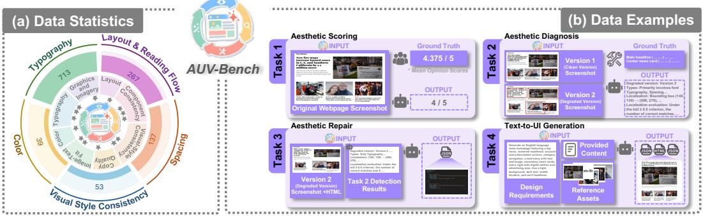  
Figure 1: Overview of AUV-BENCH. (a) Data Statistics and (b) representative Data Examples of four tasks spanning aesthetic understanding (Aesthetic Scoring and Aesthetic Diagnosis) and design action (Aesthetic Repair and Text-to-UI Generation).

## 2 RELATED WORK

UI Generation and Front-End Development. Early works such as Rico, pix2code, and GUI skeleton generation established large-scale UI modeling and visual-to-code generation (Deka et al., 2017; Beltramelli, 2018; Chen et al., 2018). More recent systems, including Design2Code, Sketch2Code, and UI2Code, advance webpage reconstruction, code generation, and iterative refinement (Si et al., 2025; Li et al., 2025; Yang et al., 2025; Wan et al., 2025). WebUIBench, FullFront, WebMMU, and DesignBench broaden evaluation to UI understanding and general front-end capabilities (Lin et al., 2025; Sun et al., 2025; Awal et al., 2025; Xiao et al., 2025; He et al., 2026), while FrontendBench, WebGen-Bench, and WebCoderBench emphasize executable and functional correctness (Zhu et al., 2025; Lu et al., 2026; Liu et al., 2026). More recently, UI-Bench evaluates the design quality of generated interfaces, and Design Theater studies whether design reasoning supports downstream implementation (Jung et al., 2025; Imteyaz et al., 2026). These works increasingly extend UI evaluation from reconstruction and functionality toward design quality and action.

Aesthetic and Design Evaluation. Computational aesthetics has traditionally focused on holistic preference prediction, as exemplified by AVA and NIMA (Murray et al., 2012; Talebi & Milanfar, 2018). With multimodal models, AesBench evaluates aesthetic understanding, while DesignProbe and GPT-based evaluation examine reasoning over design properties and principles (Huang et al., 2024b; Lin et al., 2024; Haraguchi et al., 2024; Lin et al., 2026). UICrit introduces structured and localized UI critiques, while DesignPref studies individual visual-design preferences (Duan et al., 2024; Peng et al., 2025; Ko et al., 2026). Recent benchmarks move toward finer-grained analysis: AesEval-Bench covers aesthetic scoring and defect localization, UXBench evaluates detailed UI and UX reasoning, and UXBench-Actionability measures whether critiques support downstream repair (An et al., 2026a; Mao et al., 2026; Wang et al., 2026; Jeon et al., 2026). However, these works typically evaluate aesthetic scoring, diagnosis, repair, or generation separately, or connect only a subset of them. AUV-BENCH instead places all four capabilities under shared professional aesthetic principles, enabling systematic analysis of how aesthetic judgment translates into design action.

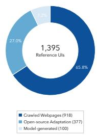  
(a) Source

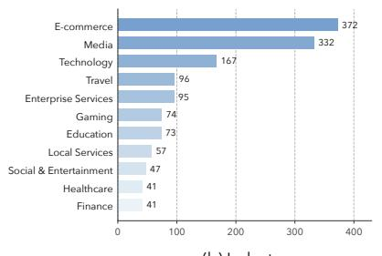  
(b) Industry

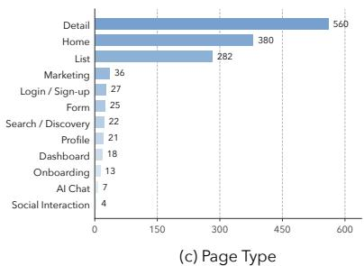  
Figure 2: Distribution of the 1,395 reference UIs. (a) Data sources. (b) Industry categories. (c) Page types.

## 3 AUV-BENCH

This section presents the design of AUV-BENCH, including its task formulation, benchmark construction, and evaluation protocol.

## 3.1 OVERVIEW

AUV-BENCH evaluates UI aesthetics through four complementary capabilities built on a shared pool of executable reference UIs and professional aesthetic guidelines. Specifically, we introduce four tasks: (1) Aesthetic Scoring takes a UI image as input and outputs eight dimension-level aesthetic scores on a 1–5 scale, measuring holistic aesthetic judgment; (2) Aesthetic Diagnosis takes a pair of clean and degraded UI images and outputs the detected aesthetic violation(s) together with their affected regions, evaluating principle-level diagnosis and localization; (3) Aesthetic Repair takes a degraded UI image, its HTML source code, and the model’s own diagnosis, and outputs a source-code patch that corrects the identified aesthetic issues; and (4) Text-to-UI Generation takes a natural-language webpage requirement together with textual content and image assets, and outputs an executable webpage without access to a reference screenshot. Aesthetic Diagnosis and Aesthetic Repair share the same controlled degradation instances, enabling direct instance-level analysis of judgment–action alignment.

## 3.2 DATASET STATISTICS

AUV-BENCH comprises 1,395 executable reference UIs covering 11 industry categories and 12 page types (Figure 2). The crawled subset spans 386 web domains, and textual content covers 29 languages. Aesthetic Scoring and Text-to-UI Generation use all pages, while Aesthetic Diagnosis and Aesthetic Repair share 660 controlled-degradation cases with 1,209 annotated aesthetic violations across 13 rule types. Counting each task independently yields 4,110 evaluation instances. Aesthetic Scoring retains ratings from 44 professional UI designers after quality control. Further details are provided in Appendix C.

## 3.3 TASK FORMULATION

Let h and x denote a UI’s executable HTML source and rendered screenshot. Superscripts ref and deg denote reference and degraded versions; controlled degradation injects aesthetic violations while preserving content. Aesthetic Scoring predicts eight-dimensional scores ˆs from $x ^ { \mathrm { r e f } }$ , using designer mean opinion scores (MOS) s as targets. Aesthetic Diagnosis and Aesthetic Repair share instances with violation annotations v specifying affected aesthetic dimensions and regions. Diagnosis identifies the degraded screenshot and predicts the corresponding annotations vˆ; repair uses $( h ^ { \mathrm { d e g } } , x ^ { \mathrm { d e g } } , \hat { v } )$ to correct the violations. For Text-to-UI Generation, q comprises the webpage requirement, textual content, and image assets; the model generates source $\hat { h } ,$ rendered as ${ \hat { x } } ,$ without access to $x ^ { \mathrm { r e f } }$

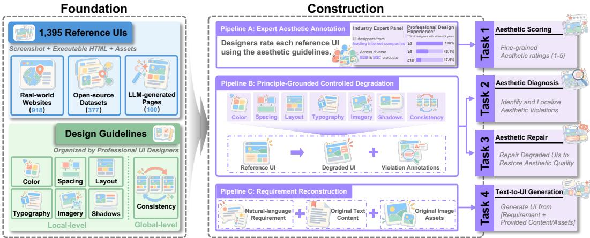  
Figure 3: Overview of AUV-BENCH construction. Starting from 1,395 executable UIs and professional aesthetic guidelines, we build four complementary tasks through expert annotation, controlled degradation, and requirement reconstruction. The controlled-degradation pipeline draws inspiration from all seven guideline dimensions and retains five operational categories for source-level editing and verification.

## 3.4 BENCHMARK CONSTRUCTION

Figure 3 summarizes our construction pipeline. We build four tasks from 1,395 executable reference UIs through expert annotation, controlled aesthetic degradation, and requirement reconstruction. Professional UI designers co-develop the guidelines and review reference pages, degradation rules, and reconstructed requirements.

Professional Aesthetic Guidelines. Together with three senior UI designers, each with at least five years of industry experience at leading Internet companies, we develop aesthetic guidelines grounded in HCI and visual-design principles across seven dimensions: color, spacing, layout, typography, imagery, shadows, and global visual consistency. These guidelines define a shared design-principle space, which we further adapt to the evaluation objectives of different tasks. For Aesthetic Scoring, we reorganize the principles into eight perceptually coherent dimensions that can be reliably judged from rendered UIs: color, typography, graphics and imagery, layout, component consistency, visual-style consistency, copy quality, and image–text fit. Each dimension is rated on a shared 1–5 scale; detailed definitions are provided in Table 7. For Aesthetic Diagnosis and Aesthetic Repair, we retain principles that can yield perceptible, localizable, and attributable violations while supporting source-level editing and post-rendering verification. We organize them into five operational dimensions: typography, layout and reading flow, spacing, visual-style consistency, and color, and further instantiate 13 controlled aesthetic violation rules, detailed in Table 9.

For Aesthetic Diagnosis and Aesthetic Repair, the evaluation must instead correspond to specific aesthetic problems that can be explicitly identified and corrected. We therefore reorganize principles that admit perceptible, localizable, and attributable violations, while also supporting source-level modification and post-rendering verification, into five operational dimensions: typography, layout and reading flow, spacing, visual-style consistency, and color. Within these dimensions, we further instantiate the relevant design principles as 13 executable aesthetic violation rules, which are used to construct controlled degradations and define corresponding diagnosis and repair targets. The complete rule set is provided in Table 9.

Aesthetic Scoring Annotation. Each reference UI is initially rated independently by three professional designers using the shared eight-dimensional, 1–5 rubric. Annotators follow common rating criteria and review visual exemplars to calibrate their interpretation of the scale. After annotatorlevel quality control, retained ratings are aggregated into dimension-level MOS, which serve as evaluation targets.

Principle-Grounded Controlled Degradation. We first screen reference UIs for rule applicability and existing violations, applying a degradation only when the required structure is present and the target region satisfies the corresponding principle. Each intervention alters a small subset of eligible elements; designers iteratively review the rules and perturbation parameters. Automatic validation retains samples only when the intended defects are perceptible and localized, the detected violation set matches the injected recipe, and no unintended layout changes or unrelated aesthetic violations occur. We construct single-violation and compositional cases at mild and severe levels. Each retained case includes reference and degraded UIs with violation annotations, shared by Diagnosis and Repair.

Requirement Reconstruction. For Text-to-UI Generation, GPT-5.4 reconstructs an English requirement from each reference UI, describing its purpose, information structure, major functions, and overall visual direction while omitting precise visual parameters. Professional UI designers review each requirement and its objectively verifiable checklist, preserving functional intent while leaving visual implementation choices to the evaluated model.

Details of the guidelines, annotation, reference UI collection, controlled degradation, and requirement reconstruction are provided in Appendices A, B, C.1, C.2, and C.3, respectively.

## 3.5 EVALUATION PROTOCOL

We evaluate multimodal foundation models across four complementary tasks, covering aesthetic scoring, diagnosis, repair, and open-ended UI generation.

Task 1: Aesthetic Scoring. For instance i, the model predicts $\hat { \mathbf { s } } _ { i }$ from $x _ { i } ^ { \mathrm { r e f } }$ on a $_ { 1 - 5 }$ scale. We compare $\hat { \mathbf { s } } _ { i }$ with $\mathbf { s } _ { i }$ using Spearman Rank Correlation (SRCC) and Mean Absolute Error (MAE), measuring ranking agreement and absolute error, respectively. Both metrics are computed across instances for each dimension and averaged equally across all eight dimensions.

Task 2: Aesthetic Diagnosis. We randomly order $x _ { i } ^ { \mathrm { r e f } }$ and $\boldsymbol x _ { i } ^ { \mathrm { d e g } }$ as candidates $V _ { 1 }$ and $V _ { 2 } .$ . The model identifies the degraded candidate and predicts $\hat { v } _ { i }$ , evaluated against $v _ { i }$ . For degradation detection, we report Balanced Accuracy $( B A c c )$ , defined as $\mathrm { B A c c } = ( \mathrm { R e c a l l } _ { V _ { 1 } } + \mathrm { R e c a l l } _ { V _ { 2 } } ) / 2$ , where the two recalls correspond to instances with the first or second candidate degraded, respectively. For violation attribution, the labels are the five aesthetic dimensions: typography, layout and reading flow, spacing, visual style consistency, and color. We use detection-gated $M a c r o { - } J$ , where $J _ { d } =$ $\mathrm { T P R } _ { d } \mathrm { ~ - ~ } \mathrm { F P R } _ { d }$ and $\begin{array} { r } { \mathrm { M a c r o }  – J = \frac { 1 } { 5 } \sum _ { d = 1 } ^ { 5 } J _ { d } } \end{array}$ Here, d indexes the five attribution dimensions, and $\mathrm { T P R } _ { d }$ and $\mathrm { F P R } _ { d }$ denote their true-positive and false-positive rates, respectively. An incorrect degradation detection results in an empty attribution prediction. Localization is evaluated using version-aware Micro-F1@0.5, where regions in $\hat { v } _ { i }$ and $v _ { i }$ are matched only on the correct version and with intersection over union (IoU) of at least 0.5.

We further report the Exact Chain Success Rate (ECS), which requires all three stages to be correct:

$$
\mathrm { E C S } = \frac { 1 } { N } \sum _ { i = 1 } ^ { N } { \bf 1 } \left[ { \cal D } _ { i } \wedge A _ { i } \wedge L _ { i } \right] ,\tag{1}
$$

where $D _ { i } , A _ { i }$ , and $L _ { i }$ are Boolean indicators for correct degradation detection, exact matching of the predicted and ground-truth dimension sets, and localization of all ground-truth regions without false positives, respectively. Here, N is the full number of evaluation instances in the current task, 1[·] equals one if its condition holds and zero otherwise, and ∧ denotes logical conjunction.

Task 3: Aesthetic Repair. The model receives $( h _ { i } ^ { \mathrm { d e g } } , x _ { i } ^ { \mathrm { d e g } } , \hat { v } _ { i } )$ , using its own Task 2 diagnosis, and outputs a constrained source-code patch. The patched page is re-rendered for deterministic rule, DOM, and visual checks. We report the Repair Pass Rate. For instance i, the Boolean indicator $R _ { i }$ denotes repair success:

$$
R _ { i } = F _ { i } \wedge C _ { i } \wedge P _ { i } \wedge S _ { i } ,\tag{2}
$$

where $F _ { i }$ indicates that all target violations are repaired, $C _ { i }$ that no excessive collateral damage is introduced, $P _ { i }$ that the original content is preserved, and $S _ { i }$ that visual changes remain within the permitted repair scope. The final score is RepairPass $= N ^ { - 1 } \textstyle \sum _ { i = 1 } ^ { N } \mathbf { 1 } [ R _ { i } ]$ . An incorrect $\hat { v } _ { i }$ can still yield a successful repair if all four conditions hold.

Task 4: Text-to-UI Generation. Given $q _ { i } ,$ , the model generates $\hat { h } _ { i }$ without access to $x _ { i } ^ { \mathrm { r e f } }$ . We evaluate the rendered $\hat { x } _ { i }$ along two complementary axes.

First, GPT-5.4 scores $\hat { x } _ { i }$ using the Task 1 rubric, yielding raw scores $\boldsymbol { a } _ { i , d }$ on a 1–5 scale, where d indexes its eight dimensions. To correct bias relative to designer ratings (Niculescu-Mizil & Caruana, 2005; Deng et al., 2025b), we apply dimension-specific monotonic calibration functions $f _ { d } ( \cdot )$ learned exclusively from Task 1 MOS and frozen before Task 4 evaluation. For a valid generation, the calibrated score is AesJud $\begin{array} { r } { \mathrm { g e } _ { i } = \frac { 1 } { 8 } \sum _ { d = 1 } ^ { 8 } f _ { d } ( a _ { i , d } ) \in [ 1 , 5 ] } \end{array}$ . Invalid or failed generations receive zero. For model $m ,$ , we report AesJudge $\begin{array} { r } { \mathbf { \Sigma } _ { m } \overset { } { \underset { = } { - } } \frac { 1 } { N } \sum _ { i = 1 } ^ { N } } \end{array}$ AesJudge over the fixed benchmark denominator $N _ { \ast }$ , yielding a model-level score in $[ 0 , 5 ] .$ . Judge validation and calibration details are provided in Appendix E.

Table 2: Main results across the four evaluation tasks and cross-task analysis. ↑ (↓) indicates that higher (lower) is better. – indicates that JAA is undefined because no instance satisfies $J _ { i } = 1$
<table><tr><td rowspan="2">Model</td><td colspan="2">Aesthetic Scoring</td><td colspan="4">Aesthetic Diagnosis</td><td>Aesthetic Repair</td><td colspan="2">Text-to-UI Generation</td><td rowspan="2">Judgment-Action Association (φ)↑</td></tr><tr><td>SRCC↑</td><td>MAE↓</td><td>Det. BAcc↑</td><td></td><td>Attr. Macro-J↑ Loc. F1@0.5↑</td><td>ECS↑</td><td>Repair Pass↑</td><td>Cal. Aes. Judge↑ Pairwise WR↑</td><td></td></tr><tr><td colspan="10">Frontier Models</td></tr><tr><td> Claude Opus 5</td><td>0.56</td><td>0.81</td><td>91.10</td><td>58.90</td><td>36.70</td><td>24.70</td><td>75.60</td><td>3.13</td><td>71.50</td><td>0.32</td></tr><tr><td> Doubao-Seed-2.1-Pro</td><td>0.50</td><td>1.10</td><td>79.60</td><td>36.20</td><td>7.60</td><td>4.10</td><td>45.00</td><td>2.78</td><td>62.90</td><td>0.31</td></tr><tr><td>S GPT-5.6 Sol</td><td>0.55</td><td>0.90</td><td>87.60</td><td>55.40</td><td>28.20</td><td>19.40</td><td>65.50</td><td>3.17</td><td>78.00</td><td>0.38</td></tr><tr><td>ø Grok 4.6 き Kimi-K3</td><td>0.54</td><td>0.95</td><td>81.20</td><td>42.70</td><td>6.50</td><td>2.90</td><td>70.00</td><td>3.08</td><td>62.50</td><td>0.25</td></tr><tr><td></td><td>0.57</td><td>1.10</td><td>83.80</td><td>43.30</td><td>26.70</td><td>15.20</td><td>57.30</td><td>3.18</td><td>79.50</td><td>0.44</td></tr><tr><td>安 Qwen3.7-Plus 女 Qwen3.8-Max</td><td>0.57</td><td>1.25 1.15</td><td>60.80 79.50</td><td>22.00</td><td>1.60 20.50</td><td>0.90</td><td>34.20</td><td>3.09</td><td>57.80</td><td>0.07</td></tr><tr><td></td><td>0.54</td><td></td><td></td><td>40.10</td><td></td><td>9.40</td><td>54.70</td><td>3.04</td><td>78.20</td><td>0.30</td></tr><tr><td colspan="10">Open-Weight Models</td></tr><tr><td>や InternVL3.5-8B-Instruct</td><td>0.23</td><td>1.46</td><td>43.20</td><td>1.30</td><td>0.00</td><td>0.00</td><td>0.91</td><td>1.75</td><td>21.40</td><td>-0.01</td></tr><tr><td>送 LLaVA-OneVision2-8B-Instruct</td><td>0.45</td><td>0.94</td><td>40.90</td><td>-2.90</td><td>0.00</td><td>0.00</td><td>0.30</td><td>1.11</td><td>12.50</td><td>0.00</td></tr><tr><td>安 Qwen3-VL-8B-Instruct 3 MiniCPM-V-4.6</td><td>0.45 0.05</td><td>1.56 1.65</td><td>58.70 48.40</td><td>8.70 3.10</td><td>1.20 0.00</td><td>0.80 0.00</td><td>0.61 0.15</td><td>1.84 0.53</td><td>28.10</td><td>-0.01</td></tr><tr><td></td><td></td><td></td><td></td><td></td><td></td><td></td><td></td><td></td><td>5.30</td><td></td></tr><tr><td colspan="10">Expert Models for Image Aesthetics Assessment</td></tr><tr><td>AesExpert-7B</td><td>0.13</td><td>1.12</td><td>16.70</td><td>-0.40</td><td>0.00</td><td>0.00</td><td>0.00</td><td>0.16</td><td>1.40</td><td></td></tr></table>

Second, an independent multimodal judge performs blind pairwise comparisons of the rendered screenshots produced by two models for the same $q _ { i } .$ . When both webpages render successfully, the judge determines a win, loss, or tie based on their overall aesthetic quality. If only one webpage renders successfully, it wins automatically; if both fail, neither receives credit. For model $m ,$ its Overall Pairwise Win Rate is

$$
\mathrm { P a i r w i s e W R } _ { m } = \frac { 1 } { P - 1 } \sum _ { j \neq m } \frac { W _ { m , j } + 0 . 5 T _ { m , j } } { N } ,\tag{3}
$$

where $P$ is the number of participating models, j indexes the other models, and $W _ { m , j }$ and $T _ { m , j }$ count model m’s wins and ties against model j, respectively. All queries remain in the fixed denominator N, including cases where both webpages fail to render. PairwiseWR lies in [0, 1] and is reported as a percentage, with higher values indicating stronger relative preference across the benchmark. Losses and rendering failures receive zero credit.

Judgment–Action Association. To quantify judgment–action association, we pair diagnosis and repair outcomes for each instance i. Correct judgment is indicated by $J _ { i } = \bar { D } _ { i } \wedge A _ { i } ,$ requiring correct degradation detection and exact dimension attribution. Repair success is given by $R _ { i }$ in Eq. 2.

Over the N = 660 paired instances, the marginal judgment and repair success rates are $\begin{array} { r l } { p _ { J } } & { { } = } \end{array}$ $N ^ { - 1 } \textstyle \sum _ { i } { \bf 1 } [ J _ { i } ]$ and $\begin{array} { r c l } { \dot { p _ { R } } } & { = } & { N ^ { - 1 } \sum _ { i } { \bf 1 } [ R _ { i } ] } \end{array}$ , respectively, and the joint success rate is $\begin{array} { r l } { p _ { J R } } & { { } = } \end{array}$ $\begin{array} { r l r } {  { N ^ { - 1 } \sum _ { i } ^ { \bullet } \mathbf { 1 } \big [ J _ { i } \wedge R _ { i } \big ] } } \end{array}$ . We measure their association using the binary ϕ coefficient, termed Judgment– Action Association (JAA):

$$
\mathrm { J A A } = \phi _ { J , R } = \frac { p _ { J R } - p _ { J } p _ { R } } { \sqrt { p _ { J } ( 1 - p _ { J } ) } p _ { R } ( 1 - p _ { R } ) } .\tag{4}
$$

JAA measures whether correct diagnosis and successful repair tend to occur on the same instances. Positive values indicate more frequent co-occurrence than expected under independence, values near zero indicate little instance-level association, and negative values indicate less frequent cooccurrence. All instances remain in the fixed benchmark denominator, including invalid or failed repair outputs; JAA is undefined when either J or R has zero variance. Together with the taskspecific performance metrics, JAA provides an instance-level characterization of Judgment–Action Coherence.

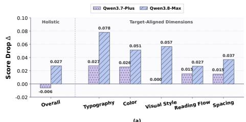  
(a)

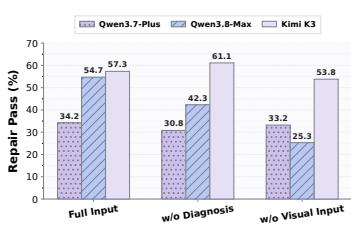  
(b)

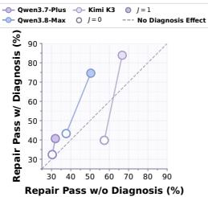  
(c)  
Figure 4: In-depth analyses of aesthetic sensitivity and judgment–action coherence. (a) Aesthetic score changes under controlled degradations. (b) Repair performance under input ablations. (c) Repair with versus without Task 2 diagnosis; points above (below) the diagonal indicate positive (negative) diagnosis effects.

## 4 EXPERIMENTS

## 4.1 EXPERIMENTAL SETUP

We evaluate a diverse set of multimodal models spanning frontier models, open-weight generalpurpose models, and a specialized model for image aesthetics assessment. The frontier models include Claude Opus 5, Doubao-Seed-2.1-Pro, GPT-5.6 Sol, Grok 4.6, Kimi-K3, Qwen3.7-Plus, and Qwen3.8-Max. For open-weight models, we evaluate InternVL3.5-8B-Instruct (Wang et al., 2025), LLaVA-OneVision2-8B-Instruct (An et al., 2026b), Qwen3-VL-8B-Instruct (Bai et al., 2025), and MiniCPM-V-4.6 (Cui et al., 2026). We additionally include AesExpert-7B (Huang et al., 2024a), a specialized model for image aesthetics assessment. All models are evaluated under the same taskspecific protocol. More details are provided in Appendix D.

## 4.2 MAIN RESULTS

❶ Current models capture overall aesthetic quality to some extent, but fine-grained principlelevel diagnosis remains a major bottleneck. In Aesthetic Scoring, frontier models show moderate agreement with professional designers, suggesting that they can partially capture the overall aesthetic quality of a UI. However, performance drops substantially when evaluation moves from holistic assessment to identifying specific aesthetic problems. Models can often distinguish the degraded interface, yet still struggle to determine which aesthetic principle is violated and where the problem occurs, with the best exact diagnosis-chain success reaching only 24.7%. These results indicate that progressing from coarse aesthetic perception to precise, principle-grounded visual diagnosis remains a key limitation of current models.

❷ Aesthetic judgment and repair are positively associated, yet a clear judgment–action gap remains. Most frontier models exhibit positive Judgment–Action Association, with JAA values ranging from 0.07 to 0.44, indicating that correct principle-level diagnosis tends to coincide with successful repair on the same instances. However, this alignment remains incomplete: successful repairs can occur without correct explicit judgment, while correct judgments do not always lead to successful repairs. These results reveal a persistent judgment–action gap, suggesting that current models have yet to develop a reliably coherent aesthetic capability that consistently connects principle-level understanding with corrective design action.

❸ Open-ended UI generation remains challenging, and relative superiority does not imply high absolute design quality. In Text-to-UI Generation, models must determine layout, visual hierarchy, typography, spacing, color, and component organization directly from natural-language requirements, textual content, and visual assets, without access to a reference screenshot or an existing implementation scaffold. Although frontier models show clear differences in relative performance, their human-calibrated absolute aesthetic scores remain only 2.78–3.18 out of 5, while some models achieve Pairwise Win Rates close to 80%. This discrepancy shows that consistently outperforming competing models does not necessarily correspond to strong absolute design quality. Overall, current models remain limited in their ability to autonomously coordinate multiple aesthetic principles and consistently synthesize high-quality interfaces in open-ended settings.

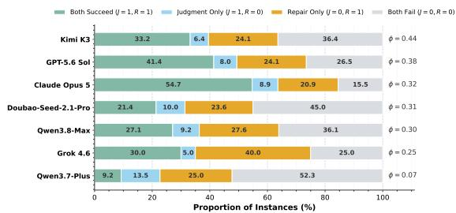  
Figure 5: Decomposition of judgment–action outcomes over the 660 paired Diagnosis–Repair instances. Each bar separates $( J { = } 1 , R { = } 1 )$ , (J=1, R=0), (J=0, R=1), and (J=0, R=0) outcomes; JAA (ϕ) summarizes their instance-level association.

Table 3: Text-to-UI Generation with the Claude Code harness. ∆Rank compares Pairwise WR rankings with the same seven models in the main evaluation.
<table><tr><td>Model</td><td></td><td>Cal. Aes. Judge↑</td><td>Pairwise WR↑</td><td>∆Rank vs. Main</td></tr><tr><td>W</td><td>Kimi-K3</td><td>3.13</td><td>65.86</td><td></td></tr><tr><td>S</td><td>GPT-5.6 Sol</td><td>3.09</td><td>55.91</td><td>↑1</td></tr><tr><td>女 女</td><td>Qwen3.7-Plus</td><td>3.10</td><td>55.38</td><td>↑4</td></tr><tr><td>米</td><td>Qwen3.8-Max</td><td>3.12</td><td>51.34</td><td>↓2</td></tr><tr><td></td><td>Claude Opus 5</td><td>3.09</td><td>48.66</td><td>↓1</td></tr><tr><td>l Ω</td><td>Doubao-Seed-2.1-Pro</td><td>3.06</td><td>40.86</td><td>↓1</td></tr><tr><td></td><td>Grok 4.6</td><td>3.03</td><td>31.99</td><td>↓1</td></tr></table>

## 4.3 IN-DEPTH ANALYSIS

❶ Current models’ aesthetic scores often fail to distinguish controlled changes in specific aesthetic attributes. We use the controlled degradation samples from Aesthetic Diagnosis to evaluate Qwen3.7-Plus and Qwen3.8-Max on aesthetic scoring. As shown in Figure 4 (a), for 83.5% and 86.4% of samples, respectively, the overall score remains unchanged after degradation, with average changes of only −0.006 and 0.027. Even on dimensions directly corresponding to the injected defects, most scores remain unchanged. Qwen3.8-Max shows relatively higher local sensitivity: typography degradation reduces the corresponding score by 0.078 on average, compared with 0.027 for Qwen3.7-Plus, yet both changes remain small relative to the 1–5 scale. These results indicate that current models can respond to some local aesthetic changes, but their principle-level sensitivity remains weak and rarely propagates to overall aesthetic judgment.

❷ Current models rely on HTML-based shortcuts for UI repair instead of fully grounding their decisions in visual input. We isolate the contribution of visual input by removing screenshots while keeping the diagnosis, HTML, evaluation, and GT unchanged. As shown in Figure 4 (b), repair Pass drops only from 34.2% to 33.2% for Qwen3.7-Plus and from 57.3% to 53.8% for Kimi-K3, suggesting that many repairs can be completed mainly from the structural, stylistic, and attribute information in the diagnosis and HTML. In contrast, Qwen3.8-Max drops sharply from 54.7% to 25.3%, indicating stronger reliance on explicit visual grounding. This model-level variation shows that Task 3 is not driven purely by visual understanding: some models can exploit executable HTML structure to bypass sufficient modeling of the page’s visual state, forming an HTML-based shortcut.

❸ Where does the Judgment–Action Gap come from? To unpack the scalar JAA score, we decompose each paired Diagnosis–Repair instance into four outcomes according to judgment correctness J and repair success R. Figure 5 reveals substantial off-diagonal mass across models: correct judgments may fail to yield successful repairs, while many successful repairs occur without correct explicit judgment. This asymmetry is particularly pronounced for some models, showing that strong repair performance can arise without correspondingly reliable aesthetic understanding. The results make the Judgment–Action Gap explicit: judgment and action are associated, but do not form a stable instance-level correspondence.

❹ Correct aesthetic diagnosis substantially improves downstream repair. We group samples by judgment correctness, where J = 1 denotes correct degraded-UI identification and exact matching of the affected aesthetic dimensions, and compare Aesthetic Repair with and without the model’s own diagnosis. As shown in Figure 4 (c), when J = 1, the diagnosis improves repair by +8.7, +24.2, and +17.2 percentage points for Qwen3.7-Plus, Qwen3.8-Max, and Kimi-K3, respectively. When J = 0, the benefit is much weaker and model-dependent; for Kimi-K3, repair performance drops by 17.5 points. These results indicate that accurate aesthetic judgments can provide useful design guidance, whereas unreliable judgments offer substantially less consistent downstream value.

❺ Does the harness help? A coding harness does not consistently improve UI generation quality. We further evaluate whether equipping frontier models with a Claude Code harness, which enables iterative code generation and editing, improves Text-to-UI Generation. As shown in Table 3, the harness does not consistently improve calibrated aesthetic scores, which remain tightly clustered around 3.0. The harness also changes the relative ordering of models: Qwen3.7-Plus rises from seventh to third among the seven evaluated models, whereas Qwen3.8-Max drops from second to fourth. This reshuffling suggests that models differ substantially in how effectively they exploit agentic coding scaffolds. More importantly, additional opportunities for code manipulation alone do not consistently translate into higher aesthetic quality, indicating that open-ended UI generation remains constrained by the model’s underlying aesthetic decision-making capability rather than merely by its coding interface.

## 5 CONCLUSION

We introduce AUV-BENCH, a benchmark for jointly evaluating UI aesthetic judgment and design action across scoring, diagnosis, repair, and generation. Experiments show that current models exhibit partial aesthetic competence but still struggle with fine-grained diagnosis, open-ended generation, and consistent judgment–action alignment. We hope AUV-BENCH supports future progress toward more coherent and reliable aesthetic capabilities for UI design.

## AI USE STATEMENT

In this work, we used generative AI tools for four purposes. First, large language models (LLMs) were used to assist with language polishing and improving the clarity of the manuscript. Second, LLMs were used to assist with code development and debugging; all AI-assisted code was reviewed, verified, and tested by multiple authors before use in our experiments. Third, generative AI models were used during benchmark construction, including generating a subset of the webpages and reconstructing natural-language requirements for Text-to-UI Generation, as described in the paper. Fourth, GPT-5.4 was used as an automatic aesthetic judge for Text-to-UI Generation; its scoring behavior was validated and calibrated against professional-designer annotations from Aesthetic Scoring before being applied to the generation results. All AI-assisted outputs used in the final work were reviewed by the authors, and human-reviewed or validated where specified in the corresponding benchmark construction and evaluation procedures. We take responsibility for the final content of this work, including text, code, data, experimental results, and artifacts produced with the aid of generative AI.

## REPRODUCIBILITY STATEMENT

We will release the source code and dataset upon acceptance of the paper to facilitate reproducibility and future research.

## REFERENCES

Arctanx An, Shizhao Sun, Danqing Huang, Mingxi Cheng, Yan Gao, Ji Li, Yu Qiao, and Jiang Bian. Can vision language models assess graphic design aesthetics? a benchmark, evaluation, and dataset perspective. arXiv preprint arXiv:2603.01083, 2026a.

Xiang An, Yin Xie, Feilong Tang, Yunyao Yan, Huajie Tan, Didi Zhu, Changrui Chen, Xiuwei Zhao, Bin Qin, Kaicheng Yang, et al. Llava-onevision-2: Towards next-generation perceptual intelligence. arXiv preprint arXiv:2605.25979, 2026b.

Rabiul Awal, Mahsa Massoud, Aarash Feizi, Zichao Li, Suyuchen Wang, Christopher Pal, Aishwarya Agrawal, David Vazquez, Siva Reddy, Juan A Rodriguez, et al. Webmmu: A benchmark for multimodal multilingual website understanding and code generation. In Proceedings of the 2025 Conference on Empirical Methods in Natural Language Processing, pp. 25129–25156, 2025.

Shuai Bai, Yuxuan Cai, Ruizhe Chen, Keqin Chen, Xionghui Chen, Zesen Cheng, Lianghao Deng, Wei Ding, Chang Gao, Chunjiang Ge, et al. Qwen3-vl technical report. arXiv preprint arXiv:2511.21631, 2025.

Tony Beltramelli. pix2code: Generating code from a graphical user interface screenshot. In Proceedings of the ACM SIGCHI symposium on engineering interactive computing systems, pp. 1–6, 2018.

Nathalie Bonnardel, Annie Piolat, and Ludovic Le Bigot. The impact of colour on website appeal and users’ cognitive processes. Displays, 32(2):69–80, 2011.

Chunyang Chen, Ting Su, Guozhu Meng, Zhenchang Xing, and Yang Liu. From ui design image to gui skeleton: a neural machine translator to bootstrap mobile gui implementation. In Proceedings of the 40th International Conference on Software Engineering, pp. 665–676, 2018.

Dongping Chen, Ruoxi Chen, Shilin Zhang, Yinuo Liu, Yaochen Wang, Huichi Zhou, Qihui Zhang, Yao Wan, Pan Zhou, and Lichao Sun. Mllm-as-a-judge: Assessing multimodal llm-as-a-judge with vision-language benchmark. arXiv preprint arXiv:2402.04788, 2024.

Junkai Chen, Zhijie Deng, Kening Zheng, Yibo Yan, Shuliang Liu, PeiJun Wu, Peijie Jiang, Jia Liu, and Xuming Hu. Safeeraser: Enhancing safety in multimodal large language models through multimodal machine unlearning. In Findings of the Association for Computational Linguistics: ACL 2025, pp. 14194–14224, 2025.

Nelson Cowan. The magical mystery four: How is working memory capacity limited, and why? Current directions in psychological science, 19(1):51–57, 2010.

James H Creager and Douglas J Gillan. Toward understanding the findability and discoverability of shading gradients in almost-flat design. In Proceedings of the Human Factors and Ergonomics Society Annual Meeting, volume 60, pp. 339–343. SAGE Publications Sage CA: Los Angeles, CA, 2016.

Nigel Cross. Expertise in design: an overview. Design studies, 25(5):427–441, 2004.

Junbo Cui, Bokai Xu, Chongyi Wang, Tianyu Yu, Weiyue Sun, Yingjing Xu, Tianran Wang, Zhihui He, Wenshuo Ma, Tianchi Cai, et al. Minicpm-o 4.5: Towards real-time full-duplex omni-modal interaction. arXiv preprint arXiv:2604.27393, 2026.

Biplab Deka, Zifeng Huang, Chad Franzen, Joshua Hibschman, Daniel Afergan, Yang Li, Jeffrey Nichols, and Ranjitha Kumar. Rico: A mobile app dataset for building data-driven design applications. In Proceedings of the 30th annual ACM symposium on user interface software and technology, pp. 845–854, 2017.

Zhijie Deng, Chris Yuhao Liu, Zirui Pang, Xinlei He, Lei Feng, Qi Xuan, Zhaowei Zhu, and Jiaheng Wei. Guard: Generation-time llm unlearning via adaptive restriction and detection. arXiv preprint arXiv:2505.13312, 2025a.

Zhijie Deng, Zhouan Shen, Ling Li, Yao Zhou, Zhaowei Zhu, Yanji He, Wei Wang, and Jiaheng Wei. Lm-mixup: Text data augmentation via language model based mixup. arXiv preprint arXiv:2510.20449, 2025b.

Zhijie Deng, Ling Li, Jinlong Pang, Kaiqin Hu, Qi Xuan, Zhaowei Zhu, and Jiaheng Wei. Codeblock: Learning to supervise code at the right granularity. arXiv preprint arXiv:2606.18286, 2026.

Tianxiang Du, Hulingxiao He, and Yuxin Peng. Venus: Benchmarking and empowering multimodal large language models for aesthetic guidance and cropping. arXiv preprint arXiv:2602.23980, 2026.

Peitong Duan, Chin-Yi Cheng, Gang Li, Bjoern Hartmann, and Yang Li. Uicrit: Enhancing automated design evaluation with a ui critique dataset. In Proceedings of the 37th Annual ACM Symposium on User Interface Software and Technology, pp. 1–17, 2024.

Mary C Dyson. How physical text layout affects reading from screen. Behaviour & information technology, 23(6):377–393, 2004.

Andrew J Elliot and Markus A Maier. Color psychology: Effects of perceiving color on psychological functioning in humans. Annual review ofpsychology, 65:95–120, 2014.

J Shawn Farris, Keith S Jones, and Brent A Anders. Acquisition speed with targets on the edge of the screen: An application of fitts’ law to commonly used web browser controls. In Proceedings of the Human Factors and Ergonomics Society Annual Meeting, volume 45, pp. 1205–1209. SAGE Publications Sage CA: Los Angeles, CA, 2001.

Paul M Fitts. The information capacity of the human motor system in controlling the amplitude of movement. Journal of experimental psychology, 47(6):381, 1954.

Yi Gui, Zhen Li, Yao Wan, Yemin Shi, Hongyu Zhang, Bohua Chen, Yi Su, Dongping Chen, Siyuan Wu, Xing Zhou, et al. Webcode2m: A real-world dataset for code generation from webpage designs. In Proceedings ofthe ACM on Web Conference 2025, pp. 1834–1845, 2025.

Daichi Haraguchi, Naoto Inoue, Wataru Shimoda, Hayato Mitani, Seiichi Uchida, and Kota Yamaguchi. Can gpts evaluate graphic design based on design principles? In SIGGRAPH Asia 2024 Technical Communications, pp. 1–4. 2024.

Zehai He, Wenyi Hong, Zhen Yang, Ziyang Pan, Mingdao Liu, Xiaotao Gu, and Jie Tang. Vision2web: A hierarchical benchmark for visual website development with agent verification. arXiv preprint arXiv:2603.26648, 2026.

Yipo Huang, Xiangfei Sheng, Zhichao Yang, Quan Yuan, Zhichao Duan, Pengfei Chen, Leida Li, Weisi Lin, and Guangming Shi. Aesexpert: Towards multi-modality foundation model for image aesthetics perception. In Proceedings of the 32nd ACM International Conference on Multimedia, pp. 5911–5920, 2024a.

Yipo Huang, Quan Yuan, Xiangfei Sheng, Zhichao Yang, Haoning Wu, Pengfei Chen, Yuzhe Yang, Leida Li, and Weisi Lin. Aesbench: An expert benchmark for multimodal large language models on image aesthetics perception. arXiv preprint arXiv:2401.08276, 2024b.

Kashif Imteyaz, Kaif Imteyaz, Nakul Rajpal, Kaif Shaikh, Michael Muller, and Saiph Savage. Design theater: A benchmark for generative ui. arXiv preprint arXiv:2607.22928, 2026.

Jaehyun Jeon, Min Soo Kim, Janghan Yoon, Sumin Shim, Yejin Choi, Hanbin Kim, Dae Hyun Kim, and Youngjae Yu. Do mllms capture how interfaces guide user behavior? a benchmark for multimodal ui/ux design understanding. In Proceedings of the 64th Annual Meeting of the Associationfor Computational Linguistics (Volume 1: Long Papers), pp. 44269–44294, 2026.

Sam Jung, Agustin Garcinuno, and Spencer Mateega. Ui-bench: A benchmark for evaluating design capabilities of ai text-to-app tools. arXiv preprint arXiv:2508.20410, 2025.

Wendy A Kellogg. Conceptual consistency in the user interface: Effects on user performance. In Human–Computer Interaction–INTERACT’87, pp. 389–394. Elsevier, 1987.

Jisu Ko, Jinyoung Choi, Cielo Morales, Dajung Kim, and Minsam Ko. Criticmate: Stagewise human–ai co-critique in single-screen ui evaluation. In Proceedings of the 2026 CHI Conference on Human Factors in Computing Systems, pp. 1–22, 2026.

Bryan Lawson. Schemata, gambits and precedent: some factors in design expertise. Design studies, 25(5):443–457, 2004.

Ryan Li, Yanzhe Zhang, and Diyi Yang. Sketch2code: Evaluating vision-language models for interactive web design prototyping. In Proceedings of the 2025 Conference of the Nations of the Americas Chapter ofthe Associationfor Computational Linguistics: Human Language Technolo gies (Volume 1: Long Papers), pp. 3921–3955, 2025.

Jieru Lin, Danqing Huang, Tiejun Zhao, Dechen Zhan, and Chin-Yew Lin. Designprobe: A graphic design benchmark for multimodal large language models. arXiv preprint arXiv:2404.14801, 2024.

Jieru Lin, Danqing Huang, Tiejun Zhao, Dechen Zhan, and Chin-Yew Lin. Can multimodal large language models understand graphic design? a comparative study. IEEE Transactions on Multimedia, 2026.

Zhiyu Lin, Zhengda Zhou, Zhiyuan Zhao, Tianrui Wan, Yilun Ma, Junyu Gao, and Xuelong Li. Webuibench: a comprehensive benchmark for evaluating multimodal large language models in webui-to-code. In Findings of the Association for Computational Linguistics: ACL 2025, pp. 15780–15797, 2025.

Jonathan Ling and Paul van Schaik. The influence of line spacing and text alignment on visual search of web pages. Displays, 28(2):60–67, 2007.

Chenxu Liu, Yingjie Fu, Wei Yang, Ying Zhang, and Tao Xie. Webcoderbench: Benchmarking web application generation with comprehensive and interpretable evaluation metrics. In Proceedings of the 64th Annual Meeting of the Association for Computational Linguistics (Volume 1: Long Papers), pp. 11632–11666, 2026.

Zimu Lu, Yunqiao Yang, Houxing Ren, Haotian Hou, Han Xiao, Ke Wang, Weikang Shi, Aojun Zhou, Mingjie Zhan, and Hongsheng Li. Webgen-bench: Evaluating llms on generating interactive and functional websites from scratch. Advances in Neural Information Processing Systems, 38, 2026.

Ruichao Mao, Zhou Fang, Teng Guo, Hao Yang, Yaping Li, Shaohua Peng, Maji Huang, Xiaoyu Lin, Shuoyang Liu, Xuepeng Li, et al. Reasoning for mobile user experience with multimodal llms: Task, benchmark, and approach. arXiv preprint arXiv:2606.13192, 2026.

George A Miller. The magical number seven, plus or minus two: Some limits on our capacity for processing information. Psychological review, 63(2):81, 1956.

Naila Murray, Luca Marchesotti, and Florent Perronnin. Ava: A large-scale database for aesthetic visual analysis. In 2012 IEEE conference on computer vision and pattern recognition, pp. 2408– 2415. IEEE, 2012.

Alexandru Niculescu-Mizil and Rich Caruana. Predicting good probabilities with supervised learning. In Proceedings of the 22nd international conference on Machine learning, pp. 625–632, 2005.

Zirui Pang, Haosheng Tan, Yuhan Pu, Zhijie Deng, Zhouan Shen, Keyu Hu, and Jiaheng Wei. When vlms meet image classification: Test sets renovation via missing label identification. arXiv preprint arXiv:2505.16149, 2025.

Yi-Hao Peng, Jeffrey P Bigham, and Jason Wu. Designpref: Capturing personal preferences in visual design generation. arXiv preprint arXiv:2511.20513, 2025.

Daiqing Qi, Handong Zhao, Jing Shi, Simon Jenni, Yifei Fan, Franck Dernoncourt, Scott Cohen, and Sheng Li. The photographer’s eye: Teaching multimodal large language models to see and critique like photographers. In 2025 IEEE/CVF Conference on Computer Vision and Pattern Recognition (CVPR), pp. 24807–24816. IEEE, 2025.

Mirjam Seckler, Klaus Opwis, and Alexandre N Tuch. Linking objective design factors with subjective aesthetics: An experimental study on how structure and color of websites affect the facets of users’ visual aesthetic perception. Computers in Human Behavior, 49:375–389, 2015.

Hamid R Sheikh and Alan C Bovik. Image information and visual quality. IEEE Transactions on image processing, 15(2):430–444, 2006.

Hamid R Sheikh, Alan C Bovik, and Gustavo De Veciana. An information fidelity criterion for image quality assessment using natural scene statistics. IEEE Transactions on image processing, 14(12):2117–2128, 2005.

Chenglei Si, Yanzhe Zhang, Ryan Li, Zhengyuan Yang, Ruibo Liu, and Diyi Yang. Design2code: Benchmarking multimodal code generation for automated front-end engineering. In Proceedings of the 2025 Conference of the Nations of the Americas Chapter of the Association for Compu tational Linguistics: Human Language Technologies (Volume 1: Long Papers), pp. 3956–3974, 2025.

Haoyu Sun, Huichen Will Wang, Jiawei Gu, Linjie Li, and Yu Cheng. Fullfront: Benchmarking mllms across the full front-end engineering workflow. arXiv preprint arXiv:2505.17399, 2025.

Hossein Talebi and Peyman Milanfar. Nima: Neural image assessment. IEEE transactions on image processing, 27(8):3998–4011, 2018.

Yuxuan Wan, Chaozheng Wang, Yi Dong, Wenxuan Wang, Shuqing Li, Yintong Huo, and Michael Lyu. Divide-and-conquer: Generating ui code from screenshots. Proceedings of the ACM on Software Engineering, 2(FSE):2099–2122, 2025.

Weiyun Wang, Zhangwei Gao, Lixin Gu, Hengjun Pu, Long Cui, Xingguang Wei, Zhaoyang Liu, Linglin Jing, Shenglong Ye, Jie Shao, et al. Internvl3. 5: Advancing open-source multimodal models in versatility, reasoning, and efficiency. arXiv preprint arXiv:2508.18265, 2025.

Wenjie Wang, Yue Huang, Zipeng Ling, Han Bao, Xiaonan Luo, Yu Jiang, Shiyi Du, Yuexing Hao, Xiaomin Li, Yuchen Ma, et al. Uxbench: Measuring the actionability of llm-generated ux critiques. arXiv preprint arXiv:2606.16262, 2026.

Zhou Wang, Alan C Bovik, Hamid R Sheikh, and Eero P Simoncelli. Image quality assessment: from error visibility to structural similarity. IEEE transactions on image processing, 13(4):600– 612, 2004.

Yuqian Wu, Wei Chen, Zhengjun Huang, Junle Chen, Qingxiang Liu, Kai Wang, Xiaofang Zhou, and Yuxuan Liang. Back to basics: Let conversational agents remember with just retrieval and generation. arXiv preprint arXiv:2604.11628, 2026a.

Yuqian Wu, Zhijie Deng, Wei Chen, Junwei Li, Yutian Jiang, Junle Chen, Zhengjun Huang, Qingxiang Liu, Jing Tang, Jiaheng Wei, et al. Lifeside: Benchmarking agents as lifelong digital companions. arXiv preprint arXiv:2606.04660, 2026b.

Jingyu Xiao, Ming Wang, Man Ho Lam, Yuxuan Wan, Junliang Liu, Yintong Huo, and Michael R Lyu. Designbench: A comprehensive benchmark for mllm-based front-end code generation. arXiv preprint arXiv:2506.06251, 2025.

Zhen Yang, Wenyi Hong, Mingde Xu, Xinyue Fan, Weihan Wang, Jiale Cheng, Xiaotao Gu, and Jie Tang. UI2CodeN: A Visual Language Model for Test-Time Scalable Interactive UI-to-Code Generation. 2025.

Hongda Zhu, Yiwen Zhang, Bing Zhao, Jingzhe Ding, Siyao Liu, Tong Liu, Dandan Wang, Yanan Liu, and Zhaojian Li. Frontendbench: A benchmark for evaluating llms on front-end development via automatic evaluation. arXiv preprint arXiv:2506.13832, 2025.

## Appendix

## TABLE OF CONTENTS

A Aesthetic Design Principles 16   
A.1 color 16   
A.2 Spacing 18   
A.3 Layout 19   
A.4 Typography and Text Layout . 21   
A.5 Imagery 23   
A.6 Shadow 24   
A.7 Consistency 26   
B Human Annotation and Evaluation Details 27   
B.1 Annotation Procedure 27   
B.2 Evaluation Criteria and Ground-Truth Distribution . 29   
B.3 Inter-Annotator Reliability 29   
B.4 Model Evaluation Prompt 30   
B.5 Annotation Examples 30   
C More Details of AUV-BENCH 31   
C.1 Reference UI Collection and Quality Assurance 31   
C.2 Controlled Aesthetic Violations and Task Construction 34   
C.3 Requirement Reconstruction 38   
D Experimental Details 38   
D.1 Model and Inference Settings 38   
D.2 Input Preprocessing and Asset Organization 38   
E More Experimental Analysis 39   
E.1 Validation and Calibration of GPT-5.4 as an Automatic Aesthetic Judge 39   
E.2 Additional Fine-Grained Analyses 40   
E.3 Performance across Industries 42

## A AESTHETIC DESIGN PRINCIPLES

Perceptual similarity to reference designs provides a useful measure of visual reconstruction quality, but does not directly characterize whether an interface follows the aesthetic principles used in professional design practice. To provide a principle-level basis for UI aesthetic evaluation, we collaborated with professional UI designers to co-develop a structured aesthetic design guideline. The guideline draws on established HCI and visual-design principles, industry design conventions, and explicit standards where applicable, with an emphasis on properties that can be described quantitatively from a rendered interface or its design source.

We organize the guideline into seven dimensions: color, spacing, layout, typography, imagery, shadow, and consistency. For each dimension, we describe the underlying design rationale and the corresponding design rules. When the co-developed guideline specifies an explicit quantitative or programmatic implementation, we retain it as part of the operational definition. Table 4 summarizes the rules for which such implementation procedures are specified. Representative violating and conforming examples are provided throughout the section.

Table 4: Summary of aesthetic rules with explicitly specified quantitative or programmatic checks in the codeveloped professional UI design guideline.
<table><tr><td>Dimension</td><td>Rule</td><td>Implementation</td></tr><tr><td rowspan="2">color</td><td>Primary : secondary : accent = 6 : 3 : 1</td><td>Measure the pixel proportion of each color role and compute its KL divergence from the target ratio</td></tr><tr><td>Normal text/background contrast  $\geq 4 . 5 { : } 1 ;$  large text ≥ 3:1; graphics and UI components  $\geq 3 : 1$ </td><td>Compute the WCAG contrast ratio from foreground and background relative luminances using Eq. (6)</td></tr><tr><td>Spacing</td><td>Element sizes and spacing use 4, 12, or integer multiples of 8 pixels</td><td>Compute the residual of element coordinates and dimensions modulo 8, while admitting 4 and 12 as additional values</td></tr><tr><td rowspan="4">Typography</td><td>At most one CJK and one Latin typeface per page</td><td>Extract typeface information from the design source and compare typeface usage</td></tr><tr><td> $h _ { \mathrm { l i n e } } = s + 8$  and at most five type sizes</td><td>Extract font-size and line-height parameters from the design source</td></tr><tr><td>Font weights use {400, 500, 600} and at most three weights per application</td><td>Extract font-weight values from the design source</td></tr><tr><td>At most 85 characters per line Text in tables and lists is left-aligned while Arabic numerals and other</td><td>OCR followed by character counting Check the consistency of the left or right</td></tr><tr><td rowspan="2"></td><td>Image aspect ratios belong to  $\{ 1 , \frac { 4 } { 3 } , \frac { 1 6 } { 9 } , \frac { 3 } { 4 } , \frac { 9 } { 1 6 } \}$ </td><td>Compute the deviation between the rendered aspect ratio and the nearest admissible ratio</td></tr><tr><td>Images remain sufficiently clear to be recognizable</td><td>Apply image-quality assessment to identified image regions Recognize UI components, extract their</td></tr><tr><td></td><td>semantic levels 0 to 3</td><td>shadow parameters, and compare them with the corresponding semantic level</td></tr><tr><td rowspan="2">Consistency</td><td>Equivalent containers maintain consistent corner radius, shadow, and spacing</td><td>Identify container components and compare their corresponding parameters</td></tr><tr><td>Components of the same type follow one shared specification</td><td>Identify component classes and compare parameters across instances</td></tr></table>

## A.1 COLOR

color plays an important role in visual communication and in conveying multiple types of information within an interface (Bonnardel et al., 2011; Seckler et al., 2015). A well-designed enterprise application should use color clearly and consistently so that both functional information and product identity can be communicated effectively.

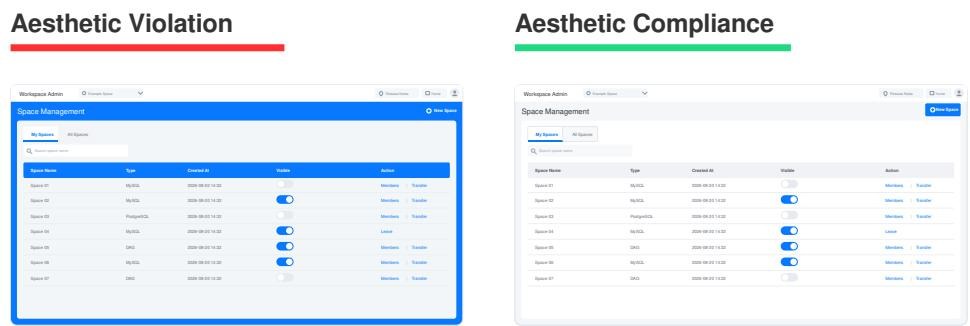  
Figure 6: color proportion. The violating interface applies the accent color to a large portion of the page, while the conforming interface follows a more restrained color allocation.

We distinguish three color roles. The theme color represents the product identity and is generally associated with the brand color. It is commonly used for primary buttons and text, important operation states, and highlighted information. The theme color is typically extended into a tonal scale within the same color family. Functional colors represent explicit information and states, including success, error, failure, warning, and links. Their use should follow common user expectations and remain consistent within the same product system. Neutral colors are widely used for text, backgrounds, borders, and dividers.

color proportion. To avoid excessive color usage, we adopt a 60:30:10 allocation. Approximately 60% of the interface is assigned to the primary color, which in enterprise applications is commonly the color of large surface or content regions. Approximately 30% is assigned to secondary colors, which are typically neutral colors, and the remaining 10% is reserved for accent colors drawn from the functional and theme palettes.

For quantitative assessment, we estimate the empirical distribution $\hat { p }$ of the three color roles over interface pixels and compare it with the target distribution

$$
p ^ { \star } = ( 0 . 6 , 0 . 3 , 0 . 1 ) .
$$

The deviation is measured using

$$
D _ { \mathrm { K L } } ( \hat { p } \| p ^ { \star } ) .\tag{5}
$$

Figure 6 shows a representative violation in which the accent color occupies an excessively large region.

Contrast. Color contrast determines whether textual and graphical information can be reliably perceived, as illustrated by the confirmation messages in Figure 7. Following the WCAG AA requirements\*, we adopt a minimum contrast ratio of 4.5:1 for normal text against its background. Large text requires a minimum contrast ratio of 3:1, where large text is defined as bold text of at least 18.66 px or regular text of at least 24 px. Graphics and user-interface components require a minimum contrast ratio of 3:1.

WCAG is a set of accessibility guidelines developed by the W3C Web Accessibility Initiative to improve the accessibility of Web content for users with different perceptual and cognitive abilities. For implementation, we compute the WCAG contrast ratio as

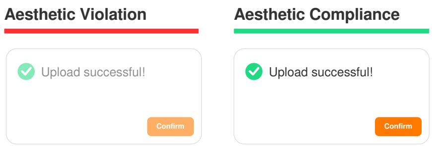  
Figure 7: color contrast. A confirmation message with insufficient foreground-background contrast, compared with a version satisfying the prescribed contrast requirement.

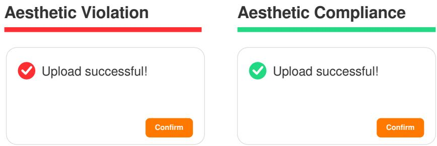  
Figure 8: Functional color semantics. The violating example uses a color whose conventional semantic meaning conflicts with the represented state, while the conforming example follows the expected color semantics.

$$
\mathrm { c o n t r a s t } = \frac { \operatorname* { m a x } ( Y _ { f } , Y _ { b } ) + 0 . 0 5 } { \operatorname* { m i n } ( Y _ { f } , Y _ { b } ) + 0 . 0 5 } ,\tag{6}
$$

where $Y _ { f }$ and $Y _ { b }$ denote the foreground and background relative luminances in [0, 1], respectively, computed from linearized sRGB values following WCAG 2.2.

color semantics. Functional colors should conform to common semantic expectations, as colors can carry context-dependent semantic and affective associations (Elliot & Maier, 2014). Red commonly communicates urgency or intensity and is therefore suitable for promotional actions and error states. Blue commonly conveys technology and professionalism and is frequently used in technology-oriented products. Green is associated with nature and safety and is commonly used for environmental contexts or successful states. Maintaining these semantic associations reduces unnecessary interpretation effort and makes interface states easier to understand. Figure 8 contrasts red and green indicators for the same success state.

## A.2 SPACING

Spacing defines the basic spatial relationships among interface elements. Enterprise applications commonly use a grid system to establish visual order, with 8 pixels serving as a widely adopted base unit. An even-valued base unit is compatible with common display environments, while a regular grid also reduces arbitrary layout decisions and provides a shared spatial vocabulary between design and implementation.

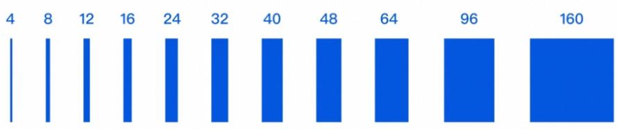  
Figure 9: Spacing scale. Representative spacing values derived from the 8-pixel base grid, together with the additional 4- and 12-pixel increments.

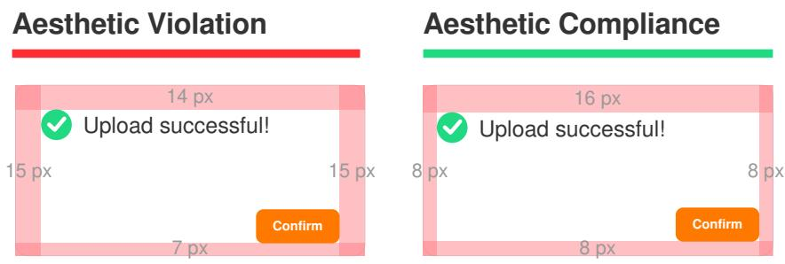  
Figure 10: Spacing grid. The violating layout contains spacing values that do not follow the prescribed grid, while the conforming version uses admissible spacing increments.

We therefore require interface elements to be arranged using an 8-pixel base grid. To support denser layouts and smaller local gaps, 4 and 12 pixels are additionally admitted as valid spacing values. The resulting spacing scale (Figure 9) includes values such as 4, 8, 12, 16, 24, 32, 40, 48, 64, 96, and 160 pixels.

For a set of measured element coordinates and dimensions $\{ x _ { i } \}$ , we evaluate deviation from the grid using

$$
\mathcal { P } = \sum _ { i } \left( x _ { i } \ \mathrm { m o d } \ 8 \right) ,\tag{7}
$$

while additionally admitting 4 and 12 pixels as valid values. Figure 10 illustrates irregular gaps of 14, 15, and 7 pixels and their corresponding conforming alternatives.

## A.3 LAYOUT

Layout is a fundamental part of enterprise interface design and provides the basis for consistent interaction and visual organization. We consider three established principles for organizing important information and actions: Fitts’ Law, Miller’s Law, and the Gutenberg Diagram.

Fitts’ Law. Fitts’ Law states that larger and closer targets can be reached more quickly and with fewer errors than smaller and more distant targets (Fitts, 1954). Screen edges have a particular advantage because pointer movement cannot continue beyond the screen boundary, making control near the edge easier to acquire (Farris et al., 2001).

  
Figure 11: Fitts’ Law. A primary action placed far from the screen edge, compared with a placement that follows the recommended edge distance.

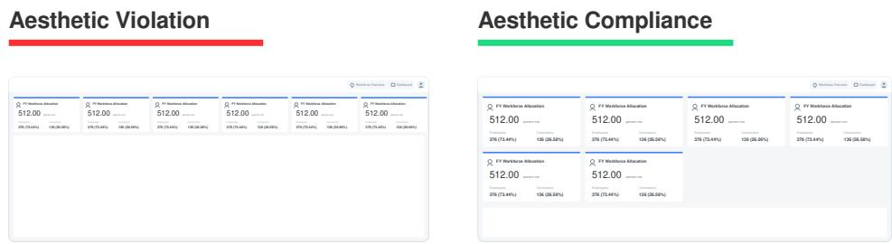  
Figure 12: Miller’s Law. Six similar content blocks are presented as one group in the violating example, while the conforming version reorganizes them into smaller groups.

At the same time, frequently used controls should not be positioned so close to the boundary that accidental activation becomes likely. Balancing these two considerations, we recommend that frequently used desktop controls, especially primary actions, be positioned approximately 5% to 12% of the viewport dimension from the nearest edge, as illustrated by the primary action in Figure 11. Corners should be used preferentially when appropriate.

Miller’s Law. Human information processing capacity is limited. The classical formulation of Miller’s Law suggests that short-term memory can simultaneously maintain approximately five to nine items (Miller, 1956). Later work suggests that effective working-memory capacity is often closer to three to five chunks (Cowan, 2010).

For enterprise applications, we adopt the more conservative interpretation and recommend that a group of similar content blocks contain no more than five items. When more content is required, the blocks can be reorganized into multiple groups or rows, as illustrated by the six-block layout in Figure 12.

Gutenberg Diagram. For interfaces following a left-to-right reading convention, visual attention typically begins in the upper-left region and progresses toward the lower-right region. The Gutenberg Diagram divides the page into four quadrants and emphasizes the upper-left and lower-right regions as the beginning and ending areas of the reading path.

Accordingly, we recommend placing the most important identifying or promotional information in the upper-left region, such as logos or other high-priority information. As illustrated by the confirmation dialog in Figure 13, the most important operation, such as a confirmation action, is preferentially placed in the lower-right region.

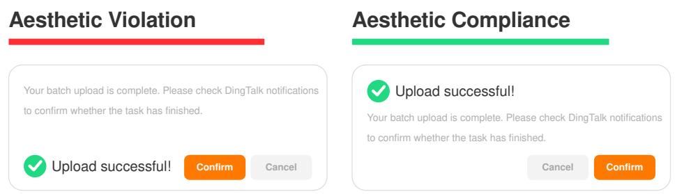  
Figure 13: Gutenberg Diagram. The violating example places important information and actions against the expected reading flow, while the conforming layout follows the recommended upper-left to lower-right organization.

  
Figure 14: Typeface discipline. The violating example mixes several unrelated typefaces within one interface, while the conforming version uses a unified typeface system.

## A.4 TYPOGRAPHY AND TEXT LAYOUT

Typography is one of the fundamental components of systematic interface design. Enterprise users rely on text to understand information and complete their work, making a coherent type system important for both reading efficiency and task efficiency (Dyson, 2004).

Typeface. For efficiency and platform compatibility, we recommend using the system default typeface in enterprise applications. Within a single page, no more than one CJK typeface and one Latin typeface should be used. Figure 14 contrasts mixed typefaces with a unified typeface system.

This rule can be checked by extracting the typeface information from the design source and comparing the set of typefaces used on the page.

Type scale and line height. A type scale is a regular set of font sizes used to establish textual hierarchy. Line height defines the vertical space occupied by each line of text. We take

  
Figure 15: Type scale and line height. The violating example uses line spacing that weakens the continuity of the text block, while the conforming version follows the additive line-height rule in Eq. equation 8.

$$
h _ { \mathrm { l i n e } } = 1 . 5 s
$$

as a common accessibility-oriented reference, where s denotes the font size. However, a fixed multiplicative ratio causes the additional vertical space to increase with font size. For large display text, this may weaken the visual continuity between lines, particularly when several font sizes are mixed within the same interface.

We therefore adopt an additive rule to control the spacing between lines across font sizes, as illustrated in Figure 15:

$$
h _ { \mathrm { l i n e } } = s + 8 \quad \mathrm { ( p i x e l s ) } .\tag{8}
$$

The constant 8 also gives line heights close to the 1.5× reference for the commonly used body-text sizes of 14 px and 16 px. To maintain a clear reading hierarchy, no more than five distinct type sizes should be used within one application.

The rule is checked by extracting font-size and line-height parameters from the design source.

Font weight. Font weight is an important typographic variable for expressing hierarchy and distinguishing important content. We use {400, 500, 600} as the preferred set of weights and allow no more than three font-weight values within one application. The link and button labels in Figure 16 illustrate consistent font weights across actions.

The implementation extracts the font-weight value of each text element and checks whether the observed values follow the prescribed set and cardinality.

Line length and alignment. Line length has been shown to affect on-screen reading and information retrieval (Dyson, 2004). To maintain reading comfort in Web applications, we recommend no more than 85 characters in a single line of text. This property can be checked through OCR followed by character counting.

Text alignment and spacing can affect visual-search performance on Web pages (Ling & van Schaik, 2007). For tables and lists, textual content should be left-aligned, while Arabic numerals and other numerical values should be right-aligned. This arrangement (Figure 17) allows textual entries to share a stable starting position and numerical values to share a stable ending position.

Figure 16: Font weight. The violating example uses an inconsistent weight assignment, while the conforming example follows the prescribed font-weight system.  
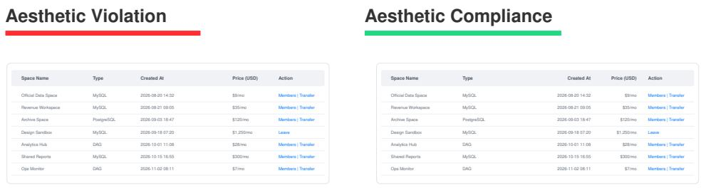  
Figure 17: Text and numerical alignment. Numerical values are left-aligned in the violating table, while the conforming version right-aligns numerical content and left-aligns text.

For a left-aligned column, we describe the condition

$$
x _ { \mathrm { l e f t } } = C ,\tag{9}
$$

while a right-aligned column satisfies

$$
x _ { \mathrm { r i g h t } } = W - C ,\tag{10}
$$

where W denotes the column width and C denotes the corresponding inset.

## A.5 IMAGERY

Images increase the dimensionality of information conveyed by an interface and can provide visual explanations that complement textual content. Their presentation quality is primarily affected by geometric proportion and visual clarity.

Aspect ratio. Different image proportions support different presentation scenarios. Excluding fullwidth and full-screen banner images, we identify several commonly used aspect ratios.

  
Figure 18: Image aspect ratio. The violating example distorts the image proportion, while the conforming version preserves an admissible aspect ratio.

A 1:1 image provides a simple composition with strong subject presence and is commonly used for products, avatars, and close-up content. A 4:3 image provides a compact frame that is relatively easy to compose. A 16:9 image provides a wider field of view and is widely used for video-oriented content.

The complete admissible set specified in our guideline is

$$
\mathcal { R } = \left\{ 1 , \frac { 4 } { 3 } , \frac { 1 6 } { 9 } , \frac { 3 } { 4 } , \frac { 9 } { 1 6 } \right\} .\tag{11}
$$

For an image with width w and height h, its aspect ratio is compared with the nearest admissible value. We write the criterion as

$$
\operatorname* { m i n } _ { r \in \mathcal { R } } \left| \frac { w } { h } - r \right| < 0 . 0 5 .\tag{12}
$$

Figure 18 illustrates the visual distortion caused by compressing an image vertically.

Image clarity. Recognizability is treated as a basic requirement for image presentation. Images should remain sufficiently clear for users to identify their visual content. The pixelated image in Figure 19 illustrates how reduced clarity obscures visual detail. We propose applying image-quality assessment algorithms to image regions identified in the interface.

Several commonly used image-quality metrics are listed as references for this purpose. Their defi nitions and properties are summarized in Table 5.

## A.6 SHADOW

Shadows originate from the physical relationship between objects and surfaces at different distances. User interfaces reproduce this visual cue to communicate the height and layer relationships among elements (Creager & Gillan, 2016). Components at different semantic layers therefore use different shadow properties.

We divide interface elements into four semantic levels. Level 0 represents elements resting directly on the base surface. These include buttons, inputs, search fields, tags, tables, links, pagination controls, steps, breadcrumbs, switches, radio buttons, checkboxes, and progress bars. Their projection coincides with the component itself, so no visible shadow is used.

  
Figure 19: Image clarity. The image in the violating example is insufficiently clear, while the conforming version preserves recognizable visual detail.

Table 5: Image-quality metrics included in our professional UI design guideline as references for evaluating image clarity.
<table><tr><td>Metric</td><td>Definition and properties</td></tr><tr><td>PSNR</td><td>Peak signal-to-noise ratio is a full-reference image-quality metric that compares the maximum possible signal power with the power of corrupting noise. It is measured in decibels, and larger values indicate less distortion. Because it is based on pixel-level error, it does not explicitly model the visual characteristics of human perception.</td></tr><tr><td rowspan="2">SSIM</td><td>Structural similarity evaluates image similarity from luminance, contrast, and structure (Wang et al., 2004). Its value lies in [—1, 1], with larger values indicating less distortion. In practical computation, an image can be divided into local windows. For N windows, the average structural similarity is</td></tr><tr><td> $\operatorname { M S S I M } ( X , Y ) = \frac { 1 } { N } \sum _ { i = 1 } ^ { N } \operatorname { S S I M } ( x _ { i } , y _ { i } ) .$ </td></tr><tr><td>IFC VIF</td><td>The information fidelity criterion evaluates image quality using natural scene statistics and characteristics of the human visual system. It measures the mutual information between a test image and a reference image (Sheikh et al., 2005).</td></tr><tr><td></td><td>Visual information fidelity extends the information-based formulation of IFC and focuses on the amount of visual information lost between a test image and its reference (Sheikh &amp; Bovik, 2006).</td></tr><tr><td>MSE / RMSE</td><td>Mean squared error and root mean squared error measure pixel-level error between corresponding images. They are simple objective measures but do not explicitly account for characteristics of human visual perception.</td></tr></table>

Level 1 represents low-level elevation and is used for navigation elements and card hover states. Level 2 represents components that expand from elements on the base surface and remain associated with them, including drop-down containers and drawers. Level 3 represents high-level components used for prominent prompts and operations, including dialogs, modal windows, and toast notifications. For example, Figure 20 shows how a shadow distinguishes an expanded date picker from the base surface.

Table 6: Shadow hierarchy specified in our professional design guideline, following the Fusion Design shadow scale.
<table><tr><td>Level</td><td>Typical components</td><td>Offset d</td><td>Blur</td><td>color</td></tr><tr><td>0</td><td>Buttons, inputs, search fields, tags, tables, links, pagination, steps, breadcrumbs, switches,</td><td>0</td><td>0</td><td>rgba(0,0,0,0)</td></tr><tr><td>1</td><td>radio buttons, checkboxes, and progress bars Navigation and card hover states</td><td>1px</td><td>3px</td><td>rgba(0,0,0,0.12)</td></tr><tr><td>2</td><td>Drop-down containers and drawers</td><td>2 px</td><td>4px</td><td>rgba(0,0,0,0.12)</td></tr><tr><td>3</td><td>Dialogs, modal windows, and toasts</td><td>20 px</td><td>30 px</td><td>rgba(0,0,0,0.15)</td></tr></table>

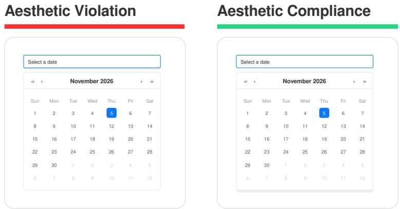  
Figure 20: Shadow hierarchy. The violating example uses a shadow treatment inconsistent with the component’s semantic level, while the conforming example follows the prescribed shadow hierarchy.

The shadow parameters specified in our guideline are summarized in Table 6. For Levels 1 to 3, the same offset magnitude is applied in five directions. These directions are (d, d), (0, −d), (d, 0), (0, d), and (−d, 0). The spread value is zero in all cases.

For implementation, UI components are first identified and their shadow parameters are extracted. The observed parameters are then compared with the semantic level associated with each component type.

## A.7 CONSISTENCY

In addition to the visual quality of individual elements, overall interface quality depends strongly on whether visual rules are applied consistently across the page (Kellogg, 1987). We consider consistency at two levels: container consistency and component consistency.

Container consistency. Containers carry information and separate different content regions. Equivalent containers within the same page should use consistent corner radii, shadows, and spacing between containers. Figure 21 illustrates how consistent corner radii and spacing establish a regular arrangement of containers.

For implementation, container components are identified and their corner radius, shadow, and spacing parameters are compared across equivalent instances.

Component consistency. Components are among the most frequently repeated elements in an application. We therefore require one page to use components derived from a single specification.

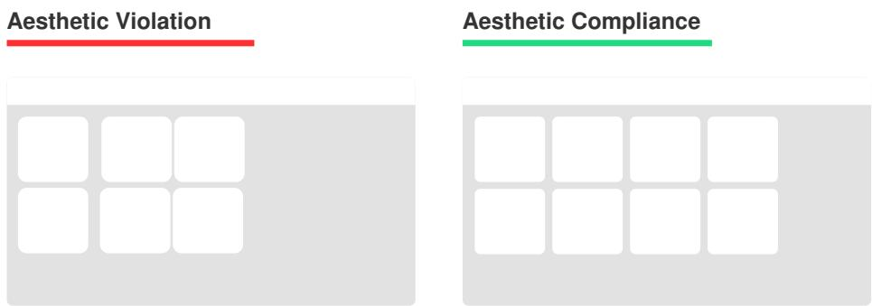  
Figure 21: Container consistency. Equivalent containers use different corner radii, shadows, or spacing in the violating example, while the conforming version applies a consistent container specification.

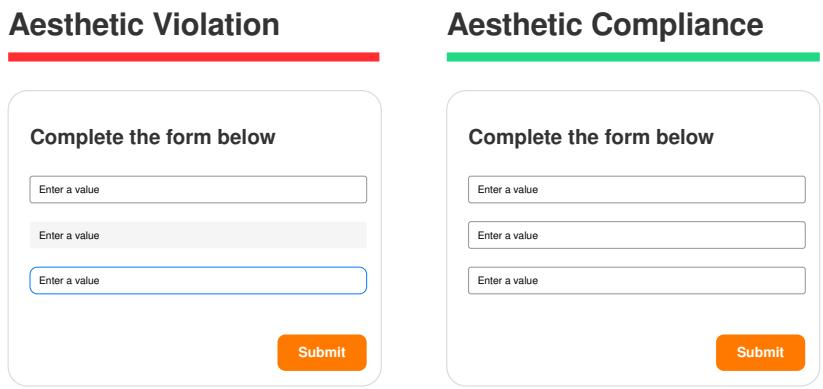  
Figure 22: Component consistency. Instances of the same component type use different specifications in the violating example, while the conforming version follows a shared component specification.

Instances of the same component type should maintain consistent parameters, as illustrated by the input fields in Figure 22.

For implementation, component-recognition methods can be used to identify component instances on the page. Parameters are then compared within each component class to determine whether components of the same type remain consistent.

## B HUMAN ANNOTATION AND EVALUATION DETAILS

## B.1 ANNOTATION PROCEDURE

We initially recruited 51 professional UI designers, all with at least 3 years of industry experience in interface and product design. Among them, 45.1% had at least 5 years of experience, including 17.8% with at least 10 years. All had worked at leading Internet and technology companies and had substantial experience with B2B or B2C products. All annotators held at least a bachelor’s degree and had received formal training in design-related disciplines, including interaction design, visual communication, and related fields. All annotators followed the same annotation guidelines throughout the annotation process. Before formal annotation, a professional UI designer prepared a set of visual rubric exemplars to operationalize the 1–5 rating scale. For each of the eight aesthetic dimensions, the exemplar set contained one representative UI for each score level, resulting in 40 examples in total. All annotators reviewed the same exemplars together with the scoring guidelines before beginning formal annotation. This calibration step was intended to align their interpretation of the five score levels and reduce differences in individual rating scales. Figure 23 presents the complete exemplar set.

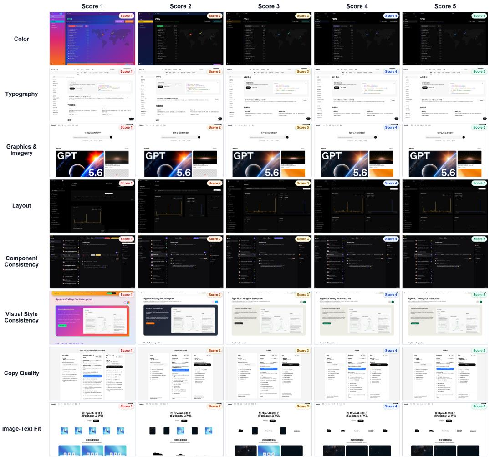  
Figure 23: Visual rubric exemplars used to calibrate annotators before formal annotation. Rows correspond to the eight aesthetic dimensions, and columns correspond to rating levels from 1 to 5.

Each of the 1,395 reference UIs was independently rated by three designers along eight aesthetic dimensions, yielding 33,480 dimension-level ratings before quality control.

Given the importance of annotation quality for reliable model evaluation (Pang et al., 2025), we manually inspected the rating distribution of each designer as an annotator-level quality-control step. We excluded annotators exhibiting degenerate response patterns, defined as assigning the same extreme score (either 1 or 5) to all ratings they submitted. Seven annotators met this criterion, and all annotations from these annotators were removed. The final annotation set therefore contains ratings from 44 professional designers.

Our aesthetic guidelines contain a broader set of principle-level criteria, including rules for color, spacing, layout, typography, imagery, shadow, and consistency. To derive the dimensions used for human evaluation, we worked with the designers to consolidate these fine-grained principles into perceptually coherent categories that can be reliably judged from rendered UI screenshots. Closely related principles were grouped into broader evaluation dimensions. For example, spacing and spatial organization are jointly considered under layout, while component-level regularity and visual treatments across the page are evaluated separately as component consistency and visual style consistency. Shadow-related principles are assessed under visual style consistency, together with borders, corner radii, and other visual treatments. We retain color and typography as separate dimensions and assess graphical content under graphics and imagery. We additionally include copy quality to assess the clarity and appropriateness of textual content, and image–text fit to assess the semantic agreement between visual elements and their associated text or context. This adaptation yields the shared eight-dimensional rubric used for Aesthetic Scoring and Text-to-UI Generation (Tasks 1 and 4).

Table 7: Fine-grained criteria used for human UI evaluation.
<table><tr><td>Criterion</td><td>Definition</td></tr><tr><td>Color</td><td>Whether the page palette is visually harmonious, colors are used consistently, and sufficient contrast is maintained between text and background.</td></tr><tr><td>Typography</td><td>Whether font choices, sizes, weights, line heights, and textual hierarchy are clear, consistent, and readable.</td></tr><tr><td>Graphics &amp; Imagery</td><td>Whether images, icons, illustrations, and other visual assets are clear, intact, ap- propriately proportioned, and visually well presented.</td></tr><tr><td>Layout</td><td>Whether page structure, information hierarchy, alignment, spacing, grouping, and space utilization are visually appropriate.</td></tr><tr><td>Component Consistency</td><td>Whether components with equivalent functions or hierarchy follow consistent rules in their size, structure, appearance, and state representation.</td></tr><tr><td>Visual Style Consistency</td><td>Whether corner radii, shadows, borders, line weights, icons, and other visual treatments form a coherent visual language across the page.</td></tr><tr><td>Copy Quality</td><td>Whether headings, body text, buttons, hints, and other textual content are clear, natural, concise, and appropriate for the page context.</td></tr><tr><td>Image-Text Fit</td><td>Whether images, icons, and other visual elements semantically match their asso- ciated text, function, and surrounding context.</td></tr></table>

For each UI, annotators provided ratings from 1 to 5 along eight aesthetic dimensions: color, typography, graphics and imagery, layout, component consistency, visual style consistency, copy quality, and Image–Text Fit. For each evaluation, annotators were also asked to provide a brief comment summarizing their assessment. In addition, they recorded a concise description of the most salient design issue together with its corresponding region or component when applicable. The resulting annotations therefore contain both quantitative ratings and qualitative design feedback for each UI.

Ground-truth aggregation. After annotator-level quality control, we compute the mean opinion score (MOS) over all retained expert ratings for each UI and aesthetic dimension. No additional rating-level outlier filtering is applied. The resulting MOS is rounded to one decimal place and is used as the ground-truth score for subsequent evaluation.

## B.2 EVALUATION CRITERIA AND GROUND-TRUTH DISTRIBUTION

Fine-grained criteria. Annotators evaluate each UI along eight fine-grained aesthetic criteria. Each criterion is independently rated from 1 to 5 according to its corresponding scoring rubric. Table 7 summarizes the definition of each criterion.

Ground-truth distribution. The benchmark ground truth consists of eight dimension-level MOS scores for each UI. Figure 24 compares the score distributions of the three individual annotators with the final aggregated MOS across all eight aesthetic dimensions. For visualization only, the MOS values are mapped to the nearest 1–5 rubric level, while all quantitative evaluations use the one-decimal MOS scores.

## B.3 INTER-ANNOTATOR RELIABILITY

We further assess the reliability of the professional aesthetic annotations. Given the ordinal 1–5 rating scale and the rotating-rater setting, we use ordinal Krippendorff’s α to quantify inter-annotator agreement for each of the eight aesthetic dimensions. As shown in Table 8, α ranges from 0.328 to 0.431, with a macro-average of 0.368. Layout shows the highest agreement $( \alpha = 0 . 4 3 1 )$ , while Color shows the lowest $( \alpha = 0 . 3 2 8 )$ . Visual-style Consistency, Copy Quality, and Image–Text Fit obtain α values of 0.366, 0.334, and 0.402, respectively, and do not exhibit substantially larger disagreement than the other dimensions. Overall, the results indicate that professional designers share some common judgment on fine-grained UI aesthetics, while noticeable individual variation remains.

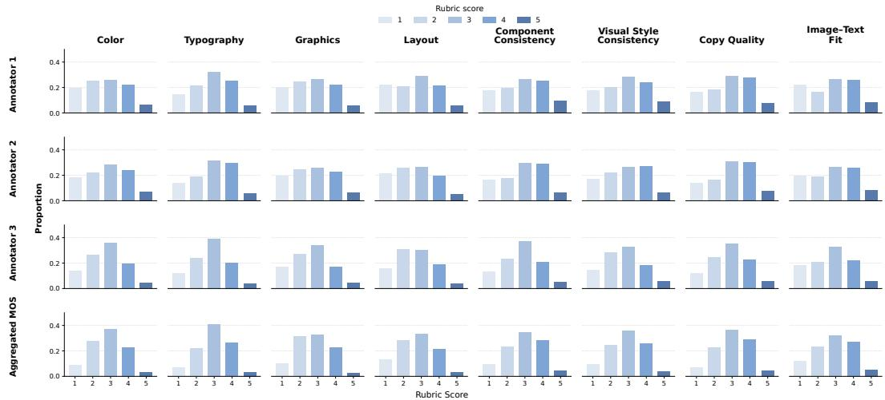  
Figure 24: Score distributions from three individual annotators and the aggregated human MOS across eight aesthetic dimensions.

Table 8: Inter-annotator reliability across aesthetic dimensions. We report ordinal Krippendorff’s α for inter-annotator agreement and ICC(1,3) for the reliability of the average of three ratings.
<table><tr><td>Dimension</td><td>Krippendorff&#x27;s α</td><td>ICC(1,3)</td></tr><tr><td>Color</td><td>0.328</td><td>0.596</td></tr><tr><td>Typography</td><td>0.334</td><td>0.609</td></tr><tr><td>Graphics &amp; Imagery</td><td>0.346</td><td>0.614</td></tr><tr><td>Layout</td><td>0.431</td><td>0.694</td></tr><tr><td>Component Consistency</td><td>0.399</td><td>0.672</td></tr><tr><td>Visual-style Consistency</td><td>0.366</td><td>0.635</td></tr><tr><td>Copy Quality</td><td>0.334</td><td>0.610</td></tr><tr><td>Image-Text Fit</td><td>0.402</td><td>0.667</td></tr><tr><td>Macro Avg.</td><td>0.368</td><td>0.637</td></tr></table>

Since the benchmark uses the mean of the retained expert ratings as its ground-truth score, we additionally examine the reliability of rating aggregation. On the UIs retaining all three valid ratings, we use a one-way random-effects intraclass correlation coefficient (ICC), which is appropriate for the rotating-rater setting. The single-rating reliability, ICC(1,1), ranges from 0.329 to 0.431 across dimensions, whereas the reliability of the average of three independent ratings, ICC(1,3), ranges from 0.596 to 0.694, with a macro-average of 0.637. These results show that aggregating multiple professional ratings improves score reliability relative to relying on a single designer, while finegrained aesthetic assessment still retains non-negligible inter-expert variation.

## B.4 MODEL EVALUATION PROMPT

For model evaluation, we convert the human annotation criteria into a unified evaluation prompt. All evaluated models receive the same task instruction, scoring criteria, and output format. The complete prompt used for aesthetic scoring is shown in Figure 25, Figure 26, and Figure 27.

## B.5 ANNOTATION EXAMPLES

We provide three representative annotation examples in Figures 28, 29 and 30 to illustrate the human evaluation and ground-truth aggregation process. Each example presents the original UI screenshot, the independent ratings and qualitative comments from three professional designers.

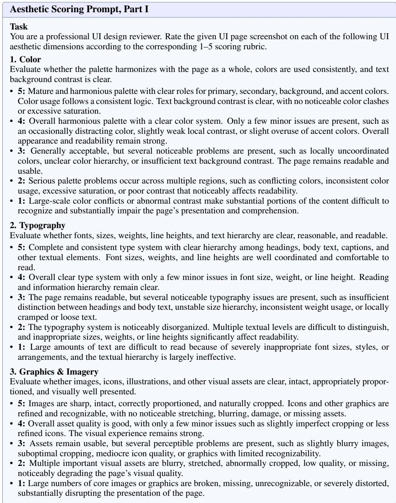  
Figure 25: Model evaluation prompt for aesthetic scoring, Part I.

## C MORE DETAILS OF AUV-BENCH

## C.1 REFERENCE UI COLLECTION AND QUALITY ASSURANCE

Reference UI Collection Details. We apply quality filtering, rendering validation, and duplicate removal to obtain the final reference UI collection. The adapted subset comprises 300 pages from

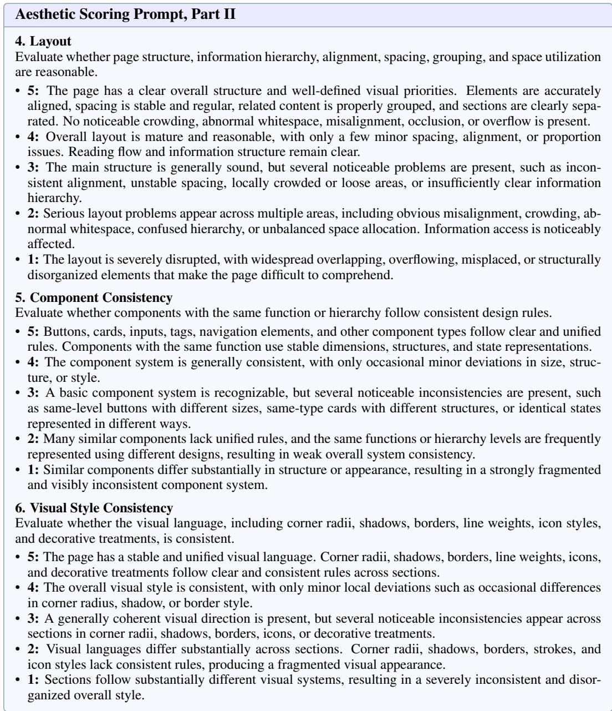  
Figure 26: Model evaluation prompt for aesthetic scoring, Part II.

WebCode2M (Gui et al., 2025)† and 77 pages from Design2Code (Si et al., 2025)‡. The collection contains 1,292 desktop pages, 92 mobile pages, and 11 tablet pages.

Source Adaptation and Asset Recovery. The reference collection combines real-world webpages, adapted public UI datasets, and model-generated pages. Each page is packaged with its source code, localized assets, and a full-page screenshot. For adapted pages with missing or placeholder images, we recover semantically appropriate visual assets using the surrounding context and alternative text. This process replaces 2,046 visual elements across 310 pages.

Rendering Fidelity. Real-world webpages often depend on remote images, fonts, stylesheets, and other resources whose availability can change over time. We localize these dependencies to obtain

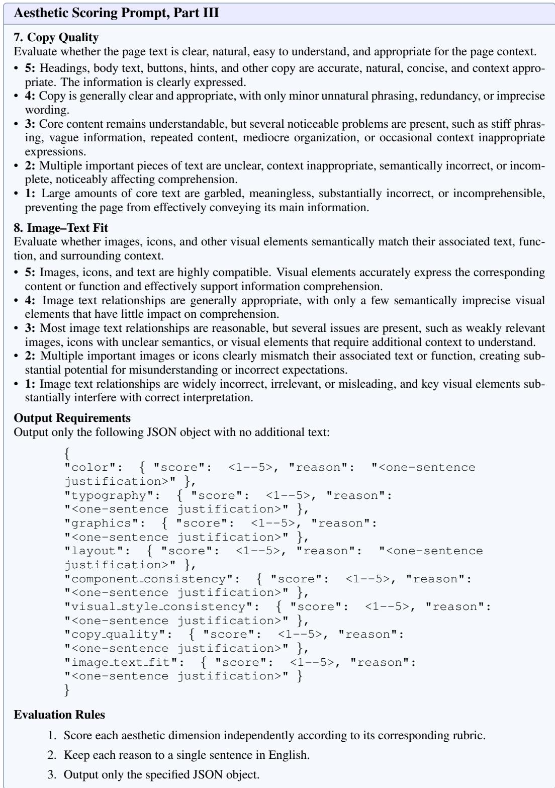  
Figure 27: Model evaluation prompt for aesthetic scoring, Part III.

self-contained pages that can be executed offline. For pages with original reference screenshots, we re-render each localized page under the corresponding viewport configuration and compare the result with the original screenshot.

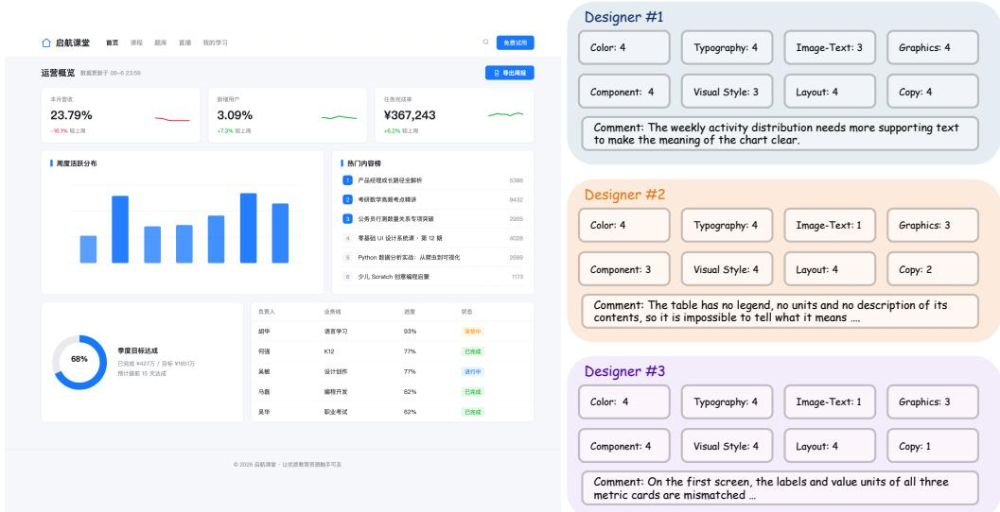  
Figure 28: Representative human annotation example.

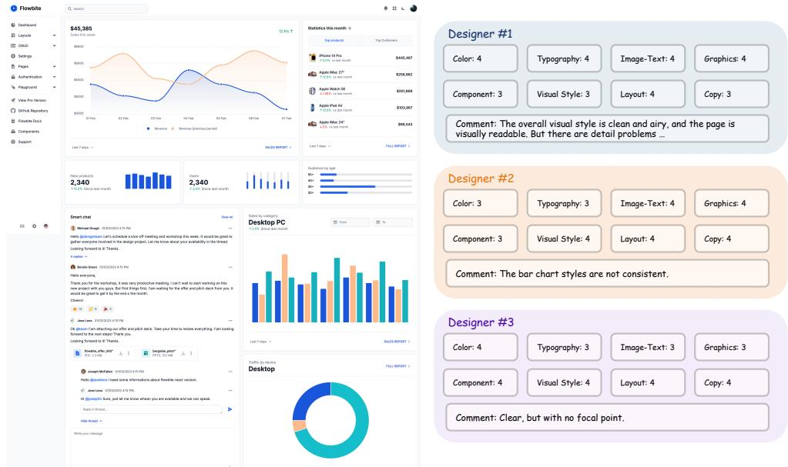  
Figure 29: Representative human annotation example.

We measure rendering fidelity using pixel-level mean absolute error (MAE) and the structural similarity index (SSIM) (Wang et al., 2004). MAE measures pixel discrepancies, while SSIM measures structural visual similarity. We require MAE < 10 and rank surplus candidates by SSIM; retained pages in this subset have a median SSIM of 0.994. Pages with substantial visual discrepancies are filtered or manually inspected for missing resources, layout drift, and abnormal rendering. Before finalizing the reference pool, professional UI designers inspect rendering quality, asset completeness, and layout integrity. These checks establish a stable reference for controlled degradation, reducing incidental rendering variation that could otherwise confound attribution of the injected defects.

## C.2 CONTROLLED AESTHETIC VIOLATIONS AND TASK CONSTRUCTION

Controlled Violation Taxonomy. Tasks 2 and 3 use controlled aesthetic violation rules that are localizable, editable in source code, and verifiable after rendering. We identify principles from the professional UI aesthetic guidelines that can be mapped to local visual elements or page structures and operationalize them as executable degradation rules. Rules whose effects are visually insignificant or difficult to attribute reliably are excluded. We run rule detectors over all 1,395 reference UIs to assess applicability, identify candidate target elements, and detect naturally occurring violations. A violation is instantiated only when the required structural or semantic conditions are present and the target region satisfies the corresponding principle. Each degraded instance therefore has an explicit target, an associated design principle, and a traceable visual modification.

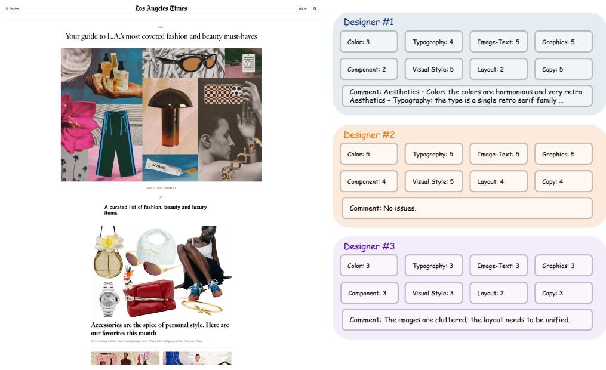  
Figure 30: Representative human annotation example.

In total, we define 13 controlled violation rules spanning five aesthetic dimensions: Typography, Layout and Reading Flow, Spacing, Visual Style Consistency, and Color. Table 9 summarizes the design constraint represented by each rule, the primary property being manipulated, and the resulting aesthetic violation.

Rule Applicability and Coverage. Different aesthetic rules require different page structures, semantic roles, and local design contexts, and are therefore not applicable to every reference UI. For each rule, we first perform an applicability check on the original page. A controlled violation is constructed only when the required candidate structure is present and the corresponding region of the reference UI already satisfies the target design principle.

For example, Peer Font Size and Peer Font Weight require comparable peer text elements; Container Radius Consistency requires a group of visually consistent peer containers; Table Text Alignment applies only to pages containing an appropriate tabular structure; and Semantic Color Stability and Fitts Edge Zone require more specific semantic or layout contexts. If the required element is absent, or if the reference UI already violates the target principle, the corresponding rule is not instantiated on that page.

After passing the applicability check, a degradation must additionally be locally executable, render reliably, and have an explicitly identifiable affected region. Across the candidate reference UIs, the 13 rules identify 77,277 valid candidate elements. Some rules are applicable to a broad range of pages, whereas others naturally arise only under more specific structural or semantic conditions. Consequently, the rule and dimension distributions in the formal evaluation cohort are determined by the actual applicability of each rule to the reference UIs, while preserving a well-defined design context and a verifiable clean-to-degraded correspondence for every controlled defect.

Degradation Execution and Validation. Each degradation modifies a small subset of eligible elements, typically around 20% of the target group, to keep the intervention localized and attributable.

Table 9: The 13 controlled aesthetic violation rules used in our benchmark. A rule is instantiated only when the reference UI satisfies its required structural or semantic context. T, L, S, V, and C denote Typography, Layout & Reading Flow, Spacing, Visual Style Consistency, and Color, respectively.
<table><tr><td>Dimension</td><td>Violation Rule</td><td>Description</td></tr><tr><td>T</td><td>Peer Font Weight</td><td>Changes the weight of a peer text element, breaking consistency among texts at the same visual level.</td></tr><tr><td>T</td><td>Peer Font Size</td><td>Changes the size of a peer text element, disrupting the local typographic hierarchy.</td></tr><tr><td></td><td>Font Family Count</td><td>Introduces an additional font family, increasing unnecessary variation in the page typography.</td></tr><tr><td>K</td><td>Text Scale Count</td><td>Introduces an additional font-size level, increasing complexity in the existing typographic scale.</td></tr><tr><td>T</td><td>Table Text Alignment</td><td>Changes text or numeric alignment within a table, breaking its alignment consistency.</td></tr><tr><td></td><td>Vertical Alignment</td><td>Offsets a peer element from its original vertical alignment.</td></tr><tr><td></td><td>Gutenberg Information Region</td><td>Alters the spatial or sequential organization of information elements under the Gutenberg reading pattern.</td></tr><tr><td></td><td>Fitts Edge Zone</td><td>Perturbs elements associated with page-edge regions, disrupting their original edge-layout relationship.</td></tr><tr><td>S</td><td>Peer Spacing Uniformity</td><td>Perturbs peer elements to break their originally uniform spacing.</td></tr><tr><td>S</td><td>Container Row Spacing</td><td>Changes spacing between rows or elements within comparable containers.</td></tr><tr><td></td><td>Container Radius Consistency</td><td>Changes the radius of a peer container, making it inconsistent with comparable components.</td></tr><tr><td></td><td>Peer Accent Color</td><td>Changes the accent color of a peer component, breaking color consistency among comparable components.</td></tr><tr><td></td><td>Semantic Color Stability</td><td>Perturbs a color with a stable semantic role, deviating from the page&#x27;s semantic color system.</td></tr></table>

For example, Peer Font Size perturbs selected text elements at the same hierarchy level, while Peer Accent Color changes the accent color of a subset of comparable components. Professional UI designers iteratively review the rule definitions and perturbation parameters. We construct both single-violation and compositional cases, with mild and severe degradation levels.

Each modified page is re-rendered and automatically validated before inclusion. A candidate is retained only if the intended violation is introduced with a perceptible magnitude, remains localized without unintended layout changes or unrelated aesthetic violations, and yields a detected violation set matching the injected recipe. Candidates that fail these checks are discarded. Each retained instance contains the reference UI, the degraded UI, and precise violation annotations identifying the affected dimensions and regions. These instances and annotations are shared by Aesthetic Diagnosis and Aesthetic Repair.

Diagnosis and Repair Cohorts. Based on these controlled violation rules, we construct the formal Aesthetic Diagnosis and Aesthetic Repair tasks. To enable a controlled comparison between diagnosis and repair, Tasks 2 and 3 share exactly the same 660 underlying reference UI instances and the same 1,209 controlled aesthetic defects.

For Task 2, each degraded UI is paired with its corresponding clean control, resulting in 660 UI pairs for evaluating whether a model can identify and localize the injected aesthetic issues from visual inputs. Task 3 uses the same 660 degraded UIs and defect annotations to construct 660 repair instances, evaluating whether a model can correct the corresponding issues by modifying the executable page. Sharing the same underlying pages and defect ground truth allows the two capabilities to be evaluated under closely matched data conditions.

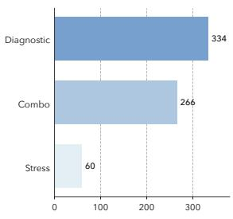  
(a) Sample Complexity

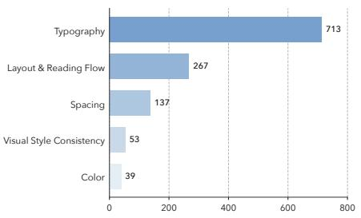  
(b) Aesthetic Dimension

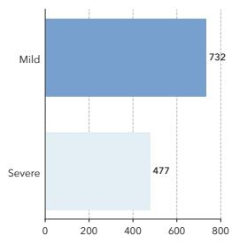  
(c) Severity  
Figure 31: Distribution of the formal evaluation cohort shared by Tasks 2 and 3. (a) Complexity distribution of the 660 underlying UI instances. (b) Distribution of the 1,209 controlled aesthetic defects across five aesthetic dimensions. (c) Distribution of mild and severe defects.

Defect Complexity Splits. We further organize the shared Diagnosis–Repair cohort into three regimes according to violation multiplicity, each targeting a distinct diagnostic challenge. The diagnostic split contains exactly one injected violation, enabling rule-level attribution of detection failures to a specific aesthetic rule. The combo split contains 2–3 co-occurring violations and tests search completeness, i.e., whether a model continues to identify the remaining defects after detecting one issue. The stress split contains 4–6 simultaneous violations and probes recall under defect-dense interfaces. Together, these splits progress from isolated rule recognition to compositional diagnosis and high-density defect retrieval. As shown in Figure 31, the 660 instances are further organized into three levels according to defect composition. The diagnostic split contains 334 instances with a single controlled defect, providing a basic setting for isolated aesthetic issues. The combo split contains 266 instances with multiple simultaneous defects, while the remaining 60 stress instances contain more complex defect combinations.

The 1,209 defects span all five aesthetic dimensions: 713 in Typography, 267 in Layout and Reading Flow, 137 in Spacing, 53 in Visual Style Consistency, and 39 in Color. In terms of degradation strength, 732 defects are categorized as mild and 477 as severe. The number of degraded instances is naturally imbalanced across violation rules because not every degradation can be validly applied to every real-world UI. We apply a degradation only when the original UI satisfies the rule-specific applicability conditions, rather than forcing each rule onto a predefined number of pages. Consequently, rules that are applicable to more reference UIs yield more degraded instances, while those with more restrictive applicability conditions yield fewer.

The shared cohort establishes a direct correspondence between Tasks 2 and 3: the former evaluates whether a model can detect and localize a given aesthetic issue, whereas the latter evaluates whether it can take effective corrective action on the same issue. Because evaluating capabilities in isolation can overlook their interactions (Wu et al., 2026b), we hold the underlying UI instances, defect definitions, and defect distribution fixed to analyze the alignment between principle-level judgment and UI repair. For the cross-task Judgment–Action Association (JAA) analysis, correct principle-level judgment requires both correct degradation detection and exact attribution of the affected aesthetic dimensions; localization accuracy is evaluated separately and is not included in $J _ { i } .$

Perceptual Comparison between Controlled Degradations and Real-World Defects. To examine whether our controlled degradations exhibit visual patterns similar to naturally occurring UI defects, we conduct a small-scale blind comparison study. For each of the 13 controlled violation rules, we collect five naturally occurring defect cases with clear visual evidence from public webpages, product bug reports, and official community forums, yielding 65 real-world defects in total. Each real-world case is paired with a controlled degradation from our benchmark corresponding to the same violation rule, resulting in 65 real–controlled pairs. Three non-expert participants independently evaluate all pairs. For each pair, the two UIs are presented in randomized left–right order, and participants are unaware of their sources and the degradation procedure. They are asked only to identify which UI issue was artificially introduced.

If the controlled degradations contained obvious synthetic artifacts, participants should be able to identify them substantially above the 50% chance level. The average source-identification accuracy is 56.4%, only modestly above chance. This result suggests that our controlled degradations do not exhibit readily identifiable synthetic artifacts and are perceptually similar to naturally occurring UI defects of the same type.

## C.3 REQUIREMENT RECONSTRUCTION

For Text-to-UI Generation, we use GPT-5.4 to reconstruct an English natural-language requirement from each reference UI. The requirement takes the form of a product requirements document describing the page’s purpose, information structure, major functional modules, and overall visual direction. Exact colors, font sizes, coordinates, and spacing values are omitted, leaving these visual implementation choices to the evaluated model.

Each requirement is accompanied by objectively verifiable checklist items and reviewed by professional UI designers. The requirement and checklist specify the functional intent and content to be preserved without prescribing the precise visual parameters of the reference page. This provides a common specification for comparing generated UIs while allowing different visual implementations.

At evaluation time, the model receives the reconstructed requirement, original textual content, and image assets, without access to the reference screenshot. Although the requirement is in English, visible text retains the language of the original page. The model determines the layout, visual hierarchy, typography, spacing, color, and component organization. Asset selection and presentation are described in Appendix D.2.

## D EXPERIMENTAL DETAILS

## D.1 MODEL AND INFERENCE SETTINGS

We evaluate a diverse set of frontier proprietary models and open-weight multimodal models. Within each task, all models use the same task instructions, input format, and evaluation protocol. All experiments use English prompts with temperature set to 0. The maximum output length is set to 2,000 tokens for Tasks 1 and 2 and 8,000 tokens for Task 3. Since Task 4 requires models to generate complete executable HTML pages, we do not impose an explicit maximum output length for thi task. For API failures or invalid outputs, each sample is retried up to three times.

All open-weight models are evaluated on a single NVIDIA A800 GPU with 80 GB of memory, using a batch size of 8. Except for hardware-specific configurations, the open-weight and proprietary models use the same prompts, input preprocessing, and task settings.

## D.2 INPUT PREPROCESSING AND ASSET ORGANIZATION

Visual Inputs for Tasks 1–3. Tasks 1–3 use full-page webpage screenshots as visual inputs. Since some webpages are substantially taller than a typical single-image input, we adopt a unified longpage processing strategy that preserves both global page structure and local visual details. The webpages are rendered with a viewport width of 1440 pixels. Let h denote the height of a full-page screenshot. When $h \leq 1 8 0 0$ pixels, the full screenshot is directly provided to the model without slicing. When $h > 1 8 0 0$ pixels, the screenshot is divided vertically into slices of 1800 pixels in height, with an overlap of 180 pixels between adjacent slices, corresponding to a stride of 1620 pixels. The slice starting positions are therefore 0, 1620, 3240, . . .. If the final slice produced by this fixed stride does not align with the bottom of the page, we additionally include a bottom-aligned slice starting at $h - 1 8 0 0$ , ensuring that the complete page is covered. As a result, the overlap between the final two slices may be larger than 180 pixels.

For webpages requiring multiple slices, we additionally provide a full-page overview image, obtained by proportionally resizing the original screenshot to a height of 1500 pixels. The overview image preserves the overall layout, information structure, and relative positions of different page regions, while the high-resolution slices retain local details such as typography, spacing, alignment, and component styling. The model first receives the full-page overview, followed by all slices in top-to-bottom order. Each slice is explicitly labeled with its position in the sequence.

The same visual preprocessing protocol is used across Tasks 1–3. For Task 2, the clean and degraded versions are processed independently using the same slicing strategy, and their presentation order is randomized before being given to the model. Task 3 uses the same visual representation of the degraded UI as Task 2, together with the corresponding HTML source code and the structured diagnosis produced by the same model in Task 2.

Asset Inputs for Task 4. Task 4 provides each model with an English webpage requirement, the visible textual content from the original page, and a set of visual assets extracted from the corresponding Reference UI. Since a webpage may contain a large number of duplicated, decorative, or low-information images, we apply a fixed asset filtering procedure before generation. The procedure includes geometric filtering, duplicate removal, near-duplicate clustering, filtering of primarily decorative assets, and relevance-based ranking of the remaining candidates. At most 32 visual assets are retained for each webpage.

Each retained asset is assigned a deterministic identifier, V01, V02, . . ., V32, and is made available through a corresponding local relative path. To provide direct visual access to the selected assets, we organize them into at most two 4 × 4 contact sheets, each containing up to 16 assets. Each entry is labeled with its asset identifier, filename, and original image dimensions.

We additionally provide a compact textual description for each selected asset, including its identifier, relative path, width, height, and a short semantic caption. The visual contact sheets allow the model to inspect the appearance of the candidate assets, while the textual descriptions provide explicit correspondence between their semantic content and local file paths. The generated HTML can therefore reference the selected assets using the provided relative paths.

All webpage requirements in Task 4 are written in English, while the visible text extracted from the original webpage is preserved in its source language. Therefore, although the generation instructions are consistently given in English, the target webpage content may span different languages. Models do not have access to the Reference UI screenshot during generation; the layout, visual hierarchy, typography, spacing, color, and component organization must be determined from the provided requirement, textual content, and visual assets.

For webpages with no usable visual assets after filtering, the model is provided with an empty asset list and is not allowed to introduce external images or online placeholder services. For webpages with available assets, the generated page may only reference the local visual resources provided for that sample.

## E MORE EXPERIMENTAL ANALYSIS

## E.1 VALIDATION AND CALIBRATION OF GPT-5.4 AS AN AUTOMATIC AESTHETIC JUDGE

To provide an automatic aesthetic assessment for Task 4, we employ GPT-5.4-2026-03-05 as the aesthetic judge. This model is not included among the evaluated models in the main experiments. Before applying it to generated UIs, we first examine its agreement with professional human judgments using the designer-annotated data from Task 1.

Specifically, we follow the same eight-dimensional aesthetic rubric, image-input protocol, and inference setting as in Task 1. GPT-5.4 assigns a score from 1 to 5 for each of the eight aesthetic dimensions: color, typography, graphics and imagery, layout, component consistency, visual-style consistency, copy quality, and image–text fit. We compare these ratings against the cleaned professionaldesigner Mean Opinion Scores (MOS) using Spearman Rank Correlation (SRCC) and Mean Absolute Error (MAE).

As shown in Table 10, the raw GPT-5.4 ratings exhibit moderate ranking agreement with professional designers, with a macro-average SRCC of 0.570. However, the raw ratings also show substantial systematic overestimation: the macro-average MAE is 0.950 and the mean signed error is +0.808. The bias is consistently positive across all eight dimensions, indicating that GPT-5.4 tend to assign more lenient numerical ratings than professional designers.

Human-Anchored Calibration. To correct this systematic scoring bias, we perform post-hoc calibration using the existing Task 1 human annotations. For each aesthetic dimension d, we independently fit a monotonically non-decreasing isotonic regression function $f _ { d } ( \cdot )$ that maps the raw

Table 10: Five-fold cross-validation of GPT-5.4 aesthetic-score calibration against professional-designer MOS on Task 1. Bias denotes the mean signed error (prediction − MOS); values closer to zero indicate better calibration. Macro denotes the equally weighted average across the eight aesthetic dimensions.
<table><tr><td rowspan="2">Dimension</td><td colspan="2">MAE↓</td><td>Bias → 0</td><td></td><td colspan="2">SRCC ↑</td></tr><tr><td>Raw</td><td>Cal.</td><td>Raw</td><td>Cal.</td><td>Raw</td><td>Cal.</td></tr><tr><td>Color</td><td>0.95</td><td>0.61</td><td>+0.86</td><td>0.00</td><td>0.55</td><td>0.48</td></tr><tr><td>Typography</td><td>0.70</td><td>0.55</td><td>+0.52</td><td>0.00</td><td>0.60</td><td>0.54</td></tr><tr><td>Graphics &amp; Imagery</td><td>0.98</td><td>0.61</td><td>+0.85</td><td>0.00</td><td>0.59</td><td>0.52</td></tr><tr><td>Layout</td><td>0.71</td><td>0.58</td><td>+0.50</td><td>0.00</td><td>0.66</td><td>0.60</td></tr><tr><td>Component Consistency</td><td>1.03</td><td>0.58</td><td>+0.95</td><td>0.00</td><td>0.62</td><td>0.55</td></tr><tr><td>Visual Style Consistency</td><td>1.00</td><td>0.60</td><td>+0.87</td><td>0.00</td><td>0.58</td><td>0.54</td></tr><tr><td>Copy Quality</td><td>1.05</td><td>0.69</td><td>+0.84</td><td>0.00</td><td>0.36</td><td>0.30</td></tr><tr><td>Image-Text Fit</td><td>1.17</td><td>0.64</td><td>+1.07</td><td>0.00</td><td>0.60</td><td>0.55</td></tr><tr><td>Macro</td><td>0.95</td><td>0.61</td><td>+0.81</td><td>0.00</td><td>0.57</td><td>0.51</td></tr></table>

1–5 GPT-5.4 rating to the corresponding continuous professional-designer MOS. Each mapping is constrained to the range [1, 5], and the eight dimensions are calibrated independently.

All calibration functions are learned exclusively from Task 1. We first evaluate the calibration procedure using five-fold cross-validation: for each fold, the calibration mapping is fitted only on the training split and evaluated on the held-out split. After validation, we refit the eight calibration functions using all 1,395 successfully aligned Task 1 examples and freeze these mappings before applying them to Task 4. No Task 4 generation results, Pairwise Win Rate, or other Task 4 evaluation signals are used to fit or select the calibration functions.

Calibration Validation. Table 10 reports pooled out-of-fold results from the five-fold crossvalidation. Calibration consistently reduces MAE across all eight aesthetic dimensions, lowering the macro-average MAE from 0.950 to 0.607, corresponding to a 36.1% reduction. Meanwhile, the macro-average signed bias decreases from +0.808 to approximately zero, indicating that the systematic leniency of the raw judge scores is effectively removed.

The macro-average SRCC decreases moderately from 0.570 to 0.508 after calibration. The reduction is largely attributable to additional ties introduced by the piecewise-constant isotonic mappings. Our calibration is intended to improve numerical agreement with the professional-designer rating scale rather than to optimize ranking performance.

Based on this validation, we apply the frozen dimension-specific calibration functions to the GPT-5.4 ratings in Task 4. For each valid generated UI, we first calibrate its eight dimension-level ratings independently and then average the calibrated scores to obtain the Aesthetic Judge Score. Invalid or failed generations receive a score of zero, and the model-level score is computed over the same fixed evaluation denominator for all models. The resulting metric therefore provides a human anchored automatic assessment of generated UI aesthetics, while Pairwise Win Rate serves as a complementary measure of relative holistic preference.

## E.2 ADDITIONAL FINE-GRAINED ANALYSES

Effect of Defect Complexity. We first examine how model performance changes as multiple aesthetic violations co-occur within the same interface. As shown in Figure 32, increasing defect complexity has substantially different effects on coarse detection and fine-grained diagnosis. Degradation detection remains stable or even improves from single-violation to compositional and stress settings, suggesting that an interface becomes easier to recognize as problematic when more violations are present. In contrast, attribution, exact-chain diagnosis, and repair degrade consistently as the number of simultaneous defects increases. For example, Claude Opus 5 maintains high detection accuracy, while its ECS decreases from 0.374 to 0.139 and further to 0.017; its Repair Pass similarly drops from 0.859 to 0.680 and 0.517. GPT-5.6 Sol exhibits the same pattern, with ECS decreasing from 0.311 to 0.079 and 0.050, and Repair Pass from 0.850 to 0.466 and 0.400. These results indi cate that the principal challenge under compositional defects is not recognizing that an interface is aesthetically problematic, but exhaustively identifying and correcting the interacting violations.

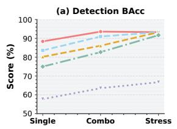

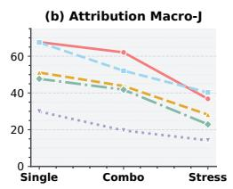

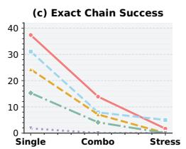

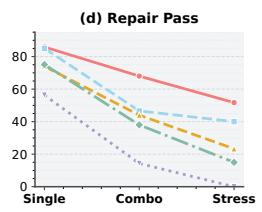  
Figure 32: Performance under increasing defect complexity. We compare single-violation (Diagnostic), compositional (Combo), and high-density (Stress) settings across degradation detection, violation attribution, exactchain diagnosis, and aesthetic repair. Detection remains comparatively stable as more defects are introduced, whereas fine-grained diagnosis and repair become substantially more difficult.

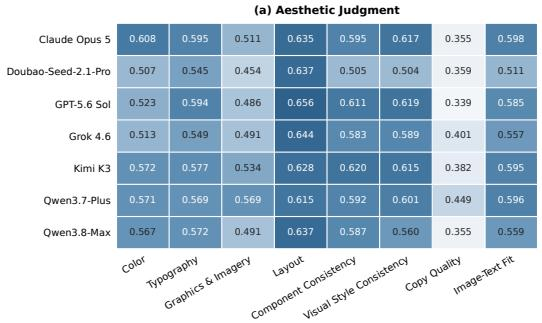

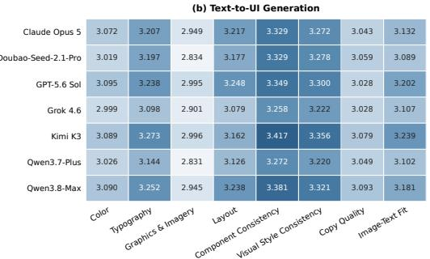  
Figure 33: Dimension-wise aesthetic capability profiles. Left: SRCC with professional-designer MOS for Aesthetic Scoring. Right: human-calibrated aesthetic scores for successfully rendered Text-to-UI generations. The two panels use the same eight-dimensional perceptual rubric but characterize scoring and generation, respectively.

Dimension-Wise Aesthetic Capability Profiles. Figure 33 further decomposes aesthetic performance along the eight perceptual dimensions shared by Aesthetic Scoring and Text-to-UI Generation. For Aesthetic Scoring, the strongest frontier models show consistently higher agreement with professional designers on layout (SRCC 0.615–0.656), while copy quality is consistently more difficult (SRCC 0.339–0.449). This suggests that models capture global spatial organization more reliably than the contextual appropriateness and quality of interface copy.

A different profile emerges for generated interfaces. Among successfully rendered generations, component consistency and visual-style consistency generally receive the highest calibrated aesthetic scores, whereas graphics and imagery is consistently among the weakest dimensions. For example, GPT-5.6 Sol scores 3.349 on component consistency but 2.995 on graphics and imagery, while Kimi-K3 scores 3.417 and 2.996, respectively. These dimension-level results show that aggregate aesthetic scores conceal systematic differences in the types of aesthetic knowledge that current models can judge and realize.

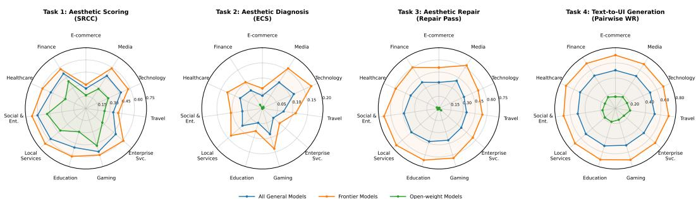  
Figure 34: Absolute performance across UI industries. Group-average performance across 11 industries for Aesthetic Scoring (SRCC), Aesthetic Diagnosis (ECS), Aesthetic Repair (Repair Pass), and Text-to-UI Generation (Pairwise Win Rate). Each panel uses the original scale of its corresponding metric and should be compared within task.

What Limits Successful Repair? To identify the source of repair failures, Table 11 decomposes the official Repair Pass criterion into target correction (F), collateral preservation $( C ) .$ , content preservation $( P ) _ { : }$ , and visualscope compliance (S). For most frontier models, collateral and content preservation are already high, while target correction and visual-scope compliance remain more restrictive. Qwen3.7-Plus, for example, achieves 0.995 collateral preservation and perfect content preservation, but only 0.371 target-fix success, resulting in a Repair Pass of 0.342. Similarly, Doubao-Seed-2.1-Pro preserves collateral and content at 0.985 and 0.992, respec-

Table 11: Decomposition of Aesthetic Repair performance. F: target fix; C: collateral preservation; P: content preservation; S: visual-scope compliance.
<table><tr><td>Model</td><td>F</td><td>C</td><td>P</td><td>S</td><td>Repair</td></tr><tr><td>Claude Opus 5</td><td>0.83</td><td>0.97</td><td>0.97</td><td>0.82</td><td>0.76</td></tr><tr><td>Doubao-Seed-2.1-Pro</td><td>0.50</td><td>0.99</td><td>0.99</td><td>0.70</td><td>0.45</td></tr><tr><td>GPT-5.6 Sol</td><td>0.69</td><td>0.95</td><td>0.95</td><td>0.75</td><td>0.66</td></tr><tr><td>Grok 4.6</td><td>0.74</td><td>0.94</td><td>0.94</td><td>0.77</td><td>0.70</td></tr><tr><td>Kimi-K3</td><td>0.59</td><td>0.77</td><td>0.77</td><td>0.64</td><td>0.57</td></tr><tr><td>Qwen3.7-Plus</td><td>0.37</td><td>1.00</td><td>1.00</td><td>0.77</td><td>0.34</td></tr><tr><td>Qwen3.8-Max</td><td>0.62</td><td>0.98</td><td>0.99</td><td>0.71</td><td>0.55</td></tr></table>

tively, but reaches only 0.498 on target correction. In contrast, Claude Opus 5 achieves substantially stronger target correction (0.826) and visual-scope compliance (0.824). These results suggest that repair failures are driven primarily by the difficulty of correctly resolving the intended aesthetic defect while keeping the modification appropriately localized, rather than by widespread corruption of unaffected content.

## E.3 PERFORMANCE ACROSS INDUSTRIES

We further examine how model performance varies across 11 UI industries. We first characterize the overall industry-level patterns across model groups, then inspect individual frontier models, and finally analyze whether these differences persist after controlling for model strength and where they emerge along the diagnosis–repair pipeline.

Industry sensitivity differs substantially across tasks. Figure 34 provides a group-level view of industry variation. For frontier models, Aesthetic Scoring and Repair vary substantially across industries: SRCC ranges from 0.293 on E-commerce to 0.673 on Social & Entertainment, while Repair Pass ranges from 0.505 on E-commerce to 0.696 on Local Services. In contrast, Text-to-UI Generation is considerably more stable, with frontier-model Pairwise Win Rate remaining around 0.69–0.72 across industries. Open-weight models show a large absolute gap, particularly in Diag nosis and Repair, where performance is close to the floor.

Group-level trends coexist with substantial model-specific variation. Figure 35 further decomposes the frontier-model average into individual models. Some industry patterns are shared across models: for example, Aesthetic Scoring is generally weaker on E-commerce and stronger on Local Services and Social & Entertainment. However, Diagnosis and Repair also exhibit substantial model-specific variation. In particular, ECS differs sharply across models, with some models remaining relatively strong across multiple industries while others approach zero on many categories. By comparison, Text-to-UI Generation is more stable across industries within the same model, and variation is dominated more by differences between models.

(d) Text-to-UI Generation (Pairwise WR)  
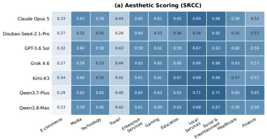

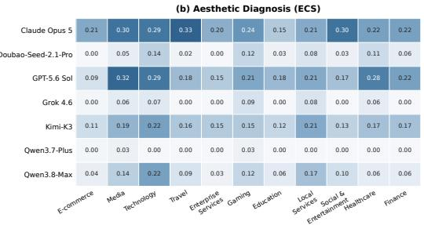

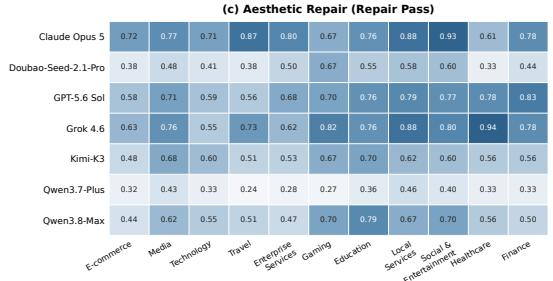

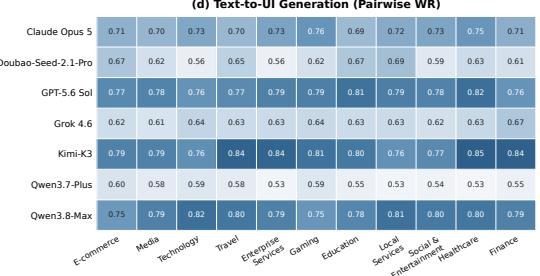  
Figure 35: Fine-grained performance of individual frontier models across 11 UI industries. We report industry-wise results for (a) Aesthetic Scoring (SRCC), (b) Aesthetic Diagnosis (ECS), (c) Aesthetic Repair (Repair Pass), and (d) Text-to-UI Generation (Pairwise Win Rate). Cell values show the original metric scores, while color scales are independently normalized within each task for clearer comparison.

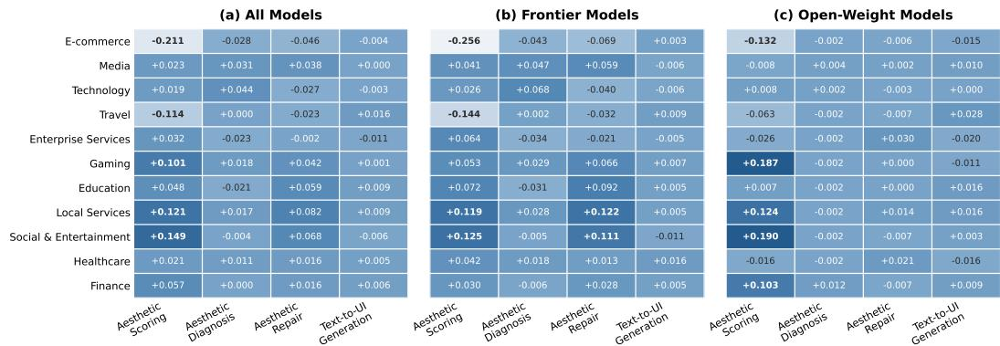  
Figure 36: Model-normalized industry effects across the four tasks. Each cell reports the mean withinmodel deviation from overall performance: $\begin{array} { r } { \Delta _ { g , t } \ = \ \frac { 1 } { | \mathcal { M } | } \sum _ { m \in \mathcal { M } } ( S _ { m , g , t } - S _ { m , \mathrm { o v e r a l l } , t } ) } \end{array}$ . Positive values indicate above-overall performance and negative values indicate below-overall performance.

Industry effects remain after controlling for model strength. As shown in Figure 36, frontier models remain consistently below their overall level on E-commerce in Scoring (−0.256), Diagnosis (−0.043), and Repair (−0.069), while Local Services and Social & Entertainment show positive shifts in both Scoring and Repair. Similar trends appear across all general-purpose models. By contrast, Text-to-UI Pairwise Win Rate changes little across industries, with most normalized deviations within about ±0.02. Open-weight models preserve some industry structure in Scoring, but floor effects largely obscure such variation in Diagnosis and Repair.

Industry differences become more pronounced at finer levels of aesthetic understanding. Figure 37 shows that frontier-model degradation detection remains relatively stable across industries, with BAcc around 0.74–0.85. Larger variation appears in attribution and exact-chain diagnosis, and persists in downstream repair. Open-weight models similarly retain non-trivial coarse detection ability but drop sharply on attribution, ECS, and Repair. This suggests that industry-specific challenges arise mainly when models must identify and act on specific aesthetic problems, rather than when simply recognizing that an interface is degraded.

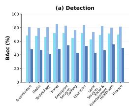

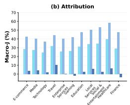

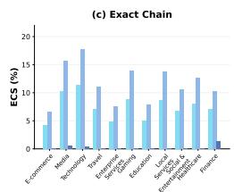

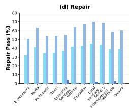  
Figure 37: Industry-wise performance from coarse diagnosis to corrective action. We report degradation detection (BAcc), violation attribution (Macro-J), exact diagnosis-chain success (ECS), and final Repair Pass for the three model groups across industries.