# AX is the New AEO

Ido Finder ido@ora.ai

Assaf Elovic assaf@ora.ai

Gad Shalev gad@ora.ai

ora research

## Abstract

In 2023, AI models answered from training data and hallucinated when it ran out, and businesses were told to seed that knowledge. Models’ training knowledge has since given way to live web search, and the advice followed it there: answer-engine optimization, or AEO, now tells businesses to scatter breadcrumbs across forum threads, listicles, and of-site citations, so AI engines are likelier to surface and recommend them. But being surfaced is no longer enough: an agent opens the results and reads them before deciding, and one buyer question sends it through several rounds of search and fetch. What decides the outcome at this drill-down step is whether the agent can fetch and read the business’s own site: agent experience (AX). We argue that AX is the new AEO. We run 37,927 agent journeys, each a buyer question about a business, across four independent harnesses over 1,056 real businesses, matched on fame, prior model knowledge, and two AEO proxies, then split based on their AX level. Only 7–10% of the finished answer comes from the model’s training knowledge, whether or not the site is readable. Agent-ready businesses have answers built from their own pages 78% of the time against 56% and are clearly recommended 1.9× more often, while every grounded answer about a not-agent-ready business costs the agent 64% more. Holding business, harness, and question fixed, answers built from the site are 41% more accurate. The dominant failure is not fabrication but omission: web-built answers are 3.7× more likely to contain none of the facts the buyer asked for. Baselines difer sharply across the four harnesses, with clear-recommendation rates varying sevenfold from stack to stack, yet the efect holds in every one. In the agentic web era, being readable beats being talked about, and improving a site’s AX is the strongest lever a business has.

## 1 Introduction

For two decades the web has been written for human readers and for the search crawlers that index pages on their behalf: layouts that reward attention, interfaces that answer to clicks, content assembled in the browser after the page loads. The arrangement held because the two audiences wanted compatible things. A crawler had to find the page and gather roughly what it was about; a person did the rest, in a browser, at human speed.

That is no longer who visits. As of September 2026, bots make 62.4% of requests for HTML content on one major network, against 37.6% from people (Cloudflare Radar, 2026). Much of that is the search and SEO machinery that has crawled the web for years, but the part growing fastest is new. AI answer engines like ChatGPT, Claude, and Gemini now reply to a question in place of a page of links, and agents search, fetch, and read on a person’s behalf before reporting back (Gou et al., 2025; Steiner et al., 2026). These are not crawlers building an index for later. They arrive because someone has just asked something, and they read in order to answer it.

They consume the page on diferent terms. Most do not execute JavaScript by default, so content assembled after load is often invisible to them (Zecchini et al., 2024); they rarely browse a site so much as fetch a URL; and what they cannot parse into text tends to be discarded. A page that is perfectly legible to a person can be close to empty to an agent. In early 2026, ora introduced the agent-readiness ranker we use in this study, which scores a site against agent protocols and observed agent behaviour (ora research, 2026). The ranker is our own, and we report its scores as the study’s instrument rather than as an independent measure. Across nearly 100,000 sites, fewer than 1% earn its top grade of A or above: most of the web is not ready for the consumers it now has, and a standards efort is under way to define what readiness requires (Anthropic, 2024; Microsoft, 2025; agentready.org, 2026).

Biilmann (2025) coined agent experience (AX) for the experience an agent has as the user of a product or platform. We apply it to the site itself: a site’s AX is how well it serves the agent that arrives to fetch and read it, and a site with good AX is what the ranker scores as agent-ready. Our claim is that AX is what decides whether a business’s own facts reach the buyer.

The optimization industry has followed the trafic. When models answered largely from what they had learned in training, the advice was to get into the corpus itself, seeding the sources a model would learn from. As models began retrieving at answer time rather than recalling, the advice moved with them, and answer-engine optimization (AEO) and generative engine optimization (GEO) formalized the retrieval-era version (Aggarwal et al., 2024). The two labels are often used interchangeably, and for simplicity we write AEO throughout for both. The current playbook tells businesses to scatter breadcrumbs where a retrieval step will find them, in forum threads, listicles, and of-site citations, so that an AI engine is likelier to surface and recommend them. Classic search optimization has not gone away either: agents reach most pages through a web search, so what ranks still decides much of what an agent sees, and a benchmark of conversational-SEO rewrites finds most of them inefective or actively harmful to a source’s ranking, with classic SEO more efective (Puerto et al., 2025).

But being surfaced is no longer the end of the process. A single buyer question sends an agent through several rounds of search and fetch, and what it reads in those rounds is what the answer gets built from. SEO and current AEO both govern the surfacing step; the drill-down step decides what the answer is made of. If the agent can read you, it grounds its answer in your first-party facts. If it cannot, because the page is JavaScript-only, because the site’s bot controls block the agent (Prince, 2025), or because access is otherwise gated (Longpre et al., 2024), the agent does not stop. It has the open web to fall back on: third-party pages, competitors, listicles, aggregators. Whether that substitution happens, how often, and what it costs is what this paper measures.

AX is broader than reading. An open agent readiness specification separates three layers, whether an agent can find a site, whether it can read it, and whether it can act on it through documented APIs or an MCP server (agentready.org, 2026). We scope this study to the read layer, holding discovery fixed and leaving the act layer to later work. Our thesis is that AX is the new AEO: answer-engine optimization decomposes into SEO for the surfacing step and AX for the drill-down step and everything after it, and at the drill-down being readable beats being talked about. The main contributions are:

1. The study runs the first controlled experiment on agent readiness in the wild we know of: 37,927 agent journeys on 1,056 live businesses across four harnesses.

2. The study gives a first detailed account of the drill-down step, where the answer is decided. Most AEO work stops at surfacing; we follow what agents actually do once they read, and how well the answer they build holds up.

3. The study leaves an experimental design later work can build on. AX travels with how well known a business already is; we hold fame, prior knowledge, and AEO equal across four harnesses, so the AX efect stands on its own.

## 2 Related Work

AEO/GEO: optimizing for surfacing. Aggarwal et al. (2024) showed that page edits (statistics, quotations, citations) can raise a source’s share-of-answer, but conditional on the source already being retrieved into context. Later work tempers this. C-SEO Bench finds most rewrites inefective and frequently harmful to a source’s ranking, with classic SEO more efective (Puerto et al., 2025), and a critical survey of 45 studies concludes that no technique it reviews shows a stable, longitudinal, cross-platform causal efect on organic discoverability (Martinez, 2026). We take AEO as governing surfacing only, and show it is inert at the drill-down.

Agents that browse. The pieces were demonstrated separately before the word agent settled on them: browsing and citing sources (Nakano et al., 2021), interleaving reasoning with actions (Yao et al., 2023), and deciding when to call a tool (Schick et al., 2023). Benchmarks then established multi-step interaction as standard agent behaviour, on real sites (Deng et al., 2023; He et al., 2024) and on reproducible self-hosted ones (Zhou et al., 2024; Mialon et al., 2024). Most on-point, Gou et al. (2025) evaluate agentic deep research on correctness and source attribution over live browsing. That is the exact setting we study, with the variable reversed: they compare agents over a web they let vary, while we hold the agents fixed and compare sites.

Grounding and attribution. Retrieval-augmented generation grounds answers in fetched content (Lewis et al., 2020; Guu et al., 2020; Izacard et al., 2023). Attribution (whether an output is attributable to identified sources) is a formal, evaluable construct (Rashkin et al., 2023), with benchmarks for answer-with-citations (Gao et al., 2023b), post-hoc attribution (Gao et al., 2023a), and faithfulness scoring (Es et al., 2024). Our first-party grounding and answer-composition metrics instantiate these over the specific source the agent read.

Factuality and the cost of ungrounded answers. Ungrounded generation hallucinates (Ji et al., 2023; Huang et al., 2025), and parametric memory is unreliable for less-popular, long-tail facts, precisely the regime of most businesses (Mallen et al., 2023), and for fast-changing facts (Vu et al., 2024). We score factual precision atomically against captured ground truth (Min et al., 2023). Human audits find generative search answers frequently unsupported or mis-cited: only 51.5% of generated sentences are fully supported by their citations (Liu et al., 2023), and an eight-engine audit found most responses carried incorrect information (Jaźwińska and Chandrasekar, 2025). Surfacing is not the same as grounded, accurate answering. These audits grade the engine; we hold the engine fixed and vary the source it is trying to read.

The risk of grounding on third-party content. Content an agent retrieves from pages the business does not control is an attack surface: planted instructions and text can hijack LLM applications (Greshake et al., 2023; Zou et al., 2025), and steer which products LLM search recommends (Nestaas et al., 2025; Kumar and Lakkaraju, 2024; Chen et al., 2026). Most directly, Zhang et al. (2026) poison deep-research agents by editing a single Reddit or Wikipedia page with as few as 13 words, getting the text cited in 38–51% of reports. We do not measure poisoning, but it sharpens our findings: the third-party pages the AEO playbook seeds are the same channel these attacks exploit, and a readable first-party site is the one source a business can vouch for.

The agent-readable web. Agents arrived on a web that was not built for them, and was closing further. Audits from 2024 found AI crawlers fetching HTML without executing JavaScript, leaving client-rendered content unreachable (Zecchini et al., 2024), while access was being restricted, metered, or blocked by default (Longpre et al., 2024; Prince, 2025; Allen, 2025). What followed has landed unevenly. The Model Context Protocol caught on and is now the industry standard for exposing tools and data to agents (Anthropic, 2024). llms.txt (Howard, 2024) is more widely deployed but lightly used: of agents that read it, only one in three goes on to fetch a page it lists (agentready.org, 2026). NLWeb (Microsoft, 2025) has been published but not taken up. Newer work goes further: WebMCP lets a page expose its own functions as callable tools (W3C Web Machine Learning Community Group, 2025), and Steiner et al. (2026) find agents served through structured interfaces (MCP, RAG, and NLWeb) answer more accurately and far more cheaply than by browsing HTML. None of these is yet widely adopted, so this study does not explore them. It measures the path every business already has: an agent fetching and reading the site’s own pages. What agent readiness requires is still being written down, revised as protocols emerge and as more is measured about how agents behave (agentready.org, 2026).

## 3 The Shift: Agents Rely Far Less on Training Data

Today’s agents build their answers from what they fetch, not from what they remember. If a model still answered mostly from its training data, whether it could read a site would hardly matter.

We put 90 buyer questions, the three intents of Section 4 asked about 30 of the study’s businesses, 15 per group, as plain questions rather than instructions to check the site, to each OpenAI generation in turn, web tools available but optional, and had a judge (claude-sonnet-4-6) score how much of each answer came from memory rather than from retrieval. The last nonreasoning flagship, gpt-4.1, still built about half its answer from memory. Then reasoning models became the default and it falls of a clif: 14% by gpt-5.6, and 7–10% in the four agent harnesses this study runs, measured with a diferent instrument (Figure 1).

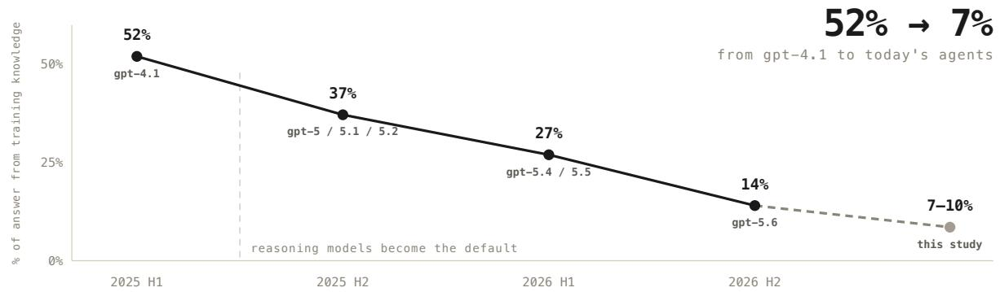  
Figure 1: Share of the answer built from training knowledge across seven OpenAI releases: the same 90 buyer questions, web tools optional, every claim judged. Points are release half-year averages over 630 runs. The dashed final point is this study’s own measurement across four harnesses, a diferent instrument.

The public record agrees (Figure 2). On recency-dependent questions, frontier models invoke search about nine times in ten (Kale, 2025). Across three ChatGPT generations between January and May 2026, the share of Business-tier runs that fired a web search whose searches are anchored to the current year rose from 6% to 87% (Kaya, 2026). And the sources those searches return are themselves a moving target: Reddit’s share of ChatGPT citations fell 86–95% within a week in August 2026, depending on the panel (Promptwatch, 2026; Ilhe, 2026), as site: queries against oficial domains went from near zero to roughly a quarter of the model’s background searches (Ilhe, 2026). An of-site channel can lose its value in a single model update, and this update moved the model toward the business’s own domain.

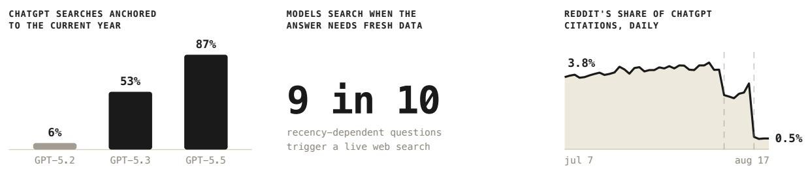  
Figure 2: Left: searches anchored to the current year (Kaya, 2026). Centre: search invocation on recency-dependent questions (Kale, 2025). Right: Reddit’s daily share of ChatGPT citations (Promptwatch, 2026).

Memory still answers stable facts in a plain chat turn, and we do not claim otherwise. But buyer questions about pricing, setup, and comparisons need current information, and in agent harnesses fetching is the default. In that setting, what the agent reads now decides nearly all of the answer. The rest of this paper measures what decides what it can read.

## 4 Method

## 4.1 Design

Businesses are drawn from the ora database, one domain per company. The study contrasts two groups difering on a single axis, agent readiness, matched on the confounds that could otherwise produce the same result: third-party citations, fame, and the model’s prior knowledge of the brand. A diference that survives matching on all three cannot be explained by them.

Each business is measured on four dimensions, one treatment and three controls held equal across groups (Table 1).

• Agent readiness (treatment). The accessibility layer of ora’s own production ranker (ora research, 2026) in isolation, from its snapshot of 24 August 2026: how fetchable and readable a site is to an agent, scored 0–1. A fraction of what the layer checks: how much content survives a fetch with no JavaScript; structured data and entity linking; machine-readable entry points such as llms.txt, per-URL Markdown fallbacks, HTTP Link headers and an agent-discovery file; whether pricing and API documentation are reachable; and whether bot controls admit user-triggered agents. Throughout the rest of this paper agent-ready means accessibilit $\mathrm { y } \geq 0 . 6 5$ and not agent-ready ≤ 0.50, the study’s own cut on this layer rather than the ranker’s overall grade; the band between is excluded at the candidate stage. The score also serves the dose–response analyses.

• AEO (control). Two independent proxies. Citation breadth scores 0–1 how widely a brand is mentioned on sites it does not own: Tavily (Tavily, 2026) queries for review, alternatives and vs give the distinct third-party hosts, half the score, with a quarter each for Wikipedia and Reddit. These are raw search hits, never an answer engine’s, so the control cannot inherit the outcome it holds fixed. The discovery score, another layer of the same ranker, measures findability rather than readability. Both are matched between groups and tested again as covariates (Section 5).

• Fame (control). Global trafic rank from the Tranco top-1M list, snapshot of 24 August 2026 (Le Pochat et al., 2019). The cohort excludes the few hundred largest sites: at that size the comparable sites are all agent-ready, so there is nothing to pair them against.

• Prior knowledge (control). A 0–1 score of how present a brand already is in training data, from tool-free probes that map domain to brand and back, recall facts, and name the brand within its category.

Each agent-ready business is paired with its nearest not-agent-ready neighbour on the standardized controls, accessibility held out of the distance so matching cannot narrow the contrast. Pairs form within industry vertical and fame band under a 2.5 standard-deviation caliper, and collection is blocked by pair. The fame bands split at Tranco rank 110,000, and the 12 verticals are the categories of Table 3. Accessibility is re-scanned at launch, so a label reflects the site on the day it ran. The result is 1,056 businesses, 528 per group (Table 1).

Table 1: Covariate balance in the final cohort. The groups difer sharply on the treatment and are indistinguishable on every control.
<table><tr><td>Variable</td><td>Role</td><td>agent-ready</td><td>not agent-ready</td><td>SMD</td></tr><tr><td>Accessibility score</td><td>treatment</td><td>0.737</td><td>0.319</td><td>3.66</td></tr><tr><td> $\log _ { 1 0 }$  Tranco rank</td><td>fame</td><td>5.10</td><td>5.11</td><td>-0.01</td></tr><tr><td>Training-data presence</td><td>prior knowledge</td><td>0.332</td><td>0.332</td><td>0.00</td></tr><tr><td>Citation breadth</td><td>AEO</td><td>0.322</td><td>0.327</td><td>-0.02</td></tr><tr><td>ora discovery score</td><td>AEO</td><td>0.326</td><td>0.313</td><td>0.07</td></tr></table>

Group means over 528 businesses per group. SMD is the standardized mean diference, (agent-ready − not agent-ready) / pooled SD; |SMD| < 0.1 is the conventional threshold for balance.

## 4.2 Collection

Each business receives three site-anchored prompts, one per intent: pricing, features, and setup. Each is a natural user request built from a frozen template with the business’s own domain filled in, for example: “I’m looking for a service that fits my budget. Can you find out what subscription options are available at {domain} and what they cost?” Every prompt runs three times on each of the four harnesses, so that run-to-run variance can be separated from diferences between businesses, under a neutral system prompt carrying no behavioural instruction that could contaminate the experiment.

The four harnesses are independent runtimes spanning two model vendors and two search providers (Table 2), so that no result depends on one agent’s implementation. Every run is spawned in a fresh isolated environment, carrying no state from any other. Each agent can search the web and fetch pages, using the harness’s own tools where it provides them, and must answer.

Table 2: The four agent stacks. Model and search backend vary together, so the table supports no comparison between one component and another. Tavily is a web-search API for agents (Tavily, 2026).
<table><tr><td>Harness</td><td>Model</td><td>Web search</td></tr><tr><td>claude-agent-sdk</td><td>claude-sonnet-4-6</td><td>built-in (Anthropic)</td></tr><tr><td>claude-code</td><td>claude-haiku-4-5</td><td>built-in (Anthropic)</td></tr><tr><td>openclaw</td><td>gpt-5.4-mini</td><td>Tavily</td></tr><tr><td>eve</td><td>gpt-5.4</td><td>Tavily</td></tr></table>

Factual accuracy is measured on a subsample. A full headless-browser render captures what each site publishes during the collection window, so ground truth exists even for sites the agent was blocked from reading; the 131 businesses whose capture yielded extractable facts for at least one intent are graded.

## 4.3 Measures

The agent’s trajectory is the full step-by-step trace of a run. From it and the finished answer we derive the measures below; judges are blind to a business’s group.

Grounding. First-party evidence share is the fraction of retrieved content (fetched pages plus search snippets) from the business’s own site, in characters. The grounded-answer rate is the share of journeys that read the site and used no outside source. We also record searches, on-site blocks (HTTP errors or bot walls), turns, duration, and cost.

Answer composition. Logs show what the agent read, not what the answer used. A judge splits each answer into sections and labels each one’s source: the business’s pages, a third-party page, search snippets, or training knowledge (only when nothing retrieved could have supplied it).

Independent recommendation. A raw recommendation rate would confuse a good product with a readable site, so we hold the business fixed and ask of each answer how strongly it recommends that business. Two judges from diferent vendors (claude-sonnet-4-6 and gpt-5.4) see only the request and the answer and rate it 0 to 4; an answer clearly recommends only when both give the top score. Two vendors guard against a judge favouring its own family, which also powers harnesses here; they agree within one point on 88% of answers. A judge also flags the four hedge patterns of Figure 6.

Accuracy. Each answer is graded against the captured facts one at a time, following the atomicfact decomposition of Min et al. (2023): correct = 1, partial = 1 where the answer gets the fact right but less precisely, incorrect or omitted = 0. FActScore scores each fact as supported or not over the facts an answer states; we allow half credit and divide by the facts asked, so omission counts as a failure. Graded accuracy is (correct + 1 partial) / facts asked, over 31,127 facts in

2,499 answers; an empty answer mentions none. An answer is site-built when the agent read the business’s own pages and used no outside source, web-built otherwise.

Analysis. The nine journeys on one business are not independent, so we average within business and treat the business as the unit of analysis. Group diferences are ratios with two-sided permutation tests (20,000 shufles) and bootstrap 95% CIs; trends along the accessibility score use Spearman correlation. With about 20 comparisons we treat $p < 0 . 0 0 1$ as confirmed and $0 . 0 0 1 \leq p < 0 . 0 5$ as present but not confirmed. AEO proxies are partial correlations conditioning on accessibility, fame, and the matching strata. Site-built and web-built answers are compared only within cells of one business, harness, and question type, by sign-flip permutation (Table 7).

## 5 Results

## 5.1 Where the agent actually goes

Figure 3 shows two real traces of the same buyer question on the same harness: twilio.com answers from its own documentation in seven steps; hashicorp.com blocks the agent twice, searches the open web seven times, and ends on two competitors’ blogs.

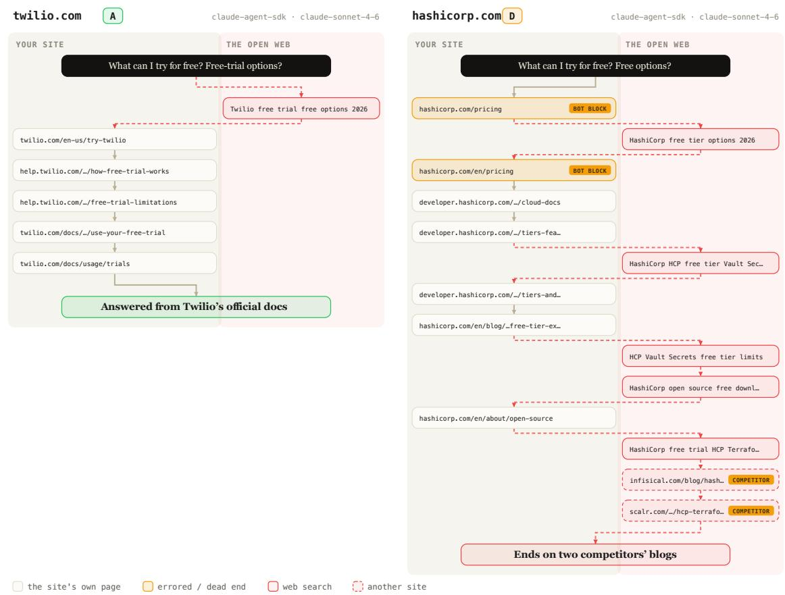  
Figure 3: Two real traces, one buyer question, one harness. Left: twilio.com, agent-ready. Right: hashicorp.com, not agent-ready, and still confident.

## 5.2 Recommendation: agent-ready businesses get recommended

A clear recommendation is the outcome the business is competing for: it is what the agent tells the person who asked. On the two-judge measure, agent-ready businesses get one 20% of the time against 11%, or $\mathbf { 1 . 9 \times \sigma } \left( p < 0 . 0 0 0 1 \right.$ ; Figure 4). Both judges must award the top grade, so the measure counts only answers that leave the buyer in no doubt.

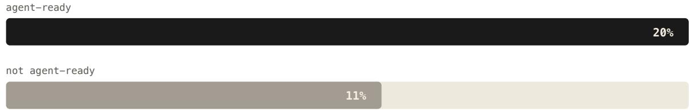  
Figure 4: One in five answers clearly recommends an agent-ready business; one in nine when it is not agent-ready. Bars are the share of answers that both blind judges rate a clear recommendation, all four stacks pooled; both judges must award the top grade for an answer to count (permutation p < 0.0001).

The lift is not one agent’s personality. Every stack shows it, but the levels they sit at difer enormously: claude-code clearly recommends 5% of the time, eve 36% (Figure 5). That spread belongs to the harness rather than to the businesses, and it is why the ratio and the absolute movement rank the stacks in opposite orders. claude-code’s 2.6× is three points of movement on a two-point base; eve’s 1.8× is sixteen points. The direction is what replicates across all four.

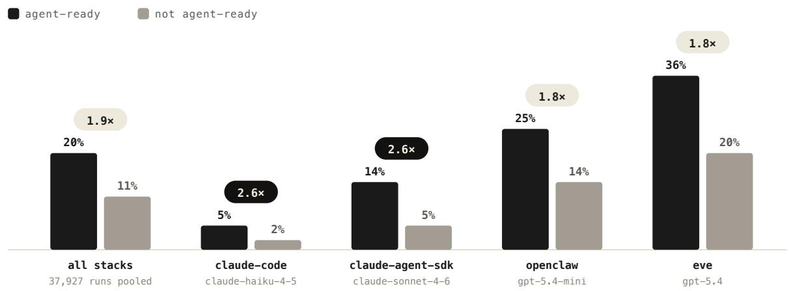  
Figure 5: Recommendation rate by agent stack. Bars are the share of answers both blind judges rate a clear recommendation.

Every one of the twelve categories shows a lift, from 1.2× in customer service to 2.5× in IT infrastructure (Table 3), and it is largest in the categories where a buyer compares vendors before committing.

Table 3: Recommendation rate by business category, all twelve, ordered by lift.
<table><tr><td>category</td><td>ready</td><td>not</td><td>lift</td></tr><tr><td>IT Infrastructure</td><td>24%</td><td>9%</td><td>2.5×</td></tr><tr><td>Sales &amp; Marketing</td><td>21%</td><td>9%</td><td>2.3×</td></tr><tr><td>Security</td><td>17%</td><td>7%</td><td>2.3×</td></tr><tr><td>Artificial Intelligence</td><td>23%</td><td>10%</td><td>2.2×</td></tr><tr><td>Development</td><td>32%</td><td>14%</td><td>2.2×</td></tr><tr><td>Consumer</td><td>21%</td><td>9%</td><td>2.2×</td></tr></table>

<table><tr><td>category</td><td>ready</td><td>not</td><td>lift</td></tr><tr><td>Analytics</td><td>21%</td><td>10%</td><td>2.1×</td></tr><tr><td>Fintech &amp; Payments</td><td>13%</td><td>8%</td><td>1.7×</td></tr><tr><td>HR &amp; Legal</td><td>13%</td><td>8%</td><td>1.6×</td></tr><tr><td>Collaboration &amp; Prod.</td><td>24%</td><td>16%</td><td>1.5×</td></tr><tr><td>Commerce</td><td>15%</td><td>12%</td><td>1.3×</td></tr><tr><td>Customer Service</td><td>23%</td><td>20%</td><td>1.2×</td></tr></table>

Lifts are computed from unrounded rates and will not always reproduce from the rounded percentages shown.

The same gap appears from the other end. Answers that both judges rate too weak to recommend at all are 2.45× more common when the site is not agent-ready $( p < 0 . 0 0 0 1$ ; Table 7), and the language of those answers shows why. When an agent cannot read a site it hedges, and every hedge pattern is significantly more common (Figure 6): it discloses that it could not access the business 4.4× more often, vouches from secondhand sources 3.0× more, is vague 1.8× more, and sends the user of to check for themselves 1.4× more. An answer that opens by admitting it could not reach the site is not a recommendation, whatever it says after that.

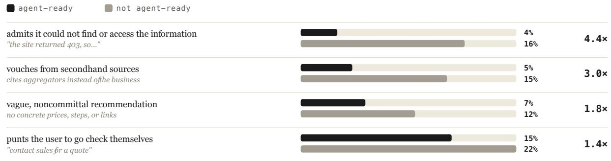  
Figure 6: The four ways an answer undermines its own recommendation. Bars are the share of answers exhibiting each hedge. All four contrasts are significant at permutation p < 0.0001.

## 5.3 Grounding: when agents can’t read you, the answer is built without you

In ∼99% of journeys that hit a dead end on a site, the agent answered anyway, built from whatever it found elsewhere. Across finished answers, training knowledge stays at 7–10% either way (Figure 7), so agents are not falling back on memory. Whatever the site does not provide, web search fills in. For agent-ready businesses, 78% of the answer is built from their own pages and only 12% from web search; when the site is not agent-ready, first-party content drops to 58% and web search doubles to 25%: on sites that are not agent-ready, 42% of the answer comes from somewhere other than the business. First-party evidence share is 0.776 vs. 0.549 (1.41×, p < 0.0001).

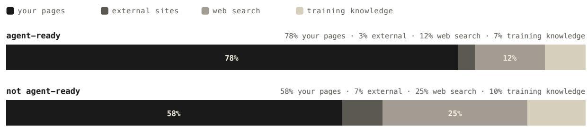  
Figure 7: What the finished answer is built from, as shares of the finished text: the business’s own pages, external sites, web search, and training knowledge.

The mechanism is a clean dose–response in web search (Figure 8): across nine bins of the accessibility score, mean web searches per journey rises monotonically from 1.8 to 4.5, a 2.6× spread (Spearman ρ = −0.52, p < 0.0001, n = 1,056 businesses). Every search is another chance the agent is fed information the business never published, or stopped updating, or that someone planted (Zhang et al., 2026; Nestaas et al., 2025).

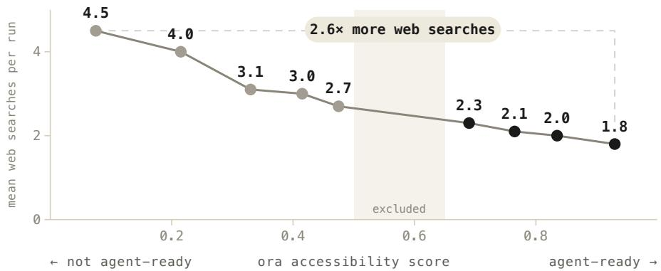  
Figure 8: Mean web searches per agent run against the ora accessibility score (Spearman $\rho = - 0 . 5 2 ,$ p < 0.0001). The ambiguous middle band of scores, 0.50 to 0.65, is excluded by design.

The pattern survives every cut (Table 4). Search reliance is a stack personality: openclaw navigates by search and averages 6.9 searches even on an agent-ready site, while claude-code averages 0.1. Losing readability still pushes every stack the same way, by 1.5× to 3.5×, and every one of the twelve categories moves with it, from 1.2× to 2.0×.

Table 4: Web searches per run, agent-ready → not agent-ready: all four stacks, and the five categories of twelve with the steepest lift.
<table><tr><td>stack</td><td>ready</td><td>not</td><td>lift</td></tr><tr><td>claude-agent-sdk</td><td>0.4</td><td>0.9</td><td>2.4×</td></tr><tr><td>claude-code</td><td>0.1</td><td>0.3</td><td>3.5×</td></tr><tr><td>openclaw</td><td>6.9</td><td>10.4</td><td>1.5×</td></tr><tr><td>eve</td><td>1.2</td><td>1.9</td><td>1.6×</td></tr></table>

<table><tr><td>category</td><td>ready</td><td>not</td><td>lift</td></tr><tr><td>Consumer</td><td>1.9</td><td>3.7</td><td>2.0×</td></tr><tr><td>IT Infrastructure</td><td>2.0</td><td>3.9</td><td>1.9×</td></tr><tr><td>Development</td><td>1.7</td><td>3.2</td><td>1.8×</td></tr><tr><td>Artificial Intelligence</td><td>1.8</td><td>3.1</td><td>1.7×</td></tr><tr><td>Sales &amp; Marketing</td><td>2.2</td><td>3.6</td><td>1.6×</td></tr></table>

Lifts are computed from unrounded means and will not always reproduce from the rounded values shown.

## 5.4 Cost: blocked sites cost the agent more per answer

On sites that are not agent-ready, runs take 23% more turns (5.5 → 6.8), get blocked by the site 2.1× as often, and take 15% longer to reach an answer (48s → 55s). All are significant at p < 0.0001 (Table 7). The extra turns and retries are billed to whoever runs the agent.

Cost per run understates it. A 403 is cheap; the expensive part is that only 56% of runs on not-agent-ready sites end grounded in the business, against 78% on agent-ready sites. Spreading the cost of the failed runs over the answers that did use the site gives +64% per grounded answer averaged across the four stacks, and up to +93% on two of them (Figure 9). That premium is paid by whoever operates the agent, not by the business whose site produced it.

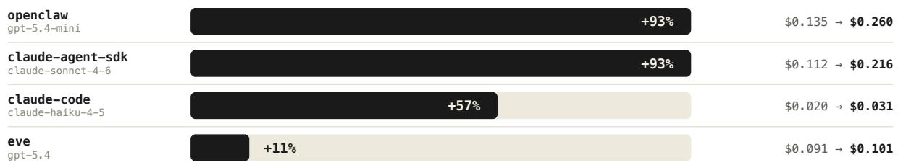  
Figure 9: Cost per grounded answer by stack, agent-ready → not agent-ready.

## 5.5 Accuracy: the common failure is a missing fact

The agent picks whether to read the business’s own site, and picks it more often on businesses that are easy for everyone, so a pooled comparison credits the channel with the dificulty of the business: site-built setup answers come from businesses averaging 28.0% accuracy against 17.4% for web-built ones. Every result below is therefore paired within business, harness, and question type (Section 4.3).

Reading the site makes the answer 41% more accurate. Site-built answers get 48.3% of asked facts right against 34.3% $( p < 0 . 0 0 0 1$ ; Table 5), and an answer built of-site is 3.7× more likely to contain none of the facts the buyer asked for.

Table 5: Site-built vs. web-built accuracy over 196 matched cells on 90 businesses; each row keeps only cells containing both kinds of answer. dif is site − web, and for empty answers the ratio is web/site.
<table><tr><td></td><td>site</td><td>web</td><td>diff</td><td>lift</td><td>p</td></tr><tr><td>Graded accuracy</td><td></td><td></td><td></td><td></td><td></td></tr><tr><td>All answers</td><td>48.3%</td><td></td><td>34.3% +14.0 pp</td><td>+41%</td><td>&lt;0.0001</td></tr><tr><td>by question type</td><td></td><td></td><td></td><td></td><td></td></tr><tr><td>pricing</td><td>60.4%</td><td>36.9%</td><td>+23.5 pp</td><td>+64%</td><td>&lt;0.0001</td></tr><tr><td>features</td><td>45.6%</td><td>38.8%</td><td>+6.8 pp</td><td>+18%</td><td>0.018</td></tr><tr><td>setup</td><td>23.9%</td><td>23.5%</td><td>+0.4 pp</td><td>+2%</td><td>0.87</td></tr><tr><td>by agent stack</td><td></td><td></td><td></td><td></td><td></td></tr><tr><td>claude-code</td><td>48.3%</td><td>10.0%</td><td>+38.3 pp</td><td>+382%</td><td>&lt;0.0001</td></tr><tr><td>claude-agent-sdk</td><td>48.4%</td><td>36.1%</td><td>+12.3 pp</td><td>+34%</td><td>0.022</td></tr><tr><td>openclaw</td><td>44.0%</td><td>40.0%</td><td>+4.0 pp</td><td>+10%</td><td>0.051</td></tr><tr><td>eve</td><td>46.1%</td><td>48.4%</td><td>-2.3 pp</td><td>-5%</td><td>0.39</td></tr><tr><td colspan="6">Empty answers (containing none of the facts asked)</td></tr><tr><td>All answers</td><td>6.7% 25.0% -18.3 pp</td><td></td><td></td><td>3.7×</td><td>&lt;0.0001</td></tr></table>

Fact by fact, the shift is omission rather than error (Figure 10): stated-wrong rises only from 4% to 6%, while never mentioned grows from 29% to 45%. Poor agent readiness makes a fact unretrievable, not false.

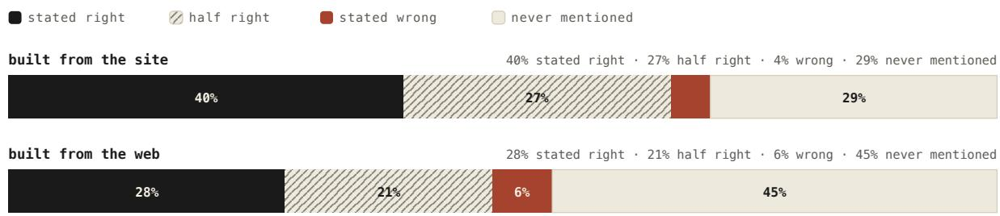  
Figure 10: The fate of every asked fact, by where the evidence came from, with shares averaged per business so that each business counts once.

The efect is largest on pricing (+64%), present on features $( + 1 8 \% , p = 0 . 0 1 8 )$ , and absent on setup $( + 2 \% , p = 0 . 8 7 )$ , where 65% of asked facts go unmentioned in both channels. Setup ground truth lives in documentation rather than on the marketing pages agents fetch, so what decides the outcome is findability rather than channel: splitting the setup businesses at their median site-built share gives 31% against 18%, and inside either half the channel barely matters. Across harnesses the gain is largest on the stack that retrieves least and cannot compensate (claude-code, +382%) and disappears on the two that retrieve most (openclaw, +10%, $p = 0 . 0 5 ; \mathrm { e v e } , - 5 \% , p = 0 . 3 9 )$

Accuracy also tracks grounding as a dose–response (Figure 11): grouping answers by how much of their evidence came from the business’s own pages, graded accuracy climbs monotonically from 41% to 56% (Spearman $\rho = 0 . 1 9 , p < 0 . 0 0 0 1 \rangle$ .

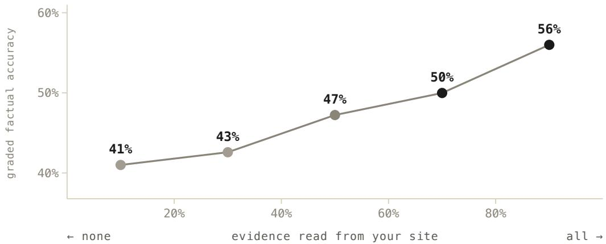  
Figure 11: Graded factual accuracy against the share of the answer’s evidence read from the business’s own site, in five bins over graded answers whose run retrieved any content.

Group contrast. Between assigned groups the graded subset difers by under two points (51.7% against 49.8%, p = 0.52; Table 7). The gain belongs to reading the site, which readiness makes more likely (82% of answers against 56%) but does not guarantee, so the group diference is diluted. It is visible: every question type and every harness points the same way, and on pricing, where the reading efect is largest, it is 61.7% against 55.6%. On 131 businesses none of these reaches significance, and establishing the group efect directly is left to future work (Section 7).

## 5.6 The AEO control: no efect of its own

Does AEO matter once readability is known? Across all 1,056 businesses, group labels aside, with accessibility and the other controls held fixed, neither AEO proxy has a confirmed link to grounding, recommendation, or cost, while accessibility has a strong one to all three (Table 6). The one hint, discovery on recommendation $( r = 0 . 1 0 , p = 0 . 0 0 2 )$ , is below the confirmation bar and fits the thesis: being findable helps a business get named, not read.

Matching on AEO did not erase the diferences this test needs: it equalized the group averages, but businesses still difer on AEO almost as much as in the full population (93% and 92% of the spread on the two proxies).

Table 6: The AEO control. Each cell is a partial correlation controlling the accessibility score, log-Tranco, industry vertical, and fame band; the accessibility column controls fame and the strata only.
<table><tr><td>outcome</td><td>discovery (AEO)</td><td>citation breadth (AEO)</td><td>accessibility (AX)</td></tr><tr><td>Grounding (first-party share)</td><td>+0.03 (0.32)</td><td>–0.04 (0.22)</td><td>+0.62 (&lt;0.0001)</td></tr><tr><td>Recommendation (both judges)</td><td>+0.10 (0.002)</td><td>−0.02 (0.45)</td><td>+0.41 (&lt;0.0001)</td></tr><tr><td>Cost per journey</td><td>−0.04 (0.15)</td><td>−0.01 (0.66)</td><td>−0.27 (&lt;0.0001)</td></tr></table>

Partial r, with p in parentheses. Higher accessibility means more grounding, more recommendation, and lower cost. Dropping the strata changes no verdict.

## 5.7 Summary

Table 7 collects the headline comparisons in one place: thirteen of the fourteen separate the two groups at $p < 0 . 0 0 0 1$

Table 7: Statistical significance of the headline comparisons (agent-ready vs. not agent-ready, domaincollapsed; ratio in its natural orientation; two-sided permutation p; bootstrap 95% CI on the ratio).
<table><tr><td>Comparison</td><td>ready</td><td>not ready</td><td>ratio</td><td>95% CI</td><td>perm. p</td></tr><tr><td>First-party evidence share</td><td>0.776</td><td>0.549</td><td>1.41×</td><td>[1.36, 1.47]</td><td>&lt;0.0001</td></tr><tr><td>Grounded-answer rate</td><td>0.778</td><td>0.555</td><td>1.40×</td><td>[1.34, 1.47]</td><td>&lt;0.0001</td></tr><tr><td>Web searches / journey</td><td>2.16</td><td>3.38</td><td>1.57×</td><td>[1.49, 1.65]</td><td>&lt;0.0001</td></tr><tr><td>Turns / journey</td><td>5.54</td><td>6.81</td><td>1.23×</td><td>[1.20, 1.26]</td><td>&lt;0.0001</td></tr><tr><td>Duration (s)</td><td>47.8</td><td>55.0</td><td>1.15×</td><td>[1.12, 1.19]</td><td>&lt;0.0001</td></tr><tr><td>On-site block rate</td><td>0.158</td><td>0.335</td><td>2.12×</td><td>[1.94, 2.33]</td><td>&lt;0.0001</td></tr><tr><td>Cost / journey (USD)</td><td>0.068</td><td>0.079</td><td>1.16×</td><td>[1.12, 1.20]</td><td>&lt;0.0001</td></tr><tr><td>Recommended (both judges, top score)</td><td>0.204</td><td>0.106</td><td>1.93×</td><td>[1.74, 2.15]</td><td>&lt;0.0001</td></tr><tr><td>Too weak to recommend (both judges)</td><td>0.050</td><td>0.124</td><td>2.45×</td><td>[2.11, 2.84]</td><td>&lt;0.0001</td></tr><tr><td>Hedge: could-not-access disclaimer</td><td>0.036</td><td>0.159</td><td>4.39×</td><td>[3.68, 5.26]</td><td>&lt;0.0001</td></tr><tr><td>Hedge: vouches from secondhand sources</td><td>0.050</td><td>0.151</td><td>3.05×</td><td>[2.65, 3.52]</td><td>&lt;0.0001</td></tr><tr><td>Hedge: vague / noncommittal</td><td>0.066</td><td>0.121</td><td>1.84×</td><td>[1.60, 2.11]</td><td>&lt;0.0001</td></tr><tr><td>Hedge: punts user to the source</td><td>0.153</td><td>0.219</td><td>1.44×</td><td>[1.31, 1.58]</td><td>&lt;0.0001</td></tr><tr><td>Graded accuracy, by group (131 businesses)</td><td>0.517</td><td>0.498</td><td>1.04×</td><td>[0.93, 1.17]</td><td>0.52 (n.s.)</td></tr></table>

Dose–response (Spearman): web searches vs. accessibility ρ = −0.52 (p < 0.0001, n = 1,056); graded accuracy vs. first-party evidence share ρ = 0.19 (p < 0.0001, n = 2,425 answers).

## 6 Conclusions

Six findings. The group contrasts among them hold in every harness and every business category tested.

1. Agents answer from what they fetch, not from what they remember. Across OpenAI releases the share of the answer built from memory fell from 52% in gpt-4.1 to 14% in gpt-5.6, and in the four harnesses here it is 7–10% whether or not the site is agent-ready. Optimizing what the model knows about a business now optimizes a shrinking slice.

2. Agent readiness decides what the answer is made of. When the agent can read the site, 78% of the finished answer comes from the business’s own pages and 12% from web search; when it cannot, 58% and 25%. A blocked agent does not stop: in ∼99% of journeys that hit a dead end it answered anyway, and searches per journey rise monotonically as accessibility falls, from 1.8 to 4.5.

3. Agent-ready businesses get recommended. Both blind judges call the answer a clear recommendation 20% of the time for agent-ready businesses against 11%, or 1.9×. Answers about not-agent-ready businesses hedge instead: they are 4.4× more likely to admit the site could not be reached and 2.45× more likely to be judged too weak to recommend at all.

4. The failure is omission, not fabrication. Within the same business, harness, and question, site-built answers get 41% more of the asked facts right, and web-built ones are 3.7× more likely to contain none of them: facts stated wrong barely move (4% to 6%), facts never mentioned climb from 29% to 45%.

5. Not being agent-ready costs the agent first, then the business. On not-agent-ready sites runs take 23% more turns, hit a block 2.1× as often, and take 15% longer; each answer grounded in the business costs 64% more on average and up to 93% on two stacks. The agent pays the premium; the business pays in the lost recommendation.

6. AEO has no efect of its own. With accessibility held fixed, neither citation breadth nor discovery predicts grounding, recommendation, or cost across all 1,056 businesses, while accessibility predicts all three. Being talked about does not substitute for being agent-ready.

AEO’s premise is that an answer engine draws on the sources it is pointed to, so a business should be present wherever those sources are gathered. That premise stops one step short of where the answer is now decided. Agents build it from what they fetch: the business’s own site when it lets them, whatever else they find when it does not. With fame, prior knowledge, and AEO held equal, agent readiness moved what the answer was made of, whether the business was recommended, and what each answer cost, while the AEO proxies had no efect of their own.

The practical reading is a decomposition, not a replacement: answer-engine optimization is SEO for the surfacing step plus AX for the drill-down step and everything after it. The current playbook addresses the first half only, and at the drill-down its proxies were inert in every measure here.

Being found still matters. Being read is what decides the answer, and it is the one input the business owns. AX is the new AEO, and it is where the investment belongs.

## 7 Limitations and Future Work

Content depth is not matched. The groups are matched on fame, prior knowledge, and AEO, not on how much a site publishes. A business that blocks agents may also publish less, and thinner content would widen the gap on its own. The accuracy comparison is immune, since it compares answers about the same business, and on the graded subset the not-agent-ready sites do publish substantive facts; the grounding and recommendation contrasts run between businesses and cannot rule this out. An intervention study, improving a site’s readiness and measuring before and after, would settle it.

Accuracy is graded on a subset. Ground truth exists for 131 businesses. Within them, answers built from the site are 41% more accurate, and the contrast between the two groups points the same way in every question type and harness but is not significant at this size (Section 5.5). A larger graded set would test it directly.

Scope. The cohort is SaaS and commerce-heavy and English-first, and the intents are businessfact lookups. Extending the analysis to more domains, verticals, and languages, and to transactional tasks, is the natural next step.

## Data availability

Analysis code and a sample of the derived data are released at https://github.com/ora/ research/tree/main/ax-is-the-new-aeo.

## References

ora research. ora research: agent readiness of the web, 2026. URL https://ora.ai/research. Accessed 27 September 2026.

agentready.org. The open standard for agent readiness. Open agent readiness specification, v1.0, 2026. URL https://agentready.org. Accessed 22 September 2026.

Pranjal Aggarwal, Vishvak Murahari, Tanmay Rajpurohit, et al. GEO: Generative engine optimization. In Proceedings of the 30th ACM SIGKDD Conference on Knowledge Discovery and Data Mining, 2024. URL https://arxiv.org/abs/2311.09735.

Will Allen. Introducing pay per crawl: Enabling content owners to charge AI crawlers for access. Cloudflare blog, 2025. URL https://blog.cloudflare.com/introducing-pay-per-crawl/. Published 1 July 2025.

Anthropic. Model context protocol, 2024. URL https://modelcontextprotocol.io/. Announced 25 November 2024.

Mathias Biilmann. Introducing AX: Why agent experience matters. biilmann.blog, 2025. URL https://biilmann.blog/articles/introducing-ax/. Published 28 January 2025.

Yimeng Chen, Zhe Ren, Firas Laakom, et al. How much can we trust LLM search agents? Measuring endorsement vulnerability to web content manipulation. arXiv preprint arXiv:2606.16821, 2026. URL https://arxiv.org/abs/2606.16821.

Cloudflare Radar. Bot vs. human trafic. Cloudflare Radar, HTML content, 2026. URL https: //radar.cloudflare.com/traffic. Accessed 22 September 2026.

Xiang Deng, Yu Gu, Boyuan Zheng, et al. Mind2Web: Towards a generalist agent for the web. In Advances in Neural Information Processing Systems (Datasets and Benchmarks Track), 2023. URL https://arxiv.org/abs/2306.06070.

Shahul Es, Jithin James, Luis Espinosa-Anke, et al. RAGAS: Automated evaluation of retrieval augmented generation. In Conference of the European Chapter of the Association for Computational Linguistics: System Demonstrations, pages 150–158, 2024. URL https://arxiv.org/abs/2309.15217.

Luyu Gao, Zhuyun Dai, Panupong Pasupat, et al. RARR: Researching and revising what language models say, using language models. In Annual Meeting of the Association for Computational Linguistics, 2023a. URL https://arxiv.org/abs/2210.08726.

Tianyu Gao, Howard Yen, Jiatong Yu, et al. Enabling large language models to generate text with citations. In Conference on Empirical Methods in Natural Language Processing, 2023b. URL https://arxiv.org/abs/2305.14627.

Boyu Gou, Zanming Huang, Yuting Ning, et al. Mind2Web 2: Evaluating agentic search with agentas-a-judge. In Advances in Neural Information Processing Systems (Datasets and Benchmarks Track), 2025. URL https://arxiv.org/abs/2506.21506.

Kai Greshake, Sahar Abdelnabi, Shailesh Mishra, et al. Not what you’ve signed up for: Compromising real-world LLM-integrated applications with indirect prompt injection. In Proceedings of the 16th ACM Workshop on Artificial Intelligence and Security, 2023. URL https://arxiv.org/abs/2302.12173.

Kelvin Guu, Kenton Lee, Zora Tung, et al. REALM: Retrieval-augmented language model pre-training. In International Conference on Machine Learning, 2020. URL https://arxiv. org/abs/2002.08909.

Hongliang He, Wenlin Yao, Kaixin Ma, et al. WebVoyager: Building an end-to-end web agent with large multimodal models. In Annual Meeting of the Association for Computational Linguistics, 2024. URL https://arxiv.org/abs/2401.13919.

Jeremy Howard. The /llms.txt file. Proposal, llmstxt.org, 2024. URL https://llmstxt.org/. Proposed 3 September 2024.

Lei Huang, Weijiang Yu, Weitao Ma, et al. A survey on hallucination in large language models: Principles, taxonomy, challenges, and open questions. ACM Transactions on Information Systems, 43(2), 2025. doi: 10.1145/3703155. URL https://arxiv.org/abs/2311.05232.

Nicolas Ilhe. ChatGPT stopped citing Reddit. Our data shows the mechanism behind the 95% collapse, 2026. URL https://www.qwairy.co/blog/ chatgpt-reddit-citations-collapse-august-2026. Published 18 August 2026.

Gautier Izacard, Patrick Lewis, Maria Lomeli, et al. Atlas: Few-shot learning with retrieval augmented language models. Journal of Machine Learning Research, 24(251):1–43, 2023. URL https://arxiv.org/abs/2208.03299.

Klaudia Jaźwińska and Aisvarya Chandrasekar. AI search has a citation problem. Tow Center for Digital Journalism, Columbia Journalism Review, 2025. URL https://www.cjr.org/tow\_ center/we-compared-eight-ai-search-engines-theyre-all-bad-at-citing-news.php.

Ziwei Ji, Nayeon Lee, Rita Frieske, et al. Survey of hallucination in natural language generation. ACM Computing Surveys, 2023. URL https://arxiv.org/abs/2202.03629.

Sahil Kale. Look it up: Analysing internal web search capabilities of modern LLMs. arXiv preprint arXiv:2511.18931v2, 2025. URL https://arxiv.org/abs/2511.18931. Cited figures are from v2 (28 August 2026).

Ali San Kaya. Is SEO dead in 2026? Analyzed 370,000+ search results behind ChatGPT and Gemini, 2026. URL https://maestra.ai/blogs/is-seo-dead.

Aounon Kumar and Himabindu Lakkaraju. Manipulating large language models to increase product visibility. arXiv preprint arXiv:2404.07981, 2024. URL https://arxiv.org/abs/2404.07981.

Victor Le Pochat, Tom Van Goethem, Samaneh Tajalizadehkhoob, et al. Tranco: A researchoriented top sites ranking hardened against manipulation. In Proceedings of the 26th Annual Network and Distributed System Security Symposium (NDSS), 2019. doi: 10.14722/ndss.2019. 23386. This study uses the Tranco top-1M snapshot of 24 August 2026.

Patrick Lewis, Ethan Perez, Aleksandra Piktus, et al. Retrieval-augmented generation for knowledge-intensive NLP tasks. In Advances in Neural Information Processing Systems, 2020. URL https://arxiv.org/abs/2005.11401.

Nelson F. Liu, Tianyi Zhang, and Percy Liang. Evaluating verifiability in generative search engines. In Findings of the Association for Computational Linguistics: EMNLP, 2023. URL https://arxiv.org/abs/2304.09848.

Shayne Longpre, Robert Mahari, Ariel Lee, et al. Consent in crisis: The rapid decline of the AI data commons. In Advances in Neural Information Processing Systems (Datasets and Benchmarks Track), 2024. URL https://proceedings.neurips.cc/paper\_files/paper/2024/hash/ c3738949a80306cc48a8ea8ba0560f9d-Abstract-Datasets\_and\_Benchmarks\_Track.html.

Alex Mallen, Akari Asai, Victor Zhong, et al. When not to trust language models: Investigating efectiveness of parametric and non-parametric memories. In Annual Meeting of the Association for Computational Linguistics, 2023. URL https://arxiv.org/abs/2212.10511.

Olivier Martinez. Optimizing visibility in generative engines: A critical survey of generative engine optimization (2023–2026). arXiv preprint arXiv:2607.14035, 2026. URL https://arxiv.org/ abs/2607.14035.

Grégoire Mialon, Clémentine Fourrier, Craig Swift, et al. GAIA: A benchmark for general AI assistants. In International Conference on Learning Representations, 2024. URL https: //arxiv.org/abs/2311.12983.

Microsoft. Introducing NLWeb: Bringing conversational interfaces directly to the web, 2025. URL https://news.microsoft.com/source/features/company-news/ introducing-nlweb-bringing-conversational-interfaces-directly-to-the-web/. Published 19 May 2025.

Sewon Min, Kalpesh Krishna, Xinxi Lyu, et al. FActScore: Fine-grained atomic evaluation of factual precision in long form text generation. In Conference on Empirical Methods in Natural Language Processing, 2023. URL https://arxiv.org/abs/2305.14251.

Reiichiro Nakano, Jacob Hilton, Suchir Balaji, et al. WebGPT: Browser-assisted question-answering with human feedback. arXiv preprint arXiv:2112.09332, 2021. URL https://arxiv.org/abs/ 2112.09332.

Fredrik Nestaas, Edoardo Debenedetti, and Florian Tramèr. Adversarial search engine optimization for large language models. In International Conference on Learning Representations, pages 4857–4888, 2025. URL https://arxiv.org/abs/2406.18382.

Matthew Prince. Content independence day: No AI crawl without compensation! Cloudflare blog, 2025. URL https://blog.cloudflare.com/ content-independence-day-no-ai-crawl-without-compensation/. Published 1 July 2025.

Promptwatch. Reddit citations are dropping in ChatGPT, 2026. URL https://promptwatch. com/data/reddit-citations-are-dropping-in-chatgpt. Published 18 August 2026.

Haritz Puerto, Martin Gubri, Tommaso Green, et al. C-SEO bench: Does conversational SEO work? In Advances in Neural Information Processing Systems (Datasets and Benchmarks Track), 2025. URL https://arxiv.org/abs/2506.11097.

Hannah Rashkin, Vitaly Nikolaev, Matthew Lamm, et al. Measuring attribution in natural language generation models. Computational Linguistics, 49(4):777–840, 2023. URL https: //arxiv.org/abs/2112.12870.

Timo Schick, Jane Dwivedi-Yu, Roberto Dessì, et al. Toolformer: Language models can teach themselves to use tools. In Advances in Neural Information Processing Systems, 2023. URL https://arxiv.org/abs/2302.04761.

Aaron Steiner, Ralph Peeters, and Christian Bizer. MCP vs RAG vs NLWeb vs HTML: A comparison of the efectiveness and eficiency of diferent agent interfaces to the web. In Proceedings of the ACM Web Conference, 2026. URL https://arxiv.org/abs/2511.23281.

Tavily. Tavily: The web access layer for AI agents, 2026. URL https://tavily.com/.

Tu Vu, Mohit Iyyer, Xuezhi Wang, et al. FreshLLMs: Refreshing large language models with search engine augmentation. In Findings of the Association for Computational Linguistics: ACL 2024, pages 13697–13720, 2024. URL https://arxiv.org/abs/2310.03214.

W3C Web Machine Learning Community Group. WebMCP: Exposing web application functionality as tools for AI agents. Draft Community Group Report; not a W3C Standard, 2025. URL https://github.com/webmachinelearning/webmcp. First published 13 August 2025.

Shunyu Yao, Jefrey Zhao, Dian Yu, et al. ReAct: Synergizing reasoning and acting in language models. In International Conference on Learning Representations, 2023. URL https://arxiv. org/abs/2210.03629.

Giacomo Zecchini, Alice Alexandra Moore, Malte Ubl, and Ryan Siddle. The rise of the AI crawler. Vercel engineering report, with MERJ, 2024. URL https://vercel.com/blog/ the-rise-of-the-ai-crawler. Published 17 December 2024.

Tingwei Zhang, Harold Triedman, and Vitaly Shmatikov. Deep-research agents can be poisoned via user-generated content. arXiv preprint arXiv:2605.24245, 2026. URL https://arxiv.org/ abs/2605.24245.

Shuyan Zhou, Frank F. Xu, Hao Zhu, et al. WebArena: A realistic web environment for building autonomous agents. In International Conference on Learning Representations, 2024. URL https://arxiv.org/abs/2307.13854.

Wei Zou, Runpeng Geng, Binghui Wang, et al. PoisonedRAG: Knowledge corruption attacks to retrieval-augmented generation of large language models. In USENIX Security Symposium, 2025. URL https://arxiv.org/abs/2402.07867.