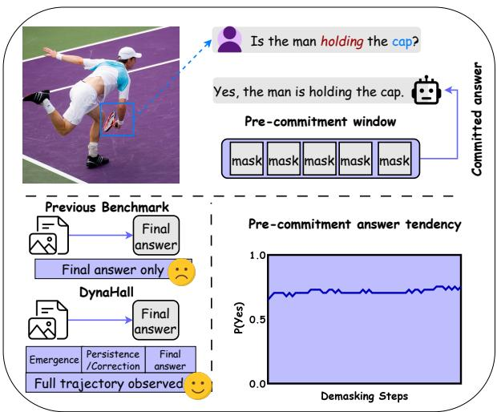
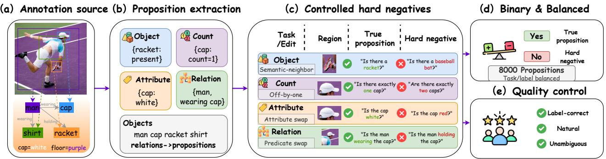
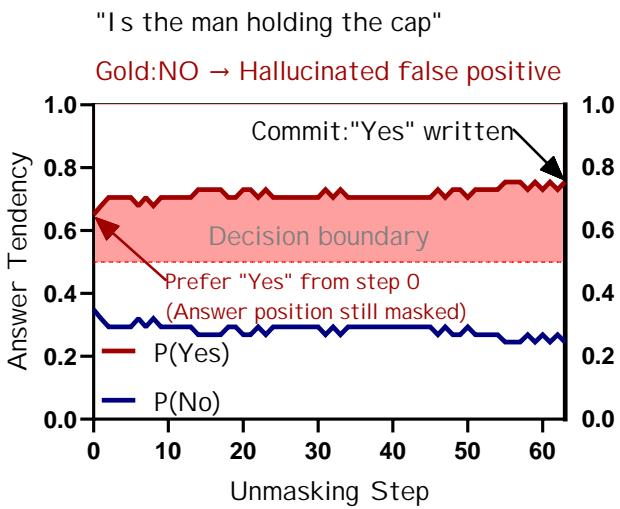
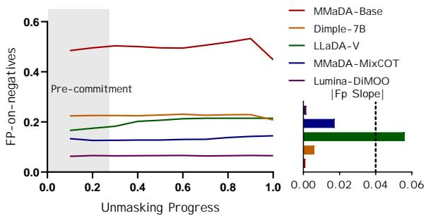
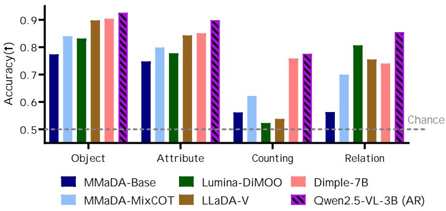
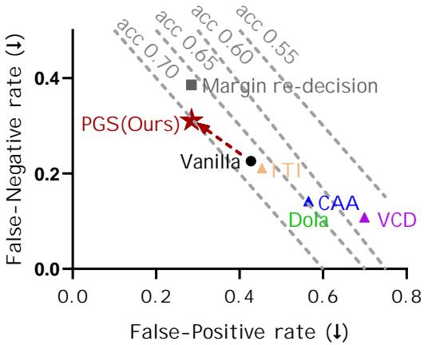

# Before the Token Commits: Trajectory-Level Benchmarking of Visual Hallucinations in Difusion VLMs

Yadong Wang1,2, Siping Yue1, Yu Tian3, Chuanxing Geng1, Xiang Chen1,2∗

1Nanjing University of Aeronautics and Astronautics

2State Key Laboratory of Ocean Sensing, ZJU-Hangzhou Global Scientific and Technological Innovation Center, Zhejiang University, Hangzhou, 311215, China 3360 Security Capability Center adamwang373@nuaa.edu.cn, xiang\_chen@nuaa.edu.cn

## Abstract

Multimodal difusion language models generate responses by iteratively unmasking tokens, making each answer the end- point of a multi-step trajectory rather than an immediate com-mitment. Hallucination benchmarks built for autoregressive models evaluate only the final output, and therefore cannot determine whether an unsupported claim in difusion VLMs appears late or has already stabilized before any answer to- ken is revealed. We introduce DynaHall, a trajectory-level benchmark of annotation-backed binary visual propositions covering object existence, counting, attributes, and relations, with controlled hard negatives graded by visual prior. Dy- naHall is paired with a commitment-aware protocol that records the intermediate answer tendency at every unmask- ing step alongside the committed output. Across five difusion VLMs from three architecture families, visual hallucination is settled before commitment: an unsupported answer is al- ready the preferred state while the answer position is still masked, and later unmasking steps rarely reverse it, so the failure is not introduced at the write step. This holds across decoding schedules, answer formats, and open-ended genera- tion. DynaHall also exposes failures hidden by final-output metrics, including counting and relation collapse, prior-driven false positives, and attribute errors whose direction changes by type. Guided by this diagnosis, PGS (Pre-commitment Gradient Steering) edits still-masked answer states to reduce false positives, bringing the afirmation rate close to balance, and transfers to another architecture without degrading general ability. DynaHall and PGS suggest that hallucination should be measured and mitigated along the generation trajectory of difusion VLMs, not only at the final answer.

## Introduction

Vision-language models (VLMs) are now widely used for visual instruction following, image understanding, and mul- timodal reasoning (Dai et al. 2023; Bai et al. 2025; Liu et al. 2024). Recent multimodal difusion language models depart from the dominant autoregressive generation paradigm by re- fining masked responses through iterative unmasking, rather than generating tokens strictly from left to right (Austin et al. 2021; You et al. 2025; Yang et al. 2025a; Li et al. 2025b;

  
Figure 1: Final-output benchmarks observe only the commit- ted endpoint, whereas DynaHall tracks the full unmasking trajectory. The example shows a hallucinated answer tendency that is already stable before the answer token is com- mitted.

Lou, Meng, and Ermon 2024). In this paper, we study these models in the visual-understanding setting and refer to them as difusion VLMs. Despite this progress, reliable visual grounding remains dificult. Models may still assert objects, attributes, counts, or relations that are not supported by the image, a failure mode commonly known as visual halluci- nation. Existing hallucination benchmarks have made this problem measurable through caption-level object metrics, yes/no visual probing, multidimensional visual propositions, and expert-designed diagnostic cases. However, many widely used benchmarks evaluate hallucination only after generation is complete, by comparing a final answer, caption, or yes/no response with image evidence.

This final-output view usefully measures whether a com- pleted response is faithful, but leaves an important ques- tion unanswered for difusion VLMs. Unlike autoregressive VLMs, which commit tokens sequentially, difusion VLMs maintain a partially masked response, updating it through iterative unmasking under bidirectional context (You et al. 2025). During this process, an answer position may remain uncommitted even when the model already provisionally prefers a candidate answer. As illustrated in Figure 1, a fi- nal false positive may follow diferent trajectories that final-output evaluation cannot separate, obscuring when unsup- ported visual claims are settled and whether they persist before being written into the output. Table 1 situates Dyna- Hall against prior hallucination benchmarks and difusion- trajectory studies along these axes.

<table><tr><td></td><td colspan="2">Target</td><td colspan="4">Evaluation design</td><td>Method</td></tr><tr><td>Benchmark / study</td><td>Visual</td><td>Diffusion</td><td>Trajectory</td><td>Graded neg.</td><td>Bias-ctrl.</td><td>Annot.</td><td>Mitigation</td></tr><tr><td colspan="8">LVLM hallucination benchmarks (autoregressive)</td></tr><tr><td>POPE (Li et al. 2023)</td><td>√</td><td>X</td><td></td><td>√</td><td>√</td><td>√</td><td>X</td></tr><tr><td>AMBER (Wang et al. 2023)</td><td>√</td><td>×</td><td></td><td>X</td><td>0</td><td>√</td><td>X</td></tr><tr><td>HallusionBench (Guan et al. 2024)</td><td>√</td><td>×</td><td></td><td>0</td><td>√</td><td>X</td><td>X</td></tr><tr><td>Reefknot (Zheng et al. 2025)</td><td>√</td><td>X</td><td>× × × ×</td><td>0</td><td>O</td><td>√</td><td>√</td></tr><tr><td colspan="8">Diffusion-LM hallucination (text-only)</td></tr><tr><td>TraceDet (Chang et al. 2025)</td><td></td><td>√</td><td>√</td><td></td><td></td><td></td><td>X</td></tr><tr><td>TDGNet/DynHD/HIVE†</td><td>X</td><td>V</td><td>V</td><td></td><td></td><td></td><td>X</td></tr><tr><td colspan="8">Multimodal diffusion hallucination (mitigation)</td></tr><tr><td>VISAGE (Narnaware et al. 2026)</td><td>√</td><td>√</td><td>X</td><td></td><td></td><td></td><td>√</td></tr><tr><td>DYNAHALL (ours)</td><td>√</td><td>√</td><td>√</td><td>√</td><td>√</td><td>√</td><td>√</td></tr></table>

Table 1: Positioning of DynaHall against representative hallucination benchmarks and difusion-LM trajectory studies. ✓/◦/× denote yes/partial/no; † (Hemmat et al. 2026; Qian et al. 2026; Zhao, Zhao, and Yu 2026).

We introduce DynaHall (Dynamic Hallucination), a trajectory-level benchmark for visual hallucination in diffusion VLMs. DynaHall contains 8,000 annotation-backed binary visual propositions covering object existence, counting, visual attributes, and relations. Each example is paired with controlled hard negatives, including plausible absent objects, of-by-one counts, attribute swaps, and predicate swaps, so that success requires grounding the queried propo-sition in the image rather than relying on language priors. Beyond final yes/no correctness, DynaHall records the un- masking trajectory at the answer locus. At each step, it tracks the provisional answer tendency of the model while the an- swer position remains masked, together with the commit- ted output state after the answer token is revealed. This commitment-aware protocol supports standard final-output metrics while enabling trajectory-level measurements of emergence, persistence, correction, drift, and answer flips.

We evaluate five difusion VLMs across three architec- ture families. Early answer convergence has been reported for correct answers in text difusion LMs (Li et al. 2025a); we find that it holds equally for answers the image does not support: by the time the answer is written, an unsupported tendency is already fixed, even under adversarial prior pres- sure where later evidence integration might have corrected it. Across the models we study, Figure 4 shows that stage- wise false-positive rates change only weakly over much of the unmasking process, suggesting that unsupported tendencies often appear before the final answer token is revealed rather than only as final-step accidents. DynaHall also exposes failure modes that aggregate final accuracy can hide. Count- ing and relation propositions are substantially harder than object-existence propositions, plausible hard negatives am-plify prior-driven false positives, and low false-positive rates can sometimes reflect conservative under-answering rather than stronger visual grounding. Visual attributes are not uni- form either: shape queries tend to trigger over-afirmation, whereas material queries more often trigger conservative de- nial. The counting and relation collapse, moreover, is not specific to difusion decoding (a strong autoregressive VLM exhibits the same task profile (Bai et al. 2025)), indicating that DynaHall surfaces failure modes shared across gener- ation paradigms rather than artifacts of one decoder.

Although DynaHall’s contribution is diagnostic and does not depend on any particular fix, the diagnosis naturally raises whether the pre-commitment signal it exposes can be used for intervention. We test this with PGS, a lightweight, diagnosis- driven intervention that steers still-masked answer states dur- ing unmasking. On DynaHall, PGS reduces false positives and improves accuracy while moving the afirmation rate to- ward balance, and it transfers to a second difusion VLM without degrading general ability on external benchmarks.

Our contributions are summarized as follows:

• We introduce DynaHall, a trajectory-level hallucination benchmark for difusion VLMs: 8,000 annotation-backed propositions with controlled hard negatives across object existence, counting, attributes, and relations.

• We propose a commitment-aware protocol that separates provisional answer tendencies from committed tokens, enabling trajectory metrics for emergence, persistence, correction, drift, and answer flips.

• Across five difusion VLMs, we show that many false positives are decided before the answer token is written, with failures shaped by task, hard-negative pressure, and answer bias. Guided by this diagnosis, PGS edits still- masked states to reduce these errors.

  
Figure 2: Construction of DynaHall. From COCO instances and GQA scene graphs (a), we build binary visual propositions for four tasks (b), each paired with a controlled, prior-graded hard negative (c); both polarities form a balanced set of 8,000 propositions (d) validated by expert audit (e). A single tennis scene runs through every stage.

## The DynaHall Benchmark

DynaHall evaluates visual hallucination in difusion VLMs along the unmasking trajectory rather than only at the final output, which calls for a benchmark structure diferent from standard captioning or VQA evaluation. Three requirements follow: the queried visual fact must be assessable at every intermediate step, the negatives must test visual grounding rather than shallow priors, and provisional answer prefer- ences must be separable from committed output tokens. Dy- naHall meets these with binary visual propositions parsable into {‘yes’, ‘no’, unresolved, invalid} throughout unmasking, controlled hard negatives built by minimal edits, and a commitment-aware protocol that records both intermediate tendencies and token commitments. The resulting construc- tion pipeline is shown in Figure 2.

## Benchmark Construction

Visual propositions. Each example pairs an image with a binary question, a gold label, a structured proposition, and annotation-backed evidence. DynaHall contains 8,000 examples across four tasks built from COCO val2017 (Lin et al. 2014) instance annotations (object existence, counting) and GQA (Hudson and Manning 2019) validation scene graphs (attributes, relations), ensuring every label is annotationbacked rather than LLM-generated. The benchmark is bal- anced by construction: each task contributes 1,000 positive and 1,000 negative propositions, split into a 1,000-example development set and a 7,000-example test set over disjoint images while approximately preserving task and answer bal- ance. Table 2 summarizes the task and label balance.

Controlled hard negatives. Negatives are minimally al- tered false variants of plausible claims, graded by language- prior pressure. Object existence uses a three-level ladder consisting of random, co-occurring, and semantic-neighbor absent objects; counting perturbs the true count by one; attributes replace an annotated property with an in-group alter- native (color, material, shape); relations keep the object pair fixed and swap the predicate. These controlled negatives test whether a model grounds the proposition in the image rather than relying on language priors or co-occurrence patterns.

<table><tr><td>Task</td><td>#Pos</td><td>#Neg</td><td>Total</td></tr><tr><td>Object existence</td><td>1,000</td><td>1,000</td><td>2,000</td></tr><tr><td>Counting</td><td>1,000</td><td>1,000</td><td>2,000</td></tr><tr><td>Attribute</td><td>1,000</td><td>1,000</td><td>2,000</td></tr><tr><td>Relation</td><td>1,000</td><td>1,000</td><td>2,000</td></tr><tr><td>Total</td><td>4,000</td><td>4,000</td><td>8,000</td></tr><tr><td colspan="4">Construction summary</td></tr><tr><td colspan="4">Positive : negative ratio</td></tr><tr><td colspan="4">Hard-negative subtypes</td></tr><tr><td colspan="4">Image sources (COCO/GQA)</td></tr><tr><td colspan="4">Unique images</td></tr></table>

Table 2: Dataset statistics for DynaHall. The benchmark is balanced by task and answer label.

Quality control. We apply automatic checks for task and answer balance, image-disjoint splits, de-duplication, perimage caps, negative-label consistency, and filters for size, crowding, and ambiguity. Three graduate-student annotators then verify a stratified sample of 820 items covering every task, label, and negative subtype: 97.9% of labels are confirmed correct (96.5% on counting, 98.5% on relations), with only 0.5% flagged ambiguous. Measured label noise is thus an order of magnitude below the 62–64% error rates the hardest tasks elicit, so those rates reflect model failures rather than annotation artifacts.

## Trajectory Evaluation

Unlike final-output benchmarks, DynaHall reads each an- swer along the full unmasking trajectory as the response is gradually formed at the answer locus, rather than scoring only the final committed response. The resulting metrics support the pre-commitment diagnosis central to our analysis and cannot be computed from final outputs alone.

Answer locus and states. Figure 3 illustrates how Dyna- Hall records answer states throughout iterative unmasking. Let p denote the answer locus, namely the response position where the binary answer is emitted. At each step, we record two states. The tendency state represents the preferred an- swer of the model at p. It is read from the current logits and parsed into {‘yes’, ‘no’, unresolved, invalid}, capturing the answer favored by the model before commitment. The commitment state is parsed only from unmasked tokens and remains unresolved while $p$ is masked, capturing what has actually entered the response. Together, the two states sep- arate when the model starts to favor a hallucinated claim from when that claim is written. This distinction matters be- cause preference can emerge before the corresponding token is unmasked. To compare difusion VLMs, we follow the na- tive inference path of each model and normalize trajectory time to [0, 1]. For single-word answerers, the answer locus is the first response position. For conversational models whose responses may begin with explanatory text, we anchor the an- swer locus at the first generated ‘yes’ or ‘no’ token to avoid treating a reasoning token as the answer. We report stagewise statistics at masked ratios {0.8, 0.6, 0.4, 0.2, final} and retain the full per-step trajectory.

<table><tr><td></td><td></td><td colspan="4">Final output</td><td colspan="6">Trajectory dynamics (DYnAHALL)</td></tr><tr><td>Model</td><td>Family</td><td>Acc↑</td><td>FP↓</td><td>FN↓</td><td>Aff.</td><td>Early-FP</td><td>Emerg.</td><td>Persist.</td><td>Correct.</td><td>Drift</td><td>Flips</td></tr><tr><td>MMaDA-Base</td><td>MMaDA/VQ</td><td>66.2</td><td>42.5</td><td>25.0</td><td>58.7</td><td>96.5</td><td>0.14</td><td>28.0</td><td>21.8</td><td>9.0</td><td>1.08</td></tr><tr><td>MMaDA-MixCOT</td><td>MMaDA/VQ</td><td>74.1</td><td>14.5</td><td>37.5</td><td>38.4</td><td>78.8</td><td>0.15</td><td>20.9</td><td>19.9</td><td>6.7</td><td>0.99</td></tr><tr><td>Lumina-DiMOO</td><td>VQ-diff.</td><td>73.6</td><td>6.4</td><td>46.6</td><td>29.8</td><td>92.0</td><td>0.06</td><td>24.7</td><td>8.6</td><td>3.5</td><td>0.23</td></tr><tr><td>LLaDA-V*</td><td>cont.-img</td><td>75.9</td><td>19.7</td><td>13.8</td><td>46.8</td><td>76.9</td><td>0.08</td><td>15.9</td><td>27.7</td><td>12.0</td><td>0.50</td></tr><tr><td>Dimple-7B</td><td>Qwen-diff.</td><td>81.4</td><td>19.8</td><td>17.5</td><td>51.0</td><td>91.8</td><td>0.14</td><td>16.3</td><td>22.7</td><td>4.7</td><td>0.19</td></tr></table>

Table 3: Model-level hallucination diagnosis on the DynaHall test set (percentages). Final-output columns are standard metrics; the shaded Trajectory-dynamics columns are unique to DynaHall and describe how errors evolve, with no preferred direction (Emergence is a normalized step, Flips a count). Best per oriented column (↑/↓) in bold. Correction/Drift are the shares of ever-wrong/ever-correct trajectories that recover or later flip; Persistence is the share of all trajectories that remain wrong continuously from their first erroneous tendency through the final output. ∗LLaDA-V’s 7.3% invalid outputs count as accuracy errors and as non-afirmative for Af.; they enter neither the FP nor FN numerator.

  
Figure 3: Trajectory readout for one running example (“Is the man holding the cap?”, gold no): the answer tendency P(yes)/P(no) at the locus p across unmasking steps, with the answer token committed only at the final step.

Metrics. Alongside standard final-output metrics (accu-racy, FP/FN rates, precision/recall/F1, the invalid rate, and the afirmation rate, which makes answer bias explicit), DynaHall reports trajectory metrics computable only from its commitment-aware readout: Early-FP (the fraction of final false positives already favoring the unsupported answer at 80% masked), Emergence (the normalized step at which the final answer stabilizes; larger is later), Persistence (the share of all trajectories that remain wrong continuously from their first erroneous tendency to the final output), Correction (the share of ever-wrong trajectories that recover), Drift (the share of ever-correct trajectories that end wrong), and Flips (the number of yes/no reversals along the trajectory).

## Diagnosing Difusion VLMs

## Experimental Setup

We evaluate five difusion VLMs from three architecture fam- ilies on the full DynaHall test set: MMaDA-8B-Base (Yang et al. 2025a), MMaDA-8B-MixCOT, Lumina-DiMOO (Xin et al. 2025), LLaDA-V (You et al. 2025), and Dimple-7B (Yu, Ma, and Wang 2025). Only the MMaDA pair shares a backbone, so patterns across all five point to difusion generation rather than architecture-specific artifacts. Each model uses its oficial inference path under both protocols with greedy de- coding, yielding deterministic paired comparisons; we report bootstrap confidence intervals and McNemar’s test for paired significance, with per-model details in the supplement.

## Pre-commitment of Visual Hallucination

Table 3 summarizes the results for the five models. Fi- nal accuracy ranges from 66.2% for MMaDA-8B-Base to 81.4% for Dimple-7B, with the high-afirmation MMaDA-Base showing the highest hallucination rate. A low false- positive rate, however, does not necessarily indicate stronger grounding. Lumina-DiMOO has the lowest FP rate, but also the lowest afirmation rate and the highest FN rate, indicating a conservative response pattern. Because the evaluated mod- els span three architecture families, we can further examine whether the timing of hallucination remains consistent even when its magnitude difers across models.

  
Figure 4: Stage-wise false-positive rate on negative proposi- tions across unmasking for five difusion VLMs (DynaHall test). Rates are read from the tendency state (logit preference at the masked locus) and can therefore difer from the committed FP in Table 3. Shaded bands are bootstrap 95% confidence intervals; the inset reports each model’s FP slope across the unmasking process.

Pre-commitment dynamics. Across all evaluated models, the pre-commitment prediction agrees with the committed answer on 92–98% of trajectories with valid final answers. Figure 4 shows that the stage-wise false-positive curve stays nearly flat throughout unmasking, difering mainly in overall height across models, from roughly 50% for MMaDA-Base to 6.5% for Lumina-DiMOO. Incorrect answers emerge early (normalized emergence 0.06–0.15) and rarely reverse. This pattern is not caused by aggregating correct and incorrect negatives: among final false positives only, the unsupported “yes” already dominates the model tendency while the an- swer position is 80% masked in 77–97% of cases as shown by the Early-FP column in Table 3. The conversational LLaDA- V shows slightly later emergence, consistent with its post-hoc answer locus. The timing of hallucination therefore remains consistent across architectures, suggesting a general prop- erty of masked-difusion generation. The same early fixation holds for correct answers (early-to-final agreement 92–98% per model), so timing alone is not an error signature; the readout instead localizes where the answer is decided, and its statistics still yield a label-free risk score: mean tendency margin over the trajectory predicts committed errors with AUROC 0.60–0.78 across the five models.

Correction, drift, and persistence. Final-output evalua- tion conflates three trajectories that DynaHall tracks separately (Figure 1): an error that persists until commitment, an error corrected before completion, and a correct initial tendency that later drifts into an incorrect commitment. The trajectory-dynamics metrics in Table 3 show that all three patterns occur, but corrected and drifted trajectories are relatively rare. Across models, 9–28% of ever-wrong trajectories recover, and 4–12% of ever-correct trajectories drift. On average, a trajectory shows only 0.2–1.1 yes/no flips, with early error persistence as the dominant pattern. These dy- namics separate models with nearly identical final accuracy:

MMaDA-MixCOT and Lumina-DiMOO difer by only 0.5 accuracy points but by 4.3× in flips (0.99 vs. 0.23) and 2.3× in correction (19.9% vs. 8.6%).

Robustness. The pre-commitment pattern is not an arti- fact of the evaluation protocol or probing format. It remains under native parallel decoding: with a 32-step budget, earlyto-final agreement reaches 95–97%, and the false-positive slope is nearly flat, [0.00, 0.07] across models as shown in the inset of Figure 4. For the conversational LLaDA-V, en- forcing a single-word format, which fixes the answer locus, only strengthens the pattern, increasing early-to-final agree- ment from 92.9% to 98.5% and reducing invalid outputs from 7.3% to 0.3%. Nor is it explained by a yes/no bias: in a fourway multiple-choice control with chance accuracy of 25%, the committed option already matches the first-step prefer- ence in 88% of MMaDA-Base cases and 95% of Dimple-7B cases. The pattern is also not limited to single-token an- swers. In open-ended COCO captioning, a hallucinated ob- ject is the stable preferred token before it is written in 77.7% [72.3, 82.6] of mentions, leading commitment by a median of two unmasking steps.

## Structured Failure Modes

Task-level collapse. Analyzing performance by task (Fig- ure 5; full results in the supplementary material) reveals that object existence is relatively straightforward, with accuracy reaching up to 90%. However, performance drops severely on counting and relation tasks across all models. For instance, MMaDA-Base drops to 56% accuracy, with high false-positive rates of 64% on counting and 62% on relations. This collapse is universal but manifests diferently: Lumina-DiMOO drives counting false positives to a degener- ate 0.2% by rejecting nearly all positive counts (FN 95.4%), whereas Dimple-7B, the strongest model overall, still ex- hibits substantial hallucinations on relations. These specific failure modes are typically obscured by aggregate accuracy metrics or benchmarks focused solely on object existence, such as the widely used POPE.

Generality across generation paradigms. This perfor- mance collapse is linked to the task complexity rather than the decoding mechanism. A strong autoregressive VLM, Qwen2.5-VL-3B (Bai et al. 2025), is the most accurate model overall yet shows the identical task profile as indicated by the hatched bars in Figure 5: near-ceiling on object existence and attributes but a sharp drop on counting and relations, where it still false-afirms at rates comparable to the difu- sion models. What distinguishes difusion VLMs, and what this benchmark specifically measures, is the exact point along the unmasking trajectory where these errors are formalized.

Prior-driven negatives. In the object existence task, false positives increase with the strength of language priors. For MMaDA-Base they rise monotonically from 11.5% (random absent) to 30.3% (co-occurring) to 35.2% (semanticneighbor). Across the other models the prior-laden negatives (co-occurring and semantic-neighbor) remain far harder than random absent objects, even though which of the two is hard-est varies as detailed in the supplementary material. Models thus afirm absent objects more readily when priors suggest their presence, confirming that our graded negatives probe visual grounding rather than superficial prior reliance. That these false positives scale with prior strength indicates the early tendency is partly a language-prior readout rather than a completed visual judgment; this prior-driven component is what PGS targets. Attribute errors are likewise bidirectional by subtype (Table 4): shape queries push models toward over-afirmation, material queries toward conservative denial, so aggregating attribute types or testing only color hides both opposing error directions.

  
Figure 5: Per-task accuracy on DynaHall test (7,000) for five difusion VLMs and a strong autoregressive reference (Qwen2.5- VL-3B, hatched); the dashed line marks chance (0.5).

<table><tr><td>Model</td><td>Attr.</td><td>Acc↑</td><td>FP↓</td><td>FN↓</td></tr><tr><td rowspan="3">MMaDA-Base</td><td>color</td><td>72.2</td><td>20.1</td><td>35.2</td></tr><tr><td>material</td><td>65.0</td><td>9.0</td><td>61.0</td></tr><tr><td>shape</td><td>60.3</td><td>30.5</td><td>49.0</td></tr><tr><td rowspan="3">Dimple-7B</td><td>color</td><td>85.8</td><td>7.8</td><td>20.2</td></tr><tr><td>material</td><td>86.5</td><td>2.0</td><td>25.0</td></tr><tr><td>shape</td><td>77.5</td><td>14.5</td><td>30.5</td></tr></table>

Table 4: Attribute-subtype diagnosis for two representative models, on DynaHall test. Columns are accuracy, FP on negatives, and FN on positives (percentages).

## Intervening in the Pre-commitment Window

The diagnostic value of DynaHall does not depend on a particular mitigation method. Still, the trajectory results sug-gest a natural hypothesis: if many final false positives al- ready favor the unsupported answer while the locus $p$ is still masked, this pre-commitment window may provide a useful intervention point. We test this hypothesis with PGS (Pre-commitment Gradient Steering), a lightweight intervention. Let $^ { a _ { l , h } }$ denote the pre-output-projection activation of head $( l , h )$ at $p ,$ and let $M = z _ { \mathrm { n o } } - z _ { \mathrm { y e s } }$ denote the factual margin, where each z is a log-sum-exp over negative or affirmative surface forms. A hallucinated afirmation therefore gives $M < 0$ . Since the margin gradient gives the first-order efect of each head on M, we score heads by steerability, $c ( l , h ) = \langle \hat { s } _ { l , h } , \bar { g } _ { l , h } \rangle$ , where a reference contrast direction $\hat { s } _ { l , h }$ is aligned with the averaged margin gradient $\bar { g } _ { l , h }$ . We keep the most steerable heads, ranking by steerability rather than label predictivity, because an accurate predictor need not be an efective intervention point.

Algorithm 1 Pre-commitment Gradient Steering (PGS)   
Require: difusion VLM M; localization set $\mathcal { L } ;$ afirmation sets   
H, G; #heads $k ;$ scale λ   
Ensure: steered answer at the locus $p$   
1: Ofline: build the steering direction   
2: accumulate margin gradients $\bar { g } _ { l , h } = \mathbb { E } _ { \mathcal { L } } [ \partial M / \partial a _ { l , h } ]$   
3: score heads $c ( l , h ) \ = \ \langle \hat { s } _ { l , h } , \bar { g } _ { l , h } \rangle ;$ ; keep the top-k steerable,   
selective heads $s$   
4: $d _ { l , h } \gets \mathrm { u n i t } \big ( \bar { g } _ { H } - \mathrm { p r o j } _ { \bar { g } _ { G } } \bar { g } _ { H } \big )$ for $( l , h ) \in S$   
5: Inference: steer inside the pre-commitment window   
6: for each unmasking step do   
7: if locus p is masked then   
8: $a _ { l , h } \gets a _ { l , h } + \lambda d _ { l , h }$ for $( l , h ) \in S$   
9: end if   
10: apply the native unmasking update of the model   
11: end for

To avoid pushing the model toward a generic ‘no’, we build a grounding-oriented direction from hallucinated afir- mations H and grounded afirmations $G ,$ with mean per-head gradients $\bar { g } _ { H }$ and $\bar { g } _ { G } \colon$

$$
d _ { l , h } = \mathrm { u n i t } \bigl ( \bar { g } _ { H } - \mathrm { p r o j } _ { \bar { g } _ { G } } \bar { g } _ { H } \bigr ) .\tag{1}
$$

This direction removes the component shared with grounded afirmations. We steer only heads that are steerable $( c > 0 )$ and selective between $H$ and $G ,$ , adding $\lambda d _ { l , h }$ at $p$ while the locus is masked and stopping once the token is writ- ten. Algorithm 1 summarizes the full ofline localization and inference-time steering procedure.

We develop PGS on MMaDA-8B-Base, the most hallucination-prone model in our study, and verify it on Dimple-7B. We use a stratified 1,000-example test subset for comparisons that require activation access. The baselines are autoregressive mitigations, namely contrastive decoding and activation steering, adapted to operate at the same answer position. On DynaHall (Figure 6; full results in the supplementary material), PGS reduces false positives from 42.7% to 28.5% and improves accuracy by 3.0 points, shifting the afirmation rate from 60% toward a balanced 50%. Both gains are significant under a paired bootstrap, with 95% CIs of [−17.2, −11.2] and [+0.8, +5.1] points, excluding zero.

  
Figure 6: Operating points on DynaHall; PGS is marked by the star. Axes show false-positive and false-negative rates; dashed lines denote iso-accuracy contours.

Contrastive decoding moves performance in the opposite direction. VCD and DoLa increase false positives, because amplifying the image-conditional distribution worsens the tendency of a model that already over-afirms. Moreover, a difusion-native margin re-decision strategy, a decision- rule control matched to the false-positive rate of PGS, pro- duces more false negatives, and a plain final-threshold shift matched to the same 28.5% false positives costs 35.4% false negatives versus 31.1% for PGS. Because PGS lowers false positives (from 42.7% to 28.5%) at a smaller false-negative cost (to 31.1%) than either matched control, it improves the operating frontier rather than merely sliding along it, indicating that the reduction reflects better grounding, not blanket denial. The supplementary material provides fur- ther analyses, including head-selection ablations, an image- perturbation control showing that the efect is visually gated, cross-architecture transfer to Dim le-7B, ca abilit checks on POPE, MME, and CHAIR, together with representative qualitative case-study trajectories.

## Related Work

## Visual Hallucination in Autoregressive LVLMs

Visual hallucination in large vision-language models (LVLMs) has been studied through benchmarks and mitigations. Benchmarks span caption-level object hallucination (Rohrbach et al. 2018) and question-based probes: polling-based object existence with co-occurrence bias (Li et al. 2023), yes/no perception–cognition items (Fu et al.

2023), existence/attribute/relation coverage without an LLM judge (Wang et al. 2023), and expert-designed languageversus-illusion cases (Guan et al. 2024). Mitigations include visual contrastive decoding (Leng et al. 2024), attention penalties and retrospection (Huang et al. 2024), post-hoc correction or verification (Zhou et al. 2024; Yin et al. 2023), and causal or representation-level edits (Yang et al. 2025c). All target final faithfulness in autoregressive, final-output evalu- ation, rather than the intermediate unmasking dynamics that multimodal difusion models expose.

## Trajectory Dynamics in Difusion Language Models

Difusion language models generate text by iteratively un- maskin a masked se uence under bidirectional context (Nie et al. 2025). This paradigm has recently been extended to multimodal settings, with LLaDA-V, MMaDA, LaViDa, and Lumina-DiMOO building difusion VLMs (You et al. 2025; Yang et al. 2025b; Li et al. 2025b; Xin et al. 2025). Because generation unfolds over multiple steps, intermediate trajecto-ries become observable. Recent text-only studies show that hallucination signals can emerge, shift, or self-correct dur- ing denoising (Chang et al. 2025; Hemmat et al. 2026; Qian et al. 2026; Zhao, Zhao, and Yu 2026). Most closely related to our diagnosis, Li et al. (2025a) observe early answer con-vergence in text difusion LMs and use it for faster decoding. We instead ask where, along the visual unmasking trajectory, an unsupported answer becomes fixed, and whether later steps ever correct it. For intervention, activation- and distribution-level steering methods have been studied for text difusion LMs (Shnaidman et al. 2025; An and Han 2026; Zhou, Roy, and Gangadharaiah 2026), and the concurrent VISAGE (Narnaware et al. 2026) mitigates hallucination in multimodal difusion models at decoding time by re-ranking token commitments. PGS instead edits still-masked answer activations within the pre-commitment window and is visu- ally gated. Prior work therefore either focuses on text-only trajectories or studies a specific mitigation, while multimodal difusion VLMs are still largely evaluated by final answers.

## Conclusion

We have argued that visual hallucination in difusion VLMs is better understood along the unmasking trajectory than from the final answer alone. DynaHall makes this trajectory mea-surable. Across five models from three architecture families, hallucination is largely fixed in the pre-commitment window before it is written, a pattern robust to changes in decoding, answer format, and open-ended generation, and structured by task, prior, and attribute type in ways that final-output benchmarks miss. PGS shows that this window can support intervention, improving the decoding operating point by re- ducing false positives without degrading general ability. The protocol reads per-step logits and thus targets the growing family of white-box difusion VLMs; within this setting, we hope DynaHall encourages future work to evaluate and mitigate hallucination where it forms, along the generation trajectory rather than only at the final answer.

An, H.; and Han, Y. 2026. DLM-SWAI: Steering Dif- fusion Language Models Before They Unmask. CoRR, abs/2605.29626.

Austin, J.; Johnson, D. D.; Ho, J.; Tarlow, D.; and van den Berg, R. 2021. Structured Denoising Difusion Models in Discrete State-Spaces. In Ranzato, M.; Beygelzimer, A.; Dauphin, Y. N.; Liang, P.; and Vaughan, J. W., eds., Ad- vances in Neural Information Processing Systems 34:Annual Conference on Neural Information Processing Systems 2021, NeurIPS 2021, December 6-14, 2021, virtual, 17981–17993.

Bai, S.; Chen, K.; Liu, X.; Wang, J.; Ge, W.; Song, S.; Dang,K.; Wang, P.; Wang, S.; Tang, J.; Zhong, H.; Zhu, Y.; Yang,M.; Li, Z.; Wan, J.; Wang, P.; Ding, W.; Fu, Z.; Xu, Y.; Ye,J.; Zhang, X.; Xie, T.; Cheng, Z.; Zhang, H.; Yang, Z.; Xu,H.; and Lin, J. 2025. Qwen2.5-VL Technical Report. CoRR,abs/2502.13923.

Chang, S.; Yu, J.; Wang, W.; Chen, Y.; Yu, J.; Torr, P.; and Gu, J. 2025. TraceDet: Hallucination Detection from the Decoding Trace of Difusion Large Language Models. CoRR, abs/2510.01274.

Dai, W.; Li, J.; Li, D.; Tiong, A. M. H.; Zhao, J.; Wang, W.; Li, B.; Fung, P.; and Hoi, S. C. H. 2023. InstructBLIP: Towards General-purpose Vision-Language Models with In- struction Tuning. In Oh, A.; Naumann, T.; Globerson, A.; Saenko, K.; Hardt, M.; and Levine, S., eds., Advances in Neu- ral Information Processing Systems 36: Annual Conference on Neural Information Processing Systems 2023, NeurIPS 2023, New Orleans, LA, USA, December 10 - 16, 2023.

Fu, C.; Chen, P.; Shen, Y.; Qin, Y.; Zhang, M.; Lin, X.; Qiu, Z.; Lin, W.; Yang, J.; Zheng, X.; Li, K.; Sun, X.; and Ji, R. 2023. MME: A Comprehensive Evaluation Bench- mark for Multimodal Large Language Models. CoRR, abs/2306.13394.

Guan, T.; Liu, F.; Wu, X.; Xian, R.; Li, Z.; Liu, X.; Wang, X.; Chen, L.; Huang, F.; Yacoob, Y.; Manocha, D.; and Zhou, T. 2024. Hallusionbench: An Advanced Diagnostic Suite for Entangled Language Hallucination and Visual Illusion in Large Vision-Language Models. In IEEE/CVF Conference on Computer Vision and Pattern Recognition, CVPR 2024, Seattle, WA, USA, June 16-22, 2024, 14375–14385. IEEE.

Hemmat, A.; Torr, P.; Chen, Y.; and Yu, J. 2026. TDGNet: Hallucination Detection in Difusion Language Models via Temporal Dynamic Graphs. CoRR, abs/2602.08048.

Huang, Q.; Dong, X.; Zhang, P.; Wang, B.; He, C.; Wang, J.; Lin, D.; Zhang, W.; and Yu, N. 2024. OPERA: Allevi- ating Hallucination in Multi-Modal Large Language Mod- els via Over-Trust Penalty and Retrospection-Allocation. In IEEE/CVF Conference on Computer Vision and Pattern Recognition, CVPR 2024, Seattle, WA, USA, June 16-22, 2024, 13418–13427. IEEE.

Hudson, D. A.; and Manning, C. D. 2019. GQA: A New Dataset for Real-World Visual Reasoning and Compositional Question Answering. In IEEE Conference on Computer Vi-sion and Pattern Recognition, CVPR 2019, Long Beach, CA, USA, June 16-20, 2019, 6700–6709. Computer Vision Foun- dation / IEEE.

Leng, S.; Zhang, H.; Chen, G.; Li, X.; Lu, S.; Miao, C.; and Bing, L. 2024. Mitigating Object Hallucinations in Large Vision-Language Models through Visual Contrastive De- coding. In IEEE/CVF Conference on Computer Vision and Pattern Recognition, CVPR 2024, Seattle, WA, USA, June 16-22, 2024, 13872–13882. IEEE.

Li, P.; Zhou, Y.; Muhtar, D.; Yin, L.; Yan, S.; Shen, L.; Liang, Y.; Vosoughi, S.; and Liu, S. 2025a. Difusion Lan- guage Models Know the Answer Before Decoding. CoRR, abs/2508.19982.

Li, S.; Kallidromitis, K.; Bansal, H.; Gokul, A.; Kato, Y.; Kozuka, K.; Kuen, J.; Lin, Z.; Chang, K.; and Grover, A. 2025b. LaViDa: A Large Difusion Language Model for Multimodal Understanding. CoRR, abs/2505.16839.

Li, Y.; Du, Y.; Zhou, K.; Wang, J.; Zhao, W. X.; and Wen, J. 2023. Evaluating Object Hallucination in Large Vision-Language Models. In Bouamor, H.; Pino, J.; and Bali, K., eds., Proceedings ofthe 2023 Conference on Empirical Meth-ods in Natural Language Processing, EMNLP 2023, Singa- pore, December 6-10, 2023, 292–305. Association for Com- putational Linguistics.

Lin, T.; Maire, M.; Belongie, S. J.; Ha s, J.; Perona, P.; Ra- manan, D.; Dollár, P.; and Zitnick, C. L. 2014. Microsoft COCO: Common Objects in Context. In Fleet, D. J.; Pajdla, T.; Schiele, B.; and Tuytelaars, T., eds., Computer Vision - ECCV 2014 - 13th European Conference, Zurich, Switzerland, September 6-12, 2014, Proceedings, Part V, volume 8693 of Lecture Notes in Computer Science, 740– 755. Springer.

Liu, H.; Li, C.; Li, Y.; and Lee, Y. J. 2024. Improved Base- lines with Visual Instruction Tuning. In IEEE/CVF Confer-ence on Computer Vision and Pattern Recognition, CVPR 2024, Seattle, WA, USA, June 16-22, 2024, 26286–26296. IEEE.

Lou, A.; Meng, C.; and Ermon, S. 2024. Discrete Difusion Modeling by Estimating the Ratios of the Data Distribution. In Salakhutdinov, R.; Kolter, Z.; Heller, K. A.; Weller, A.; Oliver, N.; Scarlett, J.; and Berkenkamp, F., eds., Forty-first International Conference on Machine Learning, ICML 2024, Vienna, Austria, July 21-27, 2024, volume 235 of Proceed- ings ofMachine Learning Research, 32819–32848. PMLR / OpenReview.net.

Narnaware, V.; Gupta, A.; Zhai, K.; Wang, Z.; and Shah, M. 2026. Seeing to Ground: Visual Attention for Hallucination Resilient MDLLMs. CoRR, abs/2603.25711.

Nie, S.; Zhu, F.; You, Z.; Zhang, X.; Ou, J.; Hu, J.; Zhou, J.;Lin, Y.; Wen, J.; and Li, C. 2025. Large Language DifusionModels. CoRR, abs/2502.09992.

Qian, Y.; Tan, Y.; Liu, Y.; Yu, W.; and Pan, S. 2026. DynHD: Hallucination Detection for Difusion Large Language Mod- els via Denoising Dynamics Deviation Learning. CoRR, abs/2603.16459.

Rohrbach, A.; Hendricks, L. A.; Burns, K.; Darrell, T.; and Saenko, K. 2018. Object Hallucination in Image Captioning. In Rilof, E.; Chiang, D.; Hockenmaier, J.; and Tsujii, J., eds., Proceedings of the 2018 Conference on Empirical Methods in Natural Language Processing, Brussels, Belgium, October

31 - November 4, 2018, 4035–4045. Association for Compu- tational Linguistics.

Shnaidman, A.; Feiglin, E.; Yaari, O.; Mentel, E.; LeVi, A.; and Lapid, R. 2025. Activation Steering for Masked Difu- sion Language Models. CoRR, abs/2512.24143.

Wang, J.; Wang, Y.; Xu, G.; Zhang, J.; Gu, Y.; Jia, H.; Yan, M.; Zhang, J.; and Sang, J. 2023. An LLM-free Multi- dimensional Benchmark for MLLMs Hallucination Evalua- tion. CoRR, abs/2311.07397.

Xin, Y.; Qin, Q.; Luo, S.; Zhu, K.; Yan, J.; Tai, Y.; Lei, J.; Cao, Y.; Wang, K.; Wang, Y.; Bai, J.; Yu, Q.; Jiang, D.; Pu, Y.; Chen, H.; Zhuo, L.; He, J.; Luo, G.; Li, T.; Hu, M.; Ye, J.; Ye, S.; Zhan , B.; Xu, C.; Wan , W.; Li, H.; Zhai, G.; Xue, T.; Fu, B.; Liu, X.; Qiao, Y.; and Liu, Y. 2025. Lumina-DiMOO: An Omni Difusion Large Language Model for Multi-Modal Generation and Understanding. CoRR, abs/2510.06308.

Yang, L.; Tian, Y.; Li, B.; Zhang, X.; Shen, K.; Tong, Y.; and Wang, M. 2025a. MMaDA: Multimodal Large Difu- sion Language Models. In Belgrave, D.; Zhang, C.; Mon- toya, L. N.; Lin, H.; Pascanu, R.; Koniusz, P.; Ghassemi, M.; Chen, N.; Ruíz, I. V. M.; and Loaiza-Bonilla, A., eds., Ad- vances in Neural Information Processing Systems 38: Annual Conference on Neural Information Processing Systems 2025, NeurIPS 2025, San Diago, CA, USA, December 2-7, 2025 / Mexico City, Mexico, November 30 - December 5, 2025.

Yang, L.; Tian, Y.; Li, B.; Zhang, X.; Shen, K.; Tong, Y.; and Wang, M. 2025b. MMaDA: Multimodal Large Difusion Language Models. CoRR, abs/2505.15809.

Yang, T.; Li, Z.; Cao, J.; and Xu, C. 2025c. Understand- ing and Mitigating Hallucination in Large Vision-Language Models via Modular Attribution and Intervention. In The Thirteenth International Conference on Learning Representations, ICLR 2025, Singapore, April 24-28, 2025. OpenRe- view.net.

Yin, S.; Fu, C.; Zhao, S.; Xu, T.; Wang, H.; Sui, D.; Shen, Y.; Li, K.; Sun, X.; and Chen, E. 2023. Woodpecker: Halluci- nation Correction for Multimodal Large Language Models. CoRR, abs/2310.16045.

You, Z.; Nie, S.; Zhang, X.; Hu, J.; Zhou, J.; Lu, Z.; Wen, J.; and Li, C. 2025. LLaDA-V: Large Language Difusion Mod- els with Visual Instruction Tuning. CoRR, abs/2505.16933.

Yu, R.; Ma, X.; and Wang, X. 2025. Dimple: Discrete Dif- fusion Multimodal Large Language Model with Parallel De- coding. CoRR, abs/2505.16990.

Zhao, G.; Zhao, W.; and Yu, T. 2026. HIVE: Hidden- Evidence Verification for Hallucination Detection in Dif- fusion Large Language Models. CoRR, abs/2604.26139.

Zheng, K.; Chen, J.; Yan, Y.; Zou, X.; Zhou, H.; and Hu, X. 2025. Reefknot: A Comprehensive Benchmark for Re- lation Hallucination Evaluation, Analysis and Mitigation in Multimodal Large Language Models. In Che, W.; Nabende,

J.; Shutova, E.; and Pilehvar, M. T., eds., Findings of the Association for Computational Linguistics, ACL 2025, Vi-enna, Austria, July 27 - August 1, 2025, volume ACL 2025 of Findings of ACL, 6193–6212. Association for Computational Linguistics.

Zhou, H.; Roy, S.; and Gangadharaiah, R. 2026. Steer- ing Without Breaking: Mechanistically Informed Interven- tions for Discrete Difusion Language Models. CoRR, abs/2605.10971.

Zhou, Y.; Cui, C.; Yoon, J.; Zhang, L.; Deng, Z.; Finn, C.; Bansal, M.; and Yao, H. 2024. Analyzing and Mitigating Object Hallucination in Large Vision-Language Models. In The Twelfth International Conference on Learning Repre-sentations, ICLR 2024, Vienna, Austria, May 7-11, 2024. OpenReview.net.