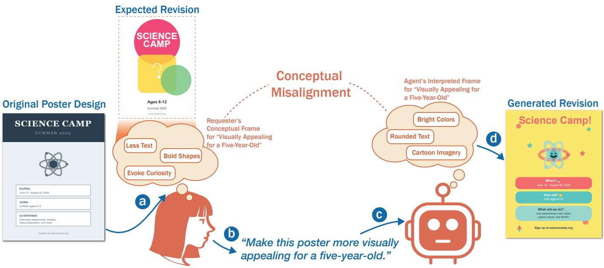
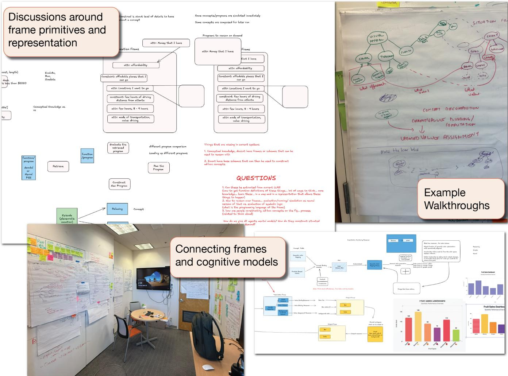
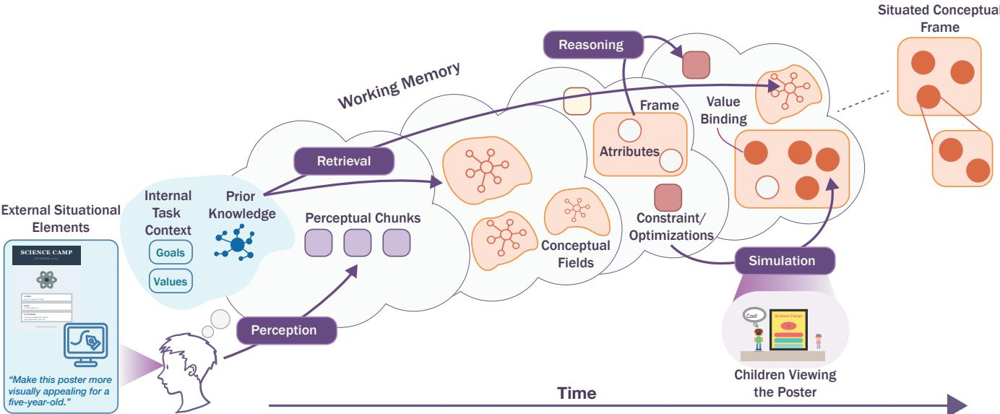
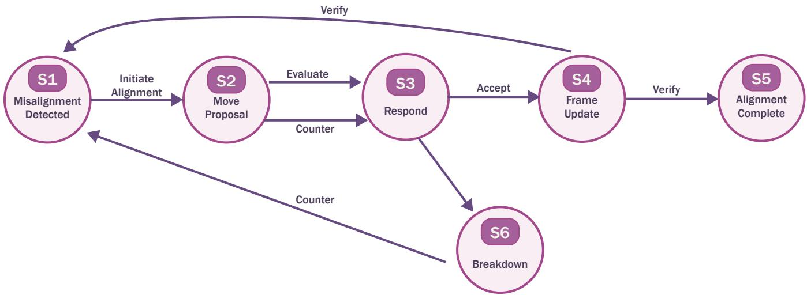
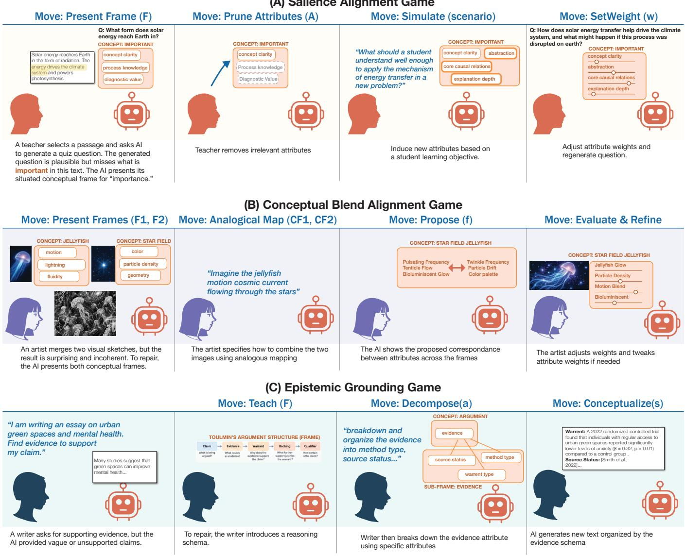
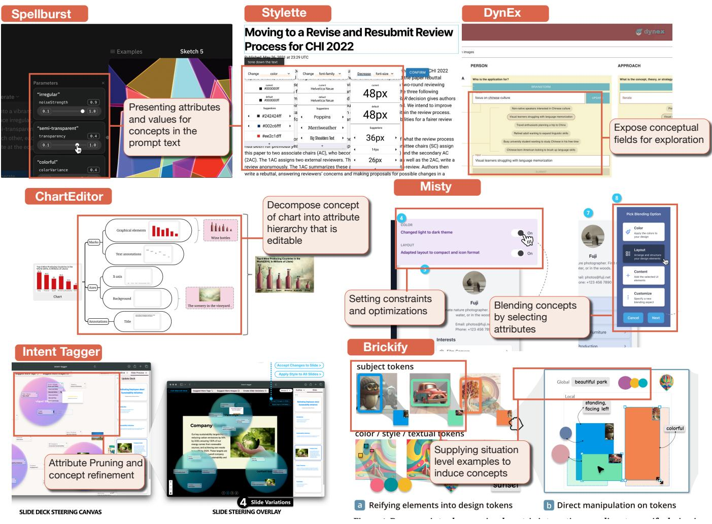

# Alignment Games: A Framework for Conceptual Repair in Human–AI Collaboration

Hari Subramonyam Stanford University USA harihars@stanford.edu

Maneesh Agrawala   
Stanford University   
USA   
magrawala@stanford.edu   
Sean Follmer   
Stanford University   
USA   
sfollmer@stanford.edu

  
Figure 1: Conceptual Misalignment in Human-AI Collaboration: Given the same request to make a poster “more visually appealing for a five-year-old,” the requester (a) and AI agent (c) construct diferent conceptual frames from the compressed natural language instruction (b). The requester envisions bold shapes and minimal text (top), while the agent generates bright colors and cartoon imagery (right, d). Both interpretations are valid yet misaligned, demonstrating the challenge of conceptual coordination without explicit repair mechanisms.

## Abstract

The meaning of a concept in use is shaped by the situation, task, goals, and prior knowledge. For example, a request to make a poster “visually appealing for a five-year-old” might evoke bright colors and cartoon imagery for one collaborator, but less text, bold shapes, and visual simplicity for another. We call such task-relevant differences conceptual misalignment. We introduce Alignment Games, a framework for making these diferences visible and repairable during human–AI interaction. Drawing on theories of situated conceptualization, we characterize task-specific conceptual frames in terms of relevant attributes, values, relations, constraints, and priorities. We then define alignment moves that intervene on the situation, the reasoning used to interpret it, or the resulting frame. Through examples from educational content generation, creative coding, and argumentative writing, we show how these moves can be composed into repair sequences and derive design principles for supporting task-suficient conceptual alignment at runtime.

## ACM Reference Format:

Hari Subramonyam, Maneesh Agrawala, and Sean Follmer. 2025. Alignment Games: A Framework for Conceptual Repair in Human–AI Collaboration. In Woodstock ’18: ACM Symposium on Neural Gaze Detection, June 03–05, 2018, Woodstock, NY . ACM, New York, NY, USA, 22 pages. https://doi.org/ XXXXXXX.XXXXXXX

## 1 Introduction

Imagine being given the ‘original poster’ in Figure 1 and asked to “make it more visually appealing for a five-year-old.” You might interpret this request as using bright colors, rounded typography, and cartoon imagery (Figure 1c). The requester, however, might have imagined less text, bolder shapes, and a design that evokes curiosity (Figure 1a). Neither interpretation is necessarily wrong and can plausibly satisfy the words in the request. However, such diferences arise because concepts are not always fixed definitions transmitted intact through language and interpreted by retrieving those definitions from memory. Instead, people construct situated conceptualizations that are context-sensitive representations constructed from prior experience that bring together the features, actions, goals, and other knowledge relevant to the situation at hand [14, 15].

We use the term conceptual misalignment for such task-relevant diferences between collaborators’ situated conceptualizations. In human-human collaborations, these diferences are common and routinely repaired through interactions [103]. Suppose the designer shows the requester a colorful revision filled with cartoon illustrations. The requester might respond, “The cartoons aren’t really what I meant. I want it to feel simpler—something a child can understand from across the room.” The designer might ask whether the problem is the imagery or the amount of information, show two alternatives, or suggest treating the poster more like a children’s museum display than a birthday invitation. Through such examples, contrasts, clarifications, and reframing, the collaborators progressively learn not only what output the other prefers, but how the other is construing the concept that guides the work. This kind of repair is related to (but not identical with) establishing common ground [35]. In the poster example, the collaborators may already share substantial common ground about the task such as they know which poster is under discussion, who its audience is, and what request was made. Where their common ground is incomplete is in how they conceptualize “visually appealing for a five-year-old,” i.e., which qualities are relevant, what values those qualities should take, how they relate, and which should be prioritized.

This problem is especially consequential in interactions with generative AI. Users routinely ask systems to make an artifact “clearer,” a paragraph “more optimistic,” or a design “more engaging,” yet the system’s operative interpretation of such concepts typically remains implicit. When an output does not meet the expectation the user must infer what the system understood diferently, decide what to correct, and express that repair indirectly through another prompt or edit. This makes conceptual repair costly and uncertain. For instance, if a poster feels “too childish,” the mismatch might lie in its colors, typography, imagery, text density, or broader framing of the audience. A prompt such as “make it less childish” may fix one dimension, leave the underlying mismatch untouched, or alter aspects that were already satisfactory. Consequently, interaction can become an output-level search over possible repairs rather than a direct negotiation over the meaning guiding generation.

We introduce Alignment Games (i.e., structured interactions in which collaborators make moves and receive feedback to surface and repair conceptual misalignment ) as a framework for making this process of conceptual repair explicit and designable. Rather than only correcting the resulting artifact, collaborators can act on the interpretation that produced it. In the poster example, the system might surface that it is interpreting “appealing for a fiveyear-old” through attributes such as color, typography, and imagery, with values such as bright, rounded, and cartoon-like. The requester could then identify that text density and visual simplicity are missing, clarify that “playful” does not mean visually busy, prioritize read ability over novelty, or reframe the design as a children’s museum poster rather than a birthday invitation. We call these interventions alignment moves; structured sequences of such moves form Alignment Games through which collaborators diagnose, negotiate, and repair conceptual misalignment.

To make these repairs systematic, we develop a process model of conceptual alignment in human–AI interaction, grounded in cognitive science. The model characterizes how external situations, internal task context, and prior knowledge interact through perception, retrieval, reasoning, and simulation to construct a situated conceptual frame. Diferences between collaborators can therefore arise in what attributes they represent, the values assigned to them, how those attributes relate or are constrained, and which considerations are prioritized. This account provides the representational basis for describing both conceptual misalignment and the moves available for repairing it. Our contributions are (1) a process model of situated conceptualization and conceptual misalignment that characterizes how task-relevant interpretations are constructed and when diferences become consequential; and (2) the Alignment Games framework, a grammar of moves for diagnosing, negotiating, and repairing conceptual misalignment across situational inputs, conceptual frames, and frame-construction processes.

## 2 A Note on Framework Development

We developed Alignment Games through an iterative theory-building process combining literature synthesis, conceptual modeling, and analysis of existing human–AI interfaces. Across more than 200 hours of face-to-face collaborative analysis and discussion between the first and last author and weekly meetings with all authors, we generated and compared alternative representations of conceptual alignment, including diferent decompositions of conceptual frames, sources of misalignment, and candidate repair moves (Figure 2). We repeatedly tested these representations against breakdowns and interaction mechanisms reported in prior HCI systems, refining constructs when they collapsed distinct phenomena, failed to characterize a plausible repair, or introduced distinctions that did not appear useful for interaction design. This process converged on a taskrelative situated conceptual frame and three loci for intervention— the situation, the processes used to construct an interpretation, and the resulting frame—from which we derived the alignment move vocabulary presented in Section 4.

## 3 Situated Conceptualization and Conceptual Misalignment

To characterize conceptual misalignment, we first need to understand how collaborators construct meaning for a particular task. Drawing on cognitive accounts of situated and grounded cognition, we develop a process model that addresses five questions: (1) What shapes a situated conceptualization? (2) How is it constructed? (3) What representation does it produce? (4) When are collaborators conceptually misaligned? (5) And when is their alignment suficient for the task? Our goal is not to provide a complete cognitive architecture, but to identify the inputs, processes, and representational structures most relevant to understanding and repairing conceptual diferences during collaboration.

  
Figure 2: Examples from the iterative development of the Alignment Games framework. Across collaborative working sessions, we explored alternative frame primitives and representations, connected candidate representations to theories of situated cognition, and worked through concrete human–AI interaction examples to refine the framework and alignment-move vocabulary.

## 3.1 What Shapes a Situated Conceptualization?

Broadly, a person’s interpretation of a concept depends on infor mation from three key sources: (1) the external situation, (2) their internal (mental) understanding of the task, and (3) their prior knowledge [7, 14, 28, 53, 110]. External situational elements are the features of the encountered task environment that provides perceptual and communicative grounding for conceptualization [110]. In the poster example, these include the current poster, its visual organization, the science-camp context, available design tools, and the client’s request. Situation models characterize such contexts along dimensions including space, time, entities, causality, and intentionality [148]. These elements establish a frame of reference for interpretation by shaping what a person is likely to attend to, what prior knowledge becomes relevant, and what actions are possible [14, 28, 110].

Internal task context refers to the individual’s current goals, values, motivations, role obligations, and resource constraints [76, 107]. A designer who prioritizes clarity may interpret visual appeal diferently from one who prioritizes novelty. Likewise, a brand obligation or limited production time may change which possibilities are treated as viable. Internal task context filters both perception and retrieval, influencing which aspects of the situation become salient and which interpretations are preferred. Finally, people draw on prior knowledge and experience in long-term memory. This includes schemas for recurring situations [22, 114], scripts and plans for routine event sequences [116], prototypes and exemplars [87, 112], causal or theory-based knowledge [92], and episodic memories of particular experiences [136]. A designer may, for example, retrieve children’s books, toy packaging, classroom materials, or previous design projects when interpreting what “appealing for a five-year-old” might entail. Because collaborators difer in experience and expertise, the same situational cue need not activate the same knowledge. Together, these sources provide the material from which a situated interpretation is constructed.

## 3.2 How Is a Situated Conceptualization Constructed?

We propose that the above sources interact through an iterative cycle of perception and attention, retrieval, reasoning, and simulation in working memory (Figure 3).

3.2.1 Perception. Construction of concept understanding begins by selectively recruiting information from the current situation. Bottom-up perceptual processes encode observable features, while top-down influences from goals and prior knowledge shape which features receive attention and how they are organized. In the poster example, muted colors, dense text, and formal typography may initially appear simply as visual properties. Relative to the goal of appealing to a young child, however, these same features may become deficiencies or opportunities for change. If the request were instead to “make the poster clearer,” typography and layout might become salient while muted colors remain acceptable. Thus, task context shapes not only how features are evaluated, but which features enter the conceptualization in the first place [14, 107].

3.2.2 Retrieval. Perceived and attended features cue relevant knowledge from memory. A formal typeface may activate prior examples of children’s typography; the science-camp context may activate concepts associated with experimentation, discovery, or play. Retrieval can introduce candidate attributes and values, exemplars, episodic experiences, and partially structured prior frames. Internal task context further constrains this process: a designer who values novelty may retrieve diferent associations than one prioritizing familiarity. Prior knowledge supplies raw material that can be selectively recruited and reorganized for the current task rather than simply providing a fixed concept.

3.2.3 Reasoning. Retrieved information must then be organized into a coherent interpretation. Reasoning establishes which attributes matter, what values they should take, how they relate, and what constraints or priorities should govern them. In the poster example, the goal of visual appeal might establish preferred directions such as greater playfulness or stronger visual hierarchy, while the need for scientific accuracy or legibility constrains acceptable solutions. Reasoning can also reorganize conceptual structure through operations such as analogy, decomposition, abstraction, or conceptual blending. A designer might, for example, borrow the lively hierarchy of a birthday invitation while replacing balloons with science-related imagery.

3.2.4 Simulation. People can additionally evaluate and extend an emerging interpretation by imagining situations that are not immediately present [16]. Imagining a child encountering the poster from across a hallway might foreground legibility at distance; imagining the poster outdoors could introduce contrast as a new concern. Such prospective simulations can recruit additional attributes or constraints and allow candidate interpretations to be evaluated before acting on them.

Through repeated cycles of these processes, working memory stabilizes around a situated representation rich enough to guide judgment and action. This representation remains mutable: acting on it changes the artifact or situation, which in turn provides new perceptual evidence and may cause the individual to retrieve diferent knowledge, reconsider constraints, or simulate new possibilities.

## 3.3 What Does the Resulting Conceptual Frame Represent?

We call the task-specific representation produced through the above process a situated conceptual frame. Such frames organize knowledge in a form that supports situated inference, planning, and action: they determine which aspects of a concept are currently relevant and how they should guide behavior in the task at hand. Note that our use offrame difers from classical frame-based representations in AI, which typically encode relatively stable knowledge as predefined slots, values, and defaults [89]. Following cognitive accounts of situated conceptualization, we instead treat a frame as a dynamically constructed, task- and situation-relative organization of knowledge [9, 16, 17].

Concretely, a frame organizes the aspects of a concept that are currently relevant to the task. At its core are attributes and associated values. For visual appeal, attributes might include color, typography, imagery, text density, or visual hierarchy, while values might include bright colors, rounded typography, cartoon imagery, reduced text, or a strong focal element. Attributes can also be hierarchical: a typography attribute may itself contain a frame with font family, weight, size, spacing, and color. Further, frame elements are are not independent. Relations capture dependencies or regularities among attributes, while constraints specify combinations that are permissible or required. Increasing font size, for example, may require changes to spacing or layout; playful imagery may still need to satisfy constraints on scientific accuracy. These dependencies allow a frame to represent a coherent conceptual configuration rather than a set of independent parameters.

Frames also encode preferred values and relative importance of attributes. A designer may seek to optimize simultaneously for playfulness, readability, and novelty while assigning greater importance to readability. Values themselves can exhibit graded structure: prior experience can make some values more typical or accessible than others, providing defaults when the situation ofers little additional guidance [12, 17]. Thus, prior knowledge supplies distributions of possible attributes, values, and relations, while the situated frame is their momentary organization for the current task. Finally, at a broader level, frames participate in conceptual fields: networks of related concepts that co-occur across situations and share systematic relations [17, 146]. The field surrounding “visual appeal for a five-year-old,” for instance, may activate notions such as child-friendly, playful, and engaging; introducing the sciencecamp context may additionally activate educational, discovery, or outdoors. Which broader framing is activated can reorganize which attributes, values, and relations become relevant.

We formalize this operational representation as follows.

  
Figure 3: Process model of situated conceptualization. External situational elements, internal task context, and prior knowledge shape an iterative cycle of perception and attention, retrieval, reasoning, and simulation in working memory. Through this cycle, a collaborator constructs a situated conceptual frame that organizes the attributes, values, relations, constraints, priorities, and broader framings relevant to the task. Actions guided by the frame alter the artifact or situation, producing new evidence that can trigger subsequent cycles of construction and revision.

Definition 1 (Situated Conceptual Frame). For collaborator �, a situated conceptual frame is

$$
\mathcal { F } _ { k } = \left( A _ { k } , \ \mathcal { V } _ { k } , \ v _ { k } , \ R _ { k } , \ C _ { k } , \ O _ { k } , \ W _ { k } , \ C F _ { k } \right) ,
$$

where:

$A _ { k } { \mathrm { : } }$ Attributes currently represented as relevant;

• $\gamma _ { k } \mathrm { : }$ Values, where $\mathcal { V } _ { k } = \{ \mathcal { V } _ { k , a } \} _ { a \in A _ { k } } ;$

$\boldsymbol { v } _ { \boldsymbol { k } } \colon$ Instantiated or preferred values, where $v _ { k } ( a ) \in \mathcal { V } _ { k , a } ;$

• $R _ { k } { \mathrm { : } }$ : Relations or dependencies among frame elements;

• $C _ { k } { \mathrm { : } }$ Constraints over permissible configurations;

$O _ { k } { : }$ Optimization criteria or preferred directions for the task;

$W _ { k } { : }$ Importance or salience of frame elements; and

• $C F _ { k } \colon$ Conceptual fields or framings organizing the current interpretation.

Note that this situated conceptual frame is a task-relative abstraction intended to capture the aspects of an interpretation that matter for collaborative action and repair, rather than a complete description of cognition. For humans, it is motivated by cognitive theories of situated conceptualization; for AI systems, it serves as an operational representation of the system’s current task interpretation, without assuming that it faithfully exposes the model’s latent internal state or that AI systems possess human-like conceptual representations.

## 3.4 When Are Collaborators Conceptually Misaligned?

Having described how an individual constructs a situated conceptual frame, we now consider two collaborators engaged in the same task. Prior work broadly defines alignment in collaborative work as “the extent to which individuals represent things in the same way as each other” [103]. This alignment is important because it allows collaborators to predict each others action and jointly plan and act. Such alignment can occur at multiple levels, from linguistic representations to representations of the ongoing situation and conversational state [103, 111]. Our focus is narrower in that conceptual alignment concerns the compatibility of collaborators situated conceptual frames for guiding the joint activity. In other words, misalignment arises when collaborators construct diferent task-relevant interpretations of the concepts guiding their joint activity. These diferences may be reflected in explicit linguistic disagreement, but they can also remain latent when collaborators use the same words while associating them with diferent attributes, values, relations, or priorities. We therefore define conceptual misalignment in terms of divergence between collaborators’ situated conceptual frames rather than agreement or disagreement at the level of language.

Definition 2 (Conceptual Misalignment). Given two situated conceptual frames $\mathscr { F } _ { i }$ and $\mathcal { F } _ { j }$ constructed for task � , their conceptual divergence can be characterized as

$$
\Delta _ { T } ( \mathcal { F } _ { i } , \mathcal { F } _ { j } ) = ( \Delta _ { A } , \ \Delta _ { V } , \ \Delta _ { R } , \ \Delta _ { C } , \ \Delta _ { O } , \ \Delta _ { W } , \ \Delta _ { C F } ) _ { T } ,
$$

where:

• $\Delta _ { A }$ captures diferences in which attributes are represented;

• $\Delta _ { V }$ captures diferences in the values associated with corresponding attributes;

• Δ� captures diferences in relations or dependencies among frame elements;

• Δ� captures diferences in constraints over permissible configurations;

$\Delta _ { O }$ captures diferences in optimization criteria or preferred directions;

$\Delta _ { W }$ captures diferences in relative importance or salience; and

$\Delta _ { C F }$ captures diferences in higher-level conceptual fields or framings.

These components describe the locus of conceptual misalignment. Two collaborators might represent the same attribute but instantiate diferent values, producing $\Delta { _ { V } } .$ . One might treat readability as relevant while the other omits it, producing $\Delta _ { A } .$ . They may agree on attributes and values but disagree about how two elements depend on one another, producing $\Delta _ { R } ,$ , or about which configurations are permissible, producing $\Delta _ { C }$ . They may pursue different desired outcomes or assign diferent importance to the same considerations, producing $\Delta _ { O }$ or $\Delta _ { W } ,$ , or construe the task through diferent broader framings, producing $\Delta _ { C F }$ . Tables 1–4 summarizes several sources of such divergence in terms of the process model developed above. A more complete discussion of these sources and their supporting literature is provided in Appendix A.

Importantly, divergence need not remain localized. Because frame elements are related, changing one component can produce downstream consequences for others. Revising typography from formal to playful, for instance, may alter appropriate font weight, spacing, imagery, or visual hierarchy. Conceptual repair cannot always be modeled as independently replacing one value with another; some changes require revising or propagating changes through the surrounding frame. Further, conceptual misalignment is also graded and dynamic. Collaborators may difer substantially on a single frame element or subtly across many. As they communicate, manipulate artifacts, and encounter new information, their respective frames can change, causing them to move closer together or farther apart. Misalignment is not necessarily an exceptional conversational failure, but a persistent possibility in collaborative activity [143]. The next question is consequently not whether collaborators’ frames are identical, but whether the remaining diferences are consequential enough to matter for the joint task.

## 3.5 When Is Conceptual Alignment Suficient?

Successful collaboration does not require collaborators to construct identical conceptual representations. They may difer in background knowledge, prior associations, or other aspects of their situated frames while still making compatible judgments and coordinating their actions. What matters is whether the diferences that remain are consequential for the joint activity at hand. A relatively small disagreement about a critical safety requirement, accessibility constraint, or design priority may substantially alter what collaborators decide or produce, whereas much larger diferences in peripheral associations may have no efect on their ability to proceed together. Conceptual alignment is thus task suficient alignment.

## 4 Alignment Games: How Can Collaborators Repair Conceptual Misalignment?

Because situated frames evolve as collaborators act and receive feedback, alignment is likewise an ongoing interactive process. Our account builds on a long tradition of treating communication as collaborative action. Speech-act theory characterizes utterances in terms of the efects speakers intend to produce [6, 119]; grounding and common-ground theories describe how collaborators establish and repair shared understanding [35, 36]; and interactive alignment accounts explain how interlocutors converge across linguistic and situational representations [42, 103]. Related work shows that collaborators form local conceptual pacts [30, 58] and coordinate through artifacts that can accommodate multiple interpretations [27, 73, 124]. Most directly, dialog games formalize recurring patterns of communicative initiative, response, and repair [56, 83].

Alignment Games extend these traditions by shifting the object of coordination from whether an utterance has been understood to the task-specific conceptualization guiding action. Collaborators may share a referent and understand the same words while still disagreeing about which attributes matter, what values they should take, how they relate, or which considerations should be prioritized. Alignment Games describe the interactional work through which these conceptual diferences become inspectable and repairable.

## 4.1 What Is an Alignment Game?

Definition 3 (Alignment Game). An Alignment Game is a structured, multi-turn interaction through which collaborators diagnose, negotiate, repair, and validate task-relevant diferences between their situated conceptual frames.

An Alignment Game begins when collaborators encounter evidence that their current conceptualizations may not support coordinated action in the situation at hand. This need not mean that they are misaligned with respect to the entire task, a diference may become consequential only for a particular decision or subtask. Evidence of misalignment can be direct, as when a collaborator says, “I do not think we mean the same thing by playful.” It can also be indirect, as when a collaborator evaluates an artifact as “too childish,” produces an unexpected result, or takes an action that conflicts with the other’s expectations. Such evidence makes some task-relevant diference in their situated frames available for inspec tion. Collaborators respond through one or more alignment moves: actions intended to reveal, modify, or test some part of a collaborator’s task-relevant conceptualization. An alignment move may be linguistic—for example, asking what “playful” means, proposing a more specific attribute, or stating a preference—but it need not be a speech act. Collaborators can also point to an example, modify an artifact, compare alternatives, or enact a possible interpretation. What distinguishes an alignment move is its function rather than its communicative form; it is performed to afect the conceptual representation guiding subsequent joint action.

As shown in Figure 4, a move need not immediately produce agreement. Its addressee may accept it, reject it, counter it, reinterpret it, or enact it only partially. The resulting response provides new evidence from which the collaborators update their respective frames and decide whether additional repair is necessary. The game proceeds iteratively through a recurring pattern of evidence of divergence → diagnosis or repair → uptake → frame update → validation. It ends when the remaining diference is task-suficient, or when the collaborators abandon or defer the repair.

An Alignment Game is successful when collaborators reach the task-suficient state defined in Section 3.5; peripheral diferences

Table 1: Sources of divergence in conceptual inputs. Diferences in the information available to collaborators can lead them to construct diferent situated conceptual frames.
<table><tr><td>Source</td><td>Dimensions that can vary</td><td>Possible frame differences</td></tr><tr><td>External situation</td><td>Grain size, tangibility, familiarity, and temporal, spatial, social, or hypothetical distance can alter what aspects of a situation are available or treated as relevant [15, 38, 77, 116, 135, 146].</td><td>Different attributes or priorities become salient  $( \Delta _ { A } , \Delta _ { W } ) ,$  while different values, constraints, or levels of abstraction may be inferred  $( \Delta _ { V } , \Delta _ { C } , \Delta _ { C F } ) .$ </td></tr><tr><td>Internal task context</td><td>Goals, goal abstraction, motivations, values, roles, resource constraints, and affect shape perceptual selection and what knowledge is recruited [10, 20, 43, 50, 52, 55, 59, 134, 138].</td><td>Different attributes become salient  $( \Delta _ { A } , \Delta _ { W } ) ,$  and col- laborators may establish different optimization criteria, preferred values, or constraints  $( \Delta _ { O } , \Delta _ { V } , \Delta _ { C } ) .$ </td></tr><tr><td>Prior knowledge, acquisition, and expertise</td><td>Different exemplars, prototypes, causal theories, episodic experiences, learning modalities, and levels of expertise provide different material for conceptual con- struction [11, 14, 18, 45, 63, 86, 87, 92, 105, 113, 129, 139, 140].</td><td>Different candidate attributes, defaults, relations, or broader conceptual structures may be recruited  $( \Delta _ { A } , \Delta _ { V } , \Delta _ { R } , \Delta _ { C F } ) .$ </td></tr><tr><td>Social and cultural experience</td><td>Instruction, social learning, community norms, and cultural experience shape which Different defaults, acceptable values, constraints, op- distinctions are learned, which values are conceivable, and which ideals are desir- timization criteria, and broader framings can emerge able [5, 19, 26, 70, 82, 88, 93–95, 118, 141, 142].</td><td> $( \Delta _ { V } , \Delta _ { C } , \Delta _ { O } , \Delta _ { C F } ) .$ </td></tr></table>

Table 2: Sources of divergence in conceptualization processes. Even given similar inputs, collaborators can construct diferent interpretations because the processes that select, retrieve, organize, and evaluate information can vary.
<table><tr><td>Source</td><td>Dimensions that can vary</td><td>Possible frame differences</td></tr><tr><td>Perception and attention</td><td>Perceptual sensitivity, expertise, goals, attentional focus, joint attention, and cog- nitive load affect which information collaborators extract from the same situa- tion [29, 33, 55, 127, 132, 144].</td><td>Different evidence enters conceptualization, affecting represented attributes and their salience  $( \Delta _ { A } , \Delta _ { W } ) ,$  with downstream effects on other frame components.</td></tr><tr><td>Retrieval</td><td>Frequency and recency of use, contextual relevance, encoding strength, interference, and semantic-network structure affect which knowledge becomes accessible [3, 31, 67, 91, 102, 104].</td><td>Different attributes, candidate values, exemplars, re- lations, or conceptual associations may be recruited (∆A, ∆v, ∆R, ∆CF).</td></tr><tr><td>Reasoning</td><td>Collaborators can employ different analogies, metaphors, causal models, levels of abstraction, conceptual combinations, or inferential strategies [34, 57, 61, 65, 97, 131].</td><td>Different inferential paths can produce different values, relations, constraints, optimization criteria, or broader framings (∆v, ∆R, ∆C, ∆O, ∆CF).</td></tr><tr><td>Simulation</td><td>Collaborators may imagine different users, future situations, contexts of use, or consequences when evaluating an emerging interpretation [16, 21].</td><td>Different attributes, constraints, consequences, or preferred directions may become relevant  $( \Delta _ { A } , \bar { \Delta } _ { C } , \Delta _ { O } , \Delta _ { W } ) .$ </td></tr><tr><td>Cognitive effort and metarea- soning</td><td>Working-memory capacity, depth of deliberation, confidence calibration, perceived fluency, and metacognitive control affect how extensively an interpretation is elaborated and evaluated [2, 32, 49, 64, 71, 108, 133, 137].</td><td>One collaborator may construct a more elaborated or internally constrained frame than another, producing differences across multiple components.</td></tr></table>

Table 3: Sources of divergence in concepts and frame structure. Properties of concepts and their learned organization influence how situated conceptual frames can be instantiated.

<table><tr><td>Source</td><td>Dimensions that can vary</td><td>Possible frame differences</td></tr><tr><td>Concept properties</td><td>Concepts differ in concreteness, abstraction, context availability, situational system- aticity, semantic diversity, associative structure, semantic richness, and hierarchical position [20, 21, 24, 25, 34, 39, 54, 72, 98, 109, 117, 128, 135].</td><td>Some concepts constrain interpretation relatively tightly, while others permit broader differences in attributes, values, relations, and framing  $( \Delta _ { A } , \Delta _ { V } , \Delta _ { R } , \Delta _ { C F } ) .$ </td></tr><tr><td>Attribute structure</td><td>People vary in which attributes they associate with a concept and which properties they consider central, diagnostic, ideal, or causally explanatory [8, 11, 13, 61, 92, 113].</td><td>Collaborators may include or omit different attributes (∆A) or assign them different relative importance (∆w).</td></tr><tr><td>Values and acceptable ranges</td><td>Defaults, prototypes, ideals, thresholds, and acceptable ranges vary with experience, context, community, and culture [8, 11, 84, 85, 94, 113].</td><td>Shared attributes may be instantiated differently (∆v), or collaborators may disagree about which values sat- isfy relevant constraints  $( \breve { \Delta } _ { C } ) .$ </td></tr><tr><td>Relations and constraints</td><td>People differ in causal theories, assumptions about which properties co-vary, and beliefs about which combinations are possible, permissible, or necessary [46, 47, 61, 92].</td><td>Frames may encode different dependencies (∆R) or con- straints (∆C), causing changes to propagate differently through each frame.</td></tr><tr><td>Priorities and optimization</td><td>When desirable properties compete, collaborators can differ in which outcomes they optimize and which trade-offs they accept [10, 11, 66, 100].</td><td>Collaborators may pursue different preferred direc- tions (∆o) or assign different importance to otherwise shared concerns  $( { \bar { \Delta } } _ { W } ) .$ </td></tr><tr><td>Broader conceptual framing</td><td>The same task can be situated within different conceptual fields, abstraction levels, analogical frames, or culturally learned systems of meaning [17, 19, 70, 135, 146].</td><td>Different higher-level framings (∆CF) can reorganize which attributes, values, relations, constraints, and pri- orities appear relevant.</td></tr></table>

may remain. Moreover, convergence need not be one-sided. One collaborator may revise toward the other’s interpretation, both may change, or interaction with the evolving artifact may lead both toward a new interpretation that neither initially held.

## 4.2 What Is an Alignment Move?

An alignment move is the basic functional unit of an Alignment Game. Unlike a dialog act [83], which characterizes the communicative function of an utterance (e.g., asking, informing, confirming), an alignment move is defined by its intended efect on a collab orator’s situated conceptual frame. Specific moves can also have preconditions. An example is useful only if the partner can interpret the exemplar; a direct value repair presupposes that the relevant attribute is already shared; and an analogy requires suficient knowl edge of the source domain. Whether a move succeeds depends not only on its theoretical fit to the misalignment but also on whether the partner can recognize and take up the intervention.

Table 4: Sources of divergence introduced through communication. Even when collaborators begin with relatively compatible situated frames, communicating those frames through limited external channels can introduce additional diferences. We treat these factors as cross-cutting rather than as a fourth locus in the situated conceptualization model.
<table><tr><td>Source</td><td>Dimensions that can vary</td><td>Possible frame differences</td></tr><tr><td>Underspecification</td><td>Speakers routinely omit information they expect collaborators to recover from shared context and common ground; when this assumed overlap is weak, recipients must infer missing details [35, 48].</td><td>Different attributes, values, constraints, or pri- orities may be supplied during reconstruction (∆A, ∆y, ∆C, ∆w).</td></tr><tr><td>Ambiguity and polysemy</td><td>The same expression can support multiple interpretations, and contextual cues may be insufficient to determine which sense or conceptual frame was intended [35, 69].</td><td>Collaborators may activate different values, relations, or broader conceptual framings (∆v, ∆R, ∆CF).</td></tr><tr><td>Vagueness and granularity</td><td>Expressions can intentionally or unintentionally leave boundaries, thresholds, or levels of precision unspecified [6, 62].</td><td>Collaborators may adopt different acceptable ranges, levels of abstraction, constraints, or optimization thresholds (∆v, ∆C, ∆o, ∆CF)</td></tr><tr><td>Compression</td><td>Rich conceptual representations must be externalized through comparatively sparse linguistic, visual, or symbolic expressions, so only a subset of the underlying frame is communicated [48].</td><td>Recipients may reconstruct omitted structure differ- ently, producing divergence across multiple frame com- ponents.</td></tr><tr><td>Differences in common ground</td><td>Collaborators can differ in what they believe is mutually known, salient, or already established in the interaction [35, 36, 74]</td><td>Information one collaborator treats as implicit may be absent from the other&#x27;s frame, producing differences in attributes, constraints, values, or framing.</td></tr><tr><td>Channel and modality</td><td>Different communicative channels provide different affordances for grounding and repair: language can express abstractions efficiently, while visual artifacts, gesture, or direct manipulation can make referents and spatial relations more explicit.</td><td>What can be externalized or verified differs across chan- nels, affecting which frame components remain implicit or become jointly inspectable</td></tr></table>

  
Figure 4: The Alignment Game cycle. Evidence from an utterance, action, or artifact can reveal a possible conceptual diference. A collaborator responds with an alignment move intended to diagnose, repair, or validate that diference. The partner’s uptake— acceptance, rejection, counterproposal, or partial enactment—provides new evidence and may update one or both situated frames. The cycle continues until the remaining diference is suficiently small for the joint task or the repair is abandoned.

We characterize an alignment move along five dimensions:

• Function: whether the move primarily diagnoses, repairs, negotiates, or validates a conceptual diference;

• Locus: whether it intervenes on the situation, the construction process, or the conceptual frame;

• Target: the particular information, process, or frame component the move addresses;

• Scope: whether the intervention is local to a single element, spans several related elements, or reorganizes the interpretation more broadly; and

• Expected efect: the diference the move is intended to reveal or reduce, such as $\Delta _ { A } ,$ , Δ�, Δ�, Δ�, Δ�, Δ�, or Δ��.

We organize alignment moves by the locus at which they intervene in the situated conceptualization model. This organization connects the interaction framework directly to the cognitive account in Section 3: a repair can alter the information entering conceptualization, the processes used to construct an interpretation, or the resulting conceptual frame itself.

4.2.1 Situation-Level Moves: Changing the Basisfor Conceptualization. Situation-level moves intervene on the information from which a conceptualization is constructed. They can establish a shared referent, add missing evidence, narrow attention to relevant parts of the situation, clarify goals or constraints, or introduce examples that provide additional grounding. Rather than directly specifying how the partner’s frame should change, these moves alter the evidence or task context from which the partner constructs it. Situation-level repair is particularly useful when collaborators may be reasoning from diferent artifacts, instructions, contexts, or assumptions. For example, “Ignore the footer; I mean the title area” changes which part of the artifact is treated as relevant, while “This will be viewed from across a school hallway” introduces contextual information that can subsequently alter attributes such as text size and contrast.

4.2.2 Process-Level Moves: Changing How the Frame Is Constructed. Process-level moves intervene on the cognitive operations through which available information is transformed into a situated frame. They can redirect attention, cue retrieval, encourage decomposition or abstraction, invoke analogy, or ask the collaborator to simulate a possible situation. These moves are useful when the desired change is dificult to express as a direct edit to a frame component or when collaborators need to explore alternative ways of construing the task. For example, “Imagine a five-year-old seeing this from across the hallway” does not directly prescribe a font size or contrast value. Instead, it recruits simulation, which may cause those attributes and constraints to become salient. Similarly, “Think of this more like a children’s museum than a birthday party” can invoke analogical reasoning that reorganizes several parts of the frame at once.

4.2.3 Frame-Level Moves: Directly Revising the Conceptual Frame. Frame-level moves intervene directly on the situated conceptual frame. Once collaborators have localized a diference, they can add or remove attributes, propose values, revise dependencies, establish constraints, change priorities, or adopt a diferent broader framing. These moves provide the most direct correspondence between interaction and the components introduced in Definition 1. Importantly, a frame-level move is not necessarily a simple parameter update. Because frame elements can depend on one another, changing one component may require coordinated downstream changes. Setting typography from formal to playful, for example, may change ap propriate font weight, spacing, imagery, or hierarchy. Frame-level moves can be local or propagate through a larger portion of the representation.

Note that the three families are complementary. A situationlevel move can cause a frame-level update, and a process-level move can reorganize several frame elements simultaneously. We classify a move according to where the collaborator intervenes, not according to every downstream consequence that intervention may produce. Further, individual alignment moves become games when they are taken up and combined across turns. We do not assume a single canonical sequence. Rather, diferent patterns become useful depending on what collaborators currently know about the misalignment and how the partner responds.

## 4.3 What Factors Inform Move Selection and Repair Efort?

The utility of any move at a given moment depends not only on the underlying divergence, but also on what collaborators currently know about it and how much coordinated change is required to resolve it. We characterize this variation along three complementary dimensions: diagnostic specificity, task significance, and repair efort.

4.3.1 Diagnostic specificity. The first dimension captures how precisely a collaborator has localized the mismatch. At one extreme, they may only know that “something feels of.” At the other, they may identify a particular frame element, such as the value of typography or the relative priority of readability and novelty. Diagnostic specificity depends on what evidence about the partner’s interpretation is available. When only an artifact or response is visible, collaborators may have to infer the underlying source of the mismatch from its efects. Interfaces that expose portions of an operational frame can make this diagnosis more direct by revealing which attributes, values, relations, or priorities are currently shaping the system’s interpretation. When specificity is low, a useful alignment move may seek additional evidence before attempting repair.

4.3.2 Task Significance. The second dimension captures whether a conceptual diference is consequential for the current joint activity. The extent of representational diference and its task significance need not coincide. Collaborators may difer substantially in background associations or peripheral aspects of their situated frames while still making compatible judgments and coordinating their actions. Conversely, a relatively small disagreement about a critical constraint or priority may substantially change what they produce, evaluate, or do next. Task significance can also change during an Alignment Game. A diference that is irrelevant while collaborators are establishing the broad direction of a design may become consequential when they must select a particular representation, evaluate an artifact, or choose how to proceed.

4.3.3 Repair Efort. The third dimension captures how much interaction is required to move from the current misalignment to a task-suficient state. Some diferences can be repaired locally. If both collaborators already represent typography as relevant but disagree only about its preferred value, for example, a single contrast or value-setting move may be suficient. Other diferences require broader repair. Reframing a poster from a “birthday invitation” to “children’s educational material,” for instance, may alter several elements of the situated frame at once, including which attributes are relevant, what values they take, how they relate, and which considerations are prioritized.

Repair efort depends on both the number and dificulty ofmoves required. Moves can difer in how dificult they are to formulate, interpret, coordinate, and incorporate. Repair can also introduce collateral change. A move may correct the targeted mismatch while unnecessarily altering parts of the frame that were already satisfactory. Efective repair seeks a task-suficient state with as little unnecessary change as possible.

4.3.4 Move selection under uncertainty. Together, the above dimensions shape which move is useful at a particular point in an

Table 5: Situation-level alignment moves. These moves intervene on situational and task information that serves as input to situated conceptualization.
<table><tr><td>Move</td><td>Function</td><td>Target / Intended effect</td><td>Example</td></tr><tr><td>Ground(e)</td><td>Repair, validate</td><td>Situational elements: establishes a shared referent or directs collaborators to the same observable element.</td><td>&quot;This icon is the mascot.&quot;</td></tr><tr><td>Augment(e)</td><td>Repair</td><td>Situation / context: introduces missing information or re- sources that should enter conceptualization.</td><td>&quot;Here is the brand palette.&quot;</td></tr><tr><td>Filter(e, scope)</td><td>Repair</td><td>Situational elements: narrows the relevant evidence or ex- cludes information that should not influence the interpreta- tion.</td><td>&quot;Ignore the footer; focus on the title area.&quot;</td></tr><tr><td>SpecifyContext(g, r, c)</td><td>Diagnose, repair, validate</td><td>Goals, roles, constraints: makes relevant task context ex- plicit so collaborators reason from compatible conditions.</td><td>&quot;Brand compliance is required, and this is for five-year-olds.&quot;</td></tr><tr><td>ProvideSchema(f)</td><td>Repair</td><td>Situation-frame coupling: provides an organizing schema through which available information can be interpreted.</td><td>&quot;Read this as a Z-layout: title at the top, im- age in the center, caption below.&quot;</td></tr><tr><td>Simulate(scenario)</td><td>Diagnose, repair</td><td>Prospective situation: introduces an imagined condition or context that can reveal additional constraints, goals, or</td><td>&quot;Picture this being viewed on a billboard out- doors at noon.&quot;</td></tr><tr><td>Flag(e, status)</td><td>Repair</td><td>consequences. Element status: marks an observable element as discrepant, satisfactory, or otherwise relevant to the mismatch.</td><td>&quot;This color is too dull.&quot;</td></tr><tr><td>Example(+)</td><td>Diagnose, repair, validate</td><td>Exemplar / values: provides a positive anchor from which intended attributes or values can be inferred.</td><td>&quot;Like these children&#x27;s museum posters— bright, playful, but still clear.&quot;</td></tr><tr><td>CounterExample(−)</td><td>Diagnose, validate</td><td>Negative exemplar / values: rules out an interpretation or region of the conceptual space.</td><td>&quot;Not like a Halloween poster; avoid muted grays.&quot;</td></tr><tr><td>SpecifyOutput(spec)</td><td>Validate</td><td>Output criteria: makes externally verifiable requirements for the resulting artifact explicit.</td><td>&quot;Let&#x27;s target at least 4.5:1 contrast for body text.&quot;</td></tr></table>

Table 6: Process-level alignment moves. These moves intervene on reasoning processes used to construct, elaborate, reorganize, or evaluate situated conceptual frames.
<table><tr><td>Move</td><td>Function</td><td>Target / Intended effect</td><td>Example</td></tr><tr><td>Decompose(a)</td><td>Repair</td><td>Attributes (A): splits an overloaded or coarse attribute into more specific sub-attributes that can be reasoned about sepa- size, and spacing.&#x27; rately.</td><td>&quot;Decompose typography into family, weight,</td></tr><tr><td>Abstract(level ↑ /↓)</td><td>Repair</td><td>Attributes / values: changes the level of abstraction or gran- ularity at which the concept is being reasoned about.</td><td>&quot;Not navy versus teal—think warm versus cool palette.&quot;</td></tr><tr><td>Restructure(h)</td><td>Repair</td><td>Frame / hierarchy: reorganizes the structure or ordering of frame elements.</td><td>&quot;Shift to a type-first layout; text leads and the image supports.&quot;</td></tr><tr><td>AnalogicalMap(src)</td><td>Probe, repair</td><td>Relations / values: transfers relational structure from a fa- miliar source domain to reorganize the current interpretation.</td><td>&quot;Lay it out like a metro map: line colors are categories and stops are sections.&quot;</td></tr><tr><td>BlendConcepts(c1, c2)</td><td>Repair, create</td><td>Values / conceptual fields: synthesizes selected structures or values from two conceptual sources.</td><td>&quot;Blend magazine minimalism with children&#x27;s-book playfulness.&quot;</td></tr><tr><td>Elaborate(detail)</td><td>Repair</td><td>Attributes / values: expands an underspecified concept by generating additional detail or distinctions.</td><td>&quot;Define what you mean by playful&#x27;.&quot;</td></tr><tr><td>Counterfactual(s&#x27;)</td><td>Probe</td><td>Constraints / optimization: stress-tests an interpretation under an altered hypothetical condition.</td><td>&quot;What if it had to work in black and white only?&quot;</td></tr><tr><td>TeachHeuristic(h)</td><td>Teach, repair</td><td>Optimization / constraints: provides a reusable rule or pro- cedure for constructing or evaluating a frame.</td><td>&quot;When clarity fails, check scale, then weight, then spacing, then color.&quot;</td></tr><tr><td>WorkedExample(ex → proc)</td><td>Teach, probe</td><td>Frame-construction process: demonstrates a construction procedure step by step so that it can be reproduced or in-</td><td>&quot;Start with one focal element, add subheads. then details, and verify with the squint test.&quot;</td></tr><tr><td>ThinkAloudDemo(proc)</td><td>Teach</td><td>spected. Reasoning / evaluation process: externalizes tacit criteria or reasoning steps that would otherwise remain implicit.</td><td>&quot;I check alignment by tracing invisible columns before adjusting color.&quot;</td></tr></table>

Alignment Game. A move may be valuable because it helps localize the mismatch, reduces a diference that matters for the task, or reaches a task-suficient state with relatively little additional efort.

These considerations are not intended as quantities that collaborators explicitly optimize. Rather, they characterize the tradeofs that arise during conceptual repair. When diagnostic specificity is low, moves that produce better evidence about a collaborator’s interpretation may be more useful than moves that immediately attempt to change it. Once the mismatch has been localized, repair can focus on the diferences that matter for the current task. Among otherwise adequate repairs, collaborators may favor moves that require less coordination and introduce fewer unnecessary changes to parts of the frame that are already compatible.

The usefulness of a move depends on both the current state of misalignment and the evidence available about it. Making an operational frame observable may improve specificity by exposing where the system’s interpretation difers, while move scafolds may help collaborators translate that diagnosis into an appropriate intervention. In our framework, the three move families characterize where and how collaborators can intervene, whereas diagnostic specificity, task significance, and repair efort characterize the conditions that shape which intervention is useful at a particular moment.

Table 7: Frame-level alignment moves. These moves intervene directly on components of the situated conceptual frame.
<table><tr><td>Move</td><td>Function</td><td>Target / Intended effect</td><td>Example</td></tr><tr><td>ScopeAttribute(a)</td><td>Repair, expand</td><td>Attributes (A): introduces an attribute that should be repre- sented as relevant, reducing an attribute-level mismatch.</td><td>&quot;Let&#x27;s add texture as an attribute.&quot;</td></tr><tr><td>PruneAttribute(a)</td><td>Repair</td><td>Attributes (A): removes an attribute that is irrelevant, redun- dant, or unnecessarily represented.</td><td>&quot;We don&#x27;t need to track border width sepa- rately.&quot;</td></tr><tr><td>Group([a])</td><td>Repair</td><td>Attributes (A): coordinates several attributes as a meaningful conceptual bundle.</td><td>&quot;Treat color, type, and icon style together as one playfulness bundle.&quot;</td></tr><tr><td>CalibrateMetric(a, m)</td><td>Repair, validate</td><td>Values / measurement: aligns how variation along an at- tribute is represented or measured.</td><td>&quot;Font size here means points, not pixels.&quot;</td></tr><tr><td>ProposeValue(a, v)</td><td>Elicit, repair</td><td>Values (V): proposes a candidate value for a shared attribute.</td><td>&quot;The header color should be deep blue.&quot;</td></tr><tr><td>Relate(ai, aj)</td><td>Repair</td><td>Relations (R): establishes or revises a dependency between frame elements.</td><td>&quot;Line height should increase when font size increases.&quot;</td></tr><tr><td>ProbeValue(a, v1, v2)</td><td>Probe, repair</td><td>Values (V): tests a distinction between candidate values to localize the intended setting.</td><td>&quot;Which works better: this font weight or the lighter one?&quot;</td></tr><tr><td>InduceVal(a, ex → r)</td><td>Repair, validate</td><td>Values (V): uses exemplars to infer an intended value or acceptable value range.</td><td>&quot;Target colors typical of vintage science prints.&quot;</td></tr><tr><td>SetConstraint(c)</td><td>Repair, validate</td><td>Constraints (C): specifies a requirement governing permis- sible frame configurations.</td><td>&quot;Contrast must be at least 4.5:1 for body text.&quot;</td></tr><tr><td>SetOptimization(o)</td><td>Diagnose, repair</td><td>Optimization criteria (O): specifies the preferred direction in which the task should be optimized.</td><td>&quot;Prioritize readability over novelty.&#x27;</td></tr><tr><td>MapField(cf)</td><td>Repair, probe</td><td>Conceptual field (CF): anchors the interpretation within a broader conceptual region or family.</td><td>&quot;Think of this as playful minimalism.&quot;</td></tr><tr><td>Reframe(f′)</td><td>Repair</td><td>Frame / conceptual framing: reorganizes the interpretation around a different higher-level frame.</td><td>&quot;Treat this as a campaign poster, not a flyer.&quot;</td></tr><tr><td>SetWeight(a, w)</td><td>Repair, validate</td><td>Importance (W): changes the relative importance assigned to a represented concern.</td><td>&quot;Accessibility should count more than aes- thetics.&quot;</td></tr><tr><td>Distinctor(a)</td><td>Repair</td><td>Conceptual field / frame: uses a distinguishing attribute to constrain the conceptual perspective through which the concept is interpreted.</td><td>&quot;Interpret &#x27;playful&#x27; specifically through the lens of visual simplicity.&quot;</td></tr></table>

## 5 Alignment Games in Existing Human–AI Interfaces

To illustrate the applicability of Alignment Games, we revisit breakdowns reported in three HCI systems spanning educational content generation, creative coding, and argumentative writing (Figure 5). We interpret each breakdown through our framework and sketch a plausible sequence of alignment moves that could support its diagnosis and repair. Note that these examples are analytic reinterpretations, not evaluations of the original systems or claims about the actual internal representations of their users or models. Instead, they ask where a consequential conceptual diference might lie, which moves could address it, and what interface afordances would make those moves easier to perform.

## 5.1 Salience Alignment Game

In an AI-assisted quiz-generation system [78], teachers select text book content from which an AI generates questions. The evaluation reports cases in which question quality sufered because it was “hard for the AI to identify what to focus on.” One plausible interpretation is a conceptual mismatch around what counts as important in the selected text. A system might emphasize surface cues such as entity frequency or discourse position, whereas an instructor might prioritize causal mechanisms, central claims, or ideas that students should be able to apply. The resulting diference may therefore involve both the attributes treated as relevant $\left( \Delta _ { A } \right)$ and their relative priority $( \Delta _ { W } )$

A Salience Alignment Game could proceed through the following moves:

• Present(F): The system exposes its operational frame for importance, including candidate attributes such as entity frequency, discourse position, lexical novelty, and rhetorical role. Making these attributes visible helps the instructor localize how the system is currently determining what deserves attention.

• Prune(A): The instructor removes attributes that should not drive question generation, such as entity frequency or lexical novelty.

• Simulate(scenario): The instructor asks the system to reconsider importance relative to a learning outcome—for example, “What should a student understand well enough to apply the mechanism of energy transfer in a new problem?” The simulation may surface additional attributes such as core causal relations, explanation depth, or transfer relevance.

• SetWeight(w): The instructor adjusts the relative importance of these attributes, for example increasing the priority of causal relations while reducing that of rhetorical position. The revised operational frame then conditions subsequent question generation.

Here, the moves shift interaction from repeatedly regenerating questions to directly negotiating what importance means for the instructional task. Present supports diagnosis, while Prune, Simulate, and SetWeight provide increasingly targeted means of repairing the operative conceptualization.

## 5.2 Conceptual Blend Alignment Game

Spellburst supports exploratory creative coding through naturallanguage prompts and allows users to semantically merge elements from diferent sketches [4]. Its evaluation reports that some merge operations produced results participants found surprising or incoherent. One possible interpretation is that the user and system difered in what properties of the source sketches should participate in the concept of merging. Such a mismatch could involve the conceptual fields activated by each sketch (��), which attributes are carried into the blend (�), and their relative importance (�). A Conceptual Blend Alignment Game could proceed as follows:

  
Figure 5: Example Alignment Games.

• Present(F1, F2): When a merge is initiated, the system presents operational frames for the two source sketches. For example, one frame might expose geometry, motion, and lighting for a jellyfish sketch, while the other exposes particle density, motion, and color palette for a star-field sketch. This makes visible which properties could potentially participate in the merge.

• AnalogicalMap(CF1, CF2): The user specifies a desired relation between the sources—for example, “imagine the jellyfish motion as a cosmic current flowing through the stars.” Alternatively, the user could explicitly select properties to blend or prune properties that should not transfer.

• Propose(f): The system proposes candidate correspondences, such as mapping pulsation frequency to twinkle frequency or tentacle flow to particle drift, and previews the resulting blend.

• Evaluate(v): The user inspects the proposal and resulting sketch. If consequential diferences remain, they can continue the game with moves such as SetWeight to reduce the influence of an unwanted property or Prune to remove it entirely.

This example illustrates repair as a trajectory rather than a single correction. Present helps localize what the system is carrying across the merge; AnalogicalMap makes the intended relationship explicit; and Propose and Evaluate allow that interpretation to be tested before further repair. Such support can also reduce collateral change by making alternative mappings inspectable before they are committed.

## 5.3 Epistemic Grounding Game

VIZAR is an AI-assisted writing system that provides “argumentation sparks” for expanding or strengthening an argumentative essay [147]. Participants reported that some suggestions were too vague or insuficiently supported; for example, a request for supporting evidence could produce a statement such as “there is scientific research to prove this” without specifying the source or how it supports the claim. One possible interpretation is a mismatch in what counts as adequate supporting evidence for the current writing task. Here, the divergence may involve the constraints governing acceptable evidence $( \Delta _ { C } )$ , the values instantiated for evidence type or source $( \Delta _ { V } )$ , and the relative priority assigned to criteria such as rigor and persuasiveness $( \Delta _ { W } )$ .

An Epistemic Grounding Game could involve:

• Teach(c): The user provides a reasoning structure that should organize the system’s interpretation of evidence—for example, Toulmin’s sequence of Claim ⇒ Evidence ⇒ Warrant ⇒ Backing ⇒ Qualifier. Rather than merely asking for “better evidence,” this move makes explicit the epistemic roles that supporting information should satisfy.

• Decompose(a): The user decomposes evidence into more specific attributes, such as source status, method type, efect size, recency, and warrant type. These attributes provide a more explicit representation of the criteria through which candidate evidence should be interpreted and evaluated.

• Conceptualize(s): The system reconstructs its operational interpretation of adequate supporting evidence using this structure and generates an argumentation spark consistent with the revised frame.

Unlike the previous examples, the repair here is not primarily a matter of selecting a diferent value. The user changes the conceptual structure and constraints through which the system interprets evidence.

## 6 Discussion

Alignment Games shifts the unit of analysis in human–AI interaction from whether an output satisfies a user’s goal to how collaborators arrive at a task-suficient interpretation of what should be produced. Together with the examples in Section 5, the framework suggests implications for how generative interfaces can make conceptual alignment more explicit and designable.

## 6.1 Design Principles for Alignment Games

Building on the example vignettes in Section 5, alignment Games makes conceptual repair an explicit object of interface design. Our framework suggests four design principles for helping collaborators diagnose consequential diferences, perform targeted repairs, and reach task-suficient alignment with less interactional efort.

P1: Make the Operative Conceptualization Observable and Operable. A basic challenge in conceptual repair is that users often see the product of an AI’s interpretation without seeing the interpretation that produced it. Most generative interfaces organize interaction around a prompt–output loop, i.e., users provide an instruction, inspect an artifact, and revise the prompt or artifact until the result is acceptable [41, 80]. When a result is unexpected, users must work backward from the artifact to infer whether the system selected the wrong attribute, instantiated an unexpected value, omitted a constraint, prioritized the wrong consideration, or framed the task diferently.

Alignment Games suggests moving interaction upstream from prompt-to-output toward prompt-to-frame: treating the system’s operative interpretation as an interaction object that can be inspected and revised. Such a representation might expose relevant attributes and values, relations, constraints, priorities, exemplars, or broader conceptual framings. Importantly, the operational frame is not intended as a faithful readout of a model’s internal cognition. Rather, it functions as a task-relative boundary object through which collaborators can inspect, question, and revise the interpretation guiding generation [124].

Existing systems already instantiate parts of this principle (Figure 6). Stylette [68] and Spellburst [4] expose attributes or values that users can inspect or manipulate; ChartEditor [145] makes hierarchical conceptual structure editable; and systems such as DynEx [81] and Misty [79], Intent Tagger [44], and Brickify [123] expose broader conceptual fields for exploration. Viewed through Alignment Games, these mechanisms make diferent parts of an operative conceptualization available for diagnosis or intervention. Because conceptual frames may themselves be hierarchical and interconnected, interfaces may also need to support movement between levels of abstraction, from adjusting a local value to adding an attribute, modifying a relation or constraint, or reframing the task. The goal is not to expose an exhaustive representation at all times, but to make the portions relevant to the current alignment problem inspectable and actionable.

P2: Support Repair as a Composable Trajectory. Our move taxonomy describes interventions at diferent loci because a visible symptom may have several plausible conceptual causes, and changing one element can propagate through the surrounding frame. Repair is inherently sequential in which collaborators gather evidence, form hypotheses, make interventions, observe uptake, and decide whether further repair is necessary. This perspective suggests that interfaces should support repair paths. Early in a breakdown, when specificity is low, a useful move may primarily reveal information such as an example, contrast, probe, decomposition, or simulation may help determine what the diference actually is. Once the mismatch is localized, more direct changes to values, constraints, relations, priorities, or framing become possible. Validation can then determine whether the repair resolved the relevant diference without disturbing aspects of the interpretation that were already satisfactory.

Further, supporting repair trajectories means reducing the cost of consequential changes. A user may recognize that the system has adopted the wrong overall framing but continue making local corrections because a broader repair risks disrupting parts of the interpretation that already work. Alignment Games suggests treating repair as a composable grammar, i.e., individual moves provide reusable operators that can be combined into larger repair sequences, adapted as new evidence emerges, and reversed or branched when a path proves unhelpful. Systems can support this compositionality through previews, reversible edits, branching alternatives, and explicit indication of which frame elements a proposed move is likely to afect. In this sense, Alignment Games is not a fixed command language, but a grammar for constructing repair trajectories at diferent levels of scope and abstraction. Over longer collaborations, successful frames and repair sequences could also become reusable conceptual precedents, allowing alignment to accumulate rather than be reconstructed from scratch.

  
Figure 6: Examples of existing systems that expose conceptual frame elements and support conceptual alignment interactions.

P3: Redistribute the Work of Alignment. Current generative systems often place most of the burden of conceptual alignment on the human. The user must recognize that a breakdown has occurred, infer what the system understood diferently, decide how to communicate the correction, and determine from subsequent outputs whether the correction was taken up. When the system cannot expose or revise its interpretation, users are efectively required to adapt their own language until it produces behavior the system accepts. This resembles “making do” with a system’s normative ground rather than collaboratively negotiating meaning [75, 125].

Alignment Games makes this burden visible. Conceptual repair involves at least three forms of work: diagnostic work to determine where the mismatch lies, repair work to formulate an intervention, and coordination work to establish whether that intervention has been understood and incorporated. Human collaborators distribute these responsibilities dynamically and often act according to a principle of least collaborative efort [37]. Human–AI systems need not reproduce human collaboration symmetrically, but they can be designed so that the human does not perform all three forms of work by default. Observability is one mechanism for shifting diagnostic work away from the user: the system can externalize an operational account of how it currently interprets the task. Operability can reduce repair work by making likely interventions easier to formulate. A further step is initiative. Rather than waiting for a user to recognize a breakdown, future systems might detect uncertainty or conflicting evidence in the current frame and initiate an alignment game themselves: “I may be interpreting ‘professional’ as visually restrained, but your examples suggest you care more about authority and clarity. Which matters here?”

This direction reframes a capable AI collaborator as one that participates in maintaining mutual understanding. Such a system would need to track an operational representation of both its own current interpretation and relevant evidence about the user’s, detect consequential diferences, and select repair moves appropriate to the uncertainty and cost of the situation. This is a demanding agenda, and current systems provide only partial approximations of these abilities. The framework nevertheless gives HCI a vocabulary for asking a more precise design question: which parts of the work required for mutual understanding are currently performed by the human, and which could responsibly be supported by the system?

P4: Design for Task-Suficient Alignment As described in Section 3.5, collaborators need only align on those aspects of their situated conceptualizations that matter for the current joint activity. Thus, interfaces should support diagnostic exploration before resolution. This may include interfaces for presenting alternatives, comparing counterfactual outcomes, preserving branches, or allowing collaborators to mark a diference as acceptable for the current task. Unexpected analogies, conceptual blends, attributes, or framings may initially appear as misalignment yet reveal possibilities that neither collaborator would have produced independently. The design objective is consequently not maximal representational convergence, but enough mutual understanding to coordinate consequential judgments and actions while preserving diferences that remain useful. In this sense, Alignment Games treats conceptual diference not only as a source of breakdown, but also as a potential resource for collaborative sensemaking and generation.

## 6.2 Conceptual Alignment as Runtime Alignment

Alignment Games identifies a form of alignment complementary to dominant approaches to AI alignment. Value and instruction alignment generally concern shaping system behavior toward human preferences, intentions, or societal values [40, 96, 115]. Recent HCI work has emphasized that alignment can also occur interactively through specification, process, and evaluation during use [122, 130]. Work on representational, concept, and abstraction alignment meanwhile examines relationships between human and machine representations [23, 106, 126].

Conceptual alignment occupies a diferent but complementary position. Specifically, it concerns the runtime negotiation ofa situated interpretation for a particular collaborative activity. Terms such as “clear,” “engaging,” “appropriate,” “professional,” or “important” cannot always be fully specified at design or training time because their task-relevant meaning depends on the immediate situation goals, prior decisions, and collaborators involved. A system can satisfy a general instruction or preference while still construing a locally important concept diferently from its user. Alignment Games consequently treats alignment not as a property achieved once in a model, but as an ongoing collaborative accomplishment. Conceptual interpretations may need to be diagnosed, negotiated, and repaired as a task changes and new evidence becomes avail able. This notion of runtime alignment complements design- and training-time approaches. Instead of attempting to anticipate every task-specific meaning in advance, interfaces can provide mechanisms through which consequential meanings are made explicit and negotiated when they matter.

## 6.3 Limitations

First, Alignment Games is motivated by theories of human situated cognition, whereas contemporary AI systems have fundamentally diferent architectures and may not construct or ground concepts in human-like ways. Whether AI systems possess anything appropriately described as conceptual understanding remains contested [51, 90, 120]. We do not treat an AI’s situated conceptual frame as a faithful description of its latent cognition. For AI systems, the frame is an operational interaction representation: a task-relative account of the interpretation currently guiding behavior that can be inspected and repaired. Alignment Games likewise does not require assuming that an AI possesses human-like commitments or shared intentions. The framework can support asymmetric interaction in which the human treats the AI primarily as a tool, as well as more bidirectional forms in which the system takes greater responsibility for maintaining alignment.

Second, conceptual alignment is dificult to observe directly. A person’s situated conceptualization is only partially accessible through language, behavior, elicitation, and artifacts, while explanations generated by AI systems need not faithfully reveal their internal processing [60]. Operational frames will therefore inevitably be partial constructions rather than complete measurements of either collaborator’s representation. Future work should investigate how such frames can be elicited, inferred, revised, and evaluated without requiring users to explicitly specify every aspect of their understanding. This includes lighter-weight elicitation techniques, inference from interaction histories, and methods for determining when a frame is suficiently informative to support repair.

Third, the alignment moves we propose are intended as a generative vocabulary, not an exhaustive catalog or empirically established policy for conceptual repair. Our examples reinterpret breakdowns reported in prior systems to show how Alignment Games could apply across domains; they do not demonstrate that the proposed repair sequences are optimal, or even that the inferred misalignment was the actual source of the reported breakdown. Empirical work is needed to examine how people select and compose alignment moves, which moves are efective under diferent forms of uncertainty, and whether interfaces based on Alignment Games improve diagnosis or reduce repair efort relative to conventional prompting and artifact editing. Other domains may also reveal additional moves, recurrent game structures, or diferent conditions for task-suficient alignment.

Finally, making conceptual representations more observable introduces risks. Frames may externalize goals, preferences, experiences, and priorities from which increasingly detailed user models can be constructed [121]. Human-like representations of an AI’s “understanding” may also encourage unwarranted attributions of agency or comprehension [101]. Systems should make clear the operational status of such representations and provide meaningful control over what conceptual information is stored, reused, or shared. Moreover, Alignment Games addresses the narrower problem of negotiating task-situated meaning; it should not shift responsibility for broader questions of safety, fairness, cultural values, or societal alignment onto individual users.

## 7 Conclusion

Conceptual misalignment arises when collaborators construct different task-relevant interpretations of the concepts guiding their joint activity. These diferences may remain hidden beneath shared language or arise because collaborators organize the situation around diferent concepts, attributes, relations, or priorities. We introduced Alignment Games as a framework for making such diferences visible and actionable during interaction. The framework combines a process model of situated conceptualization, a task-relative frame representation, and a composable vocabulary of alignment moves spanning the situation, processes of conceptualization, and the resulting frame. Together, these elements position conceptual alignment as a runtime collaborative process for reaching task-suficient mutual understanding and provide a foundation for designing AI systems that help people shape the interpretations that guide generation.

## References

[1] [n. d.]. Google User Highlights Unbelievable Search Result Produced by AI Plugin — Why Can’t We Turn This Crap Of? https://www.msn.com/enus/news/technology/google-user-highlights-unbelievable-search-result produced-by-ai-plugin-why-can-t-we-turn-this-crap-of/ar-AA1szG4b. Accessed: 2025-10-09.

[2] Rakefet Ackerman and Valerie A Thompson. 2017. Meta-reasoning: Monitoring and control of thinking and reasoning. Trends in cognitive sciences 21, 8 (2017), 607–617.

[3] John R Anderson and Lynne M Reder. 1999. The fan efect: New results and new theories. Journal ofExperimental Psychology: General 128, 2 (1999), 186.

[4] Tyler Angert, Miroslav Suzara, Jenny Han, Christopher Pondoc, and Hariharan Subramonyam. 2023. Spellburst: A node-based interface for exploratory creative coding with natural language prompts. In Proceedings of the 36th Annual ACM Symposium on User Interface Software and Technology. 1–22.

[5] Scott Atran and Douglas L Medin. 2008. The native mind and the cultural construction ofnature. Vol. 10. Mit Press Cambridge, MA.

[6] J. L. Austin. 1975. How to do things with words. Harvard university press.

[7] Alexander Barnett and Buddhika Bellana. 2025. Situation models and the default mode network. Current Opinion in Behavioral Sciences 66 (2025), 101593. https: //doi.org/10.1016/j.cobeha.2025.101593

[8] Lawrence Barsalou. 1981. The instability of graded structure: Implications for the nature of concepts. (1981).

[9] Lawrence Barsalou. 2003. Situated simulation in the human conceptual system. Language and cognitive processes 18, 5-6 (2003), 513–562.

[10] Lawrence W Barsalou. 1983. Ad hoc categories. Memory & cognition 11, 3 (1983), 211–227.

[11] Lawrence W Barsalou. 1985. Ideals, central tendency, and frequency of instanti ation as determinants of graded structure in categories. Journal ofexperimental psychology: learning, memory, and cognition 11, 4 (1985), 629.

[12] Lawrence W Barsalou. 1991. Deriving categories to achieve goals. In Psychology of learning and motivation. Vol. 27. Elsevier, 1–64.

[13] Lawrence W Barsalou. 1993. Linguistic Vagary in Concepts: Manifestations of Compositional System of Perceptual Symbols. Theories of Memory 1 (1993), 29.

[14] Lawrence W Barsalou. 1999. Perceptual symbol systems. Behavioral and brain sciences 22, 4 (1999), 577–660.

[15] Lawrence W Barsalou. 2008. Grounded cognition. Annu. Rev. Psychol. 59, 1 (2008), 617–645.

[16] Lawrence W Barsalou. 2009. Simulation, situated conceptualization, and prediction. Philosophical transactions of The Royal Society B: biological sciences 364, 1521 (2009), 1281–1289.

[17] Lawrence W Barsalou. 2012. Frames, concepts, and conceptual fields. In Frames, fields, and contrasts. Routledge, 21–74.

[18] Lawrence W Barsalou. 2020. Challenges and opportunities for grounding cogni tion. Journal of Cognition 3, 1 (2020), 31.

[19] Lawrence W Barsalou. 2023. Implications of grounded cognition for conceptual processing across cultures. Topics in Cognitive Science 15, 4 (2023), 648–656.

[20] Lawrence W Barsalou, Léo Dutriaux, and Christoph Scheepers. 2018. Moving beyond the distinction between concrete and abstract concepts. Philosophical Transactions ofthe Royal Society B: Biological Sciences 373, 1752 (2018), 20170144.

[21] Lawrence W Barsalou and Katja Wiemer-Hastings. 2005. Situating abstract concepts. Grounding cognition: The role of perception and action in memory, language, and thought (2005), 129–163.

[22] Frederic Charles Bartlett. 1995. Remembering: A study in experimental and social psychology. Cambridge university press.

[23] Angie Boggust, Hyemin Bang, Hendrik Strobelt, and Arvind Satyanarayan. 2025. Abstraction Alignment: Comparing Model-Learned and Human-Encoded Conceptual Relationships. In Proceedings ofthe 2025 CHI Conference on Human Factors in Computing Systems. 1–20.

[24] Anna M Borghi, Ferdinand Binkofski, et al. 2014. Words as social tools: An embodied view on abstract concepts. Vol. 2. Springer.

[25] Anna M Borghi, Ferdinand Binkofski, Cristiano Castelfranchi, Felice Cimatti, Claudia Scorolli, and Luca Tummolini. 2017. The challenge of abstract concepts. Psychological Bulletin 143, 3 (2017), 263.

[26] Anna M Borghi and Felice Cimatti. 2009. Words as tools and the problem of abstract word meanings. In Proceedings of the annual meeting of the cognitive science society, Vol. 31.

[27] Geofrey C Bowker and Susan Leigh Star. 2000. Sorting things out: Classification and its consequences. MIT press.

[28] Nicholas A Bradley and Mark D Dunlop. 2005. Toward a multidisciplinary model of context to support context-aware computing. Human-Computer Interaction 20, 4 (2005), 403–446.

[29] Susan E Brennan. 1995. Centering attention in discourse. Language and Cognitive processes 10, 2 (1995), 137–167.

[30] Susan E Brennan and Herbert H Clark. 1996. Conceptual pacts and lexical choice in conversation. Journal ofexperimental psychology: Learning, memory, and cognition 22, 6 (1996), 1482.

[31] Lori Buchanan, Chris Westbury, and Curt Burgess. 2001. Characterizing semantic space: Neighborhood efects in word recognition. Psychonomic Bulletin & Review 8, 3 (2001), 531–544.

[32] Fredi P Büchel and Liesbeth Wildschut. 2013. Metacognitive Control in Analogi cal Reasoning1. In Control ofhuman behavior, mental processes, and consciousness. Psychology Press, 186–206.

[33] William G Chase and Herbert A Simon. 1973. Perception in chess. Cognitive psychology 4, 1 (1973), 55–81.

[34] Michelene TH Chi, Paul J Feltovich, and Robert Glaser. 1981. Categorization and representation of physics problems by experts and novices. Cognitive science 5, 2 (1981), 121–152.

[35] Herbert H Clark. 1996. Using language. Cambridge university press.

[36] Herbert H Clark and Susan E Brennan. 1991. Grounding in communication. (1991).

[37] Herbert H Clark and Deanna Wilkes-Gibbs. 1986. Referring as a collaborative process. Cognition 22, 1 (1986), 1–39.

[38] Erik Dane. 2010. Reconsidering the trade-of between expertise and flexibility: A cognitive entrenchment perspective. Academy of management review 35, 4 (2010), 579–603.

[39] Charles P Davis, Gerry TM Altmann, and Eiling Yee. 2020. Situational system aticity: A role for schema in understanding the diferences between abstract and concrete concepts. Cognitive Neuropsychology 37, 1-2 (2020), 142–153.

[40] Iason Gabriel. 2020. Artificial intelligence, values, and alignment. Minds and machines 30, 3 (2020), 411–437.

[41] Jie Gao, Simret Araya Gebreegziabher, Kenny Tsu Wei Choo, Toby Jia-Jun Li, Simon Tangi Perrault, and Thomas W Malone. 2024. A taxonomy for humanllm interaction modes: An initial exploration. In Extended Abstracts ofthe CHI Conference on Human Factors in Computing Systems. 1–11.

[42] Simon Garrod and Martin J Pickering. 2004. Why is conversation so easy? Trends in cognitive sciences 8, 1 (2004), 8–11.

[43] Karen Gasper and Gerald L Clore. 2002. Attending to the big picture: Mood and global versus local processing of visual information. Psychological science 13, 1 (2002), 34–40.

[44] Frederic Gmeiner, Nicolai Marquardt, Michael Bentley, Hugo Romat, Michel Pahud, David Brown, Asta Roseway, Nikolas Martelaro, Kenneth Holstein, Ken Hinckley, et al. 2025. Intent tagging: Exploring micro-prompting interactions for supporting granular human-GenAI co-creation workflows. In Proceedings of the 2025 CHI Conference on Human Factors in Computing Systems. 1–31.

[45] Alison Gopnik. 1993. How we know our minds: The illusion of first-person knowledge of intentionality. Behavioral and Brain sciences 16, 1 (1993), 1–14.

[46] Alison Gopnik and Andrew N Meltzof. 1997. Words, thoughts, and theories. Mit Press.

[47] Alison Gopnik and Henry M Wellman. 2012. Reconstructing constructivism: causal models, Bayesian learning mechanisms, and the theory theory. Psychological bulletin 138, 6 (2012), 1085.

[48] Herbert Paul Grice. 1975. Logic and conversation. Syntax and semantics 3 (1975), 43–58.

[49] Rubi Hammer, Erick J Paul, Charles H Hillman, Arthur F Kramer, Neal J Cohen, and Aron K Barbey. 2019. Individual diferences in analogical reasoning revealed by multivariate task-based functional brain imaging. Neuroimage 184 (2019), 993–1004.

[50] DaHee Han, Adam Duhachek, and Nidhi Agrawal. 2014. Emotions shape deci sions through construal level: The case of guilt and shame. Journal ofConsumer Research 41, 4 (2014), 1047–1064.

[51] Stevan Harnad. 1990. The symbol grounding problem. Physica D: Nonlinear Phenomena 42, 1-3 (1990), 335–346.

[52] Richard W Hass, J Colin Long, and Joshua Pierce. 2019. Idea generation and goal-derived categories. In Proceedings of the Annual Meeting of the Cognitive Science Society, Vol. 41.

[53] Pamela S Hinds, Doris E Chaves, and Sandra M Cypess. 1992. Context as a source of meaning and understanding. Qualitative health research 2, 1 (1992), 61–74.

[54] Paul Hofman. 2016. The meaning of ‘life’and other abstract words: Insights from neuropsychology. Journal ofneuropsychology 10, 2 (2016), 317–343.

[55] Bernhard Hommel, Jochen Müsseler, Gisa Aschersleben, and Wolfgang Prinz. 2001. The theory of event coding (TEC): A framework for perception and action planning. Behavioral and brain sciences 24, 5 (2001), 849–878.

[56] Joris Hulstijn. 2000. Dialogue games are recipes for joint action. In Proceedings of the Forth Workshop on the Semantics and Pragmatics of Dialogue (Gotalog’00), Vol. 51.

[57] John E Hummel and Keith J Holyoak. 1997. Distributed representations of structure: A theory of analogical access and mapping. Psychological review 104, 3 (1997), 427.

[58] Alyssa Ibarra and Michael K Tanenhaus. 2016. The flexibility of conceptual pacts: Referring expressions dynamically shift to accommodate new conceptu alizations. Frontiers in psychology 7 (2016), 561.

[59] Alice M Isen and Kimberly A Daubman. 1984. The influence of afect on categorization. Journal of personality and social psychology 47, 6 (1984), 1206.

[60] Alon Jacovi and Yoav Goldberg. 2020. Towards faithfully interpretable NLP systems: How should we define and evaluate faithfulness? arXiv preprint arXiv:2004.03685 (2020).

[61] Christine Johnson and Frank Keil. 2000. Explanatory Understanding and Conceptual Combination. In Explanation and Cognition. The MIT Press. https://doi. org/10.7551/mitpress/2930.003.0020 arXiv:https://direct.mit.edu/book/chapter pdf/2314006/9780262276917\_c001200.pd

[62] Andreas H Jucker, Sara W Smith, and Tanja Lüdge. 2003. Interactive aspects of vagueness in conversation. Journal of pragmatics 35, 12 (2003), 1737–1769.

[64] Daniel Kahneman. 2011. Thinking, fast and slow. macmillan.

[63] Barbara J Juhasz. 2005. Age-of-acquisition efects in word and picture identifi cation. Psychological bulletin 131, 5 (2005), 684.

[65] Katharina Kalogerakis, Christian Lüthje, and Cornelius Herstatt. 2010. Develop ing innovations based on analogies: experience from design and engineering consultants. Journal ofProduct Innovation Management 27, 3 (2010), 418–436.

[66] Ralph L Keeney and Howard Raifa. 1993. Decisions with multiple objectives: preferences and value trade-ofs. Cambridge university press.

[67] Yoed N Kenett and Miriam Faust. 2019. A semantic network cartography of the creative mind. Trends in cognitive sciences 23, 4 (2019), 271–274.

[68] Tae Soo Kim, DaEun Choi, Yoonseo Choi, and Juho Kim. 2022. Stylette: Styling the web with natural language. In Proceedings ofthe 2022 CHI Conference on Human Factors in Computing Systems. 1–17.

[69] Devorah E Klein and Gregory L Murphy. 2001. The representation ofpolysemous words. Journal of Memory and Language 45, 2 (2001), 259–282.

[70] Zoltán Kövecses. 2005. Metaphor in culture: Universality and variation. Cambridge university press.

[71] Raimund J Krämer, Marco Koch, Julie Levacher, and Florian Schmitz. 2023. Testing Replicability and Generalizability of the Time on Task Efect. Journal of Intelligence 11, 5 (2023), 82.

[72] Dounia Lakhzoum, Marie Izaute, and Ludovic Ferrand. 2021. Semantic network analysis of abstract and concrete word associations. arXiv preprint arXiv:2110.09096 (2021).

[73] Charlotte P Lee. 2005. Between chaos and routine: Boundary negotiating artifacts in collaboration. In ECSCW 2005. Springer, 387–406.

[74] David Lewis. 1979. Scorekeeping in a language game. Journal of philosophical logic 8, 1 (1979), 339–359.

[75] Jingyi Li, Eric Rawn, Jacob Ritchie, Jasper Tran O’Leary, and Sean Follmer. 2023. Beyond the artifact: power as a lens for creativity support tools. In Proceedings of the 36th Annual ACM Symposium on User Interface Software and Technology. 1–15.

[76] Edwin A Locke and Gary P Latham. 2002. Building a practically useful theory of goal setting and task motivation: A 35-year odyssey. American psychologist 57, 9 (2002), 705.

[77] Gordon D Logan. 1988. Toward an instance theory of automatization. Psychological review 95, 4 (1988), 492.

[78] Xinyi Lu, Simin Fan, Jessica Houghton, Lu Wang, and Xu Wang. 2023. Read ingQuizMaker: a human-NLP collaborative system that supports instructors

to design high-quality reading quiz questions. In Proceedings of the 2023 CHI Conference on Human Factors in Computing Systems. 1–18.

[79] Yuwen Lu, Alan Leung, Amanda Swearngin, Jefrey Nichols, and Titus Barik. 2025. Misty: Ui prototyping through interactive conceptual blending. In Proceedings of the 2025 CHI Conference on Human Factors in Computing Systems. 1–17.

[80] Reuben Luera, Ryan A Rossi, Alexa Siu, Franck Dernoncourt, Tong Yu, Sungchul Kim, Ruiyi Zhang, Xiang Chen, Hanieh Salehy, Jian Zhao, et al. 2024. Survey of User Interface Design and Interaction Techniques in Generative AI Applications. arXiv preprint arXiv:2410.22370 (2024), 1–42.

[81] Jenny GuangZhen Ma, Karthik Sreedhar, Vivian Liu, Pedro A Perez, Sitong Wang, Riya Sahni, and Lydia B Chilton. 2025. Dynex: Dynamic code synthesis with structured design exploration for accelerated exploratory programming. In Proceedings of the 2025 CHI Conference on Human Factors in Computing Systems. 1–27.

[82] Barbara C Malt. 1995. Category coherence in cross-cultural perspective. Cognitive psychology 29, 2 (1995), 85–148.

[83] William C Mann. 1988. Dialogue games: Conventions of human interaction. Argumentation 2, 4 (1988), 511–532.

[84] Hazel R. Markus and Shinobu Kitayama. 1991. Culture and the self: Implications for cognition, emotion, and motivation. Psychological Review 98, 2 (1991), 224– 253. https://doi.org/10.1037/0033-295X.98.2.224

[85] Douglas L Medin and Scott Atran. 2004. The native mind: biological categorization and reasoning in development and across cultures. Psychological review 111, 4 (2004), 960.

[86] Douglas L Medin, Elizabeth B Lynch, John D Coley, and Scott Atran. 1997. Categorization and reasoning among tree experts: Do all roads lead to Rome? Cognitive psychology 32, 1 (1997), 49–96.

[87] Douglas L Medin and Marguerite M Schafer. 1978. Context theory of classification learning. Psychological review 85, 3 (1978), 207.

[88] Carolyn B Mervis. 1987. Child-basic object categories and early lexical develop ment. (1987).

[89] Marvin Minsky. 1974. A framework for representing knowledge. Technical Report. MIT-AI Laboratory Memo 306.

[90] Dimitri Coelho Mollo and Raphaël Millière. 2023. The vector grounding problem. arXiv preprint arXiv:2304.01481 (2023).

[91] Gregory Murphy. 2004. The big book of concepts. MIT press.

[92] Gregory L Murphy and Douglas L Medin. 1985. The role oftheories in conceptual coherence. Psychological review 92, 3 (1985), 289.

[93] Tarek Naous, Michael J Ryan, Alan Ritter, and Wei Xu. 2023. Having beer after prayer? measuring cultural bias in large language models. arXiv preprint arXiv:2305.14456 (2023).

[94] Ara Norenzayan, Edward E Smith, Beom Jun Kim, and Richard E Nisbett. 2002. Cultural preferences for formal versus intuitive reasoning. Cognitive science 26, 5 (2002), 653–684.

[95] Bethany L Ojalehto and Douglas L Medin. 2015. Perspectives on culture and concepts. Annual review ofpsychology 66, 1 (2015), 249–275.

[96] Long Ouyang, Jefrey Wu, Xu Jiang, Diogo Almeida, Carroll Wainwright, Pamela Mishkin, Chong Zhang, Sandhini Agarwal, Katarina Slama, Alex Ray, et al. 2022. Training language models to follow instructions with human feedback. Advances in neural information processing systems 35 (2022), 27730–27744.

[97] Ozgu Ozkan and Fehmi Dogan. 2013. Cognitive strategies of analogical reasoning in design: Diferences between expert and novice designers. Design Studies 34, 2 (2013), 161–192.

[98] Allan Paivio. 1990. Mental representations: A dual coding approach. Oxford university press.

[99] Allan Paivio, John C Yuille, and Stephen A Madigan. 1968. Concreteness, imagery, and meaningfulness values for 925 nouns. Journal ofexperimental psychology 76, 1p2 (1968), 1.

[100] John W Payne, James R Bettman, and Eric J Johnson. 1993. The adaptive decision maker. Cambridge university press.

[101] Sandra Peter, Kai Riemer, and Jevin D West. 2025. The benefits and dangers of anthropomorphic conversational agents. Proceedings of the National Academy ofSciences 122, 22 (2025), e2415898122.

[102] Penny M Pexman, Ian S Hargreaves, Jodi D Edwards, Luke C Henry, and Bradley G Goodyear. 2007. The neural consequences of semantic richness. Psychological science 18, 5 (2007), 401–406.

[103] Martin J Pickering and Simon Garrod. 2021. Understanding dialogue: Language use and social interaction. Cambridge University Press.

[104] Vencislav Popov, Qiong Zhang, Grifin E Koch, Regina C Calloway, and Marc N Coutanche. 2019. Semantic knowledge influences whether novel episodic associations are represented symmetrically or asymmetrically. Memory & cognition 47, 8 (2019), 1567–1581.

[105] Michael I Posner and Steven W Keele. 1968. On the genesis of abstract ideas. Journal ofexperimental psychology 77, 3p1 (1968), 353.

[106] Sunayana Rane, Polyphony J Bruna, Ilia Sucholutsky, Christopher Kello, and Thomas L Grifiths. 2024. Concept alignment. arXiv preprint arXiv:2401.08672 (2024).

[107] Srinivasan Ratneshwar, Lawrence W Barsalou, Cornelia Pechmann, and Melissa Moore. 2001. Goal-derived categories: The role of personal and situational goals in category representations. Journal of Consumer Psychology 10, 3 (2001), 147–157.

[108] James T Reason. 1992. Cognitive underspecification: Its variety and consequences. In Experimental slips and human error: Exploring the architecture of volition. Springer, 71–91.

[109] Gabriel Recchia and Michael N Jones. 2012. The semantic richness of abstract concepts. Frontiers in human neuroscience 6 (2012), 315.

[110] Harry T Reis. 2008. Reinvigorating the concept of situation in social psychology. Personality and Social Psychology Review 12, 4 (2008), 311–329.

[111] Craige Roberts. 2012. Information structure: Towards an integrated formal theory of pragmatics. Semantics and pragmatics 5 (2012), 6–1.

[113] Eleanor Rosch and Carolyn B Mervis. 1975. Family resemblances: Studies in the internal structure of categories. Cognitive psychology 7, 4 (1975), 573–605.

[114] David E Rumelhart. 2017. Schemata: The building blocks of cognition. In Theoretical issues in reading comprehension. Routledge, 33–58.

[115] Stuart Russell. 2019. Human compatible: AI and the problem ofcontrol. Penguin Uk.

[116] Roger C Schank and Robert P Abelson. 2013. Scripts, plans, goals, and understanding: An inquiry into human knowledge structures. Psychology press.

[117] Paula J Schwanenflugel and Edward J Shoben. 1983. Diferential context efects in the comprehension of abstract and concrete verbal materials. Journal of Experimental Psychology: Learning, memory, and cognition 9, 1 (1983), 82.

[118] Daniel L Schwartz, Catherine C Chase, Marily A Oppezzo, and Doris B Chin. 2011. Practicing versus inventing with contrasting cases: The efects of telling first on learning and transfer. Journal ofeducational psychology 103, 4 (2011), 759.

[119] John R Searle. 1969. Speech acts: An essay in the philosophy oflanguage. Cam bridge university press.

[120] John R Searle. 1980. Minds, brains, and programs. Behavioral and brain sciences 3, 3 (1980), 417–424.

[121] Omar Shaikh, Shardul Sapkota, Shan Rizvi, Eric Horvitz, Joon Sung Park, Diyi Yang, and Michael S Bernstein. 2025. Creating General User Models from Computer Use. arXiv preprint arXiv:2505.10831 (2025).

[122] Hua Shen, Tifany Knearem, Reshmi Ghosh, Kenan Alkiek, Kundan Krishna, Yachuan Liu, Ziqiao Ma, Savvas Petridis, Yi-Hao Peng, Li Qiwei, et al. 2024. Towards bidirectional human-ai alignment: A systematic review for clarifications, framework, and future directions. arXiv preprint arXiv:2406.09264 (2024).

[123] Xinyu Shi, Yinghou Wang, Ryan Rossi, and Jian Zhao. 2025. Brickify: Enabling expressive design intent specification through direct manipulation on design tokens. In Proceedings of the 2025 CHI conference on human factors in computing systems. 1–20.

[124] Susan Leigh Star. 1989. The structure of ill-structured solutions: Boundary objects and heterogeneous distributed problem solving. In Distributed artificial intelligence. Elsevier, 37–54.

[125] Hari Subramonyam, Roy Pea, Christopher Pondoc, Maneesh Agrawala, and Colleen Seifert. 2024. Bridging the gulf of envisioning: Cognitive challenges in prompt based interactions with LLMs. In Proceedings ofthe 2024 CHI Conference on Human Factors in Computing Systems. 1–19.

[126] Ilia Sucholutsky, Lukas Muttenthaler, Adrian Weller, Andi Peng, Andreea Bobu, Been Kim, Bradley C Love, Erin Grant, Iris Groen, Jascha Achterberg, et al. 2023. Getting aligned on representational alignment. arXiv preprint arXiv:2310.13018 (2023).

[127] Khena M Swallow and Yuhong V Jiang. 2013. Attentional load and attentional boost: A review of data and theory. Frontiers in Psychology 4 (2013), 274.

[128] James W Tanaka and Marjorie Taylor. 1991. Object categories and expertise: Is the basic level in the eye of the beholder? Cognitive psychology 23, 3 (1991), 457–482.

[129] Joshua B Tenenbaum, Charles Kemp, Thomas L Grifiths, and Noah D Goodman. 2011. How to grow a mind: Statistics, structure, and abstraction. science 331, 6022 (2011), 1279–1285.

[130] Michael Terry, Chinmay Kulkarni, Martin Wattenberg, Lucas Dixon, and Meredith Ringel Morris. 2023. Interactive AI alignment: Specification, process, and evaluation alignment. arXiv preprint arXiv:2311.00710 (2023).

[131] Paul H Thibodeau and Lera Boroditsky. 2011. Metaphors we think with: The role of metaphor in reasoning. PloS one 6, 2 (2011), e16782.

[132] Michael Tomasello and Michael Jefrey Farrar. 1986. Joint attention and early language. Child development (1986), 1454–1463.

[133] Sascha Topolinski and Rolf Reber. 2010. Immediate truth–Temporal contiguity between a cognitive problem and its solution determines experienced veracity of the solution. Cognition 114, 1 (2010), 117–122.

[134] Yaacov Trope and Nira Liberman. 2003. Temporal construal. Psychological review 110, 3 (2003), 403.

[135] Yaacov Trope and Nira Liberman. 2010. Construal-level theory of psychological distance. Psychological review 117, 2 (2010), 440.

[136] Endel Tulving et al. 1972. Episodic and semantic memory. Organization of memory 1, 381-403 (1972), 1.

[137] Nash Unsworth, Keisuke Fukuda, Edward Awh, and Edward K Vogel. 2014. Working memory and fluid intelligence: Capacity, attention control, and secondary memory retrieval. Cognitive psychology 71 (2014), 1–26.

[138] Robin R Vallacher and Daniel M Wegner. 1987. What do people think they’re doing? Action identification and human behavior. Psychological review 94, 1 (1987), 3.

[139] Caterina Villani, Luisa Lugli, Marco Tullio Liuzza, and Anna M Borghi. 2019. Varieties of abstract concepts and their multiple dimensions. Language and Cognition 11, 3 (2019), 403–430.

[140] Loes N Wauters, Agnes EJM Tellings, Wim HJ Van Bon, and A Wouter Van Haaften. 2003. Mode of acquisition of word meanings: The viability of a theoretical construct. Applied Psycholinguistics 24, 3 (2003), 385–406.

[141] Sandra Waxman, Douglas Medin, and Norbert Ross. 2007. Folkbiological reasoning from a cross-cultural developmental perspective: early essentialist notions are shaped by cultural beliefs. Developmental psychology 43, 2 (2007), 294.

[142] Sandra R Waxman, Elizabeth B Lynch, K Casey, and Leslie Baer. 1997. Setters and samoyeds: the emergence of subordinate level categories as a basis for inductive inference in preschool-age children. Developmental Psychology 33, 6 (1997), 1074.

[143] Edda Weigand. 1999. Misunderstanding: The standard case. Journal ofpragmatics 31, 6 (1999), 763–785.

[144] Shan Xu, Shen Zhang, and Haiyan Geng. 2011. Gaze-induced joint attention persists under high perceptual load and does not depend on awareness. Vision Research 51, 18 (2011), 2048–2056.

[145] Siyu Yan, Tiancheng Liu, Weikai Yang, Nan Tang, and Yuyu Luo. 2025. ChartEditor: A Human-AI Paired Tool for Authoring Pictorial Charts. arXiv preprint arXiv:2501.07320 (2025).

[146] Wenchi Yeh and Lawrence W Barsalou. 2006. The situated nature of concepts. The American journal ofpsychology 119, 3 (2006), 349–384.

[147] Zheng Zhang, Jie Gao, Ranjodh Singh Dhaliwal, and Toby Jia-Jun Li. 2023. Visar: A human-ai argumentative writing assistant with visual programming and rapid draft prototyping. In Proceedings of the 36th annual ACM symposium on user interface software and technology. 1–30.

[148] Rolf A Zwaan and Gabriel A Radvansky. 1998. Situation models in language comprehension and memory. Psychological bulletin 123, 2 (1998), 162.

## A Determinants of Conceptual Misalignments

Here we describe the structural conditions that make conceptual misalignment inevitable. Specifically, diferences in situational cues, internal task context, prior knowledge and expertise, modes of acquisition, culture, and concept-level properties systematically alter which attributes are activated, how values are bound, and which constraints or ideals are applied. These factors continuously influence conceptualization, particularly the construction of ad hoc concepts that are assembled to meet local task demands. Our organization of factors mirrors the conceptualization model presented in Section 3.2. Additionally, we discuss variance due to individual cognitive efort and noisy communication channels.

## A.1 Variability of Conceptual Inputs

A.1.1 Situational Variance. Certain aspects of the situation influence the likelihood of conceptual misalignment. The grain size of a situation, which refers to its “spatial and temporal extent,” can shape what collaborators consider relevant in a situation[146]. For instance, situations with broader grain sizes increase uncertainty about which elements or concepts should be activated; refining a single ofice poster for an internal event difers markedly from designing a marketing campaign poster used for months across contexts. Additionally, the tangibility, which refers to whether the situation is real or imagined, can cause misalignment [146]. Reallife situations provide perceptual grounding and shared reference points, ofering a basis for understanding and interpretation. In contrast, hypothetical or counterfactual scenarios lack these anchors, forcing participants to rely more heavily on inference and increasing variability in their conceptual frameworks.

Furthermore, a situation’s familiarity and an individual’s perceived psychological distance modulate conceptualization. Familiar situations activate established knowledge and scripts [15, 116], reducing cognitive efort but risking rigidity through retrieval-based processing and functional fixedness [38, 77]. According to construal level theory [135], greater temporal, spatial, social, or hypothetical distance induces higher-level, more abstract construals, while proximity encourages concrete reasoning. Collaborators who difer in familiarity or psychological distance therefore approach the same task with distinct abstractions, goals, or salient features, making situational variance a source of misalignment.

A.1.2 Internal Task Context Variance. A person’s internal task context, such as goals, motivation, and afective state (i.e., their “internal situational elements [20]”), shapes conceptual understanding. For instance, goals regulate perception and conceptual activation, as Hommel et al. note, goal-directed action requires “the perceptual selection of certain aspects of environmental information, while other aspects are ignored or rejected [55]”. Barsalou’s work on goal-derived categories shows that the ideality of a concept, i.e., how closely its aspects relate to goal achievement, determines their accessibility [10], and goal-relevant attributes are more readily retrieved [52]. Consequently, difering or underspecified goals easily yield conceptual misalignment. The structure of goals also shapes construal, where people pursuing long-term superordinate goals (the “why”) form more abstract representations [134, 138], while those focused on immediate, subordinate goals (the “how”) operate more concretely. When collaborators difer in goal abstraction, their frame diverges. Finally, afective states modulate conceptualization, where positive moods broaden category inclusion and promote global processing [43, 50, 59], whereas negative moods heighten focus on local, detailed features.

A.1.3 Prior Knowledge. Prior knowledge and experience fundamentally shape how people construct, interpret, and communicate concepts. Through concept induction, individuals generalize from previous encounters to construct conceptual structures that guide understanding and action [129]. Depending on the learning mechanism — prototype similarity [105, 113], exemplar similarity [87], or causal theory-building [45, 92] — diferent aspects of experience determine which features are encoded, how they are related, and which values are typical.

Diferences in Concept Induction and Expertise: The distribution and diversity of experienced examples influence the internal structure of concepts, i.e., the attributes associated with them, their organization, and the typical values. While feature frequency matters, the central tendency of features and their diagnosticity for achieving conceptual goals are often more important [11]. From a theory-theory perspective, concept learning involves inferring the causal relations that make attributes cohere [46, 47, 92]. Diferent histories of experience, evidence, or interventions thus yield diferent conceptual representations. Social learning and enculturated instruction also shape induction. For instance, teachers and peers emphasize contrastive or high-diagnostic features that direct learners’ attention [88, 118, 142]. Ideals function as attractors defining the “best” instance of a concept [11], but these ideals vary with culture and context [94]. For instance, Naous et al. demonstrate how cultural norms determine which values are even conceivable — e.g., interpreting “drink” as non-alcoholic after Maghrib prayer [93]. Expertise further refines conceptual structure — taxonomists, landscapers, and park professionals categorize trees diferently due to distinct goals and representations [86]. Yet deep expertise can also produce cognitive entrenchment, reducing flexibility in conceptual reappraisal [38].

Diferences in Acquisition, Culture, and Memory: The way concepts are acquired afects their representational richness and accessibility. Concepts learned through perceptual experience evoke richer, action-oriented simulations than those learned linguistically [14, 140]. Abstract concepts, by contrast, rely more heavily on linguistic acquisition [139], which makes them less tightly tied to specific experiences. Age of acquisition also matters: early-learned concepts are retrieved more quickly and tend to be more stable, whereas later-acquired concepts remain more flexible [38, 63]. Socially mediated and enculturated learning produces narrower, more aligned conceptual categories, as seen when taxonomists share highly structured conceptual representations compared to park professionals’ more pragmatic ones [86]. The Words as Tools hypothesis suggests that socially transmitted concepts rely on linguistic scaf folding and shared norms, increasing coherence within but not across communities [26]. Cultural variation further amplifies these efects, producing systematic diferences in conceptual systems, category coherence, and ideals across groups [5, 19, 70, 82, 95, 141].

Diferences in Prior Knowledge structures and Memory: Beyond structured conceptual representations, individuals difer in the episodic and sensory experiences that feed conceptual activation.

Barsalou describes these as “populations of situated conceptualizations” unique to each person, making large individual diferences in grounded cognition “the rule, not the exception [18]”. The organi zation of semantic networks also varies: people with more flexible or creative reasoning often exhibit looser, more associative conceptual structures, supporting divergent thought and reinterpretation [67]. Such variation in the content, acquisition, and organization of prior knowledge profoundly shapes how collaborators represent and align concepts, making prior knowledge a deep and persistent source of misalignment.

## A.2 Conceptual Sources of Variance

A.2.1 Frame/Concept Variance. Concepts, both long-acquired and ad hoc, exhibit wide variability in structure and use. This variability shapes how collaborators interpret and apply the same terms, making concept-level variance a key driver of misalignment. A classical dimension is the continuum from concrete to abstract concepts. Concrete concepts (e.g., “door,” “chart”) refer to perceptible, spatially bounded entities, while abstract concepts (e.g., “love,” “beauty”) often refer to internal, relational, or temporally extended phenomena [20]. Concrete concepts tend to elicit stronger perceptual grounding and less variance in associated attributes [24], whereas abstract concepts rely more on social and introspective contexts and exhibit broader variability [20, 25]. Dual Coding Theory [98] and related accounts of perceptual strength suggest that concrete concepts are more imageable and tied to sensory experience, supporting richer perceptual simulation.

A concept’s level ofabstraction can also shift dynamically depending on how it is construed. Construal Level Theory captures this flexibility: representing a “cellular phone” as “a communication device” omits detail while increasing generality [135]. Other frameworks describe related dimensions, such as context availability — how easily a concept evokes a situation [117] — and situational systematicity, the degree to which a concept is consistently embedded in similar contexts [39]. Concepts with low situational systematicity (e.g., “love”) activate difuse or variable contexts, whereas those with high systematicity (e.g., “spinach”) activate narrow, stable ones. Even abstract concepts, however, often recruit situated imagery, typically social or introspective in nature [21]. The related notion of semantic diversity captures the breadth of contexts in which a concept participates [54], with highly diverse concepts supporting flexible but potentially ambiguous use.

Beyond contextual flexibility, concepts also difer in their positioning within larger semantic networks. Concepts with many associative connections (i.e., high degree) are retrieved more easily and can facilitate lexical decisions [31, 102], yet dense connectivity can also difuse activation, producing interference – the fan efect [3]. These network structures difer for concrete and abstract concepts: concrete concepts cluster within dense local subnetworks that connect strongly to a few contexts, while abstract concepts form sparser links across many contexts [72, 99]. Moreover, associative links in semantic memory are directionally asymmetric, afecting activation flow between concepts [104].

Finally, concepts vary in semantic richness — the number and diversity of attributes they encode [109]. Rich concepts support flexible and metaphorical use across domains. They also difer in their hierarchical position, abstract concepts typically occupy higher levels in conceptual hierarchies and encompass broader generalizations [21]. Expertise modifies this structure, i.e., experts access subordinate distinctions as readily as novices access basic-level categories [128] and organize knowledge by underlying principles rather than surface features [34]. Thus, variability in abstraction, contextual embedding, associative structure, and semantic richness together determine the interpretive latitude of a concept, making concept-level variance a persistent source of conceptual misalignment in collaboration.

A.2.2 Atribute Variance. There is substantial variability in the attributes people associate with a concept. Even for concrete concepts, Barsalou found only moderate agreement across individuals (correlations of 0.3 – 0.6) on which attributes were relevant [8], noting that this sample was unusually homogeneous. Within individuals, attribute retrieval is also unstable — showing only 0.80 test–retest reliability over two weeks, meaning roughly 40% non-overlap [13]. These findings suggest that a concept’s attribute structure is not fixed but fluid, varying both across and within people over time. A key determinant of attribute inclusion is central tendency, i.e., how closely an attribute aligns with a concept’s prototypical representation [113]. For natural categories, people rely on statistical regularities, yet this alone cannot account for conceptual variance. Theories about how features cohere play a complementary role: as Murphy notes, “similarity may be a by-product of conceptual coherence rather than its determinant [92]”. Attributes are thus selected not just because they are frequent but because they make sense within a conceptual or causal framework.

For goal-derived categories, ideals rather than averages determine which attributes matter [11]. An “ideal lunch,” for example, might emphasize speed or calorie content depending on one’s goals, shaping which attributes are foregrounded. Likewise, causal and constraint relations between attributes influence how people structure a concept: “the premises are often phrased as conditional relationships,” reflecting people’s implicit understanding of why properties cohere as they do [61]. Such causal and normative diferences yield divergent attribute sets even when collaborators appear to be referring to the same concept.

A.2.3 Value Variance. People often instantiate values for shared attributes in quite diferent ways. These diferences arise from default expectations, contextual reasoning about ideals or constraints, and divergent optimization priorities. A common source of value variance comes from default or typical values. In prototype theory, concepts are organized around central tendencies, i.e., based on the average or most frequent value across exemplars [113]. For example, the attribute “height” for the concept “chair” might default to approximately 18 inches. Such defaults reflect statistical learning from prior experience but vary across communities depending on the distributions of examples people encounter. Misalignment occurs when collaborators assume that their defaults are shared when, in fact, they are not [8]. Variance also appears in the breadth of acceptable ranges. One person may treat “a reasonable lunch price” as between \$8 and \$12, while another considers anything from \$5 to \$30 acceptable. These diferences often reflect prior exposure, socioeconomic context, or cultural norms [84, 85]. Broader ranges promote flexibility and inclusivity but can increase the risk of misalignment when precision is required.

A further source of divergence lies in optimization trade-ofs. When multiple attributes compete, people vary in which compromises they are willing to make [66, 100]. In design, for instance, one collaborator may prioritize speed of production, while another emphasizes durability, resulting in diferent judgments of what constitutes “good enough.” Ultimately, values are embedded in broader, normative, and constraint-based systems. For some, acceptable values are bounded by functional or physical constraints; for others, they are shaped by ethical or cultural commitments such as sustainability, fairness, or equity. These normative orientations often remain implicit, making them especially prone to breakdowns in conceptual alignment.

## A.3 Process Variance

A.3.1 Perceptual and Atentional Variance. Collaborators difer in their perceptual abilities and attentional focus, leading them to extract diferent information from the same environment. From a signal detection perspective, some individuals are more sensitive to particular features, afecting which aspects of a situation become available for conceptual activation. These perceptual asymmetries shape what information is encoded and, consequently, which con cepts or frames are likely to be invoked. From a top-down perspective, perception is strongly guided by prior knowledge, experience, and task goals. Expert chess players, for instance, can perceptually “chunk” the board into meaningful configurations, allowing them to recognize strategic patterns more eficiently [33].

Similarly, diferences in prior expertise or goals shape which features of a situation appear salient, influencing how collaborators construe the same environment. Attention further amplifies these perceptual diferences. Individuals may focus on distinct aspects of a shared task, leading to divergent situational framings. Joint attention — the ability to coordinate focus on a shared referent — is crucial for successful collaboration [29] and learning [132]. However, maintaining joint attention can be disrupted under high attentional load [127]. Visual cues such as gaze can help mitigate these breakdowns by signaling focus and relevance even under demanding perceptual conditions [144].

A.3.2 Retrieval variance. Retrieval variance is closely related to the aspects previously discussed in prior knowledge. However, key diferences include frequency and recency of concept use [91], the contextual/situational relevance of those concepts, the strength of initial encoding, and the degree of interference from competing information [3].

A.3.3 Reasoning Variance. Diferences in reasoning strategies for frame induction and value setting can lead collaborators to construct markedly diferent conceptual understandings. In analogical reasoning, for example, Hummel and Holyoak show that “people will produce diferent, internally consistent mappings for the same analogy,” and that such mappings are sensitive to the order in which information is processed [57]. Similarly, Thibodeau and Boroditsky demonstrate that the timing of a metaphor or analogy influences how people reason metaphorically [131]. Expertise also shapes analogical reasoning. Experts tend to prefer medium-range analogies over near or far ones in design contexts [65] and are more adept at identifying deep structural relations rather than surface similarities [34, 97]. Other forms of conceptual reasoning, such as blending and conceptual combination, are likewise influenced by both conceptual structure and reasoning process. For instance, conceptual combination relies less on superficial feature matching and more on causal relations among features [61]. Thus, diferences in causal understanding can interact with reasoning strategies, producing distinct conceptual outcomes.

Reasoning also varies across individuals in cognitive architecture and representational structure. Variability in the topology of semantic networks afects conceptual flexibility and reasoning capacity [67]. Individual diferences in conceptual reasoning ability have been empirically documented [49], and reasoning performance depends on working-memory capacity, attention control, and secondary memory [137]. Expertise further enhances the ability to form and manipulate abstract representations and to organize problems around deep structural principles [34]. Finally, meta-reasoning — the monitoring and regulation of one’s own reasoning processes — introduces additional variance. Diferences in metacognitive control and confidence calibration [2, 32] can influence how people interpret analogies or evaluate their own understanding. Perceived fluency, for instance, can increase subjective certainty even when actual comprehension is limited [133]. Together, these forms of reasoning vary strategically, structurally, and metacognitively, highlighting how collaborators may pursue diferent inferential paths toward what appear to be shared concepts, leading to subtle but consequential misalignments.

## A.4 Asymmetry of thinking between agents

Even when collaborators share the same information, they may difer in the depth and extent of reasoning devoted to a concept or situation. At any given point in a collaboration, one person may have engaged in more sustained, goal-directed reasoning, while another relies on shallower or more heuristic processing. Such asymmetries afect problem solving and coordination: greater deliberate reasoning generally improves performance on complex problems [71], whereas under time pressure or limited expertise, people often operate with cognitively underspecified models — partial, heuristic representations that substitute for full mental models [108]. These dynamics parallel Kahneman’s distinction between System 1 and System 2 thinking [64]. When one collaborator is reasoning analytically while another depends on fast, intuitive judgments, misalignments can emerge not from difering beliefs but from differences in how much or how deeply each has reasoned about the problem.

## A.5 Communication: Compression, Specificity, and Noise

When collaborators communicate, they must express rich conceptual representations through limited linguistic channels. Language serves as a form of compression, i.e., we cannot externalize the full content of our internal frames, so we use words and other symbols as pointers to shared concepts. This compression is necessarily lossy in which meanings are approximated, not fully transmitted.

Following Grice’s maxim of quantity [48], speakers aim to be informative without being redundant, striking a balance between communicative eficiency and clarity. However, this economy of expression often leads to underspecification and ambiguity, requiring interlocutors to infer the intended meaning. Ambiguity arises when utterances admit multiple interpretations.

Polysemy, where a word has several distinct senses, is a significant source of such uncertainty [69]. An example of this is the widely shared AI error of it describing the diference between sauce and dressing: “The main diference between a sauce and a dressing is their purpose: sauces add flavor and texture to dishes, while dressings are used to protect wounds” [1]. Here, the AI system encounters a polysemous word, “dressing", and activates the wrong concept; it chooses wound dressings as opposed to dressings in the context of food (dressing as a condiment ). Humans face similar challenges when contextual cues are insuficient to disambiguate meaning. Concrete terms can often be grounded in shared perceptual referents, but abstract words — those referring to internal states, relationships, or temporally extended phenomena — lack direct anchors and therefore exhibit higher interpretive variability.

Underspecification further compounds misalignment. As Clark notes, speakers routinely omit detail, trusting that listeners will fill in gaps using shared common ground [35]. This pragmatic econ omy assumes overlap in prior knowledge and situational awareness; when that overlap is weak, listeners’ inferences diverge, producing conceptual drift. Finally, vagueness which refers to a deliberate lack of precision, also shapes alignment. Austin observed that “‘Vague’ is itself vague” [6], yet vague language serves several communicative functions: it can reflect genuine uncertainty, reduce cognitive efort, or signal the relative unimportance of a detail [62]. Vagueness can also be strategic in directing attention toward salient features or conveying meta-information such as confidence or relevance. However, when speakers and listeners interpret vagueness diferently, it introduces noise into the alignment process, obscuring which conceptual elements are meant to be shared.