# BARE-MEM: BAYESIAN RELIABILITY MEMORY FOR ROBUST AND ADAPTIVE AGENT CONSULTATION

Peilin Feng1 Zhengyang Huang2 Soujanya Poria1,†

1DeCLaRe Lab, Nanyang Technological University 2Peking University

Github: https://github.com/declare-lab/BaRe-Mem

Dataset: https://huggingface.co/datasets/Sssunset/BaRe-Mem-Data

## ABSTRACT

In multi-agent systems, reliable consultation is challenging because advisor capabilities vary across tasks, and misleading information can make consultation worse than autonomous reasoning. We introduce BaRe-Mem, an online Bayesian reliability memory for multi-agent consultation. It estimates advisor reliability based on the central model’s internal belief representations and updates these estimates from historical interactions. These estimates modulate the influence of advisor responses and guide the choice between consultation and autonomous reasoning. Across nine benchmarks and six central models, BaRe-Mem is more robust to misleading advisor information than debate and majority voting. On the more challenging tasks, it remains above autonomous reasoning across all tested misleading levels. Moreover, we extend the BaRe-Mem mechanism to worker allocation in agent teams. On the MuSiQue benchmark, BaRe-Mem improves task completion over routing by historical success counts and identifies capable workers earlier.

## 1 INTRODUCTION

As no single large language model (LLM) can be expected to possess all the capabilities required for complex tasks (Shen et al., 2023; Jiang et al., 2023; Wang et al., 2025a), AI systems are increasingly being organized as networks of interacting agents (Wu et al., 2023; Guo et al., 2024). These agents may consult other models (Shen et al., 2023), specialized services (Song et al., 2023), tools (Qin et al., 2024), or humans (Wu et al., 2023), drawing on capabilities that lie outside their own parameters. This makes reliable consultation a fundamental problem: an agent must determine not only what other sources provide but also how much their information should influence its own decision.

Reliable consultation is necessary because advisor information can help as well as hurt (Du et al., 2023; Cui et al., 2026). Recent work shows that exposure to misleading consultation can cause models to abandon initially correct answers, which reduces the performance of the agent seeking advice (Song et al., 2025). This risk is compounded by the heterogeneous and task-dependent capabilities of advisors: a model that is reliable on one domain may fail on another (Smit et al., 2023; Kim et al., 2026), while agreement among multiple advisors does not guarantee correctness when they reinforce the same plausible but erroneous solution (Weng et al., 2025; Zhu et al., 2025). Effective consultation therefore requires more than aggregating current responses: the central model must estimate which evidence in external information is reliable for the current question.

Repeated interaction history naturally provides such information. Existing methods preserve past experience either as textual memory, such as retrieved trajectories (Zhao et al., 2024), distilled summaries (Zhang et al., 2025a), and working skills (Yu et al., 2026), or as persistent continuous states that are updated across interactions (Behrouz et al., 2026; Zhang et al., 2026; Feng et al., 2026; Bayat et al., 2026). However, only retaining history is not enough. A reliable historical memory should turn past interactions into contextual estimates that regulate the influence of external information on the current decision (Teacy et al., 2006; Zhou et al., 2026). In order to remain effective over long horizon interactions, these estimates should scale with an expanding task stream, remain robust to misleading consultation, and adapt to changes in advisor reliability. Moreover, since collaboration can yield diminishing or even negative gains as single-agent capability becomes high enough (Kim et al., 2026; Verma et al., 2026), reliability should determine not only how external evidence influences the central model, but whether it should be utilized at all (Eo et al., 2025; Verma et al., 2026; Zhang et al., 2025b). A robust reliability memory should therefore assess not only the advisors’ information reliability but also the central model ability itself, enabling it to determine whether external evidence is likely to improve upon its autonomous reasoning on the current question.

To address these challenges, we introduce BaRe-Mem, an online Bayesian reliability memory for robust and adaptive multi-agent consultation. It models advisor reliability conditioned on the central model’s internal belief representations of the current question and candidate response. The memory maintains these estimates for both the central model and its advisors, updating them online from verified correctness outcomes. Advisor reliability estimates steer attention to peer responses. Additionally, it compares estimated consultation and autonomous ability to decide whether to consult. In the experiments, we show that BaRe-Mem remains robust as external information becomes increasingly misleading by adaptively shifting between consultation and autonomous reasoning. Its predicted consultation advantage is consistent with the real gain observed after verification, and useful reliability estimates emerge from sparse verified feedback. BaRe-Mem also improves worker selection in agent teams through verification feedback, extending its deployment scenarios beyond response level consultation.

## 2 RELATED WORK

Memory Construction Existing approaches construct memory through either explicit textual records or latent continuous memory states. Text-based systems store historical information externally or distill feedback and experience into reusable reflections, skills, and trajectories (Shinn et al., 2023; Packer et al., 2023; Zhong et al., 2024; Zhao et al., 2024; Chhikara et al., 2025; Zhang et al., 2025a). Despite their flexibility, textual memories are constrained by compression fidelity and retrieval noise (Laban et al., 2026). In parallel, continuous memory approaches encode past experience into persistent latent states, neural memory, generated memory tokens, or structured competence states that can be updated across interactions (Wu et al., 2022; Wang et al., 2024b; 2025b; Behrouz et al., 2026; Zhang et al., 2026; Wei et al., 2026; Feng et al., 2026; Bayat et al., 2026; Cao et al., 2026). However, these approaches do not explicitly model an advisor’s reliability estimation conditioned on the central model’s internal belief of the context.

Memory Steering. Memory can steer model behavior through three broad interfaces: prompt conditioning, parameter adaptation, and internal-state modulation. Prompt-based approaches retrieve or summarize historical experience into textual prompts that guide subsequent reasoning (Shinn et al., 2023; Zhao et al., 2024; Zhou et al., 2026). Parameter-based approaches encode historical information into low-rank adaptations, allowing memory to alter subsequent computation while keeping the pretrained backbone fixed (Wang et al., 2024a; Charakorn et al., 2026). Internal-state approaches instead inject memory directly into the model’s computation, through recurrent matrix states (Yang et al., 2024; Team et al., 2025), activation or residual modulation (Lei et al., 2026; Feng et al., 2026), or direct modification of attention logits or weights (Zhang et al., 2024; Guardieiro et al., 2025; Yan et al., 2025; Deng et al., 2025). We adopt attention modification because BaRe-Mem produces specific reliability estimates that can directly modulate the influence of each advisor’s response.

## 3 BARE-MEM: RELIABILITY-GUIDED CONSULTATION

BaRe-Mem estimates contextual reliability for both the central model and its advisors from verified interaction history. These estimates serve two roles: modulating the influence of advisor responses and determining whether consultation is preferable to autonomous reasoning.

## 3.1 ORGANISING HISTORICAL RELIABILITY

Belief Representation. For question $q _ { t } ,$ , we consider K + 1 candidates: K advisor responses available to the central model M for consultation and its autonomous answer $\boldsymbol { a } _ { t , 0 }$ , which is used only for autonomous ability estimation. The frozen central model M encodes each candidate k in the context of $q _ { t }$ , yielding a hidden representation $h _ { t , k }$ . From these representations, we derive a question belief $\psi _ { q } ( t )$ shared across candidates and an answer content belief $\psi _ { c } ( t , k )$ specific to candidate k. We represent candidate k as

$$
x _ { t , k } = \bigl [ e _ { k } \otimes \psi _ { q } ( t ) ; \psi _ { c } ( t , k ) ; 1 \bigr ] ,\tag{1}
$$

where $e _ { k }$ denotes the one-hot identity of its source. The reliability score is then predicted as

$$
\begin{array} { r } { \boldsymbol { w } ^ { \top } \boldsymbol { x } _ { t , k } = \underbrace { \boldsymbol { w } _ { k } ^ { \top } \boldsymbol { \psi } _ { q } ( t ) } _ { \mathrm { s o u r c e ~ r e l i a b i l i t y } } + \underbrace { \boldsymbol { w } _ { c } ^ { \top } \boldsymbol { \psi } _ { c } ( t , k ) } _ { \mathrm { a n s w e r ~ c o n t e n t ~ r e l i a b i l i t y } } + \underbrace { \boldsymbol { w } _ { 0 } } _ { \mathrm { b i a s } } } \end{array}\tag{2}
$$

The first term captures the reliability of source k on questions represented similarly to $q _ { t }$ , while the second captures reliability evidence from the candidate response itself.

Memory. BaRe-Mem models the verified correctness with Bayesian linear regression. Let $s _ { t , k } =$ $2 y _ { t , k } - 1$ , where $y _ { t , k } \in \{ 0 , 1 \}$ indicates whether candidate k is correct:

$$
\begin{array} { r } { s _ { t , k } \mid x _ { t , k } , w \sim \mathcal { N } \big ( w ^ { \top } x _ { t , k } , 1 \big ) , \qquad w \sim \mathcal { N } \big ( 0 , \lambda ^ { - 1 } I \big ) . } \end{array}\tag{3}
$$

Given all verified candidates observed so far, the posterior is

$$
\Lambda = \lambda I + \sum x x ^ { \top } , \qquad b = \sum s x , \qquad m = \Lambda ^ { - 1 } b .\tag{4}
$$

When a new candidate is verified, this posterior can be maintained exactly through the rank-one update using kalman gain:

$$
g _ { t , k } = \frac { \Lambda ^ { - 1 } x _ { t , k } } { 1 + x _ { t , k } ^ { \top } \Lambda ^ { - 1 } x _ { t , k } } , m \gets m + g _ { t , k } \big ( s _ { t , k } - x _ { t , k } ^ { \top } m \big ) , \Lambda ^ { - 1 } \gets \Lambda ^ { - 1 } - g _ { t , k } \big ( \Lambda ^ { - 1 } x _ { t , k } \big ) ^ { \top } .\tag{5}
$$

The Kalman gain $g _ { t , k }$ adaptively weights each verified outcome according to the current posterior uncertainty, enabling exact online updates without recomputing the posterior from scratch. The derivation is provided in Appendix A.1 and Appendix A.2.

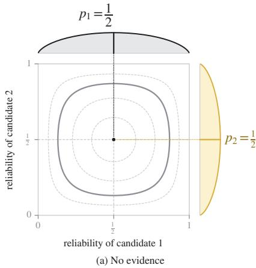

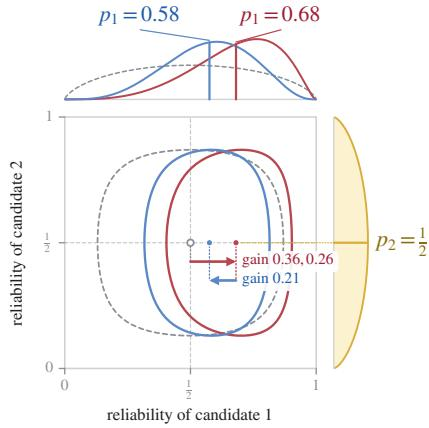  
(b) After three verified answers: right, right, wrong  
Figure 1: Illustration of the BaRe-Mem reliability memory update process. (a) Without verified evidence, all advisors are assigned equal reliability. (b) Updating only candidate 1 with two correct outcomes shifts its estimated reliability to the red posterior, while a subsequent incorrect outcome yields the blue posterior. The annotated gains denote the corresponding Kalman gains.

Reliability Estimate. When the central model M solves question $q _ { t }$ , the reliability of candidate k is estimated as its probability of being correct:

$$
p _ { t , k } = \Phi \left( \frac { \mu _ { t , k } } { \sqrt { 1 + v _ { t , k } } } \right) , \qquad \mu _ { t , k } = x _ { t , k } ^ { \top } m , \qquad v _ { t , k } = x _ { t , k } ^ { \top } \Lambda ^ { - 1 } x _ { t , k } .\tag{6}
$$

Here, $\mu _ { t , k }$ is the predicted signed correctness and $v _ { t , k }$ its uncertainty. The derivation can be found in Appendix A.5. Figure 1 illustrates this update process. Without verified evidence, the memory assigns equal reliability $\begin{array} { r } { p \ = \ \frac { 1 } { 2 } } \end{array}$ to all advisors. After two correct outcomes for candidate 1, its estimated reliability increases, while a subsequent incorrect outcome reduces it. Candidate 2 remains unchanged when no evidence is observed for it. The corresponding Kalman gains control the magnitude of each update.

## 3.2 RELIABILITY-GUIDED ATTENTION

We use the estimated advisor reliabilities to modulate the influence of each advisor’s response on the central model. For each context token j belonging to an advisor response, let $c ( j )$ denote the advisor that produced that response. In every attention head\*, we modify the attention weights as

$$
\alpha _ { q j } = \mathrm { s o f t m a x } _ { j } \left( \frac { \langle Q _ { q } , K _ { j } \rangle } { \sqrt { d } } + \beta _ { t , c ( j ) } \right) , \qquad \beta _ { t , k } = \gamma \log \frac { p _ { t , k } } { \operatorname* { m a x } _ { k ^ { \prime } } p _ { t , k ^ { \prime } } } .\tag{7}
$$

with $\beta = 0$ for tokens outside advisor responses. Before softmax normalization, this rescales the unnormalized attention weight on advisor k by $\left( \frac { p _ { t , k } } { \operatorname* { m a x } _ { k ^ { \prime } } p _ { t , k ^ { \prime } } } \right) ^ { \gamma } \in \left( 0 , 1 \right]$ . Thus, the most reliable advisor is left unchanged, while less reliable advisors are progressively downweighted.

This attention steering introduces no trainable parameters or additional training and depends only on the relative reliability among advisors.

## 3.3 DECIDING WHETHER TO CONSULT

Reliability-guided attention in Section 3.2 determines how strongly each advisor should influence the central model, but not whether consultation is preferable to autonomous reasoning. We therefore estimate both abilities on the current question and select the mode with higher estimated accuracy.

Consultation Ability. Let $T _ { t }$ denote the highest reliability estimate among the advisor candidates, representing the memory’s confidence that trustworthy evidence is available among the consulted responses. When $T \to 1$ , consultation succeeds with probability $\rho ,$ which describes how well $M$ uses trustworthy evidence. When $T  0$ , unreliable evidence may pull M away from its autonomous judgment, reducing its accuracy from its autonomous ability κ by δ. We model $M \mathrm { { s } }$ consultation ability by interpolating between these two regimes:

$$
A ( T ) = \underbrace { T \rho } _ { \mathrm { r e l i a b l e \thinspace e v i d e n c e \thinspace r e g i m e } } + \underbrace { \left( 1 - T \right) \left( \kappa - \delta \right) } _ { \mathrm { u n r e l i a b l e \thinspace e v i d e n c e \thinspace r e g i m e } } .\tag{8}
$$

Here, κ is the central model’s autonomous ability on the current question, independent of external evidence. Accordingly, $\kappa - \delta$ represents its consultation ability under unreliable evidence, with δ measuring the degradation relative to autonomous reasoning. Meanwhile, $\rho$ denotes the consultation ability when trustworthy evidence is available. Therefore, $A ( T )$ describes the central model’s expected consultation ability as a function of the memory’s confidence in the external evidence.

Estimating Consultation and Autonomous Ability. For the current question $q _ { t }$ , the specific quantities $\kappa _ { t }$ and $T _ { t }$ are directly available from the reliability memory. The autonomous candidate provides the central model’s autonomous ability $\kappa _ { t }$ , while the highest reliability among the advisor candidates gives the trust $T _ { t }$

$$
\kappa _ { t } = p _ { t , 0 } , \qquad T _ { t } = \operatorname* { m a x } _ { k } p _ { t , k } ,\tag{9}
$$

The consultation parameters $\rho$ and $\delta ,$ in contrast, are unknown and are learned from previously verified interactions. Rearranging Eq. (8) yields a linear form for $\theta = [ \rho , \delta ] ^ { \top }$

$$
z _ { t } \equiv y _ { t } - ( 1 - T _ { t } ) \kappa _ { t } , \qquad z _ { t } \mid u _ { t } , \theta \sim \mathcal { N } \big ( u _ { t } ^ { \top } \theta , 1 \big ) , \qquad u _ { t } = \left[ T _ { t } \atop T _ { t } - 1 \right] .\tag{10}
$$

Here, $y _ { t } \in \{ 0 , 1 \}$ indicates whether consultation produces the correct answer on question $q _ { t }$ and becomes available after verification. Using the same online Bayesian regression as the reliability memory A.1, we estimate $\rho$ and δ from previously verified questions:

$$
\left[ \widehat { \widehat { \delta } } \right] = P _ { c } ^ { - 1 } q _ { c } , \qquad P _ { c } = I + \sum _ { s < t } u _ { s } u _ { s } ^ { \top } , \qquad q _ { c } = \theta _ { 0 } + \sum _ { s < t } u _ { s } z _ { s } .\tag{11}
$$

Substituting $\kappa _ { t } , T _ { t } , \hat { \rho } ,$ and $\hat { \delta }$ into $\operatorname { E q . } \ ( { \mathbf { 8 } } )$ gives the estimated consultation ability for the current question. The detailed derivation is in Appendix $\mathbf { A . 6 }$

Decision Rule. Given the estimated consultation and autonomous abilities, M selects the mode with higher estimated accuracy:

$$
\begin{array} { r } { \hat { a } _ { t } = \left\{ \begin{array} { l l } { \mathrm { c o n s u l t a t i o n } , } & { \mathrm { i f ~ } A ( T _ { t } ) \geq \kappa _ { t } , } \\ { \mathrm { a u t o n o m o u s ~ r e a s o n i n g } , } & { \mathrm { o t h e r w i s e } . } \end{array} \right. } \end{array}\tag{12}
$$

The advantage of consultation over autonomous reasoning can be written as

$$
A ( T _ { t } ) - \kappa _ { t } = \underbrace { T _ { t } \left( \hat { \rho } - \kappa _ { t } \right) } _ { \mathrm { g a i n f r o m \ r e l i a b l e \ e v i d e n c e } } - \underbrace { \left( 1 - T _ { t } \right) \hat { \delta } } _ { \mathrm { l o s s f r o m \ u n r e l i a b l e \ e v i d e n c e } } .\tag{13}
$$

Consultation is therefore preferred when the expected gain from reliable external evidence outweighs the potential degradation from unreliable evidence.

When $\hat { \delta } > 0$ and $\hat { \rho } > \kappa _ { t }$ , this condition yields a decision threshold $\begin{array} { r } { T _ { t } ^ { * } = \frac { \hat { \delta } } { \hat { \rho } + \hat { \delta } - \kappa _ { t } } } \end{array}$ . M consults when $T _ { t } \ \geq \ T _ { t } ^ { * }$ . The threshold increases with autonomous ability $\kappa _ { t }$ and the degradation ${ \hat { \delta } } ,$ and decreases with the consultation ability under reliable evidence ${ \hat { \rho } } .$ Thus, a stronger autonomous model requires more trustworthy external evidence before consultation becomes preferable. The remaining parameter regimes are analyzed in Appendix A.7.

## 4 EXPERIMENTS

## 4.1 EXPERIMENTAL SETUPS

We conduct our study under two complementary capability regimes. The capability-supported suite includes mathematical reasoning (GSM8K (Cobbe et al., 2021)), code generation (APPS (Hendrycks et al., 2021)), and retrieval-based question answering (SQuAD (Rajpurkar et al., 2016)), where most evaluated central models exhibit relatively strong competence and useful advisor information is broadly available. The capability-challenging suite includes physical commonsense reasoning (PIQA (Bisk et al., 2020)), broad knowledge (MMLU (Hendrycks et al., 2020)), science question answering (OpenBookQA (Mihaylov et al., 2018) and SciQ (Welbl et al., 2017)), complex reasoning (BBH (Suzgun et al., 2023)), and language understanding (SuperGLUE (Wang et al., 2019)), where capabilities are substantially more heterogeneous and task-dependent across models. We utilize six advisors and evaluated six central models, their individual performance is reported in Appendix B.1. Within each capability regime, questions from the constituent datasets are randomly shuffled to prevent the memory from exploiting dataset order as a shortcut for advisor reliability. In the main text, we use Qwen3-14B (Yang et al., 2025) and Phi-4 (Abdin et al., 2024) as representative central models for analysis. Additional results are provided in the Appendix B.

## 4.2 ADAPTIVE CONSULTATION UNDER MISLEADING INFORMATION

In heterogeneous multi-agent systems, an advisor may encounter tasks outside its competence yet still produce a fluent and confident answer (Zhou et al., 2024; Xiong et al., 2024; Sharma et al., 2024; Kalai et al., 2025). To evaluate robustness to such misleading information provided by the advisors, we construct controlled corruptions by replacing a specified fraction of advisor responses with misleading ones. These responses remain fluent, on-topic, and well-formed, but their final answers are verified to be incorrect. We vary the misleading information ratio from 0% to $1 0 0 \% ^ { \dag }$ to examine how consultation degrades as external evidence becomes less reliable, and whether BaRe-Mem adaptively shifts between consultation and autonomous reasoning.

Obs.1. Consultation robustness depends on the capability regime. Figure 2 shows a clear contrast between the two capability regimes. In the capability-supported regime, Question + Peers and Debate (2 rounds) remain relatively stable as the misleading information ratio increases. In the capability-challenging regime, however, both degrade substantially and fall below the No consultation baseline once the misleading information ratio exceeds 50% for both central models. This contrast is consistent with prior findings that the benefits of multi-agent interaction depend strongly on task and model capabilities (Smit et al., 2023; Kim et al., 2026). Majority voting is substantially more vulnerable: both variants deteriorate rapidly as misleading information becomes dominant. Incorporating the central model’s own answer partially mitigates this degradation, but does not prevent it, consistent with prior observations that models can abandon correct judgments in favor of incorrect peer majorities (Weng et al., 2025; Zhu et al., 2025).

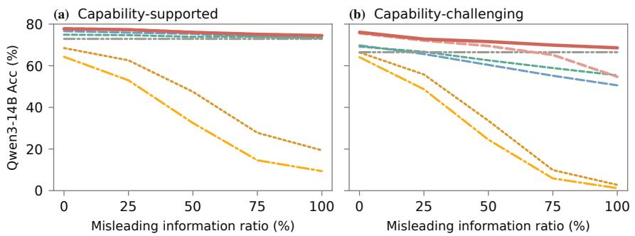

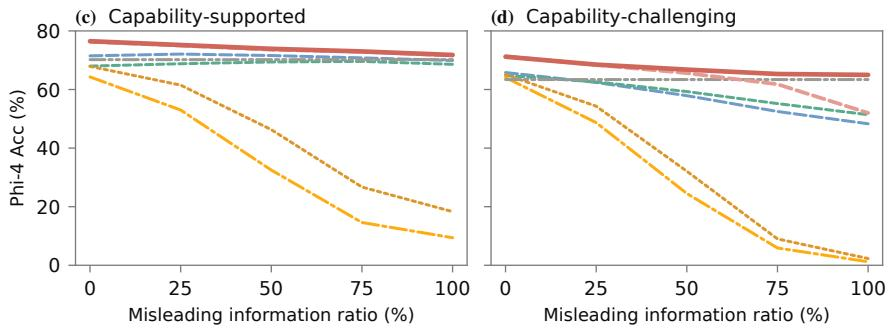  
Figure 2: Accuracy under increasing misleading-advice ratios for Qwen3-14B and Phi-4. Left: capability-supported regime; right: capability-challenging regime. Across both regimes, BaRe-Mem remains above the no-consultation baseline as misleading information increases, while other consultation methods degrade substantially in the capability-challenging regime.

Obs. 2. Reliability consultation helps but still requires autonomous reasoning. Advisors + memory is an ablation of BaRe-Mem that retains reliability guided attention but removes the autonomous option, forcing the model to consult on every question. Advisors + memory substantially improves robustness over Question + Peers, indicating that historical reliability estimates make consultation less sensitive to misleading advisor responses. In the capability-supported regime, this is often sufficient to maintain stable performance. However, in the capability-challenging regime, its accuracy eventually falls below the No consultation baseline as misleading information becomes dominant for both central models. This exposes a limitation of relative advisor weighting: it can determine whom to trust more, but not whether the advisor pool is worth consulting as a whole. BaRe-Mem adds this missing gap by comparing estimated consultation and autonomous abilities on each question, and remains above the No consultation baseline across all tested misleading information ratios. These results show that our BaRe-Mem helps the central model not only estimate source reliability, but also choose to rely on itself when external evidence is collectively unreliable.

Obs. 3. BaRe-Mem adapts when to consult. Table 1 reports the ratio of questions for which BaRe-Mem selects consultation. In the capability-supported regime, the consultation ratio remains high and nearly unchanged as misleading information increases, decreasing only from 87% to 85% for Qwen3-14B and from 85% to 83% for Phi-4. In contrast, in the capability-challenging regime, it drops substantially from 90% to 21% for Qwen3-14B and from 85% to 18% for Phi-4 as the misleading-information ratio increases from 0% to 100%. This behavior mirrors the performance patterns in Figure 2: BaRe-Mem continues to consult when external information remains useful, but increasingly switches to autonomous reasoning as consultation becomes less reliable.

Table 1: Accuracy (%) and consultation ratio under increasing misleading information ratios for Qwen3-14B and Phi-4. No consultation denotes autonomous reasoning without peer information, while Question + Peers denotes consultation with peer responses without reliability memory.
<table><tr><td rowspan="2">Model</td><td rowspan="2">Method</td><td colspan="5">Capability-supported</td><td colspan="5">Capability-challenging</td></tr><tr><td>0%</td><td>25%</td><td>50%</td><td>75%</td><td>100%</td><td>0%</td><td>25%</td><td>50%</td><td>75%</td><td>100%</td></tr><tr><td rowspan="4">Qwen3-14B</td><td>No consultation</td><td>72.9</td><td>72.9</td><td>72.9</td><td>72.9</td><td>72.9</td><td>66.5</td><td>66.5</td><td>66.5</td><td>66.5</td><td>66.5</td></tr><tr><td>Question + Peers</td><td>76.6</td><td>75.9</td><td>75.3</td><td>73.9</td><td>73.2</td><td>69.8</td><td>65.6</td><td>60.4</td><td>55.2</td><td>50.6</td></tr><tr><td>BaRe-Mem</td><td>77.7</td><td>77.3</td><td>76.0</td><td>75.1</td><td>74.5</td><td>76.1</td><td>72.8</td><td>71.6</td><td>69.9</td><td>68.6</td></tr><tr><td>Consultation ratio</td><td>87%</td><td>86%</td><td>85%</td><td>85%</td><td>85%</td><td>90%</td><td>83%</td><td>76%</td><td>61%</td><td>21%</td></tr><tr><td rowspan="4">Phi-4</td><td>No consultation</td><td>70.2</td><td>70.2</td><td>70.2</td><td>70.2</td><td>70.2</td><td>63.4</td><td>63.4</td><td>63.4</td><td>63.4</td><td>63.4</td></tr><tr><td>Question + Peers</td><td>71.5</td><td>72.1</td><td>71.6</td><td>70.8</td><td>69.9</td><td>65.8</td><td>62.4</td><td>57.9</td><td>52.5</td><td>48.3</td></tr><tr><td>BaRe-Mem</td><td>76.5</td><td>75.2</td><td>73.9</td><td>73.0</td><td>71.8</td><td>71.2</td><td>68.5</td><td>66.8</td><td>65.3</td><td>65.0</td></tr><tr><td>Consultation ratio</td><td>85%</td><td>84%</td><td>83%</td><td>84%</td><td>83%</td><td>85%</td><td>79%</td><td>71%</td><td>57%</td><td>18%</td></tr></table>

## 4.3 ANALYSIS OF BARE-MEM

We next examine whether the quantities driving BaRe-Mem’s consultation decisions behave as intended. Specifically, we study whether the memory captures the central model’s autonomous ability, whether the predicted consultation advantage is consistent with the real empirical gain, and how much verified feedback is required to learn these estimates.

## 4.3.1 AUTONOMOUS ABILITY ESTIMATION

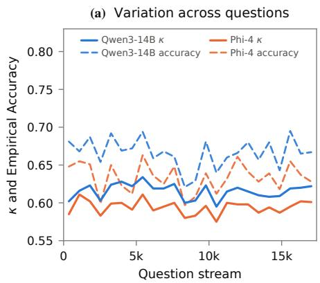

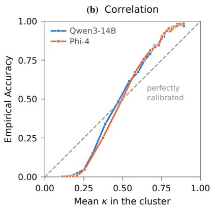  
Figure 3: Estimated autonomous ability κ versus empirical autonomous accuracy for Qwen3-14B and Phi-4. Left: Evolution of mean κ and empirical autonomous accuracy along the question stream. Right: Empirical autonomous accuracy for groups of questions with similar κ values. The dashed diagonal indicates perfect calibration.

BaRe-Mem decides whether to consult by comparing the estimated consultation ability with the central model’s autonomous ability, making κ a key quantity in the decision. We therefore examine whether reliability memory captures meaningful variation in the central model’s own competence. As shown in Figure 3, the estimated κ broadly tracks changes in empirical autonomous accuracy along the question stream for both Qwen3-14B and Phi-4. To examine whether κ is predictive of the central model’s autonomous correctness, we group questions with similar κ values and measure the autonomous accuracy within each group. The empirical accuracy increases monotonically with κ, indicating that higher estimated autonomous ability corresponds to a higher probability that the central model answers correctly on its own.

## 4.3.2 PREDICTED VS. REAL CONSULTATION GAIN

We next examine whether the predicted gain of consultation over autonomous reasoning $( \hat { \Delta } _ { t } \ =$ $A ( T _ { t } ) - \kappa _ { t } )$ is consistent with the real gain observed after verification. For each question t, we define the real gain as $\Delta _ { t } = y _ { t } ^ { \mathrm { C o n s u l t } } - \check { y } _ { t } ^ { \mathrm { D i r e c t } } \in \{ - 1 , 0 , + 1 \}$ , where +1 means consultation is correct while autonomous reasoning is wrong, −1 means the opposite, and 0 means both modes have the same correctness outcome. We sort questions by $\hat { \Delta } _ { t }$ and divide them into 16 equal-sized groups. For each group, we plot the mean predicted gain on the x-axis and the mean real gain on the y-axis. The resulting curve approximates $\mathbb { E } [ \Delta _ { t } \ | \ \hat { \Delta } _ { t } ]$ , allowing us to examine whether the consultation advantage predicted by BaRe-Mem is reflected in practice. Further analysis can be found in Appendix B.4.

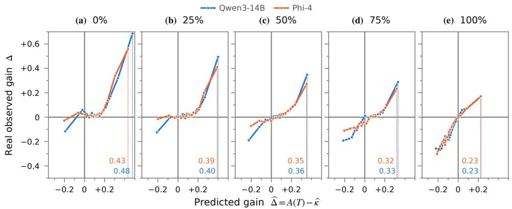  
Figure 4: Predicted versus real consultation gain for Qwen3-14B and Phi-4 under increasing misleading-information ratios. Panels (a)–(e) correspond to misleading-information ratios of 0%, 25%, 50%, 75%, and 100%, respectively. The x-axis shows the mean predicted gain $\hat { \Delta } = A ( T ) - \kappa$ within each group, while the y-axis shows the corresponding mean real gain $\Delta = y ^ { \mathrm { C o n s u l t } } - \overset { \cdot } { y } ^ { \mathrm { D i r e c t } }$

As shown in Figure 4, the real gain increases with the predicted gain across all misleading information ratios. Thus, when BaRe-Mem predicts a larger advantage from consultation, consultation is also more beneficial in practice. More importantly, the curves cross zero close to $\hat { \Delta } = 0$ , showing that the predicted boundary between consultation and autonomous reasoning is well aligned with the real boundary. As the misleading information ratio increases, the curves shift downward and to the left: consultation becomes less beneficial in practice, while BaRe-Mem correspondingly predicts a smaller consultation advantage. The upper range of $\hat { \Delta }$ also contracts as misleading information increases. Since κ represents the central model’s autonomous ability and is unaffected by external misleading information, this shift is primarily driven by a lower estimated consultation ability A(T).

## 4.3.3 LEARNING FROM SPARSE FEEDBACK

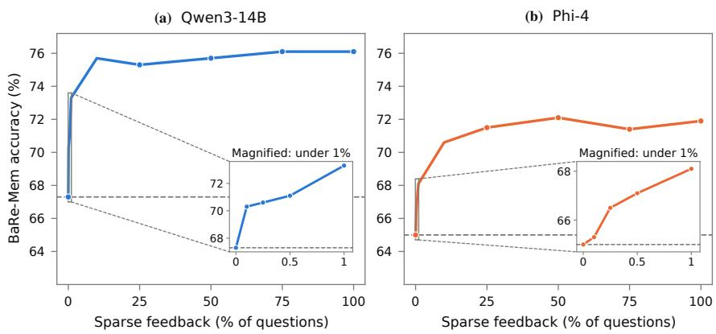  
Figure 5: BaRe-Mem accuracy under sparse verified feedback for Qwen3-14B and Phi-4. The fraction of questions whose verified outcomes are written to memory varies from 0% to 100%. Insets magnify the low-feedback regime below 1%.

In realistic deployments, verified outcomes may be costly or only intermittently available. We therefore examine how efficiently BaRe-Mem learns reliability from sparse feedback by varying the fraction of questions whose verified outcomes are written to memory. As shown in Figure 5, both Qwen3-14B and Phi-4 benefit substantially from even a small amount of verified feedback. The magnified region below 1% (approximately 170 samples) shows clear gains over the no-feedback setting, indicating that useful reliability estimates emerge after only a small number of verified interactions. Performance improves rapidly as feedback becomes available and then largely saturates, with most of the eventual gain obtained well before full feedback is provided. These results show that BaRe-Mem can learn useful reliability information without requiring dense verification.

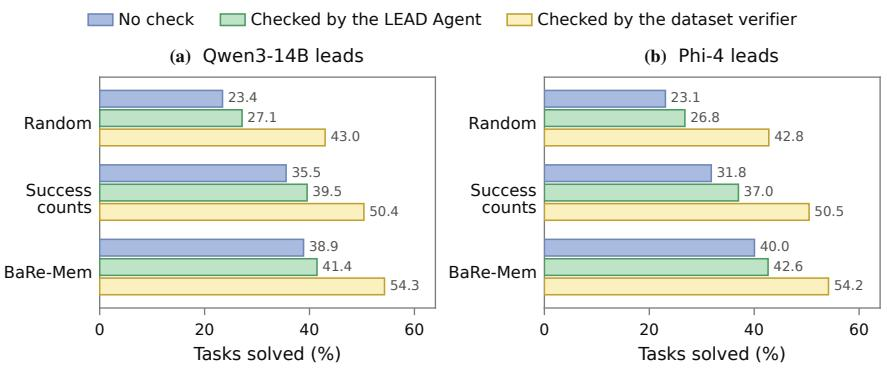

## 4.4 REAL-WORLD APPLICATION: AGENT TEAM ROUTING

We further evaluate BaRe-Mem in a realistic multi-agent team setting. A lead agent decomposes each task into sub-tasks, routes each sub-task to a worker, and replans by trying another worker when the returned report is rejected. The pipeline is shown in Figure 22. We conduct this evaluation on MuSiQue (Trivedi et al., 2022), which contains 2,417 tasks and 6,404 sub-tasks. In this setting, BaRe-Mem is no longer used to reweight a fixed set of candidate responses. Instead, it is used to decide which worker should receive each sub-task and which worker should be tried atfirst.

Figure 6 shows that BaRe-Mem consistently achieves the highest task completion across both lead agents and all verification settings, outperforming random routing‡ and routing by historical success counts. Verification further improves all routing strategies: lead agent checking provides a substantial gain over no verification, while exact dataset verification yields the highest completion rates. Importantly, the advantage of BaRe-Mem persists across verification settings, showing that its benefit comes from more effective worker routing rather than a particular verifier.

Figure 6: Agent-team task completion with Qwen3-14B and Phi-4 as lead agents. We compare random routing, routing by historical success counts, and BaRe-Mem under three verification settings: no verification, verification by the lead agent, and exact verification by the dataset evaluator.  
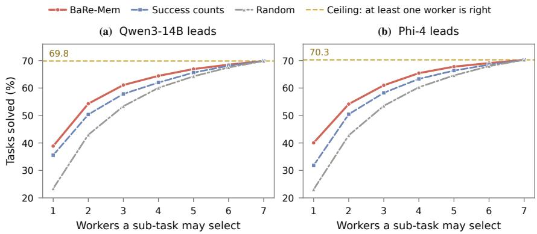  
Figure 7: Task completion as the lead agent is allowed to try an increasing number of workers for each sub-task. Subfigures (a) and (b) use Qwen3-14B and Phi-4 as the lead agent, respectively. The dashed horizontal line denotes the ceiling at which at least one worker can solve the sub-task.

To further understand why BaRe-Mem improves agent-team routing, we examine how quickly the lead agent can identify a worker capable of solving each sub-task. In this experiment, the dataset verifier checks the returned report after every worker call. If the checker returns a failure signal, the lead agent proceeds to the next ranked worker until the sub-task is solved or all candidates are exhausted. As shown in Figure 7, all routing strategies approach the same ceiling once every worker has been tried. However, BaRe-Mem reaches higher task completion with fewer worker calls, showing that its reliability memory helps the lead agent identify capable workers earlier in the search process. These results demonstrate that BaRe-Mem extends naturally beyond response attention to practical worker routing in realistic multi-agent systems.

## 5 CONCLUSION

We introduced BaRe-Mem, a Bayesian reliability memory that learns contextual source reliability from verified interaction history. By using reliability to both modulate advisor influence and decide whether consultation is preferable to autonomous reasoning, BaRe-Mem enables a central agent to adaptively determine whom to trust and whether to consult. Across heterogeneous tasks, it remains robust as advisor information becomes increasingly misleading, learns useful reliability from sparse feedback, and extends naturally to worker routing in agent teams. These results suggest that persistent reliability memory can provide a practical foundation for robust and adaptive consultation in long horizon multi-agent systems.

## REFERENCES

Marah Abdin, Jyoti Aneja, Harkirat Behl, Sébastien Bubeck, Ronen Eldan, Suriya Gunasekar, Michael Harrison, Russell J Hewett, Mojan Javaheripi, Piero Kauffmann, et al. Phi-4 technical report. arXiv preprint arXiv:2412.08905, 2024.

Reza Bayat, Ali Behrouz, Vahab Mirrokni, and Aaron Courville. Proteus: Incremental memory activation for long-context sequence modeling. 2026.

Ali Behrouz, Peilin Zhong, and Vahab Mirrokni. Titans: Learning to memorize at test time. Advances in Neural Information Processing Systems, 38:113506–113543, 2026.

Yonatan Bisk, Rowan Zellers, Jianfeng Gao, Yejin Choi, et al. Piqa: Reasoning about physical commonsense in natural language. In Proceedings of the AAAI conference on artificial intelligence, volume 34, pp. 7432–7439, 2020.

Jiaqi Cao, Jiarui Wang, Rubin Wei, Qipeng Guo, Kai Chen, Bowen Zhou, and Zhouhan Lin. Memory decoder: A pretrained, plug-and-play memory for large language models. Advances in Neural Information Processing Systems, 38:115487–115510, 2026.

Rujikorn Charakorn, Edoardo Cetin, Shinnosuke Uesaka, and Robert Tjarko Lange. Doc-to-lora: Learning to instantly internalize contexts. arXiv preprint arXiv:2602.15902, 2026.

Prateek Chhikara, Dev Khant, Saket Aryan, Taranjeet Singh, and Deshraj Yadav. Mem0: Building production-ready ai agents with scalable long-term memory. arXiv preprint arXiv:2504.19413, 2025.

Karl Cobbe, Vineet Kosaraju, Mohammad Bavarian, Mark Chen, Heewoo Jun, Lukasz Kaiser, Matthias Plappert, Jerry Tworek, Jacob Hilton, Reiichiro Nakano, et al. Training verifiers to solve math word problems. arXiv preprint arXiv:2110.14168, 2021.

Yu Cui, Hang Fu, Haibin Zhang, Licheng Wang, and Cong Zuo. Free-mad: Consensus-free multiagent debate. In Findings of the Association for Computational Linguistics: ACL 2026, pp. 31977–31997, 2026.

Boyi Deng, Wenjie Wang, Fengbin Zhu, Qifan Wang, and Fuli Feng. Cram: Credibility-aware attention modification in llms for combating misinformation in rag. In Proceedings of the AAAI Conference on Artificial Intelligence, volume 39, pp. 23760–23768, 2025.

Yilun Du, Shuang Li, Antonio Torralba, Joshua B Tenenbaum, and Igor Mordatch. Improving factuality and reasoning in language models through multiagent debate. arXiv preprint arXiv:2305.14325, 2023.

Sugyeong Eo, Hyeonseok Moon, Evelyn Hayoon Zi, Chanjun Park, and Heuiseok Lim. Debate only when necessary: Adaptive multiagent collaboration for efficient llm reasoning. arXiv preprint arXiv:2504.05047, 2025.

Peilin Feng, Suorong Yang, and Soujanya Poria. σ-mem: An online reliability memory for llm-based multi-agent systems. arXiv preprint arXiv:2607.27958, 2026.

Vitoria Guardieiro, Avishree Khare, Adam Stein, and Eric Wong. Instruction following by principled boosting attention of large language models. arXiv preprint arXiv:2506.13734, 2025.

Taicheng Guo, Xiuying Chen, Yaqi Wang, Ruidi Chang, Shichao Pei, Nitesh V Chawla, Olaf Wiest, and Xiangliang Zhang. Large language model based multi-agents: A survey of progress and challenges. arXiv preprint arXiv:2402.01680, 2024.

Dan Hendrycks, Collin Burns, Steven Basart, Andy Zou, Mantas Mazeika, Dawn Song, and Jacob Steinhardt. Measuring massive multitask language understanding. arXiv preprint arXiv:2009.03300, 2020.

Dan Hendrycks, Steven Basart, Saurav Kadavath, Mantas Mazeika, Akul Arora, Ethan Guo, Collin Burns, Samir Puranik, Horace He, Dawn Song, et al. Measuring coding challenge competence with apps (2021). URL https://arxiv. org/abs/2105.09938, 7, 2021.

Dongfu Jiang, Xiang Ren, and Bill Yuchen Lin. Llm-blender: Ensembling large language models with pairwise ranking and generative fusion. In Proceedings of the 61st Annual Meeting of the Association for Computational Linguistics (Volume 1: Long Papers), pp. 14165–14178, 2023.

Adam Tauman Kalai, Ofir Nachum, Santosh S Vempala, and Edwin Zhang. Why language models hallucinate. arXiv preprint arXiv:2509.04664, 2025.

Yubin Kim, Ken Gu, Chanwoo Park, Chunjong Park, Samuel Schmidgall, A Ali Heydari, Yao Yan, Zhihan Zhang, Yuchen Zhuang, Yun Liu, et al. Capable language models can outgrow the benefits of collaboration. Nature Machine Intelligence, 8(7):1157–1172, 2026.

Philippe Laban, Hiroaki Hayashi, Yingbo Zhou, and Jennifer Neville. Llms get lost in multiturn conversation. In International Conference on Learning Representations, volume 2026, pp. 54738–54778, 2026.

Jingdi Lei, Di Zhang, Junxian Li, Weida Wang, Kaixuan Fan, Xiang Liu, Qihan Liu, Xiaoteng Ma, Baian Chen, and Soujanya Poria. \δ-mem: Efficient online memory for large language models. arXiv preprint arXiv:2605.12357, 2026.

Todor Mihaylov, Peter Clark, Tushar Khot, and Ashish Sabharwal. Can a suit of armor conduct electricity? a new dataset for open book question answering. In Proceedings of the 2018 conference on empirical methods in natural language processing, pp. 2381–2391, 2018.

Charles Packer, Sarah Wooders, Kevin Lin, Vivian Fang, Shishir G Patil, Ion Stoica, and Joseph E Gonzalez. Memgpt: Towards llms as operating systems. arXiv preprint arXiv:2310.08560, 2023.

Yujia Qin, Shihao Liang, Yining Ye, Kunlun Zhu, Lan Yan, Yaxi Lu, Yankai Lin, Xin Cong, Xiangru Tang, Bill Qian, et al. Toolllm: Facilitating large language models to master 16000+ real-world apis. In International Conference on Learning Representations, volume 2024, pp. 9695–9717, 2024.

Pranav Rajpurkar, Jian Zhang, Konstantin Lopyrev, and Percy Liang. Squad: 100,000+ questions for machine comprehension of text. In Proceedings ofthe 2016 conference on empirical methods in natural language processing, pp. 2383–2392, 2016.

Mrinank Sharma, Meg Tong, Tomek Korbak, David Duvenaud, Amanda Askell, Sam Bowman, Esin Durmus, Zac Hatfield-Dodds, Scott Johnston, Shauna Kravec, et al. Towards understanding sycophancy in language models. In International Conference on Learning Representations, volume 2024, pp. 110–144, 2024.

Yongliang Shen, Kaitao Song, Xu Tan, Dongsheng Li, Weiming Lu, and Yueting Zhuang. Hugginggpt: Solving ai tasks with chatgpt and its friends in hugging face. Advances in Neural Information Processing Systems, 36:38154–38180, 2023.

Noah Shinn, Federico Cassano, Ashwin Gopinath, Karthik Narasimhan, and Shunyu Yao. Reflexion: Language agents with verbal reinforcement learning. Advances in neural information processing systems, 36:8634–8652, 2023.

Andries Smit, Paul Duckworth, Nathan Grinsztajn, Thomas D Barrett, and Arnu Pretorius. Should we be going mad? a look at multi-agent debate strategies for llms. arXiv preprint arXiv:2311.17371, 2023.

Maojia Song, Tej Deep Pala, Weisheng Jin, Amir Zadeh, Chuan Li, Dorien Herremans, and Soujanya Poria. Llms can’t handle peer pressure: Crumbling under multi-agent social interactions, 2025. URL https://arxiv.org/abs/2508.18321.

Yifan Song, Weimin Xiong, Dawei Zhu, Wenhao Wu, Han Qian, Mingbo Song, Hailiang Huang, Cheng Li, Ke Wang, Rong Yao, et al. Restgpt: Connecting large language models with real-world restful apis. arXiv preprint arXiv:2306.06624, 2023.

Mirac Suzgun, Nathan Scales, Nathanael Schärli, Sebastian Gehrmann, Yi Tay, Hyung Won Chung, Aakanksha Chowdhery, Quoc Le, Ed H Chi, Denny Zhou, et al. Challenging big-bench tasks and whether chain-of-thought can solve them. In Findings of the Association for Computational Linguistics: ACL 2023, pp. 13003–13051, 2023.

WT Luke Teacy, Jigar Patel, Nicholas R Jennings, and Michael Luck. Travos: Trust and reputation in the context of inaccurate information sources. Autonomous Agents and Multi-Agent Systems, 12(2):183–198, 2006.

Kimi Team, Yu Zhang, Zongyu Lin, Xingcheng Yao, Jiaxi Hu, Fanqing Meng, Chengyin Liu, Xin Men, Songlin Yang, Zhiyuan Li, et al. Kimi linear: An expressive, efficient attention architecture. arXiv preprint arXiv:2510.26692, 2025.

Harsh Trivedi, Niranjan Balasubramanian, Tushar Khot, and Ashish Sabharwal. ★ musique: Multihop questions via single-hop question composition. Transactions of the Association for Compu tational Linguistics, 10:539–554, 2022.

Akshay Verma, Swapnil Gupta, Deepak Gupta, Prateek Sircar, and Siddharth Pillai. Selene: Selective and evidence-weighted llm debating for efficient and reliable reasoning. In Proceedings of the 19th Conference of the European Chapter of the Association for Computational Linguistics (Volume 5: Industry Track), pp. 95–104, 2026.

Alex Wang, Yada Pruksachatkun, Nikita Nangia, Amanpreet Singh, Julian Michael, Felix Hill, Omer Levy, and Samuel Bowman. Superglue: A stickier benchmark for general-purpose language understanding systems. Advances in neural information processing systems, 32, 2019.

Junlin Wang, Jue Wang, Ben Athiwaratkun, Ce Zhang, and James Y Zou. Mixture-of-agents enhances large language model capabilities. In International Conference on Learning Representations, volume 2025, pp. 33944–33963, 2025a.

Yan Wang, Dongyang Ma, and Deng Cai. With greater text comes greater necessity: Inference-time training helps long text generation. arXiv preprint arXiv:2401.11504, 2024a.

Yu Wang, Yifan Gao, Xiusi Chen, Haoming Jiang, Shiyang Li, Jingfeng Yang, Qingyu Yin, Zheng Li, Xian Li, Bing Yin, et al. Memoryllm: Towards self-updatable large language models. arXiv preprint arXiv:2402.04624, 2024b.

Yu Wang, Dmitry Krotov, Yuanzhe Hu, Yifan Gao, Wangchunshu Zhou, Julian McAuley, Dan Gutfreund, Rogerio Feris, and Zexue He. M+: Extending memoryllm with scalable long-term memory. arXiv preprint arXiv:2502.00592, 2025b.

Rubin Wei, Jiaqi Cao, Jiarui Wang, Jushi Kai, Qipeng Guo, Bowen Zhou, and Zhouhan Lin. Mlp memory: A retriever-pretrained memory for large language models. In International Conference on Learning Representations, volume 2026, pp. 132772–132795, 2026.

Johannes Welbl, Nelson F Liu, and Matt Gardner. Crowdsourcing multiple choice science questions. In Proceedings of the 3rd Workshop on Noisy User-generated Text, pp. 94–106, 2017.

Zhiyuan Weng, Guikun Chen, and Wenguan Wang. Do as we do, not as you think: the conformity of large language models. arXiv preprint arXiv:2501.13381, 2025.

Qingyun Wu, Gagan Bansal, Jieyu Zhang, Yiran Wu, Beibin Li, Erkang Zhu, Li Jiang, Xiaoyun Zhang, Shaokun Zhang, Jiale Liu, et al. Autogen: Enabling next-gen llm applications via multiagent conversation. arXiv preprint arXiv:2308.08155, 2023.

Yuhuai Wu, Markus N Rabe, DeLesley Hutchins, and Christian Szegedy. Memorizing transformers. arXiv preprint arXiv:2203.08913, 2022.

Miao Xiong, Zhiyuan Hu, Xinyang Lu, Yifei Li, Jie Fu, Junxian He, and Bryan Hooi. Can llms express their uncertainty? an empirical evaluation of confidence elicitation in llms. In International Conference on Learning Representations, volume 2024, pp. 23650–23678, 2024.

Shaotian Yan, Chen Shen, Wenxiao Wang, Liang Xie, Junjie Liu, and Jieping Ye. Don’t take things out of context: Attention intervention for enhancing chain-of-thought reasoning in large language models. In International Conference on Learning Representations, volume 2025, pp. 63323– 63344, 2025.

An Yang, Anfeng Li, Baosong Yang, Beichen Zhang, Binyuan Hui, Bo Zheng, Bowen Yu, Chang Gao, Chengen Huang, Chenxu Lv, et al. Qwen3 technical report. arXiv preprint arXiv:2505.09388, 2025.

Songlin Yang, Bailin Wang, Yu Zhang, Yikang Shen, and Yoon Kim. Parallelizing linear transformers with the delta rule over sequence length. Advances in neural information processing systems, 37:115491–115522, 2024.

Zhaochen Yu, Yingcheng Wu, Zhenfei Yin, Kaiyuan Chen, Zhe Zhao, Mengdi Wang, Shuicheng Yan, and Ling Yang. Recursive experiential-working memory evolution for long-horizon agent harnesses. arXiv preprint arXiv:2608.24876, 2026.

Guibin Zhang, Muxin Fu, Kun Wang, Frank Wan, Miao Yu, and Shuicheng Yan. Gmemory: Tracing hierarchical memory for multi-agent systems. In D. Belgrave, C. Zhang, H. Lin, R. Pascanu, P. Koniusz, M. Ghassemi, and N. Chen (eds.), Advances in Neural Information Processing Systems, volume 38, Main Conference, pp. 12988–13018. Curran Associates, Inc., 2025a. doi: 10.52202/085713-0439. URL https://proceedings.neurips.cc/paper\_files/paper/2025/file/ 136a45cd9b841bf785625709a19c6508-Paper-Conference.pdf.

Guibin Zhang, Muxin Fu, and Shuicheng Yan. Memgen: Weaving generative latent memory for self-evolving agents. In International Conference on Learning Representations, volume 2026, pp. 22555–22588, 2026.

Hangfan Zhang, Zhiyao Cui, Jianhao Chen, Xinrun Wang, Qiaosheng Zhang, Zhen Wang, Dinghao Wu, and Shuyue Hu. Stop overvaluing multi-agent debate–we must rethink evaluation and embrace model heterogeneity. arXiv preprint arXiv:2502.08788, 2025b.

Qingru Zhang, Chandan Singh, Liyuan Liu, Xiaodong Liu, Bin Yu, Jianfeng Gao, and Tuo Zhao. Tell your model where to attend: Post-hoc attention steering for llms. In International Conference on Learning Representations, volume 2024, pp. 42411–42430, 2024.

Andrew Zhao, Daniel Huang, Quentin Xu, Matthieu Lin, Yong-Jin Liu, and Gao Huang. Expel: Llm agents are experiential learners. In Proceedings ofthe AAAI Conference on Artificial Intelligence, volume 38, pp. 19632–19642, 2024.

Wanjun Zhong, Lianghong Guo, Qiqi Gao, He Ye, and Yanlin Wang. Memorybank: Enhancing large language models with long-term memory. In Proceedings of the AAAI conference on artificial intelligence, volume 38, pp. 19724–19731, 2024.

Lexin Zhou, Wout Schellaert, Fernando Martínez-Plumed, Yael Moros-Daval, Cèsar Ferri, and José Hernández-Orallo. Larger and more instructable language models become less reliable. Nature, 634(8032):61–68, 2024.

Ruiwen Zhou, Maojia Song, Xiaobao Wu, Sitao Cheng, Xunjian Yin, Yuxi Xie, Zhuoqun Hao, Wenyue Hua, Liangming Pan, Soujanya Poria, et al. Epistemic context learning: Building trust the right way in llm-based multi-agent systems. arXiv preprint arXiv:2601.21742, 2026.

Xiaochen Zhu, Caiqi Zhang, Tom Stafford, Nigel Collier, and Andreas Vlachos. Conformity in large language models. In Proceedings of the 63rd Annual Meeting of the Association for Computational Linguistics (Volume 1: Long Papers), pp. 3854–3872, 2025.

## A MATHEMATICAL DERIVATIONS

## A.1 BAYESIAN REGRESSION POSTERIOR

Let $u _ { i } \in \mathbb { R } ^ { d }$ be fixed inputs and consider

$$
z _ { i } = u _ { i } ^ { \top } \theta + \varepsilon _ { i } , \qquad \varepsilon _ { i } \sim \mathcal { N } ( 0 , 1 ) ,
$$

where the noises are mutually independent and independent of $\theta \sim \mathcal { N } ( \theta _ { 0 } , \Lambda _ { 0 } ^ { - 1 } )$ , with $\Lambda _ { 0 } \succ 0$ For $\mathcal { D } _ { n } = \{ ( u _ { i } , z _ { i } ) \} _ { i = 1 } ^ { n }$ , the posterior is

$$
\theta \mid { \mathcal { D } } _ { n } \sim { \mathcal { N } } ( m _ { n } , P _ { n } ^ { - 1 } ) ,
$$

where

$$
P _ { n } = \Lambda _ { 0 } + \sum _ { i = 1 } ^ { n } u _ { i } u _ { i } ^ { \top } , \qquad q _ { n } = \Lambda _ { 0 } \theta _ { 0 } + \sum _ { i = 1 } ^ { n } u _ { i } z _ { i } , \qquad m _ { n } = P _ { n } ^ { - 1 } q _ { n } .
$$

Moreover, $m _ { n }$ uniquely minimizes

$$
J ( \theta ) = \sum _ { i = 1 } ^ { n } ( z _ { i } - u _ { i } ^ { \top } \theta ) ^ { 2 } + \| \theta - \theta _ { 0 } \| _ { \Lambda _ { 0 } } ^ { 2 } ,
$$

Proof.

## Part (i): Posterior derivation

For each observation, the regression model implies $z _ { i } \mid u _ { i } , \theta \sim \mathcal { N } ( u _ { i } ^ { \top } \theta , 1 )$ . Therefore,

$$
\begin{array} { l } { { \displaystyle p ( z _ { i } \mid u _ { i } , \theta ) = \frac { 1 } { \sqrt { 2 \pi } } \exp \left[ - \frac { 1 } { 2 } ( z _ { i } - u _ { i } ^ { \top } \theta ) ^ { 2 } \right] , } } \\ { { \displaystyle p ( \mathcal { D } _ { n } \mid \theta ) = \prod _ { i = 1 } ^ { n } p ( z _ { i } \mid u _ { i } , \theta ) \propto \exp \left[ - \frac { 1 } { 2 } \sum _ { i = 1 } ^ { n } ( z _ { i } - u _ { i } ^ { \top } \theta ) ^ { 2 } \right] , } } \end{array}\tag{14}
$$

where the product factorization follows from the independence of the observation noises.

The Gaussian prior $\theta \sim \mathcal { N } ( \theta _ { 0 } , \Lambda _ { 0 } ^ { - 1 } )$ has precision matrix $\Lambda _ { 0 } .$ , and hence

$$
p ( \theta ) \propto \exp \left[ - \frac { 1 } { 2 } ( \theta - \theta _ { 0 } ) ^ { \top } \Lambda _ { 0 } ( \theta - \theta _ { 0 } ) \right] .\tag{15}
$$

Based on Bayes’ rule: $\begin{array} { r } { p ( \theta \mid \mathcal { D } _ { n } ) = \frac { p ( \mathcal { D } _ { n } \mid \theta ) p ( \theta ) } { p ( \mathcal { D } _ { n } ) } } \end{array}$ , we have $p ( \boldsymbol { \theta } \mid \mathcal { D } _ { n } ) \propto p ( \mathcal { D } _ { n } \mid \boldsymbol { \theta } ) p ( \boldsymbol { \theta } )$ . Substituting Eqs. (14) and (15), taking −2 log, and collecting all terms independent of θ into const gives

$$
- 2 \log p ( \theta \mid \mathcal { D } _ { n } ) = \sum _ { i = 1 } ^ { n } ( z _ { i } - u _ { i } ^ { \top } \theta ) ^ { 2 } + ( \theta - \theta _ { 0 } ) ^ { \top } \Lambda _ { 0 } ( \theta - \theta _ { 0 } ) + \mathrm { c o n s t . }\tag{16}
$$

We next expand the two quadratic terms. For the likelihood term,

$$
\begin{array} { r l } { \displaystyle \sum _ { i = 1 } ^ { n } ( z _ { i } - u _ { i } ^ { \top } \theta ) ^ { 2 } = \displaystyle \sum _ { i = 1 } ^ { n } \left( z _ { i } ^ { 2 } - 2 z _ { i } u _ { i } ^ { \top } \theta + \theta ^ { \top } u _ { i } u _ { i } ^ { \top } \theta \right) } & { } \\ { = \theta ^ { \top } \left( \displaystyle \sum _ { i = 1 } ^ { n } u _ { i } u _ { i } ^ { \top } \right) \theta - 2 \theta ^ { \top } \left( \displaystyle \sum _ { i = 1 } ^ { n } u _ { i } z _ { i } \right) + \mathrm { c o n s t . } } \end{array}\tag{17}
$$

Similarly, the prior term becomes

$$
\begin{array} { r l } & { ( \theta - \theta _ { 0 } ) ^ { \top } \Lambda _ { 0 } ( \theta - \theta _ { 0 } ) = \theta ^ { \top } \Lambda _ { 0 } \theta - 2 \theta ^ { \top } \Lambda _ { 0 } \theta _ { 0 } + \theta _ { 0 } ^ { \top } \Lambda _ { 0 } \theta _ { 0 } } \\ & { \qquad = \theta ^ { \top } \Lambda _ { 0 } \theta - 2 \theta ^ { \top } \Lambda _ { 0 } \theta _ { 0 } + \mathrm { c o n s t . } } \end{array}\tag{18}
$$

Combining Eqs. (16),( 17), and (18), we obtain

$$
\begin{array} { l } { { - 2 \log p ( \theta \mid \mathcal { D } _ { n } ) = \theta ^ { \top } \left( \displaystyle \sum _ { i = 1 } ^ { n } u _ { i } u _ { i } ^ { \top } + \Lambda _ { 0 } \right) \theta - 2 \theta ^ { \top } \left( \displaystyle \sum _ { i = 1 } ^ { n } u _ { i } z _ { i } + \Lambda _ { 0 } \theta _ { 0 } \right) + \mathrm { c o n s t } } } \\ { { = \theta ^ { \top } P _ { n } \theta - 2 \theta ^ { \top } q _ { n } + \mathrm { c o n s t } . } } \end{array}\tag{19}
$$

where $\begin{array} { r } { P _ { n } = \Lambda _ { 0 } + \sum _ { i = 1 } ^ { n } u _ { i } u _ { i } ^ { \top } } \end{array}$ and $\begin{array} { r } { q _ { n } = \Lambda _ { 0 } \theta _ { 0 } + \sum _ { i = 1 } ^ { n } u _ { i } z _ { i } } \end{array}$

Because $\Lambda _ { 0 } \succ 0$ and each $u _ { i } u _ { i } ^ { \top } \succeq 0$ , we have $P _ { n } \succ 0$ . Therefore $P _ { n } ^ { - 1 }$ exists. Let $m _ { n } = P _ { n } ^ { - 1 } q _ { n }$ substituting in Eq. (19) gives

$$
\theta ^ { \top } P _ { n } \theta - 2 \theta ^ { \top } q _ { n } = ( \theta - m _ { n } ) ^ { \top } P _ { n } ( \theta - m _ { n } ) - m _ { n } ^ { \top } P _ { n } m _ { n } .\tag{20}
$$

The final term does is independent of θ and can therefore be absorbed into the constant. Hence,

$$
p ( \theta \mid \mathcal D _ { n } ) \propto \exp \left[ - \frac 1 2 ( \theta - m _ { n } ) ^ { \top } P _ { n } ( \theta - m _ { n } ) \right] ,
$$

which is the kernel of a Gaussian distribution with mean $m _ { n }$ and precision $P _ { n }$

Therefore, $\theta \mid \mathcal { D } _ { n } \sim \mathcal { N } ( m _ { n } , P _ { n } ^ { - 1 } )$

## Part (ii): Posterior mean is the unique minimizer.

Next, we verify that the posterior mean is exactly the unique minimizer of the corresponding regularized least-squares objective. Our object:

$$
J ( \theta ) = \sum _ { i = 1 } ^ { n } ( z _ { i } - u _ { i } ^ { \top } \theta ) ^ { 2 } + \| \theta - \theta _ { 0 } \| _ { \Lambda _ { 0 } } ^ { 2 } .
$$

From the expansion from Eq. ( $1 9 ) , J ( \theta ) = \theta ^ { \top } P _ { n } \theta - 2 \theta ^ { \top } q _ { n } + \mathrm { c o n s t . } \ \mathrm { T h u s }$ ,

$$
\nabla _ { \theta } J ( \theta ) = 2 P _ { n } \theta - 2 q _ { n }\tag{21}
$$

Setting the gradient to zero gives $P _ { n } \theta = q _ { n }$ , and hence $\theta = P _ { n } ^ { - 1 } q _ { n } = m _ { n }$ . Since

$$
\nabla _ { \theta } ^ { 2 } J ( \theta ) = 2 P _ { n } \succ 0\tag{22}
$$

Therefore, $m _ { n } = P _ { n } ^ { - 1 } q _ { n }$ is the unique minimizer of $J ( \theta )$

## A.2 DERIVING THE KALMAN GAIN

A fixed step update treats every verified observation equally, regardless of how uncertain the current posterior is in the direction of the new input. We therefore introduce a data dependent gain that determines how strongly the new residual should update the posterior mean, and choose it to minimize the expected squared estimation error.

Let $m _ { n }$ and $S = P _ { n } ^ { - 1 }$ denote the current posterior mean and covariance. For a new fixed input u, the observation is $z = u ^ { \top } \theta + \varepsilon$ , where $\varepsilon \sim \mathcal { N } ( 0 , 1 )$ is independent of $( \theta , { \mathcal { D } } _ { n } )$ . We consider updating the posterior mean using the prediction residual:

$$
\widetilde { \boldsymbol { m } } ( \boldsymbol { k } ) = \boldsymbol { m } _ { n } + \boldsymbol { k } \big ( \boldsymbol { z } - \boldsymbol { u } ^ { \top } \boldsymbol { m } _ { n } \big ) ,\tag{23}
$$

where the gain $k \in \mathbb { R } ^ { d }$ depends on the existing observations and the input u, but not on the new outcome z. We choose k to minimize the expected squared estimation error, conditional on $\mathcal { D } _ { n }$

Let $e = \theta - m _ { n }$ be the current estimation error and $e ( k ) = \theta - \widetilde { m } ( k )$ the error after the update. Substituting the observation model into Eq. (23) gives

$$
\begin{array} { r l } & { e ( k ) = { \theta } - m _ { n } - k \big ( \boldsymbol { u } ^ { \top } { \theta } + { \varepsilon } - \boldsymbol { u } ^ { \top } m _ { n } \big ) } \\ & { \quad \quad = e - k \big ( \boldsymbol { u } ^ { \top } e + { \varepsilon } \big ) } \\ & { \quad \quad = ( I - k \boldsymbol { u } ^ { \top } ) e - k { \varepsilon } . } \end{array}\tag{24}
$$

Since $m _ { n }$ and S are the posterior mean and covariance, we want the error to satisfy ${ \mathbb E } [ e \mid { \mathcal D } _ { n } ] = 0$ and E $\lceil e e ^ { \top } \mid \mathcal { D } _ { n } \rceil = S$ . Because the new noise ε has unit variance and is independent of $( \theta , { \mathcal { D } } _ { n } )$ , so $\mathbb { E } [ e \varepsilon \mid ^ { \cdot } \mathcal { D } _ { n } ] \stackrel { \cdot } { = } 0$ . Thus, taking the conditional expectation of the outer product in Eq. (24) eliminates

$$
\begin{array} { r l } & { C ( k ) \equiv \mathbb { E } \big [ e ( k ) e ( k ) ^ { \top } ~ | ~ \mathcal { D } _ { n } \big ] } \\ & { ~ = ( I - k u ^ { \top } ) S ( I - u k ^ { \top } ) + k k ^ { \top } } \\ & { ~ = S - S u k ^ { \top } - k u ^ { \top } S + ( 1 + v ) k k ^ { \top } , } \end{array}\tag{25}
$$

where $\boldsymbol { v } = \boldsymbol { u } ^ { \intercal } \boldsymbol { S } \boldsymbol { u } \geq 0$ is the current posterior variance of $u ^ { \top } \theta$

The squared error satisfies $\| e ( k ) \| _ { 2 } ^ { 2 } = \mathrm { t r } ( e ( k ) e ( k ) ^ { \top } )$ . Therefore, the conditional mean squared error is

$$
\begin{array} { r l } & { R ( k ) \equiv \mathbb { E } \big [ \| e ( k ) \| _ { 2 } ^ { 2 } \mid \mathcal { D } _ { n } \big ] } \\ & { \quad \quad = \operatorname { t r } C ( k ) } \\ & { \quad \quad = \operatorname { t r } S - 2 k ^ { \top } S u + ( 1 + v ) k ^ { \top } k . } \end{array}\tag{26}
$$

The last equality uses the symmetry of $S$ and the trace identities $\mathrm { t r } ( \boldsymbol { S u k ^ { \intercal } } ) ~ = ~ \boldsymbol { k ^ { \intercal } S u }$ and $\mathrm { t r } ( k u ^ { \top } S ) \doteq u ^ { \top } S k = k ^ { \top } S u$

Differentiating with respect to k gives $\nabla _ { k } R ( k ) = - 2 S u + 2 ( 1 + v ) k$ . Setting this gradient to zero yields $( 1 + v ) \bar { k } = S u$ . Since the Hessian $2 ( 1 + v ) I$ is positive definite, the unique minimizer is

$$
g = { \frac { S u } { 1 + v } } = { \frac { P _ { n } ^ { - 1 } u } { 1 + u ^ { \top } P _ { n } ^ { - 1 } u } } .\tag{27}
$$

This is the Kalman gain for the new observation. It minimizes the conditional mean squared error among updates of the form in Eq. (23).

## A.3 EXACT ONLINE UPDATE

We now show that the posterior can be updated after each new observation without recomputing the solution. We first prove the rank-one inverse identity used in the update.

Property: Rank-one inverse identity. Let $P \succ 0 , S = P ^ { - 1 }$ , and $u \in \mathbb { R } ^ { d }$ . Then

$$
( P + u u ^ { \top } ) ^ { - 1 } = S - \frac { S u u ^ { \top } S } { 1 + u ^ { \top } S u } .\tag{28}
$$

Proof. Let $\boldsymbol { c } = \boldsymbol { u } ^ { \intercal } \boldsymbol { S } \boldsymbol { u }$ . Since $S \succ 0$ , we have $c \geq 0$ , so $1 + c > 0$ . Multiplying the right hand side of Eq. (28) by $P + u u ^ { \top }$ gives

$$
\begin{array} { l } { { \left( P + u u ^ { \mathsf { T } } \right) \left( S - \frac { S u u ^ { \mathsf { T } } S } { 1 + c } \right) } } \\ { { = P S - \frac { P S u u ^ { \mathsf { T } } S } { 1 + c } + u u ^ { \mathsf { T } } S - \frac { u u ^ { \mathsf { T } } S u u ^ { \mathsf { T } } S } { 1 + c } } } \\ { { = I - \frac { u u ^ { \mathsf { T } } S } { 1 + c } + u u ^ { \mathsf { T } } S - \frac { c u u ^ { \mathsf { T } } S } { 1 + c } } } \\ { { = I + u u ^ { \mathsf { T } } S - \frac { \left( 1 + c \right) u u ^ { \mathsf { T } } S } { 1 + c } } } \\ { { = I . } } \end{array}\tag{29}
$$

Therefore, $\begin{array} { r } { S - \frac { S u u ^ { \top } S } { 1 + c } } \end{array}$ is the inverse of $P + u u ^ { \top }$ , which proves Eq. (28).

Posterior Covariance Update. Suppose a new observation $( u , z )$ is added after n observations. The batch posterior parameters become $\boldsymbol { P _ { n + 1 } } = \boldsymbol { P _ { n } } + u \boldsymbol { u } ^ { \intercal }$ and $q _ { n + 1 } = q _ { n } + u z$ . Let $S _ { n } = P _ { n } ^ { - 1 }$ and define the Kalman gain derived in Appendix A.2 as

$$
g = \frac { S _ { n } u } { 1 + u ^ { \top } S _ { n } u } .\tag{30}
$$

Applying Eq. (28) with $P = P _ { n }$ gives

$$
\begin{array} { r l } { S _ { n + 1 } \equiv P _ { n + 1 } ^ { - 1 } } & { } \\ { \quad } & { = S _ { n } - \frac { S _ { n } u u ^ { \top } S _ { n } } { 1 + u ^ { \top } S _ { n } u } } \\ { \quad } & { = S _ { n } - g ( S _ { n } u ) ^ { \top } . } \end{array}\tag{31}
$$

Thus, the posterior covariance is updated by a rank-one correction rather than by recomputing a matrix inverse.

Posterior Mean Update. To update the posterior mean, we first note that

$$
\begin{array} { r l } & { S _ { n + 1 } u = S _ { n } u - g u ^ { \top } S _ { n } u } \\ & { \qquad = S _ { n } u - g c } \\ & { \qquad = ( 1 + c ) g - c g = g , } \end{array}\tag{32}
$$

where $c = u ^ { \top } S _ { n } u$ . Using $m _ { n } = S _ { n } q _ { n }$ , we also have

$$
S _ { n + 1 } q _ { n } = ( S _ { n } - g u ^ { \top } S _ { n } ) q _ { n } = m _ { n } - g u ^ { \top } m _ { n } .\tag{33}
$$

Therefore,

$$
\begin{array} { r l } & { m _ { n + 1 } = S _ { n + 1 } q _ { n + 1 } } \\ & { \qquad = S _ { n + 1 } ( q _ { n } + u z ) } \\ & { \qquad = m _ { n } - g u ^ { \top } m _ { n } + g z } \\ & { \qquad = m _ { n } + g \bigl ( z - u ^ { \top } m _ { n } \bigr ) . } \end{array}\tag{34}
$$

Eqs. (31) and (34) are therefore exactly the covariance and mean of the batch posterior after adding $( u , z )$ . Starting from $m _ { 0 } = \theta _ { 0 }$ and $S _ { 0 } = \Lambda _ { 0 } ^ { - 1 }$ , applying these updates recursively recovers the batch posterior after every observation in exact arithmetic.

For BaRe-Mem, setting $\boldsymbol { u } = \boldsymbol { x } _ { t , k } , z = \boldsymbol { s } _ { t , k }$ , and $S _ { n } = \Lambda ^ { - 1 }$ recovers the online memory updates used in the main text. This is the key mathematical principle behind the effectiveness of our BaRe-Mem.

## A.4 ORDER INDEPENDENCE

Property: Order independence. For any fixed set of verified observations $\mathcal { D } _ { n } = \{ ( u _ { i } , z _ { i } ) \} _ { i = 1 } ^ { n } ,$ the posterior maintained by BaRe-Mem is invariant to the order in which these observations are processed. That is, for any permutation π of $\{ 1 , \ldots , n \}$

$$
p ( \boldsymbol { \theta } \mid \mathcal { D } _ { n } ^ { ( \pi ) } ) = p ( \boldsymbol { \theta } \mid \mathcal { D } _ { n } ) ,
$$

where $\mathcal { D } _ { n } ^ { ( \pi ) } = \{ ( u _ { \pi ( i ) } , z _ { \pi ( i ) } ) \} _ { i = 1 } ^ { n }$ .

Proof. Consider any permutation π of the n observations. Processing them in the order $\pi ( 1 ) , \ldots , \pi ( n )$ gives

$$
P _ { n } ^ { ( \pi ) } = \Lambda _ { 0 } + \sum _ { i = 1 } ^ { n } u _ { \pi ( i ) } u _ { \pi ( i ) } ^ { \top } = \Lambda _ { 0 } + \sum _ { i = 1 } ^ { n } u _ { i } u _ { i } ^ { \top } = P _ { n } ,
$$

and similarly,

$$
q _ { n } ^ { ( \pi ) } = \Lambda _ { 0 } \theta _ { 0 } + \sum _ { i = 1 } ^ { n } u _ { \pi ( i ) } z _ { \pi ( i ) } = \Lambda _ { 0 } \theta _ { 0 } + \sum _ { i = 1 } ^ { n } u _ { i } z _ { i } = q _ { n } .
$$

Therefore, $m _ { n } ^ { ( \pi ) } = ( P _ { n } ^ { ( \pi ) } ) ^ { - 1 } q _ { n } ^ { ( \pi ) } = P _ { n } ^ { - 1 } q _ { n } = m _ { n }$ , and the posterior covariance is unchanged: $( P _ { n } ^ { ( \pi ) } ) ^ { - 1 } = P _ { n } ^ { - 1 }$ . Hence, $p ( \boldsymbol { \theta } \mid \mathcal { D } _ { n } ^ { ( \pi ) } ) = p ( \boldsymbol { \theta } \mid \mathcal { D } _ { n } )$ □

This property makes BaRe-Mem insensitive to the arrival order of a fixed set of verified evidence from different sources.

## A.5 DERIVING THE RELIABILITY ESTIMATE

Given all verified observations so far, the reliability memory maintains the posterior $w \mid D \sim$ $\mathcal { N } ( m , \Lambda ^ { - 1 } )$ ). For a candidate with representation x, the linear prediction w⊤x is therefore Gaussian. By the linear transformation property of a Gaussian random variable,

$$
\boldsymbol { w } ^ { \intercal } \boldsymbol { x } | \boldsymbol { x } , \mathcal { D } \sim \mathcal { N } ( \mu , \boldsymbol { v } ) , \qquad \mu = \boldsymbol { x } ^ { \intercal } \boldsymbol { m } , \qquad \boldsymbol { v } = \boldsymbol { x } ^ { \intercal } \Lambda ^ { - 1 } \boldsymbol { x } .\tag{35}
$$

Here, $\mu$ is the posterior mean of the signed correctness score, while v measures the uncertainty induced by the posterior over w.

Under the regression model, the signed correctness further includes independent unit observation noise, $s = w ^ { \top } x + \varepsilon$ with $\varepsilon \sim \mathcal { N } ( 0 , 1 )$ . Since $w ^ { \top } x$ and $\varepsilon$ are independent Gaussian random variables, their sum is also Gaussian:

$$
s \mid x , \mathcal { D } \sim \mathcal { N } ( \mu , 1 + v ) .\tag{36}
$$

We use the probability that the predictive signed correctness is positive as the reliability estimate of the candidate: $p ( x ) \stackrel { \cdot } { \equiv } \operatorname* { P r } ( s > \bar { 0 } \mid x , \mathcal { D } )$ . Standardizing s using Eq. (36) gives

$$
\begin{array} { r l } & { p ( x ) = \operatorname* { P r } ( s > 0 \mid x , \mathcal { D } ) } \\ & { \qquad = \operatorname* { P r } \left( \frac { s - \mu } { \sqrt { 1 + v } } > - \frac { \mu } { \sqrt { 1 + v } } \right) } \\ & { \qquad = 1 - \Phi \left( - \frac { \mu } { \sqrt { 1 + v } } \right) } \\ & { \qquad = \Phi \left( \frac { \mu } { \sqrt { 1 + v } } \right) , } \end{array}\tag{37}
$$

where Φ is the cumulative distribution function of the standard normal distribution and the last equality follows from $\Phi ( - a ) = 1 - \Phi ( a )$ .

Applying this result to candidate k on question $q _ { t } .$ , with $x = x _ { t , k } ,$ yields

$$
p _ { t , k } = \Phi \left( \frac { \mu _ { t , k } } { \sqrt { 1 + v _ { t , k } } } \right) , \qquad \mu _ { t , k } = x _ { t , k } ^ { \top } m , \qquad v _ { t , k } = x _ { t , k } ^ { \top } \Lambda ^ { - 1 } x _ { t , k } ,\tag{38}
$$

which is the reliability estimate used in the Sec. 3.1 in the main text.

Especially, before any verified evidence is observed, the posterior mean equals the zero-mean prior, $m = 0$ . Hence $\mu _ { t , k } = 0$ for every candidate and $\begin{array} { r } { p _ { t , k } = \Phi ( 0 ) = \frac { 1 } { 2 } } \end{array}$ , giving all candidates neutral initial reliability. More generally, for a fixed $\mu _ { t , k }$ , increasing $v _ { t , k }$ decreases the magnitude of $\mu _ { t , k } / \sqrt { 1 + v _ { t , k } }$ and therefore moves the reliability estimate toward $\begin{array} { l } { { \frac { 1 } { 2 } } } \end{array}$

## A.6 DERIVING THE ESTIMATES OF $\rho$ AND $\delta$

Recall that in our main text Sec. 3.3, the consultation ability is modeled as

$$
A ( T _ { t } ) = T _ { t } \rho + ( 1 - T _ { t } ) ( \kappa _ { t } - \delta ) .\tag{39}
$$

After question t is verified, let $y _ { t } \in \{ 0 , 1 \}$ indicate whether the consultation produces the correct answer. We model $y _ { t }$ with unit Gaussian noise:

$$
y _ { t } = A ( T _ { t } ) + \varepsilon _ { t } , \qquad \varepsilon _ { t } \sim \mathcal { N } ( 0 , 1 ) .
$$

Substituting the expression for $A ( T _ { t } )$ gives

$$
y _ { t } = T _ { t } \rho + ( 1 - T _ { t } ) \kappa _ { t } - ( 1 - T _ { t } ) \delta + \varepsilon _ { t } .\tag{40}
$$

Since $T _ { t }$ and $\kappa _ { t }$ are available from the reliability memory, we move the known autonomous term to the left and define

$$
z _ { t } \equiv y _ { t } - ( 1 - T _ { t } ) \kappa _ { t } , \qquad u _ { t } = { \left[ { \begin{array} { l } { T _ { t } } \\ { T _ { t } - 1 } \end{array} } \right] } , \qquad \theta = { \bigg [ } \beta { \bigg ] } .\tag{41}
$$

Eq. (40) then becomes

$$
z _ { t } = u _ { t } ^ { \top } \theta + \varepsilon _ { t } , \qquad \varepsilon _ { t } \sim \mathcal { N } ( 0 , 1 ) .\tag{42}
$$

Thus, estimating $\rho$ and $\delta$ reduces to a two-dimensional Bayesian linear regression as we have proved in appendix A.1

We place the Gaussian prior $\theta \sim \mathcal { N } ( \theta _ { 0 } , I )$ . Given all verified interactions before question $t ,$ the posterior mean is equivalently the unique minimizer of

$$
J ( \theta ) = \sum _ { s < t } \bigl ( z _ { s } - u _ { s } ^ { \top } \theta \bigr ) ^ { 2 } + \| \theta - \theta _ { 0 } \| _ { 2 } ^ { 2 } .\tag{43}
$$

Expanding the objective gives

$$
J ( \theta ) = \theta ^ { \top } \left( I + \sum _ { s < t } u _ { s } u _ { s } ^ { \top } \right) \theta - 2 \theta ^ { \top } \left( \theta _ { 0 } + \sum _ { s < t } u _ { s } z _ { s } \right) + \mathrm { c o n s t . }
$$

Therefore,

$$
\boldsymbol { \nabla } _ { \theta } J ( \theta ) = 2 \left( I + \sum _ { s < t } u _ { s } \boldsymbol { u } _ { s } ^ { \intercal } \right) \theta - 2 \left( \theta _ { 0 } + \sum _ { s < t } u _ { s } z _ { s } \right) .\tag{44}
$$

Setting the gradient to zero gives

$$
P _ { c } \hat { \theta } = q _ { c } , \qquad P _ { c } = I + \sum _ { s < t } u _ { s } u _ { s } ^ { \top } , \qquad q _ { c } = \theta _ { 0 } + \sum _ { s < t } u _ { s } z _ { s } .\tag{45}
$$

Since $P _ { c } \succ 0$ , the minimizer is unique, and hence

$$
\hat { \theta } = \left[ \hat { \rho } \right] { } = P _ { c } ^ { - 1 } { } q _ { c } .\tag{46}
$$

The two components $\rho$ and $\delta$ have a direct interpretation. (i) When $T _ { s } = 1$ , we have $u _ { s } = [ 1 , 0 ] ^ { \top }$ and $z _ { s } = y _ { s } ,$ , so the observation contributes only to the estimate of $\rho .$ At this endpoint, $\rho$ represents consultation accuracy when trustworthy evidence is available. (ii) When $T _ { s } = { \bar { 0 } } .$ , we have $u _ { s } =$ $[ 0 , - 1 ] ^ { \top }$ and $z _ { s } = y _ { s } - \kappa _ { s } ,$ , so the observation contributes only to the estimate of δ. In this case, $\delta$ measures the shortfall of consultation relative to autonomous ability under unreliable evidence. (iii) For $0 < T _ { s } < 1$ , the observation provides evidence about both parameters.

## A.7 BREAK-EVEN TRUST AND DECISION REGIMES

The decision rule compares the estimated consultation ability $A ( T )$ with the autonomous ability $\kappa .$ Define their difference as

$$
\begin{array} { l } { G ( T ) \equiv A ( T ) - \kappa } \\ { \qquad = T \hat { \rho } + ( 1 - T ) ( \kappa - \hat { \delta } ) - \kappa } \\ { \qquad = T ( \hat { \rho } - \kappa ) - ( 1 - T ) \hat { \delta } } \\ { \qquad = ( \hat { \rho } + \hat { \delta } - \kappa ) T - \hat { \delta } . } \end{array}\tag{47}
$$

The central model consults exactly when $G ( T ) \geq 0$

Break-even trust. We first consider the regime used in the main text, $\hat { \delta } > 0$ and $\hat { \rho } > \kappa$ . At the two endpoints,

$$
G ( 0 ) = - \hat { \delta } < 0 , \qquad G ( 1 ) = \hat { \rho } - \kappa > 0 .
$$

Moreover, $\hat { \rho } + \hat { \delta } - \kappa > 0$ , so $G ( T )$ is strictly increasing in T. Hence, there is a unique threshold $T ^ { * } \in ( 0 , 1 )$ at which consultation and autonomous reasoning have equal estimated ability. Setting $G ( T ^ { * } ) \dot { = } 0$ gives

$$
\begin{array} { r } { T ^ { * } = \displaystyle \frac { \hat { \delta } } { \hat { \rho } + \hat { \delta } - \kappa } . } \\ { A ( T ) \geq \kappa \quad \Longleftrightarrow \quad T \geq T ^ { * } . } \end{array}
$$

Therefore,

(48)

In this regime, consultation becomes preferable only when the reliability of the available external evidence exceeds the break-even trust $\bar { T } ^ { * }$

Dependence of the threshold. Let $D = \hat { \rho } + \hat { \delta } - \kappa > 0$ . Differentiating Eq. (48) gives

$$
\frac { \partial T ^ { * } } { \partial \kappa } = \frac { \hat { \delta } } { D ^ { 2 } } > 0 , \qquad \frac { \partial T ^ { * } } { \partial \hat { \delta } } = \frac { \hat { \rho } - \kappa } { D ^ { 2 } } > 0 , \qquad \frac { \partial T ^ { * } } { \partial \hat { \rho } } = - \frac { \hat { \delta } } { D ^ { 2 } } < 0 .\tag{49}
$$

Hence, the break-even trust increases when the central model is more capable autonomously or when unreliable consultation causes greater degradation. In contrast, it decreases when the model is better able to exploit trustworthy external evidence. A stronger autonomous model therefore requires more reliable external evidence before consultation becomes preferable.

Other parameter regimes. Because $G ( T )$ is the linear function concerning T, its sign over $[ 0 , 1 ]$ is fully determined by its endpoint values $G ( 0 ) = - \hat { \delta }$ and $G ( 1 ) = \hat { \rho } - \kappa$ . The remaining cases are summarized below:
<table><tr><td>Condition</td><td>Behavior of  $\overline { { G ( T ) } }$ </td><td>Decision</td></tr><tr><td> $\hat { \delta } > 0 , \hat { \rho } \ge \kappa$ </td><td>increases across zero</td><td>consult iff  $T \geq T ^ { * }$ </td></tr><tr><td> $\hat { \delta } \ge 0 , \hat { \rho } < \kappa$ </td><td>non-positive throughout</td><td>never consult</td></tr><tr><td> $\hat { \delta } \le 0 , \hat { \rho } \ge \kappa$ </td><td>non-negative throughout</td><td>always consult</td></tr><tr><td> $\hat { \delta } < 0 , \hat { \rho } < \kappa$ </td><td>decreases across zero</td><td>consult iff  $T \leq T ^ { * }$ </td></tr></table>

## A.8 ACCURACY OF ADAPTIVE CONSULTATION SELECTION

Let $a _ { t }$ and $o _ { t }$ denote the probabilities that consultation and autonomous reasoning are correct on question t, respectively. Let W be the set of questions on which the adaptive selection rule chooses the option with lower true accuracy.

For each question, the selected option is correct with probability

$$
c _ { t } = \left\{ \begin{array} { l l } { \operatorname* { m a x } ( a _ { t } , o _ { t } ) , } & { t \notin W , } \\ { \operatorname* { m i n } ( a _ { t } , o _ { t } ) = \operatorname* { m a x } ( a _ { t } , o _ { t } ) - | a _ { t } - o _ { t } | , } & { t \in W . } \end{array} \right.\tag{50}
$$

By linearity of expectation, the expected accuracy over $N$ questions is

$$
{ \mathrm { A c c } } _ { \mathrm { s e l e c t } } = { \frac { 1 } { N } } \sum _ { t = 1 } ^ { N } \operatorname* { m a x } ( a _ { t } , o _ { t } ) - { \frac { 1 } { N } } \sum _ { t \in W } | a _ { t } - o _ { t } | .\tag{51}
$$

Since max $( a _ { t } , o _ { t } ) \geq a _ { t }$ and max $( a _ { t } , o _ { t } ) \geq o _ { t }$ for every $t ,$

$$
\mathrm { A c c } _ { \mathrm { s e l e c t } } \geq \operatorname* { m a x } ( \mathrm { A c c } _ { \mathrm { c o n s u l t } } , \mathrm { A c c } _ { \mathrm { a l o n e } } ) - \frac { 1 } { N } \sum _ { t \in W } | a _ { t } - o _ { t } | .\tag{52}
$$

Therefore, when the selection rule makes no wrong-side decisions $( W = \emptyset )$ , adaptive selection is at least as accurate as always consulting or always reasoning autonomously.

This characterization also clarifies what the decision module needs to estimate accurately. The final choice depends on the ordering between consultation and autonomous reasoning, rather than on perfectly calibrated absolute ability estimates. In particular, the decision is correct whenever the estimated quantities preserve the sign of $A ( T _ { t } ) - \kappa _ { t }$ . When this ordering is reversed, the resulting penalty is exactly the true accuracy gap $| a _ { t } - o _ { t } |$ . Thus, errors are most consequential on questions where consultation and autonomous reasoning differ substantially, while miscalibration near ties has little effect on final accuracy.

## B ADDITIONAL EXPERIMENTS AND ANALYSIS

## B.1 CAPABILITY OF ADVISORS AND CENTRAL MODELS

Tables 2 and 3 report the individual performance of all advisor and central models used in our experiments. These results shows the capability structure underlying the two evaluation regimes. In the capability-supported regime, multiple models exhibit strong competence on the corresponding tasks, and the advisor pool frequently contains at least one correct response. In the capabilitychallenging regime, performance varies more substantially across both tasks and models, producing stronger task-dependent heterogeneity. This variation provides the setting in which contextual reliability estimation is important.

The At least one right row measures the oracle coverage of the advisor pool. High coverage indicates that useful external evidence is often available even when no single advisor is consistently reliable across tasks (Shen et al., 2023; Jiang et al., 2023; Wang et al., 2025a). At the same time, the large variation in individual model accuracy shows why source identity alone is insufficient: the most reliable advisor depends strongly on the task under consideration.

Table 2: Accuracy (%) of the six advisor models and six central models in the capability-supported regime. Numbers below each dataset name indicate the number of evaluation examples. At least one right reports the fraction of examples for which at least one advisor provides a correct answer.
<table><tr><td>Capability-supported</td><td>GSM8K 1,319</td><td>SQuAD 2,000</td><td>APPS 1,000</td></tr><tr><td colspan="4">Advisor</td></tr><tr><td>GGemma-3-4B</td><td>67.4%</td><td>17.4%</td><td>16.8%</td></tr><tr><td>1Phi-4-mini</td><td>56.9%</td><td>85.9%</td><td>19.4%</td></tr><tr><td>Qwen2.5-Coder-7B</td><td>53.6%</td><td>75.8%</td><td>17.3%</td></tr><tr><td>∞Llama-3.1-8B</td><td>81.3%</td><td>68.7%</td><td>12.1%</td></tr><tr><td>DeepSeek-Coder-V2-Lite</td><td>81.4%</td><td>20.1%</td><td>26.6%</td></tr><tr><td>R1-Distill-Qwen-7B</td><td>87.3%</td><td>29.8%</td><td>23.1%</td></tr><tr><td>At least one right</td><td>96.1%</td><td>92.7%</td><td>43.2%</td></tr><tr><td colspan="4">Central Model</td></tr><tr><td>Qwen3-4B</td><td>89.2%</td><td>77.7%</td><td>25.8%</td></tr><tr><td>Qwen3-8B</td><td>91.9%</td><td>82.6%</td><td>28.5%</td></tr><tr><td>Qwen3-14B</td><td>94.2%</td><td>78.7%</td><td>33.4%</td></tr><tr><td>HMinistral-8B</td><td>64.6%</td><td>72.8%</td><td>13.1%</td></tr><tr><td>Qwen2.5-7B</td><td>91.3%</td><td>83.8%</td><td>16.8%</td></tr><tr><td> Phi-4</td><td>94.4%</td><td>70.2%</td><td>38.3%</td></tr></table>

Table 3: Accuracy (%) of the six advisor models and six central models in the capability-challenging regime. Numbers below each dataset name indicate the number of evaluation examples. At least one right reports the fraction of examples for which at least one advisor produces a correct answer.
<table><tr><td>Capability-challenging</td><td>PIQA 1,838</td><td>MMLU 1,531</td><td>OpenBookQA 500</td><td>SciQ 1,000</td><td>BBH 6,511</td><td>SuperGLUE 6,023</td></tr><tr><td colspan="7">Advisor</td></tr><tr><td>GGemma-3-4B</td><td>77.0%</td><td>54.1%</td><td>72.8%</td><td>87.1%</td><td>28.7%</td><td>77.5%</td></tr><tr><td>Phi-4-mini</td><td>80.1%</td><td>64.1%</td><td>76.4%</td><td>90.1%</td><td>10.7%</td><td>79.1%</td></tr><tr><td>Qwen2.5-Coder-7B</td><td>84.4%</td><td>56.2%</td><td>79.8%</td><td>92.1%</td><td>12.8%</td><td>80.7%</td></tr><tr><td>∞Llama-3.1-8B</td><td>82.2%</td><td>61.2%</td><td>81.6%</td><td>93.9%</td><td>27.6%</td><td>77.5%</td></tr><tr><td>DeepSeek-Coder-V2-Lite</td><td>73.2%</td><td>23.4%</td><td>38.2%</td><td>32.7%</td><td>3.7%</td><td>65.1%</td></tr><tr><td>R1-Distill-Qwen-7B</td><td>56.4%</td><td>54.4%</td><td>66.2%</td><td>79.1%</td><td>45.6%</td><td>76.2%</td></tr><tr><td>At least one right</td><td>97.8%</td><td>90.1%</td><td>97.6%</td><td>98.5%</td><td>61.1%</td><td>96.3%</td></tr><tr><td colspan="7">Central Model</td></tr><tr><td>Qwen3-4B</td><td>82.6%</td><td>74.1%</td><td>84.0%</td><td>94.0%</td><td>41.9%</td><td>84.0%</td></tr><tr><td>Qwen3-8B</td><td>87.3%</td><td>79.1%</td><td>88.2%</td><td>95.4%</td><td>34.5%</td><td>82.3%</td></tr><tr><td>Qwen3-14B</td><td>89.1%</td><td>81.3%</td><td>88.8%</td><td>95.9%</td><td>33.1%</td><td>85.5%</td></tr><tr><td>HMinistral-8B</td><td>81.2%</td><td>67.7%</td><td>84.0%</td><td>93.3%</td><td>23.7%</td><td>79.4%</td></tr><tr><td>Qwen2.5-7B</td><td>86.7%</td><td>74.6%</td><td>86.8%</td><td>94.2%</td><td>21.6%</td><td>79.0%</td></tr><tr><td>Phi-4</td><td>91.0%</td><td>84.9%</td><td>89.8%</td><td>96.3%</td><td>23.9%</td><td>84.4%</td></tr></table>

In the capability-challenging regime, model performance varies substantially across tasks, confirming strong task-dependent heterogeneity among the advisors. Nevertheless, the At least one right

The model alone (Direct) Advisor, for reference Gain from BaRe-Mem At least one advisor right score remains high on most datasets, indicating that useful external evidence is still provided in the advisor pool. The challenge is therefore not simply obtaining external information, but identifying which advisor provides reliable evidence for the current question and determining how strongly that evidence should influence the central model.

## B.2 CONSULTATION GAINS ACROSS CENTRAL MODELS

Figure 8 shows that BaRe-Mem improves every evaluated central model in both capability regimes. The gains are particularly pronounced in the capability-challenging regime, where model and advisor capabilities are more heterogeneous. Improvements range from 7.2 to 12.4 accuracy points across the six central models. Even in the capability-supported regime, where the central models are already relatively strong, BaRe-Mem consistently provides additional gains of 4.3–13.7 points.

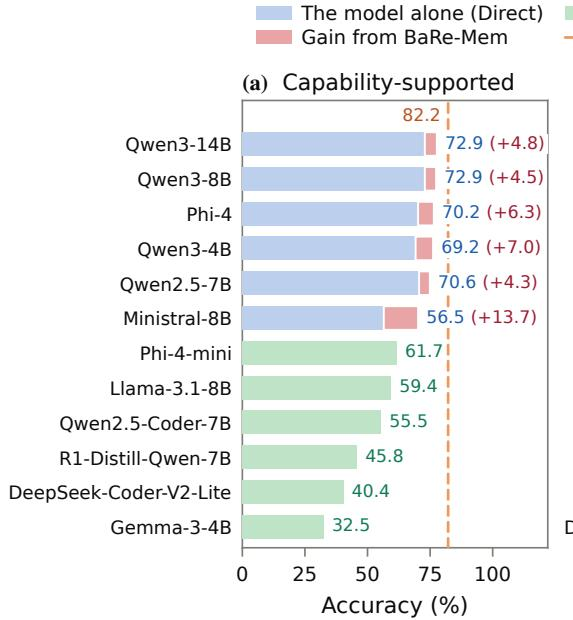

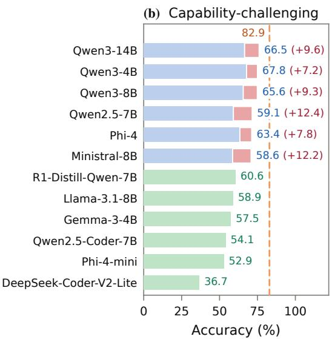  
Figure 8: Direct accuracy and gains from BaRe-Mem across central models. Left: capabilitysupported regime; right: capability-challenging regime. Blue bars show autonomous accuracy, red segments show the additional gain from BaRe-Mem, and green bars show individual advisor accuracy for reference. The dashed line denotes the fraction of questions for which at least one advisor is correct.

## B.3 ADVISOR SELECTION BEHAVIOR

Figure 9 shows two consistent patterns in BaRe-Mem’s consultation behavior. First, $\mathbb { X } ( ~ { \mathfrak { F } } )$ R1- Distill-Qwen-7B receives the largest advisor attribution across all six central models, while DeepSeek-Coder-V2-Lite receives the smallest, indicating a broadly consistent reliability ordering under uncorrupted advice. However, the attribution shares vary across central models, showing that the learned reliability is not determined by source identity alone. Second, BaRe-Mem retains autonomous reasoning for every central model rather than forcing consultation on all questions.

  
(a) Qwen3-4B

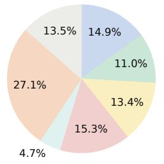

(b) Qwen3-8B  
Autonomous Reasoning  
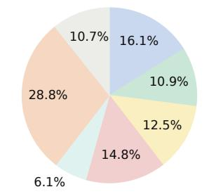

(c) Qwen3-14B  
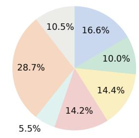

(d) Qwen2.5-7B  
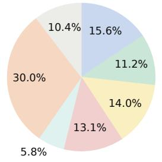

(e) Ministral-8B  
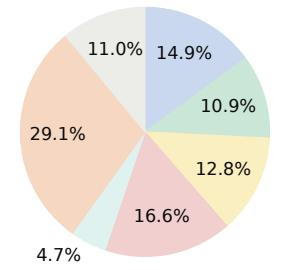

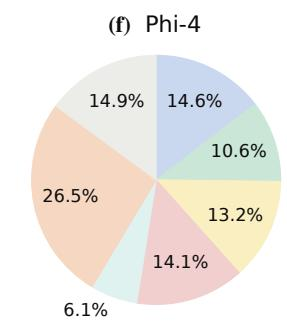  
Figure 9: Distribution of autonomous reasoning and advisor attribution across central models under 0% misleading advice ratio. Autonomous reasoning denotes questions answered without consultation; all remaining questions are attributed to the advisor with the highest reliability estimate before feedback on the current question. Advisor shares therefore reflect reliability based ranking rather than exclusive use of a single advisor’s response.

## B.4 ADVISOR RELIABILITY ESTIMATION

Figures 10–15 examine whether the reliability memory estimation reflects advisor performance under increasingly misleading information. Across all six advisors, higher misleading information ratios lead to lower empirical accuracy and lower reliability estimates from both Qwen3-14B and Phi-4. The estimates therefore reflect the deterioration of external evidence rather than remaining stable.

Within the high misleading information regime, the estimates generally decline more rapidly near the beginning and change less later. This behavior is consistent with the Kalman gain update derived in Appendix A.2. For a fixed representation, the update corrects a fraction $\boldsymbol { v } \bar { / } ( 1 + \bar { \boldsymbol { v } } )$ of the prediction residual, where v is the current posterior variance in that direction. As accumulated evidence reduces this uncertainty, subsequent observations produce smaller corrections for the same residual.

However, the estimates remain above empirical accuracy at high misleading information ratios. Especially, in the 100% misleading information regime, the empirical accuracy is nearly 0, but the estimates remain around 0.2. The Gaussian predictive mapping can explain this discrepancy. With repeated incorrect outcomes at a fixed nonzero representation, the regression mean approaches the signed target −1 and its posterior variance approaches zero. Nevertheless,

$$
p = \Phi \bigg ( \frac { \mu } { \sqrt { 1 + v } } \bigg ) \longrightarrow \Phi ( - 1 ) \approx 0 . 1 5 9 .\tag{53}
$$

The unit observation noise remains even when uncertainty about the regression parameters vanishes, leaving nonzero predictive probability above zero. This is an illustrative limit rather than a universal lower bound, since the linear predictor is unconstrained. The figures thus support the memory’s responsiveness to verified feedback, while also revealing a calibration gap between its reliability estimates and empirical correctness probabilities.

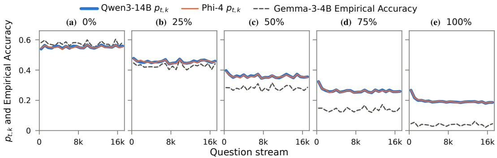  
Figure 10: Online reliability estimation for advisor Gemma-3-4B. Subfigures (a)–(e) correspond to misleading information ratios of 0%, 25%, 50%, 75%, and 100%, respectively. Solid curves show the pre-feedback reliability estimate $_ { p _ { t , k } }$ produced by Qwen3-14B and Phi-4, while the dashed curve shows the empirical accuracy of Gemma-3-4B.

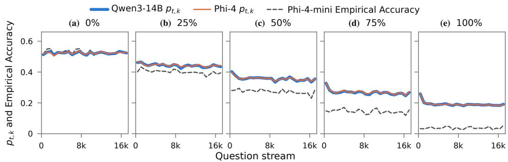  
Figure 11: Online reliability estimation for advisor Phi-4-mini. Subfigures (a)–(e) correspond to misleading information ratios of 0%, 25%, 50%, 75%, and 100%, respectively. Solid curves show the pre-feedback reliability estimate $_ { p _ { t , k } }$ produced by Qwen3-14B and Phi-4, while the dashed curve shows the empirical accuracy of Phi-4-mini.

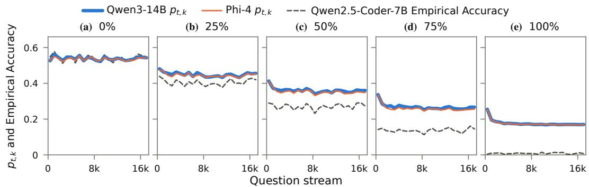  
Figure 12: Online reliability estimation for advisor Qwen2.5-Coder-7B. Subfigures (a)–(e) correspond to misleading information ratios of 0%, 25%, 50%, 75%, and 100%, respectively. Solid curves show the pre-feedback reliability estimate $p _ { t , k }$ produced by Qwen3-14B and Phi-4, while the dashed curve shows the empirical accuracy of Qwen2.5-Coder-7B.

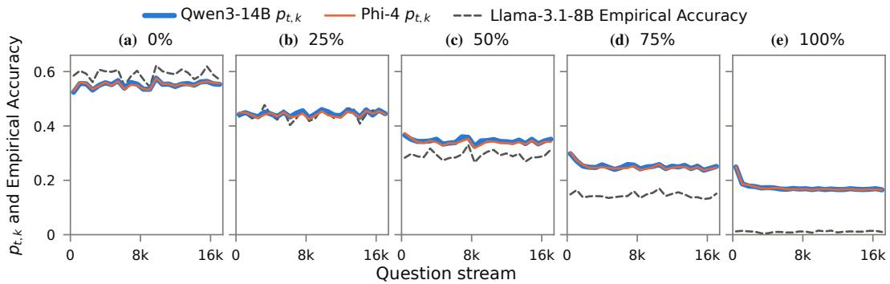  
Figure 13: Online reliability estimation for advisor Llama-3.1-8B. Subfigures (a)–(e) correspond to misleading information ratios of 0%, 25%, 50%, 75%, and 100%, respectively. Solid curves show the pre-feedback reliability estimate $_ { p _ { t , k } }$ produced by Qwen3-14B and Phi-4, while the dashed curve shows the empirical accuracy of Llama-3.1-8B.

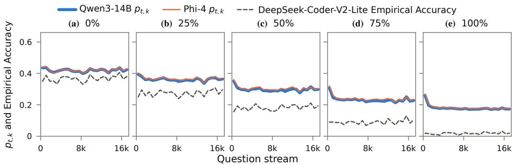  
Figure 14: Online reliability estimation for advisor DeepSeek-Coder-V2-Lite. Subfigures (a)–(e) correspond to misleading information ratios of 0%, 25%, 50%, 75%, and 100%, respectively. Solid curves show the pre-feedback reliability estimate $_ { p _ { t , k } }$ produced by Qwen3-14B and Phi-4, while the dashed curve shows the empirical accuracy of DeepSeek-Coder-V2-Lite.

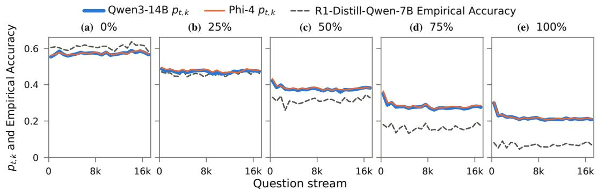  
Figure 15: Online reliability estimation for advisor R1-Distill-Qwen-7B. Subfigures (a)–(e) correspond to misleading information ratios of 0%, 25%, 50%, 75%, and 100%, respectively. Solid curves show the pre-feedback reliability estimate $p _ { t , k }$ produced by Qwen3-14B and Phi-4, while the dashed curve shows the empirical accuracy of R1-Distill-Qwen-7B.

## B.5 CONSULTATION ROBUSTNESS ACROSS ADDITIONAL CENTRAL MODELS

We report complete results for six central models: Qwen3-4B, Qwen3-8B, Qwen3-14B, Qwen2.5-7B, Ministral-8B, and Phi-4. Tables 4–9 and Figures 16–21 extend the analysis in the main text Sec. 4.2 across different model sizes and families.

Obs. 1. Historical reliability improves consultation across models. Across both capability regimes and all tested misleading information ratios, Advisors + memory achieves higher accuracy than Question + Peers for every central model. At 50% misleading information in the capabilitychallenging regime, adding reliability memory improves accuracy by 9.4%, 12.6%, and 9.1% percentage points for Qwen3-4B, Qwen3-8B, and Qwen3-14B, respectively. The corresponding improvements are 11.8% points for Qwen2.5-7B, 19.9% points for Ministral-8B, and 7.7% points for Phi-4. Since both methods consult on every question, this comparison demonstrates the benefit of incorporating historical reliability into the consultation process. The consistent gains support using accumulated correctness evidence to guide advisor influence rather than relying solely on the current responses.

Obs. 2. Autonomous selection complements reliability-guided consultation. The benefit of choosing whether to consult becomes particularly clear when misleading information dominates. At 100% misleading information in the capability-challenging regime, Question + Peers, Debate (2 rounds), and both majority voting baselinesfall below No consultation for all six central models. Although Advisors + memory improves consultation, it alsofalls below the autonomous baseline under this condition. In contrast, BaRe-Mem exceeds its always consult ablation by 13.0%–34.6% percentage points and remains 1.5%–2.8% points above autonomous reasoning. Moreover, it stays above the autonomous baseline throughout the tested misleading information range in this regime for all six models. These results support the complementary roles of the two mechanisms: reliabilityguided attention improves how advisor responses are used, while autonomous selection provides an alternative when continued consultation becomes harmful.

Obs. 3. Consultation behavior adapts to the model and capability regime. The consultation ratios provide a behavioral explanation for these results. In the capability-supported regime, Qwen3-4B, Qwen3-8B, Qwen3-14B, and Phi-4 maintain high consultation ratios, with endpoint decreases of only 1%–3% points as misleading information increases from 0% to 100%. Qwen2.5-7B and Ministral-8B reduce consultation more noticeably, from 84% to 77% and from 85% to 71%, respectively, but still consult on most questions. In the capability-challenging regime, all six models exhibit a much stronger shift: consultation ratios decrease from 85%–90% without injected misleading information to 9%–21% at the highest misleading information ratio. Thus, the same increase in misleading information produces different consultation behavior across models and capability regimes. This pattern is consistent with comparing estimated consultation and autonomous abilities on each question, rather than applying a fixed consultation policy.

Table 4: Accuracy (%) of consultation methods with Qwen3-4B as the central model under increasing misleading information ratios. Results are reported for the capability-supported and capabilitychallenging regimes. Bold numbers indicate the best performance in each column.
<table><tr><td rowspan="2">Method</td><td colspan="5">Capability-supported</td><td colspan="5">Capability-challenging</td></tr><tr><td>0%</td><td>25%</td><td>50%</td><td>75%</td><td>100%</td><td>0%</td><td>25%</td><td>50%</td><td>75%</td><td>100%</td></tr><tr><td>No consultation</td><td>69.2</td><td>69.2</td><td>69.2</td><td>69.2</td><td>69.2</td><td>67.8</td><td>67.8</td><td>67.8</td><td>67.8</td><td>67.8</td></tr><tr><td>Question + Peers</td><td>74.6</td><td>74.2</td><td>73.7</td><td>72.4</td><td>71.3</td><td>69.2</td><td>64.0</td><td>58.1</td><td>51.4</td><td>45.8</td></tr><tr><td>Majority vote (advisors)</td><td>64.3</td><td>53.0</td><td>32.5</td><td>14.6</td><td>9.4</td><td>64.1</td><td>48.7</td><td>24.5</td><td>5.9</td><td>1.2</td></tr><tr><td>Majority vote (advisors + own)</td><td>68.0</td><td>61.8</td><td>46.9</td><td>27.3</td><td>18.8</td><td>68.2</td><td>56.8</td><td>34.3</td><td>10.4</td><td>3.0</td></tr><tr><td>Debate (2 rounds)</td><td>73.5</td><td>73.2</td><td>73.0</td><td>72.3</td><td>72.1</td><td>71.4</td><td>68.6</td><td>64.6</td><td>60.0</td><td>56.1</td></tr><tr><td>Advisors + memory</td><td>76.7</td><td>75.5</td><td>74.3</td><td>73.1</td><td>72.4</td><td>73.8</td><td>70.4</td><td>67.5</td><td>62.5</td><td>50.7</td></tr><tr><td>BaRe-Mem</td><td>76.2</td><td>75.4</td><td>74.1</td><td>72.7</td><td>72.0</td><td>75.0</td><td>72.4</td><td>70.8</td><td>70.2</td><td>69.3</td></tr><tr><td>Consultation ratio</td><td>86%</td><td>85%</td><td>85%</td><td>86%</td><td>85%</td><td>86%</td><td>78%</td><td>69%</td><td>53%</td><td>15%</td></tr></table>

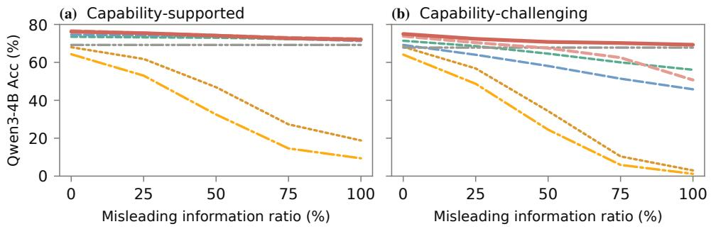

$$
\begin{array} { l c l l } { } & { } & { \mathrm { --- } } & { \mathsf { B a R e \mathrm { - } M e m } } \\ { } & { } & { \mathrm { --- } } & { \mathsf { A d v i s o r s + m e m o r y } } \\ { } & { } & { \mathrm { --- } } & { \mathsf { N o \mathrm { c o n s u l t a t i o n } } } \end{array} \begin{array} { r c l l } { } & { } & { \mathrm { --- } } & { \mathsf { M a j o r i t y \mathrm { v o t e ~ ( a d v i s o r s + \mathrm { ~ o w n } ) } } } & { \mathrm { --- } } & { \mathsf { D e b a t e ~ ( 2 \ r o u n d s ) } } \\ { } & { } & { \mathrm { --- } } & { \mathsf { N a j o r i t y \mathrm { v o t e ~ ( a d v i s o r s ) } } } & { } & { \mathrm { --- } } \end{array}
$$

Figure 16: Accuracy of Qwen3-4B as the central model under increasing misleading information ratios. Left: capability-supported regime; right: capability-challenging regime. We compare BaRe-Mem with Advisors + memory, No consultation, Question + Peers, Debate (2 rounds), and two majority voting baselines.  
Table 5: Accuracy (%) of consultation methods with Qwen3-8B as the central model under increasing misleading information ratios. Results are reported for the capability-supported and capabilitychallenging regimes. Bold numbers indicate the best performance in each column.
<table><tr><td rowspan="2">Method</td><td colspan="5">Capability-supported</td><td colspan="5">Capability-challenging</td></tr><tr><td>0%</td><td>25%</td><td>50%</td><td>75%</td><td>100%</td><td>0%</td><td>25%</td><td>50%</td><td>75%</td><td>100%</td></tr><tr><td>No consultation</td><td>72.9</td><td>72.9</td><td>72.9</td><td>72.9</td><td>72.9</td><td>65.6</td><td>65.6</td><td>65.6</td><td>65.6</td><td>65.6</td></tr><tr><td>Question + Peers</td><td>75.7</td><td>75.1</td><td>74.3</td><td>73.6</td><td>72.3</td><td>67.9</td><td>61.6</td><td>54.3</td><td>46.7</td><td>40.0</td></tr><tr><td>Majority vote (advisors)</td><td>64.3</td><td>53.0</td><td>32.5</td><td>14.6</td><td>9.4</td><td>64.1</td><td>48.7</td><td>24.5</td><td>5.9</td><td>1.2</td></tr><tr><td>Majority vote (advisors + own)</td><td>68.9</td><td>62.7</td><td>47.6</td><td>27.9</td><td>19.3</td><td>66.5</td><td>55.5</td><td>33.3</td><td>9.7</td><td>2.7</td></tr><tr><td>Debate (2 rounds)</td><td>74.8</td><td>74.8</td><td>74.6</td><td>74.4</td><td>73.8</td><td>67.0</td><td>63.9</td><td>60.3</td><td>55.7</td><td>51.3</td></tr><tr><td>Advisors + memory</td><td>78.1</td><td>77.0</td><td>76.3</td><td>74.8</td><td>74.0</td><td>74.2</td><td>70.1</td><td>66.9</td><td>61.0</td><td>46.2</td></tr><tr><td>BaRe-Mem</td><td>77.4</td><td>76.6</td><td>76.1</td><td>74.6</td><td>73.7</td><td>74.9</td><td>71.4</td><td>70.0</td><td>68.7</td><td>67.7</td></tr><tr><td>Consultation ratio</td><td>86%</td><td>85%</td><td>85%</td><td>84%</td><td>83%</td><td>89%</td><td>80%</td><td>70%</td><td>52%</td><td>14%</td></tr></table>

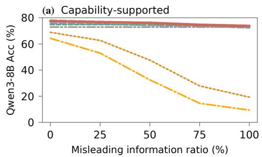

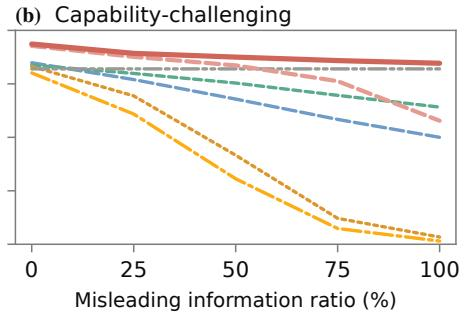  
Figure 17: Accuracy of Qwen3-8B as the central model under increasing misleading information ratios. Left: capability-supported regime; right: capability-challenging regime. We compare BaRe-Mem with Advisors + memory, No consultation, Question + Peers, Debate (2 rounds), and two majority voting baselines.

Table 6: Accuracy (%) of consultation methods with Qwen3-14B as the central model under increasing misleading information ratios. Results are reported for the capability-supported and capabilitychallenging regimes. Bold numbers indicate the best performance in each column.
<table><tr><td rowspan="2">Method</td><td colspan="5">Capability-supported</td><td colspan="5">Capability-challenging</td></tr><tr><td>0%</td><td>25%</td><td>50%</td><td>75%</td><td>100%</td><td>0%</td><td>25%</td><td>50%</td><td>75%</td><td>100%</td></tr><tr><td>No consultation</td><td>72.9</td><td>72.9</td><td>72.9</td><td>72.9</td><td>72.9</td><td>66.5</td><td>66.5</td><td>66.5</td><td>66.5</td><td>66.5</td></tr><tr><td>Question + Peers</td><td>76.6</td><td>75.9</td><td>75.3</td><td>73.9</td><td>73.2</td><td>69.8</td><td>65.6</td><td>60.4</td><td>55.2</td><td>50.6</td></tr><tr><td>Majority vote (advisors)</td><td>64.3</td><td>53.0</td><td>32.5</td><td>14.6</td><td>9.4</td><td>64.1</td><td>48.7</td><td>24.5</td><td>5.9</td><td>1.2</td></tr><tr><td>Majority vote (advisors + own)</td><td>68.5</td><td>62.6</td><td>47.5</td><td>27.8</td><td>19.4</td><td>66.4</td><td>55.8</td><td>33.6</td><td>9.9</td><td>2.8</td></tr><tr><td>Debate (2 rounds)</td><td>74.9</td><td>74.7</td><td>73.9</td><td>74.0</td><td>73.4</td><td>69.2</td><td>66.7</td><td>62.6</td><td>58.9</td><td>55.4</td></tr><tr><td>Advisors + memory</td><td>78.0</td><td>77.4</td><td>76.2</td><td>75.2</td><td>74.5</td><td>75.6</td><td>72.1</td><td>69.5</td><td>65.2</td><td>54.7</td></tr><tr><td>BaRe-Mem</td><td>77.7</td><td>77.3</td><td>76.0</td><td>75.1</td><td>74.5</td><td>76.1</td><td>72.8</td><td>71.6</td><td>69.9</td><td>68.6</td></tr><tr><td>Consultation ratio</td><td>87%</td><td>86%</td><td>85%</td><td>85%</td><td>85%</td><td>90%</td><td>83%</td><td>76%</td><td>61%</td><td>21%</td></tr></table>

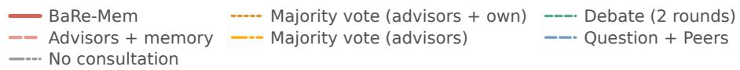

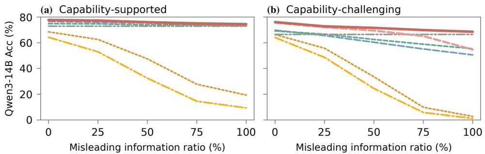  
Figure 18: Accuracy of Qwen3-14B as the central model under increasing misleading information ratios. Left: capability-supported regime; right: capability-challenging regime. We compare BaRe-Mem with Advisors + memory, No consultation, Question + Peers, Debate (2 rounds), and two majority voting baselines.

Table 7: Accuracy (%) of consultation methods with Qwen2.5-7B as the central model under increasing misleading information ratios. Results are reported for the capability-supported and capability-challenging regimes. Bold numbers indicate the best performance in each column.
<table><tr><td rowspan="2">Method</td><td colspan="5">Capability-supported</td><td colspan="5">Capability-challenging</td></tr><tr><td>0%</td><td>25%</td><td>50%</td><td>75%</td><td>100%</td><td>0%</td><td>25%</td><td>50%</td><td>75%</td><td>100%</td></tr><tr><td>No consultation</td><td>70.6</td><td>70.6</td><td>70.6</td><td>70.6</td><td>70.6</td><td>59.1</td><td>59.1</td><td>59.1</td><td>59.1</td><td>59.1</td></tr><tr><td>Question + Peers</td><td>71.3</td><td>70.3</td><td>69.2</td><td>67.8</td><td>67.1</td><td>65.9</td><td>59.3</td><td>52.9</td><td>47.3</td><td>43.3</td></tr><tr><td>Majority vote (advisors)</td><td>64.3</td><td>53.0</td><td>32.5</td><td>14.6</td><td>9.4</td><td>64.1</td><td>48.7</td><td>24.5</td><td>5.9</td><td>1.2</td></tr><tr><td>Majority vote (advisors + own)</td><td>68.4</td><td>62.3</td><td>47.1</td><td>27.3</td><td>18.9</td><td>64.7</td><td>53.5</td><td>31.5</td><td>8.8</td><td>2.2</td></tr><tr><td>Debate (2 rounds)</td><td>70.5</td><td>70.3</td><td>69.9</td><td>69.2</td><td>68.2</td><td>63.1</td><td>58.6</td><td>53.7</td><td>49.1</td><td>45.5</td></tr><tr><td>Advisors + memory</td><td>75.5</td><td>74.0</td><td>72.9</td><td>70.6</td><td>69.2</td><td>71.4</td><td>68.0</td><td>64.7</td><td>58.7</td><td>48.4</td></tr><tr><td>BaRe-Mem</td><td>74.9</td><td>73.6</td><td>72.5</td><td>70.5</td><td>69.3</td><td>71.5</td><td>68.3</td><td>66.1</td><td>63.5</td><td>61.9</td></tr><tr><td>Consultation ratio</td><td>84%</td><td>81%</td><td>82%</td><td>83%</td><td>77%</td><td>90%</td><td>83%</td><td>75%</td><td>54%</td><td>19%</td></tr></table>

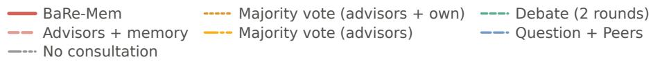

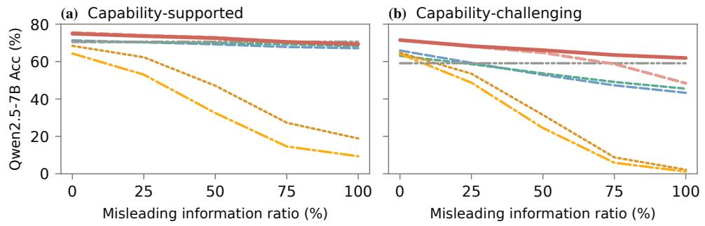  
Figure 19: Accuracy of Qwen2.5-7B as the central model under increasing misleading information ratios. Left: capability-supported regime; right: capability-challenging regime. We compare BaRe-Mem with Advisors + memory, No consultation, Question + Peers, Debate (2 rounds), and two majority voting baselines.

Table 8: Accuracy (%) of consultation methods with Ministral-8B as the central model under increasing misleading information ratios. Results are reported for the capability-supported and capability-challenging regimes. Bold numbers indicate the best performance in each column.
<table><tr><td rowspan="2">Method</td><td colspan="5">Capability-supported</td><td colspan="5">Capability-challenging</td></tr><tr><td>0%</td><td>25%</td><td>50%</td><td>75%</td><td>100%</td><td>0%</td><td>25%</td><td>50%</td><td>75%</td><td>100%</td></tr><tr><td>No consultation</td><td>56.5</td><td>56.5</td><td>56.5</td><td>56.5</td><td>56.5</td><td>58.6</td><td>58.6</td><td>58.6</td><td>58.6</td><td>58.6</td></tr><tr><td>Question + Peers</td><td>64.2</td><td>63.1</td><td>61.1</td><td>58.5</td><td>56.9</td><td>64.0</td><td>54.8</td><td>41.6</td><td>27.4</td><td>18.0</td></tr><tr><td>Majority vote (advisors)</td><td>64.3</td><td>53.0</td><td>32.5</td><td>14.6</td><td>9.4</td><td>64.1</td><td>48.7</td><td>24.5</td><td>5.9</td><td>1.2</td></tr><tr><td>Majority vote (advisors + own)</td><td>67.1</td><td>59.7</td><td>43.6</td><td>24.9</td><td>17.1</td><td>64.2</td><td>53.3</td><td>31.5</td><td>8.9</td><td>2.2</td></tr><tr><td>Debate (2 rounds)</td><td>61.8</td><td>60.8</td><td>59.0</td><td>57.0</td><td>56.7</td><td>61.5</td><td>56.5</td><td>49.7</td><td>41.3</td><td>34.4</td></tr><tr><td>Advisors + memory</td><td>70.8</td><td>67.8</td><td>64.6</td><td>60.3</td><td>60.0</td><td>70.8</td><td>65.8</td><td>61.5</td><td>52.3</td><td>26.0</td></tr><tr><td>BaRe-Mem</td><td>70.2</td><td>67.2</td><td>64.4</td><td>60.8</td><td>61.0</td><td>70.8</td><td>66.5</td><td>64.2</td><td>62.7</td><td>60.6</td></tr><tr><td>Consultation ratio</td><td>85%</td><td>83%</td><td>81%</td><td>72%</td><td>71%</td><td>89%</td><td>79%</td><td>65%</td><td>40%</td><td>9%</td></tr></table>

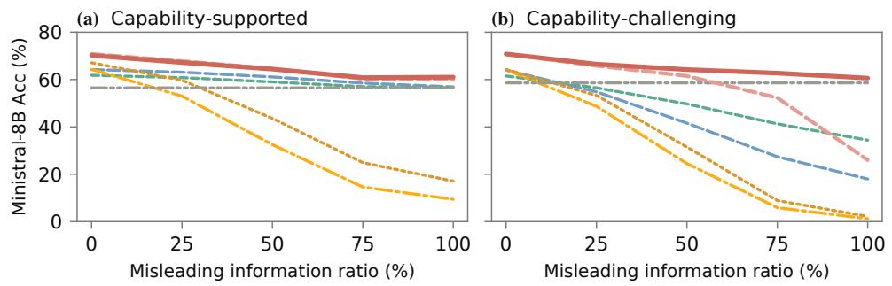  
Figure 20: Accuracy under increasing misleading-advice ratios with Ministral-8B as the central model. The left and right panels show the capability-supported and capability-challenging regimes, respectively. We compare BaRe-Mem, Advisors + memory, No consultation, Question + Peers, Debate (2 rounds), and two majority-vote variants.

Table 9: Accuracy (%) of consultation methods with Phi-4 as the central model under increasing misleading information ratios. Results are reported for the capability-supported and capabilitychallenging regimes. Bold numbers indicate the best performance in each column.
<table><tr><td rowspan="2">Method</td><td colspan="5">Capability-supported</td><td colspan="5">Capability-challenging</td></tr><tr><td>0%</td><td>25%</td><td>50%</td><td>75%</td><td>100%</td><td>0%</td><td>25%</td><td>50%</td><td>75%</td><td>100%</td></tr><tr><td>No consultation</td><td>70.2</td><td>70.2</td><td>70.2</td><td>70.2</td><td>70.2</td><td>63.4</td><td>63.4</td><td>63.4</td><td>63.4</td><td>63.4</td></tr><tr><td>Question + Peers</td><td>71.5</td><td>72.1</td><td>71.6</td><td>70.8</td><td>69.9</td><td>65.8</td><td>62.4</td><td>57.9</td><td>52.5</td><td>48.3</td></tr><tr><td>Majority vote (advisors)</td><td>64.3</td><td>53.0</td><td>32.5</td><td>14.6</td><td>9.4</td><td>64.1</td><td>48.7</td><td>24.5</td><td>5.9</td><td>1.2</td></tr><tr><td>Majority vote (advisors + own)</td><td>67.9</td><td>61.5</td><td>46.3</td><td>26.7</td><td>18.3</td><td>65.1</td><td>54.3</td><td>32.1</td><td>9.0</td><td>2.3</td></tr><tr><td>Debate (2 rounds)</td><td>68.0</td><td>68.8</td><td>69.4</td><td>69.6</td><td>68.6</td><td>64.8</td><td>62.6</td><td>59.3</td><td>55.2</td><td>51.4</td></tr><tr><td>Advisors + memory</td><td>76.3</td><td>75.0</td><td>73.6</td><td>72.9</td><td>71.6</td><td>71.3</td><td>68.4</td><td>65.6</td><td>61.8</td><td>52.0</td></tr><tr><td>BaRe-Mem</td><td>76.5</td><td>75.2</td><td>73.9</td><td>73.0</td><td>71.8</td><td>71.2</td><td>68.5</td><td>66.8</td><td>65.3</td><td>65.0</td></tr><tr><td>Consultation ratio</td><td>85%</td><td>84%</td><td>83%</td><td>84%</td><td>83%</td><td>85%</td><td>79%</td><td>71%</td><td>57%</td><td>18%</td></tr></table>

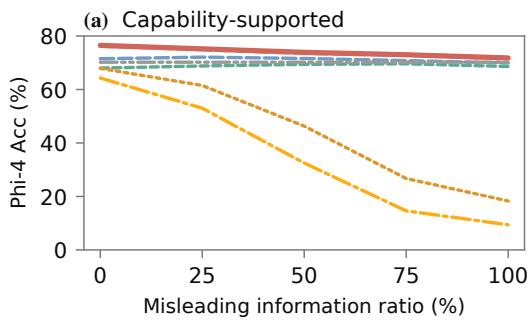

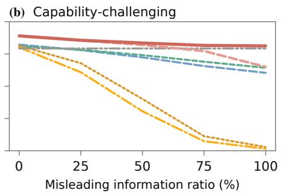  
Figure 21: Accuracy of Phi-4 as the central model under increasing misleading information ratios. Left: capability-supported regime; right: capability-challenging regime. We compare BaRe-Mem with Advisors + memory, No consultation, Question + Peers, Debate (2 rounds), and two majority voting baselines.

## C AGENT TEAM

## C.1 AGENT TEAM PIPELINE.

Figure 22 illustrates the agent team workflow. The lead agent first decomposes each task into subtasks and uses BaRe-Mem to rank the candidate workers for each sub-task. The highest rank worker is allocated first. If its report is rejected, the lead agent retries with the next worker in the same ranking. In this setting, BaRe-Mem is used for worker routing rather than reweighting a fixed set of responses, deciding both which worker is selected first and which worker is tried next. To isolate the effect of worker routing from task decomposition quality, we use the MuSiQue (Trivedi et al., 2022) sub-tasks provided by the dataset, so all experimental differences arise from how these sub-tasks are assigned to workers.

Checking and Feedback Protocol. We distinguish the check used to control retries from the feedback used to update reliability memory. We consider three checking settings: No check, where the first report is directly committed; Lead agent check, where the lead agent decides whether to accept the report or retry; and Dataset verifier check, where the dataset evaluator makes this decision. In all three settings, after a sub-task is committed, the gold correctness labels of all workers actually queried for that sub-task are written to memory, while unqueried workers receive no update. Thus, checking determines the execution path of the current sub-task, whereas verified feedback updates worker reliability for subsequent routing decisions. Memory is updated after each sub-task, allowing later sub-tasks to benefit from earlier verified outcomes.

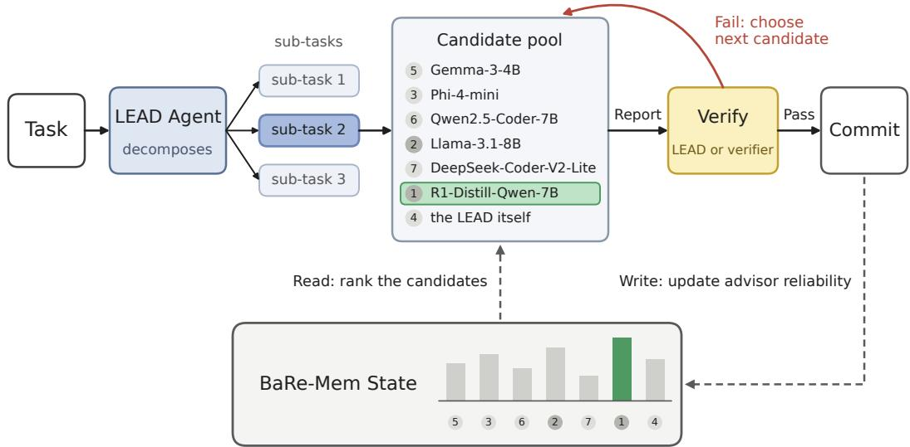  
Figure 22: Agent team pipeline with BaRe-Mem. The lead agent decomposes a task into sub-tasks and queries the reliability memory to rank candidate workers. Each returned report is verified by the lead agent or an external verifier: accepted reports are committed, while rejected reports trigger the next candidate. Verification outcomes are then written back to update advisor reliability.

## C.2 TASK SOLVED ACCURACY

Figures 23–28 report task and sub-task completion for six lead models: Qwen3-4B, Qwen3- 8B, Qwen3-14B, Qwen2.5-7B, Ministral-8B, and Phi-4. These results examine how reliability memory supports worker assignment and subsequent retries across different central models.

Obs.1. Contextual reliability improves initial worker selection. The No check setting commits the first worker’s report without retrying, directly evaluating the initial assignment. In this setting, BaRe-Mem achieves higher sub-task completion than routing randomly or by histor ical success counts for all six lead models. The improvements are 5.0%, 1.4%, and 3.8% points for Qwen3-4B, Qwen3-8B, and Qwen3-14B, respectively, and 5.6%, 2.1%, and 6.9% points for Qwen2.5-7B, Ministral-8B, and Phi-4. Relative to random routing, it also improves task completion by 13.4%–17.8% points across the six models. Because these gains arise without retries, they support the use of reliability conditioned on the current sub-task to identify a suitable worker at the initial assignment. The comparison with historical success counts further indicates that the benefit extends beyond simply retaining aggregate records of past success.

Obs.2. Reliability ranking complements verification in Agent Team Under Dataset verifier check, BaRe-Mem achieves the highest task and sub-task completion for every lead model. Task completion reaches 51.9%–55.0%, exceeding historical success counts by 1.8%–4.9% points and random routing by 9.1–11.4 points. Sub-task completion also improves over historical success counts by 1.7%–3.5% points. These comparisons use the same checking rule and worker budget for each routing strategy, showing that access to a verifier does not remove the benefit of our BaRe-Mem reliability worker ranking. When the first report is rejected, the reliability ranking also determines which worker is tried next. The results support using the memory to guide candidate ordering throughout the assignment and retry process.

Obs.3. The effect of report checking depends on the lead model. Lead agent checking improves BaRe-Mem’s task completion over No check for five of the six lead models, with gains of 1.5%– 3.0% points. Its effect is not uniform: with Ministral-8B, task completion changes from 41.6% without checking to 40.8% with lead agent checking, whereas dataset verifier checking raises it to 55.0%. Across all six models, replacing lead agent checking with dataset verifier checking improves BaRe-Mem’s task completion by 11.6%–14.2% points. Together, these results distinguish the complementary roles of routing and checking: reliability memory orders candidate workers, while report checking determines when to proceed to the next candidate.

No check Checked by the LEAD Agent

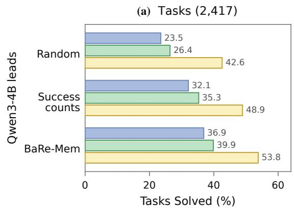  
Checked by the dataset verifier

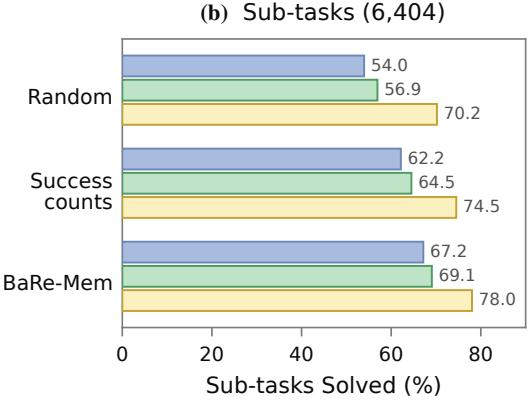  
Figure 23: Agent team performance on MuSiQue with Qwen3-4B as the lead agent. (a) Task completion; (b) sub-task completion. We compare random routing, routing by historical success counts, and BaRe-Mem under three report checking settings: no check, lead agent check, and dataset verifier check. All settings provide gold feedback for queried reports after each sub-task is committed.  
No check Checked by the LEAD Agent

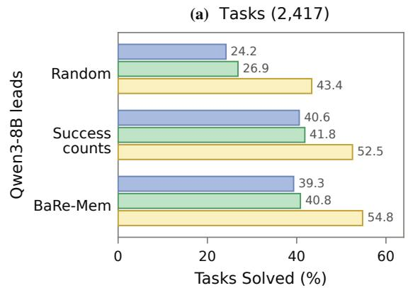  
Checked by the dataset verifier

(b) Sub-tasks (6,404)  
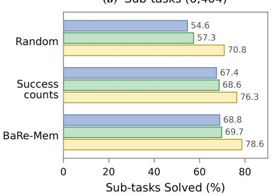  
Figure 24: Agent team performance on MuSiQue with Qwen3-8B as the lead agent. (a) Task completion; (b) sub-task completion. We compare random routing, routing by historical success counts, and BaRe-Mem under three report checking settings: no check, lead agent check, and dataset verifier check. All settings provide gold feedback for queried reports after each sub-task is committed.

(b) Sub-tasks (6,404)  
(b) Sub-tasks (6,404)  
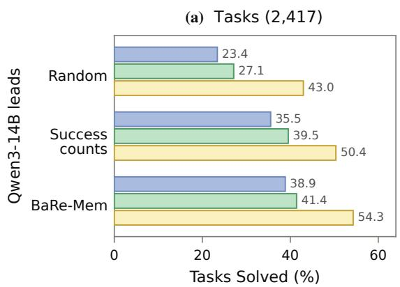

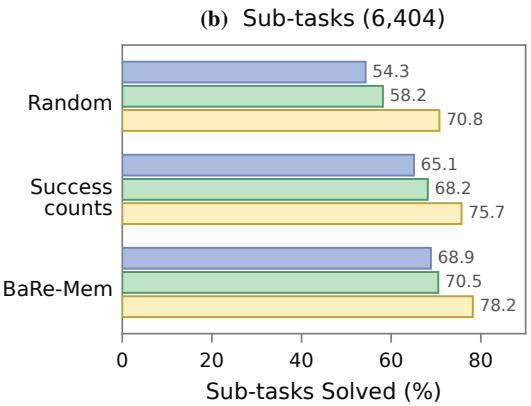  
Figure 25: Agent team performance on MuSiQue with Qwen3-14B as the lead agent. (a) Task completion; (b) sub-task completion. We compare random routing, routing by historical success counts, and BaRe-Mem under three report checking settings: no check, lead agent check, and dataset verifier check. All settings provide gold feedback for queried reports after each sub-task is committed.  
No check Checked by the LEAD Agent Checked by the dataset verifier

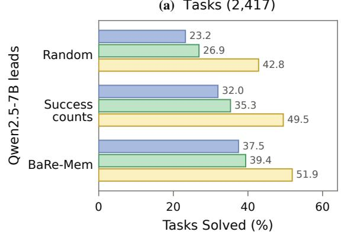

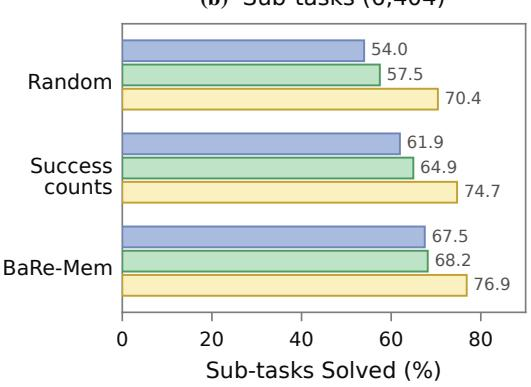  
Figure 26: Agent team performance on MuSiQue with Qwen2.5-7B as the lead agent. (a) Task completion; (b) sub-task completion. We compare random routing, routing by historical success counts, and BaRe-Mem under three report checking settings: no check, lead agent check, and dataset verifier check. All settings provide gold feedback for queried reports after each sub-task is committed.

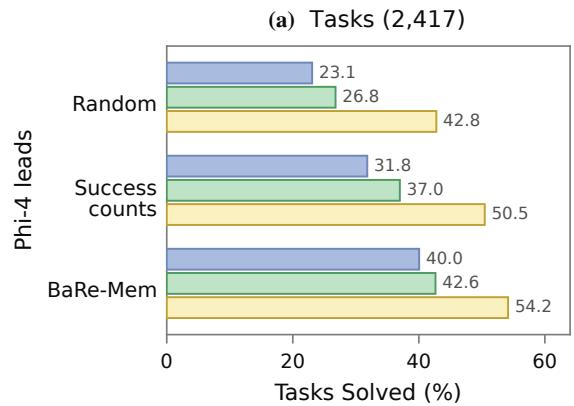

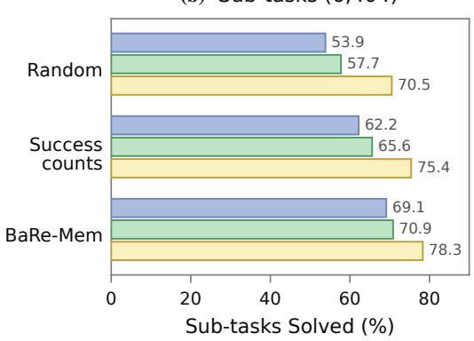  
Figure 27: Agent team performance on MuSiQue with Phi-4 as the lead agent. (a) Task completion; (b) sub-task completion. We compare random routing, routing by historical success counts, and BaRe-Mem under three report checking settings: no check, lead agent check, and dataset verifier check. All settings provide gold feedback for queried reports after each sub-task is committed.

Checked by the dataset verifier

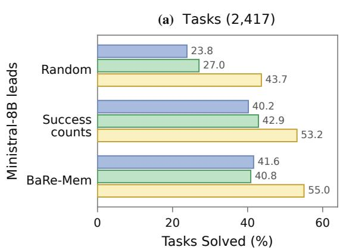

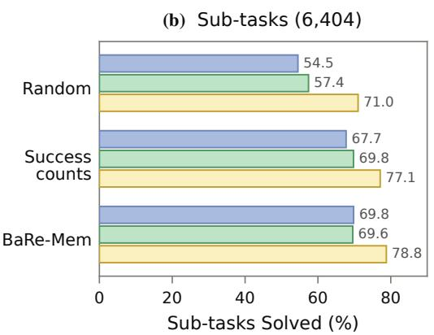  
Figure 28: Agent team performance on MuSiQue with Ministral-8B as the lead agent. (a) Task completion; (b) sub-task completion. We compare random routing, routing by historical success counts, and BaRe-Mem under three report checking settings: no check, lead agent check, and dataset verifier check. All settings provide gold feedback for queried reports after each sub-task is committed.

## C.3 AGENT TEAM SWEEP

BaRe-Mem Success counts Random Ceiling: at least one worker is right

(a) Qwen3-4B leads  
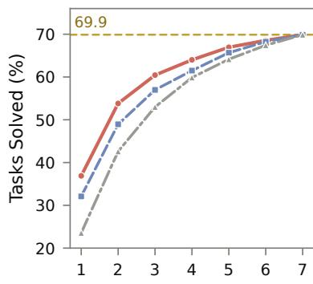

(b) Qwen3-8B leads  
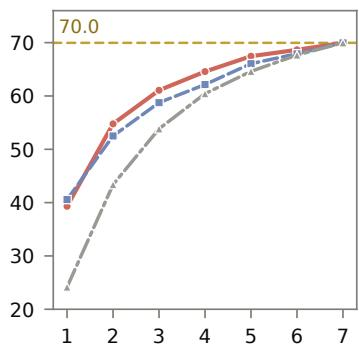

(c) Qwen3-14B leads  
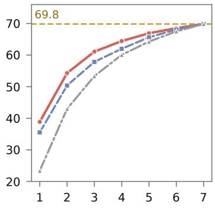

(d) Qwen2.5-7B leads  
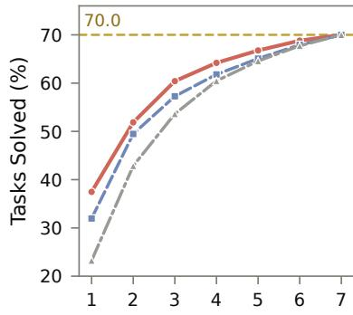

(e) Ministral-8B leads  
(f) Phi-4 leads  
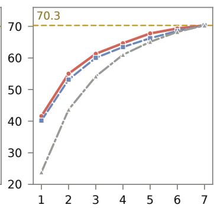

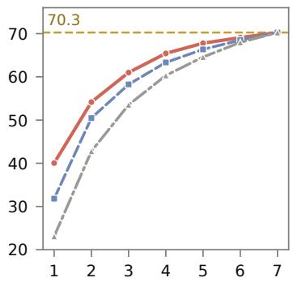  
Workers a sub-task may select  
Figure 29: Task completion on MuSiQue as the maximum number of workers tried per sub-task increases. We compare BaRe-Mem, routing by historical success counts, and random routing. The dashed line marks the ceiling obtained when at least one worker can solve the sub-task. Panels (a)–(f) use Qwen3-4B, Qwen3-8B, Qwen3-14B, Qwen2.5-7B, Ministral-8B, and Phi-4 as the lead agent, respectively.

We examine how quickly each routing strategy can identify a worker capable of solving the current sub-task for all the central models following the setting in the main text Sec. 4.4. As the worker

(a) Qwen3-4B leads

budget increases, all methods gradually approach the same ceiling once all seven workers have been tried. This is expected, because the candidate pool is identical across routing strategies. The remaining difference is therefore not whether a solvable worker exists, but how early that worker is ranked and selected.

Obs. 1. BaRe-Mem identifies capable workers earlier. Figures 29 and 30 show that BaRe-Mem consistently achieves higher task and sub-task completion with fewer worker calls across all six lead models. The advantage is largest when only a small number of workers may be tried. With a single worker per sub-task, BaRe-Mem already outperforms routing by historical success counts for every lead model. As the worker budget increases, all methods gradually approach the same ceiling because they eventually access the same candidate pool. Therefore, the gap at smaller budgets reflects how early a capable worker is ranked and selected. BaRe-Mem reaches a larger fraction of the achievable performance with the same worker budget.

BaRe-Mem Success counts Random Ceiling: at least one worker is right

(e) Ministral-8B leads  
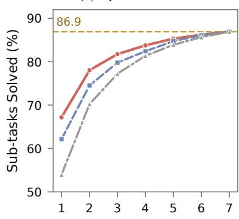

(b) Qwen3-8B leads  
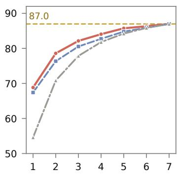

(c) Qwen3-14B leads  
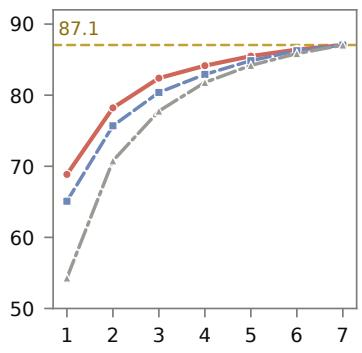

(d) Qwen2.5-7B leads  
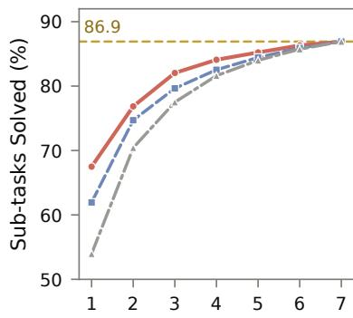

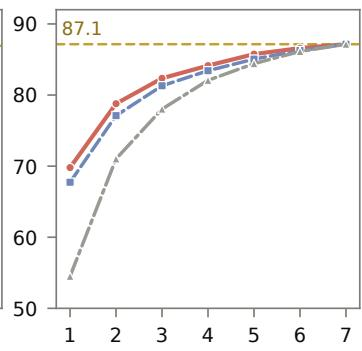  
Workers a sub-task may select

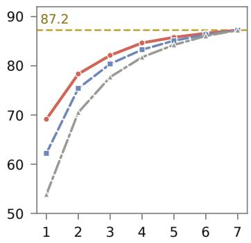

Figure 30: Sub-task completion on MuSiQue as the maximum number of workers tried per subtask increases. We compare BaRe-Mem, routing by historical success counts, and random routing. The dashed line marks the ceiling given by the fraction of sub-tasks for which at least one worker is correct. Panels (a)–(f) use Qwen3-4B, Qwen3-8B, Qwen3-14B, Qwen2.5-7B, Ministral-8B, and Phi-4 as the lead agent, respectively.

Obs. 2. Contextual reliability improves worker ranking. The comparison with historical success counts isolates the value of contextual reliability. Success counts assign each worker a reliability based only on its aggregate past performance, whereas BaRe-Mem conditions worker reliability on the current sub-task. The consistent advantage of BaRe-Mem across all six lead models therefore shows that worker competence cannot be adequately represented by a single source-level success rate. Conditioning reliability on the current sub-task yields a more informative worker ordering, supporting the same instance-specific reliability principle used in advisor consultation.

## C.4 ADAPT SPEED

We finally examine how quickly BaRe-Mem learns useful worker reliability from the online feedback stream. Following the original sub-task order, we partition the 6,404 MuSiQue sub-tasks into eight consecutive blocks of approximately 800 sub-tasks each and measure the accuracy of the initial worker selected in each block. This directly measures how the quality of the learned worker ranking evolves as verified interactions accumulate along the stream.

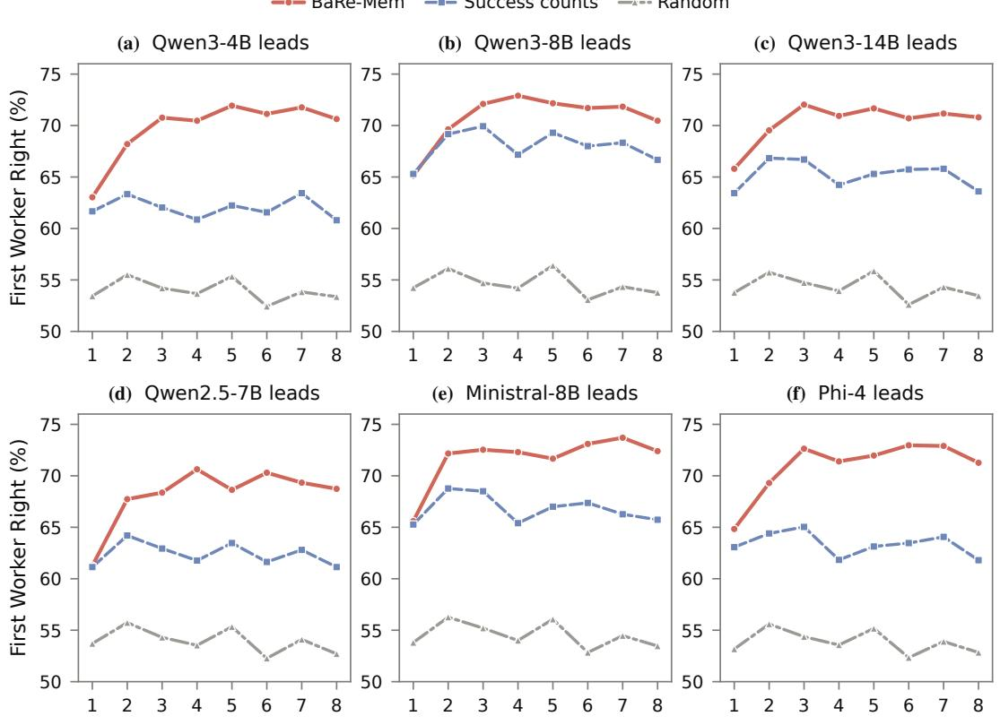  
Eighth of the sub-task stream (about 800 sub-tasks each)

Figure 31: Initial worker accuracy over the MuSiQue sub-task stream. The x-axis denotes position in the sub-task stream, grouped into eight consecutive blocks of approximately 800 sub-tasks each. We compare BaRe-Mem, routing by historical success counts, and random routing. Panels (a)–(f) use Qwen3-4B, Qwen3-8B, Qwen3-14B, Qwen2.5-7B, Ministral-8B, and Phi-4 as the lead agent, respectively.

BaRe-Mem adapts rapidly from early feedback. Figure 31 shows that initial worker accuracy rises quickly during the early part of the stream for all six lead models and then remains relatively stable. Historical success counts also improve as feedback accumulates, but BaRe-Mem separates from this baseline early and maintains higher initial worker accuracy throughout the stream. In contrast, random routing remains nearly unchanged. These results show that BaRe-Mem can rapidly extract useful reliability information from early interactions.

This adaptation pattern is also consistent with the Bayesian update in Section A.2: when posterior uncertainty is high, the Kalman gain gives early verified outcomes greater influence, while accumulated evidence reduces uncertainty and stabilizes subsequent updates. The resulting behavior allows BaRe-Mem to adapt quickly without requiring a separate retraining stage.