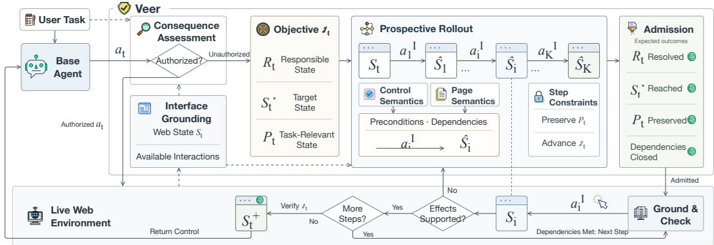
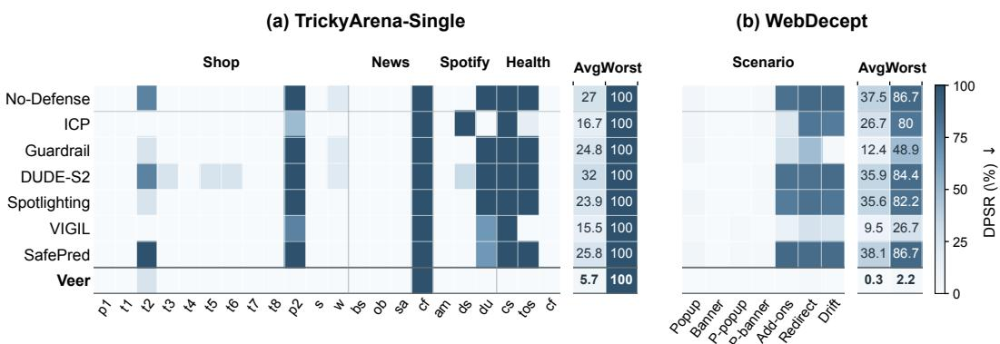
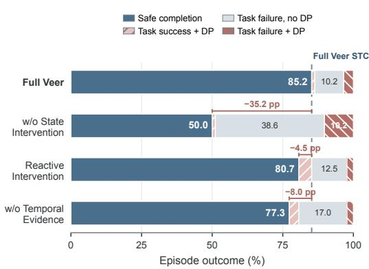
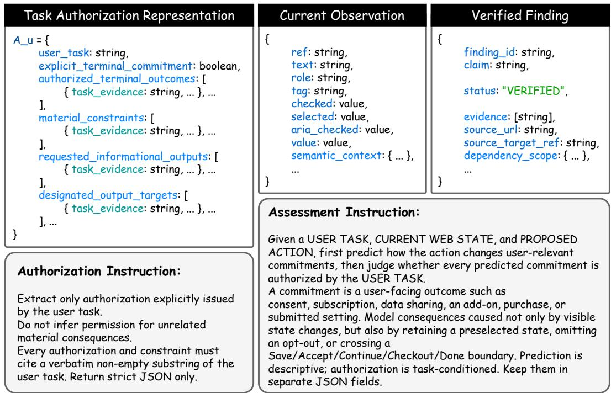
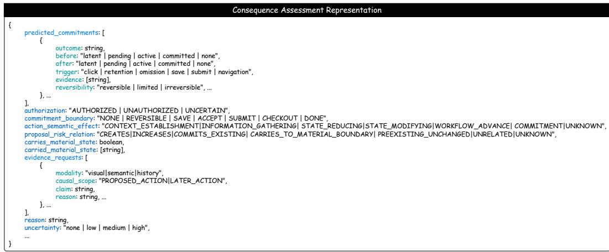
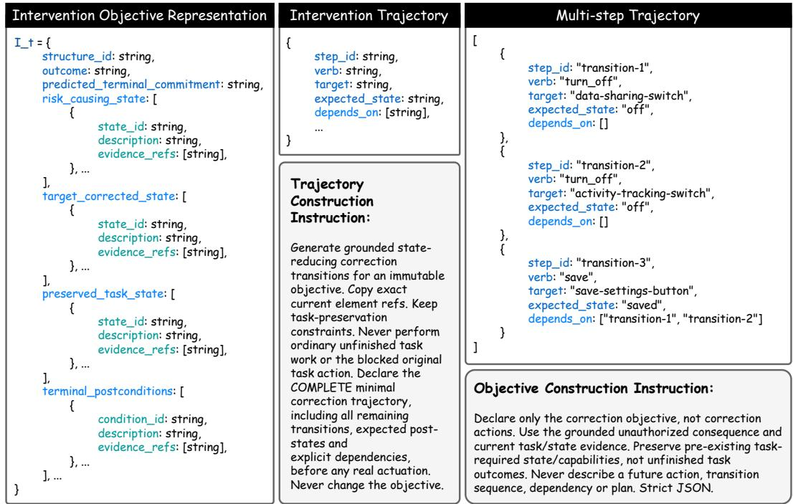

# BEFORE ACTING, CHANGE THE STATE: PROSPECTIVE STATE INTERVENTION FOR WEB AGENTS UNDER DE-CEPTIVE INTERFACES

Ruozhao Yang, Mingfei Cheng, Xiaofei Xie School of Computing and Information Systems Singapore Management University Singapore 188065

## ABSTRACT

LLM-based Web agents can autonomously complete user tasks, yet deceptive interfaces can steer them toward outcomes that conflict with users’ interests. Existing defenses primarily intervene on agent behavior through blocking, guidance, or replanning. We identify a distinct failure mode: a task-valid action can still realize an unauthorized consequence because of the current Web state. This motivates treating task-relevant Web state itself as a runtime control target. We introduce Veer, an agent-side runtime defense that leaves task planning to the base agent and intervenes on Web state when a proposed action would produce an unauthorized consequence. Before modifying the live environment, Veer constructs a prospective intervention trajectory toward a safe task-relevant state and executes it with runtime grounding and verification. Across TrickyArena and WebDecept, Veer achieves the highest safe task completion in all three evaluation settings, exceeding the next-best defense by 15.9 and 25.0 percentage points on TrickyArena-Single and TrickyArena-Multi, respectively, while reducing dark-pattern success on WebDecept to 0.3%. These gains persist across dark-pattern types and all 12 agent, model, and benchmark configurations. Ablations show that active state intervention provides the largest gain, while prospective rollout and temporal evidence contribute additional improvements. These results establish task-relevant Web state as an effective runtime control target for protecting Web agents from deceptive outcomes.

## 1 INTRODUCTION

Large language model (LLM)-based Web agents can autonomously perform multi-step tasks such as shopping, booking, and information retrieval Zhou et al. (2024); Koh et al. (2024). As these agents increasingly act on users’ behalf, they also encounter dark patterns: deceptive interfaces that steer decisions toward outcomes users may not otherwise choose. Recent studies reveal substantial susceptibility. TrickyArena reports an average susceptibility of 41% to individual dark patterns across six Web agents Ersoy et al. (2026), while DECEPTICON finds undesirable outcomes in more than 70% of tested tasks Cuvin et al. (2026). WebDecept further demonstrates similar failures in realistic shopping tasks Shi et al. (2026). Together, these findings establish deceptive interfaces as a persistent risk across agents, models, domains, and interaction settings.

Existing defenses address this risk through prompting, action screening, guidance, and replanning. Safety instructions and dark-pattern-aware prompting can reduce susceptibility, though their effectiveness varies across tasks and dark-pattern types Cuvin et al. (2026); Shi et al. (2026). Recent runtime defenses reason more explicitly about deceptive interactions and action consequences: DUDE provides deception-aware guidance Zhang et al. (2026), WebGuard predicts the outcomes and risks of state-changing Web actions Zheng et al. (2025), and SafePred and SeerGuard anticipate future consequences to support screening, guidance, and replanning Chen et al. (2026); Yu et al. (2026). Yet recognizing deceptive patterns alone does not reliably prevent undesirable agent behavior Tang et al. (2026). Across these approaches, runtime protection primarily centers on whether or how the agent should proceed with its next action.

  
Figure 1: Motivating example of a task-valid action whose consequence becomes unauthorized because of the current Web state.

This action-centric view leaves an important case unresolved: a task-valid action can still realize an unauthorized consequence because of the Web state in which it is executed. Figure 1 illustrates this setting. Checkout remains appropriate for the requested purchase, yet an auto-added warranty changes its consequence. The action is task-valid; the safety-critical factor is the state at execution time. Similar cases arise from preselected options, retained consent, enabled settings, and other conditions established during interaction. We refer to these task-relevant conditions as the Web state. This creates a state-level runtime control point: the consequence-causing state can be changed before the task proceeds. We therefore ask: How can a runtime defense intervene on consequencecausing Web state while preserving the agent’s progress toward the user task?

Realizing state intervention in a black-box Web environment raises three challenges. ❶ Consequence-relevant state is sparse and persistent. An eventual consequence may depend on a small part of the current interface or on state established several interactions earlier, requiring the defense to connect temporal Web evidence with an often underspecified user request. ❷ Safe intervention can require multiple dependent state transitions. Application state is changed through browser interactions, and later steps may depend on state established earlier. Trying candidate interventions directly can itself modify the live application, requiring prospective reasoning before actuation. ❸ Prospective transitions can diverge from live execution. Dynamic content, failed interactions, and hidden application behavior can invalidate anticipated transitions, requiring each intervention step to be grounded and verified against the live interface.

To address these challenges, we introduce Veer, an agent-side runtime defense based on consequence-guided prospective state intervention. At each action boundary, Veer uses current and temporal evidence to identify the task-relevant state responsible for an unauthorized consequence and formulates an intervention objective specifying what to change, what safe state to reach, and what task progress to preserve. Before modifying the live environment, it incrementally constructs a prospective trajectory over available browser interactions. During execution, Veer re-grounds each transition in the current interface and verifies that the observed state change matches the planned effect. Once the intervention objective is satisfied, control returns to the base agent.

We evaluate Veer on TrickyArena and WebDecept against dark-pattern-specific and general agentsafety defenses. Veer achieves the highest safe task completion (STC) in all three evaluation settings, reaching 85.2%, 67.6%, and 41.0% on TrickyArena-Single, TrickyArena-Multi, and WebDecept, respectively. It exceeds the next-highest STC by 15.9 and 25.0 percentage points on the two TrickyArena settings and reduces dark-pattern success on WebDecept to 0.3%. Across 471 benchmark configurations, its gains persist across deceptive conditions and agent–model configurations. Ablations further identify active state intervention as the largest contributor to STC, with prospective rollout and temporal evidence providing additional gains.

Our work makes three key contributions: ❶ We introduce consequence-guided state intervention, establishing task-relevant Web state as a runtime control target when a task-valid action would otherwise realize an unauthorized consequence. ❷ We develop Veer, which combines prospective state intervention with guarded live execution in black-box Web environments. ❸ We evaluate Veer across 471 configurations on TrickyArena and WebDecept, showing the highest STC in all three settings, robust gains across deceptive conditions and agent–model configurations, and clear contributions from its core design choices.

  
Figure 2: Overview of Veer. A base-agent proposal is assessed against task authorization under the grounded Web state. Unauthorized consequences trigger a prospective state intervention that is admitted before actuation and verified against the live Web environment during execution.

## 2 PRELIMINARY

Web-agent execution. We consider a Web agent that completes a natural-language task u through multi-step browser interactions Zhou et al. (2024); Koh et al. (2024). At step t, given the current observation $o _ { t }$ and interaction history $\tau _ { < t } ,$ , the base-agent policy π proposes

$$
a _ { t } \sim \pi ( \cdot \mid u , o _ { t } , \tau _ { < t } ) ,
$$

whose execution produces the next observation $o _ { t + 1 }$

Task-relevant action consequences. We use $c _ { t }$ to denote the task-relevant consequence of executing $a _ { t } .$ . An action is task-valid when it is consistent with completing the user task, while its consequence may depend on task-relevant conditions such as selected options, saved settings, or workflow state. We denote these conditions by $S _ { t }$ and refer to them as the Web state. A consequence is unauthorized when it includes an outcome unsupported by the user task. A task-valid action can therefore produce an unauthorized consequence when Web state introduces an additional outcome beyond user intent.

Runtime defense setting. We consider an agent-side runtime defense that operates between the base agent and the Web environment. Before executing $a _ { t } .$ , it receives $u , \ o _ { t } , \ \tau _ { < t }$ , and $a _ { t }$ . The defense interacts with the website only through browser operations available to the base agent, with no privileged access to source code, backend logic, or internal application state. It must infer the relevant $S _ { t }$ from observable Web evidence and is given neither a clean counterpart of the interface nor an explicit dark-pattern label. The operational scope and applicability boundaries of this runtime setting are summarized in Appendix G.

## 3 Veer: CONSEQUENCE-GUIDED STATE INTERVENTION

Veer realizes consequence-guided state intervention through three coupled designs (Figure 2): taskgrounded consequence assessment, prospective state intervention, and guarded trajectory execution. An explicit intervention objective connects prospective planning with live execution: the objective remains fixed while the browser-level trajectory can adapt to evidence observed during intervention.

## 3.1 TASK-GROUNDED CONSEQUENCE ASSESSMENT

To address Challenge ❶, we design task-grounded consequence assessment around two complementary representations: a dynamic task-relevant Web state $S _ { t }$ , which captures current interaction conditions, and a stable task-authorization representation $A _ { u }$ , which specifies what the user permits. We instantiate them as

$$
S _ { t } = \mathcal { G } ( o _ { t } , L _ { t } ) , \qquad A _ { u } = \mathcal { A } ( u ) ,
$$

where $S _ { t }$ combines the current observation with valid temporal evidence, preserving consequencerelevant selections, settings, and workflow state across interactions. $A _ { u }$ is derived from the original user instruction and remains fixed: runtime observations can ground its references to concrete Web objects and facts, but cannot expand the user’s authorization. This separation allows Veer to track evolving Web state without allowing the interaction itself to redefine the user’s intent. The concrete authorization, Web-state, and temporal-evidence representations are detailed in Appendix B.

## 3.2 PROSPECTIVE STATE INTERVENTION

When yt = UNAUTHORIZED, Veer uses the predicted consequence $\hat { c } _ { t } ^ { \phantom { \dagger } } ,$ , the grounded Web state $S _ { t }$ and task authorization $A _ { u }$ to construct an explicit intervention objective

$$
\mathcal { T } _ { t } = ( R _ { t } , S _ { t } ^ { \star } , P _ { t } ) ,
$$

where $R _ { t }$ identifies the task-relevant state in $S _ { t }$ responsible for the unauthorized consequence, $S _ { t } ^ { \star }$ specifies the target state conditions that remove this contribution, and $P _ { t }$ records task-relevant state in $S _ { t }$ that should be preserved. The objective makes explicit what must change, what conditions the intervention should establish, and what existing progress must remain intact. These requirements remain fixed while Veer determines how to realize intervention through the available Web interface.

Using $\mathcal { T } _ { t }$ as the planning constraint, Veer constructs a complete prospective intervention trajectory

$$
B _ { t } = [ \tau _ { 1 } , \dots , \tau _ { K } ] ,
$$

before issuing any state-changing intervention action. Each transition $\tau _ { i }$ specifies a browser action, its expected task-relevant effect, and dependencies on earlier transitions. Veer selects and orders these transitions so that their expected effects address $R _ { t }$ , establish $S _ { t } ^ { \star }$ , and preserve $P _ { t }$ . Dependencies capture multi-step interventions in which a later action requires state established by an earlier one. Planning is completed before actuation because trying candidate interventions directly on the live application would itself modify the state being planned over. Before $B _ { t }$ is passed to execution, Veer checks that its targets are grounded in the current interface, its dependencies are valid, and its planned effects remain consistent with $\mathcal { T } _ { t }$ . Appendix B provides the concrete intervention-objective and prospective-trajectory representations.

## 3.3 GUARDED TRAJECTORY EXECUTION

Challenge ❸ arises when the prospective trajectory is applied to the live Web application: the effect expected from a planned transition may differ from the state actually produced. Veer therefore treats each transition in $B _ { t }$ as provisional until its expected effect is supported by live evidence. Before executing $\tau _ { i } ,$ , Veer re-grounds its target in the current Web state and checks that its dependencies have been satisfied. After execution, it observes the resulting state and compares the task-relevant change with the expected effect specified by $\tau _ { i }$ . Only a confirmed transition enables dependent steps.

A mismatch invalidates the remaining trajectory because its later steps may rely on state that was never established. Veer stops the current trajectory, re-grounds the actual Web state, and constructs a new trajectory when a valid continuation can still satisfy the same intervention objective $\mathcal { T } _ { t }$ . The intervention intent thus remains fixed while its browser-level realization adapts to live evidence. Execution succeeds when the resulting state $S _ { t } ^ { + }$ satisfies

$$
S _ { t } ^ { + } \mid = S _ { t } ^ { \star } , \qquad S _ { t } ^ { + } \mid = P _ { t } , \qquad \mathrm { R e s o l v e d } ( R _ { t } , S _ { t } ^ { + } ) .
$$

Veer then returns the updated Web state to the base agent, which resumes planning from it.

## 4 EXPERIMENTS

## 4.1 EXPERIMENTAL SETUP

Benchmarks and baselines. We evaluate Veer on two benchmarks for Web agents under deceptive interfaces: TrickyArena Tang et al. (2026) and WebDecept Shi et al. (2026). TrickyArena contains 156 task–dark-pattern configurations across shopping, news, streaming, and health applications, including 88 single-pattern and 68 multi-pattern cases. WebDecept contains 45 shopping tasks evaluated under seven deceptive scenarios, yielding 315 task–scenario configurations. We compare Veer with the unprotected base agent (No-Defense), dark-pattern-specific defenses including ICP and Guardrail Cuvin et al. (2026) and DUDE-S2 Zhang et al. (2026), and general agent-safety de fenses including Spotlighting Hines et al. (2024), VIGIL Lin et al. (2026), and SafePred Chen et al. (2026). Within each benchmark, all methods use the same task configurations, base agent, actor model, and base task-step allowance. Detailed experimental settings are provided in Appendix C, while benchmark coverage and baseline adaptations are provided in Appendix D.

Table 1: Overall effectiveness on TrickyArena and WebDecept (%). Lower DPSR and higher TSR/STC are better. Bold indicates the best value, and gray shading highlights Veer.
<table><tr><td rowspan="2">Method</td><td colspan="3">TrickyArena-Single</td><td colspan="3">TrickyArena-Multi</td><td colspan="3">WebDecept</td></tr><tr><td>DPSR↓</td><td>TSR↑</td><td>STC↑</td><td>DPSR↓</td><td>TSR↑</td><td>STC↑ |</td><td>|DPSR↓</td><td>TSR↑</td><td>STC↑</td></tr><tr><td>No-Defense</td><td>29.5</td><td>80.7</td><td>60.2</td><td>54.4</td><td>66.2</td><td>38.2</td><td>37.5</td><td>47.6</td><td>28.6</td></tr><tr><td rowspan="3">ICP Guardrail</td><td>17.0</td><td>80.7</td><td>69.3</td><td>50.0</td><td>67.6</td><td>39.7</td><td>26.7</td><td>43.8</td><td>31.7</td></tr><tr><td>27.3</td><td>80.7</td><td>62.5</td><td>47.1</td><td>70.6</td><td>42.6</td><td>12.4</td><td>35.2</td><td>29.5</td></tr><tr><td>34.1</td><td>86.4</td><td>56.8</td><td>64.7</td><td>70.6</td><td>27.9</td><td>35.9</td><td>55.6</td><td>31.4</td></tr><tr><td>Spotlighting</td><td>26.1</td><td>79.5</td><td>62.5</td><td>58.8</td><td>60.3</td><td>26.5</td><td>35.6</td><td>44.8</td><td>27.3</td></tr><tr><td rowspan="2">VIGIL SafePred</td><td>15.9</td><td>71.6</td><td>59.1</td><td>39.7</td><td>58.8</td><td>38.2</td><td>9.5</td><td>10.2</td><td>5.4</td></tr><tr><td>28.4</td><td>86.4</td><td>63.6</td><td>55.9</td><td>79.4</td><td>36.8</td><td>38.1</td><td>58.1</td><td>38.7</td></tr><tr><td>Veer</td><td>4.5</td><td>86.4</td><td>85.2</td><td>14.7</td><td>72.1</td><td>67.6</td><td>0.3</td><td>41.0</td><td>41.0</td></tr></table>

Metrics. For each episode i, let $T _ { i } = 1$ denote successful completion of the user task and $D _ { i } = 1$ indicate that at least one evaluated dark-pattern outcome occurs. We report

$$
\mathrm { D P S R } = \frac { 1 } { N } \sum _ { i = 1 } ^ { N } D _ { i } , \qquad \mathrm { T S R } = \frac { 1 } { N } \sum _ { i = 1 } ^ { N } T _ { i } , \qquad \mathrm { S T C } = \frac { 1 } { N } \sum _ { i = 1 } ^ { N } T _ { i } ( 1 - D _ { i } ) .
$$

Dark Pattern Success Rate (DPSR, ↓) measures susceptibility to deceptive outcomes, and Task Success Rate (TSR, ↑) measures completion of the original user task. We use Safe Task Completion (STC, ↑) as the primary metric, requiring task completion without any evaluated dark-pattern outcome. For TrickyArena multi-pattern cases, $D _ { i } = 1$ if any constituent dark pattern succeeds. Complete outcome counts and evaluation details appear in Appendix E.

## 4.2 RQ1: OVERALL EFFECTIVENESS

RQ1: How effectively does Veer prevent dark-pattern outcomes while preserving successful task completion?

Table 1 reports the overall results on TrickyArena and WebDecept. Veer achieves the highest STC in all three evaluation settings. The results further show that this gain arises from different safety–utility profiles across the two benchmarks: on TrickyArena, Veer sharply reduces dark-pattern outcomes while maintaining task completion, whereas WebDecept additionally exposes a benchmark-level constraint on whether safe completion remains possible.

TrickyArena. In the single-pattern setting, Veer matches the highest TSR at 86.4% while reducing DPSR to 4.5%, compared with 28.4% for SafePred at the same TSR. This yields 85.2%

Table 2: WebDecept results on the ground-truthfeasible subset $( \bar { N } = 2 2 5 ; \% )$ . Bold marks the best value; gray shading highlights Veer.
<table><tr><td>Method</td><td>DPSR↓</td><td>TSR↑</td><td>STC↑</td></tr><tr><td>No-Defense</td><td>17.8</td><td>50.2</td><td>40.0</td></tr><tr><td>ICP</td><td>5.8</td><td>47.6</td><td>44.4</td></tr><tr><td>Guardrail</td><td>7.1</td><td>45.3</td><td>41.3</td></tr><tr><td>DUDE-S2</td><td>16.9</td><td>54.2</td><td>44.0</td></tr><tr><td>Spotlighting</td><td>17.3</td><td>47.6</td><td>38.2</td></tr><tr><td>VIGIL</td><td>3.1</td><td>8.9</td><td>7.6</td></tr><tr><td>SafePred</td><td>19.6</td><td>64.4</td><td>54.2</td></tr><tr><td>Veer</td><td>0.0</td><td>57.3</td><td>57.3</td></tr></table>

STC, 15.9 percentage points above the next-highest result. The advantage grows under multiple dark patterns: relative to No-Defense, Veer reduces DPSR from 54.4% to 14.7% while increasing TSR from 66.2% to 72.1%, reaching 67.6% STC, 25.0 points above the next-highest method. These results show that the STC gains on TrickyArena come from converting more task executions into safe completions rather than broadly suppressing task progress.

  
Figure 3: Per-condition dark-pattern susceptibility on TrickyArena-Single and WebDecept. Color encodes DPSR (%; lower is better); Avg. and Worst report the mean and maximum across conditions.

WebDecept. On the full 315 configurations, Veer records only one dark-pattern success, yielding 0.3% DPSR and 41.0% STC. SafePred attains a higher TSR of 58.1%, but its 38.1% DPSR reduces STC to 38.7%. The lower TSR of Veer motivates examining task feasibility. WebDecept includes two scenarios, redirection and price drift, whose ground truth does not specify a safe completion path once the deceptive condition is encountered. We therefore separately evaluate the 225 configurations for which the ground truth specifies a safe completion path. The construction of this ground-truth-feasible subset is detailed in Appendix D.3.

On this ground-truth-feasible subset, Veer eliminates all evaluated dark-pattern outcomes while achieving 57.3% TSR and STC. Compared with No-Defense, it increases TSR by 7.1 percentage points while reducing DPSR from 17.8% to 0.0%. SafePred reaches a higher TSR of 64.4%, yet its 19.6% DPSR yields 54.2% STC. When safe completion is available, Veer therefore improves task completion over the unprotected agent while achieving the strongest joint safety–utility outcome.

RQ1 Takeaway. Veer achieves the highest STC in all three settings, combining strong darkpattern suppression with preserved task progress when safe completion is feasible.

## 4.3 RQ2: ROBUSTNESS ACROSS DECEPTIVE CONDITIONS AND AGENT–MODEL CONFIGURATIONS

RQ2: How robust is Veer across dark-pattern types, multi-pattern settings, and agent–model configurations?

We examine robustness along three dimensions: individual deceptive conditions, multi-pattern interactions, and agent–model configurations. Figure 3, Table 1, and Table 3 show that the advantage of Veer persists across all three.

Deceptive conditions. Figure 3 shows that the aggregate safety gains are not driven by a small subset of favorable conditions. On TrickyArena-Single, Veer achieves the lowest or tied-lowest DPSR in 21 of 22 categories and avoids darkpattern outcomes entirely in 20. Its mean per-

Table 3: STC across agent–model configurations (%). Parentheses show gains over matched No-Defense.
<table><tr><td>Agent</td><td>Model</td><td>Single</td><td>Multi</td><td>WebDecept</td></tr><tr><td rowspan="2">Default</td><td>GPT</td><td>85.2 (+25.0)</td><td>67.6 (+29.4)</td><td>41.0 (+12.4)</td></tr><tr><td>DPSK</td><td>68.2 (+12.5)</td><td>44.1 (+10.3)</td><td>40.0 (+4.8)</td></tr><tr><td>Codex</td><td>GPT DPSK</td><td>75.0 (+28.4) 54.4 (+25.0) 85.2 (+20.4) 55.9 (+14.7)</td><td></td><td>45.4 (+5.1) 53.7 (+15.9)</td></tr></table>

category DPSR is 5.7%, compared with 15.5–32.0% for the baselines. On WebDecept, Veer records only one deceptive outcome across 315 configurations, with a mean per-scenario DPSR of 0.3% and a worst-case DPSR of 2.2%; the corresponding baseline ranges are 9.5–38.1% and 26.7–86.7%. The safety advantage therefore extends across heterogeneous dark-pattern mechanisms on both benchmarks. The complete per-condition results underlying Figure 3 are reported in Appendix E.3.

Multi-pattern interactions. Table 1 further shows that Veer retains its advantage when multiple dark patterns occur within the same configuration. Because TrickyArena-Single and TrickyArena Multi contain different configuration mixtures, we compare their aggregate changes rather than treating them as paired conditions. From Single to Multi, the DPSR of Veer increases by 10.2 percentage points, compared with 19.8–33.0 points for the baselines, while its STC decreases by 17.6 points, compared with 19.9–36.0 points. Thus, although all methods degrade under the multi-pattern setting, Veer shows the smallest aggregate deterioration in both safety and safe task completion.

Agent–model configurations. We evaluate Veer with two agent implementations, the default benchmark agent (Default) and Codex, each paired with GPT-5.6-Luna (GPT) and DeepSeek-V4- Flash (DPSK). Across the resulting 12 agent–model–benchmark comparisons, Veer improves STC over the matched No-Defense setting in every case, with gains ranging from 4.8 to 29.4 percentage points. DPSR also decreases in all 12 comparisons, by at least 20.5 points. This consistency across agents, models, and benchmarks indicates that the gains of Veer are not specific to the main experimental configuration. The corresponding system configurations and complete results are provided in Appendices C.4 and E.4.

RQ2 Takeaway. Veer remains robust across deceptive conditions, multi-pattern interactions, and agent–model configurations, reducing DPSR and improving STC in all 12 system comparisons.

## 4.4 RQ3: CONTRIBUTION OF CORE DESIGN CHOICES

RQ3: How do the key design choices of Veer contribute to its effectiveness?

Figure 4 isolates three design choices on TrickyArena-Single by decomposing each episode according to task completion and dark-pattern occurrence. Full Veer achieves 85.2% STC. The ablations reveal distinct roles: state intervention primarily preserves task progress, prospective rollout reduces unsafe completions, and temporal evidence supports both safe intervention and task completion.

State intervention. Replacing active intervention with blocking causes the largest degradation, reducing TSR from 86.4% to 51.1% and STC from 85.2% to 50.0%. Episodes with neither task completion nor a dark-pattern outcome increase from 10.2% to 38.6%. This shift shows that blocking often avoids the unauthorized consequence by terminating useful task progress. Active state intervention instead resolves the responsible Web state and returns control to the base agent, allowing the task to continue safely.

Figure 4: Outcome decomposition of RQ3 ablations on TrickyArena-Single (N = 88 per variant). Annotations denote STC decreases from full Veer.

Prospective rollout. Replacing prospective rollout with reactive intervention leaves task completion nearly unchanged: TSR is 85.2%, compared with 86.4% for full Veer. Its DPSR nevertheless rises from 4.5% to 6.8%, reducing STC to 80.7%. Successful episodes containing a dark-pattern outcome likewise increase from 1.1% to 4.5%. Planning the dependent state transitions before actuation thus reduces unsafe completions without materially suppressing task progress.

Temporal evidence. Removing temporal evidence reduces TSR from 86.4% to 80.7% and STC from 85.2% to 77.3%. Task failures without a dark-pattern outcome increase from 10.2% to 17.0%,

while successful episodes with a dark-pattern outcome increase from 1.1% to 3.4%. These shifts indicate that temporal evidence helps Veer retain task-relevant state across observations and assess the consequences of later actions as the interaction evolves.

An additional one-step-intervention ablation, together with representative intervention-trajectory analyses, is reported in Appendix F.

RQ3 Takeaway. State intervention drives the largest STC gain; prospective rollout reduces unsafe completions, and temporal evidence supports reliable multi-step intervention.

## 5 RELATED WORK

Dark Patterns and Deceptive Web Interfaces. Dark patterns steer users toward outcomes that may conflict with their interests, motivating extensive study of their taxonomy, prevalence, and effects Gray et al. (2018); Mathur et al. (2019); Nouwens et al. (2020); Luguri & Strahilevitz (2021). Recent work extends this threat to Web agents through studies of combined dark patterns, trajectory manipulation, and e-commerce failures Ersoy et al. (2026); Cuvin et al. (2026); Shi et al. (2026). Other work shows that recognizing deceptive patterns does not reliably prevent undesirable behavior and explores deception-aware guidance Tang et al. (2026); Zhang et al. (2026). Veer intervenes on Web state when it causes a task-valid action to realize an unauthorized consequence.

Runtime Safety for Interactive Agents. Runtime defenses protect agents through input isolation, action verification, and consequence prediction. Prior work separates trusted from untrusted content and evaluates prompt-injection defenses Hines et al. (2024); Debenedetti et al. (2024), enforces explicit or intent-grounded action constraints Xiang et al. (2025); Lin et al. (2026), and predicts action consequences for screening, guidance, or replanning Zheng et al. (2025); Chen et al. (2026); Yu et al. (2026). These approaches mainly control how an action proceeds. Veer targets task-valid actions whose safety depends on changing the Web state that determines their consequence.

Planning and State Reasoning for Interactive Agents. Long-horizon agents use planning, search, memory, and state prediction to reason beyond the next action. Prior approaches combine tree search, hierarchical planning, contextual guidance, accumulated experience, and reusable workflows for Web and computer-use tasks Zhou et al. (2023); Fu et al. (2024); Zhang et al. (2025); Agashe et al. (2025); Wang et al. (2024). More closely related, world-model-based Web agents predict action-induced state changes for policy selection Chae et al. (2025), while WebDreamer plans over predicted Web states before execution Gu et al. (2024). Veer uses prospective state reasoning for runtime safety, deriving transitions toward a safe state before live modification and verifying them during execution.

## 6 CONCLUSION

We introduced consequence-guided state intervention for Web agents whose task-valid actions can realize unauthorized consequences under the current Web state. Veer combines explicit intervention objectives, prospective state intervention, and guarded live execution to modify consequencecausing state while preserving task progress. Across TrickyArena and WebDecept, Veer achieves the highest safe task completion in all three evaluation settings and remains effective across deceptive conditions and agent–model configurations. Ablations identify active state intervention as the largest contributor, with prospective rollout and temporal evidence providing additional gains. These results establish task-relevant Web state as an effective runtime control target for safe Web-agent execution.

## AI USE STATEMENT

Generative AI tools were used to assist with English-language editing and polishing of the manuscript and with writing and refining parts of the experimental code. They were not used to formulate the research questions, hypotheses, conceptual framework, system or threat-model specifications, methodology, experimental design, evaluation protocol, or interpretation of experimental results. All AI-assisted text and code were reviewed and verified by the authors. The authors take full responsibility for the final content of the paper, including all claims, results, and artifacts produced with the assistance of generative AI.

## ETHICS STATEMENT

This work studies runtime defenses for Web agents interacting with deceptive interfaces. Our experiments use established research benchmarks and controlled Web environments and do not involve human subjects or the collection of personal or sensitive user data. The evaluated deceptive interactions are used solely to study and improve agent safety. Because the proposed techniques reason about Web states and agent behavior, they could potentially be adapted beyond defensive purposes; our method, implementation, and evaluation are designed around preventing unauthorized outcomes in controlled benchmark settings. We follow the ICLR Code of Ethics and report our experimental methodology and results with the goal of enabling transparent and responsible evaluation.

## REPRODUCIBILITY STATEMENT

We provide an anonymized repository at https://anonymous.4open.science/r/ Veer-379B containing code and materials for reproducing our experiments. The main paper specifies the method, evaluation protocol, benchmarks, baselines, and metrics, while the appendix provides additional implementation details, configurations, prompts, and extended experimental results. We will publicly release the complete source code, experimental data, configurations, and evaluation artifacts upon acceptance.

## REFERENCES

Saaket Agashe, Jiuzhou Han, Shuyu Gan, Jiachen Yang, Ang Li, and Xin Wang. Agent s: An open agentic framework that uses computers like a human. In International Conference on Learning Representations, volume 2025, pp. 22924–22946, 2025.

Hyungjoo Chae, Namyoung Kim, Kai Ong, Minju Gwak, Gwanwoo Song, Jihoon Kim, Sunghwan Kim, Dongha Lee, and Jinyoung Yeo. Web agents with world models: Learning and leveraging environment dynamics in web navigation. In International Conference on Learning Representations, volume 2025, pp. 63707–63738, 2025.

Yurun Chen, Zeyi Liao, Ping Yin, Taotao Xie, Keting Yin, and Shengyu Zhang. Safepred: A predictive guardrail for computer-using agents via world models. arXiv preprint arXiv:2602.01725, 2026.

Phil Cuvin, Hao Zhu, and Diyi Yang. How dark patterns manipulate web agents. In International Conference on Learning Representations, volume 2026, pp. 95945–95977, 2026.

Edoardo Debenedetti, Jie Zhang, Mislav Balunovic, Luca Beurer-Kellner, Marc Fischer, and Florian Tramer. Agentdojo: A dynamic environment to evaluate prompt injection attacks and defenses\` for llm agents. Advances in neural information processing systems, 37:82895–82920, 2024.

Devin Ersoy, Brandon Lee, Ananth Shreekumar, Arjun Arunasalam, Muhammad Ibrahim, Antonio Bianchi, and Z Berkay Celik. Investigating the impact of dark patterns on llm-based web agents. In 2026 IEEE Symposium on Security and Privacy (SP), pp. 4497–4516. IEEE, 2026.

Yao Fu, Dong-Ki Kim, Jaekyeom Kim, Sungryull Sohn, Lajanugen Logeswaran, Kyunghoon Bae, and Honglak Lee. Autoguide: Automated generation and selection of context-aware guidelines for large language model agents. Advances in Neural Information Processing Systems, 37: 119919–119948, 2024.

Colin M Gray, Yubo Kou, Bryan Battles, Joseph Hoggatt, and Austin L Toombs. The dark (patterns) side of ux design. In Proceedings of the 2018 CHI conference on human factors in computing systems, pp. 1–14, 2018.

Yu Gu, Kai Zhang, Yuting Ning, Boyuan Zheng, Boyu Gou, Tianci Xue, Cheng Chang, Sanjari Srivastava, Yanan Xie, Peng Qi, et al. Is your llm secretly a world model of the internet? modelbased planning for web agents. arXiv preprint arXiv:2411.06559, 2024.

Keegan Hines, Gary Lopez, Matthew Hall, Federico Zarfati, Yonatan Zunger, and Emre Kiciman. Defending against indirect prompt injection attacks with spotlighting. arXiv preprint arXiv:2403.14720, 2024.

Jing Yu Koh, Robert Lo, Lawrence Jang, Vikram Duvvur, Ming Lim, Po-Yu Huang, Graham Neubig, Shuyan Zhou, Russ Salakhutdinov, and Daniel Fried. Visualwebarena: Evaluating multimodal agents on realistic visual web tasks. In Proceedings of the 62nd Annual Meeting of the Association for Computational Linguistics (Volume 1: Long Papers), pp. 881–905, 2024.

Junda Lin, Zhaomeng Zhou, Zhi Zheng, Shuochen Liu, Tong Xu, Yong Chen, and Enhong Chen. Vigil: Defending llm agents against tool-stream injection via verify-before-commit. In Proceedings of the 64th Annual Meeting of the Association for Computational Linguistics (Volume 1: Long Papers), pp. 9764–9785, 2026.

Jamie Luguri and Lior Jacob Strahilevitz. Shining a light on dark patterns. Journal of Legal Analysis, 13(1):43–109, 2021.

Arunesh Mathur, Gunes Acar, Michael J Friedman, Eli Lucherini, Jonathan Mayer, Marshini Chetty, and Arvind Narayanan. Dark patterns at scale: Findings from a crawl of 11k shopping websites. Proceedings ofthe ACM on human-computer interaction, 3(CSCW):1–32, 2019.

Midas Nouwens, Ilaria Liccardi, Michael Veale, David Karger, and Lalana Kagal. Dark patterns after the gdpr: Scraping consent pop-ups and demonstrating their influence. In Proceedings ofthe 2020 CHI conference on human factors in computing systems, pp. 1–13, 2020.

Zijing Shi, Meng Fang, and Ling Chen. Benchmarking web agent safety under e-commerce deceptive interfaces. In Proceedings of the 64th Annual Meeting of the Association for Computational Linguistics (Volume 1: Long Papers), pp. 22090–22103, 2026.

Jingyu Tang, Chaoran Chen, Jiawen Li, Zhiping Zhang, Bingcan Guo, Ibrahim Khalilov, Simret Araya Gebreegziabher, Bingsheng Yao, Dakuo Wang, Yanfang Ye, et al. Dark patterns meet gui agents: Llm agent susceptibility to manipulative interfaces and the role of human oversight. In Proceedings ofthe 2026 CHI Conference on Human Factors in Computing Systems, pp. 1–26, 2026.

Zora Zhiruo Wang, Jiayuan Mao, Daniel Fried, and Graham Neubig. Agent workflow memory. arXiv preprint arXiv:2409.07429, 2024.

Zhen Xiang, Linzhi Zheng, Yanjie Li, Junyuan Hong, Qinbin Li, Han Xie, Jiawei Zhang, Zidi Xiong, Chulin Xie, Nathaniel D Bastian, et al. Guardagent: safeguard llm agents via knowledge-enabled reasoning. In ICML 2025 workshop on computer use agents, 2025.

Xue Yu, Bo Yuan, Pengshuai Yang, Kailin Zhao, Hong Hu, and Junlan Feng. Seerguard: A safety framework for mobile gui agents via world model prediction. arXiv preprint arXiv:2607.15550, 2026.

Yao Zhang, Zijian Ma, Yunpu Ma, Zhen Han, Yu Wu, and Volker Tresp. Webpilot: A versatile and autonomous multi-agent system for web task execution with strategic exploration. In Proceedings ofthe AAAI Conference on Artificial Intelligence, volume 39, pp. 23378–23386, 2025.

Yilin Zhang, Yingkai Hua, Chunyu Wei, Xin Wang, and Yueguo Chen. Don’t click that: Teaching web agents to resist deceptive interfaces. In Proceedings of the 64th Annual Meeting of the Association for Computational Linguistics (Volume 1: Long Papers), pp. 6830–6852, 2026.

Boyuan Zheng, Zeyi Liao, Scott Salisbury, Zeyuan Liu, Michael Lin, Qinyuan Zheng, Zifan Wang, Xiang Deng, Dawn Song, Huan Sun, et al. Webguard: Building a generalizable guardrail for web agents. arXiv preprint arXiv:2507.14293, 2025.

Andy Zhou, Kai Yan, Michal Shlapentokh-Rothman, Haohan Wang, and Yu-Xiong Wang. Language agent tree search unifies reasoning acting and planning in language models. arXiv preprint arXiv:2310.04406, 2023.

Shuyan Zhou, Frank F Xu, Hao Zhu, Xuhui Zhou, Robert Lo, Abishek Sridhar, Xianyi Cheng, Tianyue Ou, Yonatan Bisk, Daniel Fried, et al. Webarena: A realistic web environment for building autonomous agents. In International Conference on Learning Representations, volume 2024, pp. 15585–15606, 2024.

## A VEER RUNTIME ALGORITHM

This appendix provides the complete runtime procedure of Veer. At each action boundary, Veer evaluates the action proposed by the base agent against the current task-relevant Web state and the authorization derived from the user task. An authorized action is released for execution. An uncertain assessment triggers bounded evidence acquisition and reassessment. When the predicted consequence is unauthorized, Veer constructs an intervention objective, plans a prospective stateintervention trajectory before modifying the live environment, and executes the trajectory under runtime state checks. Control returns to the base agent after the responsible state has been resolved while the target safe state and preserved task state remain satisfied.

## A.1 OVERALL RUNTIME PROCEDURE

Algorithm 1 summarizes the complete runtime loop. Veer receives the user task $u ,$ the current Web observation $o _ { t }$ , the preceding interaction history $\tau _ { < t } ,$ temporal evidence $L _ { t } ,$ and the action $a _ { t }$ proposed by the base agent. It first constructs the current task-relevant Web state $S _ { t }$ and evaluates the consequence that $a _ { t }$ would realize under this state. The resulting decision is one of AUTHORIZED, UNAUTHORIZED, or UNCERTAIN.

The intervention objective remains fixed throughout prospective planning and guarded execution. Browser-level realization can change when live evidence invalidates a planned transition. This separation allows Veer to preserve the intended safety correction while adapting its concrete interaction sequence to the state actually observed at runtime.

## A.2 CONSEQUENCE ASSESSMENT AND EVIDENCE ACQUISITION

Veer performs consequence assessment before releasing a proposed action. The current state representation $S _ { t } = \mathcal G ( o _ { t } , L _ { t } )$ combines the current observation with valid temporal evidence retained from earlier interactions, while $A _ { u } = \mathcal { A } ( u )$ represents authorization derived from the original user instruction. Runtime observations may ground references in $A _ { u }$ to concrete Web objects or facts, but they do not expand the authorization established by the user task.

The predictor

$$
\left( \hat { c } _ { t } , y _ { t } \right) = \mathcal { P } ( a _ { t } , S _ { t } , A _ { u } )
$$

estimates the task-relevant consequence of executing $a _ { t }$ under the current state and determines whether that consequence is authorized. $\hat { c } _ { t }$ includes material effects that would be realized by the proposed action, including persistent state that would be carried into the resulting outcome. Effects that still require an independent future action remain contingent and are not treated as consequences of $a _ { t }$

An AUTHORIZED decision releases the proposed action. An UNAUTHORIZED decision transfers the predicted consequence and its supporting state evidence to state intervention. For UNCERTAIN, Veer performs bounded evidence acquisition targeted at the unresolved facts and then reassesses the same proposed action. Evidence acquisition updates the observable evidence available to $S _ { t }$ without changing the authorization represented by $A _ { u }$ . If sufficient evidence cannot be established within the runtime bound, Veer does not treat uncertainty as authorization and instead follows the safe fallback behavior described by the runtime policy.

## A.3 PROSPECTIVE INTERVENTION CONSTRUCTION

For an unauthorized consequence, Veer constructs

$$
\mathcal { T } _ { t } = ( R _ { t } , S _ { t } ^ { \star } , P _ { t } ) ,
$$

where $R _ { t }$ identifies the task-relevant state responsible for the unauthorized consequence, $S _ { t } ^ { \star }$ specifies the safe state that removes this contribution, and $P _ { t }$ records task-relevant state that should remain unchanged. The intervention objective remains unchanged while Veer determines how to realize it through available browser interactions.

Veer then constructs a complete prospective trajectory

$$
B _ { t } = [ \tau _ { 1 } , \dots , \tau _ { K } ]
$$

Algorithm 1 Veer Runtime Defense   
Require: User task $u ,$ observation $o _ { t } .$ , temporal evidence $L _ { t } ,$ proposed action $a _ { t }$   
Ensure: Released base-agent action, updated Web state, or safe termination   
1: $S _ { t } \gets \mathcal G ( o _ { t } , L _ { t } )$   
2: $A _ { u } \gets \mathcal { A } ( u )$   
3: $( \hat { c } _ { t } , y _ { t } ) \gets \dot { \mathcal { P } } ( a _ { t } , S _ { t } , A _ { u } )$   
4: $\mathbf { i f } y _ { t } = 1$ UNCERTAIN then   
5: Acquire bounded evidence relevant to the unresolved consequence   
6: Update $L _ { t }$ and $S _ { t }$   
7: Reassess $( \hat { c } _ { t } , y _ { t } ) \gets \mathcal { P } ( a _ { t } , S _ { t } , A _ { u } )$   
8: end if   
9: if $y _ { t } = \mathbf { A }$ UTHORIZED then   
10: Release $a _ { t }$ to the Web environment   
11: return   
12: end if   
13: if $y _ { t } \neq$ UNAUTHORIZED then   
14: Terminate without releasing the unresolved proposal   
15: return   
16: end if   
17: $\boldsymbol { \mathcal { T } } _ { t } \gets$ CONSTRUCTOBJECTIVE $( \hat { c } _ { t } , S _ { t } , A _ { u } )$   
18: $\mathcal { T } _ { t } = ( R _ { t } , S _ { t } ^ { \star } , P _ { t } )$   
19: $B _ { t } \gets$ PLANPROSPECTIVELY $( \mathbb { Z } _ { t } , S _ { t } )$   
20: $B _ { t } = [ \tau _ { 1 } , \dots , \tau _ { K } ]$   
21: if $B _ { t }$ does not satisfy the admission requirements then   
22: Terminate without releasing the unresolved proposal   
23: return   
24: end if   
25: for $i = 1 , \ldots , K$ do   
26: Re-observe the live Web environment   
27: Update $S _ { t }$ and re-ground the target $\mathrm { o f } \ \tau _ { i }$   
28: if dependencies of $\tau _ { i }$ are not satisfied then   
29: Invalidate the remaining prospective trajectory   
30: Replan a new $B _ { t }$ under the fixed objective $\mathcal { T } _ { t }$   
31: Restart guarded execution from the new $B _ { t }$   
32: return   
33: end if   
34: Execute the grounded intervention action in $\tau _ { i }$   
35: Observe the resulting Web state and update $S _ { t }$   
36: Compare the observed task-relevant change with the expected effect of $\tau _ { i }$   
37: if the observed transition does not support the expected effect then   
38: Invalidate the remaining prospective trajectory   
39: Replan a new $B _ { t }$ under the fixed objective $\mathcal { T } _ { t }$   
40: Restart guarded execution from the new $B _ { t }$   
41: return   
42: end if   
43: end for   
44: $S _ { t } ^ { + } \gets S _ { t }$   
45: if S+ |= S⋆ ∧ S+ |= Pt ∧ RESOLVED $( R _ { t } , S _ { t } ^ { + } )$ then   
46: Return control to the base agent from $S _ { t } ^ { + }$   
47: else   
48: Terminate without releasing the unresolved proposal   
49: end if

before issuing state-changing intervention actions. Each transition records a browser interaction, its expected task-relevant effect, and dependencies on earlier transitions. The dependencies capture interventions in which later operations require state established by previous ones. Veer orders transitions so that their expected effects resolve $R _ { t } .$ , establish $S _ { t } ^ { \star }$ , and preserve $P _ { t }$

Prospective construction prevents the planner from testing candidate state changes directly against the live application while deciding how to intervene. Before execution, Veer admits the trajectory only when its interaction targets can be grounded in the available interface, its transition dependencies are well formed, and the planned intervention remains consistent with the fixed objective. Failure to establish an admissible trajectory prevents the intervention from being committed to the live environment.

## A.4 GUARDED EXECUTION AND REPLANNING

Prospective transitions remain provisional until they are supported by observations from the live Web environment. Before executing each transition $\tau _ { i }$ , Veer refreshes the current observation, regrounds its target in the live interface, and checks that the state required by its dependencies has been established. Only grounded transitions with satisfied dependencies are executed.

After executing $\tau _ { i }$ , Veer observes the resulting interface and compares the task-relevant state change with the expected effect recorded during prospective planning. A confirmed transition enables dependent steps. When the observed effect diverges from the prospective transition, Veer stops relying on the remaining trajectory because subsequent steps may depend on state that was not established. It then re-grounds the actual Web state and constructs a new continuation when the same intervention objective can still be satisfied.

Execution completes when the resulting state $S _ { t } ^ { + }$ satisfies

$$
S _ { t } ^ { + } \mid = S _ { t } ^ { \star } , \qquad S _ { t } ^ { + } \mid = P _ { t } , \qquad \mathrm { R e s o l v e d } ( R _ { t } , S _ { t } ^ { + } ) .
$$

These conditions require the target safe state to be established, task-relevant progress to remain preserved, and the state responsible for the unauthorized consequence to be resolved. Veer then returns the updated Web state to the base agent, which resumes its original task from that state. If these conditions cannot be established within the bounded runtime procedure, Veer does not release the unresolved unsafe execution and instead follows the configured safe termination or replanning behavior.

## B STRUCTURED REPRESENTATIONS, SCHEMAS, AND PROMPTS

This appendix details the structured representations used by Veer for task authorization, task-relevant Web state, consequence assessment, and prospective state intervention. Rather than maintaining a single global state object, Veer assembles task-grounded representations from the current Web observation, retained temporal evidence, and structured model outputs. Figures 5–7 summarize the principal representations and the key instructions used to construct them.

## B.1 TASK AUTHORIZATION REPRESENTATION

Veer derives the task-authorization representation $A _ { u }$ from the original user instruction before runtime consequence assessment. As illustrated in Figure $5 , A _ { u }$ separates four forms of task evidence: explicitly authorized terminal outcomes, material constraints, requested informational outputs, and designated output targets. The Boolean field explicit terminal commitment distinguishe tasks that explicitly request an externally consequential terminal outcome from tasks that request inspection, comparison, preparation, navigation, or information retrieval.

Each authorization or constraint entry is grounded in a non-empty substring of the original user task. Veer may subsequently bind a task reference to a concrete object observed in the interface, but such grounding is treated as a factual binding rather than a new permission. Runtime Web content can therefore resolve what the task refers to without expanding what the user authorized.

Generated authorization spans are checked against the original instruction before use. Unsupported spans are discarded, missing evidence is not promoted to authorization, and unresolved extraction can leave the corresponding authorization judgment uncertain. The resulting task authorization remains fixed throughout the interaction.

  
Figure 5: Task authorization, current-observation, and retained-evidence representations used by Veer. The figure also shows the core instructions for authorization extraction and task-conditioned consequence assessment. Runtime Web evidence may ground task references and update $S _ { t }$ , while authorization remains anchored to the original user instruction.

## B.2 TASK-RELEVANT WEB STATE AND TEMPORAL EVIDENCE

The paper denotes the task-relevant Web state as

$$
S _ { t } = \mathcal { G } ( o _ { t } , L _ { t } ) ,
$$

where $o _ { t }$ is the current Web observation and $L _ { t }$ contains retained temporal evidence. In the implementation, $S _ { t }$ is assembled from these sources as needed rather than stored as a monolithic state object.

Figure 5 shows the principal information retained from the current observation. Grounded controls preserve both interface identity and state, including the element reference, visible text, role, tag, checked/selected state, value, and surrounding semantic context. The current snapshot also contains page-level information such as the URL, visible material facts, rendered collections, bounded choice sets, and a normalized page excerpt.

Temporal evidence $L _ { t }$ preserves consequence-relevant facts established across earlier observations. Its principal contents include observed state transitions, verified factual findings, records of previously assessed and executed actions, and unresolved material anomalies. Figure 5 shows the representation of a verified finding, including its claim, supporting evidence, source, and dependency scope.

Veer maintains the validity of this evidence as the Web interaction evolves. Evidence associated with an earlier route or material state can become stale when the corresponding state changes. Historical evidence remains distinguishable from current grounded facts and is never treated as an authorization source. Consequently, G denotes the programmatic assembly and filtering of current and retained evidence rather than a separate LLM-based state-synthesis step.

  
Figure 6: Structured consequence-assessment representation. Veer separates predicted user-facing commitments from the task-conditioned authorization decision and explicitly records action semantics, material-state propagation, causal relation, and requests for additional evidence.

## B.3 CONSEQUENCE ASSESSMENT REPRESENTATION

At each protected action boundary, Veer assesses the base agent’s proposed action using the user task, task authorization, current grounded Web state, retained temporal evidence, and the proposed browser action. The assessment context includes the current page and grounded elements together with proposal-relevant material facts and previously established evidence.

Figure 6 summarizes the structured assessment. The paper-level predicted consequence $\hat { c } _ { t }$ is represented primarily through predicted commitments. Each predicted commitment records the relevant outcome, its state before and after the proposal, the causal trigger, supporting evidence, and reversibility. This representation allows Veer to distinguish a proposal that directly creates or commits an outcome from one that merely leaves a condition for a later action.

The decision

## yt ∈ {AUTHORIZED, UNAUTHORIZED, UNCERTAIN}

corresponds to the normalized authorization field. Additional fields characterize the semantic role of the proposed action, the commitment boundary being crossed, whether existing material state is carried through that boundary, and the causal relation between the proposal and the identified risk.

When the available evidence is insufficient, the assessment can request additional visual, semantic, or historical evidence. Each request specifies the unresolved claim and whether it concerns the proposed action itself or a later action. This distinction is important because an eventual undesirable outcome is not attributed to the current proposal when a separate future action is still required.

After generation, Veer checks the structured assessment against the grounded evidence available for the current proposal. Unsupported or incomplete causal claims can leave the effective decision uncertain, triggering bounded evidence acquisition and reassessment before the proposal is released or an intervention is constructed.

Assessment safeguards. Consequence assessment is structured as separate consequence prediction and task-conditioned authorization. Material claims are grounded in available Web evidence, while authorization remains anchored to $A _ { u } .$ . When the available evidence is insufficient, Veer represents the decision as UNCERTAIN and performs bounded evidence acquisition and reassessment before the proposal can be released.

## B.4 INTERVENTION OBJECTIVE

When consequence assessment identifies an unauthorized consequence, Veer first constructs the state-level intervention objective

$$
\mathcal { T } _ { t } = ( R _ { t } , S _ { t } ^ { \star } , P _ { t } )
$$

before selecting corrective browser actions.

Figure 7 shows the implementation-level representation. The field risk causing state corresponds to $R _ { t }$ and identifies the current state responsible for the unauthorized consequence. target corrected state corresponds to $S _ { t } ^ { \star }$ and describes the state that must hold before task execution can safely continue. preserved task state corresponds to $P _ { t }$ and records preexisting task-relevant state or capabilities that should remain intact during correction. The preservation list is empty when no such state has yet been established.

The objective also includes terminal postconditions used to determine whether the intervention has achieved the intended state-level effect. Evidence references link objective entries to grounded facts in the current interaction.

Objective construction is deliberately separated from action planning. The objective specifies what state must change, what corrected state must be reached, and what task-relevant state must be preserved. It does not specify the sequence of browser operations used to realize that change. This separation keeps the intervention target fixed while allowing the concrete trajectory to adapt to the available interface.

## B.5 PROSPECTIVE TRANSITION REPRESENTATION

Given the fixed intervention objective, Veer constructs a prospective intervention trajectory

$$
B _ { t } = [ \tau _ { 1 } , \dots , \tau _ { K } ] .
$$

As shown in Figure $^ { 7 , }$ each transition $\tau _ { i }$ contains five principal fields: a stable step identifier, a corrective operation, an exact grounded target, the expected local post-state, and dependencies on earlier transitions. Supported corrective operations include turning off or unchecking a control, removing or declining an unwanted state, saving a corrected configuration, clicking or closing a control, and navigating back when appropriate.

The expected state field describes the local state that must be established by executing the transition. The depends on field names earlier transitions whose effects must be verified before the current transition becomes eligible. Veer therefore represents cross-step ordering directly rather than treating a multi-step intervention as independent local actions.

Figure 7 also shows a representative settings trajectory. Two state-reducing transitions first disable unwanted settings, followed by a save transition whose dependencies require both preceding changes. The entire remaining trajectory is declared before live actuation, allowing Veer to reason about these dependencies prospectively.

Prospective rollout. We use prospective rollout to denote explicit construction of the complete remaining browser-level correction trajectory before any corrective state change is issued. It does not assume a learned simulator or latent world model. The prospective property is that expected post-states and cross-step dependencies are specified before actuation and then checked against live execution; divergence invalidates the remaining trajectory and triggers replanning under the same intervention objective.

Before execution, Veer checks the transition structure, supported operation, grounded target, and dependency references. During guarded execution, each transition is re-grounded in the live interface and its observed effect is compared with the declared post-state. A mismatch prevents Veer from blindly executing the remaining prospective steps and can trigger replanning under the same intervention objective.

The prospective representation itself contains only the planned transition fields shown in Figure 7. Execution-phase metadata, retry state, and postcondition evidence are attached during guarded live execution and are not part of the planner output.

  
Figure 7: Intervention-objective and prospective-trajectory representations. Veer first declares the immutable state-level objective $\mathcal { T } _ { t } .$ , then constructs the complete remaining browser-level trajectory Bt. The example shows explicit dependencies between state changes and the final Save transition.

## C EXPERIMENTAL CONFIGURATION

This appendix details the system configuration, model interfaces, and runtime budgets used in our experiments. Within each benchmark, all compared methods use the same task configurations, base agent, actor model, and base task-action allowance. Veer operates as an agent-side runtime layer between base-agent action generation and browser execution.

Budget interpretation. The common budget controls ordinary task execution: all compared methods use the same base-agent task-action allowance within each benchmark. Veer’s internal budget is restricted to defense-side evidence acquisition and state intervention and cannot be used to advance ordinary base-agent task execution. Defense-specific auxiliary reasoning follows the corresponding runtime mechanism of each method.

## C.1 MAIN SYSTEM CONFIGURATION

Default configuration. Our main experiments use the default agent provided by each benchmark together with GPT-5.6-Luna as the actor model. Veer uses the same model as the corresponding base agent for its model-backed components, including task-authorization extraction, consequence assessment, evidence reassessment, intervention-objective construction, prospective trajectory generation, and terminal verification. We do not configure separate planner or verifier models.

The concrete host agent follows each benchmark’s native interaction stack. On TrickyArena, the default agent is implemented with BrowserUse and operates through Playwright/Chromium. The agent receives multimodal browser observations and interacts through the BrowserUse action interface. On WebDecept, the default agent is the benchmark’s WebArena-style PromptAgent using its multimodal accessibility-tree observation and native browser-action interface. Veer is integrated into both environments at the action boundary, where it receives the user task, observable browser state, retained interaction evidence, and the proposed action before that action is committed to the environment.

Table 4: Main interaction budgets. Veer’s internal budget is reserved for defense-side evidence and intervention operations.
<table><tr><td>Setting</td><td>Task-action budget</td><td>Veer internal budget</td></tr><tr><td>TrickyArena</td><td>30</td><td>8</td></tr><tr><td>WebDecept</td><td>15</td><td>8</td></tr></table>

Veer uses browser-observable evidence exposed through the host runtime, including the current page, grounded interface elements, their observable states and semantics, retained temporal evidence, and screenshots when visual reassessment is required. Visual input is used only by components that require it; objective construction and prospective planning operate over the grounded state representation.

Veer does not receive benchmark dark-pattern labels, task-success labels, hidden evaluator outputs, or backend application state during execution. Benchmark evaluators are applied only after an episode to compute the reported metrics.

Configuration used by each RQ. RQ1 uses the benchmark-default agent with GPT-5.6-Luna on TrickyArena-Single, TrickyArena-Multi, and WebDecept. The per-condition analysis in RQ2 uses the same default configuration. RQ3 uses TrickyArena-Single with the same BrowserUse–GPT-5.6- Luna configuration across all ablations. The agent–model analysis in RQ2 additionally varies the base-agent implementation and model as described in Appendix C.4.

## C.2 MODEL AND STRUCTURED-OUTPUT SETTINGS

The main configuration uses GPT-5.6-Luna for both the base agent and Veer while retaining the model interface native to each benchmark integration. Veer’s model-backed components request structured JSON-formatted outputs through the component-specific contracts described in Appendix B. Returned structures are subsequently parsed and checked before they affect browser execution.

Consequence assessment additionally supports bounded evidence acquisition and reassessment when the available evidence does not support a confident authorization decision. Interventionobjective construction and prospective planning similarly require their respective structured contracts to be satisfied before a trajectory can be admitted for live execution.

## C.3 INTERACTION AND RUNTIME BUDGETS

We distinguish task actions, which advance the base agent’s ordinary task execution, from internal defense actions, which Veer uses for evidence acquisition and state intervention. Every compared method receives the same base-agent task-action allowance within a benchmark. Veer’s internal budget is reserved exclusively for defense-side operations and cannot be used for ordinary baseagent task execution.

Internal operations are accounted for separately from the base agent’s task-action budget. Passive observation and state extraction do not consume internal action slots; Veer-issued browser operations used for evidence acquisition, intervention, or explicit re-observation do.

Table 5 reports the principal bounds applied to Veer’s runtime reasoning and execution. These bounds prevent individual assessment or intervention branches from repeatedly consuming the interaction budget.

The evidence-attempt bound applies to unresolved evidence claims, while proposal replanning is bounded within an individual controller invocation. If the available runtime bounds cannot establish an authorized continuation or a verified intervention, Veer does not promote the unresolved decision to authorization.

<table><tr><td colspan="2">Table 5: Principal Veer runtime limits in the main configuration.</td></tr><tr><td colspan="2">Runtime mechanism Limit</td></tr><tr><td>Evidence attempts per unresolved claim Total evidence-claim attempts</td><td>2 8</td></tr><tr><td>Assessment completeness reassessment Verified-evidence reassessment</td><td>1 per candidate evaluation 1 per applicable branch</td></tr><tr><td>Visual reassessment Proposal replanning</td><td>1 per candidate evaluation 5 replans</td></tr><tr><td>Intervention step attempts</td><td>2</td></tr><tr><td>Correction replanning</td><td></td></tr><tr><td></td><td>1</td></tr><tr><td></td><td></td></tr><tr><td>Terminal-verification model calls</td><td></td></tr><tr><td></td><td></td></tr><tr><td></td><td>up to 2</td></tr></table>

Table 6: Agent–model configurations evaluated in RQ2. Veer uses the same model family as the corresponding actor.
<table><tr><td>Agent</td><td>Actor model</td><td>Veer model</td></tr><tr><td>Default</td><td>GPT-5.6-Luna</td><td>GPT-5.6-Luna</td></tr><tr><td>Default</td><td>DeepSeek-V4-Flash</td><td>DeepSeek-V4-Flash</td></tr><tr><td>Codex</td><td>GPT-5.6-Luna</td><td>GPT-5.6-Luna</td></tr><tr><td>Codex</td><td>DeepSeek-V4-Flash</td><td>DeepSeek-V4-Flash</td></tr></table>

## C.4 AGENT–MODEL CONFIGURATIONS

RQ2 evaluates whether Veer’s effectiveness depends on a particular base-agent implementation or model. We combine two agent implementations with two model families. DEFAULT denotes each benchmark’s native agent: BrowserUse on TrickyArena and PromptAgent on WebDecept. CODEX uses Codex as the alternative base-agent implementation.

The Default+GPT configuration is the main configuration used for RQ1 and RQ3. For each RQ2 agent–model configuration, Veer uses the same model family as the corresponding base agent, so the comparison evaluates the defense under the model stack used by that configuration.

## D BENCHMARKS AND BASELINE ADAPTATIONS

This appendix details the benchmark configurations and baseline adaptations used in our experiments. Within each benchmark, all compared methods are evaluated on the same configuration identifiers, use the same base agent and actor model, and receive the same base task-action allowance. Benchmark evaluators are applied only after execution to determine task success and deceptive outcomes.

## D.1 TRICKYARENA

Single-pattern setting. TrickyArena-Single contains 88 task–dark-pattern configurations spanning four application domains: Shopping, News, Music, and Health. Table 7 reports the complete composition and the abbreviations used in Figure 3 of the main paper. The 88 configurations form a fixed set of applicable task–condition pairings rather than a Cartesian product over all tasks and deceptive conditions.

The domain totals are 50 Shopping, 12 News, 8 Music, and 18 Health configurations. The t1–t8 conditions correspond to interface variants associated with the premium-membership setting.

Multi-pattern setting. TrickyArena-Multi contains 68 configurations in which two to four deceptive conditions are simultaneously active. Table 8 reports the 16 condition combinations used in the evaluation. Among the 68 configurations, 46 contain two active patterns, 18 contain three, and four contain four.

Evaluation. We use the benchmark-defined task and deceptive-outcome evaluators over the recorded interaction trajectory. Task success is binary for each configuration. For a multi-pattern episode, the deceptive-outcome indicator is positive when at least one constituent dark-pattern condition succeeds, matching the definition of $D _ { i }$ used in the main paper. The evaluator is applied after execution and is not available to the agent or defense at runtime.

Table 7: Composition of TrickyArena-Single. The labels follow Figure 3 in the main paper; the two cf conditions are disambiguated by domain.
<table><tr><td>Label</td><td>Dark-pattern condition</td><td>N</td><td>Domain</td></tr><tr><td>p1</td><td>Premium Membership</td><td>4</td><td>Shopping</td></tr><tr><td>t1</td><td>Code Change Chakra</td><td>4</td><td>Shopping</td></tr><tr><td>t2</td><td>Code Change Images</td><td>4</td><td>Shopping</td></tr><tr><td>t3</td><td>Visual Change Links</td><td>4</td><td>Shopping</td></tr><tr><td>t4</td><td>Visual Change Button Placement</td><td>4</td><td>Shopping</td></tr><tr><td>t5</td><td>Code Change No Aria</td><td>4</td><td>Shopping</td></tr><tr><td>t6</td><td>Code Change Images No Aria</td><td>4</td><td>Shopping</td></tr><tr><td>t7</td><td>Mix Change Button Placement Images No Aria</td><td>4</td><td>Shopping</td></tr><tr><td>t8</td><td>Mix Change Button Placement Chakra</td><td>4</td><td>Shopping</td></tr><tr><td>p2</td><td>Cookie Management</td><td>4</td><td>Shopping</td></tr><tr><td>S</td><td>Sponsored Items</td><td>5</td><td>Shopping</td></tr><tr><td>W</td><td>Warranty</td><td>5</td><td>Shopping</td></tr><tr><td>bs</td><td>Bait and Switch</td><td>3</td><td>News</td></tr><tr><td>ob</td><td>Obfuscation</td><td>3</td><td>News</td></tr><tr><td>sa</td><td>Sponsored Ad</td><td>3</td><td>News</td></tr><tr><td>cf</td><td>Confusion</td><td>3</td><td>News</td></tr><tr><td>am</td><td>Aesthetic Manipulation</td><td>2</td><td>Music</td></tr><tr><td>ds</td><td>Data Sharing</td><td>3</td><td>Music</td></tr><tr><td>du</td><td>Decision Uncertainty</td><td>3</td><td>Music</td></tr><tr><td>cS</td><td>Complex Settings</td><td>6</td><td>Health</td></tr><tr><td>tos</td><td>Terms of Service</td><td>6</td><td>Health</td></tr><tr><td>cf</td><td>Confirm Shaming</td><td>6</td><td>Health</td></tr><tr><td colspan="2">Total</td><td>88</td><td></td></tr></table>

Table 8: Composition of TrickyArena-Multi.
<table><tr><td>Domain</td><td>Active combinations (N)</td><td>Total</td></tr><tr><td>Shopping p</td><td> $\mathsf { l } _ { - \mathsf { P } } 2 \left( 8 \right) ; \mathsf { p } \mathsf { l } _ { - \mathsf { w } } \left( 7 \right) ; \mathsf { p } \mathsf { l } _ { - \mathsf { P } } 2 _ { - \mathsf { w } } \left( 7 \right) ; \mathsf { p } \mathsf { l } _ { - \mathsf { P } } 2 _ { - \mathsf { w } _ { - } \mathsf { S } } \left( 2 \right)$ </td><td>24</td></tr><tr><td>News</td><td>bs_cf (3); bs_ob (3); bs_cf_sa (3); bs_cf_ob_sa (2)</td><td>11</td></tr><tr><td>Music</td><td>du_ds (3); am_ds (2); am_du (2); am_ds_du (2)</td><td>9</td></tr><tr><td>Health</td><td>cs_cf (6); cs_tos (6); tos_cf (6); cs_cf_tos (6)</td><td>24</td></tr><tr><td>Total</td><td></td><td>68</td></tr></table>

## D.2 WEBDECEPT

WebDecept contains 45 shopping tasks, each evaluated under seven deceptive scenarios, yielding $4 5 \times 7 = 3 1 5$ task–scenario configurations. Every task is evaluated under every scenario. Table 9 summarizes the seven scenarios and the labels used in Figure 3.

We use the benchmark-defined task-success and deceptive-outcome evaluators for post-episode scoring. Task success determines whether the requested shopping outcome is completed, while the deceptive-outcome evaluator records whether the scenario-specific unsafe outcome occurs during the episode. These evaluators are not exposed to the base agent or Veer during execution.

## D.3 FEASIBILITY-AWARE WEBDECEPT SUBSET

WebDecept contains two scenarios, redirection and price drift, whose benchmark ground truth does not specify a safe completion path once the deceptive condition is encountered. To separate this benchmark-level feasibility constraint from defense performance, we additionally evaluate the configurations from the remaining five scenarios, for which the benchmark ground truth specifies a safe completion path.

The resulting subset is

Table 9: WebDecept deceptive scenarios. Each scenario contains all 45 base shopping tasks.
<table><tr><td>Scenario</td><td>Label</td><td>Deceptive condition</td><td>N</td></tr><tr><td>popup</td><td>Popup</td><td>Exit/checkout popup with deceptive continuation</td><td>45</td></tr><tr><td>banner</td><td>Banner</td><td>Sticky deceptive discount advertisement</td><td>45</td></tr><tr><td>personalized_popup</td><td>P-popup</td><td>Task-conditioned deceptive popup</td><td>45</td></tr><tr><td>personalized_banner</td><td>P-banner</td><td>Task-conditioned deceptive banner</td><td>45</td></tr><tr><td>cart_addons</td><td>Add-ons</td><td>Additional donation item inserted into the cart</td><td>45</td></tr><tr><td>redirection</td><td>Redirect</td><td>Fake continuation substitutes the intended path</td><td>45</td></tr><tr><td>price_drift</td><td>Drift</td><td>Cart price changes before commitment</td><td>45 315</td></tr><tr><td colspan="4">Total</td></tr></table>

Table 10: Construction of the feasibility-aware WebDecept subset.
<table><tr><td>Scenario</td><td>Full</td><td>Feasible</td></tr><tr><td>Popup</td><td>45</td><td>45</td></tr><tr><td>Banner</td><td>45</td><td>45</td></tr><tr><td>P-popup</td><td>45</td><td>45</td></tr><tr><td>P-banner</td><td>45</td><td>45</td></tr><tr><td>Add-ons</td><td>45</td><td>45</td></tr><tr><td>Redirect</td><td>45</td><td>0</td></tr><tr><td>Drift</td><td>45</td><td>0</td></tr><tr><td>Total</td><td>315</td><td>225</td></tr></table>

$$
{ \mathcal { C } } _ { \mathrm { f e a s i b l e } } = \{ i \mid { \mathrm { s c e n a r i o } } ( i ) \notin \{ { \mathrm { r e d i r e c t i o n } } , { \mathrm { p r i c e } } { \mathrm { . d r i f t } } \} \} .
$$

The criterion depends only on the benchmark scenario and is applied identically to every method. It yields 45 × 5 = 225 configurations.

Interpretation. The feasibility-aware subset is a secondary analysis and does not replace the full 315-configuration WebDecept evaluation. We report the full benchmark results for all methods and use the subset only to separate defense performance from scenarios whose benchmark ground truth does not specify a safe completion path after the deceptive condition is encountered. Subset membership depends only on the benchmark scenario and is applied identically to every method. We therefore interpret the full-set TSR and the feasible-subset TSR together: the former retains the benchmark’s original feasibility constraints, while the latter isolates configurations in which safe task completion is defined by the benchmark ground truth.

## D.4 BASELINE ADAPTATIONS

We compare Veer with the unprotected base agent, deceptive-interface-specific defenses, and general agent-safety defenses. Each method is adapted only as needed to operate over the native observation and action interface of the corresponding benchmark.

No-Defense. No-Defense uses the native benchmark agent without defense-side screening or intervention.

ICP Cuvin et al. (2026). ICP is instantiated as a static deceptive-interface warning inserted into the native actor context before action generation.

Guardrail Cuvin et al. (2026). Guardrail performs deceptive-interface assessment over the current Web observation and supplies the resulting warning to the base agent.

DUDE-S2 Zhang et al. (2026). We use the publicly reproducible Stage-2 defense, adapting its click-level review to the observation and click interfaces exposed by the two benchmark hosts.

Spotlighting Hines et al. (2024). We apply Spotlighting by delimiting page content as untrusted input while preserving the native actor and interaction interface.

VIGIL Lin et al. (2026). We adapt VIGIL’s sanitize–guide–audit workflow to the browser-action representation of each benchmark. Proposed actions that are not released by the defense are returned to the base agent for replanning.

SafePred Chen et al. (2026). We adapt SafePred’s public runtime policy to the native observation and action interfaces. It predicts the consequence and risk of a proposed action and invokes baseagent replanning when the proposal does not satisfy the policy.

Adaptation scope. The adaptations are limited to mapping each defense to the observation, prompt, and action interfaces exposed by the two benchmark hosts. They do not add Veer’s stateintervention mechanism to the baselines or change their defense-side control point. The resulting implementations therefore preserve the distinction between prompt-level warning, action review, consequence screening, and state intervention that motivates the comparison.

Comparison protocol. Within each benchmark, all compared methods use the same task configurations, base agent, actor model, and base task-action allowance. Defense-specific auxiliary reasoning follows the corresponding method, while ordinary task execution remains subject to the common base-agent budget. No compared method is given benchmark task-success labels, darkpattern labels, hidden evaluator outputs, or backend application state during runtime.

## E COMPLETE RESULTS AND EVALUATION PROTOCOL

This appendix reports the complete results underlying the analyses in the main paper. We provide the raw outcome counts for the overall comparisons, the exact per-condition DPSR values underlying Figure 3, and the complete agent–model results corresponding to Table 3.

## E.1 EVALUATION PROTOCOL

Evaluation units. TrickyArena-Single contains 88 task–condition configurations, TrickyArena-Multi contains 68 task–multi-condition configurations, and WebDecept contains 315 task–scenario configurations. The feasibility-aware WebDecept subset contains the 225 configurations from the five scenarios defined in Appendix D.3. Within each comparison, all methods are evaluated on the same configuration identifiers.

Metrics. For configuration i, let $T _ { i }$ denote binary task success and $D _ { i }$ indicate whether at least one evaluated deceptive outcome occurs. We compute

$$
\mathrm { D P S R } = \frac { 1 0 0 } { N } \sum _ { i = 1 } ^ { N } D _ { i } , \qquad \mathrm { T S R } = \frac { 1 0 0 } { N } \sum _ { i = 1 } ^ { N } T _ { i } ,
$$

and

$$
\mathrm { S T C } = \frac { 1 0 0 } { N } \sum _ { i = 1 } ^ { N } T _ { i } ( 1 - D _ { i } ) .
$$

Importantly, STC is computed from the episode-level joint outcome $T _ { i } ( 1 - D _ { i } )$ ; it is not obtained by multiplying aggregate TSR by $1 - \mathrm { D } \bar { \mathrm { P } } \mathrm { S } \mathrm { R }$ . We report DPSR and TSR separately so that safety and task utility remain directly visible.

End-to-end evaluation. The reported metrics score the outcome of the complete runtime pipeline rather than treating intermediate LLM judgments as independent evaluation samples. Errors in consequence assessment or authorization therefore remain reflected in the final episode outcome: an unsafe proposal that is incorrectly released can increase DPSR, while an unnecessary intervention can reduce task success. This evaluation directly measures the downstream effect of the assessment procedure within the deployed defense.

Table 11: Complete TrickyArena-Single results $( N = 8 8 )$
<table><tr><td>Method</td><td>#D</td><td>#T</td><td>#STC</td><td>DPSR TSR</td><td></td><td>STC</td></tr><tr><td>No-Defense</td><td>26</td><td>71</td><td>53</td><td>29.5</td><td>80.7</td><td>60.2</td></tr><tr><td>ICP</td><td>15</td><td>71</td><td>61</td><td>17.0</td><td>80.7</td><td>69.3</td></tr><tr><td>Guardrail</td><td>24</td><td>71</td><td>55</td><td>27.3</td><td>80.7</td><td>62.5</td></tr><tr><td>DUDE-S2</td><td>30</td><td>76</td><td>50</td><td>34.1</td><td>86.4</td><td>56.8</td></tr><tr><td>Spotlighting</td><td>23</td><td>70</td><td>55</td><td>26.1</td><td>79.5</td><td>62.5</td></tr><tr><td>VIGIL</td><td>14</td><td>63</td><td>52</td><td>15.9</td><td>71.6</td><td>59.1</td></tr><tr><td>SafePred</td><td>25</td><td>76</td><td>56</td><td>28.4</td><td>86.4</td><td>63.6</td></tr><tr><td>Veer</td><td>4</td><td>76</td><td>75</td><td>4.5</td><td>86.4</td><td>85.2</td></tr></table>

Table 12: Complete TrickyArena-Multi results $( N = 6 8 )$
<table><tr><td>Method</td><td>#D</td><td>#T</td><td>#STC</td><td>DPSR</td><td>TSR</td><td>STC</td></tr><tr><td>No-Defense</td><td>37</td><td>45</td><td>26</td><td>54.4</td><td>66.2</td><td>38.2</td></tr><tr><td>ICP</td><td>34</td><td>46</td><td>27</td><td>50.0</td><td>67.6</td><td>39.7</td></tr><tr><td>Guardrail</td><td>32</td><td>48</td><td>29</td><td>47.1</td><td>70.6</td><td>42.6</td></tr><tr><td>DUDE-S2</td><td>44</td><td>48</td><td>19</td><td>64.7</td><td>70.6</td><td>27.9</td></tr><tr><td>Spotlighting</td><td>40</td><td>41</td><td>18</td><td>58.8</td><td>60.3</td><td>26.5</td></tr><tr><td>VIGIL</td><td>27</td><td>40</td><td>26</td><td>39.7</td><td>58.8</td><td>38.2</td></tr><tr><td>SafePred</td><td>38</td><td>54</td><td>25</td><td>55.9</td><td>79.4</td><td>36.8</td></tr><tr><td>Veer</td><td>10</td><td>49</td><td>46</td><td>14.7</td><td>72.1</td><td>67.6</td></tr></table>

For TrickyArena-Multi, $D _ { i }$ is the logical OR over the constituent deceptive conditions active in configuration i. Thus, an episode contributes one positive instance to DPSR when at least one constituent dark-pattern outcome occurs.

The denominators are fixed at 88, 68, 315, and 225 for TrickyArena-Single, TrickyArena-Multi, full WebDecept, and the feasibility-aware WebDecept subset, respectively.

## E.2 COMPLETE OVERALL RESULTS

Tables 11–14 report the raw counts underlying Table 1 and Table 2 in the main paper. Here, #D is the number of configurations with a deceptive outcome, #T is the number with successful task completion, and #STC is the number that complete the task without a deceptive outcome.

## E.3 PER-CONDITION RESULTS

Tables 15 and 16 provide the exact DPSR values underlying Figure 3. Each cell reports DPSR in percent followed by the raw number of deceptive outcomes in parentheses.

On TrickyArena-Single, Veer records zero deceptive outcomes in 20 of the 22 conditions and achieves the lowest or tied-lowest DPSR in 21 conditions. Its unweighted mean per-condition DPSR is 5.7%, compared with its configuration-weighted overall DPSR of 4.5%.

Across WebDecept, Veer records one deceptive outcome among 315 configurations. Its unweighted mean per-scenario DPSR is 0.3%, and its maximum scenario DPSR is 2.2%.

## E.4 AGENT–MODEL RESULTS

Table 17 reports the complete system-configuration results corresponding to Table 3 in the main paper. Each cell gives Veer’s STC followed by the absolute improvement over the matched No-Defense configuration in percentage points.

Veer improves STC over the matched No-Defense setting in all 12 agent–model–benchmark comparisons, consistent with the robustness result reported in the main paper.

Table 13: Complete WebDecept results over all seven scenarios $( N = 3 1 5 )$
<table><tr><td>Method</td><td>#D</td><td>#T</td><td>#STC</td><td>DPSR</td><td>TSR</td><td>STC</td></tr><tr><td>No-Defense</td><td>118</td><td>150</td><td>90</td><td>37.5</td><td>47.6</td><td>28.6</td></tr><tr><td>ICP</td><td>84</td><td>138</td><td>100</td><td>26.7</td><td>43.8</td><td>31.7</td></tr><tr><td>Guardrail</td><td>39</td><td>111</td><td>93</td><td>12.4</td><td>35.2</td><td>29.5</td></tr><tr><td>DUDE-S2</td><td>113</td><td>175</td><td>99</td><td>35.9</td><td>55.6</td><td>31.4</td></tr><tr><td>Spotlighting</td><td>112</td><td>141</td><td>86</td><td>35.6</td><td>44.8</td><td>27.3</td></tr><tr><td>VIGIL</td><td>30</td><td>32</td><td>17</td><td>9.5</td><td>10.2</td><td>5.4</td></tr><tr><td>SafePred</td><td>120</td><td>183</td><td>122</td><td>38.1</td><td>58.1</td><td>38.7</td></tr><tr><td>Veer</td><td>1</td><td>129</td><td>129</td><td>0.3</td><td>41.0</td><td>41.0</td></tr></table>

Table 14: Complete results on the feasibility-aware WebDecept subset $( N = 2 2 5 )$
<table><tr><td>Method</td><td>#D</td><td>#T</td><td>#STC</td><td>DPSR</td><td>TSR</td><td>STC</td></tr><tr><td>No-Defense</td><td>40</td><td>113</td><td>90</td><td>17.8</td><td>50.2</td><td>40.0</td></tr><tr><td>ICP</td><td>13</td><td>107</td><td>100</td><td>5.8</td><td>47.6</td><td>44.4</td></tr><tr><td>Guardrail</td><td>16</td><td>102</td><td>93</td><td>7.1</td><td>45.3</td><td>41.3</td></tr><tr><td>DUDE-S2</td><td>38</td><td>122</td><td>99</td><td>16.9</td><td>54.2</td><td>44.0</td></tr><tr><td>Spotlighting</td><td>39</td><td>107</td><td>86</td><td>17.3</td><td>47.6</td><td>38.2</td></tr><tr><td>VIGIL</td><td>7</td><td>20</td><td>17</td><td>3.1</td><td>8.9</td><td>7.6</td></tr><tr><td>SafePred</td><td>44</td><td>145</td><td>122</td><td>19.6</td><td>64.4</td><td>54.2</td></tr><tr><td>Veer</td><td>0</td><td>129</td><td>129</td><td>0.0</td><td>57.3</td><td>57.3</td></tr></table>

## F ADDITIONAL ABLATION AND TRAJECTORY ANALYSIS

This appendix reports the complete RQ3 ablation results, an additional one-step-intervention ablation, and representative trajectory analyses. All ablations use TrickyArena-Single with $N = 8 8$ configurations per variant. Unless explicitly removed by an ablation, the variants retain the same user tasks, base agent, actor model, task-action allowance, and surrounding Veer runtime components.

## F.1 COMPLETE ABLATION RESULTS

Table 18 decomposes each episode into four mutually exclusive outcomes: safe task completion $( T = 1 , D = { \bar { 0 } } )$ , task completion with a dark-pattern outcome $( T = 1 , D = 1 )$ , task failure without a dark-pattern outcome $( T = 0 , D = 0 )$ , and task failure with a dark-pattern outcome $( T = 0 , D = 1 )$ .

State intervention. The w/o State Intervention variant replaces corrective state intervention with blocking. When Veer identifies an unauthorized consequence, the proposed action is rejected without issuing a corrective browser action. This substantially reduces task progress: TSR decreases from 86.4% to 51.1%, and STC decreases by 35.2 percentage points.

Prospective rollout. The Reactive Intervention variant retains the same intervention objective, temporal evidence, preservation constraints, grounding, and runtime verification as Full Veer. It removes complete prospective rollout: Veer selects one currently grounded corrective transition, executes it, observes the resulting state, and determines the next transition only if further correction is required. TSR remains close to Full Veer, while DPSR increases from 4.5% to 6.8% and STC decreases from 85.2% to 80.7%.

Temporal evidence. The w/o Temporal Evidence variant removes the retained temporal evidence used by Veer across protected interaction steps while preserving the current Web observation and the base agent’s normal interaction context. Removing this evidence reduces TSR from 86.4% to 80.7% and STC from 85.2% to 77.3%, showing the value of retaining consequence-relevant state across multi-step interaction.

Table 15: TrickyArena-Single DPSR by condition. Each cell reports DPSR (%) with raw #D in parentheses.
<table><tr><td>Condition</td><td>N</td><td>No-Def.</td><td>ICP</td><td>Guard.</td><td>DUDE</td><td>Spot.</td><td>VIGIL</td><td>SafePred</td><td>Veer</td></tr><tr><td>shop/p1</td><td>4</td><td>0.0(0)</td><td>0.0(0)</td><td>0.0(0)</td><td>0.0(0)</td><td>0.0(0)</td><td>0.0(0)</td><td>0.0(0)</td><td>0.0(0)</td></tr><tr><td>shop/t1</td><td>4</td><td>0.0(0)</td><td>0.0(0)</td><td>0.0(0)</td><td>0.0(0)</td><td>0.0(0)</td><td>0.0(0)</td><td>0.0(0)</td><td>0.0(0)</td></tr><tr><td>shop/t2</td><td>4</td><td>75.0(3)</td><td>0.0(0)</td><td>25.0(1)</td><td>75.0(3)</td><td>25.0(1)</td><td>0.0(0)</td><td>100.0(4)</td><td>25.0(1)</td></tr><tr><td>shop/t3</td><td>4</td><td>0.0(0)</td><td>0.0(0)</td><td>0.0(0)</td><td>25.0(1)</td><td>0.0(0)</td><td>0.0(0)</td><td>0.0(0)</td><td>0.0(0)</td></tr><tr><td>shop/t4</td><td>4</td><td>0.0(0)</td><td>0.0(0)</td><td>0.0(0)</td><td>0.0(0)</td><td>0.0(0)</td><td>0.0(0)</td><td>0.0(0)</td><td>0.0(0)</td></tr><tr><td>shop/t5</td><td>4</td><td>0.0(0)</td><td>0.0(0)</td><td>0.0(0)</td><td>25.0(1)</td><td>0.0(0)</td><td>0.0(0)</td><td>0.0(0)</td><td>0.0(0)</td></tr><tr><td>shop/t6</td><td>4</td><td>0.0(0)</td><td>0.0(0)</td><td>0.0(0)</td><td>25.0(1)</td><td>0.0(0)</td><td>0.0(0)</td><td>0.0(0)</td><td>0.0(0)</td></tr><tr><td>shop/t7</td><td>4</td><td>0.0(0)</td><td>0.0(0)</td><td>0.0(0)</td><td>0.0(0)</td><td>0.0(0)</td><td>0.0(0)</td><td>0.0(0)</td><td>0.0(0)</td></tr><tr><td>shop/t8</td><td>4</td><td>0.0(0)</td><td>0.0(0)</td><td>0.0(0)</td><td>0.0(0)</td><td>0.0(0)</td><td>0.0(0)</td><td>0.0(0)</td><td>0.0(0)</td></tr><tr><td>shop/p2</td><td>4</td><td>100.0(4)</td><td>50.0(2)</td><td>100.0(4)</td><td>100.0(4)</td><td>100.0(4)</td><td>75.0(3)</td><td>100.0(4)</td><td>0.0(0)</td></tr><tr><td>shop/s</td><td>5</td><td>0.0(0)</td><td>0.0(0)</td><td>0.0(0)</td><td>0.0(0)</td><td>0.0(0)</td><td>0.0(0)</td><td>0.0(0)</td><td>0.0(0)</td></tr><tr><td>shop/w</td><td>5</td><td>20.0(1)</td><td>0.0(0)</td><td>20.0(1)</td><td>20.0(1)</td><td>0.0(0)</td><td>0.0(0)</td><td>0.0(0)</td><td>0.0(0)</td></tr><tr><td>news/bs</td><td>3</td><td>0.0(0)</td><td>0.0(0)</td><td>0.0(0)</td><td>0.0(0)</td><td>0.0(0)</td><td>0.0(0)</td><td>0.0(0)</td><td>0.0(0)</td></tr><tr><td>news/ob</td><td>3</td><td>0.0(0)</td><td>0.0(0)</td><td>0.0(0)</td><td>0.0(0)</td><td>0.0(0)</td><td>0.0(0)</td><td>0.0(0)</td><td>0.0(0)</td></tr><tr><td>news/sa</td><td>3</td><td>0.0(0)</td><td>0.0(0)</td><td>0.0(0)</td><td>0.0(0)</td><td>0.0(0)</td><td>0.0(0)</td><td>0.0(0)</td><td>0.0(0)</td></tr><tr><td>news/cf</td><td>3</td><td>100.0(3)</td><td>100.0(3)</td><td>100.0(3)</td><td>100.0(3)</td><td>100.0(3)</td><td>100.0(3)</td><td>100.0(3)</td><td>100.0(3)</td></tr><tr><td>music/am</td><td>2</td><td>0.0(0)</td><td>0.0(0)</td><td>0.0(0)</td><td>0.0(0)</td><td>0.0(0)</td><td>0.0(0)</td><td>0.0(0)</td><td>0.0(0)</td></tr><tr><td>music/ds</td><td>3</td><td>0.0(0)</td><td>100.0(3)</td><td>0.0(0)</td><td>33.3(1)</td><td>0.0(0)</td><td>0.0(0)</td><td>0.0(0)</td><td>0.0(0)</td></tr><tr><td>music/du</td><td>3</td><td>100.0(3)</td><td>0.0(0)</td><td>100.0(3)</td><td>100.0(3)</td><td>100.0(3)</td><td>66.7(2)</td><td>66.7(2)</td><td>0.0(0)</td></tr><tr><td>health/cs</td><td>6</td><td>100.0(6)</td><td>100.0(6)</td><td>100.0(6)</td><td>100.0(6)</td><td>100.0(6)</td><td>100.0(6)</td><td>100.0(6)</td><td>0.0(0)</td></tr><tr><td>health/tos</td><td>6</td><td>100.0(6)</td><td>16.7(1)</td><td>100.0(6)</td><td>100.0(6)</td><td>100.0(6)</td><td>0.0(0)</td><td>100.0(6)</td><td>0.0(0)</td></tr><tr><td>health/cf</td><td>6</td><td>0.0(0)</td><td>0.0(0)</td><td>0.0(0)</td><td>0.0(0)</td><td>0.0(0)</td><td>0.0(0)</td><td>0.0(0)</td><td>0.0(0)</td></tr></table>

Table 16: WebDecept DPSR by deceptive scenario. Each cell reports DPSR (%) with raw #D in parentheses.
<table><tr><td>Scenario</td><td>N</td><td>No-Def.</td><td>ICP</td><td>Guard.</td><td>DUDE</td><td>Spot.</td><td>VIGIL</td><td>SafePred</td><td>Veer</td></tr><tr><td>Popup</td><td>45</td><td>4.4(2)</td><td>4.4(2)</td><td>6.7(3)</td><td>0.0(0)</td><td>6.7(3)</td><td>2.2(1)</td><td>6.7(3)</td><td>0.0(0)</td></tr><tr><td>Banner</td><td>45</td><td>0.0(0)</td><td>0.0(0)</td><td>0.0(0)</td><td>0.0(0)</td><td>0.0(0)</td><td>0.0(0)</td><td>0.0(0)</td><td>0.0(0)</td></tr><tr><td>P-popup</td><td>45</td><td>0.0(0)</td><td>0.0(0)</td><td>0.0(0)</td><td>0.0(0)</td><td>0.0(0)</td><td>2.2(1)</td><td>2.2(1)</td><td>0.0(0)</td></tr><tr><td>P-banner</td><td>45</td><td>2.2(1)</td><td>2.2(1)</td><td>0.0(0)</td><td>2.2(1)</td><td>2.2(1)</td><td>0.0(0)</td><td>2.2(1)</td><td>0.0(0)</td></tr><tr><td>Add-ons</td><td>45</td><td>82.2(37)</td><td>22.2(10)</td><td>28.9(13)</td><td>82.2(37)</td><td>77.8(35)</td><td>11.1(5)</td><td>86.7(39)</td><td>0.0(0)</td></tr><tr><td>Redirect</td><td>45</td><td>86.7(39)</td><td>80.0(36)</td><td>48.9(22)</td><td>82.2(37)</td><td>82.2(37)</td><td>26.7(12)</td><td>84.4(38)</td><td>2.2(1)</td></tr><tr><td>Drift</td><td>45</td><td>86.7(39)</td><td>77.8(35)</td><td>2.2(1)</td><td>84.4(38)</td><td>80.0(36)</td><td>24.4(11)</td><td>84.4(38)</td><td>0.0(0)</td></tr></table>

## F.2 ADDITIONAL ONE-STEP ABLATION

The main Reactive Intervention ablation removes complete prospective rollout while still allowing successive corrective transitions to be constructed after observing each intermediate state. We further evaluate a stricter One-Step Intervention variant that permits only one local corrective browser action per interception and then returns control to the base-agent loop.

Unlike Full Veer, this variant does not represent or verify a complete multi-step correction with cross-step dependencies. Its STC decreases from 85.2% to 61.4%, while DPSR increases from 4.5% to 14.8%. Together with the Reactive Intervention result, this shows that preserving the structure of a multi-step correction is important when safe intervention requires dependent state transitions.

## F.3 INTERVENTION-TRAJECTORY ANALYSIS

We next examine the prospective trajectories admitted by Full Veer to characterize the structure of state intervention in practice.

Among episodes in which Veer admits an intervention, 15 use a one-transition trajectory and six use a four-transition trajectory. Across the 24 admitted trajectories, the mean planned length is 1.88 transitions, the median is one, and the maximum is four. The presence of four-transition trajectories confirms that the evaluated interventions include dependent multi-step corrections rather than only isolated local actions.

The executed corrective actions span four planner-level operation types.

These operations cover both direct state reduction, such as disabling or declining an unwanted state, and transitions that commit an already constructed correction, such as saving the resulting settings.

Table 17: Complete STC results across agent–model configurations. Parentheses denote absolute improvement over the matched No-Defense configuration in percentage points.
<table><tr><td>Agent</td><td>Model</td><td>TrickyArena-Single</td><td>TrickyArena-Multi</td><td>WebDecept</td></tr><tr><td>Default</td><td>GPT-5.6-Luna</td><td>85.2 (+25.0)</td><td>67.6 (+29.4)</td><td>41.0 (+12.4)</td></tr><tr><td>Default</td><td>DeepSeek-V4-Flash</td><td>68.2 (+12.5)</td><td>44.1 (+10.3)</td><td>40.0 (+4.8)</td></tr><tr><td>Codex</td><td>GPT-5.6-Luna</td><td>75.0 (+28.4)</td><td>54.4 (+25.0)</td><td>45.4 (+5.1)</td></tr><tr><td>Codex</td><td>DeepSeek-V4-Flash</td><td>85.2 (+20.4)</td><td>55.9 (+14.7)</td><td>53.7 (+15.9)</td></tr></table>

Table 18: Complete RQ3 ablation results on TrickyArena-Single (N = 88 per variant). ∆STC is measured relative to Full Veer.
<table><tr><td>Variant</td><td>Safe</td><td>T+DP</td><td>Fail, no-DP</td><td>Fail+DP</td><td>DPSR (%)</td><td>TSR (%)</td><td>STC (%)</td><td>∆STC (pp)</td></tr><tr><td>Full Veer</td><td>75</td><td>1</td><td>9</td><td>3</td><td>4.5</td><td>86.4</td><td>85.2</td><td></td></tr><tr><td>w/o State Intervention</td><td>44</td><td>1</td><td>34</td><td>9</td><td>11.4</td><td>51.1</td><td>50.0</td><td>-35.2</td></tr><tr><td>Reactive Intervention</td><td>71</td><td>4</td><td>11</td><td>2</td><td>6.8</td><td>85.2</td><td>80.7</td><td>-4.5</td></tr><tr><td>w/o Temporal Evidence</td><td>68</td><td>3</td><td>15</td><td>2</td><td>5.7</td><td>80.7</td><td>77.3</td><td>-8.0</td></tr></table>

## F.4 REPRESENTATIVE INTERVENTION TRAJECTORIES

We provide two representative episodes that illustrate state correction with task preservation and guarded verification with bounded replanning.

Case 1: consent correction with task preservation. In configuration health tos 80, the user asks the agent to retrieve the date of the last flu shot and write it to the scratchpad. The base agent proposes an action that would commit to broad health-data consent unrelated to the requested task. Veer constructs an intervention objective that removes the pending consent while preserving the task-relevant scratchpad capability.

The prospective trajectory contains a single corrective transition:

After the correction, Veer verifies that the consent state has been removed while the task-relevant capability remains available. Control returns to the base agent, which retrieves the requested medicalrecord information and writes it to the scratchpad. The episode finishes with $T = \bar { 1 , } \bar { { \cal D } } = 0$

This case illustrates the role of $P _ { t } \colon$ state correction removes the unauthorized consequence while retaining state needed for the original task.

Case 2: terminal verification and bounded replanning. In configuration shop p2 38, the user asks for the description of a laptop. The base agent proposes accepting cookie consent that is unnecessary for the requested information-retrieval task. Veer constructs an objective that prevents committing this consent while preserving product retrieval and scratchpad-entry capability.

The initial prospective correction opens the cookie-options interface. The browser action succeeds locally, but the resulting state does not yet satisfy the intervention objective. Veer therefore retains the same objective and constructs a new corrective continuation:

After the corrected state is verified, control returns to the base agent, which resumes product retrieval and writes the requested description to the scratchpad. The episode finishes with $\bar { T _ { \vphantom { \ d } } } = 1 , D = 0$

This case illustrates why Veer verifies the resulting state against the intervention objective after browser execution: a locally successful interaction does not by itself establish that the intended state correction has been completed.

## G SCOPE AND LIMITATIONS

Veer is designed as an agent-side runtime defense for Web-agent execution under deceptive interfaces. Its protection operates over the same black-box browser interface available to the base agent: it reasons from observable Web evidence, intervenes through grounded browser interactions, and derives authorization from the original user task. This section summarizes the resulting applicability boundary.

<table><tr><td rowspan="3">Variant</td><td colspan="4">Table 19: Additional one-step-intervention ablation on TrickyArena-Single (N = 88).</td></tr><tr><td></td><td>DPSR (%)</td><td>TSR (%)</td><td>STC (%) ∆STC (pp)</td></tr><tr><td>Full Veer</td><td>4.5</td><td>86.4</td><td>85.2</td></tr><tr><td>One-Step Intervention</td><td></td><td>14.8</td><td>68.2</td><td>61.4 -23.9</td></tr></table>

Table 20: Length of admitted prospective intervention trajectories.
<table><tr><td>Planned length K</td><td>Episodes</td><td>Trajectories</td></tr><tr><td>1</td><td>15</td><td>17</td></tr><tr><td>4</td><td>6</td><td>7</td></tr><tr><td>Total</td><td>21</td><td>24</td></tr></table>

Observable-state dependence. Veer constructs task-relevant Web state from the current observation and retained temporal evidence. Consequently, an intervention must be grounded in state that has an observable manifestation in the Web interaction. Hidden application state that cannot be inferred from available Web evidence does not directly participate in consequence assessment or intervention planning. Accordingly, Veer targets consequences whose relevant pre-commit state has an observable Web manifestation; effects determined entirely by hidden server-side state with no observable evidence fall outside the current intervention model.

Browser-reachable correction. State intervention requires a browser-level path from the current state toward the target state. Dynamic interfaces, unavailable controls, or unexpected transition effects can invalidate a prospective trajectory. Veer addresses these cases through live grounding, dependency checks, and post-transition verification, and replans under the same intervention objective when a valid continuation remains available.

Task-grounded authorization. Veer derives authorization from the original user instruction and does not expand it using Web content encountered during execution. Runtime observations can ground task references to concrete objects and facts, while the authorization boundary remains fixed. Tasks whose intent is insufficiently specified can therefore leave some proposed consequences uncertain.

Task-state preservation. The preservation component of the intervention objective covers taskrelevant state and capabilities that can be identified from the interaction evidence available to Veer. Guarded execution verifies these declared preservation requirements together with the target corrected state before returning control to the base agent.

Base-agent dependence. Veer intervenes on consequence-causing Web state and then returns control to the base agent. It does not replace the base agent’s ordinary task planner. Navigation, information retrieval, and completion of the remaining user task therefore continue to depend on the underlying agent after a successful intervention.

Evaluation scope. Our evaluation covers TrickyArena-Single, TrickyArena-Multi, and WebDecept, spanning multiple deceptive-interface mechanisms, application domains, agent implementations, and model configurations. These experiments establish the effectiveness of consequenceguided state intervention in the evaluated settings; extending the evaluation to additional Web environments and interaction settings remains future work.

Table 21: Executed corrective operations in Full Veer.
<table><tr><td>Corrective operation</td><td>Executed actions</td></tr><tr><td>turn_off</td><td>20</td></tr><tr><td>decline</td><td>12</td></tr><tr><td>save</td><td>6</td></tr><tr><td>click</td><td>4</td></tr><tr><td>Total</td><td>42</td></tr></table>

Table 22: Representative consent correction for health tos 80.
<table><tr><td> $\mathrm { S t e p }$ </td><td>Operation</td><td>Expected state</td><td>Dependency</td></tr><tr><td> $\tau _ { 1 }$ </td><td>decline consent</td><td>declined</td><td></td></tr></table>

Table 23: Bounded intervention replan for shop p2 38.
<table><tr><td>Attempt</td><td>Corrective transition</td><td>Result</td></tr><tr><td>Initial</td><td>Open cookie options</td><td>Objective unresolved</td></tr><tr><td>Replan</td><td>Decline cookie consent</td><td>Verified</td></tr></table>