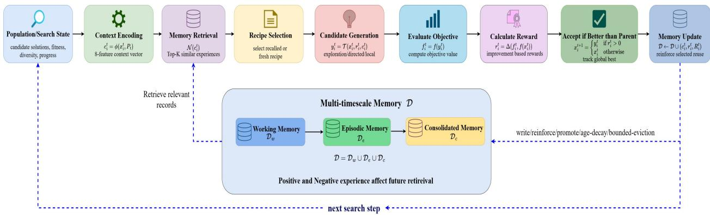
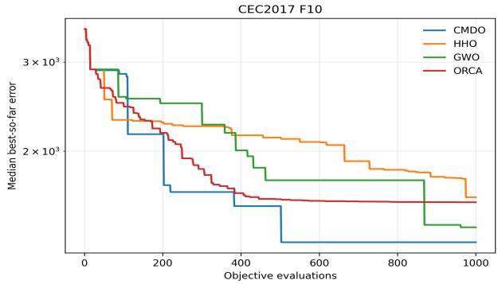
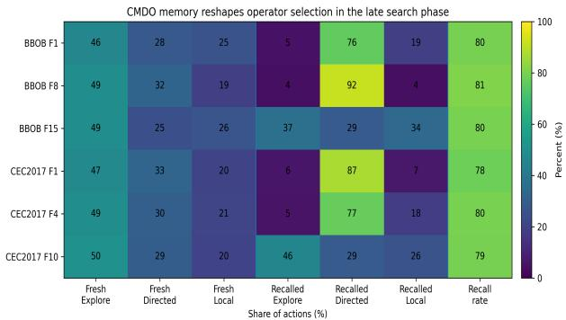
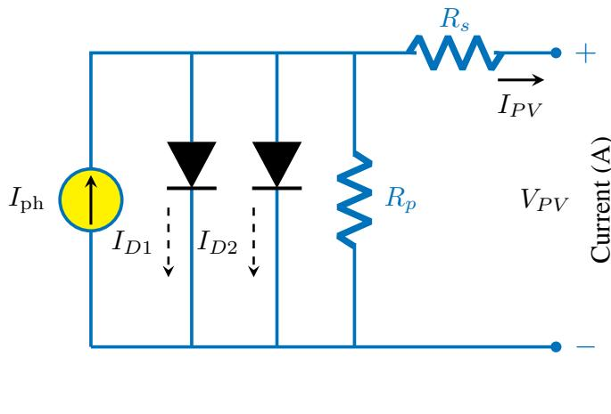
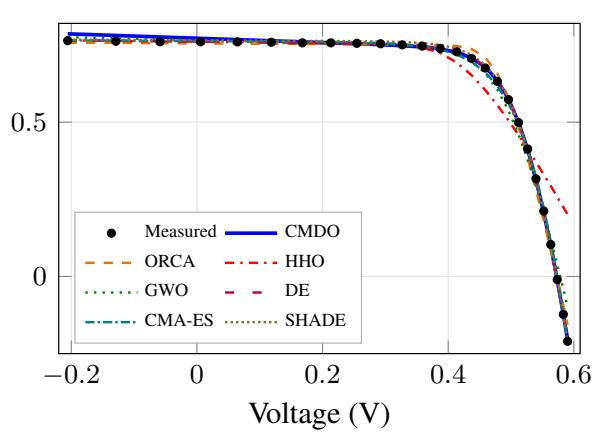
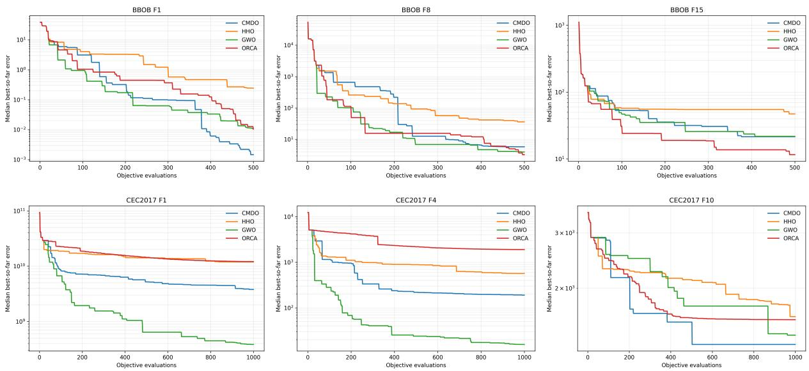

# CMDO: A Cognitive Memory-Driven Optimization Algorithm for Adaptive Population-Based Search

Mohammed Yusuf Mujawar\*, Shahram Rahimi, Noorbakhsh Amiri Golilarz\* Department of Computer Science The University of Alabama, AL, USA

## Abstract

Population-based optimization methods often use previous search information through successful solutions, parameter adaptation, or operator performance, but they rarely retain the context in which a search behavior succeeded or failed. We introduce Cognitive Memory-Driven Optimization (CMDO), a derivative-free population-based optimizer that represents experience as the relationship between search context, search behavior, and observed outcome. CMDO organizes these experiences across working, episodic, and consolidated memory, retrieves them according to similarity with the current search state, and uses both positive and negative evidence to guide subsequent search. Retrieved experience does not replay previous candidate locations; instead, it selects search recipes that are reconstructed from the current population through exploratory, directed, and local search behaviors with adaptive search geometry. We evaluate CMDO on selected Blackbox Optimization Benchmarking test suite on COCO (BBOB/COCO) and Congress on Evolutionary Computation 2017 (CEC2017) problems against DE, CMA-ES, SHADE, GWO, HHO, and ORCA, and further study its application to seven-parameter photovoltaic model estimation using measured current–voltage data. The results show problem-dependent but competitive optimization performance, including the lowest median error among the compared methods on CEC2017 F10. More importantly, analysis of the search traces shows that context-dependent recall changes the distribution of executed search behaviors, while unsuccessful experiences remain available as negative evidence for later decisions, showing that accumulated experience directly influences subse quent search behavior. These results support the use of explicit context–behavior–outcome memory as an active mechanism for controlling population-based search.

Keywords: population-based optimization, search context, search behavior, context-dependent recall, episodic memory, consolidated memory, photovoltaic model estimation

## 1 Introduction

Optimization methods must continually balance exploration of new regions with refinement of promising solutions. Existing approaches achieve this through population dynamics, stochastic search, parameter adaptation, or information retained from previous evaluations. Differential Evolution and CMA-ES adapt search through population differences and evolving sampling distributions [7, 21], while methods such as Grey Wolf Optimization (GWO), Harris Hawks Optimization (HHO), and ORCA optimization use alternative population-based search dynamics [5, 9, 11]. Other approaches explicitly use search history; for example, SHADE adapts parameters from successful past values, and adaptive operator-selection methods use previ ous operator performance to guide future choices [4, 23]. These methods show the value of past information, but they also raise a more fundamental question: what should an optimizer remember?

A successful search step is meaningful not only because it improved a solution, but also because of the conditions under which it worked. The same behavior may be useful in one stage of optimization and ineffective in another. This suggests that optimization memory should capture more than a good solution, parameter value, or operator score. Instead, it can represent the relationship between the current search state, the behavior applied in that state, and the outcome that followed. Such a representation allows previous experience to be reused only when it is relevant to the present search condition.

This idea is closely related to the functional role of memory in neurocognitive systems, where memory supports adaptation through context-sensitive storage, retrieval, and reuse of experience [6]. Related work in episodic control, memory-augmented neural models, and Hebbian memory has similarly shown the value of recalling prior experience according to the current context [2, 12, 14–16, 18, 25]. These ideas motivate a shift from treating memory as passive storage toward using it as an active mechanism for controlling future behavior.

We introduce Cognitive Memory-Driven Optimization (CMDO), an optimization framework in which search experience is used to guide future decisions. CMDO stores experiences that connect search context, search behavior, and observed outcome. These experiences are maintained across working, episodic, and consolidated memory, retrieved according to contextual similarity, and updated through reinforcement, consolidation, and forgetting. CMDO also retains negative experience, allowing previously unsuccessful behavior to reduce the likelihood of repeating similar search decisions under comparable conditions. Retrieved experience then influences how exploratory, directed, and local search behaviors are constructed.

We evaluate CMDO on the selected problems from BBOB/COCO benchmark suite [8] and the CEC2017 single-objective bound-constrained benchmark suite [1], and on photovoltaic parameter estimation using a two-diode model and measured current–voltage data Muhammad et al. [13]. Comparisons include DE, CMA-ES, SHADE, GWO, HHO, and ORCA under matched experimental conditions. The experiments assess both optimization performance and the contribution of the proposed memory mechanisms.

The main contributions of this work are:

• We introduce CMDO, a memory-driven optimization framework that represents experience through the relationship between search context, applied behavior, and observed outcome.

• We develop a multi-timescale memory architecture with context-dependent retrieval, reinforcement, consolidation, forgetting, and continued acquisition of experience.

• We incorporate both positive and negative search experience so that useful behaviors can be reinforced while previously unsuccessful behaviors are discouraged in related search states.

• We evaluate CMDO across numerical benchmarks and photovoltaic parameter estimation.

The remainder of this paper is organized as follows. Section 2 reviews related work on adaptive optimization, episodic and context-dependent memory, and neurocognitive memory mechanisms. Section 3 presents CMDO, including its search context, search recipes, multi-timescale memory, contextual retrieval, and memory update process. Section 4 reports the numerical benchmark and photovoltaic parameterestimation results and analyzes how recalled experience changes the search behavior, and discusses the implications and limitations of the proposed approach. Section 5 concludes the paper. Additional algorith mic, implementation, and experimental details are provided in the appendix.

## 2 Related Work and Motivation

## 2.1 Memory and adaptation in optimization

Optimization algorithms use past search information in different ways. Differential Evolution and CMA-ES adapt search through population relationships and evolving sampling distributions [7, 21], while methods such as GWO, HHO, and ORCA define alternative population-based search dynamics [5, 9, 11]. More explicit use of search history appears in adaptive evolutionary methods. SHADE stores successful controlparameter values and uses them to guide future parameter generation [23], while adaptive operator-selection methods update operator preferences according to observed performance [4]. Related studies further show that adaptive parameter control can strongly influence Differential Evolution behavior [22, 24].

These approaches demonstrate the value of past performance, but CMDO focuses on a different question: under what search condition did a particular behavior succeed or fail? The usefulness of a search action may depend on population diversity, search progress, stagnation, and proximity to promising regions. CMDO therefore links search behavior to the state in which it was applied, rather than treating success as independent of context.

## 2.2 Episodic and context-dependent memory

Context-dependent reuse of experience has been studied extensively outside numerical optimization. Model Free Episodic Control and Neural Episodic Control store prior experiences and retrieve related states to support later decisions [2, 16]. Experience replay similarly reuses previous interactions during learning, with prioritized replay emphasizing experiences expected to provide stronger learning signals [20]. Generalizable episodic memory and episodic curiosity further show how stored experience can be compared with current representations to influence future behavior [10, 19]. Memory-augmented sequence models provide a complementary perspective. Compressive Transformers, Memorizing Transformers, and Recurrent Memory Transformers maintain information beyond the immediate processing window [3, 18, 25]. Although these methods address different tasks, they support a common principle relevant to CMDO: memory is most useful when the system determines what should be retained, when it should be retrieved, and how it should affect current computation.

## 2.3 From neurocognitive memory to search experience

Neurocognitive-inspired intelligence treats memory as an active component of adaptation rather than passive storage. The framework in Golilarz et al. [6] describes working memory as a rapidly accessible store for current information and longer-term memory as a mechanism for retaining context-rich and consolidated experience. Retrieval is associative and sensitive to context, while consolidation allows selected experience to persist and guide future behavior. Recent Hebbian memory models provide related computational exam ples. Hebbian fast weights form temporary associative memories during an episode [12], adaptive Hebbian routing regulates memory contribution, plasticity, and retention according to the current task [14], and Hierarchical Hebbian Memory organizes experience across working, episodic, and more stable memory levels [15].

CMDO transfers these functional ideas to optimization, but uses a different memory object. Rather than storing only neural representations, candidate solutions, successful parameters, or aggregate operator rewards, CMDO stores a search experience, the search state, the behavior applied in that state, and the resulting outcome. These experiences are maintained across working, episodic, and consolidated memory and are retrieved according to similarity with the current search context. CMDO also retains negative evidence. A behavior that failed under a similar search condition can reduce support for repeating that behavior, while successful experience can strengthen it. Thus, memory is used not only to recall what worked, but also to avoid repeating previously unproductive search behavior.

  
Figure 1: Overall architecture of Cognitive Memory-Driven Optimization (CMDO).

The resulting distinction is central to CMDO: rather than adapting parameters independently, selecting operators from aggregate reward, or recalling earlier solutions, CMDO retrieves context-conditioned experience describing what was tried, under what search condition, and what consequence followed. The next section formalizes how these experiences are represented, stored, retrieved, and converted into new optimization actions.

## 3 Cognitive Memory-Driven Optimization Algorithm

## 3.1 Overview

We consider bounded continuous optimization,

$$
\operatorname* { m i n } _ { \mathbf { x } \in \Omega } f ( \mathbf { x } ) ,\tag{1}
$$

where $\Omega \subset \mathbb { R } ^ { D }$ is the search space. CMDO maintains a population of candidate solutions and generates one new candidate at each search step.

The main difference in CMDO is how previous search information is represented. Instead of storing only a good solution or a successful parameter value, CMDO stores a complete search experience,

$$
\mathcal { E } = ( { \bf c } , { \bf r } , R ) ,\tag{2}
$$

where c is the current search context, r is the search recipe used in that context, and R is the resulting reward. When a similar search condition appears later, CMDO retrieves relevant past experiences and uses them to guide the next search action. The overall CMDO architecture is illustrated in Figure 1. The search process forms a closed loop in which the current population determines the search context, memory influences the next search behavior, and the observed outcome is written back as new experience for future retrieval.

## 3.2 Search context

The search context summarizes the current condition of the population. CMDO uses an eight-dimensional context vector,

$$
\mathbf { c } = [ c _ { 1 } , c _ { 2 } , \ldots , c _ { 8 } ]\tag{3}
$$

The eight components describe: (1) population spread, (2) the rank of the focal solution, (3) its distance to the current best solution, (4) its distance to the population centroid, (5) the fraction of the evaluation budget consumed, (6) current stagnation, (7) the recent frequency of positive rewards, and (8) the fitness gap relative to the current best solution. These features allow CMDO to distinguish between different search situations. The context uses only information available during optimization; knowledge of the true optimum is never used by the search controller.

## 3.3 Search recipe and candidate generation

A search recipe defines how a new candidate should be generated:

$$
\mathbf { r } = ( o , s , m , g ) ,\tag{4}
$$

where o is the search operator, s is the step scale, m controls the directional mixture, and $g$ determines whether the search acts on the full space or on a subset of dimensions. CMDO uses three search behaviors which are, exploration, directed search, and local refinement. Let $\mathbf { x } _ { i }$ be the focal solution, $\mathbf { x } _ { b e s t }$ the current best solution, and δ a difference vector obtained from two population members. Let ϵ denote a populationscaled random perturbation. The three search directions are

$$
{ \bf d } _ { e x p } = m \delta + ( 1 - m ) \epsilon ,\tag{5}
$$

$$
\begin{array} { r } { \mathbf { d } _ { d i r } = m ( \mathbf { x } _ { b e s t } - \mathbf { x } _ { i } ) + ( 1 - m ) \delta , } \end{array}\tag{6}
$$

$$
\mathbf { d } _ { l o c } = 0 . 1 \left[ m ( \mathbf { x } _ { b e s t } - \mathbf { x } _ { i } ) + ( 1 - m ) \epsilon \right]\tag{7}
$$

A new candidate is generated as

$$
\mathbf { x } ^ { \prime } = \mathbf { x } _ { i } + s \mathbf { d }\tag{8}
$$

The recipe therefore controls both the type and strength of the search move. The geometry component can restrict the move to a randomly selected subset of approximately $\sqrt { D }$ dimensions, allowing CMDO to alternate between full-space and lower-dimensional search.

## 3.4 Multi-timescale memory

CMDO organizes search experience into three bounded memory levels, working memory, episodic memory, and consolidated memory. Working memory stores recent experiences, episodic memory retains a larger history over a longer period, and consolidated memory preserves patterns that have repeatedly produced useful outcomes. The three levels store the context, recipe, and outcome associated with search behavior rather than only candidate locations. This allows CMDO to recall how to search rather than simply where a good solution was found.

## 3.5 Context-dependent retrieval

For the current context c and a stored context $\mathbf { c } _ { j }$ , CMDO measures their similarity using

$$
S _ { j } = \exp \left( - \frac { \mathrm { M S E } ( \mathbf { c } , \mathbf { c } _ { j } ) } { 2 h ^ { 2 } } \right) ,\tag{9}
$$

where h controls how strongly context differences affect retrieval.

Older memories gradually lose influence through a retention factor,

$$
W _ { j } = S _ { j } \rho ^ { a _ { j } } ,\tag{10}
$$

where $a _ { j }$ is the age of the memory and $\rho$ is the retention coefficient. CMDO keeps only sufficiently relevant memories and considers the most relevant records for recipe selection. A stored experience receives reuse credit only when its recipe is actually selected and executed.

Table 1: Median final error over three seeds on BBOB and CEC2017 benchmarks (lower is better).
<table><tr><td rowspan=2 colspan=1>Method</td><td rowspan=1 colspan=3> $\mathbf { B B O B } \left( D = 5 \right)$ </td><td rowspan=1 colspan=3>CEC2017 $( D = 1 0 )$ </td></tr><tr><td rowspan=1 colspan=1>F1</td><td rowspan=1 colspan=1>F8</td><td rowspan=1 colspan=1>F15</td><td rowspan=1 colspan=1>F1</td><td rowspan=1 colspan=1>F4</td><td rowspan=1 colspan=1>F10</td></tr><tr><td rowspan=1 colspan=1>CMDO</td><td rowspan=1 colspan=1> $1 . 4 5 0 \times 1 0 ^ { - 3 }$ </td><td rowspan=1 colspan=1>5.7813</td><td rowspan=1 colspan=1>21.4916</td><td rowspan=1 colspan=1> $3 . 7 8 4 8 \times 1 0 ^ { 9 }$ </td><td rowspan=1 colspan=1>189.9318</td><td rowspan=1 colspan=1>1322.7172</td></tr><tr><td rowspan=1 colspan=1>HHO</td><td rowspan=1 colspan=1> $2 . 4 0 6 \times 1 0 ^ { - 1 }$ </td><td rowspan=1 colspan=1>35.9889</td><td rowspan=1 colspan=1>47.1264</td><td rowspan=1 colspan=1> $1 . 1 9 0 6 \times 1 0 ^ { 1 0 }$ </td><td rowspan=1 colspan=1>566.7792</td><td rowspan=1 colspan=1>1622.6580</td></tr><tr><td rowspan=1 colspan=1>GWO</td><td rowspan=1 colspan=1> $1 . 0 8 8 \times 1 0 ^ { - 2 }$ </td><td rowspan=1 colspan=1>3.9398</td><td rowspan=1 colspan=1>21.7654</td><td rowspan=1 colspan=1> $3 . 8 4 0 9 \times 1 0 ^ { 8 }$ </td><td rowspan=1 colspan=1>15.6910</td><td rowspan=1 colspan=1>1415.7922</td></tr><tr><td rowspan=1 colspan=1>ORCA</td><td rowspan=1 colspan=1> $1 . 0 3 8 \times 1 0 ^ { - 2 }$ </td><td rowspan=1 colspan=1>3.2394</td><td rowspan=1 colspan=1>11.5687</td><td rowspan=1 colspan=1> $1 . 2 0 9 0 \times 1 0 ^ { 1 0 }$ </td><td rowspan=1 colspan=1>1900.3090</td><td rowspan=1 colspan=1>1586.3345</td></tr><tr><td rowspan=1 colspan=1>DE</td><td rowspan=1 colspan=1> $5 . 8 5 9 \times 1 0 ^ { - 4 }$ </td><td rowspan=1 colspan=1>3.8711</td><td rowspan=1 colspan=1>20.5967</td><td rowspan=1 colspan=1> $9 . 6 0 7 4 \times 1 0 ^ { 6 }$ </td><td rowspan=1 colspan=1>7.6000</td><td rowspan=1 colspan=1>1946.1414</td></tr><tr><td rowspan=1 colspan=1>CMA-ES</td><td rowspan=1 colspan=1> $9 . 8 6 1 \times 1 0 ^ { - 3 }$ </td><td rowspan=1 colspan=1>4.5501</td><td rowspan=1 colspan=1>31.7369</td><td rowspan=1 colspan=1> $1 . 7 6 5 0 \times 1 0 ^ { 7 }$ </td><td rowspan=1 colspan=1>8.4741</td><td rowspan=1 colspan=1>2070.8946</td></tr><tr><td rowspan=1 colspan=1>SHADE</td><td rowspan=1 colspan=1> $1 . 2 6 3 \times 1 0 ^ { - 1 }$ </td><td rowspan=1 colspan=1>21.2723</td><td rowspan=1 colspan=1>15.0919</td><td rowspan=1 colspan=1> $3 . 3 6 3 3 \times 1 0 ^ { 7 }$ </td><td rowspan=1 colspan=1>16.4747</td><td rowspan=1 colspan=1>1800.6883</td></tr></table>

## 3.6 Learning from positive and negative experience

CMDO learns from both successful (positive) and unsuccessful (negative) search behavior. Positive experience supports repeating a recipe when a related context appears again, while negative experience reduces support for similar behaviors that previously failed under comparable conditions.

The support for a retrieved recipe is

$$
Q _ { j } = \mathrm { p o s i t i v e ~ s u p p o r t } - \lambda \mathrm { n e g a t i v e ~ e v i d e n c e } ,\tag{11}
$$

where λ controls the influence of failure information.

Negative evidence is applied only when the failed experience is behaviorally similar to the candidate recipe, including the same search operator and geometry. If no recalled recipe has sufficient support, CMDO generates a new recipe. A fixed probability of generating a fresh recipe is also retained so that new search behaviors can continue to be discovered.

## 3.7 Reward and memory update

After evaluating a candidate, CMDO compares its objective value with that of the focal solution. The reward is computed as

$$
R = \operatorname { t a n h } \left( { \frac { f ( \mathbf { x } _ { i } ) - f ( \mathbf { x } ^ { \prime } ) } { \sigma _ { f } } } \right) ,\tag{12}
$$

where $\sigma _ { f }$ is a robust scale estimate from the current population fitness values.

A positive reward indicates improvement, while a non-positive reward records an unsuccessful action. The candidate replaces the focal solution only when it improves the objective. The resulting experience is stored in working and episodic memory, and repeatedly useful experience may later be consolidated. If the executed recipe was recalled, only the selected source receives reuse feedback.

The overall CMDO cycle can be summarized as

$$
\mathrm { O b s e r v e }  \mathrm { R e c a l l / E x p l o r e }  \mathrm { A c t }  \mathrm { E v a l u a t e }  \mathrm { U p d a t e }  \mathrm { R e m e m b e r }
$$

The cycle emphasizes that memory controls how search behavior is selected, while each recalled recipe is reconstructed from the current population rather than replaying a previously visited solution.

  
(a) Convergence on CEC2017 F10 (median best-so-far error over seeds 15–17; lower is better).

  
(b) Memory-driven search behavior in the late optimization phase.  
Figure 2: Comparison of convergence and memory-driven search behavior.

## 4 Experimental Results and Discussion

## 4.1 Numerical optimization performance

Table 1 reports the median final optimization error over seeds 15–17. Lower values indicate better performance. The two benchmark suites are presented separately because their objective scales differ substantially. On BBOB F1, CMDO achieves a median error of $1 . 4 5 \times 1 0 ^ { - 3 }$ , lower than HHO, GWO, ORCA, CMA-ES, and SHADE. On F8 it improves over HHO and SHADE, while on F15 it remains close to GWO and DE and improves over HHO and CMA-ES. The results indicate that the fixed CMDO configuration remains competitive on the selected BBOB problems, although its relative performance varies by problem.

On CEC2017 F1 and F4, CMDO improves over HHO and ORCA, while several evolutionary baselines obtain lower errors. On F10, CMDO reaches a median error of 1322.72, lower than all six comparison methods. This is the strongest numerical benchmark result for CMDO in the reported experiments. Figure 2a shows that CMDO continues to improve throughout the available evaluation budget on F10 and finishes with a lower median best-so-far error than HHO, GWO, and ORCA.

## 4.2 How memory changes the search

The main question behind CMDO is whether stored experience actually changes future search behavior. We examine this by separating newly generatedfresh recipes from recipes selected through memory recall.

Figure 2b shows a clear difference between fresh and recalled behavior. Fresh recipes remain close to the predefined operator sampling distribution, whereas recalled recipes develop problem-dependent prefer ences. Directed search becomes dominant among recalled actions on BBOB F1, BBOB F8, CEC2017 F1, and CEC2017 F4, while BBOB F15 shows a more balanced mixture of exploration, directed search, and local refinement. CEC2017 F10 exhibits another pattern, with recalled actions maintaining a mixed operator distribution. Because the fresh-recipe distribution is fixed, these shifts arise from accumulated search experience rather than from a change in the underlying operator prior. Memory therefore does more than store previous evaluations, it changes which search behaviors are selected under related search conditions. The variation across benchmark functions further indicates that CMDO does not converge to a single globally preferred operator.

Table 2: RTC France two-diode parameter-estimation results over ten seeds. Errors are in amperes.
<table><tr><td rowspan=1 colspan=1>Method</td><td rowspan=1 colspan=1>Median MAE</td><td rowspan=1 colspan=1>Mean MAE</td><td rowspan=1 colspan=1>Median RMSE</td><td rowspan=1 colspan=1>CMDO wins</td></tr><tr><td rowspan=1 colspan=1>CMDO</td><td rowspan=1 colspan=1>0.005402</td><td rowspan=1 colspan=1>0.010135</td><td rowspan=1 colspan=1>0.007720</td><td rowspan=1 colspan=1>一</td></tr><tr><td rowspan=1 colspan=1>HHO</td><td rowspan=1 colspan=1>0.067527</td><td rowspan=1 colspan=1>0.066728</td><td rowspan=1 colspan=1>0.106345</td><td rowspan=1 colspan=1>10/10</td></tr><tr><td rowspan=1 colspan=1>GWO</td><td rowspan=1 colspan=1>0.015631</td><td rowspan=1 colspan=1>0.017507</td><td rowspan=1 colspan=1>0.025084</td><td rowspan=1 colspan=1>7/10</td></tr><tr><td rowspan=1 colspan=1>ORCA</td><td rowspan=1 colspan=1>0.014460</td><td rowspan=1 colspan=1>0.019404</td><td rowspan=1 colspan=1>0.020608</td><td rowspan=1 colspan=1>8/10</td></tr><tr><td rowspan=1 colspan=1>DE</td><td rowspan=1 colspan=1>0.001841</td><td rowspan=1 colspan=1>0.002706</td><td rowspan=1 colspan=1>0.002306</td><td rowspan=1 colspan=1>2/10</td></tr><tr><td rowspan=1 colspan=1>CMA-ES</td><td rowspan=1 colspan=1>0.005338</td><td rowspan=1 colspan=1>0.005368</td><td rowspan=1 colspan=1>0.006985</td><td rowspan=1 colspan=1>6/10</td></tr><tr><td rowspan=1 colspan=1>SHADE</td><td rowspan=1 colspan=1>0.005724</td><td rowspan=1 colspan=1>0.005646</td><td rowspan=1 colspan=1>0.006698</td><td rowspan=1 colspan=1>6/10</td></tr></table>

## 4.3 Negative experience and memory persistence

CMDO retains unsuccessful as well as successful search experiences. Negative records remain available during retrieval and can reduce support for similar recipes when related contexts are encountered again. This is particularly visible on CEC2017 F10, where the late search memory contains substantially more negative than positive original experiences. These failures are therefore not discarded simply because they did not improve the focal solution. The three memory levels provide complementary time scales for this experience. Working memory retains recent events, episodic memory maintains a larger history of positive and negative outcomes, and consolidated memory preserves patterns that have demonstrated useful reuse. Together with age-dependent retention and bounded capacity, this allows recent evidence to remain respon sive while repeatedly useful behavior can persist for longer. These observations support the central design of CMDO in which the optimizer remembers what was tried, under what search condition, and what happened, using both successful and unsuccessful experience to influence later behavior.

## 4.4 Photovoltaic parameter estimation

We further evaluate CMDO on the RTC France two-diode photovoltaic parameter-estimation problem using the measured current–voltage data reported by Muhammad et al. [13]. The experiment uses 26 measured I–V observations collected at $3 3 ^ { \circ } \mathrm { C }$ and $1 0 0 0 \mathrm { W / m ^ { 2 } }$ . All compared methods use the same measured data, parameter bounds, objective definition, and budget of 2000 objective evaluations per run. Results are reported over seeds 101–110.

Figure 3a illustrates the equivalent circuit used in the experiment. The seven optimized parameters are $I _ { \mathrm { p h } } , I _ { 0 1 } , I _ { 0 2 } , R _ { s } , R _ { p } , a _ { 1 }$ , and $a _ { 2 }$ . For each candidate parameter vector, the two-diode model is evaluated at the measured voltage points and the mean absolute error between measured and modeled current is used as the optimization objective. In addition, Figure 3b compares the measured RTC France $I { - } V$ observations with fitted responses produced by CMDO and the six comparison methods. For each optimizer, the displayed curve corresponds to the run closest to that method’s ten-seed median MAE, providing a representative visualization of its fitted parameter set. The curves reproduce the overall nonlinear shape of the measured response to different degrees, with the most visible deviations occurring around the knee and high-voltage region of the characteristic.

Table 2 summarizes the corresponding optimization performance over the ten runs. CMDO obtains a median MAE of 0.005402 A, a mean MAE of 0.010135 A, and a median RMSE of 0.007720 A. Its median MAE is lower than those of HHO, GWO, ORCA, and SHADE, while DE and CMA-ES obtain lower median values. The fitted responses in Figure 3b complement these aggregate errors by showing how the estimated model parameters translate into the resulting current–voltage characteristics.

The paired-seed comparison provides an additional view of run-to-run behavior. CMDO obtains a lower

  
(a) Two-diode equivalent circuit.

  
(b) Fitted I–V characteristics.  
Figure 3: Photovoltaic parameter-estimation setup and response: (a) equivalent circuit of the sevenparameter two-diode model, and (b) measured versus fitted I–V characteristics for the RTC France solar cell at $3 3 ^ { \circ } \mathrm { C }$ and 1000 $\mathrm { W / m ^ { 2 } }$

MAE than HHO in all ten paired runs, ORCA in eight, GWO in seven, and both CMA-ES and SHADE in six. Against DE, CMDO obtains the lower MAE in two of the ten runs. CMA-ES has a slightly lower median MAE, while CMDO obtains lower MAE in six paired seeds, illustrating why aggregate statistics and paired comparisons can provide complementary views of optimizer behavior.

The photovoltaic experiment uses the same CMDO memory architecture and search mechanism as the numerical benchmark experiments. No photovoltaic-specific operator or memory rule is introduced. The experiment therefore provides a second application setting in which the context–behavior–outcome memory representation is used to guide optimization of a nonlinear physical model.

## 4.5 Discussion

The results show that CMDO’s main contribution lies in how search experience is used to influence future decisions. Recalled recipes develop different operator preferences from freshly generated recipes, indicating that memory actively reshapes the search rather than serving only as passive storage. The variation across benchmark functions further suggests that this adaptation is context dependent rather than driven by one globally preferred behavior. The use of both positive and negative experience is important to this process. Successful behaviors can gain support in related search states, while unsuccessful behaviors remain available as evidence against repeating similar decisions. Combined with working, episodic, and consolidated memory, this gives CMDO a mechanism for balancing recent experience with more persistent search knowledge. The photovoltaic experiment provides a complementary test outside synthetic benchmarks. The same CMDO memory architecture is applied to the two-diode parameter-estimation problem without introducing a domain-specific search rule, showing that the proposed context–behavior–outcome representation can also guide nonlinear physical parameter estimation. The present evaluation is limited to a compact set of low-dimensional benchmarks and one measured photovoltaic curve. Future work should examine higherdimensional, noisy, constrained, dynamic, and multi-objective settings, as well as whether useful experience can be transferred across related optimization tasks. Overall, the findings support the central idea of CMDO: optimization memory can be more useful when it captures what was tried, under what search condition, and what consequencefollowed, allowing past experience to become an active part of search control.

## 5 Conclusion

We introduced Cognitive Memory-Driven Optimization (CMDO), an optimization framework that represents search experience through the relationship between context, behavior, and outcome. Rather than remembering only successful solutions or parameter values, CMDO retrieves relevant past experience and uses it to shape new search actions under similar conditions. Across the selected BBOB and CEC2017 problems and photovoltaic parameter-estimation experiments, CMDO shows competitive problem-dependent perfor mance while the memory analysis demonstrates that recalled experience changes the distribution of executed search behaviors. The results also show that both successful and unsuccessful experience can contribute to later decisions through contextual retrieval, reinforcement, and consolidation. More broadly, CMDO pro vides a way to separate the search mechanism itself from the memory that governs when different behaviors should be reused. This makes it possible to study optimization not only in terms of which operator performs well, but also in terms of which experiences remain useful across changing search conditions. Such a perspective may help support more adaptive optimizers in which search behavior is shaped by accumulated experience rather than by fixed heuristics alone. These findings support a broader view of optimization memory as an active search-control mechanism rather than a passive record of previous evaluations. Future work will investigate richer context representations, larger and more diverse optimization settings, and the transfer of useful search experience across related problems.

## Acknowledgment

The authors acknowledge the support and resources provided by the Bioinspired Robotics, AI, Imaging and Neurocognitive Systems (BRAINS) Laboratory at The University of Alabama.

## References

[1] N. Awad, M. Ali, J. Liang, B. Qu, and P. Suganthan. Problem definitions and evaluation criteria for the CEC 2017 special session and competition on single objective real-parameter numerical optimization. Technical report, 2016.

[2] Charles Blundell, Benigno Uria, Alexander Pritzel, Yazhe Li, Avraham Ruderman, Joel Z. Leibo, Jack Rae, Daan Wierstra, and Demis Hassabis. Model-free episodic control, 2016.

[3] Aydar Bulatov, Yuri Kuratov, and Mikhail S. Burtsev. Recurrent memory transformer. In Advances in Neural Information Processing Systems, 2022.

[4] Rafet Durgut, Mehmet Emin Aydin, and Ibrahim Atli. Adaptive operator selection with reinforcement learning. Information Sciences, 581:773–790, 2021. doi: 10.1016/j.ins.2021.10.025.

[5] Noorbakhsh Amiri Golilarz, Hui Gao, Abdoljalil Addeh, and Saeid Pirasteh. ORCA optimization algo rithm: A new meta-heuristic tool for complex optimization problems. In 2020 17th International Computer Conference on Wavelet Active Media Technology and Information Processing (ICCWAMTIP), 2020. doi: 10.1109/ICCWAMTIP51612.2020.9317473.

[6] Noorbakhsh Amiri Golilarz, Hassan S. Al Khatib, and Shahram Rahimi. Toward neurocognitiveinspired intelligence: From AI’s structural mimicry to human-like functional cognition. IEEE Access, 14:67622–67648, 2026. doi: 10.1109/ACCESS.2026.3689754.

[7] Nikolaus Hansen, Sibylle D. Müller, and Petros Koumoutsakos. Reducing the time complexity of the derandomized evolution strategy with covariance matrix adaptation (CMA-ES). Evolutionary Computation, 11:1–18, 2003.

[8] Nikolaus Hansen, Anne Auger, Raymond Ros, Olaf Mersmann, Tea Tušar, and Dimo Brockhoff. COCO: A platform for comparing continuous optimizers in a black-box setting. Optimization Methods and Software, 36(1):114–144, 2021. doi: 10.1080/10556788.2020.1808977.

[9] Ali Asghar Heidari, Seyedali Mirjalili, Hossam Faris, Ibrahim Aljarah, Majdi Mafarja, and Huiling Chen. Harris hawks optimization: Algorithm and applications. Future Generation Computer Systems, 97:849–872, 2019. doi: 10.1016/j.future.2019.02.028.

[10] Hao Hu, Jianing Ye, Guangxiang Zhu, Zhizhou Ren, and Chongjie Zhang. Generalizable episodic memory for deep reinforcement learning. In Proceedings of the 38th International Conference on Machine Learning, 2021.

[11] Seyedali Mirjalili, Seyed Mohammad Mirjalili, and Andrew Lewis. Grey wolf optimizer. Advances in Engineering Software, 69:46–61, 2014.

[12] Gavin Money, Sindhuja Penchala, Jiacheng Li, and Noorbakhsh Amiri Golilarz. Where to bind matters: Hebbian fast weights in vision transformers for few-shot character recognition. In Proceedings of the 18th IEEE International Conference on Computational Intelligence and Communication Networks (CICN), 2026.

[13] F. F. Muhammad, A. W. Karim Sangawi, S. Hashim, S. K. Ghoshal, I. K. Abdullah, and S. S. Hameed. Simple and efficient estimation of photovoltaic cells and modules parameters using approximation and correction technique. PLOS ONE, 14(5):e0216201, 2019. doi: 10.1371/journal.pone.0216201.

[14] Mohammed Yusuf Mujawar and Noorbakhsh Amiri Golilarz. Adaptive hebbian memory routing in vision transformers for few-shot learning, 2026.

[15] Mohammed Yusuf Mujawar and Noorbakhsh Amiri Golilarz. Where should experience live? hierarchical hebbian memory for continual vision transformers, 2026.

[16] Alexander Pritzel, Benigno Uria, Sriram Srinivasan, Adrià Puigdomènech Badia, Oriol Vinyals, Demis Hassabis, Daan Wierstra, and Charles Blundell. Neural episodic control. In Proceedings of the 34th International Conference on Machine Learning, volume 70 of Proceedings ofMachine Learning Research, pp. 2827–2836, 2017.

[17] Cheng Qin, Jianing Li, Chen Yang, Bin Ai, and Yecheng Zhou. Comparative study of parameter extraction from a solar cell or a photovoltaic module by combining metaheuristic algorithms with different simulation current calculation methods. Energies, 17(10):2284, 2024. doi: 10.3390/en17102284.

[18] Jack W. Rae, Anna Potapenko, Siddhant M. Jayakumar, Chloe Hillier, and Timothy P. Lillicrap. Compressive transformers for long-range sequence modelling. In International Conference on Learning Representations, 2020.

[19] Nikolay Savinov, Anton Raichuk, Raphaël Marinier, Damien Vincent, Marc Pollefeys, Timothy Lillicrap, and Sylvain Gelly. Episodic curiosity through reachability. In International Conference on Learning Representations, 2019.

[20] Tom Schaul, John Quan, Ioannis Antonoglou, and David Silver. Prioritized experience replay. In International Conference on Learning Representations, 2016.

[21] Rainer Storn and Kenneth Price. Differential evolution—a simple and efficient heuristic for global optimization over continuous spaces. Journal of Global Optimization, 11(4):341–359, 1997.

[22] Ryoji Tanabe. Analyzing adaptive parameter landscapes in parameter adaptation methods for differential evolution. In Proceedings of the Genetic and Evolutionary Computation Conference, 2020. doi: 10.1145/3377930.3389820.

[23] Ryoji Tanabe and Alex Fukunaga. Success-history based parameter adaptation for differential evolution. In 2013 IEEE Congress on Evolutionary Computation, pp. 71–78, 2013.

[24] Ryoji Tanabe and Alex Fukunaga. Reviewing and benchmarking parameter control methods in differential evolution, 2020.

[25] Yuhuai Wu, Markus N. Rabe, DeLesley Hutchins, and Christian Szegedy. Memorizing transformers. In International Conference on Learning Representations, 2022.

## Appendix

## A CMDO Algorithmic Details

This appendix provides implementation details for CMDO that complement the higher-level description in Section 3. The algorithm operates in a normalized search space $[ 0 , 1 ] ^ { D }$ , while objective evaluations are performed after mapping candidate solutions to the physical problem bounds. All function evaluations, including initialization, count toward the evaluation budget.

## A.1 Overall CMDO procedure

Algorithm 1 summarizes the complete optimization loop. At each step, one focal population member is selected cyclically. CMDO describes the current search state, retrieves relevant experience, selects either a recalled or fresh recipe, constructs one candidate, evaluates it, and records the resulting experience. A recalled recipe does not replay an old candidate vector. The recipe specifies a form of search behavior that is reconstructed using the current population. Consequently, the same remembered recipe can produce different displacements when it is reused in different search states.

## A.2 Search context

For focal solution $\mathbf { z } _ { i } .$ , CMDO uses the eight-dimensional context

$$
\mathbf { c } _ { i } = [ c _ { i } ^ { ( 1 ) } , \ldots , c _ { i } ^ { ( 8 ) } ]\tag{13}
$$

The components represent population spread, focal rank, distance to the current best, distance to the population centroid, consumed evaluation budget, stagnation, recent positive-reward frequency, and focal-

to-best fitness gap. The implementation computes them as

$$
c _ { i } ^ { ( 1 ) } = \operatorname* { m i n } \left( 1 , 2 \mathrm { m e a n } _ { d } [ \mathrm { s t d } ( Z _ { : , d } ) ] \right) ,\tag{14}
$$

$$
c _ { i } ^ { ( 2 ) } = \frac { \sum _ { j = 1 } ^ { N } \mathbb { I } [ f _ { j } < f _ { i } ] } { \operatorname* { m a x } ( 1 , N - 1 ) } ,\tag{15}
$$

$$
c _ { i } ^ { ( 3 ) } = \frac { \| \mathbf { z } _ { i } - \mathbf { z } _ { b e s t } \| _ { 2 } } { \sqrt { D } } ,\tag{16}
$$

$$
c _ { i } ^ { ( 4 ) } = \frac { \| \mathbf { z } _ { i } - \bar { \mathbf { z } } \| _ { 2 } } { \sqrt { D } } ,\tag{17}
$$

$$
c _ { i } ^ { ( 5 ) } = \frac { n _ { \mathrm { e v a l } } } { B } ,\tag{18}
$$

$$
c _ { i } ^ { ( 6 ) } = \operatorname* { m i n } \left( 1 , \frac { s _ { \mathrm { s t a g } } } { 1 0 N } \right) ,\tag{19}
$$

$$
c _ { i } ^ { ( 7 ) } = { \frac { 1 } { \vert H \vert } } \sum _ { R \in H } \mathbb { I } [ R > 0 ] ,\tag{20}
$$

$$
c _ { i } ^ { ( 8 ) } = \operatorname { t a n h } \left( \frac { \operatorname* { m a x } ( 0 , f _ { i } - f _ { b e s t } ) } { \operatorname* { m a x } ( \mathrm { M A D } ( \mathbf { f } ) , 1 0 ^ { - 1 2 } ) } \right)\tag{21}
$$

Here H denotes the recent reward history. The true optimum of a benchmark function is not used in the context or search controller.

## A.3 Fresh recipes and search geometry

A recipe is

$$
\mathbf { r } = ( o , s , m , g ) ,\tag{22}
$$

where o selects exploration, directed search, or local refinement; s is the step scale; m controls the directional mixture; and $g$ specifies full-space or subspace geometry.

Fresh recipes use

$$
P ( o = \mathrm { e x p l o r a t i o n } ) = 0 . 5 , \qquad P ( o = \mathrm { d i r e c t e d } ) = 0 . 3 , \qquad P ( o = \mathrm { l o c a l } ) = 0 . 2 ,\tag{23}
$$

with

$$
s \sim \mathrm { L o g U n i f o r m } ( 0 . 2 5 , 2 ) , \qquad m \sim \mathcal { U } ( 0 . 2 , 0 . 8 )\tag{24}
$$

For two sampled population members,

$$
\begin{array} { r } { \pmb { \delta } = \mathbf Z _ { a } - \mathbf Z _ { b } , } \end{array}\tag{25}
$$

and the stochastic component is

$$
\epsilon = \eta \odot \operatorname* { m a x } ( \pmb { \sigma } _ { Z } , 0 . 0 1 ) , \qquad \eta \sim \mathcal { N } ( \mathbf { 0 } , \mathbf { I } )\tag{26}
$$

The three directions are

$$
{ \bf d } _ { e x p } = m \delta + ( 1 - m ) \epsilon ,\tag{27}
$$

$$
\mathbf { d } _ { d i r } = m ( \mathbf { z } _ { b e s t } - \mathbf { z } _ { i } ) + ( 1 - m ) \delta ,\tag{28}
$$

$$
\mathbf { d } _ { l o c } = 0 . 1 \left[ m ( \mathbf { z } _ { b e s t } - \mathbf { z } _ { i } ) + ( 1 - m ) \epsilon \right]\tag{29}
$$

For subspace geometry and $D > 1$ , CMDO modifies

$$
\left\lceil { \sqrt { D } } \right\rceil\tag{30}
$$

coordinates sampled uniformly without replacement. Coordinates outside the selected subset remain equal to those of the focal solution.

Table 3: Numerical benchmark configuration.
<table><tr><td rowspan=1 colspan=1>Suite</td><td rowspan=1 colspan=1>Functions</td><td rowspan=1 colspan=1>D</td><td rowspan=1 colspan=1>Budget</td><td rowspan=1 colspan=1>Seeds</td></tr><tr><td rowspan=1 colspan=1>BBOB/COCO</td><td rowspan=1 colspan=1>F1, F8, F15</td><td rowspan=1 colspan=1>5</td><td rowspan=1 colspan=1>500</td><td rowspan=1 colspan=1>15-17</td></tr><tr><td rowspan=1 colspan=1>CEC2017</td><td rowspan=1 colspan=1>F1, F4, F10</td><td rowspan=1 colspan=1>10</td><td rowspan=1 colspan=1>1000</td><td rowspan=1 colspan=1>15-17</td></tr></table>

## A.4 Retrieval and negative evidence

Records from the three memory stores are first deduplicated by experience identifier. Similarity between the current context c and stored context $\mathbf { c } _ { j }$ is

$$
S _ { j } = \exp \left( - \frac { \mathrm { M S E } ( \mathbf { c } , \mathbf { c } _ { j } ) } { 2 h ^ { 2 } } \right) ,\tag{31}
$$

and the age-adjusted retrieval weight is

$$
W _ { j } = S _ { j } \rho ^ { a _ { j } }\tag{32}
$$

Records below the relevance threshold are removed, after which the top-k records by retrieval weight are considered. The current value of a record is

$$
V _ { j } = { \frac { R _ { j } + R _ { j } ^ { \mathrm { r e u s e } } } { 1 + n _ { j } ^ { \mathrm { r e u s e } } } }\tag{33}
$$

Only positive-valued records can directly propose a recalled recipe. Retrieved negative records using the same operator and geometry contribute a penalty

$$
P _ { j } = \sum _ { q \in { \cal N } _ { j } } W _ { q } | V _ { q } | \exp \left( - \left| \log \frac { s _ { q } } { s _ { j } } \right| - | m _ { q } - m _ { j } | \right) ,\tag{34}
$$

giving the final support

$$
Q _ { j } = W _ { j } V _ { j } - \lambda P _ { j } .\tag{35}
$$

Recipes with $Q _ { j } > 0$ are sampled proportionally to their support. If none remain, a fresh recipe is used.

## A.5 Memory update and consolidation

Each completed search step generates a new experience containing the search context, executed recipe, reward, search step, and realized displacement, together with metadata used for later reuse. The new event is written to both working and episodic memory, regardless of whether its reward is positive or negative.

When a remembered recipe is actually executed, reuse feedback is assigned only to the selected source record. An original experience becomes eligible for consolidation after at least three selected reuses with a positive mean reuse return.

Two records are compatible for consolidation when they have the same operator and geometry and satisfy

$$
\begin{array} { r } { \mathrm { M S E } ( \mathbf { c } _ { p } , \mathbf { c } _ { j } ) < 0 . 0 1 , } \end{array}\tag{36}
$$

$$
\left| \log \frac { s _ { p } } { s _ { j } } \right| < 0 . 2 5 , \qquad | m _ { p } - m _ { j } | < 0 . 1\tag{37}
$$

Compatible records update a consolidated prototype; otherwise, a new prototype is formed. Working memory retains the newest 24 experiences, episodic memory is bounded at 256 records using age-decayed utility for eviction, and consolidated memory contains at most 24 prototypes.

  
Figure 4: Median best-so-far optimization error over seeds 15–17. The top row shows BBOB F1, F8, and F15; the bottom row shows CEC2017 F1, F4, and F10. The vertical axis is logarithmic.

## B Experimental Implementation Details

## B.1 Benchmark protocol

The numerical experiments use BBOB/COCO functions F1, F8, and F15 at D = 5 with 500 evaluations, and CEC2017 functions F1, F4, and F10 at D = 10 with 1000 evaluations. Instance 1 and seeds 15–17 are used for the reported benchmark panel. All objective evaluations, including initialization, count toward the stated budget.

## C Additional Convergence Results

The main paper presents CEC2017 F10 as a representative convergence example. Figure 4 shows the remaining recorded convergence trajectories together with F10 for completeness. Curves report the median best-so-far error across seeds 15–17.

These trajectories complement the final-error tables by showing when improvements occur within the fixed evaluation budget. They also illustrate the problem-dependent evolution of CMDO’s search behavior across the selected landscapes.

## D Photovoltaic Model and Experimental Details

## D.1 Two-diode photovoltaic model

The photovoltaic experiment estimates the seven parameters

$$
\pmb \theta = [ I _ { \mathrm { p h } } , I _ { 0 1 } , I _ { 0 2 } , R _ { s } , R _ { p } , a _ { 1 } , a _ { 2 } ]\tag{38}
$$

of the two-diode model. For measured terminal voltage V and current I, the model is defined implicitly as

$$
I = I _ { \mathrm { p h } } - I _ { 0 1 } \left[ \exp \left( \frac { V + I R _ { s } } { a _ { 1 } V _ { T } } \right) - 1 \right] - I _ { 0 2 } \left[ \exp \left( \frac { V + I R _ { s } } { a _ { 2 } V _ { T } } \right) - 1 \right] - \frac { V + I R _ { s } } { R _ { p } } ,\tag{39}
$$

Table 4: Parameter bounds for the RTC France two-diode model.
<table><tr><td rowspan=1 colspan=1>Parameter</td><td rowspan=1 colspan=1>Lower bound</td><td rowspan=1 colspan=1>Upper bound</td></tr><tr><td rowspan=1 colspan=1> $I _ { \mathrm { p h } } \left( \mathrm { A } \right)$ </td><td rowspan=1 colspan=1>0</td><td rowspan=1 colspan=1>1</td></tr><tr><td rowspan=1 colspan=1> $I _ { 0 1 }$ (A)</td><td rowspan=1 colspan=1> $1 0 ^ { - 1 5 }$ </td><td rowspan=1 colspan=1> $1 0 ^ { - 3 }$ </td></tr><tr><td rowspan=1 colspan=1> $I _ { 0 2 }$ (A)</td><td rowspan=1 colspan=1> $1 0 ^ { - 1 5 }$ </td><td rowspan=1 colspan=1> $1 0 ^ { - 3 }$ </td></tr><tr><td rowspan=1 colspan=1> $R _ { s }$ (Ω)</td><td rowspan=1 colspan=1>0</td><td rowspan=1 colspan=1>0.5</td></tr><tr><td rowspan=1 colspan=1> $R _ { p }$ (Ω)</td><td rowspan=1 colspan=1>0.001</td><td rowspan=1 colspan=1>100</td></tr><tr><td rowspan=1 colspan=1> $a _ { 1 }$ </td><td rowspan=1 colspan=1>0.5</td><td rowspan=1 colspan=1>5</td></tr><tr><td rowspan=1 colspan=1> $a _ { 2 }$ </td><td rowspan=1 colspan=1>1</td><td rowspan=1 colspan=1>5</td></tr></table>

where

$$
V _ { T } = \frac { N _ { s } k T } { q }\tag{40}
$$

Here k is the Boltzmann constant, q is the elementary charge, $T$ is the cell temperature in Kelvin, and $N _ { s } = 1$ for the RTC France cell.

The optimization objective is

$$
\operatorname { M A E } ( \pmb \theta ) = \frac { 1 } { 2 6 } \sum _ { j = 1 } ^ { 2 6 } \left| I _ { j } ^ { \mathrm { m e a s } } - I _ { j } ^ { \mathrm { m o d e l } } ( \pmb \theta ) \right|\tag{41}
$$

RMSE is calculated after optimization as an additional fit-quality measure.

## D.2 Parameter bounds and representation

The search is performed in a common normalized seven-dimensional space. The parameter bounds used for the RTC France two-diode model are summarized in Table 4. $I _ { 0 1 }$ and $I _ { 0 2 }$ are decoded logarithmically because their ranges span multiple orders of magnitude; the remaining parameters are mapped linearly.

The experiment uses the 26 measured RTC France $I { - } V$ observations at $3 3 ^ { \circ } \mathrm { C }$ and 1000 $\mathrm { W / m ^ { 2 } }$ reported by Muhammad et al. [13]. Parameter bounds follow the RTC France two-diode settings used by Qin et al. [17]. Each optimizer receives 2000 objective evaluations for seeds 101–110.

For every candidate parameter vector, the implicit model equation is solved at all measured voltages before MAE is computed. The same model solver, measured data, parameter encoding, and objective function are used for all compared optimization methods.

Algorithm 1 Cognitive Memory-Driven Optimization (CMDO)   
Require: Objective $f ,$ bounds $( \mathbf { l } , \mathbf { u } )$ , dimension D, evaluation budget B, population size N   
Ensure: Best solution $\mathbf { x } _ { b e s t }$   
1: Initialize $N$ solutions uniformly in $[ 0 , 1 ] ^ { D }$   
2: Evaluate the initial population and count all evaluations   
3: Initialize working memory ${ \mathcal { M } } _ { W } ,$ , episodic memory $\mathcal { M } _ { E }$ , and consolidated memory $\mathcal { M } _ { C }$   
4: Initialize reward history and stagnation counter   
5: while $n _ { \mathrm { e v a l } } < B$ do   
6: Select focal index i cyclically   
7: Compute search context $\mathbf { c } _ { i }$   
8: Retrieve contextually relevant records from $\mathcal { M } _ { W } \cup \mathcal { M } _ { E } \cup \mathcal { M } _ { C }$   
9: if no usable recalled recipe exists or fresh exploration is selected then   
10: Generate a fresh recipe $\mathbf { r } = ( o , s , m , g )$   
11: Set recalled source to ∅   
12: else   
13: Select a recalled recipe according to memory support   
14: Record its source experience   
15: end if   
16: Construct search direction d from the current population   
17: Apply full-space or subspace geometry according to g   
18: Generate candidate $\mathbf { z } ^ { \prime } = \mathrm { R e f l e c t } ( \mathbf { z } _ { i } + s \mathbf { d } )$   
19: Map $\mathbf { z } ^ { \prime }$ from $[ 0 , 1 ] ^ { D }$ to the physical search space   
20: Compute pre-evaluation fitness scale $\sigma _ { f } = \mathrm { { m a x } ( M A D ( f ) , 1 0 ^ { - 1 2 } ) }$   
21: Evaluate $f ( \mathbf { x } ^ { \prime } )$   
22: Compute $R = \operatorname { t a n h } ( ( f _ { i } - f ^ { \prime } ) / \sigma _ { f } )$   
23: if $f ^ { \prime } < f _ { i }$ then   
24: Replace the focal solution with the candidate   
25: end if   
26: Update the global best and stagnation state   
27: if a recalled source was executed then   
28: Update reuse count and reuse return of that source only   
29: end if   
30: Store the new experience in working and episodic memory   
31: Consolidate eligible repeatedly useful experience   
32: Apply bounded-memory retention and eviction   
33: end while   
34: return $\mathbf { x } _ { b e s t }$