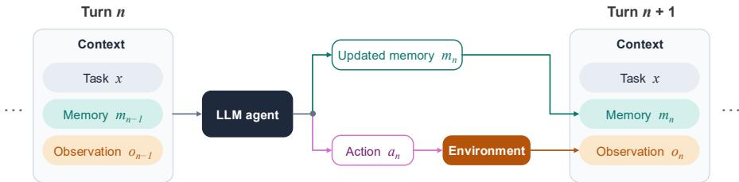
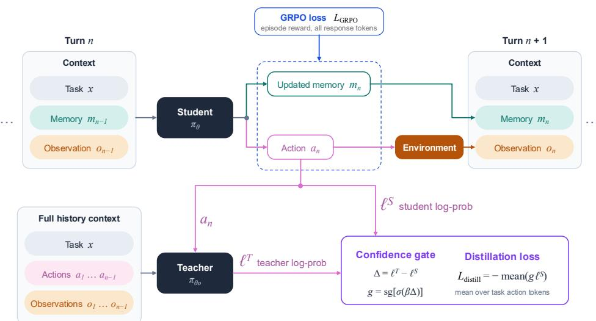
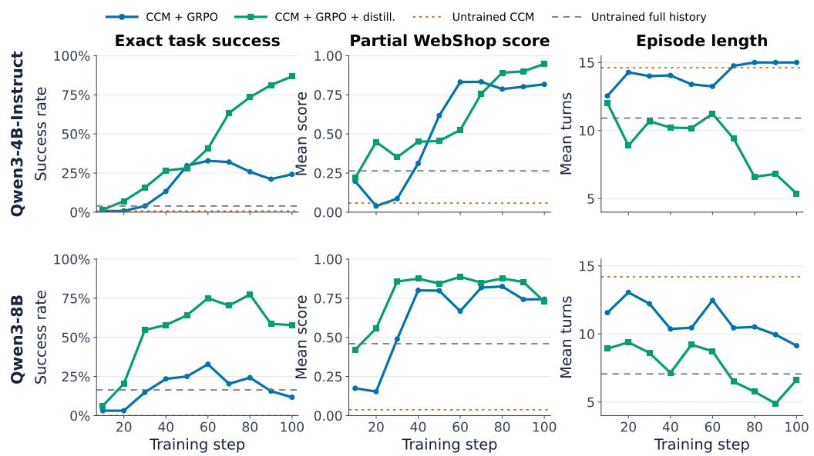
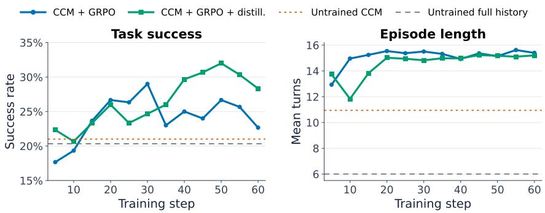
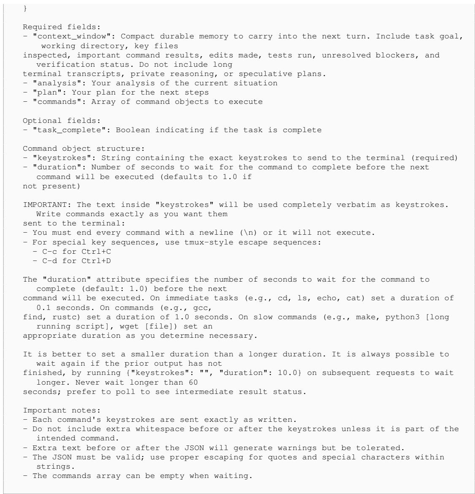
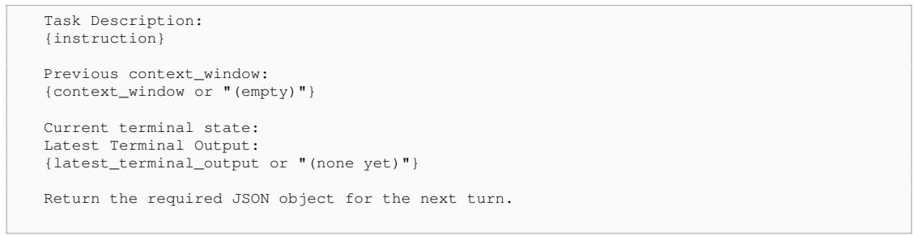

# CONTINUOUS CONTEXT MANAGEMENT

William Hoy University of Miami wjh58@miami.edu

Nurcin Celik University of Miami celik@miami.edu

Jingxuan Fan Harvard University jfan@g.harvard.edu

Xu Pan Harvard University xupan@fas.harvard.edu

## ABSTRACT

Long-horizon large language model (LLM) agents commonly retain their complete interaction history until compaction is triggered at a predefined threshold. We study Continuous Context Management (CCM), which performs compaction at every turn to prevent interaction history from accumulating in the active prompt. At each turn, a CCM agent emits an updated memory together with an environment action; its next prompt contains the original task, retained memory, and newest observation rather than the complete transcript. We first evaluate CCM without fine-tuning on TerminalBench-2 using Claude Sonnet 4.6, Claude Opus 4.6, GLM-5, and Kimi K3. CCM substantially reduces cumulative input usage and active-prompt size, although it lowers task success for most models while preserving performance for Kimi K3. We use GRPO with privileged full-history distillation to improve CCM in open-weight models. A frozen copy of the student’s initial model scores each sampled student action under the complete history reconstructed from that student’s rollout, providing dense action-token supervision without a separate teacher rollout or reference solution. On WebShop, this objective substantially improves CCM over GRPO at both evaluated model scales and surpasses full-history GRPO for Qwen3-4B-Instruct, though not for Qwen3-8B. On Endless Terminals, the augmented method provides a modest improvement over GRPO, with both CCM policies outperforming the untrained full-history baseline. These results demonstrate that CCM is a viable inference paradigm for agents operating with substantially reduced retained context and that its performance can be improved through reinforcement learning with privileged fullhistory distillation.

## 1 INTRODUCTION

Long-horizon language agents must preserve useful information across repeated interactions with their environments. A shopping agent may need to remember product attributes encountered several pages earlier, while a terminal agent may need to retain the outcome of a previous command. Keeping the complete interaction history makes this information directly accessible, but causes the active context to grow as the task proceeds. The accumulated history is bounded by the model’s context window, and model performance can degrade even within this limit as inputs grow longer (Liu et al., 2024; Du et al., 2025; Hong et al., 2025) or include irrelevant information (Shi et al., 2023).

A common solution is to compact the interaction history when the context reaches a predefined token threshold, replacing earlier content with a shorter summary (Wu et al., 2025; Li et al., 2026c). Repeated compaction allows a session to continue beyond the length of a single context window. However, the context still accumulates between compaction events and can occupy a large fraction of the available window before being compressed again. An ultimate form of this accumulatecompact paradigm is that memory management become part of every action step, with the agent continually updating the information it carries forward. We study this setting which we call Continuous Context Management (CCM), where the agent produces an updated memory alongside each action, its next context constructed from the updated memory and the newest observation. “Contin uous” refers to memory management at the finest step resolution, not its meaning in mathematics.

This is particularly useful when GPU memory is a major constraint, such as deploying LLMs locally on consumer-grade GPUs, where keeping the active context compact can reduce the token cache memory, allowing larger models to run within the same GPU memory budget.

We first evaluate CCM as an out-of-the-box inference paradigm on TerminalBench-2 using Claude Sonnet 4.6, Claude Opus 4.6, GLM-5, and Kimi K3. Across these models, CCM substantially reduces cumulative input usage and typical active-prompt size. Success declines for Sonnet, Opus, and GLM-5, but increases slightly for Kimi K3. The resulting monetary savings depend strongly on provider-specific prompt-caching policies and token prices: prefix caching can substantially reduce the cost of full-history prompting despite its greater token usage. These results demonstrate CCM’s potential to reduce context usage while revealing a performance gap for three of the four models, motivating our investigation of training methods for CCM agents.

Prior work has established the feasibility of learning such memory-management behaviors, such as MEM1, MemAgent, MEMENTO, and Compaction RL (Zhou et al., 2025; Yu et al., 2025; Kontonis et al., 2026; Li et al., 2026c). Building on these approaches, particularly the per-turn consolidation used in MEM1, we combine two training signals to train agents both to manage memories and to use them to generate actions. These two capabilities are closely coupled. An agent may preserve the relevant facts yet fail to use them when choosing an action; conversely, an effective action policy cannot reliably compensate for essential information omitted from its memory. Reinforcement learning can optimize both capabilities through task rewards, but episode-level outcomes provide limited guidance about individual task actions. To provide additional supervision for actions generated from compact memory, we use an additional distillation objective building on on-policy context distillation (Ye et al., 2026) and the gated self-distillation approach of SDAR (Lu et al., 2026), where the teacher sees the full interaction history as privileged information. The teacher is initialized with the same weights as the student before training and remains frozen throughout training. At each step, it receives the full history preceding the current action and scores the student-sampled action tokens autoregressively. A token-level teacher–student confidence-gap gate weights the policy gradient on action tokens. This procedure provides action-token supervision without a separately trained teacher, additional teacher rollout, or successful reference trajectory.

We evaluate this training recipe on WebShop and Endless Terminals, focusing on improving agent performance while using only a fraction of the prompt context required by full-history baselines. On WebShop, adding full-history distillation substantially improves task success over CCM trained with GRPO alone for both models. On Endless Terminals, both trained CCM policies outperform the untrained full-history baseline while maintaining compact model-written memories. Distillation provides a modest improvement over CCM + GRPO. Together, these results show that our training recipe improves CCM’s task performance while retaining its substantial savings in prompt length.

Our main contributions are:

• We study Continuous Context Management (CCM), in which agents update a compact memory at every action step. Our evaluation on TerminalBench-2 demonstrates substantial reductions in input-token usage without additional training, and characterizes the task performance and API-cost tradeoffs.

• We introduce a training recipe that combines GRPO with privileged full-history distillation. Experiments on WebShop and Endless Terminals show that training improves CCM’s task performance while substantially reducing context length.

## 2 RELATED WORKS

Context management for long-horizon agents. ReAct-style agents retain the full sequence of reasoning, actions, and observations in subsequent prompts (Yao et al., 2022b), so the context grows with the horizon and performance can degrade on long inputs (Du et al., 2025). Inference-time methods extend the horizon through external memory, periodic summarization, structured compression, and evolving context representations (Packer et al., 2023; Wu et al., 2025; Kang et al., 2025; Wan et al., 2025; Zhang et al., 2026a; Li et al., 2026a), and several works train models to generate summaries or decide when to compress (Lu et al., 2025; Li et al., 2026b; Zhang et al., 2026c; Yu et al., 2025; Kontonis et al., 2026). MEM1 (Zhou et al., 2025) is the closest in formulation to our method. At every turn the agent emits an internal state that consolidates its previous state with the newest observation, and earlier turns are pruned. MEM1 learns this behavior from outcome rewards with PPO, training on the concatenated trajectory with an attention mask that restricts each token to the context available when it was generated. Our study differs from MEM1 in several respects. First, we show that frontier models can use CCM out-of-box without additional training, substantially reducing context usage, although most evaluated models incur a drop in task performance. Second, rather than relying on outcome rewards alone to train the model to manage its state, we combine episode-level GRPO with a designed token-level distillation objective.

Reinforcement learning and on-policy distillation. Reinforcement learning methods such as GRPO provide trajectory-level supervision from environment or verifier rewards (Shao et al., 2024; Dong et al., 2025; Feng et al., 2025). On-policy distillation, including on-policy self-distillation, complements this feedback with dense token-level guidance from a stronger teacher or from the same policy conditioned on privileged information (Ye et al., 2026; Yang et al., 2026; MiMo Team, 2026; GLM-5 Team, 2026; Zhao et al., 2026; He et al., 2026; Zhang et al., 2026b). Lu et al. (2026) proposed Self-Distilled Agentic Reinforcement Learning (SDAR), which combines reinforcement learning and on-policy self-distillation using token-level gates based on student uncertainty or the teacher–student confidence gap. We adapt its confidence-gap gating to multi-turn CCM agents. For each sampled action token, we compare its probability under the current policy’s compact CCM context with its probability under a frozen copy of the student’s initial model, conditioned on the reconstructed full history. The teacher weights remain fixed throughout training. This provides an auxiliary action-token distillation signal without requiring a separately trained teacher, an additional teacher rollout, or a successful reference trajectory.

## 3 CONTINUOUS CONTEXT MANAGEMENT

## 3.1 METHOD DESCRIPTION

For a task $x ,$ let $o _ { 0 }$ denote the initial environment observation and $m _ { 0 }$ the initially empty memory. At turn $n \geq 1$ , a Continuous Context Management (CCM) agent receives observation $o _ { n - 1 }$ and retained memory $m _ { n - 1 }$ , and generates updated memory $m _ { n }$ and action $a _ { n }$ according to

$$
( m _ { n } , a _ { n } ) \sim \pi _ { \theta } ( \cdot \mid x , m _ { n - 1 } , o _ { n - 1 } ) ,\tag{1}
$$

The generated response consists of an updated memory followed by an environment action, $y _ { n } =$ $[ m _ { n } ; a _ { n } ]$ . Executing $a _ { n }$ produces the next observation $o _ { n }$ . The agent then constructs the prompt for turn $n + 1$ from $x , m _ { n } ,$ , and $o _ { n } .$ . Previous responses and observations are not included directly. Information from earlier turns therefore remains available only if the agent decides to preserve it in $m _ { n }$

  
Figure 1: Continuous Context Management. At each turn, the agent receives the original task, its memory from the preceding turn, and the current observation. It emits an updated memory followed by an environment action. The next prompt is constructed from the updated memory and newest observation rather than the complete interaction transcript.

## 3.2 TERMINALBENCH-2 RESULTS

Terminal-Bench 2.0 (Merrill et al., 2026) contains 89 challenging, human-curated tasks that require agents to complete realistic workflows through terminal interaction. We evaluate CCM on all 89 tasks using Claude Sonnet 4.6, Claude Opus 4.6, GLM-5, and Kimi K3. For each model, we compare CCM against a standard full-history baseline using pass@1.

Table 1: Terminal-Bench 2.0 pass@1 results over 89 tasks. Costs are estimated means per task and include prompt caching where available; prompt caching was unavailable for GLM-5 through Amazon Bedrock.
<table><tr><td></td><td></td><td></td><td colspan="2">Peak prompt tokens</td><td></td><td></td></tr><tr><td>Model</td><td>Mode</td><td>Success, n (%)</td><td>Median</td><td>Maximum</td><td>Maximum retained memory</td><td>Estimated cost per task</td></tr><tr><td>Claude Sonnet 4.6</td><td>Baseline</td><td>38 (42.7)</td><td>16,673</td><td>131,157</td><td></td><td>$0.468</td></tr><tr><td></td><td>CCM</td><td>28 (31.5)</td><td>3,568</td><td>50,614</td><td>1,219</td><td>$0.472</td></tr><tr><td>Claude Opus 4.6</td><td>Baseline</td><td>52 (58.4)</td><td>15,405</td><td>103,512</td><td></td><td>$0.831</td></tr><tr><td></td><td>CCM</td><td>36 (40.4)</td><td>4,280</td><td>51,457</td><td>1,403</td><td>$1.087</td></tr><tr><td>GLM-5</td><td>Baseline</td><td>31 (34.8)</td><td>17,560</td><td>116,407</td><td></td><td>$0.515</td></tr><tr><td></td><td>CCM</td><td>26 (29.2)</td><td>4,279</td><td>47,287</td><td>561</td><td>$0.124</td></tr><tr><td>Kimi K3</td><td>Baseline</td><td>56 (62.9)</td><td>9,472</td><td>74,313</td><td></td><td>$0.302</td></tr><tr><td></td><td>CCM</td><td>57 (64.0)</td><td>3,243</td><td>27,645</td><td>1,058</td><td>$0.622</td></tr></table>

Table 1 reports task success, token usage, and estimated API cost per task; Table 5 additionally reports interaction length and detailed token accounting. Cost estimates for Claude Sonnet 4.6, Claude Opus 4.6, and Kimi K3 account for provider-side prompt caching. GLM-5 is reported without prompt caching because Amazon Bedrock does not support it for this model. Inference and token-accounting configurations are provided in Appendix A.

As shown in Table 1, CCM substantially reduces peak prompt size across all four models. Median episode-level peaks decrease from 9,472–17,560 tokens under full-history prompting to 3,243–4,280 tokens under CCM. The largest retained CCM memories contain only 561–1,403 tokens. Maximum CCM prompts can nevertheless be considerably larger because each prompt also includes the newest terminal observation, which may contain up to 60,000 characters. CCM limits accumulated interaction history but does not compress the current observation.

CCM also reduces mean cumulative input tokens per task by 83.1% for Claude Sonnet 4.6, 81.5% for Claude Opus 4.6, 84.3% for GLM-5, and 75.8% for Kimi K3. This compression is accompanied by lower pass@1 success for Sonnet, Opus, and GLM-5, with decreases of 11.2, 18.0, and 5.6 percentage points, respectively. In contrast, Kimi K3 improves slightly under CCM, from 62.9% to 64.0%.

The monetary effect depends strongly on provider-side prompt caching. For Sonnet, the two methods have nearly identical estimated costs: \$0.468 per task for full-history prompting and \$0.472 for CCM. For Opus and Kimi, caching makes full-history prompting less expensive despite its substantially greater cumulative input usage: \$0.831 versus \$1.087 for Opus and \$0.302 versus \$0.622 for Kimi. Because our GLM-5 endpoint does not support prompt caching, its input reduction lowers estimated cost from \$0.515 to \$0.124 per task. Overall, CCM consistently reduces peak and cumulative context usage, but its effects on task success and monetary cost depend on the model and the provider’s caching and pricing policies.

## 4 IMPROVING CONTINUOUS CONTEXT MANAGEMENT VIA REINFORCEMENT LEARNING

## 4.1 GRPO WITH SELF-DISTILLATION

We improve the CCM policy by combining GRPO and a distillation-based objective. We refer to the CCM policy defined in Section 3 as the student, and denote its response at turn n by $y _ { n } ^ { S } : = y _ { n } =$ $[ m _ { n } ; a _ { n } ]$ . The student rollouts follow the CCM interaction process illustrated in Figure 1. GRPO optimizes all valid tokens in the student response, including memory and action tokens (details in Appendix B).

Beyond GRPO, we also use a distillation-based objective. The teacher policy is a frozen copy of the student model before training. Its weights remain fixed throughout training, while the student is updated. At each turn, the teacher uses the full environment history to provide action-token supervision for the student acting from compact memory.

Concretely, we reconstruct the student’s environment history before the current action $a _ { n }$ as privileged information, $h _ { n } ^ { S } = \left( o _ { 0 } , a _ { 1 } , o _ { 1 } , \ldots , a _ { n - 1 } , o _ { n - 1 } \right)$ , where $o _ { 0 }$ is the initial observation. This history includes only prior actions and observations, excluding the current action $a _ { n } .$ For token position t within the current action ${ { a } _ { n } } ,$ the student is conditioned on $s _ { n , t } ^ { C } = P _ { C } \left( x , m _ { n - 1 } , o _ { n - 1 } , m _ { n } , a _ { n , < t } \right)$ where $P _ { C }$ is the CCM prompt renderer, $m _ { n }$ has already been generated as the first part of the current response, and $a _ { n , < t }$ denotes the preceding action-token prefix. The privileged teacher is conditioned on $s _ { n , t } ^ { + } = P _ { F } \bigl ( x , h _ { n } ^ { S } , a _ { n , < t } \bigr )$ , where $P _ { F }$ is the full-history prompt renderer. When scoring $\boldsymbol { a } _ { n , t }$ , the teacher receives only $h _ { n } ^ { S }$ and the preceding action-token prefix $a _ { n , < t }$ in addition to the task x; neither the target token nor subsequent action tokens are included in its conditioning context. The student and teacher score the same sampled action token from the same trajectory. The student uses its current weights and compact memory, whereas the teacher uses fixed initial weights and the complete pre-action environment history.

  
Figure 2: Training CCM agents with GRPO and full-history self-distillation. Top: the student $\pi _ { \theta }$ rolls out under CCM. GRPO with episode task reward optimizes all response tokens, both memory and action. Bottom: the teacher $\pi _ { \theta _ { 0 } }$ is a copy of the student’s initial model, with weights held fixed throughout training. It receives the pre-action environment history reconstructed from the student’s rollout and scores the student-sampled action autoregressively. For each action token, the teacher log-probability ℓ<sup>T</sup> and the student log-probability $\ell ^ { T }$ $\ell ^ { S ^ { \dagger } }$ give the confidence gap $\Delta$ . The gap sets the gate $^ { g , }$ , which weights the distillation loss ${ \mathcal { L } } _ { \mathrm { d i s t i l l } } \dot { = } - \mathrm { m e a n } ( g \ell ^ { S } )$ over valid action tokens only. The total training loss is composed of the GRPO loss and distillation loss.

For a student sampled action token $a _ { n , t } .$ , we define the teacher student confidence gap as

$$
\Delta _ { n , t } = \mathrm { s t o p g r a d } \left[ \log \pi _ { \theta _ { 0 } } { \left( a _ { n , t } \mid s _ { n , t } ^ { + } \right) } - \log \pi _ { \theta } { \left( a _ { n , t } \mid s _ { n , t } ^ { C } \right) } \right] ,\tag{2}
$$

where $\theta _ { 0 }$ denotes the student’s initial parameters before any training updates. The teacher $\pi _ { \theta _ { 0 } }$ remains frozen throughout training and is never refreshed from the updated student. The operator stopgrad[·] treats its argument as constant during backpropagation.

Following the gap-gating formulation of SDAR (Lu et al., 2026), we convert the confidence gap into a token-level gate, g<sub>n,t</sub> = stopgrad $\left[ \sigma ( \beta \Delta _ { n , t } ) \right]$ , where σ is the logistic sigmoid and $\beta > 0$ controls gate sharpness. Tokens receiving greater confidence from the privileged teacher have $\Delta _ { n , t } > 0$ and receive larger gating weights. Tokens already receiving greater confidence from the student have $\Delta _ { n , t } < 0$ and are attenuated, but retain a small positive weight.

Let $M _ { i , n , t } \in \{ 0 , 1 \}$ indicate that token t belongs to a valid action block at turn n of rollout i and has valid student and teacher scores. The distillation loss is averaged over all eligible action tokens:

$$
{ \cal L } _ { \mathrm { d i s t i l l } } = - \sum _ { i , n , t } M _ { i , n , t } g _ { i , n , t } \log \pi _ { \theta } \big ( a _ { i , n , t } \mid s _ { i , n , t } ^ { C } \big ) \big / \sum _ { i , n , t } M _ { i , n , t } .\tag{3}
$$

The distillation loss applies to all valid student-generated action tokens (task actions only, unlike GRPO which is on both memory and task actions). It weights each token’s gradient according to the teacher–student log-probability gap. When the full-history teacher assigns a token higher probability than the compact-context student, the token receives a larger change of gating weight, encouraging the student to reproduce the token supported by the additional context. Negative-gap tokens receive smaller gating weights, scaling down the magnitude of gradients. In Appendix C, we show at fixed contexts under on-policy sampling, the expected update is equivalent to using a bounded, centered sigmoid transformation of OPD’s signed log-probability gap, recovering a scaled OPD gradient locally for small gaps.

The combined training loss is $L _ { \mathrm { t o t a l } } = L _ { \mathrm { G R P O } } + \lambda _ { \mathrm { d i s t i l l } } L _ { \mathrm { d i s t i l l } }$ . We set $\lambda _ { \mathrm { d i s t i l l } } = 0 . 0 1$ and $\beta = 5$ Other training config details are shown in Appendix E.

## 4.2 WEBSHOP RESULTS

WebShop (Yao et al., 2022a) is a simulated shopping benchmark that tests an agent’s ability to navigate webpages, select product options, and complete purchases. Figure 3 compares CCM + GRPO with CCM + GRPO + distillation across training checkpoints for Qwen3-4B-Instruct and Qwen3-8B. The untrained CCM and full-history conditions provide fixed reference points. Table 2 additionally reports full-history GRPO and summarizes task performance, memory behavior, and prompt size at each trained method’s best observed checkpoint.

  
Figure 3: WebShop checkpoint evaluation for Qwen3-4B-Instruct (top) and Qwen3-8B (bottom) on a fixed 128-task pass@1 evaluation with temperature 0.4, seed 42, and a 15-turn limit. Columns report exact task success, partial WebShop score, and mean episode length. Solid curves show CCM + GRPO and CCM + GRPO + distillation across checkpoints 10–100. Dashed lines indicate the corresponding untrained CCM and full-history performance.

At step 100, adding privileged distillation substantially improves CCM over CCM + GRPO at both model scales. For Qwen3-4B-Instruct, adding privileged distillation improves exact success by 62.50 percentage points, from 24.22% to 86.72%, while partial score increases from 0.817 to 0.948. The distillation-augmented CCM policy also exceeds full-history GRPO, which achieves 75.78% exact success and a partial score of 0.839. It completes tasks in 5.36 turns on average, compared with 5.85 turns for full-history GRPO and 15.00 turns for CCM + GRPO.

Table 2: Best observed task success and context behavior on the fixed 128-task WebShop evaluation. Prompts are truncated at the 4,096-token model-input limit.
<table><tr><td rowspan="2">Condition</td><td colspan="2">Best performance</td><td colspan="2">Memory behavior</td><td colspan="2">Memory size</td><td colspan="2">Peak prompt tokens</td></tr><tr><td>Exact success (%)</td><td>Step</td><td>Update rate (%)</td><td>Prefix retention (%)</td><td></td><td>Mean Maximum</td><td>Median</td><td>Maximum</td></tr><tr><td>Qwen3-4B-Instruct</td><td></td><td></td><td></td><td></td><td></td><td></td><td></td><td></td></tr><tr><td>Untrained full history</td><td>3.91</td><td>一</td><td></td><td>一</td><td></td><td></td><td>4,096</td><td>4,096</td></tr><tr><td>Full-history GRPO</td><td>81.25</td><td>70</td><td></td><td></td><td></td><td></td><td>1,721</td><td>3,076</td></tr><tr><td>Untrained CCM</td><td>0.78</td><td>一</td><td>57.6</td><td>69.6</td><td>225.7</td><td>861</td><td>1,232</td><td>1,908</td></tr><tr><td>CCM + GRPO</td><td>32.81</td><td>60</td><td>12.9</td><td>98.5</td><td>95.6</td><td>147</td><td>1,045</td><td>1,327</td></tr><tr><td>CCM + GRPO + distillation</td><td>86.72</td><td>100</td><td>100.0</td><td>77.2</td><td>60.1</td><td>89</td><td>1,041</td><td>1,279</td></tr><tr><td>Qwen3-8B</td><td></td><td></td><td></td><td></td><td></td><td></td><td></td><td></td></tr><tr><td>Üntrained full history</td><td>16.41</td><td></td><td></td><td></td><td></td><td></td><td>2,258</td><td>4,096</td></tr><tr><td>Full-history GRPO</td><td>82.81</td><td>70</td><td></td><td></td><td></td><td></td><td>1,738</td><td>4,096</td></tr><tr><td>Untrained CCM</td><td>0.00</td><td>一</td><td>15.0</td><td>96.7</td><td>511.8</td><td>1,013</td><td>1,582</td><td>2,127</td></tr><tr><td>CCM + GRPO</td><td>32.81</td><td>60</td><td>9.1</td><td>99.4</td><td>510.6</td><td>994</td><td>1,200</td><td>1,954</td></tr><tr><td>CCM + GRPO + distillation</td><td>77.34</td><td>80</td><td>96.9</td><td>82.3</td><td>185.3</td><td>421</td><td>1,149</td><td>1,435</td></tr></table>

For Qwen3-8B at step 100, adding privileged distillation improves exact success by 46.09 percentage points over CCM + GRPO, from 11.72% to 57.81%. Its partial score is slightly lower, at 0.728 versus 0.744. Full-history GRPO remains the strongest condition for this model, reaching 80.47% exact success and a partial score of 0.907. Mean episode length is 6.63 turns for CCM + GRPO + distillation, 9.13 turns for CCM + GRPO, and 5.55 turns for full-history GRPO.

Condensed matched trajectories are reported in Appendix F.1. In the selected task, the untrained policies fail during search or navigation, while CCM + GRPO reaches the correct product but repeatedly selects an already chosen option. CCM + GRPO + distillation instead follows the required product–color–size–purchase sequence.

Table 2 reports memory-update behavior and prefix reuse at each trained method’s best observed checkpoint. The CCM + GRPO policies modify their memories infrequently. Qwen3-4B-Instruct and Qwen3-8B have memory-update rates of 12.9% and 9.1%, while retaining nearly their entire preceding memory prefixes. Adding distillation produces more active memory management. Qwen3-4B-Instruct changes its memory on every consecutive turn while retaining 77.2% of the preceding prefix; Qwen3-8B changes it on 96.9% of turns while retaining 82.3%. The distillation objective is intended to improve memory use rather than memory management directly. However, improve memory use helps the GRPO to be more effective, consequently improves both memory action and task action.

Relative to CCM + GRPO, adding privileged distillation reduces cumulative input from 10,636 to 3,720 tokens for Qwen3-4B-Instruct and from 9,929 to 5,578 tokens for Qwen3-8B, reductions of 65.0% and 43.8%. These differences partly reflect earlier task completion rather than context compression alone. CCM also does not automatically reduce total input, that the untrained Qwen3- 8B CCM policy takes more turns than its full-history counterpart and consequently processes more tokens.

## 4.3 ENDLESS TERMINALS RESULTS

We also compare CCM + GRPO against CCM + GRPO + distillation on the Endless Terminals (Gandhi et al., 2026) using Qwen3-8B, where agents execute terminal commands to manage files, process data, analyze logs, write scripts, and operate databases. The Figure 4 reports task success and mean episode length. Dashed lines show the untrained CCM and full-history policies under the same evaluation protocol.

The untrained full-history and CCM policies perform similarly, solving 20.33% and 21.00% of tasks, respectively. This difference corresponds to only two tasks out of 300. The two conditions solve 43 tasks in common, while 18 are solved only with full history and 20 only with CCM. One possible explanation for such a small gap in contrast with the other benchmarks is that Endless Terminals externalizes part of the relevant state in its persistent sandbox as files, and shell state survive across turns, allowing omitted information from the context to be recovered through additional inspection commands.

  
Figure 4: Endless Terminals checkpoint evaluation for Qwen3-8B on the fixed 300-task test set with a 16-turn limit. Curves report task success (left) and mean episode length (right) for CCM + GRPO and CCM + GRPO + distillation. Dashed lines indicate the corresponding untrained CCM and fullhistory policies.

Table 3: Best observed task success and memory behavior through training step 60 on the fixed 300- task Endless Terminals evaluation with Qwen3-8B. For each trained method, we report the evaluated checkpoint with the highest success, breaking ties in favor of the earlier checkpoint.
<table><tr><td></td><td colspan="2">Best performance</td><td colspan="2">Memory behavior</td><td colspan="2">Memory size (tokens)</td></tr><tr><td>Condition</td><td>Success (%)</td><td>Step</td><td>Update rate (%)</td><td>Prefix retention (%)</td><td>Mean</td><td>Maximum</td></tr><tr><td>Untrained full history</td><td>20.33</td><td></td><td></td><td></td><td></td><td></td></tr><tr><td>Full-history GRPO</td><td>35.33</td><td>30</td><td></td><td></td><td></td><td></td></tr><tr><td>Untrained CCM</td><td>21.00</td><td>一</td><td>34.8</td><td>81.2</td><td>63.9</td><td>346</td></tr><tr><td>CCM + GRPO</td><td>29.00</td><td>30</td><td>16.9</td><td>94.6</td><td>77.1</td><td>720</td></tr><tr><td>CCM + GRPO + distillation</td><td>32.00</td><td>50</td><td>36.9</td><td>72.9</td><td>144.0</td><td>906</td></tr></table>

The best observed success is 3.00 percentage points higher with CCM + GRPO + distillation: 32.00% at step 50, compared with 29.00% at step 30 for CCM + GRPO. At step 60, the two methods achieve 22.67% and 28.33%, respectively. Both selected CCM policies use nearly the full 16-turn allowance. Full-history GRPO achieves the strongest performance, reaching 35.33% at step 30. Although both trained CCM methods outperform the untrained full-history and CCM policies, neither matches full-history GRPO. Examples of condensed matched trajectories appear in Appendix F.2. We report one task solved only by CCM + GRPO + distillation among the two trained CCM policies and one solved only by CCM + GRPO.

Table 3 reports task success and memory behavior through training. CCM + GRPO + distillation updates its memory more frequently than CCM + GRPO, at 36.9% versus 16.9% of consecutive turns, and preserves a smaller prefix of the preceding memory, at 72.9% versus 94.6%. The distillationaugmented policy also maintains a larger memory, with a mean of 144.0 tokens and a maximum of 906 tokens, compared with a mean of 77.1 tokens and a maximum of 720 tokens for CCM + GRPO. We omit peak-prompt statistics because the terminal observation can itself be very large in this benchmark, we set a cut off limit of the context length for all the conditions, and every condition hits this limit at least in one episode. Because CCM manages retained interaction history but does not compress the newest observation, these prompt-size statistics do not cleanly measure the amount of memory retained by the agent, but dominated by long observations and our hard cut-off limit on its length.

Table 4: General-capability retention after agent post-training. Values are mean percentage scores over three decoding seeds, with sample standard deviations. Parentheses report absolute percentagepoint changes from the corresponding pretrained base model, computed before rounding.
<table><tr><td>Method</td><td>MMLU-Pro</td><td>HellaSwag</td><td>IFEval strict</td></tr><tr><td colspan="4">WebShop, Qwen3-4B-Instruct</td></tr><tr><td>Pretrained base</td><td> $6 5 . 2 5 \pm 0 . 6 6$ </td><td> $8 0 . 1 4 \pm 0 . 0 7$ </td><td> $8 3 . 3 0 \pm 0 . 5 6$ </td></tr><tr><td>Full-history GRPO</td><td> $6 2 . 4 8 \pm 0 . 4 9 \ ( - 2 . 7 7 )$ </td><td> $6 7 . 9 2 \pm 0 . 4 2 ( - 1 2 . 2 2 )$ </td><td> $8 0 . 3 5 \pm 0 . 6 5 \ ( - 2 . 9 6 )$ </td></tr><tr><td> $\mathbf { C C M } + \mathbf { G } \mathbf { \dot { R } P O }$ </td><td> $5 5 . 1 6 \pm 0 . 6 0 ( - 1 0 . 0 9 )$ </td><td> $6 6 . 6 8 \pm 0 . 7 1 \ \dot { ( - 1 3 . 4 6 ) }$ </td><td> $8 2 . 3 2 \pm 0 . 4 7 \ ( - 0 . 9 9 )$ </td></tr><tr><td> $\mathbf { C C M } + \mathbf { G R P O } + \mathbf { d i s t i l l a t i o n }$ </td><td> $6 4 . 2 3 \pm 0 . 2 5 \ : \left( - 1 . 0 3 \right)$ </td><td> $7 4 . 5 3 \pm 0 . 2 0 \ ( - 5 . 6 2 )$ </td><td> $8 3 . 1 8 \pm 0 . 4 9 \ ( - 0 . 1 2 )$ </td></tr><tr><td colspan="4">WebShop, Qwen3-8B</td></tr><tr><td>Pretrained base</td><td> $5 6 . 8 8 \pm 0 . 6 5$ </td><td> $7 9 . 5 4 \pm 0 . 3 9$ </td><td> $8 1 . 9 5 \pm 1 . 2 3$ </td></tr><tr><td>Full-history GRPO</td><td> $5 4 . 2 8 \pm 1 . 0 0 \ ( - 2 . 6 0 )$ </td><td> $7 6 . 6 8 \pm 0 . 8 0 \ ( - 2 . 8 6 )$ </td><td> $7 9 . 4 8 \pm 1 . 4 0 \ ( - 2 . 4 6 )$ </td></tr><tr><td> $\mathbf { C C M } + \mathbf { G } \mathbf { \dot { R } P O }$ </td><td> $5 8 . 2 5 \pm 0 . 4 0 \ \dot { ( + 1 . 3 7 ) }$ </td><td> $7 3 . 9 4 \pm 0 . 4 4 \stackrel { . } { \left( - 5 . 6 0 \right) }$ </td><td> $8 1 . 3 3 \pm 0 . 6 7 \ ( - 0 . 6 2 )$ </td></tr><tr><td> $\mathbf { C C M } + \mathbf { G R P O } + \mathbf { d i s t i l l a t i o n }$ </td><td> $5 6 . 9 5 \pm 0 . 2 5 \ ( + 0 . 0 7 )$ </td><td> $7 6 . 7 1 \pm 0 . 1 7 \ : \dot { ( - 2 . 8 3 ) }$ </td><td> $8 1 . 5 8 \pm 1 . 1 7 \ ( - 0 . 3 7 )$ </td></tr><tr><td colspan="4"> $E n d l e s s ~ T e r m i n a l s , \ Q w e n 3 - 8 B$ </td></tr><tr><td>Pretrained base</td><td> $5 6 . 8 8 \pm 0 . 6 5$ </td><td> $7 9 . 5 4 \pm 0 . 3 9$ </td><td> $8 1 . 9 5 \pm 1 . 2 3$ </td></tr><tr><td>Full-history GRPO</td><td> $5 8 . 6 3 \pm 0 . 8 0 \ ( + 1 . 7 4 )$ </td><td> $7 9 . 3 1 \pm 0 . 4 2 \ : ( - 0 . 2 3 )$ </td><td> $8 2 . 4 4 \pm 0 . 6 7 \ ( + 0 . 4 9 )$ </td></tr><tr><td> $\mathbf { C C M } + \mathbf { G } \mathbf { \dot { R } P O }$ </td><td> $6 0 . 6 1 \pm 0 . 9 2 \ ( + 3 . 7 3 )$ </td><td> $7 7 . 3 8 \pm 0 . 1 2 \ ( - 2 . 1 6 )$ </td><td> $8 2 . 4 4 \pm 1 . 3 3 \ ( + 0 . 4 9 )$ </td></tr><tr><td> $\mathbf { C C M } + \mathbf { G R P O } + \mathbf { d i s t i l l a t i o n }$ </td><td> $6 1 . 7 5 \pm 0 . 3 7 \ ( + 4 . 8 7 )$ </td><td> $7 8 . 4 8 \pm 0 . 7 9 \ ( - 1 . 0 6 )$ </td><td> $8 2 . 3 8 \pm 0 . 5 6 \ ( + 0 . 4 3 )$ </td></tr></table>

## 4.4 GENERAL-CAPABILITY RETENTION

Prior work shows that on-policy distillation can improve task performance while mitigating forgetting of existing capabilities (Shenfeld et al., 2026; Ye et al., 2026). We investigate whether privileged full-history distillation provides a similar benefit beyond GRPO alone during agent training under CCM. To measure retention, we evaluate the pretrained base models and checkpoint-100/60 (Web-Shop/Endless Terminal) policies on MMLU-Pro, HellaSwag, and IFEval. Table 4 reports mean scores over three decoding seeds.

On WebShop with Qwen3-4B-Instruct, privileged distillation substantially reduces the degradation associated with CCM + GRPO. Relative to the pretrained model, the distillation-augmented policy changes by −1.03, −5.62, and −0.12 percentage points on MMLU-Pro, HellaSwag, and IFEval. For WebShop with Qwen3-8B, the differences between methods are smaller. Distillation improves HellaSwag and IFEval retention relative to CCM + GRPO, while CCM + GRPO obtains the highest MMLU-Pro score.

On Endless Terminals, all three post-trained policies improve over the pretrained model on MMLU-Pro and remain close to it on IFEval. CCM + GRPO + distillation obtains the highest MMLU-Pro score and retains more HellaSwag performance than CCM + GRPO, while full-history GRPO remains closest to the pretrained HellaSwag score. Overall, privileged distillation provides the clearest retention benefit for the 4B WebShop model. Its effect is not uniform across model scales, training environments, or evaluation tasks.

## 5 DISCUSSION AND CONCLUSION

CCM demonstrates that agents can operate with compact, continually updated memory, substantially reducing retained context. Privileged full-history distillation improves task accuracy while mitigating forgetting of general capabilities, with the clearest joint benefit on WebShop with Qwen3- 4B-Instruct. This approach is particularly relevant when model weights and the KV cache compete for limited GPU memory, such as local agents running on consumer GPUs or servers supporting many concurrent agent sessions. Smaller active contexts could accommodate larger models or more simultaneous tasks within the same memory budget. However, the benefits vary across models and environments, and shorter prompts do not necessarily translate into lower API costs, which depend on the prefix caching and pricing policy.

## AI USE STATEMENT

Generative AI tools assisted with manuscript wording, LaTeX formatting, and checks of bibliographic metadata against primary sources.

## ETHICS STATEMENT

This work studies context management for agents that act in shopping and terminal environments. Errors or omissions in retained memory can affect later actions, and retained memory may contain sensitive information from observations. Applications beyond these benchmarks should therefore use appropriate access controls, data-handling safeguards, and human oversight for consequential actions. The reported benchmark results do not establish that CCM agents are safe or reliable for unrestricted deployment.

## REPRODUCIBILITY STATEMENT

Section 3 defines the CCM interaction protocol, and Section 4 describes the training objective. Appendix A provides the Terminal-Bench 2.0 inference settings, prompt templates, and token accounting. Appendices B and C specify the optimization settings and distillation objective. Appendix E documents the training and evaluation splits, rewards, decoding settings, rollout limits, model variants, and training framework; Appendix E.5 provides the CCM prompt templates. These details support reproduction of the reported protocol, although results obtained through hosted model APIs may vary with provider updates.

## REFERENCES

Guanting Dong, Hangyu Mao, Kai Ma, Licheng Bao, Yifei Chen, Zhongyuan Wang, Zhongxia Chen, Jiazhen Du, Huiyang Wang, Fuzheng Zhang, Guorui Zhou, Yutao Zhu, Ji-Rong Wen, and Zhicheng Dou. Agentic reinforced policy optimization, 2025. URL https://arxiv.org/ abs/2507.19849.

Yufeng Du, Minyang Tian, Srikanth Ronanki, Subendhu Rongali, Sravan Bodapati, Aram Galstyan, Azton Wells, Roy Schwartz, Eliu A Huerta, and Hao Peng. Context length alone hurts llm performance despite perfect retrieval. arXiv preprint arXiv:2510.05381, 2025.

Lang Feng, Zhenghai Xue, Tingcong Liu, and Bo An. Group-in-group policy optimization for LLM agent training, 2025. URL https://arxiv.org/abs/2505.10978.

Kanishk Gandhi, Shivam Garg, Noah D. Goodman, and Dimitris Papailiopoulos. Endless terminals: Scaling RL environments for terminal agents. arXiv preprint arXiv:2601.16443, 2026. URL https://arxiv.org/abs/2601.16443.

GLM-5 Team. GLM-5: From vibe coding to agentic engineering, 2026. URL https://arxiv. org/abs/2602.15763.

Yinghui He, Simran Kaur, Adithya Bhaskar, Yongjin Yang, Jiarui Liu, Narutatsu Ri, Liam Fowl, Abhishek Panigrahi, Danqi Chen, and Sanjeev Arora. Self-distillation zero: Self-revision turns binary rewards into dense supervision, 2026. URL https://arxiv.org/abs/2604.12002.

Kelly Hong, Anton Troynikov, and Jeff Huber. Context rot: How increasing input tokens impacts LLM performance. Technical report, Chroma, July 2025. URL https://trychroma.com/ research/context-rot.

Minki Kang, Wei-Ning Chen, Dongge Han, Huseyin A. Inan, Lukas Wutschitz, Yanzhi Chen, Robert Sim, and Saravan Rajmohan. ACON: Optimizing context compression for long-horizon LLM agents, 2025. URL https://arxiv.org/abs/2510.00615.

Vasilis Kontonis, Yuchen Zeng, Shivam Garg, Lingjiao Chen, Hao Tang, Ziyan Wang, Ahmed Awadallah, Eric Horvitz, John Langford, and Dimitris Papailiopoulos. MEMENTO: Teaching LLMs to manage their own context, 2026. URL https://arxiv.org/abs/2604.09852.

Tianjian Li, Jingyu Zhang, William Jurayj, Xi Wang, Chuanyang Jin, Mehrdad Farajtabar, Eric Nalisnick, and Daniel Khashabi. Self-compacting language model agents, 2026a. URL https: //arxiv.org/abs/2606.23525.

Xiaochuan Li, Ryan Ming, Meng Chu, Shuai Shao, Rong Jin, and Chenyan Xiong. ACM: Agentic context management for long horizon tasks, 2026b. URL https://arxiv.org/abs/ 2607.23809.

Yujiang Li, Zhenyu Hou, Yi Jing, Jie Tang, and Yuxiao Dong. CompactionRL: Reinforcement learning with context compaction for long-horizon agents, 2026c. URL https://arxiv. org/abs/2607.05378.

Nelson F. Liu, Kevin Lin, John Hewitt, Ashwin Paranjape, Michele Bevilacqua, Fabio Petroni, and Percy Liang. Lost in the middle: How language models use long contexts. Transactions of the Associationfor Computational Linguistics, 12:157–173, 2024. doi: 10.1162/tacl\_a\_00638. URL https://aclanthology.org/2024.tacl-1.9/.

Miao Lu, Weiwei Sun, Weihua Du, Zhan Ling, Xuesong Yao, Kang Liu, and Jiecao Chen. Scaling LLM multi-turn RL with end-to-end summarization-based context management, 2025. URL https://arxiv.org/abs/2510.06727.

Zhengxi Lu, Zhiyuan Yao, Zhuowen Han, Zi-Han Wang, Jinyang Wu, Qi Gu, Xunliang Cai, Weiming Lu, Jun Xiao, Yueting Zhuang, and Yongliang Shen. Self-distilled agentic reinforcement learning, 2026. URL https://arxiv.org/abs/2605.15155.

Mike Merrill, Alexander Shaw, Nicholas Carlini, Boxuan Li, Harsh Raj, Ivan Bercovich, Lin Shi, Jeong Shin, Thomas Walshe, E Kelly Buchanan, et al. Terminal-bench: Benchmarking agents on hard, realistic tasks in command line interfaces. In International Conference on Learning Representations, volume 2026, pp. 40903–40986, 2026.

MiMo Team. MiMo-V2-Flash technical report, 2026. URL https://arxiv.org/abs/2601. 02780.

Charles Packer, Sarah Wooders, Kevin Lin, Vivian Fang, Shishir G. Patil, Ion Stoica, and Joseph E. Gonzalez. MemGPT: Towards LLMs as operating systems, 2023. URL https://arxiv. org/abs/2310.08560.

Zhihong Shao, Peiyi Wang, Qihao Zhu, Runxin Xu, Junxiao Song, Xiao Bi, Haowei Zhang, Mingchuan Zhang, Y. K. Li, Yang Wu, et al. DeepSeekMath: Pushing the limits of mathematical reasoning in open language models, 2024. URL https://arxiv.org/abs/2402.03300.

Idan Shenfeld, Mehul Damani, Jonas Hübotter, and Pulkit Agrawal. Self-distillation enables continual learning, 2026. URL https://arxiv.org/abs/2601.19897.

Freda Shi, Xinyun Chen, Kanishka Misra, Nathan Scales, David Dohan, Ed H. Chi, Nathanael Schärli, and Denny Zhou. Large language models can be easily distracted by irrelevant context. In Proceedings of the 40th International Conference on Machine Learning, volume 202 of Proceedings ofMachine Learning Research, pp. 31210–31227. PMLR, 2023. URL https: //proceedings.mlr.press/v202/shi23a.html.

Guangya Wan, Mingyang Ling, Xiaoqi Ren, Rujun Han, Sheng Li, and Zizhao Zhang. COMPASS: Enhancing agent long-horizon reasoning with evolving context, 2025. URL https://arxiv. org/abs/2510.08790.

Xixi Wu, Kuan Li, Yida Zhao, Liwen Zhang, Litu Ou, Huifeng Yin, Zhongwang Zhang, Xinmiao Yu, Dingchu Zhang, Yong Jiang, Pengjun Xie, Fei Huang, Minhao Cheng, Shuai Wang, Hong Cheng, and Jingren Zhou. ReSum: Unlocking long-horizon search intelligence via context summarization, 2025. URL https://arxiv.org/abs/2509.13313.

Wenkai Yang, Weijie Liu, Ruobing Xie, Kai Yang, Saiyong Yang, and Yankai Lin. Learning beyond teacher: Generalized on-policy distillation with reward extrapolation, 2026. URL https:// arxiv.org/abs/2602.12125.

Shunyu Yao, Howard Chen, John Yang, and Karthik Narasimhan. WebShop: Towards scalable real-world web interaction with grounded language agents. In Advances in Neural Information Processing Systems, volume 35, pp. 20744–20757, 2022a. URL https://arxiv.org/abs/ 2207.01206.

Shunyu Yao, Jeffrey Zhao, Dian Yu, Nan Du, Izhak Shafran, Karthik Narasimhan, and Yuan Cao. ReAct: Synergizing reasoning and acting in language models, 2022b. URL https://arxiv. org/abs/2210.03629.

Tianzhu Ye, Li Dong, Xun Wu, Shaohan Huang, and Furu Wei. On-policy context distillation for language models, 2026. URL https://arxiv.org/abs/2602.12275.

Hongli Yu, Tinghong Chen, Jiangtao Feng, Jiangjie Chen, Weinan Dai, Qiying Yu, Ya-Qin Zhang, Wei-Ying Ma, Jingjing Liu, Mingxuan Wang, and Hao Zhou. MemAgent: Reshaping longcontext LLM with multi-conv RL-based memory agent, 2025. URL https://arxiv.org/ abs/2507.02259.

Qizheng Zhang, Changran Hu, Shubhangi Upasani, Boyuan Ma, Fenglu Hong, Vamsidhar Kamanuru, Jay Rainton, Chen Wu, Mengmeng Ji, Hanchen Li, Urmish Thakker, James Zou, and Kunle Olukotun. Agentic context engineering: Evolving contexts for self-improving language models, 2026a. URL https://arxiv.org/abs/2510.04618.

Ruixiang Zhang, Richard He Bai, Huangjie Zheng, Navdeep Jaitly, Ronan Collobert, and Yizhe Zhang. Embarrassingly simple self-distillation improves code generation, 2026b. URL https: //arxiv.org/abs/2604.01193.

Xuan Zhang, Longtao Zheng, Cunxiao Du, Bo An, and Xin Dong. AutoCompact: Learning when to compact context in long-horizon coding agents, 2026c. URL https://autocompact. github.io/.

Siyan Zhao, Zhihui Xie, Mengchen Liu, Jing Huang, Guan Pang, Feiyu Chen, and Aditya Grover. Self-distilled reasoner: On-policy self-distillation for large language models, 2026. URL https: //arxiv.org/abs/2601.18734.

Zijian Zhou, Ao Qu, Zhaoxuan Wu, Sunghwan Kim, Alok Prakash, Daniela Rus, Jinhua Zhao, Bryan Kian Hsiang Low, and Paul Pu Liang. MEM1: Learning to synergize memory and reasoning for efficient long-horizon agents, 2025. URL https://arxiv.org/abs/2506. 15841.

A Terminal-Bench 2.0 inference configuration 14   
B GRPO objective 16   
B.1 Optimization hyperparameters 16   
C Details on the distillation objective 16   
D Additional Ablation Results 19   
D.1 Distillation without GRPO 19   
E Experimental Details 19   
E.1 Benchmarks and data splits . 19   
E.2 Rollout configuration 20   
E.3 Models and systems . 20   
E.4 Evaluation . 20   
E.5 CCM Prompt Templates 20   
F Qualitative Trajectory Analysis 22   
F.1 WebShop 22   
F.2 Endless Terminals 23

Table 5: Detailed Terminal-Bench 2.0 pass@1 and mean cumulative token usage over 89 tasks. Baseline denotes full-history prompting.
<table><tr><td></td><td colspan="2">Claude Sonnet 4.6</td><td colspan="2">Claude Opus 4.6</td><td colspan="2">GLM-5</td><td colspan="2">Kimi K3</td></tr><tr><td>Metric</td><td>Baseline</td><td>CCM</td><td>Baseline</td><td>CCM</td><td>Baseline</td><td>CCM</td><td>Baseline</td><td>CCM</td></tr><tr><td colspan="9">Evaluation</td></tr><tr><td>Success, n (%)</td><td>38 (42.7)</td><td>28 (31.5)</td><td>52 (58.4)</td><td>36 (40.4)</td><td>31 (34.8)</td><td>26 (29.2)</td><td>56 (62.9)</td><td>57 (64.0)</td></tr><tr><td>Average turns</td><td>20.88</td><td>30.33</td><td>21.60</td><td>26.00</td><td>25.90</td><td>32.50</td><td>14.49</td><td>19.02</td></tr><tr><td colspan="9">Tokens per task</td></tr><tr><td>Uncached input</td><td>14,955</td><td>48,056</td><td>23,914</td><td>86,052</td><td>480,325</td><td>75,481</td><td>102</td><td>27,039</td></tr><tr><td>Cache-read input</td><td>408,900</td><td>27,135</td><td>410,180</td><td>0</td><td></td><td></td><td>186,969</td><td>20,685</td></tr><tr><td>Cache-write input</td><td>27,151</td><td>936</td><td>30,440</td><td>0</td><td></td><td></td><td>14,776</td><td>1,128</td></tr><tr><td>Total input</td><td>451,006</td><td>76,126</td><td>464,533</td><td>86,052</td><td>480,325</td><td>75,481</td><td>201,846</td><td>48,852</td></tr><tr><td>Total output</td><td>13,265</td><td>21,084</td><td>12,662</td><td>26,286</td><td>10,808</td><td>15,184</td><td>12,659</td><td>35,354</td></tr><tr><td>Cache-read share (%)</td><td>90.7</td><td>35.6</td><td>88.3</td><td>0.0</td><td></td><td></td><td>92.6</td><td>42.3</td></tr></table>

## A TERMINAL-BENCH 2.0 INFERENCE CONFIGURATION

We evaluate pass@1 on the fixed 89-task Terminal-Bench 2.0 set. The baseline uses the standard Terminus-2 agent and receives the complete interaction history at every turn. Under CCM, each prompt instead contains the original task, the memory written by the model on the preceding turn, and the latest terminal observation. For all four models, we use temperature 0.6, allow at most 8,192 generated tokens per turn, and limit each task to 50 turns. The CCM system prompt and per-turn input template are shown in Listings 1 and 2. The official task instruction is inserted verbatim into the {instruction} field.

Table 5 reports pass@1 performance and cumulative token usage. Token counts are providerreported means per task and are summed across all model calls in an episode. Claude Sonnet 4.6, Claude Opus 4.6, and Kimi K3 used provider-side prompt caching. GLM-5 was evaluated without prompt caching because Amazon Bedrock did not support it for this model.

You are an AI assistant tasked with solving command-line tasks in a Linux environment. You   
will be given a task description and   
the output from previously executed commands. Your goal is to solve the task by providing   
batches of shell commands.   
IMPORTANT MEMORY BEHAVIOR: You have a self-managed context window. You will not see the   
full previous trajectory. On each turn,   
you will receive the task description, your previous context\_window, and the latest   
terminal output. Use context\_window to   
preserve durable state needed for future turns.   
Format your response as JSON with the following structure:   
{   
"context\_window": "Compact durable memory to carry into the next turn. Include task goal   
, working directory, key files   
inspected, important command results, edits made, tests run, unresolved blockers, and   
verification status. Do not include long   
terminal transcripts or private reasoning.",   
"analysis": "Analyze the current state based on the terminal output provided. What do   
you see? What has been accomplished? What   
still needs to be done?",   
"plan": "Describe your plan for the next steps. What commands will you run and why? Be   
specific about what you expect each   
command to accomplish.",   
"commands": [   
{   
"keystrokes": "ls -la\n",   
"duration": 0.1   
},   
{   
"keystrokes": "cd project\n",   
"duration": 0.1   
}   
],   
"task\_complete": true

  
Listing 1: CCM system prompt used for all four TerminalBench-2 models.

  
Listing 2: CCM per-turn input template. Braced fields are populated from the current task state.

## B GRPO OBJECTIVE

For each task, GRPO samples a group of G student trajectories and computes group-normalized environment advantages,

$$
A ^ { ( i ) } = \frac { R ^ { ( i ) } - \mu _ { R } } { \sigma _ { R } + \varepsilon _ { \mathrm { s t d } } } .\tag{4}
$$

Using the importance ratio

$$
r _ { t } ^ { ( i ) } = \frac { \pi _ { \boldsymbol { \theta } } \left( y _ { t } ^ { ( i ) } \mid s _ { t } ^ { ( i ) } \right) } { \pi _ { \boldsymbol { \theta } _ { \mathrm { o l d } } } \left( y _ { t } ^ { ( i ) } \mid s _ { t } ^ { ( i ) } \right) } ,\tag{5}
$$

the clipped policy objective is

$$
\begin{array} { r } { L _ { \mathrm { P G } } = - \operatorname { A g g } \left[ \operatorname* { m i n } \left( r _ { t } ^ { ( i ) } A ^ { ( i ) } , \operatorname { c l i p } ( r _ { t } ^ { ( i ) } , 1 - \epsilon , 1 + \epsilon ) A ^ { ( i ) } \right) \right] , } \end{array}\tag{6}
$$

where Agg denotes the masked token mean over valid student-generated tokens. Our implementation additionally uses dual clipping for sufficiently negative advantages. A reference-policy regularizer is applied as

$$
L _ { \mathrm { r e f K L } } = \mathrm { A g g } \Big [ D _ { \mathrm { K L } } \big ( \pi _ { \theta } ( \cdot  { | } s _ { t } )  { | | } \pi _ { \mathrm { r e f } } ( \cdot  { | } s _ { t } ) \big ) \Big ] ,\tag{7}
$$

implemented using a sampled KL estimator.

## B.1 OPTIMIZATION HYPERPARAMETERS

Table 6 reports the shared optimization configuration. CCM + GRPO and CCM + GRPO + Distillation use identical GRPO hyperparameters. The latter additionally performs privileged fullhistory teacher scoring and applies the distillation loss. Its distillation-specific hyperparameters are $\lambda _ { \mathrm { d i s t i l l } } = 0 . 0 1$ and $\beta = 5$

Table 6: Optimization hyperparameters used for WebShop and Endless Terminals.
<table><tr><td>Hyperparameter</td><td>WebShop</td><td>Endless Terminals</td></tr><tr><td>Training steps</td><td>100</td><td>60</td></tr><tr><td>Tasks per step</td><td>32</td><td>32</td></tr><tr><td>Rollouts per task</td><td>8</td><td>8</td></tr><tr><td>Trajectories per step</td><td>256</td><td>256</td></tr><tr><td>PPO mini-batch size</td><td>32</td><td>32</td></tr><tr><td>Micro-batch size per GPU</td><td>1</td><td>1</td></tr><tr><td>PPO epochs</td><td>1</td><td>1</td></tr><tr><td>Learning rate</td><td> $1 \times 1 0 ^ { - 6 }$ </td><td> $1 \times 1 0 ^ { - 6 }$ </td></tr><tr><td>LR schedule</td><td>Constant</td><td>Constant</td></tr><tr><td>Warmup steps</td><td>0</td><td>0</td></tr><tr><td>Adam betas</td><td>(0.9, 0.999)</td><td>(0.9,0.999)</td></tr><tr><td>Weight decay</td><td>0.01</td><td>0.01</td></tr><tr><td>Gradient clipping</td><td>1.0</td><td>1.0</td></tr><tr><td>PPO clip ratio</td><td>0.2</td><td>0.2</td></tr><tr><td>Dual-clip coefficient</td><td>3.0</td><td>3.0</td></tr><tr><td>Entropy coefficient</td><td>0.001</td><td>0.0</td></tr><tr><td>Reference-KL coefficient</td><td>0.01</td><td>0.01</td></tr><tr><td>KL estimator</td><td>Low-variance</td><td>Low-variance</td></tr><tr><td>Context-SDAR coefficient λ</td><td>0.01</td><td>0.01</td></tr><tr><td>Gate sharpness  $\beta$ </td><td>5.0</td><td>5.0</td></tr></table>

## C DETAILS ON THE DISTILLATION OBJECTIVE

This section explains our choice of the SDAR (Lu et al., 2026) objective, derives its gradient, and establishes its connection to on-policy distillation (OPD). Throughout, teacher probabilities are evaluated on student-generated action tokens using privileged full-history conditioning. The distillation objective supervises action tokens, while GRPO provides task-level supervision for both memory and action generation.

Motivation. The full interaction history provides information that may be missing from the student’s compact memory. Comparing the probability of the same action token under these two contexts therefore provides a training signal for behavior favored under full-history conditioning. The teacher is a frozen copy of the student’s initial model, with weights held fixed throughout training; it is not guaranteed to be stronger than the updated student. Access to the full history does not guarantee that every teacher judgment is correct, and large teacher–student probability gaps need not indicate proportionally reliable supervision.

We therefore adopt the gap-gated distillation objective of SDAR (Lu et al., 2026). It converts the teacher–student log-probability gap into a bounded gating weight, allowing full-history guidance to modulate token-level likelihood gradients while retaining GRPO as the task-level objective. The gate gives greater weight to tokens assigned higher probability under full-history conditioning and limits the gradient multiplier associated with extreme probability disagreements. This choice does not directly minimize reverse $\operatorname { K L } ;$ its relationship to OPD is established below.

Objective and implemented gradient. Let

$$
\ell _ { i , n , t } ^ { S } ( \theta ) = \log \pi _ { \theta } ( a _ { i , n , t } \mid s _ { i , n , t } ^ { C } ) , \qquad \ell _ { i , n , t } ^ { T } = \log \pi _ { \theta _ { 0 } } ( a _ { i , n , t } \mid s _ { i , n , t } ^ { + } ) ,
$$

where $\theta _ { 0 }$ denotes the student’s initial parameters before training. The teacher weights are fixed at $\theta _ { 0 }$ for the entire training run. Student and teacher probabilities are evaluated on the same sampled action token, conditioned on the compact context and privileged full-history context, respectively. Teacher scores are detached from gradient computation.

We define the detached log-probability gap and gating weight as

$$
\begin{array} { r } { \Delta _ { i , n , t } = \mathrm { s g } \big [ \ell _ { i , n , t } ^ { T } - \ell _ { i , n , t } ^ { S } ( \theta ) \big ] , } \end{array}\tag{8}
$$

$$
g _ { i , n , t } = \mathrm { s g } [ \sigma ( \beta \Delta _ { i , n , t } ) ] ,\tag{9}
$$

where $\mathrm { s g }$ denotes stop-gradient, $\sigma$ is the logistic sigmoid, and $\beta ~ > ~ 0$ controls gate sharpness. Let $M _ { i , n , t }$ indicate a valid action token with available student and teacher scores, and let $\begin{array} { r } { Z = \sum _ { i , n , t } M _ { i , n , t } } \end{array}$ . For a sampled batch with $Z > 0$ , the distillation loss is

$$
L _ { \mathrm { d i s t i l l } } ( \theta ) = - \frac { 1 } { Z } \sum _ { i , n , t } M _ { i , n , t } g _ { i , n , t } \ell _ { i , n , t } ^ { S } ( \theta ) .\tag{10}
$$

Batches without eligible action tokens contribute no distillation loss.

The sampled tokens, contexts, and masks are fixed during backpropagation. Because the gating weights are detached,

$$
\nabla _ { \boldsymbol { \theta } } L _ { \mathrm { d i s t i l l } } = - \frac { 1 } { Z } \sum _ { i , n , t } M _ { i , n , t } g _ { i , n , t } \nabla _ { \boldsymbol { \theta } } \ell _ { i , n , t } ^ { S } ( \boldsymbol { \theta } ) .\tag{11}
$$

The teacher therefore affects the distillation gradient through the gating weights, without requiring gradients through the teacher model. Positive-gap tokens have $g _ { i , n , t } > 1 / 2$ , whereas negative-gap tokens have $g _ { i , n , t } < 1 / 2$ . Negative-gap tokens retain positive gating weights, scaling down the magnitude of their individual distillation gradients rather than reversing their likelihood-gradient direction. These statements concern individual token gradients; the net probability change also depends on other tokens and the GRPO update through shared model parameters.

Equivalence to the SDAR loss. SDAR expresses its sampled-token objective using the weighted teacher–student log-probability difference:

$$
\widetilde { L } _ { \mathrm { d i s t i l l } } = \frac { 1 } { Z } \sum _ { i , n , t } M _ { i , n , t } g _ { i , n , t } \left[ \ell _ { i , n , t } ^ { T } - \ell _ { i , n , t } ^ { S } ( \theta ) \right] .\tag{12}
$$

This expression differs from Eq. (10) by

$$
C = \frac { 1 } { Z } \sum _ { i , n , t } M _ { i , n , t } g _ { i , n , t } \ell _ { i , n , t } ^ { T } .
$$

Since both the teacher scores and gating weights are detached, C has zero backpropagated gradient. The two expressions therefore produce identical distillation gradients on the same batch. We omit C from the displayed objective to make the weighted likelihood update explicit. This is a statement about backpropagation at a given update: the numerical value of $\dot { C }$ may change when scores or gates are recomputed.

Reverse-KL gradient in OPD. To compare the local token update with OPD, fix a student context s and its corresponding privileged context $s ^ { + }$ . Write

$$
p _ { \theta } ( a ) = \pi _ { \theta } ( a \mid s ) , \qquad q ( a ) = \pi _ { \theta _ { 0 } } ( a \mid s ^ { + } ) , \qquad \delta _ { \theta } ( a ) = \log q ( a ) - \log p _ { \theta } ( a ) .
$$

Here $q$ is fixed, and both distributions are assumed positive on the token support under consideration. At these fixed contexts, the reverse- $. \mathrm { K L }$ objective is

$$
J _ { \mathrm { R K L } } ( \theta ) = D _ { \mathrm { K L } } ( p _ { \theta } \| q ) = \sum _ { a } p _ { \theta } ( a ) \left[ \log p _ { \theta } ( a ) - \log q ( a ) \right] .\tag{13}
$$

Differentiating both the probability weights and the log-probabilities gives

$$
\nabla _ { \theta } J _ { \mathrm { R K L } } = \sum _ { a } \nabla _ { \theta } p _ { \theta } ( a ) \left[ \log p _ { \theta } ( a ) - \log q ( a ) + 1 \right]\tag{14}
$$

$$
= - \mathbb { E } _ { a \sim p _ { \theta } } \left[ \delta _ { \theta } ( a ) \nabla _ { \theta } \log p _ { \theta } ( a ) \right] .\tag{15}
$$

The constant term vanishes because

$$
\mathbb { E } _ { a \sim p _ { \theta } } \left[ \nabla _ { \theta } \log p _ { \theta } ( a ) \right] = \nabla _ { \theta } \sum _ { a } p _ { \theta } ( a ) = 0 .\tag{16}
$$

Thus, OPD uses the signed log-probability gap as the coefficient of the negative likelihood gradient.

Expected SDAR update and its connection to OPD. For a token a sampled from the current student at the fixed context, the backpropagated SDAR gradient is

$$
\widehat { G } _ { \mathrm { S D A R } } ( \theta ; a ) = - \sigma ( \beta \delta _ { \theta } ( a ) ) \nabla _ { \theta } \log p _ { \theta } ( a ) .
$$

Define its expectation as

$$
G _ { \mathrm { S D A R } } ( \theta ) = \mathbb { E } _ { a \sim p _ { \theta } } \left[ \widehat { G } _ { \mathrm { S D A R } } ( \theta ; a ) \right] .\tag{17}
$$

This is the expectation of the implemented sampled-token gradient. It should not be confused with fully differentiating a current-policy expectation of the sampled-token loss, which would introduce additional sampling-distribution terms.

Using Eq. (16), we can subtract $1 / 2$ from the gating weight without changing the expected gradient:

$$
G _ { \mathrm { S D A R } } = - \mathbb { E } _ { a \sim p _ { \theta } } \left[ \left( \sigma ( \beta \delta _ { \theta } ( a ) ) - \frac { 1 } { 2 } \right) \nabla _ { \theta } \log p _ { \theta } ( a ) \right]\tag{18}
$$

$$
= - \frac { 1 } { 2 } \mathbb { E } _ { a \sim p _ { \theta } } \left[ \operatorname { t a n h } \left( \frac { \beta \delta _ { \theta } ( a ) } { 2 } \right) \nabla _ { \theta } \log p _ { \theta } ( a ) \right] .\tag{19}
$$

Consequently, the effective token weights in the expected OPD and SDAR gradients are

$$
w _ { \mathrm { O P D } } ( \delta ) = \delta , \qquad w _ { \mathrm { S D A R } } ( \delta ) = \sigma ( \beta \delta ) - \frac { 1 } { 2 } = \frac { 1 } { 2 } \operatorname { t a n h } ( \beta \delta / 2 ) .\tag{20}
$$

The centered SDAR weight is monotone, has the same sign as $\delta ,$ and is bounded between $- 1 / 2$ and $1 / 2$ . It therefore preserves the sign and ordering of token-level teacher preferences while compressing their magnitudes. Although the implemented gate is positive, its expected on-policy gradient admits this equivalent signed representation.

For $| \beta \delta | \ll 1$ , a Taylor expansion gives

$$
w _ { \mathrm { S D A R } } ( \delta ) = \frac { \beta } { 4 } \delta + O \big ( ( \beta \delta ) ^ { 3 } \big ) .\tag{21}
$$

When this approximation holds for the tokens contributing to the expectation,

$$
G _ { \mathrm { S D A R } } ( \theta ) \approx \frac { \beta } { 4 } \nabla _ { \theta } D _ { \mathrm { K L } } ( p _ { \theta } \| q ) .\tag{22}
$$

The expected SDAR update thus approaches a scaled OPD gradient locally for sufficiently small log-probability gaps. For large gaps, the effective weight saturates rather than growing linearly. Because this transformation reweights tokens nonlinearly, the aggregate SDAR and OPD gradients need not have the same direction away from the small-gap regime.

Table 7: Distillation-only ablation on the fixed 128-task WebShop evaluation. Both models are evaluated at checkpoint 100 under CCM. Partial score is the mean percentage of WebShop constraints satisfied.
<table><tr><td>Model</td><td>Success (%)</td><td></td><td>Solved Partial score (%)</td><td>Turns</td></tr><tr><td>Qwen3-4B-Instruct</td><td>0.00</td><td>0/128</td><td>0.59</td><td>14.97</td></tr><tr><td>Qwen3-8B</td><td>0.78</td><td>1/128</td><td>5.27</td><td>14.11</td></tr></table>

Scope of the connection. The centering identity and local approximation characterize a token update at fixed contexts under sampling from the current student distribution. They do not differentiate through the generation of memories, preceding action tokens, or the distribution of visited environment histories. They also do not establish exact reverse-KL minimization for the complete training procedure.

In practice, rollouts are generated by a behavior-policy snapshot and may be reused after parameter updates. The exact on-policy identity then need not hold without appropriate sampling corrections. Token-dependent filtering and normalization by a random number of eligible tokens can also change the expected batch gradient. The derivation therefore characterizes the distillation update locally; it does not establish an exact identity for the full masked trajectory loss.

Finally, subtracting $1 / 2$ preserves the expected gradient under the stated assumptions, but generally changes a finite-batch gradient. Our implementation retains the positive sigmoid gate; centering is used only for analysis. The bounded gate limits the per-token gradient multiplier, not the norm of the underlying model gradient, and does not guarantee monotonic KL reduction or task improvement.

## D ADDITIONAL ABLATION RESULTS

## D.1 DISTILLATION WITHOUT GRPO

We evaluate whether auxiliary privileged distillation can train a CCM policy without the accompanying GRPO objective. These runs retain same-trajectory privileged full-history scoring on student action tokens but set the GRPO loss weight to zero. Because the distillation objective operates only on action tokens, memory tokens receive no direct training signal in this condition.

As shown in Table 7, both distillation-only policies achieve nearly zero exact success at checkpoint 100: Qwen3-4B-Instruct solves no tasks, while Qwen3-8B solves only one of 128. In these WebShop experiments, privileged action-token distillation therefore does not replace verifier-driven GRPO. GRPO provides trajectory-level supervision to both memory and action tokens, while privileged distillation is effective only as an auxiliary objective alongside GRPO in the main experiments.

## E EXPERIMENTAL DETAILS

## E.1 BENCHMARKS AND DATA SPLITS

WebShop. We use the WebShop text environment with the small product configuration. Training tasks are sampled from all WebShop task IDs greater than or equal to 500. Evaluation uses the fixed set of task IDs 0–127. We train for 100 policy updates and evaluate saved checkpoints separately using pass@1, temperature 0.4, seed 42, and a 15-turn episode limit.

We use a shaped reward that combines WebShop’s partial task score with a larger bonus for exact task completion. Let $r _ { \mathrm { p a r t i a l } } \ \in \ [ 0 , 1 ]$ denote the native WebShop task score and let $s \in \{ 0 , 1 \}$ indicate exact success. The training reward is

$$
R _ { \mathrm { W e b S h o p } } = 2 r _ { \mathrm { p a r t i a l } } + 8 s .\tag{23}
$$

Thus, unsuccessful trajectories receive rewards between 0 and 2 according to their partial progress, whereas an exactly successful trajectory receives reward 10.

Endless Terminals. We use the fixed Endless Terminals split containing 2,083 training tasks, 100 validation tasks, and 300 held-out test tasks. Training lasts for 60 policy updates. Final results are obtained by evaluating saved checkpoints on the fixed 300-task test set with pass@1, seed 42, temperature 0.6, and a 16-turn episode limit. The environment reward is binary task success. Invalid actions receive an auxiliary penalty with coefficient 0.1.

## E.2 ROLLOUT CONFIGURATION

Table 8 summarizes the rollout and sequence limits. Thinking is disabled for all reported experiments. The self-managed student emits one memory block followed by one environment-action block at every turn.

Table 8: Rollout and sequence-length configuration. WebShop uses 1,024 generation tokens for Qwen3-4B-Instruct and 2,048 for Qwen3-8B.
<table><tr><td>Hyperparameter</td><td>WebShop</td><td>Endless Terminals</td></tr><tr><td>Maximum turns</td><td>15</td><td>16</td></tr><tr><td>Sampling temperature</td><td>1.0</td><td>0.6</td></tr><tr><td>Top-p</td><td>1.0</td><td>1.0</td></tr><tr><td>Top-k</td><td>Unrestricted</td><td>Unrestricted</td></tr><tr><td>Student prompt limit</td><td>4,096</td><td>16,384</td></tr><tr><td>Teacher prompt limit</td><td>32,768</td><td>16,384</td></tr><tr><td>Generation tokens per turn</td><td>1,024 / 2,048</td><td>4,096</td></tr><tr><td>Maximum model length</td><td>32,768</td><td>20,480</td></tr><tr><td>Thinking enabled</td><td>No</td><td>No</td></tr></table>

## E.3 MODELS AND SYSTEMS

WebShop experiments use Qwen3-4B-Instruct-2507 and Qwen3-8B. Endless Terminals experiments use Qwen3-8B. Training is implemented in VERL with FSDP policy updates and colocated vLLM rollout generation. Each run uses one node with four H100 or H200 GPUs.

## E.4 EVALUATION

WebShop checkpoint evaluation uses temperature 0.4, seed 42, and the fixed 128-task set. Endless Terminals use temperature 0.6, seed 42, and the fixed 300-task held-out test set.

## E.5 CCM PROMPT TEMPLATES

The following listings reproduce the prompts used for Continuous Context Management. WebShop uses a single per-turn prompt containing the task, retained memory, current observation, and admissible actions. Endless Terminals uses a fixed system prompt, followed by the original task as a separate user message and a per-turn user message containing the retained memory and newest terminal observation. Braced fields are populated at runtime.

## Listing 3: WebShop CCM per-turn prompt template. Listing 3: WebShop CCM per-turn prompt template.

You are an expert autonomous agent operating in the WebShop e-commerce environment.   
Your task is to: {task\_description}.   
MEMORY:   
- Memory is the persistent record of useful information from earlier shopping   
turns. The original task is always shown separately.   
- Your previous accepted memory appears below. It is empty on the first turn.   
- Every response must contain exactly one <memory> </memory> block.   
- Inside that block, retain concrete task constraints, product evidence,   
selected options, and unresolved requirements that could be needed later.   
- If no useful information changed, repeat the previous memory unchanged.   
- Never write instructions, labels, or generic filler in memory.   
Previous memory:   
<memory>{context\_window}</memory>

You are now at step {current\_step}.   
Your current observation is: {current\_observation}.   
Your admissible actions are:   
[   
{available\_actions}   
].   
Write the updated <memory> </memory> block. Then choose exactly one admissible   
action and write it inside <action> </action>.

## Listing 4: Endless Terminals CCM system prompt.

You are a highly capable Linux terminal agent operating strictly via a single-shell-command   
interface.   
Goal: complete the user's task.

CRITICAL MEMORY REQUIREMENT:   
EVERY RESPONSE MUST BEGIN WITH <memory> AND INCLUDE EXACTLY ONE </memory> CLOSING TAG.   
- THIS INCLUDES THE FIRST TURN, EVERY INTERMEDIATE TURN, AND THE FINAL TURN.   
- A RESPONSE CONTAINING <command> OR <action>done</action> WITHOUT <memory>...</memory> IS   
INVALID AND WILL NOT EXECUTE.   
- NEVER OUTPUT A BARE COMMAND. YOUR FIRST OUTPUT CHARACTERS MUST BE: <memory>   
Rules:   
- Every response must use exactly one of these two forms:   
<memory>FACTS\_TO\_REMEMBER</memory>   
<command>THE\_SINGLE\_SHELL\_COMMAND</command>   
OR   
<memory>FACTS\_TO\_REMEMBER</memory>   
<action>done</action>   
- Do not output a bare <command> or <action> block.   
- Do not use <command\_window> or any other wrapper names.   
- Don't use interactive commands and confirmations; use non-interactive flags.   
- Prefer simple, robust CLI tools; write files explicitly when needed.   
- If you believe the task is solved, use the second form with <action>done</action>.   
- Hint: you might want to run commands interactively to see the output and then write the   
command. Don't just pipe the commands.   
- Only your first command in command tags will be executed. So don't respond with multiple   
commands.   
- Hint: Verify your solution once you are done. Eg: you can use cat to see the input and th   
output.   
- Do not just write long bash scripts. Write the commands that you would write in a terminal   
IMPORTANT MEMORY BEHAVIOR:   
- Write in <memory> the facts from the task and terminal work that should be available on   
the next turn.   
- The next turn will not receive the earlier conversation. It receives only the original   
task, your latest memory, and the newest terminal   
observation.   
- Update the memory as work progresses so it reflects the current durable state.   
- Memory describes the state before the command in the same response executes.   
- Record completed work only when confirmed by an earlier terminal observation.   
- Do not describe the accompanying command as already completed.

In Endless Terminals, the original task instruction is supplied verbatim as a separate user message. The following additional user message is then reconstructed at every turn:

## Listing 5: Endless Terminals CCM per-turn user-message template.

Previous memory:   
<memory>{memory}</memory>   
Current observation:   
{observation}   
RESPONSE REQUIREMENT: Begin your response with <memory>. Write the complete updated <memory   
>...</memory> block, then exactly one <command>...</   
command> or <action>done</action>. Never return a bare command.

Table 9: Outcomes for the matched WebShop trajectory. Exact denotes exact task success; partial is the WebShop constraint-matching score.
<table><tr><td>Model</td><td>Condition</td><td>Exact</td><td>Partial</td><td>Turns</td></tr><tr><td rowspan="4">Qwen3-4B-Instruct</td><td>Untrained full history</td><td>No</td><td>0.000</td><td>15</td></tr><tr><td>Untrained CCM</td><td>No</td><td>0.000</td><td>15</td></tr><tr><td>CCM + GRPO</td><td>No</td><td>0.857</td><td>15</td></tr><tr><td>CCM + GRPO + Distillation</td><td>Yes</td><td>1.000</td><td>5</td></tr><tr><td rowspan="4">Qwen3-8B</td><td>Untrained full history</td><td>No</td><td>0.000</td><td>12</td></tr><tr><td>Untrained CCM</td><td>No</td><td>0.000</td><td>15</td></tr><tr><td>CCM + GRPO</td><td>No</td><td>0.857</td><td>10</td></tr><tr><td>CCM + GRPO + Distillation</td><td>Yes</td><td>1.000</td><td>5</td></tr></table>

## F QUALITATIVE TRAJECTORY ANALYSIS

We present condensed matched trajectories to illustrate behavioral differences among the evaluated conditions. For each trajectory, we retain the initial turn, turns that materially change the retained memory or environment state, the first instance of each repeated failure mode, the final effective action, and the verifier outcome. Consecutive turns with equivalent behavior are summarized explicitly. Bracketed omissions inside excerpts are editorial and remove only irrelevant or repeated output.

## F.1 WEBSHOP

Task. The agent must purchase a men’s shirt priced below \$50 that satisfies the requested material, fit, sleeve, color, and size constraints. The matched task requires cotton spandex, classic fit, short sleeves, charcoal heather (light), and size 1x.

Untrained policies. The untrained full-history policies repeatedly issue broad searches without reaching a valid purchase. The untrained CCM policies preserve the task constraints in memory but continue paging through irrelevant results. Neither condition purchases a product satisfying the requested options.

CCM + GRPO failure. For Qwen3-4B-Instruct, CCM + GRPO finds the target product and opens its product page. Its memory, however, remains effectively unchanged after the initial search:

<memory>   
Task: Find machine wash men's dress shirts with cotton spandex,   
classic fit, short sleeve, color: charcoal heather (light),   
size: 1x, price lower than \$50.00.   
Unresolved: No search or product options have been generated yet.   
</memory>   
<action>click[b07hrfsnl4]</action>

The resulting product page exposes both required options:

size: [..., 1x, ...]   
color: [..., charcoal heather (light), ...]   
Nautica Men's Solid Crew Neck Short-Sleeve Pocket T-Shirt   
Price: \$16.05 to \$40.98   
Buy Now

The policy selects the color but then repeats the same color-selection action through the remaining intermediate turns instead of selecting size 1x:

<action>click[charcoal heather (light)]</action>

At the final turn it purchases the product with only the color selected. The environment assigns partial score 0.857 rather than exact success:

Purchased

asin: B07HRFSNL4   
options: {"color": "charcoal heather (light)"}   
Reward: 0.8571428571428571

The Qwen3-8B CCM + GRPO trajectory exhibits the same high-level failure: it reaches the target product but purchases without satisfying every required option, receiving partial score 0.857.

CCM + GRPO + Distillation success. The distillation-augmented Qwen3-4B-Instruct policy records the task constraints and the current stage of the interaction. Its five actions form the required search–product–color–size–purchase sequence:

Turn 1: <action>search[cotton men's dress shirts cotton spandex   
classic fit short sleeve color charcoal heather (light)   
size 1x price under 50.00]</action>   
Turn 2: <action>click[b07hrfsnl4]</action>   
Turn 3: <action>click[charcoal heather (light)]</action>   
Turn 4: <action>click[1x]</action>   
Turn 5: <action>click[buy now]</action>

The memory changes with the option-selection state. For example, immediately before the size action it records:

<memory>   
Task: Find machine wash men's dress shirts with cotton spandex,   
classic fit, short sleeve, color: charcoal heather (light),   
size: 1x, price lower than \$50.00.   
Current step: 4 (Select size).   
Action: Select size 1x.   
Size selected: 1x.   
Size constraint met: yes.   
</memory>   
<action>click[1x]</action>

The final observation confirms that both required options were selected:

Purchased   
asin: B07HRFSNL4   
options: {"color": "charcoal heather (light)", "size": "1x"}   
Reward: 1.0

Qwen3-8B follows the same five-action sequence. Its memory uses a structured representation that retains the constraints and selected actions:

```xml
<memory>
{
"constraints": {
"type": "men's dress shirts",
"material": "cotton spandex",
"fit": "classic fit",
"sleeve": "short sleeve",
"color": "charcoal heather (light)",
"size": "1x",
"price_limit": 50.00
},
"actions_taken": [
"click[charcoal heather (light)]",
"click[1x]"
]
}
</memory>
```

It likewise purchases the target product with both options selected and receives exact reward 1.0.

## F.2 ENDLESS TERMINALS

The two Endless Terminals examples expose complementary outcomes: one is solved only by CCM + GRPO + Distillation among the matched conditions, while the other is solved by CCM + GRPO but not by the distillation-augmented policy. They also contrast clean early termination with continued action after a verifier-valid state has been created.

Table 10: Outcomes for the two matched Endless Terminals trajectories.
<table><tr><td>Task</td><td>Condition</td><td>Success</td><td>Turns</td></tr><tr><td>4d41da7b</td><td>Untrained full history</td><td>No</td><td>2</td></tr><tr><td></td><td>Untrained CCM</td><td>No</td><td>2</td></tr><tr><td></td><td>CCM + GRPO</td><td>No</td><td>16</td></tr><tr><td></td><td>CCM + GRPO + Distillation</td><td>Yes</td><td>2</td></tr><tr><td>beff73f4</td><td>Untrained full history</td><td>Yes</td><td>4</td></tr><tr><td></td><td>Untrained CCM</td><td>No</td><td>16</td></tr><tr><td></td><td>CCM + GRPO</td><td>Yes</td><td>16</td></tr><tr><td></td><td>CCM + GRPO + Distillation</td><td>No</td><td>16</td></tr></table>

## F.2.1 PERMISSION-AUDIT SETUP: DISTILLATION-AUGMENTED CCM SUCCESS

Task. The agent must create a shell-script stub, set directory and file modes to 750 and 740, respectively, and write a three-line permission-verification log with exact contents.

Failure modes. The untrained full-history policy performs nearly all required operations, but constructs the third log line from ls -l. The resulting permission string contains a trailing SELinux marker, -rwxr---., rather than the required -rwxr---. The untrained CCM policy creates only the directory, then records in memory that the unexecuted file and log operations have already been completed and terminates. CCM + GRPO initially creates a valid state, but its memory remains unchanged:

<memory>Initial state: No commands have been executed yet.</memory>

It continues issuing commands through turn 16 and ultimately overwrites the verification log with only its third line. The verifier therefore reports that the file contains one line rather than three.

CCM + GRPO + Distillation. The distillation-augmented policy performs the complete setup in one command:

```shell
<memory>Need to create a specific directory structure and files
with specific permissions and content.</memory>
<command>mkdir -p /home/user/project_utils/secure_scripts &&
chmod 750 /home/user/project_utils/secure_scripts &&
echo -e '#!/bin/bash\necho "Backup script stub"' >
/home/user/project_utils/secure_scripts/backup.sh &&
chmod 740 /home/user/project_utils/secure_scripts/backup.sh &&
echo -e "$(stat -c "%a %n" /home/user/project_utils/secure_scripts)\n\
$(stat -c "%a %n" /home/user/project_utils/secure_scripts/backup.sh)\n\
-rwxr----- /home/user/project_utils/secure_scripts/backup.sh" >
/home/user/perm_check.log</command>
```

After observing a zero exit code, it requests completion on turn 2:

<memory>Need to create a specific directory structure and files   
with specific permissions and content.</memory>   
<action>done</action>   
... [100%]   
3 passed in 0.01s

This trajectory provides a clean early-termination example: the policy reaches the verifier-valid state with one environment action and does not issue any redundant commands.

## F.2.2 GIT TRACKED-FILE EXPORT: CCM + GRPO SUCCESS

Task. The agent must query Git inside /home/user/demo\_repo and write all tracked paths, in Git’s returned order and with a final newline, to /home/user/git\_files.log.

Untrained full-history baseline. After two commands fail because they run outside the repository, the baseline changes directory and succeeds:

<command>cd /home/user/demo\_repo && git ls-files |   
tee /home/user/git\_files.log</command>   
README.md   
scripts/run.sh   
src/main.py

It requests completion on turn 4, and all five verifier tests pass.

CCM + GRPO. The first CCM + GRPO command also runs in the wrong directory and fails. The second turn corrects the working directory and queries Git:

<memory>   
Initial state: No commands have been executed yet.   
Task: List tracked files in /home/user/demo\_repo and save to   
/home/user/git\_files.log.   
</memory>   
<command>cd /home/user/demo\_repo && git ls-files</command>   
Command succeeded. Output:   
README.md   
scripts/run.sh   
src/main.py

The following memory preserves the command result, and the policy writes the three paths to the requested file:

```xml
<memory>
Task: List tracked files in /home/user/demo_repo and save to
/home/user/git_files.log.
Output of git ls-files: README.md scripts/run.sh src/main.py
</memory>
<command>echo -e "README.md\nscripts/run.sh\nsrc/main.py" >
/home/user/git_files.log</command>
```

Turns 4–16 repeatedly rewrite the same valid content instead of terminating. The final state passes all verifier tests:

..... [100%]   
5 passed in 0.02s

CCM + GRPO + Distillation failure. The distillation-augmented policy initially mistakes a wrong working directory for an absent repository and unnecessarily reinitializes Git. It then repeatedly uses the invalid -n option with git ls-files. Although turn 15 finally obtains the correct tracked paths, turn 16 again uses the invalid option and leaves an incorrect output file. The verifier reports three failed tests, including incorrect contents and a missing trailing newline.

Interpretation. The two examples show that neither trained CCM objective dominates on every task. They also show that termination behavior varies substantially across conditions: the distillation-augmented policy terminates immediately after its successful action in the permission task, whereas CCM + GRPO establishes a correct state early in the Git task but continues issuing redundant commands until the turn limit.