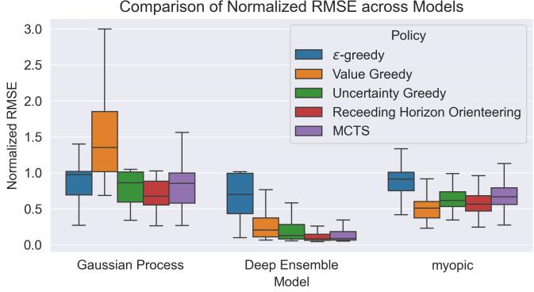
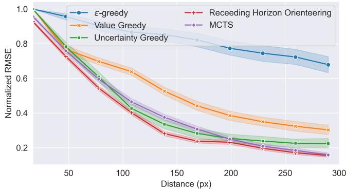
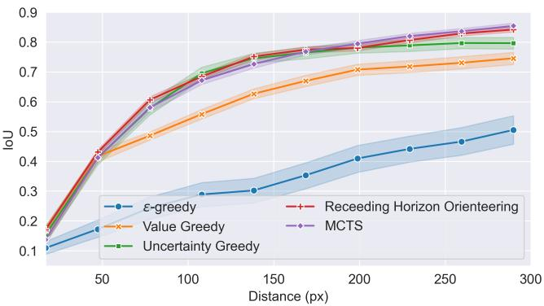
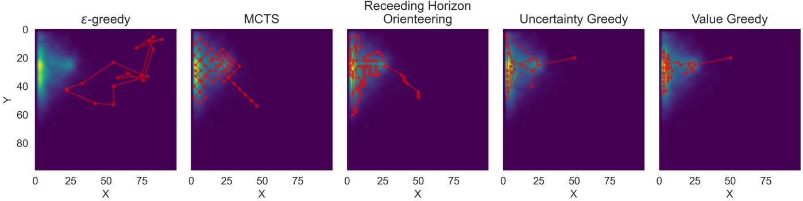

# Calibrated Uncertainty for Informative Path Planning in Aquatic Environmental Monitoring

Samuel Yanes Luis∗ , Alejandro Casado Pérez† , Alejandro Mendoza Barrionuevo† ,

Dame Seck Diop† , Sergio Toral Marín† and Daniel Gutiérrez Reina†

∗Department of Electronic Technology, University of Sevilla, Sevilla, Spain

†Department of Electronic Engineering, University of Sevilla, Sevilla, Spain

Abstract—Informative Path Planning for scalar field reconstruction uses predictive uncertainty to direct sensing vehicles toward maximally informative locations. Gaussian Processes provide this signal but their stationary isotropic kernels are misspecified for non-homogeneous phenomena such as oil spills, producing miscalibrated estimates that degrade planning. We investigate whether replacing the Gaussian Process with a well-calibrated Deep Ensemble improves path planning outcomes, and whether uncertainty quality interacts with the choice of planning algorithm. Five strategies (ϵ-Greedy, Value Greedy, Uncertainty Greedy, Monte Carlo Tree Search, and Receding Horizon Orienteering) share a common Deep Ensemble backbone trained on physicsbased oil spill simulations. On held-out stochastic spill scenarios, the Deep Ensemble reduces normalised reconstruction error by 83% relative to the Gaussian Process baseline. Crucially, wellcalibrated uncertainty amplifies the importance of the planning strategy: the performance gap between algorithms is negligible under miscalibrated models but becomes substantial under the ensemble, where multi-step lookahead planners outperform greedy selection by up to 32% in reconstruction error and achieve IoU above 0.85. Monte Carlo Tree Search is the recommended planner, matching Orienteering in reconstruction quality at an order-ofmagnitude lower computational cost.

Index Terms—Informative Path Planning, Deep Ensembles, Uncertainty Quantification, Autonomous Surface Vehicles, Environmental Monitoring, Monte Carlo Tree Search

## I. INTRODUCTION

Autonomous surface vehicles (ASVs) have emerged as a practical platform for in-situ environmental monitoring of aquatic phenomena such as hydrocarbon spills, algal blooms, and chemical plumes [1]. In these scenarios, the vehicle must reconstruct an unknown scalar field $f : \mathcal { X } \subset \mathbb { R } ^ { 2 } $ R from a limited budget of sequential onboard observations, where the order and location of measurements critically determines the quality of the final reconstruction. This is naturally framed as an active learning problem: rather than collecting data along a pre-defined lawnmower path, the vehicle should allocate its measurement budget to locations that are maximally informative [2].

The dominant criterion for guiding this process is predictive uncertainty. When a model provides uncertainty estimates that reliably correlate with reconstruction error, navigating toward regions of maximum uncertainty is equivalent to navigating toward regions of maximum expected improvement in reconstruction quality. This principle underlies Informative Path Planning (IPP) with Gaussian Processes (GPs), where the posterior variance is available in closed form and has historically been treated as a tractable surrogate for the true error surface [3], [4]. However, this surrogate is only reliable when the model assumptions match the phenomenon under study. Classical GP formulations rely on stationary, isotropic kernels such as the RBF, which impose spatially uniform smoothness through a single global length-scale. Oil spill fields violate this assumption fundamentally, as sharp gradients at contamination boundaries coexist with large smooth background regions, producing uncertainty estimates that are systematically misaligned with the actual reconstruction error [5].

This paper investigates whether replacing the GP with a deep learning model that provides well-calibrated uncertainty can improve path planning outcomes. We build on recent work showing that an ensemble of U-Net architectures trained on physics-based oil spill simulations achieves significantly lower reconstruction error and better uncertainty calibration than GP baselines [6]. Well-calibrated epistemic uncertainty constitutes the best available criterion for information-driven path selection, since the vehicle need not access ground truth to assess where its estimate is least reliable. Moreover, scalar field reconstruction under an uncertainty-based objective is submodular, which motivates greedy algorithms with wellknown approximation guarantees [7], while also opening the door to more expressive planners that trade computational cost for improved path efficiency. We implement and evaluate a portfolio of planning strategies ranging from greedy selection to Monte Carlo Tree Search (MCTS) and orienteering with simulated annealing, all sharing the same deep ensemble model and evaluated on a common set of physics-based oil spill scenarios to provide a controlled comparison of planning quality as a function of algorithm choice. The remainder of the paper is organized as follows. Section II reviews related work. Section III describes the uncertainty model and planning algorithms. Section IV presents results, and Section V concludes.

## II. RELATED WORK

Gaussian Processes have been the standard tool for scalar field reconstruction in autonomous monitoring missions due to their native probabilistic formulation: the posterior mean provides a point estimate of the field, while the posterior variance is available in closed form and well-calibrated by construction under the model assumptions [8]. Their applica tion to aquatic monitoring with ASVs has been extensively studied [4], [5], and sparse GP variants partially address the cubic scaling bottleneck [9]. However, the stationary kernel assumption remains a fundamental limitation: an RBF kernel enforces a single global length-scale that is misspecified for phenomena such as oil spills, where field regularity varies sharply across the domain, leading to systematic miscalibration of the predictive variance [5].

Deep generative models offer a flexible alternative capable of capturing non-stationary spatial structure. Variational Autoencoders trained on physics-based simulators have demonstrated strong reconstruction performance for oil spill scenarios [10], and convolutional encoder-decoder architectures such as U-Net [11] generalize well across observation modalities at inference speeds compatible with onboard deployment. However, standard deterministic architectures produce point estimates with no notion of predictive confidence, preventing their direct integration into active sensing pipelines. Several approaches address this: Monte Carlo Dropout [12] interprets dropout retained at inference as approximate Bayesian inference; Deep Ensembles [13] derive epistemic uncertainty from inter-member disagreement; and Evidential Deep Learning [14] places a Normal-Inverse-Gamma prior over the likelihood, enabling closed-form uncertainty decomposition from a single forward pass. A recent comparative study showed that Deep Ensembles achieve the best trade-off between calibration quality and computational cost under the heterogeneous observation models characteristic of surface and aerial monitoring platforms [6].

The problem of directing a sensing platform toward maximally informative locations is most naturally formulated within Bayesian optimization [15], and translates to Informative Path Planning in the spatial field reconstruction setting [2], [3]. A key structural property of these objectives is submodularity: greedy maximization is guaranteed to achieve at least a $( 1 - 1 / e )$ fraction of the optimal solution [7], justifying onestep-lookahead planners despite their myopic nature. More expressive planners have also been explored, including Monte Carlo Tree Search [16] and orienteering formulations solved with metaheuristics [17], which plan paths that collectively maximize an information criterion under a budget constraint.

## III. METHODS

To obtain a calibrated-uncertainty reconstruction model, we employ a Deep Ensemble of M U-Net members trained on physics-based oil spill simulations, as is described in [6]. All ensemble members share a common U-Net backbone [11] that takes as input two spatial matrices of size $H \times W !$ : an observation mask $\mathbf { M } \in \{ 0 , 1 \} ^ { H \times W }$ , indicating which locations have been visited, and a value matrix $\mathbf { V } \in \mathbb { R } ^ { \mathbf { \overline { { H } } \times } W }$ , containing the corresponding sensor readings at visited cells and zero elsewhere. These are concatenated along the channel dimension to form $\mathbf { X } = [ \mathbf { M } , \mathbf { V } ] \in \mathbb { R } ^ { 2 \times H \times W }$ . The encoder comprises four blocks of two convolutional layers with batch normalization and ReLU activations followed by max-pooling, with channel progression 32 → 512 and a bottleneck of 1024 channels. The decoder mirrors this structure via transposed convolutions with skip connections, and each member produces two output heads via a final $1 \times 1$ convolution: a mean estimate $\hat { f } ^ { ( m ) } ( \mathbf { x } )$ and a log-variance $\log \hat { \sigma } _ { \mathrm { a l e } } ^ { 2 ( m ) } ( \mathbf { x } )$ representing aleatoric uncertainty. Each member is trained independently from a different random initialization by minimizing the heteroscedastic negative loglikelihood:

$$
\mathcal { L } _ { \mathrm { N L L } } = \frac { 1 } { | \mathcal { X } | } \sum _ { \mathbf { x } \in \mathcal { X } } \left[ \frac { \left( f ( \mathbf { x } ) - \hat { f } ^ { ( m ) } ( \mathbf { x } ) \right) ^ { 2 } } { 2 \hat { \sigma } _ { \mathrm { a l e } } ^ { 2 ( m ) } ( \mathbf { x } ) } + \frac { 1 } { 2 } \log { \hat { \sigma } _ { \mathrm { a l e } } ^ { 2 ( m ) } ( \mathbf { x } ) } \right]\tag{1}
$$

At inference time, the ensemble of M members produces a predictive mean and a decomposition of total uncertainty into epistemic and aleatoric components [6], [13]:

$$
\hat { f } ( \mathbf { x } ) = \frac { 1 } { M } \sum _ { m = 1 } ^ { M } \hat { f } ^ { ( m ) } ( \mathbf { x } ) ,\tag{2}
$$

$$
\hat { \sigma } _ { \mathrm { e p i } } ^ { 2 } ( \mathbf { x } ) = \frac { 1 } { M } \sum _ { m = 1 } ^ { M } \left( \hat { f } ^ { ( m ) } ( \mathbf { x } ) - \hat { f } ( \mathbf { x } ) \right) ^ { 2 } ,
$$

$$
\hat { \sigma } _ { \mathrm { a l e } } ^ { 2 } ( \mathbf { x } ) = \frac { 1 } { M } \sum _ { m = 1 } ^ { M } \hat { \sigma } _ { \mathrm { a l e } } ^ { 2 ( m ) } ( \mathbf { x } )\tag{3}
$$

Epistemic uncertainty $\hat { \sigma } _ { \mathrm { e p i } } ^ { 2 }$ reflects inter-member disagreement and is reducible by collecting additional observations, making it the actionable component for path planning. Aleatoric uncertainty $\hat { \sigma } _ { \mathrm { a l e } } ^ { 2 }$ captures irreducible sensor noise and remains invariant to further sampling. The ensemble is trained offline on a dataset of physics-based oil spill simulations and evaluated at inference without retraining, yielding reconstruction and uncertainty maps in a single forward pass through all members.

The resulting Ensemble model is calibrated in the sense that the epistemic uncertainty map $\hat { \sigma } _ { \mathrm { e p i } } ^ { 2 }$ is well-aligned with the true reconstruction error, as demonstrated in [6]. This property is crucial for Informative Path Planning, as it ensures that the vehicle can reliably identify regions where additional measurements will yield the greatest improvement in field reconstruction.

## A. Gaussian Process Baseline

As a probabilistic baseline, we employ a Gaussian Process [8] with a composite kernel combining a squared exponential term with an additive white noise component:

$$
k ( \mathbf { x } , \mathbf { x } ^ { \prime } ) = \sigma _ { f } ^ { 2 } \exp \left( - \frac { \| \mathbf { x } - \mathbf { x } ^ { \prime } \| ^ { 2 } } { 2 \ell ^ { 2 } } \right) + \sigma _ { n } ^ { 2 } \delta ( \mathbf { x } , \mathbf { x } ^ { \prime } )\tag{4}
$$

where $\sigma _ { f } ^ { 2 }$ is the signal variance, ℓ is the length-scale, and $\sigma _ { n } ^ { 2 }$ is the noise variance. The three hyperparameters $\{ \sigma _ { f } ^ { 2 } , \ell , \sigma _ { n } ^ { 2 } \}$ are optimized per test sample by maximizing the marginal log-likelihood via L-BFGS. The GP posterior mean provides the field reconstruction, while the posterior variance serves as the uncertainty estimate for planning. Crucially, the white noise term $\sigma _ { n } ^ { 2 }$ is a global scalar that imposes a spatially uniform aleatoric component regardless of local observation density or field regularity. Combined with the isotropic RBF kernel, which enforces a single global length-scale across the entire domain, the $\mathrm { G P }$ is fundamentally misspecified for oil spill fields, where sharp gradients at contamination boundaries coexist with large smooth background regions. This mismatch produces miscalibrated uncertainty estimates that degrade the reliability of the GP as an active sensing criterion, as demonstrated in [6].

## B. Path Planning Algorithms

All planners share a common reactive planning loop regard less of their internal strategy. At each decision step t, the vehicle receives the current uncertainty map $\hat { \sigma } _ { \mathrm { e p i } } ^ { 2 } ( \cdot \mid \mathcal { D } _ { t } )$ produced by the ensemble conditioned on all observations collected so far. The planner is then invoked with the remaining budget $T - t$ and produces a complete candidate trajectory. Only the first action of that trajectory is executed: the vehicle moves to the selected waypoint, collects a new observation, and incorporates it into $\mathcal { D } _ { t + 1 } .$ . The ensemble is queried again to produce an updated reconstruction and uncertainty map, and the planning cycle restarts. This receding-horizon scheme ensures that every planning decision is grounded in the most recent observations, so that the trajectory adapts continuously to the information revealed during the mission rather than committing to a plan computed from the initial state.

1) Greedy Planners: Greedy strategies select the next waypoint $\mathbf { x } _ { t + 1 }$ by maximizing a scalar criterion over the set of unvisited reachable locations $\mathcal { X } \setminus \mathcal { D } _ { t }$ without lookahead:

$$
\mathbf { x } _ { t + 1 } = \arg \operatorname* { m a x } _ { \mathbf { x } \in \mathcal { X } \setminus \mathcal { D } _ { t } } a ( \mathbf { x } ) ,\tag{5}
$$

where $a ( \mathbf { x } )$ is the acquisition function. We consider two variants. The uncertainty-greedy planner sets $a ( \mathbf { x } ) = \hat { \sigma } _ { \mathrm { e p i } } ^ { 2 } ( \mathbf { x } )$ directing the vehicle toward the location of maximum epistemic uncertainty. The model-greedy planner sets $a ( { \bf x } ) { \bf \Psi } = { \hat { f } } ( { \bf x } )$ directing the vehicle toward the location of maximum predicted field value, which is appropriate when the monitoring objective is to locate and characterize the peak of the contaminant distribution rather than to reduce global reconstruction error. Both greedy variants are myopic but computationally negligible, and the uncertainty-greedy criterion is theoretically motivated by the submodularity of the information gain objective [7]: each observation reduces the epistemic uncertainty that subsequent measurements can eliminate, so that greedily targeting the maximum residual uncertainty achieves a $( 1 - 1 / e )$ approximation of the optimal multi-step policy.

2) Monte Carlo Tree Search: MCTS [16] extends the greedy approach by performing a multi-step lookahead through a stochastic tree expansion. At each planning invocation, MCTS builds a search tree rooted at the current vehicle state $\left( \mathbf { x } _ { t } , \mathcal { D } _ { t } \right)$ and alternates between four standard phases: selection via the UCT criterion [18], expansion, rollout using the uncertainty-greedy heuristic, and backpropagation of the cumulative epistemic uncertainty along the simulated path.

A key design contribution is an uncertainty-adaptive branching strategy: at each node corresponding to location x, the neighborhood radius $r ( \mathbf { x } )$ from which candidate children are sampled is inversely proportional to the local epistemic uncertainty,

$$
r ( \mathbf { x } ) = \operatorname* { m a x } \left( r _ { \operatorname* { m i n } } , \operatorname* { m i n } \left[ \frac { r _ { \operatorname* { m a x } } - r _ { \operatorname* { m i n } } } { \hat { \sigma } _ { \mathrm { e p i } } ( \mathbf { x } ) + \epsilon } + r _ { \operatorname* { m i n } } , r _ { \operatorname* { m a x } } \right] \right)\tag{6}
$$

where $\epsilon > 0$ ensures numerical stability and $r _ { \operatorname* { m i n } } , r _ { \operatorname* { m a x } }$ are predefined radius bounds. This focuses the search budget on regions of high uncertainty, where careful multi-step planning yields the greatest benefit, while pruning branches in wellcharacterized areas. After a fixed number of iterations, the vehicle commits to the first action of the highest-value branch, consistent with the receding-horizon loop.

3) Orienteering with Simulated Annealing: The orienteering problem formulation treats path planning as a combinatorial optimization problem [17]: candidate waypoints are sampled on a regular sub-grid of the map, and the planner selects a subset and an ordering that maximizes total reward while respecting a budget constraint on trajectory cost. The reward of traversing an edge is defined as the sum of epistemic uncertainty values over the pixels of the connecting segment, and the cost as the Euclidean distance between waypoints. This allows the planner to reason about the collective value of a sequence of waypoints rather than committing greedily at each step.

The orienteering problem is solved with a two-phase metaheuristic. First, a multi-start greedy construction generates a diverse set of initial solutions by building paths greedily according to reward-to-cost efficiency under different random orderings of the candidate list. Second, a hill-climbing local search refines the best solution by alternating between removal of interior waypoints that increase total reward and insertion of unvisited candidates at positions that increase reward without exceeding the budget, until no single move yields further improvement.

## IV. EXPERIMENTAL RESULTS

## A. Experimental Setup

1) Simulation Environment: Experiments are conducted on physics-based oil spill scenarios generated by a particle simulator on a $1 0 0 \times 1 0 0$ grid. Spills are initialised at random locations and evolved under stochastic wind and tidal dynamics, producing realizations that vary widely in shape, extent, and gradient structure. All fields are normalised to [0, 1], and a contact point sensor returns field values with additive Gaussian noise $\varepsilon _ { i } \sim \mathcal { N } ( 0 , 0 . 1 ^ { 2 } )$

The uncertainty model follows [6]: five independent U-Net members with channel progression $3 2 ~  ~ 5 1 2$ and a bottleneck of 1024 channels, each producing a mean and log-variance map via a heteroscedastic output head trained offline by minimising Eq. (1). At inference, the epistemic uncertainty map is computed as inter-member variance (Eq. 3) and consumed by all planners without further adaptation.

Five policies are evaluated: ϵ-Greedy (random exploration decaying from $\varepsilon { = } 0 . 1 0 \ \mathrm { t o } \ 0 . 0 1 )$ ; Value Greedy $( a ( \mathbf { x } ) = { \hat { f } } ( \mathbf { x } ) )$ ; Uncertainty Greedy $( a ( { \bf x } ) = \hat { \sigma } _ { \mathrm { e p i } } ^ { 2 } ( { \bf x } ) )$ ; Receding Horizon Orienteering (planning horizon 30, actuation horizon 5, grid resolution 2 cells); and MCTS (2000 simulations, depth equal to remaining budget, $c { = } 1 . 4 1 4 , \ \gamma { = } 0 . 8$ , radii $r \in [ 1 , 4 ]$ , tree reuse enabled). All combinations are evaluated over a common held-out test partition following the receding-horizon loop of Section III-B.

All experiments and code is available at https://gitlab.ratatosk. cc/syanes/uncertainty-online-planning-caepia-2026.

## B. Evaluation Metrics

Reconstruction accuracy is measured by the Root Mean Squared Error between the ensemble mean $\dot { \boldsymbol { f } }$ and the groundtruth field f over all unvisited cells:

$$
{ \mathrm { R M S E } } = { \sqrt { { \frac { 1 } { | { \mathcal { X } } | } } \sum _ { \mathbf { x } \in { \mathcal { X } } } \left( f ( \mathbf { x } ) - { \hat { f } } ( \mathbf { x } ) \right) ^ { 2 } } } .\tag{7}
$$

To account for the varying difficulty across episodes, RMSE is normalised by the value recorded at the first decision step, so the metric reflects relative improvement rather than absolute map difficulty. We additionally report the Intersection over Union (IoU) [10] between the predicted and ground-truth contamination masks, obtained by thresholding both fields at a fixed value τ:

$$
\mathrm { I o U } = \frac { | \hat { S } \cap \mathcal { S } | } { | \hat { S } \cup \mathcal { S } | } ,\tag{8}
$$

where $S = \{ \mathbf { x } : f ( \mathbf { x } ) > \tau \}$ and $\hat { S } = \{ { \bf x } : \hat { f } ( { \bf x } ) > \tau \}$ . IoU captures the spatial precision of spill localisation independently of global reconstruction error.

## C. Results

1) Model Comparison and Policy–Model Interaction: Table I and Figure 1 reveal two complementary findings. The choice of reconstruction model is the dominant factor in planning performance: the Deep Ensemble achieves a mean normalised RMSE of 0.1568, compared to 0.6243 for the myopic baseline and 0.9350 for the Gaussian Process, representing reductions of 75% and 83% respectively. Moreover, the quality of the uncertainty signal determines how much the policy choice mat ters: the inter-policy spread is negligible under a miscalibrated model, but widens substantially when uncertainty aligns with the true reconstruction error.

The myopic baseline reconstructs the field via k-Nearest Neighbours interpolation and models uncertainty through inverse-distance weighting, producing values in [0, 1] that reflect spatial coverage rather than predictive confidence. Under this model, as under the Gaussian Process, all policies converge to a narrow and uniformly mediocre band: without a principled uncertainty signal, the reconstruction ceiling is set by the model rather than the planner, and sophisticated multi-step algorithms offer no advantage over random exploration. The GP additionally suffers from high variance $( \mathrm { s t d } = 0 . 5 6 1 8 )$ confirming that its stationary isotropic kernel is fundamentally misspecified for this kind of fields [6].

TABLE I  
NORMALISED RMSE PER MODEL, AVERAGED OVER ALL POLICIES AND EPISODES (MEAN ± STD). BEST RESULT IN BOLD.
<table><tr><td>Model</td><td>RMSE (norm.)</td></tr><tr><td>Gaussian Process</td><td> $0 . 9 3 5 0 \pm 0 . 5 6 2 3$ </td></tr><tr><td>Myopic</td><td> $0 . 6 2 4 3 \pm 0 . 2 3 0 0$ </td></tr><tr><td>Deep Ensemble</td><td> $\mathbf { 0 . 1 5 6 8 \pm 0 . 2 8 5 6 }$ </td></tr></table>

Comparison of Normalized RMSE across Models  
  
Fig. 1. Distribution of normalised RMSE for each (model, policy) combination across all evaluation episodes. Each group of five boxes corresponds to one reconstruction model; colours denote policies. Lower is better.

With the Deep Ensemble, the overall error collapses and the performance differences between policies become more pronounced, revealing a clear hierarchy among planning strategies that was invisible under weaker models. This amplification effect is the central empirical finding of this paper: a wellcalibrated uncertainty signal transforms the uncertainty map into a reliable planning gradient that differentiates effective exploration strategies from ineffective ones.

2) Policy Comparison: Table II reports the normalised RMSE and IoU for each policy under the Deep Ensemble model. In Fig. 2, the evolution over time is illustrated for each policy using the Deep Ensemble model. The Receding Horizon Orienteering planner achieves the lowest reconstruction error $( 0 . 1 4 3 4 \pm 0 . 1 3 8 5 )$ , followed closely by MCTS (0.1561 ± 0.1473); both outperform the greedy Uncertainty criterion (0.2097±0.1823) by approximately 32% and 26% respectively. The ranking is reversed for localisation: MCTS attains the highest IoU $( 0 . 8 5 6 3 \pm 0 . 1 0 9 9 )$ , marginally ahead of Orienteering (0.8491 ± 0.1122) and well above Uncertainty Greedy (0.8085±0.1315). Taken together, these results show that, given a well-calibrated epistemic map, multi-step lookahead does pay off: both MCTS and Orienteering consistently outperform onestep greedy selection, with Orienteering favouring boundary coverage and global reconstruction accuracy while MCTS yields a slight advantage in spill localisation through its deeper tree search over candidate waypoints.

  
(a) Normalised RMSE over time.

  
(b) IoU over time.  
Fig. 2. Evolution of reconstruction metrics across decision steps for each policy under the Deep Ensemble model. Shaded bands denote ±1 standard deviation over all evaluation episodes.

TABLE II  
NORMALISED RMSE AND IOU FOR EACH POLICY USING THE DEEP ENSEMBLE MODEL (MEAN ± STD). BEST RESULT PER METRIC IN BOLD.
<table><tr><td>Policy</td><td>RMSE (norm.)</td><td>IoU</td></tr><tr><td>€-Greedy</td><td> $0 . 6 7 7 4 \pm 0 . 3 0 2 4$ </td><td> $0 . 5 0 5 3 \pm 0 . 3 0 4 3$ </td></tr><tr><td>Value Greedy</td><td> $0 . 2 7 9 4 \pm 0 . 2 1 8 3$ </td><td> $0 . 7 5 9 4 \pm 0 . 1 6 2 1$ </td></tr><tr><td>Uncertainty Greedy</td><td> $0 . 2 0 9 7 \pm 0 . 1 8 2 3$ </td><td> $0 . 8 0 8 5 \pm 0 . 1 3 1 5$ </td></tr><tr><td>Receding Horizon Orienteering</td><td> $\mathbf { 0 . 1 4 3 4 } \pm 0 . 1 3 8 5$ </td><td> $0 . 8 4 9 1 \pm 0 . 1 1 2 2$ </td></tr><tr><td>MCTS</td><td> $0 . 1 5 6 1 \pm 0 . 1 4 7 3$ </td><td> $\mathbf { 0 . 8 5 6 3 \pm 0 . 1 0 9 9 }$ </td></tr></table>

Uncertainty Greedy still substantially outperforms the nonuncertainty baselines, confirming the primacy of the epistemic signal over the planning horizon. Value Greedy achieves mod erate results (RMSE = 0.2794, IoU = 0.7594): concentrating observations near the predicted contamination peak provides a useful proxy for localisation but neglects uncertain boundary regions, limiting global reconstruction quality. The ϵ-Greedy baseline performs worst on both metrics, confirming that undirected exploration is an ineffective use of the measurement budget regardless of the quality of the underlying model.

3) Qualitative Analysis: Figure 3 illustrates the trajectories produced by each policy for a representative scenario. The contaminated region is concentrated in the upper-left quadrant, where ensemble uncertainty is highest at mission start. The ϵ-Greedy planner disperses waypoints across the full domain, wasting the majority of the budget on uninformative background cells. Value Greedy concentrates near the spill peak but revisits already-characterised areas rather than systematically covering the boundary. By contrast, Uncertainty Greedy, MCTS, and Receding Horizon Orienteering all converge to dense, structured coverage of the spill boundary, where residual epistemic uncertainty is highest and additional observations yield the greatest marginal reduction in reconstruction error. MCTS produces a systematic grid-like sweep of the uncertain region, a consequence of its tree search explicitly reasoning over multi step action sequences, while the orienteering planner generates compact sub-paths that collectively maximise accumulated uncertainty reward under the distance budget constraint, covering slightly more boundary area at the cost of a marginally lower IoU.

## V. CONCLUSION

This paper has presented a controlled evaluation of five path planning strategies for scalar field reconstruction under a wellcalibrated deep uncertainty model, with the explicit goal of isolating the contribution of the planning algorithm from that of the uncertainty model. The central finding is that model quality is the dominant factor in path planning performance: replacing a stationary Gaussian Process with a Deep Ensemble reduces the normalised RMSE by 83% across all policies, and the myopic baseline by 75%. Crucially, this improvement is not uniform across planners. A well-calibrated uncertainty map amplifies the importance of the planning strategy, revealing a clear performance hierarchy that is invisible under miscalibrated models.

Among the planning algorithms evaluated, multi-step lookahead methods consistently outperform one-step greedy selection when the uncertainty signal is reliable. Receding Horizon Orienteering achieves the lowest reconstruction error (0.1434), while MCTS attains the highest spill localisation IoU (0.8563), both substantially ahead of the Uncertainty Greedy baseline (0.2097, 0.8085). These results confirm that the theoretical $( 1 - 1 / e )$ approximation guarantee of greedy submodular maximisation, while non-trivial, leaves meaningful room for improvement when a richer planning horizon is available.

From a practical deployment perspective, MCTS emerges as a particularly attractive option. Although Receding Horizon Orienteering marginally outperforms it on RMSE, the meta heuristic solver, which combines multi-start greedy construction with hill-climbing local search, incurs a computational cost that is an order of magnitude higher than MCTS per planning call. MCTS, by contrast, amortises its 2000 simulations efficiently through tree reuse across receding-horizon cycles and its uncertainty-adaptive branching strategy, which concentrates the search budget precisely where the epistemic signal is most informative. For resource-constrained platforms such as ASVs operating under real-time replanning requirements, this cost differential is decisive. MCTS offers near-optimal reconstruction and superior localisation at a fraction of the computational overhead, making it the recommended planner when both performance and efficiency are required.

  
Fig. 3. Example trajectories for each policy on a representative scenario (Deep Ensemble model). The background shows the ground-truth oil spill field; red dots and lines mark visited waypoints and the connecting path. Multi-step planners (MCTS, Orienteering) produce structured boundary coverage, whereas ϵ-Greedy disperses waypoints across uninformative background regions.

Future work will extend this framework in two directions. First, the online integration of Evidential Deep Learning, which achieves comparable calibration to the ensemble at a single forward pass, could further reduce inference latency without sacrificing uncertainty quality. Second, extending the evaluation to multi-agent settings, where the epistemic uncertainty map must be shared and updated across vehicles, will require coordination-aware planning algorithms that remain efficient under communication constraints.

## ACKNOWLEDGMENT

Proyecto PID2024-158365OB-C21 financiado por MI-CIU/AEI/10.13039/501100011033 y por FEDER, UE.

## COMPETING INTERESTS

The authors have no competing interests to declare that are relevant to the content of this article.

## REFERENCES

[1] S. Mansfield and A. Montazeri, “A survey on autonomous environmental monitoring approaches: Towards unifying active sensing and reinforce ment learning,” Frontiers in Robotics and AI, vol. 11, p. 1336612, 2024.

[2] W. Chen, R. Khardon, and L. Liu, “Robotic active information gathering for spatial field reconstruction with rapidly-exploring random trees and online learning of Gaussian processes,” Sensors, vol. 19, no. 5, p. 1016, 2019.

[3] S. Yanes Luis, D. Gutiérrez-Reina, and S. Toral Marín, “Censored deep reinforcement patrolling with information criterion for monitoring large water resources using autonomous surface vehicles,” Applied Soft Computing, vol. 132, p. 109874, 2023.

[4] F. P. Samaniego, D. G. Reina, S. L. T. Marín, M. Arzamendia, and D. O. Gregor, “A Bayesian optimization approach for water resources monitoring through an autonomous surface vehicle: The Ypacarai lake case study,” IEEE Access, vol. 9, pp. 9163–9179, 2021.

[5] S. Yanes Luis, D. Shutin, J. Marchal Gómez, D. Gutiérrez Reina, and S. Toral Marín, “Deep reinforcement multiagent learning framework for information gathering with local Gaussian processes for water monitoring,” Advanced Intelligent Systems, vol. 6, no. 8, p. 2300850, 2024.

[6] S. Yanes Luis, A. Casado Pérez, A. Mendoza Barrionuevo, D. Seck Diop, S. Toral Marín, and D. Gutiérrez Reina, “Uncertainty estimation for deep reconstruction in actuatic disaster scenarios with autonomous vehicles,” 2026.

[7] G. L. Nemhauser, L. A. Wolsey, and M. L. Fisher, “An analysis of approximations for maximizing submodular set functions,” Mathematical Programming, vol. 14, no. 1, pp. 265–294, 1978.

[8] C. E. Rasmussen and C. K. I. Williams, Gaussian Processes for Machine Learning. The MIT Press, 2006.

[9] M. K. Titsias, “Variational learning of inducing variables in sparse Gaussian processes,” in Proceedings of the 12th International Conference on Artificial Intelligence and Statistics (AISTATS), 2009, pp. 567–574.

[10] A. Casado-Pérez, S. Yanes, S. L. Toral, M. Perales-Esteve, and D. Gutiérrez-Reina, “Variational autoencoder for the prediction of oil contamination temporal evolution in water environments,” Sensors, vol. 25, no. 6, 2025.

[11] O. Ronneberger, P. Fischer, and T. Brox, “U-Net: Convolutional networks for biomedical image segmentation,” in Medical Image Computing and Computer-Assisted Intervention (MICCAI), 2015, pp. 234–241.

[12] Y. Gal and Z. Ghahramani, “Dropout as a Bayesian approximation: Representing model uncertainty in deep learning,” in Proceedings of the 33rd International Conference on Machine Learning (ICML), 2016, pp. 1050–1059.

[13] B. Lakshminarayanan, A. Pritzel, and C. Blundell, “Simple and scalable predictive uncertainty estimation using deep ensembles,” in Advances in Neural Information Processing Systems 30 (NeurIPS), 2017, pp. 6405– 6416.

[14] A. Amini, W. Schwarting, A. Soleimany, and D. Rus, “Deep evidential regression,” in Advances in Neural Information Processing Systems 33 (NeurIPS), 2020.

[15] B. Shahriari, K. Swersky, Z. Wang, R. P. Adams, and N. de Freitas, “Taking the human out of the loop: A review of Bayesian optimization,” Proceedings of the IEEE, vol. 104, no. 1, pp. 148–175, 2016.

[16] C. B. Browne et al., “A survey of monte carlo tree search methods,” IEEE Transactions on Computational Intelligence and AI in Games, vol. 4, no. 1, pp. 1–43, 2012.

[17] P. Vansteenwegen, W. Souffriau, and D. Van Oudheusden, “The orienteering problem: A survey,” European Journal of Operational Research, vol. 209, no. 1, pp. 1–10, 2011.

[18] L. Kocsis and C. Szepesvári, “Bandit based monte-carlo planning,” in Proceedings of the 17th European Conference on Machine Learning (ECML), 2006, pp. 282–293.