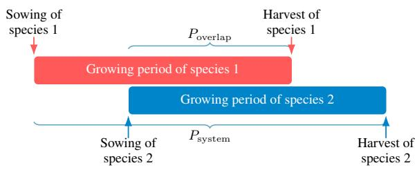
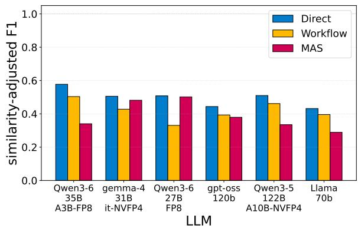
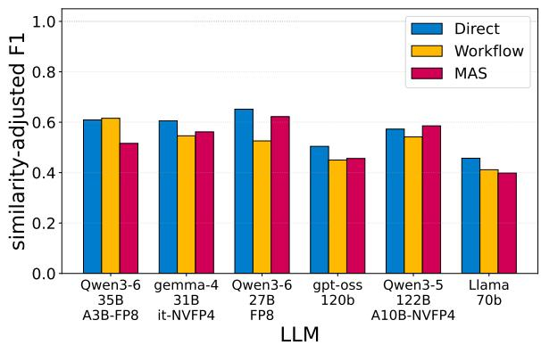
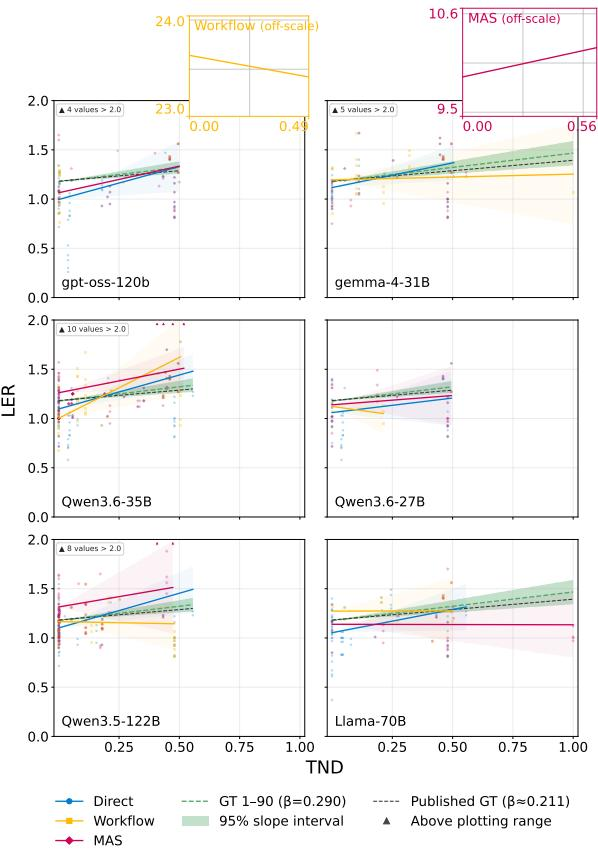

# Can Generative AI Automate Data Extraction for Meta-Analysis? A Case Study on Intercropping Research

Zehao Lu1,\*, Xingguo Xiong2,\*, Wopke van der Werf1,

Thijs L. van der Plas1, Ioannis N. Athanasiadis1

1Wageningen University & Research, Wageningen, the Netherlands

2Zhejiang Academy of Agricultural Sciences

{zehao.lu,wopke.vanderwerf,thijs.vanderplas,ioannis.athanasiadis}@wur.nl, xiongxg@zaas.ac.cn Equal contribution.

## Abstract

Meta-analysis is the synthesis of information from multiple sources to arrive at an overarching conclusion. There is a large need for meta-analysis in agricultural research to synthesize what is known and analyze overarching patterns. Extracting data from published literature is, however, labor-intensive, time consuming, and tedious, and is impeded by a lack of standardization in research design, units of measurement, and terminology. These chal lenges are particularly evident in the domain of crop species mixtures, also called intercropping. With the growing capabilities of LLMs, many recent attempts have focused on building systems and tools to automate data collection, yet rigorous assessment against human-labeled ground truth is often missing. In this research, we evaluate three LLM-based approaches— direct zero-shot prompting, a staged work flow, and a multi-agent system—with six openweight models to extract data from the intercropping literature. The results are evaluated against the manually curated ground truth and through a downstream statistical analysis. Overall, direct zero-shot prompting is the strongest and most consistent approach, achieving the highest mean similarity-adjusted F1 of 0.577, although none of the approaches is close to fully accurate. In the downstream analysis, most model–approach combinations recover the direction of the relationship between the predictor and outcome variables, but do not estimate its magnitude accurately. 1

## 1 Introduction

Modern agriculture faces the dual challenge of increasing food production for a growing global population while adapting to climate change (Godfray et al., 2010). Meeting these demands requires a transition from conventional monoculture toward more diversified cropping systems (Tamburini et al., 2020). Intercropping is one such system, in which two or more crop species are grown together to improve resource-use efficiency and ecological resilience (Brooker et al., 2014). However, its benefits vary across crop combinations, pedoclimatic conditions, and management practices such as sowing dates, planting densities, and fertilizer inputs (Antle et al., 2017; Grassini et al., 2015). Evidence from different environments must therefore be synthesized to identify suitable crop combinations and management practices.

Meta-analysis systematically combines quantitative evidence from published studies to assess outcomes across diverse conditions (Gurevitch et al., 2018). This generally involves identifying eligible studies, extracting comparable outcomes and their uncertainty, and synthesizing the evidence statistically. In agriculture, this evidence can help evaluate management strategies and provide empirical data for models exploring production and climate-adaptation scenarios (Antle et al., 2017; Holzworth et al., 2014). Meta-regression extends this approach by examining whether study-level factors explain variation in outcomes across studies. This makes it necessary to extract not only the reported outcomes, but also the context in which they were observed. Because crop responses depend strongly on local soil, weather, and management conditions, a reported yield value is meaningful only when its experimental context is retained (Antle et al., 2017; Grassini et al., 2015). Metaanalysis in agricultural sciences therefore requires structured datasets that preserve not only numerical measurements, but also experimental designs, treatment comparisons, environmental conditions, and measurement units.

Constructing these datasets is particularly difficult for intercropping research, due to the lack of standardization and widely-accepted protocols, variations in equipment, and variability of metrics reported in each local study. A single trial may report dozens of related measurements across intercropped plots and their corresponding sole-crop controls. Studies also differ widely in their objectives, terminology, management conditions, outcomes, and units (Connolly et al., 2001). The information required for one experimental record is often scattered throughout a paper: trial designs may be described in the text, numerical results reported in multi-level tables, and units or exceptions provided only in captions or footnotes. Although human experts can interpret and connect this information, manual curation requires substantial time and effort, creating a major bottleneck for largescale evidence synthesis.

Earlier attempts to automate evidence synthesis relied mainly on task-specific NLP pipelines, with separate components for document filtering, entity recognition, and relation extraction (Callaghan et al., 2021; Sietsma et al., 2024; G. et al., 2023; Chebbi et al., 2024; Rezayi et al., 2022). Although effective for well-defined subtasks, these pipelines can propagate errors between stages and often struggle to assemble information into complete experimental records. Many relevant relationships extend beyond individual sentences or paragraphs and require information to be connected across the full document (Jain et al., 2020).

Large language models provide a more general approach: a single model can follow different extraction schemas, integrate broader context, and perform multiple extraction tasks (Kojima et al., 2023; Dagdelen et al., 2024). This flexibility has led to growing interest in LLM-based scientific information extraction (Dagdelen et al., 2024; Gupta et al., 2024) and agentic designs such as ReAct, plan-and-execute, and AFlow (Yao et al., 2023; Erdogan et al., 2025; Zhang et al., 2025). Such designs may help decompose complex tasks, but additional stages can also introduce context loss and error propagation. Whether they improve extraction from complex agricultural studies remains an open question.

In this work, we investigate whether generative AI can reliably extract complex intercropping trial data. We compare a direct zero-shot approach, a staged workflow, and a multi-agent system across six LLMs. We evaluate their outputs against human-curated records and test their ability to reproduce a published meta-analysis. Our main contributions are:

1. We formulate the structuring of complex agricultural trial data as an information extraction task and establish an annotated evaluation benchmark.

2. We compare three LLM-based approaches on multi-level trial structures and cross-table attribute binding.

3. We assess how extraction errors affect the reproduction of published meta-analytic findings.

## 2 Problem Statement

## 2.1 Structured Data Extraction

Given the textual content of a research paper extracted from a PDF, our task is to identify information relevant to a predefined schema and organize it into a set of structured records. Information available only in images is outside the scope of the task. A paper may contain zero, one, or multiple records, and the information needed for one record may appear in different parts of the paper.

Each record represents one experimental comparison and contains a fixed set of fields defined by the schema. These fields may describe the study conditions, treatments, outcomes, and observed effects. Their standardization varies across disciplines, from protocol-based clinical trials to more heterogeneous agricultural field studies (Chan et al., 2013; Eagle et al., 2017). The task requires extracting the correct values while preserving the connections among values from the same comparison.

## 2.2 Challenges Specific to Agricultural Studies

Intercropping experiments often span multiple sites, seasons, and treatments, requiring each mixture to be matched with two sole-crop comparators under comparable management. This is difficult when fertilizer inputs or planting densities differ among treatments (Yu et al., 2015; Liu et al., 2024). The production syndromes identified by Li et al. (2020) further show that crop composition, spatial design, management, timing, location, and yields must remain correctly linked. Outcomes may include croplevel yields, system-level yields, or indices such as the land equivalent ratio (Brooker et al., 2014), often reported under nested table headers and in different units. Breaking these relationships can produce incorrectly linked or omitted records and distort downstream analysis.

## 3 Data & Experiment

This section introduces the data used and the experimental setup of this study. We use three generative-AI-based approaches to repeat the data-extraction stage of Yu et al. (2015), hereafter referred to as the reference study. We then reproduce the subsequent analysis by fitting the same linear mixed-effects model specified in the original R analysis to the LLM-extracted outputs.

## 3.1 Data

The reference study manually collected 746 records from 100 intercropping papers: the 50 most highly cited papers in the analysed corpus and 50 selected at random. Only 90 of the 100 paper folders could be reliably mapped to the corresponding groundtruth studies, so we conduct the extraction experiment on these 90 papers.

The source papers were preprocessed using MinerU (Wang et al., 2026) and converted from PDF into Markdown documents, which serve as the textual input to the three extraction approaches.

The complete ground-truth dataset contains 135 variables, including bibliographic and administrative information outside the extraction task. We evaluate the predefined subset of 42 extraction variables without modifying their definitions or groundtruth values.

## 3.2 Extraction Schema and Key Variables

We use the field definitions provided by the author of the reference study to clarify what information is contained in each intercropping record. Definitions of all 42 extracted fields are provided in Appendix Table 2. Among these fields, Temporal niche differentiation (TND) and land-equivalent ratio (LER) are central to the reproduced analysis.

Temporal niche differentiation measures the difference between the growing periods of the two crop species in the case of relay intercropping. Relay intercropping is the combination with two species with differences in growing period, which overlap only partially.

$$
T N D = 1 - \frac { P _ { \mathrm { o v e r l a p } } } { P _ { \mathrm { s y s t e m } } } ,\tag{1}
$$

where $P _ { \mathrm { o v e r l a p } }$ is the simultaneous growth period and $P _ { \mathrm { s y s t e m } }$ spans the period from the sowing of the first-sown crop till the harvest of the lastharvested crop. A TND of 0 indicates complete overlap, while higher values indicate greater temporal separation (Figure 1). The maximum value of TND is 1, indicating complete separation of growing periods.

  
Figure 1: Illustration of temporal niche differentiation. Adapted from Yu et al. (2015).

The land-equivalent ratio measures how efficiently an intercropping system uses land relative to growing the two crop species separately. It is calculated as

$$
L E R = \frac { Y _ { \mathrm { I C 1 } } } { Y _ { \mathrm { S C 1 } } } + \frac { Y _ { \mathrm { I C 2 } } } { Y _ { \mathrm { S C 2 } } } ,\tag{2}
$$

where $Y _ { \mathrm { I C 1 } }$ and $Y _ { \mathrm { I C 2 } }$ are species yields under intercropping, and $Y _ { \mathrm { S C 1 } }$ and $Y _ { \mathrm { S C 2 } }$ are their corresponding sole-crop yields. An LER above 1 indicates greater land-use efficiency under intercropping.

## 3.2.1 Analysis in the Reference Study

We reproduce the main analysis conducted in the reference study. This subsection describes that analysis and identifies the information required to reproduce it. The authors investigated the following research question:

## Do crop combinations have a higher LER when their TND is larger, i.e. when they overlap (and compete) less?

To answer this question, the authors modelled the relationship between temporal niche differentiation (TND) and the land-equivalent ratio (LER). They used a linear mixed-effects regression with random intercepts for experiments nested within studies:

$$
\begin{array} { r l } & { L E R _ { i j k } = \beta _ { 0 } + \beta _ { 1 } T N D _ { i j k } + u _ { \mathrm { S t u d y } , i } } \\ & { ~ + u _ { \mathrm { E x p e r i m e n t } , i j } + \epsilon _ { i j k } . } \end{array}\tag{3}
$$

Here, $\beta _ { 0 }$ is the expected LER at $\mathrm { T N D } = 0 .$ , and $\beta _ { 1 }$ is the change in LER per unit increase in TND. The terms $u _ { \mathrm { S t u d y } , i }$ and $u _ { \mathrm { E x p e r i m e n t } , i j }$ capture variation between studies and nested experiments, respectively, while $\epsilon _ { i j k }$ denotes residual variation.

## 3.3 Experiment

## 3.3.1 Extraction Approaches

We designed three LLM-based approaches: direct zero-shot prompting, a staged workflow, and a multi-agent system (MAS).

The prompts were developed based on referenced research and expert knowledge of intercropping meta-analysis. We tested different prompt versions during pilot runs and selected those that showed the best performance and stability. For the staged workflow, we followed previous work on separating evidence identification from record construction. In the first step, a labeller identifies relevant values and tags the supporting text. In the second step, an extractor uses the labeled text to construct the final records.

During the prototyping of the agentic approach, we tested several designs, including ReAct (Yao et al., 2023) and Reflexion (Shinn et al., 2023). However, these repeated reasoning steps did not consistently improve the output and often accumulated errors. Reflexion showed a similar problem: even when previous error patterns were provided, the system did not reliably avoid them. We therefore selected a plan-and-execute design in which agents use tools to identify and label relevant evidence before producing and refining the records (Erdogan et al., 2025). Further details about the agents, prompts, and tools are provided in the Appendix B.

## 3.3.2 Language Model Choice

Regarding the LLM choice, we used open-weight models available through the SURF research infrastructure. This choice was motivated by concerns about sharing unpublished scientific work with commercial LLM providers and the possibility that related results could be pursued or released before the original researchers are ready to publish (Buckmaster, 2026). The six LLMs included QWEN3.6-27B-FP8, QWEN3.6-35B-A3B-FP8, QWEN3.5-122B-A10B-NVFP4, GEMMA-4-31B-IT-NVFP4, LLAMA-70B, and GPT-OSS-120B.

## 4 Evaluation

We evaluate the extraction approaches in two steps: comparing the extraction outputs against the ground truth using a rigorous evaluation pipeline, and reproducing the experiment conducted by human researchers in the original meta-analysis study using the extraction outputs. The first step aims to assess how well the LLM-based approaches agree with the human-annotated ground truth and how performance differs across models and methods. The second step examines whether the experiment can be reproduced using imperfect extraction outputs and how much the resulting findings differ from those reported by the human researchers.

## 4.1 Evaluation Against Ground Truth

We evaluate the outputs at the field level using comparison rules tailored to different data types. These rules were reviewed and agreed upon with the senior author of the reference study who was deeply involved in curation of the ground-truth dataset. We first introduce the types of extraction error and their corresponding metrics, and then describe the evaluation pipeline used to align records, apply the comparison rules, and aggregate the results.

## 4.1.1 Error Types

The output of the three approach (direct, workflow, MAS) are saved in csv format, as is the ground truth. We classify the mismatches between the predictions and ground truth into three types, each measured by a corresponding metric:

• Incorrectness: Extracted values disagree with the corresponding ground-truth values in matched field values. Agreement is measured by the similarity score, which ranges from 0 to 1 and is averaged over fields where both records contain a value.

• Hallucination: A predicted field contains a value, but its ground-truth counterpart is missing. Populated fields in unmatched predicted records also count as unsupported extractions. The factual rate measures the proportion of populated predicted fields that have a populated ground-truth counterpart

• Incompleteness: A ground-truth field contains a value, but its predicted counterpart is missing. Populated fields in unmatched groundtruth records also count as omissions. The completeness rate measures the proportion of populated ground-truth fields that have a populated predicted counterpart.

## 4.1.2 Evaluation Metrics

Similarity Score We define a field-level similarity function that compares an extracted value with its corresponding ground-truth value and returns a score between 0 and 1. A score of 1 indicates full agreement under the applicable comparison rules, while 0 indicates no match. Intermediate scores represent partial agreement. The comparison depends on the field type, as follows:

• Text and categorical values: After lowercasing and removing whitespace, we compute character-level ROUGE-L F1 (Lin, 2004). Identical normalized strings receive 1, while partial overlap receives proportional credit.

• Numerical values: Values receive 1 when their relative difference is at most 2%; an exact match is required when the ground truth is zero. Values that match only after removing decimal points receive 0.5, reflecting a possible scale or unit-conversion error. All other mismatches receive 0.

• Numerical values with units: Compatible units are normalized and converted to the ground-truth unit before applying the 2% tolerance. If either unit is missing, we use the unit-free numerical comparison; incompatible or invalid quantity comparisons receive 0.

• Dates: We normalize calendar and Excel serial dates and sequentially compare full dates, partial month–day or month–year dates, relative days or ranges, and years. Applicable rules return 1 or 0; otherwise, we use character-level ROUGE-L F1.

• Boolean and missing values: Equivalent Boolean forms, such as Yes, true, and 1, are normalized before exact comparison. A comparison receives 0 if either value is missing, including when both are missing.

Factual Rate To assess hallucination error, we define the factual rate as the proportion of nonempty predicted fields that have a non-empty ground-truth counterpart after record alignment. This metric measures the presence of a corresponding value, regardless of whether the predicted and ground-truth values agree.

Completeness rate To assess omissions, we define the completeness rate as the proportion of nonempty ground-truth fields that have a non-empty predicted counterpart after record alignment. This metric measures how much of the ground-truth information is covered by the extraction, regardless of whether the values agree.

Combined Evaluation Score The three metrics capture complementary aspects of extraction quality. The similarity score S measures the correctness of aligned values, the factual rate F penalizes unsupported predictions, and the completeness rate C penalizes omitted information. To summarize these dimensions in a single score, we first calculate a similarity-adjusted factual rate:

$$
F _ { \mathrm { a d j } } = S \times F ,\tag{4}
$$

where S is the similarity score and F is the factual rate. We then combine $F _ { \mathrm { a d j } }$ with the completeness rate C using their harmonic mean:

$$
E _ { \mathrm { c o m b i n e d } } = { \frac { 2 F _ { \mathrm { a d j } } C } { F _ { \mathrm { a d j } } + C } } = { \frac { 2 S F C } { S F + C } } .\tag{5}
$$

The resulting score ranges from 0 to 1, with higher values indicating better overall extraction quality. Multiplying similarity by the factual rate ensures that a populated predicted field contributes fully only when its value is also correct. The harmonic mean follows the principle of the F-measure and produces a high combined score only when both the similarity-adjusted factual rate and completeness rate are high (Schütze et al., 2008). We refer to this metric as the similarity-adjusted F1 score.

## 4.1.3 Evaluation pipeline

For each approach, we compare the extracted records with the ground-truth records from the same paper. The evaluation includes papers with an output CSV from at least one approach; missing outputs from other approaches are treated as empty sets of records.

We first compare every predicted record with every ground-truth record from the same paper. For each pair, we calculate record-level similarity as the arithmetic mean of the evaluated field scores. To account for interchangeable crop ordering, we retain the higher-scoring original or swapped crop-1/crop-2 assignment.

We sort all candidate record pairs by descending similarity and perform greedy one-to-one matching. A pair is accepted only if neither record has already been matched. No minimum similarity score is required.

After matching, each non-empty field in an unmatched predicted record is counted as an unsupported extraction, while each non-empty field in an unmatched ground-truth record is counted as an omission. For matched records, we evaluate field presence and agreement using the retained crop orientation. We calculate paper-level similarity, factual rate, and completeness rate, then average these metrics across papers for each approach.

## 4.2 Reproducing the Reference Analysis

Because the extracted datasets are imperfect, we investigate whether they nevertheless support the same or a similar scientific conclusion as the reference study. Automating meta-analysis should support not only accurate extraction but also the complete process from the literature to a final conclusion. We therefore examine how extraction errors propagate into the downstream analysis and whether they alter its findings.

For each model and extraction approach, we first construct the variables required for the regression. When a usable LER value is reported in an extracted record, we use that value directly. When LER is unavailable, we calculate it from the four required sole-crop and intercrop yields:

$$
L E R = { \frac { Y _ { \mathrm { I C 1 } } } { Y _ { \mathrm { S C 1 } } } } + { \frac { Y _ { \mathrm { I C 2 } } } { Y _ { \mathrm { S C 2 } } } } .\tag{6}
$$

Records without either a reported LER or all four required yields are excluded. We similarly use the extracted TND when available or calculate it from the crops’ sowing and harvest dates. Only records for which both LER and TND can be obtained are retained.

Within each study, the retained records are matched one-to-one with the reference records using experimental-design information only. LER, TND, yields, and dates are not used during this matching. The matched ground-truth Experimental ID is used solely to recover the nested grouping structure required by the statistical model; no ground-truth outcome values are introduced into the reproduced analysis.

We apply the linear mixed-effects model described in the previous section, with LER as the response, TND as the fixed-effect predictor, and random intercepts for experiments nested within studies, fitting it separately for each model and extraction approach.

## 5 Results

We applied all three extraction approaches with each LLM to the same 90 papers. We counted runs that produced a parsable table with at least one record. Individual LLM requests had a threeminute timeout, although multi-stage runs could take longer. Failures included API or parsing errors, empty tables, and missing outputs. Table 1 summarizes the resulting coverage.

For each model, the evaluation includes papers for which at least one approach produced an output

<table><tr><td>LLM</td><td>Direct</td><td>Workflow</td><td>MAS</td></tr><tr><td>QWEN3.6-27B</td><td>48/0/42</td><td>41/5/44</td><td>50/12/28</td></tr><tr><td>QWEN3.6-35B-A3B</td><td>86/0/4</td><td>76/0/14</td><td>57/29/4</td></tr><tr><td>GEMMA-4-31B</td><td>69/1/20</td><td>65/0/25</td><td>74/6/10</td></tr><tr><td>QWEN3.5-122B</td><td>71/0/19</td><td>68/0/22</td><td>46/34/10</td></tr><tr><td>LLAMA-70B</td><td>74/1/15</td><td>73/3/14</td><td>55/22/13</td></tr><tr><td>GPT-OSS-120B</td><td>75/1/14</td><td>73/2/15</td><td>68/13/9</td></tr></table>

Table 1: Run outcomes across the 90 target papers. Each cell reports non-empty/empty/missing outputs. Direct denotes the direct LLM approach, Workflow the staged workflow, and MAS the multi-agent system.

CSV. Within this set, a missing or empty output from a particular approach is treated as an empty prediction. Consequently, all non-empty groundtruth fields for that approach are counted as omissions.

## 5.1 Field-Level Extraction Results

We applied the evaluation pipeline described above to the outputs of each LLM and extraction approach. Figure 2 presents the mean similarityadjusted F1 score for all papers included in the evaluation of each model. A paper is included when at least one of the three approaches produces an output CSV. For the included papers, a missing or empty output from an approach is evaluated as an empty prediction.

  
Figure 2: Mean similarity-adjusted F1 by LLM and extraction approach. Papers with output from at least one approach are included; missing or empty outputs are treated as empty predictions.

Figure 2 shows that the direct LLM approach achieves the highest score for all six models. Performance also varies across LLMs, but the most consistent pattern is the difference between extraction approaches: increasing method complexity does not improve extraction quality. Contrary to our initial expectation, the staged workflow and multi-agent system generally perform worse than the direct approach.

This comparison is partly influenced by differences in run coverage. As shown in Table 1, the direct approach produces more non-empty outputs overall. We therefore conduct an additional comparison restricted, for each model, to papers for which all three approaches produce at least one structured record. Figure 3 presents the results on this common-output subset.

  
Figure 3: Mean similarity-adjusted F1 scores restricted, for each LLM, to papers for which all three extraction approaches produced at least one structured record.

The restricted comparison leads to a similar overall conclusion. The direct approach obtains the highest score for four of the six models. The workflow is slightly better for Qwen3.6-35B, while the multi-agent system is slightly better for Qwen3.5- 122B. Thus, although the ranking is not identical for every model, the results provide no consistent evidence that increasing method complexity improves extraction quality.

## 5.2 Downstream Reproduction Results

We reproduce the reference analysis by fitting the same linear mixed-effects model specification separately to the data produced by each LLM and extraction method, as described in Section 4.2. Because extraction was conducted on 90 papers, we use the model fitted to the corresponding 90 groundtruth studies as the primary reference. This linear regression model estimates a positive TND effect of $\beta = 0 . 2 9 0$ with a 95% confidence interval of [0.166, 0.413]. We also show the effect reported for the complete reference dataset of 100 studies $( \beta \approx 0 . 2 1 1 )$

Figure 4 shows the reproduced relationships. The direct approach produces a positive TND coefficient for all six LLMs, and five of these six estimates are significantly greater than zero. The Qwen3.6-35B model provides the most consistent qualitative reproduction: all three extraction methods produce significant positive coefficients. However, their estimated magnitudes are larger than the 90-study ground-truth coefficient. In contrast, the direct Qwen3.6-27B estimate $( \beta = 0 . 2 9 5 )$ is numerically closest to the ground truth, but its confidence interval includes zero. The GPT-OSS multiagent fit produces a coefficient estimate but no valid standard error or confidence interval.

  
Figure 4: Estimated relationship between TND and LER for each LLM and extraction approach, compared with the ground-truth baselines. Insets show fits outside the main plotting range.

Overall, the automatically extracted data often recover the direction of the relationship, particularly when using the direct approach, but they do not reliably reproduce its magnitude or statistical certainty. The results therefore support the use of generative-AI extraction for qualitative exploration, but not as a substitute for human-curated data when precise quantitative conclusions are required.

Taken together, the field-level evaluation and reproduction experiment provide no consistent evidence that increasing method complexity improves extraction quality or downstream analytical reliability. We discuss possible explanations for this result in Section 6.1.

## 6 Discussion & Conclusion

Compared with the ground truth, direct zero-shot extraction was generally the strongest approach, although none of the approaches was fully accurate. It consistently recovered the positive relationship between TND and LER, but not the magnitude of the reference effect.

## 6.1 Complexity Trap

We manually examined the outputs for a fixed-seed sample of eight papers to better understand why the structured pipelines (workflow and MAS) performed less well on average. The two-step workflow sometimes lost context when papers were reduced to tagged evidence blocks, while MAS could carry mistakes from its initial direct extraction into later steps. In this sample, MAS produced eight records for a paper containing three ground-truth records, fifteen for a paper containing two, and no records for two other papers. Additional stages may help in some cases, but they also create more opportunities to omit, duplicate, or incorrectly associate evidence. The stronger overall performance of direct extraction may therefore be partly explained by its shorter processing path.

These observations align with reports of errors at agent handoffs (Lin et al., 2026), error amplification in agent systems (Kim et al., 2026), and mixed benefits of multi-agent decomposition on geometry benchmarks (E Sobhani et al., 2026). Complex pipelines therefore depend on a good fit with the task and careful checking of intermediate outputs.

## 6.2 Toward More Efficient Evidence Synthesis

Extracting data for an intercropping meta-analysis is time-consuming. Papers may report several experiments across different sites or years, with multiple treatments in each experiment. Researchers must therefore identify the appropriate intercrop and sole-crop treatments and decide which comparisons are scientifically meaningful.

The process is also iterative because intercropping meta-analysis is not yet fully standardized and new response metrics continue to be developed and evaluated. Researchers often move repeatedly between data retrieval, analysis, and conceptualization before arriving at an extraction and analysis strategy that fits the available evidence. Experience from conducting the reference meta-analysis suggests that a small meta-analysis, such as an MSc thesis project, may take about six months. A larger meta-analysis covering 50–150 studies may require two to three years of a PhD project (Yu et al., 2015). As experience in synthesizing intercropping research grows, there is an opportunity to standardize and streamline this process and make greater use of automated extraction.

Our results suggest that LLMs could reduce some of this manual work, but their outputs still require careful checking. Direct zero-shot extraction was generally the most reliable approach, although many records and fields remained missing, incorrect, or wrongly associated. This provides cautious support for earlier findings on LLM-based information extraction for evidence synthesis (Polak and Morgan, 2024). In the downstream analysis, direct extraction recovered a positive relationship between TND and LER across all six models, but the estimated effects were generally larger than the reference effect and varied in precision.

LLMs may also reduce the time required for evidence synthesis by supporting study screening and full-text eligibility assessment, although their outputs must still be checked before drawing scientific conclusions (Delgado-Chaves et al., 2025; Taherinezhad et al., 2026; Wang et al., 2025).

## 6.3 Relevance Beyond Intercropping

Intercropping studies are particularly difficult to conduct meta-analysis on because of their nested experimental structure and the complex relationships among treatments, crops, and values reported across tables. Similar challenges occur in other domains, such as clinical trials (Nye et al., 2018) and materials-science datasets (Zheng et al., 2023).

The results from direct zero-shot prompting suggest that this approach may be transferred to other domains. However, its precision remains limited, and recovering the direction of a relationship appears easier than estimating its magnitude accurately. Domain-specific post-training may therefore be needed to improve performance.

## Generative AI usage

AI coding tools (Claude, Cursor, Codex) were used to co-write parts of the code base and for minor copy-editing of the manuscript. All code has been manually verified and the authors take full responsibility of all presented methods and results.

## References

John M. Antle, James W. Jones, and Cynthia E. Rosenzweig. 2017. Next generation agricultural system data, models and knowledge products: Introduction. Agricultural Systems, 155:186–190.

Rob W. Brooker, Alison E. Bennett, Wen-Feng Cong, Tim J. Daniell, Timothy S. George, Paul D. Hallett, Cathy Hawes, Pietro P. M. Iannetta, Hamlyn G. Jones, Alison J. Karley, Long Li, Blair M. McKenzie, Robin J. Pakeman, Eric Paterson, Christian Schöb, Jianbo Shen, Geoff Squire, Christine A. Watson, Chaochun Zhang, and 3 others. 2014. Improving intercropping: a synthesis of research in agronomy, plant physiology and ecology. New Phytologist, 206(1):107–117.

Tristan Buckmaster. 2026. Public statement. Accessed: 2026-09-11.

Max Callaghan, Carl-Friedrich Schleussner, Shruti Nath, Quentin Lejeune, Thomas R. Knutson, Markus Reichstein, Gerrit Hansen, Emily Theokritoff, Marina Andrijevic, Robert J. Brecha, Michael Hegarty, Chelsea Jones, Kaylin Lee, Agathe Lucas, Nicole van Maanen, Inga Menke, Peter Pfleiderer, Burcu Yesil, and Jan C. Minx. 2021. Machine-learningbased evidence and attribution mapping of 100, 000 climate impact studies. Nature Climate Change, 11(11):966–972.

An-Wen Chan, Jennifer M Tetzlaff, Douglas G Altman, Andreas Laupacis, Peter C Gøtzsche, Karmela Krleža-Jeric, Asbjørn Hróbjartsson, Howard Mann,´ Kay Dickersin, Jesse A Berlin, et al. 2013. Spirit 2013 statement: defining standard protocol items for clinical trials. Annals of internal medicine, 158(3):200–207.

Abir Chebbi, Guido Kniesel, Nabil Abdennadher, and Giovanna Dimarzo. 2024. Enhancing named entity recognition for agricultural commodity monitoring with large language models. In Proceedings of the 4th Workshop on Machine Learning and Systems, EuroSys ’24, page 208–213. ACM.

J Connolly, HC Goma, and K Rahim. 2001. The information content of indicators in intercropping research. Agriculture, ecosystems & environment, 87(2):191– 207.

John Dagdelen, Alexander Dunn, Sanghoon Lee, Nicholas Walker, Andrew S. Rosen, Gerbrand Ceder, Kristin A. Persson, and Anubhav Jain. 2024. Structured information extraction from scientific text with large language models. Nature Communications, 15(1).

Fernando M. Delgado-Chaves, Matthew J. Jennings, Antonio Atalaia, Justus Wolff, Rita Horvath, Zeinab M. Mamdouh, Jan Baumbach, and Linda Baumbach. 2025. Transforming literature screening: The emerging role of large language models in systematic reviews. Proceedings of the National Academy of Sciences, 122(2).

Mahbub E Sobhani, Md. Faiyaz Abdullah Sayeedi, Mohammad Nehad Alam, Proma Hossain Progga, and Swakkhar Shatabda. 2026. Do multi-agents solve better than single? evaluating agentic frameworks for diagram-grounded geometry problem solving and reasoning. In Proceedings ofthe 19th Conference of the European Chapter of the Association for Computational Linguistics (Volume 4: Student Research Workshop), pages 27–47, Rabat, Morocco. Association for Computational Linguistics.

Alison J. Eagle, Laura E. Christianson, Rachel L. Cook, R. Daren Harmel, Fernando E. Miguez, Song S. Qian, and Dorivar A. Ruiz Diaz. 2017. Meta-analysis constrained by data: Recommendations to improve relevance of nutrient management research. Agronomy Journal, 109(6):2441–2449.

Lutfi Eren Erdogan, Nicholas Lee, Sehoon Kim, Suhong Moon, Hiroki Furuta, Gopala Anumanchipalli, Kurt Keutzer, and Amir Gholami. 2025. Plan-and-act: Improving planning of agents for long-horizon tasks. Preprint, arXiv:2503.09572.

Veena G., Vani Kanjirangat, and Deepa Gupta. 2023. Agroner: An unsupervised agriculture named entity recognition using weighted distributional semantic model. Expert Systems with Applications, 229:120440.

H. Charles J. Godfray, John R. Beddington, Ian R. Crute, Lawrence Haddad, David Lawrence, James F. Muir, Jules Pretty, Sherman Robinson, Sandy M. Thomas, and Camilla Toulmin. 2010. Food security: The challenge of feeding 9 billion people. Science, 327(5967):812–818.

Patricio Grassini, Lenny G.J. van Bussel, Justin Van Wart, Joost Wolf, Lieven Claessens, Haishun Yang, Hendrik Boogaard, Hugo de Groot, Martin K. van Ittersum, and Kenneth G. Cassman. 2015. How good is good enough? data requirements for reliable crop yield simulations and yield-gap analysis. Field Crops Research, 177:49–63.

Sonakshi Gupta, Akhlak Mahmood, Pranav Shetty, Aishat Adeboye, and Rampi Ramprasad. 2024. Data extraction from polymer literature using large language models. Communications Materials, 5(1).

Jessica Gurevitch, Julia Koricheva, Shinichi Nakagawa, and Gavin Stewart. 2018. Meta-analysis and the science of research synthesis. Nature, 555(7695):175–182.

Dean P. Holzworth, Neil I. Huth, Peter G. deVoil, Eric J. Zurcher, Neville I. Herrmann, Greg McLean, Karine Chenu, Erik J. van Oosterom, Val Snow, Chris Murphy, Andrew D. Moore, Hamish Brown, Jeremy P.M. Whish, Shaun Verrall, Justin Fainges, Lindsay W. Bell, Allan S. Peake, Perry L. Poulton, Zvi Hochman, and 27 others. 2014. Apsim – evolution towards a new generation of agricultural systems simulation. Environmental Modelling & Software, 62:327–350.

Sarthak Jain, Madeleine van Zuylen, Hannaneh Hajishirzi, and Iz Beltagy. 2020. SciREX: A challenge dataset for document-level information extraction. In Proceedings ofthe 58th Annual Meeting ofthe Associationfor Computational Linguistics, pages 7506– 7516, Online. Association for Computational Linguistics.

Yubin Kim, Ken Gu, Chanwoo Park, Chunjong Park, Samuel Schmidgall, A. Ali Heydari, Yao Yan, Zhihan Zhang, Yuchen Zhuang, Yun Liu, Mark Malhotra, Paul Pu Liang, Hae Won Park, Yuzhe Yang, Xuhai Xu, Yilun Du, Shwetak Patel, Tim Althoff, Daniel McDuff, and Xin Liu. 2026. Towards a science of scaling agent systems. Preprint, arXiv:2512.08296.

Takeshi Kojima, Shixiang Shane Gu, Machel Reid, Yutaka Matsuo, and Yusuke Iwasawa. 2023. Large language models are zero-shot reasoners. Preprint, arXiv:2205.11916.

Chunjie Li, Ellis Hoffland, Thomas W. Kuyper, Yang Yu, Chaochun Zhang, Haigang Li, Fusuo Zhang, and Wopke van der Werf. 2020. Syndromes of production in intercropping impact yield gains. Nature Plants, 6(6):653–660.

Bohan Lin, Kuo Yang, Zelin Tan, Yingchuan Lai, Chen Zhang, Guibin Zhang, Xinlei Yu, Miao Yu, Xu Wang, Yudong Zhang, and Yang Wang. 2026. Agentask: Multi-agent systems need to ask. Preprint, arXiv:2510.07593.

Chin-Yew Lin. 2004. ROUGE: A package for automatic evaluation of summaries. In Text Summarization Branches Out, pages 74–81, Barcelona, Spain. Association for Computational Linguistics.

Yalin Liu, TjeerdJan Stomph, Fusuo Zhang, Chunjie Li, and Wopke van der Werf. 2024. Nitrogen input strategies impact fertilizer nitrogen saving by intercropping: a global meta-analysis. Field Crops Research, 318:109607.

Benjamin Nye, Junyi Jessy Li, Roma Patel, Yinfei Yang, Iain Marshall, Ani Nenkova, and Byron Wallace. 2018. A corpus with multi-level annotations of patients, interventions and outcomes to support language processing for medical literature. In Proceedings ofthe 56th Annual Meeting ofthe Association for Computational Linguistics (Volume 1: Long Papers), page 197–207. Association for Computational Linguistics.

Maciej P. Polak and Dane Morgan. 2024. Extracting accurate materials data from research papers with conversational language models and prompt engineering. Nature Communications, 15(1).

Saed Rezayi, Zhengliang Liu, Zihao Wu, Chandra Dhakal, Bao Ge, Chen Zhen, Tianming Liu, and Sheng Li. 2022. Agribert: Knowledge-infused agricultural language models for matching food and nutrition. In Proceedings ofthe Thirty-First International Joint Conference on Artificial Intelligence, IJCAI-2022, page 5150–5156. International Joint Conferences on Artificial Intelligence Organization.

Hinrich Schütze, Christopher D Manning, and Prabhakar Raghavan. 2008. Introduction to information retrieval, volume 39. Cambridge University Press Cambridge.

Noah Shinn, Federico Cassano, Edward Berman, Ashwin Gopinath, Karthik Narasimhan, and Shunyu Yao. 2023. Reflexion: Language agents with verbal reinforcement learning. Preprint, arXiv:2303.11366.

Anne J. Sietsma, Emily Theokritoff, Robbert Biesbroek, Iván Villaverde Canosa, Adelle Thomas, Max Callaghan, Jan C. Minx, and James D. Ford. 2024. Machine learning evidence map reveals global differences in adaptation action. One Earth, 7(2):280–292.

Moein Taherinezhad, Sebastian Maier, Gerardo Vitagliano, Francesco Pierri, and Stefan Feuerriegel. 2026. Autosynthesis: An agentic system for automated meta-analysis. arXiv preprint.

Giovanni Tamburini, Riccardo Bommarco, Thomas Cherico Wanger, Claire Kremen, Marcel GA Van Der Heijden, Matt Liebman, and Sara Hallin. 2020. Agricultural diversification promotes multiple ecosystem services without compromising yield. Science advances, 6(45):eaba1715.

Bin Wang, Tianyao He, Linke Ouyang, Fan Wu, Zhiyuan Zhao, Tao Chu, Yuan Qu, Zhenjiang Jin, Weijun Zeng, Ziyang Miao, et al. 2026. Mineru2. 5-pro: Pushing the limits of data-centric document parsing at scale. arXiv preprint arXiv:2604.04771.

Zifeng Wang, Lang Cao, Qiao Jin, Joey Chan, Nicholas Wan, Behdad Afzali, Hyun-Jin Cho, Chang-In Choi, Mehdi Emamverdi, Manjot K. Gill, Sun-Hyung Kim, Yijia Li, Yi Liu, Yiming Luo, Hanley Ong, Justin F. Rousseau, Irfan Sheikh, Jenny J. Wei, Ziyang Xu, and 5 others. 2025. A foundation model for humanai collaboration in medical literature mining. Nature Communications, 16(1).

Shunyu Yao, Jeffrey Zhao, Dian Yu, Nan Du, Izhak Shafran, Karthik Narasimhan, and Yuan Cao. 2023. React: Synergizing reasoning and acting in language models. Preprint, arXiv:2210.03629.

Yang Yu, T. J. Stomph, David Makowski, and Wopke van der Werf. 2015. Temporal niche differentiation increases the land equivalent ratio of annual intercrops: A meta-analysis. Field Crops Research, 184:133–144.

Jiayi Zhang, Jinyu Xiang, Zhaoyang Yu, Fengwei Teng, Xionghui Chen, Jiaqi Chen, Mingchen Zhuge, Xin Cheng, Sirui Hong, Jinlin Wang, Bingnan Zheng, Bang Liu, Yuyu Luo, and Chenglin Wu. 2025. Aflow: Automating agentic workflow generation. Preprint, arXiv:2410.10762.

Zhiling Zheng, Oufan Zhang, Christian Borgs, Jennifer T. Chayes, and Omar M. Yaghi. 2023. Chatgpt chemistry assistant for text mining and the prediction of mof synthesis. Journal ofthe American Chemical Society, 145(32):18048–18062.

## A Schema Definition

Table 2: Definitions of the 42 fields in an extracted intercropping record.
<table><tr><td>Field</td><td>Definition</td></tr><tr><td>Year of data</td><td>Year or years in which the experimental data were collected.</td></tr><tr><td>Duration of experiment</td><td>Total duration of the experiment, expressed in days, years, or growing seasons.</td></tr><tr><td>Experimental design</td><td>Experimental layout used in the study, such as a randomized complete block design.</td></tr><tr><td>Sowing date 1</td><td>Date on which the first crop species in the intercropping system was sown.</td></tr><tr><td>Sowing date 2</td><td>Date on which the second crop species in the intercropping system was sown.</td></tr><tr><td>Harvest date 1</td><td>Date on which the first crop species was harvested.</td></tr><tr><td>Harvest date 2</td><td>Date on which the second crop species was harvested.</td></tr><tr><td>TND</td><td>Temporal niche differentiation index explicitly reported in the paper.</td></tr><tr><td>Lat</td><td>Latitude of the experimental site in decimal degrees.</td></tr><tr><td>Lon</td><td>Longitude of the experimental site in decimal degrees.</td></tr><tr><td>Continent</td><td>Continent in which the experimental site is located.</td></tr><tr><td>Crop species 1</td><td>Common or scientific name of the first crop species in the intercropping system.</td></tr><tr><td>Crop species 2</td><td>Common or scientific name of the second crop species in the intercropping system.</td></tr><tr><td>Crop type 1</td><td>Agronomic functional type of the first crop, such as cereal, legume, oilseed, or root crop.</td></tr><tr><td>Crop type 2</td><td>Agronomic functional type of the second crop, such as cereal, legume, oilseed, or root crop.</td></tr><tr><td>Fodder crop 1</td><td>Boolean indicator of whether the first crop is grown for fodder, forage, or biomass rather than for grain or seed.</td></tr><tr><td>Fodder crop 2</td><td>Boolean indicator of whether the second crop is grown for fodder, forage, or biomass rather than for grain or seed.</td></tr><tr><td>Intercropping pattern</td><td>Spatial arrangement of the crops, classified as row, strip, or mixed intercropping.</td></tr><tr><td>Density ic 1</td><td>Plant density of the first crop species in the intercropping treatment.</td></tr><tr><td>Density ic 2</td><td>Plant density of the second crop species in the intercropping treatment.</td></tr><tr><td>Density sc 1</td><td>Plant density of the first crop species when grown as a sole crop.</td></tr><tr><td>Density sc 2</td><td>Plant density of the second crop species when grown as a sole crop.</td></tr><tr><td>RDT</td><td>Relative density total of the intercropping system when explicitly reported.</td></tr><tr><td>N input SC1</td><td>Amount of nitrogen fertilizer applied to the sole-crop treatment of the first crop species.</td></tr><tr><td>N input SC2</td><td>Amount of nitrogen fertilizer applied to the sole-crop treatment of the second crop species.</td></tr><tr><td>N input IC1</td><td>Amount of nitrogen fertilizer attributed to the first crop species in the intercropping treatment.</td></tr><tr><td>N input IC2</td><td>Amount of nitrogen fertilizer attributed to the second crop species in the intercropping treatment.</td></tr><tr><td>N total in IC</td><td>Total amount of nitrogen fertilizer applied to the intercropping treatment.</td></tr><tr><td>N Unit</td><td>Unit used to report nitrogen fertilizer inputs, such as kg  $\hat { \mathrm { N } } \mathrm { { h a } } ^ { - 1 }$ </td></tr><tr><td>Replications SC1</td><td>Number of replicates for the sole-crop treatment of the first crop species.</td></tr><tr><td>Replications SC2</td><td>Number of replicates for the sole-crop treatment of the second crop species.</td></tr><tr><td>Replications IC1</td><td>Number of replicates for the first crop species in the intercropping treatment.</td></tr><tr><td>Replications IC2</td><td>Number of replicates for the second crop species in the intercropping treatment.</td></tr><tr><td>Data source</td><td>Location of the extracted values in the publication, such as a table, figure, or supplementary material.</td></tr><tr><td>unified yield sc 1</td><td>Yield of the first crop species when grown as a sole crop. Grain yield is used for grain crops, while total dry-matter or biomass yield is used for fodder crops.</td></tr><tr><td>unified yield sc 2</td><td>Yield of the second crop species when grown as a sole crop. Grain yield is used for grain crops, while total dry-matter or biomass yield is used for fodder crops.</td></tr><tr><td>unified yield ic 1</td><td>Intercrop yield of the first crop species. For multi-cut forage crops, this is the cumulative seasonal yield across cuts.</td></tr><tr><td>unified yield ic 2</td><td>Intercrop yield of the second crop species. For multi-cut forage crops, this is the cumulative</td></tr><tr><td>Yield unit</td><td>seasonal yield across cuts. Common unit used for the four sole-crop and intercrop yield fields, such as  $\mathrm { { t h a } ^ { - 1 } , \mathrm { { k g } \ h a ^ { - 1 } } }$  , or g</td></tr><tr><td>PLER 1</td><td>m−2. Partial land-equivalent ratio of the first crop species when explicitly reported.</td></tr><tr><td>PLER 2</td><td>Partial land-equivalent ratio of the second crop species when explicitly reported.</td></tr><tr><td>LER</td><td>Total land-equivalent ratio of the intercropping treatment when explicitly reported.</td></tr></table>

## B Prompts and Agent Configurations

## B.1 Direct Zero-Shot Prompt

The direct approach used the following prompt template. At runtime, [SCHEMA] was replaced by the complete 42-field schema and [PAPER CONTENT] by the paper text. The model returned structured output conforming to the same schema.

You are an expert agricultural data extraction specialist. Your task is to extract measured crop yield information and related agronomic and contextual variables from scientific research papers. Maximize recall: your output list should include every distinct experiment-level or table-level data row supported by the paper, rather than a summary.

## Step 1: Anchor identification

Scan the entire content, including paragraphs, all tables row by row, captions, footnotes, and supplements. Locate every sentence or cell reporting measured yields, densities, inputs, or other schema fields. Ignore model evaluation metrics, yield gaps, and simulated outputs.

## Step 2: Contextual reasoning

For each anchor, gather the associated context, including year, treatment, fertilization level, cropping system, species, and block or plot when reported.

## Step 3: Completeness, evidence, and confidence

If a field is missing from a record, search the following locations before leaving it null:

• Year, season, or duration: abstract, methods, table-row labels, and column headers.

• Location or coordinates: site description, methods, and tables.

• Crops, species, or intercropping pattern: abstract, methods, and table or figure labels.

• Treatments: experimental design, methods, and table columns.

• Densities, inputs, and nutrients: methods and numerical table cells.

• Yield columns: map sole-crop and intercrop yields to the corresponding schema fields for each row.

Assign confidence as high, medium, or low, but still output the row when its values are supported by the paper.

## Step 4: Record construction

Build one schema record for each distinct experimental observation:

• Treat each row of a main results table, such as a distinct year × treatment × system combination, as a separate record.

• When a table contains separate columns for the two species and their intercrop yields, fill all applicable yield fields for that row.

• For factorial or split-plot experiments, create a separate record for each factor combination with its own numerical result.

• Keep the original units and do not convert them. Use null only when a field is not reported for that row.

Remove duplicates only when two records have the same year, treatment level, cropping system, and species context. When uncertain, keep both records.

## Target data

Include field-measured yields, dry matter, densities, nutrient applications, and other values defined by the schema. Exclude model evaluation metrics, predictions, and correlation-only statistics.

Extract all rows supported by the main results tables. The number of records should generally be similar to, or greater than, the number of distinct table rows and relevant treatment levels. For intercropping tables, produce separate records or fill the sole-crop and intercrop yield columns for each row. Dry-matter measurements reported in units such as g m−2 and kg ha−1 are valid.

## Meta-analytic schema

[SCHEMA]

Analyze the following paper and extract all records according to the schema:

[PAPER CONTENT]

Extract all records from the paper following the schema. Prefer too many distinct records over too few.

## B.2 Staged Workflow Prompts

The staged workflow consisted of two steps. The first step selected and tagged schema-relevant evidence from the paper. The second step used the tagged text to produce the structured records.

## B.2.1 Step 1: Evidence Labelling

The following prompt was used for the labelling step. [SCHEMA FIELDS] was replaced by the names and descriptions of all schema fields, and [PAPER CONTENT] was replaced by the paper text.

You are a document labeller for downstream structured extraction.

Task: Produce a single field labeled\_document containing only the paragraphs, table blocks, captions, and footnotes that hold schema-relevant evidence. Drop all other text. Within each retained block, add inline XML tags so that the next step can produce one output record per experimental row.

Schema fields: Tag names must match these field names exactly:

[SCHEMA FIELDS]

Keep:

• Yield, density, nutrient, experimentaldesign, crop, site, year, and treatment values.

• Results tables together with their captions and footnotes. Retain the complete table rather than a summary.

• Methods sentences reporting densities, fertilizer inputs, experimental design, sowing or harvest dates, or geographical coordinates.

• Any sentence containing a schema-relevant number or label.

## Drop:

• Sections without schema-relevant values, such as general background, acknowledgements, references, and unrelated discussion.

• Do not rewrite or paraphrase retained text. Copy the source wording and only add XML tags.

## Tagging rules:

• Wrap every schema-relevant number or label using <FieldName>exact source text</FieldName>.

• In tables, tag every cell that corresponds to a schema field, especially cells in individual yield, density, and input rows.

• Tag distinct years, treatments, and nitrogen levels so that records can be separated in the next step.

• Do not invent text; only wrap spans found in the paper.

• Preserve the table structure and separate retained blocks with a blank line.

## Input document:

[PAPER CONTENT]

Return only one structured object containing labeled\_document.

## B.2.2 Step 2: Record Extraction

The second step reused the direct zero-shot prompt in Appendix B.1, with the labelled output from the first step supplied as the paper content. The following instruction was added before that prompt:

The paper below includes XML tags in the form <FieldName>verbatim text</FieldName>, where the tag name matches a schema field. Use these tags as evidence, but also examine every table row and caption in the tagged text to maximize the number of complete records. The absence of a tag does not necessarily mean that the corresponding information is absent.

The following completeness instructions were appended:

## Output completeness:

• Produce as many records as the evidence supports, typically one record for each distinct row in the main results tables.

• For intercropping tables, populate all available yield columns for each row rather than combining the table into a small number of summary records.

• Do not merge rows that differ by year, treatment, or nitrogen level unless the schema explicitly requires an aggregate record.

• Examine the complete tagged document, including the methods, results, and all retained tables.

• Use null only when a field is genuinely unavailable after examining all relevant evidence.

• When uncertain between one combined record and several records, prefer separate records that preserve the structure of the source table.

## B.3 Agents and Tools

The MAS used a planning agent followed by four execution agents. Table 3 summarizes their roles and tool access. Only the labeller used a callable tool; the other agents operated on the document and intermediate outputs provided in their context.

Table 3: Agents used in the MAS pipeline.
<table><tr><td>Agent</td><td>Description</td></tr><tr><td>Planner</td><td>Creates the four-step execution plan and assigns each step to the corresponding</td></tr><tr><td>Value identifier</td><td>agent. Scans the complete paper and identifies values associated with fields in the extraction schema.</td></tr><tr><td>Labeller</td><td>Uses the xml_tag_from_field_values tool to insert field-specific XML tags around the identified values while preserving the original document.</td></tr><tr><td>Direct extractor</td><td>Applies the direct zero-shot extraction procedure to the original paper and</td></tr><tr><td>Record</td><td>produces an initial set of structured records. Refines the initial records using the</td></tr><tr><td>extractor</td><td>XML-labelled document, filling missing fields and correcting values when</td></tr></table>