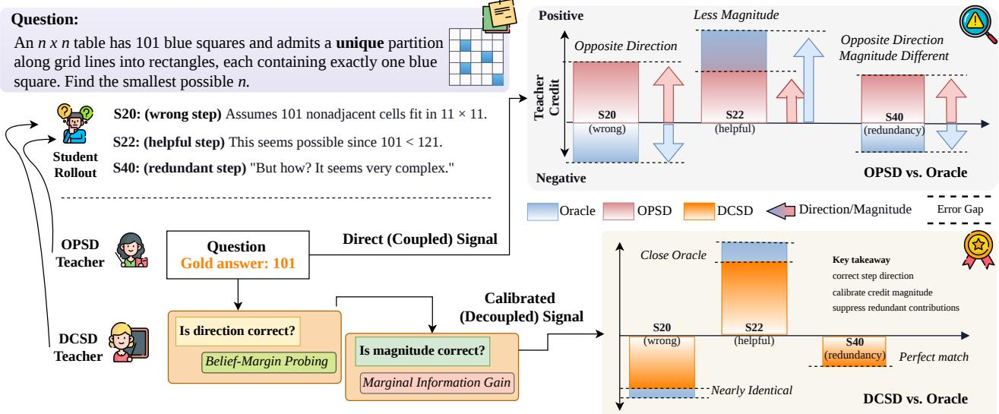
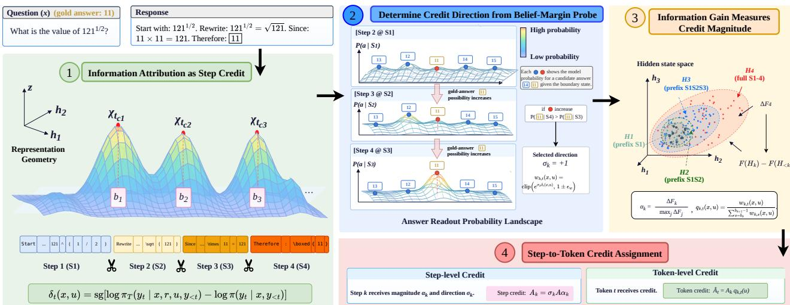
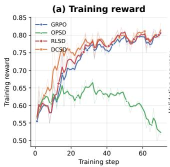
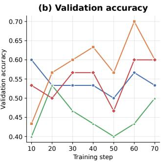
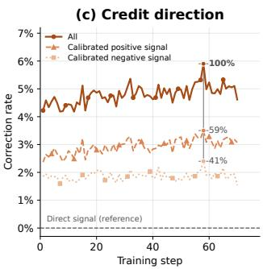
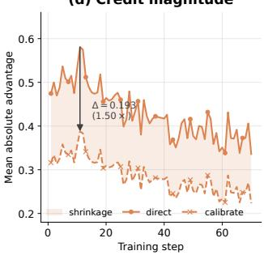
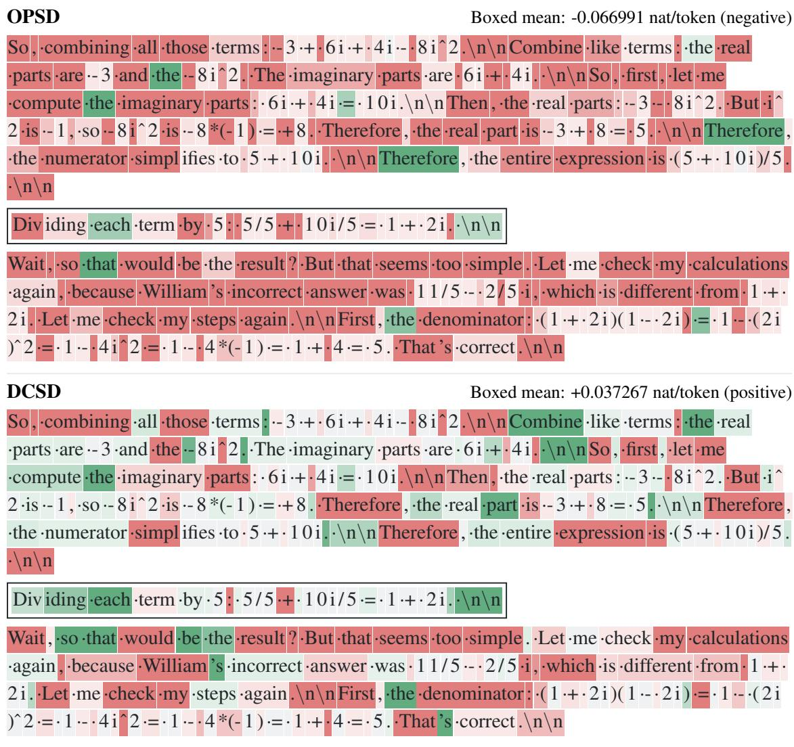
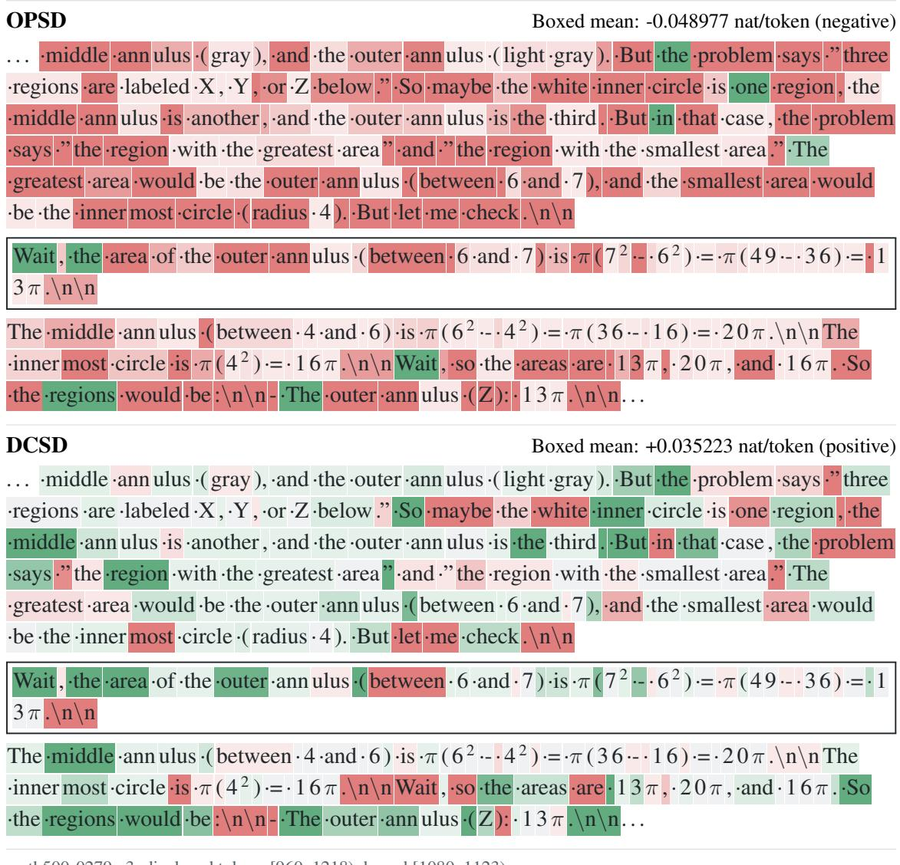
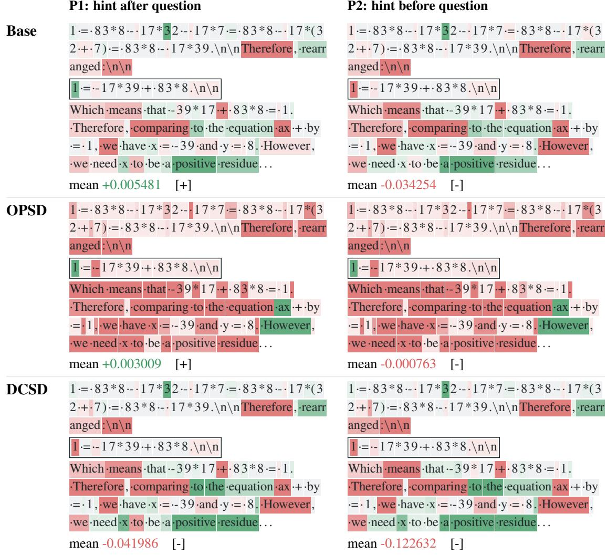

# Can We Trust the Teacher? Decoupled Credit Direction-Magnitude for Self-Distillation

Yugu Li1, Zehong Cao1,∗, Peizhen Li1, Yang Zhang2, Siyi Hu3, and Jianglin Qiao4

1School of CSIT, Adelaide University, Adelaide, SA 5000, Australia

2CAIAA, University of North Texas, Denton, TX 76203, USA

3School of EECMS, Curtin University, Bentley, WA 6102, Australia

4ACFR, The University of Sydney, Camperdown, NSW 2050, Australia

## Abstract

RLVR provides reliable trajectory-level credit, while OPSD ofers dense supervision for token-level credit. This exposes a fundamental coupling when updating step-level credit direction and magnitude with teacher supervision, preventing steps from receiving reliable credit directions and contribution magnitudes, while making both vulnerable to teacher judgment errors and preference variance, as supported by our theoretical analysis. To separate credit direction from its contribution magnitude, we introduce Decoupled Credit Self-Distillation (DCSD), which theoretically decouples credit direction and magnitude into two reliable signals and uses them to calibrate privileged teacher supervision. Specifically, we design belief-margin probing to determine credit direction and marginal information gain to quantify credit magnitude, enabling step-to-token credit assignment for policy optimization. Across 11 benchmarks, DCSD achieves the best overall scores against GRPO, OPSD, RLSD, and RLCSD. Compared with base models, DCSD improves the overall score by 8.45 points on mathematical reasoning and 7.01 points on multimodal reasoning, while correcting the credit direction for 6% of tokens and yielding a 1.5 reduction in token credit magnitude.

## 1. Introduction

Reinforcement learning with verifiable rewards (RLVR) [Lambert et al., 2025; Shao et al., 2024; Guo et al., 2025; Yu et al., 2025] provides reliable outcome feedback, but credit is typically assigned at the trajectory level. Thus, successful trajectories may reinforce incorrect or unnecessary steps, while useful steps in unsuccessful trajectories receive no positive credit. On-policy distillation (OPD) [Agarwal et al., 2024], particularly on-policy self-distillation (OPSD) [Zhao et al., 2026] and its variants [Hübotter et al., 2026; Yang et al., 2026; Pan et al., 2026; Shen et al., 2026; Li et al., 2026], provides denser supervision by using a privileged teacher to evaluate the student’s reasoning with additional information, such as ground-truth answers or reference solutions.

The key challenge is that a direct teacher signal may not provide reliable local credit. Existing OPSD couples credit direction and magnitude through the same teacher signal. The teacher may misjudge whether a step helps or harms the solution, while its signal strength can vary with how privileged information is presented. Consequently, teacher credit can deviate from oracle credit in both direction and magnitude. RLSD [Yang et al., 2026] and RLCSD [Pan et al., 2026] improve robustness by anchoring direction to the trajectory-level RL advantage and using self-distillation mainly to modulate update strength. However, this loses local directional flexibility: harmful steps in successful trajectories cannot receive negative credit, nor useful steps in unsuccessful trajectories positive credit. Thus, teacher signals can misdirect, while trajectory anchoring loses local credit. Additional discussion of related work is provided in Appendix A.

  
Figure 1: Overview of OPSD vs. DCSD credit. Direct OPSD can deviate from oracle credit in both direction and magnitude. DCSD decouples these roles to calibrate credit direction and contribution magnitude, reducing mismatch while preserving useful local credit.

Our theoretical insights (see Section 2) reveal a way out of this trade-of. Under an oracle teacher corresponding to the student’s rollout policy conditioned on eventual success, the self-distillation log-ratio is directionally consistent with the oracle local RL advantage, showing that self-distillation contains useful local directional information. However, its magnitude does not directly represent a step’s contribution, and a practical teacher can also corrupt its direction.

Our insights suggest that reliable step-level credit requires separating update direction from contribution magnitude, rather than coupling both in a single teacher signal.

Motivated by our theoretical insights, we propose Decoupled Credit Self-Distillation (DCSD) (see Section 3), which calibrates teacher supervision by separately determining credit direction and contribution magnitude. Specifically, DCSD determines credit direction through belief-margin probing, which measures how each reasoning step changes the student’s belief in the correct answer, and quantifies contribution magnitude through marginal information gain, which measures how much non-redundant information the step contributes beyond its preceding context. The resulting decoupled credit then calibrates teacher supervision, preserving fine-grained token-level information without allowing teacher variation to freely alter the established step-level direction or magnitude. Thus, DCSD transforms the direct teacher signal in OPSD into a calibrated teacher signal that better aligns with oracle step-level credit. Figure 1 provides an illustrative example of credit in OPSD vs. DCSD. The transition from coupled to decoupled credit is formalized as follows:

$$
\begin{array} { r } { \mathbf { O P S D : } \underbrace { [ D _ { k } ^ { T } M _ { k } ^ { T } ] } _ { \mathrm { C o u p l e d ~ C r e d i t } } \Rightarrow \underbrace { Z _ { k } ^ { T } = Z _ { k } ^ { \star } + \varepsilon _ { k } ^ { T } } _ { \mathrm { D i r e c t ~ S i g n a l } } \qquad \mathbf { D C S D : } \underbrace { [ D _ { k } ^ { T } , M _ { k } ^ { T } ] } _ { \mathrm { D e c o u p l e d ~ C r e d i t } } \Rightarrow \underbrace { \widetilde { Z } _ { k } ^ { T } } _ { \mathrm { C a l i b r a t e d ~ S i g n a l } } \approx \underbrace { Z _ { k } ^ { \star } } _ { \mathrm { O r a c l e d ~ S i g n a l } } } \end{array}
$$

On the OPSD side, the privileged teacher directly provides the step-level credit $Z _ { k } ^ { T }$ , whose direction $D _ { k } ^ { T }$ and magnitude $M _ { k } ^ { T }$ are coupled through the same teacher-derived signal. Consequently, $Z _ { k } ^ { T }$ can be viewed as the oracle credit $Z _ { k } ^ { \star }$ perturbed by teacher-induced deviation $\varepsilon _ { k } ^ { T } ,$ , arising from judgment errors and preference variance. On the DCSD side, we decouple these two components: $D _ { k } ^ { T }$ is determined by our belief-margin probe, while $M _ { k } ^ { T }$ is quantified by marginal information gain. Together, they calibrate the teacher signal $\widetilde { Z } _ { k } ^ { T }$ separately toward the oracle credit $Z _ { k } ^ { \star }$

Our contributions are threefold. (1) We formalize oracle step credit in self-distillation, establish its directional consistency with the local RL advantage, and theoretically identify the factors that cause the direct teacher signal in OPSD to deviate from oracle credit. (2) We introduce DCSD, a decoupled credit framework that calibrates the teacher signal by separately determining credit direction through belief-margin probing and contribution magnitude through marginal information gain, with theoretical guarantees. (3) Experiments across mathematical and multimodal reasoning benchmarks show that DCSD achieves the best overall scores against GRPO, OPSD, RLSD, and RLCSD, demonstrating that calibrated teacher signals improve student overall performance.

## 2. Why Direct Teacher Signals Produce Coupled Credit

To understand why direct teacher supervision in OPSD couples credit direction and contribution magnitude, we first formalize the oracle (ground-truth) local credit for each reasoning step, then derive the self-distillation credit that is directionally consistent with the oracle and show how direct teacher supervision deviates from this oracle credit through judgment errors and preference variance.

## 2.1. Oracle Local Advantage

Given an input x, let π denote the student policy and $\tau = ( y _ { 1 } , \dots , y _ { T } ) \sim \pi ( \cdot \mid x )$ a generated response, where $t \in \{ 1 , \ldots , T \}$ indexes response tokens. We partition τ into K contiguous reasoning steps using boundaries $1 = b _ { 0 } < \dots < b _ { K } = T + 1$ , with $k \in \{ 0 , \ldots , K - 1 \}$ and $C _ { k } = ( y _ { b _ { k } } , \dots , y _ { b _ { k + 1 } - 1 } )$ . The state before step $C _ { k }$ is $S _ { k } = ( x , C _ { < k } )$ , where $C _ { < k } = \left( C _ { 0 } , \dots , C _ { k - 1 } \right)$ , and generating $C _ { k } { \mathrm { ~ y i e l d s ~ } } S _ { k + 1 }$ . We use $\pi ( C \mid S )$ to denote the complete-step probability induced by the autoregressive student policy. A terminal verifier provides reward $R ( \tau ) \in \{ 0 , 1 \}$ and the underlying on-policy objective computes a trajectory-level advantage $A _ { \tau }$ . Let $V ^ { \pi } ( S ) = P _ { \pi } ( R ( \tau ) = 1 \mid S )$ denote the probability of eventual success from state $S ,$ and $Q ^ { \pi } ( S , C ) = P _ { \pi } ( R ( \tau ) = 1 \mid S , C )$ the corresponding success probability after generating step C. For the realized step $C _ { k } , Q ^ { \pi } ( S _ { k } , C _ { k } ) = V ^ { \pi } ( S _ { k + 1 } )$ , giving the oracle local advantage

$$
A _ { k } ^ { \star } = Q ^ { \pi } ( S _ { k } , C _ { k } ) - V ^ { \pi } ( S _ { k } ) = V ^ { \pi } ( S _ { k + 1 } ) - V ^ { \pi } ( S _ { k } ) .\tag{1}
$$

Its sign and magnitude characterize the direction and strength of the local contribution. However, $A _ { k } ^ { \star }$ is inaccessible because intermediate-state success probabilities are unknown; $A _ { \tau }$ alone cannot distinguish local contributions within a rollout. Further details are provided in Appendix B.1.

## 2.2. Oracle Signal Determines the Correct Credit Direction

We first characterize the oracle signal for determining whether a reasoning step should be encouraged or penalized. Consider the student’s policy conditioned on eventual success, $\pi ^ { + } ( C \mid S ) : = P _ { \pi } ( C \mid$ $S , R ( \tau ) = 1 )$ . By Bayes’ rule, $\pi ^ { + } ( C \mid S ) / \pi ( C \mid S ) = Q ^ { \pi } ( S , C ) / V ^ { \pi } ( S )$ . This gives the oracle signal for step $C _ { k }$ as $Z _ { k } ^ { \star } = \log [ \pi ^ { + } ( C _ { k } \mid S _ { k } ) / \pi ( C _ { k } \mid S _ { k } ) ] = \log [ Q ^ { \pi } ( S _ { k } , C _ { k } ) / V ^ { \pi } ( S _ { k } ) ]$ . Combining the monotonicity of log( ) with the oracle local advantage in Eq. 1 gives

$$
\mathrm { s i g n } ( Z _ { k } ^ { \star } ) = \mathrm { s i g n } ( A _ { k } ^ { \star } ) .\tag{2}
$$

Thus, $C _ { k }$ is encouraged when $Z _ { k } ^ { \star } > 0$ and penalized when $Z _ { k } ^ { \star } < 0$ . Importantly, this consistency is directional only: $| Z _ { k } ^ { \star } |$ is not the magnitude of the local advantage $| A _ { k } ^ { \star } |$ . Further details are provided in Appendix B.2.

  
Figure 2: DCSD workflow. Given a student rollout, DCSD identifies reasoning steps from representation transitions, determines credit direction from answer-belief changes and magnitude from marginal information gain, and uses calibrated teacher signals to distribute step credit across tokens.

## 2.3. Direct Teacher Signal Deviates from the Oracle Signal

In practice, the success-conditioned policy $\pi ^ { + }$ is unavailable. OPSD instead uses a privileged teacher πT conditioned on additional information r and a preference realization u, yielding $Z _ { k } ^ { T } = \log [ \pi _ { T } ( C _ { k } \mid$ $S _ { k } , r , u ) / \pi ( C _ { k } \mid S _ { k } ) ]$ . Let $\overline { { \pi } } _ { T } ( C \mid S , r ) = \operatorname { \mathbb { E } } _ { u \sim \mu ( \cdot \vert S , r ) } [ \pi _ { T } ( C \mid S , r , u ) ]$ denote the preference-averaged teacher. Then

$$
Z _ { k } ^ { T } = Z _ { k } ^ { \star } + \varepsilon _ { k } ^ { \mathrm { j u d g e } } + \varepsilon _ { k } ^ { \mathrm { p r e f e r } } ,\tag{3}
$$

where $\varepsilon _ { k } ^ { \mathrm { j u d g e } } = \log [ \overline { { \pi } } _ { T } ( C _ { k } \mid S _ { k } , r ) / \pi ^ { + } ( C _ { k } \mid S _ { k } ) ]$ captures teacher judgment deviation, and $\varepsilon _ { k } ^ { \mathrm { p r e f e r } } =$ log $\left[ \pi _ { T } ( \dot { C } _ { k } \mid S _ { k } , r , u ) / \overline { { \pi } } _ { T } ( C _ { k } \mid S _ { k } , r ) \right]$ captures preference-dependent variation. Further details of the derivation are provided in Appendix B.3. These deviations can reverse the oracle direction when $Z _ { k } ^ { \star } Z _ { k } ^ { T } < 0$ . Thus, direct teacher supervision couples which direction a step should be updated with how much credit it should receive.

In addition, methods such as RLSD [Yang et al., 2026] and RLCSD [Pan et al., 2026] mitigate directional errors by anchoring local credit to $A _ { \tau } , \mathbf { e } . \mathbf { g } . , A _ { \tau } m _ { k }$ with $m _ { k } \geq 0$ . However, this fixes all local credit to the trajectory-level sign (see Appendices B.4, B.5, and B.6): a harmful step in a successful trajectory cannot receive negative credit, while a useful step in an unsuccessful trajectory cannot receive positive credit. Therefore, our analysis motivates decoupling credit direction from magnitude before incorporating teacher evidence for token-level credit assignment.

## 3. Method: Decoupled Credit for Calibrating Teacher Signals

## 3.1. From Value Estimation to Information-Attributed Credit

The oracle credit introduced in Section 2.1 is value-based, measuring how each step changes eventual success probability. Estimating it requires intermediate-state values via value estimators or continuation sampling [Schulman et al., 2017; Luo et al., 2024; Setlur et al., 2025], introducing approximation bias or sampling variance [Schulman et al., 2016; Kazemnejad et al., 2025; Zhang et al., 2024]. To avoid directly estimating intermediate-state values, DCSD shifts from value estimation to information attribution as shown in Figure 2 with the full workflow. We characterize each reasoning step using the student’s internal representations, followed by information-theoretic feature attribution [Chen et al., 2018] to quantify the new information it contributes beyond the preceding reasoning context. This provides a measure of how much credit a step should receive, while credit direction is determined separately through belief-margin probing. The privileged teacher is then used only to distribute the resulting step-level credit across tokens. For autoregressive responses, we adopt marginal representation information as an operational measure of each step’s contribution to response construction, using it to assign relative credit magnitude.

Reasoning steps under information attribution. Following the view that the structured variation carried by a hidden-state trajectory can be quantified directly from the representations themselves [Ma et al., 2026], we let $\mathbf h _ { t } \in \mathbb R ^ { d }$ denote the hidden representation of token $y _ { t }$ extracted from a fixed student layer. For each reasoning step $C _ { k }$ , let $\mathcal { H } _ { k } = \left\{ \mathbf { h } _ { t } \right\} _ { t = b _ { k } } ^ { b _ { k + 1 } - 1 }$ denote its hidden-state feature group, with $\mathcal { H } _ { < k } = \left( \mathcal { H } _ { 0 } , \ldots , \mathcal { H } _ { k - 1 } \right)$ and $\mathcal { H } _ { \le k } = \left( \mathcal { H } _ { 0 } , \ldots , \mathcal { H } _ { k } \right)$ . Let X and Y denote the random input and response corresponding to x and $\tau ,$ respectively. We identify the step boundaries from representational transitions along the generated response using change-point detection; the detailed construction is provided in Appendix C.1. For a target Υ and ordered feature groups $\Phi _ { k }$ with finite total information, the mutual-information chain rule yields the following sequential attribution.

Theorem 1 (Sequential Information Attribution). Define $\mathcal { T } _ { k } ^ { \Upsilon } = I ( \Upsilon ; \Phi _ { k } \ | \ X , \Phi _ { < k } )$ . Then $\mathcal { T } _ { k } ^ { \mathrm { Y } } ~ =$ $I ( \Upsilon ; \Phi _ { \leq k } \mid X ) - I ( \Upsilon ; \Phi _ { < k } \mid X ) \geq 0$ and $\begin{array} { r } { \sum _ { k = 0 } ^ { K - 1 } \mathcal { T } _ { k } ^ { \mathrm { Y } } = I ( \mathrm { Y } ; \Phi _ { 0 : K - 1 } \mid X ) } \end{array}$ . For $\Upsilon = Y$ and $\Phi _ { k } = \mathcal { H } _ { k } ,$ $\mathcal { T } _ { k } = \mathcal { T } _ { k } ^ { Y }$ attributes response information sequentially to steps without assigning correctness labels.

The proof of Theorem 1 is provided in Appendix D.1.

## 3.2. Belief-Margin Probe Design for Decoupled Credit Direction

We determine step-level credit direction from the student’s own answer belief, independently of privileged teacher feedback. At each state $S _ { k }$ , we append the same fixed answer-readout sufix $\mathcal { P } _ { \mathrm { a n s } }$ and score complete candidate answers without sampling additional reasoning. Let $a ^ { + }$ denote the correct answer and $A _ { \tau }$ a fixed candidate set containing $a ^ { + }$ , the rollout prediction, and valid candidates collected across step boundaries, with at least one competitor. For each $a \in A _ { \tau } .$ , define the completeanswer log-likelihood as $\ell _ { k } ( a ) = \log \pi ( a \mid S _ { k } , \mathcal { P } _ { \mathrm { a n s } } )$ . Candidate construction, answer serialization, and sequence scoring are detailed in Appendix C.2.

Belief-margin probe design. At state $S _ { k }$ , we measure the student’s relative support for the correct answer by $\begin{array} { r } { M _ { k } = \ell _ { k } ( a ^ { + } ) - \log \Bigl ( \sum _ { a \in \mathcal { A } _ { \tau } \backslash \{ a ^ { + } \} } \exp ( \ell _ { k } ( a ) ) \Bigr ) } \end{array}$ . The step-induced belief change is

$$
\Delta M _ { k } = M _ { k + 1 } - M _ { k } .\tag{4}
$$

Thus, the sign of $\Delta M _ { k }$ indicates whether $C _ { k }$ shifts belief toward or away from the correct answer.

Belief-guided credit direction. Because small margin changes may be unreliable due to readout mismatch or incomplete candidate coverage, we use the local direction only when $\Delta M _ { k }$ crosses the corresponding confidence threshold; otherwise, we fall back to the trajectory-level direction:

$$
\sigma _ { k } = \left\{ \begin{array} { l l } { \mathrm { s i g n } ( \Delta M _ { k } ) , } & { \Delta M _ { k } \geq \tau _ { M } ^ { + } \mathrm { o r } \Delta M _ { k } \leq \tau _ { M } ^ { - } , } \\ { \mathrm { s i g n } ( A _ { \tau } ) , } & { \mathrm { o t h e r w i s e } , } \end{array} \right.\tag{5}
$$

where $\tau _ { M } ^ { - } < 0 < \tau _ { M } ^ { + }$ set the error tolerance for Theorem 2.

Theorem 2 (Oracle-Consistent Credit Direction). Let $D _ { k } ^ { \star }$ be the oracle log-odds change over $C _ { k }$ and $\Xi _ { k }$ the probe’s readout-and-coverage error. For $\left( S _ { k } , S _ { k + 1 } \right)$ with $0 < V ^ { \pi } ( S _ { k } ) , V ^ { \pi } ( S _ { k + 1 } ) < 1$ and finite $\Xi _ { k } ,$ $\left| \Delta M _ { k } - D _ { k } ^ { \star } \right| \leq \Xi _ { k }$ . Hence, $i f \Xi _ { k } < \operatorname* { m i n } \{ \tau _ { M } ^ { + } , - \tau _ { M } ^ { - } \}$ , then $\Delta M _ { k } \notin ( \tau _ { M } ^ { - } , \tau _ { M } ^ { + } )$ implies $\sigma _ { k } = \mathrm { s i g n } ( \Delta M _ { k } ) =$ $\mathrm { s i g n } ( A _ { k } ^ { \star } ) = \mathrm { s i g n } ( Z _ { k } ^ { \star } )$

The proof of Theorem 2 is provided in Appendix D.2.

## 3.3. Information-Gain Principle for Decoupled Credit Magnitude

Having determined the credit direction $\sigma _ { k } .$ , we next quantify how much credit each reasoning step should receive using the information-attribution principle introduced in Section 3.1. This determines credit magnitude independently of privileged teacher supervision.

Marginal information gain. For any representation collection ${ \mathcal { S } } _ { z }$ , define its information volume as $\begin{array} { r } { F ( \bar { S } ) = \frac 1 2 \log \operatorname* { d e t } \bigl ( \mathbf I _ { d } + \bar { \beta } \sum _ { \mathbf h \in \mathcal S } \mathbf h \mathbf h ^ { \top } \bigr ) } \end{array}$ , where $\mathbf { I } _ { d }$ is the d-dimensional identity matrix and $\beta > 0$ is fixed. The marginal information gain of step $C _ { k }$ is

$$
\Delta F _ { k } = F ( \mathcal { H } _ { \leq k } ) - F ( \mathcal { H } _ { < k } ) .\tag{6}
$$

Thus, $\Delta F _ { k }$ measures the information introduced by $C _ { k }$ beyond the preceding reasoning. Theorem 3 shows that it is exactly the sequential attribution of Theorem 1 for a latent answer variable.

Information gain quantifies credit magnitude. We convert the marginal information gains into bounded relative credit magnitudes as $\alpha _ { k } = \Delta F _ { k } / \operatorname* { m a x } _ { 0 \le j < K } \Delta F _ { j }$ , where $0 \leq \alpha _ { k } \leq 1$ and m $\mathsf { a x } _ { k } \alpha _ { k } = 1$ whenever maxj $\Delta F _ { j } > 0$ . Thus, $\alpha _ { k }$ measures the relative magnitude of step $C _ { k }$ with respect to the most informative step in the response. More details can be found in Appendix C.3. DCSD assigns relative step-credit magnitude according to marginal information contribution within the response, while Theorem 3 connects the underlying information gain to oracle credit through evidence-model bounds rather than asserting pointwise recovery of $| A _ { k } ^ { \star } |$

Theorem 3 (Information Gain Bounds Credit Magnitude). Under (E1)–(E3) in Appendix D.3, $\Delta F _ { k } =$ $I ( \Theta ; { \cal O } _ { \mathcal { H } _ { k } } \mid { \cal O } _ { \mathcal { H } _ { < k } } ) = \operatorname* { s u p } _ { f } I ( f ( \Theta ) ; { \cal O } _ { \mathcal { H } _ { k } } \mid { \cal O } _ { \mathcal { H } _ { < k } } ) .$ , over finite-valued measurable answer maps $f .$ For $0 < V ^ { \pi } ( S _ { k } ) < 1$ , expectation over step evidence gives $\begin{array} { r } { \mathbb { E } [ A _ { k } ^ { \star } ] = 0 , \mathbb { E } [ ( A _ { k } ^ { \star } ) ^ { 2 } ] \le \operatorname* { m i n } \{ \frac { 1 } { 2 } \Delta F _ { k } , \frac { 1 } { 4 } \} } \end{array}$ , and $\mathbb { E } \big [ Z _ { k } ^ { \star } \ | \ R = 1 \big ] \ \leq \ \Delta F _ { k } / V ^ { \pi } \big ( S _ { k } \big )$ . Moreover, $\Delta F _ { k } = 0 \ i f f \ A _ { k } ^ { \star } = 0 f o r$ every f . Thus $\Delta F _ { k }$ is the sharp verifier-independent answer-information envelope.

The proof of Theorem 3 is provided in Appendix D.3.

## 3.4. Calibrated Teacher Supervision for Step-to-Token Credit Assignment

The preceding components determine whether each reasoning step should be encouraged or penalized through $\sigma _ { k } .$ , and how much credit it should receive through $\alpha _ { k }$ . We now use the privileged teacher only to distribute this established step-level credit among tokens within each step. Given privileged content r and preference realization $u ,$ define the token-level teacher–student discrepancy as $\delta _ { t } = $ sg[log $\pi _ { T } ( y _ { t } \mid x , r , u , y _ { < t } ) - \log \pi ( y _ { t } \mid x , y _ { < t } ) ]$ , where sg stops gradients. This signal provides teacher evidence without determining the step-level direction or magnitude.

Teacher-calibrated token credit allocation. For $t \in C _ { k }$ , we align teacher evidence with the established direction and bound its influence using $w _ { k , t } = \mathrm { c l i p } \big ( e ^ { \sigma _ { k } \delta _ { t } } , 1 - \epsilon _ { w } , 1 + \epsilon _ { w } \big )$ , where $0 \leq \epsilon _ { w } < 1$ . We normalize these weights within $C _ { k }$ as $q _ { k , t } = w _ { k , t } \Big / \sum _ { s \in C _ { k } } w _ { k , s }$ . By construction, $\begin{array} { r } { \sum _ { t \in C _ { k } } q _ { k , t } = 1 } \end{array}$ , so $q _ { k , t }$ only determines within-step allocation.

Step-to-token credit assignment. Let $\kappa _ { \tau } > 0$ be a teacher-independent scale factor. For $t \in C _ { k } ,$ the token-level credit is

$$
A _ { t } ^ { \mathrm { t o k } } = \sigma _ { k } \kappa _ { \tau } | A _ { \tau } | \alpha _ { k } q _ { k , t } , \qquad b _ { k } \leq t < b _ { k + 1 } .\tag{7}
$$

This factorization separates step direction $\sigma _ { k }$ , step magnitude $\kappa _ { \tau } | A _ { \tau } | \alpha _ { k }$ , and within-step teacher allocation $q _ { k , t }$ . Since $\alpha _ { k }$ is max-normalized rather than sum-normalized, the total absolute response credit is $\kappa _ { \tau } | A _ { \tau } | \sum _ { k } \alpha _ { k }$ and need not equal $\kappa _ { \tau } | A _ { \tau } | . \mathrm { I f } A _ { \tau } = 0 .$ , all token credits are zero. The clipping keeps all teacher weights finite and positive. Optimization details and the scale convention are provided in Appendix C.4.

Theorem 4 (Calibrated Teacher Supervision Preserves Step Credit). Fix the student policy, response, partition, $\sigma _ { k } \in \{ - 1 , + 1 \} , \alpha _ { k } \geq 0 , \kappa _ { \tau } > 0 ,$ , and $A _ { \tau } \neq 0 .$ . For every teacher realization, $\textstyle \sum _ { t \in C _ { k } } | A _ { t } ^ { \mathrm { t o k } } | =$ $\kappa _ { \tau } | A _ { \tau } | \alpha _ { k }$ and sign $( A _ { t } ^ { \mathrm { t o k } } ) = \sigma _ { k } f o r \ t \in C _ { k }$ with $\alpha _ { k } > 0 .$ . Hence, on steps certified by Theorem 2, nonzero token credits carry sign $( A _ { k } ^ { \star } )$ , and step credit is proportional, within a response, to $\Delta F _ { k }$ (Theorem 3).

The proof of Theorem 4 is provided in Appendix D.4.

Taken together, Theorems 1–4 establish the theoretical foundation of DCSD for decoupling credit direction and magnitude in OPSD, while calibrating teacher supervision rather than direct signal. We formalize and expand upon the brief formulation introduced in Section 1, as summarized below.

$$
\begin{array} { r } { \mathrm { O P S D : } \underbrace { [ \mathrm { s i g n } ( Z _ { k } ^ { T } ) , | Z _ { k } ^ { T } | ] } _ { \mathrm { C o u p l e d ~ C e d i t : } } \Rightarrow \underbrace { Z _ { k } ^ { T } = Z _ { k } ^ { \star } + \varepsilon _ { k } ^ { T } } _ { \mathrm { D i r e c t ~ S i g n a l } } \qquad \mathrm { D C S D : } \underbrace { [ \sigma _ { k } , \alpha _ { k } ] } _ { \mathrm { D e c o u p l e d ~ C r e d i t } } \Rightarrow \underbrace { A _ { t } ^ { \mathrm { t o k } } = \sigma _ { k } \kappa _ { \tau } | A _ { \tau } | \alpha _ { k } q _ { k , t } } _ { \mathrm { C a l i b r a r e d ~ C r e d i t } } } \end{array}
$$

## 4. Experiments and Results

## 4.1. Experimental Setup

Training setup. We consider two reasoning settings: mathematical and multimodal reasoning. For mathematical reasoning, we use Qwen3-4B [Yang et al., 2025] as the base model and DAPO-17K [Yu et al., 2025] for training; for multimodal reasoning, we use Qwen3-VL-8B-Instruct [Bai et al., 2025] with MMFineReason-123K [Lin et al., 2026]. Our mathematical runs share the base model, training data, and rollout budget; multimodal baselines retain the published settings of Yang et al. [2026]. Training is implemented with verl [Sheng et al., 2025]; hyperparameter settings are provided in Appendix E.1, with hardware specifications and computational costs reported in Appendix E.5.

Baselines, benchmarks, and metrics. We compare DCSD against GRPO [Shao et al., 2024], OPSD [Zhao et al., 2026], and RLSD [Yang et al., 2026], with the corresponding base models as references. For mathematical reasoning, we additionally compare with RLCSD [Pan et al., 2026] separately because it uses a diferent construction of privileged information. We evaluate mathematical reasoning on AIME24/25/26 [Mathematical Association of America, 2024, 2025; Zhang and Math-AI, 2026], AMC23 [Mathematical Association of America, 2023], MATH500 [Hendrycks et al., 2021], and HMMT [Dekoninck et al., 2026], and multimodal reasoning on MMMU [Yue et al., 2024], MathVista [Lu et al., 2024], MathVision [Wang et al., 2024], ZeroBench-Sub [Roberts et al., 2026], and WeMath [Qiao et al., 2025]. We report mean@4 accuracy (%), with Overall computed as the sample-weighted average across benchmarks. For multimodal tasks, we train only DCSD and report baseline results from Table 2 of RLSD under the same settings. We follow the same training and evaluation settings for fair comparison, with further details provided in Appendix E.4.

Training dynamics and credit analysis. We further examine how diferent credit designs afect learning by tracking training reward and validation accuracy throughout training. For DCSD, we measure the credit direction-correction rate, including positive and negative corrections, to quantify how often local credit departs from the trajectory-level direction. We also compare the mean absolute RL advantage before and after magnitude allocation to quantify how DCSD adjusts credit magnitude. Definitions and aggregation details are provided in Appendix E.3.

Teacher signal reliability: direct vs. calibrated. To isolate teacher-signal deviation and assess the efect of calibration, we fix the Qwen3-4B responses to 90 AIME24–AIME26 problems and vary only the privileged information provided for scoring. We consider five conditions: no answer (C0), the correct answer (C1), an incorrect answer (C2), an equivalent form of the correct answer (C3), and the correct answer with a worked solution (C4). Using Qwen3-32B under the same conditions as a stronger-model reference, which we treat as a proxy for the oracle teacher, we quantify two complementary forms of deviation. First, Top-1 Disagreement Rate (TDR) captures teacher judgment errors by measuring the percentage of token positions at which the model’s full-vocabulary top-1 prediction difers from the reference. Second, Mean Absolute Error (MAE) captures teacher preference variation by measuring the mean absolute diference in sampled-token log-probabilities, reported in $1 0 ^ { - 3 }$ nat/token. Comparing TDR and MAE across C0–C4 therefore reveals how teacher judgments and preference strengths deviate under diferent privileged information, and how efectively each method calibrates these deviations. Further details are provided in Appendix E.2.

## 4.2. Main Performance Results

Mathematical reasoning tasks. Table 1a shows that GRPO and RLSD generally outperform OPSD, suggesting that anchoring credit to outcome feedback is more robust than directly following an unconstrained teacher signal. However, trajectory-level anchoring assigns the same direction to all steps and therefore cannot capture local credit reversals. DCSD consistently improves over these baselines, indicating that robust credit direction and local flexibility need not be traded of: decoupling direction and magnitude allows local credit to be refined without directly inheriting teacher deviations. The gains on AIME24-26 and HMMT further demonstrate the benefit of this design on challenging multi-step reasoning, while improvements on the higher-accuracy AMC23 and MATH500 show fine-grained credit remains useful even when trajectories are frequently successful.

Multimodal reasoning tasks. As shown in Table 1b, RLSD is the strongest baseline, indicating the benefit of combining outcome anchoring with fine-grained teacher supervision. DCSD further improves performance on MMMU, MathVista, MathVision, and WeMath, with the largest gain on WeMath. As WeMath contains compositional problems involving multiple knowledge concepts and intermediate sub problems, this gain is consistent with our motivation for local credit assignment: useful intermediate reasoning can receive positive credit even when the overall trajectory is unsuccessful, while marginal information gain diferentiates its contribution strength. This suggests that decoupling direction and magnitude can better preserve and weight useful local reasoning than assigning a common outcome direction to all steps. We notice ZeroBench is the exception where DCSD underperforms RLSD. As these problems place greater demands on fine-grained visual perception and spatial reasoning, errors originating from visual evidence may also limit the subsequent reasoning and local credit estimation, which cannot be addressed through credit calibration alone.

<table><tr><td colspan="6">Method Benchmarks</td><td>Overall</td></tr><tr><td colspan="7">(a) Mathematical reasoning (Qwen3-4B)</td></tr><tr><td></td><td>AIME24</td><td>AIME25</td><td>AIME26</td><td>AMC23</td><td>MATH500</td><td>HMMT</td></tr><tr><td>Vanilla</td><td>65.83</td><td>54.17</td><td>52.50</td><td>92.50</td><td>88.10</td><td>26.67 81.40</td></tr><tr><td>GRPO</td><td>67.50</td><td>55.83</td><td>50.00</td><td>90.00</td><td>92.20 33.33</td><td>84.70</td></tr><tr><td>OPSD</td><td>50.00</td><td>46.67</td><td>45.83</td><td>87.50</td><td>88.60 26.67</td><td>80.11</td></tr><tr><td>RLSD</td><td>63.33</td><td>52.50</td><td>55.83</td><td>92.50</td><td>91.00 33.33</td><td>83.86</td></tr><tr><td>DCSD (Ours)</td><td>68.33</td><td>57.50</td><td>59.17</td><td>95.00</td><td>96.00 36.67</td><td>88.56</td></tr><tr><td colspan="7">(b) Multimodal reasoning (Qwen3-VL-8B-Instruct)</td></tr><tr><td></td><td>MMMU</td><td>MathVista</td><td>MathVision</td><td>ZeroBench</td><td>WeMath</td><td></td></tr><tr><td>Vanilla</td><td>62.44</td><td>73.80</td><td>47.37</td><td>19.76</td><td>54.10</td><td>53.43</td></tr><tr><td>GRPO</td><td>65.11</td><td>76.20</td><td>48.82</td><td>22.60</td><td>56.57</td><td>55.49</td></tr><tr><td>OPSD</td><td>63.82</td><td>75.10</td><td>47.53</td><td>21.06</td><td>54.95</td><td>54.13</td></tr><tr><td>RLSD</td><td>67.22</td><td>78.10</td><td>52.73</td><td>24.85</td><td>58.00</td><td>58.19</td></tr><tr><td>DCSD (Ours)</td><td>68.44</td><td>79.20</td><td>54.11</td><td>20.66</td><td>67.05</td><td>61.14</td></tr></table>

Table 1: Reasoning performance (mean@4). Best results are bold.

  
Figure 3: Training dynamics and empirical behavior of decoupled credit. (a) Training reward and (b) validation accuracy on mathematical reasoning. DCSD achieves training rewards comparable to GRPO and RLSD while attaining higher validation accuracy. (c) Direction calibration is sparse and selective, with only a small fraction of tokens receiving positive or negative overrides. (d) Magnitude calibration consistently reduces mean absolute credit, demonstrating independent control of credit direction and magnitude throughout training.

## 4.3. Training Dynamics and Credit Analysis

Training reward and validation accuracy. As shown in Figure 3a-b, DCSD, GRPO, and RLSD achieve similar training rewards throughout training but exhibit diferent validation performance. This gap suggests that comparable outcome rewards can lead to diferent generalization depending on how credit is assigned within each trajectory. DCSD concentrates updates on locally supported and informative reasoning steps, rather than propagating a common outcome direction across the entire response. This more selective credit assignment reduces reinforcement of redundant or weakly relevant steps and is consistent with the stronger validation performance of DCSD. In contrast, the later decline of OPSD shows that denser teacher supervision alone does not necessarily translate into sustained generalization when its local credit remains insuficiently calibrated.

Credit direction correction and magnitude control. As supported by Figure 3c, direction correction occurs for about 6% of tokens, covering both positive corrections in unsuccessful trajectories and negative corrections in successful ones. This shows that DCSD preserves most trajectory-level supervision while selectively correcting the direction when suficient local evidence indicates otherwise. Meanwhile, in Figure 3d, credit-magnitude attenuation remains stable throughout training, suggesting that DCSD consistently diferentiates the contribution strength of individual reasoning steps. Together, these results demonstrate that DCSD independently controls which direction a step should be updated and how much credit it should receive.

In addition, we provide representative examples as case studies in Appendix F, where direct OPSD assigns the wrong credit direction to individual reasoning steps, including rewarding incorrect steps and penalizing correct ones. DCSD selectively reverses these signals, providing qualitative evidence for more reliable local credit assignment.

## 4.4. Teacher Signal Deviation and Calibration Efects

We compare the trained models with a condition-matched Qwen3-32B reference on fixed student responses in Table 2. We treat condition-matched Qwen3-32B as an operational oracle. TDR measures top-1 disagreement, while MAE measures sampled-token log-probability discrepancy. Lower values indicate closer oracle-reference alignment across (C0–C4), indicating closer agreement with the strongermodel reference in both local token decisions and sampled-token preference strengths.

Teacher judgment error. DCSD consistently achieves the lowest TDR across all privileged-information conditions, indicating fewer local top-1 disagreements with the reference. Notably, its advantage already appears under C0, where no privileged answer information is provided, showing that the improvement cannot be attributed solely to additional answer information. The advantage is maintained under correct, incorrect, equivalent, and worked-solution information (C1–C4), suggesting that DCSD remains less sensitive to changes in the privileged context. Under the proxy-oracle assumption, these results indicate lower judgment error across information conditions.

Table 2: Token-level teacher-signal deviation from the condition-matched Qwen3-32B reference. Avg. averages C0–C4. Lower is better; best results are bold.
<table><tr><td>Deviation</td><td>Method</td><td>CO</td><td>C1</td><td>C2</td><td>C3</td><td>C4</td><td>Avg.</td></tr><tr><td rowspan="3">Top-1 disagreement (TDR, %)</td><td>OPSD</td><td>12.07</td><td>12.16</td><td>12.15</td><td>12.18</td><td>12.07</td><td>12.12</td></tr><tr><td>RLSD</td><td>9.69</td><td>10.31</td><td>10.26</td><td>10.31</td><td>10.22</td><td>10.16</td></tr><tr><td>DCSD (Ours)</td><td>9.45</td><td>9.95</td><td>9.89</td><td>9.94</td><td>9.88</td><td>9.82</td></tr><tr><td rowspan="3">Support discrepancy (MAE, 10−3)</td><td>OPSD</td><td>215.96</td><td>217.78</td><td>217.80</td><td>218.59</td><td>219.21</td><td>217.87</td></tr><tr><td>RLSD</td><td>186.15</td><td>200.17</td><td>199.76</td><td>200.04</td><td>206.19</td><td>198.46</td></tr><tr><td>DCSD (Ours)</td><td>183.34</td><td>193.95</td><td>194.00</td><td>193.89</td><td>199.77</td><td>192.99</td></tr></table>

Teacher preference variation. DCSD also achieves the lowest MAE under every condition, indicating that its sampled-token preference strengths remain consistently closer to those of the reference. This advantage holds both on average and under C4, where all methods exhibit their largest deviation after receiving a complete worked solution. Thus, the improvement is not specific to a particular form of privileged information. Together, these results suggest that DCSD keeps its sampled-token preference strengths closer to the proxy oracle across privileged-information conditions, consistent with its design to constrain teacher influence after credit direction and magnitude are established.

## 4.5. Calibrated Teacher Signal Improves Reasoning Eficiency

Privileged self-distillation can overemphasize teacher-specific preferences, causing the student to imitate superficial response patterns rather than reinforce efective reasoning. RLCSD mitigates this issue by contrasting correct and incorrect references, improving reasoning performance while preserving longer reasoning traces. We therefore use RLCSD as a representative baseline to examine whether the more explicitly calibrated teacher signal in DCSD translates into greater reasoning eficiency. We jointly report Pass@1, Pass@4, and mean response length to measure single-attempt accuracy, multi-attempt solution coverage, and generation cost, respectively.

Across six benchmarks, DCSD improves the unweighted mean Pass@1 and Pass@4 over RLCSD by 4.02% and 3.74%, respectively, while producing shorter responses on every benchmark and reducing mean response length by 6.3% (Table 3). The reduction in generation length therefore does not come at the expense of reasoning performance; instead, DCSD achieves higher accuracy and broader solution coverage with fewer generated tokens. This accuracy-eficiency gain is consistent with teachersignal calibration in DCSD: contribution-aware magnitude credit reduces reinforcement of redundant reasoning, while selective direction verification preserves locally useful signals.

Table 3: Reasoning accuracy (%) and eficiency (mean token length) across six benchmarks. Higher accuracy and shorter responses are better; best results are bold.
<table><tr><td></td><td colspan="3">AIME24</td><td colspan="3">AIME25</td><td colspan="3">AIME26</td></tr><tr><td>Method</td><td>Pass@1</td><td>Pass@4</td><td>Length</td><td>Pass@1</td><td>Pass@4</td><td>Length</td><td>Pass@1</td><td>Pass@4</td><td>Length</td></tr><tr><td>RLCSD</td><td>63.33</td><td>73.33</td><td>11,450</td><td>50.00</td><td>70.00</td><td>12,946</td><td>60.00</td><td>70.00</td><td>12,465</td></tr><tr><td>DCSD (Ours)</td><td>70.00</td><td>76.67</td><td>10,627</td><td>56.67</td><td>73.33</td><td>12,052</td><td>56.67</td><td>76.67</td><td>11,847</td></tr><tr><td>AMC23</td><td colspan="4"></td><td>MATH500</td><td></td><td colspan="3"></td></tr><tr><td>Method</td><td>Pass@1</td><td></td><td>Length</td><td>Pass@1</td><td></td><td></td><td>Pass@1</td><td>HMMT</td><td></td></tr><tr><td></td><td></td><td>Pass@4</td><td></td><td></td><td>Pass@4</td><td>Length</td><td></td><td>Pass@4</td><td>Length</td></tr><tr><td>RLCSD</td><td>92.50</td><td>100.00</td><td>7,266</td><td>92.00</td><td>95.20</td><td>4,815</td><td>33.33</td><td>43.33</td><td>14,758</td></tr><tr><td>DCSD (Ours)</td><td>95.00</td><td>97.50</td><td>6,587</td><td>93.60</td><td>96.80</td><td>4,164</td><td>43.33</td><td>53.33</td><td>14,436</td></tr></table>

## 5. Conclusion

We study credit assignment in the self-distillation framework, showing that direct teacher supervision couples credit direction and magnitude, while practical teacher signals can deviate from oracle credit through judgment errors and preference variation. Our analysis therefore motivates treating which direction a step should be updated and how much it should contribute as two separate components of credit assignment. Based on this insight, we propose DCSD, which determines credit direction through belief-margin probing and contribution magnitude through marginal information gain, thereby calibrating privileged teacher supervision rather than directly inheriting its credit. Across 11 mathematical and multimodal reasoning benchmarks, DCSD improves overall student reasoning performance over outcome-based RL and existing self-distillation methods. More broadly, our work provides a new framework for self-distillation that enables more reliable learning from privileged teacher information through decoupled credit assignment. Future work could extend this principle to longer-horizon and interactive reasoning, where credit must be assigned across more complex sequences of decisions and feedback.

## References

Rishabh Agarwal, Nino Vieillard, Yongchao Zhou, Piotr Stanczyk, Sabela Ramos Garea, Matthieu Geist, and Olivier Bachem. On-policy distillation of language models: Learning from self-generated mistakes. In International Conference on Learning Representations, volume 2024, pages 21246– 21263, 2024. URL https://proceedings.iclr.cc/paper\_files/paper/2024/hash/ 5be69a584901a26c521c2b51e40a4c20-Abstract-Conference.html.

Shuai Bai, Yuxuan Cai, Ruizhe Chen, Keqin Chen, Xionghui Chen, Zesen Cheng, Lianghao Deng, Wei Ding, Chang Gao, Chunjiang Ge, et al. Qwen3-vl technical report. arXiv preprint arXiv:2511.21631, 2025. URL https://arxiv.org/abs/2511.21631.

Kathryn Chaloner and Isabella Verdinelli. Bayesian experimental design: A review. Statistical science, pages 273–304, 1995. URL https://doi.org/10.1214/ss/1177009939.

Jianbo Chen, Le Song, Martin Wainwright, and Michael Jordan. Learning to explain: An informationtheoretic perspective on model interpretation. In International conference on machine learning, pages 883–892. PMLR, 2018. URL https://proceedings.mlr.press/v80/chen18j.html.

Thomas M. Cover and Joy A. Thomas. Elements of Information Theory. Wiley-Interscience, Hoboken, NJ, second edition, 2006. ISBN 978-0-471-24195-9. URL https://doi.org/10.1002/047174882X.

Jasper Dekoninck, Nikola Jovanović, Tim Gehrunger, Kári Rögnvaldsson, Ivo Petrov, Chenhao Sun, and Martin Vechev. Beyond benchmarks: Matharena as an evaluation platform for mathematics with llms. 2026. URL https://arxiv.org/abs/2605.00674.

Daya Guo, Dejian Yang, Haowei Zhang, Junxiao Song, Peiyi Wang, Qihao Zhu, Runxin Xu, Ruoyu Zhang, Shirong Ma, Xiao Bi, et al. DeepSeek-R1 incentivizes reasoning in LLMs through reinforcement learning. Nature, 645(8081):633–638, 2025. doi: 10.1038/s41586-025-09422-z. URL https: //www.nature.com/articles/s41586-025-09422-z.

Dan Hendrycks, Collin Burns, Saurav Kadavath, Akul Arora, Steven Basart, Eric Tang, Dawn Song, and Jacob Steinhardt. Measuring mathematical problem solving with the math dataset. Thirty-Fifth Annual Conference on Neural Information Processing Systems, 2021. URL https://datasets-benchmarks-proceedings.neurips.cc/paper/2021/hash/ be83ab3ecd0db773eb2dc1b0a17836a1-Abstract-round2.html.

Jonas Hübotter, Frederike Lübeck, Lejs Deen Behric, Anton Baumann, Marco Bagatella, Daniel Marta, Ido Hakimi, Idan Shenfeld, Thomas Kleine Buening, Carlos Guestrin, and Andreas Krause. Reinforcement learning via self-distillation. In Forty-third International Conference on Machine Learning, 2026. URL https://openreview.net/forum?id=QkfkxyRizZ.

Amirhossein Kazemnejad, Milad Aghajohari, Eva Portelance, Alessandro Sordoni, Siva Reddy, Aaron Courville, and Nicolas Le Roux. VinePPO: Refining credit assignment in RL training of LLMs. In Proceedings of the 42nd International Conference on Machine Learning, volume 267 of Proceedings of Machine Learning Research, pages 29557–29590. PMLR, 2025. URL https://proceedings.mlr. press/v267/kazemnejad25a.html.

Nathan Lambert, Jacob Morrison, Valentina Pyatkin, Shengyi Huang, Hamish Ivison, Faeze Brahman, Lester James Validad Miranda, Alisa Liu, Nouha Dziri, Xinxi Lyu, Yuling Gu, Saumya Malik, Victoria Graf, Jena D. Hwang, Jiangjiang Yang, Ronan Le Bras, Oyvind Tafjord, Christopher Wilhelm, Luca Soldaini, Noah A. Smith, Yizhong Wang, Pradeep Dasigi, and Hannaneh Hajishirzi. Tulu 3: Pushing

frontiers in open language model post-training. In Second Conference on Language Modeling, 2025. URL https://openreview.net/forum?id=i1uGbfHHpH.

Gengsheng Li, Tianyu Yang, Junfeng Fang, Mingyang Song, Mao Zheng, Haiyun Guo, Dan Zhang, Jinqiao Wang, and Tat-Seng Chua. Unifying group-relative and self-distillation policy optimization via sample routing. In Third Conference on Language Modeling, 2026. URL https://openreview. net/forum?id=P2OuWwZspP. Accepted for publication.

Honglin Lin, Zheng Liu, Yun Zhu, Chonghan Qin, Juekai Lin, Xiaoran Shang, Conghui He, Wentao Zhang, and Lijun Wu. Mmfinereason: Closing the multimodal reasoning gap via open data-centric methods. arXiv preprint arXiv:2601.21821, 2026. URL https://arxiv.org/abs/2601.21821.

Dennis V Lindley. On a measure of the information provided by an experiment. The Annals of Mathematical Statistics, 27(4):986–1005, 1956. URL https://doi.org/10.1214/aoms/1177728069.

Song Liu, Makoto Yamada, Nigel Collier, and Masashi Sugiyama. Change-point detection in time-series data by relative density-ratio estimation. Neural Networks, 43:72–83, 2013. doi: 10.1016/j.neunet. 2013.01.012.

Pan Lu, Hritik Bansal, Tony Xia, Jiacheng Liu, Chunyuan Li, Hannaneh Hajishirzi, Hao Cheng, Kai-Wei Chang, Michel Galley, and Jianfeng Gao. Mathvista: Evaluating mathematical reasoning of foundation models in visual contexts. In International Conference on Learning Representations, volume 2024, pages 23439–23554, 2024. URL https://proceedings.iclr.cc/paper\_files/paper/ 2024/hash/663bce02a0050c4a11f1eb8a7f1429d3-Abstract-Conference.html.

Liangchen Luo, Yinxiao Liu, Rosanne Liu, Samrat Phatale, Meiqi Guo, Harsh Lara, Yunxuan Li, Lei Shu, Yun Zhu, Lei Meng, et al. Improve mathematical reasoning in language models by automated process supervision. arXiv preprint arXiv:2406.06592, 2024. URL https://arxiv.org/abs/ 2406.06592.

Yanbiao Ma, Fei Luo, Linfeng Zhang, Chuangxin Zhao, Mingxuan Wang, Yinan Wu, Zhe Qian, Yang Lu, Long Chen, Zhao Cao, et al. Reasoning emerges from constrained inference manifolds in large language models. arXiv preprint arXiv:2605.08142, 2026. URL https://arxiv.org/abs/2605. 08142.

Mathematical Association of America. American mathematics competitions (AMC), 2023. URL https: //maa.org/student-programs/amc/.

Mathematical Association of America. American invitational mathematics examination (AIME), 2024. URL https://maa.org/maa-invitational-competitions/.

Mathematical Association of America. American invitational mathematics examination (AIME), 2025. URL https://maa.org/maa-invitational-competitions/.

Leyi Pan, Shuchang Tao, Yunpeng Zhai, Lingzhe Zhang, Zhaoyang Liu, Bolin Ding, Aiwei Liu, and Lijie Wen. Rlcsd: Reinforcement learning with contrastive on-policy self-distillation. arXiv preprint arXiv:2606.11709, 2026. URL https://arxiv.org/abs/2606.11709.

Runqi Qiao, Qiuna Tan, Guanting Dong, Wu Minhui, Chong Sun, Xiaoshuai Song, Jiapeng Wang, Zhuoma Gongque, Shanglin Lei, Yifan Zhang, et al. We-math: Does your large multimodal model achieve human-like mathematical reasoning? In Proceedings of the 63rd Annual Meeting of the Association for Computational Linguistics (Volume 1: Long Papers), pages 20023–20070, 2025. URL https://aclanthology.org/2025.acl-long.983/.

Jonathan Roberts, Mohammad Reza Taesiri, Ansh Sharma, Akash Gupta, Samuel Roberts, Ioana Croitoru, Simion-Vlad Bogolin, Jialu Tang, Florian Langer, Vyas Raina, et al. ZeroBench: An impossible visual benchmark for contemporary large multimodal models. In Forty-third International Conference on Machine Learning, 2026. URL https://openreview.net/forum?id=EvmCeoiKYI.

John Schulman, Philipp Moritz, Sergey Levine, Michael Jordan, and Pieter Abbeel. High-dimensional continuous control using generalized advantage estimation. In International Conference on Learning Representations, 2016. URL https://arxiv.org/abs/1506.02438.

John Schulman, Filip Wolski, Prafulla Dhariwal, Alec Radford, and Oleg Klimov. Proximal policy optimization algorithms. arXiv preprint arXiv:1707.06347, 2017. URL https://arxiv.org/abs/ 1707.06347.

Amrith Setlur, Chirag Nagpal, Adam Fisch, Xinyang Geng, Jacob Eisenstein, Rishabh Agarwal, Alekh Agarwal, Jonathan Berant, and Aviral Kumar. Rewarding progress: Scaling automated process verifiers for llm reasoning. In International Conference on Learning Representations, volume 2025, pages 60808–60838, 2025. URL https://proceedings.iclr.cc/paper\_files/paper/ 2025/hash/98711dea460bdefe0e651ca23ec98ba2-Abstract-Conference.html.

Zhihong Shao, Peiyi Wang, Qihao Zhu, Runxin Xu, Junxiao Song, Xiao Bi, Haowei Zhang, Mingchuan Zhang, YK Li, Yang Wu, et al. Deepseekmath: Pushing the limits of mathematical reasoning in open language models. arXiv preprint arXiv:2402.03300, 2024. URL https://arxiv.org/abs/2402. 03300.

Zhanming Shen, Jintao Tong, Shaotian Yan, Chen Shen, Hao Chen, Wentao Ye, Xiaomeng Hu, Rui Miao, Haobo Wang, Junbo Zhao, et al. Purified opsd: On-policy self-distillation without losing how to think. arXiv preprint arXiv:2607.02234, 2026. URL https://arxiv.org/abs/2607.02234.

Guangming Sheng, Chi Zhang, Zilingfeng Ye, Xibin Wu, Wang Zhang, Ru Zhang, Yanghua Peng, Haibin Lin, and Chuan Wu. Hybridflow: A flexible and eficient rlhf framework. In Proceedings of the Twentieth European Conference on Computer Systems, pages 1279–1297, 2025. URL https: //doi.org/10.1145/3689031.3696075.

Ke Wang, Junting Pan, Weikang Shi, Zimu Lu, Houxing Ren, Aojun Zhou, Mingjie Zhan, and Hongsheng Li. Measuring multimodal mathematical reasoning with math-vision dataset. Advances in Neural Information Processing Systems, 37:95095–95169, 2024. URL https://papers.nips.cc/paper\_ files/paper/2024/hash/ad0edc7d5fa1a783f063646968b7315b-Abstract-Datasets\_ and\_Benchmarks\_Track.html.

An Yang, Anfeng Li, Baosong Yang, Beichen Zhang, Binyuan Hui, Bo Zheng, Bowen Yu, Chang Gao, Chengen Huang, Chenxu Lv, et al. Qwen3 technical report. arXiv preprint arXiv:2505.09388, 2025. URL https://arxiv.org/abs/2505.09388.

Chenxu Yang, Chuanyu Qin, Qingyi Si, Minghui Chen, Naibin Gu, Dingyu Yao, Zheng Lin, Weiping Wang, Jiaqi Wang, and Nan Duan. Self-distilled rlvr. arXiv preprint arXiv:2604.03128, 2026. URL https://arxiv.org/abs/2604.03128.

Qiying Yu, Zheng Zhang, Ruofei Zhu, Yufeng Yuan, Xiaochen Zuo, Yu Yue, Weinan Dai, Tiantian Fan, Gaohong Liu, Lingjun Liu, et al. Dapo: An open-source llm reinforcement learning system at scale. Advances in Neural Information Processing Systems, 38:113222– 113244, 2025. URL https://papers.nips.cc/paper\_files/paper/2025/hash/ a4277440d50f1f15d2cb4c14f7e0c0d2-Abstract-Conference.html.

Xiang Yue, Yuansheng Ni, Kai Zhang, Tianyu Zheng, Ruoqi Liu, Ge Zhang, Samuel Stevens, Dongfu Jiang, Weiming Ren, Yuxuan Sun, et al. Mmmu: A massive multi-discipline multimodal understanding and reasoning benchmark for expert agi. In Proceedings of the IEEE/CVF conference on computer vision and pattern recognition, pages 9556–9567, 2024. URL https://openaccess.thecvf. com/content/CVPR2024/html/Yue\_MMMU\_A\_Massive\_Multi-discipline\_Multimodal\_ Understanding\_and\_Reasoning\_Benchmark\_for\_CVPR\_2024\_paper.html.

Dan Zhang, Sining Zhoubian, Ziniu Hu, Yisong Yue, Yuxiao Dong, and Jie Tang. Rest-mcts\*: Llm self-training via process reward guided tree search. Advances in Neural Information Processing Systems, 37:64735–64772, 2024. URL https://papers.nips.cc/paper\_files/paper/2024/hash/ 76ec4dc30e9faaf0e4b6093eaa377218-Abstract-Conference.html.

Yifan Zhang and Team Math-AI. American invitational mathematics examination (aime) 2026, 2026. URL https://huggingface.co/datasets/math-ai/aime26.

Siyan Zhao, Zhihui Xie, Mengchen Liu, Jing Huang, Guan Pang, Feiyu Chen, and Aditya Grover. Self-distilled reasoner: On-policy self-distillation for large language models. In Forty-third International Conference on Machine Learning, 2026. URL https://openreview.net/forum?id= Jpxfof0EaS.

## A. Related Work

Reasoning Tasks from RLVR to OPSD. RLVR improves language-model reasoning by optimizing responses against outcome-level rewards. While such rewards provide reliable feedback on whether a final solution succeeds, they ofer limited information about which intermediate reasoning steps are useful, harmful, or redundant. OPSD complements this trajectory-level supervision with dense token-level feedback: the same model acts as both student and privileged teacher under diferent conditioning contexts, allowing the teacher to evaluate the student’s own rollouts with access to additional information [Zhao et al., 2026]. This provides finer-grained supervision without requiring a separate stronger teacher, but shifts the key challenge from obtaining dense supervision to determining whether the resulting teacher signal provides reliable local credit. Our work focuses on this latter problem by studying teacher supervision through two components of step-level credit: its direction and magnitude.

Improving Self-Distillation with Privileged Feedback. A natural way to improve self-distillation is to provide the teacher with richer information or make its supervision more stable. SDPO incorporates environmental feedback and successful responses into the self-teacher context, while mechanisms such as EMA or trust-region teacher regularization stabilize learning [Zhao et al., 2026; Hübotter et al., 2026]. These methods demonstrate the value of privileged supervision. However, under the decomposition in Section 2, richer feedback does not guarantee that the preference-marginalized teacher matches the success-conditioned policy, so judgment error may remain. Moreover, temporal stability of the teacher does not imply stability of its preferences across diferent feedback realizations. Even with fixed teacher parameters, changes in the full conditioning context can alter local scores, allowing preference-dependent variation to afect both credit direction and magnitude. DCSD therefore retains dense teacher evidence while determining step direction and relative magnitude independently, restricting the teacher to within-step allocation after step-level credit has been established.

Combining Self-Distillation with Outcome Feedback. Rather than relying entirely on the teacher signal, another line of work combines self-distillation with outcome-level supervision or selectively controls when and how strongly distillation is applied. RLSD anchors the update direction to the outcome advantage and uses positive teacher-derived weights to modulate token-level magnitude, combining the stability of outcome supervision with fine-grained teacher feedback. SRPO instead routes samples between GRPO and SDPO according to response correctness and the availability of teacher information, and further weights distillation positions according to teacher entropy [Yang et al., 2026; Li et al., 2026]. These designs control either the source or the strength of supervision, but do not separately identify the local direction and contribution magnitude of each reasoning step. Outcome anchoring prevents the teacher from directly reversing the trajectory-level direction, but cannot recover a locally beneficial or harmful step whose contribution has the opposite sign. Teacher entropy, meanwhile, measures predictive concentration under a particular context rather than whether that confidence arises from correct task judgment; identical entropy can correspond to opposite token preferences. Consequently, positive confidence weights cannot correct an erroneous distillation direction, while their magnitude may still inherit both sources of teacher deviation. DCSD moves this calibration to the step level, selecting direction from local changes in answer belief and assigning relative magnitude from information gain in the student’s own representations, rather than merely selecting or reweighting existing supervision.

Improving the Reliability of Teacher Supervision. A further line of work directly calibrates teacher supervision by comparing teacher signals across diferent privileged contexts. RLCSD contrasts teacher scores under correct and incorrect references to suppress shared stylistic shifts, whereas Purified OPSD subtracts a reference-only branch from the teacher conditioned on both the question and reference, followed by centering, soft clipping, and normalization to construct a purified distillation target [Pan et al., 2026; Shen et al., 2026]. Both methods purify supervision through cross-context comparison, but sharing an outer template or reference content does not imply sharing the full conditioning context: replacing the reference reasoning and answer, or removing the question, changes how the teacher interprets the remaining content. Under our decomposition, cancelling preferencedependent efects requires the relative preference responses induced by the two full contexts to satisfy a matching condition; shared surface formatting alone does not enforce this property, and cross-context subtraction alone does not certify oracle-consistent local credit. Centering and normalization can remove vocabulary-wide common shifts, but cannot in general eliminate token-dependent context– reference–realization interactions. Moreover, the reference-only branch may itself contain useful task evidence. Thus, concentrating supervision on reasoning tokens does not by itself remove expressiondependent preferences over those tokens. DCSD does not require preference efects from diferent teacher contexts to cancel exactly; instead, it constrains any residual teacher deviation to redistribute credit only within a step, without changing the already established step direction or total magnitude.

Positioning of DCSD. Existing methods therefore improve on-policy self-distillation from complementary perspectives: enriching or stabilizing privileged supervision, anchoring it to outcome rewards, selectively routing or weighting distillation, and contrasting teacher signals across contexts. DCSD addresses a diferent question: rather than relying on a single teacher-derived signal to determine both aspects of local credit, we explicitly separate which direction a reasoning step should be updated from how much it should contribute. This distinction allows teacher evidence to remain useful for fine-grained token supervision while preventing teacher-dependent variation from freely determining step-level credit.

## B. Analysis of Direct Teacher Signal with Coupled Credit

We first define the step-level reasoning process and its oracle local advantage, derive the successconditioned oracle signal, and separate the direct teacher signal into judgment error and preference dependent variation. We then show why direct teacher supervision, positive outcome-anchored reweighting, and contrastive outcome-anchored correction do not, by themselves, guarantee oracleconsistent local credit. Throughout, direction and magnitude denote the sign and absolute value of the credit coeficient used in the policy objective.

## B.1. Step-Level Reasoning and Oracle Local Credit

States, steps, and rollout probabilities. Fix the student continuation policy $\pi ,$ including its decoding and termination rules. Following Section 2.1, write the response as $\tau = ( C _ { 0 } , \ldots , C _ { K - 1 } )$ , where $C _ { k } = ( y _ { b _ { k } } , \dots , y _ { b _ { k + 1 } - 1 } )$ and $S _ { k } = ( x , C _ { < k } )$ . Generating $C _ { k }$ yields $S _ { k + 1 } = \left( x , C _ { \leq k } \right)$ , with $S _ { 0 } = \left( x , \emptyset \right)$ and $S _ { K } = \left( x , \tau \right)$ . For normalized next-step identities, let $\pi ( C \mid S )$ use a prefix-measurable step-ending convention or a block length fixed before continuation. The detector in Appendix C.1 instead constructs its partition retrospectively. For detected blocks, the value-ratio identities apply pointwise at the realized prefixes under the original continuation policy. Normalized next-step distributions use the prefix-measurable step-ending convention specified above.

For a realized step $C _ { k } .$ , its likelihood factorizes autoregressively as

$$
\pi ( C _ { k } \mid S _ { k } ) = \prod _ { t = b _ { k } } ^ { b _ { k + 1 } - 1 } \pi ( y _ { t } \mid x , y _ { < t } ) .\tag{8}
$$

Any explicit step-ending symbol is included in the scored block; if the end position is externally fixed, the same boundary convention is used throughout.

Value and local advantage. Let $R ( \tau ) \in \{ 0 , 1 \}$ be the terminal verifier reward, with no intermediate rewards or temporal discount. Define

$$
\begin{array} { r l } & { \quad V ^ { \pi } ( S ) = \mathbb { E } _ { \pi } [ R ( \tau ) \mid S ] = P _ { \pi } ( R ( \tau ) = 1 \mid S ) , } \\ & { \quad Q ^ { \pi } ( S , C ) = \mathbb { E } _ { \pi } [ R ( \tau ) \mid S , C ] = P _ { \pi } ( R ( \tau ) = 1 \mid S , C ) . } \end{array}\tag{9}
$$

For a realized transition, $Q ^ { \pi } ( S _ { k } , C _ { k } ) = V ^ { \pi } ( S _ { k + 1 } )$ . Under the normalized next-step convention above, the law of total probability gives

$$
V ^ { \pi } ( S ) = \sum _ { C } \pi ( C \mid S ) Q ^ { \pi } ( S , C ) .\tag{10}
$$

Hence, the oracle local credit is

$$
A _ { k } ^ { \star } = Q ^ { \pi } ( S _ { k } , C _ { k } ) - V ^ { \pi } ( S _ { k } ) = V ^ { \pi } ( S _ { k + 1 } ) - V ^ { \pi } ( S _ { k } ) .\tag{11}
$$

A positive oracle advantage means that the subsequent prefix has a higher continuation success probability than the preceding prefix; a negative advantage means the reverse. Moreover, ${ \mathbb E } _ { C \sim \pi ( \cdot | S ) } [ Q ^ { \pi } ( S , C ) -$ $V ^ { \pi } ( S ) ] = 0$

Along a completed response, the local increments telescope:

$$
\sum _ { k = 0 } ^ { K - 1 } A _ { k } ^ { \star } = V ^ { \pi } ( S _ { K } ) - V ^ { \pi } ( S _ { 0 } ) = R ( \tau ) - V ^ { \pi } ( S _ { 0 } ) .\tag{12}
$$

Thus, a positive trajectory-level sum does not require every local contribution to be positive, nor does a negative sum require every contribution to be negative. A successful response may contain locally harmful steps, while an unsuccessful response may contain locally useful ones.

Outcome feedback is not a realized local advantage. The trajectory-level advantage $A _ { \tau }$ is computed from the terminal reward and the baseline or group normalization of the underlying RL objective; it is not the oracle local advantage $A _ { k } ^ { \star }$ . A shared terminal outcome therefore does not identify the individual value diferences in Eq. (11), which distinguishes trajectory-level outcome feedback from oracle local credit.

## B.2. Deriving the Success-Conditioned Oracle Signal

Success conditioning and Bayes’ rule. For $V ^ { \pi } ( S ) > 0$ , define the student policy conditioned on eventual success as

$$
\pi ^ { + } ( C \mid S ) : = P _ { \pi } ( C \mid S , R ( \tau ) = 1 ) .\tag{13}
$$

This reweights the student’s own possible steps rather than introducing a separate expert policy. By Bayes’ rule,

$$
\begin{array} { c } { { \pi ^ { + } ( C \mid S ) = \frac { P _ { \pi } ( R ( \tau ) = 1 \mid S , C ) \pi ( C \mid S ) } { P _ { \pi } ( R ( \tau ) = 1 \mid S ) } } } \\ { { = \pi ( C \mid S ) \frac { Q ^ { \pi } ( S , C ) } { V ^ { \pi } ( S ) } . } } \end{array}\tag{14}
$$

Equation (10) ensures $\textstyle \sum _ { C } \pi ^ { + } ( C \mid S ) = 1$ . On the support of the student policy,

$$
{ \frac { \pi ^ { + } ( C \mid S ) } { \pi ( C \mid S ) } } = { \frac { Q ^ { \pi } ( S , C ) } { V ^ { \pi } ( S ) } } .\tag{15}
$$

For $\pi ( C _ { k } \mid S _ { k } ) > 0$ and positive values at both boundaries, the oracle log-ratio is therefore

$$
Z _ { k } ^ { \star } = \log \frac { \pi ^ { + } ( C _ { k } \mid S _ { k } ) } { \pi ( C _ { k } \mid S _ { k } ) } = \log \frac { Q ^ { \pi } ( S _ { k } , C _ { k } ) } { V ^ { \pi } ( S _ { k } ) } = \log \frac { V ^ { \pi } ( S _ { k + 1 } ) } { V ^ { \pi } ( S _ { k } ) } .\tag{16}
$$

Oracle-consistent direction. Because the logarithm is monotonic and $V ^ { \pi } ( S _ { k } ) > 0$ , Eq. (16) gives

$$
\mathrm { s i g n } ( Z _ { k } ^ { \star } ) = \mathrm { s i g n } ( A _ { k } ^ { \star } ) .\tag{17}
$$

This proves the directional consistency stated in Section 2.2. If $Q ^ { \pi } ( S _ { k } , C _ { k } ) = 0 < V ^ { \pi } ( S _ { k } )$ , the negativedirection interpretation remains valid as $Z _ { k } ^ { \star } \to - \infty .$ , whereas $V ^ { \pi } ( S _ { k } ) = 0$ makes success conditioning undefined. The finite-log analysis therefore assumes positive probabilities on the relevant support.

Distinguishing log-ratio and advantage scales. Exponentiating Eq. (16) gives

$$
A _ { k } ^ { \star } = V ^ { \pi } ( S _ { k } ) ( e ^ { Z _ { k } ^ { \star } } - 1 ) , \qquad | A _ { k } ^ { \star } | = V ^ { \pi } ( S _ { k } ) | e ^ { Z _ { k } ^ { \star } } - 1 | .\tag{18}
$$

Hence, local advantage magnitude depends on both the preceding value and a nonlinear transformation of $Z _ { k } ^ { \star }$ . For example, transitions from 0.1 to 0.2 and from 0.4 to 0.8 both give $Z _ { k } ^ { \star } = \log 2$ , but advantages of 0.1 and 0.4, respectively. For small $Z _ { k } ^ { \star } , A _ { k } ^ { \star } = V ^ { \pi } ( S _ { k } ) Z _ { k } ^ { \star } + O ( V ^ { \pi } ( S _ { k } ) ( Z _ { k } ^ { \star } ) ^ { 2 } )$

These are two credit coordinates linked by Eq. (18). DCSD uses relative magnitude weights to allocate credit across steps.

## B.3. Judgment Error and Preference-Dependent Variation

Privileged content and preference realizations. Let r denote the semantic content supplied to the teacher, such as an answer or reference solution, and let u denote a preference realization, including its template, wording, formatting, or placement. For fixed S and r, let $\mu ( \cdot \mid S , r )$ be a distribution over semantically equivalent realizations. Define the preference-averaged teacher as

$$
\overline { { \pi } } _ { T } ( C \mid S , r ) : = \operatorname { \mathbb { E } } _ { u \sim \mu ( \cdot \vert S , r ) } \left[ \pi _ { T } ( C \mid S , r , u ) \right] .\tag{19}
$$

The average varies the realization u at fixed semantic content r. Replacing a correct reference with an incorrect one defines a diferent privileged-content condition r.

Exact decomposition. Assume positive probability for the realized step under all policies appearing below. To expose the dependence on the preference realization, we write $Z _ { k } ^ { T } ( u )$ and $\varepsilon _ { k } ^ { \mathrm { p r e f e r } } ( u )$ in this appendix, corresponding to $Z _ { k } ^ { T }$ and $\varepsilon _ { k } ^ { \mathrm { p r e f e r } }$ in Section 2.3, where the argument u is suppressed. Define

$$
\begin{array} { r } { \varepsilon _ { k } ^ { \mathrm { j u d g e } } = \log \frac { \overline { { \pi } } _ { T } ( C _ { k } \mid S _ { k } , r ) } { \pi ^ { + } ( C _ { k } \mid S _ { k } ) } , } \\ { \varepsilon _ { k } ^ { \mathrm { p r e f e r } } ( u ) = \log \frac { \pi _ { T } ( C _ { k } \mid S _ { k } , r , u ) } { \overline { { \pi } } _ { T } ( C _ { k } \mid S _ { k } , r ) } . } \end{array}\tag{20}
$$

The realization law $\mu ( \cdot \mid S , r )$ is fixed as part of the analytical reference. The first residual compares the realization-averaged teacher with the success-conditioned oracle; the second compares a particular realization with that average. Variance is taken over the specified law of u. Inserting these intermediate policies gives

$$
\begin{array} { r l } & { Z _ { k } ^ { T } ( u ) = \log \frac { \pi _ { T } ( C _ { k } \mid S _ { k } , r , u ) } { \pi ( C _ { k } \mid S _ { k } ) } } \\ & { \quad \quad \quad = Z _ { k } ^ { \star } + \varepsilon _ { k } ^ { \mathrm { j u d g e } } + \varepsilon _ { k } ^ { \mathrm { p r e f e r } } ( u ) . } \end{array}\tag{21}
$$

This is an exact identity rather than an approximation and requires no independence between the two deviations.

Preference-dependent variation. Holding the student, state, step, teacher parameters, and r fixed while varying only u gives

$$
\begin{array} { r l } & { Z _ { k } ^ { T } ( u ) - Z _ { k } ^ { T } ( u ^ { \prime } ) = \varepsilon _ { k } ^ { \mathrm { p r e f e r } } ( u ) - \varepsilon _ { k } ^ { \mathrm { p r e f e r } } ( u ^ { \prime } ) , } \\ & { \mathrm { V a r } _ { u \sim \mu } [ Z _ { k } ^ { T } ( u ) ] = \mathrm { V a r } _ { u \sim \mu } [ \varepsilon _ { k } ^ { \mathrm { p r e f e r } } ( u ) ] , } \end{array}\tag{22}
$$

whenever these variances are finite. Hence, $\varepsilon _ { k } ^ { \mathrm { p r e f e r } } ( u )$ captures realization-dependent variation in the direct teacher signal. Its mean is characterized by

$$
\mathbb { E } _ { \mu } \left[ e ^ { \varepsilon _ { k } ^ { \mathrm { p r e f e r } } ( u ) } \right] = 1 , \qquad \mathbb { E } _ { \mu } \left[ \varepsilon _ { k } ^ { \mathrm { p r e f e r } } ( u ) \right] \leq 0 ,\tag{23}
$$

where the first identity follows from Eq. (19) and the second from Jensen’s inequality. Thus, averaging probabilities is generally diferent from averaging log-probabilities.

Relation to token-level teacher evidence. For the realized step $C _ { k } .$ , the teacher step probability factorizes as $\begin{array} { r } { \pi _ { T } ( C _ { k } \mid S _ { k } , r , u ) = \prod _ { t = b _ { k } } ^ { b _ { k + 1 } - 1 } \pi _ { T } ( y _ { t } \mid x , r , u , y _ { < t } ) } \end{array}$ under the same boundary convention used for the student policy. With the token-level discrepancy from Section $3 . 4 , \delta _ { t } = \operatorname { s g } [ \log \pi _ { T } ( y _ { t } \mid$ $x , r , u , y _ { < t } ) - \log \pi ( y _ { t } \mid x , y _ { < t } ) ]$ , the numerical step-level signal satisfies

$$
Z _ { k } ^ { T } ( u ) = \sum _ { t = b _ { k } } ^ { b _ { k + 1 } - 1 } \delta _ { t } .\tag{24}
$$

Stop-gradient preserves these numerical values. The identity connects step-level diagnosis to the sum of token-level teacher log-ratios. The realization average in Eq. (19) is taken over complete step probabilities.

## B.4. Direct OPSD: Local Flexibility Without an Oracle Guarantee

Directional distortion. Direct teacher supervision allows local credit directions to vary within a response, but Eq. (21) shows that these directions need not match the oracle. For $Z _ { k } ^ { \star } \neq 0 .$ , a sign reversal occurs exactly when

$$
Z _ { k } ^ { \star } \left( Z _ { k } ^ { \star } + \varepsilon _ { k } ^ { \mathrm { j u d g e } } + \varepsilon _ { k } ^ { \mathrm { p r e f e r } } ( u ) \right) < 0 .\tag{25}
$$

A suficient condition for preserving the oracle direction is

$$
\left| \varepsilon _ { k } ^ { \mathrm { j u d g e } } + \varepsilon _ { k } ^ { \mathrm { p r e f e r } } ( u ) \right| < | Z _ { k } ^ { \star } | .\tag{26}
$$

Direct teacher supervision does not enforce this condition. When $Z _ { k } ^ { \star } = 0 .$ , any nonzero combined deviation also produces nonzero supervision for an oracle-neutral step.

Log-ratio magnitude distortion. By the reverse triangle inequality,

$$
\begin{array} { r } { \left| | Z _ { k } ^ { T } ( u ) | - | Z _ { k } ^ { \star } | \right| \leq \left| \varepsilon _ { k } ^ { \mathrm { j u d g e } } + \varepsilon _ { k } ^ { \mathrm { p r e f e r } } ( u ) \right| . } \end{array}\tag{27}
$$

This bounds distortion in log-ratio magnitude, not oracle advantage magnitude. Even if $V ^ { \pi } ( S _ { k } )$ were known exactly, substituting $Z _ { k } ^ { T } ( u )$ for $Z _ { k } ^ { \star }$ in the value conversion would yield

$$
\begin{array} { r l } & { V ^ { \pi } ( S _ { k } ) \left( e ^ { Z _ { k } ^ { T } ( u ) } - 1 \right) - A _ { k } ^ { \star } } \\ & { \quad \quad = Q ^ { \pi } ( S _ { k } , C _ { k } ) \left( e ^ { \varepsilon _ { k } ^ { \mathrm { j u d g e } } + \varepsilon _ { k } ^ { \mathrm { p r e f e r } } ( u ) } - 1 \right) . } \end{array}\tag{28}
$$

This follows from Eq. (21) and $V ^ { \pi } ( S _ { k } ) e ^ { Z _ { k } ^ { \star } } = Q ^ { \pi } ( S _ { k } , C _ { k } )$ . The expression is an analytical comparison rather than an OPSD update rule: knowing the correct value scale alone does not remove error introduced by the teacher signal.

A normalized counterexample. Consider two possible steps C and D, each sampled with probability $1 / 2$ , with $Q ^ { \pi } ( S , C ) = 0 . 8$ and $Q ^ { \pi } ( S , D ) = 0 . 2$ . Then $V ^ { \pi } ( S ) = 0 . 5$ and $\pi ^ { + } ( C \mid S ) = 0 . 8$ . Let two equiprobable preference realizations satisfy $\pi _ { T } ( C \mid S , r , u _ { 1 } ) = 0 . 3$ and $\pi _ { T } ( C \mid S , r , u _ { 2 } ) = 0 . 9$ , with the remaining probability assigned to D. The preference-averaged teacher therefore assigns 0.6 to C. For realization $u _ { 1 }$

$$
\begin{array} { c } { { Z ^ { \star } = \log ( 1 . 6 ) > 0 , \qquad A ^ { \star } = 0 . 3 , } } \\ { { \mathrm { } \varepsilon ^ { \mathrm { j u d g e } } = \log ( 0 . 7 5 ) , \qquad \varepsilon ^ { \mathrm { p r e f e r } } ( u _ { 1 } ) = \log ( 0 . 5 ) , } } \\ { { Z ^ { T } ( u _ { 1 } ) = \log ( 0 . 6 ) < 0 . } } \end{array}\tag{29}
$$

All distributions are normalized and the state value satisfies Eq. (10). Thus, sign reversal can occur within a valid reasoning decision process rather than arising from inconsistent probability assignments.

## B.5. RLSD: Outcome Anchoring and the No-Crossing Limitation

Positive teacher reweighting. RLSD uses teacher evidence to modulate a trajectory-level advantage while preserving its direction [Yang et al., 2026]. In our notation, its token coeficient can be written as

$$
A _ { t } ^ { \mathrm { R L S D } } = A _ { \tau } m _ { t } , \qquad m _ { t } > 0 ,\tag{30}
$$

where $m _ { t }$ is a positive teacher-dependent multiplier. Averaging over the tokens of step $C _ { k }$ gives $A _ { k } ^ { \mathrm { R L S D } } = A _ { \tau } \overline { { m } } _ { k }$ with $\overline { { m } } _ { k } > 0$ , and therefore

$$
\mathrm { s i g n } ( A _ { k } ^ { \mathrm { R L S D } } ) = \mathrm { s i g n } ( A _ { \tau } ) .\tag{31}
$$

Teacher evidence can thus change credit magnitude but cannot reverse the trajectory-level direction.

No-crossing limitation. More generally, any outcome-anchored coeficient $A _ { k } = A _ { \tau } m _ { k }$ with $m _ { k } \ge 0$ satisfies

$$
A _ { \tau } A _ { k } \geq 0 .\tag{32}
$$

Hence, whenever $A _ { \tau } A _ { k } ^ { \star } < 0 .$ , an outcome-anchored update cannot recover the oracle local direction: $m _ { k } > 0$ gives the trajectory-level sign, while $m _ { k } = 0$ gives no update rather than the required opposite sign. The multiplier is also not determined by $| A _ { k } ^ { \star } |$ ; for example, an oracle-neutral step with $A _ { k } ^ { \star } = 0$ may still receive nonzero credit when $A _ { \tau } \ne 0$ . Thus, trajectory anchoring protects the outcome sign but does not identify either oracle local direction or local contribution magnitude.

## B.6. RLCSD: Contrastive Preference Cancellation and Its Limits

Contrastive teacher evidence. RLCSD contrasts positive and negative privileged references while retaining an outcome anchor [Pan et al., 2026]. For one reference in each branch, let

$$
Z _ { k } ^ { T , ( \pm ) } ( u ) = \log \frac { \pi _ { T } ( C _ { k } \mid S _ { k } , r ^ { \pm } , u ) } { \pi ( C _ { k } \mid S _ { k } ) } .\tag{33}
$$

Their contrast is

$$
Z _ { k } ^ { \mathrm { c t r } } ( u ) = Z _ { k } ^ { T , ( + ) } ( u ) - Z _ { k } ^ { T , ( - ) } ( u ) = \log \frac { \pi _ { T } ( C _ { k } \mid S _ { k } , r ^ { + } , u ) } { \pi _ { T } ( C _ { k } \mid S _ { k } , r ^ { - } , u ) } .\tag{34}
$$

Applying the decomposition in Eq. (21) to both branches gives

$$
Z _ { k } ^ { \mathrm { c t r } } ( u ) = \varepsilon _ { k } ^ { \mathrm { j u d g e } , ( + ) } - \varepsilon _ { k } ^ { \mathrm { j u d g e } , ( - ) } + \varepsilon _ { k } ^ { \mathrm { p r e f e r } , ( + ) } ( u ) - \varepsilon _ { k } ^ { \mathrm { p r e f e r } , ( - ) } ( u ) ,\tag{35}
$$

Equation (35) expresses both branches relative to the same success-conditioned reference. The negativebranch residual includes its displacement from that reference, and the contrast retains task-relevant information through the remaining branch diferences.

Residual preference variation. Let

$$
\overline { { { Z } } } _ { k } ^ { \mathrm { c t r } } = \log \frac { \overline { { { \pi } } } _ { T } \bigl ( C _ { k } \mid S _ { k } , r ^ { + } \bigr ) } { \overline { { { \pi } } } _ { T } \bigl ( C _ { k } \mid S _ { k } , r ^ { - } \bigr ) } .\tag{36}
$$

Then

$$
Z _ { k } ^ { \mathrm { c t r } } ( u ) - \overline { { { Z } } } _ { k } ^ { \mathrm { c t r } } = \varepsilon _ { k } ^ { \mathrm { p r e f e r , ( + ) } } ( u ) - \varepsilon _ { k } ^ { \mathrm { p r e f e r , ( - ) } } ( u ) .\tag{37}
$$

Complete cancellation therefore requires $\varepsilon _ { k } ^ { \mathrm { p r e f e r } , ( + ) } ( u ) = \varepsilon _ { k } ^ { \mathrm { p r e f e r } , ( - ) } ( u )$ . The branches may share the same outer realization while receiving diferent reference reasoning and answers. Their full conditioning contexts therefore difer, and shared wrapper text does not enforce equality of their relative preference efects. Matched components cancel; token- or step-dependent residuals need not.

Outcome anchoring and no crossing. RLCSD further masks and bounds its contrastive modulation while preserving the outcome-selected sign. Denoting its resulting token coeficient by $A _ { t } ^ { \mathrm { R L C S D } }$ , the construction satisfies

$$
A _ { \tau } A _ { t } ^ { \mathrm { R L C S D } } \geq 0 .\tag{38}
$$

Consequently, any nonnegative aggregation of token coeficients within a step remains in the same outcome-selected half-line. When $A _ { \tau } A _ { k } ^ { \star } < 0$ , the required oracle local direction therefore cannot be recovered even if contrastive preference cancellation were exact.

Thus, contrastive teacher evidence can suppress shared preference efects, but neither guarantees their complete removal nor resolves the local-direction limitation imposed by outcome anchoring. Its contrastive scale is not, by construction, the absolute oracle advantage scale.

## B.7. Implications for Decoupled Credit for Teacher Calibration

The preceding results identify complementary limitations rather than a general failure of self-distillation. Direct OPSD preserves local flexibility but can inherit both judgment error and preference-dependent variation. RLSD protects the trajectory-level direction but cannot recover an oracle local direction that disagrees with it. RLCSD can suppress shared preference efects, yet residual variation may remain, and its outcome-preserving modulation retains the no-crossing limitation.

These observations motivate the construction in Section 3: DCSD selects $\sigma _ { k }$ and relative magnitude $\alpha _ { k }$ separately from privileged teacher scores, then uses teacher evidence only for within-step allocation $q _ { k , t }$ . The shared response scale is $| A _ { \tau } |$ . Its token-level credit satisfies

$$
A _ { t } ^ { \mathrm { t o k } } = \sigma _ { k } \kappa _ { \tau } | A _ { \tau } | \alpha _ { k } q _ { k , t } , \qquad \sum _ { t \in C _ { k } } A _ { t } ^ { \mathrm { t o k } } = \sigma _ { k } \kappa _ { \tau } | A _ { \tau } | \alpha _ { k } .\tag{39}
$$

Since $q _ { k , t } > 0$ and $\begin{array} { r } { \sum _ { t \in C _ { k } } q _ { k , t } = 1 } \end{array}$ , teacher variation can redistribute credit within a step but cannot alter its established direction or total magnitude. The direction certificate, evidence-based magnitude bound, and step-credit preservation property are established separately in Appendices D.2, D.3, and D.4, respectively. Appendix C provides the corresponding DCSD constructions.

## C. Details of DCSD Workflow

This appendix provides the detailed constructions for marginal information gain, belief-margin probing, and hierarchical step–token credit allocation in DCSD. The student rollout and its trajectory-level advantage $A _ { \tau }$ are fixed before these local credit signals are constructed.

## C.1. Detailed: From Value Estimation to Information-Attributed Credit

This subsection details the representation construction underlying Section 3.1. After a response is generated, DCSD extracts fixed student representations and groups them into reasoning-step features used for sequential information attribution.

Hidden representations. For a generated response $\tau = ( y _ { 1 } , \dots , y _ { T } )$ , let $\mathbf h _ { t } \in \mathbb R ^ { d }$ denote the hidden representation of token $y _ { t }$ extracted from the same fixed student layer and preprocessing procedure throughout the response. These representations are computed from the realized student trajectory and remain fixed during subsequent step induction and credit construction. Temporary transformations used by the boundary detector, such as local mean-centering, do not redefine the representations used for information attribution.

Step induction from local representation geometry. The reasoning-step partition is inferred after generation and does not alter the autoregressive rollout. For eligible positions t on the stride-8 grid specified in Appendix E.1, the boundary between $y _ { t - 1 }$ and $y _ { t }$ is treated as a candidate cut. We compare adjacent windows of size $w _ { i }$

$$
W _ { t } ^ { - } = \{ { \bf h } _ { t - w } , \ldots , { \bf h } _ { t - 1 } \} , \qquad W _ { t } ^ { + } = \{ { \bf h } _ { t } , \ldots , { \bf h } _ { t + w - 1 } \} ,\tag{40}
$$

using only positions for which both windows lie fully within the response.

Following the dimension–volume view of reasoning representations [Ma et al., 2026], each window is characterized by its efective dimension and local spectral volume. After subtracting the window mean,

let $\{ \lambda _ { i } ( W ) \}$ denote the non-negative eigenvalues of the resulting Gram matrix. We define

$$
\mathcal { D } ( W ) = \frac { ( \sum _ { i } \lambda _ { i } ( W ) ) ^ { 2 } } { \sum _ { i } \lambda _ { i } ^ { 2 } ( W ) + \epsilon } , \qquad \mathcal { V } ( W ) = \frac 1 2 \sum _ { i } \log \left( 1 + \frac { d } { | W | } \lambda _ { i } ( W ) \right) ,\tag{41}
$$

where $\epsilon > 0$ is a numerical stabilizer and $| W |$ is the window size. The efective dimension measures how broadly variation is distributed across representation directions, while ${ \mathcal { V } } ( W )$ measures their regularized spectral spread. Because mean-centering removes the window mean, we additionally retain its original mean direction.

To combine these local changes, define $\Psi ( W ) = \mathcal { V } ( W ) - \eta _ { \tau } \mathcal { D } ( W )$ and construct

$$
\boldsymbol { \phi } _ { t } = [ \begin{array} { c } { | \Psi ( \boldsymbol { W } _ { t } ^ { + } ) - \Psi ( \boldsymbol { W } _ { t } ^ { - } ) | } \\ { | \mathcal { V } ( \boldsymbol { W } _ { t } ^ { - } ) - \mathcal { V } ( \boldsymbol { W } _ { t } ^ { + } ) ] + ] , \qquad \chi _ { t } = \omega ^ { \top } S \mathsf { t d } _ { \tau } ( \boldsymbol { \phi } _ { t } ) , } \\ { [ \mathcal { D } ( \boldsymbol { W } _ { t } ^ { + } ) - \mathcal { D } ( \boldsymbol { W } _ { t } ^ { - } ) ] + ] } \\ { 1 - \cos ( \mu _ { t } ^ { - } , \mu _ { t } ^ { + } ) } \end{array}\tag{42}
$$

where $\mu _ { t } ^ { - }$ and $\mu _ { t } ^ { + }$ are the window means before centering, $[ z ] _ { + } = \operatorname* { m a x } ( z , 0 )$ , Std standardizes each component over eligible positions within the response, and $\omega \in \mathbb { R } ^ { 4 }$ contains the detector weights.

Following the general principle of change-point detection [Liu et al., 2013], we retain high-scoring local maxima of $\chi _ { t }$ while suppressing nearby lower-scoring candidates under a minimum-separation rule. Sorting the retained positions yields the interior boundaries $b _ { 1 } , \dotsc , b _ { K - 1 }$ and hence the reasoning steps $C _ { 0 } , \dots , C _ { K - 1 }$ . The detected representation transitions define the reasoning-step units used for credit attribution.

Feature groups for sequential information attribution. Once the boundaries are fixed, each reasoning step defines the hidden-state feature group $\mathcal { H } _ { k } = \left\{ \mathbf { h } _ { t } \right\} _ { t = b _ { k } } ^ { b _ { k + 1 } - 1 }$ , with $\mathcal { H } _ { < k }$ and $\mathcal { H } _ { \le k }$ denoting the preceding and accumulated feature groups, respectively. Across the problem and rollout distribution, these constructions induce the random feature blocks used in Theorem 1, with X and Y denoting the corresponding input and response random variables.

For the information identity, the fixed extraction and grouping rule induces random feature blocks across responses, as specified in Appendix D.1. For the implemented geometry, the generated response and its realized partition are held fixed. Theorem 1 then attributes to step $C _ { k }$ the conditional response information $\mathcal { T } _ { k } = I ( Y ; \mathcal { H } _ { k } \mid X , \mathcal { H } _ { < k } )$ . The proof of its marginal and telescoping properties is provided in Appendix D.1. The computable marginal-information construction used to obtain relative credit magnitudes is developed separately in Appendix C.3.

## C.2. Detailed: Belief-Margin Probe Design for Decoupled Credit Direction

This subsection details the belief-margin probe introduced in Section 3.2. The probe selects local direction using the student’s answer scores and the known correct answer. It does not sample additional reasoning trajectories or consult privileged-context teacher probabilities to select the sign; insuficient local evidence triggers the trajectory-level fallback sign $\left( { { A _ { \tau } } } \right)$

Boundary readout and answer serialization. At each state $S _ { k }$ , we append the same fixed answerreadout sufix $\mathcal { P } _ { \mathrm { a n s } }$ and define the readout context

$$
\begin{array} { r } { B _ { k } = ( S _ { k } , \mathcal { P } _ { \mathrm { a n s } } ) . } \end{array}\tag{43}
$$

The sufix requests an immediate final answer and is held fixed across all boundaries. The correct answer is not included in $B _ { k } ;$ it enters only as one of the candidate answers subsequently scored under this context.

For a semantic candidate answer $^ { a , }$ let $\sec ( a )$ be its canonical textual form and $d _ { \mathrm { a n s } }$ the fixed answer terminator. Its serialized token sequence is

$$
\mathbf { z } ( a ) = { \mathrm { T o k } } ( { \mathrm { s e r } } ( a ) \| d _ { \mathrm { a n s } } ) = ( z _ { 1 } , \dots , z _ { m ( a ) } ) .\tag{44}
$$

The same canonicalization, serialization, and termination convention is used at every boundary. Including the terminator in the scored sequence distinguishes a complete answer from a prefix that could continue into another answer.

Candidate field construction. Candidate discovery is separated from candidate scoring. At each boundary, the next-token distribution under $B _ { k }$ is used only to propose likely answer heads. We retain the top- $. K _ { d }$ proposals, convert admissible proposals into complete valid answers, and denote the resulting set by $\mathrm { D i s c o v e r } ( S _ { k } )$ . These proposal probabilities are not used as belief scores.

Let $a ^ { + }$ denote the correct answer, $a _ { \tau }$ the rollout answer, and $\boldsymbol { \mathcal { A } } _ { \tau } ^ { \mathrm { e x p } }$ the valid answers explicitly expressed in the response. The response-level candidate field is

$$
\mathcal { A } _ { \tau } = \mathrm { C a n o n } \Bigg ( \{ a ^ { + } , a _ { \tau } \} \cup \mathcal { A } _ { \tau } ^ { \mathrm { e x p } } \cup \bigcup _ { k = 0 } ^ { K } \mathrm { D i s c o v e r } ( S _ { k } ) \Bigg ) .\tag{45}
$$

After construction, $\boldsymbol { A } _ { \tau }$ is frozen and the same candidate field is scored at every boundary. A candidate discovered at a later boundary may therefore be evaluated retrospectively at an earlier boundary, but only under the earlier context $B _ { k } ;$ no later reasoning tokens are added to that context. This prevents changes in candidate membership from directly altering the belief margin. If no valid competitor to $a ^ { + }$ remains after canonicalization, the local probe is treated as inconclusive and DCSD uses the trajectory-level fallback.

Complete-answer scoring and belief margin. For each $a \in A _ { \tau }$ , we evaluate the teacher-forced log-likelihood of its complete serialized answer:

$$
\ell _ { k } ( a ) = \sum _ { i = 1 } ^ { m ( a ) } \log \pi ( z _ { i } \mid \mathcal { B } _ { k } , z _ { < i } ) .\tag{46}
$$

All tokens in ${ \pmb z } ( a )$ are prescribed by the candidate; teacher forcing supplies the preceding candidate tokens as context but does not set their probabilities to one. Thus, $\ell _ { k } ( a )$ is the likelihood of the complete answer rather than only its first token.

Using the same frozen candidate field, the correct-answer belief margin is

$$
M _ { k } = \ell _ { k } ( a ^ { + } ) - \log \left( \sum _ { a \in \mathcal { A } _ { \tau } \backslash \{ a ^ { + } \} } \exp ( \ell _ { k } ( a ) ) \right) .\tag{47}
$$

The first term measures support for the correct answer, while the second aggregates support for all competitors. Relative belief is used because an increase in $\ell _ { k } ( a ^ { + } )$ alone need not indicate improvement if competing answers increase by more.

For step $C _ { k } ,$ the local belief change is

$$
\Delta M _ { k } = M _ { k + 1 } - M _ { k } .\tag{48}
$$

Because $B _ { k }$ and $B _ { k + 1 }$ use the same readout sufix, serialization convention, and candidate field, $\Delta M _ { k }$ isolates the change in the fixed readout associated with adding reasoning step $C _ { k }$

Direction selection. We use signed margin thresholds to select local directions. Theorem 2 characterizes the error-tolerance conditions under which a selected direction is oracle-consistent:

$$
\sigma _ { k } = \left\{ \begin{array} { l l } { \mathrm { s i g n } ( \Delta M _ { k } ) , } & { \Delta M _ { k } \geq \tau _ { M } ^ { + } \mathrm { o r } \Delta M _ { k } \leq \tau _ { M } ^ { - } , } \\ { \mathrm { s i g n } ( A _ { \tau } ) , } & { \mathrm { o t h e r w i s e } , } \end{array} \right.\tag{49}
$$

where $\tau _ { M } ^ { - } < 0 < \tau _ { M } ^ { + }$ . If no valid competitor is available, the fallback branch is used directly.

For $\Xi _ { k } <$ min $\{ \tau _ { M } ^ { + } , - \tau _ { M } ^ { - } \}$ under the conditions of Theorem 2, each probe-selected direction satisfies $\sigma _ { k } = \mathrm { s i g n } ( A _ { k } ^ { \star } ) = \mathrm { s i g n } ( Z _ { k } ^ { \star } )$ . Appendix D.2 derives $\Xi _ { k }$ and proves this threshold guarantee.

Verifier-anchored probing and empirical threshold selection. The belief-margin probe is anchored to the terminal verification target through the known correct answer $a ^ { + }$ , which is used as a scoring target rather than inserted into the readout context. Its local evidence is computed from the student’s completeanswer likelihoods, not from a step-level verifier. We select $\tau _ { M } ^ { + }$ and $\tau _ { M } ^ { - }$ empirically, with the task-specific values reported in Table 4, to control how large a readout-margin change is required before replacing the trajectory-level direction in Eq. (49). Theorem 2 provides a conditional guarantee: a probe-selected step is oracle-certified only when its readout-and-coverage error also satisfies $\Xi _ { k } <$ < min $\{ \tau _ { M } ^ { + } , - \tau _ { M } ^ { - } \}$ Empirical threshold selection does not by itself establish this analytical condition for every selected step, and $\Xi _ { k }$ is not directly evaluated by the online probe. Accordingly, “certified” refers to probe-selected steps satisfying the theorem’s error-budget condition, rather than to all empirical overrides. Unselected or inconclusive steps retain sign(A ), while the step-credit preservation property in Theorem 4 holds for any fixed selected direction, independently of whether oracle certification is available.

Implementation. Complete-answer scoring can be cached and batched without changing its probabilistic definition. The model state after $\boldsymbol { B } _ { k }$ may be reused across candidates, provided candidate sequences remain causally isolated so that each candidate attends only to $B _ { k }$ and its own preceding answer tokens. Such caching and batching are implementation optimizations rather than alternative scoring rules.

The probe determines $\sigma _ { k } .$ , information gain determines $\alpha _ { k } ,$ , and privileged teacher evidence is introduced after both quantities are fixed.

## C.3. Detailed: Information-Gain Principle for Decoupled Credit Magnitude

This subsection details the information-gain construction introduced in Section 3.3. Given the fixed reasoning-step partition and hidden-state feature groups from Section 3.1, DCSD uses marginal representation information to determine the relative magnitude weight $\alpha _ { k }$ of each step.

Information-volume construction. Throughout this subsection, representation collections are indexed by token occurrence, so identical vectors at diferent positions remain distinct observations.

When $\mathcal { H } _ { < k }$ or $\mathcal { H } _ { \leq k }$ is used as an argument of $F ( \cdot )$ , it denotes the indexed collection obtained by accumulating the corresponding feature groups.

For any finite representation collection ${ \cal { S } } ,$ define

$$
\mathbf { B } _ { \mathcal { S } } = \mathbf { I } _ { d } + \beta \sum _ { \mathbf { h } \in \mathcal { S } } \mathbf { h } \mathbf { h } ^ { \top } , \qquad F ( \mathcal { S } ) = \frac { 1 } { 2 } \log \operatorname* { d e t } \mathbf { B } _ { \mathcal { S } } ,\tag{50}
$$

where $\mathbf { I } _ { d }$ is the d-dimensional identity matrix and $\beta > 0$ is fixed. If $\because \xi _ { 1 } ( S ) , \ldots , \xi _ { d } ( S )$ are the eigenvalues of $\Sigma _ { \mathbf { h } \in \mathcal { S } } \mathbf { h } \mathbf { h } ^ { \top }$ , then

$$
F ( \mathcal { S } ) = \frac { 1 } { 2 } \sum _ { j = 1 } ^ { d } \log \left( 1 + \beta \xi _ { j } ( \mathcal { S } ) \right) .\tag{51}
$$

Thus, $F ( S )$ is a regularized log-volume of the accumulated uncentered second-moment matrix. It depends on representation energy across directions, including any shared mean component, while the identity term keeps $\mathbf { B } _ { \mathcal { S } }$ positive definite.

Marginal information gain. For reasoning step $C _ { k } ,$ the marginal gain beyond the preceding representation history is

$$
\Delta F _ { k } = F ( \mathcal { H } _ { \leq k } ) - F ( \mathcal { H } _ { < k } ) ,\tag{52}
$$

matching Eq. (6) in the main text. More generally, for an incoming representation block  and preceding collection ${ \mathcal { S } } _ { z }$ define

$$
\Delta F ( \mathcal { C } \mid \mathcal { S } ) = F ( \mathcal { S } \cup \mathcal { C } ) - F ( \mathcal { S } ) .\tag{53}
$$

Hence, $\Delta F _ { k } = \Delta F ( \mathcal { H } _ { k } \mid \mathcal { H } _ { < k } )$

For a single additional representation h, the matrix determinant lemma gives

$$
\Delta F ( \mathbf { h } \mid \boldsymbol { S } ) = \frac { 1 } { 2 } \log \left( 1 + \beta \mathbf { h } ^ { \top } \mathbf { B } _ { \boldsymbol { S } } ^ { - 1 } \mathbf { h } \right) .\tag{54}
$$

The history-adjusted term h⊤ $\mathbf { \delta B } _ { \mathcal { S } } ^ { - 1 } \mathbf { h }$ is smaller when the incoming representation lies mainly in directions already well represented by the preceding context, and larger when it contributes comparatively novel variation.

Accordingly, the fixed log-determinant set function satisfies diminishing returns: for $S _ { 1 } \subseteq S _ { 2 }$ and a common incoming block disjoint from both histories,

$$
\Delta F ( \mathcal { C } \mid \mathcal { S } _ { 1 } ) \geq \Delta F ( \mathcal { C } \mid \mathcal { S } _ { 2 } ) \geq 0 .\tag{55}
$$

Thus, representation structure already captured by earlier reasoning contributes progressively less additional gain when encountered again.

Relative credit magnitude. For maxj $\Delta F _ { j } > 0$ , DCSD converts the marginal gains into bounded relative magnitude weights using maximum normalization:

$$
\alpha _ { k } = \Delta F _ { k } \Big / \operatorname* { m a x } _ { 0 \le j < K } \Delta F _ { j } , \qquad 0 \le \alpha _ { k } \le 1 , \qquad \operatorname* { m a x } _ { k } \alpha _ { k } = 1 .\tag{56}
$$

Hence, $\alpha _ { k }$ scales step magnitude relative to the largest measured information gain in the same response. Unlike a normalized share, $\sum _ { k } \alpha _ { k }$ is not constrained to one: the maximum-gain step retains unit relative magnitude, while the remaining steps are scaled according to their information contribution. If all gains vanish, we set $\alpha _ { k } = 0$ for every $k ,$ so the response receives no step credit.

Conditional-information interpretation. The log-determinant construction admits an informationtheoretic interpretation under an auxiliary linear-Gaussian observation model. Let $\Theta \sim \mathcal { N } ( 0 , \mathbf { I } _ { d } )$ and associate each hidden representation h with

$$
{ \cal O } _ { \bf h } = \sqrt { \beta } { \bf h } ^ { \top } \Theta + \epsilon _ { \bf h } , \qquad \epsilon _ { \bf h } \sim \mathcal { N } ( 0 , 1 ) ,\tag{57}
$$

where the observation noises are mutually independent and independent of Θ. For a representation collection $\mathcal { S } _ { z }$ , let $O _ { \mathcal { S } } = \left\{ O _ { \mathbf { h } } : \mathbf { h } \in \mathcal { S } \right\}$ . Under this model,

$$
\boldsymbol { F } ( \boldsymbol { S } ) = \boldsymbol { I } ( \Theta ; O _ { \boldsymbol { S } } ) , \qquad \Delta \boldsymbol { F } _ { k } = \boldsymbol { I } \bigl ( \Theta ; O _ { \mathcal { H } _ { k } } \mid O _ { \mathcal { H } _ { < k } } \bigr ) .\tag{58}
$$

Therefore, $\Delta F _ { k }$ measures the conditional information introduced by the current representation block beyond that already available from the preceding representations. The vectors $\mathbf { h } _ { t }$ are fixed loadings in the auxiliary Gaussian-observation model.

Relation to value-based credit. The realized gains telescope to the total representation log-volume as in Eq. (92). Under the evidence model in Appendix D.3, $\Delta F _ { k } = I ( \Theta ; O _ { \mathcal { H } _ { k } } \mid O _ { \mathcal { H } _ { < k } } )$ bounds answer information and expected squared oracle advantage. The implemented weight $\alpha _ { k }$ gives relative credit magnitude.

## C.4. Detailed: Calibrated Teacher Supervision for Step-to-Token Credit Assignment

This subsection details the step-to-token credit assignment introduced in Section 3.4. Once the studentside direction $\sigma _ { k }$ and relative magnitude $\alpha _ { k }$ have been fixed, privileged teacher information is used only to redistribute the resulting step-level credit among tokens within $C _ { k }$

Teacher–student token signal. For each sampled response token $y _ { t } .$ , define

$$
\delta _ { t } = \operatorname { s g } [ \log \pi _ { T } ( y _ { t } \mid x , r , u , y _ { < t } ) - \log \pi ( y _ { t } \mid x , y _ { < t } ) ] ,\tag{59}
$$

where sg denotes stop-gradient and $\pi _ { T }$ is the actual fixed teacher snapshot used for scoring. The deviation decomposition applies to this snapshot without requiring its parameters to equal the current student parameters. The student prefix and token are fixed by the rollout, so the teacher evaluates the realized student trajectory rather than generating an alternative response. Thus, $\delta _ { t }$ supplies token-level teacher–student log-ratio evidence for within-step allocation.

Direction-aware teacher modulation. For each token $t \in C _ { k } ,$ teacher evidence is aligned with the established step direction and converted into a positive bounded weight:

$$
w _ { k , t } = \mathrm { c l i p } \Big ( e ^ { \sigma _ { k } \delta _ { t } } , 1 - \epsilon _ { w } , 1 + \epsilon _ { w } \Big ) , \qquad 0 \le \epsilon _ { w } < 1 .\tag{60}
$$

Hence, $1 - \epsilon _ { w } \le w _ { k , t } \le 1 + \epsilon _ { w }$ . When $\sigma _ { k } = + 1$ , tokens more strongly supported by the teacher receive larger weights; when $\sigma _ { k } = - 1$ , this ordering is reversed so that relatively disfavored tokens receive a larger share of the negative credit. In either case, the teacher changes only relative token weighting within the selected step direction.

Within-step normalization. The bounded weights are normalized independently within each reasoning step:

$$
q _ { k , t } = w _ { k , t } \Big / \sum _ { s \in C _ { k } } w _ { k , s } .\tag{61}
$$

By construction, $q _ { k , t } > 0$ and $\begin{array} { r } { \sum _ { t \in C _ { k } } q _ { k , t } = 1 } \end{array}$ . Therefore, teacher evidence determines only the relative allocation within $C _ { k }$ and cannot change the total step-level credit.

The clipping range also bounds how concentrated this allocation can become. Writing $n _ { k } = | C _ { k } |$

$$
\frac { 1 - \epsilon _ { w } } { n _ { k } ( 1 + \epsilon _ { w } ) } \leq q _ { k , t } \leq \frac { 1 + \epsilon _ { w } } { n _ { k } ( 1 - \epsilon _ { w } ) } .\tag{62}
$$

Thus, arbitrarily large teacher–student likelihood ratios cannot concentrate unbounded credit on a single token. When $\epsilon _ { w } = 0 , q _ { k , t } = 1 / n _ { k }$ and the allocation is uniform; when $n _ { k } = 1 , q _ { k , t } = 1$ regardless of teacher evidence.

Token-level credit and common reference scale. For any fixed positive, teacher-independent common scale $\kappa _ { \tau } ,$ the reference magnitude is $\kappa _ { \tau } | A _ { \tau } | ;$ its absolute value retains the outcome dependence. In all experiments we set $\kappa _ { \tau } = T / K$ , the mean step length of the response, so that the average token credit, $\begin{array} { r } { \vert A _ { \tau } \vert K ^ { - 1 } \sum _ { k } \alpha _ { k } } \end{array}$ , stays on the scale of the outcome advantage. Combining direction, relative magnitude, and within-step allocation gives

$$
A _ { t } ^ { \mathrm { t o k } } = \sigma _ { k } \kappa _ { \tau } | A _ { \tau } | \alpha _ { k } q _ { k , t } , \qquad t \in C _ { k } .\tag{63}
$$

Because $q _ { k , t }$ is positive and normalized,

$$
\sum _ { t \in C _ { k } } A _ { t } ^ { \mathrm { t o k } } = \sigma _ { k } \kappa _ { \tau } | A _ { \tau } | \alpha _ { k } , \qquad \sum _ { t \in C _ { k } } | A _ { t } ^ { \mathrm { t o k } } | = \kappa _ { \tau } | A _ { \tau } | \alpha _ { k } .\tag{64}
$$

Whenever $\alpha _ { k } > 0$ and $A _ { \tau } \ne 0$ , every nonzero token credit has sign $\sigma _ { k }$ . Thus, privileged teacher information can redistribute credit within the step but cannot alter its established direction or total magnitude.

Since $\alpha _ { k }$ is maximum-normalized rather than sum-normalized, the total absolute response credit is

$$
\sum _ { k = 0 } ^ { K - 1 } \sum _ { t \in C _ { k } } | { \cal A } _ { t } ^ { \mathrm { t o k } } | = \kappa _ { \tau } | { \cal A } _ { \tau } | \sum _ { k = 0 } ^ { K - 1 } \alpha _ { k } ,\tag{65}
$$

The response-wide absolute credit is the common reference scale $\kappa _ { \tau } | A _ { \tau } |$ multiplied by $\sum _ { k } \alpha _ { k }$ , as shown above.

Detached policy optimization. All quantities used to construct $A _ { t } ^ { \mathrm { t o k } }$ are treated as fixed credit coeficients during the policy update. In particular, gradients do not propagate through $A _ { \tau } , \alpha _ { k } , \sigma _ { k } , \delta _ { t }$ 2 $w _ { k , t } , \mathrm { o r } q _ { k , t }$

Let $\pi _ { \mathrm { o l d } }$ denote the rollout policy and $\pi _ { \theta }$ the policy being optimized, with probability ratio

$$
\varrho _ { t } = { \frac { \pi _ { \theta } ( y _ { t } \mid x , y _ { < t } ) } { \pi _ { \mathrm { o l d } } ( y _ { t } \mid x , y _ { < t } ) } } .\tag{66}
$$

The detached token credit defines the following weighted token-level clipped policy surrogate:

$$
\mathcal { L } _ { \mathrm { D C S D } } = - \mathbb { E } _ { t } \left[ \operatorname* { m i n } \left( \varrho _ { t } A _ { t } ^ { \mathrm { t o k } } , \mathrm { c l i p } ( \varrho _ { t } , 1 - \epsilon _ { \mathrm { p p o } } ^ { - } , 1 + \epsilon _ { \mathrm { p p o } } ^ { + } ) A _ { t } ^ { \mathrm { t o k } } \right) \right] .\tag{67}
$$

Here $( \epsilon _ { \tt p p o } ^ { - } , \epsilon _ { \tt p p o } ^ { + } ) = ( 0 . 2 , 0 . 2 8 )$ are the reported lower and upper clipping parameters. Gradients therefore flow through the current-policy ratio $\varrho _ { t } .$ , not through the credit-construction procedure. DCSD changes local credit allocation without adding a separately diferentiated auxiliary objective.

Computation order and edge cases. For each student rollout, DCSD first obtains the terminal reward, trajectory-level advantage, and student representations; induces the reasoning-step partition and relative magnitude weights $\alpha _ { k } ;$ computes the belief-margin directions $\sigma _ { k } ;$ evaluates the privileged teacher on the realized student tokens; forms $w _ { k , t }$ and $q _ { k , t } ;$ and finally constructs $A _ { t } ^ { \mathrm { t o k } }$ for policy optimization.

If $A _ { \tau } = 0$ , all token credits are zero. If $\alpha _ { k } = 0$ , step $C _ { k }$ receives zero credit even though $q _ { k , t }$ remains well defined. If all gains vanish, $\alpha _ { k }$ follows the convention in Appendix C.3. The within-step allocation $q _ { k , t }$ redistributes the established step credit among its tokens.

## D. Proofs of Theoretical Results in DCSD

This appendix proves the four Theorems in Section 3 in their order of appearance. We use the notation of the main text and Appendix B: reasoning steps are indexed by $k \in \{ 0 , \ldots , K - 1 \} , C _ { k } =$ $\left( y _ { b _ { k } } , \ldots , y _ { b _ { k + 1 } - 1 } \right)$ , and $S _ { k } = \left( x , C _ { < k } \right)$ , where $1 = b _ { 0 } < \dots < b _ { K } = T + 1$ . The notation $t \in C _ { k }$ is shorthand for the token-position condition $b _ { k } \leq t < b _ { k + 1 }$ . All logarithms are natural, and information quantities are measured in nats.

The oracle quantities retain their original definitions: $V ^ { \pi } ( { \cal S } ) = P _ { \pi } ( R ( \tau ) = 1 \mid { \cal S } ) , A _ { k } ^ { \star } = V ^ { \pi } ( S _ { k + 1 } ) -$ $V ^ { \pi } ( S _ { k } )$ , and $Z _ { k } ^ { \star } = \log [ V ^ { \pi } ( S _ { k + 1 } ) / V ^ { \pi } ( S _ { k } ) ]$ on the positive-value domain. These quantities use the original continuation policy evaluated at each realized prefix. The normalized next-step identities additionally use the prefix-based step-ending convention specified in Appendix B.1.

Theorem 2 requires the readout-calibration and candidate-coverage conditions summarized in its statement by a finite $\Xi _ { k }$ and formalized in Appendix D.2.

## D.1. Proof of Theorem 1: Sequential Information Attribution as Step Credit

Random variables and conditioning. Let $\big ( X , \Upsilon , \Phi _ { 0 } , \ldots , \Phi _ { K - 1 } \big )$ follow the joint law induced by the problem distribution, the fixed student policy, and a specified feature-group construction with K groups, where Υ is the attribution target. In information expressions, $\Phi _ { k }$ denotes a random feature block. We write $\Phi _ { < k } = ( \Phi _ { 0 } , \ldots , \Phi _ { k - 1 } ) , \Phi _ { \leq k } = ( \Phi _ { 0 } , \ldots , \Phi _ { k } )$ , and $\Phi _ { 0 : K - 1 } = \left( \Phi _ { 0 } , \dots , \Phi _ { K - 1 } \right)$ ; the empty prefix $\Phi _ { < 0 }$ is a constant object.

Let H denote conditional Shannon entropy for a discrete target, I mutual information or conditional mutual information as indicated by its arguments, and $D _ { \mathrm { K I } }$ Kullback–Leibler divergence. We assume $I ( \Upsilon ; \Phi _ { 0 : K - 1 } \mid X ) < \infty$ , so the information quantities below are finite and their diferences are well defined. Continuous-valued targets and feature blocks are permitted; their diferential entropies need not exist separately.

Two instances are used. In the response instance, $\Upsilon = Y$ is the complete model response, and $\Phi _ { k } = \mathcal { H } _ { k }$ Here $I ( Y ; { \mathcal { H } } _ { 0 : K - 1 } \mid X ) \leq H ( Y \mid X ) < \infty$ for a finite vocabulary and a bounded response length, and we write $\mathcal { T } _ { k } = \mathcal { T } _ { k } ^ { Y }$ . In the evidence instance, the input $X = x$ is fixed, $\Upsilon = \Theta$ is the latent answer variable of the evidence model in Appendix D.3, and $\Phi _ { k } = { O } _ { \mathcal { H } _ { k } }$ . Here $I ( \Theta ; { \cal O } _ { \mathcal { H } _ { 0 : K - 1 } } ) = F ( \mathcal { H } _ { 0 : K - 1 } ) < \infty$ by Eq. (58).

The fixed extraction and grouping rule defines random feature blocks over the response distribution. Data-dependent boundaries and block lengths are included in these random variables. If group counts vary, use a finite common index range $0 , \ldots , K _ { \operatorname* { m a x } } - 1$ , appending a distinguished empty block after the last group. The same chain-rule proof then applies on this common range.

Marginal target information. Define

$$
\begin{array} { r } { \mathcal { T } _ { k } ^ { \Upsilon } = I ( \Upsilon ; \Phi _ { k } \mid X , \Phi _ { < k } ) . } \end{array}\tag{68}
$$

The conditional-information chain rule gives

$$
I ( \Upsilon ; \Phi _ { < k } \mid X ) = I ( \Upsilon ; \Phi _ { < k } \mid X ) + I ( \Upsilon ; \Phi _ { k } \mid X , \Phi _ { < k } ) .\tag{69}
$$

Subtracting the first term yields

$$
{ \mathcal { T } } _ { k } ^ { \mathrm { Y } } = I ( \mathrm { Y } ; \Phi _ { \leq k } \mid X ) - I ( \mathrm { Y } ; \Phi _ { < k } \mid X ) .\tag{70}
$$

For a discrete target with $H ( \Upsilon \mid X ) < \infty .$ , equivalently,

$$
\mathcal { T } _ { k } ^ { \mathrm { Y } } = H ( \mathrm { Y } \mid X , \Phi _ { < k } ) - H ( \mathrm { Y } \mid X , \Phi _ { \le k } ) .\tag{71}
$$

Thus, the contribution is the reduction in target uncertainty after the preceding feature groups have already been observed.

Nonnegativity and equality. Let $P _ { \Upsilon | X , \Phi _ { < k } }$ and $P _ { \Upsilon | X , \Phi _ { < k } }$ denote the corresponding conditional target distributions. Conditional mutual information admits the representation

$$
\begin{array} { r } { \mathcal { T } _ { k } ^ { \mathrm { Y } } = \mathbb { E } _ { X , \Phi _ { \le k } } \left[ D _ { \mathrm { K L } } \Big ( P _ { \mathrm { Y } | X , \Phi _ { \le k } } \Big \| P _ { \mathrm { Y } | X , \Phi _ { < k } } \Big ) \right] \ge 0 . } \end{array}\tag{72}
$$

Equality holds precisely when these conditional target distributions coincide almost surely, equivalently $\Upsilon \perp \Phi _ { k } \mid ( X , \Phi _ { < k } )$ , where denotes conditional independence.

Sequential completeness. Summing Eq. (70) gives

$$
\begin{array} { l } { { \displaystyle \sum _ { k = 0 } ^ { K - 1 } \mathcal { T } _ { k } ^ { \Upsilon } = \sum _ { k = 0 } ^ { K - 1 } \left[ I ( \Upsilon ; \Phi _ { \le k } \mid X ) - I ( \Upsilon ; \Phi _ { < k } \mid X ) \right] } } \\ { { \displaystyle \qquad = I ( \Upsilon ; \Phi _ { 0 : K - 1 } \mid X ) , } } \end{array}\tag{73}
$$

because the empty feature prefix carries zero information. Together with nonnegativity, this proves Theorem 1. □

Connection to information-theoretic feature attribution. The output-information criterion used in information-theoretic feature attribution motivates measuring explanatory features by the information they retain about the model output [Chen et al., 2018]. Here, X is the problem context and the explanatory variables are ordered internal feature groups. Applying this criterion to successive feature prefixes gives Eq. (68). This applies the criterion to sequential feature groups. The criterion attributes information about whichever target is chosen: the response instance measures how steps construct the response, whereas the evidence instance measures evidence about the answer-relevant latent variable and is the instance connected to value in Appendix D.3.

For the response instance and any normalized response predictor $g ( \cdot \mid X , \mathcal { H } _ { < k } )$ with finite expected log score, the corresponding prediction interpretation is

$$
\begin{array} { r l } & { \mathbb { E } \log g ( Y \mid X , \mathcal { H } _ { < k } ) = - H ( Y \mid X , \mathcal { H } _ { < k } ) } \\ & { \qquad - \mathbb { E } _ { X , \mathcal { H } _ { < k } } D _ { \mathrm { K L } } \big ( P _ { Y | X , \mathcal { H } _ { < k } } \mid \mid g ( \cdot \mid X , \mathcal { H } _ { < k } ) \big ) . } \end{array}\tag{74}
$$

The best attainable expected log score is the negative conditional entropy, so its improvement after adding $\mathcal { H } _ { k }$ is exactly $\mathcal { T } _ { k }$ . This gives the expected-log-score interpretation of sequential information attribution.

Refinement consistency. Suppose $\Phi _ { k }$ is split into consecutive groups $( \Phi _ { k } ^ { ( 1 ) } , \Phi _ { k } ^ { ( 2 ) } )$ without adding information: the pair and the original group determine one another. The chain rule gives

$$
\begin{array} { r l } & { I \big ( \Upsilon ; \Phi _ { k } \mid X , \Phi _ { < k } \big ) = I \big ( \Upsilon ; \Phi _ { k } ^ { ( 1 ) } \mid X , \Phi _ { < k } \big ) } \\ & { \phantom { x x x x x x x x x x x x x x x x x x x x x x x x x x x x x x x x } + I \big ( \Upsilon ; \Phi _ { k } ^ { ( 2 ) } \mid X , \Phi _ { < k } , \Phi _ { k } ^ { ( 1 ) } \big ) . } \end{array}\tag{75}
$$

Refinement redistributes the raw information contribution while preserving its total. Maximum normalized weights use the maximum associated with the resulting partition. The fixed log-determinant geometry additionally satisfies the diminishing-returns property proved in Appendix D.3.

## D.2. Proof of Theorem 2: Oracle-Consistent Credit Direction

Continuation reference and complete-answer readout. Fix the student continuation policy $\pi ,$ including its decoding and termination rules, and a boundary pair $\left( S _ { k } , S _ { k + 1 } \right)$ . For $j \in \{ k , k + 1 \}$ , let $p _ { j } ^ { \pi } ( a )$ denote the distribution of canonical final answers obtained by freely continuing from $S _ { j }$ . Failed or unparsable completions are retained as incorrect outcomes rather than removed by renormalization. Assume one canonical correct answer $a ^ { + }$ whose probability equals verifier success, and write

$$
\begin{array} { r l } & { v _ { j } = p _ { j } ^ { \pi } ( a ^ { + } ) = V ^ { \pi } ( S _ { j } ) \in ( 0 , 1 ) , } \\ & { A _ { k } ^ { \star } = v _ { k + 1 } - v _ { k } , \qquad Z _ { k } ^ { \star } = \log ( v _ { k + 1 } / v _ { k } ) . } \end{array}\tag{76}
$$

The oracle log-odds are $L _ { j } ^ { \star } = \log [ v _ { j } / ( 1 - v _ { j } ) ]$ , and their change is $D _ { k } ^ { \star } = L _ { k + 1 } ^ { \star } - L _ { k } ^ { \star }$ , as in the main text. Strict monotonicity of the logarithm and log-odds gives

$$
\mathrm { s i g n } ( D _ { k } ^ { \star } ) = \mathrm { s i g n } ( A _ { k } ^ { \star } ) = \mathrm { s i g n } ( Z _ { k } ^ { \star } ) .\tag{77}
$$

The complete-answer score $\ell _ { j } ( a )$ evaluates the prescribed serialized answer after the fixed sufix $\mathcal { P } _ { \mathrm { a n s } }$ (Appendix C.2). The calibration model below relates this readout score to the original continuation probability $p _ { j } ^ { \pi } ( a )$ through a boundary ofset and a bounded residual.

Readout calibration and candidate coverage. Use the same finite candidate field $A _ { \tau }$ at both boundaries, containing $a ^ { + }$ and at least one competitor. The readout at $S _ { j }$ is calibrated if $\ell _ { j } ( a )$ is finite and $p _ { i } ^ { \pi } ( a ) > 0$ for every $a \in A _ { \tau _ { : } }$ , and there exist a real ofset $\xi _ { j } .$ , residuals $e _ { j } ( a )$ , and a finite bound $\epsilon _ { j } ^ { \mathrm { r d } } \geq 0$ such that

$$
\ell _ { j } ( a ) = \log p _ { j } ^ { \pi } ( a ) + \xi _ { j } + e _ { j } ( a ) , \qquad | e _ { j } ( a ) | \leq \epsilon _ { j } ^ { \mathrm { r d } } , \qquad a \in { \mathcal A } _ { \tau } .\tag{78}
$$

Each ofset is common to all candidates at its boundary and need not be small. The covered incorrectanswer probability and its coverage fraction are

$$
Q _ { j } ^ { - } = \sum _ { a \in \mathcal { A } _ { \tau } \backslash \{ a ^ { + } \} } p _ { j } ^ { \pi } ( a ) , \qquad c _ { j } = \frac { Q _ { j } ^ { - } } { 1 - v _ { j } } \in ( 0 , 1 ] .\tag{79}
$$

Here $Q _ { j } ^ { - }$ is a probability mass, distinct from the action-value function $Q ^ { \pi }$ . The local analytical error bound of Theorem 2 is

$$
\Xi _ { k } = 2 \left( \epsilon _ { k } ^ { \mathrm { r d } } + \epsilon _ { k + 1 } ^ { \mathrm { r d } } \right) + \left| \log \frac { c _ { k + 1 } } { c _ { k } } \right| .\tag{80}
$$

The coverage contribution is the change in the log coverage fraction, $\vert \log ( c _ { k + 1 } / c _ { k } ) \vert$ . Finite $\Xi _ { k }$ denotes calibrated readouts at both boundaries; otherwise set $\Xi _ { k } = \infty$ . All continuation probabilities in these definitions are evaluated under the original fixed policy at the realized states, with the discovered candidate field held fixed for scoring.

Bounding the aggregate competitor score. The readout-error bound implies

$$
e ^ { - \epsilon _ { j } ^ { \mathrm { r d } } } Q _ { j } ^ { - } \le \sum _ { a \in \mathcal { A } _ { \tau } \backslash \{ a ^ { + } \} } p _ { j } ^ { \pi } ( a ) e ^ { e _ { j } ( a ) } \le e ^ { \epsilon _ { j } ^ { \mathrm { r d } } } Q _ { j } ^ { - } .\tag{81}
$$

Define

$$
d _ { j } = \log \left( \frac { \sum _ { a \in \mathcal { A } _ { \tau } \backslash \{ a ^ { + } \} } p _ { j } ^ { \pi } ( a ) e ^ { e _ { j } ( a ) } } { Q _ { j } ^ { - } } \right) , \qquad | d _ { j } | \leq \epsilon _ { j } ^ { \mathrm { r d } } .\tag{82}
$$

Then

$$
\log \left( \sum _ { a \in \mathcal { A } _ { \tau } \backslash \{ a ^ { + } \} } e ^ { \ell _ { j } ( a ) } \right) = \xi _ { j } + \log Q _ { j } ^ { - } + d _ { j } .\tag{83}
$$

Margin decomposition and local error. Subtracting the aggregate competitor score from $\ell _ { j } ( a ^ { + } )$ cancels $\xi _ { j }$ and gives

$$
\begin{array} { r l } & { M _ { j } = \log v _ { j } - \log Q _ { j } ^ { - } + e _ { j } ( a ^ { + } ) - d _ { j } } \\ & { \qquad = L _ { j } ^ { \star } - \log c _ { j } + \eta _ { j } , } \end{array}\tag{84}
$$

where $\eta _ { j } = e _ { j } ( a ^ { + } ) - d _ { j }$ and $| \eta _ { j } | \leq 2 \epsilon _ { j } ^ { \mathrm { r d } }$ . This cancellation occurs between candidate scores at a fixed boundary. Taking the diference between boundaries yields

$$
\Delta M _ { k } - D _ { k } ^ { \star } = - \log \frac { c _ { k + 1 } } { c _ { k } } + \eta _ { k + 1 } - \eta _ { k } ,\tag{85}
$$

$$
\left| \Delta M _ { k } - D _ { k } ^ { \star } \right| \leq \Xi _ { k } ,
$$

which is the first claim of Theorem 2.

Threshold certificate. Use the signed thresholds $\tau _ { M } ^ { - } < 0 < \tau _ { M } ^ { + }$ from Eq. (5) and assume $\Xi _ { k } ~ <$ min $\{ \tau _ { M } ^ { + } , - \tau _ { M } ^ { - } \}$ . If $\Delta M _ { k } \ge \tau _ { M } ^ { + }$ , then

$$
D _ { k } ^ { \star } \ge \Delta M _ { k } - \Xi _ { k } \ge \tau _ { M } ^ { + } - \Xi _ { k } > 0 .\tag{86}
$$

If $\Delta M _ { k } \le \tau _ { M } ^ { - }$ , then

$$
D _ { k } ^ { \star } \le \Delta M _ { k } + \Xi _ { k } \le \tau _ { M } ^ { - } + \Xi _ { k } < 0 .\tag{87}
$$

Consequently, by Eq. (77), whenever the local branch is selected,

$$
\sigma _ { k } = \mathrm { s i g n } ( \Delta M _ { k } ) = \mathrm { s i g n } ( A _ { k } ^ { \star } ) = \mathrm { s i g n } ( Z _ { k } ^ { \star } ) .\tag{88}
$$

The strict error bound also covers margins exactly on either selection threshold. This proves Theorem 2. □

Threshold interpretation. Equation (85) places the oracle log-odds change in $\left[ \Delta M _ { k } - \Xi _ { k } , \Delta M _ { k } + \Xi _ { k } \right]$ When $\Xi _ { k } < \tau _ { M } ^ { + }$ , the interval is positive on the selected positive branch; when $\Xi _ { k } < - \tau _ { M } ^ { - } ,$ , it is negative on the selected negative branch. Thus the signed thresholds specify a suficient error-tolerance regime for oracle-consistent direction. A certified step is a probe-selected step satisfying the corresponding error-budget condition. DCSD uses this direction and constructs relative magnitude separately through $\alpha _ { k }$

Selective correction. For a fixed response with $A _ { \tau } \neq 0 .$ , restrict attention to steps with $A _ { k } ^ { \star } \neq 0$ . On this index set, let contain the probe-selected steps, ${ \mathcal E } _ { \mathrm { o u t } }$ contain steps for which sign $( A _ { \tau } ) \neq \operatorname { s i g n } ( A _ { k } ^ { \star } )$ ), and $\mathcal { E } _ { \mathrm { D C S D } }$ contain steps for which $\sigma _ { k } \neq \mathrm { s i g n } ( A _ { k } ^ { \star } )$ . If every step in $\mathcal { U }$ satisfies the certificate, then

$$
\mathcal { E } _ { \mathrm { D C S D } } = \mathcal { E } _ { \mathrm { o u t } } \backslash \mathcal { U } .\tag{89}
$$

Selection is correct on $u ,$ while unselected steps retain the outcome sign, yielding Eq. (89).

## D.3. Proof of Theorem 3: Information Gain Bounds Credit Magnitude

The information-volume construction is defined in Appendix C.3. We collect its fixed-representation geometry, state the evidence model, and prove the information identity, the sharp answer-information envelope, the oracle-credit bounds, and the exact characterization of universally oracle-null steps.

Supporting fixed-representation geometry. Use the matrix $\mathbf { B } _ { \mathcal { S } }$ and log-volume $F ( S )$ from Eq. (50). The scale $\beta > 0$ , vectors, and preprocessing remain fixed in every comparison, and collections are indexed by token occurrence. For a disjoint incoming block ${ \mathcal { C } } ,$ let $n _ { \mathcal { C } } = | \mathcal { C } |$ and let $\mathbf { H } _ { \mathcal { C } } \in \mathbb { R } ^ { d \times n _ { \mathcal { C } } }$ contain its vectors as columns. Determinant factorization and Sylvester’s identity give

$$
\begin{array} { r l } & { \Delta F ( \mathcal { C } \mid \mathcal { S } ) = \displaystyle \frac { 1 } { 2 } \log \frac { \operatorname* { d e t } ( \mathbf { B } _ { \mathcal { S } } + \beta \mathbf { H } _ { \mathcal { C } } \mathbf { H } _ { \mathcal { C } } ^ { \top } ) } { \operatorname* { d e t } \mathbf { B } _ { \mathcal { S } } } } \\ & { \quad \quad \quad = \displaystyle \frac { 1 } { 2 } \log \operatorname* { d e t } \Bigl ( \mathbf { I } _ { n _ { \mathcal { C } } } + \beta \mathbf { H } _ { \mathcal { C } } ^ { \top } \mathbf { B } _ { \mathcal { S } } ^ { - 1 } \mathbf { H } _ { \mathcal { C } } \Bigr ) \geq 0 . } \end{array}\tag{90}
$$

The matrix added to the identity is positive semidefinite. If ${ \mathcal { S } } _ { 1 } ~ \subseteq ~ { \mathcal { S } } _ { 2 }$ , then $\mathbf { B } _ { S _ { 2 } } \succeq \mathbf { B } _ { S _ { 1 } } \succ 0$ and $\mathbf { B } _ { S _ { 2 } } ^ { - 1 } \preceq \mathbf { B } _ { S _ { 1 } } ^ { - 1 }$ , where denotes the positive-semidefinite order. Congruence with $\mathbf { H } _ { \mathcal { C } }$ and monotonicity of the log determinant therefore imply

$$
0 \leq \Delta F ( \mathcal { C } \mid \mathcal { S } _ { 2 } ) \leq \Delta F ( \mathcal { C } \mid \mathcal { S } _ { 1 } )\tag{91}
$$

for a common incoming block disjoint from $S _ { 2 }$ . Along the realized partition,

$$
\sum _ { k = 0 } ^ { K - 1 } \Delta F _ { k } = F ( \mathcal { H } _ { 0 : K - 1 } ) , \qquad F ( \emptyset ) = 0 .\tag{92}
$$

For the fixed representation construction, accumulated evidence attenuates the marginal gain of subsequent observations in covered directions. Repeated nonzero observations can retain positive marginal gain.

History-relative information geometry. Let $\mathbf { B } _ { k } = \mathbf { B } _ { \mathcal { H } _ { < k } }$ and $\mathbf { B } _ { k + 1 } = \mathbf { B } _ { \mathcal { H } _ { \leq k } }$ , and let $\mathbf { H } _ { k } \in \mathbb { R } ^ { d \times ( b _ { k + 1 } - b _ { k } ) }$ contain the vectors of $\mathcal { H } _ { k }$ as columns. Define

$$
\begin{array} { r l } & { \mathbf { \Delta } \mathbf { { \boldsymbol { \Gamma } } } _ { k } = \mathbf { { \boldsymbol { \mathsf { B } } } } _ { k } ^ { - 1 / 2 } \mathbf { \boldsymbol { \mathsf { B } } } _ { k + 1 } \mathbf { \boldsymbol { \mathsf { B } } } _ { k } ^ { - 1 / 2 } } \\ & { \quad = \mathbf { { \boldsymbol { \mathrm { I } } } } _ { d } + \beta \mathbf { \boldsymbol { \mathsf { B } } } _ { k } ^ { - 1 / 2 } \mathbf { \boldsymbol { \mathsf { H } } } _ { k } \mathbf { \boldsymbol { \mathsf { H } } } _ { k } ^ { \top } \mathbf { \boldsymbol { \mathsf { B } } } _ { k } ^ { - 1 / 2 } \succeq \mathbf { { \boldsymbol { \mathrm { I } } } } _ { d } , } \end{array}\tag{93}
$$

where the inverse square root is the symmetric positive-definite one, and let $\gamma _ { 1 } , \dotsc , \gamma _ { d } \geq 1$ be its eigenvalues. Therefore,

$$
{ \frac { 1 } { 2 } } \log \operatorname* { d e t } \mathbf { \boldsymbol { \Gamma } } _ { k } = { \frac { 1 } { 2 } } \log { \frac { \operatorname* { d e t } \mathbf { \boldsymbol { \mathbf { B } } } _ { k + 1 } } { \operatorname* { d e t } \mathbf { \boldsymbol { \mathbf { B } } } _ { k } } } = { \frac { 1 } { 2 } } \sum _ { i = 1 } ^ { d } \log \gamma _ { i } = \Delta F _ { k } .\tag{94}
$$

These matrices are analytical quantities used in the proof.

Evidence-model conditions. Fix the input $x ,$ the scale $\beta > 0 _ { : }$ , the realized representations, and the step partition. The evidence model consists of three conditions. (E1) Latent answer variable and token evidence. $\Theta \sim \mathcal { N } ( 0 , \mathbf { I } _ { d } )$ and, for every token occurrence, $O _ { t } = \sqrt { \beta } \mathbf { h } _ { t } ^ { \top } \Theta + \epsilon _ { t }$ with mutually independent $\epsilon _ { t } \sim \mathcal { N } ( 0 , 1 )$ independent of $\Theta ;$ these are the auxiliary observations of Eq. (57), with the same representations and $\beta$ as $F .$ . (E2) Answer and verifier. The canonical final answer is $A = f ( \Theta )$ for a measurable answer map $f ,$ and the verifier accepts exactly $a ^ { + }$ , so that

$$
R = { \bf 1 } \{ \Theta \in { \mathcal G } _ { x } \} , \qquad { \mathcal G } _ { x } = f ^ { - 1 } ( a ^ { + } ) .\tag{95}
$$

(E3) Value and step evidence. For $j \in \{ k , k + 1 \}$

$$
V ^ { \pi } ( { \cal S } _ { j } ) = P \big ( \Theta \in { \mathcal G } _ { x } \mid { \cal O } _ { { \mathcal H } _ { < j } } \big ) ,\tag{96}
$$

evaluated at the realized history evidence, and, conditional on the representations of step k and on $O _ { \mathcal { H } _ { < k } }$ , the step evidence $O _ { \mathcal { H } _ { k } }$ follows the predictive law of the model.

Condition (E1) defines the auxiliary Gaussian model of Appendix C.3; (E2)–(E3) specify its answerrelevant interpretation. Under these modeling assumptions, continuation values are posterior success probabilities and form a martingale, consistent with the same-policy Bellman identity.

Gaussian updating. Throughout the proof, information quantities and expectations are taken under the conditional law given the realized history evidence $O _ { \mathcal { H } _ { < k } . }$ , with the step evidence drawn from its predictive law. For a target ${ \mathrm { Y } } ,$ , write

$$
J _ { k } ( \Upsilon ) = I \big ( \Upsilon ; { \cal O } _ { \mathcal { H } _ { k } } \mid { \cal O } _ { \mathcal { H } _ { < k } } \big ) .\tag{97}
$$

Conjugacy gives the posterior law $\nu _ { k } = \mathcal N ( \mathbf m _ { k } , \mathbf B _ { k } ^ { - 1 } )$ of Θ after $S _ { k } ,$ and after step $k ,$

$$
\begin{array} { r } { \nu _ { k + 1 } = \mathcal { N } ( \mathbf { m } _ { k + 1 } , \mathbf { B } _ { k + 1 } ^ { - 1 } ) , \qquad \mathbf { m } _ { k + 1 } = \mathbf { B } _ { k + 1 } ^ { - 1 } \Big ( \mathbf { B } _ { k } \mathbf { m } _ { k } + \sqrt { \beta } \mathbf { H } _ { k } O _ { \mathcal { H } _ { k } } \Big ) . } \end{array}\tag{98}
$$

The posterior precision ${ \bf B } _ { k + 1 }$ does not depend on the realized evidence. The predictive law of the step evidence is

$$
O _ { \mathcal { H } _ { k } } \mid O _ { \mathcal { H } _ { < k } } \sim \mathcal { N } \Big ( \sqrt { \beta } \mathbf { H } _ { k } ^ { \top } \mathbf { m } _ { k } , \ \mathbf { I } _ { n _ { k } } + \beta \mathbf { H } _ { k } ^ { \top } \mathbf { B } _ { k } ^ { - 1 } \mathbf { H } _ { k } \Big ) ,\tag{99}
$$

where $n _ { k } = b _ { k + 1 } - b _ { k }$ . By the law of total covariance, $\mathrm { C o v } ( \mathbf { m } _ { k + 1 } - \mathbf { m } _ { k } ) = \mathbf { B } _ { k } ^ { - 1 } - \mathbf { B } _ { k + 1 } ^ { - 1 }$ . Hence the standardized belief shift $\mathbf { s } _ { k } = \mathbf { B } _ { k } ^ { 1 / 2 } \big ( \mathbf { m } _ { k + 1 } - \mathbf { m } _ { k } \big )$ satisfies

$$
\begin{array} { r } { \pmb { \mathscr { s } } _ { k } \sim \mathcal { N } \Big ( 0 , \ \mathbf { I } _ { d } - \mathbf { \Gamma } _ { k } ^ { - 1 } \Big ) , \qquad \mathbb { E } \| \pmb { \mathscr { s } } _ { k } \| ^ { 2 } = \displaystyle \sum _ { i = 1 } ^ { d } \Big ( 1 - \gamma _ { i } ^ { - 1 } \Big ) . } \end{array}\tag{100}
$$

Evidence identity. Subtracting Gaussian entropies and applying Eq. (90) with $\mathcal { S } = \mathcal { H } _ { < k }$

$$
J _ { k } ( \Theta ) = \frac { 1 } { 2 } \log \operatorname* { d e t } \Bigl ( \mathbf { I } _ { n _ { k } } + \beta \mathbf { H } _ { k } ^ { \top } \mathbf { B } _ { k } ^ { - 1 } \mathbf { H } _ { k } \Bigr ) = \Delta F _ { k } = \mathbb { E } D _ { \mathrm { K L } } \bigl ( \nu _ { k + 1 } \parallel \nu _ { k } \bigr ) ,\tag{101}
$$

where the last equality expresses mutual information as the expected divergence of the updated posterior from the current one. The value does not depend on the realized history evidence, so $\Delta F _ { k }$ is the attribution $\mathcal { I } _ { k } ^ { \Theta }$ of Theorem 1 in the evidence instance, and $\begin{array} { r } { \sum _ { k } \Delta F _ { k } = F ( \mathcal { H } _ { 0 : K - 1 } ) } \end{array}$ is its completeness identity. It is also the expected information gain of step k regarded as an experiment on Θ [Lindley, 1956; Chaloner and Verdinelli, 1995]. For the realized update, the Gaussian divergence formula and Eq. (100) give

$$
D _ { \mathrm { K L } } ( \nu _ { k + 1 } \| \nu _ { k } ) = \Delta F _ { k } + \frac { 1 } { 2 } \left( \| \mathbf { s } _ { k } \| ^ { 2 } - \mathbb { E } \| \mathbf { s } _ { k } \| ^ { 2 } \right) .\tag{102}
$$

The fluctuation has variance $\textstyle { \frac { 1 } { 2 } } \sum _ { i } ( 1 - \gamma _ { i } ^ { - 1 } ) ^ { 2 }$ . Since log $\gamma _ { i } \geq 1 - \gamma _ { i } ^ { - 1 }$ , we have $\begin{array} { r } { \Delta F _ { k } \ge \frac 1 2 \sum _ { i } ( 1 - \gamma _ { i } ^ { - 1 } ) } \end{array}$ ; hence, with $\begin{array} { r } { d _ { k } ^ { \mathrm { e f f } } = \sum _ { i } ( 1 - \gamma _ { i } ^ { - 1 } ) / \operatorname* { m a x } _ { i } ( \dot { 1 } - \gamma _ { i } ^ { - 1 } ) } \end{array}$ for $\Delta F _ { k } > 0$ , the realized divergence deviates from $\Delta F _ { k }$ with relative standard deviation at most $\sqrt { 2 / d _ { k } ^ { \mathrm { e f f } } }$

Verifier-uniform envelope. Since $A = f ( \Theta ) , J _ { k } ( \Theta ) = J _ { k } ( \Theta , A )$ , and the chain rule gives

$$
\Delta F _ { k } = J _ { k } ( A ) + I ( \Theta ; { \cal O } _ { \mathcal { H } _ { k } } \mid A , { \cal O } _ { \mathcal { H } _ { < k } } ) ,\tag{103}
$$

with both terms nonnegative. As $R = { \bf 1 } \{ A = a ^ { + } \}$ , data processing gives

$$
J _ { k } ( R ) \le J _ { k } ( A ) \le \Delta F _ { k } .\tag{104}
$$

Mutual information equals the supremum of the mutual information over finite quantizations of either argument [Cover and Thomas, 2006]. Every finite quantization of Θ is a finite-valued answer map, so

$$
\operatorname* { s u p } _ { f } J _ { k } ( f ( \Theta ) ) = J _ { k } ( \Theta ) = \Delta F _ { k } ,\tag{105}
$$

where the supremum is over all finite-valued measurable maps, with no fixed upper bound on the number of answer values. Thus $\Delta F _ { k }$ bounds the step’s answer information for every answer map, and no smaller verifier-independent quantity does.

Control of oracle credit. By Eq. (96), $V ^ { \pi } ( S _ { j } ) = \nu _ { j } ( \mathcal { G } _ { x } )$ for $j \in \{ k , k + 1 \}$ . Because $0 < V ^ { \pi } ( S _ { k } ) < 1$ and $\nu _ { k }$ has a positive density, both $\mathcal { G } _ { x }$ and its complement have positive Lebesgue measure; since $\nu _ { k + 1 }$ also has a positive density, $0 < V ^ { \pi } ( S _ { k + 1 } ) < 1$ almost surely, and all logarithms below are finite. Posterior probabilities of a fixed event form a martingale, so

$$
\mathbb { E } [ A _ { k } ^ { \star } ] = 0 ,\tag{106}
$$

which is the same-policy Bellman identity. Pinsker’s inequality for Bernoulli laws [Cover and Thomas, 2006] gives

$$
( A _ { k } ^ { \star } ) ^ { 2 } \leq { \frac { 1 } { 2 } } D _ { \mathrm { K L } } { \big ( } \mathrm { B e r n } ( V ^ { \pi } ( S _ { k + 1 } ) ) \parallel \mathrm { B e r n } ( V ^ { \pi } ( S _ { k } ) ) { \big ) } .\tag{107}
$$

Since $V ^ { \pi } ( { \cal S } _ { k + 1 } ) = P ( R = 1 \mid { \cal O } _ { \mathcal { H } _ { < k } } )$ , the expectation of the right-hand side is ${ \frac { 1 } { 2 } } J _ { k } ( R )$ , and Eq. (104) yields

$$
\mathbb { E } \big [ ( A _ { k } ^ { \star } ) ^ { 2 } \big ] \leq \frac { 1 } { 2 } J _ { k } ( R ) \leq \frac { 1 } { 2 } \Delta F _ { k } .\tag{108}
$$

Moreover, conditional on the fixed representations and history, $V ^ { \pi } ( S _ { k + 1 } ) \in [ 0 , 1 ]$ has mean $V ^ { \pi } ( S _ { k } )$ Therefore,

$$
\begin{array} { r l } & { \mathbb { E } [ ( A _ { k } ^ { \star } ) ^ { 2 } ] = \operatorname { V a r } ( V ^ { \pi } ( S _ { k + 1 } ) ) } \\ & { \qquad \leq V ^ { \pi } ( S _ { k } ) ( 1 - V ^ { \pi } ( S _ { k } ) ) \leq \frac { 1 } { 4 } . } \end{array}\tag{109}
$$

Combining this with Eq. (108) yields $\mathbb { E } [ ( A _ { k } ^ { \star } ) ^ { 2 } ] \ \leq \ \operatorname* { m i n } \{ { \frac { 1 } { 2 } } \Delta F _ { k } , { \frac { 1 } { 4 } } \}$ . For the log-ratio signal, Bayes’ rule shows that the law of $O _ { \mathcal { H } _ { k } }$ given $R = 1$ has density ratio $\bar { V ^ { \pi } } ( S _ { k + 1 } ) / V ^ { \pi } ( S _ { k } )$ with respect to its unconditional law. Hence $\mathbb { E } [ \tilde { Z } _ { k } ^ { \star } \ | \ R = 1 ]$ is a Kullback–Leibler divergence and is nonnegative; the same holds for $Z _ { k } ^ { - } = \log [ ( 1 - \ddot { V } ^ { \pi } ( { \cal S } _ { k + 1 } ) ) / ( 1 - V ^ { \pi } ( { \cal S } _ { k } ) ) ]$ ] given $R = 0$ . Weighting the two by the prior outcome probabilities gives

$$
V ^ { \pi } ( S _ { k } ) \operatorname { \mathbb { E } } [ Z _ { k } ^ { \star } \mid R = 1 ] + \left( 1 - V ^ { \pi } ( S _ { k } ) \right) \operatorname { \mathbb { E } } [ Z _ { k } ^ { - } \mid R = 0 ] = J _ { k } ( R ) \leq \Delta F _ { k } ,\tag{110}
$$

and therefore $\begin{array} { r } { \operatorname { E } [ Z _ { k } ^ { \star } \mid R = 1 ] \le \Delta F _ { k } / V ^ { \pi } ( S _ { k } ) } \end{array}$ ). Together with Eqs. (101) and (105), this establishes the information identity and oracle-credit bounds. We prove the remaining claims below.

Scale and redundancy. For $\gamma \geq 1$ , log $\gamma / \gamma \leq 1 - \gamma ^ { - 1 } \leq \log \gamma$ . Eq. (100) therefore gives

$$
\frac { 2 \Delta F _ { k } } { \lambda _ { \operatorname* { m a x } } ( \mathbf { I } _ { k } ) } \leq \mathbb { E } \Vert \mathbf { s } _ { k } \Vert ^ { 2 } \leq 2 \Delta F _ { k } ,\tag{111}
$$

so $\Delta F _ { k }$ also fixes the expected size of the standardized belief update, tightly when a single step changes the geometry little. By Eq. (91), evidence along directions already represented in the history yields a smaller envelope. If $\Delta F _ { k } = 0$ , then $\mathbf { H } _ { k } ^ { \top } \mathbf { B } _ { k } ^ { - 1 } \mathbf { H } _ { k } = 0$ and hence $\mathbf { H } _ { k } = 0 ;$ ; the step evidence is independent of Θ, so $\nu _ { k + 1 } = \nu _ { k }$ and $A _ { k } ^ { \star } = 0$ for every answer map.

Oracle-null steps and the sharp information envelope. Fix the representations and realized history evidence. Write $A _ { k } ^ { \star } ( f )$ to expose the dependence on the answer map, and let $\nu _ { j } = \mathcal { N } ( \mathbf { m } _ { j } , \mathbf { B } _ { i } ^ { - 1 } )$ be the two posteriors. If $\Delta F _ { k } = 0$ , the preceding redundancy argument gives $\nu _ { k + 1 } = \nu _ { k }$ , hence $A _ { k } ^ { \star } ( f ) = 0$ for every answer map.

Conversely, suppose $\Delta F _ { k } > 0$ . Then $\mathbf { B } _ { k + 1 } \succeq \mathbf { B } _ { k }$ with unequal matrices, so there is a unit vector w such that $s _ { k + 1 } < s _ { k }$ , where $\mu _ { j } = \mathbf { w } ^ { \top } \mathbf { m } _ { j }$ and $s _ { j } ^ { 2 } = \mathbf { w } ^ { \top } \mathbf { B } _ { j } ^ { - 1 } \mathbf { w } > 0$ . Consider a binary answer map accepted on the half-space $G _ { c } = \{ \theta : \mathbf { w } ^ { \top } \theta \geq c \}$ . By (E3), $V ^ { \pi } ( S _ { j } ) = \nu _ { j } ( G _ { c } ) \in ( 0 , 1 )$ , and

$$
A _ { k } ^ { \star } ( c ) = \Phi _ { \mathcal { N } } \left( \frac { \mu _ { k + 1 } - c } { s _ { k + 1 } } \right) - \Phi _ { \mathcal { N } } \left( \frac { \mu _ { k } - c } { s _ { k } } \right) ,\tag{112}
$$

where $\Phi _ { \mathcal { N } }$ is the standard normal distribution function. At each realized update, the normal distributions have diferent variances and thus diferent tail functions. Some finite c therefore has $A _ { k } ^ { \star } ( c ) \neq 0$ Consequently,

$$
\begin{array} { r } { \begin{array} { l l l } { \Delta F _ { k } = 0 } & { \Longleftrightarrow } & { \nu _ { k + 1 } = \nu _ { k } } \\ & { \Longleftrightarrow } & { A _ { k } ^ { \star } ( f ) = 0 \mathrm { ~ f o r ~ e v e r y ~ a n s w e r ~ m a p ~ } f . } \end{array} } \end{array}\tag{113}
$$

Furthermore, $A _ { k } ^ { \star } ( c )  0 \mathrm { a s } c  \pm \infty$ , whereas it is nonzero for some finite c. Thus its absolute value varies with the verifier even when representations and evidence are fixed. This establishes the verifier dependence of realized oracle magnitude at fixed evidence, alongside the verifier-uniform information envelope. Finally, Eq. (105) identifies $\Delta F _ { k }$ as the least verifier-independent upper bound on answer information. This completes the proof of Theorem 3. □

From information attribution to step credit. The maximum-normalized weight in Eq. (56) satisfies $\alpha _ { k } = 0$ if and only if $\Delta F _ { k } = 0 .$ , including the convention that all weights are zero when all gains vanish. Hence the relative-magnitude profile has exactly the universal oracle-null set of Eq. (113); otherwise it is proportional to the sharp answer-information envelope within the response. For $A _ { \tau } \ne 0$ and $\kappa _ { \tau } > 0$ the assigned absolute step credit $\begin{array} { r } { \sum _ { t \in C _ { k } } | A _ { t } ^ { \mathrm { t o k } } | = \kappa _ { \tau } | A _ { \tau } | \alpha _ { k } } \end{array}$ has the same zero set. On steps certified by Theorem 2, its direction also agrees with the oracle. Theorem 4 preserves both assigned quantities under teacher modulation. The oracle-credit moment bounds apply to the compared transitions under (E1)–(E3); the response-wide normalization is the separate algebraic operation defined in Eq. (56).

## D.4. Proof of Theorem 4: Calibrated Teacher Supervision Preserves Step Credit

Fixed quantities and allocation. Fix the student policy, realized response, step partition, directions $\sigma _ { k } \in \{ - 1 , + 1 \}$ , magnitude weights $\alpha _ { k } \geq 0$ , scale $\kappa _ { \tau } > 0$ , and trajectory-level advantage $A _ { \tau } \neq 0$ . For the implemented maximum normalization, assume ma $\mathsf { x } _ { 0 \leq k < K } \Delta F _ { k } > 0$ . The teacher quantities may vary while these non-teacher quantities remain fixed; their dependence on the fixed input and teacher realization is suppressed as in the main text.

For each nonempty step, let $w _ { k , t }$ be any finite positive weights and use the allocation in Appendix C.4:

$$
q _ { k , t } = \frac { w _ { k , t } } { \sum _ { s = b _ { k } } ^ { b _ { k + 1 } - 1 } w _ { k , s } } , \qquad A _ { t } ^ { \mathrm { t o k } } = \sigma _ { k } \kappa _ { \tau } | A _ { \tau } | \alpha _ { k } q _ { k , t } .\tag{114}
$$

The clipping rule of Section 3.4 satisfies $0 < 1 - \epsilon _ { w } \le w _ { k , t } \le 1 + \epsilon _ { w }$ for $0 \leq \epsilon _ { w } < 1$ , which is the positivity used in the main text. The preservation argument applies to every finite positive within-step weighting rule.

Positivity, normalization, and aggregate credit. The denominator in Eq. (114) is positive, so $q _ { k , t } > 0$ and $\begin{array} { r } { \sum _ { t \in C _ { k } } q _ { k , t } = 1 } \end{array}$ . Since $| \sigma _ { k } | = 1$ ，

$$
\begin{array} { r l } & { \displaystyle \sum _ { t \in { \cal C } _ { k } } | { \cal A } _ { t } ^ { \mathrm { t o k } } | = \kappa _ { \tau } | { \cal A } _ { \tau } | \alpha _ { k } \displaystyle \sum _ { t \in { \cal C } _ { k } } q _ { k , t } = \kappa _ { \tau } | { \cal A } _ { \tau } | \alpha _ { k } , } \\ & { \displaystyle \quad \sum _ { t \in { \cal C } _ { k } } { \cal A } _ { t } ^ { \mathrm { t o k } } = \sigma _ { k } \kappa _ { \tau } | { \cal A } _ { \tau } | \alpha _ { k } . } \end{array}\tag{115}
$$

Both aggregates are unchanged by any variation of the positive within-step teacher weights, that is, for every teacher realization.

Selected-sign preservation and oracle transport. If $\alpha _ { k } > 0 .$ , every factor in $A _ { t } ^ { \mathrm { t o k } }$ except $\sigma _ { k }$ is strictly positive. Hence,

$$
\mathrm { s i g n } ( A _ { t } ^ { \mathrm { t o k } } ) = \sigma _ { k } , \qquad t \in C _ { k } , \quad \alpha _ { k } > 0 .\tag{116}
$$

If $\alpha _ { k } = 0 .$ , all token coeficients in that step vanish and the magnitude identity remains valid. On a probe-selected step satisfying the certificate of Theorem 2, Eq. (88) additionally gives

$$
\operatorname { s i g n } ( A _ { t } ^ { \operatorname { t o k } } ) = \operatorname { s i g n } ( A _ { k } ^ { \star } ) = \operatorname { s i g n } ( Z _ { k } ^ { \star } ) , \qquad t \in C _ { k } , \quad \alpha _ { k } > 0 .\tag{117}
$$

Each token coeficient inherits the oracle-consistent direction established for its parent reasoning step.

Evidence-scaled step magnitude. By Eq. (56), the total step credit is

$$
\kappa _ { \tau } | A _ { \tau } | \alpha _ { k } = \frac { \kappa _ { \tau } | A _ { \tau } | } { \mathrm { m a x } _ { 0 \le j < K } \Delta F _ { j } } \Delta F _ { k } ,\tag{118}
$$

which is proportional to $\Delta F _ { k }$ with a factor common to all steps of the response. Under the evidence model, Theorem 3 identifies $\Delta F _ { k }$ as the exact latent-answer information gain and the sharp verifier independent envelope for answer information, and bounds the second moment of oracle advantage. Its universal oracle-null characterization transfers to $\alpha _ { k }$ . These identities prove Theorem 4. □

Within-step teacher modulation. For nonzero step credit and positions $t , s \in C _ { k }$

$$
{ \frac { | { \cal A } _ { t } ^ { \mathrm { t o k } } | } { | { \cal A } _ { s } ^ { \mathrm { t o k } } | } } = { \frac { q _ { k , t } } { q _ { k , s } } } = { \frac { w _ { k , t } } { w _ { k , s } } } .\tag{119}
$$

Normalization preserves the ratios of the bounded direction-adjusted weights. A common positive multiplier cancels within a step; token-specific changes act through relative allocation, and clipping may produce ties.

Response-wide magnitude and edge cases. Summing the absolute step credits yields

$$
\sum _ { t = 1 } ^ { T } | A _ { t } ^ { \mathrm { t o k } } | = \kappa _ { \tau } | A _ { \tau } | \sum _ { k = 0 } ^ { K - 1 } \alpha _ { k } .\tag{120}
$$

Thus, $\kappa _ { \tau } | A _ { \tau } |$ is the common reference scale, and total absolute credit follows Eq. (120). If all gains are zero, $\alpha _ { k }$ follows Appendix C.3.

Relation to teacher deviations. With non-teacher quantities fixed, teacher variation acts through within-step allocation while Eq. (115) preserves the established step direction and total magnitude. The algebraic preservation holds for positive normalized weights; Theorem 2 supplies oracle-consistent direction, and Theorem 3 supplies the evidence-model magnitude interpretation.

## E. Experimental Details and Result Analysis Protocols

This appendix documents the training configuration, the construction and scoring of diagnostics, uncertainty estimation and runtime controls, and the definitions of the training-dynamics statistics.

## E.1. Training Configuration

Table 4 summarizes the settings for mathematical reasoning (Math) and vision–language reasoning (VL).

Table 4: Training and validation settings for mathematical and vision–language reasoning.
<table><tr><td>Setting</td><td>Math</td><td>VL</td></tr><tr><td>Base model</td><td>Qwen3-4B</td><td>Qwen3-VL-8B-Instruct</td></tr><tr><td>Training corpus</td><td>DAPO-17K</td><td>MMFineReason-123K</td></tr><tr><td>Prompt batch / rollouts per prompt</td><td>256/4</td><td>256/8</td></tr><tr><td>Prompt / response token limits</td><td>2,048 /16,384</td><td>4,096 / 4,096</td></tr><tr><td>Rollout temperature / top-p / top-k</td><td>1.0/1.0 / off</td><td>1.0/1.0 / off</td></tr><tr><td>Validation temperature / top-p / top-k</td><td>0.7/0.95/20</td><td>0.7/0.8/20</td></tr><tr><td>Optimizer / learning rate</td><td>AdamW/10−6</td><td>AdamW/10−⁶</td></tr><tr><td>Weight decay / LR schedule / warm-up</td><td>0.01 / constant / 0</td><td>0.01 / constant / 0</td></tr><tr><td>Actor global batch / PPO epochs</td><td>256/1</td><td>256/1</td></tr><tr><td>PPO clip (lower / upper) / gradient norm</td><td>0.2/0.28 / 1.0</td><td>0.2/0.28 / 1.0</td></tr><tr><td>Reference-policy KL loss</td><td>Disabled</td><td>Disabled</td></tr><tr><td>Teacher refresh interval</td><td>Every 20 updates</td><td>Every 10 updates</td></tr><tr><td>Teacher ratio clipping</td><td>[0.8,1.2]</td><td>[0.8,1.2]</td></tr><tr><td>DCSD positive margin threshold  $\tau _ { M } ^ { + }$  (nat)</td><td>+5</td><td>+6</td></tr><tr><td>DCSD negative margin threshold  $\tau _ { M } ^ { - }$  (nat)</td><td>-3</td><td>-6</td></tr><tr><td>Image pixel range</td><td>Not applicable</td><td>262,144–1,048,576</td></tr></table>

Method-specific supervision. OPSD, RLSD, and DCSD use the gold final answer as privileged information, without a worked solution. GRPO uses outcome-based group advantages. Disabling the reference-policy KL loss does not disable the distillation objective used by OPSD. RLCSD uses a binary answer-verification reward and constructs its correct and incorrect references from verified other rollouts of the same question, excluding the response being scored and filtering unusable groups. Efective updates use the resulting eligible samples.

Step segmentation. The segmentation configuration uses a window size of 32 tokens, a stride of 8 tokens, a minimum segment length of 24 tokens, a percentile setting of 85, and a snapping radius of 8 tokens.

## E.2. Construction of the C0–C4 Diagnostics

We freeze one Qwen3-4B thinking response for each of the 90 questions from AIME24–26, using the mathematical decoding settings described above. The stored responses contain 1,098,216 tokens per

<table><tr><td>Condition</td><td>Evidence</td></tr><tr><td>CO</td><td>Original question, without the additional user-message wrapper.</td></tr><tr><td>C1</td><td>The correct final answer is  $\{ \mathbf { g } \}$ </td></tr><tr><td>C2</td><td>The correct final answer is {w}.</td></tr><tr><td>C3</td><td>The verified final result for this problem is  $\{ \mathbf { g } \}$ </td></tr><tr><td>C4</td><td>A worked solution, followed by a blank line and the C1 sentence.</td></tr></table>

Table 5: Privileged evidence supplied under the C0–C4 diagnostic conditions. Here $g$ is the gold answer and w is a deterministically constructed incorrect answer.

scoring condition. All evaluated models, including Qwen3-32B, teacher-force the same stored response token IDs, without regenerating or retokenizing the responses.

Incorrect-answer construction. For C2, the incorrect answer is generated deterministically from the gold answer g and the question identifier id:

$$
d = 1 + \Bigl ( \mathrm { u i n t 3 2 b e } \bigl ( \mathrm { S H A 2 5 6 } ( \mathrm { C 2 : + i d } ) [ 0 { : } 4 ] \bigr ) \bmod { 9 } 9 9 \Bigr ) ,\tag{121}
$$

$$
w = ( g + d ) \bmod { 1 0 0 0 } .\tag{122}
$$

Here, + inside the hash input denotes string concatenation, and uint32be interprets the first four hash bytes as an unsigned big-endian integer. The ofset lies in $\left\{ 1 , \ldots , 9 9 9 \right\}$ , ensuring w $\neq g$ for the three-digit answer range.

Equivalent wording and worked solutions. C3 changes only the wording of the correct-answer statement. C4 uses AIME 2024-2026 worked solutions.

Let $y _ { i , t }$ denote token t of the stored response to question $i ,$ and let $T _ { i }$ be its length. For model M and condition $c \in \{ 0 , \ldots , 4 \}$ , define

$$
L _ { M , c , i , t } = \log p _ { M } ( y _ { i , t } \mid C _ { c } ( x _ { i } ) , y _ { i , < t } ) ,\tag{123}
$$

$$
v _ { M , c , i , t } = { \arg \operatorname* { m a x } _ { v } p _ { M } ( v \mid C _ { c } ( x _ { i } ) , y _ { i , < t } ) } ,\tag{124}
$$

where $C _ { c } ( x _ { i } )$ denotes the scoring prompt for question i under condition c. Following the main-text convention, $M _ { \mathrm { r e f } } = \mathrm { Q w e n } 3 { - } 3 2 \mathrm { B }$ is the condition-matched operational oracle for these diagnostics. Let $N = \textstyle \sum _ { i } T _ { i }$ be the total number of scored response tokens. The two metrics are

$$
\mathrm { M A E } _ { M , c } = \frac { 1 } { N } \sum _ { i , t } \left| { \cal L } _ { M , c , i , t } - { \cal L } _ { M _ { \mathrm { r e f } } , c , i , t } \right| ,\tag{125}
$$

$$
\mathrm { T D R } _ { M , c } = \frac { 1 0 0 } { N } \sum _ { i , t } { \bf 1 } \big [ v _ { M , c , i , t } \neq v _ { M _ { \mathrm { r e f } } , c , i , t } \big ] .\tag{126}
$$

MAE uses the log-probability assigned to the actual response token and is measured in nat/token; tabulated values are displayed in $1 0 ^ { - 3 }$ nat/token. TDR is the percentage of positions with diferent full-vocabulary top-1 predictions. Both metrics include all response tokens and apply no base-model subtraction. The reported average gives equal weight to C0–C4. Computing these metrics requires only stored selected-token log-probabilities and top-1 token IDs; full probability distributions need not be retained.

Efect sizes. DCSD achieves lower MAE and TDR under every condition. Its condition-averaged MAE is 0.192993 nat/token, compared with 0.198465 for RLSD and 0.217870 for OPSD. The corresponding TDR values are 9.8218%, 10.1566%, and 12.1243%, respectively. For either error metric E, let $\bar { E } _ { M } =$ $\textstyle { \frac { 1 } { 5 } } \sum _ { c = 0 } ^ { 4 } E _ { M , c }$ . The relative reduction against a baseline is

$$
\mathrm { R e d u c t i o n } ( E ) = 1 0 0 \left( 1 - \frac { \bar { E } _ { \mathrm { D C S D } } } { \bar { E } _ { \mathrm { b a s e l i n e } } } \right) \% .\tag{127}
$$

Table 6 reports these reductions and their paired bootstrap intervals.

Table 6: Relative reduction in reference-model error. Brackets contain paired-bootstrap 95% confidence intervals, expressed in percent.
<table><tr><td>Baseline</td><td>MAE reduction</td><td>TDR reduction</td></tr><tr><td>OPSD</td><td>11.42% [9.84, 13.20]</td><td>18.99% [17.65, 20.48]</td></tr><tr><td>RLSD</td><td>2.76% [2.51,3.02]</td><td>3.30% [3.01, 3.58]</td></tr></table>

Oracle-relative diagnostics. Under the operational-oracle convention, TDR measures local tokendecision disagreement and MAE measures sampled-token support discrepancy. Improvement in both indicates closer agreement with the oracle reference. C1/C3 preserve answer information while changing its wording; C0/C1/C2/C4 vary the supplied information content. For each condition, the evaluated model and the operational oracle receive the corresponding matched prompt.

Scoring environment. C1–C4 are scored using two H100 GPUs with tensor parallelism of two (TP=2) and BF16 precision. The software stack consists of vLLM 0.8.5.post1, PyTorch 2.6.0+cu124, Transformers 4.51.3, and FlashAttention 2.7.4.post1. The Qwen3-32B revision has the prefix 9216db5781bf. The maximum input length is 17,461 tokens, within the configured 32,768-token context window, and no input is truncated.

## E.3. Training-Dynamics Definitions

Training reward and validation accuracy. Training reward denotes answer accuracy. Validation uses the 30 AIME25 questions, with one response per question and the mathematical evaluation-decoding settings.

Credit magnitude. From the DCSD training logs, we compare the mean absolute token advantage before (s = direct, $A _ { t } ^ { \mathrm { d i r e c t } } = A _ { \tau } )$ and after (s = calibrate, $\bar { A } _ { t } ^ { \mathrm { c a l i b r a t e } } = A _ { t } ^ { \mathrm { t o k } } )$ magnitude allocation:

$$
\mathrm { M a g } ^ { s } = \frac { \sum _ { t } m _ { t } \left| A _ { t } ^ { s } \right| } { \sum _ { t } m _ { t } } , \qquad s \in \{ \mathrm { d i r e c t , c a l i b r a t e } \} ,\tag{128}
$$

where $m _ { t }$ is the valid-response-token mask.

The logged field correction\_rate is the fraction of valid response tokens whose selected direction $\sigma _ { k }$ difers from $\mathrm { s i g n } ( A _ { \tau } )$ , counting both positive and negative corrections.

## E.4. Baseline Training Settings and Result Sources

Table 7 documents our mathematical baseline runs. All four methods use Qwen3-4B in thinking mode and the same shufled DAPO-17K data, prompt batches, and rollout budget. The prepared data contain 17,917 source records; final evaluation uses the step-70 checkpoints.

Table 7: Training settings of the mathematical baselines implemented in this work. Top-k “of” corresponds to 1. Training-time validation is not the final four-response evaluation.
<table><tr><td>Setting</td><td>GRPO</td><td>OPSD</td><td>RLSD</td><td>RLCSD</td></tr><tr><td>Base model / training data</td><td></td><td></td><td>Qwen3-4B (thinking) / DAPO-17K</td><td></td></tr><tr><td>Epochs / evaluated checkpoint</td><td></td><td>1 / step 70</td><td></td><td></td></tr><tr><td>Prompt batch / rollouts per prompt</td><td></td><td></td><td>256/4</td><td></td></tr><tr><td>Prompt / response limits (tokens)</td><td></td><td></td><td> $2 , 0 4 8 / 1 6 , 3 8 4$ </td><td></td></tr><tr><td>Train temperature / top-p / top-k</td><td></td><td></td><td> $1 . 0 / 1 . 0 / \mathrm { o f f }$ </td><td></td></tr><tr><td>Validation T / top-p / top-k / n Optimizer / learning rate</td><td></td><td></td><td> $0 . 7 / 0 . 9 5 / 2 0 / 1$ </td><td></td></tr><tr><td>Adam betas / weight decay</td><td></td><td></td><td> $\mathrm { A d a m W } / 1 0 ^ { - 6 }$ </td><td></td></tr><tr><td>LR schedule / warm-up</td><td></td><td></td><td>(0.9, 0.999) / 0.01</td><td></td></tr><tr><td>Actor batch parameter / passes</td><td></td><td></td><td>Constant / 0</td><td></td></tr><tr><td>Gradient norm clip / seed</td><td></td><td></td><td>256/1</td><td></td></tr><tr><td>PPO clip (lower, upper)</td><td>(0.2,0.28)</td><td></td><td>1.0 / 1</td><td></td></tr><tr><td>Reference-policy KL coefficient</td><td>0</td><td>0</td><td>(0.2,0.28) 0</td><td>(0.2, 0.28) 0</td></tr><tr><td>Privileged context</td><td>None</td><td>Gold answer</td><td>Gold answer</td><td>Other rollouts</td></tr><tr><td>Teacher weights / refresh</td><td></td><td></td><td></td><td>Snapshot / 20</td></tr><tr><td>RLSD initial λ / decay</td><td></td><td>Snapshot / 20</td><td>Snapshot / 20</td><td></td></tr><tr><td></td><td></td><td></td><td>0.5 / 60</td><td></td></tr><tr><td>RLSD ratio clipping</td><td></td><td></td><td>[0.8,1.2]</td><td></td></tr></table>

Method-specific settings. OPSD uses sampled-token self-distillation with coeficient 1. RLSD uses a frozen teacher refreshed every 20 iterations, with λ decaying from 0.5 to zero over 60 steps and no warm-up. RLCSD uses binary answer reward and a snapshot refreshed every 20 iterations. Its archived parameters are $( \tau , \beta , \lambda , \delta , \eta ) = ( 0 . 0 2 , 1 , 0 . 5 , 0 . 0 2 , 1 )$ , residual clipping [ 2, 2], and $K _ { \operatorname* { m a x } } = 4 ;$ token-level rollout importance sampling is capped at 2. Correct and incorrect contexts come from eligible same-question rollouts, excluding the target. Groups without usable contexts are skipped. Reference-policy KL being disabled does not disable OPSD’s distillation objective. Multimodal evaluation. We use the evaluation script from the RLSD source code to ensure alignment.

## E.5. Computational Overhead

All mathematical experiments were trained and evaluated on two NVIDIA H100 SXM GPUs. Table 8 reports the logged computational cost per training step. DCSD introduces additional post-processing to extract and analyze hidden representations, induce reasoning steps, compute marginal information gains, and perform belief-margin probing. Consequently, its other-processing cost is 0.3463 GPU-hours per step. Nevertheless, generation remains the dominant cost shared across methods, so the increase in end-to-end training cost is considerably smaller: DCSD requires 1.6481 GPU-hours per step, only 23.2% more than OPSD. Given the performance gains reported in Section 4.2, this additional computation yields a favorable performance–compute trade-of.

Table 8: Logged training cost (GPU-hours per step) for mathematical reasoning.
<table><tr><td>Method</td><td>Generation</td><td>Old log-p</td><td>Actor</td><td>Other</td><td>Total</td></tr><tr><td>GRPO</td><td>0.8297</td><td>0.0760</td><td>0.3089</td><td>0.0008</td><td>1.2154</td></tr><tr><td>OPSD</td><td>0.9775</td><td></td><td>0.3603</td><td>&lt; 0.0001</td><td>1.3379</td></tr><tr><td>RLSD</td><td>0.8516</td><td>0.0661</td><td>0.3280</td><td>0.0027</td><td>1.2484</td></tr><tr><td>RLCSD*</td><td>0.8471</td><td>0.0823</td><td>0.0618</td><td>0.0923</td><td>1.0835</td></tr><tr><td>DCSD†</td><td>0.8505</td><td>0.0748</td><td>0.3765</td><td>0.3463</td><td>1.6481</td></tr></table>

Question: A square and a regular heptagon share side AD. Find angle BAC as a common fraction (see the   
original diagram).   
Ground truth: 270/7 degrees   
Positive Negative Black frame: selected span.   
Signal: log pM (yt x, gold, y<t)  log pBase(yt x, y<t).

## F. Case Studies

Illustrative cases are selected for the displayed sign contrasts or prompt responses. Reported span scores refer to the black-framed tokens; green and red indicate positive and negative signals, respectively. The captions assess local semantic contribution: correct useful steps, erroneous steps, and purely stylistic or repeated content.

## Credit case 1: incorrect angle reduction

OPSD Boxed mean: +0.005286 nat/token (positive)   
Point ·F ·is ·at ·k = 4 : ·e ˆ( i \*( π / 2 ·+ · 2 π \* 4 / 7 )) ·= ·e ˆ( i \*( π / 2 ·+ · 8 π / 7 )) ·= ·e ˆ( i \*( 7 π / 1 4 ·+ · 1 6   
π / 1 4 )) ·= ·e ˆ( i \*( 2 3 π / 1 4 )) . n n Therefore , ·coordinates : n n Point ·A : ·e ˆ( i \* 1 9 π / 1 4 ) ·=   
·cos ( 1 9 π / 1 4 ) ·+ ·i ·sin ( 1 9 π / 1 4 ) n n Similarly ·for ·others . n n But · 1 9 π / 1 4 ·is ·equal ·to ·π   
·+ · 5 π / 1 4 , ·so ·cos ( 1 9 π / 1 4 ) ·= ·- cos ( 5 π / 1 4 ), ·sin ( 1 9 π / 1 4 ) ·= ·- sin ( 5 π / 1 4 ).\n\n   
Similarly , ·point ·B : ·e ˆ( i \* 1 5 π / 1 4 ) ·= ·cos ( 1 5 π / 1 4 ) ·+ ·i ·sin ( 1 5 π / 1 4 ) ·= ·cos ( π ·+ ·π / 1 4 ) ·+   
·i ·sin ( π ·+ ·π / 1 4 ) ·= ·- cos ( π / 1 4 ) ·- ·i ·sin ( π / 1 4 ).\n\n   
Point ·F : ·e ˆ( i \* 2 3 π / 1 4 ) ·= ·e ˆ( i \*( 2 π ·- ·π / 1 4 )) ·= ·e ˆ (- i π / 1 4 ) ·= ·cos (- π / 1 4 ) ·+ ·i ·sin (- π / 1   
4 ) ·= ·cos ( π / 1 4 ) ·- ·i ·sin ( π / 1 4 ). n n   
Therefore , ·coordinates : n n Point ·A : ·(- cos ( 5 π / 1 4 ), ·- sin ( 5 π / 1 4 )) n n Point ·B : ·(- cos ( π /   
1 4 ), ·- sin ( π / 1 4 )) n n Point ·F : ·( cos ( π / 1 4 ), ·- sin ( π / 1 4 )) n n   
DCSD Boxed mean: -0.015295 nat/token (negative)   
Point ·F ·is ·at ·k = 4 : ·e ˆ( i \*( π / 2 ·+ · 2 π \* 4 / 7 )) ·= ·e ˆ( i \*( π / 2 ·+ · 8 π / 7 )) ·= ·e ˆ( i \*( 7 π / 1 4 ·+ · 1 6   
π / 1 4 )) ·= ·e ˆ( i \*( 2 3 π / 1 4 )) . n n Therefore , ·coordinates : n n Point ·A : ·e ˆ( i \* 1 9 π / 1 4 ) ·=   
·cos ( 1 9 π / 1 4 ) ·+ ·i ·sin ( 1 9 π / 1 4 ) n n Similarly ·for ·others . n n But · 1 9 π / 1 4 ·is ·equal ·to ·π   
·+ · 5 π / 1 4 , ·so ·cos ( 1 9 π / 1 4 ) ·= ·- cos ( 5 π / 1 4 ), ·sin ( 1 9 π / 1 4 ) ·= ·- sin ( 5 π / 1 4 ). n n   
Similarly , ·point ·B : ·e ˆ( i \* 1 5 π / 1 4 ) ·= ·cos ( 1 5 π / 1 4 ) ·+ ·i ·sin ( 1 5 π / 1 4 ) ·= ·cos ( π ·+ ·π / 1 4 ) ·+   
·i ·sin ( π ·+ ·π / 1 4 ) ·= ·- cos ( π / 1 4 ) ·- ·i ·sin ( π / 1 4 ). n n   
Point ·F : ·e ˆ( i \* 2 3 π / 1 4 ) ·= ·e ˆ( i \*( 2 π ·- ·π / 1 4 )) ·= ·e ˆ (- i π / 1 4 ) ·= ·cos (- π / 1 4 ) ·+ ·i ·sin (- π / 1   
4 ) ·= ·cos ( π / 1 4 ) ·- ·i ·sin ( π / 1 4 ). n n   
Therefore , ·coordinates : n n Point ·A : ·(- cos ( 5 π / 1 4 ), ·- sin ( 5 π / 1 4 )) n n Point ·B : ·(- cos ( π /   
1 4 ), ·- sin ( π / 1 4 )) n n Point ·F : ·( cos ( π / 1 4 ), ·- sin ( π / 1 4 )) n n   
math500 0166 s3; displayed tokens [9859, 10242); boxed [10108, 10179).  
Figure 4: Incorrect angle reduction. The boxed chain incorrectly replaces $2 3 \pi / 1 4$ by $2 \pi - \pi / 1 4 ;$ the correct reduction is $2 \pi - 5 \pi / 1 4$ . The ensuing trigonometric coordinates therefore follow an incorrect angle. This error warrants negative local credit under the semantic criterion used here. OPSD assigns a positive mean signal (+0.005286), whereas DCSD assigns a negative one ( 0.015295), agreeing with the error judgment. Values are means over the same boxed tokens in nat/token.

## Credit case 2: correct complex-number simplification

Question: William Sydney Porter tried to compute (-3 + 4i)/(1 + 2i), but omitted the minus sign and obtained 11/5 - (2/5)i. What answer should he have obtained?

Ground truth: 1 + 2i

Positive Negative Black frame: selected span.

Signal: log pM (yt x, gold, y<t)  log pBase(yt x, y<t).

  
math500 0373 s1; displayed tokens [473, 785); boxed [640, 668).

Figure 5: Correct complex-number simplification. The boxed calculation (5 + 10i)/5 = 1 + 2i is valid and completes the correct evaluation of ( 3 + 4i)/(1 + 2i). It warrants positive local credit as a useful correct step. OPSD instead assigns negative mean credit ( 0.066991); DCSD assigns positive mean credit (+0.037267), consistent with this semantic judgment. Both panels score the identical frozen response with the same gold-answer information and Base reference.

## Credit case 3: correct annulus area

Question: Three concentric circles have radii 4, 6, and 7. Find the difference between the greatest and smallest of the three region areas.

Ground truth: 7pi for the full question; 13pi is the intermediate outer-annulus area

Positive Negative Black frame: selected span.

Signal: log pM (yt x, gold, y<t)  log pBase(yt x, y<t).

  
math500 0279 s3; displayed tokens [960, 1218); boxed [1080, 1123).

Figure 6: Correct intermediate area. The boxed expression $\pi ( 7 ^ { 2 } - 6 ^ { 2 } ) = 1 3 \pi$ correctly computes the outer annulus. This is a useful intermediate quantity, not the final answer: the three areas are 16π, 20 , and 13 , so the requested diference is 7 . The boxed step warrants positive local credit. OPSD assigns 0.048977, while DCSD assigns +0.035223, matching the positive semantic judgment.

## Credit case 4: correct winning move

Question: Alice moves first. Players remove 1 or 4 tokens, and taking the last token wins. Count positive n 2024 for which Bob can force a win.

Ground truth: 809 for the full question

Positive Negative Black frame: selected span.

Signal: log pM (yt x, gold, y<t)  log pBase(yt x, y<t).

OPSD Boxed mean: -0.042883 nat/token (negative)   
, ·Bob ·can ·win . ·Therefore , ·L ( 5 )= true . n n n = 6 : ·Alice ·can ·take · 1 , ·leaving · 5 ·( L ( 5 )=   
true ). ·Therefore , ·Alice ·can ·move ·to ·a ·losing ·position ·for ·Bob , ·so ·L ( 6 )= false . n n n = 7 :   
·Alice ·can ·take · 1 , ·leaving · 6 ·( L ( 6 )= false ), ·or ·take · 4 , ·leaving · 3 ·( L ( 3 )= false ). ·Therefore ,   
·no ·matter ·what ·Alice ·does , ·Bob ·can ·win . ·Therefore , ·L ( 7 )= true . n n n = 8 : ·Alice ·can ·take ·   
1 , ·leaving · 7 ·( L ( 7 )= true ). ·Therefore , ·Alice ·can ·win . ·So ·L ( 8 )= false . n n   
n = 9 : ·Alice ·can ·take · 4 , ·leaving · 5 ·( L ( 5 )= true ). ·Therefore , ·L ( 9 )= false .\n\n   
n = 1 0 : ·Alice ·can ·take · 1 , ·leaving · 9 ·( L ( 9 )= false ), ·or ·take · 4 , ·leaving · 6 ·( L ( 6 )= false ).   
·Therefore , ·no ·matter ·what ·Alice ·does , ·Bob ·can ·win . ·Therefore , ·L ( 1 0 )= true . n n n = 1 1 :   
·Alice ·can ·take · 1 , ·leaving · 1 0 ·( L ( 1 0 )= true ). ·Therefore , ·L ( 1 1 )= false . n n n = 1 2 : ·Alice   
·can ·take · 1 ,   
DCSD Boxed mean: +0.038157 nat/token (positive)   
, ·Bob ·can ·win . ·Therefore , ·L ( 5 )= true . n n n = 6 : ·Alice ·can ·take · 1 , ·leaving · 5 ·( L ( 5 )=   
true ). ·Therefore , ·Alice ·can ·move ·to ·a ·losing ·position ·for ·Bob , ·so ·L ( 6 )= false . n n n = 7 :   
·Alice ·can ·take · 1 , ·leaving · 6 ·( L ( 6 )= false ), ·or ·take · 4 , ·leaving · 3 ·( L ( 3 )= false ). ·Therefore ,   
·no ·matter ·what ·Alice ·does , ·Bob ·can ·win . ·Therefore , ·L ( 7 )= true . n n n = 8 : ·Alice ·can ·take   
1 , ·leaving · 7 ·( L ( 7 )= true ). ·Therefore , ·Alice ·can ·win . ·So ·L ( 8 )= false . n n   
n = 9 : ·Alice ·can ·take · 4 , ·leaving · 5 ·( L ( 5 )= true ). ·Therefore , ·L ( 9 )= false . n n   
n = 1 0 : ·Alice ·can ·take · 1 , ·leaving · 9 ·( L ( 9 )= false ), ·or ·take · 4 , ·leaving · 6 ·( L ( 6 )= false ).   
·Therefore , ·no ·matter ·what ·Alice ·does , ·Bob ·can ·win . ·Therefore , ·L ( 1 0 )= true . n n n = 1 1 :   
·Alice ·can ·take · 1 , ·leaving · 1 0 ·( L ( 1 0 )= true ). ·Therefore , ·L ( 1 1 )= false . n n n = 1 2 : ·Alice   
·can ·take · 1 ,   
0008 e2, dia [4095 4363): b0xed [4235, 4263)  
aime24 0008 s2; displayed tokens [4095, 4363); boxed [4235, 4263).

Figure 7: Correct winning move. With nine tokens, taking four leaves five. Five is losing for the player to move: either allowed removal leaves the opponent a winning position. Thus nine is winning, consistent with the response’s notation L(5) = true and L(9) = false. The boxed inference warrants positive local credit. OPSD assigns a negative mean ( 0.042883), whereas DCSD assigns a positive mean (+0.038157).

·use ·the ·remainder ·theorem . ·Let ·me ·think .\n\n If ·I ·consider ·the ·polynomial ·P (n ) ·= · 3 (n $\cdot + \cdot 3 ) ( \mathrm { n } ^ { 2 } \cdot + \cdot 9$ , ·and ·I ·want ·n ·+ · 2 ·to ·divide ·P (n ). ·Then , ·by ·the ·remainder ·theorem , ·if ·we ·divide ·P (n ) ·by ·n ·+ · 2 , ·the ·remainder ·should ·be ·zero . ·So , ·substit uting ·n ·= ·- 2 ·into ·P (n ) ·should ·give ·zero . ·Wait , ·but ·that ·would ·be ·if ·n ·+ · 2 ·divides ·P (n ). ·However , ·since ·n ·is ·a ·positive ·integer , ·n ·+ · 2 ·is ·definitely ·not ·zero , ·but ·maybe ·this ·substitution ·can ·help ·me ·find ·some ·constraints ?\n\n Let ·me ·try ·that . ·Let ·me ·compute ·P (- 2 ):\n\n

DCSD Boxed mean: +0.012545 nat/token (positive) ·use ·the ·remainder ·theorem . ·Let ·me ·think . n n If ·I ·consider ·the ·polynomial ·P (n ) ·= · 3 (n $\cdot + \cdot 3 ) ( \mathrm { n } ^ { 2 } \cdot + \cdot 9 )$ , ·and ·I ·want ·n ·+ · 2 ·to ·divide ·P (n ). ·Then , ·by ·the ·remainder ·theorem , ·if ·we ·divide ·P (n ) ·by $\cdot \mathrm { n } \cdot + \cdot 2$ , ·the ·remainder ·should ·be ·zero . ·So , ·substit uting ·n ·= ·- 2 ·into ·P (n ) ·should ·give ·zero . ·Wait , ·but ·that ·would ·be ·if ·n ·+ · 2 ·divides $\cdot \mathrm { P } ( { \mathfrak { n } } ) .$ . ·However , ·since ·n ·is ·a ·positive ·integer , ·n ·+ · 2 ·is ·definitely ·not ·zero , ·but ·maybe ·this ·substitution ·can ·help ·me ·find ·some ·constraints ?\n\n Let ·me ·try ·that . ·Let ·me ·compute ·P (- 2 ):\n\n $\mathrm { P } ( - 2 ) \cdot = \cdot 3 ( - 2 \cdot + \cdot 3 ) ( ( - 2 ) ^ { \gamma } 2 \cdot + \cdot 9 ) \cdot = \cdot 3 ( 1 ) ( 4 \cdot + \cdot 9 ) \cdot = \cdot 3 \cdot ^ { \ast } \cdot 1 \cdot ^ { \ast } \cdot 1 3 \cdot = \cdot 3 9 \cdot \cdot \mathsf { \backslash n \backslash n } |$ But ·if ·n ·+ · 2 ·divides ·P (n ), ·then ·the ·remainder ·when ·P (n ) ·is ·divided ·by ·n ·+ · 2 ·is ·zero . ·However , ·according ·to ·the ·remainder ·theorem , ·the ·remainder ·is $\cdot \mathrm { P } ( - 2 ) . = \cdot 3 9$ ·Therefore , ·this ·suggests ·that · 3 9 ·must ·be ·congr uent ·to ·zero ·modulo ·n ·+ · 2 . ·Therefore , ·n ·+ · 2 ·divides · 3 9 . · n n Wait , ·that ·seems ·like ·a ·key ·insight ! ·Because ·if ·n ·+ · 2 ·divides ·P (n ), ·then ·the .

## Credit case 5: correct remainder calculation

Question: Find the sum of all positive integers n such that n + 2 divides $3 ( \mathrm { n } + 3 ) ( \mathrm { n } ^ { \cdot } 2 + 9 )$

Ground truth: 49 for the full question; 39 is the intermediate value P(-2)

Positive Negative Black frame: selected span.

Signal: log pM (yt x, gold, y<t)  log pBase(yt x, y<t).

## OPSD

$$
\mathbf { P } ( - 2 ) \cdot = \cdot 3 ( - 2 \cdot + \cdot 3 ) ( ( - 2 ) ^ { \widehat { \bf { r } } } 2 \cdot + \cdot 9 ) \cdot = \cdot 3 ( 1 ) ( 4 \cdot + \cdot 9 ) \cdot = \cdot 3 \cdot ^ { * } \cdot 1 \cdot ^ { * } \cdot 1 3 \cdot = \cdot 3 9 \cdot _ { \cdot } \cdot \wedge \setminus \Big { \mathrm { n } } \Big |
$$

But ·if ·n ·+ · 2 ·divides ·P (n ), ·then ·the ·remainder ·when ·P (n ) ·is ·divided ·by ·n ·+ · 2 ·is ·zero ·However , ·according ·to ·the ·remainder ·theorem , ·the ·remainder ·is ·P $\left( - 2 \right) \cdot = \cdot 3 9 .$ ·Therefore , ·this ·suggests ·that · 3 9 ·must ·be ·congr uent ·to ·zero ·modulo ·n ·+ · 2 . ·Therefore , ·n ·+ · 2 ·divides · 3 9 . · n n Wait , ·that ·seems ·like ·a ·key ·insight ! ·Because ·if·n ·+ · 2 ·divides ·P (n ), ·then ·the

aime25 0016 s3; displayed tokens [223, 511); boxed [363, 411).

Figure 8: Correct remainder calculation. The boxed substitution gives $P ( - 2 ) = 3 ( - 2 + 3 ) ( ( - 2 ) ^ { 2 } +$ $9 ) = 3 9$ . Because $P ( n ) \equiv P ( - 2 )$ (mod $n + 2 )$ , this calculation supplies the useful divisibility condition $n + 2 \mid 3 9 ;$ it is not a claim that $P ( - 2 )$ must vanish. Positive local credit is appropriate for this intermediate step. OPSD assigns 0.021065, while DCSD assigns +0.012545, agreeing with the positive semantic judgment.

## Prompt case 1: conjugate rationalization

Question: William Sydney Porter tried to perform the calculation $\frac { - 3 + 4 i } { 1 + 2 i }$ . However, he accidentally missed the minus sign, finding $\textstyle { \frac { 3 + 4 i } { 1 + 2 i } } = { \frac { 1 1 } { 5 } } - { \frac { 2 } { 5 } } i .$ . What answer should he have obtained?

Gold: 1 + 2i

Same answer and wording; only reference-block position changes.

Positive Negative Black frame: selected span.

Signal: log pM (yt | x, gold, y<t) − log pBase(yt | x, y<t).

## P2: hint before question

<table><tr><td rowspan=23 colspan=1>BaseOPSDDCSD</td><td rowspan=1 colspan=1></td><td rowspan=1 colspan=1></td><td rowspan=1 colspan=1></td><td rowspan=1 colspan=1></td><td rowspan=1 colspan=1></td></tr><tr><td rowspan=1 colspan=1>The·denominator·</td><td rowspan=1 colspan=1>is·$1·+·2i$,·so</td><td rowspan=1 colspan=1>·its ·</td><td rowspan=1 colspan=1>conjug</td><td rowspan=1 colspan=1>The·denominator·is·$1·+·2i$,·so·its·conjug</td></tr><tr><td rowspan=1 colspan=1>ate·is·$1·2i$.·We·mu</td><td rowspan=1 colspan=3>ltiply·both·the</td><td rowspan=1 colspan=1>ate·is·$12i$.·We·multiply·both·the</td></tr><tr><td rowspan=1 colspan=4>·numerator·and·denominator·by·this·conjugate</td><td rowspan=1 colspan=1>·numerator ·and·denominator·by·this·conjugate</td></tr><tr><td rowspan=1 colspan=4>:\n\n</td><td rowspan=1 colspan=1>:\n\n</td></tr><tr><td rowspan=2 colspan=4>$$\n\frac {-3·+·4i}{1·+·2i}·=·\frac{(-3.+·4i)(1-·2i)}{(1·+·2i)(1-·2i)}\n$$\n\n</td><td rowspan=2 colspan=1>$$\n\frac{-3·+·4i}{1·+·2i}·=·\frac{(-3·+·4i)(1 -·2i)}{(1·+·2i)(1 -·2i)}\n$$\n\n</td></tr><tr><td rowspan=1 colspan=1></td></tr><tr><td rowspan=1 colspan=5>—\n\n###·Step·2:·Simplify·the·Denominator     —\n\n###·Step·2:·Simplify·the·Denominator\n\n$$\n(1·+·2i)(1.-·.2i...                      \n\n$$\n(1·+·2i)(1.-.2i...mean -0.001043 [-]                             mean +0.001234 [+]</td></tr><tr><td rowspan=1 colspan=3>The·denominator·is·$1·+·2i$,·so ·its·</td><td rowspan=1 colspan=1>conjug</td><td rowspan=1 colspan=1>The·denominator·is·$1·+·2i$, ·so·its·conjug</td></tr><tr><td rowspan=1 colspan=1>ate·is·$1…-·2i$.·We·m</td><td rowspan=1 colspan=3>ultiply·both·the</td><td rowspan=1 colspan=1>ate·is·$1-·2i$.·We·multiply·both·the</td></tr><tr><td rowspan=1 colspan=4>·numerator·and·denominator·by·this·conjugate</td><td rowspan=1 colspan=1>·numerator·and·denominator·by·this·conjugate</td></tr><tr><td rowspan=1 colspan=4>:\n\n</td><td rowspan=1 colspan=1>:\n\n</td></tr><tr><td rowspan=2 colspan=4>$$\n\frac {-3·+·4i}{ 1·+·2i}·=·\frac {(-3·+·4i)(1-·2i)}{(1·+·2i)(1-·2i)}\n$$\n\n</td><td rowspan=2 colspan=1>$$\n\frac{-3·+·4i}{1·+·2i}·=·\frac{(-3·+·4i)(1 -·2i)} {(1 ·+·2i)( 1 -· 2i)}\n$$\n\n</td></tr><tr><td rowspan=1 colspan=1></td></tr><tr><td rowspan=1 colspan=5>—\n\n###·Step·2:·Simplify·the·Denominator\n\n$$\n(1·+·2i)(1 ·-·2i...                      \n\n$$\n(1·+·2i)(1 ·-·2i...mean -0.000915 [-]                             mean +0.000625 [+]</td><td rowspan=1 colspan=1>—\n\n###·Step·2:·Simplify·the·Denominator</td></tr><tr><td rowspan=1 colspan=4>The·denominator·is·$1·+·2i$,·so·its·conjug</td><td rowspan=1 colspan=1>The·denominator·is·$1·+·2i$,·so·its·conjug</td></tr><tr><td rowspan=1 colspan=4>ate·is·$1-·2i$.·We·multiply·both·the</td><td rowspan=1 colspan=1>ate·is·$1-·2i$.·We·multiply·both·the</td></tr><tr><td rowspan=1 colspan=4>·numerator·and·denominator·by·this·conjugate</td><td rowspan=1 colspan=1>·numerator ·and·denominator·by·this·conjugate</td></tr><tr><td rowspan=1 colspan=4>:\n\n</td><td rowspan=1 colspan=1>:\n\n</td></tr><tr><td rowspan=2 colspan=4>$$\n\frac {-3·+·4i}{1·+·2i}·=·\frac {(-3·+·4i)(1-·2i)}{(1·+·2i)(1-·2i)}\n$$\n\n</td><td rowspan=2 colspan=1>$$\n\frac{-3·+·4i}{1·+·2i}·=·\frac{(-3·+·4i)(1-·2i)}{(1·+·2i)(1-·2i)}\n$$\n\n</td></tr><tr><td rowspan=1 colspan=1></td></tr><tr><td rowspan=1 colspan=4>—\n\n###·Step·2:·Simplify·the·Denominator</td><td rowspan=1 colspan=1>—\n\n###·Step·2:·Simplify·the·Denominator</td></tr><tr><td rowspan=1 colspan=5>\n\n$$\n(1·+·2i)(1-·2i...                      \n\n$$\n(1·+·2i)(1.-·2i...mean -0.002488 [-]                             mean -0.000041 [-]</td></tr></table>

math500 0373 s1; displayed [2834, 2943); boxed [2868, 2917). Mean: boxed tokens only.

Figure 9: Correct conjugate rationalization. Multiplying numerator and denominator by 1 2i is valid because the denominator is nonzero; it converts the denominator to 5 and is a useful step deserving positive local credit. Base and OPSD change from small negative to small positive means across prompts. DCSD remains negative ( 0.002488, 0.000041), with the second mean close to zero. This demonstrates sign stability, but not semantically correct positive credit for the boxed step.

## Prompt case 2: formatting separator

Question: Let ABC have circumcenter O and incenter I with IA OI, circumradius 13, and inradius 6.   
Find AB AC.

Gold: 468

Same answer and wording; only reference-block position changes.

Positive Negative Black frame: selected span.

Signal: log pM (yt | x, gold, y<t) − log pBase(yt | x, y<t).

P2: hint before question
<table><tr><td rowspan=8 colspan=9>Base         (\frac{A }{2}\right)}·=·\sqrt {1 .-·\frac {       (\frac{A}{2}\right)}·=·\sqrt{1 -·\frac {39}{169}}·=·\sqrt {\frac {130}{169}}·=·\    39}{169}·=.\sqrt{\frac{130}{169}}·=.\frac {\sqrt{130}}{13}\n$$\n\n                 frac{\sqrt{130}}{13}\n$$\n\n−\n\n###·Step·4:·Use·the·Law·of·Cosines·to·Find·$</td></tr><tr><td rowspan=1 colspan=1></td></tr><tr><td rowspan=3 colspan=6></td><td rowspan=2 colspan=2>—\n\n</td><td rowspan=1 colspan=1></td></tr><tr><td rowspan=2 colspan=2></td></tr><tr><td rowspan=1 colspan=1>−\n\n</td></tr><tr><td rowspan=1 colspan=6>\ cos·A·$\n\n$$\n\cos·A·=· 1-·2\ sin^2\</td><td rowspan=3 colspan=3></td></tr><tr><td rowspan=1 colspan=2>left(\frac{A}{2}</td><td rowspan=1 colspan=1>}\rig</td></tr><tr><td rowspan=1 colspan=1></td></tr><tr><td rowspan=6 colspan=2>OPSD</td><td rowspan=1 colspan=2>D</td><td rowspan=4 colspan=5>(\frac {A}{2}\right)}·=·\sqrt{1.-·\frac{       (\frac { A}{2}\right)}·=·\sqrt{ 1.-.\frac {39}{169}}·=·\sqrt{\frac{130}169}}·=·\frac{\sqrt{130}}{13}\n$$\n\n-\n\n###·Step·4:·Use·the·Law·of·Cosines·to·Find·$</td></tr><tr><td rowspan=1 colspan=6>39}{169}}·=·\sqrt {\frac {130}{169}·=·\</td></tr><tr><td rowspan=1 colspan=6>frac{\sqrt {130}}{13}\n$$\n\n</td></tr><tr><td rowspan=1 colspan=6></td></tr><tr><td rowspan=2 colspan=7>·\cos·A·$\n\n$$\n\cos·A·=·1-·2\sin^2\left(\ frac{A}{2}\right)·=..mean -0.032733 [-]                                mean +0.004091 [+]</td><td rowspan=1 colspan=2>·\ cos·A·$\n\n$$\n \cos ·A·=·1 -· 2\sin^2\</td></tr><tr><td rowspan=1 colspan=3>left(\frac {A}{2}\right)·=..</td><td rowspan=1 colspan=2></td></tr><tr><td rowspan=3 colspan=2>DCSD</td><td rowspan=3 colspan=7>(\frac {A }{2}\right)}·=·\sqrt{1-·\frac {       (\frac{A}{2}\right)}·=·\sqrt{1 .-·\frac {39}{169}}·=·\sqrt{\frac{130}{169}}·=·\frac{\sqrt{130}}{13}\n$$\n\n−\n\n                                               −\n\n###·Step·4:·Use·the•Law·of·Cosines·to·Find·$    ###·Step·4:·Use·the·Law·of·Cosines·to·Find·$·\cos·A·$\n\n$$\n\cos·A·=·1-·2\sin^2\      ·\cos·A·$\n\n$$\n\cos·A·=·1-2\sin^2\left(\frac {A}{2}\right)·=.                        left(\frac{A}{2}\right)·=...mean -0.132922 [-]                                mean -0.103710 [-]</td></tr><tr><td rowspan=2 colspan=6>frac{\sqt{130}{13{n{s\n\n169}}=|f</td></tr><tr><td rowspan=1 colspan=5>39}169}}·=·\sqrt {\frac {130}169}}·=.</td></tr></table>

aime24 0016 s3; displayed [5965, 6066); boxed [6020, 6021). Mean: boxed tokens only.

Figure 10: A formatting separator has no new mathematical content. The black frame contains only a separator, not a reasoning assertion. For mathematical contribution its appropriate magnitude is near zero, without an intrinsically correct positive or negative sign. Base and OPSD switch from negative to positive across prompts. DCSD remains negative ( 0.132922, 0.103710), showing stable suppression of this style token, but its substantial magnitude does not match a near-zero contribution target.

## Prompt case 3: final-answer heading

Question: William Sydney Porter tried to perform the calculation $\frac { - 3 + 4 i } { 1 + 2 i }$ . However, he accidentally missed the minus sign, finding $\textstyle { \frac { 3 + 4 i } { 1 + 2 i } } = { \frac { 1 1 } { 5 } } - { \frac { 2 } { 5 } } i$ . What answer should he have obtained? Gold: 1 + 2i

Same answer; equivalent wording and reference-block position change.

Positive Negative Black frame: selected span.

Signal: log $p _ { M } ( y _ { t } \mid x , \operatorname { g o l d } , y _ { < t } ) - \log p _ { \mathrm { B a s e } } ( y _ { t } \mid x , y _ { < t } ) .$

P2: hint before question
<table><tr><td rowspan=22 colspan=1>BaseOPSDDCSD</td><td></td><td></td><td></td><td></td><td></td><td></td><td></td><td></td><td></td><td></td><td></td><td></td><td></td></tr><tr><td rowspan=1 colspan=1>… -3·+•10i-8(-1)=</td><td></td><td></td><td></td><td></td><td></td><td></td><td></td><td></td><td></td><td></td><td></td><td></td></tr><tr><td rowspan=1 colspan=5>10i\n$$\n\n—\n\n###·Step·5:·Divide·the</td><td rowspan=1 colspan=4>de•the</td><td></td><td></td><td></td><td></td><td></td></tr><tr><td rowspan=1 colspan=8>·Result\n\n$$\n\frac{5·+·10i}{5}·=·1·+·2</td><td></td><td></td><td></td><td></td><td></td></tr><tr><td rowspan=1 colspan=1>###·Final·Answer\n\n</td><td></td><td></td><td></td><td></td><td></td><td rowspan=1 colspan=2></td><td></td><td></td><td></td><td></td><td></td></tr><tr><td rowspan=2 colspan=7>The·correct·result·of·the·calculation·is:\n\n$$</td><td></td><td></td><td></td><td></td><td></td><td></td></tr><tr><td rowspan=1 colspan=2></td><td rowspan=1 colspan=1></td><td></td><td></td><td></td><td></td><td></td></tr><tr><td></td><td></td><td></td><td></td><td></td><td></td><td rowspan=1 colspan=2></td><td></td><td></td><td></td><td></td><td></td></tr><tr><td rowspan=1 colspan=3>10i\n$$\n\n—\n\n###·Step·5:·Div</td><td rowspan=1 colspan=2>: Div</td><td rowspan=1 colspan=4>ide·the</td><td></td><td></td><td></td><td></td><td></td></tr><tr><td rowspan=1 colspan=8>·Result\n\n$$\n\frac{5·+·10i}{5}·=·1·+·2</td><td></td><td></td><td></td><td></td><td></td></tr><tr><td rowspan=2 colspan=8>i\n$$\n\n—\n\n</td><td></td><td></td><td></td><td></td><td></td></tr><tr><td rowspan=1 colspan=1>###·Final·Answer\n\n</td><td></td><td></td><td></td><td></td><td></td></tr><tr><td rowspan=1 colspan=8>The·correct·result·of·the·calculation·is:\n\n$$</td><td rowspan=1 colspan=1></td><td></td><td></td><td></td><td></td><td></td></tr><tr><td rowspan=1 colspan=8>\n\boxed {1·+·2i }\n$$i—im_end—i</td><td></td><td></td><td></td><td></td><td></td></tr><tr><td rowspan=1 colspan=8>-3·+·10i-·8(-1)·=…-3·+·10i·+·8·=·5·+·</td><td></td><td></td><td></td><td></td><td></td></tr><tr><td rowspan=1 colspan=8>10i\n$$\n\n—\n\n###·Step·5:·Divide·the</td><td rowspan=1 colspan=3>10i\n$$\n\n—\n\n###·Step·5</td><td rowspan=1 colspan=2>:·Divide·the</td><td></td></tr><tr><td rowspan=1 colspan=8>·Result\n\n$$\n\frac{5.+·10i}{5}·=·1.+·2</td><td rowspan=3 colspan=5>·Result\n\n$$\n\frac{5·+·10i}{5}·=·1·+·2i\n$$\n\n—\n\n</td></tr><tr><td rowspan=1 colspan=8>i\n$$\n\n—\n\n</td></tr><tr><td rowspan=1 colspan=1>###.Final·Answer\n\n</td><td rowspan=1 colspan=7></td><td rowspan=1 colspan=1>###·Final·Answer\n\n</td></tr><tr><td rowspan=1 colspan=1>The·correct·result·of·the</td><td rowspan=1 colspan=2>·calculatio</td><td rowspan=1 colspan=5>n·is:\n\n$$</td><td rowspan=1 colspan=1>The·correct·result·of·th</td><td rowspan=1 colspan=3>e·calculati</td><td rowspan=1 colspan=1>on·is:\n\n$$</td></tr><tr><td rowspan=1 colspan=1>\n\boxed{1·+·2i}\n$$</td><td rowspan=1 colspan=3>i—im_end—i</td><td rowspan=1 colspan=4></td><td rowspan=2 colspan=5>mean +0.058210 [+]</td><td rowspan=1 colspan=1>\n\boxed{1·+·2i}\n$$—im_end—</td></tr><tr><td rowspan=1 colspan=8>mean +0.009179 [+]</td></tr></table>

math500 0373 s2; displayed [3168, 3263); boxed [3238, 3242). Mean: boxed tokens only.

Figure 11: A final-answer heading is a stylistic cue. The boxed text, “Final Answer,” adds no mathematical derivation; the actual answer 1 + 2i appears outside the frame. Its mathematical contribution should receive near-zero magnitude rather than a prescribed positive sign. Base and OPSD change from negative to positive, whereas DCSD remains positive (+0.009179, +0.058210). This case establishes direction stability across the selected prompts, not correctness of a positive mathematical credit assignment.

## Prompt case 4: repeated Bezout identity

Question: Compute 17−1 (mod 83). Express your answer as a residue from 0 to 82, inclusive. (You may find it helpful to consider the fact that 17 5 = 85.)

Gold: 44

Same answer and wording; only reference-block position changes.

Positive Negative Black frame: selected span.

Signal: log pM (yt | x, gold, y<t) − log pBase(yt | x, y<t).

  
math500 0448 s3; displayed [661, 787); boxed [717, 732). Mean: boxed tokens only.

Figure 12: A correct but repeated Bézout identity. The boxed equality 1 = 17 39 + 83 8 is true and yields the inverse 39 44 (mod 83). The preceding line already states the same identity, so this rearrangement has little additional mathematical content and merits low incremental magnitude. Base and OPSD change from positive to negative; DCSD remains negative ( 0.041986, 0.122632). Its stable sign does not establish that the correct identity should receive negative credit.