# DoAtlas-2: A Foundation for Self-Evolving Causal Biomedical Discovery

Yulong Li∗, Rong Xia∗, Yuxuan Zhang∗, Jianxu Chen, Xiwei Liu, Haochen Xue, Maosheng Li, Yuhang Liu, Yibo Yuan, Yutong Xie, Chong Li, Jionglong Su, Hagai Rossman, Eran Segal†, Imran Razzak†

DoAtlas Team · MBZUAI

September 2026

Yulong.Li@mbzuai.ac.ae, Eran.Segal@mbzuai.ac.ae, Imran.Razzak@mbzuai.ac.ae

## Abstract

We introduce DoAtlas-2, a foundation for self-evolving causal biomedical discovery that organizes knowledge around causal mechanisms and advances through external evidence from human populations. DoAtlas-2 integrates 771 research resources covering more than 720,000 participants in 48 countries, from longitudinal clinical phenotypes, medical imaging, and continuous physiological signals to eight molecular layers, together with a contextualized evidence network of approximately 4.7 million literature-derived records over 93,566 concepts and 149,383 candidate causal relations. DoAtlas-2 autonomously formulates research questions from evidence gaps and unresolved mechanisms, prespecifies their causal designs, and generates validated analyses. Supporting, challenging, and unresolved results continuously revise mechanistic interpretations, the causal evidence state, and the discovery frontier, so that DoAtlas-2 self-evolves within a closed loop of hypothesis generation, empirical testing, and renewed discovery. DoAtlas-2 has systematically evaluated 2,031 research questions. In the Human Phenotype Project (HPP), it formulated 4,014 candidate pathway questions across vascular, early-glycemic, and hepatic-metabolic systems, and screening of the first 1,079 yielded statistical support for 756. Representative studies identify blood pressure as a convergence node linking adiposity, hepatic, and lipid phenotypes to vascular outcomes, and show that an adiposity– inflammation–blood-pressure pathway is largely attenuated by joint adjustment for body mass index (BMI) and smoking. The discovered vascular network constitutes a completely interpretable predictive foundation, admitting exact attribution of every prediction and closed-form mediation effects. DoAtlas-2 thereby unifies causal mechanism discovery, population-evidence testing, and interpretable prediction within one continuously evolving foundation.

## 1 Overview

Biomedical discovery depends on new evidence revising existing scientific judgments and determining what should be studied next (King et al., 2009). Biomedical AI now spans knowledge organization, hypothesis generation, study design, and causal analysis (Zhang et al., 2025; Gottweis et al., 2026; Ghareeb et al., 2026). Yet these paradigms remain anchored to a researcher-specified objective, disease scope, or starting question, and do not convert external validation outcomes into continuous feedback that revises causal state and subsequent research direction. Growth in knowledge scale and completion of individual tasks therefore do not constitute an evolution in scientific capability. When external evidence revises scientific state, interpretability must extend across the entire evolution of knowledge rather than remain a post hoc explanation of an individual result (Ghassemi et al., 2021). The reason each mechanism is supported, bounded, contested, or revised, and the reason that change redirects subsequent research, must rest on a testable causal basis (Pearl, 2009; Bareinboim & Pearl, 2016). Causal interpretability thereby provides the scientific basis for evidence-driven self-evolution.

DoAtlas-2 begins from a contextualized causal evidence state. Evidence gaps, conflicting relations, and unresolved paths jointly define the research frontier, from which DoAtlas-2 autonomously formulates and prioritizes testable research questions. Selected mechanisms are evaluated in the Human Phenotype Project (HPP) (Reicher et al., 2025) and independent data; supportive, challenging, or unresolved evidence revises mechanism state and redefines subsequent research questions and evidence-acquisition priorities. The next research round begins from this revised causal state, allowing each external outcome to reshape the subsequent discovery frontier. This continuous cycle of inquiry, validation, revision, and renewed discovery connects otherwise isolated scientific tasks into a self-evolving process driven by external evidence across successive rounds of scientific inquiry.

This loop operates over a large-scale causal evidence base. As of September 22, 2026, DoAtlas-2 contains 93,566 canonical nodes, 149,383 candidate causal relations, and 4,696,704 literature-derived evidence records, and supports 4,014 candidate pathway questions across vascular, early-glycemic, and hepatic-metabolic systems. We evaluate this foundation through two decisive demonstrations: whether evidence-guided evolution reveals biomedically meaningful long-chain causal pathways; and whether those findings revise the causal evidence state and redirect subsequent research questions. Both demonstrations require every mechanism and its revision to have an explicit causal basis.

DoAtlas-2 moves biomedical AI from one-shot hypothesis generation and static evidence accumulation toward cumulative causal mechanism discovery driven by external evidence, in which mechanism discovery, scientific explanation, and evidence evolution form a unified scientific process. Biomedical knowledge thereby shifts from isolated associations and black-box predictions to an evolving system of causal mechanisms. Sections 3–5 report the discovery loop across 2,031 evaluated research questions, representative mechanistic findings in which blood pressure links adiposity, hepatic, and lipid phenotypes to vascular outcomes, and an interpretable predictive foundation.

## Data, Research Scope, and Resource Footprint

DoAtlas-2’s self-evolution is grounded in data resources spanning populations, organ systems, and molecular scales. The data landscape brings together 771 research resources, covering more than 720,000 study participants across 48 countries. Its measurements extend from population surveys, longitudinal cohorts, clinical records, and continuous physiological signals to medical imaging, genomics, epigenomics, transcriptomics, proteomics, metabolomics, lipidomics, microbiomics, and immunology assays. Spanning cardiovascular, glycemic, hepatic, renal, sleep and respiratory, muscular, and body-composition systems, these resources contain more than 40 million resourcespecific measurement dimensions, allowing candidate causal mechanisms to be constrained by crosspopulation replication, longitudinal phenotyping, and molecular evidence across scales (Figure 1).

As the core longitudinal observational cohort of DoAtlas-2, HPP connects long-term follow-up, deep phenotyping, and multi-omics measurements at the participant level (Reicher et al., 2025). By December 2024, HPP had enrolled 27,916 participants, of whom 13,072 had completed their first deep-phenotyping visit. Designed for 25 years of follow-up, the cohort tracks health through

Input / output tokens: Overall: ≈1.578 T / ≈9.458 B; mean per completed RQ: 777 M / 4.7 M.

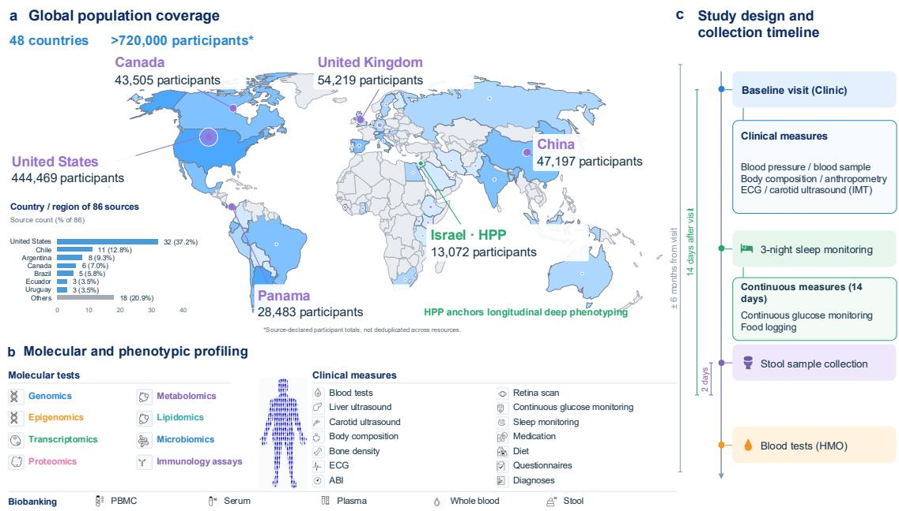  
Figure 1: Population coverage, molecular profiling and study design of DoAtlas-2. (a) Resources span 48 countries and >720,000 source-reported participants. The inset shows the country/region distribution of 86 sources. Israel HPP anchors longitudinal deep phenotyping. (b) Molecular assays, clinical measures and biobanking. (c) Study design and collection timeline. Participant totals are not deduplicated across resources.

annual questionnaires and periodic in-person reassessments; current observations span baseline, one-year follow-up, a second in-person visit, and three-year follow-up. Across 37 observational domains, 3,067 measurement fields comprise 63,004,814 field-level measurements, while population structure is characterized through grandparental birthplaces spanning 61 countries and five principal ancestry groups. Clinical assays, lifestyle, anthropometry, continuous glucose, sleep, activity, medical imaging, and multi-omics biosamples form participant-linked, cross-system longitudinal records. These include 109,788 participant-days of continuous glucose monitoring, 574,000 participant-days of food, medication, sleep, and activity logging, 41,899 participant-days of sleep monitoring, 17,278 liver-ultrasound examinations, 17,278 carotid-ultrasound examinations, 16,683 dual-energy X-ray absorptiometry (DXA) scans, and 10,954 fundus-imaging records. HPP thereby provides temporally structured deep-phenotype evidence for candidate mechanisms and serves as the core longitudinal environment for causal-state revision and held-out evaluation.

As of September 22, 2026, DoAtlas-2 had established a research space comprising 8,724 candidate research questions (RQs) and completed systematic evaluation of 2,031 independent RQs. Each completed RQ yielded a mean of 30.86 experimental units reaching terminal disposition, of which 29.86 completed the prespecified computation and produced terminal records. All evaluations used GPT-5.6 Sol with xhigh reasoning and consumed a mean of 781,551,295 model tokens per RQ. With downstream experiments executed concurrently within each RQ, the mean end-to-end evaluation time was 5.26 hours. Across the study, this corresponded to approximately 62,677 terminal experimental units, 60,646 computation-complete terminal units, and 1.587 trillion model tokens over a 70-day run (Table 1).

Table 1: Research-resource footprint.
<table><tr><td colspan="3">8,724 candidate RQs; 2,031 completed.</td></tr><tr><td>Terminal Complete</td><td>Tokens</td><td>Time</td></tr><tr><td>Overall ≈62,677</td><td>≈60,646 ≈1.587T</td><td>70 d</td></tr><tr><td>Mean 30.86</td><td>29.86 782M</td><td>5.26 h</td></tr><tr><td>Median 30.50</td><td>30.00 770M</td><td>4.83 h</td></tr><tr><td>Range</td><td>24-40</td><td>19–39 430–1,460 M 3.64–8.71 h</td></tr></table>

Mean, median and range are per completed RQ. M/B/T: million/billion/trillion; d/h: days/hours. Terminal: experimental units reaching terminal disposition. Complete: units completing the prespecified computation and producing an analytic terminal record.

## 2 The DoAtlas-2 Self-Evolving Causal Foundation

DoAtlas-2 represents each research round by $S _ { t } = ( E _ { t } , Q _ { t } , A _ { t } )$ : the contextualized causal evidence state, the discovery frontier and the external evidence requirements. Evidence gaps and conflicting findings generate candidate mechanism questions with traceable parent results. Selected questions specify the study population, temporal structure, causal estimand and identification conditions before external outcomes are revealed (Nosek et al., 2018). Research agents report all prespecified outcomes, including diagnostics and non-estimable states. External scientific selection records $\Sigma _ { t }$ drive the transition $S _ { t } \stackrel { \Sigma _ { t } } { \longrightarrow } S _ { t + 1 }$ : results revise evidence support and scope, reshaping questions and evidence needs for the next round. Supported paths motivate extension; counterevidence motivates competing mechanisms; context restrictions and unresolved results identify boundary tests or additional evidence requirements. An attributable joint revision of $E _ { t } , Q _ { t }$ and $A _ { t }$ constitutes one self-evolution transition. Each change preserves its source, applicable context and remaining uncertainty.

Long-chain composition requires compatible directions, contexts, measurements and temporal structures. Figure 2 summarizes the agent architecture. Appendix B gives the detailed definitions of question selection, study design, external adjudication and state revision.

## 3 Evidence for the Self-Evolution Loop

DoAtlas-2 has established a research space of 8,724 candidate research questions and systematically evaluated 2,031 of them (Table 1), covering 88,731 result estimates. Across three research rounds, the cumulative candidate catalog grew from 175 to 1,079 and then to 4,014 pathway questions covering 3,941 distinct pathways (Figure 3b), connecting 77 concepts and 517 candidate directed relations across seven physiological domains, other biomarkers and background or behavioral variables (Figure 3a). Unadjusted screening in the first two rounds covered 1,079 research questions, of which 756 received screening-level statistical support. Appendix C.1 specifies the scope and counting units.

All 904 Round-2 questions record Round-1 parents, linking to 61 distinct Round-1 questions. Of these follow-ups, 326 test serial metabolic–hemodynamic pathways, 264 test competing mediator pathways that bypass blood pressure and 142 test hemodynamic convergence; another 108 and 64 introduce liver- and sleep-related phenotypes, respectively. Round-1 studies of adiposity, blood pressure, and vascular endpoints thus extend into systematic tests of mediator pathways and competing explanations. Appendix C.1 reports the round-level counts and parent–child links; Appendix C.2 traces how each result leads to specific successor questions.

The HPP results revise the causal evidence state, contributing 2,169 edge-level evidence records, 725 of which set relation states, so that 200 of the 259 relations with HPP evidence acquire a population-derived state: 81 supported, 2 challenged and 117 unresolved. Of the 81 supported relations, 16 match a directional literature reference and 49 are supported by population evidence alone, with no counterpart in the literature-derived evidence network. Where the literature is divided, HPP evidence provides a population direction: BMI is positively related to low-density lipoprotein (LDL) cholesterol (7 increasing versus 4 decreasing literature reports) and high-density lipoprotein (HDL) cholesterol inversely to diastolic blood pressure (DBP; 2 versus 3). An unresolved state indicates that current population evidence cannot yet determine a relation’s direction, rather than that the relation is absent: 38 unresolved relations are supported in at least one evidence context, 33 of them in cross-sectional analyses, but remain imprecise in the others, mostly under temporally ordered designs, and the other 79 have imprecise or inconsistent estimates across contexts. These relations form the frontier of subsequent research rounds, which call for larger temporally ordered samples or more precise designs to address the remaining uncertainty (Appendix C).

Figure 3c illustrates one cross-round follow-up. The Round-1 WHR–SBP–PWV and WC–WHR– SBP–PWV results are parents of the Round-2 WHR–ALT–DBP–PWV question. This follow-up introduces ALT and examines the DBP branch to test a liver-related pathway between adiposity and vascular phenotypes. Subsequent joint analysis with ±365-day measurement windows estimated a standardized path association of 0.01073 (95% CI [0.007575, 0.01389]; Section 4.1), connecting prior results, a successor question, and its estimate. Appendix C.3.1 records the lineage and distinguishes this joint model from the earlier Round-2 estimate of the same pathway (H1) in Figure 4c.

DoAtlas-2 Self-evolving Biomedical Discovery  
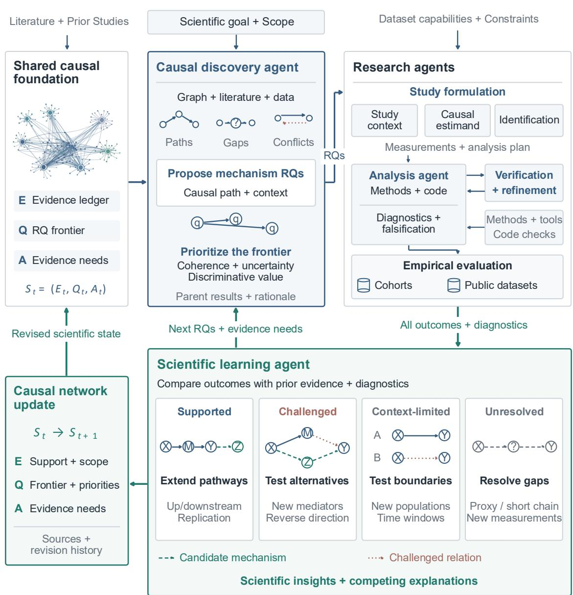  
Figure 2: Agent architecture for evidence-driven causal discovery. The causal discovery agent proposes mechanism questions; research agents turn them into studies (Appendix E) and report outcomes, uncertainty and diagnostics; the scientific learning agent revises evidence support and scope, the discovery frontier and evidence needs. The four response motifs show context-dependent follow-up; A/B denote contexts. Teal dashed/red dotted edges, candidate/challenged relations; the network thumbnail shows 183 concepts and 372 candidate relations.

Prior results guide follow-up questions about competing mechanisms and endpoint context. For adiposity–ApoB–blood-pressure–vascular pathways, screening contrasts between serial and nested shorter paths and across vascular endpoints motivate reassessment of blood-pressure paths, alternative sleep- or lipid-related mediators, and the same mediator sequence for PWV and carotid intima-media thickness (cIMT; Appendices C.3.2–C.3.3). Round 3 treats intermediate phenotypes in existing paths as outcomes: the first 30 pathway proposals span 15 outcome constructs. The HbA1c–SBP–UACR hypothesis, for example, motivates comparisons of blood-pressure-mediated, non-blood-pressure, and common-cause explanations for urinary albumin-to-creatinine ratio (Appendix C.3.4). These cases show how preceding results shape the specific questions and comparisons proposed for follow-up research; Section 4 presents representative biomedical findings.

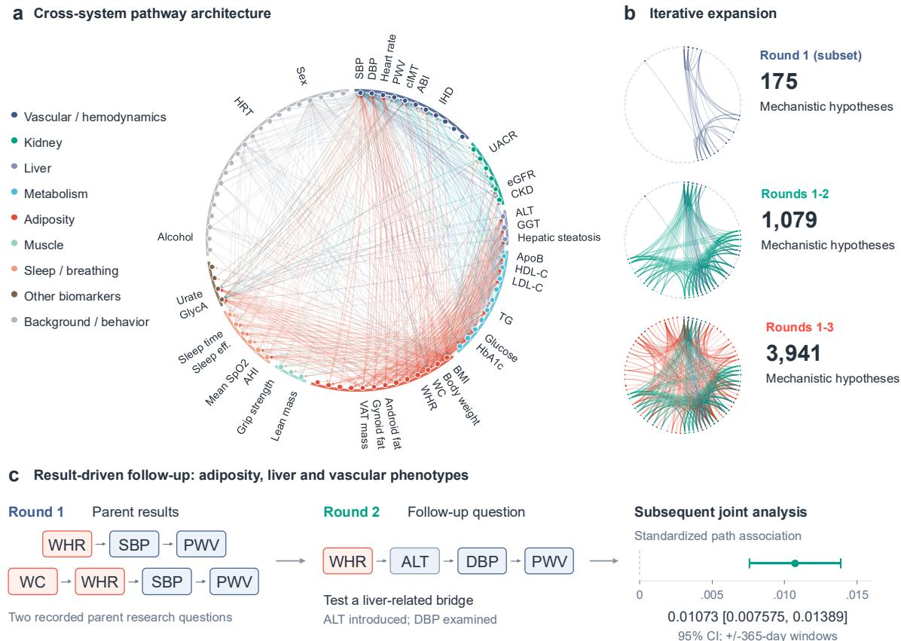  
Figure 3: Cross-system pathway atlas and iterative hypothesis expansion. (a) Network of phenotype and biomarker concepts, colored by domain. (b) Expansion of hypotheses, concepts and connections across research rounds. (c) Example of result-driven follow-up linking adiposity, liver and vascular phenotypes. The point and horizontal line show the standardized path association and its 95% confidence interval. Arrows represent hypothesized relationships or research progression; estimates are observational.

## 4 Key Findings

Representative analyses show recurring blood-pressure-related structures in adiposity–vascular associations, with sleep-oxygenation pathways additionally linking to cIMT and lower-limb PWV. We present 15 pathways with complete serial estimates as concrete examples, forming a cross-system association network of 19 phenotype nodes and 29 connections (Figure 4b). Serial estimates are products of the adjacent edge coefficients, on the standardized scale unless stated otherwise, and all models account for age and sex. Figure 4c,d reports pathway estimates and component associations, respectively; Figure 4e–j reports reverse-direction, within-person, off-path and confounding-sensitivity analyses; Figure 5 presents temporal, population, and covariate comparisons. Further results and detailed analyses are provided in Appendix D and the accompanying online supplementary material.

## 4.1 Blood-pressure convergence of metabolic and vascular phenotypes

Five representative shorter paths retaining a blood-pressure node receive statistical support, linking adiposity to cIMT or lower-limb pulse-wave velocity (PWV) (B2 estimates in Figure 4c: WHR– DBP–PWV in H1, Hip–DBP–PWV in H2, Waist–SBP–cIMT in H3, WHR–SBP–cIMT in H4 and VAT–SBP–PWV in L2). In a joint model using ±365-day windows between adjacent measurements, the standardized WHR–ALT–DBP–PWV path product is 0.01073 (95% CI [0.007575, 0.01389]; Figure 3c). The full-path minus WHR–ALT–PWV contrast is 0.008542 (95% CI [0.002897, 0.01419]; Holm-adjusted $P = 0 . 0 1 2 0 7$ , Holm, 1979), estimated on a common sample and scale. The hiprelated network supports parallel liver and lipid branches: within hip-anchored ±365-day windows, the Hip–ALT–DBP–PWV and Hip–ApoB–DBP–PWV path products are 0.01174 (95% CI [0.005539,

0.02063]) and 0.004717 (95% CI [0.001192, 0.009364]), respectively. Both branches retain support after Holm correction. Hepatic and lipid branches converge on diastolic blood pressure and lowerlimb PWV, making blood pressure the shared intermediate linking metabolic routes to vascular phenotypes.

In two independent cohorts of 912 (Fukuda et al., 2014a,b) and 879 (Ning et al., 2022) adults with brachial–ankle PWV (baPWV), the metabolic-to-pressure routes replicate in the 912-adult cohort (BMI–TG–DBP, GGT–TG–SBP, ALT–DBP and TG–DBP to baPWV; Holm-adjusted $P \leq 0 . 0 0 1 2 )$ In the 879-adult cohort, the BMI–TG and DBP–baPWV associations are positive (standardized DBP–baPWV coefficient 0.29, 95% CI [0.22, 0.36]), and all serial estimates share the HPP sign (Appendix D.4). Nocturnal oxygen saturation $\mathrm { ( S p O _ { 2 } ) }$ paths O1 and O2 reach vascular outcomes, cIMT and PWV (Figure 4b). The standardized Waist– $\mathbf { \partial } . \mathbf { S p O _ { 2 } } \mathbf { - S B P - c I M T }$ path product (O1) is −0.002524 (95% CI $[ - 0 . 0 0 4 0 3 7 , - 0 . 0 0 1 1 1 7 ] )$ ; the $\mathrm { S p O _ { 2 } { - } G l y c A { - } P W V }$ product (O2) is 0.02437 (95% CI [0.004872, 0.04387]) on the measurement scale. Both intervals exclude zero (Figure 4c, serial-product estimates S for O1 and O2).

Component estimates specify the association directions (Figure 4d, component edges E1–E3 of O1 and E1–E2 of O2). Lower nocturnal $\mathrm { { S p O _ { 2 } } }$ and obstructive sleep apnea accompany higher blood pressure in clinical studies (Nieto et al., 2000; Lavie et al., 2000), and HPP reproduces this association without adiposity adjustment: higher mean nocturnal $\mathrm { { S p O _ { 2 } } }$ accompanies lower SBP (age-, sex- and cohort-adjusted 95% CI $\left[ - 0 . 0 8 9 2 8 , - 0 . 0 4 3 5 9 \right]  $ ). Adiposity accounts for this inverse association. Waist circumference is a shared determinant of both quantities: it is negatively associated with nocturnal $\mathrm { { S p O _ { 2 } } }$ (E1: −0.3492, 95% CI [−0.3768, −0.3216]) and raises SBP, so participants with lower $\mathrm { { S p O _ { 2 } } }$ are also those with larger waists and higher pressure. Conditional on waist circumference, the $\mathrm { S p O _ { 2 } } \mathrm { - } \mathrm { S B P }$ association becomes weakly positive (E2: 0.04372, 95% CI [0.01863, 0.06881]); by the omitted-variable relation (Cinelli & Hazlett, 2020), a standardized waist–SBP association of about 0.3 accounts for the change from negative to positive. The pattern is consistent across HPP analyses: all $9 \ \mathrm { S p O _ { 2 } } { \mathrm { - } } \mathrm { S B P }$ intervals excluding zero are negative without an adiposity term and all 10 are positive with waist, BMI, neck circumference or visceral fat in the model, whereas $\mathrm { S p O _ { 2 } \mathrm { - D B P } }$ associations conditional on adiposity remain predominantly negative (6 of the 7 intervals excluding zero; 34 of 43 point estimates). In O2, both the $\mathrm { S p O _ { 2 } \mathrm { - G l y c A } }$ and GlycA–PWV conditional associations are negative.

## 4.2 Temporal support for DBP paths and differences in ApoB associations

ALT–DBP–PWV and TG–DBP–PWV both receive statistical support under strict temporal ordering (Figure 5b). In both sequences, the hepatic and lipid markers precede diastolic pressure, supporting a metabolic-to-hemodynamic order within the liver and lipid modules. Selected ApoB-related sequences show sex and age differences. The $\mathrm { V A T - A p o B - S B P - P W V }$ serial estimate differs significantly between sexes (Holm-adjusted $P = 0 . 0 0 5$ ; Figure 5d). Weight–ApoB–DBP–PWV has a smaller serial estimate at older ages: the +10 minus −10 year contrast around the reference age is $\Delta = - 0 . 0 2 2 7 5 \ ( 9 5 \% \mathrm { C I } [ - 0 . 0 4 1 2 6 , - 0 . 0 0 8 2 8 ]$ ; Holm-adjusted $P = 0 . 0 0 6 ;$ Figure 5e), indicating a weaker lipid–pressure serial association with peripheral vascular phenotypes in older participants.

## 4.3 Covariate-dependent adiposity–inflammation–blood-pressure link

Joint adjustment for BMI and smoking significantly attenuates the WHR–GlycA–SBP–PWV serial association (R1). Under this adjustment, the serial estimate decreases from 0.01218 to 0.002022 on a common sample and standardization scale, allowing direct comparison between the estimates. The formal difference is $\Delta = - 0 . 0 1 0 1 6 ( 9 5 \% \mathrm { C I } [ - 0 . 0 1 5 3 7 , - 0 . 0 0 4 9 3 6 ]$ ; Figure 5c). The attenuation indicates that the adiposity–inflammation–blood-pressure pathway reflects overall adiposity and smoking more than the fat distribution indexed by the waist-to-hip ratio.

g Off-path outcomes

<table><tr><td></td><td>T Total ■</td><td>D Direct</td><td>S Serial</td></tr><tr><td></td><td>B1 Via M1</td><td colspan="2">4 B2 Via M2</td></tr></table>

a Experimental coverage

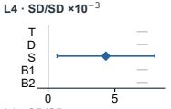  
h Residual sensitivity

j Robustness values  
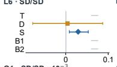

## Primary associations and robustness

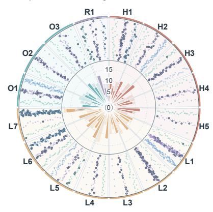  
C Complete-case W Time-windowed L Ordered

c Primary associations  
e Reverse checks  
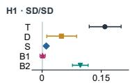  
b Pathway network

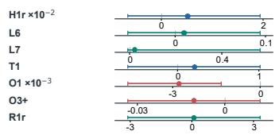

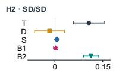

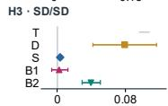  
f Within-person models

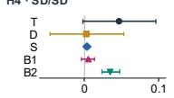

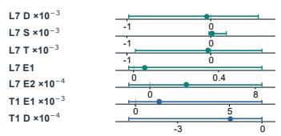

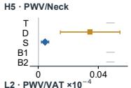

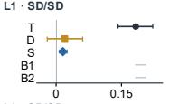

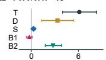

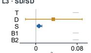

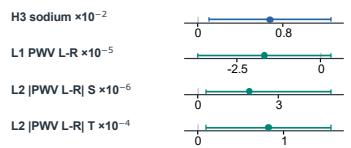

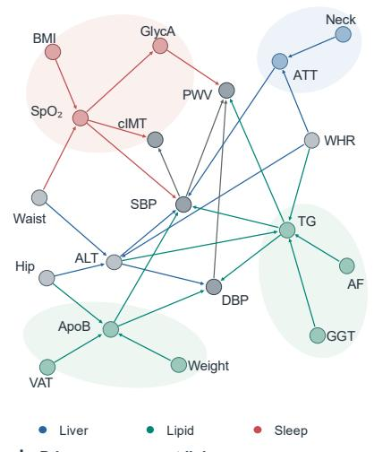

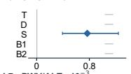

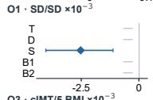

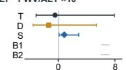

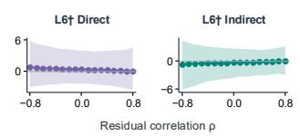

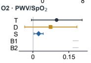

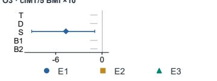

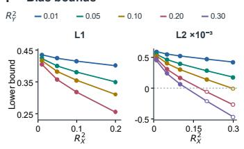

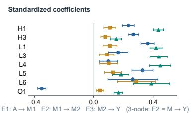

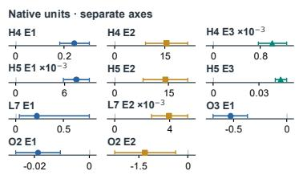

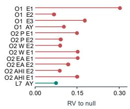  
Figure 4: Primary associations and robustness. (a,b) Coverage/network; (c,d) pathway/link estimates; (e–g) reverse, within-person and off-path analyses; (h–j) confounding sensitivity. Bars: 95% CIs. Definitions: Appendix D.1.

## 5 From Causal Evidence to an Interpretable Foundation Model

The self-evolution of DoAtlas-2 yields a completely interpretable predictive foundation. The vascular network of Section 4 (19 nodes, 29 connections, 15 pathways) is the model structure itself: every prediction is an explicit closed-form expression, and every term belongs to a named variable, a source relationship or an intercept. The decomposition of a prediction into node, interaction and branch contributions is an exact identity, and independent recomputation reproduces the model output for all 14,079 real predictions with a maximum discrepancy of 1. $. 4 2 \times 1 0 ^ { - 1 4 }$ . For temporally ordered questions, the same network yields closed-form direct and mediated effects. Interpretability follows directly from the construction of the model and its explicit mathematical structure.

## Conditions and model sensitivity

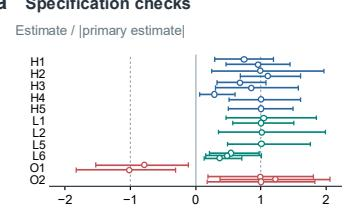

b Time and covariates  
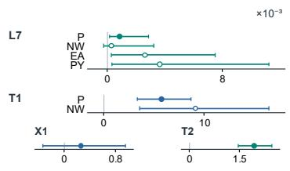  
d Sex conditions

c R1 model revision  
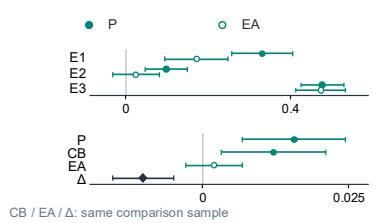

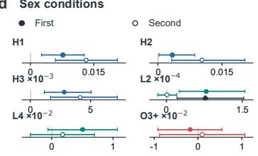

e Age conditions  
f Interactions  
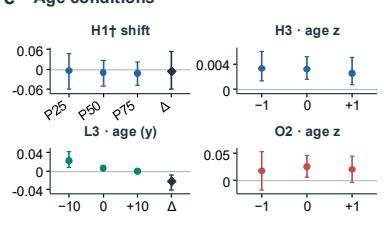

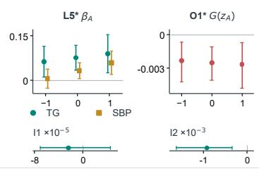

g Component specs (std.)  
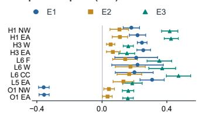

h R1 joint coefficients  
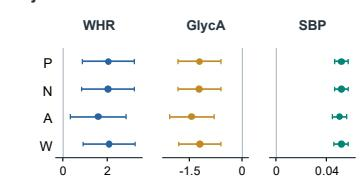

i Age interactions  
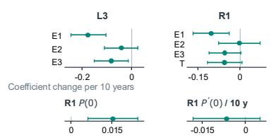  
Figure 5: Conditions and model sensitivity. (a–c) Specification, timing and adjustment; (d–f) sex, age and interactions; (g–i) component, joint-coefficient and age-interaction sensitivity. 128 estimates with 95% intervals; definitions: Appendix D.2.

Explicit predictive representation. For outcome task t, the prediction is

$$
\begin{array} { l } { \displaystyle { \eta _ { t } ( x , m ) = b _ { t } + \sum _ { j } f _ { t j } ( x _ { j } , m _ { j } ) + \sum _ { r } a _ { r } ( x , m ) w _ { t r } q _ { r } ( x _ { S _ { r } } ) + \sum _ { j } d _ { t j } ( 1 - m _ { j } ) , } } \\ { \displaystyle { q _ { r } ( x _ { S _ { r } } ) = \beta _ { r 0 } + \sum _ { \ell } \beta _ { r \ell } \phi _ { r \ell } ( x _ { S _ { r } } ) . } } \end{array}\tag{1}
$$

Here $x$ contains the network phenotypes and covariates, and $m _ { j }$ indicates whether variable $j$ is observed; $f _ { t j }$ is a univariate term; $q _ { r }$ is the relationship equation specified by its source study, with input set $S _ { r }$ and basis $\phi _ { r \ell }$ carrying the declared transformations and interactions; $w _ { t r }$ weights the relationship for outcome $t ,$ and $a _ { r }$ is its applicability indicator. Each source term $q _ { r }$ traces to a specific relationship in Section $4 ; b _ { t } , f _ { t j }$ and $d _ { t j }$ are task-specific fitted terms. Continuous outcomes use $\widehat { y } _ { t } = \eta _ { t } ; 6 0$ -month mortality risk is

$$
\widehat { R } _ { 6 0 } = 1 - \prod _ { k = 1 } ^ { 5 } \big [ 1 - \sigma ( \alpha _ { k } + \eta _ { t } ) \big ] ,\tag{2}
$$

where σ is the logistic function and $\alpha _ { k }$ is the intercept of annual interval $k .$

The complete equation system of the network. Each source context yields one source equation for every directed connection of its pathway (the extended L2 context is sex-stratified): target node $Z _ { s }$ takes as inputs all upstream nodes $Z _ { 0 } , \dots , Z _ { s - 1 }$ , age, sex and the covariates declared by the source study. Let $S _ { r } ^ { \mathrm { c } } , S _ { r } ^ { \mathrm { c a t } } \subseteq S _ { r }$ be the continuous and categorical inputs of equation $r , S _ { r } ^ { \mathrm { s q } }$ the inputs with a declared quadratic term, and $\mathcal { P } _ { r }$ its declared interaction pairs. Continuous inputs enter as training-standardized values $z _ { v } = ( x _ { v } - \mu _ { v } ) / s _ { v } ;$ categorical inputs expand into indicators relative to a reference level $h _ { v } ^ { 0 . }$ quadratic terms are centered at their training means:

$$
\begin{array} { r l } & { q _ { r } ( x _ { S _ { r } } ) = \beta _ { r 0 } + \displaystyle \sum _ { v \in S _ { r } ^ { \mathrm { c } } } \beta _ { r v } z _ { v } + \displaystyle \sum _ { v \in S _ { r } ^ { \mathrm { s q } } } \beta _ { r v ^ { 2 } } \big ( z _ { v } ^ { 2 } - \overline { { z _ { v } ^ { 2 } } } \big ) } \\ & { \qquad + \displaystyle \sum _ { v \in S _ { r } ^ { \mathrm { c a t } } } \displaystyle \sum _ { h \ne h _ { v } ^ { 0 } } \beta _ { r v h } \mathbf { 1 } [ x _ { v } = h ] + \displaystyle \sum _ { ( u , v ) \in \mathcal { P } _ { r } } \beta _ { r u v } z _ { u } z _ { v } . } \end{array}\tag{3}
$$

Univariate terms $f _ { t j }$ use the same standardization, with a linear term, centered hinge terms $( z _ { j } - \kappa ) _ { + }$ at the three training quartiles, and indicators for categorical inputs. The 15 pathways and 22 source contexts give 63 equations, of which 61 are estimable in HPP; the source coefficients $\beta$ are estimated in HPP and frozen, and $b _ { t } , f _ { t j } , d _ { t j }$ and the source weights $w _ { t r }$ are fitted per outcome task. Table F.1 in Appendix F lists the node chain, source covariates and equation count of each pathway.

Node, interaction and branch contributions. Let $V _ { r \ell }$ be the variable set of $\phi _ { r \ell } ;$ then

$$
\begin{array} { l l } { { \displaystyle C _ { t j } ( x , m ) = f _ { t j } ( x _ { j } , m _ { j } ) + \sum _ { r , \ell : V _ { r \ell } = \{ j \} } a _ { r } w _ { t r } \beta _ { r \ell } \phi _ { r \ell } ( x _ { S _ { r } } ) } } \\ { { \displaystyle C _ { t J } ^ { \mathrm { i n t } } ( x , m ) = \sum _ { r , \ell : V _ { r \ell } = J } a _ { r } w _ { t r } \beta _ { r \ell } \phi _ { r \ell } ( x _ { S _ { r } } ) , \qquad | J | \geq 2 . } } \end{array}\tag{4}
$$

Covariate terms follow the same rule. The prediction satisfies the identity

$$
\eta _ { t } = B _ { t } + \sum _ { j } C _ { t j } + \sum _ { J : | J | \geq 2 } C _ { t J } ^ { \mathrm { i n t } } + M _ { t } , \qquad B _ { t } = b _ { t } + \sum _ { r } a _ { r } w _ { t r } \beta _ { r 0 } , \quad M _ { t } = \sum _ { j } d _ { t j } ( 1 - m _ { j } ) .\tag{5}
$$

For a source pathway b of Section 4 (a branch), let $\mathcal { R } _ { b }$ be its set of relationship equations; the branch contribution is

$$
C _ { t b } ^ { \mathrm { p a t h } } ( x , m ) = \sum _ { r \in \mathcal { R } _ { b } } a _ { r } ( x , m ) w _ { t r } q _ { r } ( x _ { S _ { r } } ) .\tag{6}
$$

The node view and the branch view are two alternative summaries of the same prediction. Contributions keep the outcome’s original units; mortality contributions are on the logit-hazard scale. Independent recomputation reproduces the model output for 12,492 HPP predictions and 1,587 National Health and Nutrition Examination Survey (NHANES) (National Center for Health Statistics, 2026b) predictions, with maximum discrepancies of $1 . 4 2 \times 1 0 ^ { - 1 4 }$ and $5 . 5 5 \times 1 0 ^ { - 1 6 }$

Effect decomposition of the $\mathbf { B M I - S p O _ { 2 } - c I M T }$ pathway. Longitudinal analysis of this pathway (O3 in Figure 4) decomposes the total BMI–cIMT contrast into a positive direct and a negative $\mathrm { { S p O } _ { 2 } . }$ mediated component. Let A denote BMI, M $\mathrm { { S p O _ { 2 } } }$ and $Y$ cIMT; following VanderWeele & Vansteelandt (2009), the conditional means are

$$
\begin{array} { r } { \mu _ { M } ( a , c ) = \alpha _ { 0 } + \alpha _ { A } a + \gamma _ { M } ^ { \top } c , \qquad } \\ { \mu _ { Y } ( a , m , c ) = \theta _ { 0 } + \theta _ { A } a + \theta _ { M } m + \theta _ { A M } a m + \gamma _ { Y } ^ { \top } c . } \end{array}\tag{7}
$$

The adjustment vector $C _ { e }$ contains age, sex, cohort, prior smoking, education and waist circumference. The interaction makes each conditional slope depend on the other variable:

$$
\frac { \partial \mu _ { Y } } { \partial a } = \theta _ { A } + \theta _ { A M } m , \quad \quad \frac { \partial \mu _ { Y } } { \partial m } = \theta _ { M } + \theta _ { A M } a .\tag{8}
$$

The population pathway effect is defined as

$$
g ( a , a ^ { \prime } ) = E _ { C _ { e } } \biggl [ \int { \mu _ { Y } ( a , m , C _ { e } ) d F _ { M | A = a ^ { \prime } , C _ { e } } ( m ) } \biggr ] .\tag{9}
$$

With $\Delta a = a _ { 1 } - a _ { 0 }$ and $\overline { { M } } _ { 0 } = E _ { C _ { e } } [ \mu _ { M } ( a _ { 0 } , C _ { e } ) ]$

$$
\begin{array} { r l } & { D = g ( a _ { 1 } , a _ { 0 } ) - g ( a _ { 0 } , a _ { 0 } ) = \Delta a \left( \theta _ { A } + \theta _ { A M } \overline { { M } } _ { 0 } \right) , } \\ & { I = g ( a _ { 1 } , a _ { 1 } ) - g ( a _ { 1 } , a _ { 0 } ) = \alpha _ { A } \Delta a \left( \theta _ { M } + \theta _ { A M } a _ { 1 } \right) , } \\ & { T = D + I . } \end{array}\tag{10}
$$

The mediated component equals the BMI-induced change in $\mathrm { { S p O _ { 2 } } }$ multiplied by the conditional $\mathrm { { S p O _ { 2 } } }$ slope for cIMT, retaining the exposure–mediator interaction.

Under the declared causal identification conditions, a BMI contrast of $\mathrm { 2 2 . 9 2 1 \to 2 8 . 3 9 7 \mathrm { k g / m ^ { 2 } } }$ in 425 HPP participants gives

$$
\begin{array} { r } { T = \underbrace { 0 . 0 2 6 7 8 } _ { D : \mathrm { d i r e c t } } + \underbrace { \left( - 0 . 0 0 3 7 2 \right) } _ { I : \mathrm { S p O _ { 2 } - m e d i a t e d } } = 0 . 0 2 3 0 6 \ \mathrm { m m } . } \end{array}\tag{11}
$$

The total contrast has 95% CI [0.00400, 0.04285] mm; the direct and mediated components have [0.00737, 0.04683] and $\left[ - 0 . 0 0 8 8 3 , - 0 . 0 0 0 5 5 \right]$ mm. The BMI contrast corresponds to a 0.44848 percentage-point decrease in the modeled $\mathrm { { S p O _ { 2 } } }$ mean, while the conditional $\mathrm { { S p O _ { 2 } } }$ slope for cIMT at the higher BMI is positive; their product is the negative mediated component, which partially offsets the positive direct component. Fixing $\mathrm { { S p O _ { 2 } } }$ at 96% gives a controlled direct contrast of 0.02689 mm (95% CI [0.00743, 0.04737]), corresponding to a conditional BMI slope of 0.00491 mm per $\mathrm { k g / m ^ { 2 } }$ (95% CI [0.00136, 0.00865]).

Sensitivity to covariate adjustment. Expanded adjustment adds prior cIMT and alcohol; in the 294 participants with complete covariates, the total contrast is 0.01962 mm (95% CI [−0.00090, 0.03747]), and removing prior cIMT on the same 294 participants gives 0.03338 mm, a paired difference of 0.01376 mm (95% CI [0.00554, 0.02572]).

Multi-phenotype prediction under incomplete inputs. Across the six HPP tasks in 10,401 participants, held-out $R ^ { 2 }$ is 0.378 for future PWV and 0.176 for future cIMT (Table 2). With 70% additional random masking of the inputs, the five-seed mean held-out $R ^ { 2 }$ is 0.248 for PWV and 0.136 for cIMT, and every prediction retains its complete contribution decomposition.

Cross-population transfer of frozen relationship parameters. The predictive foundation with frozen HPP relationship parameters reaches an area under the receiver operating characteristic curve (AUC) of 0.798 (95% CI [0.730, 0.859]) and an inverse probability of censoring weighted (IPCW) Brier score (Graf et al.,

Table 2: HPP phenotype prediction on held-out participants.
<table><tr><td>Task</td><td>Test n</td><td>NRMSE</td><td> $R ^ { 2 }$ </td><td>Cov. (%)</td></tr><tr><td>Future PWV</td><td>166</td><td>0.959</td><td>0.378</td><td>89.2</td></tr><tr><td>Future cIMT</td><td>172</td><td>0.926</td><td>0.176</td><td>83.1</td></tr><tr><td>Queried ATT</td><td>1,380</td><td>0.915</td><td>0.155</td><td>92.0</td></tr><tr><td>Queried ApoB</td><td>297</td><td>0.861</td><td>0.203</td><td>93.3</td></tr><tr><td>Queried GlycA</td><td>297</td><td>0.782</td><td>0.332</td><td>87.2</td></tr><tr><td>Queried  $\mathrm { { S p O _ { 2 } } }$ </td><td>1,177</td><td>0.790</td><td>0.346</td><td>90.7</td></tr></table>

Normalized root-mean-square error (NRMSE) uses the training-label standard deviation; coverage (Cov.) is measured for nominal 90% prediction intervals. Queried outcomes are hidden from their own inputs.

1999) of 0.0473 (95% CI [0.0382, 0.0572]) for 60-month all-cause mortality (National Center for Health Statistics, 2026a) on the NHANES temporal test set (1,587 participants, 110 deaths). The relationship coefficients keep their HPP estimates, and the remaining parameters of the mortality task are estimated on NHANES development data; NHANES measures 9 of the 19 network nodes. On the same NHANES split, a target-domain refit of the predictive foundation reaches AUC 0.799, matching a generalized additive model (0.798; paired $\Delta \mathrm { A U C } + 0 . 0 0 1 \ [ - 0 . 0 0 2 , 0 . 0 0 5 ] )$ and a gradient-boosted tree $( 0 . 8 0 3 ; - 0 . 0 0 3 [ - 0 . 0 4 9 , 0 . 0 3 3 ] )$

## 6 A New Paradigm for Cumulative Causal Discovery

DoAtlas-2 turns the biomedical foundation from static knowledge and isolated outputs into a causal evidence state that evolves under external evidence: every revision is attributable to results of population studies, and the candidate questions, frozen designs and external selection records form the complete denominator. The discovered vascular network itself becomes the interpretable predictive foundation: every prediction is an explicit closed-form expression that decomposes term by term as an exact identity, and the same network yields closed-form direct and mediated effects for temporally ordered questions. The vascular predictive foundation of Section 5 is the first diseasespecific foundation constructed here. Cumulative causal discovery, driven by external evidence and reconstructable at every step, thereby becomes the scientific working mode of biomedical AI.

## References

Elias Bareinboim and Judea Pearl. Causal inference and the data-fusion problem. Proceedings of the National Academy ofSciences, 113(27):7345–7352, 2016. doi: 10.1073/pnas.1510507113. URL https://doi.org/10.1073/pnas.1510507113.

Carlos Cinelli and Chad Hazlett. Making sense of sensitivity: extending omitted variable bias. Journal of the Royal Statistical Society: Series B (Statistical Methodology), 82(1):39–67, 2020. doi: 10.1111/rssb.12348.

Takuya Fukuda, Masahide Hamaguchi, Takao Kojima, Yasuhiro Ohshima, Akihiro Ohbora, Takahiro Kato, Naoto Nakamura, and Michiaki Fukui. Association between serum γ-glutamyltranspeptidase and atherosclerosis: a population-based cross-sectional study. BMJ Open, 4(10):e005413, 2014a. doi: 10.1136/bmjopen-2014-005413.

Takuya Fukuda, Masahide Hamaguchi, Takao Kojima, Yasuhiro Ohshima, Akihiro Ohbora, Takahiro Kato, Naoto Nakamura, and Michiaki Fukui. Data from: Association between serum γ- glutamyltranspeptidase and atherosclerosis: a population-based cross-sectional study. Dryad Digital Repository, 2014b. URL https://doi.org/10.5061/dryad.m484p. Dataset.

Ali E. Ghareeb, Benjamin Chang, Ludovico Mitchener, et al. A multi-agent system for automating scientific discovery. Nature, 655:497–505, 2026. doi: 10.1038/s41586-026-10652-y. URL https://doi.org/10.1038/s41586-026-10652-y.

Marzyeh Ghassemi, Luke Oakden-Rayner, and Andrew L. Beam. The false hope of current approaches to explainable artificial intelligence in health care. The Lancet Digital Health, 3(11): e745–e750, 2021. doi: 10.1016/S2589-7500(21)00208-9. URL https://doi.org/10. 1016/S2589-7500(21)00208-9.

Juraj Gottweis, Wei-Hung Weng, Alexander Daryin, et al. Accelerating scientific discovery with Co-Scientist. Nature, 655:487–496, 2026. doi: 10.1038/s41586-026-10644-y. URL https: //doi.org/10.1038/s41586-026-10644-y.

Erika Graf, Claudia Schmoor, Willi Sauerbrei, and Martin Schumacher. Assessment and comparison of prognostic classification schemes for survival data. Statistics in Medicine, 18(17–18):2529–2545, 1999.

Sture Holm. A simple sequentially rejective multiple test procedure. Scandinavian Journal of Statistics, 6(2):65–70, 1979.

Ross D. King, Jem Rowland, Stephen G. Oliver, Michael Young, Wayne Aubrey, Emma Byrne, Maria Liakata, Magdalena Markham, Pinar Pir, Larisa N. Soldatova, Andrew Sparkes, Kenneth E. Whelan, and Amanda Clare. The automation of science. Science, 324(5923):85–89, 2009. doi: 10.1126/science.1165620. URL https://doi.org/10.1126/science.1165620.

Peretz Lavie, Paula Herer, and Victor Hoffstein. Obstructive sleep apnoea syndrome as a risk factor for hypertension: population study. BMJ, 320(7233):479–482, 2000. doi: 10.1136/bmj.320.7233.479.

Jing Lei, Max G’Sell, Alessandro Rinaldo, Ryan J. Tibshirani, and Larry Wasserman. Distributionfree predictive inference for regression. Journal ofthe American Statistical Association, 113(523): 1094–1111, 2018. doi: 10.1080/01621459.2017.1307116.

National Center for Health Statistics. Public-use linked mortality files. https://www.cdc.gov/ nchs/data-linkage/mortality-public.htm, 2026a. Accessed September 2026.

National Center for Health Statistics. National health and nutrition examination survey. https: //www.cdc.gov/nchs/nhanes/, 2026b. Accessed September 2026.

F. J. Nieto, T. B. Young, B. K. Lind, E. Shahar, J. M. Samet, S. Redline, R. B. D’Agostino, A. B. Newman, M. D. Lebowitz, and T. G. Pickering. Association of sleep-disordered breathing, sleep apnea, and hypertension in a large community-based study. Sleep Heart Health Study. JAMA, 283 (14):1829–1836, 2000. doi: 10.1001/jama.283.14.1829.

Peng Ning, Fan Yang, Jun Kang, Jing Yang, Jiaxing Zhang, Yi Tang, Yanghong Ou, Haiyan Wan, and Hongyi Cao. Predictive value of novel inflammatory markers platelet-to-lymphocyte ratio, neutrophil-to-lymphocyte ratio, and monocyte-to-lymphocyte ratio in arterial stiffness in patients with diabetes: A propensity score–matched analysis. Frontiers in Endocrinology, 13: 1039700, 2022. doi: 10.3389/fendo.2022.1039700. URL https://doi.org/10.3389/ fendo.2022.1039700.

Brian A. Nosek, Charles R. Ebersole, Alexander C. DeHaven, and David T. Mellor. The preregistration revolution. Proceedings of the National Academy of Sciences, 115(11):2600–2606, 2018. doi: 10.1073/pnas.1708274114.

Judea Pearl. Causal inference in statistics: An overview. Statistics Surveys, 3:96–146, 2009. doi: 10.1214/09-SS057. URL https://doi.org/10.1214/09-SS057.

Lee Reicher, Smadar Shilo, Anastasia Godneva, Guy Lutsker, Liron Zahavi, Saar Shoer, David Krongauz, Michal Rein, Sarah Kohn, Tomer Segev, Yishay Schlesinger, Daniel Barak, Zachary Levine, Ayya Keshet, Rotem Shaulitch, Maya Lotan-Pompan, Matan Elkan, Yeela Talmor-Barkan, Yaron Aviv, Maya Dadiani, Yonatan Tsodyks, Einav Nili Gal-Yam, Haim Leibovitzh, Lael Werner, Roie Tzadok, Nitsan Maharshak, Shin Koga, Yulia Glick-Gorman, Chani Stossel, Maria Raitses-Gurevich, Talia Golan, Raja Dhir, Yotam Reisner, Adina Weinberger, Hagai Rossman, Le Song, Eric P. Xing, and Eran Segal. Deep phenotyping of health–disease continuum in the Human Phenotype Project. Nature Medicine, 31(9):3191–3203, 2025. doi: 10.1038/s41591-025-03790-9. URL https://doi.org/10.1038/s41591-025-03790-9.

Tyler J. VanderWeele and Stijn Vansteelandt. Conceptual issues concerning mediation, interventions and composition. Statistics and Its Interface, 2(4):457–468, 2009. doi: 10.4310/SII.2009.v2.n4.a7. URL https://doi.org/10.4310/SII.2009.v2.n4.a7.

Stijn Vansteelandt and Rhian M. Daniel. Interventional effects for mediation analysis with multiple mediators. Epidemiology, 28(2):258–265, 2017. doi: 10.1097/EDE.0000000000000596.

Yuan Zhang, Xin Sui, Feng Pan, et al. A comprehensive large-scale biomedical knowledge graph for AI-powered data-driven biomedical research. Nature Machine Intelligence, 7:602– 614, 2025. doi: 10.1038/s42256-025-01014-w. URL https://doi.org/10.1038/ s42256-025-01014-w.

## A Abbreviations and Measurement Definitions

Table A.1 lists the abbreviations used in the paper and, for the principal phenotypes, their measurement and unit in HPP. Pathway identifiers and the panel symbols of Figures 4 and 5 are defined with the figures in Appendix D to facilitate interpretation of the reported mechanistic findings.

Table A.1: Abbreviations and measurement definitions.
<table><tr><td>Abbrev.</td><td>Full name</td><td>Measurement in HPP</td><td>Unit</td></tr><tr><td colspan="4">Phenotypes</td></tr><tr><td>WHR</td><td>Waist-to-hip ratio</td><td>Waist circumference divided by hip circumference</td><td>ratio</td></tr><tr><td>Waist (WC)</td><td>Waist circumference</td><td>Circumference at the narrowest part of the abdomen</td><td>cm</td></tr><tr><td>Hip</td><td>Hip circumference</td><td>Circumference at the widest part of the hips and buttocks</td><td>cm</td></tr><tr><td>Neck</td><td>Neck circumference</td><td>Circumference midway between the top of the shoulders and the base of the chin</td><td>cm</td></tr><tr><td>Weight</td><td>Body weight</td><td>Anthropometry</td><td>kg</td></tr><tr><td>BMI</td><td>Body mass index</td><td>Weight divided by squared height</td><td>kg/m²</td></tr><tr><td>AF</td><td>Android fat</td><td>DXA android-region fat mass</td><td>g</td></tr><tr><td>VAT</td><td>Visceral adipose tissue</td><td>DXA total-scan visceral fat mass</td><td>g</td></tr><tr><td>ALT</td><td>Alanine aminotransferase</td><td>Clinical blood test</td><td>U/L</td></tr><tr><td>GGT</td><td>γ-Glutamyl transferase</td><td>Clinical blood test</td><td>U/L</td></tr><tr><td>TG</td><td>Triglycerides</td><td>Clinical blood test</td><td>mg/dL</td></tr><tr><td>HbA1c</td><td>Glycated hemoglobin</td><td>Clinical blood test</td><td>%</td></tr><tr><td>LDL(-C), HDL(-C)</td><td>Low-, high-density lipoprotein</td><td>Clinical blood test</td><td>mg/dL</td></tr><tr><td>Sodium</td><td>cholesterol Blood sodium</td><td>Clinical blood test</td><td>mmol/L</td></tr><tr><td>ApoB</td><td>Apolipoprotein B</td><td>NMR metabolomics</td><td>g/L</td></tr><tr><td>GlycA</td><td>Glycoprotein acetyls</td><td>NMR metabolomics</td><td>mmol/L</td></tr><tr><td>ATT</td><td>Liver ultrasound attenuation</td><td>Attenuation coefficient of plane-wave liver ultrasound</td><td>dB/cm/MHz</td></tr><tr><td>SpO2</td><td>Oxygen saturation</td><td>Mean nocturnal saturation during sleep</td><td>%</td></tr><tr><td>SBP, DBP</td><td>Systolic, diastolic blood pressure</td><td>monitoring Mean of available seated readings</td><td>mmHg</td></tr><tr><td>PWV</td><td>Pulse wave velocity</td><td>Lower-limb thigh-to-ankle PWV, left, right or bilateral mean</td><td>m/s</td></tr><tr><td>cIMT</td><td>Carotid intima-media thickness</td><td>Carotid ultrasound, left, right or bilateral</td><td>mm</td></tr><tr><td>UACR</td><td>Urinary albumin-to-creatinine ratio</td><td>mean Urine test</td><td>mg/g</td></tr><tr><td colspan="4">Other abbreviations</td></tr><tr><td>ABI</td><td colspan="3">Ankle-brachial index Apnea-hypopnea index</td></tr><tr><td>AHI</td><td colspan="3">Brachial-ankle pulse wave velocity (external cohorts, Appendix D.4)</td></tr><tr><td>baPWV</td><td colspan="3">Dual-energy X-ray absorptiometry</td></tr><tr><td>DXA</td><td colspan="3">Electrocardiogram</td></tr><tr><td>ECG</td><td colspan="3">Health maintenance organization</td></tr><tr><td>HMO</td><td colspan="3">Intima-media thickness</td></tr><tr><td>IMT</td><td colspan="3">Nuclear magnetic resonance</td></tr><tr><td>NMR</td><td colspan="3">Human Phenotype Project</td></tr><tr><td>HPP</td><td colspan="3">National Health and Nutrition Examination Survey</td></tr><tr><td>NHANES</td><td colspan="3">Peripheral blood mononuclear cell</td></tr><tr><td>PBMC</td><td colspan="3"></td></tr><tr><td>RQ</td><td colspan="3">Research question</td></tr><tr><td>CI</td><td colspan="3">Confidence interval</td></tr><tr><td>CKD</td><td colspan="3">Chronic kidney disease</td></tr><tr><td>eGFR</td><td colspan="3">Estimated glomerular filtration rate</td></tr><tr><td>IHD</td><td colspan="3">Ischemic heart disease</td></tr><tr><td>SD</td><td colspan="3">Standard deviation</td></tr><tr><td>SoS</td><td colspan="3">Speed of sound (liver ultrasound)</td></tr><tr><td>AUC</td><td colspan="3">Area under the receiver operating characteristic curve</td></tr><tr><td>IPCW</td><td colspan="3">Inverse probability of censoring weighting</td></tr><tr><td>NRMSE</td><td colspan="3">Normalized root-mean-square error</td></tr></table>

## B The DoAtlas-2 Self-Evolving Causal Foundation

## B.1 Scientific state and notation

DoAtlas-2 represents the scientific state of round t as $S _ { t } = ( E _ { t } , Q _ { t } , A _ { t } )$ . The causal evidence state $E _ { t }$ binds each causal claim to its research context and evidence source and retains its estimation uncertainty; supporting and conflicting results coexist under their respective conditions of applicability. The discovery frontier $Q _ { t }$ contains unresolved research questions and candidate long-chain causal pathways. The external evidence requirements $A _ { t }$ specify the measurements, study populations and temporal structures still required to change the current scientific judgment.

## B.2 Discovery and selection of research questions

The causal discovery agent examines how new results in $E _ { t }$ extend, intersect with or conflict with existing evidence. A candidate research question is $q = ( m , c )$ , where $m$ is a testable causalmechanism proposition and c its context of applicability. Each question retains its parent results, the rationale for its generation and its pathway evidence, so that it traces to the findings that produced it. Candidate questions lie within a prespecified scientific scope $\Omega _ { t } ^ { Q }$ ${ \mathrm { P r i o r i t y } } _ { t } ( q \mid S _ { t } )$ weighs causal coherence, unresolved scientific uncertainty and expected discriminative value, and $Q _ { t } ^ { \star } \subseteq \Omega _ { t } ^ { Q }$ denotes the questions selected for evaluation in round t. All candidate questions and their selection status are retained, so that every round has a complete denominator.

## B.3 Study design and evidence requirements

The full design $D ( q ) = ( \mathcal { P } _ { q } , X _ { q } , Y _ { q } , \tau _ { q } , \psi _ { q } , \mathcal { T } _ { q } )$ of $q \in Q _ { t } ^ { \star }$ grounds the population $\mathcal { P } _ { q } ,$ exposure $X _ { q }$ and outcome $Y _ { q }$ in HPP measurements and declares windows $\tau _ { q } .$ , causal estimand $\psi _ { q }$ and identification conditions $\mathcal { T } _ { q }$ . Screening designs fix the hypothesized path and its variables, and their estimates stay outside $E _ { t }$ . Analysis units realize $D ( q )$ , each with its own population, windows and adjustment set. They include reverse-direction, falsification, sensitivity and heterogeneity analyses. Each unit declares its evidence class. Strictly ordered units require measurement times that follow the path order for every analyzed participant, and weakly ordered units declare measurement windows and treat their temporal order as ambiguous; together they form the temporally ordered designs. Cross-sectional units, most with same-day or symmetric windows, assert no temporal order. Primary outputs set relation states (Appendix $\mathbf { B } . 6 )$ ; secondary and other outputs add evidence without setting one.

An analysis unit ends with an estimate, a non-estimable result with its reason, or a mismatch between the designed and the available measurement. The non-estimability reason names the evidence still required: another data resource for a missing measurement, a larger population or longer follow-up for insufficient support, and measured confounders or an instrument for nonidentification. A non-informative estimate requires a larger sample or a more precise design. A question that only intervention, genetic instruments or external experiments can answer defines an external validation requirement for subsequent rounds of scientific inquiry.

## B.4 Long-chain causal pathways

A long-chain causal pathway $\pi = ( Z _ { 0 } \to \cdot \cdot \cdot \to Z _ { K } ; c )$ composes segments $Z _ { k - 1 } \to Z _ { k } .$ , each evidenced by the records in $E _ { t }$ for its ordered concept pair. Composition in a context c fixing a population and an evidence class is compatible when each shared node is one measured variable in both adjacent segments and each segment has a record in that evidence class whose population covers that of c. Strictly ordered composition requires time $( Z _ { 0 } ) < \cdots <$ time $\left( Z _ { K } \right)$ for each participant.

The serial path association under design $D$ is $\begin{array} { r } { \beta _ { \pi } ^ { D } = \prod _ { k } \beta _ { k } ^ { D } } \end{array}$ , where $\beta _ { k } ^ { D }$ is the coefficient of $Z _ { k - 1 }$ in the equation for $Z _ { k }$ or its conditional slope at declared input values. Serial estimates and path products in the main text take this form, each computed with its interval within one design. Each segment carries the relation state of its concept pair, and the path carries no state. The causal pathway estimand $\psi _ { \pi } ( c )$ is given by a design declaring identification conditions jointly for all segments.

## B.5 External scientific selection

External scientific selection evaluates each $q \in Q _ { t } ^ { \star }$ on the results of its screening or full design $D ( q )$ With $\mathcal { U } ( q )$ the analysis units of $D ( q )$ and $\mathcal { U } _ { t } ( q ) \subseteq \mathcal { U } ( q )$ those executed on HPP data by round t, each $u \in \mathcal { U } _ { t } ( q )$ has a result $v _ { t , u } \colon$ an estimate of each output with its uncertainty, or the reason no estimate exists. The results and selection record of $q$ are

$$
V _ { t } ( \boldsymbol { q } ) = \{ v _ { t , u } : u \in \mathcal { U } _ { t } ( \boldsymbol { q } ) \} , \qquad \sigma _ { t } ( \boldsymbol { q } ) = \Pi _ { t } \big ( \boldsymbol { q } , D ( \boldsymbol { q } ) , V _ { t } ( \boldsymbol { q } ) \big ) ,\tag{B.1}
$$

where the adjudication policy $\Pi _ { t }$ applies admission and record-state rules of Appendix B.6. $\sigma _ { t } ( q )$ lists each unit’s result and each admitted estimate of $q$ with relation and evidence class; a primary estimate carries a record state determined by the estimate, its design and the literature direction reference.

## B.6 Evidence-state rules

Admission to $E _ { t + 1 }$ requires an HPP estimate to be an edge-level coefficient from an analysis unit with an estimated result. It needs a point estimate $\hat { \psi } _ { i }$ , an interval $[ L _ { i } , U _ { i } ]$ , and a scale and estimand declared in its design; its endpoints must map to one directed concept pair $x  y$ , and its sample must support the reported interval.

Precision classifies record i by its interval $[ L _ { i } , U _ { i } ]$ relative to the null value $\psi _ { i } ^ { 0 }$ and to the equivalence margin declared in its design. The record is an informative non-null estimate when its interval excludes $\psi _ { i } ^ { 0 }$ and meets the multiplicity criterion of its design, an informative null when its interval contains $\psi _ { i } ^ { 0 }$ and lies within the equivalence margin, and non-informative otherwise. The HPP direction $s _ { i }$ is the sign of $\hat { \psi } _ { i } - \psi _ { i } ^ { 0 }$ in the orientation of the concepts. The literature direction reference $\rho _ { x y }$ pools the literature reports on both endpoint concepts and their synonyms: it is increasing or decreasing when all directional reports agree, conflicted when both directions occur, non-directional when the reports state no direction and absent when no report exists.

An evidence context holds the primary records of one relation within one evidence class. Its state aggregates these records, and the relation state aggregates the evidence-context states (Table B.1) without weighting by sample size or evidence class. An unresolved state means that the direction of the relation is not yet established in every evidence context.

Table B.1: Record, evidence-context and relation states. Rows apply in order.
<table><tr><td>State</td><td>Record</td><td>Evidence context</td><td>Relation</td></tr><tr><td>No population-derived state</td><td></td><td></td><td>No admitted primary record</td></tr><tr><td>Supported</td><td>Informative non-null;  $s _ { i }$  directional  $\rho _ { x y } , \mathrm { o r } \rho _ { x y } \mathrm { i s }$  一e conflicted, non-directional or absent</td><td>equals a All records supported</td><td>All contexts supported</td></tr><tr><td>Challenged</td><td>Informative non-null with  $s _ { i }$  opposing a directional  $\rho _ { x y } ,$  or informative null</td><td>All records challenged</td><td>All contexts challenged</td></tr><tr><td>Context-dependent</td><td></td><td></td><td>At least one supported and one challenged</td></tr><tr><td>Unresolved</td><td>Non-informative</td><td>Otherwise</td><td>context Otherwise</td></tr></table>

## B.7 Joint state revision

Selection records of round t form $\Sigma _ { t } = \{ \sigma _ { t } ( q ) : q \in Q _ { t } ^ { \star } \}$ , and the transition $S _ { t } \stackrel { \Sigma _ { t } } { \longrightarrow } S _ { t + 1 }$ factors into three updates:

$$
E _ { t + 1 } = \Phi _ { t } ^ { E } \big ( E _ { t } , \Sigma _ { t } \big ) ,
$$

$$
Q _ { t + 1 } = \Phi _ { t } ^ { Q } \mathopen { } \mathclose \bgroup \left( Q _ { t } , E _ { t + 1 } , \Sigma _ { t } \aftergroup \egroup \right) ,\tag{B.2}
$$

$$
A _ { t + 1 } = \Phi _ { t } ^ { A } \bigl ( A _ { t } , E _ { t + 1 } , Q _ { t + 1 } , \Sigma _ { t } \bigr ) .
$$

Within $\Phi _ { t } ^ { E }$ , the context and relation aggregation of Table B.1 sets relation states.

Change sets $\Delta _ { t } ^ { E } , \Delta _ { t } ^ { Q }$ and $\Delta _ { t } ^ { A }$ collect the elements of E, Q and A added or revised from round t to round $t + 1 .$ , and $\Delta _ { t }$ is their union. The source set $\operatorname { S r c } ( \delta ) \subseteq \Sigma _ { t }$ of a change $\delta \in \Delta _ { t }$ comprises the selection records cited as its origin. The revision of round t is attributable when $\mathrm { S r c } ( \delta ) \neq \emptyset$ for every $\delta \in \Delta _ { t }$ , and joint when all three change sets are non-empty.

## C Scientific Evaluation of Self-Evolution

## C.1 Scope and counting units

A research question (RQ) is an ordered concept sequence to be tested, with its context. Candidate RQs form the research space, and an RQ is evaluated when its prespecified analyses have been completed on HPP data. This report includes 88,731 result estimates. Screening is an association test that precedes full evaluation, with standardized exposure, mediator and outcome and no covariate adjustment; screening measures the vascular outcomes on the left side. A screened question receives screening-level statistical support when its indirect association and each of its links remain significant under false-discovery-rate control and its path is free of measurement artifacts, such as two measurements of one construct or one instrument. A pathway is a distinct ordered concept sequence, and a candidate directed relation is an ordered pair of adjacent concepts in a pathway; pathways share concepts and relations, so the counts are reported separately and are not additive. A parent–child link connects a question to a parent it records: Round-2 questions record Round-1 parent questions, and Round-3 questions record parent results.

Table C.1 reports the catalog, screening and parent–child links by round. The 4,014 Round-3 pathway questions comprise 1,546 vascular, 1,329 early-glycemic and 1,139 hepatic-metabolic questions. Of the 86 supported Round-1 questions, 61 became parents of Round-2 questions, and none of the 89 unsupported questions did; each Round-2 question records two or three parents.

Table C.1: Catalog, screening and parent–child links by round.
<table><tr><td></td><td>Round 1</td><td>Round 2</td><td>Round 3</td></tr><tr><td>Catalog pathways in the round</td><td>175</td><td>904</td><td>3,078</td></tr><tr><td>New distinct pathways</td><td>175</td><td>904</td><td>2,862</td></tr><tr><td>Cumulative distinct pathways</td><td>175</td><td>1,079</td><td>3,941</td></tr><tr><td>Cumulative concepts</td><td>17</td><td>33</td><td>77</td></tr><tr><td>Cumulative candidate directed relations</td><td>44</td><td>271</td><td>517</td></tr><tr><td>Cumulative outcome concepts</td><td>3</td><td>4</td><td>53</td></tr><tr><td>Screened questions</td><td>175</td><td>904</td><td>4,014</td></tr><tr><td>Screening-level support</td><td>86</td><td>670</td><td>1,736</td></tr><tr><td>Fully evaluated questions in this report</td><td></td><td>700</td><td>285</td></tr><tr><td>Questions recording parents</td><td></td><td>904</td><td>2,762</td></tr><tr><td>Distinct parent questions</td><td></td><td>61</td><td></td></tr><tr><td>Distinct parent results</td><td></td><td></td><td>2,616</td></tr><tr><td>Parent-child links</td><td></td><td>2,535</td><td>5,371</td></tr></table>

## C.2 From results to successor questions

The 904 Round-2 questions fall into five families by how they extend Round-1 results (Table C.2). Of the 2,535 parent–child links, 2,294 share the parent’s outcome and 1,441 share at least one directed relation with the parent. Successor questions insert a mediator upstream of blood pressure, replace blood pressure with a competing mediator, or test blood pressure as the shared intermediate node.

An evaluation of the 904 Round-2 screening results identifies 120 pathway contrasts. In 81, a serial bridge is unsupported while its nested shorter path is supported; in 30, the same exposure– mediator structure reaches different conclusions for different vascular outcomes; in 9, the serial path is supported while its nested shorter path is not. Ten of these contrasts receive a scientific interpretation: 4 endpoint divergences, 3 serial signals with unsupported nested paths and 3 ApoB bridges. The first seven contrasts yield seven successor-question proposals, all deepening existing Round-2 questions: 4 require a paired comparison with the ankle–brachial index outcome and 3 a comparison with the nested shorter path. The 3 ApoB bridges remain open directions, and a further evaluation of them yields 11 contextual interpretations and 11 successor-question proposals, 10 deepening existing questions and 1 a new screening question (Appendices C.3.2 and C.3.3).

The first 30 Round-3 pathway proposals have 15 outcome constructs: 5 were intermediate phenotypes in earlier rounds (HbA1c, TG, GlycA, hepatic steatosis and apnea–hypopnea index), 3 are earlier outcomes (SBP, PWV and cIMT) and 7 did not appear in earlier rounds (UACR, estimated glomerular filtration rate, chronic kidney disease, ischemic heart disease, stroke, ischemic stroke and deep vein thrombosis), with UACR the outcome of 6 proposals. The proposals comprise 19 single relations, 8 three-node paths and 3 five-node long chains, together with 8 requests for common-cause, fork and measurement diagnostics to assess alternative explanations and artifacts.

Table C.2: Five families of Round-2 successor questions. Parents: distinct Round-1 parent questions; a parent can have successors in several families. Support: screening-level statistical support.
<table><tr><td>Family</td><td></td><td>n Path form</td><td>Main intermediates Outcomes</td><td></td><td>Parents Links</td><td></td><td>Support</td></tr><tr><td>Serial metabolic- 326 Exposure → hemodynamic</td><td></td><td>mediator → SBP/DBP →</td><td>GlycA, TG, HbA1c, PWV 166, HDL, LDL, ApoB cIMT 160</td><td></td><td>44</td><td></td><td>892 252 (77.3%)</td></tr><tr><td>Competing mediator</td><td></td><td>outcome 264 Exposure →</td><td>Glucose, GlycA, mediator → outcome HbA1c, TG, heart rate, HDL</td><td>PWV 137, cIMT 127</td><td>42</td><td></td><td>735 166 (62.9%)</td></tr><tr><td>pressure Hemodynamic convergence</td><td></td><td>142 Exposure → SBP/DBP → outcome</td><td>DBP, SBP</td><td>Ankle- brachial index 54, PWV 47,</td><td>41</td><td></td><td>415 120 (84.5%)</td></tr><tr><td>Liver-related</td><td></td><td>108 Exposure → liver phenotype → SBP/DBP →</td><td>Hepatic steatosis, ALT, GGT</td><td>cIMT 41 PWV 54, cIMT 54</td><td>28</td><td>309</td><td>95 (88.0%)</td></tr><tr><td>Sleep-related</td><td></td><td>outcome 64 Exposure → sleep phenotype → SBP/DBP → outcome</td><td>Total sleep time, apnea-hypopnea index, mean SpO2,</td><td>PWV 32, cIMT 32</td><td>17</td><td></td><td>184 37 (57.8%)</td></tr><tr><td>Total</td><td>904</td><td></td><td>sleep efficiency</td><td></td><td>61 2,535 670 (74.1%)</td><td></td><td></td></tr></table>

## C.3 Cases of result-driven follow-up

## C.3.1 Adiposity–liver–vascular follow-up

The two Round-1 parents received screening-level support, with standardized indirect associations of 0.2124 (WHR–SBP–PWV) and 0.0836 (WC–WHR–SBP–PWV). The Round-2 successor WHR– ALT–DBP–PWV belongs to the liver-related family (Table C.2); it shares the WHR and PWV nodes with both parents but none of their directed relations.

The pathway has three primary estimates obtained under three distinct analytical designs (Table C.3). Round-2 screening gave a standardized indirect association of 0.0149 in 7,452 participants without covariate adjustment. The Round-2 primary design, H1 in Figure 4c, used symmetric windows of ±180, ±90 and ±30 days between adjacent measurements and gave a serial estimate of 0.01099, matching the product $0 . 2 3 2 3 \times 0 . 1 0 8 8 \times 0 . 4 3 4 7$ of its component coefficients. The joint model of Figure 3c and Section 4.1 used ±365-day windows for all three relations and estimated the ALT branch, the DBP branch and the direct association in one model.

The two full analyses agree on the branches. In the Round-2 primary design, the WHR–ALT– PWV branch product conditional on DBP is 0.001912 (95% CI [−0.005126, 0.008951]) and the WHR–DBP–PWV branch is 0.09709 ([0.07721, 0.117]); in the joint model, the ALT bypass product is 0.00219 ([−0.002308, 0.006688]) and the DBP bypass product is 0.09771 ([0.08289, 0.1125]). Appendix D.3 reports the window, negative-control, sex, extended-adjustment, interaction and unmeasured-confounding analyses of the joint model.

Table C.3: Primary estimates of the WHR–ALT–DBP–PWV pathway.
<table><tr><td>Analysis</td><td>Windows</td><td>Estimate</td><td>95% CI</td><td>Model</td></tr><tr><td>Round-2 screening</td><td></td><td>0.0149</td><td></td><td>Standardized indirect association without covariate adjustment;  $n = 7 , 4 5 2 ,$ </td></tr><tr><td>Round-2 primary design (H1, Figure 4c)</td><td>±180, ±90, ±30 d</td><td></td><td>0.01099 [0.006451,0.01552]</td><td> $q = 7 \times 1 0 ^ { - 1 6 }$  Serial estimate; adjusted for age and sex</td></tr><tr><td>Joint model (Figure 3c)</td><td>±365 d each</td><td></td><td>0.01073 [0.007575,0.01389]</td><td>Estimated jointly with the ALT branch, DBP branch and direct association; adjusted for age and sex</td></tr></table>

## C.3.2 Neck circumference, ApoB and blood pressure

The serial questions Neck–ApoB–DBP–PWV and Neck–ApoB–SBP–PWV were not supported at screening, with indirect associations of 0.0049 and 0.0043 (n = 750). Four of their nested shorter paths were supported: Neck–DBP–PWV and Neck–SBP–PWV gave 0.1536 and 0.2289 (n = 2,665), and the downstream ApoB–DBP–PWV and ApoB–SBP–PWV gave 0.0826 and 0.0845 (n = 1,388), indirect associations that exceed the total association. Neck–ApoB–PWV was not supported, whereas the serial paths with AHI, TG or GlycA instead of ApoB were (Table C.4). The DBP- and SBP-branch contrasts yield seven successor-question proposals: six deepening existing Round-2 questions (Neck– DBP–PWV, Neck–SBP–PWV, ApoB–DBP–PWV, ApoB–SBP–PWV, Neck–AHI–DBP–PWV and Neck–AHI–SBP–PWV) and one new screening question, Neck–AHI–DBP.

Table C.4: Screening results of the neck-circumference case. AHI, apnea–hypopnea index. Support: screening-level statistical support.
<table><tr><td>Path</td><td>n</td><td>Indirect association</td><td>q</td><td>Support</td></tr><tr><td>Neck-ApoB-DBP-PWV</td><td>750</td><td>0.0049</td><td>0.066</td><td>No</td></tr><tr><td>Neck-DBP-PWV</td><td>2,665</td><td>0.1536</td><td> $6 \times 1 0 ^ { - 5 1 }$ </td><td>Yes</td></tr><tr><td>ApoB-DBP-PWV</td><td>1,388</td><td>0.0826</td><td> $1 \times 1 0 ^ { - 8 }$ </td><td>Yes</td></tr><tr><td>Neck-AHI-DBP-PWV</td><td>1,910</td><td>0.0423</td><td> $2 \times 1 0 ^ { - 1 6 }$ </td><td>Yes</td></tr><tr><td>Neck-TG-DBP-PWV</td><td>1,967</td><td>0.0208</td><td> $2 \times 1 0 ^ { - 8 }$ </td><td>Yes</td></tr><tr><td>Neck-GlycA-DBP-PWV</td><td>750</td><td>0.0187</td><td> $4 \times 1 0 ^ { - 4 }$ </td><td>Yes</td></tr><tr><td>Neck-ApoB-SBP-PWV</td><td>750</td><td>0.0043</td><td>0.075</td><td>No</td></tr><tr><td>Neck-SBP-PWV</td><td>2,665</td><td>0.2289</td><td> $6 \times 1 0 ^ { - 8 3 }$ </td><td>Yes</td></tr><tr><td>ApoB-SBP-PWV</td><td>1,388</td><td>0.0845</td><td> $5 \times 1 0 ^ { - 8 }$ </td><td>Yes</td></tr><tr><td>Neck-AHI-SBP-PWV</td><td>1,910</td><td>0.0290</td><td> $1 \times 1 0 ^ { - 1 0 }$ </td><td>Yes</td></tr><tr><td>Neck-TG-SBP-PWV</td><td>1,967</td><td>0.0139</td><td> $9 \times 1 0 ^ { - 5 }$ </td><td>Yes</td></tr><tr><td>Neck-GlycA-SBP-PWV</td><td>750</td><td>0.0113</td><td>0.012</td><td>Yes</td></tr><tr><td>Neck-ApoB-PWV</td><td>751</td><td>0.0042</td><td>0.26</td><td>No</td></tr></table>

The serial question WHR–ApoB–DBP–cIMT was not supported at screening (indirect association 0.0012, n = 1,117), whereas its nested WHR–DBP–cIMT was (0.0334, n = 7,925). For cIMT, the downstream ApoB–DBP–cIMT and the serial paths with TG or GlycA in place of ApoB were supported, and WHR–ApoB–cIMT was not; the same mediator sequence was supported for PWV (WHR–ApoB–DBP–PWV, 0.0073, n = 1,388; Table C.5). This contrast yields four successorquestion proposals, all deepening Round-2 questions: WHR–DBP–cIMT, ApoB–DBP–cIMT, WHR– TG–DBP–cIMT and WHR–ApoB–DBP–PWV, carrying the mediator sequence to PWV.

## C.3.3 Waist-to-hip ratio, ApoB and vascular endpoints

Table C.5: Screening results of the waist-to-hip-ratio case. Support: screening-level statistical support.
<table><tr><td>Path</td><td>n</td><td>Indirect association</td><td>q</td><td>Support</td></tr><tr><td>WHR-ApoB-DBP-cIMT</td><td>1,117</td><td>0.0012</td><td>0.073</td><td>No</td></tr><tr><td>WHR-ApoB-SBP-cIMT</td><td>1,117</td><td>0.0021</td><td>0.062</td><td>No</td></tr><tr><td>WHR-DBP-cIMT</td><td>7,925</td><td>0.0334</td><td> $2 \times 1 0 ^ { - 1 9 }$ </td><td>Yes</td></tr><tr><td>ApoB-DBP-cIMT</td><td>1,117</td><td>0.0208</td><td> $0 . 0 0 1 1$ </td><td>Yes</td></tr><tr><td>ApoB-SBP-cIMT</td><td>1,117</td><td>0.0359</td><td> $2 \times 1 0 ^ { - 4 }$ </td><td>Yes</td></tr><tr><td>WHR-TG-DBP-cIMT</td><td>6,202</td><td>0.0064</td><td> $4 \times 1 0 ^ { - 1 1 }$ </td><td>Yes</td></tr><tr><td>WHR-TG-SBP-cIMT</td><td>6,200</td><td>0.0088</td><td> $2 \times 1 0 ^ { - 1 5 }$ </td><td>Yes</td></tr><tr><td>WHR-GlycA-DBP-cIMT</td><td>1,117</td><td>0.0050</td><td>0.0038</td><td>Yes</td></tr><tr><td>WHR-GlycA-SBP-cIMT</td><td>1,117</td><td>0.0056</td><td>0.020</td><td>Yes</td></tr><tr><td>WHR-ApoB-cIMT</td><td>1,118</td><td>0.0027</td><td>0.31</td><td>No</td></tr><tr><td>WHR-ApoB-DBP-PWV</td><td>1,388</td><td>0.0073</td><td>0.0018</td><td>Yes</td></tr><tr><td>WHR-ApoB-SBP-PWV</td><td>1,388</td><td>0.0067</td><td>0.0032</td><td>Yes</td></tr><tr><td>WHR-DBP-PWV</td><td>9,174</td><td>0.1324</td><td> $1 \times 1 0 ^ { - 1 3 8 }$ </td><td>Yes</td></tr><tr><td>WHR-ApoB-PWV</td><td>1,390</td><td>0.0052</td><td>0.13</td><td>No</td></tr></table>

## C.3.4 HbA1c, SBP and UACR

The Round-3 HbA1c–SBP–UACR proposal inserts SBP between HbA1c and the new renal outcome UACR. It asks whether the association of HbA1c with UACR is consistent with a blood-pressuremediated path or arises mainly outside blood pressure; the competing explanation treats blood pressure as a common cause or a parallel consequence rather than a serial mediator. The proposal pairs the pathway with the single-relation question HbA1c–UACR and requires the serial, direct and common-cause explanations to be evaluated separately. Of the 29 Round-2 screening paths containing the HbA1c–SBP link, 27 received screening-level support; the 2 unsupported paths both start from total sleep time. Among the first 30 Round-3 pathway proposals, the other five with

UACR as the outcome are GlycA–UACR, oxygen desaturation index–UACR, AHI–GlycA–UACR, HbA1c–UACR and VAT–HbA1c–UACR.

## C.4 Evidence-state revision

The 88,731 result estimates in this report and the joint analyses of Section 4 contribute 12,202 edge-level coefficient records, 434 of them from the joint analyses; 11,241 map to directed concept pairs, and 2,169 are admitted as evidence. The admitted records comprise 1,026 cross-sectional, 884 weakly ordered and 259 strictly ordered records, 1,177 of them informative. The 725 primary records that set relation states come from 214 RQs and one joint analysis. Of the 259 relations with HPP evidence, 200 acquire a population-derived state; the HPP evidence of the other 59 consists of secondary or unspecified records only.

Of the 81 supported relations, 16 match a directional literature reference, 49 have no counterpart in the literature-derived evidence network (Table C.7), and the remaining 16 have a conflicted or non-directional literature reference. Where the literature is conflicted, the HPP direction mostly agrees with the majority of literature reports (Table C.6). Each of the 2 challenged relations rests on one directional literature report and one primary record: gynoid fat mass–LDL cholesterol, with decreasing literature and a standardized HPP estimate of 0.072 (95% CI [0.035, 0.110], weakly ordered), and sleep efficiency–heart rate, with increasing literature and an estimate of −0.056 on the original measurement scale ([−0.095, −0.017], cross-sectional). Of the 117 unresolved relations, 38 are supported in at least one evidence context: 33 in the cross-sectional context, 5 of which also appear in a temporally ordered context, and 5 only in temporally ordered contexts. Another 78 are unresolved in every context, 52 of them with no informative primary record, and the last holds a challenged cross-sectional context and two unresolved temporally ordered contexts.

Table C.6: Supported relations with conflicted literature. Literature reports: papers with increasing/decreasing claims; a paper can count in both columns. Contexts: S, strictly ordered; W, weakly ordered; C, cross-sectional.
<table><tr><td>Relation</td><td>Literature reports</td><td>HPP direction</td><td>Contexts</td><td>Primary records</td></tr><tr><td>BMI-SBP</td><td>29/1</td><td>Increase</td><td>W</td><td>2</td></tr><tr><td>BMI-DBP</td><td>22/2</td><td>Increase</td><td>C</td><td>2</td></tr><tr><td>BMI-LDL</td><td>7/4</td><td>Increase</td><td>W</td><td>2</td></tr><tr><td>Weight-SBP</td><td>6/1</td><td>Increase</td><td>W</td><td>1</td></tr><tr><td>LDL-DBP</td><td>4/1</td><td>Increase</td><td>C</td><td>1</td></tr><tr><td>Waist-HbA1c</td><td>2/1</td><td>Increase</td><td>S</td><td>1</td></tr><tr><td>WHR-HbA1c</td><td>2/1</td><td>Increase</td><td>S, C</td><td>4</td></tr><tr><td>BMI-heart rate</td><td>2/1</td><td>Increase</td><td>W</td><td>3</td></tr><tr><td>Hip-DBP</td><td>1/1</td><td>Increase</td><td>C</td><td>3</td></tr><tr><td>BMI-HDL</td><td>1/9</td><td>Decrease</td><td>W, C</td><td>3</td></tr><tr><td>HDL-DBP</td><td>2/3</td><td>Decrease</td><td>W, C</td><td>2</td></tr></table>

Table C.7: Supported relations with no counterpart in the literature-derived evidence network. Direction: HPP direction. Contexts as in Table C.6. Rec.: primary records. ABI, ankle–brachial index; AHI, apnea– hypopnea index; liver SoS, liver ultrasound speed of sound.
<table><tr><td>Relation</td><td>Dir.</td><td>Contexts</td><td>Rec.</td><td>Relation</td><td></td><td>Dir. Contexts</td><td>Rec.</td></tr><tr><td>VAT-PWV</td><td>十</td><td>W, C</td><td>15</td><td>GlycA-DBP</td><td>+</td><td>C</td><td>1</td></tr><tr><td>DBP-PWV</td><td>+</td><td>W, C</td><td>11</td><td>Gynoid fat-ABI</td><td>+</td><td>C</td><td>1</td></tr><tr><td>Neck-PWV</td><td>+</td><td>W, C</td><td>7</td><td>Gynoid fat-DBP</td><td>+</td><td>C</td><td>1</td></tr><tr><td>Total lean mass-cIMT</td><td>+</td><td>W, C</td><td>6</td><td>Gynoid fat-HbA1c</td><td>+</td><td>C</td><td>1</td></tr><tr><td>BMI-ApoB</td><td>+</td><td>W, C</td><td>5</td><td>Heart rate-ABI</td><td>一</td><td>C</td><td>1</td></tr><tr><td>Neck-cIMT</td><td>+</td><td>W, C</td><td>5</td><td>Liver SoS-cIMT</td><td>+</td><td>C</td><td>1</td></tr><tr><td>VAT-SBP</td><td>+</td><td>W, C</td><td>5</td><td>Liver SoS-DBP</td><td>一</td><td>C</td><td>1</td></tr><tr><td>VAT-TG</td><td>+</td><td>S, W, C</td><td>3</td><td>SpO2-PWV</td><td>+</td><td>C</td><td>1</td></tr><tr><td>Waist-ABI</td><td>+</td><td>C</td><td>3</td><td>SpO2-SBP</td><td>+</td><td>W</td><td>1</td></tr><tr><td>AF-heart rate</td><td>+</td><td>W, C</td><td>2</td><td>Neck-ABI</td><td>+</td><td>C</td><td>1</td></tr><tr><td>BMI-urate</td><td>+</td><td>W, C</td><td>2</td><td>Neck-liver SoS</td><td>一</td><td>C</td><td>1</td></tr><tr><td>Gynoid fat-SBP</td><td>+</td><td>C</td><td>2</td><td>Neck-SBP</td><td>+</td><td>C</td><td>1</td></tr><tr><td>Hip-ABI</td><td>+</td><td>C</td><td>2</td><td>Sleep efficiency-DBP</td><td></td><td>C</td><td>1</td></tr><tr><td>Liver SoS-PWV</td><td></td><td>C</td><td>2</td><td>VAT-heart rate</td><td>+</td><td>W</td><td>1</td></tr><tr><td>SpO2-sleep heart rate</td><td></td><td>C</td><td>2</td><td>VAT–liver SoS</td><td></td><td>C</td><td>1</td></tr><tr><td>TG-DBP</td><td>+</td><td>W, C</td><td>2</td><td>VAT-SpO2</td><td></td><td>S</td><td>1</td></tr><tr><td>TG-SBP</td><td>+</td><td>W, C</td><td>2</td><td>Waist-sleep efficiency</td><td></td><td>C</td><td>1</td></tr><tr><td>VAT-GlycA</td><td>+</td><td>W, C</td><td>2</td><td>Waist-total sleep time</td><td></td><td>C</td><td>1</td></tr><tr><td>WHR-ABI</td><td>+</td><td>W</td><td>2</td><td>Waist-urate</td><td>+</td><td>C</td><td>1</td></tr><tr><td>WHR-DBP</td><td>+</td><td>W, C</td><td>2</td><td>WHR-ApoB</td><td>+</td><td>C</td><td>1</td></tr><tr><td>WHR-GlycA</td><td>+</td><td>W, C</td><td>2</td><td>WHR-GGT</td><td>+</td><td>S</td><td>1</td></tr><tr><td>WHR-ATT</td><td>+</td><td>W, C</td><td>2</td><td>Weight-ApoB</td><td>+</td><td>W</td><td>1</td></tr><tr><td>AF-ATT</td><td>+</td><td>C</td><td>1</td><td>Weight-GlycA</td><td>+</td><td>C</td><td>1</td></tr><tr><td>AHI-heart rate</td><td>+</td><td>C</td><td>1</td><td>Weight-heart rate</td><td>+</td><td>C</td><td>1</td></tr><tr><td>GGT-TG</td><td>+</td><td>C</td><td>1</td><td></td><td></td><td></td><td></td></tr></table>

## D Complete Evidence for the Key Findings

## D.1 Definitions for Figure 4

Pathway codes and plotted values. Table D.1 lists the ordered path of each pathway in Figure 4 together with the design class and adjustment set of its primary analysis, and Table D.2 lists the other codes. Tables D.4 to D.9 list all 184 values plotted in panels c–j as axis readings with at most four significant digits, together with the scale and axis factor $\times 1 0 ^ { k }$ of each axis; a reading multiplied by 10k gives the estimate on the scale of the underlying analysis.

Table D.1: Pathways and primary analyses in Figure 4. Design class: W, weakly ordered; L, strictly ordered. Age enters linearly unless age2 is listed; cohort and study are HPP labels.
<table><tr><td>Code</td><td>Ordered path</td><td>Design</td><td>Adjustment set</td></tr><tr><td>H1</td><td>WHR-ALT-DBP-PWV</td><td>W</td><td>Age, sex</td></tr><tr><td>H2</td><td>Hip-ALT-DBP-PWV</td><td>W</td><td>Age, age2, sex, study</td></tr><tr><td>H3</td><td>Waist-ALT-SBP-cIMT</td><td>W</td><td>Age, sex, cohort</td></tr><tr><td>H4</td><td>WHR-ATT-SBP-cIMT</td><td>W</td><td>Age, sex</td></tr><tr><td>H5</td><td>Neck-ATT-SBP-PWV</td><td>W</td><td>Age, age2, sex</td></tr><tr><td>L1</td><td>AF-TG-DBP-PWV</td><td>W</td><td>Age, sex, study</td></tr><tr><td>L2</td><td>VAT-ApoB-SBP-PWV</td><td>W</td><td>Age, age2, sex</td></tr><tr><td>L3</td><td>Weight-ApoB-DBP-PWV</td><td>W</td><td>Age, sex, study, height</td></tr><tr><td>L4</td><td>Hip-ApoB-DBP-PWV</td><td>W</td><td>Age, age2, sex, cohort, height, current smoking</td></tr><tr><td>L5</td><td>WHR-TG-SBP-cIMT</td><td>W</td><td>Age, age2, sex, cohort</td></tr><tr><td>L6</td><td>GGT-TG-SBP-PWV</td><td>W</td><td>Age, sex</td></tr><tr><td>L7</td><td>ALT-TG-PWV</td><td>L</td><td>Age, sex</td></tr><tr><td>01</td><td>Waist-SpO2-SBP-cIMT</td><td>W</td><td>Age, sex, cohort</td></tr><tr><td>02</td><td>SpO2-GlycA-PWV</td><td>W</td><td>Age, sex, prior BMI</td></tr><tr><td>03</td><td>BMI-SpO2-cIMT</td><td>L</td><td>Age, sex, cohort, current smoking, education</td></tr></table>

Coverage and network (a, b). Panel a has one sector per research question, labeled with its pathway code and holding all analyses of that question, including models along other paths such as T1 in the L7 sector. Outer dots are the reported outputs of each question, one per estimate or value, in three bands per sector, clockwise C, W and L; darker dots are outputs plotted individually. Inner bars count analysis units per design class, clockwise C, W and L: designed units (pale), units with results (colored) and units with individually plotted outputs (dark core). C denotes cross-sectional (completecase) designs, W weakly ordered designs with declared measurement windows and L strictly ordered designs

Table D.2: Other codes in Figure 4 with the research question (RQ) holding each model and the panels showing it. R1 is a research question in panel a; H1r and R1r are reverse models, and $\mathrm { L } 6 ^ { \dagger }$ is strictly ordered.
<table><tr><td>Code</td><td>Ordered path</td><td>RQ</td><td>Panels</td></tr><tr><td>R1</td><td>WHR-GlycA-SBP-PWV</td><td>R1</td><td>a</td></tr><tr><td>T1</td><td>ALT-DBP-PWV</td><td>L7</td><td>e, f</td></tr><tr><td>H1r</td><td>PWV-ALT-WHR</td><td>H1</td><td>e</td></tr><tr><td>R1r</td><td>PWV-SBP-WHR</td><td>R1</td><td>e</td></tr><tr><td> ${ \cal O } 3 ^ { + }$ </td><td>BMI-  ${ \cdot } S { \mathsf { p O } } _ { 2 } .$  -SBP-cIMT</td><td>03</td><td>e</td></tr><tr><td> $\boldsymbol { \mathrm { L 6 } } ^ { \dagger }$ </td><td> $\mathrm { G G T - T G - P W V }$ </td><td>L6</td><td>h</td></tr></table>

(Appendix B.3). Panel b joins pathways H1–H5, L1–L7 and O1–O3 into one directed network with arrows in path order; colors mark the liver (H), lipid (L) and sleep (O) modules, and grey marks nodes and connections shared by modules, highlighting overlap among the three modules.

Primary estimates (c, d). For a path $A $ $M _ { 1 }  M _ { 2 }  Y$ , each primary analysis fits the linear models of Table D.3 with the adjustment set of Table D.1: T is the total association, D the direct association, S the serial association through all intermediate nodes, B1 and B2 the branches via $M _ { 1 }$ and $M _ { 2 }$ , and E1–E3 the component coefficients along the path. Estimates are in outcome SDs per exposure SD (SD/SD), with variables standardized within each analysis, or in the units of Table A.1; the SD/SD estimates of H4 in panel c are its measurement-unit estimates multiplied by SD(A)/SD(Y ). In O3, BMI enters as its deviation from the mean in units of $\mathrm { 5 k g / m ^ { 2 } }$ , and the outcome model includes a $\mathrm { B M I { \times } S p O _ { 2 } }$ interaction; E1 and S of O3 are per $\mathrm { 5 k g / m ^ { 2 } }$ of BMI, and S is the product of E1 and the $\mathrm { { S p O _ { 2 } } }$ coefficient at mean BMI. Panel c plots T, D, S, B1 and B2 of each primary analysis with

Table D.3: Parameters in Figure 4c,d from linear models along a four-node path $A  M _ { 1 }  M _ { 2 }  Y$ or a three-node path $A \to M \to Y .$ , with intercepts and adjustment sets omitted. For L7, T is D+S.
<table><tr><td>Four-node path</td><td></td></tr><tr><td>Model</td><td> $M _ { 1 } = \alpha A$   $M = \alpha A$   $M _ { 2 } = \gamma _ { A } A + \gamma _ { 1 } M _ { 1 }$   $Y = \beta _ { A } A + \beta _ { 1 } M _ { 1 } + \beta _ { 2 } M _ { 2 }$   $Y = \beta _ { A } A + \beta _ { M } M$ </td></tr><tr><td> $\tau$ </td><td> $Y = \tau A$   $\tau$ </td></tr><tr><td>T D</td><td></td></tr><tr><td>S</td><td> $\mathrm { E 1 } { \cdot } \mathrm { E 2 } { \cdot } \mathrm { E 3 }$ </td></tr><tr><td>B1</td><td> $\operatorname { E } 1 \cdot \beta _ { 1 }$ </td></tr><tr><td>B2</td><td> $\gamma _ { A } . \mathrm { E } 3$ </td></tr><tr><td>E1</td><td></td></tr><tr><td>E2</td><td></td></tr><tr><td>E3</td><td> $\gamma _ { 1 }$   $\beta _ { 2 }$ </td></tr></table>

95% CIs on one axis per pathway, with — for parameters without a reported interval (Table D.4). Panel d plots the component coefficients E1–E3, or E1 and E2 for three-node paths, of the primary analyses other than H2 and L2: standardized coefficients on a common axis and coefficients in measurement units (H4, H5, L7, O2 and O3) on separate axes, with E1 only for O3 (Table D.5).

Reverse, within-person and off-path analyses (e–g). Panel e plots S of seven reverse analyses on separate axes. H1r, R1r and the reverse L7 and T1 models, PWV–TG–ALT and PWV–DBP–ALT, take PWV as the exposure in strictly ordered designs with PWV measured first; L6, O1 and $0 3 ^ { + }$ keep the forward models and reverse the measurement order along part of the path, with PWV before SBP before same-day GGT and TG in $\mathrm { L } 6 ,$ SBP before $\mathrm { S p O _ { 2 } }$ in O1 and cIMT before SBP in $0 3 ^ { + }$ . H1r is in WHR SDs per interquartile PWV contrast, the reverse L7 and T1 models are in measurement units and the others are in SD/SD. Panel f plots participant fixed-effects versions of the strictly ordered L7 and T1 analyses in measurement units, using within-participant variation only. Panel g plots, in measurement units, associations with outcomes off the declared path: waist circumference with blood sodium in place of ALT (H3), AF with the left-minus-right PWV difference (L1), and S and T

Table D.4: Values in Figure 4c. Axis readings with 95% CIs below, in SD/SD unless a scale is given under the code; a reading times the axis factor beside the code gives the estimate; —, no reported interval.
<table><tr><td>Code</td><td>T</td><td>D</td><td>S</td><td>B1</td><td>B2</td></tr><tr><td>H1</td><td>0.1601 [0.1195, 0.2006]</td><td>0.05006 [0.01241,0.08772]</td><td>0.01099 [0.006451,0.01552]</td><td>0.001912 [-0.005126,0.008951]</td><td>0.09709 [0.07721,0.117]</td></tr><tr><td>H2</td><td>0.107</td><td>-0.01578 [-0.06288,0.03087]</td><td>0.006596</td><td>0.002977</td><td>0.1132</td></tr><tr><td>H3</td><td>[0.05934,0.1537]</td><td>0.07912</td><td>[0.002991,0.01145] 0.003139</td><td>[-0.004173,0.01004] 0.001833</td><td>[0.09033,0.138] 0.03933</td></tr><tr><td>H4</td><td>0.04668</td><td>[0.04215, 0.1165] 0.003047</td><td>[0.001706, 0.004976] 0.003715</td><td>[-0.006972,0.01203] 0.005376</td><td>[0.02907,0.05033] 0.03455</td></tr><tr><td>H5</td><td>[-0.002002, 0.09598] [-0.04634, 0.05339]</td><td>0.03446</td><td>[0.001972,0.006015] 0.004692</td><td>[-0.003469,0.01398]</td><td>[0.02384, 0.04734]</td></tr><tr><td>PWV/Neck</td><td>0.1839</td><td>[0.01467, 0.05426] 0.02153</td><td>[0.002354, 0.007031] 0.01654</td><td></td><td></td></tr><tr><td>L1</td><td>[0.1432, 0.2221]</td><td>[-0.02029,0.06191]</td><td>[0.008919, 0.02505]</td><td></td><td></td></tr><tr><td> $\mathrm { L } 2 \times 1 0 ^ { - 4 }$  PWV/VAT</td><td>6.154 [3.995, 8.313]</td><td>3.357 [1.306, 5.407]</td><td>0.2623 [0.08915,0.4908]</td><td>-0.247 [-0.6704, 0.09803]</td><td>2.782 [1.801,3.873]</td></tr><tr><td>L3</td><td></td><td>0.03419 [-0.02042, 0.08981]</td><td>0.006265 [0.002291,0.01151]</td><td></td><td></td></tr><tr><td> $\mathrm { L } 4 \times 1 0 ^ { - 3 }$ </td><td></td><td></td><td>4.339</td><td></td><td></td></tr><tr><td> $\mathrm { L } 5 \times 1 0 ^ { - 2 }$ </td><td></td><td></td><td>[0.6964, 7.983] 0.7698</td><td></td><td></td></tr><tr><td>L6</td><td></td><td>0.004636</td><td>[0.3962, 1.238] 0.02924</td><td></td><td></td></tr><tr><td></td><td></td><td></td><td></td><td></td><td></td></tr><tr><td></td><td></td><td></td><td></td><td></td><td></td></tr><tr><td> ${ \bf O } 1 \times 1 0 ^ { - 3 }$ </td><td></td><td></td><td></td><td></td><td></td></tr><tr><td>PWV/ALT</td><td>-0.4307</td><td>-1.303</td><td>0.8726</td><td></td><td></td></tr><tr><td></td><td></td><td></td><td></td><td></td><td></td></tr><tr><td></td><td></td><td></td><td></td><td></td><td></td></tr><tr><td></td><td></td><td>[-0.07729, 0.08656]</td><td></td><td></td><td></td></tr><tr><td></td><td></td><td></td><td>[0.008772, 0.05297]</td><td></td><td></td></tr><tr><td>L7 ×10−3</td><td></td><td></td><td></td><td></td><td></td></tr><tr><td></td><td>[-3.079, 7.891]</td><td>[-3.546, 5.373]</td><td></td><td></td><td></td></tr><tr><td></td><td></td><td></td><td>[0.1607,2.892]</td><td></td><td></td></tr><tr><td></td><td></td><td></td><td>-2.524</td><td></td><td></td></tr><tr><td></td><td></td><td></td><td></td><td></td><td></td></tr><tr><td></td><td></td><td></td><td>[-4.037,-1.117]</td><td></td><td></td></tr><tr><td>02</td><td></td><td></td><td></td><td></td><td></td></tr><tr><td></td><td>0.09968</td><td>0.07531</td><td>0.02437</td><td></td><td></td></tr><tr><td>PWV/SpO2</td><td></td><td></td><td></td><td></td><td></td></tr><tr><td></td><td>[-0.005597,0.205]</td><td>[-0.03372,0.1843]</td><td>[0.004872, 0.04387]</td><td></td><td></td></tr><tr><td></td><td></td><td></td><td></td><td></td><td></td></tr><tr><td></td><td></td><td></td><td></td><td></td><td></td></tr><tr><td> $0 3 \times 1 0 ^ { - 3 }$ </td><td></td><td></td><td></td><td></td><td></td></tr><tr><td></td><td></td><td></td><td>-4.651</td><td></td><td></td></tr><tr><td></td><td></td><td></td><td></td><td></td><td></td></tr><tr><td></td><td></td><td></td><td></td><td></td><td></td></tr><tr><td></td><td></td><td></td><td></td><td></td><td></td></tr><tr><td></td><td></td><td></td><td></td><td></td><td></td></tr><tr><td></td><td></td><td></td><td></td><td></td><td></td></tr><tr><td></td><td></td><td></td><td></td><td></td><td></td></tr><tr><td>cIMT/5 BMI</td><td></td><td></td><td></td><td></td><td></td></tr><tr><td></td><td></td><td></td><td></td><td></td><td></td></tr><tr><td></td><td></td><td></td><td>[-9.123, -0.9098]</td><td></td><td></td></tr><tr><td></td><td></td><td></td><td></td><td></td><td></td></tr><tr><td></td><td></td><td></td><td></td><td></td><td></td></tr><tr><td></td><td></td><td></td><td></td><td></td><td></td></tr><tr><td></td><td></td><td></td><td></td><td></td><td></td></tr><tr><td></td><td></td><td></td><td></td><td></td><td></td></tr><tr><td></td><td></td><td></td><td></td><td></td><td></td></tr><tr><td></td><td></td><td></td><td></td><td></td><td></td></tr><tr><td></td><td></td><td></td><td></td><td></td><td></td></tr><tr><td></td><td></td><td></td><td></td><td></td><td></td></tr><tr><td></td><td></td><td></td><td></td><td></td><td></td></tr><tr><td></td><td></td><td></td><td></td><td></td><td></td></tr><tr><td></td><td></td><td></td><td></td><td></td><td></td></tr><tr><td></td><td></td><td></td><td></td><td></td><td></td></tr><tr><td></td><td></td><td></td><td></td><td></td><td></td></tr><tr><td></td><td></td><td></td><td></td><td></td><td></td></tr><tr><td></td><td></td><td></td><td></td><td></td><td></td></tr><tr><td></td><td></td><td></td><td></td><td></td><td></td></tr><tr><td></td><td></td><td></td><td></td><td></td><td></td></tr></table>

Table D.5: Values in Figure 4d. Axis readings of the component coefficients with 95% CIs: standardized coefficients in SD/SD, and coefficients in measurement units, each in units of the modeled node per unit of its predictor along the path of Table D.1 and per 5 kg/m2 of BMI for O3. aAxis factor $\times 1 0 ^ { - 3 }$
<table><tr><td></td><td colspan="2">E1</td><td colspan="2">E2</td><td colspan="2">E3</td></tr><tr><td>Code</td><td>Value</td><td>95% CI</td><td>Value</td><td>95% CI</td><td>Value</td><td>95% CI</td></tr><tr><td colspan="7">Standardized coefficients (SD/SD)</td></tr><tr><td>H1</td><td>0.2323</td><td>[0.1915, 0.2732]</td><td>0.1088</td><td>[0.06888, 0.1487]</td><td>0.4347</td><td>[0.4011, 0.4683]</td></tr><tr><td>H3</td><td>0.2671</td><td>[0.2329, 0.3046]</td><td>0.07835</td><td>[0.04865, 0.1115]</td><td>0.15</td><td>[0.1136, 0.1868]</td></tr><tr><td>L1</td><td>0.363</td><td>[0.3198, 0.4057]</td><td>0.1086</td><td>[0.06154, 0.1551]</td><td>0.4198</td><td>[0.379, 0.4598]</td></tr><tr><td>L3</td><td>0.1639</td><td>[0.09842, 0.231]</td><td>0.0873</td><td>[0.03825, 0.1351]</td><td>0.4378</td><td>[0.3792, 0.4953]</td></tr><tr><td>L4</td><td>0.09701</td><td>[0.03659, 0.1574]</td><td>0.1002</td><td>[0.04051, 0.1599]</td><td>0.4464</td><td>[0.3762, 0.5166]</td></tr><tr><td>L5</td><td>0.3283</td><td>[0.258, 0.3985]</td><td>0.1289</td><td>[0.07333, 0.1845]</td><td>0.1819</td><td>[0.125, 0.2388]</td></tr><tr><td>L6</td><td>0.2626</td><td>[0.09452, 0.4307]</td><td>0.2872</td><td>[0.1575, 0.4169]</td><td>0.3877</td><td>[0.2672, 0.5081]</td></tr><tr><td>01</td><td>-0.3492</td><td>[−0.3768, -0.3216]</td><td>0.04372</td><td>[0.01863, 0.06881]</td><td>0.1653</td><td>[0.1366, 0.194]</td></tr><tr><td colspan="7">Measurement units</td></tr><tr><td>H4</td><td>0.2422</td><td>[0.1818, 0.3026]</td><td>15.55</td><td>[9.269, 21.82]</td><td>1.005a</td><td>[0.761, 1.25]</td></tr><tr><td>H5</td><td>7.484ª</td><td>[5.918, 9.051]</td><td>14.11</td><td>[7.88, 20.34]</td><td>0.04444</td><td>[0.04053, 0.04834]</td></tr><tr><td>L7</td><td>0.2205</td><td>[0.03882, 0.7663]</td><td>3.957ªa</td><td>[2.663, 5.308]</td><td></td><td></td></tr><tr><td>02</td><td>-0.01867</td><td>[-0.02692, -0.01042]</td><td>-1.306</td><td>[-2.231, -0.3806]</td><td></td><td></td></tr><tr><td>03</td><td>-0.5281</td><td>[-0.6866, -0.3696]</td><td></td><td></td><td></td><td></td></tr></table>

of the L2 path with the absolute left–right PWV difference as outcome. Table D.6 lists the values of panels e–g.

Table D.6: Values in Figure 4e–g. Axis readings with 95% CIs; a reading times the axis factor of its scale gives the estimate. H1r is in WHR SDs per interquartile PWV contrast, and measurement-unit scales are the modeled node per unit of its predictor, in the units of Table A.1. In $^ { \mathrm { g , } }$ Sodium is the coefficient of Waist in the model for blood sodium, PWV L–R that of AF in the model for the left-minus-right PWV difference, and S and T refer to the L2 path with the absolute left–right PWV difference as outcome.
<table><tr><td>Code Path</td><td></td><td>Parameter</td><td>Scale</td><td>Value</td><td>95% CI</td></tr><tr><td colspan="6">e, reverse analyses</td></tr><tr><td>H1r</td><td>PWV-ALT-WHR</td><td>S</td><td> $\mathrm { W H R \ S D / I Q R \times 1 0 ^ { - 2 } }$ </td><td>0.5207</td><td>[-0.6551, 1.947]</td></tr><tr><td>L6</td><td> $\mathrm { G G T - T G - S B P - P W V }$ </td><td>S</td><td>SD/SD</td><td>0.009925</td><td>[-0.05225, 0.09413]</td></tr><tr><td>L7</td><td>PWV-TG-ALT</td><td>S</td><td>ALT/PWV</td><td>0.02135</td><td>[-0.008912, 0.5664]</td></tr><tr><td>T1</td><td> $\mathrm { P W V - D B P - A L T }$ </td><td>S</td><td>ALT/PWV</td><td>0.2099</td><td>[-0.6153, 1.018]</td></tr><tr><td>01</td><td> $\mathrm { W a i s t { - } S p O _ { 2 } { - } S B P { - } C I M T }$ </td><td>S</td><td> $\mathrm { S D } / \mathrm { S D } \times 1 0 ^ { - 3 }$ </td><td>-2.781</td><td>[-4.526, -1.337]</td></tr><tr><td>03+</td><td> $\mathrm { B M I { - } S p O _ { 2 } { - } S B P { - } C I M T }$ </td><td>S</td><td>SD/SD</td><td>-0.01053</td><td>[-0.03331, 0.01226]</td></tr><tr><td>R1r</td><td>PWV-SBP-WHR</td><td>S</td><td>SD/SD</td><td>0.1062</td><td>[-3.105, 3.318]</td></tr><tr><td colspan="6">f, within-person models L7 ALT-TG-PWV</td></tr><tr><td></td><td></td><td>D S T</td><td> $\mathrm { P W V / A L T \times 1 0 ^ { - 3 } }$ </td><td>-0.0453 0.01426</td><td>[-0.9806, 0.5664] [−0.01919, 0.1908] [-0.9029, 0.6154]</td></tr><tr><td></td><td></td><td>E1</td><td>TG/ALT</td><td>-0.03104 0.05109</td><td>[-0.02325, 0.6038]</td></tr><tr><td>T1</td><td></td><td>E2</td><td> $\mathrm { P W V / T G } \times 1 0 ^ { - 4 }$ </td><td>2.791</td><td>[-1.585, 8.513]</td></tr><tr><td></td><td>ALT-DBP-PWV</td><td>E1</td><td> $\mathrm { D B P / A L T } \times \mathrm { 1 0 ^ { - 3 } }$ </td><td>1.252</td><td>[-0.3606, 6.746]</td></tr><tr><td></td><td></td><td>D</td><td> $\mathrm { P W V / A L T \times 1 0 ^ { - 4 } }$ </td><td>-1.135</td><td> $[ - 4 . 7 4 6 , 2 . 2 9 5 \times 1 0 ^ { - 1 5 } ]$ </td></tr><tr><td colspan="6"></td></tr><tr><td></td><td>g, off-path outcomes</td><td></td><td></td><td></td><td></td></tr><tr><td>H3</td><td>Waist-Sodium</td><td>Sodium</td><td> $\mathrm { S o d i u m / W a i s t \times 1 0 ^ { - 2 } }$ </td><td>0.6772</td><td>[0.1084, 1.246]</td></tr><tr><td>L1</td><td>AF-PWV L-R</td><td>PWV L-R</td><td> $\mathrm { P W V L - R / A F \times 1 0 ^ { - 5 } }$ </td><td>-1.688</td><td></td></tr><tr><td></td><td></td><td></td><td></td><td></td><td>[-3.676, 0.2996]</td></tr><tr><td>L2</td><td>VAT-ApoB-SBP-|PWV L-R|</td><td>S T</td><td> $\mathrm { | P W V L - R | / V A T \times 1 0 ^ { - 6 } }$   $\mathrm { | P W V L - R | / V A T \times 1 0 ^ { - 4 } }$ </td><td>1.927 0.8238</td><td>[0.3247, 4.95] [0.1013, 1.546]</td></tr></table>

Table D.7: Values in Figure 4h. Direct and indirect (serial) associations of L6† in PWV SDs per SD of GGT with 95% CIs, the shaded bands, at each assumed residual correlation $\rho .$
<table><tr><td rowspan=1 colspan=7>Direct                    Indirectρ Estimate    95% CI      Estimate     95% CI</td></tr><tr><td rowspan=1 colspan=1>-0.8   0.6919</td><td rowspan=1 colspan=2>[-3.114, 5.864]</td><td rowspan=1 colspan=4>-0.7076 [−6.136, 4.41]</td></tr><tr><td rowspan=1 colspan=1>-0.7   0.5867</td><td rowspan=1 colspan=2>-2.912, 5.219]</td><td rowspan=1 colspan=2>-0.6023</td><td rowspan=1 colspan=2>[−5.744, 3.899]</td></tr><tr><td rowspan=1 colspan=1>-0.6    0.518</td><td rowspan=1 colspan=2>-2.818, 4.985]</td><td rowspan=1 colspan=2>-0.5337</td><td rowspan=1 colspan=2>–5.309, 3.521]</td></tr><tr><td rowspan=1 colspan=1>-0.5   0.4666</td><td rowspan=1 colspan=1>-2.623,</td><td rowspan=1 colspan=1>4.753]</td><td rowspan=1 colspan=2>-0.4822</td><td rowspan=1 colspan=2>-4.783, 3.332]</td></tr><tr><td rowspan=1 colspan=1>-0.4  0.4245</td><td rowspan=1 colspan=1>-2.625, 4</td><td rowspan=1 colspan=1>.412]</td><td rowspan=1 colspan=2>-0.4402</td><td rowspan=1 colspan=2>-4.342, 3.126]</td></tr><tr><td rowspan=1 colspan=1>-0.3  0.3882</td><td rowspan=1 colspan=1>[-2.472,</td><td rowspan=1 colspan=1>4.237]</td><td rowspan=1 colspan=2>-0.4038</td><td rowspan=1 colspan=1>-4.123, 3</td><td rowspan=1 colspan=1>.012]</td></tr><tr><td rowspan=1 colspan=1>-0.2  0.3553</td><td rowspan=1 colspan=1>[-2.396, 4</td><td rowspan=1 colspan=1>.208]</td><td rowspan=1 colspan=2>-0.3709</td><td rowspan=1 colspan=1>[-3.936,</td><td rowspan=1 colspan=1>2.846]</td></tr><tr><td rowspan=1 colspan=1>-0.1   0.3244</td><td rowspan=1 colspan=1>[−2.444,</td><td rowspan=1 colspan=1>4.03]</td><td rowspan=1 colspan=2>-0.34</td><td rowspan=1 colspan=1>[-3.799, 2</td><td rowspan=1 colspan=1>.748]</td></tr><tr><td rowspan=1 colspan=1>0.0   0.2944</td><td rowspan=1 colspan=1>[-2.455, 3</td><td rowspan=1 colspan=1>.912]</td><td rowspan=1 colspan=1></td><td rowspan=1 colspan=1>-0.3101</td><td rowspan=1 colspan=1>[-3.59, 2</td><td rowspan=1 colspan=1>.675]</td></tr><tr><td rowspan=1 colspan=1>0.1   0.2645</td><td rowspan=1 colspan=1>[-2.487, 3</td><td rowspan=1 colspan=1>.869]</td><td rowspan=1 colspan=1></td><td rowspan=1 colspan=1>-0.2801</td><td rowspan=1 colspan=1>[-3.311, 2</td><td rowspan=1 colspan=1>.631]</td></tr><tr><td rowspan=1 colspan=1>0.2   0.2336</td><td rowspan=1 colspan=1>[−2.6, 3.</td><td rowspan=1 colspan=1>706]</td><td rowspan=1 colspan=1></td><td rowspan=1 colspan=1>-0.2492</td><td rowspan=1 colspan=1>-3.336, 2</td><td rowspan=1 colspan=1>.561]</td></tr><tr><td rowspan=1 colspan=1>0.3   0.2007</td><td rowspan=1 colspan=1>[-2.707, 3</td><td rowspan=1 colspan=1>.824]</td><td rowspan=1 colspan=1></td><td rowspan=1 colspan=1>-0.2163</td><td rowspan=1 colspan=1>–3.168,</td><td rowspan=1 colspan=1>2.526]</td></tr><tr><td rowspan=1 colspan=1>0.4   0.1643</td><td rowspan=1 colspan=1>[−2.84, 3</td><td rowspan=1 colspan=1>.866]</td><td rowspan=1 colspan=1></td><td rowspan=1 colspan=1>-0.1799</td><td rowspan=1 colspan=1>-3.036,</td><td rowspan=1 colspan=1>2.373]</td></tr><tr><td rowspan=1 colspan=1>0.5  0.1223</td><td rowspan=1 colspan=1>[−2.925,</td><td rowspan=1 colspan=1>3.941]</td><td rowspan=1 colspan=1></td><td rowspan=1 colspan=1>-0.1379</td><td rowspan=1 colspan=1>-3.068,</td><td rowspan=1 colspan=1>2.475]</td></tr><tr><td rowspan=1 colspan=1>0.6 0.07082</td><td rowspan=1 colspan=1>-3.175,</td><td rowspan=1 colspan=1>3.999]</td><td rowspan=1 colspan=2>-0.08645</td><td rowspan=1 colspan=1>[-2.887,</td><td rowspan=1 colspan=1>2.637]</td></tr><tr><td rowspan=1 colspan=1>0.70.002185</td><td rowspan=1 colspan=1>-3.401,</td><td rowspan=1 colspan=1>4.058]</td><td rowspan=1 colspan=2>-0.01782</td><td rowspan=1 colspan=1>[-2.674, 2</td><td rowspan=1 colspan=1>.929]</td></tr><tr><td rowspan=1 colspan=1>0.8 -0.1031</td><td rowspan=1 colspan=1>[-3.628, 4</td><td rowspan=1 colspan=1>.566]</td><td rowspan=1 colspan=2>0.08747</td><td rowspan=1 colspan=1>[−3.01, 3</td><td rowspan=1 colspan=1>.162]</td></tr></table>

Table D.8: Values in Figure 4i. Lower bounds of the omitted-variable bias range by $R _ { Y } ^ { 2 }$ (rows) and $R _ { X } ^ { 2 }$ (columns), for L1 in SD/SD and for L2 in PWV/VAT with the axis factor $\times 1 0 ^ { - 3 } ;$ negative bounds are the open markers. Deterministic values without sampling intervals.
<table><tr><td rowspan="2">Code</td><td colspan="5"> $R _ { X } ^ { 2 }$ </td></tr><tr><td> $R _ { Y } ^ { 2 }$ </td><td>0.01 0.05</td><td>0.10</td><td>0.20</td><td>0.30</td></tr><tr><td>L1</td><td>0.01</td><td>0.4349</td><td>0.4241</td><td>0.4154</td><td>0.4014</td><td></td></tr><tr><td rowspan="5">L2</td><td>0.05</td><td>0.4245</td><td>0.4003</td><td>0.3808</td><td>0.3495</td><td></td></tr><tr><td>0.10</td><td>0.4167</td><td>0.3824</td><td>0.3548</td><td>0.3106</td><td></td></tr><tr><td>0.20</td><td>0.40560.3572</td><td></td><td>0.3181</td><td>0.2555</td><td></td></tr><tr><td>0.01</td><td>0.585</td><td>0.5459</td><td>0.5145</td><td>0.464</td><td>0.4172</td></tr><tr><td>0.05</td><td>0.5473</td><td>0.4601</td><td>0.3898</td><td>0.277</td><td>0.1723</td></tr><tr><td rowspan="4"></td><td>0.10</td><td>0.5192</td><td>0.3958</td><td>0.2963</td><td>0.1368</td><td>-0.01123</td></tr><tr><td></td><td>0.200.4793</td><td>0.3048</td><td>0.1642</td><td>-0.06144</td><td>-0.2708</td></tr><tr><td>0.300.4488</td><td></td><td>0.235</td><td>0.06276</td><td>-0.2136</td><td>-0.4699</td></tr><tr><td></td><td></td><td></td><td></td><td></td><td></td></tr></table>

Confounding sensitivity (h–j). Panel h plots the direct and indirect (serial) associations of $\mathrm { L } 6 ^ { \dagger }$ , in PWV SDs per SD of GGT, against an assumed correlation $\rho$ from −0.8 to 0.8 between the residuals of its TG and PWV models, with 95% intervals as shaded bands (Table D.7). Panel i plots the lower bound of the omittedvariable bias range (Cinelli & Hazlett, 2020) for the standardized pairwise DBP–PWV coefficient in the L1 research question and for T of L2 in measurement units, against the partial $R ^ { 2 }$ of a hypothetical confounder with the predictor, DBP or VAT, $R _ { X } ^ { 2 }$ , with one line per partial $R ^ { 2 }$ with PWV, $R _ { Y } ^ { 2 }$ ; both range from 0.01 to 0.20 for L1 and from 0.01 to 0.30 for L2, and open markers are lower bounds below zero (Table D.8). Panel j plots robustness values (RV), the partial $R ^ { 2 }$ that a confounder would need with both the predictor and the outcome of an association to reduce it to zero, for the pairwise Waist– $\mathrm { \cdot S p O _ { 2 } , S p O _ { 2 } \mathrm { - S B P , } }$ SBP–cIMT and Waist–cIMT

Table D.9: Values in Figure 4j. Robustness values, top to bottom as plotted. P, primary specification; W, wider windows; EA, additional SBP adjustment; AHI, additional AHI adjustment. Deterministic values.
<table><tr><td>Code</td><td>Setting</td><td>Target</td><td>Association</td><td>RV</td></tr><tr><td>01</td><td rowspan="6">P P</td><td>E1</td><td> $\mathrm { W a i s t - S p O _ { 2 } }$ </td><td>0.302</td></tr><tr><td>E2</td><td> $\mathrm { S p O _ { 2 } } \mathrm { - } \mathrm { S B P }$ </td><td>0.06707</td></tr><tr><td>E3</td><td> $\mathrm { { S B P - c I M T } }$ </td><td>0.1765</td></tr><tr><td>AY</td><td> $\mathbf { W a i s t - c I M T }$ </td><td>0.102</td></tr><tr><td>E1</td><td> $\mathrm { S p O _ { 2 } \mathrm { - G l y c A } }$ </td><td>0.1488</td></tr><tr><td>E2</td><td> $\mathrm { \ G l y c { A - P W V } }$ </td><td>0.09105</td></tr><tr><td>W</td><td>E2</td><td> $\operatorname { G l y c A - P W V }$ </td><td>0.08925</td></tr><tr><td>W</td><td>E1</td><td> $\mathrm { S p O _ { 2 } \mathrm { - G l y c A } }$ </td><td>0.1516</td></tr><tr><td>EA</td><td>E1</td><td> $\mathrm { S p O _ { 2 } \mathrm { - G l y c A } }$ </td><td>0.1513</td></tr><tr><td>EA</td><td>E2</td><td> $\mathrm { \ G l y c { A - P W V } }$ </td><td>0.1178</td></tr><tr><td>AHI</td><td>E2</td><td> $\mathrm { \Phi _ { G l y c A - P W V } }$ </td><td>0.0874</td></tr><tr><td>AHI</td><td>E1</td><td> $\mathrm { S p O _ { 2 } \mathrm { - G l y c A } }$ </td><td>0.1496</td></tr><tr><td>L7</td><td></td><td>AY</td><td> $\mathrm { \Delta A L T - P W V }$ </td><td>0.0747</td></tr></table>

analyses of O1 (E1, E2, E3 and AY), for E1 and E2 of O2 under the primary specification (P), wider windows (W, distinct from design class W), additional SBP adjustment (EA) and additional AHI adjustment (AHI), and for the ALT–PWV association in the L7 research question (AY) (Table D.9). Panels i and j show deterministic values without sampling intervals.

## D.2 Definitions for Figure 5

Codes and plotted values. Figure 5 uses the codes of Tables D.1 and D.2; Table D.10 lists the ordered path, research question, design class and adjustment set of the models in the figure other than the primary analyses of Table D.1. Tables D.11 to D.19 list all 128 plotted values as axis readings with their 95% CIs and at most four significant digits; a reading multiplied by the axis factor $\mathrm { \check { \times } } 1 0 ^ { k }$ gives the estimate, and in panel a the reading is S divided by the absolute value of the primary S (Table D.11). Diamonds mark four formal contrasts: the R1 adjustment contrast (c), the L2 sex-category contrast (d), and the $\mathrm { H } 1 ^ { \dagger }$ and L3 age contrasts (e).

Specification, timing and adjustment (a–c). Panel a plots the serial association S under 21 alternative specifications, with the estimate and both interval endpoints divided by the absolute value of the primary S of the same pathway in Figure 4c, so that the dashed line at +1 (−1 for O1) marks the primary estimate. Each specification changes the measurement windows, the adjustment set or the temporal structure and otherwise follows the primary analysis (Table D.11): NW and W narrow and widen, respectively, the windows between adjacent measurements; EA adds covariates to the primary adjustment set, namely smoking, alcohol use and moderate physical activity for H1; height, smoking and alcohol use for H3; smoking for L5 and O1; and SBP for O2; H2, H4 and L1 add smoking and alcohol use, BMI and height, respectively, and a further O2 specification adds AHI. Smoking, alcohol use and physical activity are the latest records on or before the day of the exposure measurement. The three L6 specifications change the temporal structure: CC measures PWV contemporaneously with SBP, W widens the time ranges between SBP and the same-day GGT and TG measurements and between SBP and PWV, and F requires SBP to follow the day on which GGT and TG were measured. L3, L4, L7 and O3 are absent from panel a: L3 and O3 have no alternative specification with an interval, the alternative specification of L4 gives the same estimate as its primary analysis, and all L7 specifications appear in panel b. Panel b plots S under the timing and covariate specifications of the L7 research question in measurement units (PWV/TG for T2 and PWV/ALT otherwise; Table D.12). L7, T1 and T2 are strictly ordered analyses; in L7 and T1, P is the primary specification, NW narrows the allowed intervals between adjacent measurements, EA adds BMI, smoking and alcohol use, and PY adds the latest PWV measured before ALT to the PWV model, restricting the analysis to ALT measurements preceded by a PWV measurement; in X1, ALT and TG come from the same blood test. Panel c compares the primary (P) and extended-adjustment (EA) models of R1 (Table D.13). EA adds BMI on the WHR measurement day and the latest smoking status on or before that day to age, age2, sex and cohort, and is fitted and restandardized on the sample with both records. The upper axis shows the component coefficients E1–E3; the lower axis shows S, where the common base CB refits the primary adjustment set on the EA sample, and $\Delta = \mathrm { E A } - \mathrm { C B }$ is the change in S from adding BMI and smoking, with the same sample and standardization.

Table D.10: Other models in Figure 5: ordered path, research question (RQ), design class and adjustment set of the models other than the primary analyses of Table D.1. Design class as in Figure 4a: $\mathrm { C } ,$ cross-sectional; W, weakly ordered; $\mathrm { { L , } }$ strictly ordered. Age enters linearly unless age2 is listed; cohort and study are HPP labels.
<table><tr><td>Code</td><td>Ordered path or model</td><td>RQ</td><td></td><td>Design Adjustment set</td><td>Panels</td></tr><tr><td>R1</td><td>WHR-GlycA-SBP-PWV</td><td>R1</td><td>W</td><td> $\mathrm { A g e , a g e ^ { 2 } , }$  sex, cohort</td><td>c, i</td></tr><tr><td>R1 joint</td><td>PWV on WHR, GlycA and SBP</td><td>R1</td><td>C</td><td> $\mathrm { A g e , s e x , s t u d y }$ </td><td>h</td></tr><tr><td>T1</td><td>ALT-DBP-PWV</td><td>L7</td><td>L</td><td>Age, sex</td><td>b</td></tr><tr><td>T2</td><td>TG-DBP-PWV</td><td>L7</td><td>L</td><td>Age, sex</td><td>b</td></tr><tr><td>X1</td><td>ALT-TG-DBP-PWV</td><td>L7</td><td>W</td><td> $\mathbf { A g e } , \mathbf { s e x } , \mathbf { B M I }$ </td><td>b</td></tr><tr><td>H1†</td><td> $\mathrm { W H R { - } A L T { - } P W V }$ </td><td>H1</td><td>L</td><td> $\mathbf { A g e } , \mathbf { a g e } ^ { 2 } ,$  sex, cohort</td><td>e</td></tr><tr><td> $O 3 ^ { + }$ </td><td> $\mathrm { B M I { - } S p O _ { 2 } { - } S B P { - } C I M T }$ </td><td>03</td><td>W</td><td> $\mathrm { A g e , a g e ^ { 2 } }$  , sex, study, current and lifetime smoking</td><td>d</td></tr><tr><td> ${ \mathrm { L } } 5 ^ { * }$ </td><td>WHR-cIMT with WHR×TG or WHR×SBP</td><td>L5</td><td>C</td><td>Age, sex</td><td>f</td></tr><tr><td> ${ \boldsymbol { \mathrm { O 1 ^ { * } } } }$ </td><td> $\mathrm { W a i s t { - } S p O _ { 2 } { - } S B P { - } C I M T }$  with  $\mathrm { W a i s t } { \times } \mathrm { S p O } _ { 2 }$  and Waist×SBP</td><td>01</td><td>W</td><td>Age, sex, cohort</td><td>f</td></tr><tr><td>I1</td><td>ALT-TG–PWV with ALT×TG</td><td>L7</td><td>L</td><td>Age, sex</td><td>f</td></tr><tr><td>I2</td><td>ALT-DBP-PWV with ALT×DBP</td><td>L7</td><td>L</td><td>Age, sex</td><td>f</td></tr></table>

Table D.11: Values in Figure 5a. S of each alternative specification with its 95% CI, in the scale and axis factor of Table D.4, and the plotted reading, S divided by the absolute value of the primary S in Figure 4c; rows within each code follow the marks top to bottom. NW, narrow window; W, wide window or, for L6, wider SBP ranges (distinct from design class W); EA, extended adjustment; CC, PWV contemporaneous with SBP; F, SBP after the GGT/TG day.
<table><tr><td colspan="2"></td><td colspan="2">S</td><td colspan="2">Reading</td></tr><tr><td>Code Specification</td><td></td><td>Scale</td><td>Value 95% CI</td><td>Value</td><td>95% CI</td></tr><tr><td>H1</td><td>Narrow window (NW)</td><td>SD/SD</td><td>0.008172</td><td>[0.003172, 0.01317]</td><td>0.744 [0.289, 1.198]</td></tr><tr><td></td><td>+ smoking, alcohol, activity (EA)</td><td></td><td>0.01052 [0.005153,0.0159]</td><td>0.957</td><td>[0.469, 1.447]</td></tr><tr><td>H2</td><td>+ smoking, alcohol</td><td>SD/SD 0.006543</td><td>[0.001673, 0.01296]</td><td>0.992</td><td>[0.254, 1.965]</td></tr><tr><td></td><td>Wide window (W)</td><td></td><td>0.007283 [0.004549, 0.01061]</td><td>1.104</td><td>[0.690, 1.609]</td></tr><tr><td>H3</td><td>Wide window (W)</td><td>SD/SD</td><td>0.00214 [0.00103, 0.003406]</td><td>0.682</td><td>[0.328, 1.085]</td></tr><tr><td></td><td>+ height, smoking, alcohol (EA)</td><td></td><td>0.002671 [0.0009525, 0.004954]</td><td>0.851</td><td>[0.303, 1.578]</td></tr><tr><td>H4</td><td>+ BMI</td><td>SD/SD</td><td>0.001082</td><td>[0.0002544, 0.002271] 0.291</td><td>[0.068, 0.611]</td></tr><tr><td></td><td>Narrow window (NW)</td><td></td><td>0.003721 [0.001887, 0.005998]</td><td>1.002</td><td>[0.508, 1.615]</td></tr><tr><td>H5</td><td>Narrow window (NW)</td><td>PWV/Neck</td><td>0.004698 [0.002355, 0.007041]</td><td>1.001</td><td>[0.502, 1.501]</td></tr><tr><td>L1</td><td>Narrow window (NW)</td><td>SD/SD</td><td>0.01728 [0.007813, 0.03065]</td><td>1.045</td><td>[0.472, 1.853]</td></tr><tr><td></td><td>+ height</td><td></td><td>0.0166</td><td>[0.009369, 0.02493] 1.004</td><td>[0.566, 1.507]</td></tr><tr><td>L2</td><td>Wide window (W)</td><td>PWV/VAT ×10−⁴</td><td>0.2657</td><td>[0.09081,0.523]</td><td>1.013 [0.346, 1.994]</td></tr><tr><td>L5</td><td>+ smoking (EA)</td><td> $\mathrm { S D / S D \times 1 0 ^ { - 2 } }$ </td><td>0.7771</td><td>[0.3777, 1.357] 1.009</td><td>[0.491, 1.763]</td></tr><tr><td>L6</td><td>Contemporaneous PWV (CC)</td><td>SD/SD</td><td>0.01587 [0.006399, 0.02847]</td><td>0.543</td><td>[0.219, 0.974]</td></tr><tr><td></td><td>Wider SBP ranges (W)</td><td></td><td>0.01428 [0.004596, 0.02969]</td><td>0.488</td><td>[0.157, 1.015]</td></tr><tr><td>01</td><td>SBP after GGT/TG day (F)</td><td></td><td>0.01072 [0.003967, 0.02064]</td><td>0.367</td><td>[0.136, 0.706]</td></tr><tr><td></td><td>+ smoking (EA)</td><td> $\mathrm { S D } / \mathrm { S D } \times 1 0 ^ { - 3 }$ </td><td>-1.992</td><td>[-3.863, -0.2812] -0.789</td><td>[-1.531, -0.111]</td></tr><tr><td>02</td><td>Narrow window (NW)</td><td></td><td>-2.556</td><td>[-4.633, -0.7733]</td><td>-1.013 [-1.836, -0.306]</td></tr><tr><td></td><td>Wide window (W)</td><td> $\mathrm { P W V / S p O _ { 2 } }$ </td><td>0.02431</td><td>[0.004699, 0.04391]</td><td>0.998 [0.193, 1.802]</td></tr><tr><td></td><td>+ SBP (EA)</td><td></td><td>0.02973 [0.009181, 0.05027]</td><td>1.220</td><td>[0.377, 2.063]</td></tr><tr><td>+ AHI</td><td></td><td></td><td>0.02447</td><td>[0.004355, 0.04459] 1.004</td><td>[0.179, 1.830]</td></tr></table>

Table D.12: Values in Figure 5b, with the axis fac-$\mathrm { t o r \times 1 0 ^ { - 3 } } .$ . P, primary; NW, narrower intervals; EA, added BMI, smoking and alcohol use; PY, added prior PWV.
<table><tr><td>Code Specification Scale</td><td></td><td>Value</td><td>95% CI</td><td></td></tr><tr><td rowspan="4">L7</td><td>P</td><td>PWV/ALT 0.8726</td><td></td><td>[0.1607, 2.892]</td></tr><tr><td>NW</td><td></td><td>0.304</td><td>[−0.247,3.227]</td></tr><tr><td>EA</td><td></td><td>2.629</td><td>[0.2741, 7.509]</td></tr><tr><td>PY</td><td></td><td>3.664</td><td>[0.3396, 11.25]</td></tr><tr><td>T1</td><td>P NW</td><td>PWV/ALT</td><td>5.739 9.123</td><td>[3.361,8.694] [3.557, 16.43]</td></tr><tr><td>X1</td><td></td><td>PWV/ALT 0.2614</td><td></td><td>[-0.3314,0.9597]</td></tr><tr><td>T2</td><td></td><td>PWV/TG</td><td>1.942</td><td>[1.466, 2.483]</td></tr></table>

Table D.14: Values in Figure 5d. S in the two sex categories, First and Second, of each analysis, in SD/SD except L2 in PWV/VAT; a reading times the axis factor beside the code gives the estimate; ∆S, First minus Second.
<table><tr><td>Code</td><td>Category</td><td>Value</td><td>95% CI</td></tr><tr><td>H1</td><td>First</td><td>0.007646</td><td>[0.002633, 0.01266]</td></tr><tr><td rowspan="2">H2</td><td>Second</td><td>0.01319</td><td>[0.005866, 0.02052]</td></tr><tr><td>First</td><td>0.003355</td><td>[0.0001803, 0.008561]</td></tr><tr><td rowspan="2"> $\mathrm { H } 3 \times 1 0 ^ { - 3 }$ </td><td>Second</td><td>0.01028</td><td>[0.003169, 0.02036]</td></tr><tr><td>First</td><td>2.818</td><td>[1.14, 5.049]</td></tr><tr><td rowspan="2"> $\mathrm { L } 2 \times 1 0 ^ { - 4 }$ </td><td>Second</td><td>4.154</td><td>[1.69, 7.223]</td></tr><tr><td>First</td><td>0.786</td><td>[0.2593, 1.55]</td></tr><tr><td rowspan="2"></td><td>Second</td><td>0.01293</td><td>[-0.1624, 0.2022]</td></tr><tr><td>∆S</td><td>0.7731</td><td>[0.2087,1.533]</td></tr><tr><td rowspan="2"> $\mathrm { L } 4 \times 1 0 ^ { - 2 }$ </td><td>First</td><td>0.5041</td><td>[-0.06028, 1.069]</td></tr><tr><td>Second</td><td>0.1737</td><td>[-0.3496, 0.6971]</td></tr><tr><td rowspan="2"> $0 3 ^ { + } \times 1 0 ^ { - 2 }$ </td><td>First</td><td>-0.1787</td><td>[−0.9097,0.5523]</td></tr><tr><td>Second</td><td>0.09713</td><td>[-0.8757,1.07]</td></tr></table>

Table D.13: Values in Figure 5c for R1 in SD/SD. P, primary model; EA, extended adjustment; CB, primary adjustment set on the EA sample.
<table><tr><td>Parameter Model</td><td></td><td>Value</td><td>95% CI</td></tr><tr><td>E1</td><td>P</td><td>0.3324</td><td>[0.2588,0.4059]</td></tr><tr><td rowspan="2">E2</td><td>EA</td><td>0.1725</td><td>[0.09574,0.2492]</td></tr><tr><td>P</td><td>0.09871</td><td>[0.04792,0.1495]</td></tr><tr><td rowspan="2">E3</td><td>EA</td><td>0.02471</td><td>[−0.03203,0.08144]</td></tr><tr><td>P</td><td>0.478</td><td>[0.4259, 0.5302]</td></tr><tr><td rowspan="2">S</td><td>EA</td><td>0.4745</td><td>[0.4136, 0.5353]</td></tr><tr><td>P</td><td>0.01569</td><td>[0.006851, 0.02452]</td></tr><tr><td rowspan="2"></td><td>CB</td><td>0.01218</td><td>[0.003217,0.02114]</td></tr><tr><td>EA</td><td>0.002022</td><td>[-0.002765, 0.006808]</td></tr><tr><td> $\Delta$ </td><td>EA- CB</td><td>-0.01016</td><td>[-0.01537, -0.004936]</td></tr></table>

Table D.15: Values in Figure 5e. Shift of $\mathrm { H } 1 ^ { \dagger }$ in participant-weighted SDs of PWV at age percentiles, with $\Delta = { \sf P } 7 5 - { \sf P } 2 5 ;$ H3 and O2 at standardized age z, O2 in PWV/SpO ; L3 at ±10 years from the participant-weighted mean age, with $\Delta = S _ { + 1 0 } -$ S−10; SD/SD unless stated.
<table><tr><td>Code</td><td>Age point</td><td>Value</td><td>95% CI</td></tr><tr><td> $\mathrm { H } 1 ^ { \dagger }$ </td><td>P25 P50 P75</td><td>-0.004822 -0.01025 -0.01189 -0.007071</td><td>[-0.06078,0.04757] [-0.05129,0.02584] [-0.0482, 0.02309] [-0.06151,0.05428]</td></tr><tr><td>H3</td><td> $\Delta$   $z = - 1$   $z = 0$   $z = + 1$ </td><td>0.003317 0.003187 0.002531</td><td>[0.001365, 0.006012] [0.00164, 0.005166] [0.0007849, 0.005034]</td></tr><tr><td>L3</td><td> $- 1 0 \ : \mathrm { y }$   $0 \ : \mathrm { y }$   $+ 1 0 { \mathrm { y } }$   $\Delta$ </td><td>0.02229 0.005946 -0.0004561 -0.02275</td><td>[0.007786, 0.04081] [0.002232, 0.01105] [-0.003684,0.001825] [-0.04126, -0.00828]</td></tr><tr><td>O2</td><td> $z = - 1$   $z = 0$   $z = + 1$ </td><td>0.01721 0.0253 0.02052</td><td>[-0.01834, 0.05276] [0.004964,0.04564] [-0.004507, 0.04555]</td></tr></table>

Sex, age and interactions (d–f). Panel d plots S in the two sex categories, First and Second, of six analyses (Table D.14). H1, L2 and $O 3 ^ { + }$ are fitted separately within each category; H2 and H3 add interactions of sex with every upstream variable in pooled models, and L4 adds only interactions of sex with the path variable immediately upstream in each equation. S is standardized by the SDs of the pooled sample of both categories, except for L2, which is in measurement units (PWV/VAT). L2 also gives the category contrast $\Delta S = S _ { \mathrm { F i r s t } } - S _ { \mathrm { S e c o n d } }$ . Panel e plots age-conditional associations, each age point being an evaluation position in the model (Table D.15). The $\mathrm { H } 1 ^ { \dagger }$ model includes a WHR×ALT interaction and interactions of the path variables with age; Shift is the difference in predicted PWV, with WHR fixed at its 75th percentile, when ALT moves from its predicted mean at the 25th percentile of WHR to that at the 75th percentile of WHR, in participant-weighted SDs of PWV, evaluated at the 25th, 50th and 75th percentiles of age (P25, P50, P75), and $\Delta$ is the difference between P75 and P25. H3, L3 and O2 add interactions of age with every upstream variable to the primary models, and S is the product of the path slopes at a given age: at standardized ages −1, 0 and +1 for H3 and O2, and at −10, 0 and +10 years from the participant-weighted mean age for L3, with $\Delta$ the difference between +10 and −10 years. O2 is in measurement units (PWV/SpO2), and H3 and L3 are in SD/SD. Panel f plots interaction models (Table D.16). $\mathrm { L } 5 ^ { * }$ comprises two cIMT models, one with a WHR×TG and one with a WHR×SBP interaction, plotted as WHR–cIMT slopes at the sample mean of TG or SBP minus one SD, at the mean and at the mean plus one SD. O1∗ adds a $\mathrm { W a i s t } { \times } \mathrm { S p O _ { 2 } }$ interaction to the SBP equation and a Waist×SBP interaction to the cIMT equation of O1, and $G ( z _ { A } ) = \operatorname { E 1 } \left( \operatorname { E 2 } + \eta z _ { A } \right) \left( \operatorname { E 3 } + \kappa z _ { A } \right)$ is the local serial gradient at standardized waist $z _ { A }$ , where E1–E3 are the component coefficients at mean waist (Table D.3) and η and κ are the two interaction coefficients, respectively. I1 and I2 are the ALT×TG and ALT×DBP interaction coefficients in the PWV models of the L7 and T1 analyses, respectively.

Table D.16: Values in Figure 5f. L5∗, WHR–cIMT slopes in cIMT/WHR at the sample mean of TG or SBP and at the mean ±1 SD; $0 1 ^ { * } , G ( z _ { A } )$ in SD/SD; I1 and I2, interaction coefficients in $\mathrm { P W V / ( A L T \cdot T G ) \times 1 0 ^ { - } }$ −5 and PWV/(ALT·DBP) $\times 1 0 ^ { - 3 }$ , respectively.
<table><tr><td>Code</td><td>Condition</td><td>Value</td><td>95% CI</td><td>Code</td><td>Condition</td><td>Value</td><td>95% CI</td></tr><tr><td> ${ \mathrm { L } } 5 ^ { * }$ </td><td>TG -1 SD</td><td>0.06246</td><td>[0.0102,0.1147]</td><td> ${ \boldsymbol { \mathrm { O 1 } } } ^ { * }$ </td><td> $z _ { A } = - 1$ </td><td>-0.002339</td><td> $[ - 0 . 0 0 4 2 7 3 , - 0 . 0 0 0 6 9 4 7 ]$ </td></tr><tr><td></td><td>TG mean</td><td>0.07583</td><td>[0.03412,0.1175]</td><td></td><td> $z _ { A } = 0$ </td><td>-0.002533</td><td> $\left[ - 0 . 0 0 4 1 1 5 , - 0 . 0 0 1 1 2 \right]$ </td></tr><tr><td></td><td> $\mathrm { T G } + 1 \mathrm { S D }$ </td><td>0.0892</td><td>[0.02457,0.1538]</td><td></td><td> $z _ { A } = + 1$ </td><td>-0.002682</td><td> $[ - 0 . 0 0 4 8 3 6 , - 0 . 0 0 0 7 0 4 5 ]$ </td></tr><tr><td></td><td> $\mathrm { S B P - 1 \thinspace S D }$ </td><td>0.004611</td><td>[-0.02797,0.03719]</td><td>I1</td><td> $\mathbf { A L T } { \times } \mathbf { T G }$ </td><td>-2.405</td><td> $[ - 7 . 1 1 3 , 4 . 6 0 4 ]$ </td></tr><tr><td></td><td>SBP mean</td><td>0.03167</td><td>[0.004323, 0.05901]</td><td>I2</td><td> $\mathbf { A L T } { \times } \mathbf { D B P }$ </td><td>-0.9153</td><td> $[ - 1 . 6 0 8 , - 0 . 3 3 6 1 ]$ </td></tr><tr><td></td><td> $\mathrm { S B P + 1 \thinspace S D }$ </td><td>0.05872</td><td>[0.01956, 0.09789]</td><td></td><td></td><td></td><td></td></tr></table>

Table D.17: Values in Figure $\mathbf { 5 8 } .$ Standardized component coefficients E1–E3 in SD/SD under the ten specifications of Table D.11.
<table><tr><td></td><td></td><td colspan="2">E1</td><td colspan="2">E2</td><td colspan="2">E3</td></tr><tr><td>Code</td><td>Specification</td><td>Value</td><td>95% CI</td><td>Value</td><td>95% CI</td><td>Value</td><td>95% CI</td></tr><tr><td>H1</td><td>NW</td><td>0.1815</td><td>[0.1306,0.2323]</td><td>0.1078</td><td>[0.05108,0.1645]</td><td>0.4178</td><td>[0.3669, 0.4686]</td></tr><tr><td></td><td>EA</td><td>0.2204</td><td>[0.1703, 0.2706]</td><td>0.1117</td><td>[0.06421, 0.1592]</td><td>0.4273</td><td>[0.3848, 0.4699]</td></tr><tr><td>H3</td><td>W</td><td>0.2476</td><td>[0.2194,0.2781]</td><td>0.05358</td><td>[0.02766, 0.08089]</td><td>0.1613</td><td>[0.1307,0.1938]</td></tr><tr><td></td><td>EA</td><td>0.2552</td><td>[0.2146,0.2996]</td><td>0.06826</td><td>[0.02722, 0.1132]</td><td>0.1533</td><td>[0.103,0.2032]</td></tr><tr><td>L6</td><td>F</td><td>0.2119</td><td>[0.07973, 0.344]</td><td>0.1429</td><td>[0.0675,0.2183]</td><td>0.354</td><td>[0.278,0.43]</td></tr><tr><td></td><td>W</td><td>0.2199</td><td>[0.06138, 0.3784]</td><td>0.1749</td><td>[0.08348, 0.2663]</td><td>0.3714</td><td>[0.2882,0.4545]</td></tr><tr><td></td><td>CC</td><td>0.2001</td><td>[0.08283, 0.3173]</td><td>0.1682</td><td>[0.09227,0.2442]</td><td>0.4716</td><td>[0.3968, 0.5464]</td></tr><tr><td>L5</td><td>EA</td><td>0.3102</td><td>[0.2355,0.3848]</td><td>0.1331</td><td>[0.07016,0.1961]</td><td>0.1882</td><td>[0.1274,0.249]</td></tr><tr><td>01</td><td>NW</td><td>-0.3577</td><td>[−0.3902, -0.3252]</td><td>0.0441</td><td>[0.01248, 0.07571]</td><td>0.162</td><td>[0.1268, 0.1972]</td></tr><tr><td></td><td>EA</td><td>-0.3564</td><td>[−0.388, −0.3249]</td><td>0.03479</td><td>[0.004801, 0.06478]</td><td>0.1606</td><td>[0.1275,0.1938]</td></tr></table>

Table D.18: Values in Figure 5h. Coefficients of WHR, GlycA and SBP in the R1 joint model, in PWV per unit of each predictor. P, primary window; N and W, narrower and wider windows; A, primary window with BMI.  
Table D.19: Values in Figure 5i. E1–E3 and T, changes in standardized coefficients per 10 years; P(0), R1 serial association at the mean age in the age-interaction model, in SD/SD; $P ^ { \prime } ( 0 )$ , its change per 10 years.
<table><tr><td>Predictor</td><td>Window</td><td>Value</td><td>95% CI</td></tr><tr><td rowspan="5">WHR</td><td>P</td><td>2.051</td><td>[0.8835, 3.219]</td></tr><tr><td>N</td><td>2.034</td><td>[0.8615, 3.207]</td></tr><tr><td>A</td><td>1.59</td><td>[0.3499, 2.83]</td></tr><tr><td>W</td><td>2.086</td><td>[0.9171, 3.254]</td></tr><tr><td>P</td><td>-1.215</td><td>[-1.826, -0.6038]</td></tr><tr><td rowspan="5"></td><td>N</td><td>-1.218</td><td>[-1.829, -0.6063]</td></tr><tr><td>A</td><td>-1.433</td><td>[-2.073, -0.7941]</td></tr><tr><td>W</td><td>-1.206</td><td>[−1.817, -0.5947]</td></tr><tr><td>P</td><td>0.05166</td><td>[0.04603, 0.05728]</td></tr><tr><td>N</td><td>0.05167</td><td>[0.04604, 0.05729]</td></tr><tr><td></td><td>A</td><td>0.0502</td><td>[0.04438, 0.05603]</td></tr><tr><td></td><td>W</td><td>0.05151</td><td>[0.04586, 0.05716]</td></tr></table>

<table><tr><td>Code</td><td>Parameter</td><td>Value</td><td>95% CI</td></tr><tr><td rowspan="3">L3</td><td>E1</td><td>-0.1762</td><td rowspan="3">[−0.2444,-0.1039] [-0.1087,0.025] [-0.1495, -0.01241]</td></tr><tr><td>E2</td><td>-0.04082</td></tr><tr><td>E3</td><td>-0.08134</td></tr><tr><td rowspan="6">R1</td><td>E1</td><td>-0.1018</td><td>[-0.1659, -0.03776]</td></tr><tr><td>E2</td><td>-0.001401</td><td>[-0.07545, 0.07265]</td></tr><tr><td>E3</td><td>-0.05297</td><td>[-0.1103,0.004404]</td></tr><tr><td>T</td><td>-0.05388</td><td>[-0.1155,0.007767]</td></tr><tr><td> $P ( 0 )$ </td><td>0.01528</td><td>[0.006219,0.02434]</td></tr><tr><td> $P ^ { \prime } ( 0 )$ </td><td>-0.006523</td><td>[-0.01811,0.005064]</td></tr></table>

Components, joint coefficients and age interactions (g–i). Panel g plots the standardized component coefficients E1–E3 (Tables D.3 and D.17) under ten specifications, defined as in panel a: NW and EA for H1; W and EA for H3; F, W and CC for L6; EA for L5; and NW and EA for O1. The corresponding primary components are in Figure 4d. Panel h plots the coefficients of the R1 joint model (Table D.18), which regresses PWV on WHR, GlycA and SBP together, with GlycA, SBP and PWV taken as the measurements nearest the WHR measurement day; the coefficients are in measurement units and give the conditional difference in PWV with the other variables held fixed. P is the primary window of this model, N and W are narrower and wider windows, and A adds BMI under the primary window; P and W here differ from P in panels b and c and from the design class W. Panel i plots age-interaction coefficients as changes in standardized coefficients per 10 years (Table D.19). E1–E3 of L3 come from the L3 age model of panel e; E1–E3 and T of R1 come from the primary R1 model with interactions of age with every upstream variable added, with age at the WHR measurement centered at the sample mean of 52.11 years, and T is the change in the total WHR–PWV slope. $P ( 0 )$ is the R1 serial association at the mean age in this model, and $P ^ { \prime } ( 0 )$ is its derivative with respect to age in decades, the change in the serial association per 10 years at the mean age.

## D.3 Sensitivity analyses of the WHR–ALT–DBP–PWV joint model

Joint model. The joint model of Figure 3c and Section 4.1 describes WHR–ALT–DBP–PWV with three linear equations (ALT on WHR; DBP on WHR and ALT; PWV on WHR, ALT and DBP), each adjusted for age and sex, with the variables standardized within the analysis sample and symmetric windows taken between adjacent measurements. The coefficients a, b and c are those of WHR–ALT, ALT–DBP and DBP–PWV, respectively; WHR–DBP and ALT–PWV are the two bypass coefficients; and WHR–PWV is the direct association. The full serial product is abc; the ALT bypass product is a times the ALT–PWV coefficient, the DBP bypass product is the WHR–DBP coefficient times c, and the total association is the direct association plus the three products. In the notation of Table D.3, a, b and c are E1–E3, abc is S, the ALT and DBP bypass products are B1 and B2, and the direct association is D. Tables D.20 to D.23 give the estimates of each analysis with 95% CIs, with coefficients and products in SD/SD.

Windows and negative control. The narrower window (NW) narrows the windows between adjacent measurements and takes contemporaneous or nearest measurements, and the wider window (W) widens the windows between adjacent measurements (Table D.20). The negative control takes the left-minus-right difference in lower-limb PWV as the outcome, requires measurements on both sides and otherwise follows the primary model.

Sex. The sex analysis lets each network coefficient vary between the two sex categories, First and Second, within one model, and gives the category-specific coefficients and products, the difference in abc between the categories and a joint test that a, b and c are equal across the categories (Table D.21).

Extended adjustment. The extended adjustment adds BMI and current smoking status to age and sex (Table D.22). The primary adjustment is fitted separately on the full available sample (the primary model) and on the common sample with both BMI and smoking records; on the common sample, the primary and extended adjustments use the same sample and the same standardization, and their difference is the change in a, b, c and abc from adding BMI and smoking, with a joint test of the four changes.

Interactions and unmeasured confounding. The interaction analysis adds WHR×ALT to the DBP equation and WHR×ALT, WHR×DBP and ALT×DBP to the PWV equation; each interaction coefficient is the change in a standardized slope per 1-SD increase in the modifier, abc is evaluated at the means of the variables, and a joint test covers the four interactions (Table D.23). The robustness value RV of a, b or c is the partial $R ^ { 2 }$ that one unmeasured confounder would need with both the predictor and the outcome of that coefficient to reduce its point estimate to zero; the weakest-edge summary is the smallest of the three.

Table D.20: Primary model, windows and negative control of the WHR–ALT–DBP–PWV joint model. Estimates in SD/SD with 95% CIs below; NW, narrower window; W, wider window; in the negative control, PWV denotes the left-minus-right PWV difference; —, not estimated in that analysis.
<table><tr><td>Parameter</td><td>Primary</td><td>NW</td><td>W</td><td>Negative control</td></tr><tr><td>a (WHR-ALT)</td><td>0.2111 [0.1797,0.2425]</td><td>0.2326 [0.1919,0.2732]</td><td>0.2096 [0.1801,0.239]</td><td>0.2081 [0.1762, 0.2401]</td></tr><tr><td>b (ALT-DBP)</td><td>0.1161 [0.08709,0.1451]</td><td>0.1066 [0.06715,0.1461]</td><td>0.1053 [0.07867,0.1319]</td><td>0.1159 [0.08608,0.1457]</td></tr><tr><td>c (DBP-PWV)</td><td>0.4379 [0.4143,0.4616]</td><td>0.436 [0.4027,0.4694]</td><td>0.4306 [0.4084,0.4527]</td><td>0.05205</td></tr><tr><td>WHR-DBP bypass</td><td>0.2231 [0.191,0.2552]</td><td>0.2249 [0.1816,0.2683]</td><td>0.2317 [0.2015,0.262]</td><td>[0.02458, 0.07953] 0.2166</td></tr><tr><td>ALT–PWV bypass</td><td>0.01037 [-0.01106,0.0318]</td><td>0.006188 [-0.02413, 0.03651]</td><td>0.01739</td><td>[0.1838, 0.2494] -0.00903</td></tr><tr><td>WHR-PWV direct</td><td>0.04861 [0.02241,0.07481]</td><td>0.04942 [0.01198, 0.08687]</td><td>[-0.00284,0.03761] 0.05281 [0.02828, 0.07733]</td><td>[-0.03525,0.01719] -0.09251</td></tr><tr><td>abc</td><td>0.01073 [0.007575, 0.01389]</td><td>0.01081 [0.006305, 0.01532]</td><td>0.0095 [0.006704, 0.0123]</td><td>[-0.1255, -0.0595] 0.001255</td></tr><tr><td>ALT bypass product</td><td>0.00219 [-0.002308, 0.006688] [-0.005586, 0.008464] [-0.000577,0.007865] [-0.007347, 0.003588]</td><td>0.001439</td><td>0.003644</td><td>[0.0004964,0.002015] -0.001879</td></tr><tr><td>DBP bypass product</td><td>0.09771 [0.08289, 0.1125]</td><td>0.09807 [0.07824, 0.1179]</td><td>0.09977</td><td>0.01128</td></tr><tr><td>Total association</td><td>0.1592 [0.131,0.1875]</td><td>0.1598 [0.1194, 0.2001]</td><td>[0.08597, 0.1136] 0.1657 [0.1393,0.1922]</td><td>[0.005159, 0.01739]</td></tr><tr><td>abc — ALT bypass product</td><td>0.008542 [0.002897, 0.01419]</td><td>0.009374 [0.0008119, 0.01794]</td><td>0.005856</td><td>0.003135</td></tr><tr><td>abc − DBP bypass product</td><td>-0.08697 [-0.1023,-0.07162]</td><td>-0.08726</td><td>[0.0007287, 0.01098] -0.09027</td><td>][-0.002485,0.008755] -0.01002</td></tr><tr><td>abc — WHR-PWV direct</td><td>-0.03788 [-0.06442, -0.01134] [-0.0765, -0.0007257] [-0.06812, -0.01849]</td><td>[-0.108, -0.06653] -0.03861</td><td>[-0.1045, -0.07602] -0.04331</td><td>[-0.01553, -0.004507]</td></tr></table>

Table D.21: Sex categories in the WHR–ALT–DBP–PWV joint model. Estimates for First and Second in SD/SD with 95% CIs, the difference in abc between the categories and the joint test of equal a, b and c.
<table><tr><td></td><td colspan="2">First</td><td colspan="2">Second</td></tr><tr><td>Parameter</td><td>Value</td><td>95% CI</td><td>Value</td><td>95% CI</td></tr><tr><td>a (WHR-ALT)</td><td>0.1727</td><td>[0.1397,0.2057]</td><td>0.2567</td><td>[0.2031,0.3103]</td></tr><tr><td>b (ALT-DBP)</td><td>0.1316</td><td>[0.08263, 0.1806]</td><td>0.1068</td><td>[0.07155, 0.142]</td></tr><tr><td>c (DBP-PWV)</td><td>0.4583</td><td>[0.428,0.4886]</td><td>0.4207</td><td>[0.3847, 0.4566]</td></tr><tr><td>abc</td><td>0.01042</td><td>[0.006185, 0.01465]</td><td>0.01153</td><td>[0.006926, 0.01613]</td></tr><tr><td>ALT bypass product</td><td>-0.002542</td><td>[-0.009603,0.004519]</td><td>0.006177</td><td>[-0.0004949,0.01285]</td></tr><tr><td>DBP bypass product</td><td>0.0799</td><td>[0.05996, 0.09985]</td><td>0.1183</td><td>[0.09706, 0.1395]</td></tr><tr><td>WHR-PWV direct</td><td>0.09119</td><td>[0.05721,0.1252]</td><td>-0.0002928</td><td>[-0.03884, 0.03826]</td></tr></table>

abc, First − Second: −0.001112 [−0.007301, 0.005076]  
Joint test of equal a, b and c: P = 0.01884

Table D.22: Extended adjustment of the WHR–ALT–DBP–PWV joint model. Primary adjustment on the full sample and on the common sample, extended adjustment on the common sample, and the change (extended minus primary on the common sample); estimates in SD/SD with 95% CIs below; —, not estimated.
<table><tr><td></td><td colspan="2">Primary adjustment</td><td>Extended</td><td>Change</td></tr><tr><td>Parameter</td><td>Full sample</td><td>Common sample</td><td>Common sample</td><td>Common sample</td></tr><tr><td>a (WHR-ALT)</td><td>0.2111 [0.1797, 0.2425]</td><td>0.1975 [0.1651,0.23]</td><td>0.1084 [0.07453, 0.1422]</td><td>-0.08913 [−0.104,-0.0743]</td></tr><tr><td>b (ALT-DBP)</td><td>0.1161</td><td>0.1167</td><td>0.06815</td><td>-0.04851</td></tr><tr><td>c (DBP-PWV)</td><td>[0.08709, 0.1451] 0.4379</td><td>[0.08529,0.148] 0.4346</td><td>[0.04076, 0.09554] 0.448</td><td>[-0.05953, -0.03749] 0.01341</td></tr><tr><td>abc</td><td>[0.4143, 0.4616] 0.01073 [0.007575,0.01389]</td><td>[0.4092,0.46] 0.01001</td><td>[0.4211,0.4749] 0.003309</td><td>[0.006719,0.0201] -0.006704</td></tr><tr><td>ALT bypass product</td><td>0.00219</td><td>[0.006832, 0.0132] 0.002267</td><td>[0.001611, 0.005007] 0.0019</td><td>[-0.008586, -0.004823]</td></tr><tr><td>DBP bypass product</td><td>0.09771</td><td>0.0942</td><td>[-0.002308,0.006688][-0.002135,0.006668][-0.000555,0.004355] 0.02988</td><td></td></tr><tr><td>WHR-PWV direct</td><td>[0.08289, 0.1125] 0.04861 [0.02241,0.07481]</td><td>[0.07871,0.1097] 0.0515 [0.02347,0.07952]</td><td>[0.01455, 0.04521] 0.07342</td><td></td></tr></table>

Table D.23: Interactions and robustness values of the WHR–ALT–DBP–PWV joint model. Interaction coefficients are changes in standardized slopes per SD of the modifier, and abc is evaluated at the means; the robustness value RV is a partial $R ^ { 2 }$ , and the weakest-edge summary is the smallest RV of a, b and c.
<table><tr><td>Term</td><td>Value</td><td>95% CI</td></tr><tr><td>WHR× ALT, DBP equation</td><td>0.02393</td><td>[-0.004099, 0.05196]</td></tr><tr><td>WHR×ALT, PWV equation</td><td>-0.006987</td><td>[-0.02949,0.01551]</td></tr><tr><td>WHR×DBP, PWV equation</td><td>-0.0441</td><td>[-0.06773, -0.02048</td></tr><tr><td>ALT×DBP, PWV equation</td><td>0.01668</td><td>[-0.007582,0.04094]</td></tr><tr><td>abc at the means</td><td>0.009722</td><td>[0.006598, 0.01285]</td></tr><tr><td>Joint test of the four interactions</td><td>P = 0.001917</td><td></td></tr><tr><td>Robustness value (partial R2)</td><td></td><td></td></tr><tr><td>a (WHR-ALT)</td><td>0.1633</td><td></td></tr><tr><td>b (ALT-DBP)</td><td>0.1081</td><td></td></tr><tr><td>c (DBP-PWV)</td><td>0.3947</td><td></td></tr><tr><td>Weakest edge, smallest of the three</td><td>0.1081</td><td></td></tr></table>

## D.4 Replication in external cohorts

External cohorts and tests. Both external cohorts are cross-sectional: 912 adults from a population study (Fukuda et al., 2014a,b) and 879 hospitalized patients with diabetes in Chengdu (Ning et al., 2022). Seven tests re-estimate five HPP paths, H1, L1, L6, T1 and T2 (Tables D.1 and D.10), in these cohorts (Table D.24). BMI replaces WHR and android fat; baPWV replaces lower-limb PWV, taking the higher of the two sides in the 912-adult cohort and the mean of both sides in the 879-adult cohort; every model is adjusted for age and sex, the path variables are standardized within each model, and E1–E3 and S are defined as in Table D.3. A test counts as replicated when S has the sign of the HPP estimate and is significant after Holm correction within its cohort, and every component coefficient has the HPP sign with a 95% CI excluding zero. The 95% CI and P of S come from a participant bootstrap; <0.0012 is the smallest Holm-adjusted P attainable at the bootstrap resolution.

Table D.24: Seven tests in the external cohorts. Component coefficients and serial estimates S, standardized within each model (SD/SD), with 95% CIs below; P, Holm-adjusted P of S within each cohort, where the adjustment in the 912-adult cohort also covers an ALT–TG–baPWV test (L7, $P = 0 . 0 0 1 6 ) ; \checkmark$ , replicated; —, no E3 for three-node paths.
<table><tr><td>Path to baPWV</td><td>HPP</td><td>E1</td><td>E2</td><td>E3</td><td>S</td><td>P</td></tr><tr><td>912-adult cohort</td><td></td><td></td><td></td><td></td><td></td><td></td></tr><tr><td>BMI-ALT-DBP</td><td>H1</td><td>0.3772</td><td>0.05499</td><td>0.4468</td><td>0.009268</td><td>0.054</td></tr><tr><td></td><td></td><td>[0.2775, 0.4768]</td><td>[-0.00671,0.1167]</td><td></td><td>[0.3826,0.511] [-0.0001411,0.01978]</td><td></td></tr><tr><td>BMI-TG-DBP</td><td>L1</td><td>0.2277 [0.1508,0.3046]</td><td>0.1009 [0.04618,0.1556]</td><td>0.4448 [0.3791,0.5104]</td><td>0.01022 [0.004551,0.01834]</td><td>0.0012√</td></tr><tr><td>GGT-TG-SBP</td><td>L6</td><td>0.2731</td><td>0.1405</td><td>0.4535</td><td>0.01741</td><td>&lt;0.0012√</td></tr><tr><td></td><td></td><td>[0.1255,0.4207]</td><td></td><td></td><td></td><td></td></tr><tr><td></td><td></td><td></td><td>[0.05838,0.2227]</td><td>[0.3904, 0.5166]</td><td>[0.009174, 0.02936]</td><td></td></tr><tr><td>ALT-DBP</td><td>T1</td><td>0.1774</td><td>0.4178</td><td></td><td>0.07413</td><td>&lt;0.0012√</td></tr><tr><td></td><td></td><td>[0.1124,0.2425]</td><td>[0.3562,0.4794]</td><td></td><td>[0.0501, 0.1025]</td><td></td></tr><tr><td>TG-DBP</td><td>T2</td><td>0.173</td><td>0.4188</td><td></td><td>0.07247</td><td>&lt;0.0012√</td></tr><tr><td></td><td></td><td>[0.08798, 0.2581]</td><td>[0.3561, 0.4815]</td><td></td><td>[0.04898, 0.1012]</td><td></td></tr><tr><td>879-adult cohort</td><td></td><td></td><td></td><td></td><td></td><td></td></tr><tr><td>BMI-TG-DBP</td><td>L1</td><td>0.1245</td><td></td><td></td><td></td><td></td></tr><tr><td></td><td></td><td></td><td>0.01164</td><td>0.289</td><td>0.0004188</td><td>1</td></tr><tr><td></td><td></td><td>[0.0638, 0.1852]</td><td></td><td></td><td>[-0.05452, 0.0778] [0.2205,0.3574] [-0.002096, 0.002983]</td><td></td></tr><tr><td>TG-DBP</td><td>T2</td><td>0.02246</td><td>0.284</td><td></td><td>0.006378</td><td>1</td></tr><tr><td></td><td></td><td>[-0.04203, 0.08695]</td><td>[0.2145, 0.3535]</td><td></td><td>[-0.01159,0.02557]</td><td></td></tr></table>

## E Research-Agent Designs and HPP Results of Ten Research Questions

For ten research questions, this appendix lists the analysis units designed by the research agents, each with its design, its model and its HPP results; within each question the units are grouped by analytic purpose. Intervals are at the level stated for each unit; 97.5% intervals are Bonferroni-adjusted for a family formed by the path products of two units. A P value printed as 0 lies below the recorded numerical precision.

## E.1 Hand grip strength–GlycA–DBP–cIMT

Research question and measures. The research question is the association of grip strength with carotid intima-media thickness along the serial path through GlycA and diastolic blood pressure, with data from the HPP cohort. Exposure: grip strength (mean of the available left- and right-hand values); mediators: GlycA (glycoprotein acetyl signal measured by NMR metabolomics, a marker of systemic inflammation) and seated diastolic blood pressure (mean of the available values of two seated readings); outcome: carotid intima-media thickness (cIMT, mean of the available left and right sides). Unless stated otherwise, coefficients are SD changes per 1 SD after standardization within each unit’s analysis sample.

## Primary pathways

1. Serial path: grip strength → GlycA → diastolic blood pressure → carotid IMT Design. GlycA measured within 365 days before or after grip strength, diastolic blood pressure within 90 days before or after GlycA (same day allowed), and carotid IMT measured 30–1825 days after diastolic blood pressure (all bounds inclusive); one chain per participant. All four equations share the same sample, with adjustment for approximate age on the grip strength measurement date, sex, recruitment cohort, and the most recent BMI on or within 730 days before the earliest measurement date in the chain; continuous variables standardized within the analysis sample, with sex and cohort as categorical terms.

Model. $M _ { 1 } = a _ { 1 } A + \gamma _ { 1 } ^ { \top } C + \varepsilon _ { 1 } ; M _ { 2 } = a _ { 2 } A + d _ { 2 1 } M _ { 1 } + \gamma _ { 2 } ^ { \top } C + \varepsilon _ { 2 } ; Y = c ^ { \prime } A + b _ { 1 } M _ { 1 } + b _ { 2 } M _ { 2 } + d _ { 1 } ^ { \top } C + d _ { 2 } ^ { \top } C .$ $\gamma _ { 3 } ^ { \top } C + \varepsilon _ { 3 } ; Y = c A + \gamma _ { T } ^ { \top } C + \varepsilon _ { T }$ . All four are linear regressions (with intercept); $A , M _ { 1 } , M _ { 2 }$ and Y are standardized grip strength (larger of left and right hand), GlycA, seated diastolic blood pressure (mean of two readings) and carotid IMT (mean of left and right sides), respectively, and $C$ denotes the covariates. $a _ { 1 }$ is the SD change in GlycA per 1 SD higher grip strength; $d _ { 2 1 }$ is the slope of diastolic blood pressure on GlycA adjusted for grip strength; $b _ { 2 }$ is the slope of IMT on diastolic blood pressure adjusted for grip strength and $\operatorname { G l y c A ; } c ^ { \prime }$ is the slope of IMT on grip strength adjusted for both mediators; c is the total slope of IMT on grip strength adjusted for $C$ only; the serial path product is $\theta = a _ { 1 } \cdot d _ { 2 1 } \cdot b _ { 2 }$

Intervals. $a _ { 1 } , d _ { 2 1 } , b _ { 2 } , c ^ { \prime } , c \colon$ 95% confidence intervals; $\theta \colon$ bootstrap 95% percentile interval. P values not adjusted for multiple comparisons.
<table><tr><td>Block</td><td>Parameter</td><td>Estimate Interval</td><td></td><td>P</td></tr><tr><td>Serial path index</td><td> $\theta = a _ { 1 } \cdot d _ { 2 1 } \cdot b _ { 2 } \colon$  serial path product association index</td><td></td><td>-0.002119 [-0.006861,0.0006244]</td><td></td></tr><tr><td>Grip strength → IMT association</td><td> $c ^ { \prime } { : }$  standardized slope for grip strength → carotid IMT adjusted for GlycA and diastolic blood pressure  $( A \to Y \mid M _ { 1 } , M _ { 2 } )$ </td><td>0.001609[-0.1537,0.157]</td><td></td><td>0.9838</td></tr><tr><td rowspan="4">Path components</td><td>c: adjusted total standardized slope for grip strength → carotid IMT  $( A \to Y )$ </td><td></td><td>0.01867[-0.1384, 0.1758]</td><td>0.8155</td></tr><tr><td> $a _ { 1 } \colon$  standardized slope for grip  $\mathrm { s t r e n g t h } \to \mathrm { G l y c A } ( A \to M _ { 1 } )$  d21: standardized slope for GlycA</td><td></td><td>-0.1114[-0.2644,0.04146]</td><td>0.1527</td></tr><tr><td>→ seated diastolic blood pressure adjusted for grip strength  $( M _ { 1 } \to M _ { 2 } \ | \ A )$ </td><td></td><td>0.1646 [0.06322, 0.266]</td><td>0.001521</td></tr><tr><td> $b _ { 2 } { \mathrm { : } }$  standardized slope for seated diastolic blood pressure → carotid IMT adjusted for grip strength and  $\operatorname { G l y c A } \left( M _ { 2 } \to Y \mid A , M _ { 1 } \right)$ </td><td>0.1155 [0.0342, 0.1967]</td><td></td><td>0.005461</td></tr></table>

2. Exposure–outcome association: grip strength and carotid IMT (±365 days) Design. Grip strength and carotid intima-media thickness (IMT) measured in the same period: each IMT measurement date serves as the anchor, with the closest grip strength measurement within 365 days before or after it (inclusive); the same participant may contribute multiple anchor dates, $n = 7 9 0 9$ Grip strength and IMT each taken as the mean of the available left and right values. Adjustment for approximate age (IMT measurement year minus birth year), the closest BMI within ±365 days of the anchor date, and sex; continuous variables kept on the original scale.

Model. $Y = \beta _ { 0 } + \beta _ { A } \cdot A + \beta _ { \mathrm { a g e } } \cdot \mathrm { a g e } + \beta _ { \mathrm { B M I } } \cdot \mathrm { B M I } + \gamma _ { \mathrm { s e x } } + \varepsilon$ (linear regression; A is grip   
strength and Y is carotid IMT, both on the original scale). $\beta _ { A }$ is the difference in carotid IMT per 1   
original unit higher grip strength with age, BMI and sex held fixed. Intervals. 95% confidence interval. Intervals. 95% confidence interval

<table><tr><td>Block</td><td>Parameter</td><td>Estimate Interval</td><td></td><td>P</td></tr><tr><td>±365-day window</td><td> $\beta _ { A } \colon$  adjusted grip strength-carotid</td><td></td><td>0.0005656 [0.0002785, 0.0008527]</td><td>0.000113</td></tr></table>

## Adjacent segments and pairwise associations

3. Pairwise association: grip strength → GlycA (±365 days) Design. GlycA measured within 365 days before or after the grip strength measurement (inclusive, same day allowed); one measurement pair per participant. Adjustment for approximate age on the grip strength measurement date, sex, recruitment cohort, and the most recent BMI on or within 730 days before the earlier of the two measurement dates; continuous variables standardized within the analysis sample, with sex and cohort as categorical terms.

Model. $M _ { 1 } = \beta _ { 0 } + \beta \cdot A + \gamma ^ { \top } C + \varepsilon$ (linear regression; A is grip strength (larger of left and right hand) and $M _ { 1 }$ is GlycA, both standardized, and C denotes the covariates). β is the SD difference in GlycA per 1 SD higher grip strength. Bias bound $= \sqrt { R _ { Y \sim U } ^ { 2 } \cdot R _ { D \sim U } ^ { 2 } / ( 1 - R _ { D \sim U } ^ { 2 } ) } \cdot \hat { \sigma } _ { Y } / \hat { \sigma } _ { D }$ where $R _ { D \sim U } ^ { 2 }$ and $R _ { Y \sim U } ^ { 2 }$ are the partial $R ^ { 2 }$ values of a hypothetical omitted confounder $U$ with the coefficient’s regressor D and with the equation’s outcome, ${ \hat { \sigma } } _ { Y }$ is the residual SD of the equation, and $\hat { \sigma } _ { D }$ is the residual SD from regressing D on the remaining terms of the equation; each of the two partial $R ^ { 2 }$ values takes 0.01, 0.05, 0.10, 0.20, 0.30 and 0.50.

Intervals. $\beta \colon$ 95% confidence interval. Bias-bound grid: lower and upper limits are the coefficient ± the bias bound.
<table><tr><td>Block</td><td>Parameter</td><td>Estimate Interval</td><td></td><td> $P$ </td></tr><tr><td>Symmetric window, ±365 days</td><td> $\beta \colon$  adjusted standardized slope for grip strength → GlycA</td><td></td><td>-0.2853 [-0.3662, -0.2045]</td><td> $6 . 5 4 5 \times 1 0 ^ { - 1 2 }$ </td></tr></table>

<table><tr><td>Partial  $R ^ { 2 }$  of U (regressor; outcome)</td><td> $\beta$ </td></tr><tr><td>Coefficient</td><td>-0.2853</td></tr><tr><td>0.01; 0.01</td><td>[-0.3013, -0.2694]</td></tr><tr><td>0.01; 0.05</td><td>[−0.321, -0.2496]</td></tr><tr><td>0.01; 0.10</td><td>[-0.3358, -0.2348</td></tr><tr><td>0.01; 0.20</td><td>[-0.3567, -0.2139]</td></tr><tr><td>0.01; 0.30</td><td>[-0.3728, -0.1979]</td></tr><tr><td>0.01; 0.50</td><td>[-0.3982, -0.1724</td></tr><tr><td>0.05; 0.01</td><td>[-0.3218, -0.2489</td></tr><tr><td>0.05; 0.05</td><td>[−0.3668, -0.2038]</td></tr><tr><td>0.05; 0.10</td><td>[-0.4006, -0.1701]</td></tr><tr><td>0.05; 0.20</td><td>[−0.4483,-0.1224]</td></tr><tr><td>0.05; 0.30</td><td>[-0.4849, -0.08572]</td></tr><tr><td>0.05; 0.50</td><td>[−0.543, -0.02764]</td></tr><tr><td>0.10; 0.01</td><td>[−0.3383, -0.2324]</td></tr><tr><td>0.10; 0.05</td><td>[−0.4037, -0.1669]</td></tr><tr><td>0.10; 0.10</td><td>[-0.4528,-0.1179]</td></tr><tr><td>0.10; 0.20</td><td>[-0.5221, -0.04853]</td></tr><tr><td>0.10; 0.30</td><td>[-0.5754,0.00469]</td></tr><tr><td>0.10; 0.50</td><td>[-0.6597,0.08908]</td></tr><tr><td>0.20; 0.01</td><td>[−0.3648, -0.2059]</td></tr><tr><td>0.20; 0.05</td><td>[-0.4629,-0.1077]</td></tr><tr><td>0.20; 0.10</td><td>[-0.5365,-0.03417]</td></tr><tr><td>0.20; 0.20</td><td>[−0.6405,0.06987]</td></tr><tr><td>0.20; 0.30</td><td>[-0.7204,0.1497]</td></tr><tr><td>0.20; 0.50</td><td>[-0.847,0.2763]</td></tr><tr><td>0.30; 0.01</td><td>[-0.3893, -0.1813]</td></tr><tr><td>0.30; 0.05</td><td>[-0.5179, -0.0528]</td></tr><tr><td>0.30; 0.10</td><td>[-0.6142,0.04352]</td></tr><tr><td>0.30; 0.20</td><td>[-0.7504,0.1797]</td></tr><tr><td>0.30; 0.30</td><td>[-0.8549,0.2843]</td></tr><tr><td>0.30; 0.50</td><td>[−1.021,0.45]</td></tr><tr><td>0.50; 0.01</td><td>[−0.4442, -0.1265]</td></tr><tr><td>0.50; 0.05</td><td>[-0.6405,0.06987]</td></tr><tr><td>0.50; 0.10</td><td>[-0.7877,0.217]</td></tr><tr><td>0.50; 0.20</td><td>[-0.9957,0.4251]</td></tr><tr><td>0.50; 0.30</td><td>[-1.155,0.5847]</td></tr><tr><td>0.50; 0.50</td><td>[-1.409,0.8379]</td></tr></table>

4. Pairwise association: GlycA → diastolic blood pressure (±90 days) Design. Seated blood pressure measured within 90 days before or after the GlycA measurement (inclusive, same day allowed); one measurement pair per participant, $n = 1 5 4 4$ . Adjustment for approximate age on the GlycA measurement date, sex, recruitment cohort, and the most recent BMI on or within 730 days before the earlier of the two measurement dates; continuous variables standardized within the analysis sample, with sex and cohort as categorical terms.

Model. $M _ { 2 } = \beta _ { 0 } + \beta \cdot M _ { 1 } + \gamma ^ { \top } C + \varepsilon$ (linear regression; $M _ { 1 }$ is GlycA and $M _ { 2 }$ is seated diastolic blood pressure (mean of two readings), both standardized, and $C$ denotes the covariates). $\beta$ is the SD difference in diastolic blood pressure per 1 SD higher GlycA.

Intervals. 95% confidence interval.

<table><tr><td>Block</td><td>Parameter</td><td>Estimate Interval</td><td></td><td>P</td></tr><tr><td>Symmetric window, ±90</td><td>β: adjusted standardized slope for GlycA → seated diastolic blood</td><td></td><td>0.08383[0.03421, 0.1334]</td><td>0.0009403</td></tr></table>

5. Pairwise association: diastolic blood pressure → carotid IMT (30–1825 days) Design. Carotid ultrasound performed 30–1825 days after the seated blood pressure measurement (inclusive); one measurement pair per participant, $n = 2 1 9 5$ . Adjustment for approximate age on the blood pressure measurement date, sex, recruitment cohort, and the most recent BMI on or within 730 days before the blood pressure measurement date; continuous variables standardized within the analysis sample, with sex and cohort as categorical terms.

Model. $\begin{array} { r } { Y = \beta _ { 0 } + \beta \cdot M _ { 2 } + \gamma ^ { \top } C + \varepsilon } \end{array}$ (linear regression; $M _ { 2 }$ is seated diastolic blood pressure   
(mean of two readings) and Y is carotid IMT (mean of left and right sides), both standardized, and $C$   
denotes the covariates). β is the SD difference in IMT per 1 SD higher diastolic blood pressure. Intervals. 95% confidence interval. Intervals. 95% confidence interval

<table><tr><td>Block</td><td>Parameter</td><td>Estimate Interval</td><td></td><td>P</td></tr><tr><td>Forward window, 30–1825 days</td><td> $\beta \colon$  adjusted standardized slope for seated diastolic blood pressure →</td><td></td><td>0.08635 [0.04715, 0.1256]</td><td> $1 . 6 3 4 \times 1 0 ^ { - 5 }$ </td></tr></table>

6. Pairwise total association: grip strength → carotid IMT (±730 days) Design. Carotid ultrasound performed within 730 days before or after the grip strength measurement (inclusive, same day allowed); one measurement pair per participant, $n = 7 9 2 6$ . Adjustment for approximate age on the grip strength measurement date, sex, recruitment cohort, and the most recent BMI on or within 730 days before the earlier of the two measurement dates; continuous variables standardized within the analysis sample, with sex and cohort as categorical terms.

Model. $\begin{array} { r } { Y = \beta _ { 0 } + \beta \cdot A + \gamma ^ { \top } C + \varepsilon } \end{array}$ (linear regression; A is grip strength (larger of left and right hand) and Y is carotid IMT (mean of left and right sides), both standardized, and C denotes the covariates). β is the SD difference in IMT per 1 SD higher grip strength.

Intervals. 95% confidence interval.
<table><tr><td>Block</td><td>Parameter</td><td>Estimate Interval</td><td></td><td>P</td></tr><tr><td>Symmetric window, ±730</td><td>β: adjusted standardized total association slope for grip strength</td><td></td><td>0.06931 [0.03507, 0.1035]</td><td> $7 . 2 8 8 \times 1 0 ^ { - 5 }$ </td></tr></table>

7. Pairwise association: grip strength → diastolic blood pressure (±90 days) Design. Seated blood pressure measured within 90 days before or after the grip strength measurement (inclusive, same day allowed); one measurement pair per participant, $n = 1 0 3 4 4$ . Adjustment for approximate age on the grip strength measurement date, sex, recruitment cohort, and the most recent BMI on or within 730 days before the earlier of the two measurement dates; continuous variables standardized within the analysis sample, with sex and cohort as categorical terms.

Model. $M _ { 2 } = \beta _ { 0 } + \beta \cdot A + \gamma ^ { \top } C + \varepsilon$ (linear regression; A is grip strength (larger of left and right hand) and $M _ { 2 }$ is seated diastolic blood pressure (mean of two readings), both standardized, and C denotes the covariates). β is the SD difference in diastolic blood pressure per 1 SD higher grip strength. Bias bound $= \sqrt { R _ { Y \sim U } ^ { 2 } \cdot R _ { D \sim U } ^ { 2 } / ( 1 - R _ { D \sim U } ^ { 2 } ) \cdot \hat { \sigma } _ { Y } / \hat { \sigma } _ { D } }$ , where $R _ { D \sim U } ^ { 2 }$ and $R _ { Y \sim U } ^ { 2 }$ are the partial $R ^ { 2 }$ values of a hypothetical omitted confounder U with the coefficient’s regressor D and with the equation’s outcome, ${ \hat { \sigma } } _ { Y }$ is the residual SD of the equation, and $\hat { \sigma } _ { D }$ is the residual SD from regressing D on the remaining terms of the equation; each of the two partial $R ^ { 2 }$ values takes 0.01, 0.05, 0.10, 0.20, 0.30 and 0.50.

Intervals. $\beta \colon$ 95% confidence interval. Bias-bound grid: lower and upper limits are the coefficient ± the bias bound.
<table><tr><td>Block</td><td>Parameter</td><td>Estimate Interval</td><td></td><td> $P$ </td></tr><tr><td>Symmetric window, ±90 days</td><td> $\beta \colon$  adjusted standardized slope for grip strength → seated diastolic</td><td></td><td>0.0931 [0.06195, 0.1243]</td><td> $4 . 8 1 2 \times 1 0 ^ { - 9 }$ </td></tr></table>

<table><tr><td>Partial  $R ^ { 2 }$  of U (regressor; outcome)</td><td> $\beta$ </td></tr><tr><td>Coefficient</td><td>0.0931</td></tr><tr><td>0.01; 0.01</td><td>[0.0771,0.1091]</td></tr><tr><td>0.01; 0.05</td><td>[0.05732,0.1289]</td></tr><tr><td>0.01; 0.10</td><td>[0.0425,0.1437]</td></tr><tr><td>0.01; 0.20</td><td>[0.02154,0.1647]</td></tr><tr><td>0.01; 0.30</td><td>[0.005451, 0.1808]</td></tr><tr><td>0.01; 0.50</td><td>[-0.02005, 0.2063]</td></tr><tr><td>0.05; 0.01</td><td>[0.05657,0.1296]</td></tr><tr><td>0.05; 0.05</td><td>[0.01142,0.1748]</td></tr><tr><td>0.05; 0.10</td><td>[−0.02241, 0.2086]</td></tr><tr><td>0.05; 0.20</td><td>[-0.07026,0.2565]</td></tr><tr><td>0.05; 0.30</td><td>[-0.107,0.2932]</td></tr><tr><td>0.05; 0.50</td><td>[-0.1652,0.3514]</td></tr><tr><td>0.10; 0.01</td><td>[0.04003, 0.1462]</td></tr><tr><td>0.10; 0.05</td><td>[-0.02558,0.2118]</td></tr><tr><td>0.10; 0.10</td><td>[-0.07474, 0.2609]</td></tr><tr><td>0.10; 0.20</td><td>[-0.1443,0.3305]</td></tr><tr><td>0.10; 0.30</td><td>[-0.1976,0.3838]</td></tr><tr><td>0.10; 0.50</td><td>[-0.2822,0.4684]</td></tr><tr><td>0.20; 0.01</td><td>[0.01349,0.1727]</td></tr><tr><td>0.20; 0.05</td><td>[−0.08492, 0.2711]</td></tr><tr><td>0.20; 0.10</td><td>[-0.1587,0.3449]</td></tr><tr><td>0.20; 0.20</td><td>[-0.2629,0.4491]</td></tr><tr><td>0.20; 0.30</td><td>[-0.343,0.5292]</td></tr><tr><td>0.20; 0.50</td><td>[-0.4698,0.6561]</td></tr><tr><td>0.30; 0.01</td><td>[-0.01114,0.1973]</td></tr><tr><td>0.30; 0.05</td><td>[−0.14,0.3262]</td></tr><tr><td>0.30; 0.10</td><td>[-0.2365,0.4227]</td></tr><tr><td>0.30; 0.20</td><td>[-0.3731,0.5593]</td></tr><tr><td>0.30; 0.30</td><td>[-0.4778, 0.664]</td></tr><tr><td>0.30; 0.50</td><td>[-0.644, 0.8302]</td></tr><tr><td>0.50; 0.01</td><td>[-0.06612,0.2523]</td></tr><tr><td>0.50; 0.05</td><td>[-0.2629,0.4491]</td></tr><tr><td>0.50; 0.10</td><td>[-0.4104,0.5966]</td></tr><tr><td>0.50; 0.20</td><td>[-0.619,0.8052]</td></tr><tr><td>0.50; 0.30</td><td>[-0.779,0.9652]</td></tr><tr><td>0.50; 0.50</td><td>[-1.033,1.219]</td></tr></table>

8. Pairwise association: GlycA → carotid IMT (30–1825 days) Design. Carotid ultrasound performed 30–1825 days after the GlycA measurement (inclusive); one measurement pair per participant, $n \ : = \ : 4 5 8$ . Adjustment for approximate age on the GlycA measurement date, sex, recruitment cohort, and the most recent BMI on or within 730 days before the GlycA measurement date; continuous variables standardized within the analysis sample, with sex and cohort as categorical terms.

Model. $Y = \beta _ { 0 } + \beta \cdot M _ { 1 } + \gamma ^ { \top } C + \varepsilon$ (linear regression; $M _ { 1 }$ is GlycA and Y is carotid IMT (mean of left and right sides), both standardized, and $C$ denotes the covariates). $\beta$ is the SD difference in IMT per 1 SD higher GlycA.  
Intervals. 95% confidence interval.
<table><tr><td>Block</td><td>Parameter</td><td>Estimate Interval</td><td></td><td> $P$ </td></tr><tr><td>30–1825 days</td><td>Forward window, β: adjusted standardized slope for GlycA → carotid IMT</td><td></td><td>-0.09355 [-0.1776, -0.009476]</td><td>0.02927</td></tr></table>

9. Single-mediator path: grip strength → GlycA → carotid IMT Design. GlycA measured within 365 days before or after grip strength (same day allowed) and carotid IMT 30–1825 days after GlycA (all bounds inclusive); one chain per participant, $n = 4 5 0$ . All three equations share the same sample, with adjustment for approximate age on the grip strength measurement date, sex, recruitment cohort, and the most recent BMI on or within 730 days before the earliest measurement date in the chain; continuous variables standardized within the analysis sample, with sex and cohort as categorical terms.

Model. $M = a A + \gamma _ { 1 } ^ { \top } C + \varepsilon _ { 1 } ; Y = c ^ { \prime } A + b M + \gamma _ { 2 } ^ { \top } C + \varepsilon _ { 2 } ; Y = c A + \gamma _ { T } ^ { \top } C + \varepsilon _ { T }$ . All three are linear regressions (with intercept); A, M and Y are standardized grip strength (larger of left and right hand), GlycA and carotid IMT (mean of left and right sides), respectively, and $C$ denotes the covariates. a is the SD change in GlycA per 1 SD higher grip strength; b and $c ^ { \prime }$ are the mutually adjusted slopes of IMT on GlycA and on grip strength, respectively; c is the total slope of IMT on grip strength adjusted for C only; the path product is $\theta = a \cdot b$

Intervals. $a , b , c ^ { \prime } , c \colon 9 5 \%$ confidence intervals; θ: bootstrap 95% percentile interval. P values not adjusted for multiple comparisons.

<table><tr><td>Block</td><td>Parameter</td><td>Estimate Interval</td><td></td><td>P</td></tr><tr><td rowspan="3">path index</td><td>Single-mediator θ = a · b: single-mediator path product association index</td><td></td><td>0.01095 [-0.003799, 0.03254]</td><td></td></tr><tr><td>Grip strength → c: adjusted total standardized slope IMT association for grip strength → carotid IMT</td><td></td><td>0.02134[-0.1352,0.1779]</td><td>0.7888</td></tr><tr><td>(A → Y) c&#x27;: standardized slope for grip strength → carotid IMT adjusted for GlycA (A → Y | M)</td><td></td><td>0.0104[-0.1475,0.1683]</td><td>0.8971</td></tr><tr><td rowspan="2"></td><td>Path components a: standardized slope for grip strength → GlycA (A → M)</td><td></td><td>-0.1134 [-0.2662, 0.03944]</td><td>0.1455</td></tr><tr><td>b: standardized slope for GlycA → carotid IMT adjusted for grip strength  $( M \to Y \mid A )$ </td><td></td><td>-0.09655[-0.1824, -0.01071]</td><td>0.02758</td></tr></table>

10. Single-mediator path: grip strength → diastolic blood pressure → carotid IMT Design. Seated blood pressure measured within 90 days before or after grip strength (same day allowed) and carotid IMT 30–1825 days after the blood pressure measurement (all bounds inclusive); one chain per participant. All three equations share the same sample, with adjustment for approximate age on the grip strength measurement date, sex, recruitment cohort, and the most recent BMI on or within 730 days before the earliest measurement date in the chain; continuous variables standardized within the analysis sample, with sex and cohort as categorical terms.

Model. $M = a A + \gamma _ { 1 } ^ { \intercal } C + \varepsilon _ { 1 } ; Y = c ^ { \prime } A + b M + \gamma _ { 2 } ^ { \intercal } C + \varepsilon _ { 2 } ; Y = c A + \gamma _ { T } ^ { \intercal } C + \varepsilon _ { T }$ . All three are linear regressions (with intercept); A, M and Y are standardized grip strength (larger of left and right hand), seated diastolic blood pressure (mean of two readings) and carotid IMT (mean of left and right sides), respectively, and C denotes the covariates. a is the SD change in seated diastolic blood pressure per 1 SD higher grip strength; b and $c ^ { \prime }$ are the mutually adjusted slopes of IMT on seated diastolic blood pressure and on grip strength, respectively; c is the total slope of IMT on grip strength adjusted for C only; the path product is $\theta = a \cdot b$ . Bias bound $= \sqrt { R _ { Y \sim U } ^ { 2 } \cdot R _ { D \sim U } ^ { 2 } / ( 1 - R _ { D \sim U } ^ { 2 } ) \cdot \hat { \sigma } _ { Y } / \hat { \sigma } _ { D } }$ , where $R _ { D \sim U } ^ { 2 }$ and $R _ { Y \sim U } ^ { 2 }$ are the partial $R ^ { 2 }$ values of a hypothetical omitted confounder U with the coefficient’s regressor D and with the equation’s outcome, $\hat { \sigma } _ { Y }$ is the residual SD of the equation, and $\hat { \sigma } _ { D }$ is the residual SD from regressing D on the remaining terms of the equation; each of the two partial $R ^ { 2 }$ values takes 0.01, 0.05, 0.10, 0.20, 0.30 and 0.50.

Intervals. $a , b , c ^ { \prime } , c \colon 9 5 \%$ confidence intervals; $\theta \colon$ bootstrap 95% percentile interval. P values not adjusted for multiple comparisons. Bias-bound grid: lower and upper limits are the coefficient ± the bias bound.

<table><tr><td>Block</td><td>Parameter</td><td>Estimate Interval</td><td></td><td>P</td></tr><tr><td>path index</td><td>Single-mediator θ = a · b: single-mediator path product association index</td><td></td><td>0.006348 [0.0001121, 0.01371]</td><td></td></tr><tr><td rowspan="2"></td><td>Grip strength → c: adjusted total standardized slope IMT association for grip strength → carotid IMT  $( A \to Y )$ </td><td></td><td>0.04613[-0.01922,0.1115]</td><td>0.1664</td></tr><tr><td>c&#x27;: standardized slope for grip strength → carotid IMT adjusted for seated diastolic blood pressure</td><td></td><td>0.03979[-0.02522, 0.1048]</td><td>0.2302</td></tr><tr><td rowspan="2"></td><td> $( A \to Y \mid M )$  Path components a: standardized slope for grip strength → seated diastolic blood</td><td></td><td>0.0748 [0.0036, 0.146]</td><td>0.0395</td></tr><tr><td>pressure (A → M) b: standardized slope for seated diastolic blood pressure → carotid IMT adjusted for grip strength  $( M \to Y \mid A )$ </td><td></td><td>0.08486 [0.04541,0.1243]</td><td> $2 . 5 5 7 \times 1 0 ^ { - 5 }$ </td></tr></table>

<table><tr><td rowspan=1 colspan=6>Partial R² of U (regressor; outcome)          a                   b</td></tr><tr><td rowspan=1 colspan=5>Coefficient                              0.0748             0.08486</td><td></td></tr><tr><td rowspan=1 colspan=2>0.01; 0.01</td><td rowspan=1 colspan=1>[0.05766, 0.09195]</td><td rowspan=1 colspan=2>[0.07543,0.09429]</td><td rowspan=1 colspan=1></td></tr><tr><td rowspan=1 colspan=2>0.01; 0.05</td><td rowspan=1 colspan=1>[0.03647,0.1131]</td><td rowspan=1 colspan=2>[0.06377,0.1059]</td><td rowspan=1 colspan=1></td></tr><tr><td rowspan=1 colspan=5>0.01; 0.10                           [0.02059,0.129]     [0.05503,0.1147]</td><td rowspan=1 colspan=1></td></tr><tr><td rowspan=1 colspan=6>0.01; 0.20                        [-0.001864, 0.1515]   [0.04268,0.127]</td></tr><tr><td rowspan=1 colspan=2>0.01; 0.30</td><td rowspan=1 colspan=4>[-0.01909,0.1687]   [0.0332,0.1365]</td></tr><tr><td rowspan=1 colspan=2>0.01; 0.50</td><td rowspan=1 colspan=1>[-0.04642, 0.196]</td><td rowspan=1 colspan=2>[0.01817,0.1515]</td><td rowspan=1 colspan=1></td></tr><tr><td rowspan=1 colspan=2>0.05; 0.01</td><td rowspan=1 colspan=1>[0.03567,0.1139]</td><td rowspan=1 colspan=2>[0.06333,0.1064]</td><td rowspan=1 colspan=1></td></tr><tr><td rowspan=1 colspan=2>0.05; 0.05</td><td rowspan=1 colspan=1>[-0.0127,0.1623]</td><td rowspan=1 colspan=2>[0.03672, 0.133]</td><td rowspan=1 colspan=1></td></tr><tr><td rowspan=1 colspan=2>0.05; 0.10</td><td rowspan=1 colspan=1>[-0.04894, 0.1985]</td><td rowspan=1 colspan=1></td><td rowspan=1 colspan=1>[0.01678, 0.1529]</td><td rowspan=1 colspan=1></td></tr><tr><td rowspan=1 colspan=2>0.05; 0.20</td><td rowspan=1 colspan=1>[-0.1002, 0.2498]</td><td rowspan=1 colspan=1></td><td rowspan=1 colspan=1>[-0.01142,0.1811</td><td rowspan=1 colspan=1></td></tr><tr><td rowspan=1 colspan=2>0.05; 0.30</td><td rowspan=1 colspan=1>[-0.1395, 0.2891]</td><td rowspan=1 colspan=1></td><td rowspan=1 colspan=1>[-0.03305, 0.2028</td><td rowspan=2 colspan=1></td></tr><tr><td rowspan=1 colspan=2>0.05; 0.50</td><td rowspan=1 colspan=1>[-0.2019,0.3515]</td><td rowspan=1 colspan=1></td><td rowspan=1 colspan=1>[-0.06736, 0.2371]</td></tr><tr><td rowspan=1 colspan=2>0.10; 0.01</td><td rowspan=1 colspan=1>[0.01794,0.1317]</td><td rowspan=1 colspan=1></td><td rowspan=1 colspan=1>[0.05358,0.1161]</td><td rowspan=1 colspan=1></td></tr><tr><td rowspan=1 colspan=2>0.10; 0.05</td><td rowspan=1 colspan=1>[−0.05233, 0.2019]</td><td rowspan=1 colspan=1></td><td rowspan=1 colspan=1>[0.01492,0.1548]</td><td rowspan=1 colspan=1></td></tr><tr><td rowspan=1 colspan=2>0.10; 0.10</td><td rowspan=1 colspan=1>[-0.105,0.2546]</td><td rowspan=1 colspan=1></td><td rowspan=1 colspan=1>[-0.01405,0.1838]</td><td rowspan=1 colspan=1></td></tr><tr><td rowspan=1 colspan=2>0.10; 0.20</td><td rowspan=1 colspan=1>[-0.1795, 0.3291]</td><td rowspan=1 colspan=1>[</td><td rowspan=1 colspan=1>-0.05502, 0.2247]</td><td rowspan=1 colspan=1></td></tr><tr><td rowspan=1 colspan=1>0.10; 0.30</td><td rowspan=1 colspan=1></td><td rowspan=1 colspan=1>[-0.2366, 0.3862]</td><td rowspan=1 colspan=1></td><td rowspan=1 colspan=1>[-0.08646, 0.2562]</td><td rowspan=1 colspan=1></td></tr><tr><td rowspan=1 colspan=1>0.10; 0.50</td><td rowspan=1 colspan=1></td><td rowspan=1 colspan=1>[-0.3272, 0.4768]</td><td rowspan=1 colspan=1></td><td rowspan=1 colspan=1>[-0.1363,0.306]</td><td rowspan=1 colspan=1></td></tr><tr><td rowspan=1 colspan=1>0.20; 0.01</td><td rowspan=1 colspan=1></td><td rowspan=1 colspan=1>[−0.01048, 0.1601]</td><td rowspan=1 colspan=1></td><td rowspan=1 colspan=1>[0.03794, 0.1318]</td><td rowspan=1 colspan=1></td></tr><tr><td rowspan=1 colspan=1>0.20; 0.05</td><td rowspan=1 colspan=1></td><td rowspan=1 colspan=1>[-0.1159, 0.2655]</td><td rowspan=1 colspan=1>[</td><td rowspan=1 colspan=1>-0.02005, 0.1898]</td><td rowspan=1 colspan=1></td></tr><tr><td rowspan=1 colspan=1>0.20; 0.10</td><td rowspan=1 colspan=1></td><td rowspan=1 colspan=1>[-0.1949, 0.3445]</td><td rowspan=1 colspan=1>[</td><td rowspan=1 colspan=1>-0.06351,0.2332]</td><td rowspan=1 colspan=1></td></tr><tr><td rowspan=1 colspan=1>0.20; 0.20</td><td rowspan=1 colspan=1></td><td rowspan=1 colspan=1>[-0.3066, 0.4562]</td><td rowspan=1 colspan=1></td><td rowspan=1 colspan=1>[-0.125,0.2947]</td><td rowspan=1 colspan=1></td></tr><tr><td rowspan=1 colspan=2>0.20; 0.30</td><td rowspan=1 colspan=1>[-0.3923, 0.5419]</td><td rowspan=1 colspan=1></td><td rowspan=1 colspan=1>[-0.1721,0.3418]</td><td rowspan=1 colspan=1></td></tr><tr><td rowspan=1 colspan=2>0.20; 0.50</td><td rowspan=1 colspan=1>[-0.5283, 0.6779]</td><td rowspan=1 colspan=1></td><td rowspan=1 colspan=1>[-0.2469,0.4166]</td><td rowspan=1 colspan=1></td></tr><tr><td rowspan=1 colspan=2>0.30; 0.01                         [-</td><td rowspan=1 colspan=1>0.03686, 0.1865]</td><td rowspan=1 colspan=1></td><td rowspan=1 colspan=1>[0.02343, 0.1463]</td><td rowspan=1 colspan=1></td></tr><tr><td rowspan=1 colspan=2>0.30; 0.05</td><td rowspan=1 colspan=1>[-0.1749,0.3245]</td><td rowspan=1 colspan=1></td><td rowspan=1 colspan=1>[-0.0525,0.2222]</td><td rowspan=1 colspan=1></td></tr><tr><td rowspan=1 colspan=2>0.30; 0.10</td><td rowspan=1 colspan=1>[-0.2783, 0.4279]</td><td rowspan=1 colspan=1></td><td rowspan=1 colspan=1>[-0.1094, 0.2791]</td><td rowspan=1 colspan=1></td></tr><tr><td rowspan=1 colspan=2>0.30; 0.20</td><td rowspan=1 colspan=1>[−0.4246, 0.5742]</td><td rowspan=1 colspan=1></td><td rowspan=1 colspan=1>[-0.1899, 0.3596]</td><td rowspan=1 colspan=1></td></tr><tr><td rowspan=1 colspan=2>0.30; 0.30</td><td rowspan=1 colspan=1>[-0.5368, 0.6864]</td><td rowspan=1 colspan=1></td><td rowspan=1 colspan=1>[-0.2516,0.4213]</td><td rowspan=1 colspan=1></td></tr><tr><td rowspan=1 colspan=2>0.30; 0.50</td><td rowspan=1 colspan=1>[-0.7148,0.8644]</td><td rowspan=1 colspan=1></td><td rowspan=1 colspan=1>[-0.3495, 0.5192]</td><td rowspan=1 colspan=1></td></tr><tr><td rowspan=1 colspan=2>0.50; 0.01</td><td rowspan=1 colspan=1>[−0.09577, 0.2454]</td><td rowspan=1 colspan=1>[-0</td><td rowspan=1 colspan=1>.008978,0.1787</td><td rowspan=1 colspan=1>]</td></tr><tr><td rowspan=1 colspan=2>0.50; 0.05</td><td rowspan=1 colspan=1>[-0.3066, 0.4562]</td><td rowspan=1 colspan=1></td><td rowspan=1 colspan=1>[-0.125,0.2947]</td><td rowspan=1 colspan=1></td></tr><tr><td rowspan=1 colspan=2>0.50; 0.10</td><td rowspan=1 colspan=1>[-0.4646, 0.6142]</td><td rowspan=1 colspan=1></td><td rowspan=1 colspan=1>[-0.2119,0.3816]</td><td rowspan=2 colspan=1></td></tr><tr><td rowspan=1 colspan=2>0.50; 0.20</td><td rowspan=1 colspan=1>[-0.688,0.8376]</td><td rowspan=1 colspan=1></td><td rowspan=1 colspan=1>[-0.3348, 0.5045]</td></tr><tr><td rowspan=1 colspan=2>0.50; 0.30</td><td rowspan=1 colspan=1>[-0.8595, 1.009]</td><td rowspan=1 colspan=1></td><td rowspan=1 colspan=1>[-0.4291, 0.5988]</td><td rowspan=2 colspan=1></td></tr><tr><td rowspan=1 colspan=4>0.50; 0.50                           [-1.131,1.281]</td><td rowspan=1 colspan=1>[-0.5787,0.7484]</td></tr></table>

11. Pairwise association: grip strength–GlycA (±365 days) Design. Grip strength and GlycA measured in the same period: each GlycA measurement date serves as the anchor, with the closest grip strength measurement within 365 days before or after it (inclusive); the same participant may contribute multiple anchor dates. Grip strength taken as the mean of the available left and right values. Adjustment for approximate age (GlycA measurement year minus birth year), the closest BMI within ±365 days of the anchor date, and sex; continuous variables kept on the original scale.

Model. $M _ { 1 } = \beta _ { 0 } + \beta _ { A } \cdot A + \beta _ { \mathrm { a g e } } \cdot \mathrm { a g e } + \beta _ { \mathrm { B M I } } \cdot \mathrm { B M I } + \gamma _ { \mathrm { s e x } } + \varepsilon$ (linear regression; A is grip strength and $M _ { 1 }$ is GlycA, both on the original scale). $\beta _ { A }$ is the difference in GlycA per 1 original unit higher grip strength with age, BMI and sex held fixed. Intervals. 95% confidence interval.
<table><tr><td>Block</td><td>Parameter</td><td>Estimate Interval</td><td></td><td>P</td></tr><tr><td>±365-day window</td><td> $\beta _ { A } \colon$  adjusted grip strength–GlycA association coefficient</td><td></td><td>-0.003362 [-0.004277, -0.002447]</td><td> $6 . 0 4 6 \times 1 0 ^ { - 1 3 }$ </td></tr></table>

12. Pairwise association: grip strength–seated diastolic blood pressure (±365 days) Design. Grip strength and seated diastolic blood pressure measured in the same period: each blood pressure measurement date serves as the anchor, with the closest grip strength measurement within 365 days before or after it (inclusive); the same participant may contribute multiple anchor dates, $n = 1 0 3 4 6$ Grip strength taken as the mean of the available left and right values, and diastolic blood pressure as the mean of the available values of the two seated readings. Adjustment for approximate age (blood pressure measurement year minus birth year), the closest BMI within ±365 days of the anchor date, and sex; continuous variables kept on the original scale.

Model. $M _ { 2 } = \beta _ { 0 } + \beta _ { A } \cdot A + \beta _ { \mathrm { a g e } } \cdot \mathrm { a g e } + \beta _ { \mathrm { B M I } } \cdot \mathrm { B M I } + \gamma _ { \mathrm { s e x } } + \varepsilon$ (linear regression; A is grip strength and $M _ { 2 }$ is seated diastolic blood pressure, both on the original scale). $\beta _ { A }$ is the difference in seated diastolic blood pressure per 1 original unit higher grip strength with age, BMI and sex held fixed.

Intervals. 95% confidence interval.
<table><tr><td>Block</td><td>Parameter</td><td>Estimate Interval</td><td></td><td>P</td></tr><tr><td>±365-day window</td><td> $\beta _ { A } \colon$  adjusted grip strength-seated diastolic blood pressure association</td><td></td><td>0.07306[0.04774, 0.09838]</td><td> $1 . 5 5 4 \times 1 0 ^ { - 8 }$ </td></tr></table>

13. Pairwise association: GlycA–carotid IMT (±365 days) Design. GlycA and carotid IMT measured in the same period: each IMT measurement date serves as the anchor, with the closest GlycA measurement within 365 days before or after it (inclusive); the same participant may contribute multiple anchor dates, $n = 8 2 1$ . IMT taken as the mean of the available left and right values. Adjustment for approximate age (IMT measurement year minus birth year), the closest BMI within ±365 days of the anchor date, and sex; continuous variables kept on the original scale.

Model. $Y = \beta _ { 0 } + \beta _ { M _ { 1 } } \cdot M _ { 1 } + \beta _ { \mathrm { a g e } } \cdot \mathrm { a g e } + \beta _ { \mathrm { B M I } } \cdot \mathrm { B M I } + \gamma _ { \mathrm { s e x } } + \varepsilon$ (linear regression; $M _ { 1 }$ is   
GlycA and Y is carotid IMT, both on the original scale). $\beta _ { M _ { 1 } }$ is the difference in carotid IMT per 1   
original unit higher GlycA with age, BMI and sex held fixed. Intervals. 95% confidence interval.

<table><tr><td>Block</td><td>Parameter</td><td>Estimate Interval</td><td></td></tr><tr><td>±365-day window</td><td> $\beta _ { M _ { 1 } }$  : adjusted GlycA-carotid IMT association coefficient</td><td>-0.07468 [-0.1205, -0.02888]</td><td>0.001395</td></tr></table>

14. Pairwise association: seated diastolic blood pressure–carotid IMT (±365 days) Design. Seated diastolic blood pressure and carotid IMT measured in the same period: each IMT measurement date serves as the anchor, with the closest seated diastolic blood pressure measurement within 365 days before or after it (inclusive); the same participant may contribute multiple anchor dates, $n = 7 9 4 0$ . Diastolic blood pressure taken as the mean of the available values of the two seated readings, and IMT as the mean of the available left and right values. Adjustment for approximate age (IMT measurement year minus birth year), the closest BMI within ±365 days of the anchor date, and sex; continuous variables kept on the original scale.

Model. $Y = \beta _ { 0 } + \beta _ { M _ { 2 } } \cdot M _ { 2 } + \beta _ { \mathrm { a g e } } \cdot \mathrm { a g e } + \beta _ { \mathrm { B M I } } \cdot \mathrm { B M I } + \gamma _ { \mathrm { s e x } } + \varepsilon$ (linear regression; $M _ { 2 }$ is seated diastolic blood pressure and $Y$ is carotid IMT, both on the original scale). $\beta _ { M _ { 2 } }$ is the difference in carotid IMT per 1 original unit higher seated diastolic blood pressure with age, BMI and sex held fixed.

Intervals. 95% confidence interval.
<table><tr><td>Block</td><td>Parameter</td><td>Estimate Interval</td><td></td><td>P</td></tr><tr><td>±365-day window</td><td> $\beta _ { M _ { 2 } } \colon$  adjusted seated diastolic blood pressure-carotid IMT</td><td></td><td>0.0007998 [0.0005816, 0.001018]</td><td> $6 . 6 5 5 \times 1 0 ^ { - 1 3 }$ </td></tr></table>

15. Pairwise association: GlycA–seated diastolic blood pressure (±365 days) Design. GlycA and seated diastolic blood pressure measured in the same period: each blood pressure measurement date serves as the anchor, with the closest GlycA measurement within 365 days before or after it (inclusive); the same participant may contribute multiple anchor dates. Diastolic blood pressure taken as the mean of the available values of the two seated readings. Adjustment for approximate age (blood pressure measurement year minus birth year), the closest BMI within ±365 days of the anchor date, and sex; continuous variables kept on the original scale.

Model. $M _ { 2 } = \beta _ { 0 } + \beta _ { M _ { 1 } } \cdot M _ { 1 } + \beta _ { \mathrm { a g e } } \cdot \mathrm { a g e } + \beta _ { \mathrm { B M I } } \cdot \mathrm { B M I } + \gamma _ { \mathrm { s e x } } + \varepsilon$ (linear regression; $M _ { 1 }$ is GlycA and $M _ { 2 }$ is seated diastolic blood pressure, both on the original scale). $\beta _ { M _ { 1 } }$ is the difference in seated diastolic blood pressure per 1 original unit higher GlycA with age, BMI and sex held fixed. Intervals. 95% confidence interval.
<table><tr><td>Block</td><td>Parameter</td><td>Estimate Interval</td><td></td><td>P</td></tr><tr><td>±365-day window</td><td> $\beta _ { M _ { 1 } }$  : adjusted GlycA-seated diastolic blood pressure association</td><td></td><td>5.827 [2.3, 9.354]</td><td>0.001203</td></tr></table>

## Joint models

16. Joint model: grip strength, GlycA, diastolic blood pressure and IMT (±365 days) Design. Grip strength, GlycA, seated diastolic blood pressure and carotid IMT measured in the same period: each IMT measurement date serves as the anchor, with grip strength, GlycA and diastolic blood pressure each taken as the closest measurement within 365 days before or after the anchor (inclusive); the same participant may contribute multiple anchor dates, n = 804. The base and joint models use the same sample, both adjusted for approximate age (IMT measurement year minus birth year), the closest BMI within ±365 days of the anchor date, and sex; continuous variables kept on the original scale.

Model. Two linear regressions. Base model: $Y = \alpha _ { 0 } + \beta _ { A } ^ { \mathrm { b a s e } } \cdot A + \alpha _ { \mathrm { a g e } } \cdot \mathrm { a g e } + \alpha _ { \mathrm { B M I } } \cdot \mathrm { B M I } +$ $\alpha _ { \mathrm { s e x } } + \varepsilon ;$ joint model: $Y = \beta _ { 0 } + \beta _ { A } \cdot A + \beta _ { M _ { 1 } } \cdot M _ { 1 } + \beta _ { M _ { 2 } } \cdot M _ { 2 } + \gamma _ { \mathrm { a g e } } \cdot \mathrm { a g e } + \gamma _ { \mathrm { B M I } } \cdot \mathrm { B M I } + \gamma _ { \mathrm { s e x } } + \varepsilon . \ A$ $M _ { 1 } , M _ { 2 }$ and Y are grip strength, GlycA, seated diastolic blood pressure and carotid IMT, respectively, all on the original scale. $\beta _ { A } , \beta _ { M _ { 1 } }$ and $\beta _ { M _ { 2 } }$ are the differences in IMT per 1 original unit higher value of the respective variable with the other terms of the joint model held fixed; $\Delta _ { A } = \beta _ { A } ^ { \mathrm { b a s e } } - \beta _ { A }$ is the signed change in the grip strength coefficient on the same sample.

Intervals. 95% confidence intervals. P values not adjusted for multiple comparisons.
<table><tr><td>Block</td><td>Parameter</td><td>Estimate Interval</td><td></td><td>P</td></tr><tr><td>±365-day window; joint model</td><td> $\beta _ { A } \colon$  grip strength coefficient in the joint model</td><td></td><td>-0.0001898[-0.001046, 0.0006666]</td><td>0.6641</td></tr><tr><td></td><td> $\beta _ { M _ { 1 } } \mathrm { : G l y c A }$  coefficient in the joint model</td><td></td><td>-0.07773 [-0.1249, -0.03055]</td><td>0.001243</td></tr><tr><td></td><td> $\beta _ { M _ { 2 } } \colon$  seated diastolic blood pressure coefficient in the joint model</td><td>0.0006717</td><td> $[ 4 . 8 1 6 \times 1 0 ^ { - 5 }$  , 0.001295]</td><td>0.03474</td></tr><tr><td>±365-day in grip strength</td><td> $\Delta _ { A } = \beta _ { A } ^ { \mathrm { b a s e } } - \beta _ { A } ;$  difference window; change between the base-model and joint-model grip strength</td><td>0.0002664</td><td> $[ 8 . 8 6 4 \times 1 0 ^ { - 5 } ,$  0.0004442]</td><td>0.003313</td></tr></table>

## Reverse direction

17. Reversed measurement order: serial equations with IMT preceding diastolic blood pressure Design. GlycA measured within 365 days before or after grip strength, diastolic blood pressure within 90 days before or after GlycA (same day allowed), and carotid IMT measured 30–1825 days before diastolic blood pressure (all bounds inclusive); one chain per participant, $n = 4 0 .$ . All four equations share the same sample, with adjustment for approximate age on the grip strength measurement date, sex, recruitment cohort, and the most recent BMI on or within 730 days before the earliest measurement date in the chain; continuous variables standardized within the sample, with sex and cohort as categorical terms.

Model. $M _ { 1 } = a _ { 1 } A + \gamma _ { 1 } ^ { \top } C + \varepsilon _ { 1 } ; M _ { 2 } = a _ { 2 } A + d _ { 2 1 } M _ { 1 } + \gamma _ { 2 } ^ { \top } C + \varepsilon _ { 2 } ; Y = c ^ { \prime } A + b _ { 1 } M _ { 1 } + b _ { 2 } M _ { 2 } + d _ { 1 } ^ { \top } C + d _ { 2 } ^ { \top } C .$ $\gamma _ { 3 } ^ { \top } C + \varepsilon _ { 3 } ; Y = c A + \gamma _ { T } ^ { \top } C + \varepsilon _ { T }$ . All four are linear regressions (with intercept); $A , M _ { 1 } , M _ { 2 }$ and $Y$ are standardized grip strength (larger of left and right hand), GlycA, seated diastolic blood pressure (mean of two readings) and carotid IMT (mean of left and right sides), respectively, and $C$ denotes the covariates, with $Y$ taken as the IMT measured before diastolic blood pressure. $a _ { 1 }$ is the SD change in GlycA per 1 SD higher grip strength; $d _ { 2 1 }$ is the slope of diastolic blood pressure on GlycA adjusted for grip strength; $b _ { 2 }$ is the slope of IMT on diastolic blood pressure adjusted for grip strength and $\operatorname { G l y c A } ; c ^ { \prime }$ is the slope of IMT on grip strength adjusted for both mediators; c is the total slope of IMT on grip strength adjusted for $C$ only. Bias bound = $= \sqrt { R _ { Y \sim U } ^ { 2 } \cdot R _ { D \sim U } ^ { 2 } / ( 1 - R _ { D \sim U } ^ { 2 } ) } \cdot \hat { \sigma } _ { Y } / \hat { \sigma } _ { D }$ where $R _ { D \sim U } ^ { 2 }$ and $R _ { Y \sim U } ^ { 2 }$ are the partial $R ^ { 2 }$ values of a hypothetical omitted confounder U with the coefficient’s regressor $D$ and with the equation’s outcome, ${ \hat { \sigma } } _ { Y }$ is the residual SD of the equation, and $\hat { \sigma } _ { D }$ is the residual SD from regressing D on the remaining terms of the equation; each of the two partial $R ^ { 2 }$ values takes 0.01, 0.05, 0.10, 0.20, 0.30 and 0.50.

Intervals. $a _ { 1 } , d _ { 2 1 } , b _ { 2 } , c ^ { \prime } , c \colon 9 5 \%$ confidence intervals. P values not adjusted for multiple comparisons. Bias-bound grid: lower and upper limits are the coefficient ± the bias bound.
<table><tr><td>Block</td><td>Parameter</td><td>Estimate Interval</td><td></td><td>P</td></tr><tr><td rowspan="2">Grip strength → IMT association strength → carotid IMT adjusted</td><td> $c ^ { \prime } { : }$  standardized slope for grip for GlycA and diastolic blood  $( A \to Y \mid M _ { 1 } , M _ { 2 } )$ </td><td>-0.0704 [-0.664, 0.5232]</td><td></td><td>0.8108</td></tr><tr><td>pressure c: adjusted total standardized slope for grip strength → carotid IMT  $( A \to Y )$ </td><td>-0.05035[-0.5857, 0.485]</td><td></td><td>0.8497</td></tr><tr><td rowspan="3">Path components</td><td> $a _ { 1 } \colon$  standardized slope for grip strength → GlycA (A → M1)</td><td></td><td>-0.4205[-0.8959, 0.05495]</td><td>0.08122</td></tr><tr><td> $d _ { 2 1 } \colon$  standardized slope for GlycA → seated diastolic blood pressure adjusted for grip strength  $( M _ { 1 } \to M _ { 2 } \ | \ A )$ </td><td></td><td>0.0182 [-0.4648, 0.5012]</td><td>0.9394</td></tr><tr><td>b2: standardized slope for seated diastolic blood pressure → carotid IMT adjusted for grip strength and GlycA (M2 → Y | A, M1)</td><td>-0.04171[-0.3699, 0.2865]</td><td></td><td>0.7976</td></tr></table>

<table><tr><td rowspan=1 colspan=8>Partial $R ^ { 2 }$ of U (regressor; outcome)          $a _ { 1 }$                    $d _ { 2 1 }$                     $b _ { 2 }$ </td></tr><tr><td rowspan=1 colspan=8>Coefficient                              -0.4205              0.0182               -0.04171</td></tr><tr><td rowspan=1 colspan=2>0.01; 0.01</td><td rowspan=1 colspan=2>[-0.4372, -0.4037]</td><td rowspan=2 colspan=4>[0.007439, 0.02895]  [-0.05108, -0.03234][-0.005858, 0.04225] [-0.06266, -0.02076]</td></tr><tr><td rowspan=1 colspan=2>0.01; 0.05</td><td rowspan=1 colspan=2>[-0.4579, -0.383]</td></tr><tr><td rowspan=1 colspan=2>0.01; 0.10</td><td rowspan=1 colspan=2>[-0.4734, -0.3675]</td><td rowspan=1 colspan=4>[-0.01582, 0.05221]  [-0.07134, -0.01208]</td></tr><tr><td rowspan=1 colspan=2>0.01; 0.20</td><td rowspan=1 colspan=2>[−0.4953, -0.3456]</td><td rowspan=1 colspan=4>[-0.02991, 0.0663]  [-0.08362, 0.0001925]</td></tr><tr><td rowspan=1 colspan=2>0.01; 0.30</td><td rowspan=1 colspan=2>[-0.5122, -0.3288]</td><td rowspan=1 colspan=4>[—0.04072,0.07712]   [-0.09303, 0.00961]</td></tr><tr><td rowspan=1 colspan=2>0.01; 0.50</td><td rowspan=1 colspan=2>[-0.5389, -0.3021]</td><td rowspan=1 colspan=4>[-0.05787,0.09426]    [-0.108, 0.02454]</td></tr><tr><td rowspan=1 colspan=2>0.05; 0.01</td><td rowspan=1 colspan=2>[−0.4587, -0.3823]</td><td rowspan=1 colspan=4>[-0.00636, 0.04275]  [−0.0631, -0.02032]</td></tr><tr><td rowspan=1 colspan=2>0.05; 0.05</td><td rowspan=1 colspan=2>[-0.5059,-0.335]</td><td rowspan=1 colspan=4>[-0.03671,0.0731]   [-0.08954,0.006115]</td></tr><tr><td rowspan=1 colspan=2>0.05; 0.10</td><td rowspan=1 colspan=2>[-0.5413,-0.2996]</td><td rowspan=1 colspan=4>[-0.05946, 0.09585]   [-0.1093,0.02593]</td></tr><tr><td rowspan=1 colspan=2>0.05; 0.20</td><td rowspan=1 colspan=2>[-0.5914, -0.2496]</td><td rowspan=1 colspan=1></td><td rowspan=1 colspan=3>[-0.09162,0.128]    [-0.1374,0.05394]</td></tr><tr><td rowspan=1 colspan=2>0.05; 0.30</td><td rowspan=1 colspan=2>[−0.6298, -0.2111]</td><td rowspan=1 colspan=1></td><td rowspan=1 colspan=3>[-0.1163,0.1527]     [-0.1589, 0.07544]</td></tr><tr><td rowspan=1 colspan=2>0.05; 0.50</td><td rowspan=1 colspan=2>[−0.6907, -0.1502]</td><td rowspan=1 colspan=4>[−0.1554,0.1918]     [-0.193,0.1095]</td></tr><tr><td rowspan=1 colspan=2>0.10; 0.01</td><td rowspan=1 colspan=2>[-0.476, -0.3649]</td><td rowspan=1 colspan=4>[-0.01748,0.05387]  [-0.07279,-0.01063]</td></tr><tr><td rowspan=1 colspan=2>0.10; 0.05</td><td rowspan=1 colspan=2>[−0.5446, -0.2963]</td><td rowspan=1 colspan=4>[-0.06158, 0.09798]   [-0.1112,0.02778]</td></tr><tr><td rowspan=1 colspan=2>0.10; 0.10</td><td rowspan=1 colspan=2>[-0.5961, -0.2449]</td><td rowspan=1 colspan=1></td><td rowspan=1 colspan=1>[-0.09463,0.131]</td><td rowspan=1 colspan=2>[-0.14,0.05656]</td></tr><tr><td rowspan=1 colspan=2>0.10; 0.20</td><td rowspan=1 colspan=2>[-0.6688, -0.1721]</td><td rowspan=1 colspan=1></td><td rowspan=1 colspan=1>[-0.1414,0.1778]</td><td rowspan=1 colspan=2>[-0.1807,0.09727]</td></tr><tr><td rowspan=1 colspan=2>0.10; 0.30</td><td rowspan=1 colspan=2>[−0.7246, -0.1163]</td><td rowspan=1 colspan=1></td><td rowspan=1 colspan=1>[-0.1772,0.2136]</td><td rowspan=1 colspan=2>[-0.2119, 0.1285]</td></tr><tr><td rowspan=1 colspan=2>0.10; 0.50</td><td rowspan=1 colspan=2>[−0.8131, -0.02782</td><td rowspan=1 colspan=1>]</td><td rowspan=1 colspan=1>[-0.2341,0.2705]</td><td rowspan=1 colspan=2>[-0.2615,0.178]</td></tr><tr><td rowspan=1 colspan=1>0.20; 0.01</td><td rowspan=1 colspan=1></td><td rowspan=1 colspan=2>[−0.5038, -0.3372]</td><td rowspan=1 colspan=1>[-</td><td rowspan=1 colspan=1>0.03532,0.07171</td><td rowspan=1 colspan=2>]  [-0.08833, 0.004904]</td></tr><tr><td rowspan=1 colspan=1>0.20; 0.05</td><td rowspan=1 colspan=1></td><td rowspan=1 colspan=2>[-0.6067, -0.2342]</td><td rowspan=1 colspan=1></td><td rowspan=1 colspan=1>[-0.1015,0.1379]</td><td rowspan=1 colspan=1></td><td rowspan=1 colspan=1>[-0.1459, 0.06252]</td></tr><tr><td rowspan=1 colspan=2>0.20; 0.10</td><td rowspan=1 colspan=2>[-0.6839, -0.1571]</td><td rowspan=1 colspan=1></td><td rowspan=1 colspan=1>[-0.151,0.1874]</td><td rowspan=1 colspan=1></td><td rowspan=1 colspan=1>[-0.1891,0.1057]</td></tr><tr><td rowspan=1 colspan=2>0.20; 0.20</td><td rowspan=1 colspan=2>[-0.793, -0.04797]</td><td rowspan=1 colspan=1></td><td rowspan=1 colspan=1>[—0.2211,0.2575]</td><td rowspan=1 colspan=1></td><td rowspan=1 colspan=1>[-0.2502, 0.1668]</td></tr><tr><td rowspan=1 colspan=2>0.20; 0.30</td><td rowspan=1 colspan=2>[-0.8767,0.03575]</td><td rowspan=1 colspan=1></td><td rowspan=1 colspan=1>[-0.2749,0.3113]</td><td rowspan=1 colspan=1></td><td rowspan=1 colspan=1>[-0.297,0.2136]</td></tr><tr><td rowspan=1 colspan=2>0.20; 0.50</td><td rowspan=1 colspan=2>[-1.009,0.1685]</td><td rowspan=1 colspan=1></td><td rowspan=1 colspan=1>[-0.3602, 0.3966]</td><td rowspan=1 colspan=1></td><td rowspan=1 colspan=1>[-0.3713,0.2879]</td></tr><tr><td rowspan=1 colspan=2>0.30; 0.01</td><td rowspan=1 colspan=2>[-0.5295, -0.3114]</td><td rowspan=1 colspan=1>[-</td><td rowspan=1 colspan=1>0.05187,0.08827</td><td rowspan=1 colspan=1>]</td><td rowspan=1 colspan=1>[-0.1027,0.01932]</td></tr><tr><td rowspan=1 colspan=2>0.30; 0.05</td><td rowspan=1 colspan=2>[-0.6643,-0.1766]</td><td rowspan=1 colspan=1></td><td rowspan=1 colspan=1>[-0.1385,0.1749]</td><td rowspan=1 colspan=1></td><td rowspan=1 colspan=1>[-0.1782,0.09476]</td></tr><tr><td rowspan=1 colspan=2>0.30; 0.10</td><td rowspan=1 colspan=2>[-0.7653, -0.0756]</td><td rowspan=1 colspan=1></td><td rowspan=1 colspan=1>[-0.2034,0.2398]</td><td rowspan=1 colspan=1></td><td rowspan=1 colspan=1>[-0.2347,0.1513]</td></tr><tr><td rowspan=1 colspan=2>0.30; 0.20</td><td rowspan=1 colspan=2>[-0.9082, 0.06725]</td><td rowspan=1 colspan=1></td><td rowspan=1 colspan=1>[-0.2952,0.3316]</td><td rowspan=1 colspan=1></td><td rowspan=1 colspan=1>[-0.3147,0.2312]</td></tr><tr><td rowspan=1 colspan=2>0.30; 0.30</td><td rowspan=1 colspan=2>[-1.018,0.1769]</td><td rowspan=1 colspan=1></td><td rowspan=1 colspan=1>[-0.3656, 0.402]</td><td rowspan=1 colspan=1></td><td rowspan=1 colspan=1>[-0.376,0.2926]</td></tr><tr><td rowspan=1 colspan=2>0.30; 0.50</td><td rowspan=1 colspan=2>[-1.192, 0.3507]</td><td rowspan=1 colspan=1></td><td rowspan=1 colspan=1>[-0.4773,0.5137]</td><td rowspan=1 colspan=1></td><td rowspan=1 colspan=1>[−0.4733,0.3899]</td></tr><tr><td rowspan=1 colspan=2>0.50; 0.01</td><td rowspan=1 colspan=2>[-0.5871,-0.2539]</td><td rowspan=1 colspan=1>[</td><td rowspan=1 colspan=1>-0.08884, 0.1252</td><td rowspan=1 colspan=1>]</td><td rowspan=1 colspan=1>[-0.1349,0.05152</td></tr><tr><td rowspan=1 colspan=2>0.50; 0.05</td><td rowspan=1 colspan=2>[-0.793,-0.04797]</td><td rowspan=1 colspan=1></td><td rowspan=1 colspan=1>[-0.2211,0.2575]</td><td rowspan=1 colspan=1></td><td rowspan=1 colspan=1>[-0.2502, 0.1668]</td></tr><tr><td rowspan=1 colspan=2>0.50; 0.10</td><td rowspan=1 colspan=2>[-0.9473,0.1063]</td><td rowspan=1 colspan=1></td><td rowspan=1 colspan=1>[-0.3203,0.3567]</td><td rowspan=1 colspan=1></td><td rowspan=1 colspan=1>[-0.3365,0.2531]</td></tr><tr><td rowspan=1 colspan=2>0.50; 0.20</td><td rowspan=1 colspan=1>[-1.165,0.3245]</td><td></td><td rowspan=1 colspan=1></td><td rowspan=1 colspan=1>[-0.4605,0.4969]</td><td rowspan=1 colspan=1></td><td rowspan=1 colspan=1></td></tr><tr><td rowspan=1 colspan=2>0.50; 0.30</td><td rowspan=1 colspan=1>[-1.333,0.492]</td><td rowspan=1 colspan=2></td><td rowspan=1 colspan=1>[-0.5681,0.6045]</td><td rowspan=1 colspan=1></td><td rowspan=1 colspan=1>[-0.5524,0.4689]</td></tr><tr><td rowspan=1 colspan=2>0.50; 0.50</td><td rowspan=1 colspan=1>[-1.598,0.7575]</td><td rowspan=1 colspan=2></td><td rowspan=1 colspan=1>[-0.7387,0.775]</td><td rowspan=1 colspan=1></td><td rowspan=1 colspan=1>[-0.701,0.6175]</td></tr></table>

18. Reversed time order: IMT and grip strength measured 366–730 days later Design. Carotid IMT and grip strength measured in strict date order: each IMT measurement date serves as the anchor, with the closest grip strength measurement 366–730 days after it (inclusive); the same participant may contribute multiple anchor dates. Grip strength and IMT defined as in the main association. Adjustment for approximate age (IMT measurement year minus birth year), the closest BMI within ±365 days of the anchor date, and sex; continuous variables kept on the original scale.

Model. $Y = \beta _ { 0 } + \beta _ { A } \cdot A ^ { \prime } + \beta _ { \mathrm { a g e } } \cdot \mathrm { a g e } + \beta _ { \mathrm { B M I } } \cdot \mathrm { B M I } + \gamma _ { \mathrm { s e x } } + \varepsilon$ (linear regression; $A ^ { \prime }$ is grip strength measured 366–730 days after IMT and Y is carotid IMT, both on the original scale). $\beta _ { A }$ is the difference in carotid IMT per 1 original unit higher subsequently measured grip strength with age, BMI and sex held fixed.

Intervals. 95% confidence interval.
<table><tr><td>Block</td><td>Parameter</td><td>Estimate Interval</td><td></td><td>P</td></tr><tr><td>Grip strength</td><td> $\beta _ { A } \colon$  adjusted association</td><td></td><td>0.0006266 [-0.0007474, 0.002001]</td><td>0.3714</td></tr><tr><td>366–730 days after IMT</td><td>coefficient of IMT with grip</td><td></td><td></td><td></td></tr><tr><td></td><td>strength measured 366–730 days later</td><td></td><td></td><td></td></tr></table>

## Heterogeneity and interaction

19. Heterogeneity by sex: grip strength–carotid IMT slope (±365 days) Design. Grip strength and carotid IMT measured in the same period: each IMT measurement date serves as the anchor, with the closest grip strength measurement within 365 days before or after it (inclusive); the same participant may contribute multiple anchor dates. Sex (first and second sex categories) entered as a main effect and as an interaction with grip strength; additional adjustment for approximate age (IMT measurement year minus birth year) and the closest BMI within ±365 days of the anchor date; continuous variables kept on the original scale.

Model. $\begin{array} { r } { Y = \sum _ { s } \mathbf { 1 } ( \mathrm { s e x } = s ) \cdot ( \beta _ { 0 , s } + \beta _ { A , s } \cdot A ) + \beta _ { \mathrm { a g e } } \cdot \mathrm { a g e } + \beta _ { \mathrm { B M I } } \cdot \mathrm { B M I } + \varepsilon } \end{array}$ (linear regression with a grip strength × sex interaction; A is grip strength and $Y$ is carotid IMT, both on the original scale). $\beta _ { A , s }$ is the difference in carotid IMT per 1 original unit higher grip strength within sex category s $( s = 1 , 2$ for the first and second sex categories, respectively) with age and BMI held fixed.

Intervals. 95% confidence intervals. P values not adjusted for multiple comparisons.
<table><tr><td>Block</td><td>Parameter</td><td>Estimate Interval</td><td></td><td>P</td></tr><tr><td>First sex category</td><td> $\beta _ { A , 1 } \colon$  adjusted grip strength-carotid IMT slope within</td><td></td><td>0.0009764 [0.0004786, 0.001474]</td><td>0.0001208</td></tr><tr><td>Second sex category</td><td>the first sex category  $\beta _ { A , 2 } \colon$  adjusted grip strength-carotid IMT slope within the second sex category</td><td>0.0004249</td><td> $[ 8 . 2 8 5 \times 1 0 ^ { - 5 } , 0 . 0 0 0 7 6 7 ]$ </td><td>0.0149</td></tr></table>

## Sensitivity analyses

20. Narrow-window serial path: grip strength → GlycA → diastolic blood pressure → IMT Design. GlycA measured within 180 days before or after grip strength, diastolic blood pressure within 30 days before or after GlycA (same day allowed), and carotid IMT measured 30–1095 days after diastolic blood pressure (all bounds inclusive); one chain per participant, n = 444. All four equations share the same sample, with adjustment for approximate age on the grip strength measurement date, sex, recruitment cohort, and the most recent BMI on or within 730 days before the earliest measurement date in the chain; continuous variables standardized within the sample, with sex and cohort as categorical terms.

Model. $M _ { 1 } = a _ { 1 } A + \gamma _ { 1 } ^ { \top } C + \varepsilon _ { 1 } ; M _ { 2 } = a _ { 2 } A + d _ { 2 1 } M _ { 1 } + \gamma _ { 2 } ^ { \top } C + \varepsilon _ { 2 } ; Y = c ^ { \prime } A + b _ { 1 } M _ { 1 } + b _ { 2 } M _ { 2 } + d _ { 1 } ^ { \top } C + d _ { 2 } ^ { \top } C .$ $\gamma _ { 3 } ^ { \top } C + \varepsilon _ { 3 } ; Y = c A + \gamma _ { T } ^ { \top } C + \varepsilon _ { T }$ . All four are linear regressions (with intercept); A, M1, M2 and $Y$ are standardized grip strength (larger of left and right hand), GlycA, seated diastolic blood pressure (mean of two readings) and carotid IMT (mean of left and right sides), respectively, and $C$ denotes the covariates. $a _ { 1 }$ is the SD change in GlycA per 1 SD higher grip strength; $d _ { 2 1 }$ is the slope of diastolic blood pressure on GlycA adjusted for grip strength; $b _ { 2 }$ is the slope of IMT on diastolic blood pressure adjusted for grip strength and $\operatorname { G l y c A ; } c ^ { \prime }$ is the slope of IMT on grip strength adjusted for both mediators; c is the total slope of IMT on grip strength adjusted for C only; the serial path product is $\theta = a _ { 1 } \cdot d _ { 2 1 } \cdot b _ { 2 } .$

Intervals. $a _ { 1 } , d _ { 2 1 } , b _ { 2 } , c ^ { \prime } , c \colon$ 95% confidence intervals; θ: bootstrap 95% percentile interval. P values not adjusted for multiple comparisons.
<table><tr><td>Block</td><td>Parameter</td><td>Estimate Interval</td><td></td><td>P</td></tr><tr><td>Serial path index</td><td> $\theta = a _ { 1 } \cdot d _ { 2 1 } \cdot b _ { 2 } \colon$  serial path product association index</td><td></td><td>-0.002228 [-0.006997,0.0004698]</td><td></td></tr><tr><td>Grip strength → IMT association strength → carotid IMT adjusted</td><td> $c ^ { \prime } { : }$  standardized slope for grip for GlycA and diastolic blood pressure  $( A \to Y \mid M _ { 1 } , M _ { 2 } )$ </td><td></td><td>0.003259[-0.1522,0.1587]</td><td>0.9672</td></tr><tr><td rowspan="3">Path components</td><td>c: adjusted total standardized slope for grip strength → carotid IMT (A → Y)</td><td></td><td>0.02021[-0.1368,0.1772]</td><td>0.8004</td></tr><tr><td> $a _ { 1 } \colon$  standardized slope for grip strength → GlycA (A → M1)</td><td></td><td>-0.1187[-0.2728, 0.03546]</td><td>0.1309</td></tr><tr><td> $d _ { 2 1 } \colon$  standardized slope for GlycA → seated diastolic blood pressure adjusted for grip strength  $( M _ { 1 } \to M _ { 2 } \ | \ A )$ </td><td></td><td>0.1628 [0.06057,0.265]</td><td>0.001866</td></tr><tr><td>Block</td><td>Parameter</td><td>Estimate Interval</td><td></td></tr><tr><td></td><td> $b _ { 2 } { \mathrm { : } }$  standardized slope for seated</td><td>0.1153 [0.03365, 0.197]</td><td>0.005758</td></tr><tr><td></td><td>diastolic blood pressure → carotid</td><td></td><td></td></tr><tr><td></td><td>IMT adjusted for grip strength and</td><td></td><td></td></tr><tr><td>GlycA</td><td> $( M _ { 2 } \to Y \mid A , M _ { 1 } )$ </td><td></td><td></td></tr></table>

21. Additional adjustment for education and smoking: grip strength → GlycA → diastolic blood pressure → IMT Design. GlycA measured within 365 days before or after grip strength, diastolic blood pressure within 90 days before or after GlycA (same day allowed), and IMT measured 30–1825 days after diastolic blood pressure (all bounds inclusive); one chain per participant, n = 203. Adjustment for approximate age on the grip strength measurement date, sex, recruitment cohort, the most recent BMI and smoking status on or within 730 days before the earliest measurement date in the chain, and the most recent educational level within 3650 days; continuous variables standardized within the sample, with the remaining covariates as categorical terms.

Model. $M _ { 1 } = a _ { 1 } A + \gamma _ { 1 } ^ { \top } C + \varepsilon _ { 1 } ; M _ { 2 } = a _ { 2 } A + d _ { 2 1 } M _ { 1 } + \gamma _ { 2 } ^ { \top } C + \varepsilon _ { 2 } ; Y = c ^ { \prime } A + b _ { 1 } M _ { 1 } + b _ { 2 } M _ { 2 } + d _ { 1 } ^ { \top } C + d _ { 2 } ^ { \top } C .$ $\gamma _ { 3 } ^ { \top } C + \varepsilon _ { 3 } ; Y = c A + \gamma _ { T } ^ { \top } C + \varepsilon _ { T } $ . All four are linear regressions (with intercept); A, M1, M2 and $Y$ are standardized grip strength (larger of left and right hand), GlycA, seated diastolic blood pressure (mean of two readings) and carotid IMT (mean of left and right sides), respectively, and C denotes the covariates (including educational level and smoking status). $a _ { 1 }$ is the SD change in GlycA per 1 SD higher grip strength; $d _ { 2 1 }$ is the slope of diastolic blood pressure on GlycA adjusted for grip strength; $b _ { 2 }$ is the slope of IMT on diastolic blood pressure adjusted for grip strength and GlycA; c is the total slope of IMT on grip strength adjusted for C only. Bias bound $= \sqrt { R _ { Y \sim U } ^ { 2 } \cdot R _ { D \sim U } ^ { 2 } / ( 1 - R _ { D \sim U } ^ { 2 } ) \cdot \hat { \sigma } _ { Y } / \hat { \sigma } _ { D } }$ , where $R _ { D \sim U } ^ { 2 }$ and $R _ { Y \sim U } ^ { 2 }$ are the partial $R ^ { 2 }$ values of a hypothetical omitted confounder U with the coefficient’s regressor D and with the equation’s outcome, $\hat { \sigma } _ { Y }$ is the residual SD of the equation, and $\hat { \sigma } _ { D }$ is the residual SD from regressing D on the remaining terms of the equation; each of the two partial $R ^ { 2 }$ values takes 0.01, 0.05, 0.10, 0.20, 0.30 and 0.50.

Intervals. $a _ { 1 } , c _ { * } ^ { * }$ 95% confidence intervals. P values not adjusted for multiple comparisons. Bias-bound grid: lower and upper limits are the coefficient ± the bias bound.
<table><tr><td>Block</td><td>Parameter</td><td>Estimate Interval</td><td></td><td>P</td></tr><tr><td></td><td>Grip strength → c: adjusted total standardized slope IMT association for grip strength → carotid IMT</td><td></td><td>-0.04095[-0.2532, 0.1713]</td><td>0.7039</td></tr><tr><td>Path components</td><td>(A → Y)  $a _ { 1 } \colon$  standardized slope for grip strength → GlycA (A → M1)</td><td></td><td>-0.2222 [-0.4565, 0.01214]</td><td>0.06297</td></tr></table>

<table><tr><td rowspan=1 colspan=6>Partial $R ^ { 2 }$ of U (regressor; outcome)         a1                  $d _ { 2 1 }$                   $b _ { 2 }$ </td></tr><tr><td rowspan=1 colspan=6>Coefficient                              -0.2222            0.08964            0.03483</td></tr><tr><td rowspan=1 colspan=1>0.01; 0.01</td><td rowspan=1 colspan=1>[-0.2387,-0.2057]</td><td rowspan=1 colspan=2>[0.07953, 0.09975]</td><td rowspan=1 colspan=2>[0.02558, 0.04408]</td></tr><tr><td rowspan=1 colspan=1>0.01; 0.05</td><td rowspan=1 colspan=1>[-0.2591,-0.1853]</td><td rowspan=1 colspan=2>[0.06704, 0.1123]</td><td rowspan=1 colspan=2>[0.01414, 0.05551]</td></tr><tr><td rowspan=1 colspan=1>0.01; 0.10</td><td rowspan=1 colspan=1>[-0.2743,-0.17]</td><td rowspan=1 colspan=2>[0.05767,0.1216]</td><td rowspan=1 colspan=2>[0.005575, 0.06408]</td></tr><tr><td rowspan=1 colspan=1>0.01; 0.20</td><td rowspan=1 colspan=1>[-0.2959, -0.1484]</td><td rowspan=1 colspan=2>[0.04443,0.1349]</td><td rowspan=1 colspan=2>[-0.006542, 0.0762]</td></tr><tr><td rowspan=1 colspan=1>0.01; 0.30</td><td rowspan=1 colspan=1>[−0.3125, -0.1318]</td><td rowspan=1 colspan=2>[0.03427,0.145]</td><td rowspan=1 colspan=2>[-0.01584, 0.08549]</td></tr><tr><td rowspan=1 colspan=1>0.01; 0.50</td><td rowspan=1 colspan=1>[-0.3388, -0.1055]</td><td rowspan=1 colspan=2>[0.01816, 0.1611]</td><td rowspan=1 colspan=2>[-0.03058,0.1002]</td></tr><tr><td rowspan=1 colspan=1>0.05; 0.01</td><td rowspan=1 colspan=1>[-0.2598,-0.1845]</td><td rowspan=1 colspan=2>[0.06657,0.1127]</td><td rowspan=1 colspan=2>[0.01371, 0.05594]</td></tr><tr><td rowspan=1 colspan=1>0.05; 0.05</td><td rowspan=1 colspan=1>[−0.3064, -0.138]</td><td rowspan=1 colspan=2>[0.03804,0.1412]</td><td rowspan=1 colspan=2>[−0.01239,0.08204]</td></tr><tr><td rowspan=1 colspan=1>0.05; 0.10</td><td rowspan=1 colspan=1>[−0.3413,-0.1031]</td><td rowspan=1 colspan=2>[0.01667, 0.1626]</td><td rowspan=1 colspan=2>[-0.03195,0.1016]</td></tr><tr><td rowspan=1 colspan=1>0.05; 0.20</td><td rowspan=1 colspan=1>[-0.3906, -0.05378]</td><td rowspan=1 colspan=4>[-0.01356,0.1929]  [-0.0596, 0.1293]</td></tr><tr><td rowspan=1 colspan=1>0.05; 0.30</td><td rowspan=1 colspan=1>[−0.4284, -0.01594]</td><td rowspan=1 colspan=4>[−0.03676, 0.216]  [−0.08083,0.1505]</td></tr><tr><td rowspan=1 colspan=1>0.05; 0.50</td><td rowspan=1 colspan=1>[-0.4884, 0.04408]</td><td rowspan=1 colspan=4>[-0.07354,0.2528]  [-0.1145, 0.1841]</td></tr><tr><td rowspan=1 colspan=1>0.10; 0.01</td><td rowspan=1 colspan=1>[-0.2769,-0.1675]</td><td rowspan=1 colspan=2>[0.05611,0.1232]</td><td rowspan=1 colspan=2>[0.004147, 0.06551]</td></tr><tr><td rowspan=1 colspan=1>0.10; 0.05</td><td rowspan=1 colspan=1>[-0.3445,-0.09984]</td><td rowspan=1 colspan=2>[0.01467, 0.1646]</td><td rowspan=1 colspan=1></td><td rowspan=1 colspan=1>[-0.03378,0.1034]</td></tr><tr><td rowspan=1 colspan=1>0.10; 0.10</td><td rowspan=1 colspan=1>[-0.3952,-0.04917]</td><td rowspan=1 colspan=1></td><td rowspan=1 colspan=1>[-0.01639,0.1957]</td><td rowspan=1 colspan=1></td><td rowspan=1 colspan=1>[-0.06219,0.1318]</td></tr><tr><td rowspan=1 colspan=1>0.10; 0.20</td><td rowspan=1 colspan=1>[-0.4669, 0.0225]</td><td rowspan=1 colspan=1></td><td rowspan=1 colspan=1>[-0.06031,0.2396]</td><td rowspan=1 colspan=2>[-0.1024,0.172]</td></tr><tr><td rowspan=1 colspan=3>0.10; 0.30                         [-0.5218, 0.07749]</td><td rowspan=1 colspan=1>[-0.09401,0.2733]</td><td rowspan=1 colspan=2>[-0.1332,0.2029]</td></tr></table>

<table><tr><td>Partial R2 of U (regressor; outcome)</td><td> $a _ { 1 }$ </td><td> $d _ { 2 1 }$ </td><td> $b _ { 2 }$ </td></tr><tr><td>0.10; 0.50</td><td>[-0.609,0.1647]</td><td>[-0.1475,0.3267]</td><td>[-0.1821, 0.2518]</td></tr><tr><td>0.20; 0.01</td><td>[-0.3042,-0.1401]</td><td>[0.03935, 0.1399]</td><td>[-0.01119,0.08085]</td></tr><tr><td>0.20; 0.05</td><td>[-0.4057,-0.03867]</td><td>[-0.02282,0.2021]</td><td>[-0.06808,0.1377]</td></tr><tr><td>0.20; 0.10</td><td>[-0.4817,0.03734]</td><td>[-0.06941,0.2487]</td><td>[−0.1107,0.1804]</td></tr><tr><td>0.20; 0.20</td><td>[−0.5892, 0.1448]</td><td>[-0.1353,0.3146]</td><td>[−0.171,0.2406]]</td></tr><tr><td>0.20; 0.30</td><td>[-0.6717,0.2273]</td><td>[-0.1858,0.3651]</td><td>[-0.2172,0.2869]</td></tr><tr><td>0.20; 0.50</td><td>[−0.8025,0.3581]</td><td>[-0.266,0.4453]</td><td>[-0.2906, 0.3602]</td></tr><tr><td>0.30; 0.01</td><td>[-0.3296,-0.1147]</td><td>[0.02379, 0.1555]</td><td>[-0.02543, 0.09508]</td></tr><tr><td>0.30; 0.05</td><td>[-0.4624,0.01809]</td><td>[-0.05761,0.2369]</td><td>[-0.09991,0.1696]</td></tr><tr><td>0.30; 0.10</td><td>[-0.562,0.1176]</td><td>[-0.1186,0.2979]</td><td>[−0.1557,0.2254]</td></tr><tr><td>0.30; 0.20</td><td>[-0.7027,0.2584]</td><td>[-0.2049,0.3841]</td><td>[-0.2346, 0.3043]</td></tr><tr><td>0.30; 0.30</td><td>[-0.8107,0.3663]</td><td>[−0.271,0.4503]</td><td>[−0.2952, 0.3649]</td></tr><tr><td>0.30; 0.50</td><td>[-0.982,0.5376]</td><td>[-0.376, 0.5553]</td><td>[-0.3912,0.4609]</td></tr><tr><td>0.50; 0.01</td><td>[-0.3863,-0.05805]</td><td>[-0.01095,0.1902]</td><td>[-0.05721,0.1269]</td></tr><tr><td>0.50; 0.05</td><td>[-0.5892,0.1448]</td><td>[-0.1353,0.3146]</td><td>[-0.171,0.2406]</td></tr><tr><td>0.50; 0.10</td><td>[-0.7412,0.2969]</td><td>[-0.2285,0.4077]</td><td>[−0.2562, 0.3259]</td></tr><tr><td>0.50; 0.20</td><td>[-0.9562, 0.5118]</td><td>[-0.3602, 0.5395]</td><td>[-0.3768,0.4464]</td></tr><tr><td>0.50; 0.30</td><td>[-1.121,0.6768]</td><td>[-0.4613,0.6406]</td><td>[-0.4693,0.539]</td></tr><tr><td>0.50; 0.50</td><td>[−1.383, 0.9384]</td><td>[-0.6217,0.8009]</td><td>[-0.616, 0.6857]</td></tr></table>

22. Narrow window: grip strength–carotid IMT (±90 days) Design. Grip strength and carotid IMT measured in the same period: each IMT measurement date serves as the anchor, with the closest grip strength measurement within 90 days before or after it (inclusive); the same participant may contribute multiple anchor dates. Variable definitions and adjustment as in the main ±365- day association: approximate age, the closest BMI within ±365 days of the anchor date, and sex; continuous variables kept on the original scale.

Model. As in the main ±365-day association: $Y = \beta _ { 0 } + \beta _ { A } \cdot A + \beta _ { \mathrm { a g e } } \cdot \mathrm { a g e } + \beta _ { \mathrm { B M I } } \cdot \mathrm { B M I } + \gamma _ { \mathrm { s e x } } + \varepsilon$ (linear regression; A is grip strength and Y is carotid IMT, both on the original scale). $\beta _ { A }$ is the difference in carotid IMT per 1 original unit higher grip strength with age, BMI and sex held fixed. Intervals. 95% confidence interval.
<table><tr><td>Block</td><td>Parameter</td><td>Estimate Interval</td><td></td><td>P</td></tr><tr><td>±90-day</td><td> $\beta _ { A } \colon$  adjusted grip strength-carotid</td><td></td><td>0.0005631 [0.0002759, 0.0008502]</td><td>0.0001216</td></tr><tr><td>window</td><td>IMT association coefficient</td><td></td><td></td><td></td></tr></table>

23. Additional adjustment for smoking status: grip strength–carotid IMT (±365 days) Design. Grip strength and carotid IMT measured in the same period: each IMT measurement date serves as the anchor, with the closest grip strength measurement within 365 days before or after it (inclusive); the same participant may contribute multiple anchor dates. In addition to approximate age, the closest BMI within ±365 days of the anchor date, and sex, adjustment for the closest smoking status record within ±730 days of the anchor date (categorical term); continuous variables kept on the original scale.

Model. $Y = \beta _ { 0 } + \beta _ { A } \cdot A + \beta _ { \mathrm { a g e } } \cdot \mathrm { a g e } + \beta _ { \mathrm { B M I } } \cdot \mathrm { B M I } + \gamma _ { \mathrm { s e x } } + \gamma _ { \mathrm { s m k } } + \varepsilon$ (linear regression; A is grip strength and $Y$ is carotid IMT, both on the original scale; $\gamma _ { \mathrm { s m k } }$ denotes the effects of the smoking status categories). $\beta _ { A }$ is the difference in carotid IMT per 1 original unit higher grip strength with age, BMI, sex and smoking status held fixed.

Intervals. 95% confidence interval.

<table><tr><td>Block</td><td>Parameter</td><td>Estimate Interval</td><td></td><td>P</td></tr><tr><td>±365-day window;</td><td>βA: grip strength-carotid IMT association coefficient with</td><td></td><td>0.0005596 [0.0002452, 0.000874]</td><td>0.0004865</td></tr></table>

24. Joint model: grip strength, GlycA, diastolic blood pressure and IMT (tightened windows) Design. Grip strength, GlycA, seated diastolic blood pressure and carotid IMT measured in the same period: each IMT measurement date serves as the anchor, with grip strength and GlycA each taken as the closest measurement within 180 days before or after the anchor and diastolic blood pressure within 30 days before or after it (all bounds inclusive); the same participant may contribute multiple anchor dates. The base and joint models use the same sample, both adjusted for approximate age (IMT measurement year minus birth year), the closest BMI within ±365 days of the anchor date, and sex; continuous variables kept on the original scale.

Model. Two linear regressions, of the same form as the ±365-day joint model. Base model: $Y = \alpha _ { 0 } + \beta _ { A } ^ { \mathrm { b a s e } } \cdot A + \alpha _ { \mathrm { a g e } } \cdot \mathrm { a g e } + \alpha _ { \mathrm { B M I } } \cdot \mathrm { B M I } + \alpha _ { \mathrm { s e x } } + \varepsilon ;$ joint model: $Y = \beta _ { 0 } + \beta _ { A } \cdot A + \beta _ { M _ { 1 } } ,$ $M _ { 1 } + \beta _ { M _ { 2 } } \cdot M _ { 2 } + \gamma _ { \mathrm { a g e } } \cdot \mathrm { a g e } + \gamma _ { \mathrm { B M I } } \cdot \mathrm { B M I } + \gamma _ { \mathrm { s e x } } + \varepsilon . \ A , M _ { 1 } , M _ { 2 }$ and Y are grip strength, GlycA, seated diastolic blood pressure and carotid IMT, respectively, all on the original scale. $\beta _ { A } , \beta _ { M _ { 1 } }$ and $\beta _ { M _ { 2 } }$ are the differences in IMT per 1 original unit higher value of the respective variable with the other terms of the joint model held fixed; $\Delta _ { A } = \beta _ { A } ^ { \mathrm { b a s e } } - \beta _ { A }$ is the signed change in the grip strength coefficient on the same sample.

Intervals. 95% confidence intervals. P values not adjusted for multiple comparisons.
<table><tr><td>Block</td><td>Parameter</td><td>Estimate Interval</td><td></td><td>P</td></tr><tr><td>Grip strength and GlycA ±180 days, diastolic blood pressure ±30 days; joint</td><td> $\beta _ { A } \colon$  grip strength coefficient in the joint model</td><td></td><td>-0.000188 [-0.001045,0.0006687]</td><td>0.6672</td></tr><tr><td rowspan="3">model Grip strength</td><td> $\beta _ { M _ { 1 } }$  : GlycA coefficient in the joint model</td><td>-0.07794[-0.1252, -0.03065]</td><td></td><td>0.001237</td></tr><tr><td> $\beta _ { M _ { 2 } } \colon$  seated diastolic blood pressure coefficient in the joint</td><td></td><td>0.0006783 [5.108 × 10−5, 0.001306]</td><td>0.03404</td></tr><tr><td>model  $\Delta _ { A } = \beta _ { A } ^ { \mathrm { b a s e } } - \beta _ { A } ;$  difference between the base-model and joint-model grip strength coefficients</td><td>0.0002659 [8.788 × 10−5, 0.000444]</td><td></td><td>0.003419</td></tr></table>

25. Joint model with additional adjustment for smoking status: grip strength, GlycA, diastolic blood pressure and IMT Design. Grip strength, GlycA, seated diastolic blood pressure and carotid IMT measured in the same period: each IMT measurement date serves as the anchor, with the first three each taken as the closest measurement within 365 days before or after the anchor (inclusive); the same participant may contribute multiple anchor dates. The base and joint models use the same sample; in addition to approximate age, the closest BMI within ±365 days of the anchor date, and sex, both adjust for the closest smoking status record within ±730 days of the anchor date (categorical term); continuous variables kept on the original scale.

Model. Two linear regressions. Base model: $Y = \alpha _ { 0 } + \beta _ { A } ^ { \mathrm { b a s e } } \cdot A + \alpha _ { \mathrm { a g e } } \cdot \mathrm { a g e } + \alpha _ { \mathrm { B M I } } \cdot \mathrm { B M I } + \alpha _ { \mathrm { s e x } } +$ $\alpha _ { \mathrm { s m k } } + \varepsilon ;$ joint model: $Y = \beta _ { 0 } + \beta _ { A } \cdot A + \beta _ { M _ { 1 } } \cdot M _ { 1 } + \beta _ { M _ { 2 } } \cdot M _ { 2 } + \gamma _ { \mathrm { a g e } } \cdot \mathrm { a g e } + \gamma _ { \mathrm { B M I } } \cdot \mathrm { B M I } + \gamma _ { \mathrm { s e x } } + \gamma _ { \mathrm { s m k } } + \varepsilon$ $A , \ M _ { 1 } , \ M _ { 2 }$ and $Y$ are grip strength, GlycA, seated diastolic blood pressure and carotid IMT, respectively, all on the original scale. $\alpha _ { \mathrm { s m k } }$ and $\gamma _ { \mathrm { s m k } }$ denote the effects of the smoking status categories. $\beta _ { A } , \beta _ { M _ { 1 } }$ and $\beta _ { M _ { 2 } }$ are the differences in IMT per 1 original unit higher value of the respective variable with the other terms of the joint model held fixed; $\Delta _ { A } = \beta _ { A } ^ { \mathrm { b a s e } } - \beta _ { A }$ is the signed change in the grip strength coefficient on the same sample.

Intervals. 95% confidence intervals. P values not adjusted for multiple comparisons.

<table><tr><td>Block</td><td>Parameter</td><td>Estimate Interval</td><td></td><td>P</td></tr><tr><td>±365-day window; additional adjustment for smoking status; joint model</td><td> $\beta _ { A } \colon$  grip strength coefficient in the joint model</td><td></td><td>-0.000144 [-0.001056,0.0007678]</td><td>0.7569</td></tr><tr><td rowspan="3"></td><td> $\beta _ { M _ { 1 } } \mathrm { : }$  GlycA coefficient in the joint model</td><td></td><td>-0.0668 [-0.117, -0.01665]</td><td>0.009037</td></tr><tr><td> $\beta _ { M _ { 2 } } \colon$  seated diastolic blood pressure coefficient in the joint</td><td></td><td>0.0007493 [6.73 × 10−5, 0.001431]</td><td>0.03129</td></tr><tr><td>model  $\Delta _ { A } = \beta _ { A } ^ { \mathrm { b a s e } } - \beta _ { A } ;$  difference between the base-model and joint-model grip strength coefficients</td><td>0.0002514 [6.337 × 10−5,</td><td>0.0004395]</td><td>0.008784</td></tr></table>

## E.2 Hip circumference–hepatic steatosis–DBP–PWV

Research question and measures. The research question concerns the association of hip circumference with lower-limb arterial stiffness via hepatic steatosis and diastolic blood pressure, with data from the HPP cohort. The exposure is hip circumference; the mediators are the hepatic ultrasound attenuation coefficient (a continuous proxy for hepatic steatosis) and seated diastolic blood pressure (DBP); the outcome is thigh-to-ankle pulse wave velocity (PWV). Unless otherwise stated, coefficients are SD changes per 1 SD after standardization within the analysis sample of each unit.

## Primary pathways

1. Single-mediator path: hip circumference → hepatic ultrasound attenuation → thigh-to-ankle PWV Design. Hip circumference, hepatic ultrasound and PWV measured in strict date order: ultrasound 30–730 days after hip circumference and PWV 30–730 days after ultrasound (endpoints inclusive); one measurement chain per participant, n = 43. Adjustment for approximate age at hip circumference measurement, sex and height measured on the same day as hip circumference. PWV as the mean of the available sides. Hip circumference, hepatic attenuation, PWV, age and height standardized within the analysis sample; sex as a categorical term.

Model. $M = \alpha _ { 0 } + \alpha _ { A } \cdot A + \alpha _ { C } ^ { \top } \cdot C + \varepsilon _ { M } ; Y = \beta _ { 0 } + \beta _ { A } \cdot A + \beta _ { M } \cdot M + \beta _ { C } ^ { \top } \cdot C + \varepsilon _ { Y } ;$ $Y = \gamma _ { 0 } + \gamma _ { A } \cdot A + \gamma _ { C } ^ { \top } \cdot C + \varepsilon _ { T }$ . All three equations are linear regressions; A, M and $Y$ are standardized hip circumference, hepatic ultrasound attenuation coefficient and thigh-to-ankle PWV, and C the covariates. $\alpha _ { A }$ is the SD change in hepatic attenuation per 1 SD higher hip circumference; $\beta _ { M }$ and $\beta _ { A }$ are the standardized slopes of hepatic attenuation and of hip circumference on PWV, each adjusted for the other; $\gamma _ { A }$ is the total standardized slope of hip circumference on PWV adjusted only for C; path product $\theta = \alpha _ { A } \cdot \beta _ { M }$

Intervals. $\alpha _ { A } , \hat { \beta } _ { M } , \beta _ { A } , \gamma _ { A } \colon 9 7 . 5 \%$ confidence intervals; θ: bootstrap 97.5% percentile interval.
<table><tr><td>Block</td><td>Parameter</td><td>Estimate Interval</td></tr><tr><td>Path components (97.5% confidence intervals)</td><td> $\alpha _ { A } \colon$  standardized slope, hip circumference → hepatic ultrasound attenuation (A → M)</td><td></td><td>0.4586[-0.0008323, 0.918]</td></tr><tr><td></td><td> $\beta _ { M } \mathbf { : }$  standardized slope, hepatic ultrasound attenuation → thigh-to-ankle PWV, adjusted for hip circumference  $( M \to Y \mid A )$ </td><td></td><td>0.1275[-0.2714,0.5265]</td></tr></table>

<table><tr><td>Block</td><td>Parameter</td><td>Estimate Interval</td></tr><tr><td></td><td> $\beta _ { A } \colon$  standardized slope, hip circumference → PWV, adjusted for hepatic attenuation  $( A \to Y \mid M )$ </td><td>0.07654[-0.305, 0.4581]</td></tr><tr><td> $\gamma _ { A } \colon$  circumference → PWV (A → Y)</td><td>adjusted total standardized slope, hip</td><td>0.135[-0.265, 0.5351]</td></tr><tr><td>Path index  $\theta = \alpha _ { A } \cdot \beta _ { M } \colon$  (bootstrap 97.5%</td><td>path-product association index</td><td>0.05848[-0.09385, 0.2616]</td></tr></table>

2. Serial path coefficients and bias bounds: hip circumference → hepatic attenuation → seated DBP → PWV Design. Hip circumference, hepatic ultrasound, seated DBP and PWV measured in date order (same day allowed), with adjacent gaps of 0–180 days and a total span of 0–365 days (endpoints inclusive); one chain per participant. The four equations share the same sample and covariates: approximate age at hip circumference measurement, sex, and the most recent height on or within 730 days before the hip circumference measurement day. DBP as the mean of the available values of two seated readings; PWV as the mean of the available sides. Continuous variables standardized within the analysis sample; sex as a categorical term.

Model. $M _ { 1 } = \alpha _ { 1 } + a _ { 1 } A + \gamma _ { 1 } ^ { \operatorname { T } } C + \varepsilon _ { 1 } ; M _ { 2 } = \alpha _ { 2 } + a _ { 2 } A + d _ { 2 1 } M _ { 1 } + \gamma _ { 2 } ^ { \operatorname { T } } C + \varepsilon _ { 2 } ; Y =$ $\alpha _ { 3 } + c ^ { \prime } A + b _ { 1 } M _ { 1 } + b _ { 2 } M _ { 2 } + \gamma _ { 3 } ^ { \top } C + \varepsilon _ { 3 } ; Y = \alpha _ { T } + c A + \gamma _ { T } ^ { \top } C + \varepsilon _ { T } .$ . All four equations are linear regressions; A, M , M and Y are standardized hip circumference, hepatic ultrasound attenuation coefficient, seated DBP and thigh-to-ankle PWV, and C the covariates. Reported: bias bounds $\hat { \beta } \pm \mathrm { s e } \cdot \sqrt { \nu \cdot R _ { Y \sim U } ^ { 2 } \cdot R _ { D \sim U } ^ { 2 } / ( 1 - R _ { D \sim U } ^ { 2 } ) }$ for coefficients $\hat { \beta } \in \{ a _ { 1 } , a _ { 2 } , d _ { 2 1 } , b _ { 1 } , b _ { 2 } , c ^ { \prime } , c \}$ , where se is the conventional standard error of the coefficient, ν the residual degrees of freedom, and $R _ { D \sim U } ^ { 2 }$ and $R _ { Y \sim U } ^ { 2 }$ the partial $R ^ { 2 }$ of a hypothetical omitted covariate U with the regressor of that coefficient and with the outcome of the equation, each set to 0.01, 0.05, 0.10 and 0.20.

Intervals. Bias-bound grid: each row corresponds to one pair $( R _ { D \sim U } ^ { 2 } , R _ { Y \sim U } ^ { 2 } )$ , with lower and upper limits equal to the coefficient ± the bias bound.

<table><tr><td rowspan=1 colspan=8>Partial $R ^ { 2 }$ of U (regressor; outcome)        a1                $a _ { 2 }$                 $d _ { 2 1 }$                   $b _ { 1 }$ </td></tr><tr><td rowspan=1 colspan=8>Coefficient                            0.2035          0.2633           0.08416           0.04859</td></tr><tr><td rowspan=1 colspan=1>0.01; 0.01                         [</td><td rowspan=1 colspan=1>0.1934,0.2135]</td><td rowspan=1 colspan=1></td><td rowspan=1 colspan=1>[0.2535,0.2731]</td><td rowspan=1 colspan=1></td><td rowspan=1 colspan=1>[0.07455, 0.09378]</td><td rowspan=1 colspan=1></td><td rowspan=1 colspan=1>[0.04011,0.05707]</td></tr><tr><td rowspan=1 colspan=1>0.01; 0.05</td><td rowspan=1 colspan=1>[0.181,0.2259]</td><td rowspan=1 colspan=1></td><td rowspan=1 colspan=1>[0.2414, 0.2852]</td><td rowspan=1 colspan=1></td><td rowspan=1 colspan=1>[0.06267,0.1057]</td><td rowspan=1 colspan=1></td><td rowspan=1 colspan=1>[0.02962, 0.06756]</td></tr><tr><td rowspan=1 colspan=1>0.01; 0.10</td><td rowspan=1 colspan=1>[0.1717,0.2352]</td><td rowspan=1 colspan=1></td><td rowspan=1 colspan=1>[0.2323,0.2943]</td><td rowspan=1 colspan=1></td><td rowspan=1 colspan=1>[0.05376,0.1146]</td><td rowspan=1 colspan=1></td><td rowspan=1 colspan=1>[0.02177,0.07541]</td></tr><tr><td rowspan=1 colspan=1>0.01; 0.20</td><td rowspan=1 colspan=1>[0.1585,0.2484]</td><td rowspan=1 colspan=1></td><td rowspan=1 colspan=1>[0.2194, 0.3072]</td><td rowspan=1 colspan=1></td><td rowspan=1 colspan=1>[0.04117,0.1272]</td><td rowspan=1 colspan=1></td><td rowspan=1 colspan=1>[0.01066, 0.08652]</td></tr><tr><td rowspan=1 colspan=1>0.05; 0.01</td><td rowspan=1 colspan=1>[0.1805,0.2264]</td><td rowspan=1 colspan=1></td><td rowspan=1 colspan=1>[0.2409, 0.2857]</td><td rowspan=1 colspan=1></td><td rowspan=1 colspan=1>[0.06222,0.1061]</td><td rowspan=1 colspan=1></td><td rowspan=1 colspan=1>[0.02923, 0.06795]</td></tr><tr><td rowspan=1 colspan=1>0.05; 0.05</td><td rowspan=1 colspan=1>[0.1522,0.2547]</td><td rowspan=1 colspan=1></td><td rowspan=1 colspan=1>[0.2132, 0.3134]</td><td rowspan=1 colspan=1></td><td rowspan=1 colspan=1>[0.03509,0.1332]</td><td rowspan=1 colspan=1></td><td rowspan=1 colspan=1>[0.005294, 0.09188]</td></tr><tr><td rowspan=1 colspan=1>0.05; 0.10</td><td rowspan=1 colspan=1>[0.1309, 0.276]</td><td rowspan=1 colspan=1></td><td rowspan=1 colspan=1>[0.1925, 0.3341]</td><td rowspan=1 colspan=1></td><td rowspan=1 colspan=1>[0.01476,0.1536]</td><td rowspan=1 colspan=1></td><td rowspan=1 colspan=1>[-0.01264,0.1098]</td></tr><tr><td rowspan=1 colspan=1>0.05; 0.20</td><td rowspan=1 colspan=1>[0.1009, 0.306]</td><td rowspan=1 colspan=1></td><td rowspan=1 colspan=1>[0.1632, 0.3634]</td><td rowspan=1 colspan=3>[-0.01398,0.1823]</td><td rowspan=1 colspan=1>[-0.038,0.1352]</td></tr><tr><td rowspan=1 colspan=1>0.10; 0.01</td><td rowspan=1 colspan=1>[0.1701,0.2368]</td><td rowspan=1 colspan=1></td><td rowspan=1 colspan=1>[0.2308, 0.2958]</td><td rowspan=1 colspan=1></td><td rowspan=1 colspan=2>[0.05228,0.1161]</td><td rowspan=1 colspan=1>[0.02046, 0.07672]</td></tr><tr><td rowspan=1 colspan=1>0.10; 0.05</td><td rowspan=1 colspan=1>[0.1289, 0.278]</td><td rowspan=1 colspan=1></td><td rowspan=1 colspan=1>[0.1906, 0.3361]</td><td rowspan=1 colspan=1></td><td rowspan=1 colspan=2>[0.01286, 0.1555]</td><td rowspan=1 colspan=1>[-0.01432,0.1115]</td></tr><tr><td rowspan=1 colspan=1>0.10; 0.10                         [</td><td rowspan=1 colspan=1>0.09807, 0.3088]</td><td rowspan=1 colspan=1></td><td rowspan=1 colspan=1>[0.1604, 0.3662]</td><td rowspan=1 colspan=1></td><td rowspan=1 colspan=2>[-0.01667,0.185]</td><td rowspan=1 colspan=1>[-0.04037,0.1376]</td></tr><tr><td rowspan=1 colspan=1>0.10; 0.20                        [</td><td rowspan=1 colspan=1>0.05442, 0.3525]</td><td rowspan=1 colspan=1></td><td rowspan=1 colspan=1>[0.1178, 0.4088]</td><td rowspan=1 colspan=3>[-0.05844, 0.2268]</td><td rowspan=1 colspan=1>[-0.07722,0.1744]</td></tr><tr><td rowspan=1 colspan=1>0.20; 0.01</td><td rowspan=1 colspan=1>[0.1535,0.2534]]</td><td rowspan=1 colspan=1></td><td rowspan=1 colspan=1>[0.2145, 0.3121]</td><td rowspan=1 colspan=3>[0.03633,0.132]</td><td rowspan=1 colspan=1>[0.006391, 0.09079]</td></tr><tr><td rowspan=1 colspan=1>0.20; 0.05                         [</td><td rowspan=1 colspan=1>0.09168, 0.3152]</td><td rowspan=1 colspan=1></td><td rowspan=1 colspan=1>[0.1542, 0.3724]</td><td rowspan=1 colspan=1></td><td rowspan=1 colspan=2>[-0.02279,0.1911]</td><td rowspan=1 colspan=1>[-0.04577,0.1429]</td></tr><tr><td rowspan=1 colspan=1>0.20; 0.10                        [</td><td rowspan=1 colspan=1>0.04538, 0.3615]</td><td rowspan=1 colspan=1></td><td rowspan=1 colspan=1>[0.109, 0.4176]</td><td rowspan=1 colspan=1></td><td rowspan=1 colspan=2>[-0.06709,0.2354]</td><td rowspan=1 colspan=1>[-0.08485, 0.182]</td></tr><tr><td rowspan=1 colspan=1>0.20; 0.20</td><td rowspan=1 colspan=1>[−0.0201,0.427]</td><td rowspan=1 colspan=3>[0.04507, 0.4815]</td><td rowspan=1 colspan=2>[−0.1297,0.2981]</td><td rowspan=1 colspan=1>[−0.1401,0.2373]</td></tr></table>

<table><tr><td>Partial  $R ^ { 2 }$  of U (regressor; outcome)</td><td> $b _ { 2 }$ </td><td> $c ^ { \prime }$ </td><td>Total-association slope c</td></tr><tr><td>Coefficient</td><td>0.4338</td><td>-0.02049</td><td>0.111</td></tr><tr><td>0.01; 0.01</td><td>[0.425, 0.4426]</td><td>[-0.02942,-0.01156]</td><td>[0.1016,0.1205]</td></tr><tr><td>0.01; 0.05</td><td>[0.414,0.4535]</td><td>[-0.04045, -0.000524]</td><td>[0.08989, 0.1322]</td></tr><tr><td>0.01; 0.10</td><td>[0.4059,0.4617]</td><td>[-0.04872, 0.007746]</td><td>[0.08113,0.141]</td></tr><tr><td>0.01; 0.20</td><td>[0.3943,0.4733]</td><td>[-0.06042,0.01944]</td><td>[0.06874,0.1533]</td></tr><tr><td>0.05; 0.01</td><td>[0.4136, 0.454]</td><td>[-0.04087, -0.000108]</td><td>[0.08945, 0.1326]</td></tr><tr><td>0.05; 0.05</td><td>[0.3887,0.4789]</td><td>[−0.06606, 0.02508]</td><td>[0.06276,0.1593]</td></tr><tr><td>0.05; 0.10</td><td>[0.37,0.4975]</td><td>[-0.08494,0.04396]</td><td>[0.04276, 0.1793]</td></tr><tr><td>0.05; 0.20</td><td>[0.3436, 0.524]</td><td>[-0.1116,0.07066]</td><td>[0.01448,0.2076]</td></tr><tr><td>0.10; 0.01</td><td>[0.4045,0.4631]</td><td>[−0.0501, 0.009124]</td><td>[0.07967, 0.1424]</td></tr><tr><td>0.10; 0.05</td><td>[0.3683,0.4993]</td><td>[-0.08671,0.04573]</td><td>[0.04089, 0.1812]</td></tr><tr><td>0.10; 0.10</td><td>[0.3412,0.5264]</td><td>[-0.1141,0.07316]</td><td>[0.01184,0.2103]</td></tr><tr><td>0.10; 0.20</td><td>[0.3028, 0.5648]</td><td>[−0.1529,0.1119]</td><td>[−0.02926,0.2513]</td></tr><tr><td>0.20; 0.01</td><td>[0.3899,0.4777]</td><td>[-0.06491,0.02393]</td><td>[0.06399,0.1581]</td></tr><tr><td>0.20; 0.05</td><td>[0.3355, 0.532]</td><td>[-0.1198,0.07884]</td><td>[0.005818, 0.2163]</td></tr><tr><td>0.20; 0.10</td><td>[0.2948,0.5727]</td><td>[−0.161,0.12]</td><td>[-0.03777, 0.2599]</td></tr><tr><td>0.20; 0.20</td><td>[0.2373, 0.6303]</td><td>[-0.2191,0.1782]</td><td>[-0.09941,0.3215]</td></tr></table>

3. Exposure–outcome association: hip circumference and bilateral thigh-to-ankle PWV $D e \mathrm { . }$ sign. Hip circumference and PWV measured in the same period (PWV within 365 days before or after hip circumference, endpoints inclusive); the pair with the shortest gap per participant, n = 8956. PWV as the bilateral mean when both left and right sides are valid. Adjustment for approximate age (computed at the later date of the pair) and sex. Hip circumference, PWV and age standardized within the analysis sample; sex as a categorical term.

Model. $z ( Y ) = \beta _ { 0 } + \beta _ { A } \cdot z ( A ) + \beta _ { \mathrm { a g e } } \cdot z ( \mathrm { a g e } ) + \gamma _ { \mathrm { s e x } } + \varepsilon ,$ , a linear regression, with A hip circumference and Y bilateral thigh-to-ankle PWV. $\beta _ { A }$ is the difference in PWV, in SD, per 1 SD higher hip circumference at fixed age and sex.

Intervals. $\beta _ { A } \mathbf { \mathrm { : } }$ 95% confidence interval.

<table><tr><td>Parameter</td><td>Estimate Interval</td></tr><tr><td>Hip circumference-PWV standardized association coefficient  $\beta _ { A }$ </td><td>0.1314 [0.1124, 0.1504]</td></tr></table>

## Adjacent segments and pairwise associations

4. Serial segment: hip circumference → hepatic ultrasound attenuation → seated DBP Design. Hip circumference, hepatic ultrasound and seated blood pressure measured in strict date order: hepatic ultrasound 30–730 days after hip circumference measurement and seated blood pressure 30–365 days after hepatic ultrasound (endpoints inclusive in both); one chain per participant, n = 19. Adjustment for approximate age on the hip circumference measurement day, recorded sex and height measured on the same day; hip circumference, hepatic attenuation, DBP, age and height standardized within the analysis sample.

Model. $M _ { z } = \alpha _ { 0 } + \alpha _ { A } \cdot A _ { z } + \alpha _ { C } \cdot C + \varepsilon _ { M } ; Y _ { z } = \beta _ { 0 } + \beta _ { A } \cdot A _ { z } + \beta _ { M } \cdot M _ { z } + \beta _ { C } \cdot C + \varepsilon _ { Y } ;$ $Y _ { z } = \gamma _ { 0 } + \gamma _ { A } \cdot A _ { z } + \gamma _ { C } \cdot C + \varepsilon _ { T }$ (linear regressions; A hip circumference, M hepatic ultrasound attenuation, Y seated DBP, C age, sex and height, subscript z denoting standardization). $\alpha _ { A }$ is the hip circumference → hepatic attenuation slope, $\beta _ { M }$ the hepatic attenuation → DBP slope adjusted for hip circumference, $\beta _ { A }$ the hip circumference → DBP slope adjusted for hepatic attenuation, γA the total hip circumference → DBP slope, and $\theta = \alpha _ { A } \cdot \beta _ { M }$ the segment path index.

Intervals. $\alpha _ { A } , \beta _ { M } , \beta _ { A } , \gamma _ { A } \colon$ 95% confidence intervals; θ: bootstrap 95% percentile interval.
<table><tr><td>Block</td><td>Parameter</td><td>Estimate Interval</td></tr><tr><td>Path components intervals)</td><td> $\alpha _ { A } \colon$  standardized slope, hip circumference → (95% confidence hepatic ultrasound attenuation (A → M)</td><td>0.4136 [-0.3709, 1.198]</td></tr><tr><td> $\beta _ { M } \mathbf { : }$ </td><td>standardized slope, hepatic ultrasound attenuation → seated DBP, adjusted for hip circumference (M → Y | A)</td><td>0.8824 [0.1972, 1.568]</td></tr><tr><td> $\beta _ { A } \colon$  standardized slope, hip circumference → seated DBP, adjusted for hepatic attenuation</td><td></td><td>-0.05954[-0.7601, 0.641]</td></tr><tr><td>(A → Y | M)  $\gamma _ { A } \colon$  circumference → seated DBP (A → Y)</td><td>adjusted total standardized slope, hip</td><td>0.3054 [-0.6448, 1.256]</td></tr><tr><td>Path index (bootstrap 95%</td><td> $\theta = \alpha _ { A } \cdot \beta _ { M } \colon$  segment path-product association index</td><td>0.3649[-0.1193, 1.029]</td></tr></table>

5. Pairwise association: hip circumference → hepatic ultrasound attenuation (0–180 days) Design. Hepatic ultrasound measured 0–180 days after hip circumference measurement (same day included); participants with both measurements and all covariates included, one pair of measurements per person. Adjustment for approximate age on the hip circumference measurement day, recorded sex and the most recent height on or within 730 days before that day; hip circumference, hepatic attenuation, age and height standardized within the analysis sample.

Model. $M _ { 1 , z } = \beta _ { 0 } + \beta \cdot A _ { z } + \beta _ { \mathrm { a g e } } \cdot \mathrm { A g e } _ { z } + \gamma _ { \mathrm { S e x } } + \beta _ { h } \cdot \mathrm { H e i g h t } _ { z } + \varepsilon$ (linear regression; A hip   
circumference, $M _ { 1 }$ hepatic ultrasound attenuation). β is the SD difference in hepatic ultrasound   
attenuation per 1 SD higher hip circumference. Intervals. Bootstrap 95% percentile interval.

<table><tr><td>Block</td><td>Parameter</td><td>Estimate Interval</td></tr><tr><td>0–180 days</td><td>Forward window Adjusted standardized slope β (hip circumference → hepatic ultrasound attenuation)</td><td>0.2038 [0.182, 0.2263]</td></tr></table>

6. Pairwise association: hip circumference → seated DBP (0–180 days) Design. Seated blood pressure measured 0–180 days after hip circumference measurement (same day included); participants with both measurements and all covariates included, one pair of measurements per person. Adjustment for approximate age on the hip circumference measurement day, recorded sex and the most recent height on or within 730 days before that day; hip circumference, DBP, age and height standardized within the analysis sample.

Model. $M _ { 2 , z } = \beta _ { 0 } + \beta \cdot A _ { z } + \beta _ { \mathrm { a g e } } \cdot \mathrm { A g e } _ { z } + \gamma _ { \mathrm { S e x } } + \beta _ { h } \cdot \mathrm { H e i g h t } _ { z } + \varepsilon$ (linear regression; A hip circumference, $M _ { 2 }$ seated DBP). $\beta$ is the SD difference in seated DBP per 1 SD higher hip circumference.

Intervals. Bootstrap 95% percentile interval.
<table><tr><td>Block</td><td>Parameter</td><td>Estimate Interval</td></tr><tr><td>Forward window 0–180 days</td><td>Adjusted standardized slope β (hip circumference → seated DBP)</td><td>0.2745 [0.2562, 0.2928]</td></tr></table>

7. Pairwise association: hepatic ultrasound attenuation → seated DBP (0–180 days) Design. Seated blood pressure measured 0–180 days after hepatic ultrasound (same day included); participants with both measurements and all covariates included, one pair of measurements per person. Adjustment for approximate age on the hepatic ultrasound day, recorded sex and the most recent height on or within 730 days before that day; hepatic attenuation, DBP, age and height standardized within the analysis sample.

Model. $M _ { 2 , z } = \beta _ { 0 } + \beta \cdot M _ { 1 , z } + \beta _ { \mathrm { a g e } } \cdot \mathrm { A g e } _ { z } + \gamma _ { \mathrm { S e x } } + \beta _ { h }$ · Height + ε (linear regression; $M _ { 1 }$ hepatic ultrasound attenuation, $M _ { 2 }$ seated DBP). $\beta$ is the SD difference in seated DBP per 1 SD higher hepatic ultrasound attenuation.

Intervals. Bootstrap 95% percentile interval.
<table><tr><td>Block</td><td>Parameter</td><td>Estimate Interval</td></tr><tr><td>Forward window 0–180 days</td><td>Adjusted standardized slope β (hepatic ultrasound attenuation → seated DBP)</td><td>0.1363 [0.1161, 0.1567]</td></tr></table>

Model. $Y _ { z } = \beta _ { 0 } + \beta \cdot M _ { 1 , z } + \beta _ { \mathrm { a g e } } \cdot \mathrm { A g e } _ { z } + \gamma _ { \mathrm { S e x } } + \beta _ { h }$ · Height + ε (linear regression; $M _ { 1 }$ hepatic ultrasound attenuation, $Y$ thigh-to-ankle PWV). $\beta$ is the SD difference in PWV per 1 SD higher hepatic ultrasound attenuation.

Intervals. Bootstrap 95% percentile interval.
<table><tr><td>Block</td><td>Parameter</td><td>Estimate Interval</td></tr><tr><td>Forward window</td><td>Adjusted standardized slope β (hepatic</td><td>0.1046 [0.08525, 0.1258]</td></tr><tr><td>0–365 days</td><td>ultrasound attenuation → thigh-to-ankle PWV)</td><td></td></tr></table>

9. Pairwise association: seated DBP → PWV (0–180 days) Design. PWV measured 0–180 days after seated blood pressure measurement (same day included); participants with both measurements and all covariates included, one pair of measurements per person. Adjustment for approximate age on the blood pressure measurement day, recorded sex and the most recent height on or within 730 days before that day; DBP, PWV, age and height standardized within the analysis sample.

Model. $Y _ { z } = \beta _ { 0 } + \beta \cdot M _ { 2 , z } + \beta _ { \mathrm { a g e } } \cdot \mathrm { A g e } _ { z } + \gamma _ { \mathrm { S e x } } + \beta _ { h } \cdot \mathrm { H e i g h t } _ { z } + \varepsilon$ (linear regression; $M _ { 2 }$ seated DBP, Y thigh-to-ankle PWV). β is the SD difference in PWV per 1 SD higher seated DBP. Intervals. Bootstrap 95% percentile interval.

<table><tr><td>Block</td><td>Parameter</td><td>Estimate Interval</td></tr><tr><td>0-180 days</td><td>Forward window Adjusted standardized slope  $\beta$  (seated DBP → thigh-to-ankle PWV)</td><td>0.4419 [0.4225, 0.4598]</td></tr></table>

10. Pairwise total association: hip circumference → PWV (0–365 days) Design. PWV measured 0–365 days after hip circumference measurement (same day included); participants with both measurements and all covariates included, one pair of measurements per person. Adjustment for approximate age on the hip circumference measurement day, recorded sex and the most recent height on or within 730 days before that day; hip circumference, PWV, age and height standardized within the analysis sample.

Model. $Y _ { z } = \beta _ { 0 } + \beta \cdot A _ { z } + \beta _ { \mathrm { a g e } } \cdot \mathrm { A g e } _ { z } + \gamma _ { \mathrm { S e x } } + \beta _ { h } \cdot \mathrm { H e i g h t } _ { z } + \varepsilon$ (linear regression; A hip circumference, $Y$ thigh-to-ankle PWV). $\beta$ is the SD difference in PWV per 1 SD higher hip circumference.

Intervals. Bootstrap 95% percentile interval.

<table><tr><td>Block</td><td>Parameter</td><td>Estimate Interval</td></tr><tr><td>Forward window 0–365 days</td><td>Adjusted standardized total-association slope  $\beta$  (hip circumference → thigh-to-ankle PWV)</td><td>0.1012 [0.08312, 0.121]</td></tr></table>

11. Pairwise association: hip circumference–hepatic ultrasound attenuation (±365 days) Design. Hip circumference and hepatic ultrasound measured in the same period (±365 days, endpoints inclusive); participants with both measurements and all covariates included, the pair closest in date per person. Adjustment for approximate age (at the later of the two measurement dates) and recorded sex; hip circumference, hepatic attenuation and age standardized within the analysis sample.

Model. $M _ { 1 , z } = \beta _ { 0 } + \beta _ { A } \cdot A _ { z } + \beta _ { \mathrm { a g e } } \cdot \mathrm { A g e } _ { z } + \gamma _ { \mathrm { S e x } } + \varepsilon$ (linear regression; A hip circumference, M1 hepatic ultrasound attenuation). $\beta _ { A }$ is the SD difference in hepatic ultrasound attenuation per 1 SD higher hip circumference at fixed age and sex.

Intervals. 95% confidence interval.

<table><tr><td>Parameter</td><td>Estimate Interval</td></tr><tr><td>Hip circumference-hepatic ultrasound attenuation proxy standardized coefficient  $\beta _ { A }$ </td><td>0.2062 [0.1842, 0.2282]</td><td> $6 . 7 5 5 \times 1 0 ^ { - 7 4 }$ </td></tr></table>

12. Pairwise association: hip circumference–seated DBP (±365 days) Design. Hip circumference and seated blood pressure measured in the same period (±365 days, endpoints inclusive); participants with both measurements and all covariates included, the pair closest in date per person, $n = 2 7 4 8$ . Adjustment for approximate age (at the later of the two measurement dates) and recorded sex; hip circumference, DBP and age standardized within the analysis sample.

Model. $M _ { 2 , z } = \beta _ { 0 } + \beta _ { A } \cdot A _ { z } + \beta _ { \mathrm { a g e } } \cdot \mathrm { A g e } _ { z } + \gamma _ { \mathrm { S e x } } + \varepsilon$ (linear regression; A hip circumference,   
$M _ { 2 }$ seated DBP). $\beta _ { A }$ is the SD difference in seated DBP per 1 SD higher hip circumference at fixed   
age and sex. Intervals. 95% confidence interval.

<table><tr><td>Parameter</td><td>Estimate Interval</td><td></td></tr><tr><td>Hip circumference-seated DBP standardized coefficient  $\beta _ { A }$ </td><td>0.2566 [0.2197, 0.2936]</td><td> $7 . 2 5 9 \times 1 0 ^ { - 4 1 }$ </td></tr></table>

13. Pairwise association: hepatic ultrasound attenuation–PWV (±365 days) Design. Hepatic ultrasound and PWV measured in the same period (±365 days, endpoints inclusive); participants with both measurements and all covariates included, the pair closest in date per person, $n = 7 4 6 5$ Adjustment for approximate age (at the later of the two measurement dates) and recorded sex; hepatic attenuation, PWV and age standardized within the analysis sample.

Model. $Y _ { z } = \beta _ { 0 } + \beta _ { M _ { 1 } } \cdot M _ { 1 , z } + \beta _ { \mathrm { a g e } } \cdot \mathrm { A g e } _ { z } + \gamma _ { \mathrm { S e x } } + \varepsilon$ (linear regression; $M _ { 1 }$ hepatic ultrasound   
attenuation, Y thigh-to-ankle PWV). $\beta _ { M _ { 1 } }$ is the SD difference in PWV per 1 SD higher hepatic   
ultrasound attenuation at fixed age and sex. Intervals. 95% confidence interval.

<table><tr><td>Parameter</td><td>Estimate Interval</td><td></td><td>P</td></tr><tr><td>Hepatic ultrasound attenuation proxy-PWV standardized coefficient  $\beta _ { M _ { 1 } }$ </td><td></td><td>0.09955 [0.0786, 0.1205]</td><td> $1 . 6 1 3 \times 1 0 ^ { - 2 0 }$ </td></tr></table>

14. Pairwise association: seated DBP–PWV (±365 days) Design. Seated blood pressure and PWV measured in the same period (±365 days, endpoints inclusive); participants with both measurements and all covariates included, the pair closest in date per person, $n = 1 9 7 4$ . Adjustment for approximate age (at the later of the two measurement dates) and recorded sex; DBP, PWV and age standardized within the analysis sample.

Model. $Y _ { z } = \beta _ { 0 } + \beta _ { M _ { 2 } } \cdot M _ { 2 , z } + \beta _ { \mathrm { a g e } } \cdot \mathrm { A g e } _ { z } + \gamma _ { \mathrm { S e x } } + \varepsilon$ (linear regression; $M _ { 2 }$ seated DBP, Y thigh-to-ankle $\mathrm { P W V } ) . \beta _ { M _ { 2 } }$ is the SD difference in PWV per 1 SD higher seated DBP at fixed age and sex.

Intervals. 95% confidence interval.

<table><tr><td>Parameter</td><td>Estimate Interval</td><td></td><td>P</td></tr><tr><td>Seated DBP-PWV standardized coefficient  $\beta _ { M _ { 2 } }$ </td><td>0.545</td><td>[0.5104, 0.5795]</td><td> $8 . 7 6 7 \times 1 0 ^ { - 1 7 2 }$ </td></tr></table>

15. Pairwise association: hepatic ultrasound attenuation–seated DBP (±365 days) Design. Hepatic ultrasound and seated blood pressure measured in the same period (±365 days, endpoints inclusive); participants with both measurements and all covariates included, the pair closest in date per person, $n = 2 2 0 0$ . Adjustment for approximate age (at the later of the two measurement dates) and recorded sex; hepatic attenuation, DBP and age standardized within the analysis sample.

Model. $M _ { 2 , z } = \beta _ { 0 } + \beta _ { M _ { 1 } } \cdot M _ { 1 , z } + \beta _ { \mathrm { a g e } } \cdot \mathrm { A g e } _ { z } + \gamma _ { \mathrm { S e x } } + \varepsilon$ (linear regression; $M _ { 1 }$ hepatic ultrasound attenuation, $M _ { 2 }$ seated DBP). $\beta _ { M _ { 1 } }$ is the SD difference in seated DBP per 1 SD higher hepatic ultrasound attenuation at fixed age and sex.

Intervals. 95% confidence interval.
<table><tr><td>Parameter</td><td>Estimate Interval</td><td></td><td>P</td></tr><tr><td>Hepatic ultrasound attenuation proxy-seated DBP standardized coefficient  $\beta _ { M _ { 1 } }$ </td><td></td><td>0.1359 [0.09389, 0.1779]</td><td> $2 . 7 2 6 \times 1 0 ^ { - 1 0 }$ </td></tr></table>

## Joint models

16. Joint models: hip circumference, hepatic attenuation, DBP and PWV (±365 days) Design. Anchored on the hip circumference measurement day, hepatic ultrasound attenuation, seated DBP and PWV each taken as the measurement closest to that day, all within −365 to +365 days of the hip circumference day (in either order), with at most 730 days between any two; each participant counted once. The four models use the same sample and all adjust for age (hip circumference measurement year minus birth year) and recorded sex (categorical); hip circumference, hepatic attenuation, DBP, PWV and age standardized once within this sample and shared by the four models.

Model. Four linear regressions. Base model: $z ( Y ) = \beta _ { 0 } + \beta _ { A } \cdot z ( A ) + \beta _ { \mathrm { a g e } } \cdot z ( \mathrm { a g e } ) + \gamma _ { \mathrm { s e x } } + \varepsilon ;$ the hepatic-proxy model additionally includes $\beta _ { M _ { 1 } } \cdot z ( M _ { 1 } )$ , the DBP model additionally includes $\beta _ { M _ { 2 } } \cdot z ( M _ { 2 } )$ , and the mutually adjusted model includes both. A is hip circumference, $M _ { 1 }$ hepatic ultrasound attenuation, $M _ { 2 }$ seated DBP, Y PWV, and $z ( \cdot )$ within-sample standardization. Reported: $\beta _ { A } , \beta _ { M _ { 1 } }$ and $\beta _ { M _ { 2 } }$ as contained in each model, each the difference in PWV (in SD) per 1 SD higher value of that variable with the other terms of the same model fixed.

Intervals. 95% confidence intervals; $P$ values not corrected for multiple comparisons.
<table><tr><td>Block</td><td>Parameter</td><td>Estimate Interval</td><td></td><td>P</td></tr><tr><td>±365-day window; base model: hip circumference + age + sex</td><td>Hip circumference coefficient  $\beta _ { A }$  (base model)</td><td></td><td>0.187 [0.1452, 0.2288]</td><td> $4 . 3 6 6 \times 1 0 ^ { - 1 8 }$ </td></tr><tr><td>±365-day window; hepatic-proxy model: hip circumference + hepatic attenuation + age + sex</td><td>Hip circumference coefficient  $\beta _ { A }$  (hepatic-proxy model)</td><td>0.1723 [0.13,0.2146]</td><td></td><td> $2 . 5 8 8 \times 1 0 ^ { - 1 5 }$ </td></tr><tr><td>±365-day window; DBP</td><td>Hepatic attenuation proxy coefficient  $\beta _ { M _ { 1 } }$  (hepatic-proxy model)</td><td></td><td>0.08857 [0.04337, 0.1338]</td><td>0.0001263</td></tr><tr><td>model: hip circumference +</td><td>Hip circumference coefficient  $\beta _ { A }$  (DBP model)</td><td></td><td>0.05249 [0.01591, 0.08908]</td><td>0.004948</td></tr><tr><td>seated DBP + age + sex model)</td><td>Seated DBP coefficient  $\beta _ { M _ { 2 } }$  (DBP</td><td></td><td>0.5268 [0.4859, 0.5676]</td><td> $1 . 2 4 2 \times 1 0 ^ { - 1 1 8 }$ </td></tr><tr><td>±365-day window; mutually adjusted model: hip</td><td>Hip circumference coefficient  $\beta _ { A }$  (mutually adjusted model) circumference +</td><td>0.04765 [0.01038, 0.08493]</td><td></td><td>0.01225</td></tr><tr><td>hepatic attenuation + seated DBP + age + sex</td><td>Hepatic attenuation proxy</td><td></td><td>0.0351 [-0.001711,0.0719]</td><td>0.06163</td></tr><tr><td></td><td>coefficient  $\beta _ { M _ { 1 } }$  (mutually adjusted model)</td><td></td><td></td><td> $2 . 7 3 6 \times 1 0 ^ { - 1 1 8 }$ </td></tr><tr><td></td><td>Seated DBP coefficient  $\beta _ { M _ { 2 } }$  (mutually adjusted model)</td><td></td><td>0.5229 [0.4823, 0.5636]</td><td></td></tr></table>

17. Joint models: hip circumference, hepatic attenuation, DBP and PWV (±180 days) Design. Hepatic ultrasound attenuation, seated DBP and PWV each taken as the measurement closest to the hip circumference measurement day, all within −180 to +180 days of the hip circumference day (in either order), with at most 360 days between any two; each participant counted once. The four models use the same sample, with age and recorded-sex adjustment as in the ±365-day joint models; hip circumference, hepatic attenuation, DBP, PWV and age standardized once within this sample and shared by the four models.

Model. Four linear regressions, as in the ±365-day joint models. Base model: $z ( Y ) = \beta _ { 0 } +$ $\beta _ { A } \cdot z ( A ) + \beta _ { \mathrm { a g e } } \cdot z ( \mathrm { a g e } ) + \gamma _ { \mathrm { s e x } } + \varepsilon ;$ the hepatic-proxy model additionally includes $\beta _ { M _ { 1 } } \cdot z ( M _ { 1 } )$ the DBP model additionally includes $\beta _ { M _ { 2 } } \cdot z ( M _ { 2 } )$ , and the mutually adjusted model includes both. Reported: $\beta _ { A } , \beta _ { M _ { 1 } }$ and $\beta _ { M _ { 2 } }$ as contained in each model, each the difference in PWV (in SD) per 1 SD higher value of that variable with the other terms of the same model fixed.

Intervals. 95% confidence intervals; P values not corrected for multiple comparisons.
<table><tr><td>Block</td><td>Parameter</td><td>Estimate Interval</td><td></td><td>P</td></tr><tr><td>±180-day window; base model: hip circumference + age + sex</td><td>Hip circumference coefficient  $\beta _ { A }$  (base model)</td><td>0.1879 [0.146, 0.2298]</td><td></td><td> $3 . 3 9 7 \times 1 0 ^ { - 1 8 }$ </td></tr><tr><td>±180-day window; hepatic-proxy model: hip circumference + hepatic attenuation + age + sex</td><td>Hip circumference coefficient  $\beta _ { A }$  (hepatic-proxy model)</td><td>0.1733[0.131, 0.2157]</td><td></td><td> $1 . 9 6 9 \times 1 0 ^ { - 1 5 }$ </td></tr><tr><td>±180-day window; DBP</td><td>Hepatic attenuation proxy coefficient  $\beta _ { M _ { 1 } }$  (hepatic-proxy model)</td><td>0.08798 [0.0427, 0.1333]</td><td></td><td>0.0001434</td></tr><tr><td>model: hip circumference +</td><td>Hip circumference coefficient  $\beta _ { A }$  (DBP model)</td><td></td><td>0.05322 [0.01657, 0.08987]</td><td>0.004455</td></tr><tr><td>seated DBP + age + sex</td><td>Seated DBP coefficient  $\beta _ { M _ { 2 } }$  (DBP model)</td><td></td><td>0.5263 [0.4854, 0.5673]</td><td> $3 . 5 7 \times 1 0 ^ { - 1 1 8 }$ </td></tr></table>

<table><tr><td>Block</td><td>Parameter</td><td>Estimate Interval</td><td>P</td></tr><tr><td>±180-day window; mutually adjusted model: hip</td><td>Hip circumference coefficient  $\beta _ { A }$  (mutually adjusted model) circumference +</td><td>0.04841 [0.01107, 0.08575]</td><td>0.01108</td></tr><tr><td>attenuation + seated DBP + age + sex</td><td>Hepatic attenuation proxy</td><td>0.03478[-0.002093,0.07165]</td><td>0.06449</td></tr><tr><td>model)</td><td>coefficient  $\beta _ { M _ { 1 } }$  (mutually adjusted</td><td></td><td></td></tr><tr><td></td><td>Seated DBP coefficient  $\beta _ { M _ { 2 } }$  (mutually adjusted model)</td><td>0.5226 [0.4819, 0.5633]</td><td> $7 . 7 \times 1 0 ^ { - 1 1 8 }$ </td></tr></table>

## Reverse direction

18. Reverse hepatic path: PWV → hepatic ultrasound attenuation → hip circumference Design. Endpoint roles reversed: thigh-to-ankle PWV, hepatic ultrasound attenuation and hip circumference measured in strict calendar-day order (PWV < ultrasound < hip circumference), with each adjacent gap 30–730 days (endpoints inclusive), the same windows as the forward hepatic path; the chain closest in time per participant. Adjustment for approximate age at PWV measurement, recorded sex and the most recent height measured on or within 730 days before the PWV measurement day; PWV, hepatic attenuation, hip circumference, age and height standardized within the analysis sample.

Model. A denotes PWV, M hepatic ultrasound attenuation, Y hip circumference and C age, sex   
and height; linear regressions (z denoting standardized values): $M _ { z } = \alpha _ { 0 } + \alpha _ { A } \cdot A _ { z } + \alpha _ { C } \cdot C + \varepsilon _ { M } ;$   
$Y _ { z } = \beta _ { 0 } + \beta _ { A } \cdot A _ { z } + \beta _ { M } \cdot M _ { z } + \beta _ { C } \cdot C + \varepsilon _ { Y } ; Y _ { z } = \gamma _ { 0 } + \gamma _ { A } \cdot A _ { z } + \gamma _ { C } \cdot C + \varepsilon _ { T }$ . Reported   
quantities: αA (PWV → hepatic attenuation), $\beta _ { M }$ (hepatic attenuation → hip circumference, adjusted   
for PWV), $\beta _ { A }$ (PWV → hip circumference, adjusted for hepatic attenuation), $\gamma _ { A }$ (total PWV → hip   
circumference slope), and the reverse path-product index $\theta = \alpha _ { A } \cdot \beta _ { M }$ Intervals. Intervals $\alpha _ { A } , \bar { \beta } _ { M } , \beta _ { A } , \gamma _ { A } \colon$ 95% confidence intervals; θ: bootstrap 95% percentile interval 95% confidence intervals; θ: bootstrap 95% percentile interval.

<table><tr><td>Block</td><td>Parameter</td><td>Estimate Interval</td><td></td></tr><tr><td>Reverse path confidence intervals)</td><td> $\alpha _ { A } \colon$  standardized slope, PWV → hepatic components (95% ultrasound attenuation (reverse A → M)</td><td></td><td>-0.09958[-0.5657,0.3665]</td></tr><tr><td></td><td> $\beta _ { M } \mathbf { : }$  standardized slope, hepatic ultrasound attenuation → hip circumference, adjusted for PWV (reverse  $M \to Y \mid A )$ </td><td></td><td>0.481 [0.1916, 0.7704]</td></tr><tr><td> $\beta _ { A } \colon$  (reverse</td><td>standardized slope, PWV → hip circumference, adjusted for hepatic attenuation  $A  Y$  M)</td><td></td><td>0.1053[-0.2392, 0.4499]</td></tr><tr><td>Reverse path</td><td>γA: adjusted total standardized slope, PWV → hip circumference (reverse A → Y)</td><td></td><td>0.05745[-0.3053, 0.4202]</td></tr><tr><td>index (bootstrap 95% percentile interval)</td><td> $\theta = \alpha _ { A } \cdot \beta _ { M } \colon$  reverse path-product association index</td><td></td><td>-0.0479[-0.2778,0.1492]</td></tr></table>

19. Reverse pairing: earlier PWV and subsequently measured hip circumference Design. Starting from the PWV measurement day, hip circumference measured 1–365 days later (endpoints inclusive); the pair with the shortest gap per participant. Adjustment for approximate age at hip circumference measurement and recorded sex; PWV, hip circumference and age standardized within the analysis sample. $n = 1 6$

Model. Linear regression: $\mathrm { P W V } _ { z } ( \mathrm { e a r l i e r } ) = \beta _ { 0 } + \beta _ { A } \cdot \mathrm { H i p } _ { z } ( \mathrm { l a t e r } ) + \beta _ { \mathrm { a g e } } \cdot \mathrm { A g e } _ { z } + \gamma _ { \mathrm { s e x } } + \varepsilon$ with Hip hip circumference. Reported quantity: $\beta _ { A }$ , the difference in earlier PWV (in SD units) per 1 SD higher later-measured hip circumference at fixed age and sex.

Intervals. $\beta _ { A } \colon$ 95% confidence interval.

<table><tr><td>Parameter</td><td>Estimate Interval</td></tr><tr><td>Reverse-direction coefficient t  $\beta _ { A }$  (hip circumference measured 1–365 days after PWV)</td><td>-0.1983 [-0.6196, 0.223]</td><td>0.3253</td></tr></table>

## Heterogeneity and interaction

20. Sex heterogeneity: hip circumference → hepatic ultrasound attenuation → PWV Design. Hip circumference, hepatic ultrasound and PWV measured in strict calendar-day order: hepatic ultrasound 30–730 days after hip circumference measurement and PWV 30–730 days after hepatic ultrasound (endpoints inclusive in both); one chain per person, $n = 4 3$ . Intercepts and slopes estimated separately for the two recorded sex categories in the analysis sample (first category, second category), with adjustment terms for approximate age on the hip circumference measurement day and same-day height shared across categories. Continuous variables z-standardized on the pooled sample.

$\begin{array} { r } { M o d e l . ~ M = \sum _ { s } \mathbf { 1 } ( \mathrm { s e x } = s ) \cdot ( \alpha _ { 0 s } + \alpha _ { A s } \cdot A ) + \alpha _ { \mathrm { a g e } } \cdot \mathrm { a g e } + \alpha _ { \mathrm { h t } } \cdot \mathrm { h t } + \varepsilon _ { M } ; Y = \sum _ { s } \mathbf { 1 } ( \mathrm { s e x } = \mathrm { i n } ( \Omega _ { \mathrm { e f f } } \cdot \mathrm { s e x } = \mathrm { i n } ( \Omega _ { \mathrm { e f f } } \cdot \mathrm { s e x } = \mathrm { i n } ( \Omega _ { \mathrm { e f f } } \cdot \mathrm { s e x } = \mathrm { i n } ( \Omega _ { \mathrm { e f f } } ) ) ) ) ) . } \end{array}$   
$\begin{array} { r } { s ) \cdot ( \beta _ { 0 s } + \beta _ { A s } \cdot A + \beta _ { M s } \cdot M ) + \beta _ { \mathrm { a g e } } \cdot \mathrm { a g e } + \beta _ { \mathrm { h t } } \cdot \mathrm { h t } + \varepsilon \gamma ; Y = \sum _ { s } { \bf 1 } ( \mathrm { s e x } = s ) \cdot ( \gamma _ { 0 s } + \gamma _ { A s } \cdot \gamma _ { 0 s } ) \cdot ( \mathrm { s e x } = 0 ) . } \end{array}$   
$A ) + \gamma _ { \mathrm { a g e } } \cdot \mathrm { a g e } + \gamma _ { \mathrm { h t } } \cdot \mathrm { h t } + \varepsilon _ { T }$ (linear regressions; A hip circumference, M hepatic ultrasound   
attenuation, Y PWV, all z values). Reported quantities: within category s, the $A  M$ slope $\alpha _ { A s }$   
the A-adjusted $M  Y$ slope $\beta _ { M s } .$ , the M-adjusted $A  Y$ slope $\beta _ { A s }$ and the total $A  Y$ slope   
$\gamma _ { A s }$ (in pooled-sample SD units), and the path-product index $\theta _ { s } = \alpha _ { A s } \cdot \beta _ { M s }$ Intervals. Slopes α, β, γ: 95% confidence intervals; $\theta _ { s } \mathrm { : }$ bootstrap 95% percentile interval.

<table><tr><td>Block</td><td>Parameter</td><td>Estimate Interval</td><td></td><td>P</td></tr><tr><td rowspan="3">First recorded-sex category (95% confidence intervals)</td><td> $\alpha _ { A , 1 } \colon$  standardized slope within the first category, hip circumference → hepatic ultrasound attenuation</td><td></td><td>0.4955 [-0.03314, 1.024]</td><td>0.06536</td></tr><tr><td> $\beta _ { M , 1 } \mathrm { : }$  standardized slope within the first category, hepatic attenuation → PWV, adjusted for hip circumference</td><td></td><td>0.1895 [-0.2266, 0.6056]</td><td>0.3616</td></tr><tr><td> $\beta _ { A , 1 } \colon$  standardized slope within the first category, hip circumference → PWV, adjusted for hepatic attenuation</td><td>-0.04897[-0.4217,0.3238]</td><td></td><td>0.7912</td></tr><tr><td rowspan="3">Second recorded-sex category (95% confidence</td><td> $\gamma _ { A , 1 } \mathrm { : }$  adjusted total standardized slope within the first category, hip circumference → PWV</td><td></td><td>0.04318[-0.2429, 0.3293]</td><td>0.7615</td></tr><tr><td> $\theta _ { 1 } = \alpha _ { A , 1 } \cdot \beta _ { M , 1 } \colon$  first-category path-product association index  $\alpha _ { A , 2 } \mathrm { : }$  standardized slope within</td><td></td><td>0.09388 [-0.08691, 0.3422]</td><td></td></tr><tr><td>the second category, hip circumference → hepatic ultrasound attenuation</td><td></td><td>0.4053 [-0.4208, 1.231]</td><td>0.3266</td></tr><tr><td>intervals)</td><td> $\beta _ { M , 2 } \mathrm { : }$  standardized slope within the second category, hepatic attenuation → PWV, adjusted for hip circumference</td><td></td><td>0.05124 [-0.6936,0.7961</td><td>0.8897</td></tr><tr><td></td><td> $\beta _ { A , 2 } \colon$  standardized slope within the second category, hip circumference  $\to \mathrm { P W V } ,$  adjusted for hepatic attenuation</td><td></td><td>0.2433[-0.4336, 0.9202]</td><td>0.4705</td></tr><tr><td></td><td>γA,2: adjusted total standardized slope within the second category,</td><td></td><td>0.2675[-0.4583, 0.9933]</td><td>0.46</td></tr><tr><td></td><td>hip circumference → PWV  $\theta _ { 2 } = \alpha _ { A , 2 } \cdot \beta _ { M , 2 } \colon$  second-category path-product association index</td><td></td><td>0.02077[-0.2457, 0.3786]</td><td></td></tr></table>

21. Conditional PWV paths under the hip circumference × hepatic ultrasound attenuation interaction Design. Hip circumference, hepatic ultrasound and PWV measured in strict calendarday order: hepatic ultrasound 30–730 days after hip circumference measurement and PWV 30–730 days after hepatic ultrasound (endpoints inclusive in both); one chain per person, $n = 4 3 .$ . Adjustment for approximate age on the hip circumference measurement day, recorded sex and same-day height. Hip circumference, hepatic ultrasound attenuation, PWV, age and height z-standardized within the analysis sample.

Model. $M = \alpha _ { 0 } + \alpha _ { A } \cdot A + \alpha _ { C } ^ { \top } \cdot C + \varepsilon _ { M } ; Y = \beta _ { 0 } + \beta _ { A } \cdot A + \beta _ { M } \cdot M + \beta _ { A M } \cdot A \cdot M + \beta _ { C } ^ { \top } \cdot C + \varepsilon _ { Y } ;$ $Y = \gamma _ { 0 } + \gamma _ { A } \cdot A + \gamma _ { C } ^ { \top } \cdot C + \varepsilon _ { T }$ (linear regressions; A hip circumference, M hepatic ultrasound attenuation, Y PWV, all z values; C age, sex and height). Reported quantities: the $A  M$ slope $\alpha _ { A } ;$ the $M \to Y$ slope $\beta _ { M }$ at mean A; the $A  Y$ slope $\beta _ { A }$ at mean $M ;$ the total $A  Y$ slope $\gamma _ { A } ;$ the interaction coefficient $\beta _ { A M } ;$ ; and the conditional path-product index $\theta ( a ) = \alpha _ { A } \cdot ( \beta _ { M } + \beta _ { A M } \cdot a )$ evaluated at $a = 0$ (mean A) and at the 25th, 50th and 75th percentiles of A in the analysis sample. Intervals. $\alpha _ { A } , \beta _ { M } , \beta _ { A } , \gamma _ { A } \colon 9 5 \%$ confidence intervals; $\mathbf { \boldsymbol { \theta } } ( 0 ) , \theta ( { \boldsymbol { a } } )$ at the three percentiles and $\beta _ { A M } \colon$ bootstrap 95% percentile intervals.

<table><tr><td>Block</td><td>Parameter</td><td>Estimate Interval</td><td></td></tr><tr><td>Path components the interaction term (95% confidence</td><td> $\alpha A \colon$  standardized slope, hip circumference → of the model with hepatic ultrasound attenuation  $( A \to M )$ </td><td></td><td>0.4586 [0.06006, 0.8571]</td></tr><tr><td rowspan="3"></td><td> $\beta _ { M } \mathbf { : }$  conditional standardized slope, hepatic attenuation → PWV, at the exposure mean</td><td></td><td>0.1554[-0.3084, 0.6192]</td></tr><tr><td> $( A _ { z } = 0 )$   $\beta _ { A } \colon$  conditional standardized slope, hip circumference → PWV, at the mediator mean</td><td></td><td>0.08855[-0.2535, 0.4306]</td></tr><tr><td> $( M _ { z } = 0 )$   $\gamma _ { A } \colon$  adjusted total standardized slope, hip circumference  $ \mathrm { P W V } ( A  Y )$ </td><td></td><td>0.135[-0.212, 0.482]</td></tr><tr><td>Path index at the exposure mean (bootstrap 95% percentile interval)</td><td> $\theta ( 0 ) = \alpha _ { A } \cdot \beta _ { M } \colon$  conditional path-product index at the exposure mean</td><td></td><td>0.07127[-0.107,0.3025]</td></tr><tr><td>Conditional paths under the exposure × mediator interaction (bootstrap 95% percentile</td><td> $\theta ( Q _ { 2 5 } ) = \alpha _ { A } \cdot ( \beta _ { M } + \beta _ { A M } \cdot a _ { 2 5 } )$  : conditional path index at the 25th percentile of the exposure</td><td></td><td>0.08427[-0.1448, 0.4065]</td></tr><tr><td></td><td> $\theta ( Q _ { 5 0 } ) = \alpha _ { A } \cdot ( \beta _ { M } + \beta _ { A M } \cdot a _ { 5 0 } ) \colon$  conditional path index at the exposure median</td><td></td><td>0.07419[-0.1137, 0.3238]</td></tr><tr><td></td><td> $\theta ( Q _ { 7 5 } ) = \alpha _ { A } \cdot ( \beta _ { M } + \beta _ { A M } \cdot a _ { 7 5 } ) \colon$  conditional path index at the 75th percentile of the exposure</td><td></td><td>0.06412[-0.09558, 0.2653]</td></tr><tr><td> $\beta _ { A M } \mathrm { : }$  equation</td><td>hip circumference × hepatic attenuation interaction coefficient in the conditional outcome</td><td></td><td>-0.04257[-0.2992, 0.3505]</td></tr></table>

22. Sex heterogeneity: hip circumference → hepatic ultrasound attenuation → DBP → PWV Design. Hip circumference, hepatic ultrasound, seated blood pressure and PWV measured sequentially by date (same day allowed), with adjacent gaps of 0–180 days and a total span of 0–365 days from hip circumference to PWV (endpoints inclusive throughout); one chain per person. Recorded sex (first category, second category) enters as a main effect and through interaction terms with each upstream variable; adjustment for approximate age on the hip circumference measurement day and the most recent height on or within 730 days before that day. Continuous variables z-standardized within the analysis sample.

Model. $M _ { 1 } = \alpha _ { 1 } + a _ { 1 } \cdot A + f ( \mathrm { s e x } ) + A \times \mathrm { s e x } + \delta _ { 1 } ^ { \top } C + \varepsilon _ { 1 } ; M _ { 2 } = \alpha _ { 2 } + a _ { 2 } \cdot A + d _ { 2 1 } \cdot M _ { 1 } + f ( \mathrm { s e x } ) + \delta _ { 1 } ^ { \top } C + \mathrm { h e x } ,$ $( A , M _ { 1 } ) \times \sec + \delta _ { 2 } ^ { \top } C + \varepsilon _ { 2 } ; Y = \alpha _ { 3 } + c ^ { \prime } \cdot A + b _ { 1 } \cdot M _ { 1 } + b _ { 2 } \cdot M _ { 2 } + f ( \sec ) + ( A , M _ { 1 } , M _ { 2 } ) \times \sec + \delta _ { 3 } ^ { \top } C + \varepsilon _ { 3 } .$ (pooled-sample linear regressions; A hip circumference, $M _ { 1 }$ hepatic ultrasound attenuation, $M _ { 2 }$ seated DBP, Y PWV, all z values; $f ( \mathrm { s e x } )$ the sex main effect and × sex the interaction terms with sex; $C$ age and height). Reported quantities: within category s, the slopes of the fitted expectation on the corresponding upstream variable, $a _ { 1 } ( s ) , a _ { 2 } ( s ) , d _ { 2 1 } ( s ) , b _ { 1 } ( s ) , b _ { 2 } ( s )$ and $c ^ { \prime } ( s )$ , and the serial path product $a _ { 1 } ( s ) \cdot d _ { 2 1 } ( s ) \cdot b _ { 2 } ( s )$

Intervals. All category-specific slopes and serial path products: bootstrap 95% percentile intervals.
<table><tr><td>Block</td><td>Parameter</td><td>Estimate Interval</td><td></td></tr><tr><td rowspan="7"></td><td>First sex category Category-specific serial path product  $a _ { 1 } ( s ) \cdot d _ { 2 1 } ( s ) \cdot b _ { 2 } ( s )$ </td><td></td><td>0.005615 [0.003191, 0.008495]</td></tr><tr><td>Category-specific slope a1(s) (hip circumference → hepatic ultrasound attenuation)</td><td></td><td>0.1695 [0.1411,0.1977]</td></tr><tr><td>Category-specific slope a2(s) (hip circumference → DBP, controlling for hepatic ultrasound attenuation)</td><td></td><td>0.2404 [0.2143, 0.2664]</td></tr><tr><td>Category-specific slope  $d _ { 2 1 } ( s )$  (hepatic ultrasound attenuation → DBP, controlling for hip circumference)</td><td></td><td>0.06953 [0.04064, 0.1007]</td></tr><tr><td>Category-specific slope  $b _ { 1 } ( s )$  (hepatic ultrasound attenuation → PWV, controlling for hip circumference and DBP) Category-specific slope  $b _ { 2 } ( s ) \ { \mathrm { ( D B P } }  { \mathrm { P W V } } ,$ </td><td></td><td>0.03948 [0.01201, 0.06483]</td></tr><tr><td>controlling for hip circumference and hepatic ultrasound attenuation) Category-specific conditional slope c&#x27;(s) (hip</td><td></td><td>0.4765 [0.448, 0.5041]</td></tr><tr><td>circumference → PWV, controlling for both mediators) Category-specific serial path product</td><td></td><td>-0.03224 [-0.05611, -0.007816]</td></tr><tr><td rowspan="4">Second sex category</td><td> $a _ { 1 } ( s ) \cdot d _ { 2 1 } ( s ) \cdot b _ { 2 } ( s )$  Category-specific slope a1(s) (hip</td><td></td><td>0.009779 [0.006492, 0.01331]</td></tr><tr><td>circumference → hepatic ultrasound attenuation) Category-specific slope  $a _ { 2 } ( s )$  (hip</td><td></td><td>0.2597 [0.2173, 0.2999]</td></tr><tr><td>circumference → DBP, controlling for hepatic ultrasound attenuation)  $d _ { 2 1 } ( s )$  (hepatic</td><td></td><td>0.302 [0.2641, 0.3395]</td></tr><tr><td>Category-specific slope ultrasound attenuation → DBP, controlling for hip circumference)</td><td></td><td>0.09645 [0.06538, 0.1253]</td></tr><tr><td></td><td>Category-specific slope b1(s) (hepatic ultrasound attenuation → PWV, controlling for hip circumference and DBP)</td><td></td><td>0.059 [0.03189, 0.08482]</td></tr></table>

<table><tr><td>Block</td><td>Parameter</td><td>Estimate Interval</td></tr><tr><td></td><td>Category-specific slope  $b _ { 2 } ( s )$  (DBP → PWV, controlling for hip circumference and hepatic ultrasound attenuation)</td><td>0.3905 [0.3592, 0.4222]</td></tr><tr><td>Category-specific conditional slope circumference → PWV, controlling for both mediators)</td><td> $c ^ { \prime } ( s )$  (hip</td><td>-0.005606[-0.0385, 0.02908]</td></tr></table>

23. Hip circumference × mediator interaction: hepatic ultrasound attenuation → DBP → PWV serial path Design. Hip circumference, hepatic ultrasound, seated blood pressure and PWV measured sequentially by date (same day allowed), with adjacent gaps of 0–180 days and a total span of 0–365 days from hip circumference to PWV (endpoints inclusive throughout); one chain per person. Adjustment for approximate age on the hip circumference measurement day, recorded sex and the most recent height on or within 730 days before that day. Continuous variables z-standardized within the analysis sample; a = −1, 0 and +1 correspond to hip circumference 1 SD below the mean, at the mean and 1 SD above the mean.

Model. $M _ { 1 } = \alpha _ { 1 } + a _ { 1 } \cdot A + \gamma _ { 1 } ^ { \top } C + \varepsilon _ { 1 } ; M _ { 2 } = \alpha _ { 2 } + a _ { 2 } \cdot A + d _ { 2 1 } \cdot M _ { 1 } + \theta _ { M 2 , A M 1 } \cdot A \cdot M _ { 1 } + \gamma _ { 2 } ^ { \top } C + \varepsilon _ { 2 } ;$ $Y = \alpha _ { 3 } + c ^ { \prime } \cdot A + b _ { 1 } \cdot M _ { 1 } + b _ { 2 } \cdot M _ { 2 } + \theta _ { Y , A M 1 } \cdot A \cdot M _ { 1 } + \theta _ { Y , A M 2 } \cdot A \cdot M _ { 2 } + \gamma _ { 3 } ^ { \top } C + \varepsilon _ { 3 }$ (linear regressions; A hip circumference, $M _ { 1 }$ hepatic ultrasound attenuation, $M _ { 2 }$ seated DBP, Y PWV, all z values; C age, sex and height). Reported quantities: the three product-term coefficients $\theta _ { M 2 , A M 1 } , \theta _ { Y , A M 1 }$ and $\theta _ { Y , A M 2 }$ , and the conditional serial path product at hip circumference level $^ { a , }$ $a _ { 1 } \cdot ( d _ { 2 1 } + \theta _ { M 2 , A M 1 } \cdot a ) \cdot ( b _ { 2 } + \theta _ { Y , A M 2 } \cdot a ) , a \in \{ - 1 , 0 , + 1 \}$

Intervals. Three product-term coefficients and three conditional serial path products: bootstrap 95% percentile intervals.
<table><tr><td>Block</td><td>Parameter</td><td>Estimate Interval</td><td></td></tr><tr><td rowspan="2">Exposure × mediator product-term coefficients</td><td>Hip circumference × hepatic ultrasound attenuation product-term coefficient in the DBP equation, θM2,AM1</td><td></td><td>0.01034[-0.01034, 0.0313]</td></tr><tr><td>Hip circumference × hepatic ultrasound attenuation product-term coefficient in the PWV equation,  $\theta _ { Y , A M 1 }$ </td><td></td><td>0.007362 [-0.01132, 0.02576]</td></tr><tr><td rowspan="2">Hip circumference 1</td><td>Hip circumference × DBP product-term coefficient in the PWV equation,  $\theta _ { Y , A M 2 }$ </td><td></td><td>-0.01752 [-0.03722, 0.00175]</td></tr><tr><td>Conditional serial path product  $a _ { 1 } \cdot \left( d _ { 2 1 } + \theta _ { M 2 , A M 1 } \cdot a \right) \cdot \left( b _ { 2 } + \theta _ { Y , A M 2 } \cdot a \right)$ </td><td></td><td>0.006668 [0.003749, 0.009758]</td></tr><tr><td> $( a = - 1 )$  Hip circumference at the analysis-set mean (a = 0)</td><td>Conditional serial path product  $a _ { 1 } \cdot \left( d _ { 2 1 } + \theta _ { M 2 , A M 1 } \cdot a \right) \cdot \left( b _ { 2 } + \theta _ { Y , A M 2 } \cdot a \right)$ </td><td></td><td>0.007324 [0.005353, 0.009523]</td></tr><tr><td>Hip circumference 1 SD above the analysis-set mean (a = +1)</td><td>Conditional serial path product  $a _ { 1 } \cdot \left( d _ { 2 1 } + \theta _ { M 2 , A M 1 } \cdot a \right) \cdot \left( b _ { 2 } + \theta _ { Y , A M 2 } \cdot a \right)$ </td><td></td><td>0.007906 [0.005474, 0.0106]</td></tr></table>

24. Hip circumference × age interaction: variation of the hip circumference–PWV slope with age Design. Hip circumference and PWV measured in the same period: PWV day within −365 to +365 days of the hip circumference day (endpoints inclusive, in either order); one row per person, $n = 8 9 5 6$ . Approximate age (year of the later measurement day in the pair minus birth year) entered in continuous form both as a main effect and as the modifier, with further adjustment for recorded sex. Hip circumference, PWV and age z-standardized within the analysis sample.

Model. $z ( Y ) = \beta _ { 0 } + \beta _ { A } \cdot z ( A ) + \beta _ { \mathrm { a g e } } \cdot z ( \mathrm { a g e } ) + \beta _ { A \times \mathrm { a g e } } \cdot z ( A ) \cdot z ( \mathrm { a g e } ) + \gamma _ { \mathrm { s e x } } + \varepsilon$ (linear regression; A hip circumference, Y PWV). Reported quantity: the interaction coefficient $\beta _ { A \times \mathrm { a g e } }$ , the change in the standardized hip circumference slope per 1 SD higher age.

Intervals. 95% confidence interval.
<table><tr><td>Parameter</td><td>Estimate Interval</td><td></td><td>P</td></tr><tr><td>Hip circumference × age interaction coefficient  $\beta _ { A \times \mathrm { a g e } }$  (change in the standardized hip</td><td></td><td>-0.02959[-0.04883, -0.01034]</td><td>0.002585</td></tr></table>

## Sensitivity analyses

25. Wide-window serial path: hip circumference → hepatic ultrasound attenuation → DBP → PWV Design. Hip circumference, hepatic ultrasound, seated blood pressure and thigh-to-ankle PWV measured in date order within one chain (same day allowed), with adjacent gaps of 0–365 days and a total span of 0–730 days from hip circumference to PWV (endpoints inclusive throughout); one chain per person. The four equations fitted on the same sample, with adjustment for approximate age on the hip circumference measurement day, recorded sex and the most recent height on or within 730 days before that day; continuous variables z-standardized within the analysis sample.

Model. Linear regressions (A hip circumference, M1 hepatic ultrasound attenuation, $M _ { 2 }$ seated DBP, Y thigh-to-ankle PWV, C covariates): $M _ { 1 } = \alpha _ { 1 } + a _ { 1 } A + \gamma _ { 1 } ^ { \top } C ; M _ { 2 } = \alpha _ { 2 } + a _ { 2 } A + d _ { 2 1 } M _ { 1 } +$ $\gamma _ { 2 } ^ { \top } C ; Y = \alpha _ { 3 } + c ^ { \prime } A + b _ { 1 } M _ { 1 } + b _ { 2 } M _ { 2 } + \gamma _ { 3 } ^ { \top } C ; Y = \alpha _ { T } + c A + \gamma _ { T } ^ { \top } C$ . Reported: the serial path index $a _ { 1 } d _ { 2 1 } b _ { 2 } ;$ the seven standardized coefficients $a _ { 1 } , a _ { 2 } , d _ { 2 1 } , b _ { 1 } , b _ { 2 } , c ^ { \prime } , c ;$ the additive decomposition $a _ { 1 } b _ { 1 } , a _ { 2 } b _ { 2 } , a _ { 1 } d _ { 2 1 } b _ { 2 } , c ^ { \prime }$ , the algebraic sum of these four, and c.

Intervals. All rows (path index, component coefficients and additive decomposition): bootstrap 95% percentile intervals.
<table><tr><td>Block</td><td>Parameter</td><td>Estimate Interval</td><td></td></tr><tr><td>Serial path index Serial path index (wide window)</td><td> $a _ { 1 } \cdot d _ { 2 1 } \cdot b _ { 2 }$ </td><td></td><td>0.007426 [0.005351, 0.009601]</td></tr><tr><td>Component window)</td><td>Standardized slope  $a _ { 1 }$  (hip circumference → coefficients (wide hepatic ultrasound attenuation)</td><td></td><td>0.2035 [0.1795, 0.2283]</td></tr><tr><td></td><td>Standardized slope  $a _ { 2 }$  (hip circumference → DBP, controlling for hepatic ultrasound attenuation)</td><td></td><td>0.2634 [0.2415, 0.2851]</td></tr><tr><td></td><td>Standardized slope  $d _ { 2 1 }$  (hepatic ultrasound attenuation → DBP, controlling for hip circumference)</td><td></td><td>0.08413 [0.06158,0.1042]</td></tr><tr><td></td><td>Standardized slope b1 (hepatic ultrasound attenuation → PWV, controlling for hip circumference and DBP)</td><td></td><td>0.04858 [0.03015, 0.06662]</td></tr><tr><td></td><td>Standardized slope  $b _ { 2 } \ ( { \mathrm { D B P } } \to { \mathrm { P W V } } ,$  controlling for hip circumference and hepatic ultrasound attenuation)</td><td></td><td>0.4338 [0.4133, 0.4557]</td></tr><tr><td></td><td>Conditional slope c&#x27; (hip circumference → PWV, controlling for both mediators)</td><td></td><td>-0.02044 [-0.04091, -0.00164]</td></tr><tr><td>Additive path</td><td>Total-association slope c (hip circumference → PWV, total-association equation)</td><td></td><td>0.1111 [0.08975, 0.1316]</td></tr><tr><td>decomposition (wide window)</td><td>Path product via hepatic ultrasound attenuation only, a1 · b1</td><td></td><td>0.009885 [0.00606, 0.01394]</td></tr><tr><td></td><td>Path product via DBP only,  $a _ { 2 } \cdot b _ { 2 }$  Serial path product  $a _ { 1 } \cdot d _ { 2 1 } \cdot b _ { 2 }$  (serial term of</td><td></td><td>0.1143 [0.1036, 0.1256]</td></tr><tr><td></td><td>the decomposition)</td><td></td><td>0.007426 [0.005351, 0.009601]</td></tr><tr><td></td><td>Remaining conditional component c&#x27;</td><td></td><td>-0.02044[-0.04091, -0.00164]</td></tr><tr><td>Algebraic sum</td><td> $c ^ { \prime } + a _ { 1 } b _ { 1 } + a _ { 2 } b _ { 2 } + a _ { 1 } d _ { 2 1 } b _ { 2 }$ </td><td></td><td>0.1111 [0.08975, 0.1316]</td></tr><tr><td></td><td>Total-association equation slope c</td><td></td><td>0.1111 [0.08975, 0.1316]</td></tr></table>

26. Conditioning on same-day BMI: hip circumference → hepatic ultrasound attenuation → DBP → PWV Design. Hip circumference, hepatic ultrasound, seated blood pressure and thighto-ankle PWV measured in date order within one chain (same day allowed), with adjacent gaps of 0–180 days and a total span of 0–365 days from hip circumference to PWV (endpoints inclusive throughout); one chain per person. The four equations fitted on the same sample, with adjustment for approximate age on the hip circumference measurement day, recorded sex, the most recent height on or within 730 days before that day, and additionally BMI on the hip circumference measurement day; continuous variables z-standardized within the analysis sample.

Model. Linear regressions (A hip circumference, $M _ { 1 }$ hepatic ultrasound attenuation, $M _ { 2 }$ seated DBP, Y thigh-to-ankle PWV, C covariates including same-day BMI): $M _ { 1 } = \alpha _ { 1 } + a _ { 1 } A + \gamma _ { 1 } ^ { \top } C ; M _ { 2 } =$ $\alpha _ { 2 } + a _ { 2 } A + d _ { 2 1 } M _ { 1 } + \gamma _ { 2 } ^ { \top } C ; Y = \alpha _ { 3 } + c ^ { \prime } A + b _ { 1 } M _ { 1 } + b _ { 2 } M _ { 2 } + \gamma _ { 3 } ^ { \top } C ; Y = \alpha _ { T } + c A + \gamma _ { T } ^ { \top } C$ . Reported: the serial path index $a _ { 1 } d _ { 2 1 } b _ { 2 }$ , the seven standardized coefficients and the additive decomposition; the hip circumference coefficients $a _ { 1 } , a _ { 2 } , c ^ { \prime }$ and $c$ are SD differences per 1 SD higher hip circumference at equal same-day BMI.

Intervals. All rows (path index, component coefficients and additive decomposition): bootstrap 95% percentile intervals.
<table><tr><td>Block</td><td>Parameter</td><td>Estimate Interval</td><td></td></tr><tr><td>Serial path index (conditional on same-day BMI)</td><td>Serial path index  $a _ { 1 } \cdot d _ { 2 1 } \cdot b _ { 2 }$ </td><td></td><td>-0.001464 [-0.00266, -0.0005181]</td></tr><tr><td>Component coefficients (conditional on same-day BMI)</td><td>Standardized slope  $a _ { 1 }$  (hip circumference → hepatic ultrasound attenuation)</td><td></td><td>-0.06817 [-0.111, -0.02624]</td></tr><tr><td></td><td>Standardized slope  $a _ { 2 }$  (hip circumference → DBP, controlling for hepatic ultrasound attenuation)</td><td></td><td>-0.05015 [-0.09067, -0.007894]</td></tr><tr><td></td><td>Standardized slope  $d _ { 2 1 }$  (hepatic ultrasound attenuation → DBP, controlling for hip circumference)</td><td></td><td>0.04983 [0.02831, 0.07055]</td></tr><tr><td></td><td>Standardized slope  $b _ { 1 }$  (hepatic ultrasound attenuation  $\to \mathrm { P W V } ,$  controlling for hip circumference and DBP)</td><td></td><td>0.0465 [0.02822, 0.06489]</td></tr><tr><td></td><td>Standardized slope b2 (DBP → PWV, controlling for hip circumference and hepatic ultrasound attenuation)</td><td></td><td>0.431 [0.408, 0.4535]</td></tr><tr><td></td><td>Conditional slope  $c ^ { \prime }$  (hip circumference → PWV, controlling for both mediators)</td><td></td><td>-0.04036 [-0.0787, -0.002933]</td></tr><tr><td>Additive path</td><td>Total-association slope c (hip circumference → PWV, total-association equation)</td><td></td><td>-0.06661 [-0.1099, -0.02552]</td></tr><tr><td>decomposition (conditional on</td><td>Path product via hepatic ultrasound attenuation only,  $a _ { 1 } \cdot b _ { 1 }$ </td><td></td><td>-0.00317 [-0.005929, -0.001121]</td></tr><tr><td>same-day BMI)</td><td>Path product via DBP only,  $a _ { 2 } \cdot b _ { 2 }$ </td><td></td><td>-0.02162 [-0.03936, -0.00343]</td></tr><tr><td>Serial path product the decomposition)</td><td> $a _ { 1 } \cdot d _ { 2 1 } \cdot b _ { 2 }$  (serial term of</td><td></td><td>-0.001464 [-0.00266, -0.0005181]</td></tr><tr><td></td><td>Remaining conditional component  $c ^ { \prime }$ </td><td></td><td>-0.04036 [-0.0787, -0.002933]</td></tr><tr><td></td><td>Algebraic sum  $c ^ { \prime } + a _ { 1 } b _ { 1 } + a _ { 2 } b _ { 2 } + a _ { 1 } d _ { 2 1 } b _ { 2 }$ </td><td></td><td>-0.06661 [-0.1099, -0.02552]</td></tr><tr><td></td><td>Total-association equation slope c</td><td></td><td>-0.06661 [-0.1099, -0.02552]</td></tr></table>

27. Hip circumference–PWV association conditional on same-day BMI Design. Hip circumference and bilateral thigh-to-ankle PWV measured in the same period: PWV day within −365 to +365 days of the hip circumference day (endpoints inclusive, in either order); the closest pair per person, one row per person, n = 8937. BMI taken on the same day as the paired hip circumference measurement. Adjustment for approximate age (year of the later measurement day in the pair minus birth year), recorded sex and same-day BMI; continuous variables z-standardized within the analysis sample.

Model. Linear regression: $z ( Y ) = \beta _ { 0 } + \beta _ { A | \mathrm { B M I } } \cdot z ( A ) + \beta _ { \mathrm { B M I } } \cdot z ( \mathrm { B M I } ) + \beta _ { \mathrm { a g e } } \cdot z ( \mathrm { a g e } ) + \gamma _ { \mathrm { s e x } } + \varepsilon ( A$ hip circumference, $Y \ \mathrm { P W V } ) . \beta _ { A | \mathrm { B M I } }$ is the SD difference in PWV per 1 SD higher hip circumference at fixed BMI, age and sex.

Intervals. 95% confidence interval.

<table><tr><td>Parameter</td><td>Estimate Interval</td><td></td><td>P</td></tr><tr><td>Hip circumference coefficient conditional on same-day BMI, βA|BMI</td><td></td><td>0.028 [-0.005853, 0.06185]</td><td>0.105</td></tr></table>

28. Negative-control outcome: hip circumference and left-minus-right PWV difference Design. Hip circumference and thigh-to-ankle PWV measured in the same period: PWV day within −365 to +365 days of the hip circumference day (endpoints inclusive, in either order); the closest pair per person, one row per person, n = 8956. Outcome: the signed difference of left-side minus right-side PWV within the same record. Adjustment for approximate age (year of the later measurement day in the pair minus birth year) and recorded sex; continuous variables z-standardized within the analysis sample.

Model. Linear regression: $z ( D ) = \beta _ { 0 } + \beta _ { A } \cdot z ( A ) + \beta _ { \mathrm { a g e } } \cdot z ( \mathrm { a g e } ) + \gamma _ { \mathrm { s e x } } + \varepsilon ( A$ hip circumference, D left-minus-right PWV difference). $\beta _ { A }$ is the SD difference in D per 1 SD higher hip circumference at fixed age and sex.

Intervals. 95% confidence interval.

<table><tr><td>Parameter</td><td>Estimate Interval</td><td></td><td>P</td></tr><tr><td>Hip circumference-left-minus-right PWV difference (negative-control outcome) standardized coefficient</td><td></td><td>-0.006622[-0.03011, 0.01686]</td><td>0.5805</td></tr></table>

## E.3 WHR–LDL–DBP–PWV

Research question and measures. The research question concerns the association of waist-to-hip ratio with lower-limb arterial stiffness through LDL cholesterol and then diastolic blood pressure, with data from the HPP cohort. The exposure is waist-to-hip ratio; the mediators are blood-test LDL cholesterol and seated diastolic blood pressure (mean of the available values of two seated readings); the outcome is thigh-to-ankle pulse wave velocity (PWV, mean of the available sides). Unless otherwise stated, coefficients are unstandardized regression coefficients on the original recorded scale, that is, the change in the downstream variable when the upstream variable is 1 recorded unit higher.

## Primary pathways

1. Single-mediator path: waist-to-hip ratio → LDL cholesterol → thigh-to-ankle PWV Design. Waist-to-hip ratio, LDL cholesterol and thigh-to-ankle PWV measured in strict date order: LDL 30–730 days after waist-to-hip ratio and PWV 30–1095 days after LDL (endpoints inclusive); one measurement chain per participant. Adjustment for approximate age at waist-to-hip ratio measurement and its square, sex, sub-study membership, same-day height, and the most recent smoking status on the same day or within the preceding 730 days. PWV as the mean of the available sides. All variables on the original recorded scale, unstandardized.

Model. $M = \alpha _ { 0 } + \alpha _ { A } A + \alpha _ { C } ^ { \top } C + \varepsilon _ { M } ; Y = \beta _ { 0 } + \beta _ { A } A + \beta _ { M } M + \beta _ { A M } A M + \beta _ { C } ^ { \top } C + \varepsilon _ { Y }$ Both equations are linear regressions, with A, M and Y the waist-to-hip ratio, LDL cholesterol and thigh-to-ankle PWV, and C the covariates. $\alpha _ { A }$ is the change in LDL per 1 recorded unit higher waist-to-hip ratio; $\beta _ { M } ( q ) = \beta _ { M } + \beta _ { A M } q$ is the conditional slope of PWV on LDL at waist-to-hip ratio $q ,$ and $\beta _ { A M }$ is the interaction coefficient; the path product is $\theta ( q ) = \alpha _ { A } \beta _ { M } ( q )$ , with $q$ at the 25th, 50th and 75th percentiles of waist-to-hip ratio in the analysis sample $( q _ { 2 5 } , q _ { 5 0 } , q _ { 7 5 } )$ . The bias bound is $\delta = \mathrm { s e } \sqrt { \nu R _ { Y \sim U } ^ { 2 } R _ { D \sim U } ^ { 2 } / ( 1 - R _ { D \sim U } ^ { 2 } ) }$ , reported as $\hat { \beta } \pm \delta$ with $\hat { \beta } \in \{ \alpha _ { A } , \beta _ { M } ( q _ { 5 0 } ) \}$ , where se is the standard error of that coefficient, ν the residual degrees of freedom, and $R _ { D \sim U } ^ { 2 }$ and $R _ { Y \sim U } ^ { 2 }$ the partial $R ^ { 2 }$ of a hypothetical omitted covariate U with the regressor of that coefficient and with the outcome of its equation, each taking 0.01, 0.05, 0.10, 0.20 and 0.30.

Intervals. α , $\hat { \beta _ { M } } ( q ) , \beta _ { A M } \colon$ bootstrap 95% percentile intervals; $\theta ( q ) \colon$ bootstrap 95% simultaneous confidence band (joint over the three percentile points). Bias-bound grid: each row corresponds to one pair $( R _ { D \sim U } ^ { 2 } , \breve { R _ { Y \sim U } ^ { 2 } } )$ , with lower and upper limits equal to the coefficient ± the bias bound.
<table><tr><td>Block</td><td>Parameter</td><td>Estimate Interval</td><td></td></tr><tr><td>Path-product curve</td><td> $\theta ( q _ { 2 5 } ) = \alpha _ { A } \beta _ { M } ( q _ { 2 5 } ) \colon$  path product at the 25th percentile of waist-to-hip ratio</td><td></td><td>-0.01432[-0.3669, 0.3383]</td></tr><tr><td></td><td> $\theta ( q _ { 5 0 } ) = \alpha _ { A } \beta _ { M } ( q _ { 5 0 } ) \colon$  path product at the median of waist-to-hip ratio</td><td></td><td>-0.001852 [-0.2854, 0.2816]</td></tr><tr><td></td><td> $\theta ( q _ { 7 5 } ) = \alpha _ { A } \beta _ { M } ( q _ { 7 5 } ) \colon$  path product at the 75th percentile of waist-to-hip ratio</td><td></td><td>0.01126[-0.4548, 0.4773]</td></tr><tr><td>Path components</td><td> $\alpha _ { A } \colon$  waist-to-hip ratio → LDL cholesterol slope  $( A \to M )$ </td><td></td><td>-20.55[-86.85, 68.7]</td></tr><tr><td></td><td> $\beta _ { M } ( q _ { 2 5 } ) \colon$  conditional LDL → PWV slope at the 25th percentile of waist-to-hip ratio  $( M \to Y \mid A )$ </td><td></td><td>0.0006969[-0.004273, 0.005451]</td></tr><tr><td></td><td> $\beta _ { M } ( q _ { 5 0 } )$  conditional  $\mathrm { L D L } \to \mathrm { P W V }$  slope at the median of waist-to-hip ratio  $( M \to Y \mid A )$ </td><td> $9 . 0 1 5 \times 1 0 ^ { - 5 }$ </td><td> $[ - 0 . 0 0 4 4 7 3 , 0 . 0 0 3 3 7 5 ]$ </td></tr><tr><td> $\beta _ { M } ( q _ { 7 5 } )$ </td><td>: conditional LDL → PWV slope at the 75th percentile of waist-to-hip ratio  $( M \to Y \mid A )$ </td><td> $- 0 . 0 0 0 5 4 7 8$ </td><td>[-0.007203, 0.002018]</td></tr><tr><td> $\beta _ { A M } \colon$ </td><td>waist-to-hip ratio  $\times \ \mathrm { L D L }$  interaction coefficient in the PWV equation</td><td> $- 0 . 0 1 1 2 7$ </td><td>[-0.08272, 0.01296]</td></tr></table>

<table><tr><td colspan="4">Partial  $R ^ { 2 }$  of U (regressor; outcome) Omitted-confounding  $\operatorname { f o r } \alpha _ { A }$  Omitted-confounding for  $\beta _ { M } ( q _ { 5 0 } )$ </td></tr><tr><td colspan="4">Coefficient -20.55  $9 . 0 1 5 \times 1 0 ^ { - 5 }$ </td></tr><tr><td>0.01; 0.01</td><td>[−26.43,-14.66]</td><td></td><td>[-0.0003009,0.0004812]</td></tr><tr><td>0.01; 0.05</td><td>[-33.71,-7.389]</td><td></td><td>[-0.0007843,0.0009646]</td></tr><tr><td>0.01; 0.10</td><td>[-39.16,-1.938]</td><td></td><td>[-0.001147,0.001327]</td></tr><tr><td>0.01; 0.20</td><td>[-46.87,5.771]</td><td></td><td>[-0.001659,0.001839]</td></tr><tr><td>0.01; 0.30</td><td>[-52.78,11.69]</td><td></td><td>[-0.002052, 0.002232]</td></tr><tr><td>0.05; 0.01</td><td>[-33.98, -7.115]</td><td></td><td>[-0.0008025, 0.0009828]</td></tr><tr><td>0.05; 0.05</td><td>[-50.59,9.49]</td><td></td><td>[-0.001906, 0.002086]</td></tr><tr><td>0.05; 0.10</td><td>[-63.03, 21.93]</td><td></td><td>[-0.002733,0.002913]</td></tr><tr><td>0.05; 0.20</td><td>[-80.63, 39.53]</td><td></td><td>[-0.003902, 0.004082]</td></tr><tr><td>0.05; 0.30</td><td>[-94.13, 53.03]</td><td></td><td>[-0.004799,0.00498]</td></tr><tr><td>0.10; 0.01</td><td>[−40.07, -1.03]</td><td></td><td>[-0.001207,0.001387]</td></tr><tr><td>0.10; 0.05</td><td>[-64.19,23.1]</td><td></td><td>[-0.00281, 0.00299]</td></tr><tr><td>0.10; 0.10</td><td>[-82.27,41.17]</td><td></td><td>[-0.004011,0.004192]</td></tr><tr><td>0.10; 0.20</td><td>[-107.8,66.74]</td><td></td><td>[-0.00571,0.005891]</td></tr><tr><td>0.10; 0.30</td><td>[-127.5,86.36]</td><td></td><td>[-0.007014,0.007194]</td></tr><tr><td>0.20; 0.01</td><td>[-49.83,8.73]</td><td></td><td>[-0.001855,0.002036]</td></tr><tr><td>0.20; 0.05</td><td>[-86.02, 44.92]</td><td></td><td>[-0.00426,0.004441]</td></tr><tr><td>0.20; 0.10</td><td>[-113.1, 72.04]</td><td></td><td></td></tr><tr><td>0.20; 0.20</td><td>[-151.5, 110.4]</td><td></td><td>[-0.006062, 0.006243]</td></tr><tr><td></td><td>[-180.9, 139.8]</td><td></td><td>[-0.008611,0.008791]</td></tr><tr><td>0.20; 0.30</td><td></td><td></td><td>[-0.01057,0.01075]</td></tr><tr><td>0.30; 0.01</td><td>[-58.88, 17.79]</td><td></td><td>[-0.002457,0.002637]</td></tr><tr><td>0.30; 0.05</td><td>[-106.3,65.17]</td><td></td><td>[-0.005606, 0.005786]</td></tr><tr><td>0.30; 0.10</td><td>[-141.8,100.7]</td><td></td><td>[-0.007965,0.008146]</td></tr><tr><td>0.30; 0.20</td><td>[-192,150.9]</td><td></td><td>[-0.0113,0.01148]</td></tr><tr><td>0.30; 0.30</td><td>[-230.5,189.4]</td><td></td><td>[−0.01386, 0.01404]</td></tr></table>

2. Main serial path: waist-to-hip ratio → LDL → diastolic blood pressure → PWV Design. Waist-to-hip ratio, LDL cholesterol, seated diastolic blood pressure and PWV measured in the same period: LDL within 365 days before or after waist-to-hip ratio, diastolic blood pressure within 90 days before or after LDL, and PWV within 365 days before or after diastolic blood pressure (endpoints inclusive); one set of measurements per person. Adjustment for approximate age (with a squared term), sex, study membership, and the most recent smoking status on the earliest measurement day or within the preceding 730 days; missing age multiply imputed, missing categorical covariates as a separate category. The four measurements standardized within the analysis sample.

Model. ${ \cal L } = \alpha _ { 1 } + \beta _ { A L } A + \gamma _ { 1 } ^ { \top } C + \varepsilon _ { 1 } ; D = \alpha _ { 2 } + \beta _ { A D } A + \beta _ { L D } L + \gamma _ { 2 } ^ { \top } C + \varepsilon _ { 2 } ; Y =$ $\alpha _ { 3 } + \beta _ { A Y } A + \beta _ { L Y } L + \beta _ { D Y } D + \gamma _ { 3 } ^ { \top } C + \varepsilon _ { 3 }$ . All three equations are linear regressions, with A, L, $D$ and Y the standardized waist-to-hip ratio, LDL cholesterol, seated diastolic blood pressure (mean of the available values of two readings) and thigh-to-ankle PWV (mean of the available sides), and $C$ the covariates. $\beta _ { A L }$ is the SD difference in LDL per 1 SD higher waist-to-hip ratio; $\beta _ { L D }$ is the standardized slope of diastolic blood pressure on LDL adjusted for waist-to-hip ratio; $\beta _ { D Y }$ is the standardized slope of PWV on diastolic blood pressure adjusted for waist-to-hip ratio and LDL; the serial path product is $\theta = \beta _ { A L } \beta _ { L D } \beta _ { D Y }$

Intervals. $\beta _ { A L } , \beta _ { L D } , \beta _ { D Y } \colon 9 5 \%$ confidence intervals; θ: 95% percentile interval from joint normal simulation of the coefficients. P values not corrected for multiple comparisons.
<table><tr><td>Block</td><td>Parameter</td><td>Estimate Interval</td><td></td><td> $P$ </td></tr><tr><td rowspan="3">Path components</td><td> $\beta _ { A L } \colon$  standardized waist-to-hip ratio → LDL cholesterol slope  $( A \to L )$ </td><td></td><td>0.06237 [0.007262, 0.1175]</td><td>0.02654</td></tr><tr><td> $\beta _ { L D } \colon$  standardized LDL → seated diastolic blood pressure slope adjusted for waist-to-hip ratio  $( L \to D \mid A )$ </td><td></td><td>0.08058 [0.04736, 0.1138]</td><td> $1 . 9 9 3 \times 1 0 ^ { - 6 }$ </td></tr><tr><td> $\beta _ { D Y } \colon$  standardized diastolic blood pressure → PWV slope adjusted for waist-to-hip ratio and LDL  $( D \to Y \mid A , L )$ </td><td></td><td>0.4273 [0.3909, 0.4637]</td><td> $2 . 4 9 4 \times 1 0 ^ { - 1 1 7 }$ </td></tr><tr><td>Path index</td><td> $\theta = \beta _ { A L } \beta _ { L D } \beta _ { D Y }$  : serial path product</td><td></td><td>0.002147 [0.0002414,0.00442]</td><td></td></tr></table>

3. Exposure–outcome association: waist-to-hip ratio and thigh-to-ankle PWV (±365 days) Design. Waist-to-hip ratio and PWV measured in the same period: each PWV measurement day as anchor, with the waist-to-hip ratio closest in date within 365 days before or after it (endpoints inclusive); one row per PWV measurement day, with possibly multiple rows per participant. PWV as the bilateral mean when both left and right sides are valid. Adjustment for approximate age (PWV measurement year minus birth year), sex and recruitment study category; all variables kept on the original recorded scale.

Model. $Y = \beta _ { 0 } + \beta _ { A } A + \beta _ { \mathrm { a g e } } \operatorname { a g e } + \gamma _ { \mathrm { s e x } } + \delta _ { \mathrm { s t u d y } } + \varepsilon _ { \mathrm { i } }$ , linear regression; A is waist-to-hip ratio, $Y$ the bilateral thigh-to-ankle PWV, and $\gamma _ { \mathrm { s e x } }$ and $\delta _ { \mathrm { s t u d y } }$ the categorical effects of sex and recruitment study. Reported: $0 . 1 \beta _ { A }$ , the PWV difference per 0.1 higher waist-to-hip ratio at fixed age, sex and recruitment study (original scale).

Intervals. 95% confidence interval.
<table><tr><td>Block</td><td>Parameter</td><td>Estimate Interval</td><td></td><td>P</td></tr><tr><td>Exposure- outcome</td><td> $0 . 1 \beta _ { A } \colon$  PWV difference per 0.1 higher waist-to-hip ratio  $( A \to Y )$ </td><td></td><td>0.3471 [0.3016, 0.3927]</td><td> $4 . 9 8 \times 1 0 ^ { - 4 8 }$ </td></tr></table>

## Adjacent segments and pairwise associations

4. Serial segment: waist-to-hip ratio → LDL cholesterol → seated diastolic blood pressure Design. Waist-to-hip ratio, LDL cholesterol and seated diastolic blood pressure measured in strict date order: LDL 30–730 days after waist-to-hip ratio and blood pressure 1–180 days after LDL (endpoints inclusive); one measurement chain per participant. Adjustment for approximate age at waist-to-hip ratio measurement and its square, sex, sub-study membership, same-day height, and the most recent smoking status on the same day or within the preceding 730 days. Diastolic blood pressure as the mean of the available values of two seated readings. All variables on the original recorded scale, unstandardized.

Model. $M = \alpha _ { 0 } + \alpha _ { A } A + \alpha _ { C } ^ { \top } C + \varepsilon _ { M } ; Y = \beta _ { 0 } + \beta _ { A } A + \beta _ { M } M + \beta _ { A M } A M + \beta _ { C } ^ { \top } C + \varepsilon _ { Y } .$ Both equations are linear regressions, with A, M and Y the waist-to-hip ratio, LDL cholesterol and seated diastolic blood pressure, and C the covariates. $\alpha _ { A }$ is the change in LDL per 1 recorded unit higher waist-to-hip ratio; $\beta _ { M } ( q ) = \beta _ { M } + \beta _ { A M } q$ is the conditional slope of diastolic blood pressure on LDL at waist-to-hip ratio $q ,$ and $\beta _ { A M }$ is the interaction coefficient; the segment path product is $\theta ( q ) = \alpha _ { A } \beta _ { M } ( q )$ , with q at the 25th, 50th and 75th percentiles of waist-to-hip ratio in the analysis sample $( q _ { 2 5 } , q _ { 5 0 } , q _ { 7 5 } ) .$

Intervals. $\dot { \alpha } _ { A } , \bar { \beta } _ { M } ( q ) , \beta _ { A M } \colon$ bootstrap 95% percentile intervals; $\theta ( q ) { \mathrm { : } }$ : bootstrap 95% simultaneous confidence band (joint over the three percentile points).
<table><tr><td>Block</td><td>Parameter</td><td>Estimate Interval</td></tr><tr><td>Segment path-product curve</td><td> $\theta ( q _ { 2 5 } ) = \alpha _ { A } \beta _ { M } ( q _ { 2 5 } ) \colon$  segment path product at the 25th percentile of waist-to-hip ratio</td><td>-0.6658[-2.983, 1.651]</td><td></td></tr><tr><td></td><td> $\theta ( q _ { 5 0 } ) = \alpha _ { A } \beta _ { M } ( q _ { 5 0 } )$  : segment path product at the median of waist-to-hip ratio</td><td></td><td>-0.646[-2.8, 1.508]</td></tr><tr><td></td><td> $\theta ( q _ { 7 5 } ) = \alpha _ { A } \beta _ { M } ( q _ { 7 5 } ) \colon$  segment path product at the 75th percentile of waist-to-hip ratio</td><td></td><td>-0.6288[-2.908, 1.651]</td></tr><tr><td>Segment path components</td><td> $\alpha _ { A } \colon$  waist-to-hip ratio → LDL cholesterol slope  $( A \to M )$ </td><td></td><td>-36.73[-109.8, 41.39]</td></tr><tr><td></td><td> $\beta _ { M } ( q _ { 2 5 } ) \colon$  conditional LDL → diastolic blood pressure slope at the 25th percentile of waist-to-hip ratio  $( M \to Y \mid A )$ </td><td></td><td>0.01813[-0.0116,0.04322]</td></tr><tr><td></td><td> $\beta _ { M } ( q _ { 5 0 } ) \colon$  conditional  $\mathrm { L D L } $  diastolic blood pressure slope at the median of waist-to-hip ratio  $( M \to Y \mid A )$ </td><td></td><td>0.01759[-0.01039, 0.04006]</td></tr><tr><td> $\beta _ { M } ( q _ { 7 5 } ) \colon$ </td><td>conditional LDL → diastolic blood pressure slope at the 75th percentile of waist-to-hip ratio  $( M \to Y \mid A )$ </td><td></td><td>0.01712[-0.01592, 0.04232]</td></tr><tr><td></td><td> $\beta _ { A M } \colon$  waist-to-hip ratio × LDL interaction coefficient in the diastolic blood pressure equation</td><td></td><td>-0.008463[-0.2424,0.2112]</td></tr></table>

5. Pairwise association: waist-to-hip ratio–LDL cholesterol (±365 days; one pair per participant) Design. Waist-to-hip ratio and LDL cholesterol measured in the same period (LDL within 365 days before or after waist-to-hip ratio, endpoints inclusive); one pair of measurements per person. Adjustment for approximate age (by the year of waist-to-hip ratio measurement, with a squared term), sex, study membership, and the most recent smoking status on the earlier measurement day or within the preceding 730 days; missing age multiply imputed, missing categorical covariates as a separate category. Both measurements standardized within the analysis sample.

Model. $L = \alpha + \beta A + \gamma ^ { \top } C + \varepsilon$ (linear regression; A and L the standardized waist-to-hip ratio and LDL cholesterol, C the covariates). $\beta$ is the SD difference in LDL cholesterol per 1 SD higher waist-to-hip ratio.

Intervals. 95% confidence interval.
<table><tr><td>Block</td><td>Parameter</td><td>Estimate Interval</td><td></td><td>P</td></tr><tr><td>±365-day window</td><td>β: adjusted standardized waist-to-hip ratio → LDL</td><td></td><td>0.05173 [0.0187, 0.08475]</td><td>0.002143</td></tr></table>

6. Pairwise association: waist-to-hip ratio–seated diastolic blood pressure (±90 days) Design. Waist-to-hip ratio and seated diastolic blood pressure measured in the same period (diastolic blood pressure within 90 days before or after waist-to-hip ratio, endpoints inclusive); one pair of measurements per person. Adjustment for approximate age (by the year of waist-to-hip ratio measurement, with a squared term), sex, study membership, and the most recent smoking status on the earlier measurement day or within the preceding 730 days; missing age multiply imputed, missing categorical covariates as a separate category. Both measurements standardized within the analysis sample.

Model. $D = \alpha + \beta A + \gamma ^ { \top } C + \varepsilon$ (linear regression; A and D the standardized waist-to-hip ratio and seated diastolic blood pressure, C the covariates). $\beta$ is the SD difference in diastolic blood pressure per 1 SD higher waist-to-hip ratio. 05α  
Intervals. 95% confidence interval.
<table><tr><td>Block</td><td>Parameter</td><td>Estimate Interval</td><td></td><td>P</td></tr><tr><td>±90-day</td><td> $\beta \colon$  adjusted standardized</td><td></td><td>0.2558 [0.2317, 0.28]</td><td> $8 . 8 5 \times 1 0 ^ { - 9 6 }$ </td></tr><tr><td>window</td><td>waist-to-hip ratio → seated</td><td></td><td></td><td></td></tr><tr><td></td><td>diastolic blood pressure slope</td><td></td><td></td><td></td></tr></table>

7. Pairwise association: LDL cholesterol–PWV (±365 days; one pair per participant) Design. LDL cholesterol and thigh-to-ankle PWV measured in the same period (PWV within 365 days before or after LDL, endpoints inclusive); one pair of measurements per person, $n = 5 6 9 0$ . Adjustment for approximate age (by the year of LDL measurement, with a squared term), sex, study membership, and the most recent smoking status on the earlier measurement day or within the preceding 730 days; missing age multiply imputed, missing categorical covariates as a separate category. Both measurements standardized within the analysis sample.

Model. $Y = \alpha + \beta L + \gamma ^ { \top } C + \varepsilon$ (linear regression; L and $Y$ the standardized LDL cholesterol and thigh-to-ankle PWV, C the covariates). $\beta$ is the SD difference in PWV per 1 SD higher LDL cholesterol.

Intervals. 95% confidence interval.
<table><tr><td>Block</td><td>Parameter</td><td>Estimate Interval</td><td></td><td>P</td></tr><tr><td>±365-day window</td><td> $\beta \colon$  adjusted standardized LDL cholesterol → thigh-to-ankle PWV</td><td></td><td>0.05213 [0.02795, 0.07632]</td><td> $2 . 3 8 9 \times 1 0 ^ { - 5 }$ </td></tr></table>

8. Pairwise association: seated diastolic blood pressure–PWV (±90 days) Design. Seated diastolic blood pressure and thigh-to-ankle PWV measured in the same period (PWV within 90 days before or after diastolic blood pressure, endpoints inclusive); one pair of measurements per person. Adjustment for approximate age (by the year of blood pressure measurement, with a squared term), sex, study membership, and the most recent smoking status on the earlier measurement day or within the preceding 730 days; missing age multiply imputed, missing categorical covariates as a separate category. Both measurements standardized within the analysis sample.

Model. $Y = \alpha + \beta D + \gamma ^ { \top } C + \varepsilon$ (linear regression; D and Y the standardized seated diastolic blood pressure and thigh-to-ankle PWV, C the covariates). $\beta$ is the SD difference in PWV per 1 SD higher diastolic blood pressure.

Intervals. 95% confidence interval.
<table><tr><td>Block</td><td>Parameter</td><td>Estimate Interval</td><td></td></tr><tr><td>±90-day</td><td>β: adjusted standardized seated</td><td>0.4441 [0.4253, 0.4629]</td><td>0</td></tr><tr><td>window</td><td>diastolic blood pressure →</td><td></td><td></td></tr></table>

9. Pairwise total association: waist-to-hip ratio–PWV (±365 days) Design. Waist-to-hip ratio and thigh-to-ankle PWV measured in the same period (PWV within 365 days before or after waistto-hip ratio, endpoints inclusive); one pair of measurements per person, $n = 9 3 8 5$ . Adjustment for approximate age (by the year of waist-to-hip ratio measurement, with a squared term), sex, study membership, and the most recent smoking status on the earlier measurement day or within the preceding 730 days; missing age multiply imputed, missing categorical covariates as a separate category. Both measurements standardized within the analysis sample.

Model. $Y = \alpha + \beta A + \gamma ^ { \top } C + \varepsilon$ (linear regression; A and $Y$ the standardized waist-to-hip ratio and thigh-to-ankle PWV, C the covariates). $\beta$ is the SD difference in PWV per 1 SD higher waist-to-hip ratio.

Intervals. 95% confidence interval.
<table><tr><td>Block</td><td>Parameter</td><td>Estimate Interval</td><td></td><td>P</td></tr><tr><td>±365-day window</td><td> $\beta \colon$  adjusted standardized total-association slope, waist-to-hip</td><td></td><td>0.1678 [0.1438, 0.1918]</td><td> $8 . 3 7 8 \times 1 0 ^ { - 4 3 }$ </td></tr></table>

10. Pairwise association: LDL cholesterol–seated diastolic blood pressure (±90 days) Design. LDL cholesterol and seated diastolic blood pressure measured in the same period (diastolic blood pressure within 90 days before or after LDL, endpoints inclusive); one pair of measurements per person. Adjustment for approximate age (by the year of LDL measurement, with a squared term), sex, study membership, and the most recent smoking status on the earlier measurement day or within the preceding 730 days; missing age multiply imputed, missing categorical covariates as a separate category. Both measurements standardized within the analysis sample.

Model. $D = \alpha + \beta L + \gamma ^ { \top } C + \varepsilon$ (linear regression; $L$ and D the standardized LDL cholesterol and seated diastolic blood pressure, $C$ the covariates). $\beta$ is the SD difference in diastolic blood pressure per 1 SD higher LDL cholesterol.

Intervals. 95% confidence interval.
<table><tr><td>Block</td><td>Parameter</td><td>Estimate Interval</td><td></td><td>P</td></tr><tr><td>±90-day window</td><td> $\beta \colon$  adjusted standardized LDL cholesterol → seated diastolic</td><td></td><td>0.09179[0.06117,0.1224]</td><td> $4 . 2 2 6 \times 1 0 ^ { - 9 }$ </td></tr></table>

11. Pairwise association: waist-to-hip ratio–LDL cholesterol (±365 days; LDL-day anchors) Design. Waist-to-hip ratio and LDL cholesterol measured in the same period: each LDL measurement day as anchor, with the waist-to-hip ratio closest in date within 365 days before or after it (endpoints inclusive); one row per LDL measurement day, with possibly multiple rows per participant. Adjustment for approximate age (LDL measurement year minus birth year), sex and recruitment study category; all variables kept on the original recorded scale.

Model. $M _ { 1 } = \beta _ { 0 } + \beta _ { A } A + \beta _ { \mathrm { a g e } } \mathrm { a g e } + \gamma _ { \mathrm { s e x } } + \delta _ { \mathrm { s t u d y } } + \varepsilon$ , linear regression; A is waist-to-hip   
ratio and $M _ { 1 }$ LDL cholesterol. Reported: $0 . 1 \beta _ { A }$ , the LDL difference per 0.1 higher waist-to-hip   
ratio at fixed age, sex and recruitment study (original scale). Intervals. 95% confidence interval.

<table><tr><td>Block</td><td>Parameter</td><td>Estimate Interval</td><td></td><td>P</td></tr><tr><td>Pairwise association</td><td> $0 . 1 \beta _ { A } \colon$  LDL cholesterol difference  $\mathrm { p e r } 0 . 1$  higher waist-to-hip ratio</td><td></td><td>0.6117[-0.6544, 1.878]</td><td>0.3434</td></tr></table>

12. Pairwise association: waist-to-hip ratio–seated diastolic blood pressure (±365 days) Design. Waist-to-hip ratio and seated diastolic blood pressure measured in the same period: each blood pressure measurement day as anchor, with the waist-to-hip ratio closest in date within 365 days before or after it (endpoints inclusive); one row per blood pressure measurement day, with possibly multiple rows per participant. Diastolic blood pressure as the mean of two seated readings. Adjustment for approximate age (blood pressure measurement year minus birth year), sex and recruitment study category; all variables kept on the original recorded scale.

Model. $M _ { 2 } = \beta _ { 0 } + \beta _ { A } A + \beta _ { \mathrm { a g e } } \mathrm { a g e } + \gamma _ { \mathrm { s e x } } + \delta _ { \mathrm { s t u d y } } + \varepsilon ,$ , linear regression; A is waist-to-hip ratio and $M _ { 2 }$ seated diastolic blood pressure. Reported: $0 . 1 \beta _ { A }$ , the diastolic blood pressure difference per 0.1 higher waist-to-hip ratio at fixed age, sex and recruitment study (original scale). Intervals. 95% confidence interval.
<table><tr><td>Block</td><td>Parameter</td><td>Estimate Interval</td><td></td><td>P</td></tr><tr><td>Pairwise association</td><td> $0 . 1 \beta _ { A } \colon$  seated diastolic blood pressure difference per 0.1 higher waist-to-hip ratio  $( A \to M _ { 2 } )$ </td><td></td><td>3.134[2.635, 3.634]</td><td> $9 . 7 4 5 \times 1 0 ^ { - 3 2 }$ </td></tr></table>

13. Pairwise association: LDL cholesterol–PWV (±365 days; PWV-day anchors) Design. LDL cholesterol and PWV measured in the same period: each PWV measurement day as anchor, with the LDL closest in date within 365 days before or after it (endpoints inclusive); one row per PWV measurement day, with possibly multiple rows per participant. PWV as the bilateral mean when both left and right sides are valid. Adjustment for approximate age (PWV measurement year minus birth year), sex and recruitment study category; all variables kept on the original recorded scale.

Model. $Y = \beta _ { 0 } + \beta _ { M 1 } M _ { 1 } + \beta _ { \mathrm { a g e } } \operatorname { a g e } + \gamma _ { \mathrm { s e x } } + \delta _ { \mathrm { s t u d y } } + \varepsilon$ , linear regression; $M _ { 1 }$ is LDL cholesterol and Y the bilateral thigh-to-ankle PWV. $\beta _ { M 1 }$ is the PWV difference per 1 original unit higher LDL at fixed age, sex and recruitment study. Intervals. 95% confidence interval.
<table><tr><td>Block</td><td>Parameter</td><td>Estimate Interval</td><td></td><td>P</td></tr><tr><td>Pairwise association</td><td> $\beta _ { M 1 } \mathrm { : }$  PWV difference per 1 original unit higher LDL</td><td></td><td>0.003064 [0.001761,0.004367]</td><td> $5 . 8 5 9 \times 1 0 ^ { - 6 }$ </td></tr></table>

14. Pairwise association: seated diastolic blood pressure–PWV (±365 days) Design. Seated diastolic blood pressure and PWV measured in the same period: each PWV measurement day as anchor, with the blood pressure closest in date within 365 days before or after it (endpoints inclusive); one row per PWV measurement day, with possibly multiple rows per participant. Diastolic blood pressure as the mean of two seated readings and PWV as the bilateral mean. Adjustment for approximate age (PWV measurement year minus birth year), sex and recruitment study category; all variables kept on the original recorded scale.

Model. $Y = \beta _ { 0 } + \beta _ { M 2 } M _ { 2 } + \beta _ { \mathrm { a g e } } \operatorname { a g e } + \gamma _ { \mathrm { s e x } } + \delta _ { \mathrm { s t u d y } } + \varepsilon _ { \uparrow }$ linear regression; $M _ { 2 }$ is seated diastolic blood pressure and $Y$ the bilateral thigh-to-ankle PWV. $\beta _ { M 2 }$ is the PWV difference per 1 original unit higher diastolic blood pressure at fixed age, sex and recruitment study.  
Intervals. 95% confidence interval.
<table><tr><td>Block</td><td>Parameter</td><td>Estimate Interval</td><td></td><td>P</td></tr><tr><td>Pairwise association</td><td> $\beta _ { M 2 } \mathrm { : }$  PWV difference per 1 original unit higher seated diastolic</td><td></td><td>0.08038 [0.07529, 0.08547]</td><td> $3 . 3 8 1 \times 1 0 ^ { - 1 2 0 }$ </td></tr></table>

## Joint models

15. Joint path: waist-to-hip ratio → LDL → diastolic blood pressure → PWV (±365 days) Design. Waist-to-hip ratio, LDL cholesterol, seated diastolic blood pressure and PWV measured in the same period: each PWV measurement day as anchor, with each of the other three taken as the measurement closest in date within 365 days before or after it (endpoints inclusive), in any order; one row per PWV measurement day, with possibly multiple rows per participant. The three equations share one sample, with adjustment for approximate age (PWV measurement year minus birth year), sex and recruitment study category. Diastolic blood pressure as the mean of two seated readings and PWV as the bilateral mean; all variables kept on the original recorded scale.

Model. $M _ { 1 } = \alpha _ { 0 } + \alpha _ { A } A + \alpha _ { C } ^ { \top } C + \varepsilon _ { 1 } ; M _ { 2 } = \gamma _ { 0 } + \gamma _ { A } A + \gamma _ { M 1 } M _ { 1 } + \gamma _ { C } ^ { \top } C + \varepsilon _ { 2 } ; Y =$ $\theta _ { 0 } + \theta _ { A } A + \theta _ { M 1 } M _ { 1 } + \theta _ { M 2 } M _ { 2 } + \theta _ { C } ^ { \top } C + \varepsilon _ { 3 }$ . All three equations are linear regressions, with A, $M _ { 1 } , M _ { 2 }$ and Y the waist-to-hip ratio, LDL cholesterol, seated diastolic blood pressure and bilateral thigh-to-ankle PWV, and C the covariates. Reported as outcome differences with the other terms of the same equation fixed: $0 . 1 \alpha _ { A } , 0 . 1 \gamma _ { A }$ and $0 . 1 \theta _ { A }$ per 0.1 higher waist-to-hip ratio, and $\gamma _ { M 1 } , \theta _ { M 1 }$ and $\theta _ { M 2 }$ per 1 original unit higher value of that variable (all on the original scale). Intervals. 95% confidence intervals; P values not corrected for multiple comparisons.
<table><tr><td>Block</td><td>Parameter</td><td>Estimate Interval</td><td></td><td>P</td></tr><tr><td>LDL equation</td><td> $0 . 1 \alpha _ { A } \colon \mathrm { w a i s t - t o - h i p r a t i o \to L D L }$  cholesterol (A → M1)</td><td></td><td>1.97 [-1.538, 5.478]</td><td>0.2695</td></tr><tr><td>Diastolic blood pressure equation</td><td> $0 . 1 \gamma _ { A } \colon$  waist-to-hip ratio → seated diastolic blood pressure, adjusted for  $\mathrm { L D L } \left( A \to M _ { 2 } \ | \ M _ { 1 } \right)$ </td><td></td><td>3.282 [2.274, 4.29]</td><td> $9 . 0 3 4 \times 1 0 ^ { - 1 0 }$ </td></tr><tr><td rowspan="3">PWV equation</td><td> $\gamma _ { M 1 } \colon \mathrm { L D I }$  cholesterol → seated diastolic blood pressure, adjusted for waist-to-hip ratio</td><td></td><td>0.01895 [0.0005562, 0.03735]</td><td>0.04362</td></tr><tr><td> $( M _ { 1 } \to M _ { 2 } \ | \ A )$   $0 . 1 \theta _ { A } \colon$  waist-to-hip ratio → PWV, adjusted for LDL and diastolic blood pressure</td><td></td><td>0.09884[-0.0151,0.2128]</td><td>0.08873</td></tr><tr><td> $( A \to Y \mid M _ { 1 } , M _ { 2 } )$   $\theta _ { M 1 } \colon$  LDL cholesterol → PWV, adjusted for waist-to-hip ratio and diastolic blood pressure</td><td></td><td>0.0004654 [-0.001966, 0.002897]</td><td>0.7042</td></tr><tr><td></td><td> $( M _ { 1 } \to Y \mid A , M _ { 2 } )$   $\theta _ { M 2 } \colon$  seated diastolic blood pressure → PWV, adjusted for waist-to-hip ratio and LDL  $( M _ { 2 } \to Y \mid A , M _ { 1 } )$ </td><td></td><td>0.07667 [0.06841, 0.08492]</td><td> $2 . 5 6 7 \times 1 0 ^ { - 4 4 }$ </td></tr></table>

## Reverse direction

16. Reversed measurement order: PWV → LDL cholesterol → waist-to-hip ratio Design. Reversed measurement order, with thigh-to-ankle PWV, LDL cholesterol and waist-to-hip ratio measured in strict date order: LDL 30–1095 days after PWV and waist-to-hip ratio 30–730 days after LDL (endpoints inclusive); one measurement chain per participant. Adjustment for approximate age at PWV measurement and its square, sex, sub-study membership, and the most recent height on the PWV measurement day or within the preceding 365 days and the most recent smoking status within 730 days. All variables on the original recorded scale.

Model. $M = \alpha _ { 0 } + \alpha _ { A } A + \alpha _ { C } ^ { \top } C + \varepsilon _ { M } ; Y = \beta _ { 0 } + \beta _ { A } A + \beta _ { M } M + \beta _ { A M } A M + \beta _ { C } ^ { \top } C + \varepsilon _ { Y }$ Both equations are linear regressions, with A the thigh-to-ankle PWV, M the LDL cholesterol, Y the waist-to-hip ratio and C the covariates. $\alpha _ { A }$ is the change in LDL per 1 recorded unit higher PWV; $\beta _ { M } ( q ) = \beta _ { M } + \beta _ { A M } q$ is the conditional slope of waist-to-hip ratio on LDL at PWV $q ,$ and $\beta _ { A M }$ is the interaction coefficient; the reverse path product is $\theta ( q ) = \alpha _ { A } \beta _ { M } ( q )$ , with q at the 25th, 50th and 75th percentiles of PWV in the analysis sample (q25, q50, q75).

Intervals. $\alpha _ { A } , \beta _ { M } ( q ) , \beta _ { A M } :$ bootstrap 95% percentile intervals; $\theta ( q )$ : bootstrap 95% simultaneous confidence band (joint over the three percentile points).
<table><tr><td>Block</td><td>Parameter</td><td>Estimate Interval</td><td></td></tr><tr><td>Reverse path-product curve</td><td> $\theta ( q _ { 2 5 } ) = \alpha _ { A } \beta _ { M } ( q _ { 2 5 } )$  : reverse path product at the 25th percentile of PWV</td><td> $8 . 4 2 3 \times 1 0 ^ { - 5 }$ </td><td>[-0.001015, 0.001183]</td></tr><tr><td></td><td> $\theta ( q _ { 5 0 } ) = \alpha _ { A } \beta _ { M } ( q _ { 5 0 } ) \colon$  reverse path product at the median of PWV</td><td></td><td>-0.0001484[-0.001, 0.0007036]</td></tr><tr><td></td><td> $\theta ( q _ { 7 5 } ) = \alpha _ { A } \beta _ { M } ( q _ { 7 5 } )$  : reverse path product at the 75th percentile of PWV</td><td></td><td>-0.0004005[-0.001324,0.0005231]</td></tr><tr><td>Reverse path components</td><td>αA: PWV → LDL cholesterol slope (A → M)</td><td>2.526</td><td> $[ - 0 . 6 4 6 7 , 6 . 8 3 1 ]$ </td></tr><tr><td></td><td> $\beta _ { M } ( q _ { 2 5 } )$  : conditional LDL → waist-to-hip ratio slope at the 25th percentile of PWV</td><td> $3 . 3 3 5 \times 1 0 ^ { - 5 }$ </td><td>[-0.0002058, 0.0003012]</td></tr><tr><td></td><td> $( M \to Y \mid A )$   $\beta _ { M } ( q _ { 5 0 } )$  conditional  $\mathrm { L D L } $  waist-to-hip ratio</td><td> $- 5 . 8 7 4 \times 1 0 ^ { - 5 }$ </td><td>[-0.0002458, 0.0001378]</td></tr><tr><td></td><td>slope at the median of PWV  $( M \to Y \mid A )$   $\beta _ { M } ( q _ { 7 5 } )$  : conditional LDL → waist-to-hip ratio</td><td> $- 0 . 0 0 0 1 5 8 6$ </td><td> $[ - 0 . 0 0 0 3 2 4 8 ,$ </td></tr><tr><td></td><td>slope at the 75th percentile of PWV  $( M \to Y \mid A )$ </td><td></td><td> $\mathbf { - 1 . 9 2 8 \times 1 0 ^ { - 5 } } ]$ </td></tr><tr><td></td><td></td><td> $- 9 . 9 0 5 \times 1 0 ^ { - 5 } [ - 0 . 0 0 0 2 2 5 ,$ </td><td></td></tr><tr><td></td><td> $\beta _ { A M } \colon \mathrm { P W V } \times \mathrm { L D L }$  interaction coefficient in the waist-to-hip ratio equation</td><td></td><td></td></tr></table>

17. Reverse temporal order: PWV and seated diastolic blood pressure 1–365 days later Design. PWV and seated diastolic blood pressure measured in strict date order, reversed relative to the main path: diastolic blood pressure 1–365 days after PWV (endpoints inclusive), taking the one closest to the PWV day; one row per PWV measurement day, with possibly multiple rows per participant. Diastolic blood pressure as the mean of two seated readings and PWV as the bilateral mean. Adjustment for approximate age (PWV measurement year minus birth year), sex and recruitment study category; all variables kept on the original recorded scale.

Model. $Y ( \mathrm { e a r l i e r } ) = \beta _ { 0 } + \beta _ { M 2 } M _ { 2 } ( \mathrm { l a t e r } ) + \beta _ { \mathrm { a g e } } \mathrm { a g e } + \gamma _ { \mathrm { s e x } } + \delta _ { \mathrm { s t u d y } } + \varepsilon ,$ , linear regression; $M _ { 2 }$ is seated diastolic blood pressure and $Y$ the bilateral thigh-to-ankle PWV. $\beta _ { M 2 }$ is the difference in earlier PWV per 1 original unit higher later-measured diastolic blood pressure at fixed age, sex and recruitment study.

Intervals. 95% confidence interval.
<table><tr><td>Block</td><td>Parameter</td><td>Estimate Interval</td><td></td><td>P</td></tr><tr><td>Reverse temporal association</td><td> $\beta _ { M 2 } \mathrm { : }$  difference in earlier PWV per 1 original unit higher later diastolic blood pressure (diastolic</td><td></td><td>0.01285[-0.06697, 0.09267]</td><td>0.5659</td></tr></table>

## Heterogeneity and interaction

18. Sex heterogeneity: waist-to-hip ratio → LDL cholesterol → thigh-to-ankle PWV Design. LDL measured 30–730 days after waist-to-hip ratio and PWV 30–1095 days after LDL (strict order, endpoints inclusive); one measurement chain per participant. Sex (first and second sex categories) as a main effect and in interaction with waist-to-hip ratio, with additional interactions of sex with LDL and with waist-to-hip ratio × LDL in the PWV equation; further adjustment for approximate age at waist-to-hip ratio measurement and its square, sub-study membership, same-day height, and the most recent smoking status on the same day or within the preceding 730 days. All variables on the original recorded scale.

Model. $\begin{array} { r } { M = \alpha _ { 0 } + \sum _ { s } { \bf 1 } ( \mathrm { s e x } = s ) \alpha _ { A } ( s ) A + f ( \mathrm { s e x } ) + \alpha _ { C } ^ { \top } C + \varepsilon _ { M } ; Y = \beta _ { 0 } + \sum _ { s } { \bf 1 } ( \mathrm { s e x } = 0 ) . } \end{array}$ $s ) \left[ \beta _ { A } ( s ) A + \beta _ { M } ( s ) M + \beta _ { A M } ( s ) A M \right] + f ( \mathrm { s e x } ) + \beta _ { C } ^ { \top } C + \varepsilon _ { Y }$ . Both equations are linear regressions, with A, M and Y the waist-to-hip ratio, LDL cholesterol and thigh-to-ankle PWV, f(sex) the sex main effect and C the remaining covariates. Reported within sex category $\mathfrak { s } \colon \alpha _ { A } ( s ) , \beta _ { M } ( s ) ( q ) =$ $\beta _ { M } ( s ) + \beta _ { A M } ( s ) q , \beta _ { A M } ( s )$ and the path product $\theta _ { s } ( q ) = \alpha _ { A } ( s ) \beta _ { M } ( s ) ( q )$ , with q at the 25th, 50th and 75th percentiles of waist-to-hip ratio in the pooled sample $( q _ { 2 5 } , q _ { 5 0 } , q _ { 7 5 } )$

Intervals. $\alpha _ { A } ( s ) , \beta _ { M } ( s ) ( q ) , \hat { \beta _ { A M } } ( s )$ : bootstrap 95% percentile intervals; $\theta _ { s } ( q )$ : bootstrap 95% simultaneous confidence band (joint over two sex categories × three percentile points).

<table><tr><td>Block</td><td>Parameter</td><td>Estimate Interval</td><td></td></tr><tr><td>First sex category: path-product curve</td><td> $\theta _ { 1 } ( q _ { 2 5 } ) = \alpha _ { A } ( 1 ) \beta _ { M } ( 1 ) ( q _ { 2 5 } )$  : path product at the 25th percentile of waist-to-hip ratio</td><td></td><td>-0.01927[-0.4271,0.3886]</td></tr><tr><td></td><td> $\theta _ { 1 } ( q _ { 5 0 } ) = \alpha _ { A } ( 1 ) \beta _ { M } ( 1 ) ( q _ { 5 0 } )$  : path product at the median of waist-to-hip ratio</td><td></td><td>0.1576[-0.4084, 0.7236]</td></tr><tr><td></td><td> $\theta _ { 1 } ( q _ { 7 5 } ) = \alpha _ { A } ( 1 ) \beta _ { M } ( 1 ) ( q _ { 7 5 } ) \colon$  path product at the 75th percentile of waist-to-hip ratio</td><td></td><td>0.3435[-0.6833, 1.37]</td></tr><tr><td>Second sex category: path-product</td><td> $\theta _ { 2 } ( q _ { 2 5 } ) = \alpha _ { A } ( 2 ) \beta _ { M } ( 2 ) ( q _ { 2 5 } )$  : path product at the 25th percentile of waist-to-hip ratio</td><td></td><td>-0.03152[-1.121, 1.058]</td></tr><tr><td>curve</td><td> $\theta _ { 2 } ( q _ { 5 0 } ) = \alpha _ { A } ( 2 ) \beta _ { M } ( 2 ) ( q _ { 5 0 } ) \colon$  path product at the median of waist-to-hip ratio</td><td></td><td>-0.02555[-0.9318,0.8807]</td></tr><tr><td></td><td> $\theta _ { 2 } ( q \tau _ { 5 } ) = \alpha _ { A } ( 2 ) \beta _ { M } ( 2 ) ( q \tau _ { 5 } )$  : path product at the 75th percentile of waist-to-hip ratio</td><td></td><td>-0.01926[-0.808, 0.7695]</td></tr><tr><td>First sex category: path components slope</td><td> $\alpha _ { A } ( 1 ) $  waist-to-hip ratio → LDL cholesterol</td><td></td><td>-41.46[-94.16, 14.53]</td></tr><tr><td></td><td> $\beta _ { M } ( 1 ) ( q _ { 2 5 } )$  : conditional LDL → PWV slope at the 25th percentile of waist-to-hip ratio</td><td></td><td>0.0004648[-0.005007,0.005633]</td></tr><tr><td></td><td> $\beta _ { M } ( 1 ) ( q _ { 5 0 } )$  conditional LDL → PWV slope at the median of waist-to-hip ratio</td><td></td><td>-0.003801 [-0.00974,0.001949]</td></tr><tr><td></td><td> $\beta _ { M } ( 1 ) ( q _ { 7 5 } ) $  conditional LDL → PWV slope at the 75th percentile of waist-to-hip ratio</td><td></td><td>-0.008286[-0.01671, 0.0005223]</td></tr><tr><td></td><td> $\beta _ { A M } ( 1 )$  : waist-to-hip ratio × LDL interaction coefficient in the PWV equation</td><td></td><td>-0.07924[-0.1428,0.005875]</td></tr><tr><td>Second sex category: path components</td><td> $\alpha _ { A } ( 2 ) $  waist-to-hip ratio → LDL cholesterol slope</td><td></td><td>9.668[-122.5, 195.7]</td></tr><tr><td></td><td> $\beta _ { M } ( 2 ) ( q _ { 2 5 } )$  conditional LDL → PWV slope at the 25th percentile of waist-to-hip ratio</td><td></td><td>-0.003261[-0.008865,0.004227]</td></tr><tr><td></td><td> $\beta _ { M } ( 2 ) ( q _ { 5 0 } ) ;$  conditional LDL → PWV slope at the median of waist-to-hip ratio</td><td></td><td>-0.002642[-0.007203,0.002195]</td></tr><tr><td></td><td> $\beta _ { M } ( 2 ) ( q _ { 7 5 } )$  : conditional LDL → PWV slope at the 75th percentile of waist-to-hip ratio</td><td></td><td>-0.001992 [-0.006358, 0.001432]</td></tr><tr><td></td><td> $\beta _ { A M } ( 2 ) $  waist-to-hip ratio ×LDL interaction coefficient in the PWV equation</td><td></td><td>0.01149[-0.06074,0.03596]</td></tr></table>

19. Sex heterogeneity: waist-to-hip ratio → LDL → diastolic blood pressure → PWV Design. Time windows as in the main serial path: LDL within 365 days before or after waist-to-hip ratio, diastolic blood pressure within 90 days before or after LDL, and PWV within 365 days before or after diastolic blood pressure (endpoints inclusive); one set of measurements per person, persons with missing sex not included. Slopes of the three paths and the intercept of each equation estimated separately by sex category, with shared coefficients for age (with a squared term), study membership and smoking status; missing age multiply imputed, missing categorical covariates as a separate category. The four measurements standardized within the analysis sample.

$M o d e l . ~ L = \alpha _ { 1 } ( s ) + \beta _ { A L } ( s ) A + \gamma _ { 1 } ^ { \top } C ^ { \prime } + \varepsilon _ { 1 } ; D = \alpha _ { 2 } ( s ) + \beta _ { A D } A + \beta _ { L D } ( s ) L + \gamma _ { 2 } ^ { \top } C ^ { \prime } + \varepsilon _ { 2 } ;$ $Y = \alpha _ { 3 } ( s ) + \beta _ { A Y } A + \beta _ { L Y } L + \beta _ { D Y } ( s ) D + \gamma _ { 3 } ^ { \top } C ^ { \prime } + \varepsilon _ { 3 }$ . Pooled-sample linear regressions, with s the sex category, A, L, D and Y the standardized waist-to-hip ratio, LDL cholesterol, seated diastolic blood pressure and thigh-to-ankle PWV, and $C ^ { \prime }$ the covariates excluding sex. Reported: the within-category slopes $\beta _ { A L } ( s ) , \beta _ { L D } ( s ) , \beta _ { D Y } ( s )$ and the category-specific serial path product $\theta ( s ) = \beta _ { A L } ( s ) \beta _ { L D } ( s ) \beta _ { D Y } ( s )$

Intervals. $\dot { \beta } _ { A L } ( \dot { s } ) , \beta _ { L D } \dot { ( s ) } , \beta _ { D Y } ( s )$ : 95% confidence intervals; $\theta ( s )$ : 95% percentile interval from joint normal simulation of the coefficients. $P$ values not corrected for multiple comparisons.

<table><tr><td>Block</td><td>Parameter</td><td>Estimate Interval</td><td></td><td>P</td></tr><tr><td rowspan="5">First sex category</td><td> $\beta _ { A L } ( s ) { \mathrm { : } }$  category-specific waist-to-hip ratio → LDL cholesterol slope</td><td></td><td>0.1281 [0.07075, 0.1855]</td><td> $1 . 2 0 6 \times 1 0 ^ { - 5 }$ </td></tr><tr><td> $\beta _ { L D } ( s ) \mathrm { { : } }$  category-specific LDL → seated diastolic blood pressure slope adjusted for waist-to-hip ratio</td><td></td><td>0.05017 [-0.00422, 0.1046]</td><td>0.07061</td></tr><tr><td> $\beta _ { D Y } ( s ) \colon$  category-specific diastolic blood pressure → PWV slope adjusted for waist-to-hip ratio and LDL</td><td></td><td>0.4437 [0.3947, 0.4926]</td><td> $1 . 3 3 8 \times 1 0 ^ { - 7 0 }$ </td></tr><tr><td> $\theta ( s ) = \beta _ { A L } ( s ) \beta _ { L D } ( s ) \beta _ { D Y } ( s ) \colon$  category-specific serial path product</td><td></td><td>0.002852[-0.0002408, 0.006532]</td><td></td></tr><tr><td> $\beta _ { A L } ( s ) { \mathrm { : } }$  category-specific waist-to-hip ratio → LDL cholesterol slope</td><td></td><td>-0.009232 [-0.1008, 0.08234]</td><td>0.8434</td></tr><tr><td rowspan="3"></td><td> $\beta _ { L D } ( s ) \colon$  category-specific LDL → seated diastolic blood pressure slope adjusted for waist-to-hip ratio</td><td></td><td>0.1037 [0.06022,0.1472]</td><td> $2 . 9 7 6 \times 1 0 ^ { - 6 }$ </td></tr><tr><td> $\beta _ { D Y } ( s )$  : category-specific diastolic blood pressure → PWV slope adjusted for waist-to-hip ratio</td><td></td><td>0.4116 [0.3602, 0.4631]</td><td> $1 . 8 6 1 \times 1 0 ^ { - 5 5 }$ </td></tr><tr><td>and LDL  $\theta ( s ) = \beta _ { A L } ( s ) \beta _ { L D } ( s ) \beta _ { D Y } ( s ) \colon$  category-specific serial path product</td><td></td><td>-0.0003942[-0.004827,0.003392]</td><td></td></tr></table>

20. Sex heterogeneity: sex-specific waist-to-hip ratio–PWV slopes (±365 days) Design. Waistto-hip ratio and PWV measured in the same period: each PWV measurement day as anchor, with the waist-to-hip ratio closest in date within 365 days before or after it (endpoints inclusive); one row per PWV measurement day, with possibly multiple rows per participant. Waist-to-hip ratio slopes estimated separately for the two sex categories in the analysis sample, with shared adjustment terms for approximate age (PWV measurement year minus birth year) and recruitment study category; all variables kept on the original recorded scale.

Model. $Y = \eta _ { 0 } + \eta _ { A , s } A + \eta _ { \mathrm { a g e } } \mathrm { a g e } + \gamma _ { s } + \delta _ { \mathrm { s t u d y } } + \varepsilon _ { \mathrm { i } }$ , linear regression; s is the sex category, the waist-to-hip ratio slope $\eta _ { A , s }$ varies by category, A is waist-to-hip ratio and Y the bilateral thighto-ankle PWV. Reported: $0 . 1 \eta _ { A , s }$ , the PWV difference per 0.1 higher waist-to-hip ratio within sex category s at fixed age and recruitment study (original scale).  
Intervals. 95% confidence interval.
<table><tr><td>Block</td><td>Parameter</td><td>Estimate Interval</td><td></td><td>P</td></tr><tr><td>First sex category</td><td> $0 . 1 \eta _ { A , 1 } \mathrm { : }$  PWV difference per 0.1 higher waist-to-hip ratio within the</td><td></td><td>0.3715 [0.3117, 0.4314]</td><td> $4 . 4 3 7 \times 1 0 ^ { - 3 3 }$ </td></tr><tr><td>Second sex category</td><td>first sex category  $0 . 1 \eta _ { A , 2 } \colon \mathrm { P W V }$  difference per 0.1 higher waist-to-hip ratio within the second sex category</td><td></td><td>0.3177 [0.2514, 0.3841]</td><td> $1 . 4 7 7 \times 1 0 ^ { - 2 0 }$ </td></tr></table>

21. Age interaction: change in the waist-to-hip ratio–PWV slope with age (±365 days) Design. Waist-to-hip ratio and PWV measured in the same period: each PWV measurement day as anchor, with the waist-to-hip ratio closest in date within 365 days before or after it (endpoints inclusive); one row per PWV measurement day, with possibly multiple rows per participant. Approximate age (PWV measurement year minus birth year) centered within the analysis sample and entered in continuous form as both a main effect and a modifier, with additional adjustment for sex and recruitment study category; other variables kept on the original recorded scale.

Model. $Y = \kappa _ { 0 } + \kappa _ { A } A + \kappa _ { \mathrm { a g e } } \mathrm { a g e } _ { c } + \kappa _ { A \times \mathrm { a g e } } A \mathrm { a g e } _ { c } + \gamma _ { \mathrm { s e x } } + \delta _ { \mathrm { s t u d y } } + \varepsilon$ , linear regression; A is waist-to-hip ratio, Y the bilateral thigh-to-ankle PWV and $\mathrm { a g e } _ { c }$ the centered approximate age. Reported: $0 . 1 \kappa _ { A \times \mathrm { a g e } }$ , the change, per 1 year higher approximate age, in the PWV difference per 0.1 higher waist-to-hip ratio (original scale).  
Intervals. 95% confidence interval.
<table><tr><td>Block</td><td>Parameter</td><td>Estimate Interval</td><td></td><td>P</td></tr><tr><td>Age interaction</td><td> $0 . 1 \kappa _ { A } \times \mathrm { a g e } \colon$  waist-to-hip ratio × age interaction (change, per 1 year higher age, in the PWV difference</td><td></td><td>-0.01151 [-0.01595, -0.00708]</td><td> $4 . 0 6 5 \times 1 0 ^ { - 7 }$ </td></tr></table>

## Sensitivity analyses

22. Narrower time windows: waist-to-hip ratio → LDL cholesterol → thigh-to-ankle PWV Design. Waist-to-hip ratio, LDL cholesterol and thigh-to-ankle PWV measured in strict date order, with time windows narrowed relative to the main path: LDL 90–365 days after waist-to-hip ratio and PWV 90–730 days after LDL (endpoints inclusive); one measurement chain per participant. Adjustment for approximate age at waist-to-hip ratio measurement and its square, sex, sub-study membership, same-day height, and the most recent smoking status on the same day or within the preceding 730 days. PWV as the mean of the available sides. All variables on the original recorded scale.

Model. $M = \alpha _ { 0 } + \alpha _ { A } A + \alpha _ { C } ^ { \top } C + \varepsilon _ { M } ; Y = \beta _ { 0 } + \beta _ { A } A + \beta _ { M } M + \beta _ { A M } A M + \beta _ { C } ^ { \top } C + \varepsilon _ { Y }$ Both equations are linear regressions, with A, M and Y the waist-to-hip ratio, LDL cholesterol and thigh-to-ankle PWV, and C the covariates. $\alpha _ { A }$ is the change in LDL per 1 recorded unit higher waist-to-hip ratio; $\beta _ { M } ( q ) = \beta _ { M } + \beta _ { A M } q$ is the conditional slope of PWV on LDL at waist-to-hip ratio q, with q at the 25th, 50th and 75th percentiles of waist-to-hip ratio in the analysis sample (q25, $q _ { 5 0 } , q _ { 7 5 } ) ; \beta _ { A M }$ is the interaction coefficient.

Intervals. Bootstrap 95% percentile intervals.
<table><tr><td>Block</td><td>Parameter</td><td>Estimate Interval</td><td></td></tr><tr><td>Path components</td><td> $\alpha A \colon$  waist-to-hip ratio → LDL cholesterol slope  $( A \to M )$ </td><td></td><td>-29.62[-102.9, 40.69]</td></tr><tr><td></td><td> $\beta _ { M } ( q _ { 2 5 } ) \colon$  conditional LDL → PWV slope at the 25th percentile of waist-to-hip ratio  $( M \to Y \mid A )$ </td><td></td><td>-0.001455 [-0.0068, 0.004806]</td></tr><tr><td></td><td> $\beta _ { M } ( q _ { 5 0 } ) ;$  conditional LDL → PWV slope at the median of waist-to-hip ratio  $( M \to Y \mid \bar { A } )$ </td><td></td><td>-0.002968[-0.008336, 0.001091]</td></tr><tr><td></td><td> $\beta _ { M } ( q _ { 7 5 } ) ;$  conditional LDL → PWV slope at the 75th percentile of waist-to-hip ratio</td><td></td><td>-0.004228[-0.01154, -0.0001317]</td></tr><tr><td></td><td> $( M \to Y \mid A )$   $\beta _ { A M } \colon$  waist-to-hip ratio  $\times \ \mathrm { L D L }$  interaction coefficient in the PWV equation</td><td></td><td> $- 0 . 0 2 3 4 2 \ \left[ - 0 . 0 9 4 7 3 , 0 . 0 1 0 8 \right]$ </td></tr></table>

23. Expanded adjustment: waist-to-hip ratio → LDL cholesterol → thigh-to-ankle PWV Design. LDL measured 30–730 days after waist-to-hip ratio and PWV 30–1095 days after LDL (strict order, endpoints inclusive); one measurement chain per participant. Beyond the main-path covariates, additional adjustment for the most recent BMI, HbA1c, creatinine and lipid-lowering medication (ATC C10) report on the waist-to-hip ratio measurement day or within the preceding 365 days (three categories: recorded, not seen in available reports, no available report). All variables on the original recorded scale.

Model. $M = \alpha _ { 0 } + \alpha _ { A } A + \alpha _ { C } ^ { \top } C + \varepsilon _ { M } ; Y = \beta _ { 0 } + \beta _ { A } A + \beta _ { M } M + \beta _ { A M } A M + \beta _ { C } ^ { \top } C + \varepsilon _ { Y }$ Both equations are linear regressions, with A, M and Y the waist-to-hip ratio, LDL cholesterol and thigh-to-ankle PWV, and C the expanded covariate set. $\alpha _ { A }$ is the change in LDL per 1 recorded unit higher waist-to-hip ratio; $\beta _ { M } ( q ) = \beta _ { M } + \beta _ { A M } q$ is the conditional slope of PWV on LDL at waist-to-hip ratio $q ,$ and $\beta _ { A M }$ is the interaction coefficient; the path product is $\theta ( q ) = \alpha _ { A } \beta _ { M } ( q )$ with $q$ at the 25th, 50th and 75th percentiles of waist-to-hip ratio in the analysis sample (q25, q50, $q _ { 7 5 } )$

Intervals. $\alpha _ { A } , \beta _ { M } ( q ) , \beta _ { A M } \colon$ bootstrap 95% percentile intervals; $\theta ( q )$ : bootstrap 95% simultaneous confidence band (joint over the three percentile points).
<table><tr><td>Block</td><td>Parameter</td><td>Estimate Interval</td><td></td></tr><tr><td>Path-product curve</td><td> $\theta ( q _ { 2 5 } ) = \alpha _ { A } \beta _ { M } ( q _ { 2 5 } ) \colon$  path product at the 25th percentile of waist-to-hip ratio</td><td></td><td>-0.03832[-0.4758, 0.3991]</td></tr><tr><td></td><td> $\theta ( q _ { 5 0 } ) = \alpha _ { A } \beta _ { M } ( q _ { 5 0 } ) \colon$  path product at the median of waist-to-hip ratio</td><td></td><td>0.03915[-0.3046, 0.3829]</td></tr><tr><td></td><td> $\theta ( q _ { 7 5 } ) = \alpha _ { A } \beta _ { M } ( q _ { 7 5 } ) \ d t$  path product at the 75th percentile of waist-to-hip ratio</td><td></td><td>0.1169[-0.3218,0.5556]</td></tr><tr><td>Path components</td><td> $\alpha _ { A } \colon$  waist-to-hip ratio → LDL cholesterol slope  $( A \to M )$ </td><td></td><td>-52.58[-117.4, 13.18]</td></tr><tr><td></td><td> $\beta _ { M } ( q _ { 2 5 } ) \colon$  conditional  $\mathrm { L D L } \to \mathrm { P W V }$  slope at the 25th percentile of waist-to-hip ratio</td><td></td><td>0.0007288 [-0.004242, 0.00662]</td></tr><tr><td></td><td> $( M \to Y \mid A )$   $\beta _ { M } ( q _ { 5 0 } ) ;$  conditional  $\mathrm { L D L } \to \mathrm { P W V }$  slope at the median of waist-to-hip ratio  $( M \to Y \mid A )$ </td><td></td><td>-0.0007446[-0.004803,0.003412]</td></tr><tr><td> $\beta _ { M } ( q _ { 7 5 } ) ;$ </td><td>conditional LDL → PWV slope at the 75th percentile of waist-to-hip ratio</td><td></td><td>-0.002223[-0.00724, 0.002629]</td></tr><tr><td> $\beta _ { A M } \colon$ </td><td> $( M \to Y \mid A )$  waist-to-hip ratio  $\times \ \mathrm { L D L }$  interaction coefficient in the PWV equation</td><td></td><td>-0.02624[-0.08896, 0.02265]</td></tr></table>

24. Narrow-window serial path: waist-to-hip ratio → LDL → diastolic blood pressure → PWV Design. Waist-to-hip ratio, LDL cholesterol, seated diastolic blood pressure and PWV measured in the same period, with narrowed windows: LDL within 180 days before or after waist-to-hip ratio, diastolic blood pressure within 30 days before or after LDL, and PWV within 180 days before or after diastolic blood pressure (endpoints inclusive); one set of measurements per person, $n = 1 4 4 9$ . Adjustment covariates (age with a squared term, sex, study membership, smoking status), missing-data handling and standardization as in the main serial path.

Model. ${ \cal L } ~ = ~ \alpha _ { 1 } + \beta _ { A L } A + \gamma _ { 1 } ^ { \top } C + \varepsilon _ { 1 } ; ~ D ~ = ~ \alpha _ { 2 } + \beta _ { A D } A + \beta _ { L D } L + \gamma _ { 2 } ^ { \top } C + \varepsilon _ { 2 } ; ~ Y ~ = ~ \alpha _ { 1 } ,$ $\alpha _ { 3 } + \beta _ { A Y } A + \beta _ { L Y } L + \beta _ { D Y } D + \gamma _ { 3 } ^ { \top } C + \varepsilon _ { 3 }$ . All three equations are linear regressions, with A, $L , D$ and Y the standardized waist-to-hip ratio, LDL cholesterol, seated diastolic blood pressure and thigh-to-ankle PWV, and C the covariates. $\beta _ { A L }$ is the SD difference in LDL per 1 SD higher waist-to-hip ratio; $\beta _ { L D }$ is the standardized slope of diastolic blood pressure on LDL adjusted for waist-to-hip ratio; $\beta _ { D Y }$ is the standardized slope of PWV on diastolic blood pressure adjusted for waist-to-hip ratio and LDL; the serial path product is $\theta = \beta _ { A L } \beta _ { L D } \beta _ { D Y }$

Intervals. $\beta _ { A L } , \beta _ { L D } , \beta _ { D Y }$ : 95% confidence intervals; θ: 95% percentile interval from joint normal simulation of the coefficients. $P$ values not corrected for multiple comparisons.
<table><tr><td>Block</td><td>Parameter</td><td>Estimate Interval</td><td></td><td>P</td></tr><tr><td rowspan="3">Path components</td><td> $\beta _ { A L } \colon$  standardized waist-to-hip (narrow window) ratio → LDL cholesterol slope  $( A \to L )$ </td><td></td><td>0.06008[-0.005711,0.1259]</td><td>0.07348</td></tr><tr><td> $\beta _ { L D } \colon$  standardized LDL → seated diastolic blood pressure slope adjusted for waist-to-hip ratio  $( L \to D \mid A )$ </td><td></td><td>0.08287[0.03146, 0.1343]</td><td>0.001582</td></tr><tr><td> $\beta _ { D Y } \colon$  standardized diastolic blood pressure → PWV slope adjusted for waist-to-hip ratio and LDL  $( D \to Y \mid A , L )$ </td><td></td><td>0.4096[0.3559, 0.4633]</td><td> $1 . 5 1 8 \times 1 0 ^ { - 5 0 }$ </td></tr><tr><td>Path index (narrow window) product</td><td> $\theta = \beta _ { A L } \beta _ { L D } \beta _ { D Y } \colon$  serial path</td><td></td><td>0.00204 [-0.0001736, 0.005199]</td><td></td></tr></table>

25. Additional adjustment for BMI and height: waist-to-hip ratio → LDL → diastolic blood pressure → PWV Design. Time windows as in the main serial path: LDL within 365 days before or after waist-to-hip ratio, diastolic blood pressure within 90 days before or after LDL, and PWV within 365 days before or after diastolic blood pressure (endpoints inclusive); one set of measurements per person. Beyond age (with a squared term), sex, study membership and smoking status, additional adjustment for BMI and height measured on the same day as waist-to-hip ratio; missing age, BMI and height multiply imputed, missing categorical covariates as a separate category. The four measurements, BMI and height standardized within the analysis sample.

Model. ${ \cal L } ~ = ~ \alpha _ { 1 } + \beta _ { A L } A + \gamma _ { 1 } ^ { \top } C + \varepsilon _ { 1 } ; ~ D ~ = ~ \alpha _ { 2 } + \beta _ { A D } A + \beta _ { L D } L + \gamma _ { 2 } ^ { \top } C + \varepsilon _ { 2 } ; ~ Y ~ = ~ \alpha _ { 1 } ,$ $\alpha _ { 3 } + \beta _ { A Y } A + \beta _ { L Y } L + \beta _ { D Y } D + \gamma _ { 3 } ^ { \top } C + \varepsilon _ { 3 }$ . All three equations are linear regressions, with A, L, D and Y the standardized waist-to-hip ratio, LDL cholesterol, seated diastolic blood pressure and thigh-to-ankle PWV, and C the covariates (including same-day BMI and height). $\beta _ { A L }$ is the SD difference in LDL per 1 SD higher waist-to-hip ratio at equal BMI and height; $\beta _ { L D }$ and $\beta _ { D Y }$ are defined as in the main serial path; the serial path product is $\theta = \beta _ { A L } \beta _ { L D } \beta _ { D Y }$

Intervals. $\beta _ { A L } , \beta _ { L D } , \beta _ { D Y } ^ { \setminus } \colon$ 95% confidence intervals; θ: 95% percentile interval from joint normal simulation of the coefficients. P values not corrected for multiple comparisons.
<table><tr><td>Block</td><td>Parameter</td><td>Estimate Interval</td><td></td><td>P</td></tr><tr><td rowspan="3">Path components (additional adjustment for BMI and height)</td><td> $\beta _ { A L } \colon$  standardized waist-to-hip ratio → LDL cholesterol slope  $( A \to L )$ </td><td></td><td>0.0359 [-0.03976, 0.1116]</td><td>0.3524</td></tr><tr><td> $\beta _ { L D } \colon$  standardized LDL → seated diastolic blood pressure slope adjusted for waist-to-hip ratio</td><td></td><td>0.06941 [0.0376,0.1012]</td><td> $1 . 8 9 4 \times 1 0 ^ { - 5 }$ </td></tr><tr><td> $( L \to D \mid A )$   $\beta _ { D Y } \colon$  standardized diastolic blood pressure → PWV slope adjusted for waist-to-hip ratio and LDL</td><td></td><td>0.4379 [0.3997, 0.4762]</td><td> $1 . 3 7 \times 1 0 ^ { - 1 1 1 }$ </td></tr><tr><td>Path index (additional adjustment for BMI and height)</td><td> $\theta = \beta _ { A L } \beta _ { L D } \beta _ { D Y }$  : serial path product</td><td></td><td>0.001091 [-0.001113,0.003964]</td><td></td></tr></table>

26. Narrow-window joint path: waist-to-hip ratio → LDL → diastolic blood pressure → PWV (±90 days) Design. As the ±365-day joint path, with the time window narrowed to 90 days before or after the PWV measurement day (endpoints inclusive): waist-to-hip ratio, LDL cholesterol and seated diastolic blood pressure each taken as the measurement closest in date within the window, in any order; one row per PWV measurement day, with possibly multiple rows per participant. The three equations share one sample, with covariates and measurement definitions as in the ±365-day joint path.

Model. Equations as in the ±365-day joint path: $M _ { 1 } = \alpha _ { 0 } + \alpha _ { A } A + \alpha _ { C } ^ { \top } C + \varepsilon _ { 1 } ; M _ { 2 } =$ $\gamma _ { 0 } + \gamma _ { A } A + \gamma _ { M 1 } M _ { 1 } + \gamma _ { C } ^ { \top } C + \varepsilon _ { 2 } ; Y = \theta _ { 0 } + \theta _ { A } A + \theta _ { M 1 } M _ { 1 } + \theta _ { M 2 } M _ { 2 } + \theta _ { C } ^ { \top } C + \varepsilon _ { 3 }$ (linear regressions). Reported quantities as before: $0 . 1 \alpha _ { A } , 0 . 1 \gamma _ { A }$ and $0 . 1 \theta _ { A }$ per 0.1 higher waist-to-hip ratio, and $\gamma _ { M 1 } , \theta _ { M 1 }$ and $\theta _ { M 2 }$ per 1 original unit higher value of that variable, all as outcome differences with the other terms of the same equation fixed.

Intervals. 95% confidence intervals; P values not corrected for multiple comparisons.

<table><tr><td>Block</td><td>Parameter</td><td>Estimate Interval</td><td></td><td>P</td></tr><tr><td>LDL equation</td><td>0.1αA: waist-to-hip ratio → LDL cholesterol  $( A \to M _ { 1 } )$ </td><td></td><td>1.267 [-5.008, 7.542]</td><td>0.689</td></tr><tr><td>Diastolic blood pressure equation (±90 days)</td><td> $0 . 1 \gamma _ { A } \colon$  waist-to-hip ratio → seated diastolic blood pressure, adjusted for  $\mathrm { L D L } \left( A \to M _ { 2 } \ | \ M _ { 1 } \right)$ </td><td></td><td>2.666 [0.9526, 4.38]</td><td>0.002688</td></tr><tr><td rowspan="4">PWV equation (±90 days)</td><td>γM1: LDL cholesterol → seated diastolic blood pressure, adjusted for waist-to-hip ratio</td><td></td><td>0.01524[-0.01431, 0.04478]</td><td>0.2938</td></tr><tr><td> $( M _ { 1 } \to M _ { 2 } \ | \ A )$   $0 . 1 \theta _ { A } \colon$  waist-to-hip ratio → PWV, adjusted for LDL and diastolic blood pressure</td><td></td><td>0.1529[-0.03714, 0.343]</td><td>0.1133</td></tr><tr><td> $( A \to Y \mid M _ { 1 } , M _ { 2 } )$   $\theta _ { M 1 } \colon \mathrm { L D L ~ c h o l e s t e r o l } \to \mathrm { P W V } ,$  adjusted for waist-to-hip ratio and diastolic blood pressure</td><td></td><td>-0.0002391[-0.004808,0.004329]</td><td>0.9138</td></tr><tr><td> $( M _ { 1 } \to Y \mid A , M _ { 2 } )$   $\theta _ { M 2 } \colon$  seated diastolic blood  $\mathrm { p r e s s u r e }  \mathrm { P W V } ,$  adjusted for waist-to-hip ratio and LDL  $( M _ { 2 } \to Y \mid A , M _ { 1 } )$ </td><td>0.07543 [0.06199, 0.08886]</td><td></td><td> $5 . 0 4 2 \times 1 0 ^ { - 1 7 }$ </td></tr></table>

27. Broad-window joint path: waist-to-hip ratio → LDL → diastolic blood pressure → PWV (±730 days) Design. As the ±365-day joint path, with the time window widened to 730 days before or after the PWV measurement day (endpoints inclusive): waist-to-hip ratio, LDL cholesterol and seated diastolic blood pressure each taken as the measurement closest in date within the window, in any order; one row per PWV measurement day, with possibly multiple rows per participant. The three equations share one sample, with covariates and measurement definitions as in the ±365-day joint path.

Model. Equations as in the ±365-day joint path: $M _ { 1 } = \alpha _ { 0 } + \alpha _ { A } A + \alpha _ { C } ^ { \top } C + \varepsilon _ { 1 } ; M _ { 2 } =$ $\gamma _ { 0 } + \gamma _ { A } A + \gamma _ { M 1 } M _ { 1 } + \gamma _ { C } ^ { \top } C + \varepsilon _ { 2 } ; Y = \theta _ { 0 } + \theta _ { A } A + \theta _ { M 1 } M _ { 1 } + \theta _ { M 2 } M _ { 2 } + \theta _ { C } ^ { \top } C + \varepsilon _ { 3 }$ (linear regressions). Reported quantities as before: $0 . 1 \alpha _ { A } , 0 . 1 \gamma _ { A }$ and $0 . 1 \theta _ { A }$ per 0.1 higher waist-to-hip ratio, and $\gamma _ { M 1 } , \theta _ { M 1 }$ and $\theta _ { M 2 }$ per 1 original unit higher value of that variable, all as outcome differences with the other terms of the same equation fixed.

Intervals. 95% confidence intervals; $P$ values not corrected for multiple comparisons.
<table><tr><td>Block</td><td>Parameter</td><td>Estimate Interval</td><td></td><td>P</td></tr><tr><td rowspan="3">LDL equation (±730 days) Diastolic blood pressure equation (±730 days)</td><td> $0 . 1 \alpha _ { A } \mathrm { : }$  waist-to-hip ratio → LDL cholesterol  $( A \to M _ { 1 } )$ </td><td></td><td>0.1238[-3.17, 3.418]</td><td>0.9411</td></tr><tr><td> $0 . 1 \gamma _ { A } \colon$  waist-to-hip ratio → seated diastolic blood pressure, adjusted for  $\mathrm { L D L } \left( A \to M _ { 2 } \ | \ M _ { 1 } \right)$ </td><td></td><td>3.374 [2.53, 4.217]</td><td> $8 . 2 5 2 \times 1 0 ^ { - 1 4 }$ </td></tr><tr><td> $\gamma _ { M 1 } \colon \mathrm { L D I }$  cholesterol → seated diastolic blood pressure, adjusted for waist-to-hip ratio  $( M _ { 1 } \to M _ { 2 } \ | \ A )$ </td><td></td><td>0.01731 [0.00156, 0.03307]</td><td>0.03196</td></tr><tr><td rowspan="2">PWV equation (±730 days)</td><td> $0 . 1 \theta _ { A } \colon$  waist-to-hip ratio → PWV, adjusted for LDL and diastolic blood pressure</td><td></td><td>0.1518[0.04221, 0.2614]</td><td>0.006814</td></tr><tr><td> $( A \to \mathbf { \bar { Y } } \mid M _ { 1 } , M _ { 2 } )$   $\theta _ { M 1 } \colon$  LDL cholesterol → PWV, adjusted for waist-to-hip ratio and diastolic blood pressure  $( M _ { 1 } \to Y \mid A , M _ { 2 } )$ </td><td></td><td>0.0006378[-0.001423, 0.002699]</td><td>0.5363</td></tr><tr><td></td><td> $\theta _ { M 2 } \colon$  seated diastolic blood pressure → PWV, adjusted for waist-to-hip ratio and LDL</td><td></td><td>0.07203 [0.06389, 0.08016]</td><td> $1 . 5 1 5 \times 1 0 ^ { - 4 6 }$ </td></tr></table>

28. Joint path with additional adjustment for BMI and HbA1c (±365 days) Design. Time window and matching as in the ±365-day joint path: each PWV measurement day as anchor, with waist-to-hip ratio, LDL cholesterol and seated diastolic blood pressure each taken as the measurement closest in date within 365 days before or after it (endpoints inclusive), in any order. The three equations share one sample, with additional adjustment, beyond approximate age, sex and recruitment study category, for BMI measured on the same day as the matched waist-to-hip ratio and HbA1c measured on the same day as the matched $\mathrm { L D L } ;$ all variables kept on the original recorded scale.

$M o d e l . ~ M _ { 1 } = \alpha _ { 0 } + \alpha _ { A } A + \alpha _ { C } ^ { \top } C + \varepsilon _ { 1 } ; ~ M _ { 2 } = \gamma _ { 0 } + \gamma _ { A } A + \gamma _ { M 1 } M _ { 1 } + \gamma _ { C } ^ { \top } C + \varepsilon _ { 2 } ; ~ Y = \gamma _ { 0 } + \gamma _ { A } ^ { \top } C , ~ Y = \gamma _ { 0 } + \gamma _ { A } ^ { \top } C . ~ Y = \gamma _ { 0 } $ $\theta _ { 0 } + \theta _ { A } A + \theta _ { M 1 } M _ { 1 } + \theta _ { M 2 } M _ { 2 } + \theta _ { C } ^ { \top } C + \varepsilon _ { 3 }$ (linear regressions), with C approximate age, sex, recruitment study category, same-day BMI and same-day HbA1c. Reported quantities as in the ±365-day joint path: $0 . 1 \alpha _ { A } , 0 . 1 \gamma _ { A }$ and $0 . 1 \theta _ { A }$ per 0.1 higher waist-to-hip ratio, and $\gamma _ { M 1 } , \theta _ { M 1 }$ and $\theta _ { M 2 }$ per 1 original unit higher value of that variable, all as outcome differences with the other terms of the same equation fixed.  
Intervals. 95% confidence intervals; P values not corrected for multiple comparisons.
<table><tr><td>Block</td><td>Parameter</td><td>Estimate Interval</td><td></td><td>P</td></tr><tr><td>LDL equation (additional adjustment for</td><td> $0 . 1 \alpha _ { A } \mathrm { : }$  waist-to-hip ratio → LDL cholesterol  $( A \to M _ { 1 } )$ </td><td></td><td>1.887 [-4.02, 7.793]</td><td>0.5282</td></tr><tr><td>BMI, HbA1c) Diastolic blood pressure equation (additional adjustment for</td><td> $0 . 1 \gamma _ { A } \colon$  waist-to-hip ratio → seated diastolic blood pressure, adjusted for  $\mathrm { L D L } \left( A \to M _ { 2 } \ | \ M _ { 1 } \right)$ </td><td></td><td>1.051 [-0.4278, 2.53]</td><td>0.1619</td></tr><tr><td>BMI, HbA1c)</td><td> $\gamma _ { M 1 } \colon \mathrm { L D I }$  cholesterol → seated diastolic blood pressure, adjusted for waist-to-hip ratio  $( M _ { 1 } \to M _ { 2 } \ | \ A )$ </td><td></td><td>0.008258 [-0.01652, 0.03303]</td><td>0.4995</td></tr><tr><td>PWV equation (additional adjustment for BMI, HbA1c)</td><td> $0 . 1 \theta _ { A } \colon$  waist-to-hip ratio → PWV, adjusted for LDL and diastolic blood pressure  $( A \to Y \mid M _ { 1 } , M _ { 2 } )$ </td><td></td><td>0.1769[-0.009872,0.3637]</td><td>0.06318</td></tr><tr><td></td><td> $\theta _ { M 1 } \colon$  LDL cholesterol → PWV, adjusted for waist-to-hip ratio and diastolic blood pressure</td><td></td><td>0.001067[-0.003241,0.005376]</td><td>0.6151</td></tr><tr><td></td><td> $( M _ { 1 } \to Y \mid A , M _ { 2 } )$   $\theta _ { M 2 } \colon$  seated diastolic blood pressure → PWV, adjusted for waist-to-hip ratio and LDL</td><td></td><td>0.07043 [0.05806, 0.08281]</td><td> $1 . 5 0 1 \times 1 0 ^ { - 1 7 }$ </td></tr></table>

## E.4 Hip circumference–GGT–SBP–PWV

Research question and measures. The research question concerns the association of hip circumference, via γ-glutamyl transferase (GGT) and systolic blood pressure, with lower-limb arterial stiffness, with data from the HPP cohort. The exposure is hip circumference; the mediators are blood-test GGT and seated systolic blood pressure; the outcome is bilateral thigh-to-ankle pulse wave velocity (PWV). Unless stated otherwise, coefficients are SD changes per 1 SD after standardization within the analysis sample of each unit.

## Primary pathways

1. Single-mediator pathway: hip circumference → GGT → thigh-to-ankle PWV Design. Hip circumference, GGT and PWV are measured in strict date order: GGT 30–730 days after hip circumference and PWV 90–1095 days after GGT (bounds inclusive); one measurement chain per participant. Adjustment for approximate age at the hip measurement, sex and recruitment cohort. PWV is the bilateral mean, taken when both left and right values are valid. Hip circumference, GGT and PWV are standardized within the analysis sample, with sex and cohort as categorical terms.

Model. $M = \alpha _ { 0 } + \alpha _ { A } \cdot A + \alpha _ { C } ^ { \top } \cdot C + \varepsilon _ { M } ; Y = \beta _ { 0 } + \beta _ { A } \cdot A + \beta _ { M } \cdot M + \beta _ { C } ^ { \top } \cdot C + \varepsilon _ { Y } ;$ $Y = \tau _ { 0 } + \tau _ { A } \cdot A + \tau _ { C } ^ { \top } \cdot C + \varepsilon _ { T }$ . All three are linear regressions, with $A , M$ and Y the standardized hip circumference, GGT and thigh-to-ankle PWV, and C the covariates. $\alpha _ { A }$ is the SD change in GGT per 1 SD higher hip circumference; $\beta _ { M }$ and $\beta _ { A }$ are the mutually adjusted standardized slopes of PWV on GGT and on hip circumference; $\tau _ { A }$ is the total standardized slope of PWV on hip circumference, adjusted for $C$ only; the path product is $\textstyle \theta = \alpha _ { A } \cdot \beta _ { M } ; \operatorname { R V } ( b ) = \frac 1 2 [ \sqrt { f ^ { 4 } + 4 f ^ { 2 } } - f ^ { 2 } ] , f = | t _ { b } | / \sqrt { \nu } ,$ is the equal-strength partial $R ^ { 2 }$ that a single omitted confounder must have with the regressor and with the equation outcome to reduce coefficient b to 0 $( t _ { b }$ is the t statistic of b and $\nu$ the residual degrees of freedom).

Intervals. Bootstrap 95% percentile intervals.

<table><tr><td>Block</td><td>Parameter</td><td>Estimate Interval</td><td></td></tr><tr><td>Path components</td><td> $\alpha _ { A } \colon$  standardized slope of hip circumference →  $\operatorname { G G T } \left( A \to M \right)$ </td><td></td><td>0.06359[-0.05313, 0.1825]</td></tr><tr><td></td><td> $\beta _ { M } \mathbf { : }$  standardized slope of GGT → thigh-to-ankle  $\mathrm { P W V , }$  adjusted for hip</td><td></td><td>0.09861 [-0.04392, 0.2407]</td></tr><tr><td> $\beta _ { A } \colon$ </td><td>circumference  $( M \to Y \mid A )$  standardized slope of hip circumference → PWV, adjusted for GGT  $( A \to Y \mid M )$ </td><td></td><td>0.05268[-0.08222, 0.1939]</td></tr><tr><td></td><td> $\tau _ { A } \colon$  adjusted total standardized slope of hip circumference  $\lnot \operatorname { P W V } \left( A \to Y \right)$ </td><td></td><td>0.05895[-0.07739, 0.2036]</td></tr><tr><td>Path index Omitted-</td><td> $\theta = \alpha _ { A } \cdot \beta _ { M } \colon$  path-product association index</td><td></td><td>0.006271[-0.00697, 0.02438]</td></tr><tr><td>confounder</td><td> $\mathrm { R V } ( \alpha _ { A } ) { : }$  equal-strength omitted-confounder partial  $R ^ { 2 }$  required to reduce  $\alpha _ { A }$  to 0</td><td></td><td>0.06309 [0.00442, 0.1715]</td></tr><tr><td>robustness values</td><td> $\mathrm { R V } ( \beta _ { M } ) ;$  equal-strength omitted-confounder</td><td></td><td>0.09655 [0.004159, 0.2252]</td></tr><tr><td></td><td>partial  $R ^ { 2 }$  required to reduce  $\beta _ { M }$  to 0  $\operatorname { R V } ( \beta _ { A } ) \colon$  equal-strength omitted-confounder partial  $R ^ { 2 }$  required to reduce  $\beta _ { A }$  to 0</td><td>0.05399 [0.003224, 0.189]</td><td></td></tr></table>

2. Single-mediator pathway: hip circumference → seated systolic blood pressure → thigh-to-ankle PWV Design. Hip circumference, seated blood pressure and PWV are measured in strict date order: blood pressure 30–730 days after hip circumference and PWV 180–1095 days after blood pressure (bounds inclusive); one measurement chain per participant. Adjustment for approximate age at the hip measurement, sex and recruitment cohort. Systolic blood pressure is the mean of the available values of the two seated readings. PWV is the bilateral mean, taken when both left and right values are valid. Hip circumference, systolic blood pressure and PWV are standardized within the analysis sample, with sex and cohort as categorical terms.

Model. $M = \alpha _ { 0 } + \alpha _ { A } \cdot A + \alpha _ { C } ^ { \top } \cdot C + \varepsilon _ { M } ; Y = \beta _ { 0 } + \beta _ { A } \cdot A + \beta _ { M } \cdot M + \beta _ { C } ^ { \top } \cdot C + \varepsilon _ { Y } ;$ $Y = \tau _ { 0 } + \tau _ { A } \cdot A + \tau _ { C } ^ { \top } \cdot C + \varepsilon _ { T }$ . All three are linear regressions, with A, M and Y the standardized hip circumference, seated systolic blood pressure and thigh-to-ankle PWV, and C the covariates. $\alpha _ { A }$ is the SD change in systolic blood pressure per 1 SD higher hip circumference; $\beta _ { M }$ and $\beta _ { A }$ are the mutually adjusted standardized slopes of PWV on systolic blood pressure and on hip circumference; $\tau _ { A }$ is the total standardized slope of PWV on hip circumference, adjusted for $C$ only; the path product is $\textstyle \theta = \alpha _ { A } \cdot \beta _ { M } ; \operatorname { R V } ( b ) = \frac 1 2 [ \sqrt { f ^ { 4 } + 4 f ^ { 2 } } - f ^ { 2 } ] , f = | t _ { b } | / \sqrt { \nu } ,$ , is the equal-strength partial $R ^ { 2 }$ that a single omitted confounder must have with the regressor and with the equation outcome to reduce coefficient b to $0 \left( t _ { b } \right.$ is the t statistic of b and ν the residual degrees of freedom).

Intervals. Bootstrap 95% percentile intervals.
<table><tr><td>Block</td><td>Parameter</td><td>Estimate Interval</td><td></td></tr><tr><td rowspan="5">Path components</td><td> $\alpha _ { A } \colon$  standardized slope of hip circumference → seated systolic blood pressure  $( A \to M )$ </td><td></td><td>-1.224[-7.58, 1.748]</td></tr><tr><td> $\beta _ { M } \mathbf { : }$  standardized slope of seated systolic blood pressure → thigh-to-ankle  $\mathrm { P W V } ,$  adjusted for hip</td><td></td><td>1.494 [-0.1309, 13.99]</td></tr><tr><td>circumference  $( M \to Y \mid A )$   $\beta _ { A } \colon$  standardized slope of hip circumference →  $\mathrm { P W V , }$  adjusted for seated systolic blood pressure  $( A \to Y \mid M )$ </td><td></td><td>0.9852 [-0.7504, 18.87]</td></tr><tr><td> $\tau _ { A } \colon$  adjusted total standardized slope of hip  $\mathrm { c i r c u m f e r e n c e } \to \mathrm { P W V } ( A \to Y )$ </td><td></td><td>-0.8437[-9.884,3.008]</td></tr><tr><td> $\theta = \alpha _ { A } \cdot \beta _ { M } \colon$  path-product association index</td><td></td><td>-1.829[-15.9, 1.813]</td></tr><tr><td rowspan="3">Omitted- confounder robustness values</td><td> $\mathrm { R V } ( \alpha _ { A } ) ;$  equal-strength omitted-confounder partial  $R ^ { 2 }$  required to reduce  $\alpha A$  to 0</td><td></td><td>0.4731 [0, 0.9854]</td></tr><tr><td> $\mathrm { R V } ( \beta _ { M } ) $  : equal-strength omitted-confounder partial  $\dot { R } ^ { 2 }$  required to reduce  $\beta _ { M }$  to 0</td><td></td><td>0.9606 [0, 0.9606]</td></tr><tr><td> $\operatorname { R V } ( \beta _ { A } ) \colon$  equal-strength omitted-confounder partial  $R ^ { 2 }$  required to reduce  $\beta _ { A }$  to 0</td><td>0.7342 [0, 0.7342]</td><td></td></tr></table>

3. Serial pathway and bias bounds: hip circumference → GGT → seated systolic blood pressure → PWV Design. Each GGT test serves as the anchor: hip circumference on the GGT day or within the 0–365 days before it, seated systolic blood pressure within 30 days before or after GGT (either order), and PWV on the systolic blood pressure day or within the 0–365 days after it (bounds inclusive); a participant may contribute multiple chains, $n = 6 4$ . Adjustment for approximate age at the hip measurement and sex. Systolic blood pressure is the mean of the available values of the two seated readings, and PWV the mean of the available sides. Continuous variables are standardized within the analysis sample, with sex as a categorical term.

$M o d e l . ~ M _ { 1 } = \alpha _ { 1 } + a _ { 1 } A + \gamma _ { 1 } ^ { \top } C + \varepsilon _ { 1 } ; ~ M _ { 2 } = \alpha _ { 2 } + a _ { 2 } A + d _ { 2 1 } M _ { 1 } + \gamma _ { 2 } ^ { \top } C + \varepsilon _ { 2 } ; ~ Y = \alpha _ { 1 } , \quad M _ { 2 } = \alpha _ { 2 } ,$ $\alpha _ { 3 } + c ^ { \prime } A + b _ { 1 } M _ { 1 } + b _ { 2 } M _ { 2 } + \gamma _ { 3 } ^ { \top } C + \varepsilon _ { 3 }$ . All three are linear regressions, with $A , M _ { 1 } , M _ { 2 }$ and $Y$ the standardized hip circumference, γ-glutamyl transferase (GGT), seated systolic blood pressure and thigh-to-ankle PWV, and C age and sex. Reported are the serial path index $a _ { 1 } \cdot d _ { 2 1 } \cdot b _ { 2 }$ , six standardized coefficients (the SD change in the outcome per 1 SD higher corresponding variable in each equation), and the bias bounds of $a _ { 1 } , d _ { 2 1 }$ and $b _ { 2 } , \hat { \beta } \pm \mathrm { s e } \cdot \sqrt { \nu \cdot R _ { Y \sim U } ^ { 2 } \cdot R _ { D \sim U } ^ { 2 } / ( 1 - R _ { D \sim U } ^ { 2 } ) }$ where se is the conventional standard error of the coefficient, $\dot { \nu }$ the residual degrees of freedom, and $R _ { D \sim U } ^ { 2 }$ and $R _ { Y \sim U } ^ { 2 }$ the partial $R ^ { 2 }$ of a hypothetical omitted covariate U with the regressor of the coefficient and with the equation outcome, each taking 0.01, 0.05, 0.10 and 0.20.

Intervals. Path index and path coefficients: 95% confidence intervals. Bias-bound grid: each row corresponds to one $( R _ { D \sim U } ^ { 2 } , \bar { R } _ { Y \sim U } ^ { 2 } )$ pair, with lower and upper limits equal to the coefficient ± the bias bound.
<table><tr><td>Block</td><td>Parameter</td><td>Estimate Interval</td><td></td></tr><tr><td>Serial path index Serial path index</td><td> $a _ { 1 } \cdot d _ { 2 1 } \cdot b _ { 2 }$  (hip circumference → GGT → seated systolic blood pressure → PWV)</td><td></td><td>-0.002988 [-0.01834, 0.01236]</td></tr><tr><td rowspan="2">Path coefficients</td><td>Standardized slope  $a _ { 1 }$  (hip circumference → GGT)</td><td></td><td>0.08544 [-0.1068, 0.2777]</td></tr><tr><td>Standardized slope  $d _ { 2 1 }$  (GGT → seated systolic blood pressure, controlling for hip circumference)</td><td></td><td>-0.05347[-0.3095, 0.2026]</td></tr><tr><td rowspan="5"></td><td>Standardized slope  $b _ { 2 }$  (seated systolic blood pressure → PWV, controlling for hip circumference and GGT)</td><td></td><td>0.6541 [0.4989, 0.8093]</td></tr><tr><td>Standardized slope  $a _ { 2 }$  (hip circumference → seated systolic blood pressure, controlling for GGT)</td><td></td><td>0.1618 [-0.01997, 0.3436]</td></tr><tr><td>Standardized slope b1 (GGT → PWV, controlling for hip circumference and seated systolic blood pressure)</td><td></td><td>0.1966[0.007984, 0.3852]</td></tr><tr><td>Conditional slope  $c ^ { \prime }$  (hip circumference → PWV, controlling for both mediators)</td><td></td><td>-0.09191 [-0.3101,0.1263]</td></tr></table>

<table><tr><td>Partial  $R ^ { 2 }$  of U (regressor; outcome)</td><td>a1</td><td> $d _ { 2 1 }$ </td><td> $b _ { 2 }$ </td></tr><tr><td>Coefficient</td><td>0.08544</td><td>-0.05347</td><td>0.6541</td></tr><tr><td>0.01; 0.01</td><td>[0.07613, 0.09476]</td><td>[-0.06347,-0.04346]</td><td>[0.6467, 0.6615]</td></tr><tr><td>0.01; 0.05</td><td>[0.06461,0.1063]</td><td>[-0.07583, -0.0311]</td><td>[0.6376, 0.6706]</td></tr><tr><td>0.01; 0.10</td><td>[0.05598, 0.1149]</td><td>[−0.08509, -0.02184]</td><td>[0.6308, 0.6774]</td></tr><tr><td>0.01; 0.20</td><td>[0.04378,0.1271]</td><td>[-0.09819, -0.00874]</td><td>[0.6212,0.687]</td></tr><tr><td>0.05; 0.01</td><td>[0.06418,0.1067]</td><td>[-0.07629, -0.03064]</td><td>[0.6373,0.6709]</td></tr><tr><td>0.05; 0.05</td><td>[0.03789, 0.133]</td><td>[-0.1045, -0.002419]</td><td>[0.6165, 0.6917]</td></tr><tr><td>0.05; 0.10</td><td>[0.0182, 0.1527]</td><td>[-0.1257,0.01873]</td><td>[0.601,0.7072]</td></tr><tr><td>0.05; 0.20</td><td>[-0.009654,0.1805]</td><td>[−0.1556, 0.04863]</td><td>[0.579, 0.7292]</td></tr><tr><td>0.10; 0.01</td><td>[0.05455, 0.1163]</td><td>[-0.08664, -0.0203]</td><td>[0.6297, 0.6785]</td></tr><tr><td>0.10; 0.05</td><td>[0.01636, 0.1545]</td><td>[-0.1276,0.0207]</td><td>[0.5995, 0.7087]</td></tr><tr><td>0.10; 0.10</td><td>[-0.01226,0.1831]</td><td>[-0.1584, 0.05143]</td><td>[0.5769, 0.7313]</td></tr><tr><td>0.10; 0.20</td><td>[-0.05273,0.2236]</td><td>[-0.2018,0.09487]</td><td>[0.5449,0.7633]</td></tr><tr><td>0.20; 0.01</td><td>[0.0391, 0.1318]</td><td>[-0.1032,-0.003711]</td><td>[0.6175,0.6907]</td></tr><tr><td>0.20; 0.05</td><td>[-0.01819,0.1891]</td><td>[-0.1647,0.05779]</td><td>[0.5722,0.736]</td></tr><tr><td>0.20; 0.10</td><td>[-0.06111,0.232]</td><td>[-0.2108,0.1039]</td><td>[0.5383, 0.7699]</td></tr><tr><td>0.20; 0.20</td><td>[-0.1218,0.2927]</td><td>[-0.276,0.169]</td><td>[0.4904, 0.8178]</td></tr></table>

4. Exposure–outcome association: hip circumference and thigh-to-ankle PWV Design. Hip circumference and PWV are measured in the same period (PWV within 90 days before or after hip circumference, bounds inclusive); each participant contributes the pair with the shortest gap, $n = 9 3 8 5$ . PWV is the mean of the available sides. Adjustment for approximate age (calendar year of the hip-measurement day minus birth year), recorded sex and recruitment cohort; hip circumference, PWV and age are kept on their original numerical scales, with sex and recruitment cohort as categorical terms.

Model. $Y = \beta _ { 0 } + \beta _ { A } \cdot A + \beta _ { \mathrm { a g e } } \cdot \mathrm { a g e } + \gamma _ { \mathrm { s e x } } + \delta _ { \mathrm { c o h o r t } } + \varepsilon$ (linear regression; A is hip circumference and Y thigh-to-ankle PWV, both on original scales). $\beta _ { A }$ is the difference in PWV per 1 unit higher hip circumference at fixed age, sex and recruitment cohort.

Intervals. 95% confidence intervals.
<table><tr><td>Block</td><td>Parameter</td><td>Estimate Interval</td></tr><tr><td>Hip circumference—</td><td> $\beta _ { A } \colon$  adjusted slope of hip circumference → thigh-to-ankle PWV (A → Y)</td><td>0.02428 [0.02041, 0.02816]</td></tr></table>

## Adjacent segments and pairwise associations

5. Serial segment: hip circumference → GGT → seated systolic blood pressure Design. Hip circumference, GGT and seated blood pressure are measured in strict date order: GGT 30–730 days after hip circumference and blood pressure 30–730 days after GGT (bounds inclusive); one measurement chain per participant, $n = 2 2 2$ . Adjustment for approximate age at the hip measurement, sex and recruitment cohort. Systolic blood pressure is the mean of the available values of the two seated readings. Hip circumference, GGT and systolic blood pressure are standardized within the analysis sample, with sex and cohort as categorical terms.

Model. $M = \alpha _ { 0 } + \alpha _ { A } \cdot A + \alpha _ { C } ^ { \top } \cdot C + \varepsilon _ { M } ; Y = \beta _ { 0 } + \beta _ { A } \cdot A + \beta _ { M } \cdot M + \beta _ { C } ^ { \top } \cdot C + \varepsilon _ { Y } ;$   
$Y = \tau _ { 0 } + \tau _ { A } \cdot A + \tau _ { C } ^ { \top } \cdot C + \varepsilon _ { T }$ . All three are linear regressions, with A, M and Y the standardized   
hip circumference, GGT and seated systolic blood pressure, and $C$ the covariates. $\alpha _ { A }$ is the SD   
change in GGT per 1 SD higher hip circumference; $\beta _ { M }$ and $\beta _ { A }$ are the mutually adjusted standardized   
slopes of systolic blood pressure on GGT and on hip circumference; $\tau _ { A }$ is the total standardized   
slope of systolic blood pressure on hip circumference, adjusted for $C$ only; the segment path product   
is $\textstyle \theta = \alpha _ { A } \cdot \beta _ { M } ; \operatorname { R V } ( b ) = \frac 1 2 [ \sqrt { f ^ { 4 } + 4 f ^ { 2 } } - f ^ { 2 } ] , f = | t _ { b } | / \sqrt { \nu }$ , is the equal-strength partial $R ^ { 2 }$ that a   
single omitted confounder must have with the regressor and with the equation outcome to reduce   
coefficient b to 0 $( t _ { b }$ is the t statistic of b and ν the residual degrees of freedom). Intervals. Bootstrap 95% percentile intervals.

<table><tr><td>Block</td><td>Parameter</td><td>Estimate Interval</td></tr><tr><td>Path components</td><td> $\alpha _ { A } \colon$  standardized slope of hip circumference →  $\operatorname { G G T } \left( A \to M \right)$ </td><td>0.09437 [-0.02007, 0.1924]</td></tr><tr><td> $\beta _ { M } \mathbf { : }$  standardized slope of GGT → seated systolic blood pressure, adjusted for hip circumference  $( M \to Y \mid A )$ </td><td></td><td>0.01108[-0.09675, 0.105]</td></tr><tr><td> $\beta _ { A } \colon$  standardized slope of hip circumference → systolic blood pressure, adjusted for GGT  $( A \to Y \mid M )$ </td><td></td><td>0.2145[0.1057, 0.3254]</td></tr><tr><td> $\tau _ { A } \colon$  adjusted total standardized slope of hip circumference → systolic blood pressure  $( A \to Y )$ </td><td></td><td>0.2155 [0.105, 0.3248]</td></tr><tr><td>Path index  $\theta = \alpha _ { A } \cdot \beta _ { M } \colon$  segment path-product association index</td><td></td><td>0.001046[-0.01027,0.01296]</td></tr><tr><td>Omitted-  $\mathrm { R V } ( \alpha _ { A } ) { : }$  equal-strength omitted-confounder confounder partial  $\dot { R } ^ { 2 }$  required to reduce</td><td></td><td>0.09104 [0.005738,0.1791]</td></tr><tr><td>robustness values  $\mathrm { R V } ( \beta _ { M } ) ;$  equal-strength omitted-confounder  $R ^ { 2 }$ </td><td></td><td>0.01187 [0.002561,0.114]</td></tr><tr><td>partial required to reduce ]  $\beta _ { M }$  to 0  $\operatorname { R V } ( \beta _ { A } ) \colon$  equal-strength omitted-confounder partial  $\dot { R } ^ { 2 }$  required to reduce mnyp]  $\beta _ { A }$  to 0</td><td></td><td>0.2073 [0.105, 0.3048]</td></tr></table>

6. Pairwise association: hip circumference → GGT (0–365 days) Design. Hip circumference measured on the GGT test day or within the 0–365 days before it (bounds inclusive); one row per GGT test, and a participant may contribute multiple rows, n = 238. Adjustment for approximate age at the hip measurement and sex; hip circumference, GGT and age are standardized within the analysis sample, with sex as a categorical term.

Model. $M 1 _ { z } = \beta _ { 0 } + \beta \cdot A _ { z } + \beta _ { \mathrm { a g e } } \cdot \mathrm { A g e } _ { z } + \gamma _ { \mathrm { S e x } } + \varepsilon$ (linear regression; A is hip circumference and M1 is $\gamma { \mathrm { - } } { \mathrm { g } } { \mathrm { } }$ lutamyl transferase GGT). $\beta$ is the SD difference in GGT per 1 SD higher hip circumference.

Intervals. 95% confidence intervals.
<table><tr><td>Block</td><td>Parameter</td><td>Estimate Interval</td></tr><tr><td>0–365 days</td><td>Forward window Adjusted standardized slope β (hip circumference → GGT)</td><td>0.1205[-0.02022, 0.2612]</td></tr></table>

7. Pairwise association: GGT–seated systolic blood pressure (±30 days) Design. Seated systolic blood pressure measured within 30 days before or after the GGT test (either order, bounds inclusive); one row per GGT test, and a participant may contribute multiple rows, $n = 8 7 3$ . Adjustment for approximate age at the GGT test and sex; systolic blood pressure is the mean of the available values of the two seated readings; GGT, systolic blood pressure and age are standardized within the analysis sample, with sex as a categorical term.

Model. $M 2 _ { z } = \beta _ { 0 } + \beta \cdot M 1 _ { z } + \beta _ { \mathrm { a g e } } \cdot \mathrm { A g e } _ { z } + \gamma _ { \mathrm { S e x } } + \varepsilon$ (linear regression; M1 is γ-glutamyl transferase GGT and M2 is seated systolic blood pressure). $\beta$ is the SD difference in seated systolic

blood pressure per 1 SD higher GGT. Intervals. 95% confidence intervals.
<table><tr><td>Block</td><td>Parameter</td><td>Estimate Interval</td></tr><tr><td>Two-sided</td><td>Adjusted standardized slope β (GGT → seated</td><td>-0.005974 [-0.07491, 0.06296]</td></tr><tr><td></td><td>window ±30 days systolic blood pressure)</td><td></td></tr></table>

8. Pairwise association: seated systolic blood pressure → PWV (0–365 days) Design. PWV measured on the seated blood pressure measurement day or within the 0–365 days after it (bounds inclusive); one row per blood pressure measurement day, and a participant may contribute multiple rows, $n = 9 3 9 7$ . Adjustment for approximate age at the blood pressure measurement and sex; systolic blood pressure is the mean of the available values of the two seated readings, and PWV the mean of the available sides; systolic blood pressure, PWV and age are standardized within the analysis sample, with sex as a categorical term.

Model. $Y _ { z } = \beta _ { 0 } + \beta \cdot M 2 _ { z } + \beta _ { \mathrm { a g e } } \cdot \mathrm { A g e } _ { z } + \gamma _ { \mathrm { S e x } } + \varepsilon$ (linear regression; M2 is seated systolic blood pressure and $Y$ is thigh-to-ankle PWV). β is the SD difference in PWV per 1 SD higher seated systolic blood pressure.

Intervals. 95% confidence intervals.
<table><tr><td>Block</td><td>Parameter</td><td>Estimate Interval</td></tr><tr><td>Forward window 0–365 days</td><td>Adjusted standardized slope  $\beta$  (seated systolic blood pressure → thigh-to-ankle PWV)</td><td>0.4844 [0.4651, 0.5036]</td></tr></table>

9. Pairwise association: hip circumference–GGT (±90 days) Design. Hip circumference and γ-glutamyl transferase (GGT) are measured in the same period (GGT within 90 days before or after hip circumference, bounds inclusive); each participant contributes the pair with the closest dates, $n = 1 6 5 0$ . Adjustment for approximate age (calendar year of the hip-measurement day minus birth year), recorded sex and recruitment cohort; hip circumference, GGT and age are kept on their original numerical scales, with sex and recruitment cohort as categorical terms.

Model. $M _ { 1 } = \beta _ { 0 } + \beta _ { A } \cdot A + \beta _ { \mathrm { a g e } } \cdot \mathrm { a g e } + \gamma _ { \mathrm { s e x } } + \delta _ { \mathrm { c o h o r t } } + \varepsilon$ (linear regression; A is hip   
circumference and $M _ { 1 }$ GGT, both on original scales). $\beta _ { A }$ is the difference in GGT per 1 unit higher   
hip circumference at fixed age, sex and recruitment cohort. Intervals. 95% confidence intervals.

<table><tr><td>Block</td><td>Parameter</td><td>Estimate Interval</td></tr><tr><td>Pairwise</td><td> $\beta _ { A } \colon$  adjusted slope of hip circumference →</td><td>0.2991 [0.1901, 0.4081]</td></tr><tr><td>association</td><td> $\operatorname { G G T } \left( A \to M _ { 1 } \right)$ </td><td></td></tr></table>

10. Pairwise association: seated systolic blood pressure–PWV (±90 days) Design. Seated blood pressure and PWV are measured in the same period (PWV within 90 days before or after blood pressure, bounds inclusive); each participant contributes the pair with the closest dates, n = 9397. Systolic blood pressure is the mean of the available values of the two seated readings, and PWV the mean of the available sides. Adjustment for approximate age (calendar year of the blood pressure measurement day minus birth year), recorded sex and recruitment cohort; systolic blood pressure, PWV and age are kept on their original numerical scales, with sex and recruitment cohort as categorical terms.

Model. $Y = \beta _ { 0 } + \beta _ { M 2 } \cdot M _ { 2 } + \beta _ { \mathrm { a g e } } \cdot \mathrm { a g e } + \gamma _ { \mathrm { s e x } } + \delta _ { \mathrm { c o h o r t } } + \varepsilon$ (linear regression; $M _ { 2 }$ is seated systolic blood pressure and Y thigh-to-ankle PWV, both on original scales). $\beta _ { M 2 }$ is the difference in PWV per 1 unit higher systolic blood pressure at fixed age, sex and recruitment cohort.

Intervals. 95% confidence intervals.

<table><tr><td>Block</td><td>Parameter</td><td>Estimate Interval</td></tr><tr><td>Pairwise association</td><td> $\beta _ { M 2 } :$  adjusted slope of seated systolic blood pressure → thigh-to-ankle PWV  $( M _ { 2 }  Y )$ </td><td>0.05098 [0.04878, 0.05318]</td></tr></table>

11. Pairwise association: hip circumference–seated systolic blood pressure (±90 days) Design. Hip circumference and seated blood pressure are measured in the same period (blood pressure within 90 days before or after hip circumference, bounds inclusive); each participant contributes the pair with the closest dates, $n = 1 0 3 8 0$ . Systolic blood pressure is the mean of the available values of the two seated readings. Adjustment for approximate age (calendar year of the hip-measurement day minus birth year), recorded sex and recruitment cohort; hip circumference, systolic blood pressure and age are kept on their original numerical scales, with sex and recruitment cohort as categorical terms.

Model. $M _ { 2 } = \beta _ { 0 } + \beta _ { A } \cdot A + \beta _ { \mathrm { a g e } } \cdot \mathrm { a g e } + \gamma _ { \mathrm { s e x } } + \delta _ { \mathrm { c o h o r t } } + \varepsilon$ (linear regression; A is hip   
circumference and $M _ { 2 }$ seated systolic blood pressure, both on original scales). $\beta _ { A }$ is the difference in   
systolic blood pressure per 1 unit higher hip circumference at fixed age, sex and recruitment cohort. Intervals. 95% confidence intervals.

<table><tr><td>Block</td><td>Parameter</td><td>Estimate Interval</td></tr><tr><td>Pairwise association</td><td> $\beta _ { A } \colon$  adjusted slope of hip circumference → seated systolic blood pressure (A → M2)</td><td>0.3904 [0.357, 0.4237]</td></tr></table>

12. Pairwise association: GGT–thigh-to-ankle PWV (±90 days) Design. GGT and PWV are measured in the same period (PWV within 90 days before or after GGT, bounds inclusive); each participant contributes the pair with the closest dates, n = 1340. PWV is the mean of the available sides. Adjustment for approximate age (calendar year of the GGT measurement day minus birth year), recorded sex and recruitment cohort; GGT, PWV and age are kept on their original numerical scales, with sex and recruitment cohort as categorical terms.

Model. $Y = \beta _ { 0 } + \beta _ { M 1 } \cdot M _ { 1 } + \beta _ { \mathrm { a g e } } \cdot \mathrm { a g e } + \gamma _ { \mathrm { s e x } } + \delta _ { \mathrm { c o h o r t } } + \varepsilon$ (linear regression; $M _ { 1 }$ is GGT and Y thigh-to-ankle PWV, both on original scales). $\beta _ { M 1 }$ is the difference in PWV per 1 unit higher GGT at fixed age, sex and recruitment cohort. Intervals. 95% confidence intervals.
<table><tr><td>Block</td><td>Parameter</td><td>Estimate Interval</td></tr><tr><td>Pairwise</td><td> $\beta _ { M 1 } \mathrm { : }$  adjusted slope of GGT → thigh-to-ankle</td><td>0.003657 [-0.0007756, 0.00809]</td></tr><tr><td>association</td><td> $\mathrm { P W V } \left( M _ { 1 } \to Y \right)$ </td><td></td></tr></table>

## Joint models

13. Joint path model: hip circumference, GGT, systolic blood pressure and PWV (±90 days) Design. Hip circumference, GGT, seated systolic blood pressure and PWV are measured in the same period, with each adjacent pair in this order differing by −90 to +90 days (bounds inclusive, either order); one measurement chain per participant. All four equations share one sample and one covariate set: approximate age (calendar year of the hip-measurement day minus birth year), recorded sex and recruitment cohort. Systolic blood pressure is the mean of the available values of the two seated readings, and PWV the mean of the available sides; continuous variables are kept on their original numerical scales.

Model. $M _ { 1 } = a _ { 1 0 } + a _ { 1 } A + \gamma _ { 1 } ^ { \top } C + \varepsilon _ { 1 } ; M _ { 2 } = a _ { 2 0 } + a _ { 2 } A + d _ { 2 1 } M _ { 1 } + \gamma _ { 2 } ^ { \top } C + \varepsilon _ { 2 } ; Y =$ $b _ { 0 } + c ^ { \prime } A + b _ { 1 } M _ { 1 } + b _ { 2 } M _ { 2 } + \gamma _ { 3 } ^ { \top } C + \varepsilon _ { 3 } ; Y = r _ { 0 } + c A + \gamma _ { T } ^ { \top } C + \varepsilon _ { T }$ . All four are linear regressions, with $A , M _ { 1 } , M _ { 2 }$ and Y the hip circumference, GGT, seated systolic blood pressure and thigh-to-ankle PWV (original scales), and C the covariates. $a _ { 1 } , a _ { 2 } , d _ { 2 1 } , c ^ { \prime } , b _ { 1 }$ and $b _ { 2 }$ are the differences in the response per 1 unit higher value of that variable, with the other terms of its equation held fixed; c is the total slope of PWV on hip circumference, adjusted for C only.

Intervals. 95% confidence intervals.  
Block Parameter Estimate Interval   
±90-day window; $a _ { 1 } \colon$ slope of hip circumference → GGT 0.3248 [0.1972, 0.4524]   
GGT equation: $( A \to M _ { 1 } )$   
hip circumference   
+ covariates   
±90-day window; $a _ { 2 } \colon$ slope of hip circumference → seated systolic 0.4647 [0.3737, 0.5556]   
systolic blood blood pressure, adjusted for GGT   
pressure equation: $( A \to M _ { 2 } \ | \ M _ { 1 } )$   
hip circumference   
+ GGT +   
covariates   
$d _ { 2 1 } \colon$ slope of GGT → seated systolic blood 0.03139 [−0.00894, 0.07171]   
pressure, adjusted for hip circumference   
$( M _ { 1 } \to M _ { 2 } \ | \ A )$   
±90-day window; $c ^ { \prime } { : }$ slope of hip circumference → PWV, adjusted 0.00814 [−0.001682, 0.01796]   
joint PWV for GGT and systolic blood pressure   
equation: hip $( A \to Y \mid M _ { 1 } , M _ { 2 } )$   
circumference +   
GGT + systolic   
blood pressure +   
covariates   
$b _ { 1 } \colon$ slope of $\mathrm { G G T } \to \mathrm { P W V } ,$ adjusted for hip 0.0005692 [−0.002862, 0.004001]   
circumference and systolic blood pressure   
$( M _ { 1 } \to Y \mid A , M _ { 2 } )$   
$b _ { 2 } { \mathrm { : } }$ slope of seated systolic blood pressure → 0.04917 [0.04291, 0.05543]   
PWV, adjusted for hip circumference and GGT   
$( M _ { 2 } \to Y \mid A , M _ { 1 } )$   
±90-day window; c: total slope of hip circumference $\to \mathrm { P W V } ,$ 0.03168 [0.02133, 0.04202]   
reduced PWV adjusted for covariates only $( A \to Y )$   
equation: hip   
circumference +   
covariates

14. Joint path model: hip circumference, GGT, systolic blood pressure and PWV (±30 days) Design. Hip circumference, GGT, seated systolic blood pressure and PWV are measured in the same period, with each adjacent pair in this order differing by −30 to +30 days (bounds inclusive, either order); one measurement chain per participant, $n = 7 3 6$ . All four equations share one sample and one covariate set: approximate age (calendar year of the hip-measurement day minus birth year), recorded sex and recruitment cohort. Systolic blood pressure is the mean of the available values of the two seated readings, and PWV the mean of the available sides; continuous variables are kept on their original numerical scales.

Model. $M _ { 1 } = a _ { 1 0 } + a _ { 1 } A + \gamma _ { 1 } ^ { \top } C + \varepsilon _ { 1 } ; M _ { 2 } = a _ { 2 0 } + a _ { 2 } A + d _ { 2 1 } M _ { 1 } + \gamma _ { 2 } ^ { \top } C + \varepsilon _ { 2 } ; Y =$   
$b _ { 0 } + c ^ { \prime } A + b _ { 1 } M _ { 1 } + b _ { 2 } M _ { 2 } + \gamma _ { 3 } ^ { \top } C + \varepsilon _ { 3 } ; Y = r _ { 0 } + c A + \gamma _ { T } ^ { \top } C + \varepsilon _ { T } . \ \mathrm { A l l }$ four are linear regressions,   
with $A , M _ { 1 } , M _ { 2 }$ and $Y$ the hip circumference, GGT, seated systolic blood pressure and thigh-to-ankle   
PWV (original scales), and $C$ the covariates. $a _ { 1 } , a _ { 2 } , d _ { 2 1 } , c ^ { \prime } , b _ { 1 }$ and $b _ { 2 }$ are the differences in the   
response per 1 unit higher value of that variable, with the other terms of its equation held fixed; c is   
the total slope of PWV on hip circumference, adjusted for $C$ only. Intervals. 95% confidence intervals.

<table><tr><td>Block</td><td>Parameter</td><td>Estimate Interval</td></tr><tr><td>±30-day window; GGT equation: hip circumference</td><td> $a _ { 1 } \colon$  slope of hip circumference → GGT  $( A \to M _ { 1 } )$ </td><td>0.3805 [0.1981, 0.5629]</td></tr></table>

Block Parameter Estimate Interval   
±30-day window; a : slope of hip circumference → seated systolic 0.4444 [0.3216, 0.5672]   
systolic blood blood pressure, adjusted for GGT   
pressure equation: $( A \to M _ { 2 } \ | \ M _ { 1 } )$   
hip circumference   
+ GGT +   
covariates   
$d _ { 2 1 } \colon$ slope of GGT → seated systolic blood −0.03075 [−0.07313, 0.01163]   
pressure, adjusted for hip circumference   
$( M _ { 1 } \to M _ { 2 } \ | \ A )$   
±30-day window; $c ^ { \prime } { : }$ slope of hip circumference → PWV, adjusted 0.006072 [−0.007779, 0.01992]   
joint PWV for GGT and systolic blood pressure   
equation: hip $( A \to Y \mid M _ { 1 } , M _ { 2 } )$   
circumference +   
GGT + systolic   
blood pressure +   
covariates   
$b _ { 1 } \colon$ slope of $\mathrm { G G T } \to \mathrm { P W V } ,$ adjusted for hip 0.001025 [−0.002878, 0.004928]   
circumference and systolic blood pressure   
$( M _ { 1 } \to Y \mid A , M _ { 2 } )$   
$b _ { 2 } { \mathrm { : } }$ slope of seated systolic blood pressure → 0.05006 [0.0427, 0.05742]   
PWV, adjusted for hip circumference and GGT   
$( M _ { 2 } \to \breve { Y } \mid A , M _ { 1 } )$   
±30-day window; c: total slope of hip circumference → PWV, 0.02812 [0.01315, 0.04309]   
reduced PWV adjusted for covariates only (A → Y )   
equation: hip   
circumference +   
covariates

## Reverse direction

15. Reverse measurement order: earlier PWV and subsequently measured hip circumference Design. PWV is measured first and hip circumference 31–365 days later (bounds inclusive); each participant contributes the pair with the shortest gap, n = 18. PWV is the mean of the available sides. Adjustment for approximate age (calendar year of the PWV measurement day minus birth year), recorded sex and recruitment cohort; PWV, hip circumference and age are kept on their original numerical scales, with sex and recruitment cohort as categorical terms.

Model. Linear regression: $Y ( { \mathrm { e a r l i e r } } ) = \beta _ { 0 } + \beta _ { A } \cdot A ( { \mathrm { l a t e r } } ) + \beta _ { \mathrm { a g e } } \cdot { \mathrm { a g e } } + \gamma _ { \mathrm { s e x } } + \delta _ { \mathrm { c o h o r t } } + \varepsilon$ (A is hip circumference and Y thigh-to-ankle PWV, both on original scales). $\beta _ { A }$ is the difference in the earlier PWV per 1 unit higher subsequently measured hip circumference at fixed age, sex and recruitment cohort.

Intervals. 95% confidence intervals.
<table><tr><td>Block</td><td>Parameter</td><td>Estimate Interval</td></tr><tr><td>Reverse measurement</td><td> $\beta _ { A } \colon$  reverse-measurement-order coefficient (hip circumference measured 31–365 days after PWV)</td><td>-0.003739[-0.08307, 0.07559]</td></tr></table>

## Heterogeneity and interaction

16. Hip circumference × GGT interaction: GGT → PWV slope at different hip-circumference levels Design. Hip circumference, GGT and PWV are measured in strict date order: GGT 30–730 days after hip circumference and PWV 90–1095 days after GGT (bounds inclusive); one measurement chain per participant. Adjustment for approximate age at the hip measurement, sex and recruitment cohort. Hip circumference, GGT and PWV are standardized within the analysis sample, with sex and cohort as categorical terms; $a = - 1 , 0 , + 1$ correspond to hip circumference 1 SD below the mean, at the mean and 1 SD above the mean.

Model. $Y = \beta _ { 0 } + \beta _ { A } \cdot A + \beta _ { M } \cdot M + \beta _ { A M } \cdot A \cdot M + \beta _ { C } ^ { \top } \cdot C + \varepsilon _ { Y }$ (linear regression; A, M and Y are the standardized hip circumference, GGT and thigh-to-ankle PWV, and C is age, sex and

recruitment cohort). $\beta _ { A M }$ is the hip circumference × GGT interaction coefficient; the conditional standardized slope of GGT → PWV at hip circumference a is $\beta _ { M } + \beta _ { A M } \cdot a , a \in \{ - 1 , 0 , + 1 \}$ Intervals. Bootstrap 95% percentile intervals.
<table><tr><td>Block</td><td>Parameter</td><td>Estimate Interval</td><td></td></tr><tr><td>Interaction coefficient</td><td>βAM: hip circumference × GGT interaction coefficient in the PWV equation</td><td></td><td>0.04719[-0.1142,0.2216]</td></tr><tr><td>Hip circumference 1 SD below the</td><td> $\beta _ { M } - \beta _ { A M } \colon$  conditional standardized slope of  $\mathrm { G G T } \to \mathrm { P W V }$ </td><td></td><td>0.05179[-0.1865, 0.2919]</td></tr><tr><td>mean  $( a = - 1 )$  Hip circumference at PWV</td><td> $\beta _ { M } \mathbf { : }$  conditional standardized slope of GGT →</td><td></td><td>0.09898 [-0.05159, 0.2619]</td></tr><tr><td>the mean  $( a = 0 )$  Hip circumference 1 SD above the</td><td> $\beta _ { M } + \beta _ { A M } \colon$  conditional standardized slope of GGT → PWV</td><td></td><td>0.1462[-0.04735, 0.3858]</td></tr></table>

17. Age heterogeneity: hip circumference → GGT → PWV path product Design. Hip circumference, GGT and PWV are measured in strict date order: GGT 30–730 days after hip circumference and PWV 90–1095 days after GGT (bounds inclusive); one measurement chain per participant. Approximate age at the hip measurement enters both as a main effect and as the modifier, with additional adjustment for sex and recruitment cohort (categorical terms). Hip circumference, GGT, PWV and age are standardized within the analysis sample; g = −1, 0, +1 correspond to age 1 SD below the mean, at the mean and 1 SD above the mean.

$M o d e l . ~ M = \alpha _ { 0 } + \alpha _ { A } \cdot A + \alpha _ { G } \cdot G + \alpha _ { A G } \cdot A \cdot G + \alpha _ { C } ^ { \top } \cdot C + \varepsilon _ { M } ; Y = \beta _ { 0 } + \beta _ { A } \cdot A + \beta _ { M } .$ $M + \beta _ { G } \cdot G + \beta _ { A G } \cdot A \cdot G + \beta _ { M G } \cdot M \cdot G + \beta _ { C } ^ { \top } \cdot C + \varepsilon _ { Y } \ ( \mathrm { l i n e a r \ r e g r e s s i o n s } ; A , M , Y$ and G are the standardized hip circumference, GGT, thigh-to-ankle PWV and approximate age, and C is sex and recruitment cohort). The path product at age g is $\theta ( g ) = ( \alpha _ { A } + \alpha _ { A G } \cdot g ) \cdot ( \beta _ { M } + \beta _ { M G } \cdot g )$ $g \in \{ - 1 , 0 , + 1 \}$ ; the age contrast is $\theta ( + 1 ) - \theta ( - 1 )$ Intervals. Bootstrap 95% percentile intervals.
<table><tr><td>Block</td><td>Parameter</td><td>Estimate Interval</td><td></td></tr><tr><td>Age 1 SD below the mean</td><td> $\theta ( - 1 ) = ( \alpha _ { A } - \alpha _ { A G } ) \cdot ( \beta _ { M } - \beta _ { M G } ) \colon$  path product</td><td></td><td>0.008454 [-0.007739, 0.04569]</td></tr><tr><td> $( g = - 1 )$  Age at the mean  $( g = 0 )$ </td><td> $\theta ( 0 ) = \alpha _ { A } \cdot \beta _ { M } \colon$  path product</td><td></td><td>0.006302 [-0.008361, 0.02503]</td></tr><tr><td>Age 1 SD above the mean</td><td> $\theta ( + 1 ) = ( \alpha _ { A } + \alpha _ { A G } ) \cdot ( \beta _ { M } + \beta _ { M G } ) \colon$  path product</td><td></td><td>0.002198 [-0.03604, 0.0293]</td></tr><tr><td> $( g = + 1 )$  Age- heterogeneity contrast</td><td>Age contrast θ(+1) − θ(−1)</td><td></td><td>-0.006255[-0.06058, 0.02482]</td></tr></table>

18. Age heterogeneity: hip circumference → GGT → seated systolic blood pressure → PWV Design. Each GGT test serves as the anchor: hip circumference on the GGT day or within the 0–365 days before it, seated systolic blood pressure within 30 days before or after GGT (either order), and PWV on the systolic blood pressure day or within the 0–365 days after it (bounds inclusive); a participant may contribute multiple chains, $n = 6 4$ . Approximate age at the hip measurement is the only prespecified modifier, interacting with all path slopes in each equation; sex enters as an adjustment term only. Continuous variables are standardized within the analysis sample.

Model. $M _ { 1 } = \alpha _ { 1 } + ( a _ { 1 0 } + a _ { 1 1 } \cdot \mathrm { A g e } ) A + u _ { 1 } \cdot \mathrm { A g e } + \gamma _ { 1 } ^ { \mathsf { T } } \mathrm { S e x } + \varepsilon _ { 1 } ; M _ { 2 } = \alpha _ { 2 } + ( d _ { 2 1 0 } + d _ { 2 1 1 } \cdot \mathrm { A g e } )$ $\mathrm { A g e } ) M _ { 1 } + ( a _ { 2 0 } + a _ { 2 1 } \cdot \mathrm { A g e } ) A + u _ { 2 } \cdot \mathrm { A g e } + \gamma _ { 2 } ^ { \top } \mathrm { S e x } + \varepsilon _ { 2 } ; Y = \alpha _ { 3 } + ( b _ { 2 0 } + b _ { 2 1 } \cdot \mathrm { A g e } ) M _ { 2 } + ( b _ { 1 0 } + b _ { 1 1 } \cdot \mathrm { A g e } ) M _ { 3 } .$

Age) $M _ { 1 } + ( c _ { 0 } + c _ { 1 } \cdot \mathrm { A g e } ) A + u _ { 3 } \cdot \mathrm { A g e } + \gamma _ { 3 } ^ { \top } \mathrm { S e x } + \varepsilon _ { 3 }$ (linear regression; A hip circumference, $M _ { 1 }$ GGT, $M _ { 2 }$ seated systolic blood pressure, Y thigh-to-ankle PWV, Age age, all as z-scores). Reported are the age-conditional serial path index $\theta ( q ) = ( a _ { 1 0 } + a _ { 1 1 } q ) ( d _ { 2 1 0 } + d _ { 2 1 1 } q ) ( b _ { 2 0 } + b _ { 2 1 } q )$ at the 25th, 50th and 75th percentiles of standardized age in the analysis sample (Q25, Q50, Q75), and the difference $\theta ( Q 7 5 ) - \theta ( Q 2 5 )$  
Intervals. 95% confidence intervals.
<table><tr><td>Block</td><td>Parameter</td><td>Estimate Interval</td><td></td></tr><tr><td>Age-conditional serial path index</td><td>θ(Q25): serial path index at the 25th age percentile</td><td></td><td>-0.0006807 [-0.0119,0.01054]</td></tr><tr><td></td><td>θ(Q50): serial path index at the median age</td><td></td><td>-0.002768[-0.01772,0.01218]</td></tr><tr><td></td><td>θ(Q75): serial path index at the 75th age percentile</td><td></td><td>-0.003511[-0.04825,0.04123]</td></tr><tr><td>Age- heterogeneity</td><td> $\mathsf { \bar { \theta } } ( Q 7 5 ) - \theta ( Q 2 5 )$  : difference between the serial path indices at the 75th and 25th age percentiles</td><td></td><td>-0.00283[-0.04701,0.04135]</td></tr></table>

19. Sex modification: hip circumference–PWV slope within each sex category Design. Hip circumference and PWV are measured in the same period (PWV within 90 days before or after hip circumference, bounds inclusive); each participant contributes the pair with the shortest gap, $n = 9 3 8 5$ (first sex category 4894, second 4491). PWV is the mean of the available sides. The model includes the sex main effect and the hip circumference × sex interaction, with additional adjustment for approximate age (calendar year of the hip-measurement day minus birth year) and recruitment cohort; continuous variables are kept on their original numerical scales, with recruitment cohort as a categorical term.

Model. $Y = \beta _ { 0 } + \beta _ { A } \cdot A + \gamma _ { \mathrm { s e x } } + \beta _ { A \times \mathrm { s e x } } \cdot A \cdot \mathrm { s e x } + \beta _ { \mathrm { a g e } } \cdot \mathrm { a g e } + \delta _ { \mathrm { c o h o r t } } + \varepsilon$ (linear regression; A is hip circumference and $Y$ thigh-to-ankle PWV, both on original scales). $\beta _ { A } ( s ) = \beta _ { A } + \beta _ { A \times s }$ is the difference in PWV per 1 unit higher hip circumference within sex category s at fixed age and recruitment cohort.

Intervals. 95% confidence intervals.
<table><tr><td>Block</td><td>Parameter</td><td>Estimate Interval</td><td></td></tr><tr><td>First sex category</td><td> $\beta _ { A }$  (first category): slope of hip circumference → PWV in the first sex category</td><td></td><td>0.0205[0.01571, 0.02529]</td></tr><tr><td>Second sex category</td><td> $\beta _ { A }$  (second category): slope of hip circumference → PWV in the second sex category</td><td></td><td>0.0306 [0.02402, 0.03719]</td></tr></table>

## Sensitivity analyses

20. Narrow-window single-mediator pathway: hip circumference → GGT → PWV Design. Hip circumference, GGT and PWV are measured in strict date order, with windows narrower than those of the main pathway: GGT 90–365 days after hip circumference and PWV 180–730 days after GGT (bounds inclusive); one measurement chain per participant. Adjustment for approximate age at the hip measurement, sex and recruitment cohort. PWV is the bilateral mean, taken when both left and right values are valid. Hip circumference, GGT and PWV are standardized within the analysis sample, with sex and cohort as categorical terms.

Model. $M = \alpha _ { 0 } + \alpha _ { A } \cdot A + \alpha _ { C } ^ { \top } \cdot C + \varepsilon _ { M } ; Y = \beta _ { 0 } + \beta _ { A } \cdot A + \beta _ { M } \cdot M + \beta _ { C } ^ { \top } \cdot C + \varepsilon _ { Y } ;$ $Y = \tau _ { 0 } + \tau _ { A } \cdot A + \tau _ { C } ^ { \top } \cdot C + \varepsilon _ { T }$ . All three are linear regressions, with A, M and $Y$ the standardized hip circumference, GGT and thigh-to-ankle PWV, and $C$ the covariates. $\alpha _ { A }$ is the SD change in GGT per 1 SD higher hip circumference; $\beta _ { M }$ and $\beta _ { A }$ are the mutually adjusted standardized slopes of PWV on GGT and on hip circumference; $\tau _ { A }$ is the total standardized slope of PWV on hip circumference, adjusted for C only; the path product is $\textstyle \theta = \alpha _ { A } \cdot \beta _ { M } ; \operatorname { R V } ( b ) = \frac 1 2 [ \sqrt { f ^ { 4 } + 4 f ^ { 2 } } - f ^ { 2 } ] , f = | t _ { b } | / \sqrt { \nu } ,$ is the equal-strength partial $R ^ { 2 }$ that a single omitted confounder must have with the regressor and with the equation outcome to reduce coefficient b to $0 ~ ( t _ { b }$ is the t statistic of b and $\nu$ the residual degrees of freedom).

Intervals. Bootstrap 95% percentile intervals.
<table><tr><td>Block</td><td>Parameter</td><td>Estimate Interval</td><td></td></tr><tr><td rowspan="4">Path components (narrow window)</td><td> $\alpha _ { A } \colon$  standardized slope of hip circumference →  $\operatorname { G G T } \left( A \to M \right)$ </td><td></td><td>-0.03482[-0.1934, 0.1222]</td></tr><tr><td> $\beta _ { M } \mathbf { : }$  standardized slope of GGT → thigh-to-ankle  $\mathrm { P W V , }$  adjusted for hip circumference  $( M \to Y \mid A )$ </td><td></td><td>0.0342[-0.1344, 0.2758]</td></tr><tr><td> $\beta _ { A } \colon$  standardized slope of hip circumference →  $\mathrm { P W V } ,$  adjusted for  $\operatorname { G G T } \left( A \to Y \mid M \right)$ </td><td></td><td>0.004702 [-0.1981,0.2241]</td></tr><tr><td> $\tau _ { A } \colon$  adjusted total standardized slope of hip circumference  $ \mathrm { P W V } ( A  Y )$ </td><td></td><td>0.003511 [-0.196,0.2235]</td></tr><tr><td rowspan="4">Path index (narrow window) Omitted- confounder robustness values</td><td> $\theta = \alpha _ { A } \cdot \beta _ { M } \colon$  path-product association index  $\mathrm { R V } ( \alpha _ { A } ) ;$ </td><td></td><td>-0.001191[-0.01615,0.02347]</td></tr><tr><td>equal-strength omitted-confounder partial  $\dot { R } ^ { 2 }$  required to reduce  $\alpha A$  to 0</td><td></td><td>0.03538 [0.002378, 0.1905]</td></tr><tr><td> $\mathrm { R V } ( \beta _ { M } ) ;$  equal-strength omitted-confounder partial  $\dot { R } ^ { 2 }$  required to reduce  $\beta _ { M }$  to 0  $\operatorname { R V } ( \beta _ { A } ) \colon$ </td><td></td><td>0.03552 [0.003001, 0.2679]</td></tr><tr><td>equal-strength omitted-confounder partial  $R ^ { 2 }$  required to reduce  $\beta _ { A }$  to 0</td><td></td><td>0.005129 [0.002594, 0.2402]</td></tr></table>

21. Additional adjustment for smoking and alcohol: hip circumference → GGT → PWV Design. Hip circumference, GGT and PWV are measured in strict date order: GGT 30–730 days after hip circumference and PWV 90–1095 days after GGT (bounds inclusive); one measurement chain per participant, $n = 1 6 7$ . Adjustment for approximate age at the hip measurement, sex, recruitment cohort, and the most recent smoking status and alcohol-consumption frequency on the hip-measurement day or within the preceding 730 days. Hip circumference, GGT and PWV are standardized within the analysis sample, with sex, cohort, smoking and alcohol as categorical terms.

Model. M $= \alpha _ { 0 } + \alpha _ { A } \cdot A + \alpha _ { C } ^ { \top } \cdot C + \varepsilon _ { M } ; Y = \beta _ { 0 } + \beta _ { A } \cdot A + \beta _ { M } \cdot M + \beta _ { C } ^ { \top } \cdot C + \varepsilon _ { Y } ;$ $Y = \tau _ { 0 } + \tau _ { A } \cdot A + \tau _ { C } ^ { \top } \cdot C + \varepsilon _ { T }$ . All three are linear regressions, with $A ,$ M and $Y$ the standardized hip circumference, GGT and thigh-to-ankle PWV, and C age, sex, recruitment cohort, smoking status and alcohol-consumption frequency. $\alpha _ { A }$ is the SD change in GGT per 1 SD higher hip circumference; $\beta _ { M }$ and $\beta _ { A }$ are the mutually adjusted standardized slopes of PWV on GGT and on hip circumference; $\tau _ { A }$ is the total standardized slope of PWV on hip circumference, adjusted for $C$ only; the path product is $\textstyle \theta = \alpha _ { A } \cdot \beta _ { M } ; \operatorname { R V } ( b ) = \frac 1 2 [ \sqrt { f ^ { 4 } + 4 f ^ { 2 } } - f ^ { 2 } ] , f = | t _ { b } | / \sqrt { \nu } ,$ , is the equal-strength partial $R ^ { \bar { 2 } }$ that a single omitted confounder must have with the regressor and with the equation outcome to reduce coefficient b to 0 $( t _ { b }$ is the t statistic of b and ν the residual degrees of freedom).

Intervals. Bootstrap 95% percentile intervals.

<table><tr><td>Block</td><td>Parameter</td><td>Estimate Interval</td><td></td></tr><tr><td>Path components (additionally adjusted for smoking and</td><td> $\alpha _ { A } \colon$  standardized slope of hip circumference →  $\operatorname { G G T } \left( A \to M \right)$ </td><td></td><td>0.0772[-0.05856, 0.2324]</td></tr><tr><td>alcohol)</td><td> $\beta _ { M } \mathbf { : }$  standardized slope of GGT → thigh-to-ankle PWV, adjusted for hip</td><td></td><td>0.1271[-0.02644,0.2707]</td></tr><tr><td></td><td>circumference  $( M \to Y \mid A )$   $\beta _ { A } \colon$  standardized slope of hip circumference → PWV, adjusted for GGT  $( A \to Y \mid M )$ </td><td></td><td>0.05328[-0.08786, 0.2035]</td></tr><tr><td></td><td> $\tau _ { A } \colon$  adjusted total standardized slope of hip circumference → PWV (A → Y)</td><td></td><td>0.0631[-0.08415, 0.2215]</td></tr><tr><td>Path index (additionally adjusted for smoking and</td><td> $\theta = \alpha _ { A } \cdot \beta _ { M }$  : path-product association index</td><td></td><td>0.009816 [-0.01051, 0.03508]</td></tr><tr><td>alcohol) Omitted- confounder robustness values (additionally adjusted for smoking and</td><td> $\mathrm { R V } ( \alpha _ { A } ) { : }$  equal-strength omitted-confounder partial  $R ^ { 2 }$  required to reduce  $\alpha A$  to 0</td><td></td><td>0.07492 [0.005551, 0.2074</td></tr><tr><td>alcohol)</td><td>RV  $( \beta _ { M } ) \mathrm { : }$  equal-strength omitted-confounder partial  $\dot { R } ^ { 2 }$  required to reduce  $\beta _ { M }$  to 0</td><td></td><td>0.1239 [0.009596, 0.2511]</td></tr><tr><td></td><td> $\operatorname { R V } ( \beta _ { A } ) \colon$  equal-strength omitted-confounder partial  $\dot { R } ^ { 2 }$  required to reduce  $\beta _ { A }$  to 0</td><td></td><td>0.05424 [0.003884, 0.1964]</td></tr></table>

22. Wide-window serial pathway: hip circumference → GGT → seated systolic blood pressure → PWV Design. Each GGT test serves as the anchor: hip circumference on the GGT day or within the 0–730 days before it, seated systolic blood pressure within 90 days before or after GGT (either order), and PWV on the systolic blood pressure day or within the 0–730 days after it (bounds inclusive); a participant may contribute multiple chains. Adjustment for approximate age at the hip measurement and sex. Systolic blood pressure is the mean of the available values of the two seated readings, and PWV the mean of the available sides. Continuous variables are standardized within the analysis sample, with sex as a categorical term.

Model. $M _ { 1 } = \alpha _ { 1 } + a _ { 1 } A + \gamma _ { 1 } ^ { \operatorname { T } } C + \varepsilon _ { 1 } ; M _ { 2 } = \alpha _ { 2 } + a _ { 2 } A + d _ { 2 1 } M _ { 1 } + \gamma _ { 2 } ^ { \operatorname { T } } C + \varepsilon _ { 2 } ; Y =$ $\alpha _ { 3 } + c ^ { \prime } A + b _ { 1 } M _ { 1 } + b _ { 2 } M _ { 2 } + \gamma _ { 3 } ^ { \top } C + \varepsilon _ { 3 }$ (linear regression; A hip circumference, $M _ { 1 } \mathrm { G G T } , M _ { 2 }$ seated systolic blood pressure, Y thigh-to-ankle PWV, all as z-scores; C is age and sex). Reported are the serial path index $a _ { 1 } \cdot d _ { 2 1 } \cdot b _ { 2 }$ and six standardized coefficients $a _ { 1 } , a _ { 2 } , d _ { 2 1 } , b _ { 1 } , b _ { 2 } , c ^ { \prime }$ (the SD change in the outcome per 1 SD higher corresponding variable in each equation). Intervals. 95% confidence intervals.
<table><tr><td>Block</td><td>Parameter</td><td>Estimate Interval</td><td></td></tr><tr><td>Serial path index Serial path index (wide window)</td><td> $a _ { 1 } \cdot d _ { 2 1 } \cdot b _ { 2 }$  (hip circumference → GGT → seated systolic blood pressure → PWV)</td><td></td><td>0.00223 [-0.009568, 0.01403</td></tr><tr><td rowspan="6">Path coefficients (wide window)</td><td>Standardized slope a1 (hip circumference → GGT)</td><td></td><td>0.1702[-0.02541, 0.3658]</td></tr><tr><td>Standardized slope  $d _ { 2 1 }$  (GGT → seated systolic blood pressure, controlling for hip circumference)</td><td></td><td>0.02221[-0.08878, 0.1332]</td></tr><tr><td>Standardized slope  $b _ { 2 }$  (seated systolic blood pressure  $ \mathrm { P W V } ,$  controlling for hip circumference and GGT)</td><td></td><td>0.5898[0.4362, 0.7433]</td></tr><tr><td>Standardized slope  $a _ { 2 }$  (hip circumference → seated systolic blood pressure, controlling for GGT)</td><td></td><td>0.2066 [0.06747, 0.3458]</td></tr><tr><td>Standardized slope  $b _ { 1 }$  (GGT → PWV, controlling for hip circumference and seated systolic blood pressure)</td><td></td><td>0.01626[-0.1075, 0.14]</td></tr><tr><td>Conditional slope  $c ^ { \prime }$  (hip circumference → PWV, controlling for both mediators)</td><td></td><td>0.06357 [-0.1205,0.2476]</td></tr></table>

23. Additional adjustment for alcohol and smoking: hip circumference → GGT → seated systolic blood pressure → PWV Design. Each GGT test serves as the anchor: hip circumference on the GGT day or within the 0–365 days before it, seated systolic blood pressure within 30 days before or after GGT (either order), and PWV on the systolic blood pressure day or within the 0–365 days after it (bounds inclusive); a participant may contribute multiple chains. Adjustment for approximate age on the hip-measurement day, sex, and the most recent alcohol-consumption frequency and smoking status on that day or within the preceding 730 days (the latter three as unordered categorical terms). Continuous variables are standardized within the analysis sample.

Model. $M _ { 1 } = \alpha _ { 1 } + a _ { 1 } A + \gamma _ { 1 } ^ { \operatorname { T } } C + \varepsilon _ { 1 } ; M _ { 2 } = \alpha _ { 2 } + a _ { 2 } A + d _ { 2 1 } M _ { 1 } + \gamma _ { 2 } ^ { \operatorname { T } } C + \varepsilon _ { 2 } ; Y =$   
$\alpha _ { 3 } + c ^ { \prime } A + b _ { 1 } M _ { 1 } + b _ { 2 } M _ { 2 } + \gamma _ { 3 } ^ { \top } C + \varepsilon _ { 3 }$ (linear regression; A hip circumference, $M _ { 1 } \mathrm { G G T } , M _ { 2 }$ seated   
systolic blood pressure, $Y$ thigh-to-ankle PWV, all as z-scores; $C$ is age, sex, alcohol-consumption   
frequency and smoking status). Reported are the serial path index $a _ { 1 } \cdot d _ { 2 1 } \cdot b _ { 2 }$ and six standardized   
coefficients $a _ { 1 } , a _ { 2 } , d _ { 2 1 } , b _ { 1 } , b _ { 2 } , c ^ { \prime }$ (the SD change in the outcome per 1 SD higher corresponding   
variable at equal age, sex, alcohol consumption and smoking). Intervals. 95% confidence intervals.

<table><tr><td>Block</td><td>Parameter</td><td>Estimate Interval</td></tr><tr><td>Serial path index (additionally adjusted for alcohol and</td><td>Serial path index  $a _ { 1 } \cdot d _ { 2 1 } \cdot b _ { 2 }$  (hip circumference → GGT → seated systolic blood pressure → PWV)</td><td>-0.04819[-0.1661,0.0697]</td></tr><tr><td>Path coefficients (additionally adjusted for alcohol and smoking)</td><td>Standardized slope  $a _ { 1 }$  (hip circumference → GGT)</td><td>0.1521[-0.2224, 0.5266]</td></tr><tr><td>Standardized slope circumference)</td><td> $d _ { 2 1 }$  (GGT → seated systolic blood pressure, controlling for hip</td><td>-0.3989 [-0.7473, -0.05043]</td></tr><tr><td>Standardized slope  $b _ { 2 }$  pressure → PWV, controlling for hip circumference and GGT)</td><td>(seated systolic blood</td><td>0.7943 [0.6614, 0.9272]</td></tr><tr><td>Standardized slope a2 (hip circumference → seated systolic blood pressure, controlling for GGT)</td><td></td><td>0.162[-0.2194, 0.5435]</td></tr><tr><td>Standardized slope  $b _ { 1 } ( { \mathrm { G G T } } \to { \mathrm { P W V } } ,$  controlling for hip circumference and seated systolic blood pressure)</td><td></td><td>0.3219 [0.1398, 0.5041]</td></tr><tr><td>Conditional slope c&#x27; (hip circumference → PWV, controlling for both mediators)</td><td></td><td>-0.1082[-0.2386, 0.02217]</td></tr></table>

24. Joint path model with same-day height adjustment (±90 days) Design. Hip circumference, GGT, seated systolic blood pressure and PWV are measured in the same period, with each adjacent pair in this order differing by −90 to +90 days (bounds inclusive, either order); one measurement chain per participant. All four equations share one sample and one covariate set: approximate age (calendar year of the hip-measurement day minus birth year), recorded sex, recruitment cohort, and height measured on the same day as the selected hip circumference. Systolic blood pressure is the mean of the available values of the two seated readings, and PWV the mean of the available sides; continuous variables are kept on their original numerical scales.

Model. $M _ { 1 } = a _ { 1 0 } + a _ { 1 } A + \gamma _ { 1 } ^ { \top } C + \varepsilon _ { 1 } ; M _ { 2 } = a _ { 2 0 } + a _ { 2 } A + d _ { 2 1 } M _ { 1 } + \gamma _ { 2 } ^ { \top } C + \varepsilon _ { 2 } ; Y =$ $b _ { 0 } + c ^ { \prime } A + b _ { 1 } M _ { 1 } + b _ { 2 } M _ { 2 } + \gamma _ { 3 } ^ { \top } C + \varepsilon _ { 3 } ; Y = r _ { 0 } + c A + \gamma _ { T } ^ { \top } C + \varepsilon _ { T }$ . All four are linear regressions, with $A , M _ { 1 } , M _ { 2 }$ and $Y$ the hip circumference, GGT, seated systolic blood pressure and thigh-to-ankle PWV (original scales), and $C$ the covariates (including same-day height). $a _ { 1 } , a _ { 2 } , d _ { 2 1 } , c ^ { \prime } , b _ { 1 }$ and $b _ { 2 }$ are the differences in the response per 1 unit higher value of that variable, with the other terms of its equation held fixed; c is the total slope of PWV on hip circumference, adjusted for $C$ only.

Intervals. 95% confidence intervals.

Block Parameter Estimate Interval   
±90-day window, a1: slope of hip circumference → GGT 0.346 [0.2166, 0.4754]   
with height; GGT $( A \to M _ { 1 } )$   
equation: hip   
circumference +   
covariates   
±90-day window, $a _ { 2 } \colon$ slope of hip circumference → seated systolic 0.463 [0.3684, 0.5575]   
with height; blood pressure, adjusted for GGT   
systolic blood $( A \to M _ { 2 } \ | \ M _ { 1 } )$   
pressure equation:   
hip circumference   
+ GGT +   
covariates   
$d _ { 2 1 } \colon$ slope of GGT → seated systolic blood 0.03118 [−0.009068, 0.07144]   
pressure, adjusted for hip circumference   
$\mathsf { \bar { ( } } M _ { 1 } \to M _ { 2 } \mathsf { \bar { \Omega } } | \ A )$   
±90-day window, $c ^ { \prime } { : }$ slope of hip circumference → PWV, adjusted 0.003461 [−0.006608, 0.01353]   
with height; joint for GGT and systolic blood pressure   
PWV equation: $( A \to Y \mid M _ { 1 } , M _ { 2 } )$   
hip circumference   
+ GGT + systolic   
blood pressure +   
covariates   
$b _ { 1 } \colon$ slope of GGT → PWV, adjusted for hip 0.0008489 [−0.002652, 0.00435]   
circumference and systolic blood pressure   
$( M _ { 1 } \to Y \mid A , M _ { 2 } )$   
$b _ { 2 } { \mathrm { : } }$ slope of seated systolic blood pressure → 0.04906 [0.04287, 0.05525]   
PWV, adjusted for hip circumference and GGT   
$( M _ { 2 } \to Y \mid A , M _ { 1 } )$   
±90-day window, c: total slope of hip circumference → PWV, 0.027 [0.01632, 0.03768]   
with height; adjusted for covariates only $( A \to Y )$   
reduced PWV   
equation: hip   
circumference +   
covariates

25. Hip-measurement-day panel: hip circumference–PWV association Design. Hip circumference and PWV are measured in the same period (PWV within 90 days before or after hip circumference, bounds inclusive); each hip-measurement day is paired once with the PWV of the closest date, and a participant may contribute multiple rows, $n = 1 0 9 1 7$ rows. PWV is the mean of the available sides. Adjustment for approximate age (calendar year of the hip-measurement day minus birth year), recorded sex and recruitment cohort; hip circumference, PWV and age are kept on their original numerical scales, with sex and recruitment cohort as categorical terms.

Model. $Y = \beta _ { 0 } + \beta _ { A } \cdot A + \beta _ { \mathrm { a g e } } \cdot \mathrm { a g e } + \gamma _ { \mathrm { s e x } } + \delta _ { \mathrm { c o h o r t } } + \varepsilon$ (linear regression; each row is one participant × hip-measurement day, A is hip circumference and $Y$ thigh-to-ankle PWV, both on original scales). $\beta _ { A }$ is the difference in PWV per 1 unit higher hip circumference at fixed age, sex and recruitment cohort.

Intervals. 95% confidence intervals.
<table><tr><td>Block</td><td>Parameter</td><td>Estimate Interval</td></tr><tr><td>Hip-</td><td> $\beta _ { A }$  adjusted slope of hip circumference → measurement-day thigh-to-ankle PWV (one row per</td><td>0.0254 [0.02174,0.02906]</td></tr></table>

## E.5 Gynoid fat–LDL–SBP–PWV

Research question and measures. The research question concerns the association of gynoid fat mass with lower-limb arterial stiffness through low-density lipoprotein cholesterol and systolic blood pressure, with data from the HPP cohort. The exposure is gynoid fat mass from the body-composition measurement; the mediators are low-density lipoprotein cholesterol (LDL-C) from blood tests and seated systolic blood pressure (mean of the available values of two seated readings); the outcome is thigh-to-ankle pulse wave velocity (PWV, mean of the available sides). Unless stated otherwise, coefficients are unstandardized slopes in original units, that is, the change in the dependent variable per 1-unit increase in the independent variable.

## Primary pathways

1. Single-mediator path: gynoid fat mass → LDL-C → thigh-to-ankle PWV Design. Gynoid fat mass, LDL-C and PWV measured in strict date order: LDL-C 30–730 days after the gynoid fat mass measurement, PWV 90–1095 days after LDL-C (all bounds inclusive); one measurement chain per participant. Adjustment for approximate age at the gynoid fat mass measurement (computed from calendar years) and sex (categorical term). PWV is the mean of the available sides.

Model. $M = \alpha _ { 0 } + \alpha _ { A } \cdot A + \alpha _ { C } ^ { \top } C + \varepsilon _ { M } ; Y = \beta _ { 0 } + \beta _ { A } \cdot A + \beta _ { M } \cdot M + \beta _ { C } ^ { \top } C + \varepsilon _ { Y } ;$ $Y = \gamma _ { 0 } + \gamma _ { A } \cdot A + \gamma _ { C } ^ { \top } C + \varepsilon _ { T }$ . All three equations are linear regressions; A, M and $Y$ are gynoid fat mass, LDL-C and thigh-to-ankle PWV (original units), and C is age and sex. $\alpha _ { A }$ is the change in LDL-C per 1-unit increase in gynoid fat mass; $\beta _ { M }$ and $\beta _ { A }$ are the mutually adjusted slopes of LDL-C and gynoid fat mass on $\operatorname { P W V } ; \gamma _ { A }$ is the total slope of gynoid fat mass on PWV with adjustment for C only; path product $\theta = \alpha _ { A } \cdot \beta _ { M }$

Intervals. Bootstrap 95% percentile intervals.

<table><tr><td>Block</td><td>Parameter</td><td>Estimate Interval</td></tr><tr><td>Path components</td><td> $\alpha _ { A } \colon$  slope of gynoid fat  $\mathrm { m a s s \to L D L \mathrm { - } C }$   $( A \to M )$ </td><td></td><td>-0.00476[-0.01748, 0.0039]</td></tr><tr><td> $\beta _ { M } \mathbf { : }$  gynoid fat mass</td><td>slope of LDL-C → PWV, adjusted for  $( M \to Y \mid A )$ </td><td></td><td>0.0001116[-0.009117,0.002605]</td></tr><tr><td></td><td> $\beta _ { A } \colon$  slope of gynoid fat mass → PWV, adjusted for  $\mathrm { L D L - C } \left( A \to Y \mid M \right)$ </td><td>0.0001196</td><td> $[ 3 . 9 8 6 \times 1 0 ^ { - 6 }$  , 0.0002663]</td></tr><tr><td></td><td> $\gamma _ { A } \colon$  adjusted total slope of gynoid fat mass →  $\operatorname { P W V } \left( A \to Y \right)$ </td><td>0.000119</td><td> $[ - 1 . 6 3 9 \times 1 0 ^ { - 6 }$  , 0.000255]</td></tr><tr><td>Path index</td><td> $\theta = \alpha _ { A } \cdot \beta _ { M } \colon$  path-product association index</td><td> $- 5 . 3 1 3 \times 1 0 ^ { - 7 } ~ [ - 4 . 1 1 8 \times 1 0 ^ { - 5 }$ </td><td> $1 . 3 3 1 \times 1 0 ^ { - 5 } ]$ </td></tr></table>

2. Serial path: gynoid fat mass → LDL cholesterol → systolic blood pressure → PWV Design. Each gynoid fat measurement date as anchor; nearest measurement of LDL cholesterol within 180 days before or after the anchor, of seated systolic blood pressure within 90 days before or after that LDL, and of PWV within 14 days before or after that systolic blood pressure (either order, bounds inclusive); one row per anchor date. All four equations share the same sample, with adjustment for approximate age (anchor year minus birth year) and recorded sex. Systolic blood pressure is the mean of the available values of two seated readings, PWV the mean of the available sides; variables not standardized.

Model. $M _ { 1 } = i _ { 1 } + a \cdot A + \gamma _ { 1 } ^ { \top } C + \varepsilon _ { 1 } ; M _ { 2 } = i _ { 2 } + d \cdot A + b \cdot M _ { 1 } + \gamma _ { 2 } ^ { \top } C + \varepsilon _ { 2 } ; Y =$ $i _ { 3 } + c ^ { \prime } \cdot A + e \cdot M _ { 1 } + f \cdot M _ { 2 } + \gamma _ { 3 } ^ { \top } C + \varepsilon _ { 3 } ; Y = i _ { T } + \tau \cdot A + \gamma _ { T } ^ { \top } C + \varepsilon _ { T } .$ . All four equations are linear regressions; $A , M _ { 1 } , M _ { 2 }$ and Y are gynoid fat mass, LDL cholesterol, seated systolic blood pressure and thigh-to-ankle PWV (original units), and C is age and sex. Coefficients are the change in the dependent variable per 1 original unit higher in the independent variable; reported: the seven coefficients, plus the serial path product $a \cdot b \cdot f .$ , the LDL-only $a \cdot e ,$ the systolic-blood-pressure-only $d \cdot f ,$ the conditional slope $c ^ { \prime }$ and the total association slope $\tau .$

Intervals. 95% confidence intervals. $P$ values not corrected for multiple comparisons.

Block Parameter Estimate Interval P   
Path $a \cdot b \cdot f \colon$ serial path product gynoid $2 . 4 6 2 \times 1 0 ^ { - 7 }$ $[ - 1 . 4 6 2 \times 1 0 ^ { - 6 } ,$ 0.7775   
decomposition fat mass → LDL cholesterol → $\mathrm { 1 . 9 5 4 \times 1 0 ^ { - 6 } }$   
seated systolic blood pressure →   
PWV   
$a \cdot e \cdot$ path product through LDL $3 . 9 0 4 \times 1 0 ^ { - 6 }$ $[ - 3 . 3 4 1 \times 1 0 ^ { - 7 } ,$ 0.071   
cholesterol only $\mathrm { \dot { 8 } . 1 4 1 \times 1 0 ^ { - 6 } ] }$   
$d \cdot f \colon$ path product through seated 0.0001138 $[ 8 . 6 2 8 \times 1 0 ^ { - 5 } ,$ $5 . 7 9 7 \times 1 0 ^ { - 1 6 }$   
systolic blood pressure only $0 . 0 0 0 1 4 1 4 ]$   
$c ^ { \prime } { : }$ conditional slope of gynoid fat $2 . 8 4 \times 1 0 ^ { - 5 } ~ [ - 2 . 5 3 6 \times ^ { ^ { } } 1 0 ^ { - 5 } ,$ 0.3005   
mass → PWV, adjusted for both $8 . 2 1 7 \times 1 0 ^ { - 5 } ]$   
mediators   
τ : total association slope of gynoid 0.0001464 $[ 8 . 8 2 1 \times 1 0 ^ { - 5 } ,$ $8 . 1 6 5 \times 1 0 ^ { - 7 }$   
fat mass → PWV 0.0002046]   
Path components a: slope of gynoid fat mass → 0.001877 [0.0005897, 0.003165] 0.004268   
LDL cholesterol $( A \to M _ { 1 } )$   
d: slope of gynoid fat mass → 0.002203 [0.001703, 0.002704] $6 . 0 9 3 \times 1 0 ^ { - 1 8 }$   
seated systolic blood pressure,   
adjusted for LDL (A → M2 | M1)   
b: slope of LDL cholesterol → 0.002538 [−0.01541, 0.02049] 0.7817   
seated systolic blood pressure,   
adjusted for gynoid fat mass   
$( { \dot { M } } _ { 1 } \to M _ { 2 } \ | \ A )$   
c′: slope of gynoid fat mass → $2 . 8 4 \times 1 0 ^ { - 5 }$ $[ - 2 . 5 3 6 \times 1 0 ^ { - 5 } ,$ 0.3005   
PWV, adjusted for LDL and $8 . 2 1 7 \times 1 0 ^ { - 5 } ]$   
systolic blood pressure   
$( A \to Y \mid M _ { 1 } , \bar { M } _ { 2 } )$   
e: slope of LDL cholesterol → 0.002079 [0.000158, 0.004001] 0.03391   
PWV, adjusted for gynoid fat mass   
and systolic blood pressure   
$( M _ { 1 } \to Y \mid A , M _ { 2 } )$   
$f \colon$ slope of seated systolic blood 0.05167 [0.04649, 0.05684] $3 . 1 9 1 \times 1 0 ^ { - 8 5 }$   
pressure → PWV, adjusted for   
gynoid fat mass and LDL   
$( M _ { 2 } \to Y \mid A , M _ { 1 } )$   
τ: total association slope of gynoid 0.0001464 $[ 8 . 8 2 1 \times 1 0 ^ { - 5 } ,$ $8 . 1 6 5 \times 1 0 ^ { - 7 }$   
fat mass → PWV (A → Y) 0.0002046]

3. Exposure–outcome association: gynoid fat mass and thigh-to-ankle PWV Design. Gynoid fat mass and PWV measured in the same period (gynoid fat mass within 365 days before or after PWV, bounds inclusive); for each participant the pair with the shortest interval. Adjustment for approximate age at the gynoid fat mass measurement (computed from calendar years) and sex (categorical term). PWV is the mean of the available sides.

Model. $Y = \beta _ { 0 } + \beta _ { A } \cdot A + \beta _ { \mathrm { a g e } } \cdot \mathrm { a g e } + \gamma _ { \mathrm { s e x } } + \varepsilon .$ linear regression; $A$ is gynoid fat mass and $Y$ thigh-to-ankle PWV, both in original units. $\beta _ { A }$ is the change in PWV per 1-unit increase in gynoid fat mass, at fixed age and sex.

Intervals. 95% confidence intervals.
<table><tr><td>Block</td><td>Parameter</td><td>Estimate Interval</td><td></td><td>P</td></tr><tr><td>Same-period pairing (±365 days)</td><td> $\beta _ { A } \colon$  adjusted gynoid fat mass-PWV slope</td><td></td><td>0.0001872 [0.0001598, 0.0002145</td><td> $1 . 2 3 7 \times 1 0 ^ { - 4 0 }$ </td></tr></table>

## Adjacent segments and pairwise associations

4. First segment of the systolic blood pressure chain and total association: gynoid fat mass, seated systolic blood pressure and PWV Design. Gynoid fat mass, seated systolic blood pressure and PWV measured in strict date order: systolic blood pressure 30–730 days after the gynoid fat mass measurement, PWV 90–1095 days after systolic blood pressure (all bounds inclusive);

one measurement chain per participant. Adjustment for approximate age at the gynoid fat mass measurement (computed from calendar years) and sex (categorical term). Systolic blood pressure is the mean of the available values of two seated readings, PWV the mean of the available sides; gynoid fat mass centered within the analysis sample.

Model. $M = \alpha _ { 0 } + \alpha _ { A } \cdot ( A - \bar { A } ) + \alpha _ { C } ^ { \top } C + \varepsilon _ { M } ; Y = \gamma _ { 0 } + \gamma _ { A } \cdot ( A - \bar { A } ) + \gamma _ { C } ^ { \top } C + \varepsilon _ { T }$ . Both equations are linear regressions; A, M and Y are gynoid fat mass, seated systolic blood pressure and thigh-to-ankle PWV (original units), A¯ is the sample mean, and $C$ is age and sex. $\alpha _ { A }$ is the change in systolic blood pressure per 1-unit increase in gynoid fat mass; $\gamma _ { A }$ is the adjusted total slope of gynoid fat mass on PWV.

Intervals. Bootstrap 95% percentile intervals.
<table><tr><td>Block</td><td>Parameter</td><td>Estimate Interval</td></tr><tr><td>Path components</td><td> $\alpha A \colon$  slope of gynoid fat mass → seated systolic blood pressure  $( A \to M )$ </td><td></td><td>-0.005525 [-1.311,0.02516]</td></tr><tr><td> $\gamma _ { A } \colon$ </td><td>adjusted total slope of gynoid fat mass → PWV (A → Y)</td><td></td><td>0.001685[-0.2857,0.005267]</td></tr></table>

5. Downstream serial fragment: LDL-C → seated systolic blood pressure → thigh-to-ankle PWV Design. LDL-C, seated systolic blood pressure and PWV measured in strict date order: systolic blood pressure 90–730 days after LDL-C, PWV 90–1095 days after systolic blood pressure (all bounds inclusive); one measurement chain per participant. Adjustment for approximate age at the LDL-C measurement (computed from calendar years) and sex (categorical term). Systolic blood pressure is the mean of the available values of two seated readings, PWV the mean of the available sides.

Model. $M = \alpha _ { 0 } + \alpha _ { A } \cdot A + \alpha _ { C } ^ { \top } C + \varepsilon _ { M } ; Y = \beta _ { 0 } + \beta _ { A } \cdot A + \beta _ { M } \cdot M + \beta _ { C } ^ { \top } C + \varepsilon _ { Y } ;$ $Y = \gamma _ { 0 } + \gamma _ { A } \cdot A + \gamma _ { C } ^ { \top } C + \varepsilon _ { T }$ . All three equations are linear regressions; A, M and $Y$ are LDL-C, seated systolic blood pressure and thigh-to-ankle PWV (original units), and C is age and sex. $\alpha _ { A }$ is the change in systolic blood pressure per 1-unit increase in $\mathrm { L D L - C } ; \beta _ { M }$ and $\beta _ { A }$ are the mutually adjusted slopes of systolic blood pressure and LDL-C on $\operatorname { P W V } ; \gamma _ { A }$ is the total slope of LDL-C on PWV with adjustment for C only; fragment path product $\theta = \alpha _ { A } \cdot \beta _ { M }$

Intervals. Bootstrap 95% percentile intervals.

<table><tr><td>Block</td><td>Parameter</td><td>Estimate Interval</td></tr><tr><td></td><td>Path components αA: slope of LDL-C → seated systolic blood pressure (A → M)</td><td>0.0165[-0.0102, 0.04338</td></tr><tr><td>βM: slope of seated systolic blood pressure → PWV, adjusted for  $\mathsf { L D L - C } \left( M \to \bar { Y } \mid A \right)$ </td><td></td><td>0.03409 [0.02897, 0.03929]</td></tr><tr><td> $\beta _ { A } \colon$  slope of LDL-C → PWV, adjusted for seated systolic blood pressure  $( A \to Y \mid M )$ </td><td> $2 . 4 6 2 \times 1 0 ^ { - 5 }$ </td><td>[-0.002287, 0.002514]</td></tr><tr><td> $\gamma _ { A } \colon$  adjusted total slope of LDL-C → PWV (A → Y)</td><td></td><td>0.0005869[-0.001882, 0.003282]</td></tr><tr><td>Path index  $\theta = \alpha _ { A } \cdot \beta _ { M } \colon$  association index</td><td>fragment path-product</td><td>0.0005623[-0.0003356,0.001487]</td></tr></table>

6. Pairwise association: gynoid fat mass → LDL cholesterol (±180 days) Design. Nearest LDL cholesterol measurement within 180 days before or after the gynoid fat measurement date (either order, bounds inclusive); one row per gynoid fat measurement date, $n = 3 3 1 5$ . Adjustment for approximate age (gynoid fat measurement year minus birth year) and recorded sex; variables not standardized.

Model. $M _ { 1 } = \beta _ { 0 } + \beta \cdot A + \beta _ { \mathrm { a g e } } \cdot \mathrm { a g e } + \gamma _ { \mathrm { s e x } } + \varepsilon$ (linear regression; A is gynoid fat mass and $M _ { 1 } \thinspace \mathrm { L D I }$ cholesterol, original units). β is the difference in LDL cholesterol per 1 original unit higher gynoid fat mass, at fixed age and sex.

Intervals. 95% confidence intervals.

<table><tr><td>Block</td><td>Parameter</td><td>Estimate Interval</td><td></td></tr><tr><td>±180-day window</td><td>β: adjusted slope of gynoid fat mass → LDL cholesterol</td><td></td><td>0.001683 [0.000745, 0.002622]</td><td>0.0004384</td></tr></table>

7. Pairwise association: LDL cholesterol → seated systolic blood pressure (±90 days) Design. Nearest seated systolic blood pressure measurement within 90 days before or after the LDL cholesterol test date (either order, bounds inclusive); one row per LDL test date, $n = 3 9 4 5$ . Adjustment for approximate age (LDL test year minus birth year) and recorded sex. Systolic blood pressure is the mean of the available values of two seated readings; variables not standardized.

Model. $M _ { 2 } = \beta _ { 0 } + \beta \cdot M _ { 1 } + \beta _ { \mathrm { a g e } } \cdot \mathrm { a g e } + \gamma _ { \mathrm { s e x } } + \varepsilon$ (linear regression; $M _ { 1 }$ is LDL cholesterol   
and $M _ { 2 }$ seated systolic blood pressure, original units). $\beta$ is the difference in seated systolic blood   
pressure per 1 original unit higher LDL cholesterol, at fixed age and sex. Intervals. 95% confidence intervals.

<table><tr><td>Block</td><td>Parameter</td><td>Estimate Interval</td><td></td><td>P</td></tr><tr><td>±90-day window</td><td>β: adjusted slope of LDL cholesterol → seated systolic blood</td><td></td><td>0.01847 [0.005048, 0.0319]</td><td>0.006998</td></tr></table>

8. Pairwise association: seated systolic blood pressure → PWV (±14 days) Design. Nearest thigh-to-ankle PWV measurement within 14 days before or after the seated blood pressure measurement date (either order, bounds inclusive); one row per blood pressure measurement date, n = 10933. Adjustment for approximate age (blood pressure measurement year minus birth year) and recorded sex. Systolic blood pressure is the mean of the available values of two seated readings, PWV the mean of the available sides; variables not standardized.

Model. $Y = \beta _ { 0 } + \beta \cdot M _ { 2 } + \beta _ { \mathrm { a g e } } \cdot \mathrm { a g e } + \gamma _ { \mathrm { s e x } } + \varepsilon$ (linear regression; $M _ { 2 }$ is seated systolic blood   
pressure and Y thigh-to-ankle PWV, original units). β is the difference in PWV per 1 original unit   
higher seated systolic blood pressure, at fixed age and sex. Intervals. 95% confidence intervals.

<table><tr><td>Block</td><td>Parameter</td><td>Estimate Interval</td><td></td><td>P</td></tr><tr><td>±14-day window</td><td>β: adjusted slope of seated systolic blood pressure → thigh-to-ankle</td><td></td><td>0.05133[0.04929, 0.05337]</td><td>0</td></tr></table>

9. Pairwise total association: gynoid fat mass → PWV (±365 days) Design. Nearest thigh-toankle PWV measurement within 365 days before or after the gynoid fat measurement date (either order, bounds inclusive); one row per gynoid fat measurement date, $n = 8 4 7 0$ . Adjustment for approximate age (gynoid fat measurement year minus birth year) and recorded sex. PWV is the mean of the available sides; variables not standardized.

Model. $Y = \beta _ { 0 } + \beta \cdot A + \beta _ { \mathrm { a g e } } \cdot \mathrm { a g e } + \gamma _ { \mathrm { s e x } } + \varepsilon$ (linear regression; A is gynoid fat mass and Y thigh-to-ankle PWV, original units). $\beta$ is the difference in PWV per 1 original unit higher gynoid fat mass, at fixed age and sex.

Intervals. 95% confidence intervals.

<table><tr><td>Block</td><td>Parameter</td><td>Estimate Interval</td><td></td><td>P</td></tr><tr><td>±365-day window</td><td>β: adjusted total association slope of gynoid fat mass →</td><td></td><td>0.000191 [0.0001642, 0.0002178]</td><td> $2 . 2 4 6 \times 1 0 ^ { - 4 4 }$ </td></tr></table>

10. Pairwise association: gynoid fat mass–LDL-C (±365 days) Design. Gynoid fat mass and LDL-C measured in the same period (gynoid fat mass within 365 days before or after LDL-C, bounds inclusive); for each participant the pair with the shortest interval. Adjustment for approximate age at the gynoid fat mass measurement (computed from calendar years) and sex (categorical term).

Model. $M _ { 1 } = \beta _ { 0 } + \beta _ { A } \cdot A + \beta _ { \mathrm { a g e } } \cdot \mathrm { a g e } + \gamma _ { \mathrm { s e x } } + \varepsilon$ (linear regression; A is gynoid fat mass and $M _ { 1 } \ \mathrm { L D L - C }$ , both in original units). $\beta _ { A }$ is the change in LDL-C per 1-unit increase in gynoid fat mass, at fixed age and sex.

Intervals. 95% confidence intervals.
<table><tr><td>Block</td><td>Parameter</td><td>Estimate Interval</td><td></td><td>P</td></tr><tr><td>Same-period pairing (±365 days)</td><td> $\beta _ { A } \colon$  adjusted gynoid fat mass-LDL-C slope</td><td></td><td>0.00176 [0.001076, 0.002444]</td><td> $4 . 7 5 1 \times 1 0 ^ { - 7 }$ </td></tr></table>

11. Pairwise association: LDL-C–seated systolic blood pressure (±365 days) Design. LDL-C and seated systolic blood pressure measured in the same period (LDL-C within 365 days before or after systolic blood pressure, bounds inclusive); for each participant the pair with the shortest interval. Adjustment for approximate age at the LDL-C measurement (computed from calendar years) and sex (categorical term). Systolic blood pressure is the mean of the available values of two seated readings. Model. $M _ { 2 } = \beta _ { 0 } + \beta _ { M _ { 1 } } \cdot M _ { 1 } + \beta _ { \mathrm { a g e } } \cdot \mathrm { a g e } + \gamma _ { \mathrm { s e x } } + \varepsilon$ (linear regression; $M _ { 1 }$ is LDL-C and $M _ { 2 }$ seated systolic blood pressure, both in original units). $\beta _ { M _ { 1 } }$ is the change in systolic blood pressure per 1-unit increase in LDL-C, at fixed age and sex.

Intervals. 95% confidence intervals.
<table><tr><td>Block</td><td>Parameter</td><td>Estimate Interval</td><td></td><td>P</td></tr><tr><td>Same-period pairing (±365 days)</td><td> $\beta _ { M _ { 1 } }$  : adjusted LDL-C-seated systolic blood pressure slope</td><td></td><td>0.02593 [0.0146, 0.03725]</td><td> $7 . 3 6 4 \times 1 0 ^ { - 6 }$ </td></tr></table>

12. Pairwise association: gynoid fat mass–seated systolic blood pressure (±365 days) Design. Gynoid fat mass and seated systolic blood pressure measured in the same period (gynoid fat mass within 365 days before or after systolic blood pressure, bounds inclusive); for each participant the pair with the shortest interval. Adjustment for approximate age at the gynoid fat mass measurement (computed from calendar years) and sex (categorical term). Systolic blood pressure is the mean of the available values of two seated readings.

Model. $M _ { 2 } = \beta _ { 0 } + \beta _ { A } \cdot A + \beta _ { \mathrm { a g e } } \cdot \mathrm { a g e } + \gamma _ { \mathrm { s e x } } + \varepsilon$ (linear regression; A is gynoid fat mass and $M _ { 2 }$ seated systolic blood pressure, both in original units). $\beta _ { A }$ is the change in systolic blood pressure per 1-unit increase in gynoid fat mass, at fixed age and sex.

Intervals. 95% confidence intervals.
<table><tr><td>Block</td><td>Parameter</td><td>Estimate Interval</td><td></td><td>P</td></tr><tr><td>Same-period pairing (±365 days)</td><td> $\beta _ { A } \colon$  adjusted gynoid fat mass-seated systolic blood</td><td></td><td>0.002369 [0.002132,0.002605]</td><td> $8 . 4 6 4 \times 1 0 ^ { - 8 4 }$ </td></tr></table>

## Joint models

13. ±365-day joint model: gynoid fat, LDL-C, systolic blood pressure and PWV Design. Gynoid fat mass, LDL-C, seated systolic blood pressure and PWV measured in the same period: date span of the four measurements ≤ 365 days (bounds inclusive, any order); for each participant the set with the shortest span. Both models share the same sample, each adjusted for approximate age at the gynoid fat mass measurement (computed from calendar years) and sex (categorical term).

Systolic blood pressure is the mean of the available values of two seated readings, PWV the mean of the available sides.

Model. Two linear regressions, both with PWV (Y) as the outcome. Joint model: $Y = \beta _ { 0 } + \beta _ { A }$ $A + \beta _ { \mathrm { L D L } } . M _ { 1 } + \beta _ { \mathrm { S B P } } . M _ { 2 } + \beta _ { \mathrm { a g e } } . \mathrm { a g e } + \gamma _ { \mathrm { s e x } } + \varepsilon ;$ reduced model: $Y = \alpha _ { 0 } + \alpha _ { A } \cdot A + \alpha _ { \mathrm { a g e } } \cdot \mathrm { a g e } + \gamma _ { \mathrm { s e x } } + \varepsilon$ $A , M _ { 1 }$ and $M _ { 2 }$ are gynoid fat mass, LDL-C and seated systolic blood pressure, all in original units. $\beta _ { A } , \beta _ { \mathrm { L D I } }$ and $\beta _ { \mathrm { S B P } }$ are the change in PWV per 1-unit increase in the respective variable with the other joint-model terms fixed; $\alpha _ { A }$ is the gynoid fat mass slope in the same sample with adjustment for age and sex only.

Intervals. 95% confidence intervals.

<table><tr><td>Block</td><td>Parameter</td><td>Estimate Interval</td><td></td><td>P</td></tr><tr><td>±365 days; joint model: gynoid fat mass + LDL-C + systolic blood</td><td> $\beta _ { A } \colon$  gynoid fat mass coefficient (joint model)</td><td> $6 . 2 7 6 \times 1 0 ^ { - 5 } ~ [ 2 . 6 6 2 \times 1 0 ^ { - 5 } ,$ </td><td> $9 . 8 8 9 \times 1 0 ^ { - 5 } ]$ </td><td>0.0006678</td></tr><tr><td>sex</td><td> $\beta _ { \mathrm { L D L } } \mathrm { ; }$  LDL-C coefficient (joint model)</td><td></td><td>0.001003 [-0.0004678,0.002474]</td><td></td></tr><tr><td></td><td>βsBp: seated systolic blood pressure coefficient (joint model)</td><td></td><td>0.05195 [0.04844, 0.05545]</td><td></td></tr><tr><td>±365 days; reduced model: gynoid fat mass + age + sex</td><td>αA: gynoid fat mass coefficient (reduced model, same sample)</td><td></td><td>0.000187 [0.0001481, 0.0002259]</td><td></td></tr></table>

14. ±180-day joint model: gynoid fat, LDL-C, systolic blood pressure and PWV Design. Gynoid fat mass, LDL-C, seated systolic blood pressure and PWV measured in the same period: date span of the four measurements $\leq 1 8 0$ days (bounds inclusive, any order); for each participant the set with the shortest span. Both models share the same sample; covariates and variable handling as in the ±365-day joint model.

Model. Two linear regressions, as in the ±365-day joint model. Joint model: $Y = \beta _ { 0 } + \beta _ { A } \cdot A +$ $\beta _ { \mathrm { L D L } } \cdot M _ { 1 } + \beta _ { \mathrm { S B P } } \cdot M _ { 2 } + \beta _ { \mathrm { a g e } } \cdot \mathrm { a g e } + \gamma _ { \mathrm { s e x } } + \varepsilon$ ; reduced model: $Y = \alpha _ { 0 } + \alpha _ { A } \cdot A + \alpha _ { \mathrm { a g e } } \cdot \mathrm { a g e } + \gamma _ { \mathrm { s e x } } + \varepsilon$ $\beta _ { A } , \beta _ { \mathrm { L D L } }$ and βSBP are the change in PWV per 1-unit increase in the respective variable with the other joint-model terms fixed; $\alpha _ { A }$ is the gynoid fat mass slope in the same sample with adjustment for age and sex only.

Intervals. 95% confidence intervals.
<table><tr><td>Block</td><td>Parameter</td><td>Estimate Interval</td><td></td><td>P</td></tr><tr><td>±180 days; joint model: gynoid fat mass + LDL-C + systolic blood pressure + age +</td><td> $\beta _ { A } \colon$  gynoid fat mass coefficient (joint model)</td><td> $5 . 5 9 3 \times 1 0 ^ { - 5 } ~ [ 1 . 3 \times 1 0 ^ { - 5 } ,$ </td><td> $9 . 8 8 6 \times 1 0 ^ { - 5 } ]$ </td><td>0.01068</td></tr><tr><td rowspan="3">sex</td><td>βLDL: LDL-C coefficient (joint model)</td><td></td><td>0.001401 [-0.0003548,0.003156]</td><td></td></tr><tr><td>βsBP: seated systolic blood pressure coefficient (joint model)</td><td></td><td>0.05253 [0.04835, 0.05671]</td><td></td></tr><tr><td>αA: gynoid fat mass coefficient (reduced model, same sample) gynoid fat mass</td><td></td><td>0.0001817 [0.000136, 0.0002274]</td><td></td></tr></table>

## Reverse direction

15. Reverse path: PWV → LDL-C → gynoid fat mass Design. Endpoint roles reversed; PWV, LDL-C and gynoid fat mass measured in strict date order: LDL-C 90–1095 days after PWV, gynoid fat mass 30–730 days after LDL-C (all bounds inclusive); one measurement chain per participant, n = 419. Adjustment for approximate age at the PWV measurement (computed from calendar years) and sex (categorical term). PWV is the mean of the available sides.

Model. A = PWV, M = LDL-C, Y = gynoid fat mass, $C = \mathsf { a g e }$ , sex; linear regressions (original   
units): $M = \alpha _ { 0 } + \alpha _ { A } \cdot A + \alpha _ { C } ^ { \top } C + \varepsilon _ { M } ; Y = \beta _ { 0 } + \beta _ { A } \cdot A + \beta _ { M } \cdot M + \beta _ { C } ^ { \top } C + \varepsilon _ { Y } ; Y = \beta _ { 0 } + \beta _ { A } \cdot A .$   
$\gamma _ { 0 } + \gamma _ { A } \cdot A + \gamma _ { C } ^ { \top } C + \varepsilon _ { T }$ . Reported quantities: $\alpha _ { A } ( \mathrm { P W V }  \mathrm { L D L - C } ) , \beta _ { M } ( \mathrm { L D L - C }  $ gynoid fat   
mass, adjusted for PWV), $\beta _ { A }$ (PWV → gynoid fat mass, adjusted for LDL-C), $\gamma _ { A }$ (total slope of   
PWV → gynoid fat mass), and the reverse path product $\theta = \alpha _ { A } \cdot \beta _ { M }$ Intervals. Bootstrap 95% percentile intervals.

<table><tr><td>Block</td><td>Parameter</td><td>Estimate Interval</td><td></td></tr><tr><td>Reverse path components</td><td> $\alpha _ { A } \colon$  slope of PWV → LDL-C (reverse A → M)</td><td></td><td>1.399[-0.6785, 3.682]</td></tr><tr><td></td><td> $\beta _ { M } \mathbf { : }$  slope of LDL-C → gynoid fat mass, adjusted for PWV (reverse  $M \to Y \mid A )$ </td><td></td><td>1.343[-2.669, 5.388]</td></tr><tr><td></td><td> $\beta _ { A } \colon$  slope of  $\mathrm { P W V } \to$  gynoid fat mass, adjusted for LDL-C (reverse  $A \to Y \mid M )$ </td><td></td><td>55.3 [-17.53, 132.9]</td></tr><tr><td></td><td> $\gamma _ { A } \colon$  adjusted total slope of PWV → gynoid fat mass (reverse  $A \to Y )$ </td><td></td><td>57.18[-16.68, 137.1]</td></tr><tr><td>Reverse path index</td><td> $\theta = \alpha _ { A } \cdot \beta _ { M } \colon$  reverse path-product association index</td><td></td><td>1.88 [-4.99, 10.94]</td></tr></table>

16. Reverse path: PWV → seated systolic blood pressure → gynoid fat mass Design. Endpoint roles reversed; PWV, seated systolic blood pressure and gynoid fat mass measured in strict date order: systolic blood pressure 90–1095 days after PWV, gynoid fat mass 30–730 days after systolic blood pressure (all bounds inclusive); one measurement chain per participant. Adjustment for approximate age at the PWV measurement (computed from calendar years) and sex (categorical term). PWV is the mean of the available sides, systolic blood pressure the mean of the available values of two seated readings.

Model. A = PWV, M = seated systolic blood pressure, Y = gynoid fat mass, $C = \mathsf { a g e }$ , sex; linear regressions (original units): $M = \alpha _ { 0 } + \alpha _ { A } \cdot A + \alpha _ { C } ^ { \top } C + \varepsilon _ { M } ; Y = \beta _ { 0 } + \beta _ { A } \cdot A + \beta _ { M } \cdot M + \beta _ { C } ^ { \top } C + \varepsilon _ { Y } ;$ $Y = \gamma _ { 0 } + \gamma _ { A } \cdot A + \gamma _ { C } ^ { \top } C + \varepsilon _ { T }$ . Reported quantities: $\alpha _ { A } ( \mathrm { P W V }  $ systolic blood pressure), $\beta _ { M }$ (systolic blood pressure → gynoid fat mass, adjusted for PWV), $\beta _ { A }$ (PWV → gynoid fat mass, adjusted for systolic blood pressure), $\gamma _ { A }$ (total slope of PWV → gynoid fat mass), and the reverse path product $\theta = \alpha _ { A } \cdot \beta _ { M } .$

Intervals. Bootstrap 95% percentile intervals.
<table><tr><td>Block</td><td>Parameter</td><td>Estimate Interval</td></tr><tr><td>Reverse path components</td><td> $\alpha _ { A } \colon$  slope of PWV → seated systolic blood pressure (reverse  $A \to M )$ </td><td>2.74 [-12.73, 17.38]</td></tr><tr><td> $\beta _ { M } \mathbf { : }$  gynoid fat mass, adjusted for PWV (reverse  $M \to Y \mid A )$ </td><td>slope of seated systolic blood pressure →</td><td>-0.6826[-3720, 3768]</td></tr><tr><td> $\beta _ { A } \colon$  slope of PWV → gynoid fat mass, adjusted for seated systolic blood pressure (reverse  $A \to Y \mid M )$ </td><td>296.3</td><td> $\left[ - 2 . 9 1 5 \times 1 0 ^ { 4 } \right.$   $2 . 3 2 7 \times 1 0 ^ { 4 } ]$ </td></tr><tr><td> $\gamma _ { A } \colon$  adjusted total slope of PWV → gynoid fat mass (reverse  $A \to Y )$ </td><td></td><td>294.4 [-597.8, 769.1]</td></tr><tr><td>Reverse path  $\theta = \alpha _ { A } \cdot \beta _ { M } \colon$  reverse path-product association index index</td><td>-1.87</td><td> $\left[ - 2 . 3 3 8 \times 1 0 ^ { 4 } \right.$   $2 . 9 5 2 \times 1 0 ^ { 4 } ]$ </td></tr></table>

17. Reverse pairing: earlier PWV and gynoid fat mass measured 1–365 days later Design. Each thigh-to-ankle PWV measurement date as starting point; nearest gynoid fat mass measurement 1–365 days afterwards (bounds inclusive); one row per PWV measurement date, $n = 4 6$ . Adjustment for approximate age (PWV measurement year minus birth year) and recorded sex; variables not standardized.

Model. $A = \beta _ { 0 } + \beta \cdot Y + \beta _ { \mathrm { a g e } } \cdot \mathrm { a g e } + \gamma _ { \mathrm { s e x } } + \varepsilon$ (linear regression; Y is the earlier thigh-to-ankle PWV and A the subsequently measured gynoid fat mass, original units). $\beta$ is the difference in later gynoid fat mass per 1 original unit higher PWV, at fixed age and sex.

Intervals. 95% confidence intervals.
<table><tr><td>Block</td><td>Parameter</td><td>Estimate Interval</td><td>P</td></tr><tr><td>1–365 days after PWV</td><td> $\beta \colon$  adjusted slope of earlier PWV → subsequently measured gynoid</td><td>-207.4 [-567.7, 153]</td><td>0.2593</td></tr></table>

18. Reverse pairing: earlier PWV and gynoid fat mass measured 366–730 days later Design. PWV and gynoid fat mass measured in date order: gynoid fat mass 366–730 days after PWV (bounds inclusive); for each participant the earliest eligible gynoid fat mass measurement, paired with the nearest PWV within that interval. Adjustment for approximate age at the gynoid fat mass measurement (computed from calendar years) and sex (categorical term). PWV is the mean of the available sides.

Model. $A = \beta _ { 0 } + \beta _ { Y } \cdot Y + \beta _ { \mathrm { a g e } } \cdot \mathrm { a g e } + \gamma _ { \mathrm { s e x } } + \varepsilon$ (linear regression; Y is the earlier thigh-to-ankle PWV and A the subsequently measured gynoid fat mass, both in original units). $\beta _ { Y }$ is the change in later gynoid fat mass per 1-unit increase in earlier PWV, at fixed age and sex.

Intervals. 95% confidence intervals.
<table><tr><td>Block</td><td>Parameter</td><td>Estimate Interval</td><td>P</td></tr><tr><td>Reverse pairing (366–730 days)</td><td> $\beta _ { Y }$  : adjusted earlier PWV-later gynoid fat mass slope</td><td>74.36 [5.462, 143.3]</td><td>0.03447</td></tr></table>

## Heterogeneity and interaction

19. Conditional path to PWV under the gynoid fat mass × LDL-C interaction Design. Gynoid fat mass, LDL-C and PWV measured in strict date order: LDL-C 30–730 days after the gynoid fat mass measurement, PWV 90–1095 days after LDL-C (all bounds inclusive); one measurement chain per participant, n = 138. Adjustment for approximate age at the gynoid fat mass measurement (computed from calendar years) and sex (categorical term). PWV is the mean of the available sides; gynoid fat mass and LDL-C centered within the analysis sample.

Model. $M = \alpha _ { 0 } + \alpha _ { A } \cdot a + \alpha _ { C } ^ { \top } C + \varepsilon _ { M } ; Y = \beta _ { 0 } + \beta _ { A } \cdot a + \beta _ { M } \cdot m + \beta _ { A M } \cdot a \cdot m + \beta _ { C } ^ { \top } C + \varepsilon _ { Y } ;$ $Y = \gamma _ { 0 } + \gamma _ { A } \cdot a + \gamma _ { C } ^ { \top } C + \varepsilon _ { T }$ (linear regressions; $a = A - { \bar { A } }$ and $m = M - \bar { M }$ are centered gynoid fat mass and LDL-C, M and Y are LDL-C and PWV as raw values, and $C$ is age and sex). Reported quantities: $\alpha _ { A } ;$ slope $\beta _ { M }$ of LDL-C → PWV at mean gynoid fat mass; slope $\beta _ { A }$ of gynoid fat mass → PWV at mean LDL-C; total slope $\gamma _ { A } ;$ interaction coefficient $\beta _ { A M } ;$ path product at the exposure mean $\theta ( 0 ) = \alpha _ { A } \cdot \beta _ { M }$

Intervals. Bootstrap 95% percentile intervals.

<table><tr><td>Block</td><td>Parameter</td><td>Estimate Interval</td><td></td></tr><tr><td>Path components of the model with</td><td> $\alpha _ { A } \colon$  slope of gynoid fat mass → LDL-C  $( A \to M )$ </td><td></td><td>-0.00476[-0.0177,0.003754]</td></tr><tr><td>interaction term</td><td> $\beta _ { M } \mathbf { : }$  conditional slope of LDL-C → PWV at the exposure mean (a = 0)</td><td></td><td>-0.00321[-0.009316,0.001293]</td></tr><tr><td></td><td> $\beta _ { A } \colon$  conditional slope of gynoid fat mass → PWV at the mediator mean (m = 0)</td><td>0.0001173</td><td> $[ 2 . 1 3 9 \times 1 0 ^ { - 6 }$  ,0.0002693]</td></tr><tr><td></td><td> $\gamma _ { A } \colon$  adjusted total slope of gynoid fat mass →  $\operatorname { P W V } \left( A \to Y \right)$ </td><td>0.000119</td><td> $[ - 1 . 9 2 6 \times 1 0 ^ { - 6 } ,$   $0 . 0 0 0 2 5 1 5 ]$ </td></tr><tr><td>Exposure × mediator</td><td> $\beta _ { A M } \colon$  gynoid fat  $\mathrm { m a s s \times L D L { \cdot } C }$  interaction coefficient in the outcome equation</td><td> $- 1 . 6 7 9 \times 1 0 ^ { - 6 }$ </td><td> $[ - 3 . 1 1 4 \times \mathrm { \bar { 1 0 } } ^ { - 6 } ,$   $\mathrm { \dot { 4 } . 2 3 7 \times 1 0 ^ { - 6 } ] }$ </td></tr><tr><td>interaction</td><td></td><td></td><td></td></tr><tr><td>Path index at the</td><td> $\theta ( 0 ) = \alpha _ { A } \cdot \beta _ { M } \colon$ </td><td> $1 . 5 2 8 \times 1 0 ^ { - 5 }$ </td><td></td></tr><tr><td></td><td>conditional path-product</td><td></td><td> $[ - 2 . 5 6 4 \times 1 0 ^ { - 5 } ,$ </td></tr><tr><td>exposure mean</td><td>index at the exposure mean</td><td></td><td> $7 . 9 8 5 \times 1 0 ^ { - 5 } ]$ </td></tr></table>

20. Sex heterogeneity: gynoid fat mass → LDL-C → PWV Design. Gynoid fat mass, LDL-C and PWV measured in strict date order: LDL-C 30–730 days after the gynoid fat mass measurement, PWV 90–1095 days after LDL-C (all bounds inclusive); one measurement chain per participant. All models fitted separately within the first and second sex categories, each stratum adjusted for approximate age at the gynoid fat mass measurement (computed from calendar years). PWV is the mean of the available sides.

Model. Within category s: $M = \alpha _ { 0 s } + \alpha _ { A , s } \cdot A + \alpha _ { \mathrm { a g e } , s } \cdot \mathrm { a g e } + \varepsilon _ { M } ; Y = \beta _ { 0 s } + \beta _ { A , s } \cdot A +$ $\beta _ { M , s } \cdot M + \beta _ { \mathrm { a g e } , s } \cdot \mathrm { a g e } + \varepsilon _ { Y } ; Y = \gamma _ { 0 s } + \gamma _ { A , s } \cdot A + \gamma _ { \mathrm { a g e } , s } \cdot \mathrm { a g e } + \varepsilon _ { T }$ (linear regressions; A gynoid fat mass, M LDL- $. \mathrm { C } , Y \ \mathrm { P W V } ,$ original units). Reported quantities: per-category $\alpha _ { A , s } , \beta _ { M , s } , \beta _ { A , s } ,$ $\gamma _ { A , s }$ and path product $\theta _ { s } = \alpha _ { A , s } \cdot \beta _ { M , s } .$ and for each quantity the difference $\Delta$ of the first minus the second category.

Intervals. Bootstrap 95% percentile intervals.
<table><tr><td>Block</td><td>Parameter</td><td>Estimate Interval</td><td></td></tr><tr><td rowspan="6">First sex category</td><td> $\alpha _ { A , 1 } \colon$  slope of gynoid fat mass → LDL-C within the first category</td><td></td><td>0.00142 [-0.003394, 0.006793]</td></tr><tr><td> $\beta _ { M , 1 } \colon$  slope of  $\mathrm { L D L - C } \to \mathrm { P W V }$  adjusted for gynoid fat mass, within the first category</td><td></td><td>-0.005076 [-0.01053, 0.00189]</td></tr><tr><td> $\beta _ { A , 1 } \colon$  slope of gynoid fat mass → PWV adjusted for LDL-C, within the first category</td><td> $8 . 4 3 1 \times 1 0 ^ { - 5 }$ </td><td> $[ - 5 . 1 7 7 \times 1 0 ^ { - 5 } ,$   $0 . 0 0 0 2 4 5 5 ]$ </td></tr><tr><td> $\gamma _ { A , 1 } \mathrm { : }$  adjusted total slope of gynoid fat mass →</td><td> $7 . 7 1 \times 1 0 ^ { - 5 }$ </td><td> $[ - 5 . 9 7 8 \times \mathrm { \bar { 1 0 } ^ { - 5 } } ,$   $0 . 0 0 0 2 3 9 4 ]$ </td></tr><tr><td>PWV within the first category  $\theta _ { 1 } = \alpha _ { A , 1 } \cdot \beta _ { M , 1 } \colon$  path-product association</td><td> $- 7 . 2 0 7 \times 1 0 ^ { - 6 }$ </td><td> $[ - 4 . 6 9 1 \times \mathrm { ^ { - } } 1 0 ^ { - 5 } ,$ </td></tr><tr><td>index, first category  $\alpha _ { A , 2 } \mathrm { : }$  slope of gynoid fat mass → LDL-C within</td><td></td><td> $2 . 0 4 2 \times 1 0 ^ { - 5 } ]$  -0.01657[-0.05232, 0.005407]</td></tr><tr><td rowspan="6"></td><td>the second category  $\beta _ { M , 2 } \mathrm { : }$  slope of  $\mathrm { L D L - C } \to \mathrm { P W V }$  adjusted for</td><td></td><td>0.001762[-0.01292,0.004243]</td></tr><tr><td>gynoid fat mass, within the second category  $\beta _ { A , 2 } \colon$  slope of gynoid fat mass → PWV adjusted</td><td>0.0002059</td><td> $[ - 4 . 9 4 7 \times 1 0 ^ { - 5 } ,$  0.000482]</td></tr><tr><td>for LDL-C, within the second category  $\gamma _ { A , 2 } \mathrm { : }$  adjusted total slope of gynoid fat mass →</td><td>0.0001767</td><td> $[ - 8 . 3 6 \times 1 0 ^ { - 5 } ,$  0.0004429]</td></tr><tr><td>PWV within the second category  $\theta _ { 2 } = \alpha _ { A , 2 } \cdot \beta _ { M , 2 } \colon$  path-product association</td><td> $- 2 . 9 1 9 \times 1 0 ^ { - 5 }$ </td><td> $- 0 . 0 0 0 1 7 6 5 ,$ </td></tr><tr><td>index, second category  $\Delta \alpha _ { A } = \alpha _ { A , 1 } - \alpha _ { A , 2 } \colon$  difference in gynoid fat</td><td>0.01799</td><td> $\mathsf { \bar { 4 } . 1 9 2 \times 1 0 ^ { - 5 } } ]$   $[ - 0 . 0 0 5 4 6 2 , 0 . 0 5 2 5 7 ]$ </td></tr><tr><td>mass → LDL-C slopes  $\Delta \beta _ { M } = \beta _ { M , 1 } - \beta _ { M , 2 } \colon$  difference in LDL-C →</td><td></td><td></td></tr><tr><td rowspan="4"></td><td>PWV conditional slopes</td><td></td><td>-0.006837 [-0.01275,0.009719]</td></tr><tr><td> $\Delta \beta _ { A } = \beta _ { A , 1 } - \beta _ { A , 2 } \mathrm { : }$  difference in gynoid fat mass → PWV conditional slopes</td><td></td><td>-0.0001216[-0.0004264,0.0001903]</td></tr><tr><td> $\Delta \gamma _ { A } = \gamma _ { A , 1 } - \gamma _ { A , 2 } \colon$  difference in gynoid fat mass → PWV total slopes</td><td> $- 9 . 9 6 5 \times 1 0 ^ { - 5 }$ </td><td>[-0.0004027, 0.0002111]</td></tr><tr><td> $\Delta \theta = \theta _ { 1 } - \theta _ { 2 } \colon$  difference in path-product association indices</td><td> $2 . 1 9 8 \times 1 0 ^ { - 5 }$ </td><td>[−5.713 × 10−5, 0.0001699]</td></tr></table>

21. Sex stratification: gynoid fat mass → seated systolic blood pressure → PWV Design. Gynoid fat mass, seated systolic blood pressure and PWV measured in strict date order: systolic blood pressure 30–730 days after the gynoid fat mass measurement, PWV 90–1095 days after systolic blood pressure (all bounds inclusive); one measurement chain per participant. Fitted separately by sex category, each stratum adjusted for approximate age at the gynoid fat mass measurement (computed from calendar years). Systolic blood pressure is the mean of the available values of two seated readings, PWV the mean of the available sides.

Model. Within category s: $M = \alpha _ { 0 s } + \alpha _ { A , s } \cdot A + \alpha _ { \mathrm { a g e } , s } \cdot \mathrm { a g e } + \varepsilon _ { M } ; Y = \gamma _ { 0 s } + \gamma _ { A , s } \cdot A +$ $\gamma _ { \mathrm { a g e } , s } \cdot \mathrm { a g e } + \varepsilon _ { T }$ (linear regressions; A gynoid fat mass, M seated systolic blood pressure, Y PWV, original units). $\alpha _ { A , s }$ is the change in systolic blood pressure per 1-unit increase in gynoid fat mass within category $s ; \gamma _ { A , s }$ is the adjusted total slope of gynoid fat mass on PWV within category s. Intervals. Bootstrap 95% percentile intervals.
<table><tr><td>Block</td><td>Parameter</td><td>Estimate Interval</td></tr><tr><td>First sex category</td><td> $\alpha { \cal A } , 1 \dot { : }$  slope of gynoid fat mass → seated systolic blood pressure within the first category</td><td></td><td>-0.005525[-1.311,0.02516]</td></tr><tr><td></td><td> $\gamma _ { A , 1 } \mathrm { : }$  adjusted total slope of gynoid fat mass → PWV within the first category</td><td></td><td>0.001685[-0.2857,0.005267]</td></tr></table>

22. Age modification: gynoid fat mass → LDL → systolic blood pressure → PWV serial path Design. Windows as in the primary path: LDL cholesterol within 180 days before or after the gynoid fat measurement date, seated systolic blood pressure within 90 days before or after that LDL, PWV within 14 days before or after that systolic blood pressure, nearest measurement each (either order, bounds inclusive); one row per gynoid fat measurement date. Approximate age (gynoid fat measurement year minus birth year), centered at 50 years with 10 years as one unit, entered as a main effect and in interaction with each upstream variable; additional adjustment for recorded sex. Variables not standardized.

Model. $M _ { 1 } = i _ { 1 } + a \cdot A + \kappa _ { 1 } G + a _ { G } \cdot A \cdot G + s _ { 1 } + \varepsilon _ { 1 } ; M _ { 2 } = i _ { 2 } + d \cdot A + b \cdot M _ { 1 } + \kappa _ { 2 } G + d _ { G } \cdot A \cdot G + \kappa _ { 1 } ; M _ { 2 } = - d \cdot D + \kappa _ { 2 } ( G - d _ { G } ) .$   
$b _ { G } \cdot M _ { 1 } \cdot G + s _ { 2 } + \varepsilon _ { 2 } ; Y = i _ { 3 } + c ^ { \prime } \cdot A + e \cdot M _ { 1 } + f \cdot M _ { 2 } + \kappa _ { 3 } G + c _ { G } ^ { \prime } \cdot A \cdot G + e _ { G } \cdot M _ { 1 } \cdot G + f _ { G } \cdot M _ { 2 } \cdot G + s _ { 3 } + \varepsilon _ { 3 } ;$   
$Y = i _ { T } + \tau \cdot A + \kappa _ { T } \cdot G + \tau _ { G } \cdot A \cdot G + s _ { T } + \varepsilon _ { T }$ . All four equations are linear regressions; $A , M _ { 1 }$   
$M _ { 2 }$ and Y are gynoid fat mass, LDL cholesterol, seated systolic blood pressure and thigh-to-ankle   
PWV (original units), $G = ( \mathrm { a g e } - 5 0 ) / 1 0$ , and s is the sex main effect. $^ { a , }$ d, b, $c ^ { \prime } , e , f$ and τ are   
slopes at age 50, and the coefficients with subscript G are the change in the corresponding slope   
per 10 years higher age; serial path product at age $g \colon ( a + a _ { G } \cdot G ) ( b + b _ { G } \cdot G ) ( f + f _ { G } \cdot G )$ with   
$G = ( g - 5 0 ) / 1 0$ , for $g = 4 0$ , 50 and 60 years. Intervals' 95% confidence intervals $\mathrm { \bar { \it P } }$

Interva s. 95% confidence intervals. values not corrected for multiple comparisons.
<table><tr><td>Block</td><td>Parameter</td><td>Estimate Interval</td><td></td><td>P</td></tr><tr><td rowspan="5"></td><td>Slopes at age 50 a: slope of gynoid fat mass → LDL cholesterol  $( A \to M _ { 1 } )$  d: slope of gynoid fat mass →</td><td></td><td>0.001675 [0.0004082, 0.002942]</td><td>0.009555  $5 . 0 2 3 \times 1 0 ^ { - 1 7 }$ </td></tr><tr><td>seated systolic blood pressure, adjusted for LDL  $( A \to M _ { 2 } \ | \ M _ { 1 } )$  b: slope of LDL cholesterol →</td><td></td><td>0.002135 [0.001636, 0.002634]</td><td></td></tr><tr><td>seated systolic blood pressure, adjusted for gynoid fat mass  $( M _ { 1 } \to M _ { 2 } \ | \ A )$ </td><td></td><td>0.007799 [-0.009909,0.02551]</td><td>0.388</td></tr><tr><td> $c ^ { \prime } { : }$  slope of gynoid fat mass → PWV, adjusted for LDL and systolic blood pressure  $( A \to Y \mid M _ { 1 } , M _ { 2 } )$ </td><td> $\begin{array} { l } { 2 . 8 4 9 \times { 1 0 } ^ { - 5 } [ { - 2 } . 4 8 1 \times { 1 0 } ^ { - 5 } , } \\ { 8 . 1 7 8 \times { 1 0 } ^ { - 5 } ] } \end{array}$ </td><td></td><td>0.2948</td></tr><tr><td>e: slope of LDL cholesterol → PWV, adjusted for gynoid fat mass and systolic blood pressure  $( M _ { 1 } \to Y \mid A , M _ { 2 } )$ </td><td></td><td>0.001237[-0.000883, 0.003357]</td><td>0.2528</td></tr><tr><td rowspan="7">Age interactions (per 10 years)</td><td>f: slope of seated systolic blood pressure → PWV, adjusted for gynoid fat mass and LDL</td><td></td><td>0.05463 [0.04925, 0.06001]</td><td> $4 . 7 2 \times 1 0 ^ { - 8 8 }$ </td></tr><tr><td> $( M _ { 2 } \to Y \mid A , M _ { 1 } )$  τ: total association slope of gynoid  $\operatorname { f a t } \operatorname* { m a s s } \to \operatorname { P W V } \left( A \to Y \right)$ </td><td>0.0001473</td><td> $[ 8 . 8 7 7 \times 1 0 ^ { - 5 } ,$  0.0002059]</td><td> $8 . 1 9 8 \times 1 0 ^ { - 7 }$ </td></tr><tr><td> $a _ { G } \colon$  change in a with age (gynoid fat mass × age)</td><td>0.00104</td><td> $\left[ - 6 . 8 7 2 \times 1 0 ^ { - 5 } , \right.$  0.002148]</td><td>0.066</td></tr><tr><td> $d _ { G } \colon$  change in d with age (gynoid fat mass × age)</td><td>0.0002952</td><td>2 [-0.0003021, 0.0008924]</td><td>0.3328</td></tr><tr><td> $b _ { G } \mathrm { : }$  change in b with age (LDL cholesterol × age)</td><td></td><td>-0.01768 [-0.04249, 0.007119]</td><td>0.1623</td></tr><tr><td> $c _ { G } ^ { \prime } \colon$  change in  $c ^ { \prime }$  with age (gynoid fat mass × age)</td><td> $- 2 . 1 2 6 \times 1 0 ^ { - 5 } ~ [ - 8 . 2 1 \times 1 0 ^ { - 5 } ,$ </td><td> $3 . 9 5 9 \times 1 0 ^ { - 5 } ]$ </td><td>0.4935</td></tr><tr><td>eG: change in e with age (LDL cholesterol × age)</td><td>0.001652</td><td> $\left[ - 0 . 0 0 1 0 3 5 , 0 . 0 0 4 3 3 9 \right]$ </td><td>0.2283</td></tr><tr><td> $f _ { G } \colon$  change in f with age (seated systolic blood pressure × age)</td><td></td><td>-0.00776 [-0.01332, -0.002199]</td><td>0.006238</td></tr><tr><td>Age 40 years</td><td>τG: change in τ with age (gynoid fat mass × age) Age-specific serial path product</td><td> $\cdot 4 . 8 1 9 \times 1 0 ^ { - 6 }$   $1 . 0 1 \times 1 0 ^ { - 6 }$ </td><td> $\left[ - 7 . 2 9 3 \times 1 0 ^ { - 5 } , \right.$   $6 . 3 3 \times 1 0 ^ { - 5 } ]$   $[ - 1 . 8 9 2 \times \dot { 1 0 } ^ { - 6 } ,$ </td><td>0.8897 0.4951</td></tr><tr><td>Age 50 years</td><td> $( a + a _ { G } \cdot G ) ( b + b _ { G } \cdot G ) ( f + f _ { G } \cdot G )$  Age-specific serial path product</td><td> $7 . 1 3 7 \times 1 0 ^ { - 7 }$ </td><td> $\phantom { + } 3 . 9 1 2 \times 1 0 ^ { - 6 } ]$   $[ - 8 . 7 6 4 \times 1 0 ^ { - 7 } ,$ </td><td>0.379</td></tr><tr><td>Age 60 years</td><td> $( a + a _ { G } \cdot G ) ( b + b _ { G } \cdot G ) ( f + f _ { G } \cdot G )$  Age-specific serial path product  $( a + a _ { G } \cdot G ) ( b + b _ { G } \cdot G ) ( f + f _ { G } \cdot G )$ </td><td> $- 1 . 2 5 8 \times 1 0 ^ { - 6 }$ </td><td> $2 . 3 0 4 \times 1 0 ^ { - 6 } ]$   $[ - 4 . 8 8 2 \times 1 0 ^ { - 6 } ,$ </td><td>0.4964</td></tr></table>

23. Gynoid fat mass × age interaction: PWV slope in the joint model Design. Timing design and sample rules as in the ±365-day joint model: date span of the four measurements $\leq 3 6 5$ days (bounds inclusive, any order), for each participant the set with the shortest span. Approximate age (gynoid fat mass measurement year minus birth year) mean-centered within the analysis sample, entered both as a main effect and as the modifier; additional adjustment for LDL-C, seated systolic blood pressure and sex (categorical term).

Model. $Y = \beta _ { 0 } + \beta _ { A } \cdot A + \beta _ { \mathrm { L D L } } \cdot M _ { 1 } + \beta _ { \mathrm { S B P } } \cdot M _ { 2 } + \beta _ { \mathrm { a g e } } \cdot { \mathrm { a g e } } _ { c } + \beta _ { A \times \mathrm { a g e } } \cdot A \cdot { \mathrm { a g e } } _ { c } + \gamma _ { \mathrm { s e x } } + \varepsilon ,$ linear regression; $A , M _ { 1 } , M _ { 2 }$ and $Y$ are gynoid fat mass, LDL-C, seated systolic blood pressure and PWV, all in original units, and $\mathrm { a g e } _ { c }$ is age minus the sample mean age. $\beta _ { A \times \mathrm { a g e } }$ is the change in the gynoid fat mass–PWV slope per 1-year increase in age; $\beta _ { A }$ is the change in PWV per 1-unit increase in gynoid fat mass at the sample mean age.  
Intervals. 95% confidence intervals.
<table><tr><td>Block</td><td>Parameter</td><td>Estimate Interval</td><td></td><td>P</td></tr><tr><td>Interaction term</td><td> $\beta _ { A \times \mathrm { a g e } } \colon$  gynoid fat mass × age interaction coefficient (change in</td><td> $- 1 . 5 1 2 \times 1 0 ^ { - 6 }$ </td><td> $\left[ - 5 . 6 4 7 \times 1 0 ^ { - 6 } , \right.$   $2 . 6 2 4 \times 1 0 ^ { - 6 } ]$ </td><td>0.4737</td></tr><tr><td>Slope at mean age</td><td>slope per 1-year increase in age)  $\beta _ { A } \colon$  gynoid fat mass slope at the sample mean age</td><td> $6 . 1 7 2 \times 1 0 ^ { - 5 }$ </td><td> $[ 2 . 5 1 5 \times 1 0 ^ { - 5 } ,$   $9 . 8 2 8 \times 1 0 ^ { - 5 } ]$ </td><td></td></tr></table>

## Sensitivity analyses

24. Shorter-window single-mediator path: gynoid fat mass → LDL-C → PWV Design. Gynoid fat mass, LDL-C and PWV measured in strict date order: LDL-C 90–365 days after the gynoid fat mass measurement, PWV 180–730 days after LDL-C (all bounds inclusive); one measurement chain per participant. Both windows nested within the primary-path windows. Adjustment for approximate age at the gynoid fat mass measurement (computed from calendar years) and sex (categorical term). PWV is the mean of the available sides.

Model. Linear regressions with the same equations as the primary path: ${ \cal M } = \alpha _ { 0 } + \alpha _ { A } \cdot A +$ $\alpha _ { C } ^ { \top } C + \varepsilon _ { M } ; Y = \beta _ { 0 } + \beta _ { A } \cdot A + \beta _ { M } \cdot M + \beta _ { C } ^ { \top } C + \varepsilon _ { Y } ; Y = \gamma _ { 0 } + \gamma _ { A } \cdot A + \gamma _ { C } ^ { \top } C + \varepsilon _ { T } . A ,$ M and

Y are gynoid fat mass, LDL-C and thigh-to-ankle PWV (original units), and C is age and sex. $\alpha _ { A }$ is the change in LDL-C per 1-unit increase in gynoid fat mass; $\beta _ { M }$ and $\beta _ { A }$ are the mutually adjusted slopes of LDL-C and gynoid fat mass on $\operatorname { P W V } ; \gamma _ { A }$ is the total slope of gynoid fat mass on PWV; path product $\theta = \alpha _ { A } \cdot \beta _ { M } .$  
Intervals. Bootstrap 95% percentile intervals.
<table><tr><td>Block</td><td>Parameter</td><td>Estimate Interval</td><td></td></tr><tr><td rowspan="4">Path components (shorter windows)</td><td> $\alpha _ { A } \colon$  slope of gynoid fat mass → LDL-C  $( A \to M )$ </td><td></td><td>-0.001178 [-0.0064,0.005374]</td></tr><tr><td> $\beta _ { M } \mathbf { : }$  slope of  $\mathrm { L D L - C } \to \mathrm { P W V } ,$  adjusted for gynoid fat mass  $( M \to Y \mid A )$ </td><td></td><td>-0.007099 [-0.0126, -0.001129]</td></tr><tr><td> $\beta _ { A } \colon$  slope of gynoid fat mass → PWV, adjusted for  $\mathrm { L D L - C } \left( A \to Y \mid M \right)$ </td><td>0.0001702</td><td> $[ 4 . 2 1 1 \times 1 0 ^ { - 5 }$  , 0.0003379]</td></tr><tr><td> $\gamma _ { A } \colon$  adjusted total slope of gynoid fat mass →  $\operatorname { P W V } \left( A \to Y \right)$ </td><td>0.0001785</td><td> $[ 5 . 0 6 3 \times 1 0 ^ { - 5 }$  ,0.0003445]</td></tr><tr><td>Path index (shorter windows)</td><td> $\theta = \alpha _ { A } \cdot \beta _ { M } \colon$  path-product association index</td><td> $8 . 3 6 5 \times 1 0 ^ { - 6 }$ </td><td> $[ - 3 . 8 6 5 \times 1 0 ^ { - 5 }$   $5 . 5 8 \times 1 0 ^ { - 5 } ]$ </td></tr></table>

25. Broad-window serial path: gynoid fat mass → LDL → systolic blood pressure → PWV Design. Each gynoid fat measurement date as anchor; nearest measurement of LDL cholesterol within 365 days before or after the anchor, of seated systolic blood pressure within 180 days before or after that LDL, and of PWV within 30 days before or after that systolic blood pressure (either order, bounds inclusive); one row per anchor date. All four equations share the same sample, with adjustment for approximate age (anchor year minus birth year) and recorded sex; variables not standardized.

Model. $M _ { 1 } = i _ { 1 } + a \cdot A + \gamma _ { 1 } ^ { \top } C + \varepsilon _ { 1 } ; M _ { 2 } = i _ { 2 } + d \cdot A + b \cdot M _ { 1 } + \gamma _ { 2 } ^ { \top } C + \varepsilon _ { 2 } ; Y =$ $i _ { 3 } + c ^ { \prime } \cdot A + e \cdot M _ { 1 } + f \cdot M _ { 2 } + \gamma _ { 3 } ^ { \top } C + \varepsilon _ { 3 } ; Y = i _ { T } + \tau \cdot A + \gamma _ { T } ^ { \top } C + \varepsilon _ { T }$ . All four equations are linear regressions; $A , M _ { 1 } , M _ { 2 }$ and $Y$ are gynoid fat mass, LDL cholesterol, seated systolic blood pressure and thigh-to-ankle PWV (original units), and C is age and sex. Coefficients are the change in the dependent variable per 1 original unit higher in the independent variable; reported: the seven coefficients, plus the serial path product $a \cdot b \cdot f .$ the LDL-only $a \cdot e ,$ the systolic-blood-pressure-only $d \cdot f ,$ , the conditional slope $c ^ { \prime }$ and the total association slope $\tau .$

Intervals. 95% confidence intervals. P values not corrected for multiple comparisons.
<table><tr><td>Block</td><td>Parameter</td><td>Estimate Interval</td><td></td><td>P</td></tr><tr><td rowspan="4">Path decomposition</td><td> $a \cdot b \cdot f \colon$  serial path product gynoid fat mass → LDL cholesterol → (broad windows) seated systolic blood pressure →</td><td> $1 . 3 5 1 \times 1 0 ^ { - 6 } [ - 1 . 3 1 4 \times 1 0 ^ { - 7 }$ </td><td> $2 . 8 3 4 \times 1 0 ^ { - 6 } ]$ </td><td>0.07407</td></tr><tr><td>PWV  $a \cdot e \cdot$  path product through LDL cholesterol only</td><td> $2 . 4 0 4 \times 1 0 ^ { - 6 }$ </td><td> $\left[ - 4 . 1 7 8 \times 1 0 ^ { - 7 } , \right.$   $5 . 2 2 6 \times 1 0 ^ { - 6 } ]$ </td><td>0.09496</td></tr><tr><td> $d \cdot f \colon$  path product through seated systolic blood pressure only</td><td>0.0001213</td><td> $[ 9 . 7 8 3 \times 1 0 ^ { - 5 } ,$   $0 . 0 0 0 1 4 4 8 ]$ </td><td> $4 . 3 8 \times 1 0 ^ { - 2 4 }$ </td></tr><tr><td> $c ^ { \prime } { : }$  conditional slope of gynoid fat mass → PWV, adjusted for both mediators</td><td> $5 . 1 7 2 \times 1 0 ^ { - 5 } ~ [ 9 . 3 8 8 \times \mathrm { i } \mathrm { \bar { 0 } } ^ { - 6 } ,$ </td><td> $9 . 4 0 5 \times 1 0 ^ { - 5 } ]$ </td><td>0.01664</td></tr><tr><td rowspan="3"></td><td>τ: total association slope of gynoid fat mass → PWV</td><td></td><td>0.0001768 [0.0001315, 0.0002221]</td><td> $2 . 0 0 5 \times 1 0 ^ { - 1 4 }$ </td></tr><tr><td>Path components a: slope of gynoid fat mass → (broad windows) LDL cholesterol  $( A \to M _ { 1 } )$  d: slope of gynoid fat mass →</td><td></td><td>0.001679 [0.0007121, 0.002646]</td><td>0.000666</td></tr><tr><td>seated systolic blood pressure, adjusted for LDL  $( A \to M _ { 2 } \ | \ M _ { 1 } )$  b: slope of LDL cholesterol →</td><td></td><td>0.002301 [0.001895, 0.002708]</td><td> $1 . 2 9 7 \times 1 0 ^ { - 2 8 }$ </td></tr><tr><td></td><td>seated systolic blood pressure, adjusted for gynoid fat mass  $( M _ { 1 } \to M _ { 2 } \ | \ A )$ </td><td></td><td>0.01527 [0.0002821, 0.03025]</td><td>0.04584</td></tr><tr><td rowspan="5"></td><td> $c ^ { \prime } { : }$  slope of gynoid fat mass → PWV, adjusted for LDL and systolic blood pressure</td><td> $5 . 1 7 2 \times 1 0 ^ { - 5 } ~ [ 9 . 3 8 8 \times 1 0 ^ { - 6 } ,$ </td><td> $9 . 4 0 5 \times 1 0 ^ { - 5 } ]$ </td><td>0.01664</td></tr><tr><td> $( A \to Y \mid M _ { 1 } , M _ { 2 } )$  e: slope of LDL cholesterol → PWV, adjusted for gynoid fat mass and systolic blood pressure</td><td></td><td>0.001432 [-0.0001611,0.003025]</td><td>0.07812</td></tr><tr><td> $( M _ { 1 } \to Y \mid A , M _ { 2 } )$  f: slope of seated systolic blood pressure → PWV, adjusted for gynoid fat mass and LDL</td><td></td><td>0.05272 [0.04862, 0.05682]</td><td> $4 . 5 8 3 \times 1 0 ^ { - 1 4 0 }$ </td></tr><tr><td> $( M _ { 2 } \to Y \mid A , M _ { 1 } )$  τ: total association slope of gynoid</td><td></td><td></td><td></td></tr><tr><td> $\operatorname { f a t } \operatorname* { m a s s } \to \operatorname { P W V } \left( A \to Y \right)$ </td><td></td><td>0.0001768 [0.0001315, 0.0002221]</td><td> $2 . 0 0 5 \times 1 0 ^ { - 1 4 }$ </td></tr></table>

26. Partially ordered serial path: gynoid fat mass → LDL → systolic blood pressure → PWV Design. Each gynoid fat measurement date as anchor; nearest LDL cholesterol measurement 1–365 days after the anchor; nearest seated systolic blood pressure within 90 days before or after that LDL, and nearest PWV within 14 days before or after that systolic blood pressure (either order; all bounds inclusive); one row per anchor date. All four equations share the same sample, with adjustment for approximate age (anchor year minus birth year) and recorded sex; variables not standardized.

Model. $M _ { 1 } = i _ { 1 } + a \cdot A + \gamma _ { 1 } ^ { \top } C + \varepsilon _ { 1 } ; M _ { 2 } = i _ { 2 } + d \cdot A + b \cdot M _ { 1 } + \gamma _ { 2 } ^ { \top } C + \varepsilon _ { 2 } ; Y =$ $i _ { 3 } + c ^ { \prime } \cdot A + e \cdot M _ { 1 } + f \cdot M _ { 2 } + \gamma _ { 3 } ^ { \top } C + \varepsilon _ { 3 } ; Y = i _ { T } + \tau \cdot A + \gamma _ { T } ^ { \top } C + \varepsilon _ { T }$ . All four equations are linear regressions; $A , M _ { 1 } , M _ { 2 }$ and Y are gynoid fat mass, LDL cholesterol, seated systolic blood pressure and thigh-to-ankle PWV (original units), and C is age and sex. Coefficients are the change in the dependent variable per 1 original unit higher in the independent variable; reported: the seven coefficients, plus the serial path product $a \cdot b \cdot f .$ the LDL-only $a \cdot e ,$ the systolic-blood-pressure-only $d \cdot f ,$ , the conditional slope $c ^ { \prime }$ and the total association slope $\tau .$

Intervals. 95% confidence intervals. $P$ values not corrected for multiple comparisons.
<table><tr><td>Block</td><td>Parameter</td><td>Estimate Interval</td><td></td><td>P</td></tr><tr><td rowspan="4">Path decomposition (partial ordering) mediators</td><td> $c ^ { \prime } { : }$  conditional slope of gynoid fat mass → PWV, adjusted for both</td><td> $3 . 6 2 4 \times 1 0 ^ { - 5 }$ </td><td>[-0.0001309, 0.0002034]</td><td>0.6709</td></tr><tr><td> $a \cdot b \cdot f \colon$  serial path product gynoid fat mass → LDL cholesterol → seated systolic blood pressure → PWV</td><td> $3 . 0 6 6 \times 1 0 ^ { - 6 } ~ [ - 6 . 3 2 9 \times 1 0 ^ { - 6 } ,$ </td><td> $1 . 2 4 6 \times 1 0 ^ { - 5 } ]$ </td><td>0.5224</td></tr><tr><td>τ: total association slope of gynoid fat mass → PWV</td><td>0.0001554</td><td> $[ - 4 . 4 0 4 \times 1 0 ^ { - 5 } ,$   $0 . 0 0 0 3 5 4 7 ]$ </td><td>0.1267</td></tr><tr><td> $a \cdot e \cdot$  path product through LDL cholesterol only</td><td> $- 6 . 3 8 8 \times 1 0 ^ { - 6 } ~ [ - 4 . 0 9 5 \times \mathrm { ^ { - } } 1 0 ^ { - 5 } ,$ </td><td> $2 . 8 1 8 \times 1 0 ^ { - 5 } ]$ </td><td>0.7172</td></tr><tr><td rowspan="4"></td><td> $d \cdot f \colon$  path product through seated systolic blood pressure only Path components a: slope of gynoid fat mass →</td><td>0.0001224</td><td> $[ - 2 . 5 9 2 \times 1 0 ^ { - 5 } ,$  0.0002708]</td><td>0.1058</td></tr><tr><td>(partial ordering) LDL cholesterol  $( A \to M _ { 1 } )$  b: slope of LDL cholesterol →</td><td></td><td>-0.004014 [-0.01628, 0.008249] -0.01098[-0.05575, 0.03378]</td><td>0.5212</td></tr><tr><td>seated systolic blood pressure, adjusted for gynoid fat mass  $( M _ { 1 } \to M _ { 2 } \ | \ A )$ </td><td></td><td></td><td>0.6306</td></tr><tr><td>d: slope of gynoid fat mass → seated systolic blood pressure, adjusted for LDL  $( A \to M _ { 2 } \ | \ M _ { 1 } )$ </td><td></td><td>0.00176[-0.0003251,0.003846]</td><td>0.09804</td></tr><tr><td> $c ^ { \prime } { : }$ </td><td>slope of gynoid fat mass → PWV, adjusted for LDL and systolic blood pressure  $( A \to Y \mid M _ { 1 } , M _ { 2 } )$ </td><td> ${ \begin{array} { r l } { 3 . 6 2 4 \times 1 0 ^ { - 5 } } & { [ - 0 . 0 0 0 1 3 0 9 , } \\ & { 0 . 0 0 0 2 0 3 4 ] } \end{array} }$ </td><td></td><td>0.6709</td></tr></table>

<table><tr><td>Block</td><td>Parameter</td><td>Estimate Interval</td><td></td></tr><tr><td rowspan="3"></td><td>e: slope of LDL cholesterol → PWV, adjusted for gynoid fat mass and systolic blood pressure</td><td></td><td>0.001592[-0.002627, 0.00581]</td></tr><tr><td> $( M _ { 1 } \to Y \mid A , M _ { 2 } )$  f: slope of seated systolic blood pressure → PWV, adjusted for</td><td>0.06955 [0.05699, 0.08212]</td><td> $2 . 0 2 5 \times 1 0 ^ { - 2 7 }$ </td></tr><tr><td> $( M _ { 2 } \to Y \mid A , M _ { 1 } )$  τ: total association slope of gynoid</td><td>0.0001554</td><td> $[ - 4 . 4 0 4 \times 1 0 ^ { - 5 } ,$  0.0003547]</td></tr></table>

27. Extended adjustment: gynoid fat mass → LDL → systolic blood pressure → PWV Design. Windows as in the primary path: LDL cholesterol within 180 days before or after the gynoid fat measurement date, seated systolic blood pressure within 90 days before or after that LDL, PWV within 14 days before or after that systolic blood pressure, nearest measurement each (either order, bounds inclusive); one row per gynoid fat measurement date. In addition to approximate age and recorded sex, adjustment for education (most recent on that date or within the preceding 3650 days), smoking status and alcohol consumption frequency (most recent on that date or within the preceding 365 days); variables not standardized.

$M o d e l . ~ M _ { 1 } = i _ { 1 } + a \cdot A + \gamma _ { 1 } ^ { \mathsf { T } } C + \varepsilon _ { 1 } ; ~ M _ { 2 } = i _ { 2 } + d \cdot A + b \cdot M _ { 1 } + \gamma _ { 2 } ^ { \mathsf { T } } C + \varepsilon _ { 2 } ; ~ Y ~ = \mu _ { 0 } ,$ $i _ { 3 } + c ^ { \prime } \cdot A + e \cdot M _ { 1 } + f \cdot M _ { 2 } + \gamma _ { 3 } ^ { \top } C + \varepsilon _ { 3 } ; Y = i _ { T } + \tau \cdot A + \gamma _ { T } ^ { \top } C + \varepsilon _ { T }$ . All four equations are linear regressions; A, $M _ { 1 } , M _ { 2 }$ and $Y$ are gynoid fat mass, LDL cholesterol, seated systolic blood pressure and thigh-to-ankle PWV (original units), and C is age, sex, education, smoking status and alcohol consumption frequency. Coefficients are the change in the dependent variable per 1 original unit higher in the independent variable; reported: the seven coefficients, plus the serial path product $a \cdot b \cdot f ,$ , the LDL-only $a \cdot e .$ , the systolic-blood-pressure-only d · $f ,$ the conditional slope $c ^ { \prime }$ and the total association slope τ .

Intervals. 95% confidence intervals. P values not corrected for multiple comparisons.
<table><tr><td>Block</td><td>Parameter</td><td>Estimate Interval</td><td></td><td>P</td></tr><tr><td rowspan="5">Path decomposition (extended adjustment)</td><td> $a \cdot b \cdot f \colon$  serial path product gynoid fat mass → LDL cholesterol → seated systolic blood pressure →</td><td> $- 1 . 3 2 5 \times 1 0 ^ { - 6 }$ </td><td>[-  $\cdot 4 . 3 2 1 \times 1 0 ^ { - 6 } ,$   $\mathrm { 1 . 6 7 2 \times 1 0 ^ { - 6 } }$ </td><td>0.3862</td></tr><tr><td>PWV  $a \cdot e \cdot$  path product through LDL cholesterol only</td><td> $5 . 8 0 5 \times 1 0 ^ { - }$  -6</td><td> $[ - 1 . 0 9 6 \times 1 0 ^ { - 6 } ,$   $\mathrm { 1 . 2 7 1 \times 1 0 ^ { - 5 } } ]$ </td><td>0.09919</td></tr><tr><td> $d \cdot f \colon$  path product through seated systolic blood pressure only</td><td>0.0001145</td><td> $[ 7 . 6 3 7 \times 1 0 ^ { - 5 } ,$   $0 . 0 0 0 1 5 2 7 $ </td><td> $4 . 0 8 5 \times 1 0 ^ { - 9 }$ </td></tr><tr><td> $c ^ { \prime } { : }$  conditional slope of gynoid fat mass → PWV, adjusted for both mediators</td><td> $2 . 4 5 9 \times 1 0 ^ { - 5 }$ </td><td> $[ - 4 . 3 8 7 \times \overline { { { 1 0 } } } ^ { - 5 } ,$   $9 . 3 0 4 \times 1 0 ^ { - 5 } ]$ </td><td>0.4814</td></tr><tr><td>τ: total association slope of gynoid fat mass → PWV</td><td>0.0001436</td><td> $[ 6 . 7 5 2 \times 1 0 ^ { - 5 } ,$  0.0002197]</td><td>0.0002163</td></tr><tr><td rowspan="4">(extended adjustment)</td><td>Path components a: slope of gynoid fat mass → LDL cholesterol  $( A \to M _ { 1 } )$ </td><td>0.001877</td><td> $[ - 2 . 6 8 \times \mathrm { i } 0 ^ { - 5 }$  , 0.00378]</td><td>0.05331</td></tr><tr><td>d: slope of gynoid fat mass → seated systolic blood pressure, adjusted for LDL  $( A \to M _ { 2 } \ | \ M _ { 1 } )$ </td><td></td><td>0.002198 [0.001505, 0.002892]</td><td> $5 . 2 6 3 \times 1 0 ^ { - 1 0 }$ </td></tr><tr><td>b: slope of LDL cholesterol → seated systolic blood pressure, adjusted for gynoid fat mass</td><td></td><td> $- 0 . 0 1 3 5 5 [ - 0 . 0 3 6 1 5 , 0 . 0 0 9 0 5 3 ]$ </td><td>0.24</td></tr><tr><td> $( M _ { 1 } \to M _ { 2 } \ | \ A )$   $c ^ { \prime } { : }$  slope of gynoid fat mass → PWV, adjusted for LDL and systolic blood pressure  $( A \to Y \mid M _ { 1 } , M _ { 2 } )$ </td><td> $\begin{array} { l } { 2 . 4 5 9 \times { 1 0 } ^ { - 5 } { \ : } \left[ { - 4 . 3 8 7 \times 1 0 } ^ { - 5 } , \right. } \\ { \left. 9 . 3 0 4 \times 1 0 ^ { - 5 } \right] { } } \end{array}$ </td><td></td><td>0.4814</td></tr><tr><td rowspan="3"></td><td>e: slope of LDL cholesterol → PWV, adjusted for gynoid fat mass and systolic blood pressure</td><td></td><td>0.003094 [0.000476, 0.005711]</td><td>0.02054</td></tr><tr><td> $( M _ { 1 } \to Y \mid A , M _ { 2 } )$  f: slope of seated systolic blood pressure → PWV, adjusted for gynoid fat mass and LDL</td><td></td><td>0.0521 [0.04517,0.05904]</td><td> $4 . 6 1 \times 1 0 ^ { - 4 9 }$ </td></tr><tr><td> $( M _ { 2 } \to Y \mid A , M _ { 1 } )$  τ: total association slope of gynoid  $\operatorname { f a t } \operatorname* { m a s s } \to \operatorname { P W V } \left( A \to Y \right)$ </td><td>0.0001436</td><td> $[ 6 . 7 5 2 \times 1 0 ^ { - 5 } ,$  0.0002197]</td><td>0.0002163</td></tr></table>

28. Same-region bone mass comparator: gynoid bone mass → LDL → systolic blood pressure → PWV Design. Exposure replaced by the bone mass of the same DXA gynoid region, otherwise as in the primary path: LDL cholesterol within 180 days before or after the bone mass measurement date, seated systolic blood pressure within 90 days before or after that LDL, PWV within 14 days before or after that systolic blood pressure, nearest measurement each (either order, bounds inclusive); one row per bone mass measurement date. Adjustment for approximate age (bone mass measurement year minus birth year) and recorded sex; variables not standardized.

$M o d e l . ~ M _ { 1 } = i _ { 1 } + a \cdot A + \gamma _ { 1 } ^ { \mathsf { T } } C + \varepsilon _ { 1 } ; ~ M _ { 2 } = i _ { 2 } + d \cdot A + b \cdot M _ { 1 } + \gamma _ { 2 } ^ { \mathsf { T } } C + \varepsilon _ { 2 } ; ~ Y ~ = \mu _ { 1 } + \gamma _ { 1 } ^ { \mathsf { T } } C + \varepsilon _ { 1 } ; ~ M _ { 2 } = i _ { 1 } - \gamma _ { 1 } ^ { \mathsf { T } } C . ~$ $i _ { 3 } + c ^ { \prime } \cdot A + e \cdot M _ { 1 } + f \cdot M _ { 2 } + \gamma _ { 3 } ^ { \top } C + \varepsilon _ { 3 } ; Y = i _ { T } + \tau \cdot A + \gamma _ { T } ^ { \top } C + \varepsilon _ { T }$ . All four equations are linear regressions; A, M , M and $Y$ are gynoid bone mass, LDL cholesterol, seated systolic blood pressure and thigh-to-ankle PWV (original units), and C is age and sex. Coefficients are the change in the dependent variable per 1 original unit higher in the independent variable; reported: the seven coefficients, plus the serial path product $a \cdot b \cdot f .$ , the LDL-only $a \cdot e .$ the systolic-blood-pressure-only $d \cdot f ,$ the conditional slope $c ^ { \prime }$ and the total association slope τ.

Intervals. 95% confidence intervals. P values not corrected for multiple comparisons.
<table><tr><td>Block</td><td>Parameter</td><td>Estimate Interval</td><td></td><td>P</td></tr><tr><td rowspan="4">Path decomposition (gynoid bone mass)</td><td> $a \cdot b \cdot f \colon$  serial path product gynoid bone mass → LDL cholesterol → seated systolic blood pressure →</td><td> $- 8 . 1 9 5 \times 1 0 ^ { - 6 } ~ [ - 3 . 6 5 9 \times 1 0 ^ { - 5 } ,$ </td><td> $2 . 0 2 \times 1 0 ^ { - 5 } ]$ </td><td>0.5716</td></tr><tr><td>PWV a· e: path product through LDL cholesterol only</td><td>-3.906 × 10−5 [−0.0001521,</td><td> $\mathsf { \check { 7 } . 3 9 6 \times 1 0 ^ { - 5 } } ]$ </td><td>0.4982</td></tr><tr><td> $d \cdot f \colon$  path product through seated systolic blood pressure only  $c ^ { \prime } { : }$  conditional slope of gynoid</td><td></td><td>0.002389 [0.001455, 0.003323]</td><td> $5 . 4 0 6 \times 1 0 ^ { - 7 }$ </td></tr><tr><td>bone mass → PWV, adjusted for both mediators</td><td></td><td>0.002679 [0.001008, 0.004349]</td><td>0.001672</td></tr><tr><td rowspan="5">(gynoid bone mass)</td><td>τ: total association slope of gynoid bone mass → PWV Path components a: slope of gynoid bone mass →</td><td></td><td>0.005021 [0.003131, 0.006911]</td><td> $1 . 9 2 3 \times 1 0 ^ { - 7 }$ </td></tr><tr><td>LDL cholesterol  $( A \to M _ { 1 } )$  d: slope of gynoid bone mass →</td><td></td><td>-0.01766[-0.0641,0.02878]</td><td>0.4561</td></tr><tr><td>seated systolic blood pressure, adjusted for LDL  $\left( A \to M _ { 2 } \vert M _ { 1 } \right)$  b: slope of LDL cholesterol →</td><td></td><td>0.04662 [0.02945, 0.06379] 0.009056 [-0.008582, 0.02669]</td><td> $1 . 0 2 8 \times 1 0 ^ { - 7 }$  0.3143</td></tr><tr><td>seated systolic blood pressure, adjusted for gynoid bone mass  $( M _ { 1 } \to M _ { 2 } \ | \ A )$ </td><td></td><td></td><td></td></tr><tr><td>c': slope of gynoid bone mass → PWV, adjusted for LDL and systolic blood pressure  $( A \to Y \mid M _ { 1 } , M _ { 2 } )$ </td><td></td><td>0.002679 [0.001008, 0.004349]</td><td>0.001672</td></tr><tr><td rowspan="3"></td><td>e: slope of LDL cholesterol → PWV, adjusted for gynoid bone mass and systolic blood pressure</td><td></td><td>0.002212 [0.0002764, 0.004148]</td><td>0.0251</td></tr><tr><td> $( M _ { 1 } \to Y \mid A , M _ { 2 } )$  f: slope of seated systolic blood pressure → PWV, adjusted for gynoid bone mass and LDL</td><td></td><td>0.05124 [0.0462, 0.05629]</td><td> $\phantom { + } 3 . 1 5 3 \times 1 0 ^ { - 8 8 }$ </td></tr><tr><td> $( M _ { 2 } \to Y \mid A , M _ { 1 } )$  τ: total association slope of gynoid bone mass → PWV (A → Y)</td><td></td><td>0.005021 [0.003131,0.006911]</td><td> $1 . 9 2 3 \times 1 0 ^ { - 7 }$ </td></tr></table>

29. Joint model with extended adjustment: additional adjustment for total fat mass, cohort and height Design. Timing design and sample rules as in the ±365-day joint model: date span of the four measurements $\leq 3 6 5$ days (bounds inclusive, any order), for each participant the set with the shortest span. Both models share the same sample, with adjustment beyond age and sex for total fat mass on the day of the gynoid fat mass measurement, recruitment cohort (categorical term) and the nearest height within 365 days before or after PWV.

Model. Two linear regressions, both with PWV (Y) as the outcome. Joint model: $Y =$   
$\beta _ { 0 } + \beta _ { A } \cdot A + \beta _ { \mathrm { { L D L } } } \cdot M _ { 1 } + \beta _ { \mathrm { { S B P } } } \cdot M _ { 2 } + \delta ^ { \top } C + \varepsilon ;$ reduced model: $Y = \alpha _ { 0 } + \alpha _ { A } \cdot A + \delta ^ { \prime \top } C + \varepsilon ; C$   
is age, sex, cohort, total fat mass and height. $\beta _ { A } , \beta _ { \mathrm { L D I } }$ and $\beta _ { \mathrm { S B P } }$ are the change in PWV per 1-unit   
increase in the respective variable with the other joint-model terms fixed; $\alpha _ { A }$ is the gynoid fat mass   
slope in the same sample with adjustment for C only. Intervals. 95% confidence intervals.

<table><tr><td>Block</td><td>Parameter</td><td>Estimate Interval</td><td></td><td>P</td></tr><tr><td>±365 days, extended adjustment; joint model: gynoid fat mass + LDL-C + systolic blood</td><td>βA: gynoid fat mass coefficient (joint model)</td><td> $- 0 . 0 0 0 1 6 9 5 [ - 0 . 0 0 0 2 6 3 8 ,$ </td><td> $- 7 . 5 1 4 \times 1 0 ^ { - 5 } ]$ </td><td>0.0004329</td></tr><tr><td>pressure + C</td><td> $\beta _ { \mathrm { L D L } } \mathrm { ; }$  LDL-C coefficient (joint model)</td><td></td><td>0.001019[-0.0004437,0.002481]</td><td></td></tr><tr><td></td><td>βsBP: seated systolic blood pressure coefficient (joint model)</td><td>0.05006 [0.04644, 0.05367] -0.0003733[-0.0004767,</td><td></td><td></td></tr><tr><td>±365 days, extended adjustment; reduced model: gynoid fat mass</td><td>αA: gynoid fat mass coefficient (reduced model, same sample)</td><td></td><td>-0.0002699]</td><td></td></tr></table>

30. Repeated PWV measurements: joint model (±365 days) Design. Each PWV measurement of each participant as one row, each row matched with gynoid fat mass, LDL-C and seated systolic blood pressure, with a date span of the four measurements ≤ 365 days (bounds inclusive, any order), taking the set with the shortest span. Both models share the same sample; covariates and variable handling as in the ±365-day joint model.

Model. Two linear regressions, as in the ±365-day joint model, with participant–PWV measurement date as the row. Joint model: $Y = \beta _ { 0 } + \beta _ { A } \cdot A + \beta _ { \mathrm { L D L } } \cdot M _ { 1 } + \beta _ { \mathrm { S B P } } \cdot M _ { 2 } + \beta _ { \mathrm { a g e } } \cdot \mathrm { a g e } + \gamma _ { \mathrm { s e x } } + \varepsilon ;$ reduced model: $Y = \alpha _ { 0 } + \alpha _ { A } \cdot A + \alpha _ { \mathrm { a g e } } \cdot \mathrm { a g e } + \gamma _ { \mathrm { s e x } } + \varepsilon . \beta _ { A } , \beta _ { \mathrm { L D I } }$ and βSBP are the change in PWV per 1-unit increase in the respective variable with the other joint-model terms fixed; $\alpha _ { A }$ is the gynoid fat mass slope in the same sample with adjustment for age and sex only.

Intervals. 95% confidence intervals.

<table><tr><td>Block</td><td>Parameter</td><td>Estimate Interval</td><td></td><td>P</td></tr><tr><td>Repeated PWV rows; joint model: gynoid fat mass + LDL-C + systolic blood pressure + age +</td><td>βA: gynoid fat mass coefficient (joint model)</td><td> $5 . 8 9 9 \times 1 0 ^ { - 5 } ~ [ 2 . 3 4 3 \times 1 0 ^ { - 5 } ,$ </td><td> $9 . 4 5 5 \times 1 0 ^ { - 5 } ]$ </td><td>0.001153</td></tr><tr><td rowspan="3">sex</td><td> $\beta _ { \mathrm { L D L } } \mathrm { ; }$  LDL-C coefficient (joint model)</td><td></td><td>0.001002 [-0.0003809, 0.002386]</td><td></td></tr><tr><td>βsBP: seated systolic blood pressure coefficient (joint model) αA: gynoid fat mass coefficient</td><td></td><td>0.05257 [0.04912, 0.05601]</td><td></td></tr><tr><td>Repeated PWV (reduced model, same sample) model: gynoid fat mass + age +</td><td></td><td>0.0001841 [0.0001455,0.0002227]</td><td></td></tr></table>

## E.6 Gynoid fat–GGT–DBP–PWV

Research question and measures. The research question concerns the association of gynoid fat mass with lower-limb arterial stiffness via γ-glutamyl transferase and diastolic blood pressure, with data from the HPP cohort. The exposure is gynoid fat mass from body composition measurement; the mediators are blood-test γ-glutamyl transferase (GGT) and seated diastolic blood pressure (mean of the available values of two seated readings); the outcome is thigh-to-ankle pulse wave velocity (PWV, mean of the available sides). Unless otherwise stated, coefficients are SD changes per 1 SD after standardization within each unit’s analysis sample.

## Primary pathways

1. Single-mediator path: gynoid fat mass → GGT → thigh-to-ankle PWV Design. Gynoid fat mass, GGT and PWV measured in strict date order: GGT 30–365 days after the fat mass measurement and PWV 90–730 days after GGT (bounds inclusive); one measurement chain per participant. Adjustment for approximate age at the fat mass measurement, sex, cohort, and the most recent height on that day or within the preceding 365 days. Fat mass, GGT, PWV, age and height standardized within the analysis sample; sex and cohort as categorical terms.

Model. $M = \alpha _ { 0 } + \alpha _ { A } \cdot A + \alpha _ { C } ^ { \top } C + \varepsilon _ { M } ; Y = \beta _ { 0 } + \beta _ { A } \cdot A + \beta _ { M } \cdot M + \beta _ { C } ^ { \top } C + \varepsilon _ { Y } ;$ $Y = \gamma _ { 0 } + \gamma _ { A } \cdot A + \gamma _ { C } ^ { \top } C + \varepsilon _ { T } ,$ . All three are linear regressions; A, M and Y are standardized gynoid fat mass, GGT and thigh-to-ankle PWV, and C the covariates. $\alpha _ { A } \mathbf { : }$ SD change in GGT per 1 SD higher fat mass; $\beta _ { M } , \beta _ { A } \colon$ standardized slopes of PWV on GGT and on fat mass, respectively, under mutual adjustment; $\gamma _ { A } \colon$ total standardized slope of PWV on fat mass adjusted for C only; path product $\theta = \alpha _ { A } \cdot \beta _ { M }$

Intervals. 95% confidence intervals.
<table><tr><td>Block</td><td>Parameter</td><td>Estimate Interval</td></tr><tr><td>Path components</td><td> $\alpha _ { A } \colon$  standardized slope, gynoid fat mass →  $\operatorname { G G T } \left( A \to M \right)$ </td><td></td><td>0.1001[-0.2836, 0.4837]</td></tr><tr><td> $\beta _ { M } \mathbf { : }$ </td><td>standardized slope, GGT → thigh-to-ankle PWV, adjusted for fat mass  $( M \to Y \mid A )$ </td><td></td><td>0.2973[-0.2258, 0.8204]</td></tr><tr><td></td><td> $\beta _ { A } \colon$  standardized slope, gynoid fat mass → PWV, adjusted for  $\operatorname { G G T } \left( A \to Y \mid M \right)$ </td><td></td><td>0.08433 [-0.1296, 0.2983]</td></tr><tr><td></td><td>γA: adjusted total standardized slope, gynoid fat mass → PWV (A → Y)</td><td></td><td>0.1141[-0.0971,0.3253]</td></tr><tr><td>Path index</td><td> $\theta = \alpha _ { A } \cdot \beta _ { M } \colon$  path-product association index</td><td></td><td>0.02975[-0.04817,0.1077]</td></tr></table>

2. Serial path: gynoid fat mass → GGT → seated diastolic blood pressure → PWV Design. GGT measured 0–365 days after gynoid fat mass, seated blood pressure within 90 days before or after GGT (in either order), and PWV 0–365 days after blood pressure (all bounds inclusive, same day allowed); one chain starting from each gynoid fat mass measurement day, with multiple chains allowed per participant. All four equations share the same sample, with adjustment for approximate age on that measurement day, recorded sex and recruitment cohort. Diastolic blood pressure as the mean of the available values of two seated readings; PWV as the mean of the available sides. The four path variables standardized within the analysis sample.

Model. $M _ { 1 } = \alpha _ { 1 } + a _ { 1 } A + \gamma _ { 1 } ^ { \operatorname { T } } C + \varepsilon _ { 1 } ; M _ { 2 } = \alpha _ { 2 } + a _ { 2 } A + d _ { 2 1 } M _ { 1 } + \gamma _ { 2 } ^ { \operatorname { T } } C + \varepsilon _ { 2 } ; Y =$ $\alpha _ { 3 } + c ^ { \prime } A + b _ { 1 } M _ { 1 } + b _ { 2 } M _ { 2 } + \gamma _ { 3 } ^ { \top } C + \varepsilon _ { 3 } ; Y = \alpha _ { 4 } + c A + \gamma _ { 4 } ^ { \top } C + \varepsilon _ { 4 } .$ All four are linear regressions; $A , M _ { 1 } , M _ { 2 }$ and $Y$ are standardized gynoid fat mass, γ-glutamyl transferase (GGT), seated diastolic blood pressure and thigh-to-ankle PWV, and $C$ comprises age, sex and recruitment cohort. Reported: the serial path product $a _ { 1 } d _ { 2 1 } b _ { 2 } , a _ { 1 } b _ { 1 }$ through GGT only, $a _ { 2 } b _ { 2 }$ through diastolic blood pressure only, the sum of the three, the conditional slope $c ^ { \prime }$ controlling for both mediators, the total association slope c, and seven standardized coefficients (SD difference in the target variable per 1 SD of the predictor).

Intervals. 95% confidence intervals.
<table><tr><td>Block</td><td>Parameter</td><td>Estimate Interval</td><td></td></tr><tr><td>Path decomposition</td><td>Serial path product  $a _ { 1 } \cdot d _ { 2 1 } \cdot b _ { 2 }$  (through GGT and diastolic blood pressure)</td><td></td><td>0.01453 [-0.01809, 0.04715]</td></tr><tr><td></td><td>Path product through GGT only,  $a _ { 1 } \cdot b _ { 1 }$ </td><td></td><td>0.04162 [-0.03614, 0.1194]</td></tr><tr><td></td><td>Path product through diastolic blood pressure only,  $a _ { 2 } \cdot b _ { 2 }$ </td><td></td><td>0.1129[-0.0109, 0.2368]</td></tr><tr><td></td><td>Sum of the three path products,  $a _ { 1 } d _ { 2 1 } b _ { 2 } + a _ { 1 } b _ { 1 } + a _ { 2 } b _ { 2 }$ </td><td></td><td>0.1691 [0.03115,0.307]</td></tr><tr><td></td><td>Conditional slope c&#x27; (gynoid fat mass → PWV, controlling for both mediators)</td><td></td><td>-0.1573[-0.3593,0.04473]</td></tr><tr><td></td><td>Total association slope c (gynoid fat mass → PWV)</td><td></td><td>0.01179[-0.2061,0.2297]</td></tr><tr><td>Component coefficients</td><td>Standardized slope a1 (gynoid fat mass → GGT)</td><td></td><td>0.3021 [-0.07528, 0.6795]</td></tr><tr><td></td><td>Standardized slope  $d _ { 2 1 }$  (GGT → diastolic blood pressure, controlling for gynoid fat mass)</td><td></td><td>0.08822[-0.09946, 0.2759]</td></tr><tr><td></td><td>Standardized slope a2 (gynoid fat mass → diastolic blood pressure, controlling for GGT)</td><td></td><td>0.2072 [-0.006459, 0.4208]</td></tr><tr><td></td><td>Standardized slope b2 (diastolic blood pressure → PWV, controlling for gynoid fat mass and</td><td></td><td>0.5452[0.3958, 0.6946]</td></tr><tr><td></td><td>GGT) Standardized slope  $b _ { 1 } ( { \mathrm { G G T } } \to { \mathrm { P W V } } ,$  controlling for gynoid fat mass and diastolic</td><td></td><td>0.1378[-0.02745, 0.303]</td></tr><tr><td></td><td>blood pressure) Conditional slope  $c ^ { \prime }$  (gynoid fat mass → PWV, controlling for both mediators)</td><td></td><td>-0.1573[-0.3593, 0.04473]</td></tr><tr><td></td><td>Total association slope c (gynoid fat mass → PWV)</td><td></td><td>0.01179[-0.2061, 0.2297]</td></tr></table>

3. Exposure–outcome association: gynoid fat mass and thigh-to-ankle PWV Design. Gynoid fat mass and thigh-to-ankle PWV measured in the same period: each gynoid fat measurement day as an anchor, with the nearest PWV within 180 days before or after (bounds inclusive); multiple anchor days allowed per participant. PWV as the mean of the available values of the left and right sides. Adjustment for approximate age (anchor measurement year minus birth year), sex and sub-study; continuous variables kept on the original scale.

Model. $Y = \beta _ { 0 } + \beta _ { 1 } \cdot A + \beta _ { \mathrm { a g e } } \cdot \mathrm { a g e } + \gamma _ { \mathrm { s e x } } + \gamma _ { \mathrm { s t u d y } } + \varepsilon$ (linear regression; A is gynoid fat mass and Y thigh-to-ankle PWV, both on the original scale). $\beta _ { 1 }$ : difference in thigh-to-ankle PWV per 1 original unit higher gynoid fat mass, with age, sex and sub-study held fixed.

Intervals. 95% confidence intervals.

<table><tr><td>Block</td><td>Parameter</td><td>Estimate Interval</td><td></td><td>P</td></tr><tr><td>±180-day window</td><td> $\beta _ { 1 } \colon$  adjusted association coefficient, gynoid fat mass-PWV</td><td></td><td>0.0001889 [0.000162, 0.0002157]</td><td> $3 . 0 4 5 \times 1 0 ^ { - 4 3 }$ </td></tr></table>

## Adjacent segments and pairwise associations

4. Serial segment: gynoid fat mass → GGT → seated diastolic blood pressure Design. Gynoid fat mass, GGT and seated blood pressure measured in strict date order: GGT 30–365 days after the fat mass measurement and seated blood pressure 30–365 days after GGT (bounds inclusive); one measurement chain per participant. Adjustment for approximate age at the fat mass measurement, sex, cohort, and the most recent height on that day or within the preceding 365 days. Fat mass, GGT, diastolic blood pressure, age and height standardized within the analysis sample; sex and cohort as categorical terms.

Model. $M = \alpha _ { 0 } + \alpha _ { A } \cdot A + \alpha _ { C } ^ { \top } C + \varepsilon _ { M } ; Y = \gamma _ { 0 } + \gamma _ { A } \cdot A + \gamma _ { C } ^ { \top } C + \varepsilon _ { T }$ (linear regressions; A, M and $Y$ are standardized gynoid fat mass, GGT and seated diastolic blood pressure, and C the covariates). $\alpha _ { A } \mathbf { : }$ SD change in GGT per 1 SD higher fat mass; $\gamma _ { A } \colon$ adjusted total standardized slope of seated diastolic blood pressure on fat mass.

Intervals. 95% confidence intervals.
<table><tr><td>Block</td><td>Parameter</td><td>Estimate Interval</td></tr><tr><td>Segment path components</td><td> $\alpha _ { A } \colon$  standardized slope, gynoid fat mass → GGT (A → M)</td><td></td><td>-0.4416 [-2.23, 1.346]</td></tr><tr><td> $\gamma _ { A } \colon$ </td><td>adjusted total standardized slope, gynoid fat mass → seated diastolic blood pressure (A → Y)</td><td></td><td>1.645 [1.505, 1.785]</td></tr></table>

5. Pairwise association: gynoid fat mass → GGT (0–365 days) Design. GGT measured 0–365 days after the gynoid fat mass measurement (bounds inclusive, same day allowed); each gynoid fat mass measurement day paired with the nearest subsequent GGT to form one row, with multiple rows allowed per participant, n = 148. Adjustment for approximate age on that measurement day (measurement year minus birth year), recorded sex and recruitment cohort. Gynoid fat mass and GGT standardized within the analysis sample; age in years; sex and cohort as categorical terms.

Model. $M 1 _ { z } = \beta _ { 0 } + \beta \cdot A _ { z } + \beta _ { \mathrm { a g e } } \cdot \mathrm { A g e } + \gamma _ { \mathrm { S e x } } + \gamma _ { \mathrm { C o h o r t } } + \varepsilon$ (linear regression; A is gynoid fat mass and M1 is γ-glutamyl transferase (GGT)). β: SD difference in GGT per 1 SD higher gynoid fat mass.

Intervals. 95% confidence intervals.
<table><tr><td>Block</td><td>Parameter</td><td>Estimate Interval</td></tr><tr><td>0–365 days</td><td>Forward window Adjusted standardized slope β (gynoid fat mass → GGT)</td><td>0.1924 [-0.03711,0.4219]</td></tr></table>

6. Pairwise association: GGT–seated diastolic blood pressure (±90 days) Design. Seated blood pressure measured within 90 days before or after the GGT assay (bounds inclusive, in either order); each GGT assay day paired with the seated blood pressure closest in date to form one row, with multiple rows allowed per participant, $n = 1 7 6 0$ . Adjustment for approximate age on the GGT assay day, recorded sex and recruitment cohort. Diastolic blood pressure as the mean of the available values of two seated readings. GGT and diastolic blood pressure standardized within the analysis sample; age in years; sex and cohort as categorical terms.

Model. $M 2 _ { z } = \beta _ { 0 } + \beta \cdot M 1 _ { z } + \beta _ { \mathrm { a g e } } \cdot \mathrm { A g e } + \gamma _ { \mathrm { S e x } } + \gamma _ { \mathrm { C o h o r t } } + \varepsilon$ (linear regression; M1 is GGT and M2 is seated diastolic blood pressure). β: SD difference in seated diastolic blood pressure per 1 SD higher GGT.

Intervals. 95% confidence intervals.

<table><tr><td>Block</td><td>Parameter</td><td>Estimate Interval</td></tr><tr><td>Symmetric</td><td>Adjusted standardized slope β (GGT → seated window ±90 days diastolic blood pressure)</td><td>0.1124 [0.04659, 0.1782]</td></tr></table>

7. Pairwise association: seated diastolic blood pressure → PWV (0–365 days) Design. PWV measured 0–365 days after the seated blood pressure measurement (bounds inclusive, same day allowed); each blood pressure measurement day paired with the nearest subsequent PWV to form one row, with multiple rows allowed per participant, n = 10937. Adjustment for approximate age on the blood pressure measurement day, recorded sex and recruitment cohort. Diastolic blood pressure as the mean of the available values of two seated readings; PWV as the mean of the available sides. Diastolic blood pressure and PWV standardized within the analysis sample; age in years; sex and cohort as categorical terms.

Model. $Y _ { z } = \beta _ { 0 } + \beta \cdot M 2 _ { z } + \beta _ { \mathrm { a g e } } \cdot \mathrm { A g e } + \gamma _ { \mathrm { S e x } } + \gamma _ { \mathrm { C o h o r t } } + \varepsilon$ (linear regression; M2 is seated diastolic blood pressure and Y is thigh-to-ankle PWV). β: SD difference in PWV per 1 SD higher seated diastolic blood pressure.

Intervals. 95% confidence intervals.

<table><tr><td>Block</td><td>Parameter</td><td>Estimate Interval</td></tr><tr><td>0–365 days</td><td>Forward window Adjusted standardized slope β (seated diastolic blood pressure → thigh-to-ankle PWV)</td><td>0.4478 [0.4304, 0.4651]</td></tr></table>

8. Pairwise total association: gynoid fat mass → PWV (0–730 days) Design. PWV measured   
0–730 days after the gynoid fat mass measurement (bounds inclusive, same day allowed); each gynoid fat mass measurement day paired with the nearest subsequent PWV to form one row, with multiple rows allowed per participant, n = 8461. Adjustment for approximate age on that measurement day, recorded sex and recruitment cohort. PWV as the mean of the available sides. Gynoid fat mass and PWV standardized within the analysis sample; age in years; sex and cohort as categorical terms. Model. $Y _ { z } = \beta _ { 0 } + \beta \cdot A _ { z } + \beta _ { \mathrm { a g e } } \cdot \mathrm { A g e } + \gamma _ { \mathrm { S e x } } + \gamma _ { \mathrm { C o h o r t } } + \varepsilon$ (linear regression; A is gynoid fat mass and Y is thigh-to-ankle PWV). β: SD difference in PWV per 1 SD higher gynoid fat mass. Intervals. 95% confidence intervals

<table><tr><td>Block</td><td>Parameter</td><td>Estimate Interval</td></tr><tr><td>0–730 days</td><td>Forward window Adjusted standardized total-association slope  $\beta$  (gynoid fat mass → thigh-to-ankle PWV)</td><td>0.1557 [0.1341, 0.1774]</td></tr></table>

9. Pairwise association: gynoid fat mass–GGT (±180 days) Design. Gynoid fat mass and γ-glutamyl transferase (GGT) measured in the same period: each gynoid fat measurement day as an anchor, with the nearest GGT within 180 days before or after (bounds inclusive); multiple anchor days allowed per participant. Adjustment for approximate age (anchor measurement year minus birth year), sex and sub-study; continuous variables kept on the original scale.

Model. $M 1 = \beta _ { 0 } + \beta _ { 1 } \cdot A + \beta _ { \mathrm { a g e } } \cdot \mathrm { a g e } + \gamma _ { \mathrm { s e x } } + \gamma _ { \mathrm { s t u d y } } + \varepsilon$ (linear regression; A is gynoid fat mass and M1 GGT, both on the original scale). $\beta _ { 1 }$ : difference in GGT per 1 original unit higher gynoid fat mass, with age, sex and sub-study held fixed.

Intervals. 95% confidence intervals.

<table><tr><td>Block</td><td>Parameter</td><td>Estimate Interval</td><td></td><td></td></tr><tr><td>±180-day window</td><td> $\beta _ { 1 } \colon$  adjusted association coefficient, gynoid fat mass-GGT</td><td></td><td>0.001741 [0.001015,0.002468]</td><td> $2 . 6 4 6 \times 1 0 ^ { - 6 }$ </td></tr></table>

10. Pairwise association: GGT–seated diastolic blood pressure (±180 days) Design. GGT and seated diastolic blood pressure measured in the same period: each GGT measurement day as an anchor, with the nearest seated blood pressure within 180 days before or after (bounds inclusive); multiple anchor days allowed per participant. Diastolic blood pressure as the mean of the available values of two seated readings. Adjustment for approximate age (anchor measurement year minus birth year), sex and sub-study; continuous variables kept on the original scale.

Model. $M 2 = \beta _ { 0 } + \beta _ { 1 } \cdot M 1 + \beta _ { \mathrm { a g e } } \cdot \mathrm { a g e } + \gamma _ { \mathrm { s e x } } + \gamma _ { \mathrm { s t u d y } } + \varepsilon$ (linear regression; M1 is GGT   
and M2 seated diastolic blood pressure, both on the original scale). $\beta _ { 1 }$ : difference in seated diastolic   
blood pressure per 1 original unit higher GGT, with age, sex and sub-study held fixed. Intervals. 95% confidence intervals.

<table><tr><td>Block</td><td>Parameter</td><td>Estimate Interval</td><td></td><td>P</td></tr><tr><td>±180-day window</td><td> $\beta _ { 1 } \colon$  adjusted association coefficient, GGT-seated diastolic blood</td><td></td><td>0.05243 [0.02754, 0.07732]</td><td> $3 . 6 4 6 \times 1 0 ^ { - 5 }$ </td></tr></table>

11. Pairwise association: seated diastolic blood pressure–thigh-to-ankle PWV (±180 days) Design. Seated diastolic blood pressure and thigh-to-ankle PWV measured in the same period: each seated blood pressure measurement day as an anchor, with the nearest PWV within 180 days before or after (bounds inclusive); multiple anchor days allowed per participant. Diastolic blood pressure as the mean of the available values of two seated readings. PWV as the mean of the available values of the left and right sides. Adjustment for approximate age (anchor measurement year minus birth year), sex and sub-study; continuous variables kept on the original scale.

Model. $Y = \beta _ { 0 } + \beta _ { 1 } \cdot M 2 + \beta _ { \mathrm { a g e } } \cdot \mathrm { a g e } + \gamma _ { \mathrm { s e x } } + \gamma _ { \mathrm { s t u d y } } + \varepsilon$ (linear regression; M2 is seated diastolic blood pressure and Y thigh-to-ankle PWV, both on the original scale). $\beta _ { 1 } \colon$ difference in thigh-to-ankle PWV per 1 original unit higher seated diastolic blood pressure, with age, sex and sub-study held fixed.

Intervals. 95% confidence intervals.
<table><tr><td>Block</td><td>Parameter</td><td>Estimate Interval</td><td></td><td>P</td></tr><tr><td>±180-day window</td><td> $\beta _ { 1 } \colon$  adjusted association coefficient, seated diastolic blood</td><td></td><td>0.07883 [0.07577, 0.08188]</td><td>0</td></tr></table>

12. Pairwise association: gynoid fat mass–seated diastolic blood pressure (±180 days) Design. Gynoid fat mass and seated diastolic blood pressure measured in the same period: each gynoid fat measurement day as an anchor, with the nearest seated blood pressure within 180 days before or after (bounds inclusive); multiple anchor days allowed per participant, $n = 8 9 2 7$ . Diastolic blood pressure as the mean of the available values of two seated readings. Adjustment for approximate age (anchor measurement year minus birth year), sex and sub-study; continuous variables kept on the original scale.

Model. $M 2 = \beta _ { 0 } + \beta _ { 1 } \cdot A + \beta _ { \mathrm { a g e } } \cdot \mathrm { a g e } + \gamma _ { \mathrm { s e x } } + \gamma _ { \mathrm { s t u d y } } + \varepsilon$ (linear regression; A is gynoid fat mass and M2 seated diastolic blood pressure, both on the original scale). $\beta _ { 1 }$ : difference in seated diastolic blood pressure per 1 original unit higher gynoid fat mass, with age, sex and sub-study held fixed.

Intervals. 95% confidence intervals.
<table><tr><td>Block</td><td>Parameter</td><td>Estimate Interval</td><td></td><td>P</td></tr><tr><td>±180-day window</td><td> $\beta _ { 1 } \colon$  adjusted association coefficient, gynoid fat mass-seated diastolic</td><td></td><td>0.002006 [0.001857, 0.002155]</td><td> $5 . 4 3 2 \times 1 0 ^ { - 1 5 4 }$ </td></tr></table>

13. Pairwise association: GGT–thigh-to-ankle PWV (±180 days) Design. GGT and thighto-ankle PWV measured in the same period: each GGT measurement day as an anchor, with the nearest PWV within 180 days before or after (bounds inclusive); multiple anchor days allowed per participant. PWV as the mean of the available values of the left and right sides. Adjustment for approximate age (anchor measurement year minus birth year), sex and sub-study; continuous variables kept on the original scale.

Model. $Y = \beta _ { 0 } + \beta _ { 1 } \cdot M 1 + \beta _ { \mathrm { a g e } } \cdot \mathrm { a g e } + \gamma _ { \mathrm { s e x } } + \gamma _ { \mathrm { s t u d y } } + \varepsilon$ (linear regression; M1 is GGT and Y thigh-to-ankle PWV, both on the original scale). $\beta _ { 1 } \colon$ difference in thigh-to-ankle PWV per 1 original unit higher GGT, with age, sex and sub-study held fixed.

Intervals. 95% confidence intervals.
<table><tr><td>Block</td><td>Parameter</td><td>Estimate Interval</td><td></td><td>P</td></tr><tr><td>±180-day window</td><td> $\beta _ { 1 } \colon$  adjusted association coefficient, GGT-PWV</td><td></td><td>0.003041 [-0.0003577,0.00644]</td><td>0.07948</td></tr></table>

## Joint models

14. Joint model: gynoid fat mass, GGT, diastolic blood pressure, PWV (±180 days) Design. Each gynoid fat measurement day as an anchor, with one measurement each of GGT, seated diastolic blood pressure and PWV, all four measurements pairwise no more than 180 days apart (in either order, bounds inclusive), taking the set with the shortest total span; multiple anchor days allowed per participant. Diastolic blood pressure as the mean of the available values of two seated readings. PWV as the mean of the available values of the left and right sides. Adjustment for approximate age (anchor measurement year minus birth year), sex and sub-study; continuous variables kept on the original scale.

Model. $Y = \beta _ { 0 } + \beta _ { A } \cdot A + \beta _ { M 1 } \cdot M 1 + \beta _ { M 2 } \cdot M 2 + \beta _ { \mathrm { a g e } } \cdot \mathrm { a g e } + \gamma _ { \mathrm { s e x } } + \gamma _ { \mathrm { s t u d y } } + \varepsilon$ (linear regression; A is gynoid fat mass, M1 GGT, M2 seated diastolic blood pressure and Y thigh-to-ankle PWV, all on the original scale). $\beta _ { A } , \beta _ { M 1 } , \beta _ { M 2 } \colon$ difference in PWV per 1 original unit higher value of the respective variable, with the other terms of the same model held fixed.

Intervals. 95% confidence intervals; P values not adjusted for multiple comparisons.
<table><tr><td>Block</td><td>Parameter</td><td>Estimate Interval</td><td></td><td>P</td></tr><tr><td rowspan="3">Mutually adjusted model (±180 days)</td><td> $\beta _ { A } \colon$  gynoid fat mass coefficient (mutually adjusted model)</td><td> $6 . 4 1 1 \times 1 0 ^ { - 5 } [ - 2 . 8 8 3 \times 1 0 ^ { - 6 }$ </td><td>0.0001311]</td><td>0.06071</td></tr><tr><td> $\beta _ { M 1 } \mathrm { : }$  GGT coefficient (mutually adjusted model)</td><td></td><td>-0.0003819[-0.003828,0.003064]</td><td>0.8281</td></tr><tr><td> $\beta _ { M 2 } \mathrm { : }$  seated diastolic blood pressure coefficient (mutually adjusted model)</td><td></td><td>0.07577 [0.06564, 0.0859]</td><td> $1 . 1 8 9 \times 1 0 ^ { - 4 8 }$ </td></tr></table>

15. Gynoid fat mass coefficient: before and after adding GGT and diastolic blood pressure (±180 days) Design. Same sample as the ±180-day joint model: each gynoid fat measurement day as an anchor, with one measurement each of GGT, seated diastolic blood pressure and PWV, all four measurements pairwise no more than 180 days apart (in either order, bounds inclusive). A reduced model (gynoid fat mass and covariates only) and a mutually adjusted model additionally including GGT and seated diastolic blood pressure, both fitted on this same sample; covariates are approximate age, sex and sub-study, and continuous variables are kept on the original scale.

Model. Reduced model: $Y = \alpha _ { 0 } + \alpha _ { A } \cdot A + \alpha _ { \mathrm { a g e } } \cdot \mathrm { a g e } + \gamma _ { \mathrm { s e x } } + \gamma _ { \mathrm { s t u d y } } + \varepsilon ;$ mutually adjusted model: $Y = \beta _ { 0 } + \beta _ { A } \cdot A + \beta _ { M 1 } \cdot M 1 + \beta _ { M 2 } \cdot M 2 + \beta _ { \mathrm { a g e } } \cdot \mathrm { a g e } + \gamma _ { \mathrm { s e x } } + \gamma _ { \mathrm { s t u d y } } + \varepsilon$ (both linear regressions; A is gynoid fat mass, M1 GGT, M2 seated diastolic blood pressure and Y thigh-to-ankle PWV, all on the original scale). $\alpha _ { A } , \beta _ { A } \colon$ difference in PWV per 1 original unit higher gynoid fat mass in the two models, respectively, with the other terms held fixed.

Intervals. 95% confidence intervals; $P$ values not adjusted for multiple comparisons.

<table><tr><td>Block</td><td>Parameter</td><td>Estimate Interval</td><td></td><td>P</td></tr><tr><td>gynoid fat mass (reduced model) + covariates</td><td>Reduced model: αA: gynoid fat mass coefficient</td><td></td><td>0.000239 [0.0001709, 0.0003072]</td><td> $6 . 3 5 4 \times 1 0 ^ { - 1 2 }$ </td></tr><tr><td>Mutually adjusted model: (mutually adjusted model) additionally including GGT</td><td> $\beta _ { A } \colon$  gynoid fat mass coefficient</td><td> $\begin{array} { r } { 6 . 4 1 1 \times 1 0 ^ { - 5 } [ - 2 . 8 8 3 \times 1 0 ^ { - 6 } , } \\ { 0 . 0 0 0 1 3 1 1 ] } \end{array}$ </td><td></td><td>0.06071</td></tr></table>

## Reverse direction

16. Reverse path: PWV → GGT → gynoid fat mass Design. Endpoint roles reversed: thighto-ankle PWV, GGT and gynoid fat mass measured in strict date order, with GGT 90–730 days after PWV and fat mass 30–365 days after GGT (bounds inclusive); one measurement chain per participant. Adjustment for approximate age at the PWV measurement, sex, cohort, and the most recent height on that day or within the preceding 365 days. Continuous variables standardized within the analysis sample; sex and cohort as categorical terms.

Model. A = PWV, M = GGT, Y = gynoid fat mass (all standardized values), C the covariates; linear regressions: $M = \alpha _ { 0 } + \alpha _ { A } \cdot A + \alpha _ { C } ^ { \top } C + \varepsilon _ { M } ; Y = \beta _ { 0 } + \beta _ { A } \cdot A + \beta _ { M } \cdot M + \beta _ { C } ^ { \top } C + \varepsilon _ { Y } ;$ $Y = \gamma _ { 0 } + \gamma _ { A } \cdot A + \gamma _ { C } ^ { \top } C + \varepsilon _ { T }$ . Reported quantities: αA (PWV → GGT), βM (GGT → fat mass, adjusted for PWV), βA (PWV → fat mass, adjusted for GGT), $\gamma _ { A }$ (total slope, PWV → fat mass), the reverse path product $\theta = \alpha _ { A } \cdot \beta _ { M }$ , and bias bounds for $\alpha _ { A }$ and $\beta _ { M } , \hat { \beta } \pm \sec \cdot \sqrt { \nu r ^ { 2 } / ( 1 - r ) }$ where se is the conventional standard error of the coefficient, ν the residual degrees of freedom, and r the partial $R ^ { 2 }$ of a hypothetical omitted covariate $U$ with the coefficient’s regressor and with the equation’s outcome (the same value for both), set to 0.05, 0.10, 0.20 and 0.30.

Intervals. $\alpha _ { A } , \beta _ { M } , \beta _ { A } , \gamma _ { A } , \theta \colon 9 5 \%$ confidence intervals. Bias-bound grid: one row per r; lower and upper limits are the coefficient ± the bias bound.
<table><tr><td>Block</td><td>Parameter</td><td>Estimate Interval</td><td></td></tr><tr><td rowspan="4">Reverse path components</td><td> $\alpha _ { A } \colon$  standardized slope, PWV → GGT (reverse  $A \to M )$ </td><td></td><td>0.09561 [-0.08353, 0.2747]</td></tr><tr><td> $\beta _ { M } \mathbf { : }$  standardized slope, GGT → gynoid fat mass, adjusted for PWV (reverse  $M \to Y \mid A )$ </td><td></td><td>-0.1229 [−0.2265, -0.01928]</td></tr><tr><td> $\beta _ { A } \colon$  standardized slope, PWV → gynoid fat mass, adjusted for GGT (reverse  $A \to Y \mid M )$ </td><td></td><td>0.06048 [-0.09303, 0.214]</td></tr><tr><td> $\gamma _ { A } \colon$  adjusted total standardized slope, PWV → gynoid fat mass (reverse A → Y)</td><td></td><td>0.04873[-0.1067,0.2042]</td></tr><tr><td>Reverse path index</td><td> $\theta = \alpha _ { A } \cdot \beta _ { M } \colon$  reverse path-product association index</td><td></td><td>-0.01175[-0.03721,0.01372]</td></tr></table>

<table><tr><td>Partial  $R ^ { 2 }$  of U (regressor; outcome)</td><td>αA</td><td> $\beta _ { M }$ </td></tr><tr><td>Coefficient</td><td>0.09561</td><td>-0.1229</td></tr><tr><td>0.05; 0.05</td><td>[0.03997,0.1512]</td><td>[-0.1642, -0.08154]</td></tr><tr><td>0.10; 0.10</td><td>[−0.01871,0.2099]</td><td>[-0.2079, -0.03791]</td></tr><tr><td>0.20; 0.20</td><td>[-0.1469,0.3381]</td><td>[-0.3032,0.05737]</td></tr><tr><td>0.30; 0.30</td><td>[-0.2933,0.4845]</td><td>[-0.412,0.1662]</td></tr></table>

17. Reverse serial path: PWV → diastolic blood pressure → GGT → gynoid fat mass Design. Seated blood pressure measured 0–365 days after PWV, GGT within 90 days before or after seated blood pressure (in either order), and gynoid fat mass 0–365 days after GGT (all bounds inclusive, same day allowed); one chain starting from each PWV measurement day, with multiple chains allowed per participant, n = 838. Adjustment for approximate age on the PWV measurement day, recorded sex and recruitment cohort. Diastolic blood pressure and PWV derived as in the primary serial path; the four path variables standardized within the analysis sample.

Model. $M _ { 2 } = \alpha _ { 1 } + a _ { r 1 } Y + \gamma _ { 1 } ^ { \top } C + \varepsilon _ { 1 } ; M _ { 1 } = \alpha _ { 2 } + a _ { r 2 } Y + d _ { r 2 1 } M _ { 2 } + \gamma _ { 2 } ^ { \top } C + \varepsilon _ { 2 } ; A =$ $\alpha _ { 3 } + c _ { r } ^ { \prime } Y + b _ { r 1 } M _ { 2 } + b _ { r 2 } M _ { 1 } + \gamma _ { 3 } ^ { \top } C + \varepsilon _ { 3 }$ (linear regressions; Y is thigh-to-ankle $\mathrm { P W V } , M _ { 2 }$ seated diastolic blood pressure, $M _ { 1 } \mathrm { G G T }$ and A gynoid fat mass, all standardized values; C age, sex and recruitment cohort). Reported: the reverse serial path product $a _ { r 1 } \cdot d _ { r 2 1 } \cdot b _ { r 2 } ( \mathrm { P W V } $ diastolic blood pressure $ \mathbf { G G T } $ gynoid fat mass).

Intervals. 95% confidence intervals.
<table><tr><td>Block</td><td>Parameter</td><td>Estimate Interval</td><td></td></tr><tr><td>Reverse serial path</td><td>Reverse serial path product  $a _ { r 1 } \cdot d _ { r 2 1 } \cdot b _ { r 2 }$  (PWV → diastolic blood pressure → GGT → gynoid fat mass)</td><td></td><td>0.003255[-0.0004637,0.006973]</td></tr></table>

18. Reverse pairing: earlier PWV and subsequently measured gynoid fat mass Design. PWV and gynoid fat mass measured in strict date order: each PWV measurement day as an anchor, with the nearest gynoid fat mass 366–1095 days afterwards (bounds inclusive); multiple anchor days allowed per participant. PWV as the mean of the available values of the left and right sides. Adjustment for approximate age (PWV measurement year minus birth year), sex and sub-study; continuous variables kept on the original scale.

Model. $A _ { \mathrm { l a t e r } } = \gamma _ { 0 } + \gamma _ { Y } \cdot Y _ { \mathrm { e a r l i e r } } + \gamma _ { \mathrm { a g e } } \cdot { \mathrm { a g e } } + \gamma _ { \mathrm { s e x } } + \gamma _ { \mathrm { s t u d y } } + \varepsilon$ (linear regression; $Y _ { \mathrm { e a r l i e r } }$ is the earlier thigh-to-ankle PWV and $A _ { \mathrm { l a t e r } }$ the subsequently measured gynoid fat mass, both on the original scale). $\gamma _ { Y } \mathbf { \hat { \cdot } }$ difference in later gynoid fat mass per 1 original unit higher earlier PWV, with age, sex and sub-study held fixed.

Intervals. 95% confidence intervals.
<table><tr><td>Block</td><td>Parameter</td><td>Estimate Interval</td><td></td></tr><tr><td>Gynoid fat mass</td><td> $\gamma _ { Y } :$  adjusted association</td><td>76.66 [36.56, 116.8]</td><td>0.0001792</td></tr><tr><td>366–1095 days</td><td>coefficient, earlier</td><td></td><td></td></tr><tr><td>after PWV</td><td>PWV–subsequent gynoid fat mass</td><td></td><td></td></tr></table>

## Heterogeneity and interaction

19. Age modification: gynoid fat mass → GGT → PWV Design. Gynoid fat mass, GGT and PWV measured in strict date order: GGT 30–365 days after the fat mass measurement and PWV 90–730 days after GGT (bounds inclusive); one measurement chain per participant. Approximate age at the fat mass measurement as a continuous modifier; further adjustment for sex, cohort, and the most recent height on that day or within the preceding 365 days. Fat mass, GGT, PWV, age and height standardized within the analysis sample; sex and cohort as categorical terms.

$M o d e l . ~ M = \alpha _ { 0 } + \alpha _ { A } \cdot A + \alpha _ { A \times \mathrm { a g e } } \cdot A \cdot \mathrm { a g e } + \alpha _ { C } ^ { \top } C + \varepsilon _ { M } ; Y = \beta _ { 0 } + \beta _ { A } \cdot A + \beta _ { M } \cdot M + \beta _ { A \times \mathrm { a g e } } \cdot A . ~ M ,$   
$A \cdot { \mathrm { a g e } } + \beta _ { M \times { \mathrm { a g e } } } \cdot M \cdot { \mathrm { a g e } } + \beta _ { C } ^ { \top } C + \varepsilon _ { Y } ; Y = \gamma _ { 0 } + \gamma _ { A } \cdot A + \gamma _ { A \times { \mathrm { a g e } } } \cdot A \cdot { \mathrm { a g e } } + \gamma _ { C } ^ { \top } C + \varepsilon _ { T } { \mathrm { ( i i n e a r ) } } ,$   
regressions; A, M and Y are standardized gynoid fat mass, GGT and PWV, age is standardized age,   
and C contains the age main effect, height, sex and cohort). $\alpha _ { A } , \beta _ { M } , \beta _ { A } , \gamma _ { A } \colon$ slopes at mean age   
$( \mathrm { a g e } = 0 )$ , with $\theta = \alpha _ { A } \cdot \beta _ { M } ;$ the four interaction coefficients: change in the corresponding slope   
per 1 SD higher age; $\theta ( g ) = ( \alpha _ { A } + \alpha _ { A \times \mathrm { a g e } } \cdot h ) \cdot ( \beta _ { M } + \beta _ { M \times \mathrm { a g e } } \cdot h ) , h = ( g - \mathrm { m e a n ~ a g e } ) / \mathrm { a g e ~ S D }$   
computed at each integer age g present in the sample. Intervals. 95% confidence intervals.

<table><tr><td>Block</td><td>Parameter</td><td>Estimate Interval</td><td></td></tr><tr><td>Path components at mean age</td><td> $\alpha _ { A } \colon$  standardized slope at mean age, gynoid fat mass → GGT (A → M)</td><td></td><td>0.1436[-0.2447, 0.5318]</td></tr><tr><td></td><td> $\beta _ { M } \mathbf { : }$  standardized slope at mean age, GGT →  $\mathrm { P W V } ,$  adjusted for fat mass  $( M \to Y \mid A )$ </td><td></td><td>0.01402 [-0.2856, 0.3136]</td></tr><tr><td rowspan="5">Path index at mean age Age interaction coefficients</td><td> $\beta _ { A } \colon$  standardized slope at mean age, gynoid fat mass → PWV, adjusted for GGT  $( A \to Y \mid M )$ </td><td></td><td>0.08875 [-0.0909, 0.2684]</td></tr><tr><td> $\gamma _ { A } \colon$  adjusted total standardized slope at mean age, gynoid fat mass → PWV (A → Y)</td><td></td><td>0.1352[-0.04493, 0.3153]</td></tr><tr><td> $\theta = \alpha _ { A } \cdot \beta _ { M } \colon$  path-product association index at mean age</td><td></td><td>0.002012 [-0.03731, 0.04134]</td></tr><tr><td> $\alpha A \times \mathrm { a g e } \colon$  fat mass × age interaction coefficient in the GGT equation  $\beta _ { A \times \mathrm { a g e } } \colon$  fat mass × age interaction coefficient</td><td></td><td>-0.1008 [-0.3929,0.1913]</td></tr><tr><td>in the  $\mathrm { P W V }$  equation</td><td></td><td>0.1131[-0.1131,0.3394]</td></tr><tr><td rowspan="10">Age-conditional path products</td><td> $\beta _ { M \times \mathrm { a g e } } \colon$  GGT × age interaction coefficient in the  $\mathrm { P W V }$  equation fat mass × age interaction coefficient in</td><td></td><td>0.5728 [0.1698, 0.9757]</td></tr><tr><td> $\gamma _ { A \times \mathrm { a g e } } .$  the total-association equation  $\theta ( g _ { 1 } )$  : conditional path product at the 1st integer</td><td></td><td>-0.04886[-0.3386, 0.2409]</td></tr><tr><td>age in the sample, ordered from lowest to highest age (lowest age in the sample)</td><td></td><td>-0.2368 [-0.9084, 0.4348]</td></tr><tr><td> $\theta ( g _ { 2 } )$  : conditional path product at the 2nd integer age in the sample, ordered from lowest to highest age</td><td></td><td>-0.2065 [-0.7971,0.3841]</td></tr><tr><td> $\theta ( g _ { 3 } ) ;$  conditional path product at the 3rd integer age in the sample, ordered from lowest to highest age</td><td></td><td>-0.1266 [-0.5064,0.2531]</td></tr><tr><td> $\theta ( g _ { 4 } ) \colon$  conditional path product at the 4th integer age in the sample, ordered from lowest to highest age  $\theta ( g _ { 5 } )$  : conditional path product at the 5th integer</td><td></td><td>-0.1036[-0.4234, 0.2161]</td></tr><tr><td>age in the sample, ordered from lowest to highest age</td><td></td><td>-0.08246[-0.3472, 0.1822]</td></tr><tr><td> $\theta ( g _ { 6 } )$  : conditional path product at the 6th integer age in the sample, ordered from lowest to highest age</td><td></td><td>-0.06311[-0.2774,0.1512]</td></tr><tr><td> $\theta ( g _ { 7 } ) ;$  conditional path product at the 7th integer age in the sample, ordered from lowest to highest age</td><td></td><td>-0.04558[-0.2139, 0.1228]</td></tr><tr><td> $\theta ( g _ { 8 } ) \colon$  conditional path product at the 8th integer age in the sample, ordered from lowest to highest age</td><td></td><td>-0.02987[-0.1564, 0.09668]</td></tr><tr><td> $\theta ( g _ { 9 } )$  highest age  $\theta \big ( g _ { 1 0 } \big )$ </td><td>: conditional path product at the 9th integer age in the sample, ordered from lowest to</td><td></td><td>0.01477 [-0.01537, 0.04492]</td></tr><tr><td>highest age  $\theta \big ( g _ { 1 1 } \big )$ </td><td>: conditional path product at the 10th integer age in the sample, ordered from lowest to</td><td></td><td>0.02138[-0.03256, 0.07532]</td></tr><tr><td>highest age  $\theta ( g _ { 1 2 } )$ </td><td>: conditional path product at the 11th integer age in the sample, ordered from lowest to</td><td></td><td>0.02617 [-0.05659, 0.1089]</td></tr><tr><td>highest age</td><td>: conditional path product at the 12th integer age in the sample, ordered from lowest to</td><td></td><td>0.02914 [-0.08447, 0.1428]</td></tr><tr><td> $\theta ( g _ { 1 3 } )$  integer age in the sample, ordered from lowest to highest age</td><td>: conditional path product at the 13th</td><td></td><td>0.03029 [-0.1163, 0.1768]</td></tr><tr><td> $\theta ( g _ { 1 4 } )$  highest age</td><td>: conditional path product at the 14th integer age in the sample, ordered from lowest to</td><td></td><td>0.02281[-0.2405, 0.2861]</td></tr><tr><td> $\theta ( g _ { 1 5 } ) \colon$   $\theta \big ( g _ { 1 6 } \big )$ </td><td>conditional path product at the 15th integer age in the sample, ordered from lowest to</td><td></td><td>0.01667 [-0.2932, 0.3266]</td></tr><tr><td>highest age highest age</td><td>:conditional path product at the 16th integer age in the sample, ordered from lowest to</td><td></td><td>-0.01265[-0.4909, 0.4656]</td></tr></table>

<table><tr><td>Block</td><td>Parameter</td><td>Estimate Interval</td></tr><tr><td></td><td> $\theta ( g _ { 1 7 } )$  : conditional path product at the 17th</td><td>-0.04131[-0.6578,0.5752]</td></tr><tr><td></td><td>integer age in the sample, ordered from lowest to</td><td></td></tr><tr><td></td><td>highest age (highest age in the sample)</td><td></td></tr></table>

20. Slopes by sex: gynoid fat mass–thigh-to-ankle PWV Design. Measurement pairing as in the primary gynoid fat mass–PWV association: each gynoid fat measurement day as an anchor, with the nearest PWV within 180 days before or after (bounds inclusive); multiple anchor days allowed per participant. Sex as both a main effect and a modifier, with further adjustment for approximate age (anchor measurement year minus birth year) and sub-study; continuous variables kept on the original scale. First sex category $n = 4 3 0 4 \mathrm { : }$ second sex category $n = 4 1 4 5$

Model. $\begin{array} { r } { Y = \theta _ { 0 } + \theta _ { A } \cdot A + \sum _ { k } \theta _ { A \times k } \cdot A \cdot { \bf 1 } [ \mathrm { s e x } = k ] + \theta _ { \mathrm { a g e } } \cdot \mathsf { a g e } + \gamma _ { \mathrm { s e x } } + \gamma _ { \mathrm { s t u d y } } + \varepsilon } \end{array}$ (linear   
regression; A is gynoid fat mass and Y thigh-to-ankle PWV, both on the original scale). The slope in   
each sex category is the sum of $\theta _ { A }$ and that category’s interaction term, that is, the difference in PWV   
per 1 original unit higher gynoid fat mass within that category, with age and sub-study held fixed. Intervals. 95% confidence intervals.

<table><tr><td>Block</td><td>Parameter</td><td>Estimate Interval</td><td></td></tr><tr><td></td><td>First sex category Gynoid fat mass-PWV slope in the first sex category</td><td></td><td>0.0001622 [0.0001283, 0.0001962]</td></tr><tr><td>Second sex category</td><td>Gynoid fat mass-PWV slope in the second sex category</td><td></td><td>0.0002295 [0.0001858, 0.0002733</td></tr></table>

## Sensitivity analyses

21. Narrower windows: gynoid fat mass → GGT → thigh-to-ankle PWV Design. Gynoid fat mass, GGT and PWV measured in strict date order, with windows narrower than in the primary single-mediator path analysis: GGT 90–365 days after the fat mass measurement and PWV 180– 730 days after GGT (bounds inclusive); one measurement chain per participant. Adjustment for approximate age at the fat mass measurement, sex, cohort, and the most recent height on that day or within the preceding 365 days. Continuous variables standardized within the analysis sample; sex and cohort as categorical terms.

Model. $M = \alpha _ { 0 } + \alpha _ { A } \cdot A + \alpha _ { C } ^ { \top } C + \varepsilon _ { M } ; Y = \beta _ { 0 } + \beta _ { A } \cdot A + \beta _ { M } \cdot M + \beta _ { C } ^ { \top } C + \varepsilon _ { Y } ;$   
$Y = \gamma _ { 0 } + \gamma _ { A } \cdot A + \gamma _ { C } ^ { \top } C + \varepsilon _ { T }$ (linear regressions; A, M and Y are standardized gynoid fat mass,   
GGT and thigh-to-ankle PWV, and C the covariates). $\alpha _ { A } \colon A \to M$ slope; $\beta _ { M } \colon M \to Y$ slope   
adjusted for $A ; \beta _ { A } \colon A \to Y$ slope adjusted for $M ; \gamma _ { A } .$ total $A  Y$ slope; path product $\theta = \alpha _ { A } \cdot \beta _ { M }$ Intervals. 95% confidence intervals.

<table><tr><td>Block</td><td>Parameter</td><td>Estimate Interval</td><td></td></tr><tr><td>Path components</td><td> $\alpha _ { A } \colon$  standardized slope, gynoid fat mass →  $\operatorname { G G T } \left( A \to M \right)$ </td><td></td><td>0.1191[-0.2892, 0.5274]</td></tr><tr><td></td><td> $\beta _ { M } \mathbf { : }$  standardized slope, GGT → thigh-to-ankle  $\mathrm { P W V } ,$  adjusted for fat mass  $( M \to Y \mid A )$ </td><td></td><td>0.3196[-0.2033, 0.8425]</td></tr><tr><td></td><td> $\beta _ { A } \colon$  standardized slope, gynoid fat mass → PWV, adjusted for GGT  $( A \to Y \mid M )$ </td><td></td><td>0.04984[-0.1741, 0.2737]</td></tr><tr><td></td><td> $\gamma _ { A } \colon$  adjusted total standardized slope, gynoid fat  $\operatorname* { m a s s } \to \operatorname { P W V } \left( A \to Y \right)$ </td><td></td><td>0.08791[-0.1296,0.3055]</td></tr><tr><td>Path index</td><td> $\theta = \alpha _ { A } \cdot \beta _ { M } \colon$  path-product association index</td><td></td><td>0.03807[-0.0521, 0.1282]</td></tr></table>

22. Narrow-window serial path: gynoid fat mass → GGT → diastolic blood pressure → PWV Design. GGT measured 0–180 days after gynoid fat mass, seated blood pressure within 30 days before or after GGT (in either order), and PWV 0–180 days after blood pressure (all bounds inclusive, same day allowed); one chain starting from each gynoid fat mass measurement day, with multiple chains allowed per participant. All four equations share the same sample, with adjustment for approximate age on that measurement day, recorded sex and recruitment cohort. Diastolic blood pressure as the mean of the available values of two seated readings; PWV as the mean of the available sides. The four path variables standardized within the analysis sample.

Model. Linear regressions, with equations and reported quantities as in the primary serial path:   
$M _ { 1 } = \alpha _ { 1 } + a _ { 1 } A + \gamma _ { 1 } ^ { \intercal } C ; M _ { 2 } = \alpha _ { 2 } + a _ { 2 } A + d _ { 2 1 } M _ { 1 } + \gamma _ { 2 } ^ { \intercal } C ; Y = \alpha _ { 3 } + c ^ { \prime } A + b _ { 1 } M _ { 1 } + b _ { 2 } M _ { 2 } + \gamma _ { 3 } ^ { \intercal } C ;$   
$Y = \alpha _ { 4 } + c A + \gamma _ { 4 } ^ { \top } C \left( A \right.$ gynoid fat mass, $M _ { 1 } \thinspace \mathrm { G G T } , M _ { 2 }$ seated diastolic blood pressure, Y thigh-to  
ankle PWV, all standardized values; $C$ age, sex and recruitment cohort). Reported: $a _ { 1 } d _ { 2 1 } b _ { 2 } , a _ { 1 } b _ { 1 }$   
$a _ { 2 } b _ { 2 }$ , the sum of the three, $c ^ { \prime } ,$ c and seven standardized coefficients. Intervals. 95% confidence intervals.

<table><tr><td>Block</td><td>Parameter</td><td>Estimate Interval</td><td></td></tr><tr><td>Path decomposition (narrow window)</td><td>Serial path product  $a _ { 1 } \cdot d _ { 2 1 } \cdot b _ { 2 }$  (through GGT and diastolic blood pressure)</td><td></td><td>-0.002383 [-0.01872, 0.01396]</td></tr><tr><td></td><td>Path product through GGT only, a1 · b1 Path product through diastolic blood pressure</td><td></td><td>-0.009157[-0.05363, 0.03531]</td></tr><tr><td></td><td>only, a2 · b2</td><td></td><td>0.1645 [0.01235, 0.3166]</td></tr><tr><td></td><td>Sum of the three path products  $a _ { 1 } d _ { 2 1 } b _ { 2 } + a _ { 1 } b _ { 1 } + a _ { 2 } b _ { 2 }$ </td><td></td><td>0.1529[-0.01586, 0.3217]</td></tr><tr><td></td><td>Conditional slope  $c ^ { \prime }$  (gynoid fat mass → PWV, controlling for both mediators)</td><td></td><td>-0.2234[-0.4547,0.008018]</td></tr><tr><td></td><td>Total association slope c (gynoid fat mass → PWV)</td><td></td><td>-0.07044[-0.3268, 0.1859]</td></tr><tr><td>Component coefficients (narrow window)</td><td>Standardized slope a1 (gynoid fat mass → GGT)</td><td></td><td>-0.0515[-0.3293, 0.2263]</td></tr><tr><td></td><td>Standardized slope  $d _ { 2 1 }$  (GGT → diastolic blood pressure, controlling for gynoid fat mass)</td><td></td><td>0.08141[-0.1975,0.3603]</td></tr><tr><td></td><td>Standardized slope a2 (gynoid fat mass → diastolic blood pressure, controlling for GGT)</td><td></td><td>0.2894 [0.05068, 0.5281]</td></tr><tr><td></td><td>Standardized slope  $b _ { 2 }$  (diastolic blood pressure → PWV, controlling for gynoid fat mass and GGT)</td><td></td><td>0.5683 [0.4113, 0.7252]</td></tr><tr><td></td><td>Standardized slope b1 (GGT → PWV, controlling for gynoid fat mass and diastolic blood pressure)</td><td></td><td>0.1778[-0.05693, 0.4125]</td></tr><tr><td></td><td>Conditional slope  $c ^ { \prime }$  (gynoid fat mass → PWV, controlling for both mediators)</td><td></td><td>-0.2234[-0.4547,0.008018]</td></tr><tr><td></td><td>Total association slope c (gynoid fat mass → PWV)</td><td></td><td>-0.07044[-0.3268, 0.1859</td></tr></table>

23. Additional adjustment for BMI, smoking and alcohol consumption: gynoid fat mass serial path Design. GGT measured 0–365 days after gynoid fat mass, seated blood pressure within 90 days before or after GGT, and PWV 0–365 days after blood pressure (all bounds inclusive, same day allowed). BMI, smoking status and alcohol consumption frequency taken as the most recent record on or within the 365 days before the gynoid fat mass measurement day; only chains with all three available included, $n = 2 2$ . Extended model adding these three to age, sex and cohort; minimal model without them; both on the same sample. Path variables and BMI standardized within the sample.

Model. Two sets of four-equation linear regressions, of the same form as the primary serial path:   
$M _ { 1 } = \alpha _ { 1 } + a _ { 1 } A + \gamma _ { 1 } ^ { \mathsf { T } } C ; M _ { 2 } = \alpha _ { 2 } + a _ { 2 } A + d _ { 2 1 } M _ { 1 } + \gamma _ { 2 } ^ { \mathsf { T } } C ; Y = \alpha _ { 3 } + c ^ { \prime } A + b _ { 1 } M _ { 1 } + b _ { 2 } M _ { 2 } + \gamma _ { 3 } ^ { \mathsf { T } } C ;$   
$Y = \alpha _ { 4 } + c A + \gamma _ { 4 } ^ { \top } C$ . In the extended model $C$ contains age, sex, cohort, BMI, smoking status and   
alcohol consumption frequency (the last two as categorical terms); in the minimal model $C$ contains   
only age, sex and cohort. Reported for each model: $a _ { 1 } d _ { 2 1 } b _ { 2 } , a _ { 1 } b _ { 1 } , a _ { 2 } b _ { 2 }$ , the sum of the three, $c ^ { \prime } ,$ c   
and seven standardized coefficients, plus the extended-minus-minimal difference for each quantity. Intervals. 95% confidence intervals. Intervals. 95% confidence intervals.

<table><tr><td>Block</td><td>Parameter</td><td>Estimate Interval</td><td></td></tr><tr><td>Extended path</td><td>Serial path product  $a _ { 1 } \cdot d _ { 2 1 } \cdot b _ { 2 }$  (through GGT adjustment model: and diastolic blood pressure)</td><td></td><td>0.125[-0.03923, 0.2892]</td></tr><tr><td>decomposition</td><td>Path product through GGT only, a1· b1</td><td></td><td>-0.2854[-0.5342, -0.03669]</td></tr><tr><td></td><td>Path product through diastolic blood pressure only, a2 · b2</td><td></td><td>-0.2215[-0.5686, 0.1255]</td></tr><tr><td></td><td>Sum of the three path products,</td><td></td><td>-0.382 [-0.7171, -0.04683]</td></tr><tr><td></td><td> $a _ { 1 } d _ { 2 1 } b _ { 2 } + a _ { 1 } b _ { 1 } + a _ { 2 } b _ { 2 }$  Conditional slope  $c ^ { \prime }$  (gynoid fat mass → PWV,</td><td></td><td>0.3325 [0.008261, 0.6567]</td></tr><tr><td></td><td>controlling for both mediators) Total association slope c (gynoid fat mass →</td><td></td><td>-0.04948 [-0.3606,0.2617]</td></tr><tr><td>Extended adjustment model</td><td>PWV) Standardized slope a1 (gynoid fat mass → GGT)</td><td></td><td>-0.658 [-1.131, -0.1855]</td></tr><tr><td>component coefficients</td><td></td><td></td><td></td></tr><tr><td></td><td>Standardized slope  $d _ { 2 1 }$  (GGT → diastolic blood 一 pressure, controlling for gynoid fat mass)</td><td></td><td>-0.3228[-0.6705, 0.02485]</td></tr><tr><td></td><td>Standardized slope a2 (gynoid fat mass → diastolic blood pressure, controlling for GGT) Standardized slope b2 (diastolic blood pressure</td><td></td><td>-0.3764[-0.9407,0.1878]</td></tr><tr><td></td><td>→ PWV, controlling for gynoid fat mass and GGT)</td><td></td><td>0.5885 [0.3149, 0.8622]</td></tr><tr><td></td><td>Standardized slope  $b _ { 1 }$  (GGT → PWV, controlling for gynoid fat mass and diastolic</td><td></td><td>0.4338 [0.1365, 0.7311]</td></tr><tr><td></td><td>blood pressure) Conditional slope  $c ^ { \prime }$  (gynoid fat mass → PWV, controlling for both mediators)</td><td></td><td>0.3325 [0.008261, 0.6567]</td></tr><tr><td>Minimal</td><td>Total association slope c (gynoid fat mass → PWV)</td><td></td><td>-0.04948[-0.3606, 0.2617]</td></tr><tr><td>(same sample):</td><td>Serial path product  $a _ { 1 } \cdot d _ { 2 1 } \cdot b _ { 2 }$  (through GGT adjustment model and diastolic blood pressure)</td><td></td><td>-0.029 [-0.1246, 0.06658]</td></tr><tr><td>path decomposition</td><td></td><td></td><td></td></tr><tr><td></td><td>Path product through GGT only,  $a _ { 1 } \cdot b _ { 1 }$  Path product through diastolic blood pressure</td><td></td><td>-0.04195[-0.1902,0.1063]</td></tr><tr><td></td><td>only,  $a _ { 2 } \cdot b _ { 2 }$  Sum of the three path products,</td><td></td><td>0.1295[-0.1089, 0.3678]</td></tr><tr><td></td><td> $a _ { 1 } d _ { 2 1 } b _ { 2 } + a _ { 1 } b _ { 1 } + a _ { 2 } b _ { 2 }$ </td><td></td><td>0.05851[-0.2186, 0.3356]</td></tr><tr><td></td><td>Conditional slope c' (gynoid fat mass → PWV, controlling for both mediators)</td><td></td><td>-0.1871 [-0.4985, 0.1242]</td></tr><tr><td>Minimal adjustment model</td><td>Total association slope c (gynoid fat mass → PWV) Standardized slope a1 (gynoid fat mass → GGT)</td><td></td><td>-0.1286[-0.3687,0.1115]</td></tr><tr><td>(same sample): component coefficients</td><td></td><td></td><td></td></tr><tr><td></td><td>Standardized slope d21 (GGT → diastolic blood pressure, controlling for gynoid fat mass)</td><td></td><td>0.3302[-0.0885, 0.749]</td></tr><tr><td></td><td>Standardized slope a2 (gynoid fat mass → diastolic blood pressure, controlling for GGT)</td><td></td><td>0.2914[-0.1422, 0.7251]</td></tr><tr><td></td><td>Standardized slope b2 (diastolic blood pressure → PWV, controlling for gynoid fat mass and</td><td></td><td>0.4443 [0.07607,0.8125]</td></tr><tr><td></td><td>GGT) Standardized slope  $b _ { 1 }$  (GGT → PWV,</td><td></td><td>0.2122[−0.08648, 0.511]</td></tr><tr><td></td><td>controlling for gynoid fat mass and diastolic</td><td></td><td></td></tr><tr><td></td><td>blood pressure) Conditional slope c' (gynoid fat mass → PWV,</td><td></td><td></td></tr><tr><td rowspan="5">Extended minus minimal adjustment: path decomposition</td><td>Total association slope c (gynoid fat mass → PWV)</td><td></td><td>-0.1286[-0.3687,0.1115]</td></tr><tr><td>Serial path product  $a _ { 1 } \cdot d _ { 2 1 } \cdot b _ { 2 }$  (through GGT and diastolic blood pressure): extended minus minimal</td><td></td><td>0.154 [-0.0639, 0.3719]</td></tr><tr><td>Path product through GGT only,  $a _ { 1 } \cdot b _ { 1 } \colon$  extended minus minimal</td><td></td><td>-0.2435 [-0.436, -0.05095]</td></tr><tr><td>Path product through diastolic blood pressure only,  $a _ { 2 } \cdot b _ { 2 } \colon$  extended minus minimal</td><td></td><td>-0.351 [-0.6609, -0.04114]</td></tr><tr><td>Sum of the three path products,  $a _ { 1 } d _ { 2 1 } b _ { 2 } + a _ { 1 } b _ { 1 } + a _ { 2 } b _ { 2 } ;$  extended minus minimal</td><td></td><td>-0.4405[-0.8214, -0.05957]</td></tr><tr><td>Conditional slope minimal</td><td> $c ^ { \prime }$  (gynoid fat mass → PWV, controlling for both mediators): extended minus</td><td></td><td>0.5196 [0.2603, 0.7789]</td></tr><tr><td>Extended minus minimal adjustment: component</td><td>Total association slope c (gynoid fat mass → PWV): extended minus minimal Standardized slope  $a _ { 1 }$  (gynoid fat mass → GGT): extended minus minimal</td><td></td><td>0.07915[-0.2754,0.4337]</td></tr><tr><td>coefficients</td><td></td><td></td><td>-0.4603 [-0.9136, -0.00706]</td></tr><tr><td rowspan="6"></td><td>Standardized slope  $d _ { 2 1 } \ ( \mathrm { G G T } $  diastolic blood pressure, controlling for gynoid fat mass):</td><td>-0.6531[-1.064, -0.2419]</td><td></td></tr><tr><td>extended minus minimal Standardized slope a2 (gynoid fat mass → diastolic blood pressure, controlling for GGT):</td><td></td><td>-0.6678 [-1.184, -0.1515]</td></tr><tr><td>extended minus minimal Standardized slope  $b _ { 2 }$  (diastolic blood pressure</td><td></td><td>0.1443[-0.1898, 0.4783]</td></tr><tr><td>→ PWV, controlling for gynoid fat mass and GGT): extended minus minimal Standardized slope  $b _ { 1 }$  (GGT → PWV,</td><td></td><td>0.2216[-0.05595, 0.4991]</td></tr><tr><td>controlling for gynoid fat mass and diastolic blood pressure): extended minus minimal Conditional slope  $c ^ { \prime }$  (gynoid fat mass → PWV,</td><td></td><td></td></tr><tr><td>controlling for both mediators): extended minus minimal Total association slope c (gynoid fat mass →</td><td>0.07915[-0.2754, 0.4337]</td><td>0.5196 [0.2603, 0.7789]</td></tr></table>

24. Joint model: gynoid fat mass, GGT, diastolic blood pressure, PWV (±90 days) Design. Each gynoid fat measurement day as an anchor, with one measurement each of GGT, seated diastolic blood pressure and PWV, all four measurements pairwise no more than 90 days apart (in either order, bounds inclusive), taking the set with the shortest total span; multiple anchor days allowed per participant, n = 905. Diastolic blood pressure and PWV values and covariates as in the ±180-day joint model; continuous variables kept on the original scale.

Model. $Y = \beta _ { 0 } + \beta _ { A } \cdot A + \beta _ { M 1 } \cdot M 1 + \beta _ { M 2 } \cdot M 2 + \beta _ { \mathrm { a g e } } \cdot \mathrm { a g e } + \gamma _ { \mathrm { s e x } } + \gamma _ { \mathrm { s t u d y } } + \varepsilon$ (linear regression, as in the ±180-day joint model; A is gynoid fat mass, M1 GGT, M2 seated diastolic blood pressure and Y thigh-to-ankle PWV, all on the original scale). $\beta _ { A } , \beta _ { M 1 } , \beta _ { M 2 } \colon$ difference in PWV per 1 original unit higher value of the respective variable, with the other terms of the same model held fixed.

Intervals. 95% confidence intervals; P values not adjusted for multiple comparisons.

<table><tr><td>Block</td><td>Parameter</td><td>Estimate Interval</td><td></td><td>P</td></tr><tr><td rowspan="3">Mutually adjusted model (±90 days)</td><td>βA: gynoid fat mass coefficient (mutually adjusted model)</td><td> $7 . 9 3 3 \times 1 0 ^ { - 5 } ~ [ 7 . 8 7 6 \times 1 0 ^ { - 7 }$ </td><td>0.0001579]</td><td>0.04775</td></tr><tr><td> $\beta _ { M 1 } \mathrm { : }$  GGT coefficient (mutually adjusted model)</td><td></td><td>-0.0007563[-0.004707,0.003195]</td><td>0.7075</td></tr><tr><td> $\beta _ { M 2 } \mathrm { : }$  seated diastolic blood pressure coefficient (mutually adjusted model)</td><td></td><td>0.07522[0.06418, 0.08626]</td><td> $1 . 1 0 8 \times 1 0 ^ { - 4 0 }$ </td></tr></table>

25. Joint model with additional adjustment for lifestyle, education and height (±180 days) Design. Measurement sets and variable values as in the ±180-day joint model. Beyond approximate age, sex and sub-study, additional adjustment for three categorical variables, namely smoking status and alcohol consumption frequency (each the nearest record within 365 days before or after the anchor day) and education level (the nearest record within 3650 days before or after), and for the nearest height within 365 days before or after the anchor day; continuous variables kept on the original scale.

Model. $Y = \beta _ { 0 } + \beta _ { A } \cdot A + \beta _ { M 1 } \cdot M 1 + \beta _ { M 2 } \cdot M 2 + \beta _ { \mathrm { a g e } } \cdot \mathrm { a g e } + \delta \cdot \mathrm { h e i g h t } + \gamma _ { \mathrm { s e x } } + \gamma _ { \mathrm { s t u d y } } - \beta _ { 0 } \cdot A \cdot \mathrm { h e i g h t } .$ + γsmk $+ \gamma _ { \mathrm { a l c } } + \gamma _ { \mathrm { e d u } } + \varepsilon$ (linear regression; A is gynoid fat mass, M1 GGT, M2 seated diastolic blood pressure and Y thigh-to-ankle PWV, all on the original scale). $\beta _ { A } , \beta _ { M 1 } , \beta _ { M 2 } \colon$ difference in PWV per 1 original unit higher value of the respective variable, with the other terms of the same model held fixed.

Intervals. 95% confidence intervals; P values not adjusted for multiple comparisons.
<table><tr><td>Block</td><td>Parameter</td><td>Estimate Interval</td><td></td><td>P</td></tr><tr><td>Mutually extended adjustment</td><td> $\beta _ { A } \colon$  gynoid fat mass coefficient adjusted model + (extended adjustment model)</td><td> $6 . 2 7 4 \times 1 0 ^ { - 5 } ~ [ - 2 . 5 3 3 \times 1 0 ^ { - 5 } ]$ </td><td>0.0001508]</td><td>0.1627</td></tr><tr><td rowspan="3">(±180 days)</td><td> $\beta _ { M 1 } \mathrm { : }$  GGT coefficient (extended adjustment model)</td><td></td><td>0.0001896[-0.00567,0.006049]</td><td>0.9494</td></tr><tr><td> $\beta _ { M 2 } \mathrm { : }$  seated diastolic blood pressure coefficient (extended</td><td></td><td>0.06999 [0.05696, 0.08301]</td><td> $6 . 0 9 1 \times 1 0 ^ { - 2 6 }$ </td></tr><tr><td>adjustment model)</td><td></td><td></td><td></td></tr></table>

## E.7 Waist circumference–TG–DBP–PWV

Research question and measures. The research question concerns the association of waist circumference with lower-limb arterial stiffness via triglycerides and diastolic blood pressure, with data from the HPP cohort. The exposure is waist circumference; the mediators are blood triglycerides and seated diastolic blood pressure; the outcome is thigh-to-ankle pulse wave velocity (PWV). Unless stated otherwise, coefficients are unstandardized slopes on the original recorded scale of each variable, i.e., the change in the response variable, in recorded units, per 1 recorded unit higher value of the predictor.

## Primary pathways

1. Single-mediator path: waist circumference → triglycerides → thigh-to-ankle PWV Design. Waist circumference, triglycerides and PWV measured in strict date order: triglycerides 30–365 days after waist circumference, PWV 90–1095 days after triglycerides (endpoints inclusive); one measurement chain per participant. Adjustment for approximate age at the waist circumference measurement and sex. PWV taken as the mean of the available left and right values. All variables entered as their original recorded values, with sex as a categorical term.

Model. $M = \alpha _ { 0 } + \alpha _ { A } \cdot A + \alpha _ { C } ^ { \top } \cdot C + \varepsilon _ { M } ; Y = \beta _ { 0 } + \beta _ { A } \cdot A + \beta _ { M } \cdot M + \beta _ { C } ^ { \top } \cdot C + \varepsilon _ { Y } ;$ $Y = \gamma _ { 0 } + \gamma _ { A } \cdot A + \gamma _ { C } ^ { \top } \cdot C + \varepsilon _ { T }$ . All three equations are linear regressions; A, M and Y are waist

circumference, triglycerides and thigh-to-ankle PWV, respectively, and C is approximate age and sex. $\alpha _ { A }$ is the change in triglycerides per 1 recorded unit higher waist circumference; $\beta _ { M }$ and $\beta _ { A }$ are the mutually adjusted slopes of PWV on triglycerides and on waist circumference, respectively; $\gamma _ { A }$ is the total slope of PWV on waist circumference with adjustment for $C$ only; path product $\theta = \alpha _ { A } \cdot \beta _ { M }$ Intervals. $\alpha _ { A } , \beta _ { M } , \beta _ { A } , \gamma _ { A } \colon$ bootstrap 95% percentile intervals; θ: bootstrap 97.5% percentile interval.
<table><tr><td>Block</td><td>Parameter</td><td>Estimate Interval</td><td></td></tr><tr><td>Path index</td><td> $\theta = \alpha _ { A } \cdot \beta _ { M } \colon$  path-product association index</td><td></td><td>0.003205 [-0.003298,0.01037]</td></tr><tr><td rowspan="4">Path components</td><td> $\alpha _ { A } \colon$  waist circumference → triglycerides slope  $( A \to M )$ </td><td></td><td>1.738 [1.291, 2.224]</td></tr><tr><td> $\beta _ { M } \mathbf { : }$  triglycerides → thigh-to-ankle PWV slope, adjusted for waist circumference  $( M \to Y \mid A )$ </td><td></td><td>0.001844 [-0.001566, 0.005293]</td></tr><tr><td> $\beta _ { A } \colon$  waist circumference → PWV slope, adjusted for triglycerides  $( A \to Y \mid M )$ </td><td></td><td>0.02077 [0.006894, 0.03415]</td></tr><tr><td> $\gamma _ { A } \colon$  adjusted total waist circumference → PWV slope (A → Y)</td><td></td><td>0.02397 [0.01147, 0.03589]</td></tr></table>

2. Single-mediator path and bias bounds: waist circumference → seated diastolic blood pressure → PWV Design. Waist circumference, seated blood pressure and PWV measured in strict date order: blood pressure 30–730 days after waist circumference, PWV 90–1095 days after blood pressure (endpoints inclusive); one measurement chain per participant. Adjustment for approximate age at the waist circumference measurement and sex. Diastolic blood pressure taken as the mean of the available values of the two seated readings, PWV as the mean of the available left and righ values. All variables entered as their original recorded values, with sex as a categorical term.

Model. $M = \alpha _ { 0 } + \alpha _ { A } \cdot A + \alpha _ { C } ^ { \top } \cdot C + \varepsilon _ { M } ; Y = \beta _ { 0 } + \beta _ { A } \cdot A + \beta _ { M } \cdot M + \beta _ { C } ^ { \top } \cdot C + \varepsilon _ { Y } ;$ $Y = \gamma _ { 0 } + \gamma _ { A } \cdot A + \gamma _ { C } ^ { \top } \cdot C + \varepsilon _ { T }$ . All three equations are linear regressions; A, M and $Y$ are waist circumference, seated diastolic blood pressure and thigh-to-ankle PWV, respectively, and C is approximate age and sex. $\alpha _ { A }$ is the change in diastolic blood pressure per 1 recorded unit higher waist circumference; $\beta _ { M }$ is the slope of PWV on diastolic blood pressure adjusted for waist circumference; $\gamma _ { A }$ is the total slope of PWV on waist circumference with adjustment for C only; $\theta = \alpha _ { A } \cdot \beta _ { M }$ . Bias bounds are $\hat { \beta } \pm \sec \cdot \sqrt { \nu \cdot R _ { Y \sim U } ^ { 2 } \cdot R _ { D \sim U } ^ { 2 } / ( 1 - R _ { D \sim U } ^ { 2 } ) } , \hat { \beta } \in \{ \alpha _ { A } , \beta _ { M } \}$ , where se is the conventional standard error of the coefficient, ν the residual degrees of freedom, and $R _ { D \sim U } ^ { 2 }$ and $R _ { Y \sim U } ^ { 2 }$ the partial $R ^ { 2 }$ of a hypothetical omitted covariate U with the regressor of that coefficient and with the outcome of the equation, each taking 0.01, 0.05, 0.10 and 0.20; the bounds for θ are the minimum and maximum of the four products of the $\alpha _ { A }$ and $\beta _ { M }$ bound endpoints at the same grid point.

Intervals. $\alpha _ { A } , \gamma _ { A } \colon$ bootstrap 95% percentile intervals. Bias-bound grid: each row corresponds to one pair $( R _ { D \sim U } ^ { 2 } , R _ { Y \sim U } ^ { 2 } )$ , with lower and upper limits equal to the coefficient $\pm$ the bias bound; the lower and upper limits for θ are the minimum and maximum of the products of the $\alpha _ { A }$ and $\beta _ { M }$ bound endpoints.
<table><tr><td>Block</td><td>Parameter</td><td>Estimate Interval</td></tr><tr><td>Path components</td><td> $\alpha _ { A } \colon$  waist circumference → seated diastolic blood pressure slope  $( A \to M )$ </td><td>0.2641[-6.006, 1.952]</td></tr><tr><td> $\gamma _ { A } \colon$  adjusted total waist circumference → PWV slope  $( A \to Y )$ </td><td></td><td>0.1108 [-0.7152, 0.3966]</td></tr></table>

<table><tr><td>Partial R² of U (regressor; outcome)</td><td> $\alpha _ { A }$ </td><td> $\beta _ { M }$ </td><td>θ</td></tr><tr><td>Coefficient</td><td>0.2641</td><td>0.08402</td><td>0.02219</td></tr><tr><td>0.01; 0.01</td><td>[0.2516,0.2766]</td><td>[0.08295, 0.08509]</td><td>[0.02087, 0.02353]</td></tr><tr><td>0.01; 0.05</td><td>[0.2362,0.292]</td><td>[0.08162,0.08641</td><td>[0.01928,0.02523]</td></tr><tr><td>0.01; 0.10</td><td>[0.2247,0.3036]</td><td>[0.08063,0.08741]</td><td>[0.01811,0.02653]</td></tr><tr><td>0.01; 0.20</td><td>[0.2083, 0.3199]</td><td>[0.07922,0.08881]</td><td>[0.0165,0.02841]</td></tr><tr><td>Partial R2 of U (regressor; outcome)</td><td>αA</td><td> $\beta _ { M }$ </td><td>θ</td></tr><tr><td>0.05; 0.01</td><td>[0.2356,0.2926]</td><td>[0.08157,0.08646]</td><td>[0.01922, 0.0253]</td></tr><tr><td>0.05; 0.05</td><td>[0.2004, 0.3278]</td><td>[0.07854, 0.08949]</td><td>[0.01574, 0.02933]</td></tr><tr><td>0.05; 0.10</td><td>[0.174, 0.3542]</td><td>[0.07628,0.09176]</td><td>[0.01328, 0.0325]</td></tr><tr><td>0.05; 0.20</td><td>[0.1367,0.3915]</td><td>[0.07307, 0.09496]</td><td>[0.009992, 0.03718]</td></tr><tr><td>0.10; 0.01</td><td>[0.2227, 0.3055]</td><td>[0.08046, 0.08757]</td><td>[0.01792,0.02675]</td></tr><tr><td>0.10; 0.05</td><td>[0.1716, 0.3566]</td><td>[0.07607,0.09197]</td><td>[0.01305, 0.0328]</td></tr><tr><td>0.10; 0.10</td><td>[0.1333, 0.395]</td><td>[0.07277, 0.09526]</td><td>[0.009697, 0.03763]</td></tr><tr><td>0.10; 0.20</td><td>[0.07905, 0.4492]</td><td>[0.06811,0.09992]</td><td>[0.005385, 0.04488]</td></tr><tr><td>0.20; 0.01</td><td>[0.202, 0.3262]</td><td>[0.07868, 0.08935]</td><td>[0.0159, 0.02914]</td></tr><tr><td>0.20; 0.05</td><td>[0.1253,0.4029]</td><td>[0.07209,0.09594]</td><td>[0.009034, 0.03866]</td></tr><tr><td>0.20; 0.10</td><td>[0.06783, 0.4604]</td><td>[0.06715, 0.1009]</td><td>[0.004555, 0.04645]</td></tr><tr><td>0.20; 0.20</td><td>[-0.01347,0.5417]</td><td>[0.06016, 0.1079]</td><td>[-0.001453,0.05843]</td></tr></table>

3. Serial path: waist circumference → triglycerides → diastolic blood pressure → PWV Design. Waist circumference, triglycerides, seated diastolic blood pressure and thigh-to-ankle PWV measured in the same period: starting from each waist circumference measurement date, triglycerides, diastolic blood pressure and PWV are taken in turn as the measurement closest to the preceding item, with adjacent items no more than 365 days apart (endpoints inclusive, in either order); a participant may contribute multiple chains, $n = 6 2 6 6$ . Adjustment for approximate age at the waist circumference measurement date and recorded sex. Diastolic blood pressure taken as the mean of the available values of the two seated readings, PWV as the mean of the available sides; all variables taken as their original recorded values, unstandardized.

Model. $M _ { 1 } = \alpha _ { 1 } + \beta _ { A M _ { 1 } } A + \gamma _ { 1 } ^ { \mathsf { T } } C + \varepsilon _ { 1 } ; \ M _ { 2 } = \alpha _ { 2 } + \delta _ { 2 } A + \beta _ { M _ { 1 } M _ { 2 } } M _ { 1 } + \gamma _ { 2 } ^ { \mathsf { T } } C + \varepsilon _ { 2 } ;$ $Y = \alpha _ { 3 } + \delta _ { 3 } A + \delta _ { 4 } M _ { 1 } + \beta _ { M _ { 2 } Y } M _ { 2 } + \gamma _ { 3 } ^ { \top } C + \varepsilon _ { 3 } .$ . All three equations are linear regressions; $A , M _ { 1 }$ $M _ { 2 }$ and Y are waist circumference, triglycerides, seated diastolic blood pressure and thigh-to-ankle PWV, respectively (original recorded scale), and C is approximate age and recorded sex. $\beta _ { A M _ { 1 } }$ $\beta _ { M _ { 1 } M _ { 2 } }$ and $\beta _ { M _ { 2 } Y }$ are the focal slopes of the respective equations (the change in the dependent variable, in recorded units, per 1 recorded unit higher independent variable); serial path product $\theta = \beta _ { A M _ { 1 } } \cdot \beta _ { M _ { 1 } M _ { 2 } } \cdot \beta _ { M _ { 2 } Y }$

Intervals. Bootstrap 95% percentile intervals; P values not corrected for multiple comparisons.
<table><tr><td>Block</td><td>Parameter</td><td>Estimate Interval</td><td></td><td>P</td></tr><tr><td rowspan="3">Path components</td><td> $\beta _ { A M _ { 1 } } \mathrm { : }$  adjusted waist circumference → triglycerides slope  $( A \to M _ { 1 } )$ </td><td>2.001 [1.85, 2.146]</td><td></td><td>0</td></tr><tr><td> $\beta _ { M _ { 1 } M _ { 2 } } ;$  triglycerides → seated diastolic blood pressure slope, adjusted for waist circumference  $( M _ { 1 } \to M _ { 2 } \ | \ A )$ </td><td>0.02143 [0.01711,0.02619]</td><td></td><td>0</td></tr><tr><td> $\beta _ { M _ { 2 } Y } \colon$  seated diastolic blood pressure → PWV slope, adjusted for waist circumference and triglycerides  $( M _ { 2 } \to Y \mid A , M _ { 1 } )$ </td><td>0.07551 [0.07124, 0.07996]</td><td></td><td>0</td></tr><tr><td>Path index</td><td> $\theta = \beta _ { A M _ { 1 } } \cdot \beta _ { M _ { 1 } M _ { 2 } } \cdot \beta _ { M _ { 2 } Y } \colon$  serial path product</td><td></td><td>0.003237 [0.002525, 0.003986]</td><td>0</td></tr></table>

4. Exposure–outcome association: waist circumference and thigh-to-ankle PWV (±180 days) Design. Waist circumference and PWV measured in the same period: with each waist circumference measurement date as an anchor, the PWV measurement closest in date within 180 days before or after (endpoints inclusive) is taken; a participant may contribute multiple anchor dates, $n = 1 0 8 9 8$ . PWV taken as the mean of the available sides of the left and right thigh-to-ankle readings. Adjustment for approximate age (anchor-date year minus birth year), sex and height measured on the same day as waist circumference. All variables on their original recorded scale, unstandardized; sex as a categorical term.

Model. $Y = \beta _ { 0 } + \beta _ { A } \cdot A + \beta _ { \mathrm { a g e } } \cdot \mathrm { a g e } 1 0 + \beta _ { H } \cdot H + \gamma _ { \mathrm { s e x } } + \varepsilon$ , linear regression; A is waist circumference, $Y$ thigh-to-ankle PWV, H height, and $\mathrm { a g e 1 0 } = \mathrm { ( a p p r o x i m a t e  a g e - 5 0 ) } / 1 0 . \ \beta _ { A }$ is the difference in PWV (PWV original recorded units) per 1 original recorded unit higher waist circumference, with age, sex and height held fixed.

Intervals. 95% confidence interval.
<table><tr><td>Block</td><td>Parameter</td><td>Estimate Interval</td><td></td><td>P</td></tr><tr><td>Exposure- outcome</td><td> $\beta _ { A } \colon$  adjusted waist circumference-PWV association</td><td></td><td>0.0272[0.02439, 0.03001</td><td> $1 . 0 6 5 \times 1 0 ^ { - 7 8 }$ </td></tr></table>

## Adjacent segments and pairwise associations

5. Serial segment: waist circumference → triglycerides → seated diastolic blood pressure Design. Waist circumference, triglycerides and seated blood pressure measured in strict date order: triglycerides 30–365 days after waist circumference, blood pressure 30–365 days after triglycerides (endpoints inclusive); one measurement chain per participant. Adjustment for approximate age at the waist circumference measurement and sex. Diastolic blood pressure taken as the mean of the available values of the two seated readings. All variables entered as their original recorded values, with sex as a categorical term.

Model. $M = \alpha _ { 0 } + \alpha _ { A } \cdot A + \alpha _ { C } ^ { \top } \cdot C + \varepsilon _ { M } ; Y = \beta _ { 0 } + \beta _ { A } \cdot A + \beta _ { M } \cdot M + \beta _ { C } ^ { \top } \cdot C + \varepsilon _ { Y } ;$ $Y = \gamma _ { 0 } + \gamma _ { A } \cdot A + \gamma _ { C } ^ { \top } \cdot C + \varepsilon _ { T }$ . All three equations are linear regressions; A, M and Y are waist circumference, triglycerides and seated diastolic blood pressure, respectively, and C is approximate age and sex. $\alpha _ { A }$ is the waist circumference → triglycerides slope, $\beta _ { M }$ the triglycerides → diastolic blood pressure slope adjusted for waist circumference, $\beta _ { A }$ the waist circumference → diastolic blood pressure slope adjusted for triglycerides, $\gamma _ { A }$ the total waist circumference → diastolic blood pressure slope, and segment path index $\theta = \alpha _ { A } \cdot \beta _ { M }$

Intervals. $\alpha _ { A } , \beta _ { M } , \beta _ { A } , \gamma _ { A } \colon$ bootstrap 95% percentile intervals; θ: bootstrap 97.5% percentile interval.
<table><tr><td>Block</td><td>Parameter</td><td>Estimate Interval</td><td></td></tr><tr><td>Path index</td><td> $\theta = \alpha _ { A } \cdot \beta _ { M } \colon$  segment path-product association index</td><td></td><td>-0.01189[-0.1359, 0.2203]</td></tr><tr><td>Path components</td><td> $\alpha _ { A } \colon$  waist circumference → triglycerides slope  $( A \to M )$ </td><td></td><td>1.868[-0.4008, 5.042]</td></tr><tr><td></td><td>βM: triglycerides → seated diastolic blood pressure slope, adjusted for waist circumference  $( M \to Y \mid A )$ </td><td></td><td>-0.006368[-0.06319,0.05166]</td></tr><tr><td> $\beta _ { A } \colon$ </td><td>waist circumference → seated diastolid blood pressure slope, adjusted for triglycerides</td><td></td><td>0.2391 [-0.1192,0.4615]</td></tr><tr><td> $\gamma _ { A } \colon$ </td><td> $( A \to Y \mid M )$  adjusted total waist circumference → seated diastolic blood pressure slope (A → Y)</td><td></td><td>0.2272[-0.06735, 0.4516]</td></tr></table>

6. Serial segment: triglycerides → seated diastolic blood pressure → thigh-to-ankle PWV Design. Triglycerides, seated blood pressure and PWV measured in strict date order: blood pressure 30–365 days after triglycerides, PWV 90–1095 days after blood pressure (endpoints inclusive); one measurement chain per participant. Adjustment for approximate age at the triglycerides measurement and sex. Diastolic blood pressure taken as the mean of the available values of the two seated readings, PWV as the mean of the available left and right values. All variables entered as their original recorded values, with sex as a categorical term.

Model. $M = \alpha _ { 0 } + \alpha _ { A } \cdot A + \alpha _ { C } ^ { \top } \cdot C + \varepsilon _ { M } ; Y = \beta _ { 0 } + \beta _ { A } \cdot A + \beta _ { M } \cdot M + \beta _ { C } ^ { \top } \cdot C + \varepsilon _ { Y } ;$ $Y = \gamma _ { 0 } + \gamma _ { A } \cdot A + \gamma _ { C } ^ { \top } \cdot C + \varepsilon _ { T }$ . All three equations are linear regressions; A, M and $Y$ are triglycerides, seated diastolic blood pressure and thigh-to-ankle PWV, respectively, and C is approximate age and sex. $\alpha _ { A }$ is the triglycerides → diastolic blood pressure slope, $\beta _ { M }$ the diastolic blood pressure → PWV slope adjusted for triglycerides, $\beta _ { A }$ the triglycerides → PWV slope adjusted for diastolic blood pressure, $\gamma _ { A }$ the total triglycerides → PWV slope, and segment path index $\theta = \alpha _ { A } \cdot \beta _ { M }$

Intervals. $\alpha _ { A } , \beta _ { M } , \beta _ { A } , \gamma _ { A } \colon$ bootstrap 95% percentile intervals; θ: bootstrap 97.5% percentile interval.
<table><tr><td>Block</td><td>Parameter</td><td>Estimate Interval</td><td></td></tr><tr><td>Path index</td><td> $\theta = \alpha _ { A } \cdot \beta _ { M } \colon$  segment path-product association index</td><td></td><td>0.002001 [0.001399, 0.002696]</td></tr><tr><td rowspan="4">Path components</td><td> $\alpha _ { A } \colon$  triglycerides → seated diastolic blood pressure slope  $( A \to M )$ </td><td></td><td>0.03716 [0.02827, 0.04686]</td></tr><tr><td> $\beta _ { M } \mathbf { : }$  seated diastolic blood pressure → thigh-to-ankle PWV slope, adjusted for</td><td></td><td>0.05384 [0.04659, 0.06157]</td></tr><tr><td>triglycerides  $( M \to Y \mid A )$   $\beta _ { A } \colon$  triglycerides → PWV slope, adjusted for seated diastolic blood pressure  $( A \to Y \mid M )$ </td><td></td><td>0.0006683 [-0.0005066, 0.001887]</td></tr><tr><td> $\gamma _ { A } \colon$  adjusted total triglycerides → PWV slope  $( A \to Y )$ </td><td></td><td>0.002669 [0.001503, 0.00399</td></tr></table>

7. Pairwise association: waist circumference–triglycerides (±90 days) Design. Waist circumference and triglycerides measured in the same period: with each waist circumference measurement date as an anchor, the triglycerides measurement closest in date within 90 days before or after (endpoints inclusive) is taken; a participant may contribute multiple anchor dates, $n = 4 0 4 8$ . Adjustment for approximate age (anchor-date year minus birth year), sex and height measured on the same day as waist circumference. All variables on their original recorded scale, unstandardized; sex as a categorical term.

Model. $M _ { 1 } = \beta _ { 0 } + \beta _ { A } \cdot A + \beta _ { \mathrm { a g e } } \cdot \mathrm { a g e } 1 0 + \beta _ { H } \cdot H + \gamma _ { \mathrm { s e x } } + \varepsilon ,$ , linear regression; A is waist circumference, $M _ { 1 }$ triglycerides, H height, and age10 = (approximate age $- 5 0 ) / 1 0 . \ \beta _ { A }$ is the difference in triglycerides (original recorded units) per 1 original recorded unit higher waist circumference, with age, sex and height held fixed.

Intervals. 95% confidence interval.
<table><tr><td>Block</td><td>Parameter</td><td>Estimate Interval</td><td></td><td>P</td></tr><tr><td>Pairwise association</td><td> $\beta _ { A } \colon$  adjusted waist circumference-triglycerides</td><td></td><td>2.029 [1.846, 2.211]</td><td> $2 . 8 2 4 \times 1 0 ^ { - 9 9 }$ </td></tr></table>

8. Pairwise association: waist circumference–seated diastolic blood pressure (±90 days) $D e \mathrm { . }$ sign. Waist circumference and seated diastolic blood pressure measured in the same period: with each waist circumference measurement date as an anchor, the diastolic blood pressure measurement closest in date within 90 days before or after (endpoints inclusive) is taken; a participant may contribute multiple anchor dates, $n = 1 2 8 9 9$ . Diastolic blood pressure taken as the mean of the available values of the two seated readings. Adjustment for approximate age (anchor-date year minus birth year), sex and height measured on the same day as waist circumference. All variables on their original recorded scale, unstandardized; sex as a categorical term.

Model. $M _ { 2 } = \beta _ { 0 } + \beta _ { A } \cdot A + \beta _ { \mathrm { a g e } } \cdot \mathrm { a g e } 1 0 + \beta _ { H } \cdot H + \gamma _ { \mathrm { s e x } } + \varepsilon$ , linear regression; A is waist circumference, $M _ { 2 }$ seated diastolic blood pressure, H height, and age10 = (approximate age − $5 0 ) / 1 0 . \ \beta _ { A }$ is the difference in diastolic blood pressure (original recorded units) per 1 original recorded unit higher waist circumference, with age, sex and height held fixed.

Intervals. 95% confidence interval.

<table><tr><td>Block</td><td>Parameter</td><td>Estimate Interval</td><td></td></tr><tr><td>Pairwise association</td><td> $\beta _ { A } \colon$  adjusted waist circumference-seated diastolic</td><td>0.2874 [0.2714, 0.3034]</td><td> $1 . 8 4 1 \times 1 0 ^ { - 2 5 6 }$ </td></tr></table>

9. Pairwise association: triglycerides–seated diastolic blood pressure (±30 days) Design. Triglycerides and seated diastolic blood pressure measured in the same period: with each triglycerides measurement date as an anchor, the diastolic blood pressure measurement closest in date within 30 days before or after (endpoints inclusive) is taken; a participant may contribute multiple anchor dates, $n = 1 9 1 6$ . Diastolic blood pressure taken as the mean of the available values of the two seated readings. Adjustment for approximate age (anchor-date year minus birth year), sex and the height closest in date within 365 days before or after the anchor date. All variables on their original recorded scale, unstandardized; sex as a categorical term.

Model. $M _ { 2 } = \beta _ { 0 } + \beta _ { M 1 } \cdot M _ { 1 } + \beta _ { \mathrm { a g e } } \cdot \mathrm { a g e } 1 0 + \beta _ { H } \cdot H + \gamma _ { \mathrm { s e x } } + \varepsilon$ , linear regression; M is triglycerides, $M _ { 2 }$ seated diastolic blood pressure, H height, and age10 = (approximate age−50)/10. $\beta _ { M 1 }$ is the difference in diastolic blood pressure (original recorded units) per 1 original recorded unit higher triglycerides, with age, sex and height held fixed.

Intervals. 95% confidence interval.
<table><tr><td>Block</td><td>Parameter</td><td>Estimate Interval</td><td></td><td>P</td></tr><tr><td>Pairwise association</td><td> $\beta _ { M 1 } \mathrm { : }$  adjusted triglycerides-seated diastolic blood pressure association</td><td></td><td>0.03667[0.02809, 0.04525]</td><td> $1 . 0 2 \times { { 1 0 } ^ { - 1 6 } }$ </td></tr></table>

10. Pairwise association: triglycerides–PWV (±90 days) Design. Triglycerides and PWV measured in the same period: with each triglycerides measurement date as an anchor, the PWV measurement closest in date within 90 days before or after (endpoints inclusive) is taken; a participant may contribute multiple anchor dates, $n = 3 2 9 6$ . PWV taken as the mean of the available sides. Adjustment for approximate age (anchor-date year minus birth year), sex and the height closest in date within 365 days before or after the anchor date. All variables on their original recorded scale, unstandardized; sex as a categorical term.

Model. $Y = \beta _ { 0 } + \beta _ { M 1 } \cdot M _ { 1 } + \beta _ { \mathrm { a g e } } \cdot \mathrm { a g e } 1 0 + \beta _ { H } \cdot H + \gamma _ { \mathrm { s e x } } + \varepsilon$ , linear regression; $M _ { 1 }$ is triglycerides, Y thigh-to-ankle PWV, H height, and $\mathrm { a g e 1 0 } = \mathrm { ( a p p r o x i m a t e ~ a g e - 5 0 ) } / 1 0 . \ \beta _ { M 1 }$ is the difference in PWV (PWV original recorded units) per 1 original recorded unit higher triglycerides, with age, sex and height held fixed.

Intervals. 95% confidence interval.
<table><tr><td>Block</td><td>Parameter</td><td>Estimate Interval</td><td></td><td>P</td></tr><tr><td>Pairwise association</td><td> $\beta _ { M 1 } \mathrm { : }$  adjusted triglycerides-PWV association coefficient</td><td>0.001753</td><td> $\left[ 1 . 2 5 1 \times 1 0 ^ { - 5 } , 0 . 0 0 3 4 9 3 \right]$ </td><td>0.04838</td></tr></table>

11. Pairwise association: seated diastolic blood pressure–PWV (±30 days) Design. Seated diastolic blood pressure and PWV measured in the same period: with each diastolic blood pressure measurement date as an anchor, the PWV measurement closest in date within 30 days before or after (endpoints inclusive) is taken; a participant may contribute multiple anchor dates, $n = 1 0 9 0 4$ Diastolic blood pressure taken as the mean of the available values of the two seated readings, PWV as the mean of the available sides. Adjustment for approximate age (anchor-date year minus birth year), sex and the height closest in date within 365 days before or after the anchor date. All variables on their original recorded scale, unstandardized; sex as a categorical term.

Model. $Y = \beta _ { 0 } + \beta _ { M 2 } \cdot M _ { 2 } + \beta _ { \mathrm { a g e } } \cdot \mathrm { a g e } 1 0 + \beta _ { H } \cdot H + \gamma _ { \mathrm { s e x } } + \varepsilon ,$ linear regression; $M _ { 2 }$ is seated diastolic blood pressure, Y thigh-to-ankle PWV, H height, and age10 = (approximate age − 50)/10.

$\beta _ { M 2 }$ is the difference in PWV (PWV original recorded units) per 1 original recorded unit higher diastolic blood pressure, with age, sex and height held fixed.  
Intervals. 95% confidence interval.
<table><tr><td>Block</td><td>Parameter</td><td>Estimate Interval</td><td></td><td>P</td></tr><tr><td>Pairwise association</td><td> $\beta _ { M 2 } \mathrm { : }$  adjusted seated diastolic blood pressure-PWV association coefficient</td><td></td><td>0.07859 [0.07555, 0.08163]</td><td>0</td></tr></table>

## Joint models

12. Joint model: waist circumference, triglycerides, diastolic blood pressure and PWV (±90 days) Design. All four measured in the same period: with each waist circumference measurement date as an anchor, triglycerides, seated diastolic blood pressure and PWV are each taken as the measurement closest in date within 90 days before or after the anchor (endpoints inclusive), with all three required; a participant may contribute multiple anchor dates, $n = 3 2 1 2$ . Diastolic blood pressure taken as the mean of the available values of the two seated readings, PWV as the mean of the available sides. Adjustment for approximate age (anchor-date year minus birth year), sex and same-day height at the waist circumference measurement. All variables on their original recorded scale, unstandardized; sex as a categorical term.

Model. $Y = \beta _ { 0 } + \beta _ { A } \cdot A + \beta _ { M 1 } \cdot M _ { 1 } + \beta _ { M 2 } \cdot M _ { 2 } + \beta _ { \mathrm { a g e } } \cdot \mathrm { a g e } 1 0 + \beta _ { H } \cdot H + \gamma _ { \mathrm { s e x } } + \varepsilon$ , linear regression; $A , M _ { 1 } , M _ { 2 }$ and Y are waist circumference, triglycerides, seated diastolic blood pressure and thigh-to-ankle PWV, respectively, H is height, and age10 = (approximate age $- 5 0 ) / 1 0 . \ \beta _ { A }$ $\beta _ { M 1 }$ and $\beta _ { M 2 }$ are the differences in PWV (PWV original recorded units) per 1 original recorded unit higher value of the respective variable, with the remaining model terms held fixed.

Intervals. 95% confidence intervals; P values not corrected for multiple comparisons.
<table><tr><td>Block</td><td>Parameter</td><td>Estimate Interval</td><td></td><td>P</td></tr><tr><td>±90-day window; mutually adjusted model: pressure)</td><td> $\beta _ { A } \colon$  waist circumference coefficient (adjusted for triglycerides and diastolic blood</td><td>-0.000454 [-0.005548, 0.00464]</td><td></td><td>0.8613</td></tr><tr><td>waist circumference + triglycerides + diastolic blood pressure + age + sex + height</td><td> $\beta _ { M 1 } \mathrm { : }$  triglycerides coefficient</td><td></td><td>0.0008425 [3.615 × 10−5, 0.001649]</td><td>0.04058</td></tr><tr><td></td><td>(adjusted for waist circumference and diastolic blood pressure)</td><td></td><td>0.07457 [0.06845, 0.0807]</td><td> $8 . 6 4 4 \times 1 0 ^ { - 1 1 6 }$ </td></tr><tr><td></td><td> $\beta _ { M 2 } \mathrm { : }$  seated diastolic blood pressure coefficient (adjusted for waist circumference and triglycerides)</td><td></td><td></td><td></td></tr></table>

## Reverse direction

13. Reverse path: PWV → triglycerides → waist circumference Design. Endpoint roles reversed: PWV, triglycerides and waist circumference measured in strict date order, triglycerides 1–730 days after PWV, waist circumference 1–730 days after triglycerides (endpoints inclusive); one measurement chain per participant. Adjustment for approximate age at the PWV measurement and sex. PWV taken as the mean of the available left and right values. All variables entered as their original recorded values, with sex as a categorical term.

Model. $M = \alpha _ { 0 } + \alpha _ { A } \cdot A + \alpha _ { C } ^ { \top } \cdot C + \varepsilon _ { M } ; Y = \beta _ { 0 } + \beta _ { A } \cdot A + \beta _ { M } \cdot M + \beta _ { C } ^ { \top } \cdot C + \varepsilon _ { Y } ;$ $Y = \gamma _ { 0 } + \gamma _ { A } \cdot A + \gamma _ { C } ^ { \top } \cdot C + \varepsilon _ { T }$ . All three equations are linear regressions; A is thigh-to-ankle PWV, M triglycerides and Y waist circumference, and C is approximate age and sex. $\alpha _ { A }$ is the

PWV → triglycerides slope, $\beta _ { M }$ the triglycerides → waist circumference slope adjusted for PWV, $\beta _ { A }$ the PWV → waist circumference slope adjusted for triglycerides, $\gamma _ { A }$ the total PWV → waist circumference slope, and reverse path product $\theta = \alpha _ { A } \cdot \beta _ { M }$

Intervals. $\alpha _ { A } , \beta _ { M } , \beta _ { A } , \gamma _ { A } \colon$ bootstrap 95% percentile intervals; θ: bootstrap 97.5% percentile interval.
<table><tr><td>Block</td><td>Parameter</td><td>Estimate Interval</td><td></td></tr><tr><td>Reverse path index</td><td> $\theta = \alpha _ { A } \cdot \beta _ { M } \colon$  reverse path-product association index</td><td></td><td>0.5632 [0.2413, 0.9478]</td></tr><tr><td>Reverse path components</td><td> $\alpha _ { A } \colon \mathrm { P W V } $  triglycerides slope (reverse  $A \to M )$ </td><td></td><td>8.065 [3.949, 12.7]</td></tr><tr><td></td><td> $\beta _ { M } \mathbf { : }$  triglycerides → waist circumference slope, adjusted for PWV (reverse  $M \to Y \mid A )$ </td><td></td><td>0.06983 [0.04548, 0.09814]</td></tr><tr><td></td><td> $\beta _ { A } \colon \mathrm { P W V } $  waist circumference slope, adjusted for triglycerides (reverse  $A \to Y \mid M )$ </td><td></td><td>0.2526[-0.408, 0.9484]</td></tr><tr><td></td><td> $\gamma _ { A } \colon$  adjusted total PWV → waist circumference slope (reverse A → Y)</td><td></td><td>0.8158 [0.1361, 1.522]</td></tr></table>

14. Reverse path: PWV → seated diastolic blood pressure → waist circumference Design. Endpoint roles reversed: PWV, seated blood pressure and waist circumference measured in strict date order, blood pressure 1–730 days after PWV, waist circumference 1–730 days after blood pressure (endpoints inclusive); one measurement chain per participant. Adjustment for approximate age at the PWV measurement and sex. Diastolic blood pressure taken as the mean of the available values of the two seated readings, PWV as the mean of the available left and right values. All variables entered as their original recorded values, with sex as a categorical term.

Model. $M = \alpha _ { 0 } + \alpha _ { A } \cdot A + \alpha _ { C } ^ { \top } \cdot C + \varepsilon _ { M } ; Y = \beta _ { 0 } + \beta _ { A } \cdot A + \beta _ { M } \cdot M + \beta _ { C } ^ { \top } \cdot C + \varepsilon _ { Y } ;$ $Y = \gamma _ { 0 } + \gamma _ { A } \cdot A + \gamma _ { C } ^ { \top } \cdot C + \varepsilon _ { T }$ . All three equations are linear regressions; A is thigh-to-ankle PWV, M seated diastolic blood pressure and Y waist circumference, and C is approximate age and sex. αA is the PWV → diastolic blood pressure slope, $\beta _ { M }$ the diastolic blood pressure → waist circumference slope adjusted for $\mathrm { P W V } , \beta _ { A }$ the PWV → waist circumference slope adjusted for diastolic blood pressure, $\gamma _ { A }$ the total PWV → waist circumference slope, and reverse path product $\theta = \alpha _ { A } \cdot \beta _ { M }$

Intervals. $\alpha _ { A } , \beta _ { M } , \beta _ { A } , \gamma _ { A } \colon$ bootstrap 95% percentile intervals; θ: bootstrap 97.5% percentile interval.
<table><tr><td>Block</td><td>Parameter</td><td>Estimate Interval</td></tr><tr><td>Reverse path index</td><td> $\theta = \alpha _ { A } \cdot \beta _ { M } \colon$  reverse path-product association index</td><td></td><td>-0.2471[-25.98, 861.8]</td></tr><tr><td>Reverse path components</td><td> $\alpha _ { A } \colon \mathrm { P W V } $  seated diastolic blood pressure slope (reverse  $A \to M )$ </td><td></td><td>4.865[-17.16, 11.19]</td></tr><tr><td></td><td> $\beta _ { M } \mathbf { : }$  seated diastolic blood pressure → waist circumference slope, adjusted for PWV (reverse  $M \to Y \mid A )$ </td><td></td><td>-0.05079[-6.943, 131.1]</td></tr><tr><td></td><td> $\beta _ { A } \colon \mathrm { P W V } $  waist circumference slope, adjusted for diastolic blood pressure (reverse  $A \to Y \mid M )$ </td><td></td><td>4.742 [-863.6, 19.83]</td></tr><tr><td> $\gamma _ { A } \colon$ </td><td>adjusted total PWV → waist circumference slope (reverse A → Y)</td><td></td><td>4.495 [-5.609, 11.31]</td></tr></table>

15. Reversed measurement order: serial path with triglycerides preceding waist circumference Design. Starting from each triglycerides measurement date, waist circumference is taken as the closest measurement within 1–365 days afterwards (same day excluded); seated diastolic blood pressure is taken as the measurement closest to that triglycerides measurement and PWV as the measurement closest to that diastolic blood pressure, each no more than 365 days apart (in either order, endpoints inclusive throughout); a participant may contribute multiple chains, $n = 7 0 7 1$ Adjustment for approximate age at the triglycerides measurement date and recorded sex. Diastolic blood pressure taken as the mean of the available values of the two seated readings, PWV as the mean of the available sides; all variables taken as their original recorded values, unstandardized.

Model. $M _ { 1 } = \alpha _ { 1 } + \rho _ { A M _ { 1 } } A + \gamma _ { 1 } ^ { \mathsf { T } } C + \varepsilon _ { 1 } ; \ M _ { 2 } = \alpha _ { 2 } + \delta _ { 2 } A + \rho _ { M _ { 1 } M _ { 2 } } M _ { 1 } + \gamma _ { 2 } ^ { \mathsf { T } } C + \varepsilon _ { 2 } ;$ $Y = \alpha _ { 3 } + \delta _ { 3 } A + \delta _ { 4 } M _ { 1 } + \rho _ { M _ { 2 } Y } M _ { 2 } + \gamma _ { 3 } ^ { \top } C + \varepsilon _ { 3 }$ . Equation directions as in the forward chain; all three equations are linear regressions; $A , M _ { 1 } , M _ { 2 }$ and $Y$ are waist circumference, triglycerides, seated diastolic blood pressure and thigh-to-ankle PWV, respectively (original recorded scale), and $C$ is approximate age and recorded sex. $\rho _ { A M _ { 1 } } , \rho _ { M _ { 1 } M _ { 2 } }$ and $\rho _ { M _ { 2 } Y }$ are the focal slopes of the respective equations (the change in the dependent variable, in recorded units, per 1 recorded unit higher independent variable); serial path product $\theta = \rho _ { A M _ { 1 } } \cdot \rho _ { M _ { 1 } M _ { 2 } } \cdot \rho _ { M _ { 2 } Y }$

Intervals. Bootstrap 95% percentile intervals; $P$ values not corrected for multiple comparisons.
<table><tr><td>Block</td><td>Parameter</td><td>Estimate Interval</td><td></td><td>P</td></tr><tr><td>Path components (triglycerides before waist circumference)</td><td> $\rho A M _ { 1 } ;$  adjusted waist circumference → triglycerides slope  $( A \to M _ { 1 } )$ </td><td>1.955 [1.801, 2.121]</td><td></td><td>0</td></tr><tr><td rowspan="3"></td><td> $\rho _ { M _ { 1 } M _ { 2 } } \colon$  triglycerides → seated diastolic blood pressure slope, adjusted for waist circumference</td><td>0.01547 [0.009197, 0.02428]</td><td></td><td>0</td></tr><tr><td> $( M _ { 1 } \to M _ { 2 } \ | \ A )$   $\rho _ { M _ { 2 } Y } \colon$  seated diastolic blood pressure → PWV slope, adjusted for waist circumference and</td><td>0.07573 [0.07052, 0.08051]</td><td></td><td>0</td></tr><tr><td>triglycerides  $( M _ { 2 } \to Y \mid A , M _ { 1 } )$   $\theta = \rho _ { A M _ { 1 } } \cdot \rho _ { M _ { 1 } M _ { 2 } } \cdot \rho _ { M _ { 2 } Y } \colon$  serial path product</td><td>0.002291 [0.001387,0.003601]</td><td></td><td>0</td></tr></table>

## Heterogeneity and interaction

16. Sex heterogeneity: waist circumference → triglycerides → diastolic blood pressure → PWV Design. Timing design as in the main analysis: starting from each waist circumference measurement date, triglycerides, seated diastolic blood pressure and PWV are taken in turn as the measurement closest to the preceding item, with adjacent items no more than 365 days apart (endpoints inclusive, in either order); a participant may contribute multiple chains. Recorded sex enters as a main effect and through interaction terms with the focal variable of each equation, with additional adjustment for approximate age at the waist circumference measurement date. Diastolic blood pressure taken as the mean of the available values of the two seated readings, PWV as the mean of the available sides; all variables taken as their original recorded values, unstandardized.

Model. $M _ { 1 } = \alpha _ { 1 } + \beta _ { A M _ { 1 } } A + \lambda _ { 1 } \mathrm { A g e } + f _ { 1 } ( S ) + \eta _ { 1 } A \cdot S + \varepsilon _ { 1 } ; M _ { 2 } = \alpha _ { 2 } + \delta _ { 2 } A + \beta _ { M _ { 1 } M _ { 2 } } M _ { 1 } + \beta _ { 2 } M _ { 2 }$ $\lambda _ { 2 } \mathrm { A g e } + f _ { 2 } ( S ) + \eta _ { 2 } M _ { 1 } \cdot S + \varepsilon _ { 2 } ; Y = \alpha _ { 3 } + \delta _ { 3 } A + \delta _ { 4 } M _ { 1 } + \beta _ { M _ { 2 } Y } M _ { 2 } + \lambda _ { 3 } \mathrm { A g e } + f _ { 3 } ( S ) + \eta _ { 3 } M _ { 2 } \cdot S + \varepsilon _ { 3 }$ All three equations are pooled-sample linear regressions; $A , M _ { 1 } , M _ { 2 }$ and $Y$ are waist circumference, triglycerides, seated diastolic blood pressure and thigh-to-ankle PWV, respectively (original recorded scale), S is recorded sex, f(S) the sex main effect, and the $\eta$ terms the interactions between the focal variables and sex. $\beta _ { A M _ { 1 } } ( s ) , \beta _ { M _ { 1 } M _ { 2 } } ( s )$ and $\beta _ { M _ { 2 } Y } ( s )$ are the focal slopes within sex category s (main effect plus the corresponding interaction term); within-category serial path product $\theta ( s ) = \beta _ { A M _ { 1 } } ( s ) \cdot \beta _ { M _ { 1 } M _ { 2 } } ( s ) \cdot \beta _ { M _ { 2 } Y } ( s )$

Intervals. Bootstrap 95% percentile intervals; P values not corrected for multiple comparisons.
<table><tr><td>Block</td><td>Parameter</td><td>Estimate Interval</td><td></td><td>P</td></tr><tr><td>First sex category</td><td> $\beta _ { A M _ { 1 } } ( s ) $  category-specific waist circumference → triglycerides</td><td></td><td>1.867 [1.71, 2.02]</td><td>0</td></tr><tr><td rowspan="6">Second sex category</td><td> $\beta _ { M _ { 1 } M _ { 2 } } ( s ) $  category-specific triglycerides → seated diastolic blood pressure slope, adjusted for waist circumference</td><td>0.02936 [0.02248, 0.03637]</td><td></td><td>0</td></tr><tr><td> $\beta _ { M _ { 2 } Y } ( s )$  : category-specific seated diastolic blood pressure → PWV slope, adjusted for waist</td><td>0.07881 [0.07315, 0.08428]</td><td></td><td>0</td></tr><tr><td>circumference and triglycerides  $\theta ( s ) =$   $\beta _ { A M _ { 1 } } ( s ) \cdot \beta _ { M _ { 1 } M _ { 2 } } ( s ) \cdot \beta _ { M _ { 2 } Y } ( s ) \colon$  within-category serial path product</td><td>0.004319 [0.003187, 0.005513]</td><td></td><td>0</td></tr><tr><td> $\beta _ { A M _ { 1 } } ( s ) $  category-specific waist circumference → triglycerides slope</td><td>2.154 [1.905, 2.428]</td><td></td><td>0</td></tr><tr><td> $\beta _ { M _ { 1 } M _ { 2 } } ( s )$  :category-specific triglycerides → seated diastolic blood pressure slope, adjusted for waist circumference</td><td>0.01784 [0.01271, 0.02299]</td><td></td><td>0</td></tr><tr><td> $\beta _ { M _ { 2 } Y } ( s ) ;$  category-specific seated diastolic blood pressure → PWV slope, adjusted for waist circumference and triglycerides</td><td>0.07233 [0.06592, 0.07845]</td><td></td><td>0</td></tr><tr><td> $\theta ( s ) =$   $\beta _ { A M _ { 1 } } ( s ) \cdot \beta _ { M _ { 1 } M _ { 2 } } ( s ) \cdot \beta _ { M _ { 2 } Y } ( s ) \colon$  within-category serial path product</td><td></td><td>0.002779 [0.001935, 0.003649]</td><td></td><td>0</td></tr></table>

17. Sex heterogeneity: sex-specific waist circumference–PWV slopes (±90 days) Design. All four measured in the same period: with each waist circumference measurement date as an anchor, triglycerides, seated diastolic blood pressure and PWV are each taken as the measurement closest in date within 90 days before or after (endpoints inclusive), with all three required; a participant may contribute multiple anchor dates. A waist circumference × sex interaction is added to the covariates of the ±90-day joint model (triglycerides, diastolic blood pressure, approximate age, sex, same-day height at the waist circumference measurement). All variables on their original recorded scale, unstandardized.

Model. $Y = \beta _ { 0 } + \beta _ { A , s } \cdot A + \beta _ { M 1 } \cdot M _ { 1 } + \beta _ { M 2 } \cdot M _ { 2 } + \beta _ { \mathrm { a g e } } \cdot \mathrm { a g e } 1 0 + \beta _ { H } \cdot H + \gamma _ { s } + \varepsilon ,$ linear regression, where s is the sex category and the waist circumference slope varies by category; remaining notation as in the ±90-day joint model. $\beta _ { A , s }$ is the difference in PWV (PWV original recorded units) per 1 original recorded unit higher waist circumference within sex category s, with triglycerides, diastolic blood pressure, age and height held fixed.

Intervals. 95% confidence interval.
<table><tr><td>Block</td><td>Parameter</td><td>Estimate Interval</td><td></td></tr><tr><td>First sex category</td><td> $\beta _ { A , 1 } \colon$  waist circumference-PWV slope in the first sex category</td><td></td><td>0.003328[-0.003239, 0.009894]</td></tr><tr><td>Second sex category</td><td> $\beta _ { A , 2 } \colon$  waist circumference-PWV slope in the second sex category</td><td></td><td>-0.004506[-0.01145, 0.002435]</td></tr></table>

## Sensitivity analyses

18. Longer minimum intervals: waist circumference → triglycerides → PWV Design. Waist circumference, triglycerides and PWV measured in strict date order, with minimum intervals longer than in the main analysis: triglycerides 90–365 days after waist circumference, PWV 180–730 days after triglycerides (endpoints inclusive); one measurement chain per participant. Adjustment for approximate age at the waist circumference measurement and sex. PWV taken as the mean of the available left and right values. All variables entered as their original recorded values, with sex as a categorical term.

Model. $M = \alpha _ { 0 } + \alpha _ { A } \cdot A + \alpha _ { C } ^ { \top } \cdot C + \varepsilon _ { M } ; Y = \beta _ { 0 } + \beta _ { A } \cdot A + \beta _ { M } \cdot M + \beta _ { C } ^ { \top } \cdot C + \varepsilon _ { Y } ;$ $Y = \gamma _ { 0 } + \gamma _ { A } \cdot A + \gamma _ { C } ^ { \top } \cdot C + \varepsilon _ { T }$ . All three equations are linear regressions; A, M and Y are waist circumference, triglycerides and thigh-to-ankle PWV, respectively, and C is approximate age and sex. $\alpha _ { A }$ is the waist circumference → triglycerides slope, $\beta _ { M }$ the triglycerides → PWV slope adjusted for waist circumference, $\beta _ { A }$ the waist circumference → PWV slope adjusted for triglycerides, γA the total waist circumference → PWV slope, and path product $\theta = \alpha _ { A } \cdot \beta _ { M }$

Intervals. $\alpha _ { A } , \beta _ { M } , \beta _ { A } , \gamma _ { A } \colon$ bootstrap 95% percentile intervals; θ: bootstrap 97.5% percentile interval.
<table><tr><td>Block</td><td>Parameter</td><td>Estimate Interval</td><td></td></tr><tr><td>Path index</td><td> $\theta = \alpha _ { A } \cdot \beta _ { M } \colon$  path-product association index</td><td></td><td>0.003839[-0.002721,0.01121]</td></tr><tr><td rowspan="4">Path components</td><td> $\alpha _ { A } \colon$  waist circumference → triglycerides slope  $( A \to M )$ </td><td></td><td>1.694[1.171, 2.266]</td></tr><tr><td> $\beta _ { M } \mathbf { : }$  triglycerides → thigh-to-ankle PWV slope, adjusted for waist circumference  $( M \to Y \mid A )$ </td><td></td><td>0.002267[-0.001211,0.005696]</td></tr><tr><td> $\beta _ { A } \colon$  waist circumference → PWV slope, adjusted for triglycerides  $( A \to Y \mid M )$ </td><td></td><td>0.01961 [0.00545, 0.03404]</td></tr><tr><td> $\gamma _ { A } \colon$  adjusted total waist circumference → PWV slope  $( A \to Y )$ </td><td></td><td>0.02344 [0.01092, 0.03668]</td></tr></table>

19. Genetic principal component adjustment: waist circumference → triglycerides → PWV Design. Waist circumference, triglycerides and PWV measured in strict date order: triglycerides 30–365 days after waist circumference, PWV 90–1095 days after triglycerides (endpoints inclusive); one measurement chain per participant. Adjustment for approximate age at the waist circumference measurement, sex and genetic principal components PC1–PC10. PWV taken as the mean of the available left and right values. All variables entered as their original recorded values, with sex as a categorical term.

$M o d e l . ~ M = \alpha _ { 0 } + \alpha _ { A } \cdot A + \alpha _ { C } ^ { \top } \cdot C + \varepsilon _ { M } ; Y = \beta _ { 0 } + \beta _ { A } \cdot A + \beta _ { M } \cdot M + \beta _ { C } ^ { \top } \cdot C + \varepsilon _ { Y } ;$ $Y = \gamma _ { 0 } + \gamma _ { A } \cdot A + \gamma _ { C } ^ { \top } \cdot C + \varepsilon _ { T }$ . All three equations are linear regressions; A, M and $Y$ are waist circumference, triglycerides and thigh-to-ankle PWV, respectively, and $C$ is approximate age, sex and genetic principal components $\mathtt { P C l \mathrm { - } P C l 0 . } \alpha _ { A }$ is the waist circumference → triglycerides slope, $\beta _ { M }$ the triglycerides → PWV slope adjusted for waist circumference, $\beta _ { A }$ the waist circumference → PWV slope adjusted for triglycerides, $\gamma _ { A }$ the total waist circumference → PWV slope, and path product $\theta = \alpha _ { A } \cdot \beta _ { M }$

Intervals. $\alpha _ { A } , \beta _ { M } , \beta _ { A } , \gamma _ { A } \colon$ bootstrap 95% percentile intervals; $\theta \colon$ bootstrap 97.5% percentile interval.
<table><tr><td>Block</td><td>Parameter</td><td>Estimate Interval</td><td></td></tr><tr><td>Path index</td><td> $\theta = \alpha _ { A } \cdot \beta _ { M } \colon$  path-product association index</td><td></td><td>0.003784[-0.003173,0.0112]</td></tr><tr><td rowspan="4">Path components</td><td> $\alpha _ { A } \colon$  waist circumference → triglycerides slope  $( A \to M )$ </td><td></td><td>1.801 [1.305, 2.321</td></tr><tr><td> $\beta _ { M } \mathbf { : }$  triglycerides → thigh-to-ankle PWV slope, adjusted for waist circumference  $( M \to Y \mid A )$ </td><td></td><td>0.002102[-0.001155,0.005571]</td></tr><tr><td> $\beta _ { A } \colon$  waist circumference → PWV slope, adjusted for triglycerides  $( A \to Y \mid M )$ </td><td></td><td>0.01763 [0.003698, 0.03176]</td></tr><tr><td> $\gamma _ { A } \colon$  adjusted total waist circumference → PWV slope (A → Y)</td><td></td><td>0.02142[0.009592, 0.03402</td></tr></table>

20. ±180-day window serial path: waist circumference → triglycerides → diastolic blood pressure → PWV Design. Chain construction as in the main analysis, with a narrower window: starting from each waist circumference measurement date, triglycerides, seated diastolic blood pressure and PWV are taken in turn as the measurement closest to the preceding item, with adjacent items no more than 180 days apart (endpoints inclusive, in either order); a participant may contribute multiple chains, $n = 4 8 4 6 .$ . Adjustment for approximate age at the waist circumference measurement date and recorded sex. Diastolic blood pressure taken as the mean of the available values of the two seated readings, PWV as the mean of the available sides; all variables taken as their original recorded values, unstandardized.

$M o d e l . ~ M _ { 1 } = \alpha _ { 1 } + \beta _ { A M _ { 1 } } A + \gamma _ { 1 } ^ { \top } C + \varepsilon _ { 1 } ; ~ M _ { 2 } = \alpha _ { 2 } + \delta _ { 2 } A + \beta _ { M _ { 1 } M _ { 2 } } M _ { 1 } + \gamma _ { 2 } ^ { \top } C + \varepsilon _ { 2 } ;$ $Y = \alpha _ { 3 } + \delta _ { 3 } A + \delta _ { 4 } M _ { 1 } + \beta _ { M _ { 2 } Y } M _ { 2 } + \gamma _ { 3 } ^ { \top } C + \varepsilon _ { 3 }$ . All three equations are linear regressions; $A , M _ { 1 }$ $M _ { 2 }$ and Y are waist circumference, triglycerides, seated diastolic blood pressure and thigh-to-ankle PWV, respectively (original recorded scale), and C is approximate age and recorded sex. $\beta _ { A M _ { 1 } }$ $\beta _ { M _ { 1 } M _ { 2 } }$ and $\beta _ { M _ { 2 } Y }$ are the focal slopes of the respective equations (the change in the dependent variable, in recorded units, per 1 recorded unit higher independent variable); serial path product $\theta = \beta _ { A M _ { 1 } } \cdot \beta _ { M _ { 1 } M _ { 2 } } \cdot \beta _ { M _ { 2 } Y }$

Intervals. Bootstrap 95% percentile intervals; P values not corrected for multiple comparisons.
<table><tr><td>Block</td><td>Parameter</td><td>Estimate Interval</td><td></td><td>P</td></tr><tr><td rowspan="3">Path components (±180 days)</td><td> $\beta _ { A M _ { 1 } } \mathrm { : }$  adjusted waist circumference → triglycerides slope  $( A \to M _ { 1 } )$ </td><td>2.03 [1.853, 2.209]</td><td></td><td>0</td></tr><tr><td> $\beta _ { M _ { 1 } M _ { 2 } } ;$  triglycerides → seated diastolic blood pressure slope, adjusted for waist circumference  $( M _ { 1 } \to M _ { 2 } \ | \ A )$ </td><td>0.02075 [0.01606, 0.02611]</td><td></td><td>0</td></tr><tr><td> $\beta _ { M _ { 2 } Y } \colon$  seated diastolic blood pressure → PWV slope, adjusted for waist circumference and triglycerides  $( M _ { 2 } \to Y \mid A , M _ { 1 } )$ </td><td>0.07505 [0.07006, 0.08002]</td><td></td><td>0</td></tr><tr><td>Path index (±180 days)</td><td> $\theta = \beta _ { A M _ { 1 } } \cdot \beta _ { M _ { 1 } M _ { 2 } } \cdot \beta _ { M _ { 2 } Y }$  : serial path product</td><td></td><td>0.003162 [0.002424, 0.004015]</td><td>0</td></tr></table>

21. Triglycerides after waist circumference: waist circumference → triglycerides → diastolic blood pressure → PWV Design. Starting from each waist circumference measurement date, triglycerides are taken as the closest measurement within 1–365 days afterwards (same day excluded); seated diastolic blood pressure is taken as the measurement closest to that triglycerides measurement and PWV as the measurement closest to that diastolic blood pressure, each no more than 365 days apart (in either order, endpoints inclusive throughout); a participant may contribute multiple chains, $n = 5 6 7$ . Adjustment for approximate age at the waist circumference measurement date and recorded sex. Diastolic blood pressure taken as the mean of the available values of the two seated readings, PWV as the mean of the available sides; all variables taken as their original recorded values, unstandardized.

$M o d e l . ~ M _ { 1 } = \alpha _ { 1 } + \beta _ { A M _ { 1 } } A + \gamma _ { 1 } ^ { \top } C + \varepsilon _ { 1 } ; ~ M _ { 2 } = \alpha _ { 2 } + \delta _ { 2 } A + \beta _ { M _ { 1 } M _ { 2 } } M _ { 1 } + \gamma _ { 2 } ^ { \top } C + \varepsilon _ { 2 } ;$ $Y = \alpha _ { 3 } + \delta _ { 3 } A + \delta _ { 4 } M _ { 1 } + \beta _ { M _ { 2 } Y } M _ { 2 } + \gamma _ { 3 } ^ { \top } C + \varepsilon _ { 3 }$ . All three equations are linear regressions; A, M , M2 and $Y$ are waist circumference, triglycerides, seated diastolic blood pressure and thigh-to-ankle PWV, respectively (original recorded scale), and C is approximate age and recorded sex. $\beta _ { A M _ { 1 } }$ $\beta _ { M _ { 1 } M _ { 2 } }$ and $\beta _ { M _ { 2 } Y }$ are the focal slopes of the respective equations (the change in the dependent variable, in recorded units, per 1 recorded unit higher independent variable); serial path product $\theta = \beta _ { A M _ { 1 } } \cdot \beta _ { M _ { 1 } M _ { 2 } } \cdot \beta _ { M _ { 2 } Y }$

Intervals. Bootstrap 95% percentile intervals; P values not corrected for multiple comparisons.
<table><tr><td>Block</td><td>Parameter</td><td>Estimate Interval</td><td></td><td>P</td></tr><tr><td>Path components (triglycerides after waist</td><td> $\beta _ { A M _ { 1 } } \mathrm { : }$  adjusted waist circumference → triglycerides slope  $( A \to M _ { 1 } )$ </td><td></td><td>1.963 [1.57, 2.37]</td><td>0</td></tr><tr><td>circumference)</td><td> $\beta _ { M _ { 1 } M _ { 2 } } ;$  triglycerides → seated diastolic blood pressure slope, adjusted for waist circumference  $( M _ { 1 } \to M _ { 2 } \ | \ A )$ </td><td></td><td>0.02938 [0.01507, 0.04593]</td><td>0</td></tr><tr><td></td><td> $\beta _ { M _ { 2 } Y }$  : seated diastolic blood pressure → PWV slope, adjusted for waist circumference and triglycerides  $( M _ { 2 } \to Y \mid A , M _ { 1 } )$ </td><td></td><td>0.07855 [0.06476, 0.09385]</td><td>0</td></tr><tr><td>Path index (triglycerides after waist</td><td> $\theta = \beta _ { A M _ { 1 } } \cdot \beta _ { M _ { 1 } M _ { 2 } } \cdot \beta _ { M _ { 2 } Y } \colon$  serial path product</td><td></td><td>0.004529 [0.002257,0.007131]</td><td>0</td></tr></table>

22. Added smoking adjustment: waist circumference → triglycerides → diastolic blood pressure → PWV Design. Starting from each waist circumference measurement date, triglycerides, seated diastolic blood pressure and PWV are taken in turn as the measurement closest to the preceding item, with adjacent items no more than 365 days apart (endpoints inclusive, in either order); a participant may contribute multiple chains, $n = 4 8 8 1$ . In addition to approximate age and recorded sex, adjustment for current smoking status from the most recent questionnaire record on or within 730 days before the waist circumference measurement date. Diastolic blood pressure taken as the mean of the available values of the two seated readings, PWV as the mean of the available sides; all variables taken as their original recorded values, unstandardized.

Model. $M _ { 1 } = \alpha _ { 1 } + \beta _ { A M _ { 1 } } A + \gamma _ { 1 } ^ { \mathsf { T } } C + \varepsilon _ { 1 } ; \ M _ { 2 } = \alpha _ { 2 } + \delta _ { 2 } A + \beta _ { M _ { 1 } M _ { 2 } } M _ { 1 } + \gamma _ { 2 } ^ { \mathsf { T } } C + \varepsilon _ { 2 } ;$ $Y = \alpha _ { 3 } + \delta _ { 3 } A + \delta _ { 4 } M _ { 1 } + \beta _ { M _ { 2 } Y } M _ { 2 } + \gamma _ { 3 } ^ { \top } C + \varepsilon _ { 3 }$ . All three equations are linear regressions; $A , M _ { 1 }$ $M _ { 2 }$ and Y are waist circumference, triglycerides, seated diastolic blood pressure and thigh-to-ankle PWV, respectively (original recorded scale), and C is approximate age, recorded sex and current smoking status. $\beta _ { A M _ { 1 } } , \beta _ { M _ { 1 } M _ { 2 } }$ and $\beta _ { M _ { 2 } Y }$ are the focal slopes of the respective equations (the change in the dependent variable, in recorded units, per 1 recorded unit higher independent variable); serial path product $\theta = \beta _ { A M _ { 1 } } \cdot \beta _ { M _ { 1 } M _ { 2 } } \cdot \beta _ { M _ { 2 } Y }$

Intervals. Bootstrap 95% percentile intervals; P values not corrected for multiple comparisons.
<table><tr><td>Block</td><td>Parameter</td><td>Estimate Interval</td><td></td><td>P</td></tr><tr><td rowspan="3">Path components (added smoking adjustment)</td><td> $\beta _ { A M _ { 1 } } \mathrm { : }$  adjusted waist circumference → triglycerides slope  $( A \to M _ { 1 } )$ </td><td></td><td>1.894 [1.734, 2.065]</td><td>0</td></tr><tr><td> $\beta _ { M _ { 1 } M _ { 2 } } ;$  triglycerides → seated diastolic blood pressure slope, adjusted for waist circumference  $( M _ { 1 } \to M _ { 2 } \ | \ A )$ </td><td></td><td>0.0199 [0.01504, 0.02504]</td><td>0</td></tr><tr><td> $\beta _ { M _ { 2 } Y } \colon$  seated diastolic blood pressure → PWV slope, adjusted for waist circumference and</td><td></td><td>0.07424 [0.06929, 0.07903]</td><td>0</td></tr><tr><td>Path index (added smoking path product adjustment)</td><td> $\theta = \beta _ { A M _ { 1 } } \cdot \beta _ { M _ { 1 } M _ { 2 } } \cdot \beta _ { M _ { 2 } Y }$  : serial</td><td></td><td>0.002798 [0.002083, 0.003586]</td><td>0</td></tr></table>

23. Joint model: waist circumference, triglycerides, diastolic blood pressure and PWV (±30 days) Design. All four measured in the same period: with each waist circumference measurement date as an anchor, triglycerides, seated diastolic blood pressure and PWV are each taken as the measurement closest in date within 30 days before or after the anchor (endpoints inclusive), with all three required; a participant may contribute multiple anchor dates. Measurement definitions, covariates (approximate age, sex, same-day height at the waist circumference measurement) and original recorded scale as in the ±90-day joint model.

Model. As in the ±90-day joint model: $Y = \beta _ { 0 } + \beta _ { A } \cdot A + \beta _ { M 1 } \cdot M _ { 1 } + \beta _ { M 2 } \cdot M _ { 2 } + \beta _ { \mathrm { a g e } } \ .$ $\mathrm { a g e } 1 0 + \beta _ { H } \cdot H + \gamma _ { \mathrm { s e x } } + \varepsilon$ (linear regression). $\beta _ { A } , \beta _ { M 1 }$ and $\beta _ { M 2 }$ are the differences in PWV (PWV original recorded units) per 1 original recorded unit higher value of the respective variable, with the remaining model terms held fixed.

Intervals. 95% confidence intervals; $P$ values not corrected for multiple comparisons.

<table><tr><td>Block</td><td>Parameter</td><td>Estimate Interval</td><td></td><td>P</td></tr><tr><td>±30-day window; mutually</td><td> $\beta _ { A } \colon$  waist circumference coefficient (adjusted for triglycerides and diastolic blood</td><td>-0.0001311[-0.007559,0.007297]</td><td></td><td>0.9724</td></tr><tr><td>adjusted model: pressure) waist circumference + triglycerides + diastolic blood pressure + age + sex + height</td><td></td><td></td><td></td><td></td></tr><tr><td></td><td> $\beta _ { M 1 } \mathrm { : }$  triglycerides coefficient (adjusted for waist circumference and diastolic blood pressure)</td><td>0.001771 [0.0005955, 0.002946]</td><td></td><td>0.003172  $3 . 4 2 3 \times 1 0 ^ { - 4 7 }$ </td></tr><tr><td></td><td> $\beta _ { M 2 } \mathrm { : }$  seated diastolic blood pressure coefficient (adjusted for waist circumference and triglycerides)</td><td>0.07002 [0.06083, 0.07922]</td><td></td><td></td></tr></table>

24. Joint model with additional adjustment for education and current smoking (±90 days) Design. All four measured in the same period: with each waist circumference measurement date as an anchor, triglycerides, seated diastolic blood pressure and PWV are each taken as the measurement closest in date within 90 days before or after (endpoints inclusive), with all three required; a participant may contribute multiple anchor dates, $n = 1 6 4 3$ . In addition to approximate age, sex and same-day height at the waist circumference measurement, adjustment for education level (closest in date within 730 days before or after) and current smoking status (closest in date within 365 days before or after), both as categorical terms. All variables on their original recorded scale, unstandardized.

Model. $Y = \beta _ { 0 } + \beta _ { A } \cdot A + \beta _ { M 1 } \cdot M _ { 1 } + \beta _ { M 2 } \cdot M _ { 2 } + \beta _ { \mathrm { a g e } } \cdot { \mathrm { a g e } } 1 0 + \beta _ { H } \cdot H + \gamma _ { \mathrm { s e x } } + \gamma _ { \mathrm { e d u } } + \gamma _ { \mathrm { s m k } } + \varepsilon ,$ linear regression; $\gamma _ { \mathrm { e d u } }$ and $\gamma _ { \mathrm { s m k } }$ are the categorical terms for education level and current smoking status; remaining notation as in the ±90-day joint model. $\beta _ { A } , \beta _ { M 1 }$ and $\beta _ { M 2 }$ are the differences in PWV (PWV original recorded units) per 1 original recorded unit higher value of the respective variable, with the remaining model terms held fixed.

Intervals. 95% confidence intervals; P values not corrected for multiple comparisons.
<table><tr><td>Block</td><td>Parameter</td><td>Estimate Interval</td><td></td><td>P</td></tr><tr><td>±90-day window; additionally adjusted model:</td><td> $\beta _ { A } \colon$  waist circumference coefficient (adjusted for triglycerides and diastolic blood pressure)</td><td>-0.004073 [-0.01156, 0.003419]</td><td></td><td>0.2865</td></tr><tr><td>waist circumference + triglycerides + diastolic blood pressure + age + sex + height + education +</td><td></td><td></td><td></td><td></td></tr><tr><td>smoking</td><td> $\beta _ { M 1 } \mathrm { : }$  triglycerides coefficient (adjusted for waist circumference and diastolic blood pressure)</td><td></td><td>0.000656 [-0.0005758, 0.001888]</td><td>0.2964</td></tr><tr><td></td><td> $\beta _ { M 2 } \mathrm { : }$  seated diastolic blood pressure coefficient (adjusted for waist circumference and</td><td></td><td>0.07576 [0.06672, 0.0848]</td><td> $3 . 0 0 5 \times 1 0 ^ { - 5 6 }$ </td></tr></table>

25. PWV-anchored pairing: waist circumference–PWV (±180 days) Design. Waist circumference and PWV measured in the same period: with each PWV measurement date as an anchor, the waist circumference measurement closest in date within 180 days before or after (endpoints inclusive) is taken; a participant may contribute multiple anchor dates, n = 10898. PWV taken as the mean of the available sides. Adjustment for approximate age (PWV measurement-date year minus birth year), sex and height measured on the same day as the selected waist circumference. All variables on their original recorded scale, unstandardized; sex as a categorical term.

Model. $Y = \beta _ { 0 } + \beta _ { A } \cdot A + \beta _ { \mathrm { a g e } } \cdot \mathrm { a g e } 1 0 + \beta _ { H } \cdot H + \gamma _ { \mathrm { s e x } } + \varepsilon$ , linear regression; A is waist circumference, Y thigh-to-ankle PWV, H height, and age10 = (approximate age − 50)/10. βA is the difference in PWV (PWV original recorded units) per 1 original recorded unit higher waist circumference, with age, sex and height held fixed.

Intervals. 95% confidence interval.
<table><tr><td>Block</td><td>Parameter</td><td>Estimate Interval</td><td></td><td>P</td></tr><tr><td>PWV-anchored pairing</td><td> $\beta _ { A } \colon$  adjusted waist circumference-PWV association coefficient under PWV-anchored</td><td></td><td>0.0272 [0.02439, 0.03001]</td><td> $1 . 0 6 5 \times 1 0 ^ { - 7 8 }$ </td></tr></table>

## E.8 Hip circumference–TG–DBP–PWV

Research question and measures. The research question concerns the association of hip circumference with lower-limb arterial stiffness along the serial path through triglycerides and diastolic pressure, with data from the HPP cohort. The exposure is hip circumference; the mediators are blood-test triglycerides and seated diastolic pressure (mean of the available values of two seated readings); the outcome is thigh-to-ankle pulse wave velocity (PWV, mean of the available sides). Unless stated otherwise, coefficients are SD changes per 1 SD after standardization within the analysis sample of each unit.

## Primary pathways

1. Single-mediator path: hip circumference → triglycerides → thigh-to-ankle PWV Design. Hip circumference, triglycerides and PWV are measured in strict date order: triglycerides 30–730 days after hip circumference and PWV 90–1095 days after triglycerides (bounds inclusive); all eligible measurement chains of a participant are included and weighted to give each participant equal weight. Adjustment is for approximate age at the hip circumference measurement and sex. PWV is the mean of the available sides. Hip circumference, triglycerides, PWV and age are standardized within the analysis sample, with sex as a categorical term.

$M o d e l . ~ M = \gamma _ { 0 } + \gamma _ { A } \cdot A + \gamma _ { \mathrm { a g e } } \cdot \mathsf { a g e } + \gamma _ { \mathrm { s e x } } + \varepsilon _ { M } ; Y = \beta _ { 0 } + \beta _ { A } \cdot A + \beta _ { M } \cdot M + \beta _ { A M } \cdot$ $A \cdot M + \beta _ { \mathrm { a g e } } \cdot \mathrm { a g e } + \beta _ { \mathrm { s e x } } + \varepsilon _ { Y }$ . Both equations are weighted linear regressions, with A, M and Y the standardized hip circumference, triglycerides and thigh-to-ankle PWV, respectively. With $A = - 0 . 5$ versus +0.5 (a difference of 1 SD) as the contrast, $m _ { 0 }$ and $m _ { 1 }$ are the predicted values of M at $A = - 0 . 5$ and $+ 0 . 5 .$ , respectively, and $\hat { Y } ( a , m )$ is the predicted value of $Y$ at $A = a , M = m { \mathrm { : } }$ $\mathrm { D E } = \hat { Y } ( + 0 . 5 , m _ { 0 } ) - \hat { Y } ( - 0 . 5 , m _ { 0 } ) , \mathrm { I E } = \hat { Y } ( + 0 . 5 , m _ { 1 } ) - \hat { Y } ( + 0 . 5 , m _ { 0 } ) , \mathrm { T E } = \mathrm { D E } + \mathrm { I E }$ , each averaged with weights over the sample covariate distribution; also reported are $\gamma _ { A }$ , the $M  Y$ slope $\beta _ { M } - 0 . 5 \cdot \beta _ { A M } \mathrm { \ a t \ } A = - 0 . 5$ , and the interaction coefficient $\beta _ { A M }$

Intervals. Bootstrap 95% percentile intervals.

<table><tr><td>Block</td><td>Parameter</td><td>Estimate Interval</td><td></td></tr><tr><td rowspan="3">Path association decomposition</td><td>Direct path association DE: PWV difference corresponding to a 1 SD difference in hip circumference with triglycerides fixed at mo</td><td></td><td>0.08811 [0.02347, 0.1569]</td></tr><tr><td>Indirect path association IE: PWV difference corresponding to a change in triglycerides from m0 to m1with hip circumference fixed at +0.5 SD</td><td></td><td>0.02295 [0.009727, 0.0381]</td></tr><tr><td>Decomposed total association  $\mathrm { T E } = \mathrm { D E } + \mathrm { I E }$   $\gamma _ { A } \colon$  standardized slope of hip circumference →</td><td></td><td>0.1111 [0.04553,0.1779] 0.193 [0.1219, 0.2659]</td></tr><tr><td rowspan="3">Path components</td><td>triglycerides  $( A \to M )$   $\beta _ { M } - 0 . 5 \cdot \beta _ { A M } \colon$  standardized slope of</td><td></td><td></td></tr><tr><td>triglycerides → PWV at hip circumference —0.5  $\mathrm { S D } \left( M \to Y \mid A \right)$ </td><td></td><td>0.1272[0.06277,0.1963]</td></tr><tr><td> $\beta _ { A M } \colon$  hip circumference × triglycerides interaction coefficient in the outcome equation</td><td></td><td>-0.008204[-0.06925, 0.05715]</td></tr></table>

2. Single-mediator path: hip circumference → seated diastolic pressure → thigh-to-ankle PWV Design. Hip circumference, seated blood pressure and PWV are measured in strict date order: blood pressure 30–730 days after hip circumference and PWV 90–1095 days after blood pressure (bounds inclusive); all eligible measurement chains of a participant are included and weighted to give each participant equal weight, $n = 8 .$ . Adjustment is for approximate age at the hip circumference measurement and sex. Diastolic pressure is the mean of the available values of two seated readings, and PWV the mean of the available sides. Continuous variables are standardized within the analysis sample, with sex as a categorical term.

Model. $M = \gamma _ { 0 } + \gamma _ { A } \cdot A + \gamma _ { \mathrm { a g e } } \cdot { \bf a g e } + \gamma _ { \mathrm { s e x } } + \varepsilon _ { M } ; Y = \beta _ { 0 } + \beta _ { A } \cdot A + \beta _ { M } \cdot M + \beta _ { A M } \cdot A$   
$M + \beta _ { \mathrm { a g e } } \cdot \mathrm { a g e } + \beta _ { \mathrm { s e x } } + \varepsilon _ { Y }$ . Both equations are weighted linear regressions, with A, M and Y the   
standardized hip circumference, seated diastolic pressure and thigh-to-ankle PWV, respectively. With   
$A = - 0 . 5$ versus +0.5 (a difference of 1 SD) as the contrast, $m _ { 0 }$ and $m _ { 1 }$ are the predicted values of   
M at $A = - 0 . 5$ and $+ 0 . 5 .$ , respectively, and $\hat { Y } ( a , m )$ is the predicted value of $Y$ at $A = a , M = m { \mathrm { : } }$   
$\mathrm { D E } = \hat { Y } ( + 0 . 5 , m _ { 0 } ) - \hat { Y } ( - 0 . 5 , m _ { 0 } ) , \mathrm { I E } = \hat { Y } ( + 0 . 5 , m _ { 1 } ) - \hat { Y } ( + 0 . 5 , m _ { 0 } ) , \mathrm { T E } = \mathrm { D E } + \mathrm { I E }$ , each   
averaged with weights over the sample covariate distribution; also reported are $\gamma _ { A }$ , the $M \to Y$   
slope $\beta _ { M } - 0 . 5 \cdot \beta _ { A M } \mathrm { \ a t \ } A = - 0 . 5$ , and the interaction coefficient $\beta _ { A M }$ Intervals. Bootstrap 95% percentile intervals.

<table><tr><td>Block</td><td>Parameter</td><td>Estimate Interval</td><td></td></tr><tr><td>Path association decomposition</td><td>Direct path association DE: PWV difference corresponding to a 1 SD difference in hip circumference with diastolic pressure fixed at</td><td></td><td>0.5889[-3.598, 30.1]</td></tr><tr><td></td><td>m0 Indirect path association IE: PWV difference corresponding to a change in diastolic pressure from m0 to m1 with hip circumference fixed at</td><td></td><td>-0.02402[-29.6, 3.554]</td></tr><tr><td></td><td>+0.5 SD Decomposed total association  $\mathrm { T E } = \mathrm { D E } + \mathrm { I E }$ </td><td></td><td>0.5649[-12.43, 3.232]</td></tr><tr><td>Path components</td><td> $\gamma _ { A } \colon$  standardized slope of hip circumference → diastolic pressure  $( A \to M )$ </td><td></td><td>-0.03084[-4.948, 1.994]</td></tr><tr><td></td><td> $\beta _ { M } - 0 . 5 \cdot \beta _ { A M } \colon$  standardized slope of diastolic</td><td></td><td>0.6638[-2.24, 22.72]</td></tr><tr><td></td><td>pressure → PWV at hip circumference —0.5 SD  $( M \to Y \mid A )$   $\beta _ { A M } \colon$  hip circumference × diastolic pressure</td><td></td><td></td></tr></table>

3. Serial path: hip circumference → triglycerides → seated diastolic pressure → PWV Design. Each hip circumference measurement day starts one chain, and a participant may contribute several chains: triglycerides 1–365 days after hip circumference, seated blood pressure within 180 days before or after triglycerides (same day allowed), and PWV 1–730 days after seated blood pressure (all bounds inclusive). Diastolic pressure is the mean of the available values of two seated readings, and PWV the mean of the available sides. The three equations share one sample, with adjustment for approximate age on the hip circumference measurement day, recorded sex and study membership; the four measurements are standardized across all eligible chains, and age within the analysis sample.

Model. $M _ { 1 } = \alpha _ { 1 } + a _ { 1 } A + \gamma _ { 1 } ^ { \operatorname { T } } C + \varepsilon _ { 1 } ; M _ { 2 } = \alpha _ { 2 } + a _ { 2 } A + d _ { 2 1 } M _ { 1 } + \gamma _ { 2 } ^ { \operatorname { T } } C + \varepsilon _ { 2 } ; Y =$ $\alpha _ { 3 } + c ^ { \prime } A + b _ { 1 } M _ { 1 } + b _ { 2 } M _ { 2 } + \gamma _ { 3 } ^ { \top } C + \varepsilon _ { 3 }$ . All three are linear regressions, with $A , M _ { 1 } , M _ { 2 }$ and $Y$ the standardized hip circumference, triglycerides, seated diastolic pressure and thigh-to-ankle PWV, and $C$ age, sex and study membership. The coefficients $a _ { 1 } , a _ { 2 } , d _ { 2 1 } , c ^ { \prime } , b _ { 1 }$ and $b _ { 2 }$ are standardized slopes with the other terms of the same equation held fixed; the serial path product is $\theta = a _ { 1 } \cdot d _ { 2 1 } \cdot b _ { 2 }$

Intervals. a , a , d , $c ^ { \prime } , b _ { 1 } , b _ { 2 } \hat { . }$ 95% confidence intervals; θ: bootstrap 95% percentile interval. $P$ values are not adjusted for multiple comparisons.
<table><tr><td>Block</td><td>Parameter</td><td>Estimate Interval</td><td></td><td> $P$ </td></tr><tr><td rowspan="6">Path components</td><td> $a _ { 1 } \colon$  standardized slope of hip circumference → triglycerides  $( A \to M _ { 1 } )$ </td><td></td><td>0.1953 [-0.2838, 0.6744]</td><td>0.413</td></tr><tr><td>a2: standardized slope of hip circumference → seated diastolic pressure, adjusted for triglycerides  $( A \to M _ { 2 } \ | \ M _ { 1 } )$ </td><td></td><td>0.0791 [-0.7415,0.8997]</td><td>0.8457</td></tr><tr><td> $d _ { 2 1 } \colon$  standardized slope of triglycerides → seated diastolic pressure, adjusted for hip circumference  $( M _ { 1 } \to M _ { 2 } \ | \ A )$ </td><td></td><td>0.05509[-0.7547, 0.8649]</td><td>0.8908</td></tr><tr><td> $c ^ { \prime } { : }$  standardized slope of hip circumference → PWV, adjusted for both mediators  $( A \to Y \mid M _ { 1 } , M _ { 2 } )$ </td><td></td><td>0.1639[-0.1948, 0.5225]</td><td>0.3593</td></tr><tr><td> $b _ { 1 } \colon$  standardized slope of triglycerides → PWV, adjusted for hip circumference and diastolic pressure  $( M _ { 1 } \to Y \mid A , M _ { 2 } )$ </td><td></td><td>-0.2011[-0.6197,0.2176]</td><td>0.3356</td></tr><tr><td> $b _ { 2 } { \mathrm { : } }$  standardized slope of seated diastolic pressure → PWV, adjusted for hip circumference and</td><td></td><td>0.4458 [0.06639, 0.8252]</td><td>0.02269</td></tr><tr><td>Path index</td><td>triglycerides  $( M _ { 2 } \to Y \mid A , M _ { 1 } )$   $\theta = a _ { 1 } \cdot d _ { 2 1 } \cdot b _ { 2 } \colon$  serial path product association index</td><td>0.004796[-0.03463, 0.179]</td><td></td><td></td></tr></table>

4. Exposure–outcome association: hip circumference and thigh-to-ankle PWV (±180 days) Design. Hip circumference and PWV are measured in the same period: each PWV measurement day forms one row, taking the nearest hip circumference within 180 days before or after that day (bounds inclusive); a participant may contribute several rows, $n = 9 3 8 5$ . PWV is the mean of the available values of the left and right sides. Adjustment is for approximate age (PWV measurement year minus birth year) and recorded sex (categorical term); continuous variables are kept on their original scale.

Model. $Y = \beta _ { 0 } + \beta _ { A } \cdot A + \beta _ { \mathrm { a g e } }$ · age $+ \gamma _ { \mathrm { s e x } } + \varepsilon$ , linear regression, with $A$ hip circumference and $Y$ thigh-to-ankle PWV (original scale). $\beta _ { A }$ is the PWV difference per 1 original unit higher hip circumference with age and sex held fixed.

Intervals. 95% confidence intervals.

<table><tr><td>Parameter</td><td>Estimate Interval</td><td></td><td> $P$ </td></tr><tr><td> $\beta _ { A } \colon$  adjusted hip circumference-PWV association coefficient (original scale)</td><td></td><td>0.0254 [0.02174, 0.02906]</td><td> $9 . 6 8 9 \times 1 0 ^ { - 4 2 }$ </td></tr></table>

## Adjacent segments and pairwise associations

5. Serial segment: hip circumference → triglycerides → seated diastolic pressure Design. Hip circumference, triglycerides and seated blood pressure are measured in strict date order: triglycerides 30–730 days after hip circumference and blood pressure 30–730 days after triglycerides (bounds inclusive); all eligible measurement chains of a participant are included and weighted to give each participant equal weight. Adjustment is for approximate age at the hip circumference measurement and sex. Diastolic pressure is the mean of the available values of two seated readings. Continuous variables are standardized within the analysis sample, with sex as a categorical term.

$M o d e l . ~ M = \gamma _ { 0 } + \gamma _ { A } \cdot A + \gamma _ { \mathrm { a g e } } \cdot { \mathrm { a g e } } + \gamma _ { \mathrm { s e x } } + \varepsilon _ { M } ; Y = \beta _ { 0 } + \beta _ { A } \cdot A + \beta _ { M } \cdot M + \beta _ { A M } \cdot A $   
$M + \beta _ { \mathrm { a g e } } \cdot \mathrm { a g e } + \beta _ { \mathrm { s e x } } + \varepsilon _ { Y }$ . Both equations are weighted linear regressions, with A, M and Y   
the standardized hip circumference, triglycerides and seated diastolic pressure, respectively. With   
$A = - 0 . 5$ versus +0.5 (a difference of 1 SD) as the contrast, $m _ { 0 }$ and $m _ { 1 }$ are the predicted values of   
M at $A = - 0 . 5$ and $+ 0 . 5$ , respectively, and $\hat { Y } ( a , m )$ is the predicted value of $Y$ at $A = a , M = m { \mathrm { : } }$   
$\begin{array} { r } { \mathrm { D E } = \hat { Y } ( + 0 . 5 , m _ { 0 } ) - \hat { Y } ( - 0 . 5 , m _ { 0 } ) , \mathrm { I E } = \hat { Y } ( + 0 . 5 , m _ { 1 } ) - \hat { Y } ( + 0 . 5 , m _ { 0 } ) , \mathrm { T E } = \mathrm { D E } + \hat { Y } ( - 0 . 5 , m _ { 0 } ) , } \end{array}$ IE, each   
averaged with weights over the sample covariate distribution; also reported are $\gamma _ { A }$ , the $M  Y$   
slope $\beta _ { M } - 0 . 5 \cdot \beta _ { A M }$ at $A = - 0 . 5$ , and the interaction coefficient $\beta _ { A M }$ Intervals. Bootstrap 95% percentile intervals.

<table><tr><td>Block</td><td>Parameter</td><td>Estimate Interval</td><td></td></tr><tr><td rowspan="3">Path association decomposition</td><td>Direct path association DE: diastolic pressure difference corresponding to a 1 SD difference in</td><td></td><td>0.1878 [0.1113,0.2661]</td></tr><tr><td>hip circumference with triglycerides fixed at  $m _ { 0 }$  Indirect path association IE: diastolic pressure difference corresponding to a change in triglycerides from mo to m1 with hip</td><td></td><td>0.03541 [0.01888, 0.05435]</td></tr><tr><td>circumference fixed at +0.5 SD Decomposed total association  $\mathrm { T E } = \mathrm { D E } + \mathrm { I E }$ </td><td></td><td>0.2232 [0.15, 0.2987]</td></tr><tr><td rowspan="3">Path components</td><td> $\gamma _ { A } \colon$  standardized slope of hip circumference → triglycerides  $( A \to M )$ </td><td></td><td>0.2038 [0.1384, 0.2671]</td></tr><tr><td> $\beta _ { M } - 0 . 5 \cdot \beta _ { A M } \colon$  standardized slope of triglycerides → diastolic pressure at hip</td><td></td><td>0.1599[0.08353,0.2611]</td></tr><tr><td> $\mathrm { c i r c u m f e r e n c e } - 0 . 5 \mathrm { S D } ( M \to Y \mid A )$   $\beta _ { A M } \colon$  hip circumference × triglycerides interaction coefficient in the outcome equation</td><td></td><td>0.01384[-0.07324, 0.08038]</td></tr></table>

6. Serial segment: triglycerides → seated diastolic pressure → PWV Design. Triglycerides, seated blood pressure and PWV are measured in strict date order: blood pressure 30–730 days after triglycerides and PWV 90–1095 days after blood pressure (bounds inclusive); all eligible measurement chains of a participant are included and weighted to give each participant equal weight. Adjustment is for approximate age at the triglyceride test and sex. Diastolic pressure is the mean of the available values of two seated readings, and PWV the mean of the available sides. Continuous variables are standardized within the analysis sample, with sex as a categorical term.

Model. $M = \gamma _ { 0 } + \gamma _ { A } \cdot A + \gamma _ { \mathrm { a g e } } \cdot { \bf a g e } + \gamma _ { \mathrm { s e x } } + \varepsilon _ { M } ; Y = \beta _ { 0 } + \beta _ { A } \cdot A + \beta _ { M } \cdot M + \beta _ { A M } \cdot A$ $M + \beta _ { \mathrm { a g e } } \cdot \mathrm { a g e } + \beta _ { \mathrm { s e x } } + \varepsilon _ { Y }$ . Both equations are weighted linear regressions, with A, M and $Y$ the standardized triglycerides, seated diastolic pressure and thigh-to-ankle PWV, respectively. With $A = - 0 . 5$ versus +0.5 (a difference of 1 SD) as the contrast, $m _ { 0 }$ and $m _ { 1 }$ are the predicted values of M at $A = - 0 . 5$ and $+ 0 . 5 .$ , respectively, and $\hat { Y } ( a , m )$ is the predicted value of $Y \ { \mathrm { a t } } \ A = a , M = m !$ $\mathrm { D E } = \hat { Y } ( + 0 . 5 , m _ { 0 } ) - \hat { Y } ( - 0 . 5 , m _ { 0 } ) , \mathrm { I E } = \hat { Y } ( + 0 . 5 , m _ { 1 } ) - \hat { Y } ( + 0 . 5 , m _ { 0 } )$ $\mathrm { T E } = \mathrm { D E } + \mathrm { I E } .$ , each averaged with weights over the sample covariate distribution; also reported are $\gamma _ { A }$ , the $M  Y$ slope $\beta _ { M } - 0 . 5 \cdot \beta _ { A M } \mathrm { a t } A = - 0 . 5$ , and the interaction coefficient $\beta _ { A M }$

Intervals. Bootstrap 95% percentile intervals.

<table><tr><td>Block</td><td>Parameter</td><td>Estimate Interval</td><td></td></tr><tr><td rowspan="3">Path association decomposition</td><td>Direct path association DE: PWV difference corresponding to a 1 SD difference in</td><td></td><td>0.04516 [0.00304, 0.08829]</td></tr><tr><td>triglycerides with diastolic pressure fixed at  $m _ { 0 }$  Indirect path association IE: PWV difference corresponding to a change in diastolic pressure from m0 to  $m _ { 1 }$  with triglycerides fixed at +0.5 SD</td><td></td><td>0.07377 [0.05691, 0.09393]</td></tr><tr><td>Decomposed total association TE = DE + IE  $\gamma _ { A } \colon$  standardized slope of triglycerides →</td><td></td><td>0.1189[0.07573,0.1607]</td></tr><tr><td rowspan="3">Path components</td><td>diastolic pressure  $( A \to M )$   $\beta _ { M } - 0 . 5 \cdot \beta _ { A M } \mathrm { : }$  standardized slope of diastolic</td><td></td><td>0.2257 [0.1816,0.2757]</td></tr><tr><td>pressure → PWV at triglycerides —0.5 SD  $( M \to Y \mid A )$ </td><td></td><td>0.3584 [0.3116, 0.408]</td></tr><tr><td> $\beta _ { A M } \colon$  triglycerides × diastolic pressure interaction coefficient in the outcome equation</td><td></td><td>-0.03157[-0.0792, 0.02046]</td></tr></table>

7. Pairwise association: hip circumference → triglycerides (1–365 days) Design. Triglycerides are measured 1–365 days after the hip circumference measurement (bounds inclusive); each hip circumference measurement day is paired with the earliest triglyceride measurement in the window, and a participant may contribute several pairs. Adjustment is for approximate age on the hip circumference measurement day, recorded sex and study membership, the latter two as categorical terms; hip circumference and triglycerides are standardized across all pairs satisfying the window, and age within the analysis sample.

Model. $M _ { 1 , z } = \beta _ { 0 } + \beta \cdot A _ { z } + \beta _ { \mathrm { a g e } } \cdot \mathrm { A g e } _ { z } + \gamma _ { \mathrm { S e x } } + \gamma _ { \mathrm { S t u d y } } + \varepsilon$ (linear regression; $A$ is hip circumference and $M _ { 1 }$ triglycerides). $\beta$ is the SD difference in triglycerides per 1 SD higher hip circumference.

Intervals. 95% confidence intervals.
<table><tr><td>Block</td><td>Parameter</td><td>Estimate Interval</td><td></td><td>P</td></tr><tr><td>1–365 days</td><td>Forward window Adjusted standardized slope β (hip circumference → triglycerides)</td><td></td><td>0.2421 [0.1701, 0.314]</td><td> $7 . 9 4 7 \times 1 0 ^ { - 1 1 }$ </td></tr></table>

8. Pairwise association: triglycerides → seated diastolic pressure (1–365 days) Design. Seated blood pressure is measured 1–365 days after the triglyceride measurement (bounds inclusive); each triglyceride measurement day is paired with the earliest seated blood pressure measurement in the window, and a participant may contribute several pairs, $n = 8 7 8 4$ . Diastolic pressure is the mean of the available values of two seated readings. Adjustment is for approximate age on the triglyceride measurement day, recorded sex and study membership, the latter two as categorical terms; triglycerides and diastolic pressure are standardized across all pairs satisfying the window, and age within the analysis sample.

Model. $M _ { 2 , z } = \beta _ { 0 } + \beta \cdot M _ { 1 , z } + \beta _ { \mathrm { a g e } } \cdot \mathrm { A g e } _ { z } + \gamma _ { \mathrm { S e x } } + \gamma _ { \mathrm { S t u d y } } + \varepsilon$ (linear regression; $M _ { 1 }$ is triglycerides and $M _ { 2 }$ seated diastolic pressure). $\beta$ is the SD difference in seated diastolic pressure per 1 SD higher triglycerides.

Intervals. 95% confidence intervals.

<table><tr><td>Block</td><td>Parameter</td><td>Estimate Interval</td><td></td><td>P</td></tr><tr><td>1–365 days</td><td>Forward window Adjusted standardized slope  $\beta$  (triglycerides → seated diastolic pressure)</td><td></td><td>0.19 [0.1091, 0.2709]</td><td> $4 . 2 4 3 \times 1 0 ^ { - 6 }$ </td></tr></table>

9. Pairwise association: seated diastolic pressure → PWV (1–730 days) Design. PWV is measured 1–730 days after the seated blood pressure measurement (bounds inclusive); each blood pressure measurement day is paired with the earliest PWV measurement in the window, and a participant may contribute several pairs, $n = 5 0 4$ . Diastolic pressure is the mean of the available values of two seated readings, and PWV the mean of the available sides. Adjustment is for approximate age on the blood pressure measurement day, recorded sex and study membership, the latter two as categorical terms; diastolic pressure and PWV are standardized across all pairs satisfying the window, and age within the analysis sample.

Model. $Y _ { z } = \beta _ { 0 } + \beta \cdot M _ { 2 , z } + \beta _ { \mathrm { a g e } } \cdot \mathrm { A g e } _ { z } + \gamma _ { \mathrm { S e x } } + \gamma _ { \mathrm { S t u d y } } + \varepsilon$ (linear regression; $M _ { 2 }$ is seated diastolic pressure and $Y$ thigh-to-ankle PWV). $\beta$ is the SD difference in PWV per 1 SD higher seated diastolic pressure.

Intervals. 95% confidence intervals.
<table><tr><td>Block</td><td>Parameter</td><td>Estimate Interval</td><td></td><td>P</td></tr><tr><td>1–730 days</td><td>Forward window Adjusted standardized slope  $\beta$  (seated diastolic pressure →</td><td></td><td>0.3717 [0.2963, 0.4471]</td><td> $1 . 9 3 \times 1 0 ^ { - 2 0 }$ </td></tr></table>

10. Pairwise association: hip circumference–triglycerides (±180 days) Design. Hip circumference and blood triglycerides are measured in the same period: each triglyceride test day forms one row, taking the nearest hip circumference within 180 days before or after that day (bounds inclusive); a participant may contribute several rows. Adjustment is for approximate age (test year minus birth year) and recorded sex (categorical term); continuous variables are kept on their original scale.

Model. $M _ { 1 } = \beta _ { 0 } + \beta _ { A } \cdot A + \beta _ { \mathrm { a g e } } \cdot \mathrm { a g e } + \gamma _ { \mathrm { s e x } } + \varepsilon$ , linear regression, with A hip circumference and $M _ { 1 }$ blood triglycerides (original scale). $\beta _ { A }$ is the triglyceride difference per 1 original unit higher hip circumference with age and sex held fixed.

Intervals. 95% confidence intervals.

<table><tr><td>Parameter</td><td>Estimate Interval</td><td></td></tr><tr><td> $\beta _ { A } \colon$  adjusted hip circumference-triglycerides association coefficient (original scale)</td><td>1.772 [1.495, 2.049]</td><td> $1 . 7 4 4 \times 1 0 ^ { - 3 5 }$ </td></tr></table>

11. Pairwise association: hip circumference–seated diastolic pressure (±180 days) Design. Hip circumference and seated blood pressure are measured in the same period: each blood pressure measurement day forms one row, taking the nearest hip circumference within 180 days before or after that day (bounds inclusive); a participant may contribute several rows, n = 12922. Diastolic pressure is the mean of the available values of two seated readings. Adjustment is for approximate age (blood pressure measurement year minus birth year) and recorded sex (categorical term); continuous variables are kept on their original scale.

Model. $M _ { 2 } = \beta _ { 0 } + \beta _ { A } \cdot A + \beta _ { \mathrm { a g e } } \cdot \mathrm { a g e } + \gamma _ { \mathrm { s e x } } + \varepsilon$ , linear regression, with A hip circumference   
and $M _ { 2 }$ seated diastolic pressure (original scale). $\beta _ { A }$ is the diastolic pressure difference per 1 original   
unit higher hip circumference with age and sex held fixed. 05α

Intervals. 95% confidence intervals.

<table><tr><td>Parameter</td><td>Estimate Interval</td><td></td><td>P</td></tr><tr><td>βA: adjusted hip circumference-seated diastolic pressure association coefficient (original scale)</td><td></td><td>0.3037 [0.283, 0.3245]</td><td> $2 . 3 4 7 \times 1 0 ^ { - 1 7 4 }$ </td></tr></table>

12. Pairwise association: triglycerides–PWV (±180 days) Design. Blood triglycerides and PWV are measured in the same period: each PWV measurement day forms one row, taking the nearest triglyceride test within 180 days before or after that day (bounds inclusive); a participant may contribute several rows. PWV is the mean of the available values of the left and right sides. Adjustment is for approximate age (PWV measurement year minus birth year) and recorded sex (categorical term); continuous variables are kept on their original scale.

Model. $Y = \beta _ { 0 } + \beta _ { M _ { 1 } } \cdot M _ { 1 } + \beta _ { \mathrm { a g e } } \cdot \mathrm { a g e } + \gamma _ { \mathrm { s e x } } + \varepsilon$ , linear regression, with $M _ { 1 }$ blood triglycerides and Y thigh-to-ankle PWV (original scale). $\beta _ { M _ { 1 } }$ is the PWV difference per 1 original unit higher triglycerides with age and sex held fixed. 050  
Intervals. 95% confidence intervals.
<table><tr><td>Parameter</td><td>Estimate Interval</td><td></td></tr><tr><td> $\beta _ { M _ { 1 } } \mathrm { : }$  adjusted triglycerides-PWV association coefficient (original scale)</td><td>0.003439 [0.002708, 0.004169]</td><td> $4 . 1 0 3 \times 1 0 ^ { - 2 0 }$ </td></tr></table>

13. Pairwise association: seated diastolic pressure–PWV (±180 days) Design. Seated blood pressure and PWV are measured in the same period: each PWV measurement day forms one row, taking the nearest blood pressure measurement within 180 days before or after that day (bounds inclusive); a participant may contribute several rows, $n = 9 4 0 1$ . Diastolic pressure is the mean of the available values of two seated readings, and PWV the mean of the available values of the left and right sides. Adjustment is for approximate age (PWV measurement year minus birth year) and recorded sex (categorical term); continuous variables are kept on their original scale.

Model. $Y = \beta _ { 0 } + \beta _ { M _ { 2 } } \cdot M _ { 2 } + \beta _ { \mathrm { a g e } } \cdot \mathrm { a g e } + \gamma _ { \mathrm { s e x } } + \varepsilon .$ linear regression, with $M _ { 2 }$ seated diastolic pressure and Y thigh-to-ankle PWV (original scale). $\beta _ { M _ { 2 } }$ is the PWV difference per 1 original unit higher diastolic pressure with age and sex held fixed.

Intervals. 95% confidence intervals.

<table><tr><td>Parameter</td><td>Estimate Interval</td><td>P</td></tr><tr><td> $\beta _ { M _ { 2 } } \colon$  adjusted seated diastolic pressure-PWV association coefficient (original scale)</td><td>0.07881 [0.07575, 0.08186]</td><td>0</td></tr></table>

## Joint models

14. Joint path: hip circumference → triglycerides → diastolic pressure → PWV (±180 days) Design. The four measurements are taken in the same period: each PWV measurement day forms one row, with hip circumference, blood triglycerides and seated blood pressure each taken as the nearest measurement within 180 days before or after that day (bounds inclusive), order unrestricted; a participant may contribute several rows, $n = 4 8 4 6$ . The four equations share one sample, all adjusted for approximate age (PWV measurement year minus birth year) and recorded sex (categorical term). Diastolic pressure is the mean of the available seated readings and PWV the mean of the available values of both sides; continuous variables are kept on their original scale.

$M o d e l . ~ Y = c _ { 0 } + c \cdot A + \gamma _ { 0 } ^ { \intercal } C + \varepsilon _ { 0 } ; M _ { 1 } = \alpha _ { 1 } + a _ { 1 } A + \gamma _ { 1 } ^ { \intercal } C + \varepsilon _ { 1 } ; M _ { 2 } = \alpha _ { 2 } + a _ { 2 } A + d _ { 2 1 } M _ { 1 } + d _ { 2 2 } ,$ $\gamma _ { 2 } ^ { \top } C + \varepsilon _ { 2 } ; Y = \alpha _ { 3 } + c ^ { \prime } A + b _ { 1 } M _ { 1 } + b _ { 2 } M _ { 2 } + \gamma _ { 3 } ^ { \top } C + \varepsilon _ { 3 }$ . All four are linear regressions, with A, M1, $M _ { 2 }$ and Y hip circumference, blood triglycerides, seated diastolic pressure and thigh-to-ankle PWV (original scale), and C age and sex. Each coefficient is the difference in the equation’s outcome per 1 original unit higher value of that variable with the other terms of the same equation held fixed; c is the hip circumference coefficient adjusted for C only, and $\Delta = c - c ^ { \prime } .$

Intervals. 95% confidence intervals; $P$ values are not adjusted for multiple comparisons.
<table><tr><td>Block</td><td>Parameter</td><td>Estimate Interval</td><td>P</td></tr><tr><td rowspan="5">Path coefficients</td><td> $a _ { 1 } \colon$  hip circumference → triglycerides  $( A \to M _ { 1 } )$ </td><td>1.757 [1.536, 1.978]</td><td> $2 . 3 7 5 \times 1 0 ^ { - 5 3 }$ </td></tr><tr><td> $a _ { 2 } \colon$  hip circumference → seated diastolic pressure, adjusted for triglycerides  $( A \to M _ { 2 } \ | \ M _ { 1 } )$ </td><td>0.273 [0.2401, 0.3059]</td><td> $7 . 1 1 7 \times 1 0 ^ { - 5 8 }$ </td></tr><tr><td> $d _ { 2 1 } \colon$  triglycerides → seated diastolic pressure, adjusted for hip</td><td>0.02684 [0.02187, 0.0318]</td><td> $6 . 7 7 2 \times 1 0 ^ { - 2 6 }$ </td></tr><tr><td>circumference  $( M _ { 1 } \to M _ { 2 } \ | \ A )$ </td><td></td><td></td></tr><tr><td></td><td></td><td></td></tr></table>

<table><tr><td>Block</td><td>Parameter</td><td>Estimate Interval</td><td></td><td>P</td></tr><tr><td rowspan="3"></td><td> $c ^ { \prime } { : }$  hip circumference → PWV, adjusted for both mediators  $( A \to Y \mid M _ { 1 } , M _ { 2 } )$ </td><td></td><td>-0.004061[-0.009239,0.001117]</td><td>0.1242</td></tr><tr><td> $b _ { 1 } \colon$  triglycerides → PWV, adjusted for hip circumference and diastolic pressure  $( M _ { 1 } \to Y \mid A , M _ { 2 } )$ </td><td></td><td>0.000879 [0.0002241, 0.001534]</td><td>0.008532</td></tr><tr><td> $b _ { 2 } { \mathrm { : } }$  seated diastolic pressure → PWV, adjusted for hip circumference and triglycerides  $( M _ { 2 } \to Y \mid A , M _ { 1 } )$ </td><td></td><td>0.07639 [0.07139, 0.08139]</td><td> $1 . 5 2 7 \times 1 0 ^ { - 1 8 0 }$ </td></tr><tr><td rowspan="2">Hip circumference coefficient comparison (same sample)</td><td>c: hip circumference → PWV, adjusted for age and sex only</td><td></td><td>0.02194 [0.0165, 0.02737]</td><td> $3 . 0 5 3 \times 1 0 ^ { - 1 5 }$ </td></tr><tr><td> $c ^ { \prime } { : }$  hip circumference → PWV, adjusted for both mediators  $\Delta = c - c ^ { \prime } { : }$  signed change in the</td><td></td><td>-0.004061[-0.009239,0.001117]</td><td>0.1242</td></tr><tr><td></td><td>hip circumference coefficient after adding both mediators</td><td></td><td>0.026 [0.02289, 0.0291]</td><td> $7 . 0 4 1 \times 1 0 ^ { - 5 9 }$ </td></tr></table>

## Reverse direction

15. Reverse path: PWV → triglycerides → hip circumference Design. Endpoint roles reversed: PWV, triglycerides and hip circumference are measured in strict date order (PWV < triglycerides $<$ hip circumference), with triglycerides 30–730 days after PWV and hip circumference 30–730 days after triglycerides (bounds inclusive); all eligible measurement chains of a participant are included and weighted to give each participant equal weight. Adjustment is for approximate age at the PWV measurement and sex. PWV is the mean of the available sides. Continuous variables are standardized within the analysis sample, with sex as a categorical term.

Model. A = thigh-to-ankle PWV, M = triglycerides, Y = hip circumference (all standardized   
values). $M = \gamma _ { 0 } + \gamma _ { A } \cdot A + \gamma _ { \mathrm { a g e } } \cdot { \mathrm { a g e } } + \gamma _ { \mathrm { s e x } } + \varepsilon _ { M } ; Y = \beta _ { 0 } + \beta _ { A } \cdot A + \beta _ { M } \cdot M + \beta _ { A M } \cdot A$   
$M + \beta _ { \mathrm { a g e } } \cdot \mathrm { a g e } + \beta _ { \mathrm { s e x } } + \varepsilon _ { Y }$ . Both equations are weighted linear regressions. With $A = - 0 . 5$   
versus +0.5 (a difference of 1 SD) as the contrast, m0 and $m _ { 1 }$ are the predicted values of M at   
$A = - 0 . 5$ and +0.5, respectively, and $\hat { Y } ( a , m )$ is the predicted value of Y at $A = a , M = m { \mathrm { : } }$   
$\mathrm { D E } = \hat { Y } ( + 0 . 5 , m _ { 0 } ) - \hat { Y } ( - 0 . 5 , m _ { 0 } ) , \mathrm { I E } = \hat { Y } ( + 0 . 5 , m _ { 1 } ) - \hat { Y } ( + 0 . 5 , m _ { 0 } ) , \mathrm { T E } = \mathrm { D E } + \mathrm { I E }$ , each   
averaged with weights over the sample covariate distribution; also reported are $\gamma _ { A } .$ the $M  Y$   
slope $\beta _ { M } - 0 . 5 \cdot \beta _ { A M } \mathrm { \ a t \ } A = - 0 . 5 ,$ , and the interaction coefficient $\beta _ { A M }$ Intervals. Bootstrap 95% percentile intervals.

<table><tr><td>Block</td><td>Parameter</td><td>Estimate Interval</td><td></td></tr><tr><td>Reverse path association decomposition</td><td>Direct path association DE: hip circumference difference corresponding to a 1 SD difference in PWV with triglycerides fixed at mo</td><td></td><td>0.03301 [-0.06901, 0.1341]</td></tr><tr><td></td><td>Indirect path association IE: hip circumference difference corresponding to a change in triglycerides from m0 to m1 with PWV fixed at</td><td></td><td>0.04734 [0.02027,0.0877]</td></tr><tr><td></td><td>+0.5 SD Decomposed total association  $\mathrm { T E } = \mathrm { D E } + \mathrm { I E }$ </td><td></td><td>0.08035[-0.02412,0.1819]</td></tr><tr><td>Reverse path components</td><td> $\gamma _ { A } \colon$  standardized slope of PWV → triglycerides  $( A \to M )$ </td><td></td><td>0.2052 [0.09105, 0.3434]</td></tr><tr><td></td><td> $\beta _ { M } - 0 . 5 \cdot \beta _ { A M } \colon$  standardized slope of</td><td></td><td>0.3 [0.1818, 0.4426]</td></tr><tr><td></td><td>triglycerides → hip circumference at PWV —0.5  $\operatorname { S D } \left( M \to Y \mid A \right)$  βAM: PWV × triglycerides interaction</td><td></td><td></td></tr></table>

16. Reverse path: PWV → seated diastolic pressure → hip circumference Design. Endpoint roles reversed: PWV, seated blood pressure and hip circumference are measured in strict date order (PWV < blood pressure < hip circumference), with blood pressure 30–730 days after PWV and hip circumference 30–730 days after blood pressure (bounds inclusive); all eligible measurement chains of a participant are included and weighted to give each participant equal weight. Adjustment is for approximate age at the PWV measurement and sex. Diastolic pressure is the mean of the available values of two seated readings, and PWV the mean of the available sides. Continuous variables are standardized within the analysis sample, with sex as a categorical term.

Model. A = thigh-to-ankle PWV, M = seated diastolic pressure, Y = hip circumference (all   
standardized values). $M = \gamma _ { 0 } + \gamma _ { A } \cdot A + \gamma _ { \mathrm { a g e } } \cdot { \mathrm { a g e } } + \gamma _ { \mathrm { s e x } } + \varepsilon _ { M } ; Y = \beta _ { 0 } + \beta _ { A } \cdot A + \beta _ { M } \cdot M + \beta _ { A M } ;$   
$A \cdot M + \beta _ { \mathrm { a g e } } \cdot \mathrm { a g e } + \beta _ { \mathrm { s e x } } + \varepsilon _ { Y }$ . Both equations are weighted linear regressions. With $A = - 0 . 5$   
versus +0.5 (a difference of 1 SD) as the contrast, $m _ { 0 }$ and $m _ { 1 }$ are the predicted values of M at   
$A = - 0 . 5$ and +0.5, respectively, and $\hat { Y } ( a , m )$ is the predicted value of Y at $A = a , M = m { \mathrm { : } }$   
$\mathrm { D E } = { \hat { Y } } ( + 0 . 5 , m _ { 0 } ) - { \hat { Y } } ( - 0 . 5 , m _ { 0 } )$ $\mathrm { I E } = { \hat { Y } } ( + 0 . 5 , m _ { 1 } ) - { \hat { Y } } ( + 0 . 5 , m _ { 0 } )$ , TE = DE + IE, each   
averaged with weights over the sample covariate distribution; also reported are $\gamma _ { A } .$ the $M  Y$   
slope $\beta _ { M } - 0 . 5 \cdot \beta _ { A M }$ at $A = - 0 . 5$ , and the interaction coefficient $\beta _ { A M }$ Intervals. Bootstrap 95% percentile intervals.

<table><tr><td>Block</td><td>Parameter</td><td>Estimate Interval</td></tr><tr><td rowspan="3">Reverse path association decomposition</td><td>Direct path association DE: hip circumference difference corresponding to a 1 SD difference in PWV with diastolic pressure fixed at mo</td><td>2.814[-5.498, 123.2]</td></tr><tr><td>Indirect path association IE: hip circumference difference corresponding to a change in diastolic  $m _ { 0 }$  to m1with PWV fixed at</td><td>-2.064[-119.8, 8.1]</td></tr><tr><td>+0.5 SD Decomposed total association  $\mathrm { T E } = \mathrm { D E } + \mathrm { I E }$ </td><td></td><td>0.7495[-1.367, 4.536]</td></tr><tr><td rowspan="3">Reverse path components</td><td> $\gamma _ { A } \colon$  standardized slope of  $\mathrm { P W V } \to$  diastolic pressure  $( A \to M )$ </td><td></td><td>0.9454 [-0.5054, 2.174]</td></tr><tr><td> $\beta _ { M } - 0 . 5 \cdot \beta _ { A M } \colon$  standardized slope of diastolic pressure → hip circumference at PWV —0.5 SD</td><td></td><td>-1.214[-81.97,8.584]</td></tr><tr><td> $( M \to Y \mid A )$   $\beta _ { A M } \colon \mathrm { P W V } \times$  diastolic pressure interaction coefficient in the outcome equation</td><td>-0.9688[-6.57, 3.232]</td><td></td></tr></table>

17. Reverse pairing: earlier PWV and subsequently measured hip circumference Design. PWV and hip circumference are measured in strict date order: each PWV measurement day forms one row, taking the nearest hip circumference 365–730 days later (bounds inclusive); a participant may contribute several rows, $n = 4 3 4$ . PWV is the mean of the available values of the left and right sides. Adjustment is for approximate age (PWV measurement year minus birth year) and recorded sex (categorical term); continuous variables are kept on their original scale.

Model. $A = \beta _ { 0 } + \beta _ { Y } \cdot Y + \beta _ { \mathrm { a g e } } \cdot \mathrm { a g e } + \gamma _ { \mathrm { s e x } } + \varepsilon$ , linear regression, with Y the earlier thigh-to-ankle   
PWV and A the hip circumference measured 365–730 days later (original scale). $\beta _ { Y }$ is the difference   
in subsequent hip circumference per 1 original unit higher earlier PWV with age and sex held fixed. Intervals. 95% confidence intervals.

<table><tr><td>Parameter</td><td>Estimate Interval</td></tr><tr><td> $\beta _ { Y } \colon$  earlier PWV → hip circumference measured 365–730 days later (original scale)</td><td>0.3772 [-0.1471, 0.9015]</td><td>0.1581</td></tr></table>

## Heterogeneity and interaction

18. Age modification: hip circumference → triglycerides → PWV path Design. Hip circumference, triglycerides and PWV are measured in strict date order: triglycerides 30–730 days after hip circumference and PWV 90–1095 days after triglycerides (bounds inclusive); all eligible measurement chains of a participant are included and weighted to give each participant equal weight. Approximate age at the hip circumference measurement enters in continuous form as a main effect and in interaction terms with hip circumference, triglycerides and their product, with additional adjustment for sex (categorical term). PWV is the mean of the available sides. Continuous variables are standardized within the analysis sample, with age set to −1, 0 and +1 SD.

Model. $M = \gamma _ { 0 } + \gamma _ { A } \cdot A + \gamma _ { \mathrm { a g e } } \cdot { \mathrm { a g e } } + \gamma _ { A \cdot \mathrm { a g e } } \cdot A \cdot { \mathrm { a g e } } + \gamma _ { \mathrm { s e x } } + \varepsilon _ { M } ; Y = \beta _ { 0 } + \beta _ { A } \cdot A + \beta _ { M } \cdot M + \gamma _ { \mathrm { s e x } } = 0 .$ $\beta _ { A M } \cdot A \cdot M + \beta _ { \mathrm { a g e } } \cdot \mathsf { a g e } + \beta _ { A \cdot \mathsf { a g e } } \cdot A \cdot \mathsf { a g e } + \beta _ { M \cdot \mathsf { a g e } } \cdot M \cdot \mathsf { a g e } + \beta _ { A M \cdot \mathsf { a g e } } \cdot A \cdot M \cdot \mathsf { a g e } + \beta _ { \mathrm { s e x } } + \varepsilon _ { Y Y } .$ Both equations are weighted linear regressions, with A, M and Y the standardized hip circumference, triglycerides and thigh-to-ankle PWV, respectively. With age fixed at $k \in \{ - 1 , 0 , + 1 \}$ SD and sex averaged over the sample distribution, and with $A = - 0 . 5$ versus +0.5 (a difference of 1 SD) as the contrast, $\mathrm { D E } ( k ) = \hat { Y } ( + 0 . 5 , m _ { 0 } ) - \hat { Y } ( - 0 . 5 , m _ { 0 } ) , \mathrm { I E } ( k ) = \hat { Y } ( + 0 . 5 , m _ { 1 } ) - \hat { Y } ( + 0 . 5 , m _ { 0 } )$ and $\mathrm { T E } ( k ) = \mathrm { D E } ( k ) + \mathrm { I E } ( k )$ are computed, where $m _ { 0 }$ and $m _ { 1 }$ are the predicted values of M at $A = - 0 . 5$ and $+ 0 . 5 .$ , respectively; also reported are the conditional slope $\gamma _ { A } + \gamma _ { A \cdot \mathrm { a g e } } \cdot k ,$ the conditional $M  Y$ slope at $A = - 0 . 5$ , the conditional interaction coefficient $\beta _ { A M } + \beta _ { A M \cdot \mathrm { a g e } } \cdot k .$ and the differences in DE, IE and TE between $k = + 1$ and $k = - 1$   
Intervals. Bootstrap 95% percentile intervals.

<table><tr><td>Block</td><td>Parameter</td><td>Estimate Interval</td><td></td></tr><tr><td rowspan="5">SD (k = −1)</td><td>Age = mean – 1 DE(k): direct path association with age fixed at k</td><td></td><td>0.09709 [0.002465, 0.187]</td></tr><tr><td> $\operatorname { I E } ( k ) { \mathrm { : } }$  indirect path association with age fixed at</td><td></td><td>0.02315 [0.006662, 0.04564]</td></tr><tr><td> $\mathrm { T E } ( k ) = \mathrm { D E } ( k ) + \mathrm { I E } ( k )  { \mathrm { : } }$  decomposed total association with age fixed at k</td><td></td><td>0.1202 [0.02517,0.2101]</td></tr><tr><td> $\gamma _ { A } + \gamma _ { A \cdot \mathrm { a g e } } .$  k: conditional standardized slope of hip circumference → triglycerides  $( A \to M )$   $\beta _ { M } - 0 . 5 \cdot \beta _ { A M } + ( \beta _ { M \cdot \mathrm { a g e } } - 0 . 5 \cdot \beta _ { A M \cdot \mathrm { a g e } } ) \cdot k \cdot$ </td><td></td><td>0.1715 [0.07615,0.2678]</td></tr><tr><td>conditional standardized slope of triglycerides → PWV at hip circumference —0.5 SD  $( M \to Y \mid A )$ </td><td></td><td>0.1728 [0.08334, 0.2725]</td></tr><tr><td rowspan="6">Age = mean (k = 0)</td><td> $\beta _ { A M } + \beta _ { A M \cdot \mathrm { { a g e } } }$  · k: conditional hip circumference × triglycerides interaction coefficient</td><td></td><td>-0.03775 [-0.1305, 0.05916]</td></tr><tr><td> $\mathrm { D E } ( k )$  : direct path association with age fixed at  $k$ </td><td></td><td>0.08708 [0.01809, 0.1566]</td></tr><tr><td> $\operatorname { I E } ( k ) ;$  indirect path association with age fixed at</td><td></td><td>0.02267 [0.00959, 0.03958]</td></tr><tr><td> $\mathrm { T E } ( k ) = \mathrm { D E } ( k ) + \mathrm { I E } ( k )$  :decomposed total association with age fixed at k : conditional standardized slope</td><td></td><td>0.1098 [0.0454, 0.1781]</td></tr><tr><td> $\gamma _ { A } + \gamma _ { A \cdot \mathrm { a g e } } \cdot k$  of hip circumference → triglycerides  $( A \to M )$   $\beta _ { M } - 0 . 5 \cdot \beta _ { A M } + ( \beta _ { M \cdot \mathrm { a g e } } - 0 . 5 \cdot \beta _ { A M \cdot \mathrm { a g e } } ) \cdot k \cdot$ </td><td></td><td>0.1954 [0.1216, 0.2685] 0.1126 [0.04059,0.1876]</td></tr><tr><td>conditional standardized slope of triglycerides → PWV at hip circumference −0.5 SD  $( M \to Y \mid A )$   $\beta _ { A M } + \beta _ { A M \cdot \mathrm { { a g e } } }$  ·k: conditional hip</td><td></td><td></td></tr><tr><td rowspan="4">SD (k = +1)</td><td>circumference × triglycerides interaction coefficient</td><td></td><td>0.003397 [-0.05677,0.06907]</td></tr><tr><td>Age = mean + 1 DE(k): direct path association with age fixed at k</td><td></td><td>0.07652 [-0.03523, 0.1869]</td></tr><tr><td>IE(k): indirect path association with age fixed at k  $\mathrm { T E } ( k ) = \mathrm { D E } ( k ) + \mathrm { I E } ( k )$  : decomposed total</td><td></td><td>0.02128 [-0.0001705, 0.04881] 0.0978 [-0.003166, 0.2026]</td></tr><tr><td>association with age fixed at k  $\gamma _ { A } + \gamma _ { A \cdot \mathrm { a g e } } .$  k: conditional standardized slope</td><td></td><td>0.2193 [0.1216, 0.3239]</td></tr><tr><td></td><td> $\beta _ { M } - 0 . 5 \cdot \beta _ { A M } + ( \beta _ { M \cdot \mathrm { a g e } } - 0 . 5 \cdot \beta _ { A M \cdot \mathrm { a g e } } ) \cdot k \cdot$  conditional standardized slope of triglycerides → PWV at hip circumference —0.5 SD  $( M \to Y \mid A )$ </td><td></td><td>0.05249[-0.07354, 0.1855]</td></tr><tr><td></td><td> $\beta _ { A M } + \beta _ { A M \cdot \mathrm { { a g e } } }$  · k: conditional hip circumference × triglycerides interaction coefficient</td><td></td><td>0.04454[-0.06044, 0.1536]</td></tr><tr><td>Difference between age +1 SD and -1 SD</td><td> $\operatorname { D E } ( + 1 ) - \operatorname { D E } ( - 1 ) { \mathrm { : } }$  age difference in the direct path association</td><td></td><td>-0.02057 [-0.1652,0.1307]</td></tr><tr><td></td><td>IE(+1) − IE(−1): age difference in the indirect path association</td><td></td><td>-0.001874[-0.03405, 0.03116]</td></tr><tr><td></td><td>TE(+1) − TE(−1): age difference in the decomposed total association</td><td>-0.02245[-0.1582, 0.122]</td><td></td></tr></table>

19. Age modification: hip circumference → seated diastolic pressure slope Design. Hip circumference, seated blood pressure and PWV are measured in strict date order: blood pressure 30–730 days after hip circumference and PWV 90–1095 days after blood pressure (bounds inclusive); all eligible measurement chains of a participant are included and weighted to give each participant equal weight. Approximate age at the hip circumference measurement enters in continuous form as a main effect and in an interaction term with hip circumference, with additional adjustment for sex (categorical term). Diastolic pressure is the mean of the available values of two seated readings. Continuous variables are standardized within the analysis sample, with age set to −1, 0 and +1 SD.

Model. $M = \gamma _ { 0 } + \gamma _ { A } \cdot A + \gamma _ { \mathrm { a g e } } \cdot \mathrm { a g e } + \gamma _ { A \cdot \mathrm { a g e } } \cdot A \cdot \mathrm { a g e } + \gamma _ { \mathrm { s e x } } + \varepsilon _ { M }$ (weighted linear regression; A and M are the standardized hip circumference and seated diastolic pressure, respectively). Reported is the conditional slope $\gamma _ { A } + \gamma _ { A \cdot \mathrm { a g e } }$ · k with age fixed at $k \in \{ - 1 , 0 , + 1 \}$ SD, that is, the SD change in diastolic pressure per 1 SD higher hip circumference at that age level. 05α1  
Intervals. Bootstrap 95% percentile intervals.
<table><tr><td>Block</td><td>Parameter</td><td>Estimate Interval</td></tr><tr><td>Age = mean − 1 SD (k = −1)</td><td> $\gamma _ { A } + \gamma _ { A } . _ { \mathrm { a g e } } \cdot k                        :$  conditional standardized slope of hip circumference → seated diastolic pressure  $( A \to M )$ </td><td>-0.676[-36.02, 2.375]</td></tr><tr><td>Age = mean (k = 0)</td><td> $\gamma _ { A } + \gamma _ { A \cdot \mathrm { a g e } }$  · k: conditional standardized slope of hip circumference → seated diastolic pressure (A → M)</td><td>-0.2443[−11.16, 0.8942]</td></tr><tr><td>Age = mean + 1 SD (k = +1)</td><td> $\gamma _ { A } + \gamma _ { A \cdot \mathrm { a g e } } .$  k: conditional standardized slope of hip circumference → seated diastolic pressure (A → M)</td><td>0.1873[-2.026, 5.346]</td></tr></table>

20. Sex heterogeneity: hip circumference → triglycerides → diastolic pressure → PWV Design. Measurement chains and windows as in the main serial path: triglycerides 1–365 days after hip circumference, seated blood pressure within 180 days before or after triglycerides (same day allowed), and PWV 1–730 days after seated blood pressure (all bounds inclusive); one chain per hip circumference measurement day. Recorded sex (first sex category, second sex category) enters as a main effect and in interaction terms with the upstream variables of the three adjacent edges; additional adjustment is for approximate age on the hip circumference measurement day and study membership. The four measurements are standardized across all eligible chains, and age within the analysis sample.

Model. $M _ { 1 } = \alpha _ { 1 } + a _ { 1 } ( s ) \cdot A + \gamma _ { 1 } ^ { \top } C + \varepsilon _ { 1 } ; M _ { 2 } = \alpha _ { 2 } + a _ { 2 } A + d _ { 2 1 } ( s ) \cdot M _ { 1 } + \gamma _ { 2 } ^ { \top } C + \varepsilon _ { 2 } ;$ $Y = \alpha _ { 3 } + c ^ { \prime } A + b _ { 1 } M _ { 1 } + b _ { 2 } ( s ) \cdot M _ { 2 } + \gamma _ { 3 } ^ { \top } C + \varepsilon _ { 3 }$ (pooled-sample linear regressions, each equation with a sex main effect, s the sex category; $A , M _ { 1 } , M _ { 2 }$ and Y are the standardized hip circumference, triglycerides, seated diastolic pressure and thigh-to-ankle PWV, and C age and study membership).

The coefficients $a _ { 1 } ( s ) , d _ { 2 1 } ( s )$ and $b _ { 2 } ( s )$ are the standardized slopes of the adjacent edges within category $s ;$ the category path product is $\theta ( s ) = a _ { 1 } ( s ) \cdot d _ { 2 1 } ( s ) \cdot b _ { 2 } ( s )$

Intervals. $a _ { 1 } ( s ) \overline { { { , } } } d _ { 2 1 } \widetilde { ( } s ) , \widetilde { b _ { 2 } } ( s ) \overline { { { \scriptscriptstyle { \mathscr { S } } } } } ) :$ : 95% confidence intervals; $\displaystyle \dot { \theta } ( s )$ : bootstrap 95% percentile interval. P values are not adjusted for multiple comparisons.
<table><tr><td>Block</td><td>Parameter</td><td>Estimate Interval</td><td></td><td> $P$ </td></tr><tr><td rowspan="3">First sex category</td><td> $a _ { 1 } ( 1 ) \colon$  standardized slope of hip circumference → triglycerides within the first sex category  $d _ { 2 1 } ( 1 ) \colon$  standardized slope of</td><td>0.01119 [-1.729, 1.751]</td><td></td><td>0.9896</td></tr><tr><td>triglycerides → seated diastolic pressure within the first sex category, adjusted for hip circumference</td><td>-0.1406 [-1.28, 0.9989]</td><td></td><td>0.8034</td></tr><tr><td> $b _ { 2 } ( 1 )$  : standardized slope of seated diastolic pressure → PWV within the first sex category, adjusted for hip circumference and triglycerides  $\theta ( 1 ) = a _ { 1 } ( 1 ) \cdot d _ { 2 1 } ( 1 ) \cdot b _ { 2 } ( 1 ) \colon$ </td><td></td><td>0.2635[-0.3299, 0.857]</td><td>0.3728</td></tr><tr><td rowspan="4">Second sex category</td><td>serial path product association index for the first sex category  $a _ { 1 } ( 2 )$  :standardized slope of hip</td><td></td><td>-0.0004146[-0.07446,0.6064]</td><td></td></tr><tr><td>circumference → triglycerides within the second sex category  $d _ { 2 1 } ( 2 ) \colon$  standardized slope of</td><td></td><td>0.2377 [-0.2799, 0.7553]</td><td>0.3569</td></tr><tr><td>triglycerides → seated diastolic pressure within the second sex category, adjusted for hip circumference</td><td></td><td>0.3632 [-0.6662, 1.393]</td><td>0.478</td></tr><tr><td> $b _ { 2 } ( 2 )$  : standardized slope of seated diastolic pressure → PWV within the second sex category, adjusted for hip circumference and</td><td></td><td>0.5914 [0.05517, 1.128]</td><td>0.03167</td></tr><tr><td></td><td>triglycerides  $\theta ( \mathrm { 2 } ) = a _ { 1 } ( 2 ) \cdot d _ { 2 1 } ( 2 ) \cdot b _ { 2 } ( 2 ) \colon$  serial path product association index for the second sex category</td><td></td><td>0.05105[-0.06286, 0.228]</td><td></td></tr></table>

21. Sex heterogeneity: hip circumference–PWV slope adjusted for both mediators Design. The four measurements are taken in the same period: each PWV measurement day forms one row, with hip circumference, blood triglycerides and seated blood pressure each taken as the nearest measurement within 180 days before or after that day (bounds inclusive), order unrestricted; a participant may contribute several rows. The model includes a hip circumference × recorded sex interaction term, with additional adjustment for triglycerides, seated diastolic pressure and approximate age (PWV measurement year minus birth year); continuous variables are kept on their original scale.

Model. $Y = \beta _ { 0 } + \beta _ { A } \cdot A + \beta _ { M _ { 1 } } \cdot M _ { 1 } + \beta _ { M _ { 2 } } \cdot M _ { 2 } + \beta _ { \mathrm { a g e } } \cdot \mathrm { a g e } + \gamma _ { s } + \delta _ { s } \cdot A + \varepsilon$ , linear regression, with s the recorded sex category and $A , M _ { 1 } , M _ { 2 }$ and Y hip circumference, blood triglycerides, seated diastolic pressure and thigh-to-ankle PWV (original scale). Reported is the hip circumference slope $\beta _ { A } + \delta _ { s }$ for each sex category: the PWV difference per 1 original unit higher hip circumference in that category with triglycerides, diastolic pressure and age held fixed. Intervals. 95% confidence intervals.
<table><tr><td>Block</td><td>Parameter</td><td>Estimate Interval</td></tr><tr><td></td><td>First sex category Hip circumference → PWV slope  $\beta _ { A } + \delta _ { s }$  in the first sex category</td><td>-0.004576[-0.01091,0.001757]</td></tr><tr><td>Second sex category</td><td>Hip circumference → PWV slope  $\beta _ { A } + \delta _ { s }$  in the second sex category</td><td>-0.003262 [-0.01138, 0.00486]</td></tr></table>

## Sensitivity analyses

22. Narrower time window: hip circumference → triglycerides → thigh-to-ankle PWV Design. Hip circumference, triglycerides and PWV are measured in strict date order with narrowed time windows: triglycerides 90–365 days after hip circumference and PWV 180–730 days after triglycerides (bounds inclusive); all eligible measurement chains of a participant are included and weighted to give each participant equal weight. Adjustment is for approximate age at the hip circumference measurement and sex. PWV is the mean of the available sides. Continuous variables are standardized within the analysis sample, with sex as a categorical term.

Model. Model as for the single-mediator path (hip circumference → triglycerides → PWV): $M = \gamma _ { 0 } + \gamma _ { A } \cdot A + \gamma _ { \mathrm { a g e } } \cdot \mathrm { a g e } + \gamma _ { \mathrm { s e x } } + \varepsilon _ { M } ; Y = \beta _ { 0 } + \beta _ { A } \cdot A + \beta _ { M } \cdot M + \beta _ { A M } \cdot A \cdot M + \beta _ { \mathrm { a g e } } \cdot \mathrm { a g e } + \beta _ { \mathrm { s e x } } + \varepsilon _ { Y } .$ Both equations are weighted linear regressions, with A, M and Y the standardized hip circumference, triglycerides and thigh-to-ankle PWV, respectively. With $A = - 0 . 5$ versus +0.5 (a difference of 1 SD) as the contrast, $m _ { 0 }$ and $m _ { 1 }$ are the predicted values of M at $A = - 0 . 5$ and +0.5, respectively, and $\hat { Y } ( a , m )$ is the predicted value of $Y$ at $A = a , M = m \colon \mathrm { D E } = \hat { Y } ( + 0 . 5 , m _ { 0 } ) - \hat { Y } ( - 0 . 5 , m _ { 0 } )$ $\mathrm { I E } = { \hat { Y } } ( + 0 . 5 , m _ { 1 } ) - { \hat { Y } } ( + 0 . 5 , m _ { 0 } )$ , TE = DE + IE, each averaged with weights over the sample covariate distribution; also reported are $\gamma _ { A }$ , the $M  Y$ slope $\beta _ { M } - 0 . 5 \cdot \beta _ { A M }$ at $A = - 0 . 5$ , and the interaction coefficient $\beta _ { A M }$

Intervals. Bootstrap 95% percentile intervals.
<table><tr><td>Block</td><td>Parameter</td><td>Estimate Interval</td><td></td></tr><tr><td rowspan="3">Path association decomposition (narrower time window)</td><td>Direct path association DE: PWV difference corresponding to a 1 SD difference in hip circumference with triglycerides fixed at mo</td><td></td><td>0.06527[-0.04552, 0.1802]</td></tr><tr><td>Indirect path association IE: PWV difference corresponding to a change in triglycerides from mo to m1 with hip circumference fixed at +0.5</td><td></td><td>0.03096 [0.0005886, 0.07036]</td></tr><tr><td>SD Decomposed total association  $\mathrm { T E } = \mathrm { D E } + \mathrm { I E }$ </td><td></td><td>0.09623[-0.00465, 0.2046]</td></tr><tr><td rowspan="3">Path components (narrower time window)</td><td> $\gamma _ { A } \colon$  standardized slope of hip circumference → triglycerides  $( A \to M )$ </td><td></td><td>0.2617 [0.143, 0.378]</td></tr><tr><td> $\beta _ { M } - 0 . 5 \cdot \beta _ { A M } \colon$  standardized slope of triglycerides → PWV at hip circumference —0.5  $\mathrm { S D } \left( M \to Y \mid A \right)$ </td><td></td><td>0.1624 [0.01903, 0.3309]</td></tr><tr><td> $\beta _ { A M } \colon$  hip circumference × triglycerides interaction coefficient in the outcome equation</td><td></td><td>-0.04405[-0.1635,0.07593</td></tr></table>

23. Concurrent-window serial path: hip circumference → triglycerides → diastolic pressure → PWV Design. Each hip circumference measurement day starts one chain, and a participant may contribute several chains: triglycerides within 180 days before or after hip circumference, seated blood pressure within 180 days before or after triglycerides, and PWV within 180 days before or after seated blood pressure (all bounds inclusive, same day allowed, order unrestricted). The three equations share one sample, with adjustment for approximate age on the hip circumference measurement day, recorded sex and study membership; the four measurements are standardized across all eligible chains, and age within the analysis sample.

Model. $M _ { 1 } = \alpha _ { 1 } + a _ { 1 } A + \gamma _ { 1 } ^ { \operatorname { T } } C + \varepsilon _ { 1 } ; M _ { 2 } = \alpha _ { 2 } + a _ { 2 } A + d _ { 2 1 } M _ { 1 } + \gamma _ { 2 } ^ { \operatorname { T } } C + \varepsilon _ { 2 } ; Y =$ $\alpha _ { 3 } + c ^ { \prime } A + b _ { 1 } M _ { 1 } + b _ { 2 } M _ { 2 } + \gamma _ { 3 } ^ { \top } C + \varepsilon _ { 3 }$ . All three are linear regressions, with $A , M _ { 1 } , M _ { 2 }$ and Y the standardized hip circumference, triglycerides, seated diastolic pressure and thigh-to-ankle PWV, and C age, sex and study membership. The coefficients $a _ { 1 } , a _ { 2 } , d _ { 2 1 } , c ^ { \prime } , b _ { 1 }$ and $b _ { 2 }$ are standardized slopes with the other terms of the same equation held fixed; the serial path product is $\theta = a _ { 1 } \cdot d _ { 2 1 } \cdot b _ { 2 }$

Intervals. $a _ { 1 } , a _ { 2 } , d _ { 2 1 } , c ^ { \prime } , b _ { 1 } , b _ { 2 } \colon$ 95% confidence intervals; θ: bootstrap 95% percentile interval. $P$ values are not adjusted for multiple comparisons.

<table><tr><td>Block</td><td>Parameter</td><td>Estimate Interval</td><td></td><td>P</td></tr><tr><td rowspan="5">Path components (adjacent nodes ±180 days)</td><td> $a _ { 1 } \colon$  standardized slope of hip circumference → triglycerides  $( A \to M _ { 1 } )$ </td><td></td><td>0.2287 [0.1999, 0.2575]</td><td> $3 . 3 2 6 \times 1 0 ^ { - 5 3 }$ </td></tr><tr><td> $a _ { 2 } \colon$  standardized slope of hip circumference → seated diastolic pressure, adjusted for triglycerides  $( A \to M _ { 2 } \ | \ M _ { 1 } )$ </td><td></td><td>0.2305 [0.2026, 0.2583]</td><td> $9 . 4 7 9 \times 1 0 ^ { - 5 8 }$ </td></tr><tr><td> $d _ { 2 1 } \colon$  standardized slope of triglycerides → seated diastolic pressure, adjusted for hip circumference  $( M _ { 1 } \to M _ { 2 } \ | \ A )$ </td><td></td><td>0.1748[0.1425, 0.207]</td><td> $4 . 4 9 2 \times 1 0 ^ { - 2 6 }$ </td></tr><tr><td> $c ^ { \prime } { : }$  standardized slope of hip circumference → PWV, adjusted for both mediators  $( A \to Y \mid M _ { 1 } , M _ { 2 } )$ </td><td></td><td>-0.01977[-0.04495, 0.005403]</td><td>0.1237</td></tr><tr><td> $b _ { 1 } \colon$  standardized slope of triglycerides → PWV, adjusted for hip circumference and diastolic pressure  $( M _ { 1 } \to Y \mid A , M _ { 2 } )$ </td><td></td><td>0.03246 [0.007954, 0.05697]</td><td>0.009439</td></tr><tr><td> $b _ { 2 } { \mathrm { : } }$ </td><td>standardized slope of seated diastolic pressure → PWV, adjusted for hip circumference and triglycerides  $( M _ { 2 } \to Y \mid A , M _ { 1 } )$ </td><td></td><td>0.4394 [0.4107, 0.4682]</td><td> $4 . 3 2 6 \times 1 0 ^ { - 1 8 0 }$ </td></tr><tr><td>Path index (adjacent nodes product association index ±180 days)</td><td> $\theta = a _ { 1 } \cdot d _ { 2 1 } \cdot b _ { 2 } \colon$  serial path</td><td></td><td>0.01757[0.01384, 0.02164]</td><td></td></tr></table>

24. Extended-adjustment serial path: hip circumference → triglycerides → diastolic pressure → PWV Design. Chains and windows as in the main serial path: triglycerides 1–365 days after hip circumference, seated blood pressure within 180 days before or after triglycerides, and PWV 1–730 days after seated blood pressure (all bounds inclusive), one chain per hip circumference measurement day. In addition to approximate age, recorded sex and study membership, adjustment includes the most recent self-reported current smoking status on or within the 730 days before the hip circumference measurement day (categorical term) and genetic principal components $_ { 1 - 5 ; }$ the four measurements are standardized across all eligible chains, and age and principal components within the analysis sample.

Model. $M _ { 1 } = \alpha _ { 1 } + a _ { 1 } A + \gamma _ { 1 } ^ { \operatorname { T } } C + \varepsilon _ { 1 } ; M _ { 2 } = \alpha _ { 2 } + a _ { 2 } A + d _ { 2 1 } M _ { 1 } + \gamma _ { 2 } ^ { \operatorname { T } } C + \varepsilon _ { 2 } ; Y =$ α3 $- c ^ { \prime } A + b _ { 1 } M _ { 1 } + b _ { 2 } M _ { 2 } + \gamma _ { 3 } ^ { \top } C + \varepsilon _ { 3 }$ (linear regressions; $A , M _ { 1 } , M _ { 2 }$ and Y are the standardized hip circumference, triglycerides, seated diastolic pressure and thigh-to-ankle PWV, and C age, sex, study membership, smoking status and genetic principal components PC1–PC5). $\theta = a _ { 1 } \cdot d _ { 2 1 } \cdot b _ { 2 }$ is the serial path product under extended adjustment.

Intervals. Bootstrap 95% percentile intervals.
<table><tr><td>Block</td><td>Parameter</td><td>Estimate Interval</td><td></td></tr><tr><td>Path index (extended</td><td> $\theta = a _ { 1 } \cdot d _ { 2 1 } \cdot b _ { 2 } \colon$  serial path product association index under extended adjustment</td><td></td><td>-0.006951[-0.4041,0.4889</td></tr></table>

25. Narrow-window joint path (±90 days): hip circumference → triglycerides → diastolic pressure → PWV Design. The four measurements are taken in the same period: each PWV measurement day forms one row, with hip circumference, blood triglycerides and seated blood pressure each taken as the nearest measurement within 90 days before or after that day (bounds inclusive), order unrestricted; a participant may contribute several rows, $n = 3 2 1 9 .$ . The four equations share one sample, all adjusted for approximate age (PWV measurement year minus birth year) and recorded sex (categorical term); variable definitions as in the ±180-day joint path, and continuous variables are kept on their original scale.

$M o d e l . ~ Y = c _ { 0 } + c \cdot A + \gamma _ { 0 } ^ { \intercal } C + \varepsilon _ { 0 } ; M _ { 1 } = \alpha _ { 1 } + a _ { 1 } A + \gamma _ { 1 } ^ { \intercal } C + \varepsilon _ { 1 } ; M _ { 2 } = \alpha _ { 2 } + a _ { 2 } A + d _ { 2 1 } M _ { 1 } + d _ { 2 2 } ^ { \intercal } C + \varepsilon _ { 2 } ; M _ { 2 } = \alpha _ { 1 } + a _ { 2 } M _ { 2 } .$ $\gamma _ { 2 } ^ { \top } C + \varepsilon _ { 2 } ; Y = \alpha _ { 3 } + c ^ { \prime } A + b _ { 1 } M _ { 1 } + b _ { 2 } M _ { 2 } + \gamma _ { 3 } ^ { \top } C + \varepsilon _ { 3 }$ . All four are linear regressions, with $A , M _ { 1 }$ $M _ { 2 }$ and Y hip circumference, blood triglycerides, seated diastolic pressure and thigh-to-ankle PWV (original scale), and C age and sex. Each coefficient is the difference in the equation’s outcome per 1 original unit higher value of that variable with the other terms of the same equation held fixed; c is the hip circumference coefficient adjusted for $C$ only, and $\Delta = c - c ^ { \prime } .$

Intervals. 95% confidence intervals; $P$ values are not adjusted for multiple comparisons.
<table><tr><td>Block</td><td>Parameter</td><td>Estimate Interval</td><td></td><td> $P$ </td></tr><tr><td rowspan="6">Path coefficients</td><td> $a _ { 1 } \colon$  hip circumference → triglycerides  $( A \to M _ { 1 } )$ </td><td></td><td>1.678 [1.422, 1.934]</td><td> $8 . 9 9 2 \times 1 0 ^ { - 3 7 }$ </td></tr><tr><td> $a _ { 2 } \colon$  hip circumference → seated diastolic pressure, adjusted for triglycerides  $( A \to M _ { 2 } \ | \ M _ { 1 } )$ </td><td></td><td>0.2644 [0.2227, 0.306]</td><td> $1 . 0 2 4 \times 1 0 ^ { - 3 4 }$ </td></tr><tr><td> $d _ { 2 1 } \colon$  triglycerides → seated diastolic pressure, adjusted for hip circumference  $( M _ { 1 } \to M _ { 2 } \ | \ A )$ </td><td></td><td>0.02577 [0.01969, 0.03185]</td><td> $1 . 4 3 1 \times 1 0 ^ { - 1 6 }$ </td></tr><tr><td> $c ^ { \prime } { : }$  hip circumference → PWV, adjusted for both mediators  $( A \to Y \mid M _ { 1 } , M _ { 2 } )$ </td><td></td><td>-0.004615[-0.01108, 0.001853]</td><td>0.1619</td></tr><tr><td> $b _ { 1 } \colon$  triglycerides → PWV, adjusted for hip circumference and diastolic pressure  $( M _ { 1 } \to Y \mid A , M _ { 2 } )$ </td><td>0.0008735</td><td> $\left[ 8 . 3 4 7 \times 1 0 ^ { - 5 } , 0 . 0 0 1 6 6 4 \right]$ </td><td>0.03024</td></tr><tr><td> $b _ { 2 } { \mathrm { : } }$  seated diastolic pressure → PWV, adjusted for hip circumference and triglycerides  $( M _ { 2 } \to Y \mid A , M _ { 1 } )$ </td><td></td><td>0.0759 [0.06971, 0.08208]</td><td> $1 . 8 7 7 \times 1 0 ^ { - 1 1 7 }$ </td></tr><tr><td>Hip c: hip circumference → PWV, circumference adjusted for age and sex only coefficient comparison</td><td></td><td>0.0202 [0.01333, 0.02706]</td><td> $8 . 8 3 \times 1 0 ^ { - 9 }$ </td></tr><tr><td rowspan="2">(same sample)  $c ^ { \prime } { : }$ </td><td>hip circumference → PWV, adjusted for both mediators</td><td></td><td>-0.004615[-0.01108, 0.001853]</td><td>0.1619</td></tr><tr><td> $\Delta = c - c ^ { \prime } { : }$  signed change in the hip circumference coefficient after adding both mediators</td><td></td><td>0.02481 [0.02102,0.02861]</td><td> $9 . 8 \times 1 0 ^ { - 3 7 }$ </td></tr></table>

26. Extended-adjustment joint path: smoking and medication added (±180 days) Design. Measurement combination as in the ±180-day joint path (within 180 days before or after the PWV measurement day, bounds inclusive), $n = 1 4 2 5$ . Beyond age and recorded sex, adjustment includes the most recent smoking status on or within the 730 days before the PWV measurement day (categorical term), and indicators for antihypertensive (ATC C02/C03/C07/C08/C09) and lipidlowering (C10) medications in the most recent medication record within the preceding 365 days. The four equations share one sample; continuous variables are kept on their original scale.

Model. $Y = c _ { 0 } + c \cdot A + \gamma _ { 0 } ^ { \top } C + \varepsilon _ { 0 } ; M _ { 1 } = \alpha _ { 1 } + a _ { 1 } A + \gamma _ { 1 } ^ { \top } C + \varepsilon _ { 1 } ; M _ { 2 } = \alpha _ { 2 } + a _ { 2 } A + d _ { 2 1 } M _ { 1 } + d _ { 2 2 } M _ { 2 }$ $\gamma _ { 2 } ^ { \top } C + \varepsilon _ { 2 } ; Y = \alpha _ { 3 } + c ^ { \prime } A + b _ { 1 } M _ { 1 } + b _ { 2 } M _ { 2 } + \gamma _ { 3 } ^ { \top } C + \varepsilon _ { 3 }$ . All four are linear regressions, with A, M , $M _ { 2 }$ and Y hip circumference, blood triglycerides, seated diastolic pressure and thigh-to-ankle PWV (original scale), and C age, sex, smoking status and the two medication indicators. Each coefficient is the difference in the equation’s outcome per 1 original unit higher value of that variable with the other terms of the same equation held fixed; c is the hip circumference coefficient adjusted for C only, and $\Delta = c - c ^ { \prime }$

Intervals. 95% confidence intervals; P values are not adjusted for multiple comparisons.

<table><tr><td>Block</td><td>Parameter</td><td>Estimate Interval</td><td></td><td>P</td></tr><tr><td rowspan="7">Path coefficients</td><td> $a _ { 1 } \colon$  hip circumference → triglycerides (A → M1)</td><td></td><td>1.557 [1.195, 1.92]</td><td> $8 . 0 6 5 \times 1 0 ^ { - 1 7 }$ </td></tr><tr><td> $a _ { 2 } \colon$  hip circumference → seated diastolic pressure, adjusted for triglycerides (A → M2 | M1)</td><td></td><td>0.2751 [0.2157, 0.3344]</td><td> $3 . 1 5 1 \times 1 0 ^ { - 1 9 }$ </td></tr><tr><td>d21: triglycerides → seated diastolic pressure, adjusted for hip circumference  $( M _ { 1 } \to M _ { 2 } \ | \ A )$ </td><td></td><td>0.01889 [0.01063, 0.02715]</td><td> $7 . 8 3 \times 1 0 ^ { - 6 }$ </td></tr><tr><td> $c ^ { \prime } { : }$  hip circumference → PWV, adjusted for both mediators  $( A \to Y \mid M _ { 1 } , M _ { 2 } )$ </td><td></td><td>-0.009385[-0.019, 0.0002292]</td><td>0.05571</td></tr><tr><td>b1: triglycerides → PWV, adjusted for hip circumference and diastolic pressure  $( M _ { 1 } \to Y \mid A , M _ { 2 } )$ </td><td></td><td>0.0004802 [-0.0007165,0.001677]</td><td>0.4313</td></tr><tr><td> $b _ { 2 } { \mathrm { : } }$  seated diastolic pressure → PWV, adjusted for hip circumference and triglycerides  $( M _ { 2 } \to Y \mid A , M _ { 1 } )$ </td><td></td><td>0.07903 [0.07005, 0.088]</td><td> $1 . 0 8 8 \times 1 0 ^ { - 6 0 }$ </td></tr><tr><td>c: hip circumference → PWV without mediators, adjusted for age, sex, smoking and medication only</td><td></td><td>0.01543 [0.00525, 0.0256]</td><td>0.002994</td></tr><tr><td>(same sample)  $\Delta = c - c ^ { \prime } { : }$  adding both mediators</td><td>c&#x27;: hip circumference → PWV, adjusted for both mediators signed change in the hip circumference coefficient after</td><td></td><td>-0.009385[-0.019,0.0002292] 0.02481 [0.01922, 0.0304]</td><td>0.05571  $8 . 4 8 3 \times 1 0 ^ { - 1 8 }$ </td></tr></table>

## E.9 VAT–urate–PWV

Research question and measures. The research question is the association of visceral fat with lower-limb arterial stiffness through serum uric acid, with data from the HPP cohort. The exposure is visceral adipose tissue mass measured by whole-body dual-energy X-ray absorptiometry (DXA) scans; the mediator is serum uric acid; the outcome is thigh-to-ankle pulse wave velocity (PWV), taken as the mean of the available left and right sides. Unless otherwise stated, coefficients are SD changes per 1 SD after standardization within each unit’s analysis sample.

## Primary pathways

1. Single-mediator path: visceral fat mass → serum uric acid → thigh-to-ankle PWV Design. Visceral fat mass, serum uric acid and PWV measured in strict date order: uric acid 30–730 days after the visceral fat measurement and PWV 90–1095 days after uric acid (endpoints inclusive); one measurement chain per participant. Adjustment for approximate age at the visceral fat measurement, recorded sex, study of origin and the most recent serum creatinine on that date or within the preceding 365 days. PWV as the mean of available sides; models fitted on the original scale, with coefficients converted by analysis-sample standard deviations.

Model. $M = \alpha _ { 0 } + \alpha _ { A } \cdot A + \alpha _ { C } ^ { \top } C + \varepsilon _ { M } ; Y = \beta _ { 0 } + \beta _ { A } \cdot A + \beta _ { M } \cdot M + \beta _ { C } ^ { \top } C + \varepsilon _ { Y } ;$ $Y = \gamma _ { 0 } + \gamma _ { A } \cdot A + \gamma _ { C } ^ { \top } C + \varepsilon _ { T }$ . All three are linear regressions, with A, M and Y denoting visceral fat mass, serum uric acid and thigh-to-ankle PWV, and C the covariates. $\alpha _ { A } , \beta _ { M } , \beta _ { A }$ and $\gamma _ { A }$ are the slopes of $A \to M$ , of $M  Y$ adjusted for A, of $A  Y$ adjusted for M, and of the total $A  Y$ association, converted to standardized values by analysis-sample standard deviations; path product $\theta = \alpha _ { A } \cdot \beta _ { M }$ , decomposition sum $\beta _ { A } + \theta$

Intervals. Bootstrap 95% percentile intervals.

<table><tr><td>Block</td><td>Parameter</td><td>Estimate Interval</td><td></td></tr><tr><td>Path components</td><td> $\alpha _ { A } \colon$  standardized slope of visceral fat mass → serum uric acid  $( A \to M )$ </td><td></td><td>0.2933 [0.121, 0.4496]</td></tr><tr><td></td><td> $\beta _ { M } \mathbf { : }$  standardized slope of serum uric acid →  $\mathrm { P W V }$  adjusted for visceral fat mass</td><td></td><td>0.1306[-0.1616, 0.388]</td></tr><tr><td></td><td> $( M \to Y \mid A )$   $\beta _ { A } \colon$  standardized slope of visceral fat mass →  $\mathrm { P W V }$  adjusted for serum uric acid</td><td></td><td>0.2887 [0.01637, 0.5378]</td></tr><tr><td> $\gamma _ { A } \colon$ </td><td> $( A \to Y \mid M )$  adjusted total standardized slope of visceral  $\operatorname { f a t } \operatorname* { m a s s } \to \operatorname { P W V } \left( A \to Y \right)$ </td><td></td><td>0.327 [0.04982, 0.5581]</td></tr><tr><td>Path index</td><td> $\theta = \alpha _ { A } \cdot \beta _ { M }$  path-product association index</td><td></td><td>0.03831 [-0.04437,0.1257]</td></tr><tr><td>Additive decomposition</td><td> $\beta _ { A } + \theta \colon$  decomposition sum</td><td></td><td>0.327 [0.04982, 0.5581]</td></tr></table>

2. Single-mediator path: visceral fat mass → serum uric acid → PWV (within 365 days) Design. Visceral fat mass, serum uric acid and PWV measured in the same period, with any two measurements at most 365 days apart (endpoints inclusive); one set of measurements per participant. All three equations share the same sample, with adjustment for approximate age at the visceral fat measurement and sex. PWV as the mean of available sides. Visceral fat mass, uric acid and PWV standardized within the analysis sample; sex as a categorical term.

Model. $M = \alpha _ { 0 } + \alpha _ { A } \cdot A + \alpha _ { C } ^ { \top } C + \varepsilon _ { M } ; Y = \beta _ { 0 } + \beta _ { A } \cdot A + \beta _ { M } \cdot M + \beta _ { C } ^ { \top } C + \varepsilon _ { Y } ;$ $Y = \gamma _ { 0 } + \gamma _ { A } \cdot A + \gamma _ { C } ^ { \top } C + \varepsilon _ { T }$ . All three are linear regressions, with A, M and $Y$ the standardized visceral fat mass, serum uric acid and thigh-to-ankle PWV, and C age and sex. $\alpha _ { A }$ is the SD change in uric acid per 1 SD higher visceral fat mass; $\beta _ { M }$ and $\beta _ { A }$ are the mutually adjusted standardized slopes of uric acid and visceral fat mass on $\operatorname { P W V } ; \gamma _ { A }$ is the total standardized slope of visceral fat mass on PWV adjusted only for $C ;$ path product $\theta = \alpha _ { A } \cdot \beta _ { M }$

Intervals. αA, $\beta _ { M } , \beta _ { A } , \gamma _ { A } \colon$ 95% confidence intervals; θ: bootstrap 95% percentile interval.

<table><tr><td>Block</td><td>Parameter</td><td>Estimate Interval</td></tr><tr><td>Path components</td><td> $\alpha _ { A } \colon$  standardized slope of visceral fat mass → serum uric acid  $( A \to M )$ </td><td>0.3147 [0.2792, 0.3502]</td></tr><tr><td> $\beta _ { M } \mathbf { : }$  standardized slope of serum uric acid → PWV adjusted for visceral fat mass  $( M \to Y \mid A )$ </td><td></td><td>0.05477 [0.00806, 0.1015]</td></tr><tr><td> $\beta _ { A } \colon$  standardized slope of visceral fat mass → PWV adjusted for serum uric acid  $( A \to Y \mid M )$ </td><td></td><td>0.2115 [0.1667, 0.2563]</td></tr><tr><td> $\gamma _ { A } \colon$  adjusted total standardized slope of visceral fat mass → PWV (A → Y)</td><td></td><td>0.2287 [0.1869, 0.2705]</td></tr><tr><td>Path index  $\theta = \alpha _ { A } \cdot \beta _ { M } \colon$ </td><td>path-product association index</td><td>0.01723 [0.0024, 0.03242]</td></tr></table>

3. Mutually adjusted model: visceral fat and uric acid on PWV (±180 days) Design. Visceral adipose tissue mass, serum uric acid and thigh-to-ankle PWV measured in the same period: all three pairwise within 180 days (endpoints inclusive, either order); for each participant, the set closest in date, $n = 2 0 6 3$ . PWV as the mean of available sides. Adjustment for approximate age (visceral fat measurement year minus birth year) and recorded sex. Visceral fat, uric acid and PWV standardized within the analysis sample; sex as a categorical term.

Model. $z ( Y ) = \beta _ { 0 } + \beta _ { A } \cdot z ( A ) + \beta _ { M } \cdot z ( M ) + \gamma _ { \mathrm { a g e } } \cdot \mathrm { a g e } + \gamma _ { \mathrm { s e x } } + \varepsilon$ (linear regression; A visceral adipose tissue mass, M serum uric acid, Y thigh-to-ankle $\mathrm { P W V } , z ( \cdot )$ standardization within the analysis sample). $\beta _ { A }$ and $\beta _ { M }$ are the SD differences in PWV per 1 SD higher visceral fat and uric acid, mutually adjusted and at fixed age and sex.

Intervals. 95% confidence intervals.

<table><tr><td>Block</td><td>Parameter</td><td>Estimate Interval</td></tr><tr><td>Mutually adjusted model (±180</td><td> $\beta _ { A } \colon$  standardized coefficient of visceral adipose tissue mass → PWV adjusted for uric acid</td><td></td><td>0.2098 [0.1586, 0.261]</td></tr><tr><td>days)</td><td> $( A \to Y \mid M )$   $\beta _ { M } \mathbf { : }$  standardized coefficient of serum uric acid → PWV adjusted for visceral fat  $( M \to Y \mid A )$ </td><td></td><td>0.06302 [0.009301,0.1167]</td></tr></table>

## Adjacent segments and pairwise associations

4. Pairwise association: visceral fat mass and serum uric acid (within 365 days) Design. Visceral fat mass and serum uric acid measured in the same period (uric acid within 365 days before or after the visceral fat measurement, endpoints inclusive); for each participant, the pair with the shortest interval. Adjustment for approximate age at the visceral fat measurement and sex. Visceral fat mass and uric acid standardized within the analysis sample; sex as a categorical term.

Model. $z ( M ) = \beta _ { 0 } + \beta \cdot z ( A ) + \beta _ { \mathrm { a g e } } \cdot \mathrm { a g e } + \gamma _ { \mathrm { s e x } } + \varepsilon ,$ , a linear regression, with A visceral fat mass and M serum uric acid. $\beta$ is the SD difference in uric acid per 1 SD higher visceral fat mass at fixed age and sex.

Intervals. 95% confidence intervals.
<table><tr><td>Block</td><td>Parameter</td><td>Estimate Interval</td></tr><tr><td>Pairwise association</td><td> $\beta \colon$  adjusted standardized slope of visceral fat mass on serum uric acid (A → M)</td><td>0.3137 [0.2792, 0.3483]</td></tr></table>

5. Pairwise association: serum uric acid and thigh-to-ankle PWV (within 365 days) Design. Serum uric acid and PWV measured in the same period (PWV within 365 days before or after the uric acid measurement, endpoints inclusive); for each participant, the pair with the shortest interval, $n = 3 8 3 0$ . Adjustment for approximate age at the uric acid measurement and sex. PWV as the mean of available sides. Uric acid and PWV standardized within the analysis sample; sex as a categorical term.

Model. $z ( Y ) = \beta _ { 0 } + \beta \cdot z ( M ) + \beta _ { \mathrm { a g e } } \cdot \mathrm { a g e } + \gamma _ { \mathrm { s e x } } + \varepsilon ,$ , a linear regression, with M serum uric acid and $Y$ thigh-to-ankle PWV. β is the SD difference in PWV per 1 SD higher uric acid at fixed age and sex.

Intervals. 95% confidence intervals.
<table><tr><td>Block</td><td>Parameter</td><td>Estimate Interval</td></tr><tr><td>Pairwise association</td><td> $\beta \colon$  adjusted standardized slope of serum uric acid on thigh-to-ankle PWV (M → Y)</td><td>0.1476[0.1105, 0.1847]</td></tr></table>

6. Pairwise total association: visceral fat mass and PWV (within 365 days) Design. Visceral fat mass and PWV measured in the same period (PWV within 365 days before or after the visceral fat measurement, endpoints inclusive); for each participant, the pair with the shortest interval, $n = 7 8 4 9$ Adjustment for approximate age at the visceral fat measurement and sex. PWV as the mean of available sides. Visceral fat mass and PWV standardized within the analysis sample; sex as a categorical term.

Model. $z ( Y ) = \beta _ { 0 } + \beta \cdot z ( A ) + \beta _ { \mathrm { a g e } } \cdot \mathrm { a g e } + \gamma _ { \mathrm { s e x } } + \varepsilon ,$ , a linear regression, with A visceral fat mass and Y thigh-to-ankle PWV. $\beta$ is the SD difference in PWV per 1 SD higher visceral fat mass at fixed age and sex.

Intervals. 95% confidence intervals.

<table><tr><td>Block</td><td>Parameter</td><td>Estimate Interval</td></tr><tr><td>Pairwise total</td><td>β: adjusted standardized total-association slope</td><td>0.2141 [0.1903, 0.2379]</td></tr><tr><td>association</td><td>of visceral fat mass on thigh-to-ankle PWV (within 365 days) (A → Y)</td><td></td></tr></table>

7. Pairwise association: visceral adipose tissue mass–serum uric acid (±180 days) Design. Visceral adipose tissue mass (whole-body scan) and serum uric acid measured in the same period: uric acid within 180 days of the visceral fat measurement date (endpoints inclusive, either order); for each participant, the pair closest in date. Adjustment for approximate age (visceral fat measurement year minus birth year) and recorded sex. Visceral fat and uric acid standardized within the analysis sample; sex as a categorical term.

Model. $z ( M ) = \beta _ { 0 } + \beta _ { A } \cdot z ( A ) + \gamma _ { \mathrm { a g e } } \cdot \mathrm { a g e } + \gamma _ { \mathrm { s e x } } + \varepsilon$ (linear regression; A visceral adipose tissue mass, M serum uric acid, $z ( \cdot )$ standardization within the analysis sample). $\beta _ { A }$ is the SD difference in uric acid per 1 SD higher visceral fat at fixed age and sex.

Intervals. 95% confidence intervals.
<table><tr><td>Block</td><td>Parameter</td><td>Estimate Interval</td></tr><tr><td>Pairwise</td><td> $\beta _ { A } \colon$  standardized coefficient of visceral adipose</td><td>0.3178 [0.2771, 0.3584]</td></tr><tr><td>association</td><td>tissue mass → serum uric acid (A → M)</td><td></td></tr></table>

8. Pairwise association: serum uric acid–thigh-to-ankle PWV (±180 days) Design. Serum uric acid and thigh-to-ankle PWV measured in the same period: PWV within 180 days of the uric acid test date (endpoints inclusive, either order); for each participant, the pair closest in date. PWV as the mean of the available left and right values. Adjustment for approximate age (uric acid test year minus birth year) and recorded sex. Uric acid and PWV standardized within the analysis sample; sex as a categorical term.

Model. $z ( Y ) = \beta _ { 0 } + \beta _ { M } \cdot z ( M ) + \gamma _ { \mathrm { a g e } } \cdot \mathrm { a g e } + \gamma _ { \mathrm { s e x } } + \varepsilon$ (linear regression; M serum uric acid,   
Y thigh-to-ankle $\mathrm { P W V } , z ( \cdot )$ standardization within the analysis sample). $\beta _ { M }$ is the SD difference in   
PWV per 1 SD higher uric acid at fixed age and sex. Intervals. 95% confidence intervals.

<table><tr><td>Block</td><td>Parameter</td><td>Estimate Interval</td><td></td></tr><tr><td>Pairwise association</td><td> $\beta _ { M } \mathbf { : }$  standardized coefficient of serum uric acid → thigh-to-ankle PWV (M → Y)</td><td></td><td>0.1575 [0.1157, 0.1993]</td></tr></table>

## Reverse direction

9. Reverse path: PWV → serum uric acid → visceral fat mass Design. Measurement order reversed: PWV first, serum uric acid 90–1095 days after PWV, and visceral fat mass 30–730 days after uric acid (endpoints inclusive), in strict order; one chain per person, n = 250. Adjustment for approximate age at the PWV measurement, recorded sex, study of origin and the most recent serum creatinine on the PWV measurement date or within the preceding 365 days. PWV as the mean of available sides; models fitted on the original scale, with coefficients converted by analysis-sample standard deviations.

Model. A = the earlier PWV, M = the subsequent serum uric acid, $Y =$ the later visceral fat mass, C the covariates; linear regressions: $M = \alpha _ { 0 } + \alpha _ { A } \cdot A + \alpha _ { C } ^ { \top } C + \varepsilon _ { M } ; Y = \beta _ { 0 } + \beta _ { A } \cdot A -$ + $\beta _ { M } \cdot M + \beta _ { C } ^ { \top } C + \varepsilon _ { Y } ; Y = \gamma _ { 0 } + \gamma _ { A } \cdot A + \gamma _ { C } ^ { \top } C + \varepsilon _ { T } . \alpha _ { A } , \beta _ { M } , \beta _ { A }$ and $\gamma _ { A }$ converted to standardized values by analysis-sample standard deviations; reverse path product $\theta = \alpha _ { A } \cdot \beta _ { M }$ , decomposition sum $\beta _ { A } + \theta .$

Intervals. Bootstrap 95% percentile intervals.

<table><tr><td>Block</td><td>Parameter</td><td>Estimate Interval</td></tr><tr><td>Reverse path components</td><td> $\alpha _ { A } \colon$  standardized slope of earlier PWV → subsequent serum uric acid (reverse  $A \to M )$ </td><td>0.1289[0.002218,0.2482]</td></tr><tr><td> $\beta _ { M } \mathbf { : }$  standardized slope of serum uric acid → later visceral fat mass adjusted for PWV (reverse</td><td></td><td>0.3613 [0.2373, 0.4954]</td></tr><tr><td> $M \to Y \mid A )$   $\beta _ { A } \colon$  standardized slope of PWV → later visceral fat mass adjusted for serum uric acid (reverse</td><td></td><td>0.1848 [0.05737, 0.3095]</td></tr><tr><td> $A \to Y \mid M )$   $\gamma _ { A } \colon$  adjusted total standardized slope of PWV → later visceral fat mass (reverse  $A \to Y )$ </td><td></td><td>0.2314 [0.09662, 0.3532]</td></tr><tr><td>Reverse path  $\theta = \alpha _ { A } \cdot \beta _ { M } \colon$  reverse path-product association index</td><td></td><td>0.04657[0.0009421, 0.08922]</td></tr><tr><td>index Reverse additive  $\beta _ { A } + \theta \colon$  decomposition</td><td>reverse decomposition sum</td><td>0.2314 [0.09662, 0.3532]</td></tr></table>

10. Reversed measurement order: PWV before visceral fat and serum uric acid Design. Variable roles and equations as in the forward design, with the measurement order reversed: visceral fat 1–730 days after PWV, uric acid 1–365 days after PWV, and visceral fat and uric acid at most 365 days apart (all endpoints inclusive); one set of measurements per participant. Adjustment for approximate age at the visceral fat measurement and sex. PWV as the mean of available sides. Visceral fat mass, uric acid and PWV standardized within the analysis sample; sex as a categorical term.

$M o d e l . ~ { \cal M } ~ = ~ \alpha _ { 0 } ~ + ~ \alpha _ { A } \cdot A ~ + ~ \alpha _ { C } ^ { \top } C ~ + ~ \varepsilon _ { M } ; ~ Y ~ = ~ \beta _ { 0 } ~ + ~ \beta _ { A } \cdot A ~ + ~ \beta _ { M } \cdot M ~ + ~ \beta _ { C } ^ { \top } C ~ + ~ \varepsilon _ { Y } ; ~ Y ~ ,$ $Y = \gamma _ { 0 } + \gamma _ { A } \cdot A + \gamma _ { C } ^ { \top } C + \varepsilon _ { T }$ . All three are linear regressions, with A, M and $Y$ the standardized visceral fat mass, serum uric acid and thigh-to-ankle PWV, and $C$ age and sex. $\alpha _ { A }$ is the SD change in uric acid per 1 SD higher visceral fat mass; $\beta _ { M }$ and $\beta _ { A }$ are the mutually adjusted standardized slopes of uric acid and visceral fat mass on $\operatorname { P W V } ; \gamma _ { A }$ is the total standardized slope of visceral fat mass on PWV adjusted only for $C ;$ path product $\theta = \alpha _ { A } \cdot \beta _ { M }$

Intervals. $\alpha _ { A } , \beta _ { M } , \beta _ { A } , \gamma _ { A } \colon$ 95% confidence intervals; θ: bootstrap 95% percentile interval.
<table><tr><td>Block</td><td>Parameter</td><td>Estimate Interval</td></tr><tr><td>Path components (PWV measured serum uric acid first)</td><td> $\alpha _ { A } \colon$  standardized slope of visceral fat mass →  $( A \to M )$ </td><td>0.2704[-0.662, 1.203]</td></tr><tr><td> $\beta _ { M } \mathbf { : }$   $( M \to Y \mid A )$ </td><td>standardized slope of serum uric acid → PWV adjusted for visceral fat mass</td><td>0.5706 [-0.2617,1.403]</td></tr><tr><td> $\beta _ { A } \colon$  standardized slope of visceral fat mass → PWV adjusted for serum uric acid</td><td></td><td>0.2335[-0.5313, 0.9983]</td></tr><tr><td> $( A \to Y \mid M )$   $\gamma _ { A } \colon$  adjusted total standardized slope of visceral fat mass → PWV (A → Y)</td><td></td><td>0.3878[-0.532, 1.308]</td></tr><tr><td>Path index (PWV  $\theta = \alpha _ { A } \cdot \beta _ { M } \colon$  measured first)</td><td>path-product association index</td><td>0.1543[-0.3598, 0.6748]</td></tr></table>

## Heterogeneity and interaction

11. Conditional PWV slopes under the visceral fat mass × serum uric acid interaction Design. Visceral fat mass, serum uric acid and PWV measured in strict date order: uric acid 30–730 days after the visceral fat measurement and PWV 90–1095 days after uric acid (endpoints inclusive); one chain per person. Adjustment for approximate age at the visceral fat measurement, recorded sex, study of origin and the most recent serum creatinine on that date or within the preceding 365 days; the outcome equation adds a visceral fat mass × serum uric acid product term. PWV as the mean of available sides; models fitted on the original scale, with coefficients converted by analysis-sample standard deviations.

Model. $M = \alpha _ { 0 } + \alpha _ { A } \cdot A + \alpha _ { C } ^ { \top } C + \varepsilon _ { M } ; Y = \beta _ { 0 } + \beta _ { A } \cdot A + \beta _ { M } \cdot M + \beta _ { A M } \cdot A \cdot M + \beta _ { C } ^ { \top } C + \varepsilon _ { Y }$ (linear regressions on the original scale; A visceral fat mass, M serum uric acid, Y thigh-to-ankle PWV, C covariates; s the analysis-sample standard deviation, A¯ the sample mean of A). Reported: $\tilde { \alpha } _ { A } = \alpha _ { A } \cdot s _ { A } / s _ { M } ;$ standardized interaction coefficient $\tilde { \beta } _ { A M } = \beta _ { A M } \cdot s _ { A } \cdot s _ { M } / s _ { Y } ;$ conditional standardized $M \to Y$ slopes $( \beta _ { M } + \beta _ { A M } \cdot a ) \cdot s _ { M } / s _ { Y }$ with A set to $a = A$ and $a = \bar { A } + s _ { A }$ Intervals. Bootstrap 95% percentile intervals.
<table><tr><td>Block</td><td>Parameter</td><td>Estimate Interval</td></tr><tr><td>Interaction term</td><td> ${ \tilde { \beta } } _ { A M } \colon$  standardized interaction coefficient of visceral fat mass × serum uric acid</td><td>0.2426 [-0.00345, 0.4171]</td></tr><tr><td>Conditional  $M \to Y$  slopes</td><td>Conditional standardized slope of serum uric acid → PWV at mean visceral fat mass  $( a = { \bar { A } } )$ </td><td>0.2063[−0.1143, 0.4813]</td></tr><tr><td>Conditional standardized slope of serum uric acid → PWV at visceral fat mass 1 SD above the</td><td></td><td>0.4489[-0.05142, 0.8079]</td></tr><tr><td>mean Path components  $\tilde { \alpha } _ { A } \colon$  serum uric acid</td><td> $( a = \bar { A } + s _ { A } )$  standardized slope of visceral fat mass →  $( A \to M )$ </td><td>0.2933 [0.1257, 0.4521]</td></tr></table>

12. Sex heterogeneity: visceral fat mass → serum uric acid → PWV (strict date order) Design. Visceral fat mass, serum uric acid and PWV measured in strict date order: uric acid 30–730 days after the visceral fat measurement and PWV 90–1095 days after uric acid (endpoints inclusive); one chain per person. Intercepts and exposure and mediator slopes estimated separately for the two recorded sex categories (first and second sex categories), with shared adjustment terms for approximate age at the visceral fat measurement, study of origin and the most recent serum creatinine on that date or within the preceding 365 days. PWV as the mean of available sides; coefficients converted by pooled-sample standard deviations.

Model. $\begin{array} { r } { M = \sum _ { s } 1 ( \mathrm { s e x } = s ) \cdot ( \alpha _ { 0 s } + \alpha _ { A , s } \cdot A ) + \alpha _ { C } ^ { \top } C + \varepsilon _ { M } ; Y = \sum _ { s } 1 ( \mathrm { s e x } = s ) \cdot ( \beta _ { 0 s } + \beta _ { 0 s } ) . } \end{array}$ $\beta _ { A , s } \cdot A + \beta _ { M , s } \cdot M ) + \beta _ { C } ^ { \top } C + \varepsilon _ { Y }$ (linear regressions on the original scale; A visceral fat mass, M serum uric acid, Y thigh-to-ankle PWV, C age, study of origin and serum creatinine). Reported within category s: the $A \to M$ slope $\alpha _ { { \cal A } , s } ,$ the A-adjusted $M  Y$ slope $\beta _ { M , s }$ and the M-adjusted $A  Y$ slope $\beta _ { A , s }$ (all converted by pooled-sample standard deviations), and the path product $\theta _ { s } = \alpha _ { A , s } \cdot \beta _ { M , s } .$

Intervals. Bootstrap 95% percentile intervals.
<table><tr><td>Block</td><td>Parameter</td><td>Estimate Interval</td><td></td></tr><tr><td rowspan="5">First sex category</td><td> $\alpha _ { A , 1 } \colon$  standardized slope of visceral fat mass → serum uric acid in the first sex category</td><td></td><td>0.5695 [0.1195, 1.144]</td></tr><tr><td> $\beta _ { M , 1 } \colon$  standardized slope of serum uric acid → PWV adjusted for visceral fat mass in the first</td><td></td><td>-0.07044[-0.4298, 0.218]</td></tr><tr><td>sex category  $\beta _ { A , 1 } \colon$  standardized slope of visceral fat mass → PWV adjusted for serum uric acid in the first sex</td><td></td><td>0.415 [-0.3006, 1.201]</td></tr><tr><td>category  $\theta _ { 1 } = \alpha _ { A , 1 } \cdot \beta _ { M , 1 } \colon$  path-product association index in the first sex category</td><td></td><td>-0.04012[-0.2843,0.1475]</td></tr><tr><td> $\alpha _ { A , 2 } \mathrm { : }$  standardized slope of visceral fat mass → serum uric acid in the second sex category  $\beta _ { M , 2 } \mathrm { : }$ </td><td></td><td>0.247[0.04738, 0.4148]</td></tr><tr><td rowspan="3">category</td><td>standardized slope of serum uric acid → PWV adjusted for visceral fat mass in the second sex category</td><td></td><td>0.6185 [0.1087, 1.051]</td></tr><tr><td> $\beta _ { A , 2 } \colon$  standardized slope of visceral fat mass → PWV adjusted for serum uric acid in the second sex category</td><td></td><td>0.1838[-0.08574,0.4157]</td></tr><tr><td> $\theta _ { 2 } = \alpha _ { A , 2 } \cdot \beta _ { M , 2 } \colon$  path-product association index in the second sex category</td><td></td><td>0.1528 [0.00681, 0.3343]</td></tr></table>

13. Age heterogeneity: visceral fat mass → serum uric acid → PWV Design. Visceral fat mass, serum uric acid and PWV measured in strict date order: uric acid 30–730 days after the visceral fat measurement and PWV 90–1095 days after uric acid (endpoints inclusive); one chain per person. Approximate age at the visceral fat measurement entered in continuous form as a main effect and interacted with the exposure and the mediator; additional adjustment for recorded sex, study of origin and the most recent serum creatinine on that date or within the preceding 365 days. PWV as the mean of available sides; coefficients converted by analysis-sample standard deviations.

Model. $M = \alpha _ { 0 } + \alpha _ { A } \cdot A + \alpha _ { \mathrm { a g e } } \cdot { \mathrm { a g e } } + \alpha _ { A \times \mathrm { a g e } } \cdot A \cdot { \mathrm { a g e } } + \alpha _ { C } ^ { \top } C + \varepsilon _ { M } ; Y = \beta _ { 0 } + \beta _ { A } \cdot A + \beta _ { M }$   
$M + \beta _ { \mathrm { a g e } } \cdot { \mathrm { a g e } } + \beta _ { A \times \mathrm { a g e } } \cdot A \cdot { \mathrm { a g e } } + \beta _ { M \times \mathrm { a g e } } \cdot M \cdot { \mathrm { a g e } } + \beta _ { C } ^ { \top } C + \varepsilon _ { Y }$ (linear regressions on the original   
scale; A visceral fat mass, M serum uric acid, Y thigh-to-ankle PWV, age approximate age, C sex,   
study of origin and serum creatinine). Reported at ages $q = q _ { - 1 } , q _ { 0 } , q _ { + 1 }$ (mean age − 1 SD, mean   
age, mean $\begin{array} { r } { \mathsf { a g e } + 1 \mathrm { S D } ) \colon \alpha _ { A } ( q ) = ( \alpha _ { A } + \alpha _ { A \times \mathrm { a g e } } \cdot q ) \cdot s _ { A } / s _ { M } , \beta _ { M } ( q ) = ( \beta _ { M } + \beta _ { M \times \mathrm { a g e } } \cdot q ) \cdot s _ { M } / s _ { Y } } \end{array}$   
$\beta _ { A } ( q ) = ( \beta _ { A } + \beta _ { A \times \mathrm { a g e } } \cdot q ) \cdot s _ { A } / s _ { Y } \ \mathrm { a n d } \ \theta ( q ) = \alpha _ { A } ( q ) \cdot \beta _ { M } ( q )$ Intervals. Bootstrap 95% percentile intervals.

<table><tr><td>Block</td><td>Parameter</td><td>Estimate Interval</td><td></td></tr><tr><td rowspan="4">Age = mean − 1 SD</td><td> $\alpha _ { A } ( q _ { - 1 } )$  : conditional standardized slope of visceral fat mass → serum uric acid</td><td></td><td>0.3315 [0.03207, 0.6133]</td></tr><tr><td> $\beta _ { A } ( q _ { - 1 } ) \colon$  conditional standardized slope of visceral fat mass → PWV adjusted for serum</td><td></td><td>0.09374 [-0.3509, 0.5081]</td></tr><tr><td>uric acid  $\beta _ { M } ( q _ { - 1 } ) \colon$  conditional standardized slope of serum uric acid → PWV adjusted for visceral fat mass</td><td></td><td>0.0826[-0.2763, 0.4272]</td></tr><tr><td> $\theta ( q _ { - 1 } ) = \alpha _ { A } ( q _ { - 1 } ) \cdot \beta _ { M } ( q _ { - 1 } ) \colon$  conditional path-product association index</td><td>0.02738[-0.1, 0.167]</td><td></td></tr><tr><td rowspan="5">Age = mean</td><td> $\alpha _ { A } ( q _ { 0 } ) \colon$  conditional standardized slope of visceral fat mass → serum uric acid</td><td></td><td>0.3029 [0.1196, 0.4815]</td></tr><tr><td> $\beta _ { A } ( q _ { 0 } )$  : conditional standardized slope of visceral fat mass → PWV adjusted for serum uric acid</td><td></td><td>0.2344[-0.04972,0.4937]</td></tr><tr><td> $\beta _ { M } ( q _ { 0 } ) \colon$  conditional standardized slope of serum uric acid → PWV adjusted for visceral fat mass</td><td></td><td>0.1502[-0.1828, 0.4258]</td></tr><tr><td> $\theta ( q _ { 0 } ) = \alpha _ { A } ( q _ { 0 } ) \cdot \beta _ { M } ( q _ { 0 } )$  conditional path-product association index</td><td></td><td>0.04549[-0.05777,0.1527]</td></tr><tr><td> $\alpha _ { A } ( q _ { + 1 } )$  : conditional standardized slope of visceral fat mass → serum uric acid</td><td></td><td>0.2743 [0.07395, 0.4617]</td></tr><tr><td rowspan="3"></td><td> $\beta _ { A } ( q _ { + 1 } )$  : conditional standardized slope of visceral fat mass → PWV adjusted for serum uric acid</td><td></td><td>0.3751 [0.03728, 0.7669]</td></tr><tr><td> $\beta _ { M } ( q _ { + 1 } ) \colon$  conditional standardized slope of serum uric acid → PWV adjusted for visceral fat</td><td></td><td>0.2178[-0.3079,0.6125]</td></tr><tr><td>mass  $\theta ( q _ { + 1 } ) = \alpha _ { A } ( q _ { + 1 } ) \cdot \beta _ { M } ( q _ { + 1 } ) \colon$  conditional path-product association index</td><td></td><td>0.05974[-0.09548, 0.1926]</td></tr></table>

14. Sex heterogeneity: visceral fat mass → serum uric acid → PWV (same period) Design. Visceral fat mass, serum uric acid and PWV measured in the same period, with any two measurements at most 365 days apart (endpoints inclusive); one set of measurements per participant. Fitted on the pooled sample, with sex (first and second categories) entering as a main effect and through interaction terms with visceral fat mass and uric acid; adjustment for approximate age at the visceral fat measurement. PWV as the mean of available sides. Visceral fat mass, uric acid and PWV standardized within the analysis sample.

$M o d e l . ~ M = \alpha _ { 0 } + \alpha _ { \mathrm { a g e } } \cdot { \mathrm { a g e } } + f ( \mathrm { s e x } ) + \alpha _ { A } ( s ) \cdot A + \varepsilon _ { M } ; Y = \beta _ { 0 } + \beta _ { \mathrm { a g e } } \cdot { \mathrm { a g e } } + f ( \mathrm { s e x } ) + \beta _ { A } ( s )$ $A + \beta _ { M } ( s ) \cdot M + \varepsilon _ { Y } ( \mathrm { p o o l e d - s a m p l e }$ linear regressions; A, M and Y the standardized visceral fat mass, serum uric acid and thigh-to-ankle PWV; f(sex) the sex main effect; $\alpha _ { A } ( s ) , \beta _ { A } ( s )$ and $\beta _ { M } ( s )$

the slopes within sex category s, given by the interaction terms with sex). Reported quantities: within each category, $\alpha _ { A } ( s ) , \beta _ { M } ( s ) , \beta _ { A } ( s )$ and the path product $\theta ( s ) = \alpha _ { A } ( s ) \cdot \beta _ { M } ( s )$

Intervals. $\alpha _ { A } ( s ) , \beta _ { M } ( s ) , \beta _ { A } ( s )$ : 95% confidence intervals; $\theta ( s ) \colon$ bootstrap 95% percentile interval.
<table><tr><td>Block</td><td>Parameter</td><td>Estimate Interval</td><td></td></tr><tr><td rowspan="5">First sex category</td><td> $\alpha _ { A } ( s ) \mathrm { ; }$  within-category standardized slope of visceral fat mass → serum uric acid  $( A \to M )$ </td><td>0.5181[0.4568, 0.5794]</td><td></td></tr><tr><td> $\beta _ { M } ( s ) \colon$  within-category standardized slope of serum uric acid → PWV adjusted for visceral fat mass  $( M \to Y \mid A )$ </td><td></td><td>0.072[-0.001531,0.1455]</td></tr><tr><td> $\beta _ { A } ( s ) \mathrm { { : } }$  within-category standardized slope of visceral fat mass → PWV adjusted for serum uric acid  $( A \to Y \mid M )$ </td><td></td><td>0.2952 [0.2076, 0.3827]</td></tr><tr><td> $\theta ( s ) = \alpha _ { A } ( s ) \cdot \beta _ { M } ( s )$  :within-category path-product association index</td><td></td><td>0.0373 [-0.001764, 0.07738]</td></tr><tr><td> $\alpha _ { A } ( s ) \colon$  within-category standardized slope of visceral fat mass → serum uric acid  $( A \to M )$ </td><td></td><td>0.2487 [0.2073, 0.2901]</td></tr><tr><td rowspan="3">category</td><td> $\beta _ { M } ( s ) \colon$  within-category standardized slope of serum uric acid → PWV adjusted for visceral fat mass  $( M \to Y \mid A )$ </td><td></td><td>0.02729[-0.0343, 0.08889]</td></tr><tr><td> $\beta _ { A } ( s ) \colon$  within-category standardized slope of visceral fat mass → PWV adjusted for serum uric acid  $( A \to Y \mid M )$ </td><td></td><td>0.1889[0.1383, 0.2395]</td></tr><tr><td> $\theta ( s ) = \alpha _ { A } ( s ) \cdot \beta _ { M } ( s ) \colon$  within-category path-product association index</td><td></td><td>0.006788[-0.007665, 0.02186]</td></tr></table>

15. Exposure × mediator interaction: visceral fat mass → serum uric acid → PWV Design. Visceral fat mass, serum uric acid and PWV measured in the same period, with any two measurements at most 365 days apart (endpoints inclusive); one set of measurements per participant. Adjustment for approximate age at the visceral fat measurement and sex. PWV as the mean of available sides. Visceral fat mass, uric acid and PWV standardized within the analysis sample; $a = - 1 , 0 , + 1$ correspond to visceral fat mass 1 SD below the mean, at the mean and 1 SD above the mean.

Model. $M = \alpha _ { 0 } + \alpha _ { A } \cdot A + \alpha _ { C } ^ { \top } C + \varepsilon _ { M } ; Y = \beta _ { 0 } + \beta _ { M } \cdot M + \beta _ { A } \cdot A + \beta _ { A M } \cdot A \cdot M + \beta _ { C } ^ { \top } C + \varepsilon _ { Y }$   
(linear regressions; A, M and Y the standardized visceral fat mass, serum uric acid and thigh-to-ankle   
PWV, C age and sex). Reported quantities: the product-term coefficient $\beta _ { A M }$ , and the conditional   
path product $\theta ( a ) = \alpha _ { A } \cdot ( \beta _ { M } + \beta _ { A M } \cdot a )$ at visceral fat mass level $a , a \in \{ - 1 , 0 , + 1 \}$ Intervals. $\dot { \beta } _ { A M } \colon 9 5 \%$ confidence interval; θ(a): bootstrap 95% percentile interval.

<table><tr><td>Block</td><td>Parameter</td><td>Estimate Interval</td><td></td></tr><tr><td>Exposure × term</td><td> $\beta _ { A M } \colon$  coefficient of the visceral fat mass × mediator product serum uric acid product term in the PWV equation</td><td></td><td>-0.04458 [-0.07859, -0.01057]</td></tr><tr><td>Visceral fat mass 1 SD below the analysis-sample</td><td> $\theta ( a ) = \alpha _ { A } \cdot ( \beta _ { M } + \beta _ { A M } \cdot a ) \colon$  conditional path product</td><td></td><td>0.03206 [0.01433, 0.05127]</td></tr><tr><td>mean  $( a = - 1 )$  Visceral fat mass at the analysis-sample</td><td> $\theta ( a ) = \alpha _ { A } \cdot ( \beta _ { M } + \beta _ { A M } \cdot a ) \cdot$  conditional path product</td><td></td><td>0.01804 [0.003503,0.03269</td></tr><tr><td>mean (a = 0) Visceral fat mass 1 SD above the analysis-sample mean (a = +1)</td><td> $\theta ( a ) = \alpha _ { A } \cdot ( \beta _ { M } + \beta _ { A M } \cdot a ) \cdot$  conditional path product</td><td></td><td>0.004008 [-0.01376,0.02209]</td></tr></table>

16. Age interaction: variation of the PWV slopes of visceral fat and uric acid with age Design. Temporal design as in the ±180-day mutually adjusted model: visceral adipose tissue mass, serum uric acid and PWV all pairwise within 180 days (endpoints inclusive, either order); for each participant, the set closest in date. Approximate age (visceral fat measurement year minus birth year) centered at the analysis-sample mean, entered as a main effect and interacted separately with visceral fat and uric acid; additional adjustment for recorded sex. Visceral fat, uric acid and PWV standardized within the analysis sample.

Model. $z ( Y ) = \beta _ { 0 } + \beta _ { A } \cdot z ( A ) + \beta _ { M } \cdot z ( M ) + \gamma _ { \mathrm { a g e } } \cdot \mathrm { a g e } _ { c } + \theta _ { A } \cdot z ( A ) \cdot \mathrm { a g e } _ { c } + \theta _ { M } \cdot z ( M ) \cdot \mathrm { a g e } _ { c } + \gamma _ { \mathrm { s e x } } + \varepsilon$ (linear regression; $\mathrm { a g e } _ { c }$ centered age, in years). Reported: $1 0 \cdot \theta _ { A }$ and $1 0 \cdot \theta _ { M }$ , the changes in the standardized slopes of visceral fat and uric acid on PWV per 10 years of higher age. Intervals. 95% confidence intervals. Intervals. 95% confidence intervals
<table><tr><td>Block</td><td>Parameter</td><td>Estimate Interval</td></tr><tr><td>Age interaction</td><td> $1 0 \cdot \theta _ { A } \colon$  change in the standardized visceral fat–PWV slope per 10 years of higher age</td><td></td><td>-0.06721 [-0.122, -0.01238]</td></tr><tr><td></td><td> $1 0 \cdot \theta _ { M } \colon$  change in the standardized uric acid–PWV slope per 10 years of higher age</td><td></td><td>-0.02704[-0.08367, 0.02959]</td></tr></table>

17. Visceral fat × uric acid interaction: non-additivity in the PWV model Design. Temporal design as in the ±180-day mutually adjusted model: visceral adipose tissue mass, serum uric acid and PWV all pairwise within 180 days (endpoints inclusive, either order); for each participant, the set closest in date. Product term constructed from visceral fat and uric acid after centering at the analysis-sample means; adjustment for approximate age (visceral fat measurement year minus birth year) and recorded sex. Visceral fat, uric acid and PWV standardized within the analysis sample.

Model. $z ( Y ) = \beta _ { 0 } + \beta _ { A } \cdot z ( A ) + \beta _ { M } \cdot z ( M ) + \theta _ { A M } \cdot z ( A ) \cdot z ( M ) + \gamma _ { \mathrm { a g e } } \cdot \mathrm { a g e } + \gamma _ { \mathrm { s e x } } + \varepsilon$   
(linear regression). $\theta _ { A M }$ is the change in the standardized slope of visceral fat on PWV per 1 SD   
higher uric acid, equivalently the change in the uric acid slope per 1 SD higher visceral fat. Intervals. 95% confidence intervals.

<table><tr><td>Block</td><td>Parameter</td><td>Estimate Interval</td></tr><tr><td>Visceral fat × uric acid interaction</td><td> $\theta _ { A M } \colon$  standardized coefficient of the visceral adipose tissue mass × serum uric acid interaction</td><td>-0.06174 [-0.09944, -0.02404]</td></tr></table>

## Sensitivity analyses

18. Narrow-window path: visceral fat mass → serum uric acid → PWV Design. Visceral fat mass, serum uric acid and PWV measured in strict date order with narrowed windows: uric acid 90–365 days after the visceral fat measurement and PWV 180–730 days after uric acid (endpoints inclusive); one measurement chain per participant, $n = 5 2$ . Adjustment for approximate age at the visceral fat measurement, recorded sex, study of origin and the most recent serum creatinine on that date or within the preceding 365 days. PWV as the mean of available sides; models fitted on the original scale, with coefficients converted by analysis-sample standard deviations.

Model. $M = \alpha _ { 0 } + \alpha _ { A } \cdot A + \alpha _ { C } ^ { \top } C + \varepsilon _ { M } ; Y = \beta _ { 0 } + \beta _ { A } \cdot A + \beta _ { M } \cdot M + \beta _ { C } ^ { \top } C + \varepsilon _ { Y } ;$   
$Y = \gamma _ { 0 } + \gamma _ { A } \cdot A + \gamma _ { C } ^ { \top } C + \varepsilon _ { T }$ . All three are linear regressions, with A, M and Y denoting visceral   
fat mass, serum uric acid and thigh-to-ankle PWV, and C the covariates. $\alpha _ { A } , \beta _ { M } , \beta _ { A }$ and $\gamma _ { A }$ are the   
slopes of $A \to M$ , of $M  Y$ adjusted for A, of $A  Y$ adjusted for M, and of the total $A  Y$   
association, converted to standardized values by analysis-sample standard deviations; path product   
$\theta = \alpha _ { A } \cdot \beta _ { M }$ , decomposition sum $\beta _ { A } + \theta$ Intervals. Bootstrap 95% percentile intervals.

<table><tr><td>Block</td><td>Parameter</td><td>Estimate Interval</td></tr><tr><td>Path components</td><td> $\alpha _ { A } \colon$  standardized slope of visceral fat mass → serum uric acid (A → M)</td><td>0.3126 [0.1195, 0.498]</td></tr></table>

<table><tr><td>Block</td><td>Parameter</td><td>Estimate Interval</td></tr><tr><td></td><td> $\beta _ { M } \mathbf { : }$  standardized slope of serum uric acid → PWV adjusted for visceral fat mass  $( M \to Y \mid A )$ </td><td></td><td>0.1473[-0.1975, 0.5562]</td></tr><tr><td></td><td> $\beta _ { A } \colon$  standardized slope of visceral fat mass → PWV adjusted for serum uric acid  $( A \to Y \mid M )$ </td><td></td><td>0.4505[0.1193, 0.7216]</td></tr><tr><td></td><td> $\gamma _ { A } \colon$  adjusted total standardized slope of visceral fat mass  $ \operatorname { P W V } ( A  Y )$ </td><td></td><td>0.4965[0.175, 0.7436]</td></tr><tr><td>Path index</td><td> $\theta = \alpha _ { A } \cdot \beta _ { M } \colon$  path-product association index</td><td></td><td>0.04605 [-0.06337, 0.1736]</td></tr><tr><td>Additive decomposition</td><td> $\beta _ { A } + \theta \colon$  decomposition sum</td><td></td><td>0.4965 [0.175, 0.7436]</td></tr></table>

19. Extended covariate adjustment: visceral fat mass → serum uric acid → PWV Design. Three measurements in strict date order: uric acid 30–730 days after the visceral fat measurement and PWV 90–1095 days after uric acid (endpoints inclusive); one chain per person, $n = 7 7 .$ . Adjustment for approximate age at the visceral fat measurement, recorded sex and study of origin, and for the most recent values on or before that date of serum creatinine and seated systolic blood pressure (within 365 days), smoking status (within 1825 days), and urate-lowering medication and antihypertensive or diuretic medication (within 730 days). PWV as the mean of available sides; coefficients converted by analysis-sample standard deviations.

Model. $M = \alpha _ { 0 } + \alpha _ { A } \cdot A + \alpha _ { C } ^ { \top } C + \varepsilon _ { M } ; Y = \beta _ { 0 } + \beta _ { A } \cdot A + \beta _ { M } \cdot M + \beta _ { C } ^ { \top } C + \varepsilon _ { Y } ;$ $Y = \gamma _ { 0 } + \gamma _ { A } \cdot A + \gamma _ { C } ^ { \top } C + \varepsilon _ { T }$ . All three are linear regressions, with A, M and Y denoting visceral fat mass, serum uric acid and thigh-to-ankle PWV; C comprises age, sex, study of origin, serum creatinine, seated systolic blood pressure, smoking status and two medication indicators. $\alpha _ { A } , \beta _ { M } , \beta _ { A }$ and $\gamma _ { A }$ are the slopes of $A \to M$ , of $M \to Y$ adjusted for A, of $A  Y$ adjusted for M, and of the total $A  Y$ association, converted to standardized values by analysis-sample standard deviations; path product $\theta = \alpha _ { A } \cdot \beta _ { M }$ , decomposition sum $\beta _ { A } + \theta$

Intervals. Bootstrap 95% percentile intervals.
<table><tr><td>Block</td><td>Parameter</td><td>Estimate Interval</td></tr><tr><td>Path components</td><td> $\alpha _ { A } \colon$  standardized slope of visceral fat mass → serum uric acid  $( A \to M )$ </td><td>0.194[-0.228, 0.5944]</td></tr><tr><td> $\beta _ { M } \mathbf { : }$  standardized slope of serum uric acid → PWV adjusted for visceral fat mass</td><td></td><td>-0.04134[-1.077, 0.5076]</td></tr><tr><td> $( M \to { \dot { Y } } \mid A )$   $\beta _ { A } \colon$  standardized slope of visceral fat mass → PWV adjusted for serum uric acid  $( A \to Y \mid M )$ </td><td></td><td>-0.06223 [-0.6025,0.7057]</td></tr><tr><td> $\gamma _ { A } \colon$  adjusted total standardized slope of visceral fat mass → PWV (A → Y)</td><td></td><td>-0.07025[-0.5604, 0.6784]</td></tr><tr><td>Path index  $\theta = \alpha _ { A } \cdot \beta _ { M } \colon$  path-product association index</td><td></td><td>-0.008019[-0.231,0.1641]</td></tr><tr><td>Additive  $\beta _ { A } + \theta \colon$  decomposition sum decomposition</td><td></td><td>-0.07025[-0.5604, 0.6784]</td></tr></table>

20. Regional fat contrast: visceral and subcutaneous fat mass → serum uric acid → PWV Design. Visceral and subcutaneous fat mass taken from the same body-composition measurement date; uric acid 30–730 days later and PWV 90–1095 days after uric acid (endpoints inclusive), in strict order; one chain per person, $n = 7 7$ . The two exposures fitted separately on the same sample, with adjustment for approximate age at that measurement, recorded sex, study of origin and the most recent serum creatinine on that date or within the preceding 365 days. PWV as the mean of available sides; models fitted on the original scale, with coefficients converted by the same sample’s standard deviations.

Model. Fitted separately for each exposure $E \in$ {visceral fat mass, subcutaneous fat mass}: $M = \alpha _ { 0 } + \alpha _ { A } \cdot E + \alpha _ { C } ^ { \top } C + \varepsilon _ { M } ; Y = \beta _ { 0 } + \beta _ { A } \cdot E + \beta _ { M } \cdot M + \beta _ { C } ^ { \top } C + \varepsilon _ { Y } ; Y = \gamma _ { 0 } + \gamma _ { A } \cdot E + \gamma _ { C } ^ { \top } C + \varepsilon _ { T }$

(linear regressions; M serum uric acid, Y thigh-to-ankle PWV, C covariates). $\alpha _ { A } , \beta _ { M } , \beta _ { A }$ and $\gamma _ { A }$ converted to standardized values by the same sample’s standard deviations; $\theta \ : = \ : \alpha _ { A } \cdot \beta _ { M }$ decomposition sum $\beta _ { A } + \theta ;$ regional contrast $\theta _ { \mathrm { V A T } } - \theta _ { \mathrm { S A T } }$ Intervals. Bootstrap 95% percentile intervals.
<table><tr><td>Block</td><td>Parameter</td><td>Estimate Interval</td><td></td></tr><tr><td>Exposure: visceral fat mass serum uric acid</td><td> $\alpha _ { A } \colon$  standardized slope of visceral fat mass →  $( A \to M )$ </td><td></td><td>0.2933 [0.1085, 0.4454]</td></tr><tr><td></td><td> $\beta _ { A } + \theta \colon$  decomposition sum  $\beta _ { A } \colon$  standardized slope of visceral fat mass →</td><td></td><td>0.327 [0.04569, 0.5557] 0.2887[-0.002725, 0.5449]</td></tr><tr><td></td><td> $\mathrm { P W V }$  adjusted for serum uric acid  $( A \to Y \mid M )$ </td><td></td><td></td></tr><tr><td></td><td> $\theta = \alpha _ { A } \cdot \beta _ { M } \colon$  path-product association index  $\beta _ { M } \mathbf { : }$  standardized slope of serum uric acid →</td><td></td><td>0.03831[-0.0471,0.1239]</td></tr><tr><td></td><td>PWV adjusted for visceral fat mass  $( M \to Y \mid A )$ </td><td></td><td>0.1306[-0.154, 0.3995]</td></tr><tr><td>Exposure:</td><td> $\gamma _ { A } \colon$  adjusted total standardized slope of visceral fat mass  $ \operatorname { P W V } ( A  Y )$ </td><td></td><td>0.327[0.04569, 0.5557]</td></tr><tr><td>subcutaneous fat → serum uric acid mass</td><td> $\alpha _ { A } \colon$  standardized slope of subcutaneous fat mass  $( A \to M )$ </td><td></td><td>0.1265[-0.04722, 0.266]</td></tr><tr><td></td><td> $\beta _ { A } + \theta \colon$  decomposition sum</td><td></td><td>0.04052[-0.1264, 0.2259]</td></tr><tr><td></td><td> $\beta _ { A } \colon$  standardized slope of subcutaneous fat mass → PWV adjusted for serum uric acid  $( A \to Y \mid M )$ </td><td></td><td>0.0114 [-0.1576,0.2069]</td></tr><tr><td> $\beta _ { M } \mathbf { : }$ </td><td> $\theta = \alpha _ { A } \cdot \beta _ { M } \colon$  path-product association index</td><td></td><td>0.02912 [-0.01623, 0.09113]</td></tr><tr><td></td><td>standardized slope of serum uric acid → PWV adjusted for subcutaneous fat mass  $( M \to { \dot { Y } } \mid A )$ </td><td></td><td>0.2302[-0.06568, 0.5247]</td></tr><tr><td></td><td> $\gamma _ { A } \colon$  adjusted total standardized slope of subcutaneous  $\operatorname { f a t } \operatorname* { m a s s } \to \operatorname { P W V } \left( A \to Y \right)$ </td><td></td><td>0.04052[-0.1264,0.2259]</td></tr><tr><td>Regional contrast</td><td> $\theta _ { \mathrm { V A T } } - \theta _ { \mathrm { S A T } } \colon$  difference between the visceral and subcutaneous fat mass path products</td><td></td><td>0.00919[-0.06009, 0.08563]</td></tr></table>

21. Narrow-window path: visceral fat mass → serum uric acid → PWV (within 180 days) Design. Visceral fat mass, serum uric acid and PWV measured in the same period, with any two measurements at most 180 days apart (endpoints inclusive); one set of measurements per participant. All three equations share the same sample, with adjustment for approximate age at the visceral fat measurement and sex. PWV as the mean of available sides. Visceral fat mass, uric acid and PWV standardized within the analysis sample; sex as a categorical term.

$M o d e l . ~ { \cal M } = \alpha _ { 0 } + \alpha _ { A } \cdot A + \alpha _ { C } ^ { \top } C + \varepsilon _ { M } ; ~ Y = \beta _ { 0 } + \beta _ { A } \cdot A + \beta _ { M } \cdot M + \beta _ { C } ^ { \top } C + \varepsilon _ { Y } ; ~ Y = 0 ,$ $Y = \gamma _ { 0 } + \gamma _ { A } \cdot A + \gamma _ { C } ^ { \top } C + \varepsilon _ { T }$ . All three are linear regressions, with A, M and $Y$ the standardized visceral fat mass, serum uric acid and thigh-to-ankle PWV, and C age and sex. $\alpha _ { A }$ is the SD change in uric acid per 1 SD higher visceral fat mass; $\beta _ { M }$ and $\beta _ { A }$ are the mutually adjusted standardized slopes of uric acid and visceral fat mass on $\operatorname { P W V } ; \gamma _ { A }$ is the total standardized slope of visceral fat mass on PWV adjusted only for $C ;$ path product $\theta = \alpha _ { A } \cdot \beta _ { M }$

Intervals. αA, $\beta _ { M } , \beta _ { A } , \gamma _ { A } \colon 9 5 \%$ confidence intervals; θ: bootstrap 95% percentile interval.  
Block Parameter Estimate Interval   
Path components $\alpha _ { A } \colon$ standardized slope of visceral fat mass → 0.3151 [0.2736, 0.3566]   
(within 180 days) serum uric acid $( A \to M )$   
$\beta _ { M } \mathbf { : }$ standardized slope of serum uric acid → 0.06631 [0.01255, 0.1201]   
PWV adjusted for visceral fat mass   
$( M \to { \dot { Y } } \mid A )$   
$\beta _ { A } \colon$ standardized slope of visceral fat mass → 0.2086 [0.1574, 0.2599]   
PWV adjusted for serum uric acid   
$( A \to Y \mid M )$

<table><tr><td>Block</td><td>Parameter</td><td>Estimate Interval</td></tr><tr><td> $\gamma _ { A } \colon$ </td><td>adjusted total standardized slope of visceral fat mass  $ \operatorname { P W V } ( A  Y )$ </td><td>0.2295 [0.182, 0.2771]</td></tr><tr><td>Path index (within  $\theta = \alpha _ { A } \cdot \beta _ { M } \colon$  180 days)</td><td>path-product association index</td><td>0.0209 [0.003782, 0.03803]</td></tr></table>

22. Visceral fat measured first: visceral fat mass → serum uric acid → PWV Design. Visceral fat mass measured before uric acid and PWV: uric acid and PWV 1–365 days and 1–730 days after the visceral fat measurement, respectively, and uric acid and PWV at most 365 days apart (all endpoints inclusive); one set of measurements per participant. All three equations share the same sample, with adjustment for approximate age at the visceral fat measurement and sex. PWV as the mean of available sides. Visceral fat mass, uric acid and PWV standardized within the analysis sample; sex as a categorical term.

$M o d e l . ~ { \cal M } = \alpha _ { 0 } + \alpha _ { A } \cdot A + \alpha _ { C } ^ { \top } C + \varepsilon _ { M } ; ~ Y = \beta _ { 0 } + \beta _ { A } \cdot A + \beta _ { M } \cdot M + \beta _ { C } ^ { \top } C + \varepsilon _ { Y } ; ~ Y = 0 ,$ $Y = \gamma _ { 0 } + \gamma _ { A } \cdot A + \gamma _ { C } ^ { \top } C + \varepsilon _ { T }$ . All three are linear regressions, with A, M and $Y$ the standardized visceral fat mass, serum uric acid and thigh-to-ankle PWV, and $C$ age and sex. $\alpha _ { A }$ is the SD change in uric acid per 1 SD higher visceral fat mass; $\beta _ { M }$ and $\beta _ { A }$ are the mutually adjusted standardized slopes of uric acid and visceral fat mass on $\operatorname { P W V } ; \gamma _ { A }$ is the total standardized slope of visceral fat mass on PWV adjusted only for $C ;$ path product $\theta = \alpha _ { A } \cdot \beta _ { M }$

Intervals. $\alpha _ { A } , \beta _ { M } , \beta _ { A } , \gamma _ { A } \colon$ 95% confidence intervals; θ: bootstrap 95% percentile interval.
<table><tr><td>Block</td><td>Parameter</td><td>Estimate Interval</td><td></td></tr><tr><td>Path components (visceral fat measured first)</td><td> $\alpha _ { A } \colon$  standardized slope of visceral fat mass → serum uric acid  $( A \to M )$ </td><td></td><td>0.5909 [0.2781, 0.9036]</td></tr><tr><td></td><td> $\beta _ { M } \mathbf { : }$  standardized slope of serum uric acid → PWV adjusted for visceral fat mass  $( M \to { \dot { Y } } \mid A )$ </td><td></td><td>0.5104[-0.2363, 1.257]</td></tr><tr><td> $\beta _ { A } \colon$ </td><td>standardized slope of visceral fat mass → PWV adjusted for serum uric acid</td><td></td><td>-0.0644 [-0.8994, 0.7706]</td></tr><tr><td></td><td> $( A \to { \dot { Y } } \mid M )$   $\gamma _ { A } \colon$  adjusted total standardized slope of visceral  $\operatorname { f a t } \operatorname* { m a s s } \to \operatorname { P W V } \left( A \to Y \right)$ </td><td></td><td>0.2372[-0.5125, 0.9869]</td></tr><tr><td>Path index (visceral fat measured first)</td><td> $\theta = \alpha _ { A } \cdot \beta _ { M } \colon$  path-product association index</td><td></td><td>0.3016[-0.3011,1.209]</td></tr></table>

23. Additional adjustment for creatinine and brachial blood pressure: visceral fat mass → serum uric acid → PWV Design. Visceral fat mass, serum uric acid and PWV measured in the same period, with any two measurements at most 365 days apart (endpoints inclusive); one set of measurements per participant. All three equations share the same sample, with adjustment for approximate age at the visceral fat measurement, sex, creatinine from the same blood test as uric acid, and brachial blood pressure from the same examination as PWV (mean of available sides). PWV as the mean of available sides. Visceral fat mass, uric acid, PWV, creatinine and brachial blood pressure standardized within the analysis sample; sex as a categorical term.

Model. $M = \alpha _ { 0 } + \alpha _ { A } \cdot A + \alpha _ { C } ^ { \top } C + \varepsilon _ { M } ; Y = \beta _ { 0 } + \beta _ { A } \cdot A + \beta _ { M } \cdot M + \beta _ { C } ^ { \top } C + \varepsilon _ { Y } ;$ $Y = \gamma _ { 0 } + \gamma _ { A } \cdot A + \gamma _ { C } ^ { \top } C + \varepsilon _ { T }$ . All three are linear regressions, with A, M and Y the standardized visceral fat mass, serum uric acid and thigh-to-ankle PWV, and $C$ age, sex, creatinine and brachial blood pressure. $\alpha _ { A }$ is the SD change in uric acid per 1 SD higher visceral fat mass; $\beta _ { M }$ and $\beta _ { A }$ are the mutually adjusted standardized slopes of uric acid and visceral fat mass on $\operatorname { P W V } ; \gamma _ { A }$ is the total standardized slope of visceral fat mass on PWV adjusted only for C; path product $\theta = \alpha _ { A } \cdot \beta _ { M }$

Intervals. $\dot { \alpha _ { A } } , \dot { \beta } _ { M } , \beta _ { A } , \gamma _ { A } ; 9 5 \%$ confidence intervals; θ: bootstrap 95% percentile interval.

<table><tr><td>Block</td><td>Parameter</td><td>Estimate Interval</td></tr><tr><td>Path components (additional adjustment for creatinine and brachial blood</td><td> $\alpha _ { A } \colon$  standardized slope of visceral fat mass → serum uric acid (A → M)</td><td>0.3162 [0.281, 0.3514]</td></tr><tr><td>pressure)  $\beta _ { M } \mathbf { : }$   $( M \to { \dot { Y } } \mid A )$ </td><td>standardized slope of serum uric acid → PWV adjusted for visceral fat mass</td><td></td><td>0.03626[-0.00956, 0.08208]</td></tr><tr><td> $\beta _ { A } \colon$  standardized slope of visceral fat mass → PWV adjusted for serum uric acid  $( A \to Y \mid M )$ </td><td></td><td>0.09908 [0.056, 0.1422]</td></tr><tr><td> $\gamma _ { A } \colon$  adjusted total standardized slope of visceral fat mass → PWV (A → Y)</td><td></td><td>0.1105 [0.07019, 0.1509]</td></tr><tr><td>Path index  $\theta = \alpha _ { A } \cdot \beta _ { M } \colon$  (additional adjustment for creatinine and</td><td>path-product association index</td><td>0.01147[-0.002876,0.02695]</td></tr></table>

24. Mutually adjusted model: visceral fat and uric acid on PWV (±30 days) Design. As in the ±180-day mutually adjusted model, but with visceral adipose tissue mass, serum uric acid and PWV all pairwise within 30 days (endpoints inclusive, either order); for each participant, the set closest in date. PWV as the mean of available sides. Adjustment for approximate age (visceral fat measurement year minus birth year) and recorded sex; visceral fat, uric acid and PWV standardized within the analysis sample.

Model. As in the ±180-day mutually adjusted model: $z ( Y ) = \beta _ { 0 } + \beta _ { A } \cdot z ( A ) + \beta _ { M } \cdot z ( M ) +$ $\gamma _ { \mathrm { a g e } } \cdot \mathrm { a g e } + \gamma _ { \mathrm { s e x } } + \varepsilon$ (linear regression). $\beta _ { A }$ and $\beta _ { M }$ are the SD differences in PWV per 1 SD higher visceral fat and uric acid, mutually adjusted and at fixed age and sex.

Intervals. 95% confidence intervals.
<table><tr><td>Block</td><td>Parameter</td><td>Estimate Interval</td><td></td></tr><tr><td>Mutually adjusted  $\beta _ { A } \colon$ </td><td>standardized coefficient of visceral adipose model (±30 days) tissue mass → PWV adjusted for uric acid</td><td></td><td>0.1833[0.09173, 0.2749]</td></tr><tr><td> $( A \to Y \mid M )$   $\beta _ { M } \mathbf { : }$ </td><td>standardized coefficient of serum uric acid → PWV adjusted for visceral fat (M → Y | A</td><td></td><td>0.03308[-0.0628, 0.129]</td></tr></table>

25. Mutually adjusted model: visceral fat and uric acid on PWV (±365 days) Design. As in the ±180-day mutually adjusted model, but with visceral adipose tissue mass, serum uric acid and PWV all pairwise within 365 days (endpoints inclusive, either order); for each participant, the set closest in date. PWV as the mean of available sides. Adjustment for approximate age (visceral fat measurement year minus birth year) and recorded sex; visceral fat, uric acid and PWV standardized within the analysis sample.

Model. As in the ±180-day mutually adjusted model: $z ( Y ) = \beta _ { 0 } + \beta _ { A } \cdot z ( A ) + \beta _ { M } \cdot z ( M ) +$ $\gamma _ { \mathrm { a g e } } \cdot \mathrm { a g e } + \gamma _ { \mathrm { s e x } } + \varepsilon ( \mathrm { l i n e a r }$ regression). $\beta _ { A }$ and $\beta _ { M }$ are the SD differences in PWV per 1 SD higher visceral fat and uric acid, mutually adjusted and at fixed age and sex.

Intervals. 95% confidence intervals.
<table><tr><td>Block</td><td>Parameter</td><td>Estimate Interval</td></tr><tr><td>Mutually adjusted model (±365 days)</td><td> $\beta _ { A } \colon$  standardized coefficient of visceral adipose tissue mass → PWV adjusted for uric acid  $( A \to Y \mid M )$ </td><td>0.2123 [0.1676, 0.2571]</td></tr><tr><td> $\beta _ { M } \mathbf { : }$  → PWV adjusted for visceral fat</td><td>standardized coefficient of serum uric acid  $( M \to Y \mid A )$ </td><td>0.05217 [0.005496, 0.09884]</td></tr></table>

26. Extended adjustment: mutually adjusted model with BMI, systolic blood pressure and creatinine added Design. Temporal design as in the ±180-day mutually adjusted model (visceral fat, uric acid and PWV all pairwise within 180 days, endpoints inclusive, either order), $n = 2 0 0 5$ Beyond age and sex, additional adjustment for BMI (the value nearest to the visceral fat measurement date, within 365 days before or after), seated systolic blood pressure (mean of the available values of two readings; the nearest within 180 days before or after), and creatinine from the same blood test as uric acid. Visceral fat, uric acid and PWV standardized within the analysis sample.

$M o d e l . \ z ( Y ) = \beta _ { 0 } + \beta _ { A } \cdot z ( A ) + \beta _ { M } \cdot z ( M ) + \gamma _ { \mathrm { a g e } } \cdot \mathrm { a g e } + \gamma _ { \mathrm { s e x } } + \gamma _ { \mathrm { B M I } } \cdot \mathrm { B M I } + \gamma _ { \mathrm { S B P } } \cdot \mathrm { S B P } + \gamma _ { \mathrm { A M P } } \cdot \mathrm { B M P }$ $\gamma _ { \mathrm { C r } } \cdot \mathrm { C r } + \varepsilon$ (linear regression; SBP seated systolic blood pressure, Cr serum creatinine). $\beta _ { A }$ and $\beta _ { M }$ are the SD differences in PWV per 1 SD higher visceral fat and uric acid, mutually adjusted and at fixed age, sex, BMI, seated systolic blood pressure and creatinine.

Intervals. 95% confidence intervals.
<table><tr><td>Block</td><td>Parameter</td><td>Estimate Interval</td><td></td></tr><tr><td>Extended</td><td> $\beta _ { A } \colon$  standardized coefficient of visceral adipose adjustment model tissue mass → PWV adjusted for uric acid</td><td></td><td>0.1098 [0.04906, 0.1706]</td></tr><tr><td>(±180 days)  $\beta _ { M } \mathbf { : }$ </td><td> $( A \to Y \mid M )$  standardized coefficient of serum uric acid  $ \mathrm { P W V }$  adjusted for visceral fat  $( M \to Y \mid A )$ </td><td></td><td>0.03447[-0.01929, 0.08822]</td></tr></table>

27. Negative-control outcome: visceral fat, uric acid and the right-minus-left PWV difference Design. Visceral adipose tissue mass, serum uric acid and PWV measured in the same period: all three pairwise within 180 days (endpoints inclusive, either order); for each participant, the set closest in date. Outcome: the signed difference of right-side minus left-side thigh-to-ankle PWV within the same record, with both sides required to be valid. Adjustment for approximate age (visceral fat measurement year minus birth year) and recorded sex; visceral fat, uric acid and the difference standardized within the analysis sample.

Model. $z ( D ) = \beta _ { 0 } + \beta _ { A } \cdot z ( A ) + \beta _ { M } \cdot z ( M ) + \gamma _ { \mathrm { a g e } } \cdot \mathrm { a g e } + \gamma _ { \mathrm { s e x } } + \varepsilon$ (linear regression; D the right-minus-left thigh-to-ankle PWV difference). $\beta _ { A }$ and $\beta _ { M }$ are the SD differences in D per 1 SD higher visceral fat and uric acid, mutually adjusted and at fixed age and sex.

Intervals. 95% confidence intervals.
<table><tr><td>Block</td><td>Parameter</td><td>Estimate Interval</td><td></td></tr><tr><td>Negative-control outcome</td><td> $\beta _ { A } \colon$  standardized coefficient of visceral adipose tissue mass → right-minus-left PWV difference</td><td></td><td>0.0126[-0.04193, 0.06714]</td></tr><tr><td></td><td>adjusted for uric acid  $\beta _ { M } \mathbf { : }$  standardized coefficient of serum uric acid → right-minus-left PWV difference adjusted for visceral fat</td><td></td><td>0.0309 [-0.03188, 0.09369]</td></tr></table>

28. Fat-depot specificity: visceral and subcutaneous fat on PWV Design. Temporal design as in the ±180-day mutually adjusted model: visceral adipose tissue mass, serum uric acid and PWV all pairwise within 180 days (endpoints inclusive, either order); for each participant, the set closest in date, n = 2063. Subcutaneous adipose tissue mass taken from the record of the same whole-body scan as visceral fat. Adjustment for uric acid, approximate age (visceral fat measurement year minus birth year) and recorded sex. Visceral fat, subcutaneous fat, uric acid and PWV standardized within the analysis sample.

Intervals. 95% confidence intervals.

Model. $z ( Y ) = \beta _ { 0 } + \beta _ { \mathrm { V A T } } \cdot z ( \mathrm { V A T } ) + \beta _ { \mathrm { S A T } } \cdot z ( \mathrm { S A T } ) + \beta _ { M } \cdot z ( M ) + \gamma _ { \mathrm { a g e } } \cdot \mathrm { a g e } + \gamma _ { \mathrm { s e x } } + \varepsilon$ (linear regression; VAT and SAT the visceral and subcutaneous adipose tissue mass). $\beta _ { \mathrm { V A T } }$ and $\beta _ { \mathrm { S A T } }$ are the SD differences in PWV per 1 SD higher value of each depot, with the other depot, uric acid, age and sex fixed; the difference $\beta _ { \mathrm { V A T } } - \beta _ { \mathrm { S A T } }$ is also reported.

<table><tr><td>Block</td><td>Parameter</td><td>Estimate Interval</td><td></td></tr><tr><td>Fat-depot comparison</td><td>βvAT: standardized coefficient of visceral adipose tissue mass → PWV adjusted for subcutaneous fat and uric acid</td><td></td><td>0.1567 [0.09603, 0.2173]</td></tr><tr><td> $\beta _ { \mathrm { S A T } } \mathrm { ; }$ </td><td>standardized coefficient of subcutaneous adipose tissue mass → PWV adjusted for visceral fat and uric acid</td><td></td><td>0.08028 [0.03105, 0.1295]</td></tr><tr><td></td><td> $\beta _ { \mathrm { V A T } } - \beta _ { \mathrm { S A T } } \colon$  difference between the visceral and subcutaneous fat standardized coefficients</td><td></td><td>0.07639[-0.02025, 0.173]</td></tr></table>

## E.10 ALT–TG–DBP–PWV

Research question and measures. The research question concerns the serial path association of alanine aminotransferase (ALT) → triglycerides (TG) → diastolic blood pressure (DBP) → pulse wave velocity (PWV), with data from the HPP cohort. The exposure is ALT from blood tests; the mediators are TG from blood tests and seated DBP; the outcome is thigh-to-ankle PWV. ALT, TG, DBP and PWV are all used in the numeric units recorded in the database. Unless otherwise stated, coefficients in analysis units whose variables were measured in date order (including units that allow the same day) are unstandardized slopes in recorded units (the change in the mediator or outcome per 1 unit higher exposure); coefficients in analysis units whose variables were measured within the same period are changes in SD per 1 SD after standardization within the analysis sample of each unit. This research question appears as L7 in Figures 4 and 5 (Appendix D); pathways T1, T2, X1, I1 and I2 there also come from its analyses.

## Primary pathways

1. Single-mediator path: ALT → TG → thigh-to-ankle PWV Design. ALT, TG and PWV measured in strict date order: TG 1–365 days after ALT, PWV 30–1095 days after TG (all bounds inclusive); one chain per ALT test date (a participant may contribute several chains), with intervals from resampling of participants as clusters. Adjustment for approximate age in the year of the ALT test and recorded sex. PWV as the mean of available sides; all variables kept in recorded units.

Model. $M = \alpha _ { 0 } + \alpha _ { A } A + \alpha _ { \mathrm { a g e } } \operatorname { a g e } + f ( \mathrm { s e x } ) + \varepsilon _ { M } ; Y = \beta _ { 0 } + \beta _ { A } A + \beta _ { M } M + \beta _ { \mathrm { a g e } } \operatorname { a g e } + f ( \mathrm { s e x } )$   
$f ( \mathrm { s e x } ) + \varepsilon _ { Y }$ . Both equations are linear regressions on the same sample; A, M and Y are ALT, TG   
and thigh-to-ankle PWV (recorded units), age is approximate age and f(sex) is a sex fixed effect.   
$\alpha _ { A }$ is the change in TG per 1 unit higher ALT; $\beta _ { M }$ and $\beta _ { A }$ are the mutually adjusted slopes of PWV   
on TG and ALT; path product $\theta = \alpha _ { A } \cdot \beta _ { M }$ , decomposed total $\tau = \beta _ { A } + \theta$ Intervals. Bootstrap 95% percentile intervals.

<table><tr><td>Block</td><td>Parameter</td><td>Estimate Interval</td><td></td></tr><tr><td>Path components</td><td> $\alpha _ { A } \colon \mathrm { A L T } \to \mathrm { T G } \ \mathrm { s l o p e } \ ( A \to M )$ </td><td></td><td>0.2205 [0.03882, 0.7663]</td></tr><tr><td></td><td>βM: TG → PWV slope adjusted for ALT  $( M \to Y \mid A )$ </td><td></td><td>0.003957 [0.002663, 0.005308]</td></tr><tr><td></td><td> $\beta _ { A } \colon \mathrm { A L T } $  PWV slope adjusted for TG  $( A \to Y \mid M )$ </td><td></td><td>-0.001303 [-0.003546,0.005373]</td></tr><tr><td>Path indices</td><td> $\theta = \alpha _ { A } \cdot \beta _ { M } \colon$  path-product association index</td><td></td><td>0.0008726 [0.0001607, 0.002892]</td></tr><tr><td></td><td> $\tau = \beta _ { A } + \theta \colon$  decomposed total</td><td></td><td>-0.0004307 [-0.003079, 0.007891]</td></tr></table>

2. Single-mediator path: ALT → seated DBP → thigh-to-ankle PWV Design. ALT, seated blood pressure and PWV measured in strict date order: blood pressure 7–365 days after ALT, PWV 30–1095 days after blood pressure (all bounds inclusive); one chain per ALT test date (a participant may contribute several chains), with intervals from resampling of participants as clusters. Adjustment for approximate age in the year of the ALT test and recorded sex. DBP as the mean of the available values of two seated readings, PWV as the mean of available sides; all variables kept in recorded units.

Model. $M = \alpha _ { 0 } + \alpha _ { A } A + \alpha _ { \mathrm { a g e } } \operatorname { a g e } + f ( \mathrm { s e x } ) + \varepsilon _ { M } ; Y = \beta _ { 0 } + \beta _ { A } A + \beta _ { M } M + \beta _ { \mathrm { a g e } } \operatorname { a g e } + f ( \mathrm { s e x } )$   
$f ( \mathrm { s e x } ) + \varepsilon _ { Y }$ . Both equations are linear regressions on the same sample; A, M and Y are ALT, seated   
DBP and thigh-to-ankle PWV (recorded units), age is approximate age and f(sex) is a sex fixed   
effect. $\alpha _ { A }$ is the change in DBP per 1 unit higher $\mathrm { A L T } ; \beta _ { M }$ and $\beta _ { A }$ are the mutually adjusted slopes   
of PWV on DBP and ALT; path product $\theta = \alpha _ { A } \cdot \beta _ { M }$ , decomposed total $\tau = \beta _ { A } + \theta$ Intervals. Bootstrap 95% percentile intervals.

<table><tr><td>Block</td><td>Parameter</td><td>Estimate Interval</td><td></td></tr><tr><td></td><td>Path components αA: ALT → DBP slope (A → M)</td><td></td><td>0.1092 [0.0656, 0.1619]</td></tr><tr><td></td><td> $\beta _ { M } \colon \mathrm { D B P }  \mathrm { P W V }$  slope adjusted for ALT  $( M \to Y \mid A )$ </td><td></td><td>0.05255 [0.04525, 0.06046]</td></tr><tr><td></td><td> $\beta _ { A } \colon \mathrm { A L T } $  PWV slope adjusted for DBP  $( A \to Y \mid M )$ </td><td></td><td>0.005798[-0.0002208,0.01225]</td></tr><tr><td>Path indices</td><td> $\theta = \alpha _ { A } \cdot \beta _ { M } \colon$  path-product association index</td><td></td><td>0.005739 [0.003361, 0.008694]</td></tr><tr><td></td><td> $\tau = \beta _ { A } + \theta \colon$  decomposed total</td><td></td><td>0.01154 [0.005263, 0.01876]</td></tr></table>

3. Exposure–outcome association: ALT and thigh-to-ankle PWV Design. ALT and PWV measured in the same period: PWV within 30 days before or after the ALT blood draw date (inclusive, in either order), with the PWV nearest in date taken for each ALT measurement date, n = 127. Adjustment for approximate age at the ALT measurement, sex, and the most recent BMI on or within 365 days before the earlier of the two measurement dates. ALT, PWV, age and BMI standardized within the analysis sample, sex as a categorical term.

Model. $z ( Y ) = \beta _ { 0 } + \beta _ { A } z ( A ) + \beta _ { \mathrm { a g e } } z ( \mathrm { a g e } ) + \beta _ { \mathrm { B M I } } z ( \mathrm { B M I } ) + \gamma _ { \mathrm { s e x } } + \varepsilon ,$ a linear regression; A is ALT and Y is thigh-to-ankle PWV (mean of available sides). $\beta _ { A }$ is the difference in PWV in SD per 1 SD higher ALT, with age, sex and BMI held fixed. Intervals. 95% confidence intervals.
<table><tr><td>Block</td><td>Parameter</td><td>Estimate Interval</td><td></td><td>P</td></tr><tr><td>ALT-PWV</td><td> $\beta _ { A } \colon$  standardized ALT-PWV</td><td></td><td>0.07582 [-0.03959, 0.1912]</td><td>0.1959</td></tr></table>

## Adjacent segments and pairwise associations

4. Adjacent segment: ALT → TG → seated DBP Design. ALT, TG and seated blood pressure measured in strict date order: TG 1–365 days after ALT, blood pressure 7–365 days after TG (all bounds inclusive); one chain per ALT test date (a participant may contribute several chains), with intervals from resampling of participants as clusters. Adjustment for approximate age in the year of the ALT test and recorded sex. DBP as the mean of the available values of two seated readings; all variables kept in recorded units.

Model. $M = \alpha _ { 0 } + \alpha _ { A } A + \alpha _ { \mathrm { a g e } } \mathrm { a g e } + f ( \mathrm { s e x } ) + \varepsilon _ { M } ; Y = \beta _ { 0 } + \beta _ { A } A + \beta _ { M } M + \beta _ { \mathrm { a g e } }$ age +   
$f ( \mathrm { s e x } ) + \varepsilon _ { Y }$ . Both equations are linear regressions on the same sample; A, M and Y are ALT, TG   
and seated DBP (recorded units), age is approximate age and f(sex) is a sex fixed effect. $\alpha _ { A }$ is the   
change in TG per 1 unit higher $\mathrm { A L T } ; \beta _ { M }$ and $\beta _ { A }$ are the mutually adjusted slopes of DBP on TG and   
ALT; path product $\theta = \alpha _ { A } \cdot \beta _ { M }$ , decomposed total $\tau = \beta _ { A } + \theta$ Intervals. Bootstrap 95% percentile intervals.

<table><tr><td>Block</td><td>Parameter</td><td>Estimate Interval</td></tr><tr><td></td><td>Path components αA: ALT → TG slope (A → M)</td><td></td><td>0.07288[-0.01439, 0.4265]</td></tr><tr><td></td><td>βM: TG → DBP slope adjusted for ALT  $( M \to Y \mid A )$ </td><td></td><td>0.03283 [0.0192, 0.0477]</td></tr><tr><td>Block</td><td>Parameter</td><td>Estimate Interval</td><td></td></tr><tr><td></td><td> $\beta _ { A } \colon \mathrm { A L T }  \mathrm { D B P }$  slope adjusted for TG  $( A \to Y \mid M )$ </td><td></td><td>0.01594[-0.002627, 0.07234]</td></tr><tr><td>Path indices</td><td> $\theta = \alpha _ { A } \cdot \beta _ { M } \colon$  path-product association index</td><td></td><td>0.002392[-0.0004518,0.01516]</td></tr><tr><td></td><td></td><td></td><td></td></tr><tr><td></td><td> $\tau = \beta _ { A } + \theta \colon$  decomposed total</td><td></td><td>0.01833[-0.002025, 0.08176]</td></tr></table>

5. Adjacent segment: TG → seated DBP → thigh-to-ankle PWV Design. TG, seated blood pressure and PWV measured in strict date order: blood pressure 7–365 days after TG, PWV 30–1095 days after blood pressure (all bounds inclusive); one chain per TG test date, n = 1663, with intervals from resampling of participants as clusters. Adjustment for approximate age in the year of the TG test and recorded sex. DBP as the mean of the available values of two seated readings, PWV as the mean of available sides; all variables kept in recorded units.

Model. $M = \alpha _ { 0 } + \alpha _ { A } A + \alpha _ { \mathrm { a g e } } \operatorname { a g e } + f ( \mathrm { s e x } ) + \varepsilon _ { M } ; Y = \beta _ { 0 } + \beta _ { A } A + \beta _ { M } M + \beta _ { \mathrm { a g e } } \operatorname { a g e } + f ( \mathrm { s e x } )$   
$f ( \mathrm { s e x } ) + \varepsilon _ { Y }$ . Both equations are linear regressions on the same sample; A, M and Y are TG, seated   
DBP and thigh-to-ankle PWV (recorded units), age is approximate age and f(sex) is a sex fixed   
effect. $\alpha _ { A }$ is the change in DBP per 1 unit higher TG; $\beta _ { M }$ and $\beta _ { A }$ are the mutually adjusted slopes   
of PWV on DBP and TG; path product $\theta = \alpha _ { A } \cdot \beta _ { M }$ , decomposed total $\tau = \beta _ { A } + \theta .$ Intervals. Bootstran 95% percentile intervals

Intervals. Bootstrap 95% percentile intervals.
<table><tr><td>Block</td><td>Parameter</td><td>Estimate Interval</td><td></td></tr><tr><td></td><td>Path components αA: TG → DBP slope (A → M)</td><td></td><td>0.03807 [0.03027, 0.04673]</td></tr><tr><td></td><td> $\beta _ { M } \colon \mathrm { D B P }  \mathrm { P W V }$  slope adjusted for TG  $( M \to Y \mid A )$ </td><td></td><td>0.051 [0.04384, 0.05853</td></tr><tr><td></td><td> $\beta _ { A } \colon$  TG → PWV slope adjusted for DBP  $( A \to Y \mid M )$ </td><td></td><td>0.001475 [0.0003427, 0.002539]</td></tr><tr><td>Path indices</td><td> $\theta = \alpha _ { A } \cdot \beta _ { M }$  : path-product association index</td><td></td><td>0.001942 [0.001466, 0.002483]</td></tr><tr><td></td><td> $\tau = \beta _ { A } + \theta ;$  decomposed total</td><td></td><td>0.003417 [0.002249,0.004612]</td></tr></table>

6. Pairwise association: ALT → TG (same blood test) Design. ALT and TG from the same blood test (measured on the same day, 0-day gap); one row per test date (a participant may contribute several rows), n = 768. Adjustment for approximate age on the test date, recorded sex, and the most recent BMI on or within 365 days before that date. ALT, TG, age and BMI on their original recorded scales, sex as a categorical term.

Model. $M _ { 1 } = \beta _ { 0 } + \beta _ { A M _ { 1 } } A + \lambda \mathrm { A g e } + f ( \mathrm { S e x } ) + \kappa \mathrm { B M I } + \varepsilon$ (linear regression; A is alanine aminotransferase (ALT) and $M _ { 1 }$ is TG, both on original recorded scales; Age is approximate age and f(Sex) is the registered-sex main effect). $\beta _ { A M _ { 1 } }$ is the difference in recorded TG value per 1 recorded unit higher ALT, with age, sex and BMI held fixed.

Intervals. Bootstrap 95% percentile intervals.
<table><tr><td>Block</td><td>Parameter</td><td>Estimate Interval</td><td></td><td>P</td></tr><tr><td>Same blood test (0-day gap)</td><td>Adjusted slope  $\beta _ { A M _ { 1 } }$  (ALT → TG)</td><td></td><td>0.5177 [0.2391, 0.9076]</td><td>0</td></tr></table>

7. Pairwise association: ALT–TG (same-day blood test) Design. ALT and TG from blood tests on the same blood draw date (measured on the same day), one row per blood draw date, $n = 7 6 8$ Adjustment for approximate age at the blood draw, sex, and the most recent BMI on or within 365 days before the blood draw date. ALT, TG, age and BMI standardized within the analysis sample, sex as a categorical term.

Model. $z ( M _ { 1 } ) = \beta _ { 0 } + \beta _ { A } z ( A ) + \beta _ { \mathrm { a g e } } z ( \mathrm { a g e } ) + \beta _ { \mathrm { B M I } } z ( \mathrm { B M I } ) + \gamma _ { \mathrm { s e x } } + \varepsilon ,$ a linear regression; A is ALT and $M _ { 1 }$ is TG. $\beta _ { A }$ is the difference in TG in SD per 1 SD higher ALT, with age, sex and BMI held fixed.

Intervals. 95% confidence intervals.

<table><tr><td>Block</td><td>Parameter</td><td>Estimate Interval</td><td></td></tr><tr><td>ALT-TG (same day)</td><td> $\beta _ { A } \colon$  standardized ALT-TG association coefficient</td><td>0.156 [0.05355, 0.2584]</td><td>0.002892</td></tr></table>

8. Pairwise association: ALT–seated DBP (±30 days) Design. ALT and seated blood pressure measured in the same period: blood pressure within 30 days before or after the ALT blood draw date (inclusive, in either order), with the blood pressure nearest in date taken for each ALT measurement date, $n = 1 3 7 .$ . Adjustment for approximate age at the ALT measurement, sex, and the most recent BMI on or within 365 days before the earlier of the two measurement dates. ALT, DBP, age and BMI standardized within the analysis sample, sex as a categorical term.

Model. $z ( M _ { 2 } ) = \beta _ { 0 } + \beta _ { A } z ( A ) + \beta _ { \mathrm { a g e } } z ( \mathrm { a g e } ) + \beta _ { \mathrm { B M I } } z ( \mathrm { B M I } ) + \gamma _ { \mathrm { s e x } } + \varepsilon ,$ a linear regression; A is ALT and $M _ { 2 }$ is seated DBP (mean of the available values of two readings). $\beta _ { A }$ is the difference in DBP in SD per 1 SD higher ALT, with age, sex and BMI held fixed. Intervals. 95% confidence intervals.
<table><tr><td>Block</td><td>Parameter</td><td>Estimate Interval</td><td></td></tr><tr><td>ALT-DBP (±30 days)</td><td> $\beta _ { A } \colon$  standardized ALT-seated DBP association coefficient</td><td></td><td>-0.0346 [-0.166, 0.09685]</td><td>0.6035</td></tr></table>

9. Pairwise association: TG–seated DBP (±30 days) Design. TG and seated blood pressure measured in the same period: blood pressure within 30 days before or after the TG blood draw date (inclusive, in either order), with the blood pressure nearest in date taken for each blood draw date. Adjustment for approximate age at the blood draw, sex, and the most recent BMI on or within 365 days before the earlier of the two measurement dates. TG, DBP, age and BMI standardized within the analysis sample, sex as a categorical term.

Model. $z ( M _ { 2 } ) = \beta _ { 0 } + \beta _ { M _ { 1 } } z ( M _ { 1 } ) + \beta _ { \mathrm { a g e } } z ( \mathrm { a g e } ) + \beta _ { \mathrm { B M I } } z ( \mathrm { B M I } ) + \gamma _ { \mathrm { s e x } } + \varepsilon ,$ , a linear regression;   
$M _ { 1 }$ is TG and $M _ { 2 }$ is seated DBP (mean of the available values of two readings). $\beta _ { M _ { 1 } }$ is the difference   
in DBP in SD per 1 SD higher TG, with age, sex and BMI held fixed. Intervals. 95% confidence intervals.

<table><tr><td>Block</td><td>Parameter</td><td>Estimate Interval</td><td></td></tr><tr><td>TG-DBP (±30</td><td> $\beta _ { M _ { 1 } }$  : standardized TG-seated</td><td>0.1163 [-0.05628, 0.2888]</td><td></td><td>0.1847</td></tr></table>

10. Pairwise association: TG–PWV (±30 days) Design. TG and PWV measured in the same period: PWV within 30 days before or after the TG blood draw date (inclusive, in either order), with the PWV nearest in date taken for each blood draw date, $n = 1 1 8 .$ . Adjustment for approximate age at the blood draw, sex, and the most recent BMI on or within 365 days before the earlier of the two measurement dates. TG, PWV, age and BMI standardized within the analysis sample, sex as a categorical term.

Model. $z ( Y ) = \beta _ { 0 } + \beta _ { M _ { 1 } } z ( M _ { 1 } ) + \beta _ { \mathrm { a g e } } z ( \mathrm { a g e } ) + \beta _ { \mathrm { B M I } } z ( \mathrm { B M I } ) + \gamma _ { \mathrm { s e x } } + \varepsilon ,$ a linear regression;   
$M _ { 1 }$ is TG and $Y$ is thigh-to-ankle PWV (mean of available sides). $\beta _ { M _ { 1 } }$ is the difference in PWV in   
SD per 1 SD higher TG, with age, sex and BMI held fixed. Intervals. 95% confidence intervals.

<table><tr><td>Block</td><td>Parameter</td><td>Estimate Interval</td><td></td></tr><tr><td>TG-PWV (±30 days)</td><td> $\beta _ { M _ { 1 } } \mathrm { : }$  standardized TG-PWV association coefficient</td><td>0.0318 [-0.1351,0.1987]</td><td>0.7066</td></tr></table>

11. Pairwise association: seated DBP–PWV (±30 days) Design. Seated blood pressure and PWV measured in the same period: PWV within 30 days before or after the blood pressure measurement date (inclusive, in either order), with the PWV nearest in date taken for each blood pressure measurement date, $n = 1 0 9 0 3$ . Adjustment for approximate age at the blood pressure measurement, sex, and the most recent BMI on or within 365 days before the earlier of the two measurement dates. DBP, PWV, age and BMI standardized within the analysis sample, sex as a categorical term.

Model. $z ( Y ) = \beta _ { 0 } + \beta _ { M _ { 2 } } z ( M _ { 2 } ) + \beta _ { \mathrm { a g e } } z ( \mathrm { a g e } ) + \beta _ { \mathrm { B M I } } z ( \mathrm { B M I } ) + \gamma _ { \mathrm { s e x } } + \varepsilon ,$ a linear regression; $M _ { 2 }$ is seated DBP (mean of the available values of two readings) and $Y$ is thigh-to-ankle PWV (mean of available sides). $\beta _ { M _ { 2 } }$ is the difference in PWV in SD per 1 SD higher DBP, with age, sex and BMI held fixed.

Intervals. 95% confidence intervals.
<table><tr><td>Block</td><td>Parameter</td><td>Estimate Interval</td><td>P</td></tr><tr><td>DBP-PWV</td><td> $\beta _ { M _ { 2 } } \colon$  standardized seated</td><td>0.4487 [0.4299, 0.4675]</td><td>0</td></tr><tr><td>(±30 days)</td><td>DBP-PWV association coefficient</td><td></td><td></td></tr></table>

## Joint models

12. Joint model: ALT, TG, DBP and PWV (±30 days) Design. ALT and TG as same-day blood test values; seated DBP as the nearest measurement within 30 days before or after the blood draw date, PWV as the measurement nearest to the DBP date and within 30 days of both the DBP date and the blood draw date (inclusive, in either order); one measurement chain per blood draw date, n = 108. Adjustment for approximate age at the blood draw, sex, and the most recent BMI on or within 365 days before the earliest date of the chain. Continuous variables standardized within the analysis sample, sex as a categorical term.

Model. $z ( Y ) = \beta _ { 0 } + \beta _ { A } z ( A ) + \beta _ { M _ { 1 } } z ( M _ { 1 } ) + \beta _ { M _ { 2 } } z ( M _ { 2 } ) + \beta _ { \mathrm { a g e } } z ( \mathrm { a g e } ) + \beta _ { \mathrm { B M I } } z ( \mathrm { B M I } ) + \gamma _ { \mathrm { s e x } } + \varepsilon .$   
a linear regression; $A , M _ { 1 } , M _ { 2 }$ and Y are ALT, TG, seated DBP (mean of the available values of two   
readings) and thigh-to-ankle PWV (mean of available sides). $\beta _ { A } , \beta _ { M _ { 1 } }$ and $\beta _ { M _ { 2 } }$ are the differences in   
PWV in SD per 1 SD higher value of that variable, with the other terms of the model held fixed. Intervals. 95% confidence intervals; $P$ values not adjusted for multiple comparisons.

<table><tr><td>Block</td><td>Parameter</td><td>Estimate Interval</td><td></td><td>P</td></tr><tr><td rowspan="4">Joint model (±30 days)</td><td> $\beta _ { A } \colon$  ALT coefficient (adjusted for</td><td></td><td>0.09657 [0.006087, 0.1871]</td><td>0.03669</td></tr><tr><td>TG and DBP)  $\beta _ { M _ { 1 } } \colon$  TG coefficient (adjusted for ALT and DBP)</td><td></td><td>-0.01479[-0.1413,0.1117]</td><td>0.8172</td></tr><tr><td> $\beta _ { M _ { 2 } } \colon$  seated DBP coefficient</td><td></td><td>0.5085 [0.3682, 0.6489]</td><td> $9 . 5 2 4 \times 1 0 ^ { - 1 1 }$ </td></tr><tr><td>(adjusted for ALT and TG)</td><td></td><td></td><td></td></tr></table>

13. ALT coefficient before and after adding TG and DBP (±30 days) Design. Measurement chains as in the ±30-day joint model: ALT and TG from the same-day blood test, DBP within 30 days before or after the blood draw date, PWV within 30 days of both the blood draw date and the DBP date (inclusive, in either order), $n = 1 0 8$ . Both models use the same sample and adjust for approximate age at the blood draw, sex, and the most recent BMI on or within 365 days before the earliest date of the chain; continuous variables standardized once within this sample and shared by both models.

Model. Reduced model: $z ( Y ) = \beta _ { 0 } + \beta _ { A } ^ { R } z ( A ) + \beta _ { \mathrm { a g e } } z ( \mathrm { a g e } ) + \beta _ { \mathrm { B M I } } z ( \mathrm { B M I } ) + \gamma _ { \mathrm { s e x } } + \varepsilon ;$ the full model additionally includes $\beta _ { M _ { 1 } } z ( M _ { 1 } ) + \beta _ { M _ { 2 } } z ( M _ { 2 } )$ , with its ALT coefficient denoted $\beta _ { A } ^ { F }$ . Both are linear regressions; $A , M _ { 1 } , M _ { 2 }$ and $Y$ are ALT, TG, seated DBP and thigh-to-ankle PWV. $\beta _ { A } ^ { R }$ and $\beta _ { A } ^ { F }$ are the differences in PWV in SD per 1 SD higher ALT before and after adding TG and DBP.

Intervals. 95% confidence intervals; $P$ values not adjusted for multiple comparisons.

<table><tr><td>Block</td><td>Parameter</td><td>Estimate Interval</td><td></td><td>P</td></tr><tr><td>Reduced model: ALT + age + sex model) + BMI</td><td> $\beta _ { A } ^ { R } \colon$  ALT coefficient (reduced</td><td></td><td>0.06504 [-0.06611,0.1962]</td><td>0.3278</td></tr><tr><td>Full model: ALT  $+ \mathrm { T G } + \mathrm { D B P } +$  age + sex + BMI</td><td> $\beta _ { A } ^ { F } \colon$  ALT coefficient (full model)</td><td></td><td>0.09657 [0.006087, 0.1871]</td><td>0.03669</td></tr></table>

## Reverse direction

14. Reverse path: thigh-to-ankle PWV → TG → ALT Design. PWV, TG and ALT measured in strict date order: TG 30–1095 days after PWV, ALT 1–365 days after TG (all bounds inclusive); one chain per PWV measurement date (a participant may contribute several chains), with intervals from resampling of participants as clusters. Adjustment for approximate age in the year of the PWV measurement and recorded sex. PWV as the mean of available sides; all variables kept in recorded units.

Model. $M = \alpha _ { 0 } + \alpha _ { A } A + \alpha _ { \mathrm { a g e } } \operatorname { a g e } + f ( \mathrm { s e x } ) + \varepsilon _ { M } ; Y = \beta _ { 0 } + \beta _ { A } A + \beta _ { M } M + \beta _ { \mathrm { a g e } } \operatorname { a g e } + f ( \mathrm { s e x } ) + \alpha _ { 0 } ,$   
$\varepsilon _ { Y }$ . Both equations are linear regressions on the same sample; A, M and Y are thigh-to-ankle PWV,   
TG and ALT (recorded units), age is approximate age and f(sex) is a sex fixed effect. $\alpha _ { A }$ is the   
change in TG per 1 unit higher $\mathrm { P W V } ; \beta _ { M }$ and $\beta _ { A }$ are the mutually adjusted slopes of ALT on TG   
and PWV; path product $\theta = \alpha _ { A } \cdot \beta _ { M }$ , decomposed total $\tau = \beta _ { A } + \theta$ Intervals. Bootstrap 95% percentile intervals.

<table><tr><td>Block</td><td>Parameter</td><td>Estimate Interval</td></tr><tr><td>Reverse path components</td><td> $\alpha _ { A } \colon \mathrm { P W V } \to \mathrm { T G } \ \mathrm { s l o p e } \ ( A \to M )$ </td><td>3.88 [-1.528, 10.5]</td></tr><tr><td></td><td> $\beta _ { M } \colon \mathrm { T G }  \mathrm { A L T }$  slope adjusted for PWV  $( M \to Y \mid A )$ </td><td>0.005503 [0.002258, 0.1143]</td></tr><tr><td></td><td> $\beta _ { A } \colon \mathrm { P W V } \to \mathrm { A L T }$  slope adjusted for TG  $( A \to Y \mid M )$ </td><td>0.4112 [-0.5419, 1.218]</td></tr><tr><td>Reverse path indices</td><td> $\theta = \alpha _ { A } \cdot \beta _ { M } \colon$  path-product association index</td><td>0.02135 [-0.008912, 0.5664]</td></tr><tr><td></td><td> $\tau = \beta _ { A } + \theta \colon$  decomposed total</td><td>0.4325 [-0.4403, 1.369]</td></tr></table>

15. Reverse path: thigh-to-ankle PWV → seated DBP → ALT Design. PWV, seated blood pressure and ALT measured in strict date order: blood pressure 30–1095 days after PWV, ALT 7–365 days after blood pressure (all bounds inclusive); one chain per PWV measurement date (a participant may contribute several chains), with intervals from resampling of participants as clusters. Adjustment for approximate age in the year of the PWV measurement and recorded sex. DBP as the mean of the available values of two seated readings, PWV as the mean of available sides; all variables kept in recorded units.

Model. $M = \alpha _ { 0 } + \alpha _ { A } A + \alpha _ { \mathrm { a g e } } \operatorname { a g e } + f ( \operatorname { s e x } ) + \varepsilon _ { M } ; Y = \beta _ { 0 } + \beta _ { A } A + \beta _ { M } M + \beta _ { \mathrm { a g e } } \operatorname { a g e } + f ( \operatorname { s e x } ) + \beta _ { 0 } ,$   
$\varepsilon _ { Y }$ . Both equations are linear regressions on the same sample; A, M and Y are thigh-to-ankle PWV,   
seated DBP and ALT (recorded units), age is approximate age and f(sex) is a sex fixed effect. $\alpha _ { A }$ is   
the change in DBP per 1 unit higher $\mathrm { P W V } ; \beta _ { M }$ and $\beta _ { A }$ are the mutually adjusted slopes of ALT on   
DBP and PWV; path product $\theta = \alpha _ { A } \cdot \beta _ { M }$ , decomposed total $\tau = \beta _ { A } + \theta$ Intervals. Bootstrap 95% percentile intervals

Intervals. Bootstrap 95% percentile intervals.

<table><tr><td>Block</td><td>Parameter</td><td>Estimate Interval</td></tr><tr><td>Reverse path indices</td><td> $\tau = \beta _ { A } + \theta \colon$  decomposed total</td><td>0.2407 [-1.991, 1.903]</td></tr><tr><td> $\theta = \alpha _ { A } \cdot \beta _ { M } \colon$ </td><td>path-product association index</td><td>0.2099 [-0.6153, 1.018]</td></tr><tr><td>Reverse path αA: PWV → DBP slope (A → M) components</td><td></td><td>2.152 [0.8433, 3.646]</td></tr><tr><td></td><td> $\beta _ { A } \colon \mathrm { P W V } \to \mathrm { A L T }$  slope adjusted for DBP</td><td>0.03087 [-1.908, 1.601]</td></tr><tr><td> $( A \to Y \mid M )$   $\beta _ { M } \colon \mathrm { D B P } \to \mathrm { A L T }$  slope adjusted for PWV  $( M \to Y \mid A )$ </td><td></td><td>0.09753 [-0.2659, 0.403]</td></tr></table>

16. Serial path with reversed measurement order: ALT → TG → DBP → PWV Design. Measurement order reversed, in strict date order: seated blood pressure 1–365 days before the blood test, PWV 1–730 days before that blood pressure (the most recent of each, all bounds inclusive); ALT and TG from the same test. One chain per test date, n = 33. Adjustment for approximate age on the PWV measurement date, recorded sex, and the most recent BMI on or within 365 days before that date. DBP as the mean of seated readings, PWV as the mean of available sides; all variables on original recorded scales.

Model. $M _ { 1 } = \alpha _ { 1 } + \beta _ { A M _ { 1 } } A + \gamma _ { 1 } ^ { \mathsf { T } } C + \varepsilon _ { 1 } ; \ M _ { 2 } = \alpha _ { 2 } + \delta _ { 2 } A + \beta _ { M _ { 1 } M _ { 2 } } M _ { 1 } + \gamma _ { 2 } ^ { \mathsf { T } } C + \varepsilon _ { 2 } ;$ $Y = \alpha _ { 3 } + \delta _ { 3 } A + \delta _ { 4 } M _ { 1 } + \beta _ { M _ { 2 } Y } M _ { 2 } + \gamma _ { 3 } ^ { \top } C + \varepsilon _ { 3 } .$ . Variable roles unchanged; all three equations are linear regressions on the same sample; A, M1, M2 and Y are alanine aminotransferase (ALT), TG, seated DBP and thigh-to-ankle PWV (original recorded scales), and $C$ comprises approximate age, recorded sex and BMI. $\beta _ { A M _ { 1 } } , \beta _ { M _ { 1 } M _ { 2 } }$ and $\beta _ { M _ { 2 } Y }$ are the differences in the recorded value of the equation’s outcome per 1 recorded unit higher value of that regressor, with the other terms of the same equation held fixed; serial path product $\theta = \beta _ { A M _ { 1 } } \cdot \beta _ { M _ { 1 } M _ { 2 } } \cdot \beta _ { M _ { 2 } Y }$

Intervals. Bootstrap 95% percentile intervals. $P$ values not adjusted for multiple comparisons.
<table><tr><td>Block</td><td>Parameter</td><td>Estimate Interval</td><td></td><td>P</td></tr><tr><td>Path indices (reversed measurement order)</td><td> $\theta = \beta _ { A M _ { 1 } } \cdot \beta _ { M _ { 1 } M _ { 2 } } \cdot \beta _ { M _ { 2 } Y } \colon$  serial path product</td><td></td><td>0.001286[-0.002474,0.007358]</td><td>0.559</td></tr><tr><td>Path components (reversed measurement order)</td><td> $\beta _ { A M _ { 1 } } \mathrm { : }$  adjusted ALT → TG slope  $( A \to M _ { 1 } )$ </td><td></td><td>1.198[-0.4278, 3.571]</td><td>0.156</td></tr><tr><td rowspan="2"></td><td> $\beta _ { M _ { 1 } M _ { 2 } \colon \mathrm { T G }  }$  seated DBP slope adjusted for ALT  $( M _ { 1 } \to M _ { 2 } \ | \ A )$ </td><td></td><td>0.02561[-0.04714,0.0689]</td><td>0.417</td></tr><tr><td> $\beta _ { M _ { 2 } Y } \colon$  seated DBP → PWV slope adjusted for ALT and TG  $( M _ { 2 } \to Y \mid A , M _ { 1 } )$ </td><td></td><td>0.04193[-0.005673, 0.08644]</td><td>0.088</td></tr></table>

17. Reverse pairing: earlier PWV and later ALT Design. PWV measured 31–365 days before the ALT blood draw date (inclusive), with the most recent earlier PWV taken for each ALT measurement date, $n = 6 0 6$ . Adjustment for approximate age at the ALT measurement, sex, and the most recent BMI on or within 365 days before the PWV measurement date. ALT, PWV, age and BMI standardized within the analysis sample, sex as a categorical term.

Model. $z ( Y _ { \mathrm { e a r l y } } ) = \beta _ { 0 } + \beta _ { A } z ( A _ { \mathrm { l a t e } } ) + \beta _ { \mathrm { a g e } } z ( \mathrm { a g e } ) + \beta _ { \mathrm { B M I } } z ( \mathrm { B M I } ) + \gamma _ { \mathrm { s e x } } + \varepsilon ,$ a linear regression; A is ALT and $Y$ is thigh-to-ankle PWV (mean of available sides). $\beta _ { A }$ is the difference in earlier PWV in SD per 1 SD higher later-measured ALT, with age, sex and BMI held fixed. Intervals. 95% confidence intervals.
<table><tr><td>Block</td><td>Parameter</td><td>Estimate Interval</td><td></td><td>P</td></tr><tr><td>Reverse pairing (PWV 31-365</td><td> $\beta _ { A } \colon$  standardized later ALT-earlier PWV association coefficient (PWV</td><td></td><td>0.02872 [-0.07315, 0.1306]</td><td>0.5799</td></tr><tr><td></td><td></td><td></td><td></td><td></td></tr><tr><td>days before ALT)</td><td>31–365 days before ALT)</td><td></td><td></td><td></td></tr></table>

## Heterogeneity and interaction

18. Sex heterogeneity: ALT → TG → thigh-to-ankle PWV Design. ALT, TG and PWV measured in strict date order: TG 1–365 days after ALT, PWV 30–1095 days after TG (all bounds inclusive); one chain per ALT test date, with intervals from resampling of participants as clusters. In both equations the slopes of ALT and TG are estimated separately by recorded sex (first and second category), with a shared approximate-age term and sex main effect. PWV as the mean of available sides; all variables kept in recorded units.

Model. $\begin{array} { r } { M = \alpha _ { 0 } + \sum _ { s } { \bf 1 } ( \mathrm { s e x } = s ) \alpha _ { A , s } A + \alpha _ { \mathrm { a g e } } \mathrm { a g e } + f ( \mathrm { s e x } ) + \varepsilon _ { M } ; Y = \beta _ { 0 } + \sum _ { s } { \bf 1 } ( \mathrm { s e x } = 0 ) , } \end{array}$ $s ) \left( \beta _ { A , s } A + \beta _ { M , s } M \right) + \beta _ { \mathrm { a g e } } \mathrm { a g e } + f ( \mathrm { s e x } ) + \varepsilon _ { Y }$ . Both equations are linear regressions on the same sample; A, M and Y are ALT, TG and thigh-to-ankle PWV (recorded units), and s is the recorded sex category. Reported quantities: within category s, the ALT → TG slope $\alpha _ { A , s } ,$ the TG → PWV slope $\beta _ { M , s }$ adjusted for ALT and the ALT → PWV slope $\beta _ { A , s }$ adjusted for TG; the path product $\theta _ { s } = \alpha _ { A , s } \cdot \beta _ { M , s }$ and decomposed total $\tau _ { s } = \beta _ { A , s } + \theta _ { s } ;$ and the sex difference of each quantity (second − first category).

Intervals. Bootstrap 95% percentile intervals.
<table><tr><td>Block</td><td>Parameter</td><td>Estimate Interval</td><td></td></tr><tr><td>First sex category</td><td> $\alpha _ { A , 1 } \colon \mathrm { A L T } $  TG slope within the first sex category</td><td></td><td>-0.0054 [-0.07181, 0.3416]</td></tr><tr><td></td><td> $\beta _ { M , 1 } \colon \mathrm { T G } $  PWV slope adjusted for ALT within the first sex category</td><td></td><td>0.004593 [0.002675, 0.006541]</td></tr><tr><td></td><td> $\beta _ { A , 1 } \colon \mathrm { A L T }  \mathrm { P W V }$  slope adjusted for TG within the first sex category</td><td></td><td>-0.003222 [-0.004911,0.003067]</td></tr><tr><td></td><td> $\theta _ { 1 } = \alpha _ { A , 1 } \cdot \beta _ { M , 1 } \colon$  path-product association index, first sex category</td><td> $- 2 . 4 8 1 \times 1 0 ^ { - 5 }$ </td><td>[-0.0003598, 0.001549]</td></tr><tr><td></td><td> $\tau _ { 1 } = \beta _ { A , 1 } + \theta _ { 1 }$  : decomposed total, first sex</td><td></td><td>-0.003247 [-0.00478,0.004187]</td></tr><tr><td>Second sex category</td><td>category αA,2: ALT → TG slope within the second sex</td><td></td><td>1.015 [0.5418, 1.588]</td></tr><tr><td></td><td>category  $\beta _ { M , 2 } \colon \mathrm { T G } $  PWV slope adjusted for ALT</td><td></td><td>0.003239 [0.001675, 0.005109]</td></tr><tr><td></td><td>within the second sex category  $\beta _ { A , 2 } \colon \mathrm { A L T }  \mathrm { P W V }$  slope adjusted for TG</td><td></td><td>0.00617[-0.001837,0.01355]</td></tr><tr><td></td><td>within the second sex category  $\theta _ { 2 } = \alpha _ { A , 2 } \cdot \beta _ { M , 2 } \colon$  path-product association</td><td></td><td>0.003287 [0.00156, 0.005673]</td></tr><tr><td></td><td>index, second sex category  $\tau _ { 2 } = \beta _ { A , 2 } + \theta _ { 2 } \colon$  decomposed total, second sex</td><td></td><td>0.009457 [0.001339, 0.01699]</td></tr><tr><td>Sex difference (second — first</td><td>category  $\alpha _ { A , 2 } - \alpha _ { A , 1 } \cdot$  sex difference in the ALT → TG slope</td><td></td><td>1.02 [0.4391, 1.576]</td></tr><tr><td>category)</td><td> $\beta _ { M , 2 } - \beta _ { M , 1 } ;$  sex difference in the conditional</td><td></td><td>-0.001355 [-0.003893, 0.001438]</td></tr><tr><td></td><td> $\mathrm { T G } \to \mathrm { P W V }$  slope  $\beta _ { A , 2 } - \beta _ { A , 1 } \colon$  sex difference in the conditional</td><td></td><td>0.009392[-0.0009787,0.01675]</td></tr><tr><td></td><td>ALT → PWV slope  $\theta _ { 2 } - \theta _ { 1 } \colon$  sex difference in the path product</td><td></td><td>0.003311 [0.000969, 0.005602]</td></tr><tr><td> $\tau _ { 2 } - \tau _ { 1 } :$ </td><td>sex difference in the decomposed total</td><td></td><td>0.0127 [0.002034, 0.02023]</td></tr></table>

19. Sex heterogeneity: ALT → seated DBP → thigh-to-ankle PWV Design. ALT, seated blood pressure and PWV measured in strict date order: blood pressure 7–365 days after ALT, PWV 30–1095 days after blood pressure (all bounds inclusive); one chain per ALT test date, with intervals from resampling of participants as clusters. In both equations the slopes of ALT and DBP are estimated separately by recorded sex (first and second category), with a shared approximate-age term and sex main effect. DBP as the mean of the available values of two seated readings, PWV as the mean of available sides; all variables kept in recorded units.

Model. $\begin{array} { r } { M = \alpha _ { 0 } + \sum _ { s } { \bf 1 } ( \mathrm { s e x } = s ) \alpha _ { A , s } A + \alpha _ { \mathrm { a g e } } \mathrm { a g e } + f ( \mathrm { s e x } ) + \varepsilon _ { M } ; Y = \beta _ { 0 } + \sum _ { s } { \bf 1 } ( \mathrm { s e x } = 0 ) , } \end{array}$ $s ) \left( \beta _ { A , s } A + \beta _ { M , s } M \right) + \beta _ { \mathrm { a g e } } \mathrm { a g e } + f ( \mathrm { s e x } ) + \varepsilon _ { Y }$ . Both equations are linear regressions on the same

sample; A, M and Y are ALT, seated DBP and thigh-to-ankle PWV (recorded units), and s is the recorded sex category. Reported quantities: within category s, the ALT → DBP slope $\alpha _ { A , s } .$ , the DBP → PWV slope $\beta _ { M , s }$ adjusted for ALT and the ALT → PWV slope $\beta _ { A , s }$ adjusted for DBP; the path product $\theta _ { s } = \alpha _ { A , s } \cdot \beta _ { M , s }$ and decomposed total $\tau _ { s } = \beta _ { A , s } + \theta _ { s } ;$ and the sex difference of each quantity (second − first category).  
Intervals. Bootstrap 95% percentile intervals.
<table><tr><td>Block</td><td>Parameter</td><td>Estimate Interval</td><td></td></tr><tr><td>First sex category</td><td> $\alpha _ { A , 1 } \colon \mathrm { A L T } \to \mathrm { D B P }$  slope within the first sex category</td><td></td><td>0.09475 [0.02666, 0.1702]</td></tr><tr><td></td><td> $\beta _ { M , 1 } \colon \mathrm { D B P } \to \mathrm { P W V }$  slope adjusted for ALT within the first sex category</td><td></td><td>0.06031 [0.05079, 0.07116]</td></tr><tr><td></td><td> $\beta _ { A , 1 } \colon \mathrm { A L T }  \mathrm { P W V }$  slope adjusted for DBP within the first sex category</td><td></td><td>0.008939 [0.0007023, 0.01882]</td></tr><tr><td></td><td> $\theta _ { 1 } = \alpha _ { A , 1 } \cdot \beta _ { M , 1 } \colon$  path-product association index, first sex category</td><td></td><td>0.005715 [0.001575, 0.01067]</td></tr><tr><td></td><td> $\tau _ { 1 } = \beta _ { A , 1 } + \theta _ { 1 } \colon$  decomposed total, first sex</td><td></td><td>0.01465 [0.006203, 0.02578]</td></tr><tr><td>Second sex category</td><td>category  $\alpha _ { A , 2 } \colon \mathrm { A L T } $  DBP slope within the second sex</td><td></td><td>0.1189 [0.06108, 0.1866]</td></tr><tr><td></td><td>category  $\beta _ { M , 2 } \colon \mathrm { D B P }  \mathrm { P W V }$  slope adjusted for ALT</td><td></td><td>0.04405 [0.03324, 0.05521]</td></tr><tr><td></td><td>within the second sex category  $\beta _ { A , 2 } \colon \mathrm { A L T }  \mathrm { P W V }$  slope adjusted for DBP within the second sex category</td><td></td><td>0.003923 [-0.004242, 0.01221]</td></tr><tr><td></td><td> $\theta _ { 2 } = \alpha _ { A , 2 } \cdot \beta _ { M , 2 } \colon$  path-product association index, second sex category</td><td></td><td>0.005238 [0.002629, 0.008789]</td></tr><tr><td></td><td> $\tau _ { 2 } = \beta _ { A , 2 } + \theta _ { 2 } \colon$  decomposed total, second sex category</td><td></td><td>0.009161 [0.0008104, 0.01822]</td></tr><tr><td>Sex difference (second — first category)</td><td> $\alpha _ { A , 2 } - \alpha _ { A , 1 } \cdot$  sex difference in the  $\mathrm { A L T }  \mathrm { D B P }$  slope</td><td></td><td>0.02417[-0.07285, 0.1208]</td></tr><tr><td></td><td> $\beta _ { M , 2 } - \beta _ { M , 1 } ;$  sex difference in the conditional</td><td></td><td>-0.01626 [-0.03177, -0.001897]</td></tr><tr><td></td><td>DBP → PWV slope  $\beta _ { A , 2 } - \beta _ { A , 1 } \colon$  sex difference in the conditional</td><td></td><td>-0.005016 [-0.01739, 0.006736]</td></tr><tr><td></td><td>ALT → PWV slope  $\theta _ { 2 } - \theta _ { 1 }$  : sex difference in the path product</td><td></td><td>-0.0004763[-0.006175,0.005117]</td></tr><tr><td> $\tau _ { 2 } - \tau _ { 1 } :$ </td><td>sex difference in the decomposed total</td><td></td><td>-0.005492 [-0.01874, 0.007006]</td></tr></table>

20. Exposure × mediator interaction: ALT, TG and PWV Design. ALT, TG and PWV measured in strict date order: TG 1–365 days after ALT, PWV 30–1095 days after TG (all bounds inclusive); one chain per ALT test date, with intervals from resampling of participants as clusters. Adjustment for approximate age in the year of the ALT test and recorded sex; the PWV equation includes an ALT × TG product term. PWV as the mean of available sides; all variables kept in recorded units.

Model. $M = \alpha _ { 0 } + \alpha _ { A } A + \alpha _ { \mathrm { a g e } } \mathrm { a g e } + f ( \mathrm { s e x } ) + \varepsilon _ { M } ; Y = \beta _ { 0 } + \beta _ { A } A + \beta _ { M } M + \beta _ { A M } A M + \beta _ { 0 } ,$ $\beta _ { \mathrm { a g e } } \mathrm { a g e } + f ( \mathrm { s e x } ) + \varepsilon _ { Y }$ . Both equations are linear regressions on the same sample; A, M and Y are ALT, TG and thigh-to-ankle PWV (recorded units). $\alpha _ { A }$ is the ALT → TG slope; $\beta _ { A }$ is the slope of PWV on ALT at a recorded TG value of $0 ; \beta _ { M }$ is the slope of PWV on TG at a recorded ALT value of 0; $\beta _ { A M }$ is the interaction coefficient, namely the change in the slope of one variable per 1 unit higher value of the other.

Intervals. Bootstrap 95% percentile intervals.
<table><tr><td>Block</td><td>Parameter</td><td>Estimate Interval</td><td></td></tr><tr><td>Mediator equation</td><td> $\alpha _ { A } \colon \mathrm { A L T } \to \mathrm { T G } \ \mathrm { s l o p e } \ ( A \to M )$ </td><td></td><td>0.2205 [0.03518, 0.751]</td></tr><tr><td>PWV equation with interaction</td><td> $\beta _ { A } \colon \mathrm { A L T }  \mathrm { P W V }$  slope at TG = 0</td><td></td><td>0.0008482 [-0.005051, 0.01181]</td></tr><tr><td>term</td><td> $\beta _ { M } \colon \mathrm { T G }  \mathrm { P W V ~ s l o p e ~ a t ~ A L T } = 0$ </td><td></td><td>0.004791 [0.002646, 0.006739]</td></tr><tr><td>Block</td><td>Parameter</td><td colspan="2">Estimate Interval</td></tr><tr><td></td><td>βAM: ALT × TG interaction coefficient</td><td></td><td> $- 2 . 4 0 5 \times 1 0 ^ { - 5 } ~ [ - 7 . 1 1 3 \times 1 0 ^ { - 5 } ,$ </td></tr><tr><td></td><td></td><td></td><td> $\phantom { + } 4 . 6 0 4 \times 1 0 ^ { - 5 } ]$ </td></tr></table>

21. Exposure × mediator interaction: ALT, seated DBP and PWV Design. ALT, seated blood pressure and PWV measured in strict date order: blood pressure 7–365 days after ALT, PWV 30– 1095 days after blood pressure (all bounds inclusive); one chain per ALT test date, with intervals from resampling of participants as clusters. Adjustment for approximate age in the year of the ALT test and recorded sex; the PWV equation includes an ALT × DBP product term. DBP as the mean of the available values of two seated readings, PWV as the mean of available sides; all variables kept in recorded units.

Model. $M = \alpha _ { 0 } + \alpha _ { A } A + \alpha _ { \mathrm { a g e } } \mathrm { a g e } + f ( \mathrm { s e x } ) + \varepsilon _ { M } ; Y = \beta _ { 0 } + \beta _ { A } A + \beta _ { M } M + \beta _ { A M } A M + \beta _ { M } M + \beta _ { 0 } ,$ $\beta _ { \mathrm { a g e } } \mathrm { a g e } + f ( \mathrm { s e x } ) + \varepsilon _ { Y }$ . Both equations are linear regressions on the same sample; A, M and $Y$ are ALT, seated DBP and thigh-to-ankle PWV (recorded units). $\alpha _ { A }$ is the ALT → DBP slope; $\beta _ { A }$ is the slope of PWV on ALT at a recorded DBP value of $0 ; \beta _ { M }$ is the slope of PWV on DBP at a recorded ALT value of 0; $\beta _ { A M }$ is the interaction coefficient, namely the change in the slope of one variable per 1 unit higher value of the other.  
Intervals. Bootstrap 95% percentile intervals.
<table><tr><td>Block</td><td>Parameter</td><td>Estimate Interval</td><td></td></tr><tr><td>Mediator equation</td><td> $\alpha A \colon$  ALT → DBP slope (A → M)</td><td></td><td>0.1092 [0.06578, 0.1575]</td></tr><tr><td>PWV equation with interaction</td><td>βA: ALT → PWV slope at DBP = 0</td><td></td><td>0.07935 [0.03182, 0.1351]</td></tr><tr><td>term</td><td> $\beta _ { M } \colon \mathrm { D B P }  \mathrm { P W V }$  slope at ALT = 0</td><td></td><td>0.07269 [0.05837, 0.08958]</td></tr><tr><td></td><td></td><td></td><td></td></tr><tr><td></td><td>βAM: ALT × DBP interaction coefficient</td><td></td><td>-0.0009153 [-0.001608, -0.0003361]</td></tr></table>

22. ALT × sex interaction: sex-specific ALT–PWV slopes Design. Pairing as in the main ALT–PWV association: PWV within 30 days before or after the ALT blood draw date (inclusive, in either order), with the nearest PWV taken for each ALT measurement date, $n = 1 2 7 .$ Sex enters both as a main effect and as a modifier, with additional adjustment for approximate age at the ALT measurement and the most recent BMI on or within 365 days before the earlier of the two measurement dates; continuous variables standardized within the analysis sample.

Model. $\begin{array} { r } { z ( Y ) = \beta _ { 0 } + \sum _ { s } \beta _ { A , s } z ( A ) \mathbf { 1 } [ \mathrm { s e x } = s ] + \beta _ { \mathrm { a g e } } z ( \mathrm { a g e } ) + \beta _ { \mathrm { B M I } } z ( \mathrm { B M I } ) + \gamma _ { \mathrm { s e x } } + \varepsilon , } \end{array}$ , a linear   
regression; A is ALT, Y is thigh-to-ankle PWV and s is the sex category. $\beta _ { A , s }$ is the difference in   
PWV in SD per 1 SD higher ALT within sex category s, with age and BMI held fixed. Intervals. 95% confidence intervals; P values not adjusted for multiple comparisons.

<table><tr><td>Block</td><td>Parameter</td><td>Estimate Interval</td><td></td><td>P</td></tr><tr><td>First sex</td><td> $\beta _ { A , 1 } \colon$  standardized ALT-PWV</td><td></td><td>0.2298[-0.1591, 0.6187]</td><td>0.2445</td></tr><tr><td>category</td><td>slope, first sex category</td><td></td><td></td><td></td></tr><tr><td>Second sex category</td><td> $\beta _ { A , 2 } \colon$  standardized ALT-PWV slope, second sex category</td><td></td><td>0.0574 [-0.06325, 0.1781]</td><td>0.3482</td></tr></table>

## Sensitivity analyses

23. Narrow time windows: ALT → TG → thigh-to-ankle PWV Design. ALT, TG and PWV measured in strict date order: TG 1–180 days after ALT, PWV 90–730 days after TG (all bounds inclusive); one chain per ALT test date (a participant may contribute several chains), with intervals from resampling of participants as clusters. Adjustment for approximate age in the year of the ALT test and recorded sex. PWV as the mean of available sides; all variables kept in recorded units.

Model. $M = \alpha _ { 0 } + \alpha _ { A } A + \alpha _ { \mathrm { a g e } } \operatorname { a g e } + f ( \mathrm { s e x } ) + \varepsilon _ { M } ; Y = \beta _ { 0 } + \beta _ { A } A + \beta _ { M } M + \beta _ { \mathrm { a g e } } \operatorname { a g e } + f ( \mathrm { s e x } )$ $f ( \mathrm { s e x } ) + \varepsilon _ { Y }$ . Both equations are linear regressions on the same sample; A, M and Y are ALT, TG

and thigh-to-ankle PWV (recorded units), age is approximate age and f(sex) is a sex fixed effect. $\alpha _ { A }$ is the change in TG per 1 unit higher ALT; $\beta _ { M }$ and $\beta _ { A }$ are the mutually adjusted slopes of PWV on TG and ALT; path product $\theta = \alpha _ { A } \cdot \beta _ { M }$ , decomposed total $\tau = \beta _ { A } + \theta$ Intervals. Bootstrap 95% percentile intervals.
<table><tr><td>Block</td><td>Parameter</td><td>Estimate Interval</td><td></td></tr><tr><td>Path components</td><td> $\alpha _ { A } \colon \mathrm { A L T } \to \mathrm { T G } \ \mathrm { s l o p e } \ ( A \to M )$ </td><td></td><td>0.08791 [-0.04794, 1.1]</td></tr><tr><td></td><td>βM: TG → PWV slope adjusted for ALT  $( M \to Y \mid A )$ </td><td></td><td>0.003458 [0.001458, 0.006596]</td></tr><tr><td></td><td> $\beta _ { A } \colon \mathrm { A L T } $  PWV slope adjusted for TG  $( A \to Y \mid M )$ </td><td></td><td>-0.004011 [-0.006055,0.001082]</td></tr><tr><td>Path indices</td><td> $\theta = \alpha _ { A } \cdot \beta _ { M } \colon$  path-product association index</td><td></td><td>0.000304 [-0.000247,0.003227]</td></tr><tr><td></td><td> $\tau = \beta _ { A } + \theta \colon$  decomposed total</td><td></td><td>-0.003707[-0.005103, 0.003405]</td></tr></table>

24. Narrow time windows: ALT → seated DBP → thigh-to-ankle PWV Design. ALT, seated blood pressure and PWV measured in strict date order: blood pressure 7–180 days after ALT, PWV 90–730 days after blood pressure (all bounds inclusive); one chain per ALT test date (a participant may contribute several chains), with intervals from resampling of participants as clusters. Adjustment for approximate age in the year of the ALT test and recorded sex. DBP as the mean of the available values of two seated readings, PWV as the mean of available sides; all variables kept in recorded units.

Model. $M = \alpha _ { 0 } + \alpha _ { A } A + \alpha _ { \mathrm { a g e } } \mathrm { a g e } + f ( \mathrm { s e x } ) + \varepsilon _ { M } ; Y = \beta _ { 0 } + \beta _ { A } A + \beta _ { M } M + \beta _ { \mathrm { a g e } }$ age + $f ( \mathrm { s e x } ) + \varepsilon _ { Y }$ . Both equations are linear regressions on the same sample; A, M and Y are ALT, seated DBP and thigh-to-ankle PWV (recorded units), age is approximate age and f(sex) is a sex fixed effect. $\alpha _ { A }$ is the change in DBP per 1 unit higher ALT; $\beta _ { M }$ and $\beta _ { A }$ are the mutually adjusted slopes of PWV on DBP and ALT; path product $\theta = \alpha _ { A } \cdot \beta _ { M }$ , decomposed total $\tau = \beta _ { A } + \theta$

Intervals. Bootstrap 95% percentile intervals.
<table><tr><td>Block</td><td>Parameter</td><td>Estimate Interval</td><td></td></tr><tr><td>Path components</td><td> $\alpha _ { A } \colon \mathrm { A L T } \to \mathrm { D B P ~ s l o p e } \left( A \to M \right)$ </td><td></td><td>0.1482 [0.06225, 0.2542]</td></tr><tr><td></td><td>βM: DBP → PWV slope adjusted for ALT  $( M \to Y \mid A )$ </td><td></td><td>0.06156 [0.04416, 0.07816]</td></tr><tr><td></td><td> $\beta _ { A } \colon \mathrm { A L T } $  PWV slope adjusted for DBP  $( A \to Y \mid M )$ </td><td></td><td>0.00742[-0.01213, 0.0283]</td></tr><tr><td>Path indices</td><td> $\theta = \alpha _ { A } \cdot \beta _ { M } ;$  path-product association index</td><td></td><td>0.009123 [0.003557, 0.01643]</td></tr><tr><td></td><td> $\tau = \beta _ { A } + \theta \colon$  decomposed total</td><td></td><td>0.01654 [-0.002814,0.03767]</td></tr></table>

25. Extended confounder adjustment: ALT → TG → thigh-to-ankle PWV Design. ALT, TG and PWV measured in strict date order: TG 1–365 days after ALT, PWV 30–1095 days after TG (all bounds inclusive); one chain per ALT test date, with intervals from resampling of participants as clusters. Adjustment for approximate age, recorded sex, and the most recent BMI, smoking status and drinking frequency on or within 730 days before the ALT test date (the latter two as categorical terms by their original coding). All variables kept in recorded units.

Model. $M = \alpha _ { 0 } + \alpha _ { A } A + \alpha _ { C } ^ { \top } C + \varepsilon _ { M } ; Y = \beta _ { 0 } + \beta _ { A } A + \beta _ { M } M + \beta _ { C } ^ { \top } C + \varepsilon _ { Y }$ . Both equations are linear regressions on the same sample; A, M and Y are ALT, TG and thigh-to-ankle PWV (recorded units), and C comprises approximate age, sex, BMI, smoking status and drinking frequency. $\alpha _ { A }$ is the change in TG per 1 unit higher ALT; $\beta _ { M }$ and $\beta _ { A }$ are the mutually adjusted slopes of PWV on TG and ALT; path product $\theta = \alpha _ { A } \cdot \beta _ { M }$ , decomposed total $\tau = \beta _ { A } + \theta$

Intervals. Bootstrap 95% percentile intervals.

<table><tr><td>Block</td><td>Parameter</td><td>Estimate Interval</td></tr><tr><td>Path components</td><td> $\alpha _ { A } \colon$  ALT → TG slope (A → M)</td><td></td><td>0.6551 [0.09791, 1.56]</td></tr><tr><td>Block</td><td>Parameter</td><td>Estimate Interval</td><td></td></tr><tr><td></td><td> $\beta _ { A } \colon \mathrm { A L T }  \mathrm { P W V }$  slope adjusted for TG  $( A \to Y \mid M )$ </td><td></td><td>0.00242 [-0.01098, 0.0155]</td></tr><tr><td></td><td> $\beta _ { M } \colon \mathrm { T G } \to \mathrm { P W V }$  slope adjusted for ALT  $( M \to Y \mid A )$ </td><td></td><td>0.004013 [0.001439, 0.007874]</td></tr><tr><td>Path indices</td><td> $\tau = \beta _ { A } + \theta \colon$  decomposed total</td><td></td><td>0.005049[-0.007573,0.01796]</td></tr><tr><td></td><td> $\theta = \alpha _ { A } \cdot \beta _ { M } \colon$  path-product association index</td><td></td><td>0.002629 [0.0002741, 0.007509]</td></tr></table>

26. Adjustment for prior PWV: ALT → TG → thigh-to-ankle PWV Design. ALT, TG and PWV measured in strict date order: TG 1–365 days after ALT, PWV 30–1095 days after TG (all bounds inclusive); one chain per ALT test date, with intervals from resampling of participants as clusters. Both equations adjust for approximate age and recorded sex; the PWV equation additionally adjusts for the most recent PWV 1–730 days before the ALT test date. PWV as the mean of available sides; all variables kept in recorded units.

Model. $M = \alpha _ { 0 } + \alpha _ { A } A + \alpha _ { \mathrm { a g e } } \operatorname { a g e } + f ( \mathrm { s e x } ) + \varepsilon _ { M } ; Y = \beta _ { 0 } + \beta _ { A } A + \beta _ { M } M + \beta _ { \mathrm { a g e } } \operatorname { a g e } + f ( \mathrm { s e x } )$ $f ( \mathrm { s e x } ) + \beta _ { \mathrm { p r i o r } } Y _ { \mathrm { p r i o r } } + \varepsilon _ { Y }$ . Both equations are linear regressions on the same sample; A, M and $Y$ are ALT, TG and thigh-to-ankle PWV (recorded units), and $Y _ { \mathrm { p r i o r } }$ is the most recent PWV before the ALT test. $\alpha A$ is the change in TG per 1 unit higher ALT; $\beta _ { M }$ and $\beta _ { A }$ are the slopes of PWV on TG and ALT, mutually adjusted and conditional on prior PWV; path product $\theta = \alpha _ { A } \cdot \beta _ { M }$ , decomposed total $\tau = \beta _ { A } + \theta$

Intervals. Bootstrap 95% percentile intervals.
<table><tr><td>Block</td><td>Parameter</td><td>Estimate Interval</td><td></td></tr><tr><td></td><td>Path components αA: ALT → TG slope (A → M)</td><td></td><td>0.8407 [0.2433, 1.822]</td></tr><tr><td></td><td>βM: TG → PWV slope adjusted for ALT  $( M \to Y \mid A )$ </td><td></td><td>0.004358 [0.0007089, 0.009099]</td></tr><tr><td></td><td> $\beta _ { A } \colon \mathrm { A L T } $  PWV slope adjusted for TG  $( A \to Y \mid M )$ </td><td></td><td>-0.01369[-0.03081,0.003351]</td></tr><tr><td>Path indices</td><td> $\theta = \alpha _ { A } \cdot \beta _ { M } \colon$  path-product association index</td><td></td><td>0.003664 [0.0003396, 0.01125]</td></tr><tr><td></td><td> $\tau = \beta _ { A } + \theta \colon$  decomposed total</td><td></td><td>-0.01003 [-0.02526, 0.007694]</td></tr></table>

27. Within-participant fixed effects: ALT → TG → PWV Design. ALT, TG and PWV measured in strict date order: TG 1–365 days after ALT, PWV 30–1095 days after TG (all bounds inclusive); one chain per ALT test date (a participant may contribute several chains), $n = 1 7 1 1$ , with intervals from resampling of participants as clusters. Both equations contain only participant fixed effects and the path variables; the slopes come from differences between chains of the same participant. PWV as the mean of available sides; all variables kept in recorded units.

Model. $M _ { i j } = u _ { i } + \alpha _ { A } A _ { i j } + \varepsilon _ { M } ; Y _ { i j } = v _ { i } + \beta _ { A } A _ { i j } + \beta _ { M } M _ { i j } + \varepsilon _ { Y }$ . Both equations are linear regressions with participant fixed effects $( u _ { i } , v _ { i } )$ on the same sample; i indexes participants and $j$ their chains; A, M and Y are ALT, TG and thigh-to-ankle PWV (recorded units). $\alpha _ { A }$ is the within-participant change in TG per 1 unit higher $\mathrm { A L T } ; \beta _ { M }$ and $\beta _ { A }$ are the within-participant, mutually adjusted slopes of PWV on TG and ALT; path product $\theta = \alpha _ { A } \cdot \beta _ { M }$ , decomposed total $\tau = \beta _ { A } + \theta$

Intervals. Bootstrap 95% percentile intervals.
<table><tr><td>Block</td><td>Parameter</td><td>Estimate Interval</td><td></td></tr><tr><td>Within- participant path components</td><td>αA: ALT → TG slope (A → M)</td><td></td><td>0.05109[-0.02325, 0.6038]</td></tr><tr><td></td><td> $\beta _ { M } \colon \mathrm { T G } $  PWV slope adjusted for ALT  $( M \to Y \mid A )$ </td><td></td><td>0.0002791[-0.0001585,0.0008513]</td></tr><tr><td></td><td> $\beta _ { A } \colon \mathrm { A L T } $  PWV slope adjusted for TG  $( A \to Y \mid M )$ </td><td></td><td> $- 4 . 5 3 \times 1 0 ^ { - 5 } ~ [ - 0 . 0 0 0 9 8 0 6 , 0 . 0 0 0 5 6 6 4 ]$ </td></tr><tr><td>Block</td><td>Parameter</td><td colspan="2">Estimate Interval</td></tr><tr><td>Within- participant path indices</td><td> $\theta = \alpha _ { A } \cdot \beta _ { M }$  : path-product association index</td><td></td><td> $1 . 4 2 6 \times 1 0 ^ { - 5 } ~ [ - 1 . 9 1 9 \times 1 0 ^ { - 5 } ,$  0.0001908]</td></tr><tr><td></td><td> $\tau = \beta _ { A } + \theta \colon$  decomposed total</td><td></td><td> $- 3 . 1 0 4 \times 1 0 ^ { - 5 } ~ [ - 0 . 0 0 0 9 0 2 9 , 0 . 0 0 0 6 1 5 4 ]$ </td></tr></table>

28. Within-participant fixed effects: ALT → seated DBP → PWV Design. ALT, seated blood pressure and PWV measured in strict date order: blood pressure 7–365 days after ALT, PWV 30– 1095 days after blood pressure (all bounds inclusive); one chain per ALT test date (a participant may contribute several chains), with intervals from resampling of participants as clusters. Both equations contain only participant fixed effects and the path variables; the slopes come from differences between chains of the same participant. DBP as the mean of the available values of two seated readings, PWV as the mean of available sides; all variables kept in recorded units.

Model. $M _ { i j } = u _ { i } + \alpha _ { A } A _ { i j } + \varepsilon _ { M } ; Y _ { i j } = v _ { i } + \beta _ { A } A _ { i j } + \beta _ { M } M _ { i j } + \varepsilon _ { Y }$ . Both equations are linear regressions with participant fixed effects $( u _ { i } , v _ { i } )$ on the same sample; i indexes participants and j their chains; A, M and Y are ALT, seated DBP and thigh-to-ankle PWV (recorded units). $\alpha _ { A }$ is the within-participant change in DBP per 1 unit higher $\operatorname { A L T } ; \beta _ { A }$ is the within-participant slope of PWV on ALT adjusted for DBP.

Intervals. Bootstrap 95% percentile intervals.
<table><tr><td>Block</td><td>Parameter</td><td>Estimate Interval</td></tr><tr><td>Within- participant path components</td><td>αA: ALT → DBP slope (A → M)</td><td></td><td>0.001252 [-0.0003606,0.006746]</td></tr><tr><td></td><td> $\beta _ { A } \colon \mathrm { A L T }  \mathrm { P W V }$  slope adjusted for DBP  $( A \to Y \mid M )$ </td><td>-0.0001135[-0.0004746</td><td> $\dot { 2 } . 2 9 5 \times 1 0 ^ { - 1 9 } ]$ </td></tr></table>

29. Serial path with symmetric windows: ALT → TG → DBP → PWV Design. ALT and TG from the same blood test; seated blood pressure as the nearest measurement within 180 days before or after the test date, PWV as the nearest measurement within 365 days before or after that blood-pressure date (all bounds inclusive, in either order, same day allowed). One chain per test date (a participant may contribute several chains). Adjustment for approximate age on the earliest measurement date of the chain, recorded sex, and the most recent BMI on or within 365 days before that date. DBP as the mean of seated readings, PWV as the mean of available sides; all variables on original recorded scales.

Model. $M _ { 1 } = \alpha _ { 1 } + \beta _ { A M _ { 1 } } A + \gamma _ { 1 } ^ { \mathsf { T } } C + \varepsilon _ { 1 } ; \ M _ { 2 } = \alpha _ { 2 } + \delta _ { 2 } A + \beta _ { M _ { 1 } M _ { 2 } } M _ { 1 } + \gamma _ { 2 } ^ { \mathsf { T } } C + \varepsilon _ { 2 } ;$ $Y = \alpha _ { 3 } + \delta _ { 3 } A + \delta _ { 4 } M _ { 1 } + \beta _ { M _ { 2 } Y } M _ { 2 } + \gamma _ { 3 } ^ { \top } C + \varepsilon _ { 3 }$ . All three equations are linear regressions on the same sample; $A , M _ { 1 } , M _ { 2 }$ and Y are alanine aminotransferase (ALT), TG, seated DBP and thigh-to-ankle PWV (original recorded scales), and C comprises approximate age, recorded sex and BMI. $\beta _ { A M _ { 1 } } , \beta _ { M _ { 1 } M _ { 2 } }$ and $\beta _ { M _ { 2 } Y }$ are the differences in the recorded value of the equation’s outcome per 1 recorded unit higher value of that regressor, with the other terms of the same equation held fixed; serial path product $\theta = \beta _ { A M _ { 1 } } \cdot \beta _ { M _ { 1 } M _ { 2 } } \cdot \beta _ { M _ { 2 } Y }$

Intervals. Bootstrap 95% percentile intervals. $\bar { \boldsymbol { P } }$ values not adjusted for multiple comparisons.
<table><tr><td>Block</td><td>Parameter</td><td>Estimate Interval</td><td></td><td>P</td></tr><tr><td>Path indices (symmetric windows)</td><td> $\theta = \beta _ { A M _ { 1 } } \cdot \beta _ { M _ { 1 } M _ { 2 } } \cdot \beta _ { M _ { 2 } Y } \colon$  serial path product</td><td>0.0002614[-0.0003314,</td><td>0.0009597]</td><td>0.4</td></tr><tr><td>Path components (symmetric windows)</td><td> $\beta _ { A M _ { 1 } } \mathrm { : }$  adjusted ALT → TG slope  $( A \to M _ { 1 } )$ </td><td></td><td>0.3386[-0.09444, 0.6628]</td><td>0.107</td></tr><tr><td></td><td> $\beta _ { M _ { 1 } M _ { 2 } } \colon \mathrm { T G }  \mathrm { s e a t e d ~ D B P ~ s l o p e }$  adjusted for  $\operatorname { A L T } \left( M _ { 1 } \to M _ { 2 } \mid A \right)$ </td><td></td><td>0.009174 [-0.01022, 0.02731]</td><td>0.333</td></tr></table>

<table><tr><td>Block</td><td>Parameter</td><td>Estimate Interval</td><td>P</td></tr><tr><td></td><td> $\beta _ { M _ { 2 } Y }$  : seated DBP → PWV slope adjusted for ALT and TG  $( M _ { 2 } \to Y \mid A , M _ { 1 } )$ </td><td>0.08414 [0.06345, 0.1019]</td><td>0</td></tr></table>

30. Joint model: ALT, TG, DBP and PWV (±90 days) Design. ALT and TG as same-day blood test values; seated DBP as the nearest measurement within 90 days before or after the blood draw date, PWV as the measurement nearest to the DBP date and within 90 days of both the DBP date and the blood draw date (inclusive, in either order); one measurement chain per blood draw date, $n = 1 6 7$ . Adjustment for approximate age at the blood draw, sex, and the most recent BMI on or within 365 days before the earliest date of the chain. Continuous variables standardized within the analysis sample, sex as a categorical term.

Model. $z ( Y ) = \beta _ { 0 } + \beta _ { A } z ( A ) + \beta _ { M _ { 1 } } z ( M _ { 1 } ) + \beta _ { M _ { 2 } } z ( M _ { 2 } ) + \beta _ { \mathrm { a g e } } z ( \mathrm { a g e } ) + \beta _ { \mathrm { B M I } } z ( \mathrm { B M I } ) + \gamma _ { \mathrm { s e x } } + \varepsilon ,$ a linear regression, with notation as in the ±30-day joint model. $\beta _ { A } , \beta _ { M _ { 1 } }$ and $\beta _ { M _ { 2 } }$ are the differences in PWV in SD per 1 SD higher value of that variable, with the other terms of the model held fixed. Intervals. 95% confidence intervals; $P$ values not adjusted for multiple comparisons.
<table><tr><td>Block</td><td>Parameter</td><td>Estimate Interval</td><td></td><td>P</td></tr><tr><td>Joint model (±90 days)</td><td> $\beta _ { A } \colon$  ALT coefficient (adjusted for TG and DBP)</td><td></td><td>0.1033 [0.02722, 0.1794]</td><td>0.008098</td></tr><tr><td></td><td> $\beta _ { M _ { 1 } } \colon$  TG coefficient (adjusted for ALT and DBP)</td><td></td><td>0.01386[-0.1007, 0.1284]</td><td>0.8115</td></tr><tr><td></td><td> $\beta _ { M _ { 2 } } \colon$  seated DBP coefficient (adjusted for ALT and TG)</td><td></td><td>0.5217 [0.4046, 0.6387]</td><td> $1 . 8 4 3 \times 1 0 ^ { - 1 5 }$ </td></tr></table>

31. Joint model with additional adjustment for smoking status (±30 days) Design. Measurement chains as in the ±30-day joint model: ALT and TG from the same-day blood test, DBP within 30 days before or after the blood draw date, PWV within 30 days of both the blood draw date and the DBP date (inclusive, in either order), $n = 9 0 .$ . In addition to age, sex and BMI, adjustment for the most recently recorded current smoking status on or within 365 days before the earliest date of the chain. Continuous variables standardized within the analysis sample, sex and smoking status as categorical terms.

$M o d e l . \ z ( Y ) = \beta _ { 0 } + \beta _ { A } z ( A ) + \beta _ { M _ { 1 } } z ( M _ { 1 } ) + \beta _ { M _ { 2 } } z ( M _ { 2 } ) + \beta _ { \mathrm { a g c } } z ( \mathrm { a g e } ) + \beta _ { \mathrm { B M I } } z ( \mathrm { B M I } ) + \gamma _ { \mathrm { s e x } } + \beta _ { \mathrm { a g c } } z ( \mathrm { a g e } )$ $\gamma _ { \mathrm { s m k } } + \varepsilon , \mathbf { a }$ linear regression; $\gamma _ { \mathrm { s m k } }$ is the categorical smoking-status term, with other notation as in the ±30-day joint model. $\beta _ { A } , \beta _ { M _ { 1 } }$ and $\beta _ { M _ { 2 } }$ are the differences in PWV in SD per 1 SD higher value of that variable, with the other terms of the model held fixed.

Intervals. 95% confidence intervals; $P$ values not adjusted for multiple comparisons.
<table><tr><td>Block</td><td>Parameter</td><td>Estimate Interval</td><td></td><td>P</td></tr><tr><td>Joint model + smoking status (±30 days)</td><td> $\beta _ { A } \colon$  ALT coefficient (adjusted for TG and DBP)</td><td></td><td>0.1266 [0.03439, 0.2188]</td><td>0.007671</td></tr><tr><td></td><td> $\beta _ { M _ { 1 } } \colon$  TG coefficient (adjusted for ALT and DBP)</td><td></td><td>-0.005891 [-0.1468, 0.135]</td><td>0.934</td></tr><tr><td> $\beta _ { M _ { 2 } } \colon$ </td><td>seated DBP coefficient (adjusted for ALT and TG)</td><td></td><td>0.4444 [0.2873, 0.6015]</td><td> $2 . 1 5 6 \times 1 0 ^ { - 7 }$ </td></tr></table>

## F Interpretable Foundation Model

## F.1 The equation system of the network

Source contexts and applicability. A source context is the primary analysis of a pathway (Table D.1) or one of the extended specifications listed in Table F.1. The applicability indicator $a _ { r }$ of

Table F.1: Source equations of the 15 network pathways. In the covariate column, entries after “extended” are the covariates or terms added by the extended contexts; —, no declared covariate beyond age and sex.
<table><tr><td>Pathway</td><td>Node chain</td><td>Declared covariates and terms</td><td>Equations</td></tr><tr><td>H1</td><td> $\mathrm { W H R } \to \mathrm { A L T } \to \mathrm { D B P } \to \mathrm { P W V }$ </td><td>—; extended: smoking, alcohol, moderate activity</td><td>6</td></tr><tr><td>H2</td><td> $\mathrm { H i p } \to \mathrm { A L T } \to \mathrm { D B P } \to \mathrm { P W V }$ </td><td> $\operatorname { s t u d y } ; \operatorname { a g e } ^ { 2 }$ </td><td>3</td></tr><tr><td>H3</td><td> $\mathrm { W C } \to \mathrm { A L T } \to \mathrm { S B P } \to \mathrm { c I M T }$ </td><td>cohort</td><td>3</td></tr><tr><td>H4</td><td> $\mathrm { W H R } \to \mathrm { A T T } \to \mathrm { S B P } \to \mathrm { c I M T }$ </td><td>—; extended: BMI</td><td>6</td></tr><tr><td>H5</td><td> $\mathrm { N e c k }  \mathrm { A T T }  \mathrm { S B P }  \mathrm { P W V }$ </td><td> $\mathrm { a g e } ^ { 2 }$ </td><td>3</td></tr><tr><td>L1</td><td> $\mathrm { A F }  \mathrm { T G }  \mathrm { D B P }  \mathrm { P W V }$ </td><td>study</td><td>3</td></tr><tr><td>L2</td><td> $\mathrm { V A T } \to \mathrm { A p o B } \to \mathrm { S B P } \to \mathrm { P W V }$ </td><td> $\mathsf { a g e } ^ { 2 } ;$  extended: sex-stratified</td><td>9</td></tr><tr><td>L3</td><td> $\mathrm { W e i g h t }  \mathrm { A p o B }  \mathrm { D B P }  \mathrm { P W V }$ </td><td>height, study; extended: node×age</td><td>6</td></tr><tr><td>L4</td><td> $\mathrm { H i p } \to \mathrm { A p o B } \to \mathrm { D B P } \to \mathrm { P W V }$ </td><td>height, cohort, smoking; age²</td><td>3</td></tr><tr><td>L5</td><td> $\mathrm { W H R } \to \mathrm { T G } \to \mathrm { S B P } \to \mathrm { c I M T }$ </td><td>cohort; age2</td><td>3</td></tr><tr><td>L6</td><td> $\mathrm { G G T } \to \mathrm { T G } \to \mathrm { S B P } \to \mathrm { P W V }$ </td><td></td><td>3</td></tr><tr><td>L7</td><td> $\mathrm { A L T }  \mathrm { T G }  \mathrm { P W V }$ </td><td>—; extended: prior BMI, prior smoking, prior alcohol</td><td>4</td></tr><tr><td>01</td><td> $\mathrm { W C }  \mathrm { S p O _ { 2 } }  \mathrm { S B P }  \mathrm { c I M T }$ </td><td>cohort</td><td>3</td></tr><tr><td>02</td><td> $\mathrm { S p O _ { 2 } \to G l y c A \to P W V }$ </td><td>prior BMI; extended 1: SBP; extended 2: AHI</td><td>6</td></tr><tr><td>03</td><td> $\mathrm { B M I }  \mathrm { S p O _ { 2 } }  \mathrm { c I M T }$ </td><td>cohort, smoking, education;  $\mathrm { B M I { \times } S p O _ { 2 } }$ </td><td>2</td></tr></table>

Table F.2: Errors of the six HPP tasks. Label counts are the training and tuning labels; test counts and NRMSE point estimates are in Table 2. The mean absolute error (MAE), root-mean-square error (RMSE), mean error (prediction minus observation) and the mean width of the 90% interval are in original units: PWV m/s; cIMT mm; ATT dB/cm/MHz; ApoB g/L; GlycA mmol/L; $\mathrm { { S p O _ { 2 } } }$ percentage points.
<table><tr><td>Task</td><td>Labels</td><td>MAE</td><td>MAE 95% CI</td><td>RMSE</td><td>NRMSE 95% CI</td><td>Mean error</td><td>Width</td></tr><tr><td>Future PWV</td><td>494 / 131</td><td>0.993</td><td>[0.838, 1.17]</td><td>1.45</td><td>[0.728, 1.209]</td><td>-0.140</td><td>3.86</td></tr><tr><td>Future cIMT</td><td>518 / 145</td><td>0.0729</td><td>[0.0652, 0.0812]</td><td>0.0938</td><td>[0.826, 1.033]</td><td>-0.0115</td><td>0.248</td></tr><tr><td>Queried ATT</td><td>3,680 / 984</td><td>0.0738</td><td>[0.0707, 0.0769]</td><td>0.0953</td><td>[0.871, 0.953]</td><td>-0.00451</td><td>0.320</td></tr><tr><td>Queried ApoB</td><td>754 / 249</td><td>0.117</td><td>[0.106, 0.129]</td><td>0.155</td><td>[0.762, 0.967]</td><td>-0.00752</td><td>0.569</td></tr><tr><td>Queried GlycA</td><td>754 / 249</td><td>0.0832</td><td>[0.0762, 0.0910]</td><td>0.107</td><td>[0.710, 0.853]</td><td>-0.00893</td><td>0.307</td></tr><tr><td>Queried  $\mathrm { S p O _ { 2 } }$ </td><td>3,193 / 876</td><td>0.774</td><td>[0.741,0.810]</td><td>0.977</td><td>[0.753, 0.832]</td><td>-0.0113</td><td>3.17</td></tr></table>

Equation 1 takes the value 1 when every input in $S _ { r }$ is observed and each categorical input, including the sex stratum of the extended L2 equations, takes a value present in the estimation sample of that equation, and 0 otherwise; $f _ { t j }$ is zero when $x _ { j }$ is unobserved, and $d _ { t j }$ is the fitted offset for that missing input. The source equations are estimated at the prediction time of Appendix F.2, with inputs and targets taken as the latest measurements at or before it and with the equation forms and covariates of the source analyses; $\beta$ is estimated on the HPP training split and frozen. The task terms are fitted on the training split, and the tuning split serves model selection.

## F.2 HPP multi-phenotype prediction

Tasks, splits and metrics. The prediction time follows the first anthropometric assessment, and the inputs are measurements taken before it. Future PWV and cIMT are the first bilateral means measured within the follow-up window after the prediction time, with a median follow-up of about 1.9 years; the labels of the queried tasks are the latest ATT, ApoB, GlycA and $\mathrm { { S p O _ { 2 } } }$ measurements before the prediction time. Baseline PWV and cIMT enter no task input. The 10,401 participants are split by participant into training (5,759), tuning (1,548), calibration (1,012) and test (2,082) sets; the calibration set holds 71 future-PWV and 79 future-cIMT labels. The 12,492 HPP predictions are the six task predictions of each of the 2,082 test participants. The coefficient of determination is $R ^ { 2 } = 1 - { \textstyle \sum _ { i } ^ { - } } ( y _ { i } - { \hat { y } } _ { i } ) ^ { 2 } / \sum _ { i } ( y _ { i } - { \bar { y } } ) ^ { 2 }$ , with the sums and y¯ taken over the test labels. The 90% prediction intervals are split-conformal intervals (Lei et al., 2018) constructed on the calibration set. The intervals in Table F.2 are 95% percentile intervals over 1,000 bootstrap resamples of test participants, conditional on the fitted model.

Table F.3: Future PWV and cIMT prediction under additional random masking. Entries are five-seed means, with the minimum and maximum over the five seeds in parentheses.
<table><tr><td>Task</td><td>Masking</td><td> $R ^ { 2 }$ </td><td>NRMSE</td><td>Coverage (%)</td></tr><tr><td>Future PWV</td><td>10%</td><td>0.353 (0.329–0.375)</td><td>0.977 (0.960–0.995)</td><td>89.0 (88.0–90.4)</td></tr><tr><td></td><td>30%</td><td>0.321 (0.282–0.351)</td><td>1.002 (0.979–1.030)</td><td>87.6 (85.5–89.2)</td></tr><tr><td></td><td>50%</td><td>0.290 (0.256–0.315)</td><td>1.024 (1.006–1.048)</td><td>86.0 (84.9–87.3)</td></tr><tr><td></td><td>70%</td><td>0.248 (0.202–0.294)</td><td>1.054 (1.021–1.086)</td><td>84.3 (82.5–85.5)</td></tr><tr><td>Future cIMT</td><td>10%</td><td>0.165 (0.137–0.179)</td><td>0.933 (0.925–0.948)</td><td>83.0 (82.6–83.1)</td></tr><tr><td></td><td>30%</td><td>0.149 (0.125–0.167)</td><td>0.942 (0.932–0.955)</td><td>83.1 (81.4–84.3)</td></tr><tr><td></td><td>50%</td><td>0.143 (0.121–0.159)</td><td>0.945 (0.936–0.957)</td><td>82.8 (82.6–83.1)</td></tr><tr><td></td><td>70%</td><td>0.136 (0.127–0.152)</td><td>0.949 (0.940–0.954)</td><td>82.9 (82.0–83.7)</td></tr></table>

Table F.4: Future PWV and cIMT prediction under structural missingness. Results without additional missingness are in Table 2; hiding sleep monitoring or liver ultrasound is identical to hiding SpO2 or ATT, respectively; Cov., coverage of the 90% prediction interval.
<table><tr><td></td><td colspan="3">Future PWV</td><td colspan="3">Future cIMT</td></tr><tr><td>Hidden</td><td> $R ^ { 2 }$ </td><td>NRMSE</td><td>Cov. (%)</td><td> $R ^ { 2 }$ </td><td>NRMSE</td><td>Cov. (%)</td></tr><tr><td>WHR</td><td>0.377</td><td>0.959</td><td>89.2</td><td>0.184</td><td>0.922</td><td>83.1</td></tr><tr><td>Hip</td><td>0.369</td><td>0.966</td><td>89.2</td><td>0.178</td><td>0.925</td><td>82.6</td></tr><tr><td>WC</td><td>0.371</td><td>0.964</td><td>89.2</td><td>0.177</td><td>0.926</td><td>83.1</td></tr><tr><td>Neck</td><td>0.378</td><td>0.959</td><td>89.2</td><td>0.176</td><td>0.926</td><td>83.1</td></tr><tr><td>ALT</td><td>0.389</td><td>0.950</td><td>89.8</td><td>0.180</td><td>0.924</td><td>84.3</td></tr><tr><td>ATT</td><td>0.384</td><td>0.953</td><td>89.8</td><td>0.182</td><td>0.923</td><td>82.6</td></tr><tr><td>DBP</td><td>0.331</td><td>0.994</td><td>88.6</td><td>0.174</td><td>0.928</td><td>84.3</td></tr><tr><td>SBP</td><td>0.305</td><td>1.013</td><td>85.5</td><td>0.148</td><td>0.942</td><td>83.1</td></tr><tr><td>AF</td><td>0.377</td><td>0.959</td><td>89.2</td><td>0.171</td><td>0.929</td><td>83.1</td></tr><tr><td>VAT</td><td>0.381</td><td>0.956</td><td>89.8</td><td>0.182</td><td>0.923</td><td>83.1</td></tr><tr><td>Weight</td><td>0.385</td><td>0.953</td><td>89.2</td><td>0.160</td><td>0.936</td><td>83.7</td></tr><tr><td>BMI</td><td>0.361</td><td>0.971</td><td>88.6</td><td>0.172</td><td>0.929</td><td>83.1</td></tr><tr><td>TG</td><td>0.377</td><td>0.959</td><td>90.4</td><td>0.153</td><td>0.939</td><td>83.1</td></tr><tr><td>ApoB</td><td>0.384</td><td>0.954</td><td>88.6</td><td>0.168</td><td>0.931</td><td>83.7</td></tr><tr><td>GGT</td><td>0.379</td><td>0.957</td><td>89.2</td><td>0.172</td><td>0.929</td><td>83.1</td></tr><tr><td> $\mathrm { { S p O _ { 2 } } }$ </td><td>0.373</td><td>0.962</td><td>89.2</td><td>0.164</td><td>0.934</td><td>83.7</td></tr><tr><td>GlycA</td><td>0.378</td><td>0.958</td><td>89.2</td><td>0.179</td><td>0.925</td><td>82.6</td></tr><tr><td>NMR</td><td>0.383</td><td>0.954</td><td>88.6</td><td>0.178</td><td>0.925</td><td>83.7</td></tr><tr><td>DXA</td><td>0.379</td><td>0.958</td><td>89.2</td><td>0.179</td><td>0.925</td><td>82.6</td></tr><tr><td>NMR and DXA</td><td>0.388</td><td>0.951</td><td>90.4</td><td>0.179</td><td>0.925</td><td>82.6</td></tr><tr><td>Nine NHANES nodes only</td><td>0.363</td><td>0.970</td><td>88.6</td><td>0.184</td><td>0.922</td><td>82.6</td></tr></table>

Additional random masking. Beyond the natural missingness, each observed network node of each test participant is hidden independently with probability p (10%, 30%, 50% or 70%), together with the derived inputs that depend on it; age, sex and the other covariates are not masked. The fitted predictor, the interval radius set on the calibration set and the test labels stay fixed, and each probability uses five fixed seeds (Table F.3).

Structural missingness. The same predictor is also evaluated under three kinds of structural missingness: one network node hidden at a time; all nodes of one or two measurement modalities hidden (NMR: ApoB and GlycA; DXA: AF and VAT; sleep monitoring: SpO2; liver ultrasound: ATT); and the network nodes restricted to the nine measured in NHANES (WC, weight, BMI, ALT, GGT, TG, ApoB, SBP and DBP), with the covariates unchanged (Table F.4).

Table F.5: Conditional-mean equations of the $\mathbf { B M I - S p O _ { 2 } - c I M T }$ decomposition (primary adjustment, 425 participants). Coefficients are in original units $\mathrm { ( S p O _ { 2 } }$ equation: percentage points; cIMT equation: mm; per unit of each input), and each categorical coefficient multiplies its indicator. Reference categories: first sex category; current smoking on most or all days; first academic degree. —, term absent from the equation.
<table><tr><td>Term</td><td colspan="2">SpO2 equation</td><td colspan="2">cIMT equation</td></tr><tr><td>Intercept</td><td>α0</td><td>100.7</td><td> $\theta _ { 0 }$ </td><td>-0.4883</td></tr><tr><td> $\mathbf { B M } ( \mathrm { \hat { { A } } ; \mathbf { k g } / m ^ { 2 } } )$ </td><td>αA</td><td>-0.08190</td><td> $\theta _ { A }$ </td><td>-0.001297</td></tr><tr><td> $\mathrm { S p O _ { 2 } } \left( M ; \% \right)$ </td><td></td><td></td><td> $\theta _ { M }$ </td><td>0.006467</td></tr><tr><td> $A \times M$ </td><td></td><td></td><td> $\theta _ { A M }$ </td><td> $6 . 4 6 6 \times 1 0 ^ { - 5 }$ </td></tr><tr><td>Age (years)</td><td>γM</td><td>-0.04768</td><td> $\gamma _ { Y }$ </td><td>0.007096</td></tr><tr><td>Sex: second category</td><td>γM</td><td>-0.1264</td><td> $\gamma _ { Y }$ </td><td> $4 . 3 4 7 \times 1 0 ^ { - 5 }$ </td></tr><tr><td>Waist circumference (cm)</td><td>γM</td><td>-0.01028</td><td> $\gamma _ { Y }$ </td><td>-0.0003858</td></tr><tr><td>Smoking: current occasional</td><td>γM</td><td>0.1834</td><td> $\gamma _ { Y }$ </td><td>-0.01095</td></tr><tr><td>Smoking: not current</td><td>γM</td><td>0.3659</td><td>γY</td><td>0.004144</td></tr><tr><td>Education: high-school certificate</td><td>γM</td><td>0.2266</td><td>γY</td><td>0.01742</td></tr><tr><td>Education: high school without diploma</td><td>γM</td><td>-0.1474</td><td>γY</td><td>0.03605</td></tr><tr><td>Education: no certificate</td><td>γM</td><td>0.3273</td><td>γY</td><td>0.01498</td></tr><tr><td>Education: professional or other certificate</td><td>γM</td><td>-0.04736</td><td>γY</td><td>0.002780</td></tr><tr><td>Education: second academic degree</td><td>γM</td><td>0.02687</td><td>γY</td><td>0.004264</td></tr><tr><td>Education: third academic degree</td><td>γM</td><td>0.1151</td><td>γY</td><td>0.01014</td></tr></table>

## F.3 The BMI–SpO2–cIMT decomposition and other effect queries

Sample and contrast. The sample of the $\mathrm { \bf B M I { - } S p O _ { 2 } { - } c I M T }$ decomposition comprises the participants with BMI, $\mathrm { { S p O _ { 2 } } }$ and cIMT measured in temporal order and a complete $C _ { e } ;$ all belong to one cohort, so the cohort term is constant. The contrast levels $a _ { 0 }$ and $a _ { 1 }$ are the 25th and 75th percentiles of BMI among the training-split participants of Appendix F.2 with this temporal sequence; they do not depend on outcome values and stay fixed across resamples. The controlled direct contrast is $\mathrm { C D E } ( m ^ { * } ) = E _ { C _ { e } } [ \mu _ { Y } ( a _ { 1 } , m ^ { * } , C _ { e } ) - \mu _ { Y } ( a _ { 0 } , m ^ { * } , C _ { e } ) ] = \Delta a ( \theta _ { A } + \theta _ { A M } m ^ { * } )$ , where $m ^ { * }$ is the analysis-sample median of $\mathrm { { S p O } _ { 2 } ; }$ the conditional BMI slope is $\mathrm { C D E } ( m ^ { * } ) / \Delta a ,$ with the interval endpoints divided likewise. With an exposure–mediator interaction, $T \mathrm { ~ - ~ } \mathrm { C D E } ( m ^ { * } )$ need not equal I. The alternative decomposition switches the mediator distribution at a0: $D ^ { \prime } =$ $g ( a _ { 1 } , a _ { 1 } ) - g ( a _ { 0 } , a _ { 1 } )$ and ${ \cal I } ^ { \prime } = g ( a _ { 0 } , a _ { 1 } ) - g ( a _ { 0 } , a _ { 0 } )$ , with $T = D ^ { \prime } + I ^ { \prime }$ . The mediator shift is $E _ { C _ { e } } [ \mu _ { M } ( a _ { 1 } , C _ { e } ) - \mu _ { M } ( a _ { 0 } , C _ { e } ) ] = \alpha _ { A } \Delta a$ . The 95% CIs are pointwise percentile intervals over 1,000 participant-level bootstrap resamples, with both equations refitted in each resample and no multiplicity adjustment; paired differences use the same sample and the same resamples. Table F.5 lists every coefficient of the two equations.

Identification conditions. The functional $g ( a , a ^ { \prime } )$ of Equation 9 is an interventional pathway effect (Vansteelandt & Daniel, 2017): the exposure is set to a and the mediator is drawn from its conditional distribution under exposure $a ^ { \prime }$ . The causal reading of $D ,$ I and $T$ requires consistency; positivity, under which, given $C _ { e } ,$ the exposure has positive density at $a _ { 0 }$ and $a _ { 1 }$ and the mediator ranges under the two exposure levels cover each other, with support for $m ^ { * }$ at both levels for the controlled direct contrast; no unmeasured exposure–outcome or exposure–mediator confounding given $C _ { e } ,$ and no unmeasured mediator–outcome confounding given the exposure and $C _ { e }$ ; measurement of $C _ { e }$ at or before the exposure; no differential measurement error in the exposure, mediator, outcome and $C _ { e } ;$ entry into the analysis sample independent of the potential outcomes given $C _ { e } ;$ and correct specification of the two conditional-mean models. Because $\mu _ { Y }$ is linear in $M ,$ , the integral over $F _ { M \mid A = a ^ { \prime } , C _ { e } }$ equals substitution of $\mu _ { M } ( a ^ { \prime } , C _ { e } )$ . The same conditions apply to L7, and the single exposure–outcome queries involve only their exposure–outcome part. Contrast support is the proportion of participants for whom both contrast levels lie within two residual standard deviations of the covariate-conditional exposure mean (Tables F.7 and F.8).

Table F.6: Decomposition of the two mediated pathways. $T = D + I = D ^ { \prime } + I ^ { \prime } ; n .$ participants; 95% CIs below; units: mm for O3 (BMI– $- S p O _ { 2 } .$ –cIMT) and m/s for L7 (ALT–TG–PWV). The L7 outcome equation has no interaction, so $D = D ^ { \prime }$ and $I = I ^ { \prime }$
<table><tr><td></td><td>Query Adjustment</td><td>n</td><td> $T$ </td><td>D</td><td>I</td><td> $D ^ { \prime }$ </td><td> $I ^ { \prime }$ </td></tr><tr><td>03</td><td>Primary</td><td>425</td><td>0.02306</td><td>0.02678</td><td>-0.00372</td><td>0.02662</td><td>-0.00356</td></tr><tr><td>03</td><td>Expanded</td><td>294</td><td>[0.00400, 0.04285] 0.01962</td><td>[0.00737, 0.04683] 0.02258</td><td>[-0.00883,-0.00055] -0.00296</td><td>[0.00786,0.04649] 0.02179</td><td>[-0.00907,0.00018] -0.00217</td></tr><tr><td>L7</td><td></td><td></td><td>[-0.00090,0.03747]</td><td>[0.00227, 0.04057]</td><td>[-0.00769,0.00015]</td><td>[0.00136,0.03993]</td><td>[-0.00689,0.00130]</td></tr><tr><td></td><td>Primary</td><td>147</td><td></td><td></td><td></td><td></td><td></td></tr><tr><td></td><td></td><td></td><td> $- 0 . 0 3 0 6 1$ </td><td>-0.08646</td><td>0.05585</td><td>-0.08646</td><td>0.05585</td></tr><tr><td></td><td></td><td></td><td></td><td></td><td></td><td></td><td></td></tr><tr><td></td><td></td><td></td><td> $[ - 0 . 2 5 2 7 0 , 0 . 2 8 5 2 3 ]$ </td><td>[-0.30193,0.20208]</td><td> $[ - 0 . 0 0 0 3 5 , 0 . 1 4 8 0 7 ]$ </td><td> $\left[ - 0 . 3 0 1 9 3 , 0 . 2 0 2 0 8 \right]$ </td><td> $[ - 0 . 0 0 0 3 5 , 0 . 1 4 8 0 7 ]$ </td></tr></table>

Table F.7: Controlled direct contrast, T − CDE and mediator shift. The controlled direct contrast fixes the mediator at the analysis-sample median $\mathrm { ( S p O _ { 2 } }$ 96%, TG 92 mg/dL); CDE and T − CDE are in the units of Table F.6, and mediator shifts in $\mathrm { { S p O _ { 2 } } }$ percentage points or TG mg/dL; 95% CIs below.
<table><tr><td>Query</td><td>Adjustment</td><td>CDE(m*)</td><td> $T - \mathrm { C D E } ( m ^ { * } )$ </td><td>Mediator shift</td><td>Support (%)</td></tr><tr><td>03</td><td>Primary</td><td>0.02689</td><td>-0.00383</td><td>-0.44848</td><td>36.2</td></tr><tr><td>03</td><td>Expanded</td><td>[0.00743,0.04737] 0.02314</td><td>[-0.00993,0.00119] -0.00352</td><td>[-0.73132,-0.15923] -0.37240</td><td>37.1</td></tr><tr><td>L7</td><td>Primary</td><td>[0.00213, 0.04105] -0.08646 [-0.30193,0.20208]</td><td>[-0.00836,0.00151] 0.05585  $[ - 0 . 0 0 0 3 5 , 0 . 1 4 8 0 7 ]$ </td><td> $\left[ - 0 . 6 9 5 5 2 , - 0 . 0 5 5 4 1 \right]$  9.07633 [0.19830, 21.87753]</td><td>98.0</td></tr></table>

Table F.8: Total contrasts T of the single exposure–outcome queries. 95% CIs in brackets.
<table><tr><td>Query (unit)</td><td>Adjustment</td><td>n</td><td> $T$ </td><td>95% CI</td><td>Support (%)</td></tr><tr><td>GGT-PWV (m/s)</td><td>Primary</td><td>1,573</td><td>0.01505</td><td>[-0.02200, 0.05827]</td><td>100.0</td></tr><tr><td>TG-PWV (m/s)</td><td>Primary</td><td>281</td><td>0.14110</td><td>[-0.04879, 0.33341]</td><td>98.6</td></tr><tr><td>TG-PWV (m/s)</td><td>Expanded</td><td>150</td><td>0.04853</td><td>[-0.24175, 0.33510]</td><td>94.0</td></tr><tr><td> $\mathrm { S p O _ { 2 } - c I M T \left( m m \right) }$ </td><td>Primary</td><td>311</td><td>0.01314</td><td>[−0.00422, 0.02922]</td><td>90.0</td></tr><tr><td> $\mathrm { S p O _ { 2 } - c I M T \left( m m \right) }$ </td><td>Expanded</td><td>147</td><td>0.01267</td><td>[-0.00704, 0.03169]</td><td>89.1</td></tr></table>

Other effect queries. The other effect queries are the decomposition of L7 (ALT–TG–PWV) and three single exposure–outcome queries: GGT–PWV, TG–PWV and $\mathrm { S p O _ { 2 } - c I M T }$ . The two conditionalmean equations of L7 take the form of Equation 7 without the exposure–mediator interaction. The L7 sample consists of ALT, TG and PWV measurement chains in temporal order with a complete primary adjustment set, 196 chains from 147 participants; the chains of each participant carry a total weight of one, the bootstrap resamples participants, and the controlled direct contrast fixes TG at the chain median of 92 mg/dL. Each single exposure–outcome query takes, for each participant, the first exposure measurement with a complete primary adjustment set and the first outcome measurement within the subsequent follow-up window; its outcome equation is a linear regression of the outcome on the exposure and the adjustment set, and its total contrast is $T = E _ { C } [ \mu _ { Y } ( a _ { 1 } , C ) - \mu _ { Y } ( a _ { 0 } , C ) ]$ The primary adjustment set is age and sex for GGT–PWV, with prior ALT and WHR added for TG–PWV and prior waist circumference added for SpO2–cIMT; expanded adjustment of TG–PWV and $\mathrm { S p O _ { 2 } - c I M T }$ adds the prior outcome, BMI, smoking and alcohol. For L7, the adjustment set is age, sex and prior hip circumference, waist circumference and WHR. Each exposure contrast spans the 25th to 75th training-split percentiles: GGT 14 to 26 U/L, TG 71 to 131.5 mg/dL, $\mathrm { S p O _ { 2 } }$ 94% to 96% and ALT 14 to 27 U/L. Tables F.6 and F.7 report the decompositions and Table F.8 the single exposure–outcome queries. The covariate-omission sensitivity omits each covariate added by expanded adjustment, one at a time, on the same expanded-adjustment sample and compares the total contrast with that of full adjustment (Table F.9).

Table F.9: Covariate-omission sensitivity. On the same expanded-adjustment sample, the total contrast after omitting one covariate added by expanded adjustment minus the total contrast under full adjustment; the primary adjustment set is always kept; units: m/s for TG–PWV and mm for $\mathrm { S p O _ { 2 } - c I M T }$ and O3.
<table><tr><td>Query</td><td>n</td><td>Omitted covariate</td><td>Difference</td><td>95% CI</td></tr><tr><td>TG-PWV</td><td>150</td><td>Prior PWV</td><td>0.07246</td><td>[-0.00931,0.15360]</td></tr><tr><td></td><td></td><td>Prior BMI</td><td>0.06802</td><td>[-0.00283,0.14554]</td></tr><tr><td></td><td></td><td>Smoking</td><td>-0.00305</td><td>[-0.04215,0.03887]</td></tr><tr><td></td><td></td><td>Alcohol</td><td>-0.02507</td><td>[-0.11975,0.04534]</td></tr><tr><td>SpO2-cIMT</td><td>147</td><td>Prior BMI</td><td>-0.00103</td><td>[-0.00691,0.00334]</td></tr><tr><td></td><td></td><td>Smoking</td><td>0.00091</td><td>[-0.00199,0.00468]</td></tr><tr><td></td><td></td><td>Alcohol</td><td>-0.00012</td><td>[-0.00782, 0.00665]</td></tr><tr><td></td><td></td><td>Prior cIMT</td><td>0.00103</td><td>[-0.01044,0.01103]</td></tr><tr><td>03</td><td>294</td><td>Alcohol</td><td>0.00062</td><td>[-0.00355,0.00623]</td></tr><tr><td></td><td></td><td>Prior cIMT</td><td>0.01376</td><td>[0.00554, 0.02572]</td></tr></table>

Sex and age subgroups. Each subgroup analysis refits the equations within the subgroup and averages the contrast over its participants; age at exposure defines the groups below 60 and at or above 60 years. The subgroup differences, second minus first sex category and older minus younger, use the same resamples as the subgroup effects (Table F.10).

Residual-correlation sensitivity of L7. Let $\alpha _ { A }$ be the exposure coefficient of the mediator equation, $\theta _ { M }$ the mediator coefficient of the outcome equation, $s _ { M }$ and $s _ { Y }$ the residual standard deviations of the two equations, and $\rho$ the correlation between the mediator and outcome residuals, which represents unmeasured mediator–outcome confounding. The mediated component (Table F.11) is $I ( \rho ) = \Delta a \alpha _ { A } \big [ \theta _ { M } - \rho s _ { Y } / \big ( s _ { M } \sqrt { 1 - \rho ^ { 2 } } \big ) \big ]$ , which equals I of Table F.6 at $\rho = 0 ; I ( \rho ) = 0$ at $\rho _ { 0 } = \theta _ { M } s _ { M } / \sqrt { s _ { Y } ^ { 2 } + \theta _ { M } ^ { 2 } s _ { M } ^ { 2 } } = 0 . 2 3 8 0 1$ (95% CI [0.08147, 0.37299]).

Table F.10: Sex and age subgroups. T, total contrast; I, mediated component; n, subgroup participants; units as in Tables F.6 and F.8. For L7, age is taken at the exposure date of each chain, so one participant can contribute to both age groups.
<table><tr><td>Query</td><td>Adjustment</td><td>Subgroup or difference</td><td>n</td><td>Estimate</td><td>95% CI</td></tr><tr><td>GGT-PWV (T)</td><td>Primary</td><td>First sex category</td><td>880</td><td>-0.00622</td><td>-0.05413,0.10054]</td></tr><tr><td></td><td></td><td>Second sex category</td><td>693</td><td>0.02791</td><td>-0.01648,0.06871</td></tr><tr><td></td><td></td><td>Second — first</td><td></td><td>0.03413</td><td>-0.07938,0.10476</td></tr><tr><td></td><td></td><td>Below 60 years</td><td>1,278</td><td>0.01791</td><td>-0.02339,0.06963</td></tr><tr><td></td><td></td><td>60 years or above</td><td>295</td><td>-0.00931</td><td>-0.09486,0.12346</td></tr><tr><td></td><td></td><td>Older – younger</td><td></td><td>-0.02723</td><td>-0.12594,0.10696]</td></tr><tr><td>TG-PWV (T)</td><td>Primary</td><td>First sex category</td><td>142</td><td>0.28005</td><td>-0.00519,0.56368</td></tr><tr><td></td><td></td><td>Second sex cātegory</td><td>139</td><td>-0.00295</td><td>-0.24374,0.25372]</td></tr><tr><td></td><td></td><td>Second — first</td><td></td><td>-0.28300</td><td>-0.65810,0.09765</td></tr><tr><td></td><td></td><td>Below 60 years</td><td>176</td><td>0.17357</td><td>-0.04520,0.45529</td></tr><tr><td></td><td></td><td>60 years or above</td><td>105</td><td>0.03170</td><td>-0.29354,0.30762</td></tr><tr><td>TG–PWV (T)</td><td></td><td>Older – younger</td><td></td><td>-0.14186</td><td>-0.57867,0.19005]</td></tr><tr><td></td><td>Expanded</td><td>First sex category</td><td>65</td><td>0.22108</td><td>-0.26328,0.70606</td></tr><tr><td></td><td></td><td>Second sex category</td><td>85</td><td>-0.25271</td><td>-0.58210,0.03018</td></tr><tr><td></td><td></td><td>Second — first</td><td></td><td>-0.47379</td><td>-1.05758,0.08397</td></tr><tr><td>SpO2-cIMT (T)</td><td></td><td>Below 60 years</td><td>102</td><td>0.12618</td><td>-0.22745,0.61017]</td></tr><tr><td></td><td>Primary</td><td>First sex category</td><td>141</td><td>0.01583</td><td>-0.00487,0.03541</td></tr><tr><td></td><td></td><td>Second sex category</td><td>170</td><td>0.01351</td><td>-0.01184,0.04083</td></tr><tr><td></td><td></td><td>Second – first</td><td></td><td>-0.00232</td><td>-0.03540,0.03193</td></tr><tr><td></td><td></td><td>Below 60 years</td><td>227</td><td>0.01578</td><td>-0.00181,0.03463</td></tr><tr><td></td><td></td><td>60 years or above</td><td>84</td><td>0.00807</td><td>-0.03447,0.04557</td></tr><tr><td>SpO2-cIMT (T)</td><td>Expanded</td><td>Older – younger</td><td></td><td>-0.00770</td><td>-0.05194,0.03297]</td></tr><tr><td>L7 (T)</td><td>Primary</td><td>Below 60 years</td><td>117</td><td>0.01760</td><td>[-0.00045,0.03741]</td></tr><tr><td></td><td></td><td>First sex category</td><td>79</td><td>0.18899</td><td>-0.19749,0.53293]</td></tr><tr><td></td><td></td><td>Second sex category</td><td>68</td><td>-0.15438</td><td>-0.40625,0.23682</td></tr><tr><td></td><td></td><td>Second — first</td><td></td><td>-0.34338</td><td>-0.78301,0.24186</td></tr><tr><td></td><td></td><td>Below 60 years</td><td>95</td><td>-0.10187</td><td>-0.36452,0.26689</td></tr><tr><td></td><td></td><td>60 years or above Older – younger</td><td>53</td><td>0.31584</td><td>-0.33469,1.13865</td></tr><tr><td>L7 (I)</td><td>Primary</td><td></td><td></td><td>0.41770</td><td>-0.41004,1.22461]</td></tr><tr><td></td><td></td><td>First sex category</td><td>79</td><td>0.15416</td><td>-0.00911,0.39591</td></tr><tr><td></td><td></td><td>Second sex category</td><td>68</td><td>0.01177</td><td>-0.02086,0.08366</td></tr><tr><td></td><td></td><td>Second — first</td><td></td><td>-0.14239</td><td>-0.37046,0.04118</td></tr><tr><td></td><td></td><td>Below 60 years</td><td>95</td><td>0.02974</td><td>-0.01456,0.11170</td></tr><tr><td></td><td></td><td>60 years or above</td><td>53</td><td>0.16782</td><td>-0.12239,0.42226</td></tr><tr><td>O3 (T)</td><td></td><td>Older – younger</td><td></td><td>0.13808</td><td>-0.15961,0.38719]</td></tr><tr><td></td><td>Primary</td><td>First sex category</td><td>199</td><td>0.01316</td><td>[-0.01187,0.03303]</td></tr><tr><td></td><td></td><td>Second sex category</td><td>226</td><td>0.03712</td><td>[0.00573, 0.06839]</td></tr><tr><td></td><td></td><td>Second — first</td><td></td><td>0.02395</td><td>-0.01557,0.06711]</td></tr><tr><td></td><td></td><td>Below 60 years</td><td>345</td><td>0.01697</td><td>[-0.00427,0.03760]</td></tr><tr><td></td><td></td><td>60 years or above</td><td>80</td><td>0.05784</td><td>[0.00298, 0.12067]</td></tr><tr><td></td><td></td><td>Older — younger</td><td></td><td>0.04087</td><td>[-0.01806,0.10361]</td></tr><tr><td>O3 (I)</td><td>Primary</td><td>First sex category</td><td>199</td><td>-0.00545</td><td>[-0.01357, -0.00030]</td></tr><tr><td></td><td></td><td>Second sex category</td><td>226</td><td>-0.00040</td><td>-0.00507,0.00219]</td></tr><tr><td></td><td></td><td>Second — first</td><td></td><td>0.00504</td><td>-0.00271,0.01379]</td></tr><tr><td></td><td></td><td>Below 60 years</td><td>345</td><td>-0.00315</td><td>[-0.00855, -0.00021]</td></tr><tr><td></td><td></td><td>60 years or above</td><td>80</td><td>-0.00660</td><td>-0.02833,0.00745]</td></tr><tr><td></td><td></td><td>Older – younger</td><td></td><td>-0.00345</td><td>[-0.02543,0.01171]</td></tr><tr><td>O3 (T)</td><td>Expanded</td><td>First sex category</td><td>139</td><td>0.01296</td><td>[-0.01487,0.03539]</td></tr><tr><td></td><td></td><td>Below 60 years</td><td>240</td><td>0.01508</td><td>-0.00542,0.03488</td></tr><tr><td>O3 (I)</td><td>Expanded</td><td>First sex category</td><td>139</td><td>-0.00410</td><td>-0.01304,0.00170</td></tr><tr><td></td><td></td><td>Below 60 years</td><td>240</td><td>-0.00309</td><td>-0.00873,0.00104]</td></tr></table>

Table F.11: Mediated component of L7 under residual correlation $\rho$ (m/s). 95% CIs in brackets.
<table><tr><td> $\rho$ </td><td> $I ( \rho )$ </td><td>95% CI</td></tr><tr><td>-0.3</td><td>0.12752</td><td>[0.00314, 0.31006]</td></tr><tr><td>-0.1</td><td>0.07875</td><td>[0.00196, 0.19750]</td></tr><tr><td>0</td><td>0.05585</td><td>[-0.00035,0.14807]</td></tr><tr><td>+0.1</td><td>0.03294</td><td>[-0.00596, 0.10498]</td></tr><tr><td>+0.3</td><td>-0.01582</td><td>[-0.08266, 0.02102]</td></tr></table>