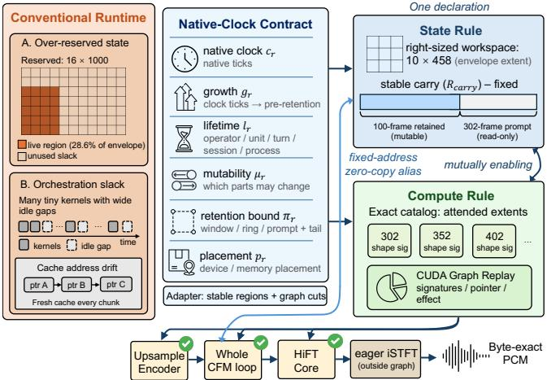
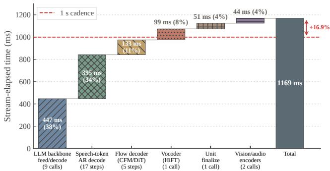
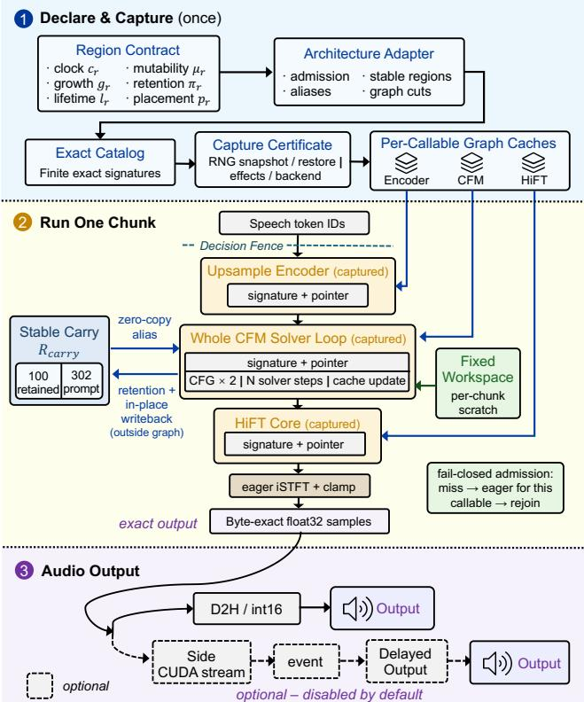
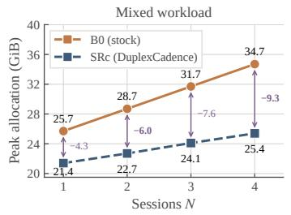
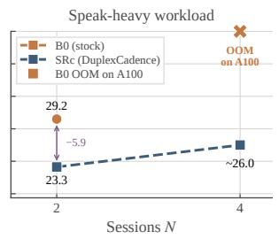

# DuplexCadence: Exact State and Execution from a Speech Model’s Declared Timelines

Haixiao Gao1, Yimin Zheng1, Linyou Xiao1, Zeke Xie2\*

1Jinan University, China

2Hong Kong University of Science and Technology (Guangzhou), China

{ghx2004, zymmm, pingfkl}@stu2023.jnu.edu.cn, zekexie16@gmail.com

## Abstract

Full-duplex speech models support streaming interaction that listens and speaks at the same time. Serving them is governed by a strict, repeating deadline: conversation advances on a one-second cadence, and every second of input must be turned into a second of speech before the next second arrives. Because stages within a session run in strict sequence, per-invocation overhead cannot be batched away. Profiling reveals that the autoregressive stages of a duplex second already fit within the period, whereas the token-to-audio synthesis tail is what causes overruns. This tail stage sufers from orchestration slack where the GPU is left waiting as thousands of tiny, regular operations are issued one by one, while also wasting substantial memory by over-provisioning state at static implementation constants. Existing remedies, such as graph recording and demand-sized allocation, fail because streaming state dynamics violate their prerequisites. The root cause is that the runtime lacks the model’s native clocks: the per-region counters that govern advancement rates and retention policies. We propose DuplexCadence, which explicitly declares native clocks to the runtime and derives two mutually enabling rules: demand-sized state allocation at a stable address, and exact-shape graph replay without padding. The former eliminates idle memory and stabilizes tensor pointers, while the latter removes orchestration slack without padding overhead. Evaluated on four released models across three decoder architectures with bit-for-bit identical output, DuplexCadence reaches 2.85× the stock runtime’s speed at 38.8% lower peak memory. On the live duplex path, mean SPEAK time falls from 14% over the onesecond cadence to 2% under it, enabling models to reliably keep up with interactive speech while markedly expanding multi-session serving capacity.

CCS Concepts: • Computer systems organization → Real-time system architecture; • Software and its engineering → Runtime environments.

Keywords: full-duplex speech, streaming inference, realtime serving, CUDA graphs, deterministic execution, GPU memory management

## 1 Introduction

Speech is an increasingly important interface between humans and machines. From conversation with large foundation models to embodied robotics, a growing number of systems adopt speech as an interaction modality [2, 25, 28]. The current generation of speech models is full-duplex [4, 21, 24]: it listens and speaks simultaneously, allowing users to interrupt at any moment. Released systems such as MiniCPMo 4.5 [2], Moshi [4], and Lychee-FD [16] are moving from laboratory demonstrations to deployed products.

To achieve real-time interaction, a speech system must begin speaking while it is still listening. This shifts the serving objective from maximizing average throughput to meeting a periodic deadline: the conversation advances on a one-second cadence, and every second of input must be turned into a second of speech before the next second arrives. Whether this deadline can be honored depends on how much work one second requires and whether that work can be amortized. However, inside a single session, the execution stages exhibit strict sequential dependencies, with each stage consuming the output of the preceding one. The standard mechanism in large-model serving for amortizing fixed perinvocation launch overhead is to batch independent requests together [1, 10, 31, 33]. Inside an individual session, no batching target exists. The launch overhead lands in full on the critical path of the single session, making the cost of one second a quantity that must be audited stage by stage.

We profile that critical path (§2). The autoregressive language modeling stages already keep up with the one-second cadence. What pulls the entire stream past the deadline is the synthesis tail that converts speech tokens into audio waveforms; specifically, it spends about 1.17 seconds on one second of work. An analysis of this tail reveals that the system is not compute-bound, but rather bottlenecked by a starved accelerator: thousands of tiny, regularly shaped operations are handed to the GPU one by one, leaving it waiting for 57–65% of wall-clock time. We call this idle time orchestration slack; it is what pushes a segment that would otherwise finish on time past the deadline. The same execution exhibits a second severe resource waste in memory: the flow decoder actively uses only one-seventh of the workspace it allocates, holding the remainder occupied yet unused. These two defects impose distinct constraints on full-duplex serving. The former dictates whether an individual stream can meet the cadence, whereas the latter caps the number of concurrent sessions a device can sustain. Figure 1 contrasts both ineficiencies against what becomes possible once the model’s rates are declared.

  
Figure 1. One second of full-duplex speech synthesis and recurring operations. Conventional runtimes overprovision state at static constants and issue operations individually. DuplexCadence declares native clock rates and retention bounds to derive demand-sized state at a stable address and an exact-shape replay plan without padding.

Each problem has an established general remedy. To elimi nate host-side launch gaps, systems commonly rely on graph recording (such as CUDA Graphs) to capture a recurring sequence of calls once and issue it as a whole [11, 18]. To curb excessive memory envelopes, systems use demand-sized allocation to reserve storage only for the state kept live under a retention policy. Each remedy relies on a strict precondition: graph recording requires invoked operations to exhibit fixed tensor shapes and stable pointer addresses, while demand sized allocation requires the runtime to know which history remains live. Neither precondition holds in streaming speech. Persistent history state updates with every processed chunk: its length initially grows with newly arrived frames and is subsequently truncated once it exceeds the retention bound. As a result, hot operators observe input lengths that vary across chunks, so the fixed shapes required by graph recording do not exist. Existing implementations also reallocate memory and copy state on every chunk, causing physical addresses to drift dynamically and rendering recorded execution plans invalid. Meanwhile, the runtime lacks visibility into the true liveness boundary defined by the retention policy, holding only static capacity constants hardcoded in the implementation. Consequently, demand-sized allocation cannot be applied. The stock CUDA Graph fast path provided in released runtimes never executes for precisely these reasons, silently falling back to slow, individual operator launches (§2).

In hindsight, neither ineficiency should exist, because the underlying information has been available all along. A single second of streaming synthesis advances deterministically along multiple parallel timelines: the language model steps once per token, the speech decoder steps once per audio frame, and waveform generation steps once per block of samples. The rate of each timeline is fixed in the model’s static configuration files, and the same configuration explicitly states the retention policy of every persistent state region, such as the number of retained history frames and prompt frames. Because these rates are constant, specific small operations recur thousands of times per second with identical, fully enumerable dimensions. What the runtime lacks is neither raw compute power nor better operator kernels, but rather these timelines themselves, specifically an explicit mechanism to expose the model’s inherent temporal structure so that the runtime can act upon it.

Key insight. We propose DuplexCadence, a runtime system that lifts these inherent timelines into explicit declarations that the runtime can directly interpret. We term these declarations the model’s native clocks: one deterministic counter per persistent state region, governing both the ofset where new state is written next and the maximum extent a consumer operator may read backward. A region’s native clock, coupled with its configured retention policy, answers the two questions that previously blocked existing remedies: how large the region ever needs to be, and which specific slice shapes a consumer will ever access. To resolve the first question, DuplexCadence achieves demand-sized, addressstable state allocation: it provisions contiguous storage sized strictly to demand for the entire lifecycle of the stream and implements retention through in-place writeback, eliminat ing memory reallocation and address drift. To resolve the second question, DuplexCadence realizes exact-shape replay without padding: it enumerates all reachable tensor shapes into a compact catalog before any inference trafic arrives, allowing hot operations to be captured and replayed at their exact geometries. Crucially, these two rules are mutually enabling, and neither alone sufices (Table 4). Shrinking memory without graph recording leaves the thousands of kernel launches untouched and yields no speedup. Conversely, recording execution without demand-sized allocation forces the runtime to freeze state at the bloated envelope dictated by static constants, driving peak memory to its maximum at the exact granularity where recording is most efective. Taken together, each rule supplies the precondition for the other: state reallocation shrinks the memory envelope that graph recording must freeze, while exact-shape recording enables demand-sized state to execute with zero launch overhead, delivering latency and memory benefits simultaneously at the same binding granularity (§3).

We also subject the entire method to a non-negotiable prerequisite: the generated output must be identical byte for byte. Common acceleration techniques often pad inputs to predefined bucket capacities and execute masked operators [10, 19], which can introduce numerical drift and produce difering output bytes. For interactive products delivering audio directly into a listener’s ear, altering waveforms modifies the delivered artifact itself, potentially inducing perceptual distortion or downstream transcription errors. In our early explorations, an alternative decoding transformation improved p95 latency by 16–20%, but it caused the generated token trajectory to diverge and raised character error rates; we therefore discarded it. All optimizations in DuplexCadence eliminate padding by enumerating exact shapes, treating byte-for-byte equality as an invariant checked before every call rather than an empirical property sampled post hoc.

This paper makes the following contributions:

• We identify and formalize the core impediment in intrasession real-time serving of full-duplex speech: the runtime lacks the model’s native clocks. Consequently, it can neither determine how much persistent state remains live nor anticipate reachable tensor shapes, forcing the system to over-provision memory and launch thousands of small operators sequentially. We show that this workload class exhibits two statically verifiable properties: state liveness is bounded by retention policies (retention boundedness), and timeline rates are fixed by configuration (clock declarability). These two properties are to intra-session real-time speech serving what batchability is to LLM serving.

• We design and implement DuplexCadence, a runtime system structured around a declarative native-clock contract. The contract exposes timeline rates and retention bounds, enabling two coordinated mechanisms: demandsized, address-stable state allocation and an exact-shape replay engine. Three key mechanisms make both rules hold simultaneously: decoupling stored extent from read extent to prevent memory shrinkage from conflicting with shape enumeration; enforcing in-place writeback to contractowned memory to ensure pointer stability; and compiling exact reachable shapes without padding so that byte-exact equality is enforced before every invocation, including operators with per-call stochasticity (§3, §3.3).

• We evaluate DuplexCadence across four released full duplex models spanning three distinct decoder architectures, gating all results on byte-for-byte equality. On the streaming speech synthesis module shared by MiniCPM-o 4.5 and Lychee-FD, DuplexCadence achieves 2.85× the speed of the stock runtime with 38.8% lower peak memory (§4.2), confirming empirically that both rules are required. On the live duplex serving path, mean SPEAK time for a single stream drops from 14% above the one-second cadence to 2% below it, eliminating interactive lag (§4.3). Under multi-session concurrency, DuplexCadence completes a four-session workload that exhausts GPU memory on the stock baseline within approximately 26 GiB (§4.3, §S8).

The implications extend beyond speech. Whenever an interactive session’s stages execute sequentially and results must be delivered on a strict cadence, fixed launch overhead cannot be amortized across requests. Real-time streaming translation, frame-by-frame video generation, and closedloop robotic control all share this execution profile. Because their internal states also advance at rates fixed by configuration, the native-clock contract ofers a general principle to reclaim these system overheads.

## 2 Background and Motivation

## 2.1 Multi-Clock Real-Time Streaming Runtimes

We study the class of runtimes defined by three properties, each checkable statically before any trafic arrives:

C1 (multiple native clocks). Execution advances along two or more clocks whose rates are statically fixed by configuration across input lengths: LLM tokens, audio/codec frames, codebook depth, difusion solver steps, waveform samples, and turns.

C2 (bounded retention). At least one persistent state region’s extent obeys a declared retention policy: a sliding window, a ring cache, or prompt plus retained history.

C3 (single-session interactivity). The runtime serves one interactive session whose stages are sequentially dependent, so intra-session batching is unavailable; cross-session batching remains possible and complementary.

Properties C1 and C2 represent the concrete, statically checkable form of the two characteristics introduced in §1: rates fixed by configuration enable clocks to be explicitly declared, while a declared retention policy strictly bounds state liveness. Property C3 makes both characteristics operationally critical, because sequential dependencies within an interactive session preclude intra-session batching.

MiniCPM-o 4.5 [2], Moshi [4], and PersonaPlex [21] satisfy all three conditions, with C2 readable directly from a released configuration field. Lychee-FD [16] and Freeze-Omni [24] satisfy C2 through bounded streaming caches whose extent is determined by an operator-chosen chunk policy; they join the class once that policy is fixed, which is the form our declaration takes (§S7.5). Ofline TTS (lacking C3) and unbounded LLM serving (lacking C2) fall outside this scope.

Property C3 distinguishes this workload class from the conventional LLM-serving literature. Continuous batching [10, 31], chunked prefill [1], and disaggregated serving [35] all amortize per-invocation launch cost across independent requests, but that lever cannot be applied inside an individual session. This sequential dependency entails the corollary that defines this paper’s second evaluation metric: because invocations cannot be merged within a session, serving multiple sessions on a single device requires holding their states resident simultaneously. Consequently, peak memory allocation directly governs system serving capacity. Recent speech and omni-modal serving systems [9, 30, 34] schedule stage invocations across independent requests or sessions; in contrast, DuplexCadence optimizes the sequentially dependent execution path within an individual session. These two perspectives operate at distinct, complementary layers and compose naturally (§5; measured in Table S2).

  
Figure 2. Stage time breakdown for one full-duplex second. MiniCPM-o 4.5 on A100 (omni-modal duplex, 17 emitted speech tokens; stream-elapsed times). Autoregressive decoding fits within one second, whereas the synthesis tail causes a 16.9% deadline overrun (§S6).

Satisfying these conditions does not by itselfmake an operator amenable to exact specialization. An auxiliary quantity, derived from arithmetic on the same declared configuration fields, determines whether the exact execution path is computationally afordable, placing diferent stages of the same model on opposite sides of the optimization boundary (§3.5).

## 2.2 Anatomy of a Full-Duplex Second

Execution profiling reveals two pronounced ineficiencies. Each corresponds to a theoretical lower bound implied by the model’s published configuration, yet both measured quantities sit far above their ideal limits.

2.2.1 Where the time goes. Figure 2 decomposes one representative SPEAK unit of MiniCPM-o 4.5 on an NVIDIA A100 GPU (recorded using CUDA events; emitting 17 speech tokens). Across the profiled units, every second of speech averages 9.5 backbone invocations (approximately 6.5 of them at sequence length 1), followed by a five-step CFM solve with CFG×2, and one vocoder invocation.

The first two stages sum to 842 ms, comfortably fitting within the one-second budget. However, the subsequent synthesis tail requires an additional 327 ms, pushing the total latency 16.9% beyond the cadence deadline. The 2.85× speedup reported in §4.2 is achieved specifically on this tail segment, while the autoregressive fraction falls outside the lossless scope for reasons analyzed in §3.5.

Comparing the hot operators against their compute lower bounds quantifies this ineficiency. Let an invocation of op erator � issue $m _ { o }$ kernels with device execution times $t _ { k }$ and a mean per-launch host cost �. Let $G _ { o }$ denote the orchestration slack that a launch trace attributes to host issue or synchronization, and let $L _ { o }$ represent the roofline bound:

Table 1. Hot operators run far above their roofline bounds. Per-invocation time in ms against the theoretical roofline bound of (1) (§S6.1).
<table><tr><td>Operator</td><td>Measured</td><td>Bound</td><td> $\gamma _ { o }$ </td></tr><tr><td>Flow DiT step (CFG×2)</td><td>26.6</td><td>0.86</td><td>31×</td></tr><tr><td>LLM step (L=1, 8B)</td><td>~50</td><td>10.3</td><td>~5X</td></tr><tr><td>TTS step (L=1, small)</td><td>~23</td><td>«1</td><td>&gt;20×</td></tr></table>

$$
\begin{array} { r } { L _ { o } = \operatorname* { m a x } { \left( \Phi _ { o } / P , \ B _ { o } / \beta _ { \mathrm { d e v } } \right) } , ~ T _ { o } = \sum _ { k \leq m _ { o } } t _ { k } + G _ { o } , } \end{array}
$$

$$
\gamma _ { o } - 1 = \frac { \sum _ { k } t _ { k } - L _ { o } } { L _ { o } } + \frac { G _ { o } } { L _ { o } } , \quad G _ { o } \simeq m _ { o } \lambda ,\tag{1}
$$

where $\Phi _ { o }$ and $B _ { o }$ denote the operator’s FLOPs and memory trafic, while $P$ and $\beta _ { \mathrm { d e v } }$ represent the device’s peak compute and bandwidth capacities. The two terms in $\gamma _ { o } - 1$ capture inkernel ineficiency and orchestration overhead, respectively. Because only the second term includes $G _ { o } ,$ the slowdown factor $\gamma _ { o }$ can be bounded prior to full attribution: the flow, LLM, and speech-token steps run at $3 1 \times , \sim 5 \times ,$ and > 20× their theoretical bounds (Table 1). The final relation provides a first-order model that holds whenever host kernel issue does not overlap with device execution, establishing launch count $m _ { o }$ as the decisive lever for optimization.

Separating the two terms. Attributing $\gamma _ { o }$ requires an experimental instrument that eliminates $G _ { o }$ while holding device execution time $\textstyle \sum _ { k } t _ { k }$ strictly fixed. Byte-exact replay provides precisely this capability: by construction, a replayed invocation issues identical kernels over identical tensor shapes in the exact same order, with SHA-256 hash equality independently verifying output fidelity. CUPTI profiling across 20 matched chunks confirms that each kernel type maintains an identical launch count in both execution arms. Consequently, the delta between eager execution and replay directly measures the host-induced latency eliminated under an identical in-graph kernel sequence. This isolates $G _ { o }$ from the eager baseline directly: eager device-busy time accounts for only 103.7 ms of a 241.2 ms chunk, situating $G _ { o } \in [ 1 3 7 , 1 5 7 ]$ ms, or 57–65% of eager wall-clock time, compared to less than 1 ms of residual idle time following replay. Orchestration slack thus constitutes the majority of eager wall-clock time. The two autoregressive rows lie outside the lossless scope (§3.5); their $\gamma _ { o }$ records the same symptom arising from the same launch pattern.

This is the first of the two patterns that DuplexCadence targets: thousands oftiny, regularly shaped kernel launches per second whose aggregate latency is dominated by launch and scheduling overhead. Under Property C3, this entire overhead lands on the session’s critical path, and (1) names the operational lever that remains.

2.2.2 Where the state goes. The same execution profile exposes the second ineficiency, which is likewise measurable against a declared configuration bound. Persistent state regions are provisioned according to static capacities hardcoded in the implementation, whereas the declared retention policy strictly bounds the extent that any downstream consumer ever accesses. To formalize this disparity, we define the over-reservation ratio $\rho _ { r }$ , directly parallel to $\gamma _ { o }$

Table 2. Persistent state reserved envelopes versus declared live extents. Over-reservation ratios $\rho _ { r }$ range from 3.5× to 18× across state regions. Derivations are in §S6.2.
<table><tr><td>Region and implementation constant</td><td>Reserved</td><td>Declared live</td><td> $\rho _ { r }$ </td></tr><tr><td>Flow workspace (steps×frames),</td><td>16×1,000</td><td>5×458</td><td>7.0×</td></tr><tr><td>duplex same, standalone decoder</td><td>16×1,000</td><td>10×458</td><td>3.5×</td></tr><tr><td>Attention mask envelope (frames)</td><td>500</td><td>56</td><td>8.9×</td></tr><tr><td>largest bucket</td><td>1,000</td><td>56</td><td>17.9×</td></tr><tr><td>Stacked carry per frame (fp32)</td><td>2MiB</td><td>0.125 MiB</td><td>16×</td></tr></table>

$$
\rho _ { r } = { \frac { { \mathrm { r e s e r v e d e n v e l o p e } } } { { \mathrm { d e c l a r e d l i v e ~ e x t e n t } } } } ,\tag{2}
$$

where the denominator, like $L _ { o } ,$ is computed deterministically from published configuration fields.

Table 2 evaluates $\rho _ { r }$ across the state regions examined in this paper, where the ratio ranges from 3.5× to 18×. For example, the flow workspace alone reserves 2.1 GB of fp32 memory, whereas the declared live extent requires only oneseventh of that allocation. This over-provisioning represents the capacity dimension of the problem. Its second dimension, which is even more disruptive for execution, concerns tensor position. Because existing implementations apply retention policies via tensor concatenation, they materialize a fresh multi-hundred-megabyte cache tensor on every chunk. This practice incurs redundant allocation overhead, consumes memory bandwidth, and continuously moves the state ten sor to new memory addresses. Consequently, any recorded execution plan reused across chunks would immediately reference invalid pointers. The omission that prevents memory envelopes from shrinking to true demand is precisely the one that prevents execution plans from being frozen. Across multi-session serving, these over-allocation factors compound into session capacity limits (§4.3).

Together, these ratios quantify two coupled gaps stemming from the runtime’s inability to inspect native clocks: memory over-reservation $( \rho _ { r } ~ \in ~ \left[ 3 . 5 , 1 8 \right] )$ at drifting addresses, and orchestration slack $( \gamma _ { o } \in [ 5 , 3 1 ] )$ under shapes the runtime treats as unknown. Attempting to remedy either gap in isolation worsens the other.

## 2.3 Why Existing Tools Do Not Close the Gap

Existing optimization strategies fail for structural reasons predicted by these coupled gaps (§4.5). First, the stock stack’s CUDA Graph branch uses hand-picked shape buckets that native clocks never produce, so it never executes; adjusting those buckets enables execution but freezes padded envelopes at bucket capacity, preserving high $\rho _ { r }$ . Second, torch.compile in reduce-overhead mode [19] aborts on key streaming paths and introduces numerical drift while saving no memory, lacking visibility into state liveness. Third, graph recording in isolation shifts memory bloat to static staging across shape classes, whereas state compaction alone leaves kernel launch counts untouched. The two ineficiencies cannot be resolved independently, an empirically falsifiable proposition (§3). Furthermore, lossy approximations compromise fidelity: an early decoding transformation reduced p95 latency by 16–20% yet induced token divergence and non-zero text error rates, violating conversational requirements.

  
Figure 3. DuplexCadence system architecture. Adapters declare native clocks, retention rules, and address-stable regions for demand-sized storage and a finite shape catalog. At runtime, wrapped callables enforce fail-closed admission and write back in-place into the fixed-address carry.

Properties C1 and C2 jointly make this workload class tractable by providing the structural information each gap lacks. Because hot-operator tensor shapes are deterministic functions of clocks with declared bounds, all reachable shapes are known before inference trafic arrives. Concurrently, the declared retention policy defines live history extents, making the denominator of (2) analytically computable at the same moment. Explicitly capturing native clocks enables runtimes to size state to demand, anchor it to stable addresses, and replay execution plans without padding.

## 3 The Native-Clock Contract and Its Realization

Figure 3 depicts the architecture of DuplexCadence: a declarative contract instantiated by a per-family adapter, and two coordinated rules derived from it. Specifically, the adapter names clocks, retention policies, and address-stable regions; the state rule sizes these regions and pins the retained cache; and the compute rule captures one CUDA graph per exact signature those clocks produce. Omitting either rule leaves one performance axis unaddressed. Below, we state each rule in conjunction with the mechanism that realizes it.

## 3.1 The Region Contract

We model a full-duplex runtime as an ordered sequence ofoperator invocations reading immutable parameters, ephemeral workspace memory, persistent state partitioned into regions $\{ S _ { u , r } ^ { t } \}$ , and pseudorandom generator states $\Xi ^ { t }$ (§S7.1).

Definition 3.1 (Region contract). A state region � is described by a tuple $R _ { r } = ( c _ { r } , \mathbf { g } _ { r } , \ell _ { r } , \mu _ { r } , \pi _ { r } , p _ { r } )$ : its native clock $\scriptstyle { \mathbf { c } } _ { r }$ (scalar or product, such as (solver step, mel frame)); its unconstrained growth map ${ \bf g } _ { r }$ over those clocks; its lifetime $\ell _ { r }$ (operator, unit, turn, session, process); its mutability class $\mu _ { r } ;$ its retention policy $\pi _ { r } ,$ which bounds its extent as required by Property C2; and its physical placement ${ \boldsymbol { p } } _ { r }$

An adapter explicitly declares these structural properties, allowing the runtime to derive all downstream execution parameters. Per model family, it specifies clock quantities, an admission predicate, and address-stable regions, alongside the value-semantics and efect declarations detailed in §S5. For the shared speech synthesis decoder at our primary operating point, the complete declaration consists of: $f _ { \mathrm { p r o m p t } } { = } 3 0 2$ $f _ { \mathrm { r e t a i n e d } } { = } 1 0 0 , f _ { \mathrm { c h u n k } } { = } 5 0 , f _ { \mathrm { c a l l } } { = } 5 6$ frames, $n _ { \mathrm { s t e p s } } { = } 1 0$ , an upsampling rate of 2 frames per token, an admission predicate $f \ \leq \ f _ { \mathrm { c h u n k } }$ , two address-stable regions, and three deviceresident constants (Table S11). Every subsequent extent and class count is derived deterministically from these numbers.

From this declaration, the runtime establishes that a region’s spatial extent, and therefore its memory footprint, is governed entirely by its clocks: $\mathbf { a } _ { r } ( t ) = \pi _ { r } \bigl ( \mathbf { g } _ { r } ( \pmb { c } _ { r } ( t ) ) \bigr )$ , so that bytes $( S _ { u , r } ^ { t } )$ equals $\beta _ { r } \prod _ { j } a _ { r , j } ( t )$ at element width $\beta _ { r } .$ . Property C2 ensures that $\pi _ { r }$ caps each spatial coordinate independently of session length, giving $A _ { r , j } = \mathsf { s u p } _ { t } a _ { r , j } ( t ) < \infty$ In contrast, stock implementations provision memory at static constants $\hat { A } _ { r , j }$ chosen without regard to $\pi _ { r }$ , yielding the over-reservation ratio $\rho _ { r }$ defined in (2).

Two extents, and therefore two regions. A single frame clock governs two distinct physical quantities that must be kept apart. The envelope extent represents the maximum in-flight capacity that physical storage must accommodate, because truncation under the retention policy occurs strictly after inference, meaning newly presented frames must first fit within the bufer; this extent governs byte allocation. Conversely, the attended extent denotes the history span downstream consumers actually read, which specializes the operator’s tensor signature and fixes the number of reachable shape classes. While these two extents coincide under pure concatenation, they diverge in the streaming flow decoder evaluated here, where lookahead frames reside in the envelope but are discarded prior to truncation, thus never specializing a signature. This distinction produces two contractmanaged, address-stable regions: the carry, sized to the attended extent $L = f _ { \mathrm { p r o m p t } } + f _ { \mathrm { r e t a i n e d } }$ (402 frames of retained history propagated across chunks), and the solver workspace, sized to the envelope extent 10×458 frames (reducing $\rho _ { r }$ from 3.5× standalone and 7.0× in full-duplex vs. stock 16×1000).

Two additional clock classes become essential downstream, both expressible under Definition 3.1. A constant has a trivial clock. Consequently, rematerializing one per call, such as transferring a host-side frequency table to the device at every difusion step, erroneously attributes it to the call clock, which (1) charges as orchestration slack $G _ { o }$ The adapter remedies this by migrating such constants to device-resident bufers with bitwise-identical contents (§S5.7). Meanwhile, the device random stream advances along the call clock, as its Philox generator ofset advances by a deterministic increment per kernel invocation.

The losslessness of demand sizing is anchored in a representation invariant beyond raw byte counts, formalizing (S2): every declared consumer reads precisely what it would have obtained from the logical region, while the region’s memory pointer remains invariant across its declared lifetime. Because only the attended extent participates in consumer computation, auxiliary capacity within the envelope remains free of correctness hazards.

Definition 3.2 (Strict trace equivalence). Let $F ( X ; \Xi )$ denote the externally observable execution trace of the runtime on input � and generator collection Ξ, encompassing control decisions, emitted token identifiers, turn boundary events, and raw PCM sample byte streams at native output precision (float32 in our stack). An optimized runtime achieves strict trace equivalence if $F _ { \mathrm { o p t } } ( X ; \Xi ) = F _ { \mathrm { b a s e } } ( X ; \Xi )$ under bit-for-bit comparison, without numerical tolerance.

Every optimization in this paper satisfies Definition 3.2, verified through the paired evaluation protocol of §4.1.

## 3.2 State Rule: Demand Sizing and the Carry

The state rule allocates every contract-managed persistent or scratch region strictly to the extent implied by its declared clocks, lifetime, and retention policy, establishing $A ^ { \dagger } = A$ The 16×1000 envelope collapses to 10×458, and immutable prompt states become copy-on-write across conversational turns. In isolation, this represents a pure memory allocation discipline; its speed contribution is unlocked only through synergy with the compute rule.

The central structural mechanism is the carry: a contractowned bufer holding the retained attention cache at a single, invariant physical address throughout the stream’s lifetime. While the stock implementation applies retention via dynamic tensor concatenation (§2.2.2), DuplexCadence writes retained data directly into a pre-allocated bufer � of fixed length �. Letting � denote the live cache tensor at extent $\ell > L ,$ and using ∥ for concatenation along the frame clock dimension:

$$
{ \cal C } [ \cdot , 0 { : } L ] \longleftarrow H [ \cdot , 0 { : } f _ { \mathrm { r e t a i n e d } } ] \parallel H [ \cdot , \ell { - } f _ { \mathrm { p r o m p t } } { : } \ell ] ,\tag{3}
$$

producing elementwise-identical values under two fundamentally diferent allocation disciplines. The stock path evaluates the right-hand side by allocating a new tensor on every chunk. In contrast, DuplexCadence writes into existing storage, ensuring ptr(�) remains constant across the stream lifecycle, including turn transitions where cache resets write base state in-place into existing storage. The slice indices in (3) follow the cache layout of this model family, which uses prepend ordering where the mutable history window precedes the immutable prompt tail. As reported in $\ S 3 . 6 ,$ this layout invariant is formally verified at runtime.

The carry is a general memory discipline across architectures. On Moshi, it degenerates to the vendor’s ring bufer; on Freeze-Omni, it becomes a compact convolutional leftcontext bufer, both from the same contract (§S7.6).

## 3.3 Compute Rule: Exact-Shape Replay

The contract that bounds memory footprint simultaneously bounds the universe of reachable tensor shapes, elevating the native clock from a storage concept to an execution control mechanism. Let $\Sigma _ { o }$ denote the mapping from admissible attended extents ${ \mathcal { A } } _ { o }$ of the regions accessed by operator $^ { o , }$ combined with its non-extent configuration $Q _ { o }$ (data type, memory layout, device target, and scalar arguments), to fully specialized tensor signatures. Property C2 ensures this signature space is finite independently of session duration. For the streaming flow decoder, the frame-clock component forms a concise, closed arithmetic grid:

$$
\begin{array} { r l r } & { } & { \mathcal { K } ( o ) = \Sigma _ { o } ( \mathcal { A } _ { o } \times Q _ { o } ) , \quad K = \left\lceil f _ { \mathrm { r e t a i n e d } } / f _ { \mathrm { c h u n k } } \right\rceil + 1 , } \\ & { } & { \mathcal { L } = \{ f _ { \mathrm { p r o m p t } } + k \ : f _ { \mathrm { c h u n k } } \} _ { k = 0 } ^ { K - 2 } \cup \{ f _ { \mathrm { p r o m p t } } + f _ { \mathrm { r e t a i n e d } } \} . } \end{array}\tag{4}
$$

Here, L collects the attended extents of §3.1. For the Token2Wav module shared by MiniCPM-o 4.5 and Lychee-FD (CosyVoice2 lineage [6]), L traverses the grid until truncation locks it at the retention bound, yielding $\mathcal { L } = \{ 3 0 2 , 3 5 2 , 4 0 2 \}$ and $K { = } 3$ distinct shape classes. Moshi’s ring cache gives $K { = } 1$ , and Freeze-Omni’s streaming policy gives �=2. Because the stride follows the advancement clock (distinct from the invocation frame count $f _ { \mathrm { c a l l } } )$ , live calls systematically fall outside the vendor’s handcrafted bucket sets. Partial stream flushes can land between grid points, but the admission predicate caps them by $f _ { \mathrm { c h u n k } }$ , ensuring they remain within a finite, pre-enumerable catalog.

The compute rule is realized by ExactShapeReplay, a general engine that specializes a callable once per catalog signature over a CUDA Graph backend [11, 19]. Admission is governed by predicate (S3) evaluated over the captured subset $C _ { o } \subseteq \mathcal { K } ( o )$ , failing closed at the first mismatch: the first two conditions are checked per invocation at runtime, while the third is certified at capture.

(i) Signature match. The full tensor signature of the incoming invocation (shapes, strides, data types, device, and scalar parameters) must match an entry in $C _ { o }$ . Each specialized graph matches at exact declared dimensions; any miss falls back safely to eager execution, as does an argument the engine refuses to key on.

(ii) Address stability. Regions written by the operator via fixed addresses, declared by the adapter, are checked by data pointer, accommodating callers that pass fresh views on identical storage. Ifa pointer drifts, the engine conservatively drops the class cache and logs an invalidation. Conversely, contract-owned input bufers like the carry are aliased: the engine records physical pointers once, bypasses per-call staging copies, and validates pointer constancy at zero overhead.

(iii) Efect classification. Prior to capturing a class, the engine executes a probationary eager call to monitor host and device random generator states, rewinding state immediately to keep the probe transparent. Invocations reading host randomness would freeze drawn values as constants within the graph and are permanently rejected. In contrast, invocations reading device randomness are admitted, because the Philox generator ofset advances deterministically along a declared clock; furthermore, graph capture preserves RNG state neutrality via snapshot and restoration, ensuring initial replay draws the exact same sequence as eager execution. This admits the HiFT vocoder, whose harmonic generator samples device randomness on every call. To our knowledge, no prior replay system specializes randomness-drawing operators while guaranteeing strict bit-for-bit equality. Other external efects are audited at capture boundaries and rejected if ambiguous (§S5.6).

Proposition 3.3 (Exact-shape replay). Assume clauses $( i ) -$ (iii) hold, every non-aliased input is staged into its captured bufer, and capture certification confirms deterministic kernel dispatch, identical CUDA stream and event dependencies, and no unmodeled host side efects. Then graph replay reproduces the exact same state transitions on outputs, persistent bufers, and generator states as eager execution, bit for bit.

The premises of Proposition 3.3 are formally established in §S1. Their critical practical consequence is that execution plans are captured at exact geometric shapes. In contrast, bucketed or padded captures execute masked operator variants with altered reduction trees, preserving eager fidelity only up to floating-point reassociation error.

Granularity and capture placement. The shape catalog is an intrinsic property of the declaration, independent of the clock level at which graph binding occurs. Consider a chunk enclosing $n _ { \mathrm { { s t e p s } } }$ internal solver steps, where internal step indices do not specialize the tensor signature and each step follows an identical control path. In this setting, binding at the chunk clock preserves the total class count while reducing the host launch count by a factor of $n _ { \mathrm { s t e p s } }$ . Since orchestration slack scales with kernel launches as $G _ { o } \simeq m _ { o } \lambda$ in (1), this coarsening yields substantial latency benefits:

$$
| \mathcal { K } _ { \mathrm { c h u n k } } | = | \mathcal { K } _ { \mathrm { s t e p } } | = K , \qquad \frac { m _ { \mathrm { c h u n k } } ^ { \mathrm { h o s t } } } { m _ { \mathrm { s t e p } } ^ { \mathrm { h o s t } } } = \frac { 1 } { n _ { \mathrm { s t e p s } } } .\tag{5}
$$

At step granularity, the engine captures individual DiT solver steps, paying inter-step host coordination $n _ { \mathrm { s t e p s } }$ times per chunk. At chunk granularity, the engine encapsulates the whole forward\_chunk into a unified CUDA graph, maintaining three signature classes on either clock. However, coarsening also raises memory footprint: the chunk graph’s input footprint includes the full stacked carry, amounting to approximately 527 MB in fp32 once demand-sized, compared to 0.84 GB under implementation-constant bounds (§S7.3).

Importantly, graph admission is evaluated locally: each wrapped callable makes independent decisions. Consequently, an unexpected signature miss incurs the cost of a single eager invocation while leaving other cached graphs fully operational. Furthermore, computing the lookup key involves only integer and enum comparisons without inspecting tensor data, ensuring admission checks impose zero overhead on the GPU. In steady state, all eager fallbacks are avoided, reducing an entire audio chunk to exactly three eficient graph replays, one per wrapped callable (Figure S2).

## 3.4 Why the Two Rules Are Inseparable

Proposition 3.4 (Mutual enabling). Under the capture architecture ofDuplexCadence, every non-aliased input tensor requires class-specific static storage, and every write-through region requires a frozen, address-stable memory envelope. Consequently, demand sizing and zero-copy aliasing jointly minimize the memory overhead of exact replay across both terms of (6). Conversely, applying demand sizing in isolation leaves the kernel launch count $m _ { o }$ unchanged, leaving orchestration slack $G _ { o } \simeq m _ { o } \lambda$ unafected and ofering no latency reduction. Attempting to reduce class counts via input padding alters the underlying mathematical computation, violating Proposition 3.3.

Let $\mathcal { T } _ { o , \kappa }$ denote tensor inputs of operator � under class $\kappa ,$ let $\mathcal { A } _ { o , \kappa } \subseteq \mathcal { I } _ { o , \kappa }$ represent those the engine can alias at contract-owned stable addresses, and let $\mathcal { W } _ { o }$ denote frozen write-through regions. When provisioning static staging bufers for each signature class, aggregate reserved memory for a graph binding is expressed as:

$$
M _ { o } ^ { \mathrm { r e s e r v e } } = \sum _ { \kappa \in C _ { o } } \sum _ { x \in { \cal I } _ { o , \kappa } \backslash { \cal { A } } _ { o , \kappa } } \mathrm { b y t e s } ( x ) + \sum _ { r \in \mathcal { W } _ { o } } \beta _ { r } \prod _ { j \leq d _ { r } } A _ { r , j } ^ { \dag } ,\tag{6}
$$

decomposing into a class-specific input staging term and a frozen write-through envelope sized to $A _ { r , j } ^ { \dagger } .$

In concrete execution, this relationship manifests across three seams. First, a single pointer check satisfies two distinct system requirements: the carry’s fixed address validates pointer stability in (S3) while establishing the safety condition for zero-copy aliasing. A single data\_ptr check thus guarantees execution exactness while eliminating staging copies. Without the state rule, the caller would materialize a new cache bufer per chunk, forcing the engine to maintain dedicated per-class clones of the stacked carry, which explains the sharp memory surge in replay-only configurations. Second, one rule directly bounds what the other mustfreeze: the second term in (6) scales with $A ^ { \dagger }$ , which the state rule contracts from (16, 1000) down to (10, 458). Third, memory ownership eliminates signature classes, acting directly on catalog cardinality. Because both staging memory and launch reductions scale with binding granularity (§S7.3), Proposition 3.4 forms an empirically falsifiable Pareto claim: only coupled rules achieve optimal latency without paying the replay-only memory penalty; isolated single rules fail in opposite directions (§4.2, Figure S1).

When � independent sessions share one accelerator, this accounting governs system capacity. Because DuplexCadence time-multiplexes a single set of graph bindings across sessions, increasing � replicates only each session’s lightweight state snapshot, so the memory reductions of §2.2.2 translate directly into multi-session capacity (§S8.2).

## 3.5 Scope: Catalog Width

For graph specialization to remain practical, the reachable signature catalog must be strictly compact, because each captured class incurs warmup time and dedicated staging memory under (6). Let the attended extent specializing operator �’s signature span $[ A _ { r } ^ { - } , A _ { r } ]$ , where $A _ { r }$ is the retention bound and $A _ { r } ^ { - }$ the lower bound once the policy fires. Let $s _ { r }$ denote extent advancement per invocation. Traversing the retention window $W _ { r } = A _ { r } - A _ { r } ^ { - }$ − step by step yields:

$$
K _ { r } = \big \lceil W _ { r } / s _ { r } \big \rceil + 1 , \qquad | \mathcal { K } ( o ) | \leq | Q _ { o } | \big \rceil \prod _ { r \in \mathcal { R } _ { o } } K _ { r }\tag{7}
$$

distinct tensor extents, defining $K _ { r }$ as the region’s catalog width.

Design criterion 3.5 (Lossless scope). Assume $\Sigma _ { o }$ is injective with respect to the attended extent of region $r ,$ and that this extent advances from $A _ { r } ^ { - }$ by a fixed stride $s _ { r } ,$ undergoing single-mode truncation upon exceeding $A _ { r } .$ Then the reachable catalog cardinality is governed by (7), and an exact ahead-oftime catalog requires at least $K _ { r }$ specialized classes per region. Catalog width remains manageably small in precisely two regimes: when the retention policy pins the extent $( W _ { r } = 0 )$ , or when the invocation advances the extent in strides comparable to the window width itself $\left( s _ { r } = \Theta ( W _ { r } ) \right)$ . A policy that bounds the extent but advances it by single units produces $K _ { r } = W _ { r } + 1$ Hence, bounded retention under Property C2 is necessary but not suficient for exact specialization. Compressing $K _ { r }$ without coarsening the stride � requires mapping multiple extents onto

Table 3. Catalog width across declared retention policies. Evaluation of (7) with $W _ { r }$ and $s _ { r }$ read from released configurations. Regions with narrow catalog widths and stable signatures are captured, whereas large widths or variable query lengths fall outside the lossless scope.
<table><tr><td>Region and declared policy</td><td> $W _ { r }$ </td><td> $s _ { r }$ </td><td> $K _ { r }$ </td><td>Verdict</td></tr><tr><td>measured: catalogs captured in this paper</td><td></td><td></td><td></td><td></td></tr><tr><td>Moshi temporal KV, fixed-capacity ring</td><td>0</td><td></td><td>1</td><td>captured</td></tr><tr><td>Token2Wav carry, 100 retained frames</td><td>100</td><td>50</td><td>3</td><td>captured</td></tr><tr><td>Freeze-Omni codec, chunk 40 + pad 10</td><td>10</td><td>10</td><td>2</td><td>captured</td></tr><tr><td>computed from released configurations</td><td>0</td><td></td><td></td><td></td></tr><tr><td>Speech-token KV, windowed mode (steady)</td><td></td><td></td><td>1</td><td>out:  $Q _ { o }$ </td></tr><tr><td>Language backbone, token watermark</td><td>2,000</td><td>1</td><td>2,001</td><td>out: width</td></tr></table>

a single signature via padding, which forfeits Proposition 3.3.

Criterion 3.5 serves as an analytical tool evaluated directly on configuration files prior to deployment. As discussed in §S7.4, partial stream flushes at turn boundaries temporarily relax the constant-stride condition, introducing at most $s _ { r }$ additional classes derived from the same parameters.

Table 3 illustrates both failure modes: the language backbone is excluded by catalog width $( K _ { r } = 2 , 0 0 1$ under unitstride decoding), while the speech-token decoder satisfies spatial width $( K _ { r } = 1 )$ but introduces trafic-dependent query lengths into $Q _ { o }$ . Specialization reach thus depends jointly on retention configurations and calling conventions, both computable from configurations prior to implementation (§S7.4). DuplexCadence’s lossless specialization focuses on narrow catalog widths and stable signatures, cleanly composing with outer serving systems managing broader dynamic regimes.

## 3.6 What If the Declaration Is Wrong

A declarative contract is only useful if the runtime can check its premises, so DuplexCadence treats verifiability as part of the contract. DuplexCadence discharges every premise of Proposition 3.3 with a named mechanism that reports itself and fails closed (Table S9). The division of labor follows the contract structure: premises that depend on a value are retested every call, since those are what trafic can break, while premises fixed by the declaration are settled once per class at capture, and a class that fails certification never enters $C _ { o } .$ . Every clause is counted, so the gates of §4.1 test the certificate.

One mechanism audits the declaration directly: a verifi cation mode evaluates the stock concatenation alongside every retention application and compares the two elementwise. Over four matched blocks the paths agree on all 264 retentions at a single address across 312 applications, turn boundaries included, confirming (3) as a verified empirical invariant across every call (§S2.7).

During development, an initial append-ordered carry implementation matched baseline values for two chunks before cache eviction reached the prompt tail, diverging on chunk three. The shadow auditor immediately flagged the discrepancy and localized the responsible retention routine, confirming that runtime auditing exposes latent violations even under plausible audio.

Implementation. DuplexCadence is implemented in Python on an unmodified PyTorch 2.8.0 / CUDA 12.8 stack. The core engine, ExactShapeReplay, is 263 executable lines that name no model, decoder, or operator; an adapter adds 126–314 lines of declarations and binding sites (Table 6). Capture happens once and its cost is reported: the segment’s nine classes, the three declared extents of (4) on each of three captured callables, cost 4.9–8.8 s of warmup, none of it inside a measurement window. Admission also fails closed, so a rejection costs launch latency and never exactness, every rejection counted by reason. The engine interface, the porting cost, the capture-storage accounting, the determinism envelope, and the four PyTorch hazards the contract absorbs are in §S5 and §S2.9; the artifact will be released.

An optional third rule. An optional schedule rule reorders the synthesis segment onto a side stream. Implemented but shipped disabled, its paired delta includes zero, and no result here depends on it (Table S3, §S6.3).

## 4 Evaluation

We organize our evaluation around four questions of progressively widening scope, one per subsection: whether the state and compute rules are mutually enabling (Proposition 3.4); whether segment-level gains survive end-to-end integration into the live duplex path across latency, memory, and bitwise exactness, and whether they expand concurrent session capacity; whether the native-clock principle generalizes across disparate neural architectures; and how DuplexCadence compares against compiler and vendor graph baselines.

Numerical exactness is enforced as a strict gating condition in every table, with bit-for-bit equality guaranteeing perceptual audio quality.

## 4.1 Setup

Hardware and workloads. Primary results run on an NVIDIA A100 (40 GB SXM4), with the factorial, the serving points, and end-to-end MiniCPM-o re-run on an L20 (48 GB) to assess cross-generational behavior (§4.5). We evaluate four distinct workloads: (1) the shared decoder, comprising the streaming Token2Wav pipeline (UpsampleConformer → CFM/DiT → HiFT) that MiniCPM-o 4.5 and Lychee-FD both deploy, streaming 25-token chunks under the declaration of §3.1; (2) end-to-end MiniCPM-o 4.5 in omni-modal streaming mode under the two protocols Table 5 names; (3) crossarchitecture Moshi and Freeze-Omni’s bounded TiCodec generator, neither of which shares code with the first; and (4)

Table 4. Factorial evaluation of state and compute rules. Per-chunk p50 latency, vocoder time, and peak memory on A100 (�=4 matched blocks). Speedup and ΔPeak are relative to B0. All 20/20 optimized cells achieve bit-exact PCM.
<table><tr><td>Variant</td><td> $\mathrm { p } 5 0$ </td><td>Voc.</td><td>Peak</td><td>Speedup</td><td>∆Peak</td></tr><tr><td>B0</td><td>241.7</td><td>19.8</td><td>4,852</td><td>一</td><td></td></tr><tr><td>S</td><td>244.2</td><td>19.9</td><td>2,826</td><td>0.99×</td><td>-41.8%</td></tr><tr><td>R (step)</td><td>86.3</td><td>4.8</td><td>5,194</td><td>2.80×</td><td>+7.0%</td></tr><tr><td>SR (step)</td><td>86.3</td><td>4.7</td><td>3,109</td><td>2.80×</td><td>-35.9%</td></tr><tr><td>Rc (chunk)</td><td>86.6</td><td>4.9</td><td>7,943</td><td>2.79×</td><td>+63.7%</td></tr><tr><td>SRc (chunk)</td><td>84.9</td><td>4.7</td><td>2,972</td><td>2.85×</td><td>-38.8%</td></tr></table>

shared-weight multi-session, where � sessions time-multiplex one process-scoped binding under a paced 2 s-SLO harness. Block counts, seeds, chunk budgets, and pinned kernel settings are detailed in §S2.2.

Protocol and exactness ledger. Every comparison uses matched blocks: within a block, all variants see the same seed, the same input stream, and a fresh process, and reported values are per-block medians aggregated across blocks with paired 95% intervals inline. Peak allocation is the caching allocator’s peak for the whole process, so every resident replay binding, staging bufers and frozen envelopes alike, is inside it. Cells are labeled B0 (baseline), S (state rule), R/Rc (replay at step/chunk clock), and SR/SRc (both). B0 is the stack as it ships and as it runs: the vendor’s recorded fast path is present in code but never fires (§1), making eager issue the actual deployed baseline. The repaired-bucket variant in §4.5 serves as an auxiliary control constructed specifically for comparison. A cell that captures inside the measured window is excluded from segment latency claims; in the live duplex path that cost is charged to DuplexCadence.

Exactness gates are pre-registered before measurement (§S2) and every DuplexCadence performance cell supporting a claim is gated against its unmodified baseline: segment experiments hash float32 PCM streams; whole-system experiments also compare token-ID sequences and discrete control fields. Non-exact controls are labeled. The ledger also reaches inside the run, comparing the representation invariant per call against the concatenation it replaces (§3.6, §S2.7). Absolute times difer across harnesses and kernel protocols, so every comparison below is drawn within one sweep (§S6.4) under stock kernels, the protocol least favorable to DuplexCadence (Table S1). Admitting randomnessconsuming operators presupposes that replay draws the values eager execution would, which we verified (§S2.8); that clause admits the HiFT vocoder, worth 15.0 ms per chunk.

## 4.2 Evidence for Mutual Enabling

Table 4 isolates the enabling structure. Its single-rule rows S, R, and Rc are the pre-registered falsifiers of Proposition 3.4.

In an eight-block evaluation where turn-boundary resets restore into the carry as deployed in production, the CFM loop achieves 26/26 replays with zero eager fallbacks, reproducing −64.8% latency (paired 95% CI: [−65.3, −64.6]) and −38.5% peak memory across 40/40 bit-exact blocks (§S2.6 details the 24/26 harness-reset artifact in Table 4). Tail latency remains tightly bounded: SRc’s p95 is 85.3 ms (p50: 84.8 ms), confirming that median gains hold at the tail. Both single-rule falsifiers reproduce on a second GPU (§4.5).

The state rule alone provides no reliable speedup: its eightblock point estimate of −0.5% carries an interval that crosses zero, so demand sizing is a memory mechanism. Replay alone costs memory, and the cost scales with granularity, because at the chunk clock the engine is stuck with the implementationconstant envelope and must clone the stacked carry per captured class. It also captures four classes (expanding from three) due to the duplicate $Q _ { o }$ entry predicted in §3.3 when no contract-owned carry collapses the two strides (§S2.6). Equation (6) prices the whole penalty from the declaration, predicting both peak deltas to within a granule-independent residual (§S3.1). Coupled, the two costs cancel and the two gains survive: no cell that omits a rule achieves both, and both omissions fail in opposite directions, matching the proposition.

Coarsening polarity depends on state management. The coupling determines the direction of granularity scaling. With the state rule active, coarsening from the step clock to the chunk clock improves latency (p50: 86.3 to 84.9 ms) and reduces peak memory (3,109 to 2,972 MiB) while reducing replay invocations tenfold (SR → SRc, Table 4). Without the state rule, coarsening degrades both axes (+56.7 pp peak memory; 86.3 → 86.6 ms, R → Rc) because un-aliased inputs must be re-staged on every invocation, turning memory bloat into bandwidth bottlenecks on the critical path. The coarsened granularity providing maximum speedup is viable only in conjunction with demand-sized state.

Decomposing the −156.4 ms overall latency reduction attributes 135.7 ms to collapsing the solver loop, 15.0 ms to admitting the stochastic vocoder via efect classification, and 5.8 ms to encoder and host glue (§S3.2). This recovers essentially all measured orchestration slack $\left( G _ { o } \in \left[ 1 3 7 , 1 5 7 \right] \right.$ ms in §2.2.1), leaving residual latency dominated by physical device kernels within the graph (§S3.2).

## 4.3 Surviving the Full Duplex Path

Inside the live model the decoder shares a device and an allocator with an 8B backbone, a vision encoder, and a streaming duplex loop, and Table 5 meets the three criteria we fixed in advance for that setting. The speedup transfers: the synthesis segment falls from 201.7 to 72.2 ms, reproducing the standalone 2.85× to within 3%. Exactness holds over the whole system: token-ID sequences and float32 PCM traces of all six matched blocks match the unmodified baseline exactly, with control decisions and turn boundaries matching as discrete fields. The memory saving also compounds: process peak drops by 10%, whereas replay without the state rule raises it by 13.6%, reproducing the mutual-enabling signature at whole-system scale, where the penalty is measured in gigabytes. The two arms are level on the segment they both transform, so they difer by 5,548 MiB, which a latency-only deployment would give up without gaining any speedup.

Table 5. End-to-end full-duplex evaluation on MiniCPM-o 4.5. A100, �=6 matched blocks. Under the stock protocol (lower block, 48 units), mean SPEAK time drops below the one-second cadence (§S6.4).
<table><tr><td>Metric</td><td>B0</td><td>Rc</td><td>SRc</td></tr><tr><td>deterministic protocol</td><td></td><td></td><td></td></tr><tr><td>Synthesis segment (ms)</td><td>201.7</td><td>72.4</td><td>72.2</td></tr><tr><td>Peak allocation (MiB)</td><td>23,545</td><td>26,746</td><td>21,198</td></tr><tr><td>Token and PCM SHA</td><td></td><td>exact</td><td>exact</td></tr><tr><td>stock protocol (cadence)</td><td></td><td></td><td></td></tr><tr><td>SPEAK mean (ms)</td><td>1,141</td><td></td><td>976</td></tr><tr><td>vs. 1 s cadence</td><td>+14.1%</td><td></td><td>-2.4%</td></tr><tr><td>SPEAK p50 (ms)</td><td>1,169</td><td></td><td>994</td></tr><tr><td>SPEAK p95 (ms)</td><td>1,312</td><td></td><td>1,134</td></tr></table>

  
Figure 4. Serving capacity under shared-weight multisession concurrency. Peak memory allocation in GiB on A100. DuplexCadence consistently reduces peak allocation across session counts, enabling the speak-heavy �=4 workload to complete within ≈26 GiB where baseline runs out of memory (Table S10).

Admission in the live path matches the share predicted in §3.3: the CFM loop replays 25 of 31 invocations, the six misses being the cache-free prompt-priming pass, sent to eager by construction. One declared class per block is captured inside the window and charged to DuplexCadence (§S2.6).

The lower block measures cadence directly under the stock kernel protocol, with no cross-harness substitution. Mean SPEAK time falls from 1,141 to 976 ms: a single stream goes from 14.1% over the one-second period at which its input arrives to 2.4% under it, which is to say that on average it keeps up with the person speaking. The p50 is 0.6% under as well and the p95 remains 13% over, so the claim is the typical unit, not every unit; the remaining overrun comes from the autoregressive stages that §3.5 places outside the lossless scope.

Serving capacity. Under C3 the memory a session returns is what lets another session onto the device, which we test on a shared-weight harness where � sessions time-multiplex one process-scoped binding. The quantitative axis is peak allocation and feasibility, not SLO-goodput. Peak allocation falls in 24 of 24 matched pairs (Figure 4), by 6.0 GiB at mixed �=2 and 9.3 GiB at �=4, because the catalog and the carry are process-scoped and shared. The practical consequence is a change in feasibility: under a speak-heavy �=4 trace the baseline exhausts device memory in all six blocks and produces no measurement at all, while DuplexCadence completes every block within ≈26 GiB. At �=1 both arms sit on the harness ceiling of 0.5, so that cell does not read out the latency gain. Paired PCM byte equality is 100% throughout, and SLO-goodput moves the same way with confidence intervals too wide to support a claim (§S8).

Table 6. Cross-architecture generalization across disjoint decoders. Medians of paired speedup ratios against eager execution; Exact counts gated blocks with bit-identical outputs; LOC denotes executable adapter lines (§S5.1).
<table><tr><td>Stack and mode</td><td>Latency</td><td>Speedup</td><td>Exact</td><td>LOC</td></tr><tr><td>Token2Wav, exact catalog (SRc)</td><td>84.9 ms/chunk</td><td>2.85×</td><td>20/20</td><td>314</td></tr><tr><td>Moshi, vendor graph (width-1 check)</td><td>31.6 ms/frame</td><td>4.97×</td><td>yes</td><td>0</td></tr><tr><td>Moshi, ExactShapeReplay</td><td>44.3 ms/frame</td><td>3.46×</td><td>3/3</td><td>133</td></tr><tr><td>Freeze-Omni, TiCodec generator</td><td>5.0 vs. 8.6 ms</td><td>1.72×</td><td>3/3</td><td>126</td></tr></table>

## 4.4 Cross-Architecture Evidence

On Moshi, the vendor implements custom temporal ring bufers and single-graph wrappers (catalog width one in (7); §S3.5). Toggling this vendor replay yields 4.97× speedup per frame to satisfy Moshi’s 80 ms real-time budget. Peak allocation nonetheless falls by 652 MiB (−3.8%) when the toggle goes on, even though the wrappers alias nothing and re-copy every tensor argument on every call — exactly the $\mathcal { T } _ { o , \kappa } \backslash \mathcal { R } _ { o , \kappa }$ staging term of (6), which places them at the Rc cell of Table 4. The ring has already right-sized everything there is to clone, so replay over declaration-bounded state is nearly free in memory, and the +63.7% Rc pays in Table 4 is the price of replaying over state that no declaration bounds — Proposition 3.4 confirmed from the opposite direction. Replacing these specialized wrappers with generic ExactShapeReplay driven solely by declarative ring-cache and frame-clock specifications recovers 3.46× with 3/3 bitwise equality, capturing 89% of the custom optimization’s reduction under a general, verifiable contract (§S3.5, §S3.6).

## 4.5 Compiler and Vendor-Graph Controls

Across all evaluated configurations of torch.compile in reduce-overhead mode (Table 7), the difusion loop aborts inside Inductor, while the streaming encoder compiles but corrupts runtime graph outputs by violating stream-cache value semantics. Enabling max-autotune increases latency (167.0 ms), confirming that kernel compute eficiency is not the limiting factor. Running compiler-generated kernels inside our exact-shape capture engine eliminates launch overhead yet remains 38.7% slower with divergent bytes, so the numerical drift arises from Inductor’s code generation.

Table 7. Comparison against compiler and vendorgraph controls. NVIDIA A100, �=4 matched blocks. Latency p50 in ms, peak memory in MiB, and gap relative to DuplexCadence SRc (positive means slower). No control achieves speedup, memory reduction, and bitwise exactness together.
<table><tr><td>Configuration</td><td>p50</td><td>Peak</td><td>vs. ours</td><td>SHA</td></tr><tr><td>DuplexCadence SRc</td><td>84.5</td><td>2,983</td><td></td><td>equal</td></tr><tr><td>B0 (eager)</td><td>245.3</td><td>4,852</td><td>+196.8%</td><td>ref.</td></tr><tr><td colspan="5">torch.compile, reduce-overhead mode</td></tr><tr><td>DiT, dynamic=False</td><td>122.3</td><td>4,852</td><td>+46.2%</td><td>differs</td></tr><tr><td>DiT, dynamic default</td><td>123.1</td><td>5,048</td><td>+46.5%</td><td>differs</td></tr><tr><td>DiT, max-autotuneª</td><td>167.0</td><td>5,259</td><td>+102.3%</td><td>differs</td></tr><tr><td>DiT + our capture encoder / whole loopb</td><td>117.2</td><td>5,077</td><td>+38.7%</td><td>differs</td></tr><tr><td>Vendor graph, re-bucketed</td><td>119.7</td><td>5,163</td><td>does not run +43.3%</td><td>equalc</td></tr></table>

Every paired 95% CI on the gap column excludes zero by a wide margin (§S6.5). �max-autotune-no-cudagraphs. �Three scopes, counting  
fullgraph=True, each failing in 4/4 blocks in the two distinct ways §S5.6 details. �An empirical accident of this kernel/shape combination; see text.

Re-bucketing the vendor’s graph branch to live chunk sizes achieves −52% latency relative to eager execution, yet remains 43.3% slower and 73% larger than DuplexCadence SRc due to padded envelope freezing. Although its PCM matches eager execution bitwise under this specific kernel, input padding generally alters reduction trees and forfeits exactness guarantees while incurring dual-axis overheads.

Transfer to a second GPU. All findings generalize across GPU generations: on an L20, per-chunk speedup reaches 2.95× (2.85× on A100) alongside a 38% peak memory reduction, with both single-rule falsifiers reproducing. The L20’s 48 GB memory also measures the speak-heavy �=4 baseline (peaking at 40.2 GiB), confirming that A100 baseline failures reflect genuine memory exhaustion (§S4).

## 4.6 Limitations

Lossless scope. Exact specialization is bounded by catalog width, leaving unit-stride autoregressive phases to outer serving schedulers (Table 3). Harness. The shared-weight harness evaluates concurrency under a 2 s window, producing wide goodput intervals. Cross-session composition. Coor dinating continuously advancing sessions remains an open challenge addressed via process-scoped time-multiplexing; prior systems [9, 30, 34] batch independent requests. Coverage. The cache-free prompt-priming pass and turn-boundary pointer misses execute eager. Generality. Extending declarative contracts to LLM KV caches is constrained by catalog width under bounded retention. Determinism envelope. Cross-process reproducibility inherits the deterministic kernel library; unpinned eager baselines drift (§S6.6).

## 5 Related Work

DuplexCadence bridges model serving, deterministic execution, and streaming state retention. Where conventional runtimes pad inputs and batch requests, DuplexCadence derives demand-sized memory and exact-shape execution from declarative native clocks, gaining speed and memory jointly while analytically bounding specialization reach.

Serving systems. Cross-request batching, paged memory management, prefix caching, chunked prefill, and disaggregated serving [1, 10, 31, 33, 35] amortize launch overhead across requests. Recent speech and omni-modal serving systems [9, 30, 34] extend these techniques to audio via fixed chunking or bucketing. These methods operate across independent requests, orthogonally to our intra-session optimization (§4.6). Nova [29] pipelines stages within a request to mitigate inter-stage latency, whereas DuplexCadence eliminates orchestration slack within individual stages.

Predictable execution. Clockwork [8] schedules inference timing proactively, while Nimble [11] and Rammer [18] reorder GPU execution to eliminate kernel launch overhead $( G _ { o }$ in (1)). Those systems infer timing from profiles or dataflow graphs for latency SLOs; in contrast, DuplexCadence relies on declarative configuration timing to guarantee strict bitwise equality (Proposition 3.3).

Shape specialization. Dynamic compilers [7, 36], torch.compile in reduce-overhead mode [19], and bucketed decode graphs [10] handle shape variation by padding or polymorphic dispatch. DuplexCadence enumerates all reachable shapes exactly, avoiding padding masks and preserving numerical reductions; Criterion 3.5 determines tractability ahead of time, and kernel optimizations [3] stay orthogonal.

Bounded retention for streaming state. Windowed attention, eviction policies [13, 27, 32], paged KV blocks [10], and ring bufers bound unbounded context. DuplexCadence derives retention bounds from configuration before allocation and applies them without eviction, enabling exact-shape replay.

Approximation techniques and speech models. Quantization [26], fast ODE solvers [17, 22], and speculative decoding [12] modify computation, sacrificing bitwise equality and risking conversational fidelity (§2.3). Full-duplex speech models [2, 4, 16, 21, 24, 25, 28] and their synthesis pipelines [5, 6, 14, 15, 20, 23] optimize model representation and perceptual quality; DuplexCadence treats their temporal rates as an execution contract, unlocking systems performance at zero quality loss.

## 6 Conclusion

Full-duplex speech models sufer latency and memory overheads because runtimes cannot inspect native clocks governing state advancement. DuplexCadence elevates these timelines into a declarative contract, enabling demand-sized state allocation at a stable address and exact-shape graph replay. Coupled on production decoders, the two rules achieve 2.85× speedup and 38.8% lower peak memory with bit-identical outputs. On the live duplex path, mean SPEAK latency falls from 14% above cadence to 2% below it, eliminating lag and expanding multi-session capacity. With optimization scope computable ahead of time, we propose retention boundedness and clock declarability as principles for real-time serving, parallel to batchability in LLM serving.

## References

[1] Amey Agrawal, Nitin Kedia, Ashish Panwar, Jayashree Mohan, Nipun Kwatra, Bhargav Gulavani, Alexey Tumanov, and Ramachandran Ramjee. 2024. Taming Throughput-Latency Tradeof in LLM Inference with Sarathi-Serve. In 18th USENIX Symposium on Operating Systems Design and Implementation (OSDI 24). USENIX Association, Santa Clara, CA, 117–134. https://www.usenix.org/conference/osdi24/pre sentation/agrawal

[2] Junbo Cui, Bokai Xu, Chongyi Wang, Tianyu Yu, Weiyue Sun, Yingjing Xu, Tianran Wang, Zhihui He, Wenshuo Ma, Tianchi Cai, Jiancheng Gui, Luoyuan Zhang, Xian Sun, Fuwei Huang, Moye Chen, Zhuo Lin, Hanyu Liu, Qingxin Gui, Qingzhe Han, Yuyang Wen, Huiping Liu, Rongkang Wang, Yaqi Zhang, Hongliang Wei, Chi Chen, You Li, Kechen Fang, Jie Zhou, Yuxuan Li, Guoyang Zeng, Chaojun Xiao, Yankai Lin, Xu Han, Maosong Sun, Zhiyuan Liu, and Yuan Yao. 2026. MiniCPM-o 4.5: Towards Real-Time Full-Duplex Omni-Modal Interaction. arXiv preprint arXiv:2604.27393 (2026). arXiv:2604.27393 [cs.CL] https://arxiv.org/abs/2604.27393

[3] Tri Dao, Daniel Y. Fu, Stefano Ermon, Atri Rudra, and Christopher Ré. 2022. FlashAttention: Fast and Memory-Eficient Exact Attention with IO-Awareness. In Advances in Neural Information Processing Systems, Vol. 35. 16344–16359. doi:10.52202/068431-1189

[4] Alexandre Défossez, Laurent Mazaré, Manu Orsini, Amélie Royer, Patrick Pérez, Hervé Jégou, Edouard Grave, and Neil Zeghidour. 2024. Moshi: a speech-text foundation model for real-time dialogue. Technical Report. Kyutai. arXiv:2410.00037 [eess.AS] https://arxiv.org/abs/2410 .00037

[5] Zhihao Du, Qian Chen, Shiliang Zhang, Kai Hu, Heng Lu, Yexin Yang, Hangrui Hu, Siqi Zheng, Yue Gu, Ziyang Ma, Zhifu Gao, and Zhijie Yan. 2024. CosyVoice: A Scalable Multilingual Zero-shot Text-tospeech Synthesizer based on Supervised Semantic Tokens. arXiv preprint arXiv:2407.05407 (2024). arXiv:2407.05407 [cs.SD] https: //arxiv.org/abs/2407.05407

[6] Zhihao Du, Yuxuan Wang, Qian Chen, Xian Shi, Xiang Lv, Tianyu Zhao, Zhifu Gao, Yexin Yang, Changfeng Gao, Hui Wang, Fan Yu, Huadai Liu, Zhengyan Sheng, Yue Gu, Chong Deng, Wen Wang, Shiliang Zhang, Zhijie Yan, and Jingren Zhou. 2024. CosyVoice 2: Scalable Streaming Speech Synthesis with Large Language Models. arXiv preprint arXiv:2412.10117 (2024). arXiv:2412.10117 [cs.SD] https://arxiv.org/abs/2412.10117

[7] Pratik Fegade, Tianqi Chen, Phillip Gibbons, and Todd Mowry. 2021. Cortex: A Compiler for Recursive Deep Learning Models. In Proceedings of Machine Learning and Systems, A. Smola, A. Dimakis, and I. Stoica (Eds.), Vol. 3. 38–54. https://proceedings.mlsys.org/paper\_fi les/paper/2021/file/eca986d585a03890a412587a2f5ccb43-Paper.pdf

[8] Arpan Gujarati, Reza Karimi, Safya Alzayat, Wei Hao, Antoine Kaufmann, Ymir Vigfusson, and Jonathan Mace. 2020. Serving DNNs like Clockwork: Performance Predictability from the Bottom Up. In 14th USENIX Symposium on Operating Systems Design and Implementation (OSDI 20). USENIX Association, 443–462. https://www.usenix.org/c

onference/osdi20/presentation/gujarati

[9] Keisuke Kamahori, Wei-Tzu Lee, Atindra Jha, Rohan Kadekodi, Stephanie Wang, Arvind Krishnamurthy, and Baris Kasikci. 2026. VoxServe: Streaming-Centric Serving System for Speech Language Models. arXiv preprint arXiv:2602.00269 (2026). arXiv:2602.00269 [cs.LG] https://arxiv.org/abs/2602.00269

[10] Woosuk Kwon, Zhuohan Li, Siyuan Zhuang, Ying Sheng, Lianmin Zheng, Cody Hao Yu, Joseph Gonzalez, Hao Zhang, and Ion Stoica. 2023. Eficient Memory Management for Large Language Model Serving with PagedAttention. In Proceedings of the 29th Symposium on Operating Systems Principles (Koblenz, Germany) (SOSP ’23). ACM, New York, NY, USA, 611–626. doi:10.1145/3600006.3613165

[11] Woosuk Kwon, Gyeong-In Yu, Eunji Jeong, and Byung-Gon Chun. 2020. Nimble: Lightweight and Parallel GPU Task Scheduling for Deep Learning. In Advances in Neural Information Processing Systems, Vol. 33. Curran Associates, Inc., 8343–8354. https://proceedings.neurips.cc /paper\_files/paper/2020/file/5f0ad4db43d8723d18169b2e4817a160- Paper.pdf

[12] Yaniv Leviathan, Matan Kalman, and Yossi Matias. 2023. Fast Inference from Transformers via Speculative Decoding. In Proceedings ofthe 40th International Conference on Machine Learning (Proceedings of Machine Learning Research, Vol. 202), Andreas Krause, Emma Brunskill, Kyunghyun Cho, Barbara Engelhardt, Sivan Sabato, and Jonathan Scarlett (Eds.). PMLR, 19274–19286. https://proceedings.mlr.press/v2 02/leviathan23a.html

[13] Yuhong Li, Yingbing Huang, Bowen Yang, Bharat Venkitesh, Acyr Locatelli, Hanchen Ye, Tianle Cai, Patrick Lewis, and Deming Chen. 2024. SnapKV: LLM Knows What You are Looking for Before Generation. In Advances in Neural Information Processing Systems, Vol. 37. 22947–22970. doi:10.52202/079017-0722

[14] Yinghao Aaron Li, Cong Han, Xilin Jiang, and Nima Mesgarani. 2023. HiFTNet: A Fast High-Quality Neural Vocoder with Harmonic-plus-Noise Filter and Inverse Short Time Fourier Transform. arXiv preprint arXiv:2309.09493 (2023). arXiv:2309.09493 [eess.AS] https://arxiv.org abs/2309.09493

[15] Yaron Lipman, Ricky T. Q. Chen, Heli Ben-Hamu, Maximilian Nickel, and Matthew Le. 2023. Flow Matching for Generative Modeling. In The Eleventh International Conference on Learning Representations. OpenReview.net. https://openreview.net/forum?id=PqvMRDCJT9t

[16] Zhenyu Liu, Xuanyu Zhang, Yunxin Li, Qixun Teng, Shenyuan Jiang, Haolan Chen, Mingjun Zhao, Fanbo Meng, Yu Xu, Yancheng He, Baotian Hu, Haizhou Li, and Min Zhang. 2026. Hierarchical Acoustic-Semantic Modeling: Modality Separation and Semantic Coherence for Full-Duplex SLMs. In Proceedings of the 64th Annual Meeting of the Association for Computational Linguistics (Volume 1: Long Papers), Maria Liakata, Viviane P. Moreira, Jiajun Zhang, and David Jurgens (Eds.). Association for Computational Linguistics, San Diego, California, United States, 9264–9280. doi:10.18653/v1/2026.acl-long.419

[17] Cheng Lu, Yuhao Zhou, Fan Bao, Jianfei Chen, Chongxuan Li, and Jun Zhu. 2022. DPM-Solver: A Fast ODE Solver for Difusion Probabilistic Model Sampling in Around 10 Steps. In Advances in Neural Information Processing Systems, Vol. 35. Curran Associates, Inc., 5775–5787. doi:10 .52202/068431-0418

[18] Lingxiao Ma, Zhiqiang Xie, Zhi Yang, Jilong Xue, Youshan Miao, Wei Cui, Wenxiang Hu, Fan Yang, Lintao Zhang, and Lidong Zhou. 2020. Rammer: Enabling Holistic Deep Learning Compiler Optimizations with rTasks. In 14th USENIX Symposium on Operating Systems Design and Implementation (OSDI 20). USENIX Association, 881–897. https: //www.usenix.org/conference/osdi20/presentation/ma

[19] Adam Paszke, Sam Gross, Francisco Massa, Adam Lerer, James Bradbury, Gregory Chanan, Trevor Killeen, Zeming Lin, Natalia Gimelshein, Luca Antiga, Alban Desmaison, Andreas Kopf, Edward Yang, Zachary DeVito, Martin Raison, Alykhan Tejani, Sasank Chilamkurthy, Benoit Steiner, Lu Fang, Junjie Bai, and Soumith Chintala.

2019. PyTorch: An Imperative Style, High-Performance Deep Learning Library. In Advances in Neural Information Processing Systems. Vol. 32. Curran Associates, Inc., 8024–8035. https://proceedings.neurips.cc/p aper/2019/hash/bdbca288fee7f92f2bfa9f7012727740-Abstract.html

[20] William Peebles and Saining Xie. 2023. Scalable Difusion Models with Transformers. In Proceedings of the IEEE/CVF International Conference on Computer Vision (ICCV). 4195–4205. doi:10.1109/ICCV51070.2023.0 0387

[21] Rajarshi Roy, Jonathan Raiman, Sang-Gil Lee, Teodor-Dumitru Ene, Robert Kirby, Sungwon Kim, Jaehyeon Kim, and Bryan Catanzaro. 2026. PersonaPlex: Voice and Role Control for Full Duplex Conversational Speech Models. In ICASSP 2026 - 2026 IEEE International Conference on Acoustics, Speech and Signal Processing (ICASSP). IEEE, 16137–16141. doi:10.1109/ICASSP55912.2026.11463413

[22] Yang Song, Prafulla Dhariwal, Mark Chen, and Ilya Sutskever. 2023. Consistency Models. In Proceedings ofthe 40th International Conference on Machine Learning (Proceedings of Machine Learning Research, Vol. 202). PMLR, 32211–32252. https://proceedings.mlr.press/v202/s ong23a.html

[23] Alexander Tong, Kilian Fatras, Nikolay Malkin, Guillaume Huguet, Yanlei Zhang, Jarrid Rector-Brooks, Guy Wolf, and Yoshua Bengio. 2024. Improving and generalizing flow-based generative models with minibatch optimal transport. Transactions on Machine Learning Research (2024). https://openreview.net/forum?id=CD9Snc73AW Expert Certification.

[24] Xiong Wang, Yangze Li, Chaoyou Fu, Yike Zhang, Yunhang Shen, Lei Xie, Ke Li, Xing Sun, and Long Ma. 2025. Freeze-Omni: A Smart and Low Latency Speech-to-speech Dialogue Model with Frozen LLM. In Proceedings ofthe 42nd International Conference on Machine Learning (Proceedings ofMachine Learning Research, Vol. 267), Aarti Singh, Maryam Fazel, Daniel Hsu, Simon Lacoste-Julien, Felix Berkenkamp, Tegan Maharaj, Kiri Wagstaf, and Jerry Zhu (Eds.). PMLR, 63345– 63354. https://proceedings.mlr.press/v267/wang25aw.html

[25] Boyong Wu, Chao Yan, Chen Hu, Cheng Yi, Chengli Feng, Fei Tian, Feiyu Shen, Gang Yu, Haoyang Zhang, Jingbei Li, Mingrui Chen, Peng Liu, Wang You, Xiangyu Tony Zhang, Xingyuan Li, Xuerui Yang, Yayue Deng, Yechang Huang, Yuxin Li, Yuxin Zhang, Zhao You, Brian Li, Changyi Wan, Hanpeng Hu, Jiangjie Zhen, Siyu Chen, Song Yuan, Xuelin Zhang, Yimin Jiang, Yu Zhou, Yuxiang Yang, Bingxin Li, Buyun Ma, Changhe Song, Dongqing Pang, Guoqiang Hu, Haiyang Sun, Kang An, Na Wang, Shuli Gao, Wei Ji, Wen Li, Wen Sun, Xuan Wen, Yong Ren, Yuankai Ma, Yufan Lu, Bin Wang, Bo Li, Changxin Miao, Che Liu, Chen Xu, Dapeng Shi, Dingyuan Hu, Donghang Wu, Enle Liu, Guanzhe Huang, Gulin Yan, Han Zhang, Hao Nie, Haonan Jia, Hongyu Zhou, Jianjian Sun, Jiaoren Wu, Jie Wu, Jie Yang, Jin Yang, Junzhe Lin, Kaixiang Li, Lei Yang, Liying Shi, Li Zhou, Longlong Gu, Ming Li, Mingliang Li, Mingxiao Li, Nan Wu, Qi Han, Qinyuan Tan, Shaoliang Pang, Shengjie Fan, Siqi Liu, Tiancheng Cao, Wanying Lu, Wenqing He, Wuxun Xie, Xu Zhao, Xueqi Li, Yanbo Yu, Yang Yang, Yi Liu, Yifan Lu, Yilei Wang, Yuanhao Ding, Yuanwei Liang, Yuanwei Lu, Yuchu Luo, Yuhe Yin, Yumeng Zhan, Yuxiang Zhang, Zidong Yang, Zixin Zhang, Binxing Jiao, Daxin Jiang, Heung-Yeung Shum, Jiansheng Chen, Jing Li, Xiangyu Zhang, and Yibo Zhu. 2025. Step-Audio 2 Technical Report. arXiv:2507.16632 [cs.CL] https://arxiv.org/abs/2507.16632

[26] Guangxuan Xiao, Ji Lin, Mickael Seznec, Hao Wu, Julien Demouth, and Song Han. 2023. SmoothQuant: Accurate and Eficient Post-Training Quantization for Large Language Models. In Proceedings of the 40th International Conference on Machine Learning (Proceedings of Machine Learning Research, Vol. 202), Andreas Krause, Emma Brunskill, Kyunghyun Cho, Barbara Engelhardt, Sivan Sabato, and Jonathan Scarlett (Eds.). PMLR, 38087–38099. https://proceedings.mlr.press/v2 02/xiao23c.html

[27] Guangxuan Xiao, Yuandong Tian, Beidi Chen, Song Han, and Mike Lewis. 2024. Eficient Streaming Language Models with Attention

Sinks. In The Twelfth International Conference on Learning Representations. https://openreview.net/forum?id=NG7sS51zVF

[28] Jin Xu, Zhifang Guo, Jinzheng He, Hangrui Hu, Ting He, Shuai Bai, Keqin Chen, Jialin Wang, Yang Fan, Kai Dang, Bin Zhang, Xiong Wang, Yunfei Chu, and Junyang Lin. 2025. Qwen2.5-Omni Technical Report. arXiv preprint arXiv:2503.20215 (2025). arXiv:2503.20215 [cs.CL] https: //arxiv.org/abs/2503.20215

[29] Yuhang Xu, Shengzhong Liu, Dong Zhang, Bingheng Yan, Fan Wu, and Guihai Chen. 2025. Nova: Real-Time Agentic Vision-Language Model Serving With Adaptive Cross-Stage Parallelization. In 2025 IEEE Real-Time Systems Symposium (RTSS). 378–391. doi:10.1109/RTSS6667 2.2025.00038

[30] Peiqi Yin, Jiangyun Zhu, Han Gao, Chenguang Zheng, Yongxiang Huang, Taichang Zhou, Ruirui Yang, Weizhi Liu, Weiqing Chen, Canlin Guo, Didan Deng, Zifeng Mo, Cong Wang, James Cheng, Roger Wang, and Hongsheng Liu. 2026. vLLM-Omni: Fully Disaggregated Serving for Any-to-Any Multimodal Models. arXiv preprint arXiv:2602.02204 (2026). arXiv:2602.02204 [cs.DC] https://arxiv.org/abs/2602.02204

[31] Gyeong-In Yu, Joo Seong Jeong, Geon-Woo Kim, Soojeong Kim, and Byung-Gon Chun. 2022. Orca: A Distributed Serving System for Transformer-Based Generative Models. In 16th USENIX Symposium on Operating Systems Design and Implementation (OSDI 22). USENIX Association, Carlsbad, CA, 521–538. https://www.usenix.org/confere nce/osdi22/presentation/yu

[32] Zhenyu Zhang, Ying Sheng, Tianyi Zhou, Tianlong Chen, Lianmin Zheng, Ruisi Cai, Zhao Song, Yuandong Tian, Christopher Ré, Clark Barrett, Zhangyang Atlas Wang, and Beidi Chen. 2023. H2O: Heavy-Hitter Oracle for Eficient Generative Inference of Large Language Models. In Advances in Neural Information Processing Systems, Vol. 36. Curran Associates, Inc., 34661–34710. doi:10.52202/075280-1506

[33] Lianmin Zheng, Liangsheng Yin, Zhiqiang Xie, Chuyue Sun, Jef Huang, Cody Hao Yu, Shiyi Cao, Christos Kozyrakis, Ion Stoica, Joseph E. Gonzalez, Clark Barrett, and Ying Sheng. 2024. SGLang: Eficient Execution of Structured Language Model Programs. In Advances in Neural Information Processing Systems, Vol. 37. Curran Associates, Inc., 62557–62583. doi:10.52202/079017-2000

[34] Xiangyu Zhi, Peiqi Yin, Sheng Guan, Chenguang Zheng, James Cheng, and Xiao Yan. 2026. LiveServe: Interaction-Aware Serving for Real-Time Omni-Modal LLMs. arXiv preprint arXiv:2606.22983 (2026). arXiv:2606.22983 [cs.DC] https://arxiv.org/abs/2606.22983

[35] Yinmin Zhong, Shengyu Liu, Junda Chen, Jianbo Hu, Yibo Zhu, Xuanzhe Liu, Xin Jin, and Hao Zhang. 2024. DistServe: Disaggregating Prefill and Decoding for Goodput-optimized Large Language Model Serving. In 18th USENIX Symposium on Operating Systems Design and Implementation (OSDI 24). USENIX Association, Santa Clara, CA, 193– 210. https://www.usenix.org/conference/osdi24/presentation/zhongyinmin

[36] Kai Zhu, Wenyi Zhao, Zhen Zheng, Tianyou Guo, Pengzhan Zhao, Junjie Bai, Jun Yang, Xiaoyong Liu, Lansong Diao, and Wei Lin. 2021. DISC: A Dynamic Shape Compiler for Machine Learning Workloads. In Proceedings ofthe 1st Workshop on Machine Learning and Systems (EuroMLSys ’21). ACM, New York, NY, USA, 89–95. doi:10.1145/3437 984.3458838