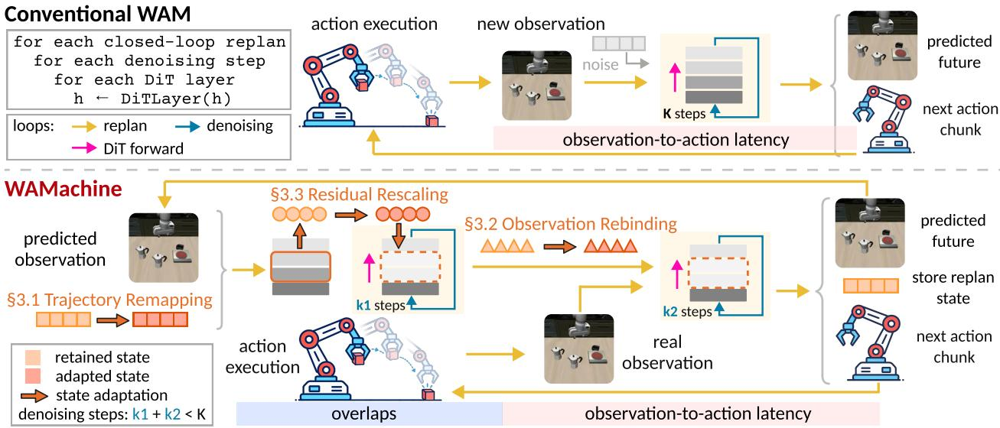
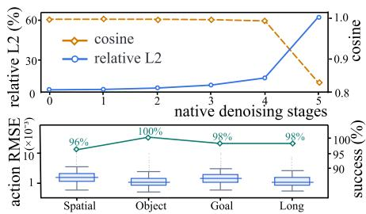
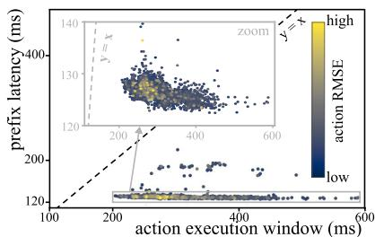
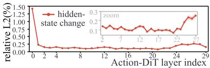
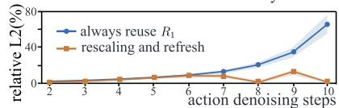
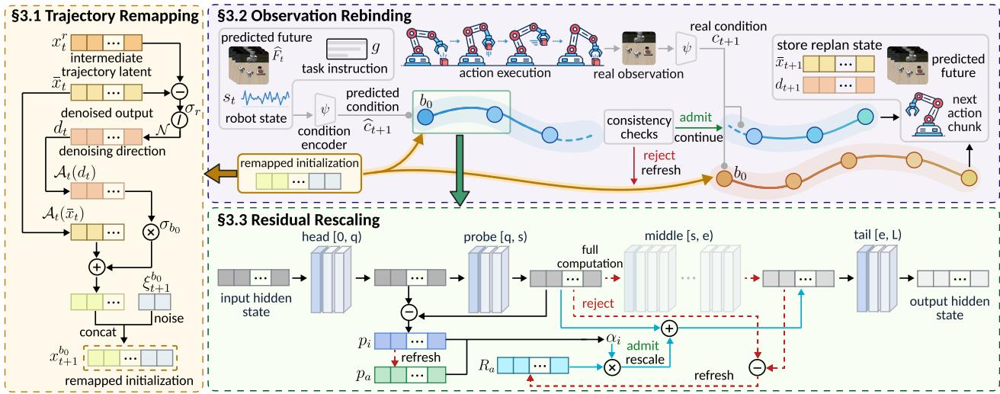

# Efficient World Action Model Inference with Adaptive Intermediate States

Zhinan Liu1,2,†, Haozhi Han3,2,†, Ruge Zhang4,2, Teng Ma5, Tao Ma5, Zheng Liu5, Yifeng Chen3, Yunquan Zhang4, Ting Cao2, Yunxin Liu2, Kun Li2,‡

1Xiamen University

2Institute for AI Industry Research, Tsinghua University

3School of Computer Science, Peking University

4Institute of Computing Technology, Chinese Academy of Sciences

5Alibaba Group

†Equal contribution. ‡Corresponding author.

World Action Models (WAMs) enable future-aware control by jointly modeling actions and environment dynamics. However, iterative diffusion or flow inference incurs substantial denoising latency. Prior inference state offers a natural opportunity for acceleration, yet changing planning contexts, observations, and intermediate representations can quickly render retained state stale. Preserving useful computation therefore requires adapting inference state rather than reusing it as-is. To this end, we present WAMACHINE, a training-free framework that accelerates WAM inference by preserving and adapting inference state for efficient and accurate continuation as the control loop evolves. Across closed-loop replans, Trajectory Remapping remaps replan state from the preceding replan to initialize the next replan, reducing redundant trajectory generation. Across denoising steps, Observation Rebinding performs anticipatory inference during action execution and rebinds retained denoising state to the real observation for continuation when consistency checks pass, reducing latency exposed to the control loop. Across Transformer layers, Residual Rescaling selectively rescales retained layer state and refreshes it through full computation of the middle layers when probe checks fail, reducing repeated Transformer computation. Evaluations of three representative WAM architectures on LIBERO and RoboTwin 2.0 show that WAMACHINE achieves 1.47–3.05× speedups in observation-to-action latency and 2.23–3.27× speedups in GPU inference time per replan, while preserving 96.69–99.54% of native WAM task success.

Email: likun@air.tsinghua.edu.cn

Project page: https://parrotkk.github.io/WAMachine page/ Code: https://github.com/RSIScience/WAMachine.git

## 1 Introduction

World Action Models (WAMs) jointly model robot actions and how the environment may evolve under those actions, extending visuomotor policies with future-aware prediction for closed-loop control and planning (Kim et al., 2026; Yuan et al., 2026; Bi et al., 2026). However, WAM inference is computationally expensive because many WAMs generate action horizons, often together with future representations, through iterative diffusion or flow solvers (Chi et al., 2025; Black et al., 2025a; Hou et al., 2024). During closed-loop control, WAM inference involves multiple nested computation loops: an outer replanning loop repeatedly solves for new action horizons as observations arrive, an inner denoising loop iteratively refines future trajectories or representations, and the Transformer repeatedly processes intermediate states across network layers. As a result, WAMs repeatedly recompute highly related inference states along the observation-to-action path, introducing substantial GPU computation and latency overhead that ultimately limits closed-loop control frequency.

A natural direction for accelerating WAM inference is to preserve useful computation from earlier inference and adapt it as the control loop and inference context evolve. Existing approaches explore this opportunity at different points in the inference pipeline. RTI-DP and STEP leverage information from preceding control steps to construct better initializations for subsequent diffusion inference (Duan et al., 2025; Li et al., 2026); RTC and FutureRTC overlap action generation with physical execution to reduce computation exposed on the control path (Black et al., 2025b; Jiang et al., 2026); and TeaCache, DiCache, and $C ^ { 3 }$ ache reuse intermediate features or residuals across denoising steps or inference chunks to reduce repeated Transformer computation (Liu et al., 2025; Bu et al., 2026; Zhao et al., 2026). These methods demonstrate the value of reusing previously computed information in WAM inference. However, existing approaches exploit reuse only at isolated points in the inference pipeline, capturing fragmented forms of redundancy rather than the continuous evolution of inference states. In contrast, WAM inference exhibits state continuity: intermediate states remain informative across replans, denoising steps, and network layers, while evolving with the task context and computation. The central challenge is therefore to preserve and adapt inference states across replans, denoising steps, and network layers, enabling efficient closed-loop WAM inference without redundant recomputation.

  
Figure 1: The main idea of WAMACHINE. WAMACHINE adapts state across replans, denoising steps, and Transformer layers to reduce computation and observation-to-action latency. K denotes native denoising steps; $k _ { 1 }$ and $k _ { 2 }$ denote steps before and after real observation arrival, respectively; $k _ { 1 } \overset { \cdot } { + } k _ { 2 } < K$ describes the illustrated accepted warm-start path.

To address this challenge, we view closed-loop WAM inference as a continuously evolving stateful process, where inference states generated throughout the control loop remain informative as the task context changes, exposing a fundamental opportunity for cross-stage state transport. We propose WAMACHINE1, a training-free stateful inference framework that preserves and adapts evolving inference states across replans, denoising steps, and Transformer layers, transforming isolated reuse opportunities into a unified acceleration framework for closed-loop WAM inference.

Specifically, WAMACHINE exploits state continuity within the three nested computation loops of WAM inference: closed-loop replanning, iterative denoising, and diffusion Transformer (DiT) forward execution (Peebles & Xie, 2023).

Across closed-loop replanning, Trajectory Remapping reduces redundant trajectory generation by carrying informative replan state from the preceding replan into the next replan. Since consecutive replans typically share the same task objective and exhibit gradual state evolution, the preceding solution provides a strong initialization signal despite updated observations. Trajectory Remapping remaps these states to the new planning context, allowing WAMs to bypass unnecessary exploration from noise and accelerate closed-loop replanning without additional training.

Across iterative denoising, Observation Rebinding reduces latency exposed to the control loop by continuing partially completed inference across physical execution. Future-aware WAMs provide predictions of upcoming observations, enabling anticipatory inference before the next observation is available. By rebinding retained denoising states to the realized observation, Observation Rebinding preserves computation that passes consistency checks and refreshes inference otherwise.

Across DiT forward execution, Residual Rescaling reduces repeated Transformer computation by reusing temporally coherent intermediate representations across denoising steps. Our analysis reveals that hidden states in the middle layers evolve smoothly across adjacent denoising iterations, enabling residual-level reuse with lightweight consistency checking. Residual Rescaling selectively rescales retained residual states and refreshes them through full computation of the middle layers when the probe checks fail, reducing DiT inference cost.

We evaluate WAMACHINE using three representative WAM architectures on LIBERO (Liu et al., 2023) and RoboTwin 2.0 (Chen et al., 2026). Our results show that WAMACHINE achieves 1.47–3.05× speedups in observation-to-action latency and 2.23–3.27× speedups in GPU inference time per replan relative to the native runtimes, while retaining 96.69– 99.54% of native task success in large-sample evaluations. Notably, ablations on Fast-WAM-IDM show that the complete system achieves the lowest observation-to-action latency among the tested variants and retains substantial acceleration even without CUDA Graphs, demonstrating the effectiveness of stateful inference in reducing both computation and control latency.

Our main contributions are as follows:

• We reveal state continuity as a new acceleration opportunity in WAM inference and introduce stateful inference for preserving and adapting evolving inference states.

• We propose WAMACHINE, a training-free framework that transports inference states across replanning, denoising, and Transformer execution through trajectory remapping, observation rebinding, and residual rescaling.

• WAMACHINE achieves 1.47–3.05× speedups in observation-to-action latency and 2.23–3.27× speedups in GPU inference time per replan for three representative WAMs on LIBERO and RoboTwin 2.0, while retaining 96.69–99.54% of native task success.

## 2 Related Work

World Action Models. World Action Models (WAMs) extend embodied policies by jointly modeling robot actions and future environment evolution, bringing world modeling into policy learning and control. Cosmos Policy adapts a pretrained video diffusion model into a robot policy that jointly predicts action trajectories, future observations, and value estimates (Kim et al., 2026). Motus further unifies embodied understanding, video generation, and action prediction within a unified latent action world model (Bi et al., 2026). More recent WAMs such as τ -WM couple video–action prediction with action-conditioned future simulation and task-progress evaluation, further integrating future prediction into robot decision making (Zhou et al., 2026). These models typically rely on iterative generative inference, and repeatedly recomputing related inference states during closed-loop control incurs substantial computation and observation-to-action latency.

Acceleration for World Action Models. Existing work accelerates WAMs and related generative robot policies through architectural changes and inference-time optimization. Fast-WAM removes explicit future imagination at test time while retaining video modeling during training, whereas Faster-WAM docks a lightweight action head onto a pretrained video backbone (Yuan et al., 2026; Ma et al., 2026). For replanning, RTI-DP initializes inference from the preceding solution, while STEP predicts spatiotemporally consistent warm starts to shorten denoising (Duan et al., 2025; Li et al., 2026). RTC overlaps action generation with physical execution, and FutureRTC predicts execution-time observations and states to reduce prediction–execution mismatch (Black et al., 2025b; Jiang et al., 2026). DiCache uses shallow probes for adaptive cache reuse, while C3ache reuses residuals across consecutive WAM inference chunks at corresponding denoising steps (Bu et al., 2026; Zhao et al., 2026). These inference-time methods exploit complementary forms of state continuity across initialization, asynchronous execution, and intermediate computation. WAMACHINE builds on these complementary opportunities through a unified stateful inference framework that preserves and adapts evolving inference states across replans, denoising steps, and Transformer layers, enabling training-free acceleration of closed-loop WAM inference.

## 3 WAMACHINE: Training-Free Acceleration of World Action Models via Stateful Inference

WAMACHINE exploits state continuity through a training-free stateful inference framework that preserves and adapts inference state as the control loop evolves; Figure 3 illustrates the overall framework. For each new replan, Trajectory Remapping preserves replan state from the preceding replan and adapts it through remapping to construct an initialization for the next replan. During physical action execution, Observation Rebinding preserves denoising state produced by a bounded anticipatory inference prefix advanced under the predicted future. When the real observation arrives, inference continues from the retained denoising state through observation rebinding if consistency checks pass; otherwise, it restarts from the remapped initialization. For each remaining denoising step, Residual Rescaling preserves exact layer state and adapts it to the current input through residual rescaling guided by a shallow probe.

  
(a) replan state continuity

(b) denoising state continuity  
  
(c) layer state continuity  
Figure 2: Evidence for state continuity. (a) Consecutive replans show high cosine similarity and small relative $L _ { 2 }$ distance between trajectory latents at matching early stages (top); remapped initialization enables three-step inference with low action RMSE and 96–100% success on LIBERO (bottom). (b) Most anticipatory prefixes are ready within the action execution window (below $y = x ) ;$ color shows action RMSE after observation rebinding relative to full inference under the real condition. (c) Relative $L _ { 2 }$ changes between adjacent layer hidden states are small in the middle Action-DiT layers (top); residual rescaling and state refresh control relative output $L _ { 2 }$ error compared with repeatedly reusing the first-step residual $R _ { 1 }$ (bottom). Analysis protocols appear in Appendix E.

## 3.1 Trajectory Remapping across Closed-Loop Replans

Although each replan receives a new observation, the high-level instruction remains unchanged within an embodied task, while the robot and environment typically change gradually. We therefore compare trajectory latents between consecutive replans on Cosmos Policy. As shown in Figure 2(a), these latents remain highly similar at matching early denoising stages, and remapped initialization enables three-step inference with low action RMSE while largely preserving task success across LIBERO suites. These observations motivate Trajectory Remapping to preserve replan state from the preceding replan and adapt it to the new planning context, enabling refinement with fewer denoising steps.

Specifically, let t index closed-loop replans and r index native solver stages. For either the video or action branch, let ${ \bar { x } } _ { t }$ denote the final denoised output of replan t, and let $\boldsymbol { x } _ { t } ^ { r }$ denote an intermediate trajectory latent retained at stage r with noise level $\sigma _ { r } > 0$ . To express the retained latent relative to the final output, we divide their difference by $\sigma _ { r }$ and normalize it to obtain the denoising direction $d _ { t }$ :

$$
d _ { t } = \mathcal { N } \Bigg ( \frac { x _ { t } ^ { r } - \bar { x } _ { t } } { \sigma _ { r } } \Bigg ) ,\tag{1}
$$

where $\mathcal { N }$ is a model-specific normalization operator. The pair $( \bar { x } _ { t } , d _ { t } )$ forms the retained replan state: $\bar { x } _ { t }$ provides the denoised endpoint, while $d _ { t }$ provides a normalized direction that can be rescaled to the noise level used to initialize the next replan.

Let $\boldsymbol { A } _ { t }$ denote the trajectory remapping operator for the video or action branch, defined according to the model’s execution protocol. When horizon alignment is required, $\boldsymbol { A } _ { t }$ shifts reusable slots in the branch’s temporal coordinates; otherwise, it preserves relative slot indices without shifting. Let $\mathcal { M } _ { t }$ denote the set of target slots that receive state from the preceding replan under $\boldsymbol { A } _ { t }$

At entry stage $b _ { 0 }$ with noise level $\sigma _ { b _ { 0 } }$ , we initialize replan t + 1 using remapped state for slots in $\mathcal { M } _ { t }$ and fresh noise elsewhere:

$$
x _ { t + 1 } ^ { b _ { 0 } } [ j ] = \left\{ \begin{array} { l l } { \mathcal { A } _ { t } ( \bar { x } _ { t } ) [ j ] + \sigma _ { b _ { 0 } } \mathcal { A } _ { t } ( d _ { t } ) [ j ] , } & { j \in \mathcal { M } _ { t } , } \\ { \xi _ { t + 1 } ^ { b _ { 0 } } [ j ] , } & { j \notin \mathcal { M } _ { t } , } \end{array} \right.\tag{2}
$$

where $j$ indexes trajectory slots and $\xi _ { t + 1 } ^ { b _ { 0 } }$ is fresh noise drawn from the model’s initialization distribution at noise level $\sigma _ { b _ { 0 } }$

The entry stage $b _ { 0 }$ is fixed for each model profile: a later stage reduces denoising computation but leaves fewer steps to adapt to the new planning context. Inference may begin under the predicted future through Observation Rebinding; after the real observation arrives, subsequent denoising uses it as conditioning. For the first replan, WAMACHINE initializes inference with fresh noise.

  
Figure 3: The framework of WAMACHINE. Left: Trajectory Remapping remaps replan state from the preceding replan to initialize the next replan. Top right: Observation Rebinding advances an anticipatory prefix during action execution, then rebinds retained denoising state to the real observation for continuation if consistency checks pass; otherwise, inference restarts from the remapped initialization under the real condition. Bottom: Residual Rescaling uses a shallow probe to rescale retained residuals and skip the middle layers; if consistency checks fail, it performs full computation of these layers and refreshes the retained layer state.

## 3.2 Observation Rebinding across Denoising Steps

Future-aware WAMs predict upcoming observations, enabling anticipatory inference during physical action execution. Figure 2(b) shows that most inference prefixes on Cosmos Policy are ready within this execution window. Observation Rebinding exploits this window by advancing a bounded inference prefix under the predicted future and retaining the resulting denoising state for rebinding to the real observation.

Let $\widehat { F } _ { t }$ denote the future predicted at replan t. Together with the current robot state $s _ { t }$ and task instruction $^ { g , }$ it serves as input to a model-specific encoder $\psi$ that constructs the predicted condition for replan $t + 1$

$$
\widehat { c } _ { t + 1 } = \psi \Big ( \widehat { F } _ { t } , s _ { t } , g \Big ) .\tag{3}
$$

Starting from the initialization produced by Trajectory Remapping, Observation Rebinding advances inference only to a predefined rebinding stage and retains the current latent and native solver history as denoising state. Bounding the anticipatory prefix limits computation under the predicted future, and the prefix does not issue robot actions.

When the real observation arrives, the encoder $\psi$ constructs the real condition $c _ { t + 1 }$ . The consistency check compares predictions $\widehat { u } _ { m }$ with observations $u _ { m }$ for each component m $\in \mathcal { V } ,$ such as images and robot states, before encoding. RMSE $e _ { m }$ measures their discrepancy after normalization by $\delta _ { m }$ . The consistency score $S$ aggregates these errors through a weighted root mean square, where $w _ { m }$ denotes the weight of component m:

$$
e _ { m } = \sqrt { \mathrm { m e a n } \left[ \left( \frac { \widehat { u } _ { m } - u _ { m } } { \delta _ { m } } \right) ^ { 2 } \right] } , \qquad S = \sqrt { \frac { \sum _ { m \in \gamma } w _ { m } e _ { m } ^ { 2 } } { \sum _ { m \in \gamma } w _ { m } } } .\tag{4}
$$

Here, mean averages over the elements of each component. Let $\tau$ denote the consistency threshold and κ count consecutive accepted rebindings, capped at $\kappa _ { \mathrm { m a x } }$ . Rebinding proceeds only when $S < \tau$ and $\kappa < \kappa _ { \mathrm { m a x } }$ . Each accepted rebinding increments $\kappa ,$ while a refresh under the real condition resets it to zero. To prevent error accumulation, WAMACHINE forces a refresh at the next replan when κ reaches $\kappa _ { \mathrm { m a x } }$ and skips the corresponding anticipatory prefix. Appendix B.3 lists model-specific components, normalization scales, weights, and thresholds

If the consistency checks pass, Observation Rebinding rebinds the retained denoising state by replacing $\widehat { c } _ { t + 1 }$ with $c _ { t + 1 }$ and continues inference from that state. Otherwise, inference restarts from the remapped initialization under the real condition.

## 3.3 Residual Rescaling across DiT Layers

Each denoising step requires Transformer computation, both within the anticipatory prefix and during inference under the real condition. Figure 2(c, top) shows small relative $L _ { 2 }$ changes between adjacent layer hidden states in the middle Action-DiT layers of Fast-WAM-IDM, while Figure 2(c, bottom) shows that adaptive rescaling and refresh help control relative output $L _ { 2 }$ error. These observations motivate Residual Rescaling to adapt retained layer state to the current input through residual rescaling guided by a shallow probe. When consistency checks fail, Residual Rescaling performs full computation of the middle layers and retains the exact layer state for later reuse.

Consider a DiT with L layers, indexed from 0 to $L - 1$ . Layer boundaries $\ 0 < q < s < e < L$ partition the DiT into a head $[ 0 , q )$ , a shallow probe $[ q , s )$ , middle layers $[ s , e )$ , and a tail $[ e , L )$ . Let $h _ { \ell } ( i )$ denote the hidden state after the first ℓ layers at denoising step i, with $h _ { 0 } ( i )$ denoting the DiT input. After full computation at denoising step $^ { a , }$ Residual Rescaling retains two residuals as the exact layer state:

$$
p _ { a } = h _ { s } ( a ) - h _ { q } ( a ) , \qquad R _ { a } = h _ { e } ( a ) - h _ { s } ( a ) ,\tag{5}
$$

where $p _ { a }$ is the shallow probe residual and $R _ { a }$ is the cumulative residual of the middle layers. At a subsequent denoising step i, Residual Rescaling executes the head and shallow probe on the current input to obtain the probe residual

$$
p _ { i } = h _ { s } ( i ) - h _ { q } ( i ) .\tag{6}
$$

Residual Rescaling estimates how to rescale the retained residual $R _ { a }$ by comparing the current probe residual $p _ { i }$ with the retained probe residual $p _ { a }$ . It fits $\alpha _ { i } p _ { a }$ to $p _ { i }$ by least squares, then clips the estimated rescaling factor $\alpha _ { i }$ to the allowed range:

$$
\alpha _ { i } = \mathrm { c l a m p } \left( \frac { \mathrm { m e a n } ( p _ { i } \odot p _ { a } ) } { \mathrm { m a x } ( \mathrm { m e a n } ( p _ { a } \odot p _ { a } ) , \epsilon ) } , \alpha _ { \mathrm { m i n } } , \alpha _ { \mathrm { m a x } } \right) ,\tag{7}
$$

where $\odot$ denotes elementwise multiplication and mean averages over probe elements. The denominator has a positive lower bound $\epsilon ,$ and clamp bounds the rescaling factor $\alpha _ { i }$ within $[ \alpha _ { \mathrm { m i n } } , \alpha _ { \mathrm { m a x } } ]$ . Reuse requires directional agreement between $p _ { i }$ and $p _ { a }$ and a small relative fitting error of $\alpha _ { i } p _ { a }$

$$
\cos ( p _ { i } , p _ { a } ) \geq \gamma _ { \mathrm { c o s } } , \qquad { \frac { \| p _ { i } - \alpha _ { i } p _ { a } \| _ { 2 } } { \| p _ { i } \| _ { 2 } } } \leq \gamma _ { \mathrm { f i t } } .\tag{8}
$$

Here $\gamma _ { \mathrm { c o s } }$ sets the minimum cosine similarity, $\gamma _ { \mathrm { { f i t } } }$ bounds the relative fitting error, and $\| \cdot \| _ { 2 }$ denotes the $L _ { 2 }$ norm. For joint execution of the video and action branches, Residual Rescaling estimates separate rescaling factors and skips the middle layers only when both branches pass the consistency checks. For independent execution, it decides reuse separately for each branch. Appendix B.2 lists the layer boundaries, rescaling bounds, and consistency thresholds for each model.

Residual Rescaling skips the middle layers if the checks pass, approximating their output as

$$
\widetilde { h } _ { e } ( i ) = h _ { s } ( i ) + \alpha _ { i } R _ { a } .\tag{9}
$$

Accepted reuse preserves the retained layer state for subsequent denoising steps. If the consistency checks fail, Residual Rescaling resumes full computation of the middle layers from the already computed $h _ { s } ( i )$ . It then refreshes the retained layer state with the exact probe residual $p _ { i }$ and the newly computed cumulative residual of the middle layers. Both paths reuse the completed head and shallow probe computation, then execute the tail layers and compute the model output. After observation rebinding, Residual Rescaling applies the same consistency checks under the real condition before reusing the retained layer state.

## 3.4 State Preservation and Adaptation

WAMACHINE coordinates the three mechanisms to preserve and adapt replan state, denoising state, and layer state at complementary scopes. Trajectory Remapping supplies the remapped initialization from which Observation Rebinding advances anticipatory inference during action execution, retaining denoising state for rebinding to the real observation. Within both anticipatory inference and inference under the real condition, Residual Rescaling uses a shallow probe to rescale retained layer state and skip the middle layers when consistency checks pass. If the retained denoising state fails the consistency checks, inference restarts from the remapped initialization, so the replan state remains useful. After observation rebinding succeeds, Residual Rescaling still checks the retained layer state under the real condition and refreshes it through full computation of the middle layers if its checks fail. This design preserves useful state across the three scopes while allowing each mechanism to adapt or refresh its state as the inference context changes. Model-specific integration details and CUDA Graphs preparation appear in Appendix B.

## 4 Experiments

We evaluate WAMACHINE in simulation to examine its inference efficiency on different WAM architectures and its effect on closed-loop task success.

## 4.1 Experimental Settings

Models and benchmarks. We evaluate WAMACHINE on three representative WAM architectures: Cosmos Policy, Fast-WAM-IDM, and Motus (Kim et al., 2026; Yuan et al., 2026; Bi et al., 2026). The first two are evaluated on the Spatial, Object, Goal, and Long suites of LIBERO (Liu et al., 2023), while Motus is evaluated on the Clean and Randomized settings of RoboTwin 2.0 (Chen et al., 2026). All Fast-WAM experiments use the IDM variant with both video and action branches. We measure task success using the official success criterion of each benchmark.

Baselines. We compare WAMACHINE with the Native runtime and four training-free acceleration methods: RTI-DP (Duan et al., 2025), RTC (Black et al., 2025b), VLA-Cache (Xu et al., 2025), and BAC (Ji et al., 2026). For each WAM, all methods use the same frozen checkpoint and matched task initializations. Because the four acceleration methods were developed for different policy architectures, we adapt their mechanisms to each evaluated WAM. Appendix C.1 describes these adaptations and their implementation details.

Implementation and evaluation protocol. Policy inference runs on NVIDIA A100 80GB GPUs, with WAMACHINE using an additional rendering GPU for Motus. The complete WAMACHINE uses CUDA Graphs (NVIDIA, 2026) as an implementation optimization; Section 4.3 evaluates their contribution separately. For large-sample task success, we follow the official LIBERO evaluation protocol, evaluating Native and WAMACHINE on 6,000 episodes for each of Cosmos Policy and Fast-WAM-IDM. For Motus, we evaluate both methods on 2,000 RoboTwin 2.0 episodes, evenly split between Clean and Randomized. For inference efficiency, all methods use the same fixed 200-episode subset for each WAM, with one policy worker on one policy GPU per method. On this subset, we report GPU inference time per replan, observation-to-action (O2A) latency, and task success. GPU inference time per replan averages the time spent on denoising Transformer computation, including foreground and anticipatory inference but excluding encoding and decoding. O2A latency measures wall-clock time from the arrival of the real observation to action readiness. Appendix A details the evaluation protocol; Appendix B provides model-specific inference and reuse settings.

## 4.2 Results in Simulation Environments

Inference efficiency and subset success. Table 1 reports GPU inference time per replan, O2A latency, and subset success rate (SR) for the three WAMs on their fixed 200-episode subsets. Relative to Native, WAMACHINE achieves a 2.36× speedup in GPU inference time per replan and a 1.47× speedup in O2A latency on Cosmos Policy. The corresponding speedups are 3.27× and 3.05× on Fast-WAM-IDM, and 2.23× and 2.59× on Motus. These gains accompany subset SRs close to Native: 96.0%, 97.0%, and 82.0% for WAMACHINE, compared with 98.0%, 98.0%, and 84.0% for Native on Cosmos Policy, Fast-WAM-IDM, and Motus, respectively. The four adapted baselines show more variable efficiency, with GPU inference speedups ranging from 0.26× to 9.51× and O2A speedups from 0.18× to 3.40×. For example, RTI-DP achieves the largest GPU inference speedups on Cosmos Policy and Motus, but its subset SRs fall to 68.5% and 8.5%, respectively.

The two timing measurements need not improve by the same factor. For example, on Cosmos Policy, WAMACHINE changes mean GPU inference time from 284.29 to 120.29 ms and mean O2A latency from 636.77 to 434.64 ms. These gains arise from preserving and adapting three forms of inference state: Trajectory Remapping remaps replan state, Observation Rebinding rebinds denoising state computed before observation arrival, and Residual Rescaling rescales layer state. We include anticipatory computation in GPU inference time to distinguish computational savings from O2A latency gains due to overlap with action execution.

On Fast-WAM-IDM, Residual Rescaling skips 45.80% of layer evaluations in the retained denoising steps, while Observation Rebinding uses accepted anticipatory prefixes in 71.40% of noninitial replans. Appendix D.2 reports reuse statistics and metric definitions for all three WAMs.

Large-sample task success. Table 2 compares the closed-loop task success of WAMACHINE and Native in the large-sample evaluations. On LIBERO, WAMACHINE achieves average task success of 97.02% on Cosmos Policy and 98.15% on Fast-WAM-IDM, compared with 98.05% and 98.60% for Native, respectively. On RoboTwin 2.0, Motus with WAMACHINE achieves 84.30% task success in Clean and 82.20% in Randomized, compared with 86.50% and

Table 1: Inference efficiency and subset success rate (SR) on the same fixed 200-episode subset for each WAM. GPU inference time per replan and observation-to-action (O2A) latency are averaged over replans and reported in milliseconds; speedups are relative to Native. Each acceleration method is applied independently to Native, and WAMACHINE includes CUDA Graphs. All methods use one policy worker on one A100 80GB GPU; WAMACHINE uses an additional rendering GPU for Motus. Large-sample task success appears in Table 2. Lower (↓) or higher (↑) is better.
<table><tr><td rowspan="2">Method</td><td colspan="2">GPU inference time per replan</td><td colspan="2">O2A latency</td><td rowspan="2">Subset SR (%)↑</td></tr><tr><td>Time (ms) ↓</td><td>Speedup ↑</td><td>Time (ms) ↓ Speedup ↑</td><td></td></tr><tr><td>Cosmos Policy</td><td>LIBERO</td><td></td><td></td><td></td><td></td></tr><tr><td>Native</td><td>284.29</td><td>1.00×</td><td>636.77</td><td>1.00×</td><td>98.0</td></tr><tr><td>RTI-DP</td><td>59.14</td><td>4.81×</td><td>399.15</td><td>1.60×</td><td>68.5</td></tr><tr><td>RTC</td><td>1024.53</td><td>0.28×</td><td>2203.99</td><td>0.29×</td><td>98.0</td></tr><tr><td>VLA-Cache</td><td>461.48</td><td>0.62×</td><td>813.54</td><td>0.78×</td><td>98.0</td></tr><tr><td>BAC</td><td>205.53</td><td>1.38×</td><td>564.98</td><td>1.13×</td><td>97.5</td></tr><tr><td>WAMACHINE</td><td>120.29</td><td>2.36×</td><td>434.64</td><td>1.47×</td><td>96.0</td></tr><tr><td>Fast-WAM-IDM</td><td>/ LIBERO</td><td></td><td></td><td></td><td></td></tr><tr><td>Native</td><td>367.49</td><td>1.00×</td><td>416.64</td><td>1.00×</td><td>98.0</td></tr><tr><td>RTI-DP</td><td>269.27</td><td>1.36×</td><td>306.64</td><td>1.36×</td><td>63.0</td></tr><tr><td>RTC</td><td>729.27</td><td>0.50×</td><td>1959.68</td><td>0.21×</td><td>82.0</td></tr><tr><td>VLA-Cache</td><td>636.89</td><td>0.58×</td><td>714.84</td><td>0.58×</td><td>96.5</td></tr><tr><td>BAC</td><td>276.12</td><td>1.33×</td><td>324.39</td><td>1.28×</td><td>99.0</td></tr><tr><td>WAMACHINE</td><td>112.52</td><td>3.27×</td><td>136.42</td><td>3.05×</td><td>97.0</td></tr><tr><td colspan="6">Motus / RoboTwin 2.0</td></tr><tr><td>Native</td><td>1455.69</td><td>1.00×</td><td>2343.14</td><td>1.00×</td><td>84.0</td></tr><tr><td>RTI-DP</td><td>153.07</td><td>9.51×</td><td>688.37</td><td>3.40×</td><td>8.5</td></tr><tr><td>RTC</td><td>5639.22</td><td>0.26×</td><td>12683.43</td><td>0.18×</td><td>82.0</td></tr><tr><td>VLA-Cache</td><td>1525.04</td><td>0.95×</td><td>2539.52</td><td>0.92×</td><td>86.5</td></tr><tr><td>BAC</td><td>973.63</td><td>1.50×</td><td>1894.10</td><td>1.24×</td><td>82.0</td></tr><tr><td>WAMACHINE</td><td>652.26</td><td>2.23×</td><td>906.38</td><td>2.59×</td><td>82.0</td></tr></table>

Table 2: Large-sample closed-loop task success (%) for Native and WAMACHINE. Each method uses 6,000 LIBERO episodes for each of Cosmos Policy and Fast-WAM-IDM, and 1,000 Clean and 1,000 Randomized RoboTwin 2.0 episodes for Motus. Avg./Ret. reports average task success and the percentage of Native average task success retained.
<table><tr><td colspan="5">LIBERO</td></tr><tr><td>Method</td><td></td><td></td><td>Spatial Object Goal Long Avg./Ret.</td><td></td></tr><tr><td>Cosmos Policy</td><td></td><td></td><td></td><td></td></tr><tr><td>Native</td><td></td><td></td><td>97.40 99.6097.67 97.53 98.05/-</td><td></td></tr><tr><td>WAMACHINE 97.00 99.13 96.47 95.47 97.02/98.95</td><td></td><td></td><td></td><td></td></tr><tr><td>Fast-WAM-IDM</td><td></td><td></td><td></td><td></td></tr><tr><td>Native</td><td></td><td></td><td>99.27 99.67 98.47 97.00 98.60/-</td><td></td></tr><tr><td>WAMACHINE 98.80 98.87 98.00 96.93 98.15/99.54</td><td></td><td></td><td></td><td></td></tr></table>

<table><tr><td colspan="3">RoboTwin 2.0</td></tr><tr><td>Method</td><td>Clean Randomized</td><td>Avg./Ret.</td></tr><tr><td>Motus</td><td></td><td></td></tr><tr><td>Native</td><td>86.50 85.70</td><td>86.10/-</td></tr><tr><td>WAMACHINE 84.30</td><td>82.20</td><td>83.25/96.69</td></tr></table>

85.70% for Native, respectively. These results show that WAMACHINE retains 96.69–99.54% of Native average task success for the three evaluated WAMs, complementing the inference speedups reported in Table 1.

## 4.3 Ablation Study

Effects of individual mechanisms. Table 3 evaluates the three mechanisms and CUDA Graphs on LIBERO with Fast-WAM-IDM, using the same 200-episode subset for all configurations. Configurations shared with Table 1 use the same evaluation setup. Small differences between the two tables may arise from run-to-run variability. Removing Trajectory Remapping or Residual Rescaling increases GPU inference time per replan from 114.75 ms to 188.02 ms or 188.99 ms, respectively, supporting their roles in reducing redundant trajectory generation and repeated Transformer computation. Removing Observation Rebinding increases O2A latency from 144.75 to 165.62 ms, even though GPU inference time per replan decreases to 108.45 ms, consistent with its role in reducing latency exposed to the control loop through anticipatory inference and observation rebinding. Subset SR is 97.0%, 95.5%, and 99.0% after removing

Table 3: Ablation of the three mechanisms and CUDA Graphs on LIBERO with Fast-WAM-IDM, using the same fixed 200-episode subset as Table 1. TR, OR, and RR denote Trajectory Remapping, Observation Rebinding, and Residual Rescaling, respectively; Graph denotes CUDA Graphs. GPU and O2A report mean GPU inference time per replan and observation-to-action latency in milliseconds; subset SR reports task success (%) from the same runs. Lower (↓) or higher (↑) is better.
<table><tr><td>Variant</td><td>TR</td><td>OR</td><td>RR</td><td>Graph</td><td>GPU (ms) ↓</td><td>O2A (ms) ↓</td><td>Subset SR (%) ↑</td></tr><tr><td>Native</td><td>X</td><td>X</td><td>x</td><td>X</td><td>415.19</td><td>470.96</td><td>97.5</td></tr><tr><td>Native + Graph</td><td>X</td><td>X</td><td>X</td><td></td><td>295.29</td><td>350.25</td><td>98.0</td></tr><tr><td>WAMACHINE</td><td></td><td></td><td></td><td></td><td>114.75</td><td>144.75</td><td>98.0</td></tr><tr><td>w/o TR</td><td>X</td><td></td><td></td><td></td><td>188.02</td><td>177.20</td><td>97.0</td></tr><tr><td>w/o OR</td><td></td><td>X</td><td></td><td></td><td>108.45</td><td>165.62</td><td>95.5</td></tr><tr><td>w/o RR</td><td></td><td></td><td>X</td><td></td><td>188.99</td><td>205.45</td><td>99.0</td></tr><tr><td>w/o Graph</td><td></td><td></td><td></td><td>X</td><td>163.99</td><td>185.15</td><td>97.5</td></tr></table>

Trajectory Remapping, Observation Rebinding, and Residual Rescaling, respectively, compared with 98.0% for the complete WAMACHINE. The complete WAMACHINE achieves the lowest O2A latency in Table 3. Appendix C.2 specifies the enabled mechanisms and CUDA Graphs settings for each configuration.

Effect of CUDA Graphs. CUDA Graphs alone accelerate Native by 1.41× in GPU inference time per replan and 1.34× in O2A latency. With CUDA Graphs disabled, WAMACHINE achieves corresponding speedups of 2.53× and 2.54× over Native, demonstrating that stateful inference provides substantial acceleration on its own. Enabling CUDA Graphs further reduces GPU inference time per replan from 163.99 to 114.75 ms and O2A latency from 185.15 to 144.75 ms. Subset SR remains within 97.5–98.0% for Native and WAMACHINE, both with and without CUDA Graphs.

## 5 Conclusion

In this work, we present WAMACHINE, a training-free stateful inference framework that unlocks inference state reuse across the evolving computation of WAMs. By preserving and adapting states across replans, denoising steps, and Transformer layers, WAMACHINE significantly reduces inference latency while maintaining task performance across diverse WAM architectures. Our results highlight inference state as a new execution resource for efficient closed-loop embodied intelligence.

## Ethics Statement

This work follows the ICLR Code of Ethics. Our experiments evaluate existing World Action Models on LIBERO and RoboTwin 2.0 in simulation and involve no human subjects or personal data. Deployment on real robots requires additional safety validation under the intended operating conditions, with appropriate safeguards for people and equipment.

## Reproducibility Statement

Section 3 describes the proposed mechanisms, while Section 4.1 reports the models, benchmarks, baselines, hardware, and evaluation metrics. Appendix A details the evaluation protocol and measurement procedures. Appendices B and C provide model-specific inference settings, baseline adaptations, and ablation configurations; Appendix E describes the diagnostic analyses in Figure 2.

## AI Use Statement

We used generative AI tools to provide feedback on experimental design and assist with result interpretation and literature review. These tools also helped improve the writing and figures. The authors reviewed and verified this content and take full responsibility for the final manuscript and reported results.

## References

Hongzhe Bi, Hengkai Tan, Shenghao Xie, Zeyuan Wang, Shuhe Huang, Haitian Liu, Ruowen Zhao, Yao Feng, Chendong Xiang, Yinze Rong, Hongyan Zhao, Hanyu Liu, Zhizhong Su, Lei Ma, Hang Su, and Jun Zhu. Motus: A unified latent action world model. In Proceedings ofthe IEEE/CVF Conference on Computer Vision and Pattern Recognition, pp. 35101–35113, 2026. URL https://openaccess.thecvf.com/content/CVPR2026/html/Bi\_ Motus\_A\_Unified\_Latent\_Action\_World\_Model\_CVPR\_2026\_paper.html.

Kevin Black, Noah Brown, Danny Driess, Adnan Esmail, Michael Robert Equi, Chelsea Finn, Niccolo Fusai, Lachy Groom, Karol Hausman, Brian Ichter, Szymon Jakubczak, Tim Jones, Liyiming Ke, Sergey Levine, Adrian Li-Bell, Mohith Mothukuri, Suraj Nair, Karl Pertsch, Lucy Xiaoyang Shi, Laura Smith, James Tanner, Quan Vuong, Anna Walling, Haohuan Wang, and Ury Zhilinsky. π : A vision-language-action flow model for general robot control. In Proceedings ofRobotics: Science and Systems, 2025a. doi: 10.15607/RSS.2025.XXI.010.

Kevin Black, Manuel Galliker, and Sergey Levine. Real-time execution of action chunking flow policies. In Advances in Neural Information Processing Systems, volume 38, pp. 33383–33407, 2025b. doi: 10. 52202/085713-1122. URL https://proceedings.neurips.cc/paper\_files/paper/2025/file/ 300ccb2187dedd4edcc07f7e76d8e553-Paper-Conference.pdf.

Jiazi Bu, Pengyang Ling, Yujie Zhou, Yibin Wang, Yuhang Zang, Dahua Lin, and Jiaqi Wang. DiCache: Let diffusion model determine its own cache. In International Conference on Learning Representations, pp. 73778–73803, 2026. URL https://proceedings.iclr.cc/paper\_files/paper/2026/file/ 78288ef33b18a351c3cd679dc9a15c8d-Paper-Conference.pdf.

Tianxing Chen, Zanxin Chen, Baijun Chen, Zijian Cai, Yibin Liu, Zixuan Li, Qiwei Liang, Xianliang Lin, Yiheng Ge, Zhenyu Gu, Weiliang Deng, Yubin Guo, Tian Nian, Xuanbing Xie, Qiangyu Chen, Kailun Su, Tianling Xu, Guodong Liu, Mengkang Hu, Huan-ang Gao, Kaixuan Wang, Zhixuan Liang, Yusen Qin, Xiaokang Yang, Ping Luo, and Yao Mu. RoboTwin 2.0: A scalable data generator and benchmark with strong domain randomization for robust bimanual robotic manipulation. In International Conference on Machine Learning, 2026. URL https: //icml.cc/virtual/2026/poster/62192.

Cheng Chi, Zhenjia Xu, Siyuan Feng, Eric Cousineau, Yilun Du, Benjamin Burchfiel, Russ Tedrake, and Shuran Song. Diffusion policy: Visuomotor policy learning via action diffusion. The International Journal ofRobotics Research, 44(10–11):1684–1704, 2025. doi: 10.1177/02783649241273668.

Yufei Duan, Hang Yin, and Danica Kragic. Real-time iteration scheme for diffusion policy. In IEEE/RSJ International Conference on Intelligent Robots and Systems, pp. 11758–11764, 2025. doi: 10.1109/IROS60139.2025.11247391.

Zhi Hou, Tianyi Zhang, Yuwen Xiong, Hengjun Pu, Chengyang Zhao, Ronglei Tong, Yu Qiao, Jifeng Dai, and Yuntao Chen. Diffusion transformer policy. arXiv preprint arXiv:2410.15959, 2024. URL https://arxiv.org/abs/ 2410.15959.

Kangye Ji, Yuan Meng, Hanyun Cui, Ye Li, Jianbo Zhou, Shengjia Hua, Lei Chen, and Zhi Wang. Block-wise adaptive caching for accelerating diffusion policy. In International Conference on Learning Representations, pp. 22805–22858, 2026. URL https://proceedings.iclr.cc/paper\_files/paper/2026/file/ 2712b17bb58ea5b2b65c45857b024744-Paper-Conference.pdf.

Hai Jiang, Yixian Zou, Binbin Liang, Boqian Liu, Fanman Meng, and Shuaicheng Liu. FutureRTC: Real-time robot execution with anticipatory-conditioned action chunking. arXiv preprint arXiv:2607.24008, 2026. URL https://arxiv.org/abs/2607.24008.

Moo Jin Kim, Yihuai Gao, Tsung-Yi Lin, Yen-Chen Lin, Yunhao Ge, Grace Lam, Percy Liang, Shuran Song, Ming-Yu Liu, Chelsea Finn, and Jinwei Gu. Cosmos Policy: Fine-tuning video models for visuomotor control and planning. In International Conference on Learning Representations, pp. 71531–71552, 2026. URL https://proceedings.iclr.cc/paper\_files/paper/2026/file/ 748becc400a57c0e31cfe6a2e7951467-Paper-Conference.pdf.

Jinhao Li, Yuxuan Cong, Yingqiao Wang, Hao Xia, Shan Huang, Yijia Zhang, Ningyi Xu, and Guohao Dai. STEP: Warm-started visuomotor policies with spatiotemporal consistency prediction. In International Conference on Machine Learning, 2026. URL https://icml.cc/virtual/2026/poster/61717.

Bo Liu, Yifeng Zhu, Chongkai Gao, Yihao Feng, Qiang Liu, Yuke Zhu, and Peter Stone. LIBERO: Benchmarking knowledge transfer for lifelong robot learning. In Advances in Neural Information Processing Systems, volume 36, pp. 44776–44791, 2023. doi: 10.52202/075280-1939. URL https://proceedings.neurips.cc/paper\_ files/paper/2023/file/8c3c666820ea055a77726d66fc7d447f-Paper-Datasets\_and\_ Benchmarks.pdf.

Feng Liu, Shiwei Zhang, Xiaofeng Wang, Yujie Wei, Haonan Qiu, Yuzhong Zhao, Yingya Zhang, Qixiang Ye, and Fang Wan. Timestep embedding tells: It’s time to cache for video diffusion model. In Proceedings of the IEEE/CVF Conference on Computer Vision and Pattern Recognition, pp. 7353– 7363, 2025. URL https://openaccess.thecvf.com/content/CVPR2025/html/Liu\_Timestep\_ Embedding\_Tells\_Its\_Time\_to\_Cache\_for\_Video\_Diffusion\_CVPR\_2025\_paper.html.

Liheng Ma, Rui Heng Yang, Zhanguang Zhang, Mateo Clemente, Ziwen Hu, Tongtong Cao, and Yingxue Zhang. Faster-WAM: Do world action models need deep action modules? arXiv preprint arXiv:2608.02365, 2026. URL https://arxiv.org/abs/2608.02365.

NVIDIA. CUDA Programming Guide: CUDA Graphs, 2026. URL https://docs.nvidia.com/cuda/ archive/13.2.0/cuda-programming-guide/04-special-topics/cuda-graphs.html. Release 13.2. Accessed September 25, 2026.

William Peebles and Saining Xie. Scalable diffusion models with transformers. In Proceedings of the IEEE/CVF International Conference on Computer Vision, pp. 4195–4205, 2023. URL https: //openaccess.thecvf.com/content/ICCV2023/html/Peebles\_Scalable\_Diffusion\_ Models\_with\_Transformers\_ICCV\_2023\_paper.html.

Siyu Xu, Yunke Wang, Chenghao Xia, Dihao Zhu, Tao Huang, and Chang Xu. VLA-Cache: Efficient vision-languageaction manipulation via adaptive token caching. In Advances in Neural Information Processing Systems, volume 38, pp. 164448–164473, 2025. doi: 10.52202/085713-5484. URL https://proceedings.neurips.cc/paper\_ files/paper/2025/file/f062da1973ac9ac61fc6d44dd7fa309f-Paper-Conference.pdf.

Tianyuan Yuan, Zibin Dong, Yicheng Liu, and Hang Zhao. Fast-WAM: Do world action models need test-time future imagination? arXiv preprint arXiv:2603.16666, 2026. URL https://arxiv.org/abs/2603.16666.

Weisen Zhao, Lam Nguyen, Zhicong Lu, and Yuzhang Shang. C3ache: Accelerating world action models with cross inference chunk cache. arXiv preprint arXiv:2606.08962, 2026. URL https://arxiv.org/abs/2606. 08962.

Pengfei Zhou, Shengcong Chen, Di Chen, Jiaxu Wang, Rongjun Jin, Bingwen Zhu, Yike Pan, Songen Gu, Kuanning Wang, Shufeng Nan, Xingyu Qiu, Chenhao Qiu, Pu Yang, Yunuo Cai, Jianxiong Gao, Yifan Li, Yanwei Fu, Xiangyu Yue, Zhi Chen, and Jianlan Luo. τ0-WM: A unified video-action world model for robotic manipulation. arXiv preprint arXiv:2606.01027, 2026. URL https://arxiv.org/abs/2606.01027.

## A Evaluation Protocol

## A.1 Evaluation populations

Table 4 summarizes the evaluation populations. Native and WAMACHINE use both the large-sample and fixed-subset evaluations; the four adapted baselines use only the fixed subsets. Large-sample runs measure task success, while fixed-subset runs measure both task success and inference efficiency.

Table 4: Evaluation episodes per configuration. Fixed subsets supply both task success and timing; the Motus subset uses Clean scenes only.
<table><tr><td>Model</td><td>Benchmark</td><td>Large sample</td><td>Fixed subset</td></tr><tr><td>Cosmos Policy</td><td>LIBERO</td><td>6,000</td><td>200</td></tr><tr><td>Fast-WAM-IDM</td><td>LIBERO</td><td>6,000</td><td>200</td></tr><tr><td>Motus</td><td>RoboTwin 2.0</td><td> $1 , 0 0 0 + 1 , 0 0 0$ </td><td>200 Clean</td></tr></table>

Cosmos Policy and Fast-WAM-IDM each use 40 LIBERO tasks, 50 official initial states per task, and policy seeds 195, 196, and 197, totaling 6,000 episodes per configuration. Timing uses five initial conditions per task. Motus uses all 50 RoboTwin 2.0 tasks with 20 fixed expert-solvable scenes per task in each of Clean and Randomized; timing uses four Clean scenes per task, totaling 200 episodes.

All six methods use the same 200 initial conditions and frozen checkpoint within each model, totaling 3,600 episodes for the three models. Task success is the percentage of successful episodes.

## A.2 Timing boundaries and aggregation

Timing includes both successful and failed episodes, including the first replan of each episode. Model loading and preparation are excluded.

For replan t, let $t _ { \mathrm { o b s } , t }$ denote availability of all required real inputs before encoding, and $t _ { \mathrm { r e a d y } , t }$ availability of the decoded action to the controller. Observation-to-action latency is

$$
T _ { t } ^ { \mathrm { O 2 A } } = t _ { \mathrm { r e a d y } , t } - t _ { \mathrm { o b s } , t } .\tag{10}
$$

It includes encoding, synchronization, condition rebinding, output transfer, and any prefix wait or restart on the action-readiness path.

GPU inference time uses CUDA events around DiT computation, including input and output projections. It includes foreground and anticipatory work, rejected prefixes, full computation on fallback, and unconsumed terminal prefixes. It excludes encoding, video decoding, updates outside the DiT, CPU processing, rendering, host waiting, and model or CUDA Graphs preparation.

For method m on episode set $C ,$ let $r _ { m j }$ denote the number of replans in episode $j , o _ { m j }$ its total O2A time, and $f _ { m j } , b _ { m j }$ its foreground and anticipatory DiT times. All durations are measured in seconds. Mean time per replan and speedup are

$$
\begin{array} { c } { { \overline { { T } } _ { m } ^ { \mathrm { G P U } } ( C ) = 1 0 0 0 \times \displaystyle \frac { \sum _ { j \in C } ( f _ { m j } + b _ { m j } ) } { \sum _ { j \in C } r _ { m j } } , } } \\ { { \overline { { T } } _ { m } ^ { \mathrm { O 2 A } } ( C ) = 1 0 0 0 \times \displaystyle \frac { \sum _ { j \in C } o _ { m j } } { \sum _ { j \in C } r _ { m j } } , } } \\ { { \mathrm { S p e e d u p } ^ { k } ( m ; C ) = \displaystyle \frac { \overline { { T } } _ { \mathrm { N a t i v e } } ^ { k } ( C ) } { \overline { { T } } _ { m } ^ { k } ( C ) } . } } \end{array}\tag{11}
$$

Here $k \in \{ \mathrm { G P U } , \mathrm { O 2 A } \}$ identifies the timing metric, and the factor of 1000 converts seconds to milliseconds. Each mean divides the total time over the 200 episodes by their total number of replans.

RTC uses the same DiT timing boundary, excluding additional vector–Jacobian product (VJP) guidance. RTC’s O2A includes observation residence, selection, and transport.

## B Implementation Details and Model Profiles

## B.1 Trajectory remapping and denoising schedules

The evaluated profiles use the state representation in Section 3.1. For normalization to unit RMS, the operator in Equation 1 is

$$
\mathcal { N } ( v ) = \frac { v } { \sqrt { \operatorname* { m e a n } ( v ^ { 2 } ) } } .\tag{12}
$$

The first replan starts from fresh noise; subsequent replans use the remapped initialization. Table 5 lists the denoising steps for the first replan, continuation with an accepted anticipatory prefix, and refresh under the real condition. Refresh restarts from the remapped initialization after prefix rejection or when the rebinding limit is reached.

Table 5: Denoising steps by execution path. In the accepted prefix column, $a + b$ denotes a anticipatory steps followed by b steps under the real condition; a single number denotes only steps under the real condition. Refresh counts start from the remapped initialization.
<table><tr><td>Model</td><td>Trajectory</td><td>First replan</td><td>Accepted prefix</td><td>Refresh</td></tr><tr><td>Cosmos Policy</td><td>Joint video/action</td><td>5</td><td> $1 + 2$ </td><td>3</td></tr><tr><td>Fast-WAM-IDM</td><td>Video</td><td>10</td><td> $2 + 4$ </td><td>6</td></tr><tr><td></td><td>Action</td><td>10</td><td>5</td><td>5</td></tr><tr><td>Motus</td><td>Joint video/action</td><td>10</td><td>3+ 4</td><td>7</td></tr></table>

Cosmos Policy and Fast-WAM-IDM permit Residual Rescaling (RR) in all three paths. Motus uses full layer computation for the first replan and refresh under the real condition; the accepted prefix path permits RR after the first full step establishes the retained layer state.

Cosmos Policy. Remapping uses the latent retained at stage $r = 3 ( \sigma _ { r } \approx 9 . 6 1 8 2 5 )$ to initialize stage $b _ { 0 } ~ = ~ 2$ $( \sigma _ { b _ { 0 } } \approx 2 0 . 9 7 2 4 5 )$ ). The joint video/action latent is normalized without temporal shifting.

Fast-WAM-IDM. Video and action retain separate replan states, each normalized over its complete trajectory. Video maps stage $5 \left( \sigma _ { r } \approx 0 . 8 3 3 3 3 \right)$ to stage 4 $( \sigma _ { b _ { 0 } } \approx 0 . 8 8 2 3 5 )$ without a temporal shift. Action enters stage 5 after shifting the denoised endpoint and denoising direction by ten positions. Uncovered tail positions are initialized with fresh noise.

Motus. Only actions are remapped; video starts from fresh noise. The source and entry action noise levels are both approximately 0.7. Normalization covers 16 time positions and 14 action dimensions, with no temporal shift.

## B.2 Residual rescaling and consistency checks

Table 6 lists layer boundaries and the $s + ( L - e )$ layers evaluated after accepted reuse.

Table 6: RR layer boundaries and layer evaluations remaining after accepted reuse. Motus counts each coupled layer group once.
<table><tr><td>Branch</td><td>L</td><td>Probe</td><td>Middle layers</td><td>Tail</td><td>Evaluated</td></tr><tr><td>Cosmos Policy</td><td>28</td><td>[2,4]</td><td>[4, 24)</td><td>[24, 28)</td><td>8</td></tr><tr><td>Fast-WAM-IDM video</td><td>30</td><td>[2, 4)</td><td>[4, 26)</td><td>[26, 30)</td><td>8</td></tr><tr><td>Fast-WAM-IDM action</td><td>30</td><td>[2, 4)</td><td>[4, 26)</td><td>[26, 30)</td><td>8</td></tr><tr><td>Motus joint</td><td>30</td><td>[2, 7)</td><td>[7, 26)</td><td>[26, 30)</td><td>11</td></tr></table>

Cosmos Policy keeps one layer state reference, Fast-WAM-IDM checks video and action separately, and Motus requires all jointly evaluated residuals to pass.

All models use $\alpha _ { i } \in [ 1 , 1 . 2 5 ]$ and $\epsilon = 1 0 ^ { - 8 }$ in Equation 7, with consistency thresholds in Table 7.

## B.3 Observation rebinding and asynchronous execution

Observation Rebinding (OR) computes one anticipatory prefix during action execution, using the stages in Table 5.   
Equation 4 compares the following components before encoding.

Table 7: RR consistency thresholds used in Equation 8.
<table><tr><td>Parameter</td><td>Fast-WAM-IDM</td><td>Cosmos Policy</td><td>Motus</td></tr><tr><td>Minimum cosine similarity</td><td>0.80</td><td>0.984</td><td>0.95</td></tr><tr><td>Maximum relative fitting error</td><td>0.60</td><td>0.176</td><td>0.40</td></tr></table>

Cosmos Policy. Robot state, primary image, and wrist image have weights 0.50, 0.30, and 0.20. Image RMSE is normalized by 255, and robot states are mapped to $[ - 1 , 1 ]$ using dataset ranges. Acceptance requires $S < 0 . 1 2$ and $\kappa < 3 .$

Fast-WAM-IDM. The check uses primary and wrist RGB images in $[ - 1 , 1 ]$ , weighted by pixel count. Acceptance requires $S < \tau$ and $\kappa < 3$ , with an RMSE threshold of $\tau = 0 . 1 9 6 2$

Motus. Image and robot state errors have equal weights. Images use the model’s input scale; state differences are normalized by the action range with a lower bound of $\mathrm { \bar { 1 0 } ^ { - 3 } }$ . Predictions use the last decoded future frame and final action/state. Acceptance requires $S < 0 . 1$ and $\kappa < 1$

## B.4 Execution backend and parameter selection

Inference uses one NVIDIA A100 80GB GPU per model; Motus with WAMACHINE uses an additional GPU for rendering.

Native timing runs disable CUDA Graphs, while WAMACHINE prepares graphs for full computation, the head and shallow probe, accepted reuse, and continuation after failed probe checks. Fast-WAM-IDM captures video and action separately. Consistency checks, denoising updates, and encoding and decoding remain outside the graphs. Compilation follows each model’s Native configuration: torch.compile is enabled for Fast-WAM-IDM and disabled for Cosmos Policy and Motus.

Parameter selection. Cosmos Policy and Fast-WAM-IDM use observation error quantiles to select OR thresholds.   
Other parameters are chosen through diagnostic experiments.

## C Baseline Adaptations and Ablation Configurations

## C.1 Baseline adaptations

All four baselines use each WAM’s frozen checkpoint and matched initial conditions, with action execution following the simulation clock and each method’s control protocol.

RTI-DP (Duan et al., 2025). Each replan executes one action. Cosmos Policy uses five initial steps and one step on later replans, with attenuation 0.8. Fast-WAM-IDM uses ten video steps and three action steps on later replans. Motus uses ten initial steps and one later step at noise level 0.3, shifting actions by one position and interpolating and re-encoding video. Video decoding follows official settings: enabled for Cosmos Policy and Motus, and disabled for Fast-WAM-IDM.

RTC (Black et al., 2025b). Planning proceeds asynchronously under real observations, with constraints on committed actions and VJP guidance. Fast-WAM-IDM uses nine input video frames; Motus uses 0.25 Hz pacing.

VLA-Cache (Xu et al., 2025). Feature and K/V reuse follows observation changes and task relevance, with cache strength 1 and relevance threshold 0.5. Fast-WAM-IDM uses nine RGB frames, three latent frames, and 294 video tokens for prefill.

BAC (Ji et al., 2026). Layer update schedules use $k = 3$ for Cosmos Policy and $k = 5$ for Fast-WAM-IDM and Motus. Fast-WAM-IDM caches video layers and uses ten full action steps. Motus uses ten steps with 172 computed and 128 reused layer evaluations and resets the cache each replan.

## C.2 Ablation configurations

Table 3 evaluates Native + Graph and four variants of WAMACHINE. Native + Graph adds CUDA Graphs to Native; the four variants are:

• w/o TR: Disable replan state retention and remapping; restore ten video and ten action calls from fresh initialization. To preserve the native rebinding stage, the anticipatory video prefix uses six calls, followed by four calls under the real condition.

• w/o OR: Use real observations for all retained steps and disable anticipatory prefixes; TR and RR remain enabled.

• w/o RR: Execute the full DiT at each retained step; TR and OR remain enabled.

• w/o Graph: Preserve the numerical profile and compilation setting, but disable explicit and compiler-generated graph replay.

All variants use the same 200 LIBERO conditions as the Fast-WAM-IDM main comparison. The seven variants run on the same GPU with identical random initialization for each condition; rendering also uses that GPU.

## D Additional Efficiency Results and Reuse Statistics

## D.1 End-to-end time and speedup

Table 8 reports episode time on all 200 conditions and on each method’s common-success subset with Native. E2E time runs from episode entry to the terminal environment step, including inference, action execution, simulation, rendering, and waiting. For episode durations $e _ { m j }$ in seconds,

$$
\begin{array} { r l r } & { } & { \overline { { T } } _ { m } ^ { \mathrm { E 2 E } } ( C ) = \displaystyle \frac { 1 } { | C | } \sum _ { j \in C } e _ { m j } , } \\ & { } & { \qquad \quad \mathrm { S p e e d u p } ^ { \mathrm { E 2 E } } ( m ; C ) = \displaystyle \frac { \overline { { T } } _ { \mathrm { N a t i v e } } ^ { \mathrm { E 2 E } } ( C ) } { \overline { { T } } _ { m } ^ { \mathrm { E 2 E } } ( C ) } . } \end{array}\tag{13}
$$

For common-success results, $C _ { m }$ contains episodes where both Native and method m succeed. Both times are averaged over this same subset, whose size is shown in the table.

Some failed episodes run longer and increase mean E2E time. Simulation E2E measurements also include substantial simulation and rendering overhead, so these values are reported for reference and do not represent execution times in real robot deployments.

## D.2 Residual reuse and asynchronous rebinding

Table 9 reports reuse statistics from the complete WAMACHINE on the 200-episode subsets, including successful and unsuccessful episodes. Counts are pooled within each model, and the resulting proportions are displayed as percentages.

RR acceptance rate and layer-skip fraction. Let $N _ { \mathrm { a t t e m p t } }$ count reuse attempts evaluated with a current probe, and $N _ { \mathrm { r e u s e } }$ count accepted decisions that actually skip the middle layers. Let $B _ { \mathrm { s k i p } }$ and $B _ { \mathrm { d e n s e } }$ denote skipped layer evaluations and the full-depth layer count for the same retained denoising steps. The reported rates are

$$
r _ { \mathrm { R R } } = \frac { N _ { \mathrm { r e u s e } } } { N _ { \mathrm { a t t e m p t } } } , \qquad f _ { \mathrm { s k i p } } = \frac { B _ { \mathrm { s k i p } } } { B _ { \mathrm { d e n s e } } } .\tag{14}
$$

The layer-skip denominator includes all retained denoising steps, including those used to establish or refresh layer state.   
Independent branches are counted separately.

OR acceptance rate and replan coverage. Let $N _ { \mathrm { s t a r t } }$ count started prefixes, $N _ { \mathrm { b i n d } }$ prefixes accepted and used by their target replan, and $N _ { \mathrm { n o n i n i t i a l } }$ replans after the first. The rates are

$$
r _ { \mathrm { O R } } = \frac { N _ { \mathrm { b i n d } } } { N _ { \mathrm { s t a r t } } } , \qquad r _ { \mathrm { c o v e r a g e } } = \frac { N _ { \mathrm { b i n d } } } { N _ { \mathrm { n o n i n i t i a l } } } .\tag{15}
$$

Acceptance measures how often a started prefix is used; coverage measures the fraction of replans served by an accepted prefix, excluding the first replan.

## E Diagnostic Analysis Protocols

This section describes the experiments used to examine replan, denoising, and layer state continuity. Relative $L _ { 2 }$ quantities in Figure 2 are displayed as percentages.

Table 8: Episode time and speedup on all 200 conditions and on pairwise common-success subsets. n gives the common-success count for each Native–method pair. Times are mean seconds per episode; each speedup uses Native time on the same subset. Bold and underline mark the best and second-best values within each model, respectively. Measurement boundaries are defined in Appendix D.1.
<table><tr><td rowspan="2">Method</td><td colspan="2">All 200 episodes</td><td colspan="2">Pairwise common success</td></tr><tr><td>Time (s) ↓ Speedup ↑</td><td></td><td>Time (s) ↓</td><td>Speedup ↑</td></tr><tr><td>Cosmos Policy / LIBERO</td><td></td><td></td><td></td><td></td></tr><tr><td>Native</td><td>10.34</td><td>1.00×</td><td></td><td></td></tr><tr><td>RTI-DP (n = 135)</td><td>95.85</td><td>0.11×</td><td>63.79</td><td>0.14×</td></tr><tr><td>RTC (n = 193)</td><td>27.13</td><td>0.38×</td><td>26.23</td><td>0.38×</td></tr><tr><td>VLA-Cache (n = 193)</td><td>12.51</td><td>0.83×</td><td>12.08</td><td>0.83×</td></tr><tr><td>BAC (n = 193)</td><td>10.74</td><td>0.96×</td><td>10.44</td><td>0.97×</td></tr><tr><td>WAMACHINE (n = 190)</td><td>8.70</td><td>1.19×</td><td>8.25</td><td>1.22×</td></tr><tr><td>Fast-WAM-IDM / LIBERO</td><td></td><td></td><td></td><td></td></tr><tr><td>Native</td><td>11.85</td><td>1.00×</td><td></td><td></td></tr><tr><td>RTI-DP (n = 124)</td><td>100.49</td><td>0.12×</td><td>54.86</td><td>0.19×</td></tr><tr><td>RTC (n = 162)</td><td>15.18</td><td>0.78×</td><td>12.07</td><td>0.93×</td></tr><tr><td>VLA-Cache (n = 190)</td><td>16.47</td><td>0.72×</td><td>15.06</td><td>0.74×</td></tr><tr><td>BAC (n = 194)</td><td>10.13</td><td>1.17×</td><td>9.80</td><td>1.17×</td></tr><tr><td>WAMACHINE (n = 192)</td><td>9.16</td><td>1.29×</td><td>8.74</td><td>1.30×</td></tr><tr><td>Motus / RoboTwin 2.0</td><td></td><td></td><td></td><td></td></tr><tr><td>Native</td><td>138.25</td><td>1.00×</td><td></td><td></td></tr><tr><td>RTI-DP (n = 16)</td><td>742.66</td><td>0.19×</td><td>64.60</td><td>0.83×</td></tr><tr><td>RTC (n = 150)</td><td>704.97</td><td>0.20×</td><td>357.21</td><td>0.23×</td></tr><tr><td>VLA-Cache (n = 160)</td><td>116.55</td><td>1.19×</td><td>63.75</td><td>1.31×</td></tr><tr><td>BAC  $( n = 1 4 9 )$ </td><td>147.82</td><td>0.94×</td><td>77.93</td><td>1.06×</td></tr><tr><td>WAMACHINE (n = 152)</td><td>134.23</td><td>1.03×</td><td>71.57</td><td>1.12×</td></tr></table>

Table 9: RR acceptance rate, layer-skip fraction, OR acceptance rate, and replan coverage of the complete WAMACHINE on the 200-episode subsets. All values are percentages; metric definitions are given in Appendix D.2.
<table><tr><td rowspan="2"></td><td colspan="2">Residual Rescaling (RR)</td><td colspan="2">Observation Rebinding (OR)</td></tr><tr><td>Acceptance rate</td><td>Layer-skip fraction</td><td>Acceptance rate</td><td>Replan coverage</td></tr><tr><td>Cosmos Policy</td><td>81.55%</td><td>38.43%</td><td>83.75%</td><td>74.79%</td></tr><tr><td>Fast-WAM-IDM</td><td>79.20%</td><td>45.80%</td><td>83.47%</td><td>71.40%</td></tr><tr><td>Motus</td><td>49.34%</td><td>10.36%</td><td>54.34%</td><td>38.67%</td></tr></table>

## E.1 Trajectory state across consecutive replans

Cosmos Policy is evaluated on 200 LIBERO episodes. At denoising stage $r ,$ Figure 2(a, top) compares the current latent $\boldsymbol { x } _ { t } ^ { r }$ with the preceding latent $x _ { t - 1 } ^ { r }$ 1 using

$$
\begin{array} { r } { \cos ( x _ { t } ^ { r } , x _ { t - 1 } ^ { r } ) = \frac { \left. x _ { t } ^ { r } , x _ { t - 1 } ^ { r } \right. } { \| x _ { t } ^ { r } \| _ { 2 } \| x _ { t - 1 } ^ { r } \| _ { 2 } } , } \\ { \mathrm { R e l L } _ { 2 } ( x _ { t } ^ { r } , x _ { t - 1 } ^ { r } ) = \frac { \| x _ { t } ^ { r } - x _ { t - 1 } ^ { r } \| _ { 2 } } { \| x _ { t - 1 } ^ { r } \| _ { 2 } } . } \end{array}\tag{16}
$$

Relative $L _ { 2 }$ distance uses the preceding latent as its reference. The action comparison evaluates remapped inference with three steps against native inference with five steps under matched observations and noise, with OR and RR disabled.

For a chunk of n actions, action RMSE is

$$
d _ { \mathrm { a c t i o n } } = { \sqrt { { \frac { 1 } { 6 n } } \sum _ { j = 1 } ^ { n } \sum _ { k = 1 } ^ { 6 } \left( a _ { j k } ^ { \mathrm { T R } } - a _ { j k } ^ { \mathrm { N a t i v e } } \right) ^ { 2 } } } ,\tag{17}
$$

where j indexes actions and k indexes the six normalized continuous action dimensions. RMSE comparisons follow trajectories controlled by Native. Closed-loop task success uses remapped inference on the same 200 episodes.

## E.2 Denoising state across condition transitions

Figure 2(b) uses Cosmos Policy on 400 LIBERO episodes. It compares anticipatory prefix latency with the execution window of 16 actions; points below $y = x$ correspond to prefixes that finish before observation arrival. The diagnostic uses two anticipatory steps and three steps under the real condition, with CUDA Graphs, RR, and observation consistency gating disabled. Color denotes final action RMSE relative to inference entirely under the real condition from the same initial latent and denoising history.

## E.3 Layer state variation and residual reuse

Fast-WAM-IDM’s Action-DiT is evaluated on 120 LIBERO episodes using the first three replans. The reuse comparison evaluates residual rescaling with state refresh against repeated reuse of $R _ { 1 }$ . At denoising step i, relative $L _ { 2 }$ hidden state change and output error are

$$
\begin{array} { r } { \Delta _ { \ell } ( i ) = \frac { \| h _ { \ell + 1 } ( i ) - h _ { \ell } ( i ) \| _ { 2 } } { \| h _ { \ell } ( i ) \| _ { 2 } } , \ } \\ { E _ { \mathrm { o u t } } ( i ) = \frac { \| y _ { \mathrm { r e u s e } } ( i ) - y _ { \mathrm { f u l l } } ( i ) \| _ { 2 } } { \| y _ { \mathrm { f u l l } } ( i ) \| _ { 2 } } . \ } \end{array}\tag{18}
$$

Here $y _ { \mathrm { r e u s e } }$ and $y _ { \mathrm { f u l l } }$ are the outputs with residual reuse and full computation on identical inputs along Native trajectories. Hidden state changes are averaged within episodes and then across tasks; shading shows the standard deviation of episode means.