# AEROMANIP-VLA: SCALABLE VISION-LANGUAGE-ACTION LEARNING FOR AERIAL MANIPULATION WITH RL-GENERATED DEMONSTRATIONS

Rui Huang1, Yanlin Mu2,1, Lidong Li1, Yucong Wang1, Zichen Yan1, Lin Zhao1 1National University of Singapore 2Beijing Institute of Technology

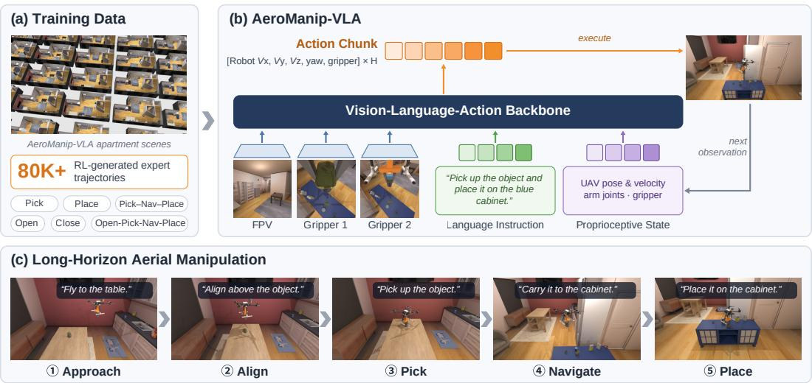  
Figure 1: Overview of the AeroManip-VLA framework and dataset for aerial manipulation. Project page: https://ruihuangnus.github.io/AeroManip-VLA-page/

## ABSTRACT

Aerial manipulators extend robotic manipulation into 3D workspaces that are difficult for ground-based robots to access, creating new opportunities for generalpurpose manipulation. However, extending Vision-Language-Action (VLA) models to aerial robots introduces distinct challenges due to the tight coupling between manipulation and flight, continuously changing observations, and safety-critical physical interactions. These challenges demand diverse training data and systematic policy evaluation, yet collecting demonstrations and evaluating policies directly on physical aerial platforms are costly, difficult to scale, and hard to repeat under controlled conditions. We present AeroManip-VLA, a scalable benchmark for aerial VLA data generation and policy evaluation. AeroManip-VLA provides a GPU-accelerated simulation framework with low-level payload-aware flight and manipulation control in massively parallel environments. Building on this framework, we combine reusable reinforcement learning policies with expert task rules to automatically generate demonstrations without human teleoperation across diverse objects, environments, and randomized initial conditions. The generated data include basic skills such as grasping and placing, as well as long-horizon tasks that require both navigation and manipulation. We further introduce automated event labeling and trajectory categorization to filter demonstrations. These mechanisms enable fine-grained analysis of task progress, behavioral outcomes, and safety-related failures. Finally, we evaluate a range of imitation learning and VLA baselines across different task settings, revealing their performance characteristics and failure modes. Together, AeroManip-VLA enables scalable aerial manipulation data generation, structured trajectory analysis, and systematic VLA evaluation in simulation prior to real-world deployment.

## 1 INTRODUCTION

Aerial manipulators offer a unique advantage over ground-based robots: their 3D mobility greatly expands the reachable workspace for general-purpose robotic manipulation, allowing them to operate at height, across obstacles, and in locations that are difficult for ground robots to access. Realizing such general-purpose capabilities requires robots to interpret diverse visual observations, understand natural-language instructions, and perform task-level reasoning. These requirements make VLA models particularly well suited for aerial manipulation. However, most existing VLA models do not target aerial manipulation, but instead focus on fixed-base or ground-based mobile manipulators, where locomotion is largely confined to planar surfaces and manipulation is performed from relatively stable platforms.

Aerial manipulation differs from ground-based manipulation in several respects. First, manipulation must be tightly coordinated with 3D flight while maintaining stability and safety. Second, the robot undergoes continuous 6-DoF motion, causing rapid changes in viewpoint and visual observation during task execution. Third, physical interactions such as contact forces, payload changes, and external disturbances can directly affect the flight dynamics (Tucker et al., 2026). These differences substantially broaden the operating conditions and failure modes that VLA models must handle. Accordingly, both training data and policy evaluation must capture this diversity. Scalable data generation and systematic policy evaluation are therefore essential for developing VLA systems for aerial manipulation.

Developing and evaluating VLA policies directly on physical aerial platforms, however, remains difficult. Collecting teleoperated demonstrations is costly and difficult to scale, while real-world policy evaluation is typically slow, safety-critical, and hard to repeat under controlled conditions. These practical constraints create a need for scalable simulation platforms that can generate diverse aerial manipulation data and support safe, controlled, and repeatable policy evaluation before realworld deployment.

Recent work has begun to develop scalable simulation platforms for aerial VLA (Wang et al., 2025; Mehboob et al., 2026; Wang et al., 2026a). AIR-VLA (Sun et al., 2026a) introduced the first benchmark specifically designed for VLA-based aerial manipulation, providing a physics-based simulation environment and a multimodal dataset of 3,000 manually teleoperated demonstrations. The reliance of AIR-VLA on human teleoperation limits the scalability of data collection. Extending the dataset to new objects, scene configurations, initial poses, or task variations requires additional manual demonstrations, even when the basic manipulation skills, such as grasping and placing, remain largely unchanged. Manual data collection makes it difficult to systematically cover diverse aerial manipulation scenarios and limits dataset expansion as tasks and environments change. These limitations motivate our development of a scalable framework that can automatically generate diverse aerial manipulation demonstrations, characterize their quality and failure modes, and support systematic policy evaluation across a broad range of task conditions.

We propose AeroManip-VLA, a scalable benchmark for aerial VLA data generation and policy evaluation. First, we develop a GPU-accelerated simulation framework that supports low-level flight and manipulation control in massively parallel environments. Built on this framework, expert rules and reinforcement learning policies are combined to automatically generate demonstrations without human teleoperation, covering diverse objects, environments, and randomized initial conditions. The generated data include both basic manipulation skills and long-horizon tasks requiring coordinated navigation and physical interaction. Second, we introduce automated event labeling and trajectory categorization to organize demonstrations according to task progress, behavioral outcomes, and safety-related events. This enables systematic data filtering and analysis of VLA failure modes. Finally, we evaluate a range of imitation-learning and VLA baselines under controlled task settings, providing reference results for aerial manipulation research. Together, these components form a scalable pipeline for aerial manipulation data generation, policy evaluation, and simulation-based validation prior to real-world deployment.

In summary, this paper makes the following contributions:

A scalable GPU-accelerated benchmark for aerial VLA. To the best of our knowledge, AeroManip-VLA is the first aerial VLA benchmark to combine massively parallel simulation, automated demonstration generation, and trajectory-level analysis within a unified framework. It supports low-level payload-aware flight and manipulation control, enabling efficient data generation, policy training, and evaluation across diverse aerial manipulation tasks.

Scalable demonstration generation without human teleoperation. We combine expert rules with reinforcement learning policies to automate demonstration generation, removing the need for manual teleoperation and enabling scalable data collection across different objects, environments, and randomized initial poses. The resulting dataset covers both basic manipulation skills and longhorizon tasks that require coordinated navigation and manipulation.

Structured trajectory analysis and comprehensive baseline evaluation. We develop an automated event-labeling and trajectory-categorization scheme for fine-grained analysis of task progress, behavioral outcomes, and safety-related failures. This analysis goes beyond aggregate success rates. We further evaluate a range of imitation learning (IL) and VLA baselines across different task settings, revealing their performance characteristics and failure modes while providing reference results for future aerial manipulation research.

## 2 RELATED WORK

Benchmarks and Simulation for Robot Learning: LIBERO (Liu et al., 2023) and BEHAVIOR-1K (Li et al., 2023) provide diverse manipulation and long-horizon task suites. ManiSkill3 (Tao et al., 2024) enables GPU-parallel simulation, and ManiSkill-HAB (Shukla et al., 2025a) further integrates low-level RL/IL baselines and trajectory filtering for controlled data generation. Robo-Casa365 (Nasiriany et al., 2026) expands household task and environment diversity, whereas Robo-Verse (Geng et al., 2025) and RoboTwin 2.0 (Chen et al., 2025) integrate synthetic data generation, domain randomization, and standardized evaluation. These benchmarks primarily target groundbased robots, leaving coupled flight–manipulation dynamics and aerial safety constraints underexplored. Recent benchmarks have begun to consider aerial manipulation. AIR-VLA (Sun et al., 2026a) provides a physics-based simulator, 3,000 teleoperated demonstrations, and VLA/VLM evaluation. AM-Bench (Wang et al., 2026b) further introduces a modular aerial manipulation benchmark with diverse robot embodiments, low-level controllers, physical disturbances, and policy-learning baselines across 12 manipulation tasks. However, scalable generation and analysis of diverse aerial VLA demonstrations remain underexplored, especially for long-horizon tasks involving randomized objects, environments, and initial conditions.

VLA Models for Aerial Manipulation: Recent studies have begun to extend VLA models to aerial robots. DroneVLA (Mehboob et al., 2026) combines language-conditioned perception with aerial navigation and handover. π, But Make It Fly (Tucker et al., 2026) adapts manipulation-pretrained VLAs to real aerial robots using synthetic navigation data, and AIR-VLA+ (Sun et al., 2026b) improves the integration of flight and manipulation within the VLA architecture. Despite these advances, scalable generation of diverse manipulation demonstrations remains comparatively underexplored. Existing aerial VLA datasets still rely heavily on manually collected trajectories, whereas synthetic data generation has primarily focused on navigation. Our work targets this remaining gap through automated aerial manipulation data generation, together with systematic trajectory analysis and policy evaluation.

Scalable Demonstration Generation and Skill Composition: The high cost of human teleoperation has motivated automated demonstration generation. MimicGen (Mandlekar et al., 2023) adapts human demonstrations to new scene configurations, DexMimicGen (Jiang et al., 2025) extends this idea to bimanual dexterous manipulation, and DemoGen (Xue et al., 2025) augments trajectories and visual observations through spatial transformations. For long-horizon tasks, SkillMimicGen (Garrett et al., 2024) composes reusable skills through planned transit motions, and LodeStar (Raghunandan et al., 2022) combines demonstration augmentation, reinforcement learning, and skill composition. Despite these advances, most existing methods still depend on human source demonstrations and primarily target fixed-base or ground-based manipulation. Aerial manipulation additionally requires coordinating 3D flight with physical interaction across varying initial states and task configurations. Our AeroManip-VLAinstead combines reusable closed-loop reinforcement learning policies with expert task rules to automatically generate demonstrations across randomized objects, environments, and initial conditions without human teleoperation. These skills are further composed into long-horizon demonstrations that integrate navigation and manipulation for aerial VLA training and evaluation.

## 3 METHODOLOGY

## 3.1 BENCHMARK DESIGN

The benchmark comprises four task settings. TidyHouse and PrepareGroceries provide objectspecific Pick and Place tasks for household and kitchen rearrangement, respectively. PackageDelivery extends the benchmark to outdoor delivery, requiring the aerial manipulator to pick up a package from a vehicle, navigate to the entrance of a designated room, and place the package on top of a cabinet by the door. LongHorizonRearrangement evaluates continuous single-object rearrangement tasks combining long-range navigation, pick-and-place, and opening and closing kitchen cabinet and refrigerator doors.

## 3.1.1 TASK.

Basic Manipulation skill Definitions. Our benchmark defines five parameterized skills for aerial manipulation: Pick, Place, Open, Close, and Nav. Given an object x at pose $x _ { \mathrm { p o s e } } ,$ , Pick $[ a ] ( x _ { \mathrm { p o s e } } )$ picks up the object, while Place $[ a ] ( x _ { \mathrm { p o s e } } , g _ { \mathrm { p o s } } )$ places it at the goal position $g _ { \mathrm { p o s } }$ . For these two skills, the optional parameter a specifies the articulated structure from which the object is picked or into which it is placed. The skills $\mathbf { O p e n } [ a ] ( a _ { \mathrm { p o s } } )$ and $\mathbf { C l o s e } [ a ] ( a _ { \mathrm { p o s } } )$ respectively open and close articulation a by interacting with its handle at position $a _ { \mathrm { p o s } } .$ Finally, $\mathbf { N a v } ( p _ { \mathrm { t a r g e t } } )$ moves the aerial manipulator to a specified target position $p _ { \mathrm { t a r g e t } }$ . These skills serve as building blocks for longhorizon tasks that combine navigation and manipulation.

Long-Horizon Manipulation. We compose the basic skills into continuous single-object trajectories. The core PICKPLACE sequence is defined as

$$
\mathrm { P i c k P l a c e } ( x , g ) = \mathrm { P i c k } ( x _ { \mathrm { p o s e } } )  \mathrm { N a v } ( p _ { \mathrm { t a r g e t } } )  \mathrm { P l a c e } ( \langle x _ { \mathrm { p o s e } } , g _ { \mathrm { p o s } } \rangle ) ,\tag{1}
$$

where navigation transports the grasped object toward the placement goal. PackageDelivery follows this sequence, while LongHorizonRearrangement additionally incorporates Open and Close at task-dependent stages to access or store objects in cabinets and refrigerators. All skills are executed continuously within a single episode, requiring precise contact-rich manipulation while maintaining flight stability.

## 3.1.2 SIMULATOR.

We build AeroManip-VLA on ManiSkill3 (Tao et al., 2024), using ReplicaCAD indoor environments and task settings adapted from ManiSkill-HAB (Shukla et al., 2025b) and HAB (Szot et al., 2021). The simulator supports GPU-parallel physics and rendering, enabling large numbers of aerial manipulation environments to be executed concurrently for scalable data generation, policy training, and evaluation.

## 3.1.3 ROBOT SYSTEM.

Unlike AIR-VLA (Sun et al., 2026a), which uses a 7-DoF Franka Panda manipulator weighing approximately 18 kg, we focus on lightweight manipulators that better reflect the payload constraints of small quadrotors. Following Air-UMI (Gupta et al., 2025), our simulated platform is based on an X500 quadrotor and supports two configurations: a lightweight 1-DoF gripper platform and a 3-DoF arm, both equipped with UMI-style fingertips (Chi et al., 2024). Together, they provide complementary levels of reach and dexterity for aerial manipulation. We use a payload-aware cascaded flight controller to track world-frame velocity and yaw-rate commands. The controller also supports batched GPU execution across parallel simulation environments. Grasping and object transport are realized through simulated physical contact; no rigid object attachment or pose teleportation is used during task execution.

## 3.1.4 OBSERVATION AND ACTION SPACES.

The policy receives three onboard RGB-D views (drone front, drone hand, and drone own) together with a 19-dimensional proprioceptive state. Language-conditioned policies additionally receive a natural-language instruction. The policy outputs a normalized five-dimensional

continuous action

$$
a _ { t } = [ u _ { x } , u _ { y } , u _ { z } , u _ { \psi } , u _ { g } ] \in [ - 1 , 1 ] ^ { 5 } ,
$$

representing commands for world-frame translational velocity, yaw rate, and gripper opening.

## 3.2 PAYLOAD-AWARE CONTROL FOR AERIAL MANIPULATION

We organize aerial manipulation into a shared low-level control layer and a task-level policy layer. The low-level controller executes flight commands in GPU-parallel environments and compensates for payload changes during grasping, transport, and release. On top of this controller, we construct a privileged hybrid expert for demonstration generation and train skill policies using behavior cloning and reinforcement learning. All task-level policies share the same low-level flight controller.

GPU-parallel flight. To simulate many flying robots in parallel on the GPU, we represent each freeflying airframe using six virtual joints attached to the world frame. Three prismatic joints describe translation along the world $x \cdot , y \cdot$ , and z-axes, while three rotational joints describe yaw, pitch, and roll. The rotor force and torque, denoted by $W = \left( F , \tau _ { O } \right)$ and expressed in the world frame, are converted into forces and torques acting on these virtual joints through $Q = J ^ { \top } W$ , where J is the corresponding airframe Jacobian. Physics and low-level control are updated at 240 Hz, while the policy runs at 20 Hz. The airframe state is refreshed at every physics step. In a 25 s flight test, the GPU simulation differs from the CPU floating-base reference by only 2–3 mm.

Cascaded flight control. We use a cascaded velocity–attitude controller to track the world-frame translational-velocity command $v ^ { \mathrm { c m d } }$ and yaw-rate command $\dot { \psi } ^ { \mathrm { c m d } }$ generated by the task-level policy. Physics and low-level control are updated at $\Delta t = 1 / 2 4 0 \mathrm { s }$ . The outer-loop velocity controller computes

$$
e _ { v } = v ^ { \mathrm { c m d } } - v , \qquad \xi \gets \mathrm { c l i p } \left( \xi + e _ { v } \Delta t , - 2 , 2 \right) ,\tag{2}
$$

where $e _ { v }$ is the velocity tracking error and ξ is its integral term. Here, clip $( x , l , u )$ denotes componentwise saturation of x to the interval $[ l , u ]$ , preventing excessive accumulation of the integral term. The desired world-frame force is then

$$
\begin{array} { r } { f ^ { \mathrm { d e s } } = \hat { m } \left( \mathrm { c l i p } _ { \mathrm { a c c } } \left( 3 e _ { v } + \xi \right) + g \mathbf { e } _ { z } \right) , } \end{array}\tag{3}
$$

where mˆ is the estimated total mass, including the payload when present, and $\mathbf { e } _ { z }$ is the upward unit vector. The operator ${ \mathrm { c l i p } } _ { \mathrm { a c c } }$ limits the commanded acceleration to $\pm 3 \mathrm { m } / \mathrm { s } ^ { 2 }$ along each horizontal axis and $\pm 5 \mathrm { m } / \mathrm { s } ^ { 2 }$ vertically. The commanded yaw rate is integrated to obtain the desired heading,

$$
\psi ^ { \mathrm { d e s } }  \psi ^ { \mathrm { d e s } } + \dot { \psi } ^ { \mathrm { c m d } } \Delta t .\tag{4}
$$

The desired attitude $R ^ { \mathrm { d e s } }$ is constructed from $f ^ { \mathrm { d e s } }$ and $\psi ^ { \mathrm { d e s } }$ , with its body z-axis aligned with the desired force direction. The corresponding desired angular velocity is denoted by $\omega ^ { \mathrm { d e s } }$ . The innerloop attitude controller computes the body torque as

$$
\tau = - k _ { R } e _ { R } ( R , R ^ { \mathrm { d e s } } ) - k _ { \omega } ( \omega - \omega ^ { \mathrm { d e s } } ) ,\tag{5}
$$

where $e _ { R }$ is the $S O ( 3 )$ attitude error. The total thrust is obtained by projecting the desired force onto the current body z-axis,

$$
\begin{array} { r } { T = ( f ^ { \mathrm { d e s } } ) ^ { \top } R \mathbf { e } _ { z } . } \end{array}\tag{6}
$$

Finally, the total thrust and body torque are allocated to the four rotors as

$$
f _ { \mathrm { r o t o r } } = \mathrm { c l i p } \left( A ^ { - 1 } \left[ \stackrel { \textstyle T } { \tau } \right] , 0 , f _ { \mathrm { m a x } } \right) ,\tag{7}
$$

where A is the control-allocation matrix and $f _ { \mathrm { m a x } }$ is the per-rotor thrust limit. The resulting rotor wrench is transformed to the world frame and applied through the virtual joints. For the unloaded platform, $\hat { m } = m _ { 0 }$ , and the attitude-control gains are set to $( \bar { k } _ { R } , k _ { \omega } ) = ( 2 . \bar { 5 } , 0 . 5 5 )$

Payload-aware compensation. After grasp detection, the controller updates the feedforward mass using the simulator-provided object mass and increases attitude gains. Once the placement support carries the object, it restores the unloaded mass and resets the vertical integral to avoid excess thrust after release. Compensation is enabled for selected object classes, and all evaluated policies share the same low-level controller.

## 3.3 POLICY LEARNING FOR AERIAL MANIPULATION

We consider three complementary approaches for generating aerial manipulation behavior. Unlike AIR-VLA (Sun et al., 2026a), which relies on manually teleoperated demonstrations, our pipeline emphasizes automated and scalable data generation. The privileged hybrid expert provides reliable demonstrations using simulator knowledge and structured control. Behavior cloning distills these demonstrations into standalone learned policies, while PPO further optimizes the policies through environment interaction and task rewards. Together, these approaches enable reproducible and systematic data generation across diverse task configurations.

## 3.3.1 PRIVILEGED HYBRID EXPERT

We construct a privileged hybrid teacher for automated demonstration generation. The teacher combines frozen learned components, rule-based control, geometric planning, and scripted feedback, with access to privileged simulator information such as object poses, collision geometry, and taskspecific targets.

Geometric planning determines feasible initial configurations and collision-free motion when global spatial reasoning is required. During local interaction, learned components provide mode selection and feedback control, while rule-based guards enforce geometric, contact, and stability constraints. Scripted controllers are used for stages that can be reliably specified from privileged task states.

The teacher is used only to generate successful demonstrations and initialization resources. It is not itself an evaluated policy and does not involve reinforcement-learning updates.

## 3.3.2 SKILL POLICY LEARNING

Given demonstrations generated by the privileged teacher, we study learned skill policies using behavior cloning (BC) and reinforcement learning.

Behavior Cloning. We train BC policies to imitate the continuous expert actions from successful demonstrations by minimizing the mean squared error between predicted and normalized actions. Unlike the frozen BC components inside the privileged teacher, these policies directly predict the complete continuous control action and serve as standalone learned skill policies.

PPO Training. We further optimize skill policies with PPO in GPU-parallel environments. The policy uses a Gaussian actor with a separate critic, generalized advantage estimation, and clipped policy updates. Reward functions are defined according to task progress and success criteria, together with penalties for undesirable actions and contacts. PPO policies can be trained either from scratch or initialized from a pretrained BC policy. When BC initialization is used, optional critic warm-up and imitation regularization can be applied during early training. The reference configuration uses 64- step rollout windows, $\gamma = 0 . 9 7$ , and a clipping parameter of 0.2. The learned skill policies are then composed with privileged geometric planning and low-level scripted control to generate task-level rollouts. This pipeline is applied consistently across all manipulation skills.

## 3.4 EVENT ANNOTATION FOR AERIAL MANIPULATION

We develop an event-based annotation protocol tailored to the coupled requirements of aerial flight and manipulation. Annotations combine task-specific interaction events with aerial operating constraints, including excessive tilt, altitude violations, non-target contact, payload loss, platform stability, and clearance conditions. This enables task completion to be assessed jointly with the physical constraints specific to aerial manipulation.

We retain both skill-level outcomes and full-trajectory outcomes. A successfully completed skill remains valid even if a subsequent stage fails, while time-limit truncations are distinguished from physical failures. Parent-trajectory identifiers and event boundaries preserve the relationship between extracted skill segments and their original rollouts.

We additionally verify the validity of skill transitions when constructing segmented demonstrations. In particular, downstream segments must begin from eligible states that satisfy the required handoff conditions rather than from states already close to task completion. These annotations provide traceable criteria for trajectory segmentation, demonstration selection, and structured failure analysis.

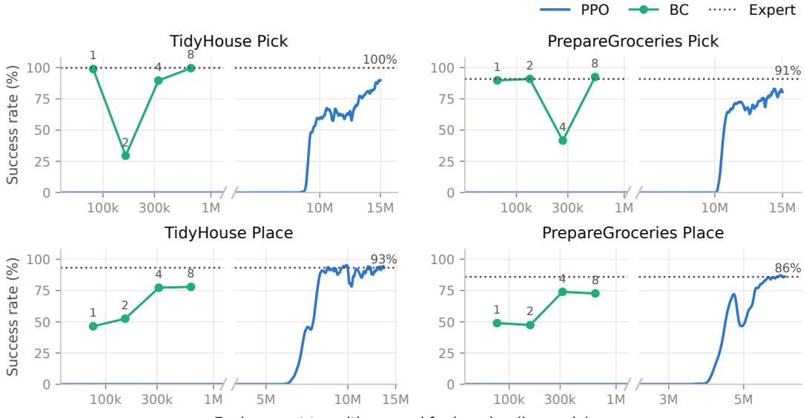  
Environment transitions used for learning (log scale)  
Figure 2: BC is substantially more interaction-efficient than PPO, but relies on expert demonstrations. BC markers report held-out success after training on successful expert trajectories from 1, 2, 4, and 8 collection rounds (256 rollouts each). PPO curves show training success from scratch (400-episode moving average), while dotted lines denote expert held-out success. The broken logscale x-axis reports demonstration transitions for BC and environment interactions for PPO. One training seed per method.

## 4 EXPERIMENTS

We organize our evaluation around two questions. First, how do expert-, imitation-, and reinforcement-learning-based data generation strategies compare in success rate, learning efficiency, trajectory diversity, and execution efficiency? Second, how well do representative visuomotor and vision-language-action policies learn aerial manipulation from the generated demonstrations?

## 4.1 EVALUATION OF DATA GENERATION STRATEGIES

Success rates and learning efficiency. Figure 2 shows that learning efficiency alone does not favor PPO as a replacement for expert-guided collection. On Pick, BC approaches expert success with only 67–81k demonstration transitions, whereas PPO requires millions of interactions and remains below the expert in held-out evaluation. These results support the hybrid expert as the source of our released dataset and BC as a low-cost route to policy distillation. Our motivation for evaluating PPO is therefore different: whether reward-driven learning can produce successful trajectories with greater diversity or lower collection cost. The following analyses examine whether these benefits can justify its higher upfront training cost.

Trajectory diversity. While Figure 2 shows that PPO is much less interaction-efficient than BC, Figure 3 reveals what this additional optimization can buy in return. Across both tasks, PPO reaches the grasp pose through a much broader set of successful approach trajectories. The expert and BC largely follow the same near-deterministic L-shaped strategy (navigate → descend onto the object), whereas PPO explores many alternative routes in the normalised X–Z plane.

This difference is reflected in all three diversity metrics. PPO exhibits substantially larger deviation from its own mean path, indicating greater variation across successful rollouts. It also covers far more spatial cells (TidyHouse: 205 vs. 53 for Expert and 77 for BC; PrepareGroceries: 283 vs. 46 and 71), and achieves markedly higher velocity-direction entropy (TidyHouse: 3.0 bits vs. 1.8 and 2.0; PrepareGroceries: 3.7 bits vs. 1.7 and 1.7). These results suggest that, although PPO is not a sample-efficient replacement for expert-guided collection, it can uncover successful approach behaviors that are largely absent from expert and BC data.

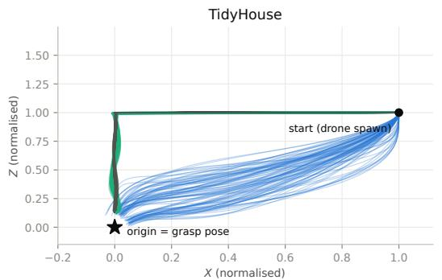

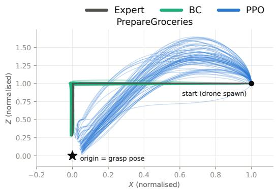

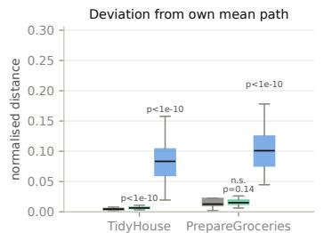

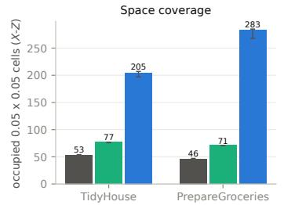

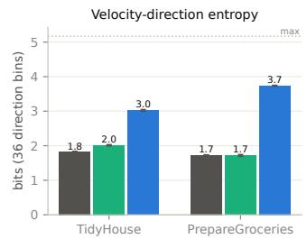  
Figure 3: PPO produces substantially more diverse successful approach trajectories than the expert and BC. Top: successful approach segments from drone spawn to within 5 cm of the planned grasp pose, shown in a start-normalised frame with the grasp pose at the origin and all trajectories starting at (1, 1). Expert and BC follow a similar L-shaped approach, whereas PPO spreads across the X–Z plane. Bottom: deviation from each policy’s own mean path, spatial coverage measured by occupied $0 . 0 5 \times 0 . 0 5$ cells, and velocity-direction entropy over 36 bins. Coverage and entropy are estimated from 200 random subsets of 80 episodes per policy; bars show the mean and 95% interval.

Execution efficiency. The increased diversity of PPO does not come from simply taking longer or more circuitous routes. As shown in Figure 4, successful PPO rollouts are substantially faster than those of the expert and BC. On TidyHouse, PPO reduces the mean time to success from 15.8 s for both the expert and BC to $3 . 8 \mathrm { s } ;$ on PrepareGroceries, it reduces 14.7–14.6 s to 4.0 s. Most of this improvement comes from the approach phase, which decreases from 11.4 s to 2.5 s on TidyHouse and from 10.1 s to 2.5 s on PrepareGroceries. Together with Figure 3, these results show that PPO discovers alternative approach strategies that are not only more diverse, but also substantially more efficient to execute. This gain should be distinguished from learning efficiency: PPO requires much more interaction to train, but once trained, its successful trajectories are considerably shorter. Since these statistics are conditioned on successful episodes, they measure execution efficiency rather than end-to-end demonstration collection throughput.

Overall, BC efficiently reproduces expert behavior, whereas PPO requires substantially more training interaction but discovers a broader set of successful strategies. Importantly, these successful trajectories are not merely more diverse; they are also substantially faster to execute.

## 4.2 DOWNSTREAM POLICY BENCHMARKING

Baseline methods. We evaluate four representative policies on our aerial manipulation dataset, covering both visuomotor imitation learning and pretrained vision-language-action (VLA) models. ACT Zhao et al. (2023) uses a Transformer-based conditional variational autoencoder to predict action chunks, while Diffusion Policy (DP) Chi et al. (2025) generates action sequences through conditional denoising to model multimodal action distributions. For pretrained VLA baselines, we include $\pi _ { 0 }$ Black et al. (2024) and $\pi _ { 0 . 5 }$ Intelligence et al. (2025), which generate continuous actions using flow matching. Together, these baselines allow us to assess how effectively different policy architectures learn from our generated demonstrations and how pretrained VLAs transfer to aerial manipulation.

Overall performance. The benchmark clearly differentiates the evaluated policy classes. Among the four baselines, $\pi _ { 0 . 5 }$ achieves the highest mean success rate of 44.6%, followed by $\pi _ { 0 }$ at 38.9%,

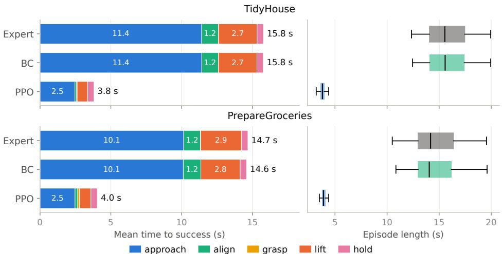  
Figure 4: PPO discovers diverse yet substantially faster successful trajectories. Left: mean time to success decomposed into approach, alignment, grasp, lift, and hold phases. PPO reduces total execution time from 15.8 s to 3.8 s on TidyHouse and from approximately 14.7 s to 4.0 s on PrepareGroceries, primarily through a shorter approach phase. Right: distribution of successful episode lengths for each policy.

Table 1: Simulation results on AeroManip-VLA PrepareGroceries. For each skill–object pair, the table reports the success rate (%) over evaluation episodes together with its binomial standard error. Mean S.R. is the unweighted average over all 16 Pick/Place–object combinations.
<table><tr><td>Obj. Alg.</td><td>Skill</td><td>Master Chef Can</td><td>Sugar Box</td><td>Tomato  $\operatorname { S o u p } \operatorname { C a n }$ </td><td> $\operatorname { T u n a } \operatorname { F i s h }$  Can</td><td>Pudding Box</td><td>Gelatin Box</td><td>Potted  $\mathbf { M e a t C a n }$ </td><td>Bowl</td><td>Mean S.R. (Pick + Place)</td></tr><tr><td rowspan="2">ACT</td><td>Pick</td><td> $\overline { { 2 . 0 \pm 2 . 0 } }$ </td><td> $\overline { { 0 . 0 \pm 0 . 0 } }$ </td><td> $\overline { { 0 . 0 \pm 0 . 0 } }$ </td><td> $\overline { { 0 . 0 \pm 0 . 0 } }$ </td><td> $\overline { { 0 . 0 \pm 0 . 0 } }$ </td><td> $\overline { { 0 . 0 \pm 0 . 0 } }$ </td><td> $\overline { { 1 0 . 0 \pm 4 . 2 } }$ </td><td> $\overline { { { \bf 1 8 . 0 \pm 5 . 4 } } }$ </td><td rowspan="2">29.5</td></tr><tr><td>Place</td><td> $2 4 . 0 \pm 6 . 0$ </td><td> ${ \bf 9 8 . 0 \pm 2 . 0 }$ </td><td> $2 8 . 0 \pm 6 . 3$ </td><td> $8 2 . 0 \pm 5 . 4$ </td><td> $4 6 . 0 \pm 7 . 0$ </td><td> $4 8 . 0 \pm 7 . 1$ </td><td> $5 6 . 0 \pm 7 . 0$ </td><td> ${ \bf 6 0 . 0 \pm 6 . 9 }$ </td></tr><tr><td rowspan="2">DP</td><td>Pick</td><td> $4 . 0 \pm 2 . 8$ </td><td> $\overline { { 2 . 0 \pm 2 . 0 } }$ </td><td> $6 . 0 \pm 3 . 4$ </td><td> $4 . 0 \pm 2 . 8$ </td><td> $\overline { { 2 . 0 \pm 2 . 0 } }$ </td><td> $\overline { { 2 . 0 \pm 2 . 0 } }$ </td><td> $\overline { { 2 . 0 \pm 2 . 0 } }$ </td><td> $6 . 0 \pm 3 . 4$ </td><td rowspan="2">33.9</td></tr><tr><td>Place</td><td> $5 0 . 0 \pm 7 . 1$ </td><td> $9 0 . 0 \pm 4 . 2 $ </td><td> $5 0 . 0 \pm 7 . 1$ </td><td> $7 8 . 0 \pm 5 . 9$ </td><td> $8 2 . 0 \pm 5 . 4$ </td><td> $8 0 . 0 \pm 5 . 7$ </td><td> $3 2 . 0 \pm 6 . 6$ </td><td> $5 2 . 0 \pm 7 . 1$ </td></tr><tr><td rowspan="2">PIO</td><td>Pick</td><td> $6 . 7 \pm 4 . 6$ </td><td> ${ \bf 6 . 7 \pm 4 . 6 }$ </td><td> ${ \bf 1 0 . 0 \pm 5 . 5 }$ </td><td> $\mathbf { 2 0 . 0 \pm 7 . 3 }$ </td><td> $\overline { { 1 3 . 3 \pm 6 . 2 } }$ </td><td> $\overline { { 1 3 . 3 \pm 6 . 2 } }$ </td><td> $\overline { { 1 3 . 3 \pm 6 . 2 } }$ </td><td> $6 . 7 \pm 4 . 6$ </td><td rowspan="2">38.9</td></tr><tr><td>Place</td><td> ${ \bf 8 0 . 0 \pm 5 . 7 }$ </td><td> $8 2 . 0 \pm 5 . 4$ </td><td> $5 2 . 0 \pm 7 . 1$ </td><td> $8 8 . 0 \pm 4 . 6 $ </td><td> $5 2 . 0 \pm 7 . 1$ </td><td> $6 8 . 0 \pm 6 . 6$ </td><td> ${ \bf 8 6 . 0 \pm 4 . 9 }$ </td><td> $2 4 . 0 \pm 6 . 0$ </td></tr><tr><td rowspan="2">PI05</td><td>Pick</td><td> $\mathbf { 8 . 0 \pm 3 . 8 }$ </td><td> $6 . 0 \pm 3 . 4$ </td><td> $6 . 0 \pm 3 . 4$ </td><td> $\overline { { 1 2 . 0 \pm 4 . 6 } }$ </td><td> $\mathbf { 1 4 . 0 \pm 4 . 9 }$ </td><td> $\mathbf { 1 6 . 0 \pm 5 . 2 }$ </td><td> $\mathbf { 1 6 . 0 \pm 5 . 2 }$ </td><td> $\overline { { 1 4 . 0 \pm 4 . 9 } }$ </td><td rowspan="2">44.6</td></tr><tr><td>Place</td><td> $6 0 . 0 \pm 6 . 9$ </td><td> $8 8 . 0 \pm 4 . 6 $ </td><td> ${ \bf 6 4 . 0 \pm 6 . 8 }$ </td><td> ${ \bf 9 2 . 0 \pm 3 . 8 }$ </td><td> ${ \bf 9 6 . 0 \pm 2 . 8 }$ </td><td> ${ \bf 9 6 . 0 \pm 2 . 8 }$ </td><td> $7 8 . 0 \pm 5 . 9$ </td><td> $4 8 . 0 \pm 7 . 1$ </td></tr></table>

DP at 33.9%, and ACT at 29.5%. The stronger performance of the pretrained VLA models indicates effective transfer to aerial manipulation, while the remaining gap to full task completion leaves substantial room for future methods.

Skill- and object-level analysis. Performance varies substantially across both manipulation skills and object categories. Place is consistently easier than Pick, making reliable aerial object acquisition the primary bottleneck. Success rates also differ markedly across objects, reflecting variations in geometry, graspability, and manipulation difficulty. These differences demonstrate that the benchmark captures meaningful variation across models, skills, and objects rather than reducing evaluation to a single aggregate success rate.

## 5 CONCLUSION AND LIMITATIONS

We presented AeroManip-VLA, a GPU-parallel benchmark for scalable aerial manipulation data generation and policy evaluation. The framework integrates payload-aware flight control, automated demonstration generation, and event-based trajectory annotation, providing more than 80K demonstrations spanning basic skills and long-horizon tasks that combine navigation and manipulation. Our experiments show that BC efficiently reproduces expert behavior, while PPO discovers more diverse and faster successful trajectories at a higher training cost. The evaluated pretrained VLA models achieve higher mean success rates than the visuomotor imitation baselines, although reliable aerial picking remains challenging. Our evaluation is currently limited to simulation, and sim-to-real transfer remains unvalidated. Future work will validate the framework on physical aerial manipulators and expand its coverage of platforms, environments, and long-horizon tasks.

## REPRODUCIBILITY STATEMENT

We open source all code for environments, training, evaluation, and data generation, and we release our dataset for public use.

## AI USE STATEMENT

We used generative AI tools to polish the writing and improve the readability of the manuscript. The authors reviewed and verified all AI-assisted content and take full responsibility for the final manuscript.

## REFERENCES

Kevin Black, Noah Brown, Danny Driess, Adnan Esmail, Michael Equi, Chelsea Finn, Niccolo Fusai, Lachy Groom, Karol Hausman, Brian Ichter, et al. π0: A vision-language-action flow model for general robot control. arXiv preprint arXiv:2410.24164, 2024.

Tianxing Chen, Zanxin Chen, Baijun Chen, Zijian Cai, Yibin Liu, Zixuan Li, Qiwei Liang, Xianliang Lin, Yiheng Ge, Zhenyu Gu, et al. Robotwin 2.0: A scalable data generator and benchmark with strong domain randomization for robust bimanual robotic manipulation. arXiv preprint arXiv:2506.18088, 2025.

Cheng Chi, Zhenjia Xu, Chuer Pan, Eric Cousineau, Benjamin Burchfiel, Siyuan Feng, Russ Tedrake, and Shuran Song. Universal manipulation interface: In-the-wild robot teaching without in-the-wild robots. arXiv preprint arXiv:2402.10329, 2024.

Cheng Chi, Zhenjia Xu, Siyuan Feng, Eric Cousineau, Yilun Du, Benjamin Burchfiel, Russ Tedrake, and Shuran Song. Diffusion policy: Visuomotor policy learning via action diffusion. The International Journal ofRobotics Research, 44(10-11):1684–1704, 2025.

Caelan Garrett, Ajay Mandlekar, Bowen Wen, and Dieter Fox. Skillmimicgen: Automated demonstration generation for efficient skill learning and deployment. arXiv preprint arXiv:2410.18907, 2024.

Haoran Geng, Feishi Wang, Songlin Wei, Yuyang Li, Bangjun Wang, Boshi An, Charlie Tianyue Cheng, Haozhe Lou, Peihao Li, Yen-Jen Wang, et al. Roboverse: Towards a unified platform, dataset and benchmark for scalable and generalizable robot learning. arXiv preprint arXiv:2504.18904, 2025.

Harsh Gupta, Xiaofeng Guo, Huy Ha, Chuer Pan, Muqing Cao, Dongjae Lee, Sebastian Scherer, Shuran Song, and Guanya Shi. Umi-on-air: Embodiment-aware guidance for embodimentagnostic visuomotor policies. arXiv preprint arXiv:2510.02614, 2025.

Physical Intelligence, Kevin Black, Noah Brown, James Darpinian, Karan Dhabalia, Danny Driess, Adnan Esmail, Michael Equi, Chelsea Finn, Niccolo Fusai, et al. π0.5: a vision-language-action model with open-world generalization. arXiv preprint arXiv:2504.16054, 2025.

Zhenyu Jiang, Yuqi Xie, Kevin Lin, Zhenjia Xu, Weikang Wan, Ajay Mandlekar, Linxi Jim Fan, and Yuke Zhu. Dexmimicgen: Automated data generation for bimanual dexterous manipulation via imitation learning. In 2025 IEEE International Conference on Robotics and Automation (ICRA), pp. 16923–16930. IEEE, 2025.

Chengshu Li, Ruohan Zhang, Josiah Wong, Cem Gokmen, Sanjana Srivastava, Roberto Mart´ın-Mart´ın, Chen Wang, Gabrael Levine, Michael Lingelbach, Jiankai Sun, et al. Behavior-1k: A benchmark for embodied ai with 1,000 everyday activities and realistic simulation. In Conference on Robot Learning, pp. 80–93. PMLR, 2023.

Bo Liu, Yifeng Zhu, Chongkai Gao, Yihao Feng, Qiang Liu, Yuke Zhu, and Peter Stone. Libero: Benchmarking knowledge transfer for lifelong robot learning. Advances in Neural Information Processing Systems, 36:44776–44791, 2023.

Ajay Mandlekar, Soroush Nasiriany, Bowen Wen, Iretiayo Akinola, Yashraj Narang, Linxi Fan, Yuke Zhu, and Dieter Fox. Mimicgen: A data generation system for scalable robot learning using human demonstrations. arXiv preprint arXiv:2310.17596, 2023.

Fawad Mehboob, MoniJesu Wonders James, Amir Atef Habel, Jeffrin Sam, Miguel Altamirano Cabrera, and Dzmitry Tsetserukou. Dronevla: Vla-based aerial manipulation. In Companion Proceedings of the 21st ACM/IEEE International Conference on Human-Robot Interaction, pp. 1135–1139, 2026.

Soroush Nasiriany, Sep Nasiriany, Abhiram Maddukuri, and Yuke Zhu. Robocasa365: A largescale simulation framework for training and benchmarking generalist robots. In International Conference on Learning Representations, volume 2026, pp. 98643–98667, 2026.

Deepthi Raghunandan, Zhe Cui, Kartik Krishnan, Segen Tirfe, Shenzhi Shi, Tejaswi Darshan Shrestha, Leilani Battle, and Niklas Elmqvist. Lodestar: Supporting independent learning and rapid experimentation through data-driven analysis recommendations. arXiv preprint arXiv:2204.07876, 2022.

Arth Shukla, Stone Tao, and Hao Su. Maniskill-hab: A benchmark for low-level manipulation in home rearrangement tasks. In International Conference on Learning Representations, volume 2025, pp. 15288–15317, 2025a.

Arth Shukla, Stone Tao, and Hao Su. ManiSkill-HAB: A benchmark for low-level manipulation in home rearrangement tasks. In The Thirteenth International Conference on Learning Representations, 2025b.

Jianli Sun, Bin Tian, Qiyao Zhang, Chengxiang Li, Zihan Song, Zhiyong Cui, Yisheng Lv, and Yonglin Tian. Air-vla: Vision-language-action systems for aerial manipulation. arXiv preprint arXiv:2601.21602, 2026a.

Jianli Sun, Bin Tian, Qiyao Zhang, Zijian Liu, Yutong Wang, Zhiyong Cui, Bai Li, Yisheng Lv, and Yonglin Tian. Air-vla+: Decoupling movement and manipulation via cascaded dual-action decoders with asymmetric moe for aerial robots. arXiv preprint arXiv:2606.12859, 2026b.

Andrew Szot, Alexander Clegg, Eric Undersander, Erik Wijmans, Yili Zhao, John M. Turner, Noah Maestre, Mustafa Mukadam, Devendra Singh Chaplot, Oleksandr Maksymets, Aaron Gokaslan, Vladimir Vondrus, Sameer Dharur, Franziska Meier, Wojciech Galuba, Angel X. Chang, Zsolt Kira, Vladlen Koltun, Jitendra Malik, Manolis Savva, and Dhruv Batra. Habitat 2.0: Training home assistants to rearrange their habitat. In Marc’Aurelio Ranzato, Alina Beygelzimer, Yann N. Dauphin, Percy Liang, and Jennifer Wortman Vaughan (eds.), Advances in Neural Information Processing Systems 34: Annual Conference on Neural Information Processing Systems 2021, NeurIPS 2021, December 6-14, 2021, virtual, pp. 251–266, 2021.

Stone Tao, Fanbo Xiang, Arth Shukla, Yuzhe Qin, Xander Hinrichsen, Xiaodi Yuan, Chen Bao, Xinsong Lin, Yulin Liu, Tse kai Chan, Yuan Gao, Xuanlin Li, Tongzhou Mu, Nan Xiao, Arnav Gurha, Zhiao Huang, Roberto Calandra, Rui Chen, Shan Luo, and Hao Su. Maniskill3: GPU parallelized robotics simulation and rendering for generalizable embodied ai. arXiv preprint arXiv:2410.00425, 2024.

Johnathan Tucker, Denis Liu, Aiden Swann, Allen Ren, Javier Yu, Jiankai Sun, Brandon Kim, Lachlain McGranahan, Quan Vuong, and Mac Schwager. π, but make it fly: Physics-guided transfer of vla models to aerial manipulation. arXiv preprint arXiv:2603.25038, 2026.

Xiangyu Wang, Donglin Yang, Ziqin Wang, Hohin Kwan, Jinyu Chen, Hongsheng Li, Yue Liao, Si Liu, et al. Towards realistic uav vision-language navigation: Platform, benchmark, and methodology. In International Conference on Learning Representations, volume 2025, pp. 7292–7310, 2025.

Xiangyu Wang, Donglin Yang, Yue Liao, Wenhao Zheng, Bin Dai, Hongsheng Li, Si Liu, et al. Uavflow colosseo: A real-world benchmark for flying-on-a-word uav imitation learning. Advances in Neural Information Processing Systems, 38, 2026a.

Yutong Wang, Dongjae Lee, Xiaofeng Guo, Yuanzhu Zhan, Yufei Jiang, Bavin Saravanan, Muqing Cao, Jia Xie, Chenyang Mao, Sebastian Scherer, et al. Am-bench: A modular simulation suite and benchmark for aerial manipulation policy learning. arXiv preprint arXiv:2609.00641, 2026b.

Zhengrong Xue, Shuying Deng, Zhenyang Chen, Yixuan Wang, Zhecheng Yuan, and Huazhe Xu. Demogen: Synthetic demonstration generation for data-efficient visuomotor policy learning. arXiv preprint arXiv:2502.16932, 2025.

Tony Z Zhao, Vikash Kumar, Sergey Levine, and Chelsea Finn. Learning fine-grained bimanual manipulation with low-cost hardware. arXiv preprint arXiv:2304.13705, 2023.

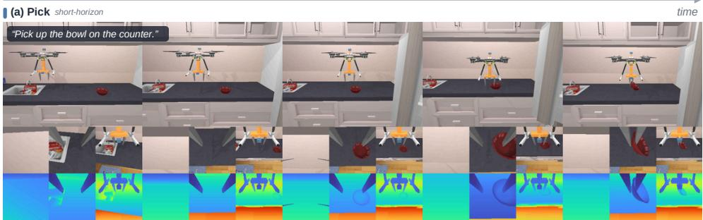  
(b) Place short-horizon

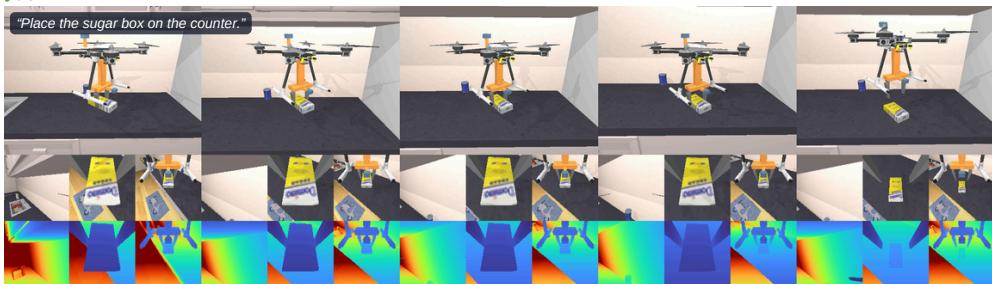  
(c) Pick–Navigate–Place long-horizon

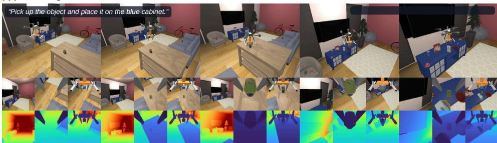  
long-horizon(d) Open–Pick–Navigate–Place

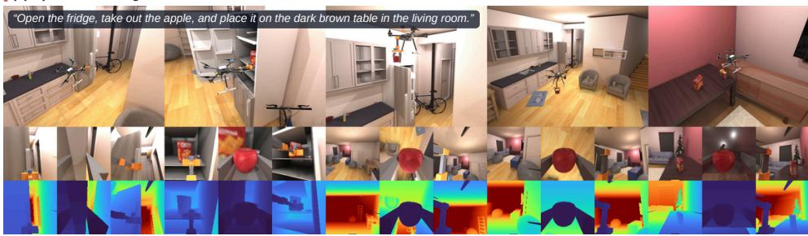  
Figure 5: Representative qualitative rollouts in AeroManip-VLA: (a) short-horizon PICK, (b) shorthorizon PLACE, (c) long-horizon PICK–NAVIGATE–PLACE, and (d) long-horizon OPEN–PICK– NAVIGATE–PLACE. Each sequence is paired with a language instruction and progresses from left to right in time. For each task, the top row shows third-person views, while the middle and bottom rows show onboard RGB and depth observations, respectively. Third-person views are used only for visualization and are not provided to the evaluated policies. All demonstration videos are available in the supplementary materials.

## A APPENDIX

## A.1 TASK EXAMPLES AND QUALITATIVE ROLLOUTS

Figure 5 presents representative rollouts of four aerial manipulation tasks in AeroManip-VLA. Short-horizon PICK and PLACE focus on local object interaction, while long-horizon PICK– NAVIGATE–PLACE requires aerial transport between spatially separated source and destination regions. OPEN–PICK–NAVIGATE–PLACE further incorporates articulated-object interaction: the robot must open a refrigerator before retrieving, transporting, and placing the target object. Additional demonstration videos are provided in the supplementary material.

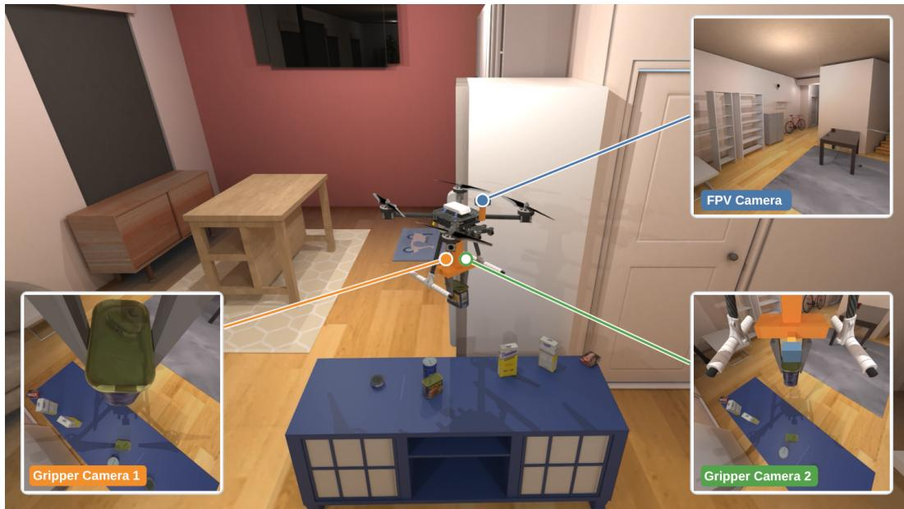  
Figure 6: Observation configuration of AeroManip-VLA. The aerial platform is equipped with one forward-facing FPV camera and two gripper-mounted cameras, providing complementary global and local views for navigation and manipulation. The central third-person view illustrates the camera placement and is not provided to the evaluated policy.

## A.2 OBSERVATION SPACE

Our observation space combines multi-view visual inputs with robot proprioception. As shown in Figure 6, the aerial platform is equipped with three body-mounted RGB-D cameras: one forwardfacing FPV camera for global scene perception and navigation, and two gripper-mounted cameras that provide complementary views of the local manipulation workspace. The onboard RGB-D streams are recorded at 128 × 128 resolution. In addition to visual observations, the policy receives a 19-dimensional proprioceptive state containing gripper states, UAV position and orientation, and linear and angular velocities. Language-conditioned policies additionally receive a natural-language task instruction. The third-person view shown in Figure 6 is used only to illustrate the camera configuration and is not provided to the evaluated policy.

## A.3 GPU-PARALLEL DATA COLLECTION AND INFERENCE

Unlike AIR-VLA, which relies on human teleoperation to collect demonstrations, our framework uses reinforcement learning policies to automatically generate aerial manipulation trajectories across parallel simulation environments. This enables scalable collection of large, diverse datasets without manual teleoperation. Beyond data collection, our framework supports batched policy inference across parallel environments, enabling efficient, large-scale evaluation of Vision-Language-Action models. Together, automated data generation and parallel inference provide a scalable foundation for aerial manipulation research. The simulator runs on a range of NVIDIA GPUs, including H200, A100, and GeForce RTX 5090, supporting deployment on both data-center and consumer hardware.

## A.4 RAY TRACING AND VISUAL FIDELITY

AeroManip-VLAsupports optional ray-traced rendering to enhance the visual fidelity of aerial manipulation scenes. Figure 8 compares the same scene with ray tracing disabled and enabled, highlighting differences in illumination, shadows, and material appearance. This option complements non-ray-traced rendering with visually richer observations for demonstration collection and aerial VLA evaluation.

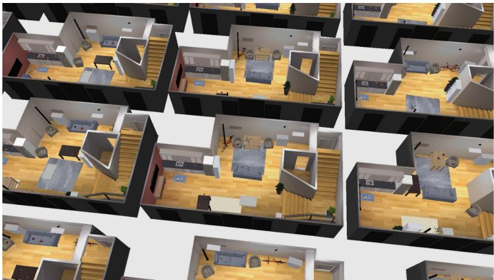  
Figure 7: GPU-parallel data collection and inference in AeroManip-VLA. Reinforcement learning policies automatically generate diverse aerial manipulation demonstrations across parallel simulation environments without human teleoperation, while batched VLA inference enables efficient, large-scale evaluation.

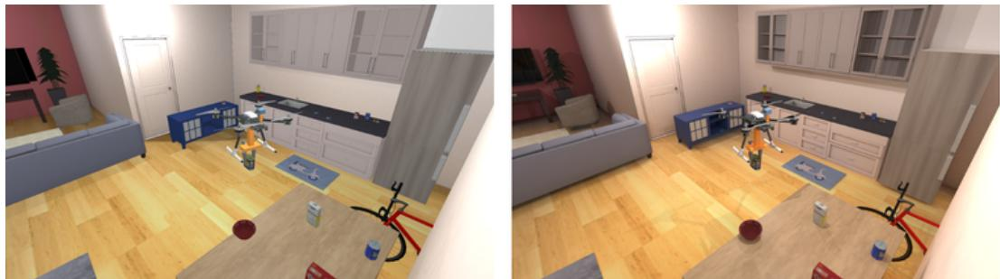  
Figure 8: Qualitative comparison of AeroManip-VLA with ray tracing disabled (left) and enabled (right). Both views are rendered directly by the simulator, illustrating differences in lighting, shadows, and surface shading.

## A.5 ADDITIONAL EXPERIMENTS

## A.5.1 SIMULATION THROUGHPUT AND SCALABILITY

To assess scalability for visual data collection and on-policy RL, we measure aggregate simulationand-rendering throughput and GPU memory usage as the number of parallel environments N increases. Each environment contains a full ReplicaCAD apartment, TidyHouse objects, and our aerial manipulator, initialized 0.5–1 m from its target object. Every control step renders three onboard 128 × 128 RGB-D cameras, with physics running at 240 Hz and control at 20 Hz. After an untimed reset, we measure the wall-clock time t for 200 control steps of seeded random velocity and gripper commands, reporting samples per second $( \mathrm { S P S } = 2 0 0 \mathbf { \bar { \cal N } } / t )$ and total GPU memory usage. We benchmark AIR-VLA (Sun et al., 2026a) in Isaac Sim on the same RTX 5090 with its native evaluation settings: each environment renders four 640 × 480 RGB policy cameras per control step, with physics at 60 Hz and control at 20 Hz, and we time 250 control steps of open-loop demonstration replay after an untimed reset, computing SPS and GPU memory in the same way.

Figure 9 shows the results. Among the tested configurations, AeroManip-VLA reaches 1707 SPS with 1024 environments using 12.4 GB, whereas AIR-VLA reaches its highest measured throughput of 317 SPS with 64 environments using 30.5 GB. At these respective configurations, AeroManip-VLA achieves 5.4× the throughput while using 41% of the GPU memory. At the same parallelism level of N = 64, AeroManip-VLA achieves approximately 1.6× the throughput and uses 86% less GPU memory (4.4 vs. 30.5 GB). AIR-VLA is faster at the tested configurations with $N \leq 1 6$ , while the two methods have comparable throughput at $N = 3 2$ . These results demonstrate the advantage of AeroManip-VLA for highly parallel simulation and visual observation collection.

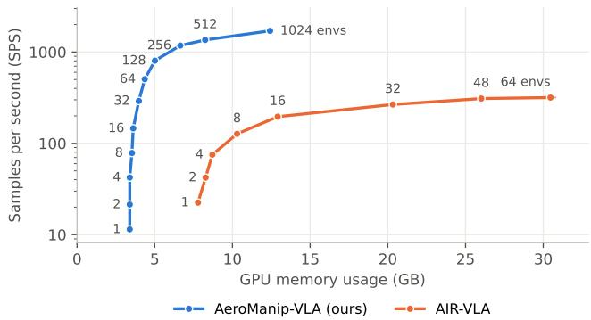  
Figure 9: Interact benchmark comparing simulation-and-rendering throughput and GPU memory usage on an RTX 5090. Point labels indicate the number of parallel environments; per control step, each AeroManip-VLA environment renders three 128 × 128 RGB-D cameras and each AIR-VLA environment renders four $6 4 0 \times 4 8 0$ RGB cameras. Points show means over 10 seeds, and error bars indicate 95% confidence intervals. The vertical axis uses a logarithmic scale. At their highestthroughput tested configurations (1024 vs. 64 environments), AeroManip-VLA achieves 5.4× the throughput of AIR-VLA while using 41% of its GPU memory.

## A.5.2 PAYLOAD-AWARE FLIGHT CONTROL

This appendix measures what the payload-aware switches of Sec. 3.2 contribute. With payloadaware control, three switches act on the carry. After three grasped control steps, the controller adds the object mass to the feedforward $( \hat { m } \gets m _ { 0 } + m _ { \mathrm { o b j } } )$ and raises the attitude gains from $( k _ { R } , k _ { \omega } ) = \mathsf { \bar { ( 2 . 5 , 0 . 5 5 ) } }$ to (12, 1.2). Once the support carries the object during placement, it restores $\hat { m } \gets m _ { 0 }$ . We compare this against the nominal controller, which keeps $\hat { m } = m _ { 0 }$ and the nominal gains throughout the carry.

Why the nominal controller struggles with heavy objects. With $\hat { m } = m _ { 0 } ,$ , the object’s weight must be carried by the integral term of Eq. equation 2. In steady hover this requires $\xi _ { z } ^ { \star } = g m _ { \mathrm { o b j } } / m _ { 0 }$ which is $1 . 5 1 { - } 1 . 6 5 \mathrm { m / s ^ { 2 } }$ for the three filled cans (0.37–0.40 kg), i.e. 75–83% of the integrator’s range of $\pm 2 \mathrm { m } / \mathrm { s } ^ { 2 }$ . This leaves little authority for climbing and for rejecting disturbances. The integrator also fills slowly. While the drone pinches the object on its support but cannot yet lift it, the vertical velocity error equals the commanded climb speed (0.15 m/s during the expert’s lift), so ξz grows by only $0 . { \dot { 1 } } 5 \mathrm { m } / \mathrm { s } ^ { 2 }$ per second. The object leaves the support once $3 e _ { v , z } + \xi _ { z } \geq g m _ { \mathrm { o b j } } / m _ { 0 }$ , which for the cans takes several seconds.

Protocol. We run the GPU-batched expert on the same 126 TidyHouse instances (nine object classes, 14 instances each) with identical seeds and start states. The two conditions differ only in the payload-aware switches. The stiff attitude gains used for release (placement stage 2 onward) belong to the release procedure of every object and are active in both conditions. The same 11 instances are rejected at initialization in both conditions, leaving 115 evaluated episodes per condition. At every control step we log the airframe pose and angular velocity, the integrator state $\xi ,$ the rotor thrusts, and the object’s pose and angular velocity. The carry is the interval from the grasp handoff to the start of placement. $L i f t { - } O f f$ is the first time after the grasp at which the object has risen 5 cm. Tilt is the angle between the airframe z-axis and vertical, and the tilt rate is the magnitude of the roll–pitch angular velocity. Slip is the object’s height relative to the gripper’s tool center point, measured from its value at the grasp. Each condition is run once.

Table 2 summarizes the outcomes. Without payload-aware control, success drops from 92.2% to 40.9%. Most additional failures are grasps lost during transport (33) and collisions while the drone is still pinned at the source (14). The nominal controller also times out 16 times, which never settles enough to start the placement. The nine remaining failures with payload-aware control are 3 lost grasps and 6 timeouts. Five of those timeouts are heavy cans that do not settle at the end of the transport.

Table 2: Outcomes of the expert on 115 TidyHouse episodes with and without payload-aware control (same instances, seeds and start states).
<table><tr><td>Outcome</td><td>Payload-aware</td><td>Nominal</td></tr><tr><td>Success</td><td>106 (92.2%)</td><td>47 (40.9%)</td></tr><tr><td>Grasp lost</td><td>3</td><td>33</td></tr><tr><td>Collision (during pick / transport)</td><td>0/0</td><td>14/5</td></tr><tr><td>Timeout</td><td>6</td><td>16</td></tr></table>

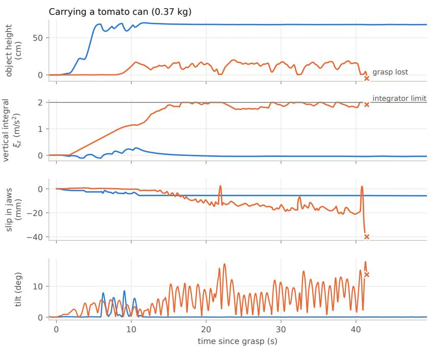  
Figure 10: One tomato-can episode (0.37 kg) with payload-aware control (blue) and the nominal controller (orange), from the same start state, aligned at the grasp. From top to bottom: object height above its initial rest height, vertical integrator state $\xi _ { z }$ (the horizontal line marks the ±2 limit), object slip in the jaws, and airframe tilt. × marks the loss of the grasp.

A single carry (Fig. 10). We show one tomato-can instance chosen by a fixed rule, not by inspection. Among the 19 heavy-can instances that succeed with payload-aware control and lose the grasp under the nominal controller, it is the one with the median nominal episode length. With payload-aware control, the object lifts off 2.1 s after the grasp and reaches cruise height within $5 \mathrm { s } . \ \xi _ { z }$ stays near zero, and once the transport has settled the tilt stays below $0 . 5 ^ { \circ }$ . Under the nominal controller, the drone keeps pinching the can on its support while $\xi _ { z }$ ramps up linearly; the can lifts off only after 9.3 s. $\xi _ { z }$ reaches its limit at 16.7 s and remains close to it for the rest of the carry. The drone never reaches cruise height: the object stays 0–20 cm above its support. Meanwhile the airframe oscillates with tilts of up to $\bar { 1 } 8 ^ { \circ }$ , and the can slides about 2 cm down in the jaws until the grasp is lost at 41.5 s.

Effect by object class (Fig. 11). The effect grows with payload mass. With payload-aware control, the median lift-off time of every class is 0.6–2.4 s, and the mean $| \xi _ { z } |$ during the carry stays below 0.1. Under the nominal controller, lift-off takes 9.6 s for the tomato can and 11.7 s for the meat can. The master chef can is never lifted, and the bowl is not lifted in four of seven episodes. The carrytime |ξ | rises with mass up to 1.78 (tomato can), and the RMS tilt rate rises from 7.0 to 27.8 deg/s (tomato can) and from 5.6 to 15.1 deg/s (cracker box). Success falls to 0% for all three filled cans (from 79–80%) and for the tuna can (from 100%), to 29% for the cracker box and to 14% for the bowl. The three lightest classes (≤ 0.04 kg: sugar, pudding and gelatin boxes) succeed in 93–100% of episodes in both conditions. The bowl is the one class whose tilt rate is not higher under the nominal controller (3.7 vs. 4.5 deg/s). However, only three nominal bowl episodes reach the carry at all.

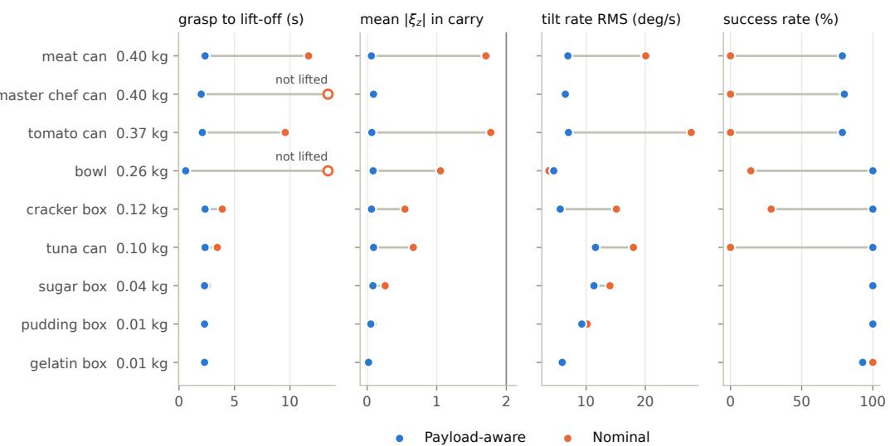  
Figure 11: Per object class, sorted by mass, with the same instances in both conditions (TidyHouse, 14 instances per class, minus initialization rejections). Left to right: median time from grasp to lift-off (open marker: the median episode never lifts the object), mean |ξz| during the carry (vertical line: integrator limit), RMS tilt rate during the carry, and success rate. Carry metrics are averaged over episodes that reach the carry, so they are missing where no nominal episode does (master chef can).

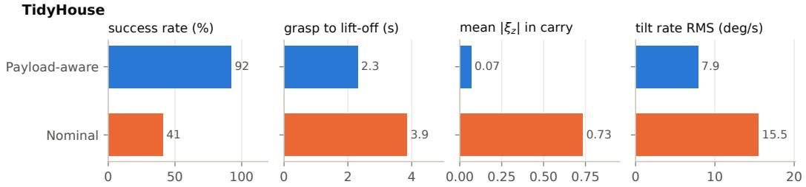  
Figure 12: Overall effect of payload-aware control on TidyHouse. Compared with the nominal controller, payload-aware control achieves higher success rate, faster grasp-to-lift-off, lower mean vertical tracking error during transport, and lower RMS tilt rate. Values are aggregated over the evaluated episodes.

Overall effect of payload-aware control. Figure 12 summarizes the aggregate effect of payloadaware control on TidyHouse. Compared with the nominal controller, payload-aware control increases the success rate from 41% to 92% and reduces the median grasp-to-lift-off time from 3.9 s to 2.3 s. During object transport, the mean vertical tracking error decreases from 0.73 to 0.07, while the RMS tilt rate is reduced from 15.5 to 7.9 deg/s. Overall, payload-aware control improves both task completion and flight stability during aerial manipulation.

Carry oscillation (Fig. 13). The nominal controller exhibits a pronounced tilt-rate spectral peak near 1.4 Hz. At this frequency, payload-aware control reduces the median PSD from 94 to 6.2 (deg/s)2/Hz, an approximately 15× reduction. Although the payload-aware spectrum is higher over 2–5 Hz, the object-wise analysis in Fig. 11 shows lower RMS tilt rates for all object classes except the bowl and gelatin box, where the absolute differences are below 1 deg/s. Together, these results support suppression of the pronounced narrowband oscillation and reduced tilt-rate variation for most object classes, rather than a uniform reduction in spectral power across all frequencies.

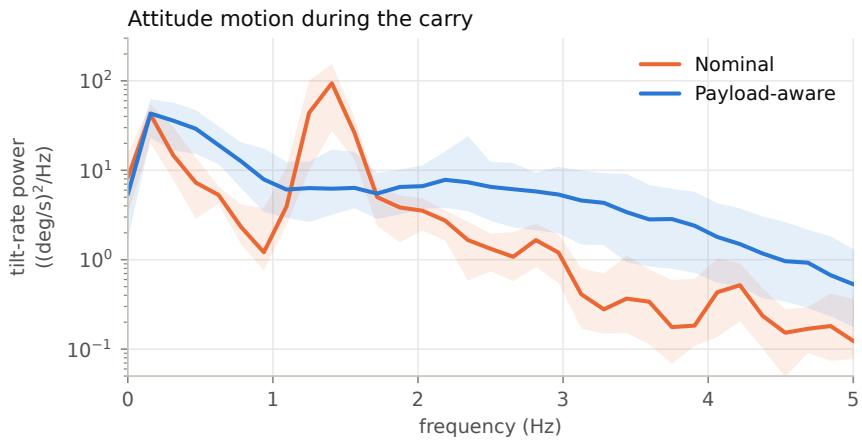  
Figure 13: Power spectral density (PSD) of airframe tilt rate during TidyHouse carries lasting at least 6.4 s (115 payload-aware and 101 nominal episodes). PSDs are estimated per episode using Welch’s method with 6.4 s segments sampled at 20 Hz. Solid lines show pointwise medians across episodes; shaded bands indicate the 25th–75th percentiles. Payload-aware control attenuates the pronounced nominal peak near 1.4 Hz, while exhibiting higher PSD over 2–5 Hz.

## A.5.3 FAILURE ANALYSIS

Motivation. Aggregate success rates do not reveal whether a policy fails during approach, produces a weak grasp that fails later, or releases an object in an unstable state. We therefore analyze failures at the object, mechanism, and skill-transition levels. Besides characterizing the benchmark beyond a single success metric, this analysis exposes actionable failure signatures for dataset users. In particular, it can guide class-balanced sampling and augmentation, contact-aware approach control, grasp-quality and handoff objectives, and stability-aware release strategies. The transition analysis is important because a policy may perform well from expert-generated initial states yet degrade when it receives states produced by another learned skill.

Protocol. We evaluate four held-out starts for each of 111 TIDYHOUSE and 110 PREPAREGRO-CERIES instances, giving 444 and 440 episodes, respectively. In the chained evaluation, the pick policy acts for at most 400 control steps, the same expert controller executes the planned transport route for at most 1200 steps, and the place policy takes control 0.5–1.0 m from the target for at most 1000 steps. Because transport is shared across all chains, differences in its outcome primarily reflect the state produced by the preceding pick. During transport, a grasp is considered maintained while both fingers exert more than 0.1 N on the object and the tool center point remains within 6 cm of the planned grasp point; four consecutive violations terminate the transport. For the mechanism-level analyses, a diagnostic rerun additionally records the speed at first finger contact, object rotation at the pick-to-transport handoff, and the condition under which the grasp is lost. The rerun covers all four starts per instance for PPO and one TIDYHOUSE or two PREPAREGROCERIES starts per instance for the expert. Each PPO skill is represented by one training run, so the results diagnose these policies rather than estimate variation across random seeds.

Errors propagate across learned skills (Fig. 14). After a successful expert or BC pick, transport fails in at most 0.9% of TIDYHOUSE episodes and in 12–13% of PREPAREGROCERIES episodes, where most failures are caused by the route planner. With a PPO grasp, the same transport fails in 16.7% and 30.3% of episodes, respectively; grasp loss alone accounts for 14.1% in both tasks. The grasp source also affects the next skill: the expert place policy drops from 92.3% to 79.4% in TIDYHOUSE and from 89.9% to 72.9% in PREPAREGROCERIES when expert grasps are replaced by PPO grasps. The corresponding PPO-place rates are 79.2% versus 69.9% in TIDYHOUSE, while they remain similar in PREPAREGROCERIES (90.6% versus 93.0%). These results show that evaluating each skill only from expert-generated states can overestimate end-to-end performance; training and evaluation should also include policy-induced handoff states.

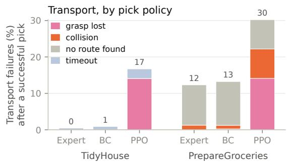

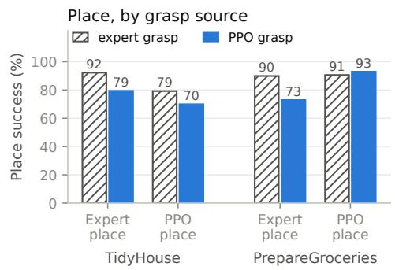  
Figure 14: Error propagation across skill boundaries. (a) Failure rate of the shared expert transport after a successful pick, grouped by the policy that produced the grasp and by failure cause. (b) Place success conditioned on successful transport, separated by place policy and grasp source. For PRE-PAREGROCERIES, the expert-grasp result for PPO place is taken from the held-out place evaluation, whose initial states are generated by expert transport.

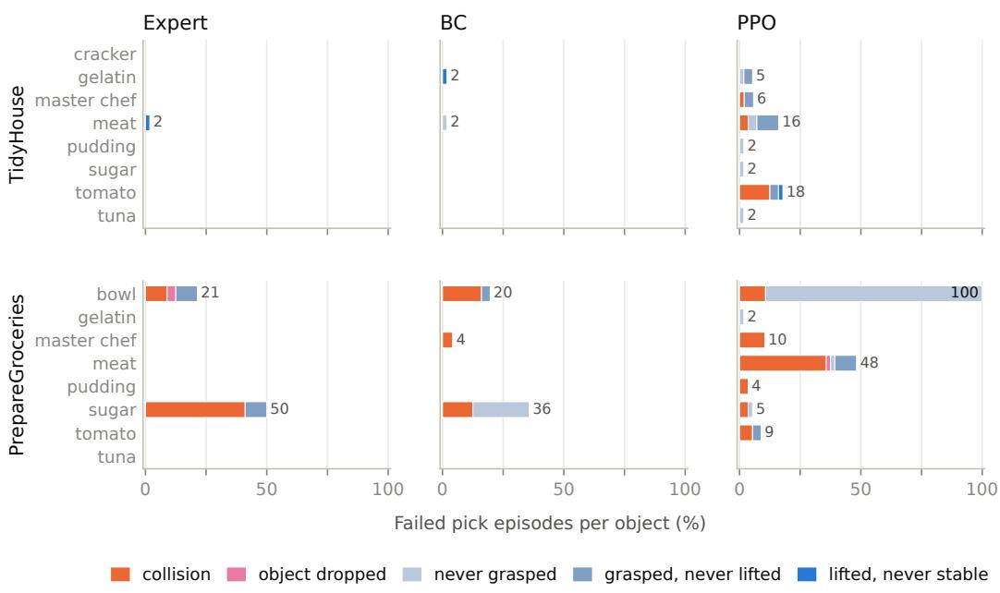  
Figure 15: Pick-failure rate for each object class on held-out starts, grouped by policy and failure mode. Percentages are computed within each class. Timeout cases are categorized by the last stage reached: never grasped, grasped but never lifted, or lifted but never stabilized.

Pick failures are object dependent (Fig. 15). Failures are concentrated in a small number of classes rather than distributed uniformly. In PREPAREGROCERIES, PPO fails on every bowl episode and on 48% of potted-meat episodes, whereas no other class exceeds 11%. The expert and BC also struggle with bowls (21% and 20%) and sugar boxes (50% and 36%), but for different failure modes. In TIDYHOUSE, PPO’s largest failure rates occur for tomato cans (18%) and potted-meat cans (16%). This concentration motivates per-class reporting and object-balanced sampling; aggregate success alone would hide both rare hard classes and policy-specific weaknesses.

Moving releases reduce placement stability (Fig. 16). The expert and BC nearly stop before opening the jaws, with median release speeds of 0.0016–0.0025 m/s and 0.0034–0.0051 m/s, respectively. PPO instead releases at 0.20–0.25 m/s. This behavior is often sufficient for squat objects but is brittle for tall or heavy objects: in TIDYHOUSE, cracker and sugar boxes topple after release in 57% and 43% of episodes, while in PREPAREGROCERIES, potted-meat and tomato cans are dropped in 43% and 13% of episodes. A stop-before-release constraint or an explicit post-release stability objective would directly target this failure mode.

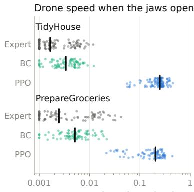  
Drone speed at release (m/s)

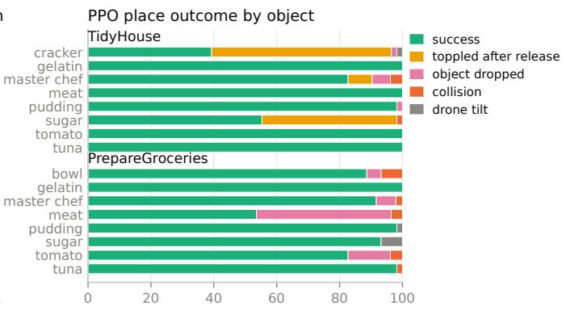  
PPO place episodes (%)

Figure 16: Placement behavior. (a) Drone speed when the jaws open on the first held-out start of each instance; each dot is one episode and the vertical bar is the median. (b) PPO place outcomes by object class over all held-out place starts. “Toppled after release” denotes an object that was released and followed by retreat but did not come to rest upright inside the goal region.  
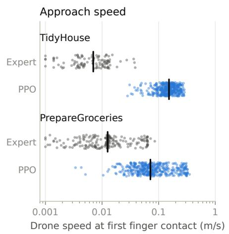

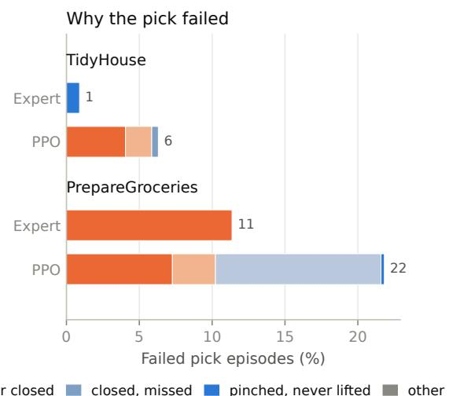  
Figure 17: Pick mechanisms in the diagnostic rerun. (a) Drone speed at first finger contact; the vertical bar is the median. (b) Failed pick episodes grouped by mechanism. “Knocked the object” means that the object moved more than 3 cm or rotated more than 20◦ before being grasped; “hit the scene” denotes a collision while the object was undisturbed.

Fast approaches and missed closure dominate PPO pick failures (Fig. 17). At first finger contact, PPO’s median speed is 0.152 m/s in TIDYHOUSE and 0.072 m/s in PREPAREGROCERIES, compared with 0.0070 m/s and 0.0126 m/s for the expert. Consequently, PPO frequently pushes or tips the object before closing the jaws, accounting for 4.1% and 6.4% of all episodes. A separate PRE-PAREGROCERIES failure occurs in 11.4% of episodes: PPO reaches the planned grasp pose but never closes the gripper, including 48 bowl episodes. The expert can grasp the same bowls, indicating an exploration or action-selection failure rather than a geometric impossibility. These observations motivate approach deceleration, contact-aware control, and explicit supervision or exploration for gripper closure and rim grasps.

Handoff rotation predicts transport failure (Fig. 18). Objects picked by the expert rotate by a median of 1.3◦ in TIDYHOUSE and 0.9◦ in PREPAREGROCERIES; the PPO medians rise to 6.4◦ and 5.1◦. No grasp with less than 2◦ of handoff rotation is lost, whereas the loss rate reaches 24% in TIDYHOUSE and 48% in PREPAREGROCERIES above 16◦. The mechanism differs across tasks: 63% of PPO losses in PREPAREGROCERIES are physical slips, while 66% in TIDYHOUSE remain pinched but move beyond the 6 cm tolerance around the planned grasp point. Handoff orientation and grasp-point deviation are therefore useful training targets and diagnostics, not merely auxiliary metrics.

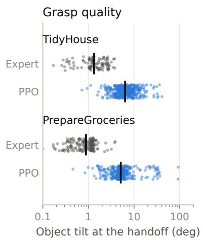

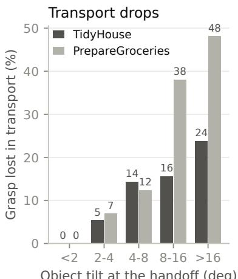  
Object tilt at the handoff (deg)

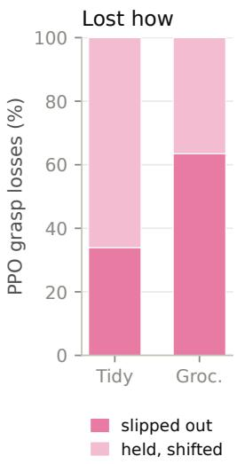  
Figure 18: Grasp quality and transport robustness. (a) Object rotation relative to its pre-pick orientation at the pick-to-transport handoff; the vertical bar is the median. (b) Grasp-loss rate during expert transport as a function of handoff rotation, pooling expert and PPO picks. (c) Mechanisms of PPO grasp loss. Bowls are excluded because their planned rim grasp rotates them by design.

## A.6 EXPERIMENTAL IMPLEMENTATION

Figure 19 summarizes the overall design of AeroManip-VLA. The benchmark integrates simulation, automated data generation, task construction, and systematic evaluation within a unified pipeline. Manipulation trajectories are generated using privileged hybrid experts and reinforcement learning controllers, and are recorded with synchronized multi-view RGB-D observations, robot states, actions, task annotations, and provenance metadata. The resulting task suite spans both short-horizon manipulation and long-horizon navigation–manipulation compositions. Finally, each trajectory is validated through physical execution, collision checking, task-completion criteria, and temporal consistency checks before being used for IL, RL, or VLA training and evaluation.

## A.6.1 ROBOT PLATFORMS

AeroManip-VLA supports two aerial manipulation platforms with different gripper configurations (Fig. 20). The first carries a downward-facing gripper beneath the airframe, while the second uses a forward-reaching, arm-mounted gripper. Both platforms share the PX4 X500 airframe, flight-control interface, and simulation setup.

Both platforms have a rotor arm length of 0.174 m and a rotor-disk radius of 0.147 m, and are simulated in ManiSkill/SAPIEN with physics at 240 Hz and control at 20 Hz. The shared flight interface accepts world-frame linear velocity and yaw-rate commands, bounded by 0.6 m/s and 1 rad/s, respectively. A PI velocity controller computes a desired acceleration, from which the desired thrust and attitude are determined. A geometric PD attitude controller then computes the desired body torque. The thrust and torque commands are allocated to individual rotors subject to per-rotor saturation, and the resulting net force and torque are applied to the airframe. Each platform carries three onboard cameras providing 128 × 128 RGB-D observations. Table 3 summarizes the platform parameters.

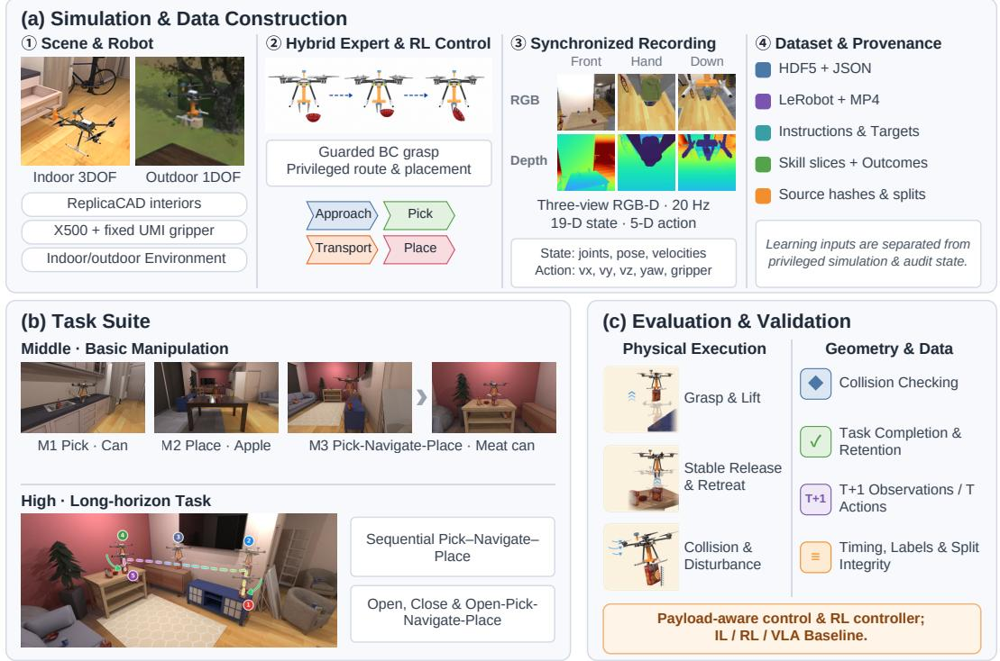  
Figure 19: Overview of AeroManip-VLA. (a) Simulation and data construction: indoor and outdoor aerial manipulation scenes are instantiated with X500-based platforms, while hybrid expert and RL policies generate manipulation behaviors that are synchronously recorded as multi-view RGB-D observations, robot states, actions, task annotations, and provenance metadata. (b) Task suite: the benchmark covers basic manipulation tasks, including PICK, PLACE, and PICK–NAVIGATE– PLACE, as well as long-horizon tasks such as sequential pick–navigate–place and OPEN–PICK– NAVIGATE–PLACE. (c) Evaluation and validation: trajectories are evaluated through physical execution criteria, collision and disturbance checks, task-completion validation, and temporal/dataintegrity checks, supporting IL, RL, and VLA baselines.

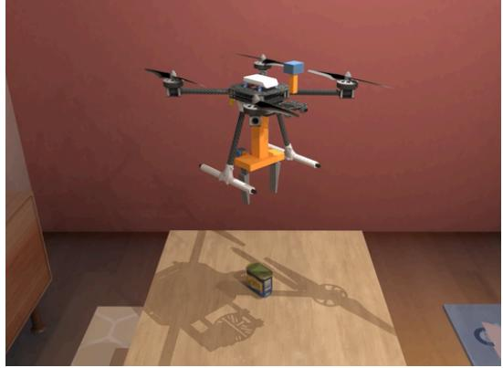

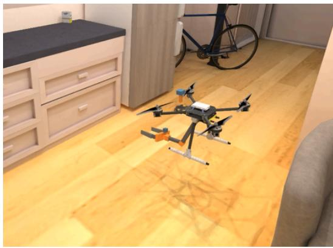  
Figure 20: Aerial manipulation platforms in AeroManip-VLA. Left: an X500-based platform with a downward-facing gripper mounted beneath the airframe. Right: an X500-based platform with a forward-reaching, arm-mounted gripper. Both platforms use the same flight-control interface and carry three onboard RGB-D cameras.

Gripper platform. A one-degree-of-freedom parallel gripper with the long UMI fingertips (Chi et al., 2024) is mounted rigidly below the airframe; the grasp point is 0.28 m below the airframe centre. The X500 mass and inertia are kept from the source model; the adapter (100 g), palm (80 g), cameras and mounts (80 g) and fingers (30 g each) are nominal values.

Table 3: Parameters of the two platforms. Both use the same airframe, flight interface and camera resolution; the right column lists only what the arm platform adds or changes.
<table><tr><td></td><td>Gripper platform</td><td>Arm platform</td></tr><tr><td>Total mass mo</td><td>2.38 kg</td><td>2.58 kg</td></tr><tr><td>Max thrust per rotor</td><td>8.55N</td><td>11.5N</td></tr><tr><td>Thrust-to-weight ratio</td><td>1.46</td><td>1.82</td></tr><tr><td>Manipulator</td><td>fixed 1-DOF gripper</td><td>3-DOF arm + 1-DOF gripper</td></tr><tr><td>Shoulder pitch</td><td></td><td>[−0.6, 1.9] rad, 3.0 N m</td></tr><tr><td>Elbow pitch</td><td></td><td>±2.6 rad, 0.9 N m</td></tr><tr><td>Wrist roll</td><td></td><td>±1.75 rad, 0.5 N m</td></tr><tr><td>Link lengths</td><td></td><td>0.22 m / 0.12 m / 0.12 m to grasp point</td></tr><tr><td>Grasp point (body frame)</td><td>0.28 m below centre</td><td>0.47 m ahead, 0.02 m below</td></tr><tr><td>Fingers</td><td>UMI long, 120 mm, 0–110 mm</td><td>same</td></tr><tr><td>Finger drive Hand camera</td><td>150 N/m, 5N per finger</td><td>1500 N/m, 15 N per finger</td></tr><tr><td>Down camera</td><td>below frame, looks down at jaw</td><td>on wrist, looks along fingers</td></tr><tr><td>Action dimension</td><td>under frame, looks down-forward</td><td>under right front, side view</td></tr><tr><td>Attitude gains  $k _ { p } / k _ { d }$ </td><td>4 flight + 1 gripper</td><td>4 flight + 3 arm + 1 gripper</td></tr><tr><td></td><td> $2 . 5 \ : \breve { / } 0 . 5 5$ </td><td> $6 / 1 \bar { . 0 }$ </td></tr><tr><td>Horizontal accel. limit</td><td> $3 \mathrm { m / s ^ { 2 } }$ </td><td> $4 . 5 \mathrm { m / s ^ { 2 } }$ </td></tr><tr><td>Velocity-integral limit</td><td> $2 \mathrm { m / s ^ { 2 } }$ </td><td> $4 \mathrm { m / s ^ { 2 } }$ </td></tr><tr><td>Extra flight terms</td><td></td><td>arm feedforward, yaw torque  $\leq 0 . 1 2 \mathrm { N } .$  m</td></tr><tr><td>Target subtasks</td><td>pick, place</td><td>open, close (fridge, counter drawer)</td></tr></table>

Arm platform. Handles on vertical surfaces lie outside the reach of the gripper platform, because its rotor disks extend 0.32 m beyond the grasp point in every horizontal direction. The arm platform removes the gripper mount and adds a three-degree-of-freedom arm under the frame: shoulder pitch and elbow pitch about the body y axis, then wrist roll about the forearm. The shoulder axis is 2 cm forward of and 4.5 cm below the airframe centre. In the working pose (upper arm pitched up 0.12 rad, forearm level) the grasp point is 0.47 m ahead of and 2 cm below the centre. At zero roll the fingers close horizontally, which fits the 50 mm-wide vertical bar on the fridge door; at 90° they close vertically, which fits the 24 mm-tall drawer handle.

Three parameters differ from the gripper platform, and each is set by a measured requirement. Starting the fridge door moving takes about 7 N at the handle, and the drawer about 2.5 N. With the gripper platform’s finger drive (150 N/m) a pinch on these handles reaches only 2–4 N, so the finger drive is raised to 1500 N/m with a 15 N limit per finger. With the stock rotors (8.55 N) the vehicle saturates at the $2 0 { - } 2 5 ^ { \circ }$ tilt it needs to pull the door, so the motors are upgraded to 11.5 N per rotor (a nominal 150 g added at the motor mounts). The flight loop adds a feedforward torque that cancels the arm’s weight moment about the airframe centre of mass (about 0.7 N m with the arm extended). It also uses stiffer attitude gains, a higher horizontal acceleration limit, and a 0.12 N m limit on yaw torque: a grasped door sets the heading, and an unlimited yaw error would saturate all four rotors.

Contact mode. A two-finger pinch on a bar acts as a hinge about the finger-closing axis, 0.47 m ahead of the centre of mass. With a stiff shoulder, the vehicle can only tilt to generate the pulling force by swinging about that hinge. While a handle is pinched, the shoulder servo is therefore set to zero torque and the arm feedforward is disabled; the arm then acts as a strut that transmits force at the shoulder. On release, the shoulder is stiffened again and the velocity integrator is reset.

Modelling assumptions. Arm link masses (0.17 kg in total, plus an 82 g shoulder servo) and joint torque limits are nominal hobby-servo figures, not measurements of a built arm. Links and contacts are rigid, with no flexible fingers, motor lag, propeller wash or ground effect.

## A.7 TRAJECTORY ANNOTATION AND OUTCOME CATEGORIZATION

We characterize trajectory outcomes using simulator-derived progress indicators, failure flags, and task-specific completion checks. Tables 4–7 summarize the diagnostic modes used for aerial PICK, PLACE, OPEN, and CLOSE. Within each table, the first satisfied row determines the primary reported

Table 4: Outcome categories for PICK. c denotes the recorded primary failure cause.
<table><tr><td>Mode</td><td>Definition</td></tr><tr><td>Successful grasp handoff</td><td>S: the Pick completion condition is satisfied.</td></tr><tr><td>Collision failure</td><td> $F$  and  $c = { \tt c o l l i s i o n \mathrm { : } }$  the UAV makes unintended contact with non- target scene geometry during execution.</td></tr><tr><td>Object-drop failure</td><td> $F$  and  $c = \mathtt { f a i l \_ o b j e c t \_ d r o p : }$  the object violates the minimum-height condition.</td></tr><tr><td>Flight-envelope failure</td><td> $F$  and  $c \in \{ \mathtt { a i l \_ t i l t } , \mathtt { f a i l \_ l o w } , \mathtt { f a i l \_ h i g h } \}$  : the UAV exceeds the allowed attitude or altitude envelope, corresponding to excessive tilt, altitude below the lower bound, or altitude above the upper bound, respec- tively.</td></tr><tr><td>Other failure</td><td> $F$  with any remaining cause, including workspace violations or unclassified failures.</td></tr><tr><td>No-grasp truncation</td><td> $T$  and  $t _ { g } = \infty \colon$  no grasp is observed before timeout.</td></tr><tr><td>Grasp-without-lift truncation</td><td> $T , t _ { g } < \infty ,$  and  $t _ { l } = \infty \colon \mathrm { a }$  grasp is observed, but the lift threshold is never reached.</td></tr><tr><td>Incomplete-handoff truncation</td><td> $T , t _ { g } < \infty ,$  and  $t _ { l } < \infty \colon$  grasp and lift are observed, but the final handoff condition is not completed.</td></tr></table>

mode, while all underlying diagnostic signals are retained. Initialization failures and infeasible starts are recorded separately from executed skill trajectories.

Pick/Place Outcome Semantics and Completion Checks. For PICK and PLACE, S, F, and T denote successful completion, physical failure, and time-limit truncation, respectively, while c denotes the recorded primary failure cause.

For any recorded binary event predicate $b _ { t } .$ , we define its first occurrence as

$$
t _ { b } = \operatorname* { m i n } \{ t : b _ { t } = 1 \} ,
$$

with $t _ { b } = \infty$ if the event is never observed.

For PICK, $t _ { g }$ and $t _ { l }$ denote the first grasp and lift events. For PLACE, $t _ { o } , t _ { d } , t _ { r } ,$ and $t _ { c }$ denote the first overhead-alignment, support-contact, release, and gripper-clearance events, respectively.

These event times are treated as independent observations rather than an assumed monotonic stage sequence. Time-limit truncations indicate incomplete execution and are not relabeled as physical failures.

A PICK succeeds when the object is grasped and maintained above its instance-specific lift threshold for the required consecutive control steps. A PLACE succeeds when the placement predicate is satisfied, the gripper is open, release has been registered, the gripper is more than 0.27 m from the object, and platform speed remains below $0 . 0 2 5 \mathrm { m } / \mathrm { s }$ for 20 consecutive control steps without a latched protocol failure. The placement predicate jointly evaluates the goal region, object stability, and support-contact or resting-height conditions.

Open/Close Outcome Semantics and Completion Checks. For OPEN and CLOSE, let $q$ denote the current articulation position, with limits $q _ { \mathrm { m i n } }$ and $q _ { \mathrm { m a x } }$ . We define the normalized articulation progress as

$$
\bar { q } = \frac { q - q _ { \operatorname* { m i n } } } { q _ { \operatorname* { m a x } } - q _ { \operatorname* { m i n } } } .
$$

Opening requires $\bar { q } \geq \alpha _ { a }$ , where $\alpha _ { a }$ denotes the articulation-specific opening threshold (0.75 for the refrigerator and $0 . 9 0$ for the kitchen-counter drawer), while closing requires $\bar { q } \le 0 . 0 1$

Let p denote the terminal execution phase. We use the binary checks $J , R , A , V , N$ , and C to denote articulation-goal attainment, handle release, arm retraction, platform stability, absence of airframe contact, and geometric clearance, respectively. The overall articulation success indicator is

$$
S _ { \mathrm { a r t } } = J \wedge R \wedge A \wedge V \wedge N \wedge C \wedge [ p = \mathrm { d o n e } ] .
$$

Table 5: Outcome categories for PLACE, defined from recorded progress events and task-specific failure signals.
<table><tr><td>Mode</td><td>Definition</td></tr><tr><td>Successful placement</td><td>S: placement, release, clearance, and sustained platform stability satisfy the protocol.</td></tr><tr><td>Collision-budget failure</td><td> $F$  with primary cause  $\mathtt { f a i l \_ c o l l i s i o n \_ f o r c e : }$  the accumulated collision-force score exceeds its configured budget.</td></tr><tr><td>Flight-envelope failure</td><td> $F$  withprimary cause fail_tilt, fail_low, or fail_high.</td></tr><tr><td>Workspace failure</td><td> $F$  with primary cause fail_workspace: the UAV position violates the predefined workspace boundary during execution.</td></tr><tr><td>Object-drop failure</td><td> $F$  with primary cause fail_object_drop: object height falls below the floor or support-relative threshold.</td></tr><tr><td>Unsupported-release failure</td><td> $F$  with primary cause fail_unsupported_release: grasp loss per- sists for the configured duration without sufficient support evidence and precedes an accepted release.</td></tr><tr><td>Other failure</td><td> $F$  with any remaining cause, including non-finite policy features.</td></tr><tr><td>No-alignment truncation</td><td> $T$  and  $t _ { o } = \infty \colon$  the object never enters the horizontal alignment tolerance.</td></tr><tr><td>No-support truncation</td><td> $T , t _ { o } < \infty ,$  and  $t _ { d } = \infty \colon$  alignment is observed, but support contact inside the goal region is not.</td></tr><tr><td>No-release truncation Incomplete-completion trunca-</td><td> $T , t _ { o } , t _ { d } < \infty ,$  and  $t _ { r } = \infty \colon$  the release event is not observed. Remaining T cases in which the observed events do not satisfy the complete placement, clearance, and stability conditions.</td></tr></table>

Table 6: Outcome categories for OPEN, based on articulation progress, completion checks, and recorded execution phases.
<table><tr><td>Mode</td><td>Definition</td></tr><tr><td>Successful opening</td><td> $S _ { \mathrm { a r t } } { \mathrm { : } }$  the opening threshold and all completion checks are satisfied.</td></tr><tr><td>Airframe-contact failure</td><td> $\neg N :$  at least one airframe contact is recorded.</td></tr><tr><td>Clearance-check failure</td><td> $\lnot C :$  the minimum sampled geometric clearance is below 0.03 m.</td></tr><tr><td>Handle-approach failure</td><td> $p = \mathtt { f a i l }$  _insert: the approach stage fails to satisfy its target condition within the phase limit.</td></tr><tr><td>Handle-pinch failure</td><td> $p = \mathtt { f a i l \mathrm { - } p i }$  nch: the required finger-contact condition is not satisfied.</td></tr><tr><td>Handle-slip failure</td><td> $p = \mathtt { f a i l \_ s l i p } \mathtt { : }$  handle contact is lost before the opening goal is reached.</td></tr><tr><td>Opening-drive failure</td><td> $p = \mathtt { f a i l \_ d r i v e } \colon$  the drive phase exceeds its time limit before satisfying its transition condition.</td></tr><tr><td>Opening-goal unmet</td><td> $\neg J \colon$  the final articulation position does not satisfy  $\bar { q } \geq \alpha _ { a } .$ </td></tr><tr><td>Handle-release incomplete</td><td> $\neg R :$  the terminal release condition is not satisfied.</td></tr><tr><td>Arm-retraction incomplete</td><td> $\neg A :$  the arm does not return to the prescribed rest pose.</td></tr><tr><td>Platform-settling incomplete</td><td> $\neg V :$  terminal linear or angular velocity exceeds the stability threshold.</td></tr><tr><td>Execution incomplete</td><td>Remaining unsuccessful cases with p ≠ done.</td></tr></table>

Here, $S _ { \mathrm { a r t } }$ denotes successful completion of the articulated manipulation skill.

Arm retraction requires a maximum joint deviation below 0.05 rad from the prescribed rest pose. Platform stability requires linear speed below 0.05 m/s and angular speed below 0.2 rad/s. The release condition is satisfied when the two fingers no longer both exceed the 0.1 N contact-force threshold. The clearance check requires a minimum sampled distance of 0.03 m between the robot geometry, excluding the fingers, and the monitored furniture geometry throughout the rollout.

Demonstration Selection and Skill Attribution. The recorded modes support task-specific demonstration selection and structured analysis of unsuccessful executions. Failed and truncated trajectories can be retained together with successful demonstrations, depending on the export configuration.

Table 7: Outcome categories for CLOSE, using the closing threshold and the same completion and safety checks as OPEN.
<table><tr><td>Mode</td><td>Definition</td></tr><tr><td>Successful closing</td><td> $S _ { \mathrm { a r t } } { \mathrm { : } }$  the closing threshold and all completion checks are satisfied.</td></tr><tr><td>Airframe-contact failure</td><td> $\neg N :$  at least one airframe contact is recorded.</td></tr><tr><td>Clearance-check failure</td><td> $\lnot C :$  the minimum sampled geometric clearance is below 0.03 m.</td></tr><tr><td>Handle-approach failure</td><td> $p = \mathtt { f a i l \_ i n s e r t : }$  the approach stage fails to satisfy its target condition within the phase limit.</td></tr><tr><td>Handle-pinch failure</td><td> $p = \mathtt { f a i l \_ p i n c h : }$  the required finger-contact condition is not satisfied.</td></tr><tr><td>Handle-slip failure</td><td> $p = \mathtt { f a i l \_ s l i p } \mathtt { : }$  handle contact is lost before the closing goal is reached.</td></tr><tr><td>Closing-drive failure</td><td> $p = \mathtt { f a i l \_ d r i v e } \colon$  the drive phase exceeds its time limit before satisfying its transition condition.</td></tr><tr><td>Closing-goal unmet</td><td> $\neg J \colon$  the final articulation position does not satisfy  $\bar { q } \le 0 . 0 1$ </td></tr><tr><td>Handle-release incomplete</td><td>¬R: the terminal release condition is not satisfied.</td></tr><tr><td>Arm-retraction incomplete</td><td> $\neg A :$  the arm does not return to the prescribed rest pose.</td></tr><tr><td>Platform-settling incomplete</td><td> $\neg V :$  terminal linear or angular velocity exceeds the stability threshold.</td></tr><tr><td>Execution incomplete</td><td>Remaining unsuccessful cases with p ≠ done.</td></tr></table>

For segmented trajectories, skill-level labels are stored separately from the diagnostics of the original parent rollout. A completed skill therefore remains valid if a later stage fails, while concurrent physical failures are preserved as failures. Place segments are additionally required to begin from an eligible held state outside the destination support region.