# AS2D: ACCELERATING ON-DEMAND AUDIO UNDERSTANDING ON MOBILE DEVICES

Yunzhe Li1 Kyoungjun Park1 Hongzi Zhu2 Lili Qiu1 1The University of Texas at Austin 2Shanghai Jiao Tong University yunzhe.li.cs@gmail.com

## ABSTRACT

Speculative decoding accelerates autoregressive generation by using a smaller drafter to propose tokens for batched verification by a larger target. However, conventional speculative decoding couples drafting to the target’s evolving verified prefix, serializing drafting and verification. We ask whether this dependency is necessary for source-conditioned generation. Our key observation is that, for audio language models, the input audio and user request can provide useful speculative candidates without following the target’s evolving text prefix. Based on this observation, we propose AS2D (Audio Speculative Speculative Decoding), which enables target-decoupled drafting: an audio-conditioned drafter follows its own generation history while the target independently verifies and corrects ready candidates. Without usable candidates, the target advances alone. Thus, target feedback determines which candidates are committed but no longer determines when the drafter can make progress, enabling drafting and verification to proceed concurrently while retaining target-side verification and correction. We implement AS2D in MNN for Android and evaluate two target models across four phones, seven datasets, and three tasks covering 12.2 hours of audio. Across four phones, AS2D improves pooled ASR throughput by 42–76% over target-only decoding, while only 5.7% of evaluation windows are slower than target-only, compared with 58.1–63.0% for speculative baselines. For ASR, AS2D reaches 97.33–98.20% of a hindsight per-window oracle’s pooled throughput over the evaluated drafter/budget catalog. Native on-demand execution with a 7B target achieves up to 78% higher throughput than target-only. These results show that source-conditioned audio generation can relax the conventional dependence of speculative drafting on the target’s evolving output prefix, exposing substantial parallelism for efficient inference.

## 1 INTRODUCTION

Autoregressive generation is inherently sequential: each output token depends on the preceding output prefix, making decoding a major bottleneck for language-model inference. Speculative decoding reduces this bottleneck by using a smaller drafter to propose multiple tokens that a larger target verifies in parallel, substantially accelerating generation while preserving the target distribution (Leviathan et al., 2023). However, conventional speculative decoding retains another sequential dependency: after each verification round, the drafter conditions on the target’s accepted or corrected prefix before preparing its next proposal. Drafting and verification therefore remain coupled through the target’s evolving autoregressive trajectory.

We ask whether this dependency is always necessary. We study this question in audio language models, where the input audio itself provides a rich source of information about future output tokens. One might instead transcribe the audio and apply a text language model, but transcription can discard information carried by the original signal, including intonation, stress, and emotional cues (Wang et al., 2025). Modern audio language models therefore operate directly on audio to support tasks such as transcription, translation, and question answering (Xu et al., 2025b). Because these outputs are grounded in a shared audio source, a drafter may be able to anticipate useful future tokens from the audio and instruction without waiting for the target’s latest verified prefix.

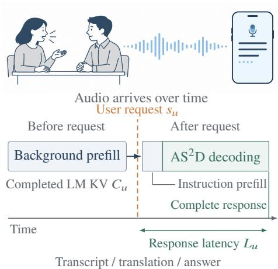

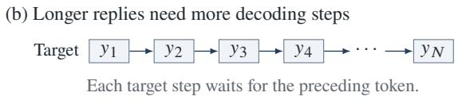

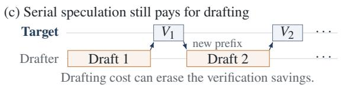

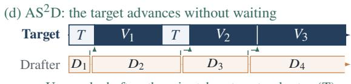  
Figure 1: $\mathbf { A } \mathbf { s } ^ { 2 } \mathbf { D }$ overlaps drafting and verification for on-demand audio understanding. (a) Background audio prefill prepares LM KV before the request. Response latency includes instruction prefill, decoding, and any residual audio preparation. (b) Longer replies require more sequential target steps. (c) Batched verification saves target work, but serial drafting can consume those savings on a phone. (d) $\mathbf { A } \mathbf { S } ^ { 2 } \mathbf { D }$ keeps the target advancing: it verifies ready candidates $( V _ { i } )$ or takes a target-only step (T) without waiting for drafting. Audio-based drafting $( D _ { i } )$ runs alongside, independent of the latest verified prefix. Dashed arrows supply ready candidates at target boundaries. The target determines committed tokens. Decoding timelines are schematic and start after the request.

We investigate this opportunity in on-demand audio understanding, where users request transcripts, translations, or answers about previously received audio, supporting voice assistants and wearable memory aids (Zulfikar et al., 2024; OpenBMB, 2025; Hegde et al., 2026). In this setting, audio can be prefilled before the request (OpenBMB, 2025; Sun et al., 2026), removing much of the audio processing from the request-time critical path. Response generation, however, remains autoregressive: longer replies require more sequential decoding steps (Figure 1(a–b)). The problem is particularly acute for local execution on phones, where model weights, retained audio state, and runtime buffers must fit mobile memory while generation operates within limited compute (He et al., 2019; Orhon et al., 2025). We seek lower request-time latency and resource cost while preserving target outputs.

Conventional speculative decoding does not fully address this challenge. On phones, serial drafting can consume much of the savings from batched verification (Figure 1(c)), as illustrated by WhisperKit’s omission of speculation from its final Large v3 Turbo configuration (Orhon et al., 2025). Asynchronous methods overlap drafting and verification by parallelizing target execution, as in Distributed Speculative Inference (DSI), or preparing continuations for predicted verification outcomes, as in Speculative Speculative Decoding (SSD) (Timor et al., 2025; Kumar et al., 2026). These methods are studied in multi-GPU server settings. On a single phone, their additional computation and speculative state compete with verification for limited resources on heterogeneous processors.

Our key observation is that, for source-conditioned audio generation, drafting need not always follow the target’s evolving text prefix. Audio and the instruction can directly supply useful candidates while the target continues along its own autoregressive trajectory. A controlled ASR study supports this premise: removing preceding reference-transcript context leaves draft acceptance unchanged in 72.3% of 480 paired proposal blocks, with a median acceptance change of zero.

To exploit this property, we propose $\mathbf { A } \mathbf { S } ^ { 2 } \mathbf { D }$ (Audio Speculative Speculative Decoding), built on target-decoupled drafting to remove this verifier-to-drafter synchronization dependency for sourceconditioned audio generation. An autoregressive drafter follows its own generation history without synchronizing its state to the target’s accepted or corrected prefix. Meanwhile, the target advances along the authoritative output trajectory, verifying aligned candidates when available and decoding alone when none is usable. Thus, target feedback determines which candidates are committed, but no longer determines when the drafter can make progress. This decoupling lets candidate generation and target verification proceed concurrently across the phone’s heterogeneous processors (Figure 1(d)).

No separate continuations are prepared for alternative verification outcomes, and the target retains its context and determines the committed output.

We implement $\mathbf { A } \mathbf { S } ^ { 2 } \mathbf { D }$ in MNN for Android (Jiang et al., 2020) and evaluate two target LLMs, Qwen3-ASR-1.7B (Shi et al., 2026) and Qwen2.5-Omni-7B (Xu et al., 2025b). The study spans four phones, seven datasets, and three task types: speech recognition (Panayotov et al., 2015; Carletta et al., 2006; Conneau et al., 2022; Tang et al., 2021; Zhang et al., 2022), translation (Wang et al., 2021), and spoken question answering (Lee et al., 2018). The corpus evaluation includes 928 task requests over 913 distinct audio inputs of 1.6–75.2s, totaling 12.2 hours of audio and 97,953 output tokens. Across four phones, $\mathrm { A S } ^ { 2 } \bar { \mathrm { D } }$ improves pooled ASR throughput by 42–76% over target-only decoding. Only $5 . 7 \%$ of its evaluation windows are slower than target-only, versus 58.1–63.0% for the speculative baselines (Table 4), and improvements over the strongest speculative baseline reach 114.6% (Table 1). $\mathbf { A } \mathbf { S } ^ { 2 } \mathbf { D }$ reaches 97.33–98.20% of a hindsight per-window oracle’s pooled TPS over the evaluated drafter/budget catalog. Our native 7B deployment processes a 10-minute audio stream in real time (Appendix D.6.2) and delivers up to 78% higher TPS than target-only for on-demand audio understanding (Figure 7).

Our contributions are threefold: (1) We identify a target-prefix synchronization dependency in conventional speculative decoding and show that source-conditioned audio generation can relax this dependency: useful candidates can often be generated without observing the target’s evolving verified prefix. (2) We introduce target-decoupled drafting and design $\mathrm { A } s ^ { 2 } \mathrm { D }$ , which allows the drafter and target to advance concurrently while retaining target-side verification and correction. (3) We implement $\mathbf { A } \mathbf { S } ^ { 2 } \mathbf { D }$ on Android and evaluate it across two target models, four phones, seven datasets, and three audio-language tasks, demonstrating substantial and robust decoding acceleration in both phone-profile replay and native execution.

## 2 RELATED WORK

On-demand audio understanding. MiniCPM-o 2.6 supports continuous audio input independently of user queries and separates language-model prefill from response generation (OpenBMB, 2025). OmniMem compresses cached audio-visual memory to retain context for later queries (Sun et al., 2026). These methods retain prepared source context but leave sequential decoding on the response path. We complement them by accelerating responses under mobile resource constraints.

Speculative speech decoding. WhisperKit omits speculation from its final Large v3 Turbo configu ration because of drafter overhead (Orhon et al., 2025). SpecASR exploits acoustic alignment through adaptive draft lengths, draft recycling, and sparse trees, while regenerating drafts from verified text (Wei et al., 2025). We build on its local candidate reuse, but let the audio-conditioned producer advance independently of target-prefix updates. Whisper-Medusa adds prediction heads, and CTC encoder drafts provide acoustic candidates. Their acceptance rules can change the target’s greedy output (Segal-Feldman et al., 2025; Saon et al., 2026). $\mathrm { A } \bar { \mathrm { s } } ^ { 2 } \mathrm { D }$ retains target verification and correction across recognition, translation, and question answering.

Asynchronous and mobile execution. PEARL uses pre- and post-verification to overlap drafting and verification (Liu et al., 2025). DSI orchestrates parallel target and drafter instances (Timor et al., 2025), while SSD caches continuations for predicted verification outcomes on separate server GPUs (Kumar et al., 2026). These methods retain dependencies on verified or hypothesized targettext prefixes. AHASD addresses mobile asynchronous speculation through a custom NPU–PIM architecture, using target feedback to confirm or roll back drafts (Ma et al., 2026). On a single phone, extra computation and speculative state compete with verification for limited resources. Assigning verification to the processor best suited to it can leave prefix maintenance on a slower processor. $\mathrm { A } \mathrm { S } ^ { 2 } \mathrm { D }$ instead uses audio and the instruction to supply target-decoupled candidates on available phone processors, without preparing continuations for hypothetical target outcomes. It still verifies, corrects, and aligns candidates. Appendix E covers additional execution and configuration methods.

## 3 PROBLEM FORMULATION

Notation. Let x denote the incoming audio stream and T the target model. Request u arrives at time $s _ { u }$ with instruction $p _ { u }$ for an audio view $x _ { u }$ selected from $x _ { \leq s _ { u } }$ by protocol S. Its input ${ z _ { u } } = ( { x _ { u } } , { p _ { u } } )$ stays fixed during generation. $C _ { u }$ is the completed target language-model KV state prepared from $x _ { u } . s$ fixes audio preparation, prompt construction, state handling, and termination.

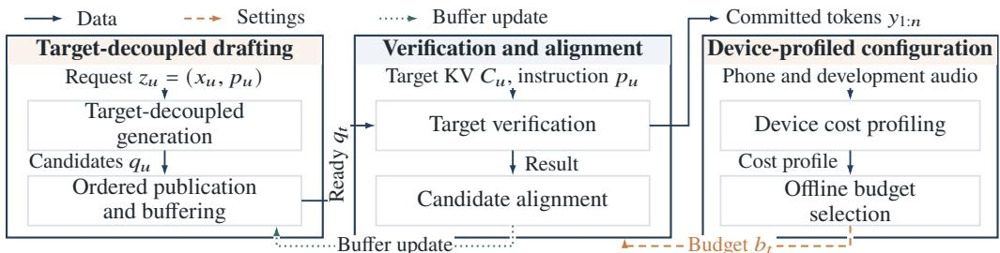  
Figure 2: $\mathbf { A } \mathbf { s } ^ { 2 } \mathbf { D }$ decouples candidate generation from target verification. Request $\boldsymbol { z } _ { u } = ( x _ { u } , p _ { u } )$ supplies fixed audio and an instruction to target-decoupled drafting. Verification and alignment processes $p _ { u }$ using retained target $\operatorname { K V } C _ { u }$ . The target verifies ready candidates or decodes alone while the producer continues independently. Alignment updates the buffer. Device-profiled configuration combines measured phone costs with development traces to select a fixed budget for the given drafter.

A decoding scheme A specifies candidate generation, verification, and scheduling under fixed deployment settings. Let $\bar { Y } _ { \mathcal { A } } ( z _ { u } ; S )$ and $Y _ { T } ( z _ { u } ; S )$ denote its output and the greedy-target reference. For completion time $f _ { u } ^ { \mathcal { A } }$ , response latency is $\begin{array} { r } { L _ { u } ^ { \mathcal { A } } = f _ { u } ^ { \mathcal { A } } - s _ { u } , } \end{array}$ including all work after request arrival. Let A be the set of schemes respecting input availability, candidate readiness, task/backend support, output limits, and accepted-prefix state restoration.

Let $m _ { \mathcal { A } } ( v )$ denote resident model, cache, and buffer memory at wall-clock time v, with memory budget $M _ { \mathrm { m a x } } . \mathrm { ~ } Q _ { \alpha }$ denotes the α-quantile of request latency, with optional limit $L _ { \mathrm { m a x } }$

On-demand audio language model inference problem. For a fixed phone and request distribution, we choose ${ \mathcal { A } } \in { \mathfrak { A } }$ to minimize mean response latency $\mathbb { E } [ L _ { u } ^ { \mathcal { A } } ]$ while preserving the target’s output. The scheme must satisfy $m _ { \mathcal { A } } ( v ) \leq M _ { \mathrm { m a x } }$ at all times and, when required, the tail-latency constraint $Q _ { \alpha } ( L _ { u } ^ { A } ) \leq L _ { \operatorname* { m a x } }$ . Post-prefill throughput isolates decoding. Appendix A details the protocol.

## 4 DESIGN OF $\mathrm { A } \mathrm { s } ^ { 2 } \mathrm { D }$

Our core idea is to generate audio-conditioned candidates independently of target-prefix updates, allowing drafting and target verification to run concurrently (Figure 2). At request time, Targetdecoupled drafting publishes candidates to a buffer, and Verification and alignment consumes ready blocks to produce committed tokens. Alignment feedback updates only the buffer cursor, allowing the producer to continue independently. If no candidate is usable, the target decodes alone. Deviceprofiled configuration supplies the budget chosen before execution.

In Target-decoupled drafting, Target-decoupled generation maps the request input $\boldsymbol { z } _ { u } = ( x _ { u } , p _ { u } )$ to candidate tokens $q _ { u }$ using the fixed task-specific drafter. Ordered publication and buffering supplie a ready block $q _ { t }$ to the target at decoding boundary t. Verification and alignment begins with Target verification, which uses the existing audio KV $C _ { u } ,$ instruction $p _ { u } .$ , and committed context to check ready candidates and emit tokens $y _ { 1 : n }$ . Its result feeds Candidate alignment, which advances or repairs the buffer cursor to expose the next usable block. For Device-profiled configuration, Device cost profiling measures phone execution costs. Offline budget selection combines these costs with development audio to select the budget cap $b _ { t }$ supplied to target verification.

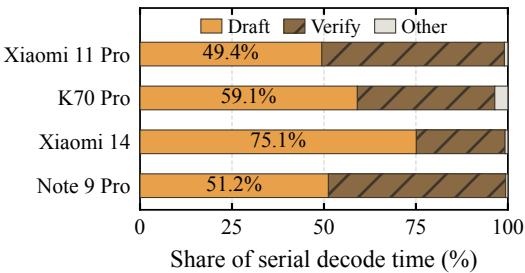  
(a) Native serial decoding cost

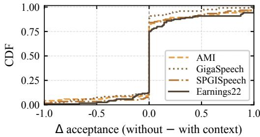  
(b) Sensitivity to text context  
Figure 3: Drafting is costly, yet need not wait for updated text. (a) Native serial SD pairs a CPU 0.6B drafter with an OpenCL 1.7B target. Time shares pool five runs per phone on one 59.5-second audio, with seven candidates per round. Drafting includes prefix catch-up. Loading and initial prefill are excluded. (b) We compare acceptance with and without preceding transcript context. The comparison uses 120 four-second blocks per corpus, a 32-token proposal cap, and identical verification context. Both panels use Qwen3-ASR. Appendix B.3 gives both protocols.

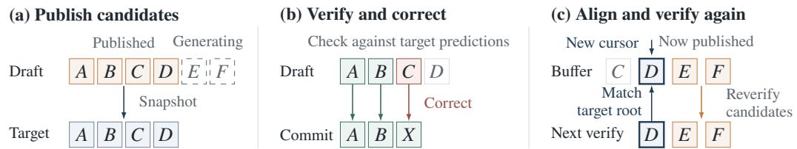  
Figure 4: $\mathbf { A } \mathbf { s } ^ { 2 } .$ D publishes, verifies, and reuses partial drafts. (a) Only published candidates enter verification. (b) The target accepts A $B ,$ , corrects C to X, and commits A B X. (c) The target’s next token D matches the buffer and supplies the root for verifying ready E F. The producer continues unchanged. The target verifies each reused candidate. Tokens and batch lengths are illustrative.

## 4.1 TARGET-DECOUPLED DRAFTING

Target-decoupled generation. Serial drafting adds substantial work before each verification. On one common audio window across four phones, it accounts for 49.4–75.1% of native serial SD decoding time (Figure 3(a)). To avoid serializing drafting with verification, we seek proposals that do not depend on its outcome. Our key observation is that the input audio already carries information about upcoming output tokens, allowing a drafter to make progress without the latest target text. In a controlled ASR probe, omitting preceding reference-transcript context leaves draft acceptance unchanged in 72.3% of 480 paired blocks, with a median change of zero (Figure 3(b)). Motivated by this observation, we generate candidates from the request audio and instruction independently of target-prefix updates. After the instruction is known, the fixed drafter is dispatched at $\tau _ { u } \geq s _ { u }$ and generates $q _ { u } = \mathrm { T o k } _ { T } ( G _ { \phi } ( x _ { u } , p _ { u } ) )$ , where $\mathrm { T o k } _ { T }$ converts proposals into the target vocabulary. An autoregressive drafter conditions on its own generated text, without reading target-text updates or target KV. It can therefore continue while the target verifies earlier candidates.

Ordered publication and buffering. The target needs partial drafts promptly, but its corrections must not interrupt ongoing generation. We connect the producer and target through an ordered token buffer. The producer publishes token batches as it generates them, leaving published tokens unchanged. In Figure 4(a), the target can check a published sequence A B C D while the producer generates E F . . .. Newly published tokens are available to later verification calls, without changing the candidates already being checked. If the target accepts A B but replaces C with X, the producer continues its own sequence. A separate read cursor tracks where to look for the next usable candidates. Candidate alignment updates this cursor without changing the producer’s text or model state. If no usable continuation is ready, the target decodes alone. Appendix C.1 gives the publication details.

## 4.2 VERIFICATION AND ALIGNMENT

Target verification. After processing instruction $p _ { u }$ using the retained audio KV $C _ { u }$ , the target checks up to $b _ { t }$ ready candidates under the committed prefix using standard greedy speculative verification (Leviathan et al., 2023). In Figure 4(b), it checks $A B C \bar { D }$ , agrees on $A B ,$ but predicts X instead of C. It therefore commits A B X. The alignment step then determines whether the uncommitted candidates can be reused. If no usable candidate is ready, the target decodes alone without waiting for the producer. Appendix C.2 gives the verification and KV repair details.

Candidate alignment. A rejected token need not invalidate the remaining draft. We use local token matching to recover reusable continuations (Wei et al., 2025). Figure 4(c) continues the example: the target next predicts D after committing A B X. We locate D near the current buffer position and move the read cursor to that match. The following E F . . . can then be verified under the updated target context as they become available. Full acceptance simply advances the cursor. If no match is found, the target continues decoding alone. Throughout this process, the producer keeps generating its own sequence. Appendix C.3 gives the bounded search rule.

## 4.3 DEVICE-PROFILED CONFIGURATION

Device cost profiling. Batching has a non-smooth per-token cost. Larger batches can be less efficient, with different penalties across phones. We profile target-reference token blocks on each phone and backend to isolate hardware efficiency before budget selection (Appendix B.2). We combine measured costs and concurrent slowdown with development traces to estimate decoding time, including correction, alignment, and producer drain.

Offline budget selection. Each task/model pairing uses a fixed drafter. Device profiles and development traces guide the budget choice within memory and backend constraints. This budget remains fixed throughout deployment; candidate readiness can still reduce the actual verification width. Appendix D.2 details development splits, retained configurations, calibration, and time accounting.

## 4.4 WHEN DOES TARGET-DECOUPLED DRAFTING HELP?

Target decoupling can hide drafting behind target execution, reducing the idealized cost from $D + V$ to max $\dot { \left[ { D , \bar { V } } \right) } \dot { + } H$ , where D, V, and H denote drafting, verification/decoding, and additional overhead, respectively. Drafting accounts for 49.4–75.1% of native serial SD time.

Speedup depends on three factors: (1) drafting cost, or how much work can be hidden; (2) candidate readiness, or whether candidates arrive before they are needed; and (3) useful candidate coverage, or how much target output they cover. Audio provides a favorable setting: removing preceding transcript context leaves acceptance unchanged in 72.3% of our ASR probes. High acceptance alone, however, is insufficient: spoken QA achieves 84.7% acceptance but only 28.3% candidate coverage, yielding an 8.0% throughput improvement over the strongest speculative baseline. Thus, $\mathrm { A S ^ { 2 } D }$ benefits most when drafting is costly and independent candidates are timely and sufficiently cover target output.

## 5 EVALUATION

RQ1: How much does ${ \mathsf { A } } { \mathsf { S } } ^ { 2 }$ D accelerate decoding across phones, models, and audio tasks? RQ2: Which components drive the gains? RQ3: Does $\mathrm { A } \bar { \mathrm { S } } ^ { 2 } .$ D accelerate native on-demand requests?

## 5.1 EXPERIMENTAL SETUP

Implementation. We implement $\mathbf { A } \mathbf { S } ^ { 2 } \mathbf { D }$ in MNN for Android (Jiang et al., 2020; Alibaba Group, 2026), with resident drafter/target models and separate KV caches. Redmi K70 Pro, Xiaomi 11 Pro, Xiaomi 14, and Redmi Note 9 Pro span Snapdragon 750G, 888, and 8 Gen 3 platforms (Qualcomm, 2026a;b; Xiaomi, 2026c), with heterogeneous CPUs, Adreno GPUs, and 7.1–14.8 GiB of OS-visible RAM. Our targets are Qwen3-ASR-1.7B and Qwen2.5-Omni-7B (Shi et al., 2026; Xu et al., 2025b). ASR pairs an OpenCL target with Qwen3-ASR-Audio-0.6B on four CPU threads. All main translation and spoken-QA comparisons pair Omni-7B with Qwen2.5-Omni-3B as the drafter, sharing the target tokenizer. See Appendix D.1.

Datasets and tasks. Our evaluation covers seven datasets and three task families, totaling 12.2 hours of distinct audio and 97,953 target output tokens, excluding EOS. Speech recognition covers five settings: read-speech transcription with LibriSpeech (Libri) (Panayotov et al., 2015), meeting transcription with AMI SDM (Carletta et al., 2006), multilingual recognition with six languages from FLEURS (Conneau et al., 2022), dialect recognition with KeSpeech (Tang et al., 2021), and singing transcription with M4Singer (Zhang et al., 2022). Speech translation uses CoVoST2 (Wang et al., 2021) for English-to-Chinese and Chinese-to-English translation. Spoken question answering uses Spoken SQuAD (Lee et al., 2018). Audio shared by multiple QA questions is counted once in the total duration. See Appendix D.1.

Baselines. Target-only generates one token at a time using the target model alone. Standard speculative decoding (SD) uses a smaller, prefix-conditioned drafter to propose candidates, then verifies them in a batch with the target (Leviathan et al., 2023). SpecASR (ASP) adapts draft length using confidence and recycles rejected candidates (Wei et al., 2025). See Appendix D.1.3.

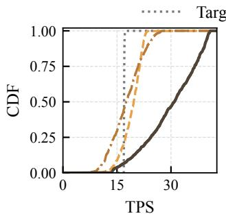  
(a) Redmi K70 Pro

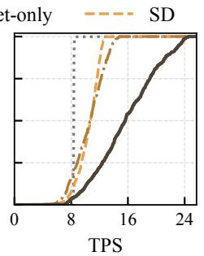  
(b) Xiaomi 11 Pro

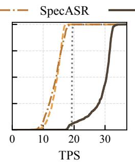  
(c) Xiaomi 14

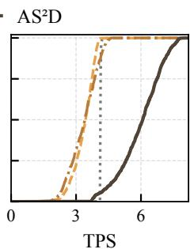  
(d) Redmi Note 9 Pro  
Figure 5: $\mathbf { A } \mathbf { s } ^ { 2 } \mathbf { D }$ improves decoding throughput across four phones. Each panel contains the same 688 complete-audio test windows from five datasets, with separately measured phone-cost replay. Curves are unsmoothed. Farther right indicates higher TPS. SpecASR uses the serial ASP + recycling port. SD averages $\mathrm { K } { = } 5 , 6 , 7 , 8$ TPS within each window. Horizontal scales differ by phone.

Table 1: $\mathbf { A } \mathbf { s } ^ { 2 } \mathbf { D }$ improves TPS across representative cases. Gains use the faster of SD and SpecASR (ASP) in Xiaomi 14 phone-cost replay.
<table><tr><td>Case</td><td>Target</td><td>SD</td><td>ASP</td><td> $\mathbf { A } s ^ { 2 } \mathbf { D }$ </td><td>Gain</td></tr><tr><td>Read</td><td>19.26</td><td>16.65</td><td>16.88</td><td>32.24</td><td>+91.0%</td></tr><tr><td>Multi.</td><td>19.24</td><td>15.58</td><td>16.02</td><td>32.48</td><td>+102.7%</td></tr><tr><td>Dialect</td><td>19.37</td><td>14.19</td><td>14.61</td><td>31.34</td><td>+114.6%</td></tr><tr><td>Singing</td><td>19.31</td><td>13.13</td><td>14.44</td><td>28.94</td><td>+100.4%</td></tr><tr><td>Meeting</td><td>19.25</td><td>11.36</td><td>8.93</td><td>22.86</td><td>+101.3%</td></tr></table>

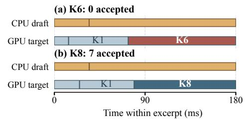  
Figure 6: Qwen CPU drafting overlaps GPU verification on Xiaomi 14 (b = 7).  
Metric. We report tokens per second (TPS), the number of committed output tokens divided by elapsed time. Audio prefill finishes before request arrival. TPS measures full-response generation, whereas time to first token (TTFT) captures only the wait for the first token.

## 5.2 RQ1: PERFORMANCE ACROSS PHONES, MODELS, AND TASKS

We compare the four methods on the same 688 ASR windows from five datasets using phone-cost replay. Replay and native TPS agree closely on average in matched timing checks (Appendix D.3). AS2D deploys a fixed Qwen drafter with budget 7 on K70, Xiaomi 11 Pro, and Xiaomi 14, and 3 on Note 9 Pro, selected without test outcomes. We then evaluate Omni-7B translation and spoken QA.

Across-phone performance. Figure 5 plots the per-window TPS distributions for Target-only, SD, SpecASR, and ${ \mathrm { \bar { A } S } } ^ { 2 } .$ D on each phone. AS2D improves pooled throughput by 42–76% over target-only. On K70, SD averages 18.97 TPS versus target-only’s 16.96, but its 21.52 TPS on LibriSpeech falls to 15.46 on AMI, below target-only’s 16.92. Serial speculation therefore does not uniformly help. With fixed Qwen/budget 7, AS2D reaches 27.92 TPS, improving throughput by 64.6% over target-only and 47.2% over SD. See Appendix D.

Workload and overlap analysis. We examine representative workloads and native scheduling traces. Table 1 selects a completed Xiaomi 14 window nearest each dataset’s median gain over the faster serial baseline. SpecASR spends 73.1–76.1% of decode time on drafting; $\mathrm { A } \bar { \mathrm { S } } ^ { 2 } \mathrm { D }$ gains 91.0–114.6% over the faster serial baseline. The meeting case gains 18.7% over target-only: 56 of 144 proposals are accepted, leaving 164 verifier rounds.

Figure 6 complements these cases with two excerpts from the median-duration run of five native Qwen repeats on a Xiaomi 14 LibriSpeech calibration window: the first multi-candidate rejection and the first fully accepted K8 call. CPU drafting continues while the GPU target decodes or verifies ready candidates. With proposal budget 7, the target uses K6 when five candidates are ready and K8 when at least seven are ready. The accepted K8 call commits seven draft tokens in one target pass, while the rejected K6 call illustrates target correction of mismatched candidates. Appendix D.4.5 gives case selection and full-run accounting.

Table 2: $\mathbf { A } \mathbf { s } ^ { 2 } \mathbf { l }$ D approaches the per- Table 3: $\mathbf { A } s ^ { 2 } \mathbf { D }$ accelerates trans- Table 4: $\mathbf { A } \mathbf { s } ^ { 2 } \mathbf { D }$ reduces window oracle. TPS shortfall (%) lation and QA. TPS uses K70 Pro slowdowns. Windows from the hindsight drafter/budget or- phone-cost replay on 80 samples per below target-only TPS acle; 688 windows/phone. task. Gains use the fastest baseline. (%, 688/phone).
<table><tr><td colspan="3">Dataset K70 11 Pro Mi 14 Note 9</td></tr><tr><td>LibriSpeech 2.48</td><td>2.09 2.46</td><td>2.67</td></tr><tr><td>AMI</td><td>3.56 5.83</td><td>5.93 2.94</td></tr><tr><td>FLEURS</td><td>1.33 1.46</td><td>0.65 1.31</td></tr><tr><td>KeSpeech</td><td>1.56 1.81</td><td>0.93 0.71</td></tr><tr><td>M4Singer</td><td>2.03 2.76 1.76</td><td>1.25</td></tr></table>

<table><tr><td colspan="3">Method EN→ZH ZH→EN  $\mathrm { Q A } _ { \geq 1 6 }$ </td></tr><tr><td>Target-only</td><td>8.11</td><td>8.37</td><td>7.77 8.90</td></tr><tr><td>SD</td><td>5.21</td><td>6.54</td><td>8.57</td></tr><tr><td>SpecASR</td><td>5.99</td><td>7.15</td><td></td></tr><tr><td> $\mathbf { A } \mathbf { S } ^ { 2 } \mathbf { D }$ </td><td>9.52</td><td>10.98</td><td>9.62</td></tr><tr><td>Gain (%)</td><td>+17.4</td><td>+31.2</td><td>+8.0</td></tr></table>

<table><tr><td>Phone</td><td>SD</td><td>ASP</td><td> $\mathbf { A } \mathbf { S } ^ { 2 } \mathbf { D }$ </td></tr><tr><td>K70</td><td>21.4</td><td>45.5</td><td>6.8</td></tr><tr><td>11 Pro</td><td>11.2</td><td>19.6</td><td>4.5</td></tr><tr><td>Mi 14</td><td>100.0</td><td>100.0</td><td>6.0</td></tr><tr><td>Note 9</td><td>99.7</td><td>86.9</td><td>5.4</td></tr><tr><td>All</td><td>58.1</td><td>63.0</td><td>5.7</td></tr></table>

Distance to the per-window oracle. We compare the deployment with a hindsight oracle on the same 688 windows per phone. The oracle chooses one feasible drafter and fixed budget per window from the evaluated catalog, with zero selection cost. Table 2 reports pooled TPS shortfall by phone and dataset. $\mathbf { A } s ^ { 2 } \mathbf { D }$ reaches 97.33–98.20% of the oracle’s overall pooled TPS; AMI leaves the most headroom. Appendix D.4.3 gives the protocol and cost sensitivity.

Impact across source-conditioned tasks. We examine $\mathrm { A } \mathrm { s } ^ { 2 } \mathrm { D }$ across source-conditioned tasks with different candidate-generation characteristics. While ASR closely constrains the output from audio, translation and spoken QA permit more varied responses. We compare the four methods on CoVoST2 (Wang et al., 2021) translation in both directions and Spoken SQuAD (Lee et al., 2018) QA, with 80 examples per task and shared frozen Omni-7B target outputs. English-to-Chinese IDs were selected by audio hash; Chinese-to-English IDs are disjoint from the budget pilot. QA is a post-hoc subgroup with at least 16 useful target tokens. All three tasks use the same Omni-7B target and Omni-3B drafter across speculative methods. We estimate post-prefill TPS using Redmi K70 Pro phone-cost replay. Source candidates share the target tokenizer and need no text conversion.

Table 3 shows TPS improvements of 17.4%, 31.2%, and 8.0% over the fastest measured baseline, respectively. Conditional acceptance is 54.6%, 63.8%, and 84.7%, while accepted-token coverage is 26.6%, 36.7%, and 28.3%. Notably, QA has the highest conditional acceptance but the smallest improvement, with only 17.5% of verification rounds using multiple tokens. These results reveal a key property of target-decoupled drafting: high acceptance alone does not translate into high speedup. Effective acceleration requires independent candidates to arrive in time and cover a substantial fraction of the target output, thereby replacing sequential target steps with multi-token verification. This observation supports the conditions in Section 4.4 and explains when ${ \mathsf { A } } { \mathsf { S } } ^ { 2 }$ D can provide substantia gains. Appendix D provides selection rules, budgets, replay cost coverage, and paired audit details.

Frequency of slowdowns. To check whether pooled gains hide frequent regressions, Table 4 counts windows with lower TPS than target-only, assigning equal weight to all 688 windows per phone. $\mathrm { A } \mathrm { s } ^ { 2 } \mathrm { D }$ is slower on 6.8%, 4.5%, 6.0%, and 5.4% of windows on K70, Xiaomi 11 Pro, Xiaomi 14, and Redmi Note 9 Pro, respectively. Across all phone/window pairs, this is 5.7%, compared with 58.1% for SD and 63.0% for SpecASR. Thus $\mathbf { A } \mathbf { S } ^ { 2 } \mathbf { i }$ D improves both pooled throughput and the frequency of gains. See Appendix D.4.5.

## 5.3 RQ2: SOURCES OF THE SPEEDUP

To separate the contributions of target-decoupled drafting (TD) and budget configuration (BC), Table 5 removes each component while holding the target, 688-window cohort, and post-prefill clock fixed. Removing TD uses serial prefix-conditioned Qwen drafting with the same frozen budget choices. Removing BC restores ASP’s confidence threshold 0.4 and proposal cap (24 on K70, 14 elsewhere) while retaining TD. Removing both recovers SpecASR. Appendix Table 8 gives dataset-level results.

Target-decoupled drafting supplies the main gain. With the same budget-7 configuration, $\mathrm { A } s ^ { 2 } \mathrm { D }$ reaches 27.92 TPS on K70 versus 19.77 without TD, a 41.2% increase. The corresponding gains are 33.4%, 95.2%, and 52.5% on Xiaomi 11 Pro, Xiaomi 14, and Note 9. Across all four phones, TD raises pooled TPS from 8.49 to 12.90 (51.9%). This ablation measures the joint benefit of target-prefix independence and asynchronous overlap. Both arms use complete audio and the same initial prefill. Removing enough exposed drafting work can improve throughput without increasing acceptance.

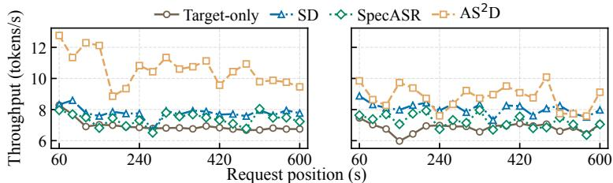  
(a) Redmi K70 Pro  
(b) Xiaomi 14

Table 5: Removing TD lowers TPS most. Values show TPS after removing BC or TD.
<table><tr><td>Phone</td><td> $\mathbf { A } \mathbf { S } ^ { 2 } \mathbf { D }$  -BC -TD</td></tr><tr><td>K70 27.92</td><td>25.60 19.77</td></tr><tr><td>11 Pro</td><td>14.68 13.79 11.00</td></tr><tr><td>Mi 14 28.40</td><td>27.84 14.55</td></tr><tr><td>Note 9</td><td>5.85 5.07 3.84</td></tr><tr><td></td><td></td></tr><tr><td>All 12.90</td><td>11.61 8.49</td></tr></table>

Figure 7: $\mathbf { A } \mathbf { s } ^ { 2 } \mathbf { D }$ accelerates native ASR requests. 60s audio per request.

Budget configuration adds a smaller benefit. On K70, development workloads screen proposal limits 1–24, and validation retains budget 7. Replacing ASP’s budget rule raises serial TPS from 16.81 to 19.77 (17.6%). With TD already present, it raises TPS from 25.60 to 27.92 (9.0%), with gains of 5.2–17.3% across the five datasets. The corresponding pooled benefits on the other phones are 6.4%, 2.0%, and 15.4%. All four phones use a fixed budget throughout test. Per-device ablation protocols and sensitivity checks are in Appendix D.5.

## 5.4 RQ3: NATIVE ON-DEMAND ACCELERATION

To test whether $\mathrm { A } s ^ { 2 } \mathrm { D }$ accelerates complete responses after audio prefill, we compare $\mathrm { A } s ^ { 2 } \mathrm { D }$ , Targetonly, SD, and SpecASR in native MNN on Redmi K70 Pro and Xiaomi 14, using different 10-minute audio traces. Both phones keep an Omni-7B target resident on six CPU threads and a Qwen3-ASR-Audio-0.6B drafter on OpenCL. We sample 19 request positions from 60s to 600s of each trace, spaced 30s apart. At each position, we prepare both models’ audio KV for the latest 60s, then request transcription. All speculative methods use budget b = 3. Figure 7 reports request-to-EOS TPS, including instruction-suffix prefill but excluding earlier audio preparation and model loading.

Native request throughput. On Redmi K70 Pro, $\mathbf { A } \mathbf { S } ^ { 2 } \mathbf { D }$ achieves the highest measured TPS at all 19 positions, improving on Target-only by 26.7–78.0%. At 120s, throughput rises from 6.91 to 12.29 tokens/s, and request completion time falls from 25.05s to 14.07s. Median TPS across positions is 10.61 for $\mathrm { A s } ^ { \bar { 2 } } \mathrm { D } .$ , compared with 7.77 for SD and 7.48 for SpecASR. At 180s, fewer usable candidates limit the gain to 26.7%: only 50 draft tokens are accepted and 92 of 120 target calls remain single-token steps, versus 108 accepted draft tokens and 21 of 65 single-token calls at 120s. On Xiaomi 14, $\mathrm { A } s ^ { 2 } \mathrm { D }$ improves pooled TPS by 28.2% over Target-only and 8.5% over SD.

Sustained operation. We additionally feed the same native model pair a continuous 10-minute audiobook recording on Redmi K70 Pro, paced as 150 non-overlapping 4s blocks. Both models remain resident, with audio and text context reset every 12s. Processing includes audio encoding, prefill, and decoding as input arrives. With active cooling and 75% target audio-token retention, mean block processing is 3.63s, below the 4s arrival interval. The p95 completion lag is 4.68s, measured from arrival of a block’s final audio sample to output completion, and maximum queue wait is 2.07s. This configuration keeps pace with the input over 600s. See Appendix D.6.2. On the first 60s Xiaomi 14 window, $\mathbf { A } s ^ { 2 } \mathbf { D }$ also reduces estimated phone energy by 30% compared with Target-only (239 J versus 342 J). See Appendix D.6.1.

## 6 CONCLUSION

We show that audio and the user request can supply speculative candidates without following the target’s evolving verified prefix. $\mathrm { A } \mathrm { s } ^ { 2 } \mathrm { D }$ decouples drafting from target-prefix updates, allowing the drafter and target to advance concurrently while retaining target-side verification and correction. Our Android evaluation spans two target models, four phones, seven datasets, and three tasks. Phoneprofile replay shows 42–76% higher pooled ASR throughput than target-only, with slowdowns on 5.7% of windows versus 58.1–63.0% for speculative baselines. Native on-demand execution with a 7B target achieves up to 78% higher throughput than target-only. Gains depend on candidate supply and alignment. Future work includes adaptive processor placement and scheduling, and support for full-duplex interaction (Appendix F).

## AI USE STATEMENT

Generative AI tools assisted with method formulation, experiment design, implementation and execution, data processing and result interpretation, mathematical arguments and proof drafting, figure preparation, and manuscript drafting, revision, and formatting. The authors defined the research questions and experimental scope, directed this assistance through iterative instructions, and reviewed proposed changes, results, and interpretations at each stage. Research and editorial decisions remained with the authors, who take responsibility for the paper, implementation, and results.

## REPRODUCIBILITY STATEMENT

Appendix A defines the input, output-comparison, and timing protocols. Appendix C specifies candidate publication, verification, alignment, and the assumptions for output equivalence. Model and device configurations, dataset selection, baselines, development splits, and calibration procedures are documented in Appendices D.1 and D.2. Appendix D.3 compares replay with native measurements; Appendix D.6 provides the native execution protocols and output checks. Observed numerical discrepancies and their implications are retained in Appendix F.6.

## ETHICS STATEMENT

This work studies execution scheduling for pretrained audio language models. The evaluation uses existing speech datasets and prerecorded audio. The method retains target-side verification but does not address errors, bias, or harmful outputs of the underlying models. Applications that record or retain speech should obtain appropriate consent, protect audio and cached states, and respect applicable model and dataset terms.

## REFERENCES

Alibaba Group. MNN: A lightweight deep neural network inference engine. Software repository, 2026. URL https://github.com/alibaba/MNN.

Tianle Cai, Yuhong Li, Zhengyang Geng, Hongwu Peng, Jason D. Lee, Deming Chen, and Tri Dao. Medusa: Simple LLM inference acceleration framework with multiple decoding heads. In Proceedings of the 41st International Conference on Machine Learning, volume 235 of Proceedings of Machine Learning Research, pp. 5209–5235. PMLR, 2024. URL https://proceedings. mlr.press/v235/cai24b.html.

Jean Carletta, Simone Ashby, Sebastien Bourban, Mike Flynn, Mael Guillemot, Thomas Hain, Jaroslav Kadlec, Vasilis Karaiskos, Wessel Kraaij, Melissa Kronenthal, Guillaume Lathoud, Mike Lincoln, Agnes Lisowska, Iain McCowan, Wilfried Post, Dennis Reidsma, and Pierre Wellner. The AMI meeting corpus: A pre-announcement. In Machine Learningfor Multimodal Interaction, Second International Workshop, pp. 28–39. Springer, 2006. doi: 10.1007/11677482 3.

Zhuoming Chen, Avner May, Ruslan Svirschevski, Yuhsun Huang, Max Ryabinin, Zhihao Jia, and Beidi Chen. Sequoia: Scalable, robust, and hardware-aware speculative decoding. arXiv preprint arXiv:2402.12374, 2024. doi: 10.48550/arXiv.2402.12374. URL https://arxiv.org/ab s/2402.12374.

Alexis Conneau, Min Ma, Simran Khanuja, Yu Zhang, Vera Axelrod, Siddharth Dalmia, Jason Riesa, Clara Rivera, and Ankur Bapna. FLEURS: Few-shot learning evaluation of universal representations of speech. In 2022 IEEE Spoken Language Technology Workshop, pp. 798–805, 2022. doi: 10.1109/SLT54892.2023.10023141.

Truong Dinh Do, Nguyen-Khang Le, and Le-Minh Nguyen. UniSpec: Training-free speculative decoding for robust LLM acceleration across languages and hardware. In Proceedings of the 64th Annual Meeting of the Association for Computational Linguistics, 2026. URL https: //aclanthology.org/2026.acl-long.285/.

Marcel Gibier, Raphael Duroselle, Pierre Serrano, Olivier Boeffard, and Jean-Fran ¨ c¸ois Bonastre. Segmentwise pruning in audio-language models. arXiv preprint arXiv:2511.14293, 2025. URL https://arxiv.org/abs/2511.14293.

Horace He and Thinking Machines Lab. Defeating nondeterminism in LLM inference. Thinking Machines Lab: Connectionism, 2025. doi: 10.64434/tml.20250910. URL https://thinking machines.ai/blog/defeating-nondeterminism-in-llm-inference/.

Yanzhang He, Tara N. Sainath, Rohit Prabhavalkar, Ian McGraw, Raziel Alvarez, Ding Zhao, David Rybach, Anjuli Kannan, Yonghui Wu, Ruoming Pang, Qiao Liang, Deepti Bhatia, Yuan Shangguan, Bo Li, Golan Pundak, Khe Chai Sim, Tom Bagby, Shuo-yiin Chang, Kanishka Rao, and Alexander Gruenstein. Streaming end-to-end speech recognition for mobile devices. In IEEE International Conference on Acoustics, Speech and Signal Processing (ICASSP), 2019. URL https://arxiv.org/abs/1811.06621.

Kartik Hegde, Arvind Krishna Sridhar, Naveen Vakada, Yinyi Guo, and Erik Visser. Event-grounded question answering over long audio via structured retrieval. arXiv preprint arXiv:2602.14612, 2026. doi: 10.48550/arXiv.2602.14612. URL https://arxiv.org/abs/2602.14612.

Xiaotang Jiang, Huan Wang, Yiliu Chen, Ziqi Wu, Lichuan Wang, Bin Zou, Yafeng Yang, Zongyang Cui, Yu Cai, Tianhang Yu, Chengfei Lyu, and Zhihua Wu. MNN: A universal and efficient inference engine. In Proceedings of Machine Learning and Systems, volume 2, 2020. URL https://proceedings.mlsys.org/paper\_files/paper/2020/hash/bc1906 1f88f16e9ed4a18f0bbd47048a-Abstract.html.

Taehyeon Kim, Hojung Jung, and Se-Young Yun. Multi-drafter speculative decoding with alignment feedback. In Findings ofthe Associationfor Computational Linguistics: ACL 2026, pp. 32532– 32573, 2026. doi: 10.18653/v1/2026.findings-acl.1629. URL https://aclanthology.o rg/2026.findings-acl.1629/.

Tanishq Kumar, Tri Dao, and Avner May. Speculative speculative decoding. In International Conference on Learning Representations, 2026. URL https://proceedings.iclr.cc/ paper\_files/paper/2026/hash/1b96f01343ff10150e6719eb163e1536-Abs tract-Conference.html.

Chia-Hsuan Lee, Szu-Lin Wu, Chi-Liang Liu, and Hung-yi Lee. Spoken SQuAD: A study of mitigating the impact of speech recognition errors on listening comprehension. In Interspeech 2018, pp. 3459–3463, 2018. doi: 10.21437/Interspeech.2018-1714. URL https://www.isca -archive.org/interspeech\_2018/lee18d\_interspeech.html.

Yaniv Leviathan, Matan Kalman, and Yossi Matias. Fast inference from transformers via speculative decoding. In Proceedings of the 40th International Conference on Machine Learning, volume 202 of Proceedings of Machine Learning Research, pp. 19274–19286. PMLR, 2023. URL https://proceedings.mlr.press/v202/leviathan23a.html.

Yuhui Li, Fangyun Wei, Chao Zhang, and Hongyang Zhang. EAGLE: Speculative sampling requires rethinking feature uncertainty. In Proceedings ofthe 41st International Conference on Machine Learning, volume 235 of Proceedings of Machine Learning Research, pp. 28935–28948. PMLR, 2024a. URL https://proceedings.mlr.press/v235/li24bt.html.

Yuhui Li, Fangyun Wei, Chao Zhang, and Hongyang Zhang. EAGLE-2: Faster inference of language models with dynamic draft trees. In Proceedings ofthe 2024 Conference on Empirical Methods in Natural Language Processing, pp. 7421–7432. Association for Computational Linguistics, 2024b. doi: 10.18653/v1/2024.emnlp-main.422.

Yunzhe Li, Hongzi Zhu, Zhuohong Deng, Yunlong Cheng, Liang Zhang, Shan Chang, and Minyi Guo. Anole: Adapting diverse compressed models for cross-scene prediction on mobile devices. In 2024 IEEE 44th International Conference on Distributed Computing Systems (ICDCS), pp. 613–623, 2024c. doi: 10.1109/ICDCS60910.2024.00063.

Yunzhe Li, Hongzi Zhu, Zhuohong Deng, Yunlong Cheng, Zimu Zheng, Liang Zhang, Shan Chang, and Minyi Guo. A scene-aware model adaptation scheme for cross-scene online inference on mobile devices. IEEE Transactions on Mobile Computing, 24(10):11061–11075, 2025. doi: 10.1109/TMC.2025.3574766.

Aoxing Liang, Chengfan Hong, Yunzhe Li, and Hongzi Zhu. Reliable and efficient LLM inference on resource-constrained mobile devices via dynamic scheduling. IEEE Internet of Things Journal, 13(9):19751–19754, 2026. doi: 10.1109/JIOT.2026.3659676.

Tianyu Liu, Yun Li, Qitan Lv, Kai Liu, Jianchen Zhu, Winston Hu, and Xiao Sun. PEARL: Parallel speculative decoding with adaptive draft length. In International Conference on Learning Representations, 2025. URL https://proceedings.iclr.cc/paper\_files/pape r/2025/hash/03b1043052700b1a471996b0baf309d4-Abstract-Conference. html.

Xiaoxuan Liu, Lanxiang Hu, Peter Bailis, Alvin Cheung, Zhijie Deng, Ion Stoica, and Hao Zhang. Online speculative decoding. In Proceedings of the 41st International Conference on Machine Learning, volume 235 of Proceedings ofMachine Learning Research, pp. 31131–31146. PMLR, 2024. URL https://proceedings.mlr.press/v235/liu24y.html.

llama.cpp contributors. llama.cpp for OpenCL: Hardware support, 2026. URL https://github .com/ggml-org/llama.cpp/blob/master/docs/backend/OPENCL.md. Official backend documentation, accessed September 25, 2026.

Jiale Luo, Xiaoyu Liang, and Haoji Hu. Locality matters for training-free audio token compression in audio-language models. arXiv preprint arXiv:2605.25179, 2026. doi: 10.48550/arXiv.2605.25179. URL https://arxiv.org/abs/2605.25179.

Zirui Ma, Zhihua Fan, Wenxing Li, Haibin Wu, Fulin Zhang, Xiaochun Ye, and Wenming Li. AHASD: Asynchronous heterogeneous architecture for LLM adaptive drafting speculative decoding on mobile devices. arXiv preprint arXiv:2604.25326, 2026. URL https://arxiv.org/abs/ 2604.25326.

Xupeng Miao, Gabriele Oliaro, Zhihao Zhang, Xinhao Cheng, Zeyu Wang, Zhengxin Zhang, Rae Ying Yee Wong, Alan Zhu, Lijie Yang, Xiaoxiang Shi, Chunan Shi, Zhuoming Chen, Daiyaan Arfeen, Reyna Abhyankar, and Zhihao Jia. SpecInfer: Accelerating large language model serving with tree-based speculative inference and verification. In Proceedings of the 29th ACM International Conference on Architectural Support for Programming Languages and Operating Systems, Volume 3, pp. 932–949. ACM, 2024. doi: 10.1145/3620666.3651335. URL https://doi.org/10.1145/3620666.3651335.

Koji Okabe and Hitoshi Yamamoto. Simultaneous masked and unmasked decoding with speculative decoding masking for fast ASR without accuracy loss. In Interspeech 2025, pp. 634–638, 2025. doi: 10.21437/Interspeech.2025-382. URL https://www.isca-archive.org/inter speech\_2025/okabe25\_interspeech.html.

OpenBMB. MiniCPM-o 2.6: A GPT-4o level MLLM for vision, speech and multimodal live streaming on your phone. Official model card, 2025. URL https://huggingface.co/o penbmb/MiniCPM-o-2\_6.

Atila Orhon, Arda Okan, Berkin Durmus, Zach Nagengast, and Eduardo Pacheco. WhisperKit: On-device real-time ASR with billion-scale transformers. arXiv preprint arXiv:2507.10860, 2025. doi: 10.48550/arXiv.2507.10860. URL https://arxiv.org/abs/2507.10860.

Vassil Panayotov, Guoguo Chen, Daniel Povey, and Sanjeev Khudanpur. LibriSpeech: An ASR corpus based on public domain audio books. In 2015 IEEE International Conference on Acoustics, Speech and Signal Processing, pp. 5206–5210, 2015. doi: 10.1109/ICASSP.2015.7178964.

Qualcomm. Snapdragon 8 Gen 3 Mobile Platform: Product brief, 2023. URL https://www.qu alcomm.com/content/dam/qcomm-martech/dm-assets/images/company/n ews-media/media-center/press-kits/snapdragon-summit-2023/docume nts/Snapdragon8Gen3\_%20ProductBrief.pdf. 87-71408-1, Revision B.

Qualcomm. Snapdragon 750G 5G Mobile Platform: Product brief. Official product specifications, 2026a. URL https://www.qualcomm.com/media/documents/files/snapdrago n-750g-5g-mobile-platform-product-brief.pdf. Accessed September 25, 2026.

Qualcomm. Snapdragon 888 5G Mobile Platform: Product brief. Official product specifications, 2026b. URL https://www.qualcomm.com/content/dam/qcomm-martech/dm-a ssets/documents/prod\_brief\_qcom\_sd888\_5g\_0.pdf. Accessed September 25, 2026.

George Saon, Samuel Thomas, Takashi Fukuda, Tohru Nagano, Avihu Dekel, and Luis Lastras. Self-speculative decoding for LLM-based ASR with CTC encoder drafts. arXiv preprint arXiv:2603.11243, 2026. URL https://arxiv.org/abs/2603.11243.

Yael Segal-Feldman, Aviv Shamsian, Aviv Navon, Gill Hetz, and Joseph Keshet. Whisper in medusa’s ear: Multi-head efficient decoding for transformer-based ASR. In 2025 IEEE International Conference on Acoustics, Speech, and Signal Processing, pp. 1–5, 2025. doi: 10.1109/ICASSP49 660.2025.10888140. URL https://doi.org/10.1109/ICASSP49660.2025.10888 140.

Xian Shi, Xiong Wang, Zhifang Guo, Yongqi Wang, Pei Zhang, Xinyu Zhang, Zishan Guo, Hongkun Hao, Xi Yu, Baosong Yang, Jin Xu, Jingren Zhou, and Junyang Lin. Qwen3-ASR technical report. arXiv preprint arXiv:2601.21337, 2026. URL https://arxiv.org/abs/2601.21337.

Guangzhi Sun, Yixuan Li, Yudong Yang, and Chao Zhang. OmniMem: Perturbation-aware memory compression for streaming audio-visual LLMs. arXiv preprint arXiv:2606.07577, 2026. doi: 10.48550/arXiv.2606.07577. URL https://arxiv.org/abs/2606.07577.

Zhiyuan Tang, Dong Wang, Yanguang Xu, Jianwei Sun, Xiaoning Lei, Shuaijiang Zhao, Cheng Wen, Xingjun Tan, Chuandong Xie, Shuran Zhou, Rui Yan, Chenjia Lv, Yang Han, Wei Zou, and Xiangang Li. KeSpeech: An open source speech dataset of mandarin and its eight subdialects. In Proceedings ofthe Neural Information Processing Systems Track on Datasets and Benchmarks, volume 1, 2021. URL https://datasets-benchmarks-proceedings.neurips.c c/paper/2021/hash/0336dcbab05b9d5ad24f4333c7658a0e-Abstract-rou nd2.html.

Nadav Timor, Jonathan Mamou, Daniel Korat, Moshe Berchansky, Oren Pereg, Moshe Wasserblat, Tomer Galanti, Michal Gordon-Kiwkowitz, and David Harel. Distributed speculative inference (DSI): Speculation parallelism for provably faster lossless language model inference. In International Conference on Learning Representations, 2025. URL https://proceedings.iclr .cc/paper\_files/paper/2025/hash/b36554b97da741b1c48c9de05c73993e -Abstract-Conference.html.

Changhan Wang, Anne Wu, Jiatao Gu, and Juan Pino. CoVoST 2 and massively multilingual speech translation. In Interspeech 2021, pp. 2247–2251, 2021. doi: 10.21437/Interspeech.2021-2027. URL https://www.isca-archive.org/interspeech\_2021/wang21s\_inters peech.html.

Tuowei Wang, Fengzu Li, Yanfan Sun, Wei Gao, and Ju Ren. Lever: Speculative LLM inference on smartphones. arXiv preprint arXiv:2605.16786, 2026. doi: 10.48550/arXiv.2605.16786. URL https://arxiv.org/abs/2605.16786.

Zilong Wang, Xiaoxue Zhang, Xinyang Jiang, Kaitao Song, and Jue Yu. Can AI understand mandarin speech prosody? a framework and benchmark showcase. In Interspeech 2025, pp. 5378–5382, 2025. doi: 10.21437/Interspeech.2025-1873. URL https://www.isca-archive.org/i nterspeech\_2025/wang25v\_interspeech.html.

Linye Wei, Shuzhang Zhong, Songqiang Xu, Runsheng Wang, Ru Huang, and Meng Li. SpecASR: Accelerating LLM-based automatic speech recognition via speculative decoding. In Proceedings ofthe 62nd ACM/IEEE Design Automation Conference, pp. 1–7, 2025. doi: 10.1109/DAC63849.2 025.11132579.

Xiaomi. Redmi K70 Pro Specifications. Official product specifications, 2026a. URL https: //www.mi.com/redmi-k70-pro/specs. Accessed September 25, 2026.

Xiaomi. Mi 11 Pro Specifications. Official product specifications, 2026b. URL https://www.mi .com/mi11Pro/specs. Accessed September 25, 2026.

Xiaomi. Xiaomi 14 Specifications. Official product specifications, 2026c. URL https://www. mi.com/global/product/xiaomi-14/specs/. Accessed September 25, 2026.

Daliang Xu, Wangsong Yin, Xin Jin, Ying Zhang, Shiyun Wei, Mengwei Xu, and Xuanzhe Liu. LLM-Cad: Fast and scalable on-device large language model inference. arXiv preprint arXiv:2309.04255, 2023. doi: 10.48550/arXiv.2309.04255. URL https://arxiv.org/abs/2309.04255.

Daliang Xu, Wangsong Yin, Hao Zhang, Xin Jin, Ying Zhang, Shiyun Wei, Mengwei Xu, and Xuanzhe Liu. EdgeLLM: Fast on-device LLM inference with speculative decoding. IEEE Transactions on Mobile Computing, 24(4):3256–3273, 2025a. doi: 10.1109/TMC.2024.3513457.

Jin Xu, Zhifang Guo, Jinzheng He, Hangrui Hu, Ting He, Shuai Bai, Keqin Chen, Jialin Wang, Yang Fan, Kai Dang, Bin Zhang, Xiong Wang, Yunfei Chu, and Junyang Lin. Qwen2.5-Omni technical report. arXiv preprint arXiv:2503.20215, 2025b. doi: 10.48550/arXiv.2503.20215. URL https://arxiv.org/abs/2503.20215.

Weisi Yang and Stephen Xia. PELM: Power efficient on-device LLM inference with speculative decoding and dynamic voltage frequency scaling. In Proceedings of the 2026 ACM/IEEE International Conference on Embedded Artificial Intelligence and Sensing Systems, pp. 438–451. ACM, 2026. doi: 10.1145/3774906.3802783. URL https://doi.org/10.1145/3774906.3802783.

Jiayi Yuan, Hao Li, Xinheng Ding, Wenya Xie, Yu-Jhe Li, Wentian Zhao, Kun Wan, Jing Shi, Xia Hu, and Zirui Liu. Understanding and mitigating numerical sources of nondeterminism in LLM inference. arXiv preprint arXiv:2506.09501, 2025. doi: 10.48550/arXiv.2506.09501. URL https://arxiv.org/abs/2506.09501.

Bolaji Yusuf, Murali Karthick Baskar, Andrew Rosenberg, and Bhuvana Ramabhadran. Speculative speech recognition by audio-prefixed low-rank adaptation of language models. In Interspeech 2024, pp. 792–796, 2024. doi: 10.21437/Interspeech.2024-298.

Jiebin Zhang, Zhenghan Yu, Liang Wang, Nan Yang, Eugene J. Yu, Zheng Li, Yifan Song, Dawei Zhu, Xingxing Zhang, Furu Wei, and Sujian Li. Learning to draft: Adaptive speculative decoding with reinforcement learning. In International Conference on Learning Representations, 2026. URL https://arxiv.org/abs/2603.01639.

Jun Zhang, Jue Wang, Huan Li, Lidan Shou, Ke Chen, Gang Chen, and Sharad Mehrotra. Draft & verify: Lossless large language model acceleration via self-speculative decoding. In Proceedings ofthe 62nd Annual Meeting ofthe Associationfor Computational Linguistics (Volume 1: Long Papers), pp. 11263–11282. Association for Computational Linguistics, 2024. doi: 10.18653/v1/20 24.acl-long.607. URL https://aclanthology.org/2024.acl-long.607/.

Lichao Zhang, Ruiqi Li, Shoutong Wang, Liqun Deng, Jinglin Liu, Yi Ren, Jinzheng He, Rongjie Huang, Jieming Zhu, Xiao Chen, and Zhou Zhao. M4Singer: A multi-style, multi-singer and musical score provided mandarin singing corpus. In Advances in Neural Information Processing Systems Datasets and Benchmarks Track, 2022. URL https://proceedings.neurip s.cc/paper\_files/paper/2022/hash/2de60892dd329683ec21877a4e7c309 1-Abstract-Datasets\_and\_Benchmarks.html.

Yongkang Zhang, Haoxuan Yu, Chenxia Han, Cheng Wang, Baotong Lu, Yunzhe Li, Zhifeng Jiang, Yang Li, Xiaowen Chu, and Huaicheng Li. SGDRC: Software-defined dynamic resource control for concurrent DNN inference on NVIDIA GPUs. In Proceedings of the 30th ACM SIGPLAN Annual Symposium on Principles and Practice of Parallel Programming, pp. 267–281. Association for Computing Machinery, 2025. doi: 10.1145/3710848.3710863.

Wazeer Zulfikar, Samantha Chan, and Pattie Maes. Memoro: Using large language models to realize a concise interface for real-time memory augmentation. In Proceedings ofthe CHI Conference on Human Factors in Computing Systems, 2024. doi: 10.1145/3613904.3642450. URL https://arxiv.org/abs/2403.02135.

## A INPUT PROTOCOL AND MEASUREMENT CONTRACT

## A.1 REQUESTS, AUDIO AVAILABILITY, AND REFERENCE EXECUTION

A fixed protocol S specifies audio preparation, prompt assembly, the audio view at each target position, initial state, context retention, and termination. Request u arrives at $s _ { u }$ with instruction $p _ { u }$ Protocol S selects its audio view $x _ { u }$ from audio received by $s _ { u }$ . Reference input $\boldsymbol { z } _ { u } = \left( x _ { u } , p _ { u } \right)$ is fixed throughout decoding, even if more audio arrives before the response completes. Neither the producer nor the target may extend this input with later audio. Comparisons use the same protocol and target, rather than changing the reference’s context to accommodate a faster implementation.

The on-demand setting prepares audio before the request. A reusable state $C _ { u }$ contains the resulting target language-model KV, positions, and other state needed to continue the same reference execution; encoder embeddings alone do not remove language-model prefill. Reuse also requires the cached tokens to be a valid prefix of the reference prompt, with matching audio features, positions, and attention conventions. An instruction that changes earlier prompt tokens can require reconstruction; a cache cannot simply be attached to an arbitrary prompt. Processing the instruction using compatible audio KV produces the initial decoding state $\kappa _ { u , 0 }$ . Each response starts from this state, without silently reusing a previous response’s generated text. Background work, cache growth, and any remaining work at request arrival must be recorded. This preparation protocol is shared across compared methods.

The target and drafter maintain separate states. Retaining target audio KV does not prefill another model: source input preparation and any source prefill remain producer work. The request-scoped candidate buffer starts empty in the primary comparison. Producer dispatch satisfies $\tau _ { u } \geq s _ { u } ;$ no task-specific response is assumed available before its instruction. Once dispatched, the producer does not wait for the target to accept earlier candidates. Any variant using candidates prepared before a request requires a separate preparation and timing protocol.

The current full-audio study makes a complete window available before initial audio/prompt prefill and retains target context throughout that window. The Qwen source reads the same available waveform and publishes candidate tokens incrementally. External Parakeet and SenseVoice sources in the deployment-selection studies instead process 2.56-second waveform chunks; their chunk boundaries do not reset the target. The full-window study isolates decoding and does not measure a live microphone stream.

For a fixed request $z _ { u } .$ , let $Y _ { T } ( z _ { u } ; S )$ denote the greedy target reference under deterministic tiebreaking. Successful speculative execution must satisfy

$$
Y _ { \mathrm { A s ^ { 2 } D } } ( z _ { u } ; S ) = Y _ { T } ( z _ { u } ; S )\tag{1}
$$

and restore the corresponding target state at each committed prefix. Recognition error against an annotation is a separate quality metric; matching a canonical token trace in replay does not validate native KV restoration. Appendix C.4 states the required backend conditions, and Appendix D retains numerical discrepancies observed in native checks.

## A.2 CONFIGURATION AND EXECUTION BOUNDARIES

The decoding scheme A uses a fixed task-specific drafter and a budget selected before deployment. Ready candidates determine the block processed at each target boundary. In the four-phone ASR corpus comparison, three phones retain Qwen/budget 7 and Note 9 Pro uses Qwen/budget 3. Appendix D.2.6 documents their development splits and selection scope. At a verification boundary, readiness, confidence stopping, the configured cap, and the remaining output budget determine the actual chain length. A proposal cap b permits up to b candidates after one known target root, so physical verification width satisfies $\dot { K } \dot { \le } b + 1$

Candidate publication preserves request/source identity and token order. At each boundary, the target uses already-published candidates and earlier verified outcomes. When no usable candidate is ready, it advances alone. The target verifies proposals before committing tokens.

## A.3 RESPONSE LATENCY, THROUGHPUT, AND MEMORY

The problem in Section 3 minimizes mean request latency $\begin{array} { r } { L _ { u } ^ { \mathcal { A } } = f _ { u } ^ { \mathcal { A } } - s _ { u } . } \end{array}$ , ending when the complete requested output becomes available. Its clock begins at the prescribed request time, even if audio prefill has not finished. Request processing, residual prefill, producer startup, queue work, verification, correction, and alignment after that time are included. Overlapping stages share one wall clock. Producer cleanup after the final output is recorded separately and charged to any later requests it delays. The optional tail constraint $\dot { Q } _ { \alpha } ( L _ { u } ^ { A } ) \leq L _ { \operatorname* { m a x } }$ is an application requirement, not a guarantee implied by mean decoding throughput.

The current corpus studies measure committed tokens per post-prefill time. That boundary includes exposed source work, verification, correction/alignment, queue work, and charged producer comple tion; it excludes loading and initial audio/prompt prefill. These measurements isolate decoding cost but do not reproduce the request clock or establish that a growing audio KV cache remains ready on a phone. Native case studies retain their stated completion and cleanup boundaries and are not pooled across different runners.

The continuous-output deployment in Appendix D.6.2 instead measures $\ell _ { i } = f _ { i } - r _ { i } ,$ from a block’s final audio sample to its completed output. Its per-block prefill, automatic output, and 12s context resets differ from persistent prefill followed by an on-demand request. Its RTF and lag cannot be relabeled as request latency. Memory accounting in the on-demand setting includes resident models, retained audio KV and position state, source and candidate buffers, and temporary allocations; finite capacity bounds the audio history that can be served without eviction.

## B EMPIRICAL DESIGN DIAGNOSTICS

This appendix gives the measurement protocols for the drafting and verification diagnostics in Section 4, together with an additional check of how candidate acceptance varies across corpora.

## B.1 ACCEPTANCE IS CONTENT DEPENDENT

We measure strict prefix acceptance over 28,595 audio blocks from four corpora using a Parakeet 110M CTC proposer and a Qwen3-ASR 1.7B target at $K = 3 2$ . The median accepted ratio is 0.55 on AMI and 0.52 on SPGISpeech, falls to 0.31 on GigaSpeech, and is zero on Earnings22. The distributions overlap, showing variation within each corpus as well as across corpora.

## B.2 DEVICE-SPECIFIC VERIFICATION PROFILES

Figure 8 uses native full-logits width sweeps on Redmi K70 Pro and Xiaomi 11 Pro. Both use a Qwen3-ASR 1.7B OpenCL target, the same 59.5125-second LibriSpeech calibration audio, and three target-prefix offsets (0, 64, and 128 tokens). After audio/prompt prefill, each width is measured five times at each offset, excluding warmup and with no concurrently executing producer. Both models remain resident. The plot uses the common range $K = 2 , \ldots , 1 5$ , with 15 measurements per phone and width. K70 Pro also completes measurements at $K = 1 6 ,$ , which are not plotted. Xiaomi 11 Pro’s wider trial contains only warmup records and no successful completion. K70 Pro sweeps widths in one job, whereas Xiaomi 11 Pro uses grouped jobs with additional drafter component probes between verifier sweeps. The verifier operation and contexts are matched, while job ordering and recorded operating conditions are retained.

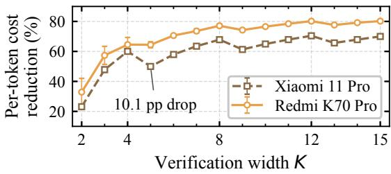

Figure 8: Batching savings depend on phone and width. We report per-token verification cost reductions for Qwen3-ASR 1.7B on OpenCL relative to the $K = 1$ verifier. Costs average 15 calls. Bars scale one call-time standard deviation by the same baseline. These are verifier savings, not full-request gains.

The timer covers the full-logits verification call, excluding loading, initial prefill, pre-call context setup, and top-1 extraction. Each input is a known target-reference continuation. All retained rows report successful verification, actual width equal to requested K, logits shape [1, K, 151936], and no top-1 mismatches against the reference. Let ${ \bar { V } } ( K )$ be the mean call time for width K. The plotted reduction in cost per verified position is

$$
R ( K ) = 1 0 0 \left( 1 - \frac { \bar { V } ( K ) } { K \bar { V } ( 1 ) } \right) \% .\tag{2}
$$

The baseline consists of 15 additional full-logits $K = 1$ measurements per phone from the same jobs. It uses the verification entry point, whereas native Target-only uses a separate scalar decoding entry point. Thus $R ( K )$ measures hardware batching efficiency at the profiled contexts, not observed Target-only request-latency reduction. Error bars are $1 0 0 s _ { K } / { \bar { ( K \bar { V } ( 1 ) ) } }$ percentage points, where $s _ { K }$ is the sample standard deviation across the 15 width-K calls. The measured baseline mean is treated as fixed for this visualization. These bars describe call-time dispersion, not confidence intervals for the estimated ratio.

Increasing K from 4 to 5 reduces per-position savings from 60.1% to 50.0% on Xiaomi 11 Pro, while they remain near 64.5% on Redmi K70 Pro. The corresponding decreases are 10.1 and 0.1 percentage points, respectively. These costs motivate profiling each phone/backend configuration. Configuration selection then compares pooled validation throughput and retains one pair for deployment, as described in Appendix D.2.6. The study comprises 435 width-sweep measurements and 30 additional single-token baseline measurements.

## B.3 DRAFTING OVERHEAD AND PREFIX INDEPENDENCE

## B.3.1 NATIVE SERIAL DECODING BREAKDOWN

Figure 3(a) decomposes native serial SD on the same 59.5125-second LibriSpeech calibration window across the four phones. Each run uses a CPU Qwen3-ASR 0.6B drafter, an OpenCL 1.7B target, and seven candidates after one known token (physical width K = 8). All five formal runs per phone are retained, excluding warmup. We sum measured draft generation and prefix catch-up as drafting, sum target verification separately, and assign the remaining decode time to other loop work. Each plotted share divides the accumulated component time by accumulated post-prefill decode time. Model loading and initial audio/prompt prefill are outside this boundary.

Drafting occupies 49.4%, 59.1%, 75.1%, and 51.2% of serial decode time on Xiaomi 11 Pro, Redmi K70 Pro, Xiaomi 14, and Redmi Note 9 Pro, respectively. Every run reaches EOS and matches its local target reference. Note 9 Pro emits 238 tokens per run, while the other phones emit 239. The phones retain their recorded deployment and operating conditions, including different CPU scheduling and frequencies. This is a within-run cost breakdown on one audio window, rather than a controlled ranking of processor speeds or a corpus-wide estimate. These measurements motivate reducing serial drafting overhead through target-decoupled generation and overlap.

## B.3.2 AUDIO PROPOSALS CAN RUN AHEAD

A context-sensitivity probe compares Qwen3-ASR 0.6B proposals with and without preceding transcript context against a Qwen3-ASR 1.7B target. The 480 paired blocks comprise 120 from each of AMI, GigaSpeech, SPGISpeech, and Earnings22. Each block spans seconds 4–8 of its source. The supplied context approximates the preceding 0–4 seconds by slicing reference-transcript words in proportion to audio duration. The with-context condition (fresh) supplies this preceding text. The without-context condition (stale) supplies no preceding text for any tested block. Both conditions use the same supplied context for target verification and a 32-token proposal cap. This is a supplied-context ablation, not a replay of actual target-generated text or KV synchronization.

Acceptance is the consecutive accepted-token count divided by the proposed count within each condition. All 960 rows have nonempty proposals and successful scores. Figure 3(b) plots all 480 paired differences, without-context minus with-context. The median difference is zero, and 347 pairs (72.3%) have unchanged acceptance, including 73 pairs where both conditions accept no token. Removing context reduces acceptance by more than 0.05 in 9.6% of pairs and increases it by more than 0.05 in 15.6%. These results motivate drafting without waiting for updated text context; they do not imply unchanged output tokens or uniform acceptance across tasks. The target-decoupled ablations and native cases evaluate the asynchronous execution interface directly.

The current Qwen producer reads a complete available window and publishes batches of eight candidate tokens without target-text input. It continues while the target verifies published candidates and does not restart after a disagreement. The Parakeet distribution above is a motivating model probe; native Parakeet comparisons are reported separately in Appendix D.4.5.

## B.4 NATIVE DRAFTING-COST CHECK

On one 60-second AMI development window on Redmi K70 Pro, five interleaved repeats give 14.58 TPS for target-only, 16.25 for Parakeet $K = 4$ , and 16.03 for SenseVoice/K = 4 (11.5% and 9.9% gains). Native timing includes candidate generation, verification, and recovery; all outputs match. Increasing Parakeet to $K = 8$ accepts a median of 43 rather than 39 extra tokens yet lowers throughput to 15.66 TPS. Thus drafter cost and verification budget must be judged by net throughput. Appendix D.4.5 gives the protocol and controls for this single-window check.

## C CANDIDATE PUBLICATION, VERIFICATION, AND CORRECTNESS

This appendix expands the target-decoupled interface in Section 4. The evaluated runtime consumes chains; its configuration is fixed before testing. Deployment-selection details are in Appendix D.2.6.

## C.1 SOURCE RECORDS AND INCREMENTAL PUBLICATION

A logical source record identifies its request, fixed audio view, producer, and token positions. In the existing single-window traces, the window ID identifies this scope. The record contains the fixed input $z _ { u } = ( x _ { u } , p _ { u } )$ ; later audio or another request cannot change it. A target-decoupled generator reads this audio view and instruction and, when autoregressive, its own generated prefix. It receives neither the latest target text nor target KV. Drafter output is converted into the target vocabulary before publication; conversion cost belongs to source execution.

The Qwen producer reads a complete available window and appends immutable batches of eight candidate tokens. Publication does not wait for the whole source sequence to finish. Each batch retains its source ID, producer ID, token offset, publication time, and available confidence. Parakeet and SenseVoice publish each completed 2.56-second source chunk atomically in the external-source experiments. Their confidence values are unavailable and are not synthesized by replay.

The buffer exposes only published tokens and preserves their order within each request and source. Verification reads an immutable snapshot while the producer appends later batches. The consumption cursor advances independently of source generation. Target context persists across publication boundaries. Rolling native controls may combine consecutive ready batches into one chain while retaining per-token source provenance.

## C.2 VERIFICATION AND STATE REPAIR

Before the first decoding step, the target processes the instruction using compatible audio KV to obtain $\kappa _ { u , 0 }$ , using the same prompt and position conventions as target-only execution. The cachecompatibility requirements and persistent-KV measurement scope are specified in Appendix A. Candidate generation uses separate state and receives no generated target prefix.

A verification call processes one known target root followed by up to b candidate tokens under the actual committed prefix. Its physical width $K \leq b + 1$ is also limited by candidate readiness and remaining output length. Physical width, logit indexing, attention, and cache positions must agree with the backend contract. Only the matching greedy prefix is committed. At disagreement, the target emits its correction, removes rejected cache entries, and processes the correction under the same state convention as reference execution. Every physical width requires its own feasibility and cost check.

The known target token can be carried into the next verification call; full acceptance does not require an unconditional extra K1 forward. If no compatible candidate is ready, a K1 target step makes progress. Native paths that defer cache updates track logical accepted length separately from the physical cache and remove rejected entries before the next target forward. Appendix C.4 states the reference-equivalence and state-restoration conditions required for exact greedy execution.

## C.3 CANDIDATE ALIGNMENT

We adapt local continuation matching (Wei et al., 2025) to published target-decoupled candidates.   
The source generator continues independently; only the buffer’s candidate cursor is realigned.

Full acceptance advances the cursor. After rejection and correction processing, the next available target token is the first alignment anchor. If it equals the candidate at the mismatch position, that position remains eligible, allowing target insertions without discarding a useful suffix. Otherwise, a bounded local search looks for the next target token, then for the correction token and its following continuation. Unmatched positions are retired and the target can continue alone. Exhausted record are discarded, with source order and provenance retained.

Every reused token is verified under the current target prefix, and no old target KV is attached to a recycled suffix. Repeated-token anchors can select an unhelpful suffix, increasing verification work. All alignment and recovery work remains inside the stated timing boundary.

## C.4 CORRECTNESS CONDITIONS AND PROOF

We specialize the standard output-preserving verification principle of speculative decoding (Leviathan et al., 2023) to the greedy decoding protocol in Section 3.

For on-demand execution, fix one request and its audio view. Below we suppress the request index and include its instruction in S. The initial-state condition includes a compatible prefilled audio KV cache.

For the fixed request, protocol S prescribes the audio view, initial request-prefilled state, and termination rule. Two decoding schemes at the same committed prefix use that same view, even if they reach the prefix at different wall times. Merely giving both access to all audio that has arrived by their respective execution times would not suffice. Source-side partitioning and token publication do not reset or extend the target’s request context.

Let g(κ) return the target’s next token with deterministic tie-breaking, and let $F ( \kappa , z )$ advance the target state after token z. The state includes the prescribed audio view, decoder KV, positions, and any pending-token convention. The reference obeys

$$
\begin{array} { r } { \boldsymbol { y } _ { n + 1 } ^ { T } = \boldsymbol { g } ( \kappa _ { n } ^ { T } ) , \qquad \kappa _ { n + 1 } ^ { T } = F ( \kappa _ { n } ^ { T } , \boldsymbol { y } _ { n + 1 } ^ { T } ) . } \end{array}\tag{3}
$$

The verification and alignment interface has the following requirements.

1. Pathwise equivalence. For every position in a candidate chain, batched target execution produces the same greedy decision and retainable state as sequential execution on the committed prefix followed by the preceding candidates. Correct causal masks, positions, audio context, padding, and logit indexing are required. Masks alone do not establish numerical state equivalence across different execution kernels.

2. Commit and repair. Verification commits only the consecutive candidates matching the target’s greedy tokens. At a mismatch it emits the target’s own correction. Retained state contains only the committed prefix; rejected-candidate entries are removed. The correction is processed under the same state convention. If compaction cannot establish equivalence, canonical replay must restore the state before a successful commit is reported. A failed repair invalidates the run.

3. Proposal-only recycling. Alignment changes only the candidate cursor, never published tokens, committed target tokens, or target state. Every reused token is verified again under the actual current prefix. The fixed drafter supplies proposals without changing the reference input.

These backend and protocol conditions must be validated for every admitted configuration.

Proposition 1 (Proposal-independent exactness). Fix the audio views, state conventions, and greedy tie-breaking of S. If verification is reference-equivalent and restores the accepted-prefix state, arbitrary source proposals, budgets, and candidate recycling preserve the target tokens and state at every committed prefix. Every completed execution then satisfies $Y _ { A } ( x ; S ) = Y _ { T } ( x ; S )$

ProofofProposition 1. Fix any candidate sequence and budget decisions. We induct on the number of committed tokens. At initialization, the speculative execution and reference have the same input view and canonical target state. Assume their tokens and states agree after prefix length n.

For target-only execution, both choose $g ( \kappa _ { n } ^ { T } )$ and apply the same transition F, extending the invariant by one token. For a nonempty candidate chain, the first candidate is checked from this same state. If it matches, it equals $y _ { n + 1 } ^ { T }$ , and pathwise equivalence gives the same next state. Repeating this argument covers every consecutively accepted candidate. At a mismatch, the target correction equals the next reference token and its canonical processing extends the invariant. If the chain is exhausted, all committed candidates have passed this check; the next reference token can be carried under the prescribed known-root convention. State repair leaves exactly the state of the committed prefix.

Neither cursor realignment nor the choice of fixed drafter changes the reference transition. A reused suffix, including a wrongly aligned suffix, can be committed only after a fresh target check; its previous location or confidence grants no authority. Source publication cannot change the prescribed audio view or initial state. Induction therefore covers all successful commits, independently of proposal and budget decisions. If the response completes under the same termination rule, its full token sequence equals the reference. Since the argument holds for every proposal realization, it also holds for randomized proposal generation. □

Applying this invariant to a backend requires validation of pathwise equivalence and accepted-prefix state restoration (Appendix F.6).

## D IMPLEMENTATION AND EVALUATION DETAILS

This appendix follows Section 5: experimental setup, calibration and fixed deployment, replay validation, and the three research questions. The four-phone ASR study contains 688 full-audio test windows and 94,511 target tokens per phone. All test windows, including capped outputs and throughput regressions, remain in the reported cohort. Native failures are retained with their execution boundaries.

## D.1 EXPERIMENTAL SETUP

## D.1.1 DEVICES AND RUNTIME

Test devices. Table 6 summarizes hardware and the four-phone ASR configurations. Hardware specifications follow the vendor documentation (Qualcomm, 2026a;b; 2023; Xiaomi, 2026c;a;b); Adreno identifiers are also documented by llama.cpp contributors (2026). RAM is the kernel-reported MemTotal, converted to GiB. Peak CPU clocks describe hardware specifications, not frequencies maintained throughout a run.

Resident producer and target. For ASR, the MNN Android implementation (Jiang et al., 2020; Alibaba Group, 2026) runs a CPU source producer alongside a resident OpenCL target. The fourphone comparison uses Qwen3-ASR-Audio-0.6B drafting with four CPU workers and a 1.7B target. Source and target maintain separate model state; candidate tokens pass through the ordered buffer in Appendix C.

For ASR, the Qwen source consumes the full available audio window once, then publishes eighttoken batches as generation proceeds. External-source calibration uses chunk-local Parakeet and SenseVoice generation. Source generation is independent of newly committed target text. CPU worker placement, resident source pools, and supported widths differ by phone and are specified with each calibration in Appendix D.2.

Runtime state and timing. The target’s logical committed prefix governs attention, positions, and cache repair. Known-root verification and deferred KV submission avoid an unconditional extra target call, while target-only progress remains available when candidates are absent or incompatible. Candidate alignment advances the source cursor independently of target cache repair. The implementation contract is detailed in Appendix C.2.

Table 6: The four phones span different hardware and software configurations. RAM denotes OSvisible total memory, and CPU clocks are specified maxima. The lower block lists the fixed models, placement, and proposal budgets used for the ASR comparison.
<table><tr><td></td><td>Redmi K70 Pro</td><td>Xiaomi 11 Pro</td><td>Xiaomi 14</td><td>Redmi Note 9 Pro</td></tr><tr><td>Model ID</td><td>23117RK66C</td><td>M2102K1AC</td><td>23127PN0CC</td><td>M2007J17C</td></tr><tr><td>Snapdragon SoC</td><td>8 Gen 3</td><td>888</td><td>8 Gen 3</td><td>750G</td></tr><tr><td>Process (nm)</td><td>4</td><td>5</td><td>4</td><td>8</td></tr><tr><td>CPU family</td><td>Kryo (X4 prime)</td><td>Kryo 680</td><td>Kryo (X4 prime)</td><td>Kryo 570</td></tr><tr><td>CPU cores</td><td>8</td><td>8</td><td>8</td><td>8</td></tr><tr><td>Peak CPU (GHz)</td><td>3.3</td><td>2.84</td><td>3.3</td><td>2.2</td></tr><tr><td>Adreno GPU</td><td>750</td><td>660</td><td>750</td><td>619</td></tr><tr><td>RAM (GiB)</td><td>10.91</td><td>7.05</td><td>14.81</td><td>7.21</td></tr><tr><td>DRAM standard*</td><td>LPDDR5X</td><td>LPDDR5</td><td>LPDDR5X</td><td>LPDDR4X</td></tr><tr><td rowspan="2">Android / API</td><td>16 / 36</td><td>14 / 34</td><td>16 / 36</td><td>12 / 31</td></tr><tr><td>OS3.0.304.0.</td><td>OS2.0.7.0.</td><td>OS3.0.306.0.</td><td>V14.0.2.0.</td></tr><tr><td>System build</td><td>WNMCNXM</td><td>UKACNXM</td><td>WNCCNXM</td><td>SJSCNXM</td></tr><tr><td>Security patch</td><td>2026-06-01</td><td>2025-04-01</td><td>2026-08-01</td><td>2023-03-01</td></tr><tr><td>OpenCL version</td><td>3.0</td><td>2.0</td><td>3.0</td><td>2.0</td></tr><tr><td>Driver build/commit</td><td>0762.36.1</td><td>329cf4c2a7</td><td>0762.36.1</td><td>16c8186230</td></tr><tr><td>OpenCL compiler</td><td>E031.45.02.25</td><td>E031.38.01.08</td><td>E031.45.02.25</td><td>E031.37.12.04</td></tr><tr><td>ASR target</td><td colspan="4">Qwen3-ASR-1.7B, OpenCL GPU</td></tr><tr><td>ASR drafter</td><td colspan="4">Qwen3-ASR-Audio-0.6B, CPU, four threads</td></tr><tr><td>Audio frontend</td><td colspan="4">CPU, four threads</td></tr><tr><td>Precision mode†</td><td colspan="4">Target: low; drafter: normal</td></tr><tr><td>Publication batch</td><td colspan="4"></td></tr><tr><td>Proposal budget b</td><td></td><td colspan="3">Eight tokens</td></tr><tr><td>Maximum width K</td><td>7 8</td><td colspan="3">7 7 8 8</td></tr></table>

∗DRAM specifications follow the phone vendor, except Note 9 Pro’s LPDDR4X, which is the chipset’s supported interface. †MNN runtime precision settings do not identify weight bit widths. Note 9 Pro is the Chinese 5G variant. Thermal conditions and repetition protocols are specified with the calibration and native experiments below. Software metadata was queried directly from the phones after calibration, with no intervening system upgrades. Driver identifiers are queried through CL DRIVER VERSION.

Monotonic stage events record source generation/publication, verification, correction, queue work, and producer completion. Corpus replay applies separately calibrated phone costs to saved operation trajectories. Native case studies use the device clock and retain their own repetition counts, completion boundaries, and output checks. Every evaluated deployment uses its fixed drafter and preselected budget, with no request-time configuration inference (Appendix D.2.6).

## D.1.2 DATASETS, TASK COHORTS, AND TOKEN ACCOUNTING

Combined evaluation scope. Across the ASR, translation, and QA cohorts described here, the corpus evaluation contains 928 requests: 688 ASR windows and 80 requests each for English-to-Chinese translation, Chinese-to-English translation, and spoken QA. Deduplication by audio hash gives 913 audio inputs spanning 1.632–75.168s and 43,844.9815s (12.18h) in total. Shared QA passages make the request-weighted duration 12.40h. The 97,953 target output tokens exclude EOS and include the first token selected during prefill; this corpus-size count does not change the taskspecific TPS numerators. Calibration, selection pilots, native cases, methods, and phone repetitions are excluded from these totals.

ASR evaluation cohort. Table 8 uses 688 audio windows selected by shuffling within each dataset with seed 20260915, without using model outputs. The selection contains 165 LibriSpeech, 53 AMI, 91 FLEURS, 188 KeSpeech, and 191 M4Singer windows, totaling 11.0 hours of audio and 93,824 non-EOS target tokens. Selection is at the window level, without speaker or recording grouping. All methods use the same windows and target references, including one output that reaches the shared generation limit. Cost calibration and fixed-configuration selection use separate development audio, as specified below and in Appendix D.2.6.

Translation and spoken QA protocol. Table 3 compares three 80-sample cohorts using Qwen2.5- Omni-7B as the target and Qwen2.5-Omni-3B as the drafter for all speculative methods. English-to Chinese IDs are the first 80 of the frozen 2,733 evaluation IDs after sorting by SHA256(20260923: audio\_sha256); this rule was fixed before the run without inspecting TPS or acceptance. The Chinese-to-English IDs are held out from a disjoint 24-sample budget-selection pilot. Spoken SQuAD uses the length-conditioned subgroup below. All TPS values pool useful target tokens over post-prefill, resource-complete replay time; useful tokens exclude EOS and the first token selected during prefill. Appendix D.1.3 specifies the serial baselines.

$\mathrm { A } \mathrm { S } ^ { 2 } \mathrm { D }$ uses budget 3 (physical $K \leq 4 )$ , fixed from the disjoint Chinese-to-English pilot and retained for both other tasks. The producer receives only the requested audio, instruction, and its own generation history. It never receives target-prefix updates. Source token IDs share the target tokenizer and become available after their real $K = 1$ forwards, without text conversion. The QA buffer receives cumulative observed prefixes with unchanged token-arrival times; these prefixes only grow. Verification and already-started source work after target EOS count in resource-complete time. Conversion and per-round queue fees are zero; these profiles do not separately calibrate queue/cache-control overhead or contention. The reported times are phone-cost surrogate estimates.

QA cohort selection. The Spoken SQuAD column in Table 3 uses a post-hoc subgroup selected after inspecting the target output lengths of 970 frozen questions. The rule requires at least 16 useful target tokens, excluding the first token selected during prefill and EOS. It selects 80 questions and 1,895 useful tokens. These IDs were fixed before the independent Omni-3B run, and no additional samples were filtered. The length-conditioned result does not establish an unselected QA-wide gain.

## D.1.3 BASELINE IMPLEMENTATIONS

ASR SD replay. Target-path top-2 ranks are collected with the prefix-conditioned 0.6B drafter on the server and matched to the frozen audio hashes and canonical target tokens. Standard SD uses a known target root plus $K - 1$ draft tokens in a physical width-K verification. It advances through the first mismatch, carries the correction or bonus token as the next known root, and charges any missing drafter KV forward before the next proposal. Target correction has no unconditional extra K1 call. Only the common output budget can reduce the physical width; remaining reference length is never used to choose a cheaper tail action. EOS contributes to the committed-token count without an extra forward after it becomes known. Model loading and both audio/prompt prefills are excluded. Corpus replay applies separately calibrated phone costs to these cached operation trajectories. Server/phone numerical-parity checks do not cover the full test cohort.

ASR fixed-width controls and averaging. The Standard SD entries in Table 8 use the equal-weight arithmetic mean of four fixed configurations, K=5,6,7,8. For each dataset and K, we first pool committed tokens and total decode time; we then average the four TPS values. The All column pools the complete five-dataset cohort within each K before taking the same mean. This is a configuration summary, not the throughput of a random switching policy or a validation-selected best fixed setting. For the CDF and slowdown counts, we instead average the four TPS values within each window before forming the distribution or comparing with Target-only (Appendix D.4).

ASR SpecASR ASP port. We implement adaptive single-sequence prediction (ASP) with draft recycling (Wei et al., 2025), using the same pretrained 0.6B drafter and 1.7B target. No baselinespecific training is performed. The confidence threshold is 0.4 and the maximum is 24 draft tokens, fixed before testing. We interpret normalized logits as softmax probabilities and include the lowconfidence token before stopping. The known target root makes the physical verifier width at most 25. Actual off-path drafter tokens and confidences are collected on the server; target-path ranks alone do not recover these trajectories.

After rejection, a masked two-query drafter forward extends the old branch while regenerating from the corrected prefix. A match at the same or an adjacent position permits suffix reuse. Our port then refreshes the reused suffix’s KV state in one batch under the corrected prefix and charges this batched KV reconciliation. Drafting and target verification remain serial, with parallel old/new branches internal to the drafter. We evaluate this ASP port. SpecASR’s alternative two-pass sparse-tree (TSP) variant is not evaluated.

Translation and spoken QA baselines. Target-only runs the Omni-7B target without drafting. SD and adapted SpecASR use real server conditional proposals from the same prefix-conditioned Omni-3B drafter with budget 7 (physical $K \leq 8 )$ . SpecASR uses adaptive single-sequence prediction and rejected-draft recycling with serial single-token drafter forwards. Its original masked-pair/TSP runtime is outside this comparison. Their KV-ready replays charge K70 phone costs. Confidence softmax and drafter KV branch switching are not separately calibrated. Appendix D.1.2 specifies task cohorts and output-token accounting.

Configuration selection is specified in Appendix D.2.6. Each reported deployment uses its own phone calibration, without borrowing costs from other phones.

## D.2 CALIBRATION, DEPLOYMENT CONFIGURATION, AND TIME ANALYSIS

This section records the phone costs and fixed configurations used by the experiments. The final analysis relates realized overlap and verifier work to elapsed time; acceptance is an analysis variable, not a configuration selection criterion.

## D.2.1 FEASIBLE WIDTHS AND COEXISTENCE COSTS

Only measured, executable widths enter a deployment’s cost catalog. Missing or failed shapes are excluded instead of assigned zero cost. A proposal budget and a physical backend width are different quantities: including the known root, budget 7 permits physical K8. Large-width concurrent costs that use a fitted ratio rather than direct measurements are identified in the corresponding protocol and sensitivity analysis.

Calibration loads the declared target and source models before timing. Coexistence can change both producer and target service, so isolated forward latency alone cannot determine placement. Verification and correction must also preserve ownership of the same target KV. These constraints apply to both the ASR CPU-producer/OpenCL-target placement and the native Omni placement in Appendix D.6.

## D.2.2 REDMI K70 PRO CALIBRATION

K70 ASR cost calibration. Both the 0.6B CPU drafter (four threads, normal precision) and the 1.7B OpenCL target (low precision) were resident in a paired K70 calibration on one 59.5-second calibration window. One warmup and five measured pairs produced identical 239-token outputs through EOS. Native target-only and serial K8 throughput were 16.91 and 20.86 tokens/s on that calibration window. These measurements calibrate the replay costs. The baseline cost model uses 59.391 ms per target-only step, 23.347 ms per draft forward, 112.656 ms per K8 verification, and 10.738 ms of other decode-loop work per serial verification round. The residual loop cost is measured wall time minus drafting and verification time. Smaller K costs come from a separate K70 K1–16 calibration-context sweep at prefix offsets 0, 64, and 128. No language, long-context, or thermal slope is fitted.

ASR ASP cost extension and check. The single-step drafter, K1–K8 verifier, and loop-residual constants are unchanged from the other Table 8 baselines. Additional K9–K25 verification and batch-refresh costs use K70 profile medians: one warmup and five measurements at each of three text offsets. True paired-branch drafting costs 35.075 ms per forward, before a measured 0.951 ms of probability computation per output row; batch KV refresh is charged by its physical width. All 90 checks against independent branch execution pass. This accounting yields 11,136 verification rounds over the complete 688-window test split.

A separate long development-window ASP diagnostic reaches EOS in one warmup and five measured repetitions. It emits 240 tokens, including one additional comma relative to scalar AR’s 239 tokens. On the recorded native operation trace, replay underestimates latency by 2.6–14.7% across the five repetitions, with 5.6% error at the median. The fixed costs do not capture the observed run-to-run slowdown.

Native overlap calibration and checks. One calibration audio uses one warmup and five paired measured repetitions, with alternating execution order. Serial budget 7 achieves 15.41 pooled TPS and target-decoupled overlap 29.81 TPS, a 93.4% increase. Every run reaches EOS and matches the native scalar-target output; an independent queue reconstruction checks all 503 source-overlap verification rounds, including warmup. These native repetitions supply the service-cost fit.

Five additional, predeclared development windows are excluded from cost fitting. Three each yield one complete, output-matched measured pair after one warmup: serial/TD throughput is 14.78/24.20 TPS on FLEURS, 9.62/15.80 on KeSpeech, and 11.85/12.52 on M4Singer. Replaying their nativeproduced candidates with the frozen calibration costs gives signed relative TD-time errors of +0.6%, +2.0%, and −8.5%, respectively. The other two windows do not yield measured pairs: the AMI reference reaches its 1,024-token cap, and the LibriSpeech warmup emits two additional commas. These diagnostic outcomes do not remove any corpus-test windows. Appendix D.3 reports the subsequent repeated timing validation.

## D.2.3 XIAOMI 11 PRO CALIBRATION

The Xiaomi 11 Pro (SM8350) evaluation uses the same 1.7B OpenCL target, Qwen3-ASR 0.6B CPU drafter, and proposal budget 7 as the K70 deployment. Standard SD averages fixed physical K=5,6,7,8 TPS (Table 9). SpecASR uses ASP with threshold 0.4 and at most 14 proposals, or physical K ≤ 15. All four methods retain the same 688 windows and 94,511 reference tokens, including the capped FLEURS output. The two capped Qwen source sequences are also retained.

Common clock and hardware condition. The measured interval starts after model loading and both initial audio/prompt prefills. It includes draft computation, exposed waits, verification, queue/loop work, and producer completion after target EOS. Target-only calibration loads only the target. Serial SD and ASP load the target and Qwen; source-selection calibration keeps the target, Qwen and Parakeet resident to compare source choices without model replacement. The four CPU drafting workers use cores 4–7. Before each measured episode, we require all eight cores online and CPU4’s frequency ceiling at least 1.8816 GHz at two checks five seconds apart, after at least 15 seconds of rest. A native monitor samples core availability and frequency ceilings once per second. Within-run frequency changes are retained; core offlining stops the batch and leaves the failure record intact. This protocol measures decode episodes from a common starting condition, not continuous-load throughput.

Cost calibration. Two English calibration windows, from LibriSpeech and AMI, provide five measured repetitions each of target-only, Qwen overlap and Parakeet overlap with the common resident pool, plus five standalone-target repetitions per window. All 40 measured runs reach EOS with identical target tokens. Per-width K1–8 profiles and these episode traces calibrate the shared verifier costs and overlap-specific concurrent costs; observed concurrency ratios are retained without clipping them to one.

Additional calibration on the 59.5-second LibriSpeech calibration window uses one warmup and five alternating measured repetitions of serial K8 SD and ASP with cap 14. Scalar drafting and the residual decode-loop cost are shared by SD and ASP; ASP additionally charges confidence computation, paired-branch execution and batch KV refresh. Missing verifier widths K9–15 receive five measured runs each; CPU refresh widths K1–15 receive ten each, and paired-branch cost uses 20 measured forwards. Component outputs are checked for physical width K and logits shape [1, K, 151936]. All paired-branch checks match independent branch execution. Arithmetic means retain every formal timing; warmups are excluded. A previous K16–20 calibration stalled, so widths above 15 remain pruned without assigning an unverified failure cause. All timing parameters are fitted on separate calibration audio. They do not model every language, context length, or thermal state.

The serial calibration check reaches 11.60 TPS for K8 SD and 11.56 TPS for ASP; all ten measured outputs match the scalar reference exactly. Repricing these recorded native operation traces gives latency residuals from -1.7% to +3.0%. The corresponding Qwen/Parakeet overlap residuals on the two calibration windows range from −0.89% to +1.62%. These residuals characterize the insample calibration fit. The corpus comparison applies the calibrated phone costs to saved operation trajectories; Appendix D.3 reports separate native timing checks on K70.

## D.2.4 XIAOMI 14 AND REDMI NOTE 9 PRO CALIBRATION

Device-specific calibration. We calibrate Xiaomi 14 and Redmi Note 9 Pro separately using the same fixed LibriSpeech and AMI calibration windows. Each context supplies one warmup and five measured repetitions of resident-target decoding, Qwen overlap, and standalone-target decoding. Target-only loads only the target; speculative runs retain target and Qwen. Model loading and initial audio/prompt prefill precede the measured interval. Source waits, verification, correction/alignment, loop work, and post-EOS producer completion remain charged. K70 and Xiaomi 11 Pro retain their previously documented residency protocols.

Xiaomi 14 pins the four CPU drafting workers to cores 4–7. On Redmi Note 9 Pro, explicit workeraffinity setup failed after loading and prefill, before formal measurements. We retain that failure and use four MNN workers under OS-default scheduling for every measured method on that phone. The baseline frontend only skips explicit placement when no CPU IDs are configured; inference algorithms are unchanged. Each episode requires all eight cores online, at least 15 seconds of rest, and two condition checks five seconds apart. Within-run frequency changes are retained. We do not modify thermal control or CPU governors.

Dense profiles measure physical K1–8 on both calibration contexts; observed overlap rounds provide concurrent costs. Widths with fewer than five concurrent observations use the median eligible calibration concurrent/idle ratio, without clipping. Serial K8 SD and ASP with cap 14 receive one warmup and five measured repetitions on the LibriSpeech window. Scalar drafting and loop costs are shared; ASP additionally charges confidence computation, paired-branch execution, and KV refresh. Verifier K9–15 receives five measurements per width, refresh K1–15 receives ten, and paired execution receives 20. Component checks enforce physical width and logits shape [1, K, 151936]. The two new phones use the same conservative ASP cap 14 as Xiaomi 11 Pro; larger shapes are outside this transfer experiment.

Calibration diagnostics. On Xiaomi 14, 30/30 formal target/overlap outputs and 10/10 serial outputs match their native scalar reference through EOS. Repricing the observed native target/source paths gives in-sample overlap latency residuals of -3.33% to -0.94%; serial residuals are -9.83% to +16.61%. All formal repetitions are retained.

On Redmi Note 9 Pro, 30/30 formal target/overlap outputs and 10/10 serial outputs match their native scalar reference through EOS. Repricing the observed native target/source paths gives in-sample overlap latency residuals of -2.34% to -0.31%; serial residuals are -6.33% to +3.38%. All formal repetitions are retained. These residuals characterize the in-sample calibration fit on two English windows. The corpus comparison applies the resulting phone costs to preserved causal operation traces, with fixed costs across languages, context lengths, and thermal states. Appendix D.3 reports separate native timing checks on K70.

## D.2.5 RESIDENT-SOURCE COST CALIBRATION

For Xiaomi 14 and Redmi Note 9 Pro, a separate calibration retains the target, Qwen3-ASR 0.6B, Parakeet CTC, and SenseVoice Small in memory. Two fixed calibration windows, from LibriSpeech and AMI, are run with target-only, Qwen, Parakeet, and SenseVoice arms in rotating/reversed order. Each arm has one warmup and five measured repetitions per audio, giving 40 measured episodes per phone. This all-resident calibration is distinct from the target/Qwen comparisons in Appendix D.2.4.

External-source chunk service, publication, and startup are measured on the phone. Concurrent/idle target ratios from the same session are applied to the device-specific idle profile, retaining the original Qwen and baseline cost anchors. Idle physical K9–15 costs are directly measured; their concurrent costs extend the observed calibration ratios. Width-specific profiles use the median available ratio at unmeasured concurrent widths, while constant-factor profiles retain their factor. These estimates do not represent direct measurements of every source/width pair. The English calibration uses a fixed padded chunk shape; other supported languages remain an extrapolation.

All measured repetitions are retained. Native outputs match the device’s scalar reference in 40/40 Xiaomi 14 episodes and 35/40 Note 9 Pro episodes. The remaining five rows contribute cost measurements but do not support native output equivalence.

## D.2.6 FIXED CONFIGURATIONS AND DEVELOPMENT SPLITS

The four-phone ASR corpus comparison uses a single fixed Qwen drafter and proposal budget per device: budget 7 on K70, Xiaomi 11 Pro, and Xiaomi 14; budget 3 on Redmi Note 9 Pro. The selected pair remains unchanged across test requests; configuration selection incurs no request-time feature extraction or inference. The studies below use pooled throughput to compare configurations before their fixed evaluation, rather than selecting a budget from runtime acceptance statistics.

On K70, the initial budget sweep compares integer proposal limits 1–24 on 50 balanced development windows and selects budget 7. The setting is retained on a separate validation set of 100 windows. A balanced 50-window development pilot screens Qwen3-ASR 0.6B, Parakeet CTC, and SenseVoice Small as the source pool; adding bilingual Zipformer gives no further hindsight gain on that pilot. The retained K70, Xiaomi 11 Pro, and Xiaomi 14 deployments use Qwen/budget 7. These preserved development studies do not constitute a full validation-grid search on every phone. The larger catalogs in Appendix D.4.3 serve a separate purpose: measuring the headroom of the deployed settings.

The Note 9 result is a retrospective reanalysis of the preserved split and phone profiles. We rank all 42 source/budget settings on the 100 validation windows by pooled throughput, using Qwen at the same budget when a source is language-ineligible. Validation selects fixed Qwen/budget 3 at 5.6233 TPS, versus 5.3898 for Qwen/budget 7. Applying this setting to all 688 test windows yields 5.8512 TPS. Test outcomes do not enter the ranking; the reanalysis does not imply that a new prospective experiment preceded inspection of the historical test results.

## D.2.7 OVERLAP, ADDED WORK, AND PERFORMANCE LIMITS

We derive a finite-execution condition under which target-decoupled overlap compensates for additional drafting and verification work. The decomposition uses realized costs and token progress, whereas SSD analyzes expected speed from verification-outcome prediction (Kumar et al., 2026).

Execution boundary and accounting. Compare a serial baseline s and asynchronous execution a that complete the same input under protocol S, with the same $N > 0$ committed target tokens. Use matching start and completion events, including producer drain if charged by the protocol. For post-prefill decode comparisons, the clock starts after initial audio/prompt prefill. A request-latency comparison instead starts at request arrival and includes any remaining audio or request prefill. Both runs must satisfy the target-equivalence conditions in Appendix C.4.

For run $r \in \{ s , a \}$ , let Pr and Vr be the unions of producer and verifier service intervals within $[ 0 , T _ { r } ]$ . Producer service includes source preparation, generation, token conversion, and publication when inside the measured boundary. Verifier service includes target-only progress, speculative checks, correction, state restoration, and candidate alignment. Use completed stage intervals, not worker lifetimes: a worker blocked waiting for audio or the other worker is not executing a stage. Internal intervals of the same stage are merged before their durations are summed. These are elapsed service times, not processor-utilization measures.

With | · | denoting interval duration, define

$$
\begin{array} { r l r } & { \boldsymbol { D _ { r } } = | \mathcal { P } _ { r } | , } & { V _ { r } = | \mathcal { V } _ { r } | , } \\ & { \boldsymbol { O _ { r } } = | \mathcal { P } _ { r } \cap \mathcal { V } _ { r } | , } & { \boldsymbol { H _ { r } } = | [ 0 , T _ { r } ] \setminus ( \mathcal { P } _ { r } \cup \mathcal { V } _ { r } ) | . } \end{array}\tag{4}
$$

The residual $H _ { r }$ includes remaining queue/synchronization work and idle time outside both stage sets. Work already inside a service interval is not charged again to $H _ { r }$ . Costs come from the actual execution: resource contention can increase $D _ { a }$ and $V _ { a } \mathrm { . }$ , so isolated-device profiles cannot simply be substituted while holding these costs fixed. Startup and drain remain on the clock; only their actual intersections with the other stage contribute to $O _ { r }$

Derivation of the speedup condition. Inclusion–exclusion gives the exact accounting identity

$$
T _ { r } = D _ { r } + V _ { r } - O _ { r } + H _ { r } .\tag{5}
$$

The serial comparator has $O _ { s } = 0$ . Therefore, with $\Delta X = X _ { a } - X _ { s }$

$$
T _ { s } - T _ { a } = O _ { a } - \Delta D - \Delta V - \Delta H .\tag{6}
$$

Both runs commit N tokens, so their throughput ratio is $( N / T _ { a } ) / ( N / T _ { s } ) ~ = ~ T _ { s } / T _ { a }$ . A strict throughput gain therefore occurs exactly when

$$
T _ { a } < T _ { s } \quad \Longleftrightarrow \quad O _ { a } > \Delta D + \Delta V + \Delta H .\tag{7}
$$

The increments may be negative: for example, a cheaper target-decoupled producer can reduce $D _ { a } ,$ so a measured gain need not arise entirely from overlap. Against an already asynchronous comparator, replace $O _ { a }$ in the condition by $O _ { a } - O _ { s }$

Acceptance and verifier work. Let $R _ { r }$ be the number of sequential verifier rounds, including target-only rounds. If round k commits $m _ { r , k }$ tokens and incurs verifier service time $v _ { r , k }$ , then $\begin{array} { r } { \sum _ { k } ^ { - } m _ { r , k } \stackrel { \cdot } { = } N } \end{array}$ and $\begin{array} { r } { \sum _ { k } v _ { r , k } = V _ { r } } \end{array}$ . With the arithmetic round means $\bar { m } _ { r } = N / R _ { r }$ and $\bar { v } _ { r } = V _ { r } / R _ { r }$

$$
\frac { V _ { r } } { N } = \frac { \bar { v } _ { r } } { \bar { m } _ { r } } , \qquad \frac { \Delta V } { N } = \frac { \bar { v } _ { a } } { \bar { m } _ { a } } - \frac { \bar { v } _ { s } } { \bar { m } _ { s } } .\tag{8}
$$

Committed progress includes correction tokens as well as accepted candidates. Lower progress per round increases verifier work per output token when round cost is unchanged, but raw acceptance rate alone does not determine either quantity. Budget, alignment, target-only fallback, and backend shape change round cost and progress together. This is why a faster producer with lower acceptance can still win, and why increasing the proposal budget need not improve throughput.

Bottleneck bound and interpretation. Since $0 \leq O _ { a } \leq \operatorname* { m i n } ( D _ { a } , V _ { a } )$

$$
T _ { a } \geq \operatorname* { m a x } ( D _ { a } , V _ { a } ) + H _ { a } , \qquad { \frac { T _ { s } } { T _ { a } } } \leq { \frac { T _ { s } } { \operatorname* { m a x } ( D _ { a } , V _ { a } ) + H _ { a } } } .\tag{9}
$$

For fixed realized costs, no overlap can yield a strict speedup if $\Delta D + \Delta V + \Delta H \geq \operatorname* { m i n } ( D _ { a } , V _ { a } )$ The bound need not be attainable: request-time source preparation, startup, drain, and candidate readiness can all reduce overlap. When the verifier is already continuously supplied, faster drafting alone does not lower its service requirement; further gains must reduce verifier work, exposed startup/drain, or residual time. Conversely, slow supply can leave overlap unrealized even when proposal agreement is high.

The decomposition provides a framework for interpreting the native cases in Section 5.2. Estimating its terms requires synchronized stage traces under the matched execution boundary and concurrent load. Predicting performance additionally requires estimates of stage costs, committed progress, and candidate readiness under that load.

## D.3 REPLAY AGREEMENT WITH NATIVE TIMING

We compare replay with native target-decoupled overlap on Redmi K70 Pro, using a Qwen3-ASR-1.7B OpenCL target, a Qwen3-ASR-0.6B drafter on four CPU threads, and proposal budget 7. To isolate timing error, replay uses the same phone-generated target and candidate token sequences as native execution. The measured interval starts after prefill and includes producer completion. Signed TPS error is $1 0 0 ( \mathrm { T P S _ { r e p l a y } / T P S _ { n a t i v e } - 1 } )$ ). Mean absolute error averages its magnitude over windows.

Validation protocol. For each LibriSpeech window, separate training audio is cropped or zeropadded to the same duration for calibration, matching the initial KV length. Calibration immediately precedes validation, and the resulting costs are frozen before observing validation timings. Each calibration mode has one warm-up and two measured repetitions. Target-only and $\mathbf { A } \mathbf { S } ^ { 2 } \mathbf { D }$ then each run one warm-up and five measured repetitions, with their order alternating across repetitions. We use the median native $\mathrm { A } \mathrm { S } ^ { 2 } \mathrm { D }$ latency. The initial check completes nine windows; a tenth stops during calibration before native validation. After inspecting the initial results, we select the first five window for fresh calibration and five new measured repetitions per mode. All 90 initial and 50 repeat requests match the target reference and reach EOS. Candidate sequences are complete and identical across repetitions within each window, and all completed windows enter the timing comparison.

Timing agreement. Table 7 summarizes the full initial check and the five-window repeat. Mean absolute TPS errors are 5.81% and 6.54%, respectively.
<table><tr><td>Check</td><td>Windows</td><td>Mean absolute error (%)</td><td>Pooled error (%)</td></tr><tr><td>Initial validation</td><td>9</td><td>5.81</td><td>-4.58</td></tr><tr><td>Fresh repeat</td><td>5</td><td>6.54</td><td>-4.95</td></tr></table>

Table 7: The table summarizes replay TPS errors in the initial check and fresh repeat.

Earlier block-calibration check. A separate 16-window experiment calibrates costs before each four-window block, with one warm-up and two measured repetitions of Target-only, serial speculation, and overlap per window (96 measured requests). All 32 measured overlap outputs match the target reference. Twelve windows also have complete, identical source sequences across the two repetitions and qualify for a same-trajectory timing comparison. Four have incomplete source traces, including one source-sequence mismatch. Using the second measured native repetition, the 12 eligible pair have 8.43% mean absolute TPS error and −9.39% pooled error, retaining all eligible pairs.

Measurement scope. These checks condition on phone token trajectories. The headline corpus replay uses server-generated traces. The context-matched profiles are used only for timing validation and do not replace the headline corpus profiles.

## D.4 RQ1: PERFORMANCE ACROSS DEVICES AND TASKS

## D.4.1 FOUR-PHONE THROUGHPUT DISTRIBUTIONS AND COMPLETE RESULTS

Figure 5 evaluates the complete-audio cohort on Xiaomi 14 (23127PN0CC) and Redmi Note 9 Pro (M2007J17C). Each phone uses the same 688 held-out windows and 94,511 target tokens; the one capped target output and two capped Qwen source sequences remain included. Fixed deployment uses Qwen/budget 7 on Xiaomi 14 and Qwen/budget 3 on Note 9 Pro, with eight-token source publication and canonical target verification/alignment. The Note 9 reanalysis ranks configurations only on the preserved validation split, then evaluates the chosen fixed setting on the test set (Appendix D.2.6). No per-window selector runs. The K70 and Xiaomi 11 Pro values reproduce Table 8 exactly.

Table 8 includes both additional phones and matched component removals. Libri, Flrs, KeS, and M4S abbreviate LibriSpeech, FLEURS, KeSpeech, and M4Singer, respectively.

CDF and pooled TPS. Every complete window receives equal CDF weight, without smoothing, selection of a test-specific best K, or removal of distribution tails. Target-only and AS2D use each window’s committed target tokens divided by its decoding time. The Standard SD curve averages that window’s four TPS values at physical K=5,6,7,8. The tables instead pool all tokens and time separately for each K before averaging the four throughputs; the aggregation orders need not agree. Target-only curves are nearly vertical because the calibrated model charges one mean cost per target forward. They are not measured distributions of native per-window wall time.

Xiaomi 11 Pro result and fixed configuration. The development study retains Qwen at budget 7.   
This pair remains fixed across all test windows (Appendix D.2.6).

The frozen deployment reaches 14.68 pooled TPS, improving throughput by 75.8% over target-only and 41.9% over the strongest listed baseline (Standard SD). The per-dataset improvement over the strongest baseline ranges from +17.0% to +52.0%. These results use the calibrated chain configuration with target-decoupled overlap.

## D.4.2 FIXED-WIDTH SD CONTROLS

Table 9 retains each configuration and its range for both phones. On Xiaomi 11 Pro, all methods use the current calibration protocol in Appendix D.2.3. Five native serial calibration runs calibrate scalar drafting and loop work; the K1–8 verifier profile is shared with the source-overlap replay. The fixed-SD mean is 10.34 TPS, with pooled rates from 9.71 to 10.70 TPS across the four widths.

The draft-step and per-round loop constants are shared across widths; separate corpus-wide native calibration at each K is not claimed. Table 10 also retains K8 and K12 controls; K12 verification costs

Table 8: $\mathbf { A } \mathbf { s } ^ { 2 } \mathbf { D }$ improves pooled throughput over the baselines on all four phones. Values report phone-profile replay TPS on the same 688 windows. Standard SD pools tokens and time for each fixed $\bar { \mathrm { K } } \mathrm { = } 5 , 6 , \bar { 7 } , 8$ , then averages the four TPS values. All includes all five datasets. Bold identifies $\mathbf { A } \mathbf { S } ^ { 2 } \mathbf { D } .$ , and underlines mark the best baseline per phone and dataset. Gain is the relative TPS increase over that baseline, excluding ablations. Xiaomi 14 retains Qwen/budget 7, while Note 9 Pro uses validationselected fixed Qwen/budget 3. Matched without-TD traces cover all 688 windows. Section 5.3 specifies the settings, and Appendix D.2 describes calibration.
<table><tr><td></td><td colspan="7">Redmi K70 Pro</td><td colspan="6">Xiaomi 11 Pro</td></tr><tr><td>Method</td><td>Libri</td><td>AMI</td><td>Flrs</td><td>KeS</td><td>M4S</td><td>All</td><td>Libri</td><td></td><td>AMI</td><td>Flrs</td><td>KeS</td><td>M4S</td><td>All</td></tr><tr><td>Target-only</td><td>16.92</td><td>16.92</td><td>16.94</td><td>17.00</td><td>17.04</td><td>16.96</td><td></td><td>8.33</td><td>8.33</td><td>8.34</td><td>8.37</td><td>8.39</td><td>8.35</td></tr><tr><td>Standard SD</td><td>21.52</td><td>15.46</td><td>19.91</td><td>17.63</td><td>18.26</td><td>18.97</td><td>11.77</td><td></td><td>8.39</td><td>10.87</td><td>9.59</td><td>9.94</td><td>10.34</td></tr><tr><td>SpecASR</td><td>21.44</td><td>11.19</td><td>18.35</td><td>15.44</td><td>15.61</td><td>16.81</td><td>12.46</td><td></td><td>7.32</td><td>10.97</td><td>9.37</td><td>9.64</td><td>10.21</td></tr><tr><td> $\mathbf { A } \mathbf { S } ^ { 2 } \mathbf { D }$  Gain (%)</td><td>35.37 +64.4</td><td>18.60 +9.9</td><td>28.22 +41.7</td><td>27.57 +56.4</td><td>25.59 +40.2</td><td>27.92 +47.2</td><td>18.94 +52.0</td><td></td><td>9.82 +17.0</td><td>14.98 +36.6</td><td>14.24 +48.4</td><td>13.22 +33.0</td><td>14.68 +41.9</td></tr><tr><td>w/o BC w/o TD</td><td>33.60 22.68</td><td>15.86 15.61</td><td>26.84 20.88</td><td>25.53 18.42</td><td>22.91 18.93</td><td>25.60 19.77</td><td>18.21 12.59</td><td></td><td>8.89 8.74</td><td>14.42 11.62</td><td>13.37 10.25</td><td>12.22 10.52</td><td>13.79 11.00</td></tr><tr><td></td><td></td><td colspan="4">Xiaomi 14</td><td></td><td colspan="6">Redmi Note 9 Pro</td></tr><tr><td>Method</td><td>Libri</td><td>AMI</td><td>Flrs</td><td>KeS</td><td>M4S</td><td>All</td><td>Libri</td><td></td><td>AMI</td><td>Flrs</td><td>KeS</td><td>M4S</td><td>All</td></tr><tr><td>Target-only</td><td>19.26</td><td>19.26</td><td>19.28</td><td>19.35</td><td>19.39</td><td>19.30</td><td>4.11</td><td>4.11</td><td>4.12</td><td></td><td>4.13</td><td>4.14</td><td>4.12</td></tr><tr><td>Standard SD</td><td>15.86</td><td>11.56</td><td>14.73</td><td>13.11</td><td>13.57</td><td>14.06</td><td>3.78</td><td>2.70</td><td></td><td>3.49</td><td>3.08</td><td>3.19</td><td>3.32</td></tr><tr><td>SpecASR</td><td>16.08</td><td>9.91</td><td>14.38</td><td>12.64</td><td>12.97</td><td>13.55</td><td>3.92</td><td></td><td>2.39</td><td>3.49</td><td>3.01</td><td>3.09</td><td>3.26</td></tr><tr><td>As2D</td><td>30.99</td><td>22.77</td><td>28.79</td><td>28.63</td><td>27.54</td><td>28.40</td><td>6.72</td><td></td><td>4.57</td><td>5.94</td><td>5.74</td><td>5.49</td><td>5.85</td></tr><tr><td>Gain (%)</td><td>+60.9</td><td>+18.2</td><td>+49.3</td><td>+48.0</td><td>+42.1</td><td>+47.1</td><td>+63.4</td><td></td><td>+11.1</td><td>+44.2</td><td>+39.0</td><td>+32.5</td><td>+42.0</td></tr><tr><td>w/o BC</td><td>30.84</td><td>21.25</td><td>28.55</td><td>28.23</td><td>26.91</td><td>27.84</td><td>6.21</td><td></td><td>3.54</td><td>5.42</td><td>4.94</td><td>4.55</td><td>5.07</td></tr><tr><td>w/o TD</td><td>16.35</td><td>11.77</td><td>15.24</td><td>13.72</td><td>14.06</td><td>14.55</td><td></td><td>4.10</td><td>3.42</td><td>3.94</td><td>3.69</td><td>3.76</td><td>3.84</td></tr></table>

Table 9: Standard SD throughput varies with fixed verification width on the same 688 windows. Physical K includes one known root. For each fixed configuration, TPS pools tokens and decode time. Mean denotes the equal-weight arithmetic mean of TPS at $K { = } 5 , 6 , 7 , \bar { 8 }$ . Range shows variation across these configurations, not run-to-run uncertainty. Both phones use the same averaging rule.
<table><tr><td>Setting</td><td>LibriSpeech</td><td>AMI</td><td>FLEURS</td><td>KeSpeech</td><td>M4Singer</td><td>All five</td></tr><tr><td colspan="7">Redmi K70 Pro</td></tr><tr><td>K = 5</td><td>19.77</td><td>15.56</td><td>18.67</td><td>17.15</td><td>17.62</td><td>18.09</td></tr><tr><td> $K = 6$ </td><td>21.41</td><td>15.82</td><td>19.87</td><td>17.90</td><td>18.43</td><td>19.10</td></tr><tr><td> $K = 7$ </td><td>21.97</td><td>15.28</td><td>20.19</td><td>17.65</td><td>18.35</td><td>19.13</td></tr><tr><td> $K = 8$ </td><td>22.93</td><td>15.19</td><td>20.90</td><td>17.81</td><td>18.62</td><td>19.55</td></tr><tr><td>Mean</td><td>21.52</td><td>15.46</td><td>19.91</td><td>17.63</td><td>18.26</td><td>18.97</td></tr><tr><td>Range</td><td>19.77–22.93</td><td>15.19–15.82</td><td>18.67–20.90</td><td>17.15-17.90</td><td>17.62-18.62</td><td>18.09–19.55</td></tr><tr><td colspan="7">Xiaomi 11 Pro</td></tr><tr><td>K = 5</td><td>10.64</td><td>8.31</td><td>10.03</td><td>9.19</td><td>9.45</td><td>9.71</td></tr><tr><td>K = 6</td><td>11.56</td><td>8.48</td><td>10.71</td><td>9.62</td><td>9.91</td><td>10.28</td></tr><tr><td> $K = 7$ </td><td>12.29</td><td>8.50</td><td>11.27</td><td>9.83</td><td>10.23</td><td>10.67</td></tr><tr><td> $K = 8$ </td><td>12.59</td><td>8.28</td><td>11.45</td><td>9.73</td><td>10.18</td><td>10.70</td></tr><tr><td>Mean</td><td>11.77</td><td>8.39</td><td>10.87</td><td>9.59</td><td>9.94</td><td>10.34</td></tr><tr><td>Range</td><td>10.64–12.59</td><td>8.28-8.50</td><td>10.03-11.45</td><td>9.19-9.83</td><td>9.45-10.23</td><td>9.71-10.70</td></tr></table>

142.825 ms on K70. Fixed-budget SD continues proposing to its budget even if the drafter emits EOS; target-committed EOS terminates output. ASP instead may stop at draft EOS. The fixed-SD mean and $\mathbf { A S P } \mathbf { \vec { s } }$ maximum of 24 draft tokens on K70 are distinct operating points, not a matched-length algorithm ablation.

Table 10: Fixed-width SD at K8 outperforms K12 on all five datasets in the K70 replay cohort. K includes one known root. These controls are separate from the main-table K5–8 mean. Neither configuration is claimed to be a validation-selected optimum.
<table><tr><td>Fixed SD</td><td>LibriSpeech</td><td>AMI</td><td>FLEURS</td><td>KeSpeech</td><td>M4Singer</td><td>All five</td></tr><tr><td>Standard SD (K8)</td><td>22.93</td><td>15.19</td><td>20.90</td><td>17.81</td><td>18.62</td><td>19.55</td></tr><tr><td>Standard SD (K12)</td><td>22.79</td><td>12.45</td><td>19.53</td><td>15.55</td><td>16.52</td><td>17.76</td></tr></table>

On K70, increasing K8 to K12 reduces verification rounds from 16,148 to 12,681, but increases draft forwards from 121,724 to 144,475 (18.7%). The replayed verification totals barely change (1,819 versus 1,811 seconds), while drafting increases from 2,842 to 3,373 seconds. K12 therefore has lower complete SD throughput despite using fewer target calls. The K5–8 mean is 3.0% below K8 and 6.8% above K12. Verifier throughput alone does not determine the best serial SD width.

## D.4.3 SELECTION HEADROOM AND FIXED CONTROLS

Table 2 covers 688 complete windows and 94,511 target tokens per phone, including the capped output. K70 searches Qwen3-ASR 0.6B, Parakeet CTC, and SenseVoice Small at every integer proposal budget from 1 to 24. Xiaomi 11 Pro searches Qwen and Parakeet at budgets 1–14. Xiaomi 14 and Redmi Note 9 Pro search all three sources at budgets 1–14, supported by their native calibration profiles. Language-ineligible sources remain masked. A budget b permits at most b proposals plus one known target root: physical verifier width is at most b + 1. Thus budget 7 belongs to physical K8, not physical K7.

Matched replay and objective. Every feasible source/budget pair uses preserved source candidates, causal publication, target references, phone costs, confidence threshold 0.4 where available, alignment, and correction. External-source confidence remains missing rather than being imputed. Exposed drafting, verification, queue work, concurrent slowdown, and producer drain use the same postprefill resource clock as the corresponding deployed result. The search covers 94,540 distinct phone/window/source/budget combinations. All rounds are audited for token commits, readiness, physical width, and cost accounting. 3,862 budget-7 checks reproduce the prior source/window times at 10−12 relative tolerance; a known-root boundary check reaches physical K25 and rejects missing cost entries.

For each window, the oracle minimizes resource-completion time over the feasible source and fixedcap pairs. It has hindsight and pays zero selection cost. Selected and oracle TPS each pool tokens over total time, and

$$
\mathrm { G a p } = 1 0 0 \left( 1 - \frac { \mathrm { T P S } _ { \mathrm { s e l e c t e d } } } { \mathrm { T P S } _ { \mathrm { o r a c l e } } } \right) .
$$

Deployment configurations are selected without test outcomes. Three phones retain Qwen/budget 7; the Note 9 reanalysis selects fixed Qwen/budget 3 using the original 100 validation windows, with no runtime configuration selection (Appendix D.2.6). Test outcomes provide only the oracle and fixed-configuration diagnostics. This oracle chooses one source and cap per complete window, not a globally optimal within-window source, tree, or budget schedule.

Results and fixed controls. Selected/oracle TPS is 27.92/28.54, 14.68/15.08, 28.40/29.03, 5.85/5.96 on K70, Xiaomi 11 Pro, Xiaomi 14, and Redmi Note 9 Pro, respectively. A strong pooled fixed configuration can coexist with different per-dataset and per-window choices. For fixedsource controls, an unsupported language falls back to Qwen at the same budget. Small TPS gaps need not imply identical actions on most windows: many alternative choices can have similar costs.

Large-width cost sensitivity. Idle verifier costs cover all searched physical widths. Concurrent costs above physical K8 are modeled rather than directly measured for every source/width pair. Qwen retains the existing calibration-only ablation ratio rule. External sources with width-specific profiles extend the median available concurrent/idle ratio; observed ratio extremes provide sensitivity bounds. Constant-factor profiles retain that factor. Source computation, publication, and physical K1–8 costs remain fixed in this sensitivity check.

The full search is repeated under nominal, low-ratio, and high-ratio scenarios. The pooled gaps span 1.94–2.19%, 2.00–2.88%, 2.17–2.24%, 1.78–1.81% on the four phones in the same order. These are cost-model sensitivity ranges, not statistical confidence intervals or proof of native-corpus optimality.

## D.4.4 TRANSLATION AND SPOKEN QA RESULTS

The cohorts, model pairings, budgets, and replay cost coverage are defined in Appendix D.1. The following results retain those frozen inputs and the QA length-selection rule.

Conditional $\mathrm { A } s ^ { 2 } \mathrm { D }$ acceptance on English-to-Chinese, Chinese-to-English, and QA is 213/390 (54.6%), 438/687 (63.8%), and 537/634 (84.7%), respectively. Accepted proposals cover 26.6%, 36.7%, and 28.3% of useful target output. The corresponding $\dot { K } > 1$ verification rounds are 179/669 (26.8%), 281/834 (33.7%), and 251/1,438 (17.5%). Thus high acceptance among tested proposals does not guarantee broad candidate coverage or a large throughput gain, even with a common model pair.

The Chinese-to-English audit matches all 80 earlier Target-only records and checks 2,601 $\mathbf { A } s ^ { 2 } \mathbf { D }$ rounds across budget arms. The English-to-Chinese 80-ID audit matches all three earlier serial-method records and checks 2,049 $\mathbf { A } \mathbf { S } ^ { 2 } \mathbf { D }$ rounds. The QA audit matches all 80 frozen audio and reference hashes and reproduces every Target-only timing and token count. All 80 independent QA sources reach natural EOS without truncation. The first frozen QA sample also passes incremental-versusrebuilt KV checks. Independent batched-prefix reconstruction finds near-tied FP16 top-1 differences in one English-to-Chinese ID (SD and SpecASR) and one Chinese-to-English ID (SpecASR). The executed serial K = 1 traces, frozen target outputs, and reported costs remain unchanged. These checks do not establish corpus-wide native numerical equivalence.

Paired QA result. On these same requests, Target-only, SD, adapted SpecASR, and ${ \mathsf { A } } { \mathsf { S } } ^ { 2 } .$ D reach 7.773497, 8.902087, 8.567286, and 9.617707 TPS, respectively. $\mathrm { A } \dot { \mathrm { S } } ^ { 2 } \mathrm { D }$ improves TPS by 8.0% over SD, the strongest baseline, and by 23.7% over Target-only. All speculative methods use the Omni-3B drafter; $\mathrm { A } \mathrm { s } ^ { 2 } \mathrm { D }$ keeps budget 3, while the serial baselines keep their reported budget 7. Budget arms outside this fixed comparison do not determine the reported result. The QA source replay preserves publication times, causal alignment, and in-flight source drain.

The Omni phone-cost replay does not separately calibrate confidence softmax or drafter KV branch switching.

## D.4.5 WORKLOAD AND NATIVE SCHEDULING CASES

The case-selection protocol, full-window slowdown counts, and native scheduling traces below support the workload analysis in Section 5.2.

Case selection and throughput-degradation accounting. Tables 1 and 4 use the unchanged 688-window cohort and phone profiles from Figure 5. All population statistics retain every window, including short and capped outputs. No selection here changes the deployment configuration, timing profile, or evaluation cohort.

Central-window selection. For each of the five Xiaomi 14 datasets, we compute the median of the per-window ratio $\mathrm { T P S } _ { \mathrm { A s 2 _ { D } } } / \mathrm { m a x } ( \mathrm { T P S } _ { \mathrm { S D } } , \mathrm { T P S } _ { \mathrm { S p e c A S R } } )$ over all test windows. The displayed case minimizes the absolute log deviation from this median; ties use the sample ID. Only displayed cases must reach EOS and contain at least 64 target tokens. We impose no minimum speedup and do not rank by maximum gain. The additional K70 read-speech case uses the same audio as its Xiaomi 14 counterpart, rather than selecting a second favorable input. Xiaomi 14 supplies a consistent device comparison across all five workload families; K70 illustrates the effect of a different device on one shared input. This is a retrospective choice of explanatory regimes, not random sampling across phones or a new estimator of overall performance.

The all-window median TPS improvements over the faster serial method on Xiaomi 14 are 91.0% (LibriSpeech), 102.7% (FLEURS), 114.5% (KeSpeech), 100.4% (M4Singer), and 101.3% (AMI). Across all four phones, 431 of 2,752 phone/window pairs improve TPS by at least 100% over both serial methods; 365 of these pairs are on Xiaomi 14. This comparison excludes target-only from the denominator. Table 1 therefore shows target-only TPS explicitly and defines Gain as $1 0 0 [ \mathrm { T P S } _ { \mathrm { A s ^ { 2 } D } } / \operatorname* { m a x } ( \mathrm { T P S } _ { \mathrm { S D } } , \mathrm { T P S } _ { \mathrm { S p e c A S R } } ) - 1 ]$ , computed before rounding.

Table 11: Medians and interquartile ranges summarize each illustrative regime. All windows are retained. Values are per-window TPS changes (%) relative to target-only, rather than changes in pooled TPS. The intervals describe variation across windows, not confidence intervals. Negative values indicate slowdowns.
<table><tr><td>Case group</td><td>Standard SD</td><td>SpecASR</td><td> $\mathbf { A } s ^ { 2 } \mathbf { D }$ </td></tr><tr><td>A</td><td>+28.8 [+24.3, +32.3]</td><td>+31.2 [+15.6, +42.4]</td><td> $+ 1 2 4 . 4 \ : [ + 1 0 4 . 1 , + 1 3 4 . 6 ]$ </td></tr><tr><td>B</td><td>-16.7 [-19.4, -14.5]</td><td>-14.7 [-20.1, -10.8]</td><td> $+ 6 4 . 4 \ : [ + 6 1 . 9 , + 6 6 . 6 ]$ </td></tr><tr><td>C</td><td>-22.3 [-27.6, -18.2]</td><td>-24.3 [-32.1, -18.4]</td><td> $+ 6 1 . 2 \ [ + 5 4 . 5 , + 6 4 . 6 ]$ </td></tr><tr><td>D</td><td>-29.2 [-36.2, -24.2]</td><td>-31.9 [-40.1, -25.2]</td><td> $+ 5 4 . 6 \ [ + 4 5 . 7 , + 6 0 . 1 ]$ </td></tr><tr><td>E</td><td>-27.9 [-33.7, -21.8]</td><td>-30.7 [-39.9, -22.5]</td><td> $+ 5 0 . 8 \ [ + 3 8 . 3 , + 5 8 . 6 ]$ </td></tr><tr><td>F</td><td>-39.6 [-44.0, -35.1]</td><td>-48.0 [-53.1, -43.0]</td><td> $+ 2 1 . 4 \ [ + 3 . 3 , + 3 3 . 0 ]$ </td></tr></table>

Representative windows. Every method within a case uses the same audio and target-token count. Groups B–F in Table 11 correspond to the five Xiaomi 14 workloads; group A is the K70 read-speech comparison:

• Read speech (B): LibriSpeech, 57.005 s and 206 tokens. The K70 comparison (A) uses the same input.

• Multilingual speech (C): FLEURS German, 60 s and 254 tokens.

• Dialect speech (D): KeSpeech Southwestern, 60 s and 96 tokens.

• Singing (E): M4Singer, 60 s and 135 tokens.

• Meeting speech (F): AMI SDM, 60 s and 221 tokens.

Same-input device comparison. For the shared read-speech input, K70 reaches 16.92, 22.65, 23.44, and 40.42 TPS with target-only, SD, SpecASR, and $\mathrm { A } \bar { \mathrm { s } } ^ { 2 } \mathrm { D } .$ , respectively. The corresponding Xiaomi 14 values are 19.26, 16.65, 16.88, and 32.24 TPS. SpecASR’s drafting cost rises from 5.33 s on K70 to 9.29 s on Xiaomi 14, while target-only time falls from 12.18 s to 10.70 s. Serial speculation therefore helps on K70 but slows Xiaomi 14 for the same 206-token input.

Cost accounting. SpecASR drafting includes scalar/paired predictions, confidence work, and draft KV refresh. Its total adds target verification and the same per-round loop cost as the full-cohort replay. On Xiaomi 14, drafting accounts for 73.1–76.1% of SpecASR time in the selected cases. Concurrent source operations cover 97.5–97.7% of executed source-active time through drain and cleanup, including publication. This fraction is not the fraction of total decoding time saved: verification, queue work, and processor contention remain. Instrumenting the existing replay timeline reproduces each published $\mathrm { \Delta } \mathrm { \dot { A } } \mathrm { S } ^ { 2 } \mathrm { D }$ time and SpecASR decomposition to $1 0 ^ { - 1 2 }$ relative tolerance. The replay uses the same candidates, queue implementation, phone costs, and causal-publication checks as the full-cohort comparison. These are phone-profile replay examples, not newly measured native phone executions.

All-window degradation rates. For each phone and method, we count a window as faster or slower by comparing its TPS with target-only on the same phone and audio. A ratio within $1 0 ^ { - 9 }$ of one is a numerical tie; there are none. Table 4 reports the slower fraction. This tolerance handles floating-point equality, not timing uncertainty. Standard SD uses the per-window arithmetic mean of fixed physical $\mathrm { K = } 5 { , } 6 { , } 7 { , } 8 \mathrm { T P S }$ , matching the CDF. Each of the 688 windows receives equal weight, regardless of duration or token count. Thus the percentages are window frequencies, not pooled speedups or dataset-weighted means. The capped output remains in the denominator. These are throughput regressions, not recognition-quality regressions; the replay does not establish native-corpus timing or output parity.

Table 12 reports exact counts and conditional loss magnitudes. The frozen $\mathbf { A } \mathbf { S } ^ { 2 } \mathbf { I }$ D deployment reduces the frequency of slowdowns but does not guarantee a speedup on every window.

Native scheduling cases. Table 13 collects existing native comparisons that expose different bottlenecks. Each row uses a matched input and its original runner; results from different rows are not pooled. The target-decoupled comparisons change both prefix dependence and overlap, whereas the older lookahead comparison retains prefix dependence and matched acceptance. These calibration examples complement the 688-window test results.

Table 12: The counts compare complete-window throughput with target-only. All 688 windows per phone are retained. Losses measure TPS reductions among slower windows.
<table><tr><td>Phone</td><td>Method</td><td>Faster</td><td>Slower</td><td>Median loss</td><td>Max. loss</td></tr><tr><td rowspan="3">Redmi K70 Pro</td><td>Standard SD</td><td>541</td><td>147</td><td>9.8%</td><td>62.1%</td></tr><tr><td>SpecASR</td><td>375</td><td>313</td><td>19.2%</td><td>74.3%</td></tr><tr><td> $\mathbf { A } \mathbf { S } ^ { 2 } \mathbf { D }$ </td><td>641</td><td>47</td><td>14.2%</td><td>21.9%</td></tr><tr><td rowspan="3">Xiaomi 11 Pro</td><td>Standard SD</td><td>611</td><td>77</td><td>8.3%</td><td>58.5%</td></tr><tr><td>SpecASR</td><td>553</td><td>135</td><td>10.7%</td><td>67.8%</td></tr><tr><td> $\mathbf { A } s ^ { 2 } \mathbf { D }$ </td><td>657</td><td>31</td><td>7.4%</td><td>20.3%</td></tr><tr><td rowspan="3">Xiaomi 14</td><td>Standard SD</td><td>0</td><td>688</td><td>24.6%</td><td>74.7%</td></tr><tr><td>SpecASR</td><td>0</td><td>688</td><td>26.4%</td><td>79.6%</td></tr><tr><td> $\mathbf { A } \mathbf { S } ^ { 2 } \mathbf { D }$ </td><td>647</td><td>41</td><td>6.3%</td><td>10.1%</td></tr><tr><td rowspan="3">Redmi Note 9 Pro</td><td>Standard SD</td><td>2</td><td>686</td><td>16.6%</td><td>73.0%</td></tr><tr><td>SpecASR</td><td>90</td><td>598</td><td>20.7%</td><td>79.3%</td></tr><tr><td> $\mathbf { A } s ^ { 2 } \mathbf { D }$ </td><td>651</td><td>37</td><td>7.2%</td><td>11.3%</td></tr></table>

Table 13: Native cases compare source and scheduling choices. Arrows follow the comparison column, and n gives measured repetitions per arm. Acceptance α divides pooled accepted draft tokens by pooled proposed draft tokens. Rows retain their own runtime boundaries. Gains are not pooled across rows.
<table><tr><td>Case</td><td>Device/data</td><td>Comparison</td><td>TPS</td><td>α (%)</td><td>n</td></tr><tr><td>Supply</td><td>Mi 14/Libri</td><td>Qwen → Parakeet</td><td> $2 8 . 3 6  4 6 . 3 3$ </td><td> $7 4 . 0  6 9 . 1$ </td><td>5</td></tr><tr><td>Verification</td><td>Mi 14/AMI</td><td>Qwen → Parakeet</td><td> $2 2 . 1 1  2 2 . 7 4$ </td><td> $4 1 . 1  2 3 . 9$ </td><td>5</td></tr><tr><td>TD, high acc.</td><td>K70/Libri</td><td>Serial → TD</td><td> $1 5 . 4 1  2 9 . 8 1$ </td><td> $7 7 . 4 \to 8 1 . 7$ </td><td>5</td></tr><tr><td>TD, low acc.</td><td>K70/KeSpeech</td><td>Serial → TD</td><td> $9 . 6 2  1 5 . 8 0$ </td><td> $4 4 . 9  2 4 . 3 $ </td><td>1</td></tr><tr><td>TD, zero acc.</td><td>K70/M4Singer</td><td>Serial → TD</td><td> $1 1 . 8 5  1 2 . 5 2$ </td><td>80.4 → 0.0</td><td>1</td></tr><tr><td>Prefix lookahead</td><td>K70/AMI</td><td>Serial → lookahead</td><td> $9 . 2 5  9 . 4 1$ </td><td>37.0 → 37.0</td><td>2</td></tr></table>

Candidate supply versus physical overlap. On the prespecified Xiaomi 14 LibriSpeech calibration window, Qwen and Parakeet retain the same GPU target and budget 7. Each has one warmup and five measured runs with identical 239-token outputs. Qwen’s drafting is physically overlapped for 97.4% of its active time, yet 78.7% of verification rounds have physical K1 and no ready candidates. Parakeet reduces that fraction to 44.0% and raises pooled TPS from 28.36 to 46.33, although its accepted/proposed ratio is lower (69.1% versus 74.0%). The benefit comes with faster candidate supply, not a higher acceptance ratio or a larger fraction of drafting hidden. Producer service spans include publication; GPU spans are target-call intervals rather than hardware-kernel traces. K1 spans represent useful target computation, not GPU idle waiting. Figure 6 selects the first multi-candidate rejection and the first fully accepted K8 from the median-duration Qwen run. The equal-width windows are not consecutive. Across all five Qwen repeats, observed K6 and K8 calls have median native durations of 97.4 and 103.9 ms (28 and 31 calls), respectively. The widths are chosen by candidate availability under a common budget-7 cap, so these timings are not a fixed-width causal comparison. TPS in the table pools all five runs, including the slow Qwen repeat.

Low acceptance can leave verification dominant. On the prespecified Xiaomi 14 AMI calibration window, Parakeet’s acceptance is 23.9% versus Qwen’s 41.1%. K1 rounds still account for 84.5% with Parakeet, and pooled throughput rises only from 22.11 to 22.74 TPS (2.9%). The same faster source therefore provides much less benefit when candidates rarely advance the target. Neither source requires waiting for the target prefix, but verification and correction still determine useful progress.

Removing exposed drafting at low acceptance. K70’s fixed-budget-7 KeSpeech calibration pair reaches 15.80 TPS with TD versus 9.62 with serial prefix-conditioned drafting, despite acceptance falling from 44.9% to 24.3%. Source independence and overlap remove enough exposed work to offset the lost agreement. The M4Singer pair is a contrasting case: TD accepts none of 30 proposals and improves only from 11.85 to 12.52 TPS (5.7%). Both examples contain one measured pair and matching outputs; they are individual observations rather than dataset estimates. The five-repeat LibriSpeech calibration gives 15.41 versus 29.81 TPS.

<table><tr><td>Drafter</td><td>Max. K</td><td>TPS</td><td>Gain (%)</td><td>Extra tokens</td><td>Target calls</td></tr><tr><td>Target-only</td><td>scalar</td><td>14.58</td><td>0.0</td><td>0</td><td>211</td></tr><tr><td>Parakeet CTC</td><td>3</td><td>15.44</td><td>5.9</td><td>33</td><td>178</td></tr><tr><td>Parakeet CTC</td><td>4</td><td>16.25</td><td>11.5</td><td>39</td><td>172</td></tr><tr><td>Parakeet CTC</td><td>8</td><td>15.66</td><td>7.4</td><td>43</td><td>168</td></tr><tr><td>SenseVoice</td><td>3</td><td>16.03</td><td>10.0</td><td>24</td><td>187</td></tr><tr><td>SenseVoice</td><td>4</td><td>16.03</td><td>9.9</td><td>26</td><td>185</td></tr><tr><td>SenseVoice</td><td>8</td><td>15.94</td><td>9.3</td><td>30</td><td>181</td></tr></table>

Table 14: Native decoding compares drafters on one 60-second AMI development window on Redmi K70 Pro. TPS pools five measured runs per configuration. Target-only uses scalar decoding. Gain is relative to the interleaved target-only control. Extra tokens and target calls are per-run medians. Extra tokens exclude the already-known first token of each admitted chain. All 35 runs agree through EOS (212 tokens).

Prefix-dependent lookahead can waste hidden work. The earlier K70 AMI experiment retains the serial acceptance trajectory while overlapping lookahead. At its original K8 setting, physical overlap hides 34.9% of drafting, but only 6.2% is reusable after rejection and realignment. Two native pairs give 9.25 versus 9.41 TPS (1.7%). This is a different runner from TD; it illustrates why physical overlap alone does not establish useful speedup, rather than supplying a current baseline row.

Drafter cost and verification budget on Redmi K70 Pro. This native case study checks whether inexpensive audio proposals provide net decoding gains once generation, verification, and recovery are executed together. It supplements acceptance-only screening with a measured cost–acceptance trade-off under fixed source and budget settings.

Matched-audio protocol. We use one 60-second AMI SDM development window from recording ES2004c, whose Qwen3-ASR 1.7B target output contains 212 tokens including EOS. The window is the first of at least 50 seconds in the fixed AMI development pilot order. All audio is available before decoding, so this experiment isolates decoding and does not measure sustained streaming or arrival lag. The target uses OpenCL with low precision on Redmi K70 Pro. Parakeet CTC and SenseVoice remain resident; only the selected source generates candidates, using four CPU threads. Each processes the same 24 audio chunks of at most 2.56 seconds, without reading the target text prefix.

We test $K \in \{ 3 , 4 , 8 \}$ for each drafter and a target-only control. Here K is the maximum number of real token nodes in an admitted chain, including its first token already predicted by the target. A rolling buffer can span chunk boundaries. It retains and realigns candidate suffixes after rejection; unmatched or unavailable proposals use target K1 progress, after which later candidates remain eligible. Deferred KV submission carries the target’s correction or bonus token to the next batch, avoiding an unconditional additional K1 forward after verification. Each run keeps its selected drafter and budget unchanged.

Each of the seven configurations has one warmup and five measured runs. Configuration order is shuffled within each repetition, and each treatment is compared with the target-only control from that repetition. Timing runs from target-prefill completion to committed EOS. Source production starts on this clock, with no precomputed candidate text; exposed source work, retokenization, queue alignment, target verification/readback, and recovery are included. Initial model loading, common waveform loading, and target prefill are excluded. Worker cleanup after EOS is recorded separately and has a median below 5 ms for every configuration. All 35 measured runs reproduce the complete reference token sequence through EOS.

Realized benefit and budget sensitivity. Table 14 pools output tokens and decoding time across the five measured repetitions. Parakeet/K = 4 reaches 16.25 TPS, 11.5% above target-only; its five paired gains range from 5.6% to 16.2%. SenseVoice/K = 4 reaches 16.03 TPS, a 9.9% gain with a paired range of 5.8%–14.9%. These repeated gains concern this window, not uncertainty across recordings. $\mathbf { A t } K = 4 ,$ , all source chunks are ready after a median 2.13 s for Parakeet and 7.74 s for

SenseVoice. These intervals overlap target execution and must not be added to the total decoding time.

Parakeet/K = 4 accepts a median of 39 additional tokens beyond the already-known first token of each admitted chain, reducing target forward calls from 211 to 172. At $\dot { K } = 8 .$ , it accepts 43 additional tokens and uses 168 calls, yet throughput falls to 15.66 TPS. Fewer calls do not guarantee lower time when each wider verification costs more. The very small SenseVoice difference between $K = 3$ and K = 4 does not establish a stable ordering. These results motivate selecting a drafter and budget by their net decoding benefit rather than source size, acceptance, or invocation count alone.

All tested source/budget configurations enter the comparison. These fixed controls support the cost–acceptance interpretation for this audio input and timing boundary.

## D.5 RQ2: COMPONENT ABLATIONS

The removals below share the corpus, target references, and phone costs with the complete configurations. Appendix D.2 gives the calibration and development-selection protocols; each removal states its additional cost assumptions and sensitivity checks.

## D.5.1 CUMULATIVE REDMI K70 PRO ABLATIONS

Table 8 evaluates two modules added to SpecASR (ASP): budget configuration (BC), then targetdecoupled overlapped drafting (TD) with the fixed Qwen drafter. The main table presents these configurations as AS2D, AS2D w/o TD, and the existing SpecASR baseline, and adds the independent AS2D w/o BC control that retains TD. Removing both modules is identical to ASP and is not repeated as a separate row. All rows use the same target model and full-audio 688-window cohort as Table 8. This study evaluates post-prefill decoding on complete windows with chain candidates. Deployment configurations are fixed before testing. The ASP arm uses the calibrated operation costs in Appendix D.2.2. All costs and configuration choices use the K70 development measurements.

First addition: budget configuration. We screen proposal limits 1–24 on 50 balanced development windows and retain budget 7 after validation. This raises serial TPS from 16.81 to 19.77. The fixed setting and development split are documented in Appendix D.2.6.

Second addition: target-decoupled overlapped drafting. Source independence removes the target-prefix dependency that otherwise limits concurrent drafting. We add target-decoupled proposals and overlap as one module with the fixed Qwen 0.6B drafter. The configuration retains CPU fourthread placement, the resident OpenCL target, confidence threshold 0.4, and frozen budget 7. Both arms consume the same complete waveform and finish their initial full-audio prefills before timing. No output text is prefetched. The independent producer conditions on audio and its own generated prefix; it reads no target text or target KV. It publishes immutable batches of eight tokens to an ordered buffer. These are token-publication records, not separate audio chunks. The consumer applies the budget cap to already-published candidates, using the existing alignment and target-KV handling. A miss allows target-only progress followed by realignment without restarting the producer.

This changes both the proposal interface and schedule, so the combined gain is not pure overlap at unchanged acceptance. The event replay uses actual server-generated source trajectories and the same fixed target references as the serial rows. It preserves causal publication, immutable verification snapshots, confidence stopping, correction, and completion at EOS. The target verifier and common loop costs retain the existing K70 anchors. Concurrent-service ratios, source publication, and alignment costs are fitted only on calibration traces and frozen before test evaluation. Small negative contention estimates receive no speed credit. Missing solo-width calibration uses the median measured contention ratio. The replay charges producer cancellation at an operation boundary and post-EOS drain once.

The evaluation retains all 688 windows and 94,511 reference tokens, including the capped target reference. Source generation stops at EOS or 2,048 tokens; capped sources remain in the comparison. The queue audit checks every accepted token against the fixed reference and every candidate’s publication time against its decision boundary. These checks establish the reference-based replay contract, not exact corpus-wide server/mobile numerical equivalence.

Earlier chunk-reset diagnostics required repeated audio prefills and delayed publication until each chunk completed, yielding zero or low acceptance. The evaluated configuration retains the full audio context and publishes token batches during generation.

Drafter configuration. The development study retains Qwen at budget 7 (Appendix D.2.6). This same pair is used for every test window in the reported 27.92 TPS target-decoupled configuration.

Independent budget-configuration removal with TD retained. The w/o BC control keeps the target-decoupled producer, overlap, immutable 8-token publication records, alignment, and target-KV handling. It restores the original ASP configuration: fixed Qwen 0.6B, confidence threshold 0.4, and a maximum of 24 proposals. This control is fixed before its test replay; no test-time budget sweep or checkpoint selection is performed. It removes configuration selection while holding the TD runtime intact. Replaying all 688 windows retains all 94,511 reference tokens and reproduces the budget-7 reference exactly for every window.

Without BC, pooled throughput is 25.60 TPS; the selected $\mathrm { A } s ^ { 2 } \mathrm { D }$ configuration is 9.0% faster. Datasetspecific gains range from 5.2% on FLEURS to 17.3% on AMI. Physical verifier widths above eight use the existing K70 solo profiles through width 25. Their concurrent slowdown uses the median calibration ratio, clipped at one; these larger widths lack direct concurrent measurements. They account for 4,732 of 36,514 w/o BC verification rounds. A predeclared sensitivity check replaces their ratio with the largest measured calibration ratio, 1.049, yielding 25.42 pooled TPS. Both values are profile-replay estimates. An independent audit checks candidate visibility, reference-token progress, confidence stopping, and charged time across all 111,741 rounds in the reference, removal, and sensitivity runs, retaining the capped sequences.

Accounting boundary. TPS pools committed target tokens over charged decoding time. Startup, exposed producer tail, and cleanup that delays the next window are charged once under the same boundary for all variants. Failed and capped windows remain recorded.

## D.5.2 XIAOMI 11 PRO COMPONENT REMOVALS

The two component removals retain the same 688 test windows, Qwen source, device profiles, and post-prefill clock. Without TD, we reprice the actual serial ASP budget-7 operation traces, including confidence computation, recycling, and KV refresh; we do not truncate cap-14 trajectories. These counters reproduce all 688 previous K70 budget-7 timings under the K70 costs. Under current Xiaomi costs, this arm reaches 11.00 pooled TPS, versus 14.68 for $\mathbf { A } \mathbf { S } ^ { 2 } \mathbf { D } .$ , a 33.4% increase with TD. Without BC, we retain target-decoupled overlap, eight-token publication and the same queue, while restoring the original ASP cap of 14 proposals and confidence threshold 0.4. This arm reaches 13.79 TPS; $\mathrm { A } \mathrm { S } ^ { 2 } \mathrm { D }$ is 6.4% faster. Both caps are specified before test evaluation; neither arm selects configurations from test outcomes. Removing both modules yields the already listed SpecASR baseline.

For the w/o-BC arm, physical widths K9–15 use measured solo verifier profiles, but their concurrent costs are extrapolated. We multiply solo cost by 0.9651, the median of the directly measured calibration concurrent/idle ratios at K1, K5 and K8 (each with at least five observations), following the existing fit rule without clipping. Of 34,261 verification rounds, 6,108 exceed K8. A predeclared sensitivity check substitutes the smallest and largest eligible calibration ratios, 0.9387 and 1.2396, yielding 13.86 and 13.16 pooled TPS, respectively. These scenarios test this cost assumption; they are not confidence intervals or new concurrent phone measurements at large K.

The original ${ \mathbf { A } } { \mathbf { S } } ^ { 2 }$ D time is reproduced exactly on every window. Across the baseline, removal and sensitivity arms, 139,236 overlapped rounds pass token, queue-readiness and timing-accounting checks; 17,234 serial budget-7 rounds also pass trace checks, validating replay consistency.

## D.5.3 XIAOMI 14 AND REDMI NOTE 9 PRO COMPONENT REMOVALS

The Xiaomi 14 and Redmi Note 9 Pro ablations use the same definitions as Section 5.3. Without TD, we hold the frozen source and budget fixed and price actual serial SpecASR traces at budget 7 on Xiaomi 14 and budget 3 on Note 9. Both controls cover all 688 windows. The Note 9 control combines 622 retained budget-3 traces with 66 newly collected trajectories, all priced with the same frozen phone profile and no selector fee. GPU collection time is excluded from phone TPS. Without

BC, we keep target-decoupled overlap and restore confidence-controlled ASP with a 14-proposal cap. Each arm retains Qwen, the same windows, and the same post-prefill resource clock. Removing TD preserves the fixed drafter and budget; test outcomes do not enter configuration selection.

On Xiaomi 14, the retained deployment reaches 28.40 TPS, versus 27.84 without BC and 14.55 without TD. For the without-BC arm, 2,329 of 52,804 verification rounds exceed physical K8. Their concurrent costs use 0.9961 times the directly measured idle-width cost, the median eligible calibration ratio. Replacing it by the observed ratio extremes (0.9032, 1.0179) yields 27.81–27.98 TPS. These are cost-sensitivity scenarios, not confidence intervals or measured concurrent K9–15 executions.

On Redmi Note 9 Pro, the fixed deployment reaches 5.85 TPS, versus 5.07 without BC and 3.84 without TD. The matched without-TD comparison shows a 52.5% gain from target-decoupled overlap. For the without-BC arm, 5,836 of 36,279 verification rounds exceed physical K8. Their concurrent costs use 1.0593 times the directly measured idle-width cost, the median eligible calibration ratio. Replacing it by the observed ratio extremes (1.0565, 1.0694) yields 5.06–5.07 TPS. These are cost-sensitivity scenarios, not confidence intervals or measured concurrent K9–15 executions.

The validation-only fixed selection is documented in Appendix D.2.6.

## D.6 RQ3: NATIVE ON-DEMAND EXECUTION

## D.6.1 NATIVE ON-DEMAND REQUEST PROTOCOL AND BASELINES

The Redmi K70 Pro request experiment uses an Omni-7B target on six CPU threads and a Qwen3- ASR-Audio-0.6B drafter on OpenCL, with both models resident. MNN precision is normal for CPU inference and low for the OpenCL decoder; these settings do not specify weight quantization. Both models keep independent audio KV states. All speculative methods use proposal budget $b = 3$ SD generates up to three prefix-conditioned candidates before target verification. SpecASR uses the same budget, confidence threshold 0.4, and aligned recycling with serial old/new drafter branches. This is an ASP chain adaptation, distinct from the masked-pair ASR replay above. Request timing includes instruction-suffix prefill and generation through EOS, excluding earlier audio preparation and model loading (Section 5.4).

The sweep uses 19 positions at $6 0 , 9 0 , \ldots , 6 0 0 \mathrm { s }$ of the same Pearl recording. Each request transcribes only the latest 60s window, whose language-model audio KV is prepared before the instruction arrives. No new audio enters a running request. Positions identify audio checkpoints, not a real-time request schedule or progressively longer response inputs. Each plotted point is one measured request after an initial execution check, and the four curves combine separate runs under the same request protocol. TPS divides committed body tokens by request-to-EOS wall time, including instruction-suffix prefill. We report all 19 formal observations per method without estimating run-to-run uncertainty.

Native request output checks. These checks measure cross-method agreement with Target-only, rather than transcription accuracy against ground truth. At the 120s checkpoint, all four methods produce the same 173 body tokens, so the peak 78.0% TPS gain also reduces response time from 25.05s to 14.07s. SD and SpecASR produce the same token sequence as each other at all 19 positions. The word-agreement bound requires both at most three word edits and an edit rate of at most 1% relative to Target-only. SD and SpecASR satisfy it at 18 of 19 positions, and $\mathbf { A } \mathbf { S } ^ { 2 } \mathbf { D }$ at 17 of 19. At 210s, $\mathbf { A } \mathbf { S } ^ { 2 } \mathbf { D }$ differs by 45 word edits. At 270s, SD, SpecASR, and $\mathbf { A } \mathbf { S } ^ { 2 } \mathbf { D }$ differ by 9, 9, and 2 edits, respectively, and all exceed the 1% rate bound. All observations remain in Figure 7. Thus the throughput comparison does not establish exact-output preservation across the sweep or corpus-wide gains. Appendix F.6 discusses numerical execution boundaries.

Request energy on Xiaomi 14. We measure the first 60s window of the Xiaomi 14 trace in Figure 7, using the same resident model pair, processor placement, and proposal budget as the native request experiment. Each method has one warmup and one formal execution, with the formal AS2D request followed by Target-only. Both executions start from prepared audio KV and finish naturally at EOS. USB is physically disconnected throughout the measurement, while MNN remains in the foreground and external cooling remains enabled.

Table 15: $\mathrm { A } \mathrm { s } ^ { 2 } \mathrm { D }$ uses less estimated phone energy on one 60s Xiaomi 14 window. Each row reports one formal execution after warmup.
<table><tr><td>Method</td><td>Energy (J)</td><td>Mean power (W)</td><td>Response (s)</td><td>Body tokens</td><td>J/token</td></tr><tr><td rowspan="2">Target-only  $\mathbf { A } \mathbf { S } ^ { 2 } \mathbf { D }$ </td><td>341.6</td><td>10.47</td><td>32.64</td><td>256</td><td>1.334</td></tr><tr><td>239.4</td><td>11.33</td><td>21.13</td><td>248</td><td>0.965</td></tr></table>

The phone’s battery current and voltage are sampled every 250 ms through Perfetto. Observed gauge values update approximately once per second. We estimate request energy as $\begin{array} { r } { E = \int _ { t _ { 0 } } ^ { t _ { \mathrm { e n d } } } I ( t ) V ( t ) d t } \end{array}$ t using trapezoidal integration, where $t _ { 0 }$ is the native request origin and $t _ { \mathrm { e n d } }$ is the time when both model workers have finished. The endpoints and power samples use the phone’s boot-time clock. This boundary includes instruction-suffix prefill, decoding, and any producer drain. Response time ends at target EOS. Energy excludes model loading and earlier audio preparation. The estimate covers the whole phone, including its display and background activity, with no idle-power subtraction. Energy consumed by the external cooler is excluded.

The shorter response more than offsets the higher mean power, reducing request energy by 29.9% and energy per body token by 27.7% (Table 15). The two formal responses contain the same 194 normalized words in the same order, with differences in punctuation, casing, and tokenization. Their raw token sequences are not identical, so the table also reports token counts and energy per token.

These are battery-gauge estimates from one window and one formal run per method. Over the full captured interval, current integration gives 145.9 mAh, compared with a 159.0 mAh decrease in the charge counter, an 8.2% discrepancy. Both readings come from the phone’s gauge and do not constitute independent external calibration. The case measures request energy under this deployment and does not estimate run-to-run variability or battery-life gains across workloads.

## D.6.2 SUSTAINED NATIVE STREAMING

Protocol. A resident MNN native runner on Redmi K70 Pro receives a continuous 600s English audiobook excerpt in 150 non-overlapping 4s blocks, without added pauses or repeated segments. The excerpt comes from the Pearl chapter of The Scarlet Letter; the recording was chosen during exploratory experiments and is a deployment case, not a held-out corpus result. The Qwen2.5- Omni-7B target uses six CPU threads, its encoder uses four, and Qwen3-ASR-Audio-0.6B drafts on OpenCL. The proposal budget is three (up to four verifier nodes including the known root). Target encoding, prefill, and verification execute serially within each block, concurrently with the resident source worker. The worker reads only arrived audio; verification uses only candidates ready at its decision time. Audio and committed text context persist for 12s, then reset while model weights stay resident. Every block and final resource drain is retained.

Deployment cases. Both runs retain 75 of the 100 target audio tokens per block; the source receives uncompressed audio. The cooled run uses a magnetic thermoelectric cooler in its maximum mode and an arrival-based source deadline. The uncooled run uses a consumption-based source lifetime: an epoch stops drafting when the target has consumed it, avoiding premature expiry during backlog. In a separate 60s paired check, switching to consumption-based expiry changes mean complete processing from 3.62s to 3.63s with identical outputs in all 15 blocks; this does not establish long-run equivalence. Starting temperatures also differ (Table 16). The curves are descriptive deployment cases rather than an isolated cooling ablation.

Metrics and observations. Completion lag starts when a block’s final audio sample arrives and ends when its committed output completes; it excludes the block’s own 4s capture interval. Queue wait ends when encoding begins. Active RTF divides serial target-path wall time (target encoder plus prefill, decoding, and host service) by audio duration; concurrent drafter processor work is not added a second time. Resource RTF instead uses total elapsed time, including paced waits and all producer drain. Decode throughput counts committed non-stop tokens over decoding time. Quantiles use linear interpolation over all 150 blocks. Loading and warm-up precede the stream.

The cooled run averages 3.63s complete service per 4s block, with p95 completion lag 4.68s and maximum temporary queue wait 2.07s. Prefill accounts for 61.6% of complete service. The uncooled run has mean service 4.68 s and final completion lag 120.50 s; its last-300s mean prefill is 3.46 s; encoding and prefill together average 4.58s per 4s block in that interval. Thus decoding acceleration alone does not guarantee sustained timing: audio-prefill efficiency and heat removal remain important deployment issues.

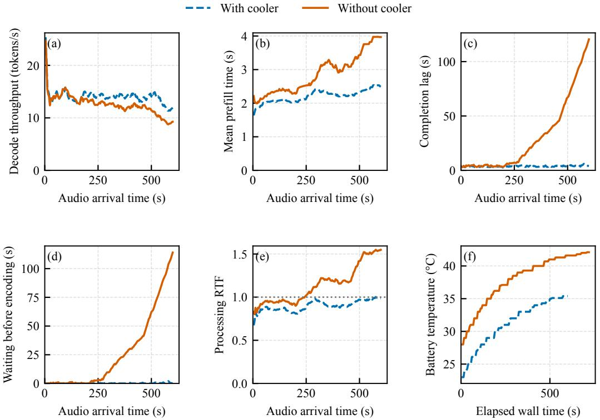  
Figure 9: The cooled configuration keeps pace over 600s, while the uncooled case develops backlog. Decode throughput, prefill time, and processing RTF use trailing windows of at most 15 blocks. Completion lag and queue wait show every block. Panels (a)–(e) use input-arrival time. Temperature uses elapsed wall time and includes final drain. The dotted line marks RTF 1. Both cases use 75% token retention, but source deadlines and initial thermal states differ as described above.

Table 16: The table summarizes both complete native deployment runs. Temperature comes from the battery sensor. Source-lifetime and initial-state differences preclude cooling-only attribution.
<table><tr><td>Metric</td><td>With cooler</td><td>Without cooler</td></tr><tr><td>Mean encoder / prefill / decode (s)</td><td>0.70 / 2.24 / 0.68</td><td>0.94 / 2.95 / 0.78</td></tr><tr><td>Mean complete block processing (s)</td><td>3.63</td><td>4.68</td></tr><tr><td>Active / resource RTF</td><td>0.907 / 1.007</td><td>1.171 / 1.201</td></tr><tr><td>Decode throughput (tokens/s)</td><td>13.87</td><td>12.23</td></tr><tr><td>p95 completion lag (s)</td><td>4.68</td><td>103.39</td></tr><tr><td>Final completion lag (s)</td><td>4.09</td><td>120.50</td></tr><tr><td>Maximum / final queue wait (s)</td><td>2.07 / 0.21</td><td>114.03 / 114.03</td></tr><tr><td>First / maximum battery temperature (°C)</td><td>23.0 / 35.4</td><td>28.0 / 42.1</td></tr><tr><td>Capped outputs</td><td>0</td><td>0</td></tr></table>

Auxiliary audio-token reduction. Audio-token pruning and merging can shorten the input to an audio language model while retaining useful acoustic information (Gibier et al., 2025; Luo et al., 2026). This deployment uses an auxiliary filter to reduce prefill cost while preserving temporal coverage. An offline-fitted linear ridge predictor scores projected encoder tokens by predicted targetattention importance. At runtime, one highest-scoring token is retained from each of 75 consecutive equal-time bins, preserving temporal coverage and order; retained tokens use consecutive target positions. Selection occurs before target prefill and its cost is included in encoder service. The target is not fine-tuned, while the scoring prior is fitted offline. This filter is a configuration of the sustained-run experiment.

Limits. This paced-recording study measures native runtime behavior rather than microphone/UI latency or an $\mathrm { A } \bar { \mathrm { s } } ^ { 2 } \mathrm { D }$ versus Target-only/SD comparison. It does not evaluate recognition accuracy under audio-token reduction. 28/150 cooled outputs contain at most three body tokens; all are retained. Output equality across the two deployment cases is 150/150. Better prefill kernels, token reduction with explicit quality evaluation, and thermal management are complementary options outside the decoding contribution. One run per condition and a fixed retention rate do not establish robustness across workloads or durations.

## E EXTENDED RELATED WORK

## E.1 ON-DEMAND AUDIO UNDERSTANDING

Prior systems let users retrieve information from previously captured audio. Memoro combines a wearable audio interface with semantic memory retrieval and concise LLM-generated assistance (Zulfikar et al., 2024). LA-RAG converts long recordings into timestamped event records and answers queries through structured retrieval (Hegde et al., 2026). These systems motivate responsive access to past audio, while choosing different representations for the retained information.

Audio language models can instead retain model context for later generation. MiniCPM-o 2.6 accepts continuous audio and video independently of user queries, with separate streaming-prefill and generation interfaces (OpenBMB, 2025). OmniMem allocates memory across audio and visual inputs and selects informative KV states to support long-context understanding within a memory budget (Sun et al., 2026). This preparation reduces work at request time, but generating a complete reply still requires decoding. $\mathrm { A } \mathrm { S } ^ { 2 } \mathrm { D }$ accelerates that stage under a fixed audio-preparation protocol. Its objective is request-to-complete-response latency on a phone, making input preparation, retrieval, and cache management complementary concerns.

## E.2 SPEECH PROPOSALS AND TARGET VERIFICATION

Standard speculative decoding separates cheaper proposal generation from target verification (Leviathan et al., 2023). Proposals may come from a separate model or reuse target layers, heads, and features (Zhang et al., 2024; Cai et al., 2024; Li et al., 2024a). Speech provides an additional source of candidate information. SpecASR exploits acoustic alignment through adaptive draft lengths, local draft recycling, and sparse trees (Wei et al., 2025). Its recycling procedure extends a branch from verified text and merges it with earlier drafts when their tokens realign. $\mathrm { A } s ^ { 2 } \mathrm { D }$ adapts this local reuse principle while letting the producer advance without synchronizing to target-prefix updates. An autoregressive producer still conditions on the request and its own generation history.

Speech-specific accelerators also differ in their search and acceptance rules. SMUD uses decoderassisted masking and masked/unmasked beam search to reduce ASR search cost (Okabe & Yamamoto, 2025). Whisper-Medusa accepts multi-head predictions using probability thresholds (Segal-Feldman et al., 2025). CTC encoder drafts already avoid dependence on target-text prefixes, but their confidence gating can bypass LLM verification, and their relaxed verification uses token-likelihood thresholds (Saon et al., 2026). These acceptance rules need not reproduce the target’s greedy output. $\mathsf { A S } ^ { 2 } ]$ D combines independently advancing proposals with asynchronous execution, retaining target verification and correction.

Speculative speech recognition studies a different form of anticipation: predicting future transcript tokens from audio heard so far (Yusuf et al., 2024). Our requests concern already received audio.

## E.3 ASYNCHRONOUS AND MOBILE EXECUTION

Asynchronous speculation changes when work is performed relative to target decisions. PEARL uses pre- and post-verification to overlap draft generation with verification (Liu et al., 2025). DSI schedules concurrent target and drafter instances to reduce latency (Timor et al., 2025). SSD prepares and caches continuations for predicted verification outcomes, reusing a continuation when the prediction matches (Kumar et al., 2026). These methods advance work from verified or hypothesized target-text prefixes. $\mathbf { A } \mathbf { S } ^ { 2 } \mathbf { D }$ instead draws candidates from the requested audio and instruction, so its producer can continue without enumerating possible target corrections. The target verifies ready candidates or decodes alone. Rejection triggers candidate realignment while the producer continues.

Mobile systems additionally account for memory capacity, data movement, and contention. LLMCad and EdgeLLM combine confidence-guided token-tree generation with verification and model-loading pipelines (Xu et al., 2023; 2025a). EdgeLLM accounts for interference by scheduling speculative work during target-weight loading rather than target computation. Lever combines tree construction and pruning with CPU–NPU execution for flash-backed targets (Wang et al., 2026). PELM jointly controls speculative execution and processor frequency, allowing partial-depth verification to trade output fidelity for efficiency (Yang & Xia, 2026). AHASD uses a custom NPU–PIM architecture and target feedback to confirm or roll back asynchronous drafts (Ma et al., 2026). $\mathbf { A } \mathbf { S } ^ { 2 } \mathbf { D }$ keeps the target resident and overlaps its computation with a target-decoupled audio producer on available phone processors. The useful overlap depends on candidate readiness and measured concurrent costs.

Resource-aware inference also spans other deployment settings. Liang et al. (2026) partition and preload an LLM across nearby mobile devices, then schedule layer-wise execution while accounting for computation and inter-device communication. On shared NVIDIA GPUs, SGDRC dynamically allocates compute units and memory bandwidth among concurrent DNN inference services (Zhang et al., 2025). These methods address distributed execution and shared-GPU contention, respectively. $\mathrm { A } s ^ { 2 } \mathrm { D }$ instead coordinates an audio producer and target verifier within one phone.

## E.4 CANDIDATE STRUCTURE AND DEPLOYMENT CONFIGURATION

SpecInfer, Sequoia, and EAGLE-2 organize or adapt candidate trees to increase coverage per verification pass (Miao et al., 2024; Chen et al., 2024; Li et al., 2024b). Our evaluated interface uses ordered candidate chains, which fit existing causal-attention runtimes and support different audio drafters.

Model selection can adapt inference to changing input conditions. Anole and its journal extension select among scene-specialized compressed models for cross-scene inference on mobile devices (Li et al., 2024c; 2025). This selection changes the model used for prediction. In $\mathrm { A } \mathrm { s } ^ { 2 } \mathrm { D }$ , the target model remains fixed, while a cheaper producer supplies candidates that the target verifies and corrects.

Configuration methods select drafters or candidate budgets. UniSpec calibrates draft size against acceptance and device-specific execution costs (Do et al., 2026). LTD trains state-dependent draft-tree depth and verification-size policies before deployment (Zhang et al., 2026), while MetaSD updates an alignment-feedback bandit online to select drafters (Kim et al., 2026). Online Speculative Decoding adapts the draft model itself (Liu et al., 2024). $\mathrm { A S } ^ { 2 } \mathrm { D }$ uses a fixed task-specific drafter and configures its budget using device profiles and development workloads (Appendix D.2.6). This deployment choice supports the asynchronous mechanism without requiring test-time learning.

## F DISCUSSION AND FUTURE DIRECTIONS

## F.1 TASK-DEPENDENT SPEEDUP AND COMPLEMENTARY SPECULATION

Target-decoupled drafting is useful when the audio and instruction provide candidates that remain aligned with the target’s response. Acceleration also depends on how quickly useful candidates arrive. Our translation and spoken-QA results illustrate why a high acceptance ratio alone is insufficient (Section 5.2). Task-specific drafter selection should account for both candidate supply and mobile execution cost. The drafter conditions on its own generation history, but does not observe the target’s intermediate decisions. Open-ended reasoning or dialogue may depend more strongly on those decisions, reducing usable candidate coverage. Our recognition, translation, and spoken-QA result do not establish comparable gains for such tasks. The target can continue alone when candidates are unusable, but concurrent drafting still consumes resources.

Prefix-conditioned speculation offers a complementary source of candidates. A future hybrid could retain the independent audio producer while selectively using continuations conditioned on target-text prefixes. SSD’s continuations for predicted verification outcomes (Kumar et al., 2026) and DSI’s scheduling of parallel target and drafter instances (Timor et al., 2025) offer possible component for this design. Whether additional coverage offsets prefix synchronization, speculative state, and processor contention on a phone requires evaluation.

## F.2 SUPPORTING FULL-DUPLEX DIALOGUE

Each response uses an audio view fixed at request arrival. New audio does not alter that response’s input, and the evaluated requests do not include user interruptions or multi-turn dialogue. Extending AS2D to these settings requires defining when new audio, revised instructions, and dialogue history enter the target context and which existing candidates remain eligible. Target and drafter state must follow those context boundaries while preserving causal input access. One direction is to update the response context at well-defined points while reusing previously processed audio and valid candidate continuations, extending AS2D toward continuous interaction.

The prepared-cache request sweep evaluates decoding from completed audio KV states. It does not establish an incremental cache-maintenance protocol across successive requests. Evaluating that extension requires matching audio preparation, request times, context, and commitment rules across methods, with any unfinished preparation or state repair charged after request arrival.

## F.3 RESOURCE ASSUMPTIONS AND FIXED CONFIGURATIONS

Useful overlap requires enough memory for resident target and drafter models, their KV states, and candidate buffers, together with processors that can execute concurrently. Shared-memory bandwidth and contention can reduce the benefit even when both models fit. We leave adaptive processor placement and parallel scheduling to future systems work. Such scheduling could account for thermal throttling, competing applications, and the relative execution costs of the target and drafter when assigning processors and coordinating concurrent work.

Configurations are selected before evaluation and remain fixed for each deployment. Changes in workload distribution, thermal state, or competing applications may change which configuration is preferable. The observed 1.80–2.67% gaps to the evaluated per-window oracle concern a finite catalog under the measured costs. They establish neither global optimality nor adaptation to changing operating conditions. Re-profiling the device and revisiting its configuration are possible extensions for these changing conditions.

## F.4 RESPONSE LATENCY AND PREPARATION COSTS

The objective is faster response generation after audio prefill. Preparing audio before a request moves that work off the response path but still consumes computation, memory, and energy. The Xiaomi 14 energy measurement covers one prepared-cache request, excluding earlier audio preparation and external cooling. The evaluation does not characterize energy over long listening sessions, the cost of retaining audio states for many possible requests, or battery-life tradeoffs. Decoding gains therefore do not by themselves establish lower total energy or end-to-end latency when audio preparation is unfinished. These costs are relevant to a complete always-available audio interface.

## F.5 EVALUATION SCOPE

The corpus-wide comparisons use phone-profile replay. ASR uses 688 full-audio test windows and 94,511 target tokens per phone on four separately calibrated profiles. Replay accounts for producer work, verification, correction, queueing, and drain, but excludes model loading and audio/prompt prefill. Translation and spoken QA use separate Omni-7B replay with a shared Omni-3B drafter and zero token-conversion cost. Their cohort-selection rules differ, and the profiles do not separately calibrate queue/cache-control costs or contention. Appendix D.1.2 specifies the post-hoc long-answer QA selection rule and its limits.

Native cases support the mechanism at their stated inputs and repetition counts. The native on-demand sweeps cover two phones, Redmi K70 Pro and Xiaomi 14, using a different 10-minute audio trace on each phone, with one formal request per checkpoint for each method. The 10-minute continuous-input study measures lag and temperature for a separate Omni-7B configuration with audio-token reduction. Its cooled run keeps pace with arriving audio, while the uncooled case develops backlog. The cases differ in initial thermal state and source lifetime as well as cooling. Their input is a paced recording with 12s context resets. They do not establish corpus-wide native gains, recognition quality under pruning, or stability beyond the measured duration. Appendix D.6 gives both native protocols.

## F.6 NUMERICAL SENSITIVITY ACROSS EXECUTION BACKENDS

Finite-precision target execution can vary with the backend and verification shape even under greedy decoding. Yuan et al. (2025) show that changing batch size, hardware configuration, and arithmetic precision can alter LLM outputs through rounding and floating-point non-associativity. He & Thinking Machines Lab (2025) further distinguish repeatability at a fixed configuration from batch invariance: matrix multiplication and attention may use different reduction schedules as the number of processed tokens changes. Small logit perturbations can therefore reverse the ranking of nearly tied tokens without stochastic sampling.

Native checks retain all observed output discrepancies. The K70 ASP calibration emits an additional comma relative to scalar decoding. Five of 40 Note 9 Pro resident-source calibration episodes fail exact output matching. The native on-demand sweep also contains output differences from Target-only. Appendix D retains these checks. These observations do not identify the cause of each discrepancy. They preclude an exact-output claim for the affected runs, even when their operation timings remain useful for cost calibration.

Replay cannot validate partial-KV repair. A real target may retain a numerically perturbed state even when observed greedy tokens agree. A state-equivalence claim requires validated accepted-prefix state restoration, with any repair cost included in the measured execution. Proposition 1 is conditional on reference-equivalent execution and state restoration. It does not assert bitwise reproducibility across distinct numerical implementations. Target checking and repair still govern which speculative tokens may be committed.