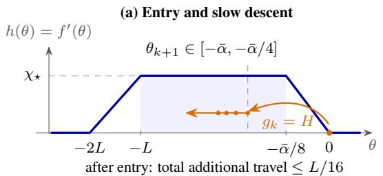
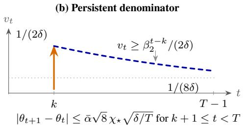
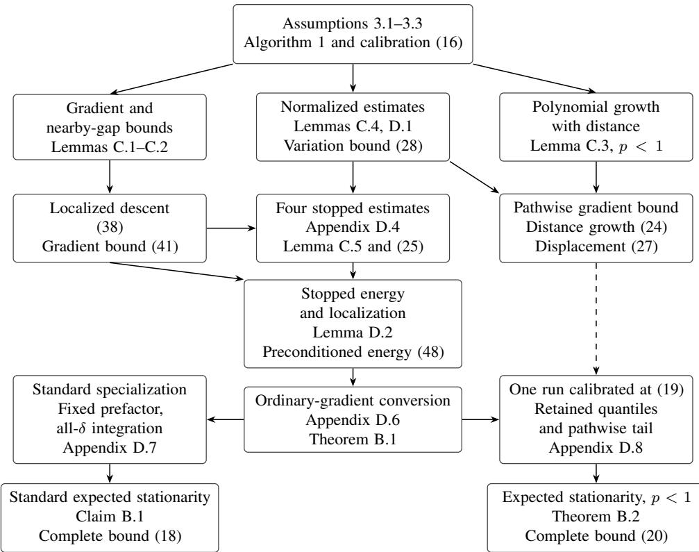
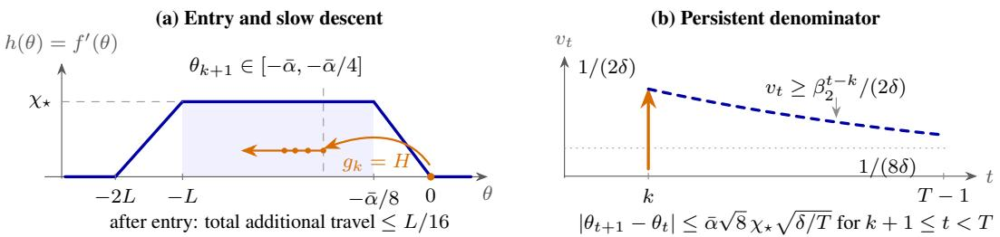
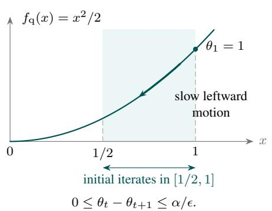
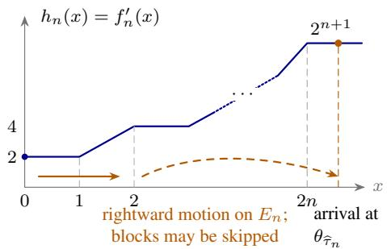

# Adam under Generalized Smoothness with Second-Moment-Type Stochastic Gradients

Ruinan Jin Mohamed bin Zayed University of Artificial Intelligence jinruinan3@gmail.com

Difei Cheng Aerospace Information Technology University

Jun Luo The Ohio State University

Hao Zhou JD.com, Inc.

Ling Chen The Ohio State University

Youzhi Zhang   
Centre for Artificial Intelligence and Robotics,   
Hong Kong Institute of Science & Innovation, Chinese Academy of Sciences youzhi.zhang@cair-cas.org.hk

## Abstract

It has been widely observed that Adam can remain stable even when the objective function deviates significantly from global smoothness. However, under the generalized smoothness framework, existing theoretical analyses typically rely on strong tail assumptions on stochastic gradients, such as almost-sure boundedness or sub-Gaussianity. Whether one can establish the convergence of Adam on generalized smooth objectives under only second moment information on the stochastic gradients, without imposing such strong concentration assumptions, was explicitly identified as an important open direction by Li et al. [2023b]. This paper gives an affirmative answer to this question under fairly general conditions. Specifically, we prove that such strong tail assumptions are not necessary. Building on the Adam self-normalization framework of Jin et al. [2026], which was developed for classical smoothness and bounded variance, we extend the stopping-time and de-preconditioning strategy to the $L _ { 0 } { - } L _ { p }$ generalized smoothness condition and a generalized second moment ABC condition. This extension shows that, even when the stochastic-gradient condition provides only second moment information and may grow along the trajectory, the stochastic trajectory of Adam remains in a locally well-behaved smoothness region, with stretched-exponential tail decay under bounded variance and global smoothness. As a consequence, we establish high-probability convergence rate guarantees over the full range $p < 2 ,$ , with a confidence dependence of order $\delta ^ { - 1 / 2 }$ , while the stepsize prefactor depends on δ only through a single logarithmic factor. Furthermore, we construct a hard instance proving that, under only second-moment information on the stochastic gradients, this $\delta ^ { - 1 / 2 } \ – \mathrm { t y p e }$ confidence dependence is sharp. Finally, in the more favorable regime $p < 1$ , we combine the above trajectory control with polynomial-growth estimates on rare events to further obtain convergence rate guarantees in expectation.

## 1 Introduction

Adaptive gradient methods are a standard tool in large-scale stochastic optimization, and Adam is arguably the most widely used example [Kingma and Ba, 2015, Reddi et al., 2018, Défossez et al., 2022, Li et al., 2023b]. Its practical robustness is usually attributed to two interacting mechanisms: momentum, which averages stochastic directions, and coordinatewise normalization, which rescales the update by a running average of squared gradients. These mechanisms are especially relevant when the objective is far from globally smooth. A common model for this behavior is $L _ { 0 } { - } L _ { p }$ generalized smoothness [Crawshaw et al., 2022, Zhang et al., 2020, Chen et al., 2023, Li et al., $2 0 2 \bar { 3 } \mathrm { a } .$ , Gorbunov et al., 2025], where the local variation of the gradient is allowed to grow with the size of the gradient itself.

The main obstacle in this regime is not merely to prove a descent inequality. Since the local smoothness scale depends on the current gradient norm, one first has to show that the stochastic trajectory does not enter a region where the objective becomes too irregular. For Adam this is delicate: the algorithm normalizes stochastic gradients by $\mathbf { v } _ { t } .$ , but $\mathbf { v } _ { t }$ itself contains the raw squared stochastic gradients. Under bounded or sub-Gaussian noise, one can often control this feedback loop through direct concentration. Under a second-moment assumption alone, rare but very large stochasticgradient spikes remain possible, so the raw gradient sequence need not have useful high-probability bounds.

This paper asks whether Adam can nevertheless be analyzed under such bounded-variance-type information. This is not merely a technical variant of existing results: after proving Adam guarantees under stronger bounded-gradient or sub-Gaussian assumptions, Li et al. [2023b] explicitly identified the bounded-variance setting as a challenging and important open direction for Adam under generalized smoothness. The answer we give is positive, but the result has a different structure from analyses based on strong tails. Our analysis builds on the self-normalized stopping-time framework of Jin et al. [2026], developed for Adam under classical smoothness and bounded variance, and extends it to generalized smoothness and generalized ABC second-moment growth. In this broader regime, self-normalization still controls the scaled quantities that actually move the iterate, not the raw stochastic gradients themselves. This distinction gives polylogarithmic trajectory localization, but controlling the adaptive denominator $\mathbf { v } _ { t }$ in the final de-preconditioning step necessarily incurs a $\delta ^ { - 1 / 2 }$ factor. Moreover, unlike the classical-smooth bounded-variance result of Jin et al. [2026], the local-smoothness and noise-growth restrictions here lead to a stepsize prefactor that depends on the confidence level only through a single logarithmic factor. We show through a hard instance that the resulting $\delta ^ { - 1 / 2 }$ factor is not a proof artifact in the stated high-probability stationarity guarantee.

Contributions. For the horizon-dependent theoretical calibration $\beta _ { 2 } = 1 - 1 / T$ , we prove the following results for Adam under $L _ { 0 } { - } L _ { p }$ generalized smoothness and a generalized second-moment ABC condition, using the Adam self-normalization framework of Jin et al. [2026] as a starting point.

• Trajectory localization without tail assumptions. We extend the self-normalized stoppingtime analysis to prove that, for any confidence level δ, both the auxiliary energy and the gradient scale along the Adam trajectory are bounded by $\mathrm { p o l y l o g } ( 1 / \delta )$ with probability at least $1 - \delta$ . Under bounded variance and global smoothness, a fixed stepsize gives stretched-exponentially decaying tail probability.

• High-probability convergencefor $p < 2 .$ The localization estimate yields a preconditioned energy bound. After converting it to an unweighted stationarity guarantee, we obtain

$$
\frac { 1 } { T } \sum _ { t = 1 } ^ { T - 1 } \| \nabla f ( \pmb \theta _ { t } ) \| ^ { 2 } \leq \widetilde O \bigg ( \frac { d } { \sqrt { \delta T } } + \frac { d ^ { 2 } } T \bigg )
$$

with probability at least $1 - \delta .$ . The additional $\delta ^ { - 1 / 2 }$ factor comes from controlling the maximum adaptive denominator.

• Sharpness of the confidence dependence. We construct a one-dimensional hard instance showing that, under second-moment assumptions alone, the $\delta ^ { - 1 / 2 }$ dependence in the highprobability stationarity rate cannot generally be replaced by a polylogarithmic dependence. In the construction, a rare spike in the stochastic gradient raises the adaptive denominator and keeps the iterates in a nonstationary ramp region for a constant fraction of the horizon.

• Expectation convergence and hard instances. In the more structured range $p < 1$ , generalized smoothness implies a polynomial distance-growth estimate for the true gradient. This allows the rare-event terms to be integrated, giving

$$
\frac { 1 } { T } \sum _ { t = 1 } ^ { T - 1 } \mathbb { E } \| \nabla f ( \pmb \theta _ { t } ) \| ^ { 2 } \leq \mathcal { O } \bigg ( \frac { d ( 1 + \log T ) } { \sqrt { T } } + \frac { d ^ { 2 } ( 1 + \log T ) ^ { 2 } } { T } \bigg ) .
$$

For $1 \le p < 2$ , we construct a fixed class of one-dimensional hard instances satisfying the same assumptions for which the calibrated Adam family has a worst-case expected squared-stationarity lower bound of $\Omega ( T ^ { - 1 / 3 } )$ , uniformly over deterministic, possibly horizon-dependent, base stepsize prefactors. Thus the above expectation rate cannot extend uniformly to the full generalized ABC class for this Adam family (Proposition 4.2).

Organization. Section 2 discusses the relation to existing analyses of Adam, generalized smoothness, and high-probability stochastic optimization. Section 3 formulates the problem, states the assumptions and Algorithm 1, and fixes notation. Section 4 states the main results. Section 5 outlines the upper- and lower-bound proofs, while full proofs are deferred to the appendix.

## 2 Related Work

Li et al. [2023b] analyze Adam under generalized smoothness with bounded or sub-Gaussian noise. Zhang et al. [2025] and Wang et al. [2024a] obtain convergence rates under $( L _ { 0 } , L _ { 1 } )$ -type smoothness with affine noise variance, for coordinatewise and scalar normalization, respectively. Theorem 4.2 is an expectation result only for $p < 1$ , with second moments that may grow with the function gap, while Theorem 4.1 is a high-probability result for all $p < 2 .$ . The closest high-probability analysis under generalized smoothness is Hong and Lin [2024], which allows exponents below 2 and obtains a polylogarithmic dependence on $1 / \bar { \delta }$ under an exponential-moment condition on the noise. This condition is much stronger than Assumption 3.3, which bounds only conditional second moments, so the two confidence dependences are not directly comparable. Under second moments alone, the factor $\delta ^ { - 1 / 2 }$ cannot in general be replaced by a polylogarithmic one (Proposition 4.1). Jin et al. [2025] establish convergence under ABC second moments. Jin et al. [2026] obtain polynomial-confidence guarantees under bounded conditional variance. We study generalized smoothness with generalized ABC growth, retaining coordinatewise normalization and distinguishing high-probability guarantees from expectation rates. Here exponential memory controls the adaptive denominator’s persistence. Appendix A discusses the broader literature on adaptive methods, noise models, localization, clipping, and the comparison scopes of stochastic optimization lower bounds.

## 3 Preliminaries

Throughout, let $f : \mathbb { R } ^ { d }  \mathbb { R }$ be a differentiable function, and let $\{ \zeta _ { t } \} _ { t \geq 1 }$ denote a sequence of independent random variables driving the stochastic-gradient oracle. All random quantities are defined on a common probability space $( \Omega , { \mathcal { F } } , \mathbb { P } )$ . Expectation with respect to P is denoted by E[·].

## 3.1 Adaptive Moment Estimation (Adam)

Adam [Kingma and Ba, 2015, Reddi et al., 2018, Wang et al., 2023a, Jin et al., 2025] is an adaptive first-order optimization method widely employed in stochastic settings. It maintains a denominatoraware first-moment variable and an exponentially weighted average of squared gradients. These moment estimates are then used to construct coordinatewise step sizes that adapt to the local geometry of the stochastic noise.

Formally, let $f : \mathbb { R } ^ { d } $ R be a differentiable function and let G be a stochastic-gradient oracle driven by independent random variables $\{ \zeta _ { t } \} _ { t \geq 1 }$ . At each iteration $t \geq 1$ , the stochastic gradient is denoted by

$$
\begin{array} { r } { \mathbf { g } _ { t } = \mathsf { G } ( \pmb { \theta } _ { t } ; \zeta _ { t } ) . } \end{array}
$$

The algorithm maintains two auxiliary variables $\mathbf { m } _ { t } , \mathbf { v } _ { t } \in \mathbb { R } ^ { d }$ and computes the next iterate through a coordinatewise scaling of the momentum term. The complete procedure is summarized in Algorithm 1.

Algorithm 1 Adam   
1: Input: Stochastic-gradient oracle ${ \sf G } ;$ base step size $\alpha > 0 ;$ initial point $\pmb { \theta } _ { 1 } \in \mathbb { R } ^ { d } ; \mathbf { m } _ { 0 } = \mathbf { 0 } ;$   
$\mathbf { v } _ { 0 } = v _ { \mathrm { i n i t } } \mathbf { 1 }$ with $v _ { \mathrm { i n i t } } > 0 ; \beta _ { 1 } \in [ 0 , 1 ) ; \beta _ { 2 } \in [ \bar { 0 } , 1 ) ; \epsilon > 0 ;$ number of iterations $T .$   
2: for $t = 1 , \dots , T - 1$ do   
3: Sample $\zeta _ { t }$ and compute gt $ \mathsf { G } ( \theta _ { t } ; \zeta _ { t } )$   
4: Update the second-moment estimate: $\mathbf { \boldsymbol { \mathsf { v } } } _ { t } \gets \beta _ { 2 } \mathbf { \boldsymbol { \mathsf { v } } } _ { t - 1 } + ( 1 - \beta _ { 2 } ) ( \mathbf { \boldsymbol { \mathsf { g } } } _ { t } \odot \mathbf { \boldsymbol { \mathsf { g } } } _ { t } )$   
5: Update the first-moment estimate: mt $ \beta _ { 1 } \mathbf { m } _ { t - 1 } + ( 1 - \beta _ { 1 } ) \mathbf { g } _ { t }$   
6: Form the coordinatewise effective step size: $\lambda _ { t }  \dot { \alpha } \cdot ( \sqrt { \mathbf { v } _ { t } } \bar { + } \epsilon ) ^ { - 1 }$ , where the inverse is   
taken element-wise.   
7: Update the iterate: $\pmb { \theta } _ { t + 1 }  \pmb { \theta } _ { t } - \lambda _ { t } \odot \mathbf { m } _ { t }$   
8: end for   
9: Output: iterate sequence $( \pmb { \theta } _ { t } ) _ { t = 1 } ^ { T } .$

All arithmetic operations in Algorithm 1 are executed componentwise, and the symbol ⊙ denotes the Hadamard product. For notational convenience, we also define the initial coordinatewise preconditioning vector by $\lambda _ { 0 } : = \alpha ( \sqrt { v _ { \mathrm { i n i t } } } + \epsilon ) ^ { - 1 } { \bf 1 }$ , where $v _ { \mathrm { i n i t } } > 0$ is the scalar initialization in $\mathbf { v } _ { 0 } = v _ { \mathrm { i n i t } } \mathbf { 1 }$ For a vector $u \in \mathbb { R } ^ { d }$ , we write $u _ { i }$ for its i-th coordinate; for a time-indexed vector $u _ { t } \in \mathbb { R } ^ { d }$ , we write $u _ { t , i }$ for its i-th coordinate.

Theoretical calibration. The results use $\alpha = \hat { \alpha } / \sqrt { T }$ and $\beta _ { 2 } = 1 - 1 / T$ for an integer horizon $T \geq 1 0 .$ , with fixed $\beta _ { 1 } \in [ 0 , 1 ) , v _ { \mathrm { i n i t } } > 0$ and $\epsilon > 0$ . This finite-horizon calibration, as in Jin et al. [2026] and Ghadimi and Lan [2013], fixes both parameters once $T$ is fixed. By Lemma $\mathrm { C . 4 } ,$ $\mathbf { v } _ { t , i } \geq v _ { \mathrm { i n i t } } / 4$ and $\lambda _ { t , i } \leq 2 \lambda _ { k , i }$ for $0 \leq k \leq t \leq T - \mathbf { \bar { 1 } }$ , so the effective stepsizes are comparable along the whole run. The lower bound on $\mathbf { v } _ { t }$ comes from the retained initialization, not from the stochastic gradients. We measure stationarity by $\begin{array} { r l } { \frac { 1 } { T } \sum _ { t = 1 } ^ { T - 1 } \| \nabla f ( \pmb { \theta } _ { t } ) \| ^ { 2 } } & { { } } \end{array}$ , the average of the squared true-gradient norm over the iterates output by Algorithm 1, not a single final iterate. Time-varying $\beta _ { 2 }$ schedules and restarts are outside the scope of the theorems.

Filtration. Let $\mathscr { F } _ { t } = \sigma ( \zeta _ { 1 } , . . . , \zeta _ { t } )$ for $t \geq 0 ,$ , with $\mathcal { F } _ { 0 } = \{ \emptyset , \Omega \}$ and $\mathcal { F } _ { \infty } = \sigma \big ( \cup _ { t \geq 0 } \mathcal { F } _ { t } \big )$ The filtration $\left\{ \mathcal { F } _ { t } \right\}$ encodes the information available up to time t. Each stochastic gradient $\mathbf { g } _ { t }$ is $\mathcal { F } _ { t } .$ -measurable, while $\theta _ { t }$ is $\mathcal { F } _ { t - 1 }$ -measurable. The Euclidean norm $\| \cdot \|$ is used throughout. For nonnegative bases, a zeroth power is interpreted as one, including $0 ^ { 0 } = 1$

## 3.2 Analytic Assumptions

We impose the following structural assumptions on the objective function and the stochastic gradient oracle.

Assumption 3.1 (Lower boundedness). The objective $f : \mathbb { R } ^ { d }  \mathbb { R }$ is bounded from below, $i . e . ,$

$$
f ^ { * } : = \operatorname* { i n f } _ { \pmb { \theta } \in \mathbb { R } ^ { d } } f ( \pmb { \theta } ) > - \infty .
$$

Assumption $3 . 2 ( L _ { 0 } – L _ { p }$ smoothness). Thefunction $f : \mathbb { R } ^ { d } $ R is continuously differentiable. There exist constants $L _ { 0 } > 0 , L _ { p } > 0$ , and a smoothness exponent $p \in [ 0 , 2 )$ such that,for all u, $u ^ { \prime } \in \mathbb { R } ^ { d }$ satisfying $\| u - u ^ { \prime } \| \leq L _ { p } ^ { - 1 }$

$$
\| \nabla f ( u ) - \nabla f ( u ^ { \prime } ) \| \leq \big ( L _ { 0 } + L _ { p } \| \nabla f ( u ) \| ^ { p } \big ) \| u - u ^ { \prime } \| .
$$

When $p = 0 ,$ , this reduces to global smoothness up to constants. For $p > 0 ,$ the local Lipschitz constant of the gradient is allowed to grow with the gradient norm. This captures objectives whose curvature can be much larger far from stationary regions, and it is precisely why a trajectory-localization argument is needed before applying descent estimates.

Assumption 3.3 (Generalized second-moment ABC inequality). Let $\{ \mathcal { F } _ { t } \} _ { t \ge 0 }$ be the naturalfiltration generated by the algorithm, and assume that $\theta _ { t }$ is $\mathcal { F } _ { t - 1 }$ -measurable. For each $t \geq 1$ , the stochastic gradient $\mathbf { g } _ { t }$ is an unbiased estimator of $\nabla f ( \pmb \theta _ { t } )$ , namely

$$
\mathbb { E } [ { \mathbf { g } } _ { t } \mid \mathcal { F } _ { t - 1 } ] = \nabla f ( \pmb { \theta } _ { t } ) .
$$

Moreover, there exist constants $A , B , C , \rho _ { 1 } , \rho _ { 2 } \geq 0$ such that

$$
\begin{array} { r } { \mathbb { E } \big [ \| \mathbf { g } _ { t } \| ^ { 2 } \bigm | \mathcal { F } _ { t - 1 } \big ] \leq A \big ( f ( \pmb \theta _ { t } ) - f ^ { * } \big ) ^ { \rho _ { 1 } } + B \| \nabla f ( \pmb \theta _ { t } ) \| ^ { \rho _ { 2 } } + C . } \end{array}
$$

This assumption is a second-moment condition, not a tail condition. It permits the conditional variance of the stochastic gradient to depend on both the function gap and the gradient norm, but it does not rule out rare large stochastic-gradient values. This is the main distinction from bounded-gradient, sub-Gaussian, or exponentially concentrated oracle models. By conditional unbiasedness,

$$
\begin{array} { r } { \mathbb { E } [ \| \mathbf { g } _ { t } \| ^ { 2 } \vert \mathcal { F } _ { t - 1 } ] = \| \nabla f ( \pmb { \theta } _ { t } ) \| ^ { 2 } + \mathbb { E } [ \| \mathbf { g } _ { t } - \nabla f ( \pmb { \theta } _ { t } ) \| ^ { 2 } \vert \mathcal { F } _ { t - 1 } ] . } \end{array}
$$

Hence Assumption 3.3 may equivalently be viewed as a variance-growth condition up to the deterministic term $\Vert \nabla f ( \pmb \theta _ { t } ) \Vert ^ { 2 }$ . The classical bounded-variance assumption

$$
\mathbb { E } [ \| \mathbf { g } _ { t } - \nabla f ( \pmb { \theta } _ { t } ) \| ^ { 2 } \ | \ \mathcal { F } _ { t - 1 } ] \leq \sigma ^ { 2 }
$$

is recovered in variance form by taking $A = B = 0$ and $C = \sigma ^ { 2 }$ . In the second-moment form used above, it corresponds to $A = 0 , B = 1 , \rho _ { 2 } = 2 .$ , and $C = \sigma ^ { 2 }$

## 4 Results

Throughout this section, we write

$$
\Psi ( x ) : = f ( x ) - f ^ { * } + 1 .\tag{1}
$$

We also use the standard auxiliary sequence

$$
\mathbf { z } _ { 1 } : = \pmb { \theta } _ { 1 } , \qquad \mathbf { z } _ { t } : = \frac { \pmb { \theta } _ { t } - \beta _ { 1 } \pmb { \theta } _ { t - 1 } } { 1 - \beta _ { 1 } } , \qquad t \geq 2 ,\tag{2}
$$

which removes the leading momentum term from the recursion. The results are organized around the two quantities that must be controlled in Adam: the trajectory itself and the adaptive denominator. Formal auxiliary lemmas, intermediate propositions, and complete proofs are deferred to the appendix.

The main statements below give the convergence orders. The order notation suppresses fixed problem and initialization parameters other than the dimension $d ; { \widetilde { \mathcal { O } } }$ also suppresses logarithmic factors in $1 / \delta .$ . Appendix B gives the complete inequalities; their constants are explicit but not optimized.

To display the confidence dependence of the stepsize, define

$$
\eta _ { \mathrm { g e n } } : = \mathbf { 1 } _ { \{ p > 0 \} } + \sqrt { A + [ B - 1 ] _ { + } + B \mathbf { 1 } _ { \{ \rho _ { 2 } \neq 2 \} } } , \qquad [ x ] _ { + } : = \operatorname* { m a x } \{ x , 0 \} .\tag{3}
$$

Theorem 4.1 (High-probability convergence, informal). Assume Assumptions 3.1–3.3. Let $T \geq 1 0$ and $\beta _ { 2 } = 1 - 1 / T$ . For every $0 < \delta < 1$ , an admissible prefactor $\bar { \alpha } > 0$ can be chosen with

$$
\bar { \alpha } ^ { - 1 } = d \Big [ \mathcal { O } ( 1 ) + \mathbf { 1 } _ { \{ \eta _ { \mathrm { g e n } } > 0 \} } \mathcal { O } ( \log ( 1 / \delta ) ) \Big ] ,\tag{4}
$$

where $\eta _ { \mathrm { g e n } }$ is defined in (3). Adam with $\alpha = \hat { \alpha } / \sqrt { T }$ then satisfies, with probability at least $1 - \delta ,$

$$
\operatorname* { m a x } _ { 1 \leq t \leq T } \Psi ( \mathbf { z } _ { t } ) = \mathcal { O } \big ( \big ( 1 + \log ( 1 / \delta ) \big ) ^ { 4 1 } \{ \mathfrak { m } _ { \mathfrak { g e n } } = 0 \} \big ) , \qquad \frac { 1 } { T } \sum _ { t = 1 } ^ { T - 1 } \| \nabla f ( \pmb { \theta } _ { t } ) \| ^ { 2 } = \widetilde { \mathcal { O } } \bigg ( \frac { d } { \sqrt { \delta T } } + \frac { d ^ { 2 } } { T } \bigg ) .
$$

Here Ψ and $\mathbf { z } _ { t }$ are defined in (1)–(2).

The complete inequalities and admissible stepsizes are given in Theorem B.1 of Appendix B, where the parameter scale ${ \mathcal { P } } _ { : }$ , the calibration scale R and the confidence height $U _ { \delta }$ are defined. The decomposition (4) describes the upper endpoint of that stepsize interval; its two order constants are independent of $T , \delta , d ,$ , and for $\eta _ { \mathrm { g e n } } > 0$ the height $U _ { \delta }$ is independent of δ.

Claim 4.1 (Smooth bounded-variance specialization, informal). For $p = 0 , A = 0 , B = 1 , \rho _ { 2 } = 2 $ the same result with a fixed prefactor $\bar { \alpha } > 0$ satisfying $\bar { \alpha } ^ { - 1 } = \mathcal { O } ( d )$ , as in (4), gives

$$
\frac { 1 } { T } \sum _ { t = 1 } ^ { T - 1 } \mathbb { E } \| \nabla f ( \pmb { \theta } _ { t } ) \| ^ { 2 } = \mathcal { O } ( d T ^ { - 1 / 2 } + d ^ { 2 } T ^ { - 1 } ) .
$$

Here $\eta _ { \mathrm { g e n } } = 0 \mathrm { i n } \left( 3 \right)$ , so the logarithmic term in (4) vanishes. The same fixed stepsize prefactor is therefore admissible at every confidence level. Integrating the quantile bound from Theorem B.1 therefore gives

$$
\begin{array} { r l r } {  { \frac { 1 } { T } \sum _ { t = 1 } ^ { T - 1 } \mathbb { E } \| \nabla f ( \theta _ { t } ) \| ^ { 2 } \le \mathcal { O } ( d T ^ { - 1 / 2 } ) \int _ { 0 } ^ { 1 } \frac { ( 1 + \log ( 1 6 / \delta ) ) ^ { 4 } } { \sqrt { \delta } } d \delta } } \\ & { } & { \quad + \mathcal { O } ( d ^ { 2 } T ^ { - 1 } ) \int _ { 0 } ^ { 1 } ( 1 + \log ( 1 6 / \delta ) ) ^ { 8 } d \delta = \mathcal { O } ( d T ^ { - 1 / 2 } + d ^ { 2 } T ^ { - 1 } ) . } \end{array}
$$

The constants in the order terms are independent of $T , \delta , d ,$ and both integrals are finite by the substitution $u = \log ( 1 / \delta )$ . Claim B.1 gives the explicit inequality; its full proof is in Appendix D.7.

By Cauchy–Schwarz, Claim 4.1 implies

$$
\frac { 1 } { T } \sum _ { t = 1 } ^ { T - 1 } \mathbb { E } \| \nabla f ( \pmb \theta _ { t } ) \| \leq \left( \frac { 1 } { T } \sum _ { t = 1 } ^ { T - 1 } \mathbb { E } \| \nabla f ( \pmb \theta _ { t } ) \| ^ { 2 } \right) ^ { 1 / 2 } = \mathcal { O } ( \sqrt { d } T ^ { - 1 / 4 } + d T ^ { - 1 / 2 } ) .
$$

For the regularized Adam calibration considered here, this recovers the expected-gradient-norm rate of Wang et al. [2023a, Theorem 2]. The implication between these moment criteria is strictly one-way: an expected norm bound alone does not control the corresponding squared moment. The algorithm in Wang et al. [2023a] uses an update without the denominator offset. The squared-gradient expectation rate in Claim 4.1 also agrees with the rate obtained by integrating the confidence bound of Jin et al. [2026, Theorem 1], whose stepsize prefactor is independent of the confidence level. Under global smoothness and bounded coordinatewise variance, assumptions much stronger than Assumptions 3.2– 3.3, Li et al. [2025] obtain an expected $\ell _ { 1 }$ rate without logarithmic factors; Appendix A relates it to Claim 4.1, whose standard specialization carries no log T factor.

Theorem 4.2 (Expected convergence for $p < 1$ , informal). Assume Assumptions 3.1–3.3 with $p < 1$ ， and let $T \geq 1 0 , \beta _ { 2 } = 1 - 1 / T . A$ prefactor $\bar { \alpha } _ { T } > 0$ with $\bar { \alpha } _ { T } ^ { - 1 } = d [ \mathcal { O } ( 1 ) + \mathbf { 1 } _ { \{ \eta _ { \mathrm { g e n } } > 0 \} } \mathcal { O } ( \log T ) ]$ can be chosen so that Adam with $\alpha = \bar { \alpha } _ { T } / \sqrt { T }$ satisfies

$$
\frac { 1 } { T } \sum _ { t = 1 } ^ { T - 1 } \mathbb { E } \| \nabla f ( \theta _ { t } ) \| ^ { 2 } = \mathcal { O } \bigg ( \frac { ( 1 + \log T ) ^ { 1 _ { \{ \eta _ { \mathrm { g e n } } > 0 \} } } d } { \sqrt { T } } + \frac { ( 1 + \log T ) ^ { 2 1 _ { \{ \eta _ { \mathrm { g e n } } > 0 \} } } d ^ { 2 } } { T } \bigg ) .
$$

Theorem B.2 in Appendix B gives the complete inequality and the polynomial-confidence calibration of the prefactor.

## 4.1 Rate obstructions

Proposition 4.1 (Confidence dependence, informal). Fix $\bar { \alpha } \in ( 0 , 1 ] , v _ { \mathrm { i n i t } } > 0 ,$ , and $\epsilon > 0 .$ . For sufficiently small $\delta > 0$ and sufficiently large T depending on $\delta ,$ there are one-dimensional instances in the classical specialization $p = 0 , A = 0 , B = 1 , \rho _ { 2 } = 2$ of Assumptions 3.1–3.3 for which Adam with $\beta _ { 1 } = 0 , \beta _ { 2 } = 1 - 1 / T$ , and $\alpha = \hat { \alpha } / \sqrt { T }$ satisfies

$$
\frac { 1 } { T } \sum _ { t = 1 } ^ { T - 1 } | \nabla f ( \pmb { \theta } _ { t } ) | ^ { 2 } = \Omega \bigg ( \frac { 1 } { \sqrt { \delta T } } \bigg ) \quad w i t h p r o b a b i l i t y \Omega ( \delta ) .
$$

The problem constants, initial objective gaps, and constants hidden in $\Omega$ are uniform in $T , \delta .$ . This obstruction also holds for fixed prefactors admitted by Theorem B.1.

Proposition B.1 gives the precise probability, parameter ranges, and comparison with the calibrated upper bound.

Proposition 4.2 (Expected stationarity for $1 \le p < 2$ , informal). Fix $\cdot p \in [ 1 , 2 ) , \beta _ { 1 } \in [ 0 , 1 ) , v _ { \mathrm { i n i t } } > 0 ,$ and $\epsilon > 0 .$ . There is a fixed class $\mathcal { C } _ { p }$ ofone-dimensional instances satisfying Assumptions $3 . l { - } 3 . 3 ,$ with common parameters including $A = 0$ and $\rho _ { 2 } = 3 ,$ , and uniform bounds on $\lvert \theta _ { 1 } \rvert , \hat { f ( \theta _ { 1 } ) } - f ^ { * }$ , and $| f ^ { \prime } ( \theta _ { 1 } )$ |, such that Adam with $\beta _ { 2 } = 1 - 1 / T$ and $\alpha = \bar { \alpha } _ { T } / \sqrt { T }$ satisfies,for all sufficiently large $T ,$

$$
\operatorname* { i n f } _ { \bar { \alpha } _ { T } > 0 } \operatorname* { s u p } _ { ( f , \mathsf { G } , \theta _ { 1 } ) \in \mathcal { C } _ { p } } \frac { 1 } { T } \sum _ { t = 1 } ^ { T - 1 } \mathbb { E } | f ^ { \prime } ( \theta _ { t } ) | ^ { 2 } \ge \Omega ( T ^ { - 1 / 3 } ) .
$$

The infimum is over deterministic, possibly horizon-dependent, prefactors; the class and implicit constant are independent $o f T , { \bar { \alpha } } _ { T }$ . Consequently, the polylog $( T ) / \sqrt { T }$ expectation rate cannot hold uniformlyfor this Adamfamily on thefull generalized ABC class.

Proposition B.2 specifies the common class parameters, the lower-bound coefficient, and the horizon range.

## 5 Proof Sketch

We summarize the main ideas behind the proofs. The central difficulty is to obtain high-probability trajectory control without assuming that the raw stochastic gradients concentrate. Following the self-normalized stopping-time viewpoint of Jin et al. [2026], the proof focuses on quantities that are normalized by Adam’s adaptive denominator, and only later converts the resulting preconditioned estimates into the usual stationarity measure. Two growth terms enter every descent estimate. Under Assumption 3.2 the curvature coefficient $L _ { 0 } + \bar { L _ { p } } \| \nabla f ( \pmb { \theta } _ { t } ) \| ^ { p }$ varies along the random trajectory, and under Assumption 3.3 the conditional second moment is bounded by $\mathbf { \bar { \boldsymbol { C } } } + \boldsymbol { A } ( f ( \pmb { \theta } _ { t } ) - \mathbf { \bar { \boldsymbol { f } } } ^ { * } ) ^ { \rho _ { 1 } } \mathbf { \bar { \mathbf { \xi } } } +$ $B \| \nabla f ( \pmb \theta _ { t } ) \| ^ { \rho _ { 2 } }$ , which depends on the same trajectory. Bounding both requires localization of the iterates, while the descent estimate that yields localization requires both bounds. We break it with the augmented energy $\mathcal { L } _ { t } = \Psi ( \mathbf { z } _ { t } ) + E _ { t } ^ { \top }$ from (5), stopped at the exit index $\sigma _ { U }$ from (32). Before exit, Lemmas C.1 and C.2 turn both growth terms into deterministic functions of $U .$ , the scales of (13)–(14), and the pathwise logarithmic bounds of Lemma D.1 together with the stopped martingale estimates close with conditional second moments only (Lemma D.2). The auxiliary sequence, the logarithmic energy lemma, and the de-preconditioning step (Appendix D.6) follow Jin et al. [2026]; the augmented energy with its gradient-energy telescope, the height-dependent calibration ${ \mathcal { R } } ( U )$ , the conditional-to-direct comparison (Lemma C.5) with Freedman’s inequality (25) before the crossing index τ from (47), the integration of the tail bounds over the confidence level for $p < 1$ (Appendix D.8), and the hard instances of Section 5.2 are specific to the present setting.

## 5.1 Upper Bounds

Auxiliary sequence and descent. The auxiliary sequence $\mathbf { z } _ { t }$ from (2) removes the direct momentum lag:

$$
\mathbf { z } _ { t + 1 } - \mathbf { z } _ { t } = - \lambda _ { t } \odot \mathbf { g } _ { t } + { \frac { \beta _ { 1 } } { 1 - \beta _ { 1 } } } ( \lambda _ { t - 1 } - \lambda _ { t } ) \odot \mathbf { m } _ { t - 1 } .
$$

The second term records the changing denominator. Pair the auxiliary objective Ψ from (1) with the predictable gradient energy

$$
E _ { t } = \sum _ { i } \lambda _ { t - 1 , i } ( \nabla f ( \pmb \theta _ { t } ) ) _ { i } ^ { 2 } , \qquad \mathscr L _ { t } = \Psi ( \mathbf z _ { t } ) + E _ { t } .\tag{5}
$$

The gradient-energy difference in (5) cancels the leading true-gradient part of the same-sample denominator error. The remaining localized descent has negative drift $- E _ { t } / 8$ , three centered terms, and seven nonnegative residuals; (38) gives the explicit decomposition. Its coefficients depend on the curvature and noise envelope along the trajectory.

Stopped preconditioned energy. The first ingredient turns objective localization into gradient and noise control.

Lemma 5.1 (Function-gap control, informal). Under Assumptions 3.1–3.2, with Ψfrom (1),

$$
\left\| \nabla f ( x ) \right\| = \mathcal { O } \Bigl ( \Psi ( x ) ^ { \operatorname* { m a x } \{ 1 , ( 2 - p ) ^ { - 1 } \} } \Bigr ) .
$$

$I f \| x - y \| \leq L _ { p } ^ { - 1 }$ , then

$$
\Psi ( x ) = \mathcal { O } \Bigl ( \Psi ( y ) ^ { \operatorname* { m a x } \{ 1 , p / ( 2 - p ) \} } \Bigr ) .
$$

The constants depend only on $L _ { 0 } , L _ { p } , p .$

The complete bounds are Lemmas C.1 and C.2 in Appendix C. The first follows by taking a short step against the gradient and comparing its decrease with $f ( x ) - f ^ { * }$ . The second integrates local smoothness between nearby points.

For $U \geq 1$ , stop at

$$
\sigma _ { U } = \operatorname* { i n f } \{ 1 \leq t \leq T : \Psi ( \mathbf { z } _ { t } ) > U \} , \qquad \operatorname* { i n f } \varnothing = \infty .\tag{6}
$$

The calibration keeps $\pmb { \theta } _ { t } , \mathbf { z } _ { t }$ within the comparison radius. Lemma 5.1 then bounds the true gradient before $\sigma _ { U }$ from (6) by a polynomial in $U ;$ the ABC condition gives a polynomial conditional secondmoment envelope. The indicator of $t < \sigma _ { U }$ is measurable before query t, so stopping preserves the centered terms’ zero conditional means. Summing the descent reduces localization to controlling the residuals and martingales in the energy (5).

Self-normalization without raw-gradient tails. Large oracle outputs are controlled through their normalized contribution to the update.

Lemma 5.2 (Normalized energy, informal). For Algorithm 1 with $T \geq 1 0 , \beta _ { 2 } = 1 - 1 / T ,$ , and $\alpha = \hat { \alpha } / \sqrt { T }$ , for any stopping index σ,

$$
\sum _ { t < T \land \sigma } \left( \left\| \lambda _ { t } \odot \mathbf { g } _ { t } \right\| ^ { 2 } + \left\| \lambda _ { t } \odot \mathbf { m } _ { t } \right\| ^ { 2 } + \left\| \lambda _ { t - 1 } \odot \mathbf { m } _ { t - 1 } \right\| ^ { 2 } \right) \le \mathcal { O } ( \bar { \alpha } ^ { 2 } ) \sum _ { i } \log \left( 1 + \frac { \sum _ { t < T \land \sigma } \mathbf { g } _ { t , i } ^ { 2 } } { T v _ { \mathrm { i n i t } } } \right) .
$$

The bound is pathwise.

Lemma D.1 is the formal statement. The accumulator comparison in Lemma C.4 allows logarithmic telescoping: a large sample raises both numerator and denominator, so its cumulative charge grows logarithmically. Expanding momentum into its geometric weights gives the same control for current and lagged momentum. Positive stepsize variation is bounded separately by (28).

Before $\sigma _ { U }$ from (6), the ABC envelope and Markov’s inequality control the logarithm on the right. Lemma C.5 and the direct variation bound (28) control the predictable compensator of the positive stepsize variation. Freedman’s inequality controls the centered descent terms. For the momentumvariation martingale, a predictable logarithmic crossing includes the first crossing update, whose size is paid for by the preceding normalized momentum energy. Thus no tail assumption on the raw gradient is needed.

From stopped energy to localization. The normalized-energy bounds close the stopped descent.

Lemma 5.3 (Localization and preconditioned energy, informal). Under Assumptions 3.1–3.3 and the calibration ofTheorem 4.1, with probability at least $1 - \delta / 2$

$$
\operatorname* { m a x } _ { 1 \leq t \leq T } \Psi ( \mathbf { z } _ { t } ) + \sum _ { t = 1 } ^ { T - 1 } E _ { t } = \mathcal { O } \big ( ( 1 + \log ( 1 / \delta ) ) ^ { 4 \mathbf { 1 } _ { \{ \eta _ { \mathrm { g e n } } = 0 \} } } \big ) ,
$$

where $\Psi , \mathbf { z } _ { t } , E _ { t }$ are defined in $( 1 ) , ( 2 )$ , and (5).

The precise stopped inequality and calibration appear in Lemma D.2. For the stopping height $U$ in (6), take the order in Lemma 5.3; if $\eta _ { \mathrm { g e n } } > 0$ , the logarithmic factor in (4) absorbs the logarithms. Absorb the centered sums and cumulative residuals into this height:

$$
\mathcal { L } _ { \sigma _ { U } \wedge T } + \frac { 1 } { 8 } \sum _ { t < \sigma _ { U } \wedge T } E _ { t } \leq U / 2 .
$$

The energy and stopping time are from $( 5 ) – ( 6 )$ . Since $\mathcal { L } _ { t } \geq \Psi ( \mathbf { z } _ { t } )$ , a first exit before or at $T$ would make the left side exceed $U ,$ a contradiction. The stopping never activates, and the same inequality bounds the full preconditioned gradient energy.

From localization to stationarity. On the localization event, a second Markov bound on the stopped centered-noise energy gives, with additional failure probability at most $\delta / 2$

$$
\operatorname* { m a x } _ { t < T , i } \mathbf { v } _ { t , i } \leq v _ { \mathrm { i n i t } } + \frac { 2 } { T } \sum _ { s = 1 } ^ { T - 1 } \| \nabla f ( \pmb { \theta } _ { s } ) \| ^ { 2 } + \frac { \mathrm { p o l y } ( U ) } { \delta } ,
$$

where $U$ is the height from (6) and the polynomial has coefficients depending only on the fixed problem parameters. Using this maximum to remove the coordinatewise weights in $E _ { t }$ from (5), and applying Lemma 5.3, yields the schematic bound

$$
\frac { 1 } { T } \sum _ { t = 1 } ^ { T - 1 } \| \nabla f ( \pmb \theta _ { t } ) \| ^ { 2 } \leq \mathcal { O } \bigg ( \frac { U } { \bar { \alpha } \sqrt { T } } \bigg ) \left( 1 + \sqrt { \frac { 1 } { T } \sum _ { s = 1 } ^ { T - 1 } \| \nabla f ( \pmb \theta _ { s } ) \| ^ { 2 } } + \sqrt { \frac { \mathrm { p o l y } ( U ) } { \delta } } \right) .
$$

Young’s inequality absorbs the square-root gradient average into the left side. Substituting this height and the prefactor in (4) gives Theorem 4.1; Appendix D.6 supplies the complete inequalities. The square root of the noise-energy threshold introduces the $\delta ^ { - 1 / 2 }$ confidence factor.

Expectation bound for $p < 1$ . The confidence-dependent calibration requires control of the most extreme trajectories. The crucial structural input is a distance bound on the true gradient.

Lemma 5.4 (Polynomial distance growth, informal). Under Assumption 3.2, $i f 0 \le p < 1$ , then for every reference point $x _ { \mathrm { r e f } }$

$$
\| \nabla f ( x ) \| = \mathcal { O } \Bigl ( ( 1 + \| x - x _ { \mathrm { r e f } } \| ) ^ { 1 / ( 1 - p ) } \Bigr ) , \qquad x \in \mathbb { R } ^ { d } .
$$

The constant depends only on $L _ { 0 } , L _ { p } , p a n d \| \nabla f ( x _ { \mathrm { r e f } } ) \|$

Lemma C.3 gives the complete inequality. Its proof applies the concavity of $u ^ { 1 - p }$ to gradient increments along a partition of the segment from $x _ { \mathrm { r e f } }$ to x. This converts local generalized smoothness into a global polynomial distance estimate.

With the prefactor $\hat { \alpha } _ { T }$ from Theorem 4.2, Adam’s normalized displacement satisfies

$$
\| \pmb { \theta } _ { t + 1 } - \pmb { \theta } _ { t } \| \leq 2 \sqrt { d } \bar { \alpha } _ { T } , \qquad \operatorname* { m a x } _ { t \leq T } \| \pmb { \theta } _ { t } - \pmb { \theta } _ { 1 } \| \leq 2 \sqrt { d } \bar { \alpha } _ { T } T ,
$$

as shown in (27). Combining this with Lemma $5 . 4 ,$ at $x _ { \mathrm { r e f } } = \pmb { \theta } _ { 1 }$ , gives

$$
\frac { 1 } { T } \sum _ { t = 1 } ^ { T - 1 } \lVert \nabla f ( \pmb { \theta } _ { t } ) \rVert ^ { 2 } = \mathcal { O } \Big ( ( 1 + \sqrt { d } \bar { \alpha } _ { T } T ) ^ { 2 / ( 1 - p ) } \Big ) .
$$

Fix the prefactor at the polynomial-confidence cutoff prescribed by Theorem B.2. The same run satisfies the high-probability bound at every larger confidence level. Integrating those quantiles costs only $\mathcal { O } ( d ( 1 + \log T ) / \sqrt { T } + d ^ { 2 } ( 1 + \log T ) ^ { 2 } / T )$ . The displayed pathwise bound controls all remaining quantiles: their interval has polynomially small length, chosen so that its product with this fixed power of T is $o ( T ^ { - 1 / 2 } )$ . This gives Theorem 4.2. The exact cutoff, integral bound, and rare-event term appear in (19)–(20).

## 5.2 Hard Instance

Hard instance for confidence dependence. For Proposition 4.1, fix $\beta _ { 1 } = 0$ and $\bar { \alpha } \in ( 0 , 1 ]$ , with $T , \delta$ in the proposition’s range. The one-dimensional objective has derivative $h = f ^ { \prime }$ that vanishes at $\theta _ { 1 } = 0$ and has a positive plateau to its left. Its scales are

$$
\chi _ { \star } = ( \delta T ) ^ { - 1 / 4 } , \qquad H = \sqrt { \frac { T } { 2 \delta } } , \qquad L = 1 6 \bar { \alpha } \sqrt { 8 } ( \delta T ) ^ { 1 / 4 } .\tag{7}
$$

With the scales in $( 7 ) .$ , the plateau occupies $[ - L , - \bar { \alpha } / 8 ]$ , with height $\chi _ { \star }$ . The oracle adds independent noise equal $\mathrm { t o } + H \mathrm { o r } - H$ , each with probability $\delta / T$ , and zero otherwise. Its noise variance is one.

With probability $\Omega ( \delta )$ , there is exactly one positive spike in the first half of the run and no other nonzero noise before T. That spike moves the iterate left into the plateau and raises the accumulator to order $\delta ^ { - 1 }$ . Because $\beta _ { 2 } = 1 - 1 / T$ , its contribution persists throughout the horizon. Later steps follow the positive true gradient, but their leftward displacements are $\bar { \mathcal { O } } ( \bar { \alpha } \delta ^ { 1 / 4 } T ^ { - 3 / 4 } )$ . The width L in (7) keeps a constant fraction of the iterates on the plateau. Their squared gradients have size $( \delta T ) ^ { - 1 / 2 }$ giving the confidence obstruction. Figure 1 shows both effects; Proposition B.1 and Appendix E give the complete construction.

  
Figure 1: Confidence obstruction for $\beta _ { 1 } = 0 .$ , with $\chi _ { \star } , H .$ , L from (7). On the event of one positive spike at time k and no other nonzero noise, Adam enters the shaded plateau and drifts slowly left. The dashed curve is a lower envelope of $v _ { t } .$ , which bounds the subsequent travel; both panels are schematic.

Hard instance for expectation when $1 \le p < 2$ . Proposition 4.2 uses a fixed class containing a deterministic quadratic and a countable staircase family. For $f _ { \mathrm { q } } ( x ) = x ^ { 2 } / 2$ , started at 1, each early displacement is at most $\alpha / \epsilon$ . Thus a long initial segment stays in $[ 1 / 2 , 1 ]$ , with squared gradient at least $1 / 4$ . This yields the $\dot { T } ^ { - 1 / 3 }$ lower bound when $\hat { \alpha } _ { T }$ is below a fixed multiple of $T ^ { - 1 / 6 }$

For larger prefactors, use a family indexed by integers $n \geq 1$ , started at $\theta _ { 1 } = 0$ . Its continuous staircase derivative has levels that double across blocks of width two, with

$$
h _ { n } : = f _ { n } ^ { \prime } , \qquad h _ { n } ( x ) = 2 ^ { n + 1 } \quad ( x \geq 2 n ) .\tag{8}
$$

At a point with $h = h _ { n } ( x ) \geq 2$ , the oracle returns $- h$ with probability $1 - h ^ { - 1 }$ , and $2 h ^ { 2 } - h$ with probability $h ^ { - 1 }$ . Its mean is h, and its second moment is $4 h ^ { 3 } - 3 h ^ { \overline { { 2 } } }$ . These instances share the generalized ABC parameters in Proposition 4.2.

For $h _ { n }$ in (8), let $\widehat { \tau } _ { n }$ be the first index at which the iterate is at or beyond 2n on the deterministic path that always selects the negative branch. The stochastic run follows this path on the event

$$
\begin{array} { r } { E _ { n } : = \{ \mathbf { g } _ { t } = - h _ { n } ( \theta _ { t } ) \mathrm { f o r e v e r y } 1 \leq t < \widehat { \tau } _ { n } \} . } \end{array}\tag{9}
$$

On $E _ { n }$ from (9), negative momentum drives the iterate right, against the positive true gradient. Bounding the time spent in each block controls the accumulator and places an arrival before T. Using the terminal height in (8) and the event in (9), the single arrival term gives

$$
{ \frac { 1 } { T } } \sum _ { t = 1 } ^ { T - 1 } \mathbb { E } | f _ { n } ^ { \prime } ( \theta _ { t } ) | ^ { 2 } \geq { \frac { 4 ^ { n + 1 } } { T } } \mathbb { P } ( E _ { n } ) .
$$

Choosing n balances the growing gradient against the probability cost of this path; with the quadratic case, this yields the uniform $T ^ { - 1 / 3 }$ lower bound over deterministic prefactors (Figure 4 and $\mathsf { A p - }$ pendix F).

## 6 Conclusion

Adam admits high-probability convergence guarantees under $L _ { 0 } { - } L _ { p }$ generalized smoothness and generalized ABC second-moment growth. Self-normalization and stopped augmented energy control the trajectory, while the final de-preconditioning step gives the $\delta ^ { - 1 / 2 }$ confidence dependence. The expectation theorem for $p < 1$ and the fixed-class lower bound for $1 \le p < 2$ distinguish the two regimes for the calibrated Adam family.

## Acknowledgments

This research is supported by the InnoHK funding.

## References

Yossi Arjevani, Yair Carmon, John C. Duchi, Dylan J. Foster, Nathan Srebro, and Blake Woodworth. Lower bounds for non-convex stochastic optimization. Mathematical Programming, 199(1–2): 165–214, 2023.

Xiangyi Chen, Sijia Liu, Ruoyu Sun, and Mingyi Hong. On the convergence of a class of Adam-type algorithms for non-convex optimization. In International Conference on Learning Representations (ICLR), 2019.

Ziyi Chen, Yi Zhou, Yingbin Liang, and Zhaosong Lu. Generalized-smooth nonconvex optimization is as efficient as smooth nonconvex optimization. In Proceedings of the 40th International Conference on Machine Learning, volume 202 of Proceedings ofMachine Learning Research, pages 5396–5427, 2023.

Michael Crawshaw, Mingrui Liu, Francesco Orabona, Wei Zhang, and Zhenxun Zhuang. Robustness to unbounded smoothness of generalized SignSGD. In Advances in Neural Information Processing Systems, volume 35, 2022.

Ashok Cutkosky and Harsh Mehta. High-probability bounds for non-convex stochastic optimization with heavy tails. In Advances in Neural Information Processing Systems, volume 34, pages 4883–4895. Curran Associates, Inc., 2021.

Alexandre Défossez, Léon Bottou, Francis Bach, and Nicolas Usunier. A simple convergence proof of Adam and Adagrad. Transactions on Machine Learning Research, 2022. ISSN 2835-8856.

John Duchi, Elad Hazan, and Yoram Singer. Adaptive subgradient methods for online learning and stochastic optimization. Journal of Machine Learning Research, 12(61):2121–2159, 2011.

Matthew Faw, Isidoros Tziotis, Constantine Caramanis, Aryan Mokhtari, Sanjay Shakkottai, and Rachel Ward. The power of adaptivity in SGD: Self-tuning step sizes with unbounded gradients and affine variance. In Proceedings ofThirty Fifth Conference on Learning Theory, volume 178 of Proceedings ofMachine Learning Research, pages 313–355. PMLR, 2022.

David A. Freedman. On tail probabilities for martingales. The Annals of Probability, 3(1):100–118, 1975.

Saeed Ghadimi and Guanghui Lan. Stochastic first- and zeroth-order methods for nonconvex stochastic programming. SIAM Journal on Optimization, 23(4):2341–2368, 2013.

Eduard Gorbunov, Marina Danilova, and Alexander Gasnikov. Stochastic optimization with heavytailed noise via accelerated gradient clipping. In Advances in Neural Information Processing Systems, volume 33, pages 15042–15053. Curran Associates, Inc., 2020.

Eduard Gorbunov, Nazarii Tupitsa, Sayantan Choudhury, Alen Aliev, Peter Richtárik, Samuel Horváth, and Martin Takác. Methods for convexˇ $( L _ { 0 } , L _ { 1 } )$ -smooth optimization: Clipping, acceleration, and adaptivity. In International Conference on Learning Representations (ICLR), 2025.

Robert Mansel Gower, Nicolas Loizou, Xun Qian, Alibek Sailanbayev, Egor Shulgin, and Peter Richtárik. SGD: General analysis and improved rates. In Proceedings ofthe 36th International Conference on Machine Learning, volume 97 of Proceedings of Machine Learning Research, pages 5200–5209. PMLR, 2019.

Yusu Hong and Junhong Lin. On convergence of Adam for stochastic optimization under relaxed assumptions. In Advances in Neural Information Processing Systems, volume 37, 2024.

Ruichen Jiang, Devyani Maladkar, and Aryan Mokhtari. Provable complexity improvement of Ada-Grad over SGD: Upper and lower bounds in stochastic non-convex optimization. In Proceedings of Thirty Eighth Conference on Learning Theory, volume 291 of Proceedings of Machine Learning Research, pages 3124–3158, 2025.

Ruinan Jin, Xiaoyu Wang, and Baoxiang Wang. Stability and convergence analysis of Ada-Grad for non-convex optimization via novel stopping time-based techniques. arXiv preprint arXiv:2409.05023, 2024.

Ruinan Jin, Xiao Li, Yaoliang Yu, and Baoxiang Wang. A comprehensive framework for analyzing the convergence of Adam: Bridging the gap with SGD. In Proceedings of the 42nd International Conference on Machine Learning, volume 267, pages 27979–28030, 2025.

Ruinan Jin, Yingbin Liang, and Shaofeng Zou. Why Adam can beat SGD: Second-moment normalization yields sharper tails. arXiv preprint arXiv:2603.03099, 2026.

Ahmed Khaled and Peter Richtárik. Better theory for SGD in the nonconvex world. Transactions on Machine Learning Research, 2023. ISSN 2835-8856.

Diederik P. Kingma and Jimmy Ba. Adam: A method for stochastic optimization. In International Conference on Learning Representations (ICLR), 2015.

Anastasia Koloskova, Hadrien Hendrikx, and Sebastian U. Stich. Revisiting gradient clipping: Stochastic bias and tight convergence guarantees. In Proceedings of the 40th International Conference on Machine Learning, volume 202 of Proceedings ofMachine Learning Research, pages 17343–17363. PMLR, 2023.

Haochuan Li, Jian Qian, Yi Tian, Alexander Rakhlin, and Ali Jadbabaie. Convex and non-convex optimization under generalized smoothness. In Advances in Neural Information Processing Systems, volume 36, pages 40238–40271, 2023a.

Haochuan Li, Alexander Rakhlin, and Ali Jadbabaie. Convergence of Adam under relaxed assumptions. In Advances in Neural Information Processing Systems, volume 36, 2023b.

Huan Li, Yiming Dong, and Zhouchen Lin. On the $\mathcal { O } ( \sqrt { d } / K ^ { 1 / 4 } )$ convergence rate of AdamW measured by ℓ1 norm. In Advances in Neural Information Processing Systems, volume 38, pages 132360–132387, 2025.

Xiaoyu Li and Francesco Orabona. On the convergence of stochastic gradient descent with adaptive stepsizes. In Proceedings of the Twenty-Second International Conference on Artificial Intelligence and Statistics, volume 89 of Proceedings of Machine Learning Research, pages 983–992. PMLR, 2019.

Zijian Liu, Ta Duy Nguyen, Thien Hang Nguyen, Alina Ene, and Huy L. Nguyen. High probability convergence of stochastic gradient methods. In Proceedings ofthe 40th International Conference on Machine Learning, volume 202, pages 21884–21914, 2023.

Liam Madden, Emiliano Dall’Anese, and Stephen Becker. High probability convergence bounds for non-convex stochastic gradient descent with sub-weibull noise. Journal ofMachine Learning Research, 25(241):1–36, 2024.

Ta Duy Nguyen, Thien Hang Nguyen, Alina Ene, and Huy Le Nguyen. Improved convergence in high probability of clipped gradient methods with heavy tailed noise. In Advances in Neural Information Processing Systems, volume 36, pages 24191–24222. Curran Associates, Inc., 2023.

Sashank J. Reddi, Satyen Kale, and Sanjiv Kumar. On the convergence of Adam and beyond. In International Conference on Learning Representations (ICLR), 2018.

Abdurakhmon Sadiev, Marina Danilova, Eduard Gorbunov, Samuel Horváth, Gauthier Gidel, Pavel Dvurechensky, Alexander Gasnikov, and Peter Richtárik. High-probability bounds for stochastic optimization and variational inequalities: the case of unbounded variance. In Proceedings ofthe 40th International Conference on Machine Learning, volume 202 of Proceedings of Machine Learning Research, pages 29563–29648. PMLR, 2023.

Bohan Wang, Jingwen Fu, Huishuai Zhang, Nanning Zheng, and Wei Chen. Closing the gap between the upper bound and lower bound of Adam’s iteration complexity. In Advances in Neural Information Processing Systems, volume 36, pages 39006–39032, 2023a.

Bohan Wang, Huishuai Zhang, Zhi-Ming Ma, and Wei Chen. Convergence of AdaGrad for non-convex objectives: Simple proofs and relaxed assumptions. In Proceedings of Thirty Sixth Conference on Learning Theory, volume 195, pages 161–190, 2023b.

Bohan Wang, Huishuai Zhang, Qi Meng, Ruoyu Sun, Zhi-Ming Ma, and Wei Chen. On the convergence of Adam under non-uniform smoothness: Separability from SGDM and beyond. arXiv preprint arXiv:2403.15146, 2024a.

Bohan Wang, Yushun Zhang, Huishuai Zhang, Qi Meng, Ruoyu Sun, Zhi-Ming Ma, Tie-Yan Liu, Zhi-Quan Luo, and Wei Chen. Provable adaptivity of Adam under non-uniform smoothness. In Proceedings ofthe 30th ACM SIGKDD Conference on Knowledge Discovery and Data Mining, pages 2960–2969, 2024b.

Rachel Ward, Xiaoxia Wu, and Léon Bottou. AdaGrad stepsizes: Sharp convergence over nonconvex landscapes. Journal ofMachine Learning Research, 21(219):1–30, 2020.

Jingzhao Zhang, Tianxing He, Suvrit Sra, and Ali Jadbabaie. Why gradient clipping accelerates training: A theoretical justification for adaptivity. In International Conference on Learning Representations (ICLR), 2020.

Qi Zhang, Yi Zhou, and Shaofeng Zou. Convergence guarantees for RMSProp and Adam in generalized-smooth non-convex optimization with affine noise variance. Transactions on Machine Learning Research, 2025.

Yushun Zhang, Congliang Chen, Naichen Shi, Ruoyu Sun, and Zhi-Quan Luo. Adam can converge without any modification on update rules. In Advances in Neural Information Processing Systems, volume 35, pages 28386–28399, 2022.

## A Extended Related Work

## A.1 Adam and adaptive-gradient convergence

Adam combines momentum with coordinatewise second-moment normalization [Kingma and Ba, 2015]. Reddi et al. [2018] identify convergence failures and introduce AMSGrad, while Chen et al. [2019] give convergence conditions for a class of Adam-type methods. Défossez et al. [2022] analyze Adam and AdaGrad under bounded stochastic gradients. Zhang et al. [2022] study Adam without changing its update rule, including the role of its parameter choices and sampling scheme. Wang et al. [2023a] establish finite-time complexity bounds under bounded variance, and Jin et al. [2025] develop an ABC-based framework for finite-time and asymptotic Adam convergence. These analyses address how the adaptive denominator interacts with the gradient used in the same update.

Li et al. [2025] prove that AdamW satisfies $\begin{array} { r } { \frac { 1 } { T } \sum _ { t = 1 } ^ { T } \mathbb { E } \| \nabla f ( \pmb { \theta } _ { t } ) \| _ { 1 } = \mathcal { O } ( \sqrt { d } T ^ { - 1 / 4 } ) } \end{array}$ with no logarithmic factor. Their analysis assumes global smoothness and coordinatewise bounded conditional variance. These assumptions are much stronger than Assumptions 3.2–3.3: they exclude curvature growth, and they bound the variance by a constant instead of letting the second moment grow with powers of the function gap and of the gradient norm. Their problem class is therefore contained in the case $p = 0 , A = 0 , B = 1 , \rho _ { 2 } = 2$ of the present setting, and their criterion is the expected $\ell _ { 1 }$ norm. For these reasons a comparison of the two results has limited meaning; the only common quantity is the exponent of $T$ on that subclass. There, $\| \nabla f ( \pmb { \theta } _ { t } ) \| _ { 1 } \leq \sqrt { d } \| \nabla f ( \pmb { \theta } _ { t } ) \|$ and the expected-norm bound obtained above from Claim 4.1 by Cauchy–Schwarz give

$$
\frac { 1 } { T } \sum _ { t = 1 } ^ { T - 1 } \mathbb { E } \| \nabla f ( \pmb { \theta } _ { t } ) \| _ { 1 } = \mathcal { O } ( d T ^ { - 1 / 4 } + d ^ { 3 / 2 } T ^ { - 1 / 2 } ) .
$$

This recovers the exponent $T ^ { - 1 / 4 }$ , with a dimension factor larger by $\sqrt { d }$ than in Li et al. [2025] and with constants that are not optimized. The logarithms in Theorem 4.1 depend only on $1 / \delta$ and are integrated out in Claim 4.1, so this specialization carries no log T factor.

AdaGrad provides a complementary perspective on adaptive scaling. Duchi et al. [2011] develop adaptive subgradient methods for online learning and stochastic optimization. In nonconvex optimization, Li and Orabona [2019] study adaptive stepsizes, and Ward et al. [2020] give convergence guarantees for AdaGrad-Norm. Faw et al. [2022] allow unbounded gradients and affine variance; Wang et al. [2023b] use potential arguments under relaxed stochastic assumptions. Jin et al. [2024] apply stopping-time techniques to AdaGrad under global smoothness, with distinct assumptions for their finite-time and asymptotic conclusions. Jiang et al. [2025] compare coordinatewise AdaGrad and SGD through upper and lower complexity bounds with coordinatewise smoothness and noise parameters. Scalar normalization, coordinatewise accumulation, and exponential moving averages produce different denominator recursions, so their cancellation and memory estimates enter the analyses differently.

## A.2 Generalized smoothness and second-moment growth

Zhang et al. [2020] motivate gradient-dependent smoothness through the behavior of gradient clipping. Crawshaw et al. [2022] study generalized SignSGD under unbounded smoothness. Chen et al. [2023] develop a generalized-smooth nonconvex framework, while Li et al. [2023a] analyze convex and nonconvex optimization under generalized smoothness. Gorbunov et al. [2025] study clipping, acceleration, and adaptivity for convex $( L _ { 0 } , L _ { 1 } )$ -smooth objectives. The distinctions among local gradient inequalities, coordinatewise conditions, and Hessian growth bounds matter when transferring a convergence guarantee between these settings.

For Adam, Li et al. [2023b] establish guarantees under relaxed smoothness with bounded or sub-Gaussian noise and identify bounded variance as an open direction. Hong and Lin [2024] analyze Adam under relaxed smoothness and an exponential-moment noise envelope. Wang et al. [2024b] study random-reshuffling Adam for finite sums under non-uniform smoothness and growth conditions. Wang et al. [2024a] analyze scalar-normalized Adam under non-uniform smoothness and affine noise variance, including comparisons with momentum SGD. Zhang et al. [2025] obtain RMSProp and Adam guarantees under coordinatewise generalized smoothness and coordinatewise affine secondmoment growth, with the regularizer inside the square root. Here Assumption 3.2 is a Euclidean local gradient inequality, Assumption 3.3 allows powers of the function gap and gradient norm, and Algorithm 1 uses $\sqrt { \mathbf { v } _ { t } } + \epsilon$

The ABC condition belongs to a broader family of moment-growth models. Gower et al. [2019] use expected smoothness to analyze SGD under general sampling. Khaled and Richtárik [2023] develop a nonconvex second-moment model combining the function gap, squared gradient norm, and a constant noise term. The usual linear ABC form is contained in Assumption 3.3 by taking $\rho _ { 1 } = 1$ and $\rho _ { 2 } = 2$ . Allowing other exponents accommodates nonlinear growth of the oracle’s second moment while retaining conditional unbiasedness. This condition controls second moments without requiring almost-sure boundedness or an exponential-moment bound.

## A.3 High-probability guarantees under weak moments

Ghadimi and Lan [2013] establish stochastic first-order stationarity guarantees for smooth nonconvex objectives. High-probability bounds depend on both the noise model and the algorithm: Liu et al. [2023] analyze stochastic gradient methods under sub-Gaussian noise, and Madden et al. [2024] treat norm sub-Weibull noise. Martingale inequalities such as Freedman [1975] control sums through conditional variance and bounded increments. In adaptive analyses, these tools can be applied to normalized quantities even when raw oracle values are unbounded.

Clipping gives another route under weak moment assumptions. Gorbunov et al. [2020] obtain accelerated clipped methods for convex stochastic optimization with heavy-tailed noise. Cutkosky and Mehta [2021] give high-probability nonconvex guarantees using clipped normalized momentum under moment bounds on the stochastic gradient. Nguyen et al. [2023] analyze clipped methods under centered heavy-tailed noise, and Sadiev et al. [2023] treat stochastic optimization and variational inequalities with bounded noise moments of order between one and two. Koloskova et al. [2023] characterize stochastic clipping bias and establish convergence guarantees and lower bounds for clipped SGD. Their mechanisms and assumptions differ from the unclipped, same-sample coordinatewise normalization in Algorithm 1.

## A.4 Self-normalization and comparison scopes

Jin et al. [2026] connect Adam’s second-moment normalization to high-probability stationarity under classical smoothness and bounded conditional variance. Their stopping-time and de-preconditioning viewpoint separates control of the normalized trajectory from control of the accumulator used in the final gradient conversion. For generalized smoothness and ABC growth, the localized curvature and noise envelope depend on the objective height. The augmented energy in the present analysis pairs the true-gradient contribution with a telescope before bounding the centered noise, yielding the explicit squared-stationarity estimate in Theorem B.1.

Lower bounds must be compared at the same oracle model, stationarity measure, and algorithmic scope. Arjevani et al. [2023] establish oracle-complexity lower bounds for smooth nonconvex stochastic optimization under bounded-variance and related oracle models. Proposition B.1 concerns the confidence factor for the calibrated Adam family with horizon-length memory. Proposition B.2 concerns expected averaged squared gradients on a fixed generalized ABC class with $\rho _ { 2 } ~ = ~ 3$ uniformly over deterministic base stepsize prefactors. Its benchmark is the square-root-horizon expectation rate in Theorem B.2; its quantifiers concern this Adam family rather than all stochastic first-order algorithms.

## B Formal Results

This appendix gives the complete statements corresponding to Section 4. We use the auxiliary objective and sequence in (1)–(2).

## B.1 Parameter scales and convergence bounds

The two gradient-growth comparison quantities used throughout are

$$
K = \operatorname* { m a x } \left\{ ( 4 L _ { p } + 1 ) ^ { \operatorname* { m a x } \left\{ 1 , ( 2 - p ) ^ { - 1 } \right\} } , \sqrt { 4 L _ { 0 } } \right\} ,\tag{10}
$$

$$
C _ { \mathrm { q } } = 1 + \frac { K } { L _ { p } } + \frac { L _ { 0 } + L _ { p } K ^ { p } } { 2 L _ { p } ^ { 2 } } .\tag{11}
$$

Both depend only on $L _ { 0 } , L _ { p } , p$ . The notation $[ z ] _ { + }$ means max{z, 0}.

With Ψ from (1), the constants $L _ { 0 } , L _ { p }$ of Assumption 3.2 and $C$ of Assumption 3.3, the fixed parameter scale used in the high-probability analysis is

$$
\begin{array} { r l r } {  { \mathcal { P } = 3 + \frac { 7 \beta _ { 1 } } { 1 - \beta _ { 1 } } + \frac { \beta _ { 1 } ^ { 2 } } { ( 1 - \beta _ { 1 } ) ^ { 2 } } } } \\ & { } & { + \Psi ( \pmb \theta _ { 1 } ) + \| \nabla f ( \pmb \theta _ { 1 } ) \| + L _ { 0 } + L _ { p } + C + \sqrt C } \\ & { } & { + \epsilon + v _ { \mathrm { i n i t } } ^ { - 1 } + v _ { \mathrm { i n i t } } ^ { - 3 / 2 } . } \end{array}\tag{12}
$$

For an auxiliary-objective height $U \geq 1$ , use $K$ and $C _ { \mathrm { q } }$ from (10)–(11) together with $A , B , \rho _ { 1 } , \rho _ { 2 }$ of Assumption 3.3, to define the gradient radius and the growing part of the noise variance by

$$
\begin{array} { r l } & { G _ { \mathfrak { q } } ( U ) = K C _ { \mathfrak { q } } ^ { \operatorname* { m a x } \{ 1 , ( 2 - p ) ^ { - 1 } \} } U ^ { \operatorname* { m a x } \{ 1 , p / ( 2 - p ) ^ { 2 } \} } , } \\ & { \mathcal { V } _ { \mathfrak { q } } ( U ) = A C _ { \mathfrak { q } } ^ { \rho _ { 1 } } U ^ { \rho _ { 1 } \operatorname* { m a x } \{ 1 , p / ( 2 - p ) \} } + \underset { 0 \leq z \leq G _ { \mathfrak { q } } ( U ) } { \operatorname* { s u p } } [ B z ^ { \rho _ { 2 } } - z ^ { 2 } ] _ { + } . } \end{array}\tag{13}
$$

Using $\mathcal { P }$ from (12) and the local scales in (13), define the calibration scale

$$
\begin{array} { r l } & { \mathcal { R } ( U ) = \mathcal { P } + L _ { p } [ G _ { \mathrm { q } } ( U ) ^ { p } - 1 ] _ { + } + \mathcal { V } _ { \mathrm { q } } ( U ) + \sqrt { \mathcal { V } _ { \mathrm { q } } ( U ) } } \\ & { \quad \quad + \sqrt { \frac { 2 \mathbf { 1 } _ { \{ p > 0 \} } G _ { \mathrm { q } } ( U ) ^ { 2 } } { U + 1 } } . } \end{array}\tag{14}
$$

These definitions display all parameter dependence. The scale $\mathcal { P }$ is fixed, while $G _ { \mathrm { q } } ( U ) , \mathcal { V } _ { \mathrm { q } } ( U ) , \mathcal { R } ( U )$ also depend on the height $U .$ None depends on the horizon or confidence except through that height. In the proof, $C + \mathcal { V } _ { \mathrm { q } } ( \overline { { U } } )$ bounds the conditional noise variance before exit (the exit index $\sigma _ { U }$ is defined in (32)).

Table 1: Quantities used in the upper-bound analysis.
<table><tr><td>Symbol</td><td>Role</td><td>Definition</td></tr><tr><td> $\Psi$ </td><td>shifted objective</td><td>(1)</td></tr><tr><td> $\mathbf { z } _ { t }$ </td><td>auxiliary sequence</td><td>(2)</td></tr><tr><td> $\lambda _ { t , i }$ </td><td>coordinatewise stepsize</td><td>Algorithm 1</td></tr><tr><td> $K , C _ { \mathrm { q } }$ </td><td>gradient-growth comparison</td><td>(10)–(11)</td></tr><tr><td> $\mathcal { P }$ </td><td>fixed parameter scale</td><td>(12)</td></tr><tr><td> $G _ { \mathrm { q } } ( U ) , \ : \mathcal { V } \mathrm { q } ( U )$ </td><td>gradient radius, growing noise variance</td><td>(13)</td></tr><tr><td> ${ \mathcal { R } } ( U )$ </td><td>calibration scale</td><td>(14)</td></tr><tr><td> $\mathcal { X }$ </td><td>domination scale</td><td>(34)</td></tr><tr><td> $U _ { \delta }$ </td><td>confidence height</td><td>(15)</td></tr><tr><td> $\eta _ { \mathrm { g e n } }$ </td><td>stepsize excess factor</td><td>(3)</td></tr><tr><td> $\Delta _ { t , i }$ </td><td>stepsize variation</td><td>(26)</td></tr><tr><td> $\sigma { } _ { U }$ </td><td>exit time above height  $U$ </td><td>(32)</td></tr><tr><td> $E _ { t } , \ C _ { t }$ </td><td>gradient energy, Lyapunov process</td><td>(33)</td></tr><tr><td> $Z _ { n }$ </td><td>stopped logarithmic energy</td><td>(30)</td></tr><tr><td> $\tau$ </td><td>logarithmic-energy crossing time</td><td>(47)</td></tr></table>

Theorem B.1 (High-probability convergence). Assume Assumptions 3.1–3.3, and use the scales in (12)–(14). Let $T \geq 1 0 , \beta _ { 2 } = 1 - 1 / T$ , and $\alpha = \hat { \alpha } / \sqrt { T }$ in Algorithm 1. For $0 < \delta < 1$ , with $\eta _ { \mathrm { g e n } }$ from (3), set

$$
U _ { \delta } = 2 ^ { 2 0 } \mathcal { P } ^ { 8 } ( 1 + \log ( 1 6 / \delta ) ) ^ { 4 1 } \{ \eta _ { \mathrm { g e n } } = 0 \} .\tag{15}
$$

With R defined in (14), for every

$$
0 < \bar { \alpha } \leq 2 ^ { - 1 0 0 } d ^ { - 1 } ( 1 + \log ( 1 6 / \delta ) ) ^ { - \mathbf { 1 } _ { \{ \eta _ { \mathrm { g e n } } > 0 \} } } \mathcal { R } ( U _ { \delta } ) ^ { - 4 8 } ,\tag{16}
$$

with probability at least $1 - \delta ,$ where Ψ and $\mathbf { z } _ { t }$ are defined in (1)–(2),

$$
\begin{array} { c l } { \displaystyle \operatorname* { m a x } _ { 1 \leq t \leq T } \Psi ( \mathbf { z } _ { t } ) \leq U _ { \delta } , } \\ { \displaystyle \frac { 1 } { T } \sum _ { t = 1 } ^ { T - 1 } \| \nabla f ( \pmb { \theta } _ { t } ) \| ^ { 2 } \leq \frac { 8 U _ { \delta } ( \epsilon + \sqrt { v _ { \mathrm { i n i t } } } ) } { \bar { \alpha } \sqrt { T } } + \frac { 3 2 U _ { \delta } ^ { 2 } } { \bar { \alpha } ^ { 2 } T } } \\ { \displaystyle ~ + \frac { 1 6 U _ { \delta } \sqrt { C + \mathcal { V } _ { \mathrm { q } } ( U _ { \delta } ) } } { \bar { \alpha } \sqrt { \delta T } } . } \end{array}\tag{17}
$$

In particular, the upper endpoint of the displayed stepsize interval gives $\widetilde { \mathcal { O } } ( d ( \delta T ) ^ { - 1 / 2 } + d ^ { 2 } T ^ { - 1 } )$ stationarity, where the suppressed factors are powers of $1 + \log ( 1 / \delta )$ . $I f \eta _ { \mathrm { g e n } } > 0 ,$ , then, by (15), $U _ { \delta } = 2 ^ { 2 0 } \mathcal { P } ^ { 8 }$ does not depend on $\delta ,$ so the localization bound is $\mathcal { O } ( 1 )$ , and δ enters (16) only through the single factor $1 + \log ( 1 6 / \delta )$

At the upper endpoint of (16) with $\eta _ { \mathrm { g e n } } = 0$ (see (3)), the three coefficients in (17), with $\mathcal { P }$ from (12), are $\bar { 2 } ^ { 1 2 3 } d \mathcal { P } ^ { \bar { 5 } 6 } ( 1 + \log ( 1 6 / \delta ) ) ^ { 4 } \widetilde { ( } \epsilon + \sqrt { v _ { \mathrm { i n i t } } } ) , 2 ^ { 2 4 5 } d ^ { 2 } \mathcal { P } ^ { 1 1 2 } ( 1 + \log ( 1 6 / \delta ) ) ^ { 8 }$ and $2 ^ { 1 2 4 } d \mathcal { P } ^ { 5 6 } ( 1 +$ log $( { 1 6 } / { \delta } ) ) ^ { 4 } \sqrt { C } ;$ ; the second term is dominated by the first once $T \geq 2 ^ { 2 4 4 } d ^ { 2 } \mathcal { P } ^ { 1 1 2 } ( 1 + \log ( 1 6 / \delta ) ) ^ { 8 } ( \epsilon +$ $\dot { \sqrt { v _ { \mathrm { i n i t } } } } \dot { ) } ^ { - 2 } ,$ . When $\eta _ { \mathrm { g e n } } > 0$ , the factor $\mathcal { P } ^ { 4 8 } ( 1 + \mathrm { { l o g } } ( 1 6 / \delta ) ) ^ { 4 }$ in the first and third coefficients, and it square in the second coefficient and in this threshold, are replaced by $\mathcal { R } ( 2 ^ { 2 0 } \mathcal { P } ^ { 8 } ) ^ { 4 8 } ( 1 + \log ( 1 6 / \delta ) )$ and its square, with R from (14) evaluated at the height $2 ^ { 2 0 } \mathcal { P } ^ { 8 }$ of (15), and $\sqrt { C } \mathrm { b y } \sqrt { C + \mathcal { V } _ { \mathrm { q } } ( 2 ^ { 2 0 } \mathcal { P } ^ { 8 } ) }$ These constants are not optimized. The quantities $U _ { \delta }$ and $\nu _ { \mathrm { q } }$ in (17) are defined in (15) and (13), respectively.

Claim B.1 (Smooth bounded-variance specialization). Under the assumptions ofTheorem B.1, let $p = 0 , A = 0 , B = 1 , \rho _ { 2 } = 2$ in Assumptions 3.2 and 3.3, and let P be as in (12). For everyfixed $\bar { 0 } < \bar { \alpha } \leq 2 ^ { - 1 0 0 } d ^ { - 1 } \mathcal { P } ^ { - 4 8 }$

$$
\begin{array} { r l r } {  { \frac { 1 } { T } \sum _ { t = 1 } ^ { T - 1 } \mathbb { E } \| \nabla f ( \pmb { \theta } _ { t } ) \| ^ { 2 } \leq \frac { 2 ^ { 2 3 } \mathcal { P } ^ { 8 } } { \bar { \alpha } \sqrt { T } } \sum _ { j = 0 } ^ { 4 } \binom { 4 } { j } ( 1 + \log 1 6 ) ^ { 4 - j } j ! \big ( \epsilon + \sqrt { v _ { \mathrm { i n i t } } } + 2 ^ { j + 2 } \sqrt { C } \big ) } } \\ & { } & { + \frac { 2 ^ { 4 5 } \mathcal { P } ^ { 1 6 } } { \bar { \alpha } ^ { 2 } T } \sum _ { j = 0 } ^ { 8 } \binom { 8 } { j } ( 1 + \log 1 6 ) ^ { 8 - j } j ! . ~ } \end{array}\tag{18}
$$

In particular, at $\bar { \alpha } = 2 ^ { - 1 0 0 } d ^ { - 1 } \mathcal { P } ^ { - 4 8 }$ the left-hand side is $\mathcal { O } ( d T ^ { - 1 / 2 } + d ^ { 2 } T ^ { - 1 } )$

Here $\eta _ { \mathrm { g e n } } = 0$ in $( 3 ) , \mathcal { V } _ { \mathrm { q } } ( U ) = 0$ and $\mathcal { R } ( U ) = \mathcal { P }$ for all $U \ge 1 , \mathsf { b y } ( 1 3 ) – ( 1 4 )$ . Thus the same run satisfies (17), with $U _ { \delta }$ from (15), at every confidence level, and integrating that bound gives the claim. Theorem B.2 (Expected convergence for $p < 1 )$ . Assume Assumptions $3 . I { - 3 . 3 }$ with $p < 1$ , and let $T \geq 1 0 , \beta _ { 2 } = 1 - \bar { 1 } / T$ in Algorithm 1. Choose

$$
\begin{array} { r l r } & { } & { A _ { \mathrm { t a i l } } > \displaystyle \frac { 1 } { 2 } + \frac { 2 } { 1 - p } , \qquad \delta _ { T } = T ^ { - A _ { \mathrm { t a i l } } } , \qquad \alpha = \bar { \alpha } _ { T } / \sqrt { T } , } \\ & { } & { \bar { \alpha } _ { T } = 2 ^ { - 1 0 0 } d ^ { - 1 } ( 1 + \log ( 1 6 / \delta _ { T } ) ) ^ { - 1 } \{ \eta _ { \mathrm { g e n } } > 0 \} \mathcal { R } ( U _ { \delta _ { T } } ) ^ { - 4 8 } , } \end{array}\tag{19}
$$

where $\eta _ { \mathrm { g e n } } , \mathcal { R }$ and $U _ { \delta }$ are defined in (3), (14) and (15). Then

$$
\begin{array} { r l r } {  { \frac { 1 } { T } \sum _ { t = 1 } ^ { T - 1 } \mathbb { E } \| \nabla f ( \pmb { \theta } _ { t } ) \| ^ { 2 } \le \frac { 8 ( \epsilon + \sqrt { v _ { \mathrm { i n i t } } } ) } { \bar { \alpha } _ { T } \sqrt { T } } \int _ { \delta _ { T } } ^ { 1 } U _ { \delta } d \delta + \frac { 3 2 } { \bar { \alpha } _ { T } ^ { 2 } T } \int _ { \delta _ { T } } ^ { 1 } U _ { \delta } ^ { 2 } d \delta } } \\ & { } & { \quad + \frac { 1 6 } { \bar { \alpha } _ { T } \sqrt { T } } \int _ { \delta _ { T } } ^ { 1 } \frac { U _ { \delta } \sqrt { C + \mathcal { V } _ { \mathrm { q } } ( U _ { \delta } ) } } { \sqrt { \delta } } d \delta } \\ & { } & { \quad + \delta _ { T } ( 1 + 2 T ) ^ { 2 / ( 1 - p ) } } \\ & { } & { \quad \times [ ( 1 + \| \nabla f ( \pmb { \theta } _ { 1 } ) \| ) ^ { 1 - p } + ( 1 - p ) ( L _ { 0 } + L _ { p } ) ] ^ { 2 / ( 1 - p ) } . } \end{array}\tag{20}
$$

The integrands use only $U _ { \delta }$ and $\nu _ { \mathrm { q . } }$ from (15) and (13); the cutoff and prefactor are specified by (19). In particular,

$$
\frac { 1 } { T } \sum _ { t = 1 } ^ { T - 1 } \mathbb { E } \| \nabla f ( \pmb \theta _ { t } ) \| ^ { 2 } = \left\{ \begin{array} { l l } { \mathcal { O } \bigg ( \displaystyle \frac { d ( 1 + \log T ) } { \sqrt { T } } + \displaystyle \frac { d ^ { 2 } ( 1 + \log T ) ^ { 2 } } { T } \bigg ) , } & { \eta _ { \mathrm { g e n } } > 0 , } \\ { \mathcal { O } \bigg ( \displaystyle \frac { d } { \sqrt { T } } + \displaystyle \frac { d ^ { 2 } } { T } \bigg ) , } & { \eta _ { \mathrm { g e n } } = 0 . } \end{array} \right.
$$

The horizon enters these orders only through $\bar { \alpha } _ { T } ^ { - 1 }$ . The integrals in (20) are at most their values over $( 0 , 1 ]$ , which are finite and independent of $T$ , and the last term is $o ( T ^ { - 1 / 2 } )$ because $A _ { \mathrm { t a i l } } >$ $1 / 2 + 2 / ( 1 - p ) . \mathrm { { B y } } ( 1 9 ) , \bar { \alpha } _ { T } ^ { - 1 }$ is linear in $1 + \log ( 1 6 / \delta _ { T } ) = 1 + \log 1 6 + A _ { \mathrm { t a i l } }$ log T when $\eta _ { \mathrm { g e n } } > 0$ (see (3)), whereas $\bar { \alpha } _ { T } ^ { - 1 } = 2 ^ { \bar { 1 0 0 } } d \mathcal { P } ^ { 4 8 }$ , with $\mathcal { P }$ from (12), does not depend on $T$ when $\eta _ { \mathrm { g e n } } = 0$

## B.2 Lower bounds

Proposition B.1 (Sharpness of the $\delta ^ { - 1 / 2 }$ dependence). $F i x \bar { \alpha } \in ( 0 , 1 ] , v _ { \mathrm { i n i t } } > 0 $ , and $\epsilon > 0 .$ . For every integer $T \geq 4$ and every

$$
0 < \delta \leq \operatorname* { m i n } \left\{ \frac { 1 } { 8 } , \frac { 1 } { 8 ( v _ { \mathrm { i n i t } } + \epsilon ^ { 2 } ) } \right\} , \qquad \delta T \geq 1 ,
$$

there is a one-dimensional lower-bounded $C ^ { 1 }$ objective and an unbiased oracle satisfying Assumptions $3 . I { - 3 . 3 }$ with $p = 0 , A = 0 , B = 1 , \rho _ { 1 } = 0 , \rho _ { 2 } = 2 , C = 1$ , and smoothness constants independent $o f T , \delta _ { ; }$ , such that

$$
\theta _ { 1 } = 0 , \qquad f ^ { \prime } ( \theta _ { 1 } ) = 0 , \qquad f ( \theta _ { 1 } ) - f ^ { * } \leq 3 2 \sqrt { 8 } \bar { \alpha } ,
$$

and Adam (Algorithm 1) with $\beta _ { 1 } = 0 , \beta _ { 2 } = 1 - 1 / T ,$ , and $\alpha = \hat { \alpha } / \sqrt { T }$ satisfies

$$
\mathbb { P } \bigg ( \frac { 1 } { T } \sum _ { t = 1 } ^ { T - 1 } | \nabla f ( \pmb \theta _ { t } ) | ^ { 2 } \geq \frac { 1 } { 4 \sqrt { \delta T } } \bigg ) \geq \frac { \delta } { 4 } .
$$

Whenever $\delta T \ge ( 8 / \bar { \alpha } ) ^ { 4 }$ , the same construction (the objective in (53) and the oracle noise in (54), with scalesfrom (52)) satisfies the common smoothness constants $L _ { 0 } = L _ { p } = 1$

The polynomial confidence obstruction holds within this common classical parameter class, including prefactors admitted by Theorem B.1. Indeed, each fixed

$$
0 < \bar { \alpha } \leq 2 ^ { - 1 0 0 } \left( 1 0 0 + \epsilon + v _ { \mathrm { i n i t } } ^ { - 1 } + v _ { \mathrm { i n i t } } ^ { - 3 / 2 } \right) ^ { - 4 8 }
$$

satisfies its classical stepsize condition (16) for every constructed member with $\delta T \ge ( 8 / \bar { \alpha } ) ^ { 4 }$ Reparameterizing the construction of Proposition B.1 by $\delta = 8 \eta \mathrm { g i v e s }$ , for sufficiently small $\eta > 0$ and sufficiently large horizons,

$$
\mathbb { P } \Bigg ( \frac { 1 } { T } \sum _ { t = 1 } ^ { T - 1 } | f ^ { \prime } ( \theta _ { t } ) | ^ { 2 } \geq \frac { 1 } { 8 \sqrt { 2 } \sqrt { \eta T } } \Bigg ) \geq 2 \eta .
$$

Thus a uniform $\mathrm { p o l y l o g } ( 1 / \eta ) / \sqrt { T }$ guarantee at confidence $1 - \eta$ is impossible for these fixed calibrated prefactors. The comparison concerns the same averaged squared-gradient statistic and the $\beta _ { 1 } = 0$ subfamily of Algorithm 1.

Proposition B.2 (A lower bound on expected stationarity for $1 \leq p < 2 )$ . Fix $p \in [ 1 , 2 ) , \beta _ { 1 } \in [ 0 , 1 )$ $v _ { \mathrm { i n i t } } > 0$ , and $\epsilon > 0$ . There exists a fixed class $\mathcal { C } _ { p }$ of one-dimensional objectives, stochastic-gradient oracles, and initial points satisfying Assumptions 3.1–3.3 with

$$
L _ { 0 } = L _ { p } = 1 , \qquad A = 0 , \quad B = 4 , \quad C = 1 , \quad \rho _ { 1 } = 0 , \quad \rho _ { 2 } = 3 ,
$$

and

$$
f ^ { * } = 0 , \qquad | \theta _ { 1 } | \leq 1 , \qquad | f ^ { \prime } ( \theta _ { 1 } ) | \leq 2 , \qquad f ( \theta _ { 1 } ) - f ^ { * } \leq 2 ,
$$

such that Adam (Algorithm 1) with $\beta _ { 2 } = 1 - 1 / T$ and $\alpha = \bar { \alpha } _ { T } / \sqrt { T }$ satisfies, for every sufficiently large integer T,

$$
\operatorname* { i n f } _ { \bar { \alpha } _ { T } > 0 } \operatorname* { s u p } _ { ( f , \in , \theta _ { 1 } ) \in \mathcal { C } _ { p } } \frac { 1 } { T } \sum _ { t = 1 } ^ { T - 1 } \mathbb { E } | f ^ { \prime } ( \theta _ { t } ) | ^ { 2 } \geq \frac { \epsilon ( 1 - \beta _ { 1 } ) ^ { 2 } } { 2 ^ { 1 9 } ( 1 + \sqrt { v _ { \mathrm { i n i t } } } + \epsilon ) ^ { 2 } } T ^ { - 1 / 3 } .\tag{21}
$$

The class, whose members are given in (56), (58), and (59), is independent ofT and α¯ ; the horizon threshold depends only on $\beta _ { 1 } , v _ { \mathrm { i n i t } } , \epsilon .$

The infimum in Proposition B.2 is over deterministic scaled base stepsizes for the stated Adam recursion. Its stationarity measure is the same expected average of squared true-gradient norms as in Theorem B.2. For every fixed $k \geq 0$

$$
\frac { T ^ { - 1 / 3 } } { \log ^ { k } ( e T ) / \sqrt T } = \frac { T ^ { 1 / 6 } } { \log ^ { k } ( e T ) } \longrightarrow \infty .
$$

Consequently, no uniform bound of order $\log ^ { k } ( e T ) / { \sqrt { T } }$ holds for this Adam family on the full class in the proposition. The comparison is with the square-root-horizon expectation rate available when $p < 1 ( \sec { ( 2 0 ) } )$ ); the lower bound concerns the Adam family and the generalized ABC class containing $\rho _ { 2 } = 3$

## C Gradient growth and martingale tools

Throughout this section, Ψ is the auxiliary objective in (1).

Lemma C.1 (Gradient growth from the function gap). Under Assumptions 3.1–3.2, with K defined in (10),

$$
\| \nabla f ( x ) \| \leq K \Psi ( x ) ^ { \operatorname* { m a x } \{ 1 , ( 2 - p ) ^ { - 1 } \} } \qquad ( x \in  { \mathbb { R } } ^ { d } ) .\tag{22}
$$

Proof. The conclusion is immediate when $\nabla f ( x ) = 0$ . Otherwise take

$$
y = x - \frac { \nabla f ( x ) } { L _ { 0 } + L _ { p } \operatorname* { m a x } \{ \| \nabla f ( x ) \| ^ { p } , \| \nabla f ( x ) \| \} } .
$$

This displacement is at most $1 / L _ { p }$ . Integrating the local gradient inequality of Assumption 3.2 along the segment from x to y gives

$$
f ( y ) \leq f ( x ) + \langle \nabla f ( x ) , y - x \rangle + { \frac { L _ { 0 } + L _ { p } \| \nabla f ( x ) \| ^ { p } } { 2 } } \| y - x \| ^ { 2 } .
$$

The chosen reciprocal stepsize is at least the local smoothness coefficient, so lower boundedness (Assumption 3.1) implies

$$
f ( x ) - f ^ { * } \geq \frac { \Vert \nabla f ( x ) \Vert ^ { 2 } } { 2 [ L _ { 0 } + L _ { p } \operatorname* { m a x } \{ \Vert \nabla f ( x ) \Vert ^ { p } , \Vert \nabla f ( x ) \Vert \} ] } .
$$

Either $\| \nabla f ( x ) \| ^ { 2 } \leq 4 L _ { 0 } ( f ( x ) - f ^ { * } )$ , or the last display yields

$$
\| \nabla f ( x ) \| ^ { 2 } \leq 4 L _ { p } ( f ( x ) - f ^ { * } ) \operatorname* { m a x } \{ \| \nabla f ( x ) \| ^ { p } , \| \nabla f ( x ) \| \} .
$$

Distinguishing the two entries of this maximum proves

$$
\begin{array} { r } { \| \nabla f ( x ) \| \leq \operatorname* { m a x } \left\{ \sqrt { 4 L _ { 0 } ( f ( x ) - f ^ { * } ) } , \big [ 4 L _ { p } ( f ( x ) - f ^ { * } ) \big ] ^ { 1 / ( 2 - p ) } , 4 L _ { p } ( f ( x ) - f ^ { * } ) \right\} . } \end{array}
$$

Each entry is at most $K \Psi ( x ) ^ { \operatorname* { m a x } \{ 1 , ( 2 - p ) ^ { - 1 } \} }$ , by the definition of K in (10) and $\Psi ( x ) \geq 1$ (see (1)). □

Lemma C.2 (Comparison of nearby function gaps). Under Assumptions 3.1–3.2, $i f \| x - y \| \leq 1 / L _ { p } ,$ then, with Ψ from (1) and $C _ { \mathrm { q } }$ from (11),

$$
\Psi ( x ) \leq C _ { \mathrm { q } } \Psi ( y ) ^ { \operatorname* { m a x } \{ 1 , p / ( 2 - p ) \} } .\tag{23}
$$

Proof. The integrated local gradient inequality of Assumption 3.2 and the gradient bound (22) of Lemma C.1, with K from (10), give

$$
\begin{array} { l } { \displaystyle \Psi ( \boldsymbol { x } ) \leq \Psi ( \boldsymbol { y } ) + \frac { K } { L _ { p } } \Psi ( \boldsymbol { y } ) ^ { \operatorname* { m a x } \{ 1 , ( 2 - p ) ^ { - 1 } \} } } \\ { \displaystyle \qquad + \frac { L _ { 0 } + L _ { p } K ^ { p } } { 2 L _ { p } ^ { 2 } } \Psi ( \boldsymbol { y } ) ^ { p \operatorname* { m a x } \{ 1 , ( 2 - p ) ^ { - 1 } \} } . } \end{array}
$$

Since $\Psi ( y ) \geq 1$ , all three powers are bounded by the power max $\{ 1 , p / ( 2 - p ) \}$ . Indeed this exponent is one for $p \leq 1$ and is $p / ( 2 - p )$ for $p \geq 1$ . Substituting the definition of $C _ { \mathrm { q } }$ in (11) gives (23).

Lemma C.3 (Polynomial distance growth for $p < 1 )$ . Under Assumption 3.2, for $0 \leq p < 1$ and any $x , x _ { \mathrm { r e f } } \in \mathbb { R } ^ { d }$

$$
( 1 + \| \nabla f ( x ) \| ) ^ { 1 - p } \leq ( 1 + \| \nabla f ( x _ { \mathrm { r e f } } ) \| ) ^ { 1 - p } + ( 1 - p ) ( L _ { 0 } + L _ { p } ) \| x - x _ { \mathrm { r e f } } \| .\tag{24}
$$

Consequently,

$$
\begin{array} { r l } & { \| \nabla f ( x ) \| \le \big [ ( 1 + \| \nabla f ( x _ { \mathrm { r e f } } ) \| ) ^ { 1 - p } + ( 1 - p ) ( L _ { 0 } + L _ { p } ) \big ] ^ { 1 / ( 1 - p ) } } \\ & { \qquad \quad \times \left( 1 + \| x - x _ { \mathrm { r e f } } \| \right) ^ { 1 / ( 1 - p ) } . } \end{array}
$$

Proof. Partition the segment from $x _ { \mathrm { r e f } }$ to x into finitely many subsegments of length at most $1 / L _ { p } ,$ with consecutive endpoints $z _ { j - 1 } , z _ { j }$ . The reverse triangle inequality, combined with Assumption 3.2 on each subsegment, gives

$$
\begin{array} { r } { \| \nabla f ( z _ { j } ) \| - \| \nabla f ( z _ { j - 1 } ) \| \le ( L _ { 0 } + L _ { p } ) ( 1 + \| \nabla f ( z _ { j - 1 } ) \| ) ^ { p } \| z _ { j } - z _ { j - 1 } \| . } \end{array}
$$

The increasing concave function $u \mapsto u ^ { 1 - p }$ , on $u > 0$ , therefore satisfies

$$
\begin{array} { r l } {  { ( 1 + \| \nabla f ( z _ { j } ) \| ) ^ { 1 - p } - ( 1 + \| \nabla f ( z _ { j - 1 } ) \| ) ^ { 1 - p } } } \\ & { \leq ( 1 - p ) ( 1 + \| \nabla f ( z _ { j - 1 } ) \| ) ^ { - p } \big ( \| \nabla f ( z _ { j } ) \| - \| \nabla f ( z _ { j - 1 } ) \| \big ) } \\ & { \leq ( 1 - p ) ( L _ { 0 } + L _ { p } ) \| z _ { j } - z _ { j - 1 } \| . } \end{array}
$$

Summing over the partition proves (24). The second bound follows by factoring $1 + \| x - x _ { \mathrm { r e f } } \|$ and taking the positive power $1 / ( 1 - p )$ □

Lemma C.4 (Finite-horizon accumulator comparison). For Algorithm 1 with $T \geq 1 0$ and $\beta _ { 2 } =$ $1 - 1 / T _ { \mathrm { { ; } } }$ , every $0 \leq t \leq T - 1$ satisfies

$$
\mathbf { v } _ { t , i } \geq \frac { 1 } { 4 } \left( v _ { \mathrm { i n i t } } + \frac { 1 } { T } \sum _ { k = 1 } ^ { t } \mathbf { g } _ { k , i } ^ { 2 } \right) .
$$

Moreover, the coordinatewise stepsizes $\lambda _ { t , i }$ of Algorithm 1 satisfy $\lambda _ { t , i } \leq 2 \lambda _ { k , i } f o r 0 \leq k \leq t \leq T - 1$

Proof. Unrolling the second-moment recursion of Algorithm 1 with $\beta _ { 2 } = 1 - 1 / T$ gives

$$
\mathbf { v } _ { t , i } = ( 1 - 1 / T ) ^ { t } v _ { \mathrm { i n i t } } + \frac { 1 } { T } \sum _ { k = 1 } ^ { t } ( 1 - 1 / T ) ^ { t - k } \mathbf { g } _ { k , i } ^ { 2 } .
$$

The elementary bound $( 1 - 1 / T ) ^ { T } \geq 1 / 4$ holds for $T \geq 2 { : }$ the function $u \mapsto u \log ( 1 - 1 / u )$ is increasing for $u > 1$ , since $\log ( 1 - z ) > - z / ( 1 - z )$ for $0 < z < 1$ , and its value at $u = 2$ is $\log ( 1 / 4 )$ . Thus every weight in the display is at least $1 / 4$ . The same recursion started at k gives $\mathbf { v } _ { t , i } \geq \mathbf { v } _ { k , i } / 4 ;$ taking square roots and retaining $\epsilon > 0$ proves the comparison of the stepsizes $\lambda _ { t , i }$ defined in Algorithm 1. □

Lemma C.5 (Conditional-to-direct moment comparison). For nonnegative random variables $Z _ { t }$ adapted to a filtration $\{ \mathcal { F } _ { t } \}$ (in the applications, the one of Assumption 3.3) and a finite horizon n, write

$$
Y _ { n } = \sum _ { t = 1 } ^ { n } \mathbb { E } [ Z _ { t } \mid { \mathcal { F } } _ { t - 1 } ] .
$$

For every real $s \geq 1$

$$
\| Y _ { n } \| _ { L ^ { s } } \leq s \left\| \sum _ { t = 1 } ^ { n } Z _ { t } \right\| _ { L ^ { s } } , \qquad \| X \| _ { L ^ { s } } : = ( \mathbb { E } | X | ^ { s } ) ^ { 1 / s } .
$$

The same result applies to a predictable truncation by multiplying $Z _ { t }$ by its $\mathcal { F } _ { t - 1 }$ -measurable inclusion indicator.

Proof. The case $s = 1$ follows from the tower property. For $s > 1$ , fix a nonnegative dual random variable W with $\| W \| _ { L ^ { s / ( s - 1 ) } } = 1$ , and let $M _ { t } \dot { = } \dot { \mathbb { E } } [ W \mid \mathcal { F } _ { t } ]$ . Then

$$
\mathbb { E } [ W Y _ { n } ] = \sum _ { t = 1 } ^ { n } \mathbb { E } [ M _ { t - 1 } Z _ { t } ] \leq \mathbb { E } \left[ \left( \operatorname* { m a x } _ { 0 \leq t \leq n } M _ { t } \right) \sum _ { u = 1 } ^ { n } Z _ { u } \right] .
$$

Hölder’s inequality, Doob’s maximal inequality, and contraction of conditional expectation give

$$
\mathbb { E } [ W Y _ { n } ] \leq \left\| \operatorname* { m a x } _ { 0 \leq t \leq n } M _ { t } \right\| _ { L ^ { s / ( s - 1 ) } } \left\| \sum _ { u = 1 } ^ { n } Z _ { u } \right\| _ { L ^ { s } } \leq s \left\| \sum _ { u = 1 } ^ { n } Z _ { u } \right\| _ { L ^ { s } } .
$$

Taking the supremum over the dual variables proves the claim. If needed, apply the argument first to truncated random variables and pass to the limit by monotone convergence; when the right side is infinite the inequality holds in the extended sense. □

We use the scalar Freedman inequality [Freedman, 1975] in the following form. For bounded real martingale differences $D _ { t }$ (in the applications, with respect to the filtration $\left\{ \mathcal { F } _ { t } \right\}$ of Assumption 3.3) and $0 < \delta < 1$

$$
\begin{array} { r l } & { \mathbb { P } \Bigg ( \displaystyle \sum _ { t = 1 } ^ { n } D _ { t } > \sqrt { 2 } \left. \displaystyle \sum _ { t = 1 } ^ { n } \mathbb { E } [ D _ { t } ^ { 2 } \mid \mathcal { F } _ { t - 1 } ] \right. _ { L ^ { \infty } } \log ( 1 / \delta ) } \\ & { \quad \quad \quad + \displaystyle \frac { 2 } { 3 } \operatorname* { m a x } _ { 1 \leq t \leq n } \| D _ { t } \| _ { L ^ { \infty } } \log ( 1 / \delta ) \Bigg ) \leq \delta . } \end{array}\tag{25}
$$

When both bounds vanish, the martingale is identically zero and the strict upper-tail event is empty.

## D Proof of Theorem B.1

Throughout this proof, $K , C _ { \mathrm { q } }$ are defined in (10)–(11), P in (12), and $G _ { \mathrm { q } } , \nu _ { \mathrm { q } } , \mathcal { R }$ in (13)–(14). The auxiliary objective Ψ is defined in (1), the auxiliary sequence $\mathbf { z } _ { t }$ in (2), and the effective stepsizes $\lambda _ { t , i }$ in Algorithm 1.

Proof framework. Figure 2 records the dependencies among the auxiliary estimates and convergence results. The stopped concentration estimates close the localized energy descent; ordinarygradient conversion then proves Theorem B.1. Its two expectation consequences use the calibrations and integration arguments in Appendices D.7 and D.8, respectively. For $p < 1$ , the distance bound in Lemma C.3 supplies the pathwise tail contribution.

  
Figure 2: Formal dependencies for Theorems B.1 and B.2 and Claim B.1. Solid arrows connect the localized estimates, stopped concentration, energy closure, and gradient conversion. The standard branch takes $p = 0 , A = 0 , B = 1 , \rho _ { 2 } = 2$ . The two integration branches use one fixed run under their respective calibrations; the dashed arrow supplies the deterministic contribution of extreme quantiles for $p < 1$

## D.1 Deterministic normalized estimates

With the effective stepsizes $\lambda _ { t , i }$ and accumulators $\mathbf { v } _ { t , i }$ of Algorithm 1, let

$$
\widetilde { \lambda } _ { t - 1 , i } = \frac { \bar { \alpha } } { \sqrt { T - 1 } ( \sqrt { \mathbf { v } _ { t - 1 , i } } + \epsilon ) } , \qquad \Delta _ { t , i } = \widetilde { \lambda } _ { t - 1 , i } - \lambda _ { t , i } .\tag{26}
$$

The accumulator recursion gives, for all $t < T$

$$
\mathbf { v } _ { t , i } \geq v _ { \mathrm { i n i t } } / 4 , \qquad \lambda _ { t , i } \leq \frac { 2 \bar { \alpha } } { \sqrt { T v _ { \mathrm { i n i t } } } } , \qquad | \lambda _ { t , i } \mathbf { g } _ { t , i } | \leq \bar { \alpha } , \qquad 0 \leq \Delta _ { t , i } \leq 2 \lambda _ { t - 1 , i } .
$$

Moreover, $\lambda _ { t , i } \leq 2 \lambda _ { k , i }$ for $k \leq t < T$ . Expanding the momentum recursion therefore yields

$$
\left\| \lambda _ { t } \odot \mathbf { m } _ { t } \right\| \leq 2 { \sqrt { d } } \bar { \alpha } .\tag{27}
$$

For $\Delta _ { t , i }$ from (26), the exact decomposition

$$
\Delta _ { t , i } = \lambda _ { t - 1 , i } - \lambda _ { t , i } + \bar { \alpha } \left( \frac { 1 } { \sqrt { T - 1 } } - \frac { 1 } { \sqrt { T } } \right) \frac { 1 } { \sqrt { { \bf v } _ { t - 1 , i } } + \epsilon }
$$

implies, for every $n \leq T - 1$ 9

$$
\begin{array} { l l l } { \displaystyle \sum _ { t = 1 } ^ { n } \sum _ { i } \Delta _ { t , i } \leq \frac { d \bar { \alpha } } { \sqrt { T } ( \sqrt { v _ { \mathrm { i n i t } } } + \epsilon ) } + \frac { 2 d \bar { \alpha } ( T - 1 ) } { \sqrt { v _ { \mathrm { i n i t } } } } \left( \frac { 1 } { \sqrt { T - 1 } } - \frac { 1 } { \sqrt { T } } \right) } \\ { \displaystyle \qquad \leq \frac { 2 d \bar { \alpha } } { \sqrt { T v _ { \mathrm { i n i t } } } } . } \end{array}\tag{28}
$$

For the last step use $( T - 1 ) ( 1 / \sqrt { T - 1 } - 1 / \sqrt { T } ) < 1 / ( 2 \sqrt { T } )$

Lemma D.1 (Stopped normalized energies). For Algorithm 1 with $T \geq 1 0 , \beta _ { 2 } = 1 - 1 / T$ , and $\alpha = \hat { \alpha } / \sqrt { T }$ , let $\sigma$ be a stopping index taking values in $\{ 1 , 2 , . . . \} \cup \{ \infty \}$ . For every $1 \leq n \leq T$

$$
\begin{array} { l } { \displaystyle \sum _ { t < n \wedge \sigma } \left( \| \lambda _ { t } \odot \mathbf { g } _ { t } \| ^ { 2 } + \| \lambda _ { t } \odot \mathbf { m } _ { t } \| ^ { 2 } + \| \lambda _ { t - 1 } \odot \mathbf { m } _ { t - 1 } \| ^ { 2 } \right) } \\ { \displaystyle \qquad \leq 1 3 2 \bar { \alpha } ^ { 2 } \sum _ { i } \log \left( 1 + \frac { \sum _ { t < n \wedge \sigma } \mathbf { g } _ { t , i } ^ { 2 } } { T v _ { \mathrm { i n i t } } } \right) . } \end{array}\tag{29}
$$

Proof. For the stopping index $\sigma ,$ , put

$$
Z _ { n } = \sum _ { i } \log \left( 1 + \frac { \sum _ { t < n \land \sigma } \mathbf { g } _ { t , i } ^ { 2 } } { T v _ { \mathrm { i n i t } } } \right) .\tag{30}
$$

The accumulator lower bound $\begin{array} { r } { \mathbf { v } _ { t , i } \geq ( v _ { \mathrm { i n i t } } + T ^ { - 1 } \sum _ { k \leq t } \mathbf { g } _ { k , i } ^ { 2 } ) / 4 } \end{array}$ , followed by the logarithmic sum inequality, gives

$$
\begin{array} { r l r } & { } & { \displaystyle \sum _ { t < n \wedge \sigma } \| \lambda _ { t } \odot \mathbf { g } _ { t } \| ^ { 2 } \leq 4 \bar { \alpha } ^ { 2 } Z _ { n } , } \\ & { } & { \displaystyle \sum _ { t < n \wedge \sigma } \| \lambda _ { t } \odot \mathbf { m } _ { t } \| ^ { 2 } , \quad \displaystyle \sum _ { t < n \wedge \sigma } \| \lambda _ { t - 1 } \odot \mathbf { m } _ { t - 1 } \| ^ { 2 } \leq 6 4 \bar { \alpha } ^ { 2 } Z _ { n } . } \end{array}\tag{31}
$$

For the momentum bounds, fix i. Since $\begin{array} { r } { \mathbf m _ { 0 } = \mathbf 0 , \mathbf m _ { t , i } = \left( 1 - \beta _ { 1 } \right) \sum _ { k = 1 } ^ { t } \beta _ { 1 } ^ { t - k } \mathbf g _ { k , i } } \end{array}$ , and the weights $( 1 - \beta _ { 1 } ) \beta _ { 1 } ^ { t - k }$ sum to at most one. Jensen’s inequality and $\lambda _ { t , i } \leq 2 \lambda _ { k , i }$ for $k \leq t$ give

$$
( \lambda _ { t , i } \mathbf { m } _ { t , i } ) ^ { 2 } \leq ( 1 - \beta _ { 1 } ) \sum _ { k = 1 } ^ { t } \beta _ { 1 } ^ { t - k } ( \lambda _ { t , i } \mathbf { g } _ { k , i } ) ^ { 2 } \leq 4 ( 1 - \beta _ { 1 } ) \sum _ { k = 1 } ^ { t } \beta _ { 1 } ^ { t - k } ( \lambda _ { k , i } \mathbf { g } _ { k , i } ) ^ { 2 } .
$$

Sum over $t < n \wedge$ σ and $i ,$ exchange the sums over t and $k ,$ and use $\begin{array} { r } { ( 1 - \beta _ { 1 } ) \sum _ { t \geq k } \beta _ { 1 } ^ { t - k } \leq 1 \gamma } \end{array}$

$$
\sum _ { t < n \wedge \sigma } \| \lambda _ { t } \odot \mathbf { m } _ { t } \| ^ { 2 } \leq 4 \sum _ { k < n \wedge \sigma } \| \lambda _ { k } \odot \mathbf { g } _ { k } \| ^ { 2 } \leq 1 6 \bar { \alpha } ^ { 2 } Z _ { n } \leq 6 4 \bar { \alpha } ^ { 2 } Z _ { n } .
$$

Because $\mathbf { m } _ { 0 } = \mathbf { 0 } ,$ , the lagged sum $\begin{array} { r } { \sum _ { t < n \wedge \sigma } \| \lambda _ { t - 1 } \odot \mathbf { m } _ { t - 1 } \| ^ { 2 } } \end{array}$ consists of the terms of the current sum with $t \leq ( n \land \sigma ) - 2$ , so it obeys the same bound. All three bounds hold pathwise, hence also at the random truncation index n $\wedge \sigma .$ Adding the three inequalities in (31) gives (29). □

## D.2 The localized augmented-energy inequality

Fix $0 < \delta < 1$ , put $U = U _ { \delta }$ as defined in (15), and let α¯ satisfy (16). With Ψ from (1) and $\mathbf { z } _ { t }$ from (2), define

$$
\sigma _ { U } = \operatorname* { i n f } \{ 1 \leq t \leq T : \Psi ( \mathbf { z } _ { t } ) > U \} , \qquad \operatorname* { i n f } \varnothing = \infty ,\tag{32}
$$

and write, with $\lambda _ { t - 1 , i }$ from Algorithm 1,

$$
h _ { t } = \nabla f ( \theta _ { t } ) , \quad \xi _ { t } = \mathbf { g } _ { t } - h _ { t } , \quad E _ { t } = \sum _ { i } \lambda _ { t - 1 , i } h _ { t , i } ^ { 2 } , \quad \mathcal { L } _ { t } = \Psi ( \mathbf { z } _ { t } ) + E _ { t } .\tag{33}
$$

For R defined in (14), the calibration (16) gives

$$
\begin{array} { r } { 2 \leq \mathcal { R } ( U ) \leq \mathcal { X } , \qquad \mathcal { X } : = ( 2 ^ { 1 0 0 } d \bar { \alpha } \left( 1 + \log ( 1 6 / \delta ) \right) ^ { 1 } \{ \eta _ { \mathrm { g e n } } > 0 \} ) ^ { - 1 / 4 8 } . } \end{array}\tag{34}
$$

The domination scale X of (34) depends only on $d ,$ α¯ and $\delta ,$ with the stepsize excess factor $\eta _ { \mathrm { g e n } }$ defined in (49); the lower bound $\chi \geq 2$ follows from $\mathcal { P } \geq 3$ (see (12)) and ${ \dot { \mathcal { R } } } ( U ) \geq { \mathcal { P } }$ . Thus every nonnegative summand in (14) is bounded by the same upper bound. For every $0 \leq k \leq 4 8$

$$
\begin{array} { r } { d \bar { \alpha } \left( 1 + \log ( 1 6 / \delta ) \right) ^ { \mathbf { 1 } _ { \{ \eta \mathrm { g e n } > 0 \} } } \chi ^ { k } } \\ { = 2 ^ { - 1 0 0 } \chi ^ { k - 4 8 } \le 2 ^ { - 1 0 0 } . } \end{array}\tag{35}
$$

Since $d \geq 1$ and $1 + \log ( 1 6 / \delta ) \geq 1$ , the same bound holds with dα¯ $( 1 + \log ( 1 6 / \delta ) ) ^ { 1 _ { \{ \eta _ { \mathrm { g e n } } > 0 \} } }$ replaced by $d \bar { \alpha } .$ , by $\sqrt { d } \bar { \alpha }$ or by α¯.

In both cases $\eta _ { \mathrm { g e n } } = 0$ and $\eta _ { \mathrm { g e n } } > 0$ , the confidence height (15), ${ \mathcal { P } } \leq { \mathcal { R } } ( U )$ and (34) give

$$
\begin{array} { r l } { ( 1 + \log ( 1 6 / \delta ) ) ^ { \mathbf 1 _ { \{ \eta _ { \mathrm { g e n } } = 0 \} } } \leq U ^ { 1 / 4 } , } \\ { U ^ { 1 / 4 } \leq 2 ^ { 5 } \mathcal { P } ^ { 2 } ( 1 + \log ( 1 6 / \delta ) ) } \\ { \leq 2 ^ { 5 } \mathcal { X } ^ { 2 } ( 1 + \log ( 1 6 / \delta ) ) . } \end{array}\tag{36}
$$

Consequently, for every $0 \leq k \leq 4 8$ and every $0 \leq b \leq 3 / 4$

$$
d \bar { \alpha } ( 1 + \log ( 1 6 / \delta ) ) \mathcal { X } ^ { k } U ^ { b } \leq 2 ^ { - 1 0 0 } U .\tag{37}
$$

Indeed, $\mathrm { i f } \ \eta _ { \mathrm { g e n } } > 0$ , then (37) is (35) multiplied by $U ^ { b } \leq U . \mathrm { I f } \eta _ { \mathrm { g e n } } = 0$ , then (35) holds with dα¯ alone, and the first line of (36) gives $( 1 + \log ( 1 6 / \delta ) ) U ^ { b } \leq U ^ { b + 1 / 4 } \leq U$ . In the closing steps below, the factor $1 + \log ( 1 6 / \delta )$ appears with power at most one and is absorbed through (37).

The stepsize (16) and the domination (34) ensure all local-distance requirements, because

$$
( 1 + 6 \frac { \beta _ { 1 } } { 1 - \beta _ { 1 } } ) \sqrt { d } L _ { p } \bar { \alpha } \leq \chi ^ { 2 } d \bar { \alpha } < 1 .
$$

For the displacement of $\theta _ { t } ,$ the momentum expansion more precisely gives $\left\| \lambda _ { t } \odot \mathbf { m } _ { t } \right\| \le ( 1 +$ $\begin{array} { r } { \beta _ { 1 } ) \sqrt { d } \bar { \alpha } \leq ( 1 + 6 \frac { \beta _ { 1 } } { 1 - \beta _ { 1 } } ) \sqrt { d } \bar { \alpha } ; } \end{array}$ this also covers small values of $\beta _ { 1 }$ . The displacements of $\mathbf { z } _ { t }$ (defined in (2)) and the distance between $\mathbf { z } _ { t }$ and $\theta _ { t }$ satisfy the same local-radius requirement. In particular, before $\sigma _ { U }$ (see (32)), Lemmas C.2 and C.1, with the definitions (10)–(11) and (13), give

$$
\Psi ( \pmb \theta _ { t } ) \leq C _ { \mathsf { q } } U ^ { \operatorname* { m a x } \{ 1 , p / ( 2 - p ) \} } , \qquad \| h _ { t } \| , \| \nabla f ( \mathbf { z } _ { t } ) \| \leq G _ { \mathsf { q } } ( U ) .
$$

With $G _ { \mathrm { q } }$ and R defined in (13)–(14), the corresponding smoothness coefficient is at most

$$
L _ { 0 } + L _ { p } \operatorname* { m a x } \{ 1 , G _ { \mathrm { q } } ( U ) ^ { p } \} \le \mathcal { R } ( U ) \le \mathcal { X } .
$$

Conditional unbiasedness and the variance envelope in (13) give, for the noise $\xi _ { t }$ from (33),

$$
\begin{array} { r l } & { \mathbb { E } _ { t - 1 } \| \xi _ { t } \| ^ { 2 } = \mathbb { E } _ { t - 1 } \| \mathbf { g } _ { t } \| ^ { 2 } - \| h _ { t } \| ^ { 2 } } \\ & { \qquad \leq C + \mathcal { V } _ { \mathrm { q } } ( U ) \leq \mathcal { R } ( U ) \leq \mathcal { X } . } \end{array}
$$

Here and below $\mathbb { E } _ { t - 1 }$ denotes conditional expectation given $\mathcal { F } _ { t - 1 }$

For $t < \sigma _ { U }$ , with $\mathcal { L } _ { t }$ and $E _ { t }$ from (33), the following inequality holds:

$$
\mathcal { L } _ { t + 1 } - \mathcal { L } _ { t } \leq - \frac { 1 } { 8 } E _ { t } + D _ { t , 1 } + D _ { t , 2 } + D _ { t , 3 } + \sum _ { j = 1 } ^ { 7 } P _ { t , j } ,\tag{38}
$$

where, with $\Delta _ { t , i }$ from (26),

$$
\begin{array} { r l } & { D _ { t , 1 } = \mathbb { E } _ { t - 1 } \displaystyle \sum _ { i } \lambda _ { t , i } h _ { t , i } \mathbf { g } _ { t , i } - \sum _ { i } \lambda _ { t , i } h _ { t , i } \mathbf { g } _ { t , i } , } \\ & { D _ { t , 2 } = \displaystyle \sum _ { i } h _ { t , i } ^ { 2 } ( \mathbb { E } _ { t - 1 } \Delta _ { t , i } - \Delta _ { t , i } ) , } \\ & { D _ { t , 3 } = \displaystyle \frac { \beta _ { 1 } } { 1 - \beta _ { 1 } } \sum _ { i } [ ( \lambda _ { t - 1 , i } - \lambda _ { t , i } ) - \mathbb { E } _ { t - 1 } ( \lambda _ { t - 1 , i } - \lambda _ { t , i } ) ] \nabla _ { i } f ( \mathbf { z } _ { t } ) \mathbf { m } _ { t - 1 , i } , } \end{array}\tag{39}
$$

and, with the domination scale X from (34),

$$
\begin{array} { r l } { R _ { 1 } } & { = \left( \frac { \partial \hat { \mathcal { X } } } { \partial \hat { \Pi } } \right) ^ { 2 } } \\ & { \qquad \quad + \frac { \partial ^ { 2 } \hat { \mathcal { X } } } { \partial \hat { \Pi } } ( - \hat { \mathcal { X } } ) ^ { 2 } } \\ & { \qquad \quad + \frac { \partial ^ { 2 } \hat { \mathcal { X } } } { \partial \hat { \mathcal { X } } } ( - \hat { \mathcal { Y } } ) ^ { 2 } \hat { \mathcal { Y } } \hat { \Pi } \hat { \Pi } \hat { \Pi } \hat { \Pi } \hat { \Pi } \hat { \Pi } \hat { \Pi } \hat { \Pi } \hat { \Pi } \hat { \Pi } \hat { \Pi } \hat { \Pi } \hat { \Pi } \hat { \Pi } \hat { \Pi } \hat { \Pi } \hat { \Pi } \hat { \Pi } \hat { \Pi } } \\ & { \qquad \quad + \frac { \partial ^ { 2 } \hat { \mathcal { X } } } { \partial \hat { \mathcal { Y } } } \hat { \mathcal { Y } } \hat { \Pi } \hat { \Pi } \hat { \Pi } \hat { \Pi } \hat { \Pi } \hat { \Pi } \hat { \Pi } \hat { \Pi } \hat { \Pi } \hat { \Pi } \hat { \Pi } \hat { \Pi } \hat { \Pi } \hat { \Pi } \hat { \Pi } \hat { \Pi } \hat { \Pi } \hat { \Pi } \hat { \Pi } \hat { \Pi } \hat { \Pi } \hat { \Pi } \hat { \Pi } \hat { \Pi } \hat { \Pi } \hat { \Pi } \hat { \Pi } \hat { \Pi } \hat { \Pi } \hat { \Pi } \hat { \Pi } } \\ &  \qquad \quad R _ { 2 } , \qquad \frac { \partial ^ { 2 } \hat { \mathcal { Y } } } { \partial \hat { \mathcal { Y } } } \hat { \mathcal { Y } } \hat { \Pi } \hat { \Pi } \hat { \Pi } \hat { \Pi } \hat { \Pi } \hat { \Pi } \hat { \Pi } \hat { \Pi } \hat { \Pi } \hat { \Pi } \hat { \Pi } \hat { \Pi } \hat { \Pi } \hat { \Pi } \hat { \Pi } \hat { \Pi } \hat { \Pi } \hat  \end{array}\tag{40}
$$

To prove (38), start from the exact identity, with $\mathbf { z } _ { t }$ from (2),

$$
\mathbf { z } _ { t + 1 } - \mathbf { z } _ { t } = - \lambda _ { t } \odot \mathbf { g } _ { t } + { \frac { \beta _ { 1 } } { 1 - \beta _ { 1 } } } ( \lambda _ { t - 1 } - \lambda _ { t } ) \odot \mathbf { m } _ { t - 1 } .
$$

Generalized smoothness at $\mathbf { z } _ { t } .$ , and, for $h _ { t }$ from (33), $\begin{array} { r } { \| \nabla f ( \mathbf { z } _ { t } ) - h _ { t } \| \leq \frac { \beta _ { 1 } } { 1 - \beta _ { 1 } } \chi \| \lambda _ { t - 1 } \odot \mathbf { m } _ { t - 1 } \| , \mathrm { g i v e } } \end{array}$

$$
\begin{array} { r l } { \displaystyle \Psi ( \mathbf z _ { t + 1 } ) - \Psi ( \mathbf z _ { t } ) \leq - \sum _ { i } \lambda _ { t , i } h _ { t , i } \mathbf g _ { t , i } + \frac { \beta _ { 1 } } { 1 - \beta _ { 1 } } \sum _ { i } \bigl ( \lambda _ { t - 1 , i } - \lambda _ { t , i } \bigr ) \nabla _ { i } f ( \mathbf z _ { t } ) \mathbf m _ { t - 1 , i } } & { } \\ { + \frac { \beta _ { 1 } ^ { 2 } \mathcal { X } } { 2 ( 1 - \beta _ { 1 } ) ^ { 2 } } \| \lambda _ { t - 1 } \odot \mathbf m _ { t - 1 } \| ^ { 2 } } & { } \\ { + \frac { 3 \mathcal { X } } { 2 } \| \lambda _ { t } \odot \mathbf g _ { t } \| ^ { 2 } } & { } \\ { + \frac { \beta _ { 1 } ^ { 2 } \mathcal { X } } { ( 1 - \beta _ { 1 } ) ^ { 2 } } \| ( \lambda _ { t - 1 } - \lambda _ { t } ) \odot \mathbf m _ { t - 1 } \| ^ { 2 } . } \end{array}
$$

Center the first complete adaptive product. By the definitions in (26), $\lambda _ { t } = \widetilde { \lambda } _ { t - 1 } - \Delta _ { t }$ . Conditional Cauchy–Schwarz and ${ \Delta _ { t , i } } \le 2 { \lambda _ { t - 1 , i } } \ g \mathrm { i }$ ve

$$
\begin{array} { r } { \vert h _ { t , i } \vert \mathbb { E } _ { t - 1 } [ \Delta _ { t , i } \vert \mathbf { g } _ { t , i } ] \vert \leq \frac { 1 } { 2 } \lambda _ { t - 1 , i } h _ { t , i } ^ { 2 } + \mathbb { E } _ { t - 1 } \Delta _ { t , i } \mathbb { E } _ { t - 1 } \mathbf { g } _ { t , i } ^ { 2 } . } \end{array}
$$

The predictable first product is therefore at most $\begin{array} { r } { - E _ { t } / 2 + \sum _ { i } ( h _ { t , i } ^ { 2 } + \mathcal { X } ) \mathbb { E } _ { t - 1 } \Delta _ { t , i } } \end{array}$ , with $E _ { t }$ from (33). The realized part of the latter sum has the exact decomposition

$$
\begin{array} { l } { { \displaystyle \sum _ { i } { h _ { t , i } ^ { 2 } \Delta _ { t , i } = E _ { t } - E _ { t + 1 } + \sum _ { i } ( \widetilde \lambda _ { t - 1 , i } - \lambda _ { t - 1 , i } ) h _ { t , i } ^ { 2 } } } } \\ { { \displaystyle \qquad + \sum _ { i } \lambda _ { t , i } ( h _ { t + 1 , i } ^ { 2 } - h _ { t , i } ^ { 2 } ) . } } \end{array}
$$

For $T \geq 1 0$ , the middle term is at most $E _ { t } / 1 6 .$ . Put $q = h _ { t + 1 } - h _ { t } ,$ so $\| q \| \leq \mathcal { X } \| \lambda _ { t } \odot \mathbf { m } _ { t } \|$ with X from (34). Expanding the last term and using $\lambda _ { t } \le 2 \lambda _ { t - 1 }$ gives

$$
\sum _ { i } \lambda _ { t , i } ( 2 h _ { t , i } q _ { i } + q _ { i } ^ { 2 } ) \leq \frac { 1 } { 8 } E _ { t } + \frac { 3 4 \mathcal { X } ^ { 2 } \bar { \alpha } } { \sqrt { T v _ { \mathrm { i n i t } } } } \| \lambda _ { t } \odot \mathbf { m } _ { t } \| ^ { 2 } .
$$

Consequently the realized sum is bounded by $E _ { t } - E _ { t + 1 } + E _ { t } / 4 + P _ { t , 4 }$ , with $E _ { t }$ and $P _ { t , 4 }$ defined in (33) and (40).

For the lagged-momentum product, centering gives $D _ { t , 3 }$ from (39). The deterministic difference $\lambda _ { t - 1 } - \widetilde { \lambda } _ { t - 1 }$ has magnitude at most $\lambda _ { t - 1 } / T$ , yielding $P _ { t , 7 }$ in (40). For $\Delta _ { t , i }$ from (26), direct rationalization gives

$$
\mathbb { E } _ { t - 1 } \Delta _ { t , i } \le \frac { T } { T - 1 } \frac { \left| h _ { t , i } \right| + \mathcal { X } ^ { 1 / 2 } + \epsilon / ( \sqrt { T } + \sqrt { T - 1 } ) } { \bar { \alpha } } \lambda _ { t - 1 , i } ^ { 2 } .
$$

Since $\mathbf { z } _ { t } , \mathbf { m } _ { t - 1 }$ and $\lambda _ { t - 1 }$ are $\mathcal { F } _ { t - 1 }$ -measurable, the remaining part is

$$
\frac { \beta _ { 1 } } { 1 - \beta _ { 1 } } \sum _ { i } \mathbb { E } _ { t - 1 } \Delta _ { t , i } \nabla _ { i } f ( \mathbf { z } _ { t } ) \mathbf { m } _ { t - 1 , i } .
$$

Fix i. Apply the arithmetic–geometric mean inequality to $\frac { 1 } { 4 } \lambda _ { t - 1 , i } ^ { 1 / 2 } \vert \nabla _ { i } f ( \mathbf { z } _ { t } ) \vert$ and $\begin{array} { r } { \frac { 2 \beta _ { 1 } } { 1 - \beta _ { 1 } } \lambda _ { t - 1 , i } ^ { - 1 / 2 } \mathbb E _ { t - 1 } \Delta _ { t , i } \vert \mathbf { m } _ { t - 1 , i } \vert , } \end{array}$ , whose product is half of the left side below. Then use $( \mathbb { E } _ { t - 1 } \Delta _ { t , i } ) ^ { 2 } \leq 2 \lambda _ { t - 1 , i } \mathbb { E } _ { t - 1 } \Delta _ { t , i }$ , which follows from $0 \leq \Delta _ { t , i } \leq 2 \lambda _ { t - 1 , i }$ . This gives

$$
\begin{array} { r } { \displaystyle \frac { \beta _ { 1 } } { 1 - \beta _ { 1 } } \mathbb { E } _ { t - 1 } \Delta _ { t , i } | \nabla _ { i } f ( \mathbf { z } _ { t } ) | | \mathbf { m } _ { t - 1 , i } | \leq \frac { 1 } { 1 6 } \lambda _ { t - 1 , i } ( \nabla _ { i } f ( \mathbf { z } _ { t } ) ) ^ { 2 } + \displaystyle \frac { 4 \beta _ { 1 } ^ { 2 } } { ( 1 - \beta _ { 1 } ) ^ { 2 } } \frac { ( \mathbb { E } _ { t - 1 } \Delta _ { t , i } ) ^ { 2 } } { \lambda _ { t - 1 , i } } \mathbf { m } _ { t - 1 , i } ^ { 2 } } \\ { \leq \frac { 1 } { 1 6 } \lambda _ { t - 1 , i } ( \nabla _ { i } f ( \mathbf { z } _ { t } ) ) ^ { 2 } + \displaystyle \frac { 8 \beta _ { 1 } ^ { 2 } } { ( 1 - \beta _ { 1 } ) ^ { 2 } } \mathbb { E } _ { t - 1 } \Delta _ { t , i } \mathbf { m } _ { t - 1 , i } ^ { 2 } . } \end{array}
$$

The rationalization bound above and $\beta _ { 1 } ^ { 2 } \le \beta _ { 1 } ( 1 + \beta _ { 1 } )$ give

$$
\begin{array} { r l r } {  { \frac { 8 \beta _ { 1 } ^ { 2 } } { ( 1 - \beta _ { 1 } ) ^ { 2 } } \mathbb { E } _ { t - 1 } \Delta _ { t , i } \mathbf { m } _ { t - 1 , i } ^ { 2 } \le \frac { 8 \beta _ { 1 } ( 1 + \beta _ { 1 } ) } { ( 1 - \beta _ { 1 } ) ^ { 2 } } \frac { T } { T - 1 } \frac { \lambda _ { t - 1 , i } ^ { 2 } \mathbf { m } _ { t - 1 , i } ^ { 2 } } { \bar { \alpha } } } } \\ & { } & { \times ( | h _ { t , i } | + \chi ^ { 1 / 2 } + \frac { \epsilon } { \sqrt { T } + \sqrt { T - 1 } } ) . } \end{array}
$$

Summing over i, the remaining part is at most $\begin{array} { r } { \frac { 1 } { 1 6 } \sum _ { i } \lambda _ { t - 1 , i } ( \nabla _ { i } f ( \mathbf { z } _ { t } ) ) ^ { 2 } + P _ { t , 6 } } \end{array}$ , where $P _ { t , 6 }$ is defined in (40). Finally, with $E _ { t }$ from (33),

$$
\frac { 1 } { 1 6 } \sum _ { i } \lambda _ { t - 1 , i } ( \nabla _ { i } f ( \mathbf { z } _ { t } ) ) ^ { 2 } \leq \frac { 1 } { 8 } E _ { t } + \frac { \beta _ { 1 } ^ { 2 } \mathcal { X } ^ { 2 } \bar { \alpha } } { 4 ( 1 - \beta _ { 1 } ) ^ { 2 } \sqrt { v _ { \mathrm { i n i t } } } } \| \lambda _ { t - 1 } \odot \mathbf { m } _ { t - 1 } \| ^ { 2 } .
$$

Combining the three descent coefficients gives $- 1 / 2 + 1 / 4 + 1 / 8 = - 1 / 8$ , proving the claim. Multiplication by $\mathbf { 1 } _ { \{ t < \sigma _ { U } \} }$ preserves the martingale-difference property because this event is $\mathcal { F } _ { t - 1 } .$ measurable.

## D.3 Uniform bounds for the stopped gradients

For the stopping index and gradients defined in (32)–(33), before $\sigma _ { U }$ , with X from (34) and $U = U _ { \delta }$ from (15),

$$
\| h _ { t } \| , \ \| \nabla f ( \mathbf { z } _ { t } ) \| \leq 6 \mathcal { X } ^ { 3 } \sqrt { U } .\tag{41}
$$

For $p > 0$ , the last term of (14) and (34) imply

$$
{ \sqrt { \frac { 2 G _ { \mathrm { q } } ( U ) ^ { 2 } } { U + 1 } } } \leq \chi .
$$

Since $U + 1 \leq 2 U$ , the bound $\| h _ { t } \| , \| \nabla f ( \mathbf { z } _ { t } ) \| \leq G _ { \mathrm { q } } ( U )$ before $\sigma _ { U }$ gives

$$
\begin{array} { r l } { \| h _ { t } \| , \ \| \nabla f ( \mathbf { z } _ { t } ) \| \leq \chi \sqrt { U } } & { } \\ { \leq 6 \chi ^ { 3 } \sqrt { U } , } \end{array}
$$

which is (41) for $p > 0$ . The definitions (10)–(11) give $K , C _ { \mathrm { q } } \ge 1 $ ; with $G _ { \mathrm { q } }$ from (13), this gives $G _ { \mathrm { q } } ( U ) \geq U$ , hence

$$
\mathcal { X } \geq \sqrt { \frac { 2 G _ { \mathrm { q } } ( U ) ^ { 2 } } { U + 1 } } \geq \sqrt { U } \qquad ( p > 0 ) .\tag{42}
$$

For $p = 0$ , the local Lipschitz condition extends by partitioning any segment to global $\left( L _ { 0 } + L _ { p } \right)$ smoothness. Before $\sigma _ { U } ^ { - } , \Psi ( \mathbf { z } _ { t } ) \leq U$ by (32), and (34) gives $\bar { L _ { 0 } + \bar { L _ { p } } \leq \mathcal { P } \leq \mathcal { X } }$ , with P from (12). Hence

$$
\begin{array} { r } { \| \nabla f ( \mathbf { z } _ { t } ) \| \leq \sqrt { 2 ( L _ { 0 } + L _ { p } ) U } \leq \sqrt { 2 \mathcal { X } U } . } \end{array}
$$

Since $( L _ { 0 } + L _ { p } ) \beta _ { 1 } / ( 1 - \beta _ { 1 } ) \le \mathcal { P } ^ { 2 } \le \chi ^ { 2 }$ , (35) gives

$$
\| h _ { t } - \nabla f ( \mathbf { z } _ { t } ) \| \leq \frac { 2 ( L _ { 0 } + L _ { p } ) \beta _ { 1 } } { 1 - \beta _ { 1 } } \sqrt { d } \bar { \alpha } \leq 2 \sqrt { d } \bar { \alpha } \mathcal { X } ^ { 2 } \leq 1 .
$$

With $U \geq 1$ (see (15)) and $\mathcal { X } \geq 1$

$$
\begin{array} { l } { \displaystyle \| h _ { t } \| \leq \sqrt { 2 \mathcal { X } U } + 1 } \\ { \leq 6 \chi ^ { 3 } \sqrt { U } . } \end{array}
$$

The same bound holds for $\| \nabla f ( \mathbf { z } _ { t } ) \|$ . This proves (41) in this case. The all-path displacement bounds

$$
\| \pmb { \theta } _ { t } - \pmb { \theta } _ { 1 } \| \leq 2 \sqrt { d } \bar { \alpha } T , \qquad \| \mathbf { z } _ { t } - \mathbf { z } _ { 1 } \| \leq \left( 1 + \frac { 6 \beta _ { 1 } } { 1 - \beta _ { 1 } } \right) \sqrt { d } \bar { \alpha } T
$$

also give, before $\sigma _ { U }$ ,

$$
\| h _ { t } \| ^ { 2 } , \ \| \nabla f ( \mathbf { z } _ { t } ) \| ^ { 2 } \leq 3 6 \chi ^ { 6 } \operatorname* { m i n } \{ U , 1 + d \bar { \alpha } ^ { 2 } T ^ { 2 } \} \qquad ( p = 0 ) .\tag{43}
$$

The elementary inequality

$$
{ \frac { \operatorname* { m i n } \{ U , d { \bar { \alpha } } ^ { 2 } T ^ { 2 } \} } { \sqrt { T } } } \leq d ^ { 1 / 4 } { \sqrt { \bar { \alpha } } } U ^ { 3 / 4 }\tag{44}
$$

follows by considering $T \leq \sqrt { U } / ( \sqrt { d } \bar { \alpha } )$ and its complement.

## D.4 Four stopped concentration estimates

Throughout this subsection $U = U _ { \delta }$ is the height (15), and every closing step absorbs the factor $1 + \log ( 1 6 / \delta )$ into U only through (37). Use $\sigma = \sigma _ { U }$ , the stopping index defined in (32), in (30) and (31).

First, (41) and the noise envelope (13), bounded through (34), show that the stopped raw secondmoment sum has expectation at most $T [ 3 6 \mathcal { X } ^ { 6 } U + \mathcal { X } ]$ . Markov’s inequality and Jensen’s inequality across coordinates give, for $Z _ { T }$ from (30), except on an event of probability $e ^ { - ( 1 + \log ( 1 6 / \delta ) ) }$

$$
\begin{array} { r l } & { Z _ { T } \leq d \{ ( 1 + \log ( 1 6 / \delta ) ) + \log [ 1 + 3 7 \mathcal { X } ^ { 7 } U ] \} } \\ & { \quad \leq 2 ^ { 7 } d \mathcal { X } ^ { 2 } ( 1 + \log ( 1 6 / \delta ) ) . } \end{array}\tag{45}
$$

For the last inequality, bound $1 + 3 7 \mathcal { X } ^ { 7 } U$ by $3 8 \mathcal { X } ^ { 7 } U$ and split its logarithm into three parts. Since $\mathcal { X } \ \geq \ 2$ by (34), log $( 3 8 \mathcal { X } ) ~ \le ~ 4 \mathcal { X }$ and $6 \log ( \mathcal { X } ) ~ \le ~ 6 \mathcal { X }$ , while log $U \ \leq \ 2 U ^ { 1 / 4 }$ and (36) give log $U \le 2 ^ { \overleftarrow { 6 } } { \mathcal { X } } ^ { 2 } ( 1 + \overleftarrow { \log } ( 1 6 / \delta ) )$ . Using $\chi \geq 2$ and $1 + \log ( 1 6 / \delta ) \geq { \bar { 1 } }$ once more, $1 \leq \mathcal { X } ^ { 2 } / 4$ and $1 0 \mathcal { X } \le 5 \mathcal { X } ^ { 2 }$ , so the braces are at most $( 1 / 4 + 5 + 2 ^ { 6 } ) \mathcal { X } ^ { 2 } ( 1 + \log ( 1 6 / \delta ) ) \leq 2 ^ { 7 } \mathcal { X } ^ { 2 } ( 1 + \log ( \dot { 1 } 6 / \delta ) )$

Second, Lemma C.5, at exponent $1 + \log ( 1 6 / \delta )$ , and (28) for $\Delta _ { t , i }$ from (26) imply, with $\sigma _ { U }$ from (32), except on an event of probability $e ^ { - ( \mathrm { i } + \mathrm { l o g } ( 1 6 / \delta ) ) }$

$$
\sum _ { t < T } \mathbf { 1 } _ { \{ t < \sigma _ { U } \} } \sum _ { i } \mathbb { E } _ { t - 1 } \Delta _ { t , i } \leq \frac { 2 e ( 1 + \log ( 1 6 / \delta ) ) d \bar { \alpha } } { \sqrt { T v _ { \mathrm { i n i t } } } } .\tag{46}
$$

Indeed the $L ^ { 1 + \log ( 1 6 / \delta ) }$ norm of the left side is at most $\left( 1 + \log ( 1 6 / \delta ) \right)$ times the deterministic upper bound for the corresponding realized stopped sum; Markov’s inequality at e times that norm gives the stated probability.

Third, the first two martingales in (39) combine exactly as

$$
D _ { t , 1 2 } : = D _ { t , 1 } + D _ { t , 2 } = \mathbb { E } _ { t - 1 } \sum _ { i } \lambda _ { t , i } h _ { t , i } \xi _ { t , i } - \sum _ { i } \lambda _ { t , i } h _ { t , i } \xi _ { t , i } .
$$

Here $\lambda _ { t , i }$ is from Algorithm 1 and $h _ { t } , \xi _ { t }$ are defined in (33). Using the gradient estimate (41), the noise envelope (13), and the coefficient bound (34), the stopped predictable quadratic variation is at most

$$
1 4 4 \bar { \alpha } ^ { 2 } \mathcal X ^ { 8 } U .
$$

To see this, bound each conditional variance by the uncentered square, then use Cauchy–Schwarz, $\lambda _ { t , i } \leq 2 \bar { \alpha } / \sqrt { T v _ { \mathrm { i n i t } } }$ , and $\mathbb { E } _ { t - 1 } \Vert \xi _ { t } \Vert ^ { 2 } \leq \mathcal { X }$ . The stopped increment magnitude is at most

$$
\begin{array} { l } { { { 1 2 \sqrt d \bar { \alpha } \bar { \alpha } ^ { 4 } \sqrt U } } } \\ { { \phantom { { 1 2 } } } } \\ { { \phantom { { 1 2 } } } } \\ { { \phantom { { 1 2 } } } } \end{array}
$$

For $p = 0 ,$ , (43) permits replacing U in the second summand by min $\{ U , 1 + d \bar { \alpha } ^ { 2 } T ^ { 2 } \}$ . The onesided Freedman inequality (25) applies at failure level $e ^ { - ( 1 + \log ( 1 \bar { 6 } / \delta ) ) }$ . Its square-root contribution is at most $1 7 \bar { \alpha } \mathcal { X } ^ { 4 } ( \bar { 1 ~ + } \log ( 1 6 / \delta ) \bar { ) } ^ { 1 / 2 } U ^ { 1 / 2 }$ , since ${ \sqrt { 2 \cdot 1 4 4 } } \leq 1 7 ;$ ; the first jump contribution is at most $8 \sqrt { d } \bar { \alpha } \mathcal { X } ^ { 4 } ( 1 + \log ( 1 6 / \delta ) ) U ^ { 1 / 2 }$ . For $p > 0 , ( 4 2 )$ gives $U \leq \chi { \sqrt { U } }$ and therefore bounds the remaining jump contribution by 96¯α $\mathcal { X } ^ { 8 } ( 1 + \log ( 1 6 / \delta ) ) U ^ { 1 / 2 }$ . For $p = 0$ , use the replacement above, min $\begin{array} { r } { \{ U , 1 + d \bar { \alpha } ^ { 2 } T ^ { 2 } \} \le 1 + \operatorname* { m i n } \{ U , d \bar { \alpha } ^ { 2 } T ^ { 2 } \} , ( 4 4 ) , d ^ { 1 / 4 } \sqrt { \bar { \alpha } } \le \sqrt { d \bar { \alpha } } \le 1 } \end{array}$ and $U \geq 1$ ; they bound it by $1 9 2 \bar { \alpha } \mathcal { X } ^ { 7 } ( 1 + \log ( 1 6 / \delta ) ) U ^ { 3 / 4 }$ . Since $d , U , 1 + \log ( 1 6 / \delta ) \geq 1$ and $\mathcal { X } \geq 2 \mathrm { b y } \left( 3 4 \right)$ , in both cases the three contributions sum to at most

$$
2 1 7 \sqrt { d } \bar { \alpha } \mathcal { X } ^ { 8 } ( 1 + \log ( 1 6 / \delta ) ) U ^ { 3 / 4 } < U / 3 2 ,
$$

the last step by ${ \sqrt { d } } \leq d$ and (37), for the height $U = U _ { \delta }$ of (15). Therefore, except on an event of probability $e ^ { - ( 1 + \log ( { \overline { { 1 } } } 6 / \delta ) ) }$

$$
\sum _ { t < T } 1 _ { \{ t < \sigma _ { U } \} } D _ { t , 1 2 } \leq U / 3 2 .
$$

Fourth, for $Z _ { n }$ from (30), introduce the predictable crossing

$$
\tau = \operatorname* { i n f } \{ 1 \leq n \leq T : Z _ { n } > 2 ^ { 7 } d \mathcal { X } ^ { 2 } ( 1 + \log ( 1 6 / \delta ) ) \} ,\tag{47}
$$

Stop $D _ { t , 3 }$ from (39) at $t < \sigma _ { U }$ and $t < \tau$ . Conditional on the past, $\nabla f ( \mathbf { z } _ { t } )$ and $\mathbf { m } _ { t - 1 }$ are fixed $\left( \mathbf { z } _ { t } \right.$ is the auxiliary sequence (2) and $\mathbf { m } _ { t - 1 }$ the momentum of Algorithm 1), while $| \lambda _ { t - 1 , i } - \lambda _ { t , i } | \leq 3 \lambda _ { t - 1 , i } .$ Its quadratic variation is bounded, using (41) and (31), by

$$
\begin{array} { r l r } {  { \frac { 9 \beta _ { 1 } ^ { 2 } } { ( 1 - \beta _ { 1 } ) ^ { 2 } } [ 3 6 \mathcal { X } ^ { 6 } U ] \sum _ { t < T } \mathbf { 1 } _ { \{ t < \sigma _ { U } , t < \tau \} } \| \boldsymbol { \lambda } _ { t - 1 } \odot \mathbf { m } _ { t - 1 } \| ^ { 2 } } } \\ & { } & { \leq 2 ^ { 2 2 } d \bar { \alpha } ^ { 2 } \mathcal { X } ^ { 1 0 } ( 1 + \log ( 1 6 / \delta ) ) U . } \end{array}
$$

The summand at time t uses $\mathbf { m } _ { t - 1 }$ . Let t be an included time, that is, $t < T , t < \sigma _ { U }$ and $t < \tau$ Since $\begin{array} { r } { \mathbf { m } _ { 0 } = \mathbf { 0 } , \sum _ { s < t } \Vert \boldsymbol { \lambda } _ { s - 1 } \odot \dot { \mathbf { m } _ { s - 1 } } \Vert ^ { 2 } = \sum _ { s < t } \Vert \boldsymbol { \lambda } _ { s } \odot \mathbf { m } _ { s } \Vert ^ { 2 } } \end{array}$ . The momentum bound in (31), with $\sigma = \sigma _ { U }$ and $n = t ,$ , for which n $\wedge \sigma _ { U } = t$ , bounds this sum by $6 4 \bar { \alpha } ^ { 2 } Z _ { t }$ . Because $t < \tau , ( 4 7 )$ gives $Z _ { t } \le 2 ^ { 7 } d \mathcal { X } ^ { 2 } ( 1 + \log ( 1 6 / \delta ) )$ . Taking t to be the largest included time bounds the stopped sum above. The increment magnitude is at most $\overline { { { 7 2 \sqrt { d } } } } \bar { \alpha } \mathcal X ^ { 5 } \sqrt { U }$ . Freedman’s inequality (25) therefore gives an upper deviation at most

$$
2 ^ { 1 2 } \sqrt { d } \bar { \alpha } \mathcal { X } ^ { 5 } ( 1 + \log ( 1 6 / \delta ) ) U ^ { 1 / 2 } < U / 3 2
$$

with failure probability $e ^ { - ( 1 + \log ( 1 6 / \delta ) ) }$ ; here ${ \sqrt { 2 \cdot 2 ^ { 2 2 } } } + { \textstyle { \frac { 2 } { 3 } } } \cdot 7 2 \leq 2 ^ { 1 2 }$ , and the last step uses ${ \sqrt { d } } \leq d$ and (37). On $( 4 5 ) , \tau > T$ by (47), so this is the desired estimate for the stopped $D _ { t , 3 }$ sum.

A union bound gives all four events, namely (45), (46) and the two Freedman bounds for the stopped $D _ { t , 1 2 }$ and $D _ { t , 3 }$ sums, simultaneously with probability at least $1 - 4 e ^ { - ( 1 + \log ( 1 6 / \delta ) ) } > 1 - \delta / 2$

## D.5 Closing the stopped descent

Lemma D.2 (Stopped energy and localization). Assume Assumptions $3 . I - 3 . 3 , T \geq 1 0 , \beta _ { 2 } = 1 - 1 / T$ and $\alpha = \hat { \alpha } / \sqrt { T }$ . For $0 < \delta < 1$ , take $U = U _ { \delta } f r o m \left( 1 5 \right)$ and α¯ in the interval (16). With the stopping index and energies defined in (32)–(33), with probability at least $1 - \delta / 2 ,$

$$
\mathcal { L } _ { \sigma _ { U } \wedge T } + \frac { 1 } { 8 } \sum _ { t < \sigma _ { U } \wedge T } E _ { t } \leq U / 2 , \qquad \sigma _ { U } > T , \qquad \sum _ { t = 1 } ^ { T - 1 } E _ { t } \leq 4 U .
$$

Proof. On (45) and (46), (31), (41) and the residual definitions (40) give the following cumulative bounds, with X from (34) and all sums being over $t < \sigma _ { U } \land T$ for $\sigma _ { U }$ from (32):

$$
\begin{array} { r l } & { \sum _ { t } ^ { P _ { i , 1 } } \sum _ { \ell = 1 } ^ { P _ { i } } \Delta _ { i } ^ { - 2 | 3 } \boldsymbol { \hat { a } } \boldsymbol { \hat { a } } ^ { 2 } \boldsymbol { \hat { x } } ^ { \prime } ( 1 + \log ( 1 6 \beta \hat { \delta } ) ) , } \\ &  \sum _ { t } ^ { P _ { i , 2 } } \sum _ { \ell \in \mathcal { I } _ { i } ^ { 3 } \setminus \mathcal { I } _ { i } ^ { 3 } \setminus \mathcal { I } _ { i } ^ { 3 } \setminus \mathcal { I } _ { i } ^ { 3 } \setminus \mathcal { I } _ { i } ^ { 3 } } \\ &  \sum _ { t } ^ { P _ { i , 3 } } \sum _ { \ell \in \mathcal { I } _ { i } ^ { 3 } \setminus \mathcal { I } _ { i } ^ { 3 } \setminus \mathcal { I } _ { i } ^ { 3 } \setminus \mathcal { I } _ { i } ^ { 3 } \setminus \mathcal { I } _ { i } ^ { 3 } } \\ &  \sum _ { t } ^ { P _ { i , 4 } } \sum _ { \ell \in \mathcal { I } _ { i } ^ { 3 } \setminus \mathcal { I } _ { i } ^ { 3 } \setminus \mathcal { I } _ { i } ^ { 3 } \setminus \mathcal { I } _ { i } ^ { 3 } \setminus \mathcal { I } _ { i } ^ { 3 } } \\ & { \sum _ { t } ^ { P _ { i , 5 } } F _ { i , 5 } \leq 6 \mathrm { i d } \boldsymbol { \hat { a } } ^ { \chi } \delta ^ { 2 } \boldsymbol { \hat { a } } ^ { \chi } ( 1 + \log ( 1 6 \beta \hat { \delta } ) ) , } \\ &  \sum _ { t } ^ { P _ { i , 5 } } \sum _ { \ell \in \mathcal { I } _ { i } ^ { 3 } \setminus \mathcal { I } _ { i } ^ { 3 } \setminus \mathcal { I } _ { i } ^ { 3 } \setminus \mathcal { I } _ { i } ^ { 3 } } \\ &  \sum _ { t } ^ { P _ { i , 6 } } \sum _  \ell \in \mathcal { I } _ { i } ^ { 3 } \setminus \mathcal { I } _ { i } ^ { 3 } \setminus \mathcal { I } _ { i } ^ { 3 }  \end{array}
$$

For example, the coefficient in $P _ { t , 6 }$ from (40) is at most $5 1 2 { \mathcal X } ^ { 5 } \sqrt { U } / \bar { \alpha } .$ , and its lagged-momentum sum is at most $6 4 \bar { \alpha } ^ { 2 } Z _ { T }$ , with $Z _ { T }$ defined in (30). This gives exactly its displayed bound. For $P _ { t , 5 }$ , use (46); for $P _ { t , 7 }$ , use (27) directly. The other four use (31) together with 64¯α $\begin{array} { r } { \dot { \iota } ^ { 2 } \dot { Z } _ { T } \le 2 ^ { 1 3 } d \bar { \alpha } ^ { 2 } \mathcal { X } ^ { 2 } ( 1 { + } \log ( 1 6 / \delta ) ) } \end{array}$ from (45). By (34), ${ \mathcal { P } } \leq { \mathcal { R } } ( U ) \leq { \mathcal { X } }$ (with P and R from (12) and (14)) and $\mathcal { X } \geq 2 .$ , so the power $\mathcal { X } ^ { k }$ is nondecreasing in $k \geq 0 ;$ ; this is used below to enlarge exponents. For $P _ { t , 1 } , \beta _ { 1 } ^ { 2 } / ( 1 - \beta _ { 1 } ) ^ { 2 } \stackrel { . } { \leq } \mathcal { P } \leq \chi$ $v _ { \mathrm { i n i t } } ^ { - 1 / 2 } \leq 1 + v _ { \mathrm { i n i t } } ^ { - 1 } \leq \mathcal { P }$ and $\mathcal { X } ^ { 4 } \bar { \alpha } \leq 2 ^ { - 1 0 0 }$ from (35) bound its coefficient by

$$
\frac { { \chi } ^ { 2 } } { 2 } + \frac { { \chi } ^ { 4 } \bar { \alpha } } { 4 }
$$

so $\begin{array} { r } { \sum _ { t } P _ { t , 1 } \leq 2 ^ { 1 3 } d \bar { \alpha } ^ { 2 } \mathcal { X } ^ { 4 } ( 1 + \log ( 1 6 / \delta ) ) } \end{array}$ ; enlarging the exponent gives the displayed bound. For $P _ { t , 2 } ,$ with ZT from (30),

$$
\begin{array} { l } { \displaystyle \sum _ { t } P _ { t , 2 } \leq \frac { 3 \mathcal { X } } { 2 } \cdot 4 \bar { \alpha } ^ { 2 } Z _ { T } } \\ { \leq 7 6 8 d \bar { \alpha } ^ { 2 } \mathcal { X } ^ { 3 } ( 1 + \log ( 1 6 / \delta ) ) , } \end{array}
$$

and $7 6 8 < 2 ^ { 1 0 }$ gives the displayed bound. For $P _ { t , 3 }$ , with $\lambda _ { t }$ from Algorithm $1 , | \lambda _ { t - 1 } - \lambda _ { t } | \leq 3 \lambda _ { t - 1 }$ and $\beta _ { 1 } ^ { 2 } / ( 1 - \beta _ { 1 } ) ^ { 2 } \le \mathcal { X }$ give

$$
\begin{array} { r l r } {  { \sum _ { t } P _ { t , 3 } \le 9 \mathcal { X } ^ { 2 } \cdot 6 4 \bar { \alpha } ^ { 2 } Z _ { T } } } \\ & { } & \\ & { } & { \le 9 \cdot 2 ^ { 1 3 } d \bar { \alpha } ^ { 2 } \mathcal { X } ^ { 4 } ( 1 + \log ( 1 6 / \delta ) ) , } \end{array}
$$

and $9 \cdot 2 ^ { 1 3 } < 2 ^ { 1 7 }$ with an enlarged exponent gives the displayed bound. For $P _ { t , 4 } , v _ { \mathrm { i n i t } } ^ { - 1 / 2 } \leq \mathcal { P } \leq \mathcal { X }$ gives

$$
\begin{array} { r l r } {  { \sum _ { t } P _ { t , 4 } \le 1 4 0 d \bar { \alpha } \mathcal { X } ^ { 3 } \cdot 6 4 \bar { \alpha } ^ { 2 } Z _ { T } } } \\ & { } & \\ & { } & { \le 1 4 0 \cdot 2 ^ { 1 3 } d ^ { 2 } \bar { \alpha } ^ { 3 } \mathcal { X } ^ { 5 } ( 1 + \log ( 1 6 / \delta ) ) , } \end{array}
$$

and $1 4 0 \cdot 2 ^ { 1 3 } < 2 ^ { 2 1 }$ with an enlarged exponent gives the displayed bound. By $( 3 5 ) , d \bar { \alpha } \leq 1$ . Together with $d , U , 1 + \log ( 1 6 / \delta ) \geq 1$ and the monotonicity in k noted above, each of the seven bounds is at most its constant times $d \bar { \alpha } \mathcal { X } ^ { 7 } ( 1 + \log ( 1 6 / \delta ) ) U ^ { 3 / 4 }$ . The seven constants sum to less than $2 ^ { 2 3 }$ , so the seven bounds sum to at most

$$
2 ^ { 2 3 } d \bar { \alpha } \mathcal { X } ^ { 7 } ( 1 + \log ( 1 6 / \delta ) ) U ^ { 3 / 4 } < U / 3 2 ,
$$

the last step by (37). The energy definition (33), the parameter scale (12), and the height (15) give

$$
\begin{array} { r } { \mathcal { L } _ { 1 } \leq 2 \mathcal { P } < U / 3 2 . } \end{array}
$$

Summing (38) to $( \sigma _ { U } \land T ) - 1$ on all four good events of Appendix D.4 yields

$$
\mathcal { L } _ { \sigma _ { U } \wedge T } + \frac { 1 } { 8 } \sum _ { t < \sigma _ { U } \wedge T } E _ { t } \leq U / 2 .
$$

The energy definition (33) gives $\mathcal { L } _ { t } \geq \Psi ( \mathbf { z } _ { t } )$ , with Ψ from (1), so a crossing $\sigma _ { U } \le T$ , for the stopping index $\sigma _ { U }$ of (32), contradicts this inequality. Thus

$$
\sigma _ { U } > T , \qquad \sum _ { t = 1 } ^ { T - 1 } E _ { t } \leq 4 U\tag{48}
$$

on an event of probability at least $1 - \delta / 2$

## D.6 De-preconditioning

For the stopping index (32) and variance envelope (13), the same predictable stopping gives

$$
\mathbb { E } \sum _ { t < T } \mathbf { 1 } _ { \{ t < \sigma _ { U } \} } \| \xi _ { t } \| ^ { 2 } \leq T [ C + \mathcal { V } _ { \mathrm { q } } ( U ) ] .
$$

Here $C$ is the constant of Assumption 3.3 and $\xi _ { t }$ is defined in (33). With an additional failure probability at most $\delta / 2$ , this stopped sum divided by T is at most

$$
\frac { 2 } { \delta } [ C + \mathcal { V } _ { \mathrm { q } } ( U ) ] .
$$

On its intersection with (48), the accumulator recursion of Algorithm 1, the variables in (33), and $\| \mathbf { g } _ { t } \| ^ { 2 } \leq 2 \| h _ { t } \| ^ { 2 } + 2 \| \xi _ { t } \| ^ { 2 }$ imply

$$
\operatorname* { m a x } _ { t < T , i } \mathbf { v } _ { t , i } \leq v _ { \mathrm { i n i t } } + \frac { 2 } { T } \sum _ { s = 1 } ^ { T - 1 } \| \nabla f ( \pmb { \theta } _ { s } ) \| ^ { 2 } + \frac { 4 } { \delta } [ C + \mathcal { V } _ { \mathrm { q } } ( U ) ] .
$$

With $U = U _ { \delta }$ from (15) and $\nu _ { \mathrm { q } }$ from (13), (48) consequently gives

$$
\begin{array} { r l } & { \displaystyle \frac { 1 } { T } \sum _ { s = 1 } ^ { T - 1 } \| \nabla f ( \pmb { \theta } _ { s } ) \| ^ { 2 } \leq \frac { 4 U ( \epsilon + \sqrt { v _ { \mathrm { i n i t } } } ) } { \bar { \alpha } \sqrt { T } } + \frac { 4 U } { \bar { \alpha } \sqrt { T } } \sqrt { \displaystyle \frac { 2 } { T } \sum _ { s = 1 } ^ { T - 1 } \| \nabla f ( \pmb { \theta } _ { s } ) \| ^ { 2 } } } \\ & { \qquad + \frac { 8 U \sqrt { C + \mathcal { V } _ { \mathrm { q } } ( U ) } } { \bar { \alpha } \sqrt { \delta T } } . } \end{array}
$$

The elementary inequality

$$
\frac { 4 U } { \bar { \alpha } \sqrt { T } } \sqrt { \frac { 2 } { T } \sum _ { s = 1 } ^ { T - 1 } \| \nabla f ( \pmb { \theta } _ { s } ) \| ^ { 2 } } \leq \frac { 1 } { 2 T } \sum _ { s = 1 } ^ { T - 1 } \| \nabla f ( \pmb { \theta } _ { s } ) \| ^ { 2 } + \frac { 1 6 U ^ { 2 } } { \bar { \alpha } ^ { 2 } T }
$$

gives (17). The union bound gives total failure at most $\delta ,$ proving Theorem B.1.

Confidence dependence of the admissible stepsize. For the decomposition (4), the coefficient in (3) is

$$
\eta _ { \mathrm { g e n } } = \mathbf { 1 } _ { \{ p > 0 \} } + \sqrt { A + [ B - 1 ] _ { + } + B \mathbf { 1 } _ { \{ \rho _ { 2 } \neq 2 \} } } .\tag{49}
$$

Here $A , B , \rho _ { 2 }$ are the constants of Assumption 3.3. It vanishes exactly when $p = 0 , A = 0 , B \leq 1$ and $B = 0$ or $\rho _ { 2 } = 2$ . In that case $B z ^ { \rho _ { 2 } } \stackrel { * } { - } z ^ { 2 } \leq 0$ for all $z \geq 0$ , so $( 1 3 ) \not { - } ( 1 4 )$ give $\mathcal { V } _ { \mathrm { q } } ( U ) = 0$ and, since $p = 0 , \mathcal { R } ( U ) = \mathcal { P }$ for every $U \geq 1$ . If $\eta _ { \mathrm { g e n } } > 0$ , then (15) gives $U _ { \delta } = 2 ^ { 2 0 } \bar { \mathcal { P } } ^ { 8 }$ for every $\delta .$ Choose the upper endpoint of (16). Its reciprocal is therefore

$$
\bar { \alpha } ^ { - 1 } = \left\{ \begin{array} { l l } { 2 ^ { 1 0 0 } d \mathcal { P } ^ { 4 8 } , } & { \eta _ { \mathrm { g e n } } = 0 , } \\ { 2 ^ { 1 0 0 } d \mathcal { R } ( 2 ^ { 2 0 } \mathcal { P } ^ { 8 } ) ^ { 4 8 } ( 1 + \log ( 1 6 / \delta ) ) , } & { \eta _ { \mathrm { g e n } } > 0 , } \end{array} \right.\tag{50}
$$

where $\mathcal { P }$ and R are defined in (12) and (14). Neither $\mathcal { P }$ nor $\mathcal { R } ( 2 ^ { 2 0 } \mathcal { P } ^ { 8 } )$ depends on $T , \delta , d .$ Since $1 + \log ( 1 6 / \delta ) = ( 1 + \log 1 6 ) + \log ( 1 / \delta )$ , the second case of (50) is the sum of a term independent of δ and $2 ^ { \overset { . } { 1 } 0 0 } d \mathcal { R } ( 2 ^ { 2 0 } \mathcal { P } ^ { 8 } ) ^ { \overset { . } { 4 } 8 } \overset { . } { \log } ( 1 / \overset { . } { \delta } )$ . This proves (4); its logarithmic term is present only when $\eta _ { \mathrm { g e n } } > 0$

## D.7 Proof of Claim B.1

Proof. When $p = 0 , A = 0 , B = 1 , \rho _ { 2 } = 2$ , (49) gives $\eta _ { \mathrm { g e n } } = 0$ , so (15) reads $U _ { \delta } = 2 ^ { 2 0 } \mathcal { P } ^ { 8 } ( 1 +$ $\log ( 1 6 / \delta ) ) ^ { 4 }$ and (16) carries no logarithmic factor. The definitions (13)–(14) give $\mathcal { V } _ { \mathrm { q } } ( U ) = 0$ and $\mathcal { R } \overset { \vartriangle } { \left( \boldsymbol { U } \right) } = \overset { \ v { D } } { \mathcal { P } }$ for every $U \geq 1$ , with $\bar { \mathcal P }$ given by (12). The same fixed prefactor is therefore admissible for all confidence levels. The bound (17) is a decreasing function of $\delta .$ . For $1 \leq r < 2$ , quantile integration bounds

$$
\mathbb { E } \left[ \left( \frac { 1 } { T } \sum _ { s = 1 } ^ { T - 1 } \| \nabla f ( \pmb { \theta } _ { s } ) \| ^ { 2 } \right) ^ { r } \right]
$$

by the integral of the r-th power of the right-hand side of (17) over $0 < \delta < 1$ . The only singular endpoint integral is of the form

$$
\int _ { 0 } ^ { 1 } \delta ^ { - r / 2 } ( 1 + \log ( 1 6 / \delta ) ) ^ { 4 r } d \delta < \infty .
$$

All remaining integrals are finite moments of $\log ( 1 / \delta )$ , and thus

$$
\mathbb { E } \left[ \left( \frac { 1 } { T } \sum _ { s = 1 } ^ { T - 1 } \| \nabla f ( \pmb { \theta } _ { s } ) \| ^ { 2 } \right) ^ { r } \right] = \mathcal { O } ( T ^ { - r / 2 } ) .
$$

For example,

$$
\begin{array} { r l r } {  { \mathbb { E } \Bigg [ \frac { 1 } { T } \sum _ { s = 1 } ^ { T - 1 } \| \nabla f ( \pmb { \theta } _ { s } ) \| ^ { 2 } \Bigg ] \leq \frac { 8 } { \bar { \alpha } \sqrt { T } } \int _ { 0 } ^ { 1 } U _ { \delta } ( \epsilon + \sqrt { v _ { \mathrm { i n i t } } } + 2 \sqrt { C } \delta ^ { - 1 / 2 } ) d \delta } } \\ & { } & { + \frac { 3 2 } { \bar { \alpha } ^ { 2 } T } \int _ { 0 } ^ { 1 } U _ { \delta } ^ { 2 } d \delta . ~ } \end{array}
$$

All parameter dependence in these finite integrals is specified by (15) and (12). For each integer $j \geq 0$ and real $s > 0$ , substitution $u = \log ( 1 / \delta )$ followed by integration by parts gives

$$
\int _ { 0 } ^ { 1 } \delta ^ { s - 1 } \log ^ { j } ( 1 / \delta ) d \delta = \int _ { 0 } ^ { \infty } e ^ { - s u } u ^ { j } d u = \frac { j ! } { s ^ { j + 1 } } .\tag{51}
$$

Expand the fourth and eighth powers in (15) by the binomial theorem. Applying (51) with $s = 1$ to the deterministic terms and with $s = 1 / 2$ to the noise term yields (18), proving Claim B.1. □

## D.8 Proof of Theorem B.2

Use $\delta _ { T } , \bar { \alpha } _ { T } , A _ { \mathrm { t a i l } }$ from (19) and the confidence height (15). The value ${ \mathcal { R } } ( U _ { \delta } )$ , with R from (14), does not depend on δ: if $\eta _ { \mathrm { g e n } } > 0$ , then $U _ { \delta } = 2 ^ { 2 0 } \mathcal { P } ^ { 8 }$ by (15), and if $\eta _ { \mathrm { g e n } } = 0$ , then $\mathcal { R } ( U ) = \mathcal { P }$ for every $U \geq 1$ (with $\mathcal { P }$ from (12)), as shown after (49). Since $( 1 + \log ( 1 6 / \delta ) ) ^ { - 1 _ { \{ \eta _ { \mathrm { g e n } } > 0 \} } }$ is nondecreasing in $\delta ,$ the fixed prefactor $\hat { \alpha } _ { T }$ satisfies (16) for every $\delta \in [ \dot { \delta } _ { T } , 1 )$ . Theorem B.1 consequently applies to the same run with prefactor $\hat { \alpha } _ { T }$ at every $\delta \in [ \delta _ { T } , 1 )$ . These individual tail bounds can therefore be integrated over the confidence level.

The bound in (17), with the denominator fixed at α¯ from (19), is decreasing in δ. By (15) and (13), $U _ { \delta }$ and $C + \mathcal { V } _ { \mathrm { q } } ( U _ { \delta } )$ grow at most polynomially in $1 + \log ( 1 6 / \delta )$ . Thus integrating the bound over $[ \delta _ { T } , 1 ]$ ] gives

$$
\mathcal { O } \Bigl ( \frac { 1 } { \bar { \alpha } _ { T } \sqrt { T } } + \frac { 1 } { \bar { \alpha } _ { T } ^ { 2 } T } \Bigr ) .
$$

For the remaining quantiles $\delta < \delta _ { T }$ , with $\delta _ { T }$ from (19), Lemma C.3 at $\pmb \theta _ { 1 } = \mathbf z _ { 1 }$ and $\left\| \theta _ { t } - \theta _ { 1 } \right\| \leq$ $2 \sqrt { d } \bar { \alpha } _ { T } T \le 2 T$ give the deterministic bound

$$
\frac { 1 } { T } \sum _ { s = 1 } ^ { T - 1 } \| \nabla f ( \pmb \theta _ { s } ) \| ^ { 2 } \leq \big [ ( 1 + \| \nabla f ( \pmb \theta _ { 1 } ) \| ) ^ { 1 - p } + ( 1 - p ) ( L _ { 0 } + L _ { p } ) \big ] ^ { 2 / ( 1 - p ) }
$$

$$
\times \left( 1 + 2 T \right) ^ { 2 / \left( 1 - p \right) } .
$$

Their integral is at most this bound times $\delta _ { T }$ . Since $1 + 2 T \leq 3 T , \delta _ { T } ( 1 + 2 T ) ^ { 2 / ( 1 - p ) } \leq$ $3 ^ { 2 / ( 1 - p ) } T ^ { \overline { { 2 } } / ( 1 - p ) - A _ { \mathrm { t a i l } } }$ , which is $o ( T ^ { - 1 / 2 } )$ by the choice $A _ { \mathrm { t a i l } } > 1 / 2 + 2 / ( 1 - p )$ in (19). Adding this contribution to the integral of $( 1 7 )$ over $[ \delta _ { T } , 1 ]$ , with $U _ { \delta } , ~ \mathcal { V } _ { \mathrm { q } }$ and $\hat { \alpha } _ { T }$ defined in (15), (13) and (19), respectively, gives the complete inequality (20). Finally, (19) and (50) at $\delta = \delta _ { T }$ give $\bar { \alpha } _ { T } ^ { - 1 } = 2 ^ { 1 0 0 } \dot { d } \mathcal { P } ^ { 4 8 }$ when $\eta _ { \mathrm { g e n } } = 0$ and $\bar { \alpha } _ { T } ^ { - 1 } = \dot { 2 } ^ { 1 0 0 } \dot { d } \mathcal { R } ( 2 ^ { 2 0 } \mathcal { P } ^ { 8 } ) ^ { 4 8 } \dot { ( } 1 +$ + log $1 6 + A _ { \mathrm { t a i l } }$ log T) when $\eta _ { \mathrm { g e n } } > 0$ . The integrals in (20) are at most their values over $( 0 , 1 ] ,$ , which are finite and independent of $T$ and d. Hence the three integral terms of (20) are $\mathcal { O } ( d / \sqrt { T } + d ^ { 2 } / T )$ when $\eta _ { \mathrm { g e n } } = 0$ and $\mathcal { O } ( d ( 1 + \log T ) / \sqrt { T } + d ^ { 2 } ( 1 + \log T ) ^ { 2 } / T )$ when $\eta _ { \mathrm { g e n } } > 0$ , while the rare-event term is $o ( T ^ { - 1 / 2 } )$ This proves Theorem B.2.

## E Proof of Proposition B.1

Proof. We give the construction for the one-dimensional case. Let

$$
\chi _ { \star } : = ( \delta T ) ^ { - 1 / 4 } , \qquad H : = \sqrt { \frac { T } { 2 \delta } } , \qquad L : = 1 6 \bar { \alpha } \sqrt { 8 } ( \delta T ) ^ { 1 / 4 } .\tag{52}
$$

Using the height $\chi _ { \star }$ and width L from (52), define the continuous piecewise-affine function

$$
h ( u ) = \left\{ \begin{array} { l l } { 0 , } & { u \leq - 2 L , } \\ { \chi _ { \star } ( u + 2 L ) / L , } & { - 2 L \leq u \leq - L , } \\ { \chi _ { \star } , } & { - L \leq u \leq - \bar { \alpha } / 8 , } \\ { - 8 \chi _ { \star } u / \bar { \alpha } , } & { - \bar { \alpha } / 8 \leq u \leq 0 , } \\ { 0 , } & { u \geq 0 , } \end{array} \right. \quad \quad f ( u ) = \int _ { 0 } ^ { u } h ( r ) d r .\tag{53}
$$

The pieces in (53) agree at their endpoints. Since $\delta T \geq 1$ , the scales in (52) satisfy $\chi _ { \star } \ \leq \ 1$ and $L \geq 1 6 { \bar { \alpha } } { \sqrt { 8 } } .$ Thus $f \in C ^ { 1 } ( \mathbb { R } )$ , its derivative is globally Lipschitz with constant at most $8 \chi _ { \star } / \bar { \alpha } \leq 8 / \bar { \alpha }$ , and it satisfies the smoothness assumption (Assumption 3.2) with $p = 0$ and $L _ { 0 } = L _ { p } = 4 / \bar { \alpha }$ . Moreover, h in (53) is nonnegative and vanishes outside [−2L, 0]. Using $L \chi ,$ ⋆ from (52) gives

$$
f ^ { * } = - \int _ { - 2 L } ^ { 0 } h ( u ) d u > - \infty , \qquad f ( 0 ) - f ^ { * } \leq 2 L \chi _ { \star } = 3 2 \sqrt { 8 } \bar { \alpha } .
$$

Set $\pmb { \theta } _ { 1 } = 0 , \mathbf { m } _ { 0 } = 0$ , and $\mathbf { v } _ { 0 } = v _ { \mathrm { i n i t } } > 0$ in Algorithm 1. Let the oracle be

$$
\mathbf { g } _ { t } = h ( \pmb { \theta } _ { t } ) + \omega _ { t } ,
$$

where the independent noise variables, with spike height H from (52), satisfy

$$
\omega _ { t } = \left\{ \begin{array} { l l } { H , } & { \mathrm { w i t h ~ p r o b a b i l i t y ~ } \delta / T , } \\ { - H , } & { \mathrm { w i t h ~ p r o b a b i l i t y ~ } \delta / T , } \\ { 0 , } & { \mathrm { w i t h ~ p r o b a b i l i t y ~ } 1 - 2 \delta / T . } \end{array} \right.\tag{54}
$$

The noise law (54) and the spike height in (52) give $\mathbb { E } [ \omega _ { t } ] = 0$ and $\mathbb { E } [ \omega _ { t } ^ { 2 } ] = 1$ , so

$$
\mathbb { E } [ \mathbf { g } _ { t } \mid \mathcal { F } _ { t - 1 } ] = h ( \pmb { \theta } _ { t } ) = \nabla f ( \pmb { \theta } _ { t } ) , \qquad \mathbb { E } [ \mathbf { g } _ { t } ^ { 2 } \mid \mathcal { F } _ { t - 1 } ] = h ( \pmb { \theta } _ { t } ) ^ { 2 } + 1 .
$$

Thus Assumption 3.3 holds with $A = 0 , B = 1 , \rho _ { 1 } = 0 , \rho _ { 2 } = 2 .$ , and $C = 1$ , independently of $T , \delta .$ For the noise in (54), let

$$
\mathcal { S } : = \bigcup _ { k = 1 } ^ { \lfloor T / 2 \rfloor } \left\{ \omega _ { k } = H , \quad \omega _ { t } = 0 \mathrm { f o r } 1 \leq t < T , t \neq k \right\} .\tag{55}
$$

Thus exactly one positive spike occurs in the first $\lfloor T / 2 \rfloor$ iterations, and all other noise values before $T$ vanish. Since $\bar { \delta \leq } 1 / 8$

$$
\mathbb { P } ( S ) = \left\lfloor \frac { T } { 2 } \right\rfloor \frac { \delta } { T } \left( 1 - \frac { 2 \delta } { T } \right) ^ { T - 2 } \ge \frac { \delta } { 4 } .
$$

Indeed, $\lfloor { T / 2 } \rfloor / T \geq 1 / 3$ , and Bernoulli’s inequality bounds the survival factor below by $1 - 2 \delta \geq 3 / 4$ Figure 3 illustrates the entry into the constant-gradient region and the ensuing slow motion.

  
Figure 3: Confidence lower-bound dynamics on the single-spike event S from (55), with $\beta _ { 1 } = 0 .$ The scales $\chi _ { \star } , H ,$ L are defined in (52), and (a) shows the derivative in (53). At the spike time $k ,$ the positive oracle output sends the iterate left into the shaded plateau. Subsequent steps remain leftward but cannot leave it before the horizon. Panel (b) shows a lower envelope of the accumulator, not an exact accumulator trajectory: the spike contribution decays only by $\stackrel { \cdot } { \beta } _ { 2 } ^ { t - k }$ and stays above $1 / ( 8 \delta )$ Both panels are schematic and not to scale.

On the event S in (55), let $k \leq T / 2$ denote the spike time. Before time $k ,$ the iterate remains at $0 ,$ because $h ( 0 ) = 0$ in (53) and the noise is zero. At time $k , \mathbf { g } _ { k } = H$ , with H from (52), and

$$
\mathbf { v } _ { k } \leq v _ { \mathrm { i n i t } } + { \frac { H ^ { 2 } } { T } } = v _ { \mathrm { i n i t } } + { \frac { 1 } { 2 \delta } } , \qquad \mathbf { v } _ { k } \geq { \frac { H ^ { 2 } } { T } } = { \frac { 1 } { 2 \delta } } .
$$

The confidence range on $\delta$ in Proposition B.1 ensures

$$
\sqrt { 1 + 2 \delta v _ { \mathrm { i n i t } } } + \epsilon \sqrt { 2 \delta } \leq \frac { \sqrt { 5 } + 1 } { 2 } < 4 .
$$

Substituting H from (52), the resulting Adam step satisfies

$$
\pmb { \theta } _ { k + 1 } = - \frac { \bar { \alpha } } { \sqrt { T } } \frac { H } { \sqrt { \mathbf { v } _ { k } } + \epsilon } = - \frac { \bar { \alpha } } { \sqrt { 2 \delta \mathbf { v } _ { k } } + \epsilon \sqrt { 2 \delta } } .
$$

Because $\mathbf { v } _ { k } \ge 1 / ( 2 \delta )$ , we have $| \pmb { \theta } _ { k + 1 } | \leq \bar { \alpha }$ . The upper accumulator bound gives

$$
\begin{array} { r } { \sqrt { 2 \delta \mathbf { v } _ { k } } + \epsilon \sqrt { 2 \delta } \leq \sqrt { 1 + 2 \delta v _ { \mathrm { i n i t } } } + \epsilon \sqrt { 2 \delta } \leq 4 , } \end{array}
$$

and hence $| \pmb { \theta } _ { k + 1 } | \geq \bar { \alpha } / 4$ . Therefore

$$
\theta _ { k + 1 } \in [ - \bar { \alpha } , - \bar { \alpha } / 4 ] \subset [ - L , - \bar { \alpha } / 8 ] ,
$$

so the iterate enters the constant-gradient part of (53).

We claim that $\theta _ { t } \in [ - L , - \bar { \alpha } / 8 ]$ for all $t = k + 1 , \dots , T - 1$ , where L is defined in (52). We prove this by induction. On S in (55), there are no further noise spikes. As long as the iterates remain in the constant part of (53), $\mathbf { g } _ { t } = h ( \pmb { \theta } _ { t } ) = \chi _ { \star }$ , the updates move monotonically to the left, and the accumulator remains large:

$$
\mathbf { v } _ { t } \geq \beta _ { 2 } ^ { t - k } \mathbf { v } _ { k } \geq { \frac { 1 } { 8 \delta } } , \qquad k \leq t \leq T - 1 .
$$

Here we used $( 1 - 1 / T ) ^ { T } \geq 1 / 4$ for $T \geq 2$ . Therefore each later displacement in the ramp (53), whose height $\chi _ { \star }$ is given in (52), is bounded by

$$
| \mathbf { \theta } _ { t + 1 } - \mathbf { \theta } _ { t } | = \frac { \bar { \alpha } } { \sqrt { T } } \frac { \chi _ { \star } } { \sqrt { \mathbf { v } _ { t } } + \epsilon } \leq \bar { \alpha } \sqrt { 8 } \frac { \chi _ { \star } \sqrt { \delta } } { \sqrt { T } } .
$$

Summing over at most T steps and using the definitions of $\chi _ { \star } , L$ in (52) gives

$$
\sum _ { t = k + 1 } ^ { T - 1 } \vert \theta _ { t + 1 } - \theta _ { t } \vert \leq \bar { \alpha } \sqrt { 8 } \chi _ { \star } \sqrt { \delta T } = \bar { \alpha } \sqrt { 8 } ( \delta T ) ^ { 1 / 4 } \leq \frac { L } { 1 6 } .
$$

With L from (52), for every later time covered by the induction,

$$
\theta _ { t } \geq \theta _ { k + 1 } - { \frac { L } { 1 6 } } \geq - \bar { \alpha } - { \frac { L } { 1 6 } } \geq - L , \qquad \theta _ { t } \leq \theta _ { k + 1 } \leq - { \frac { \bar { \alpha } } { 4 } } \leq - { \frac { \bar { \alpha } } { 8 } } .
$$

This closes the induction and proves $\theta _ { t } \in [ - L , - \bar { \alpha } / 8 ]$ . The definition (53) then gives

$$
| \nabla f ( \pmb \theta _ { t } ) | = \chi _ { \star } , \qquad t = k + 1 , \ldots , T - 1 .
$$

Because $k \leq T / 2$ , substituting $\chi _ { \star }$ from (52) yields on the event (55)

$$
\frac { 1 } { T } \sum _ { t = 1 } ^ { T - 1 } | \nabla f ( \pmb { \theta } _ { t } ) | ^ { 2 } \geq \frac { T / 2 - 1 } { T } \chi _ { \star } ^ { 2 } \geq \frac { 1 } { 4 \sqrt { \delta T } } ,
$$

where $T \geq 4$ was used in the last step. Together with $\mathbb { P } ( \boldsymbol { \mathcal { S } } ) \geq \delta / 4$ , this proves the probability and stationarity assertions.

It remains to compare the construction on a common parameter class with the calibrated upper bound. I $\mathrm { ~ f ~ } \delta T \ge ( 8 / \bar { \alpha } ) ^ { 4 }$ , then the height in (52) satisfies $\chi _ { \star } \le \bar { \alpha } / 8 ,$ so the Lipschitz constant $\bar { 8 } \bar { \chi } _ { \star } / \bar { \alpha }$ of h from (53) is at most one. Thus all these instances satisfy the common constants

$$
p = 0 , \quad L _ { 0 } = L _ { p } = 1 , \quad A = 0 , \quad B = 1 , \quad \rho _ { 1 } = 0 , \quad \rho _ { 2 } = 2 , \quad C = 1 .
$$

Their initial gradient is zero because $h ( 0 ) = 0$ in (53), and their initial gap is at most $3 2 \sqrt { 8 } \bar { \alpha } \leq 9 1$ In this specialization and with $d = 1 , \beta _ { 1 } = 0$ , the baseline parameter sum in (16) is therefore bounded by

$$
1 0 0 + \epsilon + v _ { \mathrm { i n i t } } ^ { - 1 } + v _ { \mathrm { i n i t } } ^ { - 3 / 2 } .
$$

Every fixed positive prefactor at most $2 ^ { - 1 0 0 } ( 1 0 0 + \epsilon + v _ { \mathrm { i n i t } } ^ { - 1 } + v _ { \mathrm { i n i t } } ^ { - 3 / 2 } ) ^ { - 4 8 }$ is consequently admitted by Theorem B.1 for the entire constructed class, independently of T and δ.

Now use $\delta = 8 \eta$ . For each sufficiently small $\eta > 0$ , choose any integer $T \geq 1 0$ large enough that $8 \eta T \ge ( 8 / \bar { \alpha } ) ^ { 4 }$ . The already proved estimates on the event S from (55) give

$$
\mathbb { P } \Bigg ( \frac { 1 } { T } \sum _ { t = 1 } ^ { T - 1 } | f ^ { \prime } ( \theta _ { t } ) | ^ { 2 } \geq \frac { 1 } { 8 \sqrt { 2 } \sqrt { \eta T } } \Bigg ) \geq 2 \eta .
$$

For every fixed $k \geq 0 , \eta ^ { - 1 / 2 } / \log ^ { k } ( e / \eta )  \infty$ as $\eta \downarrow 0$ . Hence the lower threshold eventually exceeds any uniform bound of order log ${ \bf \Sigma } ^ { k } ( e / \eta ) / \sqrt { T }$ , while the probability of exceeding that bound is strictly larger than η. Any additional term of order $\mathrm { p o l y l o g } ( \hat { 1 / \eta } ) / T$ can also be made smaller by increasing $T .$ . This establishes the asserted confidence obstruction for the same stationarity statistic and an admissible fixed prefactor. □

## F Proof of Proposition B.2

In the one-dimensional constructions below, $\theta _ { t } , m _ { t } , v _ { t }$ denote the scalar iterate, momentum and accumulator of Algorithm 1.

Proof. Let $\mathcal { C } _ { p }$ consist of the deterministic quadratic instance

$$
f _ { \mathrm { q } } ( x ) = x ^ { 2 } / 2 , \qquad \mathsf { G } _ { \mathrm { q } } ( x ) = x , \qquad \theta _ { 1 } = 1 ,\tag{56}
$$

and the following countable family, indexed by integers $n \geq 1$

$$
h _ { n } ( x ) = \left\{ \begin{array} { l l } { 0 , } & { x \leq - 2 , } \\ { x + 2 , } & { - 2 \leq x \leq 0 , } \\ { 2 ^ { j + 1 } , } & { 2 j \leq x \leq 2 j + 1 , \quad 0 \leq j < n , } \\ { 2 ^ { j + 1 } ( x - 2 j ) , } & { 2 j + 1 \leq x \leq 2 j + 2 , \quad 0 \leq j < n , } \\ { 2 ^ { n + 1 } , } & { x \geq 2 n , } \end{array} \right.\tag{57}
$$

$$
f _ { n } ( x ) = \int _ { - 2 } ^ { x } h _ { n } ( y ) d y , \qquad \theta _ { 1 } = 0 .\tag{58}
$$

The pieces in (57) agree at their common endpoints. In particular, $h _ { n }$ is continuous and nondecreasing, $f _ { n } \in C ^ { 1 } ( \mathbb { R } ) , f _ { n } ^ { * } = \mathbf { \bar { 0 } } , f _ { n } ( 0 ) = 2$ , and $f _ { n } ^ { \prime } ( 0 ) = 2$

We first verify the exact smoothness condition for $( 5 7 ) ‐ ( 5 8 )$ . Suppose $u < v$ and $v - u \leq 1$ . The interval intersects the interior of at most one ramp $( 2 j + 1 , 2 j + 2 )$ . If it intersects that ramp, then $u > 2 j , \mathrm { s o } h _ { n } ( u ) \geq 2 ^ { j + 1 }$ . The slope on that ramp is $2 ^ { j + 1 }$ , which is at most $h _ { n } ( u ) ^ { p }$ because $p \geq 1$ If the interval instead intersects $( - 2 , 0 )$ , the slope there is one; all remaining slopes on the interval are zero. Thus

$$
0 \leq h _ { n } ( v ) - h _ { n } ( u ) \leq \big ( 1 + h _ { n } ( u ) ^ { p } \big ) ( v - u ) .
$$

Monotonicity gives the same bound with $h _ { n } ( v ) ^ { p }$ on the right, proving Assumption 3.2 in both orders. The quadratic satisfies the same assumption since $\lvert f _ { \mathrm { q } } ^ { \prime } ( u ) ^ { - } - \bar { f _ { \mathrm { q } } ^ { \prime } } ( v ) \rvert = \lvert u - v \rvert { \mathfrak b } { \mathfrak y } ( 5 6 )$

For the staircase gradient $h _ { n }$ in (57), write $h = h _ { n } ( x )$ and define the oracle by

$$
\mathsf { G } _ { n } ( x ) = \left\{ \begin{array} { l l } { h , } & { 0 \leq h < 2 , } \\ { - h } & { \mathrm { w i t h ~ p r o b a b i l i t y ~ } 1 - h ^ { - 1 } , } & { h \geq 2 , } \\ { 2 h ^ { 2 } - h } & { \mathrm { w i t h ~ p r o b a b i l i t y ~ } h ^ { - 1 } , } & { h \geq 2 . } \end{array} \right.\tag{59}
$$

At different calls use independent uniform random variables to select the branch. For $h = h _ { n } ( x ) \geq 2 .$ the law in (59) gives

$$
\mathbb { E } \mathsf { G } _ { n } ( x ) = h , \qquad \mathbb { E } \mathsf { G } _ { n } ( x ) ^ { 2 } = 4 h ^ { 3 } - 3 h ^ { 2 } \le 4 h ^ { 3 } .
$$

For $0 \leq h < 2$ , the deterministic branch of (59) has second moment $h ^ { 2 } \leq 4 h ^ { 3 } + 1 \colon$ when $h \leq 1$ use $h ^ { 2 } \leq 1$ , and when $h \geq 1$ , use $h ^ { 2 } \leq h ^ { 3 }$ . The same two cases, with |x|, show $x ^ { 2 } \leq 4 | x | ^ { 3 } + 1$ for the quadratic in (56). Hence all members of ${ \mathcal { C } } _ { p } ,$ , given by (56), (58), and (59), satisfy the stated unbiasedness and ABC conditions.

For the quadratic in (56), as long as the preceding iterates lie in $[ 1 / 2 , 1 ]$ , the momentum recursion of Algorithm 1 gives $0 \leq m _ { t } \leq 1$ . Therefore

$$
0 \leq \theta _ { t } - \theta _ { t + 1 } = \frac { \alpha m _ { t } } { \sqrt { v _ { t } } + \epsilon } \leq \frac { \alpha } { \epsilon } .
$$

By induction, the first min $\left\{ T - 1 , \lfloor \epsilon / ( 2 \alpha ) \rfloor + 1 \right\}$ iterates lie in $[ 1 / 2 , 1 ]$ . For $T \geq 2 ,$ , with $\alpha = \bar { \alpha } _ { T } / \sqrt { T }$ as in Proposition B.2, this proves

$$
\frac { 1 } { T } \sum _ { t = 1 } ^ { T - 1 } | f _ { \mathrm { q } } ^ { \prime } ( \theta _ { t } ) | ^ { 2 } \geq \operatorname* { m i n } \left\{ \frac { 1 } { 8 } , \frac { \epsilon } { 8 \bar { \alpha } _ { T } \sqrt { T } } \right\} .\tag{60}
$$

In particular, when

$$
\bar { \alpha } _ { T } \leq \frac { 2 ^ { 1 6 } ( 1 + \sqrt { v _ { \mathrm { i n i t } } } + \epsilon ) ^ { 2 } } { ( 1 - \beta _ { 1 } ) ^ { 2 } } T ^ { - 1 / 6 } ,\tag{61}
$$

the bound in (21) follows from (60). Indeed, $\epsilon ( 1 - \beta _ { 1 } ) ^ { 2 } / [ 2 ^ { 1 9 } ( 1 + \sqrt { v _ { \mathrm { i n i t } } } + \epsilon ) ^ { 2 } ] < 1 / 8 .$

For larger stepsizes, namely those violating (61), consider the deterministic path obtained by always selecting the negative branch $- h _ { n } ( \theta _ { t } )$ of (59) until the path reaches 2n. Call the intervals

$$
[ 2 j , 2 j + 2 ) , \qquad 0 \leq j < n ,\tag{62}
$$

the staircase blocks. Extend the same deterministic recursion for as many steps as needed to define its hitting times

$$
\widehat { \tau } _ { j } : = \operatorname* { i n f } \{ t \geq 1 : \theta _ { t } \geq 2 j \} , \qquad 0 \leq j \leq n .\tag{63}
$$

The infimum of the empty set is interpreted as infinity. We next prove that these times are finite and that

$$
\widehat { \tau } _ { j + 1 } - \widehat { \tau } _ { j } \leq \frac { 2 ^ { 1 6 } ( 1 + \sqrt { v _ { \mathrm { i n i t } } } + \epsilon ) ^ { 2 } } { ( 1 - \beta _ { 1 } ) ^ { 2 } } \left( \frac { 1 } { \operatorname* { m i n } \{ 1 , \bar { \alpha } _ { T } \} ^ { 2 } } + \frac { \sqrt { T } } { 2 ^ { j + 1 } \operatorname* { m i n } \{ 1 , \bar { \alpha } _ { T } \} } \right) , \quad 0 \leq j < n .\tag{64}
$$

Along the negative-branch path of (59), $m _ { t } < 0 , | m _ { t } | \geq ( 1 - \beta _ { 1 } ) h _ { n } ( \theta _ { t } )$ , and $\theta _ { t + 1 } > \theta _ { t }$ . The bound for the hitting times in (63) is proved inductively. A block in (62) that is skipped has zero residence time, so suppose $\widehat { \tau } _ { j } < \widehat { \tau } _ { j + 1 }$ . In each preceding occupied block k, the definition (57) gives $h _ { n } ( \theta _ { s } ) < 2 ^ { k + 2 }$ . The induction hypothesis, namely (64) for the earlier blocks, and geometric sums give

$$
\frac { 1 } { 4 ^ { j + 1 } } \sum _ { s < \hat { \tau } _ { j } } h _ { n } ( \theta _ { s } ) ^ { 2 } \leq \frac { 2 ^ { 1 8 } ( 1 + \sqrt { v _ { \mathrm { i n i t } } } + \epsilon ) ^ { 2 } } { ( 1 - \beta _ { 1 } ) ^ { 2 } } \left( \frac { 1 } { 3 \operatorname* { m i n } \{ 1 , \bar { \alpha } _ { T } \} ^ { 2 } } + \frac { \sqrt { T } } { 2 ^ { j + 1 } \operatorname* { m i n } \{ 1 , \bar { \alpha } _ { T } \} } \right) .\tag{65}
$$

For $j = 0$ , the sum on the left is empty, which starts the induction.

Let

$$
N _ { j } : = \left\lfloor \frac { 2 ^ { 1 6 } ( 1 + \sqrt { v _ { \mathrm { i n i t } } } + \epsilon ) ^ { 2 } } { ( 1 - \beta _ { 1 } ) ^ { 2 } } \left( \frac { 1 } { \operatorname* { m i n } \{ 1 , \bar { \alpha } _ { T } \} ^ { 2 } } + \frac { \sqrt { T } } { 2 ^ { j + 1 } \operatorname* { m i n } \{ 1 , \bar { \alpha } _ { T } \} } \right) \right\rfloor ,\tag{66}
$$

the integer part of the right side of (64). Suppose the path has not left block j after $N _ { j }$ further updates. For all those updates, $2 ^ { \bar { j } + 1 } \leq h _ { n } ( \theta _ { t } ) < 2 ^ { j + 2 }$ , and the accumulator recursion of Algorithm 1 and (65) imply

$$
v _ { t } \leq v _ { \mathrm { i n i t } } + \frac { 2 ^ { 1 9 } ( 1 + \sqrt { v _ { \mathrm { i n i t } } } + \epsilon ) ^ { 2 } 4 ^ { j + 1 } } { ( 1 - \beta _ { 1 } ) ^ { 2 } T } \left( \frac { 1 } { \operatorname* { m i n } \{ 1 , \bar { \alpha } _ { T } \} ^ { 2 } } + \frac { \sqrt { T } } { 2 ^ { j + 1 } \operatorname* { m i n } \{ 1 , \bar { \alpha } _ { T } \} } \right) .
$$

Here we used $v _ { t } \le v _ { \mathrm { i n i t } } + T ^ { - 1 } \sum _ { s < t } h _ { n } ( \theta _ { s } ) ^ { 2 }$

To verify that the $N _ { j }$ updates in (66) traverse a block of (62), consider their total displacement. Since the quantity whose integer part defines $N _ { j }$ is at least $2 ^ { 1 6 }$ , its integer part is at least half that quantity. Also $\begin{array} { r } { \sqrt { v _ { \mathrm { i n i t } } } + \epsilon \le 1 + \sqrt { v _ { \mathrm { i n i t } } } + \epsilon . } \end{array}$ . Thus the total displacement is at least

$$
\frac { 2 ^ { 1 5 } ( 1 + \sqrt { v _ { \mathrm { i n i t } } } + \epsilon ) ^ { 2 } } { 1 - \beta _ { 1 } } \left( \frac { 1 } { \operatorname* { m i n } \{ 1 , \bar { \alpha } _ { T } \} } + \frac { \sqrt { T } } { 2 ^ { j + 1 } } \right)  { \frac { ( 1 + \sqrt { v _ { \mathrm { i n i t } } } + \epsilon ) \sqrt { T } } { 2 ^ { j + 1 } } + \frac { 2 ^ { 8 } \sqrt { 8 } ( 1 + \sqrt { v _ { \mathrm { i n i t } } } + \epsilon ) } { 1 - \beta _ { 1 } } \sqrt { \frac { 1 } { \operatorname* { m i n } \{ 1 , \bar { \alpha } _ { T } \} ^ { 2 } } + \frac { \sqrt { T } } { 2 ^ { j + 1 } \operatorname* { m i n } \{ 1 , \bar { \alpha } _ { T } \} } } } .\tag{67}
$$

The square root in the denominator satisfies

$$
\sqrt { \frac { 1 } { \operatorname* { m i n } \{ 1 , \bar { \alpha } _ { T } \} ^ { 2 } } + \frac { \sqrt { T } } { 2 ^ { j + 1 } \operatorname* { m i n } \{ 1 , \bar { \alpha } _ { T } \} } } \leq \frac { 1 } { \operatorname* { m i n } \{ 1 , \bar { \alpha } _ { T } \} } + \frac { \sqrt { T } } { 2 ^ { j + 1 } } .
$$

Indeed, the square of the right side exceeds the radicand by a nonnegative quantity. The other term in the denominator is bounded using ${ \sqrt { T } } / { 2 ^ { j + 1 } } \leq 1 /$ min $\left\{ 1 , \bar { \alpha } _ { T } \right\} + \sqrt { T } / 2 ^ { j + 1 }$ . Consequently (67) is at least

$$
\frac { 2 ^ { 1 5 } ( 1 + \sqrt { v _ { \mathrm { i n i t } } } + \epsilon ) } { ( 1 - \beta _ { 1 } ) + 2 ^ { 8 } \sqrt { 8 } } \geq \frac { 2 ^ { 1 5 } } { 1 + 2 ^ { 1 0 } } > 2 .
$$

This contradicts residence in a block of width two (see (62)) and proves (64), including finiteness of the next hitting time. This induction also allows arbitrary overshoots and skipped blocks.

Summing (64) over the blocks in (62) and using $\begin{array} { r } { \sum _ { j \geq 0 } 2 ^ { - j - 1 } = 1 } \end{array}$ gives, for the hitting time defined in (63),

$$
\widehat { \tau } _ { n } - 1 \leq \frac { 2 ^ { 1 6 } ( 1 + \sqrt { v _ { \mathrm { i n i t } } } + \epsilon ) ^ { 2 } } { ( 1 - \beta _ { 1 } ) ^ { 2 } } \left( \frac { n } { \operatorname* { m i n } \{ 1 , \bar { \alpha } _ { T } \} ^ { 2 } } + \frac { \sqrt { T } } { \operatorname* { m i n } \{ 1 , \bar { \alpha } _ { T } \} } \right) .\tag{68}
$$

The adverse path and its hitting times in (63) are deterministic. Let

$$
\begin{array} { r } { E _ { n } : = \left\{ \mathbf { g } _ { t } = - h _ { n } ( \theta _ { t } ) \mathrm { f o r e v e r y } 1 \leq t < \widehat { \tau } _ { n } \right\} , } \end{array}\tag{69}
$$

the event that the oracle in (59) selects its negative branch up to that hitting time. Since $\log ( 1 - x ) \geq$ −2x for $0 \leq x \leq 1 / 2$ , the residence bound (64) gives

$$
\begin{array} { l } { \log \mathbb { P } ( E _ { n } ) \geq - 2 \displaystyle \sum _ { j = 0 } ^ { n - 1 } \frac { \widehat \tau _ { j + 1 } - \widehat \tau _ { j } } { 2 ^ { j + 1 } } } \\ { \geq - \displaystyle \frac { 2 ^ { 1 8 } ( 1 + \sqrt { v _ { \mathrm { i n i t } } } + \epsilon ) ^ { 2 } } { ( 1 - \beta _ { 1 } ) ^ { 2 } } \left( \frac { 1 } { \operatorname* { m i n } \{ 1 , \bar { \alpha } _ { T } \} ^ { 2 } } + \frac { \sqrt { T } } { \operatorname* { m i n } \{ 1 , \bar { \alpha } _ { T } \} } \right) . } \end{array}\tag{70}
$$

Choose the objective in (58) with

$$
n = \left\lfloor \frac { ( 1 - \beta _ { 1 } ) ^ { 2 } T \operatorname* { m i n } \{ 1 , \bar { \alpha } _ { T } \} ^ { 2 } } { 2 ^ { 1 8 } ( 1 + \sqrt { v _ { \mathrm { i n i t } } } + \epsilon ) ^ { 2 } } \right\rfloor .\tag{71}
$$

When (61) fails and T is sufficiently large, the integer in (71) is positive,

$$
\operatorname* { m i n } \{ 1 , { \bar { \alpha } _ { T } } \} \ge \frac { 2 ^ { 1 6 } ( 1 + \sqrt { v _ { \mathrm { i n i t } } } + \epsilon ) ^ { 2 } } { ( 1 - \beta _ { 1 } ) ^ { 2 } } T ^ { - 1 / 6 } ,\tag{72}
$$

and (68) yields $\widehat { \tau } _ { n } \leq T / 2 + 1 \leq T - 1$ . On $E _ { n }$ from (69), (57) gives true gradient $2 ^ { n + 1 }$ at the deterministic index $\widehat { \tau } _ { n }$ . Therefore

$$
{ \frac { 1 } { T } } \sum _ { t = 1 } ^ { T - 1 } \mathbb { E } | f _ { n } ^ { \prime } ( \theta _ { t } ) | ^ { 2 } \geq { \frac { 4 ^ { n + 1 } } { T } } \mathbb { P } ( E _ { n } ) .
$$

Figure 4 depicts the initial slow descent on the quadratic and the conditional climb to this arrival gradient.

(a) Small prefactor: slow descent  
(b) Large prefactor: conditional climb  

$$
| f _ { \mathrm { q } } ^ { \prime } ( \theta _ { t } ) | ^ { 2 } \geq 1 / 4 .
$$

  
For $h = h _ { n } ( x ) \geq 2 ,$ the oracle selects −h with probability $1 - h ^ { - 1 }$ , and $2 h ^ { 2 } - h$ with probability $h ^ { - 1 }$ , so its mean is h.

Figure 4: Dynamics of the two instances in Proposition B.2. The quadratic (56) retains an initial segment of iterates in $[ 1 / 2 , 1 ]$ , as quantified by (60). The staircase is the derivative $h _ { n }$ in (57); its plateaus are joined continuously by linear ramps. The rightward arrows are conditional on the negative-oracle event $E _ { n }$ in (69), with the two branches given by (59). They end at the first arrival $\widehat { \tau } _ { n }$ from (63), where $h _ { n } ( \theta _ { \widehat { \tau } _ { n } } ) = 2 ^ { n + 1 }$ . Choosing n as in (71) places this index before $T ;$ its single squared-gradient contribution gives the lower bound $4 ^ { n + 1 } \dot { \mathbb { P } } \dot { ( E _ { n } ) } / T$ . Arrows indicate direction schematically; intermediate staircase blocks are omitted.

Using the choice (71), which gives $n + 1 \geq ( 1 - \beta _ { 1 } ) ^ { 2 } T \operatorname* { m i n } \{ 1 , \bar { \alpha } _ { T } \} ^ { 2 } / [ 2 ^ { 1 8 } ( 1 + \sqrt { v _ { \mathrm { i n i t } } } + \epsilon ) ^ { 2 } ]$ , together with the event-probability bound (70), the logarithm of the right side is bounded below by

$$
\begin{array} { r l r } {  { \frac { ( 1 - \beta _ { 1 } ) ^ { 2 } \log 4 } { 2 ^ { 1 8 } ( 1 + \sqrt { v _ { \mathrm { i n i t } } } + \epsilon ) ^ { 2 } } T \operatorname* { m i n } \{ 1 , \bar { \alpha } _ { T } \} ^ { 2 } } } \\ & { } & { \ - \ \frac { 2 ^ { 1 8 } ( 1 + \sqrt { v _ { \mathrm { i n i t } } } + \epsilon ) ^ { 2 } } { ( 1 - \beta _ { 1 } ) ^ { 2 } } ( \frac { \sqrt { T } } { \operatorname* { m i n } \{ 1 , \bar { \alpha } _ { T } \} } + \frac { 1 } { \operatorname* { m i n } \{ 1 , \bar { \alpha } _ { T } \} ^ { 2 } } ) - \log T . } \end{array}
$$

This expression is increasing in min $\left\{ 1 , \bar { \alpha } _ { T } \right\} > 0 .$ . Substituting (72) gives

$$
\left( \frac { 2 ^ { 1 4 } ( 1 + \sqrt { v _ { \mathrm { i n i t } } } + \epsilon ) ^ { 2 } \log 4 } { ( 1 - \beta _ { 1 } ) ^ { 2 } } - 4 \right) T ^ { 2 / 3 } - \frac { ( 1 - \beta _ { 1 } ) ^ { 2 } } { 2 ^ { 1 4 } ( 1 + \sqrt { v _ { \mathrm { i n i t } } } + \epsilon ) ^ { 2 } } T ^ { 1 / 3 } - \log T .
$$

The coefficient of $T ^ { 2 / 3 }$ is positive, so this is nonnegative for all sufficiently large T, uniformly over stepsizes in this case. Hence the expected stationarity average is at least one for this member of $\mathcal { C } _ { p } .$ the objective $f _ { n }$ from (58) with n from (71). Together with the quadratic case (60) and the fact that $\epsilon ( 1 - \mathrm { ' } \beta _ { 1 } ) ^ { 2 } / [ 2 ^ { 1 \mathrm {  i } } ( 1 + \sqrt { v _ { \mathrm { i n i t } } } + \epsilon ) ^ { 2 } ] < 1$ , this proves (21). □