# BEYOND A SINGLE LATENT SPACE: A DUAL-LATENTWORLD MODEL FOR LONG-HORIZON PLANNING

Delin Zhao1,2, Zhengrong Yue4, Shaobin Zhuang4, Junlin He2, Xiaoyu Chen3, Zikang Wang4, Yuxin Liu3, Limin Wang1, Yali Wang3,\*

1Nanjing University 2Shenzhen University of Advanced Technology 3Shenzhen Institutes of Advanced Technology, Chinese Academy of Sciences 4Shanghai Jiao Tong University Corresponding author.

## ABSTRACT

Latent world models often struggle with long-horizon planning, even when their short-term predictions are accurate. Prediction errors accumulate during recursive rollout, while distance concentration in high-dimensional latent spaces can weaken the distinction between states at different distances from a goal. We introduce the Dual-Latent World Model (Dual-WM), which separates local execution from long-range planning through two distinct state representations and dynamics models. The low-level model captures fine-grained action-conditioned transitions, while the high-level model uses learned macro-actions to plan over longer temporal spans. We further propose Long-Horizon Representation Learning with Weighted Rollout (LoRe), which supervises self-generated predictions at both levels. Motivated by an analysis of recursive error propagation, LoRe uses exponential horizon weights with separate decay rates to balance multi-step supervision at each temporal scale. During planning, the high-level model generates latent subgoals, and the low-level model refines them into actions for precise execution. We evaluate from-scratch Dual-WM on five goal-conditioned visual control tasks against the task-wise strongest baselines without actor-guided proposals. At goal offsets of 50 and 100 environment steps, mean success increases from 75.9% to 84.4% and from 61.4% to 69.5%, respectively. At offset 100, Dual-WM outperforms these baselines on all five tasks and improves mean success over LeWM by 30.8 percentage points. Ablations and supporting analyses provide evidence that the proposed design learns more informative state representations for goal evaluation and improves consistency under recursive prediction. These results highlight the value of separating temporal roles and training across multiple horizons for reliable latent planning. Our core implementation is available at https://github.com/DeLin1001/Dual-WM-Official.

## 1 INTRODUCTION

Latent world models provide a compact space in which an agent can predict the consequences of its actions (Hafner et al., 2019; 2023; Hansen et al., 2024) and evaluate progress toward a goal. These two uses impose distinct demands on the representation: it must support accurate action-conditioned transitions, while its distances must remain informative for ranking candidate futures. Local predictive accuracy, however, does not guarantee consistent rollouts or informative goal distances over long horizons.

This gap appears in two forms. First, repeatedly composing a locally trained transition model can accumulate prediction errors, causing imagined trajectories to diverge from their true evolution (Chen et al., 2026; Du et al., 2026; Huo et al., 2026). Second, even accurately predicted candidate futures can be difficult to rank (Wang et al., 2026a; Hu et al., 2026). In high-dimensional, isotropically regularized representations (Maes et al., 2026; Sobal et al., 2025; Zhao et al., 2026), latent distances can concentrate around a dimension-dependent baseline as temporal correlations decay (Aggarwal et al., 2001; Thil et al., 2026; Wu et al., 2026), leaving distant candidates with nearly indistinguishable goal costs. One-step prediction constrains transitions between neighboring states, but does not directly require distances between remote states to reflect task progress. Long-horizon planning therefore requires both predictive consistency and a geometry that supports meaningful compar isons beyond local neighborhoods. Without both, a planner may either imagine the wrong future or mis-rank otherwise accurate candidate futures. Appendix A.1 relates these requirements through a simple condition for preserving candidate rankings. Figure 1 illustrates both failure modes on held-out TwoRoom data.

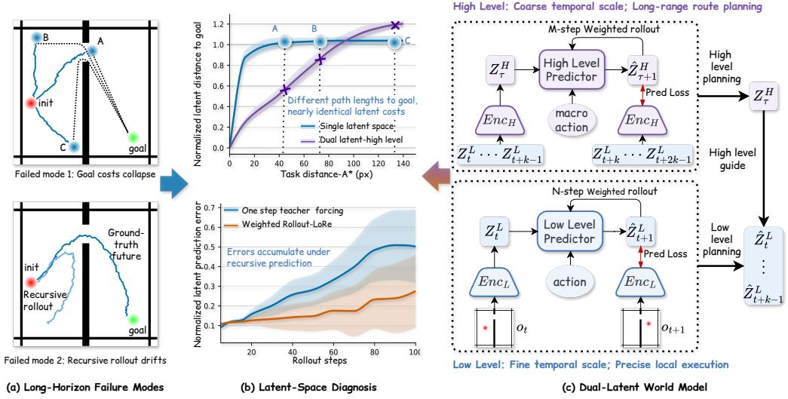  
Figure 1: Overview of the long-horizon planning problem and our dual-latent solution. (a) Two failure modes in a single latent space: goal costs collapse for distant states, and recursive rollouts drift from the ground-truth future. (b) Latent-space diagnostics: the high-level space preserves task-distance contrast, while weighted rollout training reduces multi-step prediction error relative to one-step teacher forcing. (c) Dual-WM assigns coarse route planning to a high-level latent and precise local execution to a low-level latent.

Existing approaches address these challenges through improvements to predictive accuracy, search efficiency, and temporal abstraction. Flat world models strengthen prediction (Du et al., 2026; Gao & Xu, 2026; Huo et al., 2026; Liu et al., 2026a; Rakhimov et al., 2026) or introduce proposals and subgoals to facilitate search (Cheng et al., 2026; Wang et al., 2026c; Sun et al., 2026; Huang et al., 2026). Hierarchical models shorten the effective rollout depth by predicting temporally extended transitions (Zhang et al., 2026a; Masip et al., 2026; Liu et al., 2026b; Barbeau et al., 2026; Gumbsch et al., 2024). However, in approaches that retain a shared latent space (Caselli et al., 2026; Thil et al., 2026), both local execution and long-range goal evaluation still depend on the same state geometry; shortening the rollout leaves this geometry unchanged, so when distances saturate, distant candidates remain nearly indistinguishable.

The underlying issue is that the same state geometry must support two different temporal roles. Precise local control requires sensitivity to small state changes that affect immediate action outcomes (Zhang et al., 2026b; Shi et al., 2026). Long-range planning instead requires comparisons that are not dominated by locally important variations and that remain informative about progress toward distant goals (Bai & Xiong, 2026; Hu et al., 2026). A shared representation must accommodate both demands within the same geometry, although local prediction objectives do not directly enforce long-range discrimination. We therefore separate representations by temporal role, allowing each space to organize state differences according to the transitions and planning decisions it supports.

We introduce Dual-Latent World Model (Dual-WM), which couples a low-level representation and dynamics model for primitive actions with a distinct high-level representation and dynamics model for learned macro-actions. Macro-Action Prior Shaping (MAPS) regularizes the macro-action posterior toward a standard Gaussian prior to support sampling and optimization during planning. We introduce LORE (Long-Horizon Representation Learning with Weighted Rollout) to improve recursive consistency and constrain state relations beyond one-step neighborhoods. LORE supervises self-generated rollouts at both scales using separately parameterized horizon weights. At inference time, Dual-WM first plans high-level latent subgoals, then refines them into primitive actions, and finally switches to direct low-level planning for precise goal convergence.

Our main contributions are threefold:

• We introduce Dual-WM, a world model that separates state representations and dynamics by temporal role. Macro-Action Prior Shaping (MAPS) regularizes learned macro-actions for sampling-based search, while hierarchical planning connects long-range guidance to precise local execution.

• We propose LORE, a training mechanism that supervises self-generated rollouts at both temporal scales with separately parameterized horizon weights, extending predictive supervision beyond one-step transitions.

• We evaluate Dual-WM on five goal-conditioned visual planning tasks spanning continuous control and discrete-action, game-like planning, with comparisons against flat and hierarchical world models and diagnostics of the learned representations.

## 2 RELATED WORK

Latent prediction and control. Latent dynamics support planning from pixels and policy learning in imagined trajectories (Hafner et al., 2019; 2023; Hansen et al., 2024). Our setting is reconstruction-free, goal-conditioned planning: DINO-WM predicts pretrained visual features (Zhou et al., 2024), PLDM learns from reward-free trajectories (Sobal et al., 2025), and LeWM jointly learns an encoder and predictor with anti-collapse regularization (Maes et al., 2026). Beyond one-step prediction, VLWM, Fast-LeWM, and Flow-JEPA change how extended futures are predicted (Du et al., 2026; Gao & Xu, 2026; Huo et al., 2026). LoRe instead retains recursive dynamics and supervises their self-generated rollouts at both temporal scales, with separate decayed horizon weights.

Geometry and temporal abstraction. Planning-oriented objectives reshape representations through action alignment, physical-state distances, reachability, or temporal ordering (Wang et al., 2026a; Hu et al., 2026; Li et al., 2026; Bai & Xiong, 2026). SD-JEPA separates progression and content within an embedding (Thil et al., 2026). Dual-WM separates dynamical roles: each state space has its own predictor and action timescale, and the high-level encoder maps predicted low-level win dows into the subgoal space. HWM and Hi-LeWM are close hierarchical precedents (Zhang et al., 2026a; Caselli et al., 2026); both retain a shared latent-state interface across scales. Our learned cross-space interface allows macro-action subgoals and final primitive-action control to use different representations. HWM’s reported autoregressive objective uses uniform rollout weights, while RC-aux permits horizon-weighted open-loop supervision (Li et al., 2026). LoRe uses scale-specific exponential decay motivated by recursive error propagation. Appendix C and Table 2 detail these connections and complementary approaches to action search.

## 3 METHOD

Dual-WM assigns local execution and long-range planning to different state spaces, then couples them through a learned projection used during subgoal refinement. Figures 2 and 3 show training and three-stage planning. We first define the two dynamics models and their macro-action interface, then describe LORE and the planner that uses them.

## 3.1 PROBLEM SETTING AND NOTATION

We learn from an offline dataset D of observation–action trajectories. In the model-level notation $\left( o _ { 0 } , a _ { 0 } , o _ { 1 } , \ldots , a _ { T - 1 } , o _ { T } \right)$ , t indexes low-level model steps. At deployment, the agent receives the current observation o and a goal observation $o _ { g } ,$ and selects primitive actions by planning with the learned models. No task reward or ground-truth state-distance target is required by the predictive objectives below. Each low-level model input $a _ { t }$ represents f consecutive environment actions, so one low-level model step covers f environment steps. We write a macro-action segment as

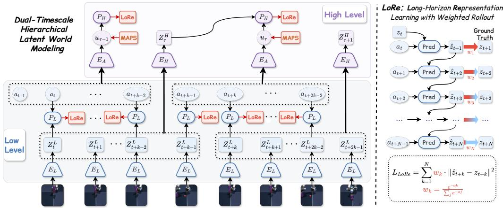  
Figure 2: Training the dual-timescale latent world model. The low-level encoder $E _ { L }$ and predictor $P _ { L }$ model fine-scale transitions, while $E _ { H }$ encodes length-k low-level latent windows and $P _ { H }$ models temporally extended transitions. The action encoder $E _ { A }$ produces macro-actions, MAPS regularizes their posterior, and LORE supervises self-generated predictions at both levels.

$A _ { t } = ( a _ { t } , \ldots , a _ { t + k - 1 } )$ , where $k$ is its span in low-level model steps and the number of low-level latents in each high-level input window. Thus, one high-level transition covers k low-level model steps, or $k f$ environment steps. In the diagrams, τ indexes high-level transitions: advancing from $\tau \mathrm { t o } \tau + 1$ corresponds to advancing from t to $t + k$ in the low-level time index. For clarity, we describe fixed k within a model configuration. We use N and M for the low- and high-level training rollout lengths, respectively, and $H _ { L } , H _ { H }$ for their planning horizons. We suppress any additional context-window arguments in the predictor notation.

## 3.2 DUAL-LATENT DYNAMICS AND MACRO-ACTIONS

Let $W _ { t } ^ { L }$ denote the length-k window of low-level latents associated with high-level state t. When only one frame is available, its low-level latent is repeated to fill this window. The observation encoder $E _ { L }$ and high-level state encoder $E _ { H }$ define

$$
\begin{array} { r } { z _ { t } ^ { L } = E _ { L } ( o _ { t } ) \in \mathbb { R } ^ { d _ { L } } , \qquad z _ { t } ^ { H } = E _ { H } ( W _ { t } ^ { L } ) \in \mathbb { R } ^ { d _ { H } } . } \end{array}\tag{1}
$$

The two spaces have separate dynamics predictors:

$$
\begin{array} { r } { \hat { z } _ { t + 1 } ^ { L } = P _ { L } ( z _ { t } ^ { L } , a _ { t } ) , \qquad \hat { z } _ { t + k } ^ { H } = P _ { H } ( z _ { t } ^ { H } , u _ { t } ) . } \end{array}\tag{2}
$$

Here $u _ { t } \in \mathbb { R } ^ { d _ { u } }$ summarizes $A _ { t }$ through a posterior $q _ { \phi } ( u _ { t } \mid A _ { t } )$ parameterized by the macro-action encoder $E _ { A }$ . Low-level prediction preserves distinctions needed for primitive action outcomes. High-level prediction is trained against states separated by k low-level model steps, allowing its geometry to emphasize distinctions relevant at that temporal scale. Both levels share the visual backbone, with $E _ { H }$ mapping low-level windows into the state space used for high-level prediction and goal evaluation.

During training, the high-level branch receives $E _ { H } ( \mathrm { s g } ( W _ { t } ^ { L } ) )$ ), where sg preserves its argument’s value and stops its gradient. High-level losses therefore update the high-level modules without changing $E _ { L }$ or $P _ { L }$ . Low-level learning retains its fine-scale predictive objective, while $E _ { H }$ learns how to organize the supplied features for macro-action dynamics.

Macro-action prior shaping. A macro-action space learned only on encoded dataset segments need not be well behaved under unconstrained search. MAPS adds

$$
{ \mathcal { L } } _ { \mathrm { M A P S } } = \mathbb { E } _ { A _ { t } \sim { \mathcal { D } } } D _ { \mathrm { K L } } \bigl ( q _ { \phi } ( u _ { t } \mid A _ { t } ) \parallel { \mathcal { N } } ( 0 , I _ { d _ { u } } ) \bigr ) .\tag{3}
$$

The high-level prediction loss encourages $u _ { t }$ to retain information about the segment’s effect, while the KL penalty gives candidate generation a common prior. At planning time, macro-actions are optimization variables; their posterior encoder is needed for training, not for encoding unknown future actions. MAPS therefore regularizes the macro-action interface for sampling-based planning, complementing the state representations used for goal evaluation.

## 3.3 HORIZON-WEIGHTED SELF-GENERATED ROLLOUTS

LORE trains each dynamics model on the recursive predictions it will use during planning, while controlling how different rollout horizons contribute to learning. The two scales use separately parameterized weights because low-level and high-level prediction operate over different temporal spans and can exhibit different error-amplification rates. Let $s \in \{ L , \bar { H } \}$ index the temporal scale, with $\Delta _ { L } = 1$ and $\Delta _ { H } = k ,$ , measured in low-level model steps. For a common loss expression, let $n _ { L } = N$ and $n _ { H } = M$ . Write $b _ { t } ^ { L } = a _ { t }$ and $b _ { t } ^ { H } = u _ { t }$ . Starting from an encoded anchor, we generate

$$
\begin{array} { r } { \hat { z } _ { t | t } ^ { s } = z _ { t } ^ { s } , \qquad \hat { z } _ { t + h \Delta _ { s } | t } ^ { s } = P _ { s } \Big ( \hat { z } _ { t + ( h - 1 ) \Delta _ { s } | t } ^ { s } , b _ { t + ( h - 1 ) \Delta _ { s } } ^ { s } \Big ) . } \end{array}\tag{4}
$$

The low-level rollout uses the recorded low-level action inputs. The high-level rollout uses macroactions encoded from the corresponding recorded segments. After initialization, neither rollout is reset to an observed future state. Future observations supply targets $z _ { t + h \Delta _ { s } } ^ { s }$

$$
\mathcal { L } _ { \mathrm { L o R e } } ^ { s } = \mathbb { E } _ { \mathcal { D } , q _ { \phi } } \sum _ { h = 1 } ^ { n _ { s } } w _ { h } ^ { s } \left. \hat { z } _ { t + h \Delta _ { s } | t } ^ { s } - z _ { t + h \Delta _ { s } } ^ { s } \right. _ { 2 } ^ { 2 } , \qquad w _ { h } ^ { s } = \frac { \exp ( - \alpha _ { s } h ) } { \sum _ { j = 1 } ^ { n _ { s } } \exp ( - \alpha _ { s } j ) } .\tag{5}
$$

The expectation over $q _ { \phi }$ applies to the high-level rollout. The loss differentiates through the recursive prediction chain and the encoded future targets; no additional stop-gradient is applied to those targets. The branch boundary above still prevents high-level target and prediction losses from updating the low-level encoder. Each scale has its own horizon $n _ { s }$ and decay $\alpha _ { s } \geq 0 \geq$ : one high-level step covers k low-level model steps, or $k f$ environment steps, so equal step indices do not represent equal physical horizons. Uniform weighting is recovered at $\alpha _ { s } = 0$ , and finite decay retains supervision at every included horizon.

From recursive error to horizon weights. Following Asadi et al. (2018), fix a control sequence and a shared encoded starting state. Suppose $P _ { s }$ is $L _ { s } – 1$ Lipschitz on the encoded and predicted inputs encountered, with one-step residual at most $\epsilon _ { s } .$ For $e _ { h } ^ { s } = \| \hat { z } _ { t + h \Delta _ { s } | t } ^ { s } - z _ { t + h \Delta _ { s } } ^ { s } \| _ { 2 }$ and $e _ { 0 } ^ { s } = 0 \colon$ , the prediction error satisfies

$$
e _ { h + 1 } ^ { s } \leq L _ { s } e _ { h } ^ { s } + \epsilon _ { s } , \qquad e _ { h } ^ { s } \leq \epsilon _ { s } S _ { h } ( L _ { s } ) , \qquad S _ { h } ( L ) = \sum _ { j = 0 } ^ { h - 1 } L ^ { j } .\tag{6}
$$

The reference weights $v _ { h } ^ { s } \propto S _ { h } ( L _ { s } ) ^ { - 2 }$ equalize weighted squared-error bounds. When $L _ { s } > 1$ their long-horizon behavior approaches geometric decay, motivating the exponential family in Eq. (5). Finite decay tempers amplified distant errors while retaining multi-step supervision; separate decays accommodate the two scales’ different error growth. Appendix B gives the finite-horizon derivation and its extension to history-conditioned predictors.

The full training objective combines predictive supervision, macro-action prior shaping, and state regularization:

$$
\mathcal { L } = \lambda _ { L } \mathcal { L } _ { \mathrm { L o R e } } ^ { L } + \lambda _ { H } \mathcal { L } _ { \mathrm { L o R e } } ^ { H } + \beta \mathcal { L } _ { \mathrm { M A P S } } + \mathcal { L } _ { \mathrm { r e g } } .\tag{7}
$$

Here $\mathcal { L } _ { \mathrm { r e g } }$ is the isotropic Gaussian state regularizer for anti-collapse, following LeWM (Maes et al., 2026), with the regularization weights at both levels included in this term. The $h = 1$ terms provide one-step supervision within the LoRe losses.

## 3.4 COARSE-TO-FINE PLANNING ACROSS THE TWO SPACES

Let $\Phi _ { s } ^ { ( m ) } ( z , B )$ denote m recursive applications of $P _ { s }$ starting from z under an action sequence B. The planning horizons $H _ { L } , H _ { H }$ need not equal the training horizons N, M. Encode the current and goal observations in the low-level space, and their corresponding latent windows with $E _ { H }$ to obtain the high-level representations.

Stage 1: High-level route planning. We optimize a macro-action sequence $\begin{array} { r l } { U } & { { } = } \end{array}$ $\left( u _ { 0 } , \dots , u _ { H _ { H } - 1 } \right)$ using

$$
U ^ { \star } \approx \arg \operatorname* { m i n } _ { U } \left\| \Phi _ { H } ^ { ( H _ { H } ) } ( z _ { t } ^ { H } , U ) - z _ { g } ^ { H } \right\| _ { 2 } ^ { 2 } .\tag{8}
$$

CEM generates and updates candidates in the continuous macro-action space regularized by MAPS. Intermediate predictions under $U ^ { \star }$ provide a sequence of high-level subgoals $\tilde { z } _ { 1 } ^ { H } , \dots , \tilde { z } _ { H _ { H } \cdot } ^ { H } \mathbf { A }$ route spanning $k H _ { H } ^ { - }$ low-level model steps, or $k f H _ { H } ^ { - }$ environment steps, requires $H _ { H }$ high-level transitions, reducing the prediction depth of the route search before low-level refinement.

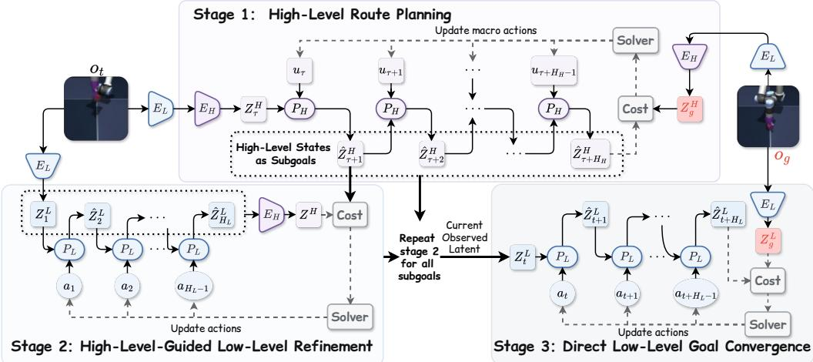  
Figure 3: Three-stage planning with the trained dual-latent world model. Stage 1 plans a high-level route and produces latent subgoals; Stage 2 refines subgoals with low-level actions while comparing latent windows through $E _ { H }$ ; Stage 3 performs direct low-level goal convergence.

Stage 2: High-level-guided low-level refinement. Given the selected subgoal $\tilde { z } _ { j } ^ { H }$ , let $\widehat { W } _ { t } ^ { L } ( A )$ denote the length-k latent window constructed from the low-level rollout for comparison with that subgoal. We optimize a sequence of low-level action inputs $A = \left( a _ { 0 } , \dots , a _ { H _ { L } - 1 } \right)$ through

$$
A ^ { \star } \approx \arg \operatorname* { m i n } _ { A } \left\| E _ { H } \left( \widehat { W } _ { t } ^ { L } ( A ) \right) - \tilde { z } _ { j } ^ { H } \right\| _ { 2 } ^ { 2 } .\tag{9}
$$

The dynamics remain low-level, but the comparison is high-level. This projection is the coupling between the two state spaces: the low-level plan is evaluated by how its latent window matches the abstract subgoal, without requiring an inverse map from $z ^ { H } \mathrm { \Delta t o \stackrel { \sim } { \ z ^ { L } } }$ or a decoder from macro-actions to primitive actions. Execution is grounded again in the new observation, and refinement proceeds toward successive subgoals.

Stage 3: Direct low-level goal convergence. After a fixed number of high-level-guided refinement rounds, the planner switches to direct low-level goal convergence, replacing the projected subgoal cost by

$$
A ^ { \star } \approx \arg \operatorname* { m i n } _ { A } \left\| \Phi _ { L } ^ { ( H _ { L } ) } ( z _ { t } ^ { L } , A ) - z _ { g } ^ { L } \right\| _ { 2 } ^ { 2 } .\tag{10}
$$

States that match in the high-level space can still differ in details that matter for completion. Direct low-level goal matching retains sensitivity to those differences. The three stages thus use high-level dynamics to choose a route, low-level dynamics with projected costs to execute it, and low-level costs to finish precisely.

## 4 EXPERIMENTS

Our experiments first assess (Q1) whether Dual-WM improves long-horizon goal reaching across five visual control tasks. We then examine the two challenges motivating our design: (Q2) whether latent goal distances distinguish progress over long ranges, and (Q3) whether recursive predictions retain task-relevant physical-state information. Finally, controlled ablations assess (Q4) the contributions of the learned high-level representation, rollout training, and macro-action prior shaping.

## 4.1 EXPERIMENTAL SETUP

We evaluate visual, goal-conditioned planning on TwoRoom, Reacher, Sokoban-Long, PushT, and Cube-Single (Figure 6). Our evaluation includes Sokoban-Long, a game-like environment with discrete actions, to assess whether the benefits of dual-latent planning extend beyond continuouscontrol tasks. Goal-reaching success is reported at the displayed offsets. Here, a goal offset m denotes m original environment steps between the initial and goal observations in the dataset. Our trained and reproduced entries in the full planning tables are evaluated with three planning seeds (0, 1, and 42), using 200 goal-reaching tasks per task and offset for each seed. Each seed selects a new task set, shared across methods with identical episode IDs, start states, and goals, and also fixes the planner’s search randomness. For each task and offset, all methods evaluated by us use identical environment-step budgets, success criteria, and early-termination rules. Entries shown with ± report the mean and standard deviation across these seeded evaluations, which vary both task sampling and search randomness (Appendix J); quoted results retain the reporting convention of the original publication. PushT additionally includes offset 75 because it is the long-horizon setting reported for HWM. The baselines are LeWM (Maes et al., 2026), DINO-WM (Zhou et al., 2024), PLDM (Sobal et al., 2025), HWM (Zhang et al., 2026a), Hi-LeWM (Caselli et al., 2026), Fast-LeWM (Gao & Xu, 2026), RC-aux (Li et al., 2026), two INTACT variants (Sun et al., 2026), JEPA-WM (Terver et al., 2025), VLWM (Du et al., 2026), and our Gemini 3.8 Flash closed-loop controller. Table 1 summarizes the extended-offset comparison. Appendix E reports all task-level results, and Appendix J distinguishes the baseline settings. Training and planning configurations are in Appendix D.

Table 1: Success (%) at goal offsets 50 and 100 environment steps. Dual-WM uses the fromscratch variant throughout. Best other selects the highest non-Dual-WM mean without actor-guided proposals separately for each task and offset, with the selected method shown beside each value. The external controller is included. Bold marks the largest displayed mean per task/offset. Full results and uncertainty are in Tables 5–7.
<table><tr><td rowspan="2">Task</td><td colspan="3">Offset 50</td><td colspan="3">Offset 100</td></tr><tr><td>LeWM</td><td>Best other</td><td>Dual-WM</td><td>LeWM</td><td>Best other</td><td>Dual-WM</td></tr><tr><td>TwoRoom</td><td>61.50</td><td>94.83 (Gemini)</td><td>99.33</td><td>27.00</td><td>90.00 (Gemini)</td><td>92.50</td></tr><tr><td>Reacher</td><td>85.33</td><td>92.33 (INTACT)</td><td>98.67</td><td>75.67</td><td>84.83 (Gemini)</td><td>93.30</td></tr><tr><td>Sokoban-Long</td><td>41.50</td><td>52.00 (Gemini)</td><td>75.17</td><td>16.33</td><td>35.00 (Gemini)</td><td>52.33</td></tr><tr><td>PushT</td><td>56.00</td><td>78.00 (HWM)</td><td>86.17</td><td>20.00</td><td>31.00 (HWM)</td><td>41.33</td></tr><tr><td>Cube-Single</td><td>51.33</td><td>62.17 (DINO-WM)</td><td>62.67</td><td>54.17</td><td>66.33 (Fast-LeWM)</td><td>67.83</td></tr><tr><td>Mean</td><td>59.1</td><td>75.9</td><td>84.4</td><td>38.6</td><td>61.4</td><td>69.5</td></tr></table>

INTACT denotes its Pure CEM variant. Means weight the five tasks equally.

## 4.2 Q1: DOES DUAL-WM IMPROVE LONG-HORIZON PLANNING?

Table 1 compares the same from-scratch Dual-WM variant against LeWM and the strongest non-Dual-WM result without actor-guided proposals on each task. INTACT uses Pure CEM in this comparison; Actor+CEM is compared separately with actor-guided Dual-WM in Table 8. Full results and protocols are in Appendices E and J. The task-wise aggregate selects the strongest eligible result from flat models, hierarchical models, and the external controller for each task and offset.

Strong performance across tasks and action spaces. At offsets 50 and 100, Dual-WM averages 84.4% and 69.5%, compared with 75.9% and 61.4% for the task-wise best non-Dual-WM aggregate without actor-guided proposals. At offset 100, it exceeds LeWM on every task, improving the mean by 30.8 percentage points before rounding. TwoRoom and Sokoban-Long illustrate the long-range benefit: Dual-WM reaches 92.50% and 52.33%, versus 27.00% and 16.33% for LeWM. Sokoban Long uses discrete actions in a game-like environment, extending the evidence beyond continuous control. At offset 25, the same model reaches 100%, 99.0%, and 98.0% on TwoRoom, Reacher, and PushT, respectively. On PushT, it also attains 86.17% at offset 50 and 62.00% at offset 75, compared with HWM’s 78% and 61%. At offset 100, it reaches 41.33% versus 31.00% for our reproduced HWM, a gain of 10.33 percentage points (Table 7).

Hierarchical planning and complementary action priors. At offset 100, the full from-scratch configuration exceeds the low-level-only variant by 23.83, 4.13, 6.50, 21.50, and 6.33 percentage points on TwoRoom, Reacher, Sokoban-Long, PushT, and Cube-Single, respectively; both configurations use the same low-level checkpoint. With actor-guided proposals on Cube-Single, Dual-WM reaches 82.50% at offset 100, compared with 80.67% for INTACT (Actor+CEM) (Table 8). This comparison uses the INTACT actor in both methods and is separate from Table 1.

Success across planning budgets. On TwoRoom at offset 100, a four-budget sweep compares success against measured planning time per environment step (Figure 7). Dual-WM achieves higher success at lower measured planning time: 90% at 92.4 ms per environment step, versus 84% at 247.7 ms for the low-level-only variant. A larger budget yields 98% success at 214.0 ms.

## 4.3 Q2: DO LATENT GOAL DISTANCES DISTINGUISH LONG-RANGE PROGRESS?

We test whether the latent goal distance remains discriminative beyond local neighborhoods. To compare representations of different widths, we normalize the Euclidean distance by 2D, where D is the corresponding latent dimension. The independent isotropic-Gaussian root-mean-square reference is one. Appendix A gives the reference calculation. Figure 13 shows that LeWM approaches this reference after a short physical range, whereas the learned low- and high-level spaces preserve substantially more ordering over long-range TwoRoom paths. The same pattern is visible in Reacher configuration space, with the high-level representation showing the strongest rank correlation.

Spatial diagnostics in Appendix G support this pattern across navigation, joint configuration, and manipulation. TwoRoom distance fields preserve goal-directed variation across rooms (Figure 14). On Reacher, high-level goal distances correlate more strongly with wrapped joint-angle distance than the low-level and LeWM representations (Spearman 0.562, 0.318, and 0.190). On PushT, Dual-WM-H gives the largest improvements in position correlation and both pairwise goal-ordering measures, although its orientation correlation is statistically indistinguishable from LeWM. The benefit is therefore clearest in goal discrimination, rather than uniform improvement in every physicaldistance correlation.

## 4.4 Q3: DOES ROLLOUT TRAINING PRESERVE PHYSICAL-STATE INFORMATION?

To test whether recursively predicted states retain task information, we compare one-step and rollout-trained low-level checkpoints with horizon-resolved physical probes. Separate ridge probes are fitted on predicted latents for each checkpoint and target, with disjoint episodes for fitting, validation, and evaluation (Appendix G). The rollout-trained checkpoint has lower point estimates at every horizon for all four quantities (Figure 17). The separation is clearest for Reacher joint configuration and fingertip position, and PushT block position; PushT orientation has wider uncertainty. These results support the role of recursive training in retaining task-relevant state information during multi-step prediction.

## 4.5 Q4: WHICH DESIGN CHOICES IMPROVE PLANNING SUCCESS?

On TwoRoom, we test the latent-space design and LoRe scale activation with the full hierarchical planner. Horizon and weighting studies use low-level-only planning to isolate low-level rollout training; MAPS is evaluated with the hierarchical planner. Planning results average three planning seeds and are shown without error bars. Within each study, unablated settings remain at their defaults.

Learned window interfaces improve planning. Shared-Identity and Endpoint-MLP use endpoint latents; Window-Concat directly concatenates the same length-k window used by Dual-WM. All retain the same low-level checkpoint and coarse-to-fine planner. At offset 100, Dual-WM achieves 93% success versus 41% for Window-Concat, a 52-percentage-point gap with the same input window. Endpoint-MLP and Shared-Identity achieve 69% and 47%, respectively (Figure 4). In the farthest distance bin, Dual-WM-H reaches 84.9% goal-ordering accuracy versus 51.0% for Window-Concat (Figure 18, Appendix H). Together, these results support learning a high-level representation for long-range goal evaluation, rather than relying on window context alone.

LoRe benefits both temporal scales. We retain both dynamics models and hierarchical planning, varying only which levels receive LoRe instead of one-step supervision (Figure 5). At offset 100, dual-scale LoRe raises success from 48% with one-step supervision to 92%. Low- and high-level LoRe alone yield 79% and 76%, respectively. Both-scale training improves over the stronger singlescale setting by 13 percentage points. Low-level LoRe already reaches 100% at offset 25, whereas the benefit of also supervising high-level rollouts is clearest at longer offsets. These are training switches, not removal of either planning branch.

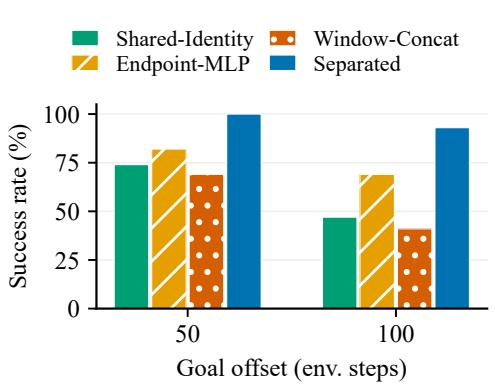

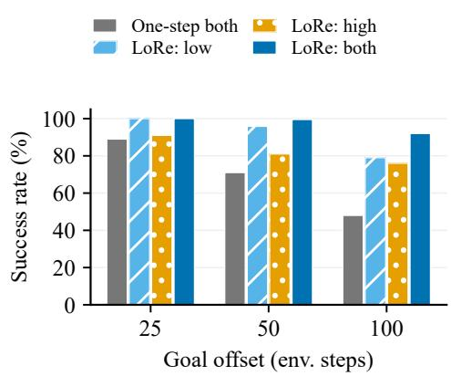  
Figure 4: Latent-space design on TwoRoom. All variants share the low-level checkpoint and hierarchical planning. Window-Concat directly concatenates the same window used by Separated (Dual-WM). Bars show mean success.  
Figure 5: LoRe scales on TwoRoom. Both model levels and hierarchical planning are retained; inactive levels use one-step supervision. Bars show mean success.

Low-level rollout length and weighting. Under low-level-only planning, offset-100 success rises from 32% at $N = 1$ to 69% at $\bar { N } = 5$ , then falls to 37% at $N = 1 0$ . At $N = 5 .$ , exponential weighting gives 69%, versus 62% for linear and 54% for uniform weights. These studies favor moderate rollout lengths with decayed supervision. Full sweeps and physical-state probes are in Appendix H.

Macro-action prior shaping. At offset 100, deterministic macro-action encoding achieves 67% success, versus 81% for stochastic encoding without MAPS $( \beta = 0 )$ . Adding MAPS raises success to 93.5% at $\beta = 1 0 ^ { - 2 }$ , despite higher one-step and six-step latent MSE than at $\beta = 0$ . This pattern is consistent with MAPS shaping a macro-action space better suited to search, rather than simply minimizing prediction error. Further increasing β to $5 \times 1 0 ^ { - 2 }$ reduces success to 91.5% (Figure 21, Appendix H).

## 5 CONCLUSION

Long-horizon latent planning requires both reliable recursive predictions and goal distances that distinguish progress beyond local neighborhoods. Dual-WM addresses these requirements through distinct representations and dynamics for local execution and long-range planning, coupled by a learned window interface. LoRe trains recursive predictions at both scales, while MAPS organizes the macro-action space for search. Across five visual control tasks spanning continuous and discrete actions, this design improves extended-offset goal reaching. The representation diagnostics and ablations support complementary roles for long-range goal discrimination, recursive consistency, and precise low-level convergence. Together, these findings suggest that the usefulness of a world model for planning depends on how its representations, predictive training, and goal-evaluation metrics are organized across temporal scales.

Our evaluation uses offline data and fixed temporal abstraction, and gains depend on the task and action-proposal mechanism. Adaptive temporal scales and evaluation beyond the present offline setting are natural next steps.

## REFERENCES

Charu C. Aggarwal, Alexander Hinneburg, and Daniel A. Keim. On the surprising behavior of distance metrics in high dimensional space. In International Conference on Database Theory (ICDT), volume 1973 of Lecture Notes in Computer Science, pp. 420–434, 2001. doi: 10.1007/ 3-540-44503-X 27.

Guo An, Zijing Wu, Honghua Dong, Yuhao Yan, Zixuan Gui, Haochong Chen, Shanzhao Ruan, Xiang Wang, Yurong Ling, and Qi Tian. Diagnosing JEPA world models with action-conditioned predictive consistency. arXiv preprint arXiv:2608.12939, 2026.

Fabio Arnez and Alexandra Gomez-Villa. The SIGReg objective as variational free energy: A theoretical active-inference account of JEPA world models. arXiv preprint arXiv:2607.13612, 2026.

Kavosh Asadi, Dipendra Misra, and Michael Littman. Lipschitz continuity in model-based reinforcement learning. In Jennifer Dy and Andreas Krause (eds.), Proceedings of the 35th International Conference on Machine Learning, volume 80 of Proceedings of Machine Learning Research, pp. 264–273. PMLR, 2018. URL https://proceedings.mlr.press/v80/ asadi18a.html.

Jiaxin Bai and Jiaxuan Xiong. Temporal-distance JEPA: Plan-aware representation learning for latent world model predictive control. arXiv preprint arXiv:2607.25337, 2026.

Samuel Barbeau, Simon Roy, Giovanni Beltrame, Christian Desrosiers, and Nicolas Thome. Latent goal prediction from language for model-based planning. arXiv preprint arXiv:2606.20627, 2026.

Niccolo Caselli, Francesco Massafra, Samuele Punzo, Salvatore Lo Sardo, Ippokratis Pantelidis, and\` Sathya Kamesh Bhethanabhotla. Mind the gap: Promises and pitfalls of hierarchical planning in LeWorldModel. arXiv preprint arXiv:2607.12547, 2026.

Taiye Chen, Qi Zhang, and Yisen Wang. Mitigating compounding error via video representation regularization. arXiv preprint arXiv:2607.27036, 2026.

Letian Cheng, Qi Zhang, and Yisen Wang. SAGE: Subgoal-conditioned action generation for latent world model planning. arXiv preprint arXiv:2607.17973, 2026.

Jingyi Cui, Qi Zhang, Hongwei Wen, and Yisen Wang. A generalization theory for JEPA-based world models. arXiv preprint arXiv:2606.27014, 2026.

Tianqi Du, Qi Zhang, Yifei Wang, and Yisen Wang. Beyond the next step: Variable-length latent world models for long-horizon planning. arXiv preprint arXiv:2606.21775, 2026.

Baoqi Gao, Ruize Han, Miao Wang, and Song Wang. IMWM: Intuition models complement world models for latent planning. arXiv preprint arXiv:2606.01626, 2026.

Yuntian Gao and Xiangyu Xu. Fast LeWorldModel. arXiv preprint arXiv:2606.26217, 2026.

Christian Gumbsch, Noor Sajid, Georg Martius, and Martin V. Butz. Learning hierarchical world models with adaptive temporal abstractions from discrete latent dynamics. In International Conference on Learning Representations (ICLR), 2024.

Danijar Hafner, Timothy Lillicrap, Ian Fischer, Ruben Villegas, David Ha, Honglak Lee, and James Davidson. Learning latent dynamics for planning from pixels. In International Conference on Machine Learning (ICML), volume 97 of Proceedings ofMachine Learning Research, pp. 2555– 2565. PMLR, 2019.

Danijar Hafner, Jurgis Pasukonis, Jimmy Ba, and Timothy Lillicrap. Mastering diverse domains through world models. arXiv preprint arXiv:2301.04104, 2023.

Nicklas Hansen, Hao Su, and Xiaolong Wang. TD-MPC2: Scalable, robust world models for continuous control. In International Conference on Learning Representations (ICLR), 2024.

Jiaming Hu, Yan Zheng, and Tian Wang. SCALE: State-calibrated latent embeddings for JEPA planning in the right geometry. arXiv preprint arXiv:2608.16287, 2026.

Hsiang-Wei Huang, Jianxu Shangguan, Junbin Lu, and Jenq-Neng Hwang. LeFlow: Generative latent flow planning for world models. arXiv preprint arXiv:2608.24855, 2026.

Yanchen Huo, Ziying Song, and Yadan Luo. Flow-JEPA: Flow matching for robust latent dynamics in JEPA world models. arXiv preprint arXiv:2608.29029, 2026.

David Klindt, Yann LeCun, and Randall Balestriero. When does LeJEPA learn a world model? arXiv preprint arXiv:2605.26379, 2026.

Wenyuan Li, Guang Li, Keisuke Maeda, Takahiro Ogawa, and Miki Haseyama. Predictive but not plannable: RC-aux for latent world models. arXiv preprint arXiv:2605.07278, 2026.

Dongxiu Liu, Haoyi Niu, Peng Cheng, Yuan Gao, Xirui Kang, Sangli Teng, Koushil Sreenath, and Xianyuan Zhan. ODEWorld: A continuous predictive architecture via physical-time flow. arXiv preprint arXiv:2607.27924, 2026a.

Zihan Liu, Yuzhe Zhuang, Yuanzu Li, Wanshuang Gou, Jiahong Liu, Min Zhou, and Menglin Yang. ProWorld: Progress-aware hyperbolic world models for long-horizon visual goal reaching. arXiv preprint arXiv:2608.01926, 2026b.

Lucas Maes, Quentin Le Lidec, Damien Scieur, Yann LeCun, and Randall Balestriero. LeWorld-Model: Stable end-to-end joint-embedding predictive architecture from pixels. arXiv preprint arXiv:2603.19312, 2026.

Sergi Masip, Jonathan Swinnen, Yutong Hu, Renaud Detry, and Tinne Tuytelaars. FF-JEPA: Longhorizon planning in world models with latent planners. arXiv preprint arXiv:2606.09311, 2026.

Hoang Nguyen, Xiaohao Xu, and Xiaonan Huang. Latent geometry beyond search: Amortizing planning in world models. arXiv preprint arXiv:2605.08732, 2026.

Phu Pham and Aniket Bera. Latent energy action planning with world models. arXiv preprint arXiv:2609.03294, 2026.

Ruslan Rakhimov, George Bredis, Yuriy Maksyuta, and Daniil Gavrilov. Qantara: Bridge-flow training for multi-paradigm JEPA control. arXiv preprint arXiv:2607.04978, 2026.

Yuhong Shi, Zhenhao Chu, Jie Wei, Jun Hao, Jianyi Liu, and Jingwen Fu. Overcoming statistical bias in action-controllable world models. arXiv preprint arXiv:2608.04653, 2026.

Vlad Sobal, Wancong Zhang, Kyunghyun Cho, Randall Balestriero, Tim G. J. Rudner, and Yann LeCun. Learning from reward-free offline data: A case for planning with latent dynamics models. In Advances in Neural Information Processing Systems (NeurIPS), 2025.

Armin Sommer and Jannik Schilling. Reinforced planning with latent world models. arXiv preprint arXiv:2608.18669, 2026.

Junhan Sun, Hao Zhao, and Guofeng Zhang. INTACT: Isomorphic intent-to-action learning for search-free world models. arXiv preprint arXiv:2607.26056, 2026.

Basile Terver, Tsung-Yen Yang, Jean Ponce, Adrien Bardes, and Yann LeCun. What drives success in physical planning with joint-embedding predictive world models? arXiv preprint arXiv:2512.24497, 2025.

Lucas Thil, Jesse Read, Rim Kaddah, and Guillaume Doquet. Subspace-decomposed JEPAs: Disentangling progression and content in latent world models. arXiv preprint arXiv:2605.31111, 2026.

Donna Vakalis. The intervention gap in latent world models. arXiv preprint arXiv:2608.29998, 2026.

Jiawei Wang, Ke Rui, Yushen Zuo, Yichun Feng, and Minglei Li. Decision-metric alignment in latent world models: Diagnostics and action-conditioned objectives for MPC planning. arXiv preprint arXiv:2608.18746, 2026a.

Ying Wang, Oumayma Bounou, Yann LeCun, and Mengye Ren. AdaJEPA: An adaptive latent world model. arXiv preprint arXiv:2606.32026, 2026b.

Yuhai Wang, Jiawei Xia, Rongxuan Zhou, Xiao Hu, Yongliang Shi, Jing Du, and Yang Ye. PRISM: PRior-guided imagination sampling in world models. arXiv preprint arXiv:2606.07974, 2026c.

Haiyu Wu, Randall Balestriero, and Morgan Levine. VIScore: Diagnosing planning-relevant quality in latent world models. arXiv preprint arXiv:2608.11174, 2026.

Hanzhe You, Yonggang Zhang, Maohao Ran, Zhiqin Yang, Zhenyuan Zhang, Wei Xue, Jun Song, Xinmei Tian, and Yike Guo. A control theory of predictability in latent world models. arXiv preprint arXiv:2607.10362, 2026.

Wancong Zhang, Basile Terver, Artem Zholus, Soham Chitnis, Harsh Sutaria, Mido Assran, Randall Balestriero, Amir Bar, Adrien Bardes, Yann LeCun, and Nicolas Ballas. Hierarchical planning with latent world models. arXiv preprint arXiv:2604.03208, 2026a.

Zhenghao Zhang, Yuanxiang Wang, Zhenyu Guan, Yujia Yang, Bingkang Shi, Tianyu Zong, Hongzhu Yi, Guoqing Chao, Xingchen Chen, Tiankun Yang, Chenxi Bao, Tao Yu, Jingjing Zhou, and Jungang Xu. Delta-JEPA: Learning action-sensitive world models via latent difference decoding. arXiv preprint arXiv:2606.31232, 2026b.

Kai Zhao, Dongliang Nie, Yuchen Lin, Zhehan Luo, Yixiao Gu, Deng-Ping Fan, and Dan Zeng. Sub-JEPA: Subspace gaussian regularization for stable end-to-end world models. arXiv preprint arXiv:2605.09241, 2026.

Gehan Zheng, Matthew Johnson-Roberson, and Weiming Zhi. ContactGuard: Pre-contact execution monitoring with action-conditioned latent world models. arXiv preprint arXiv:2608.13438, 2026.

Gaoyue Zhou, Hengkai Pan, Yann LeCun, and Lerrel Pinto. DINO-WM: World models on pretrained visual features enable zero-shot planning. arXiv preprint arXiv:2411.04983, 2024.

## A LATENT DISTANCE CONCENTRATION: ANALYSIS

Consider $z \in \mathbb { R } ^ { d }$ with independent components distributed as $\mathcal { N } ( 0 , 1 )$ . Its squared norm follows a chi-squared distribution,

$$
\| z \| ^ { 2 } = \sum _ { i = 1 } ^ { d } z _ { i } ^ { 2 } \sim \chi _ { d } ^ { 2 } , \qquad f ( x ; d ) = \frac { x ^ { d / 2 - 1 } e ^ { - x / 2 } } { 2 ^ { d / 2 } \Gamma ( d / 2 ) } , \quad x > 0 .
$$

Consequently,

$$
\mathbb { E } \left[ \Vert z \Vert ^ { 2 } \right] = d , \qquad \mathrm { V a r } \left( \Vert z \Vert ^ { 2 } \right) = 2 d , \qquad \frac { \sqrt { \mathrm { V a r } ( \Vert z \Vert ^ { 2 } ) } } { \mathbb { E } \left[ \Vert z \Vert ^ { 2 } \right] } = \sqrt { \frac { 2 } { d } } .
$$

Thus the norm has approximate standard deviation $1 / \sqrt { 2 }$ and relative fluctuation $1 / { \sqrt { 2 d } } ;$ for $d =$ 192, it concentrates near $\sqrt { 1 9 2 } \approx 1 3 . 8 6$

For independent $x , y \in \mathbb { R } ^ { d }$ with the same standard-normal components, $x - y$ has components distributed as $\mathcal { N } ( 0 , 2 )$ , so

$$
\| x - y \| ^ { 2 } \sim 2 \chi _ { d } ^ { 2 } , \qquad \mathbb { E } \big [ \| x - y \| ^ { 2 } \big ] = 2 d , \qquad \mathrm { V a r } \big ( \| x - y \| ^ { 2 } \big ) = 8 d .
$$

The distance itself has

$$
\mathbb { E } [ \| x - y \| ] = 2 \frac { \Gamma ( ( d + 1 ) / 2 ) } { \Gamma ( d / 2 ) } , \qquad \mathrm { V a r } ( \| x - y \| ) = 2 d - \mathbb { E } [ \| x - y \| ] ^ { 2 } .
$$

For $d = 1 9 2$ , the exact mean is approximately 19.5704, close to $\sqrt { 2 d } = \sqrt { 3 8 4 } \approx 1 9 . 5 9 5 9$ , and the standard deviation is about 0.9993. These values provide an independent-Gaussian reference for evaluating distance contrast in learned representations.

A useful distinction is between marginal regularization and temporal dependence. If encoded states have zero mean and identity covariance, define $\rho _ { h } = d ^ { - 1 } \mathbb { E } [ z _ { t } ^ { \top } { \dot { z } } _ { t + h } ]$ . Then

$$
\mathbb { E } \| z _ { t } - z _ { t + h } \| _ { 2 } ^ { 2 } = 2 d ( 1 - \rho _ { h } ) .\tag{11}
$$

As $\rho _ { h }$ decreases toward zero, the mean squared distance approaches 2d. Gaussian marginals alone do not imply independence, and one-step training does not mathematically force temporal correlations to vanish. Rather, it supplies no explicit requirement that remote-state distances rank task progress; a plateau near the reference is consistent with weakened temporal discrimination in the planner’s distance.

When norms concentrate, cosine similarity and squared Euclidean distance carry closely related information:

$$
\| x - y \| _ { 2 } ^ { 2 } = \| x \| _ { 2 } ^ { 2 } + \| y \| _ { 2 } ^ { 2 } - 2 \| x \| _ { 2 } \| y \| _ { 2 } \cos ( x , y ) .
$$

Changing between these metrics therefore need not restore useful contrast. Learned costs or additional supervision may exploit task information that the original metric underweights. The analysis therefore concerns the contrast available to the planner’s chosen distance.

## A.1 CANDIDATE RANKING UNDER PREDICTION ERROR

Fix a latent space, a goal $z _ { g } ,$ and two candidate control sequences $B _ { 1 } , B _ { 2 }$ over the same execution horizon. Let $z _ { i }$ be the encoded endpoint of the actual trajectory under $B _ { i }$ , and $\hat { z } _ { i }$ the corresponding model prediction from the same initial observation. We condition on the realized trajectories if transitions are stochastic. Define

$$
c _ { i } = \| z _ { i } - z _ { g } \| _ { 2 } , \qquad { \hat { c } } _ { i } = \| { \hat { z } } _ { i } - z _ { g } \| _ { 2 } , \qquad \| { \hat { z } } _ { i } - z _ { i } \| _ { 2 } \leq \varepsilon _ { i } , \quad i \in \{ 1 , 2 \} .\tag{12}
$$

The unsquared distances simplify the analysis and induce the same candidate ordering as the squared distances used by the planner. The reverse triangle inequality gives $| \hat { c } _ { i } - c _ { i } | \le \varepsilon _ { i }$

Pairwise ranking condition. Suppose $c _ { 1 } < c _ { 2 }$ , with margin $m = c _ { 2 } - c _ { 1 }$ . Then

$$
m > \varepsilon _ { 1 } + \varepsilon _ { 2 } \quad \Longrightarrow \quad { \hat { c } } _ { 1 } < { \hat { c } } _ { 2 } .\tag{13}
$$

Indeed,

$$
{ \hat { c } } _ { 2 } - { \hat { c } } _ { 1 } \geq \left( c _ { 2 } - \varepsilon _ { 2 } \right) - \left( c _ { 1 } + \varepsilon _ { 1 } \right) = m - \varepsilon _ { 1 } - \varepsilon _ { 2 } > 0 .
$$

This sufficient condition connects the two requirements for long-horizon planning. Recursive prediction error increases the uncertainty in candidate costs, while reduced goal-distance contrast can shrink the margin available to distinguish them. A smaller margin therefore requires a tighter prediction error bound to certify the same ordering. The condition is sufficient; smaller or cancelling cost errors can also preserve the ranking.

For primitive-action candidates at horizon $h ,$ the low-level bound in Eq. (6) gives, under its assumptions, the common endpoint-error bound and sufficient margin

$$
\varepsilon _ { 1 } = \varepsilon _ { 2 } = \epsilon _ { L } \sum _ { j = 0 } ^ { h - 1 } L _ { L } ^ { j } , \qquad m > 2 \epsilon _ { L } \sum _ { j = 0 } ^ { h - 1 } L _ { L } ^ { j }
$$

when both candidates satisfy the same residual and sensitivity bounds. This relates prediction accuracy to the resolution required by the goal cost.

The condition applies to candidates with defined actual endpoints and compares their ordering under the chosen latent cost. Its connection to task progress is examined through the goal-geometry diagnostics in Section 4.3. For nonzero total error, the ratio $m / ( \varepsilon _ { 1 } + \varepsilon _ { 2 } )$ is invariant to a common positive rescaling of the latent space.

## B FINITE-HORIZON ROLLOUT WEIGHTING

This section develops the weighting rationale in Section 3.3 by analyzing error propagation for fixed predictors over finite rollout horizons and the resulting trade-off in supervision across horizons.

## B.1 PROPAGATION ALONG A FIXED TRAJECTORY

Suppress the scale index and fix the controls, including any sampled macro-actions. Let $x _ { h }$ denote the encoded input state after h steps, and let $F _ { h }$ be the learned update with the corresponding control held fixed. For a single-state predictor, $x _ { h } = z _ { t + h \Delta }$ and $F _ { h } \mathrm { \ i s \ } P$ with that control supplied. For a history-conditioned predictor, $x _ { h }$ stacks the latent history, and $F _ { h }$ shifts this history and appends the predicted latent. Any observed initial context and control history are shared by the encoded and predicted sequences.

Write $\hat { x } _ { h + 1 } = F _ { h } ( \hat { x } _ { h } ) , \hat { x } _ { 0 } = x _ { 0 }$ , and suppose

$$
\| F _ { h } ( \hat { x } _ { h } ) - F _ { h } ( x _ { h } ) \| _ { 2 } \leq L \| \hat { x } _ { h } - x _ { h } \| _ { 2 } , \qquad r _ { h + 1 } : = \| F _ { h } ( x _ { h } ) - x _ { h + 1 } \| _ { 2 } \leq \epsilon\tag{14}
$$

for the steps considered, with $L \geq 0$ . The first condition must hold across the compared encoded and predicted inputs, not only on data states. The second measures a residual along the realized trajectory; it does not require an exact Markov dynamics map in the compressed latent space. For history inputs, L bounds the complete shift-and-predict update, not just the predictor’s dependence on its newest input.

Finite-horizon bound. Let $d _ { h } = \| \hat { x } _ { h } - x _ { h } \| _ { 2 }$ . The triangle inequality gives $d _ { h + 1 } \leq L d _ { h } + r _ { h + 1 }$ Induction from $d _ { 0 } = 0$ yields

$$
d _ { h } \leq \sum _ { i = 1 } ^ { h } L ^ { h - i } r _ { i } \leq \epsilon S _ { h } ( L ) , \qquad S _ { h } ( L ) = \left\{ ( L ^ { h } - 1 ) / ( L - 1 ) , \begin{array} { l l } { L \neq 1 , } \\ { h , } \end{array} \right.\tag{15}
$$

The newest latent is a coordinate block of $x _ { h } ,$ , so its Euclidean error is at most $d _ { h }$ . This recovers the endpoint bound in Eq. (6) for either input convention. The constants are conditional bounds on the rollouts considered, not measured global properties of our models. No cancellation of the local residuals is assumed, so the bound can be conservative.

## B.2 A FINITE-HORIZON REFERENCE FOR WEIGHTING

Let n denote the rollout length of the scale under consideration, with $n = N$ at the low level and $n \ = \ M$ at the high level. For fixed n, consider equalizing contributions of the squared upper envelope $[ \epsilon S _ { h } ( L ) ] ^ { \frac { \ d H } { 2 } }$ . Since $S _ { h } ( L ) > 0$ for $h \geq 1$ , the following normalized weights equalize these contributions at every horizon:

$$
v _ { h } = \frac { S _ { h } ( L ) ^ { - 2 } } { \sum _ { j = 1 } ^ { n } S _ { j } ( L ) ^ { - 2 } } \quad \mathrm { s a t i s f y } \quad v _ { h } [ \epsilon S _ { h } ( L ) ] ^ { 2 } = \frac { \epsilon ^ { 2 } } { \sum _ { j = 1 } ^ { n } S _ { j } ( L ) ^ { - 2 } }\tag{16}
$$

This identity balances the squared-error upper envelope at fixed model parameters. We use its asymptotic behavior to motivate the exponential weighting family implemented in Eq. (5).

For $L > 1$ and $L ^ { h } \gg 1 , S _ { h } ( L ) ^ { - 2 } \sim ( L - 1 ) ^ { 2 } L ^ { - 2 h }$ . The reference’s adjacent-horizon decay is

$$
- \log \frac { v _ { h + 1 } } { v _ { h } } = 2 \log \frac { S _ { h + 1 } ( L ) } { S _ { h } ( L ) } , \qquad 1 \le h < n ,\tag{17}
$$

which approaches 2 log L in the expanding regime. At $L = 1 , v _ { h } \propto h ^ { - 2 } ;$ for $0 \le L < 1$ , the unnormalized reference $S _ { h } ( L ) ^ { - 2 }$ tends to $( \bar { 1 } - \bar { L } ) ^ { 2 }$ . When $h | L - 1 | \ll 1 , S _ { h } ( L ) \approx h$ even if $L > 1$ Finite training horizons therefore need not reach the exponential regime, which is another reason not to prescribe $\alpha = 2 \log L$

## B.3 DECAY AND THE BALANCE OF HORIZON SUPERVISION

Even if L and ϵ were known, reducing a weighted upper bound alone would not identify a useful balance of supervision. With these constants and n fixed, define

$$
U _ { n } ( \alpha , L ) = \epsilon ^ { 2 } \sum _ { h = 1 } ^ { n } w _ { h } ( \alpha ) S _ { h } ( L ) ^ { 2 } , \qquad \frac { \partial U _ { n } } { \partial \alpha } = - \epsilon ^ { 2 } \operatorname { C o v } _ { w ( \alpha ) } \bigl ( h , S _ { h } ( L ) ^ { 2 } \bigr ) \leq 0 .\tag{18}
$$

The derivative follows from $\begin{array} { r } { \partial _ { \alpha } w _ { h } = w _ { h } ( \sum _ { i = 1 } ^ { n } j w _ { j } - h ) } \end{array}$ . The covariance is nonnegative because both arguments are nondecreasing in $h ;$ explicitly it equals $\begin{array} { r } { \frac 1 2 \sum _ { i , j } w _ { i } w _ { j } ( i - j ) [ S _ { i } ( L ) ^ { 2 } - S _ { j } ( L ) ^ { 2 } ] \ge } \end{array}$ 0. Thus larger decay never increases this envelope objective, even though it suppresses the compositions that multi-step training is meant to constrain.

To quantify the effect on terminal supervision, fix the model and let $E _ { h }$ be its expected squared rollout error under the same data and macro-action distribution as Eq. (5). Assuming these expectations are finite, nonnegativity and the limit of the weights give

$$
E _ { n } \leq { \frac { { \mathcal { L } } _ { \mathrm { L o R e } } } { w _ { n } } } , \qquad \operatorname* { l i m } _ { \alpha \to \infty } { \mathcal { L } } _ { \mathrm { L o R e } } = E _ { 1 } \quad { \mathrm { f o r ~ f i x e d ~ } } n > 1 .\tag{19}
$$

As $w _ { n }$ becomes small, a given bound on the weighted loss gives a weaker bound on terminal error, and the limiting objective is one-step prediction. Both this relation and the derivative in Eq. (18) hold at fixed model parameters; the effect of retraining is assessed empirically.

Time units in the two scales. For a horizon of $\tau = h f \Delta _ { s }$ environment steps, the unnormalized weight is $e ^ { - \alpha _ { s } h } = e ^ { - ( \alpha _ { s } / ( f \Delta _ { s } ) ) \tau }$ . A common relative decay per environment step, η, would imply $\alpha _ { L } = f \eta$ and $\alpha _ { H } = k f \eta .$ , hence $\alpha _ { H } = k \alpha _ { L }$ . This only matches physical decay rates; the sampled horizons and normalization constants can still differ. Moreover, the two predictors can have different residuals and sensitivities. We therefore parameterize their decays separately.

## C EXTENDED RELATED WORK

## C.1 LATENT WORLD MODELS FOR CONTROL

Latent dynamics support planning from pixels and policy learning in imagined trajectories (Hafner et al., 2019; 2023; Hansen et al., 2024). Our setting is closest to reconstruction-free, goalconditioned planning: DINO-WM predicts pretrained visual features (Zhou et al., 2024), PLDM learns dynamics from reward-free offline trajectories (Sobal et al., 2025), and LeWM learns an en coder and predictor jointly with an anti-collapse regularizer (Maes et al., 2026). These methods establish the predictive latent interface on which we build. Dual-WM changes how that interface is organized across temporal scales: the representation used for primitive transitions need not also define the geometry used to evaluate distant subgoals.

## C.2 PREDICTION BEYOND ONE-STEP TRAINING

Long-horizon prediction can be improved by changing the prediction interface or by training on recursively generated states. VLWM predicts outcomes of variable-length action sequences (Du et al., 2026); Fast-LeWM predicts action-prefix outcomes in parallel from an observed anchor (Gao & Xu, 2026); Flow-JEPA generates future latent sequences with conditional flow matching (Huo et al., 2026). These approaches reduce dependence on a long chain of local transitions. Open-loop training instead retains recursive dynamics and supervises the resulting trajectory. HWM’s stated autoregressive objective sums rollout errors uniformly across horizons (Zhang et al., 2026a). RCaux formulates general horizon-weighted open-loop prediction (Li et al., 2026); its released default implementation uses normalized linear weights that increase with the horizon. In contrast, LORE uses geometrically decaying weights motivated by the error-amplification envelope of recursive prediction. It applies separate decay profiles to primitive-action and macro-action dynamics, so both are trained on self-generated trajectories while balancing the influence of near- and distant-horizon errors (Section 3.3).

## C.3 REPRESENTATION GEOMETRY FOR GOAL EVALUATION

Accurate prediction and state decodability do not guarantee that a latent distance ranks plans correctly. DA-LeWM studies decision-metric alignment and uses action-conditioned auxiliary objectives (Wang et al., 2026a); SCALE aligns latent distances with distances in task-relevant state variables (Hu et al., 2026). RC-aux learns budget-conditioned reachability (Li et al., 2026), while TD JEPA mines a directed temporal cost from trajectory order (Bai & Xiong, 2026). These objectives can reshape representations as well as change planning costs. We instead use a dedicated highlevel latent state space with predictive supervision across extended transitions, without introducing a state-distance target or a learned reachability head.

SD-JEPA is especially relevant: it separates progression and content coordinates within one embedding and supplies explicit temporal triplet supervision (Thil et al., 2026). Dual-WM separates dynamical roles: each state space has its own predictor and action timescale, and the high-level encoder also maps low-level predictions into the subgoal space during planning. The resulting separation governs both prediction and goal matching: long-range subgoals are evaluated in the high-level latent state space, while final goal convergence uses the low-level latent state space. Section 4.3 reports the empirical geometry diagnostic; Appendix A provides its concentration reference.

## C.4 TEMPORAL ABSTRACTION AND HIERARCHICAL PLANNING

HWM learns dynamics at multiple temporal resolutions within a shared latent space and transfers predicted subgoals directly to low-level MPC (Zhang et al., 2026a). Hi-LeWM adds macro-action dynamics on top of a frozen LeWM encoder and low-level predictor while retaining that latent interface (Caselli et al., 2026). Both are close precedents for our macro-action planner. Dual-WM changes the coupling: a learned map $E _ { H }$ produces a distinct high-level state, and primitive-action plans are evaluated by mapping their predicted latent windows into that space. The final approach to the goal uses the low-level distance directly. This permits coarse subgoal matching and fine final control to use different geometries while retaining a common visual input. Table 2 situates these hierarchical approaches relative to the flat LeWM baseline; additional work on prediction, search, and model reliability is discussed in Appendix C.

## C.5 AMORTIZING TEST-TIME SEARCH

A complementary line of work reduces the cost of test-time action selection. Sun et al. (2026) train an end-to-end intent-to-action interface that produces actions without test-time search, with an optional local CEM that uses far fewer sampled sequences than a global search. Wang et al. (2026c)

Table 2: LeWM and hierarchical latent world models with learned macro-actions.
<table><tr><td>Method</td><td>State spaces</td><td>Dynamics trained</td><td>Prediction training</td></tr><tr><td>LeWM</td><td>Single</td><td>Primitive</td><td>One-step transition</td></tr><tr><td>HWM</td><td>Shared across scales</td><td>Primitive + macro</td><td>Uniform-weight rollout</td></tr><tr><td>Hi-LeWM</td><td>Shared; low frozen</td><td>Macro only</td><td>One-step waypoint</td></tr><tr><td>Dual-WM</td><td>Separate across scales</td><td>Primitive + macro</td><td>Scale-specific decayed rollout</td></tr></table>

attach a state-conditioned Gaussian action prior to a frozen encoder and fuse it into the planner’s sampling distribution in closed form, so that search concentrates where the prior is confident, and Gao et al. (2026) pair the world model with a retrieval-and-scoring intuition model, showing that even an idealized predictor still fails under a finite search budget. Rakhimov et al. (2026) and Sommer & Schilling (2026) learn the search itself, the latter training a critic and an optimizer entirely on imagined rollouts of a pretrained model. Huang et al. (2026) amortize planning into a reusable latent trajectory prior that a flow model proposes and a frozen world model verifies, and Nguyen et al. (2026) show that with a suitably regularized geometry the planner can be replaced outright by a goal-conditioned inverse dynamics model. Pham & Bera (2026) instead keep CEM in the loop but optimize the whole action horizon as a differentiable variable through a frozen model. These methods are complementary to ours: they change how candidate actions are proposed or refined, whereas we change the latent space and the rollout supervision in which candidates are evaluated.

## C.6 RELIABILITY AND DIAGNOSIS

A separate line asks when latent planning fails rather than how to improve it, and provides the diagnostics that motivate our analysis. Wu et al. (2026) decompose planning-relevant quality into the reachability and capacity of the predictor given encoded features plus planner hallucination, and find these correlate with success far better than latent straightness or probing accuracy. An et al. (2026) use bisimulation to measure how far a clean history and a visually perturbed view diverge under a shared action sequence, turning perturbation robustness into a screening tool. Vakalis (2026) show that reward fit neither reveals nor guarantees intervention fidelity, and Wang et al. (2026b) adapt a world model online from the transitions it actually observes when plans fail. In contactrich settings, Zheng et al. (2026) roll a policy’s planned chunk forward in latent space to abort before contact rather than after. We adopt the diagnostic stance of this line: our analysis of distance saturation and of per-horizon rollout error is intended as a measurement of the two failure modes, not only as a motivation for the architecture.

## C.7 THEORY

Several recent results bound what a latent predictive model can and cannot guarantee. Klindt et al. (2026) prove linear identifiability of the true latent degrees of freedom for a class of stationary additive-noise worlds, and show that the Gaussian is the unique latent distribution for which this holds, which gives a principled reading of the isotropic-Gaussian regularizer our model inherits. Cui et al. (2026) link JEPA pretraining error to downstream planning regret through an actionconditioned co-occurrence factorization, exposing a latent-dimension trade-off between approximation and sample error. You et al. (2026) recast model selection as the gap between predicted and true plan cost at the committed plan, and Arnez & Gomez-Villa (2026) place the isotropic Gaussian stateregularization objective in an active-inference hierarchy of anti-collapse regularizers. Our analysis in Appendix A is of the same diagnostic character: it characterizes a reference regime in which distances can lose contrast for ordering candidates. The complementary analysis in Section 3.3 connects recursive error propagation to horizon weighting.

## D TRAINING AND PLANNING CONFIGURATIONS

Data and training. Table 3 summarizes the from-scratch configuration. Each dataset is split 9:1 into training and test episodes. Images are resized to 224 × 224 and use ImageNet normalization, without cropping or data augmentation. We use AdamW with weight decay $\mathrm { \bar { 1 0 } ^ { - 3 } }$ , prediction-loss weights $\lambda _ { L } ~ = ~ \lambda _ { H } ~ = ~ 1$ , and MAPS coefficient $\beta ~ = ~ 1 0 ^ { - 2 }$ on all tasks. The high-level stateregularization weight is 0.30; the low-level weights are listed in the table.

Table 3: Task-specific training configurations. Paired entries are low/high level. Environment-step counts are approximate dataset totals; N, M count model transitions at their respective scales.
<table><tr><td>Setting</td><td>TwoRoom</td><td>Reacher</td><td>Sokoban-Long</td><td>PushT</td><td>Cube-Single</td></tr><tr><td>Episodes</td><td>10,000</td><td>10,000</td><td>2,500</td><td>18,685</td><td>10,000</td></tr><tr><td>Environment steps</td><td>921,000</td><td>2,010,000</td><td>395,000</td><td>2,337,000</td><td>2,010,000</td></tr><tr><td>f</td><td>5</td><td>5</td><td>1</td><td>5</td><td>5</td></tr><tr><td>k</td><td>3</td><td>3</td><td>2</td><td>2</td><td>2</td></tr><tr><td> $N / M$ </td><td>5/6</td><td>3/6</td><td>10/8</td><td>3/6</td><td>6/6</td></tr><tr><td> $\alpha _ { L } / \alpha _ { H }$ </td><td>0.5/0.5</td><td>0.2/0.5</td><td>0.1/0.5</td><td>0.2/0.5</td><td>0.05/0.5</td></tr><tr><td>Low-level regularization weight</td><td>0.30</td><td>0.30</td><td>0.25</td><td>0.09</td><td>0.15</td></tr><tr><td>Low-level learning rate</td><td> $5 \times { 1 0 } ^ { - 5 }$ </td><td> $2 \times { 1 0 } ^ { - 5 }$ </td><td> $2 . 5 \times 1 0 ^ { - 5 }$ </td><td> $1 0 ^ { - 5 }$ </td><td> $5 \times { { 1 0 } ^ { - 6 } }$ </td></tr><tr><td>High-level learning rate</td><td> $5 \times 1 0 ^ { - 5 }$ </td><td> $5 \times 1 0 ^ { - 5 }$ </td><td> $5 \times 1 0 ^ { - 5 }$ </td><td> $3 \times 1 0 ^ { - 5 }$ </td><td> $5 \times 1 0 ^ { - 5 }$ </td></tr><tr><td>Batch size (L/H)</td><td> $2 5 6 / 2 5 6$ </td><td>256/256</td><td>512/512</td><td>256/512</td><td>512/256</td></tr><tr><td>Epochs (L/H)</td><td>5/5</td><td>2/5</td><td>5/5</td><td>6/6</td><td>5/5</td></tr></table>

Model architecture. The from-scratch visual encoder $E _ { L }$ is a 12-layer ViT-Tiny with $1 4 \times 1 4$ patches and width 192, producing $d _ { L } = 1 9 2$ latent states. The low-level predictor $P _ { L }$ is a six-layer, 16-head causal Transformer with latent width 192 and a three-state history; actions condition the predictor through adaptive layer normalization. The high-level encoder $E _ { H }$ is a four-layer, eighthead bidirectional Transformer over k low-level states, using the final token as its $d _ { H } = 1 9 2$ output. The high-level predictor $P _ { H }$ also has six layers, 16 heads, and latent width 192, with context consisting of the current high-level state and macro-action. The macro-action encoder $E _ { A }$ uses a four-layer, eight-head bidirectional Transformer and mean pooling to parameterize a diagonal-Gaussian posterior with $d _ { u } = 1 6$ . Its sampled macro-action is projected to width 192 for conditioning $P _ { H }$

VFM-adaptor variant. This variant freezes DINOv2-S/14 and learns a width-384 adaptor. Pixel patch tokens attend to frozen DINO tokens through two six-head cross-attention layers, with zeroinitialized feature modulation and MLP blocks of expansion ratio four. Attention pooling with one learned query and an MLP projection head with batch normalization produce the low-level state. The adaptor and low-level predictor are trained with LoRe, supplemented by spatial-structure and semantic-consistency losses weighted 0.1 each. High-level training then follows the from-scratch procedure. Task-specific training hyperparameters follow Table 3.

Planning. Table 4 lists the planning horizons. On all tasks, low-level CEM uses 300 candidates per iteration, 30 iterations, and 30 elites; high-level CEM uses 100 candidates, 20 iterations, and 10 elites. Sokoban-Long uses categorical low-level search, while the other tasks use Gaussian low-level search; high-level macro-action search is Gaussian throughout. At goal offsets 25, 50, 75, and 100, the maximum execution budgets are 50, 75, 100, and 125 environment steps, respectively, wherever the offset is evaluated.

Table 4: Planning horizons. $H _ { L }$ counts low-level model steps and $H _ { H }$ counts high-level macrosteps.
<table><tr><td></td><td>TwoRoom</td><td>Reacher</td><td>Sokoban-Long</td><td>PushT</td><td>Cube-Single</td></tr><tr><td> $H _ { L }$ </td><td>8</td><td>5</td><td>12</td><td>5</td><td>5</td></tr><tr><td> $H _ { H }$ </td><td>6</td><td>6</td><td>8</td><td>6</td><td>6</td></tr></table>

## E FULL PLANNING RESULTS

Tables 5–7 report all task-level results and goal offsets. Entries marked † are our reproduced evaluations; quoted entries retain their original reporting conventions. Our evaluations use three planning seeds, with means and standard deviations computed across seed-specific task sets and search ran domness. Within each seed, methods share the same evaluation tasks and environment-step budgets (Appendix J). Bold marks a Dual-WM variant only when it attains the highest reported mean in the column, including ties. A dash denotes an unavailable result.

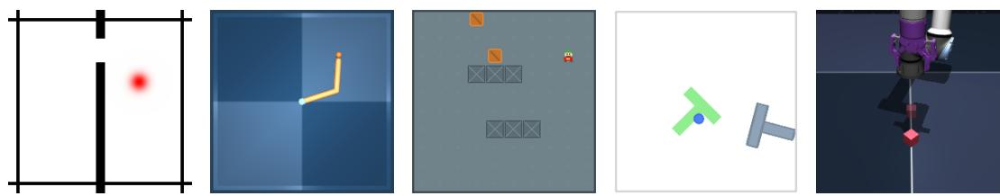  
Figure 6: The evaluation environments: TwoRoom, Reacher, Sokoban-Long, PushT and Cube-Single (left to right).

Table 5: Goal-reaching success rates (%) on TwoRoom (left) and Reacher (right); columns are goal offsets measured in original environment steps. † denotes results reproduced by us.
<table><tr><td rowspan="2">Method</td><td colspan="3">TwoRoom</td><td colspan="3">Reacher</td></tr><tr><td>25</td><td>50</td><td>100</td><td>25</td><td>50</td><td>100</td></tr><tr><td>LeWM</td><td>87.0</td><td> $6 1 . 5 0 \pm 1 . 2 2 ^ { \dagger }$ </td><td> $2 7 . 0 0 \pm 0 . 8 2 ^ { \dagger }$ </td><td>86.0</td><td> $8 5 . 3 3 \pm 0 . 6 2 ^ { \dagger }$ </td><td> $7 5 . 6 7 \pm 0 . 6 2 ^ { \dagger }$ </td></tr><tr><td>DINO-WM</td><td>100.0</td><td> $6 0 . 5 0 \pm 0 . 7 1 ^ { \dagger }$ </td><td> $3 2 . 1 7 \pm 0 . 9 4 ^ { \dagger }$ </td><td>79.0</td><td> $6 7 . 0 0 \pm 0 . 7 1 ^ { \dagger }$ </td><td> $3 4 . 1 7 \pm 1 . 0 3 ^ { \dagger }$ </td></tr><tr><td>HWM</td><td>100†</td><td> $7 3 . 6 7 \pm 1 . 0 3 ^ { \dagger }$ </td><td> $4 8 . 3 3 \pm 0 . 9 4 ^ { \dagger }$ </td><td></td><td></td><td></td></tr><tr><td>PLDM</td><td>97</td><td></td><td></td><td>78</td><td></td><td></td></tr><tr><td>Fast-LeWM</td><td>98</td><td> $6 7 . 1 7 \pm 1 . 2 5 ^ { \dagger }$ </td><td> $3 8 . 6 7 \pm 0 . 6 2 ^ { \dagger }$ </td><td>90.0</td><td> $8 1 . 3 3 \pm 0 . 9 4 ^ { \dagger }$ </td><td> $7 9 . 3 3 \pm 0 . 6 2 ^ { \dagger }$ </td></tr><tr><td>RC-aux</td><td> $9 8 . 0 \pm 1 . 4$ </td><td> $6 6 . 3 3 \pm 1 . 1 8 ^ { \dagger }$ </td><td> $2 1 . 5 0 \pm 0 . 8 2 ^ { \dagger }$ </td><td> $8 7 . 2 \pm 6 . 4$ </td><td> $8 5 . 5 0 \pm 1 . 4 1 ^ { \dagger }$ </td><td> $8 1 . 6 7 \pm 1 . 0 3 ^ { \dagger }$ </td></tr><tr><td>INTACTPure CEM</td><td> $8 2 . 8 9 \pm 0 . 8 4$ </td><td> $2 4 . 0 0 \pm 1 . 0 8 ^ { \dagger }$ </td><td> $3 . 5 0 \pm 0 . 7 1 ^ { \dagger }$ </td><td> $8 3 . 6 7 \pm 0 . 6 7$ </td><td> $9 2 . 3 3 \pm 1 . 0 3 ^ { \dagger }$ </td><td> $8 1 . 1 7 \pm 0 . 8 5 ^ { \dagger }$ </td></tr><tr><td>INTACTActor+CEM</td><td> $9 8 . 0 0 \pm 1 . 1 5$ </td><td> $7 3 . 3 3 \pm 0 . 9 4 ^ { \dagger }$ </td><td> $6 3 . 0 0 \pm 1 . 0 8 ^ { \dagger }$ </td><td> $8 6 . 6 7 \pm 0 . 8 8$ </td><td> $9 7 . 3 3 \pm 0 . 6 2 ^ { \dagger }$ </td><td> $9 3 . 0 0 \pm 0 . 8 2 ^ { \dagger }$ </td></tr><tr><td>VLWM</td><td>96</td><td>80</td><td>68</td><td></td><td></td><td></td></tr><tr><td>Gemini controller</td><td> $9 8 . 0 0 \pm 0 . 4 1 ^ { \dagger }$ </td><td> $9 4 . 8 3 \pm 0 . 8 5 ^ { \dagger }$ </td><td> $9 0 . 0 0 \pm 0 . 8 2 ^ { \dagger }$ </td><td> $8 9 . 0 0 \pm 0 . 4 1 ^ { \dagger }$ </td><td> $8 6 . 1 7 \pm 0 . 4 7 ^ { \dagger }$ </td><td> $8 4 . 8 3 \pm 0 . 6 2 ^ { \dagger }$ </td></tr><tr><td>Dual-WM</td><td></td><td></td><td></td><td></td><td></td><td></td></tr><tr><td>From scratch</td><td>100.0</td><td> $9 9 . 3 3 \pm 0 . 9 4$ </td><td> $9 2 . 5 \pm 0 . 7 1$ </td><td> $9 9 . 0 \pm 0 . 8 2 $ </td><td> $9 8 . 6 7 \pm 0 . 6 2 $ </td><td> $9 3 . 3 \pm 1 . 0 3$ </td></tr><tr><td>VFM adaptor</td><td>100.0</td><td> ${ \bf 9 9 . 6 7 \pm 0 . 4 7 }$ </td><td> ${ \bf 9 3 . 3 3 \pm 0 . 2 4 }$ </td><td> ${ \bf 9 9 . 3 3 \pm 0 . 2 4 }$ </td><td> ${ \bf 9 8 . 8 3 \pm 0 . 2 4 }$ </td><td> ${ \bf 9 8 . 5 \pm 0 . 4 }$ </td></tr><tr><td>Low-level only</td><td>100.0</td><td> $9 2 . 1 7 \pm 0 . 6 2$ </td><td> $6 8 . 6 7 \pm 1 . 2 5$ </td><td> $9 8 . 6 7 \pm 0 . 2 4$ </td><td> $9 5 . 5 \pm 0 . 4$ </td><td> $8 9 . 1 7 \pm 0 . 2 4$ </td></tr></table>

Dual-WM variants. From scratch jointly trains the visual encoder and low-level predictor, with the high-level branch learning from their representations. VFM adaptor freezes a pretrained visual encoder and trains an adaptor together with the low-level predictor, followed by high-level training. Low-level only plans with primitive actions without high-level subgoal guidance, using the same low-level checkpoint as the full model. With INTACT actor adds actor-guided proposals to lowlevel search on Cube-Single. The main cross-task comparison always uses the from-scratch variant.

The VFM-adaptor variant is strongest on Reacher, reaching 98.50% at offset 100, but underperforms the from-scratch model on PushT. The benefit of pretrained visual features is therefore taskdependent. Cube-Single success is nonmonotone in dataset offset for several methods: temporal separation along a recorded trajectory is not itself a measure of minimum control difficulty. The discrete-action representation and planner for Sokoban-Long are described in Appendix I.

## E.1 ACTOR-GUIDED COMPARISON ON CUBE-SINGLE

Table 8 separates the action-proposal mechanism from the world-model comparison. Without actor guidance, both methods use CEM; with actor guidance, both use the INTACT actor. Dual-WM retains its dual-latent dynamics and hierarchical planner in either setting. At offset 100, actor guidance improves both methods. At offset 50, it improves INTACT but lowers Dual-WM success from 62.67% to 58.50%, showing that its benefit depends on the evaluation setting. These results complement the non-actor-guided aggregate in the main text.

Table 6: Goal-reaching success rates (%) on Sokoban-Long; columns are goal offsets measured in original environment steps. † denotes results reproduced by us.
<table><tr><td>Method</td><td>25</td><td>50</td><td>100</td></tr><tr><td>LeWM</td><td> $6 8 . 1 7 \pm 0 . 6 2 ^ { \dagger }$ </td><td> $4 1 . 5 0 \pm 0 . 7 1 ^ { \dagger }$ </td><td> $1 6 . 3 3 \pm 0 . 4 7 ^ { \dagger }$ </td></tr><tr><td>Gemini</td><td> $6 9 . 6 7 \pm 0 . 8 5 ^ { \dagger }$ </td><td> $5 2 . 0 0 \pm 0 . 8 2 ^ { \dagger }$ </td><td> $3 5 . 0 0 \pm 0 . 4 1 ^ { \dagger }$ </td></tr><tr><td colspan="4">Dual-WM</td></tr><tr><td>From scratch</td><td> $\mathbf { 8 7 . 8 3 \pm 0 . 6 2 }$ </td><td> ${ \bf 7 5 . 1 7 \pm 0 . 8 5 }$ </td><td> ${ \bf 5 2 . 3 3 \pm 0 . 9 4 }$ </td></tr><tr><td>VFM adaptor</td><td> $8 3 . 6 7 \pm 0 . 2 4$ </td><td> $6 8 . 8 3 \pm 0 . 8 5$ </td><td> $4 8 . 0 0 \pm 0 . 4 1$ </td></tr><tr><td>Low-level only</td><td> $8 7 . 0 0 \pm 0 . 0 0$ </td><td> $7 0 . 1 7 \pm 0 . 2 4$ </td><td> $4 5 . 8 3 \pm 0 . 8 5$ </td></tr></table>

Table 7: Goal-reaching success rates (%) on PushT (left) and Cube-Single (right); columns are goal offsets measured in original environment steps. PushT carries the offset-75 column because HWM reports its long-horizon result at offset 75. On Cube-Single, Dual-WM (with INTACT actor) adds the INTACT actor as an action prior for low-level planning; all other Dual-WM rows use plain CEM. † denotes results reproduced by us.
<table><tr><td rowspan="2">Method</td><td colspan="4">PushT</td><td colspan="3">Cube-Single</td></tr><tr><td>25</td><td>50</td><td>75</td><td>100</td><td>25</td><td>50</td><td>100</td></tr><tr><td>LeWM</td><td>96.0</td><td> $5 6 . 0 0 \pm 0 . 7 1 ^ { \dagger }$ </td><td> $4 5 . 6 7 \pm 0 . 6 2 ^ { \dagger }$ </td><td> $2 0 . 0 0 \pm 0 . 8 2 ^ { \dagger }$ </td><td>74.0</td><td> $5 1 . 3 3 \pm 1 . 0 3 ^ { \dagger }$ </td><td> $5 4 . 1 7 \pm 0 . 6 2 ^ { \dagger }$ </td></tr><tr><td>DINO-WM</td><td>74.0</td><td> $5 5 . 3 3 \pm 0 . 6 2 ^ { \dagger }$ </td><td> $3 8 . 1 7 \pm 0 . 8 5 ^ { \dagger }$ </td><td> $1 2 . 0 0 \pm 0 . 7 1 ^ { \dag }$ </td><td>86.0</td><td> $6 2 . 1 7 \pm 0 . 2 4 ^ { \dagger }$ </td><td> $6 2 . 3 3 \pm 0 . 4 7 ^ { \dagger }$ </td></tr><tr><td>PLDM</td><td>78</td><td></td><td>一</td><td></td><td>65</td><td></td><td></td></tr><tr><td>HWM</td><td>89</td><td>78</td><td>61</td><td> $3 1 . 0 0 \pm 1 . 4 1 ^ { \dagger }$ </td><td>一</td><td></td><td></td></tr><tr><td>Hi-LeWM</td><td> $9 0 . 7 \pm 6 . 2 $ </td><td> $4 2 . 0 \pm 6 . 8$ </td><td> $1 5 . 3 \pm 4 . 1$ </td><td></td><td>一</td><td></td><td></td></tr><tr><td>Fast-LeWM</td><td>98.0</td><td> $4 1 . 0 0 \pm 1 . 4 1 ^ { \dagger }$ </td><td> $2 9 . 1 7 \pm 1 . 1 8 ^ { \dagger }$ </td><td> $9 . 5 0 \pm 0 . 8 2 ^ { \dagger }$ </td><td>82</td><td> $5 3 . 1 7 \pm 0 . 9 4 ^ { \dagger }$ </td><td> $6 6 . 3 3 \pm 1 . 3 1 ^ { \dagger }$ </td></tr><tr><td>RC-aux</td><td> $9 0 . 8 \pm 3 . 3$ </td><td></td><td></td><td></td><td> $7 6 . 0 \pm 7 . 5$ </td><td> $5 0 . 1 7 \pm 2 . 2 5 ^ { \dagger }$ </td><td> $6 5 . 3 3 \pm 1 . 8 9 ^ { \dagger }$ </td></tr><tr><td> $\mathrm { I N T A C T } ^ { P u r e C E M }$ </td><td> $8 8 . 4 4 \pm 1 . 1 7$ </td><td> $3 3 . 6 7 \pm 1 . 8 9 ^ { \dagger }$ </td><td> $1 7 . 8 3 \pm 0 . 9 4 ^ { \dagger }$ </td><td> $5 . 6 7 \pm 1 . 6 5 ^ { \dagger }$ </td><td> $6 8 . 4 4 \pm 0 . 7 7$ </td><td> $5 3 . 5 0 \pm 1 . 0 8 ^ { \dagger }$ </td><td> $6 1 . 1 7 \pm 1 . 3 1 ^ { \dagger }$ </td></tr><tr><td> $\mathrm { I N T A C T } ^ { A c t o r + C E M }$ </td><td> $9 3 . 5 6 \pm 0 . 9 6$ </td><td> $4 7 . 8 3 \pm 0 . 8 5 ^ { \dagger }$ </td><td> $2 4 . 0 0 \pm 0 . 4 1 ^ { \dagger }$ </td><td> $1 1 . 5 0 \pm 0 . 7 1 ^ { \dagger }$ </td><td> $9 6 . 8 9 \pm 0 . 1 9$ </td><td> $5 7 . 1 7 \pm 1 . 0 3 ^ { \dagger }$ </td><td> $8 0 . 6 7 \pm 0 . 2 4 ^ { \dagger }$ </td></tr><tr><td>JEPA-WM</td><td> $7 0 . 2 \pm 2 . 8$ </td><td> $3 8 . 1 7 \pm 1 . 2 5 ^ { \dagger }$ </td><td> $^ { 1 6 . 0 0 \pm 0 . 8 2 ^ { \dag } } _ { 2 0 }$ </td><td> $5 . 3 3 \pm 1 . 1 8 ^ { \dagger }$ </td><td>一</td><td></td><td>一</td></tr><tr><td>VLWM</td><td>94</td><td>60</td><td></td><td>12</td><td>74</td><td>54</td><td>50</td></tr><tr><td>Gemini controller</td><td> $2 2 . 6 7 \pm 0 . 2 4 ^ { \dagger }$ </td><td> $1 0 . 8 3 \pm 0 . 4 7 ^ { \dagger }$ </td><td> $8 . 0 0 \pm 1 . 4 1 ^ { \dagger }$ </td><td> $2 . 1 7 \pm 1 . 3 1 ^ { \dagger }$ </td><td> $5 6 . 1 7 \pm 1 . 1 8 ^ { \dagger }$ </td><td> $3 5 . 1 7 \pm 0 . 8 5 ^ { \dagger }$ </td><td> $3 0 . 1 7 \pm 1 . 0 3 ^ { \dagger }$ </td></tr><tr><td colspan="8">Dual-WM</td></tr><tr><td>From scratch</td><td> ${ \bf 9 8 . 0 0 \pm 0 . 7 1 }$ </td><td></td><td>86.17±0.62 62.00±0.41</td><td> ${ \bf 4 1 . 3 3 \pm 1 . 3 1 }$ </td><td> $7 4 . 0 0 \pm 0 . 4 1$ </td><td> $6 2 . 6 7 \pm 0 . 6 2$ </td><td> $6 7 . 8 3 \pm 0 . 4 7$ </td></tr><tr><td>VFM adaptor</td><td> $6 7 . 1 7 \pm 0 . 2 4$ </td><td> $3 9 . 8 3 \pm 0 . 8 5$ </td><td> $2 3 . 3 3 \pm 0 . 9 4$ </td><td> $1 1 . 6 7 \pm 1 . 0 3$ </td><td> $7 9 . 3 3 \pm 0 . 8 5$ </td><td> ${ \bf 6 2 . 8 3 \pm 0 . 9 4 }$ </td><td> $6 8 . 0 0 \pm 0 . 7 1 $ </td></tr><tr><td>Low-level only</td><td> $9 7 . 8 3 \pm 1 . 0 3 $ </td><td> $6 2 . 6 7 \pm 0 . 4 7$ </td><td> $5 3 . 3 3 \pm 0 . 8 5$ </td><td> $1 9 . 8 3 \pm 0 . 9 4$ </td><td> $7 4 . 3 3 \pm 1 . 0 3$ </td><td> $5 5 . 0 0 \pm 0 . 7 1$ </td><td> $6 1 . 5 0 \pm 1 . 0 8$ </td></tr><tr><td>With INTACT actor</td><td></td><td></td><td></td><td></td><td> ${ \bf 9 7 . 3 3 \pm 0 . 2 4 }$ </td><td> $5 8 . 5 0 \pm 0 . 4 1$ </td><td> $\mathbf { 8 2 . 5 0 \pm 0 . 7 1 }$ </td></tr></table>

Table 8: Cube-Single success (%) grouped by method, with and without actor-guided proposals. Columns are goal offsets in environment steps. INTACT’s offset-25 results are quoted; the remaining entries are our evaluations. Bold marks a Dual-WM variant only when it attains the highest mean in the column.
<table><tr><td>Variant</td><td>25</td><td>50</td><td>100</td></tr><tr><td>INTACT</td><td></td><td></td><td></td></tr><tr><td>Pure CEM</td><td> $6 8 . 4 4 \pm 0 . 7 7$ </td><td> $5 3 . 5 0 \pm 1 . 0 8$ </td><td> $6 1 . 1 7 \pm 1 . 3 1$ </td></tr><tr><td>Actor+CEM</td><td> $9 6 . 8 9 \pm 0 . 1 9$ </td><td> $5 7 . 1 7 \pm 1 . 0 3$ </td><td> $8 0 . 6 7 \pm 0 . 2 4$ </td></tr><tr><td>Dual-WM</td><td></td><td></td><td></td></tr><tr><td>Pure CEM</td><td> $7 4 . 0 0 \pm 0 . 4 1$ </td><td> ${ \bf 6 2 . 6 7 \pm 0 . 6 2 }$ </td><td> $6 7 . 8 3 \pm 0 . 4 7$ </td></tr><tr><td>With INTACT actor</td><td> ${ \bf 9 7 . 3 3 \pm 0 . 2 4 }$ </td><td> $5 8 . 5 0 \pm 0 . 4 1$ </td><td> $\mathbf { 8 2 . 5 0 \pm 0 . 7 1 }$ </td></tr></table>

## E.2 SUCCESS–TIME TRADEOFF ON TWOROOM

We evaluate four planning-budget settings for Dual-WM, its low-level-only variant, LeWM, and HWM at goal offset 100, with an execution budget of 125 environment steps. Each setting uses 200 matched tasks per planning seed (0, 1, and 42). Figure 7 reports mean success and standard deviation across these seeds. Planning time per environment step is cumulative planning time divided by the number of environment steps actually executed. All methods run on an Intel Xeon E5-2680 v4 CPU and an NVIDIA RTX A6000 GPU in FP32 precision. Table 9 lists the CEM settings for each budget tier.

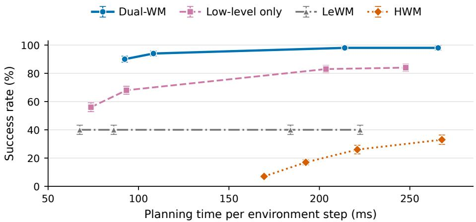  
Figure 7: Success–time tradeoff on TwoRoom at goal offset 100 and an execution budget of 125 environment steps. Each method has four measured planning-budget settings; lines connect successive settings. Error bars show ± one standard deviation across three planning seeds.

Dual-WM achieves 90–98% success over the measured range. At nearly equal planning times, Dual-WM attains 90% at 92.4 ms and the low-level-only variant attains 68% at 93.3 ms. Even at its largest tested budget (247.7 ms), the low-level-only variant reaches 84%. LeWM remains at 40% across its four settings, while HWM improves from 7% to 33% as planning time increases. These measurements support the benefit of dual-latent planning across the tested range of planning costs.

Table 9: CEM settings for the TwoRoom planning-budget sweep. Each entry lists candidates / elites / iterations. Tiers correspond to successive points on each method’s curve in Figure 7.
<table><tr><td>Method / level</td><td>Tier 1</td><td>Tier 2</td><td>Tier 3</td><td>Tier 4</td></tr><tr><td>Dual-WM high</td><td>30/10/7</td><td>40/10/8</td><td>80/10/16</td><td>100/10/20</td></tr><tr><td>Dual-WM low</td><td>60/30/7</td><td>80/30/8</td><td>160/30/16</td><td>192/30/20</td></tr><tr><td>Low-level only</td><td>60/30/7</td><td>96/30/9</td><td>192/30/20</td><td>256/30/25</td></tr><tr><td>LeWM</td><td>60/30/7</td><td>96/30/9</td><td>192/30/20</td><td>256/30/25</td></tr><tr><td>HWM high</td><td>30/10/7</td><td>40/10/8</td><td>80/10/12</td><td>80/10/12</td></tr><tr><td>HWM low</td><td>30/30/3</td><td>35/30/3</td><td>40/30/3</td><td>60/30/3</td></tr></table>

## F QUALITATIVE EXECUTION ACROSS FIVE TASKS

Figures 8–12 show selected executions of LeWM and full from-scratch Dual-WM from matched initial states and goals, with a common budget of 125 environment steps. An offset of 100 means that the initial and goal frames are separated by 100 environment steps within the same dataset episode. Because the data-collection policies include substantial randomness, these trajectories need not be direct routes to the sampled goals, which can often be reached in fewer than 100 steps. Each row contains ten observation frames and the goal image; timestamps count environment steps and are shared between methods. After termination, the final recorded observation is repeated at later timestamps for temporal alignment, including two intermediate timestamps before t = 100.

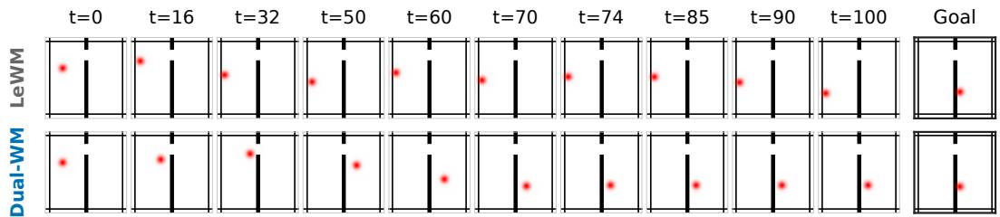

Figure 8: TwoRoom execution. Dual-WM navigates through the doorway and approaches the goal in the other room; LeWM remains on the starting side of the wall.  
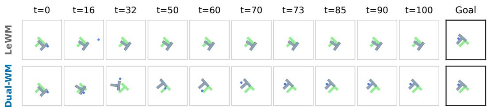

Figure 9: PushT execution. Dual-WM changes the block configuration toward the sampled goal, while LeWM leaves it near its initial configuration. The green shape is a fixed renderer reference; the task goal is the rightmost image.  
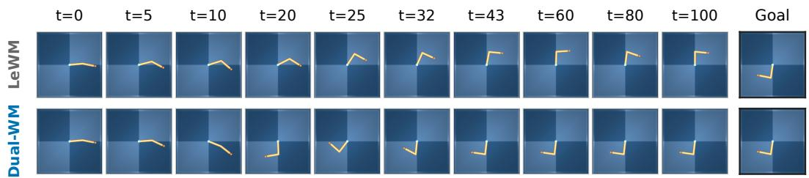  
Figure 10: Reacher execution. Dual-WM brings the arm toward the goal configuration; LeWM moves the arm but retains a different configuration.

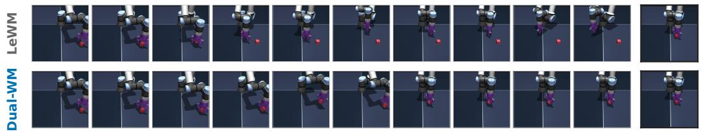  
Figure 11: Cube-Single execution. Dual-WM brings the gripper and object toward the goal arrangement, whereas LeWM changes the gripper pose without completing the required object movement.

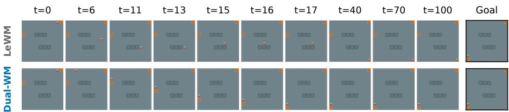  
Figure 12: Sokoban-Long execution. Dual-WM navigates to a box and performs a sequence of aligned pushes toward the goal, while LeWM does not complete the required box movement. This supplemental held-out source pair lies outside the standard 200-task sample.

Long-range goal discrimination. The navigation and manipulation examples expose the need to distinguish useful intermediate states from states that merely remain near the starting configuration. In TwoRoom, progress requires a route through the doorway before local convergence to the goal. In PushT and Sokoban-Long, the agent must establish an appropriate contact or pushing configuration before moving the object toward its target. These behaviors complement the goal-ordering and distance-field results in Sections 4.3 and 4.5: a representation that preserves long-range goal structure can guide intermediate choices, while the low-level representation supports precise action refinement.

Maintaining useful predictions during execution. Completing these sequences also requires action-conditioned predictions that remain informative across repeated planning updates. Dual-WM’s progress through distinct configurations provides a behavioral counterpart to the recursive physical-state probes in Section 4.4 and the LoRe scale ablation in Figure 5. Taken together, the execution examples and quantitative diagnostics support the complementary roles of long-range goal discrimination and multi-step predictive consistency in goal-directed control.

## G ADDITIONAL REPRESENTATION DIAGNOSTICS

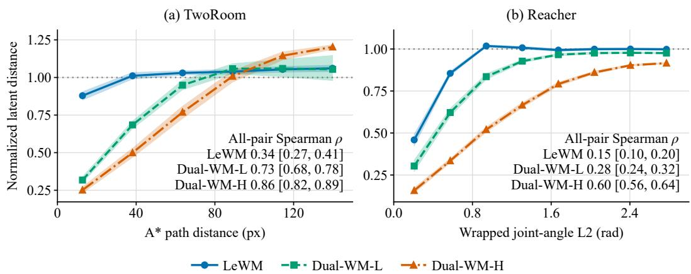  
Figure 13: Latent-distance concentration on held-out state pairs. We plot dimension-normalized Euclidean latent distance against $\mathbf { A } ^ { * }$ endpoint path distance in TwoRoom (left) and wrapped jointangle distance in Reacher (right). Curves are equal-width-bin means and shaded regions are 95% episode-bootstrap confidence intervals. The displayed task-relevant ranges are 0–150 px and 0–3 rad, respectively; annotated rank correlations use all held-out pairs. Only bins with at least 100 valid pairs are displayed. The dotted line marks the independent isotropic-Gaussian reference.

These diagnostics complement the held-out distance curves in Section 4.3. TwoRoom visualizes obstacle-aware goal geometry, Reacher examines configuration-space ordering, and PushT tests goal discrimination in contact-rich manipulation.

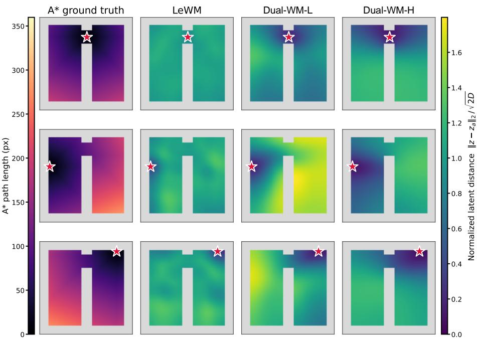

Figure 14: TwoRoom distance fields for three prespecified members of a geometry-only nine-anchor maximin set; stars mark the query states. Each row contains one A\* reference followed by LeWM, Dual-WM-L and Dual-WM-H latent distances normalized by 2D. All A\* panels share one pathlength scale, and all model panels share one latent-distance scale. The wall-safe Gaussian bandwidth $( \sigma = 1 0 \mathrm { p x } )$ is selected by blocked spatial cross-validation over all three models and all nine anchors, without using $\mathbf { A } ^ { * }$ similarity or visual appearance.  
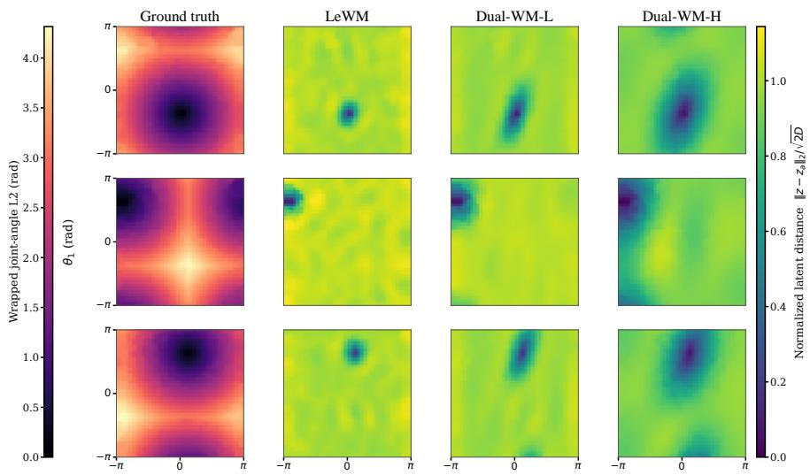  
Figure 15: Reacher distance fields for three query states (rows). Columns show wrapped joint angle distance, LeWM, Dual-WM-L, and Dual-WM-H. Model distances are normalized by ${ \sqrt { 2 D } } .$ Sparse grid cells are interpolated and lightly smoothed for visualization; all reported correlations are computed only on the 1,118 observed cells with at least ten samples.

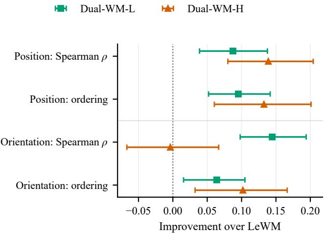  
Figure 16: PushT goal-geometry improvements relative to LeWM on 128 held-out episodes. Dots are paired differences for Dual-WM-L and Dual-WM-H; error bars are 95% episode-cluster bootstrap confidence intervals (2,000 draws). Positive values favor Dual-WM. Correlations use physical goal distance, while ordering accuracy measures which state in a same-episode pair is closer to the goal; exact physical ties are excluded.

Physical-state probe protocol. For each checkpoint and physical target, a single ridge probe is fitted on predicted latents pooled across all five horizons from training episodes. Its regularization is selected on disjoint validation episodes, and it is evaluated on disjoint test episodes. Probe fitting and evaluation therefore use the same predicted-latent regime. Figure 17 reports the resulting task-native errors.

## H COMPONENT-STUDY PROTOCOLS AND SENSITIVITY RESULTS

Evaluation and units. The TwoRoom component studies use goal offsets of 25, 50, and 100 original environment steps, with execution budgets of 50, 75, and 125 steps, respectively. Planning results average three planning seeds. The component figures display means without uncertainty bars. The latent-space and LoRe scale studies use the full hierarchical planner, whereas the rollout-horizon and weighting studies use low-level-only planning. The 69% result at $N = 5$ therefore evaluates the low-level planner, not the full Dual-WM configuration used in the scale study. Training rollout lengths N, M, evaluation rollout lengths, and goal offsets have different meanings: N counts low level model transitions, whereas goal offsets count original environment steps.

Controlled variants. Within each ablation, settings other than the indicated factor remain at their defaults. Shared-Identity passes the low-level endpoint latent $z _ { t } ^ { L }$ directly to the high-level predictor. Endpoint-MLP maps that endpoint through a three-layer MLP with hidden width 2048 to a distinct 192-dimensional high-level state used for both prediction and planning. Window-Concat uses the same length-k low-level latent window $W _ { t } ^ { L }$ as Dual-WM, but replaces $E _ { H }$ with direct concatenation. Its high-level state is $\mathrm { v e c } ( W _ { t } ^ { L } ) \in \mathbf { \bar { \mathbb { R } } } ^ { k d _ { L } }$ , and its high-level predictor learns to predict the next macro-step window in this space. All variants retain high-level planning followed by low-level refinement and use the same frozen low-level checkpoint. Apart from the state interface and its associated dimensions and architecture, training data, objectives, training duration, and planning settings are identical. On TwoRoom, k = 3 and $d _ { L } = 1 9 2$ : Shared-Identity, Endpoint-MLP, and Dual-WM use 192-dimensional high-level states, while Window-Concat uses 576 dimensions. Shared-Identity and Endpoint-MLP test endpoint-based interfaces, while Window-Concat controls for the tempora context supplied to the learned window interface. At offsets 50 and 100, Window-Concat achieves 69% and 41% success, compared with 100% and 93% for Dual-WM (Figure 4).

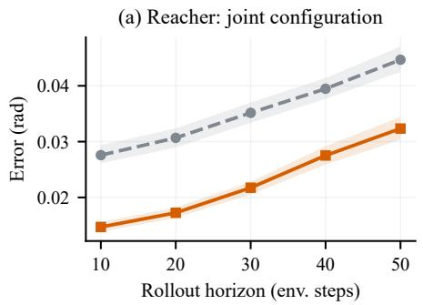

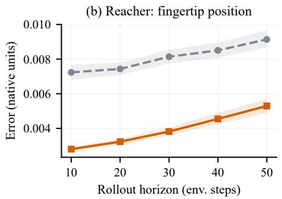

(c) PushT: block position  
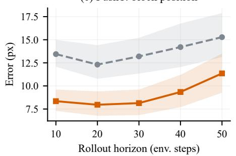

(d) PushT: block orientation  
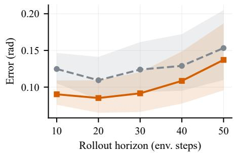  
Figure 17: Physical state decoded from recursively predicted low-level latents. A single horizonpooled ridge probe is fitted separately for each checkpoint and physical target, selected on disjoint validation episodes, and evaluated on disjoint test episodes. Curves report mean task-native error and shaded regions show 95% episode-cluster bootstrap confidence intervals. The rollout-trained checkpoint has lower point estimates at all horizons; PushT orientation has the widest uncertainty.

Goal-ordering protocol. For a goal g and two observed states $s _ { 1 } , s _ { 2 }$ , ordering is correct when the sign of the difference between their latent goal distances agrees with the sign of $d _ { \mathrm { A } * } ( s _ { 1 } , g ) -$ $d _ { \mathrm { A } * } ( s _ { 2 } , g )$ . Pairs with equal $\mathbf { A } ^ { * }$ distance are excluded. The comparison uses the same held-out state pairs and goals for all representations. Pairs are grouped by $[ d _ { \mathrm { A } * } \mathbf { \bar { ( } } s _ { 1 } , g ) + d _ { \mathrm { A } * } ( s _ { 2 } , g ) ] / 2$ into [0, 30), [30, 60), [60, 90), [90, 120), and [120, 150] px bins. Ordering is averaged within episodes and then across episodes. Window-based representations receive observation context ending at each candidate state; endpoint-based representations encode its final observation. Dual-WM-H and Window Concat use the same window. For a single goal image, its low-level latent is repeated to form the goal window before encoding or concatenation, respectively. No future observation window is used for this diagnostic. LeWM and Dual-WM-L are contextual references; Dual-WM-H, Endpoint-MLP, Shared-Identity, and Window-Concat are the four planning representations evaluated in the interface ablation. In the nearest bin, Dual-WM-L reaches 99.8% ordering accuracy versus 94.2% for Dual-WM-H and 93.5% for Window-Concat. In the farthest bin, Dual-WM-H retains 84.9%, com pared with 73.6% for Endpoint-MLP, 56.6% for Shared-Identity, 55.6% for Dual-WM-L, 52.4% for LeWM, and 51.0% for Window-Concat. The widening gap between Dual-WM-H and Window-Concat shows that equal window context does not yield equally informative long-range goal rankings. Together with the planning results, this supports learning a high-level geometry for distant subgoal evaluation while retaining the low-level representation for local goal convergence.

LoRe scale activation. The one-step configuration retains both dynamics models and supervises one transition at each level. The low-only and high-only configurations activate LoRe at the indicated level while retaining one-step supervision at the other. Both activates recursive supervision at both levels. These training comparisons retain the hierarchical planner; they are distinct from the low-level-only planning variant in the main result tables.

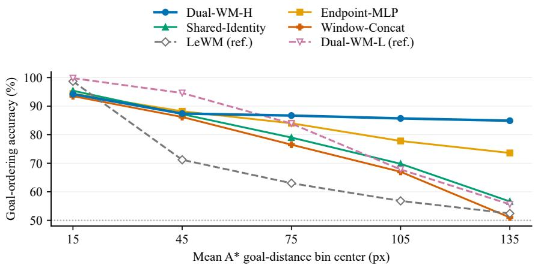  
Figure 18: Goal ordering on TwoRoom. Accuracy compares latent and $\mathbf { A } ^ { * }$ goal-distance rankings; bins use mean goal distance. Dual-WM-H and Window-Concat use identical observation windows, with learned encoding and direct concatenation, respectively. Dashed curves are contextual references. Corresponding planning success is shown in Figure 4.

Low-level training horizon and probing. The horizon study uses low-level-only planning, varies $N \in \{ 1 , 3 , 5 , 8 , 1 0 \}$ , and evaluates predicted low-level states at horizons $1 , 2 , 3 , 5 , 7 , 1 0 . \ \mathrm { ~ A ~ }$ position probe is fitted on predicted latents pooled across horizons, with disjoint episodes for fitting, validation, and evaluation. This measures how much position information remains accessible after recursive prediction, rather than the raw discrepancy between latent vectors from different models. At evaluation horizon 10, position error is 12.0 px for $N = 1 , 5 . 7$ px for $N = 5 ,$ , and 8.9 px for $N = 1 0$ , consistent with the planning advantage of a moderate training horizon in this study.

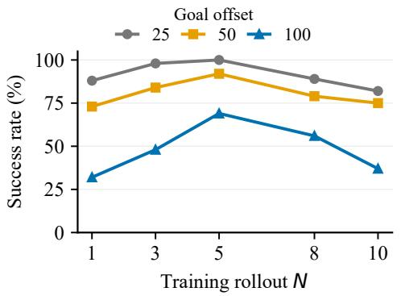

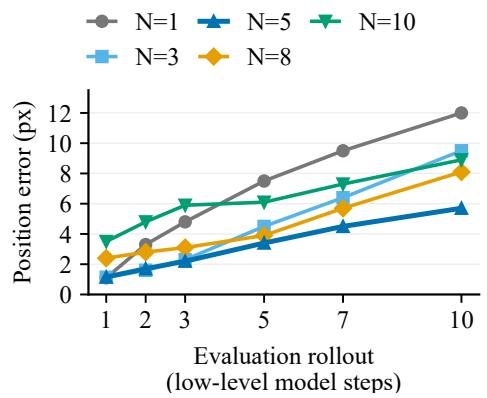  
Figure 19: Low-level training-horizon sensitivity on TwoRoom. Left: mean success using low-levelonly planning at goal offsets 25, 50, and 100 environment steps. Right: mean position-probe error over recursive low-level predictions. Both panels compare $N \in \{ 1 , \overset { \vartriangle } { 3 } , 5 , 8 , 1 0 \}$ ; the right horizontal axis is evaluation rollout length, not training length.

Low-level rollout-weighting profiles. This study also uses low-level-only planning. For horizon N, uniform weights are $w _ { h } = 1 / N$ , and linearly decreasing weights are $w _ { h } \stackrel { \cdot } { = } \stackrel { \cdot } { 2 } ( N - \bar { h } + 1 ) / [ N ( N +$ 1)], for $h = 1 , \ldots , N$ . Thus, at $\mathrm { \dot { N } = 5 }$ , the linear profile is $( 5 , 4 , 3 , 2 , 1 ) / 1 5$ . The exponential profile is defined in Eq. (5).

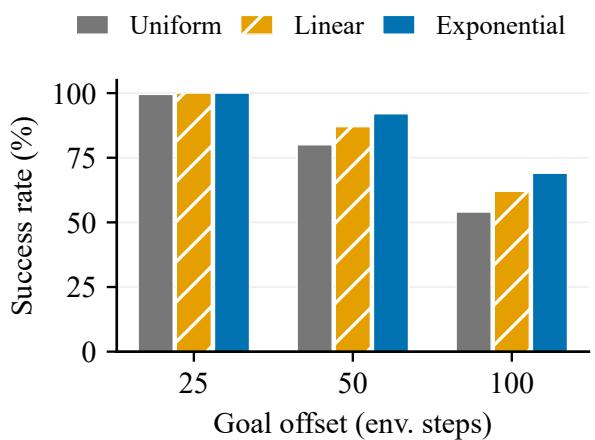

Figure 20: Rollout-weighting comparison on TwoRoom at training horizon $N = 5$ . Bars show mean success across low-level-only planning runs. The difference between profiles grows as the goal offset increases.  
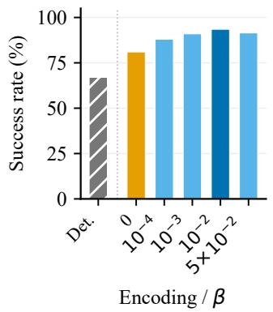

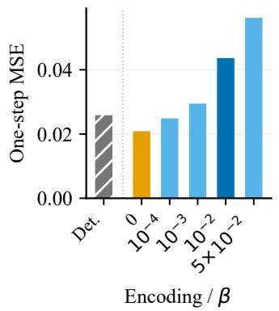

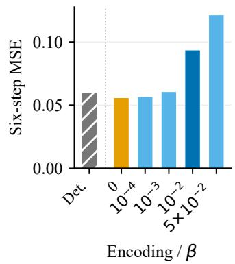  
Figure 21: Macro-action prior shaping on TwoRoom. Left: mean success at goal offset 100. Middle and right: mean one-step and six-step latent MSE. Det. denotes deterministic macro-action encoding; numeric labels denote stochastic encoding with the indicated MAPS coefficient, including $\beta = 0$ without the KL penalty. All panels show the same six configurations. Raw MSE is measured in each learned latent space.

## I SOKOBAN-LONG: DISCRETE-ACTION IMPLEMENTATION

Sokoban-Long extends the evaluation to discrete-action, game-like planning. The world model uses vector-valued action inputs at both temporal scales, while the low-level search distribution is selected according to the environment’s action space.

Action representation and preprocessing. The environment has a Discrete(5) action space: 0 is no-op, 1 up, 2 down, 3 left, and 4 right. The frame skip is $f = 1$ , so one low-level model step corresponds to one environment step. Actions are stored as five-dimensional one-hot vectors. The low-level action encoder therefore has input width $f \times \mathsf { a c t i o n \_ d i m } = 5 ,$ and the macro-action encoder $E _ { A }$ receives a $k \times 5$ window of one-hot actions. It encodes these k discrete actions into a continuous macro-action posterior. This uses the same encoder design and training objectives as the continuous-action setting, with the appropriate action input width. One-hot action columns are excluded from data normalization; only the proprioceptive fields are normalized. In particular, statistics of the five action columns are not applied to scalar environment action indices.

Categorical low-level search. For a discrete action space, the low-level planner selects categorical CEM instead of Gaussian CEM. It maintains a categorical distribution over the five actions at each planning step and samples candidate action sequences using Gumbel-max. Each candidate is converted to a one-hot sequence before latent rollout, matching the action representation used during training. Candidates are ranked by the planning cost, and the distribution is refitted to the empirical action frequencies of the elite sequences. Laplace smoothing and exponential-moving-average updates prevent premature concentration of the search distribution. High-level-guided refinement uses the projected subgoal cost in Eq. (9); the final stage uses Eq. (10).

The low-level search uses 300 candidates per iteration, 30 iterations, and 30 elites, with planning horizon $H _ { L } = 1 2$ During high-level-guided refinement, only the first action is executed before replanning from the new observation. In the final stage, the categorical plan is cached and reused over a four-environment-step execution horizon before replanning. The selected one-hot actions are converted back to scalar action indices for execution, without action denormalization.

For warm starts, unseeded sample rows use a sentinel value of −1. Zero-filling these rows would instead designate action 0 and bias the search toward no-op. The sentinel marks missing warm-start entries and is not an environment action.

Continuous high-level search. The macro-action $u \in \mathbb { R } ^ { 1 6 }$ remains continuous even though the underlying actions are discrete. High-level planning uses Gaussian CEM over the continuous macroaction space, with 100 candidates per iteration, 20 iterations, and 10 elites. Each candidate contains $H _ { H }$ macro-actions; this horizon corresponds to u horizon in the implementation. We reserve M for the high-level training rollout length in the paper. High-level search evaluates continuous macro-actions, while the low-level planner searches discrete actions to realize its latent subgoals. This separation allows the same hierarchical planning procedure to support both action-space types through the low-level solver selection.

## J BASELINE DESCRIPTIONS AND EVALUATION PROTOCOLS

Tables 5–7 compare world-model planners and an external visual controller. This appendix distinguishes their representation learning, action-generation mechanisms, and evaluation sources. Published entries retain their original evaluation conventions; entries marked † are our reproduced planning evaluations.

Matched evaluation tasks and execution protocol. For every task and goal offset evaluated by us, each planning seed (0, 1, or 42) determines a set of 200 goal-reaching tasks. All methods receive exactly the same episode IDs, start states, and goals within that seed. Each seed resamples the task set and fixes the CEM search random stream, yielding repeatable per-task outcomes for a given planner. The reported standard deviation captures variation across these seeded evaluations in both task sampling and search randomness.

For a given task and offset, all methods evaluated by us use the same maximum number of environment steps, success criteria, and early-termination rules. This shared protocol applies to Dual-WM and all reproduced baselines. Results quoted from prior publications retain their original protocols; the search configurations used in our evaluations are specified below.

Model sources for reproduced results. For entries marked †, DINO-WM and HWM are trained on the same datasets as Dual-WM using their authors’ released code. LeWM, Fast-LeWM, RC-aux, INTACT, and JEPA-WM use the authors’ released checkpoints and are evaluated on our matched test tasks. JEPA-WM’s offset-25 result is quoted, whereas its offset-50, 75, and 100 results are our evaluations of the released model. Our CEM-based baseline evaluations use 300 candidates, 30 iterations, and 30 elites for low-level action search. High-level macro-action search uses 100 candidates, 20 iterations, and 10 elites. Results without the reproduction marker retain the reporting convention of the original publication, apart from our own Dual-WM results.

Latent dynamics baselines. LeWM (Maes et al., 2026) trains an encoder and a predictor jointly with an anti-collapse regularizer, and plans in the resulting latent space. DINO-WM (Zhou et al., 2024) predicts the features of a pretrained DINO encoder instead of reconstructing pixels.

PLDM (Sobal et al., 2025) learns dynamics from reward-free offline trajectories and is reported at offset 25. JEPA-WM (Terver et al., 2025) is reported on PushT at offsets 25, 50, 75 and 100.

Hierarchical and multi-step baselines. HWM (Zhang et al., 2026a) learns two temporal scales inside one shared latent space. We reproduce its TwoRoom results at offsets 25, 50, and 100, and its PushT result at offset 100. The PushT results at offsets 25, 50, and 75 are quoted from the original publication; the offset-75 result motivates the extra column. Hi-LeWM (Caselli et al., 2026) adds hierarchical planning on top of LeWM and is reported on PushT at offsets 25, 50 and 75. Fast-LeWM (Gao & Xu, 2026) predicts action-prefix outcomes in parallel from an observed anchor. RC-aux (Li et al., 2026) keeps recursive dynamics and supervises them open-loop with a horizonweighted auxiliary objective. VLWM (Du et al., 2026) predicts the outcome of variable-length action sequences and is reported on TwoRoom, PushT and Cube-Single.

Actor-guided planning. INTACT (Sun et al., 2026) learns an intent-to-action interface from action-labeled trajectories. We distinguish Pure CEM, which searches without actor-guided proposals, from Actor+CEM, which uses the learned action interface to guide search. The offset-25 entries are quoted from the original paper and retain its reporting convention. The offset-50, offset-75, and offset-100 entries are our reproduced evaluations. Dual-WM with the INTACT actor is a separate extension on Cube-Single: it adds actor-guided low-level proposals while retaining dual-latent dynamics and hierarchical planning. It is excluded from the from-scratch cross-task aggregate.

External visual controller. We also evaluate a Gemini 3.8 Flash controller as a closed-loop reference. The controller receives the current observation, goal image, and action space, and produces an action chunk. We execute five environment steps before requesting a new plan. It provides an external visual-control reference alongside the learned world-model planners. The discrete-action implementation and execution schedule of Dual-WM are described in Appendix I.

Cross-task aggregation. For goal offset $m ,$ let $S _ { t , b } ( m )$ be the reported mean success of method b on task t. We compute

$$
\overline { { S } } _ { b } ( m ) = \frac { 1 } { 5 } \sum _ { t = 1 } ^ { 5 } S _ { t , b } ( m ) , \qquad \overline { { S } } _ { \mathrm { b e s t } } ( m ) = \frac { 1 } { 5 } \sum _ { t = 1 } ^ { 5 } \operatorname* { m a x } _ { b \in \mathcal { B } _ { t } ( m ) } S _ { t , b } ( m ) ,
$$

where $B _ { t } ( m )$ contains non-Dual-WM methods with a reported result for that task and offset and without actor-guided proposals. The same eligibility rule applies on every task: INTACT uses Pure CEM, and Actor+CEM is excluded. The external Gemini controller is retained. The selection uses available reported results. At offset 50, the selected methods are Gemini on TwoRoom and Sokoban-Long, INTACT (Pure CEM) on Reacher, HWM on PushT, and DINO-WM on Cube-Single. At offset 100, they are Gemini on TwoRoom, Reacher, and Sokoban-Long, HWM on PushT, and Fast-LeWM on Cube-Single. The resulting means are 75.9% and 61.4%. All Dual-WM aggregate values use the from-scratch variant. Aggregates are computed before rounding to one decimal place.

For completeness, allowing actor-guided competitors in the task-wise selection raises these aggregates to 76.9% and 65.9%. At offset 50, INTACT (Actor+CEM) replaces Pure CEM on Reacher. At offset 100, it replaces Gemini on Reacher and Fast-LeWM on Cube-Single. This broader comparison is distinct from the proposal grouping used in the main table.

## K ADDITIONAL TWOROOM DISTANCE FIELDS

The six query states not displayed in Figure 14 are collected below under the same smoothing and shared color-scale protocol. Each star marks the corresponding query state.

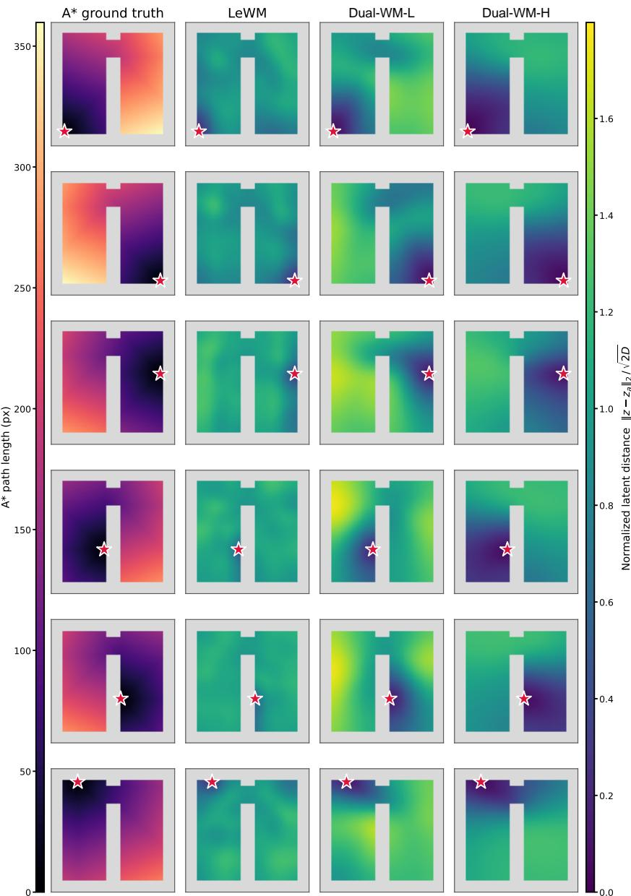  
Figure 22: Additional TwoRoom distance fields for the six remaining query states. Each row contains one A\* reference followed by LeWM, Dual-WM-L and Dual-WM-H. The A\* column and the three model columns use the same respective shared scales as Figure 14.