# BEYOND LOW-RANK PARAMETERIZATION:NARROWING THE GAP BETWEEN LORA AND FULLFINE-TUNING VIA GRADIENT DECOMPOSITION

Yihao Ouyang1, Shiwei Li1, Haozhao Wang1, Xiandi Luo1, Zhuoqi Hu1, Jinglun Yu2, Yichen Li1, Ruixuan Li1

1 Huazhong University of Science and Technology, Wuhan, China

2 Hebei University of Technology , Tianjin, China

## ABSTRACT

Low-Rank Adaptation (LoRA) is a widely used approach to parameter-efficient fine-tuning (PEFT), yet a performance gap can remain relative to full fine-tuning (FFT). Many LoRA variants improve the initialization or optimization of lowrank factors. At each training step, however, their first-order weight-space directions are constrained by the current parameterization. We characterize the corresponding LoRA-accessible gradient space and show that it coincides with the tangent space induced by the current LoRA parameterization. This characterization yields an orthogonal decomposition of the full weight gradient at the current model parameters. We term the component orthogonal to this space the normal gradient. Based on this decomposition, we propose GDLoRA (Gradient-Decomposed Low-Rank Adaptation). GDLoRA reconstructs the full weight gradient from forward activations and backward signals, extracts its normal component, and directly updates the base weights with this component, while retaining standard AdamW optimization for the LoRA factors. GDLoRA incorporates complementary normal gradients without increasing standard LoRA’s optimizerstate memory budget under matched adapter and optimizer configurations. Experiments on natural language understanding, mathematical reasoning, commonsense reasoning, and image classification show that GDLoRA consistently improves over LoRA and narrows the performance gap to FFT. The code is available at https://anonymous.4open.science/r/GDLoRA.

## 1 INTRODUCTION

Large foundation models achieve strong performance across diverse applications (Devlin et al., 2019; Brown et al., 2020; Chowdhery et al., 2023), but adapting them through full fine-tuning (FFT) incurs substantial computation and memory costs for gradients and optimizer states (Rajbhandari et al., 2020). Parameter-efficient fine-tuning (PEFT) reduces these costs by optimizing a small subset of parameters while keeping most pretrained weights frozen (Houlsby et al., 2019; Li & Liang, 2021; Lester et al., 2021). Among these methods, Low-Rank Adaptation (LoRA) (Hu et al., 2021) introduces trainable low-rank factors into pretrained layers, reducing optimizer-state memory while maintaining competitive downstream performance.

Despite these advantages, a performance gap can remain between LoRA and FFT. A related line of research seeks to enable full-rank training with reduced optimizer-state memory. Fira (Chen et al., 2024) pursues this goal by combining adaptive optimization of low-rank projected gradients with scaled residual updates. Its projection bases are obtained through SVD and reused across multiple optimization steps to amortize decomposition costs. However, as the leading gradient subspace drifts during training, reused bases may become less aligned with important directions of subsequent gradients, potentially limiting the effectiveness of adaptive optimization, while more frequent basis refreshes incur additional computational costs. A detailed analysis is provided in Appendix A. Another line of research improves LoRA optimization through adapter initialization and gradient alignment. LoRA-GA (Wang et al., 2024) uses full-gradient information to initialize the factors so that their initial induced weight-space gradient better approximates that of full fine-tuning. LoRA-

Pro (Wang et al., 2025) studies the equivalent weight-space gradient induced by the adapter gradients and adjusts them to improve its approximation to the full weight gradient.

Although these adapter-based methods do not require periodic full-gradient SVD refreshes, their first-order weight-space updates remain restricted to directions accessible through the current LoRA parameterization. This motivates us to investigate gradient information beyond these accessible directions. Although the accessible space evolves as the factors change, gradient components orthogonal to it cannot be expressed through first-order factor perturbations at the current iterate. We therefore ask: Can we explicitly recover and exploit this complementary gradient information while retaining standard LoRA’s optimizer-state memory budget?

To address this question, we characterize the LoRA-accessible gradient space, consisting of all equivalent weight-space gradients induced by the Euclidean factor gradients, and show that it coincides with the tangent space induced by the current LoRA parameterization. This characterization yields an orthogonal decomposition of the full weight gradient evaluated at the current model parameters. We call the component orthogonal to the accessible space the normal gradient. When nonzero, its negative provides a local descent direction for the current batch loss with the adapters and other weights held fixed. It is also orthogonal to every first-order weight-space direction available to the current adapters. These properties motivate using the normal component to supplement standard LoRA optimization.

Based on this decomposition, we propose GDLoRA (Gradient-Decomposed Low-Rank Adapta tion). GDLoRA reconstructs the full weight gradient of LoRA-injected layers from forward activations and backward signals, normalizes the recovered gradient by the number of input positions, and extracts its normal component using the current LoRA tangent space. This additional tokencount normalization applies only to the normal branch and preserves the gradient direction. The adapter parameters follow standard AdamW optimization, while the token-normalized normal gradient directly updates the base weights initialized from the pretrained model. Both branches use quantities computed from the same pre-update parameters. The normal branch introduces no additional momentum or variance buffers for the base weights. In this way, GDLoRA approaches or matches the performance of full fine-tuning in the evaluated settings, without introducing additional optimizer-state memory overhead relative to standard LoRA under matched adapter and optimize configurations.

Our contributions are summarized as follows:

• We characterize the LoRA-accessible gradient space through its equivalence to the tangent space induced by the current parameterization, and identify the normal gradient as a complementary component with a local descent interpretation.

• We propose GDLoRA, which retains standard AdamW optimization of the LoRA factors and applies the token-normalized normal gradient directly to the base weights, without introducing additional base-weight momentum or variance buffers.

• Across natural language understanding, mathematical and commonsense reasoning, and image classification, GDLoRA improves average scores by 2-4% relative to LoRA, approaching FFT without additional optimizer-state memory under matched configurations.

## 2 RELATED WORK

Parameter-Efficient Fine-Tuning. Given the increasing scale of foundation models, parameterefficient fine-tuning (PEFT) methods have been extensively studied to reduce the computational and memory costs of model adaptation (Houlsby et al., 2019; Li & Liang, 2021; Lester et al., 2021; Hu et al., 2021). Instead of updating all parameters during fine-tuning, PEFT methods optimize only a small subset of additional parameters while keeping the pretrained model largely frozen. Existing PEFT methods can be broadly categorized into several groups. One line of research explores adapter-based tuning (Houlsby et al., 2019; Pfeiffer et al., 2020), which introduces lightweight trainable modules into pretrained networks and updates only these additional parameters during adaptation. Another line focuses on prompt-based tuning (Li & Liang, 2021; Lester et al., 2021), which adapts pretrained models by optimizing learnable prompts or virtual tokens without modifying the model parameters. In a related direction, Low-Rank Adaptation (LoRA) (Hu et al., 2021) introduces trainable low-rank matrices into pretrained layers while keeping the base weights frozen, reducing the number of optimized parameters and the associated optimizer-state memory. In this work, we focus on improving the optimization capability of LoRA-based adaptation.

Low-Rank Adaptation. Low-Rank Adaptation (LoRA) (Hu et al., 2021) adapts pretrained models through trainable low-rank updates, balancing efficiency and performance. Subsequent variants improve initialization, optimization, and adaptation capability. PiSSA (Meng et al., 2024) initializes LoRA using principal singular components of pretrained weights. LoRA-GA (Wang et al., 2024) aligns initial LoRA-induced gradients with full fine-tuning gradients, while LoRA-One (Zhang et al., 2025) studies the relationship between LoRA adapters and full-gradient subspaces. LoRA+ (Hayou et al., 2024) assigns different learning rates to the two factors, and rsLoRA (Kalajdzievski, 2023) uses rank-dependent scaling to stabilize training. AdaLoRA (Zhang et al., 2023) dynamically allocates rank budgets across layers. DoRA (Liu et al., 2024) decomposes weights into magnitude and direction, while LoRA-Pro (Wang et al., 2025) adjusts adapter gradients to better approximate full weight gradients. GaLore (Zhao et al., 2024) reduces optimizer-state memory via low-rank gradient projection; Fira (Chen et al., 2024) adds scaled residual updates for full-rank training. Both reuse SVD bases, trading subspace alignment against refresh costs. GDLoRA instead retains standard LoRA optimization and derives projection bases from the current adapters each step, updating base weights along the normal gradient without full-gradient SVD.

## 3 METHOD

## 3.1 FULL GRADIENT RECOVERY

GDLoRA supplements standard LoRA optimization with gradient information orthogonal to the first-order directions accessible through the current LoRA parameterization. We first describe full weight-gradient recovery and the token-count normalization used by the normal branch.

For a LoRA-injected linear layer, let $W _ { \mathrm { p t } } \in \mathbb { R } ^ { d _ { o } \times d _ { i } }$ denote the pretrained weight, and let $W _ { \mathrm { b a s e } , i }$ denote the base weight at iteration $t ,$ initialized as $W _ { \mathrm { b a s e , 0 } } = W _ { \mathrm { p t } }$ . The effective weight is

$$
W _ { t } ^ { \prime } = W _ { \mathrm { b a s e } , t } + s B _ { t } A _ { t } ,\tag{1}
$$

where $B _ { t } \in \mathbb { R } ^ { d _ { o } \times r }$ and $A _ { t } \in \mathbb { R } ^ { r \times d _ { i } }$ are the LoRA factors, and $s \neq 0$ is a fixed scaling factor (e.g., $s = \alpha / r )$

For input activations $X \in \mathbb { R } ^ { N \times d _ { i } }$ , the batch and token dimensions are flattened into N rows. The layer output is

$$
\begin{array} { r } { Y = X ( W ^ { \prime } ) ^ { T } \in \mathbb { R } ^ { N \times d _ { o } } . } \end{array}\tag{2}
$$

Let

$$
\delta = \frac { \partial \mathcal { L } } { \partial Y } \in \mathbb { R } ^ { N \times d _ { o } }\tag{3}
$$

denote the backward signal. By the chain rule, the full weight gradient is

$$
G _ { \mathrm { r a w } } = \frac { \partial \mathcal { L } } { \partial W ^ { \prime } } = \delta ^ { T } X \in \mathbb { R } ^ { d _ { o } \times d _ { i } } .\tag{4}
$$

Here, $G _ { \mathrm { r a w } }$ is the unconstrained weight gradient at the current model parameters, and any loss scaling applied before backpropagation is already reflected in δ.

For the normal branch, GDLoRA further normalizes each recovered gradient by the number of input positions:

$$
G = \frac { G _ { \mathrm { r a w } } } { N } = \frac { \delta ^ { T } X } { N } .\tag{5}
$$

In preliminary runs, we observed unstable training with unnormalized normal-gradient updates, and selecting a suitable learning rate was difficult within the settings explored. This motivated scaling the normal gradient by $1 / \bar { N }$ , where N counts the input positions. This preserves its direction and controls the effective step size, equivalently rescaling the learning rate for fixed N. Adapter gradients remain unchanged. Appendix H provides a magnitude bound and local descent analysis. For the following local analysis, let $\overline { { \mathcal { L } } } = \mathcal { L } \dot { \mathbf { \zeta } } / N$ , with N fixed for the current batch. Adapter optimization continues to use L.

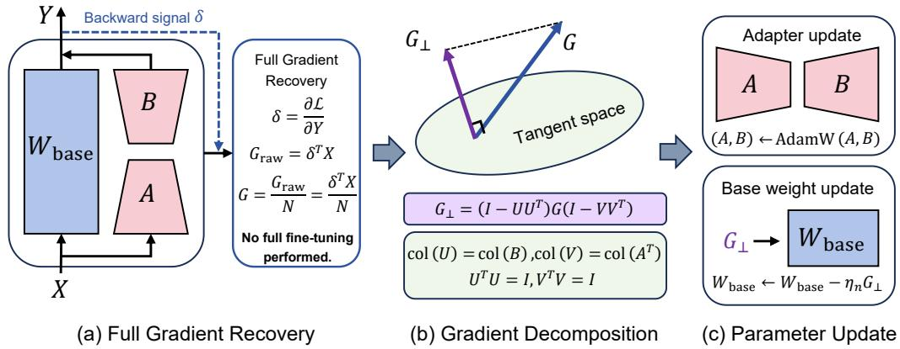  
Figure 1: Overview of GDLoRA. (a) GDLoRA reconstructs the full weight gradient at the current model parameters from forward activations and backward signals, and obtains G as defined in Section 3.1. (b) The gradient is decomposed with respect to the current parameterization-induced LoRA tangent space, and its orthogonal component $G _ { \perp }$ is the normal gradient. (c) The adapters follow standard AdamW optimization, while $\mathrm { \bar { \it G } _ { \perp } }$ updates $W _ { \mathrm { b a s e } }$ without additional base-weight momentum or variance buffers. The two branches are complementary at first order at the current iterate.

Gradient recovery adds a matrix multiplication relative to standard LoRA but requires no momentum or variance buffers for the base weights. Full-weight gradient computation is also required by Fira (Chen et al., 2024). GDLoRA constructs its projection bases from thin adapter factors, avoiding SVD of the full gradient. The computational comparison is provided in Appendix B.

## 3.2 GRADIENT DECOMPOSITION

Our goal is to add a gradient component that is orthogonal to all first-order weight-space directions available to the current adapters, while retaining their standard optimization rule. This provides a precise notion of complementary information; overlap with adapter directions is not, by itself, assumed to be harmful.

First-order accessible directions. For the parameterization $F _ { s } ( A , B ) = s B A$ , its differential maps factor perturbations to weight-space directions as

$$
J _ { s } ( H _ { A } , H _ { B } ) = D F _ { s } ( A , B ) [ H _ { A } , H _ { B } ] = s ( B H _ { A } + H _ { B } A ) .\tag{6}
$$

We define the parameterization-induced tangent space by

$$
\begin{array} { r } { \mathcal { T } _ { \mathrm { L o R A } } = \mathrm { R a n g e } ( J _ { s } ) = \left\{ s ( B H _ { A } + H _ { B } A ) ~ \big | ~ H _ { A } \in \mathbb { R } ^ { r \times d _ { i } } , ~ H _ { B } \in \mathbb { R } ^ { d _ { o } \times r } \right\} . } \end{array}\tag{7}
$$

Throughout, “accessible” refers to these first-order directions at the current $( A , B )$ . This definition remains valid for rank-deficient factors. When both factors have rank r, it coincides with the usual tangent space of the rank-r matrix manifold at $s B A$ , as used in geometric approaches to LoRA optimization.

By the chain rule, the factor gradients are

$$
\nabla _ { A } \mathcal { L } = s B ^ { T } G _ { \mathrm { r a w } } , \qquad \nabla _ { B } \mathcal { L } = s G _ { \mathrm { r a w } } A ^ { T } .\tag{8}
$$

Mapping these Euclidean gradients through $J _ { s }$ and dividing by N gives the first-order weight-space gradient direction

$$
\begin{array} { r } { G _ { \mathrm { L o R A } } ( G ) = \cfrac { s } { N } \big ( B \nabla _ { A } \mathcal { L } + \nabla _ { B } \mathcal { L } A \big ) } \\ { = s ^ { 2 } \big ( B B ^ { T } G + G A ^ { T } A \big ) . } \end{array}\tag{9}
$$

This is the Euclidean-gradient-induced direction underlying the equivalent-gradient view of LoRA; it is not the actual AdamW update. Define the corresponding accessible gradient space as

$$
\begin{array} { r } { \mathcal { G } _ { \mathrm { L o R A } } = \mathrm { R a n g e } ( \Phi _ { s } ) , \qquad \Phi _ { s } ( H ) = s ^ { 2 } \big ( B B ^ { T } H + H A ^ { T } A \big ) . } \end{array}\tag{10}
$$

Let $U \in \mathbb { R } ^ { d _ { o } \times r _ { B } }$ and $V \in \mathbb { R } ^ { d _ { i } \times r _ { A } }$ be orthonormal bases satisfying

$$
\begin{array} { r l } { U ^ { T } U = I , } & { { } \quad V ^ { T } V = I , } \\ { \operatorname { c o l } ( U ) = \operatorname { c o l } ( B ) , } & { { } \quad \operatorname { c o l } ( V ) = \operatorname { c o l } ( A ^ { T } ) , } \end{array}\tag{11}
$$

where $r _ { B } ~ = ~ \mathrm { r a n k } ( B )$ and $r _ { A } = \mathrm { r a n k } ( A )$ . A zero-rank factor has an empty basis and a zero associated projector.

Theorem 1 (LoRA-Accessible Gradient Space Characterization). For any A, B and fixed s $\neq 0 ,$

$$
\mathcal G _ { \mathrm { L o R A } } = \mathcal T _ { \mathrm { L o R A } } = \left\{ U K + L V ^ { T } \ \middle | \ K \in \mathbb { R } ^ { r _ { B } \times d _ { i } } , L \in \mathbb { R } ^ { d _ { o } \times r _ { A } } \right\} .\tag{12}
$$

The proof is provided in Appendix C. This characterization identifies the orthogonal complement of the first-order LoRA-accessible space used in the following decomposition.

Normal-gradient projection. The operator $\Phi _ { s }$ is generally not an orthogonal projector. Consequently, subtracting $G _ { \mathrm { L o R A } } ( G )$ from G does not generally produce a residual orthogonal to $\mathcal { G } _ { \mathrm { L o R A } }$ The matrices $B B ^ { \tilde { T } }$ and $A ^ { T } A$ are also generally not orthogonal projectors and therefore cannot directly serve as the column- and row-space projectors required for this decomposition.

By Theorem 1, the LoRA-accessible gradient space is exactly the tangent space induced by the current LoRA parameterization. Thus, projecting G onto $\mathcal { G } _ { \mathrm { L o R A } }$ and its orthogonal complement is equivalent to projecting it onto $\tau _ { \mathrm { L o R A } }$ and $\mathcal { T } _ { \mathrm { L o R A } } ^ { \perp }$ , respectively. Using the orthonormal bases U and $V .$ , the corresponding column- and row-space projectors are $U U ^ { T }$ and $V V ^ { T }$ , yielding the orthogonal decomposition

$$
G = G _ { \parallel } + G _ { \perp } ,\tag{13}
$$

$$
\begin{array} { r } { G _ { \parallel } = U U ^ { T } G + G V V ^ { T } - U U ^ { T } G V V ^ { T } , } \end{array}\tag{14}
$$

$$
G _ { \perp } = ( I - U U ^ { T } ) G ( I - V V ^ { T } ) .\tag{15}
$$

These are the standard two-sided tangent and normal projectors in the full-rank-factor case; the basis formulation also covers rank-deficient factors under our first-order-space definition. In particular,

$$
\begin{array} { r } { G _ { \parallel } \in \mathcal { T } _ { \mathrm { L o R A } } , \qquad G _ { \perp } \in \mathcal { T } _ { \mathrm { L o R A } } ^ { \perp } , \qquad \langle G _ { \perp } , Z \rangle _ { F } = 0 \quad \forall Z \in \mathcal { T } _ { \mathrm { L o R A } } . } \end{array}\tag{16}
$$

We call $G _ { \perp }$ the normal gradient. A direct verification of the projection is provided in Appendix D.

Why use the normal component? The normal update has a simple local optimization interpretation. Let D denote an additive update to $W _ { \mathrm { b a s e } }$ . With the adapters and all other weights fixed, the first-order change in $\overline { { \mathcal { L } } }$ is $\langle G , D \rangle _ { F }$ . We seek an update orthogonal to the current first-order adapter space while penalizing its magnitude:

$$
\arg \operatorname* { m i n } _ { D \in { \cal T } _ { \mathrm { L o R A } } ^ { \perp } } \left\{ \langle G , D \rangle _ { { \cal F } } + \frac { 1 } { 2 \eta _ { n } } \| D \| _ { { \cal F } } ^ { 2 } \right\} = - \eta _ { n } G _ { \perp } , \qquad \eta _ { n } > 0 .\tag{17}
$$

To see this, orthogonality gives $\langle G _ { \parallel } , D \rangle _ { F } = 0$ and hence $\langle G , D \rangle _ { F } = \langle G _ { \perp } , D \rangle _ { F }$ . Completing the square yields

$$
\langle G , D \rangle _ { F } + \frac { 1 } { 2 \eta _ { n } } \| D \| _ { F } ^ { 2 } = \frac { 1 } { 2 \eta _ { n } } \| D + \eta _ { n } G _ { \perp } \| _ { F } ^ { 2 } - \frac { \eta _ { n } } { 2 } \| G _ { \perp } \| _ { F } ^ { 2 } .
$$

The last term is independent of $D ,$ and the squared term is minimized at $D = - \eta _ { n } G _ { \perp }$

Furthermore, treating $G _ { \perp }$ as a fixed direction computed at the current parameters, differentiability gives

$$
\frac { d } { d \eta } \overline { { \mathcal { L } } } ( W _ { \mathrm { b a s e } } - \eta G _ { \perp } , A , B ) \bigg | _ { \eta = 0 } = - \langle G , G _ { \perp } \rangle _ { F } = - \| G _ { \perp } \| _ { F } ^ { 2 } .\tag{18}
$$

Thus, whenever $G _ { \perp } \ne 0 $ , a sufficiently small step along $- G _ { \perp }$ decreases the current batch loss while remaining orthogonal to the current first-order adapter space. This local property motivates the decomposition.

Table 1: Results on six GLUE tasks with RoBERTa-Base and RoBERTa-Large. All LoRA-based methods use rank 8. For each model, the best and second-best scores among all methods, including FFT, are shown in bold and underlined, respectively.
<table><tr><td></td><td>Model Method</td><td>SST-2</td><td>MRPC</td><td>CoLA</td><td>QNLI</td><td>RTE</td><td>STS-B</td><td> $\operatorname { A v g } .$ </td></tr><tr><td rowspan="5">Ro-ase</td><td>FFT</td><td> $\mathbf { 9 4 . 4 2 } _ { \pm 0 . 1 8 }$ </td><td> $\mathbf { 8 9 . 2 4 } _ { \pm 0 . 6 1 }$ </td><td> $6 4 . 5 3 { \scriptstyle \pm 1 . 0 8 }$ </td><td> $\underline { { 9 2 . 8 1 _ { \pm 0 . 2 2 } } }$ </td><td> $\underline { { 7 8 . 9 6 _ { \pm 0 . 8 4 } } }$ </td><td> $\mathbf { 9 1 . 2 4 _ { \pm 0 . 1 9 } }$ </td><td>85.20</td></tr><tr><td>LoRA PiSSA</td><td> $9 3 . 0 4 _ { \pm 0 . 2 7 }$ </td><td> $8 7 . 1 2 _ { \pm 0 . 7 4 }$   $8 7 . 0 9 _ { \pm 0 . 5 8 }$ </td><td> $6 2 . 8 9 _ { \pm 1 . 3 1 }$ </td><td> $9 2 . 3 1 _ { \pm 0 . 3 3 }$ </td><td> $7 5 . 8 1 _ { \pm 1 . 1 2 }$ </td><td> $8 9 . 4 9 _ { \pm 0 . 2 4 }$ </td><td>83.44</td></tr><tr><td>DoRA</td><td> $9 3 . 1 5 _ { \pm 0 . 4 1 }$   $9 3 . 0 3 _ { \pm 0 . 3 4 }$ </td><td> $8 7 . 2 5 _ { \pm 0 . 8 1 }$ </td><td> $6 0 . 9 8 _ { \pm 0 . 7 3 }$   $6 2 . 7 7 _ { \pm 1 . 4 6 }$ </td><td> $9 2 . 0 2 _ { \pm 0 . 6 8 }$   $9 2 . 3 8 _ { \pm 0 . 1 9 }$ </td><td> $7 7 . 9 8 _ { \pm 0 . 9 7 }$ </td><td> $9 0 . 3 2 _ { \pm 0 . 1 7 }$ </td><td>83.59</td></tr><tr><td>rsLoRA</td><td> $9 3 . 0 6 _ { \pm 0 . 1 6 }$ </td><td> $8 7 . 7 3 _ { \pm 0 . 4 9 }$ </td><td> $6 1 . 6 2 _ { \pm 1 . 1 2 }$ </td><td> $9 2 . 7 7 _ { \pm 0 . 3 7 }$ </td><td> $7 6 . 5 3 _ { \pm 1 . 2 8 }$   $7 7 . 6 2 _ { \pm 0 . 8 8 }$ </td><td> $8 9 . 5 4 _ { \pm 0 . 3 1 }$   $8 9 . 8 7 _ { \pm 0 . 2 2 }$ </td><td>83.58</td></tr><tr><td>Fira</td><td> $9 2 . 5 1 _ { \pm 0 . 2 9 }$ </td><td> $8 6 . 9 2 _ { \pm 0 . 6 7 }$ </td><td> $6 0 . 6 4 _ { \pm 1 . 2 4 }$ </td><td> $9 2 . 6 2 _ { \pm 0 . 2 6 }$ </td><td> $7 7 . 3 4 _ { \pm 1 . 0 5 }$ </td><td> $8 9 . 9 9 _ { \pm 0 . 1 8 }$ </td><td>83.78 83.34</td></tr><tr><td rowspan="5"></td><td>LoRA-GA</td><td> $9 4 . 1 5 _ { \pm 0 . 2 3 }$ </td><td> $8 7 . 0 1 _ { \pm 0 . 7 2 }$ </td><td> $6 2 . 1 6 _ { \pm 1 . 3 7 }$ </td><td> $9 2 . 2 6 _ { \pm 0 . 3 1 }$ </td><td> $7 6 . 4 7 _ { \pm 0 . 9 1 }$ </td><td> $8 9 . 9 8 _ { \pm 0 . 2 6 }$ </td><td>83.67</td></tr><tr><td>LoRA-Pro</td><td> $\underline { { 9 4 . 3 8 _ { \pm 0 . 3 1 } } }$ </td><td> $8 7 . 9 9 _ { \pm 0 . 8 6 }$ </td><td> $6 0 . 7 9 _ { \pm 1 . 5 8 }$ </td><td> $9 1 . 9 3 _ { \pm 0 . 4 2 }$ </td><td> $7 3 . 2 9 _ { \pm 1 . 3 4 }$ </td><td> $8 9 . 7 5 _ { \pm 0 . 2 9 }$ </td><td>83.02</td></tr><tr><td>GDLoRA</td><td> $9 4 . 1 9 _ { \pm 0 . 1 4 }$ </td><td> $8 8 . 9 7 _ { \pm 0 . 6 4 }$ </td><td> ${ \bf 6 5 . 4 9 } _ { \pm 1 . 0 5 }$ </td><td> $\mathbf { 9 } 2 . 9 3 _ { \pm 0 . 1 8 }$ </td><td> $7 9 . 4 2 _ { \pm 0 . 9 6 }$ </td><td> $9 0 . 5 7 _ { \pm 0 . 2 5 }$ </td><td>85.26</td></tr><tr><td>FFT</td><td> $9 6 . 2 4 _ { \pm 0 . 1 7 }$ </td><td> ${ \bf 9 1 . 5 2 _ { \pm 0 . 9 5 } }$ </td><td> $6 8 . 4 5 _ { \pm 1 . 2 1 }$ </td><td> $\mathbf { 9 4 . 9 7 } _ { \pm 0 . 2 4 }$ </td><td> $\underline { { 8 7 . 9 3 } } _ { \pm 0 . 9 3 }$ </td><td> $\mathbf { 9 } 2 . 6 7 _ { \pm 0 . 3 2 }$ </td><td>88.63</td></tr><tr><td>LoRA</td><td></td><td></td><td></td><td></td><td></td><td></td><td></td></tr><tr><td rowspan="8">ROo-rge</td><td>PiSSA</td><td> $9 5 . 7 2 _ { \pm 0 . 4 1 }$ </td><td> $8 9 . 7 6 _ { \pm 0 . 9 2 }$ </td><td> $6 5 . 7 4 _ { \pm 1 . 6 3 }$ </td><td> $9 4 . 0 3 _ { \pm 0 . 3 6 }$ </td><td> $8 3 . 1 5 _ { \pm 1 . 2 7 }$ </td><td> $9 1 . 4 6 _ { \pm 0 . 4 7 }$ </td><td>86.64</td></tr><tr><td>DoRA</td><td> $9 6 . 3 3 _ { \pm 0 . 2 2 }$ </td><td> $9 0 . 6 9 _ { \pm 0 . 6 3 }$ </td><td> $6 6 . 4 4 _ { \pm 0 . 9 7 }$ </td><td> $9 4 . 4 4 _ { \pm 0 . 2 9 }$ </td><td> $8 6 . 2 8 _ { \pm 0 . 8 8 }$ </td><td> $9 1 . 9 5 _ { \pm 0 . 1 8 }$ </td><td>87.69</td></tr><tr><td></td><td> $9 5 . 8 9 _ { \pm 0 . 3 5 }$ </td><td> $8 9 . 9 5 _ { \pm 0 . 8 4 }$ </td><td> $6 5 . 9 2 _ { \pm 1 . 4 2 }$ </td><td> $9 4 . 2 7 _ { \pm 0 . 2 1 }$ </td><td> $8 5 . 2 1 _ { \pm 1 . 1 4 }$ </td><td> $9 2 . 1 2 _ { \pm 0 . 3 9 }$ </td><td>87.23</td></tr><tr><td>rsLoRA</td><td> $9 5 . 8 7 _ { \pm 0 . 2 6 }$ </td><td> $8 9 . 2 8 _ { \pm 0 . 7 1 }$ </td><td> $6 6 . 5 6 _ { \pm 1 . 1 8 }$ </td><td> $9 4 . 4 2 _ { \pm 0 . 3 3 }$ </td><td> $8 5 . 6 4 _ { \pm 1 . 0 2 }$ </td><td> $9 2 . 0 1 _ { \pm 0 . 2 7 }$ </td><td>87.30</td></tr><tr><td>Fira</td><td> $9 5 . 7 6 _ { \pm 0 . 1 9 }$ </td><td> $8 9 . 0 5 _ { \pm 0 . 5 8 }$ </td><td> $6 5 . 7 8 _ { \pm 1 . 0 5 }$ </td><td> $9 4 . 5 1 _ { \pm 0 . 2 7 }$ </td><td> $8 5 . 2 8 _ { \pm 0 . 9 1 }$ </td><td> $9 1 . 9 5 _ { \pm 0 . 2 2 }$ </td><td>87.06</td></tr><tr><td>LoRA-GA</td><td> $9 6 . 0 8 _ { \pm 0 . 2 8 }$ </td><td> $9 0 . 6 9 _ { \pm 0 . 7 6 }$ </td><td> $6 5 . 7 8 _ { \pm 1 . 3 6 }$ </td><td> $9 4 . 2 5 _ { \pm 0 . 3 1 }$ </td><td> $8 5 . 5 6 _ { \pm 1 . 0 9 }$ </td><td> $9 2 . 2 9 _ { \pm 0 . 3 4 }$ </td><td>87.44</td></tr><tr><td>LoRA-Pro</td><td> $9 6 . 2 2 _ { \pm 0 . 3 2 }$ </td><td> $8 9 . 7 1 _ { \pm 0 . 8 8 }$ </td><td> $6 6 . 7 7 _ { \pm 1 . 4 9 }$ </td><td> $9 3 . 8 5 _ { \pm 0 . 4 3 }$   $\underline { { 9 4 . 7 6 _ { \pm 0 . 2 3 } } }$ </td><td> $8 5 . 5 7 _ { \pm 1 . 2 1 }$ </td><td> $9 1 . 7 9 _ { \pm 0 . 4 1 }$ </td><td>87.32</td></tr><tr><td>GDLoRA</td><td> $\mathbf { 9 6 . 5 6 _ { \pm 0 . 2 5 } }$ </td><td> $9 0 . 9 3 _ { \pm 0 . 4 9 }$ </td><td> ${ \bf 6 8 . 7 3 _ { \pm 1 . 0 8 } }$ </td><td></td><td> $\mathbf { 8 8 . 9 5 _ { \pm 0 . 8 9 } }$ </td><td> $\underline { { 9 2 . 3 1 . } } 0 . 3 6$ </td><td>88.71</td></tr></table>

## 3.3 PARAMETER UPDATE

At iteration t, GDLoRA computes $G _ { t }$ and the projection bases from the same pre-update parameters. The adapters follow standard AdamW using the factor gradients in Eq. (8):

$$
( A _ { t + 1 } , B _ { t + 1 } ) = \mathrm { A d a m W } ( A _ { t } , B _ { t } ; \eta _ { a , t } ) ,\tag{19}
$$

where $\eta _ { a , t }$ is the adapter learning rate and the optimizer state is implicit. The normal branch updates the base weight directly:

$$
W _ { \mathrm { b a s e } , t + 1 } = W _ { \mathrm { b a s e } , t } - \eta _ { n , t } G _ { \perp , t } ,\tag{20}
$$

where $\eta _ { n , t } \ge 0$ is the normal-gradient learning rate. Both updates are applied after backward propagation. Setting $\eta _ { n , t } = 0$ throughout recovers standard LoRA under the same training configuration.

The normal-gradient branch introduces no additional momentum or variance buffers for the base weights, preserving standard LoRA’s optimizer-state budget under matched adapter and optimizer configurations. At the current iterate, the normal update is orthogonal to all first-order weight-space directions induced by the LoRA factors. The finite-step relationship between the two branches is discussed in Appendix E.

## 4 EXPERIMENTS

We evaluate GDLoRA on natural language understanding, mathematical reasoning, commonsense reasoning, and image classification, using RoBERTa, Llama-3-8B, Gemma-7B, and ViT models, respectively. These experiments span GLUE, mathematical and commonsense reasoning benchmarks, and eight image classification datasets. Dataset details, adapter configurations, and hyperparameters are provided in Appendix G.

Table 2: Results on six mathematical reasoning tasks with Llama-3-8B. All LoRA-based methods use rank 8. The best and second-best scores among all methods, including FFT, are shown in bold and underlined, respectively.
<table><tr><td>Method</td><td>AddSub</td><td>MultiArith</td><td>SingleEq</td><td>SVAMP</td><td>GSM8K</td><td>AQuA</td><td>Avg.</td></tr><tr><td>FFT</td><td> $\mathbf { 8 6 . 7 8 _ { \pm 1 . 3 7 } }$ </td><td> $9 0 . 2 1 _ { \pm 1 . 8 3 }$ </td><td> $\mathbf { 9 3 . 2 1 } _ { \pm 0 . 8 4 }$ </td><td> ${ \bf 7 0 . 8 7 } _ { \pm 1 . 2 6 }$ </td><td> ${ \bf 5 6 . 7 2 _ { \pm 0 . 7 5 } }$ </td><td> $2 5 . 9 6 _ { \pm 1 . 5 4 }$ </td><td>70.63</td></tr><tr><td>LoRA</td><td> $8 1 . 5 2 _ { \pm 1 . 5 4 }$ </td><td> $8 7 . 2 8 _ { \pm 1 . 1 1 }$ </td><td> $9 1 . 5 4 _ { \pm 0 . 6 9 }$ </td><td> $6 6 . 9 3 _ { \pm 1 . 5 9 }$ </td><td> $5 5 . 3 4 _ { \pm 0 . 6 6 }$ </td><td> $2 2 . 4 4 _ { \pm 0 . 6 0 }$ </td><td>67.51</td></tr><tr><td>PiSSA</td><td> $8 2 . 7 8 _ { \pm 1 . 5 8 }$ </td><td> $8 6 . 8 9 _ { \pm 1 . 4 4 }$ </td><td> $9 1 . 2 7 _ { \pm 0 . 1 6 }$ </td><td> $6 6 . 4 0 _ { \pm 0 . 7 9 }$ </td><td> $5 4 . 1 1 _ { \pm 0 . 5 7 }$ </td><td> $2 5 . 3 3 _ { \pm 0 . 6 8 }$ </td><td>67.80</td></tr><tr><td>DoRA</td><td> $8 0 . 5 1 _ { \pm 1 . 9 8 }$ </td><td> $8 8 . 7 8 _ { \pm 0 . 8 6 }$ </td><td> $9 1 . 0 8 _ { \pm 1 . 4 0 }$ </td><td> $6 7 . 0 0 _ { \pm 1 . 6 1 }$ </td><td> $5 5 . 4 5 _ { \pm 0 . 8 0 }$ </td><td> $2 3 . 7 5 _ { \pm 1 . 2 7 }$ </td><td>67.76</td></tr><tr><td>rsLoRA</td><td> $8 1 . 3 4 _ { \pm 1 . 2 3 }$ </td><td> $8 6 . 1 5 _ { \pm 1 . 0 9 }$ </td><td> $9 0 . 2 3 _ { \pm 0 . 7 8 }$ </td><td> $6 7 . 2 4 _ { \pm 1 . 2 4 }$ </td><td> $5 4 . 2 1 _ { \pm 0 . 6 8 }$ </td><td> $2 4 . 7 2 _ { \pm 0 . 9 5 }$ </td><td>67.32</td></tr><tr><td>Fira</td><td> $8 0 . 6 4 _ { \pm 1 . 4 7 }$ </td><td> $8 6 . 6 9 _ { \pm 1 . 1 6 }$ </td><td> $9 0 . 3 9 _ { \pm 0 . 9 6 }$ </td><td> $6 7 . 6 4 _ { \pm 1 . 1 2 }$ </td><td> $5 4 . 1 8 _ { \pm 0 . 7 7 }$ </td><td> $2 4 . 5 7 _ { \pm 1 . 2 5 }$ </td><td>67.35</td></tr><tr><td>LoRA-GA</td><td> $8 2 . 0 5 _ { \pm 1 . 0 5 }$ </td><td> $8 9 . 3 6 _ { \pm 0 . 9 8 }$ </td><td> $9 1 . 5 9 _ { \pm 0 . 2 8 }$ </td><td> $6 8 . 5 6 _ { \pm 1 . 0 8 }$ </td><td> $5 5 . 7 8 _ { \pm 0 . 5 4 }$ </td><td> $2 3 . 1 9 _ { \pm 0 . 8 9 }$ </td><td>68.42</td></tr><tr><td>LoRA-Pro</td><td> $8 3 . 2 6 _ { \pm 1 . 6 8 }$ </td><td> $8 9 . 2 4 _ { \pm 1 . 2 1 }$ </td><td> $9 1 . 9 5 _ { \pm 1 . 0 6 }$ </td><td> $6 7 . 8 3 _ { \pm 0 . 8 6 }$ </td><td> $5 5 . 4 2 _ { \pm 0 . 7 7 }$ </td><td> $2 5 . 4 5 _ { \pm 0 . 9 4 }$ </td><td>68.86</td></tr><tr><td>GDLoRA</td><td> $\underline { { 8 4 . 8 1 } } _ { \pm 1 . 2 4 }$ </td><td> $\mathbf { 9 0 . 6 9 } _ { \pm 0 . 9 7 }$ </td><td> $9 2 . 5 2 { \scriptstyle \pm 0 . 5 9 }$ </td><td> $\underline { { 6 9 . 6 1 _ { \pm 0 . 9 5 } } }$ </td><td> $5 6 . 0 3 _ { \pm 0 . 6 1 }$ </td><td> $\mathbf { 2 6 . 3 8 _ { \pm 0 . 8 8 } }$ </td><td>70.01</td></tr></table>

## 4.1 NATURAL LANGUAGE UNDERSTANDING

As shown in Table 1, GDLoRA achieves the highest average scores among all evaluated methods on RoBERTa-Base and RoBERTa-Large, reaching 85.26 and 88.71, respectively. Compared with standard LoRA at rank 8, the average improvements are 1.82 and 2.07 points. GDLoRA also surpasses the strongest non-FFT baseline for each backbone, namely rsLoRA on RoBERTa-Base and PiSSA on RoBERTa-Large, by 1.48 and 1.02 points, respectively. Against Fira, the corresponding improvements are 1.92 and 1.65 points. This advantage extends to individual tasks: GDLoRA outperforms both standard LoRA and Fira in all 12 model–task combinations and achieves the highest non-FFT score in 11 of them. The largest gains over standard LoRA occur on RTE, reaching 3.61 and 5.80 points. Its average scores closely match FFT’s 85.20 and 88.63, while the normal branch requires no additional base-weight momentum or variance buffers.

## 4.2 MATHEMATICAL REASONING

Table 2 shows that GDLoRA achieves an average accuracy of 70.01, outperforming standard LoRA at rank 8 by 2.50 percentage points. It also exceeds LoRA-Pro, the strongest non-FFT baseline, by 1.15 points and Fira by 2.66 points. GDLoRA obtains the highest non-FFT score on all six tasks, showing consistent improvements over both adapter-based baselines and Fira in this setting. The gains over standard LoRA are particularly pronounced on AQuA (+3.94 points), MultiArith (+3.41), and AddSub (+3.29). Relative to FFT, GDLoRA reduces the average gap from 3.12 points for standard LoRA to 0.62 points, closing approximately 80.1% of the original LoRA–FFT gap. It exceeds FFT on MultiArith and AQuA, while ranking second on the remaining four tasks. These results demonstrate broad improvements across the evaluated mathematical reasoning tasks and sub stantially narrow the performance gap to FFT.

## 4.3 COMMONSENSE REASONING

As reported in Table 3, GDLoRA achieves an average accuracy of 85.15, surpassing standard LoRA by 1.75 percentage points and the strongest non-FFT baseline, LoRA-Pro, by 1.16 points. It also outperforms Fira by 2.26 points on average and achieves higher scores on all eight tasks. GDLoRA obtains the highest non-FFT score on six tasks, with particularly large gains over standard LoRA on OpenBookQA (+4.00 points), Social IQa (+3.07), and ARC-Challenge (+2.41). Compared with FFT’s average accuracy of 85.70, GDLoRA reduces the remaining difference to 0.55 points and achieves higher scores on ARC-Challenge, Social IQa, and ARC-Easy. LoRA-Pro and LoRA-GA retain small advantages on PIQA and BoolQ, respectively, but GDLoRA delivers the strongest aggregate performance among the non-FFT methods. These results extend the reasoning improvements observed on Llama-3-8B to Gemma-7B.

Table 3: Results on eight commonsense reasoning tasks with Gemma-7B. All LoRA-based methods use rank 8. The best and second-best scores among all methods, including FFT, are shown in bold and underlined, respectively.
<table><tr><td>Method</td><td>OBQA</td><td> $\mathbf { A R C - c }$ </td><td>WinoGrande</td><td>PIQA</td><td>SIQA</td><td> $\mathbf { A R C  – e }$ </td><td>BoolQ</td><td>HellaSwag</td><td> $\operatorname { A v g } .$ </td></tr><tr><td>FFT</td><td> $\mathbf { 8 6 . 7 7 _ { \pm 1 . 4 6 } }$ </td><td> $\underline { { 8 4 . 9 3 } } { \scriptstyle \pm 1 . 6 6 }$ </td><td> $\mathbf { 8 8 . 0 5 } _ { \pm 1 . 2 5 }$ </td><td> $\mathbf { 8 9 . 1 1 } _ { \pm 1 . 0 7 }$ </td><td> $\underline { { 8 0 . 6 5 } } \pm 1 . 4 3 $ </td><td> $9 3 . 0 6 _ { \pm 1 . 2 8 }$ </td><td> $\mathbf { 7 0 . 1 2 _ { \pm 0 . 2 4 } }$ </td><td> $\mathbf { 9 } 2 . 8 \mathbf { 9 } _ { \pm 0 . 8 4 }$ </td><td>85.70</td></tr><tr><td>LoRA</td><td> $8 1 . 6 2 _ { \pm 0 . 8 2 }$ </td><td> $8 2 . 7 4 _ { \pm 0 . 8 9 }$ </td><td> $8 5 . 0 8 _ { \pm 0 . 8 8 }$ </td><td> $8 7 . 5 4 _ { \pm 0 . 6 5 }$ </td><td> $7 7 . 7 9 _ { \pm 1 . 1 4 }$ </td><td> $9 2 . 6 7 _ { \pm 1 . 0 1 }$ </td><td> $6 8 . 8 4 _ { \pm 0 . 2 5 }$ </td><td> $9 0 . 9 5 _ { \pm 0 . 6 5 }$ </td><td>83.40</td></tr><tr><td>PiSSA</td><td> $8 1 . 2 4 _ { \pm 0 . 5 7 }$ </td><td> $8 1 . 0 6 _ { \pm 1 . 0 6 }$ </td><td> $8 1 . 6 9 _ { \pm 0 . 7 3 }$ </td><td> $8 6 . 2 4 _ { \pm 0 . 4 8 }$ </td><td> $7 5 . 7 4 _ { \pm 1 . 2 8 }$ </td><td> $9 1 . 1 2 _ { \pm 0 . 8 4 }$ </td><td> $6 7 . 4 3 _ { \pm 0 . 3 1 }$ </td><td> $8 9 . 1 3 _ { \pm 0 . 7 9 }$ </td><td>81.71</td></tr><tr><td>DoRA</td><td> $8 2 . 5 3 _ { \pm 0 . 9 4 }$ </td><td> $8 1 . 9 5 _ { \pm 0 . 6 8 }$ </td><td> $8 3 . 5 8 _ { \pm 1 . 0 2 }$ </td><td> $8 6 . 8 2 _ { \pm 0 . 7 2 }$ </td><td> $7 6 . 9 3 _ { \pm 0 . 9 6 }$ </td><td> $9 1 . 1 6 _ { \pm 1 . 1 2 }$ </td><td> $6 8 . 4 5 _ { \pm 0 . 2 2 }$ </td><td> $8 3 . 5 6 _ { \pm 0 . 5 8 }$ </td><td>81.87</td></tr><tr><td>rsLoRA</td><td> $8 2 . 8 6 _ { \pm 0 . 7 1 }$ </td><td> $8 1 . 8 3 _ { \pm 1 . 1 4 }$ </td><td> $8 4 . 5 0 { \scriptstyle \pm 0 . 7 9 }$ </td><td> $8 7 . 6 3 _ { \pm 0 . 5 4 }$ </td><td> $7 7 . 1 2 _ { \pm 1 . 2 1 }$ </td><td> $9 2 . 1 3 _ { \pm 0 . 9 3 }$ </td><td> $6 8 . 0 9 _ { \pm 0 . 3 7 }$ </td><td> $9 2 . 2 3 _ { \pm 0 . 8 3 }$ </td><td>83.30</td></tr><tr><td>Fira</td><td> $8 3 . 1 2 _ { \pm 1 . 0 3 }$ </td><td> $8 1 . 6 6 _ { \pm 0 . 7 4 }$ </td><td> $8 4 . 1 6 _ { \pm 0 . 9 1 }$ </td><td> $8 7 . 9 2 _ { \pm 0 . 6 0 }$ </td><td> $7 5 . 8 4 _ { \pm 1 . 3 5 }$ </td><td> $9 1 . 2 6 _ { \pm 0 . 7 6 }$ </td><td> $6 8 . 7 1 _ { \pm 0 . 2 9 }$ </td><td> $9 0 . 4 2 _ { \pm 0 . 5 2 }$ </td><td>82.89</td></tr><tr><td> $\mathrm { L o R A  – G A }$ </td><td> $8 2 . 6 8 _ { \pm 0 . 6 3 }$ </td><td> $8 2 . 7 2 _ { \pm 0 . 9 7 }$ </td><td> $8 5 . 9 5 _ { \pm 1 . 0 8 }$ </td><td> $8 7 . 1 9 _ { \pm 0 . 6 9 }$ </td><td> $7 8 . 8 4 _ { \pm 0 . 8 8 }$ </td><td> $9 1 . 6 9 _ { \pm 1 . 1 5 }$ </td><td> $6 8 . 9 3 _ { \pm 0 . 2 1 }$ </td><td> $9 1 . 3 4 _ { \pm 0 . 7 4 }$ </td><td>83.67</td></tr><tr><td> $\operatorname { L o R A }$  Pro</td><td> $8 3 . 6 6 _ { \pm 0 . 8 9 }$ </td><td> $8 2 . 8 9 _ { \pm 0 . 5 9 }$ </td><td> $8 5 . 7 5 _ { \pm 0 . 9 5 }$ </td><td> $\underline { { 8 8 . 6 5 } } { \scriptstyle \pm 0 . 7 7 }$ </td><td> $7 8 . 6 9 _ { \pm 1 . 1 8 }$ </td><td> $9 1 . 8 6 _ { \pm 0 . 8 1 }$ </td><td> $6 8 . 5 6 { \scriptstyle \pm 0 . 3 4 }$ </td><td> $9 1 . 8 9 _ { \pm 0 . 6 1 }$ </td><td>83.99</td></tr><tr><td>GDLoRA</td><td> $\underline { { 8 5 . 6 2 } } { \scriptstyle \pm 0 . 7 6 }$ </td><td> $\mathbf { 8 5 . 1 5 _ { \pm 1 . 0 9 } }$ </td><td> $\underline { { 8 6 . 2 7 _ { \pm 0 . 8 4 } } }$ </td><td> $8 8 . 3 6 _ { \pm 0 . 5 7 }$ </td><td> $\mathbf { 8 0 . 8 6 } _ { \pm 1 . 2 6 }$ </td><td> $\mathbf { 9 3 . 7 7 _ { \pm 0 . 9 8 } }$ </td><td> $6 8 . 8 9 _ { \pm 0 . 2 7 }$ </td><td> $9 2 . 2 8 { \scriptstyle \pm 0 . 7 1 }$ </td><td>85.15</td></tr></table>

Table 4: Image classification results with ViT-Base and ViT-Large. For each model, the best and second-best scores among all methods are shown in bold and underlined, respectively.
<table><tr><td></td><td>Model Method</td><td></td><td>OxfordPets StanfordCars CIFAR-10</td><td></td><td>DTD</td><td>EuroSAT</td><td> $\mathrm { F G V C }$ </td><td></td><td>RESISC45 CIFAR-100</td><td> $\operatorname { A v g } .$ </td></tr><tr><td rowspan="11">Vi-ase</td><td>FFT</td><td> $9 6 . 1 3 { \scriptstyle \pm 0 . 2 1 }$ </td><td> $\underline { { 7 6 . 8 1 } } \pm 0 . 9 4$ </td><td> $\mathbf { 9 8 . 9 6 _ { \pm 0 . 0 4 } }$ </td><td> $\underline { { 7 7 . 7 5 _ { \pm 0 . 8 8 } } }$ </td><td> $9 8 . 9 2 _ { \pm 0 . 1 9 }$ </td><td> ${ \pmb 5 4 . 6 4 } _ { \pm 0 . 9 7 }$ </td><td> $\mathbf { 9 6 . 1 2 _ { \pm 0 . 3 4 } }$ </td><td> $\mathbf { 9 2 . 1 1 _ { \pm 0 . 1 8 } }$ </td><td>86.43</td></tr><tr><td>LoRA</td><td> $9 5 . 9 2 _ { \pm 0 . 3 7 }$ </td><td> $7 4 . 9 3 _ { \pm 0 . 5 8 }$ </td><td> $9 7 . 2 6 _ { \pm 0 . 0 6 }$ </td><td> $7 5 . 0 3 _ { \pm 0 . 5 4 }$ </td><td> $9 8 . 5 7 _ { \pm 0 . 1 2 }$ </td><td> $4 9 . 1 7 _ { \pm 0 . 7 1 }$ </td><td> $9 5 . 4 3 _ { \pm 0 . 2 9 }$ </td><td> $9 1 . 4 4 _ { \pm 0 . 2 2 }$ </td><td>84.72</td></tr><tr><td>PiSSA</td><td> $9 5 . 4 6 _ { \pm 0 . 1 8 }$ </td><td> $7 4 . 2 4 _ { \pm 0 . 8 3 }$ </td><td> $9 7 . 9 2 _ { \pm 0 . 0 3 }$ </td><td> $7 4 . 8 2 _ { \pm 0 . 9 7 }$ </td><td> $9 8 . 5 8 _ { \pm 0 . 0 5 }$ </td><td> $5 1 . 0 7 _ { \pm 0 . 5 2 }$ </td><td> $9 5 . 1 2 _ { \pm 0 . 1 7 }$ </td><td> $9 0 . 1 4 _ { \pm 0 . 1 3 }$ </td><td>84.67</td></tr><tr><td>DoRA</td><td> $9 5 . 6 2 _ { \pm 0 . 2 9 }$ </td><td> $7 4 . 6 9 _ { \pm 0 . 4 1 }$ </td><td> $9 7 . 6 4 _ { \pm 0 . 0 7 }$ </td><td> $7 5 . 7 7 _ { \pm 0 . 6 3 }$ </td><td> $9 8 . 7 6 _ { \pm 0 . 1 1 }$ </td><td> $4 9 . 8 1 _ { \pm 0 . 8 6 }$ </td><td> $9 5 . 5 9 _ { \pm 0 . 2 3 }$ </td><td> $9 1 . 3 2 _ { \pm 0 . 2 0 }$ </td><td>84.90</td></tr><tr><td>rsLoRA</td><td> $9 5 . 5 1 _ { \pm 0 . 3 3 }$ </td><td> $7 4 . 1 2 _ { \pm 0 . 6 9 }$ </td><td> $9 7 . 6 6 _ { \pm 0 . 0 5 }$ </td><td> $7 5 . 8 7 _ { \pm 0 . 4 5 }$ </td><td> $9 8 . 4 9 _ { \pm 0 . 0 8 }$ </td><td> $5 0 . 7 8 _ { \pm 0 . 6 1 }$ </td><td> $9 5 . 4 8 _ { \pm 0 . 1 2 }$ </td><td> $9 1 . 0 8 _ { \pm 0 . 1 6 }$ </td><td>84.87</td></tr><tr><td>Fira</td><td> $9 5 . 0 6 _ { \pm 0 . 1 6 }$ </td><td> $7 5 . 2 8 _ { \pm 1 . 0 7 }$ </td><td> $9 8 . 5 4 _ { \pm 0 . 0 2 }$ </td><td> $7 6 . 1 9 _ { \pm 0 . 7 6 }$ </td><td> $9 8 . 8 7 _ { \pm 0 . 0 6 }$ </td><td> $5 1 . 2 2 _ { \pm 0 . 7 4 }$ </td><td> $9 5 . 0 8 _ { \pm 0 . 3 1 }$ </td><td> $9 0 . 9 5 _ { \pm 0 . 2 4 }$ </td><td>85.15</td></tr><tr><td>LoRA-GA</td><td> $9 5 . 7 4 _ { \pm 0 . 4 2 }$ </td><td> $7 4 . 7 1 _ { \pm 0 . 3 5 }$ </td><td> $9 8 . 0 8 _ { \pm 0 . 0 7 }$ </td><td> $7 6 . 4 5 _ { \pm 0 . 5 9 }$ </td><td> $9 8 . 4 8 _ { \pm 0 . 1 3 }$ </td><td> $5 0 . 2 1 _ { \pm 0 . 4 9 }$ </td><td> $9 5 . 3 3 _ { \pm 0 . 2 0 }$ </td><td> $9 1 . 3 1 _ { \pm 0 . 1 9 }$ </td><td>85.04</td></tr><tr><td>LoRA-Pro</td><td> $9 5 . 9 2 _ { \pm 0 . 2 4 }$ </td><td> $7 4 . 2 3 _ { \pm 0 . 9 2 }$ </td><td> $9 8 . 1 8 _ { \pm 0 . 0 4 }$ </td><td> $7 7 . 6 6 _ { \pm 1 . 1 4 }$ </td><td> $9 8 . 3 3 _ { \pm 0 . 1 0 }$ </td><td> $5 0 . 8 1 _ { \pm 1 . 0 8 }$ </td><td> $9 5 . 1 7 _ { \pm 0 . 2 7 }$ </td><td> $9 0 . 5 2 _ { \pm 0 . 1 5 }$ </td><td>85.10</td></tr><tr><td>GDLoRA</td><td> $\mathbf { 9 7 . 0 1 _ { \pm 0 . 1 5 } }$ </td><td> $7 8 . 6 5 _ { \pm 0 . 4 7 }$ </td><td> $9 8 . 8 6 _ { \pm 0 . 0 3 }$ </td><td> $7 8 . 7 8 _ { \pm 0 . 6 9 }$ </td><td> $\mathbf { 9 8 . 9 6 _ { \pm 0 . 0 7 } }$ </td><td> $5 4 . 2 7 _ { \pm 0 . 6 5 }$ </td><td> $9 5 . 7 3 { \scriptstyle \pm 0 . 2 6 }$ </td><td> $9 2 . 0 2 { \scriptstyle \pm 0 . 2 1 }$ </td><td>86.79</td></tr><tr><td>FFT</td><td> $\mathbf { 9 7 . 4 4 } _ { \pm 0 . 4 1 }$ </td><td> $\underline { { 8 5 . 8 7 } } { \scriptstyle \pm 0 . 8 4 }$ </td><td> $9 9 . 1 5 _ { \pm 0 . 0 4 }$ </td><td> $\mathbf { 8 1 . 1 7 _ { \pm 0 . 7 2 } }$ </td><td> $9 9 . 0 4 { \scriptstyle \pm 0 . 0 8 }$ </td><td> $6 0 . 1 7 _ { \pm 1 . 1 2 }$ </td><td> $\mathbf { 9 6 . 2 1 _ { \pm 0 . 0 9 } }$ </td><td> $9 3 . 5 5 _ { \pm 0 . 1 7 }$ </td><td>89.08</td></tr><tr><td rowspan="10">Vi-age</td><td>LoRA</td><td> $9 5 . 9 2 _ { \pm 0 . 1 9 }$ </td><td> $7 8 . 9 1 _ { \pm 0 . 5 8 }$ </td><td> $9 9 . 1 6 _ { \pm 0 . 0 3 }$ </td><td> $7 9 . 1 2 _ { \pm 0 . 4 4 }$ </td><td> $9 8 . 3 5 _ { \pm 0 . 0 5 }$ </td><td> $5 3 . 5 9 _ { \pm 0 . 6 3 }$ </td><td> $9 5 . 5 6 _ { \pm 0 . 1 3 }$ </td><td> $9 3 . 3 4 _ { \pm 0 . 2 3 }$ </td><td>86.74</td></tr><tr><td>PiSSA</td><td> $9 6 . 2 4 _ { \pm 0 . 3 3 }$ </td><td> $8 2 . 2 1 _ { \pm 1 . 2 9 }$ </td><td> $9 9 . 1 9 _ { \pm 0 . 1 3 }$ </td><td> $8 0 . 4 3 _ { \pm 0 . 9 1 }$ </td><td> $9 8 . 7 8 _ { \pm 0 . 0 7 }$ </td><td> $5 6 . 6 2 _ { \pm 1 . 2 7 }$ </td><td> $9 5 . 7 3 _ { \pm 0 . 0 8 }$ </td><td> $9 3 . 1 7 _ { \pm 0 . 1 4 }$ </td><td>87.80</td></tr><tr><td>DoRA</td><td> $9 5 . 9 1 _ { \pm 0 . 2 7 }$ </td><td> $7 8 . 2 8 _ { \pm 0 . 6 6 }$ </td><td> $9 9 . 1 1 _ { \pm 0 . 0 7 }$ </td><td> $7 8 . 8 8 _ { \pm 0 . 3 5 }$ </td><td> $9 8 . 4 8 _ { \pm 0 . 0 9 }$ </td><td> $5 3 . 9 2 _ { \pm 0 . 5 2 }$ </td><td> $9 5 . 7 6 _ { \pm 0 . 1 2 }$ </td><td> $9 3 . 2 4 _ { \pm 0 . 1 8 }$ </td><td>86.70</td></tr><tr><td>rsLoRA</td><td> $9 6 . 2 5 _ { \pm 0 . 5 2 }$ </td><td> $8 1 . 6 6 _ { \pm 0 . 4 7 }$ </td><td> $9 9 . 1 5 _ { \pm 0 . 1 3 }$ </td><td> $8 0 . 0 5 _ { \pm 0 . 6 3 }$ </td><td> $9 8 . 6 5 _ { \pm 0 . 0 4 }$ </td><td> $5 5 . 4 2 _ { \pm 0 . 8 8 }$ </td><td> $\underline { { 9 6 . 0 8 _ { \pm 0 . 0 7 } } }$ </td><td> $9 3 . 1 5 _ { \pm 0 . 2 1 }$ </td><td>87.55</td></tr><tr><td>Fira</td><td> $9 4 . 8 9 _ { \pm 0 . 1 4 }$ </td><td> $8 2 . 2 1 _ { \pm 0 . 6 1 }$ </td><td> $9 9 . 2 3 _ { \pm 0 . 0 5 }$ </td><td> $8 0 . 2 1 _ { \pm 0 . 4 9 }$ </td><td> $9 8 . 7 7 _ { \pm 0 . 0 8 }$ </td><td> $5 5 . 5 2 _ { \pm 0 . 4 1 }$ </td><td> $9 5 . 2 4 _ { \pm 0 . 1 4 }$ </td><td> $9 2 . 5 6 _ { \pm 0 . 0 9 }$ </td><td>87.33</td></tr><tr><td>LoRA-GA</td><td> $9 6 . 4 7 _ { \pm 0 . 2 4 }$ </td><td> $7 8 . 7 7 _ { \pm 0 . 3 8 }$ </td><td> $9 9 . 2 2 _ { \pm 0 . 0 8 }$ </td><td> $7 9 . 0 4 _ { \pm 0 . 8 3 }$ </td><td> $9 8 . 4 8 _ { \pm 0 . 0 3 }$ </td><td> $5 4 . 7 9 _ { \pm 0 . 7 4 }$ </td><td> $9 5 . 4 9 _ { \pm 0 . 1 1 }$ </td><td> $9 3 . 2 4 _ { \pm 0 . 1 6 }$ </td><td>86.94</td></tr><tr><td>LoRA-Pro</td><td> $9 6 . 6 5 _ { \pm 0 . 0 8 }$ </td><td> $7 8 . 5 5 _ { \pm 0 . 5 4 }$ </td><td> $9 9 . 1 2 _ { \pm 0 . 0 9 }$ </td><td> $7 9 . 3 1 _ { \pm 0 . 5 7 }$ </td><td> $9 8 . 4 1 _ { \pm 0 . 1 2 }$ </td><td> $5 5 . 7 7 _ { \pm 0 . 9 7 }$ </td><td> $9 5 . 0 8 _ { \pm 0 . 1 0 }$ </td><td> $\mathbf { 9 3 . 7 6 _ { \pm 0 . 1 2 } }$ </td><td>87.08</td></tr><tr><td>GDLoRA</td><td> $9 7 . 2 7 _ { \pm 0 . 3 6 }$ </td><td> $\mathbf { 8 6 . 1 4 _ { \pm 0 . 3 1 } }$ </td><td> $\mathbf { 9 9 . 2 8 _ { \pm 0 . 0 3 } }$ </td><td> $\underline { { 8 0 . 7 4 } } { \scriptstyle \pm 0 . 6 8 }$ </td><td> $\mathbf { 9 9 . 1 6 _ { \pm 0 . 0 7 } }$ </td><td> ${ \bf 6 1 . 6 6 } _ { \pm 1 . 3 5 }$ </td><td> $9 5 . 9 2 _ { \pm 0 . 1 3 }$ </td><td> $9 3 . 4 1 _ { \pm 0 . 1 5 }$ </td><td></td></tr><tr><td></td><td></td><td></td><td></td><td></td><td></td><td></td><td></td><td></td><td>89.20</td></tr></table>

## 4.4 IMAGE CLASSIFICATION

Table 4 shows that GDLoRA achieves average accuracies of 86.79 and 89.20 on ViT-Base and ViT-Large, respectively, obtaining the highest average scores among all evaluated methods on both backbones. These results exceed standard LoRA at rank 8 by 2.07 and 2.46 percentage points. Compared with Fira, GDLoRA improves average accuracy by 1.64 and 1.87 points and achieves higher scores in all 16 model–dataset combinations. It also surpasses PiSSA, the strongest non-FFT baseline on ViT-Large, by 1.40 points. The largest gains over standard LoRA occur on FGVC-Aircraft, reaching 5.10 and 8.07 points. StanfordCars also improves substantially, by 3.72 and 7.23 points, with both fine-grained recognition tasks showing larger gains on ViT-Large. The improvements on these two datasets exceed the corresponding average gains for both backbones, highlighting finegrained recognition as a strong setting for GDLoRA within the evaluated image classification suite. GDLoRA’s average accuracies are also comparable to FFT’s 86.43 and 89.08, extending its competitive performance to visual adaptation.

## 4.5 ABLATION STUDIES AND ANALYSIS

Gradient component ablation. Figure 2(a) evaluates the effect of the gradient component used to update the base weights. We compare GDLoRA with standard LoRA, LoRA+Full, and

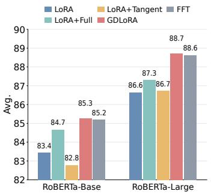  
(a) Gradient component ablation

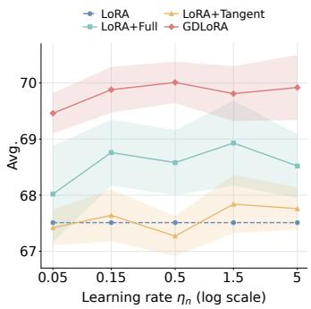  
(b) Learning-rate sensitivity

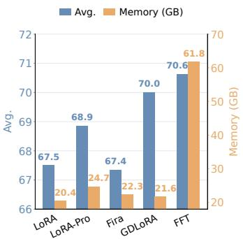  
(c) Accuracy and memory  
Figure 2: Ablation studies and analysis of GDLoRA. (a) Comparison of gradient components on six GLUE tasks with RoBERTa-Base and RoBERTa-Large. (b) Sensitivity to the base-update learning rate when fine-tuning Llama-3-8B on Math10K. Shaded bands indicate ±1 standard deviation. (c) Average mathematical reasoning accuracy and memory usage with Llama-3-8B on Math10K.

LoRA+Tangent, where the latter two apply the full gradient and its tangent component to the base weights, respectively. GDLoRA improves the average GLUE score over LoRA by 1.82 and 2.07 points on RoBERTa-Base and RoBERTa-Large, respectively. It also outperforms LoRA+Full by 0.59 and 1.40 points. LoRA+Tangent reduces performance on RoBERTa-Base and yields only a marginal improvement on RoBERTa-Large. Tangent updates introduce no directions outside the adapters’ current first-order accessible space. LoRA+Full also modifies updates within this space, potentially interacting with the adapter optimizer. GDLoRA isolates the normal component, supplying complementary gradient information that the current adapters cannot represent at first order. The observed advantage is consistent with the benefit of this complementary update, although overlap alone does not imply that tangent updates are inherently harmful. GDLoRA also achieves average scores numerically comparable to FFT on both backbones.

Learning-rate sensitivity. Figure 2(b) examines sensitivity to the base-update learning rate on Llama-3-8B fine-tuned on Math10K. We vary $\eta _ { n } \in \{ 0 . 0 5 , 0 . 1 5 , 0 . 5 , 1 . 5 , 5 \}$ for the methods with additional base-weight updates, while standard LoRA serves as a fixed baseline. GDLoRA achieves mean accuracies between 69.46 and 70.01, with a variation of 0.55 percentage points across the tested range. Its improvements over LoRA range from 1.95 to 2.50 percentage points, with the highest accuracy obtained at $\eta _ { n } = 0 . 5$ Moreover, its lowest mean score exceeds the best LoRA+Full mean score of 68.93. These results suggest that GDLoRA’s gains persist across the evaluated learning-rate range and do not depend on a single narrowly selected setting.

Accuracy and memory. Figure 2(c) compares GPU memory usage during fine-tuning of Llama-3-8B on Math10K and the resulting average accuracy across six mathematical reasoning tasks. GDLoRA achieves an average accuracy of 70.01 with 21.6 GB of memory, improving over LoRA by 2.50 percentage points while requiring only 1.2 GB (5.9%) additional memory. Compared with LoRA-Pro and Fira, GDLoRA improves accuracy by 1.15 and 2.66 percentage points while reducing memory usage by 12.6% and 3.1%, respectively. Relative to FFT, GDLoRA reduces memory usage from 61.79 GB to 21.6 GB, a reduction of 65.0%, while trailing by 0.62 percentage points in accuracy. Thus, GDLoRA narrows the accuracy gap to FFT from 3.12 to 0.62 percentage points while incurring a modest memory increase over standard LoRA.

## 5 CONCLUSION

We presented GDLoRA, which complements standard LoRA with gradient information beyond the first-order directions accessible through its current parameterization. By characterizing the LoRAaccessible gradient space as the induced tangent space, GDLoRA isolates the normal component of the full weight gradient and applies it directly to the base weights, while retaining standard AdamW optimization for the adapters. Under matched adapter and optimizer configurations, GDLoRA preserves LoRA’s optimizer-state memory budget. Experiments on natural language understanding, mathematical reasoning, commonsense reasoning, and image classification demonstrate consistent improvements over LoRA and a reduced performance gap to FFT. Ablation studies further support the effectiveness of normal-gradient updates in complementing low-rank adaptation.

## REFERENCES

Tom Brown, Benjamin Mann, Nick Ryder, Melanie Subbiah, Jared D Kaplan, Prafulla Dhariwal, Arvind Neelakantan, Pranav Shyam, Girish Sastry, Amanda Askell, et al. Language models are few-shot learners. Advances in neural information processing systems, 33:1877–1901, 2020.

Xi Chen, Kaituo Feng, Chang-Sheng Li, Xunhao Lai, Xiangyu Yue, Ye Yuan, and Guoren Wang. Fira: Can we achieve full-rank training of llms under low-rank constraint? ArXiv, abs/2410.01623, 2024. URL https://api.semanticscholar.org/CorpusID: 273026172.

Gong Cheng, Junwei Han, and Xiaoqiang Lu. Remote sensing image scene classification: Benchmark and state of the art. Proceedings ofthe IEEE, 105(10):1865–1883, 2017.

Aakanksha Chowdhery, Sharan Narang, Jacob Devlin, Maarten Bosma, Gaurav Mishra, Adam Roberts, Paul Barham, Hyung Won Chung, Charles Sutton, Sebastian Gehrmann, et al. Palm: Scaling language modeling with pathways. Journal of machine learning research, 24(240):1– 113, 2023.

Mircea Cimpoi, Subhransu Maji, Iasonas Kokkinos, Sammy Mohamed, and Andrea Vedaldi. Describing textures in the wild. In Proceedings of the IEEE conference on computer vision and pattern recognition, pp. 3606–3613, 2014.

Jacob Devlin, Ming-Wei Chang, Kenton Lee, and Kristina Toutanova. Bert: Pre-training of deep bidirectional transformers for language understanding. In Proceedings of the 2019 conference of the North American chapter of the association for computational linguistics: human language technologies, volume 1 (long and short papers), pp. 4171–4186, 2019.

Alexey Dosovitskiy, Lucas Beyer, Alexander Kolesnikov, Dirk Weissenborn, Xiaohua Zhai, Thomas Unterthiner, Mostafa Dehghani, Matthias Minderer, Georg Heigold, Sylvain Gelly, Jakob Uszkoreit, and Neil Houlsby. An image is worth 16x16 words: Transformers for image recognition at scale. ArXiv, abs/2010.11929, 2020. URL https://api.semanticscholar.org/ CorpusID:225039882.

Abhimanyu Dubey et al. The llama 3 herd of models. 2024. URL https://api. semanticscholar.org/CorpusID:271571434.

Ziqi Gao, Qi-Chao Wang, Aochuan Chen, Zijing Liu, Bingzhe Wu, Liang Chen, and Jia Li. Parameter-efficient fine-tuning with discrete fourier transform. ArXiv, abs/2405.03003, 2024. URL https://api.semanticscholar.org/CorpusID:269605083.

Soufiane Hayou, Nikhil Ghosh, and Bin Yu. Lora+: Efficient low rank adaptation of large models. arXiv preprint arXiv:2402.12354, 2024.

Patrick Helber, Benjamin Bischke, Andreas Dengel, and Damian Borth. Eurosat: A novel dataset and deep learning benchmark for land use and land cover classification. IEEE Journal ofSelected Topics in Applied Earth Observations and Remote Sensing, 12(7):2217–2226, 2019.

Neil Houlsby, Andrei Giurgiu, Stanislaw Jastrzebski, Bruna Morrone, Quentin De Laroussilhe, Andrea Gesmundo, Mona Attariyan, and Sylvain Gelly. Parameter-efficient transfer learning for nlp. In International conference on machine learning, pp. 2790–2799. PMLR, 2019.

Edward J Hu, Yelong Shen, Phillip Wallis, Zeyuan Allen-Zhu, Yuanzhi Li, Shean Wang, Lu Wang, and Weizhu Chen. Lora: Low-rank adaptation of large language models. arXiv preprint arXiv:2106.09685, 2021.

Zhiqiang Hu, Yihuai Lan, Lei Wang, Wanyu Xu, Ee-Peng Lim, Roy Ka-Wei Lee, Lidong Bing, and Soujanya Poria. Llm-adapters: An adapter family for parameter-efficient fine-tuning of large language models. ArXiv, abs/2304.01933, 2023. URL https://api.semanticscholar. org/CorpusID:257921386.

Damjan Kalajdzievski. A rank stabilization scaling factor for fine-tuning with lora. arXiv preprint arXiv:2312.03732, 2023.

Jiale Kang and Qingyu Yin. Miss: Revisiting the trade-off in lora with an efficient shardsharing structure. 2024. URL https://api.semanticscholar.org/CorpusID: 272832329.

Jonathan Krause, Michael Stark, Jia Deng, and Li Fei-Fei. 3d object representations for fine-grained categorization. In Proceedings of the IEEE international conference on computer vision workshops, pp. 554–561, 2013.

Alex Krizhevsky, Geoffrey Hinton, et al. Learning multiple layers of features from tiny images. 2009.

Brian Lester, Rami Al-Rfou, and Noah Constant. The power of scale for parameter-efficient prompt tuning. In Proceedings of the 2021 conference on empirical methods in natural language processing, pp. 3045–3059, 2021.

Xiang Lisa Li and Percy Liang. Prefix-tuning: Optimizing continuous prompts for generation. In Proceedings of the 59th annual meeting of the association for computational linguistics and the 11th international joint conference on natural language processing (volume 1: Long papers), pp. 4582–4597, 2021.

Haokun Liu, Derek Tam, Mohammed Muqeeth, Jay Mohta, Tenghao Huang, Mohit Bansal, and Colin Raffel. Few-shot parameter-efficient fine-tuning is better and cheaper than in-context learning. ArXiv, abs/2205.05638, 2022. URL https://api.semanticscholar.org/ CorpusID:248693283.

Shih-Yang Liu, Chien-Yi Wang, Hongxu Yin, Pavlo Molchanov, Yu-Chiang Frank Wang, Kwang-Ting Cheng, and Min-Hung Chen. Dora: Weight-decomposed low-rank adaptation. arXiv preprint arXiv:2402.09353, 2024.

Yinhan Liu, Myle Ott, Naman Goyal, Jingfei Du, Mandar Joshi, Danqi Chen, Omer Levy, Mike Lewis, Luke Zettlemoyer, and Veselin Stoyanov. Roberta: A robustly optimized bert pretraining approach. ArXiv, abs/1907.11692, 2019. URL https://api.semanticscholar.org/ CorpusID:198953378.

Subhransu Maji, Esa Rahtu, Juho Kannala, Matthew Blaschko, and Andrea Vedaldi. Fine-grained visual classification of aircraft. arXiv preprint arXiv:1306.5151, 2013.

Fanxu Meng, Zhaohui Wang, and Muhan Zhang. Pissa: Principal singular values and singular vectors adaptation of large language models. Advances in Neural Information Processing Systems, 37:121038–121072, 2024.

Gemma Team Thomas Mesnard et al. Gemma: Open models based on gemini research and technology. ArXiv, abs/2403.08295, 2024. URL https://api.semanticscholar.org/ CorpusID:268379206.

Omkar M Parkhi, Andrea Vedaldi, Andrew Zisserman, and CV Jawahar. Cats and dogs. In 2012 IEEE conference on computer vision and pattern recognition, pp. 3498–3505. IEEE, 2012.

Jonas Pfeiffer, Andreas Ruckl¨ e, Clifton Poth, Aishwarya Kamath, Ivan Vuli´ c, Sebastian Ruder,´ Kyunghyun Cho, and Iryna Gurevych. Adapterhub: A framework for adapting transformers. In Proceedings of the 2020 conference on empirical methods in natural language processing: system demonstrations, pp. 46–54, 2020.

Samyam Rajbhandari, Jeff Rasley, Olatunji Ruwase, and Yuxiong He. Zero: Memory optimizations toward training trillion parameter models. In SC20: international conference for high performance computing, networking, storage and analysis, pp. 1–16. IEEE, 2020.

Alex Wang, Amanpreet Singh, Julian Michael, Felix Hill, Omer Levy, and Samuel R. Bowman. Glue: A multi-task benchmark and analysis platform for natural language understanding. In BlackboxNLP@EMNLP, 2018. URL https://api.semanticscholar.org/ CorpusID:5034059.

Shaowen Wang, Linxi Yu, and Jian Li. Lora-ga: Low-rank adaptation with gradient approximation. Advances in Neural Information Processing Systems, 37:54905–54931, 2024.

Zhengbo Wang, Jian Liang, Ran He, Zilei Wang, and Tieniu Tan. Lora-pro: Are low-rank adapters properly optimized? In International Conference on Learning Representations, volume 2025, pp. 93787–93808, 2025.

Qingru Zhang, Minshuo Chen, Alexander Bukharin, Nikos Karampatziakis, Pengcheng He, Yu Cheng, Weizhu Chen, and Tuo Zhao. Adalora: Adaptive budget allocation for parameterefficient fine-tuning. arXiv preprint arXiv:2303.10512, 2023.

Yuanhe Zhang, Fanghui Liu, and Yudong Chen. Lora-one: One-step full gradient could suffice for fine-tuning large language models, provably and efficiently. arXiv preprint arXiv:2502.01235, 2025.

Jiawei Zhao, Zhenyu (Allen) Zhang, Beidi Chen, Zhangyang Wang, Anima Anandkumar, and Yuandong Tian. Galore: Memory-efficient llm training by gradient low-rank projection. ArXiv, abs/2403.03507, 2024. URL https://api.semanticscholar.org/ CorpusID:268253596.

## A GRADIENT SUBSPACE DRIFT AND PROJECTION REFRESH COSTS

We investigate the trade-off between the temporal relevance of gradient projection bases and the computational cost of refreshing them. Our comparison uses native Fira (Chen et al., 2024), which directly updates the base weights using low-rank adaptive optimization and scaled residual updates. We examine gradient subspace variation across training steps and network modules, and evaluate how the projection refresh interval affects accuracy and training time.

Gradient subspace drift and projection refresh. SVD-based gradient projection methods, including GaLore (Zhao et al., 2024) and Fira, periodically construct projection bases from full weight gradients and reuse them between refreshes. Let $G _ { t }$ denote the full weight gradient at step t, and let $\tau ( t )$ denote the most recent projection refresh step. For a left-sided projection with orthonormal basis $P _ { \tau ( t ) }$ , the projected gradient and unscaled residual are

$$
R _ { t } = P _ { \tau ( t ) } ^ { T } G _ { t } , \qquad S _ { t } = ( I - P _ { \tau ( t ) } P _ { \tau ( t ) } ^ { T } ) G _ { t } .\tag{21}
$$

The projected gradient, residual, and low-dimensional optimizer moments continue to update at every step. However, the subspace receiving adaptive optimization remains fixed until the next basis refresh.

To examine the temporal relevance of this subspace, we record the full weight gradient of model.layers.15.self attn.v proj during Llama-3-8B fine-tuning on Math10K. At each of 50 optimizer steps, we perform an SVD, retain the leading $r = 8$ singular directions, and compute pairwise subspace similarities. As shown in Figure 3(a), similarities are relatively higher among early steps and substantially lower for many pairs involving later steps, indicating drift in the leading gradient subspace along the recorded trajectory. Figure 4 provides additional results for six selected attention projections spanning layers 0, 15, and 31 and collectively covering query, key, and value projections, showing that subspace variation occurs across the selected modules and network depths. Consequently, reusing an earlier projection basis can leave the adaptive branch operating in a subspace that no longer adequately represents the current leading gradient directions. Although Fira still incorporates components outside this basis, its residual branch does not maintain separate Adam first- and second-moment estimates for each residual entry. Instead, it applies norm-based scaling derived from the projected branch. Thus, delayed refreshes can make the allocation of lowdimensional optimizer states less aligned with the evolving leading gradient subspace. The variation observed within the 50-step window also indicates that refreshing every 50 steps need not eliminate subspace mismatch between refreshes. These observations motivate an explicit evaluation of the accuracy and runtime effects of changing the projection refresh interval.

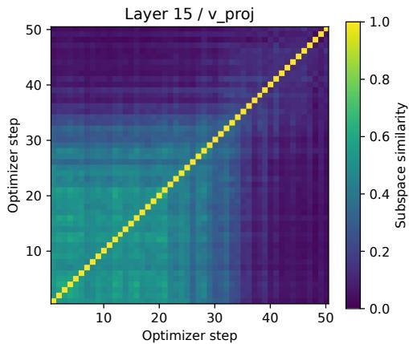  
(a) Gradient subspace drift

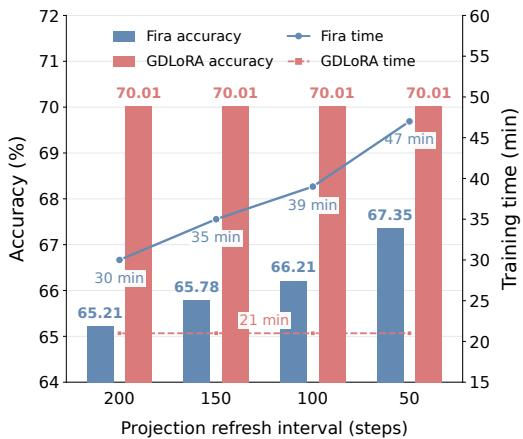  
(b) Accuracy and training time  
Figure 3: Gradient subspace drift and projection refresh costs. (a) Pairwise similarity between the leading rank-8 gradient subspaces of model.layers.15.self attn.v proj over 50 optimizer steps. (b) Accuracy and training time of native Fira with projection refresh intervals of 200, 150, 100, and 50 steps on Math10K with Llama-3-8B. GDLoRA is shown as a fixed reference; its repeated values correspond to the same configuration.

More frequent refreshes incur substantial training costs. Figure 3(b) evaluates native Fira with refresh intervals $T \in \{ 2 0 0 , 1 5 0 , 1 0 0 , 5 0 \}$ . Its corresponding accuracies are 65.21%, 65.78%, 66.21%, and 67.35%, with training times of 30, 35, 39, and 47 minutes, respectively. Reducing the interval from 200 to 50 steps improves accuracy by 2.14 percentage points, but increases training time by 56.7%. Thus, more frequent refreshes improve performance in this experiment while imposing a substantial runtime penalty.

GDLoRA achieves 70.01% accuracy in 21 minutes. Even at $T = 5 0$ , the highest-accuracy Fira configuration in this sweep remains 2.66 percentage points below GDLoRA and requires 2.24× its training time. More frequent refreshes therefore do not close the observed performance gap, despite their increased computational cost. Such a runtime penalty can substantially increase the compute requirements of longer training workloads and may limit practicality under constrained training budgets. The repeated GDLoRA values are a fixed reference, rather than separate experiments with different refresh intervals.

These observations motivate placing adaptive optimization in the LoRA factor coordinates rather than in a periodically refreshed gradient-SVD subspace. GDLoRA maintains AdamW moments for the trainable factors A and B, while deriving the normal component from the current adapter space at each step. This design avoids repeated full-gradient SVD and supplements adapter optimization with a direct normal-gradient update.

GDLoRA recomputes the normal component from current factors. GDLoRA avoids periodically estimating a gradient-SVD subspace by constructing its projection bases directly from the current LoRA factors:

$$
U _ { t } = \operatorname { o r t h } ( B _ { t } ) , \qquad V _ { t } = \operatorname { o r t h } ( A _ { t } ^ { T } ) ,\tag{22}
$$

where orth(·) returns an orthonormal basis for the corresponding column space in the exact formulation. Appendix H.2 specifies the numerical thresholding procedure and its limitations for rankdeficient factors. The normal gradient is then

$$
G _ { \perp , t } = ( I - U _ { t } U _ { t } ^ { T } ) G _ { t } ( I - V _ { t } V _ { t } ^ { T } ) .\tag{23}
$$

Both the gradient and projection bases are computed from the same pre-update parameters. With exact column-space bases, each normal update is orthogonal to the first-order weight-space directions accessible through the current adapters.

Basis construction operates on thin factors rather than the full gradient matrix. For full-rank factors, thin QR factorizations require $O ( ( d _ { o } + d _ { i } ) r ^ { 2 } )$ operations. Meanwhile, the adapter optimizer states remain in the parameter coordinates of A and B and follow standard AdamW updates. Updating the projection bases therefore does not require re-expressing the adapter moments in a new SVD basis. The normal branch directly updates the base weights without maintaining additional momentum or variance buffers for them.

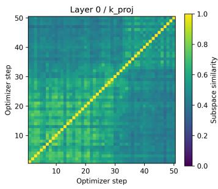

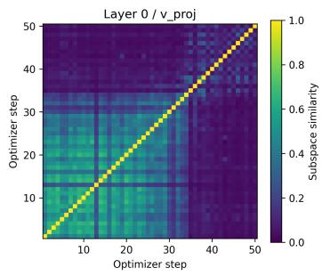

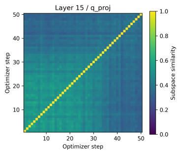

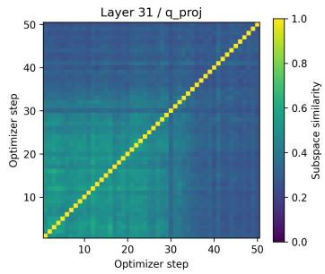

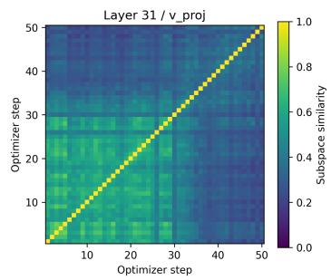  
Figure 4: Gradient subspace variation across network depths and attention projections. Each heatmap shows pairwise similarity between leading rank-8 gradient subspaces over 50 optimizer steps during Llama-3-8B fine-tuning on Math10K. From left to right, the top row shows the layer-0 key, layer-0 value, and layer-15 query projections; the bottom row shows the layer-15 value, layer-31 query, and layer-31 value projections. Layer numbers follow the model’s module indices. The layer-15 value projection is also shown in Figure 3(a). All panels use the same color scale.

GDLoRA thus recomputes its projection bases from the current LoRA factors at every step without repeatedly computing an SVD of the full weight gradient. The cross-layer diagnostics demonstrate variation in leading gradient subspaces across multiple attention projections, while the refreshinterval experiment establishes the accuracy–runtime trade-off in the evaluated Fira configuration.

## B COMPUTATIONAL COMPARISON WITH FIRA

We compare the leading FLOPs of GDLoRA and native Fira (Chen et al., 2024) for a linear layer with weight dimensions $d _ { o } \times d _ { i }$ , rank $r ,$ and N input positions. A multiplication and an addition count as two FLOPs. Shared base-layer forward and input-gradient computations, as well as lowerorder elementwise operations, are excluded.

Both methods compute the full weight gradient, costing $2 N d _ { o } d _ { i }$ FLOPs. Their main difference in basis construction is the matrix being decomposed. GDLoRA orthonormalizes the thin factors B and $A ^ { T }$ . Reduced Householder QR, including explicit basis formation, has leading cost

$$
\begin{array} { r } { C _ { \mathrm { Q R } } \approx 4 ( d _ { o } + d _ { i } ) r ^ { 2 } . } \end{array}\tag{24}
$$

Fira instead obtains its basis through SVD of the full gradient, with dense-decomposition cost

$$
C _ { \mathrm { S V D } } = O \big ( d _ { o } d _ { i } \operatorname* { m i n } ( d _ { o } , d _ { i } ) \big ) .\tag{25}
$$

Refreshing every T steps amortizes this cost to $C _ { \mathrm { S V D } } / T$ per step.

GDLoRA evaluates its two-sided projection through thin-basis multiplications without forming dense projection matrices. Although this requires more projection FLOPs than Fira’s one-sided formulation, its basis construction is inexpensive: for square layers of width d, thin-factor QR scales as

Table 5: Leading FLOPs per layer and optimization step. Fira’s SVD cost is amortized over its refresh interval T. GDLoRA recomputes both bases every step. Projection counts assume rank-r bases and efficient matrix-product ordering.
<table><tr><td>Operation</td><td>Fira</td><td>GDLoRA</td></tr><tr><td>Full-weight gradient</td><td> $2 N d _ { o } d _ { i }$ </td><td> $2 N d _ { o } d _ { i }$ </td></tr><tr><td>Gradient projection and reconstruction</td><td> $6 d _ { o } d _ { i } r$ </td><td> $8 d _ { o } d _ { i } r$ </td></tr><tr><td>Basis construction</td><td> $C _ { \mathrm { S V D } } / T$ </td><td> $C _ { \mathrm { Q R } }$ </td></tr><tr><td>Adapter forward and backward</td><td>0</td><td> $6 N r ( d _ { o } + d _ { i } )$ </td></tr></table>

$O ( d r ^ { 2 } )$ , compared with $O ( d ^ { 3 } )$ for a dense gradient SVD per refresh. For $r \ll d ,$ this makes recomputing the adapter-derived bases at every step practical. The corresponding end-to-end training-time comparison is reported in Figure 3(b) and Table 6.

Table 6: Training time (hours) on six GLUE tasks with RoBERTa-Base.
<table><tr><td>Method</td><td>SST-2</td><td>MRPC</td><td>CoLA</td><td>QNLI</td><td>RTE</td><td>STS-B</td></tr><tr><td>FFT</td><td>10.16</td><td>1.64</td><td>5.78</td><td>19.56</td><td>2.21</td><td>3.64</td></tr><tr><td>LoRA</td><td>6.92</td><td>0.58</td><td>3.54</td><td>13.24</td><td>1.06</td><td>2.50</td></tr><tr><td>PiSSA</td><td>13.06</td><td>1.08</td><td>4.92</td><td>16.78</td><td>1.47</td><td>2.98</td></tr><tr><td>DoRA</td><td>9.84</td><td>0.65</td><td>4.03</td><td>13.78</td><td>1.19</td><td>2.52</td></tr><tr><td>rsLoRA</td><td>9.98</td><td>0.57</td><td>3.51</td><td>14.23</td><td>1.03</td><td>2.50</td></tr><tr><td>Fira</td><td>16.18</td><td>1.53</td><td>6.31</td><td>19.65</td><td>2.34</td><td>4.35</td></tr><tr><td>LoRA-GA</td><td>6.62</td><td>0.57</td><td>3.51</td><td>14.26</td><td>1.03</td><td>2.51</td></tr><tr><td>LoRA-Pro</td><td>7.07</td><td>0.61</td><td>5.62</td><td>15.77</td><td>1.11</td><td>4.06</td></tr><tr><td>GDLoRA</td><td>7.22</td><td>0.62</td><td>3.83</td><td>14.45</td><td>1.12</td><td>2.75</td></tr></table>

## C PROOF OF THE LORA-ACCESSIBLE GRADIENT SPACE CHARACTERIZATION

ProofofTheorem 1. We characterize the parameter-induced directions and their orthogonal complement, then relate this complement to the kernel of the equivalent gradient operator.

For fixed $s \neq 0$ , the differential of $F _ { s } ( A , B ) = s B A$ is

$$
D F _ { s } ( A , B ) [ H _ { A } , H _ { B } ] = s ( B H _ { A } + H _ { B } A ) .\tag{26}
$$

Since a nonzero scalar does not change a linear subspace,

$$
\begin{array} { r l } & { \mathcal { T } _ { \mathrm { L o R A } } = \left\{ B H _ { A } + H _ { B } A \right\} } \\ & { \qquad = \left\{ U K + L V ^ { T } \ \middle | \ K \in \mathbb { R } ^ { r _ { B } \times d _ { i } } , L \in \mathbb { R } ^ { d _ { o } \times r _ { A } } \right\} . } \end{array}\tag{27}
$$

Here $H _ { A } \in \mathbb { R } ^ { r \times d _ { i } }$ and $H _ { B } \in \mathbb { R } ^ { d _ { o } \times r }$ vary freely. For the second equality, write $B = U R _ { B }$ and $A ^ { T } = V R _ { A }$ , where $R _ { B }$ and $R _ { A }$ have full row rank. Every parameter-induced direction then has the stated form. Conversely, the maps $H _ { A } \mapsto R _ { B } H _ { A }$ and $\dot { H } _ { B } \mapsto H _ { B } R _ { A } ^ { T }$ are surjective, so every pair (K, L) can be attained. When either factor has rank zero, its basis is empty and the corresponding term vanishes.

For any $Z \in \mathbb { R } ^ { d _ { o } \times d _ { i } }$ di ,

$$
\langle Z , U K + L V ^ { T } \rangle _ { F } = \langle U ^ { T } Z , K \rangle _ { F } + \langle Z V , L \rangle _ { F } .\tag{28}
$$

Because K and L vary independently, this gives

$$
\mathcal { T } _ { \mathrm { L o R A } } ^ { \perp } = \{ Z \in \mathbb { R } ^ { d _ { o } \times d _ { i } } : U ^ { T } Z = 0 , Z V = 0 \} .\tag{29}
$$

Next, consider $\begin{array} { r } { \Phi _ { s } ( H ) = s ^ { 2 } ( B B ^ { T } H + H A ^ { T } A ) } \end{array}$ . The symmetry of $B B ^ { T }$ and $A ^ { T } A$ implies

$$
\langle Z , \Phi _ { s } ( H ) \rangle _ { F } = \langle \Phi _ { s } ( Z ) , H \rangle _ { F } ,\tag{30}
$$

so $\Phi _ { s }$ is self-adjoint. Moreover,

$$
\langle H , \Phi _ { s } ( H ) \rangle _ { F } = s ^ { 2 } \left( \| B ^ { T } H \| _ { F } ^ { 2 } + \| H A ^ { T } \| _ { F } ^ { 2 } \right) .\tag{31}
$$

Thus $\Phi _ { s } ( H ) = 0$ implies $B ^ { T } H = 0$ and $H A ^ { T } = 0 ;$ ; the converse follows directly from the definition of $\Phi _ { s }$ . Using the column spaces spanned by U and $V ,$ we obtain

$$
\begin{array} { r l } & { \mathrm { k e r } ( \Phi _ { s } ) = \{ H : B ^ { T } H = 0 , H A ^ { T } = 0 \} } \\ & { \quad \quad = \{ H : U ^ { T } H = 0 , H V = 0 \} = \mathcal { T } _ { \mathrm { L o R A } } ^ { \perp } . } \end{array}\tag{32}
$$

Finally, the range of a self-adjoint operator on a finite-dimensional inner-product space is the $\mathrm { o r ^ { - } }$ thogonal complement of its kernel. Hence

$$
\begin{array} { r l } & { \mathcal { G } _ { \mathrm { L o R A } } = \mathrm { R a n g e } ( \Phi _ { s } ) = \ker ( \Phi _ { s } ) ^ { \perp } } \\ & { \qquad = ( \mathcal { T } _ { \mathrm { L o R A } } ^ { \perp } ) ^ { \perp } = \mathcal { T } _ { \mathrm { L o R A } } . } \end{array}\tag{33}
$$

Together with the basis representation above, this proves the theorem.

## D ORTHOGONAL PROJECTION ONTO THE NORMAL SPACE

Let ${ \cal P } _ { U } = U U ^ { T }$ and $P _ { V } = V V ^ { T }$ . For the tangent space $\mathcal { T } _ { \mathrm { L o R A } } = \{ U K + L V ^ { T } \}$ , the identity $\langle Z , U K + L V ^ { T } \rangle _ { F } = \langle U ^ { T } Z , K \rangle _ { F } + \langle Z V , L \rangle _ { F }$ implies

$$
\mathcal { T } _ { \mathrm { L o R A } } ^ { \perp } = \{ Z \in \mathbb { R } ^ { d _ { o } \times d _ { i } } : U ^ { T } Z = 0 , Z V = 0 \} .\tag{34}
$$

Define $G _ { \perp } \ : = \ : ( I \mathrm { ~ - ~ } P _ { U } ) G ( I \mathrm { ~ - ~ } P _ { V } )$ . Since $U ^ { T } ( I - P _ { U } ) = 0$ and $( I - P _ { V } ) V = 0$ , we have $G _ { \perp } \in \mathcal { T } _ { \mathrm { L o R A } } ^ { \perp }$ . The residual satisfies

$$
\begin{array} { r l } & { G _ { \parallel } = G - G _ { \perp } = P _ { U } G + G P _ { V } - P _ { U } G P _ { V } } \\ & { \qquad = U ( U ^ { T } G ) + \big ( ( I - P _ { U } ) G V \big ) V ^ { T } \in \mathcal { T } _ { \mathrm { L o R A } } . } \end{array}\tag{35}
$$

Thus $G = G _ { \parallel } + G _ { \perp }$ is the unique orthogonal decomposition into the tangent and normal spaces, establishing that $G _ { \perp }$ is the orthogonal projection of $G$ onto $\mathcal { T } _ { \mathrm { L o R A } } ^ { \perp } . \mathrm { B y }$ Theorem 1, $\mathcal { G } _ { \mathrm { L o R A } } = \mathcal { T } _ { \mathrm { L o R A } } ;$ hence $\langle G _ { \perp } , Z \rangle _ { F } = 0$ for every $Z \in \mathcal { G } _ { \mathrm { L o R A } }$

## E FINITE-STEP ANALYSIS OF THE TWO UPDATE BRANCHES

Section 3.2 extracts the normal gradient relative to the current LoRA-accessible space. This appendix examines whether finite adapter updates can themselves supply the missing normal displacement. Although bilinear factor updates can produce such a displacement, its reachable set is constrained by the factor-step size and internal rank. We characterize these constraints and give a sufficient condition under which direct normal compensation improves matching to a full-gradient reference step. All statements use the current, fixed space and exact column-space bases; the space may change at subsequent iterations.

## E.1 NORMAL DISPLACEMENT OF A FINITE ADAPTER UPDATE

Let

$$
\Delta A _ { t } = A _ { t + 1 } - A _ { t } , \qquad \Delta B _ { t } = B _ { t + 1 } - B _ { t }\tag{36}
$$

denote the factor increments produced by the adapter optimizer. The corresponding finite-step change in the adapter weight is

$$
\begin{array} { r l } & { D _ { t } : = \Delta W _ { \mathrm { a d a p t e r } , t } = s ( B _ { t + 1 } A _ { t + 1 } - B _ { t } A _ { t } ) } \\ & { \qquad = s ( B _ { t } \Delta A _ { t } + \Delta B _ { t } A _ { t } ) + s \Delta B _ { t } \Delta A _ { t } . } \end{array}\tag{37}
$$

The first-order term belongs to the tangent space induced by the current factors:

$$
D _ { \mathrm { t a n } , t } = s ( B _ { t } \Delta A _ { t } + \Delta B _ { t } A _ { t } ) \in \mathcal { T } _ { \mathrm { L o R A } , t } .\tag{38}
$$

Since the normal gradient is computed using the same pre-update factors, it satisfies

$$
\langle G _ { \perp , t } , D _ { \mathrm { t a n } , t } \rangle _ { F } = 0 .\tag{39}
$$

This property holds for arbitrary factor increments, including those generated by AdamW.

Let $P _ { \perp , t } ( Z ) = ( I - U _ { t } U _ { t } ^ { T } ) Z ( I - V _ { t } V _ { t } ^ { T } )$ . The actual normal displacement of the adapter update is therefore

$$
Q _ { t } : = P _ { \perp , t } ( D _ { t } ) = s ( I - U _ { t } U _ { t } ^ { T } ) \Delta B _ { t } \Delta A _ { t } ( I - V _ { t } V _ { t } ^ { T } ) .\tag{40}
$$

Thus, a finite LoRA update can have a normal component, but that component arises entirely from its bilinear remainder. In particular,

$$
\langle G _ { \perp , t } , D _ { t } \rangle _ { F } = \langle G _ { \perp , t } , Q _ { t } \rangle _ { F } = s \langle G _ { \perp , t } , \Delta B _ { t } \Delta A _ { t } \rangle _ { F }\tag{41}
$$

need not be zero. Including the base-weight update, the total effective-weight displacement is

$$
\begin{array} { r l } & { W _ { t + 1 } ^ { \prime } - W _ { t } ^ { \prime } = \ - \eta _ { n , t } G _ { \perp , t } + D _ { \tan , t } } \\ & { \qquad \ + s \Delta B _ { t } \Delta A _ { t } . } \end{array}\tag{42}
$$

## E.2 REACHABLE NORMAL DISPLACEMENTS UNDER A FACTOR-STEP BUDGET

Fix $A \in \mathbb { R } ^ { r \times d _ { i } } , B \in \mathbb { R } ^ { d _ { o } \times r }$ , and $s \neq 0 ,$ , and suppress the time index. The factors need not have full rank. Write $\tau = \tau _ { \mathrm { L o R A } }$ and $P _ { \perp } ( Z ) \dot { = } ( I - U \dot { U } ^ { T } ) Z ( I - V V ^ { T } )$ , using the zero-rank convention of Section 3.2. For $\varepsilon \geq 0$ , define

$$
\mathcal { R } _ { \varepsilon } = \left\{ P _ { \perp } ( s [ ( B + \Delta B ) ( A + \Delta A ) - B A ] ) \mid \| \Delta A \| _ { F } ^ { 2 } + \| \Delta B \| _ { F } ^ { 2 } \leq \varepsilon ^ { 2 } \right\} .\tag{43}
$$

Here $\| \cdot \| _ { : }$ ∗ denotes the nuclear norm, the sum of singular values.

Theorem E.1 (Exact normal reachability). For the fixed factor coordinates above,

$$
\boxed { \mathcal { R } _ { \varepsilon } = \left\{ Z \in \mathcal { T } ^ { \perp } : \operatorname { r a n k } ( Z ) \leq r , \quad \| Z \| _ { * } \leq \frac { | s | \varepsilon ^ { 2 } } { 2 } \right\} . }\tag{44}
$$

Proof. Let $\widetilde { B } \ : = \ : ( I \ : - \ : U U ^ { T } ) \Delta B$ and $\widetilde { A } = \Delta A ( I - V V ^ { T } )$ . Equation equation 40 gives $Q =$ $s \tilde { B } \tilde { A } \in \mathcal { T } ^ { \perp }$ , with ran $\natural ( Q ) \leq r$ . The product inequality for the nuclear norm, nonexpansiveness of orthogonal projections, and $2 a b \leq a ^ { 2 } + b ^ { 2 }$ yield

$$
\begin{array} { l } { \displaystyle \| Q \| _ { * } \leq | s | \| \widetilde B \| _ { F } \| \widetilde A \| _ { F } \leq | s | \| \Delta B \| _ { F } \| \Delta A \| _ { F } } \\ { \leq \displaystyle \frac { | s | } { 2 } \big ( \| \Delta B \| _ { F } ^ { 2 } + \| \Delta A \| _ { F } ^ { 2 } \big ) \leq \frac { | s | \varepsilon ^ { 2 } } { 2 } . } \end{array}\tag{45}
$$

This proves one inclusion.

Conversely, let a nonzero $Z \in { \mathcal { T } } ^ { \perp }$ have compact SVD $Z = L \Sigma R ^ { T }$ and rank $\textit { k } \leq \textit { r }$ . Because $U ^ { T } Z = \dot { 0 }$ and $Z V ~ = ~ 0$ , its nonzero singular vectors satisfy $U ^ { T } L = 0$ and $R ^ { T } V ~ = ~ 0$ . Let $J _ { k } = [ I _ { k } \mathrm { ~ } 0 ] \in \mathbb { R } ^ { k \times r }$ and choose

$$
\Delta B = \frac { 1 } { \sqrt { | s | } } L \Sigma ^ { 1 / 2 } J _ { k } , \qquad \Delta A = \frac { \mathrm { s g n } ( s ) } { \sqrt { | s | } } J _ { k } ^ { T } \Sigma ^ { 1 / 2 } R ^ { T } .\tag{46}
$$

These increments satisfy $s \Delta B \Delta A = Z$ and are unchanged by the corresponding left and right normal projectors. Hence the normal projection of their finite adapter displacement is exactly $Z .$ Moreover,

$$
\| \Delta A \| _ { F } ^ { 2 } + \| \Delta B \| _ { F } ^ { 2 } = \frac { 2 \operatorname { t r } ( \Sigma ) } { | s | } = \frac { 2 \| Z \| _ { * } } { | s | } \leq \varepsilon ^ { 2 } .\tag{47}
$$

The zero matrix is realized by zero increments, completing the proof.

The theorem describes the normal projection, not the whole weight displacement: the construction can also produce a tangent component. It characterizes all admissible factor increments, not the subset selected by a particular optimizer. The budget is a Euclidean step budget in the fixed factor coordinates, rather than a memory or compute budget; it need not be invariant to rescaling the factors. Within these coordinates, finite-step normal displacement has rank at most r and nuclear norm at most quadratic in ε.

Corollary E.2 (Optimal normal matching error). Let $Y \in \tau ^ { \perp }$ be a target normal displacement, with singular values $\sigma _ { 1 } \geq \cdot \cdot \cdot \geq \sigma _ { p } \geq 0 ,$ , where $p = \operatorname* { m i n } ( d _ { o } , d _ { i } )$ . Set $k = \operatorname* { m i n } ( r , p )$ and $c = | s | \varepsilon ^ { 2 } / 2 .$ Define $a _ { i } = ( \sigma _ { i } - \tau ) _ { + } f o r i \le k ,$ where $( x ) _ { + } = \operatorname* { m a x } \{ x , 0 \}$ . Take $\begin{array} { r } { \tau = 0 i f { \sum } _ { i = 1 } ^ { k } { \sigma } _ { i } \leq c ; } \end{array}$ ; otherwise take $\tau \in [ 0 , \sigma _ { 1 } ]$ satisfying $\begin{array} { r } { \sum _ { i = 1 } ^ { k } ( \sigma _ { i } - \tau ) _ { + } = c . } \end{array}$ Then

$$
\operatorname* { m i n } _ { Q \in \mathcal { R } _ { \varepsilon } } \| Y - Q \| _ { F } ^ { 2 } = \sum _ { i = 1 } ^ { k } ( \sigma _ { i } - a _ { i } ) ^ { 2 } + \sum _ { i = k + 1 } ^ { p } \sigma _ { i } ^ { 2 } \geq \sum _ { i = k + 1 } ^ { p } \sigma _ { i } ^ { 2 } .\tag{48}
$$

Proof. By Theorem E.1, feasible matrices have rank at most r and nuclear norm at most $c .$ For fixed singular values of $Q ,$ the trace inequality $\begin{array} { r } { \langle Y , Q \rangle _ { F } \leq \sum _ { i } \sigma _ { i } ( Y ) \sigma _ { i } ( Q ) } \end{array}$ shows that aligning its singular vectors with those of $Y$ minimizes the Frobenius error. This alignment is feasible in $\mathcal { T } ^ { \perp }$ because the nonzero singular vectors of $Y$ lie in the corresponding normal subspaces. The remaining problem is

$$
\operatorname* { m i n } _ { a _ { i } \geq 0 , \sum _ { i = 1 } ^ { k } a _ { i } \leq c } \sum _ { i = 1 } ^ { k } ( \sigma _ { i } - a _ { i } ) ^ { 2 } + \sum _ { i = k + 1 } ^ { p } \sigma _ { i } ^ { 2 } .\tag{49}
$$

The optimality conditions give the stated common-threshold solution. It preserves the ordering of the singular values, and the resulting matrix is reachable by Theorem E.1. The nonnegative first sum gives the spectral-tail lower bound. □

For $Y = - \eta _ { n } G _ { \perp }$ , the spectral-tail term is $\begin{array} { r } { \eta _ { n } ^ { 2 } \sum _ { i > r } \sigma _ { i } ( G _ { \perp } ) ^ { 2 } } \end{array}$ , with an empty sum interpreted as zero. Thus a nonzero tail cannot be matched by an adapter’s normal displacement even without a step-size constraint. The first term in $\operatorname { E q } .$ . equation 48 additionally quantifies the error imposed by the factor-step budget. These are best attainable errors over admissible increments, not predictions of optimizer behavior.

## E.3 EFFECT OF DIRECT NORMAL COMPENSATION

Fix the same current state and the same candidate factor increments for both updates. Let $D =$ $s [ ( B + \Delta B ) ( A + \Delta A ) - B A ]$ and $Q = P _ { \perp } ( D )$ Use the recovered full gradient $G$ with the normalization of Section 3.1, and $G _ { \bot } = P _ { \bot } ( G )$ . For $\eta _ { n } > 0 ;$ , take $- \eta _ { n } G$ as the reference weight step. The normal-component matching errors of the adapter-only update D and the compensated update $D - \eta _ { n } G _ { \perp }$ ⊥ are, respectively,

$$
\begin{array} { r } { E _ { \mathrm { L o R A } } = \| P _ { \perp } ( D + \eta _ { n } G ) \| _ { F } = \| Q + \eta _ { n } G _ { \perp } \| _ { F } , } \\ { E _ { \mathrm { G D } } = \| P _ { \perp } ( D - \eta _ { n } G _ { \perp } + \eta _ { n } G ) \| _ { F } = \| Q \| _ { F } . } \end{array}\tag{50}
$$

Proposition E.3 (Improvement from direct normal compensation). For the fixed candidate update above,

$$
E _ { \mathrm { L o R A } } ^ { 2 } - E _ { \mathrm { G D } } ^ { 2 } = \eta _ { n } ^ { 2 } \Vert G _ { \perp } \Vert _ { F } ^ { 2 } + 2 \eta _ { n } \langle Q , G _ { \perp } \rangle _ { F } .\tag{51}
$$

$I f \| \Delta A \| _ { F } ^ { 2 } + \| \Delta B \| _ { F } ^ { 2 } \leq \varepsilon ^ { 2 }$ and $c = | s | \varepsilon ^ { 2 } / 2 ,$ , then

$$
\begin{array} { r } { E _ { \mathrm { L o R A } } ^ { 2 } - E _ { \mathrm { G D } } ^ { 2 } \geq \eta _ { n } \Vert G _ { \perp } \Vert _ { F } \big ( \eta _ { n } \Vert G _ { \perp } \Vert _ { F } - 2 c \big ) . } \end{array}\tag{52}
$$

Consequently, $\eta _ { n } \| G _ { \bot } \| _ { F } > \Sigma$ c guarantees $E _ { \mathrm { G D } } < E _ { \mathrm { L o R A } }$

Proof. Expanding the squared norms in Eq. equation 50 gives the identity. Theorem E.1 implies $\| Q \| _ { F } \leq \| Q \| _ { * } \leq c .$ Cauchy–Schwarz then gives $\langle Q , G _ { \bot } \rangle _ { F } \geq - c \Vert G _ { \bot } \Vert _ { F }$ , which proves the bound and the strict-improvement condition. □

Table 7: Hyperparameters used for GDLoRA in the natural language understanding experiments on the GLUE benchmark.
<table><tr><td>Model Hyperparameter</td><td></td><td>SST-2</td><td>MRPC</td><td>CoLA</td><td>QNLI</td><td>RTE</td><td>STS-B</td></tr><tr><td colspan="2">Optimizer Warmup ratio</td><td></td><td></td><td colspan="2">AdamW</td><td></td><td></td></tr><tr><td colspan="2">Learning-rate schedule</td><td></td><td></td><td>0.06 Linear</td><td></td><td></td><td></td></tr><tr><td colspan="2"># GPUs</td><td></td><td></td><td>1</td><td></td><td></td><td></td></tr><tr><td rowspan="6">ROo-ase</td><td>Epochs</td><td>60</td><td>30</td><td>80</td><td>25</td><td>160</td><td>80</td></tr><tr><td>Learning rate (LoRA)</td><td></td><td></td><td>1e-4</td><td></td><td></td><td></td></tr><tr><td>Normal-gradient learning rate</td><td></td><td></td><td>1</td><td></td><td></td><td></td></tr><tr><td>LoRA rank</td><td></td><td></td><td>8</td><td></td><td></td><td></td></tr><tr><td>Maximum sequence length</td><td></td><td></td><td>512</td><td></td><td></td><td></td></tr><tr><td>Batch size per GPU</td><td></td><td></td><td>32</td><td></td><td></td><td></td></tr><tr><td rowspan="6">RoB-rge</td><td># GPUs</td><td></td><td></td><td>1</td><td></td><td></td><td></td></tr><tr><td>Epochs</td><td>20</td><td>40</td><td>40</td><td>20</td><td>40</td><td>40</td></tr><tr><td>Learning rate (LoRA)</td><td></td><td></td><td>1e-4</td><td></td><td></td><td></td></tr><tr><td>Normal-gradient learning rate</td><td></td><td></td><td>1</td><td></td><td></td><td></td></tr><tr><td>LoRA rank</td><td></td><td></td><td>8</td><td></td><td></td><td></td></tr><tr><td>Maximum sequence length Batch size per GPU</td><td></td><td></td><td>128 32</td><td></td><td></td><td></td></tr></table>

The condition is sufficient, not necessary: the exact effect also depends on the alignment of $Q$ with $G _ { \perp }$ It identifies a regime where the desired normal step exceeds what the bounded bilinear remainder can compensate, so the direct branch improves normal matching for every candidate factor update within that budget. The reference is a current full-gradient step under the paper’s normalization, not an FFT AdamW update. This comparison holds at the same state with identical candidate factor increments; it does not order the losses or complete training trajectories of the two methods. Together, the results explain both the finite-step normal displacement already available to LoRA and the additional role of direct normal compensation, while retaining the first-order interpretation in the main text.

## F MORE EXPERIMENTAL RESULTS

## F.1 COMPARISON WITH ADDITIONAL PEFT METHODS

Table 8 compares GDLoRA with standard LoRA $( r \quad = \quad 8 )$ , the established LoRA variant AdaLoRA (Zhang et al., 2023), the additional PEFT methods $\mathrm { I A ^ { 3 } ( }$ (Liu et al., 2022) and FourierFT(Gao et al., 2024), and the recent LoRA variant MiSS(Kang & Yin, 2024), using Llama-3-8B on six mathematical reasoning tasks. GDLoRA achieves the highest average accuracy of 70.01%, exceeding LoRA by 2.50 percentage points and MiSS by 2.43 points. It obtains the best scores on MultiArith, SingleEq, SVAMP, and GSM8K, while $\mathrm { I A ^ { 3 } }$ and FourierFT lead on AddSub and AQuA, respectively.

## F.2 EFFECT OF ADAPTER RANK

Table 9 compares LoRA and GDLoRA at ranks $r \in \{ 8 , 1 6 , 3 2 \}$ on Llama-3-8B. GDLoRA achieves average accuracies of 70.01%, 71.96%, and 72.81%, exceeding LoRA at the same ranks by 2.50, 2.29, and 2.01 percentage points, respectively. GDLoRA at rank 8 also outperforms LoRA at rank 16, while GDLoRA at rank 16 outperforms LoRA at rank 32. Rank-32 GDLoRA achieves the highest scores on five tasks; AQuA peaks at rank 16. These results show that GDLoRA’s advantage

Table 8: Additional comparison on six mathematical reasoning tasks with Llama-3-8B. Scores are accuracy (%); Avg. is the arithmetic mean across the six tasks. The best mean score in each column is shown in bold.
<table><tr><td>Method</td><td>AddSub</td><td>MultiArith</td><td>SingleEq</td><td>SVAMP</td><td>GSM8K</td><td>AQuA</td><td>Avg.</td></tr><tr><td>LoRA (r = 8)</td><td>81.52</td><td>87.28</td><td>91.54</td><td>66.93</td><td>55.34</td><td>22.44</td><td>67.51</td></tr><tr><td>AdaLoRA</td><td>80.57</td><td>84.22</td><td>89.47</td><td>64.80</td><td>52.12</td><td>25.44</td><td>66.10</td></tr><tr><td>IA3</td><td>86.84</td><td>83.50</td><td>86.42</td><td>64.50</td><td>50.64</td><td>26.38</td><td>66.38</td></tr><tr><td>FourierFT</td><td>85.06</td><td>88.67</td><td>88.98</td><td>64.30</td><td>45.40</td><td>27.95</td><td>66.73</td></tr><tr><td>MiSS</td><td>84.67</td><td>86.93</td><td>88.71</td><td>64.62</td><td>55.21</td><td>25.35</td><td>67.58</td></tr><tr><td>GDLoRA</td><td>84.81</td><td>90.69</td><td>92.52</td><td>69.61</td><td>56.03</td><td>26.38</td><td>70.01</td></tr></table>

persists across the evaluated ranks, although individual task scores do not always improve monotonically.

Table 9: LoRA and GDLoRA across adapter ranks on six mathematical reasoning tasks with Llama-3-8B. Scores are accuracy (%); Avg. is the arithmetic mean across tasks. GDLoRA rows are shaded blue, and the best score in each column is shown in bold.
<table><tr><td>Method</td><td>AddSub</td><td>MultiArith</td><td>SingleEq</td><td>SVAMP</td><td>GSM8K</td><td>AQuA</td><td>Avg.</td></tr><tr><td>LoRA (r = 8)</td><td>81.52</td><td>87.28</td><td>91.54</td><td>66.93</td><td>55.34</td><td>22.44</td><td>67.51</td></tr><tr><td>LoRA (r = 16)</td><td>83.56</td><td>91.34</td><td>92.43</td><td>68.81</td><td>56.97</td><td>24.89</td><td>69.67</td></tr><tr><td>LoRA (r = 32)</td><td>85.14</td><td>91.87</td><td>93.45</td><td>69.72</td><td>57.66</td><td>26.95</td><td>70.80</td></tr><tr><td>GDLoRA (r = 8)</td><td>84.81</td><td>90.69</td><td>92.52</td><td>69.61</td><td>56.03</td><td>26.38</td><td>70.01</td></tr><tr><td>GDLoRA (r = 16)</td><td>88.15</td><td>92.16</td><td>93.78</td><td>70.85</td><td>57.94</td><td>28.89</td><td>71.96</td></tr><tr><td>GDLoRA (r = 32)</td><td>90.36</td><td>94.48</td><td>94.23</td><td>71.35</td><td>58.47</td><td>27.94</td><td>72.81</td></tr></table>

## G EXPERIMENTAL DETAILS

Natural Language Understanding. For natural language understanding, we use RoBERTa-Base and RoBERTa-Large (Liu et al., 2019) on six tasks from the GLUE benchmark (Wang et al., 2018): SST-2, MRPC, CoLA, QNLI, RTE, and STS-B. We apply rank-8 LoRA adapters to the query and value projections in each Transformer layer.

Mathematical and Commonsense Reasoning. For mathematical reasoning, we fine-tune Llama-3-8B (Dubey et al., 2024) on Math10K (Hu et al., 2023) and evaluate it on six tasks: AddSub, MultiArith, SingleEq, SVAMP, GSM8K, and AQuA. For commonsense reasoning, we fine-tune Gemma-7B (Mesnard et al., 2024) on Commonsense170K (Hu et al., 2023) and evaluate it on eight tasks: OpenBookQA, ARC-Challenge, WinoGrande, PIQA, Social IQa, ARC-Easy, BoolQ, and HellaSwag. The two reasoning training collections contain approximately 10K and 170K examples, respectively. In both reasoning settings, we use rank-8 adapters for the query, key, and value projections.

Image Classification. For image classification, we evaluate ViT-Base and ViT-Large (Dosovitskiy et al., 2020) on eight datasets: OxfordPets (Parkhi et al., 2012), StanfordCars (Krause et al., 2013), CIFAR-10 (Krizhevsky et al., 2009), DTD (Cimpoi et al., 2014), EuroSAT (Helber et al., 2019), FGVC-Aircraft (Maji et al., 2013), RESISC45 (Cheng et al., 2017), and CIFAR-100 (Krizhevsky et al., 2009).

Baseline Methods. We compare GDLoRA with full fine-tuning (FFT), standard LoRA (Hu et al., 2021), Fira (Chen et al., 2024), and five LoRA variants: PiSSA (Meng et al., 2024), DoRA (Liu et al.,

Table 10: Training and evaluation settings for mathematical reasoning with Llama-3-8B fine-tuned on Math10K.
<table><tr><td>Hyperparameter</td><td>Setting</td></tr><tr><td>Optimizer</td><td>AdamW</td></tr><tr><td>Learning rate (LoRA)</td><td>1e-4</td></tr><tr><td>Normal-gradient learning rate</td><td>0.5</td></tr><tr><td>Weight decay</td><td>0.0</td></tr><tr><td>Warmup ratio</td><td>0.06</td></tr><tr><td>Learning-rate schedule</td><td>Linear</td></tr><tr><td>Epochs</td><td>1</td></tr><tr><td>LoRA rank</td><td>8</td></tr><tr><td>Target modules</td><td>Q, K, V</td></tr><tr><td>Training precision</td><td>BF16</td></tr><tr><td># GPUs per run</td><td>1</td></tr><tr><td>Micro-batch size per GPU</td><td>2</td></tr><tr><td>Gradient accumulation steps</td><td>8</td></tr><tr><td>Effective training batch size</td><td>16</td></tr><tr><td>Maximum sequence length</td><td>256</td></tr></table>

2024), rsLoRA (Kalajdzievski, 2023), LoRA-GA (Wang et al., 2024), and LoRA-Pro (Wang et al., 2025). FFT updates all model parameters during fine-tuning. The LoRA variants seek to narrow the performance gap between LoRA and FFT through improved initialization, weight parameterization, scaling, or optimization. During fine-tuning, their updates remain governed by their respective adapter parameterizations. Fira instead combines low-rank gradient projection with scaled residual updates to enable full-rank weight adaptation. GDLoRA supplements standard LoRA with normalgradient updates applied directly to the base weights, extending adaptation beyond the first-order weight-space directions accessible through the current LoRA parameterization.

Experimental Hyperparameters The hyperparameters used by GDLoRA for natural language understanding, mathematical reasoning, commonsense reasoning, and image classification are provided in Tables 7, 10, 11, and 12, respectively. Within each comparison, all LoRA-based methods use the same adapter rank and target modules as GDLoRA. Apart from the main learning rate, the other training and optimization settings are also held consistent. For each language model–dataset setting (GLUE, Math10K, and Commonsense170K), we independently search for the best mainoptimizer learning rate for every method, including FFT, Fira, GDLoRA, and all LoRA variants, using the same candidate set $\{ 1 , 3 , 5 , 7 , 9 , 1 0 \} \times 1 0 ^ { - 5 }$ . This grid starts at $1 0 ^ { - 5 }$ with increments of $2 \times \mathrm { 1 0 ^ { - 5 } }$ , and additionally includes the upper endpoint $1 0 ^ { - 4 }$ . The selected rate is used for fullparameter optimization in FFT and adapter optimization in LoRA-based methods. The “Learning rate $( \mathrm { L o R A } \bar { ) } ^ { , }$ entries in the language-task tables report the selected rates for GDLoRA; its normalgradient learning rate is reported separately. Image-classification experiments retain the shared settings in Table 12.

For Fira, the SVD-based gradient projection bases are refreshed every 50 optimizer steps, except in the refresh-interval study in Appendix A, where the interval is varied explicitly.

All experiments were conducted on a server equipped with 8 NVIDIA A100 GPUs. The GPU counts reported in the tables refer to individual training runs. Each experiment was repeated with three different random seeds, and we report the mean and standard deviation across the three runs.

## H MAGNITUDE CONTROL AND LOCAL DESCENT OF THE NORMAL UPDATE

We analyze one normal-branch update with the adapters and all other weights fixed. Let $N > 0$ count the input positions, and write the recovered gradient as

$$
H = \nabla _ { \mathit { W _ { \mathrm { b a s e } } } } \mathcal { L } = \delta ^ { T } X = \sum _ { i = 1 } ^ { N } h _ { i } , \qquad h _ { i } = \delta _ { i } x _ { i } ^ { T } ,\tag{53}
$$

Table 11: Training and evaluation settings for commonsense reasoning with Gemma-7B fine-tuned on Commonsense170K.
<table><tr><td>Hyperparameter</td><td>Setting</td></tr><tr><td>Optimizer</td><td>AdamW</td></tr><tr><td>Learning rate (LoRA)</td><td>3e-5</td></tr><tr><td>Normal-gradient learning rate</td><td>0.5</td></tr><tr><td>Weight decay</td><td>0.0</td></tr><tr><td>Warmup ratio</td><td>0.06</td></tr><tr><td>Learning-rate schedule</td><td>Linear</td></tr><tr><td>Epochs</td><td>1</td></tr><tr><td>LoRA rank</td><td>8</td></tr><tr><td>Target modules</td><td>Q, K, V</td></tr><tr><td>Training precision</td><td>BF16</td></tr><tr><td># GPUs per run</td><td>1</td></tr><tr><td>Micro-batch size per GPU</td><td>2</td></tr><tr><td>Gradient accumulation steps</td><td>8</td></tr><tr><td>Effective training batch size</td><td>16</td></tr><tr><td>Maximum sequence length</td><td>256</td></tr></table>

Table 12: Hyperparameters used for GDLoRA in the image classification experiments with ViT-Base and ViT-Large. The normal-gradient learning rate controls the direct updates to the base weights.
<table><tr><td colspan="10">Stanford</td></tr><tr><td colspan="2">Model Hyperparameter Optimizer</td><td>Oxford Pets</td><td>Cars</td><td>CIFAR-10</td><td>DTD</td><td>EuroSAT AdamW</td><td>FGVC</td><td>RESISC45</td><td>CIFAR-100</td></tr><tr><td colspan="2">Weight decay</td><td colspan="10">0.01</td></tr><tr><td colspan="2">Learning-rate schedule Epochs</td><td colspan="10">Linear 20</td></tr><tr><td colspan="2"># GPUs</td><td colspan="10"></td></tr><tr><td rowspan="4">VIi-Base</td><td>Learning rate (head)</td><td rowspan="2">5e-3 5e-3</td><td colspan="7" rowspan="2">5e-2 1e-2</td><td rowspan="4">5e-2 5e-2 1e-2 1e-2</td><td rowspan="4">1e-2 1e-2</td></tr><tr><td></td></tr><tr><td>Learning rate (LoRA)</td><td>5e-2 1e-2</td><td>5e-2 5e-2</td></tr><tr><td>LoRA rank</td><td>Normal-gradient learning rate</td><td></td><td></td><td>1e-2</td><td>1e-2 1e-3</td><td></td></tr><tr><td colspan="2"></td><td colspan="10">8 128</td></tr><tr><td rowspan="6">Vi-arge</td><td>Batch size per GPU # GPUs</td><td colspan="9">1</td></tr><tr><td></td><td colspan="9">2e-2 1e-2 5e-3</td></tr><tr><td colspan="9">Learning rate (head)</td></tr><tr><td colspan="9">Learning rate (LoRA)</td></tr><tr><td colspan="9"></td></tr><tr><td colspan="9">1e-2 Normal-gradient learning rate</td></tr><tr><td colspan="9">LoRA rank</td></tr><tr><td colspan="9">Batch size per GPU</td></tr></table>

where $x _ { i }$ and $\delta _ { i }$ are column vectors for position i. At the current parameters, define the fixed orthogonal projector $P _ { \perp } ( Z ) = ( I - U U ^ { \dot { T } } ) Z ( I - V V ^ { T } )$ and set $G \doteq H / N , G _ { \perp } = P _ { \perp } ( G )$ , and $\Delta W \ { = \ - } \bar { \eta _ { n } } \bar { G } _ { \perp }$ for $\eta _ { n } > 0$ . This analysis, like Eq. equation 18, assumes one common positive divisor, an exact orthogonal projector, and an update applied without rounding. The fixed-count accumulation convention is specified in Section H.1.

Proposition 1 (Magnitude control and local descent). The normal update satisfies

$$
\Vert \Delta W \Vert _ { F } \leq \frac { \eta _ { n } } { N } \sum _ { i = 1 } ^ { N } \Vert h _ { i } \Vert _ { F } .\tag{54}
$$

In particular, $i f \| h _ { i } \| _ { F } \leq C$ for all positions, then $\| \Delta W \| _ { F } \le \eta _ { n } C$ . If L has a β-Lipschitz gradient with respect to $W _ { \mathrm { b a s e } }$ on a neighborhood containing the update segment, where $\beta > 0$ , then

$$
\mathcal { L } ( W _ { \mathrm { b a s e } } - \eta _ { n } G _ { \perp } ) \leq \mathcal { L } ( W _ { \mathrm { b a s e } } ) - \eta _ { n } \left( N - \frac { \beta \eta _ { n } } { 2 } \right) \Vert G _ { \perp } \Vert _ { F } ^ { 2 } .\tag{55}
$$

Consequently, for $G _ { \perp } \neq 0$ and $0 < \eta _ { n } < 2 N / \beta ,$ the normal step strictly decreases the current loss.

Proof. An orthogonal projector is nonexpansive in the Frobenius norm. The triangle inequality therefore gives

$$
\| \Delta W \| _ { F } = \frac { \eta _ { n } } { N } \| P _ { \perp } ( H ) \| _ { F } \le \frac { \eta _ { n } } { N } \| H \| _ { F } \le \frac { \eta _ { n } } { N } \sum _ { i = 1 } ^ { N } \| h _ { i } \| _ { F } .\tag{56}
$$

The uniform bound follows immediately. Self-adjointness and idempotence of $P _ { \perp }$ also imply

$$
\langle H , G _ { \perp } \rangle _ { F } = N \langle G , P _ { \perp } ( G ) \rangle _ { F } = N \| G _ { \perp } \| _ { F } ^ { 2 } .\tag{57}
$$

Applying the smoothness inequality to $\Delta W = - \eta _ { n } G _ { \perp }$ yields

$$
\begin{array} { r } { \mathcal { L } ( W _ { \mathrm { b a s e } } + \Delta W ) \leq \mathcal { L } ( W _ { \mathrm { b a s e } } ) + \langle H , \Delta W \rangle _ { F } + \displaystyle \frac { \beta } { 2 } \| \Delta W \| _ { F } ^ { 2 } } \\ { = \mathcal { L } ( W _ { \mathrm { b a s e } } ) - \eta _ { n } \left( N - \frac { \beta \eta _ { n } } { 2 } \right) \| G _ { \perp } \| _ { F } ^ { 2 } . } \end{array}\tag{58}
$$

This proves the descent claim.

With a uniform per-position bound C, the corresponding unnormalized update has bound $\eta _ { n } N C$ Dividing by N removes this explicit linear dependence from the magnitude bound, without requiring independent token contributions. This common positive scaling preserves the normal direction and its orthogonality to the current adapter tangent space.

These results support magnitude control of the normal-gradient branch. Any loss reduction is already included in $\delta ;$ division by N is an additional step-size scaling, equivalent to using $\eta _ { n } / N$ for the unnormalized normal gradient when N is fixed. This equivalence does not establish invariance to sequence length. The descent result concerns a single normal step with fixed adapters and does not guarantee descent of the joint AdamW and base-weight update or convergence of the full training procedure.

## H.1 MICROBATCH ACCUMULATION WITH A FIXED INPUT COUNT

In the reported experiments, the normalization count is held fixed across microbatches within each configuration. Let an optimizer step contain M microbatches, each with input activations $X _ { j } \in \mathbb { R } ^ { N _ { \mu } \times d _ { i } }$ , where $N _ { \mu } = b \bar { L }$ is determined by the fixed micro-batch size b and input sequence dimension L. Let $\delta _ { j }$ denote the backward signal, including the loss reduction and microbatch weighting applied by the trainer, but with any AMP loss scaling removed. Writing $H _ { j } ~ = ~ \delta _ { j } ^ { T } X _ { j }$ and $\begin{array} { r } { H = \sum _ { j } H _ { j } } \end{array}$ , the normal branch uses

$$
\widetilde { G } _ { t } = \sum _ { j = 1 } ^ { M } \frac { H _ { j } } { N _ { \mu } } = \frac { H } { N _ { \mu } } , \qquad G _ { \perp , t } = \frac { 1 } { N _ { \mu } } P _ { \perp , t } ( H ) .\tag{59}
$$

Thus the additional normalization applies one common positive scale to the accumulated gradient, preserving its direction and the relative weighting of the microbatches. If $\ell _ { j }$ denotes the trainerweighted loss contribution, then $H \ = \ \nabla \bar { \mathcal { L } } _ { \mathrm { a c c } }$ for $\begin{array} { r } { \mathcal { L } _ { \mathrm { a c c } } = \sum _ { j } \ell _ { j } } \end{array}$ ; both branches therefore use derivatives of the same accumulated objective under this convention. The normal-gradient controller performs no further division by $M ;$ the trainer’s accumulation weighting is already contained in $\delta _ { j }$

The effective learning rate for the accumulated unnormalized normal gradient is $\eta _ { n } / N _ { \mu }$ . For a different fixed input count $N _ { \mu } ^ { \prime }$ , the same ideal update at fixed H and projection bases is obtained by setting $\eta _ { n } ^ { \prime } = \eta _ { n } N _ { \mu } ^ { \prime } / N _ { \mu }$ . This specifies the scaling convention when changing the microbatch shape; the reported GDLoRA comparisons retain their stated fixed microbatch and accumulation configurations. $N _ { \mu }$ counts rows of the collated input tensor, not unmasked target tokens. With padding to the same fixed tensor shape, differences in unpadded sequence lengths therefore do not change this divisor.

All microbatches use the same pre-update parameters. At the optimizer boundary, we construct $U _ { t } , V _ { t }$ from $A _ { t } , B _ { t }$ and project the accumulated gradient before the adapter optimizer step. We cache this residual, update the adapters with AdamW, and then apply the cached normal update to the base weights. If AMP skips the optimizer step, the base update is also skipped; the accumulation and residual buffers are then cleared. For both reasoning settings in Tables 10 and 11, each run uses one GPU, micro-batch size 2, and 8 accumulation steps, yielding an effective batch size of 16. The maximum sequence length is 256, and the fixed count $N _ { \mu }$ is determined by the input tensor shape used in each run.

## H.2 NUMERICAL BASES AND ZERO-RANK FACTORS

For each factor matrix $F \in \{ B , A ^ { T } \}$ , the implementation uses the absolute tolerance $\epsilon _ { \mathrm { o r t h } } = 1 0 ^ { - 6 }$ It removes columns whose Euclidean norms do not exceed this tolerance. If no columns remain, it returns an empty basis with shape rows $( F ) \times 0$ . Otherwise, it computes an unpivoted reduced QR factorization of the retained columns and keeps only those columns of $Q$ whose corresponding diagonal entries of $R$ satisfy $| R _ { i i } | > \epsilon _ { \mathrm { o r t h } }$ h

An empty basis has a zero associated projector, and its projection subtraction is skipped. In particular, $B _ { 0 } = 0$ gives an empty $U _ { 0 }$ and

$$
G _ { \perp , 0 } = \widetilde { G } _ { 0 } ( I - V _ { 0 } V _ { 0 } ^ { T } ) .\tag{60}
$$

If both bases are empty, $G _ { \perp , 0 } = \widetilde { G } _ { 0 }$ . Thus, arbitrary columns returned by QR on an all-zero matrix are not used as a nonzero projection basis.

This thresholded QR procedure explicitly handles zero initialization, but it is not a general rankrevealing factorization: for nonzero rank-deficient factors, unpivoted QR with diagonal thresholding need not recover the complete column space. The exact tangent-space statements assume bases of the true column spaces; the numerical implementation projects using the retained bases described above.