# BEYOND PROMPT COUNT: HOW DATA SHAPES TRANSFER IN ON-POLICY DISTILLATION

Jiaxuan Wang1,2,3,\*, Jiafei Lyu3, Yuchen Cai3, Siye Wu3, Pengyuan Wang3, Jiashun Liu3, Xiang Cheng4, Kai Yang3, Yangkun Chen3, Saiyong Yang3, Lan-Zhe Guo1,2,†

1State Key Laboratory of Novel Software Technology, Nanjing University 2School of Intelligence Science and Technology, Nanjing University 3LLM Department, Tencent 4RUC

Code: https://github.com/wyy-1112/dissecting-opd

## ABSTRACT

On-policy distillation (OPD) trains students using teacher feedback on their own sampled responses, yet how prompt choice shapes transfer across teacher–student pairs remains poorly understood. We systematically study prompt quantity, source, and selection across RL- and SFT-continuation pairs and cross-model settings. We find that OPD can be highly promptefficient: a few prompts can approach large-pool performance, with four DAPO prompts matching the observed mathematics score of 3,840 DeepMath prompts. However, prompt utility is relational rather than intrinsic: changing only the teacher can reverse the relative effectiveness of mathematics and code prompts. To characterize these transfer differences, we analyze parameter and functional changes across prompt supports and model pairs. Functional alignment with the teacher varies across supports and target tasks; in continuation pairs, teacheraligned prediction changes can coexist with weak parameter alignment. Continued OPD on effective supports can restore performance after unfavorable transfer. Finally, targeted selection does not consistently outperform uniform random sampling, and filtering out a source that performs poorly alone yields no consistent gain across three paired support draws. Overall, our results distinguish prompt efficiency from prompt interchangeability and show that effective data choice depends on the teacher–student pair and target capability, with random sampling providing a competitive baseline in the studied settings.

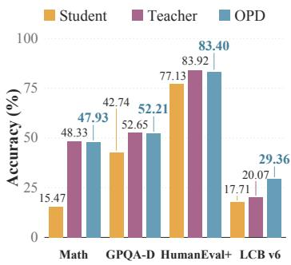

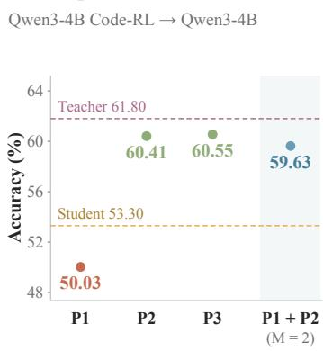

(c) Prompt source  
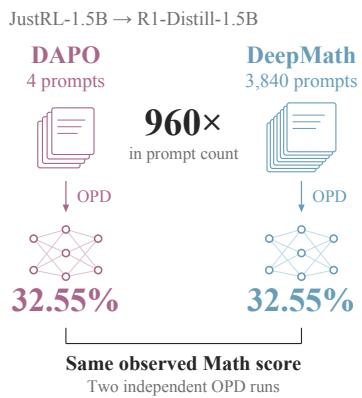  
Figure 1: Prompt efficiency does not imply prompt interchangeability. A single prompt can induce substantial transfer, but outcomes vary with prompt identity and composition. Moreover, a few prompts from one source can match the observed mathematics score of thousands from another. These examples motivate our study of prompt count, source, teacher–student pairing, and selection. In (b), $P _ { 1 } { - } \bar { P _ { 3 } }$ denote the individual code prompts described in Appendix C.4, while ${ \bar { P } } _ { 1 } + P _ { 2 }$ denotes joint OPD using the first two prompts.

## 1 INTRODUCTION

On-policy distillation (OPD) is increasingly used in large language model (LLM) post-training to transfer capabilities to smaller students (Yang et al., 2025; Zheng et al., 2025), consolidate domainspecialized teachers (Xiao et al., 2026; Li et al., 2026a; DeepSeek-AI, 2026), and recover capabilities acquired in earlier training stages (Zeng et al., 2026).

In OPD, the student samples its own responses, and the teacher provides token-level feedback at the prefixes visited by the student (Lin et al., 2020; Agarwal et al., 2024; Lu & Thinking Machines Lab, 2025). A fixed prompt can elicit different trajectories as the student evolves. Prompt choice therefore shapes the contexts in which teacher supervision is applied, motivating the study of both how many prompts are needed and which prompts are useful.

Recent work improves transfer by aligning prompt content and templates with the teacher’s posttraining data (Li et al., 2026b). Concurrent work demonstrates substantial transfer from a single query (Fu et al., 2026) and shows that OPD can propagate strengths and weaknesses beyond the training domain, with generalization differing between same-origin and cross-origin pairs (Li et al., 2026c). Appendix A discusses related work in further detail. These findings motivate a distinction between prompt sufficiency and prompt interchangeability. Our central question is how prompt utility depends on the teacher–student pair and target capability. A related practical question is whether explicit prompt selection or source filtering yields consistent gains over uniform random sampling.

We study prompt quantity, source, teacher–student pairing, and selection across RL- and SFTcontinuation pairs and cross-model settings. Figure 1 illustrates both low prompt requirements and sensitivity to prompt choice: four DAPO prompts match the observed mathematics score of 3,840 DeepMath prompts, while individual code prompts can produce positive or negative transfer. Figure 3(b) further demonstrates teacher-dependent source preferences: switching between Math-RL and Code-RL teachers reverses the relative effectiveness of mathematics and code supports across all four evaluations, with the initial student and both supports held fixed. For multi-domain teachers, source preferences vary across target capabilities, while broader mixtures at a fixed prompt count can improve some capabilities at the expense of others.

To understand how different prompt supports shape transfer, we analyze parameter updates, predictions on common prefixes, hidden-state representations, and generated behavior. Functional alignment with the teacher varies across supports and target tasks. When the teacher is obtained by further training the student’s initial checkpoint, teacher-aligned functional changes can coexist with weak parameter alignment. Hidden-state interventions further probe the role of representations in unfavorable transfer, while continued OPD on effective supports can restore performance.

This data sensitivity does not imply consistent gains from targeted selection: uniform random sampling leads the JustRL–DeepMath study in four-task average and remains competitive in the code and 30B-to-4B comparisons. Table 5 shows no consistent gain from excluding GSM8K from a DeepMath/DAPO/GSM8K pool across three paired support draws, despite its poor standalone performance.

Our contributions are threefold:

• Data requirements and preferences. We systematically compare prompt counts and sources across teacher–student pairs, including controlled teacher swaps with the student initialization and prompt supports held fixed.

• Functional transfer, failure, and recovery. We combine parameter and functional diagnostics with hidden-state interventions and continued distillation to characterize unfavorable transfer and performance recovery.

• Practical data selection. We evaluate within-pool selection and mixed-pool source filtering against uniform random sampling, examining both transfer performance and selection cost.

Table 1: Teacher–student pairs and OPD sources. The first three teachers are trained by us; theable 1: Teacher–student pairs and OPD sources. The first three teachers are trained by us; the others are publicly others are publicly released models. We list constituent data sources; support construction, includingreleased models. We list constituent data sources; support construction, including mixtures and source filtering, is mixtures and source filtering, is detailed in Appendix B.3.detailed in Appendix A.3.
<table><tr><td>Student</td><td>Teacher</td><td>OPD sources</td></tr><tr><td colspan="3">RL-continuation pairs</td></tr><tr><td>Qwen3-4B</td><td>Math GRPO-500 RL data: DeepMath L6</td><td>DeepMath L6,</td></tr><tr><td></td><td>Code GRPO-300 RL data: Eurus-2 Code</td><td>Eurus Code</td></tr><tr><td>Qwen3-1.7B-Base + direct-code SFT</td><td>Code GRPO-400 RL data: Open-R1 Code</td><td>Open-R1 Code</td></tr><tr><td>DeepSeek-R1-Distill-Qwen-1.5B</td><td>JustRL-DeepSeek-1.5B RL data: DAPO-Math-17k</td><td>DeepMath L6, DAPO</td></tr><tr><td></td><td>DeepScaleR-1.5B-Preview RL data: AIME, AMC, Omni-MATH, Still (~40K)</td><td>DeepMath, DAPO</td></tr><tr><td>Qwen3-4B-Instruct-2507</td><td>RL data: DeepScaleR, Eurus-2, SCP-116K; Reasoning Gym, Llama-Nemotron IF Qwen3-4B-Inst-Mix</td><td>TextbookReasoning</td></tr><tr><td></td><td>RL data: LLM-Fusion-Train (Mix)</td><td>TextbookReasoning, LLM-Fusion</td></tr><tr><td colspan="3">SFT-continuation pairs DeepSeek-R1-Distill-Qwen-7B</td></tr><tr><td></td><td>Light-R1-7B-DS SFT data: Light stage2</td><td>DeepMath L6, DAPO, Light SFT-stage2</td></tr><tr><td colspan="3">Cross-model pairs</td></tr><tr><td>Qwen3-4B</td><td></td><td>DeepMath L6, DAPO, GSM8K, Eurus Code, TextbookReasoning</td></tr><tr><td>Qwen3-1.7B</td><td>Qwen3-30B-A3B-Instruct-2507</td><td>DeepMath L6, DAPO</td></tr></table>

## 2 EXPERIMENTAL SETUP

## 2.1 ON-POLICY DISTILLATION

Let $\pi _ { T }$ denote the frozen teacher and $\pi _ { \theta }$ the student. We sample prompts from a fixed support $\boldsymbol { S _ { M } }$ of M distinct prompts and generate responses with the rollout policy $\pi _ { \bar { \theta } }$ . OPD aligns student and teacher distributions at the resulting prefixes $\boldsymbol { s } _ { t } = \left( x , y _ { < t } \right)$ using reverse KL (Agarwal et al., 2024):

$$
\begin{array}{c} \begin{array} { r } { \mathcal { L } _ { \mathrm { R K L } } ( \theta ; \bar { \theta } ) = \mathbb { E } _ { s \sim d _ { \bar { \theta } } } [ D _ { \mathrm { K L } } ( \pi _ { \theta } ( \cdot  { | \begin{array} { l } { s } \end{array} | } \end{array} | | \pi _ { T } ( \cdot  { | \begin{array} { l } { s } \end{array} ) } ) ] , } \end{array}\tag{1}
$$

where $d _ { \bar { \theta } }$ is the induced distribution over valid response prefixes. Collected prefixes and $\bar { \theta }$ remain fixed during optimization. We use a sampled-token policy-gradient surrogate (Lu & Thinking Machines Lab, 2025); implementation and training details appear in Appendix B.2.

## 2.2 MODEL PAIRS AND DATA

In a continuation pair, the teacher is obtained by RL or SFT from the student’s exact initial checkpoint; cross-model teachers are not continuations of that checkpoint. We use the Qwen3 (Yang et al., 2025) and DeepSeek-R1-Distill (Guo et al., 2025) model families. Table 1 lists the pairs and data sources; construction details appear in Appendix B.

The support $\boldsymbol { \mathcal { S } } _ { M }$ is selected from a candidate pool C of size C. Fresh responses are generated throughout training, so fixing M does not fix token or compute budgets. Support construction and prompt templates are detailed in Appendices B.3 and B.5.

## 2.3 EVALUATION

Math reports mean@16 averaged equally over AIME 2024/2025 and HMMT February/November. GPQA-Diamond (Rein et al., 2024), HumanEval+ (Liu et al., 2023), and LiveCodeBench v6 (Jain et al., 2025) use mean@8, with MBPP+ added for code comparisons; direct-code 1.7B comparisons use mean@16. Multi-domain evaluations additionally include IFEval (Zhou et al., 2023b), IFBench (Pyatkin et al., 2025), and BFCL-v3 (Patil et al., 2025). Mean@k averages per-question correctness over k responses; macro averages are defined with the results. Decoding and scoring details appear in Appendix B.4.

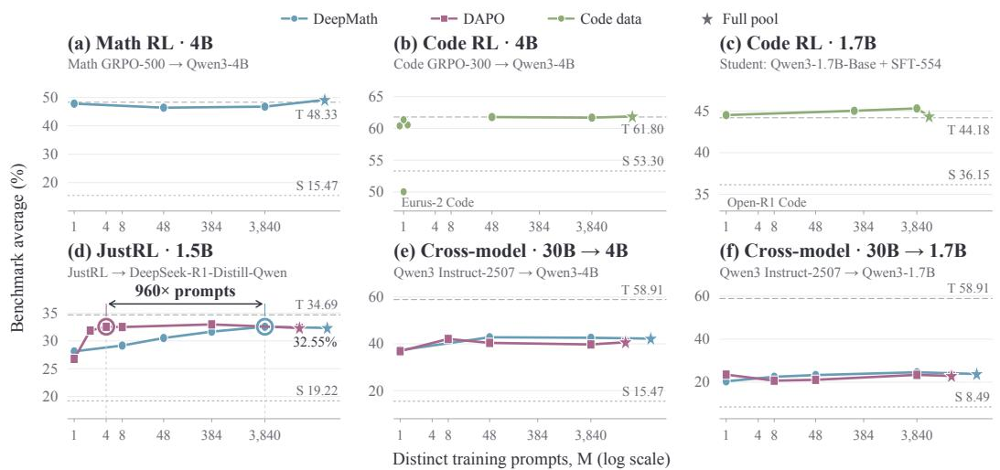  
Figure 2: Prompt-count scaling across six teacher–student pairs. Stars mark full-pool OPD; S/T denote the initial student and teacher. Circled points in (d) attain the same observed Math score with 4 DAPO versus 3,840 DeepMath prompts. Training budgets are comparison-specific; full results appear in Appendix C.

For random selection, we report mean ± sample SD across independent support draws, varying selection seeds while holding the training seed fixed.

## 3 DATA REQUIREMENTS

Figure 2 examines how OPD performance varies with the number of distinct training prompts.

## 3.1 FEW PROMPTS CAN APPROACH LARGE-POOL PERFORMANCE

In the Qwen3-4B Math-RL pair, one prompt reaches 44.74 on Math, versus 46.77 with 3,840 prompts, at a matched total of 3,840 rollouts. With Code-RL, 48 prompts come within 0.10 points of full-pool OPD with 22,618 prompts at step 100. Training curves are provided in Appendix C.3.

This pattern also appears beyond RL continuation. In 30B-Instruct-to-4B distillation, DeepMath48 performs comparably to DeepMath3840 at step 15. For the Light-R1 SFT-continuation pair, eight DAPO or DeepMath prompts achieve math scores of 40.83 and 40.63, respectively, compared with 40.99 using the original 3,533-prompt source.

However, selected single-prompt Code-RL runs range from 50.03 to 61.37, spanning the initial student’s 53.30. We examine these unfavorable outcomes and their recovery in Section 5.

## 3.2 PROMPT-COUNT SCALING DEPENDS ON SOURCE AND PAIR

Full-pool performance need not predict sensitivity to prompt count. With JustRL, DAPO and DeepMath achieve similar full-pool scores but diverge at M = 8. Appendix C reports the same observed Math score of 32.55 for four DAPO and 3,840 DeepMath prompts, a 960× difference in distinct prompt count.

Scaling also varies across students with the same teacher and source. With the 30B Instruct teacher and DAPO, the 4B student’s score rises from 36.9 at M = 1 to 42.1 at M = 8, whereas the 1.7B student’s score remains nearly unchanged from M = 1 to M = 3,840.

<table><tr><td colspan="6">(a) Source sensitivity</td></tr><tr><td colspan="6">Student: Qwen3-4B Teacher: Qwen3-30B-A3B-Instruct-2507</td></tr><tr><td colspan="6"></td></tr><tr><td></td><td>Math</td><td>GPQA</td><td>HE+</td><td>LCB</td><td>Avg</td></tr><tr><td>Student (init.)</td><td>15.5</td><td>42.7</td><td>77.1</td><td>17.7</td><td>38.3</td></tr><tr><td>Teacher</td><td>58.9</td><td>54.9</td><td>82.4</td><td>33.1</td><td>57.3</td></tr><tr><td>DeepMath</td><td>42.8</td><td>52.2</td><td>82.3</td><td>26.8</td><td>51.0</td></tr><tr><td>DAPO</td><td>40.4</td><td>51.5</td><td>82.2</td><td>27.9</td><td>50.5 -0.5</td></tr><tr><td>Textbook</td><td>40.3</td><td>51.0</td><td>81.9</td><td>25.3</td><td>49.6 -1.4</td></tr><tr><td>Eurus Code</td><td>33.5</td><td>50.4</td><td>78.4</td><td>27.1</td><td>47.4 -3.7</td></tr><tr><td>GSM8K</td><td>31.1</td><td>46.8</td><td>81.2</td><td>16.8</td><td>44.0 -7.1</td></tr></table>

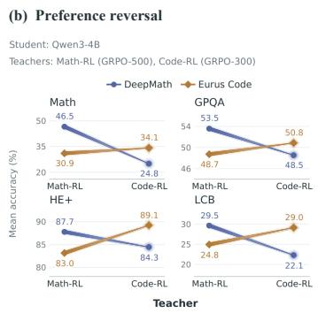

<table><tr><td></td><td>Math</td><td>GPQA</td><td>HE+</td><td>LCB</td><td>Avg</td></tr><tr><td>Student (init.)</td><td>19.2</td><td>35.9</td><td>54.3</td><td>13.5</td><td>30.7</td></tr><tr><td>Teacher</td><td>30.5</td><td>40.7</td><td>66.7</td><td>22.0</td><td>40.0</td></tr><tr><td>DeepMath</td><td>29.6</td><td>40.1</td><td>64.9</td><td>19.9</td><td>38.6</td></tr><tr><td>Textbook</td><td>29.8</td><td>39.8</td><td>64.4</td><td>19.0</td><td>38.3 -0.4</td></tr><tr><td>Eurus Code</td><td>26.1</td><td>40.1</td><td>65.6</td><td>22.0</td><td>38.4 -0.2</td></tr><tr><td>Mix3</td><td>29.3</td><td>42.2</td><td>66.2</td><td>21.8</td><td>39.9 +1.2</td></tr></table>

Figure 3: Data-source preferences across teacher–student pairs. (a) Source sensitivity with a 30B Instruct teacher. (b) Preference reversals between Math-RL and Code-RL teachers with the same initial student. (c) Cross-domain transfer from the Nemotron teacher. Avg is the unweighted mean of the four displayed benchmark groups; side annotations report differences from DeepMath. Darker and lighter shading mark the highest and second-highest OPD scores within each column.

Since repeated prompts still generate fresh trajectories, Appendix G.1 separately examines the quality–cost trade-offs of reusing those trajectories.

## TAKEAWAY 1

Few prompts can support effective OPD, but prompt sufficiency does not imply prompt interchangeability.

## 4 DATA PREFERENCES ACROSS TEACHER–STUDENT PAIRS

At a fixed support size of M = 48, we compare prompt sources and mixtures within each teacher– student pair.

## 4.1 SOURCE SENSITIVITY AT FIXED SUPPORT SIZE

With equal prompt counts, DeepMath and GSM8K supports score 42.8 and 31.1 on Math, respectively, for a Qwen3-4B student and 30B Instruct teacher in Figure 3(a).

Table 2 and Appendix D.2 show GSM8K trailing Deep-Math by 11.25 points on Math and 9.36 on LCB despite approximately matched cumulative supervision-token budgets. Supervision volume alone therefore does not explain the source gap.

Table 2: Token control. M = 48; Avg averages Math, GPQA, HE+, and LCB.
<table><tr><td>Data</td><td>Tokens (M)</td><td>Avg</td></tr><tr><td>GSM8K</td><td>1.19</td><td>44.01</td></tr><tr><td>+ token match</td><td>16.14</td><td>44.84</td></tr><tr><td>DeepMath</td><td>16.63</td><td>51.02</td></tr></table>

## 4.2 TEACHER-DEPENDENT SOURCE PREFERENCES

Switching from the Math-RL to Code-RL teacher reverses source preferences on all four evaluations in Figure 3(b), with the Qwen3-4B initialization and both 48-prompt supports fixed. On Math, DeepMath outperforms Eurus Code under the Math-RL teacher (46.51 versus 30.89), whereas Eurus Code outperforms DeepMath under the Code-RL teacher (34.06 versus 24.84). The preferred source thus depends on the teacher even for the same student and target task. In $\mathrm { \bf A v } \bf g _ { 4 }$ , the sourcepreference reversal in Figure 3(b) persists across all five tested support–training seed configurations in Appendix D.1, with a teacher–source difference-in-differences of 13.1–14.1 percentage points.

Table 3: Data-source preferences with a multi-domain RL teacher. Qwen3-4B-Inst-Mix → Qwen3-4B-Instruct-2507; M = 48. Teal marks the best and second-best OPD scores; mixture construction is detailed in Appendix B.3.
<table><tr><td>Model / OPD support</td><td>Math</td><td>GPQA-D</td><td>HumanEval+</td><td>LCB v6</td><td>IFEval</td><td>IFBench</td><td>BFCL-v3</td><td>Avg6</td></tr><tr><td>Student (init.)</td><td>45.83</td><td>45.52</td><td>81.48</td><td>27.86</td><td>83.71</td><td>30.42</td><td></td><td>63.91 53.61</td></tr><tr><td>Teacher</td><td>48.18</td><td>45.27</td><td>79.57</td><td>30.21</td><td>86.02</td><td>39.96</td><td>70.81</td><td>56.17</td></tr><tr><td>DeepMath</td><td>48.28</td><td>47.35</td><td>81.86</td><td>29.71</td><td>83.90</td><td>29.04</td><td>64.25</td><td>54.65</td></tr><tr><td>Textbook</td><td>46.46</td><td>51.14</td><td>83.23</td><td>28.93</td><td>83.50</td><td>27.88</td><td>62.66</td><td>54.69</td></tr><tr><td>Eurus Code</td><td>48.49</td><td>61.81</td><td>81.17</td><td>31.93</td><td>83.13</td><td>28.67</td><td>66.50</td><td>57.63</td></tr><tr><td>IF</td><td>41.51</td><td>46.46</td><td>68.29</td><td>22.07</td><td>78.35</td><td>42.56</td><td>53.25</td><td>48.67</td></tr><tr><td>Agent</td><td>43.38</td><td>50.88</td><td>78.35</td><td>28.21</td><td>82.99</td><td>26.73</td><td>62.28</td><td>52.99</td></tr><tr><td>Mix3</td><td>48.59</td><td>59.34</td><td>82.01</td><td>32.36</td><td>83.93</td><td>28.79</td><td>64.28</td><td>57.16</td></tr><tr><td>Mix5</td><td>47.55</td><td>55.18</td><td>80.18</td><td>31.14</td><td>82.05</td><td>36.79</td><td>69.56</td><td>57.17</td></tr></table>

## 4.3 TASK-SPECIFIC TRANSFER AND MIXTURE TRADE-OFFS

Data composition also changes which capabilities benefit. With the Mix-RL teacher, Code48’s GPQA scores span 61.24–61.81 across three support draws, versus DeepMath48’s 47.35 in Table 3. Even within instruction following, IF48 improves IFBench over the initial student while lowering IFEval.

Mixtures likewise improve some tasks at the expense of others. Under Nemotron, Mix3 improves GPQA, HumanEval+, and LCB over DeepMath in Figure 3(c), with a small Math decrease. For Mix-RL, Mix5 reallocates the same 48-prompt budget across five domains, reselecting prompts within each pool as in Appendix B.3. Relative to Mix3, it improves IFBench by 8.00 points and BFCL by 5.28 points, while GPQA decreases by 4.16 points.

## TAKEAWAY 2

Source preferences are relational: the same source can be effective or ineffective depending on the teacher–student pair and target capability, while broader mixtures redistribute transfer gains.

## 5 TRANSFER ANALYSIS

We examine how prompt supports shape the student’s functional and behavioral changes, whether unfavorable transfer can be repaired, and what these results imply for prompt selection.

## 5.1 FUNCTIONAL ALIGNMENT

For continuation pairs, we compare OPD and teacher changes from the shared student initialization. Parameter alignment measures weight displacements; functional alignment measures token logprobability changes on common frozen prefixes, defined in Appendix E.1. Functional cosine measures directional alignment; α is the teacher-direction projection coefficient. Diagnostic KL closure measures the reduction in the conditional KL gap to the teacher.

Figure 4(a) reports median parameter and functional cosines of 0.069 and 0.859 across 43 checkpoints from seven teacher families, including intermediate states. OPD can therefore reproduce teacheraligned prediction changes without following the teacher’s parameter-update direction.

We next examine support-dependent prediction changes across tasks in Figure 4(b,c). In 30B-to-4B distillation, DeepMath reduces the diagnostic teacher–student KL gap on frozen Math prefixes by 11.20%, whereas GSM8K widens it by 13.64%. GSM8K nevertheless has positive functional cosine (0.318), showing that directional alignment alone does not ensure closer predictions. Eurus Code closes only 1.13% of the Math gap but 42.30% of the LCB gap. Appendix E.3 details these diagnostics, which measure task-specific prediction changes, not benchmark gains.

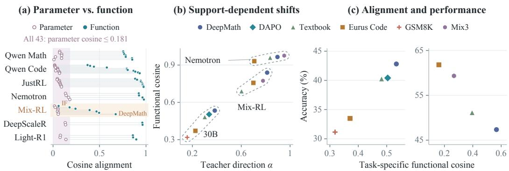  
Figure 4: Parameter and functional alignment. (a) Parameter and all-domain functional cosines for 43 checkpoints; each line joins the same endpoint. (b) Teacher-direction projection α versus functional cosine on Math probes, grouped by model pair. (c) Functional cosine versus accuracy: 30B-to-4B Math (left) and Mix-RL-to-4B GPQA (right). Definitions: Appendix E.1.

## TAKEAWAY 3

OPD can produce teacher-aligned functional changes through substantially different parameter updates; the extent of alignment depends on the support and task.

## 5.2 GENERATION BEHAVIOR

We next move from common-prefix predictions to freely generated responses in Figure 5. With Mix-RL, Eurus Code yields longer GPQA responses and higher accuracy than DeepMath; two additional Code support draws reproduce this pattern. DeepMath OPD also produces longer responses than the teacher in both 30B pairs, so successful transfer need not imitate the teacher’s response length. Yet in 30B-to-1.7B distillation, DAPO produces longer responses than DeepMath with lower accuracy. Longer generation thus accompanies some gains but does not consistently indicate better transfer.

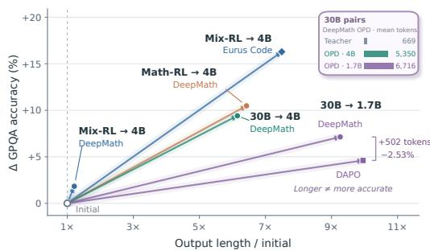  
Figure 5: GPQA accuracy and output-length changes. All supports contain M = 48 prompts; changes are relative to each pair’s initial student. Inset: mean output tokens.

For Mix-RL Code48 and Mix3, most additional text precedes the final answer. Among the 15– 16% of outputs with an identifiable early answer,

correct-to-wrong revisions outnumber wrong-to-correct revisions. The results link supports to generation behavior without establishing that extra tokens cause accuracy gains. Complete accuracy– length measurements and output analyses are in Table 21 and Appendix E.4.

## 5.3 FAILURE AND RECOVERY

Can interventions redirect these support-dependent changes? In the Code pair, we compare a degraded endpoint A′, an effective single-prompt endpoint B, and native M48 trained directly on 48 prompts. Figure 6(a) shows similar layerwise CKA (Kornblith et al., 2019) profiles for $A ^ { \prime }$ and native M48 relative to full-pool OPD, despite their performance gap. We therefore test behavior directly through hidden-state replacement and continued distillation.

At each decoding step, we replace the recipient’s current-position hidden vector after block 30 (zero-based) with the donor’s. On the 20-question probe in Figure 6(b), with eight samples per question, $B  A ^ { \prime }$ raises accuracy from 18.75% to 24.38%, while $A ^ { \prime }  B$ lowers it from 28.13% to 21.25%. Self-replacement leaves accuracy unchanged; block 10 gives no aggregate improvement. The tested representation interface can thus alter the degraded model’s behavior during evaluation.

Δ sample accuracy (%)  
(a) Hidden-state geometry  
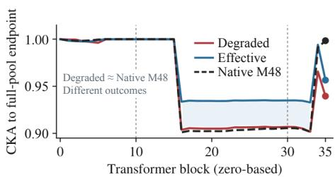

(b) Hidden-state replacement  
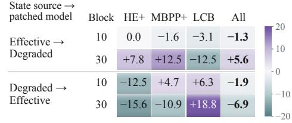

(c) Task performance recovers  
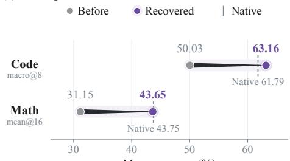  
Mean accuracy (%)

(d) Recovery alignment  
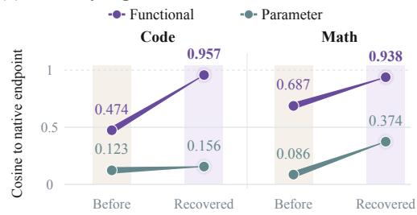  
Figure 6: Redirecting unfavorable transfer. (a) CKA relative to full-pool OPD. (b) Bidirectional hidden-state replacement. (c) Performance recovery through continued distillation; vertical ticks mark native references. (d) Functional versus parameter alignment to native endpoints. Reference checkpoints and unequal Code update budgets are specified in Appendix E.5.

Figure 6(c) shows recovery through continued OPD. Switching the degraded Code model to an effective 48-prompt support raises Code Macro from 50.03 to 63.16, above the initial student’s 53.30. Switching from GSM8K to DeepMath also recovers performance in the 30B-to-4B Math setting. Code recovery adds training and resets the optimizer; it does not match the native reference’s update budget.

Continuation data at matched update counts. Does recovery reflect additional training alone, or does the continuation support matter? Figure 7 compares four paths in 30B-to-4B distillation. Each first-stage checkpoint, trained for 15 updates on GSM8K or DeepMath, branches into a further 15 updates on either source. All four continuations reset Adam and retain the same learning rate, batch size, and training seed. Thus, additional updates and optimizer resets are shared across the paired arms, although token budgets remain unmatched.

Continuing on DeepMath rather than GSM8K improves formal Avg by 7.98 points from the GSM8K trained checkpoint and 5.60 points from the DeepMath-trained checkpoint. The two DeepMath continuations reach close endpoint scores despite different histories. The validation curves show how the paths separate during continuation; their AIME24/25 mean@2 metric is distinct from the formal four-task endpoint evaluation. The continuation support therefore remains consequential at matched update counts, rather than recovery being explained by extra updates alone. Appendix E.5 provides the full protocol and supplementary parameter comparisons.

Figure 6(d) shows strong functional but weak parameter alignment between recovered models and native references. These results show that unfavorable training histories need not prevent strong subsequent transfer, even when parameter updates remain different. Appendix E.5 further shows that Math recovery persists under alternative answer scoring.

## TAKEAWAY 4

Unfavorable OPD outcomes are recoverable: representation interventions can redirect behavior, while continued OPD on effective supports can restore performance without retracing the parameter path of successful training.

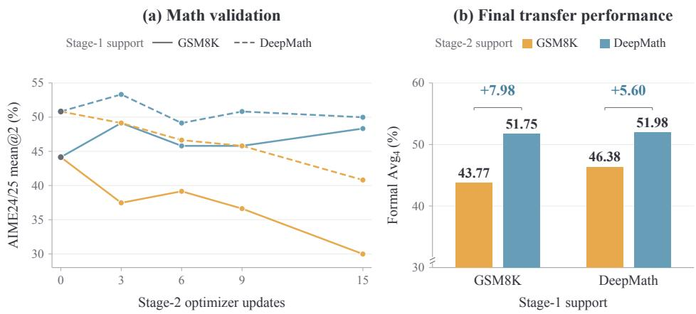  
Figure 7: Continuation data shapes recovery at matched update counts. 30B Instruct → Qwen3- 4B, with 15 updates per stage and a fresh Adam optimizer in every second-stage run; token budgets are not matched. Orange and blue indicate stage-2 GSM8K and DeepMath, respectively. (a) AIME24/25 validation mean@2; solid/dashed lines start from GSM8K/DeepMath checkpoints. Gray step-0 markers show the shared starting scores of 44.17/50.83. (b) Formal $\mathrm { \bf A v g _ { 4 } }$ (%), with the y-axis truncated at 30%, grouped by stage-1 source; annotations show the gains from using DeepMath rather than GSM8K in stage 2.

Table 4: Prompt selection within DeepMath. JustRL-1.5B → DS-1.5B. Random selectors report mean ± sample SD over three sampled supports. Bold marks the column best within each M. Costs estimate selection-only GPU hours; 0 denotes no GPU screening.
<table><tr><td>Method</td><td>Math</td><td>GPQA-D</td><td>HE+</td><td>LCB</td><td> $\mathrm { \bf A v g _ { 4 } }$ </td><td>GPU·h</td></tr><tr><td colspan="7"> $M = 8 , \quad C = 3 8 4$ </td></tr><tr><td>Uniform random</td><td> ${ \bf 3 1 . 0 9 \pm 0 . 5 0 }$ </td><td> $3 9 . 4 4 \pm 1 . 2 4$ </td><td> $6 2 . 4 0 \pm 0 . 3 2$ </td><td> $1 7 . 6 7 \pm 0 . 8 6$ </td><td> $3 7 . 6 5 \pm 0 . 3 8$ </td><td>0</td></tr><tr><td>Stratified random</td><td> $3 0 . 3 6 \pm 0 . 3 9$ </td><td> $3 8 . 1 9 \pm 0 . 5 8$ </td><td> $6 1 . 7 4 \pm 0 . 4 6$ </td><td> $1 7 . 9 3 \pm 0 . 4 1$ </td><td> $3 7 . 0 6 \pm 0 . 2 5$ </td><td>1.1</td></tr><tr><td>Semantic diversity</td><td>30.21</td><td>39.46</td><td>62.88</td><td>17.36</td><td>37.48</td><td> $< 0 . 1$ </td></tr><tr><td>Hard selection</td><td>28.96</td><td>38.07</td><td>63.57</td><td>18.21</td><td>37.20</td><td>1.1</td></tr><tr><td>Shortest</td><td>28.75</td><td>39.08</td><td>61.28</td><td>16.86</td><td>36.49</td><td>2.2</td></tr><tr><td>Longest</td><td>29.82</td><td>40.12</td><td>62.48</td><td>17.14</td><td>37.39</td><td>2.2</td></tr><tr><td>T-S disagreement</td><td>28.53</td><td>38.64</td><td>62.91</td><td>17.68</td><td>36.94</td><td>3.3</td></tr><tr><td>Cost-D-opt</td><td>28.91</td><td>39.90</td><td>62.27</td><td>17.43</td><td>37.13</td><td>7.5</td></tr><tr><td colspan="7"> $M = 4 8 ,$   $\overline { { C = 2 , 3 0 4 } }$ </td></tr><tr><td>Uniform random</td><td> $2 9 . 8 4 \pm 0 . 3 1$ </td><td> ${ \bf 4 1 . 0 2 \pm 0 . 4 8 }$ </td><td> $6 2 . 4 0 \pm 0 . 3 7$ </td><td> $1 7 . 2 6 \pm 0 . 2 8$ </td><td> $3 7 . 6 3 \pm 0 . 2 1$ </td><td>0</td></tr><tr><td>Stratified random</td><td> ${ \bf 3 0 . 7 2 \pm 0 . 2 8 }$ </td><td> $3 7 . 9 5 \pm 0 . 4 2$ </td><td> $6 1 . 5 8 \pm 0 . 3 5$ </td><td> $1 7 . 8 3 \pm 0 . 2 9$ </td><td> $3 7 . 0 2 \pm 0 . 1 9$ </td><td>6.6</td></tr><tr><td>Semantic diversity</td><td>29.16</td><td>38.83</td><td>61.72</td><td>17.25</td><td>36.74</td><td>&lt; 0.1</td></tr><tr><td>Hard selection</td><td>27.91</td><td>39.42</td><td>62.15</td><td>18.04</td><td>36.88</td><td>6.6</td></tr><tr><td>Shortest</td><td>29.38</td><td>40.56</td><td>61.94</td><td>16.88</td><td>37.19</td><td>15.2</td></tr><tr><td>Longest</td><td>30.25</td><td>40.64</td><td>61.85</td><td>17.22</td><td>37.49</td><td>15.2</td></tr><tr><td>T-S disagreement</td><td>28.84</td><td>39.15</td><td>62.18</td><td>17.63</td><td>36.95</td><td>16.3</td></tr><tr><td>Cost-D-opt</td><td>30.45</td><td>38.74</td><td>63.12</td><td>16.93</td><td>37.31</td><td>47.7</td></tr></table>

## 5.4 PROMPT SELECTION

These analyses characterize transfer after training. We now test whether selecting prompts beforehand improves transfer over uniform random sampling. Table 4 compares eight JustRL–DeepMath selectors. Uniform random sampling achieves the highest reported four-task average at both $\bar { M } = 8$ and M = 48 (37.65 and 37.63), without additional GPU screening. Other selectors lead on individual tasks; method definitions are in Appendix F.1.

Additional comparisons cover Code-RL-to-4B and 30B-to-4B distillation. Semantic diversity leads on Code Macro and stratified random on 30B-to-4B $\mathrm { { A v g } _ { 4 } , }$ while uniform random remains competitive without GPU screening. Higher screening cost does not consistently improve transfer. Complete benchmark scores appear in Appendices F.3 and F.4.

Table 5: Source filtering in a mixed pool. 30B Instruct → 4B, $M = 4 8 .$ Scores (%) are mean ± SD across three support draws.
<table><tr><td>Sampling strategy</td><td></td><td>Math mean@16 OOD mean@8</td></tr><tr><td>Mixed random</td><td> $4 0 . 7 \pm 2 . 3$ </td><td> $5 4 . 7 \pm 0 . 7$ </td></tr><tr><td>Source-filtered random</td><td> $4 0 . 5 \pm 1 . 0$ </td><td> $5 4 . 5 \pm 0 . 8$ </td></tr><tr><td>Filtered — Mixed</td><td> $- 0 . 3 \pm 2 . 0$ </td><td> $- 0 . 2 \pm 0 . 9$ </td></tr></table>

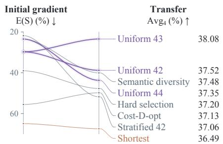  
Figure 8: Initial gradients and transfer. JustRL–DeepMath, $C = 3 8 4 , M = 8 .$

Initial-gradient diagnostics in Appendix F.5 may help explain random sampling’s competitiveness. In JustRL–DeepMath $( C = 3 8 4 , M = 8 )$ , random supports preserve the candidate-pool mean direction (mean cosine 0.971; fifth percentile 0.952). However, Figure 8 shows that lower gradient approximation error does not consistently predict higher final accuracy.

Mixed pools and source composition. Does the weak standalone performance of a source justify filtering it before sampling from a mixed pool? Table 5 shows no consistent gain from removing GSM8K across three paired draws, despite its weak standalone performance. Both arms use $M = 4 \bar { 8 }$ prompts from a DeepMath/DAPO/GSM8K candidate pool, with filtering removing GSM8K before selection. The paired Math and OOD differences change direction across draws.

48-prompt supports: DeepMath n + GSM8K (48 − n)

(a) Math mean@16  
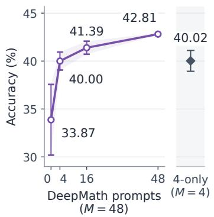

(b) OOD mean@8  
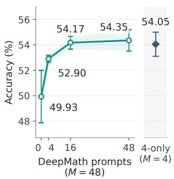  
DeepMath4-only control

(c) Avg4  
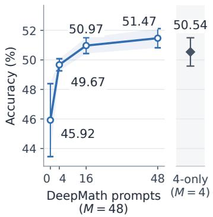  
Figure 9: Source composition and a four-prompt control. 30B Instruct → Qwen3-4B, 25 updates. DeepMath/GSM8K composition sweep (circles, $M = 4 8 )$ and DeepMath4-only control (diamonds, $M = 4 )$ . Within each seed, the control reuses exactly the four DeepMath prompts in the corresponding 4/44 mixture. Error bars and bands show sample SD across selection seeds 42/43/44.

Figure 9 probes this result through a DeepMath/GSM8K composition sweep and a paired four-prompt control. Replacing four of 48 GSM8K prompts with DeepMath raises mean Math from 33.87 to 40.00. Yet using only those same four DeepMath prompts already reaches 40.02, with higher mean OOD and $\mathrm { \bf A v g } _ { 4 }$ scores than the 4/44 mixture. The improvement over GSM8K-only therefore does not establish complementary benefits from combining the sources. The four-prompt control changes support size and may also change prompt repetition; all runs retain the same 25-update training configuration. Together, these controls show why a source’s standalone performance is insufficient to determine either a filtering rule or its contribution within a mixture. Construction and full filtering results are in Appendix F.2.

## TAKEAWAY 5

Strong transfer does not require a carefully curated prompt pool: uniform random sampling remains competitive, while targeted selection or source filtering did not consistently improve transfer in our experiments.

## 6 DISCUSSION

Prompt efficiency does not imply interchangeability: prompt utility depends on the teacher–student pair and target capability. One possible interpretation is that simple prompts can support broadly elicitable behavioral changes, whereas more context-dependent reasoning behaviors benefit from supports that expose relevant trajectories. The contrasting prompt requirements of Qwen3-4B Math-RL and JustRL are consistent with this interpretation. Continued OPD on effective supports can restore performance after unfavorable transfer despite different parameter updates. Random sampling remains competitive, while filtering a source that performs poorly alone yields no consistent gain in our mixed-pool experiments. Selection strategies should therefore demonstrate gains beyond random sampling while accounting for screening cost.

## REFERENCES

Rishabh Agarwal, Nino Vieillard, Yongchao Zhou, Piotr Stanczyk, Sabela Ramos Garea, Matthieu Geist, and Olivier Bachem. On-policy distillation of language models: Learning from self-generated mistakes. In International Conference on Learning Representations, 2024. URL https://proceedings.iclr.cc/paper\_files/paper/2024/hash/ 5be69a584901a26c521c2b51e40a4c20-Abstract-Conference.html.

Art of Problem Solving. AIME problems and solutions. AoPS Wiki, n.d. URL https://artofproblemsolving.com/wiki/index.php/AIME\_Problems\_ and\_Solutions.

Moses Charikar, Kevin Chen, and Martin Farach-Colton. Finding frequent items in data streams. In Automata, Languages and Programming (ICALP), volume 2380 of Lecture Notes in Computer Science, pp. 693–703. Springer, 2002. doi: 10.1007/3-540-45465-9 59. URL https://link. springer.com/chapter/10.1007/3-540-45465-9\_59.

Karl Cobbe, Vineet Kosaraju, Mohammad Bavarian, Mark Chen, Heewoo Jun, Lukasz Kaiser, Matthias Plappert, Jerry Tworek, Jacob Hilton, Reiichiro Nakano, Christopher Hesse, and John Schulman. Training verifiers to solve math word problems. arXiv preprint arXiv:2110.14168, 2021. URL https://arxiv.org/abs/2110.14168.

Ganqu Cui, Lifan Yuan, Zefan Wang, Hanbin Wang, Yuchen Zhang, Jiacheng Chen, Wendi Li, Bingxiang He, Yuchen Fan, Tianyu Yu, Qixin Xu, Weize Chen, Jiarui Yuan, Huayu Chen, Kaiyan Zhang, Xingtai Lv, Shuo Wang, Yuan Yao, Xu Han, Hao Peng, Yu Cheng, Zhiyuan Liu, Maosong Sun, Bowen Zhou, and Ning Ding. Process reinforcement through implicit rewards. arXiv preprint arXiv:2502.01456, 2025. URL https://arxiv.org/abs/2502.01456.

DeepSeek-AI. DeepSeek-V4: Towards highly efficient million-token context intelligence. arXiv preprint arXiv:2606.19348, 2026. doi: 10.48550/arXiv.2606.19348. URL https://arxiv. org/abs/2606.19348.

Run-Ze Fan, Zengzhi Wang, and Pengfei Liu. MegaScience: Pushing the frontiers of post-training datasets for science reasoning. arXiv preprint arXiv:2507.16812, 2025. URL https://arxiv. org/abs/2507.16812.

Zixuan Fu, Bingxiang He, Yuxin Zuo, Haohuan Huang, Jinqian Zhang, Ruhang Xiao, Cheng Qian, Qinyu Luo, Huan-ang Gao, Yudong Wang, Zhiyuan Liu, Ning Ding, and Chaojun Xiao. Rethinking on-policy distillation of large language models II: One training example. arXiv preprint arXiv:2609.04172, 2026. URL https://arxiv.org/abs/2609.04172.

Yuxian Gu, Li Dong, Furu Wei, and Minlie Huang. MiniLLM: Knowledge distillation of large language models. In International Conference on Learning Representations, 2024. URL https://proceedings.iclr.cc/paper\_files/paper/2024/hash/ 8ac015d409635f196f9e3e9dcfb9a94e-Abstract-Conference.html.

Daya Guo, Dejian Yang, Haowei Zhang, Junxiao Song, Peiyi Wang, Qihao Zhu, Runxin Xu, Ruoyu Zhang, Shirong Ma, Xiao Bi, et al. DeepSeek-R1 incentivizes reasoning in LLMs through reinforcement learning. Nature, 645:633–638, 2025. doi: 10.1038/s41586-025-09422-z. URL https://www.nature.com/articles/s41586-025-09422-z.

Bingxiang He, Zekai Qu, Zeyuan Liu, Yinghao Chen, Yuxin Zuo, Cheng Qian, Kaiyan Zhang, Weize Chen, Chaojun Xiao, Ganqu Cui, Ning Ding, and Zhiyuan Liu. JustRL: Scaling a 1.5B LLM with a simple RL recipe. arXiv preprint arXiv:2512.16649, 2025. URL https://arxiv.org/ abs/2512.16649.

Zhiwei He, Tian Liang, Jiahao Xu, Qiuzhi Liu, Xingyu Chen, Yue Wang, Linfeng Song, Dian Yu, Zhenwen Liang, Wenxuan Wang, Zhuosheng Zhang, Rui Wang, Zhaopeng Tu, Haitao Mi, and Dong Yu. DeepMath-103K: A large-scale, challenging, decontaminated, and verifiable mathematical dataset for advancing reasoning. In International Conference on Learning Representations, 2026. URL https://openreview.net/forum?id=kHB5Te5IWm.

HMMT. Archive of February 2025. Harvard–MIT Mathematics Tournament, 2025a. URL https: //www.hmmt.org/www/archive/282.

HMMT. Archive of November 2025. Harvard–MIT Mathematics Tournament, 2025b. URL https://www.hmmt.org/www/archive/291.

Hugging Face. Open R1: A fully open reproduction of DeepSeek-R1. GitHub repository, 2025. URL https://github.com/huggingface/open-r1.

Naman Jain, King Han, Alex Gu, Wen-Ding Li, Fanjia Yan, Tianjun Zhang, Sida Wang, Armando Solar-Lezama, Koushik Sen, and Ion Stoica. LiveCodeBench: Holistic and contamination free evaluation of large language models for code. In International Conference on Learning Represen tations, 2025. URL https://proceedings.iclr.cc/paper\_files/paper/2025/ hash/94074dd5a072d28ff75a76dabed43767-Abstract-Conference.html.

Jongwoo Ko, Tianyi Chen, Sungnyun Kim, Tianyu Ding, Luming Liang, Ilya Zharkov, and Se-Young Yun. DistiLLM-2: A contrastive approach boosts the distillation of LLMs. In Proceedings of the 42nd International Conference on Machine Learning, volume 267 of Proceedings of Machine Learning Research, pp. 31044–31062. PMLR, 2025. URL https://proceedings.mlr. press/v267/ko25a.html.

Jongwoo Ko, Sara Abdali, Young Jin Kim, Tianyi Chen, and Pashmina Cameron. Scaling reasoning efficiently via relaxed on-policy distillation. arXiv preprint arXiv:2603.11137, 2026. doi: 10. 48550/arXiv.2603.11137. URL https://arxiv.org/abs/2603.11137.

Simon Kornblith, Mohammad Norouzi, Honglak Lee, and Geoffrey Hinton. Similarity of neural network representations revisited. In Proceedings of the 36th International Conference on Machine Learning, volume 97 of Proceedings of Machine Learning Research, pp. 3519–3529. PMLR, 2019. URL https://proceedings.mlr.press/v97/kornblith19a.html.

Hynek Kydl´ıcek. Math-Verify: Math verification library. Software, version 0.9.0, 2026. URLˇ https://pypi.org/project/math-verify/0.9.0/.

Fengxiang Li, Han Zhang, Haoyang Huang, Jinghui Wang, Jinhua Hao, Kun Yuan, Mengtong Li, Minglei Zhang, Pengcheng Xu, Wenhao Zhuang, et al. KAT-Coder-V2 technical report. arXiv preprint arXiv:2603.27703, 2026a. doi: 10.48550/arXiv.2603.27703. URL https://arxiv. org/abs/2603.27703.

Yaxuan Li, Yuxin Zuo, Bingxiang He, Jinqian Zhang, Chaojun Xiao, Cheng Qian, Tianyu Yu, Huanang Gao, Wenkai Yang, Zhiyuan Liu, and Ning Ding. Rethinking on-policy distillation of large language models: Phenomenology, mechanism, and recipe. arXiv preprint arXiv:2604.13016, 2026b. URL https://arxiv.org/abs/2604.13016.

Zhaoyi Li, Deyang Kong, Yuan Wei, Evan Yang, Ranran Shen, Mahardika Krisna Ihsani, Ming Yang, Wei Zhang, Chuan Hao, Jian Yang, Ran Tao, Bryan Dai, Shikun Zhang, Wei Ye, Ying Wei, and Defu Lian. Every coin has two sides: On the dual nature of generalization in onpolicy distillation of large language models. arXiv preprint arXiv:2608.16647, 2026c. URL https://arxiv.org/abs/2608.16647.

Alexander Lin, Jeremy Wohlwend, Howard Chen, and Tao Lei. Autoregressive knowledge distillation through imitation learning. In Proceedings ofthe 2020 Conference on Empirical Methods in Natural Language Processing, pp. 6121–6133. Association for Computational Linguistics, 2020. doi: 10.18653/v1/2020.emnlp-main.494. URL https://aclanthology.org/2020. emnlp-main.494/.

Jiawei Liu, Chunqiu Steven Xia, Yuyao Wang, and Lingming Zhang. Is your code generated by ChatGPT really correct? rigorous evaluation of large language models for code generation. In Advances in Neural Information Processing Systems, volume 36, 2023. URL https://proceedings.neurips.cc/paper\_files/paper/2023/ hash/43e9d647ccd3e4b7b5baab53f0368686-Abstract.html.

Mingjie Liu, Shizhe Diao, Ximing Lu, Jian Hu, Xin Dong, Yejin Choi, Jan Kautz, and Yi Dong. ProRL: Prolonged reinforcement learning expands reasoning boundaries in large language models. In Advances in Neural Information Processing Systems, volume 38, pp. 20475–20508, 2025. doi: 10.52202/085713-0608. URL https://proceedings.neurips.cc/paper\_files/paper/2025/hash/ 1a22b912945fb7c0bdd079e792b31b6f-Abstract-Conference.html.

Kevin Lu and Thinking Machines Lab. On-policy distillation. Thinking Machines Lab: Connectionism, 2025. doi: 10.64434/tml.20251026. URL https://thinkingmachines.ai/blog/ on-policy-distillation/.

Michael Luo, Sijun Tan, Justin Wong, Xiaoxiang Shi, William Y. Tang, Manan Roongta, Colin Cai, Jeffrey Luo, Li Erran Li, Raluca Ada Popa, and Ion Stoica. DeepScaleR-1.5B-Preview. Hugging Face model card, 2025. URL https://huggingface.co/agentica-org/ DeepScaleR-1.5B-Preview.

Shishir G. Patil, Huanzhi Mao, Fanjia Yan, Charlie Cheng-Jie Ji, Vishnu Suresh, Ion Stoica, and Joseph E. Gonzalez. The Berkeley function calling leaderboard (BFCL): From tool use to agentic evaluation of large language models. In Proceedings of the 42nd International Conference on Machine Learning, volume 267 of Proceedings ofMachine Learning Research, pp. 48371–48392. PMLR, 2025. URL https://proceedings.mlr.press/v267/patil25a.html.

Valentina Pyatkin, Saumya Malik, Victoria Graf, Hamish Ivison, Shengyi Huang, Pradeep Dasigi, Nathan Lambert, and Hannaneh Hajishirzi. Generalizing verifiable instruction following. In Advances in Neural Information Processing Systems, volume 38, 2025. doi: 10.52202/085713-1645. URL https://proceedings.neurips.cc/paper\_files/paper/2025/ hash/46499a0622ecf568b72d17b61e45dbd5-Abstract-Datasets\_and\_ Benchmarks\_Track.html.

David Rein, Betty Li Hou, Asa Cooper Stickland, Jackson Petty, Richard Yuanzhe Pang, Julien Dirani, Julian Michael, and Samuel R. Bowman. GPQA: A graduate-level Google-proof Q&A benchmark. In First Conference on Language Modeling, 2024. URL https://openreview. net/forum?id=Ti67584b98.

Jiaxuan Wang, Xuan Ouyang, Zhiyu Chen, Yulan Hu, Zheng Pan, Xin Li, and Lan-Zhe Guo. TRACE: Distilling where it matters via token-routed self on-policy alignment. arXiv preprint arXiv:2605.10194, 2026. URL https://arxiv.org/abs/2605.10194.

Yiping Wang, Qing Yang, Zhiyuan Zeng, Liliang Ren, Liyuan Liu, Baolin Peng, Hao Cheng, Xuehai He, Kuan Wang, Jianfeng Gao, Weizhu Chen, Shuohang Wang, Simon Shaolei Du, and Yelong Shen. Reinforcement learning for reasoning in large language models with one training example. In Advances in Neural Information Processing Systems, volume 38, pp. 136065–136108, 2025. doi: 10.52202/085713-4093. URL https://proceedings.neurips.cc/paper\_files/paper/2025/hash/ b1ea3f93167c55f3fc2999b68a170ff3-Abstract-Conference.html.

Liang Wen, Yunke Cai, Fenrui Xiao, Xin He, Qi An, Zhenyu Duan, Yimin Du, Junchen Liu, Lifu Tang, Xiaowei Lv, Haosheng Zou, Yongchao Deng, Shousheng Jia, and Xiangzheng Zhang. Light-R1: Curriculum SFT, DPO and RL for long COT from scratch and beyond. In Proceedings ofthe 63rd Annual Meeting ofthe Associationfor Computational Linguistics (Volume 6: Industry Track), pp. 318–327. Association for Computational Linguistics, 2025. doi: 10.18653/v1/2025.acl-industry.24. URL https://aclanthology.org/2025.acl-industry.24/.

Siye Wu, Kai Yang, Yuchen Cai, Xin Xu, Peng-Yuan Wang, Jiaxuan Wang, Jiashun Liu, Jiafei Lyu, Yangkun Chen, Saiyong Yang, and Yanghua Xiao. Consolidating RLVR capabilities across domains: A deep dive into fusion paradigms. arXiv preprint arXiv:2608.27409, 2026. URL https://arxiv.org/abs/2608.27409.

Mengzhou Xia, Sadhika Malladi, Suchin Gururangan, Sanjeev Arora, and Danqi Chen. LESS: Selecting influential data for targeted instruction tuning. In Proceedings ofthe 41st International Conference on Machine Learning, volume 235 of Proceedings of Machine Learning Research, pp. 54104–54132. PMLR, 2024. URL https://proceedings.mlr.press/v235/xia24c. html.

Bangjun Xiao, Bingquan Xia, Bo Yang, Bofei Gao, Bowen Shen, Chen Zhang, Chenhong He, Chiheng Lou, Fuli Luo, Gang Wang, et al. MiMo-V2-Flash technical report. arXiv preprint arXiv:2601.02780, 2026. URL https://arxiv.org/abs/2601.02780.

An Yang, Anfeng Li, Baosong Yang, Beichen Zhang, Binyuan Hui, Bo Zheng, Bowen Yu, Chang Gao, Chengen Huang, Chenxu Lv, et al. Qwen3 technical report. arXiv preprint arXiv:2505.09388, 2025. URL https://arxiv.org/abs/2505.09388.

Qiying Yu, Zheng Zhang, Ruofei Zhu, Yufeng Yuan, Xiaochen Zuo, Yu Yue, Weinan Dai, Tiantian Fan, Gaohong Liu, Juncai Liu, et al. DAPO: An open-source LLM reinforcement learning system at scale. In Advances in Neural Information Processing Systems, volume 38, 2025. doi: 10.52202/085713-3775. URL https://proceedings.neurips.cc/paper\_files/paper/2025/hash/ a4277440d50f1f15d2cb4c14f7e0c0d2-Abstract-Conference.html.

Aohan Zeng, Xin Lv, Zhenyu Hou, Zhengxiao Du, Qinkai Zheng, Bin Chen, Da Yin, Chendi Ge, Chenghua Huang, Chengxing Xie, et al. GLM-5: from vibe coding to agentic engineering. arXiv preprint arXiv:2602.15763, 2026. URL https://arxiv.org/abs/2602.15763.

Yanzhao Zhang, Mingxin Li, Dingkun Long, Xin Zhang, Huan Lin, Baosong Yang, Pengjun Xie, An Yang, Dayiheng Liu, Junyang Lin, Fei Huang, and Jingren Zhou. Qwen3 Embedding: Advancing text embedding and reranking through foundation models. arXiv preprint arXiv:2506.05176, 2025. URL https://arxiv.org/abs/2506.05176.

Mao Zheng, Zheng Li, Tao Chen, Mingyang Song, and Di Wang. HY-MT1.5 technical report. arXiv preprint arXiv:2512.24092, 2025. doi: 10.48550/arXiv.2512.24092. URL https://arxiv. org/abs/2512.24092.

Chunting Zhou, Pengfei Liu, Puxin Xu, Srinivasan Iyer, Jiao Sun, Yuning Mao, Xuezhe Ma, Avia Efrat, Ping Yu, Lili Yu, Susan Zhang, Gargi Ghosh, Mike Lewis, Luke Zettlemoyer, and Omer Levy. LIMA: Less is more for alignment. In Advances in Neural Information Processing Systems, volume 36, 2023a. URL https://proceedings.neurips.cc/paper\_files/paper/2023/hash/ ac662d74829e4407ce1d126477f4a03a-Abstract-Conference.html.

Jeffrey Zhou, Tianjian Lu, Swaroop Mishra, Siddhartha Brahma, Sujoy Basu, Yi Luan, Denny Zhou, and Le Hou. Instruction-following evaluation for large language models. arXiv preprint arXiv:2311.07911, 2023b. URL https://arxiv.org/abs/2311.07911.

## A RELATED WORK

On-policy distillation. Autoregressive distillation uses teacher supervision on student-generated sequences to address the mismatch between training and inference (Lin et al., 2020; Agarwal et al., 2024). Subsequent work develops divergence objectives and optimization strategies for languagemodel distillation (Gu et al., 2024; Ko et al., 2025; 2026), including selective supervision on critical spans in privileged-context self-distillation (Wang et al., 2026). These developments establish the algorithmic basis for our study, which examines how prompt quantity and composition affect transfer under a fixed OPD training procedure.

Understanding OPD transfer. Li et al. (2026b) identify compatible thinking patterns and additional transferable teacher capabilities as factors associated with successful OPD, and improve transfer through prompt-content and template alignment. Concurrent work demonstrates substantial transfer from a single query, relating its effectiveness to training-state coverage and studying the effects of query diversity and alignment dynamics (Fu et al., 2026). Other concurrent work shows that OPD can propagate both strengths and weaknesses across domains, with generalization depending on model origin and interactions among teachers (Li et al., 2026c). Our independently conducted study also finds substantial few-prompt and cross-domain transfer, and examines how prompt-count scaling and source preferences vary across teacher–student pairs. Controlled teacher comparisons and support-switch interventions connect these preferences to unfavorable transfer and recovery. Parameter and functional diagnostics further examine how recovery can emerge through different parameter updates.

Data requirements and selection. Small-data post-training has also been studied in supervised instruction tuning and reinforcement learning. LIMA demonstrates strong instruction-following performance from a small curated dataset (Zhou et al., 2023a), while one-shot RLVR obtains substantial reasoning gains from a single training example (Wang et al., 2025). Gradient-based methods such as LESS select instruction data according to its relevance to target capabilities (Xia et al., 2024). In OPD, a fixed prompt support supplies evolving student trajectories with teacher feedback, so distinct prompt count and supervision volume are separate quantities. We evaluate whether difficulty, length, semantic diversity, and gradient-based selection improve transfer over random sampling at fixed support sizes. We also test whether a source’s poor standalone performance justifies removing it from a mixed candidate pool.

## B IMPLEMENTATION AND EVALUATION DETAILS

## B.1 MODEL AND DATA SOURCES

Table 1 lists the student and teacher models and OPD data. The external JustRL-DeepSeek-1.5B teacher is an RL descendant of DeepSeek-R1-Distill-Qwen-1.5B, with reported RL data DAPO-Math-17k (He et al., 2025). DeepScaleR-1.5B-Preview also continues RL from DeepSeek-R1-Distill-Qwen-1.5B, using approximately 40K problems from AIME, AMC, Omni-MATH, and Still (Luo et al., 2025). Other released continuation teachers are Nemotron-Research-Reasoning-Qwen-1.5B (v1) (Liu et al., 2025), Qwen3-4B-Inst-Mix (Wu et al., 2026), and Light-R1-7B-DS (Wen et al., 2025). The Qwen3-30B-A3B-Instruct-2507 teacher is an official release. The Math-RL and Code-RL teachers differ in RL data and training history; the teacher-switch comparison does not isolate the effect of RL data domain.

Model construction. Math RL and code RL start from Qwen3-4B using DeepMath L6 (He et al., 2026) and Eurus-2 Code (Cui et al., 2025), respectively. The 1.7B branch starts from Qwen3-1.7B-Base, followed by our direct-code SFT checkpoint at step 554 and then code RL on cleaned Open-R1 Code (Hugging Face, 2025). Checkpoint steps below identify the selected models, not necessarily the total training duration. The direct-code OPD student is initialized at this SFT-554 checkpoint, and its teacher continues from the same checkpoint with code RL. This initialization is distinct from the official Qwen3-1.7B used in the cross-model comparisons. DeepMath L6 retains examples with level $\geq 6$

Direct-code SFT data. Our curated mixture combines NVIDIA OpenCodeInstruct, bigcode self-ossinstruct-sc2, Magicoder-OSS-Instruct-75K, and the synthetic and seed SFT subsets of rStar-Coder.

We standardize the examples to direct Python code without <think> traces and decontaminate the data against HumanEval+, MBPP+, and LiveCodeBench v6.

## B.2 TRAINING HYPERPARAMETERS

Tables 6–10 report the key settings for teacher construction and OPD.

Sampled-token OPD implementation. We implement the distribution-matching objective in Equation 1 through a sampled-token policy-gradient surrogate (Lu & Thinking Machines Lab, 2025). For a token $y _ { t }$ sampled from the rollout policy $\pi _ { \bar { \theta } }$ at prefix $s _ { t } = ( x , y _ { < t } )$ , the K1 log-ratio and detached feedback are

$$
\begin{array} { r l } & { \widehat { k } _ { t } = \log \pi _ { \bar { \theta } } ( y _ { t } \mid s _ { t } ) - \log \pi _ { T } ( y _ { t } \mid s _ { t } ) , } \\ & { \widehat { A } _ { t } = - \operatorname { s g } \left[ \operatorname { c l i p } ( \widehat { k } _ { t } , - 1 0 , 1 0 ) \right] , } \end{array}\tag{2}
$$

where sg denotes stop-gradient. The update averages over valid response tokens without accumulating future-token feedback. Task rewards are used for monitoring and reward-based selection baselines, but do not enter the OPD loss.

OPD training duration. Nemotron runs use 75 optimization steps; Mix-RL runs use 25. The s100 label specifies the data-presentation schedule, not the number of optimization steps actually executed. The prompt-count comparisons in Section 3 report step-100 endpoints for Qwen3-4B Code-RL and JustRL, and step 15 for 30B Instruct to 4B with DeepMath. The Qwen3-4B Math-RL comparison matches the total number of rollouts at 3,840.

Comparison protocols. Prompt-count sweeps vary M within a pair and source under the specified rollout and update protocol. Source comparisons fix the pair and M = 48 while changing the source or mixture. The teacher-switch comparison fixes the initial Qwen3-4B student and both supports while swapping Math-RL and Code-RL teachers. Within-pool selection comparisons fix the candidate pool, support size, and training configuration while changing the selector. The mixed-pool comparison samples before and after excluding GSM8K from DeepMath–DAPO–GSM8K candidates. We record distinct prompts, fresh rollouts, optimization updates, and token budgets separately; fixing M does not match computational cost.

All lengths in the following tables are in tokens. PPO mini-batch sizes are configuration values;   
per-device forward and backward passes use dynamic token packing.

## B.3 PROMPT SUPPORT CONSTRUCTION

For the nested sweeps described below, each fixed candidate population and selection seed defines one ordered sequence. The support $\boldsymbol { S _ { M } }$ contains its first M entries, so ${ \cal S } _ { M _ { 1 } } \subset { \cal S } _ { M _ { 2 } }$ for $M _ { 1 } < M _ { 2 } ;$ the construction scripts assert this nesting. The selection seed is 42 except for the Code48 redraws. In the data-presentation pipeline, the training seed is also 42: it controls presentation order without changing support membership. Each support is frozen before its run. Nesting applies within a pool and selection seed, not across different sources or redraw seeds.

Stratified nested prefixes. At each prefix extension, the construction chooses the stratum with the largest relative quota deficit. Within a stratum, a SHA-256 ordering keyed by the selection seed and example ID randomizes the examples. This produces covariate-balanced nested prefixes, not a uniform permutation of the entire pool.

For the main Qwen3-4B Math sweep, the population is the first 3,840 examples consumed by the corresponding full-data OPD run (batch 256, 15 updates), drawn from DeepMath-103K’s train filtered level6 split. Strata cross five baseline-step bins, four prompt-length bins, and binary answer correctness. Supports are nested at $\ r _ { M } \mathrm { ~ \bar { ~ } { ~ \in ~ } ~ } \{ 1 , 4 8 , 3 8 \bar { 4 } , 3 0 \bar { 7 } 2 , 3 8 \bar { 4 } 0 \}$ The earlier batch-1,024, 25-update sweep instead uses a 25,600-example population and M ∈ {1, 48, 384, 3072, 25600}. The main DeepMath48 comes from the 3,840-example sequence, not a separate draw from the earlier 25,600-example population. These construction populations are distinct from source-level full-pool references, including the 57,046-prompt JustRL DeepMath reference.

Table 6: Math RL (GRPO).
<table><tr><td>Hyperparameter</td><td>Value</td></tr><tr><td>Train batch size</td><td>128</td></tr><tr><td>PPO mini-batch size</td><td>128</td></tr><tr><td>Rollout n</td><td>8</td></tr><tr><td>Max. prompt length</td><td>2,048</td></tr><tr><td>Max. response length</td><td>16,384</td></tr><tr><td>Temperature</td><td>1.0</td></tr><tr><td>Top-p</td><td>1.0</td></tr><tr><td>Learning rate</td><td> $1 \times 1 0 ^ { - 6 }$ </td></tr><tr><td>KL coefficient</td><td>0</td></tr><tr><td>Checkpoint step</td><td>500</td></tr></table>

Table 7: Code RL (GRPO).
<table><tr><td>Hyperparameter</td><td>Value</td></tr><tr><td>Train batch size</td><td>128</td></tr><tr><td>PPO mini-batch size</td><td>128</td></tr><tr><td>Rollout n</td><td>8</td></tr><tr><td>Max. prompt length</td><td>2,048</td></tr><tr><td>Max. response length</td><td>8,192</td></tr><tr><td>Temperature</td><td>1.0</td></tr><tr><td>Top-p</td><td>1.0</td></tr><tr><td>Learning rate</td><td> $1 \times 1 0 ^ { - 6 }$ </td></tr><tr><td>KL coefficient</td><td>0</td></tr><tr><td>Checkpoint step</td><td>300</td></tr></table>

Table 8: Direct-code SFT.
<table><tr><td>Hyperparameter</td><td>Value</td></tr><tr><td>Train batch size</td><td>128</td></tr><tr><td>Max. sequence length</td><td>4,096</td></tr><tr><td>Warm-up ratio</td><td>0.03</td></tr><tr><td>Learning rate</td><td> $3 \times 1 0 ^ { - 6 }$ </td></tr><tr><td>Training epochs</td><td>1</td></tr><tr><td>Checkpoint step</td><td>554</td></tr></table>

Table 9: Code RL after SFT (GRPO).

Table 10: OPD hyperparameters.
<table><tr><td>Hyperparameter</td><td>Value</td></tr><tr><td>Train batch size</td><td>256</td></tr><tr><td>PPO mini-batch size</td><td>256</td></tr><tr><td>Rollout n</td><td>1</td></tr><tr><td>Max. prompt length</td><td>2,048</td></tr><tr><td>Max. response length</td><td>16,384 (Math)</td></tr><tr><td>Temperature</td><td>8,192 (Code) 1.0</td></tr><tr><td>Top-p</td><td>1.0</td></tr><tr><td>Learning rate</td><td> $1 \times 1 0 ^ { - 5 }$ </td></tr><tr><td>Optimization steps</td><td></td></tr><tr><td>Distillation objective</td><td>Pair-specific K1 sampled</td></tr><tr><td></td><td>reverse-KL +</td></tr><tr><td></td><td></td></tr><tr><td></td><td>policy gradient</td></tr><tr><td>Log-ratio clamp</td><td>[−10,10]</td></tr></table>

<table><tr><td>Hyperparameter</td><td>Value</td></tr><tr><td>Train batch size</td><td>128</td></tr><tr><td>PPO mini-batch size</td><td>128</td></tr><tr><td>Rollout n</td><td>8</td></tr><tr><td>Max. prompt length</td><td>4,096</td></tr><tr><td>Max. response length</td><td>4,096</td></tr><tr><td>Temperature</td><td>0.8</td></tr><tr><td>Top-p</td><td>0.95</td></tr><tr><td>Learning rate</td><td> $5 \times 1 0 ^ { - 7 }$ </td></tr><tr><td>KL coefficient</td><td>0.001</td></tr><tr><td>Checkpoint step</td><td>400</td></tr></table>

The Qwen3-4B Code sweep uses all 22,618 Eurus Code GRPO examples, stratified by data source and six prompt-length quantiles, with $M \in \{ 1 , 4 8 , 3 8 4 0 , 2 2 6 1 \hat { 8 } \}$ . Code48 redraws use the same population and algorithm with selection seeds 43–47. They are not nested with the seed-42 support. These redraws change support membership while keeping the training presentation seed at 42.

Uniform nested prefixes. The following controls instead take prefixes of one NumPy PCG64 permutation with selection seed 42, without difficulty or gradient screening. For the 30B teacher, cleaned DAPO-Math (Yu et al., 2025) has 17,170 candidates and $M \in \{ 1 , 8 , 4 \bar { 8 } , 3 8 4 0 \}$ ; GSM8K train (Cobbe et al., 2021) has 7,473 candidates and $M \in \{ 1 , 4 8 \}$ . The JustRL DAPO M = 4, 8, and 384 supports also use uniform nested prefixes of the cleaned 17,170-example pool. Science48 is a frozen 48-example prefix of 126,397 physics, chemistry, and biology examples from TextbookReasoning (Fan et al., 2025).

Shared supports across pairs. Qwen3-4B Math, 30B-to-4B DeepMath, Nemotron, and Mix-RL use the same 48 DeepMath IDs. JustRL’s DeepMath scan directly reuses the frozen Qwen3-4B Math support files rather than drawing new supports. Light-R1’s DeepMath M = 8 support uses the same schedule as JustRL’s DeepMath random-8 support, drawn from train filtered level6 (level ≥ 6). The Code sweep, Nemotron, and Mix-RL likewise share the seed-42 Code48; 30B, Nemotron, and Mix-RL share the frozen Science48 indices. Shared membership does not imply identical presentation schedules or training budgets. Nemotron and Mix-RL differ in model pair, training endpoint, and DeepMath presentation schedule; source effects are compared within each pair.

Instruction-following and agent supports. IF48 and Agent48 come from the LLM-Fusion training parquet files in the Siye01/llm-fusion collection (Wu et al., 2026). The IF file, IF/train-00000-of-00001.parquet, contains 16,575 examples; strata cross rm type and six prompt-length quantiles. All examples have type ifevalg, including all 48 selected prompts. The Agent file, Agent/train-00000-of-00001.parquet, contains 10,229 examples; strata cross ground-truth tool-call counts $0 / 1 / 2 / 3 / 4 +$ and six prompt-length quantiles. Both use the stratified construction above with seed 42 and freeze M = 48. Agent48 contains 6, 28, 6, 2, and 6 examples in the five tool-count bins, respectively.

Mixtures. Mix3 (also called Mix48) takes the first 16 examples in the stored support-file order of each frozen DeepMath48, Code48, and Science48; it does not redraw them. Nemotron and Mix-RL share this 16+16+16 support. Mix5 instead selects 10 Math, 10 Science, 10 Code, 9 IF, and 9 Agent prompts from the corresponding frozen M48 supports. An example’s identity hashes its prompt, data source, and reward model fields with SHA-256. Within each domain, examples are reranked by the SHA-256 hash of 42:{domain}:{identity}, and the required number is retained. The combined presentation order uses the hash of 42:support:{domain}:{identity}. Thus, each domain’s Mix5 subset belongs to its frozen M48 parent but is not selected as a file-order prefix. Its Math, Code, and Science subsets overlap Mix3’s corresponding 16-prompt subsets in 3, 2, and 1 prompts, respectively. Moving from Mix3 to Mix5 therefore changes both domain allocation and selected prompt membership.

## B.4 PROMPTING AND EVALUATION

Appendix B.5 gives the training and evaluation templates for math reasoning, 4B code OPD, and the direct-code SFT/GRPO/OPD family, as well as evaluation-only templates for GPQA-Diamond, IFEval/IFBench, and BFCL-v3. In the direct-code templates, HumanEval+/MBPP+ and LiveCodeBench identify evaluation task styles, not training data sources.

Generation format. Prompt instructions are distinct from generation mode: a non-thinking template followed by the instruction to think first can still produce reasoning text. The direct-code templates contain no <think> prefix and request no reasoning trace.

The math suite comprises AIME 2024/2025 (Art of Problem Solving, n.d.) and HMMT February/November 2025 (HMMT, 2025a;b).

Math-OOD evaluation uses GPQA-Diamond (Rein et al., 2024), HumanEval+, and LiveCodeBench v6. Both code settings use the EvalPlus benchmarks HumanEval+ and MBPP+ (Liu et al., 2023), and LiveCodeBench v6 (release v6; Jain et al., 2025). Multi-domain evaluations additionally include IFEval (Zhou et al., 2023b), IFBench (Pyatkin et al., 2025), and BFCL-v3 (Patil et al., 2025). Table 11 reports the evaluation settings, which are distinct from the training budgets.

Table 11: Evaluation configurations. Lengths are in tokens; all settings report mean@k and pass@k, with k = 16 for Math and k = 8 for OOD.
<table><tr><td>Parameter</td><td>Math / OOD</td><td>Code (4B)</td><td>Direct-code</td></tr><tr><td>Samples per question (k)</td><td>16/8</td><td>8</td><td>16</td></tr><tr><td>Temperature</td><td>1.0</td><td>1.0</td><td>0.6</td></tr><tr><td>Top-p</td><td>1.0</td><td>1.0</td><td>0.95</td></tr><tr><td>Top-k / min-p</td><td>-1/0.0</td><td>-1/0.0</td><td>-1/0.0</td></tr><tr><td>Max. generation length</td><td>16,384</td><td>16,384</td><td>4,096</td></tr></table>

Aggregation. Mean@k averages the fraction of correct responses across questions; pass@k is the fraction of questions with at least one correct response among k samples. Initial-student, teacher, and full-pool OPD references are included where available. For each reported metric, we take an unweighted average over the benchmarks included in the corresponding aggregate:

$$
\mathrm { O v e r a l l } = \frac { 1 } { B } \sum _ { b = 1 } ^ { B } \mathrm { s c o r e } _ { b } ,
$$

where B is the number of included benchmarks and score is that metric’s score on benchmark b. Each benchmark has equal weight, irrespective of its question count. For the multi-domain comparison in Table $3 , \mathrm { A v g _ { 6 } }$ averages six capability groups, with IFEval and IFBench first averaged within the instruction-following group; HumanEval+ and LCB each retain a separate weight. This is distinct from the four-task Avg in Figure 3a,c. The Eurus Code row uses the original support draw.

## B.5 PROMPT TEMPLATES

Training and Evaluation Prompt Template for Math Reasoning   
<|im\_start|>user   
{question}   
Please reason step by step, and put your final answer within \boxed{}.<|im\_end|>   
<|im\_start|>assistant

Training and Evaluation Prompt Template for Code Generation   
<|im\_start|>user   
{question}   
Write Python code to solve the problem. Present the code in   
‘‘‘python   
Your code   
  
at the end.   
You need to think first then write the Python code.<|im\_end|>   
<|im\_start|>assistant

Training and Evaluation Prompt Template for Direct Code Generation   
Function-style HumanEval+ / MBPP+   
<|im\_start|>user   
{question}   
Complete the requested Python function. Preserve the required function or class   
interface exactly. Return only the final implementation inside one   
‘‘‘python   
code block   
‘‘‘.<|im\_end|>   
<|im\_start|>assistant   
Competitive-programming-style LiveCodeBench   
<|im\_start|>user   
{question}   
[Optional starter code:   
‘‘‘python   
{starter\_code}   
‘‘‘]   
Solve the programming problem in Python. Preserve any required starter-code   
interface. Return only the complete final program inside one   
‘‘‘python   
code block   
‘‘‘.<|im\_end|>   
<|im\_start|>assistant

Evaluation Prompt Template for GPQA-Diamond   
<|im\_start|>user   
Answer the following multiple choice question. The last line of your response   
should be of the following format: ’Answer: \$LETTER’ (without quotes) where   
LETTER is one of ABCD. Think step by step before answering.   
{question}   
A) {choice\_A}   
B) {choice\_B}   
C) {choice\_C}   
D) {choice\_D}<|im\_end|>   
<|im\_start|>assistant   
The final line must be Answer: \$A, with A replaced by the selected letter (A–D); the dollar sign is literal.

Evaluation Prompt Template for Instruction Following   
Query-only IFEval / IFBench   
<|im\_start|>user   
{instruction\_following\_query}<|im\_end|>   
<lim start|>assistant   
No additional system prompt or shared instruction is appended; the dataset query already contains the   
instruction-following constraints.

Evaluation Prompt Template for BFCL-v3: Initial Turn   
<|im\_start|>system   
You are a helpful assistant with access to a set of tools. Use the tools to   
accomplish the user’s request. Call one tool at a time and wait for its result   
before deciding the next step. When the task is complete, reply to the user   
without calling a tool.   
# Tools   
You may call one or more functions to assist with the user query.   
You are provided with function signatures within <tools></tools> XML tags:   
<tools>   
{tool\_schema\_1}   
{tool\_schema\_2}   
{tool\_schema\_n}   
</tools>   
For each function call, return a json object with function name and arguments   
within <tool\_call></tool\_call> XML tags:   
<tool\_call>   
{"name": <function-name>, "arguments": <args-json-object>}   
</tool\_call><|im\_end|>   
<|im\_start|>user   
{user\_request}<|im\_end|>   
<|im\_start|>assistant   
Each example exposes only the tool subset specified by extra\_info.tool\_selection, not the full tool   
inventory.

Evaluation Prompt Template for BFCL-v3: Subsequent Turns   
Model tool call Assistant   
<|im\_start|>assistant   
<tool\_call>   
{"name": "{function\_name}", "arguments": {arguments}}   
</tool\_call><|im\_end|>   
Environment execution result User role   
<|im\_start|>user   
<tool\_response>   
{tool\_execution\_result}   
</tool\_response><|im\_end|>   
<|im\_start|>assistant   
Task completion Final response without a tool call   
<|im\_start|>assistant   
{final\_response}<|im\_end|>   
BFCL-v3 uses a multi-turn tool agent: one tool is called at a time, and its result is awaited before the next   
action.

## C COMPLETE RESULTS ON DATA REQUIREMENTS

## C.1 PROMPT-COUNT SWEEPS

Tables 12–17 give benchmark-level prompt-count results for the six teacher–student pairs in Figure 2a–f. All scores are percentages, and M counts distinct training prompts. Math is the unweighted mean of AIME24, AIME25, HMMT-Feb, and HMMT-Nov; Code macro averages HumanEval+, MBPP+, and LCB-v6. A dash indicates that M does not apply to a reference model. Reported values and their precision are preserved.

Table 12: Math-RL continuation. Math GRPO-500 to Qwen3-4B (Figure 2a), with 3,840 rollouts per OPD run. Math reports mean@16; other tasks report mean@8.
<table><tr><td colspan="5">HMMT</td><td rowspan="2">HMMT</td><td colspan="5"></td></tr><tr><td>Source</td><td>M</td><td>AIME24</td><td>AIME25</td><td>Feb</td><td>Nov</td><td>Math</td><td>GPQA-D</td><td>HE+</td><td>LCB</td></tr><tr><td>Initial</td><td>一</td><td>22.29</td><td>19.79</td><td>11.04</td><td>8.75</td><td>15.47</td><td>42.74</td><td>77.06</td><td></td><td>17.71</td></tr><tr><td>Teacher</td><td>一</td><td>62.71</td><td>56.46</td><td>34.38</td><td>39.79</td><td>48.33</td><td></td><td>52.65</td><td>83.92</td><td>20.07</td></tr><tr><td>DeepMath</td><td>1</td><td>55.21</td><td>54.17</td><td>32.29</td><td>37.29</td><td></td><td>44.74</td><td>51.70</td><td>82.39</td><td>29.93</td></tr><tr><td>DeepMath</td><td>48</td><td>60.21</td><td>53.12</td><td>33.33</td><td>38.96</td><td>46.41</td><td></td><td>53.22</td><td>83.23</td><td>27.21</td></tr><tr><td>DeepMath</td><td>3,840</td><td>61.25</td><td>55.83</td><td>32.92</td><td>37.08</td><td>46.77</td><td></td><td>52.15</td><td>85.14</td><td>29.79</td></tr></table>

Table 13: Code-RL continuation. Code GRPO-300 to Qwen3-4B (Figure 2b), at OPD step 100; all scores are mean@8. The principal M = 1 support is ID 5038 (B in Section 5); rows below the separator give additional single-prompt experiments.
<table><tr><td>Source / support</td><td>M</td><td>HE+</td><td>MBPP+</td><td>LCB</td><td>Code macro</td></tr><tr><td>Initial</td><td>一</td><td>76.60</td><td>65.15</td><td>18.14</td><td>53.30</td></tr><tr><td>Teacher</td><td>一</td><td>86.36</td><td>71.03</td><td>28.00</td><td>61.80</td></tr><tr><td>Eurus Code (ID 5038)</td><td>1</td><td>79.04</td><td>68.39</td><td>26.43</td><td>57.95</td></tr><tr><td>Eurus Code</td><td>48</td><td>86.66</td><td>70.14</td><td>28.57</td><td>61.79</td></tr><tr><td>Eurus Code</td><td>3,840</td><td>86.05</td><td>70.90</td><td>28.14</td><td>61.70</td></tr><tr><td>Eurus Code (full)</td><td>22,618</td><td>86.74</td><td>71.06</td><td>27.86</td><td>61.89</td></tr><tr><td>A&#x27; / ID 15240 (replication)</td><td>1</td><td>69.74</td><td>61.71</td><td>18.64</td><td>50.03</td></tr><tr><td>Selected M1: ID 187</td><td>1</td><td>83.23</td><td>70.07</td><td>27.93</td><td>60.41</td></tr><tr><td>Selected M1: ID 228</td><td>1</td><td>83.23</td><td>69.21</td><td>29.21</td><td>60.55</td></tr><tr><td>Selected M1: ID 19303</td><td>1</td><td>86.20</td><td>68.92</td><td>29.00</td><td>61.37</td></tr></table>

Table 14: Direct-code RL continuation. Code GRPO-400 to Qwen3-1.7B-Base after direct-code SFT at step 554 (Figure 2c). OPD endpoints are at step 50; all scores are mean@16.
<table><tr><td>Source / reference</td><td>M</td><td>HE+</td><td>MBPP+</td><td>LCB</td><td>Code macro</td></tr><tr><td>Initial: direct-code SFT-554</td><td>一</td><td>44.32</td><td>52.88</td><td>11.25</td><td>36.15</td></tr><tr><td>Teacher: Code GRPO-400</td><td>一</td><td>58.12</td><td>58.47</td><td>15.96</td><td>44.18</td></tr><tr><td>Open-R1 Code</td><td>1</td><td>58.82</td><td>58.74</td><td>15.96</td><td>44.51</td></tr><tr><td>Open-R1 Code</td><td>256</td><td>59.98</td><td>59.51</td><td>15.57</td><td>45.02</td></tr><tr><td>Open-R1 Code</td><td>3,840</td><td>59.68</td><td>59.62</td><td>16.61</td><td>45.30</td></tr><tr><td>Open-R1 Code (full)</td><td>6,519</td><td>58.73</td><td>58.80</td><td>15.50</td><td>44.34</td></tr></table>

Table 15: JustRL continuation. JustRL-DeepSeek-1.5B to DeepSeek-R1-Distill-Qwen-1.5B (Figure 2d), at OPD step 100. Math reports mean@16; other tasks report mean@8. Full denotes the available source pool; DeepMath M = 8 is the random support in the prompt-count sweep.
<table><tr><td colspan="5">HMMT</td><td colspan="5">HMMT</td></tr><tr><td>Source</td><td>M</td><td>AIME24</td><td>AIME25</td><td>Feb</td><td>Nov</td><td>Math</td><td>GPQA-D</td><td>HE+</td><td>LCB</td></tr><tr><td>Initial</td><td>一</td><td>27.50</td><td>25.63</td><td>12.50</td><td>11.25</td><td>19.22</td><td>35.92</td><td>54.34</td><td>13.50</td></tr><tr><td>Teacher</td><td>一</td><td>53.96</td><td>39.38</td><td>21.67</td><td>23.75</td><td>34.69</td><td>40.47</td><td>64.56</td><td>19.36</td></tr><tr><td>DAPO</td><td>1</td><td>42.71</td><td>30.42</td><td>16.88</td><td>17.08</td><td>26.77</td><td>38.13</td><td>60.98</td><td>16.29</td></tr><tr><td>DAPO</td><td>2</td><td>49.58</td><td>36.25</td><td>20.83</td><td>20.83</td><td>31.87</td><td>38.64</td><td>62.27</td><td>16.71</td></tr><tr><td>DAPO</td><td>4</td><td>47.71</td><td>36.04</td><td>22.08</td><td>24.38</td><td>32.55</td><td>41.10</td><td>63.87</td><td>17.50</td></tr><tr><td>DAPO</td><td>8</td><td>51.04</td><td>35.00</td><td>21.25</td><td>22.71</td><td>32.50</td><td>40.91</td><td>64.10</td><td>18.64</td></tr><tr><td>DAPO</td><td>384</td><td>49.38</td><td>39.17</td><td>21.04</td><td>22.29</td><td>32.97</td><td>39.14</td><td>63.57</td><td>19.21</td></tr><tr><td>DAPO (full)</td><td>17,170</td><td>50.21</td><td>35.83</td><td>21.46</td><td>21.88</td><td>32.34</td><td>40.28</td><td>64.25</td><td>19.21</td></tr><tr><td>DeepMath</td><td>1</td><td>44.38</td><td>30.83</td><td>20.62</td><td>16.67</td><td>28.12</td><td>38.45</td><td>61.13</td><td>16.57</td></tr><tr><td>DeepMath</td><td>8</td><td>45.42</td><td>34.38</td><td>17.92</td><td>18.96</td><td>29.17</td><td>38.83</td><td>63.34</td><td>17.43</td></tr><tr><td>DeepMath</td><td>48</td><td>46.67</td><td>33.96</td><td>20.42</td><td>21.04</td><td>30.52</td><td>38.51</td><td>64.02</td><td>17.21</td></tr><tr><td>DeepMath</td><td>384</td><td>49.17</td><td>35.21</td><td>22.29</td><td>20.00</td><td>31.67</td><td>38.83</td><td>63.64</td><td>18.79</td></tr><tr><td>DeepMath</td><td>3,840</td><td>49.79</td><td>37.92</td><td>20.83</td><td>21.67</td><td>32.55</td><td>40.97</td><td>63.80</td><td>18.64</td></tr><tr><td>DeepMath (full)</td><td>57,046</td><td>50.21</td><td>38.54</td><td>20.83</td><td>19.79</td><td>32.34</td><td>39.14</td><td>63.03</td><td>18.57</td></tr></table>

Table 16: Cross-model distillation. Qwen3-30B-A3B-Instruct-2507 to Qwen3-4B (Figure 2e), at OPD step 15. Math reports mean@16; other tasks report mean@8. Full-pool endpoints at other training durations appear in Table 18.
<table><tr><td>M</td><td></td><td>AIME24</td><td>AIME25</td><td>HMMT Feb</td><td>HMMT Nov</td><td>Math</td><td>GPQA-D</td><td>HE+</td><td>LCB</td></tr><tr><td>Source Initial</td><td></td><td>22.29</td><td>19.79</td><td>11.04</td><td>8.75</td><td>15.47</td><td>42.74</td><td>77.13</td><td>17.71</td></tr><tr><td>Teacher</td><td>一 一</td><td>75.21</td><td>61.67</td><td>42.50</td><td>56.25</td><td>58.91</td><td>54.86</td><td>82.39</td><td>33.14</td></tr><tr><td>DeepMath</td><td>1</td><td>46.0</td><td></td><td></td><td></td><td></td><td></td><td></td><td></td></tr><tr><td>DeepMath</td><td>48</td><td>56.46</td><td>46.7 45.63</td><td>24.6 29.38</td><td>31.9 39.79</td><td>37.29 42.81</td><td>48.3 52.15</td><td>82.4 82.32</td><td>24.3 26.79</td></tr><tr><td>DeepMath</td><td>3,840</td><td>53.8</td><td>48.3</td><td>30.2</td><td>38.1</td><td>42.60</td><td>52.0</td><td>83.7</td><td>27.0</td></tr><tr><td>DAPO</td><td></td><td>49.4</td><td>40.4</td><td></td><td></td><td></td><td></td><td></td><td></td></tr><tr><td>DAPO</td><td>1 8</td><td>56.0</td><td>45.0</td><td>26.2 28.3</td><td>31.5 39.0</td><td>36.88 42.08</td><td>49.7 50.9</td><td>83.5 81.4</td><td>26.3 26.9</td></tr><tr><td>DAPO</td><td>48</td><td>54.4</td><td>45.6</td><td>27.7</td><td>34.0</td><td>40.42</td><td>51.5</td><td>82.2</td><td>27.9</td></tr><tr><td>DAPO</td><td>3,840</td><td>51.5</td><td>43.3</td><td>29.0</td><td>35.2</td><td>39.74</td><td>51.5</td><td>81.1</td><td>27.3</td></tr></table>

Table 17: Cross-model distillation. Qwen3-30B-A3B-Instruct-2507 to the official Qwen3-1.7B checkpoint (Figure 2f), not the SFT-554 initialization in Table 14. Math reports mean@16; other tasks report mean@8.
<table><tr><td>AIME24</td><td></td><td></td><td>AIME25</td><td>HMMT Feb</td><td>HMMT Nov</td><td>Math</td><td>GPQA-D</td><td>HE+</td><td>LCB</td></tr><tr><td>Source</td><td>M</td><td></td><td></td><td></td><td></td><td></td><td></td><td>59.83</td><td></td></tr><tr><td>Initial Teacher</td><td>一 一</td><td>13.33 75.21</td><td>10.00 61.67</td><td>5.00 42.50</td><td>5.63 56.25</td><td>8.49 58.91</td><td>29.10 54.86</td><td>82.39</td><td>12.36 33.14</td></tr><tr><td></td><td></td><td></td><td></td><td></td><td></td><td></td><td></td><td></td><td></td></tr><tr><td>DeepMath</td><td>1</td><td>27.3</td><td>24.0</td><td>16.0</td><td>14.2</td><td>20.4</td><td>30.1</td><td>65.5</td><td>16.1</td></tr><tr><td>DeepMath DeepMath</td><td>8 48</td><td>33.1 35.0</td><td>26.7 26.9</td><td>15.0</td><td>15.2</td><td>22.5 23.3</td><td>32.5</td><td>65.8 66.7</td><td>19.4 18.1</td></tr><tr><td>DeepMath</td><td>3,840</td><td>36.0</td><td>30.8</td><td>14.2 14.8</td><td>17.1 16.7</td><td>24.6</td><td>36.2 32.7</td><td>68.9</td><td>18.7</td></tr><tr><td></td><td></td><td></td><td></td><td></td><td></td><td></td><td></td><td></td><td></td></tr><tr><td>DAPO</td><td>1</td><td>33.5 32.1</td><td>29.2</td><td>15.0</td><td>16.2</td><td>23.5</td><td>35.6</td><td>71.2</td><td>18.2</td></tr><tr><td>DAPO DAPO</td><td>8</td><td>30.2</td><td>26.0 27.3</td><td>14.6</td><td>10.2 15.4</td><td>20.7 21.1</td><td>33.9 33.7</td><td>66.9</td><td>17.9</td></tr><tr><td>DAPO</td><td>48 3,840</td><td>33.5</td><td>29.8</td><td>11.7 15.4</td><td>14.8</td><td>23.4</td><td>34.5</td><td>64.1 66.5</td><td>16.9 18.9</td></tr></table>

## C.2 ADDITIONAL FULL-POOL REFERENCES

The following endpoints use different training durations or budgets from the principal sweeps above.   
Full denotes the available sampling pool, not a guarantee that every prompt was consumed.

Table 18: Additional full-pool OPD endpoints. Math reports mean@16; other tasks report mean@8. Math-RL runs use batch size 1,024, with 25,600 and 51,200 rollouts at OPD steps 25 and 50, respectively.
<table><tr><td>Source</td><td>Step</td><td>AIME24</td><td>AIME25</td><td>HMMT Feb</td><td>HMMT Nov</td><td>Math</td><td>GPQA-D</td><td>HE+</td><td>LCB</td></tr><tr><td colspan="10">Math GRPO-500 → Qwen3-4B</td></tr><tr><td>DeepMath</td><td>25</td><td>62.92</td><td>54.58</td><td>32.29</td><td>38.75</td><td>47.14</td><td>52.78</td><td>84.91</td><td>29.86</td></tr><tr><td>DeepMath</td><td>50</td><td>64.79</td><td>56.04</td><td>34.38</td><td>41.46</td><td>49.17</td><td>54.29</td><td>84.45</td><td>28.07</td></tr><tr><td colspan="10">Qwen3-30B-A3B-Instruct-2507 → Qwen3-4B</td></tr><tr><td>DeepMath</td><td>25</td><td>55.0</td><td>48.8</td><td>27.3</td><td>37.9</td><td>42.2</td><td>48.4</td><td>82.8</td><td>25.8</td></tr><tr><td>DeepMath</td><td>50</td><td>56.9</td><td>49.0</td><td>31.7</td><td>38.8</td><td>44.1</td><td>48.4</td><td>83.5</td><td>26.6</td></tr><tr><td>DAPO</td><td>25</td><td>53.1</td><td>46.7</td><td>27.9</td><td>35.2</td><td>40.7</td><td>49.2</td><td>80.9</td><td>25.9</td></tr><tr><td colspan="10">Qwen3-30B-A3B-Instruct-2507 → Qwen3-1.7B</td></tr><tr><td>DeepMath</td><td>25</td><td>34.0</td><td>27.3</td><td>17.3</td><td>16.7</td><td>23.8</td><td>34.3</td><td>66.8</td><td>17.9</td></tr><tr><td>DeepMath</td><td>50</td><td>34.6</td><td>29.0</td><td>16.9</td><td>16.7</td><td>24.3</td><td>35.2</td><td>67.8</td><td>18.6</td></tr><tr><td>DAPO</td><td>25</td><td>34.2</td><td>26.9</td><td>16.5</td><td>14.2</td><td>22.9</td><td>35.5</td><td>66.8</td><td>19.1</td></tr></table>

## C.3 SUPPORT SIZE AND THE LEARNING PROCESS

Figure 10 complements the endpoint tables with training trajectories for the Qwen3-4B Math-RL continuation pair. The $M = 4 8$ and $M = 3 { , } 8 4 0$ runs closely track one another in rollout length and logged K1. The $M = 1$ run already improves validation accuracy at the first post-training check (step 3), but generates longer responses with larger step-to-step length fluctuations. At step 15, mean rollout lengths are approximately 7,293, 7,377, and 11,676 tokens for $M = 4 8 , 3 , 8 4 0$ , and 1, respectively. Similar endpoint performance therefore need not imply the same generation behavior during training.

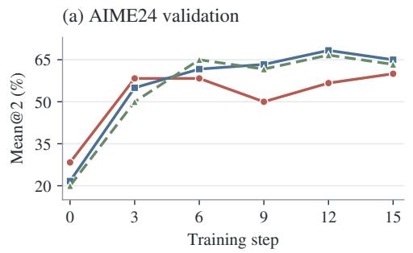

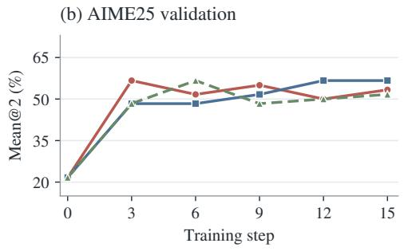

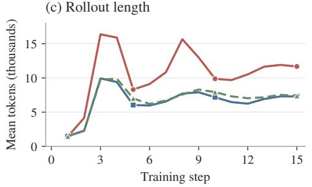

(d) Teacher-student discrepancy  
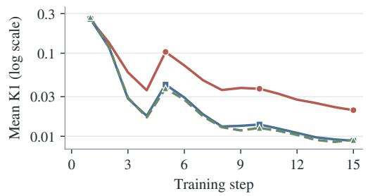  
Figure 10: Support size and learning dynamics. All runs use the Qwen3-4B Math-RL continuation pair. (a–b) Training-time AIME24 and AIME25 validation accuracy (mean@2). (c) Mean rollout response length, in thousands of tokens. (d) Teacher–student discrepancy, reported as logged mean K1 on a logarithmic scale. These validation traces are distinct from the final mean@16/mean@8 evaluations in the complete result tables.

## C.4 SINGLE-PROMPT CODE SUPPORTS

The following cards summarize the single-prompt supports compared in Figure 1b for the Qwen3-4B Code-RL setting.
<table><tr><td rowspan=1 colspan=1>P1 Conditional arithmetic                                                               Index 15240</td></tr><tr><td rowspan=1 colspan=1>Given positive integers A and B, output $A + B { \mathrm { ~ i f ~ } } A \mid B ;$ otherwise, output $B - A .$ </td></tr><tr><td rowspan=1 colspan=1></td></tr><tr><td rowspan=1 colspan=1>P2 Largest perfect power                                                                   Index 187</td></tr><tr><td rowspan=1 colspan=1>Given an integer X with $1 \leq X \leq 1 0 0 0$ , find the largest perfect power $b ^ { p }$ not exceeding X, where b is apositive integer and p is an integer satisfying $p \geq 2$ </td></tr><tr><td rowspan=1 colspan=1>P3 Fixed-start Hamiltonian paths                                                          Index 228</td></tr><tr><td rowspan=1 colspan=1>Given an undirected graph with $N \leq 8$ vertices, count the paths that start at vertex 1 and visit every vertexexactly once; that is, count Hamiltonian paths with the starting vertex fixed to 1.</td></tr></table>

## D ADDITIONAL DATA-PREFERENCE RESULTS

Figure 3 and Table 3 report the fixed-support source comparisons, teacher swap, and multi-domain mixtures in Section 4. This appendix adds teacher–source learning curves and seed robustness, the benchmark-level supervision-token control, and the matched RL-instance overlap comparison. Support membership and mixture construction are specified in Appendix B.3.

## D.1 TEACHER AND SOURCE EFFECTS

Figure 11 shows when teacher-dependent differences appear. With Math48 fixed, the Math-RL teacher yields higher AIME25 validation accuracy than the Code-RL teacher from the first post-training validation at step 5. With Code48 fixed, the Code-RL teacher yields higher TACO validation accuracy at the same check. The separation persists at subsequent validation checkpoints, even though logged mean K1 generally decreases in all four runs, with transient increases. A declining K1 trace thus coexists with distinct validation outcomes. The two validation tasks are kept separate rather than pooled: these curves describe the onset and persistence of teacher-dependent differences, while Figure 3b compares source preferences on the same final-evaluation benchmarks.

(a) Math48: AIME25 validation  
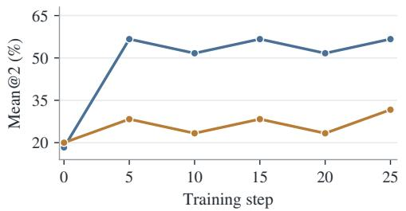

(b) Code48: TACO validation  
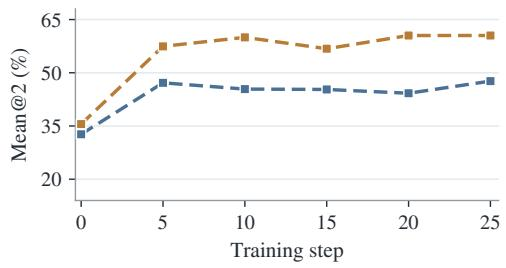

(c) Rollout length  
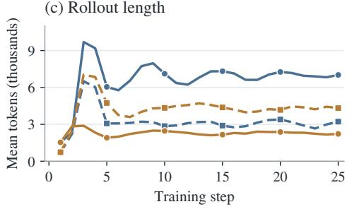

(d) Teacher-student discrepancy  
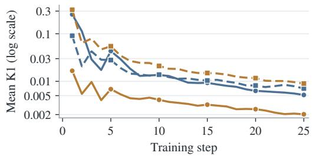  
Figure 11: Teacher and prompt-source effects during Qwen3-4B OPD. Math-T and Code-T denote Math GRPO-500 and Code GRPO-300; Math48 and Code48 denote the fixed DeepMath and Eurus Code supports. (a) AIME25 validation with Math48. (b) TACO validation with Code48. Both report training-log mean@2. (c) Mean rollout response length. (d) Teacher–student discrepancy, reported as logged mean K1 (log scale). Panels (a–b) use different validation tasks; the common-benchmark source-preference reversal is shown separately in Figure 3b.

Seed robustness. We vary support-selection seeds over {42, 43, 44} with training seed 42, and training seeds over {42, 43, 44} with support-selection seed 42, keeping the student initialization fixed. Within each source and seed configuration, the two teacher conditions use identical supports (M = 48) and presentation schedules.

Table 19: Seed robustness of teacher-dependent source preferences. $\bf { A v } \bf { g } _ { 4 }$ (%) across supportselection and training seeds.
<table><tr><td></td><td colspan="2">Math-RL teacher</td><td colspan="2">Code-RL teacher</td></tr><tr><td>Support / training seed</td><td>DeepMath48</td><td>Code48</td><td>DeepMath48</td><td>Code48</td></tr><tr><td>42/42</td><td>54.30</td><td>46.84</td><td>44.94</td><td>50.75</td></tr><tr><td>43 / 42</td><td>54.20</td><td>46.62</td><td>44.79</td><td>51.27</td></tr><tr><td>44/42</td><td>54.23</td><td>46.17</td><td>45.22</td><td>50.51</td></tr><tr><td>42/43</td><td>53.87</td><td>46.37</td><td>44.69</td><td>50.31</td></tr><tr><td>42/ 44</td><td>54.26</td><td>46.66</td><td>44.67</td><td>50.42</td></tr></table>

Across all five configurations, Math-RL favors DeepMath48 and Code-RL favors Code48 on each of the four benchmarks.

## D.2 SUPERVISION-TOKEN CONTROL

Table 20 gives the benchmark-level results underlying Table 2. All supports contain 48 prompts. Token counts are cumulative supervised tokens, in millions; the matched GSM8K run is close to, but not exactly at, the DeepMath budget. The main-text Avg is the unweighted mean of Math, GPQA, HumanEval+, and LCB.

Table 20: Benchmark-level supervision-token control. M = 48; tokens are cumulative supervised tokens in millions, and GSM8K token matching to DeepMath is approximate.
<table><tr><td>Data</td><td>Tokens (M)</td><td>Math</td><td>GPQA</td><td>HE+</td><td>LCB</td></tr><tr><td>GSM8K</td><td>1.19</td><td>31.15</td><td>46.84</td><td>81.25</td><td>16.79</td></tr><tr><td>+ token match</td><td>16.14</td><td>31.56</td><td>48.04</td><td>82.32</td><td>17.43</td></tr><tr><td>DeepMath</td><td>16.63</td><td>42.81</td><td>52.15</td><td>82.32</td><td>26.79</td></tr></table>

## D.3 RL-INSTANCE OVERLAP CONTROL

DAPO is also the JustRL teacher’s RL pool, so its comparison with DeepMath cannot isolate exact training-instance reuse. The matched direct-code 1.7B control fixes source mixture, prompt template, and prompt length: RL-seen and RL-unseen sets yield close transfer point estimates (45.26 versus 45.28). This provides evidence that exact RL-instance reuse is not required for the observed transfer in this controlled comparison. The 30B teachers’ RL instances are unknown, so their outcomes cannot identify an overlap effect.

## E FUNCTIONAL CHANGES, FAILURE, AND RECOVERY

This appendix specifies the measurements, probe scopes, and supporting evidence used in Section 5: finite endpoint prediction changes, conditional KL closure, generation behavior, and recovery interventions.

## E.1 FINITE ENDPOINT PREDICTION CHANGES

Within each comparison, each model is loaded and fully forward-evaluated on the same frozen probe prefixes. The measured effects are finite changes in endpoint conditional predictions relative to the initial student. Freezing prefixes fixes the input states; it does not linearize the model with respect to its parameters. We do not compute $J _ { \theta _ { 0 } } \Delta \theta$ or use gradients at initialization to predict an endpoint. Fisher geometry is used to compare the measured prediction changes, not to replace the endpoint forward passes.

For the 30B-to-4B source comparison, the frozen probe comprises 128 initial-Qwen3-4B trajectories: 32 each from Math, GPQA, HumanEval+, and LCB, totaling 73,823 prediction positions. Action support is fixed to the initial student’s top 128 tokens at each position. The initial-student anchor and all seven evaluated models use FP32 forward passes with SDPA. Student and teacher tokenizer mappings agree, and retained support mass is at least 0.996 across the evaluated models and domains. The Code trajectory study likewise fixes 128 trajectories from its own initial student, the initial student’s top-128 action support, and an FP32 anchor; each checkpoint is actually forward-evaluated. These protocol details do not identify an all-domain aggregate with a Math-only comparison.

Finite endpoint vectors. At frozen prediction position $j ,$ let $S _ { j }$ be the initial student’s top-128 token set, and let $p _ { a , j } ( i )$ be model $\boldsymbol { a } ^ { \prime } \mathbf { s }$ full-vocabulary probability of token i. Here $a \in \{ 0 , T , D \}$ denotes the initial student, teacher, or distilled endpoint, respectively. Each model’s conditional distribution on the same set is

$$
m _ { a , j } = \sum _ { k \in S _ { j } } p _ { a , j } ( k ) , \qquad q _ { a , j } ( i ) = \frac { p _ { a , j } ( i ) } { m _ { a , j } } , \quad i \in S _ { j } .\tag{3}
$$

We center the actual endpoint-minus-initial log-probability changes under $q _ { 0 , j }$ and embed them using the initial probabilities:

$$
d _ { a , j } ( i ) = \log p _ { a , j } ( i ) - \log p _ { 0 , j } ( i ) , \bar { d } _ { a , j } = \sum _ { i \in S _ { j } } q _ { 0 , j } ( i ) d _ { a , j } ( i ) ,\tag{4}
$$

$$
v _ { a , j } ( i ) = \sqrt { p _ { 0 , j } ( i ) } [ d _ { a , j } ( i ) - \bar { d } _ { a , j } ] , \mathrm { ~ } a \in \{ T , D \} .\tag{5}
$$

Thus centering uses the renormalized $q _ { 0 , j }$ , while the Fisher inner-product weight is the unnormalized $p _ { 0 , j } ( i )$ , not teacher or endpoint probabilities. The square-root embedding absorbs this weight: inner products of v below are ordinary Euclidean inner products, with no second Fisher weighting. These are finite endpoint log-probability changes, not probability differences or a parameter-local approximation.

Geometry and aggregation. For the evaluated position set ${ \mathcal { I } } ,$ , concatenate $\boldsymbol { v } _ { a } = \oplus _ { j \in \mathcal { I } } \boldsymbol { v } _ { a , j } .$ Functional cosine and projection are

$$
\cos _ { F } = \frac { \sum _ { j \in \mathcal { I } } \langle v _ { D , j } , v _ { T , j } \rangle } { \sqrt { \sum _ { j \in \mathcal { I } } \lVert v _ { D , j } \rVert ^ { 2 } } \sqrt { \sum _ { j \in \mathcal { I } } \lVert v _ { T , j } \rVert ^ { 2 } } } , \qquad \alpha = \frac { \langle v _ { D } , v _ { T } \rangle } { \lVert v _ { T } \rVert ^ { 2 } } .\tag{6}
$$

Both norms must be nonzero for cosine, and projection requires a nonzero teacher direction. The orthogonal component $e _ { \perp } = v _ { D } - \alpha v _ { T }$ is defined in the same embedded space; it is not a token-level training log-ratio.

For all-domain cosine, $\mathcal { I }$ contains all evaluated positions across domains. Each position enters once; longer trajectories and domains with more positions contribute more entries. There is no trajectoryequal or domain-equal averaging, nor an average of separately computed domain cosines. Confidence intervals use whole-trajectory or whole-question resampling, as specified for each comparison; this does not alter the point-estimate definition above. Task-specific comparisons restrict $\mathcal { I }$ to their stated probe scope.

Conditional forward KL and closure. The diagnostic uses teacher-first forward $\mathrm { K L , }$ with each model separately renormalized on $S _ { j }$

$$
K _ { T \parallel a , j } = D _ { \mathrm { K L } } ( q _ { T , j } \| q _ { a , j } ) = \sum _ { i \in S _ { j } } q _ { T , j } ( i ) \log \frac { q _ { T , j } ( i ) } { q _ { a , j } ( i ) } , \qquad a \in \{ 0 , D \} .\tag{7}
$$

This is conditional KL on the initial student’s frozen top-128 support, not full-vocabulary KL. Probability outside $S _ { j }$ is neither included in this KL nor merged into an “other” token; retained support mass $m _ { a , j }$ is reported separately. In particular, the conditional KL does not directly penalize changes in the omitted mass.

Let $D _ { T \parallel 0 }$ and $D _ { T \parallel D }$ denote the baseline and remaining conditional $\mathrm { K L }$ , respectively, using the same prefix set and aggregation protocol. Diagnostic closure is

$$
{ \mathrm { K L C l o s u r e } } = 1 - { \frac { D _ { T \parallel D } } { D _ { T \parallel 0 } } } , \qquad D _ { T \parallel 0 } > 0 .\tag{8}
$$

Reported percentages multiply this quantity by 100. A negative value denotes a larger remaining conditional KL gap, not a negative cosine or a percentage loss in accuracy. This teacher-first evaluation diagnostic is separate from the sampled reverse-KL OPD training objective. Neither closure nor directional cosine establishes equality of full prediction distributions or downstream behavior.

## E.2 PROBE SCOPE

The 43 checkpoints across seven teacher families in Figure 4(a) include intermediate states, not 43 independent training runs. Their functional cosines use all-domain frozen-prefix probes, whereas the source comparisons in Figure 4(b) and the task-specific diagnostics in Figure 12 restrict the probe scope to the stated task. These scopes should not be treated as interchangeable.

## E.3 SOURCE-RESOLVED FUNCTIONAL DIAGNOSTICS

Figure 12 supplements the source comparisons in Section 5.1 with task-specific diagnostic breakdowns. Marker shapes and colors identify the prompt sources in both the scatter plots and the matrices. The three scatter plots use different axis ranges. KL closure and directional alignment remain distinct diagnostics; the large negative closure values are not percentage decreases in benchmark accuracy.

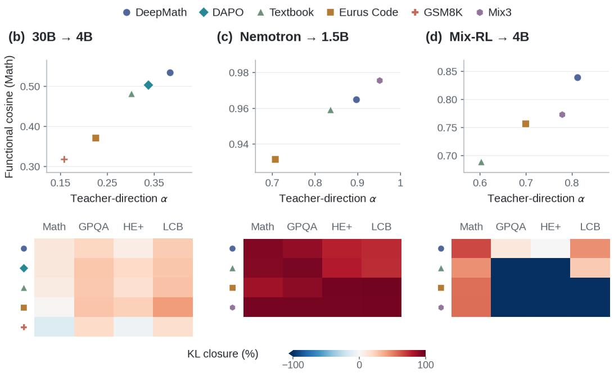  
Figure 12: Additional source-dependent functional diagnostics. (b) 30B-to-4B. (c) Nemotron. (d) Mix-RL. Upper plots report Math functional cosine and teacher-direction coefficient α; lower matrices report task-specific KL closure (%). Closure uses teacher-first conditional KL on the initial student’s frozen top-128 support, not a task-score recovery rate. Blue and red indicate negative and positive closure, respectively; colors saturate at −100% and 100%.

## E.4 ADDITIONAL GENERATION-BEHAVIOR EVIDENCE

Table 21 gives the complete accuracy and length results. Model identities and evaluation protocols are given in Table 1 and Appendix B.4, respectively.

Table 21: Accuracy and output length for seven teacher–student pairs. Each cell gives mean@8 accuracy (%) / mean output tokens; s denotes the OPD update step.
<table><tr><td>Model / OPD support</td><td colspan="2">GPQA-D</td><td colspan="2">HumanEval+</td><td colspan="2">LCB v6</td></tr><tr><td colspan="7">(1) Math-RL: Qwen3-4B → Qwen3-4B</td></tr><tr><td>Initial (Compact)</td><td>42.741</td><td>870</td><td>77.06/</td><td>325</td><td>17.71/</td><td>557</td></tr><tr><td>Teacher (GRPO-500)</td><td>52.65/</td><td>2,619</td><td>83.921</td><td>700</td><td>20.07/</td><td>2,670</td></tr><tr><td>DeepMath M48 (Compact)</td><td>53.22/</td><td>5,590</td><td>83.23/</td><td>2,328</td><td>27.21/</td><td>9,567</td></tr><tr><td colspan="7">(2) Qwen3-30B-A3B-Instruct-2507 → Qwen3-4B</td></tr><tr><td>Initial</td><td>42.741</td><td>870</td><td>77.13/</td><td>325</td><td>17.71/</td><td>557</td></tr><tr><td>Teacher</td><td>54.86/</td><td>669</td><td>82.39/</td><td>609</td><td>33.14/</td><td>3,784</td></tr><tr><td>DeepMath M48</td><td>52.15/</td><td>5,350</td><td>82.32/</td><td>1,532</td><td>26.79/</td><td>7,599</td></tr><tr><td>DAPO M48</td><td>51.52/</td><td>5,378</td><td>82.20/</td><td>1,698</td><td>27.90/</td><td>8,718</td></tr><tr><td>Textbook M48</td><td>51.01/</td><td>6,000</td><td>81.90/</td><td>1,585</td><td>25.30/</td><td>7,814</td></tr><tr><td>Eurus Code M48</td><td>50.38/</td><td>5,002</td><td>78.40/</td><td>1,618</td><td>27.10/</td><td>9,474</td></tr><tr><td>GSM8K M48</td><td>46.84/</td><td>3,458</td><td>81.25/</td><td>883</td><td>16.79/</td><td>4,997</td></tr><tr><td colspan="7">(3) Qwen3-30B-A3B-Instruct-2507 → Qwen3-1.7B</td></tr><tr><td>Initial</td><td>29.10/</td><td>725</td><td>59.831</td><td>198</td><td>12.36/</td><td>422</td></tr><tr><td>Teacher</td><td>54.861</td><td>669</td><td>82.39/</td><td>609</td><td>33.14/</td><td>3,784</td></tr><tr><td>DeepMath M48</td><td>36.24/</td><td>6,716</td><td>66.70/</td><td>1,731</td><td>18.10/</td><td>8,053</td></tr><tr><td>DAPO M48</td><td>33.71/</td><td>7,218</td><td>64.10/</td><td>2,077</td><td>16.90/</td><td>9,015</td></tr><tr><td colspan="7">(4) JustRL → DeepSeek-R1-Distill-Qwen-1.5B</td></tr><tr><td>Initial</td><td>35.921</td><td>10,290</td><td>54.34/</td><td>5,475</td><td>13.50/</td><td>14,946</td></tr><tr><td>Teacher</td><td>40.47/</td><td>7,217</td><td>64.56/</td><td>5,252</td><td>19.36/</td><td>11,783</td></tr><tr><td>DeepMath M8, s100</td><td>38.83/</td><td>7,583</td><td>63.34/</td><td>4,546</td><td>17.43/</td><td>11,439</td></tr><tr><td>DAPO M8, s100</td><td>40.91/</td><td>7,937</td><td>64.10/</td><td>4,777</td><td>18.64/</td><td>11,514</td></tr><tr><td colspan="7">(5) Nemotron → DeepSeek-R1-Distill-Qwen-1.5B</td></tr><tr><td>Initial</td><td>35.92/</td><td>10,290</td><td>54.34/</td><td>5,475</td><td>13.50/</td><td>14,946</td></tr><tr><td>Teacher</td><td>40.66/</td><td>5,185</td><td>66.69/</td><td>4,760</td><td>22.00/</td><td>6,113</td></tr><tr><td>DeepMath M48, s75</td><td>40.09/</td><td>6,060</td><td>64.86/ 64.41/</td><td>3,882</td><td>19.93/</td><td>7,521</td></tr><tr><td>Textbook M48, s75</td><td>39.84/</td><td>6,308</td><td></td><td>3,914</td><td>19.00/</td><td>7,447</td></tr><tr><td>Eurus Code M48, s75</td><td>40.09/</td><td>4,910</td><td>65.55/</td><td>5,308</td><td>22.00/</td><td>7,002</td></tr><tr><td>Mix3 M48, s75</td><td>42.17/</td><td>5,933</td><td>66.16/</td><td>4,752</td><td>21.79/</td><td>7,008</td></tr><tr><td colspan="7">(6) Mix-RL → Qwen3-4B-Instruct-2507</td></tr><tr><td>Initial</td><td>45.521</td><td>458</td><td>81.48/</td><td>976</td><td>27.86/</td><td>2,944</td></tr><tr><td>Teacher</td><td>45.271 47.351</td><td>505</td><td>79.571 81.86/</td><td>1,103</td><td>30.21/</td><td>4,808</td></tr><tr><td>DeepMath M48, s25</td><td>51.14/</td><td>555 952</td><td>83.23/</td><td>1,207 1,332</td><td>29.71/ 28.93/</td><td>3,371 4,051</td></tr><tr><td>Textbook M48, s25</td><td>61.81/</td><td>3,432</td><td>81.17/</td><td>1,452</td><td>31.93/</td><td>7,940</td></tr><tr><td>Eurus Code M48, s25</td><td>46.46/</td><td>473</td><td>68.29/</td><td>133</td><td>22.07/</td><td>1,769</td></tr><tr><td>IF M48, s25</td><td>50.88/</td><td>992</td><td>78.35/</td><td>768</td><td>28.21/</td><td>3,958</td></tr><tr><td>Agent M48, s25</td><td>59.34/</td><td></td><td>82.01/</td><td>1,535</td><td>32.36/</td><td>7,770</td></tr><tr><td>Mix3 M48, s25</td><td></td><td>2,804</td><td></td><td></td><td></td><td></td></tr><tr><td>Mix5 M48, s25</td><td>55.18/</td><td>1,698</td><td>80.18/</td><td>1,593</td><td>31.14/</td><td>7,956</td></tr><tr><td colspan="7">(7) Light-R1 → DeepSeek-R1-Distill-Qwen-7B</td></tr><tr><td>Initial</td><td>49.05/</td><td>8,414</td><td>81.78/</td><td>3,782</td><td>23.36/</td><td>11,998</td></tr><tr><td>Teacher</td><td>46.971</td><td>9,078</td><td>82.931</td><td>3,865</td><td>24.14/</td><td>12,515</td></tr><tr><td>DAPO M8, s50</td><td>49.24/</td><td>9,366</td><td>82.55/</td><td>4,108</td><td>25.14/</td><td>12,740</td></tr><tr><td>DeepMath M8, s50</td><td>49.49/</td><td>9,283</td><td>82.62/</td><td>3,814</td><td>24.21/</td><td>12,180</td></tr><tr><td>Light3533, s50</td><td>50.63/</td><td>9,630</td><td>81.78/</td><td>4,249</td><td>24.00/</td><td>12,617</td></tr></table>

Across three Mix-RL Code48 support draws, GPQA scores range from 61.24 to 61.81 and mean output length from 3,308 to 3,432 tokens. These are support-draw replications, not independent training-seed estimates.

Code48 and Mix3 use 3,428 and 2,800 pre-answer tokens and have repeated 8-gram rates of 2.13% and 1.83%, respectively. An early explicit answer candidate is identifiable in 244 and 261 responses, approximately 15–16% of the evaluated outputs. Within these subsets, wrong-to-correct revisions number 5 and 8, compared with 10 and 11 correct-to-wrong revisions. The negative net counts refer only to these observable explicit changes; they do not measure implicit reasoning or establish a causal decomposition of the overall gain.

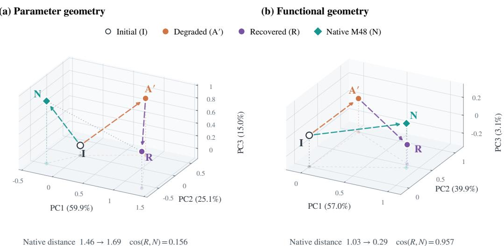  
Figure 13: Code recovery in parameter and function space. PCA views of the initial student (I), degraded single-prompt endpoint (A′), recovered endpoint (R), and native Code-M48 endpoint (N). Native Code-M48 is trained directly from $I ;$ recovery continues from $A ^ { \prime }$ on an effective 48-prompt support. From $A ^ { \prime }$ to R, the reported distance to N increases from 1.46 to 1.69 in parameter space but decreases from 1.03 to 0.29 in function space. Axis percentages report explained variance; arrows connect endpoints rather than tracing intermediate updates.

Similar output lengths can also accompany different accuracy: 30B-to-4B GSM8K48 and Deep-Math48 produce 9,277 and 9,536 mean Math tokens but score 31.15 and 42.81, respectively. These observations concern free generation at evaluation, not the training-token consumption controlled in Section 4.1; they do not establish that longer test-time generation alone causes gains.

## E.5 FAILURE TRAJECTORIES AND RECOVERY PROTOCOLS

Figure 13 highlights the geometry of Code recovery relative to native Code-M48. Continued distillation brings the recovered endpoint closer to this reference in function space even as its parameter-space distance increases. The distance to native Code-M48 decreases by approximately 71% in function space but increases by approximately 15% in parameter space.

Failure trajectories. Figure 14 traces how $A ^ { \prime }$ diverges during OPD and contrasts its functional alignment with the two-prompt support and prompt 187 alone. The increasing update magnitude is measured in function space, not parameter space.

For A′ (prompt ID 15240), checkpoints 25, 50, 75, and 100 have Code Macro scores 55.20, 50.92, 49.66, and 50.03, compared with the initial student’s 53.30. At the same checkpoints, functional cosine to the teacher is 0.5787, 0.4397, 0.3992, and 0.3713, and normalized functional-update magnitude is 1.041, 1.147, 1.218, and 1.268. Accuracy is not strictly monotonic: it rises slightly between steps 75 and 100 despite the overall degradation. For the joint $A ^ { \prime } + 1 8 7$ support, the corresponding cosines are 0.7910, 0.7843, 0.7860, and 0.7934; for prompt 187 alone, they are 0.7967, 0.7934, 0.7966, and 0.8033. The joint support is trained from initialization, not used as a continuation of A′. The joint support achieves a Code Macro score of 59.63, compared with 60.41 for prompt 187 alone and 50.03 for prompt 15240 alone. Thus, a prompt that degrades performance in isolation need not prevent strong transfer when combined with an effective prompt.

Bidirectional representation intervention. The effective endpoint B is trained on prompt 5038; A′ is the degraded endpoint above. The intervention replaces the output hidden state of zero-indexed block 30 (the 31st block), at the current prediction position on every autoregressive step. It copies the complete hidden vector, not weights or selected coordinates. Donor and recipient maintain separate, synchronously updated KV caches. The probe contains 20 questions with eight samples per question. ${ \dot { B } }  A ^ { \prime }$ changes the probe pass rate from 18.750% to 24.375%; $A ^ { \prime }  B$ changes it from 28.125% to 21.250%; $\bar { A ^ { \prime } }  A ^ { \prime }$ leaves it unchanged. These are probe rates, not the full Code Macro evaluations used for continuation. The intervention requires a donor at evaluation and is not a standalone student or an efficiency claim.

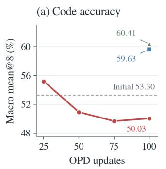

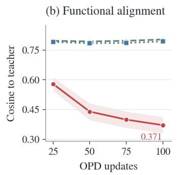

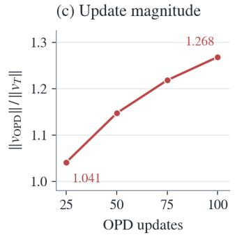  
Figure 14: Training trajectories under single-prompt and two-prompt supports. All runs use the same Qwen3-4B initialization and Code GRPO-300 teacher. A′ uses prompt 15240; M2 jointly uses prompts 15240 and 187 from initialization. (a) Code accuracy: the unweighted mean of mean@8 over HumanEval+, MBPP+, and LCB-v6. Markers for M2 and prompt 187 alone show only their step-100 endpoints. (b) Functional cosine to the teacher’s change. (c) Normalized functional-update magnitude of A′, $\| v _ { \mathrm { O P D } } \| / \| v _ { T } \|$

Figure 6(b) also reports replacement at zero-based block 10, with aggregate changes of −1.3 and $- 1 . 9$ percentage points for $B  A ^ { \prime }$ and $A ^ { \prime }  B$ , respectively. At block 30, $B  A ^ { \prime }$ improves HumanEval+ and MBPP+ but lowers LCB; the reverse intervention has the opposite benchmark-level signs. The tested interfaces show location- and task-dependent effects, not a uniquely responsible layer or uniform benefit across benchmarks.

Code continuation: protocol and endpoints. Code recovery starts from the step-100 A′ weights and trains for a further 100 updates on an effective 48-prompt support with the same Code GRPO-300 teacher. It uses batch size 256, learning rate $1 0 ^ { - 5 }$ , sampled-token K1 policy-gradient feedback, and a fresh Adam optimizer. Training and evaluation use seed 42; evaluation reports mean@8 on HumanEval+, MBPP+, and LCB-v6 with temperature 1 and top-p 1. Only the prespecified continuation step-100 endpoint is evaluated. The initial student, teacher, and native M48 reference have Code Macro scores 53.30, 61.80, and 61.79, respectively; the recovered endpoint scores 63.16. Its 200 total updates are not matched to the native reference’s 100. This combined intervention does not show that starting from an unsuccessful support is preferable.

Math continuation: protocol, endpoints, and controls. For Qwen3-30B-A3B-Instruct-2507 → Qwen3-4B, we branch each stage-1 checkpoint, trained for 15 updates on GSM8K (G) or DeepMath (D), into two continuations: a further 15 updates on G or on $\begin{array} { r } { \bar { D } . } \end{array}$ Thus, $G  G$ and $G  D$ share the same starting weights, as do $D  G$ and $D \to D ;$ all four paths have 30 total updates. All four stage-2 runs use a fresh Adam optimizer and retain the learning rate, batch size, and training seed of the original 30B-to-4B configuration in Appendix B.2. Optimizer resets and additional update counts are therefore common to the paired continuation arms; token budgets need not be equal.

For Math mean@16, $G  D$ reaches 43.65 from 31.15; its matched-update performance reference $D  D$ scores 43.75. LCB remains lower after the GSM8K history (25.36 versus 26.93), so the similar Math aggregate does not erase every task-specific difference. Figure 7(b) compares formal $\mathrm { \bf A v g _ { 4 } }$ endpoints: continuing on DeepMath rather than GSM8K yields 51.75 versus 43.77 from G, and 51.98 versus 46.38 from D. Thus, the continuation support matters at matched update counts, while the two DeepMath continuations reach close scores.

Figure 7(a) uses AIME 2024/2025 validation mean@2; at stage-2 step 0, each pair of branches reuses its shared stage-1 validation result, not a measurement before OPD. Panel (b)’s $\mathrm { \bf A v g _ { 4 } }$ averages Math mean@16 and GPQA-D, HumanEval+, and LCB-v6 mean@8. The supplementary parameter matrix is retained in Figure 15, with its references specified below.

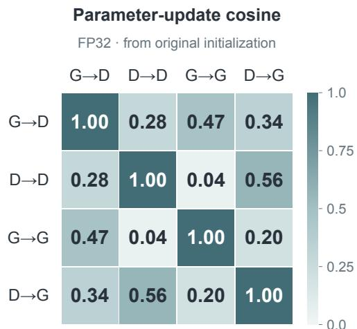  
Figure 15: Parameter displacements after bidirectional support switching. Cosines compare FP32 endpoint-minus-original-initialization vectors for the four paths in Figure 7. Every endpoint has 30 total updates; G denotes GSM8K and D denotes DeepMath. The $G  D$ versus $D  D$ comparison uses the step-30 reference, unlike the step-15 Math reference in Figure 6(d).

Geometry references and parameter paths. Figure 6(d) uses native Code-M48 at step 100 as the Code reference and native DeepMath at step 15 as the Math reference, not the step-30 Math performance reference. Relative to these fixed references, functional cosine rises from 0.474 to 0.957 for Code and from 0.687 to 0.938 for Math. Parameter-displacement cosine changes from 0.123 to 0.156 for Code and from 0.086 to 0.374 for Math. These functional comparisons use a native OPD endpoint, whereas the failure-trajectory diagnostic compares with the teacher’s change.

Endpoint parameter displacements in these cosine comparisons are measured from the original initialization $\theta _ { 0 }$ , not the stage-2 starting checkpoint. Figure 15 compares FP32 endpoint displacements and gives 0.28 for $G  D$ versus $D \stackrel { - } {  } D$ at step 30. The Math value 0.374 in Figure 6(d) instead uses DeepMath step 15 as the comparator; the two values are not interchangeable.

Let $\Delta _ { \mathrm { b a d } } = \theta _ { \mathrm { b a d } } - \theta _ { 0 }$ and $U = \theta _ { \mathrm { r e c o v e r e d } } - \theta _ { \mathrm { b a d } }$ . Then $\cos ( U , - \Delta _ { \mathrm { b a d } } )$ is 0.208 for Code and 0.178 for Math: continuation does not simply reverse the earlier parameter displacement. These comparisons do not establish exact removal of earlier functional changes. Likewise, high functional cosine indicates directional agreement, not equal amplitudes, conditional distributions, or predictions.

Robustness to answer scoring. We rescore all 9,600 outputs from five checkpoints across four mathematics benchmarks using math-verify 0.9.0 (Kydl´ıcekˇ , 2026) and conservative final-answer anchors. Under this alternative scoring pipeline, $G  D$ improves over G by 12.24 percentage points (95% CI [8.70, 16.04]) and over G → G by 15.16 points (95% CI [11.41, 19.17]). Its difference from $D \to D { \mathrm { ~ i s - 0 . 1 6 } }$ points (95% CI [−2.34, +2.08]). A blinded audit of 152 stratified cases identifies 46 explicit final answers missed by the original parser, of which only six are correct. These counts describe the audited sample, not the prevalence of missed answers across all outputs. These results support recovery in evaluated performance that is robust to the tested scoring procedure; missed final-answer extraction is insufficient to explain the main gain. They do not establish recovery of an underlying reasoning mechanism.

## F PROMPT SELECTION AND MIXED-POOL SAMPLING

This appendix details the within-pool selectors and paired mixed-pool comparison in Section 5.4, together with additional selection experiments on code and 30B-to-4B distillation. It also specifies the initial-gradient representativeness diagnostic. Table 4 reports the selector results and selection costs; Table 5 reports the source-filtering comparison.

## F.1 PROMPT-SELECTION METHODS

Table 4 compares eight selectors for distilling JustRL-DeepSeek-1.5B into DeepSeek-R1-Distill-Qwen-1.5B, using DeepMath candidates. Let C be a candidate pool of size C and S the selected support of size M. The two reported settings use $( M , C ) = ( \bar { 8 } , 3 8 4 )$ and (48, 2,304). A nested ranking refers to prefixes within the same fixed candidate pool, not nesting between these two different candidate-pool settings. Selection is performed before OPD, using the initial student wherever student-dependent features are needed.

Uniform random. We sample M prompts uniformly without replacement from C. This baseline tests whether a small unscored sample is sufficient. The random selectors in Table 4 report the mean and sample standard deviation across three independently sampled supports; these are not standard errors or training-seed variations. For uniform random at $M \bar { = } 8 , C \bar { = } 3 8 4$ , the support-selection seeds are 42, 43, and 44, with the training seed held fixed.

Stratified random. We jointly stratify candidates by data source, prompt character-length quartile, and initial-student difficulty. Difficulty is measured by the mean official reward of the first eight discovery rollouts:

$$
\widehat { p _ { i } } = \frac { 1 } { 8 } \sum _ { r = 1 } ^ { 8 } R ( y _ { i r } ) ,\tag{9}
$$

where R is the official correctness reward. The four difficulty bins are zero $( \widehat { p } _ { i } = 0 )$ , low $( 0 < \widehat { p _ { i } } <$ 0.5), medium $( 0 . 5 \leq \widehat { p } _ { i } < 1 )$ , and perfect $( \widehat { p } _ { i } = 1 )$ . All candidates are from DeepMath-103K, so the source dimension introduces no further subdivision; the joint partition has up to 4×4 length–difficulty strata.

Stratum quotas are proportional to their candidate-pool frequencies, not equal across difficulty bins. A cumulative quota-deficit rule selects one stratum at a time, so successive prefixes approximate the original joint distribution. Prompts within each stratum follow a seeded SHA-256 permutation; the reference ranking uses seed 42. This selector tests whether preserving length and difficulty composition helps avoid omissions in a small support.

Semantic diversity. We embed the full prompt messages, serialized as <role>: <content>, with Qwen/Qwen3-Embedding-0.6B (Zhang et al., 2025). Inputs are truncated to 2,048 tokens. The final non-padding token’s hidden state is L2-normalized to obtain $e _ { i } .$ . Selection uses deterministic farthest-first traversal, not k-means: the first prompt has the highest cosine similarity to the global embedding center, and each subsequent prompt maximizes

$$
i ^ { * } = \arg \operatorname* { m a x } _ { i \in \mathcal { C } \setminus \mathcal { S } } \operatorname* { m i n } _ { j \in \mathcal { S } } \big ( 1 - \cos ( e _ { i } , e _ { j } ) \big ) .\tag{10}
$$

The resulting order supplies nested prefixes within a fixed pool. There are no semantic-cluster quotas, and answers, rewards, and teacher feedback are not used. The method tests broad semantic coverage with reduced redundancy.

Hard selection. We rank prompts by increasing initial-student pass rate $\widehat { p } _ { i }$ from Equation 9 and retain the first M. Ties follow a seed-42 SHA-256 order. The teacher does not contribute to this difficulty ranking; it supplies token-level feedback during subsequent distillation. This tests whether prompts that the initial student finds harder provide more useful training supervision.

Shortest. We rank candidates by the initial student’s mean generated response length and retain the M shortest. This tests selection for cheaper generated trajectories rather than shorter prompt text.

Longest. We use the same initial-student response-length statistic but retain the M longest candidates. This tests whether longer trajectories offer more opportunities for distillation.

Teacher–student disagreement. The initial student generates $K = 1 6$ discovery responses per candidate, and the teacher scores the same sampled tokens. We rank prompts by a length-normalized, clipped Monte Carlo reverse-KL score. For sampled token $y _ { i r t }$ at prefix $h _ { i r t }$ , define

$$
q _ { i r t } = \mathrm { c l i p } ( \log p _ { 0 } ( y _ { i r t } \mid h _ { i r t } ) - \log p _ { T } ( y _ { i r t } \mid h _ { i r t } ) , - 1 0 , 1 0 ) ,\tag{11}
$$

$$
D _ { i } = \frac { 1 } { K } \sum _ { r = 1 } ^ { K } \left[ \frac { 1 } { T _ { i r } } \sum _ { t = 1 } ^ { T _ { i r } } q _ { i r t } \right] .\tag{12}
$$

Here $p _ { 0 }$ denotes the initial student, $p _ { T }$ the teacher, and $T _ { i r }$ the response length in tokens. We select the M largest $D _ { v }$ values. Tokens are averaged within each response before the 16 response means are averaged, so longer responses do not receive greater weight solely because of their length. This uses signed student-minus-teacher log-ratios, not absolute differences or a full-vocabulary KL computation.

Cost-D-opt. This selector favors complementary gradient directions while accounting for responselength cost. Its base construction is D-optimal selection; the cost-aware greedy score, rather than the gradient features, distinguishes Cost-D-opt from pure D-opt.

For each candidate $i ,$ the initial student generates 16 discovery responses. The frozen teacher scores the same sampled tokens. At prefix $h _ { i r t }$ in response $^ { r , }$ the detached token feedback is

$$
a _ { i r t } = \mathrm { s g } [ \mathrm { c l i p } ( \log p _ { T } ( y _ { i r t } \mid h _ { i r t } ) - \log p _ { 0 } ( y _ { i r t } \mid h _ { i r t } ) , - 1 0 , 1 0 ) ] ,\tag{13}
$$

where $p _ { 0 }$ is the initial student and sg denotes stop-gradient. The response-level token-feedback loss is

$$
\ell _ { i r } ( \theta ) = - \frac { 1 } { T _ { i r } } \sum _ { t = 1 } ^ { T _ { i r } } a _ { i r t } \log p _ { \theta } ( y _ { i r t } \mid h _ { i r t } ) ,\tag{14}
$$

with gradients evaluated at the initial student. The implementation also applies rollout importance correction before gradient sketching; this factor is omitted from Equation 14 to display the tokenfeedback component. Three CountSketch projections (Charikar et al., 2002) avoid retaining full parameter gradients. Let $\widetilde { g } _ { i r }$ denote the resulting correction-applied, sketched response gradient. Prompt-level aggregation is token-weighted:

$$
\widetilde { g } _ { i } = \frac { \sum _ { r = 1 } ^ { 1 6 } T _ { i r } \widetilde { g } _ { i r } } { \sum _ { r = 1 } ^ { 1 6 } T _ { i r } } , \qquad L _ { i } = \sum _ { r = 1 } ^ { 1 6 } T _ { i r } .\tag{15}
$$

The 16 responses are split into two fixed eight-response subsets. Their cross-covariance provides a noise correction, retaining positive directions reproducible across the two subsets. The retained stable space has dimension $d \leq 8$ , and $z _ { i }$ denotes the stable coordinates of prompt i. D-opt uses $x _ { i } = \sqrt { L _ { i } } z _ { i }$ and the objective

$$
F ( \mathcal S ) = \log \operatorname* { d e t } \left( \lambda I + \sum _ { i \in \mathcal S } x _ { i } x _ { i } ^ { \top } \right) , \qquad \lambda = 1 0 ^ { - 3 } \frac { \mathrm { t r } ( X ^ { \top } X ) } { d } ,\tag{16}
$$

where row i of X is $x _ { i } ^ { \top }$ . Starting from $A = \lambda I$ , the marginal gain of candidate i is

$$
\Delta _ { i } = \log \left( 1 + x _ { i } ^ { \top } A ^ { - 1 } x _ { i } \right) .\tag{17}
$$

Pure D-opt selects the largest $\Delta _ { i } ;$ Cost-D-opt selects the largest $\Delta _ { i } / c _ { i }$ , where $c _ { i } > 0$ is the relative response-length cost. After selecting i, both update $A \gets A + x _ { i } x _ { i } ^ { \top }$ and repeat until M prompts have been selected.

Pure D-opt uses neither correctness nor semantic embeddings, and it does not penalize response length. Indeed, $L _ { i }$ gives token-rich prompts greater information weight, potentially favoring long responses. Cost-D-opt additionally normalizes the greedy gain by length cost. Table 4 reports the cost-aware variant; pure D-opt is described here only to specify its underlying objective. Both share the gradient-statistics computation and its GPU cost.

## F.2 MIXED-POOL AND SOURCE-FILTERED SAMPLING

For the three-source filtering comparison, the student is Qwen3-4B, trained with enable thinking=False, and the teacher is Qwen3-30B-A3B-Instruct-2507. Each run in this comparison uses M = 48 prompts and 25 optimization steps. We vary the supportselection seed across 42/43/44 while holding the training seed fixed. Evaluation uses thinking off, temperature 1.0, top-p = 1.0, and a 16,384-token response limit, with 16 samples per Math question and eight per OOD question. Other training and evaluation settings follow the 30B-Instruct-to-4B protocols in Appendices B.2 and B.4.

Support construction. Candidates are formed by first drawing 3,840 prompts uniformly from each deduplicated source (DeepMath, DAPO and GSM8K; 11,520 in total, shared across selection seeds). Each selection seed then draws a single uniform per-prompt ordering over this pool; Mixed takes its first 48 prompts, and Filtered removes GSM8K from the same ordering before taking the first 48. Table 22 reports the source counts and overlap.

Table 22: Mixed-pool support composition and overlap. Shared counts prompt instances selected by both arms under the same random ordering, not shared sampled responses.
<table><tr><td>Selection seed</td><td>Mixed DeepMath / DAPO / GSM8K</td><td>Filtered DeepMath / DAPO / GSM8K</td><td>Shared prompts</td></tr><tr><td>42</td><td>17 / 15 / 16</td><td>21 / 27 / 0</td><td>32</td></tr><tr><td>43</td><td>13 / 15 / 20</td><td>22 / 26 / 0</td><td>28</td></tr><tr><td>44</td><td>20 / 13 / 15</td><td>31 / 17 / 0</td><td>33</td></tr></table>

Per-seed and per-benchmark results. Tables 23 and 24 report the complete results; OOD averages GPQA-Diamond, HumanEval+, and LiveCodeBench v6 equally. Paired summaries use unrounded scores, so displayed differences need not equal calculations from rounded entries.

Table 23: Math results for mixed-pool and source-filtered sampling. 30B Instruct → Qwen3-4B, M = 48, 25 optimization steps; selection seeds 42/43/44 share a fixed training seed. Scores are mean@16 (%); Math average is the unweighted mean of the four benchmarks. ∆ denotes paired Filtered − Mixed differences; means, SDs, and differences use unrounded scores.
<table><tr><td>Benchmark</td><td>Selection seed</td><td>Mixed</td><td>Filtered</td><td>∆</td></tr><tr><td>Math average</td><td>42 / 43 / 44  $\mathbf { M e a n } \pm \mathbf { S D }$ </td><td>43.2 / 40.3 / 38.8  $4 0 . 7 \pm 2 . 3$ </td><td>41.4 / 39.3 / 40.7  $4 0 . 5 \pm 1 . 0$ </td><td>-1.8 /-0.9 /+1.9 −0.3 ± 2.0</td></tr><tr><td>AIME24</td><td>42 / 43 / 44  $\mathbf { M e a n } \pm \mathbf { S D }$ </td><td> $5 5 . 8 \ : / \ : 5 4 . 2 \ : / \ : 4 9 . 2$   $5 3 . 1 \pm 3 . 5$ </td><td>56.5 / 51.3 / 49.8  $5 2 . 5 \pm 3 . 5$ </td><td>+0.6 /-2.9 /+0.6 −0.6 ± 2.0</td></tr><tr><td>AIME25</td><td>42 / 43 / 44  $\mathbf { M e a n } \pm \mathbf { S D }$ </td><td>50.4 / 48.1 / 43.8  $4 7 . 4 \pm 3 . 4$ </td><td>44.4 / 46.7 / 46.9 46.0 ± 1.4</td><td> $\begin{array} { c } { { - 6 . 0 \mathrm {               / - } 1 . 5 \mathrm { / + } 3 . 1 } } \\ { { - 1 . 5 \pm 4 . 6 } } \end{array}$ </td></tr><tr><td>HMMT-Feb</td><td>42 / 43 / 44 Mean ± SD</td><td> ${ } ^ { 2 8 . 8 / 2 4 . 6 / 2 9 . 0 } _ { \mathrm { 2 7 . 4 \pm 2 . 5 } }$ </td><td>27.7 / 26.5 / 30.0 28.1 ± 1.8</td><td> $\begin{array} { c } { { - 1 . 0 \mathrm { ~ / + } 1 . 9 \mathrm { ~ / + } 1 . 0 } } \\ { { + 0 . 6 \pm 1 . 5 } } \end{array}$ </td></tr><tr><td>HMMT-Nov</td><td>42 / 43 / 44 Mean ± SD</td><td>37.7 / 34.2 / 33.1 35.0 ± 2.4</td><td>36.9 / 32.9 / 36.0 35.3 ± 2.1</td><td>-0.8 /-1.3 /+2.9 +0.3 ± 2.3</td></tr></table>

Source composition and a four-prompt control. Figure 9 in the main text reports a two-source composition sweep with 0, 4, 16, or 48 DeepMath prompts and GSM8K filling the remaining positions in each 48-prompt support. Within each selection seed, the M = 4 control reuses exactly the four DeepMath prompts in the corresponding 4/44 mixture. Error bars and bands report sample SD across selection seeds 42/43/44. The sweep and control use the same 30B-to-4B pair and 25-update configuration as above, with the training seed, batch size, learning rate, and thinking-off training and evaluation settings unchanged. Changing support size may also change prompt repetition; this is not a matched-exposure test of complementary information from the two sources.

Table 24: OOD results for mixed-pool and source-filtered sampling. 30B Instruct → Qwen3-4B, M = 48, 25 optimization steps; selection seeds 42/43/44 share a fixed training seed. Scores are mean@8 (%); OOD average is the unweighted mean of GPQA-D, HE+, and LCB. ∆ denotes paired Filtered − Mixed differences; means, SDs, and differences use unrounded scores.
<table><tr><td>Benchmark</td><td>Selection seed</td><td>Mixed</td><td>Filtered</td><td>∆</td></tr><tr><td>OOD average</td><td> $4 2 / 4 3 / 4 4$  Mean ± SD</td><td> $5 5 . 2 / 5 4 . 9 / 5 3 . 9$  54.7 ± 0.7</td><td>55.2 / 53.7 / 54.6 54.5 ± 0.8</td><td> $0 . 0 / - 1 . 2 / + 0 . 7$   $- 0 . 2 \pm 0 . 9$ </td></tr><tr><td>GPQA-D</td><td>42 / 43 / 44  $\mathbf { M e a n } \pm \mathbf { S D }$ </td><td>51.5 / 50.7 / 50.0  $5 0 . 7 \pm 0 . 7$ </td><td>51.0 / 50.4 / 51.2  $5 0 . 9 \pm 0 . 4$ </td><td> $- 0 . 4 / - 0 . 3 / + 1 . 2$   $+ 0 . 2 \pm 0 . 9$ </td></tr><tr><td>HE+</td><td> $4 2 / 4 3 / 4 4$   $\mathbf { M e a n } \pm \mathbf { S D }$ </td><td> $8 7 . 0 / 8 7 . 0 / 8 6 . 1$   $8 6 . 7 \pm 0 . 6$ </td><td> $8 8 . 1 / 8 5 . 3 / 8 6 . 1$   $8 6 . 5 \pm 1 . 4$ </td><td> $+ 1 . 1 / - 1 . 8 / + 0 . 1$   $- 0 . 2 \pm 1 . 4$ </td></tr><tr><td>LCB</td><td> $4 2 / 4 3 / 4 4$   $\mathbf { M e a n } \pm \mathbf { S D }$ </td><td> $2 7 . 1 / 2 6 . 9 / 2 5 . 7$   $2 6 . 5 \pm 0 . 7$ </td><td> $2 6 . 4 / 2 5 . 4 / 2 6 . 4$   $2 6 . 1 \pm 0 . 6$ </td><td> $- 0 . 6 / - 1 . 5 / + 0 . 7$   $- 0 . 5 \pm 1 . 1$ </td></tr></table>

## F.3 PROMPT SELECTION WITHIN EURUS CODE

We additionally compare five selectors for the Qwen3-4B code-RL continuation pair, distilling the Code-RL teacher (GRPO-300) into Qwen3-4B. Each method selects $M = 4 8$ prompts from $C = 2 { , } 3 0 4$ Eurus Code candidates and trains for 100 optimization steps. Uniform random reports the mean and standard deviation across three independently sampled supports. The method names follow Appendix F.1.

Table 25: Prompt selection within Eurus Code. Code-RL 4B → Qwen3-4B; M = 48, C = 2,304, 100 updates. Scores (%) use mean@8; Code Macro averages the three benchmarks. Uniform random reports mean ± sample SD across three support draws. Bold marks column-best scores. Costs cover selection only; 0 denotes no GPU screening.
<table><tr><td>Method</td><td>HE+</td><td>MBPP+</td><td>LCB</td><td>Code Macro</td><td>GPU·h</td></tr><tr><td>Uniform random</td><td>88.26±0.32</td><td>71.33 ±0.34</td><td>27.50±0.43</td><td> $6 2 . 3 6 \pm 0 . 2 2$ </td><td>0</td></tr><tr><td>Semantic diversity</td><td>88.03</td><td>71.83</td><td>28.14</td><td>62.67</td><td>0.1</td></tr><tr><td>Hard selection</td><td>88.03</td><td>71.56</td><td>28.14</td><td>62.58</td><td>6.9</td></tr><tr><td>T-S disagreement</td><td>87.58</td><td>70.92</td><td>27.86</td><td>62.12</td><td>8.6</td></tr><tr><td>Cost-D-opt</td><td>88.42</td><td>71.17</td><td>27.64</td><td>62.41</td><td>48.6</td></tr></table>

Semantic diversity leads Code Macro at low screening cost; greater screening cost does not reliably produce a higher score in this comparison.

## F.4 PROMPT SELECTION IN CROSS-MODEL DISTILLATION

We compare five selection methods for Qwen3-30B-A3B-Instruct-2507 → Qwen3-4B distillation. Each method selects $M = 4 8$ prompts from the same DeepMath L6 candidate pool of $C = 2 { , } 3 0 4$ prompts, followed by 25 OPD updates. Hard selection uses the lowest initial-student pass@8, and Shortest uses the lowest mean response length over eight initial-student samples. Random selectors use selection seeds 42/43/44; selection costs are approximate.

Stratified random sampling achieves the highest reported four-task average, 51. $. 5 2 \pm 0 . 8 3 $ , compared with $5 0 . 5 8 \pm 0 . 6 1$ for uniform random sampling; selecting the shortest responses yields 46.35 (Table 26).

## F.5 INITIAL-GRADIENT REPRESENTATIVENESS

We diagnose the JustRL–DeepMath selection study with $C = 3 8 4$ and $M = 8 ,$ using the initialstudent gradients from Appendix F.1. We use the discovery half and concatenate three independent, 32,768-dimensional CountSketch projections before SVD. No SVD truncation, PCA, or top-r projection is applied; these are not the stable coordinates used by Cost-D-opt.

Table 26: Prompt selection within DeepMath L6. 30B Instruct → Qwen3-4B; $M = 4 8 , C = 2 , 3 0 4 .$ 25 updates. Scores (%) use mean@16 for Math and mean@8 otherwise; $\mathrm { \bf A v } \bf g _ { 4 }$ averages the four benchmarks. Random selectors report mean ± sample SD across three support draws. Bold marks column-best scores. Costs cover selection only; 0 denotes no GPU screening.
<table><tr><td>Method</td><td>Math</td><td>GPQA-D</td><td>HE+</td><td>LCB</td><td> $\mathrm { \bf A v g _ { 4 } }$ </td><td>GPU·h</td></tr><tr><td>Uniform random</td><td> $4 0 . 5 6 \pm 1 . 0 7$ </td><td> $4 9 . 8 7 \pm 0 . 5 5$ </td><td> $8 6 . 1 6 \pm 0 . 5 2$ </td><td> $2 5 . 7 4 \pm 0 . 5 2$ </td><td> $5 0 . 5 8 \pm 0 . 6 1$ </td><td>0</td></tr><tr><td>Stratified random</td><td> ${ \bf 4 1 . 7 9 \pm 1 . 1 3 }$ </td><td> ${ \pm 0 . 6 5 \pm 1 . 0 3 }$ </td><td> $8 6 . 8 1 \pm 1 . 4 7$ </td><td> $2 6 . 8 1 \pm 0 . 3 6$ </td><td> ${ \bf 5 1 . 5 2 \pm 0 . 8 3 }$ </td><td>5.7</td></tr><tr><td>Semantic diversity</td><td>40.21</td><td>50.44</td><td>86.20</td><td>27.36</td><td>51.05</td><td> $< 0 . 1$ </td></tr><tr><td>Hard selection</td><td>40.00</td><td>49.87</td><td>87.65</td><td>26.64</td><td>51.04</td><td>5.7</td></tr><tr><td>Shortest</td><td>35.05</td><td>46.53</td><td>83.61</td><td>20.21</td><td>46.35</td><td>5.7</td></tr></table>

Let $\widetilde { g } _ { i r }$ concatenate the three token-mean gradient sketches for discovery rollout r of prompt i, and let $T _ { i r }$ count its valid response tokens. Both within-prompt and across-prompt aggregation are token-weighted:

$$
L _ { i } = \sum _ { r \in \mathcal { R } _ { i } ^ { \mathrm { d i s c } } } T _ { i r } ,
$$

$$
\widetilde { g } _ { i } = \frac { \sum _ { r \in \mathcal { R } _ { i } ^ { \mathrm { d i s c } } } T _ { i r } \widetilde { g } _ { i r } } { L _ { i } } ,\tag{18}
$$

$$
{ \bar { g } } _ { A } = { \frac { \sum _ { i \in { \mathcal { A } } } L _ { i } { \widetilde { g } } _ { i } } { \sum _ { i \in { \mathcal { A } } } L _ { i } } } ,
$$

$$
{ \mathcal { A } } \in \{ S , { \mathcal { C } } \} .\tag{19}
$$

The relative approximation error and directional alignment are

$$
E ( S ) = \frac { \| \bar { g } _ { \mathcal { S } } - \bar { g } _ { \mathcal { C } } \| _ { 2 } } { \| \bar { g } _ { \mathcal { C } } \| _ { 2 } } = \sqrt { \frac { \sum _ { q = 1 } ^ { 3 } \| \bar { g } _ { \mathcal { S } } ^ { ( q ) } - \bar { g } _ { \mathcal { C } } ^ { ( q ) } \| _ { 2 } ^ { 2 } } { \sum _ { q = 1 } ^ { 3 } \| \bar { g } _ { \mathcal { C } } ^ { ( q ) } \| _ { 2 } ^ { 2 } } } ,\tag{20}
$$

$$
\cos ( \bar { g } s , \bar { g } c ) = \frac { \langle \bar { g } s , \bar { g } c \rangle } { \| \bar { g } s \| _ { 2 } \| \bar { g } c \| _ { 2 } } .\tag{21}
$$

The error is reported as $1 0 0 E ( S )$ in percent. The three projection contributions are summed before taking norms or computing cosine; their individual error ratios and cosines are not averaged. In Figure 8, each line connects the same support’s initial-gradient approximation error and final four-task average; it does not trace a training trajectory.

We evaluate 2,000 random $M = 8$ supports in this same pre-SVD, token-weighted geometry. Their cosine mean is 0.97053344; the 5th, 50th, and 95th percentiles are 0.95150783, 0.97278932, and 0.98164110. These are diagnostic draws, distinct from the three trained uniform-random supports (selection seeds 42/43/44).

Table 27: Per-support gradient representativeness and transfer. JustRL–DeepMath, $C = 3 8 4$ $M = 8 .$ . Each row is one support in Figure 8, not a mean across selection seeds. $E \dot { ( } S )$ and $\mathrm { A v g } _ { 4 }$ are percentages; cosine is dimensionless.
<table><tr><td>Method</td><td>Selection seed</td><td> $E ( S )$  (%)</td><td>Cosine</td><td> $\mathrm { A v g } _ { 4 } ( \% )$ </td></tr><tr><td>Uniform random</td><td>42</td><td>29.7109</td><td>0.9670</td><td>37.5227</td></tr><tr><td>Uniform random</td><td>43</td><td>29.7557</td><td>0.9565</td><td>38.0760</td></tr><tr><td>Uniform random</td><td>44</td><td>23.4674</td><td>0.9722</td><td>37.3466</td></tr><tr><td>Stratified random</td><td>42</td><td>21.7985</td><td>0.9833</td><td>37.0561</td></tr><tr><td>Semantic diversity</td><td>42</td><td>23.5230</td><td>0.9721</td><td>37.4771</td></tr><tr><td>Hard selection</td><td>42</td><td>39.0314</td><td>0.9606</td><td>37.2021</td></tr><tr><td>Cost-D-opt</td><td>42</td><td>55.5506</td><td>0.9515</td><td>37.1266</td></tr><tr><td>Shortest</td><td>42</td><td>64.9447</td><td>0.8412</td><td>36.4925</td></tr></table>

Across the eight evaluated supports, Pearson and Spearman correlations between $E ( S )$ and $\mathrm { A v g _ { 4 } }$ are −0.638 and −0.262, respectively, computed from the unrounded values with each support counted once. Excluding Shortest changes them to −0.255 and 0.107. These descriptive comparisons do not provide a consistent ranking of final accuracy: stratified seed 42 has the lowest error, whereas uniform seed 43 has the highest accuracy.

## G SUPPLEMENTARY TRAINING EFFICIENCY

Low distinct-prompt requirements do not automatically reduce training cost. This appendix presents trajectory-reuse results and defines cost accounting. These address the resources consumed during training, separately from the main-text questions of how many distinct prompts are needed and how to select them.

## G.1 TRAJECTORY REUSE

We compare fresh-only OPD, which updates once per fresh rollout batch, with two reuse strategies. Full-batch reuse optimizes each batch for four passes. Uniform token replay performs one full-batch update followed by three updates, each using a uniformly sampled 25% subset of response tokens.

Table 28: Performance and training cost with trajectory reuse. $F / U$ denotes fresh rollout batches / optimizer updates; generated and loss tokens are in millions (including repeated exposures for loss), and time is in minutes. Math reports mean@16 and the other benchmarks mean@8; $\mathbf { A v } \mathbf { g } _ { 4 }$ is their unweighted mean.
<table><tr><td></td><td colspan="4">Training cost</td><td colspan="4">Performance (%)</td></tr><tr><td>Method</td><td> $F / U$ </td><td>Generated</td><td>Loss</td><td>Time</td><td>Math</td><td>GPQA-D</td><td>HE+</td><td>LCB</td><td>Avg4</td></tr><tr><td>DeepSeek 1.5B</td><td></td><td></td><td></td><td></td><td></td><td></td><td></td><td></td><td></td></tr><tr><td>Fresh-only</td><td>67/67</td><td>128.19</td><td>128.19</td><td>590.5</td><td>32.55</td><td>39.02</td><td>63.64</td><td>18.57</td><td>38.45</td></tr><tr><td>Fresh-only</td><td>20/20</td><td>39.13</td><td>39.13</td><td>178.8</td><td>31.09</td><td>38.83</td><td>63.80</td><td>18.36</td><td>38.02</td></tr><tr><td>Uniform token replay</td><td>17/68</td><td>32.78</td><td>57.64</td><td>205.1</td><td>32.92</td><td>39.65</td><td>62.73</td><td>19.21</td><td>38.63</td></tr><tr><td>Full-batch reuse</td><td>17/68</td><td>32.60</td><td>130.40</td><td>226.0</td><td>32.14</td><td>40.15</td><td>64.94</td><td>18.50</td><td>38.93</td></tr><tr><td colspan="2">30B Instruct → Qwen3-4B</td><td></td><td></td><td></td><td></td><td></td><td></td><td></td><td></td></tr><tr><td>Fresh-only</td><td>15/15</td><td>24.59</td><td>24.59</td><td>148.7</td><td>41.41</td><td>50.82</td><td>88.34</td><td>26.79</td><td>51.84</td></tr><tr><td>Uniform token replay</td><td>15/60</td><td>22.82</td><td>40.00</td><td>142.4</td><td>39.64</td><td>49.81</td><td>85.52</td><td>26.50</td><td>50.37</td></tr><tr><td>Full-batch reuse</td><td>15/60</td><td>23.94</td><td>95.76</td><td>190.2</td><td>40.05</td><td>48.42</td><td>78.35</td><td>27.00</td><td>48.46</td></tr></table>

Table 28 shows setting-dependent quality–cost trade-offs. For DeepSeek 1.5B, reuse achieves 38.63– 38.93 $\bf { A v } \bf { g } _ { 4 }$ in 205–226 minutes, compared with 38.45 in 590.5 minutes for 67-batch fresh-only OPD. Reducing fresh-only training to 20 batches is faster still, but yields a lower score of 38.02. For 30B→4B, increasing updates from 15 to 60 at a fixed 15 fresh batches lowers $\mathrm { \bf A v } \bf g _ { 4 }$ from 51.84 to 50.37 with uniform replay and 48.46 with full-batch reuse. Thus, low distinct-prompt requirements do not by themselves imply that repeated optimization of existing trajectories preserves transfer quality.

## G.2 COST–QUALITY ACCOUNTING

Quality is considered alongside fresh generation, cumulative training tokens, and wall-clock time. Costs at the same quality target and quality at the same budget answer different questions and must be distinguished.

Generated tokens count newly sampled response tokens; training tokens count valid response tokens processed across all optimization passes. Rollout collection and optimizer updates are recorded separately. Teacher-scored tokens and prompt-prefill work are tracked separately where relevant; wall-clock measurements include teacher scoring. Evaluation samples and generation limits are excluded from the training budget. Prompt and response lengths are reported separately. Matchedtoken and matched-time controls are identified explicitly, and historical runs retain their run-specific configurations.

## H FUTURE WORK

Our findings motivate three directions for future work. First, prompt selection could adapt to the teacher, evolving student, and target capability, with gains evaluated against random sampling after accounting for screening cost. Second, controlled interventions on source composition, prompt exposure, and switching time could clarify the mechanisms and limits of recovery and tolerance to individually ineffective supports. Finally, our preliminary experiments in Appendix G.1 demonstrate the potential of trajectory replay to improve training efficiency. Future work could explore adaptive replay strategies that balance fresh trajectory generation and reuse while maintaining transfer performance.