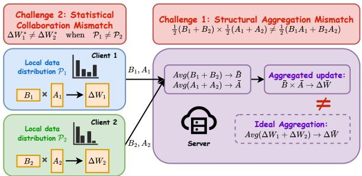
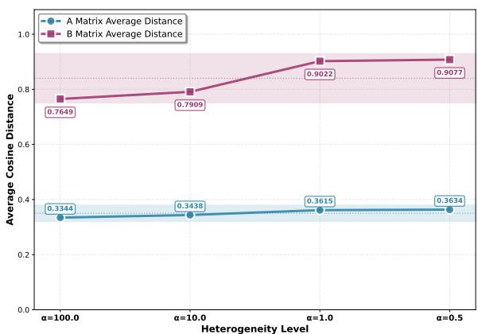
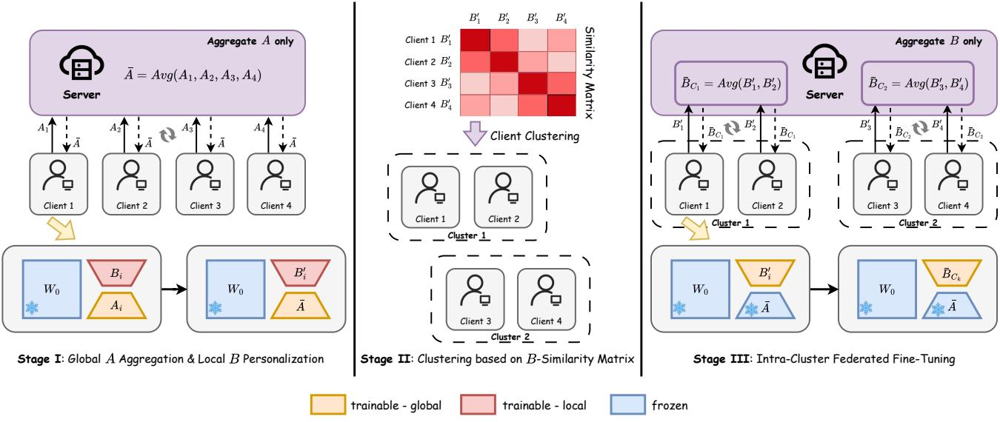
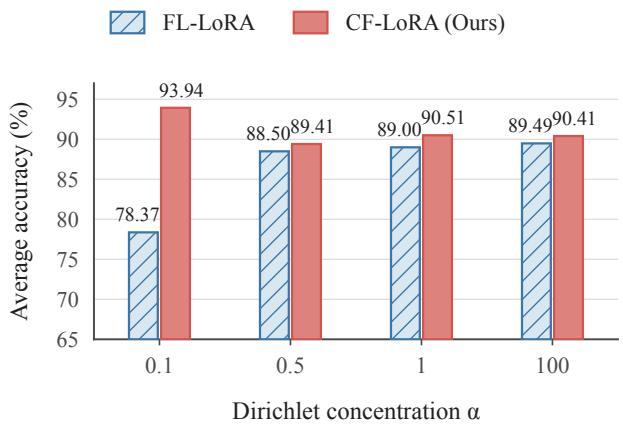

# CF-LoRA: Decoupled Factor Aggregation and Adaptation-Aware Client Clustering for Federated LoRA Fine-Tuning

Mengjun Yi1,2, Langxing Yang1,2, Suhan Guo1,2, Furao Shen1,2∗, Jian Zhao3

1State Key Laboratory for Novel Software Technology 2School of Artificial Intelligence 2School of Electronic Science and Engineering Nanjing University Nanjing, 210023, China mengjunyi@smail.nju.edu.cn, frshen@nju.edu.cn

## Abstract

Federated LoRA fine-tuning enables parameter-eficient adaptation of pre-trained models without sharing private data, but sufers from two fundamental mismatches under heterogeneous client data: a structural aggregation mismatch caused by independently averaging LoRA factors, and a statistical collaboration mismatch caused by enforcing a single global adapter across divergent clients. To address these issues, we propose CF-LoRA, a clustered federated LoRA fine-tuning framework that combines decoupled factor aggregation with adaptation-aware client clustering. CF-LoRA first learns a globally shared A factor while retaining personalized $B _ { i }$ factors, then identifies clients with similar adaptation patterns based on the cosine similarity of their learned Bi factors, and finally performs intra-cluster B-factor aggregation with a frozen A factor. By decoupling LoRA factor aggregation, CF-LoRA preserves the low-rank structure and mitigates the structural aggregation mismatch, while adaptation-aware clustering promotes collaboration among clients with similar adaptation patterns and reduces negative transfer caused by statistical heterogeneity. Experiments on four language tasks and four vision datasets with RoBERTa and ViT show that CF-LoRA achieves the highest average accuracy in both modalities while communicating only one LoRA factor per optimization round.

## Introduction

Large pre-trained models (Touvron et al. 2023) have become a foundation for a broad range of language and vision applications, yet deploying them in specialized domains requires adaptation to task-specific data. Such data are often distributed across institutions or edge devices and cannot be centralized because of privacy, regulatory, and ownership constraints. Federated learning (FL) (Li et al. 2020a) enables collaborative adaptation without sharing raw data, but full-model fine-tuning incurs prohibitive computation and communication costs. Parameter-eficient fine-tuning (PEFT) (Houlsby et al. 2019), particularly Low-Rank Adaptation (LoRA) (Hu et al. 2022), ofers a natural remedy by freezing the pre-trained backbone and representing each weight update as the product of two trainable low-rank matrices, ∆W = BA. Combining FL with LoRA therefore promises privacy-preserving and communication-eficient adaptation of large pre-trained models. However, efective federated LoRA fine-tuning requires answering two coupled questions: how should low-rank adaptations be aggregated, and with whom should each client aggregate?

  
Figure 1: Two mismatches in federated LoRA fine-tuning. Right: the structural aggregation mismatch arises because independently averaging the LoRA factors introduces spurious cross-client products, making the resulting update inconsistent with the ideal aggregated update. Left: the statistical collaboration mismatch arises because enforcing global collaboration among clients with heterogeneous data distributions can lead to negative transfer.

As illustrated in Figure 1, these questions arise from two mismatches. The first is a structural aggregation mismatch. Let client i learn LoRA factors $( A _ { i } , B _ { i } )$ , and let $p _ { i }$ denote its aggregation weight, with $\sum _ { i } p _ { i } = 1$ . Directly applying factor-wise federated averaging produces

$$
\left( \sum _ { i = 1 } ^ { m } p _ { i } B _ { i } \right) \left( \sum _ { i = 1 } ^ { m } p _ { i } A _ { i } \right) \neq \sum _ { i = 1 } ^ { m } p _ { i } B _ { i } A _ { i } ,\tag{1}
$$

because multiplying the averaged factors introduces spurious cross-client products $B _ { i } A _ { j }$ for $i \neq j$ , which are absent from the ideal averaged update. Directly aggregating the products $B _ { i } A _ { i }$ avoids this discrepancy but destroys LoRA’s compact low-rank parameterization. The second is a statistical collaboration mismatch. Under non-IID data, clients with diferent local data distributions can favor substantially diferent adap-

tations:

$$
\Delta W _ { i } ^ { \star } = \underset { \Delta W } { \arg \operatorname* { m i n } } F _ { i } ( W _ { 0 } + \Delta W ) ,\tag{2}
$$

$$
\Delta W _ { i } ^ { \star } \not \approx \Delta W _ { j } ^ { \star } \quad \mathrm { w h e n } \quad \mathcal { P } _ { i } \not \approx \mathcal { P } _ { j } ,
$$

where $F _ { i }$ and $\mathcal { P } _ { i }$ denote the local objective and data distribution of client $i ,$ respectively. Forcing all clients to share a single LoRA adaptation can therefore cause negative transfer and slow convergence (Li et al. 2022). Conversely, keeping every adaptation fully local avoids cross-client interference but discards transferable knowledge among clients with related distributions (Sattler, Müller, and Samek 2020). Federated LoRA must thus determine not only how to aggregate its factorized updates, but also with whom each client should collaborate.

Existing federated LoRA methods typically address only one side of this coupled challenge. FFA-LoRA (Sun et al. 2024) and FedEx-LoRA (Singhal, Ponkshe, and Vepakomma 2025) mitigate the structural aggregation mismatch by freezing one LoRA factor or introducing a residual correction, respectively, but both retain a global collaboration pattern that overlooks client heterogeneity. FedSA-LoRA (Guo et al. 2025) globally aggregates A while keeping each $B _ { i }$ fully personalized, reducing cross-client interference but missing beneficial collaboration among clients with similar adaptations. Meanwhile, clustered FL methods such as PACFL (Vahidian et al. 2023) form collaboration groups based on local data subspaces, but their grouping is detached from the adaptations learned by LoRA and does not resolve the structural mismatch of standard factor-wise aggregation. Consequently, most existing approaches provide either LoRA-compatible aggregation without heterogeneity-aware collaboration or selective collaboration without aggregationconsistent LoRA updates.

To bridge this gap, we exploit an asymmetric property of the two LoRA factors. Our motivating study reveals that the learned A matrices remain highly consistent across clients, whereas the B matrices become increasingly divergent as data heterogeneity grows. This observation, consistent with prior analyses of LoRA asymmetry (Zhu et al. 2024), suggests that A is well suited to capture globally shared information, while B provides an adaptation-aware representation of client-specific characteristics. Based on this insight, we propose CF-LoRA, a clustered federated LoRA fine-tuning framework that jointly addresses the two questions above. CF-LoRA first learns a globally shared A by aggregating only the A factors while retaining locally personalized $B _ { i }$ factors. It then clusters clients according to the pairwise cosine similarities between their learned $B _ { i }$ factors. Finally, it freezes the shared A and aggregates B only among clients within the same cluster. By aggregating only one factor in each optimization stage, CF-LoRA mitigates the mismatch caused by independently averaging client-specific A and B factors. By restricting collaboration to adaptation-similar clients, CF-LoRA preserves transferable knowledge while reducing interference from heterogeneous clients. In short, CF-LoRA answers how to aggregate through decoupled factor aggregation and with whom to aggregate through B-based client clustering.

Our main contributions are summarized as follows:

• To address the structural aggregation mismatch, we propose a decoupled factor aggregation scheme. The scheme aggregates only one low-rank factor in each optimization stage, thereby mitigating the aggregation error caused by jointly averaging both factors while preserving LoRA’s low-rank structure.

• To address the statistical collaboration mismatch, we introduce B-based adaptation-aware client clustering. The learned B matrices are used to identify clients with similar adaptation patterns, enabling beneficial intragroup knowledge sharing while reducing interference from dissimilar clients.

• We develop CF-LoRA, a unified three-stage framework that couples decoupled factor aggregation with adaptation-aware client collaboration. CF-LoRA combines global A learning with local $B _ { i }$ personalization, Bbased client clustering, and cluster-wise B aggregation under a frozen shared A, thereby jointly addressing the structural aggregation mismatch and the statistical collaboration mismatch.

• Extensive experiments demonstrate the efectiveness and generality ofCF-LoRA. CF-LoRA consistently outperforms strong federated LoRA baselines across language and vision benchmarks while communicating only one LoRA factor per optimization round.

## Related Work

## Federated Learning under Data Heterogeneity

Federated learning enables clients to train a shared model without exchanging raw data, but the non-IID distributions common in practice can slow convergence and impair the generalization of FedAvg. Optimization-oriented methods mitigate this problem by regularizing local training, as in FedProx (Li et al. 2020b), or correcting client drift, as in SCAFFOLD (Karimireddy et al. 2020); nevertheless, they retain a single global model. Personalized federated learning (Tan et al. 2022) instead learns client-specific models, but fully local personalization can forgo useful transfer among partially related clients. Clustered FL (Sattler, Müller, and Samek 2020) ofers an intermediate collaboration granularity by training one model for each group of similar clients. Representative approaches infer groups through iterative model assignment (Ghosh et al. 2022) or client data-subspace similarity (Vahidian et al. 2023). However, classical clustered methods maintain and communicate multiple full models, making their direct application to large pre-trained models expensive. This motivates combining heterogeneity-aware collaboration with parameter-eficient adaptation.

## PEFT and Federated LoRA Fine-Tuning

Parameter-eficient fine-tuning (PEFT) (Fu et al. 2023) adapts pre-trained models while updating only a small parameter subset. Federated PEFT has been explored through lightweight adapters (Chen et al. 2024), continuous prompts (Guo et al. 2023), and sparsely activated modules (Wu et al. 2024). Among these techniques, Low-Rank Adaptation (LoRA) (Hu et al. 2022) is particularly attractive for federated fine-tuning because it freezes the pre-trained backbone and parameterizes weight updates using two trainable low-rank factors, thereby reducing both trainable parameters and communication overhead.

Existing federated LoRA methods have primarily explored aggregation consistency or heterogeneity-aware collaboration. For aggregation consistency, FFA-LoRA (Sun et al. 2024) freezes one LoRA factor, FedEx-LoRA (Singhal, Ponkshe, and Vepakomma 2025) introduces a residual correction, FedSA-LoRA (Guo et al. 2025) globally aggregates A while retaining personalized B factors, and FedRot-LoRA (Zhang et al. 2026) aligns client factors through orthogonal transformations. For heterogeneityaware collaboration, FedLEASE (Wang et al. 2025) constructs cluster-level LoRA experts with adaptive routing, while FedALT (Bian et al. 2026) adaptively combines clientspecific and shared LoRA adaptations. In contrast, CF-LoRA couples adaptation-aware client clustering with decoupled factor aggregation, jointly addressing client heterogeneity and the structural aggregation mismatch.

## Method

## Preliminaries

We consider a federated learning setting with m clients, where each client i holds a local dataset $\mathcal { D } _ { i }$ that cannot be shared due to privacy or regulatory constraints. The data distributions across clients are potentially heterogeneous (non-IID), $\mathsf { i . e . , } D _ { i } \sim \mathcal { P } _ { i }$ with $\mathcal { P } _ { i } \bar { \neq } \mathcal { P } _ { j }$ for $i \neq j$

Let $f ( \cdot ; \theta )$ denote a large pre-trained model with parameters θ. Instead of fine-tuning all model parameters, we adopt LoRA for parameter-eficient fine-tuning. Specifically, for a weight matrix $W _ { 0 } ~ \in ~ \mathbb { R } ^ { d _ { \mathrm { o u t } } \times d _ { \mathrm { i n } } }$ in the pre-trained model, LoRA introduces a low-rank update

$$
\Delta W = B A ,\tag{3}
$$

where $A \ \in \ \mathbb { R } ^ { r \times d _ { \mathrm { i n } } }$ and $B \in \mathbb { R } ^ { d _ { \mathrm { o u t } } \times r }$ with rank $r \ll$ $\operatorname* { m i n } ( d _ { \mathrm { o u t } } , d _ { \mathrm { i n } } )$ . During training, the backbone parameters θ are frozen, and only the LoRA parameters $( A , B )$ are updated.

## Motivating Observation

Before introducing our method, we present a motivating empirical observation that highlights the diferent roles played by the two LoRA matrices, A and B, in federated fine-tuning.

We conduct a toy FL study on the SST-2 task using RoBERTa-base as the backbone. LoRA is applied to the attention layers, while the backbone parameters remain frozen. All clients are initialized with the same LoRA parameters. To simulate data heterogeneity, the training data are partitioned across 12 clients according to a Dirichlet distribution with varying concentration parameter α, following standard non-IID settings in federated learning, where smaller α indicates higher heterogeneity. Each client performs four local training epochs to update its LoRA parameters.

After training, we extract the learned LoRA matrices $( A _ { i } , B _ { i } )$ from each client. To quantify cross-client consistency, we compute the pairwise cosine distance between flattened A matrices and between flattened B matrices, and report the averaged distances under diferent heterogeneity levels. As shown in Figure 2, two consistent trends emerge. First, the A matrices exhibit significantly smaller cosine distances across clients than the B matrices. Second, as data heterogeneity increases, the cosine distance among B matrices grows rapidly, whereas the distance among A matrices remains relatively stable. These results suggest that the A matrices primarily capture general information across clients, while the B matrices focus on encoding client-specific adaptations that are highly sensitive to local data distributions. This observation is consistent with prior work analyzing the asymmetry of LoRA (Zhu et al. 2024). This empirical observation directly motivates our design of decoupling the aggregation of A and B, and using the learned B matrices as client representations for similarity-based clustering. Additional analyses of the learned LoRA factors are provided in the supplementary material.

  
Figure 2: Cross-client cosine distances of learned LoRA factors on SST-2. Points show the mean pairwise cosine distance between flattened A or B factors under Dirichlet data partitioning; smaller α indicates greater heterogeneity. The A factors remain comparatively similar across clients, whereas the B factors diverge as heterogeneity increases.

## Overview of CF-LoRA

Based on the above insights, we propose CF-LoRA, a clustered federated LoRA fine-tuning framework. An overview of the proposed framework is illustrated in Figure 3.

Stage I: Global A Aggregation & Local B Personalization. All clients start from the same initialization of LoRA parameters. In Stage I, each client locally optimizes its LoRA parameters $( A _ { i } , B _ { i } )$ while keeping the backbone model frozen.

At communication round t, client i performs E steps of local optimization on its local dataset $\mathcal { D } _ { i }$ to update its LoRA parameters:

$$
\begin{array} { r } { ( A _ { i } ^ { ( t ) } , B _ { i } ^ { ( t ) } ) \gets \mathrm { L o c a l U p d a t e } \big ( ( A _ { i } ^ { ( t - 1 ) } , B _ { i } ^ { ( t - 1 ) } ) ; \theta , \mathcal { D } _ { i } \big ) . } \end{array}\tag{4}
$$

After local training, only the A matrices are uploaded to the server. The server performs global aggregation by averaging:

$$
\bar { A } ^ { ( t ) } = \frac { 1 } { m } \sum _ { i = 1 } ^ { m } A _ { i } ^ { ( t ) } .\tag{5}
$$

  
Figure 3: Overview of the CF-LoRA framework. CF-LoRA consists of three stages: (I) global aggregation of the LoRA A matrices with local personalization of $B ,$ (II) client clustering based on the similarity of the learned B matrices, and (III) intra-cluster federated fine-tuning by aggregating B matrices with a frozen shared A. By aggregating only one low-rank matrix in each optimization stage, CF-LoRA avoids forming the product of independently averaged LoRA factors, while clustering similar clients efectively mitigates the negative efects of data heterogeneity.

The aggregated matrix $\bar { A } ^ { ( t ) }$ is then broadcast to all clients and replaces their local $A _ { i } ^ { ( t ) }$ for the next communication round, while the $B _ { i } ^ { ( t ) }$ matrices remain entirely local.

This procedure is repeated for $T _ { 1 }$ communication rounds, resulting in a globally shared low-rank matrix A¯ that captures cross-client knowledge. We denote the resulting local matrices at client i after Stage I as $B _ { i } ^ { \prime } ,$ , which serve as compact client representations and are used for similarity-based clustering in the next stage.

In Stage I, the server aggregates only the A matrices, while each $B _ { i }$ remains local to client i. The resulting update at client i is

$$
W _ { 0 } + B _ { i } \bar { A } = W _ { 0 } + B _ { i } \frac { 1 } { m } \sum _ { j = 1 } ^ { m } A _ { j } .\tag{6}
$$

Thus, Stage I adopts a shared-A, personalized- $B _ { i }$ parameterization and avoids multiplying two independently averaged LoRA factors, which causes the structural aggregation mismatch in Eq. (1).

Stage II: Clustering based on B-Similarity Matrix. $\mathbf { A f } -$ ter Stage I, each client has learned a personalized $B _ { i } ^ { \prime }$ matrix that reflects its local data characteristics. Since the $\dot { B } _ { i } ^ { \prime }$ matrices are optimized on local datasets $\mathcal { D } _ { i }$ under a shared backbone and a periodically synchronized A matrix, they implicitly encode client-specific adaptations induced by the underlying data distributions $\mathcal { P } _ { i }$ . Each client uploads its final Stage I matrix $B _ { i } ^ { \prime }$ once to the server, which flattens these client representations and computes pairwise cosine similarities:

$$
s _ { i j } = \frac { \langle \mathrm { v e c } ( B _ { i } ^ { \prime } ) , \mathrm { v e c } ( B _ { j } ^ { \prime } ) \rangle } { \| \mathrm { v e c } ( B _ { i } ^ { \prime } ) \| \| \mathrm { v e c } ( B _ { j } ^ { \prime } ) \| } .\tag{7}
$$

Based on the similarity matrix $\left\{ s _ { i j } \right\}$ , we apply a clustering algorithm (e.g., hierarchical clustering) to partition the clients into $K$ clusters:

$$
\{ { \mathcal { C } } _ { 1 } , { \mathcal { C } } _ { 2 } , \ldots , { \mathcal { C } } _ { K } \} .\tag{8}
$$

Clients within the same cluster are expected to share similar data distributions and thus benefit from collaborative fine-tuning, which helps mitigate the negative efects of data heterogeneity in subsequent federated fine-tuning.

Stage III: Intra-Cluster Federated Fine-Tuning. In Stage III, we perform federated fine-tuning independently and in parallel within each cluster. For a given cluster $\mathcal { C } _ { k }$ , the globally aggregated matrix A¯ obtained from Stage I is frozen and shared by all clients in the cluster.

Before intra-cluster training begins, the server initializes a shared B matrix for each cluster by averaging the final Stage I matrices of its members:

$$
\bar { B } _ { \mathcal { C } _ { k } } ^ { ( 0 ) } = \frac { 1 } { | \mathcal { C } _ { k } | } \sum _ { i \in \mathcal { C } _ { k } } B _ { i } ^ { \prime } .\tag{9}
$$

The server broadcasts $\bar { B } _ { \mathcal { C } _ { k } } ^ { ( 0 ) }$ to all clients in $\mathcal { C } _ { k }$ , which set $B _ { i } ^ { \prime ( 0 ) } \gets \bar { B } _ { \mathcal { C } _ { k } } ^ { ( 0 ) }$ . Thus, all clients within a cluster start Stage III from the same cluster-level initialization.

At communication round $t = 1 , \ldots , T _ { 2 }$ , each client $i \in \mathcal { C } _ { k }$ performs E steps of local optimization on its local dataset $\mathcal { D } _ { i }$ to update its B matrix:

$$
B _ { i } ^ { \prime ( t ) } \gets \mathrm { L o c a l U p d a t e } \big ( B _ { i } ^ { \prime ( t - 1 ) } ; \bar { A } , \theta , \mathcal { D } _ { i } \big ) .\tag{10}
$$

After local training, clients upload their $B _ { i } ^ { \prime ( t ) }$ to the server,

which aggregates them as:

$$
\bar { B } _ { \mathcal { C } _ { k } } ^ { ( t ) } = \frac { 1 } { \lvert \mathcal { C } _ { k } \rvert } \sum _ { i \in \mathcal { C } _ { k } } B _ { i } ^ { \prime ( t ) } .\tag{11}
$$

The aggregated $\bar { B } _ { \mathcal { C } _ { k } } ^ { ( t ) }$ is then broadcast back to the clients in the same cluster and replaces their local B matrix. The intra-cluster federated optimization runs for $T _ { 2 }$ rounds.

In Stage III, the shared matrix A¯ is frozen, and only the B matrices are aggregated within each cluster. As an illustrative example, consider a cluster with two clients. The aggregated update is given by

$$
W _ { 0 } + \bar { B } _ { \mathcal { C } } \bar { A } = W _ { 0 } + \frac { 1 } { 2 } ( B _ { 1 } ^ { \prime } + B _ { 2 } ^ { \prime } ) \bar { A } = W _ { 0 } + \frac { 1 } { 2 } ( B _ { 1 } ^ { \prime } \bar { A } + B _ { 2 } ^ { \prime } \bar { A } ) ,\tag{12}
$$

which is again a linear combination of client updates under a fixed A¯. Because every client uses the same frozen A¯, this expression is exactly the average of the clients’ induced updates. Therefore, no factor-wise aggregation mismatch arises in the final intra-cluster optimization. The complete algorithm and convergence analysis are provided in the supplementary material.

## Experiments

## Experimental Setup

Datasets and Data Partitioning. We evaluate the proposed method on diferent natural language understanding (NLU) benchmarks from the GLUE suite (Wang et al. 2019): MNLI-matched, MNLI-mismatched, MRPC, QQP, and SST-2. These datasets cover a diverse set of tasks, including natural language inference, paraphrase identification, and sentiment classification, enabling a comprehensive evaluation under diferent task characteristics.

To simulate data heterogeneity in federated learning, we partition the oficial training and validation sets across clients using the same class-wise Dirichlet proportions with $\alpha =$ 1, producing non-IID local training and test sets. Unless otherwise specified, all experiments are conducted under this data partitioning scheme.

Baseline Methods. We compare CF-LoRA with a wide range of baselines covering diferent design choices for federated fine-tuning of large pre-trained models:

• FL-LoRA: A straightforward combination of LoRA with the FedAvg algorithm, where both LoRA matrices (A, B) are locally trained and independently averaged on the server (e.g., FedIT (Zhang et al. 2024)).

• FFA-LoRA (Sun et al. 2024): A federated LoRA approach that freezes the A matrix and only updates and aggregates the B matrix, aiming to mitigate aggregation mismatch.

• FedEx-LoRA (Singhal, Ponkshe, and Vepakomma 2025): An extension of FL-LoRA that introduces an additional residual term $\Delta W _ { r e s }$ on the server to correct the aggregation error caused by independently averaging A and B matrices.

• FedSA-LoRA (Guo et al. 2025): A selective aggregation method that globally shares and averages only A while keeping each client’s B locally personalized.

• FedRot-LoRA (Zhang et al. 2026): Aligns client LoRA factors through orthogonal transformations before aggregation to mitigate rotational misalignment while preserving their induced updates.

• PACFL + FedIT: A clustered federated LoRA baseline that applies PACFL (Vahidian et al. 2023) to cluster clients by computing principal angles between their local data subspaces, followed by FL-LoRA-based fine-tuning within each cluster.

• CF-LoRA: The proposed method, which decouples the aggregation of A and B and performs similarity-based clustering using the learned B matrices.

Implementation Details. All methods are implemented using the RoBERTa-base backbone (125M parameters) from the HuggingFace Transformers library (Wolf et al. 2020). We simulate a federated learning environment with 12 clients. Each federated optimization round consists of 3 local training epochs. All baseline methods are trained for 50 federated optimization rounds. For CF-LoRA, we allocate 4 rounds to the initial global training stage and 46 rounds to the clustered federated training stage, resulting in the same total of 50 federated optimization rounds. As shown in the supplementary material, the client clustering assignments changes negligibly when the number of Stage I rounds increases from 4 to 10, motivating the choice of $T _ { 1 } = 4$ . We apply LoRA to the query (Q) and value (V) projection matrices of the attention layers. By default, LoRA uses rank $r = 4 ,$ , scaling factor 8, and dropout 0.1. We report sensitivity analyses for the LoRA rank r in the supplementary material.

For initialization, the A matrices are initialized using Kaiming initialization, while the B matrices are initialized to zero. All clients share the same initial LoRA parameters. For CF-LoRA, client clustering is performed after Stage I based on the learned LoRA B matrices. Specifically, each B matrix is flattened and used as the client representation. We compute pairwise cosine similarity between client representations and apply hierarchical clustering to group clients. For PACFL + FedIT, clustering follows the original PACFL setting based on data subspace similarity. For clustering-based methods, the number of clusters is set to 3 for MNLI-m and MNLI-mm, 2 for MRPC, 4 for QQP, and 2 for SST-2. We report sensitivity analyses for the number of clusters K in the supplementary material. The FedRot-LoRA soft-rotation strength is set to $\dot { \lambda } = 0 . 4 . \operatorname { A l l }$ experiments are implemented in PyTorch and conducted on NVIDIA Tesla V100 GPUs. All models are trained using the AdamW optimizer with a learning rate of 0.001 and a warmup ratio of 0.05. We use cross-entropy loss for all tasks. Each client is evaluated using its corresponding trained model; if a method learns only a single shared model, the shared model is used for all clients. We report Top-1 accuracy as a test-set-size-weighted average across clients:

$$
\operatorname { A c c } = \sum _ { i = 1 } ^ { m } { \frac { n _ { i } ^ { \mathrm { t e s t } } } { \sum _ { j = 1 } ^ { m } n _ { j } ^ { \mathrm { t e s t } } } } \operatorname { A c c } _ { i } ,\tag{13}
$$

where $n _ { i } ^ { \mathrm { t e s t } }$ and $\operatorname { A c c } _ { i }$ denote the number of test samples and the accuracy of client i, respectively.

<table><tr><td>Method</td><td>MNLI-m</td><td>MNLI-mm</td><td>MRPC</td><td>QQP</td><td>SST-2</td><td>Average</td></tr><tr><td>FL-LoRA (ICASSP&#x27;24)</td><td> $8 6 . 8 3 { \scriptstyle \pm 0 . 0 6 }$ </td><td> $8 6 . 5 6 { \pm } 0 . 0 8 $ </td><td> $8 7 . 2 5 { \pm } 0 . 2 5 $ </td><td>89.61±0.05</td><td>94.76±0.07</td><td>89.00</td></tr><tr><td>FFA-LoRA (ICLR&#x27;24)</td><td> $8 5 . 0 8 { \pm } 0 . 0 3 $ </td><td> $8 5 . 2 4 { \pm } 0 . 0 8 $ </td><td> $8 5 . 6 2 { \pm } 0 . 1 4 $ </td><td>88.06±0.01</td><td>94.11±0.18</td><td>87.62</td></tr><tr><td>FedEx-LoRA (ACL&#x27;25)</td><td> $8 6 . 6 7 { \scriptstyle \pm 0 . 1 4 }$ </td><td> $8 6 . 5 3 { \scriptstyle \pm 0 . 0 3 }$ </td><td> $8 6 . 9 3 { \scriptstyle \pm 0 . 3 7 }$ </td><td>89.50±0.04</td><td>94.57±0.26</td><td>88.84</td></tr><tr><td>FedSA-LoRA (ICLR&#x27;25)</td><td> $8 7 . 1 6 { \pm } 0 . 0 5 $ </td><td> $8 6 . 6 5 { \scriptstyle \pm 0 . 1 0 }$ </td><td> $8 5 . 1 3 { \pm } 0 . 3 8 $ </td><td>90.60±0.10</td><td>94.53±0.07</td><td>88.81</td></tr><tr><td>FedRot-LoRA (ICML&#x27;26)</td><td> $8 6 . 9 9 { \scriptstyle \pm 0 . 2 5 }$ </td><td> $8 6 . 7 5 { \scriptstyle \pm 0 . 1 3 }$ </td><td>87.91±0.75</td><td>89.67±0.10</td><td>94.91±0.29</td><td>89.25</td></tr><tr><td>PACFL + FedIT (AAAI&#x27;23)</td><td> $8 6 . 6 0 { \pm } 0 . 1 1 $ </td><td> $8 6 . 2 6 { \pm } 0 . 0 3 $ </td><td>87.27±0.25</td><td>90.73±0.03</td><td>95.04±0.13</td><td>89.18</td></tr><tr><td>CF-LoRA (Ours)</td><td>87.72±0.02</td><td> $\mathbf { 8 7 . 1 1 \pm 0 . 3 4 }$ </td><td>91.17±0.88</td><td>91.35±0.06</td><td>95.20±0.19</td><td>90.51</td></tr></table>

Table 1: Performance of diferent methods on five GLUE evaluation sets under Dirichlet-based data partitioning with $\alpha = 1$ MNLI-m and MNLI-mm denote the matched and mismatched evaluation sets of MNLI, respectively. We report accuracy (%) where higher values indicate better performance. For all evaluation sets, we report accuracy evaluated across 3 runs with mean and standard deviation.

<table><tr><td>Method</td><td>Upload</td><td>Download</td></tr><tr><td>FL-LoRA</td><td> $A + B$ </td><td> $A + B$ </td></tr><tr><td>FFA-LoRA</td><td>B</td><td>B</td></tr><tr><td>FedEx-LoRA</td><td> $A + B$ </td><td> $A + B + \Delta W _ { r e s }$ </td></tr><tr><td>FedSA-LoRA</td><td> $A$ </td><td>A</td></tr><tr><td>FedRot-LoRA</td><td> $A + B$ </td><td> $A + B$ </td></tr><tr><td>PACFL + FedIT</td><td> $A + B$ </td><td> $A + B$ </td></tr><tr><td>CF-LoRA (Ours)</td><td> $A \bullet \mathbf { r } B$ </td><td> $A \ \mathbf { o r } \ B$ </td></tr></table>

Table 2: Comparison of uplink and downlink communication payloads across federated LoRA methods in each optimization round.

## Overall Performance

Better NLU Performance. Table 1 reports the overall performance on five GLUE evaluation sets. CF-LoRA achieves the highest accuracy on all evaluation sets and improves the average accuracy of FL-LoRA from 89.00% to 90.51%. Compared with FedRot-LoRA, the strongest recent baseline, CF-LoRA achieves higher accuracy on all five evaluation sets and improves the average accuracy by 1.26 percentage points. These results demonstrate the benefit of jointly addressing aggregation mismatch and client heterogeneity.

Existing methods typically address only one aspect of the problem. FFA-LoRA limits adaptation by freezing A; FedEx-LoRA and FedRot-LoRA improve aggregation consistency but retain global collaboration; FedSA-LoRA preserves personalized B factors but overlooks collaboration among similar clients; and PACFL + FedIT clusters clients based on local data subspaces, making its grouping dependent on datasetspecific characteristics and leading to varying clustering effectiveness across datasets. For example, it improves over FL-LoRA on QQP and SST-2 but underperforms it on both MNLI evaluation sets. In contrast, CF-LoRA combines decoupled factor aggregation with adaptation-aware clustering, leading to consistent improvements across tasks.

Communication Eficiency. Table 2 summarizes the parameters transmitted by diferent federated LoRA methods in a single optimization round. FL-LoRA, PACFL + FedIT, and the recent FedRot-LoRA transmit both A and B in each direction, while FedEx-LoRA additionally downloads a residual update. CF-LoRA uploads and downloads only A during

  
Figure 4: Mean accuracy across the five GLUE evaluation sets under diferent Dirichlet heterogeneity levels. Smaller α indicates stronger heterogeneity, and values above the bars report the corresponding mean accuracies.

Stage I and only B during Stage III, so it never transmits both factors in one optimization round. Because A and B have equal size in our experiments, CF-LoRA communicates one factor-equivalent in each direction per optimization round, compared with two for methods that communicate $A + B .$ This reduces the iterative per-round LoRA-parameter payload by 50% in both the uplink and downlink. Although FFA-LoRA and FedSA-LoRA also communicate a single factor per round, Table 1 shows that CF-LoRA attains substantially higher average accuracy while retaining the same per-round payload class. CF-LoRA thus provides a favorable accuracy–communication trade-of while communicating only one LoRA factor per round.

## Robustness Analysis

Efect of Data Heterogeneity. Figure 4 compares CF-LoRA and FL-LoRA under diferent levels of Dirichlet heterogeneity. CF-LoRA consistently outperforms FL-LoRA, with the largest margin observed at $\alpha = 0 . 1$ , where the average accuracies are 93.94% and 78.37%, respectively. A likely explanation is that the evaluated GLUE tasks contain only two or three labels, so an extremely heterogeneous partition may leave some clients with samples from only one or a few classes. In this case, CF-LoRA groups clients with similar adaptation patterns, allowing compatible updates to reinforce one another through intra-cluster aggregation. In contrast, global aggregation mixes updates from clients with substantially diferent label distributions, resulting in stronger interference. These results show that CF-LoRA remains efective across diferent non-IID data settings. Complete per-dataset results are provided in the supplementary material.

<table><tr><td>Num</td><td>Method</td><td>M-m</td><td>M-mm</td><td>MRPC</td><td>QQP</td><td>SST-2</td><td>Avg.</td></tr><tr><td>12</td><td>FL-LoRA Ours</td><td>86.83 87.72</td><td>86.56 87.11</td><td>87.25 91.17</td><td>89.61 91.35</td><td>94.76 95.20</td><td>89.00 90.51</td></tr><tr><td>50</td><td>FL-LoRA Ours</td><td>86.55 86.58</td><td>86.58 86.14</td><td>79.17 88.93</td><td>89.58 89.80</td><td>94.38 94.69</td><td>87.25 89.23</td></tr></table>

Table 3: Accuracy (%) with 12 and 50 clients on the five GLUE evaluation sets.
<table><tr><td>Clustering</td><td>M-m</td><td>M-mm</td><td>MRPC</td><td>QQP</td><td>SST-2</td><td>Avg.</td></tr><tr><td>Random</td><td>86.24</td><td>86.46</td><td>84.06</td><td>89.13</td><td>94.05</td><td>87.99</td></tr><tr><td>K-means</td><td>86.10</td><td>86.54</td><td>89.70</td><td>89.00</td><td>94.05</td><td>89.08</td></tr><tr><td>Spectral</td><td>85.91</td><td>87.58</td><td>86.27</td><td>88.69</td><td>94.28</td><td>88.55</td></tr><tr><td>Hierarchical</td><td>87.72</td><td>87.11</td><td>91.17</td><td>91.35</td><td>95.20</td><td>90.51</td></tr></table>

Table 4: Ablation of client grouping strategies using the same LoRA B-based representations. We report accuracy (%).

Efect ofFederation Size. Table 3 evaluates CF-LoRA and FL-LoRA as the number of clients increases from 12 to 50. While the average accuracy of both methods decreases, CF-LoRA exhibits a smaller drop than FL-LoRA (1.28 versus 1.75 percentage points) and maintains a clear performance advantage, demonstrating greater robustness to a larger federation.

Efect of Client Grouping. Table 4 evaluates diferent grouping strategies using the same learned LoRA B-based representations. Our hierarchical clustering strategy achieves the highest average accuracy of 90.51%, outperforming Kmeans, spectral clustering, and random grouping by 1.43, 1.96, and 2.52 percentage points, respectively. The substantial gain over random grouping highlights the importance of similarity-aware collaboration, while the improvements over alternative clustering methods indicate that hierarchical clustering better captures the structure of the learned client representations. Moreover, the clustering module is decoupled from the overall framework and can be readily replaced by more advanced clustering methods.

## Evaluation on Vision Tasks with ViT-B/16

To further demonstrate the generality of CF-LoRA beyond language models, we evaluate our method on vision tasks using ViT-B/16 (Dosovitskiy et al. 2021) as the pre-trained backbone. Specifically, we conduct federated fine-tuning experiments on four image classification benchmarks: Flowers102 (Nilsback and Zisserman 2008), DTD (Cimpoi et al. 2014), UCF101 (Soomro, Zamir, and Shah 2012), and Caltech101 (Fei-Fei, Fergus, and Perona 2004). Detailed experimental settings are provided in the supplementary material.

<table><tr><td>Method</td><td>Flowers</td><td>DTD</td><td>UCF</td><td>Caltech</td><td>Average</td></tr><tr><td>FL-LoRA</td><td>97.53</td><td>61.76</td><td>74.43</td><td>93.96</td><td>81.92</td></tr><tr><td>FFA-LoRA</td><td>92.97</td><td>51.83</td><td>58.82</td><td>80.12</td><td>70.94</td></tr><tr><td>FedEx-LoRA</td><td>97.82</td><td>63.18</td><td>77.42</td><td>94.12</td><td>83.14</td></tr><tr><td>FedSA-LoRA</td><td>93.79</td><td>66.19</td><td>79.18</td><td>90.47</td><td>82.41</td></tr><tr><td>FedRot-LoRA</td><td>98.23</td><td>62.77</td><td>74.81</td><td>94.12</td><td>82.48</td></tr><tr><td>PACFL + FedIT</td><td>97.50</td><td>63.48</td><td>77.29</td><td>93.65</td><td>82.98</td></tr><tr><td>CF-LoRA (Ours)</td><td>98.31</td><td>66.53</td><td>79.97</td><td>94.25</td><td>84.77</td></tr></table>

Table 5: Performance comparison on vision datasets using ViT-B/16 as the pre-trained backbone. We report classification accuracy (%).

Table 5 summarizes the performance of diferent federated LoRA methods on four vision datasets. CF-LoRA achieves the best performance across all datasets, demonstrating its efectiveness on diverse visual downstream tasks. Together with the language results, these findings confirm that decoupled factor aggregation and B-based clustered collaboration generalize across model architectures and modalities, from RoBERTa-based language understanding to ViT-based image classification.

## Limitations

CF-LoRA currently uses a predefined number of clusters K and performs hierarchical clustering only once after Stage I. This static design avoids repeated representation extraction and re-clustering, thereby keeping the additional computational overhead low. However, a prespecified K may not always reflect the intrinsic grouping structure of the clients, while a one-time partition cannot adapt when client distributions evolve, new clients join, or new data become available. Although we use hierarchical clustering in the current implementation, the LoRA B matrix representation is not inherently tied to a fixed-K grouping rule. Adaptive clustering methods that do not require a pre-specified number of clusters could instead use the B-based client similarities to infer the grouping structure and update the client assignments when needed. Evaluating such extensions, as well as their trade-of between adaptivity, stability, and additional computation, is left for future work.

## Conclusion

In this paper, we proposed CF-LoRA for federated LoRA fine-tuning under heterogeneous client data. CF-LoRA addresses the structural aggregation mismatch through decoupled factor aggregation and mitigates the statistical collaboration mismatch through B-based client clustering. Experiments on language and vision tasks show that CF-LoRA achieves the best average performance, remains robust under diferent heterogeneity levels and federation sizes, and communicates only one LoRA factor per optimization round. These results demonstrate the efectiveness and generality of CF-LoRA.

## References

Bian, J.; Wang, L.; Zhang, L.; and Xu, J. 2026. Fedalt: Federated fine-tuning through adaptive local training with rest-of-world lora. In Proceedings of the AAAI Conference on Artificial Intelligence, volume 40, 19728–19736.

Chen, H.; Zhang, Y.; Krompass, D.; Gu, J.; and Tresp, V. 2024. Feddat: An approach for foundation model finetuning in multi-modal heterogeneous federated learning. In Proceedings of the AAAI Conference on Artificial Intelligence, volume 38, 11285–11293.

Cimpoi, M.; Maji, S.; Kokkinos, I.; Mohamed, S.; and Vedaldi, A. 2014. Describing textures in the wild. In Proceedings of the IEEE conference on computer vision and pattern recognition, 3606–3613.

Dosovitskiy, A.; Beyer, L.; Kolesnikov, A.; Weissenborn, D.; Zhai, X.; Unterthiner, T.; Dehghani, M.; Minderer, M.; Heigold, G.; Gelly, S.; Uszkoreit, J.; and Houlsby, N. 2021. An Image is Worth 16x16 Words: Transformers for Image Recognition at Scale. In International Conference on Learning Representations.

Fei-Fei, L.; Fergus, R.; and Perona, P. 2004. Learning generative visual models from few training examples: An incremental bayesian approach tested on 101 object categories. In 2004 conference on computer vision and pattern recognition workshop, 178–178. IEEE.

Fu, Z.; Yang, H.; So, A. M.-C.; Lam, W.; Bing, L.; and Collier, N. 2023. On the efectiveness of parameter-eficient fine-tuning. In Proceedings ofthe AAAI conference on artificial intelligence, volume 37, 12799–12807.

Ghosh, A.; Chung, J.; Yin, D.; and Ramchandran, K. 2022. An eficient framework for clustered federated learning. IEEE Transactions on Information Theory, 68(12): 8076– 8091.

Guo, P.; Zeng, S.; Wang, Y.; Fan, H.; Wang, F.; and Qu, L. 2025. Selective Aggregation for Low-Rank Adaptation in Federated Learning. In The Thirteenth International Conference on Learning Representations.

Guo, T.; Guo, S.; Wang, J.; Tang, X.; and Xu, W. 2023. Promptfl: Let federated participants cooperatively learn prompts instead of models–federated learning in age of foundation model. IEEE Transactions on Mobile Computing, 23(5): 5179–5194.

Houlsby, N.; Giurgiu, A.; Jastrzebski, S.; Morrone, B.; De Laroussilhe, Q.; Gesmundo, A.; Attariyan, M.; and Gelly, S. 2019. Parameter-eficient transfer learning for NLP. In International conference on machine learning, 2790–2799. PMLR.

Hu, E. J.; Shen, Y.; Wallis, P.; Allen-Zhu, Z.; Li, Y.; Wang, S.; Wang, L.; and Chen, W. 2022. LoRA: Low-Rank Adaptation of Large Language Models. In International Conference on Learning Representations.

Karimireddy, S. P.; Kale, S.; Mohri, M.; Reddi, S.; Stich, S.; and Suresh, A. T. 2020. Scafold: Stochastic controlled averaging for federated learning. In International conference on machine learning, 5132–5143. PMLR.

Li, Q.; Diao, Y.; Chen, Q.; and He, B. 2022. Federated learning on non-iid data silos: An experimental study. In 2022 IEEE 38th international conference on data engineering (ICDE), 965–978. IEEE.

Li, T.; Sahu, A. K.; Talwalkar, A.; and Smith, V. 2020a. Federated learning: Challenges, methods, and future directions. IEEE signal processing magazine, 37(3): 50–60.

Li, T.; Sahu, A. K.; Zaheer, M.; Sanjabi, M.; Talwalkar, A.; and Smith, V. 2020b. Federated optimization in heterogeneous networks. Proceedings of Machine learning and systems, 2: 429–450.

Nilsback, M.-E.; and Zisserman, A. 2008. Automated flower classification over a large number of classes. In 2008 Sixth Indian conference on computer vision, graphics & image processing, 722–729. IEEE.

Sattler, F.; Müller, K.-R.; and Samek, W. 2020. Clustered federated learning: Model-agnostic distributed multitask optimization under privacy constraints. IEEE transactions on neural networks and learning systems, 32(8): 3710–3722.

Singhal, R.; Ponkshe, K.; and Vepakomma, P. 2025. FedEx-LoRA: Exact aggregation for federated and eficient finetuning of large language models. In Proceedings ofthe 63rd Annual Meeting of the Association for Computational Linguistics (Volume 1: Long Papers), 1316–1336.

Soomro, K.; Zamir, A. R.; and Shah, M. 2012. Ucf101: A dataset of 101 human actions classes from videos in the wild. arXiv preprint arXiv:1212.0402.

Sun, Y.; Li, Z.; Li, Y.; and Ding, B. 2024. Improving LoRA in Privacy-preserving Federated Learning. In The Twelfth International Conference on Learning Representations.

Tan, A. Z.; Yu, H.; Cui, L.; and Yang, Q. 2022. Towards personalized federated learning. IEEE transactions on neural networks and learning systems, 34(12): 9587–9603.

Touvron, H.; Lavril, T.; Izacard, G.; Martinet, X.; Lachaux, M.-A.; Lacroix, T.; Rozière, B.; Goyal, N.; Hambro, E.; Azhar, F.; et al. 2023. Llama: Open and eficient foundation language models. arXiv preprint arXiv:2302.13971.

Vahidian, S.; Morafah, M.; Wang, W.; Kungurtsev, V.; Chen, C.; Shah, M.; and Lin, B. 2023. Eficient distribution similarity identification in clustered federated learning via principal angles between client data subspaces. In Proceedings of the AAAI conference on artificial intelligence, volume 37, 10043–10052.

Wang, A.; Singh, A.; Michael, J.; Hill, F.; Levy, O.; and Bowman, S. R. 2019. GLUE: A Multi-Task Benchmark and Analysis Platform for Natural Language Understanding. In International Conference on Learning Representations.

Wang, L.; Bian, J.; Zhang, L.; and Xu, J. 2025. Adaptive LoRA Experts Allocation and Selection for Federated Fine-Tuning. In The Thirty-ninth Annual Conference on Neural Information Processing Systems (NeurIPS).

Wolf, T.; Debut, L.; Sanh, V.; Chaumond, J.; Delangue, C.; Moi, A.; Cistac, P.; Rault, T.; Louf, R.; Funtowicz, M.; et al. 2020. Transformers: State-of-the-art natural language processing. In Proceedings ofthe 2020 conference on empirical methods in natural language processing: system demonstrations, 38–45.

Wu, P.; Li, K.; Wang, T.; Dong, Y.; Leung, V. C.; and Wang, F. 2024. FedFMSL: federated learning of foundation models with sparsely activated LoRA. IEEE Transactions on Mobile Computing, 23(12): 15167–15181.

Zhang, H.; Kim, D.; Cha, S.; and Vikalo, H. 2026. FedRot-LoRA: Mitigating Rotational Misalignment in Federated LoRA. In Forty-third International Conference on Machine Learning.

Zhang, J.; Vahidian, S.; Kuo, M.; Li, C.; Zhang, R.; Yu, T.; Wang, G.; and Chen, Y. 2024. Towards building the federatedgpt: Federated instruction tuning. In ICASSP 2024- 2024 IEEE international conference on acoustics, speech and signal processing (ICASSP), 6915–6919. IEEE.

Zhu, J.; Greenewald, K.; Nadjahi, K.; De Ocáriz Borde, H. S.; Gabrielsson, R. B.; Choshen, L.; Ghassemi, M.; Yurochkin, M.; and Solomon, J. 2024. Asymmetry in low-rank adapters of foundation models. In Proceedings of the 41st International Conference on Machine Learning, 62369–62385.