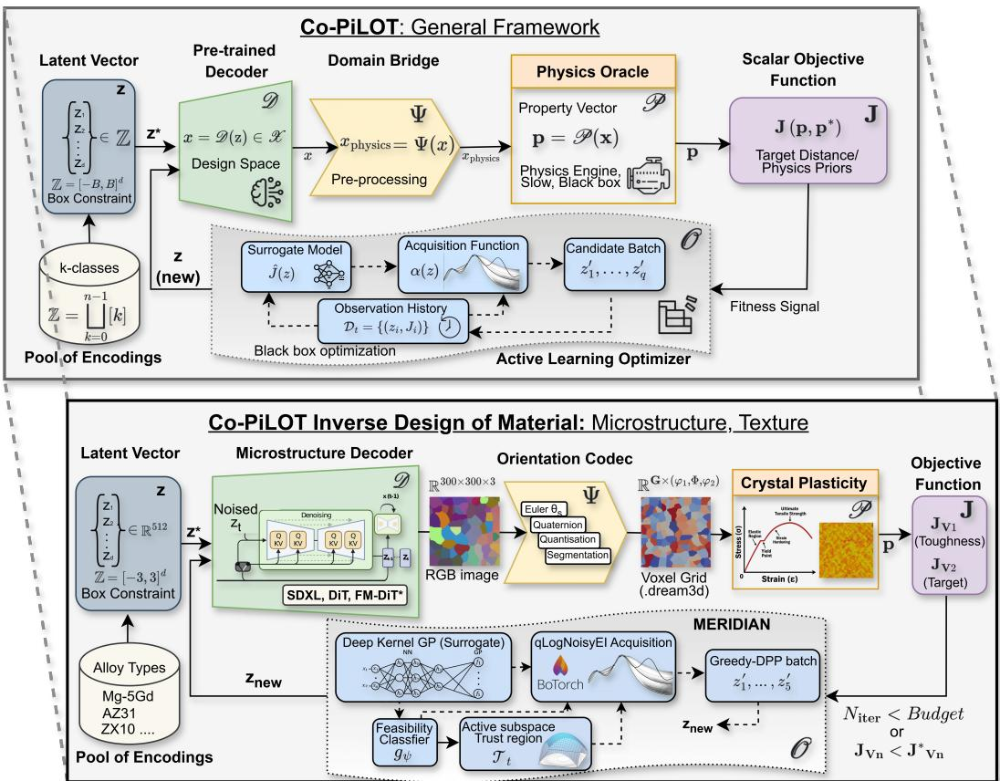
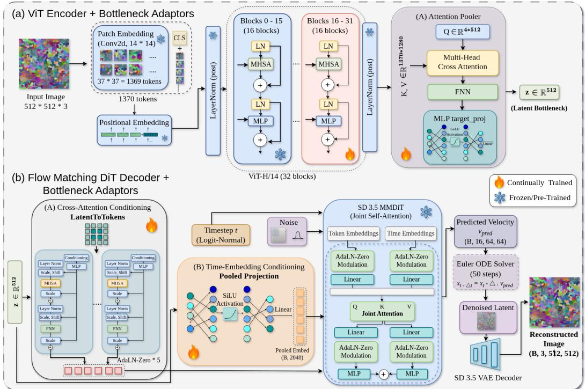
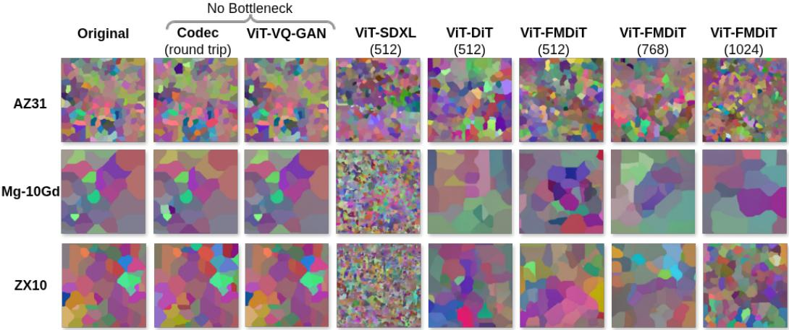
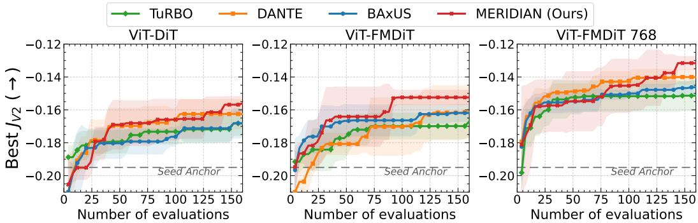
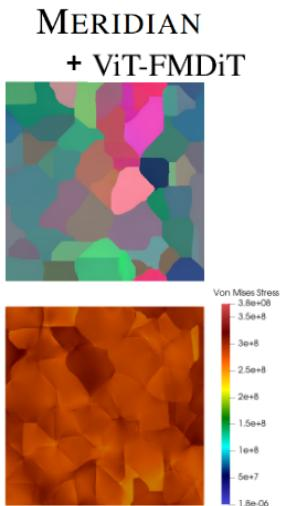
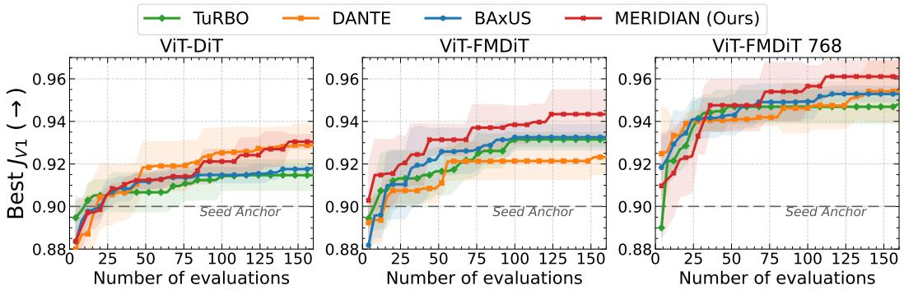
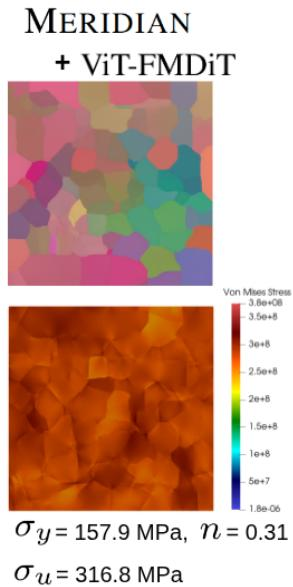
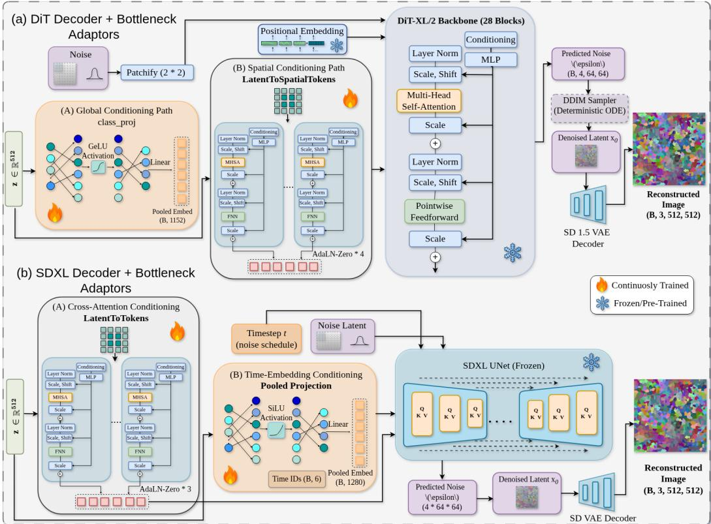
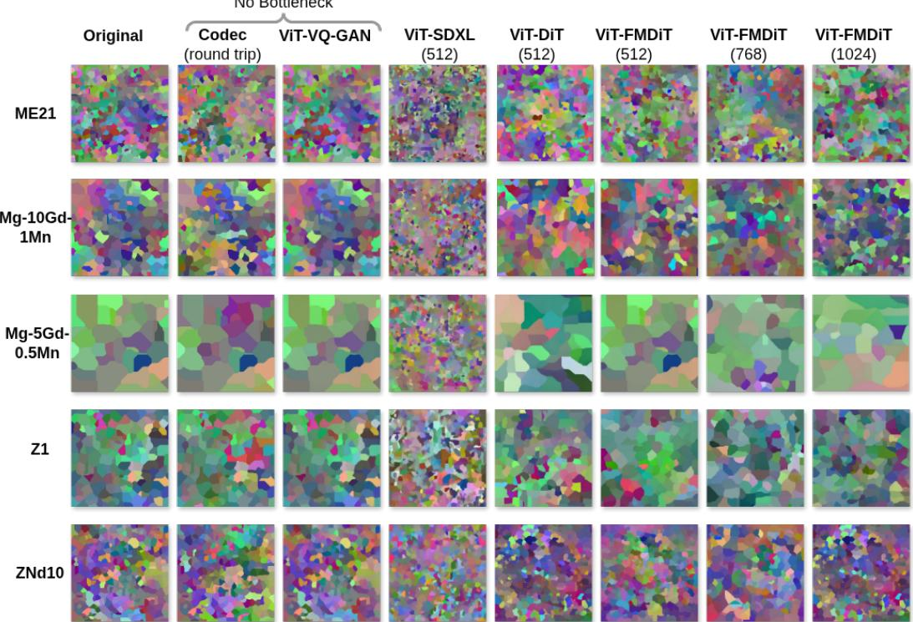

# CO-PILOT: Constrained Physics-Informed Latent Optimization for Target-Driven Inverse Design

Mahish K. Guru<sup>1,2</sup> Mayank Nagar<sup>1</sup> Ayush Vyas<sup>1</sup> Jan Bohlen<sup>1</sup> Roland Aydin<sup>3,4</sup> Noomane Ben Khalifa<sup>1,2</sup>

<sup>1</sup>Institute of Material and Process Design, Helmholtz-Zentrum Hereon, Germany <sup>2</sup>Institute of Production Technology and Systems, Leuphana University Lüneburg, Germany <sup>3</sup>AI for Physical Systems, German Research Center for Artificial Intelligence (DFKI), Germany <sup>4</sup>Saarland University, Germany mahish.guru@hereon.de

## Abstract

Inverse design of physical systems (molecules, devices, microstructures) often reduces to optimizing a high-dimensional structure against an expensive black-box simulator. Direct search is difficult because the space is non-Euclidean, feasibility is hard to encode, and each evaluation is expensive. We present CO-PILOT, a latent optimization approach that maps candidates through a generative encoder–decoder, uses the decoder as a learned validity prior, and searches the latent space with physics-informed black-box optimization. The framework is applied on the inverse design of magnesium alloy microstructure/texture. We develop a vision transformer based–encoder; paired with latent diffusion, diffusion transformer and rectified-flow transformer–based decoders on ∼ 80,000 EBSD-derived microstructure dataset to learn a minimal bottleneck, z. The ViT-FMDiT model (z=768) reconstructs high-fidelity microstructure images (FID 27.86, MS-SSIM 0.178), which our selfsegmenting orientation codec converts into input grids for crystal plasticity solver. Finally, we introduce MERIDIAN, an active latent optimizer driven by deep-kernel Gaussian-process uncertainty, failure-aware feasibility prediction, manifold-aware trust regions, and target-aware acquisition. Within a budget of 160 simulations, the ViT-FMDiT and MERIDIAN combination yields the best target-driven objective score, reducing the relative target error by 3–22% against seven baselines (DANTE, TURBO, BAXUS, CMA-ES, DDOM, SEIKO, DDPO) on the same decoder.

## 1 Introduction

Across science and engineering, the same template recurs: a designer is given a target behaviour and mustfind a physical object that realises it. A medicinal chemist is given a binding-affinity profile and must find a molecule whose density-functional-theory (DFT) energetics match it [1–3]; a photonics engineer is given a target far-field radiation pattern and must find a metasurface whose Maxwell-solver response matches it [4, 5]; a crystallographer is given a desired band gap and must find a periodic crystal whose first-principles spectrum matches it [6–8]. Inverse design asks: given a target property vector p<sup>⋆</sup>, find a design $x ^ { \star } \in \mathcal { X }$ such that $f ( x ^ { \star } ) \approx p ^ { \star }$ , where f is an expensive black-box oracle (e.g., a physical assay or simulator) and a feasibility constraint $g ( x ) \leq 0$ encodes stability requirements. Three structural obstacles make direct search on X intractable. (i) X is discrete and non-Euclidean (graphs of atoms, fields of crystallographic orientations), so gradient methods do not apply through a simulator that has no usable adjoint [9]. (ii) most points in X are physically invalid, and feasibility cannot be expressed as a simple box, so unguided sampling almost never yields a candidate that oracle will run to convergence [10]. (iii) Each evaluation $f ( x )$ costs hours, with $1 0 ^ { 2 } – 1 0 ^ { 3 }$ evaluation budgets that rules out brute-force sampling, GAN-inversion-by-backpropagation [11, 12], and highdimensional Bayesian optimization (BO) over the raw space [13–15]. Prior work side-steps the Preprint.

simulator by training a fast surrogate [6, 7, 16, 17], trading simulator cost for surrogate-fidelity risk that breaks whenever the surrogate is asked to extrapolate past its training distribution.

To ground this framework, we tackle an industrial and scientific challenge that falls entirely out of the ’cheap-oracle’ assumption dominating existing latent-optimization research: target-driven inverse design ofpolycrystalline Magnesium (Mg) alloy microstructures and textures. The protagonist is the engineer with a target stress–strain curve, eg. a structural designer specifying a Mg-alloy AZ31 component for an automotive crash member [18]; a clinician specifying a bioresorbable Mg–Gd bone screw whose yield strength must match cortical bone over a degradation window [19]; an aerospace designer chasing an anisotropic high-toughness texture in a structural panel [20]. In every case the deliverable is not a microstructure image but an arrangement of grains and crystallographic orientations that, when simulated through a crystal-plasticity (CP) oracle such as DAMASK [21], returns a property tuple $( \sigma _ { y } , n , K , \sigma _ { u } )$ within tolerance of the target. Microstructure inverse design is a hard problem because the design space comprises of grains with symmetric-crystallographic orientaions [22, 23] and anisotropic, twin-dominated, and texture-coupled plasticity which causes visually similar microstructures to yield vastly different stress–strain responses [24]; and a single 300×300 CP simulation takes $\sim 6$ minutes and risks divergence [21]. Inverse microstructure and texture design are therefore recognised as ill-conditioned, high-dimensional, and data-starved [25, 26].

Why no off-the-shelf recipe applies? To bypass the intractability of raw search space, one could theoretically map the problem into a continuous latent search space with a pretrained generator $\mathcal { D } : \mathbb { R } ^ { d }  \dot { \mathcal { X } }$ . In such a setup, decoded samples lie near a learned manifold, the latent prior yields a free box constraint $\mathcal { Z } = [ - \dot { B } , B ] ^ { d }$ , and the optimization objective $J \circ f \circ D$ is well-defined. This theoretically enables pure target-driven design, where optimal orientations and grain morphologies emerge directly from stress–strain requirements [27]. In practice, however, existing studies assume cheap oracles [1, 28–30], high-dimensional BO lacks generative priors [13, 14, 31], and recent crystal models [6–8] are built for sampling, not inverse optimization. None can reliably navigate an expensive, occasionally divergent simulator while enforcing valid material-grain orientation fields.

What is new. The latent representation is an enabling component, not our contribution; the methodological claim concerns the optimizer. Existing active-learning optimizers assume that every query returns a valid value and search generic, isotropic regions. MERIDIAN couples two mechanisms not jointly present in any of the seven baselines: failure-aware feasibility learning, a classifier trained on failed decode/codec/solver evaluations that steers acquisition away from likely divergence, and manifold-aware local search, a surrogate-shaped active-subspace trust region with a latent-shell projection that keeps candidates where the decoder yields valid microstructures. To our knowledge, CO-PILOT is also the first closed loop coupling an image-domain generative prior to a crystal-plasticity solver under a 160-simulation budget.

Contributions. We present CO-PILOT (Constrained Physics-informed Latent Optimization for Target-driven inverse design), a framework that lifts inverse design into a pretrained generative latent space and runs a constrained physics-informed black-box optimizer there.

1. General framework (Sec. 3). We formulate inverse design as a 5-tuple $( \mathcal { D } , f , J , \mathcal { C } , \mathcal { O } )$ with independently swappable decoder, oracle, objective, constraint set, and optimizer. The abstraction is domain-agnostic; we demonstrate it on one domain (Mg-alloy microstructures) and leave other instantiations to future work.

2. Microstructure encoder–decoder family (Sec. 3.1). A shared Vision Transformer (ViT) based encoder is paired with a primary Flow Matching Diffusion Transfomer (FMDiT) based decoder, trained jointly on 81,756 EBSD-derived microstructures across 17 Mg-alloy classes.

3. Orientation codec (Sec. 3.2). An invertible map between RGB images and orientation fields with a closed-form decode and a grain-segmentation DREAM.3D writer that is used by the CP solver. It achieves ${ \sim } 0 . 7 ^ { \circ }$ round-trip misorientation, below the $5 ^ { \circ }$ grain-boundary threshold [32, 33].

4. MERIDIAN, a latent optimizer (Sec. 3.4). We developed a combination of a deep-kernel Gaussian Process surrogate, a shared-trunk feasibility classifier, an active-subspace trust region with latent-shell projection, and a DPP batch selector; against seven baselines under a matched budget, ViT-FMDiT-768 with MERIDIAN reaches the best target-driven and toughness-weighted objectives.

The 5-tuple abstraction is domain-agnostic: in principle any setting with a pretrained decoder for X and a slow oracle scoring $\mathcal { D } ( z )$ is in scope (molecules with a VAE and a DFT oracle [1], photonic devices with an EM solver [34], topology optimization with an FEM oracle [35]), but we demonstrate it only on Mg-alloy microstructures. All code is released (Sec. 6).

  
Figure 1: CO-PILOT. (a) General framework and its materials instantiation (b): a Mg-alloy latent $z ^ { \star } \in \mathcal { Z }$ is passed through a decoder D like DIT or FM-DIT, bridged via an orientation codec (Ψ) to a .dream3d grid, scored by a crystal plasticity oracle $f ,$ and reduced to a fitness $J \left( J _ { V 1 } / J _ { V 2 } \right)$ that the MERIDIAN optimizer O feeds back as $z _ { \mathbf { n e w } }$ for the next iteration. Physics enters via the simulator-based objective and feasibility model, and via codec-encoded training data (Sec. 3).

## 2 Related work

High-dimensional latent optimization. Latent-space optimization was popularized by Gómez-Bombarelli et al. [1], who showed that a learned continuous representation can make structured design amenable to gradient-based and Bayesian optimization. Follow-up latent-BO methods add weighted retraining, trust regions, and constrained or multi-objective variants [28–30, 36], but they are largely evaluated with cheap neural property predictors rather than expensive physical simulators. High-dimensional BO methods such as TURBO, BAXUS, and SAASBO improve sample efficiency in large ambient spaces,[13, 14, 31] yet they do not exploit generative priors or explicitly address simulator divergence and structured feasibility, which are central in our setting. Classical black-box optimizers such as CMA-ES remain strong generic baselines [37], although full covariance adaptation scales poorly in high dimensions; we include it in Sec. 5.

Generative inverse design of materials. Generative models have become a standard tool for inverse design in materials and related physical systems [10]. Early materials work used GANs to generate microstructures and couple them to regressors or Bayesian optimization [16, 17], while more recent studies perform inverse design of dual-phase steel microstructures with generative models and BO [38], inverse design of spinodoid architected materials in the small-data regime via BO [39], or use diffusion models for nonlinear mechanical metamaterials and multi-material structures [40, 41]. For polycrystals, even representing microstructure for design remains open [42], and inverse microstructure and texture design rely on informative low-dimensional priors or conditional normalizing flows in active-learning loops [25, 26]. In crystals, CDVAE, DiffCSP, and MatterGen show that modern generative models can capture complex structure distributions [6–8], but these methods are primarily built for sampling or one-shot conditional generation rather than iterative optimization under a strict expensive-oracle budget.

Black-box optimization around generators. Our work is closest in spirit to methods that place an outer optimization loop around a pretrained generator, as in latent BO for molecules [1, 28], photonic inverse design with neural generators and EM solvers [4, 5, 34], and GAN-based topology optimization with FEM [35, 40]. Diffusion black-box optimizers (DDOM [43]) and reward finetuning of diffusion models (DDPO [44], SEIKO [45]) assume offline data or far larger query budgets; optimizing over learned models can exploit adversarial modes [46], and coupling generative models to PDE physics remains frontier work [47]. The key gap is that these settings typically rely on cheaper solvers, smoother objectives, or direct conditional generation. CO-PILOT instead targets the harsher regime of constrained latent optimization with a slow, occasionally divergent physics solver, and therefore emphasizes calibrated surrogates, feasibility modeling, and robust search in pretrained latent spaces.

## 3 Method

The central act of CO-PILOT is the tight coupling of a pretrained microstructure decoder D (Sec. 3.1) with a physics-informed optimizer O (Sec. 3.3) via an orientation codec ensuring crystallographic validity (Sec. 3.2). Operating hand-in-hand inside a single loop (Fig. 1), the decoder turns a latent vector z∈Z into a candidate design, while the optimizer proposes the next z to query based on a scalar fitness J returned by an oracle simulator f (Sec. 3.4).

Problem formulation. Let X denote a structured design space (microstructures, molecules, $\cdots )$ $f : \mathcal { X } \to \mathbb { R } ^ { k }$ an expensive oracle returning a property tuple $\begin{array} { r } { \dot { p ^ { \prime } } = f ( x ) \in \mathbb { R } ^ { k } , p ^ { \star } \in \mathbb { R } ^ { k } } \end{array}$ a target vector, $J : \mathbb { R } ^ { k } $ R a scalar objective combining target distance and physics priors, and $g : \mathcal { X }  \mathbb { R } ^ { m }$ feasibility constraints. Given a pretrained encoder–decoder pair $( \mathcal { E } , \mathcal { D } )$ with $\mathcal { D } : \bar { \mathbb { R } ^ { d } } \to \mathcal { X }$ , CO-PILOT maps X into the latent box $\mathcal { Z } = [ - B , B ] ^ { d }$ inherited from the latent prior and solves

$$
z ^ { \star } \ = \ \arg \operatorname* { m a x } _ { z \in \mathcal { Z } } \ J \big ( f ( \mathcal { D } ( z ) ) ; p ^ { \star } \big ) \ - \ \lambda \cdot \operatorname { R e L U } \bigl ( g ( \mathcal { D } ( z ) ) \big ) , \qquad x ^ { \star } = \mathcal { D } ( z ^ { \star } ) .\tag{1}
$$

This reformulation has three structural advantages. (i) Deliberate validity as $\mathcal { D } ( z )$ is always a plausible design. (ii) Box constraint gives a natural prior Z. (iii) Regularised search space as the decoder restricts the optimizer to a learned manifold, resulting in structured modeling target than direct search over the raw X. The materials instantiation (Fig. 1b) dictates the anatomy of this section.

Where physics enters CO-PILOT. “Physics-informed” follows the physics–ML taxonomies of von Rueden et al. [48], Karniadakis et al. [49], not PINN-style residual losses. Physics enters at two levels (Fig. 1b). (1) Physics-informed objective: J is computed from a crystal-plasticity simulation at every iteration $( J _ { V 2 }$ measures distance to the target properties, $J _ { V 1 }$ adds a ductility floor, both penalise unphysical grain counts), and MERIDIAN’s feasibility model learns simulator divergence (Secs. 3.3, 3.4); this is knowledge integration via the learning objective [48]. (2) Physics-augmented learned components: the encoder–decoder is trained on codec-encoded EBSD maps whose every pixel is a valid HCP orientation, so the latent manifold is a manifold of physically realisable microstructures, and MERIDIAN’s surrogate is warm-started on 100 crystal-plasticity simulations rather than a cold random prior (Secs. 3.2, 5).

## 3.1 Implementation of Encoder–Decoder (D)

CO-PILOT is built around a continually pre-trained stack: a ViT-H/14 encoder [50, 51] and diffusion decoders- SDXL [52], SD3.5 [53], and DiT-XL/2 [54], that are pre-trained on massive natural-image datasets. We posit this prior is very effective for microstructure reconstruction on a very thin bottlneck z. Even a $d { = } 5 1 2$ bottleneck $( \sim 1 5 0 0 \times$ compression) recovers grain morphology, crystallographic colour, and property statistics that are compareable to a from-scratch decoder (Sec. 4).

A single shared encoder architecture. A ViT-H/14 trunk maps $5 1 2 ^ { 2 } \times 3$ orientation-as-RGB microstructure images to 1369 patch tokens plus [CLS] token. 2B weights are reused with the lower 16 blocks frozen and the upper 16 unfrozen (Fig. 2(a)), retaining the natural-image prior while letting the top of the trunk specialise to EBSD imagery. The [CLS]-only readout is replaced by a four-query ATTENTION POOLER (cross-attention over all 1370 tokens, query self-attention, per-query FFN, then

  
Figure 2: (a) Encoder E, ViT-H/14 trunk → ATTENTION POOLER with $z \in \mathbb { R } ^ { d }$ . (b) Decoder D, Frozen SD3.5 MMDiT conditioned via a LATENTTOTOKENS adaptor and POOLED PROJECTION.

merged) followed by a two-layer MLP that maps to bottleneck $z \in \mathbb { R } ^ { d }$ , with d=512 as the headline;   
d ∈ {768, 1024} are reported as the bottleneck-capacity ablation in Sec. 4.

Three diffusion decoders are each conditioned solely on the bottleneck, z. The pre-trained backbones are frozen and lightweight adaptors are introduced that translate z into the native conditioning format of each model (Fig. 2b). FM-DiT (frozen SD3.5 MMDiT [53]): We introduce a LATENTTOTOKENS adaptor using 16 queries and 5 QK-normed AdaLN-Zero blocks [54]. This generates 16×4096 tokens for the joint attention layers, while a POOLED PROJECTION head provides the 2048-D global embedding. SDXL (frozen denoising UNet [52]): The latent z is mapped to 77×2048 tokens via 3 AdaLN-Zero blocks. We initialize the outer layers with 0.10 Xavier gain, as standard zeroinitialization collapses the conditioning heads. A POOLED PROJECTION head maps z to the 1280-D embedding, and we apply classifier-free guidance [55]. DiT (DiT-XL/2 [54]): Unlike the others, this model isfully trainable, as freezing the backbone fails during the 256→512 resolution transfer. We repurpose the DiT class-embedding slot to inject z using a CLASSPROJ head. Additionally, 16×1152 spatial tokens are injected via zero-initialized residuals at blocks {0, 7, 14, 21}. Architectures for SDXL and DiT are deferred to App. Fig. 8. We also include a pixel-space VQGAN [56] with a separate codebook as a non-z-bottleneck baseline.

Joint training. Encoder, conditioning adaptors, and backbone (for ViT-DiT) are trained jointly under a composite of latent-space generative terms, a latent-alignment regulariser, and a pixel-space frequency term that is gated to small denoising times t. The loss function per batch, with ${ \hat { x } } _ { 0 }$ as the clean-latent estimate, z as the bottleneck, and $\overline { { z ^ { \prime } } }$ as its augmentation-twin embedding is given as,

$$
{ \mathcal { L } } = \lambda _ { \mathrm { d i f f } } { \mathcal { L } } _ { \mathrm { d i f f } } + \lambda _ { \mathrm { r e c } } { \mathcal { L } } _ { \mathrm { r e c } } + \lambda _ { \mathrm { c o n } } { \mathcal { L } } _ { \mathrm { c o n } } + \lambda _ { \mathrm { v i c } } { \mathcal { L } } _ { \mathrm { v i c } } + \lambda _ { \mathrm { f r e q } } { \mathcal { L } } _ { \mathrm { f r e q } } ,\tag{2}
$$

where ${ \mathcal { L } } _ { \mathrm { d i f f } }$ is the backbone’s native objective — the rectified-flow velocity loss $\| v _ { \theta } ( x _ { t } , t , z ) \ -$ $( \epsilon - x _ { 0 } ) \| _ { 2 } ^ { 2 }$ for ViT-FMDiT [57] and the standard MSE loss for ViT-SDXL and ViT-DiT; $\mathcal { L } _ { \mathrm { r e c } } =$ $\mathbb { E } _ { t } \big [ ( 1 - t ) ^ { \overline { { 2 } } } \| \hat { x } _ { 0 } - x _ { 0 } \| _ { 2 } ^ { 2 } \big ]$ is a timestep-weighted clean-latent reconstruction term that emphasises lownoise steps; ${ \mathcal { L } } _ { \mathrm { c o n } }$ is an InfoNCE-style contrastive loss over $\{ z , z ^ { \prime } \}$ pairs; ${ \mathcal { L } } _ { \mathrm { v i c } }$ is a VICReg variance– covariance regulariser [58] that keeps the bottleneck non-collapsed; $\mathcal { L } _ { \mathrm { f r e q } } = \| \log ( 1 { + } | \mathcal { F } ( \hat { I } ) | ) -$ log $( 1 + | \mathcal { F } ( I ) | ) \| .$ is an FFT-amplitude pixel loss with a radial high-frequency mask, evaluated on a small subsample of the batch. The five λs follow one fixed LossWeightScheduler schedule, reused for every ViT-FMDiT model and never tuned per experiment: $\lambda _ { \mathrm { d i f f } }$ rises 0.5→1.0 while $\lambda _ { \mathrm { { r e c } } }$ and $\lambda _ { \mathrm { c o n } }$ decay, and the two regularisers enter with a delayed onset (App. C); perturbing it moves held-out

```latex
Algorithm 1 Orientation codec — encode (Dream3D → image) and decode (image → Dream3D)
Encode $( \mathcal { G } , \{ q _ { g } \} , \mathcal { N } { = } ( \mathcal { V } , \mathcal { E } ) , \bar { q } _ { c } )$
1: $g ^ { \star } \gets$ arg ma $\begin{array} { r } { \operatorname { \ i x } _ { g \in \mathcal { V } } | \{ ( i , j ) : \mathcal { G } [ i , j ] = g \} | ; q _ { g ^ { \star } }  \arg \operatorname* { m a x } _ { s , \sigma } \sigma \langle s \cdot q _ { g ^ { \star } } , \bar { q } _ { c } \rangle } \end{array}$ ▷ root + anchor
2: for $( g _ { p } , \bar { g } _ { c } ) \in \breve { \mathcal { E } }$ from $g ^ { \star }$ do
3: $\begin{array} { r } { q _ { g _ { c } } \gets \arg \operatorname* { m a x } _ { s , \sigma } \sigma \langle s \cdot q _ { g _ { c } } , q _ { g _ { p } } \rangle } \end{array}$ ▷ Eq. (5)
4: end for
5: $q _ { g }  \bar { q } _ { c } ^ { - 1 } \cdot q _ { g }$ with $q _ { g , w } \geq 0 ; S _ { g } \gets q _ { g , x y z } / ( 1 + q _ { g , w } )$ ▷ Eq. (7)
6: return im $\beta [ i , j ] = \left\lfloor ( S _ { \mathcal { G } [ i , j ] } + 1 ) / 2 \cdot ( 2 ^ { b } - 1 ) \right\rceil$
Decode $( \mathrm { i m g } , \bar { q } _ { c } )$
7: $S \gets 2 \operatorname* { i m g } / ( 2 ^ { b } - 1 ) - 1 ; q _ { w } \gets ( 1 - \| S \| _ { * } ^ { 2 } ) / ( 1 + \| S \| ^ { 2 } ) , q _ { x y z } \gets 2 S / ( 1 + \| S \| ^ { 2 } )$ ▷ Eq. (8)
8: $q  \bar { q } _ { c } \cdot q .$ then fold: $q \gets \arg \operatorname* { m a x } _ { s } \big [ s \cdot q \big ] _ { \boldsymbol { \imath } }$ w ▷ HCP fundamental zone
9: G ← conn_comp (img; τ ) ▷ τ=1 for b=8
10: return DAMASK-ready .dream3d with per-pixel Euler
```

PSNR by at most 0.09 dB (Tab. 6). A two-phase schedule freezes the encoder for the first seven epochs and unfreezes its last 16 blocks at epoch 8, in step units to absorb the topology change when the optimizer is rebuilt and the cosine schedule recomputed. More details on the implementations can be found in App. C.

## 3.2 Orientation codec (Ψ)

Why a dedicated codec? A generic pretrained image decoder emits an RGB tensor; a crystalplasticity solver expects an HCP orientation field. The codec is the enabling bridge Ψ in Fig. 1(b): an invertible map between HCP orientation fields and 8-bit RGB images that unlocks the decoder– optimizer loop in Sec. 3.4 to use any image-domain generator as a microstructure prior. Naively mapping Bunge–Euler orientations $( \varphi _ { 1 } , \Phi , \varphi _ { 2 } )$ to RGB triples corrupts the any image-domain decoder data in three ways: periodic wrap-around at $0 / 2 \pi$ becomes ringing; For Hexagonically Closed Pack (HCP) fundamental zone, per-grain folding maps physically adjacent grains to opposite quaternions, becoming high-frequency color edges which blurs the decoder output; and recovering the $q _ { w }$ (quaternions) produces NaNs whenever decoder noise pushes negative square-root. The codec resolves all three through a 5-step encode and a closed vectorised decode (Alg. 1).

Five-step pipeline. Each per-grain orientation is converted to a unit quaternion $q \in S ^ { 3 } \ [ 5 9 ]$ under HCP point-group $D _ { 6 } \left( \vert S _ { \mathrm { H C P } } \vert = 1 2 \right)$ . The encode then proceeds: (1) Continuous unfolding: breadthfirst-search (BFS) over the grain-adjacency graph replaces each grain’s quaternion by the symmetry equivalent closest to its already-visited parent (Eq. 5), so RGB distance between adjacent grains is proportional to their true misorientation, no artificial fundamental-zone jumps. (2) Class-level anchor: a single per-class anchor $\bar { q } _ { c }$ is precomputed via the eigenvalue method of Markley et al. [60] from M=50 file-level means; using a class-level anchor enables decoder generated images without per-sample metadata. (3) Frame centring. $q _ { g }  \bar { q } _ { c } ^ { - 1 } \cdot q _ { g }$ concentrates the distribution near identity, away from the $q _ { w } { = } 0$ equator where the double-cover sign flip would reintroduce discontinuities. (4) Stereographic projection. $S = q _ { x y z } / ( 1 + q _ { w } ) \in [ - \bar { 1 } , 1 ] ^ { 3 }$ has the closed-form rational inverse in Eq. 8 (no square roots, numerically stable on all of $\mathbb { R } ^ { 3 } )$ . (5) Quantisation: S is linearly mapped to $[ 0 , 2 ^ { \delta } - 1 ] ^ { 3 }$ . The per-channel step $\Delta \doteq 2 / ( 2 ^ { b } - 1 )$ bounds the worst-case angular error at ${ \mathrm { \approx } } 0 . 7 { \bar { 8 } } ^ { \bar { \circ } }$ . The 8-bit PNG variant is used inside $\mathrm { C O - P I L O T }$ , it plugs directly into a pretrained D, and its measured ${ \sim } 0 . 6 ^ { \circ }$ mean error (App. D, Tab. 8) is far below the grain-boundary threshold [32]. Self-segmenting decode is done at inference where no ground-truth label map is available for a generated image. The decoder recovers grains by linking 4-connected pixels whose max-channel intensity differs by at most τ (τ=1 for 8-bit, τ=50 for 16-bit image) via a single sparse-graph connected-components pass [33].

## 3.3 Crystal plasticity simulation pipeline and objectives $( f \circ { \mathcal { D } } , J )$

With the codec in place, the materials oracle composes into

$$
z \xrightarrow { \mathcal { D } } { \mathrm { P N G ~ \xrightarrow { \mathrm { c o d e c } } ~ } } \cdot { \mathrm { d r e a m 3 d ~ \xrightarrow { \mathrm { D A M a S K } } ~ } } { \mathrm { H D F 5 ~ \xrightarrow { \mathrm { H o l l o m o n } } ~ } } p \xrightarrow { J } \mathbb { R } ,
$$

where the mechanical property tuple $p = ( \sigma _ { y } , n , K , \sigma _ { u } , \varepsilon _ { u } )$ collects the 0.2%-offset yield stress $\sigma _ { y } ,$ the Hollomon hardening exponent $n ,$ strength coefficient $K ,$ , the ultimate tensile stress $\sigma _ { u } ,$ and the uniform strain $\varepsilon _ { u }$ at $\sigma _ { u } .$ . The grain table emitted by the codec (Sec. 3.2) — per-grain median

Algorithm 2 MERIDIAN, one outer round per iteration $t = 1 , \ldots , T .$   
Require: Box Z, batch size q, oracle $f ,$ decoder $\mathcal { D } ,$ class pool ${ \mathcal P } ,$ , seed cache $\mathcal { D } _ { t 0 }$   
1: $\mathbf { \bar { \boldsymbol { D } } } _ { t } \gets \boldsymbol { \mathcal { D } } _ { t 0 } ; \quad L \gets L _ { \mathrm { i n i t } } ; \quad r ,$ plat ← 0   
2: for $t = 1 , \dots , T$ do   
3: fit trunk, feasibility head, and GP on $\mathcal { D } _ { t }$ (surrogate)   
4: $w  \mathrm { A S } ( \nabla \hat { \mu } ) \mathrm { i f } \ i \geq 3 ,$ else $\operatorname { P C A } ( { \mathcal { P } } )$ (subspace)   
5: $z _ { c } \gets \mathrm { c e n t r o i d } _ { \mathrm { t o p } K } ( \mathcal D _ { t } ) ; \quad Z _ { \mathrm { c a n d } } \gets \Pi _ { \mathrm { s h e l l } } , \ U \sim \mathrm { S o b o l }$ (cloud)   
6: $\alpha ( z )  \mathrm { q L o g N E I } ( z ; \mu , \sigma ) g _ { \psi } ( z )$ for $V 2$ (acquisition)   
7: $S \gets \mathrm { t o p } _ { 2 5 6 } ( Z _ { \mathrm { c a n d } } , \alpha ) ; \quad Z _ { \mathrm { b a t c h } } \gets \mathrm { G r e e d y D P P } ( S , q ; k _ { ( \phi , z ) } )$ (batch)   
8: $\mathcal { D } _ { t }  \mathcal { D } _ { t } \cup \{ ( z , f ( \mathcal { D } ( z ) ) ) \} _ { z \in Z _ { \mathrm { b a t c h } } } ;$ update $L$ and plat   
9: if $L < L _ { \mathrm { m i n } } \mathrm { o r } \mathrm { p l a t } \geq K _ { \mathrm { p l a t } }$ then restart from $\mathcal { P }$ or mini-MCTS   
10: end for   
11: return $z ^ { \star } = \arg \operatorname* { m a x } _ { c _ { i } = 1 } y _ { i }$ and $\mathcal { D } ( z ^ { \star } )$

Euler angles, voxel counts, phase IDs — is written as a DREAM.3D representative volume element (RVE) polycrystal that DAMASK consumes directly. Each candidate is driven through the DAMASK Grid solver, an FFT-based spectral scheme for periodic RVEs [21], under uniaxial tension along the extrusion direction at a quasi-static strain rate $( \dot { \varepsilon } = 1 0 ^ { - 3 } \mathrm { s ^ { - 1 } }$ , 25% total nominal strain). The constitutive law is the HCP phenomenological power law of Roters et al. [21] with the Mg-alloy AZ31- calibrated parameter set covering tensile twinning; basal, prismatic, and pyramidal slip deformation mechanisms explained in App. E). Non-converged runs — a small minority, primarily on degenerate decoded grains — are excluded from the surrogate’s training set in all optimizers.

Objective: $J ( p )$ has two complementary forms: a toughness-weighted strength score $J _ { V 1 }$ that simultaneously rewards high yield $\sigma _ { y }$ and high plastic work to UTS (proxied by $\sigma _ { u } \varepsilon _ { u } )$ , and a targetdriven score $J _ { V 2 }$ that penalises weighted distance to a user-supplied target $p ^ { \star } = ( \sigma _ { y } ^ { \star } , n ^ { \star } , K ^ { \star } , \sigma _ { u } ^ { \star } )$

$$
\begin{array} { r } { J _ { V 1 } ( p ) = \Big ( \frac { \sigma _ { y } } { \sigma _ { y } ^ { \mathrm { r e f } } } \Big ) ^ { \alpha } \Big ( \frac { \sigma _ { u } \varepsilon _ { u } } { T ^ { \mathrm { r e f } } } \Big ) ^ { \beta } - \lambda _ { n } \operatorname { R e L U } ( n _ { \mathrm { m i n } } - n ) , \qquad J _ { V 2 } ( p ; p ^ { \star } ) = - \sqrt { \sum _ { p \in \mathcal { T } } w _ { p } \big ( \frac { p - p ^ { \star } } { | p ^ { \star } | } \big ) ^ { 2 } } . } \end{array}\tag{3}
$$

The $n _ { \mathrm { m i n } }$ floor in $J _ { V 1 }$ rejects brittle solutions; both add a saturating grain-count band penalty (App. E) since the constitutive law is grain-size insensitive and the optimizer would otherwise reach the target via a few large favourably-oriented grains or via speckle decodes with thousands of grains. The constants in Eq. $( 3 ) \left( \alpha , \beta , w _ { p } , p ^ { \star } \right)$ are not tuned: they encode the design goal, so changing them changes the question being asked rather than how well it is answered.

## 3.4 Optimizer: MERIDIAN (Ours) (O)

We deploy MERIDIAN (Manifold-Embedded Robust Inverse Design via Iterative Acquisition Networks) as the primary optimizer and benchmark it against seven baselines under the same box, seed cache, and budget: DANTE [61] (MLP surrogate with tree exploration), TURBO [13] (GP with a single trust region), BAXUS [14] (GP in a random subspace), CMA-ES [37] and DDOM [43] as optimizer-level comparisons, and SEIKO [45] and DDPO [44], which fine-tune the decoder itself, as framework-level comparisons. Implementations and hyperparameters (Tabs. 10, 11) are in App. F.

Why a dedicated optimizer? Three properties specific to CO-PILOT shapes the design. The oracle is expensive (∼ 15 min/sim) and a non-trivial fraction of evaluations fail at decode, codec, or solver gates, so the optimizer must model both where the response is uncertain and where it returns a finite value. Pre-trained image-domain decoders place their training mass on a thin spherical shell of the latent box (e.g. $\lVert z \rVert = 2 2 . 0 7 \pm 0 . 0 5$ for ViT-FMDiT-512), so any perturbations in $\mathbb { R } ^ { 5 1 2 }$ leave this shell and waste simulator calls. DANTE’s point-estimate MLP and visit-count tree miss all three; the GP-trust-region baselines satisfy uncertainty but neither manifold geometry nor batch diversity. MERIDIAN retains the iterative “surrogate → candidate cloud → diverse batch” skeleton common to other three optimizers and replaces every component on which it breaks for this problem (Tab. 10).

One round of MERIDIAN. Each outer iteration begins by refitting the surrogate: a shared MLP feature map $\phi _ { \theta } : \mathbb { R } ^ { 5 1 2 } \to \mathbb { R } ^ { 1 6 }$ is trained jointly with a logistic feasibility classifier $g _ { \psi }$ (on all observations, so the failure signal is preserved), after which an exact ARD-Matérn-5/2 GP is fit on the feasible subset on top of $\phi _ { \theta }$ to supply calibrated $( \mu , \sigma ^ { 2 } )$ . From the surrogate we read off an importance-weighted axis vector w $\in \mathbb { R } ^ { 5 1 2 }$ via the active subspace of $\hat { C } = \mathbb { E } [ \nabla \hat { \mu } \nabla \hat { \mu } ^ { \top } ]$ (PCA of the class-conditional pool $\mathcal { P }$ during cold start) [62]. We then anchor the round on the shell-projected centroid of the top-K feasible incumbents and draw a Sobol cloud around it whose perturbations are scaled by the trust-region edge $L _ { t }$ and the importance weights w on a sparse axis mask, so that proposals respect the manifold’s anisotropy without ignoring rare-direction pockets, and then project the cloud onto the adaptive shell $\lVert z \rVert \bar { \mathbf { \Omega } } \in [ \mu _ { \lVert X \rVert } \bar { \pmb { \mathbf { k } } _ { \sigma } } \sigma _ { \lVert X \rVert } ]$ , which is measured from the feasible data each round. Acquisition combines a feasibility-gated qLogNoisyExpectedImprovement, $\alpha _ { \mathrm { G P } } ( z ) = \mathrm { q L o g N E I } ( z ; \mu , \bar { \sigma } ) g _ { \psi } ( z )$ , a Monte-Carlo EI term, for the target-driven $V 2 ^ { - }$ objective, computed through heteroscedastic property heads on $\phi _ { \theta }$ . The top-256 candidates ranked by α are passed to a greedy quality-weighted DPP [63] with a hybrid $\bigl ( \phi , z \bigr )$ kernel that returns a diverse batch of proposals; the batch is then evaluated through $\mathcal { D }  \mathrm { D A M A S K } , L _ { t }$ updated under success/failure cadence, and a restart fired whenever $L _ { t }$ collapses or best plateau runs overflow $K _ { \mathrm { p l a t } }$ rounds. MERIDIAN, in this configuration with hyperparameters and more explanation are in App. F.6.

## 4 Experiment 1: Microstructure reconstruction (E1)

The encoder–decoder models described in Sec. 3.1 are trained once and then frozen for all downstream optimization experiments in Sec. 5. Expanding on the data corpus of Guru et al. [24], we assemble 81,756 training and 9,084 held-out test RGB microstructures; this expansion was achieved through geometry and physics-aware oversampling, the details of which are outside the scope of this paper and will be documented in a future publication. All the models from Tab. 1 are trained on 4×H200 GPUs, and a standard 30-epoch run on the training split takes roughly 12 hours. The VQGAN reference, FM-DiT at z ∈ {512, 768, 1024}, and SDXL all use epoch-30 checkpoints; DiT is substantially heavier because its denoiser backbone is unfrozen, carrying about 1.17B trainable parameters versus roughly 381M–391M for the FMDiT family, and the comparison therefore uses the latest available epoch-20 checkpoint from the same training regime. We score reconstruction quality with three computer-vision metrics and two material science metrics. FID is the distribution-level realism score, MS-SSIM captures multi-scale structural similarity, and LPIPS captures perceptual distance [64–66]. For materials fidelity, we report $G _ { \mathrm { m } }$ for grain recovery (fraction of original grains recovered at $\mathrm { I o U } \geq 0 . 3$ , capturing grain size and aspect-ratio agreement) and $\Delta _ { \mathrm { o r i } }$ for crystallography (mean disorientation between IoU-matched per grains per-class mean quaternions).

  
Figure 3: Qualitative Reconstructions on AZ31 and Mg-10Gd. More examples in Fig. 9

ViT-DiT achieves the best FID, while the ViT-FMDiT family (specifically at $d { = } 7 6 8 )$ achieves the best G —indicating the strongest grain-level recovery in size and shape—alongside the best MS-SSIM, LPIPS, and $\Delta _ { \mathrm { o r i } }$ among bottlenecked decoders (Tab. 1). ViT-FMDiT’s performance is stable across bottleneck size, allowing the optimization loop (Sec. 5) to use a tighter bottleneck without sacrificing fidelity. Conversely, ViT-SDXL struggles to adapt its text-conditioned UNet to a 512-D continuous bottleneck, yielding the worst metrics (FID ∼ 108) and visibly washed-out grains in Fig. 3. An unbottlenecked ViT-VQGAN provides an upper bound for reconstruction, while the orientation codec establishes the error floor. The codec’s $\Delta _ { \mathrm { o r i } }$ error is safely within CP tolerances. While the bottlenecked decoders preserve macroscopic morphology and class statistics (e.g., AZ31, Mg-10Gd), their orientation space is non-isometric and symmetry-blind. This introduces a ${ \sim } 5 3 ^ { \circ }$ per-pixel disorientation into the end-to-end round-trip. This residual error acts as a class-preserving reshuffle rather than a physical violation as the decoded grains remain in the HCP fundamental zone, and their texture statistics (quaternion mean, pole-figure spread) matches the target class. Therefore, we carry ViT-DiT and ViT-FMDiT with d ∈ {512, 768, 1024} into the CO-PILOT loop as robust generators of statistically valid microstructures rather than exact reconstructors.

Table 1: Reconstruction quality and microstructural fidelity on the test set $( n = 9 , 0 8 4 ) .$
<table><tr><td>Decoder</td><td>z</td><td>FID↓</td><td>MS-SSIM ↑</td><td>LPIPS↓</td><td> $G _ { \mathrm { m } } \uparrow$ </td><td> $\Delta _ { \mathrm { o r i } } \downarrow$ </td></tr><tr><td>No bottleneck</td><td></td><td></td><td></td><td></td><td></td><td></td></tr><tr><td>VQGAN</td><td>一</td><td>35.63</td><td> $0 . 8 7 6 \pm 0 . 1 2$ </td><td> $0 . 1 3 2 \pm 0 . 1 0$ </td><td> $0 . 7 4 7 \pm 0 . 1 6$ </td><td> $2 7 . 6 1 9 \pm 1 0 . 0 1$ </td></tr><tr><td>Codec</td><td>一</td><td>0.95</td><td> $0 . 4 4 9 \pm 0 . 2 8$ </td><td> $0 . 3 6 8 \pm 0 . 1 5$ </td><td> $0 . 9 2 6 \pm 0 . 0 8$ </td><td> $7 . 2 0 0 \pm 4 . 2 6$ </td></tr><tr><td>SDXL</td><td>512</td><td>108.28</td><td> $0 . 0 7 7 \pm 0 . 0 5$ </td><td> $0 . 6 5 0 \pm 0 . 0 8$ </td><td> $0 . 3 7 0 \pm 0 . 1 5$ </td><td> $5 6 . 4 6 7 \pm 8 . 4 1$ </td></tr><tr><td>DiT</td><td>512</td><td>23.19*</td><td> $0 . 1 4 7 \pm 0 . 1 8$ </td><td> $0 . 6 0 3 \pm 0 . 0 8$ </td><td> $0 . 4 8 6 \pm 0 . 1 2$ </td><td> $5 5 . 3 6 3 \pm 1 0 . 3 5$ </td></tr><tr><td>FM-DiT</td><td>512</td><td>27.86</td><td> $0 . 1 6 9 \pm 0 . 2 0$ </td><td> $0 . 5 7 8 \pm 0 . 0 7$ </td><td> $\mathbf { 0 . 5 0 1 \pm 0 . 1 1 ^ { \ast } }$ </td><td> $\mathbf { 5 3 . 9 2 1 \pm 1 1 . 6 8 ^ { \ast } }$ </td></tr><tr><td>FM-DiT</td><td>768</td><td>27.86</td><td> $\mathbf { 0 . 1 7 8 \pm 0 . 2 1 ^ { \ast } }$ </td><td> $\mathbf { 0 . 5 7 2 \pm 0 . 0 7 ^ { \ast } }$ </td><td> $0 . 4 7 4 \pm 0 . 1 2$ </td><td> $5 4 . 3 1 8 \pm 1 1 . 1 6$ </td></tr><tr><td>FM-DiT</td><td>1024</td><td>27.08</td><td> $0 . 1 7 4 \pm 0 . 2 1$ </td><td> $0 . 5 7 4 \pm 0 . 0 7$ </td><td> $0 . 4 7 5 \pm 0 . 1 2$ </td><td> $5 4 . 3 5 3 \pm 1 0 . 8 1$ </td></tr></table>

All bottlenecked decoders share the ViT based encoder; names omit the ViT prefix. <sup>∗</sup>Best bottlenecked decoders.

  
Figure 4: Best Mean Target-Driven $J _ { V 2 }$ versus num. of evaluations (batch size 4, $n _ { \mathrm { s e e d } } = 5 )$

## 5 Experiment 2: Materials inverse design (E2)

E2 tests the central claim : Can CO-PILOT find statistically valid AZ31 microstructures whose simulated stress–strain summaries match a user-specified mechanical target? We use the optimizer suite from Sec. 3.4 and the trained decoders from Sec. 4. The target, $p ^ { \star } = ( \sigma _ { y } ^ { \star } , n ^ { \star } , K ^ { \star } , \sigma _ { u } ^ { \star } ) =$ $( 1 6 0 \mathrm { M P a } , 0 . 3 0 2 , 6 0 4 \mathrm { M P a } , 3 1 6 \mathrm { M P a } )$ is set. Each cell uses 5 independent runs and the same 100 $( z _ { \mathrm { i n i t } } < - > \mathrm { D A M A S K }$ evaluation) seed cache for warm starting the surrogate model. The optimizer evaluates 40 iterations with batch size $^ { 4 , }$ i.e. 160 new simulator evaluations per run. Average runtime per evaluation on a 700 W H200 is 8.46 hours with a GPU energy estimate of approx 5.93 kWh across the full sweep. Table 2 identifies ViT-FMDiT-768 with MERIDIAN as the strongest target-driven configuration. After 144 evaluations (Fig. 4), it yields the closest overall target match $( J _ { V 2 } = - 0 . 1 3 2 \pm 0 . 0 0 4 , \sigma _ { y } = 1 5 9 . 1 \mathrm { M P a } , n = 0 . 2 9 9 , \sigma _ { u } = 3 1 4 . 0 \mathrm { M P a } )$ , successfully falling within the AZ31 material class. This success highlights a key principle: the optimizer and decoder must align. The 768-D bottleneck offers the ideal trade-off—more expressive than 512-D, yet dense enough for local surrogate modeling. Conversely, the 1024-D bottleneck adds expressivity but becomes too sparse under a 160-evaluation budget, so larger latents do not automatically improve inverse design. This reinforces our core conclusion: successful inverse design requires an optimizer whose inductive biases match the encoder-decoder’s latent space (see App. A for $J _ { V 1 } )$ .

Extended baselines. On ViT-FMDiT-768/1024 we also ran CMA-ES, DDOM, SEIKO, and DDPO under the same protocol (Tab. 2, lower rows). MERIDIAN stays best (−0.132/−0.150); DDOM (−0.136/−0.154) is within one standard deviation but never ahead, as it models neither feasibility nor trust-region geometry, and surrogate-free CMA-ES trails (−0.144/−0.167) because it must spend simulator calls to learn the landscape. SEIKO and DDPO, which fine-tune the decoder toward average reward, do not beat the warm-start incumbent within 160 evaluations, 160–360× fewer queries than DDPO’s reference configurations. The middle of the ranking reorders between decoders while the top two do not, so the result reflects the method rather than one bottleneck width. Across four decoders



$$
\sigma _ { u } = 3 1 4 . 0 \mathsf { M P a }
$$

Figure 5: Best $J _ { V 2 }$ microstructure and stress field.  
Table 2: Optimization Results: Target-Driven, $J _ { V 2 }$ $( n _ { \mathrm { s e e d } } = 5 ) .$
<table><tr><td>Decoder</td><td>Optimizer</td><td> $J _ { V 2 } \uparrow$ </td><td> $\sigma _ { y }$ </td><td>n</td><td> $\sigma _ { u }$ </td><td># sims</td></tr><tr><td rowspan="4">ViT-DiT</td><td>MERIDIAN</td><td> $- 0 . 1 5 6 \pm 0 . 0 0 5 ^ { \ast }$ </td><td>155.9</td><td>0.305</td><td>313.9</td><td>160</td></tr><tr><td>DANTE</td><td> $- 0 . 1 6 3 \pm 0 . 0 0 9$ </td><td>155.8</td><td>0.305</td><td>312.9</td><td>104</td></tr><tr><td>TURBO</td><td> $- 0 . 1 6 8 \pm 0 . 0 0 7$ </td><td>154.1</td><td>0.301</td><td>307.7</td><td>152</td></tr><tr><td>BAxUS</td><td> $- 0 . 1 6 8 \pm 0 . 0 0 9$ </td><td>154.8</td><td>0.303</td><td>310.6</td><td>152</td></tr><tr><td rowspan="4">ViT-FMDiT</td><td>MERIDIAN</td><td> $- 0 . 1 5 2 \pm 0 . 0 0 4 ^ { \ast }$ </td><td>156.1 0.302</td><td></td><td>312.1</td><td>96</td></tr><tr><td>DANTE</td><td> $- 0 . 1 6 1 \pm 0 . 0 1 6$ </td><td>157.1</td><td>0.303</td><td>314.4</td><td>156</td></tr><tr><td>TURBO</td><td> $- 0 . 1 6 7 \pm 0 . 0 0 9$ </td><td>154.4</td><td>0.301</td><td>308.4</td><td>160</td></tr><tr><td>BAxUS</td><td> $- 0 . 1 6 2 \pm 0 . 0 0 5$ </td><td>155.1</td><td>0.303</td><td>311.1</td><td>144</td></tr><tr><td rowspan="8">ViT-FMDiT 768</td><td>MERIDIAN†-</td><td> $\mathbf { - 0 . 1 3 2 \pm 0 . 0 0 4 } ^ { \ast }$ </td><td></td><td>159.1 0.299</td><td>314.0</td><td>144</td></tr><tr><td>DANTE</td><td> $- 0 . 1 4 0 \pm 0 . 0 0 4$ </td><td>157.7</td><td>0.301</td><td>313.1</td><td>140</td></tr><tr><td>TURBO</td><td> $- 0 . 1 5 1 \pm 0 . 0 0 9$ </td><td>158.5</td><td>0.306</td><td>318.5</td><td>148</td></tr><tr><td>BAxUS</td><td> $- 0 . 1 4 6 \pm 0 . 0 0 4$ </td><td>157.7</td><td>0.305</td><td>316.5</td><td>156</td></tr><tr><td>CMA-ES</td><td> $- 0 . 1 4 4 \pm 0 . 0 0 2$ </td><td>156.6</td><td>0.302</td><td>313.1</td><td>147</td></tr><tr><td>DDOM</td><td> $- 0 . 1 3 6 \pm 0 . 0 0 8$ </td><td>157.9</td><td>0.301</td><td>313.1</td><td>123</td></tr><tr><td>SEIKO</td><td> $- 0 . 1 6 5 \pm 0 . 0 0 9$ </td><td>153.5</td><td>0.304</td><td>309.5</td><td>133</td></tr><tr><td>DDPO</td><td> $- 0 . 1 7 0 \pm 0 . 0 0 3$ </td><td>152.9</td><td>0.305</td><td>309.7</td><td>144</td></tr><tr><td rowspan="8">ViT-FMDiT 1024</td><td>MERIDIAN</td><td> $- 0 . 1 5 0 \pm 0 . 0 0 5 ^ { \ast }$ </td><td></td><td></td><td></td><td></td></tr><tr><td>DANTE</td><td></td><td>157.0</td><td>0.304</td><td>314.0</td><td>152</td></tr><tr><td>TURBO</td><td> $- 0 . 1 6 8 \pm 0 . 0 0 4$   $- 0 . 1 5 6 \pm 0 . 0 0 9$ </td><td>153.6 157.1</td><td>0.304</td><td>308.8 315.0</td><td>124 140</td></tr><tr><td>BAxUS</td><td> $- 0 . 1 6 4 \pm 0 . 0 0 8$ </td><td>155.3</td><td>0.305 0.304</td><td>311.6</td><td>124</td></tr><tr><td></td><td></td><td></td><td></td><td></td><td></td></tr><tr><td>CMA-ES</td><td> $- 0 . 1 6 7 \pm 0 . 0 0 5$ </td><td>154.0</td><td>0.307</td><td>312.6</td><td>144</td></tr><tr><td>DDOM</td><td> $- 0 . 1 5 4 \pm 0 . 0 0 9$ </td><td>155.4</td><td>0.305</td><td>313.0</td><td>111</td></tr><tr><td>SEIKO DDPO</td><td> $- 0 . 1 7 4 \pm 0 . 0 1 1$   $- 0 . 1 7 6 \pm 0 . 0 0 4$ </td><td>152.6 152.7</td><td>0.307 0.309</td><td>310.4 312.2</td><td>111 155</td></tr></table>

Grey = ours. <sup>∗</sup> = best per block. <sup>†</sup> = best overall. # sims = evals to best. Below line: added baselines.  
and two objectives, MERIDIAN is best in all eight studies; batch-rule and sensitivity ablations are in App. B.

## 6 Conclusion

Limitations. CO-PILOT is limited by its decoder as it can only search microstructures that the learned prior can express. The decoder is also a class-conditional generator of statistically valid AZ31 microstructures, not a faithful per-pixel orientation reconstructor; although the codec is subdegree accurate, the encoder–decoder is still non-isometric in crystallographic rotation distance. The DAMASK oracle is HCP phenopower-law plasticity, no damage, isothermal loading, and the loading paths studied here, therefore, inverse-designed microstructures require multi-loading and experimental validation. This paper does not show transfer to other polycrystalline materials, property sets, or physical domains, and compares optimizers at a single 160-evaluation budget; harder inversedesign problems are future work. We are addressing these issues by expanding validation and training E–D with orientation-specific losses such as HCP-symmetry-aware grain-level quaternion losses and texture-statistics penalties.

Highlights and broader impact. CO-PILOT turns expensive simulator-driven inverse design into active search over a learned generative design space; to our knowledge, no similar end-to-end pipeline previously existed for this regime. The decoders are evaluated by FID, MS-SSIM, LPIPS, grain recovery, and disorientation against ground truth (Tab. 1) and MERIDIAN against seven optimizers under a matched budget plus batch-rule and control-parameter ablations (Tab. 2, App. B). The codec makes image-domain generators usable inside a crystal-plasticity loop, and MERIDIAN combines calibrated uncertainty, feasibility modeling, manifold-aware proposals, and diverse batches to reduce wasted simulator calls. On AZ31 design, ViT-FMDiT-768 with MERIDIAN gives the strongest targetdriven result and remains effective on the toughness objective. The abstraction may extend to other physical systems with learned priors and slow oracles, which remains to be shown. Code: https: //github.com/mahishguru/microstructure-encoder-decoder (encoder–decoder), https: //github.com/mahishguru/orientation-codec (orientation codec), and https://github. com/mahishguru/meridian (MERIDIAN, DAMASK harness).

## Acknowledgments and Disclosure of Funding

We thank the anonymous reviewers and the area chair for comments that improved the evaluation of this work.

Funding. We acknowledge Helmholtz-Zentrum Hereon for providing computational infrastructure and institutional support. Additional support was provided by the Joachim Herz Stiftung through an Add-on Fellowship.

Competing interests. The authors declare no competing interests.

## References

[1] Rafael Gómez-Bombarelli, Jennifer N. Wei, David Duvenaud, José Miguel Hernández-Lobato, Benjamín Sánchez-Lengeling, Dennis Sheberla, Jorge Aguilera-Iparraguirre, Timothy D. Hirzel, Ryan P. Adams, and Alán Aspuru-Guzik. Automatic chemical design using a data-driven continuous representation of molecules. ACS Central Science, 4(2):268–276, 2018. ISSN 2374-7943. doi: 10.1021/acscentsci.7b00572. URL https://doi.org/10.1021/acscentsci.7b00572.

[2] Pilsun Yoo, Debsindhu Bhowmik, Kshitij Mehta, Pei Zhang, Frank Liu, Massimiliano Lupo Pasini, and Stephan Irle. Deep learning workflow for the inverse design of molecules with specific optoelectronic properties. Scientific Reports, 13(1):20031, 2023. ISSN 2045-2322. doi: 10.1038/s41598-023-45385-9. URL https://doi.org/10.1038/s41598-023-45385-9.

[3] Simon Axelrod and Rafael Gómez-Bombarelli. Geom, energy-annotated molecular conformations for property prediction and molecular generation. Scientific Data, 9(1):185, 2022. ISSN 2052-4463. doi: 10.1038/s41597-022-01288-4. URL https://doi.org/10.1038/s41597-022-01288-4.

[4] Sean Molesky, Zin Lin, Alexander Y. Piggott, Weiliang Jin, Jelena Vuckovic, and Alejandro W. Rodriguez.´ Inverse design in nanophotonics. Nature Photonics, 12(11):659–670, 2018. ISSN 1749-4893. doi: 10.1038/s41566-018-0246-9. URL https://doi.org/10.1038/s41566-018-0246-9.

[5] Ming Zhou, Dianjing Liu, Samuel W. Belling, Haotian Cheng, Mikhail A. Kats, Shanhui Fan, Michelle L. Povinelli, and Zongfu Yu. Inverse design of metasurfaces based on coupled-mode theory and adjoint optimization. ACS Photonics, 8(8):2265–2273, 2021. doi: 10.1021/acsphotonics.1c00100. URL https: //doi.org/10.1021/acsphotonics.1c00100.

[6] Tian Xie, Xiang Fu, Octavian-Eugen Ganea, Regina Barzilay, and Tommi S. Jaakkola. Crystal diffusion variational autoencoder for periodic material generation. In International Conference on Learning Representations, 2022. URL https://openreview.net/forum?id=03RLpj-tc\_.

[7] Claudio Zeni, Robert Pinsler, Daniel Zügner, Andrew Fowler, Matthew Horton, Xiang Fu, Zilong Wang, Aliaksandra Shysheya, Jonathan Crabbé, Shoko Ueda, Roberto Sordillo, Lixin Sun, Jake Smith, Bichlien Nguyen, Hannes Schulz, Sarah Lewis, Chin-Wei Huang, Ziheng Lu, Yichi Zhou, Han Yang, Hongxia Hao, Jielan Li, Chunlei Yang, Wenjie Li, Ryota Tomioka, and Tian Xie. A generative model for inorganic materials design. Nature, 639(8055):624–632, 2025. ISSN 1476-4687. doi: 10.1038/s41586-025-08628-5. URL https://doi.org/10.1038/s41586-025-08628-5.

[8] Rui Jiao, Wenbing Huang, Peijia Lin, Jiaqi Han, Pin Chen, Yutong Lu, and Yang Liu. Crystal structure prediction by joint equivariant diffusion on lattices and fractional coordinates. In Workshop on ”Machine Learningfor Materials” ICLR 2023, 2023. URL https://openreview.net/forum?id=VPByphdu24j.

[9] Han Liu, Yuhan Liu, Kevin Li, Zhangji Zhao, Samuel S. Schoenholz, Ekin D. Cubuk, Puneet Gupta, and Mathieu Bauchy. End-to-end differentiability and tensor processing unit computing to accelerate materials’ inverse design. npj Computational Materials, 9(1):121, 2023. ISSN 2057-3960. doi: 10.1038/ s41524-023-01080-x. URL https://doi.org/10.1038/s41524-023-01080-x.

[10] Shuaihua Lu, Qionghua Zhou, Xinyu Chen, Zhilong Song, and Jinlan Wang. Inverse design with deep generative models: next step in materials discovery. National Science Review, 9(8):nwac111, 08 2022. ISSN 2095-5138. doi: 10.1093/nsr/nwac111. URL https://doi.org/10.1093/nsr/nwac111.

[11] Antonia Creswell and Anil A Bharath. Inverting the generator of a generative adversarial network (ii), 2018. URL https://arxiv.org/abs/1802.05701.

[12] Xiang Li, Rongrong Wang, and Qing Qu. Towards understanding the mechanisms of classifier-free guidance. In The Thirty-ninth Annual Conference on Neural Information Processing Systems, 2026. URL https://openreview.net/forum?id=bRAm7A02Qm.

[13] David Eriksson, Michael Pearce, Jacob Gardner, Ryan D Turner, and Matthias Poloczek. Scalable global optimization via local bayesian optimization. In H. Wallach, H. Larochelle, A. Beygelzimer, F. d'Alché-Buc, E. Fox, and R. Garnett, editors, Advances in Neural Information Processing Systems, volume 32. Curran Associates, Inc., 2019. URL https://proceedings.neurips.cc/paper\_files/ paper/2019/file/6c990b7aca7bc7058f5e98ea909e924b-Paper.pdf.

[14] Leonard Papenmeier, Luigi Nardi, and Matthias Poloczek. Increasing the scope as you learn: Adaptive bayesian optimization in nested subspaces. In Alice H. Oh, Alekh Agarwal, Danielle Belgrave, and Kyunghyun Cho, editors, Advances in Neural Information Processing Systems, 2022. URL https: //openreview.net/forum?id=e4Wf6112DI.

[15] Peter I. Frazier and Jialei Wang. Bayesian Optimization for Materials Design, page 45–75. Springer International Publishing, December 2015. ISBN 9783319238715. doi: 10.1007/978-3-319-23871-5\_3. URL http://dx.doi.org/10.1007/978-3-319-23871-5\_3.

[16] Zijiang Yang, Xiaolin Li, L. Catherine Brinson, Alok N. Choudhary, Wei Chen, and Ankit Agrawal. Microstructural materials design via deep adversarial learning methodology. Journal ofMechanical Design, 140(11):111416, 10 2018. ISSN 1050-0472. doi: 10.1115/1.4041371. URL https://doi.org/10. 1115/1.4041371.

[17] Ruijin Cang, Hechao Li, Hope Yao, Yang Jiao, and Yi Ren. Improving direct physical properties prediction of heterogeneous materials from imaging data via convolutional neural network and a morphologyaware generative model. Computational Materials Science, 150:212–221, 2018. ISSN 0927-0256. doi: https://doi.org/10.1016/j.commatsci.2018.03.074. URL https://www.sciencedirect.com/science/ article/pii/S0927025618302337.

[18] T. Abbott, M. Easton, and R. Schmidt. Magnesiumfor Crashworthy Components, pages 463–466. Springer International Publishing, Cham, 2016. ISBN 978-3-319-48099-2. doi: 10.1007/978-3-319-48099-2\_75. URL https://doi.org/10.1007/978-3-319-48099-2\_75.

[19] Yu Lu, Subodh Deshmukh, Ian Jones, and Yu-Lung Chiu. Biodegradable magnesium alloys for orthopaedic applications. Biomaterials Translation, 2(3):214, 2021. doi: 10.12336/biomatertransl.2021.03.005.

[20] Jingying Bai, Yan Yang, Chen Wen, Jing Chen, Gang Zhou, Bin Jiang, Xiaodong Peng, and Fusheng Pan. Applications of magnesium alloys for aerospace: A review. Journal ofMagnesium and Alloys, 11(10): 3609–3619, 2023. ISSN 2213-9567. doi: https://doi.org/10.1016/j.jma.2023.09.015. URL https://www. sciencedirect.com/science/article/pii/S2213956723002281. Magnesium and Its Alloys for Better Future - JMA 10th Anniversary.

[21] F. Roters, M. Diehl, P. Shanthraj, P. Eisenlohr, C. Reuber, S.L. Wong, T. Maiti, A. Ebrahimi, T. Hochrainer, H.-O. Fabritius, S. Nikolov, M. Friák, N. Fujita, N. Grilli, K.G.F. Janssens, N. Jia, P.J.J. Kok, D. Ma, F. Meier, E. Werner, M. Stricker, D. Weygand, and D. Raabe. Damask – the düsseldorf advanced material simulation kit for modeling multi-physics crystal plasticity, thermal, and damage phenomena from the single crystal up to the component scale. Computational Materials Science, 158:420–478, 2019. ISSN 0927-0256. doi: https://doi.org/10.1016/j.commatsci.2018.04.030. URL https://www.sciencedirect. com/science/article/pii/S0927025618302714.

[22] J. K. Mason and C. A. Schuh. Expressing crystallographic textures through the orientation distribution function: Conversion between generalized spherical harmonic and hyperspherical harmonic expansions. Metallurgical and Materials Transactions A, 40(11):2590–2602, 2009. ISSN 1543-1940. doi: 10.1007/ s11661-009-9936-8. URL https://doi.org/10.1007/s11661-009-9936-8.

[23] Tuomo Nyyssönen, Azdiar A. Gazder, Ralf Hielscher, and Frank Niessen. Habit plane determination from reconstructed parent phase orientation maps. Acta Materialia, 255:119035, 2023. ISSN 1359-6454. doi: https://doi.org/10.1016/j.actamat.2023.119035. URL https://www.sciencedirect.com/science/ article/pii/S135964542300366X.

[24] Mahish K. Guru, Jan Bohlen, Roland C. Aydin, and Noomane Ben Khalifa. Machine learning pipeline for structure–property modeling in mg-alloys using microstructure and texture descriptors. Acta Materialia, 295:121132, 2025. ISSN 1359-6454. doi: https://doi.org/10.1016/j.actamat.2025.121132. URL https: //www.sciencedirect.com/science/article/pii/S1359645425004203.

[25] Adam P. Generale, Andreas E. Robertson, Conlain Kelly, and Surya R. Kalidindi. Inverse stochastic microstructure design. Acta Materialia, 271:119877, 2024. ISSN 1359-6454. doi: https://doi.org/ 10.1016/j.actamat.2024.119877. URL https://www.sciencedirect.com/science/article/pii/ S1359645424002301.

[26] Michael O. Buzzy, David Montes de Oca Zapiain, Adam P. Generale, Surya R. Kalidindi, and Hojun Lim. Active learning for the design of polycrystalline textures using conditional normalizing flows. Acta Materialia, 284:120537, 2025. ISSN 1359-6454. doi: https://doi.org/10.1016/j.actamat.2024.120537. URL https://www.sciencedirect.com/science/article/pii/S1359645424008863.

[27] Wei Xiong and Gregory B. Olson. Cybermaterials: materials by design and accelerated insertion of materials. npj Computational Materials, 2(1):15009, 2016. ISSN 2057-3960. doi: 10.1038/npjcompumats. 2015.9. URL https://doi.org/10.1038/npjcompumats.2015.9.

[28] Austin Tripp, Erik Daxberger, and José Miguel Hernández-Lobato. Sample-efficient optimization in the latent space of deep generative models via weighted retraining. In Proceedings ofthe 34th International Conference on Neural Information Processing Systems, NIPS ’20, Red Hook, NY, USA, 2020. Curran Associates Inc. ISBN 9781713829546.

[29] Natalie Maus, Haydn Jones, Juston Moore, Matt J Kusner, John Bradshaw, and Jacob Gardner. Local latent space bayesian optimization over structured inputs. In S. Koyejo, S. Mohamed, A. Agarwal, D. Belgrave, K. Cho, and A. Oh, editors, Advances in Neural Information Processing Systems, volume 35, pages 34505–34518. Curran Associates, Inc., 2022. URL https://proceedings.neurips.cc/paper\_ files/paper/2022/file/ded98d28f82342a39f371c013dfb3058-Paper-Conference.pdf.

[30] Samuel Stanton, Wesley Maddox, Nate Gruver, Phillip Maffettone, Emily Delaney, Peyton Greenside, and Andrew Gordon Wilson. Accelerating Bayesian optimization for biological sequence design with denoising autoencoders. In Kamalika Chaudhuri, Stefanie Jegelka, Le Song, Csaba Szepesvari, Gang Niu, and Sivan Sabato, editors, Proceedings ofthe 39th International Conference on Machine Learning, volume 162 of Proceedings ofMachine Learning Research, pages 20459–20478. PMLR, 17–23 Jul 2022. URL https://proceedings.mlr.press/v162/stanton22a.html.

[31] David Eriksson and Martin Jankowiak. High-dimensional Bayesian optimization with sparse axis-aligned subspaces. In Cassio de Campos and Marloes H. Maathuis, editors, Proceedings of the Thirty-Seventh Conference on Uncertainty in Artificial Intelligence, volume 161 of Proceedings of Machine Learning Research, pages 493–503. PMLR, 27–30 Jul 2021. URL https://proceedings.mlr.press/v161/ eriksson21a.html.

[32] W. T. Read and W. Shockley. Dislocation models of crystal grain boundaries. Phys. Rev., 78:275–289, May 1950. doi: 10.1103/PhysRev.78.275. URL https://link.aps.org/doi/10.1103/PhysRev.78.275.

[33] Michael Groeber and Michael Jackson. Dream.3d: A digital representation environment for the analysis of microstructure in 3d. Integrating Materials and Manufacturing Innovation, 3:5, 02 2014. doi: 10.1186/ 2193-9772-3-5.

[34] Christopher Yeung, Benjamin Pham, Ryan Tsai, Katherine T. Fountaine, and Aaswath P. Raman. Deepad joint: An all-in-one photonic inverse design framework integrating data-driven machine learning with optimization algorithms. ACS Photonics, 10(4):884–891, 2023. doi: 10.1021/acsphotonics.2c00968. URL https://doi.org/10.1021/acsphotonics.2c00968.

[35] Zhenguo Nie, Tong Lin, Haoliang Jiang, and Levent Burak Kara. Topologygan: Topology optimization using generative adversarial networks based on physical fields over the initial domain, 2020. URL https://arxiv.org/abs/2003.04685.

[36] Yimeng Zeng, Hunter Elliott, Phillip Maffettone, Peyton Greenside, Osbert Bastani, and Jacob R. Gardner. Antibody design with constrained bayesian optimization. In ICLR 2024 Workshop on Generative and Experimental Perspectivesfor Biomolecular Design, 2024. URL https://openreview.net/forum? id=K5Sr6WSA4B.

[37] Nikolaus Hansen and Andreas Ostermeier. Completely derandomized self-adaptation in evolution strategies. Evolutionary Computation, 9(2):159–195, 06 2001. ISSN 1063-6560. doi: 10.1162/106365601750190398. URL https://doi.org/10.1162/106365601750190398.

[38] Navyanth Kusampudi and Martin Diehl. Inverse design of dual-phase steel microstructures using generative machine learning model and bayesian optimization. International Journal of Plasticity, 171:103776, 2023. ISSN 0749-6419. doi: https://doi.org/10.1016/j.ijplas.2023.103776. URL https://www.sciencedirect.com/science/article/pii/S0749641923002607.

[39] Alexander Raßloff, Paul Seibert, Karl A. Kalina, and Markus Kästner. Inverse design of spinodoid structures using bayesian optimization. Computational Mechanics, 77(1):275–296, 2026. ISSN 1432-0924. doi: 10.1007/s00466-024-02587-w. URL https://doi.org/10.1007/s00466-024-02587-w.

[40] Jaewan Park, Shashank Kushwaha, Junyan He, Seid Koric, Qibang Liu, Iwona Jasiuk, and Diab Abueidda. Nonlinear inverse design of mechanical multi-material metamaterials enabled by video denoising diffusion and structure identifier. Engineering Applications of Artificial Intelligence, 172:114368, 2026. ISSN 0952-1976. doi: https://doi.org/10.1016/j.engappai.2026.114368. URL https://www.sciencedirect. com/science/article/pii/S0952197626006494.

[41] Li Zheng, Siddhant Kumar, and Dennis M. Kochmann. Algebraic language models for inverse design of metamaterials via diffusion transformers. Nature Machine Intelligence, 8(4):628–640, 2026. ISSN 2522- 5839. doi: 10.1038/s42256-026-01218-8. URL https://doi.org/10.1038/s42256-026-01218-8.

[42] Ramin Bostanabad, Yichi Zhang, Xiaolin Li, Tucker Kearney, L. Catherine Brinson, Daniel W. Apley, Wing Kam Liu, and Wei Chen. Computational microstructure characterization and reconstruction: Review of the state-of-the-art techniques. Progress in Materials Science, 95:1–41, 2018. ISSN 0079-6425. doi: https://doi.org/10.1016/j.pmatsci.2018.01.005. URL https://www.sciencedirect.com/science/ article/pii/S0079642518300112

[43] Siddarth Krishnamoorthy, Satvik Mehul Mashkaria, and Aditya Grover. Diffusion models for black-box optimization. In Andreas Krause, Emma Brunskill, Kyunghyun Cho, Barbara Engelhardt, Sivan Sabato, and Jonathan Scarlett, editors, Proceedings ofthe 40th International Conference on Machine Learning, volume 202 of Proceedings ofMachine Learning Research, pages 17842–17857. PMLR, 23–29 Jul 2023. URL https://proceedings.mlr.press/v202/krishnamoorthy23a.html.

[44] Kevin Black, Michael Janner, Yilun Du, Ilya Kostrikov, and Sergey Levine. Training diffusion models with reinforcement learning. In ICML 2023 Workshop The Many Facets of Preference-Based Learning, 2023. URL https://openreview.net/forum?id=w5QmbPyzfg.

[45] Masatoshi Uehara, Yulai Zhao, Kevin Black, Ehsan Hajiramezanali, Gabriele Scalia, Nathaniel Lee Diamant, Alex M Tseng, Sergey Levine, and Tommaso Biancalani. Feedback efficient online fine-tuning of diffusion models. In Ruslan Salakhutdinov, Zico Kolter, Katherine Heller, Adrian Weller, Nuria Oliver, Jonathan Scarlett, and Felix Berkenkamp, editors, Proceedings ofthe 41st International Conference on Machine Learning, volume 235 of Proceedings of Machine Learning Research, pages 48892–48918. PMLR, 21–27 Jul 2024. URL https://proceedings.mlr.press/v235/uehara24a.html.

[46] Tailin Wu, Takashi Maruyama, Long Wei, Tao Zhang, Yilun Du, Gianluca Iaccarino, and Jure Leskovec. Compositional generative inverse design. In The Twelfth International Conference on Learning Representations, 2024. URL https://openreview.net/forum?id=wmX0CqFSd7.

[47] Jan-Hendrik Bastek, WaiChing Sun, and Dennis Kochmann. Physics-informed diffusion models. In The Thirteenth International Conference on Learning Representations, 2025. URL https://openreview. net/forum?id=tpYeermigp.

[48] Laura von Rueden, Sebastian Mayer, Katharina Beckh, Bogdan Georgiev, Sven Giesselbach, Raoul Heese, Birgit Kirsch, Julius Pfrommer, Annika Pick, Rajkumar Ramamurthy, Michal Walczak, Jochen Garcke, Christian Bauckhage, and Jannis Schuecker. Informed machine learning – a taxonomy and survey of integrating prior knowledge into learning systems. IEEE Transactions on Knowledge and Data Engineering, 35(1):614–633, 2023. doi: 10.1109/TKDE.2021.3079836.

[49] George Em Karniadakis, Ioannis G. Kevrekidis, Lu Lu, Paris Perdikaris, Sifan Wang, and Liu Yang. Physics-informed machine learning. Nature Reviews Physics, 3(6):422–440, 2021. doi: 10.1038/ s42254-021-00314-5.

[50] Alec Radford, Jong Wook Kim, Chris Hallacy, Aditya Ramesh, Gabriel Goh, Sandhini Agarwal, Girish Sastry, Amanda Askell, Pamela Mishkin, Jack Clark, Gretchen Krueger, and Ilya Sutskever. Learning transferable visual models from natural language supervision. In Marina Meila and Tong Zhang, editors, Proceedings of the 38th International Conference on Machine Learning, volume 139 of Proceedings of Machine Learning Research, pages 8748–8763. PMLR, 2021. URL https://proceedings.mlr. press/v139/radford21a.html.

[51] Christoph Schuhmann, Romain Beaumont, Richard Vencu, Cade Gordon, Ross Wightman, Mehdi Cherti, Theo Coombes, Aarush Katta, Clayton Mullis, Mitchell Wortsman, Patrick Schramowski, Srivatsa Kundurthy, Katherine Crowson, Ludwig Schmidt, Robert Kaczmarczyk, and Jenia Jitsev. LAION-5B: An open large-scale dataset for training next generation image-text models. In Advances in Neural Information Processing Systems, volume 35, pages 25278–25294. Curran Associates, Inc., 2022. URL https://papers.nips.cc/paper\_files/paper/2022/hash/ a1859debfb3b59d094f3504d5ebb6c25-Abstract-Datasets\_and\_Benchmarks.html.

[52] Dustin Podell, Zion English, Kyle Lacey, Andreas Blattmann, Tim Dockhorn, Jonas Müller, Joe Penna, and Robin Rombach. SDXL: Improving latent diffusion models for high-resolution image synthesis. arXiv preprint arXiv:2307.01952, 2023. URL https://arxiv.org/abs/2307.01952.

[53] Patrick Esser, Sumith Kulal, Andreas Blattmann, Rahim Entezari, Jonas Müller, Harry Saini, Yam Levi, Dominik Lorenz, Axel Sauer, Frederic Boesel, Dustin Podell, Tim Dockhorn, Zion English, Kyle Lacey, Alex Goodwin, Yannik Marek, and Robin Rombach. Scaling rectified flow transformers for high-resolution image synthesis. arXiv preprint arXiv:2403.03206, 2024. URL https://arxiv.org/abs/2403.03206.

[54] William Peebles and Saining Xie. Scalable diffusion models with transformers. In Proceedings of the IEEE/CVF International Conference on Computer Vision (ICCV), pages 4195–4205, October 2023. URL https://openaccess.thecvf.com/content/ICCV2023/html/Peebles\_Scalable\_ Diffusion\_Models\_with\_Transformers\_ICCV\_2023\_paper.html.

[55] Jonathan Ho and Tim Salimans. Classifier-free diffusion guidance. arXiv preprint arXiv:2207.12598, 2022. URL https://arxiv.org/abs/2207.12598.

[56] Patrick Esser, Robin Rombach, and Björn Ommer. Taming transformers for high-resolution image synthesis. In Proceedings of the IEEE/CVF Conference on Computer Vision and Pattern Recognition (CVPR), pages 12873–12883, June 2021. URL https://openaccess.thecvf.com/content/ CVPR2021/html/Esser\_Taming\_Transformers\_for\_High-Resolution\_Image\_Synthesis\_ CVPR\_2021\_paper.html.

[57] Yaron Lipman, Ricky T. Q. Chen, Heli Ben-Hamu, Maximilian Nickel, and Matt Le. Flow matching for generative modeling. In Proceedings ofthe International Conference on Learning Representations, 2023. URL https://openreview.net/forum?id=PqvMRDCJT9t.

[58] Adrien Bardes, Jean Ponce, and Yann LeCun. VICReg: Variance-invariance-covariance regularization for self-supervised learning. In Proceedings of the International Conference on Learning Representations, 2022. URL https://openreview.net/forum?id=xm6YD62D1Ub.

[59] Yi Zhou, Connelly Barnes, Jingwan Lu, Jimei Yang, and Hao Li. On the continuity of rotation representations in neural networks. In 2019 IEEE/CVF Conference on Computer Vision and Pattern Recognition (CVPR), pages 5738–5746, 2019. doi: 10.1109/CVPR.2019.00589.

[60] Landis Markley, Yang Cheng, John Crassidis, and Yaakov Oshman. Averaging quaternions. Journal of Guidance, Control, and Dynamics, 30:1193–1196, 07 2007. doi: 10.2514/1.28949.

[61] Ye Wei, Bo Peng, Ruiwen Xie, Yangtao Chen, Yu Qin, Peng Wen, Stefan Bauer, Po-Yen Tung, and Dierk Raabe. Deep active optimization for complex systems. Nature Computational Science, 5(9):801– 812, 2025. ISSN 2662-8457. doi: 10.1038/s43588-025-00858-x. URL https://doi.org/10.1038/ s43588-025-00858-x.

[62] Paul G. Constantine. Active Subspaces: Emerging Ideasfor Dimension Reduction in Parameter Studies, volume 2 of SIAM Spotlights. Society for Industrial and Applied Mathematics, Philadelphia, 2015. ISBN 978-1- 61197-385-3. doi: 10.1137/1.9781611973860. URL https://doi.org/10.1137/1.9781611973860.

[63] Alex Kulesza and Ben Taskar. Determinantal point processes for machine learning. Foundations and Trends® in Machine Learning, 5, 07 2012. doi: 10.1561/2200000044.

[64] Martin Heusel, Hubert Ramsauer, Thomas Unterthiner, Bernhard Nessler, and Sepp Hochreiter. Gans trained by a two time-scale update rule converge to a local nash equilibrium. In Advances in Neural Information Processing Systems, volume 30, pages 6626–6637, 2017.

[65] Zhou Wang, Eero P. Simoncelli, and Alan Conrad Bovik. Multiscale structural similarity for image quality assessment. The Thrity-Seventh Asilomar Conference on Signals, Systems & Computers, 2003, 2: 1398–1402 Vol.2, 2003. URL https://api.semanticscholar.org/CorpusID:60600316.

[66] Richard Zhang, Phillip Isola, Alexei A Efros, Eli Shechtman, and Oliver Wang. The unreasonable effectiveness of deep features as a perceptual metric. In CVPR, 2018.

[67] Cheng Wang, Xiaogui Wang, et al. A comparative study of plastic deformation behaviors of OFHC copper based on crystal plasticity models. Journal ofMaterials Science, 56:8789–8814, 2021.

[68] F. Wang, S. Sandlöbes, M. Diehl, L. Sharma, F. Roters, and D. Raabe. In situ observation of collective grain-scale mechanics in Mg and Mg–rare earth alloys. Acta Materialia, 80:77–93, 2014.

[69] Jingyu Zhang, Shurong Ding, and Shiyu Du. A damage-effect-involved phenomenological crystal plasticity model and computational methods for mechanical responses of FeCrAl alloys. Materials Today Communications, 28:102595, 2021. doi: 10.1016/j.mtcomm.2021.102595.

## A Extended E2 results

This appendix reports the toughness-weighted objective results that complement the target-driven E2 results in Sec. 5. The protocol is unchanged: the shared seed cache is used only for warm start, all curves and tables exclude that cache, and each run receives 160 optimizer-phase simulator evaluations. Average wall-clock runtime for these $J _ { V 1 }$ runs was 8.48 hours on an H200 machine, corresponding to an estimated 5.94 kWh of GPU energy per run under the same 700 W TDP accounting used in the main text.

  
Figure 6: Best Mean Toughness-weighted $J _ { V 1 }$ versus num. of evaluations (batch size 4, $n _ { \mathrm { s e e d } } = 5 )$

Table 3: Optimization Results: Toughness-Weighted, $J _ { V 1 }$ $( n _ { \mathrm { s e e d } } =$ 5).  


<table><tr><td>Decoder</td><td>Optimizer</td><td> $J _ { V 1 } \uparrow$ </td><td> $\sigma _ { y }$ </td><td>n</td><td> $\sigma _ { u }$ </td><td># sims</td></tr><tr><td rowspan="3">ViT-DiT</td><td>MERIDIAN</td><td> $0 . 9 3 0 \pm 0 . 0 0 3 ^ { \ast }$ </td><td>154.3</td><td>0.308</td><td>314.0</td><td>144</td></tr><tr><td>DANTE</td><td> $0 . 9 2 9 \pm 0 . 0 1 0$ </td><td>155.6</td><td>0.305</td><td>313.4</td><td>148</td></tr><tr><td>TURBO BAxUS</td><td> $0 . 9 1 5 \pm 0 . 0 0 7$   $0 . 9 1 8 \pm 0 . 0 0 2$ </td><td>153.8 151.8</td><td>0.306 0.312</td><td>311.3 314.2</td><td>112 160</td></tr><tr><td rowspan="4">ViT-FMDiT</td><td>MERIDIAN</td><td> $0 . 9 4 3 \pm 0 . 0 1 1 ^ { \ast }$ </td><td>156.8</td><td>0.306</td><td>316.1</td><td>124</td></tr><tr><td>DANTE</td><td> $0 . 9 2 3 \pm 0 . 0 0 8$ </td><td>155.2</td><td>0.305</td><td>313.0</td><td>152</td></tr><tr><td>TURBO</td><td> $0 . 9 3 1 \pm 0 . 0 0 3$ </td><td>154.0</td><td>0.309</td><td>314.2</td><td>100</td></tr><tr><td>BAxUS</td><td> $0 . 9 3 3 \pm 0 . 0 0 6$ </td><td>156.3</td><td>0.301</td><td>311.7</td><td>100</td></tr><tr><td rowspan="4">ViT-FMDiT 768</td><td>MERIDIAN†</td><td> $\mathbf { 0 . 9 6 1 \pm 0 . 0 0 8 ^ { \ast } }$ </td><td>157.90.305</td><td></td><td>316.8</td><td>112</td></tr><tr><td>DANTE</td><td> $0 . 9 5 4 \pm 0 . 0 1 4$ </td><td>159.8</td><td>0.300</td><td>316.6</td><td>140</td></tr><tr><td>TURBO</td><td> $0 . 9 4 8 \pm 0 . 0 0 7$ </td><td>156.1</td><td>0.309</td><td>317.9</td><td>160</td></tr><tr><td>BAxUS</td><td> $0 . 9 5 3 \pm 0 . 0 0 4$ </td><td>157.2</td><td>0.304</td><td>315.1</td><td>116</td></tr><tr><td rowspan="4">ViT-FMDiT 1024</td><td>MERIDIAN</td><td> $0 . 9 5 2 \pm 0 . 0 0 5 ^ { \ast }$ </td><td>156.2</td><td></td><td>317.6</td><td>160</td></tr><tr><td>DANTE</td><td> $0 . 9 2 3 \pm 0 . 0 0 6$ </td><td>153.5</td><td>0.308</td><td>314.0</td><td></td></tr><tr><td>TURBO</td><td> $0 . 9 4 4 \pm 0 . 0 1 0$ </td><td>157.2</td><td>0.309</td><td></td><td>156</td></tr><tr><td>BAxUS</td><td> $0 . 9 3 6 \pm 0 . 0 1 1$ </td><td>155.8</td><td>0.305 0.308</td><td>315.3 316.7</td><td>140 128</td></tr></table>

Figure 7: Best $J _ { V 1 }$  
microstructure and stress field.  
Grey = our method (MERIDIAN). <sup>∗</sup> = best per decoder block. <sup>†</sup> = best overall.

The objective changes the design question from hitting a prescribed stress–strain tuple to finding highstrength, high-plastic-work microstructures without dropping below the hardening floor. Figure 6 and Table 3 show that the same decoder–optimizer pairing remains the most effective overall: ViT-FMDiT-768 with MERIDIAN reaches $J _ { V 1 } = 0 . 9 6 1 \pm 0 . 0 0 8$ , with $\sigma _ { y } = 1 5 7 . 9 \mathrm { M P a } , n = 0 . 3 0 5 , \sigma _ { u } = 3 1 6 . 8$ MPa, and 112 optimizer-phase simulations to the best value. Compared with the target-driven case, the best solution now moves slightly toward higher ultimate strength while preserving hardening, as expected for a toughness-weighted score.

The 1024-D appendix rows mirror the main-text interpretation. This does not indicate a defective decoder; rather, the wider bottleneck exposes isolated texture pockets that are difficult to model globally from 160 calls. Sparse local perturbations and low-dimensional PCA-aligned subspace moves can exploit such pockets without fitting the whole ambient latent at once, which explains why the best $J _ { V 1 }$ rows for ViT-FMDiT-1024 come from those search biases. Across both objectives, the consistent conclusion is that ViT-FMDiT-768 gives the best operating point for CO-PILOT: enough latent capacity to express useful AZ31 textures, but not so much that the expensive-oracle optimizer loses sample efficiency.

## B Additional ablations and sensitivity of MERIDIAN

Ranking consistency. Our conclusions are ranking statements (which optimizer and which decoder are best), so we test whether the rankings survive variations in the control parameters. Across four decoders and two objectives (Tabs. 2, 3), MERIDIAN attains the best mean objective in all eight studies; under a null of uniformly random ranking among the four optimizers run on every decoder, this occurs with probability $( 1 / 4 ) ^ { \overline { { 8 } } } \approx 1 . 5 { \times } 1 0 ^ { - 5 }$ . Symmetrically, ViT-FMDiT-768 is the best decoder in all eight optimizer–objective combinations. The ViT-DiT decoder was trained under a materially different loss-weight configuration from the ViT-FMDiT decoders $( \lambda _ { \mathrm { v i c } } \ 0 . 0 1 \ \mathrm { v s . } \ 0 . 0 5 , \lambda _ { \mathrm { f r e q } } \ 0 . 1 $ vs. $0 . 3 , \lambda _ { \mathrm { c o n } }$ starting at 0.0 vs. 0.3, different onset/ramp epochs), so the optimizer ranking is not an artifact of one loss-weight specification.

DPP versus greedy top-k batch selection. We swap only MERIDIAN’s DPP batch selector for plain top-k by acquisition score, holding every other component and the seed cache fixed $\left( J _ { V 2 } , \right.$ , 160 evaluations, matched seeds; Tab. 4). These are separate matched runs, so values differ slightly from Tab. 2. On ViT-FMDiT-768 both rules reach the same mean quality $( J _ { V 2 } = - 0 . 1 3 8 )$ , so DPP does not raise the ceiling, but it reaches the plateau about 11% of the budget earlier (143 vs. 160 evaluations) with lower run-to-run spread $( \pm 0 . 0 0 7 \mathrm { v s . } \pm 0 . 0 1 0 )$ , and it eliminates a batch-collapse failure mode in which one top-k seed selected four near-duplicate candidates and made no progress after the first iteration. On ViT-FMDiT-1024 the two rules tie statistically $( - 0 . 1 6 5 \pm 0 . 0 1 0 \mathrm { \check { v s . } } - 0 . 1 6 2 \pm 0 . 0 0 6$ , no collapsed seeds). Under an expensive oracle and a thin-shell latent manifold, batch diversity therefore buys sample efficiency and robustness rather than peak performance.

Table 4: Batch-rule ablation $( J _ { V 2 }$ , 160 evaluations). Only the batch selector differs; “collapsed” counts seeds in which the batch degenerated to near-duplicates.
<table><tr><td>Decoder</td><td>Batch rule</td><td> $J _ { V 2 } \uparrow$ </td><td> $\sigma _ { y } ~ \mathrm { ( M P a ) }$ </td><td>n</td><td> $\sigma _ { u } \ \mathrm { ( M P a ) }$ </td><td>evals→best collapsed</td><td></td></tr><tr><td rowspan="2">ViT-FMDiT-768</td><td>DPP (ours)</td><td> $\mathbf { - 0 . 1 3 8 \pm 0 . 0 0 7 }$ </td><td>157.5</td><td>0.303</td><td>315.0</td><td>143</td><td>0/3</td></tr><tr><td>top-k</td><td> $- 0 . 1 3 8 \pm 0 . 0 1 0$ </td><td>157.6</td><td>0.303</td><td>314.7</td><td>160</td><td>1/3</td></tr><tr><td rowspan="2">ViT-FMDiT-1024</td><td>DPP (ours)</td><td> $- 0 . 1 6 5 \pm 0 . 0 1 0$ </td><td>153.6</td><td>0.305</td><td>309.7</td><td>153</td><td>0/4</td></tr><tr><td> $\mathrm { t o p } { - } k$ </td><td> $- 0 . 1 6 2 \pm 0 . 0 0 6$ </td><td>154.4</td><td>0.306</td><td>312.3</td><td>146</td><td> $0 ^ { ' 4 }$ </td></tr></table>

Sensitivity to MERIDIAN’s control parameters. MERIDIAN has its own settings: trust-region size and shrink rate, the latent-norm shell bound $k _ { \sigma }$ , and the batch-diversity term. We grouped repeated ViT-FMDiT-768 MERIDIAN runs under one identical pair of objectives by the configuration they were produced under (Tab. 5). The evaluation budget is essentially unaffected: under $J _ { V 2 }$ every setting reaches its plateau at 104–106 of the 160 evaluations, and no setting stalls, diverges, or fails to converge. The achieved optimum moves by about one seed-level standard deviation (0.011 on $J _ { V 2 }$ against a per-setting seed spread of 0.005–0.013). The published setting is best on both objectives although it was tuned only on $J _ { V 1 }$ . The one setting with a systematic effect is the batch-diversity term, a claimed component of the method ablated above.

Table 5: MERIDIAN control-parameter sensitivity on ViT-FMDiT-768. “evals” = evaluations to plateau.
<table><tr><td>MERIDIAN setting</td><td>What differs</td><td> $J _ { V 1 } \uparrow$ </td><td>evals</td><td> $J _ { V 2 } \uparrow$ </td><td>evals</td></tr><tr><td rowspan="2">published reference (Alg. 2) earlier trust-region + shell</td><td>compact/fixed trust re-</td><td> $\mathbf { + 0 . 9 6 1 \pm 0 . 0 0 9 }$ </td><td>58 53</td><td> $\mathbf { - 0 . 1 3 6 \pm 0 . 0 0 9 }$ </td><td>106</td></tr><tr><td>gion, DPP pool 64, shell  $k _ { \sigma } ~ \in ~ \{ 1 . 0 , 2 . 0 \}$  faster/slower shrink</td><td> $+ 0 . 9 4 4 \pm 0 . 0 0 3$ </td><td></td><td> $- 0 . 1 4 7 \pm 0 . 0 0 5$ </td><td>104</td></tr><tr><td>DPP → greedy top-k</td><td>diversity term removed</td><td> $+ 0 . 9 5 6 \pm 0 . 0 1 2$ </td><td>93</td><td> $- 0 . 1 4 2 \pm 0 . 0 1 3$ </td><td>105</td></tr><tr><td>spread (max-min)</td><td></td><td>0.017</td><td></td><td>0.011</td><td></td></tr></table>

## C Encoder–decoder details

This appendix records the implementation detail behind the encoder–decoder family that the main text only sketches. The goal is not to restate Sec. 3.1, but to make the exact architectural, training, and validation choices reproducible: the shared encoder, the three conditioning interfaces, the composite training objective, and the bottleneck-capacity ablation.

Shared encoder — exact specification. The encoder is OpenCLIP ViT-H/14 (laion2b\_s32b\_b79k weights) [50, 51]: 32 transformer blocks, hidden width 1280, patch size 14, and input resolution 512×512, which yields $3 7 { \times } 3 7 { = } 1 3 6 9$ patch tokens after bicubic interpolation of the original 16×16 positional embedding. We keep CLIP normalisation throughout rather than switching to ImageNet statistics. The freezing pattern is deliberately asymmetric: conv1, cls\_token, the positional embedding, ln\_pre, and the lower 16 transformer blocks remain frozen, while only the upper 16 blocks are trainable, with gradient checkpointing enabled there. This keeps most of the LAION prior intact while allowing the top of the trunk to adapt to EBSD imagery. The CLS readout is replaced by a multi-query attention pooler with 4 learned queries (initialised $\mathrm { \tilde { N } } ( 0 , 0 . 0 2 ) )$ , 8 attention heads, query self-attention, and a per-query FFN, followed by a merge head $\mathrm { L i n e a r } ( 4 D \to D )$ The bottleneck MLP is Linear(1280, 1280) → GELU → Linear(1280, d) → LayerNorm with $d \in \{ 5 1 2 , 7 6 8 , 1 0 2 4 \}$

Conditioning adaptors — exact specifications. All three decoders reuse the same bottleneck but expose different native conditioning interfaces, so each adaptor is designed to match the backbone it plugs into rather than to force a uniform abstraction. FM-DiT. LATENTTOTOKENS(d → 16×4096) uses 16 learned queries, 5 AdaLN-Zero blocks, and QK-normalised cross-attention against the pooled latent. Its outer proj\_out is zero-initialised, which is stable here because flow matching learns a residual velocity field. The pooled head is Linear(d, 2048) → SiLU → Linear(2048, 2048), again with a zero-initialised last layer. The adaptor carries roughly 11M trainable parameters and the pooled head another 4M. The frozen backbone is stabilityai/stable-diffusion-3.5-medium; its VAE uses 16 channels, 8× downsampling, and scale factor 1.5305. Timesteps are sampled as $t = \sigma ( \mathcal { N } ( 0 , 1 ) + \log$ shift) with shift=3.0, matching the published SD3.5 logit-normal schedule, and inference uses FlowMatchEulerDiscrete. SDXL. LATENTTOTOKENS $( d  7 7 { \times } 2 0 4 8 )$ mirrors the original SDXL text sequence length with 77 learned queries passed through 3 AdaLN-Zero blocks. Here zero-initialisation was empirically unstable, so both the outer projection and the pooled head are initialised with Xavier gain 0.10; runs with zero init produced dead conditioning heads. The pooled branch is Linear(d, 1280) → SiLU → Linear(1280, 1280) feeding add\_embedding, and a learned NULLTOKEN implements classifier-free guidance dropout with $p _ { \mathrm { d r o p } } { = } 0 . 1$ . The trainable interface is roughly 8M parameters in the token adaptor, 0.8M in the pooled head, plus the 512- parameter null token. The SDXL UNet backbone remains frozen in bf16; training uses DDPM and inference EulerDiscrete. DiT. DiT-XL/2 (hidden size 1152, 28 blocks, 16 heads, patch size 2, VAE sd-vae-ft-mse) is fully trainable because freezing failed under the 256→512 transfer. The class-conditioning slot is repurposed through ClassProj(d → 1152) = Linear → GELU → Linear with Xavier initialisation. A pair of forward pre-hooks (\_CLIPInjector/\_ZeroEmbedder) removes the original repeated class-embedding path and replaces it with a single top-of-stack injection of ClassProj(z). In parallel, LATENTTOSPATIALTOKENS $( d  1 6 \times 1 1 5 2 )$ emits 16 spatial tokens that a SPATIALCROSSFUSER inserts, with zero-initialised output projection, at blocks {0, 7, 14, 21}. Training uses DDPM with 1000 steps and linearly spaced $\beta$ from $1 0 ^ { - 4 }$ to 0.02; inference uses 250-step DDIM.

Composite loss and training schedule. Training combines the five terms introduced in Eq. (2) rather than relying on the backbone loss alone. The diffusion term ${ \mathcal { L } } _ { \mathrm { d i f f } }$ is the rectified-flow velocity MSE $\lVert v _ { \theta } ( x _ { t } , t , z ) - ( \epsilon - x _ { 0 } ) \rVert _ { 2 } ^ { 2 }$ for ViT-FMDiT and the standard ϵ-prediction MSE $\lVert \epsilon _ { \theta } ( x _ { t } , t , z ) - \epsilon \rVert _ { 2 } ^ { 2 }$ for SDXL and ViT-DiT, always evaluated in the native VAE latent of the corresponding backbone. The reconstruction term is $\dot { \mathcal { L } _ { \mathrm { r e c } } } = \mathbb { E } _ { t } [ ( 1 - t ) ^ { 2 } \lVert \hat { x } _ { 0 } - x _ { 0 } \rVert _ { 2 } ^ { 2 } ]$ ], which biases training toward cleaner timesteps; for the velocity parameterisation, $\hat { x } _ { 0 } = x _ { t } - t v _ { \theta }$ . On top of this, we add a contrastive InfoNCE-style term ${ \mathcal { L } } _ { \mathrm { c o n } }$ on augmentation twins $( z , z ^ { \prime } )$ , a VICReg term ${ \mathcal { L } } _ { \mathrm { v i c } }$ [58] with cross-rank all-gather (VAR\_W=25, COV\_W=1, target std 1), and a frequency-domain loss $\mathcal { L } _ { \mathrm { f r e q } }$ given by an $L _ { 1 }$ distance between radially weighted log-amplitude FFT spectra of the decoded prediction and the target image. The FFT term is capped to at most two image pairs per batch and only evaluated for $t < 0 . 7$ so that it improves high-frequency fidelity without destabilising high-noise updates.

  
Figure 8: Companion decoder pipelines (deferred from Fig. 2). (a) ViT+DiT-XL/2 (trainable, 256→512): CLASSPROJ repurposes the DiT class-embedding slot to inject z; 16×1152 spatial tokens; SD 1.5 VAE. (b) ViT+SDXL (frozen): 77×2048 tokens via 3 AdaLN-Zero blocks (Xavier-0.10) plus POOLED PROJECTION → 1280-D; SD-XL VAE.

Loss-weight schedule. The five λs are the weightings of the loss components in Eq. (2); they are not tuned independently and none were tuned per experiment. The LossWeightScheduler applies one fixed schedule to every ViT-FMDiT model: $\mathrm { ( i ) } \lambda _ { \mathrm { d i f f } } ( 0 . 5 \substack {  } 1 . 0 ) , \lambda _ { \mathrm { r e c } } ( 0 . 5 \substack {  } 0 . 1 )$ , and $\lambda _ { \mathrm { c o n } } ( 0 . 3 {  } 0 . 0 5 )$ are linearly interpolated between fixed endpoints; (ii) the two regularisers are held at constant targets $\lambda _ { \mathrm { v i c } } { = } 0 . 0 \dot { 5 }$ and $\lambda _ { \mathrm { f r e q } } { = } 0 . 3 0$ but switched on with a delayed onset, i.e. exactly zero for the first epochs and then ramped linearly, so they cannot destabilise the encoder before it has settled. Only four numbers are free per weight (start, end, onset, ramp length); every intermediate value is determined. The remaining constants are not tuned: the VICReg sub-weights are the standard published values, and the frequency-loss sample cap is a memory bound. We use a two-phase encoder schedule: epochs 1–7 update only the adaptors and bottleneck, then epoch 8 unfreezes the upper 16 ViT blocks, rebuilds the optimizer, and recomputes the cosine schedule in optimizer-step units. Training runs under PyTorch DDP on 4×H200 NVL with find\_unused\_parameters=True to tolerate the topology change; a per-rank skip handshake ensures that NaN-guarded steps are either taken or skipped synchronously across ranks.

Loss-weight sensitivity. We retrained ViT-FMDiT-768 under deliberate λ perturbations with identical data (a fixed-split subset of 39,997 micrographs covering 14 alloys) and identical optimization settings, including a repeat of the reference configuration to measure the run-to-run noise floor, and scored each model on 4,000 held-out micrographs (Tab. 6). Every variant converges monotonically (the largest epoch-to-epoch rise in validation loss is <0.003), and the final validation loss varies by only 0.6% across the set. Removing the delayed onset, reducing $\lambda _ { \mathrm { c o n } }$ six-fold, or changing four weights and both onsets at once shifts PSNR by at most 0.09 dB and grain disorientation by at most $0 . 2 1 ^ { \bar { \circ } }$ , within a small multiple of the reference-versus-repeat noise floor; no configuration diverges or collapses. In archived runs spanning a 75-fold range of $\lambda _ { \mathrm { { c o n } } } .$ , a 10-fold range of $\lambda _ { \mathrm { d i f f } }$ , and $\bar { \lambda _ { \mathrm { v i c } } } \in [ 0 , 0 . 2 ]$ , every configuration likewise converged monotonically.

Bottleneck-capacity ablation (d ∈ {512, 768, 1024}). Bottleneck width is the most controlled ablation in this family because it leaves the decoder, encoder, conditioning path, and loss schedule

Table 6: Loss-weight sensitivity of ViT-FMDiT-768 (4,000 held-out micrographs). The repeated reference measures the noise floor.
<table><tr><td>Configuration</td><td>λ change</td><td>Val. loss ↓</td><td>PSNR ↑</td><td>SSIM ↑</td><td>LPIPS↓</td><td>Disor.  ${ \binom { \circ } { \phantom { + } } } \downarrow$ </td></tr><tr><td>reference</td><td>committed schedule</td><td>0.4620</td><td>12.47</td><td>0.303</td><td>0.592</td><td>59.15</td></tr><tr><td>reference (repeat)</td><td>none (noise floor)</td><td>0.4621</td><td>12.45</td><td>0.298</td><td>0.594</td><td>58.99</td></tr><tr><td>no delayed onset</td><td>regularisers from epoch 0</td><td>0.4595</td><td>12.39</td><td>0.285</td><td>0.587</td><td>58.94</td></tr><tr><td>weak-reg + late onset</td><td>4 weights + both onsets</td><td>0.4603</td><td>12.48</td><td>0.299</td><td>0.589</td><td>59.05</td></tr><tr><td>low  $\lambda _ { \mathrm { { c o n } } }$ </td><td> $\lambda _ { \mathrm { c o n } } \times 1 / 6$ </td><td>0.4604</td><td>12.39</td><td>0.291</td><td>0.590</td><td>59.08</td></tr><tr><td>spread (max-min)</td><td></td><td>0.0026</td><td>0.09</td><td>0.018</td><td>0.007</td><td>0.21</td></tr></table>

unchanged. Under that constraint, held-out ViT-FMDiT PSNR improves monotonically with width, from roughly 14.0 dB at epoch 2 for d=768 to roughly 16.9 dB at epoch 2 for $d { = } 1 0 2 4$ . This is consistent with the main-text choice of d=512 as a deliberately severe bottleneck for the latent-BO experiments rather than as the reconstruction-optimal point. Final-epoch reconstruction metrics for all three widths appear in Tab. 1.

Table 7: Decoder-specific hyperparameters on 4×H200. Batch size = per-GPU × accum × #GPUs.
<table><tr><td>Hyperparameter</td><td>ViT-FMDiT</td><td>ViT-DiT</td><td>ViT-SDXL</td></tr><tr><td>Backbone</td><td>SD3.5 MMDiT (~2.5 B)</td><td>DiT-XL/2 (~0.7 B)</td><td>SDXL UNet (~2.6 B)</td></tr><tr><td>Backbone state</td><td>frozen</td><td>trainable</td><td>frozen (LoRA r=16)</td></tr><tr><td>VAE</td><td>SD3.5 (16ch, s=1.5305)</td><td>sd-vae-ft-mse (4ch)</td><td>SD-XL VAE</td></tr><tr><td>Bottleneck d (head./abl.)</td><td>512/{768, 1024}</td><td>512/{768, 1024}</td><td>512</td></tr><tr><td>LatentToTokens (#q / depth)</td><td>16/5</td><td>16 spatial / –</td><td>77/3</td></tr><tr><td>Conditioning dim</td><td>4096</td><td>1152</td><td>2048</td></tr><tr><td>Pooled-projection dim</td><td>2048</td><td></td><td>1280</td></tr><tr><td>Spatial injection blocks</td><td></td><td>{0, 7, 14, 21}</td><td></td></tr><tr><td>Outer-proj init</td><td>zero</td><td>Xavier (0.10)</td><td>Xavier (0.10)</td></tr><tr><td>Trainable interface</td><td>~0.6%</td><td>100%</td><td>~0.4%</td></tr><tr><td>Per-GPU/accum/eff. batch</td><td>48/3/576</td><td>144/1/576</td><td>144/2/1152</td></tr><tr><td>Train scheduler</td><td>FM-Euler</td><td>DDPM (lin., 1000)</td><td>DDPM</td></tr><tr><td>Inference scheduler (N steps)</td><td>FM-Euler (50)</td><td>DDIM (250)</td><td>EulerDiscrete</td></tr><tr><td>Timestep distribution</td><td>logit-N, shift 3</td><td>uniform</td><td>uniform</td></tr><tr><td>CFG dropout</td><td></td><td></td><td> $p _ { \mathrm { d r o p } } { = } 0 . 1$ </td></tr></table>

## D Orientation codec — extended theory and round-trip diagnostics

This section expands the codec analysis from Sec. 3.2 and makes explicit the geometric choices that let a generic image decoder serve as a microstructure prior. The thread is simple: every step is chosen to preserve local orientation structure while keeping the RGB image numerically stable for downstream generative models.

Quaternion parameterisation and HCP symmetry. We first convert each per-grain orientation from Bunge–Euler angles (ZXZ) to a unit quaternion $q = ( q _ { x } , q _ { y } , q _ { z } , q _ { w } ) \ \bar { \in \ S ^ { 3 } } \ [ 5 9 ]$ . Because quaternions form a double cover $( q \equiv - q )$ , we fix the sign by enforcing the hemisphere convention $q _ { w } \ge 0$ . The relevant crystal symmetry is the HCP point group $D _ { 6 }$ with $| S _ { \mathrm { H C P } } | = 1 2 .$ , generated by the six c-axis rotations $R _ { z } ( k \pi / 3 ) , \stackrel { . } { k } = 0 , . . . , 5 .$ , and the six compositions $\dot { R _ { z } } ( k \pi / 3 ) \cdot R _ { x } ( \pi )$ In quaternion coordinates $R _ { z } ( \theta ) \stackrel { \cdot } { = } ( \sin ( \theta / 2 ) \hat { z } , \cos ( \theta / 2 ) )$ ) under the standard Hamilton product. Two orientations are therefore physically identical whenever they differ by a symmetry element $s _ { k } \in S _ { \mathrm { H C P } }$

Step 1 — continuous unfolding (anchored BFS). Let $\mathcal { N } = ( \mathcal { V } , \mathcal { E } )$ denote the grain adjacency graph from DREAM.3D, with $| \nu | = G$ grains and E the set of 4-connected boundary pairs. We choose the BFS root deterministically as the largest grain,

$$
g ^ { \star } = \arg \operatorname* { m a x } _ { g \in \mathcal { V } } \big | \{ ( i , j ) : \mathcal { G } [ i , j ] = g \} \big | ,\tag{4}
$$

and align its quaternion to the class anchor (Step 2) by $q _ { g ^ { \star } } \gets \arg \operatorname* { m a x } _ { s , \sigma } \sigma \langle s \cdot q _ { g ^ { \star } } , \bar { q } _ { c } \rangle$ over $s \in \mathcal { S } _ { \mathrm { H C P } }$ and $\sigma \in \{ \pm 1 \}$ , where $\langle \cdot , \cdot \rangle$ is the $\mathbb { R } ^ { 4 }$ inner product. Using the largest grain as the seed shortens the average BFS path length, and aligning that single seed to $\bar { q } _ { c }$ keeps the unfolded tree on a

  
Figure 9: Extended reconstruction gallery on five additional alloy classes (rows, in order: ME21, ZX10, Mg-5Gd-0.5Mn, Z1, ZNd10); columns follow Fig. 3.

common hemisphere so that identical orientations map to consistent colours across the class. Each remaining grain then inherits, from its already visited neighbour ${ \mathit { g _ { p } } } ,$ the symmetry equivalent and sign with maximal inner product:

$$
q _ { g _ { c } } \gets \arg \operatorname* { m a x } _ { s , \sigma } \sigma \langle s \cdot q _ { g _ { c } } , q _ { g _ { p } } \rangle .\tag{5}
$$

Each edge requires 24 dot products, so the encode remains $\mathcal { O } ( | \mathcal { E } | )$ in the boundary count. After this pass, quaternion distance between adjacent grains tracks their physical misorientation directly, without the artificial jumps induced by per-grain folding to a fundamental zone.

Step 2 — class anchor via Markley averaging. For each class $c ,$ the anchor $\bar { q } _ { c }$ is the $L _ { 2 }$ -optimal mean of $M { = } 5 0$ representative file-level mean quaternions $\{ m _ { j } \} _ { j = 1 } ^ { M }$ . Following Markley et al. [60], it is the leading eigenvector of

$$
A = \frac { 1 } { M } \sum _ { j = 1 } ^ { M } m _ { j } m _ { j } ^ { \top } \ \in \ \mathbb { R } ^ { 4 \times 4 } .\tag{6}
$$

The point of using a class-level rather than per-sample anchor is that generated images arrive without per-sample metadata. The cost is a mild long-range colour drift induced by within-class spread, but at $M { = } 5 0$ that drift is still comfortably inside the capacity of the encoder bottleneck.

Steps 3–4 — frame centring and stereographic projection. Once the anchor is factored out via $q _ { g }  \bar { q } _ { c } ^ { - 1 } \cdot q _ { g }$ , the distribution concentrates near identity $( q _ { w } \approx 1 , \| q _ { x y z } \| \ll 1 )$ . Enforcing $q _ { w } \ge 0 ;$ we project to

$$
S = \frac { ( q _ { x } , q _ { y } , q _ { z } ) } { 1 + q _ { w } } \in [ - 1 , 1 ] ^ { 3 } ,\tag{7}
$$

which is $C ^ { \infty }$ on the open hemisphere $q _ { w } > 0$ . The inverse map is closed form,

$$
q _ { w } = \frac { 1 - \left\| S \right\| ^ { 2 } } { 1 + \left\| S \right\| ^ { 2 } } , \qquad \left( q _ { x } , q _ { y } , q _ { z } \right) = \frac { 2 S } { 1 + \left\| S \right\| ^ { 2 } } ,\tag{8}
$$

and uses only rational arithmetic. This is the crucial numerical simplification: there is no square root, so decoder noise cannot drive the inverse into NaNs. $\mathrm { A s } \| S \|  \infty , q _ { w }$ approaches −1 smoothly rather than catastrophically.

Step 5 — quantisation error bound. For a centred unit quaternion near identity, let $S = q _ { x y z } / ( 1 +$ $q _ { w } )$ and perturb it by δS. To first order, $\delta q _ { x y z } \approx \left( 1 + q _ { w } \right)$ δS while $\delta q _ { w }$ is second order. The induced angular error is therefore $\delta \theta = 2 \arcsin ( \operatorname { \bar { \| } } \delta q _ { x y z } \| ) \approx 2 ( 1 + q _ { w } ) \operatorname { \| } \delta S \operatorname { \| } \approx 2 \operatorname { \| } \delta S \|$ near identity. With quantisation step $\Delta = 2 / ( 2 ^ { b } - 1 )$ , this yields the worst-case bound $\delta \theta \lesssim 0 . 7 8 ^ { \circ }$ for $b { = } 8$ and $0 . 0 0 4 ^ { \circ }$ for b=16. The measured PNG mean in Tab. 8 is $0 . 6 ^ { \circ }$ , in line with that estimate.

Table 8: Codec round-trip accuracy on three Mg-alloy classes (300×300 images, 257–2,044 grains/sample). Boundary F1 and grain-size Pearson correlation are unchanged between TIFF and PNG; only quantisation noise differs.
<table><tr><td>Class</td><td>Boundary F1</td><td>Grain-size r</td><td>PNG-vs-TIFF mean (°)</td><td>PNG-vs-TIFF max (°)</td></tr><tr><td>ME21_extruded</td><td>0.9999</td><td>0.9997</td><td>0.61</td><td>1.35</td></tr><tr><td>Mg-10Gd_extruded</td><td>1.0000</td><td>0.9993</td><td>0.69</td><td>1.30</td></tr><tr><td> $\mathtt { A Z 3 1 \_ e x t r u d e d \_ H T }$ </td><td>0.9999</td><td>0.9991</td><td>0.61</td><td>1.37</td></tr></table>

Why these choices. The design logic is now clear. The rational inverse in (8) replaces the unstable recovery $\sqrt { 1 - q _ { x } ^ { 2 } - q _ { y } ^ { 2 } - q _ { z } ^ { 2 } }$ , which fails as soon as decoder noise makes the radicand negative. Continuous unfolding preserves the proportionality between RGB distance and true misorientation, keeping the encoded image in the low-frequency regime that pretrained image backbones model well. The class-level Markley anchor is not mathematically ideal, but it is the only option compatible with generated images that lack per-sample metadata. Finally, we use $b { = } 8$ inside CO-PILOT because pretrained ViT and diffusion backbones expect 8-bit RGB, and the resulting $\sim 0 . 6 ^ { \circ }$ floor remains below both typical EBSD angular resolution and the Read–Shockley low-angle threshold.

## E DAMASK and the HCP phenopower-law constitutive model $( \mathbf { F } _ { p } , \dot { \gamma } ^ { \alpha } , \xi ^ { \alpha } )$

This section records the constitutive model and post-processing pipeline actually used by the oracle. The main text only needs the fact that DAMASK returns a stress–strain response; here we spell out the kinematics, hardening law, and property extraction so the simulation layer is unambiguous.

Kinematics and resolved shear stress. We use the standard multiplicative split $\mathbf { F } = \mathbf { F } _ { e } \mathbf { F } _ { p } ,$ , which separates elastic lattice stretch from plastic shear [67]. Plastic flow is written as the sum over all active slip and twin systems, $\begin{array} { r } { \mathbf { L } _ { p } = \sum _ { \alpha } \dot { \gamma } ^ { \alpha } \mathbf { s } ^ { \alpha } \otimes \mathbf { m } ^ { \alpha } } \end{array}$ , with $\mathbf { s } ^ { \alpha }$ and $\mathbf { m } ^ { \alpha }$ the unit slip or twin direction and plane normal. The resolved shear stress on system α is then $\tau ^ { \alpha } = \pmb { \sigma } : ( \mathbf { s } ^ { \alpha } \otimes \bar { \mathbf { m } } ^ { \alpha } )$ ).

Power-law flow rule. Shear rates follow a phenomenological power law, separately on slip $( s l )$ and twin (tw) systems:

$$
\begin{array} { r } { \dot { \gamma } _ { s l } ^ { \alpha } = \dot { \gamma } _ { 0 } ^ { s l } \left. \frac { \tau ^ { \alpha } } { \xi _ { s l } ^ { \alpha } } \right. ^ { n _ { s l } } \mathrm { s i g n } ( \tau ^ { \alpha } ) , \qquad \dot { \gamma } _ { t w } ^ { \alpha } = \dot { \gamma } _ { 0 } ^ { t w } \left( \frac { \tau ^ { \alpha } } { \xi _ { t w } ^ { \alpha } } \right) ^ { n _ { t w } } , \tau ^ { \alpha } > 0 , } \end{array}\tag{9}
$$

with reference rates $\dot { \gamma } _ { 0 } ^ { s l / t w }$ , rate-sensitivity exponents $n _ { s l / t w } ,$ and critical resolved shear stresses $\xi _ { s l / t w } ^ { \alpha }$ . Twinning contributes only for $\tau ^ { \alpha } > 0$ , reflecting the polarity of twin shear in HCP crystals [68].

Hardening evolution. The CRSS evolves through self- and latent-hardening interactions, $\dot { \xi } ^ { \alpha } =$ $\textstyle \sum _ { \beta } h ^ { \alpha \beta } | { \dot { \gamma } } ^ { \beta } |$ , where $h ^ { \alpha \beta }$ is the system-interaction matrix. Slip systems use saturation-type hardening with explicit slip–twin coupling,

$$
\dot { \xi } _ { s l } ^ { \alpha } = h _ { 0 } ^ { s l } \left( 1 - \xi _ { s l } ^ { \alpha } / \xi _ { s l } ^ { \infty } \right) ^ { a _ { s l } } \sum _ { \beta } h _ { s l - s l } ^ { \alpha \beta } | \dot { \gamma } _ { s l } ^ { \beta } | + f _ { s a t } ^ { s l - t w } \sum _ { \beta } h _ { s l - t w } ^ { \alpha \beta } | \dot { \gamma } _ { t w } ^ { \beta } | ,\tag{10}
$$

with initial slip-hardening modulus $h _ { 0 } ^ { s l }$ , saturation CRSS $\xi _ { s l } ^ { \infty }$ , hardening exponent $a _ { s l }$ , and slip– twin coupling factor $f _ { s a t } ^ { s l - t w }$ . Twin systems harden symmetrically through twin–twin and twin–slip channels,

$$
\dot { \xi } _ { t w } ^ { \alpha } = h _ { 0 } ^ { t w \cdot t w } \sum _ { \beta } h _ { t w \cdot t w } ^ { \alpha \beta } | \dot { \gamma } _ { t w } ^ { \beta } | + h _ { 0 } ^ { t w \cdot s l } \sum _ { \beta } h _ { t w \cdot s l } ^ { \alpha \beta } | \dot { \gamma } _ { s l } ^ { \beta } | .\tag{11}
$$

The model is intentionally phenomenological: hardening is encoded through these scalar moduli rather than through dislocation-density or twin-volume-fraction state variables [67]. That choice keeps the oracle tractable while preserving the slip–twin asymmetry that matters most in HCP magnesium [68].

Although damage-augmented variants exist [69], we do not use them here. Instead, every run uses the AZ31-calibrated parameter file distributed with DAMASK (AZ31\_Phenopower.yaml), with basal, prismatic, and pyramidal- $\langle a \rangle / - \langle c + a \rangle$ slip plus tensile twinning, under isothermal uniaxial tension along the extrusion direction and traction-free transverse faces.

Hollomon fit and property extraction. Post-processing is straightforward but consistent across all runs. We read the HDF5 output, compute volume-averaged Cauchy stress and logarithmic strain along the loading axis at every increment, identify the elastic–plastic transition by the 0.2% offset rule, and fit the plastic branch in log–log coordinates with the Hollomon law $\sigma = K \varepsilon _ { p } ^ { n } $ . The yield stress $\sigma _ { y }$ is the offset intercept, $\sigma _ { u }$ the maximum stress, and $( K , n )$ the fitted Hollomon parameters. Runs that do not converge, contain NaN stresses, or produce fewer than 50 converged increments are discarded and logged.

Table 9: DAMASK simulation parameters used for all property evaluations. The same load.yaml and AZ31\_Phenopower.yaml are used across every cell of E2; only the input .dream3d (i.e., the decoded microstructure) varies.
<table><tr><td>Parameter</td><td>Value</td></tr><tr><td>Loading mode</td><td>uniaxial tension along ED</td></tr><tr><td>Total time t (s)</td><td>250</td></tr><tr><td>Increments N</td><td>1250</td></tr><tr><td>Strain rate è  $( \mathsf { s } ^ { - 1 } )$ </td><td> $1 . 0 \times 1 0 ^ { - 3 }$ </td></tr><tr><td>Output frequency fout</td><td>every increment</td></tr><tr><td>Constitutive law</td><td>phenopowerlaw (HCP)</td></tr><tr><td>Slip families</td><td>basal, prismatic, pyr.  $\langle a \rangle , \mathrm { p y r . } \ \langle c + a \rangle$ </td></tr><tr><td>Twinning</td><td>tensile twin only</td></tr><tr><td>Phase parameter file</td><td>AZ31_Phenopower.yaml</td></tr><tr><td>Failure threshold</td><td>&lt;50 converged increments ⇒ drop</td></tr></table>

## F Baseline optimizer implementations and hyperparameters

This appendix gathers the implementation detail for the optimizer benchmark that would be distracting in the main text: the pipeline-level adaptations applied uniformly across methods, the concrete baseline settings, the compact design comparison in Tab. 10, and the full hyperparameter table in Tab. 11. All values are those committed in config/az31\_\*.yaml and copilot/optimizers/ of the released code; no per-decoder, per-objective, or per-seed retuning was introduced after the sweep design was fixed.

## F.1 Pipeline-level adaptations applied to the latent-BO optimizers

Surrogate masking of failed evaluations. The decode→codec→DAMASK pipeline can reject a candidate for several reasons: the decoded image may collapse to blank or speckle structure, it may fail the chromatic-spread gate, it may produce fewer than $g _ { \mathrm { m i n } }$ =40 grains, or the simulator may fail to converge. Following standard latent-BO practice [13, 14], we log such cases for bookkeeping but exclude them from the regression surrogate in DANTE, TURBO, BAXUS, and MERIDIAN. A constant penalty would pollute posterior variance without adding useful structure and would do so symmetrically across baselines. MERIDIAN is the only method that still retains these failures explicitly through its feasibility classifier $g _ { \psi }$

Trust-region restart cap. The second global intervention is the restart cap. Under the published TURBO rule $\tau _ { \mathrm { f a i l } } = \lceil \bar { d } / q \cdot \alpha \rceil$ , the failure tolerance becomes 192 for TURBO and MERIDIAN at $( d , q , \alpha ) = ( 5 1 2 , 4 , 1 . 5 )$ , and 128 for BAXUS at its initial subspace dimension $d _ { 0 } = 1 2 8$ . In a 200-evaluation regime that effectively disables restarts and turns all three methods into one-shot local searches. We therefore impose a shared guardrail $\tau _ { \mathrm { f a i l } } ^ { \mathrm { m a x } } = 8$ on the three trust-region methods while leaving the published α unchanged. The point is not to strengthen any one method, but to make the documented restart logic reachable at all. DANTE has no trust-region mechanism and is unchanged.

## F.2 DANTE [61]

For DANTE, we use the authors’ Neural Tree Explorer (NTE): an iterative root-and-cloud DUCB tree search paired with a deep MLP surrogate. The surrogate has hidden widths [1024, 512, 256], dropout $p = 0 . 1$ , and is trained for 200 epochs with AdamW (lr $1 0 ^ { - 3 }$ , weight decay $\mathrm { \bar { 1 0 } ^ { - 4 } }$ , batch size $3 2 ,$ validation split 0.1, early-stopping patience 20). Each round expands 200 leaves with branching factor 16 and depth-decayed Gaussian leaves using $\sigma _ { \mathrm { i n i t } } = 0 . 0 5 , \sigma _ { \mathrm { d e c a y } } = 0 . 9 9 5$ , DUCB constant $c _ { 0 } = 0 . 1$ , and smoothing $\rho = 0 . 5$ . Since DANTE has no native restart mechanism, we leave its visit-accumulation behaviour untouched.

## F.3 TURBO [13]

TURBO is run as a single trust-region GP method with an ARD-Matérn- ${ \cdot 5 / 2 }$ kernel and Thompson sampling over 5,000 Sobol candidates. The success/failure cadence is the standard one, $\tau _ { \mathrm { s u c c } } { = } 3$ and $\tau _ { \mathrm { f a i l } } \dot { = } \lceil \bar { d } / q \cdot \alpha \rceil$ with $\alpha = 1 . 5 .$ , but with the shared cap $\tau _ { \mathrm { f a i l } } ^ { \mathrm { m a x } } { = } 8$ described above. Trust-region bounds are $L \in [ 0 . 0 0 5 , 1 . 6 ]$ with $L _ { \mathrm { i n i t } } = 0 . 8$ , and collapse triggers a Sobol cold start in $\mathcal { Z } .$ . We also activate a plateau-restart guardrail (B1): after $K _ { \mathrm { p l a t } } { = } 5$ non-improving batches, the method is restarted even if the trust region has not yet formally collapsed. Without this extra trigger, the published shrink schedule would require about seven halvings to reach $L _ { \mathrm { m i n } }$ , which does not fit inside our 40-iteration budget.

## F.4 BAXUS [14]

BAXUS uses the same acquisition and trust-region cadence as TURBO, but fits its GP in a lowdimensional embedded subspace. We begin at the authors’ default target dimension $d _ { 0 } = 1 0$ and replace the usual random sparse ±1 embedding with a PCA-of-seeds basis (B2): the projector columns are the leading PCA directions of the class-conditional latent pool ${ \mathcal { P } } _ { : }$ , truncated to $k _ { \mathrm { e f f } } =$ $\operatorname* { m i n } ( d _ { 0 } , \mathrm { r a n k } ( \mathcal { P } ) )$ . This keeps lifted proposals aligned with the encoded seed support. We also enable reject feedback to the GP (wants\_reject\_feedback = True) so that soft-floor codec failures are treated as informative evidence about bad directions rather than discarded.

## F.5 Additional baselines: CMA-ES, DDOM, SEIKO, and DDPO

These four baselines share the decoder, latent box, 100-simulation seed cache, batch size $q { = } 4$ 160-evaluation budget, and five seeds with the methods above, and are run on ViT-FMDiT-768 and -1024. CMA-ES and DDOM are direct optimizer-level comparisons to MERIDIAN; SEIKO and DDPO modify the decoder itself and therefore serve as framework-level comparisons to CO-PILOT. CMA-ES [37] maintains a Gaussian search distribution over ${ \mathcal { Z } } ,$ , evaluates samples, and adapts its mean and covariance toward high-scoring candidates. It has no surrogate of the design space, so everything it learns is paid for in simulator calls, whereas MERIDIAN fits a predictive model to every past simulation before proposing. DDOM [43] learns a generative model over designs conditioned on objective value and samples toward high values; adapted from its original offline setting to our fixedbudget loop, it is retrained each round to lean toward the best result seen so far. It proposes plausible candidates but checks neither whether they will run in the simulator nor localises search around the incumbent, the two capabilities MERIDIAN adds through $g _ { \psi }$ and the trust region. SEIKO [45] repeatedly fine-tunes the decoder toward high reward while keeping it close to its previous version for stability. It improves the generator’s average tendency to produce good designs rather than exploiting the single best design found so far, which limits it under our budget. DDPO [44] treats denoising as a sequential decision process and fine-tunes the decoder by policy gradient on the reward. It is data-hungry: its reference configurations use 25,600–57,600 reward queries, 160–360× our budget.

## F.6 MERIDIAN (ours)

This subsection records the implementation choices that are intentionally omitted from Sec. 3.4. The emphasis here is not on re-deriving the main algorithm, but on documenting the concrete engineering choices that make the method stable in the expensive-oracle regime. All numerical settings appear in Tab. 11 and the committed values in config/az31\_\*\_meridian\_v2.yaml. The surrogate stack is a deep-kernel model in which a two-hidden-layer MLP $\phi _ { \theta } : \mathbb { R } ^ { 5 1 2 } \to \mathbb { R } ^ { \mathbf { \bar { 1 6 } } }$ (widths [512, 128], LayerNorm + GELU) is trained jointly with the feasibility classifier $g _ { \psi }$ on all observations, preserving the decode/codec/simulator failure signal, and the exact GP is then refit only on the feasible subset. For target-driven V 2, the same feature trunk also feeds a heteroscedastic linear property head $h _ { p } : \mathbb { R } ^ { 1 6 } \xrightarrow { } \mathbb { R } ^ { 2 \cdot 5 }$ that predicts $( \mu , \log \sigma ^ { 2 } )$ for $( \sigma _ { y } , \sigma _ { u } , n , K , n _ { \mathrm { g r a i n s } } )$ in standardised units. The acquisition used in practice is therefore

Table 10: Key design distinctions among the four latent-optimizers benchmarked on every decoder. Mechanisms unique to MERIDIAN are highlighted in bold. The additional baselines of App. F.5 have no feasibility model, trust region, or manifold prior.
<table><tr><td>Design axis</td><td>DANTE [61]</td><td>TURBO [13]</td><td>BAxUS [14]</td><td>MERIDIAN (ours)</td></tr><tr><td>Surrogate</td><td>MLP point estimate</td><td>ARD-Matérn-5/2 GP</td><td>ARD-Matérn-5/2 GP in subspace</td><td>deep-kernel GP</td></tr><tr><td>Target-aware signal</td><td>scalar-Y only</td><td>scalar-Y only</td><td>scalar-Y only</td><td>property-head EI for V2</td></tr><tr><td>Feasibility handling</td><td>none</td><td>none</td><td>reject feedback to GP</td><td>shared-trunk clas- sifier  $g _ { \psi }$ </td></tr><tr><td>Proposal geometry</td><td>sion</td><td>global tree expan- isotropic trust re- low-dim subspace anisotropic trust gion</td><td>trust region</td><td>region</td></tr><tr><td>Manifold prior</td><td>none</td><td>none</td><td>bedding</td><td>PCA-of-seeds em- active subspace + adaptive shell</td></tr><tr><td>Batch strategy</td><td>top-k predicted</td><td>pling</td><td>max-posterior sam- max-posterior sam- pling</td><td>quality-weighted DPP</td></tr><tr><td>Restart rule</td><td>none</td><td>Sobol restart plateau cap</td><td>t + subspace doubling</td><td>class-pool or mini- MCTS restart</td></tr><tr><td>Final-phase behavior monotone</td><td></td><td>monotone</td><td>monotone</td><td>explicit polish phase</td></tr></table>

Table 11: Optimizer hyperparameters for the four latent-BO optimizers; all share batch size $q = 4 ,$ latent dimension $d = 5 1 2 ^ { }$ , search box $\mathcal { Z } = [ - 3 , 3 ] ^ { 5 1 2 }$ , T = 40 outer iterations, and seed-cache warm start $n _ { 0 } = 1 0 0 .$
<table><tr><td colspan="2">DANTE</td></tr><tr><td>Model</td><td>MLP [1024, 512, 256]</td></tr><tr><td>Acquisition</td><td>DUCB</td></tr><tr><td>Candidates</td><td>200 leaves</td></tr><tr><td>Geometry</td><td>branching 16 tree</td></tr><tr><td>Training</td><td>AdamW, 200 epochs</td></tr><tr><td>lr / wd</td><td> $1 0 ^ { - 3 } / 1 0 ^ { - 4 }$ </td></tr><tr><td>Regularisation</td><td>dropout 0.1</td></tr><tr><td>Exploration</td><td> $\sigma _ { \mathrm { i n i t } } = 0 . 0 5$ </td></tr><tr><td>Decay</td><td> $\sigma _ { \mathrm { d e c a y } } = 0 . 9 9 5$ </td></tr><tr><td>Score</td><td> $c _ { 0 } = \mathrm { { 0 . 1 } } , \rho = 0 . 5$ </td></tr><tr><td>Restart</td><td>none</td></tr><tr><td colspan="2">BAxUS</td></tr><tr><td>Surrogate</td><td></td></tr><tr><td>Acquisition</td><td>ARD-Matérn-5/2 GP Thompson</td></tr><tr><td>Candidates</td><td>5,000 Sobol</td></tr><tr><td>Geometry</td><td>subspace trust region</td></tr><tr><td>Subspace</td><td> $\mathrm { P C A - o f - s e e d s } , d _ { 0 } = 1 0$ </td></tr><tr><td>Warm start</td><td>PCA of P</td></tr><tr><td>Trust region</td><td> $L _ { \mathrm { i n i t } } = 0 . 8 , L _ { \mathrm { m i n } } = 0 . 0 0 5 ,$ </td></tr><tr><td>Success rule</td><td> $L _ { \operatorname* { m a x } } = 1 . 6$   $\tau _ { \mathrm { s u c c } } = 3$ </td></tr><tr><td>Failure rule</td><td> $\alpha = 1 . 5 , \tau _ { \mathrm { f a i l } } ^ { \mathrm { m a x } } = 8$ </td></tr><tr><td></td><td></td></tr><tr><td>Reject feedback</td><td>on</td></tr><tr><td>Restart</td><td>subspace doubling</td></tr><tr><td>Polish</td><td></td></tr></table>

<table><tr><td></td><td>TURBO</td></tr><tr><td>Surrogate</td><td>ARD-Matérn-5/2 GP</td></tr><tr><td>Acquisition</td><td>Thompson</td></tr><tr><td>Candidates</td><td>5,000 Sobol</td></tr><tr><td>Geometry</td><td>isotropic trust region</td></tr><tr><td>Trust region</td><td> $L _ { \mathrm { i n i t } } = 0 . 8 , L _ { \mathrm { m i n } } = 0 . 0 0 5 ,$   $L _ { \operatorname* { m a x } } = 1 . 6$ </td></tr><tr><td>Success rule</td><td> $\tau _ { \mathrm { s u c c } } = 3$ </td></tr><tr><td>Failure rule</td><td> $\alpha = 1 . 5 , \tau _ { \mathrm { f a i l } } ^ { \mathrm { m a x } } = 8$ </td></tr><tr><td>Plateau cap</td><td> $K _ { \mathrm { p l a t } } = 5$ </td></tr><tr><td>Warm start</td><td>Sobol cache</td></tr><tr><td>Restart Polish</td><td>Sobol cold-start</td></tr><tr><td colspan="2"></td></tr><tr><td></td><td>MERIDIAN</td></tr><tr><td>Trunk</td><td> $\mathrm { M L P } [ 5 1 2 , 1 2 8 ]  1 6$ </td></tr><tr><td>Heads</td><td>feasibility + property (V2)</td></tr><tr><td>Acquisition</td><td> $\mathrm { q L o g N E I + p r o p . \ : M C { \cdot } E I }$ </td></tr><tr><td>Candidates</td><td>4,096 Sobol</td></tr><tr><td>Geometry</td><td>anisotropic trust region</td></tr><tr><td>Trust region</td><td> $\begin{array} { r c l c l } { L _ { \mathrm { i n i t } } } & { = } & { 0 . 6 , \ L _ { \mathrm { m i n } } } & { = } & { 0 . 0 5 , } \end{array}$   $L _ { \operatorname* { m a x } } = 1 . 0$ </td></tr><tr><td>Success rule</td><td> $\tau _ { \mathrm { s u c c } } = 3$ </td></tr><tr><td>Failure rule</td><td> $\alpha = 0 . 5 , \tau _ { \mathrm { f a i l } } ^ { \mathrm { m a x } } = 8$ </td></tr><tr><td>Shell / exempt</td><td> $k _ { \sigma } = 2 , \rho _ { \mathrm { e x e m p t } } = 0 . 1 5$ </td></tr><tr><td>Diffuse / sparse</td><td> $\rho _ { \mathrm { d i f f } } = 0 . 2 0 , \dot { 2 } 0 / 5 1 2 \mathrm { a x e s }$ </td></tr><tr><td>Batch / DPP</td><td> $\mathrm { t o p } { - } 2 5 6 , w _ { z } = 0 . 0 5$ </td></tr><tr><td>Restart / polish</td><td> $\mathrm { p o o l o r m i n i . M C T S ; } T _ { \mathrm { p o l } } = 3 5$ </td></tr><tr><td>Plateau / cap</td><td> $K _ { \mathrm { p l a t } } = 5 , r _ { \mathrm { m a x } } = \mathrm { \bar { 3 } }$ </td></tr></table>

$$
\begin{array} { r } { \alpha ( z ) = \left\{ \begin{array} { l l } { \alpha _ { \mathrm { G P } } ( z ) , \quad } & { V 1 , } \\ { \frac { 1 } { 2 } \big [ \tilde { \alpha } _ { \mathrm { G P } } ( z ) + \tilde { \alpha } _ { \mathrm { p r o p } } ( z ) \big ] , } & { V 2 , } \end{array} \right. \quad \alpha _ { \mathrm { G P } } ( z ) = \mathrm { q L o g N E I } ( z ; \mu , \sigma ) g _ { \psi } ( z ) , } \end{array}\tag{12}
$$

where $\tilde { \alpha } _ { \mathrm { G P } }$ and $\tilde { \alpha } _ { \mathrm { p r o p } }$ are z-standardised scores and $\tilde { \alpha } _ { \mathrm { p r o p } }$ is estimated by Monte-Carlo EI with 64 samples. The property-head linear layer is reset every $\bar { K } _ { \mathrm { r e s e t } } { = } 1 0$ refits to avoid variance collapse on a saturated cache, while the shared feature trunk is warm-started throughout.

Proposal generation is tied explicitly to the latent manifold learned by the decoder. After the first two rounds, search anisotropy is read off from the active-subspace matrix

$$
\hat { C } = \frac { 1 } { N } \sum _ { i = 1 } ^ { N } \nabla \hat { \mu } ( \boldsymbol { z } _ { i } ) \nabla \hat { \mu } ( \boldsymbol { z } _ { i } ) ^ { \top } ,\tag{13}
$$

whose leading eigenspace is truncated at 95% cumulative energy and reprojected to ambient axis weights $w \in \mathbb { R } ^ { 5 1 \breve { 2 } }$ ; during cold start, that role is played instead by PCA on the class-conditional latent pool P. Around the shell-projected centroid of the top- $K { = } 5$ feasible incumbents, MERIDIAN draws a Sobol cloud of $N { = } 4 0 9 6$ candidates, perturbs only a sparse mask of axes with $\mathrm { P r } [ M _ { i j } = 1 ] = 2 0 / d ,$ and replaces a fraction $\rho _ { \mathrm { d i f f } } { = } 0 . 2 0$ with isotropic Gaussian moves at scale $0 . 5 L _ { t }$ w¯ so that diffuse high-value pockets are not ruled out a priori. Most proposals are then clipped to the adaptive shell

$$
\begin{array} { r } { \| z \| \in [ \mu _ { \| X \| } \pm k _ { \sigma } \sigma _ { \| X \| } ] , \qquad k _ { \sigma } = 2 , } \end{array}\tag{14}
$$

estimated from the feasible samples, while a small exempt fraction $\rho _ { \mathrm { e x e m p t } } { = } 0 . 1 5$ is left off-shell in case the support genuinely needs to widen. The trust-region edge evolves in the range $L _ { t } \in [ 0 . 0 5 , 1 . 0 ]$ with $L _ { \mathrm { i n i t } } { = } 0 . 6$ under the same success/failure cadence used by TURBO/BAXUS.

Batch construction and restart are likewise tuned for the expensive-oracle regime rather than for formal neatness. From the top-256 candidates by acquisition value, a greedy DPP selects the final batch with kernel

$$
L _ { i j } = \alpha _ { i } \alpha _ { j } \Big [ ( 1 - w _ { z } ) k _ { \mathrm { G P } } \big ( \phi ( z _ { i } ) , \phi ( z _ { j } ) \big ) + w _ { z } k _ { \mathrm { R B F } } ( z _ { i } , z _ { j } ) \Big ] , \qquad w _ { z } = 0 . 0 5 ,\tag{15}
$$

so diversity is enforced mainly in feature space without giving up direct latent-space separation. For $V 2 .$ , one slot is overwritten by a short property-gradient seed and one by a jittered incumbent-polish seed. Past $T _ { \mathrm { p o l } } { = } 3 5$ of $T { = } 4 \bar { 0 }$ rounds, the diffuse fraction, shell exemption, and latent-RBF blend are all set to zero and $L _ { t }$ is capped at 0.1, yielding a deliberately local polishing phase. A restart is triggered either by trust-region collapse $( \bar { L } _ { t } < \bar { L _ { \operatorname* { m i n } } } )$ or by a plateau of $K _ { \mathrm { p l a t } } { \bar { = } } 5$ rounds; the next anchor is drawn from the class pool or from a small surrogate-side mini-MCTS, the property heads are reset, and termination occurs after $r _ { \operatorname* { m a x } } { = } 3$ unsuccessful restarts. Algorithm 3. This narrative description is the full supplementary specification referenced from the main text.

We use each baseline at the configuration recommended by its authors, with the two pipeline-level adaptations described above (failure masking; restart cap) applied uniformly across the four latent-BO optimizers, plus the two manifold-awareness adjustments to BAXUS (PCA-of-seeds embedding, soft-floor reject feedback) detailed in the BAXUS subsection above. The committed hyperparameter values are listed in Tab. 11.

## G Reproducibility checklist mapping

Table 12: Reproducibility checklist items to the section, file, or asset that satisfies them.
<table><tr><td>Checklist item</td><td>Where addressed</td><td>Asset</td><td></td></tr><tr><td rowspan="5">Code released</td><td rowspan="5">Secs. 1, 6</td><td>encoder-decoder:</td><td>https://github.com/</td><td></td></tr><tr><td>codec:</td><td>mahishguru/microstructure-encoder-decoder;</td><td>https://github.com/</td></tr><tr><td>orientation</td><td></td><td></td></tr><tr><td></td><td>mahishguru/orientation-codec; and DAMASK harness:</td><td>MERIDIAN https://github.com/</td></tr><tr><td></td><td>mahishguru/meridian</td><td></td></tr><tr><td>Decoder hyperparameters</td><td>App. C</td><td>Tabs. 7, 6</td><td></td></tr><tr><td>Simulator hyperparameters</td><td>App. E</td><td>Tab.9</td><td></td></tr><tr><td>Optimizer hyperparameters</td><td>App. F</td><td>Tab. 11</td><td></td></tr><tr><td>Sensitivity / ablations</td><td>App. B</td><td>Tabs. 4, 5</td><td></td></tr><tr><td>Compute disclosed</td><td>Sec. 4; Sec. 5; App. A</td><td></td><td></td></tr><tr><td>Limitations stated Training Dataset</td><td>Sec.6 Sec.4</td><td>https://zenodo.org/records/23036836</td><td></td></tr></table>