# CONCEALING LLM-BASED MULTI-AGENT TOPOLOGY VIA PHANTOM STRUCTURE INJECTION

Longzhu He   
Nanyang Technological   
University

Zelang Wen Beijing University of Posts and Telecommunications

Xinfeng Li The Hong Kong Polytechnic University

Sen Su Beijing University of Posts and Telecommunications

XiaoFeng Wang Nanyang Technological University

## ABSTRACT

Driven by the rapid advancement of large language models (LLMs), LLM-based multi-agent systems (MAS) have emerged as a powerful paradigm for collaborative reasoning over complex tasks. A key design element of MAS is the communication topology, which governs information flow among agents and often encodes proprietary knowledge about the system architecture. However, recent work has shown that such topologies can be inferred even in black-box settings by exploiting semantic dependencies in observable reasoning traces, posing significant risks of intellectual property leakage and exposure of system vulnerabilities. To address this threat, we propose MiRAGE, a topology-concealment framework that preserves the genuine communication topology for task execution while shaping adversary-facing semantic evidence toward a carefully constructed phantom topology. Specifically, MIRAGE operates in three stages: ① phantom topology synthesis, ② semantic edge realization, and ③ protected MAS execution. It constructs a phantom topology structurally distinct from the genuine one, materializes phantom edges as plausible semantic dependencies, and suppresses source-specific cues that could reveal genuine edges absent from the phantom topology. Extensive experiments across three topology optimization frameworks and four benchmark datasets demonstrate that MIRAGE substantially reduces the effectiveness of topology inference attacks while largely preserving the task utility of the protected MAS.

## 1 INTRODUCTION

The rapid advancement of large language models (LLMs) (Naveed et al., 2025) has given rise to LLM-based multi-agent systems (MAS) (Li et al., 2024; He et al., 2025a; Shao et al., 2026; Du et al., 2026), which harness collaborative reasoning and division of labor among multiple agents to achieve remarkable performance on complex, multi-step tasks. Compared with single-agent approaches (Yang et al., 2024; Shinn et al., 2023; Zhao et al., 2024), MAS decompose complex analytical tasks into specialized subtasks handled by agents with distinct expertise, demonstrating strong capabilities in data-intensive scenarios such as data analysis (Bai et al., 2025), mathematical reasoning (Lei et al. 2024), and code generation (Islam et al., 2024). These advantages have established MAS as an increasingly important technical paradigm for frontier applications, including data discovery (Xiao et al., 2026), web data collection (Ma et al., 2025), and scientific discovery (Ghareeb et al., 2026).

The effectiveness of MAS largely stems from their carefully designed communication topology, which defines the directed connectivity structure governing information flow among agents. By determining how agents interact and how information propagates through the system, the topology directly shapes the system's reasoning process and task performance. Recent studies (Zhang et al., 2025; Li et al., 2025; 2026) have therefore explored topology optimization methods that automatically construct effective communication structures for specific tasks. These carefully optimized topologies can thus encode substantial design expertise and constitute valuable intellectual property (IP).

However, as MAS are increasingly deployed in real-world applications, their communication topology introduces a largely overlooked security concern. Existing research has primarily focused on attacks targeting communication content, such as malicious prompt propagation (Lee et al., 2025)

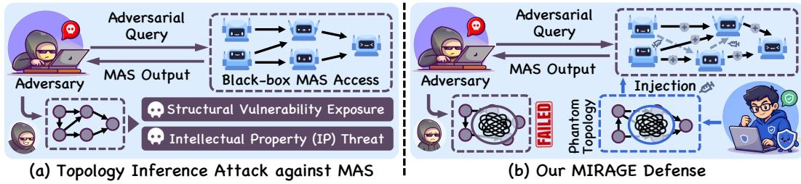  
Figure 1: Comparison of topology inference attack and MIRAGE defense. (a) The topology inference attack against LLM-based MAS exploits semantic dependencies in observable reasoning traces to infer the genuine communication topology G. (b) MIRAGE constructs a phantom topology G' to mislead topology inference while preserving G for actual task execution. This design decouples topology exposure from task execution, effectively concealing the genuine communication topology.

and communication manipulation (He et al., 2025b; Ju et al., 2026), while the confidentiality of the communication topology itself has received limited attention. Recently, CIA (Wu et al., 2026), as illustrated in Fig. 1(a), revealed that an adversary can infer the internal communication topology of an MAS solely through black-box interactions. Its key insight is that directly connected agent pairs tend to exhibit stronger semantic dependencies in their observable reasoning outputs, which can be exploited to reconstruct the underlying topology. Such topology leakage not only exposes proprietary system architectures but also reveals critical agents and communication pathways, enabling adversaries to launch targeted attacks that can compromise the security of the MAS.

In light of this threat, an important research question arises: can we effectively protect the communication topology of an MAS from inference attacks without compromising its task performance? This problem is challenging because an effective defense method must reconcile two seemingly conflicting objectives: disrupting the semantic evidence that reveals the true topology while preserving the information flow required for task execution. Existing MAS defense studies primarily address content-level security (Zhang et al., 2024; Miao et al., 2025; Raza et al., 2026; Zhou et al., 2025), leaving systematic protection against communication topology inference attacks largely unexplored.

To address this gap, we propose MiRAGE, a topology-concealment framework that separates the topology governing task execution from the topology exposed to adversaries. As shown in Fig. 1(b), MiRAGE proactively constructs a phantom topology G' that is structurally distinct from the genuine topology G. Specifically, MiRAGE consists of three stages: ① phantom topology synthesis, ② semantic edge realization, and ③ protected MAS execution. The first stage synthesizes the phantom topology G' under structural constraints to ensure sufficient divergence from G. The second stage materializes phantom edges as plausible, task-relevant semantic dependencies while suppressing the sourcespecific semantic signatures of genuine edges absent from G'. The final stage executes tasks strictly according to G while generating adversary-facing traces through a separate exposure view shaped toward the phantom topology G'. This design preserves the original communication structure for task execution while obscuring the genuine topology from inference attacks (Wu et al., 2026). We evaluate MIRAGE on four representative datasets across three domains: general reasoning (MMLU (Hendrycks et al., 2021)), mathematical reasoning (GSM8K (Cobbe et al., 2021) and SVAMP (Patel et al., 2021)), and code generation (HumanEva1 (Chen et al., 2021)). Experimental results show that MiRAGE substantially reduces the effectiveness of topology inference attacks while largely preserving the task utility of the protected MAS. The main contributions of this paper are summarized as follows:

◇Important Problem. This paper investigates the communication topology confidentiality problem in LLM-based MAS, highlighting the security and intellectual property risks posed by topology inference attacks and addressing an underexplored security dimension of multi-agent systems.

◇Novel Defense. The proposed MIRAGE separates task execution from adversary exposure through phantom topology synthesis, semantic edge realization, and dual-view protected execution.

◇Extensive Evaluation. Extensive experiments cover three representative MAS topology optimization frameworks and four benchmark datasets across diverse reasoning and code generation tasks: MMLU, GSM8K, SVAMP, and HumanEva1. The results demonstrate that MIRAGE substantially reduces topology inference effectiveness while largely preserving the task utility.

## 2 PRELIMINARIES

This section introduces the essential background on LLM-based multi-agent systems and topology inference attacks, followed by the problem definition. Important notations are summarized in App. A.

LLM-based MAS. An LLM-based MAS is formalized as $\boldsymbol { \mathcal { S } } = ( \mathcal { P } , \mathcal { G } )$ , where $\mathcal { P } = \{ p _ { i } \} _ { i = { . } } ^ { n }$ denotes the set of agent profiles, with each $p _ { i }$ specifying the corresponding agent's system prompt, callable tools, and other configuration details. The communication topology is represented as a directed acyclic graph (DAG) $\boldsymbol { \check { \mathcal { G } } } = ( A , \mathcal { E } )$ , where $\mathcal { A } = \{ a _ { i } \} _ { i = 1 } ^ { n }$ is the set of agents and E is the set of directed communication edges. An edge $( a _ { j } , a _ { i } ) \in \mathcal { E }$ indicates that the output of agent $a _ { j }$ is passed to agent $a _ { i }$ as part of its input. By governing how information is propagated and aggregated across agents, the communication topology plays a central role in MAS performance (Zhang et al., 2025; Li et al., 2025; 2026). In practical deployments, a carefully optimized topology may therefore constitute valuable intellectual property for system developers. Given a task query $q ,$ the output of agent $a _ { i }$ is defined as $r _ { i } = \mathrm { L L M } ( p _ { i } , q , \mathcal { O } _ { i } )$ , where $\mathcal { O } _ { i } = \{ \bar { r _ { j } } \ | \ ( a _ { j } , a _ { i } ) \in \mathcal { E } \}$ denotes the set of outputs received from its predecessor agents. The final output of the system $s$ is produced by the designated decision agent $a _ { n } \colon$

$$
r _ { n } = { \mathcal { S } } ( q ) = { \mathrm { L L M } } ( p _ { n } , q , { \mathcal { O } } _ { n } ) .\tag{1}
$$

Topology Inference Attack. The topology inference attack aims to reconstruct the hidden communication topology $\mathcal { G }$ of an MAS S under black-box access, relying only on adversarial queries and the corresponding system responses. A representative attack is CIA (Wu et al., 2026), which first crafts specially designed adversarial queries to induce the MAS to expose the intermediate reasoning outputs of its agents, and then exploits the semantic dependencies among these outputs to infer the underlying communication edges. More details of the CIA attack are provided in App. B.

Problem Definition. Given an LLM-based MAS $\boldsymbol { \mathcal { S } } = ( \mathcal { P } , \mathcal { G } )$ with a private topology ${ \mathcal { G } } ,$ we consider a black-box adversary that attempts to reconstruct $\mathcal { G }$ via topology inference. This work aims to protect G from topology inference while preserving its use for task execution. Specifically, we seek to construct a protected system $\widetilde { s }$ that reshapes adversary-facing evidence such that the inferred topology $\widehat { \mathcal G }$ deviates from the genuine topology ${ \mathcal { G } } .$ Formally, the defense aims to maximize the discrepancy between the inferred and genuine topologies, subject to bounded degradation in task utility:

$$
\operatorname* { m a x } _ { \tilde { S } } ~ \Delta _ { \mathrm { t o p o } } ( \widehat { \mathcal { G } } , \mathcal { G } ) \quad \mathrm { s . t . } \quad U ( \widetilde { S } ) \geq U ( S ) - \epsilon ,\tag{2}
$$

where $\widehat { \mathcal G }$ denotes the topology inferred by the adversary, $\Delta _ { \mathrm { t o p o } } ( \cdot , \cdot )$ measures the discrepancy between two topologies, $U ( \cdot )$ denotes task utility, and € specifies the maximum allowable utility degradation.

## 3 THREAT MODEL

This section defines the threat model by specifying the adversary's objectives and capabilities.

Adversary's Objectives. The adversary aims to reconstruct the true communication topology $\mathcal { G }$ of the target multi-agent system S. Successful topology inference may lead to two major security risks:

◇ Structural Vulnerability Exposure. Once the communication topology $\mathcal { G }$ is revealed, the adversary can identify critical agents, such as those with high in-degree or betweenness centrality, and important communication pathways. Such structural knowledge can facilitate targeted attacks, including jailbreaking (Gu et al., 2024; Shahroz et al., 2025), prompt injection (Lee et al., 2025; He et al., 2025b; Arif et al., 2026), and other attacks (Kavathekar et al., 2026) against the MAS.

◇Intellectual Property (IP) Threat. A carefully optimized communication topology G often embodies substantial computational investment and expert design knowledge, making it a valuable proprietary asset of system developers (Li et al., 2026; Zhang et al., 2025; Li et al., 2025). Leakage of the topology may expose internal architectural design information, enable unauthorized replication of the system, and undermine the competitive advantage of the system owner.

Adversary's Capabilities. The adversary operates under a strict black-box setting. Specifically, the adversary can submit queries of its choice to the target system $s$ and observe the corresponding final response $S ( q )$ . The adversary has no direct access to internal information, including agent profiles $\mathcal { P } \stackrel { - } { = } \{ p _ { i } \} _ { i = 1 } ^ { n } ,$ system prompts, intermediate communication messages, or the true communication topology G. Nevertheless, the adversary may craft adversarial queries that induce the system to expose information related to intermediate agent outputs in its final response, which can subsequently be exploited for topology inference. Furthermore, the adversary cannot modify agent configurations, communication edges, or any other internal component of $s$ during the attack process.

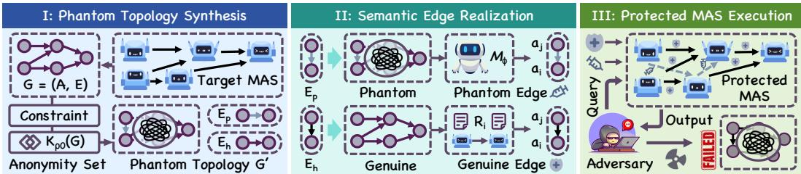  
Figure 2: Overview of MIRAGE. MIRAGE consists of three stages: ① phantom topology synthesis, ② semantic edge realization, and ③ protected MAS execution. Stage I constructs a phantom topology $\mathcal { G } ^ { \prime }$ that deviates from the genuine topology G. Stage II realizes $\mathcal { G } ^ { \prime }$ by shaping adversary-facing semantic dependencies. Stage III preserves G for task execution while exposing dependency evidence aligned with $\mathcal { G } ^ { \prime }$ , thereby concealing the genuine topology with minimal impact on task utility.

## 4 METHODOLOGY

To defend against topology inference attacks, we propose MiRAGE, a topology-concealment framework that decouples the communication structure used for actual task execution from that exposed to the adversary. MIRAGE consists of three stages: ① Phantom Topology Synthesis, ② Semantic Edge Realization, and ③ Protected MAS Execution. The overall workflow is illustrated in Fig. 2 and Alg. 1.

## 4.1 PHANTOM TOPOLOGY SYNTHESIS

At this stage, MIRAGE carefully constructs a phantom topology $\mathcal { G } ^ { \prime } = ( \mathcal { A } , \mathcal { E } ^ { \prime } )$ to guide adversaryfacing evidence away from the genuine topology G. We preserve the original agent set A and perturb only communication edges, avoiding additional agents, roles, or execution traces. This edge-level design minimizes changes to the underlying MAS while more directly targeting the confidential communication structure. An effective phantom topology should sufficiently differ from G to hinder topology recovery while remaining structurally feasible as a legitimate MAS topology. Accordingly, we formulate its construction as a constrained topology reconstruction problem.

Specifically, let $\pi ( \cdot )$ denote the execution order induced by G. We first define the admissible edge space as $\mathcal { U } _ { \pi } = \{ ( a _ { j } , a _ { i } ) \ | \ \pi ( a _ { j } ) < \pi ( a _ { i } ) \}$ , ensuring that candidate edges respect the execution order and do not introduce cycles. Accordingly, the feasible topology set is defined as

$$
\Omega ( \mathcal { G } ) = \{ \mathcal { H } = ( A , \mathcal { E _ { H } } ) \mid \mathcal { E _ { H } } \subseteq \mathcal { U } _ { \pi } , \forall a _ { i } \neq a _ { n } , a _ { i } \sim _ { \mathcal { H } } a _ { n } \} ,\tag{3}
$$

where $a _ { i }  \mathcal { H } a _ { n }$ indicates that a directed path exists from agent $a _ { i }$ to the decision agent $a _ { n }$ under H. The first constraint ensures that the synthesized topology remains acyclic, while the second prevents isolated agents or branches that cannot contribute to the final decision. To quantify the structural deviation of a candidate topology from the true topology ${ \mathcal { G } } .$ we define the structural camouflage ratio (SCR) as $\rho ( \mathcal { H } , \mathcal { G } ) = \bar { 1 } - \vert \bar { \mathcal { E } } _ { \mathcal { H } } \cap \mathcal { E } \vert / \vert \mathcal { E } _ { \mathcal { H } } \cup \mathcal { E } \vert$ , where $\rho \in [ 0 , 1 ]$ , with larger values indicating less structural overlap with ${ \mathcal { G } } .$ In particular, $\rho = 0$ corresponds to identical topologies, whereas $\rho = 1$ indicates no shared communication edges. Rather than relying on a single predetermined surrogate, MiRAGE further introduces a topology anonymity set, inspired by the principle of $k \mathrm { - }$ anonymity (Sweeney, 2002), to conceal $\mathcal { G }$ among multiple structurally feasible alternatives.

Definition 1 (Topology Anonymity Set). Given a genuine topology G and a minimum structural deviation $\rho _ { 0 } ,$ the topology anonymity set of G is defined as $\dot { \mathcal { K } } _ { \rho _ { 0 } } ( \mathcal { G } ) = \{ \mathcal { H } \in \Omega ( \mathcal { G } ) \mid \rho ( \mathcal { H } , \mathcal { G } ) \geq$ $\rho _ { 0 } \}$ . The corresponding anonymity level is characterized by $\ddot { K } _ { t o p o } = | \dot { K } _ { \rho _ { 0 } } ( \mathcal { G } ) |$ , i.e., the number of feasible topologies satisfying the minimum structural deviation from the genuine topology ${ \mathcal { G } } .$

The topology anonymity set captures both structural deviation and candidate diversity: $\rho _ { 0 }$ controls deviation from the genuine topology, while $K _ { \mathrm { t o p o } }$ reflects the number of feasible alternatives. In practice, MIRAGE constructs $\dot { \mathcal { K } } _ { \rho _ { 0 } } ( \breve { \mathcal { G } } )$ via order-preserving edge rewiring over $\mathcal { U } _ { \pi }$ while preserving connectivity to the decision agent and respecting the original execution order. A candidate satisfying $\rho ( \mathcal { H } , \mathcal { G } ) \ge \rho _ { 0 }$ is selected as the phantom topology $\mathcal { G } ^ { \prime }$ , inducing $\mathcal { E } _ { p } = \mathcal { E } ^ { \prime } \setminus \mathcal { E }$ and $\mathcal { E } _ { h } = \mathcal { E } \backslash \mathcal { E } ^ { \prime }$ for phantom and concealed genuine relations, respectively.

## 4.2 SEMANTIC EDGE REALIZATION

Given the phantom topology $\mathcal { G } ^ { \prime }$ , the next challenge is to make its structural relations observable to the adversary through semantic dependencies. Since topology inference attacks exploit semantic dependencies among observable reasoning traces, merely constructing $\mathcal { G } ^ { \prime }$ is insufficient: phantom edges must be manifested as plausible semantic dependencies, while genuine edges absent from $\mathcal { G } ^ { \prime }$ should be obscured to suppress their source-target dependencies. MIRAGE therefore performs phantom structure injection in two directions: ① phantom edge materialization and $\textcircled{2}$ genuine edge obfuscation. Both operations are applied to the adversary-facing context and do not alter the underlying communication topology used for task execution. More implementation details are provided in $\operatorname { A p p . }$ C.

Phantom Edge Materialization. For each phantom edge $( a _ { j } , a _ { i } ) \in \mathcal { E } _ { p } ,$ MIRAGE creates semantic evidence $s _ { j  i } ^ { \mathrm { p h } }$ consistent with a dependency from agent $a _ { j }$ to $a _ { i }$ . Specifically, $s _ { j  i } ^ { \mathrm { p h } }$ is generated by an LLM-based generator $\mathcal { M } _ { \phi }$ conditioned on the source agent's profile $p _ { j }$ and execution output $r _ { j }$ , the target agent's profile $p _ { i }$ , the query $q ,$ and the target's current task-relevant contextual state $c _ { i } { \mathrm { : } }$

$$
\begin{array} { r } { s _ { j  i } ^ { \mathrm { p h } } = \mathcal { M } _ { \phi } ( p _ { j } , r _ { j } , p _ { i } , q , c _ { i } ) . } \end{array}
$$

Here, $c _ { i }$ denotes the task-relevant context available to $a _ { i }$ . To ensure effective phantom edge materialization, the generated evidence follows three principles: ① role consistency, aligning the content with the source agent's capabilities; ② task relevance, providing useful information for the target agent; and ③ $d e .$ pendency plausibility, maintaining semantic consistency with $r _ { j }$ while forming a plausible dependency toward $a _ { i }$ without introducing unsupported information or topology cues.

Algorithm 1 Overview of MIRAGE   
Input: MAS $\boldsymbol { \mathcal { S } } = ( \mathcal { P } , \mathcal { G } )$ , query $q ,$ deviation thresh  
old $\rho _ { 0 } .$ ,generator $\mathcal { M } _ { \phi }$   
Output: Protected response $\widetilde { \cal S } ( q )$   
// I. PHANTOM TOPOLOGY SYNTHESIS   
1: Construct $\kappa _ { \rho _ { 0 } } ( \mathcal { G } )$ via edge rewiring.   
2: Select $\mathcal { G } ^ { \prime } = \tilde { ( \mathcal { A } , \mathcal { E } ^ { \prime } ) } \in \bar { \mathcal { K } } _ { \rho _ { 0 } } ( \mathcal { G } )$   
3: $\mathcal { E } _ { p }  \mathcal { E } ^ { \prime } \backslash \mathcal { E } , \quad \mathcal { E } _ { h } ^ { \prime }  \mathcal { E } \backslash ^ { \prime } \mathcal { E } ^ { \prime } .$   
// II. SEMANTIC EDGE REALIZATION   
4: for each agent $a _ { i } \in { \mathcal { A } }$ in execution order do   
5: $\mathcal { O } _ { i } {  } \{ \breve { r _ { j } } | ( a _ { j } , a _ { i } ) { \in } \mathcal { E } \} ; r _ { i } {  } \mathrm { L L M } ( p _ { i } , q , \mathcal { O } _ { i } )$   
6: Materialize $s _ { j  i } ^ { \mathrm { p h } }$ for $( a _ { j } , a _ { i } ) \in \mathcal { E } _ { p }$   
7: Generate $\mathcal { R } _ { i } = \{ \hat { r } _ { i } ^ { ( m ) } \} _ { m = 1 } ^ { M }$ from $r _ { i } .$   
8: Select $\widetilde { r _ { i } }$ via dependency-aware obfuscation.   
9: end for   
// III. PROTECTED MAS EXECUTION   
10: Retain $\{ r _ { i } \}$ as the execution view.   
11: Build the exposure view using $\{ s _ { j  i } ^ { \mathrm { p h } } \}$ and $\{ \widetilde { r } _ { i } \}$   
12: Generate the protected response $\widetilde { \cal S } ( q )$   
13: return $\widetilde { \cal S } ( q )$

Genuine Edge Obfuscation. Phantom edge materialization alone cannot conceal genuine edges that are absent from $\mathcal { G } ^ { \prime }$ . For each agent $a _ { i }$ , MIRAGE therefore suppresses the observable dependency evidence directly associated with its hidden genuine predecessors $\mathcal { P } _ { i } ^ { h } = \{ a _ { j } \ | \ ( a _ { j } , a _ { i } ) \in \bar { \mathcal { E } _ { h } } \}$ , while preserving the task-relevant semantics of its original execution trace $r _ { i }$ .Specifically, MIRAGE adopts controlled paraphrasing (Bandel et al., 2022) to generate a candidate set $\mathcal { R } _ { i } = \{ \hat { r } _ { i } ^ { ( m ) } \} _ { m = 1 } ^ { M }$ from $r _ { i }$ The paraphrasing process varies the expression and organization of the original trace while preserving its task-relevant facts, reasoning, and conclusions. The protected trace is then selected according to

$$
\widetilde { r } _ { i } = \arg \operatorname* { m i n } _ { \hat { r } \in \mathcal { R } _ { i } } \left[ \mathcal { D } _ { \mathrm { s e m } } ( \hat { r } , r _ { i } ) + \lambda \sum _ { a _ { j } \in \mathcal { P } _ { i } ^ { h } } S _ { \mathrm { d e p } } ( r _ { j } , \hat { r } ) \right] ,\tag{5}
$$

where $\mathcal { D } _ { \mathrm { s e m } } ( \cdot , \cdot )$ measures semantic distortion, $S _ { \mathrm { d e p } } ( \cdot , \cdot )$ measures semantic dependency, with higher values indicating stronger dependency, and $\lambda$ balànces semantic preservation and dependency suppression. By suppressing genuine dependency cues while preserving task-relevant semantics, genuine edge obfuscation complements phantom edge materialization to shift the observable dependency structure away from $\mathcal { G }$ and toward $\mathcal { G } ^ { \prime }$ without altering the underlying task execution.

## 4.3 PROTECTED MAS EXECUTION

Given $\mathcal { G } ^ { \prime }$ , MIRAGE decouples task execution from adversary-facing exposure to preserve utility while concealing the genuine topology. Specifically, the protected MAS operates through two views:

◇Execution View. Each agent executes over the genuine topology $\mathcal { G } _ { : }$ , receiving outputs only from its predecessors: $\mathcal { O } _ { i } = \bar { \{ r _ { j } \ | \ ( a _ { j } , a _ { i } ) \in \mathcal { E } \} }$ and $r _ { i } = \mathrm { L L M } ( p _ { i } , q , \mathcal { O } _ { i } )$ . The phantom topology does not participate in internal communication, and all genuine message passing remains governed by ${ \mathcal { G } } .$

◇ Exposure View. Before exposure, MIRAGE obfuscates genuine dependencies in $\mathcal { E } _ { h }$ to obtain $\widetilde { r _ { i } }$ and incorporates phantom evidence from $\mathcal { E } _ { p }$ to construct $r _ { i } ^ { \mathrm { e x p } }$ . The resulting semantic dependencies are shaped away from $\mathcal { G }$ and toward $\mathcal { G } ^ { \prime }$

This dual-view design retains $\mathcal { G }$ for task execution while exposing dependency evidence aligned with $\mathcal { G } ^ { \prime }$ , thereby concealing the genuine communication topology with minimal impact on task utility.

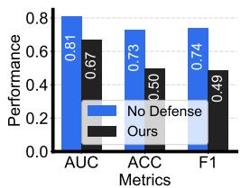  
(a) MMLU

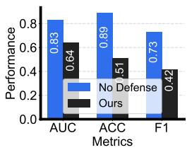  
(b) GSM8K

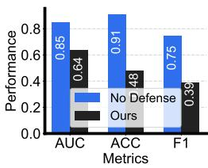  
(c) SVAMP

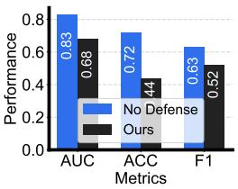  
(d) HumanEval

Figure 3: Comparison of topology inference performance using G-Designer before defense (No Defense) and with MIRAGE (Ours) across four benchmark datasets in terms of AUC, ACC, and F1.  
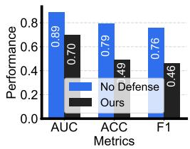  
(a) MMLU

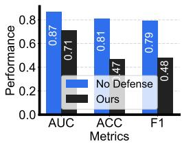  
(b) GSM8K

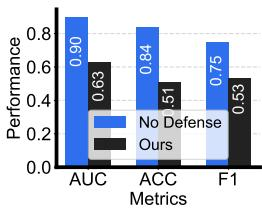  
(c) SVAMP

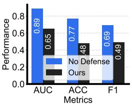  
(d) HumanEval  
Figure 4: Comparison of topology inference performance using AGP before defense (No Defense) and with MIRAGE (Ours) across four benchmark datasets in terms of AUC, ACC, and F1.

## 5 EXPERIMENTS

In this section, we conduct extensive experiments to evaluate MIRAGE in protecting the communication topology of LLM-based MAS while preserving task utility across diverse tasks and communication topology configurations. Specifically, we investigate the following research questions:

◇RQ1: How effectively does MIRAGE defend against communication topology inference attacks?

RQ2: How well does MIRAGE preserve task utility while protecting communication topologies?

RQ3: How do the components and parameter settings of MIRAGE affect its defense effectiveness?

RQ4: How does MIRAGE conceal the genuine communication topology in representative cases?

## 5.1 EXPERIMENTAL SETTINGS

Datasets. We evaluate MiRAGE on four datasets covering three representative task domains. For general reasoning, we use MMLU (Hendrycks et al., 2021), which evaluates knowledge and reasoning capabilities across diverse subject areas. For mathematical reasoning, we adopt GSM8K (Cobbe et al., 2021) and SVAMP (Patel et al., 2021), both of which require multi-step reasoning to solve mathematical word problems. For code generation, we use HumanEva1 (Chen et al., 2021), which evaluates the functional correctness of generated programs. Consistent with prior work (Wu et al., 2026), we sample 100 tasks from each dataset for evaluation. More details are provided in App. D.

MAS Frameworks. Three representative topology optimization frameworks are adopted to construct the target MAS: G-Designer (Zhang et al., 2025), AGP (Li et al., 2025), and ARG-Designer (Li et al. 2026). These frameworks employ different topology optimization strategies, enabling evaluation of MiRAGE across diverse communication structures. More details are provided in App. D.

Baselines. We first compare MIRAGE against the original MAS without any protection (No Defense). For a more comprehensive evaluation, we further consider three potential defenses commonly used against prompt injection attacks (Liu et al., 2024; Zhan et al., 2025): ① Instructional Prevention (Instruction), ② Delimiters, and ③ PPL Detection. These methods respectively represent instructionlevel prevention, input isolation, and detection-based defense. More details are provided in App. D.

Metrics & Parameters. We evaluate MIRAGE in terms of topology protection and task utility. Following prior work (Wu et al., 2026), topology inference is measured by AUC, ACC, and F1 over candidate communication edges, where AUC closer to 0.5 and lower ACC/F1 indicate stronger protection. Task utility is measured by accuracy across the evaluated benchmark tasks. We select ρ0, M, and λ from {0.2, 0.4, 0.6, 0.8, 1.0}, {1, 3, 5, 7, 9}, and {0.1, 0.3, 0.5, 0.7, 0.9}, respectively More detailed implementation and parameter settings are provided in App. D.

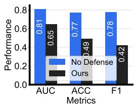  
(a) MMLU

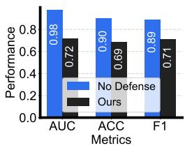  
(b) GSM8K

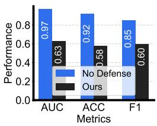  
(c) SVAMP

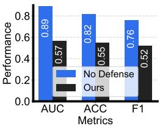  
(d) HumanEval  
Figure 5: Comparison of topology inference performance using ARG-Designer before defense (No Defense) and with MIRAGE (Ours) across four benchmark datasets in terms of AUC, ACC, and F1.

Table 1: Comparison of topology inference performance under different defense methods using G-Designer across four benchmark datasets in terms of AUC, ACC, and F1.
<table><tr><td rowspan="2">Method</td><td colspan="3">MMLU</td><td colspan="3">GSM8K</td><td colspan="3">SVAMP</td><td colspan="3">HumanEval</td></tr><tr><td>AUC</td><td>ACC</td><td>F1</td><td>AUC</td><td>ACC</td><td>F1</td><td>AUC</td><td>ACC</td><td>F1</td><td>AUC</td><td>ACC</td><td>F1</td></tr><tr><td>INSTRUCTION</td><td>0.79</td><td>0.59</td><td>0.62</td><td>0.81</td><td>0.73</td><td>0.64</td><td>0.72</td><td>0.74</td><td>0.69</td><td>0.78</td><td>0.62</td><td>0.59</td></tr><tr><td>DELIMITERS</td><td>0.76</td><td>0.61</td><td>0.64</td><td>0.80</td><td>0.76</td><td>0.67</td><td>0.70</td><td>0.68</td><td>0.71</td><td>0.76</td><td>0.65</td><td>0.56</td></tr><tr><td>MIRAGE (Ours)</td><td>0.67</td><td>0.50</td><td>0.49</td><td>0.64</td><td>0.51</td><td>0.42</td><td>0.64</td><td>0.48</td><td>0.39</td><td>0.68</td><td>0.44</td><td>0.52</td></tr></table>

## 5.2 RESULTS & DISCUSSION

Defense Effectiveness ( RQ1). Figs. 3–5 comprehensively compare topology inference performance before (No Defense) and after applying MIRAGE (Ours) across three representative topology optimization strategies and four benchmark datasets. Our MIRAGE consistently reduces AUC, ACC, and F1, demonstrat-

Table 2: Statistics of communication topologies generated by three topology optimization methods across four datasets. N and É denote the average numbers of agents and edges, respectively.
<table><tr><td rowspan="3">Method</td><td colspan="2">MMLU</td><td colspan="2">GSM8K</td><td colspan="2">SVAMP</td><td colspan="2">HumanEval</td></tr><tr><td>N</td><td>E</td><td>N</td><td>E</td><td>N</td><td>E</td><td>N</td><td>E</td></tr><tr><td>G-Designer</td><td>7.00</td><td>8.99</td><td>5.00</td><td>8.19</td><td>5.00</td><td>8.15</td><td>6.00</td><td>11.38</td></tr><tr><td>AGP</td><td>6.00</td><td>10.87</td><td>5.00</td><td>8.45</td><td>5.00</td><td>8.41</td><td>6.00</td><td>11.54</td></tr><tr><td>ARG-Designer</td><td>5.42</td><td>7.84</td><td>3.07</td><td>3.14</td><td>3.05</td><td>3.10</td><td>4.24</td><td>5.49</td></tr></table>

ing its effectiveness in concealing the genuine communication topology. We further compare MIRAGE with existing defenses. As shown in Table 1, MIRAGE achieves consistently lower topology inference performance than INSTRUCTION and DELIMITERS. We additionally evaluate PPL-based detection. Fig. 6 reports its ROC curves and detection AUC, which measures the ability to distinguish topologyinference queries from benign inputs. Finally, Table 2 summarizes the topology statistics across different settings. Despite substantial variations in structural complexity, the results in Figs. 3-5 show that MIRAGE remains effective across all three topology optimization strategies. Overall, these results demonstrate the effectiveness and robustness of MIRAGE against topology inference attacks.

Utility Preservation ( RQ2). Fig. 7 compares the task utility before and after applying MIRAGE across three topology optimization strategies and four benchmark datasets. Despite substantially reducing topology inference performance, MiRAGE largely preserves the original task utility across all evaluated settings, with only minor performance variations. This demonstrates that MiRAGE effectively conceals the underlying communication topology while introducing only minor task-utility degradation, achieving a favorable balance between topology protection and task utility.

Ablation Study ( RQ3). We conduct an ablation study to systematically evaluate the contribution of the key components in MIRAGE using G-Designer on MMLU. As shown in Fig. 8(a), removing either phantom edge materialization (w/o PEM) or genuine edge obfuscation (w/o GEO) consistently increases AUC, ACC, and F1, indicating substantially degraded topology concealment performance and demonstrating that both components are essential for effective topology concealment.

Parameter Analysis ( RQ3). We investigate the sensitivity of MIRAGE to three key parameters, ρ0, M, and λ, using G-Designer on MMLU. As shown in Figs. 8(b)–(d), ρ0 exhibits a clear trade-off between topology concealment and task utility, while the benefit of increasing M gradually saturates beyond M = 5. For λ, moderate values provide a better balance between dependency suppression and semantic preservation. Overall, these results demonstrate that appropriate parameter settings enable MIRAGE to effectively conceal the communication topology while preserving task utility.

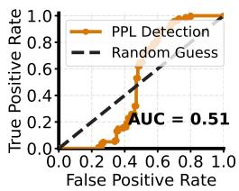  
(a) MMLU

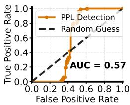  
(b) GSM8K

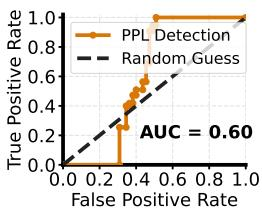  
(c) SVAMP

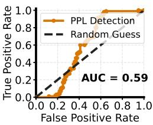  
(d) HumanEval

Figure 6: Overall ROC curves of PPL-based attack detection across four benchmark datasets, with the corresponding detection AUC reported and random guessing shown as a reference.  
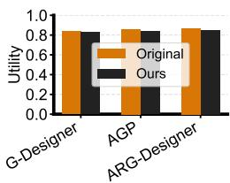  
(a) MMLU

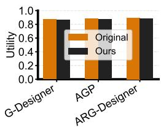  
(b) GSM8K

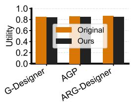  
(c) SVAMP

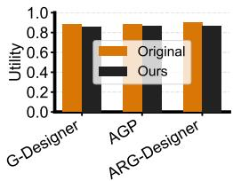  
(d) HumanEval  
Figure 7: Comparison of task utility before defense (Original) and with MIRAGE (Ours) across three topology optimization strategies and four benchmark datasets, measured by task accuracy.

Case Study ( RQ4). To intuitively demonstrate the topology concealment of MIRAGE, Fig. 9 visualizes representative communication topologies generated by G-Designer, AGP, and ARG-Designer, together with the corresponding topologies inferred by CIA (Wu et al., 2026) before and after defense. Without protection, CIA recovers most genuine communication edges, producing inferred structures highly similar to the ground-truth topologies. In contrast, after applying MiRAGE, the inferred topologies substantially deviate from the ground truth across all three topology optimization methods, with many genuine edges concealed or replaced by phantom relations. These cases visually confirm that MIRAGE substantially hinders the adversary from recovering the genuine communication structure.

## 6 RELATED WORK

This section reviews three lines of research closely related to our work: ① LLM-based multi-agent system, ② adversarial attacks against MAS, and ③ privacy and security protection for MAS.

LLM-based Multi-Agent Systems. LLM-based multi-agent systems (MAS) coordinate multiple specialized agents through structured communication to solve complex tasks, demonstrating strong capabilities in software engineering (He et al., 2025a; Islam et al., 2024; Oueslati et al., 2026), scientific discovery (Ghareeb et al., 2026; Ghafarollahi & Buehler, 2025), and mathematical reasoning (Lei et al., 2024; Zhang & Xiong, 2025). Early systems typically adopt handcrafted communication structures, such as the sequential workflow in ChatDev (Qian et al., 2024) and role-based collaboration in CAMEL (Li et al., 2023) and MetaGPT (Hong et al., 2024). Recent studies further explore automated topology optimization to construct task-adaptive communication structures. Representative methods include G-Designer (Zhang et al., 2025), AGP (Li et al., 2025), and ARG-Designer (Li et al., 2026), which optimize agent connectivity through graph-based generation or pruning. As these optimized topologies increasingly encode substantial computational investment and system design knowledge, protecting them from unauthorized inference becomes an important yet underexplored problem.

Adversarial Attacks against MAS. The growing adoption of LLM-based MAS has raised increasing concerns about their vulnerability to adversarial attacks (Yu et al., 2025). Existing studies primarily target agent behaviors and communication content, including prompt-based attacks (Lee et al., 2025; Shahroz et al., 2025; Arif et al., 2026), communication attacks (He et al., 2025b; Yan et al., 2026), and task disruption (Amayuelas et al., 2024), which inject malicious instructions or manipulate inter-agent interactions to compromise system behavior. Beyond content-level threats, CIA (Wu et al., 2026) reveals a distinct risk to topology confidentiality by reconstructing MAS communication topologies from semantic dependencies under black-box access. Despite the resulting security and intellectual property risks, defenses against topology inference remain largely unexplored. This work fills this gap by introducing MIRAGE to protect MAS communication topologies against black-box inference.

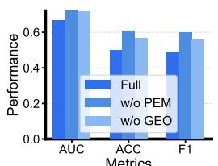  
(a) Ablation Study

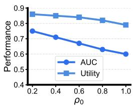  
(b) Parameter ρo

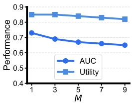  
(c) Parameter M

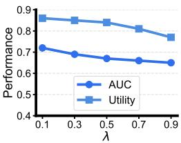  
(d) Parameter λ

Figure 8: Ablation and parameter analyses of MIRAGE under different experimental settings. (a) Effects of removing key defense components. (b)–(d) Effects of the structural deviation threshold ρo, number of paraphrase candidates M, and dependency suppression weight λ, respectively.  
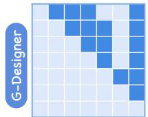

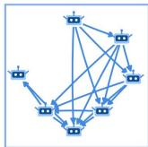  
(a) Ground-truth

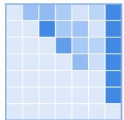

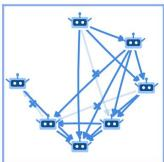  
(b) No Defense

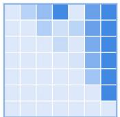

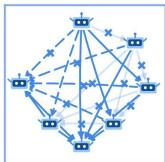  
(C) Ours

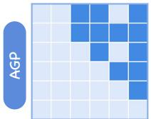

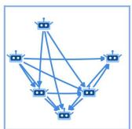  
(a) Ground-truth

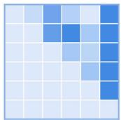

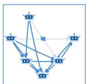

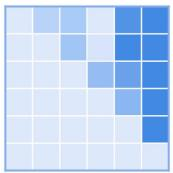  
(b) No Defense

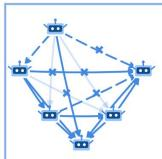  
(C) Ours

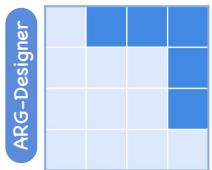

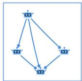  
(a) Ground-truth

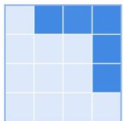

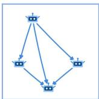  
(b) No Defense

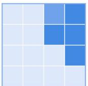

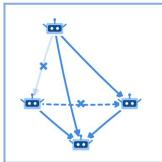  
(C) Ours  
Figure 9: Visualization of communication topologies under G-Designer, AGP, and ARG-Designer, comparing the ground-truth topology (Ground-truth) with those inferred by CIA before defense (No Defense) and with MIRAGE (Ours) across diverse topology structures.

Privacy and Security Protection for MAS. Existing defenses for MAS mainly focus on contentlevel security (Zhou et al., 2025; Zhang et al., 2024; Raza et al., 2026; Miao et al., 2025; Liu et al., 2024; Zhan et al., 2025). Representative approaches protect inter-agent collaboration through attack detection, trust management, or communication safeguards, such as BlindGuard (Miao et al., 2025), TRiSM (Raza et al., 2026), and GUARDIAN (Zhou et al., 2025). However, these defenses protect message content or system behavior rather than the communication topology itself. Consequently, the confidentiality of MAS topologies remains largely overlooked. MIRAGE addresses this gap by concealing the genuine topology from black-box inference while preserving it for task execution.

## 7 CONCLUSION

This paper investigates the emerging threat of communication topology inference in LLM-based multiagent systems. To mitigate this threat, we propose MiRAGE, a topology-concealment framework that decouples genuine task execution from adversary-facing exposure. MiRAGE consists of three stages: ① phantom topology synthesis, ② semantic edge realization, and ③ protected MAS execution. Specifically, it constructs structurally feasible phantom topologies and reshapes observable semantic dependencies through phantom edge materialization and genuine edge obfuscation, while preserving the genuine topology for task execution. Extensive experiments across multiple topology optimization methods and benchmark datasets demonstrate that MIRAGE substantially reduces topology inference effectiveness while largely preserving task utility. Overall, MIRAGE provides a practical and effective approach to protecting confidential MAS topologies against black-box inference attacks while largely preserving task utility. Further discussion of limitations and future directions is provided in App. E.

## REFERENCES

Alfonso Amayuelas, Xianjun Yang, Antonis Antoniades, Wenyue Hua, Liangming Pan, and William Yang Wang. Multiagent collaboration attack: Investigating adversarial attacks in large language model collaborations via debate. In Findings of the Association for Computational Linguistics: EMNLP 2024 (EMNLP Findings), pp. 6929–6948, 2024.

Nokimul Hasan Arif, Qian Lou, and Mengxin Zheng. Conjunctive prompt attacks in multi-agent 1lm systems. In Proceedings of the 64th Annual Meeting of the Association for Computational Linguistics (Volume 1: Long Papers) (ACL), pp. 34175–34191, 2026.

Jincheng Bai, Zhenyu Zhang, Jennifer Zhang, and Jason Zhu. Insight agents: An llm-based multiagent system for data insights. In Proceedings of the 48th International ACM SIGIR Conference on Research and Development in Information Retrieval (SIGIR), pp. 4335–4339, 2025.

Elron Bandel, Ranit Aharonov, Michal Shmueli-Scheuer, Ilya Shnayderman, Noam Slonim, and Liat Ein Dor. Quality controlled paraphrase generation. In Proceedings of the 60th Annual Meeting of the Association for Computational Linguistics (Volume 1: Long Papers) (ACL), pp. 596–609, 2022.

Mark Chen, Jerry Tworek, Heewoo Jun, Qiming Yuan, Henrique Ponde De Oliveira Pinto, Jared Kaplan, Harri Edwards, Yuri Burda, Nicholas Joseph, Greg Brockman, et al. Evaluating large language models trained on code. arXiv preprint arXiv:2107.03374, 2021.

Karl Cobbe, Vineet Kosaraju, Mohammad Bavarian, Mark Chen, Heewoo Jun, Lukasz Kaiser, Matthias Plappert, Jerry Tworek, Jacob Hilton, Reiichiro Nakano, et al. Training verifiers to solve math word problems. arXiv preprint arXiv:2110.14168, 2021.

Huaming Du, Tao Hu, Yijie Huang, Yu Zhao, Guisong Liu, Tao Gu, Gang Kou, and Carl Yang. Traceable latent variable discovery based on multi-agent collaboration. In Proceedings of the ACM Web Conference 2026 (WWW), pp. 3732–3743, 2026.

Alireza Ghafarollahi and Markus J Buehler. Sciagents: automating scientific discovery through bioinspired multi-agent intelligent graph reasoning. Advanced Materials, 37(22):2413523, 2025.

Ali Essam Ghareeb, Benjamin Chang, Ludovico Mitchener, Angela Yiu, Caralyn J Szostkiewicz, Dmytro Shved, Gavin J Gyimesi, Jon M Laurent, Samantha M Wright, Muhammed T Razzak, et al. A multi-agent system for automating scientific discovery. Nature, 655:497–505, 2026.

Xiangming Gu, Xiaosen Zheng, Tianyu Pang, Chao Du, Qian Liu, Ye Wang, Jing Jiang, and Min Lin, Agent smith: A single image can jailbreak one million multimodal LLM agents exponentially fast. In Forty-first International Conference on Machine Learning (ICML), pp. 16647–16672, 2024.

Junda He, Christoph Treude, and David Lo. Llm-based multi-agent systems for software engineering: Literature review, vision, and the road ahead. ACM Transactions on Software Engineering and Methodology (TOSEM), 34(5):1–30, 2025a.

Pengfei He, Yuping Lin, Shen Dong, Han Xu, Yue Xing, and Hui Liu. Red-teaming llm multi-agent systems via communication attacks. In Findings of the Association for Computational Linguistics: ACL 2025 (ACL Findings), pp. 6726–6747, 2025b.

Dan Hendrycks, Collin Burns, Steven Basart, Andy Zou, Mantas Mazeika, Dawn Song, and Jacob Steinhardt. Measuring massive multitask language understanding. In 9th International Conference on Learning Representations (ICLR), 2021.

Sirui Hong, Mingchen Zhuge, Jonathan Chen, Xiawu Zheng, Yuheng Cheng, Jinlin Wang, Ceyao Zhang, Steven Yau, Zijuan Lin, Liyang Zhou, et al. Metagpt: Meta programming for a multi-agent collaborative framework. In International Conference on Learning Representations (ICLR), 2024.

Md Ashraful Islam, Mohammed Eunus Ali, and Md Rizwan Parvez. Mapcoder: Multi-agent code generation for competitive problem solving. In Proceedings of the 62nd Annual Meeting of the Association for Computational Linguistics (Volume 1: Long Papers) (ACL), pp. 4912–4944, 2024.

Tianjie Ju, Yiting Wang, Yi Hua, Xinbei Ma, Pengzhou Cheng, Haodong Zhao, Yulong Wang, Lifeng Liu, Jian Xie, Zhuosheng Zhang, et al. Flooding spread of manipulated knowledge in llm-based multi-agent communities. Science China Information Sciences (SCIS), 69(7):172103, 2026.

Ishan Kavathekar, Hemang Jain, Ameya Rathod, Ponnurangam Kumaraguru, and Tanuja Ganu. Tamas: Benchmarking adversarial risks in multi-agent llm systems. In Proceedings of the 64th Annual Meeting of the Association for Computational Linguistics (Volume 1: Long Papers) (ACL), pp. 31238–31268, 2026.

Donghyun Lee, Mo Tiwari, and Brando Miranda. Prompt infection: Llm-to-llm prompt injection within multi-agent systems. In Computer Security. ESORICS 2025 International Workshops, pp. 511–520, 2025.

Bin Lei, Yi Zhang, Shan Zuo, Ali Payani, and Caiwen Ding. Macm: Utilizing a multi-agent system for condition mining in solving complex mathematical problems. Advances in Neural Information Processing Systems (NeurIPS), 37:53418–53437, 2024.

Boyi Li, Zhonghan Zhao, Der-Horng Lee, and Gaoang Wang. Adaptive graph pruning for multi-agent communication. In 28th European Conference on Artificial Intelligence (ECAI), pp. 4305–4312, 2025.

Guohao Li, Hasan Hammoud, Hani Itani, Dmitrii Khizbullin, and Bernard Ghanem. Camel: Communicative agents for" mind" exploration of large language model society. Advances in Neural Information Processing Systems (NeurIPS), 36:51991–52008, 2023.

Shiyuan Li, Yixin Liu, Qingsong Wen, Chengqi Zhang, and Shirui Pan. Assemble your crew: Automatic multi-agent communication topology design via autoregressive graph generation. In Proceedings of the AAAI Conference on Artificial Intelligence (AAAI), pp. 23142–23150, 2026.

Xinyi Li, Sai Wang, Siqi Zeng, Yu Wu, and Yi Yang. A survey on llm-based multi-agent systems: workflow, infrastructure, and challenges. Vicinagearth, 1(1):9, 2024.

Yupei Liu, Yuqi Jia, Runpeng Geng, Jinyuan Jia, and Neil Zhenqiang Gong. Formalizing and benchmarking prompt injection attacks and defenses. In 33rd USENIX Security Symposium (USENIX Security), pp. 1831–1847, 2024.

Tianyi Ma, Yiyue Qian, Zheyuan Zhang, Zehong Wang, Xiaoye Qian, Feifan Bai, Yifan Ding, Xuwei Luo, Shinan Zhang, Keerthiram Murugesan, et al. Autodata: A multi-agent system for open web data collection. Advances in Neural Information Processing Systems (NeurIPS), 38: 173416–173448, 2025.

Rui Miao, Yixin Liu, Yili Wang, Xu Shen, Yue Tan, Yiwei Dai, Shirui Pan, and Xin Wang. Blindguard: Safeguarding llm-based multi-agent systems under unknown attacks. arXiv preprint arXiv:2508.08127, 2025.

Humza Naveed, Asad Ullah Khan, Shi Qiu, Muhammad Saqib, Saeed Anwar, Muhammad Usman, Naveed Akhtar, Nick Barnes, and Ajmal Mian. A comprehensive overview of large language models. ACM Transactions on Intelligent Systems and Technology (TIST), 16(5):1–72, 2025.

Khouloud Oueslati, Maxime Lamothe, and Foutse Khomh. Refagent: A multi-agent llm-based framework for automatic software refactoring. In Proceedings of the 2026 IEEE/ACM 48th International Conference on Software Engineering (ICSE), pp. 92–104, 2026.

Arkil Patel, Satwik Bhattamishra, and Navin Goyal. Are nlp models really able to solve simple math word problems? In Proceedings of the 2021 Conference of the North American Chapter of the Association for Computational Linguistics: Human Language Technologies (NAACL), pp. 2080–2094, 2021.

Chen Qian, Wei Liu, Hongzhang Liu, Nuo Chen, Yufan Dang, Jiahao Li, Cheng Yang, Weize Chen, Yusheng Su, Xin Cong, et al. Chatdev: Communicative agents for software development. In Proceedings of the 62nd Annual Meeting of the Association for Computational Linguistics (Volume 1: Long Papers) (ACL), pp. 15174–15186, 2024.

Shaina Raza, Ranjan Sapkota, Manoj Karkee, and Christos Emmanouilidis. Trism for agentic ai: A review of trust, risk, and security management in llm-based agentic multi-agent systems. AI Open, pp. 71–95, 2026.

Rana Shahroz, Zhen Tan, Sukwon Yun, Charles Fleming, and Tianlong Chen. Agents under siege: Breaking pragmatic multi-agent llm systems with optimized prompt attacks. In Proceedings of the 63rd Annual Meeting of the Association for Computational Linguistics (Volume 1: Long Papers) (ACL), pp. 9661–9674, 2025.

Pengyang Shao, Lei Chen, Fei Liu, Yonghui Yang, Xun Yang, and Meng Wang. Multi-agent debate based concept augmentation for enhanced cognitive diagnosis. In Proceedings of the 32nd ACM SIGKDD Conference on Knowledge Discovery and Data Mining V. 1 (SIGKDD), pp. 1287–1296, 2026.

Noah Shinn, Federico Cassano, Ashwin Gopinath, Karthik Narasimhan, and Shunyu Yao. Reflexion: Language agents with verbal reinforcement learning. Advances in Neural Information Processing Systems (NeurIPS), 36:8634–8652, 2023.

Latanya Sweeney. k-anonymity: A model for protecting privacy. International Journal of Uncertainty, Fuzziness and Knowledge-Based Systems (IJUFKS), 10(05):557–570, 2002.

Yongxuan Wu, Xixun Lin, He Zhang, Nan Sun, Kun Wang, Chuan Zhou, Shirui Pan, and Yanan Cao CIA: Inferring the communication topology from llm-based multi-agent systems. In Proceedings of the 64th Annual Meeting of the Association for Computational Linguistics (Volume 1: Long Papers) (ACL), 2026.

Yunhao Xiao, Ying Wang, Michael Bewong, Selasi Kwashie, Xiaoxia Li, and Zaiwen Feng. A unified and time-efficient multi-agent framework for data discovery. In Proceedings of the ACM Web Conference 2026 (WWW), pp. 4268–4277, 2026.

Bingyu Yan, Xiaoming Zhang, Ziyi Zhou, Chaozhuo Li, Ruilin Zeng, Yirui Qi, Tianbo Wang, and Litian Zhang. Attack the messages, not the agents: A multi-round adaptive stealthy tampering framework for llm-mas. In Proceedings of the AAAI Conference on Artificial Intelligence (AAAI), pp. 29784–29792, 2026.

John Yang, Carlos E Jimenez, Alexander Wettig, Kilian Lieret, Shunyu Yao, Karthik Narasimhan, and Ofir Press. Swe-agent: Agent-computer interfaces enable automated software engineering. Advances in Neural Information Processing Systems (NeurIPS), 37:50528–50652, 2024.

Miao Yu, Fanci Meng, Xinyun Zhou, Shilong Wang, Junyuan Mao, Linsey Pan, Tianlong Chen, Kun Wang, Xinfeng Li, Yongfeng Zhang, et al. A survey on trustworthy llm agents: Threats and countermeasures. In Proceedings of the 31st ACM SIGKDD Conference on Knowledge Discovery and Data Mining V. 2 (SIGKDD), pp. 6216–6226, 2025.

Qiusi Zhan, Richard Fang, Henil Shalin Panchal, and Daniel Kang. Adaptive attacks break defenses against indirect prompt injection attacks on llm agents. In Findings of the Association for Computational Linguistics: NAACL 2025 (NAACL Findings), pp. 7116–7132, 2025.

Guibin Zhang, Yanwei Yue, Xiangguo Sun, Guancheng Wan, Miao Yu, Junfeng Fang, Kun Wang, Tianlong Chen, and Dawei Cheng. G-designer: Architecting multi-agent communication topologies via graph neural networks. In International Conference on Machine Learning (ICML), pp. 76678– 76692, 2025.

Shaowei Zhang and Deyi Xiong. Debate4math: Multi-agent debate for fine-grained reasoning in math. In Findings of the Association for Computational Linguistics: ACL 2025 (ACL Findings), pp. 16810–16824, 2025.

Zaibin Zhang, Yongting Zhang, Lijun Li, Hongzhi Gao, Lijun Wang, Huchuan Lu, Feng Zhao, Yu Qiao, and Jing Shao. Psysafe: A comprehensive framework for psychological-based attack, defense, and evaluation of multi-agent system safety. In Proceedings of the 62nd Annual Meeting of the Association for Computational Linguistics (Volume 1: Long Papers) (ACL), pp. 15202–15231, 2024.

Andrew Zhao, Daniel Huang, Quentin Xu, Matthieu Lin, Yong-Jin Liu, and Gao Huang. Expel: Llm agents are experiential learners. In Proceedings of the AAAI Conference on Artificial Intelligence (AAAI), pp. 19632–19642, 2024.

Jialong Zhou, Lichao Wang, and Xiao Yang. Guardian: Safeguarding llm multi-agent collaborations with temporal graph modeling. Advances in Neural Information Processing Systems (NeurIPS), 38:7973–8001, 2025.