# CONTEXTRENDER: FROM EXECUTION DEPENDEN-CIES TO AGENT CONTEXT

Savini Kashmira, Jayanaka L. Dantanarayana, Lingjia Tang & Jason Mars University of Michigan, Ann Arbor, USA {savinik,jayanaka,lingjia,profmars}@umich.edu

## ABSTRACT

LLM agents performing long-horizon tasks accumulate tool results that later steps may need. Passing the full history to every invocation is costly even when it fits within the context window, while reducing it risks omitting needed information. Existing context management methods can overlook how earlier tool results are used in subsequent execution, leaving needed information out of context. We introduce CONTEXTRENDER, which manages context through a persistent graph of execution dependencies. We develop Tool-Flow Analysis to track how later operations reuse information from earlier tool results, providing a signal called observed reuse. A renderer combines this signal with recency and semantic relevance to select results within a fixed history budget, retaining omitted results for later use. Across AppWorld and 8-objective QA with three execution models, CONTEXTRENDER outperforms the evaluated context management baselines using a 6K history budget, well below the models’ maximum context windows. Within this budget, it achieves task performance close to or above that of passing the full history while reducing mean inference cost by 10.2%–32.2% relative to Full history. Ablations show that observed reuse improves task performance and retention of results reused later.

## 1 INTRODUCTION

Large Language Model (LLM) agents increasingly use tools to carry out complex, long-horizon tasks such as software engineering, deep research, and work across digital applications (Yang et al., 2024; Trivedi et al., 2024). Executing these tasks often requires an agent to make tens to hundreds of model calls and tool interactions, causing its interaction history to grow throughout execution. Information accumulated in this history may be needed again as the agent carries out later steps. However, carrying the entire accumulated interaction history forward at every invocation imposes substantial inference cost, can exceed the context window, and can expose the model to irrelevant context, adding noise to the current step (Liu et al., 2024; Zhang et al., 2026). Managing this history can reduce inference cost even when it fits within the model’s context window.

To limit context growth, agent systems such as OpenClaw, OpenCode, and Hermes Agent provide mechanisms for managing accumulated interaction history (OpenClaw, 2026; OpenCode, 2025; Nous Research, 2026). When configured context-size thresholds are reached, the model-visible history can be reduced using techniques such as pruning and compaction. Pruning removes selected messages or tool results based on heuristics such as recency or size, while compaction replaces earlier interactions with a shorter summary (Kang et al., 2025; Lindenbauer et al., 2025; Sun et al., 2025; Ye et al., 2025; Dang et al., 2026). However, these operations may leave details from earlier tool results absent or incomplete in the model-visible context when needed later in execution (Figure 1, left). If the complete tool results are not retained elsewhere, recovering those details may require additional tool calls (Lindenbauer et al., 2025; Zhang et al., 2026).

More recent work has sought to preserve excluded information and improve context selection. Learned and optimized compression attempts to retain important details when earlier interactions are shortened (Kang et al., 2025; Sun et al., 2025; Ye et al., 2025), while retrieval-based memory preserves earlier information outside the model-visible context for later access (Packer et al., 2023). Adaptive and model-directed approaches adjust the visible context during execution. ACE selects raw, abstracted, or hidden historical steps based on the current task state (Liao et al., 2026), while PACE adjusts historical granularity according to predicted relevance to the next action (Wei et al., 2026). Sculptor provides model-controlled context editing and restoration (Li et al., 2025), and Self-GC uses a planner to propose folding, masking, and pruning operations (Hao et al., 2026) (Figure 1, middle). However, judging which information to expose remains difficult when an earlier result supports later operations in ways that are not apparent from its relevance to the current step. A result containing repeatedly used identifiers or other values may receive low priority even while those values remain useful. This motivates supplementing relevance judgments with evidence of how earlier results have been used during execution, helping identify which historical tool results to show at each invocation.

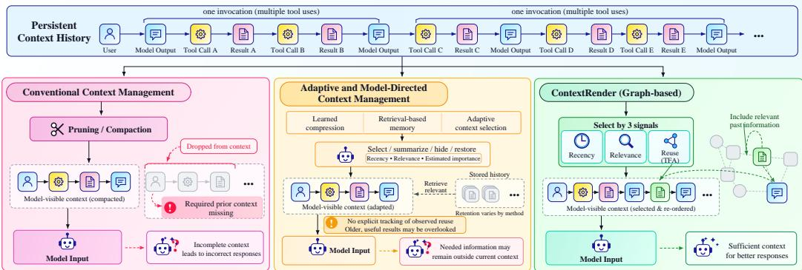  
Figure 1: Comparison of context management approaches. CONTEXTRENDER selects history from a persistent graph using recency, semantic relevance, and observed reuse, retaining unselected results for later use.

Our key insight is that context management should track execution dependencies rather than just maintain a chronological list of interactions, and use these dependencies to guide which earlier tool results are shown to the model at each invocation. These dependencies connect earlier tool results to later model steps and tool calls that reuse values those results introduced. Tracking these relationships captures how results are used as execution progresses, beyond when they were produced or how closely their content matches the current invocation. We call this evidence of use observed reuse. An earlier tool result may remain useful because subsequent operations continue to draw on its information, even when recency or semantic relevance gives it low priority. Context se lection can therefore combine this evidence with recency and semantic relevance to retain or restore complete tool results at later invocations.

Building on this insight, we introduce CONTEXTRENDER, a context-management system that records execution history and detected reuse relationships in a persistent context graph, then selects which earlier tool results to show at each model invocation under a fixed history budget (Figure 1, right). CONTEXTRENDER has three components: (1) The persistent context graph stores messages, tool calls, and complete tool results while preserving their chronological order. (2) Tool-Flow Anal ysis (TFA) tracks how later model steps and tool calls reuse values from earlier tool results. It links each detected use to the tool result that first introduced the value and records this evidence as observed reuse. (3) A renderer combines observed reuse with recency and semantic relevance to select complete historical tool results within the allocated budget. Unselected results remain available in the graph for later invocations. Figure 3 illustrates the overall design.

We compare CONTEXTRENDER with baseline context-management methods using three execution models. Our evaluation shows that CONTEXTRENDER can achieve task performance close to or above passing the full accumulated history using a small history budget for including the agent’s previous execution steps in context, well below the models’ maximum context windows. At our primary 6K setting, CONTEXTRENDER consistently achieves the highest task performance among the evaluated managed-context baselines across two benchmarks, AppWorld (Trivedi et al., 2024) and 8-objective QA (Kwiatkowski et al., 2019; Zhou et al., 2025), with all three models. It achieves this performance while reducing mean standardized inference cost by 10.2%–32.2% relative to passing the full history. Our ablation study shows that adding observed reuse from recorded execution dependencies to recency and semantic relevance improves task performance and retention of results reused later, with particularly large recall gains for results reused after long intervals.

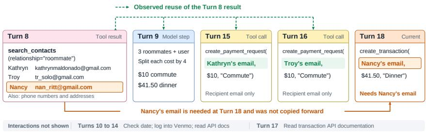  
Figure 2: Execution trace from an AppWorld task in which the agent settles a shared dinner bill among roommates. Information from the contact result produced at Turn 8 is used by later operations at Turns 9, 15, and 16. At Turn 18, the agent needs Nancy’s email address, which has not been copied forward and remains available only from the Turn 8 result.

This paper makes the following contributions.

1. We introduce Tool-Flow Analysis (TFA), which tracks how later operations reuse information from earlier tool results, providing an observed-reuse signal for context selection.

2. We introduce CONTEXTRENDER, which uses TFA and a persistent context graph to include earlier tool results in the model’s context within a token budget allocated to history, while retaining omitted results for later use.

3. We evaluate CONTEXTRENDER across two benchmarks with three execution models, demonstrating comparable or higher task performance while reducing inference cost by approximately 10%–32% relative to passing the full accumulated history.

## 2 MOTIVATION

AI agents need access to earlier tool results to complete long-horizon tasks successfully, but passing the full history at every invocation incurs inference cost. Selecting earlier tool results by recency or task relevance within a history token budget for previous execution steps can reduce cost but risks omitting information needed later. We illustrate this using an AppWorld task in which an agent is asked to settle a shared dinner bill among roommates on Venmo (Figure 2).

## 2.1 LIMITATIONS OF RECENCY AND RELEVANCE

At Turn 8, the agent calls search contacts(relationship="roommate"), which returns contact information for Kathryn, Troy, and Nancy. At Turn 9, it uses the three names to determine that the bill should be split four ways. At Turns 15 and 16, it uses Kathryn’s and Troy’s email addresses to create payment requests. Each call contains only its recipient’s email address, without copying the full contact list. At Turn 18, the agent needs Nancy’s email address to send her the dinner payment. Her email has not been carried forward and remains available only from the Turn 8 result. Figure 2 illustrates these execution dependencies between the Turn 8 result and the later operations that use its information.

The execution log shows that, when selecting earlier tool results within the history budget, both recency and task relevance omitted the Turn 8 result at Turn 18. Recency favors results from later turns, leaving the Turn 8 result outside the retained history. Task relevance favors results about Venmo APIs and payment operations because their content more closely matches the current payment step. Either criterion can therefore leave information needed for the current step outside the model-visible context.

However, the payment calls at Turns 15 and 16 show that information from the Turn 8 result continues to be used. This past use provides additional evidence that the result may remain useful, beyond its age or similarity to the current step. Retaining the complete result also preserves Nancy’s email, even though her address has not yet been reused. This motivates considering a result’s previous use when deciding whether to retain it for later steps.

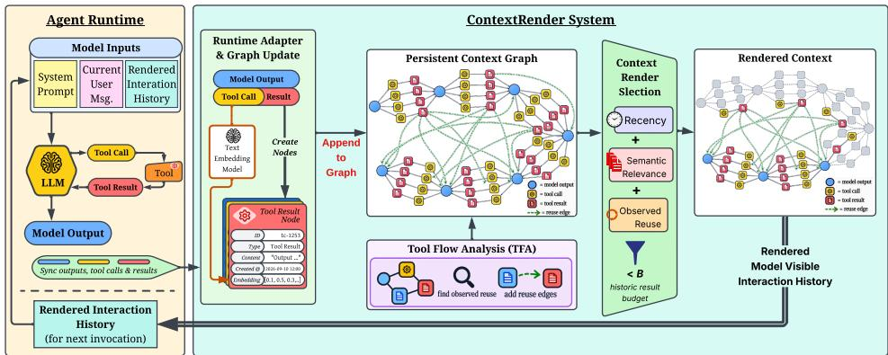  
Figure 3: CONTEXTRENDER architecture. The runtime adapter records messages, tool calls, and complete tool results in a persistent context graph. Tool-Flow Analysis records observed reuse as execution dependencies. Before each model invocation, the renderer includes the accumulated execution history if it fits within the history budget B; otherwise, it selects tool results using observed reuse, recency, and semantic relevance. Omitted results remain stored for later invocations.

## 2.2 EXECUTION DEPENDENCIES FOR CONTEXT SELECTION

Using observed reuse to guide context selection requires recording execution dependencies between earlier tool results and the later operations that reuse their information. A chronological history records when the tool result appeared and when subsequent operations occurred. A graph-structured representation can explicitly record these dependencies by linking earlier tool results to later operations that reuse their information, making the detected reuse available for context selection.

Observed reuse provides additional evidence beyond recency and task relevance for selecting earlier tool results that may be needed later. The goal is to preserve this information within a small history budget, supporting performance close to or above passing the full history. CONTEXTRENDER implements this approach using a persistent context graph and Tool-Flow Analysis to guide context selection.

## 3 CONTEXTRENDER

At each model invocation, CONTEXTRENDER selects earlier tool results from a persistent context graph under a fixed history budget B. As shown in Figure 3, the system has three components: (1) a persistent context graph that stores messages, tool calls, and complete tool results; (2) Tool-Flow Analysis (TFA), which records observed reuse as execution dependencies by linking later uses of values to earlier tool results; and (3) a renderer that combines this observed reuse with recency and semantic relevance to select results within the available budget.

## 3.1 PERSISTENT CONTEXT GRAPH

During task execution, CONTEXTRENDER maintains a persistent context graph G containing messages, tool calls, and tool results in chronological order, together with the reuse edges identified by TFA (Section 3.2). Each tool result r is stored with its complete content, position, timestamp, and content embedding. Result age and content embeddings support recency and semantic relevance, respectively.

## 3.2 TOOL-FLOW ANALYSIS

TFA tracks how values from earlier tool results are reused in later model outputs and tool calls. It identifies qualifying values using the extraction rules in Appendix A.2 and detects reuse through exact, case-sensitive matching. Each detected use is linked to the first earlier tool result containing that value; intermediate copies do not change this attribution. We call this evidence of use observed reuse and record the corresponding links as reuse edges in the persistent context graph (Figure 3).

For example, suppose a tool result introduces customer id=C142XYZ. If a later model output repeats C142XYZ and a subsequent tool call uses it, TFA links both uses to the tool result that first introduced the value. Because information from this result is reused in multiple later steps, these uses increase its reuse score and give it higher priority for inclusion in context.

TFA summarizes this evidence with a reuse score $c _ { t } ( r )$ . Let $\boldsymbol { \mathcal { M } } _ { t } ( \boldsymbol { r } )$ denote the detected reuse matches observed before invocation t and attributed to result $r ,$ counting each distinct value once per later model output or tool call. We define

$$
c _ { t } ( r ) = \sum _ { m \in \mathcal { M } _ { t } ( r ) } \frac { 1 } { n _ { t } ( m ) } ,\tag{1}
$$

where $n _ { t } ( m )$ is the number of historical tool results in the graph before invocation t that contain the matched value. This weighting reduces the contribution of values shared by multiple tool results.

## 3.3 CONTEXT RENDERING

Before each model invocation, the renderer checks whether the agent’s accumulated execution history fits within the history budget $B ,$ which limits tokens for information from previous execution steps. If the history fits within B, it is included in the model input. Otherwise, the renderer selects complete historical tool results using the scores below to construct context within the available history budget. Appendix A.4 specifies the token estimate and budget accounting.

Let $a _ { t } ( r )$ be the number of turns since result r was produced, where one turn corresponds to one model invocation. Recency is represented by $e ^ { - \lambda a _ { t } ( r ) }$ , where λ controls its decay. For semantic relevance, let x denote the task’s first user message and $f _ { t }$ the latest visible interaction before invocation t, formed by concatenating the latest visible user and assistant messages. We construct

$$
q _ { t } = 0 . 4 \mathrm { u n i t } ( \mathrm { e m b } ( x ) ) + 0 . 6 \mathrm { u n i t } ( \mathrm { e m b } ( f _ { t } ) ) ,
$$

where unit(·) denotes vector normalization. We define the relevance score as

$$
s _ { t } ( r ) = \operatorname* { m a x } ( \cos ( \operatorname { e m b } ( r ) , q _ { t } ) , 0 ) .
$$

Observed reuse contributes through $1 - e ^ { - \gamma c _ { t } ( r ) }$ . This function gives additional reuse evidence a diminishing contribution, with $\gamma$ controlling how quickly the term saturates.

The resulting usefulness estimate is

$$
U _ { t } ( r ) = W _ { \mathrm { r e c } } e ^ { - \lambda a _ { t } ( r ) } + W _ { \mathrm { r e u s e } } \left( 1 - e ^ { - \gamma c _ { t } ( r ) } \right) + W _ { \mathrm { r e l } } s _ { t } ( r ) ,\tag{2}
$$

where $W _ { \mathrm { r e c } } , W _ { \mathrm { r e u s e } } ,$ and $W _ { \mathrm { r e l } }$ weight the three signals. Recency favors recently produced results, semantic relevance favors results related to the task and latest interaction, and observed reuse contributes evidence from later operations that reused their values. Appendix A.3 gives the embedding configuration and parameter values.

After computing $U _ { t } ( r )$ for each historical tool result, the renderer selects results within the available history budget. It prioritizes results with higher usefulness scores while avoiding the selection of multiple results with very similar content. Each selected result is included in the model input with its complete content from the graph. Unselected results remain in the persistent graph. Before subsequent model invocations, usefulness scores are recomputed from the updated graph, allowing previously omitted results to be selected as selection priorities change. Appendix A.4 gives the exact selection and budget-accounting procedure.

## 3.4 RUNTIME INTEGRATION

As illustrated in Figure 3, CONTEXTRENDER runs as a separate server connected to the agent runtime through an adapter. The adapter sends new messages, tool calls, and tool results to the server, which adds them to the persistent graph and updates the reuse relationships identified by TFA. Before each model invocation, the server returns the context rendered under budget B to the adapter, which supplies it to the model. The agent otherwise continues its normal message and tool execution.

We implement CONTEXTRENDER in Jac (Mars et al., 2023), using its Object Spatial Programming abstractions (Mars, 2025) to represent and operate over the persistent context graph.

## 4 EVALUATION

We evaluate how CONTEXTRENDER affects task performance and inference cost compared with passing the full execution history without context management and with the selected context management baselines. We also conduct an ablation study to evaluate the contribution of observed reuse and examine how task performance varies with the history budget.

## 4.1 BENCHMARKS AND BASELINES

Benchmarks. We evaluate on two long-horizon agentic benchmarks. AppWorld (Trivedi et al., 2024) involves multi-step tool use across 9 simulated applications and approximately 100 users. We use all 168 Test-Normal tasks and all 417 Test-Challenge tasks with AppWorld’s ReAct agent. 8- objective QA (Kwiatkowski et al., 2019; Zhou et al., 2025) requires answering 8 NaturalQuestions queries using a search tool and returning a consolidated answer set. We evaluate 100 test tasks using ACON’s released agent implementation (Kang et al., 2025).

Baselines. Motivated by prior work on compact agent histories (Kang et al., 2025; Yang et al., 2024), we use a history budget B for including the agent’s previous execution steps in context. We set B = 6K in the primary setting. We compare CONTEXTRENDER with 5 baselines, all constrained by the same budget B: Prune retains the most recent results that fit within B (Yang et al., 2024; Lindenbauer et al., 2025); Compact (LLM) uses an LLM to compress the entire interaction history to fit within B (Lindenbauer et al., 2025); Recency + Summary retains recent results and summarizes older ones, fitting both within B (Smith, 2025; Packer et al., 2023); Semantic Retrieval selects results within B by embedding similarity to the latest user and assistant messages (Xu et al., 2025); and ACON uses the released implementation with the authors’ optimized compression guidelines under B (Kang et al., 2025). We also include Full history, which passes the entire accumulated execution history without context management even when it exceeds B, as a reference for comparing task performance and inference cost.

## 4.2 EVALUATION METHODOLOGY

Models and budgets. We evaluate GPT-4.1, Muse Glimmer 30B, and DeepSeek V4 Pro. With GPT-4.1, we sweep $B \in \{ 3 , 6 , 1 2 , 2 4 \} \mathrm { K }$ on AppWorld Test-Normal and $B \in \{ 2 , 4 , 6 , 8 , 1 2 \}$ K on 8-objective QA. For each benchmark and model, all compared systems use the same agent prompt, tool interface, and execution limits.

Metrics. We report AppWorld Task Goal Completion (TGC, %), the percentage of tasks passing the benchmark’s task-goal checks, and token-level F1 (%) on 8-objective QA. These primary performance metrics are evaluated over all tasks. Later-Used Result Recall measures how often the complete earlier tool result is available in the model’s context when its information is reused, expressed as a percentage.

Inference cost. Inference cost includes all model and embedding calls. We use the following cost model to price token usage consistently across execution models, instead of using provider-specific prices. Token prices are expressed in USD per million tokens:

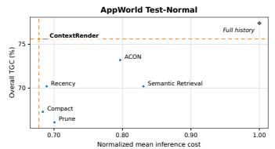  
(a) GPT-4.1

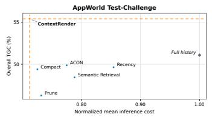  
(b) GPT-4.1

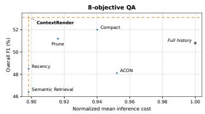  
(c) GPT-4.1

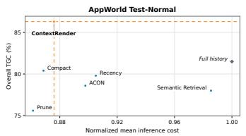

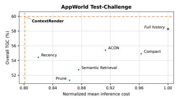  
(d) Muse Glimmer 30B

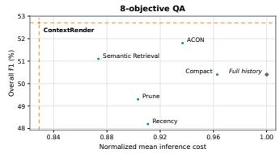

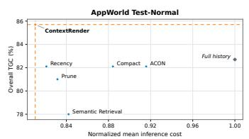  
(g) DeepSeek V4 Pro

(f) Muse Glimmer 30B  
(e) Muse Glimmer 30B  
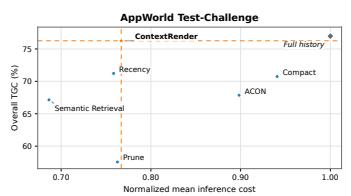  
(h) DeepSeek V4 Pro

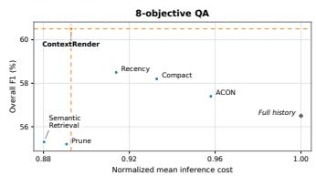  
(i) DeepSeek V4 Pro  
Figure 4: Overall performance (AppWorld TGC; QA F1) across all tasks versus mean standardized inference cost on the same tasks that trigger context management at B = 6K. Costs are normalized to the mean cost of Full history (= 1). “Recency” denotes Recency + Summary.

$$
C = \frac { [ 2 ( 1 - \rho ) + 0 . 5 \rho ] P + 8 O + 0 . 1 3 E } { 1 0 ^ { 6 } } ,\tag{3}
$$

where P, O, and E are the total input, output, and embedding token counts for a task, and ρ is the fraction of input tokens served from cache. We use the cache rate observed in Full history to price all methods evaluated with the same model on the same benchmark. Appendix C.2 details token accounting and normalization.

## 4.3 TASK PERFORMANCE AND INFERENCE EFFICIENCY

We measure overall task performance across all tasks in AppWorld Test-Normal, Test-Challenge, and 8-objective QA for each execution model. To assess inference efficiency, we measure mean inference cost across methods on the same tasks that trigger context management when their accumulated execution history exceeds the 6K history budget. We also evaluate Full history as a reference for task performance and inference cost when the entire accumulated execution history is passed without context management.

Figure 4 plots overall task performance against mean standardized inference cost, normalized to that of Full history on the same tasks in each model–benchmark setting (Full history = 1). Table 1 reports the corresponding relative performance and cost changes of CONTEXTRENDER against each baseline and the Full history reference.

CONTEXTRENDER maintains task performance close to or above Full history, with relative gains of 2.9%–8.5% in seven of nine settings, while reducing mean inference cost by 10.2%–32.2% across all nine settings.

CONTEXTRENDER outperforms all five context management baselines in task performance across all nine settings, with relative gains of 3.3%–32.5% in AppWorld TGC and 1.7%–14.4% in QA F1. Mean inference cost is lower in most baseline comparisons. On AppWorld Test-Challenge with DeepSeek V4 Pro, CONTEXTRENDER incurs 11.7% higher cost than Semantic Retrieval while achieving 13.6% higher TGC.

Table 1: Relative changes in task performance and mean inference cost of CONTEXTRENDER versus each baseline and Full history. Green, red, and gray arrows indicate improvements, regressions, and no change, respectively.
<table><tr><td rowspan="2">Model</td><td rowspan="2">Benchmark</td><td colspan="2">Full history</td><td colspan="2">Prune</td><td colspan="2">Compact</td><td colspan="2">Recency + Summary</td><td colspan="2">Semantic Retrieval</td><td colspan="2">ACON</td></tr><tr><td>Perf.</td><td>Cost </td><td>Perf.</td><td>Cost</td><td>Perf.</td><td>Cost |</td><td>Perf.</td><td>Cost </td><td>Perf.</td><td>Cost </td><td>Perf.</td><td>Cost</td></tr><tr><td rowspan="3">GPT-4.1</td><td>AppWorld Normal</td><td>↓2.3%</td><td>↓32.2%</td><td>↑14.4%</td><td>↓3.2%</td><td>↑12.4%</td><td>↓0.8%</td><td>↑7.6%</td><td>↓1.6%</td><td>↑7.6%</td><td>↓18.4%</td><td>↑3.3%</td><td>↓14.9%</td></tr><tr><td>AppWorld Challenge</td><td>↑8.5%</td><td>↓28.8%</td><td>↑19.7%</td><td>↓2.7%</td><td>↑12.1%</td><td>↓1.8%</td><td>↑11.6%</td><td>↓16.7%</td><td>↑14.4%</td><td>↓9.7%</td><td>↑11.1%</td><td>↓8.1%</td></tr><tr><td>8-objective QA</td><td>↑4.5%</td><td>↓10.2%</td><td>↑3.7%</td><td>↓2.0%</td><td>↑2.1%</td><td>↓4.5%</td><td>↑9.5%</td><td>→0.0%</td><td>↑14.4%</td><td>→0.0%</td><td>↑10.4%</td><td>↓5.7%</td></tr><tr><td rowspan="3">Muse Glimmer 30B</td><td>AppWorld Normal</td><td>↑5.8%</td><td>↓12.4%</td><td>|↑14.2% ↑1.7%</td><td></td><td>↑7.4%</td><td>↑0.8%</td><td>↑8.2%</td><td>↓3.2%</td><td>↑10.7%</td><td>↓11.1%</td><td>↑9.8%</td><td>↓2.4%</td></tr><tr><td>AppWorld Challenge</td><td></td><td>↑2.9%↓19.9%</td><td>↑16.8%↓7.2%</td><td></td><td>↑9.2%</td><td>↓16.8%</td><td>↑10.1%</td><td>↓2.3%</td><td>↑13.6%</td><td>↓8.5%</td><td>↑8.2%</td><td>↓12.2%</td></tr><tr><td>8-objective QA</td><td></td><td>↑4.6%↓17.1%</td><td>↑6.9% ↓8.2%</td><td></td><td>↑4.6%</td><td>↓13.9%</td><td>↑9.3%</td><td>↓9.0%</td><td>↑3.1%</td><td>↓5.1%</td><td>↑1.7%</td><td>↓11.5%</td></tr><tr><td rowspan="3">DeepSeek V4 Pro</td><td>AppWorld Normal</td><td>↑3.6%</td><td>↓18.9%</td><td>↑5.9%↓2.5%</td><td></td><td>↑4.3%</td><td>↓8.3%</td><td>↑4.3%</td><td>↓1.3%</td><td>↑9.9%</td><td>↓3.8%</td><td>↑4.3%</td><td>↓11.5%</td></tr><tr><td>AppWorld Challenge</td><td>↓0.9%</td><td>↓23.3%</td><td>↑32.5% ↑0.6%</td><td></td><td>↑7.8%</td><td>↓18.5%</td><td>↑7.1%</td><td>↑1.1%</td><td>↑13.6%</td><td>↑11.7%</td><td>↑12.4%</td><td>↓14.6%</td></tr><tr><td>8-objective QA</td><td></td><td>↑7.1%↓10.7%</td><td>↑9.6% ↑0.2%</td><td></td><td>↑4.0%</td><td>↓4.3%</td><td>↑3.4%</td><td>↓2.3%</td><td>↑9.4%</td><td>↑1.4%</td><td>↑5.4%</td><td>↓6.8%</td></tr></table>

Table 2: Ablation of CONTEXTRENDER with GPT-4.1 on AppWorld Test-Normal and 8-objective QA at B = 6K. Recall denotes Later-Used Result Recall. Result age is the number of turns between a tool result’s creation and its subsequent reuse. All values are percentages.
<table><tr><td rowspan="2">Variant</td><td colspan="2">Performance AppWorld QA</td><td colspan="2">Later-Used Result Recall</td><td colspan="4">AppWorld Later-Used Result Recall by Result Age</td></tr><tr><td>(TGC)</td><td>(F1)</td><td>AppWorld</td><td>QA</td><td>≤ 3</td><td>4-10</td><td>11-25</td><td>&gt; 25</td></tr><tr><td>CR-Recency</td><td>71.4</td><td>48.5</td><td>63.8</td><td>86.0</td><td>95.7</td><td>78.7</td><td>37.7</td><td>18.5</td></tr><tr><td>CR-Relevance</td><td>73.2</td><td>47.5</td><td>71.4</td><td>64.2</td><td>89.5</td><td>81.9</td><td>54.1</td><td>47.1</td></tr><tr><td>CR-Recency + Relevance</td><td>72.6</td><td>50.8</td><td>61.6</td><td>76.1</td><td>84.4</td><td>72.5</td><td>43.9</td><td>22.7</td></tr><tr><td>CR-Full (+Reuse)</td><td>75.6</td><td>53.1</td><td>87.2</td><td>91.0</td><td>99.3</td><td>91.5</td><td>79.0</td><td>68.5</td></tr></table>

These results show that repeatedly applying CONTEXTRENDER to select useful tool-result history within a 6K history budget, well below the models’ maximum context windows, achieves perfor mance close to or above Full history at lower inference cost. Also, compared with other context management baselines, CONTEXTRENDER consistently improves task performance, with lower cost in most comparisons.

## 4.4 ABLATION STUDY

To isolate each selection signal, we compare four CONTEXTRENDER variants: CR–Recency uses result age, CR–Relevance uses semantic relevance, CR–Recency + Relevance combines both, and CR–Full (+Reuse) adds observed reuse. We evaluate GPT-4.1 on AppWorld Test-Normal and QA at B = 6K, keeping all other components fixed. To measure Later-Used Result Recall, we first record GPT-4.1 executions with the Full history baseline. At each recorded invocation, we apply each variant’s selection rule to the preceding history to determine which tool results it would retain. We count a tool result as reused when a later assistant turn exactly repeats one or more qualifying identifiers first introduced by that result. Appendix B.4 details the matching rules.

Table 2 shows that adding observed reuse to CR–Recency + Relevance improves both task performance and Later-Used Result Recall. Relative gains are 4.1% in AppWorld TGC and 4.5% in QA F1, alongside recall gains of 41.6% and 19.6%, respectively. CR–Full achieves the highest performance and recall on both benchmarks, although combining recency and relevance alone does not consistently improve over either signal. The recall benefit is particularly strong for tool results needed many turns after they were produced. On AppWorld, CR–Full achieves a recall rate approximately 3× that of CR–Recency + Relevance for tool results needed more than 25 turns after they were produced. Together, these results support observed reuse as an additional selection signal that helps retain older results needed later and improves task performance under the same history budget.

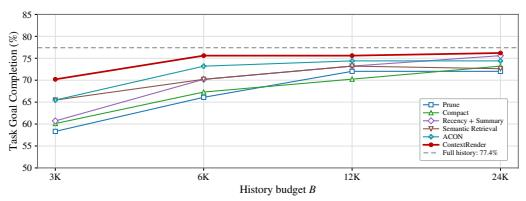  
(a) AppWorld Test-Normal, GPT-4.1

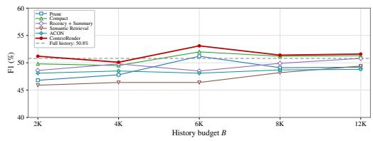  
(b) 8-objective QA, GPT-4.1  
Figure 5: Budget sensitivity with GPT-4.1. B denotes the history budget. “Recency” denotes Recency + Summary.

## 4.5 SENSITIVITY TO THE HISTORY BUDGET

Figure 5 varies the history budget from 3K to 24K on AppWorld Test-Normal and from 2K to 12K on QA. CONTEXTRENDER outperforms the strongest evaluated context management baseline at every tested budget, with gains of up to 4.7 percentage points in AppWorld TGC and 1.4 percentage points in QA F1. On AppWorld, performance moves closer to Full history as the budget increases, with little further improvement beyond 6K. QA performance varies within a 3.0-point range, remaining close to or above Full history. These results show that CONTEXTRENDER maintains its advantage across budget settings and achieves strong task performance with a small history budget.

## 5 RELATED WORK

ACON optimizes compression guidelines; Context-Folding and AgentFold condense interaction histories (Kang et al., 2025; Sun et al., 2025; Ye et al., 2025). MEM1 learns a compact internal state, while observation masking hides earlier outputs without summaries (Zhou et al., 2025; Lindenbauer et al., 2025; Zhang et al., 2026). These reductions can omit details needed later, which cannot be recovered from the reduced history alone if originals are discarded. CONTEXTRENDER retains complete tool results and selects which to expose at each invocation, allowing omitted information to return.

Adaptive Context Elasticizer uses model decisions to expose, abstract, or hide historical interactions, while PACE adjusts their granularity using semantic relevance (Liao et al., 2026; Wei et al., 2026). Sculptor provides context editing and restoration tools, and Addressable Recall Compaction supports recall by identifier (Li et al., 2025; Dang et al., 2026). CONTEXTRENDER adds observed reuse as selection evidence. Tool-Flow Analysis attributes later uses of distinctive references to originating tool results. The renderer combines this evidence with recency and semantic relevance to select results within the historical budget.

MemGPT manages active context and external memory; A-MEM links memory notes through semantic retrieval and model analysis (Packer et al., 2023; Xu et al., 2025). Agentic Context En gineering develops reusable playbooks through generation, reflection, and curation (Zhang et al., 2025). CONTEXTRENDER selects tool results accumulated within the current task. Its graph records chronological order and observed reuse by later operations, providing evidence of continued usefulness beyond content similarity. This complements memory organization and the adaptation of reusable guidance.

## 6 CONCLUSION

We introduced CONTEXTRENDER, which combines observed reuse, recency, and semantic relevance to select historical tool results from a persistent graph while retaining omitted results for later use. Across AppWorld and 8-objective QA with three execution models, it outperforms evaluated managed-context baselines using a 6K history budget, well below the models’ maximum context windows. It maintains task performance close to or above Full history while reducing mean inference cost by 10.2%–32.2%.

## AI USE STATEMENT

We used generative AI tools to assist with polishing text and formatting experimental tables. All experimental design, measurements, and analyses were conducted by the authors. We reviewed all AI-assisted content and take full responsibility for the final content of this work.

## REFERENCES

Thang Dang, Yuma Ichikawa, Sakina Fatima, and Koichi Shirahata. Addressable recall compaction for long context-window control in AI agents. arXiv preprint arXiv:2607.25066, 2026. doi: 10.48550/arXiv.2607.25066. URL https://arxiv.org/abs/2607.25066.

Xubin Hao, Hongjin Meng, Xin Yin, Jiawei Zhu, and Chenpeng Cao. Self-GC: Self-governing context for long-horizon LLM agents. arXiv preprint arXiv:2607.00692, 2026.

Minki Kang, Wei-Ning Chen, Dongge Han, Huseyin A. Inan, Lukas Wutschitz, Yanzhi Chen, Robert Sim, and Saravan Rajmohan. Acon: Optimizing context compression for long-horizon llm agents. arXiv preprint arXiv:2510.00615, 2025.

Tom Kwiatkowski, Jennimaria Palomaki, Olivia Redfield, Michael Collins, Ankur Parikh, Chris Alberti, Danielle Epstein, Illia Polosukhin, Jacob Devlin, Kenton Lee, Kristina Toutanova, Llion Jones, Matthew Kelcey, Ming-Wei Chang, Andrew M. Dai, Jakob Uszkoreit, Quoc Le, and Slav Petrov. Natural questions: A benchmark for question answering research. Transactions of the Associationfor Computational Linguistics, 7:452–466, 2019.

Mo Li, L.H. Xu, Qitai Tan, Ting Cao, and Yunxin Liu. Sculptor: Empowering LLMs with cognitive agency via active context management. arXiv preprint arXiv:2508.04664, 2025.

Ning Liao, Zihao Long, Xiaoxing Wang, Xue Yang, Yaoming Wang, Ziyuan Zhuang, Xunliang Cai, Rongxiang Weng, and Junchi Yan. ACE: Pluggable adaptive context elasticizer across agents. arXiv preprint arXiv:2606.31564, 2026.

Tobias Lindenbauer, Igor Slinko, Ludwig Felder, Egor Bogomolov, and Yaroslav Zharov. The complexity trap: Simple observation masking is as efficient as LLM summarization for agent context management. arXiv preprint arXiv:2508.21433, 2025.

Nelson F. Liu, Kevin Lin, John Hewitt, Ashwin Paranjape, Michele Bevilacqua, Fabio Petroni, and Percy Liang. Lost in the middle: How language models use long contexts. Transactions of the Associationfor Computational Linguistics, 12:157–173, 2024.

Jason Mars. Object-spatial programming. arXiv preprint arXiv:2503.15812, 2025.

Jason Mars, Yiping Kang, Roland Daynauth, Baichuan Li, Ashish Mahendra, Krisztian Flautner, and Lingjia Tang. The jaseci programming paradigm and runtime stack: Building scale-out production applications easy and fast. IEEE Computer Architecture Letters, 22(2):101–104, 2023. doi: 10.1109/LCA.2023.3274038.

Nous Research. Hermes Agent. Open-source software, 2026. URL https://github.com/ NousResearch/hermes-agent. Accessed September 25, 2026.

OpenClaw. OpenClaw. Open-source software, 2026. URL https://github.com/ openclaw/openclaw. Accessed September 25, 2026.

OpenCode. OpenCode. Open-source software, 2025. URL https://github.com/ anomalyco/opencode. Accessed September 25, 2026.

Charles Packer, Sarah Wooders, Kevin Lin, Vivian Fang, Shishir G. Patil, Ion Stoica, and Joseph E. Gonzalez. MemGPT: Towards LLMs as operating systems. arXiv preprint arXiv:2310.08560, 2023.

Calvin Smith. OpenHands context condensation for more efficient AI agents. All Hands AI Blog, https://www.all-hands.dev/blog/ openhands-context-condensensation-for-more-efficient-ai-agents, April 2025.

Weiwei Sun, Miao Lu, Zhan Ling, Kang Liu, Xuesong Yao, Yiming Yang, and Jiecao Chen. Scaling long-horizon LLM agent via context-folding. arXiv preprint arXiv:2510.11967, 2025.

Harsh Trivedi, Tushar Khot, Mareike Hartmann, Ruskin Manku, Vinty Dong, Edward Li, Shashank Gupta, Ashish Sabharwal, and Niranjan Balasubramanian. AppWorld: A controllable world of apps and people for benchmarking interactive coding agents. In Proceedings of the 62nd Annual Meeting ofthe Associationfor Computational Linguistics (Volume 1: Long Papers), 2024.

Lei Wei, Xiao Peng, Tt, Guannan Zhang, Chenhao Jiang, Hongyu Li, Lanbo Lin, Yuanwu Xu, Jiayao Liu, Kesu Wang, and Bin Wang. PACE: Predictive adaptive context extraction for long-horizon LLM agents. In Proceedings of the 64th Annual Meeting of the Association for Computational Linguistics (Volume 1: Long Papers), pp. 27184–27199, San Diego, California, United States, 2026. Association for Computational Linguistics. doi: 10.18653/v1/2026.acl-long.1252. URL https://aclanthology.org/2026.acl-long.1252/.

Wujiang Xu, Zujie Liang, Kai Mei, Hang Gao, Juntao Tan, and Yongfeng Zhang. A-MEM: Agentic memory for LLM agents. arXiv preprint arXiv:2502.12110, 2025. URL https://arxiv. org/abs/2502.12110.

John Yang, Carlos E. Jimenez, Alexander Wettig, Kilian Lieret, Shunyu Yao, Karthik Narasimhan, and Ofir Press. SWE-agent: Agent-computer interfaces enable automated software engineering. arXiv preprint arXiv:2405.15793, 2024.

Rui Ye, Zhongwang Zhang, Kuan Li, Huifeng Yin, Zhengwei Tao, Yida Zhao, Liangcai Su, Liwen Zhang, Zile Qiao, Xinyu Wang, Pengjun Xie, Fei Huang, Siheng Chen, Jingren Zhou, and Yong Jiang. AgentFold: Long-horizon web agents with proactive context management. arXiv preprint arXiv:2510.24699, 2025.

Haoxiang Zhang, Qixin Xu, Zhuofeng Li, Lei Zhang, Pengcheng Jiang, Yu Zhang, and Julian McAuley. Masking stale observations helps search agents – until it doesn’t: A regime map and its mechanism. arXiv preprint arXiv:2606.00408, 2026.

Qizheng Zhang, Changran Hu, Shubhangi Upasani, Boyuan Ma, Fenglu Hong, Vamsidhar Kamanuru, Jay Rainton, Chen Wu, Mengmeng Ji, Hanchen Li, Urmish Thakker, James Zou, and Kunle Olukotun. Agentic context engineering: Evolving contexts for self-improving language models. arXiv preprint arXiv:2510.04618, 2025. URL https://arxiv.org/abs/2510.04618.

Zijian Zhou, Ao Qu, Zhaoxuan Wu, Sunghwan Kim, Alok Prakash, Daniela Rus, Jinhua Zhao, Bryan Kian Hsiang Low, and Paul Pu Liang. MEM1: Learning to synergize memory and reasoning for efficient long-horizon agents. arXiv preprint arXiv:2506.15841, 2025. URL https://arxiv.org/abs/2506.15841.

Algorithm 1 Context-management pass before invocation t   
Require: Persistent graph G, new interaction events $\overline { { E _ { t } } } ,$ , history budget B   
Ensure: Rendered execution history $H _ { t }$ with Tok $( H _ { t } ) \leq B$   
1: Add previously unseen events from $E _ { t }$ to $G$   
2: Detect new reuse matches and add their attributed reuse edges to $G$   
3: Let $H _ { t } ^ { \mathrm { f u l l } }$ be the accumulated execution history   
4: if Tok $( H _ { t } ^ { \mathrm { f u l l } } ) \le B$ then   
5: return $\hat { H } _ { t } ^ { \mathrm { f u l l } }$   
6: end if   
7: Construct the relevance vector $q _ { t }$   
8: for each historical tool result r in $G$ do   
9: Compute $c _ { t } ( r )$ using Equation 1   
10: Compute $U _ { t } ( r )$ using Equation 2   
11: end for   
12: Apply the oversized-result fallback where needed (Appendix A.4)   
13: $S _ { t } \gets \emptyset$   
14: while an unselected result satisfies Equation 6 do   
15: Choose the feasible result with maximum $R _ { t } ( r \mid S _ { t } )$   
16: Break exact ties by transcript order, older first   
17: Add the chosen result to $S _ { t }$   
18: end while   
19: $H _ { t } \gets \mathcal { H } _ { t } ( S _ { t } )$ in chronological order   
20: return $H _ { t }$ to the runtime adapter

## A IMPLEMENTATION DETAILS

This appendix describes the execution procedure, TFA matching rules, scoring configuration, and history-budget accounting. Evaluation settings and protocols appear in Appendix B, cost accounting and numerical results in Appendix C, and runtime integrations in Appendix D.

## A.1 EXECUTION PROCEDURE

Algorithm 1 summarizes the rendering procedure in Section 3.3. The server updates the persistent graph before each invocation. If the accumulated execution history fits within B, it is included in full. Otherwise, the renderer scores historical tool results and greedily selects those that fit. The server returns the rendered history to the runtime adapter.

Unselected results remain in the persistent graph with their complete content and can be reconsidered at subsequent invocations.

## A.2 TOOL-FLOW ANALYSIS IMPLEMENTATION

Trace model and value reuse. TFA analyzes the realized execution trace as a straight-line sequence of events. The extraction and filtering rules below define its value abstraction. Under this abstraction, a tool result defines the set of qualifying values it contains. A later model output or tool call uses a value when it contains an exact, case-sensitive whole-token match to that value.

For each used value, TFA records a reuse link connecting the use to the first earlier tool result containing that value, as in Section 3.2. Intermediate copies in model outputs or tool calls do not change the attributed source. These links form the reuse edges in the persistent context graph. Because the analysis follows a single realized trace, dependency tracking reduces to constructing these reuse links; no merging across alternative control-flow paths is required.

Value abstraction and matching rules. TFA extracts candidate values using the pattern $[ \mathbb { A } \mathrm { - } \mathbb { Z } \mathsf { a } \mathrm { - } \mathsf { z } 0 \mathrm { - } 9 ] \ [ \mathbb { A } \mathrm { - } \mathbb { Z } \mathsf { a } \mathrm { - } \mathsf { z } 0 \mathrm { - } 9 \mathrm { \mathrm { - } } \mathsf { \backslash } \mathrm { - } ] \ \{ \ 4 , \ \}$ . Quote marks, bracket characters, commas, colons, slashes, and whitespace act as separators. Leading and trailing periods, hyphens, and underscores are removed from each candidate, while the same characters are retained when they occur inside the value. Candidates shorter than six characters after this stripping step are discarded.

A candidate is retained only if it contains at least one underscore, uppercase letter, digit, hyphen, or period. Pure-alphabetic Titlecase words are excluded. Matching is case-sensitive and requires an exact whole-token match; no case normalization or substring matching is performed.

File paths are not parsed separately. Because slashes act as separators, each path segment is tested independently using the same extraction and filtering rules. Retained values are matched against later model outputs and tool calls.

Relation to the motivating example. Figure 2 illustrates task-level information dependencies, not a literal set of TFA-detected edges. The displayed names do not qualify: Kathryn is excluded as Titlecase, while Troy and Nancy are shorter than six characters. Email addresses are split at @; kathrynmaldonado fails the character filter, whereas tr solo, nan ritt, and gmail.com qualify.

Nancy’s email is not reused before Turn 18. The match to Troy’s tr solo at Turn 16 instead credits the shared Turn 8 tool result. This can raise the priority of the whole contact result, helping retain Nancy’s information for later use without an earlier match to her email.

Scope of the reuse signal. We use a result’s past reuse as a heuristic predictor of future usefulness. A match to one value increases the score of its source result and can therefore help retain other values in that result. This relies on information locality within a tool result; it does not establish a dependency on the particular value needed by an upcoming operation. TFA records observed value reuse and attributes it to earlier tool results; the renderer uses these reuse edges to prioritize complete results.

Attribution and provenance. For production TFA, the source of a matched value is the first earlier tool result containing it. References to a result that “introduces” a value or to an “originating” result use this tool-result attribution rule: “first” is measured across earlier tool results. Under this rule, a qualifying value already present in the task input or an earlier assistant message can be attributed to the first tool result that echoes it when the value is matched in a later operation. This attribution supplies an online ranking signal; it does not establish either the original source of a value or a causal dependency. The recall protocol in Appendix B.4 requires a token’s first transcript appearance to occur in a tool result to label events for result-availability evaluation.

Match counting and weighting. Each distinct qualifying value counts once per later model output or tool call. Repeated occurrences of the same value within one operation do not create additional matches. Uses in separate operations count separately, and different qualifying values within one operation contribute separate matches.

Before invocation $t , \ M _ { t } ( r )$ contains the matches attributed to result $r .$ . The count $n _ { t } ( m )$ is the number of historical tool results containing the value in match m at that invocation, including results outside the current model input. Equation 1 weights each match by $1 / n _ { t } ( m )$ . This count is over tool results, not occurrences within a result: three contacts sharing gmail.com in one result contribute one to $n _ { t } ( m )$ . Occurrences in other results increase the count. The weighting reduces a match’s score contribution without removing the match. The renderer recomputes $c _ { t } ( r )$ using only the graph state available before invocation t.

## A.3 USEFULNESS CONFIGURATION

The usefulness score combines result age, semantic relevance, and observed reuse. Following Section 3.3, one turn corresponds to one model invocation, and $a _ { t } ( r )$ counts the turns since result r was produced. Thus, $\lambda = 0 . { \overset { - } { 3 } }$ controls recency decay per model invocation. Assistant and tool messages within a turn do not separately increment this age.

For semantic relevance, let x denote the task’s first user message and let $f _ { t }$ denote the latest visible interaction before invocation t, formed by concatenating the latest visible user message and latest visible assistant message. We construct

$$
q _ { t } = 0 . 4 \mathrm { u n i t } ( \mathrm { e m b } ( x ) ) + 0 . 6 \mathrm { u n i t } ( \mathrm { e m b } ( f _ { t } ) ) ,\tag{4}
$$

where $\mathrm { { u n i t } } ( \cdot )$ denotes vector normalization. The first user message is clipped to 2,000 characters before embedding.

We use text-embedding-3-small through OpenAI via LiteLLM, embedding the first 8,000 characters of each tool result.

Semantic relevance is

$$
s _ { t } ( r ) = \operatorname* { m a x } ( \cos ( \operatorname { e m b } ( r ) , q _ { t } ) , 0 ) .\tag{5}
$$

Parameters. We use

$$
\begin{array} { r l r l r } { W _ { \mathrm { r e c } } = 1 . 0 , \quad } & { } & { \quad W _ { \mathrm { r e l } } = 1 . 0 , \quad } & { } & { \quad W _ { \mathrm { r e u s e } } = 1 . 0 , } \\ { \lambda = 0 . 3 , \quad } & { } & { \quad \gamma = 0 . 2 . } & { } & { \quad } \end{array}
$$

The parameter λ controls recency decay with result age, while $\gamma$ controls how quickly the reuse contribution increases as observed reuse accumulates. Equal coefficients do not imply equal perresult contributions because the three signals can take different values.

## A.4 SELECTION AND BUDGET ACCOUNTING

History budget. The history budget B strictly caps the rendered execution history, as described in Section 3.3. If the accumulated history fits within B, it is included in full. Otherwise, the renderer selects historical tool results. Accounting includes retained history messages, associated tool calls, and selected result text. The system prompt and current user message are separate model-input components, so B is distinct from the model’s total context window. We count history tokens using tiktoken.

Other historical messages. Historical user and assistant messages are retained verbatim in chronological order, excluding the current user message accounted for separately above. Their tokens are charged to B before allocating space to selected tool results and their associated tool calls. A tool call already contained in a retained assistant message is counted once, as part of the assembled history.

Budget feasibility. Let S be the selected results and $\mathcal { H } _ { t } ( S )$ the history assembled from their text, associated tool calls, and retained history messages. A candidate r is feasible only if

$$
\operatorname { T o k } ( \mathcal { H } _ { t } ( S \cup \{ r \} ) ) \leq B .\tag{6}
$$

Thus, feasibility is checked against the assembled history, not only the candidate’s result text. Retained non-tool history is included in every feasibility check, including before any tool results are selected.

Greedy selection. Selection starts with $S = \emptyset$ . The renderer ranks feasible candidates by their usefulness from Equation 2, adjusted for similarity to results already selected:

$$
\begin{array} { r l } & { R _ { t } ( r \mid S ) = U _ { t } ( r ) - 0 . 5 D ( r , S ) , } \\ & { ~ D ( r , S ) = \operatorname* { m a x } \Biggl ( 0 , \underset { r ^ { \prime } \in S } { \operatorname* { m a x } } \cos ( \mathrm { e m b } ( r ) , \mathrm { e m b } ( r ^ { \prime } ) ) \Biggr ) . } \end{array}\tag{7}
$$

Here $D ( r , \boldsymbol { \infty } ) = 0$ . We set the coefficient to 0.5. The floor at zero prevents negative cosine similarity from increasing a candidate’s score. The embeddings are specified in Appendix A.3.

At each step, the renderer adds the feasible result with the highest $R _ { t } ( r \mid S )$ . Candidates are visited in transcript order, and the current best is replaced only by a strictly higher score; exact ties therefore favor the older result. A result that does not fit is skipped while other candidates remain eligible. There is no minimum score, and selection ends when no remaining result fits.

Oversized-result fallback. If an individual tool result exceeds B, gpt-4.1 compacts it. The compacted text is included only if the assembled history still satisfies Equation 6; its complete original remains stored in the graph. We did not observe such oversized individual tool results in the evaluation runs, where selected results were included in full.

Rendered output. Selected results and their associated tool calls are returned in chronological order, rather than score order. Unselected results are omitted from the model-visible history and remain stored in full in the persistent graph. Before subsequent invocations, their scores are recomputed from the updated graph, allowing them to be selected again as priorities change. The rendered history always satisfies $\mathrm { \bar { T o k } } ( H _ { t } ) \leq B$

## B EVALUATION SETTINGS AND PROTOCOLS

## B.1 MODEL AND API SETTINGS

We evaluate gpt-4.1 through the OpenAI API, muse-glimmer:30b-q8 0 using local Ollama 0.34.0, and deepseek-v4-pro:0813 through Ollama Cloud. We set temperature to 0.0, top-p to 1.0, and seed to 42. Each method is executed once per task.

The primary setting uses $B = 6 \mathsf { K }$ . The GPT-4.1 budget-sensitivity study uses $B \in \{ 3 , 6 , 1 2 , 2 4 \} \mathrm { K }$ on AppWorld Test-Normal and $B \in \{ 2 , 4 , 6 , 8 , 1 2 \} \bar { \bf K }$ on 8-objective QA. For each benchmark and execution model, methods use the same agent prompt, tool interface, and execution limits.

## B.2 BASELINE IMPLEMENTATION DETAILS

All budgeted context management methods use the same history budget B, tokenizer-based counting, and budget scope within each model and benchmark. The budget covers retained historical messages, tool calls, tool results, and summaries, with the same prompt exclusions described in Appendix A.4. The history cap is distinct from the complete model-input length.

Prune. Prune considers complete historical tool results from newest to oldest and retains those that fit within B. Results outside the budget are omitted from the context presented to the model.

Compact (LLM). When the accumulated interaction history exceeds B, Compact (LLM) uses an LLM to compress the entire interaction history to fit within the budget. It uses gpt-4.1 through LiteLLM, configured by CTXGRAPH MODEL. The summary prompt is generated by the byLLM typed-slot extractor and organizes information into files read, key observations, commands run, decisions, and unresolved questions. It asks the model to preserve numeric values, configuration keys, paths, identifiers, and error strings verbatim.

Recency + Summary. Recency + Summary retains recent complete tool results and summarizes older results within the same budget B. It uses gpt-4.1 through LiteLLM with the same summary prompt as Compact (LLM). When an earlier summary exists, the summarizer merges it with newly summarized content.

Semantic Retrieval. Semantic Retrieval uses the embedding model configured by CTXGRAPH EMBED MODEL, with text-embedding-3-small as the default, through LiteLLM. Before each model invocation, it forms the retrieval input from the latest user and assistant messages. Results from the three most recent turns are considered first, newest first, using up to 60% of B. Remaining results are ranked by cosine similarity to this input and included when they fit within the remaining budget. Unselected results remain stored and can be selected again at a later invocation.

ACON. We use the authors’ released history compression implementation with their optimized compression guideline. The compressor is gpt-4.1 on both AppWorld and 8-objective QA. The history budget is the same B used by the other context management methods.

Full-history reference. We also evaluate Full history, which passes the entire accumulated execution history without context management even when it exceeds B, as a reference for task performance and inference cost.

Table 3: Scoring weights used in the selector ablations. Zero disables the corresponding term; retained weights remain unchanged.
<table><tr><td>Selector</td><td> $W _ { \mathrm { r e c } }$ </td><td> $W _ { \mathrm { r e l } }$ </td><td> $W _ { \mathrm { r e u s e } }$ </td></tr><tr><td>CR-Recency</td><td>1.0</td><td>0.0</td><td>0.0</td></tr><tr><td>CR-Relevance</td><td>0.0</td><td>1.0</td><td>0.0</td></tr><tr><td>CR-Recency + Relevance</td><td>1.0</td><td>1.0</td><td>0.0</td></tr><tr><td>CR-Full (+Reuse)</td><td>1.0</td><td>1.0</td><td>1.0</td></tr></table>

## B.3 SCORING PARAMETERS AND ABLATION CONFIGURATION

Ablation configuration. We construct selector ablations by setting omitted scoring terms in Equation 2 to zero. Retained terms keep their full-selector weights without renormalization or retuning. The values of λ and $\gamma$ remain fixed wherever their corresponding terms are active. Table 3 lists the resulting weights.

All variants use the same persistent graph, history budget, budget accounting, and greedy selection procedure in Appendix A.4. Each starts with an empty selected set and applies the same similarity adjustment. They differ only in the enabled terms of $\dot { U } _ { t } ( r )$ : setting $W _ { \mathrm { r e u s e } } = 0$ removes observed reuse from selection, with no separate identifier-based protection. The comparison measures the contribution of the scoring terms under this shared configuration.

Interpreting combined signals. Combining signals changes the usefulness scores of results competing for the available budget. A result favored by one signal can be displaced when another signal increases the usefulness of competing results. Consequently, Recency + Relevance need not outperform either signal alone under fixed weights. The observed ordering characterizes this configuration and does not establish the ordering that would result from separately tuned variants.

## B.4 LATER-USED RESULT RECALL PROTOCOL

Reuse events. We define lexical reuse events by exact token matching. Eligible tokens consist of at least six letters, digits, or underscores and include at least one uppercase letter or underscore. A token is linked to a tool result only when its first appearance in the transcript occurs in that result rather than in the task input or an earlier assistant message. A later assistant turn containing the token, including in prose, code, or tool-call arguments, labels a lexical reuse event.

Relation to production matching. Production TFA uses value-level matches to rank results during execution. Recall evaluation uses a fixed lexical event set on recorded traces to compare result availability across selectors. The separate labeling rule provides a shared evaluation proxy whose events do not depend on each selector’s production TFA detections.

Unlike production TFA (Appendix A.2), the recall rule permits Titlecase words of sufficient length, requires an uppercase letter or underscore, and limits eligible tokens to letters, digits, and underscores. Its transcript-level first-appearance rule focuses evaluation on values first observed in tool results, excluding values already supplied by the task or earlier assistant text. Production attribution instead assigns matches to the first tool result containing the value.

Each distinct pair $( j , r )$ of assistant turn $j$ and earlier tool result r counts once, regardless of the number of matched tokens. This counts availability once per result at each turn, so multiple identifiers from one result do not inflate its contribution. Production TFA instead counts distinct values per later operation as evidence for its reuse score. Reuse of the same result at different turns produces separate evaluation events. The recall age bins below count turns in model invocations, using the same turn definition as Section 3.3 and Appendix A.3.

Visibility. For each event $( j , r )$ , result r is visible only if its complete original text is present in the model-visible context immediately before turn $j .$ . An LLM-compacted version does not count as complete-result visibility. A previously omitted result counts if it has been selected again and restored in full before the evaluated turn. If E is the event set and $V _ { j }$ is the set of results visible in

Table 4: AppWorld reuse events by result age.
<table><tr><td colspan="2">Result age at reuse Events</td></tr><tr><td>≤ 3 turns</td><td>713</td></tr><tr><td>4–10 turns</td><td>1,124</td></tr><tr><td>11–25 turns</td><td>1,099</td></tr><tr><td>&gt; 25 turns</td><td>238</td></tr><tr><td>Total</td><td>3,174</td></tr></table>

Table 5: 8-objective QA reuse events by result age.
<table><tr><td>Result age at reuse</td><td>Events</td></tr><tr><td>≤ 3 turns</td><td>224</td></tr><tr><td>4–10 turns</td><td>70</td></tr><tr><td>11–25 turns</td><td>41</td></tr><tr><td>&gt; 25 turns</td><td>0</td></tr><tr><td>Total</td><td>335</td></tr></table>

full before turn $j ,$ we compute

$$
{ \mathrm { R e c a l l } } = 1 0 0 { \frac { \sum _ { ( j , r ) \in E } { \bf 1 } [ r \in V _ { j } ] } { | E | } } .\tag{8}
$$

Measurement procedure. We first record GPT-4.1 executions using the Full history reference. At each recorded invocation, we apply each variant’s selection rule to the preceding history, as described in Section 4.4. Before assistant turn j, the evaluator synchronizes all messages preceding $j ,$ obtains the selector’s render decision, and checks whether result r is visible. Turn j is used only afterward to label the event. Reuse counters use only turns preceding j. Consequently, every selector is evaluated on the same event set.

Interpretation. The metric measures full-result availability at detected lexical reuse events on these fixed traces. Lexical repetition does not establish that a later operation depended on the earlier result, and exact matching can miss reuse expressed differently. Higher recall therefore indicates better retention for this reference event set; it does not independently establish the precision or recall of TFA’s dependency detection or the causal correctness of its edges.

The recorded AppWorld histories contain 3,174 result-level reuse events. Table 4 reports their distribution by result age.

The recorded 8-objective QA histories contain 335 result-level reuse events across 100 tasks, using one GPT-4.1 trace per task with Full history. We use the same event-counting convention as for AppWorld. Table 5 reports the corresponding distribution by result age.

## C INFERENCE COST ACCOUNTING AND NUMERICAL RESULTS

## C.1 COST COMPARISON TASKS

For each model–benchmark setting, we identify cost-comparison tasks using reference runs without context management. A task is selected if its accumulated execution history exceeds $B = 6 \mathrm { K }$ tokens before a model invocation, using the history-token accounting in Appendix A.4. Let T denote this fixed set of task IDs. We use this set to compare mean inference cost across all methods, including Full history. Cost averages include both successful and unsuccessful runs.

## C.2 TOKEN USAGE, STANDARDIZATION, AND NORMALIZATION

Token usage. For method m and task $i ,$ we count input tokens $P _ { m , i } ,$ , output tokens $O _ { m , i }$ , and embedding tokens $E _ { m , i }$ across all agent and context-management calls. Compression and summa rization calls are included, including oversized-result compaction if triggered; $E _ { m , i } = 0$ when no embedding calls are used. Input-token accounting includes the complete model input, including prompt content outside the history budget. The history-token count used to enforce B and the token usage used to calculate inference cost therefore have different scopes.

Table 6: Overall task performance and mean inference cost for GPT-4.1. Performance is measured across all tasks; cost is measured on the same tasks that trigger context management when accumulated execution history exceeds B = 6K. Cost is in reference USD; normalized cost uses uncapped Full history (= 1) on the same tasks in each benchmark.
<table><tr><td rowspan="2">Method</td><td colspan="3">AppWorld Test-Normal</td><td colspan="3">AppWorld Test-Challenge</td><td colspan="3">8-objective QA</td></tr><tr><td>TGC (%)</td><td></td><td>Cost Norm.</td><td>TGC (%)</td><td>Cost</td><td>Norm.</td><td>F1 (%)</td><td>Cost</td><td>Norm.</td></tr><tr><td>Full history</td><td>77.4</td><td>0.177</td><td>1.000</td><td>51.1</td><td>0.302</td><td>1.000</td><td>50.8</td><td>0.167</td><td>1.000</td></tr><tr><td>Prune</td><td></td><td>66.1 0.124</td><td>0.701</td><td></td><td>46.30.221</td><td>0.732</td><td>51.2</td><td>0.153</td><td>0.916</td></tr><tr><td>Compact (LLM)</td><td></td><td>67.30.121</td><td>0.684</td><td></td><td>49.4 0.219</td><td>0.725</td><td></td><td>52.00.157</td><td>0.940</td></tr><tr><td>Recency + Summary</td><td></td><td>70.2 0.122</td><td>0.689</td><td></td><td>49.60.258</td><td>0.854</td><td>48.5</td><td>0.150</td><td>0.898</td></tr><tr><td>Semantic Retrieval</td><td></td><td>70.2 0.147</td><td>0.831</td><td></td><td>48.40.238</td><td>0.788</td><td></td><td>46.40.150</td><td>0.898</td></tr><tr><td>ACON</td><td></td><td>73.20.141</td><td>0.797</td><td></td><td>49.90.234</td><td>0.775</td><td></td><td>48.1 0.159</td><td>0.952</td></tr><tr><td>CONTEXTRENDER</td><td></td><td>75.6 0.120</td><td>0.678</td><td></td><td>55.4 0.215</td><td>0.712</td><td></td><td>53.1 0.150</td><td>0.898</td></tr></table>

Standardized cost. We compute each task’s cost $C _ { m , i }$ using Equation 3. Within each execution model and benchmark, ρ is the cache fraction observed in uncapped Full history; the same value is used to price every method. It is not re-estimated from each method’s own cache hits and can differ across model–benchmark settings. This standardization compares token costs under common prices and cache assumptions. It does not estimate a provider bill or assert identical cache rates in deployment. Graph storage and local selection computation are outside this token-cost measure.

Averaging and normalization. For each model–benchmark setting, mean and normalized inference cost are

$$
\overline { { C } } _ { m } = \frac { 1 } { \vert \mathcal { T } _ { \mathrm { C M } } \vert } \sum _ { i \in \mathcal { T } _ { \mathrm { C M } } } C _ { m , i } , \qquad \widetilde { C } _ { m } = \frac { \overline { { C } } _ { m } } { \overline { { C } } _ { \mathrm { F u l l ~ h i s t o r y } } } .\tag{9}
$$

Figure 4 plots ${ \widetilde { C } } _ { m }$ , with Full history normalized to 1 in each setting. This is a ratio of mean costs, not a mean of task-level cost ratios.

## C.3 NUMERICAL PERFORMANCE AND COST RESULTS

Tables 6–8 provide the numerical values underlying Figure 4 and Table 1. They report overall AppWorld TGC or QA F1, mean inference cost $\overline { { C } } _ { m }$ , and normalized cost ${ \widetilde { C } } _ { m }$ using the accounting above. AppWorld TGC uses all 168 Test-Normal tasks and all 417 Test-Challenge tasks; percentages are rounded to one decimal place.

The relative changes in Table 1 use each comparison method’s value as the denominator. Performance changes are relative percentages; negative cost changes indicate cost reductions.

## D RUNTIME ADAPTERS

CONTEXTRENDER runs as a separate server. A runtime adapter connects an agent runtime to the server by intercepting the model context before each model call. Table 9 summarizes five runtimes and the integration point used for each.

The runtimes expose this integration point in three ways. First, opencode provides a hook that runs before the model request is constructed. Second, the AppWorld ReAct agent and ACON UnifiedAgent expose methods or properties that construct the conversation history, which the adapter overrides. Third, OpenClaw and the Meta ARE agent allow the model endpoint to be replaced with an OpenAI-compatible proxy, which applies CONTEXTRENDER before forwarding the request.

Table 7: Overall task performance and mean inference cost for Muse Glimmer 30B. Performance is measured across all tasks; cost is measured on the same tasks that trigger context management when accumulated execution history exceeds $B = 6 \mathsf { K }$ . Cost is in reference USD; normalized cost uses uncapped Full history (= 1) on the same tasks in each benchmark.
<table><tr><td rowspan="2">Method</td><td colspan="3">AppWorld Test-Normal</td><td colspan="3">AppWorld Test-Challenge</td><td colspan="3">8-objective QA</td></tr><tr><td>TGC (%)</td><td></td><td>Cost Norm.</td><td>TGC (%)</td><td>Cost</td><td>Norm.</td><td>F1 (%)</td><td>Cost</td><td>Norm.</td></tr><tr><td>Full history</td><td>81.5</td><td>0.137</td><td>1.000</td><td>58.3</td><td>0.161</td><td>1.000</td><td>50.4</td><td>0.269</td><td>1.000</td></tr><tr><td>Prune</td><td></td><td>75.60.118</td><td>0.861</td><td></td><td>51.3 0.139</td><td>0.863</td><td>49.3</td><td>0.243</td><td>0.903</td></tr><tr><td>Compact (LLM)</td><td></td><td>80.4 0.119</td><td>0.869</td><td></td><td>54.90.155</td><td>0.963</td><td></td><td>50.4 0.259</td><td>0.963</td></tr><tr><td>Recency + Summary</td><td></td><td>79.80.124</td><td>0.905</td><td></td><td>54.4 0.132</td><td>0.820</td><td>48.2</td><td>0.245</td><td>0.911</td></tr><tr><td>Semantic Retrieval</td><td></td><td>78.00.135</td><td>0.985</td><td></td><td>52.80.141</td><td>0.876</td><td>51.1</td><td>0.235</td><td>0.874</td></tr><tr><td>ACON</td><td></td><td>78.60.123</td><td>0.898</td><td></td><td>55.40.147</td><td>0.913</td><td></td><td>51.80.252</td><td>0.937</td></tr><tr><td>CONTEXTRENDER</td><td></td><td>86.3 0.120</td><td>0.876</td><td></td><td>60.0 0.129</td><td>0.801</td><td></td><td>52.70.223</td><td>0.829</td></tr></table>

Table 8: Overall task performance and mean inference cost for DeepSeek V4 Pro. Performance is measured across all tasks; cost is measured on the same tasks that trigger context management when accumulated execution history exceeds B = 6K. Cost is in reference USD; normalized cost uses uncapped Full history (= 1) on the same tasks in each benchmark.
<table><tr><td rowspan="2">Method</td><td colspan="3">AppWorld Test-Normal</td><td colspan="3">AppWorld Test-Challenge</td><td colspan="3">8-objective QA</td></tr><tr><td>TGC (%)</td><td>Cost</td><td>Norm.</td><td>TGC (%)</td><td>Cost</td><td>Norm.</td><td>F1 (%)</td><td>Cost</td><td>Norm.</td></tr><tr><td>Full history</td><td>82.7</td><td>0.1425</td><td>1.000</td><td>77.0</td><td>0.236</td><td>1.000</td><td>56.5</td><td>0.476</td><td>1.000</td></tr><tr><td>Prune</td><td>81.0</td><td>0.1185</td><td>0.832</td><td></td><td>57.6 0.180</td><td>0.763</td><td>55.2</td><td>0.424</td><td>0.891</td></tr><tr><td>Compact (LLM)</td><td>82.1</td><td>0.126</td><td>0.884</td><td></td><td>70.7 0.222</td><td>0.941</td><td>58.2</td><td>0.444</td><td>0.933</td></tr><tr><td>Recency + Summary</td><td>82.1</td><td>0.117</td><td>0.821</td><td></td><td>71.2 0.179</td><td>0.758</td><td>58.5</td><td>0.435</td><td>0.914</td></tr><tr><td>Semantic Retrieval</td><td>78.0</td><td>0.120</td><td>0.842</td><td></td><td>67.1 0.162</td><td>0.686</td><td></td><td>55.3 0.419</td><td>0.880</td></tr><tr><td>ACON</td><td>82.1</td><td>0.1305</td><td>0.916</td><td></td><td>67.90.212</td><td>0.898</td><td></td><td>57.4 0.456</td><td>0.958</td></tr><tr><td>CONTEXTRENDER</td><td></td><td>85.7 0.1155</td><td>0.811</td><td></td><td>76.3 0.181</td><td>0.767</td><td></td><td>60.5 0.425</td><td>0.893</td></tr></table>

These integrations demonstrate that CONTEXTRENDER can connect to runtimes that expose a point where the outgoing model context can be inspected and modified, either directly or through a configurable model endpoint. We do not claim compatibility with every agent runtime. A runtime that exposes neither mechanism cannot use the current adapter design.

Table 9: Agent runtimes connected to CONTEXTRENDER. For each runtime, we list the adapter insertion point, the runtime component modified by the integration, and its use in this work. Prompting, tool execution, parsing, and grading are not rewritten.
<table><tr><td>Agent runtime</td><td>Insertion point</td><td>Integration changes</td><td>Used for</td></tr><tr><td>opencode</td><td>experimental.chat. messages. transform plu- and pruning are disabled so that in opencode.json</td><td>The runtime&#x27;s own compaction Integration only gin hook; the plugin is specified only CONTEXTRENDER man- ages historical context.</td><td></td></tr><tr><td>AppWorld agent</td><td>live agent object</td><td>ReAct trimmed_messages prop- One property. Prompting, pars- AppWorld erty replaced by a mixin on the ing, retry logic, tool use, runner, configuration, and CLI are un- changed.</td><td></td></tr><tr><td>ACONUnifiedAgent MemoryManager (smolagents)</td><td>subclass get_conversation_historygrading are unchanged. the class reference is rebound</td><td>Memory class only. Runner, 8-objective QA overriding agent, prompts, retriever, and</td><td></td></tr><tr><td>Docker)</td><td>before agent construction OpenClaw (CLI in OpenAI-compatible proxy reg- No runtime code is modified; Sanity check istered as a custom provider in context rendering is applied by openclaw.json</td><td>the proxy before the request is forwarded.</td><td></td></tr><tr><td>agent (GAIA2)</td><td>the --provider local --endpoint flags</td><td>Meta ARE default The same proxy, selected with No runtime code is modified.</td><td>Integration check</td></tr></table>