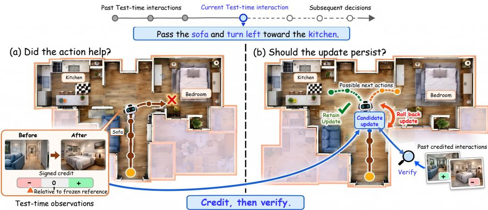
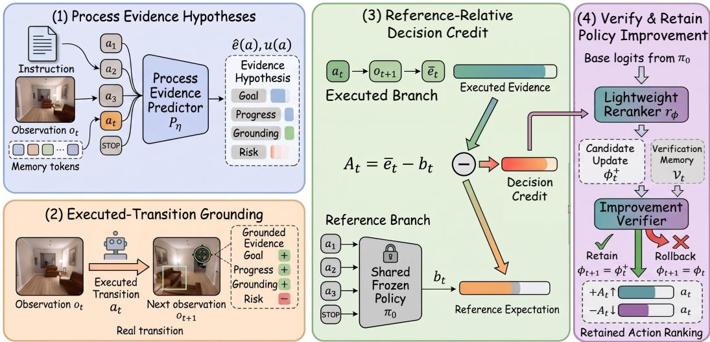
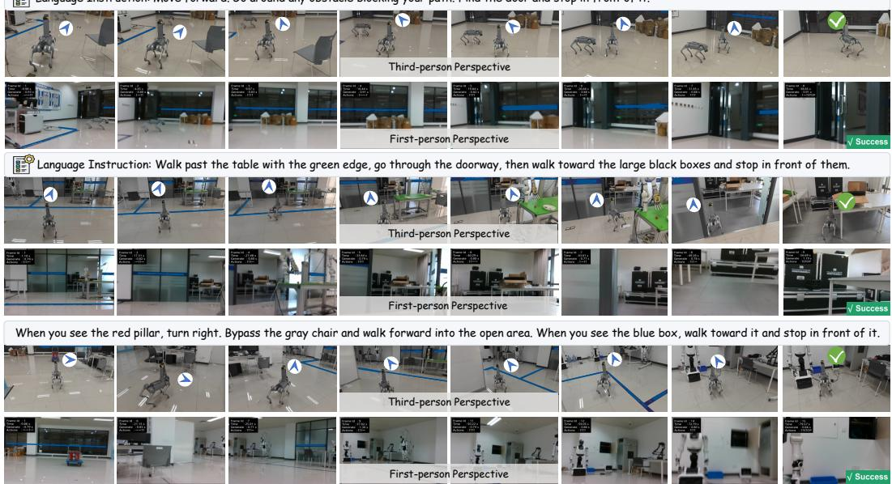
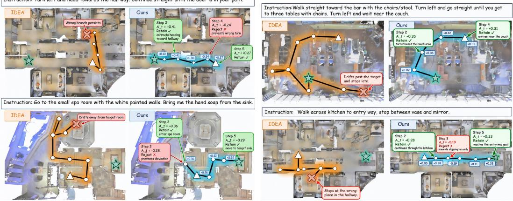

# CREDIT-GUIDED POLICY IMPROVEMENT FOR TEST-TIME ADAPTIVE VISION-LANGUAGE NAVIGATION

Yang Li1 Sijia Zhang1 Yihan Li3 Aming Wu2 Zihao Zhang1 Ziju Han1 Yahong Han1∗

1School of Artificial Intelligence, Tianjin University, China

2School of Computer Science and Information Engineering, Hefei University of Technology, China 3The University of Hong Kong, Hong Kong SAR, China

{liyang1389, 3024244296, zhangzihao2490, hanziju, yahong}@tju.edu.cn amwu@hfut.edu.cn u3678938@connect.hku.hk

## ABSTRACT

To advance the development of embodied general navigation, Test-time Adaptation for Vision-Language Navigation (TTA-VLN) has attracted increasing attention, aiming to adapt pretrained policies online to previously unseen environments using only test-time observations and interaction history. However, distribution shifts in unseen environments can distort the pretrained policy’s local action preferences and lead to off-course decisions. Existing methods seek to correct such deviations using test-time signals, such as predictive uncertainty, trajectory-level feedback, or accumulated adaptation experience. Yet these signals do not directly establish whether an executed behavior actually contributes to instruction-guided progress toward the goal. Moreover, even when a test-time signal suggests a plausible corrective direction, the resulting policy change may still be unreliable and should not necessarily persist in subsequent decisions. The central challenge is therefore twofold: how to identify whether an interaction supports goal-directed improvement, and how to determine whether the resulting policy update is worth retaining. We observe that every executed action induces an immediate observation transition that exposes evidence of its local consequence. Based on this observation, we propose Credit-Guided Policy Improvement (CGPI), which uses action-induced observation transitions to recover signed, reference-relative decision credit without external outcome feedback. The recovered credit proposes a lightweight policy update, which is verified against prior credit-supported interactions and retained only when supported; otherwise, it is rolled back, while the pretrained navigation policy remains frozen. CGPI achieves consistent gains across the evaluated VLN benchmarks and navigation backbones, while qualitative robot trials further illustrate zero-shot sim-to-real feasibility.

## 1 INTRODUCTION

As an important capability of embodied robots, Vision-Language Navigation (VLN) enables an agent to follow natural language instructions and navigate to target locations based on visual observations [3, 6, 8, 9]. Despite substantial progress on established VLN benchmarks, pretrained navigation policies can still suffer significant performance degradation when deployed with previously unseen environments and instructions. Test-Time Adaptation for VLN (TTA-VLN) [7, 12, 13, 11] has therefore attracted increasing attention, allowing a pretrained policy to adapt online from observations and interactions encountered during deployment. Such capability is important for bringing VLN from benchmark generalization toward practical navigation in open-world environments.

The difficulty of TTA-VLN stems from the mismatch between training and deployment distributions in both vision and language. Unseen environments may introduce new appearances, layouts, and local navigation contexts, while unseen instructions may contain unfamiliar expressions. Such shifts can make the pretrained policy’s learned cross-modal decision preferences unreliable, leading to off-course behavior. Since the required correction is not explicitly available at test time, existing TTA-VLN methods infer how to adapt from predictive uncertainty, trajectory-level feedback, or accumulated adaptation experience. However, these signals do not directly evaluate the actual consequence of the current executed action, providing limited evidence of whether that interaction truly contributes to instruction-guided progress. Moreover, even when a signal suggests a plausible correction, the resulting policy change may still be unreliable and should not necessarily persist.

  
Figure 1: Motivation for CGPI. TTA enables online policy change, but change does not necessarily imply improvement. Decision credit first identifies whether the current interaction provides local evidence of goal-directed improvement; the resulting candidate update is then verified against past credit-supported interactions before being retained or rolled back.

The key issue is therefore that TTA enables policy change, but policy change does not necessarily imply policy improvement. As illustrated in Fig. 1, reliable TTA-VLN requires answering two coupled questions: how to identify whether the current interaction supports goal-directed improvement, and how to determine whether the resulting candidate policy update is worth retaining. We refer to these two challenges as improvement identification and improvement retention, respectively. We observe that every executed action naturally produces an immediate observation transition that exposes its local consequence. This provides interaction-grounded evidence for identifying a supported direction of change, while the resulting policy modification should still be treated as a candidate that must be verified before it is allowed to persist.

Based on this insight, we propose Credit-Guided Policy Improvement (CGPI), a framework for TTA-VLN that explicitly separates improvement identification from improvement retention. For improvement identification, CGPI grounds each executed action with its actual resulting observation and compares the observed consequence against the frozen pretrained policy’s local reference expectation, yielding signed, reference-relative decision credit without external outcome feedback. The recovered credit provides directional guidance for a lightweight action reranker, producing a candidate policy update rather than immediately committing the change. For improvement retention, CGPI verifies the candidate against previously observed credit-supported interactions and retains it only when the modification remains sufficiently supported and satisfies the proposal-state reference constraint; otherwise, the policy rolls back to the last accepted state. The pretrained backbone remains frozen throughout adaptation, forming an identify–propose–verify–retain loop for continual test-time policy improvement. Experiments across three VLN benchmarks and four navigation backbones evaluate CGPI, while qualitative trials on a physical robot further illustrate sim-to-real feasibility.

Our contributions are threefold. First, we formulate reliable TTA-VLN from the perspective of policy improvement rather than policy change, identifying two coupled problems: improvement identification and improvement retention. Second, we propose Credit-Guided Policy Improvement (CGPI), which recovers signed, reference-relative decision credit from action-induced observation transitions and verifies credit-guided candidate updates before selectively retaining or rolling them back. Third, experiments across REVERIE, R2R, and R2R-CE with HAMT, DUET, BEVBert, and ETPNav evaluate CGPI across discrete and continuous VLN settings; qualitative trials on a Unitree Go2 further illustrate zero-shot sim-to-real feasibility.

  
Figure 2: Overview of CGPI. The method constructs local process-evidence hypotheses and grounds the executed decision using its actual resulting observation. Reference-relative comparison recovers signed decision credit, which proposes a candidate modification to an action reranker. The candidate is then verified against past credit-supported interactions and retained only when sufficiently supported and satisfying the proposal-state reference constraint; otherwise, it is rolled back.

## 2 METHOD

## 2.1 PROBLEM SETUP AND OVERVIEW

We consider vision-language navigation in a streaming test-time setting. The agent is given a pretrained policy $\pi _ { \theta _ { \mathrm { { C } } } }$ and receives a stream of navigation tasks $\mathcal { X } = \{ \bar { X } _ { 1 } , . . . , \bar { X _ { N } } \}$ . Each task $X _ { i } = ( I _ { i } , o _ { 0 } ^ { i } )$ contains a natural-language instruction $I _ { i }$ and an initial observation $o _ { 0 } ^ { \ i }$ . At step t, the state is $s _ { t } = ( I _ { i } , o _ { t } , \tau _ { < t } , \mathcal { G } _ { t } )$ , where $\tau _ { < t }$ denotes the navigation history and $\mathcal { G } _ { t }$ denotes the currently available local candidate structure. The agent selects $a _ { t } \in \mathcal A _ { t }$ until it chooses STOP.

We studyfeedback-free test-time adaptation, by which we mean that no external task-level correctness or outcome signal is available during deployment. The agent cannot access expert actions, target locations, dense rewards, trajectory-level success labels, or human feedback. For a movement action, the only new environment information obtained after execution is its resulting observation $o _ { t + 1 }$ Candidate evidence for unexecuted actions is constructed only from information already observable at $s _ { t } ;$ no future observation of an unexecuted action is accessed.

The frozen backbone produces base logits $z _ { t } ^ { 0 } ( a )$ and the reference policy $\pi _ { 0 } ( a | s _ { t } )$ . We keep all backbone parameters fixed and adapt only a lightweight residual reranker $r _ { \phi }$ . Let $\phi _ { t }$ denote the currently retained reranker parameters. The adapted policy is

$$
\begin{array} { r } { \widetilde { z } _ { t } ( \boldsymbol { a } ; \boldsymbol { \phi } _ { t } ) = z _ { t } ^ { 0 } ( \boldsymbol { a } ) + \alpha \operatorname { t a n h } ( r _ { \boldsymbol { \phi } _ { t } } ( s _ { t } , \boldsymbol { a } ) ) , \qquad \widetilde { \pi } _ { \boldsymbol { \phi } _ { t } } ( \boldsymbol { a } | s _ { t } ) = \operatorname { s o f t m a x } _ { \boldsymbol { a } \in A _ { t } } ( \widetilde { z } _ { t } ( \boldsymbol { a } ; \boldsymbol { \phi } _ { t } ) ) . } \end{array}\tag{1}
$$

Here, α bounds the maximum residual-logit correction.

Our goal is to identify interaction-induced policy changes that are locally supported and to determine which resulting modifications should persist. We denote a candidate modification proposed from the current interaction by $\phi _ { t } ^ { + }$ . A candidate is committed only after verification; otherwise, the reranker remains at the previously retained state $\phi _ { t }$

As illustrated in Fig. 2, CGPI follows an identify–propose–verify–retain loop. First, the consequence of an executed interaction is grounded by the actual next observation and evaluated relative to the frozen policy’s local expectation, yielding reference-relative decision credit. Second, sufficiently supported credit proposes a candidate modification to the lightweight reranker. Third, the candidate is evaluated against previously observed credit-supported interactions. Only a verified candidate is retained; otherwise, CGPI rolls back to the last accepted reranker state. The pretrained VLN backbone remains frozen throughout this process.

## 2.2 INTERACTION-GROUNDED IMPROVEMENT IDENTIFICATION

For movement-action credit, we define the movement candidate set as $\begin{array} { r l r } { \mathcal { A } _ { t } ^ { \mathrm { m o v } } } & { { } = } & { \mathcal { A } _ { t } \ \backslash } \end{array}$ {STOP}. We renormalize the frozen policy over movement actions as $\begin{array} { r l } { \dot { \pi } _ { 0 } ^ { \mathrm { m o v } } ( a | s _ { t } ) } & { { } = } \end{array}$

$\textstyle \pi _ { 0 } ( a | s _ { t } ) / \sum _ { a ^ { \prime } \in A _ { \neq } ^ { \mathrm { m o v } } } \pi _ { 0 } ( a ^ { \prime } | s _ { t } )$ , so that $\begin{array} { r } { \sum _ { a \in \mathcal { A } _ { \epsilon } ^ { \mathrm { m o v } } } \pi _ { 0 } ^ { \mathrm { m o v } } ( a | s _ { t } ) = 1 } \end{array}$ . This renormalization is used only to construct the movement-action reference; the original policy over $\boldsymbol { A } _ { t }$ , including STOP, is still used for navigation and action selection.

For each evidence view $k ,$ , we construct a current-state hypothesis for every locally available movement action. After executing a non-STOP action $a _ { t }$ , the actual next observation $o _ { t + 1 }$ grounds the evidence for the executed decision:

$$
\hat { e } _ { t } ^ { k } ( a ) = \hat { E } ^ { k } ( s _ { t } , a ) , \quad a \in \mathcal { A } _ { t } ^ { \mathrm { m o v } } , \qquad e _ { t } ^ { k } = E ^ { k } ( s _ { t } , a _ { t } , o _ { t + 1 } ) , \quad a _ { t } \neq \mathrm { S T O P } .\tag{2}
$$

Here, $\hat { E } ^ { k }$ is computed entirely from information available at $s _ { t } .$ , while $e _ { t } ^ { k }$ is grounded by the actual observation obtained after executing $a _ { t }$ . We instantiate four lightweight evidence terms: Goal, Progress, Grounding, and Risk; we instantiate these four terms using lightweight evidence functions.

Because different evidence terms have different numerical scales, we standardize them using source-training statistics computed once and fixed throughout deployment:

$$
\bar { e } _ { t } ^ { k } = \frac { e _ { t } ^ { k } - \mu _ { k } } { \sigma _ { k } + \epsilon } , \qquad \bar { \hat { e } } _ { t } ^ { k } ( a ) = \frac { \hat { e } _ { t } ^ { k } ( a ) - \mu _ { k } } { \sigma _ { k } + \epsilon } .\tag{3}
$$

No target labels, target locations, or test-time outcome signals are used to construct these statistics.

Observation grounding indicates what happened after the executed action, but an absolute evidence value does not reveal whether that consequence is locally favorable relative to the movement alternatives available at the same state. We therefore compare the grounded consequence against the frozen policy’s movement-only local reference:

$$
b _ { t } ^ { k } = \sum _ { a \in A _ { t } ^ { \mathrm { m o v } } } \pi _ { 0 } ^ { \mathrm { m o v } } ( a | s _ { t } ) \bar { \hat { e } } _ { t } ^ { k } ( a ) , \qquad C _ { t } ^ { k } = \bar { e } _ { t } ^ { k } - b _ { t } ^ { k } , \qquad A _ { t } = \frac { 1 } { K } \sum _ { k = 1 } ^ { K } C _ { t } ^ { k } , a _ { t } \neq \mathrm { S T O P } .\tag{4}
$$

Here, $b _ { t } ^ { k }$ is the frozen-policy local reference over movement actions, $C _ { t } ^ { k }$ is the view-wise referencerelative credit, and $A _ { t }$ is the final movement-action credit.

The resulting $A _ { t }$ is a local, reference-relative estimate of the executed action’s consequence. Positive credit indicates that the observed consequence is more favorable than the frozen policy’s movement-only local reference expectation under the chosen evidence functions, while negative credit indicates the opposite. Since STOP does not induce a new post-action observation, it is not included in the movement-action reference above. We handle STOP separately using a conservative completion-versus-movement credit, using a conservative completion-versus-movement credit.

## 2.3 CREDIT-GUIDED CANDIDATE POLICY UPDATE

Decision credit provides the direction for a candidate policy change. We verify this candidate before commitment, separating update proposal from update retention.

Let $D _ { t } ( \phi ) = D _ { \mathrm { K L } } \big ( \tilde { \pi } _ { \phi } ( \cdot | s _ { t } ) \| \pi _ { 0 } ( \cdot | s _ { t } ) \big )$ ) denote deviation from the frozen navigation prior. We clip extreme credits and propose an update only when the credit is sufficiently strong and the retained policy has not already drifted excessively:

$$
\hat { A } _ { t } = \mathrm { c l i p } ( A _ { t } , - A _ { \operatorname* { m a x } } , A _ { \operatorname* { m a x } } ) , \qquad m _ { t } ^ { \mathrm { p r o p } } = { \bf 1 } [ \left| A _ { t } \right| \geq \delta _ { A } ] { \bf 1 } [ D _ { t } ( \phi _ { t } ) \leq \delta _ { \mathrm { K L } } ] .\tag{5}
$$

The credit-magnitude condition filters weak signals whose directions are most sensitive to evidenceestimation error.

For an eligible interaction, the candidate-proposal objective is

$$
\begin{array} { r } { \mathcal { L } _ { \mathrm { p r o p } } ( t ) = - \mathrm { s g } ( \hat { A } _ { t } ) \log \tilde { \pi } _ { \phi _ { t } } ( a _ { t } | s _ { t } ) + \lambda _ { \mathrm { K L } } D _ { t } ( \phi _ { t } ) + \lambda _ { \mathrm { r e g } } \| \phi _ { t } \| _ { 2 } ^ { 2 } . } \end{array}\tag{6}
$$

Positive credit therefore proposes increasing the corresponding decision tendency, whereas negative credit proposes suppressing it. The KL term regularizes the proposal toward the frozen navigation prior. One optimizer step on $\mathcal { L } _ { \mathrm { p r o p } } ( t )$ produces candidate model and optimizer states $( \phi _ { t } ^ { + } , \bar { \omega _ { t } ^ { + } } ) =$ $\mathrm { O p t S t e p } ( ( \phi _ { t } , \omega _ { t } ) , \mathcal { L } _ { \mathrm { p r o p } } ( t ) )$ , where $\omega _ { t }$ is the optimizer state associated with the currently retained reranker. We pass $( \phi _ { t } ^ { + } , \omega _ { t } ^ { + } )$ to the verification stage as the candidate model and optimizer states.

## 2.4 VERIFY-AND-RETAIN POLICY IMPROVEMENT

To determine whether a candidate modification deserves to persist, we maintain a bounded verification memory $\mathcal { V } _ { t } = \{ ( s _ { i } , a _ { i } , A _ { i } ) \ | \ i \in \mathbb { Z } _ { t } \}$ of recent credit-supported interactions, where $| A _ { i } | \geq \delta _ { A }$ and

$i < t$ . The current interaction that produces $\phi _ { t } ^ { + }$ is excluded during its own verification and inserted only after the retain-or-rollback decision, preventing self-validation.

For any reranker parameters ϕ, we measure consistency with stored decision credits and define the candidate verification gain as

$$
J _ { t } ( \phi ) = \frac { 1 } { | \mathcal { V } _ { t } | } \sum _ { i \in \mathcal { I } _ { t } } \mathrm { s g } ( A _ { i } ) \log \tilde { \pi } _ { \phi } ( a _ { i } | s _ { i } ) , \qquad \Delta _ { t } ^ { \mathrm { v e r } } = J _ { t } ( \phi _ { t } ^ { + } ) - J _ { t } ( \phi _ { t } ) .\tag{7}
$$

For positive stored credit, increasing the corresponding action probability raises $J _ { t } ;$ for negative stored credit, decreasing it also raises $J _ { t } .$ . Hence $\Delta _ { t } ^ { \mathrm { v e r } }$ measures whether the candidate is more consistent with previously supported decision directions than the currently retained policy.

We retain a candidate only when it improves the verification objective while remaining sufficiently close to the frozen navigation prior:

$$
r _ { t } = \mathbf { 1 } [ \Delta _ { t } ^ { \mathrm { v e r } } \geq \delta _ { \mathrm { k e e p } } ] \mathbf { 1 } [ D _ { t } ( \phi _ { t } ^ { + } ) \leq \delta _ { \mathrm { K L } } ] .\tag{8}
$$

If $r _ { t } = 1$ , both candidate states $( \phi _ { t } ^ { + } , \omega _ { t } ^ { + } )$ are retained; otherwise, the policy and optimizer remain at $\left( \phi _ { t } , \omega _ { t } \right)$ ). Thus, decision credit determines what change should be proposed, whereas verification determines whether that change should persist.

If no candidate is proposed or the verification memory has not reached its warm-up size, the retained state remains unchanged. After the retain-or-rollback decision, an eligible current interaction is inserted into the bounded verification memory and becomes available for evaluating future candidates.

## 3 EXPERIMENTS

Experimental setup. We evaluate CGPI on REVERIE [17], R2R [3], and R2R-CE [14] with four pretrained navigation policies: HAMT [4], DUET [5], BEVBert [1], and ETPNav [2]. Following prior TTA-VLN evaluation protocols [11], we use the standard benchmark splits, pretrained policies, and official episode order under continual test-time adaptation.

## 3.1 MAIN RESULTS

Evaluation on REVERIE. Table 1 compares CGPI with existing TTA methods on REVERIE using HAMT and DUET as navigation backbones. CGPI consistently achieves the best performance across Val Seen, Val Unseen, and Test Unseen. On DUET, CGPI improves SR/SPL from 56.92/38.03 to 58.76/40.15 on Val Unseen and from 55.12/39.84 to 57.31/41.87 on Test Unseen compared with IDEA. Similar improvements are observed with HAMT, where SR/SPL increases from 34.92/31.52 to 36.97/33.26 on Val Unseen. These results show that combining observation-grounded, referencerelative improvement identification with selective verify-and-retain adaptation provides an effective test-time policy improvement mechanism across navigation backbones.

Table 1: Experimental results for different TTA strategies on the REVERIE dataset.
<table><tr><td rowspan="2">Methods+Model</td><td colspan="4">REVERIE Val Seen</td><td colspan="4">REVERIE Val Unseen</td><td colspan="4">REVERIE Test Unseen</td></tr><tr><td>OSR↑</td><td>SR↑</td><td>SPL↑</td><td>RGSPL↑</td><td>OSR↑</td><td>SR↑</td><td>SPL↑</td><td>RGSPL↑</td><td>OSR↑</td><td>SR↑</td><td>SPL↑</td><td>RGSPL↑</td></tr><tr><td>HAMT [4]</td><td>47.65</td><td>43.29</td><td>40.19</td><td>25.18</td><td>36.84</td><td>32.95</td><td>30.20</td><td>17.28</td><td>33.41</td><td>30.40</td><td>26.67</td><td>13.08</td></tr><tr><td>+ Tent [18]</td><td>46.03</td><td>43.43</td><td>40.78</td><td>25.81</td><td>32.60</td><td>30.56</td><td>28.23</td><td>14.48</td><td>25.06</td><td>23.73</td><td>21.78</td><td>10.82</td></tr><tr><td>+ SAR [16]</td><td>47.12</td><td>43.85</td><td>39.97</td><td>25.44</td><td>32.86</td><td>31.12</td><td>29.15</td><td>15.23</td><td>27.94</td><td>25.86</td><td>23.08</td><td>11.58</td></tr><tr><td>+ ViDA [15]</td><td>47.67</td><td>43.55</td><td>41.23</td><td>25.27</td><td>32.74</td><td>30.97</td><td>28.82</td><td>14.97</td><td>27.03</td><td>24.81</td><td>22.45</td><td>11.23</td></tr><tr><td>+ FSTTA [7]</td><td>48.21</td><td>42.87</td><td>39.56</td><td>24.58</td><td>36.78</td><td>32.89</td><td>30.51</td><td>17.20</td><td>33.39</td><td>30.39</td><td>26.65</td><td>13.61</td></tr><tr><td>+ ReCAP [10]</td><td>48.49</td><td>44.06</td><td>40.69</td><td>25.46</td><td>37.04</td><td>33.06</td><td>30.28</td><td>17.37</td><td>34.11</td><td>30.51</td><td>24.27</td><td>13.11</td></tr><tr><td>+ IDEA [11]</td><td>50.67</td><td>47.33</td><td>42.13</td><td>26.82</td><td>39.87</td><td>34.92</td><td>31.52</td><td>17.76</td><td>38.14</td><td>32.81</td><td>28.52</td><td>14.45</td></tr><tr><td>+ Ours</td><td>53.01</td><td>49.19</td><td>44.22</td><td>28.78</td><td>42.05</td><td>36.97</td><td>33.26</td><td>19.98</td><td>40.25</td><td>34.73 30.78</td><td></td><td>15.48</td></tr><tr><td>DUET [5]</td><td>73.86</td><td>71.75</td><td>63.94</td><td>51.14</td><td>51.07</td><td>46.98</td><td>33.73</td><td>23.03</td><td>56.91</td><td>52.51</td><td>36.06</td><td>22.06</td></tr><tr><td>+ Tent [18]</td><td>73.72</td><td>71.89</td><td>64.06</td><td>50.41</td><td>51.43</td><td>47.55</td><td>33.99</td><td>23.32</td><td>57.12</td><td>52.61</td><td>36.17</td><td>22.16</td></tr><tr><td>+ SAR [16]</td><td>74.84</td><td>71.75</td><td>64.43</td><td>51.70</td><td>53.26</td><td>48.00</td><td>33.92</td><td>23.09</td><td>57.11</td><td>53.04</td><td>36.07</td><td>22.27</td></tr><tr><td>+ ViDA [15]</td><td>73.99</td><td>72.49</td><td>63.49</td><td>50.89</td><td>52.53</td><td>48.14</td><td>32.45</td><td>21.92</td><td>56.78</td><td>52.74</td><td>35.10</td><td>21.77</td></tr><tr><td>+ FSTTA [7]</td><td>75.59</td><td>75.48</td><td>65.84</td><td>52.23</td><td>56.26</td><td>54.15</td><td>36.41</td><td>23.56</td><td>58.44</td><td>53.40</td><td>36.43</td><td>22.40</td></tr><tr><td>+ ReCAP [10]</td><td>75.06</td><td>74.72</td><td>65.87</td><td>53.42</td><td>56.67</td><td>54.74</td><td>36.22</td><td>23.74</td><td>57.72</td><td>53.07</td><td>36.52</td><td>22.47</td></tr><tr><td>+ IDEA [11]</td><td>78.45</td><td>78.24</td><td>67.74</td><td>55.07</td><td>58.51</td><td>56.92</td><td>38.03</td><td>25.47</td><td>58.91</td><td>55.12</td><td>39.84</td><td>24.52</td></tr><tr><td>+ Ours</td><td>79.62</td><td>79.22 68.05</td><td></td><td>56.96</td><td>60.75</td><td>58.76 40.15</td><td></td><td>27.54</td><td>60.88</td><td>57.31 41.87</td><td></td><td>24.67</td></tr></table>

Table 2: Experiments on the R2R dataset.
<table><tr><td rowspan="2">Methods</td><td colspan="4">R2R Val Seen</td><td colspan="4">R2R Val Unseen</td></tr><tr><td>TL↓</td><td>NE↓</td><td></td><td>SR↑ SPL↑</td><td>TL↓</td><td>NE↓</td><td>SR↑</td><td>SPL↑</td></tr><tr><td>DUET [5]</td><td>12.33</td><td>2.28</td><td>79</td><td>73</td><td>13.94 3.31</td><td></td><td>72</td><td>60</td></tr><tr><td>+ Tent</td><td>12.17</td><td>2.38</td><td>78</td><td>72</td><td>13.78</td><td>3.42</td><td>72</td><td>60</td></tr><tr><td>+ SAR</td><td>12.05</td><td>2.28</td><td>78</td><td>72</td><td>13.59</td><td>3.28</td><td>72</td><td>61</td></tr><tr><td>+ ViDA</td><td>12.11</td><td>2.31</td><td>79</td><td>73</td><td>13.63</td><td>3.34</td><td>72</td><td>61</td></tr><tr><td>+ FSTTA</td><td>13.39</td><td>2.25</td><td>79</td><td>73</td><td>14.64</td><td>3.03</td><td>75</td><td>62</td></tr><tr><td>+ ReCAP</td><td>12.02</td><td>2.27</td><td>78</td><td>73</td><td>13.39</td><td>3.28</td><td>72</td><td>61</td></tr><tr><td>+ IDEA</td><td>11.23</td><td>2.03</td><td>81</td><td>76</td><td>12.47</td><td>2.91</td><td>76</td><td>67</td></tr><tr><td>+ Ours</td><td>10.91</td><td>1.89</td><td>83</td><td>77</td><td>12.08</td><td>2.73</td><td>79</td><td>68</td></tr><tr><td>BEVBert [1]</td><td>13.56</td><td>2.17</td><td>81</td><td>74</td><td>14.55</td><td>2.81</td><td>75</td><td>64</td></tr><tr><td>+ Tent</td><td>12.68</td><td>2.36</td><td>80</td><td>74</td><td>13.14</td><td>2.93</td><td>74</td><td>63</td></tr><tr><td>+ SAR</td><td>12.49</td><td>2.28</td><td>80</td><td>74</td><td>12.98</td><td>2.79</td><td>75</td><td>64</td></tr><tr><td>+ ViDA</td><td>12.53</td><td>2.31</td><td>81</td><td>74</td><td>13.11</td><td>2.83</td><td>75</td><td>64</td></tr><tr><td>+ FSTTA</td><td>12.28</td><td>2.31</td><td>80</td><td>75</td><td>13.96</td><td>2.89</td><td>74</td><td>63</td></tr><tr><td>+ ReCAP</td><td>12.31</td><td>2.27</td><td>81</td><td>74</td><td>12.94</td><td>2.78</td><td>75</td><td>64</td></tr><tr><td>+ IDEA</td><td>10.89</td><td>2.15</td><td>83</td><td>79</td><td>12.03</td><td>2.53</td><td>76</td><td>68</td></tr><tr><td>+ Ours</td><td>10.61 2.02</td><td></td><td>84</td><td>81</td><td>11.692.38</td><td></td><td>79</td><td>70</td></tr></table>

Table 3: Experiments on the R2R-CE dataset.
<table><tr><td rowspan="2">Methods</td><td colspan="4">R2R-CE Val Seen</td><td colspan="6">R2R-CE Val Unseen</td></tr><tr><td>TL↓</td><td>NE↓</td><td>OSR↑</td><td>SR↑</td><td>SPL↑</td><td>TL↓</td><td>NE↓</td><td>OSR↑</td><td>SR↑</td><td>SPL↑</td></tr><tr><td>BEVBert [1]</td><td>13.98</td><td>3.77</td><td>73</td><td>68</td><td>60</td><td>13.27</td><td>4.57</td><td>67</td><td>59</td><td>50</td></tr><tr><td>+ Tent</td><td>12.74</td><td>3.35</td><td>76</td><td>70</td><td>62</td><td>13.29</td><td>4.61</td><td>65</td><td>59</td><td>49</td></tr><tr><td>+ SAR</td><td>12.53</td><td>3.28</td><td>76</td><td>70</td><td>63</td><td>13.23</td><td>4.54</td><td>66</td><td>59</td><td>50</td></tr><tr><td>+ ViDA</td><td>12.61</td><td>3.31</td><td>76</td><td>71</td><td>62</td><td>13.26</td><td>4.57</td><td>67</td><td>59</td><td>49</td></tr><tr><td>+ FSTTA</td><td>14.07</td><td>4.11</td><td>74</td><td>69</td><td>60</td><td>13.11</td><td>4.39</td><td>65</td><td>60</td><td>51</td></tr><tr><td>+ ReCAP</td><td>12.40</td><td>3.31</td><td>76</td><td>71</td><td>63</td><td>13.01</td><td>4.57</td><td>66</td><td>60</td><td>50</td></tr><tr><td>+ IDEA</td><td>12.27</td><td>3.04</td><td>78</td><td>73</td><td>64</td><td>12.67</td><td>4.26</td><td>69</td><td>62</td><td>52</td></tr><tr><td>+ Ours</td><td>11.93</td><td>2.92</td><td>81</td><td>75</td><td>65</td><td>12.33</td><td>4.13</td><td>70</td><td>65</td><td>54</td></tr><tr><td>ETPNav [2]</td><td>11.78</td><td>3.95</td><td>72</td><td>66</td><td>59</td><td>11.99</td><td>4.71</td><td>65</td><td>57</td><td>49</td></tr><tr><td>+ Tent</td><td>11.36</td><td>3.94</td><td>72</td><td>66</td><td>59</td><td>11.57</td><td>4.74</td><td>64</td><td>57</td><td>49</td></tr><tr><td>+ SAR</td><td>11.31</td><td>3.89</td><td>72</td><td>66</td><td>60</td><td>11.55</td><td>4.67</td><td>65</td><td>57</td><td>49</td></tr><tr><td>+ ViDA</td><td>11.58</td><td>3.91</td><td>72</td><td>66</td><td>60</td><td>11.62</td><td>4.72</td><td>64</td><td>57</td><td>49</td></tr><tr><td>+ FSTTA</td><td>11.35</td><td>3.93</td><td>72</td><td>66</td><td>59</td><td>11.57</td><td>4.77</td><td>64</td><td>57</td><td>49</td></tr><tr><td>+ ReCAP</td><td>11.31</td><td>3.92</td><td>72</td><td>66</td><td>60</td><td>11.56</td><td>4.74</td><td>65</td><td>57</td><td>50</td></tr><tr><td>+ IDEA</td><td>10.87 3.82</td><td></td><td>73</td><td>68</td><td>62</td><td>11.17</td><td>4.47</td><td>67</td><td>59</td><td>51</td></tr><tr><td>+ Ours</td><td>10.59 3.70</td><td></td><td>75</td><td>69</td><td>65</td><td>10.904.34</td><td></td><td>70</td><td>61</td><td>52</td></tr></table>

Language Instruction: Move forward. Go around any obstacle blocking your path. Find the door and stop in front of it.  
  
Figure 3: Real-world qualitative results of CGPI on a Unitree Go2 robot. We show third-person views and egocentric observations for three executed trajectories.

Evaluation on R2R & R2R-CE. Tables 2 and 3 further evaluate CGPI on instruction-following navigation in both discrete and continuous environments. On R2R Val Unseen, CGPI improves SR/SPL from 76/67 to 79/68 with DUET and from 76/68 to 79/70 with BEVBert compared with IDEA. On R2R-CE Val Unseen, CGPI also improves SR/SPL from 62/52 to 65/54 with BEVBert and from 59/51 to 61/52 with ETPNav. These results establish gains across the four evaluated navigation architectures in both discrete and continuous VLN settings.

Real-world qualitative results. We further deploy CGPI on a Unitree Go2 using a navigation policy trained only in simulated environments, without real-world fine-tuning or external outcome feedback. The three trajectories in Fig. 3 illustrate successful multi-stage instruction following and sim-to-real feasibility in unseen environments.

## 3.2 CASE STUDIES OF CREDIT-GUIDED POLICY IMPROVEMENT

Figure 4 visualizes representative test-time policy improvements in unseen environments, where CGPI trajectories mark key decision points with recovered decision credit $A _ { t }$ and associated verification outcomes. For the instruction “Go to the small spa room with the white painted walls. Bring me the hand soapfrom the sink,” CGPI first obtains a positive credit $A _ { t } = + 0 . 3 6 ;$ the resulting candidate update is retained and shifts the policy toward the spa room. At the following decision point, a

Instruction: Tun left and head towards the hall way. Continue straight until the door is in your path.

  
Figure 4: Qualitative comparison of IDEA and CGPI in unseen environments.

Table 4: Ablation of CGPI’s two core improvement-identification operations on REVERIE Val Unseen with DUET.
<table><tr><td>Variant</td><td>Grounding</td><td>Reference</td><td>SR↑</td><td>SPL↑</td><td>CPC↑</td><td>WUR↓</td></tr><tr><td>Absolute Hypothesis</td><td></td><td>一</td><td>54.32</td><td>36.71</td><td>0.297</td><td>0.312</td></tr><tr><td>Grounded Evidence</td><td>√</td><td>一</td><td>56.14</td><td>38.06</td><td>0.414</td><td>0.244</td></tr><tr><td>Relative Hypothesis</td><td>一</td><td>√</td><td>56.82</td><td>38.67</td><td>0.463</td><td>0.221</td></tr><tr><td>CGPI</td><td>√</td><td>√</td><td>58.76</td><td>40.15</td><td>0.572</td><td>0.154</td></tr></table>

negative credit $A _ { t } = - 0 . 2 8$ produces a candidate update that is rejected by verification, preventing the policy from drifting toward the wrong side room. A later positive credit $A _ { t } = + 0 . 2 9$ is retained, further reinforcing movement toward the target sink. In contrast, IDEA continues along an off-course branch and stops away from the target. This visualizes how decision credit determines the update direction and verification controls whether that update is retained.

## 3.3 ABLATION OF IMPROVEMENT IDENTIFICATION

We isolate the two operations used for improvement identification: observation grounding, which evaluates the executed action using its actual next observation, and reference-relative comparison, which evaluates the resulting evidence relative to the frozen policy’s local expectation. All other CGPI components, including candidate proposal, verification, and retention, are kept fixed.

For this ablation, we use the view-averaged grounded evidence $\begin{array} { r } { \bar { e } _ { t } = \frac { 1 } { K } \sum _ { k } \bar { e } _ { t } ^ { k } } \end{array}$ , the view-averaged pre-action hypothesis $\begin{array} { r } { \bar { \hat { e } } _ { t } ( a ) = \frac { 1 } { K } \sum _ { k } \bar { \hat { e } } _ { t } ^ { k } ( a ) } \end{array}$ , and the view-averaged reference $\begin{array} { r } { b _ { t } = \frac { 1 } { K } \sum _ { k } b _ { t } ^ { k } } \end{array}$ . The four variants differ only in the signal used for candidate proposal: Absolute Hypothesis uses $\bar { \hat { e } } _ { t } ( a _ { t } ) ;$ Grounded Evidence uses $\bar { e } _ { t }$ ; Relative Hypothesis uses $\bar { \hat { e } } _ { t } ( a _ { t } ) - b _ { t } ;$ and CGPI uses $\bar { e } _ { t } - b _ { t }$ , which is equivalent to Eq. 4 for movement actions.

To assess the quality of the proposal signal, we additionally report two post-hoc diagnostics. Credit– Progress Correlation (CPC) measures the Spearman correlation between the test-time signal and actual one-step geodesic progress, while Wrong Update Rate (WUR) measures the fraction of proposal-triggering interactions whose signal direction disagrees with oracle local progress. Geodesic information is used only for post-hoc evaluation and is never available during adaptation.

Table 4 shows complementary contributions from both operations. Observation grounding improves SR, SPL, and CPC over the pre-action hypothesis, while reference-relative comparison further improves the quality of the proposal signal. Combining both yields the highest navigation performance and CPC together with the lowest WUR. This supports using the observed transition to determine what happened and the frozen-policy reference to determine whether that consequence is locally favorable.

Contribution of STOP credit. The core ablation above keeps STOP handling fixed in order to isolate the two operations used for movement-action credit. We therefore further separate the contributions of observation-grounded movement credit and the dedicated STOP credit in Eq. ??.

Table 5: Contribution of movement-action credit and STOP-specific credit in CGPI on REVERIE.
<table><tr><td>Movement Credit</td><td>STOP Credit</td><td>SR↑</td><td>SPL↑</td></tr><tr><td>一</td><td>一</td><td>30.40</td><td>26.67</td></tr><tr><td>√</td><td>一</td><td>33.54</td><td>29.61</td></tr><tr><td></td><td>V</td><td>31.46</td><td>27.55</td></tr><tr><td></td><td>√</td><td>34.73</td><td>30.78</td></tr></table>

When movement credit is disabled, movement actions do not generate credit-guided candidate policy modifications. When STOP credit is disabled, STOP remains a valid action of the navigation policy, but a STOP decision does not generate a candidate modification. All other CGPI components, including verification and retention, remain unchanged.

As shown in Table 5, enabling movement-action credit alone improves SR and SPL from 30.40/26.67 to 33.54/29.61, accounting for most of the gain over the frozen HAMT policy. Using only STOP credit also improves performance to 31.46/27.55, showing that learning from stopping decisions provides an additional adaptation signal. Combining movement and STOP credit yields the strongest result of 34.73 SR and 30.78 SPL, indicating that the two sources of credit are complementary. Because STOP terminates the current navigation episode, a retained update induced by STOP cannot affect later decisions within the same trajectory. Under the continual protocol, however, the retained policy modification can influence subsequent episodes.

## 3.4 EFFECT OF IMPROVEMENT VERIFICATION AND RETENTION

We next examine the second stage of CGPI: whether a candidate policy change should be retained after it has been proposed by decision credit. All variants use the same observation-grounded, reference-relative credit, lightweight reranker, and candidate-proposal objective. They differ only in how candidate modifications are evaluated before being committed. Table 6 reports this ablation on REVERIE Val Unseen with DUET.

We evaluate retention behavior using three complementary diagnostics. Policy Drift (PD) measures the average KL divergence between the adapted and frozen action distributions. Accepted Improvement Rate (AIR) is the fraction of retained movement-action candidates that yield positive short-horizon counterfactual progress, while Retention Rate (RR) is the fraction of proposed candidates that are committed. These diagnostics are used only for analysis.

Table 6: Ablation of improvement verification and retention on REVERIE Val Unseen with DUET.
<table><tr><td>Variant</td><td>Verify</td><td>Cand. KL</td><td>SR↑</td><td>SPL↑</td><td>PD↓ AIR↑</td><td>RR(%)</td></tr><tr><td>CGPI w/o Verification</td><td>一</td><td>一</td><td>57.41</td><td>38.96 0.071</td><td>0.548</td><td>100.0</td></tr><tr><td>CGPI w/o Candidate KL</td><td>V</td><td>一</td><td>58.29</td><td>39.72 0.057</td><td>0.704</td><td>67.8</td></tr><tr><td>Full CGPI</td><td>√</td><td>」</td><td>58.76 40.15</td><td>0.043</td><td>0.741</td><td>61.3</td></tr></table>

The comparison isolates whether evaluating a proposed policy change before committing it improves the quality of retained adaptations. Without verification, every eligible candidate is committed, resulting in a higher retention rate but also larger policy drift and a lower AIR. Adding creditbased verification rejects unsupported modifications and improves both navigation performance and retained-candidate quality. The full method further applies the candidate-level KL condition, reducing policy drift from 0.057 to 0.043 while increasing AIR from 0.704 to 0.741.

## 3.5 ARE RETAINED POLICY CHANGES ACTUALLY BETTER?

To directly examine whether the verify-and-retain mechanism distinguishes useful policy changes from harmful ones, we perform a post-hoc counterfactual analysis on REVERIE Val Unseen with DUET. For every movement-action candidate, we clone the complete navigation state after the executed transition, including the simulator state, trajectory history, and accumulated navigation structure. The retained policy $\phi _ { t }$ and candidate policy $\phi _ { t } ^ { + }$ are then rolled out independently from identical decision contexts for a short horizon H. Geodesic information is used only for this post-hoc diagnosis and is never available to CGPI during adaptation.

Table 7: Policy-improvement analysis on REVERIE. Left: post-hoc candidate-update quality (DUET, Val Unseen). Right: within-episode versus continual adaptation (HAMT, Test Unseen).
<table><tr><td>Method</td><td>AIR↑</td><td>AIG (m)↑</td><td>RP↑</td></tr><tr><td>Credit-Guided Direct Commit</td><td>0.548</td><td>0.19</td><td></td></tr><tr><td>CGPI</td><td>0.741</td><td>0.63</td><td>0.716</td></tr></table>

<table><tr><td>Setting</td><td></td><td>SR↑ SPL↑</td></tr><tr><td>Frozen HAMT</td><td></td><td>30.4026.67</td></tr><tr><td>CGPI, episode reset</td><td></td><td>32.62 28.41</td></tr><tr><td>CGPI, continual</td><td></td><td>34.73 30.78</td></tr></table>

Let $\Gamma _ { t } ^ { ( H ) }$ denote the difference in short-horizon oracle progress between the candidate and the currently retained policy. We report: (i) Accepted Improvement Rate (AIR), the fraction of retained candidates with $\Gamma _ { t } ^ { ( H ) } > 0 ;$ (ii) Accepted Improvement Gain (AIG), the average $\Gamma _ { t } ^ { ( H ) }$ among retained candidates; and (iii) Rejection Precision (RP), the fraction of rejected candidates with $\Gamma _ { t } ^ { ( H ) } < 0$

As shown in Table 7 (left), compared with direct commitment, CGPI increases AIR from 0.548 to 0.741 and the mean accepted improvement gain from 0.19 to 0.63 m. Moreover, an RP of 0.716 indicates that 71.6% of rejected candidates would have produced negative short-horizon oracle progress under the post-hoc counterfactual evaluation. These results show that verification both improves the quality of retained candidates and filters a substantial fraction of harmful policy changes.

## 3.6 WITHIN-EPISODE VERSUS CONTINUAL ADAPTATION

Since the decision credit for an executed action is obtained only after observing its resulting transition, a natural question is whether the recovered credit already benefits subsequent decisions within the same episode or mainly contributes through accumulation across episodes. We therefore compare CGPI under episode-reset and continual adaptation protocols on REVERIE Test Unseen with HAMT. In the episode-reset setting, the reranker parameters, optimizer state, and verification memory are restored to the same initialization before every navigation episode. All CGPI operations, including credit recovery, candidate proposal, verification, and retention, are performed normally within the episode. Thus, any improvement over the frozen policy can only arise from within-episode policy improvement. In the continual setting, the retained reranker parameters, optimizer state, and verification memory are preserved across episodes, following our default evaluation protocol.

As shown in Table 3.6 (right), episode-reset CGPI improves SR/SPL from 30.40/26.67 to 32.62/28.41 over the frozen HAMT policy. Since the reranker and optimizer state are reset before every episode, this improvement can only arise from CGPI updates affecting subsequent decisions within the same trajectory. This isolates a clear within-episode adaptation benefit from post-action decision credit. Retaining the adaptation state across episodes further improves performance to 34.73/30.78, indicating an additional benefit from cross-episode accumulation under the continual test-time setting.

## 4 CONCLUSION

We introduced CGPI, a feedback-free test-time adaptation framework that formulates online VLN adaptation from the perspective of policy improvement rather than policy change. CGPI uses actioninduced observation transitions to recover local, reference-relative decision credit and separates credit guided update proposal from subsequent verification and retention. Across the evaluated discrete and continuous VLN settings, CGPI improves navigation performance with multiple pretrained backbones while adapting only a lightweight residual reranker. Post-hoc analyses further show that the recovered credit is aligned with local navigation progress and that selective verification improves the quality of retained candidate updates. Qualitative robot trials additionally illustrate zero-shot sim-to-real feasibility in the shown real-world settings.

## REFERENCES

[1] Dong An, Yuankai Qi, Yangguang Li, Yan Huang, Liang Wang, Tieniu Tan, and Jing Shao. Bevbert: Multimodal map pre-training for language-guided navigation. Proceedings of the IEEE/CVF International Conference on Computer Vision, 2023.

[2] Dong An, Hanqing Wang, Wenguan Wang, Zun Wang, Yan Huang, Keji He, and Liang Wang. Etpnav: Evolving topological planning for vision-language navigation in continuous environments. IEEE Transactions on Pattern Analysis and Machine Intelligence, 2024.

[3] Peter Anderson, Qi Wu, Damien Teney, Jake Bruce, Mark Johnson, Niko Sunderhauf, Ian ¨ Reid, Stephen Gould, and Anton van den Hengel. Vision-and-language navigation: Interpreting visually-grounded navigation instructions in real environments. In Proceedings of the IEEE Conference on Computer Vision and Pattern Recognition, pp. 3674–3683, 2018.

[4] Shizhe Chen, Pierre-Louis Guhur, Cordelia Schmid, and Ivan Laptev. History aware multimodal transformer for vision-and-language navigation. In Advances in Neural Information Processing Systems, volume 34, pp. 5834–5847, 2021.

[5] Shizhe Chen, Pierre-Louis Guhur, Makarand Tapaswi, Cordelia Schmid, and Ivan Laptev. Think global, act local: Dual-scale graph transformer for vision-and-language navigation. In Proceedings ofthe IEEE/CVF Conference on Computer Vision and Pattern Recognition, pp. 16537–16547, 2022.

[6] Daniel Fried, Ronghang Hu, Volkan Cirik, Anna Rohrbach, Jacob Andreas, Louis-Philippe Morency, Taylor Berg-Kirkpatrick, Kate Saenko, Dan Klein, and Trevor Darrell. Speakerfollower models for vision-and-language navigation. In Advances in Neural Information Processing Systems, volume 31, 2018.

[7] Junyu Gao, Xuan Yao, and Changsheng Xu. Fast-slow test-time adaptation for online visionand-language navigation. In Proceedings of the 41st International Conference on Machine Learning, volume 235 of Proceedings of Machine Learning Research, pp. 14902–14919. PMLR, 2024.

[8] Weituo Hao, Chunyuan Li, Xiujun Li, Lawrence Carin, and Jianfeng Gao. Towards learning a generic agent for vision-and-language navigation via pre-training. In Proceedings of the IEEE/CVF Conference on Computer Vision and Pattern Recognition, pp. 13137–13146, 2020.

[9] Yicong Hong, Qi Wu, Yuankai Qi, Cristian Rodriguez-Opazo, and Stephen Gould. VLN-BERT: A recurrent vision-and-language BERT for navigation. In Proceedings ofthe IEEE/CVF Conference on Computer Vision and Pattern Recognition, pp. 1643–1653, 2021.

[10] Zixuan Hu, Yichun Hu, Xiaotong Li, Shixiang Tang, and Ling-Yu Duan. Beyond entropy: Region confidence proxy for wild test-time adaptation. ICML, 2025.

[11] Zixuan Hu, Xuantuo Huang, Yancheng Li, Yichun Hu, Shengyong Xu, and Ling-Yu Duan. Turning adaptation into assets: Cross-domain bridging for online vision-language navigation. arXiv preprint arXiv:2605.23257, 2026.

[12] Sungjune Kim, Gyeongrok Oh, Heeju Ko, Daehyun Ji, Dongwook Lee, Byung-Jun Lee, Sujin Jang, and Sangpil Kim. Test-time adaptation for online vision-language navigation with feedback-based reinforcement learning. In Forty-second International Conference on Machine Learning, 2025.

[13] Heeju Ko, Sung June Kim, Gyeongrok Oh, Jeongyoon Yoon, Honglak Lee, Sujin Jang, Seungryong Kim, and Sangpil Kim. Active test-time vision-language navigation. Advances in Neural Information Processing Systems, 38:44756–44775, 2026.

[14] Jacob Krantz, Erik Wijmans, Arjun Majumdar, Dhruv Batra, and Stefan Lee. Beyond the navgraph: Vision-and-language navigation in continuous environments. In European Conference on Computer Vision, pp. 104–120, 2020.

[15] Jiaming Liu, Senqiao Yang, Peidong Jia, Renrui Zhang, Ming Lu, Yandong Guo, Wei Xue, and Shanghang Zhang. ViDA: Homeostatic visual domain adapter for continual test time adaptation. In The Twelfth International Conference on Learning Representations, 2024.

[16] Shuaicheng Niu, Jiaxiang Wu, Yifan Zhang, Zhiquan Wen, Yaofo Chen, Peilin Zhao, and Mingkui Tan. Towards stable test-time adaptation in dynamic wild world. In International Conference on Learning Representations, 2023.

[17] Yuankai Qi, Zizheng Pan, Yicong Hong, Ming-Hsuan Yang, Anton van den Hengel, and Qi Wu. REVERIE: Remote embodied visual referring expression in real indoor environments. In Proceedings ofthe IEEE/CVF Conference on Computer Vision and Pattern Recognition, pp. 9982–9991, 2020.

[18] Dequan Wang, Evan Shelhamer, Shaoteng Liu, Bruno Olshausen, and Trevor Darrell. Tent: Fully test-time adaptation by entropy minimization. In ICLR, 2021.