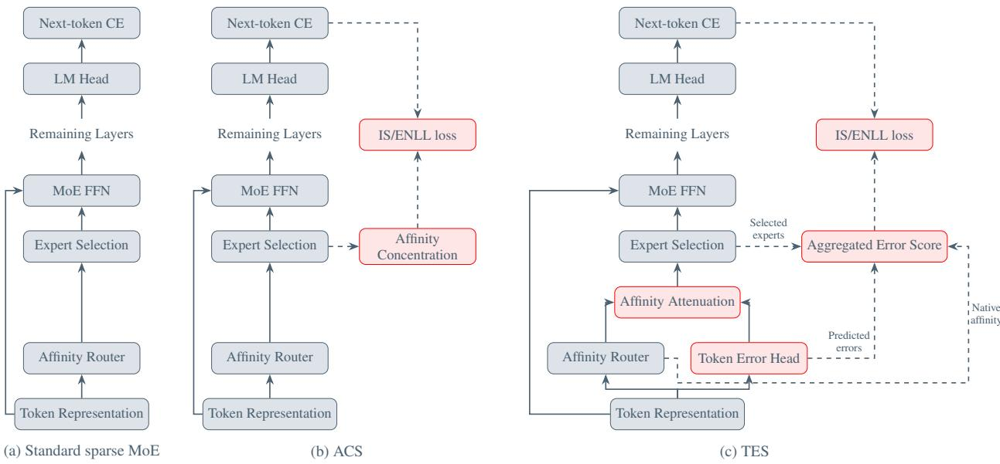
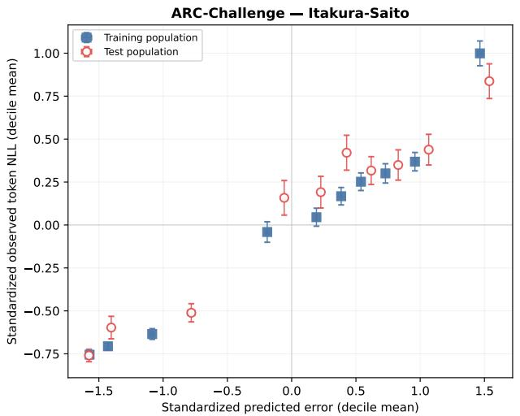
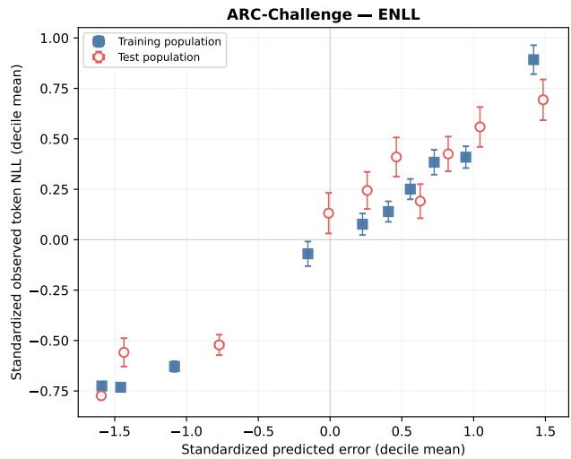
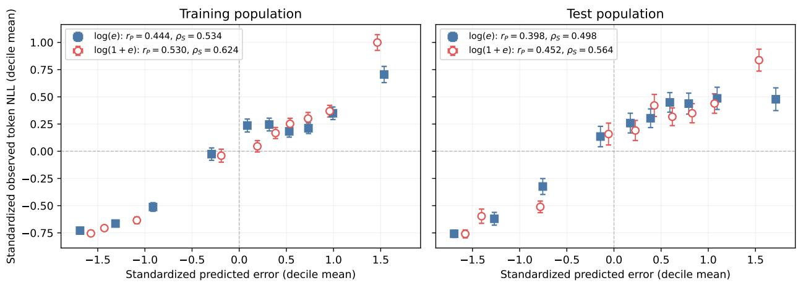
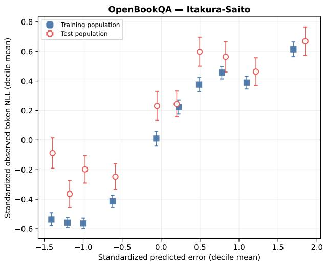
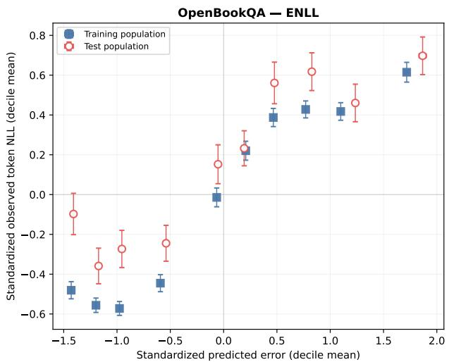
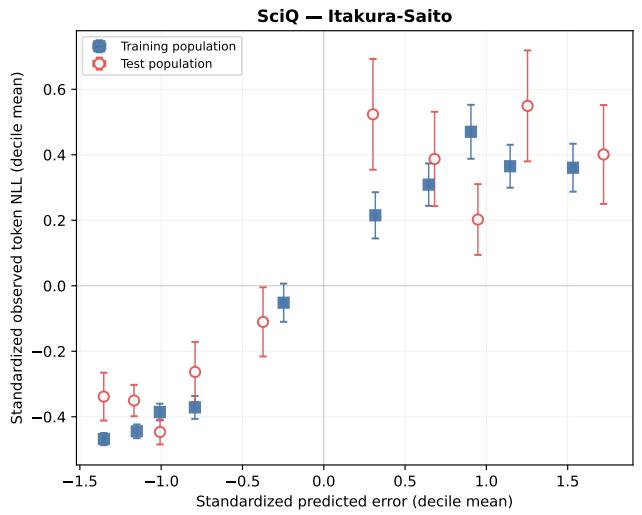
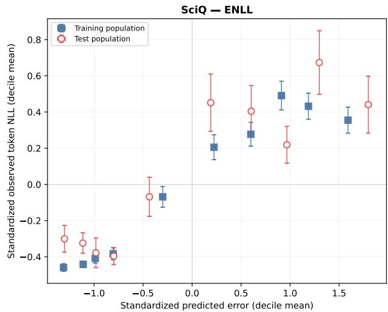
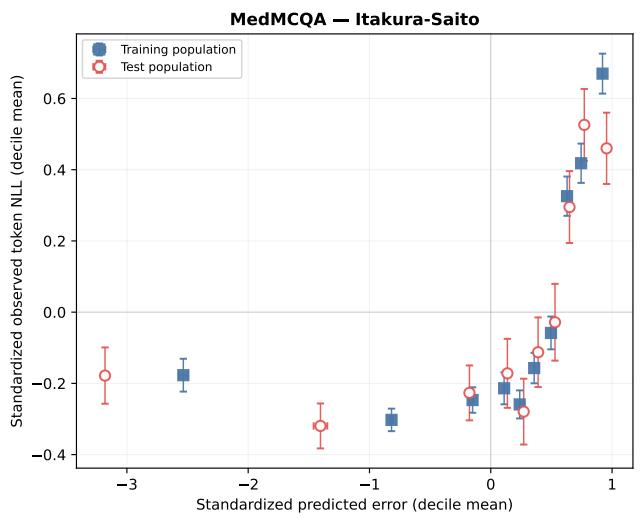
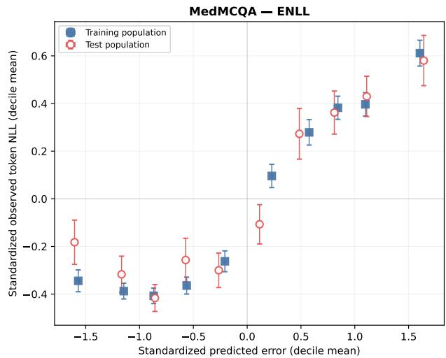

# CROSS-ENTROPY GUIDED ROUTING IN MIXTURE-OF-EXPERTS LARGE LANGUAGE MODELS

Yury Nahshan1,2 Nati Daniel2 Jacob Goldberger1 Yoli Shavit1

1Bar-Ilan University, Ramat-Gan, Israel 2NVIDIA, Israel

## ABSTRACT

Sparse mixture-of-experts (MoE) large language models scale model capacity by routing each token to a small subset of experts. Their routers are regularized with load balancing terms and learn affinity scores through the language-model objective. However, these objectives do not provide direct alignment between routing affinities and token-level error. We introduce token-error supervision for sparse routing in two forms. The first form predicts an error score per expert. The affinity-weighted aggregate of these scores is aligned to the next-token cross-entropy loss, while the individual scores attenuate affinity before top-K selection. The second directly aligns the router’s affinities to the model’s objective without requiring an additional head or inference-time modification. Both formulations use the Itakura–Saito divergence or an exponential negative log-likelihood for aligning affinities and token errors. Across two sparse MoE backbones and four multiple-choice question-answering benchmarks, we evaluate both supervision mechanisms. On Granite, our method improves accuracy by approximately 2.3 percentage points on average over a parameter-matched routing baseline. With stronger supervision, the gain on ARC-Challenge reaches 2.94 points. Both mechanisms preserve the native sparse execution budget and aggregation policy. Our code is available in the supplementary materials.

Keywords Mixture-of-Experts · Sparse Routing · Token-Error Supervision · Language Models

## 1 Introduction

Sparse mixture-of-experts (MoE) models expand model capacity without proportionally increasing computation by routing each token to only K of N available experts (Shazeer et al., 2017; Lepikhin et al., 2021; Fedus et al., 2022). This conditional computation has become central to scaling modern language models (Jiang et al., 2024; Dai et al., 2024). Its effectiveness, however, depends on routing: for every token, the router determines which experts are executed and how their outputs contribute to the token representation. Standard sparse routers make this decision through affinity scores learned indirectly from the language-model objective and routing regularizers such as load balancing (Fedus et al., 2022). These scores provide relative preferences among experts, but they are not explicitly supervised against the model’s token-level loss. Native MoE routing therefore lacks an explicit signal indicating whether the selected computation is likely to produce a high- or low-error prediction.

The realized next-token cross-entropy provides a direct token-level measure of prediction error for the routed computation. We study two ways of using this signal. The first, token-error supervision (TES), trains an error prediction head and aggregates the predicted errors based on affinity scores. Figure 1 compares standard sparse MoE routing with the two supervision mechanisms. The second, affinity-concentration supervision (ACS), uses the realized token loss to supervise the squared probabilities of the normalized selected-expert affinities, allowing training to sharpen or flatten the native routing distribution without an additional head or inference-time transformation. We supervise TES and ACS with the Itakura–Saito (IS) divergence (Itakura & Saito, 1968; Févotte et al., 2009). We further explore the exponential negative log-likelihood (ENLL) (Casella & Berger, 2002) as a simplified supervision scheme.

Our theoretical analysis shows that, for TES, both objectives train the aggregate prediction toward the same expected token-error target, but affect language-model optimization differently. When predicted and observed token error match,

  
Figure 1: Overview of sparse MoE routing and the proposed supervision mechanisms: (a) the standard language-model pipeline; (b) affinity-concentration supervision (ACS); and (c) token-error supervision (TES) with affinity attenuation. MoE FFN denotes the routed expert computation and aggregation; routing supplies expert selection and aggregation weights. ACS computes concentration from normalized selected affinities. TES aggregates predicted errors using native affinities normalized over the executed experts. Dashed arrows denote auxiliary readout inputs, not stopped gradients.

IS leaves the original cross-entropy (CE) update unchanged, whereas ENLL gives relatively greater gradient weight to lower-loss tokens. In TES, we subtract a scaled log-error score from native affinity before top-K selection, reducing the relative preference of experts with larger predicted error. In ACS, the same objectives instead sharpen or flatten native affinity according to the token loss. Section 3 develops the two mechanisms, while Appendix A analyzes their optima and gradients.

We evaluate TES and ACS on Granite 3.1 and OLMoE-1B across four multiple-choice question-answering (MCQA) benchmarks. On Granite, ACS-IS improves average accuracy by 2.1 percentage points over CE fine-tuning with frozen native affinity. TES-IS improves over a parameter-matched Dual Affinity baseline by 2.3 points on Granite and 0.5 points on OLMoE, averaged across all four benchmarks. With stronger supervision, its improvement on Granite ARC-Challenge reaches 2.94 points. These results show that directly supervising predicted token error or affinity concentration against the realized token loss can improve sparse routing, with the preferred mechanism depending on the backbone and task. Both methods preserve the native top-K execution budget and architecture-specific aggregation policy.

In summary, our contributions are as follows:

• We introduce two complementary ways to supervise sparse routing with realized next-token cross-entropy. A lightweight expert-indexed error head predicts token error through its native-affinity-weighted aggregate, while a headless alternative directly aligns native router outputs. We show that direct supervision enables token-error prediction and aligns affinity outputs with token error, without changing the sparse expert-execution budget.

• We further propose a method for integrating expert-indexed error scores into routing by subtracting a scaled log-error term from native affinity before top-K selection. The resulting route uses token-error information to rank experts while preserving the native execution budget and architecture-specific aggregation policy.

• We evaluate both supervision mechanisms against standard CE fine-tuning and a parameter-matched routinghead control across two sparse MoE backbones and four MCQA benchmarks, demonstrating accuracy improvements over the corresponding baselines.

## 2 Related Work

Sparse MoE routing and explicit supervision. Sparse MoE models use learned affinity to activate only the top-K experts, increasing capacity without proportional per-token computation (Shazeer et al., 2017; Lepikhin et al., 2021; Fedus et al., 2022). Later work changes how this sparse allocation is formed: Expert Choice lets experts select tokens (Zhou et al., 2022), while ReMoE replaces discontinuous top-K selection with differentiable ReLU routing (Wang et al., 2025).

A closer line of work explicitly guides router behavior. Expert-router coupling (ERC) binds router embeddings with expert capabilities through expert-specific proxy tokens (Lv et al., 2026), and Expert Divergence uses domain labels to encourage functional specialization (Li et al., 2026). Counterfactual analysis further shows that native routing can miss equal-compute alternatives with lower next-token loss (Yoon et al., 2026). Our method directly targets this gap through two complementary mechanisms. TES supervises an affinity-weighted prediction of routed token loss and uses the resulting expert-indexed error scores to refine selection without changing the top-K execution budget. ACS uses the same token-loss objectives to shape affinity without adding a prediction head.

Token difficulty and loss prediction. Learned loss prediction provides a general mechanism for estimating which inputs a model is likely to find difficult (Yoo & Kweon, 2019). At the query level, Hybrid LLM uses predicted difficulty to route requests between models of different capacities (Ding et al., 2024). Within MoE models, Huang et al. (2024) infer difficulty from router confidence and activate more experts for difficult inputs; DynaMoE derives token-difficulty labels from agreement between nested experts and the full-width MLP (Nishu et al., 2025); and Ada-K learns a token-dependent expert budget through reinforcement learning (Zhao et al., 2025). These methods use difficulty to allocate computation, typically by changing the capacity or number of experts assigned to each token. Our method instead uses realized next-token loss to supervise sparse language-model routing.

Uncertainty-aware routing. In sparse language models, recent work represents routing uncertainty through different probabilistic signals. Variational Mixture-of-Experts Routing (VMoER) (Li & Wicker, 2026) represents routing logits using input-dependent probability distributions and performs variational inference over the resulting routing decisions. Uncertainty-Aware Routing (UAR) (Chen et al., 2026) uses router entropy to adapt both expert capacity and routing regularization. Related probabilistic routers include Grassmannian MoE (Shihab et al., 2026), which controls routing through Bingham subspace geometry, while VI-MoLE (Saliencro et al., 2026) predicts counterfactual residual risk to allocate a variable budget among LoRA experts. Our method uses deterministic, fixed-budget top-K routing without sampling router distributions and introduces direct supervision from the routed model’s next-token loss. Fixed-budget execution is also retained by VMoER’s logit-space inference; our distinction is the directly supervised error signal.

In dense MoE models for time-series regression, MoGU (Aviv et al., 2025) provides the closest conceptual precedent for using an expert-specific predictive-error signal to control mixture weights. It models each regression expert as a Gaussian predictor, trains its variance through Gaussian negative log-likelihood, and aggregates expert predictions using normalized inverse variance. Our formulation differs in both target and routing semantics: the error head does not define a Gaussian expert likelihood or estimate calibrated predictive variance. Instead, native affinity aggregates the executed experts’ positive scores into a token-error prediction supervised against next-token cross-entropy; the scaled log-error values subsequently reduce the relative affinity of experts with larger predicted error before selection.

## 3 Method

We introduce two mechanisms for aligning sparse MoE routing with next-token cross-entropy loss. We first review sparse MoE routing in Section 3.1. Next, Sections 3.2–3.3 present token-error supervision (TES), and Section 3.4 introduces affinity-concentration supervision (ACS). Finally, Section 3.5 details the overall training objective and its computational cost.

## 3.1 Sparse MoE Routing

Sparse mixture-of-experts models increase parameter capacity while limiting per-token computation by evaluating only K of N routed experts in each MoE layer (Shazeer et al., 2017; Lepikhin et al., 2021; Fedus et al., 2022). A learned router assigns each token to its active experts and determines their contributions to the layer output. Consider a token representation $\mathbf { h } _ { t } \in \mathbb { R } ^ { d }$ . Omitting the layer index for clarity, the affinity router computes

$$
{ \bf a } _ { t } = { \bf W } _ { \mathrm { a f f } } { \bf h } _ { t } + { \bf b } _ { \mathrm { a f f } } , \qquad { \bf p } _ { t } = \mathrm { s o f t m a x } ( { \bf a } _ { t } ) , \qquad S _ { t } = \mathrm { T o p K } ( { \bf p } _ { t } , K ) .\tag{1}
$$

Here ${ \mathbf W } _ { \mathrm { a f f } } \in \mathbb { R } ^ { N \times d }$ and $\mathbf { b } _ { \mathrm { a f f } } \in \mathbb { R } ^ { N }$ are the affinity-router parameters, while $\mathbf { a } _ { t } , \mathbf { p } _ { t } \in \mathbb { R } ^ { N }$ are the affinity logits and probabilities, respectively. The routed expert branch evaluates the experts in $S _ { t }$ and combines their outputs as

$$
{ \bf y } _ { t } = \sum _ { i \in \cal S _ { t } } g _ { t , i } E _ { i } ( { \bf h } _ { t } ) ,\tag{2}
$$

where $g _ { t , i }$ denotes the weight derived from $\mathbf { p } _ { t }$ . Depending on the model, these weights may be renormalized over $S _ { t }$ or may preserve the selected affinity mass.

The affinity router is learned through the language-model objective and auxiliary routing objectives, such as load balancing (Shazeer et al., 2017; Fedus et al., 2022). These objectives make affinity effective for selecting and combining experts, but do not explicitly supervise it against the model’s token-level error. We therefore retain affinity as the expert-preference signal and complement it with a separately supervised token-error signal, introduced in the following subsection.

## 3.2 Token-Error Head and Affinity Attenuation

TES augments the native router with a lightweight token-error head. From the shared pre-expert token representation h , the head predicts one positive error score for each expert before expert selection:

$$
\widehat { \mathbf { e } } _ { t } = \mathrm { s o f t p l u s } ( \mathbf { W } _ { e } \mathbf { h } _ { t } + \mathbf { b } _ { e } ) , \qquad \widehat { \mathbf { e } } _ { t } \in \mathbb { R } _ { > 0 } ^ { N } .\tag{3}
$$

Here ${ \mathbf W } _ { e } \in { \mathbb R } ^ { N \times d }$ and $\mathbf { b } _ { e } \in \mathbb { R } ^ { N }$ are the error-head parameters. The component $\widehat { e } _ { t , i }$ is the predicted error score for expert i at token t; positivity ensures that the logarithms used below are well defined.

Let $\mathcal { L } _ { \mathrm { C E } , t }$ denote the realized next-token cross-entropy, and let $S _ { t } ^ { \mathrm { a c t } }$ denote the experts executed in the same forward pass. Thus, $S _ { t } ^ { \mathrm { a c t } } = S _ { t }$ under native routing and $S _ { t } ^ { \mathrm { a c t } } = \widetilde { S } _ { t }$ under the error-aware attenuation defined below. Because this loss evaluates the complete routed prediction rather than an individual expert, we form a single affinity-weighted prediction over the active experts:

$$
\bar { p } _ { t , i } = \frac { p _ { t , i } } { \sum _ { j \in S _ { t } ^ { \mathrm { a c t } } } p _ { t , j } } , \quad i \in \mathcal { S } _ { t } ^ { \mathrm { a c t } } , \qquad \widehat { e } _ { t } = \sum _ { i \in S _ { t } ^ { \mathrm { a c t } } } \bar { p } _ { t , i } \widehat { e } _ { t , i } .\tag{4}
$$

Equation 4 forms the token-error prediction supervised in Section 3.3; active experts with larger native affinity contribute more to the predicted error.

We use the expert-indexed error predictions to adjust the native affinity logits $a _ { t , i }$ , defined in Equation 1, before expert selection:

$$
\widetilde { \boldsymbol { a } } _ { t , i } = \boldsymbol { a } _ { t , i } - \gamma \phi _ { \tau } ( \widehat { \boldsymbol { e } } _ { t , i } ) , \qquad \widetilde { \mathbf { p } } _ { t } = \mathrm { s o f t m a x } ( \widetilde { \mathbf { a } } _ { t } ) , \qquad \widetilde { \mathcal { S } } _ { t } = \mathrm { T o p K } ( \widetilde { \mathbf { p } } _ { t } , K ) .\tag{5}
$$

Here,

$$
\phi _ { \tau } ( \widehat { e } _ { t , i } ) = \log \left( 1 + \frac { \widehat { e } _ { t , i } } { \tau } \right) , \qquad \tau > 0 ,\tag{6}
$$

is the started logarithm of the predicted error (Rocke & Durbin, 2003). The reference scale τ controls the transition between small and large predicted errors, while $\gamma \geq 0$ controls the strength of error attenuation relative to native affinity. We set $\gamma = 1$ and $\tau = 1$ by default. FFN aggregation uses $\widetilde { \mathbf { p } } _ { t }$ under the architecture’s native selected-weight normalization policy; the auxiliary error readout in Equation 4 instead uses native affinities.

Exponentiating the adjusted logits factorizes each softmax term into its native affinity and an inverse-error factor, giving

$$
\widetilde { p } _ { t , i } = \frac { p _ { t , i } \left( 1 + \widehat { e } _ { t , i } / \tau \right) ^ { - \gamma } } { \sum _ { j = 1 } ^ { N } p _ { t , j } \left( 1 + \widehat { e } _ { t , j } / \tau \right) ^ { - \gamma } } .\tag{7}
$$

Because $\phi _ { \tau }$ is increasing, experts with larger predicted error receive lower adjusted logits. Appendix A.4 provides the full derivation of Equation 7. Appendix A.5 compares the started-log transformation with the scale-invariant pure-log alternative.

## 3.3 Token-Error Supervision

We align $\widehat { e } _ { t }$ against the realized token loss using the Itakura–Saito (IS) divergence, a scale-invariant measure of relative disagreement between positive quantities (Itakura & Saito, 1968; Févotte et al., 2009). Because IS requires a positive observation, we apply a small numerical floor:

$$
\mathcal { L } _ { \mathrm { C E } , t } ^ { + } = \operatorname* { m a x } ( \mathcal { L } _ { \mathrm { C E } , t } , \varepsilon _ { \mathrm { I S } } ) , \qquad \mathcal { L } _ { \mathrm { I S } , t } = \frac { \mathcal { L } _ { \mathrm { C E } , t } ^ { + } } { \widehat { e } _ { t } } - \log \left( \frac { \mathcal { L } _ { \mathrm { C E } , t } ^ { + } } { \widehat { e } _ { t } } \right) - 1 .\tag{8}
$$

Exponential negative log-likelihood (ENLL) provides an alternative supervision objective with the same prediction target but different language-model gradients. It treats the nonnegative token loss as an observation from an exponential distribution with conditional mean $\boldsymbol { \bar { \widehat { e } } } _ { t } .$

$$
\mathcal { L } _ { \mathrm { E N L L } , t } = \frac { \mathcal { L } _ { \mathrm { C E } , t } } { \widehat { e } _ { t } } + \log \widehat { e } _ { t } .\tag{9}
$$

Through the aggregate error prediction in Equation 4, the individual expert scores receive direct gradients in proportion to their normalized affinities, but are not identified as counterfactual expert losses. We therefore interpret them as learned error-aware routing signals. In both TES and ACS, the observed token CE remains attached to the computation graph, allowing gradients through both the prediction or routing statistic and the observed loss. Appendices A.2 and A.3 analyze their gradient allocation and the resulting language-model updates.

Both objectives align the aggregate prediction with its supervised token loss. Across the contextual occurrences c of a fixed target token identity $t ^ { \prime } { . }$ , the supervision target is the expected realized token loss. The corresponding context-averaged token-identity optima are

$$
\begin{array} { r } { \widehat { e } _ { \mathrm { I S } , t ^ { \prime } } ^ { \star } = \mathbb { E } _ { c | t = t ^ { \prime } } [ \mathcal { L } _ { \mathrm { C E } , t , c } ^ { + } ] , \qquad \widehat { e } _ { \mathrm { E N L L } , t ^ { \prime } } ^ { \star } = \mathbb { E } _ { c | t = t ^ { \prime } } [ \mathcal { L } _ { \mathrm { C E } , t , c } ] . } \end{array}\tag{10}
$$

Here, $\widehat { e } _ { \mathrm { I S } , t ^ { \prime } } ^ { \star }$ and $\widehat { e } _ { \mathrm { E N L L } , t ^ { \prime } } ^ { \star }$ are scalar reference optima obtained by minimizing the context-averaged supervision loss with respect to a single prediction for target token identity $t ^ { \prime } .$ . The implemented head remains context dependent; these reference values do not require identical predictions across occurrences. Appendix A.1 gives the complete derivation of Equation 10.

## 3.4 Affinity-Concentration Supervision

Affinity-concentration supervision (ACS) provides an alternative to the learned token-error head. We directly align the probabilities by replacing the error score $\widehat { e } _ { t , i }$ in Equation 4, with the normalized native affinity $\bar { p } _ { t , i } \mathrm { : }$

$$
C _ { t } = \sum _ { i \in S _ { t } } \bar { p } _ { t , i } \bar { p } _ { t , i } = \sum _ { i \in S _ { t } } \bar { p } _ { t , i } ^ { 2 } \qquad \frac { 1 } { K } \le C _ { t } \le 1 .\tag{11}
$$

where $C _ { t }$ denotes the affinity concentration. Its inverse, $1 / C _ { t }$ , is the Hill effective number of selected experts, while − log $C _ { t }$ is the corresponding order-two Rényi entropy (Rényi, 1961; Hill, 1973). This gives $C _ { t }$ a direct routing interpretation: larger $C _ { t }$ corresponds to a smaller effective number of experts carrying the selected affinity mass, whereas smaller $\hat { C _ { t } }$ corresponds to a more evenly distributed route. In particular, $C _ { t } = \bar { 1 } / K$ under uniform selected affinity and approaches one when affinity concentrates on a single expert.

ACS applies the token-error supervision objectives introduced in Section 3.3, replacing the aggregate prediction $\widehat { e } _ { t }$ in Equations 8 and 9 with $C _ { t }$ . Here, $C _ { t }$ is a bounded routing statistic, not an unrestricted token-loss prediction. Their direct gradients with respect to concentration are

$$
\frac { \partial \mathcal { L } _ { \mathrm { A C S - I S } , t } } { \partial C _ { t } } = \frac { C _ { t } - \mathcal { L } _ { \mathrm { C E } , t } ^ { + } } { C _ { t } ^ { 2 } } ,\tag{12}
$$

$$
\frac { \partial \mathcal { L } _ { \mathrm { A C S - E N L L } , t } } { \partial C _ { t } } = \frac { C _ { t } - \mathcal { L } _ { \mathrm { C E } , t } } { C _ { t } ^ { 2 } } .\tag{13}
$$

When the IS floor is inactive, the two objectives produce the same direct concentration gradient. This gradient favors sharper selected affinity when token loss exceeds concentration and flatter affinity otherwise; the complete parameter update also depends on other gradient paths. ACS therefore uses token error to supervise routing affinities, without adding an error head or applying an error-aware routing transformation at inference. Appendix A.9 gives its bounded optimum, router-logit gradients, and additional analysis.

## 3.5 Overall Training Objective and Computational Scope

Restoring the layer indices omitted above, let $B _ { \mathrm { t o k } }$ denote the supervised token positions in a minibatch, excluding padding and ignored targets, and let M denote the MoE layers receiving supervision. Let m ∈ {TES-IS, TES-ENLL, ACS-IS, ACS-ENLL} denote the active supervision objective, and let $\mathcal { L } _ { \mathrm { C E } }$ denote the crossentropy averaged over $B _ { \mathrm { t o k } }$ . We average the active objective over supervised tokens and layers as

$$
\mathcal { L } _ { m } = \frac { 1 } { \vert \mathcal { M } \vert \vert \mathcal { B } _ { \mathrm { t o k } } \vert } \sum _ { l \in \mathcal { M } } \sum _ { t \in \mathcal { B } _ { \mathrm { t o k } } } \mathcal { L } _ { m , t } ^ { ( l ) } .\tag{14}
$$

Here $\mathcal { L } _ { m , t } ^ { ( l ) }$ is evaluated using the learned aggregate prediction $\widehat { e } _ { t } ^ { ( l ) }$ when m is a TES objective, or the affinity concentration $C _ { t } ^ { ( l ) }$ when m is an ACS objective. The complete training objective is

$$
\mathcal { L } _ { \mathrm { t o t a l } } = \mathcal { L } _ { \mathrm { C E } } + \lambda _ { m } \mathcal { L } _ { m } + \lambda _ { \mathrm { a u x } } \mathcal { L } _ { \mathrm { a u x } } .\tag{15}
$$

Here, $\mathcal { L } _ { \mathrm { a u x } }$ is the architecture-native router regularizer, typically encouraging balanced expert usage (Shazeer et al., 2017; Fedus et al., 2022); $\lambda _ { m } , \lambda _ { \mathrm { a u x } } \geq 0$ are regularization weights of ${ \mathcal { L } } _ { m }$ and $\mathcal { L } _ { \mathrm { a u x } }$ , respectively. Each MoE layer equipped with TES includes an additional linear projection with $\bar { N } ( d + 1 )$ parameters and $\bar { \mathcal { O } } ( N d )$ operations per token, while preserving the native top-K execution budget. ACS adds no parameters and retains native routing at inference. For MCQA adaptation, the primary task term is answer-choice CE, while the auxiliary target remains next-token CE (Appendix A.7).

## 4 Experiments and Results

We evaluate whether aligning MoE routing with token loss improves downstream accuracy relative to parameter-matched controls under a common supervision setting (Section 4.2). We then analyze whether predicted error tracks observed cross-entropy loss (Section 4.3). Finally, we ablate the number of supervised MoE layers (Section 4.4).

## 4.1 Experimental Setting

We evaluate Granite 3.1 3B-A800M and OLMoE-1B-7B-SFT (IBM Granite Team, 2024; Muennighoff et al., 2024) on ARC-Challenge, OpenBookQA, SciQ, and MedMCQA (Clark et al., 2018; Mihaylov et al., 2018; Welbl et al., 2017; Pal et al., 2022). Within each backbone and dataset, all configurations use the same registered train, validation, and test splits and the same answer-text multiple-choice protocol without in-context examples. Candidate answers are ranked by their mean conditional token log-probability. We report accuracy on a fixed 500-example test set; split construction and prompting are documented in Appendix A.7.

Where applicable, we follow VMoER’s Stage-1 MAP adaptation setting (Li & Wicker, 2026): the same dataset suite and target split sizes, three-epoch LoRA adaptation of attention Q/K/V and routed experts, AdamW, and the Granite learning rate, schedule, warmup, and effective batch size. Because VMoER does not release split identities, we construct deterministic partitions targeting the reported sizes and filter invalid examples. Our answer-text candidate scoring differs from VMoER’s generated-letter protocol, and the OLMoE recipe is adapted to that backbone.

Both models are adapted for three epochs using rank-8 LoRA with $\alpha = 8$ and dropout 0.05. Granite uses a learning rate of $1 0 ^ { - 4 }$ and effective batch size 16, whereas OLMoE uses $2 \times 1 0 ^ { - 5 }$ and batch size 8. We evaluate training and initialization seeds 42, 43, and 45 for the primary accuracy comparison. Method-specific supervision is applied at the final sparse MoE layer in the primary comparison. Native affinity parameters remain frozen except in rows explicitly marked “+ affinity tuning,” and every configuration preserves the native expert-execution budget.

For a fair evaluation, we compare ACS and TES with parameter-matched baselines under the IS and ENLL alignment schemes. ACS is compared with the CE fine-tuning baseline, while TES is compared with Dual Affinity, which adds an affinity head with the same parameter count and averages the two router outputs. To match the TES configuration, the original pretrained router is kept frozen and only the second affinity head is updated during fine-tuning. For each configuration, we report the mean and standard deviation across three seeds. Unless stated otherwise, both methods use a supervision coefficient of $\lambda _ { m } = 1 0 ^ { - 3 }$ . Validation-NLL-selected checkpoints and complete training configuration are described in Appendix A.7. TES sensitivity to the error-head learning rate and attenuation scale is reported in Appendix A.6.

## 4.2 Downstream Accuracy

Table 1 compares TES and ACS across four datasets and two models. TES-IS improves ARC-Challenge accuracy over Dual Affinity by 1.07 percentage points on Granite and 2.26 points on OLMoE. It also improves OpenBookQA by 1.73 and 0.13 points, respectively, and OLMoE MedMCQA by 0.60 points. TES-ENLL improves ARC-Challenge on both backbones, although by smaller amounts. The objective ordering varies across tasks: on Granite SciQ, ENLL gives the larger TES gain of 0.26 points, whereas both TES objectives fall 1.00 point below Dual Affinity on OLMoE SciQ.

ACS produces its clearest gains on Granite. With native affinity frozen, ACS-IS improves over CE by 2.54 points on ARC-Challenge, 1.06 on OpenBookQA, and 1.47 on SciQ. Allowing affinity tuning changes the reference comparison: against affinity-tuned CE, ACS-IS improves ARC-Challenge by 3.07 points and SciQ by 0.93 points, while ACS-ENLL improves MedMCQA by 0.40 points. On OLMoE, ACS gains are smaller and task-dependent, and neither objective improves OpenBookQA in either affinity setting. These results distinguish the benefit of concentration supervision from that of simply unfreezing the router.

Table 1: Test answer-choice accuracy (%) for Granite 3.1 3B-A800M and OLMoE-1B-7B-SFT across four MCQA benchmarks. Entries are mean ± sample standard deviation over seeds 42, 43, and 45. Within each backbone, rows form three parameter-matched comparison groups: CE versus ACS with frozen affinity, CE versus ACS with affinity tuning, and Dual Affinity versus TES. All entries use epoch-3 checkpoints except the OLMoE affinity-tuned group, which uses validation-NLL-selected checkpoints. Bold marks the highest mean within each backbone, benchmark, and comparison group. † SciQ is near saturation.
<table><tr><td>Model</td><td>Method</td><td>ARC-Challenge</td><td>OpenBookQA</td><td> $\mathrm { S c i Q } ^ { \dagger }$ </td><td>MedMCQA</td></tr><tr><td rowspan="8">Granite 3.1</td><td>CE</td><td> $6 5 . 3 3 \pm 2 . 0 1$ </td><td> $7 1 . 6 7 \pm 1 . 0 1$ </td><td> $8 8 . 4 0 \pm 0 . 5 3 $ </td><td> $3 9 . 6 0 \pm 9 . 5 7$ </td></tr><tr><td> ${ \mathrm { A C S - E N L L } } \left( { \mathrm { O u r s } } \right)$ </td><td> $6 7 . 4 0 \pm 0 . 0 0$ </td><td> $7 2 . 6 0 \pm 0 . 5 3$ </td><td> $8 9 . 2 7 \pm 0 . 8 1$ </td><td> $4 2 . 8 0 \pm 0 . 4 0$ </td></tr><tr><td>ACS-IS (Ours)</td><td> ${ \bf 6 7 . 8 7 \pm 0 . 7 6 }$ </td><td> ${ \bf 7 2 . 7 3 \pm 0 . 9 5 }$ </td><td> ${ \bf 8 9 . 8 7 \pm 0 . 7 0 }$ </td><td> ${ \bf 4 2 . 8 7 \pm 0 . 7 6 }$ </td></tr><tr><td>CE + affinity tuning</td><td> $6 7 . 5 3 \pm 1 . 1 4$ </td><td> ${ \bf 7 4 . 0 0 \pm 0 . 7 2 }$ </td><td> $8 8 . 6 0 \pm 0 . 4 0$ </td><td> $4 1 . 7 3 \pm 1 . 2 2$ </td></tr><tr><td>ACS-ENLL + affinity tuning (Ours)</td><td> $6 9 . 8 7 \pm 1 . 3 3 $ </td><td> $7 3 . 5 3 \pm 0 . 9 0$ </td><td> $8 9 . 2 0 \pm 0 . 9 2 $ </td><td> ${ \bf 4 2 . 1 3 \pm 1 . 2 7 }$ </td></tr><tr><td>ACS-IS + affinity tuning (Ours)</td><td> $\mathbf { 7 0 . 6 0 \pm 1 . 8 0 }$ </td><td> $7 3 . 9 3 \pm 0 . 3 1$ </td><td> $\mathbf { 8 9 . 5 3 \pm 0 . 4 2 }$ </td><td> $4 0 . 6 7 \pm 1 . 4 5$ </td></tr><tr><td>Dual Affinity</td><td> $6 5 . 3 3 \pm 2 . 0 0$ </td><td> $7 1 . 2 7 \pm 1 . 8 6$ </td><td> $8 8 . 2 7 \pm 0 . 3 1$ </td><td> $3 7 . 4 0 \pm 7 . 7 9$ </td></tr><tr><td>TES-ENLL (Ours)</td><td> $6 5 . 5 3 \pm 0 . 4 2$ </td><td> $7 2 . 2 7 \pm 0 . 3 1$ </td><td> $\mathbf { 8 8 . 5 3 \pm 1 . 6 7 }$ </td><td> ${ \bf 4 3 . 6 7 \pm 1 . 8 1 }$ </td></tr><tr><td rowspan="10">OLMoE</td><td>TES-IS (Ours)</td><td> ${ \bf 6 6 . 4 0 \pm 0 . 3 5 }$ </td><td> ${ \bf 7 3 . 0 0 \pm 0 . 5 3 }$ </td><td> $8 8 . 3 3 \pm 0 . 6 4$ </td><td> $\mathbf { 4 3 . 6 7 \pm 1 . 1 0 }$ </td></tr><tr><td>CE</td><td> ${ \bf 6 3 . 2 7 \pm 0 . 3 1 }$ </td><td> ${ \bf 7 0 . 4 0 \pm 0 . 4 0 }$ </td><td> $8 8 . 8 0 \pm 0 . 4 0$ </td><td> ${ \bf 4 4 . 9 3 \pm 0 . 7 0 }$ </td></tr><tr><td>ACS-ENLL (Ours)</td><td> $6 2 . 9 3 \pm 0 . 6 4$ </td><td> $7 0 . 2 0 \pm 0 . 3 5$ </td><td> $8 8 . 7 3 \pm 0 . 2 3$ </td><td> $4 4 . 5 3 \pm 0 . 7 6$ </td></tr><tr><td>ACS-IS (Ours)</td><td> $6 2 . 7 3 \pm 0 . 3 1$ </td><td> $6 9 . 9 3 \pm 0 . 4 6$ </td><td> ${ \bf 8 8 . 8 7 \pm 0 . 1 2 }$ </td><td> $4 4 . 2 0 \pm 0 . 5 3$ </td></tr><tr><td>CE + affinity tuning</td><td> $6 3 . 5 3 \pm 0 . 5 8$ </td><td> ${ \bf 7 1 . 8 7 \pm 0 . 4 2 }$ </td><td> $8 8 . 8 0 \pm 0 . 2 0 $ </td><td> $4 4 . 4 7 \pm 0 . 4 6$ </td></tr><tr><td>ACS-ENLL + affinity tuning (Ours)</td><td> ${ \bf 6 3 . 8 0 \pm 0 . 5 3 }$ </td><td> $7 1 . 0 0 \pm 0 . 6 0$ </td><td> $8 8 . 8 7 \pm 0 . 4 2 $ </td><td> $4 4 . 2 7 \pm 0 . 7 6$ </td></tr><tr><td>ACS-IS + affinity tuning (Ours)</td><td> $6 3 . 6 0 \pm 0 . 3 5$ </td><td> $6 9 . 3 3 \pm 2 . 4 2$ </td><td> ${ \bf 8 9 . 0 7 \pm 0 . 3 1 }$ </td><td> ${ \bf 4 4 . 5 3 \pm 1 . 1 7 }$ </td></tr><tr><td>Dual Affinity</td><td> $6 1 . 2 7 \pm 1 . 4 0$ </td><td> $7 0 . 8 0 \pm 1 . 0 6$ </td><td> $\mathbf { 8 9 . 8 0 \pm 0 . 6 9 }$ </td><td> $4 3 . 9 3 \pm 0 . 7 6$ </td></tr><tr><td>TES-ENLL (Ours)</td><td> $6 2 . 9 3 \pm 0 . 1 2$ </td><td> $6 9 . 8 7 \pm 0 . 6 1$ </td><td> $8 8 . 8 0 \pm 0 . 3 5$ </td><td> $4 3 . 8 7 \pm 0 . 8 1$ </td></tr><tr><td>TES-IS (Ours)</td><td> ${ \bf 6 3 . 5 3 \pm 0 . 4 6 }$ </td><td> ${ \bf 7 0 . 9 3 \pm 0 . 2 3 }$ </td><td> $8 8 . 8 0 \pm 0 . 4 0$ </td><td> ${ \bf 4 4 . 5 3 \pm 0 . 1 2 }$ </td></tr></table>

Table 2: Effect of increasing the method-supervision coefficient to $\lambda _ { m } = 1 0 ^ { - 2 }$ . Each cell reports epoch-3 test accuracy (%) followed in brackets by its change from the corresponding $\lambda _ { m } = 1 0 ^ { - 3 }$ method result, in percentage points. Bold indicates higher mean accuracy than the corresponding $\lambda _ { m } = 1 0 ^ { - 3 }$ configuration.
<table><tr><td>Model</td><td>Mechanism</td><td>Objective</td><td>ARC-C</td><td>OpenBookQA</td><td>SciQ</td><td></td><td>MedMCQA</td><td></td></tr><tr><td rowspan="2">Granite</td><td rowspan="2">TES, frozen</td><td>IS</td><td> ${ \bf 6 8 . 2 7 } \left[ + 1 . 8 7 \right]$ </td><td></td><td> $7 2 . 4 7 \left[ - 0 . 5 3 \right]$ </td><td> $\mathbf { 8 9 . 2 0 } \left[ + 0 . 8 7 \right]$ </td><td></td><td> $4 3 . 6 7 \left[ + 0 . 0 0 \right]$ </td></tr><tr><td>ENLL</td><td> $\mathbf { 6 7 . 7 3 } \left[ + 2 . 2 0 \right]$ </td><td> $7 2 . 7 3 \dot { [ } + 0 . 4 \dot { 7 } \dot { ] }$ </td><td></td><td> $\mathbf { 9 0 . 1 3 } \left[ + 1 . 6 0 \right]$ </td><td></td><td> $4 3 . 4 0 \ : [ - 0 . 2 7 ]$ </td></tr><tr><td rowspan="2">Granite</td><td>ACS, trainable</td><td>IS</td><td> $\mathbf { 7 1 . 2 0 } \left[ + 0 . 6 0 \right]$ </td><td></td><td> $\pmb { 7 4 . 5 3 } \left[ + 0 . 6 0 \right]$ </td><td> $8 8 . 8 0 [ - 0 . 7 3 ]$ </td><td></td><td> $\mathbf { 4 1 . 0 7 } \left[ + 0 . 4 0 \right]$ </td></tr><tr><td></td><td>ENLL</td><td> $\mathbf { 7 0 . 4 7 } \left[ + 0 . 6 0 \right]$ </td><td> $\mathbf { 7 5 . 2 0 } \ [ + 1 . 6 7 ]$ </td><td></td><td> $8 9 . 0 0 \ : [ - 0 . 2 0 ] $ </td><td></td><td> $4 1 . 4 7 \ : [ - 0 . 6 6 ]$ </td></tr><tr><td rowspan="2">OLMoE</td><td>ACS, frozen</td><td>IS</td><td> ${ \bf 6 3 . 4 0 } \left[ + 0 . 6 7 \right]$ </td><td></td><td> $6 9 . 8 0 [ - 0 . 1 3 ]$ </td><td> $\mathbf { 8 9 . 6 7 } \left[ + 0 . 8 0 \right]$ </td><td></td><td> $4 4 . 0 7 [ - 0 . 1 3 ]$ </td></tr><tr><td></td><td>ENLL</td><td> ${ \bf 6 3 . 9 3 } \left[ + 1 . 0 0 \right]$ </td><td> $6 9 . 2 0 \ : [ - 1 . 0 0 ] $ </td><td></td><td> $\mathbf { 9 0 . 0 7 } \left[ + 1 . 3 4 \right]$ </td><td></td><td> $4 4 . 1 3 \ : [ - 0 . 4 0 \}$ </td></tr></table>

Table 2 evaluates stronger supervision by increasing $\lambda _ { m } ~ \mathrm { t o } ~ 1 0 ^ { - 2 }$ , reporting both accuracy and changes from the corresponding result in Table 1. Stronger supervision improves accuracy on ARC-Challenge. Granite TES-IS reaches 68.27%, an increase of 1.87 points over the corresponding $1 0 ^ { - 3 }$ result and 2.94 points over Dual Affinity. Granite TES-ENLL reaches 90.13% on SciQ, improving by 1.60 points over its smaller-coefficient result and by 1.86 points over its control. Stronger supervision also benefits ACS. Granite affinity-tuned ACS-ENLL improves OpenBookQA by 1.67 points relative to its $1 0 ^ { - 3 }$ setting.

These additional gains do not imply that the larger coefficient is preferable for every task. For example, Granite TES-IS loses 0.53 points on OpenBookQA, and both Granite affinity-tuned ACS objectives lose accuracy on SciQ. We therefore retain the common coefficient in Table 1 and report the complete paired changes in Table 2, rather than selecting the better coefficient separately for each test benchmark. Together, the comparisons show accuracy improvements under a shared setting and further gains from stronger supervision on several tasks.

## 4.3 Error-Prediction Analysis

Figure 2 examines whether the aggregate prediction $\widehat { e } _ { t }$ correlates with observed next-token NLL across layer–tokenidentity groups, after averaging contextual occurrences within each group. Each group is defined by a routed layer ℓ and target token identity $t ^ { \prime } .$ Within each seed, we average predicted and observed errors over the contextual sequences whose next-token target is t′. We then average the group means across seeds and form ten equal-count bins by predicted error.

  
(a) Itakura–Saito

  
(b) ENLL  
Figure 2: Aggregate token-error prediction on ARC-Challenge for Granite TES with started-log attenuation. The horizontal and vertical axes show standardized predicted error and observed token NLL, respectively; both use training-set moments. Points are equal-count decile means over layer–token-identity groups after averaging contextual occurrences within each group and then averaging group means over seeds 42–44. Whiskers show ±1 standard error across groups. Blue squares and red circles denote the training and test populations, respectively.

Table 3: OLMoE epoch-3 test accuracy (%; mean ± sample standard deviation over seeds 42, 43, and 45) for final-layer and all-layer ACS with frozen native affinity and $\bar { \lambda } _ { m } = \bar { 1 } 0 ^ { - 3 }$ . Bold marks the higher mean within each objective and benchmark.
<table><tr><td>Objective</td><td>Supervised MoE layers</td><td>ARC-Challenge</td><td>OpenBookQA</td><td>SciQ</td><td>MedMCQA</td></tr><tr><td>ACS-ENLL</td><td>Final layer</td><td> $6 2 . 9 3 \pm 0 . 6 4$ </td><td> ${ \bf 7 0 . 2 0 \pm 0 . 3 5 }$ </td><td> $8 8 . 7 3 \pm 0 . 2 3$ </td><td> ${ \bf 4 4 . 5 3 \pm 0 . 7 6 }$ </td></tr><tr><td>ACS-ENLL</td><td>All 16 layers</td><td> ${ \bf 6 3 . 1 3 \pm 0 . 4 2 }$ </td><td> $6 9 . 8 0 \pm 0 . 4 0$ </td><td> $\mathbf { 8 8 . 8 0 \pm 0 . 4 0 }$ </td><td> $4 4 . 0 7 \pm 0 . 8 1$ </td></tr><tr><td>ACS-IS</td><td>Final layer</td><td> $6 2 . 7 3 \pm 0 . 3 1$ </td><td> $6 9 . 9 3 \pm 0 . 4 6$ </td><td> $8 8 . 8 7 \pm 0 . 1 2$ </td><td> ${ \bf 4 4 . 2 0 \pm 0 . 5 3 }$ </td></tr><tr><td>ACS-IS</td><td>All 16 layers</td><td> ${ \bf 6 3 . 0 7 \pm 0 . 5 0 }$ </td><td> ${ \bf 7 0 . 1 3 \pm 0 . 1 2 }$ </td><td> ${ \bf 8 9 . 0 7 \pm 0 . 3 1 }$ </td><td> $4 4 . 0 0 \pm 0 . 3 5$ </td></tr></table>

This is the layer-specific empirical counterpart of the context averaging in Equation 10. In the figure, we standardize both quantities.

Both objectives capture token difficulty. Across test-set layer–token-identity groups, Pearson/Spearman correlations are 0.452/0.564 for IS and 0.449/0.562 for ENLL. Observed NLL increases across eight of the nine adjacent-decile transitions for both objectives. These standardized plots assess association and out-of-sample shift, rather than absolute NLL calibration. Appendix A.8 presents the corresponding OpenBookQA, SciQ, and MedMCQA analyses.

## 4.4 Ablation Studies

Table 3 compares the primary final-layer setting with all-layer ACS on OLMoE while keeping native affinity frozen and the supervision coefficient fixed. Extending ACS to all 16 MoE layers changes accuracy by at most 0.46 percentage points across objectives and datasets, with neither scope consistently performing better; final-layer supervision therefore remains the simpler competitive default. Additional ablations of the error-to-routing transformation, TES hyperparameters, supervision strength, affinity-router fine-tuning across layer scopes, and depth-dependent coefficient scaling are provided in Appendices A.5, A.6, A.10, A.11, and A.13.

## 5 Conclusion

Summary. We presented two complementary mechanisms for aligning sparse MoE routing with token-level loss. TES predicts expert-error scores that guide affinity attenuation, while ACS directly aligns native affinity concentration without an additional head. Across two MoE backbones and four MCQA benchmarks, both mechanisms yield accuracy gains over their corresponding controls while preserving the native sparse execution budget and aggregation policy. Stronger supervision provides additional gains, with TES-IS reaching a 2.94-percentage-point improvement over Dual

Affinity on Granite ARC-Challenge. These findings establish direct token-loss supervision as a useful complement to affinity-based routing and highlight supervision strength and depth as important design choices.

Limitations and Future Work. Our evaluation covers two sparse MoE backbones, four multiple-choice questionanswering benchmarks, fixed data splits, and three training seeds. Larger-scale models and pretraining-scale optimization are outside the scope of this evaluation. Finally, although both methods preserve the native top-K expert budget, we do not measure end-to-end latency or memory overhead from the additional TES projection. Future work will extend our approach to pretraining paradigms and to additional backbones and datasets.

## References

Gilad Aviv, Jacob Goldberger, and Yoli Shavit. MoGU: Mixture-of-gaussians with uncertainty-based gating for time series forecasting. arXiv preprint arXiv:2510.07459, 2025. URL https://arxiv.org/abs/2510.07459.

George Casella and Roger L. Berger. Statistical Inference. Duxbury, Belmont, CA, 2 edition, 2002. ISBN 9780534243128. URL https://ci.nii.ac.jp/ncid/BA5282379X.

Yilong Chen, Junyuan Shang, Yuchen Feng, Zhenyu Zhang, Naibin Gu, Ziqi Wang, Tingwen Liu, Shuohuan Wang, Yu Sun, Hua Wu, and Haifeng Wang. Uncertainty-aware routing for principled alignment with MoE dynamics. In Maria Liakata, Viviane P. Moreira, Jiajun Zhang, and David Jurgens (eds.), Proceedings of the 64th Annual Meeting ofthe Associationfor Computational Linguistics (Volume 1: Long Papers), pp. 38865–38880, San Diego, California, United States, jul 2026. Association for Computational Linguistics. doi: 10.18653/v1/2026.acl-long.1801. URL https://aclanthology.org/2026.acl-long.1801/.

Peter Clark, Isaac Cowhey, Oren Etzioni, Tushar Khot, Ashish Sabharwal, Carissa Schoenick, and Oyvind Tafjord. Think you have solved question answering? try ARC, the AI2 reasoning challenge. arXiv preprint arXiv:1803.05457, 2018. URL https://arxiv.org/abs/1803.05457.

Damai Dai, Chengqi Deng, Chenggang Zhao, R. X. Xu, Huazuo Gao, Deli Chen, Jiashi Li, Wangding Zeng, Xingkai Yu, Y. Wu, Zhenda Xie, Y. K. Li, Panpan Huang, Fuli Luo, Chong Ruan, Zhifang Sui, and Wenfeng Liang. DeepSeekMoE: Towards ultimate expert specialization in mixture-of-experts language models. arXiv preprint arXiv:2401.06066, 2024. URL https://arxiv.org/abs/2401.06066.

Dujian Ding, Ankur Mallick, Chi Wang, Robert Sim, Subhabrata Mukherjee, Victor Ruhle, Laks V. S. Lakshmanan, and Ahmed Hassan Awadallah. Hybrid LLM: Cost-efficient and quality-aware query routing. In International Conference on Learning Representations, 2024. URL https://arxiv.org/abs/2404.14618.

William Fedus, Barret Zoph, and Noam Shazeer. Switch transformers: Scaling to trillion parameter models with simple and efficient sparsity. Journal of Machine Learning Research, 23(120):1–39, 2022. URL https://www.jmlr.org/ papers/v23/21-0998.html.

Cédric Févotte, Nancy Bertin, and Jean-Louis Durrieu. Nonnegative matrix factorization with the Itakura–Saito divergence: With application to music analysis. Neural Computation, 21(3):793–830, Mar 2009. doi: 10.1162/neco. 2008.04-08-771. URL https://doi.org/10.1162/neco.2008.04-08-771.

M. O. Hill. Diversity and evenness: A unifying notation and its consequences. Ecology, 54(2):427–432, Mar 1973. doi: 10.2307/1934352. URL https://doi.org/10.2307/1934352.

Quzhe Huang, Zhenwei An, Nan Zhuang, Mingxu Tao, Chen Zhang, Yang Jin, Kun Xu, Kun Xu, Liwei Chen, Songfang Huang, and Yansong Feng. Harder task needs more experts: Dynamic routing in MoE models. In Proceedings ofthe 62nd Annual Meeting ofthe Associationfor Computational Linguistics (Volume 1: Long Papers), pp. 12883–12895. Association for Computational Linguistics, 2024. doi: 10.18653/v1/2024.acl-long.696. URL https://aclanthology.org/2024.acl-long.696/.

IBM Granite Team. Granite-3.1-3B-A800M-Base. Hugging Face model card, 2024. URL https://huggingface. co/ibm-granite/granite-3.1-3b-a800m-base.

Fumitada Itakura and Shuzo Saito. Analysis synthesis telephony based on the maximum likelihood method. In Proceedings ofthe 6th International Congress on Acoustics, pp. C17–C20, 1968. URL https://cir.nii.ac.jp/ crid/1570854175842518528.

Albert Q. Jiang, Alexandre Sablayrolles, Antoine Roux, Arthur Mensch, Blanche Savary, Chris Bamford, Devendra Singh Chaplot, Diego de las Casas, Emma Bou Hanna, Florian Bressand, Gianna Lengyel, Guillaume Bour, Guillaume Lample, Lélio Renard Lavaud, Lucile Saulnier, Marie-Anne Lachaux, Pierre Stock, Sandeep Subramanian, Sophia Yang, Szymon Antoniak, Teven Le Scao, Théophile Gervet, Thibaut Lavril, Thomas Wang, Timothée Lacroix, and William El Sayed. Mixtral of experts. arXiv preprint arXiv:2401.04088, 2024. URL https://arxiv.org/abs/2401.04088.

Dmitry Lepikhin, HyoukJoong Lee, Yuanzhong Xu, Dehao Chen, Orhan Firat, Yanping Huang, Maxim Krikun, Noam Shazeer, and Zhifeng Chen. GShard: Scaling giant models with conditional computation and automatic sharding. In International Conference on Learning Representations, 2021. URL https://arxiv.org/abs/2006.16668.

Albus Yizhuo Li and Matthew Wicker. Variational routing: A scalable bayesian framework for calibrated mixtureof-experts transformers. In Proceedings ofthe 43rd International Conference on Machine Learning, 2026. URL https://arxiv.org/abs/2603.09453.

Jiaang Li, Haibin Chen, Langming Liu, Yujin Yuan, Yadao Wang, Yizhen Zhang, Chengting Yu, Xin Tong, Weidong Zhang, Shilei Liu, Wenbo Su, and Bo Zheng. Expert divergence learning for MoE-based language models. In International Conference on Learning Representations, 2026. URL https://arxiv.org/abs/2603.00054.

Ang Lv, Jin Ma, Yiyuan Ma, and Siyuan Qiao. Coupling experts and routers in mixture-of-experts via an auxiliary loss. In C. Vondrick, B. Hariharan, C. Raffel, L. Pinto, D. Yang, and A. Faust (eds.), International Conference on Learning Representations, volume 2026, pp. 75251–75271, 2026. URL https://proceedings.iclr.cc/paper\_files/ paper/2026/hash/79ff18412c1a5816f071a796375abc3d-Abstract-Conference.html.

Todor Mihaylov, Peter Clark, Tushar Khot, and Ashish Sabharwal. Can a suit of armor conduct electricity? a new dataset for open book question answering. arXiv preprint arXiv:1809.02789, 2018. URL https://arxiv.org/ abs/1809.02789.

Niklas Muennighoff, Luca Soldaini, Dirk Groeneveld, Kyle Lo, Jacob Morrison, Sewon Min, Weijia Shi, Pete Walsh, Oyvind Tafjord, Nathan Lambert, Yuling Gu, Shane Arora, Akshita Bhagia, Dustin Schwenk, David Wadden, Alexander Wettig, Binyuan Hui, Tim Dettmers, Douwe Kiela, Ali Farhadi, Noah A. Smith, Pang Wei Koh, Amanpreet Singh, and Hannaneh Hajishirzi. OLMoE: Open mixture-of-experts language models. arXiv preprint arXiv:2409.02060, 2024. URL https://arxiv.org/abs/2409.02060.

Kumari Nishu, Sachin Mehta, Samira Abnar, Mehrdad Farajtabar, Maxwell Horton, Mahyar Najibi, Moin Nabi, Minsik Cho, and Devang Naik. From dense to dynamic: Token-difficulty driven MoEfication of pre-trained LLMs. arXiv preprint arXiv:2502.12325, 2025. URL https://arxiv.org/abs/2502.12325.

Ankit Pal, Logesh Kumar Umapathi, and Malaikannan Sankarasubbu. MedMCQA: A large-scale multi-subject multi-choice dataset for medical domain question answering. arXiv preprint arXiv:2203.14371, 2022. URL https://arxiv.org/abs/2203.14371.

Alfréd Rényi. On measures of entropy and information. In Proceedings of the Fourth Berkeley Symposium on Mathematical Statistics and Probability, volume 1, pp. 547–561. University of California Press, 1961. URL https://cir.nii.ac.jp/crid/1571417126122876416.

David M. Rocke and Blythe Durbin. Approximate variance-stabilizing transformations for gene-expression microarray data. Bioinformatics, 19(8):966–972, May 2003. doi: 10.1093/bioinformatics/btg107. URL https://doi.org/10. 1093/bioinformatics/btg107.

Tom Saliencro, Rohan Desai, Priya Nair, Maya Lindqvist, and Daniel Whitmore. Uncertainty is not enough: Valueof-information routing for mixtures of LoRA experts. arXiv preprint arXiv:2608.02528, 2026. URL https: //arxiv.org/abs/2608.02528.

Noam Shazeer, Azalia Mirhoseini, Krzysztof Maziarz, Andy Davis, Quoc Le, Geoffrey Hinton, and Jeff Dean. Outrageously large neural networks: The sparsely-gated mixture-of-experts layer. arXiv preprint arXiv:1701.06538, 2017. URL https://arxiv.org/abs/1701.06538.

Ibne Farabi Shihab, Sanjeda Akter, and Anuj Sharma. Grassmannian mixture-of-experts: Concentration-controlled routing on subspace manifolds. arXiv preprint arXiv:2602.17798, 2026. URL https://arxiv.org/abs/2602. 17798.

Ziteng Wang, Jun Zhu, and Jianfei Chen. ReMoE: Fully differentiable mixture-of-experts with ReLU routing. In International Conference on Learning Representations, 2025. URL https://arxiv.org/abs/2412.14711.

Johannes Welbl, Nelson F. Liu, and Matt Gardner. Crowdsourcing multiple choice science questions. In Proceedings of the 3rd Workshop on Noisy User-generated Text, pp. 94–106. Association for Computational Linguistics, 2017. doi: 10.18653/v1/w17-4413. URL https://aclanthology.org/W17-4413/.

Donggeun Yoo and In So Kweon. Learning loss for active learning. In Proceedings ofthe IEEE/CVF Conference on Computer Vision and Pattern Recognition (CVPR), pp. 93–102, June 2019. URL https://openaccess.thecvf. com/content\_CVPR\_2019/html/Yoo\_Learning\_Loss\_for\_Active\_Learning\_CVPR\_2019\_paper.html.

Youngsik Yoon, Siwei Wang, Wei Chen, and Jungseul Ok. When are experts misrouted? counterfactual routing analysis in mixture-of-experts language models. arXiv preprint arXiv:2605.07260, 2026. URL https://arxiv.org/abs/ 2605.07260.

Zijia Zhao, Longteng Guo, Jie Cheng, Xuange Gao, Hua Huang, and Jing Liu. Ada-K routing: Boosting the efficiency of MoE-based LLMs. In Y. Yue, A. Garg, N. Peng, F. Sha, and R. Yu (eds.), International Conference on Learning Representations, volume 2025, pp. 89619–89635, 2025. URL https://proceedings.iclr.cc/paper\_files/ paper/2025/hash/df22a19686a558e74f038e6277a51f68-Abstract-Conference.html.

Yanqi Zhou, Tao Lei, Hanxiao Liu, Nan Du, Yanping Huang, Vincent Zhao, Andrew Dai, Zhifeng Chen, Quoc V Le, and James Laudon. Mixture-of-experts with expert choice routing. In S. Koyejo, S. Mohamed, A. Agarwal, D. Belgrave, K. Cho, and A. Oh (eds.), Advances in Neural Information Processing Systems 35, volume 35, pp. 7103–7114. Neural Information Processing Systems Foundation, Inc. (NeurIPS), 2022. doi: 10.52202/068431-0515. URL https://proceedings.neurips.cc/paper\_files/paper/2022/hash/ 2f00ecd787b432c1d36f3de9800728eb-Abstract-Conference.html.

## A Appendix

## A.1 Scalar Loss Geometry and Token-Identity Prediction Optima

For this analysis, let t denote the target token identity of an occurrence, let $t ^ { \prime }$ denote a fixed target token identity, and let c index a supervised prediction context whose next-token target is t. The error head receives the corresponding hidden representation $\mathbf { h } _ { t , c }$ at the prediction position. Together with the selected native-affinity weights, its expert scores form the positive aggregate $\widehat { e } _ { t , c }$ in Equation 4. Let $\mathcal { L } _ { \mathrm { C E } , t , c }$ denote the realized next-token loss for that occurrence. We omit the layer index and initially treat each prediction as an independently adjustable scalar while holding the observed losses fixed. The pair $( t , c )$ identifies one occurrence; elsewhere, the main text uses t alone as a token-position index. Expectations below are empirical averages or population expectations with finite mean token loss.

Scalar loss geometry. For one contextual occurrence, differentiation with respect to the aggregate prediction gives

$$
\frac { \partial \mathcal { L } _ { \mathrm { I S } , t , c } } { \partial \widehat { e } _ { t , c } } = \frac { \widehat { e } _ { t , c } - \mathcal { L } _ { \mathrm { C E } , t , c } ^ { + } } { \widehat { e } _ { t , c } ^ { 2 } } ,\tag{16}
$$

$$
\frac { \partial \mathcal { L } _ { \mathrm { E N L L } , t , c } } { \partial \widehat { e } _ { t , c } } = \frac { \widehat { e } _ { t , c } - \mathcal { L } _ { \mathrm { C E } , t , c } } { \widehat { e } _ { t , c } ^ { 2 } } .\tag{17}
$$

For a positive target, the derivative is negative below the target and positive above it. Thus, an independently adjustable occurrence-level prediction is minimized at its realized target. If an ENLL target is zero, its objective is log $\bar { \boldsymbol { e } } _ { t , c }$ and tends to −∞ as $\hat { \boldsymbol { e } } _ { t , c } $ 0; the ENLL statements below assume positive targets for the occurrence-level optimum. A positive mean target suffices for the context-averaged ENLL optimum below.

Token-identity optimum. For a fixed target token identity $t ^ { \prime } ,$ consider a positive scalar reference $\widehat { e } _ { t ^ { \prime } }$ , held constant inside the context average. This reference summarizes the identity’s supervision target; it is not defined as the average output of the implemented contextual head. Its objectives are

$$
\overline { { \mathcal { L } } } _ { \mathrm { I S } , t ^ { \prime } } ( \widehat { e } _ { t ^ { \prime } } ) : = \mathbb { E } _ { c | t = t ^ { \prime } } \left[ \frac { \mathcal { L } _ { \mathrm { C E } , t , c } ^ { + } } { \widehat { e } _ { t ^ { \prime } } } - \log \left( \frac { \mathcal { L } _ { \mathrm { C E } , t , c } ^ { + } } { \widehat { e } _ { t ^ { \prime } } } \right) - 1 \right] ,\tag{18}
$$

$$
\overline { { \mathcal { L } } } _ { \mathrm { E N L L } , t ^ { \prime } } ( \widehat { e } _ { t ^ { \prime } } ) : = \mathbb { E } _ { c | t = t ^ { \prime } } \left[ \frac { \mathcal { L } _ { \mathrm { C E } , t , c } } { \widehat { e } _ { t ^ { \prime } } } + \log \widehat { e } _ { t ^ { \prime } } \right] .\tag{19}
$$

The overline denotes averaging over contexts whose target token identity is $t ^ { \prime } .$ In a finite corpus, this expectation is the arithmetic mean over those occurrences, so frequent contexts contribute according to their empirical frequency. Differentiation yields

$$
\frac { \partial \overline { { \mathcal { L } } } _ { \mathrm { I S } , t ^ { \prime } } } { \partial \widehat { e } _ { t ^ { \prime } } } = \frac { \widehat { e } _ { t ^ { \prime } } - \mathbb { E } _ { c | t = t ^ { \prime } } [ \mathcal { L } _ { \mathrm { C E } , t , c } ^ { + } ] } { \widehat { e } _ { t ^ { \prime } } ^ { 2 } } ,\tag{20}
$$

$$
\frac { \partial \overline { { \mathcal { L } } } _ { \mathrm { E N L L , } t ^ { \prime } } } { \partial \widehat { e } _ { t ^ { \prime } } } = \frac { \widehat { e } _ { t ^ { \prime } } - \mathbb { E } _ { c | t = t ^ { \prime } } [ \mathcal { L } _ { \mathrm { C E } , t , c } ] } { \widehat { e } _ { t ^ { \prime } } ^ { 2 } } .\tag{21}
$$

Therefore, the unique positive token-identity optima are

$$
\begin{array} { r } { \widehat { e } _ { \mathrm { I S } , t ^ { \prime } } ^ { \star } = \mathbb { E } _ { c | t = t ^ { \prime } } [ \mathcal { L } _ { \mathrm { C E } , t , c } ^ { + } ] , \qquad \widehat { e } _ { \mathrm { E N L L } , t ^ { \prime } } ^ { \star } = \mathbb { E } _ { c | t = t ^ { \prime } } [ \mathcal { L } _ { \mathrm { C E } , t , c } ] . } \end{array}\tag{22}
$$

The derivatives change sign from negative to positive at these values, proving global optimality on the positive scalar domain. The IS floor guarantees a positive IS optimum; ENLL requires a positive conditional mean. This establishes Equation 10 as a token-identity scalar reference. Away from the numerical IS floor, IS and ENLL have the same reference target.

Shared-head interpretation. The implemented prediction $\widehat { e } _ { t , c }$ can vary across contexts through $\mathbf { h } _ { t , c } ,$ the affinity weights, and the active expert set. Its direct parameter gradient averages the scalar derivatives above multiplied by the corresponding prediction gradients. Parameter sharing therefore does not guarantee either occurrence-level loss matching or equality between the average prediction and average loss within each target identity. In particular, averaging contextual predictions before applying a loss is a different objective from averaging their individual supervision losses. For an unrestricted predictor, the corresponding expected-loss optimum conditions on the information available to that predictor; the next-token target identity is not itself an input to the error head. Equation 10 is consequently a reference for grouped evaluation, not a calibration guarantee for the trained head. During joint training, routing and model updates also change the observed losses; Appendices A.2 and A.3 analyze these gradient paths.

## A.2 Gradient Allocation and Expert-Score Identifiability

We now return to the main-text convention in which t indexes a supervised token position. Equation 4 supervises one aggregate prediction even though affinity attenuation uses all N expert-indexed scores and the aggregate reads only the K executed experts. We first characterize how the aggregate objective distributes its direct gradient and then clarify which properties of the individual scores this supervision can identify.

Holding the active set, normalized affinity weights, and observed loss fixed,

$$
\frac { \partial \widehat { e } _ { t } } { \partial \widehat { e } _ { t , i } } = \bar { p } _ { t , i } , \qquad i \in S _ { t } ^ { \mathrm { a c t } } .\tag{23}
$$

Applying the chain rule to the two token-error objectives gives

$$
\frac { \partial \mathcal { L } _ { \mathrm { I S } , t } } { \partial \widehat { e } _ { t , i } } = \bar { p } _ { t , i } \frac { \widehat { e } _ { t } - \mathcal { L } _ { \mathrm { C E } , t } ^ { + } } { \widehat { e } _ { t } ^ { 2 } } ,\tag{24}
$$

$$
\frac { \partial \mathcal { L } _ { \mathrm { E N L L } , t } } { \partial \widehat { e } _ { t , i } } = \bar { p } _ { t , i } \frac { \widehat { e } _ { t } - \mathcal { L } _ { \mathrm { C E } , t } } { \widehat { e } _ { t } ^ { 2 } } .\tag{25}
$$

Because $\bar { p } _ { t , i } \geq 0 ,$ every active expert score receives a gradient with the same sign as the aggregate prediction gradient. Its magnitude is scaled by $\bar { p } _ { t , i } \colon$ among experts receiving the same aggregate error signal, experts with larger native affinity receive proportionally larger direct score gradients. Parameter updates also depend on the head’s Jacobian and the optimizer.

This gradient allocation does not make the individual scores independently identifiable from one fixed aggregate. For perturbations $\Delta _ { t , i }$ small enough to preserve positive scores and the active set,

$$
\sum _ { i \in \mathcal { S } _ { t } ^ { \mathrm { a c t } } } \bar { p } _ { t , i } \Delta _ { t , i } = 0 \quad \Longrightarrow \quad \sum _ { i \in \mathcal { S } _ { t } ^ { \mathrm { a c t } } } \bar { p } _ { t , i } ( \widehat { e } _ { t , i } + \Delta _ { t , i } ) = \widehat { e } _ { t } .\tag{26}
$$

For $K > 1$ , this single scalar constraint leaves a local $( K - 1 )$ -dimensional family of active-score perturbations. This is an occurrence-level property of the readout, not a proof of parameter non-identifiability across the dataset. Such perturbations can change attenuated aggregation weights and the resulting CE even when the expert set stays fixed, so they need not preserve the complete training loss. The aggregate target alone does not identify $\widehat { e } _ { t , i }$ as the counterfactual loss obtained by executing expert i alone.

Differences among expert-indexed scores can nevertheless emerge because the error head is shared across tokens with different representations, affinities, and active sets. We therefore interpret their relative values as learned error-aware routing signals and evaluate them through affinity attenuation, without claiming independently calibrated expert losses. The displayed derivatives isolate the direct path through the aggregate readout; full parameter gradients may additionally pass through $\bar { p } _ { t , i } ,$ ht, and the realized CE via attenuation. Unselected scores have zero direct readout gradient but may receive gradients through the routed model where its normalization policy permits. All local derivatives hold away from changes in the discrete top-K set.

## A.3 Token-Loss Gradient Analysis

For clarity, we omit the numerical IS floor and take $\mathcal { L } _ { \mathrm { C E } , t } > 0$ . Although IS and ENLL have the same optimum for $\widehat { e } _ { t }$ their derivatives with respect to the observed token loss differ. For IS,

$$
\begin{array} { r l } & { \frac { \partial \mathcal { L } _ { \mathrm { I S } , t } } { \partial \mathcal { L } _ { \mathrm { C E } , t } } = \frac { \partial } { \partial \mathcal { L } _ { \mathrm { C E } , t } } \left[ \frac { \mathcal { L } _ { \mathrm { C E } , t } } { \widehat { e } _ { t } } - \log \left( \frac { \mathcal { L } _ { \mathrm { C E } , t } } { \widehat { e } _ { t } } \right) - 1 \right] } \\ & { \phantom { { = } } = \frac { 1 } { \widehat { e } _ { t } } - \frac { 1 } { \mathcal { L } _ { \mathrm { C E } , t } } . } \end{array}\tag{27}
$$

For ENLL,

$$
\begin{array} { r l r } & { \frac { \partial \mathcal { L } _ { \mathrm { E N L L , } t } } { \partial \mathcal { L } _ { \mathrm { C E , } t } } = \frac { \partial } { \partial \mathcal { L } _ { \mathrm { C E , } t } } \left[ \log \widehat { e } _ { t } + \frac { \mathcal { L } _ { \mathrm { C E , } t } } { \widehat { e } _ { t } } \right] } & \\ & { } & { = \frac { 1 } { \widehat { e } _ { t } } . } \end{array}\tag{28}
$$

Let θ denote any trainable parameters of the routed model, including the error head when applicable. Away from top-K boundaries, applying the chain rule to the complete auxiliary objectives gives

$$
\nabla _ { \theta } \mathcal { L } _ { \mathrm { I S } , t } = \underbrace { \left( \frac { 1 } { \widehat { e _ { t } } } - \frac { 1 } { \mathcal { L } _ { \mathrm { C E } , t } } \right) \nabla _ { \theta } \mathcal { L } _ { \mathrm { C E } , t } } _  \substack  \mathrm { ~ , ~ } \mathrm { ~ } \mathrm { ~ } \mathrm { ~ } \mathrm { ~ } \mathrm { ~ } \mathrm { ~ } \mathrm { ~ } \mathrm { ~ } \mathrm { ~ } \mathrm { ~ } \mathrm { ~ } \mathrm { ~ } \mathrm { ~ } \mathrm { ~ } \mathrm { ~ } \mathrm { ~ } \mathrm { ~ } \mathrm { ~ } \mathrm { ~ } \mathrm { ~ } \mathrm { ~ } \mathrm { ~ } \mathrm { ~ } \mathrm { ~ } \mathrm { ~ } \mathrm { ~ } \mathrm { ~ } \mathrm { ~ } \mathrm { ~ } \mathrm { ~ } \mathrm { ~ } \mathrm { ~ } \mathrm { ~ } \mathrm { ~ } \mathrm { ~ } \mathrm { ~ } \mathrm { ~ } \mathrm { ~ } \mathrm { ~ } \mathrm { ~ } \mathrm { ~ } \mathrm { ~ } \mathrm { ~ } \mathrm { ~ } \mathrm { ~ } \mathrm { ~ } \mathrm { ~ } \mathrm { ~ } \mathrm { ~ } \mathrm { ~ } \mathrm { ~ } \mathrm { ~ } \mathrm { ~ } \mathrm { ~ } \mathrm { ~ } \mathrm { ~ } \mathrm { ~ } \mathrm { ~ } \mathrm { ~ } \mathrm { ~ } \mathrm { ~ } \mathrm { ~ } \mathrm { ~ } \mathrm { ~ } \mathrm { ~ } \mathrm { ~ } \mathrm { ~ } \mathrm { ~ } \mathrm { ~ } \mathrm { ~ } \mathrm { ~ } \mathrm { ~ } \mathrm { ~ } \mathrm { ~ } \mathrm { ~ } \mathrm { ~ } \mathrm { ~ } \mathrm { ~ } \mathrm { ~ } \mathrm { ~ } \mathrm { ~ } \mathrm { ~ } \mathrm { ~ } \mathrm { ~ } \mathrm { ~ } \mathrm { ~ } \mathrm { ~ } \mathrm { ~ } \mathrm { ~ } \mathrm { ~ } \mathrm { ~ } \mathrm { ~ } \mathrm { ~ } \mathrm { ~ } \mathrm { ~ } \mathrm { ~ } \mathrm { ~ } \mathrm { ~ } \mathrm { ~ } \mathrm { ~ } \mathrm { ~ } \mathrm { ~ } \mathrm { ~ } \mathrm { ~ } \mathrm { ~ } \mathrm { ~ } \mathrm { ~ } \mathrm\tag{29}
$$

gradient through the token loss gradient through the error prediction

$$
\nabla _ { \theta } \mathcal { L } _ { \mathrm { E N L L } , t } = \underbrace { \frac { 1 } { \widehat { e } _ { t } } \nabla _ { \theta } \mathcal { L } _ { \mathrm { C E } , t } } _ { \mathrm { g r a d i e n t t h r o u g h \ t h e \ t o k e n \ l o s s } } + \underbrace { \frac { \widehat { e } _ { t } - \mathcal { L } _ { \mathrm { C E } , t } } { \widehat { e } _ { t } ^ { 2 } } \nabla _ { \theta } \widehat { e } _ { t } } _ { \mathrm { g r a d i e n t \ t h r o u g h \ t h e \ e r r o r \ p r e d i c t i o n } } .\tag{30}
$$

The second term is identical for IS and ENLL and trains the aggregate prediction toward the observed token loss. The difference lies in the first term, which changes how each auxiliary objective contributes to the model’s task-loss gradient. At the matched prediction $\widehat { e } _ { t } = \mathcal { L } _ { \mathrm { C E } , t }$ , the auxiliary gradients reduce to

$$
\nabla _ { \theta } \mathcal { L } _ { \mathrm { I S } , t } \big | _ { \widehat { e } _ { t } = \mathcal { L } _ { \mathrm { C E } , t } } = 0 , \qquad \nabla _ { \theta } \mathcal { L } _ { \mathrm { E N L L } , t } \big | _ { \widehat { e } _ { t } = \mathcal { L } _ { \mathrm { C E } , t } } = \frac { 1 } { \mathcal { L } _ { \mathrm { C E } , t } } \nabla _ { \theta } \mathcal { L } _ { \mathrm { C E } , t } .\tag{31}
$$

For a next-token CE primary objective, we isolate the corresponding per-token terms from Equation 15, suppressing token and layer averages and unrelated auxiliary losses. These combined-gradient identities concern that objective, not the answer-choice CE task term used in our MCQA experiments; the auxiliary-gradient identities above still apply. At the matched prediction,

$$
\begin{array} { r l } & { \quad \nabla _ { \theta } \left( \mathcal { L } _ { \mathrm { C E } , t } + \lambda _ { m } \mathcal { L } _ { \mathrm { I S } , t } \right) \big | _ { \widehat { e } _ { t } = \mathcal { L } _ { \mathrm { C E } , t } } = \nabla _ { \theta } \mathcal { L } _ { \mathrm { C E } , t } , } \\ & { \quad \nabla _ { \theta } \left( \mathcal { L } _ { \mathrm { C E } , t } + \lambda _ { m } \mathcal { L } _ { \mathrm { E N L L } , t } \right) \big | _ { \widehat { e } _ { t } = \mathcal { L } _ { \mathrm { C E } , t } } = \left( 1 + \frac { \lambda _ { m } } { \mathcal { L } _ { \mathrm { C E } , t } } \right) \nabla _ { \theta } \mathcal { L } _ { \mathrm { C E } , t } . } \end{array}\tag{32}
$$

These identities require pointwise equality to the realized loss, not merely the context-averaged reference optimum in Equation 10. At pointwise equality, IS adds no gradient to CE for the current error-aware routed model; this does not imply equality to the native-router baseline update. ENLL still amplifies that model’s CE gradient by the displayed inverse-loss factor. The factor alone does not determine absolute gradient magnitudes across tokens. For multiple supervised layers, the same conclusion holds if every layer’s prediction matches the token loss; otherwise the layer contributions must be averaged as in Equation 14.

Away from equality, the IS coefficient on the CE path is $1 + \lambda _ { m } \big ( 1 / \widehat { e } _ { t } - 1 / \mathcal { L } _ { \mathrm { C E } , t } \big )$ , which can be negative; the predictiongradient term must also be included. Thus, the analysis does not prove that every joint update decreases CE. Below the IS floor the IS gradient through the observed loss is zero, while its prediction gradient uses $\mathcal { L } _ { \mathrm { C E } , t } ^ { + } \mathrm { ; }$ the floor boundary requires a subgradient convention. Finally, along the idealized path $\widehat { e } _ { t } = \mathcal { L } _ { \mathrm { C E } , t } \to 0$ , ENLL equals $1 + \log \mathcal { L } _ { \mathrm { C E } , t }$ and is unbounded below. This is a property of the unconstrained joint objective, not evidence that a finite training run attains that limit.

## A.4 Started-Log Routing Geometry

This section derives the probability-space form of the attenuation mechanism and characterizes how predicted error changes expert ranking. From Equation 5, exponentiating the adjusted logit gives

$$
\exp ( \widetilde { a } _ { t , i } ) = \exp ( a _ { t , i } ) \left( 1 + \frac { \widehat { e } _ { t , i } } { \tau } \right) ^ { - \gamma } .\tag{33}
$$

Using the native affinity definition in Equation 1 and cancelling its common softmax normalizer yields

$$
\begin{array} { r l } & { \widetilde { p } _ { t , i } = \frac { \exp \left( \widetilde { a } _ { t , i } \right) } { \sum _ { j = 1 } ^ { N } \exp \left( \widetilde { a } _ { t , j } \right) } } \\ & { \quad = \frac { \exp \left( a _ { t , i } \right) \left( 1 + \widehat { e } _ { t , i } / \tau \right) ^ { - \gamma } } { \sum _ { j = 1 } ^ { N } \exp \left( a _ { t , j } \right) \left( 1 + \widehat { e } _ { t , j } / \tau \right) ^ { - \gamma } } } \\ & { \quad = \frac { p _ { t , i } \left( 1 + \widehat { e } _ { t , i } / \tau \right) ^ { - \gamma } } { \sum _ { j = 1 } ^ { N } p _ { t , j } \left( 1 + \widehat { e } _ { t , j } / \tau \right) ^ { - \gamma } } . } \end{array}\tag{34}
$$

This establishes Equation 7.

For two experts, the common normalizer cancels from their routing odds:

$$
\frac { \widetilde { p } _ { t , i } } { \widetilde { p } _ { t , j } } = \frac { p _ { t , i } } { p _ { t , j } } \left( \frac { \tau + \widehat { e } _ { t , i } } { \tau + \widehat { e } _ { t , j } } \right) ^ { - \gamma } .\tag{35}
$$

For $\gamma > 0 , \mathrm { i f } \widehat { e } _ { t , i } > \widehat { e } _ { t , j } ,$ , attenuation reduces the routing odds of expert i relative to expert $j .$ . If their predicted errors are equal, the common factor cancels and their native affinity ratio is preserved. The method therefore changes expert ranking through relative differences in predicted error rather than through a uniform shift shared by all experts. Individual normalized probabilities need not all decrease: their changes also depend on the common normalizer. At $\gamma = 0 ,$ , native probabilities are recovered.

The reference scale $\tau$ makes the transformation sensitive to the magnitude of predicted error relative to a fixed operating scale. For any multiplicative rescaling $\xi > 0$

$$
\begin{array} { r } { \phi _ { \tau } ( \xi \widehat { e } _ { t , i } ) = \phi _ { \tau / \xi } ( \widehat { e } _ { t , i } ) . } \end{array}\tag{36}
$$

Thus, rescaling all error predictions while holding τ fixed can change the route. This differs from pure logarithmic attenuation, for which a common multiplicative rescaling contributes only a shared logit shift that cancels under softmax.

The local sensitivities with respect to predicted error and log-error are

$$
\frac { \partial \widetilde { a } _ { t , i } } { \partial \widehat { e } _ { t , i } } = - \frac { \gamma } { \tau + \widehat { e } _ { t , i } } , \qquad \frac { \partial \widetilde { a } _ { t , i } } { \partial \log \widehat { e } _ { t , i } } = - \gamma \frac { \widehat { e } _ { t , i } } { \tau + \widehat { e } _ { t , i } } .\tag{37}
$$

Sensitivity to predicted error is therefore bounded by $\gamma / \tau$ near zero, while sensitivity in log-error coordinates increases smoothly toward $\gamma$

The two asymptotic regimes make the role of τ explicit:

$$
\phi _ { \tau } ( \widehat { e } _ { t , i } ) = \left\{ \begin{array} { l l } { \displaystyle \frac { \widehat { e } _ { t , i } } { \tau } + \mathcal { O } \left( \frac { \widehat { e } _ { t , i } ^ { 2 } } { \tau ^ { 2 } } \right) , } & { \widehat { e } _ { t , i } / \tau \to 0 , } \\ { \displaystyle \log \frac { \widehat { e } _ { t , i } } { \tau } + \mathcal { O } \left( \frac { \tau } { \widehat { e } _ { t , i } } \right) , } & { \widehat { e } _ { t , i } / \tau \to \infty . } \end{array} \right.\tag{38}
$$

At low error, attenuation is approximately linear and bounded in sensitivity. At high error, it recovers logarithmic relative-error routing up to a common shift.

The reference scale τ and attenuation strength γ have different roles: τ sets the transition between the linear and logarithmic regimes, whereas γ scales the overall routing adjustment. We set both to one in the default configuration. This routing transformation does not change the direct IS or ENLL scalar prediction optimum for fixed observed losses derived in Appendix A.1; it changes how the learned prediction affects expert selection and can therefore change joint training dynamics.

## A.5 Error-to-Routing Transformation Ablation

The started-log route in Equation 5 uses the absolute operating range of the error head relative to τ. We compare it with the scale-invariant pure-log control

$$
\widetilde { \boldsymbol { a } } _ { t , i } ^ { \mathrm { l o g } } = \boldsymbol { a } _ { t , i } - \gamma \log \widehat { \boldsymbol { e } } _ { t , i } .\tag{39}
$$

The pure logarithm applies the same routing adjustment to a fixed error ratio at every absolute error scale. The started logarithm instead contracts the low-error region and removes the singular routing sensitivity near zero. Appendix A.4 derives its pairwise form, probability interpretation, and gradients.

Table 4 compares the two transforms on ARC-Challenge with Granite, IS supervision, $\gamma = 1$ , error-head learning rate $1 0 ^ { - 5 }$ , and the fixed epoch-3 checkpoint. Correlations are calculated on the test population after averaging each layer–token-identity group over seeds 42–44.

Table 4: Error-to-routing transformation ablation on ARC-Challenge with Granite and IS supervision. Accuracy, NLL, and pointwise Pearson r are epoch-3 means over seeds 42–44. Group-level Pearson r and Spearman ρ are computed after averaging each layer–token-identity group across the same seeds. Bold marks the better observed value in each column and does not imply statistical significance.
<table><tr><td>Routing transform</td><td>Pointwise r</td><td>Group r</td><td>Group ρ</td><td>Test NLL</td><td>Accuracy (%)</td></tr><tr><td>logê</td><td>0.1586</td><td>0.3975</td><td>0.4977</td><td>0.9723</td><td>67.27</td></tr><tr><td> $\log ( 1 + \widehat { e } )$ </td><td>0.2486</td><td>0.4521</td><td>0.5637</td><td>0.9673</td><td>66.87</td></tr></table>

Figure 3 visualizes the same comparison. For each transform, we average every layer–token-identity group over seeds 42–44 and form equal-count deciles ordered by predicted error. Predicted and observed group means are standardized using the corresponding training-population moments, which are then applied unchanged to the test population. Thi removes the large difference in raw prediction scale while preserving each transform’s ordering and out-of-sample shift

$$
\mathsf { A R C - C h a l l e n g e \mathrm { - G r a n i t e - l t a k u r a - S a i t o - h e a d ~ L R ~ } 1 0 ^ { - 5 } }
$$

  
Figure 3: Standardized aggregate error prediction for the pure-log control and the started-log route on ARC-Challenge with Granite, IS supervision, error-head learning rate $1 0 ^ { \div { 5 } }$ , and the fixed epoch-3 checkpoint. Points are equal-count decile means of seed-averaged layer–token-identity groups; whiskers show standard errors across groups within each decile. Legend values report Pearson $r _ { P }$ and Spearman $\rho _ { S }$ over all groups, not over the ten displayed points. Training population standardization is applied unchanged to test.

Started-log routing increases group-level test Pearson correlation from 0.398 to 0.452 and Spearman correlation from 0.498 to 0.564. The corresponding training correlations increase from 0.444 to 0.530 and from 0.534 to 0.624, respectively. It also improves pointwise correlation and test NLL, while the pure-log control has 0.40 percentage points higher answer-choice accuracy. The comparison therefore supports a conditioning interpretation: the started-log transform permits a wider raw prediction range while compressing its contribution to routing, and the resulting head ranks token difficulty more consistently. The different accuracy ordering shows that error estimation and useful expert selection remain distinct requirements.

The compared checkpoints also use different neutral error-head initializations: the pure-log route starts at $\hat { e } = 1$ whereas the started-log route uses the zero-parameter softplus initialization. The observed contrast therefore combines transformation and initialization effects and should not be interpreted as a fully isolated causal estimate.

## A.6 TES Hyperparameter Sensitivity

TES introduces two method-specific optimization choices: the learning rate of the token-error head and the attenuation scale γ. We evaluate their sensitivity on Granite ARC-Challenge using started-log IS supervision while keeping the backbone, data, training schedule, and seed cohort fixed.

Table 5 shows that the selected defaults—error-head learning rate $1 0 ^ { - 5 }$ and $\gamma = 1$ —give the highest observed accuracy in the corresponding sweeps. Nearby settings produce similar results, while the γ sweep also shows that minimizing choice NLL and maximizing answer-choice accuracy need not select the same value. These experiments cover IS on Granite ARC-Challenge.

## A.7 Experimental Configuration

Table 6 reports the complete configuration used for the primary downstream experiments. Within each backbone and dataset, all methods use the same registered splits, prompt, candidate scoring rule, adaptation surface, and evaluation procedure.

The registered manifests define custom partitions rather than subsamples of official test sets. The split builder pools the declared source partitions, filters invalid examples, and assigns examples deterministically with seed 42. Source identifiers are retained, with disjoint IDs across the training, validation, and test manifests. The released split metadata record the source partitions and their allocation; examples from an official test partition can therefore occur in the custom training partition. These results should not be interpreted as official-test evaluations.

Table 5: TES hyperparameter sensitivity on Granite ARC-Challenge with started-log IS supervision. Entries are epoch-3 means over seeds 42–44. The learning-rate panel fixes $\gamma = 1 ;$ the attenuation panel fixes the error-head learning rate at $1 0 ^ { - 5 }$ . Bold marks the best observed value within each panel and metric.
<table><tr><td>Parameter</td><td>Value</td><td>Accuracy (%)</td><td>Choice NLL</td></tr><tr><td>Error-head learning rate</td><td> $1 0 ^ { - 3 }$ </td><td>66.07</td><td>0.9811</td></tr><tr><td></td><td> $1 0 ^ { - 4 }$ </td><td>66.60</td><td>0.9691</td></tr><tr><td></td><td> $1 0 ^ { - 5 }$ </td><td>66.87</td><td>0.9673</td></tr><tr><td></td><td> $5 \times 1 0 ^ { - 6 }$ </td><td>66.67</td><td>0.9673</td></tr><tr><td>Attenuation scale γ</td><td>0.5</td><td>65.87</td><td>0.9729</td></tr><tr><td></td><td>1</td><td>66.87</td><td>0.9673</td></tr><tr><td></td><td>2</td><td>66.00</td><td>0.9654</td></tr></table>

Table 6: Backbone, optimization, and method configurations for the primary downstream evaluation. ARC denotes ARC-Challenge; “others” denotes OpenBookQA, SciQ, and MedMCQA.
<table><tr><td>Setting</td><td>Granite 3.1 3B-A800M</td><td>OLMoE-1B-7B-SFT</td></tr><tr><td>Training examples</td><td>2,000 (ARC); 4,992 (others)</td><td>2,000 (ARC); 5,000 (others)</td></tr><tr><td>Validation / test examples</td><td>50 / 500</td><td>50 / 500</td></tr><tr><td>LoRA rank / α / dropout</td><td>8 / 8 / 0.05</td><td>8 / 8 / 0.05</td></tr><tr><td>LoRA targets</td><td>Q/K/V and routed-expert projections</td><td>Q/K/V/O and routed-expert projections</td></tr><tr><td>LoRA learning rate</td><td> $1 0 ^ { - 4 }$ </td><td> $2 \times 1 0 ^ { - 5 }$ </td></tr><tr><td>Batch / accumulation</td><td>8/2</td><td>8 / 1</td></tr><tr><td>Optimizer Schedule / warmup</td><td>AdamW</td><td>AdamW</td></tr><tr><td>Weight decay / gradient clip</td><td>cosine / 0.05</td><td>linear / 0.03</td></tr><tr><td>Precision</td><td>0/ 1</td><td>0 / 1</td></tr><tr><td>IS observation floor ε1s</td><td>BF16</td><td>BF16</td></tr><tr><td></td><td> $1 0 ^ { - 8 }$ </td><td> $1 0 ^ { - 8 }$ </td></tr><tr><td>Steps per epoch Epochs / seeds</td><td>125 (ARC); 312 (others)</td><td>250 (ARC); 625 (others)</td></tr><tr><td></td><td>3 / 42, 43, 45</td><td>3 / 42, 43, 45</td></tr><tr><td>Supervised MoE scope</td><td>final sparse layer</td><td>final sparse layer</td></tr><tr><td>Native router / auxiliary loss Method</td><td>frozen / 0</td><td>frozen / 0</td></tr><tr><td></td><td>Objective and method-specific configura- Evaluation route tion</td><td></td></tr><tr><td>CE Dual Affinity</td><td>task CE only task CE; copied-head  $\mathrm { L R ~ 1 0 ^ { - 3 } }$ </td><td>native affinity ; mixing Dual Affinity</td></tr><tr><td>TES-IS</td><td>weight 0.5</td><td></td></tr><tr><td>TES-ENLL</td><td>task  $\mathrm { C E } + 1 0 ^ { - 3 } \mathcal { L } _ { \mathrm { I S } } ;$  error-head LR  $1 0 ^ { - 5 }$  task  $\mathrm { C E } + 1 0 ^ { - 3 } \mathcal { L } _ { \mathrm { E N L L } } ;$ </td><td>started-log attenuation,  $\gamma = \tau = 1$  error-head LR started-log attenuation, γ = τ = 1</td></tr><tr><td></td><td> $1 0 ^ { - 5 }$ </td><td></td></tr><tr><td>ACS-IS ACS-ENLL</td><td>task  $\mathrm { C E } + 1 0 ^ { - 3 } \mathcal { L } _ { \mathrm { A C S - I S } } ;$ </td><td>no method head native affinity</td></tr><tr><td></td><td>task  $\mathrm { C E } + 1 0 ^ { - 3 } \mathcal { L } _ { \mathrm { A C S - E N L L } } ;$  head</td><td>no method native affinity</td></tr></table>

Our evaluator uses the manifest\_answer\_text\_choice\_ce profile. The prompt is Question: <question> followed by a newline and Answer:; each candidate appends one space followed by its answer text, without a chat wrapper or in-context demonstrations. Candidates are ranked by mean conditional token log-probability. Accuracy is the fraction of correctly selected answers, denoted acc\_norm in the evaluation artifacts. The primary adaptation objective is CE over these answer-choice scores, whereas TES and ACS use observed next-token CE as their auxiliary target. Evaluation uses the repository’s manifest-based candidate scorer rather than an unmodified benchmark-harness invocation.

  
(a) Itakura–Saito

  
(b) ENLL  
Figure 4: Standardized aggregate error prediction on OpenBookQA for the Granite $\widetilde { \log } ( 1 + \widehat { e } )$ runs. Points are equal-count decile means after averaging layer–token-identity groups over seeds 42–44; whiskers show ±1 standard error across groups. Blue squares and red circles denote the training and test populations. Axis limits are selected automatically for each panel.

Every epoch checkpoint is saved. Epoch 3 is the predeclared primary endpoint. For the secondary robustness analysis, one checkpoint is selected independently for each seed by minimum length-normalized answer-choice NLL on the 50-example validation split; exact ties select the earlier epoch. The selection is fixed before test evaluation, and test metrics do not enter the selection rule.

## A.8 Cross-Dataset Error-Prediction Analysis

Figures 4– 6 extend the ARC-Challenge analysis in Figure 2 to the remaining datasets using the Granite $\log ( 1 + \widehat { e } )$ experiments. For each objective and dataset, we use the epoch-3 checkpoint with $\gamma = 1$ , error-head learning rate $1 0 ^ { - 5 }$ Within each seed, we average predicted and observed errors over the contextual occurrences in each layer–token-identity group. We then average group means across seeds and form equal-count deciles ordered by predicted error. Predicted and observed group means are standardized by their respective training-population moments, which are then applied unchanged to the test population. Each panel uses automatically selected axis limits for visibility. The analysis evaluates the aggregate prediction; it does not interpret the expert-indexed scores as observed counterfactual expert errors.

Both OpenBookQA objectives retain positive out-of-sample ordering. Across test groups, Pearson/Spearman correlations are 0.316/0.333 for IS and 0.321/0.344 for ENLL. The highest predicted-error decile also has a larger standardized observed NLL than the lowest decile for both objectives. Because the axes are standardized separately from the training reference, this figure assesses association and distribution shift rather than absolute NLL calibration

SciQ also shows positive test-set group association, with Pearson/Spearman correlations of 0.300/0.378 for IS and 0.308/0.377 for ENLL. The decile trajectories are not monotone at every adjacent transition, but both objectives separate their lowest and highest predicted-error deciles in the expected direction.

MedMCQA ENLL retains positive test-set group association (Pearson/Spearman 0.297/0.353) and a positive endpoint separation. The IS aggregate is weaker (0.142/0.240). Across the evaluated datasets, the normalized plots show that both objectives learn a positive token-error ordering, while the strength of that ordering remains dataset dependent.

## A.9 Affinity-Concentration Supervision

Affinity-concentration supervision (ACS) is a headless alternative to the learned error-head method. It uses token-loss supervision to shape the native router distribution directly. ACS adds no error-specific parameters and applies no error-dependent transformation at inference. Expert selection and aggregation therefore continue to follow the native route in Equations 1– 2.

  
(a) Itakura–Saito

  
(b) ENLL  
Figure 5: Standardized aggregate error prediction on SciQ for the Granite log(1 + eb) runs. Plot construction and visual encoding follow Figure 4.

  
(a) Itakura–Saito

  
(b) ENLL  
Figure 6: Standardized aggregate error prediction on MedMCQA for the Granite log(1 + eb) runs. Plot construction and visual encoding follow Figure 4.

For supervised token position t in layer l, let ${ \cal S } _ { t } ^ { ( l ) }$ be the native top-K expert set. We normalize the native affinity probabilities within this set and measure their squared concentration:

$$
\bar { p } _ { t , i } ^ { ( l ) } = \frac { p _ { t , i } ^ { ( l ) } } { \sum _ { j \in { \cal S } _ { t } ^ { ( l ) } } p _ { t , j } ^ { ( l ) } } , \qquad C _ { t } ^ { ( l ) } = \sum _ { i \in { \cal S } _ { t } ^ { ( l ) } } \left( \bar { p } _ { t , i } ^ { ( l ) } \right) ^ { 2 } .\tag{40}
$$

The concentration satisfies $1 / K \le C _ { t } ^ { ( l ) } \le 1 :$ : Cauchy–Schwarz gives $\begin{array} { r } { 1 = ( \sum _ { i } \bar { p } _ { t , i } ^ { ( l ) } ) ^ { 2 } \le K C _ { t } ^ { ( l ) } } \end{array}$ , and $\begin{array} { r } { \sum _ { i } ( \bar { p } _ { t , i } ^ { ( l ) } ) ^ { 2 } \le } \end{array}$ $( \sum _ { i } \bar { p } _ { t , i } ^ { ( l ) } ) ^ { 2 } = 1$ , where both sums are over the selected set. The lower endpoint corresponds to equal selected affinities. For $K > 1$ and finite softmax logits, all selected probabilities are positive, so $C _ { t } ^ { ( l ) } < 1$ ; the upper endpoint is approached as affinity concentrates on one expert. For $K = 1$ , concentration is identically one and supplies no direct concentration gradient. Equivalently, $1 / C _ { t } ^ { ( l ) }$ is the effective number of selected experts and $- \log C _ { t } ^ { ( l ) }$ is their order-two Rényi entropy (Rényi, 1961; Hill, 1973). Thus, $C _ { t } ^ { ( l ) }$ is a bounded description of router sharpness, not a calibrated estimate of token or expert error.

For evaluation, we compute Equation 40 at every valid supervised token position using the exact expert set executed by the native forward pass. Let TD denote these token positions for evaluation split D. We average over these positions within each checkpoint, then report the mean and sample standard deviation across seeds, weighting each seed equally. Appendix A.12 defines the reported statistics. When multiple layers are supervised, concentration is reported separately by layer unless a cross-layer average is explicitly identified. Within-token affinity concentration is distinct from expert-load concentration across a dataset.

ACS applies the same IS or ENLL form used by the error-head method, but substitutes the native concentration for the learned aggregate prediction:

$$
\mathcal { L } _ { \mathrm { A C S - I S } , t } ^ { ( l ) } = \frac { \mathcal { L } _ { \mathrm { C E } , t } ^ { + } } { C _ { t } ^ { ( l ) } } - \log \left( \frac { \mathcal { L } _ { \mathrm { C E } , t } ^ { + } } { C _ { t } ^ { ( l ) } } \right) - 1 ,\tag{41}
$$

$$
\mathcal { L } _ { \mathrm { A C S - E N L L } , t } ^ { ( l ) } = \log C _ { t } ^ { ( l ) } + \frac { \mathcal { L } _ { \mathrm { C E } , t } } { C _ { t } ^ { ( l ) } } .\tag{42}
$$

The two objectives have the direct concentration gradients

$$
\frac { \partial \mathcal { L } _ { \mathrm { A C S - I S } , t } ^ { ( l ) } } { \partial C _ { t } ^ { ( l ) } } = \frac { C _ { t } ^ { ( l ) } - \mathcal { L } _ { \mathrm { C E } , t } ^ { + } } { \left( C _ { t } ^ { ( l ) } \right) ^ { 2 } } ,\tag{43}
$$

$$
\frac { \partial \mathcal { L } _ { \mathrm { A C S - E N L L } , t } ^ { ( l ) } } { \partial C _ { t } ^ { ( l ) } } = \frac { C _ { t } ^ { ( l ) } - \mathcal { L } _ { \mathrm { C E } , t } } { \left( C _ { t } ^ { ( l ) } \right) ^ { 2 } } .\tag{44}
$$

When the IS floor is inactive, these gradients coincide. With the selected set fixed, its normalization cancels the all-expert softmax denominator: $\begin{array} { r } { \bar { p } _ { t , i } ^ { ( l ) } = \exp ( a _ { t , i } ^ { ( l ) } ) / \sum _ { j \in S _ { t } ^ { ( l ) } } \exp ( a _ { t , j } ^ { ( l ) } ) } \end{array}$ ). Consequently, differentiating the sum of squared selected probabilities gives

$$
\frac { \partial C _ { t } ^ { ( l ) } } { \partial a _ { t , i } ^ { ( l ) } } = 2 \bar { p } _ { t , i } ^ { ( l ) } \left( \bar { p } _ { t , i } ^ { ( l ) } - C _ { t } ^ { ( l ) } \right) , \qquad i \in \mathcal { S } _ { t } ^ { ( l ) } .\tag{45}
$$

For $i \notin S _ { t } ^ { ( l ) }$ , the local derivative is zero while the selected set remains fixed; top-K boundaries are nondifferentiable. Multiplying this derivative by the corresponding concentration derivative above gives the direct auxiliary gradient for a selected logit, holding CE fixed. For this path alone, gradient descent favors greater concentration when the target exceeds $C _ { t } ^ { ( l ) }$ , and less concentration when it is smaller. At exactly uniform selected affinity, however, $\bar { p } _ { t , i } ^ { ( l ) } = C _ { t } ^ { ( l ) } = 1 / K$ and every concentration-logit derivative is zero. Near this point, and near single-expert saturation, the direct gradient can be small. Thus, the scalar gradient’s sign does not guarantee a concentration change in a parameter update, which also includes CE and shared-parameter effects. ACS does not identify which unselected expert would reduce the loss and supplies no counterfactual expert-error target.

The bounded range also prevents ACS from inheriting the unrestricted error-prediction interpretation of Section 3.3. Across the contextual occurrences c of a fixed target token identity $t ^ { \prime } ,$ , consider one scalar concentration reference $C _ { t ^ { \prime } } ^ { ( l ) }$ held constant inside the average, as in Appendix A.1. Its expected-objective derivative is $( C _ { t ^ { \prime } } ^ { ( l ) } - \mathbb { E } _ { c | t = t ^ { \prime } } [ \mathcal { \bar { L } } _ { \mathrm { C E } , t , c } ^ { + } ] ) / ( C _ { t ^ { \prime } } ^ { ( l ) } ) ^ { 2 }$ for IS, with the unfloored loss for ENLL. Its sign changes at the mean target, so minimization over the closed interval $[ 1 / K , 1 ] \mathrm { g i }$ ves

$$
C _ { \mathrm { I S } , t ^ { \prime } } ^ { ( l ) \star } = \mathrm { c l i p } \biggl ( \mathbb { E } _ { c | t = t ^ { \prime } } [ \mathcal { L } _ { \mathrm { C E } , t , c } ^ { + } ] , \frac { 1 } { K } , 1 \biggr ) , \qquad C _ { \mathrm { E N L L } , t ^ { \prime } } ^ { ( l ) \star } = \mathrm { c l i p } \biggl ( \mathbb { E } _ { c | t = t ^ { \prime } } [ \mathcal { L } _ { \mathrm { C E } , t , c } ] , \frac { 1 } { K } , 1 \biggr ) .\tag{46}
$$

Here clip restricts its first argument to $[ 1 / K , 1 ]$ . These scalar reference optima are not the average of independently optimized contextual concentrations: averaging and clipping do not generally commute. The native router further couples occurrences through shared parameters. For $K > 1$ , when the scalar reference optimum is one, softmax routing approaches the objective’s infimum as selected logit differences grow; no finite logits attain it. Expected losses at least one therefore share the same upper-boundary reference. Moreover, because the observed token loss is not detached, IS and ENLL retain different gradients through the language model even when their direct concentration gradients agree. For $\mathcal { L } _ { \mathrm { C E } , t } > \varepsilon _ { \mathrm { I S } }$

$$
\frac { \partial \mathcal { L } _ { \mathrm { A C S - I S } , t } ^ { ( l ) } } { \partial \mathcal { L } _ { \mathrm { C E } , t } } = \frac { 1 } { C _ { t } ^ { ( l ) } } - \frac { 1 } { \mathcal { L } _ { \mathrm { C E } , t } } , \qquad \frac { \partial \mathcal { L } _ { \mathrm { A C S - E N L L } , t } ^ { ( l ) } } { \partial \mathcal { L } _ { \mathrm { C E } , t } } = \frac { 1 } { C _ { t } ^ { ( l ) } } .\tag{47}
$$

Table 7: ACS coefficient sensitivity (accuracy, %) under final-layer supervision. Bold marks the higher mean within each matched pair.
<table><tr><td></td><td></td><td></td><td></td><td colspan="3">OpenBook</td><td></td></tr><tr><td>Model</td><td>Affinity</td><td>Objective</td><td> $\lambda _ { m }$ </td><td>ARC-C</td><td>QA</td><td>SciQ</td><td>MedMCQA</td></tr><tr><td>Granite</td><td>Trainable</td><td>IS</td><td> $1 0 ^ { - 3 }$ </td><td>70.60</td><td>73.93</td><td>89.53</td><td>40.67</td></tr><tr><td></td><td></td><td></td><td> $1 0 ^ { - 2 }$ </td><td>71.20</td><td>74.53</td><td>88.80</td><td>41.07</td></tr><tr><td></td><td></td><td>ENLL</td><td> $1 0 ^ { - 3 }$ </td><td>69.87</td><td>73.53</td><td>89.20</td><td>42.13</td></tr><tr><td></td><td></td><td></td><td> $1 0 ^ { - 2 }$ </td><td>70.47</td><td>75.20</td><td>89.00</td><td>41.47</td></tr><tr><td>OLMoE</td><td>Frozen</td><td>IS</td><td> $1 0 ^ { - 3 }$ </td><td>62.73</td><td>69.93</td><td>88.87</td><td>44.20</td></tr><tr><td></td><td></td><td></td><td> $1 0 ^ { - 2 }$ </td><td>63.40</td><td>69.80</td><td>89.67</td><td>44.07</td></tr><tr><td></td><td></td><td>ENLL</td><td> $1 0 ^ { - 3 }$ </td><td>62.93</td><td>70.20</td><td>88.73</td><td>44.53</td></tr><tr><td></td><td></td><td></td><td> $1 0 ^ { - 2 }$ </td><td>63.93</td><td>69.20</td><td>90.07</td><td>44.13</td></tr><tr><td>OLMoE</td><td>Trainable</td><td>IS</td><td> $1 0 ^ { - 3 }$ </td><td>63.60</td><td>69.33</td><td>89.07</td><td>44.53</td></tr><tr><td></td><td></td><td></td><td> $1 0 ^ { - 2 }$ </td><td>64.20</td><td>69.27</td><td>89.47</td><td>43.73</td></tr><tr><td></td><td></td><td>ENLL</td><td> $1 0 ^ { - 3 }$ </td><td>63.80</td><td>71.00</td><td>88.87</td><td>44.27</td></tr><tr><td></td><td></td><td></td><td> $1 0 ^ { - 2 }$ </td><td>64.47</td><td>69.60</td><td>89.80</td><td>43.67</td></tr></table>

Table 8: Complete frozen-affinity OLMoE ARC-Challenge coefficient screen.
<table><tr><td>Objective</td><td> $1 0 ^ { - 4 }$ </td><td> $1 0 ^ { - 3 }$ </td><td> $1 0 ^ { - 2 }$ </td><td> $1 0 ^ { - 1 }$ </td></tr><tr><td>ACS-IS</td><td> $6 3 . 2 7 \pm 0 . 1 2$ </td><td> $6 2 . 7 3 \pm 0 . 3 1$ </td><td> ${ \bf 6 3 . 4 0 \pm 0 . 4 0 }$ </td><td> $5 9 . 0 0 \pm 0 . 4 0$ </td></tr><tr><td>ACS-ENLL</td><td> $6 2 . 3 3 \pm 0 . 4 6$ </td><td> $6 2 . 9 3 \pm 0 . 6 4$ </td><td> ${ \bf 6 3 . 9 3 \pm 0 . 7 6 }$ </td><td> $5 8 . 3 3 \pm 1 . 2 1$ </td></tr></table>

Below the IS floor, the IS derivative through the observed loss is zero; the ENLL expression is unchanged. The full chain rule adds this CE path to the concentration path, exactly as in Appendix A.3 with $\widehat { e } _ { t }$ replaced by $\bar { C _ { t } ^ { ( l ) } }$

The ACS training objective follows Equation 15, with $m \in \{ \mathrm { A C S - I S , A C S - E N L L } \}$ and the generic coefficient $\lambda _ { m } .$ Through trainable parameters that affect the affinity logits, ACS can alter future native routes, but it does not replace the native routing algorithm during either training or evaluation.

Table 1 reports the complete Granite and OLMoE ACS results. The two ACS objectives remain close across datasets, and neither is uniformly preferred. On Granite, ACS-IS attains the highest observed mean on ARC-Challenge and SciQ; the corresponding OLMoE results are competitive but do not exceed learned-head IS on ARC-Challenge or OpenBookQA.

For the frozen-affinity ARC-Challenge epoch-3 runs with final-layer ACS and $\lambda _ { m } = 1 0 ^ { - 3 }$ , mean concentration remains between 0.1394 and 0.1409, close to the uniform-routing endpoint $1 / K = 0 . 1 2 5$ for $K = 8 ,$ , while its Pearson correlation with observed token CE is weak and negative $( - 0 . 0 4 \mathrm { t o } - 0 . 1 \dot { 4 } )$ . These diagnostics do not establish concentration as a token-error predictor or isolate whether the accuracy gains arise from concentration regularization, attached-loss gradient shaping, or both.

## A.10 ACS Supervision-Coefficient Sensitivity

The primary comparison fixes $\lambda _ { m } = 1 0 ^ { - 3 }$ across datasets. We test the sensitivity of ACS to this choice by comparing it with $\lambda _ { m } \dot { = } 1 0 ^ { - 2 }$ under otherwise matched final-layer configurations. We retain every evaluated dataset in Table 7, including those for which the larger coefficient reduces accuracy.

The larger coefficient improves five of eight Granite trainable-affinity objective–dataset cells and four of eight cells in each OLMoE affinity setting. The largest increases are 1.67 percentage points for Granite ACS–ENLL on OpenBookQA and 1.34 points for frozen-affinity OLMoE ACS–ENLL on SciQ. Table 8 also shows that increasing the coefficient further to $\mathrm { \bar { 1 0 } ^ { - 1 } }$ sharply reduces OLMoE ARC-Challenge accuracy. Thus, $1 0 ^ { - 2 }$ is a useful dataset-dependent alternative rather than a uniformly better default.

The OLMoE trainable-affinity comparison uses validation-NLL-selected checkpoints.

## A.11 Affinity Supervision Depth Ablation

Section 4.4 isolates supervision depth while keeping native affinity frozen. Here, we study the coupled setting in which ACS supervision and native-affinity training are applied to the same layer scope. We compare the final layer, first half, last half, and full MoE stack. Consequently, differences between scopes reflect both the placement of token-loss supervision and the number of affinity routers being optimized.

Table 9: Answer-choice accuracy (%; mean ± sample standard deviation over seeds $4 2 , 4 3 ,$ and 45) under trainable native-affinity layer scopes. Granite values use the fixed epoch-3 checkpoint and $\lambda _ { m } = 1 0 ^ { - 3 } .$ OLMoE ACS values marked ∗ use the checkpoint selected by minimum validation NLL; ACS rows use $\lambda _ { m } = 1 0 ^ { - 2 }$ . Bold marks the best evaluated scope within each model, method, and dataset.
<table><tr><td colspan="7">ACS and affinity-</td></tr><tr><td>Model</td><td>Method</td><td>training scope</td><td>ARC-Challenge OpenBookQA</td><td></td><td>SciQ</td><td>MedMCQA</td></tr><tr><td></td><td>Granite 3.1 Router CE</td><td>Final 1</td><td> ${ \bf 6 7 . 5 3 \pm 1 . 1 4 }$ </td><td> ${ \bf 7 4 . 0 0 \pm 0 . 7 2 }$ </td><td> $8 8 . 6 0 \pm 0 . 4 0$ </td><td> ${ \bf 4 1 . 7 3 \pm 1 . 2 2 }$ </td></tr><tr><td rowspan="10"></td><td></td><td>First 8</td><td> $6 5 . 6 0 \pm 3 . 0 2$ </td><td> $7 0 . 9 3 \pm 2 . 6 1$ </td><td> ${ \bf 8 9 . 0 7 \pm 0 . 2 3 }$ </td><td> $4 0 . 8 7 \pm 0 . 4 2$ </td></tr><tr><td></td><td>Last 8</td><td> $6 5 . 8 0 \pm 1 . 5 1$ </td><td> $7 1 . 0 7 \pm 0 . 6 1$ </td><td> $8 8 . 0 7 \pm 0 . 6 1$ </td><td> $3 7 . 7 3 \pm 0 . 9 0$ </td></tr><tr><td>ACS-ENLL Final 1</td><td>All 32</td><td> $6 1 . 6 0 \pm 4 . 2 0$ </td><td> $6 1 . 6 0 \pm 3 . 4 0$ </td><td> $8 6 . 2 7 \pm 0 . 4 2$ </td><td> $3 0 . 8 0 \pm 3 . 3 4$ </td></tr><tr><td></td><td></td><td> ${ \bf 6 9 . 8 7 \pm 1 . 3 3 }$ </td><td> ${ \bf 7 3 . 5 3 \pm 0 . 9 0 }$ </td><td> ${ \bf 8 9 . 2 0 \pm 0 . 9 2 }$ </td><td> ${ \bf 4 2 . 1 3 \pm 1 . 2 7 }$ </td></tr><tr><td></td><td>First 8</td><td> $6 5 . 0 0 \pm 1 . 0 4$ </td><td> $7 1 . 3 3 \pm 1 . 1 0$ </td><td> $8 8 . 8 7 \pm 1 . 5 3 $ </td><td> $4 0 . 5 3 \pm 2 . 0 0$ </td></tr><tr><td></td><td>Last 8</td><td> $6 8 . 4 0 \pm 1 . 3 1$ </td><td> $6 9 . 6 0 \pm 3 . 6 7$ </td><td> $8 8 . 4 0 \pm 0 . 8 0$ </td><td> $3 8 . 6 0 \pm 0 . 7 2$ </td></tr><tr><td>ACS-IS</td><td>All 32</td><td> $6 3 . 6 0 \pm 0 . 9 2$ </td><td> $6 1 . 1 3 \pm 9 . 9 9$ </td><td> $7 1 . 4 0 \pm 2 6 . 3 3$ </td><td> $3 5 . 8 7 \pm 1 . 1 0$ </td></tr><tr><td></td><td>Final 1</td><td> $\mathbf { 7 0 . 6 0 \pm 1 . 8 0 }$ </td><td> ${ \bf 7 3 . 9 3 \pm 0 . 3 1 }$ </td><td> $\mathbf { 8 9 . 5 3 \pm 0 . 4 2 }$ </td><td> ${ \bf 4 0 . 6 7 \pm 1 . 4 5 }$ </td></tr><tr><td></td><td>First 8</td><td> $6 7 . 7 3 \pm 1 . 2 7$ </td><td> $7 0 . 0 0 \pm 1 . 4 0$ </td><td> $8 8 . 0 0 \pm 0 . 6 9$ </td><td> $3 8 . 8 0 \pm 1 . 4 4$ </td></tr><tr><td></td><td>Last 8 All 32</td><td> $6 8 . 4 7 \pm 1 . 5 5$   $6 0 . 1 3 \pm 1 0 . 3 4$ </td><td> $7 0 . 2 0 \pm 0 . 3 5$ </td><td> $8 8 . 6 7 \pm 1 . 0 3 $ </td><td> $3 7 . 4 0 \pm 1 . 2 2$ </td></tr><tr><td>OLMoE</td><td>Router CE</td><td></td><td></td><td> $6 8 . 8 7 \pm 1 . 8 1$ </td><td> $8 7 . 7 3 \pm 0 . 8 1$ </td><td> $3 5 . 0 0 \pm 2 . 3 1$ </td></tr><tr><td rowspan="10"></td><td></td><td>Final 1</td><td> $6 3 . 5 3 \pm 0 . 5 8 ^ { \ast }$ </td><td> $\mathbf { 7 1 . 8 7 \pm 0 . 4 2 ^ { \ast } }$ </td><td> $\mathbf { 8 8 . 8 0 \pm 0 . 2 0 ^ { \ast } }$ </td><td> $\mathbf { 4 4 . 4 7 \pm 0 . 4 6 ^ { \ast } }$ </td></tr><tr><td></td><td>First 8</td><td> $6 3 . 0 7 \pm 0 . 9 0 ^ { \ast }$ </td><td> $7 1 . 2 0 \pm 0 . 2 0 ^ { \ast }$ </td><td> $8 8 . 7 3 \pm 0 . 2 3 ^ { \ast }$ </td><td> $4 3 . 8 7 \pm 0 . 9 9 ^ { \ast }$ </td></tr><tr><td>Last 8 All 16</td><td></td><td> $6 3 . 5 3 \pm 0 . 2 3 ^ { \ast }$ </td><td> $7 0 . 4 0 \pm 0 . 5 3 ^ { \ast }$ </td><td> $\mathbf { 8 8 . 8 0 \pm 0 . 2 0 ^ { \ast } }$ </td><td> $4 3 . 4 7 \pm 0 . 6 4 ^ { \ast }$ </td></tr><tr><td></td><td></td><td> $\mathbf { 6 4 . 6 7 \pm 1 . 4 0 ^ { \ast } }$ </td><td> $7 0 . 5 3 \pm 0 . 9 5 ^ { \ast }$ </td><td> $8 8 . 7 3 \pm 0 . 3 1 ^ { \ast }$ </td><td> $4 3 . 6 0 \pm 0 . 8 7 ^ { \ast }$ </td></tr><tr><td></td><td>ACS-ENLL Final 1</td><td> $\mathbf { 6 4 . 4 7 \pm 0 . 7 0 ^ { \ast } }$ </td><td> $6 9 . 6 0 \pm 0 . 5 3 ^ { \ast }$ </td><td> $\mathbf { 8 9 . 8 0 \pm 0 . 2 0 ^ { \ast } }$ </td><td> $4 3 . 6 7 \pm 0 . 7 0 ^ { \ast }$ </td></tr><tr><td></td><td>First 8</td><td> $\mathbf { 6 4 . 4 7 \pm 0 . 8 3 ^ { \ast } }$ </td><td> $7 0 . 4 0 \pm 0 . 2 0 ^ { \ast }$ </td><td> $8 8 . 6 0 \pm 0 . 2 0 ^ { \ast }$ </td><td> $4 3 . 8 7 \pm 1 . 0 3 ^ { \ast }$ </td></tr><tr><td></td><td>Last 8</td><td> $6 4 . 1 3 \pm 0 . 3 1 ^ { \ast }$ </td><td> $6 9 . 6 0 \pm 0 . 8 0 ^ { * }$ </td><td> $8 8 . 6 7 \pm 0 . 2 3 ^ { \ast }$ </td><td> $\mathbf { 4 4 . 2 0 \pm 0 . 4 0 ^ { \ast } }$ </td></tr><tr><td></td><td>All 16</td><td> $6 3 . 4 7 \pm 0 . 1 2 ^ { \ast }$ </td><td> $\mathbf { 7 0 . 8 0 \pm 0 . 5 3 ^ { \ast } }$ </td><td> $8 8 . 0 7 \pm 0 . 2 3 ^ { \ast }$ </td><td> $4 3 . 1 3 \pm 1 . 1 0 ^ { \ast }$ </td></tr><tr><td>ACS-IS Final 1</td><td></td><td> $6 4 . 2 0 \pm 0 . 2 0 ^ { \ast }$ </td><td> $6 9 . 2 7 \pm 0 . 4 2 ^ { \ast }$ </td><td> $\mathbf { 8 9 . 4 7 \pm 0 . 4 2 ^ { \ast } }$ </td><td> $4 3 . 7 3 \pm 0 . 5 8 ^ { \ast }$ </td></tr><tr><td></td><td>First 8</td><td></td><td> $6 4 . 0 7 \pm 1 . 2 9 ^ { \ast }$ </td><td> $6 9 . 8 0 \pm 0 . 2 0 ^ { \ast }$ </td><td> $8 9 . 3 3 \pm 0 . 5 0 ^ { \ast }$ </td><td> $\mathbf { 4 4 . 2 7 \pm 0 . 7 0 ^ { \ast } }$ </td></tr><tr><td></td><td></td><td>Last 8</td><td> $6 3 . 7 3 \pm 0 . 2 3 ^ { \ast }$ </td><td> ${ \bf 7 0 . 0 0 \pm 0 . 8 7 ^ { \ast } }$ </td><td> $8 8 . 9 3 \pm 0 . 4 6 ^ { \ast }$ </td><td> $4 4 . 0 7 \pm 0 . 5 0 ^ { * }$ </td></tr><tr><td></td><td></td><td>All 16</td><td> $\mathbf { 6 4 . 2 7 \pm 0 . 9 0 ^ { \ast } }$ </td><td> ${ \bf 7 0 . 0 0 \pm 0 . 2 0 ^ { \ast } }$ </td><td> $8 8 . 6 0 \pm 0 . 3 5 ^ { \ast }$ </td><td> $4 3 . 4 0 \pm 0 . 8 0 ^ { * }$ </td></tr></table>

Table 9 reports the fixed epoch-3 Granite endpoint at $\lambda _ { m } = 1 0 ^ { - 3 }$ . For Granite, final-layer training gives the highest ACS accuracy for both objectives on all four datasets, whereas all-layer training is consistently weakest. The matched Router-CE control also degrades as affinity training broadens, showing that the all-layer decline is not specific to ACS. Relative to the matched control at each scope, the clearest additional benefit from ACS occurs on ARC-Challenge under final-layer and last-half training. These results support narrow affinity supervision rather than indiscriminate optimization of every router.

The OLMoE panel reports validation-NLL-selected checkpoints at $\lambda _ { m } = 1 0 ^ { - 2 }$ together with the matched Router-CE controls. These results do not identify a universal placement: ARC-Challenge and SciQ favor narrow or final-layer supervision, whereas OpenBookQA and MedMCQA favor broader or half-depth scopes depending on the objective. Relative to Router CE, ACS helps on SciQ, is roughly neutral on ARC-Challenge and MedMCQA, and hurts on OpenBookQA. We therefore do not compare this panel directly with the frozen-affinity results in Section 4.4, which uses fixed epoch-3 checkpoints.

## A.12 Affinity-Concentration Diagnostics

Accuracy alone does not establish whether ACS changes the concentration it directly supervises. Table 10 reports the mean selected-set concentration $\bar { C } _ { \mathcal { D } } ,$ , its reciprocal effective expert count $N _ { \mathrm { e f f } , { \mathscr D } ; }$ , and the token-level Pearson correlation $r _ { \mathcal { D } }$ between concentration and realized loss for the final-layer Granite Router-CE and ACS runs on the ARC-Challenge train and test sets. In this comparison, the final native affinity router is trainable in all three methods, and ACS uses $\lambda _ { m } = 1 0 ^ { - 2 }$ . This differs from the frozen-affinity, $\lambda _ { m } = 1 0 ^ { - 3 }$ diagnostics in Appendix A.9.

Table 10: Final-layer affinity-concentration diagnostics for Granite on ARC-Challenge with the native affinity router trained by task CE alone (Router CE) or jointly with ACS at $\lambda _ { m } = 1 0 ^ { - 2 }$ . Entries are epoch-3 means ± sample standard deviations over seeds 42, 43, and 45. Each seed contains 14,679 train-token and 3,550 test-token observations.
<table><tr><td>Method</td><td>Split</td><td> $\bar { C } _ { \mathcal { D } }$ </td><td> $N _ { \mathrm { e f f } , \mathcal { D } }$ </td><td> $r _ { \mathcal { D } }$ </td></tr><tr><td rowspan="2">Router CE</td><td>Train</td><td> $0 . 2 6 1 4 \pm 0 . 0 2 7 9$ </td><td> $3 . 8 6 \pm 0 . 4 3$ </td><td> $- 0 . 1 5 2 \pm 0 . 0 8 3$ </td></tr><tr><td>Test</td><td> $0 . 2 5 8 9 \pm 0 . 0 3 1 9$ </td><td> $3 . 9 0 \pm 0 . 5 0$ </td><td> $- 0 . 1 6 1 \pm 0 . 0 7 0$ </td></tr><tr><td rowspan="2">ACS-IS</td><td>Train</td><td> $0 . 8 0 6 8 \pm 0 . 0 3 9 5$ </td><td> $1 . 2 4 \pm 0 . 0 6$ </td><td> $0 . 1 4 5 \pm 0 . 0 7 5$ </td></tr><tr><td>Test</td><td> $0 . 8 0 7 7 \pm 0 . 0 3 9 7$ </td><td> $1 . 2 4 \pm 0 . 0 6$ </td><td> $0 . 1 4 3 \pm 0 . 0 8 2$ </td></tr><tr><td rowspan="2">ACS-ENLL</td><td>Train</td><td> $0 . 7 8 1 3 \pm 0 . 0 3 8 1$ </td><td> $1 . 2 8 \pm 0 . 0 6$ </td><td> $0 . 1 6 9 \pm 0 . 0 8 7$ </td></tr><tr><td>Test</td><td> $0 . 7 8 3 0 \pm 0 . 0 3 6 2$ </td><td> $1 . 2 8 \pm 0 . 0 6$ </td><td> $0 . 1 5 8 \pm 0 . 1 0 1$ </td></tr></table>

For one checkpoint and split $\mathcal { D } \in \{ \mathrm { t r a i n } , \mathrm { t e s t } \}$ , let $\mathcal { T } _ { \mathcal { D } }$ denote the evaluated token positions. All quantities below are computed at the final sparse MoE layer, and we suppress the layer index as in Section 3.4. For position $t \in \mathcal { T } _ { \mathcal { D } } , S _ { t }$ is the native top- $K$ expert set and $p _ { t , i }$ is the affinity probability assigned to expert i. The selected-set probability $\bar { p } _ { t , i }$ and per-token concentration $C _ { t }$ are

$$
\bar { p } _ { t , i } = \frac { p _ { t , i } } { \sum _ { j \in { \cal S } _ { t } } p _ { t , j } } , \qquad C _ { t } = \sum _ { i \in { \cal S } _ { t } } \bar { p } _ { t , i } ^ { 2 } .\tag{48}
$$

Equation 48 is the same order-two concentration defined in Equation 11. Granite uses $K = 8 ,$ so $1 / 8 \le C _ { t } \le 1$ . The checkpoint-level mean concentration and its reciprocal effective expert count are

$$
\bar { C } _ { \mathcal { D } } = \frac { 1 } { | { \mathcal { T } _ { \mathcal { D } } } | } \sum _ { t \in { \mathcal { T } _ { \mathcal { D } } } } C _ { t } , \qquad N _ { \mathrm { e f f } , \mathcal { D } } = \frac { 1 } { \bar { C } _ { \mathcal { D } } } .\tag{49}
$$

Thus, $1 / K \le \bar { C } _ { \mathscr D } \le 1$ and $1 \leq N _ { \mathrm { e f f } , \mathscr { D } } \leq K \mathrm { : }$ : larger $\bar { C } _ { \mathcal { D } }$ and smaller $N _ { \mathrm { e f f } , \mathcal { D } }$ indicate that the selected affinity mass is carried by fewer experts. We first average concentration over token positions within each checkpoint as shown in Equation 49 and then take its reciprocal; this differs from averaging $1 / \dot { C } _ { t }$ over positions.

The final column measures the token-level Pearson association between concentration and realized next-token loss:

$$
r _ { \mathcal { D } } = \frac { \sum _ { t \in \mathcal { T } _ { \mathcal { D } } } ( C _ { t } - \bar { C } _ { \mathcal { D } } ) ( \mathcal { L } _ { \mathrm { C E } , t } - \bar { \mathcal { L } } _ { \mathrm { C E } , \mathcal { D } } ) } { \sqrt { \sum _ { t \in \mathcal { T } _ { \mathcal { D } } } ( C _ { t } - \bar { C } _ { \mathcal { D } } ) ^ { 2 } } \sqrt { \sum _ { t \in \mathcal { T } _ { \mathcal { D } } } ( \mathcal { L } _ { \mathrm { C E } , t } - \bar { \mathcal { L } } _ { \mathrm { C E } , \mathcal { D } } ) ^ { 2 } } } , \qquad \bar { \mathcal { L } } _ { \mathrm { C E } , \mathcal { D } } = \frac { 1 } { | \mathcal { T } _ { \mathcal { D } } | } \sum _ { t \in \mathcal { T } _ { \mathcal { D } } } \mathcal { L } _ { \mathrm { C E } , t } .\tag{50}
$$

A positive $r _ { \mathcal { D } }$ means that higher-loss tokens tend to have more concentrated selected affinity; a negative value indicates the opposite association. For constant concentration or constant loss, the denominator is zero and the correlation is undefined, rather than zero. For each method and split, Table 10 reports the mean and sample standard deviation of $\bar { C } _ { \mathcal { D } }$ $N _ { \mathrm { e f f } , \mathcal { D } }$ , and $r _ { \mathcal { D } }$ across the three training seeds.

Both ACS objectives produce substantially more concentrated selected-affinity distributions than Router CE: mean concentration increases from approximately 0.26 to 0.78–0.81, while the reciprocal effective count decreases from approximately 3.9 to 1.2–1.3. The association with observed token CE also changes from weakly negative under Router CE to weakly positive under both ACS objectives. These shifts are stable between train and test, but are descriptive and do not establish that increased concentration causes the corresponding accuracy differences. The effective count describes within-token weight concentration: all K selected experts still execute, and this statistic does not measure expert load concentration across tokens.

## A.13 Coefficient Scaling Across Supervision Depth

Equation 14 averages the ACS objective over the supervised MoE layers. Holding the global coefficient fixed while increasing the number of supervised layers therefore reduces the effective contribution associated with each layer. We test whether increasing the global coefficient with supervision depth recovers the behavior observed under narrower supervision.

Table 12 shows that restoring per-layer supervision strength improves all four ARC-Challenge arms relative to the fixed global coefficient. Across the other datasets, ten of twelve scope–objective arms are unchanged or improved. These results show that supervision depth and coefficient cannot be interpreted independently. At the same time, the

Table 11: ARC-Challenge excessive-scaling control (accuracy, %).
<table><tr><td>Scope</td><td>Objective</td><td>Depth- scaled</td><td>10× scaled</td><td>Change</td></tr><tr><td>Last 8</td><td>IS</td><td> $6 9 . 2 7 \pm 0 . 6 4$ </td><td> $5 7 . 7 3 \pm 2 . 3 2$ </td><td>-11.53</td></tr><tr><td></td><td>ENLL</td><td> $6 8 . 8 0 \pm 1 . 0 6$ </td><td> $5 6 . 1 3 \pm 1 . 2 2$ </td><td>-12.67</td></tr><tr><td>All 32</td><td>IS</td><td> $6 7 . 2 0 \pm 3 . 4 7$ </td><td> $4 8 . 6 0 \pm 0 . 9 2$ </td><td>-18.60</td></tr><tr><td></td><td>ENLL</td><td> $6 9 . 0 0 \pm 1 . 1 1 $ </td><td> $4 8 . 1 3 \pm 0 . 5 0$ </td><td>-20.87</td></tr></table>

Table 12: Granite epoch-3 accuracy (%) under fixed and depth-scaled ACS coefficients. Bold marks the higher matched mean.
<table><tr><td>Dataset</td><td>Scope</td><td>Objective</td><td>Fixed  $1 0 ^ { - 3 }$ </td><td>Depth- scaled</td><td>Change</td></tr><tr><td>ARC-C</td><td>Last 8</td><td>IS</td><td> $6 8 . 4 7 \pm 1 . 5 5$ </td><td> ${ \bf 6 9 . 2 7 \pm 0 . 6 4 }$ </td><td>+0.80</td></tr><tr><td></td><td></td><td>ENLL</td><td> $6 8 . 4 0 \pm 1 . 3 1$ </td><td> ${ \bf 6 8 . 8 0 \pm 1 . 0 6 }$ </td><td>+0.40</td></tr><tr><td></td><td>All 32</td><td>IS</td><td> $6 0 . 1 3 \pm 1 0 . 3 4$ </td><td> ${ \bf 6 7 . 2 0 \pm 3 . 4 7 }$ </td><td>+7.07</td></tr><tr><td></td><td></td><td>ENLL</td><td> $6 3 . 6 0 \pm 0 . 9 2$ </td><td> ${ \bf 6 9 . 0 0 \pm 1 . 1 1 }$ </td><td>+5.40</td></tr><tr><td>OpenBookQA</td><td>Last 8</td><td>IS</td><td> $7 0 . 2 0 \pm 0 . 3 5$ </td><td> ${ \bf 7 0 . 2 7 \pm 0 . 1 2 }$ </td><td>+0.07</td></tr><tr><td></td><td></td><td>ENLL</td><td> $6 9 . 6 0 \pm 3 . 6 7$ </td><td> ${ \bf 7 0 . 2 0 \pm 0 . 5 3 }$ </td><td>+0.60</td></tr><tr><td></td><td>All 32</td><td>IS</td><td> ${ \bf 6 8 . 8 7 \pm 1 . 8 1 }$ </td><td> $5 9 . 2 0 \pm 9 . 5 3 $ </td><td>-9.67</td></tr><tr><td></td><td></td><td>ENLL</td><td> $6 1 . 1 3 \pm 9 . 9 9$ </td><td> ${ \bf 6 5 . 0 0 \pm 1 . 2 2 }$ </td><td>+3.87</td></tr><tr><td>SciQ</td><td>Last 8</td><td>IS</td><td> $8 8 . 6 7 \pm 1 . 0 3$ </td><td> ${ \bf 8 9 . 2 7 \pm 0 . 5 0 }$ </td><td>+0.60</td></tr><tr><td></td><td></td><td>ENLL</td><td> $8 8 . 4 0 \pm 0 . 8 0$ </td><td> ${ \bf 8 8 . 8 7 \pm 0 . 4 2 }$ </td><td>+0.47</td></tr><tr><td></td><td>All 32</td><td>IS</td><td> $\mathbf { 8 7 . 7 3 \pm 0 . 8 1 }$ </td><td> $8 7 . 5 3 \pm 1 . 0 1$ </td><td>-0.20</td></tr><tr><td></td><td></td><td>ENLL</td><td> $7 1 . 4 0 \pm 2 6 . 3 3$ </td><td> ${ \bf 8 8 . 0 0 \pm 0 . 9 2 }$ </td><td>+16.60</td></tr><tr><td>MedMCQA</td><td></td><td></td><td> $3 7 . 4 0 \pm 1 . 2 2$ </td><td></td><td></td></tr><tr><td></td><td>Last 8</td><td>IS ENLL</td><td> $3 8 . 6 0 \pm 0 . 7 2$ </td><td> ${ \bf 3 8 . 0 0 \pm 4 . 7 8 }$ </td><td>+0.60</td></tr><tr><td></td><td>All 32</td><td></td><td></td><td> $\mathbf { 3 8 . 8 0 \pm 1 . 2 2 }$ </td><td>+0.20</td></tr><tr><td></td><td></td><td>IS ENLL</td><td> $3 5 . 0 0 \pm 2 . 3 1$   $3 5 . 8 7 \pm 1 . 1 0$ </td><td> ${ \bf 3 7 . 2 7 \pm 0 . 8 1 }$   $\mathbf { 3 7 . 4 0 \pm 2 . 4 3 }$ </td><td>+2.27 +1.53</td></tr></table>

excessive-scaling control in Table 11 shows that a further tenfold increase sharply reduces accuracy, identifying an intermediate operating range rather than a monotonic benefit from stronger supervision.