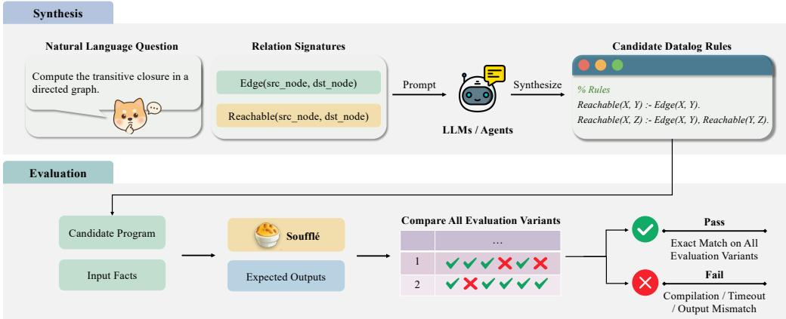
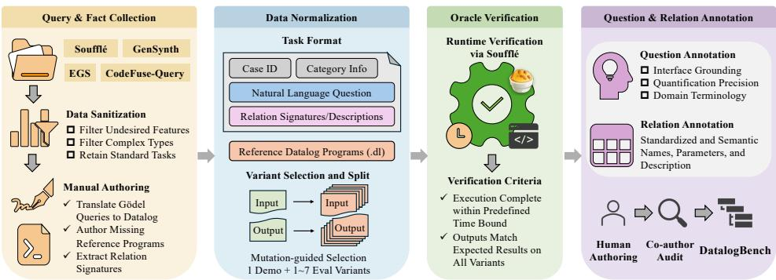
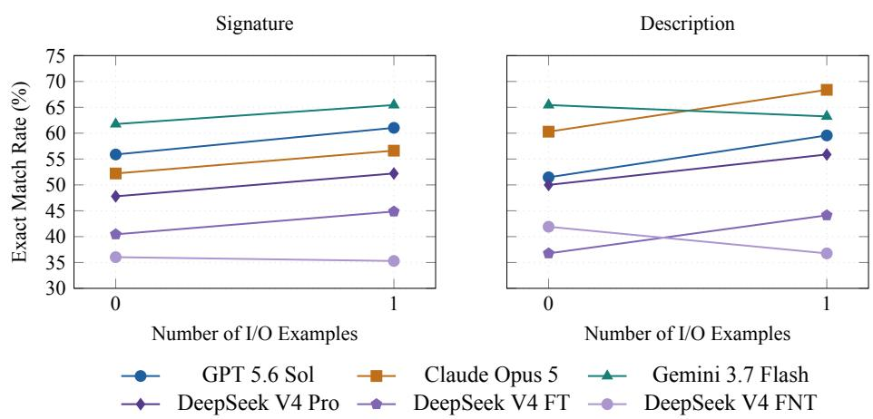
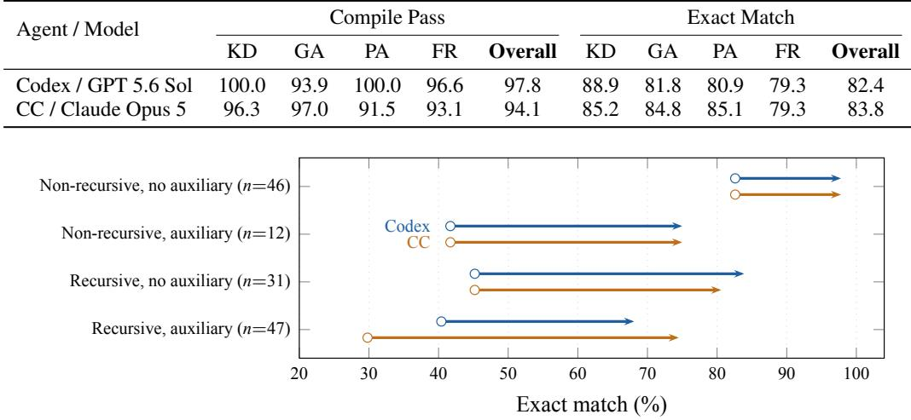
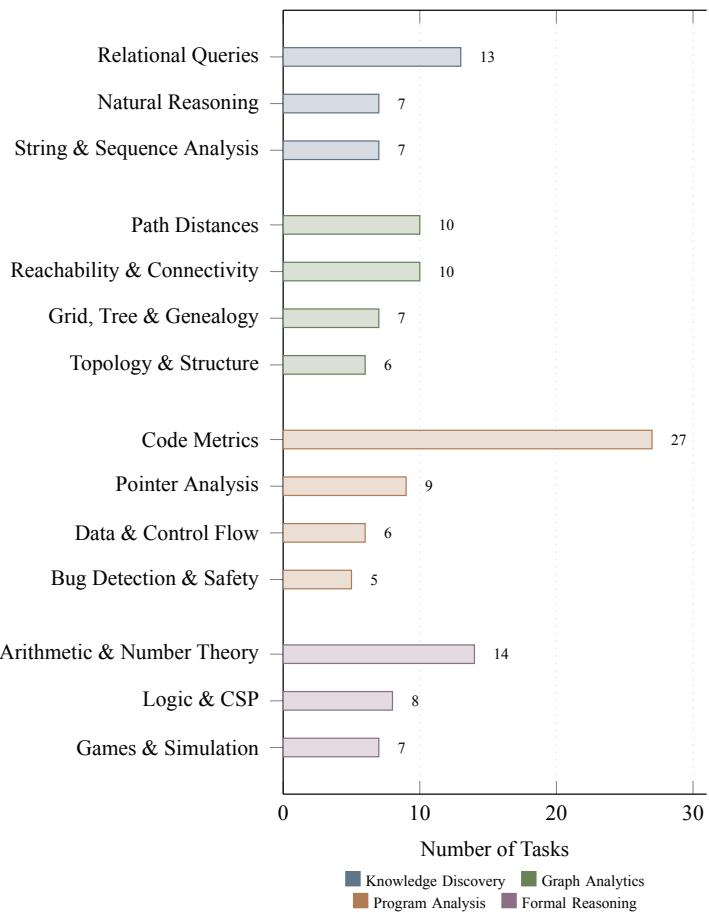

# DATALOGBENCH: EVALUATING LARGE LANGUAGE MODELS ON TEXT-TO-DATALOG SYNTHESIS

Yuan Li<sup>1</sup> Hanyun Jiang<sup>1</sup> Guowei Tian<sup>1</sup> Chengpeng Wang<sup>2</sup> Peisen Yao<sup>1</sup>

<sup>1</sup>The State Key Laboratory of Blockchain and Data Security, Zhejiang University

<sup>2</sup>National University of Singapore

{ly.liyuan,jhanyun,guow\_tian,pyaoaa}@zju.edu.cn wang-chengpeng@nus.edu.sg

## ABSTRACT

Datalog underpins reasoning tasks such as program analysis, but its programs are hard to write. Existing synthesizers automate this task but require users to state their intent as input–output examples. Large language models (LLMs) suggest a more natural route, text-to-Datalog synthesis from a natural-language question, yet how well they do so has not been systematically evaluated. We present DATALOG-BENCH, a benchmark of 136 text-to-Datalog synthesis tasks curated from existing Datalog-based artifacts. Synthesized programs are graded by execution on held-out inputs against an oracle validated by mutation analysis. Across six LLMs and four prompting configurations, exact match peaks at 68.4%, and relation descriptions or an input–output example have only modest, model-dependent effects. Under direct prompting, most failures occur at compile time, typically because a model invents auxiliary predicates that it never declares or types consistently. Two coding agents reach up to 83.8% and eliminate nearly all such failures, leaving mostly semantic errors concentrated in recursive tasks. DATALOGBENCH thus identifies recursive reasoning and decomposition as open challenges for current LLMs and agents, and offers a reliable, execution-grounded measure of both.

## 1 INTRODUCTION

Datalog (Abiteboul et al., 1995) is a declarative logic programming language over the functionfree fragment of Horn clauses, with a semantics given by least-fixed-point evaluation. Expressive recursion and predictable semantics have made it a workhorse in domains where clarity and global reasoning both matter, such as static program analysis (Bravenboer & Smaragdakis, 2009; Whaley & Lam, 2004; Scholz et al., 2016), network verification (Loo et al., 2006), distributed systems (Alvaro et al., 2010), and large-scale analytics (Halperin et al., 2014; Seo et al., 2013; Shkapsky et al., 2016). However, Datalog programs are hard to write, since developers must reason at once about recursion, joins, and stratified negation.

This difficulty has motivated work on Datalog program synthesis (Albarghouthi et al., 2017; Si et al., 2018; 2019; Bembenek et al., 2023; Raghothaman et al., 2020), which offers strong guarantees for small programs. Its interface, however, is not the one a user would choose. These systems, and the benchmarks built around them, take the specification as input–output examples: tables of facts that the target program must derive and must not derive, often together with a template or language bias that bounds the search (Si et al., 2018). Stating intent that way is neither natural nor easy. It presumes that the user can already produce instances of the relation they are trying to define, and producing them is most of the work on exactly the tasks where a synthesizer would help.

Natural language offers a more accessible interface, and large language models (LLMs) make it plausible: given a question and a relational schema, a model may generate the Datalog program directly. How reliably they do so has not been systematically evaluated. Studies of code generation have repeatedly shown that executable programs may nevertheless be semantically incorrect (Chen et al., 2021; Liu et al., 2023; Jimenez et al., 2024), and Datalog programs require not only syntactic validity but precise declarative semantics. This raises a fundamental question: Can probabilistic language models reliably synthesize programs that satisfy Datalog’s strict logical semantics?

Evaluating text-to-Datalog synthesis requires accounting for three properties of the language (§3). First, correctness is judged on the least fixed point a program computes, so a benchmark must contain tasks whose targets are genuinely recursive and grade each program by executing it. Second, many targets decompose into auxiliary predicates that the schema does not provide, so a benchmark must leave this predicate invention to the model. Third, Datalog programs are checked statically, and a single mis-bound variable, type clash, or stratification violation rejects an otherwise plausible program, so a benchmark must report compile failures separately from semantic errors.

We introduce DATALOGBENCH, a benchmark of 136 text-to-Datalog synthesis tasks curated from existing Datalog-based artifacts and spanning four reasoning domains: program analysis, graph analytics, formal reasoning, and knowledge discovery. Each task pairs a natural-language question with relation signatures, optional relation descriptions, one demonstration instance, and a disjoint set of held-out evaluation variants on which an execution oracle grades the synthesized program. Since Datalog has no standardized surface syntax, DATALOGBENCH targets the dialect of Soufflé (Jordan et al., 2016), the engine underlying the artifacts our tasks are drawn from, and every result we report holds for that dialect. We evaluate six LLMs, each under four prompting configurations that vary the relation schema and whether an input–output example is given, as well as two coding agents.

With direct prompting, exact match tops out at 68.4%, and adding relation descriptions or an input– output example helps only modestly and not for every model. The coding agents solve up to 83.8%, well above the same models prompted directly. Most programs that fail under direct prompting are rejected by the compiler, usually because an invented auxiliary predicate is never declared or is typed inconsistently. Supplying the missing declarations without changing any rule solves only a small number of additional tasks. With the coding agents, compile failures nearly disappear, and the remaining errors are mostly semantic and lie mainly in recursive tasks. The agents narrow the gaps on recursive tasks and tasks that need auxiliary predicates, but the 47 tasks requiring both remain substantially harder than the 46 requiring neither. Recursive reasoning and decomposition thus remain open challenges for current LLMs and agents.

In summary, we make the following contributions:

• We present DATALOGBENCH, a benchmark of 136 text-to-Datalog synthesis tasks curated from existing Datalog-based artifacts across four reasoning domains: program analysis, graph analytics, formal reasoning, and knowledge discovery.

• We define an execution-based evaluation protocol that grades every Datalog program on held-out evaluation variants, reports compile pass and exact match separately, and validates the oracle by mutation analysis.

• We evaluate six LLMs under four prompting configurations and two coding agents on DATALOG-BENCH, and analyze their failures by error type and by task structure.

## 2 RELATED WORK

Synthesizing Datalog programs. Datalog program synthesis has largely relied on search and solving, using constraints, syntax-guided search, numerical relaxation, solver-based rule selection, provenanceguided refinement, or example-guided and evolutionary search (Albarghouthi et al., 2017; Si et al., 2018; 2019; Bembenek et al., 2023; Raghothaman et al., 2020; Thakkar et al., 2021; Mendelson et al., 2021). A closely related line of work, inductive logic programming (ILP), learns logic programs, Datalog among them, from examples and background knowledge (Cropper & Morel, 2021; Cropper & Dumanciˇ c, 2022), and has long studied predicate invention (Muggleton et al., 2015), recently together´ with negation (Cerna & Cropper, 2024). All of these take input–output examples as the specification, typically with a language bias or rule templates. LLMs have entered the picture either to steer a symbolic search (Barke et al., 2024) or even to write Datalog queries inside a code-localization agent that validates them with a parser and mutation-based feedback (Xu et al., 2026). In the latter, the Datalog program is a means to localization and is scored by localization accuracy. To our knowledge, no existing benchmark checks whether the Datalog programs that LLMs write from natural-language questions compute the intended relations.

Evaluating LLMs on code generation. HumanEval (Chen et al., 2021) established function-level evaluation from natural-language specifications, and EvalPlus (Liu et al., 2023) showed that weak tests overestimate correctness. Later benchmarks move toward realistic software settings—repository- and class-level synthesis (Li et al., 2024; Yu et al., 2024; Du et al., 2024), feature-level development (Li et al., 2025), issue resolution (Jimenez et al., 2024; Zhang et al., 2025), and contamination-resistant, continuously updated evaluation (Jain et al., 2025)—but all target imperative languages, where an incorrect program usually still runs and the strength of the tests decides what the benchmark can detect. We take the lesson of EvalPlus as a requirement and validate our oracle by mutation analysis (§4.3). In Datalog, by contrast, many incorrect programs never run: the compiler rejects a program that uses an undeclared relation or violates typing, safety, or stratification, so an evaluation must report compile failures separately from semantic errors (§6.3).

Text-to-SQL benchmarks. WikiSQL (Zhong et al., 2017), Spider (Yu et al., 2018), BIRD (Li et al., 2023), and Spider 2.0 (Lei et al., 2025) have driven progress on mapping language to executable SQL under increasingly realistic schemas, emphasizing schema grounding, joins, aggregation, and value usage. Their target queries rarely need recursion, although SQL supports it through recursive common table expressions, and they can keep intermediate results anonymous inside nested subqueries. A Datalog program, in contrast, expresses iteration only through recursive rules and must define every intermediate result as a named auxiliary predicate. Accuracy on text-to-SQL therefore says little about recursion and predicate invention, the two demands that DATALOGBENCH is built to measure.

## 3 PRELIMINARIES

Datalog. A Datalog program $P$ is a finite set of rules $A : - B _ { 1 } , \ldots , B _ { n }$ , whose head A and body literals $B _ { i }$ apply a predicate to a tuple of constants and variables. Predicates split into two classes: extensional database (EDB) predicates, defined by ground facts and supplied as input, and intensional database (IDB) predicates, defined by rules. The IDB holds both the output relations a task is graded on and the auxiliary predicates the program introduces to compute them. Given input facts I, the program’s output $\overset { \cdot } { P } ( \overset { \cdot } { I } )$ is the least fixed point reached by applying the rules until nothing new is derived. A program is recursive when its predicate dependency graph, which consists of edges from each body predicate to the head predicate of its rule, contains a cycle (through one predicate or several). Pure Datalog restricts rules to Horn clauses, in which every $B _ { i }$ is a positive atom. Like most practical dialects, Soufflé also allows negated body literals and aggregation. Rules may use negation only when it is stratified: no cycle in the dependency graph passes through a negated literal, so every negated predicate is fully computed before it is used. Soufflé rejects a program that violates this condition. Reachability is the standard example. Over an input relation Edge, the program

$$
R e a c h a b l e ( X , Y ) : - E d g e ( X , Y ) . \qquad R e a c h a b l e ( X , Z ) : - E d g e ( X , Y ) , R e a c h a b l e ( Y , Z ) .
$$

computes the transitive closure as the least fixed point of the two rules. No fixed number of joins over Edge can express it, since paths may be arbitrarily long.

Demands specific to Datalog synthesis. Three properties make writing such a program from a natural-language question demanding. Recursivefixed-point reasoning: a recursive program is correct only if its base case, its inductive step, and the variable bindings between them together yield the intended least fixed point. Predicate invention: the auxiliary predicates that make a decomposition work are absent from the schema, so the program must invent them, name them, and, in Soufflé, declare them with typed attributes. Static checking: Soufflé checks the whole program before evaluating it, so one mis-bound variable, one type clash between joined relations, or one stratification violation rejects a program that would otherwise run. Such a program never reaches the data, so compile failures and semantic errors are distinct outcomes.

Task formulation. Each task in DATALOGBENCH is an end-to-end text-to-Datalog synthesis problem, a tuple

$$
\tau _ { i } = \left( q _ { i } , \mathcal { R } _ { i } ^ { \mathrm { i n } } , \mathcal { R } _ { i } ^ { \mathrm { o u t } } , d _ { i } , \mathcal { D } _ { i } , \mathcal { T } _ { i } \right) ,\tag{1}
$$

where $q _ { i }$ is the natural-language question, $\mathcal { R } _ { i } ^ { \mathrm { i n } }$ and $\mathcal { R } _ { i } ^ { \mathrm { { o u t } } }$ are the input and output relation signatures, and $d _ { i }$ is an optional set of relation descriptions. $\mathcal { D } _ { i }$ is the demonstration instance, which may appear in a prompt as an input–output example or supply execution feedback to an iterative system, and $\mathcal { T } _ { i }$ is a disjoint set of evaluation variants used only to compute scores. Each instance pairs EDB facts $\boldsymbol { x } _ { i j }$ with the expected IDB output $y _ { i j }$ . Given a prompt carrying the schema $\left( \mathcal { R } _ { i } ^ { \mathrm { { i n } } } , \mathcal { R } _ { i } ^ { \mathrm { { o u t } } } \right)$ and, optionally, $d _ { i }$ , a system produces a candidate program $\hat { P } _ { i } ,$ which may introduce auxiliary predicates absent from the schema. An iterative system may adapt to $\mathcal { D } _ { i }$ but never to $\mathcal { T } _ { i } ,$ and every reported metric is computed on $\mathcal { T } _ { i }$ after the candidate is frozen. Figure 1 follows the reachability task above through both stages: synthesis from the question and relation signatures, and grading of the candidate on every evaluation variant. Appendix A gives the formal synthesis problem this instantiates.

  
Figure 1: A DATALOGBENCH task with relation signatures only. The prompt carries the question and the signatures, and Soufflé runs the candidate program on the held-out evaluation variants and compares its output with the expected facts.

## 4 DATALOGBENCH

This section describes how the tasks were collected and specified, characterizes the resulting benchmark, and validates its execution oracle.

## 4.1 BENCHMARK CONSTRUCTION

DATALOGBENCH was assembled in four phases, each securing one property of the tasks (Figure 2). Collection draws reference programs and their input–output facts from four public artifacts: Soufflé (Jordan et al., 2016), EGS (Thakkar et al., 2021), GenSynth (Mendelson et al., 2021), and CodeFuse-Query (Xie et al., 2024), whose queries we rewrote in Soufflé, so that every task originates in a program written for an actual analysis or test. Because every source is public, Appendix C.6 measures what exposure to it is worth. Normalization renames relations, standardizes argument types, and regenerates input facts. As the upstream names no longer appear, a model must work from the schema in the prompt. Oracle verification re-executes every reference program under Soufflé and keeps a task only when its outputs match the recorded expected outputs exactly. Annotation adds a human-authored question and relation descriptions, requiring that every output relation be named in the question and that quantifiers be explicit (Appendix D).

The specification deliberately omits auxiliary predicates, leaving predicate invention to the model. A task may admit many correct programs, but its question and schema must together fix a single intended output. We audited every task and rewrote the question wherever they did not. Twenty-five tasks are determinate only given domain vocabulary that a schema cannot carry. Following BIRD (Li et al., 2023), for the fifteen whose vocabulary we judged beyond common knowledge, a knowledge note supplies it without hinting at program structure (Appendix C.4); the other ten assume a reader who already has it.

  
Figure 2: The four phases of benchmark construction and what each produces.

Table 1: Structural and data statistics of DATALOGBENCH. The largest arity of a program is the most arguments any of its predicates takes; strata are the layers of a stratified evaluation; an SCC is a set of mutually recursive predicates, and its count is the most recursive SCCs in any one program; trimmed averages exclude the five largest tasks. Tuple counts are for each task’s first evaluation variant.
<table><tr><td colspan="2">Program complexity</td><td colspan="2">Datalog-specific structure</td></tr><tr><td>Avg. / max rules</td><td>5.1 / 57</td><td>Recursive tasks</td><td>78</td></tr><tr><td> $\operatorname { A v g } .$  / max body atoms</td><td>2.3 / 10</td><td>Max recursive SCC size / count</td><td>9/4</td></tr><tr><td> $\operatorname { A v g } . I$  max largest arity</td><td>3.4 / 20</td><td>Avg. auxiliary predicates</td><td>1.4</td></tr><tr><td> $\operatorname { A v g } .$  / max strata</td><td>1.5 /5</td><td>Tasks using negation / aggregation</td><td>34 / 22</td></tr><tr><td colspan="2">Inputs</td><td colspan="2">Outputs</td></tr><tr><td>Avg. relations</td><td>2.9</td><td>Avg. relations</td><td>1.5</td></tr><tr><td>Median tuples</td><td>10</td><td>Median tuples</td><td>5</td></tr><tr><td>Trimmed âvg. tuples</td><td>12.5</td><td>Trimmed âvg. tuples</td><td>12.3</td></tr><tr><td colspan="4">Evaluation variants</td></tr><tr><td>Total</td><td>247</td><td></td><td>1-7</td></tr><tr><td>Mean / median per task</td><td>1.82 / 2</td><td>Range per task Single-variant tasks</td><td>58</td></tr></table>

## 4.2 BENCHMARK STATISTICS

Table 1 summarizes the structure of the reference programs. Two properties matter most for what follows. First, 78 of the 136 tasks are recursive and 59 introduce at least one auxiliary predicate. Second, all 136 reference programs are stratified, since Soufflé compiles every one of them, so any stratification error in a candidate is the candidate’s own. Data scale is heavy-tailed (means of 82 input and 1,517 output tuples, against medians of 10 and 5). We keep the tail because tasks such as pointer analysis and large-graph reachability show their characteristic behavior only at non-trivial sizes. The four domains—program analysis (n = 47), graph analytics (n = 33), formal reasoning (n = 29), and knowledge discovery $( n = 2 7 )$ —reflect the application area of each task, and they differ in structure: recursion appears in 79.3% of formal reasoning and 75.8% of graph analytics tasks but in only 42.6% of program analysis and 37.0% of knowledge discovery tasks, and knowledge discovery introduces 0.6 auxiliary predicates per task against 1.6 elsewhere. We also report evaluation results by structural property (§6.3). Appendix E gives these statistics in full, broken down by domain, and further scores task difficulty along two structural axes.

## 4.3 BENCHMARK VALIDATION

Held-out variants guard against overfitting. Every task separates the demonstration instance, which may appear in a prompt as an input–output example or supply execution feedback to an iterative system, from the evaluation variants used for scoring. A program fitted to the demonstration instance therefore earns credit only if it also computes the intended relations on inputs it has not seen; §6.2 shows that both coding agents produce candidates that fail this test.

Mutation analysis bounds the oracle. Three mutation operators, which delete a rule, delete a body atom, or rebind a join variable, produce 1,948 mutants, of which the evaluation variants distinguish 1,877 (96.4%). The first evaluation variant alone distinguishes 86.0%, and the remaining variants add 10.3 points. All 71 survivors are certified equivalent, so the score after excluding equivalent mutants is 100%; the raw score remains the conservative quantity we report. These tests bound discrimination only for such mutations, which never alter a negation, an aggregate function, or a grouping scope. They do not prove that a program passing every variant is equivalent to its reference, nor whether an independent reader finds each specification determinate. Appendix G gives the checks and the mutation analysis in full.

## 5 EVALUATION

## 5.1 EXPERIMENTAL SETUP

Models. We evaluate six LLMs from four providers (Table 4): GPT 5.6 Sol (OpenAI, 2026), Claude Opus 5 (Anthropic, 2026), Gemini 3.7 Flash (Google DeepMind, 2026), DeepSeek V4 Pro, and DeepSeek V4 Flash (DeepSeek-AI, 2026), the latter in thinking and non-thinking modes, written DeepSeek V4 FT and DeepSeek V4 FNT below, which isolate test-time reasoning on one underlying model. All share one untuned prompt template (Appendix B). Appendix C records the request contracts. Candidate programs run under Soufflé 2.5 with a 30-second timeout (Appendix H).

Direct prompting (§6.1). We prompt each model directly at temperature 0 with one completion per task, varying the prompt along two axes: the schema is given as relation signatures alone (names and argument types) or together with natural-language descriptions of each relation, and the demonstration instance is either withheld or appended as an input–output example. We call the resulting 24 model– prompt combinations the Direct cells. Every cell is scored on the same held-out evaluation variants (§3), and the fifteen tasks with a knowledge note carry it in every prompt.

Coding agents (§6.2). We evaluate Codex CLI (Codex; OpenAI, 2025) with GPT 5.6 Sol and Claude Code (CC; Anthropic, 2025) with Claude Opus 5 on relation signatures without an input–output example, the same prompt as the Direct cells they are compared with. Each agent works on a task for up to four turns in one persistent session and may use local file and shell tools, but not web search or retrieval. After each turn, the harness runs the candidate on the demonstration instance and returns either the compile error or a bounded sample of differing tuples. The task stops once the candidate is exact on the demonstration instance. Evaluation variants stay held out until the candidate is frozen. Each agent is compared with the Direct cell of its own model, which holds the model fixed, and we do not compare the two agents, whose models and clients both differ. Appendix C gives the enforcement and environment details. Resource use is reported in Appendix N.

Statistical inference. Tasks are the units of inference, and each Direct cell and each agent ran once. Every interval we report is a 95% percentile-bootstrap interval over tasks (10,000 seeded resamples). Two cells are compared on the tasks they share: we give the paired mean difference with its interval, and a two-sided sign-flip test over the same pairing for its p-value.

## 5.2 EVALUATION METRICS

A candidate program is graded by execution. For task i in the evaluated set $\tau _ { \ast }$ , let $C _ { i } = 1$ if the candidate compiles and 0 otherwise, and let $M _ { i } = 1$ if it also reproduces the expected output on all $m _ { i }$ of that task’s evaluation variants. Compile Pass (CP) and Exact Match (EX) are the task averages of the two:

$$
\mathrm { C P } ( \mathcal { T } ) = \frac { 1 } { | \mathcal { T } | } \sum _ { i \in \mathcal { T } } C _ { i } , \qquad \mathrm { E X } ( \mathcal { T } ) = \frac { 1 } { | \mathcal { T } | } \sum _ { i \in \mathcal { T } } M _ { i } .\tag{2}
$$

CP measures whether a program passes Soufflé’s static checks, and EX measures whether it is semantically correct: a task counts only if its program runs and agrees with the reference on every held-out variant. Appendix F gives the full form and the secondary metrics.

Soufflé requires an explicit typed .decl for every relation, including auxiliary predicates, so a program that derives a relation by rule but never declares it is rejected before it runs. This requirement is a property of the dialect rather than of the task. To measure its contribution without conflating it with rule repair, we also report repaired exact match (EX<sup>†</sup>). A task counts if its program is exact as written, or becomes exact once declarations omitted for auxiliary predicates are synthesized from the program’s own rules: argument types are taken from relations that bind each variable, and no rule is added, removed, or altered. EX<sup>†</sup> serves only as a diagnostic; raw EX remains the primary measure of what the model submitted.

Table 2: Zero-shot results with relation signatures or descriptions. $\mathrm { E X ^ { \dagger } }$ also credits programs made exact by synthesizing only their omitted declarations. Bold marks each column’s best.
<table><tr><td rowspan="2">Model</td><td colspan="3">Signature</td><td colspan="3">Description</td></tr><tr><td>CP (%)</td><td>EX (%)</td><td>EX† (%)</td><td>CP (%)</td><td>EX (%)</td><td>EX† (%)</td></tr><tr><td>GPT 5.6 Sol</td><td>77.2</td><td>55.9</td><td>60.3</td><td>72.1</td><td>51.5</td><td>57.4</td></tr><tr><td>Claude Opus 5</td><td>75.7</td><td>52.2</td><td>52.2</td><td>83.8</td><td>60.3</td><td>60.3</td></tr><tr><td>Gemini 3.7 Flash</td><td>81.6</td><td>61.8</td><td>63.2</td><td>83.1</td><td>65.4</td><td>66.9</td></tr><tr><td>DeepSeek V4 Pro</td><td>67.6</td><td>47.8</td><td>53.7</td><td>66.9</td><td>50.0</td><td>55.9</td></tr><tr><td>DeepSeek V4 FT</td><td>52.9</td><td>40.4</td><td>52.2</td><td>50.7</td><td>36.8</td><td>49.3</td></tr><tr><td>DeepSeek V4 FNT</td><td>59.6</td><td>36.0</td><td>36.0</td><td>65.4</td><td>41.9</td><td>42.6</td></tr></table>

  
Figure 3: Exact match with and without one input–output example, under each schema.

## 6 RESULTS

## 6.1 DIRECT PROMPTING

Direct prompting remains unreliable. Across the six models, zero-shot EX averages 49.0% with signatures and 51.0% with descriptions (Table 2; Appendix L splits it by domain). CP is higher (69.1% and 70.3%), so about a fifth of all programs compile yet compute the wrong relations (§6.3). Performance also varies substantially by model: Gemini 3.7 Flash reaches 65.4% with descriptions, while DeepSeek V4 FNT reaches only 36.0% with signatures. Across all 24 Direct cells, the best result is Claude Opus 5 with descriptions and one input–output example, at 68.4% EX.

Descriptions and examples yield modest, inconsistent gains. Descriptions add approximately 2.0 points on average both with and without an example. An input–output example adds over 3.5 points under both signatures and descriptions (Figure 3). The direction is not uniform across models. Only one of the 12 within-model schema contrasts separates from zero: descriptions add 11.8 points for one-shot Claude Opus 5 (bootstrap 95% CI [3.7, 19.9], paired sign-flip p = .0098). None of the 12 within-model example contrasts is significant. Thus the grid supports neither a general benefit from descriptions nor a reliable gain from the example. For reference, symbolic synthesizers that learn from input–output examples reach at most 36.0% EX under a protocol that favors them (Appendix M).

## 6.2 CODING AGENTS

Agents substantially outperform their matched Direct cells. Codex improves over GPT 5.6 Sol from 55.9% to 82.4% EX (Table 3), a paired gain of 26.5 points (bootstrap 95% CI [19.1, 34.6]). CC improves over Claude Opus 5 from 52.2% to 83.8%, a gain of 31.6 points ([24.3, 39.7]). Both paired sign-flip tests give p < .001. The first turn alone does not account for the gain: Codex solves 65 tasks before feedback, 11 fewer than its matched Direct cell, whereas CC solves 85, 14 more. The rest comes in later turns, which add execution feedback on the demonstration instance to a persistent session with file and shell tools.

Table 3: Coding agents with relation signatures, no input–output example, and up to four turns (%). KD: knowledge discovery; GA: graph analytics; PA: program analysis; FR: formal reasoning.
<table><tr><td rowspan="2">Agent / Model</td><td colspan="5">Compile Pass</td><td colspan="5">Exact Match</td></tr><tr><td>KD</td><td>GA</td><td>PA</td><td>FR</td><td>Overall</td><td>KD</td><td>GA</td><td>PA</td><td>FR</td><td>Overall</td></tr><tr><td>Codex / GPT 5.6 Sol</td><td>100.0</td><td>93.9</td><td>100.0</td><td>96.6</td><td>97.8</td><td>88.9</td><td>81.8</td><td>80.9</td><td>79.3</td><td>82.4</td></tr><tr><td>CC / Claude Opus 5</td><td>96.3</td><td>97.0</td><td>91.5</td><td>93.1</td><td>94.1</td><td>85.2</td><td>84.8</td><td>85.1</td><td>79.3</td><td>83.8</td></tr></table>

  
Figure 4: Exact match by reference structure, from each model’s Direct cell (circle) to its agent (arrow head). Auxiliary means the reference introduces at least one predicate absent from the schema.

Interaction narrows but does not remove structural gaps. Among tasks solved by the agent but not its matched Direct cell, Codex gains 37 and CC gains 43. Declaration repair alone accounts for 6 of Codex’s gains and none of CC’s; the remaining gains are concentrated in recursive tasks (23/31 and 32/43) and tasks whose reference programs use auxiliary predicates (13/31 and 25/43). Figure 4 shows the 47 tasks that need both rising to 68.1% for Codex and 74.5% for CC, still well below the 97.8% both agents reach on the 46 tasks with neither demand. The agents therefore make progress on the structural challenges without saturating the benchmark.

Feedback on one demonstration instance can also overfit it. Of the 128 candidates each agent returned as exact on the demonstration instance, the held-out variants reject 17 for Codex and 14 for CC. Separately, eight CC tasks end with no program after exhausting the retry budget for failed sessions fixed in advance (Appendix N), and count as zero.

## 6.3 FAILURE MODE ANALYSIS

Most failures under direct prompting occur at compile time. Of the 3,264 programs from the Direct cells, 1,036 (31.7%) fail to compile and 519 (15.9%) compile but compute the wrong relations; 18 more time out during evaluation. Across the six models’ best cells, compile failures account for 16.9%–43.4% of tasks and compiled-but-wrong programs for 11.0%–23.5%. We classify each compile failure by the statement the compiler rejects (Appendix J). The largest group, 44.1%, is predicate invention left incomplete: a rule uses an auxiliary predicate the program never declares (293), or the compiler cannot type a rule that defines one (164). Soufflé dialect errors follow at 30.5%, such as aggregates in rule heads and negation or aggregate syntax from other languages, then the typing of constants and schema relations (11.3%) and variable safety and stratification (7.9%). Appendix I shows representative failing programs. Supplying the missing declarations recovers only a small share of exact match. Every program declares the provided schema, yet 261 (8.0%) fail only because of undefined auxiliary predicates; inferring declarations from their own rules, without changing any rule, makes 244 of them compile and 160 exact, adding 4.9 points to mean EX (the EX<sup>†</sup> column of Table 2).

Recursion and decomposition remain the main difficulty. With relation signatures and no example, EX on the 78 recursive tasks ranges from 17.9% to 47.4%, compared with 60.3%–81.0% on the 58 non-recursive tasks (Appendix K). On the 59 tasks whose reference programs introduce auxiliary predicates it ranges from 11.9% to 49.2%, compared with 54.5%–71.4% when no auxiliary predicate is needed. The two demands overlap, but neither reduces to the other: with the other axis held fixed, every model is less accurate on the harder slice. Exact match falls to 10.6%–44.7% on the 47 tasks with both demands, versus 71.7%–84.8% on the 46 with neither. The two demands also fail differently. Across the Direct cells, auxiliary predicates mainly raise the compile-failure rate, from 12.5% to 39.2% on non-recursive tasks and from 23.5% to 54.1% on recursive ones, whereas recursion adds semantic errors: recursive tasks without auxiliary predicates are the only group in which more programs compile but are wrong (26.6%) than fail to compile (23.5%).

The agents remove compile failures but fewer semantic errors. Against their matched Direct cells, the agents cut compile failures from 31 to 3 (Codex) and from 33 to 0 (CC), but programs that compile yet are not exact only from 29 to 21 and from 32 to 14. What remains is therefore mostly semantic, and it concentrates in recursive tasks: 17 of Codex’s 21 and 10 of CC’s 14. CC’s 8 zero-scored tasks have no program.

These findings suggest a division of labor (Appendix P). Most compile failures are mechanical: deterministic checks or a compiler in the loop can remove them, as the agents do, and declaration inference alone recovers a small share. The failures that survive are semantic and sit in recursion, so model- or search-based repair should focus on base cases, inductive bindings, and the auxiliary predicates a decomposition needs. Execution feedback is valuable, but correctness on a single demonstration instance is not a substitute for held-out evaluation.

## 7 CONCLUSION

We introduced DATALOGBENCH, a benchmark of text-to-Datalog synthesis tasks in the Soufflé dialect, together with an execution oracle validated by mutation analysis. Across six LLMs and two coding agents, direct prompting remains unreliable, and relation descriptions or an input–output example have only modest, model-dependent effects. Most failures of direct prompting occur at compile time, typically involving auxiliary predicates that the model invents but never declares or types consistently. Supplying missing declarations recovers only a small share of exact match. The coding agents eliminate nearly all compile failures and raise exact match substantially, but the errors they leave are mostly semantic, concentrated in recursive tasks, and the tasks that combine recursion with auxiliary predicates remain clearly harder. The open challenges are therefore recursive reasoning and decomposition: constructing the right fixed point and inventing the auxiliary predicates a decomposition needs.

Limitations. This study has three main limitations. First, DATALOGBENCH targets the Soufflé dialect alone, and we do not measure how far the findings transfer. Second, the execution oracle is bounded by mutation analysis rather than proved complete. Third, the agent setting supplies execution feedback and interactive tooling together, so their contributions are not separated. Appendix O discusses these limitations in full.

## AI USE STATEMENT

LLMs are the object of study in this work: they are evaluated as Datalog synthesizers, and their generations are the data we analyze. Separately from that role, no part of the released benchmark is machine-generated. All natural-language questions and relation descriptions were written by the authors, and the reference programs were either taken from the upstream artifacts listed in §4.1 or written by the authors, so the specifications the models are scored against are not drawn from the distribution of the models being scored. We used LLMs to assist with grammar editing and language polishing, and LLM-based coding agents to write analysis and plotting scripts from measurements we supplied. No benchmark content was generated by an LLM, and every number reported in this paper comes from running the released evaluation pipeline.

## ETHICS STATEMENT

DATALOGBENCH is assembled from publicly released research artifacts and open-source tooling: Soufflé (UPL-1.0), EGS (MIT), and CodeFuse-Query (Apache-2.0), each used under its stated license, and GenSynth, whose repository declares no license; we reference GenSynth as an unmodified submodule and derive task specifications from its published benchmark files. The benchmark contains only synthetic relational facts and program-analysis fixtures; it includes no personal data, no usergenerated content, and no material about identifiable individuals. All questions, relation descriptions, and annotations were written by the authors, with no crowdworkers involved. The evaluated systems are commercial LLM APIs and coding agents queried through their public interfaces. Generated Datalog is executed by Soufflé in a scratch directory, and the coding agents run in per-task scratch directories inside a pinned container rather than in the repository. The benchmark tree and reference programs are not mounted, outbound traffic is forced through a proxy that allows only the model endpoint, and each client’s web tools are disabled (§5.1; Appendix C.2). No generated program writes outside its scratch directory. We see no dual-use concern specific to this work: the capability under study is writing declarative database queries.

## REPRODUCIBILITY STATEMENT

The benchmark, prompt templates, evaluation harness, and scoring and analysis scripts are available at https://github.com/ZJU-PL/DatalogBench. Section 5.1 states the decoding configuration, the Soufflé version, and the per-execution timeout, and its paragraph on statistical inference specifies the bootstrap and permutation procedures, including the resample count and the seeding. Section 5.2 defines the metrics. Appendix B reproduces the prompt templates, and Appendix C lists every evaluated model, agent, and symbolic baseline together with the configuration each was run under. The symbolic baselines are included as pinned submodules with the source-level build patches required on a modern toolchain, and are built by a single setup script that needs no container runtime. Structural statistics of the reference programs are produced by an analyzer in the repository, so the numbers in §4.2 can be regenerated from the benchmark files alone, and every derived figure in the main text and appendix—the declaration repair, the decomposition of the agents gains, the contamination scan, and the overlap with symbolic synthesis—is produced by a script in the repository.

## REFERENCES

Serge Abiteboul, Richard Hull, and Victor Vianu. Foundations ofDatabases. Addison-Wesley, 1995. ISBN 0-201-53771-0.

Aws Albarghouthi, Paraschos Koutris, Mayur Naik, and Calvin Smith. Constraint-based synthesis of Datalog programs. In J. Christopher Beck (ed.), Principles and Practice of Constraint Programming - 23rd International Conference, CP 2017, Melbourne, VIC, Australia, August 28 - September 1, 2017, Proceedings, volume 10416 of Lecture Notes in Computer Science, pp. 689–706. Springer, 2017. doi: 10.1007/978-3-319-66158-2\_44. URL https: //doi.org/10.1007/978-3-319-66158-2\_44.

Peter Alvaro, Tyson Condie, Neil Conway, Khaled Elmeleegy, Joseph M. Hellerstein, and Russell Sears. BOOM analytics: exploring data-centric, declarative programming for the cloud. In Christine Morin and Gilles Muller (eds.), European Conference on Computer Systems, Proceedings ofthe 5th European conference on Computer systems, EuroSys 2010, Paris, France, April 13-16, 2010, pp. 223–236. ACM, 2010. doi: 10.1145/1755913.1755937. URL https://doi.org/10. 1145/1755913.1755937.

Anthropic. Claude Code: An agentic coding tool that lives in your terminal, 2025. URL https: //github.com/anthropics/claude-code. Accessed September 2026.

Anthropic. Introducing Claude Opus 5, 2026. URL https://www.anthropic.com/news/ claude-opus-5. Accessed September 2026.

Shraddha Barke, Emmanuel Anaya Gonzalez, Saketh Ram Kasibatla, Taylor Berg-Kirkpatrick, and Nadia Polikarpova. HYSYNTH: Context-free LLM approximation for guiding program synthesis. In Advances in Neural Information Processing Systems 37: Annual Conference on Neural Information Processing Systems 2024, NeurIPS 2024, Vancouver, BC, Canada, 2024. URL https://openreview.net/forum?id=5jt0ZSA6Co.

Aaron Bembenek, Michael Greenberg, and Stephen Chong. From SMT to ASP: solver-based approaches to solving Datalog synthesis-as-rule-selection problems. Proc. ACM Program. Lang.,

7(POPL):185–217, 2023. doi: 10.1145/3571200. URL https://doi.org/10.1145/ 3571200.

Martin Bravenboer and Yannis Smaragdakis. Strictly declarative specification of sophisticated pointsto analyses. In Shail Arora and Gary T. Leavens (eds.), Proceedings of the 24th Annual ACM SIGPLAN Conference on Object-Oriented Programming, Systems, Languages, and Applications, OOPSLA 2009, October 25-29, 2009, Orlando, Florida, USA, pp. 243–262. ACM, 2009. doi: 10.1145/1640089.1640108. URL https://doi.org/10.1145/1640089.1640108.

David M. Cerna and Andrew Cropper. Generalisation through negation and predicate invention. In Proceedings of the AAAI Conference on Artificial Intelligence, volume 38, pp. 10467–10475, 2024. doi: 10.1609/aaai.v38i9.28915.

Mark Chen, Jerry Tworek, Heewoo Jun, Qiming Yuan, Henrique Pondé de Oliveira Pinto, Jared Kaplan, Harri Edwards, Yuri Burda, Nicholas Joseph, Greg Brockman, Alex Ray, Raul Puri, Gretchen Krueger, Michael Petrov, Heidy Khlaaf, Girish Sastry, Pamela Mishkin, Brooke Chan, Scott Gray, Nick Ryder, Mikhail Pavlov, Alethea Power, Lukasz Kaiser, Mohammad Bavarian, Clemens Winter, Philippe Tillet, Felipe Petroski Such, Dave Cummings, Matthias Plappert, Fotios Chantzis, Elizabeth Barnes, Ariel Herbert-Voss, William Hebgen Guss, Alex Nichol, Alex Paino, Nikolas Tezak, Jie Tang, Igor Babuschkin, Suchir Balaji, Shantanu Jain, William Saunders, Christopher Hesse, Andrew N. Carr, Jan Leike, Joshua Achiam, Vedant Misra, Evan Morikawa, Alec Radford, Matthew Knight, Miles Brundage, Mira Murati, Katie Mayer, Peter Welinder, Bob McGrew, Dario Amodei, Sam McCandlish, Ilya Sutskever, and Wojciech Zaremba. Evaluating large language models trained on code. CoRR, abs/2107.03374, 2021. URL https://arxiv. org/abs/2107.03374.

Andrew Cropper and Sebastijan Dumanciˇ c. Inductive logic programming at 30: A new introduction.´ Journal ofArtificial Intelligence Research, 74:765–850, 2022. doi: 10.1613/jair.1.13507.

Andrew Cropper and Rolf Morel. Learning programs by learning from failures. Machine Learning, 110(4):801–856, 2021. doi: 10.1007/s10994-020-05934-z.

DeepSeek-AI. DeepSeek-V4: Towards highly efficient million-token context intelligence. arXiv preprint arXiv:2606.19348, 2026.

Xueying Du, Mingwei Liu, Kaixin Wang, Hanlin Wang, Junwei Liu, Yixuan Chen, Jiayi Feng, Chaofeng Sha, Xin Peng, and Yiling Lou. Evaluating large language models in class-level code generation. In Proceedings of the 46th IEEE/ACM International Conference on Software Engineering, ICSE 2024, Lisbon, Portugal, April 14-20, 2024, pp. 81:1–81:13. ACM, 2024. doi: 10.1145/3597503.3639219. URL https://doi.org/10.1145/3597503.3639219.

Google DeepMind. Gemini 3.7 Flash model card, 2026. URL https://deepmind.google/ models/model-cards/gemini-3-7-flash/. Accessed September 2026.

Daniel Halperin, Victor Teixeira de Almeida, Lee Lee Choo, Shumo Chu, Paraschos Koutris, Dominik Moritz, Jennifer Ortiz, Vaspol Ruamviboonsuk, Jingjing Wang, Andrew Whitaker, Shengliang Xu, Magdalena Balazinska, Bill Howe, and Dan Suciu. Demonstration of the Myria big data management service. In Curtis E. Dyreson, Feifei Li, and M. Tamer Özsu (eds.), International Conference on Management of Data, SIGMOD 2014, Snowbird, UT, USA, June 22-27, 2014, pp. 881–884. ACM, 2014. doi: 10.1145/2588555.2594530. URL https://doi.org/10.1145/ 2588555.2594530.

Naman Jain, King Han, Alex Gu, Wen-Ding Li, Fanjia Yan, Tianjun Zhang, Sida Wang, Armando Solar-Lezama, Koushik Sen, and Ion Stoica. LiveCodeBench: Holistic and contamination free evaluation of large language models for code. In The Thirteenth International Conference on Learning Representations, ICLR 2025, Singapore, April 24-28, 2025. OpenReview.net, 2025. URL https://proceedings.iclr.cc/paper\_files/paper/2025/hash/ 94074dd5a072d28ff75a76dabed43767-Abstract-Conference.html.

Carlos E. Jimenez, John Yang, Alexander Wettig, Shunyu Yao, Kexin Pei, Ofir Press, and Karthik R. Narasimhan. SWE-bench: Can language models resolve real-world GitHub issues? In The Twelfth International Conference on Learning Representations, ICLR 2024, Vienna, Austria,

May 7-11, 2024. OpenReview.net, 2024. URL https://openreview.net/forum?id= VTF8yNQM66.

Herbert Jordan, Bernhard Scholz, and Pavle Subotic. Soufflé: On synthesis of program analyzers. In Swarat Chaudhuri and Azadeh Farzan (eds.), Computer Aided Verification - 28th International Conference, CAV 2016, Toronto, ON, Canada, July 17-23, 2016, Proceedings, Part II, Lecture Notes in Computer Science, pp. 422–430. Springer, 2016. doi: 10.1007/978-3-319-41540-6\_23. URL https://doi.org/10.1007/978-3-319-41540-6\_23.

Fangyu Lei, Jixuan Chen, Yuxiao Ye, Ruisheng Cao, Dongchan Shin, Hongjin Su, Zhaoqing Suo, Hongcheng Gao, Wenjing Hu, Pengcheng Yin, Victor Zhong, Caiming Xiong, Ruoxi Sun, Qian Liu, Sida Wang, and Tao Yu. Spider 2.0: Evaluating language models on real-world enterprise textto-SQL workflows. In The Thirteenth International Conference on Learning Representations, ICLR 2025, Singapore, April 24-28, 2025. OpenReview.net, 2025. URL https://openreview. net/forum?id=XmProj9cPs.

Jia Li, Ge Li, Yunfei Zhao, Yongmin Li, Huanyu Liu, Hao Zhu, Lecheng Wang, Kaibo Liu, Zheng Fang, Lanshen Wang, Jiazheng Ding, Xuanming Zhang, Yuqi Zhu, Yihong Dong, Zhi Jin, Binhua Li, Fei Huang, Yongbin Li, Bin Gu, and Mengfei Yang. DevEval: A manually-annotated code generation benchmark aligned with real-world code repositories. In Lun-Wei Ku, Andre Martins, and Vivek Srikumar (eds.), Findings ofthe Associationfor Computational Linguistics, ACL 2024, Bangkok, Thailand and virtual meeting, August 11-16, 2024, pp. 3603–3614. Association for Computational Linguistics, 2024. doi: 10.18653/V1/2024.FINDINGS-ACL.214. URL https: //doi.org/10.18653/v1/2024.findings-acl.214.

Jinyang Li, Binyuan Hui, Ge Qu, Jiaxi Yang, Binhua Li, Bowen Li, Bailin Wang, Bowen Qin, Ruiying Geng, Nan Huo, Xuanhe Zhou, Chenhao Ma, Guoliang Li, Kevin Chen-Chuan Chang, Fei Huang, Reynold Cheng, and Yongbin Li. Can LLM already serve as A database interface? A big bench for large-scale database grounded text-to-SQLs. In Alice Oh, Tristan Naumann, Amir Globerson, Kate Saenko, Moritz Hardt, and Sergey Levine (eds.), Advances in Neural Information Processing Systems 36: Annual Conference on Neural Information Processing Systems 2023, NeurIPS 2023, New Orleans, LA, USA, December 10 - 16, 2023, 2023. URL http://papers.nips.cc/paper\_files/paper/2023/ hash/83fc8fab1710363050bbd1d4b8cc0021-Abstract-Datasets\_and\_ Benchmarks.html.

Wei Li, Xin Zhang, Zhongxin Guo, Shaoguang Mao, Wen Luo, Guangyue Peng, Yangyu Huang, Houfeng Wang, and Scarlett Li. FEA-bench: A benchmark for evaluating repository-level code generation for feature implementation. In Proceedings of the 63rd Annual Meeting of the Association for Computational Linguistics (Volume 1: Long Papers), ACL 2025, Vienna, Austria, July 27 - August 1, 2025, pp. 17160–17176. Association for Computational Linguistics, 2025. doi: 10.18653/v1/2025.acl-long.839. URL https://aclanthology.org/2025.acl-long. 839/.

Jiawei Liu, Chunqiu Steven Xia, Yuyao Wang, and Lingming Zhang. Is your code generated by ChatGPT really correct? rigorous evaluation of large language models for code generation. In Alice Oh, Tristan Naumann, Amir Globerson, Kate Saenko, Moritz Hardt, and Sergey Levine (eds.), Advances in Neural Information Processing Systems 36: Annual Conference on Neural Information Processing Systems 2023, NeurIPS 2023, New Orleans, LA, USA, December 10 - 16, 2023, 2023. URL http://papers.nips.cc/paper\_files/paper/2023/hash/ 43e9d647ccd3e4b7b5baab53f0368686-Abstract-Conference.html.

Boon Thau Loo, Tyson Condie, Minos N. Garofalakis, David E. Gay, Joseph M. Hellerstein, Petros Maniatis, Raghu Ramakrishnan, Timothy Roscoe, and Ion Stoica. Declarative networking: language, execution and optimization. In Surajit Chaudhuri, Vagelis Hristidis, and Neoklis Polyzotis (eds.), Proceedings ofthe ACM SIGMOD International Conference on Management ofData, Chicago, Illinois, USA, June 27-29, 2006, pp. 97–108. ACM, 2006. doi: 10.1145/1142473.1142485. URL https://doi.org/10.1145/1142473.1142485.

Jonathan Mendelson, Aaditya Naik, Mukund Raghothaman, and Mayur Naik. GENSYNTH: synthesizing Datalog programs without language bias. In Thirty-Fifth AAAI Conference on Artificial Intelligence, AAAI 2021, Thirty-Third Conference on Innovative Applications ofArtificial

Intelligence, IAAI 2021, The Eleventh Symposium on Educational Advances in Artificial Intelligence, EAAI 2021, Virtual Event, February 2-9, 2021, pp. 6444–6453. AAAI Press, 2021. doi: 10.1609/AAAI.V35I7.16799. URL https://doi.org/10.1609/aaai.v35i7.16799.

Stephen H. Muggleton, Dianhuan Lin, and Alireza Tamaddoni-Nezhad. Meta-interpretive learning of higher-order dyadic Datalog: predicate invention revisited. Machine Learning, 100(1):49–73, 2015. doi: 10.1007/s10994-014-5471-y.

OpenAI. Codex CLI: A lightweight coding agent that runs in your terminal, 2025. URL https: //github.com/openai/codex. Accessed September 2026.

OpenAI. GPT-5.6 preview system card, 2026. URL https://deploymentsafety.openai. com/gpt-5-6-preview. Accessed September 2026.

Mukund Raghothaman, Jonathan Mendelson, David Zhao, Mayur Naik, and Bernhard Scholz. Provenance-guided synthesis of Datalog programs. Proc. ACM Program. Lang., 4(POPL):62:1– 62:27, 2020. doi: 10.1145/3371130. URL https://doi.org/10.1145/3371130.

Bernhard Scholz, Herbert Jordan, Pavle Subotic, and Till Westmann. On fast large-scale program analysis in Datalog. In Proceedings ofthe 25th International Conference on Compiler Construction, CC 2016, Barcelona, Spain, March 12-18, 2016, pp. 196–206. ACM, 2016. doi: 10.1145/2892208. 2892226. URL https://doi.org/10.1145/2892208.2892226.

Jiwon Seo, Stephen Guo, and Monica S. Lam. SociaLite: Datalog extensions for efficient social network analysis. In Christian S. Jensen, Christopher M. Jermaine, and Xiaofang Zhou (eds.), 29th IEEE International Conference on Data Engineering, ICDE 2013, Brisbane, Australia, April 8-12, 2013, pp. 278–289. IEEE Computer Society, 2013. doi: 10.1109/ICDE.2013.6544832. URL https://doi.org/10.1109/ICDE.2013.6544832.

Alexander Shkapsky, Mohan Yang, Matteo Interlandi, Hsuan Chiu, Tyson Condie, and Carlo Zaniolo. Big data analytics with Datalog queries on Spark. In Fatma Özcan, Georgia Koutrika, and Sam Madden (eds.), Proceedings ofthe 2016 International Conference on Management ofData, SIGMOD Conference 2016, San Francisco, CA, USA, June 26 - July 01, 2016, pp. 1135–1149. ACM, 2016. doi: 10.1145/2882903.2915229. URL https://doi.org/10.1145/2882903.2915229.

Xujie Si, Woosuk Lee, Richard Zhang, Aws Albarghouthi, Paraschos Koutris, and Mayur Naik. Syntax-guided synthesis of Datalog programs. In Gary T. Leavens, Alessandro Garcia, and Corina S. Pasareanu (eds.), Proceedings ofthe 2018 ACM Joint Meeting on European Software Engineering Conference and Symposium on the Foundations ofSoftware Engineering, ESEC/SIGSOFT FSE 2018, Lake Buena Vista, FL, USA, November 04-09, 2018, pp. 515–527. ACM, 2018. doi: 10.1145/3236024.3236034. URL https://doi.org/10.1145/3236024.3236034.

Xujie Si, Mukund Raghothaman, Kihong Heo, and Mayur Naik. Synthesizing Datalog programs using numerical relaxation. In Sarit Kraus (ed.), Proceedings ofthe Twenty-Eighth International Joint Conference on Artificial Intelligence, IJCAI 2019, Macao, China, August 10-16, 2019, pp. 6117–6124. ijcai.org, 2019. doi: 10.24963/IJCAI.2019/847. URL https://doi.org/10. 24963/ijcai.2019/847.

Aalok Thakkar, Aaditya Naik, Nathaniel Sands, Rajeev Alur, Mayur Naik, and Mukund Raghothaman. Example-guided synthesis of relational queries. In Stephen N. Freund and Eran Yahav (eds.), PLDI ’21: 42nd ACM SIGPLAN International Conference on Programming Language Design and Implementation, Virtual Event, Canada, June 20-25, 2021, pp. 1110–1125. ACM, 2021. doi: 10.1145/3453483.3454098. URL https://doi.org/10.1145/3453483.3454098.

John Whaley and Monica S. Lam. Cloning-based context-sensitive pointer alias analysis using binary decision diagrams. In William W. Pugh and Craig Chambers (eds.), Proceedings of the ACM SIGPLAN 2004 Conference on Programming Language Design and Implementation 2004, Washington, DC, USA, June 9-11, 2004, pp. 131–144. ACM, 2004. doi: 10.1145/996841.996859. URL https://doi.org/10.1145/996841.996859.

Xiaoheng Xie, Gang Fan, Xiaojun Lin, Ang Zhou, Shijie Li, Xunjin Zheng, Yinan Liang, Yu Zhang, Na Yu, Haokun Li, Xinyu Chen, Yingzhuang Chen, Yi Zhen, Dejun Dong, Xianjin Fu, Jinzhou

Su, Fuxiong Pan, Pengshuai Luo, Youzheng Feng, Ruoxiang Hu, Jing Fan, Jinguo Zhou, Xiao Xiao, and Peng Di. CodeFuse-Query: A data-centric static code analysis system for largescale organizations. CoRR, abs/2401.01571, 2024. doi: 10.48550/ARXIV.2401.01571. URL https://doi.org/10.48550/arXiv.2401.01571.

Xiufeng $\mathrm { { X u , } }$ Xiufeng Wu, Zejun Zhang, and Yi Li. Neurosymbolic repo-level code localization. arXiv preprint arXiv:2604.16021, 2026.

Hao Yu, Bo Shen, Dezhi Ran, Jiaxin Zhang, Qi Zhang, Yuchi Ma, Guangtai Liang, Ying Li, Qianxiang Wang, and Tao Xie. CoderEval: A benchmark of pragmatic code generation with generative pretrained models. In Proceedings of the 46th IEEE/ACM International Conference on Software Engineering, ICSE 2024, Lisbon, Portugal, April 14-20, 2024, pp. 37:1–37:12. ACM, 2024. doi: 10.1145/3597503.3623316. URL https://doi.org/10.1145/3597503.3623316.

Tao Yu, Rui Zhang, Kai Yang, Michihiro Yasunaga, Dongxu Wang, Zifan Li, James Ma, Irene Li, Qingning Yao, Shanelle Roman, Zilin Zhang, and Dragomir R. Radev. Spider: A largescale human-labeled dataset for complex and cross-domain semantic parsing and text-to-SQL task. In Proceedings of the 2018 Conference on Empirical Methods in Natural Language Processing, EMNLP 2018, Brussels, Belgium, October 31 - November 4, 2018, pp. 3911– 3921. Association for Computational Linguistics, 2018. doi: 10.18653/v1/D18-1425. URL https://aclanthology.org/D18-1425/.

Linghao Zhang, Shilin He, Chaoyun Zhang, Yu Kang, Bowen Li, Chengxing Xie, Junhao Wang, Maoquan Wang, Yufan Huang, Shengyu Fu, Elsie Nallipogu, Qingwei Lin, Yingnong Dang, Saravan Rajmohan, and Dongmei Zhang. SWE-bench goes live! In Advances in Neural Information Processing Systems 38 (NeurIPS 2025), pp. 163347–163372, 2025. doi: 10.52202/085713-4923.

Victor Zhong, Caiming Xiong, and Richard Socher. Seq2SQL: Generating structured queries from natural language using reinforcement learning. CoRR, abs/1709.00103, 2017. URL http: //arxiv.org/abs/1709.00103.

## A DATALOG FORMALISM AND THE INDUCTIVE SYNTHESIS PROBLEM

Section 3 states the fragment DATALOGBENCH uses. This appendix fixes the notation, records the language features that fragment leaves out, and states the inductive synthesis problem the task formulation instantiates.

Syntax. A Datalog program P is a finite set of inference rules, each of the form

$$
A : - B _ { 1 } , B _ { 2 } , \ldots , B _ { n }
$$

where $A$ is the head and $\{ B _ { 1 } , \ldots , B _ { n } \}$ is the body. Head and body literals apply a predicate p of fixed arity $a r ( p )$ to a tuple of terms $\left( t _ { 1 } , \ldots , t _ { m } \right)$ , each term a constant c or a variable $\dot { X }$ , and an EDB predicate never appears in a head. Beyond positive atoms, a body literal $B _ { i }$ may be a negated atom $\neg B ,$ a comparison or arithmetic expression over terms, or an aggregate such as min or sum over an atom; the pure Horn fragment is the case in which every $B _ { i }$ is a positive atom. Every variable in the head, in a negated atom, or in a comparison must also occur in a positive body atom (safety).

Semantics. The least fixed point of $\ S 3$ is computed in practice by semi-naive evaluation, which avoids redundant derivations. For negation-free programs, $P$ is monotone as a function from EDBs to IDBs: if $I \subseteq J$ , then $P ( I ) \subseteq P ( J )$ . Programs with negation are evaluated stratum by stratum, and are well defined only under the stratification condition of $\ S 3$

Example A.1 The running example of $\ S 3 ,$ repeated here so that the synthesis problem below is self-contained. Over an input relation $E d g e ,$ , the output relation Reachable holds for every pair connected by a path:

$$
\begin{array} { r l } & { R e a c h a b l e ( X , Y ) : - E d g e ( X , Y ) . } \\ & { R e a c h a b l e ( X , Z ) : - E d g e ( X , Y ) , R e a c h a b l e ( Y , Z ) . } \end{array}
$$

The second rule is recursive: an edge from $X$ to an intermediate node Y , followed by a path from $Y$ to $Z ,$ makes Z reachablefrom X.

Definition A.1 (Datalog program synthesis) A Datalog program synthesis problem S is a tuple $( R , I , O )$ , where $R = ( R _ { i n } , R _ { o u t } )$ is a pair of disjoint signatures of input and output relations, I is afinite set offactsfor the relations in $R _ { i n } .$ , and O is afinite set offactsfor the relations in $R _ { o u t }$ partitioned into positive examples $O ^ { + }$ and negative examples $O ^ { - }$ with $O ^ { + } \cap O ^ { - } = \emptyset$

A solution is a Datalog program P with $R _ { i n } ( P ) = R _ { i n }$ and $R _ { o u t } ( P ) = R _ { o u t }$ whose leastfixed point $P ( I )$ satisfies two conditions:

$\cdot O ^ { + } \subseteq P ( I )$ : all positive examples are derived;

$\cdot O ^ { - } \cap P ( I ) = \varnothing .$ no negative example is derived.

This is the partial specification of inductive synthesis, which symbolic synthesizers consume and on which negative exclusion (Appendix F) is built: any superset of $O ^ { + }$ that avoids $O ^ { - }$ is a solution. DATALOGBENCH grades more strictly. Its primary metric requires the derived output to equal the expected output on every evaluation variant, a closed-world criterion under which every tuple the reference does not derive counts as an error.

Example A.2 For the reachability problem ofExample A.1, a synthesis problem $S = ( R , I , O )$ could be specified as follows:

• R<sub>in</sub> = {Edge/2} and R<sub>out</sub> = {Reachable/2}, where the notation indicates arity;

• I = {Edge(a, b), Edge(b, c), Edge(c, d)};

• O<sup>+</sup> = {Reachable(a, b), Reachable(b, c), Reachable(a, c), Reachable(a, d)};

• O<sup>−</sup> = {Reachable(b, a), Reachable(c, a), Reachable(d, a), Reachable(c, b), Reachable(d, b), Reachable(d, c)}.

The positive examples specify paths that must exist, and the negative examples specify paths that must not (for instance, no path leads backwardfrom d to a). $O ^ { + }$ is deliberately a partial sample: the full closure also contains Reachable(b, d) and Reachable $( c , d )$ , which a partial specification leaves unconstrained. The recursive program ofExample A.1 is a valid solution: it derives every positive example and no negative one.

The end-to-end pipeline is shown in Figure 1.

## B PROMPT TEMPLATES

This appendix reports the prompts used for direct prompting and the feedback message used by the agent harness. Angle brackets mark slots filled per task.

System message.

You are an expert in Datalog program synthesis.

User message. The Domain Knowledge block appears only for tasks that carry a knowledge note, and the Few-shot IO Examples block holds the demonstration instance in the one-shot condition and reads (None) otherwise. In the description condition, each relation line is followed by its natural-language description.

System Instruction:   
You are an expert Datalog programmer specializing in the Souffle dialect. Write strict,   
safe, and efficient Datalog rules to satisfy the task.   
Task Case: <case id>   
Natural Language Query:   
<question>   
Input Relations:   
- Signature: <relation signature>   
Description: <relation description> (description condition only)   
Output Relations:

- Signature: <relation signature>   
Domain Knowledge: (tasks with a knowledge note only)   
<knowledge note>   
Synthesis Constraints:   
1. Ensure all head variables appear in body rules (safety).   
2. Use recursive rules when required by transitive semantics.   
3. Output only final Datalog rules in one code block.   
4. Do not include any comments in the generated Datalog code.   
Few-shot IO Examples:   
Example Variant demo/<instance>:   
Input Tuples:   
- <relation>:   
- (<value>, ...)   
Output Tuples:   
- <relation>:   
- (<value>, ...)   
Final Output Format:   
Return only one markdown code block in Souffle Datalog format.   
‘‘‘datalog   
<rules>   
‘‘‘

The phrase “body rules” is reproduced verbatim from the evaluated prompt; “body atoms” or “body literals” would be the more precise terminology.

Execution feedback. After each agent turn, the harness builds the following message from the demonstration instance only; the evaluation variants are not executed until the candidate is frozen.

Your previous program was executed on the development I/O instance.   
Previous Datalog program:   
‘‘‘datalog   
<previous program>   
  
Feedback:   
<compile error, or bounded input and output-difference tuples>   
Return a corrected Datalog program, only one ‘‘‘datalog‘‘‘ code block, no comments.

## C ADDITIONAL EXPERIMENTAL DETAILS

This appendix records the experimental details behind the results in §6: the evaluated systems and their request contracts, the agent environment, the checks applied during annotation, and an analysis of contamination from public upstream sources.

## C.1 MODEL INVENTORY

Table 4 lists the evaluated systems. Three properties of this set are not apparent from the names alone. DeepSeek accounts for three of the six models because it exposes a reasoning toggle on an otherwise identical model: both Flash arms request the same API model, deepseek-v4-flash, and differ only in an explicit thinking field, which makes the pair a controlled ablation rather than a comparison across families (provenance in Appendix H.3). DeepSeek V4 Pro and V4 FT both run at an explicitly low reasoning effort, so the Pro–Flash comparison holds reasoning mode and effort fixed while varying scale. Finally, Google appears only through its Flash tier because its Pro line has not been updated past an earlier generation; including a generation-old Pro model would have mixed generations in the frontier set.

Table 4: Models, agents, and symbolic baselines evaluated on DATALOGBENCH, with the role of each in the design and the API identifier it was served under.
<table><tr><td>Setting</td><td>Provider</td><td>System</td><td>API identifier</td><td>Role in the design</td></tr><tr><td>Model</td><td>OpenAI</td><td>GPT 5.6 Sol</td><td>gpt-5.6-sol</td><td>Frontier breadth</td></tr><tr><td>Model</td><td>Anthropic</td><td>Claude Opus 5</td><td>claude-opus-5</td><td>Frontier breadth</td></tr><tr><td>Model</td><td>Google</td><td>Gemini 3.7 Flash</td><td>gemini-3.7-flash</td><td>Frontier breadth</td></tr><tr><td>Model</td><td>DeepSeek</td><td>DeepSeek V4 Pro</td><td>deepseek-v4-pro</td><td>Frontier breadth; scale contrast vs. Flash</td></tr><tr><td>Model</td><td>DeepSeek</td><td>DeepSeek V4 FT (Flash, thinking)</td><td>deepseek-v4-flash</td><td>Reasoning ablation, thinking arm</td></tr><tr><td>Model</td><td>DeepSeek</td><td>DeepSeek V4 FNT (Flash, non-thinking)</td><td>deepseek-v4-flash</td><td>Reasoning ablation, non-thinking arm</td></tr><tr><td>Agent</td><td>OpenAI</td><td>Codex CLI (Codex) / GPT 5.6 Sol</td><td>codex</td><td>Scaffold increment over the same model</td></tr><tr><td>Agent</td><td>Anthropic</td><td>Claude Code (CC) / Claude Opus 5</td><td>claude</td><td>Scaffold increment over the same model</td></tr><tr><td>Symbolic</td><td></td><td>GenSynth</td><td></td><td>Genetic search; synthesis from examples</td></tr><tr><td>Symbolic Symbolic</td><td></td><td>EGS</td><td></td><td>Example-guided synthesis</td></tr><tr><td></td><td></td><td>ProSynth</td><td></td><td>Provenance-guided CEGIS (--rule_width = 2)</td></tr></table>

## C.2 REQUEST CONTRACTS AND RUNTIME

All models receive the same system message and user-message template (Appendix B) with no model-specific prompt tuning; direct prompting uses temperature 0 and one completion per task. Request contracts are recorded per case rather than left to SDK defaults. GPT 5.6 Sol, Claude Opus 5, DeepSeek V4 Pro, and both Flash arms receive a 32,768-token output budget, and Gemini 3.7 Flash the default of 4,096 tokens. GPT and Claude use a 300-second request timeout, Gemini a 90-second timeout, and the three DeepSeek entries streamed responses with a 600-second outer bound and at most two transport attempts. V4 Pro and V4 FT additionally request low reasoning effort; the other models set no reasoning-effort field and run at their providers’ default reasoning settings. Gemini’s 4,096-token budget is shared with its hidden reasoning, and some of its responses end mid-program with the code fence unclosed; they are graded as returned. Generated programs are compiled and executed with Soufflé 2.5 under a wall-clock timeout of 30 seconds, and a task counts as solved only if its program compiles and its output matches the oracle on every evaluation variant.

Agent environment. The agents are invoked through the command-line entry points in Table 4, inside a container that supplies the same boundary to both. Only the per-task scratch directory is mounted, so the reference programs are absent rather than merely unreadable. The container’s network is internal, and its only route out is a proxy whose allowlist holds the model endpoint alone, so each CLI reaches its model and nothing else. We verify four properties inside the container rather than trusting the configuration: the reference program is unreadable by absolute path, a public URL fails to resolve, the model endpoint responds, and Soufflé compiles and runs. Each check is a single reproducible command, released with the image definitions.

Because agent tooling is versioned far more loosely than model weights, the image pins the CLI builds and the Soufflé version, and each run records the image digest together with the versions read out of the image itself. Both agent settings ran in image sha256:7f0230b6e00d, which carries Soufflé 2.5 at a 64-bit word size, codex-cli 0.153.4, and CC 2.1.261. All 272 recorded cases agree on these values, so every cell of the agent grid was graded by the same compiler and run by the same client builds. The image digest, rather than any version string, identifies what ran.

## C.3 SETTINGS AND REPRODUCIBILITY

The benchmark, prompts, evaluation harness, scoring scripts, and the complete experiment run matrix are available in the code repository (https://github.com/ZJU-PL/DatalogBench). Experiments were run on a server with two AMD EPYC 9754 processors (256 physical cores, 512 hardware threads) and approximately 1.5 TiB of RAM, running Ubuntu 22.04. Individual tools retain the concurrency limits declared by the harness; in particular, GenSynth uses eight worker processes. All model outputs come from hosted endpoints, including DeepSeek V4 Flash, whose open-weight revision we did not deploy locally, so they reproduce only as far as the providers continue to serve the recorded builds (Appendix H.3).

## C.4 SETUP DETAILS OMITTED FROM THE MAIN TEXT

Rationale for one example per task. Each task ships a single demonstration instance, which is what the one-shot condition uses. That suffices for the question the contrast asks—whether seeing a relation behave once changes what a model writes—but not for how the effect scales with the number of examples, which would require a larger demonstration pool.

Knowledge notes supply vocabulary, not structure. A model that does not know what escaping means has not failed at recursion or at predicate invention; it has failed at vocabulary, which is not the capability under study. The note therefore states what terms and values mean and never how to structure the program, since a note that named the auxiliary predicates would hand over the part of the task the benchmark measures.

Enforcement of the agent restrictions. The turn budget is a harness argument, and the tool restriction is a per-CLI policy: for Codex, web search is opt-in through a flag the harness never passes; for CC, an allowlist names only the local file and shell tools. An agent with no policy defined refuses to run and reports that it is unconstrained, rather than proceeding silently. Retrieval is disabled because every upstream artifact is public together with its reference program (Appendix C.6), so an agent able to search would be able to look the answer up; an agent whose retrieval cannot be disabled from its client is therefore outside the scope of this setting.

ProSynth’s hypothesis space. Raising --rule\_width enlarges the candidate space steeply— roughly 78 candidates at width 2 against about 2,000 at width 3 for a simple task—and width 3 typically exceeds the time budget during preparation. We therefore report ProSynth at its default width and treat the bound as a scaling property of rule-selection approaches rather than a configuration artifact.

## C.5 ANNOTATION QUALITY CONTROL

Benchmark construction combines source-program curation, natural-language annotation, and oracle validation. Each retained task passed three checks. First, we audited the natural-language question for semantic equivalence with the reference Datalog program: the question and relation descriptions had to make the input predicates, output predicates, joins, quantifiers, and recursive conditions recoverable. Second, we normalized relation annotations so that argument names and descriptions refer to the same semantic roles across tasks. Third, we re-executed every reference program with Soufflé (Jordan et al., 2016) on all retained input–output instances, keeping only tasks whose reference outputs exactly matched the oracle.

Three of the co-authors with prior experience in Datalog or logic programming resolved annotation disagreements through discussion. When a question admitted multiple plausible interpretations, we revised the wording to make the intended relation explicit. When we could not remove the ambiguity without exposing implementation details, we excluded the task. These checks reduce semantic drift between the natural-language specification, relation descriptions, reference program, and execution oracle.

## C.6 CONTAMINATION ANALYSIS

Every task in DATALOGBENCH derives from a public artifact—Soufflé’s test suite, EGS, GenSynth, or CodeFuse-Query—so no part of the benchmark can be claimed to be unexposed. The relevant question is therefore not whether the upstream material is public, but what having seen it is worth. All figures below are produced by the released contamination scan.

Three properties of the construction limit that value. Relations were renamed and their argument types standardized during normalization (§4.1); input facts were regenerated rather than reused; and the schema a solver must target is supplied in the prompt. A model reproducing an upstream program verbatim would therefore emit relation names the task does not declare and fail before its logic was evaluated. Passing requires mapping onto the schema actually given, which surface recall does not supply.

Renaming does not block recall of the algorithm, and here the two ends of the task distribution differ. For standard constructions such as transitive closure, reachability, and same-generation, knowing the shape of the program is ordinary competence rather than contamination, and a benchmark that penalized it would measure the wrong thing. For idiosyncratic targets, such as a particular contextsensitivity choice in a pointer analysis or a specific parsing chart, recall of the algorithm is closer to genuine exposure, and we cannot exclude it.

We do not partition the benchmark into exposed and clean subsets. Stratifying tasks by whether their upstream source published a Datalog solution would rest on matching names or signatures, and because normalization renamed relations to different degrees across tasks, such a match would measure how thoroughly a task was rewritten rather than whether a model has seen it.

One distinction does survive and is the closest the benchmark comes to a control. The tasks drawn from CodeFuse-Query were published as Gödel programs, not Datalog; their Datalog reference programs and fact sets were written by us, and we have not traced them to any of the other three sources. For those 25 tasks the target artifact in the language under test never existed publicly, whereas the remaining 111 trace to sources that did publish Datalog. The underlying logic was public in both cases, so this is a difference in kind rather than a clean partition, but a model carried by recall of Datalog text should do relatively worse where no Datalog text existed. Averaged over the 24 direct-prompting cells, exact match on the CodeFuse-Query tasks is 52.2% against 51.7% on the rest, a gap of 0.5 points in the direction opposite to what contamination would predict, and the CodeFuse-Query subset is ahead in 10 of the 24 cells. With 25 tasks and a difference in domain as well as provenance between the groups, this is weak evidence either way.

A more direct check looks for recall that surfaces as a name. A model reciting an upstream program could emit a predicate name that occurs in the upstream artifact but nowhere in the schema it was given; such a name cannot be inferred from the prompt. Over the 3,531 programs of the reported configurations—the 24 Direct cells and the two agents’ signature runs—the scan flags 622 such occurrences, and none survives inspection as evidence of recall. Every flagged name is the canonical term for an auxiliary concept the task requires: Reach and Reachable in strongly-connectedcomponent and disconnectedness tasks, Ancestor in class-hierarchy tasks, State in automaton tasks. Two counts support this judgment. First, 199 of the 622 are names that our own annotators chose independently as auxiliary predicates in the reference program for the same task; when the upstream author and our annotator reach for the same word, a model reaching for it too is converging on the obvious name. Second, 389 of the 622 appear as auxiliary predicates somewhere in our reference programs, so they belong to the benchmark’s own working vocabulary. The 233 that fall in neither group are generic domain terms, led by Reach (81), Ancestor (36), and PointsTo (21), which name the concept the task asks for rather than any upstream program’s idiosyncratic choice. The scan is in the repository and takes the upstream sources as a path argument; all four are public (§4.1) and we redistribute none of them. Its limitation is that it detects only recall that surfaces as a name: a model reproducing an upstream program’s structure under the schema’s own names would pass it unnoticed.

The scan cannot exclude structural recall under renamed predicates, so we treat it as a contamination diagnostic rather than a guarantee. The benchmark’s schema normalization and held-out execution still require a recalled algorithm to be adapted to the task interface and behaviorally correct.

## D BENCHMARK CONSTRUCTION IN DETAIL

DATALOGBENCH was built in four phases by authors with computer-science backgrounds and prior Datalog programming experience. Section 4.1 states what each phase guarantees; this appendix records how, and Figure 2 summarizes the four phases.

Phase 1: Query and fact collection. To curate a reproducible benchmark, we collect Datalog queries, along with input–output facts for validation, from existing Datalog synthesis artifacts and domain-specific tools using query languages. We sample cases from four sources:

• Soufflé (UPL-1.0), a Datalog solver that compiles Datalog into native parallel C++ programs.

• GenSynth (no license declared; referenced as an unmodified submodule), a tool synthesizing Datalog programs without language bias.

• EGS (MIT), a tool that exploits example patterns to accelerate Datalog synthesis.

• CodeFuse-Query (Apache-2.0), a tool that expresses complex code-analysis tasks in the Gödel logical programming language.

These cases then undergo sanitization. We filter out examples that depend on complex types (e.g., records or abstract data types) or non-core language components (e.g., #include directives), retaining tasks that can be expressed in standard Datalog. For cases that provide relation signatures and input–output pairs but no ground-truth program, we manually author reference implementations. We also translate queries written in Gödel into standard Datalog, extract relation signatures, and generate representative input–output examples

Phase 2: Data normalization. Each case is normalized into a structured format with several fields:

• Case ID: a unique identifier for the Datalog program synthesis task.

• Category information: a two-level taxonomy of task domains. For example, a case may be classified as graph analytics and further specified as reachability or connectivity.

• Natural-language question: a specification of the input-to-output transformation.

• Relation signatures and descriptions: standardized names and semantic descriptions for each input and output relation.

Each case is originally assigned a ground-truth Datalog program and a set of input–output facts. To strengthen validation, each case includes additional input–output variants, selected for the referenceprogram mutants they distinguish rather than generated by blind perturbation (§G.1); the benchmark ships 247 evaluation variants across its 136 tasks, plus one demonstration instance per task that is never graded.

Storage layout. The three components of a task are stored separately rather than bundled into one record. A single JSON file holds the natural language question, the relation signatures, and their descriptions; the reference program lives in its own .dl file carrying the typed declarations, input and output directives, and rules; and each input–output variant occupies its own directory of fact and expected-output files. Keeping the reference program as a standalone executable artifact rather than as a string embedded in JSON is what allows the structural analysis of §4.2 and the quality checks of Appendix G to run directly over it, and it lets the Soufflé harness execute a reference program without any extraction step that could itself introduce discrepancies.

Type discipline. Soufflé requires every relation argument to be typed, and the choice interacts with semantics: number enables arithmetic and comparison but imposes numeric ordering, while symbol treats values as opaque identifiers. Because the identity of a node, variable, or heap object carries no numeric meaning, we prefer symbol wherever it is safe, and retain number only where a task genuinely computes over quantities—arithmetic, aggregation, or order-sensitive semantics such as interval overlap and weighted distance. Retyping was applied per file and accepted only if the reference program still matched its oracle exactly on all of its evaluation variants afterward, so no type change silently altered a task’s meaning. In the released benchmark, 86 reference programs use symbol exclusively, 17 use number exclusively, and 33 mix the two.

## Phase 3: Oracle verification.

We validate the benchmark through automated testing with Soufflé (Jordan et al., 2016). A task passes verification only if its reference program: (1) completes execution within a predefined time bound (≤ 30s), and (2) produces outputs that match the expected results across all input–output examples. All 136 tasks satisfy both conditions in the released benchmark.

This establishes that a reference program agrees with its own oracle. That is well-formedness, and it is weaker than it looks: a program can agree with its oracle while carrying a rule that never influences an output, or while exporting a relation that no expected facts grade. Two standing checks close those gaps and run in continuous integration rather than once at construction time. Rule reachability reports rules whose head relation no output depends on; orphan-output detection reports relations the reference exports that carry no expected facts, and so are graded on nothing. Both report zero on the released benchmark: no reference program carries a rule that no output depends on, and no reference exports a relation that nothing grades. The structural statistics of §4.2 are computed on this released state.

Well-formedness is not the same as discrimination, however. A benchmark can be perfectly selfconsistent and still fail to separate a correct program from a wrong one—in the limit, a task whose expected outputs were all empty would pass every check above. Section 4.3 measures that second property.

Phase 4: Question and relation annotation. Each case is augmented with a natural language specification and standardized relation annotations. Annotators write each question by hand to be natural and unambiguous, under three requirements:

• Interface grounding: the question states the intended input-to-output transformation in terms of the declared input and output relations, so that every relation the task is graded on is named in the specification.

  
Figure 5: Tasks per sub-category, grouped by reasoning domain.

• Quantification precision: annotators use precise quantifiers (“at least one”, “exactly”, “all”) to reduce ambiguity.

• Domain terminology: specifications use domain-specific terms that are consistent with the assigned taxonomy.

Relation names and parameters are standardized with manually curated semantic descriptions. All questions and relation descriptions are written by the authors; no part of the released specification text is machine-generated. When a question admitted more than one plausible reading, annotators revised the wording through discussion until the intended relation was explicit; Appendix C.5 details this process.

## E BENCHMARK STATISTICS IN DETAIL

Section 4.2 reports the figures the results are read against; this appendix gives the structural profile, data scale, domain coverage, the two difficulty axes, and the structural profile by domain in full.

Structural complexity. Table 1 reports the structural profile of the reference programs, extracted automatically from each reference program’s predicate dependency graph. Tasks require 5.1 rules on average, though the distribution is skewed—the median is 3, and the largest task needs 57.

Recursion is prevalent, as it is the capability text-to-SQL benchmarks rarely exercise: 78 of the 136 tasks (57.4%) are recursive, where a task counts as recursive if its predicate dependency graph contains a cycle, covering self-recursion and mutual recursion alike. Recursion is not merely present but structured: the largest strongly connected component in a single task spans 9 mutually recursive predicates, and one task contains 4 distinct recursive clusters.

Beyond recursion, DATALOGBENCH exercises the two constructs that impose Datalog’s stratification obligations. 34 tasks use negation and 22 use aggregation, both of which require the solver to evaluate the program in dependency order rather than as a flat set of implications. All 136 reference programs are stratified, since Soufflé compiles every one of them, and require 1.5 strata on average, up to 5.

Data scale. Tasks involve an average of 2.9 input and 1.5 output relations. On each task’s first evaluation variant, the fact-count distribution is heavy-tailed: the mean is 82 input and 1,517 output tuples, but the medians are only 10 and 5, respectively, and the trimmed means excluding the five largest cases are 12.5 and 12.3, as seen in Table 1. We retain the long tail because some realistic Datalog workloads such as pointer analysis and large-graph reachability only exhibit scaling issues at non-trivial input sizes; small inputs alone would allow trivially incorrect programs to pass.

Domain coverage. Figure 5 shows how tasks distribute across four reasoning domains, each chosen to exercise a different aspect of declarative synthesis:

• Program analysis $( n = 4 7 )$ covers code metrics and inter-procedural call-graph reachability $( n = 2 7 )$ , pointer analysis, including call-site-, object-, and type-sensitive variants $( n = 9 )$ dataflow and control-flow analysis $( n = 6 )$ , and bug detection and safety properties $( n = 5 )$ . It is the historical core application of Datalog. Structurally, it is more heterogeneous than the label suggests: 43% of its tasks are recursive, since many code-metric queries are aggregations over a call graph rather than fixed-point computations, and its input schemas are among the widest in the benchmark (up to 20 input relations).

• Graph analytics $( n = 3 3 )$ targets recursive fixed-point algorithms: reachability and connectivity $( n = 1 0 )$ , path-distance and algebraic path problems $( n = 1 0 )$ , graph topology and structural analysis $( n = 6 )$ , and specialized structures such as grids, trees, and genealogies $( n = 7 )$

• Formal reasoning $( n = 2 9 )$ tests Datalog’s expressive limits on arithmetic and number theory $( n = 1 4 )$ , constraint satisfaction and Boolean satisfiability, including 2-SAT and Circuit-SAT $( n = 8 )$ , and game simulation $( n = 7 )$ . This domain emphasizes encoding formal constraints in a relational language.

• Knowledge discovery $( n = 2 7 )$ covers relational queries with projection, selection, and aggregation $( n = 1 3 )$ , string and sequence analysis such as edit distance $( n = 7 )$ , and natural reasoning tasks $( n = 7 )$ . It serves as the structural baseline of the benchmark, with the lowest recursion rate $( 3 7 \% )$ and, more distinctively, far less predicate invention than any other domain (0.6 auxiliary predicates per task against 1.6 elsewhere): these tasks are largely expressible in terms of the relations the schema already provides. It also contains the widest input schema in the benchmark (30 relations).

Two axes of difficulty. A benchmark on which everything is uniformly hard reports one number and explains little, so we also score task difficulty, along two axes that we keep separate. Program complexity asks how hard the target program is to write once one knows what to write (rule count, largest recursive component, strata, body width, largest arity); specification load asks how much the statement leaves for the solver to supply (auxiliary predicates, input relations, question brevity). A single composite would confound them, and the second is the quantity under dispute: if low scores merely track complex target programs, that is an unremarkable fact about difficulty, whereas if they partly track thin specifications then the benchmark is measuring specification quality rather than model capability. Each axis is the mean percentile rank of its metrics—ranks rather than a weighted sum, since a rule count, an arity, and a word count share no unit—split into equal tiers (Table 5).

The two axes correlate at $\rho = + 0 . 3 3 3 .$ , which is the informative outcome: near 1 and specification load would add nothing beyond complexity; near 0 and pairing them would be arbitrary; a moderate value says they overlap yet remain separable enough to vary one independently. The domains sit differently on the two (Table 6): formal reasoning writes the longest programs of any domain—a median of five rules—from the lightest specifications, with over half its tasks in the easiest specification-load tier, because a question that states a mathematical condition states it completely and leaves only the encoding to be found. Program analysis is the mirror image, carrying the heaviest specification load—26 of its 47 tasks in the hardest tier—on programs of median length three, since what it asks for is named in a phrase, an escaping object or a reaching definition, whose expansion into relations is the task. A merged score would have recorded the two as comparably difficult. Both axes are structural proxies rather than observed difficulty. Averaged over the 24 Direct cells, tasks needing a domain fact the schema cannot carry are solved 31.8% of the time against 56.3% for the rest (39.2% for the 15 that carry a knowledge note, 20.8% for the 10 that do not), a gap of 24.5 points that is strongly confounded by program complexity: the L1-minus-L2 gap is −1.4 points in the easiest complexity bin (5 labeled tasks), +36.5 in the middle bin (6), and +9.9 in the hardest (14). With so few labeled tasks per bin, the label’s own effect cannot be separated from program complexity. We therefore report the label as a description of how the benchmark is composed and decline to present either axis as a calibrated scale; separating the two would need tasks that vary in one while holding the other fixed, which this library does not contain in usable numbers.

Table 5: Difficulty tiers along two axes, as the median of each raw metric within a tier. Max SCC has median 1 in every tier because singleton SCCs dominate, including in non-recursive programs.
<table><tr><td colspan="7">Program complexity</td><td colspan="5">Specification load</td></tr><tr><td>Tier</td><td>n</td><td>Rules</td><td>Max SCC</td><td>Strata</td><td>Largest arity</td><td>Tier</td><td>n</td><td>Invented</td><td>Inputs</td><td>NL words</td></tr><tr><td>Easy</td><td>46</td><td>2</td><td>1</td><td>1</td><td>2</td><td>Easy</td><td>46</td><td>0</td><td>2</td><td>25</td></tr><tr><td>Medium</td><td>45</td><td>3</td><td>1</td><td>1</td><td>3</td><td>Medium</td><td>45</td><td>0</td><td>2</td><td>14</td></tr><tr><td>Hard</td><td>45</td><td>6</td><td>1</td><td>2</td><td>4</td><td>Hard</td><td>45</td><td>2</td><td>4</td><td>13</td></tr></table>

Table 6: Difficulty tier distribution by domain along each axis.
<table><tr><td rowspan="2">Domain</td><td colspan="3">Program complexity</td><td colspan="3">Specification load</td></tr><tr><td>Easy</td><td>Medium</td><td>Hard</td><td>Easy</td><td>Medium</td><td>Hard</td></tr><tr><td>Program analysis</td><td>10</td><td>19</td><td>18</td><td>7</td><td>14</td><td>26</td></tr><tr><td>Graph analytics</td><td>15</td><td>10</td><td>8</td><td>13</td><td>15</td><td>5</td></tr><tr><td>Formal reasoning</td><td>9</td><td>7</td><td>13</td><td>15</td><td>8</td><td>6</td></tr><tr><td>Knowledge discovery</td><td>12</td><td>9</td><td>6</td><td>11</td><td>8</td><td>8</td></tr></table>

Structural differences between domains. Domain labels are useful only if they track something measurable, so we check them against the structural profile (Table 7). They separate along two axes, and not the one the labels suggest. Recursion is highest in formal reasoning (79.3%) and graph analytics (75.8%), not in program analysis (42.6%)—encoding a constraint problem as a fixed point turns out to demand recursion more reliably than analyzing a call graph does. Predicate invention separates knowledge discovery (0.6 per task) from everything else (1.6 apiece). Graph analytics is the most structurally demanding on both counts that concern the solver: it has the largest recursive components (up to 9 mutually recursive predicates), the deepest stratification (1.8 strata on average), and the heaviest aggregation use (11 of its 33 tasks).

Two consequences matter for how the results should be read. First, the domains are not interchangeable samples of one capability, which is what makes a per-domain breakdown informative. Second, the labels are domain-of-origin labels, not difficulty labels: program analysis is the least recursive domain but carries the largest input schemas, so a model may fail there for reasons unrelated to fixed-point reasoning. We therefore report results sliced by structural property and by domain (§6.3).

## F METRIC DEFINITIONS

This appendix gives the full form of the metrics of §5.2. Let $\tau$ denote the evaluated task set, and let $\hat { P } _ { i }$ be the Datalog program generated for task $i \in \mathcal T$ . We define $C _ { i } = 1$ if $\hat { P } _ { i }$ passes compilation without errors and $C _ { i } = 0$ otherwise. For executable programs, let Exec $( \hat { P } _ { i } , x _ { i j } )$ be the output produced on the $j$ -th input variant of task $i ,$ and let $y _ { i j }$ be the corresponding ground-truth output. Generated programs are compiled and executed with Soufflé. A task is correct only if the generated program compiles and matches the expected output on every evaluation variant. A program that compiles but exceeds the 30-second evaluation limit on a variant has $C _ { i } = 1$ ; that variant produces no output, so $M _ { i } = 0$ , its expected tuples count as missed, and its negatives are left out of negative exclusion.

$$
M _ { i } = C _ { i } \cdot \mathbb { I } \left[ \forall j \in \{ 1 , \dots , m _ { i } \} , \operatorname { E x e c } ( { \hat { P } } _ { i } , x _ { i j } ) = y _ { i j } \right] ,\tag{3}
$$

Table 7: Structural profile by domain.
<table><tr><td>Domain</td><td>n</td><td>Recursive</td><td>Negation</td><td>Aggregation</td><td> $\mathbf { A v g . }$  Strata</td><td>Max SCC</td><td>Avg. Invented</td></tr><tr><td>Program analysis</td><td>47</td><td>42.6%</td><td>10</td><td>6</td><td>1.38</td><td>6</td><td>1.55</td></tr><tr><td>Graph analytics</td><td>33</td><td>75.8%</td><td>9</td><td>11</td><td>1.82</td><td>9</td><td>1.67</td></tr><tr><td>Formal reasoning</td><td>29</td><td>79.3%</td><td>10</td><td>4</td><td>1.62</td><td>3</td><td>1.59</td></tr><tr><td>Knowledge discovery</td><td>27</td><td>37.0%</td><td>5</td><td>1</td><td>1.30</td><td>7</td><td>0.63</td></tr></table>

where $m _ { i }$ is the number of evaluation variants of task i and I[·] is the indicator function. Compile Pass (CP) and Exact Match (EX) are then:

$$
\mathrm { C P } ( \mathcal { T } ) = \frac { 1 } { | \mathcal { T } | } \sum _ { i \in \mathcal { T } } C _ { i } , \qquad \mathrm { E X } ( \mathcal { T } ) = \frac { 1 } { | \mathcal { T } | } \sum _ { i \in \mathcal { T } } M _ { i } .\tag{4}
$$

Every figure reported in the paper uses this pair unless stated otherwise.

Partial credit over derived facts. EX is deliberately strict: a program that derives every intended tuple but one scores the same as a program that derives nothing. That is the right primary metric for a synthesis task—a Datalog program that is almost right is still wrong—but it discards information about how wrong a failing program is, and with it the ability to distinguish a near-miss from a program that misunderstood the task entirely. We therefore also define tuple-level precision, recall, and $F _ { 1 }$ Pooling the derived and expected tuples of task i over all of its variants gives

$$
\begin{array} { l } { \displaystyle \mathrm { T P } _ { i } = \sum _ { j } \left. \mathrm { E x e c } ( \hat { P } _ { i } , x _ { i j } ) \cap y _ { i j } \right. , \quad \mathrm { F P } _ { i } = \sum _ { j } \left. \mathrm { E x e c } ( \hat { P } _ { i } , x _ { i j } ) \setminus y _ { i j } \right. , } \\ { \displaystyle \mathrm { F N } _ { i } = \sum _ { j } \left. y _ { i j } \setminus \mathrm { E x e c } ( \hat { P } _ { i } , x _ { i j } ) \right. , } \end{array}\tag{5}
$$

from which precision, recall, and $F _ { 1 }$ follow in the usual way; a program that fails to compile scores zero on all three. Tuples are compared within the same variant and the same output relation, so two relations of equal arity cannot collide. When a program derives nothing, precision is taken as zero; the pooled expected set is never empty, since every task has at least one expected tuple across its variants. Benchmark-level figures are macro-averages over tasks, so each task counts once regardless of how many tuples it derives, which matters because output sizes are heavy-tailed (§4.2). These appear only in this appendix; every comparison in the main text is on CP and EX. Reading them together is what makes them informative: low recall with high precision indicates a missing rule, typically a base case or a recursive step, whereas low precision with high recall indicates an over-general rule, typically a missing join condition or an unconstrained variable.

Negative exclusion. Precision and recall reward covering the right tuples, but a synthesis oracle should also ask whether a program avoids the characteristically wrong ones. Following the SyGuS formulation of Appendix $\mathbf { A } ,$ which specifies both a positive set ${ \dot { O } } ^ { + }$ and a negative set ${ \cal O } ^ { - }$ , we define negative exclusion as the fraction of $O ^ { - }$ that a candidate program does not derive, pooled per task over its evaluation variants. Let $O _ { i j } ^ { - }$ be the negative set of variant j of task i, with tuples compared within the same output relation, and let $\begin{array} { r } { \mathcal { T } _ { C } ^ { - } = \{ i : \sum _ { j } | O _ { i j } ^ { - } | > 0 , C _ { i } = 1 \} } \end{array}$ be the tasks that carry negatives and whose candidate compiles:

$$
\mathrm { N E } ( \mathcal { T } ) = \frac { 1 } { | { \mathcal T } _ { C } ^ { - } | } \sum _ { i \in { \mathcal T } _ { C } ^ { - } } \left( 1 - \frac { \sum _ { j } \left| \mathrm { E x e c } ( \hat { P } _ { i } , x _ { i j } ) \cap O _ { i j } ^ { - } \right| } { \sum _ { j } | O _ { i j } ^ { - } | } \right) .\tag{6}
$$

A candidate that does not compile derives nothing, and would trivially exclude every negative; it is therefore left out of the average rather than scored as perfect, which makes NE a measure conditional on compiling—one more reason it is not used for the comparisons in §6. Restricting the average to tasks with negatives matters as well: 119 of the 136 tasks carry them, 4,867 tuples in all. Scoring the remaining $1 7$ as either perfect or zero exclusion would report a property of the mining procedure as though it were a property of the candidate. The negatives are mined rather than invented: they are the tuples that semantic mutants of the reference program derive and the reference does not (§4.3). A candidate that avoids them has avoided the failure modes this task actually invites, rather than a set of tuples perturbed at random—and because they come from the same mutant pool that measures the oracle, both analyses share one definition of a plausible error instead of each adopting its own.

## G ORACLE STRENGTH IN DETAIL

Section 4.3 compresses the checks and the mutation analysis that bound what the execution oracle can distinguish. This appendix gives them in full, together with the adjudication of every surviving mutant.

## G.1 CHECKS AND MUTATION ANALYSIS

Mechanical checks. Eleven invariants run in continuous integration over the released files, each asserting a condition the benchmark could violate silently—that a prompt’s schema matches the reference’s declaration, that mined negative sets stay synchronized after an edit, that single-instance parameters are not scaled like data. All pass; two further checks report rather than fail, since their findings need a judgement each time.

Oracle discrimination. Grading a synthesized program by executing it on finitely many inputs is not a proof of equivalence: a wrong program can agree with the reference on every variant we test. This limitation is shared with the text-to-SQL literature and cannot be removed, but it can be measured, and we report that measurement.

We adopt mutation analysis from software testing. For each reference program we generate mutants under three operators intended to perturb meaning—deleting a rule, deleting a body atom, and mis-binding a join variable so a head-shared variable takes the wrong column. The third is included because a mis-bound join is a characteristic semantic error in relational programs: it yields a program that compiles and runs but computes a different relation, which is exactly the kind of error an execution oracle must catch. A mutant is killed if its output differs from the reference on at least one variant. Survivors are not automatically evidence of a weak oracle—a mutant may be semantically equivalent to the reference, or may alter a rule no output depends on—so we classify them automatically and require an explicit witness before discounting one as equivalent. Simple cases use a variable-renaming map or a θ-subsumption derivation; redundancies that require multi-step reasoning retain a manually checked derivation with the released adjudication.

Over the 136 reference programs the three operators generate 1,948 mutants—the complete set they admit, not a sample—and the evaluation variants distinguish 1,877 of them, a raw mutation score of 96.4%. All 71 survivors are certified equivalent: automatic witnesses settle the syntactic cases and persisted manual derivations settle redundancies that need multi-step reasoning. Excluding these equivalent mutants gives an adjusted score of 1,877/1,877 = 100%; we retain the lower raw score as the conservative headline. Two limits bound the claim further: three operators do not span the error space, and a high score shows the oracle separates the reference from these mutants, not from an arbitrary wrong program.

A weak oracle is also not always a shortage of inputs. TwoSAT is graded on the contradiction set alongside the Satisfiable verdict, because a program can reach the right verdict through wrong intermediate reasoning. Scored on that one bit, four independent input-construction strategies—shape enumeration, domain-constant sampling, hand-written boundary cases, and 40 rounds of random generation—kill zero additional mutants; scored on the contradiction set as well, the inputs already present kill all of them. What a task is asked to report is as much a design decision as what it is run on. Two standing checks guard the rest: variant deduplication finds 0 duplicates across the 383 evaluation and demonstration instances. Variant 0 alone kills 86.0% and the added variants contribute 10.3 points (Appendix G.2).

The oracle on programs we did not write. A complementary, adjudication-free diagnostic slices tasks by the raw mutation result. Codex solves 87.1% of the 116 tasks where every mutant dies and 55.0% of the 20 with an equivalent survivor; CC solves 87.1% and 65.0%. Because adjudication finds no remaining mutation gap, this association describes task mix rather than evidence that a weaker oracle inflates scores.

Negative coverage. The same mutants supply the negative sets defined in §5.2, so a negative is a wrong answer some near-miss program actually produced rather than a perturbation we invented: 4,867 tuples, covering 442 distinct failure modes. Coverage is uneven because only over-deriving mutants contribute negative tuples. Deleting a whole rule normally under-derives, whereas deleting a body atom or rebinding a join may over-derive only when the resulting rule remains safe and executable.

## G.2 ADJUDICATING RAW SURVIVORS

The raw mutation score of §G.1 is deliberately conservative because it counts equivalent mutants as survivors. On 116 of the 136 reference programs every mutant is killed. The other 20 have a median raw score of 89.4% and contain 71 survivors in total. Adjudication certifies all 71 as equivalent to their reference programs on the graded relations, leaving no known oracle gap within the three mutation operators. The largest raw counts—19 for TicTacToe, 16 for LUBM, 5 for MinSpanTree, and 4 each for PointstoJava and Centroids—therefore measure redundant formulations rather than weak tasks; none requires a weak-oracle flag.

The per-variant kill counts show what the held-out inputs add before that adjudication. Variant 0, the canonical evaluation instance, kills 1,676 mutants; the 111 additional variants kill another 201. PointstoJava’s seven variants accumulate $2 4  3 2  3 3  3 8  6 1  6 7  7 4$ kills out of 78, and its four survivors are equivalent. SequentialKinship rises from 34 to 52 kills over seven variants and ends with no survivor. MatchBucket’s first two variants each kill 38 of 76, while its third distinguishes all 76. Thus the aggregate gain is not uniform diminishing return: targeted variants can eliminate an entire family of near-miss programs.

Conversely, TicTacToe’s three variants all kill 66 of 85 mutants, and LUBM’s two variants kill 59 then 61 of 77. Their residual mutants survive not because the inputs miss a behavior but because symmetries and multi-step derivations make the mutated rules redundant. This is why raw survivor counts require semantic adjudication. The adjusted 100% score establishes no gap for these operators; it is not a proof of equivalence for arbitrary programs or error classes the operators never generate.

## H CODE, ENVIRONMENT, AND MODEL PROVENANCE

This appendix records what is needed to rebuild the evaluation from a clean checkout, and states one limitation of our model access that affects how exactly our numbers can be reproduced.

## H.1 BUILDING THE SYMBOLIC BASELINES

The three symbolic synthesizers are included as pinned Git submodules rather than vendored copies, so the third-party sources stay attributable to their upstream repositories at a fixed commit. Building them on a current toolchain requires two source-level fixes, which we ship as committed patches rather than as edits to the submodules: one pins the sbt version used to assemble the EGS fat jar, and one removes a duplicate AC\_CONFIG\_MACRO\_DIR declaration that modern autoconf rejects when configuring the Soufflé build that ProSynth depends on.

A single setup script performs the whole sequence—initialize the submodules, apply each patch idempotently, then build each tool—so preparing the baselines from a fresh clone is one command. Patch application is checked in both directions before it runs, so re-running the script on an alreadyprepared tree is a no-op rather than an error. Building the three tools requires no container runtime; the host needs a JDK 11 or newer together with sbt for EGS (its jar uses String.strip), an SMT solver and the patched Soufflé for ProSynth, and Python with Soufflé for GenSynth. The script skips, with a diagnostic, any tool whose prerequisites are absent, so a partial environment still yields a usable subset rather than a failed build.

## H.2 EXECUTION ENVIRONMENT

Generated and reference programs are compiled and executed with Soufflé 2.5 under Python 3.10. Every execution—one program on one input variant—is subject to a wall-clock timeout of 30 seconds, enforced by the harness and overridable through an environment variable for machines substantially slower than ours; an execution that exceeds it is recorded as a failure for that variant rather than aborting the run. All evaluation is CPU-only: no model is trained or fine-tuned, and the reported experiments involve inference against hosted APIs plus local Soufflé execution.

## H.3 MODEL ACCESS AND VERSION PROVENANCE

Model requests are routed by provider, and the routing bounds what reproducing our numbers can mean. GPT 5.6 Sol, Claude Opus 5, and Gemini 3.7 Flash are reached through a third-party, OpenAI-compatible endpoint. DeepSeek V4 Pro, DeepSeek V4 FT and DeepSeek V4 FNT use DeepSeek’s official API. Shared routing keeps request formatting and retry behavior aligned for the former proxy-served models. A third-party endpoint may also resolve a model name to a different upstream build over time, so a model name is not by itself a version.

We therefore record provenance rather than assume it. For every direct-prompting call, the harness stores the model identifier the service returned alongside the generation, and each run reports the distribution of served identifiers it observed, so a divergence between the requested name and the served build, or a change in that mapping between runs, is visible in the record. For DeepSeek, both Flash arms send the same API model name, deepseek-v4-flash, and differ only in an explicit thinking request field; the arms are kept under distinct experiment names so their result directories cannot overwrite each other. Across the 1,088 calls of the two arms, the returned identifier is deepseek-v4-flash without exception, with reasoning tokens present on all 544 thinking calls and on none of the 544 non-thinking ones, so the ablation is a mode switch on one served model. For V4 Pro, requests use the proxy’s stable deepseek-v4-pro alias at an explicit low reasoning effort, and the service returns deepseek-v4-pro-202606, which the provider maps to its current deepseek-v4-pro-0813 service version; we preserve the returned value literally in the provenance record. DeepSeek V4 Flash also has an open-weight 0731 revision, but our measurements use the hosted API rather than a local deployment.

The coding agents are the exception. They are driven through their vendors’ command-line interfaces, which report no server-side model identifier, so for that pipeline we record only the requested model. The agent results in §6.2 are therefore attributable to a provider and a requested model name, not to a verified build.

Two limits apply even where provenance is recorded. Reproduction is exact only insofar as the same served build is still reachable; a later run under the same model name may resolve to a different checkpoint, and while our records make that detectable, they cannot make the old checkpoint available again. And providers differ in how precisely they identify a build, so a recorded identifier is only as specific as its provider chooses to be. None of this affects the symbolic baselines or the Soufflé evaluation path, which are local and deterministic given the released code.

## I WHAT THE FAILURES LOOK LIKE

Aggregate error rates say how often programs fail and under which label; they do not show what a failing program says. This appendix prints five, selected by a fixed rule: one case per error class—an undeclared auxiliary predicate, a misused library predicate, an aggregate without its grouping atom, an under-derivation, and an over-derivation—and within each class a case whose reference and generated programs both fit in a few lines, so the two can be read side by side. Three of the six models appear. We did not select for severity: two of the five are failures of the strongest model in the study.

The auxiliary predicate that was never declared. Bigrams asks for adjacent word pairs in a sequence. The reference reads the position and adds one to it. Claude Opus 5 instead invents an Adjacent relation to mean “no position lies strictly between,” and never declares it, so the program does not compile.

```prolog
% reference
Bigram(w, w1) :- Words(i, w), Words(i+1, w1).
% Claude Opus 5, signature-only -- Error: Undefined relation Adjacent
Adjacent(p1, p2) :- Words(p1, _), Words(p2, _), p1 < p2,
!Words(p3, _), p1 < p3, p3 < p2.
Bigram(w1, w2) :- Adjacent(p1, p2), Words(p1, w1), Words(p2, w2).
```

Two things are worth separating. The decomposition is not unreasonable: naming adjacency is how one would explain the task aloud. What fails is compound rather than superficial. Adjacent lacks a .decl, but the negation is also unsafe because p3 is never bound by a positive literal. Adding the declaration alone therefore does not make this program compile, much less make it exact. The example illustrates why declaration-only repair is reported as a bounded diagnostic rather than treated as semantic repair (§6.3).

The library predicate called backward. GetImportSpringFrameworkFileJava asks which Java files import Spring. GPT 5.6 Sol’s program is the reference program—same joins, same variables, same output—with one built-in’s arguments transposed.

```prolog
% reference
ImportStatement(name, file_path) :-
JavaImport(_, name, file_id), contains("springframework", name),
JavaFile(file_id, file_path).
% GPT 5.6 Sol, signature-only -- compiles, derives nothing
ImportStatement(name, file_path) :-
JavaImport(_, name, file_id), JavaFile(file_id, file_path),
contains(name, "springframework").
```

Soufflé reads contains(sub, str) as “sub occurs in str.” Transposed, the rule asks whether each import name occurs inside the literal "springframework", which nothing satisfies: the program compiles, runs, and returns the empty relation (tp = 0, fn = 2). This is not one model’s slip. Across the three tasks whose reference calls match or contains with one literal and one variable, 15 of the 37 generated calls transpose the arguments, from four of the six models and in all four prompt settings. The logic is right and the calling convention is wrong, and no amount of reasoning about the relation recovers it, because the fact needed is about a standard library rather than about the task.

The aggregate without its grouping literal. ShortestEdges asks for each node’s shortest outgoing edge. The reference grounds the node in an outer atom and then minimizes within it.

```prolog
% reference
ShortestEdge(x, l) :- Edge(x, _, _), l = min z : Edge(x, _, z).
% DeepSeek V4 Pro, one-shot description -- tp = 2, fn = 1601
ShortestEdge(node, min weight : Edge(node, _, weight)).
```

Dropping Edge(x, \_, \_) does not drop a redundant atom; it removes the only thing that makes the minimum per-node, collapsing a grouped aggregate into a global one. The program derives 2 tuples where 1,603 are expected. The generated line reads as a faithful transcription of “the minimum weight of the edges out of node”—the error is invisible in English and total in Datalog.

Symmetry assumed, and symmetry omitted. The last two cases are the same confusion in opposite directions, which is why we print them together. Traffic asks which roads crash: a road with traffic that can collide with another road that also has traffic. Intersect is not symmetric in the data, so the reference needs both orientations.

```prolog
% reference
Crashes(x) :- HasTraffic(x), Crashable(x, y), HasTraffic(y).
Crashes(x) :- HasTraffic(x), Crashable(y, x), HasTraffic(y).
% GPT 5.6 Sol, signature-only -- tp = 7, fp = 0, fn = 2
Crashes(road_a) :- HasTraffic(road_a), Crashable(road_a, road_b),
HasTraffic(road_b).
```

The model wrote Crashable exactly right and then supplied one of the two Crashes rules, missing every road that appears only as the second argument of a colliding pair. It derives too little, and the task fails in 23 of the 24 Direct cells. RevSameGen then fails the other way. Its reference threads the recursive atom between the ancestor and descendant links; Claude Opus 5 chains it left-to-right instead, adds a fourth rule for the reverse traversal, and closes the base case symmetrically.

```prolog
% reference
RevSameGen(x, y) :- Flat(x, y).
RevSameGen(x, y) :- Up(x, a), RevSameGen(b, a), Down(b, y).
% Claude Opus 5, signature-only -- tp = 3203, fp = 3200, fn = 7
RevSameGen(x, y) :- Flat(x, y).
RevSameGen(x, y) :- Flat(y, x).
RevSameGen(x, y) :- RevSameGen(x, z), Up(z, w), Down(w, y).
RevSameGen(x, y) :- RevSameGen(x, z), Down(z, w), Up(w, y).
```

Recall is nearly perfect and precision is about a half: the program derives roughly twice the intended relation. Read against Traffic, the pair says something the aggregate counts cannot. Neither model derived symmetry from the specification. One assumed a relation named “same generation” must be symmetric and closed it; the other assumed a collision relation was already symmetric and did not. The specification settles it in both cases, and in both cases the model answered from the name.

## J COMPILE-FAILURE TAXONOMY

Section 6.3 groups the Direct compile failures by cause; Table 8 gives the classes behind each group. Every failure is traced to the statement Soufflé rejects in the program that was actually compiled, and assigned by fixed rules on that statement and the error message. A type-inference failure counts toward predicate invention only when the rejected rule defines a relation outside the schema; otherwise it counts toward typing. Programs that compile and then exceed the evaluation timeout are not compile failures and are excluded. We checked a sample of each class by hand.

Table 8: Causes of the 1,036 Direct compile failures, pooled over the 24 cells.
<table><tr><td>Group</td><td>Class</td><td>Count</td><td>Share (%)</td></tr><tr><td>Predicate invention left in- complete</td><td>Undeclared auxiliary predicate</td><td>293</td><td>28.3</td></tr><tr><td>Soufflé dialect</td><td>Untypable rule defining one</td><td>164</td><td>15.8</td></tr><tr><td></td><td>Aggregate computed in a rule head</td><td>76</td><td>7.3</td></tr><tr><td></td><td>Malformed body aggregate</td><td>62</td><td>6.0</td></tr><tr><td></td><td>Reserved word used as a name</td><td>42</td><td>4.1</td></tr><tr><td></td><td>Operator from C or SQL</td><td>37</td><td>3.6</td></tr><tr><td></td><td>not instead of !</td><td>33</td><td>3.2</td></tr><tr><td></td><td>Untyped attribute in a declaration</td><td>7</td><td>0.7</td></tr><tr><td></td><td>Other syntax</td><td>59</td><td>5.7</td></tr><tr><td>Typing of constants and schema relations</td><td>Constant of the wrong type</td><td>103</td><td>9.9</td></tr><tr><td></td><td>Untypable rule defining a schema relation</td><td>14</td><td>1.4</td></tr><tr><td>Safety and stratification</td><td>Ungrounded variable</td><td>55</td><td>5.3</td></tr><tr><td></td><td>Negation that cannot be stratified</td><td>27</td><td>2.6</td></tr><tr><td>Response not a clean pro- gram</td><td>Response cut off mid-statement</td><td>37</td><td>3.6</td></tr><tr><td></td><td>Prose or tool output in the program</td><td>11</td><td>1.1</td></tr><tr><td>Other</td><td>Unclassified</td><td>16</td><td>1.5</td></tr></table>

## K STRUCTURAL ANALYSIS OF FAILURES

Section 6.3 states the two headline gaps; this appendix gives the measurements behind them.

Two structural perspectives take the failure analysis past aggregate exact match: recursion and predicate invention. Both are axes on which Datalog differs from the query languages code-generation benchmarks usually cover, and both are properties DATALOGBENCH was built to expose.

Recursion is where models fail, but not because they miss it. Of the 136 reference programs, 78 contain a cycle in their predicate dependency graph and 58 do not. Under signature-only zero-shot prompts, exact match on recursive tasks ranges from 17.9% to 47.4% across the six models, against 60.3%–81.0% on non-recursive tasks. The corresponding gaps are 31.8–42.4 points. The generated dependency graphs that can be parsed remain highly recursion-aware (the model usually creates a recursive cycle when the reference has one), so the outcome gap is not explained simply by omitting recursion. The harder problem is constructing the right base case, inductive step, and variable bindings. The agent gains are consistent with this reading: most gains not explained by declaration repair occur on recursive tasks (Appendix N).

Table 9: Zero-shot model performance by reasoning domain under both schemas.
<table><tr><td rowspan="2">Model</td><td rowspan="2">Schema</td><td colspan="5">Compile Pass</td><td colspan="5">Exact Match</td></tr><tr><td>KD (%)</td><td>GA (%)</td><td>PA (%)</td><td>FR (%)</td><td>Overall</td><td>KD (%)</td><td>GA (%)</td><td>PA (%)</td><td>FR (%)</td><td>Overall</td></tr><tr><td rowspan="2">GPT 5.6 Sol</td><td>Signature</td><td>85.2</td><td>63.6</td><td>80.9</td><td>79.3</td><td>77.2</td><td>70.4</td><td>48.5</td><td>55.3</td><td>51.7</td><td>55.9</td></tr><tr><td>Description</td><td>81.5</td><td>51.5</td><td>80.9</td><td>72.4</td><td>72.1</td><td>70.4</td><td>36.4</td><td>55.3</td><td>44.8</td><td>51.5</td></tr><tr><td rowspan="2">Claude Opus 5</td><td>Signature</td><td>77.8</td><td>69.7</td><td>85.1</td><td>65.5</td><td>75.7</td><td>59.3</td><td>42.4</td><td>63.8</td><td>37.9</td><td>52.2</td></tr><tr><td>Description</td><td>92.6</td><td>87.9</td><td>83.0</td><td>72.4</td><td>83.8</td><td>74.1</td><td>60.6</td><td>59.6</td><td>48.3</td><td>60.3</td></tr><tr><td rowspan="2">Gemini 3.7 Flash</td><td>Signature</td><td>88.9</td><td>84.8</td><td>80.9</td><td>72.4</td><td>81.6</td><td>70.4</td><td>57.6</td><td>70.2</td><td>44.8</td><td>61.8</td></tr><tr><td>Description</td><td>88.9</td><td>90.9</td><td>76.6</td><td>79.3</td><td>83.1</td><td>70.4</td><td>63.6</td><td>63.8</td><td>65.5</td><td>65.4</td></tr><tr><td rowspan="2">DeepSeek V4 Pro</td><td>Signature</td><td>81.5</td><td>60.6</td><td>72.3</td><td>55.2</td><td>67.6</td><td>63.0</td><td>42.4</td><td>48.9</td><td>37.9</td><td>47.8</td></tr><tr><td>Description</td><td>81.5</td><td>63.6</td><td>70.2</td><td>51.7</td><td>66.9</td><td>74.1</td><td>48.5</td><td>44.7</td><td>37.9</td><td>50.0</td></tr><tr><td rowspan="2">DeepSeek V4 FT</td><td>Signature</td><td>77.8</td><td>54.5</td><td>51.1</td><td>31.0</td><td>52.9</td><td>59.3</td><td>39.4</td><td>40.4</td><td>24.1</td><td>40.4</td></tr><tr><td>Description</td><td>70.4</td><td>42.4</td><td>55.3</td><td>34.5</td><td>50.7</td><td>55.6</td><td>30.3</td><td>40.4</td><td>20.7</td><td>36.8</td></tr><tr><td rowspan="2">DeepSeek V4 FNT</td><td>Signature</td><td>70.4</td><td>60.6</td><td>70.2</td><td>31.0</td><td>59.6</td><td>51.9</td><td>33.3</td><td>40.4</td><td>17.2</td><td>36.0</td></tr><tr><td>Description</td><td>66.7</td><td>69.7</td><td>74.5</td><td>44.8</td><td>65.4</td><td>51.9</td><td>48.5</td><td>38.3</td><td>31.0</td><td>41.9</td></tr></table>

Auxiliary-predicate structure marks a second gap. Counting every relation defined in a rule head that is neither input nor output, 59 of the 136 reference programs (43.4%) introduce at least one auxiliary predicate, 189 in all, at a mean of 1.4 per task; 23 introduce three or more and the largest uses 19.

Exact match on the 59 tasks whose reference introduces an auxiliary predicate ranges from 11.9% to 49.2%, against 54.5%–71.4% on the 77 that need none. Measuring how many predicates candidates invent requires care because structural parsing excludes malformed programs, and the excluded programs are disproportionately those that omit declarations. Overlaying the repaired declarations raises parser coverage, and with it the measured invention rate of the models that omit declarations most often, without changing any rule. We therefore use the reference-side binary property for outcome slices and do not interpret candidate invention counts as a causal measure.

The two gaps must not be added, because the two sets of tasks largely coincide: 47 of the 59 tasks with an auxiliary predicate are also recursive, leaving 31 recursive tasks without one, 12 non-recursive tasks with one, and 46 tasks with neither. Each gap nonetheless survives with the other demand held fixed. Jointly, exact match falls from 71.7%–84.8% on the 46 tasks with neither demand to 10.6%–44.7% on the 47 with both. The split is observational—tasks with these properties also differ in size and domain—so the gaps locate where models fail rather than isolate a cause. Difficulty on DATALOGBENCH is concentrated in two overlapping structural demands: expressing a fixed point correctly, and inventing the auxiliary predicates a decomposition needs.

## L PER-DOMAIN MODEL PERFORMANCE

Table 2 reports overall Compile Pass and Exact Match; Table 9 gives the same runs split by reasoning domain, abbreviated as KD (knowledge discovery), GA (graph analytics), PA (program analysis) and FR (formal reasoning). The breakdown shows that no single domain ordering holds for every model. Formal reasoning is usually the weakest slice, but Gemini with descriptions is a clear exception; this is why the main analysis uses explicit structural properties rather than treating domain labels as a difficulty scale.

## M SYMBOLIC SYNTHESIS FROM EXAMPLES

We also run three non-LLM synthesizers spanning the dominant symbolic strategies: Gen-Synth (Mendelson et al., 2021) (genetic search), EGS (Thakkar et al., 2021) (example-guided) and ProSynth (Raghothaman et al., 2020) (provenance-guided CEGIS). They consume examples rather than language, so each receives only the example component and, as in the tools’ original setting where the input–output examples are the specification, learns from the first evaluation variant of each task; it is then graded by the same oracle on all evaluation variants. The example a tool learns from is therefore also scored, and for the 58 single-variant tasks it is the only variant, so their EX is an optimistic reference. Because a symbolic tool can return no program at all, we also report a synthesis success rate. The tools emit rules without Soufflé declarations, so the composition harness supplies declarations for any predicates they introduce. Their EX is consequently comparable in spirit to Direct EX<sup>†</sup>, not raw Direct EX. Each search has a 300-second per-task timeout. The pairing is not asking which approach is better—the tools never see the language and the models never see the search space—but what the natural-language interface costs. A task the tools solve and the models do not have a target reachable from their examples, locating the difficulty in recovering the programfrom the description; the reverse case identifies tasks where the question carries information the examples do not. ProSynth is additionally bounded by body-literal count $( - \mathtt { - r u l e \_ w i d t h } = 2 )$ , so its results describe that hypothesis space rather than the tool unconstrained (Appendix C).

Table 10: Symbolic synthesis from examples, as percentages over the 136 tasks; ± is the wider half of the percentile-bootstrap 95% interval. GenSynth averages five runs per task; EGS and ProSynth are deterministic single runs. Synthesis success means the tool returned a non-empty rule set.
<table><tr><td>Tool</td><td>Runs</td><td>Synthesis success (%)</td><td>CP (%)</td><td>EX (%)</td><td>Average  $F _ { 1 }$ </td></tr><tr><td>EGS</td><td>1</td><td> $5 8 . 8 \pm 8 . 1$ </td><td> $1 0 0 . 0 \pm 0 . 0$ </td><td> $3 6 . 0 \pm 8 . 1$ </td><td> $4 5 . 3 \pm 7 . 9$ </td></tr><tr><td>GenSynth</td><td>5</td><td> $3 4 . 6 \pm 7 . 8$ </td><td> $1 0 0 . 0 \pm 0 . 0$ </td><td> $2 5 . 4 \pm 7 . 2$ </td><td> $3 0 . 6 \pm 7 . 2$ </td></tr><tr><td>ProSynth</td><td>1</td><td> $1 0 . 3 \pm 5 . 1$ </td><td> $1 0 0 . 0 \pm 0 . 0$ </td><td> $8 . 1 \pm 5 . 1$ </td><td> $9 . 4 \pm 5 . 1$ </td></tr></table>

Returning a program and solving the task are distinct events. Table 10 separates the two. EGS returns a non-empty rule set for 80 tasks and exactly solves 49; GenSynth returns one for 34.6% of tasks on average and solves 25.4%; ProSynth returns one for 14 and solves 11. The identical CP rates are a composition artifact: a failed search can leave an empty or incomplete candidate that Soufflé accepts after interface assembly, even though it derives the wrong relation. These rows compare specifications rather than systems—the tools see one instance and no question, the models see the question and schema but not the search space—so EGS’s higher EX within the group does not establish that example-guided search beats language-model synthesis, and ProSynth’s figure describes its $\mathtt { -- } \mathtt { r u l e \_ w i d t h = 2 }$ hypothesis space rather than the tool unconstrained. The informative crossinterface quantity is the task-level overlap, read on paired tasks rather than on these aggregates. Of the 49 tasks EGS solves, 47 are also solved by at least one of the 24 Direct cells; only OneObject and RPC are example-only. The Direct-cell union is 123 tasks, 76 of which EGS does not solve. This union is an ensemble upper bound across 24 configurations, not a fair single-system comparison; the strongest individual Direct cell solves 93 tasks.

## N AGENT TURN-BY-TURN DETAIL

Section 6.2 reports that the first-turn effect differs by agent. Codex’s first turn solves 65 tasks against 76 for its matched Direct cell; the sets share 61, leaving 4 first-turn-only and 15 Direct-only. CC’s first turn solves 85 against 71 for Direct; the sets share $6 { \check { 7 } } ,$ leaving 18 first-turn-only and 4 Direct-only. The agent loop changes both the number and identity of tasks solved before feedback, but not in a consistent direction.

Where the gain accrues. Cumulative exact matches by turn are 65 → 93 → 107 → 112 for Codex and 85 → 112 → 114 for CC. Codex uses 243 invocations (1.79 per task) and no fresh-session retries. CC uses 198 invocations across 148 case attempts: 12 tasks receive a second fresh session after a retryable transport failure, 4 recover, and 8 exhaust the retry budget and count as terminal zeros. All figures in this appendix come from the recorded turn-level histories. Most of the later gain lands on the second turn—the first sight of execution feedback—and the curve flattens after the third. We do not read that as evidence further turns are useless: the budget was four, the later increments are too small for our paired intervals to separate from zero, and a longer budget was not tested. Both loops stop with 128 candidates exact on the demonstration instance. Held-out variants reject 17 of these for Codex and 14 for CC; Codex also has one candidate exact on the evaluation variants but not on the demonstration instance. This is evidence for hidden evaluation rather than a direct measure of agent quality (§4.3).

Composition of the gain. Table 11 splits the tasks each agent solves beyond its model’s direct prompt, and slices exact match by the structure of the reference. A task counts as solved by declaration repair if synthesizing the missing .decl lines of the program from the Direct cell, the procedure of §5.2, makes it exact; that repair calls no model and iterates nothing. One Codex task goes the other way, solved by repaired Direct but not by the agent; none does for CC. Among the tasks not explained by declaration repair, recursive ones dominate. As in §6.3, the split is observational: the gaps locate where failures remain, not what causes them.

Table 11: What agent interaction changed with relation signatures and no input–output example, against each agent’s matched Direct cell. Upper block: tasks the agent solves and the Direct cell does not, split by whether declaration repair alone solves them. Lower block: exact match (%) by reference structure, with each pair’s gap computed from the counts before percentages are rounded.
<table><tr><td colspan="3">Codex / GPT 5.6 Sol CC / Claude Opus 5</td></tr><tr><td>Solved by agent, not by Direct</td><td>37</td><td>43</td></tr><tr><td>already solved by declaration repair</td><td>6 (16.2%)</td><td>0 (0.0%)</td></tr><tr><td>not explained by declaration repair</td><td>31</td><td>43</td></tr><tr><td>of which recursive / auxiliary predicate</td><td>23 / 13</td><td>32 / 25</td></tr><tr><td>Recursive (78): Direct → agent</td><td>42.3 → 74.4</td><td>35.9 → 76.9</td></tr><tr><td>Non-recursive (58)</td><td>74.1 → 93.1</td><td>74.1 → 93.1</td></tr><tr><td>recursion gap</td><td>31.8 → 18.7</td><td>38.2 → 16.2</td></tr><tr><td>Auxiliary predicate (59)</td><td>40.7 → 69.5</td><td>32.2 → 74.6</td></tr><tr><td>No auxiliary predicate (77)</td><td>67.5 → 92.2</td><td>67.5 → 90.9</td></tr><tr><td>auxiliary-predicate gap</td><td>26.9 → 22.7</td><td>35.3 → 16.3</td></tr></table>

## O LIMITATIONS IN DETAIL

Section 7 names three limitations; this appendix expands each.

Scope ofthe dialect. DATALOGBENCH targets the Soufflé dialect and grades programs by executing them under Soufflé. Datalog has no standardized surface syntax, and engines such as DDlog, Flix, and Scallop differ in typing, aggregation, and negation, so a program counted as incorrect here may be well-formed elsewhere. We do not measure how far our findings transfer to other dialects.

What the oracle establishes. Agreement on a finite set of evaluation variants is not a proof of program equivalence: a wrong program can coincide with the reference on every variant we test. This limitation is shared with the text-to-SQL literature and can be bounded but not removed. We bound it by mutation analysis: the variants distinguish 1,877 of 1,948 mutants (96.4%), and all 71 survivors are certified equivalent (§G.1). The three mutation operators do not span every error, however: none alters a negation, an aggregate function, or a grouping scope, so the score speaks to errors in monotone rules and join bindings.

Attribution in the agent setting. The agents receive execution feedback and a scaffold, namely a persistent session, file access, and a shell, at the same time. Without a condition that delivers feedback alone, we cannot tell how much of their gain comes from each.

## P IMPLICATIONS

For LLM development. Code-generation benchmarks have repeatedly shown that executable programs are not necessarily correct programs (Chen et al., 2021; Liu et al., 2023; Jimenez et al., 2024). On DATALOGBENCH, compilation and semantic correctness both remain material failure modes. Declaration checking is still a cheap safeguard, but it accounts for only 4.9 points of mean Direct EX. The larger opportunity is targeted repair of recursive rules and decompositions. Agent interaction supplies a strong signal: the two systems solve 37 and 43 tasks their matched Direct cells miss, most of the unexplained gains occurring on recursive tasks. Neuro-symbolic systems that combine LLM sketches with symbolic checking and search are a natural fit for this domain (Barke et al., 2024): the model can propose a decomposition, while the symbolic component enforces declarations, types, safety, and oracle consistency.

For program synthesis research. Our results do not suggest that LLMs can replace symbolic Datalog synthesizers. Existing techniques provide stronger correctness mechanisms through constraints, syntax-guided search, solver-based rule selection, and provenance-guided refinement (Albarghouthi et al., 2017; Si et al., 2018; Bembenek et al., 2023; Raghothaman et al., 2020). Their limitation is not semantic rigor but scalability and specification burden. LLMs offer a complementary strength:

they map informal requirements to plausible rule sketches and predicate decompositions, and from language they reach many tasks that example-driven search does not (Appendix M). A promising pipeline would therefore separate responsibilities: the LLM proposes candidate predicates and rules, while a Datalog engine and a symbolic component supply the declarations and validate safety, type consistency, recursion structure, and behavior over examples. The division suits DATALOGBENCH because the symbolic side can remove inexpensive well-formedness failures and localize the residual errors in recursion and decomposition, where the model’s language prior is most useful.

For practitioners. Current LLMs can be useful assistants for Datalog programming, but they should not be treated as autonomous synthesizers. A practical workflow is to use the model for low-risk drafting tasks: turning an informal query into an initial rule skeleton, proposing auxiliary predicate names, explaining an existing rule set, or generating small test cases. The generated program should then be checked with the same discipline used for hand-written Datalog: compile it with Soufflé (Jordan et al., 2016), run it on several representative input instances, inspect the derived auxiliary predicates, and compare outputs against an independently constructed oracle. Practitioners should be especially cautious on tasks involving transitive closure, dataflow propagation, points-to analysis, negation, arithmetic constraints, or multiple interacting output relations. These are the settings where a program may look plausible and still omit a base case, bind the wrong variable, redefine a relation, or derive an over-approximate result.

Two measured habits are especially useful. First, run deterministic checks for declarations, types, and safety before spending model calls on semantic repair; 244/261 declaration-only candidates become compilable mechanically. Second, reject a program that has been tried on only one input: held-out variants reject 17 of Codex’s and 14 of CC’s 128 candidates exact on the demonstration instance (§4.3). A program that passes the example it was developed against remains weak evidence of correctness.

LLM output is therefore best read as a starting point for review rather than a deployable artifact. This workflow allows LLMs to improve developer productivity while keeping semantic responsibility with executable validation and human review.