# DIAGNOSING AND IMPROVING PROBABILISTIC REA-SONING IN LARGE LANGUAGE MODELS

Huaman Sun, Dingcheng Wang, Jason Hartline & Jessica Hullman

Department of Computer Science

Northwestern University

Evanston, IL 60201, USA

{hmsun,dingchengwang2025}@u.northwestern.edu {hartline,jhullman}@northwestern.edu

## ABSTRACT

Large language models (LLMs) are increasingly proposed as decision assistants who must reason probabilistically from available evidence under explicit decision costs. We propose a decision-theoretic framework that decomposes LLMs’ decision loss into two components: forming accurate beliefs from provided evidence and translating those beliefs into actions that optimize a provided utility function. Using a synthetic benchmark with known ground truth, we apply the decomposition to characterize probabilistic reasoning in frontier and open-sourced models. We further evaluate whether RL interventions targeting beliefs, decisions, or both improve these components across three domains, whether improvements transfer across components and elicitation formats, and whether decision performance can improve without improvement in belief formation. We find that targeting one component of probabilistic reasoning redistributes decision loss, improving the target without necessarily transferring to others, and that jointly targeting belief formation and decision-making improves both but hinges on matched formats between training and evaluation.

## 1 INTRODUCTION

LLMs are increasingly proposed as decision assistants that can flexibly reason under uncertainty from potentially unstructured evidence and recommend or choose actions. This leads to several fundamental questions about LLMs as probabilistic reasoners: Can they make good inferences and decisions from available evidence? How should such abilities be measured? And, once we can rigorously measure their abilities, can we train models to improve? Ideally, domain experts could communicate important context, such as domain-specific preferences and data, and trust that the model’s probabilistic reasoning is aligned with domain goals and expertise on new examples. For example, a doctor might use a model to estimate a patient’s probability of disease, and also want to trust the model to make decisions where the appropriate choice depends on the relative trade-off between false positives and false negatives in the domain.

Statistical decision theory (Berger, 1987) provides a natural framework for distinguishing different aspects of probabilistic reasoning under uncertainty. An idealized decision-maker starts with a set of prior beliefs, Bayesian updates those beliefs upon observing new evidence, then chooses the best action under a utility function representing their preferences. In probabilistic reasoning from evidence, beliefs therefore provide an interface between inference and action, where the same beliefs can lead to different choices of action in different decision problems characterized by different utilities. A behavioral decision-maker might experience loss of utility for several reasons relative to this standard: because they arrived at different posterior beliefs than a Bayesian decision-maker would have, or because they failed to optimize their decision under the utility function.

While prior work has explored the calibration of LLMs’ token probabilities (Kadavath et al., 2022) and verbalized confidence expressions (Tian et al., 2023; Xiong et al., 2024), understanding probabilistic reasoning in LLMs relative to rational standards is a more nascent aim (Yamin et al., 2026a;b; Smolin & Wilder, 2026). Much remains to be understood about LLMs’ propensity for two core components of good probabilistic reasoning: the formation of appropriate probabilistic beliefs from available evidence and use of those beliefs to make decisions under explicitly specified utilities.

We take inspiration from how fields like cognitive psychology and behavioral economics empirically assess people’s probabilistic reasoning ability. This controlled approach abstracts away many domain-specific complications, such as ambiguity about the model’s preferences or prior, and allows the underlying belief formation and decision optimization abilities to be studied directly. Here, it is standard to endow beliefs through controlled information structures, such as stated base rates and samples (e.g., (Benjamin, 2019; Grether, 1980; Holt & Smith, 2009; Kale et al., 2020)) and utility functions through clearly specified decision scenarios.

We contribute a decision-theoretic framework for measuring core components of LLMs’ probabilistic reasoning. We prompt LLMs with binary decision problems for which the Bayesian posterior and optimal action are knowable from the provided information and explicitly provided loss function. This allows us to diagnose departures from rational decision-making by decomposing total decision regret into two sources: belief loss, where the model fails to obtain the Bayesian optimal posterior beliefs, and optimization residual, caused by the model failing to choose the optimal action under the provided utility function.

We first use current models as a testbed for the framework’s decomposition, diagnosing belief formation and decision-making failures across five state-of-the-art model families under different in ference modes. We find that current LLMs do not share a uniformed decomposition, it shifts substantially across task difficulty, reasoning efforts, and model architectures.

We then ask whether the framework can be used as a target for improving LLMs’ probabilistic reasoning through post-training. We show how our decomposition can be used to derive RL-based interventions that target different stages of the belief-to-action pipeline, such as beliefs only, decisions only, or belief-action alignment. This allows us to assess the extent to which improvements in one aspect of good probabilistic reasoning transfer to other components, and the possibility of training to improve performance on probabilistic reasoning tasks while bypassing the belief formation step entirely. We find that belief only training improves its target, while the improvement does not necessarily transfer to better decisions. Decision-only training improves actions without corresponding improvement in beliefs, suggesting that the model may learn a shortcut policy that bypasses the belief formation step. Interventions that jointly target beliefs and actions can improve both components, but their gains depend on the elicitation format. And these findings generalize to unseen loss functions.

## 2 RELATED WORK

Prior work studies how well LLMs can estimate and verbalize confidence in the correctness of their own responses (Kadavath et al., 2022; Tian et al., 2023; Xiong et al., 2024). More recent studies examine how LLMs infer such beliefs from available evidence more directly, including whether LLMs can reason about conditional uncertainty from verbalized Bayesian networks (Schrader et al., 2024), whether LLMs estimate and update beliefs from in-context evidence in an approximately Bayesian way (Falck et al., 2024; Gupta et al., 2025), and how well targeted fine-tuning can improve Bayesian belief updating and transfer performance in user-assistant interactions (Qiu et al., 2026). We build on work in LLM belief formation, but focus on how these beliefs mediate decisions under specified costs.

A more closely related literature examines misalignment between LLMs’ elicited beliefs and actions. Pal et al. (2025) find that well-calibrated uncertainty reports do not necessarily translate into consistent downstream actions. Yamin et al. (2026a) develop decision-theoretic tests for coherence between models’ reported beliefs and decisions, assuming LLMs possess an internal loss function; Yamin et al. (2026b) develop a pipeline for recovering LLMs’ internal preferences that best jointly rationalize their elicited beliefs and decisions, finding that LLMs tend to revert to their own preferences rather than faithfully adopting user-specified preferences. Smolin & Wilder (2026) investigate whether latent belief-like variables can be used to predict models’ decisions. Our framework differs by introducing two forms of structure that enable controlled measurements of sources of decision loss. We endow utility functions, eliminating ambiguity about what preferences the LLM should act under, and use tasks with known reference posteriors, removing ambiguity about what datagenerating model the model should assume.

## 3 A DIAGNOSTIC FRAMEWORK FOR LLM DECISION-MAKING

Problem setup We introduce a Bayesian decision theoretic framework for assessing LLMs decision-making under uncertainty. Let x denote the observed evidence in the prompt, which may take various forms, from structured tabular data of previous examples to unstructured text such as clinical notes. Let Y denote the state space, a finite set of possible states of the world. We focus on the binary outcome setting $\mathcal { V } = \{ 0 , 1 \}$ , where beliefs can be represented by a scaler probability. A data-generating model defines the true posterior probability $p ^ { * } \bar { ( x ) } = P ( y = 1 \mid x )$ . An LLM is asked to report a probability ${ \hat { p } } ( x )$ . We treat $\hat { p }$ as an observable probabilistic report. This verbalized probability may or may not faithfully reflect LLM’s internal representation of the uncertain outcome’s distribution.

Separately, we elicit the LLM’s action for an endowed decision problem that specifies a finite action space $\mathcal { A }$ and a loss function L. The loss function defines decision quality by assigning a real-valued loss to each combination of action and realized state $\ell : \mathcal { A } \times \mathcal { Y }  \dot { \mathbb { R } }$ . In the binary outcome setting, given a probability $p ,$ the expected loss of action a is

$$
L ( a , p ) = \mathbb { E } _ { y \sim p } \ell ( a , y ) = p \ell ( a , 1 ) + ( 1 - p ) \ell ( a , 0 )
$$

We distinguish three actions: (1) the model’s reported action, ${ \hat { a } } ; \ ( 2 )$ the optimal action, $\boldsymbol { a } ^ { * } =$ arg mi $\mathfrak { l } _ { a \in A } L ( a , p ^ { * } )$ , which minimizes expected loss under the true posterior; and (3) the beliefimplied action, $a ^ { \hat { p } } = \arg \operatorname* { m i n } _ { a \in A } L ( a , { \hat { p } } )$ , which is the action that would be optimal if the model’s reported belief were used. Distinguishing these three actions allows us to separate errors in LLMs probabilistic reasoning from errors in applying a specific loss function.

Regret decomposition We measure LLMs’ decision loss through total regret – the difference in expected loss under true posterior between the model’s reported action and the optimal action:

$$
R _ { \mathrm { t o t a l } } = L ( { \hat { a } } , p ^ { * } ) - L ( a ^ { * } , p ^ { * } )
$$

Total regret can be quantitatively decomposed into two parts: belief loss $R _ { \mathrm { b e l i e f } }$ and optimization residual $R _ { \mathrm { o p t } }$ :

$$
R _ { \mathrm { t o t a l } } = R _ { \mathrm { b e l i e f } } + R _ { \mathrm { o p t } }
$$

Belief loss captures the decision loss incurred from holding an inaccurate belief. An LLM’s reported belief may differ from the true posterior because it relies on a different prior, fails to extract all decision-relevant information from the evidence, updates in a non-Bayesian way, or is distorted by elicitation. Therefore, $R _ { \mathrm { b e l i e f } }$ measures the total increase in expected loss from taking the beliefimplied action rather than the optimal action:

$$
R _ { \mathrm { b e l i e f } } = L ( a ^ { \hat { p } } , p ^ { * } ) - L ( a ^ { * } , p ^ { * } )
$$

On the other hand, optimization residual captures the signed discrepancy in expected loss between the model’s reported action and the belief-implied action:

$$
R _ { \mathrm { o p t } } = L ( \hat { a } , p ^ { * } ) - L ( a ^ { \hat { p } } , p ^ { * } )
$$

Notably, $R _ { \mathrm { o p t } }$ can be positive or negative. A negative $R _ { \mathrm { o p t } }$ indicates that the LLM’s reported action is better than its belief-implied action. This may occur, for example, if the model uses a different belief when making a decision from the one it reports in belief elicitation.

Normalization and aggregation We evaluate LLMs across a set of binary decision problems, where the magnitude of raw regrets depends on the scale of the loss function. Directly averaging across loss functions would overweight those with larger cost scales. Therefore, for a given loss function L, we define the maximum possible regret

$$
M ( \ell ) = \operatorname* { m a x } _ { y \in \mathcal { V } } \left[ \operatorname* { m a x } _ { a \in \mathcal { A } } \ell ( a , y ) - \operatorname* { m i n } _ { a \in \mathcal { A } } \ell ( a , y ) \right]
$$

and normalize the three raw regrets by $M ( \ell )$ . The normalized total regret and belief loss lies in $[ 0 , 1 ] ,$ where a larger value indicates greater decision loss. The optimal residual lies in $[ - 1 , 1 ]$ , where a negative value indicates the reported action is better than the belief-implied action.

This normalization removes arbitrary scale variation while preserving the exact decomposition. However, regret magnitudes remain conditional on the distribution of the true posterior beliefs as well as the loss functions, and should not be read as a reflection of a task’s intrinsic difficulty. Nu merical comparisons of aggregated regrets should therefore be made within tasks for which the loss functions and the posterior distribution remain fixed.

## 4 DIAGNOSIS OF STATE-OF-ART LLMS

We design a controlled synthetic benchmark dataset and apply the decomposition to a collection of frontier and open-source LLMs across five model families under different reasoning settings (Appendix B).

Synthetic benchmark construction The benchmark consists of synthetic decision instances for which the Bayes-optimal posterior belief and action are known by the generating process. Each instance presents an LLM with a labeled dataset $D _ { \mathrm { o b s } } = \{ ( x _ { i } , y _ { i } ) \} _ { i = 1 } ^ { n }$ and an unlabeled test case $x _ { n + 1 }$ , where each x has k binary features and $y \in \{ 0 , 1 \}$ . We vary k in $\{ 0 , 1 , 3 , 5 \}$ . Outcome probability depends only on the number of active features, $\textstyle T ( x ) = \sum _ { j } x _ { j }$ , such that

$$
P ( Y = 1 \mid X = x ) = q _ { T ( x ) } .
$$

We construct instances spanning target posteriors $p _ { i } ^ { * } \in \{ 1 / 5 0 , \ldots , 4 9 / 5 0 \}$ by choosing a monotone sequence $q _ { t } = \beta _ { 0 } + \beta _ { 1 } t$ satisfying $q _ { T ( x _ { n + 1 } ) } ~ = ~ p _ { i } ^ { * }$ , where $\beta _ { 1 } ~ > ~ 0$ controls the strength of the association between active features and outcome, and $\beta _ { 0 }$ gives the baseline probability. For each instance, parameters are chosen so that $q _ { T ( x _ { n + 1 } ) } = p _ { i } ^ { * }$ . Full details are provided in Appendix B

We construct $D _ { \mathrm { o b s } }$ so that its empirical conditional frequencies equal the specified $q _ { t }$ . For each value of $T ( x )$ , we include 50 observations with the corresponding proportion of positive outcomes, with feature vectors are sampled uniformly conditional on $T ( x )$ . We aggregate responses over five random orderings of observations to reduce sensitivity to presentation order.

We prompt the model separately for its belief under the quadratic scoring rule, and its decisions across nine threshold losses . Note that because we do not directly provide model specification in the prompt, belief loss may reflect the model making different assumptions about the relationship between features and outcomes. In the Appendix H, we report how results differ when $p ^ { * }$ is inferred conditional on specific feature identities in $D _ { \mathrm { o b s } } ;$ regret reduces slightly across tested scenarios.

Results Figure 1 summarizes results over model families, reasoning modes, and feature sizes; full results appear in the Appendix F.

For simple statistical reasoning tasks, such as learning from observations with no features or one feature, we find that frontier models exhibit perfect belief-decision alignment. GPT-5.5 with medium reasoning has zero regret at every threshold, as do Gemini 3 Flash, Gemini 3.1 Pro, and Claude Sonnet 4.6 at high reasoning effort (Appendix F).

For models that are optimal in the simple settings, as inference becomes more difficult, the primary source of regret that emerges is belief loss. In Row C, regret first appears at $d = 3$ and increases at $d = 5 ,$ primarily through belief loss. $\mathrm { ~ A t ~ } d = 5$ , Row A shows a similar decomposition dominated by belief loss for Claude Sonnet 4.6 and Gemini 3.1 Pro under high reasoning effort.

In contrast, for models that fail to follow the loss function in settings with fewer features, the optimization residual dominates total regret. GPT-5.5 with no reasoning already has large residuals at $d = 0$ and d = 1 (Appendix F). At d = 5 (Row B), its $R _ { \mathrm { o p t } } ~ \mathrm { a t } ~ \tau = 0 . 7$ and 0.8 are substantially larger without reasoning than under medium reasoning. Gemini 3.1 Flash Lite shows a similar shift in $R _ { \mathrm { o p t } }$ when its reasoning changes from high to minimal.

For observations where the model’s decisions implied a single switch point, we exploit an equivalence between proper scoring rules for beliefs on binary states and mixtures of elementary threshold losses (Gneiting & Raftery, 2007) to compare LLMs’ reported beliefs to their decision-revealed beliefs, which for a rational decision-maker will be equivalent(Appendix 4). We find models can estimate beliefs with reasonable accuracy, but fail to map the belief to making cost-sensitive decisions, consistent with $R _ { \mathrm { o p t } }$ reflecting belief-action misalignment.

A. Comparison of diferent model families (fixed to thinking mode and 5 features)  
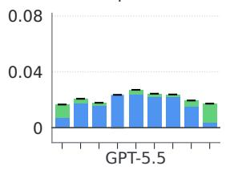

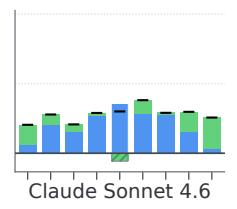

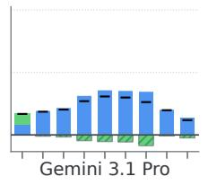

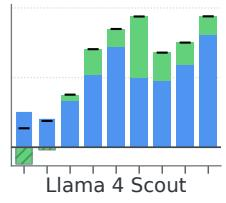

B. Comparison of reasoning eforts (fixed to 5 features)  
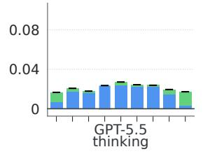

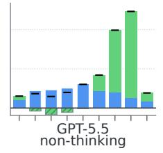

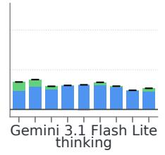

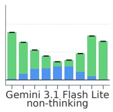

C. Comparison of diferent feature sizes (fixed to GPT-5.5 and thinking mode)  
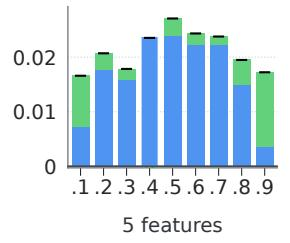

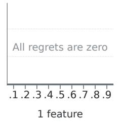

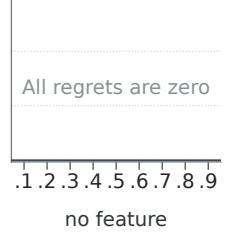  
Figure 1: Normalized regret decomposition on the synthetic task for representative models. Rows compare model families (A), reasoning efforts (B), and feature sizes (C). Each bar decomposes total regret into belief loss (blue) and optimization residual (green) at decision threshold $\tau \in { }$ $\{ 0 . 1 , \ldots , 0 . 9 \}$ ; black marks indicate total regret. Note the different y-axis scale in Row C.

## 5 IMPROVING PROBABILISTIC REASONING WITH TARGETED RL POST-TRAINING

A useful diagnostic framework can also be used to improve models’ reasoning capacities. We evaluate the extent to which targeting RL reward interventions to particular capacities of probabilistic reasoning can selectively improve belief formation and decision optimization versus have spillover effects, and whether targeting good decisions can improve performance without improving belief formation. We study four interventions: belief-only training, decision-only training, separate multitask training, and sequential alignment training.

Belief-only training (B) rewards the model for reporting accurate beliefs from observed evidence, with no supervision on decisions. Given a reported belie $\cdot \hat { p }$ and true posterior $p ^ { * }$ , we define the belief reward as

$$
r _ { \mathrm { B } } ( \hat { p } , p ^ { * } ) = 1 - ( \hat { p } - p ^ { * } ) ^ { 2 }
$$

The belief reward lies in [0, 1], and is maximized when the reported belief equals the true posterior. We use belief-only training to test the extent to which improving belief formation alone can lead to better decisions. It also allows us to evaluate whether gains from improving beliefs can be canceled by weaker belief-action alignment, reflected in increased optimization residuals after post-training.

Decision-only training (D) directly rewards the model for choosing the optimal action under the true posterior and an explicit loss function, with no feedback on belief accuracy. For model’s reported action aˆ, true posterior $p ^ { * }$ , and loss functionℓ, we define the decision reward as

$$
r _ { \mathrm { D } } ( \hat { a } , p ^ { * } , \ell ) = 1 - R _ { \mathrm { t o t a l } } ^ { \mathrm { n o r m } } ( \hat { a } , p ^ { * } , \ell )
$$

The decision reward lies in $[ 0 , 1 ]$ , and is maximized when the reported action equals the optimal action. Targeting the final action during post-training may result in the model inferring more accurate beliefs, better mapping between belie ${ \mathrm { f s } } ,$ or simply learning an action-specific policy without forming an accurate, reusable belief representation that can be verbally elicited. Comparing the effects of this intervention on total regret and belief loss examines whether improved actions compensate for larger belief errors.

Separate multitask training (B/D) combines belief- and decision-only training by randomly allocating half of the training examples to each component. Belief examples receive $r _ { \mathrm { B } }$ , while decision examples receive $r _ { \mathrm { D } }$ . Decisions are elicited independently rather than conditioned on reported beliefs. This intervention tests whether separately rewarding belief formation and decision optimization is sufficient to improve both without creating competition between them. It also provides a baseline to distinguish whether improvement in sequential training (described below) comes from receiving both forms of supervision, or from rewarding alignment of downstream actions with reported beliefs.

Sequential alignment training $( B { + } A )$ trains both accurate belief reporting and alignment between selected decisions and reported beliefs within the same prompting session. The model is first asked to report its belief and receives $r _ { \mathrm { B } }$ . In a second turn, it observes the loss function, selects an action with access to its previous reported belief, and receives an alignment reward. We follow the general implementation of turn-level credit assignment in multi-turn RL (Zeng et al., 2025). We assign the target-specific reward to each turn’s response, rather than providing an aggregated conversation-level signal.Given a belief-implied action $a ^ { \hat { p } }$ and the reported belief ${ \hat { p } } ,$ we define the alignment reward as

$$
r _ { \mathrm { A } } ( { \hat { a } } , { \hat { p } } , \ell ) = 1 - { \frac { L ( { \hat { a } } , { \hat { p } } ) - L ( a ^ { \hat { p } } , { \hat { p } } ) } { \mathrm { M } ( \ell ) } }
$$

It lies in $[ 0 , 1 ]$ , and is optimized when the reported action is optimal under the reported belief. This tests whether explicitly encouraging actions aligned with reported beliefs improves decisions and whether it transfers robustly across formats.

## 6 EXPERIMENTS

We evaluate the four RL interventions across three domains across a spectrum from highly controlled to more naturalistic: synthetic data inference, weather forecasting, and clinical reasoning. The decision environments share the same nine endowed binary loss functions but differ in the structure of the evidence, requisite prior knowledge, and the structure of the data-generating model.

Tasks The synthetic task provides a controlled environment where the true posterior can be inferred exactly from provided tabular observations. Each instance contains 300 previous observations with five binary features and a binary outcome. Given a test case, the model must estimate its outcome probability and decide whether to assign a positive label under a specified loss function. Because both the true posterior belief and evidence-generating process are known, the synthetic task endows controlled beliefs to LLMs without prior knowledge contamination, providing a clean setting for evaluating the effects of post-training interventions.

The weather forecasting task requires decisions from structured text input, where the ground truth is given by HailFinder (Abramson et al., 1996), an expert-designed Bayesian network with 56 variables for severe-weather forecasting. We generate instances by sampling the seven upstream atmospheric variables and marginalizing over all others. We render the selected variables as short natural-language descriptions. The model must estimate the probability of significant or severe hail, and decide whether to issue a warning under a provided loss function.

The clinical task further tests probabilistic reasoning with unstructured evidence that resembles medical diagnosis scenarios, but with the unique property that true posteriors are also available. Sim-SUM (Rabaey et al., 2025) provides structured symptom records generated from an expert-defined casual model, as well as unstructured AI-generated free-text clinical notes of the corresponding symptoms with expert verification. Given the structured symptoms, we derive posteriors from the known causal models. We use the clinical notes as evidence and ask the model to estimate the patient’s probability of infectious respiratory conditions. The model also decides whether to escalate the patient for additional evaluation given costs.

Full data construction, split sizes, and example inputs are provided in Appendix B, C, and D.

Decision problems Across all three tasks, we use the same nine binary loss functions for training and evaluation. Correct actions receive zero cost. False-positive and false-negative actions receive costs of cFP and cFN, respectively. We vary the relative costs while fixing cFP +cFN = 10, resulting in uniformly distributed optimal action thresholds $\begin{array} { r } { \tau = \frac { c _ { \mathrm { F P } } } { c _ { \mathrm { F P } } + c _ { \mathrm { F N } } } \in [ 0 . 1 , \bar { 0 } . 2 , . . . , 0 . 9 ] } \end{array}$

Model and training control We use Qwen3-8B as the base model for all post-training experiments. For each strategy and task, we train a separate LoRA adapter from the same base checkpoint, and optimize using GRPO with eight sampled completions per prompt. Within each task, all four interventions use the same training split, base-model initialization, optimizer configuration, and fixed training schedule. We train five epochs on the synthetic task and two epochs on the weather forecasting and clinical task. We monitor training progress on a held-out validation split and confirm that each intervention stabilized by the final checkpoint.

Evaluation We evaluate each post-training intervention using normalized total regret, belief loss and optimization residual as defined in Section 3. We report the averaged differences in each term relative to the base model, with bootstrap 95% confidence intervals.

We evaluate results using two elicitation formats. In the independent format, we elicit beliefs and actions in separate conversations. This enables us to assess whether separate belief and action readouts appear to share the same belief representation. In the two-turn format, the model chooses an action under a specified loss function within the same conversation, such that the reported belief remains in context. This enables us to assess how access to the reported belief impacts belief-action alignment.

## 7 RESULTS

Figure 2 shows the effects of each intervention on the regret decomposition. We provide numerical results in Appendix E.

Belief only training improves its target, while the improvement does not necessarily transfer to better decisions. Belief-only training consistently reduces belief loss across controlled, structured and unstructured evidence. However, improvements from targeting belief accuracy does not necessarily transfer to comparable reductions in decision loss. Under independent evaluation, reductions in total regret are substantially smaller that improvements in belief loss. The two-turn format, which provides reported beliefs in context, can encourage belief-aligned actions and make improved beliefs more useful for final decisions. In all three tasks, belief-only training reduces total regret under two-turn evaluation.

Decision-only training improves actions while bypassing the belief formation step. Across tasks, decision only training consistently reduce total regrets, particularly in the weather forecasting and clinical tasks. However, belief loss decreases only slightly from the base model, suggesting that directly minimizing total regret does not improve beliefs to the same extent as actions. Instead, the model may learn a shortcut policy that bypasses the explicit belief formation step. The two-turn evaluation provides further evidence: when the model first reports its beliefs and then selects actions, the benefits of decision only training are much smaller across the three tasks.

Separate multitask and sequential alignment training improve both components, but in different forms. Both joint interventions use the belief supervision and consequently reduce belief loss similarly to belief-only training, even though separate multitask training allocates only half of its training examples to beliefs. However, their effects on actions differ across evaluation formats.

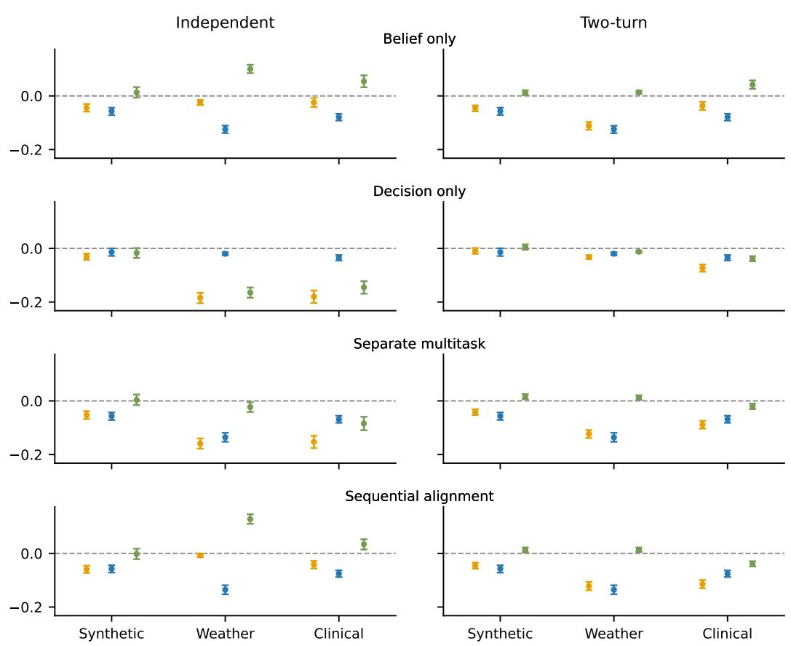  
Figure 2: Averaged differences from the base model in normalized total regret, belief loss, and optimization residual, with bootstrap 95% confidence intervals. Rows show belief only, decision only, separate multitask and sequential alignment training; and columns show independent and twoturn evaluation. Values below zero indicate a reduction (improvement) in the corresponding term relative to the base model.

Separate multitask training consistently reduces total regret, with gains balanced across both sources of loss. Its gains are also robust to evaluation format. This suggest that the improved capabilities remain accessible whether beliefs and actions are elicited independently or in a two-turn conversation.

Sequential alignment training is most effective when evaluation matches the trained belief-to-action pipeline. It is among the strongest interventions under two-turn evaluation, but its gains become smaller under independent evaluation because the model cannot access its reported beliefs when selecting actions.

Generalization to untrained loss functions We conduct a supplementary experiment on the synthetic task to test whether intervention outcomes transfer to untrained decision problems. We train each intervention on a subset of the thresholds used in the main experiment, $\tau \in \mathsf { \bar { \{ 0 . 2 , 0 . 4 , 0 . 6 , 0 . 8 \} } }$ , and evaluate its performance on both trained and held-out thresholds, $\tau \in \{ 0 . 1 , 0 . 3 , 0 . 5 , 0 . 7 , 0 . 9 \}$ We find that the interventions generalize well to the held-out thresholds, and the main findings continue to hold. We provides full results in Appendix I.

## 8 DISCUSSION

In this work, we develop a decision-theoretic framework that decomposes LLMs’ decision loss into two components: errors in forming beliefs from available evidence and errors in translating those beliefs int optimal actions under specified costs. We apply the decomposition on a controlled synthetic task to characterize probabilistic reasoning in state-of-art frontier and open-sourced models. We further investigate whether RL interventions can target different components on the belief-toaction pipeline, and whether improvement transfer across components and elicitation formats. We find that targeting one component of probabilistic reasoning improves the target without necessarily transferring to others, and that jointly targeting belief formation and decision-making improves both but hinges on matched formats between training and evaluation.

How well LLMs can reason probabilistically from evidence impacts their trustworthiness across a number of domains where they are currently turned to as decision assistants. Our work proposes a foundational framework for diagnosing and improving distinct sources of loss in LLM probabilistic reasoning. In doing so, we address several challenges in rigorously diagnosing reasoning failures, including the potential for confounds due to the model not having access to all information used in defining true posteriors and optimal actions or acting under a different set of preferences than intended. By endowing information structures and explicit decision problems, our work provides tools for overcomes some of these challenges. However, as we show in Appendix H, our procedure cannot fully remove ambiguity about the structure of the data-generating model. Studying inductive biases in model class inference is a fruitful area for future work.

Other opportunities to extend our results consider different decision strategies, elicitation techniques, and model families. We evaluate decision loss against optimal Bayesian decision-making, however, alternative standards one might be interested in evaluating and training against include forms of robustly optimal decisions. Next, our decomposition relies on reported beliefs, which may not faithfully reflect internal representations due to elicitation distortions. Future work could incorporating probing methods to separate out elicitation loss from belief formation loss. In addition, our experiments focus on binary states and decision problems, although the framework is not limited to binary scenarios. The decision-theoretic decomposition applies to any finite state space and action space. Developing controlled benchmarks with multiclass outcomes and larger action spaces would broaden its application to understanding LLMs probabilistic reasoning. Finally, our RL experiments are conducted on a single base model. Examining them across model families and scales would help distinguish generalizable effects from model-specific ones.

Future work could also test whether intervention gains transfer beyond the training settings. For example, belief interventions targeting a specific inference rule could be evaluated on datasets with similar statistical structures but in different domains. Meanwhile, in addition to be tested on unseen loss functions, decision interventions could also be examined on different types of decision problems, which would help distinguish general decision optimization from learning the specific mappings during training.

## REPRODUCIBILITY STATEMENT

All source code will be available on GitHub.

## ACKNOWLEDGMENTS

This work used GPU computing resources at DeltaAI from the Advanced Cyberinfrastructure Coordination Ecosystem: Services & Support (ACCESS) program, which is supported by U.S. National Science Foundation grants #2138259, #2138286, #2138307, #2137603, and #2138296.

## REFERENCES

Bruce Abramson, John Brown, Ward Edwards, Allan Murphy, and Robert L Winkler. Hailfinder: A bayesian system for forecasting severe weather. International Journal of Forecasting, 12(1): 57–71, 1996.

Daniel J Benjamin. Errors in probabilistic reasoning and judgment biases. Handbook ofBehavioral Economics: Applications and Foundations 1, 2:69–186, 2019.

James O Berger. Statistical decision theory. In The New Palgrave Dictionary of Economics, pp. 1–6. Springer, 1987.

Fabian Falck, Ziyu Wang, and Christopher C. Holmes. Is in-context learning in large language models bayesian? A martingale perspective. In Ruslan Salakhutdinov, Zico Kolter, Katherine Heller, Adrian Weller, Nuria Oliver, Jonathan Scarlett, and Felix Berkenkamp (eds.), Proceedings of the 41st International Conference on Machine Learning, volume 235 of Proceedings of Machine Learning Research, pp. 12784–12805. PMLR, 21–27 Jul 2024. URL https: //proceedings.mlr.press/v235/falck24a.html.

Tilmann Gneiting and Adrian E Raftery. Strictly proper scoring rules, prediction, and estimation. Journal ofthe American statistical Association, 102(477):359–378, 2007.

David M Grether. Bayes rule as a descriptive model: The representativeness heuristic. The Quarterly journal ofeconomics, 95(3):537–557, 1980.

Ritwik Gupta, Rodolfo Corona, Jiaxin Ge, Eric Wang, Dan Klein, Trevor Darrell, and David M Chan. Enough coin flips can make llms act bayesian. In Proceedings ofthe 63rd Annual Meeting of the Association for Computational Linguistics (Volume 1: Long Papers), pp. 7634–7655, 2025.

Charles A Holt and Angela M Smith. An update on bayesian updating. Journal of Economic Behavior & Organization, 69(2):125–134, 2009.

Saurav Kadavath, Tom Conerly, Amanda Askell, Tom Henighan, Dawn Drain, Ethan Perez, Nicholas Schiefer, Zac Dodds, Nova DasSarma, Eli Tran-Johnson, et al. Language models (mostly) know what they know. arXiv preprint arXiv:2207.05221, 2022.

Alex Kale, Matthew Kay, and Jessica Hullman. Visual reasoning strategies for effect size judgments and decisions. IEEE transactions on visualization and computer graphics, 27(2):272–282, 2020.

Arka Pal, Teo Kitanovski, Arthur Liang, Akilesh Potti, and Micah Goldblum. Knowing what you know is not enough: Large language model confidences don’t align with their actions. arXiv preprint arXiv:2511.13240, 2025.

Linlu Qiu, Fei Sha, Kelsey Allen, Yoon Kim, Tal Linzen, and Sjoerd van Steenkiste. Bayesian teaching enables probabilistic reasoning in large language models. Nature Communications, 17 (1):1238, 2026.

Paloma Rabaey, Stefan Heytens, and Thomas Demeester. Simsum–simulated benchmark with structured and unstructured medical records. Journal ofBiomedical Semantics, 16(1):20, 2025.

Timo Pierre Schrader, Lukas Lange, Simon Razniewski, and Annemarie Friedrich. Quite: quantifying uncertainty in natural language text in bayesian reasoning scenarios. In Proceedings of the 2024 Conference on Empirical Methods in Natural Language Processing, pp. 2634–2652, 2024.

Alex Smolin and Bryan Wilder. Beliefs and behavior in language models. arXiv preprint arXiv:2609.07943, 2026.

Katherine Tian, Eric Mitchell, Huaxiu Yao, Christopher D. Manning, and Chelsea Finn. Just ask for calibration: Strategies for eliciting calibrated confidence scores from language models fine-tuned with human feedback. arXiv preprint arXiv:2305.14975, 2023.

Miao Xiong, Zhiyuan Hu, Xinyang Lu, Yifei Li, Jie Fu, Junxian He, and Bryan Hooi. Can llms express their uncertainty? an empirical evaluation of confidence elicitation in llms. In International Conference on Learning Representations, volume 2024, pp. 23650–23678, 2024.

Khurram Yamin, Jingjing Tang, Santiago Cortes-Gomez, Amit Sharma, Eric Horvitz, and Bryan Wilder. When agents say one thing and do another: Validating elicited beliefs from llms. arXiv preprint arXiv:2602.06286, 2026a.

Khurram Yamin, Jingjing Tang, Eric Horvitz, and Bryan Wilder. Can revealed preferences clarify llm alignment and steering? arXiv preprint arXiv:2605.08556, 2026b.

Siliang Zeng, Quan Wei, William Brown, Oana Frunza, Yuriy Nevmyvaka, Yang Katie Zhao, and Mingyi Hong. Reinforcing multi-turn reasoning in llm agents via turn-level credit assignment. In ICML 2025 Workshop on Computer Use Agents, 2025.

## A PROMPTS FOR SYNTHETIC TASK EVALUATION

As discussed in section 6, for each number of features d, we construct $4 9 \times 5 D _ { \mathrm { o b s } } ,$ corresponding to 49 true probabilities and five random shuffles per probability. We provide each $D _ { \mathrm { o b s } }$ to the model as in-context signals, and then prompt each LLM separately for beliefs and decisions.

We elicit the model’s belief with a proper scoring rule five times, using the following template. After obtaining LLMs’ responses, we average the five beliefs for the same true probability (but different shuffles) as the model’s reported belief. This reduces bias due to the model reacting to the order of the provided samples.

You are given observed data from previous samples. Each row is one previous sample with binary features and a binary outcome. Feature values are 0 or 1. The column outcome is 1 for positive outcome and 0 for negative outcome. Use only the observed data to estimate the probability that a new sample with the specified feature values has outcome = 1.

Observed data: $\{ D _ { o b s } \}$

New sample feature values: {feature vector}

Your reported probability p (between 0 and 1) will be evaluated against the true outcome by using a quadratic scoring rule:

If the event is TRUE: Score = 1 − (1 − p)2

If the event is FALSE: Score = 1 − p2

Under the scoring rule, the highest expected score comes from reporting your true subjective probability exactly. Based on the observed data, what is your true subjective probability that the new sample with the specified feature values has outcome = 1?

Respond with EXACTLY one line, and no extra text. The line MUST be in the format: ’Probability: <number between 0 and $1 > ^ { \ ' }$

Example:

Probability: 0.37

We ask for the model’s decision under the 9 thresholds. For threshold decision prompts, we use:

You are given observed data from previous samples. Each row is one previous sample with binary features   
and a binary outcome. Feature values are 0 or 1. The column outcome is 1 for positive outcome and 0   
for negative outcome. Use only the observed data to decide whether to assign the positive label to a new   
sample with the specified feature values under the given cost table.   
Observed data: {Dobs}   
New sample feature values: {feature vector}   
Decision task:   
Question: Will you assign the positive label to this new sample given the costs below?   
Costs:   
- If you assign the positive label and the true outcome is negative (false positive), cost = {CFP }   
- If you assign the negative label and the true outcome is positive (false negative), cost = {CFN}   
- Correct decisions have cost = 0   
Choose the label with lower expected cost.   
Respond with EXACTLY one line, and no extra text. The line MUST be in the format: ’Decision: <0 or   
1>’   
Example:   
Decision: 0

## B SYNTHETIC TASK

The post-training experiments use the same data-generating model as in Section 4. We independently generate 1000 evidence cases with five binary features, each contains a observed dataset of 300 examples and a test case. We randomly split 700 evidence cases for training, 100 for validation, and 200 for final evaluation.

## Belief prompt

You are given observed data from previous samples. Each row is one previous sample with binary features   
and a binary outcome. Feature values are 0 or 1. The column y is 1 for positive outcome and 0 for negative   
outcome.   
Observed data: {observed data}   
New sample feature values: {test case}   
Estimate the probability that the new sample has outcome y = 1.   
You may reason concisely. Then output a final answer line exactly in the format: Probability: 0.xxx

## Sequential decision prompt

Now make the decision:   
Will you assign the positive label to this new sample given the costs below?   
Choose action 1 to assign the positive label.   
Choose action 0 to assign the negative label.   
Costs:   
- If you choose action 1 and the true outcome is 0, false positive cost = {c fp}   
- If you choose action 0 and the true outcome is 1, false negative cost = {c fn}   
- Correct decisions have cost = 0   
You may reason concisely. Then output a final answer line exactly in the format: Decision: 0 or 1

## Direct decision prompt

You are given observed data from previous samples. Each row is one previous sample with binary features   
and a binary outcome. Feature values are 0 or 1. The column y is 1 for positive outcome and 0 for negative   
outcome.   
Observed data: {observed data}   
New sample feature values: {test case}   
Now make the decision:   
Will you assign the positive label to this new sample given the costs below?   
Choose action 1 to assign the positive label.   
Choose action 0 to assign the negative label.   
Costs:   
- If you choose action 1 and the true outcome is 0, false positive cost = {c fp}   
- If you choose action 0 and the true outcome is 1, false negative cost = {c fn}   
- Correct decisions have cost = 0   
You may reason concisely. Then output a final answer line exactly in the format: Decision: 0 or 1

## C WEATHER FORECASTING TASK

We construct this task from the HailFinder Bayesian network (Abramson et al., 1996). Each evidence contains seven upstream atmospheric variables: AMInstabMt, CldShadeOth, LatestCIN, LLIW, ScnRelPlFcst, InsSclInScen, and CapInScen. We render their values as short descriptions grouped into mountain and plains conditions. The binary outcome indicates whether the Region 5 forecast is significant or severe hail (R5Fcst ∈ SIG, SVR). For each distinct observed context e, we compute the exact reference probability $p ^ { * } ( e ) = P ( Y = 1 \mid e )$ from the network. We split contexts, with no overlap, into 3,000 training, 300 validation, and 500 evaluation examples.

## Belief prompt

<table><tr><td>You are forecasting the hail category for the entire Denver warning area.</td></tr><tr><td>Weather observations: {evidence_text} Estimate the probability that the hail category for the entire Denver warning area will be significant or</td></tr><tr><td>severe.</td></tr><tr><td>You may reason concisely. Then output a final answer line exactly in the format: Probability: 0.xxx</td></tr></table>

## Sequential decision prompt

## Direct decision prompt

<table><tr><td>You are forecasting the hail category for the entire Denver warning area. Weather observations: {evidence_text}</td></tr><tr><td>Now choose a severe-weather warning action under these losses:</td></tr><tr><td>- Action 0: do not issue a significant-or-severe hail warning. Loss = {c_fn } if the true weather is significant or severe hail, otherwise 0.</td></tr><tr><td>- Action 1: issue a significant-or-severe hail warning. Loss = {c_fp} if the true weather is no significant hail, otherwise 0.</td></tr><tr><td>You may reason concisely. Then output a final answer line exactly in the format: Decision: 0 or 1</td></tr></table>

## D CLINICAL TASK

We use SimSUM’s (Rabaey et al., 2025) 10,000 synthetic patient records, which pair clinical notes with variables sampled from a known Bayesian network. The outcome is the presence of pneumonia or a common cold. We filter records with high-concerned symptoms. This includes dyspnea, high fever, or both cough and pain. The model receives the clinical note; while we compute posteriors from the network conditional on the corresponding recorded health conditions and symptoms, marginalizing unobserved variables. We split all the retained cases into 2,211 training, 300 validation, and 500 evaluation examples, stratified by outcome and reference probability.

## Belief prompt

You’re assessing whether a patient with higher-concern symptoms has an infectious respiratory condition. Clinical note: {clinical note}

Estimate the probability that this patient has an infectious respiratory condition (pneumonia or the common cold).

You may reason concisely. Then output a final answer line exactly in the format: Probability: 0.xxx

## Sequential decision prompt

Now choose a clinical action under these losses:

\- Action 0: no infection-focused escalation. Loss = {c fn} if an infectious respiratory condition is present, otherwise 0.

\- Action 1: escalate for additional infection-focused clinical evaluation. Loss = {c fp} if an infectious respiratory condition is absent, otherwise 0.

You may reason concisely. Then output a final answer line exactly in the format: Decision: 0 or 1

## Direct decision prompt

You’re assessing whether a patient with higher-concern symptoms has an infectious respiratory condition. Clinical note: {clinical note}

Now choose a clinical action under these losses:

\- Action 0: no infection-focused escalation. Loss = {c fn} if an infectious respiratory condition is present, otherwise 0.

\- Action 1: escalate for additional infection-focused clinical evaluation. Loss = {c fp} if an infectious respiratory condition is absent, otherwise 0.

You may reason concisely. Then output a final answer line exactly in the format: Decision: 0 or 1

## E FULL INTERVENTION RESULTS

Table 1: Synthetic. Change in regret relative to Base (intervention − Base): mean difference with 95% confidence interval $( n = 2 0 0$ cases). Negative values indicate lower regret than Base.
<table><tr><td>Strategy</td><td>Format</td><td>∆R_total</td><td>△R_belief</td><td>∆R_opt</td></tr><tr><td>B</td><td>independent</td><td> $- 0 . 0 4 4 \pm 0 . 0 1 4$ </td><td> $- 0 . 0 5 7 \pm 0 . 0 1 4$ </td><td> $\overline { { 0 . 0 1 3 \pm 0 . 0 2 0 } }$ </td></tr><tr><td>D</td><td>independent</td><td> $- 0 . 0 3 1 \pm 0 . 0 1 2$ </td><td> $- 0 . 0 1 4 \pm 0 . 0 1 5$ </td><td> $- 0 . 0 1 7 \pm 0 . 0 1 9$ </td></tr><tr><td>B/D</td><td>independent</td><td> $- 0 . 0 5 3 \pm 0 . 0 1 5$ </td><td> $- 0 . 0 5 7 \pm 0 . 0 1 4$ </td><td> $0 . 0 0 4 \pm 0 . 0 2 0$ </td></tr><tr><td>B+A</td><td>independent</td><td> $- 0 . 0 5 9 \pm 0 . 0 1 3$ </td><td> $- 0 . 0 5 7 \pm 0 . 0 1 4$ </td><td> $- 0 . 0 0 2 \pm 0 . 0 2 0$ </td></tr><tr><td>B</td><td>two-turn</td><td> $- 0 . 0 4 6 \pm 0 . 0 1 1$ </td><td> $- 0 . 0 5 7 \pm 0 . 0 1 4$ </td><td> $0 . 0 1 1 \pm 0 . 0 0 9$ </td></tr><tr><td>D</td><td>two-turn</td><td> $- 0 . 0 0 9 \pm 0 . 0 1 1$ </td><td> $- 0 . 0 1 4 \pm 0 . 0 1 5$ </td><td> $0 . 0 0 5 \pm 0 . 0 1 0$ </td></tr><tr><td>B/D</td><td>two-turn</td><td> $- 0 . 0 4 1 \pm 0 . 0 1 1$ </td><td> $- 0 . 0 5 7 \pm 0 . 0 1 4$ </td><td> $0 . 0 1 5 \pm 0 . 0 0 9$ </td></tr><tr><td>B+A</td><td>two-turn</td><td> $- 0 . 0 4 5 \pm 0 . 0 1 1$ </td><td> $- 0 . 0 5 7 \pm 0 . 0 1 4$ </td><td> $0 . 0 1 2 \pm 0 . 0 0 9$ </td></tr></table>

Table 2: HailFinder. Change in regret relative to Base (intervention − Base): mean difference with 95% confidence interval (n = 500 cases). Negative values indicate lower regret than Base.
<table><tr><td>Strategy</td><td>Format</td><td>∆R_total</td><td>△R_belief</td><td>∆R_opt</td></tr><tr><td>B</td><td>independent</td><td> $- 0 . 0 2 4 \pm 0 . 0 1 0$ </td><td> $- 0 . 1 2 5 \pm 0 . 0 1 4$ </td><td> $\overline { { 0 . 1 0 1 \pm 0 . 0 1 5 } }$ </td></tr><tr><td>D</td><td>independent</td><td> $- 0 . 1 8 4 \pm 0 . 0 1 9$ </td><td> $- 0 . 0 2 0 \pm 0 . 0 0 6$ </td><td> $- 0 . 1 6 5 \pm 0 . 0 1 9$ </td></tr><tr><td>B/D</td><td>independent</td><td> $- 0 . 1 5 9 \pm 0 . 0 1 9$ </td><td> $- 0 . 1 3 6 \pm 0 . 0 1 7$ </td><td> $- 0 . 0 2 3 \pm 0 . 0 1 8$ </td></tr><tr><td>B+A</td><td>independent</td><td> $- 0 . 0 0 8 \pm 0 . 0 0 6$ </td><td> $- 0 . 1 3 6 \pm 0 . 0 1 7$ </td><td> $0 . 1 2 8 \pm 0 . 0 1 8$ </td></tr><tr><td>B</td><td>two-turn</td><td> $- 0 . 1 1 1 \pm 0 . 0 1 5$ </td><td> $- 0 . 1 2 5 \pm 0 . 0 1 4$ </td><td> $0 . 0 1 4 \pm 0 . 0 0 6$ </td></tr><tr><td>D</td><td>two-turn</td><td> $- 0 . 0 3 2 \pm 0 . 0 0 7$ </td><td> $- 0 . 0 2 0 \pm 0 . 0 0 6$ </td><td> $- 0 . 0 1 3 \pm 0 . 0 0 4$ </td></tr><tr><td>B/D</td><td>two-turn</td><td> $- 0 . 1 2 3 \pm 0 . 0 1 5$ </td><td> $- 0 . 1 3 6 \pm 0 . 0 1 7$ </td><td> $0 . 0 1 2 \pm 0 . 0 0 8$ </td></tr><tr><td>B+A</td><td>two-turn</td><td> $- 0 . 1 2 2 \pm 0 . 0 1 6$ </td><td> $- 0 . 1 3 6 \pm 0 . 0 1 7$ </td><td> $0 . 0 1 3 \pm 0 . 0 0 8$ </td></tr></table>

Table 3: SimSUM. Change in regret relative to Base (intervention − Base): mean difference with 95% confidence interval $( n = 5 0 0$ cases). Negative values indicate lower regret than Base.
<table><tr><td>Strategy</td><td>Format</td><td>∆R_total</td><td> $\overline { { \Delta \mathbf { R } \mathbf { \lrcorner } \mathbf { b e l i e f } } }$ </td><td> $\mathbf { \Delta } \overline { { \Delta \mathbf { R } \mathbf { \Omega } } } \mathbf { 0 p t }$ </td></tr><tr><td>B</td><td>independent</td><td> $- 0 . 0 2 5 \pm 0 . 0 1 7$ </td><td> $- 0 . 0 7 9 \pm 0 . 0 1 3$ </td><td> $\overline { { 0 . 0 5 4 \pm 0 . 0 2 2 } }$ </td></tr><tr><td>D</td><td>independent</td><td> $- 0 . 1 8 0 \pm 0 . 0 2 3$ </td><td> $- 0 . 0 3 5 \pm 0 . 0 1 0$ </td><td> $- 0 . 1 4 5 \pm 0 . 0 2 4$ </td></tr><tr><td>B/D</td><td>independent</td><td> $- 0 . 1 5 3 \pm 0 . 0 2 3$ </td><td> $- 0 . 0 6 9 \pm 0 . 0 1 3$ </td><td> $- 0 . 0 8 4 \pm 0 . 0 2 5$ </td></tr><tr><td>B+A</td><td>independent</td><td> $- 0 . 0 4 2 \pm 0 . 0 1 4$ </td><td> $- 0 . 0 7 6 \pm 0 . 0 1 3$ </td><td> $0 . 0 3 4 \pm 0 . 0 1 9$ </td></tr><tr><td>B</td><td>two-turn</td><td> $- 0 . 0 3 7 \pm 0 . 0 1 5$ </td><td> $- 0 . 0 7 9 \pm 0 . 0 1 3$ </td><td> $0 . 0 4 2 \pm 0 . 0 1 6$ </td></tr><tr><td>D</td><td>two-turn</td><td> $- 0 . 0 7 3 \pm 0 . 0 1 3$ </td><td> $- 0 . 0 3 5 \pm 0 . 0 1 0$ </td><td> $- 0 . 0 3 8 \pm 0 . 0 1 0$ </td></tr><tr><td>B/D</td><td>two-turn</td><td> $- 0 . 0 8 9 \pm 0 . 0 1 5$ </td><td> $- 0 . 0 6 9 \pm 0 . 0 1 3$ </td><td> $- 0 . 0 2 0 \pm 0 . 0 1 0$ </td></tr><tr><td> $\mathbf { B } { + } \mathbf { A }$ </td><td>two-turn</td><td> $- 0 . 1 1 4 \pm 0 . 0 1 5$ </td><td> $- 0 . 0 7 6 \pm 0 . 0 1 3$ </td><td> $- 0 . 0 3 9 \pm 0 . 0 0 9$ </td></tr></table>

## F FULL DIAGNOSIS RESULTS

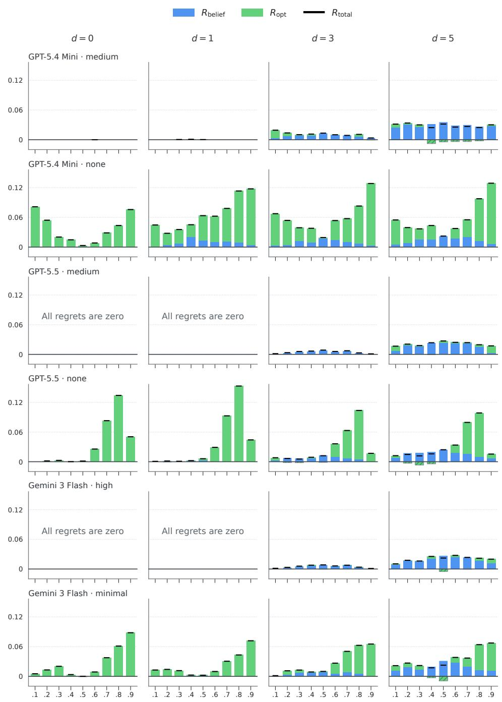  
Figure 3: Full normalized regret decomposition on the synthetic task across all model–reasoning settings. Columns vary feature size $d \in \{ 0 , 1 , 3 , 5 \}$ ; the regret decomposition follows Figure 1. “All regrets are zero” marks settings that are optimal at every threshold.

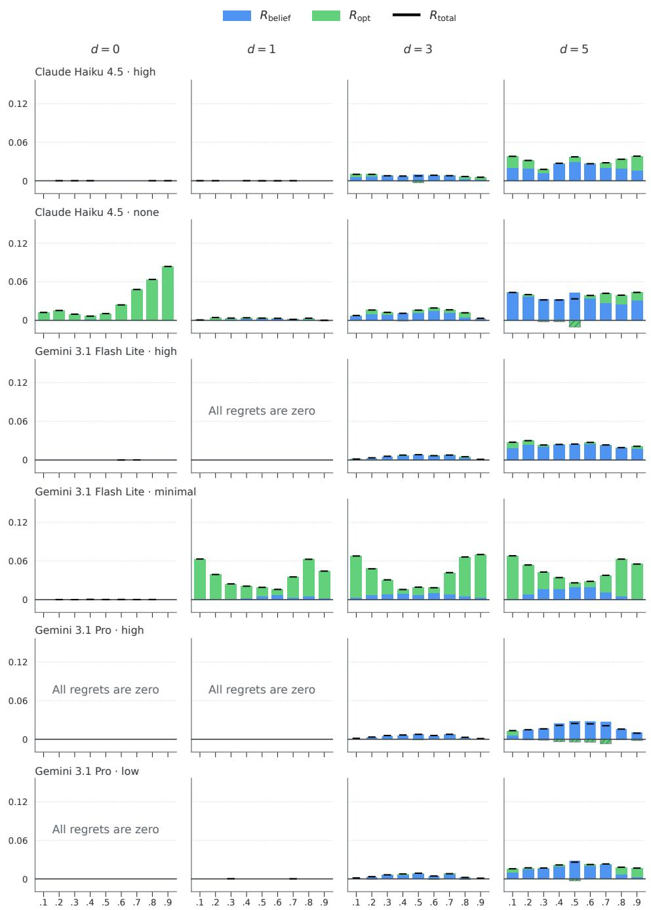  
Figure 3: Figure 3 continued.

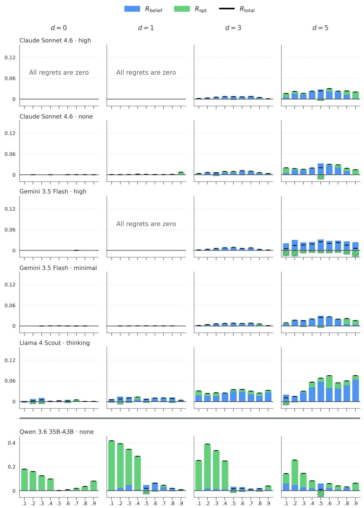  
Figure 3: Figure 3 continued. Note the different y-axis scaling for Qwen 3.6 35B-A3B, which has considerably higher regret.

## G ELICITED VS. REVEALED BELIEFS

We compare the reported belief with the decision-revealed belief inferred from the model’s threshold decisions.

Among the selected model settings, Claude Sonnet 4.6 (high), Gemini 3.5 Flash (high), and GPT-5.5 (medium) exhibit smoother and more closely aligned elicited and decision-revealed beliefs than Llama 4 with thinking and non-thinking Qwen 3.6. Within GPT-5.5, the setting with no thinking shows greater misalignment than medium thinking, including at small feature sizes. For most settings, both belief measures fluctuate more as feature size increases.

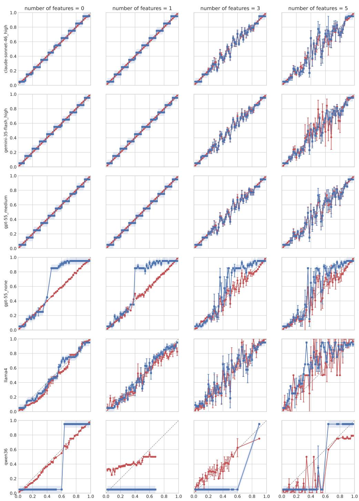  
Figure 4: Comparisons between elicited and decision-revealed beliefs by feature size and model

## H TRUE POSTERIOR VS. EMPIRICAL FREQUENCY AS REFERENCE

The regret decomposition on the synthetic task in section 4 uses the true posterior, which depends on the number of active features in the test vector. As an alternative reference, we can also use the empirical frequency, which is the share of positive outcomes among rows whose full feature vector matches the test vector. The two references coincide at feature sizes $d = 0$ and $d = 1$ . However, with three or five features, the true posterior pools different vectors with the same number of active features, whereas the empirical frequency uses only exact matches. At feature sizes $d = 3$ and $d = 5$ , we recompute the decomposition on the same observations, changing only the reference from the true posterior to the empirical frequency. Results are in figures 5 and 6.

After averaging over model settings and decision thresholds, mean normalized total regret decreases by 18% at $d = 3$ and 25% at $d = 5$ . This decrease suggests that, with our evaluation results, model decisions are better aligned with empirical frequencies than with the true posterior. $\mathrm { { A t } } d = 3 ,$ the decrease is primarily in belief loss. At d = 5, both belief loss and the signed optimization residual decrease on average, especially GPT-5.5 with medium thinking, which shows a particularly large decrease in both terms at $d = 5$ . Also, there are two exceptions. For Qwen 3.6 35B-A3B without thinking, the increase in belief loss is larger than the decrease in optimization residual, resulting in higher total regret; for Llama 4 Scout, both belief loss and optimization residual increase.

## I UTILITY GENERALIZATION

Table 4: Change in total regret relative to Base on the Synthetic task, evaluated separately at thresh olds seen during training (0.2, 0.4, 0.6, 0.8) and held-out thresholds (0.1, 0.3, 0.5, 0.7, 0.9). The gap is the held-out value minus the trained-threshold value. Entries are means over 200 cases with 95% paired bootstrap intervals; ∗ marks intervals excluding zero.
<table><tr><td>Strategy</td><td>Format</td><td colspan="3">Trained thresholds</td><td colspan="2">Untrained thresholds</td><td colspan="2">Gap (untrained – trained)</td></tr><tr><td>B</td><td>independent</td><td>-0.037*</td><td>[-0.053, -0.021]</td><td>-0.033*</td><td>-0.049, -0.018]</td><td></td><td>0.004 [-0.012, 0.020]</td><td></td></tr><tr><td>D</td><td>independent</td><td></td><td>0.001 [−0.013, 0.015]</td><td></td><td>-0.010</td><td>[−0.024, 0.005]</td><td>−0.010 [−0.028, 0.007]</td><td></td></tr><tr><td>B/D</td><td>independent</td><td>-0.027*</td><td>-0.046, -0.008]</td><td></td><td>-0.025*</td><td>-0.045, −0.005]</td><td></td><td>0.002 [−0.015, 0.021]</td></tr><tr><td>B+A</td><td>independent</td><td>-0.067*</td><td>−0.083, −0.052</td><td></td><td>-0.070*</td><td>[−0.086, −0.054]</td><td></td><td>-0.003 [-0.018, 0.013]</td></tr><tr><td>B</td><td>two-turn</td><td>-0.040*</td><td>[−0.051, -0.030]</td><td></td><td>-0.048*</td><td>-0.060, -0.037]</td><td>-0.008*</td><td>[−0.012, -0.004]</td></tr><tr><td>D</td><td>two-turn</td><td>-0.006</td><td>[-0.016, 0.003]</td><td></td><td>-0.008</td><td>[−0.018, 0.002]</td><td>-0.002</td><td>[−0.006, 0.003]</td></tr><tr><td>B/D</td><td>two-turn</td><td>-0.034*</td><td>-0.045, −0.023]</td><td></td><td>-0.046*</td><td>-0.057, -0.035]</td><td>-0.012*</td><td>-0.016, -0.007]</td></tr><tr><td>B+A</td><td>two-turn</td><td>-0.035*</td><td>-0.047, −0.025]</td><td></td><td>-0.047*</td><td>-0.059, −0.036]</td><td>-0.011*</td><td>-0.015, -0.007]</td></tr></table>

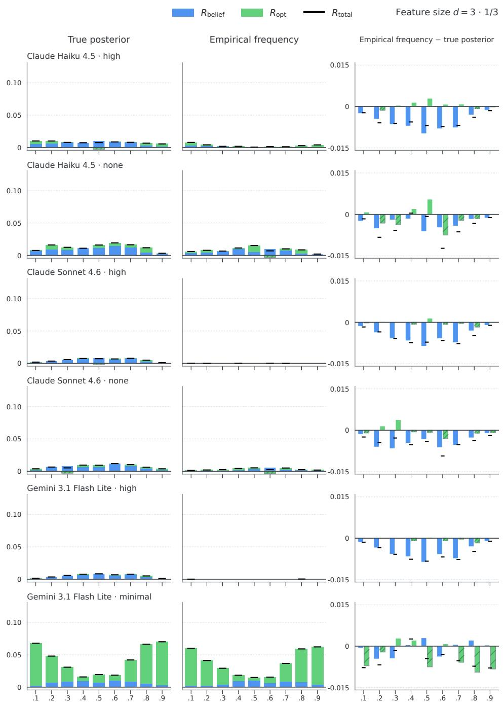  
Figure 5: Reference sensitivity of the normalized regret decomposition at $d \ : = \ : 3$ across model settings. Columns use the true posterior, the exact-pattern empirical frequency, and the componentwise difference between the two (empirical-reference regret minus true-posterior-reference regret). Colors and markers follow Figure 1.

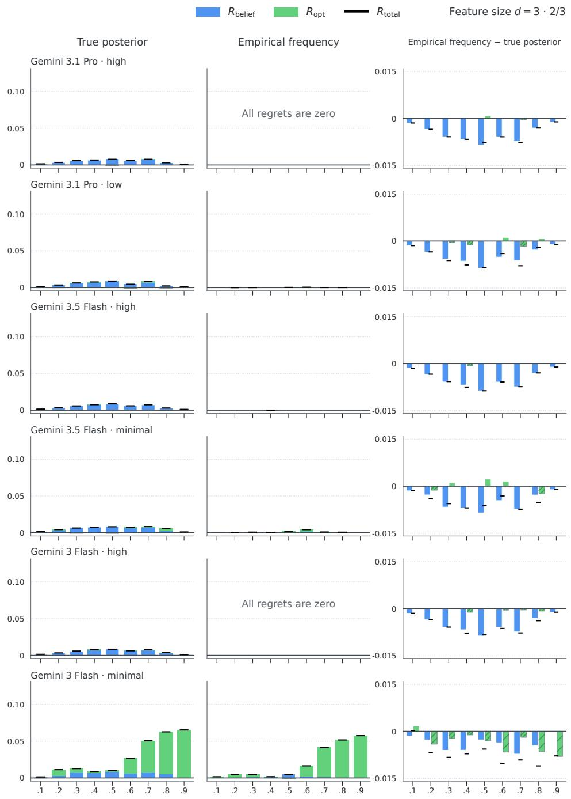  
Figure 5: Figure 5 continued.

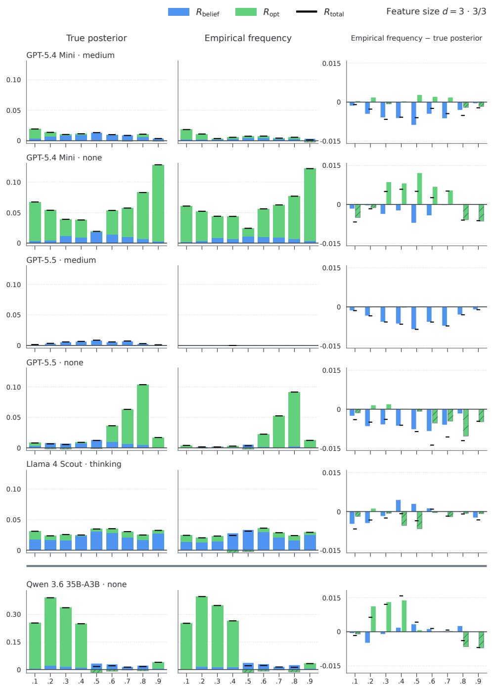  
Figure 5: Figure 5 continued. Note the different y-axis scaling for Qwen 3.6 35B-A3B, which has considerably higher regret.

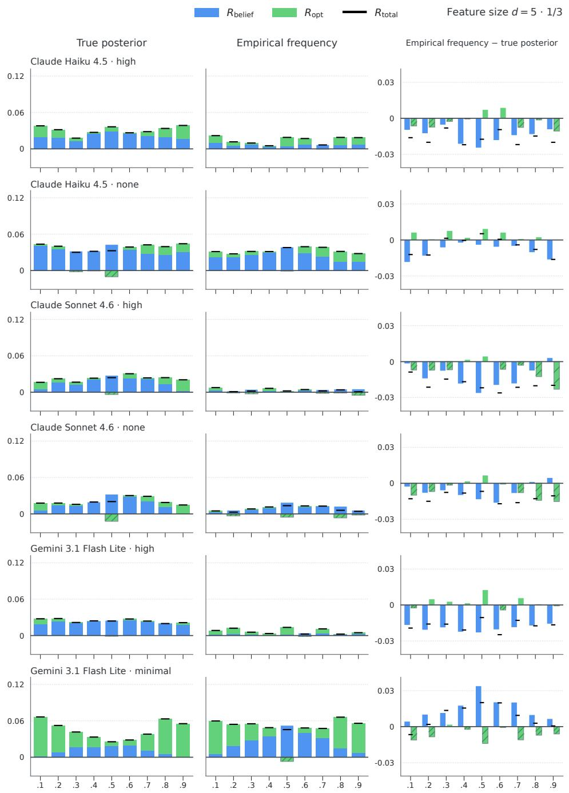  
Figure 6: Reference sensitivity of the normalized regret decomposition at d = 5 across model settings. Columns use the true posterior, the exact-pattern empirical frequency, and the componentwise difference between the two (empirical-reference regret minus true-posterior-reference regret). Colors and markers follow Figure 1

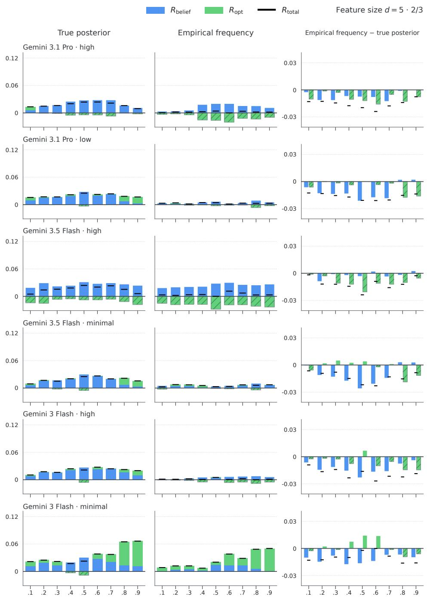  
Figure 6: Figure 6 continued.

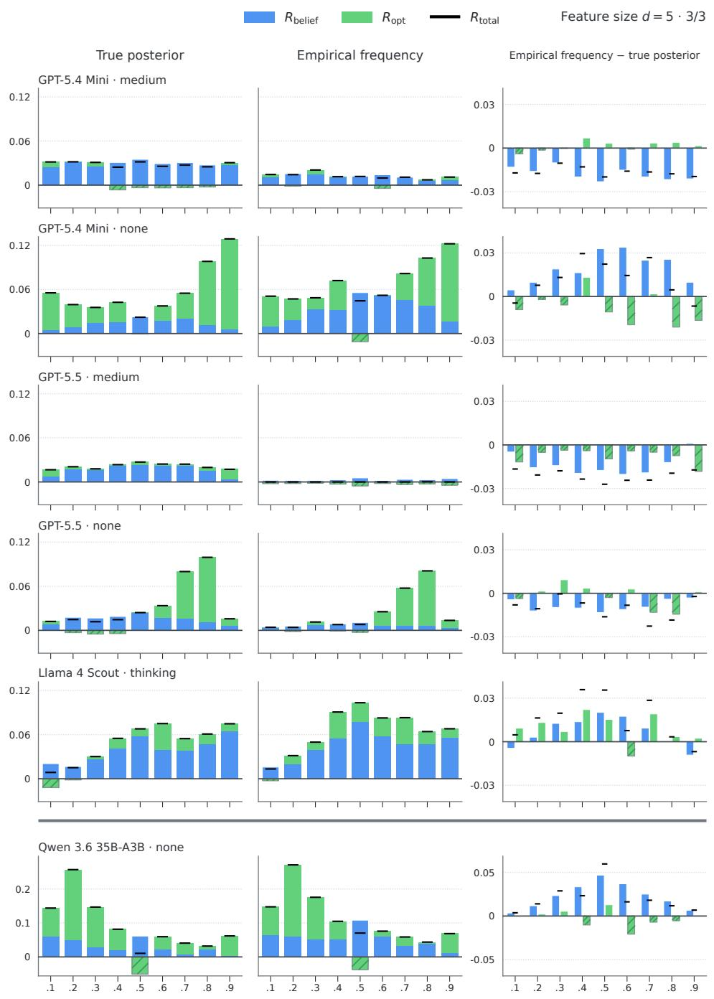  
Figure 6: Figure 6 continued. Note the different y-axis scaling for Qwen 3.6 35B-A3B, which has considerably higher regret.