# DIET: DELETION-RESPONSE EXPERT TRIMMING FOR VIDEO DIFFUSION TRANSFORMERS

Jiachang Zhang1,2∗, Teng Hu2∗, Bohao Feng3∗, Songhang Shen2, Wenqiang Wang4, Hongqian Deng4, Ran Yi2†

1 Xi’an Jiao Tong University, China 2 Shanghai Jiao Tong University, China 3 Alibaba Token Hub, Alibaba Group, China 4 Alibaba Cloud Computing, China zjc010100000@stu.xjtu.edu.cn {hu-teng,1479014299,ranyi}@sjtu.edu.cn fengbohao.fbh@alibaba-inc.com channing.wwq@alibaba-inc.com hongqiandeng@foxmail.com

## ABSTRACT

Video diffusion transformers (DiTs) increasingly rely on mixture-of-experts (MoE) architectures, where only a sparse subset of a large expert bank is activated per token. While dynamic sparsity reduces active compute, it leaves the full expert storage footprint intact. Furthermore, conventional one-shot pruning criteria rely on static activation or routing statistics, failing to capture the layer-level re-routing behavior triggered after expert deletion. To make this postdeletion behavior observable without prohibitive cost, we record all expert outputs and router states across matched conditional and unconditional tokens in a single all-expert calibration pass. Consequently, replaying any single-expert deletion and its grouped re-routing reduces to tensor arithmetic on cached states, requiring zero additional model forward passes. Using these deletion responses, we formulate retained-expert selection as an Overall Diversity Loss (ODL): each pruned expert is matched with its nearest retained expert and the summed nearestneighbor cosine distances define a set-level coverage loss under which deleted experts closer to retained ones cost less, directly prioritizing functional coverage. We solve this optimization in two stages: an intra-layer local search combining greedy initialization, single-swap refinement, and simulated annealing to select retained set under a fixed retention ratio, and an inter-layer regressionguided search that optimizes expert-count allocation across layers. Evaluated on LingBot-Video 30B-A3B, pruning 50% of the experts (6,144 → 3,072) without fine-tuning reduces the checkpoint footprint from 57 GB to 30 GB, enabling single-card deployment on a 48 GB GPU while generation quality remains essentially intact: we observe the official VBench Total rise from 0.7941 to 0.8115 across a fixed 284-case protocol. Across all other tested retention budgets, DIET consistently outperforms competitive baselines adapted from large language models. Code and project page are available at https://zjc301.top/ Video-DiT-MoE-Pruning-Page/.

## 1 INTRODUCTION

Mixture-of-experts (MoE) layers route each token to a small subset of a large expert bank (Jacobs et al., 1991; Jordan & Jacobs, 1994; Shazeer et al., 2017), and they have become a standard instrument for scaling: GShard, Switch and GLaM established that conditional computation adds capacity at a fraction of the dense compute (Lepikhin et al., 2021; Fedus et al., 2022; Du et al., 2022), and many leading language models are MoEs today (Jiang et al., 2024; Dai et al., 2024; DeepSeek-AI, 2024; Muennighoff et al., 2025). Video generation has taken the same route: transformer backbones displaced U-Nets (Peebles & Xie, 2023), video diffusion scaled from short clips to systems such as Sora (Ho et al., 2022; Blattmann et al., 2023; OpenAI, 2024), and MoE now carries the leading video models: Seedance 2.0 (Team Seedance et al., 2026) is the first video generation model to succeed through MoE scaling while remaining closed-source, while LingBot-Video (Ma et al., 2026) is among the first open-source MoE video generation models. The DiT-MoE work had already shown that MoE layers scale a diffusion transformer to 16B parameters in image generation (Fei et al., 2024). But sparse activation saves only compute, leaving actual storage reduction a significant problem.

Removing whole experts is the most direct way to shrink that storage, because experts carry most of the parameters in the model. And the saving is proportional to how many experts go, so everything hinges on which ones. Existing criteria typically determine retained sets via static activation statistics, geometric merging (Jha et al., 2026), or isolated output reconstruction: scalar scores rank experts by routing frequency or router-weighted activations (Lasby et al., 2026), unified scoring families (Liu et al., 2026b; Zhang et al., 2026), or coalitional coverage of retained sets (Zhang, 2026). While more advanced methods address single-expert output reconstruction, they remain fundamentally limited: they either assume layer damage can be ranked independently, or optimize for point-topoint activation reconstruction, which our analysis shows to be inferior to preserving response-space diversity. Furthermore, exhaustive evaluation of multi-expert deletions is prohibitively expensive at this scale.

These observations naturally lead to two central questions: First, can post-deletion layer dynamics be observed without incurring prohibitive computational costs from repeated forward passes? Second, on a large-scale video DiT-MoE where fine-tuning is computationally inaccessible, can we formulate expert retention directly from these measured dynamics to preserve generation quality? Resolving these challenges requires making the fine-grained re-routing behavior observable at a low cost, and designing an objective that respects the non-additive geometry of diffusion representations rather than relying on isolated scalar heuristics (Figure 1).

To address these challenges, we introduce DIET, a training-free framework that converts observable post-deletion responses into principled expert retention decisions for large-scale video MoEs. Rather than estimating expert importance from static weights, activations, or routing frequencies, DIET di rectly characterizes how the layer behaves after each expert is removed and re-routing takes place. Specifically, we first develop a frozen-state replay mechanism that records all expert outputs and router states in a single instrumented calibration pass, enabling all 6,144 layer-local deletions to be reconstructed through tensor arithmetic with zero additional model forward passes. These counterfactual responses are pooled into expert-level deletion-response signatures, which jointly capture expert functionality and its interaction with layer-local re-routing. We then formulate intra-layer pruning as directional functional coverage and introduce an Overall Diversity Loss (ODL) that selects retained experts by preserving the response directions induced by deleted ones through efficient local combinatorial search. Beyond individual layers, we introduce a regression-guided inter-layer budget search that learns the relationship between layer-wise retention configurations and validation quality, allowing the pruning budget to adapt to non-uniform layer sensitivities without exhaustively evaluating candidate models. Together, these components enable DIET to prune 50% of the experts in LingBot-Video 30B-A3B, reducing the checkpoint footprint from 57,GB to 30,GB while improving the official VBench Total from 0.7941 to 0.8115 and consistently outper forming ported LLM pruning baselines across all tested budgets.

Our contributions are summarized as follows. 1) We propose DIET, a training-free expert pruning framework that directly uses measured post-deletion and re-routing responses to formulate expert retention as directional functional coverage. 2) We develop a frozen-state replay mechanism that evaluates all 6,144 layer-local deletions with zero additional model forward passes, together with an ODL objective for efficient intra-layer retained-set selection. 3) We introduce a regression-guided inter-layer budget search that captures non-uniform layer sensitivities and identifies tailored retention allocations, yielding a 1.2-point gain over uniform budgets. 4) We validate DIET on LingBot-Video 30B-A3B, where 50% expert pruning reduces the checkpoint footprint from 57,GB to 30,GB while increasing the official VBench Total from 0.7941 to 0.8115 and outperforming ported LLM pruning baselines across all tested budgets.

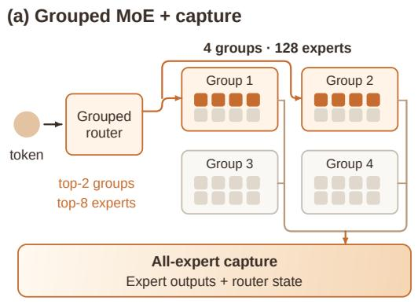

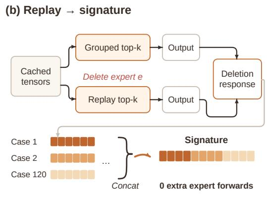

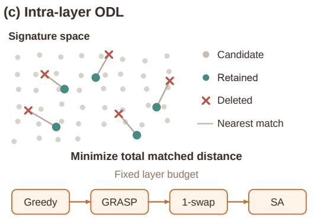

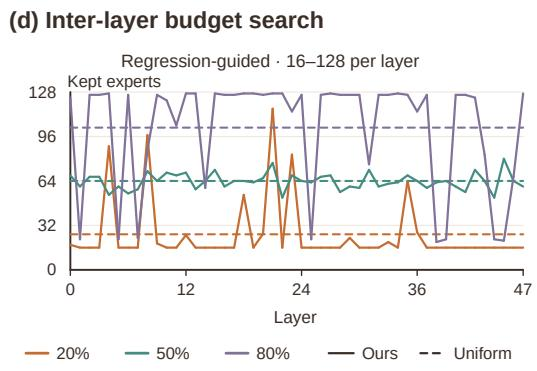  
Figure 1: (a) Grouped routing in LingBot-Video: each token activates eight of the 128 experts of a layer through grouped top-2 routing, and a single all-expert calibration records every expert output and the router state. (b) Deleting an expert and replaying the grouped top-k reproduces the deletion at the captured states from cached tensors, without extra expert forwards, and the caselevel responses concatenate into a deletion-response signature. (c) The overall diversity loss (ODL) matches every deleted expert to its nearest retained expert in signature space and sums the matched distances, and the retained set is optimized under a given per-layer budget. (d) The regression-guided search allocates the retention ratio across layers: solid curves, our allocations at 20%, 50% and 80% retention; dashed, uniform references.

## 2 RELATED WORK

## 2.1 MIXTURE-OF-EXPERTS: FROM LANGUAGE TO VIDEO DIFFUSION

Sparse computation through mixture-of-experts (MoE) provides an established path to decouple parameter-based model capacity from inference compute (Jacobs et al., 1991; Jordan & Jacobs, 1994; Shazeer et al., 2017; Lepikhin et al., 2021; Fedus et al., 2022). In natural language processing, sparsely gated MoE architectures underpin leading frontier models (Du et al., 2022; Dai et al., 2024; Jiang et al., 2024; DeepSeek-AI, 2024; Muennighoff et al., 2025), where scaling dynamics have been thoroughly characterized (Clark et al., 2022). To suppress communication overhead in massive distributed deployments, modern variants frequently enforce group-limited routing, confining token dispatching to a restricted subset of expert groups (Lepikhin et al., 2021; DeepSeek-AI, 2024).

Recently, this conditional scaling paradigm has crossed into video generation, transitioning from U-Net video diffusion (Ho et al., 2022; Blattmann et al., 2023) to diffusion transformers (DiTs) (Peebles & Xie, 2023; OpenAI, 2024) toward sparse backbones. Seedance 2.0 pioneered the industrial deployment of MoE architectures for scalable video synthesis (Team Seedance et al., 2026), while LingBot-Video (Ma et al., 2026) and MAGI-2 (Sand.ai, 2026) established the first open-source video DiT-MoE backbones utilizing grouped and ultra-fine-grained routing, respectively. However, dynamic routing sparsity merely reduces active FLOPs per step; the entire expert bank must permanently reside in device memory. In multi-billion-parameter video DiTs, this parameter footprint poses an acute deployment barrier, requiring multi-GPU tensor-parallel or FSDP sharding simply to hold quiescent weights.

## 2.2 MOE PRUNING AND RETAINED EXPERT SELECTION

Pruning techniques compress over-parameterized networks by eliminating redundant structures (Le-Cun et al., 1989; Hassibi & Stork, 1992; Han et al., 2015; Frankle & Carbin, 2019; Xie et al., 2024). Structured pruning compresses networks by eliminating regular parameter blocks to achieve native hardware savings (Ma et al., 2023). While early methods focus on channels or attention heads (Li et al., 2017; Xia et al., 2024), expert pruning acts as a macro-structural compression paradigm in MoEs, operating at the granularity of entire sub-networks to achieve physical memory savings strictly proportional to the excised expert count. Prior work on MoE compression falls broadly into three paradigms:

Static scalar scoring. Early criteria rank experts via aggregated statistics, such as historical routing frequency, router-weighted activation norms (Lasby et al., 2026), or frequency–variance interactions (Zhang et al., 2026); more recent formulations unify such signals, scoring experts through routing frequency, gate weighting, and activation strength (Liu et al., 2026b). While computationally trivial, static scalar metrics fundamentally assume expert utility to be context-independent, failing to account for the dynamic re-routing triggered when an expert is removed.

Re-evaluation and reconstruction. To capture deletion impacts, advanced approaches assess postremoval layer states: NAEE (Lu et al., 2024) caches layer input-output token pairs to search for subsets that minimize replayed output discrepancy. We port its reconstruction criterion onto our cached activations as a strong fidelity baseline (Section 4.2). However, these methods are primarily designed for language MoEs without grouped routing. On fine-grained video DiTs, combinatorial replay is computationally prohibitive at this scale; more fundamentally, enforcing strict activation reconstruction serves as a suboptimal surrogate that overlooks directional manifold coverage in generative diffusion.

Geometric merging and interaction modeling. Other work exploits representation geometry or inter-expert dependencies. Expert merging fuses functionally redundant weights (Jha et al., 2026), though recent findings suggest that geometric proximity in weight or output space does not necessarily imply contextual interchangeability (Tian et al., 2026). Other strategies model inter-expert dynamics via second-order Taylor approximations (Tseng et al., 2026), dynamic inference-time token re-routing (Wu et al., 2026), game-theoretic Shapley values (Huang et al., 2025; Zhang, 2026), coverage-aware selection across calibration sources (Zeng et al., 2026), or trajectory-guided global pruning (Yang et al., 2025).

The gap in Video DiT-MoEs. Existing MoE pruning strategies are developed primarily for autoregressive language models, optimizing for teacher-forced perplexity, token-level cross-entropy, or intermediate activation reconstruction. These formulations do not transfer cleanly to diffusion transformers, where multi-step denoising trajectories, classifier-free guidance (CFG), and non-additive post-deletion response manifolds complicate classical reconstruction objectives. Furthermore, prior interaction models commonly approximate dependencies only to pairwise order. In contrast, DIET captures the exact grouped re-routing at the frozen calibration state, up to numerical precision, induced by each expert deletion, with zero extra forward passes, framing combinatorial retained set selection as holistic geometric coverage over these measured deletion signatures.

## 3 METHODOLOGY

Expert pruning of a released video DiT-MoE over a given retention ratio naturally decomposes into two distinct yet interdependent sub-problems: which experts each layer keeps, and how many experts each layer may keep. The first requires that the bank contains redundancy. Our analyses on the routing side show its potential compressibility: routing counts are concentrated, with a long tail of rarely used experts (Appendix I). However, raw routing frequencies alone cannot determine which experts to prune, because a deletion causes re-routing: it changes the grouped top-k decision, the tokens the deleted expert served move to other experts, and its gate weight is redistributed over the retained experts (Appendix B). Any criterion that scores experts independently of this re-routing fails to capture the underlying layer dynamics, and the statistics that such criteria rely on may correlate broadly in aggregate, but remain unreliable at individual layers (Section 4.4). Our solution is to measure the re-routing itself. Section 3.1 turns one instrumented all-expert capture into a measurable deletion response for every expert and pools those responses into signatures; Section 3.2 translates the signatures into a per-layer selection rule and solves it; Section 3.3 chooses how many experts each layer keeps, where the two decisions interact.

## 3.1 DELETION-RESPONSE SIGNATURES VIA FROZEN STATE REPLAY

Simulating leave-one-out expert removals is prohibitively expensive if done naively: across $L = 4 8$ layers and $E = 1 2 8$ experts per layer, brute-force simulation requires at least 6,144 forward passes. We bypass this computational barrier through an all-expert calibration pass followed by layer-local frozen-state replay.

Specifically, we run a single instrumented calibration sweep over the 120 cases of the calibration set (Appendix C), recording router logits, gate weight, routing selections, and full expert output tables across the sampled tokens of every layer. Although this calibration evaluates all 128 experts per token (incurring ≈ 16× the expert compute of a normal pass), the cached state for replay is ≈ 375 GB in half precision (fp16 expert outputs with bf16 gates), paid strictly once. Subsequently, simulating the removal of any expert and recomputing the grouped top-k routing reduces entirely to tensor arithmetic over cached states, requiring zero additional model forward passes up to numerical precision (Appendix O). A summary of the complete pipeline’s compute budget is given in Appendix D.

Deletion-response signature. For a given token x at layer ℓ, we define the deletion response of expert e as the perturbation in layer output induced by its removal:

$$
\Delta _ { \ell , e } ( x ) = y _ { [ E ] \backslash \{ e \} } ( x ) - y _ { [ E ] } ( x ) ,\tag{1}
$$

where $y _ { S } ( x )$ denotes the layer output restricted to the active expert bank S. Crucially, $\Delta _ { \ell , e } ( x )$ inherently accounts for the discrete token re-routing and gate re-normalization triggered by the deletion (Appendix B). For classifier-free guidance (CFG), $\Delta _ { \ell , e } ( x )$ is computed directly on the guidanceweighted outputs.

To construct a fixed-dimensional functional representation for each expert, we average the perturbation across tokens within each calibration case and concatenate the resulting case-wise vectors into a deletion-response signature:

$$
\mathbf { s } _ { \ell , e } = \mathop { \mathrm { C o n c a t } } _ { c = 1 } \left[ \frac { 1 } { | T _ { c } | } \sum _ { t \in \mathcal { T } _ { c } } \Delta _ { \ell , e } ( x _ { c , t } ) \right] ,\tag{2}
$$

where $\mathcal { T } _ { c }$ denotes the set of sampled token positions for case c.

Two geometric properties of $\mathbf { s } _ { \ell , e }$ govern our downstream formulation. First, because each leaveone-out counterfactual is measured with all complementary experts present at the captured state, the signature isolates the marginal utility of expert e conditioned on its contextual interactions within the layer, rather than evaluating its isolated behavior. Second, the signature is utilized strictly for its directional orientation rather than its Euclidean magnitude: because concurrent expert removals violate linear superposition (Section 4.4), optimizing for absolute perturbation size fails to reliably reflect joint post-pruning dynamics. Instead, we use directional alignment as a surrogate for functional interchangeability.

## 3.2 SELECTING RETAINED EXPERTS BY OVERALL DIVERSITY LOSS

Retained set selection should be guided by deletion-response signatures rather than conventional magnitude proxies. Minimizing the norm of summed perturbations or ranking experts by activation energy substantially degrades semantic performance (Section 4.4), as single-deletion responses violate linear superposition. Moreover, the signature space admits no informative low-rank projection that classical compression could exploit; its exploitable structure is instead a sparse tail of functionally aligned expert pairs (Appendix K). Pruning is therefore formulated as selecting which directions to eliminate: each pruned expert is matched with its nearest surviving counterpart, as near as the surviving set permits, so that experts whose functional perturbations are already covered by retained experts can be removed at little cost.

To this end, we introduce the Overall Diversity Loss (ODL), which pairs each pruned expert with its nearest surviving counterpart in signature space and penalizes functional divergence via cosine distance:

$$
\mathcal { K } _ { \ell } ^ { \star } \ = \ \underset { | \mathcal { K } _ { \ell } | = k _ { \ell } } { \arg \operatorname* { m i n } } \ \sum _ { e \notin \mathcal { K } _ { \ell } } \underset { f \in \mathcal { K } _ { \ell } } { \operatorname* { m i n } } d \big ( \mathbf { s } _ { \ell , e } , \mathbf { s } _ { \ell , f } \big ) , \qquad d ( u , v ) = 1 - \ \frac { \langle u , v \rangle } { \| u \| \ \| v \| } .\tag{3}
$$

Equation 3 formulates an assignment-cost (k-median) problem optimizing functional coverage. Crucially, the cosine metric is scale-invariant, assessing directional redundancy rather than raw activation magnitude. Furthermore, summing individual matched distances prevents artificial cancellation between opposing directional responses, avoiding a primary pitfall of global norm-based objectives (Section 4.4).

Combinatorial optimization. We solve Equation 3 layer by layer across candidate retention budgets. The solver initializes via a feasible greedy selection with randomized restarts (GRASP), followed by single-swap local search and simulated annealing refinement. This combinatorial search yields substantial objective improvements over naive greedy selection (Table 3). Precomputing these optimized retained sets across candidate budgets yields an empirical Pareto frontier for each layer, serving as the lookup foundation for inter-layer allocation (Section 3.3).

## 3.3 INTER-LAYER BUDGET ALLOCATION

Because individual layers exhibit non-uniform sensitivity to expert pruning, per-layer budgets $\{ k _ { \ell } \}$ should be allocated globally rather than uniformly. Given the precomputed layer-wise ODL frontiers, any layer retention vector $\mathbf { k } = [ k _ { 1 } , \dots , k _ { L } ]$ can be mapped directly to concrete retained sets via constant-time lookups (Appendix F).

We formulate inter-layer budget allocation through a fitting-and-proposal loop. Near the unpruned operating point, we assume that the benchmark response varies approximately linearly with the per-layer retention counts. For a candidate allocation $\mathbf { k } = [ k _ { 1 } , \dots , k _ { L } ]$ , each dimension score is modeled as

$$
y _ { d } = \mathbf { w } _ { d } ^ { \top } \mathbf { k } + b _ { d } ,\tag{4}
$$

where $y _ { d }$ is the measured score of dimension $d$ and $k _ { \ell }$ is the number of experts retained at layer $\ell .$ The coefficients are fitted by a regularized linear surrogate $( \lambda = 1 )$ over the accumulated endto-end evaluation corpus with an unpenalized intercept, using the uncentered design matrix, ${ \bf w } _ { d } =$ $( \mathbf { K } ^ { \top } \mathbf { K } + \lambda \mathbf { I } ) ^ { - 1 } \mathbf { K } ^ { \top } ( \mathbf { \bar { y } } _ { d } - \bar { y } _ { d } \mathbf { 1 } )$ and $b _ { d } = \bar { y } _ { d } - \bar { \mathbf { k } } ^ { \top } \mathbf { w } _ { d } .$ The fitted surrogate then proposes candidate allocations by solving a constrained linear program: it maximizes the predicted Total subject to the global budget $\begin{array} { r } { \sum _ { \ell } k _ { \ell } = B ( B = 3 , 0 7 2 \mathrm { ~ a t ~ } 5 0 \% ) } \end{array}$ , per-layer feasibility bounds, a one-sided perdimension degradation floor that bounds predicted regressions against the unpruned profile, and a Total-preservation constraint enforced as a hard floor at retention budgets of 50% and above; the continuous optimum is then integerized by a small mixed-integer step. The cross-layer associations this fitted analysis exposes, and their end-to-end payoff, are reported in Section 4.3 (Appendix E).

Each proposed budget allocation is subsequently validated via full end-to-end video generation and official benchmark evaluation, with candidate trajectories incrementally expanding the surrogate set. All reported results reflect empirical end-to-end evaluations rather than surrogate predictions. Finally, the chosen retained mask is materialized into a physically compacted checkpoint, eliminating pruned parameters and reducing weight residency without altering routing logic (Appendix O).

## 4 EXPERIMENTS

## 4.1 MAIN RESULTS

Experimental setup. We evaluate our framework on the open-source LingBot-Video 30B-A3B diffusion transformer (48 layers, 128 experts per layer, grouped top-8 routing across four groups, detailed in Appendix B). We prune 50% of the expert bank (3,072 retained experts out of 6,144). Videos are synthesized at $2 4 0 \times 4 1 6$ resolution and evaluated using the official VBench

(b) routing preserved after pruning

Table 1: Performance across retention budgets on official VBench (284-case paired protocol). Expert budgets correspond to 1,229, 3,072, and 4,915 retained experts out of 6,144.
<table><tr><td>Retention Budget</td><td>Total ↑</td><td>Quality ↑</td><td>Semantic ↑</td></tr><tr><td>Unpruned (100%)</td><td>0.7941</td><td>0.8125</td><td>0.7204</td></tr><tr><td>20% (1,229 experts)</td><td>0.7596</td><td>0.7958</td><td>0.6145</td></tr><tr><td>50% (3,072 experts)</td><td>0.8115</td><td>0.8325</td><td>0.7278</td></tr><tr><td>80% (4,915 experts)</td><td>0.8061</td><td>0.8331</td><td>0.6980</td></tr></table>

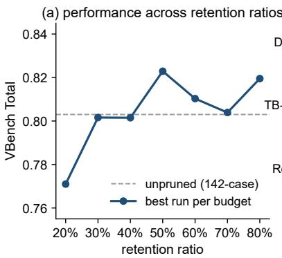

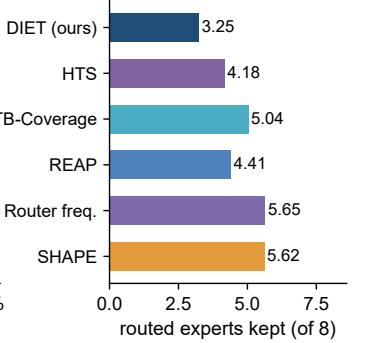

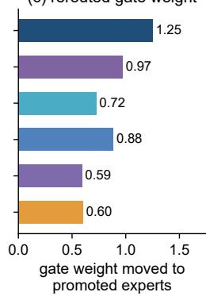  
Figure 2: Primary evaluation and routing dynamics. (a) VBench Total across candidate retention budgets on the 142-case budget-search set (dashed line denotes the dense baseline). (b) Number of original routed experts retained per token (out of 8). (c) Reallocated gating weight assigned to promoted surviving experts (averaged over 120 calibration cases, 48 layers). Counter-intuitively, DIET induces the highest routing perturbation while achieving the highest benchmark scores, demonstrat ing that routing preservation is a suboptimal objective.

scorer (Huang et al., 2024) across a fixed set of 284 prompts with matched random seeds to ensure paired comparisons (Appendix C). Crucially, because expert removal triggers discrete token re-routing, the pruned model generates plausible alternative visual motions rather than strictly reproducing baseline trajectories. Consequently, we assess performance via perceptual and semantic benchmark quality rather than point-wise reconstruction metrics (e.g., PSNR). All evaluated methods share identical 120-case calibration data, and the surrogate budget search is calibrated on a 142-case corpus drawn from the same prompt distribution (Appendix E).

Primary results. Table 1 summarizes the main performance envelope. At 50% expert retention without any retraining, DIET raises the official VBench Total from 0.7941 to 0.8115, with both visual Quality and Semantic scores outperforming the dense baseline. One possible explanation for this counter-intuitive improvement is the implicit regularization induced by structured sparsification. Importantly, the positive trend transfers to the held-out partition, although the held-out-only interva is not individually significant at 95% (+0.0142, Appendix E).

In terms of deployment efficiency, active FLOPs remain unchanged by construction, while the physical checkpoint footprint is halved from 57 GB to 30 GB. This reduction enables a model replica to reside entirely within a single 48 GB workstation GPU, eliminating multi-GPU sharding overheads (Table A9, Appendix P). The pruned checkpoint remains robust when scaled to native 480p resolution, showing no systematic qualitative artifacts (Appendices N and H).

## 4.2 COMPARISON EXPERIMENT

We compare DIET against established one-shot MoE pruning paradigms ported from large language models, including static router-statistic rankings (Routing Frequency, REAP), unified scoring (HTS), coalition-based selection (SHAPE), cross-register coverage (TB-Coverage), and replayedreconstruction selection (NAEE-Style Recon), which optimizes the deletion-fidelity objective itself through the same solver used for DIET. All baselines are evaluated under identical calibration states, budgets, and scoring protocols across both searched and uniform layer allocations (Table 2). This design separates two readings. The uniform block is a criterion-level matched comparison: it isolates each retained-set criterion under one identical per-layer allocation. The searched block instead measures the end-to-end payoff of the complete DIET pipeline, criterion plus regression-guided allocation. The gaps observed there therefore describe the full pipeline, and are not a claim that the ported criteria would remain behind by the same margins under their own tuned allocations.

Table 2: Official VBench comparative evaluation (284-case protocol, identical sampling seeds and evaluation pipeline). Retention budgets correspond to 1,229 (20%), 3,072 (50%), and 4,915 (80%) surviving experts.
<table><tr><td rowspan="2">Method</td><td colspan="3">20% Retention</td><td colspan="3">50% Retention</td><td colspan="3">80% Retention</td></tr><tr><td>Total</td><td>Qual.</td><td>Sem.</td><td>Total</td><td>Qual.</td><td>Sem.</td><td>Total</td><td>Qual.</td><td>Sem.</td></tr><tr><td colspan="10">Uniform Layer Budget</td></tr><tr><td>DIET (Ours)</td><td>0.7370</td><td>0.7742</td><td>0.5883</td><td>0.7996</td><td>0.8184</td><td>0.7243</td><td>0.8052</td><td>0.8311</td><td>0.7013</td></tr><tr><td>REAP</td><td>0.6756</td><td>0.7645</td><td>0.3204</td><td>0.7807</td><td>0.8033</td><td>0.6901</td><td>0.7943</td><td>0.8171</td><td>0.7028</td></tr><tr><td>SHAPE</td><td>0.6647</td><td>0.7507</td><td>0.3209</td><td>0.7374</td><td>0.7662</td><td>0.6223</td><td>0.7850</td><td>0.8081</td><td>0.6929</td></tr><tr><td>HTS</td><td>0.6909</td><td>0.7801</td><td>0.3342</td><td>0.7921</td><td>0.8252</td><td>0.6595</td><td>0.8025</td><td>0.8274</td><td>0.7027</td></tr><tr><td>TB-Coverage</td><td>0.6815</td><td>0.7703</td><td>0.3265</td><td>0.7650</td><td>0.7976</td><td>0.6344</td><td>0.7982</td><td>0.8235</td><td>0.6970</td></tr><tr><td>Router Frequency</td><td>0.6406</td><td>0.7363</td><td>0.2580</td><td>0.7437</td><td>0.7802</td><td>0.5978</td><td>0.7921</td><td>0.8186</td><td>0.6859</td></tr><tr><td>NAEE-Style Recon</td><td>0.7007</td><td>0.7829</td><td>0.3720</td><td>0.7810</td><td>0.8147</td><td>0.6461</td><td>0.8028</td><td>0.8230</td><td>0.7217</td></tr><tr><td colspan="10">Regression-Guided Layer Budget</td></tr><tr><td>DIET (Ours)</td><td>0.7596</td><td>0.7958</td><td>0.6145</td><td>0.8115</td><td>0.8325</td><td>0.7278</td><td>0.8061</td><td>0.8331</td><td>0.6980</td></tr><tr><td>REAP</td><td>0.6931</td><td>0.7625</td><td>0.4159</td><td>0.7761</td><td>0.8081</td><td>0.6481</td><td>0.8020</td><td>0.8289</td><td>0.6941</td></tr><tr><td>SHAPE</td><td>0.6693</td><td>0.7469</td><td>0.3589</td><td>0.7471</td><td>0.7792</td><td>0.6187</td><td>0.7942</td><td>0.8166</td><td>0.7047</td></tr><tr><td>HTS</td><td>0.7216</td><td>0.7844</td><td>0.4704</td><td>0.7921</td><td>0.8234</td><td>0.6668</td><td>0.8019</td><td>0.8290</td><td>0.6937</td></tr><tr><td>TB-Coverage</td><td>0.7202</td><td>0.7901</td><td>0.4405</td><td>0.7711</td><td>0.8027</td><td>0.6448</td><td>0.8038</td><td>0.8273</td><td>0.7099</td></tr><tr><td>Router Frequency</td><td>0.6725</td><td>0.7534</td><td>0.3489</td><td>0.7485</td><td>0.7804</td><td>0.6207</td><td>0.7954</td><td>0.8182</td><td>0.7042</td></tr><tr><td>NAEE-Style Recon</td><td>0.7112</td><td>0.7725</td><td>0.4662</td><td>0.7835</td><td>0.8147</td><td>0.6589</td><td>0.8022</td><td>0.8267</td><td>0.7041</td></tr></table>

Across all retention regimes, DIET establishes the Pareto-optimal frontier. At 50% retention, the strongest ported baseline is HTS, whose strongest variant attains a Total of 0.7921, still lagging be hind DIET (0.8115) by 1.94 points. DIET also remains the strongest method under uniform layer allocations. NAEE-Style Recon is the reconstruction-criterion port: with the identical capture, budgets and solver, it reduces the replayed output error by about 40% relative to DIET (Appendix M), yet its benchmark Total remains 2.80 points below DIET.

## 4.3 ANALYSES

Routing sparsity versus functional redundancy. Routing statistics reveal that expert utilization is skewed but lacks dead capacity. Across 120 calibration runs, the layer-wise Gini coefficient averages 0.346 (range 0.100–0.576), with the top 10% of experts routing 23.1% of tokens and normalized routing entropy remaining high (0.955, Appendix I). The expert bank thus forms a continuous long tail rather than a partition of inactive units. Consequently, frequency-based criteria can prune moderately active, functionally critical experts, conflating routing volume with post-removal layer resilience.

Rethinking routing disruption and reconstruction objectives. Crucially, empirical results challenge the conventional intuition that pruning should minimize routing disturbance. As illustrated in Figure 2(b–c), we observe DIET produces the most substantial routing perturbation among all evaluated masks—retaining only 3.25 of the 8 originally selected experts per token and reallocating 1.25 units of gating weight. Remarkably, the best-performing mask also induces the largest routing disruption. This helps explain why strict reconstruction can be limiting in video MoEs. Enforcing point-wise layer output preservation (the analog of PSNR minimization) misaligns with the generative diffusion mechanism: an expert deletion triggers discrete token dispatch to alternative experts, modulating subsequent denoising steps rather than corrupting a deterministic signal. Furthermore, because inter-expert interactions are non-linear, local reconstruction errors do not compose linearly across cascaded transformer blocks. Instead of attempting to reproduce original activations, DIET preserves directional coverage, which deletion-response signatures directly capture. As visualized in Figure 3, this preserves fine-grained semantic integrity where classical baselines suffer severe degradation.

Cross-layer budget structure. Layer-wise retention allocations exhibit structured associations with specific visual dimensions (Figure A13): expert retention in early blocks correlates with spatial coherence and scene composition, middle blocks with dynamic degree and appearance style, and deep blocks with color fidelity and temporal subject consistency. Because fixed global budgets impose cross-layer capacity trade-offs, this functional heterogeneity is precisely what non-uniform allocation exploits, contributing the 1.2-point end-to-end gain over uniform allocation reported in Table 3.

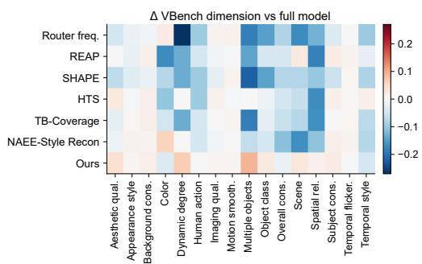  
Figure 3: Per-dimension deviation from the unpruned baseline at 50% retention.

## 4.4 ABLATION STUDIES

We isolate the contribution of each algorithmic component under the 50% retention budget (Table 3).

Representation space. Evaluating experts outside of their layer-level operational context leads to steep performance drops. Substituting deletion signatures with isolated expert outputs or router affinities degrades the Total score by 2.32–3.02 points, while relying on static routing frequency induces a 6.30-point drop. Isolated output similarity (Tian et al., 2026) ignores the contextual interactions and re-routing mechanisms that determine post-pruning layer behavior. Appendix Fig. A7 illustrates the frame-level degradation.

<table><tr><td>Component</td><td>Configuration</td><td>Total ↑</td></tr><tr><td rowspan="3">Space</td><td>Router Frequency</td><td>0.7485</td></tr><tr><td>Router Score</td><td>0.7813</td></tr><tr><td>Output Space</td><td>0.7883</td></tr><tr><td rowspan="2">Objective</td><td>Summed-Response Norm PCA Energy (r=32)</td><td>0.7571 0.7849</td></tr><tr><td>D-Optimal Volume</td><td>0.8007</td></tr><tr><td rowspan="2">Optimization</td><td>Uniform Layer Budget</td><td>0.7996</td></tr><tr><td>Greedy Init Only</td><td>0.7896</td></tr><tr><td>Proposed</td><td>DIET (Full)</td><td>0.8115</td></tr></table>

Selection objective. Minimizing the aggregate norm of single-deletion responses (an additive formulation) produces the steepest drop (−5.44 points), collapsing spatial coherence dimensions

Table 3: Ablation analysis on representation spaces, objectives, and optimization strategies at 50% retention.

from 0.63 to 0.33. This failure stems directly from the breakdown of linear superposition: as shown in Appendix Q, the cosine similarity between a joint multi-expert deletion response and the sum of constituent single-deletion responses drops from 1.00 at k=1 to 0.66 at our operating point, yielding an error of 0.95. Similarly, low-rank subspace approximations fall short: D-optimal volume selection and PCA energy retention trail DIET by 1.08 and 2.66 points, respectively. Consistent with the observed flat singular spectrum, dimensionality reduction discards vital sparse tail directions that ODL explicitly preserves.

Optimization and allocation. Finally, both algorithmic stages provide measurable gains. Greedy initialization leaves isolated tail directions uncovered; refining the partition via single-swap local search and simulated annealing recovers these modes, substantially lowering the combinatorial ob jective. At the inter-layer level, substituting the regression-guided allocation with a uniform budget costs 1.19 points, confirming that layer-wise tolerance to expert removal is non-uniform and can be effectively exploited via surrogate optimization.

## 5 CONCLUSION AND LIMITATIONS

Our work demonstrates that the expert bank of a deployed video diffusion transformer can be compressed by half without post-pruning fine-tuning or weight updates. Frozen-state replay via an instrumented all-expert calibration sweep makes combinatorial leave-one-out deletion studies tractable with no extra model forwards. Because joint post-deletion responses violate linear superposition and induce discrete token re-routing, retained set selection maximizes directional functional coverage instead of strict activation reconstruction. Coupling intra-layer Overall Diversity Loss (ODL) with regression-guided inter-layer budget allocation enables LingBot-Video 30B to operate on a single 48 GB GPU, halving the checkpoint footprint while generation quality remains essentially intact, with the official VBench Total observed to rise (0.8115 vs. 0.7941).

Limitations. First, our layer-local ODL decomposition does not track cascading activation drift across downstream blocks. In addition, our findings rest on one representative open-source DiT-MoE backbone; cross-architecture generalization remains open. Finally, the front-loaded calibration and search compute scales down substantially for a single retention point (Appendices J and F).

## REFERENCES

Sikai Bai, Haoxi Li, Jie Zhang, Zicong Hong, and Song Guo. DiEP: Adaptive mixture-of-experts compression through differentiable expert pruning. In Advances in Neural Information Processing Systems, 2025. doi: 10.52202/085713-1878.

Andreas Blattmann, Tim Dockhorn, Sumith Kulal, Daniel Mendelevitch, Maciej Kilian, Dominik Lorenz, Yam Levi, Zion English, Vikram Voleti, Adam Letts, Varun Jampani, and Robin Rombach. Stable video diffusion: Scaling latent video diffusion models to large datasets. arXiv preprint arXiv:2311.15127, 2023.

Krishna Teja Chitty-Venkata, Sandeep Madireddy, Murali Emani, and Venkatram Vishwanath. LExI: Layer-adaptive active experts for efficient MoE model inference. arXiv preprint arXiv:2509.02753, 2025.

Aidan Clark, Diego de las Casas, Aurelia Guy, Arthur Mensch, Michela Paganini, Jordan Hoffmann, Bogdan Damoc, Blake Hechtman, Trevor Cai, Sebastian Borgeaud, George van den Driessche, Eliza Rutherford, Tom Hennigan, Matthew Johnson, Katie Millican, Albin Cassirer, Chris Jones, Elena Buchatskaya, David Budden, Laurent Sifre, Simon Osindero, Oriol Vinyals, Jack Rae, Erich Elsen, Koray Kavukcuoglu, and Karen Simonyan. Unified scaling laws for routed language models. In International Conference on Machine Learning (ICML), 2022.

Damai Dai, Chengqi Deng, Chenggang Zhao, R.X. Xu, Huazuo Gao, Deli Chen, Jiashi Li, Wangding Zeng, Xingkai Yu, Y. Wu, Zhenda Xie, Y.K. Li, Panpan Huang, Fuli Luo, Chong Ruan, Zhifang Sui, and Wenfeng Liang. DeepSeekMoE: Towards ultimate expert specialization in mixture-ofexperts language models. In Proceedings of the 62nd Annual Meeting of the Association for Computational Linguistics (Volume 1: Long Papers), pp. 1280–1297. Association for Computational Linguistics, 2024. doi: 10.18653/v1/2024.acl-long.70.

DeepSeek-AI. DeepSeek-V3 technical report. arXiv preprint arXiv:2412.19437, 2024.

Nan Du, Yanping Huang, Andrew M. Dai, Simon Tong, Dmitry Lepikhin, Yuanzhong Xu, Maxim Krikun, Yanqi Zhou, Adams Wei Yu, Orhan Firat, Barret Zoph, Liam Fedus, Maarten P. Bosma, Zongwei Zhou, Tao Wang, Emma Wang, Kellie Webster, Marie Pellat, Kevin Robinson, Kathleen Meier-Hellstern, Toju Duke, Lucas Dixon, Kun Zhang, Quoc Le, Yonghui Wu, Zhifeng Chen, and Claire Cui. GLaM: Efficient scaling of language models with mixture-of-experts. In Proceedings of the 39th International Conference on Machine Learning, volume 162, pp. 5547–5569, 2022.

William Fedus, Barret Zoph, and Noam Shazeer. Switch transformers: Scaling to trillion parameter models with simple and efficient sparsity. Journal ofMachine Learning Research, 23(120):1–39, 2022.

Zhengcong Fei, Mingyuan Fan, Changqian Yu, Debang Li, and Junshi Huang. Scaling diffusion transformers to 16 billion parameters. arXiv preprint arXiv:2407.11633, 2024.

Jonathan Frankle and Michael Carbin. The lottery ticket hypothesis: Finding sparse, trainable neural networks. In International Conference on Learning Representations (ICLR), 2019.

Song Han, Jeff Pool, John Tran, and William J. Dally. Learning both weights and connections for efficient neural networks. In Advances in Neural Information Processing Systems (NeurIPS), 2015.

Babak Hassibi and David G. Stork. Second order derivatives for network pruning: Optimal brain surgeon. In Advances in Neural Information Processing Systems, volume 5, pp. 164–171, 1992.

Jonathan Ho, Tim Salimans, Alexey Gritsenko, William Chan, Mohammad Norouzi, and David J. Fleet. Video diffusion models. In Advances in Neural Information Processing Systems (NeurIPS), 2022.

Weizhong Huang, Yuxin Zhang, Xiawu Zheng, Fei Chao, Rongrong Ji, and Liujuan Cao. Discovering important experts for mixture-of-experts models pruning through a theoretical perspective. In Advances in Neural Information Processing Systems, 2025.

Ziqi Huang, Yinan He, Jiashuo Yu, Fan Zhang, Chenyang Si, Yuming Jiang, Yuanhan Zhang, Tianxing Wu, Qingyang Jin, Nattapol Chanpaisit, Yaohui Wang, Xinyuan Chen, Limin Wang, Dahua Lin, Yu Qiao, and Ziwei Liu. VBench: Comprehensive benchmark suite for video generative models. In IEEE/CVF Conference on Computer Vision and Pattern Recognition (CVPR), pp. 21807–21818, 2024.

Robert A. Jacobs, Michael I. Jordan, Steven J. Nowlan, and Geoffrey E. Hinton. Adaptive mixtures of local experts. Neural Computation, 3(1):79–87, 1991.

Saurav Jha, Maryam Hashemzadeh, Ali Saheb Pasand, Ali Parviz, Min-Joong Lee, and Boris Knyazev. REAM: Merging improves pruning of experts in LLMs. arXiv preprint arXiv:2604.04356, 2026.

Albert Q. Jiang, Alexandre Sablayrolles, Antoine Roux, Arthur Mensch, Blanche Savary, Chris Bamford, Devendra Singh Chaplot, Diego de las Casas, Emma Bou Hanna, Florian Bressand, Gianna Lengyel, Guillaume Bour, Guillaume Lample, Lelio Renard Lavaud, Lucile Saulnier,´ Marie-Anne Lachaux, Pierre Stock, Sandeep Subramanian, Sophia Yang, Szymon Antoniak, Teven Le Scao, Theophile Gervet, Thibaut Lavril, Thomas Wang, Timoth´ ee Lacroix, and William´ El Sayed. Mixtral of experts. arXiv preprint arXiv:2401.04088, 2024.

Michael I. Jordan and Robert A. Jacobs. Hierarchical mixtures of experts and the EM algorithm. Neural Computation, 6(2):181–214, 1994.

Mike Lasby, Ivan Lazarevich, Nish Sinnadurai, Sean Lie, Yani Ioannou, and Vithursan Thangarasa. REAP the experts: Why pruning prevails for one-shot MoE compression. In International Conference on Learning Representations (ICLR), 2026.

Yann LeCun, John S. Denker, and Sara A. Solla. Optimal brain damage. In Advances in Neural Information Processing Systems, volume 2, pp. 598–605, 1989.

Dmitry Lepikhin, HyoukJoong Lee, Yuanzhong Xu, Dehao Chen, Orhan Firat, Yanping Huang, Maxim Krikun, Noam Shazeer, and Zhifeng Chen. GShard: Scaling giant models with conditional computation and automatic sharding. In International Conference on Learning Representations (ICLR), 2021.

Hao Li, Asim Kadav, Igor Durdanovic, Hanan Samet, and Hans Peter Graf. Pruning filters for efficient ConvNets. In International Conference on Learning Representations (ICLR), 2017.

Zongfang Liu, Shengkun Tang, Boyang Sun, Zhiqiang Shen, and Xin Yuan. EvoESAP: Non-uniform expert pruning for sparse MoE. arXiv preprint arXiv:2603.06003, 2026a.

Zongfang Liu, Jinghui Zhang, Zijian Ma, Guangyi Chen, and Xin Yuan. How to score experts for one-shot MoE expert pruning: A unified formulation and selection principle. arXiv preprint arXiv:2606.15716, 2026b.

Xudong Lu, Qi Liu, Yuhui Xu, Aojun Zhou, Siyuan Huang, Bo Zhang, Junchi Yan, and Hongsheng Li. Not all experts are equal: Efficient expert pruning and skipping for mixture-of-experts large language models. In Lun-Wei Ku, Andre Martins, and Vivek Srikumar (eds.), Proceedings ofthe 62nd Annual Meeting of the Association for Computational Linguistics (Volume 1: Long Papers), pp. 6159–6172, Bangkok, Thailand, August 2024. Association for Computational Linguistics. doi: 10.18653/v1/2024.acl-long.334.

Shuailei Ma, Jiaqi Liao, Xinyang Wang, Jingjing Wang, Chaoran Feng, Zijing Hu, Chong Bao, Zichen Xi, Yuqi Gan, Weisen Wang, Yanhong Zeng, Qin Zhao, Zifan Shi, Wei Wu, Hao Ouyang, Qiuyu Wang, Shangzhan Zhang, Jiahao Shao, Yipengjing Sun, Liangxiao Hu, Lunke Pan, Nan Xue, Kecheng Zheng, Yinghao Xu, Xing Zhu, Yujun Shen, and Ka Leong Cheng. Scaling mixture-of-experts video pretraining for embodied intelligence. arXiv preprint arXiv:2607.07675, 2026.

Xinyin Ma, Gongfan Fang, and Xinchao Wang. LLM-Pruner: On the structural pruning of large language models. In Advances in Neural Information Processing Systems (NeurIPS), 2023.

Niklas Muennighoff, Luca Soldaini, Dirk Groeneveld, Kyle Lo, Jacob Morrison, Sewon Min, Weijia Shi, Pete Walsh, Oyvind Tafjord, Nathan Lambert, Yuling Gu, Shane Arora, Akshita Bhagia, Dustin Schwenk, David Wadden, Alexander Wettig, Binyuan Hui, Tim Dettmers, Douwe Kiela, Ali Farhadi, Noah A. Smith, Pang Wei Koh, Amanpreet Singh, and Hannaneh Hajishirzi. OLMoE: Open mixture-of-experts language models. In International Conference on Learning Representations (ICLR), 2025. URL https://openreview.net/forum?id=xXTkbTBmqq.

OpenAI. Video generation models as world simulators. OpenAI Technical Report, 2024. URL https://openai.com/index/ video-generation-models-as-world-simulators/.

William Peebles and Saining Xie. Scalable diffusion models with transformers. In IEEE/CVF International Conference on Computer Vision (ICCV), 2023.

Sand.ai. MAGI-2 preview: Scaling video generation models efficiently. Sand.ai Blog, 2026. URL https://sand.ai/blog/magi-2-preview.

Noam Shazeer, Azalia Mirhoseini, Krzysztof Maziarz, Andy Davis, Quoc Le, Geoffrey Hinton, and Jeff Dean. Outrageously large neural networks: The sparsely-gated mixture-of-experts layer. In International Conference on Learning Representations, 2017.

Team Seedance, De Chen, Liyang Chen, et al. Seedance 2.0: Advancing video generation for world complexity. arXiv preprint arXiv:2604.14148, 2026.

Huiyuan Tian, Bonan Xu, and Shijian Li. Beyond geometric complementarity: Coherent overlap in sparse mixture-of-experts routing. arXiv preprint arXiv:2607.28308, 2026.

Alex M. Tseng, Prannay Kaul, Luca Zancato, Wei Xia, and Stefano Soatto. Higher-order pruning of experts in mixture-of-experts language models. arXiv preprint arXiv:2609.18916, 2026.

Juntong Wu, Jialiang Cheng, Fuyu Lv, Ou Dan, and Li Yuan. SERE: Similarity-based expert re-routing for efficient batch decoding in MoE models. In International Conference on Learning Representations (ICLR), 2026. URL https://openreview.net/forum?id= 98IxaUQtMY.

Mengzhou Xia, Tianyu Gao, Zhiyuan Zeng, and Danqi Chen. Sheared LLaMA: Accelerating language model pre-training via structured pruning. In International Conference on Learning Representations (ICLR), 2024.

Yanyue Xie, Zhi Zhang, Ding Zhou, Cong Xie, Ziang Song, Xin Liu, Yanzhi Wang, Xue Lin, and An Xu. MoE-Pruner: Pruning mixture-of-experts large language model using the hints from its router. arXiv preprint arXiv:2410.12013, 2024.

Xican Yang, Yuanhe Tian, and Yan Song. MoE pathfinder: Trajectory-driven expert pruning. arXiv preprint arXiv:2512.18425, 2025.

Yongqin Zeng, Sicheng Pan, Jiale Wang, Hai-Tao Zheng, Hong-Gee Kim, Chunxia Ma, and Xiuteng Zhou. Generic expert coverage for pruning sparse mixture-of-experts language models. arXiv preprint arXiv:2607.01710, 2026.

Geng Zhang, Yuxuan Han, Yuxuan Lou, Yiqi Zhang, Wangbo Zhao, and Yang You. MoNE: Replacing redundant experts with lightweight novices for structured pruning of MoE. In International Conference on Learning Representations (ICLR), 2026.

Yuhao Zhang. SHAPE: Coalition-aware expert pruning for sparse mixture-of-experts LLMs. arXiv preprint arXiv:2606.09886, 2026.

## A APPENDIX OVERVIEW

This appendix provides additional analysis and experiments related to DIET, including:

• Model architecture and grouped-routing formulation (Sec. B);

• Calibration, video synthesis and benchmark protocols (Sec. C);

• End-to-end compute budget (Sec. D);

• Regression-guided budget search details (Sec. E);

• The full layer-budget allocation sweep (Sec. F);

• Structural properties of the selected mask (Sec. G);

• Extended qualitative video comparisons (Sec. H);

• Routing concentration and activation entropy (Sec. I);

• Robustness to the calibration-set size (Sec. J);

• Response-space geometry and objective analysis (Sec. K);

• Response geometry across architecture depth (Sec. L);

• Implementation and porting of the LLM MoE baselines (Sec. M);

• Resolution transferability (Sec. N);

• Model slicing and compact-checkpoint assembly (Sec. O);

• Physical memory and deployment footprint (Sec. P);

• Additional component ablations (Sec. Q);

• Paired statistical significance analysis (Sec. R);

• Geometric formulations and functional redundancy (Sec. S).

## B ARCHITECTURAL FORMULATION AND GROUPED ROUTING

Consider a video diffusion transformer comprising L blocks, where block ℓ incorporates a sparsely gated mixture-of-experts feed-forward layer with an expert bank $[ E ] = \left\{ 1 , \dots , \bar { E } \right\}$ . For an incoming token representation $x \in \mathbb { R } ^ { d }$ , the router evaluates routing logits and applies an element-wise sigmoid activation to yield unnormalized routing affinities $r _ { j } ( x )$ . Under grouped routing, experts are partitioned into $\dot { G }$ disjoint groups. Each group is scored by the sum of its two largest expert affinities; the top $G ^ { \prime }$ scoring groups are activated, and the k experts possessing the highest individual affinities within these selected groups are dispatched:

$$
y ( x ) = \sum _ { j \in \mathcal { T } _ { k } ( x ) } g _ { j } ( x ) f _ { j } ( x ) , \qquad g _ { j } ( x ) = \rho \frac { r _ { j } ( x ) } { \sum _ { i \in \mathcal { T } _ { k } ( x ) } r _ { i } ( x ) } ,\tag{5}
$$

where ${ \mathcal { T } } _ { k } ( x ) \subseteq [ E ]$ denotes the index set of the k active experts, $f _ { j } ( x )$ represents the output transformation of expert $j ,$ and $g _ { j } ( x )$ is the normalized gating weight scaled by the fixed route scale $\rho \approx 1 . 2 5$ (the units of the 1.25 gate weight in Appendix). In our backbone architecture, $L = 4 8 ,$ $\stackrel { \cdot } { E } = 1 2 8 , G = 4 , G ^ { \prime } = 2$ , and $k = 8$ per layer.

Expert pruning identifies a pruned subset $\mathcal { D } \subset [ E ]$ and retains the complementary bank $\mathcal { K } = [ E ] \backslash \mathcal { D }$ For layer ℓ, we denote the retained subset as $\displaystyle \mathcal { K } _ { \ell }$ with retention count $k _ { \ell } = \mathsf { \bar { \rho } } | \kappa _ { \ell } | .$ . Post-pruning inference executes the standard routing protocol, with pruned expert logits masked to −∞ prior to grouped top-k selection, followed by gate re-normalization over the retained experts. Crucially, pruning does not correspond to removing additive terms from a fixed linear sum; rather, it induces discrete token re-routing and reallocates gating weight among surviving experts. Scoring heuristics that treat experts independently of this dynamic redistribution fail to reflect runtime layer behavior.

## C EXPERIMENTAL AND CALIBRATION PROTOCOLS

Calibration capture. We run a single instrumented calibration sweep over the unpruned pretrained model’s 120 calibration cases, recording routing logits, discrete routing assignments, gating weights, and complete expert output tensors across all layers and tokens. The calibration set encompasses $C = 1 2 0$ video generation scenarios, tracking 64 matched conditional and unconditional token pairs per scenario per layer (368,640 paired tokens, totaling 737,280 branch tokens). The deletion-replay path is served by approximately 375 GB of cached expert state on disk in $\mathtt { f p 1 }$ 6 precision (bf16 gating values; this is the measured size of the compiled per-case caches, consis tent with the raw tensor volume implied by the counts above), and the derived per-expert signature matrices add 2.9 GB; the two sizes differ by pooling, not precision. While evaluating all 128 candidate experts per token incurs $\approx 1 6 \times$ the active compute of a standard sparse forward pass, this overhead is front-loaded and incurred strictly once. All subsequent counterfactuals, including all $^ { 6 , 1 }$ 144 single-expert deletions and arbitrary joint deletions, are executed via direct tensor operations on cached states (token states, router scores, grouped routing, gate weights and the expert output table, one file per case and layer) with zero additional model forward evaluations.

Video synthesis. Videos are synthesized at a resolution of $2 4 0 \times 4 1 6$ across 121 frames, 40 denoising steps, classifier-free guidance scale $w = 3 ,$ , flow-shift parameter $^ { 3 , }$ and 24 fps. To ensure consistent evaluation, routing bias correction is disabled across all comparative experiments; validating on a matched 72-case 480p subset confirms that router bias state has negligible impact (0.7916 with bias enabled vs. 0.7923 disabled). Every evaluation prompt is generated with a fixed random seed shared across all methods, ensuring strictly paired comparisons.

Benchmark evaluation. We employ the official VBench scorer across all 16 standardized visual and semantic dimensions with official normalizations. To make full-scale comparative studies computationally feasible, we evaluate all models on a fixed 284-case protocol. Calibration prompts are strictly excluded from the evaluation protocol, and missing pairs are never imputed.

## D COMPUTE BUDGET

The pipeline cost is front-loaded and dominated by two components. The all-expert calibration sweep over 120 cases is the largest single expense: ≈ 12 GPU-minutes per case on one GPU (per-case caches are then compiled on CPU), ≈ 24 GPU-hours in total. The inter-layer search then consumed 87 complete end-to-end evaluations of the 142-case budget-search set, each ≈ 4– 5 GPU-hours, for $\approx 4 \ : \mathrm { \ : \dot { \times } \ : 1 0 ^ { 2 } }$ GPU-hours in total. Per-mask combinatorial optimization (GRASP initialization, single-swap local search and simulated annealing over the per-layer retention curves), together with the surrogate fit and the constrained linear-program allocation solve, runs entirely on CPU, within $\approx 1 . 5 – 2$ CPU-hours per mask. After calibration, every counterfactual, including all 6,144 single-expert deletions and the joint-deletion probes used during selection, replays on cached states without additional model evaluations: DIET trades one all-expert capture and an offline search for the thousands of repeated forward passes that exhaustive leave-one-out simulation would require.

## E REGRESSION-GUIDED LAYER BUDGET SEARCH

The inter-layer budget allocation is optimized iteratively over a 142-case budget-search set drawn from the prompt universe of the 284-case evaluation suite. The search corpus comprises 87 completed end-to-end evaluation trajectories across candidate retention allocations (excluding regimes beyond 80% retention). Each iteration proceeds through three sequential stages:

Surrogate regression. A regularized linear surrogate $( \lambda = 1$ , fitted with the exact closed form of Section 3.3) maps the 48-dimensional layer retention count vector ${ \bf k } = [ k _ { 1 } , \dots , k _ { 4 8 } ]$ to measured dimension-wise benchmark scores. For surrogate fitting only, selection-corpus dimension scores are robustified by iterative Grubbs filtering; all reported benchmark results use the unfiltered aggregate over completed cases. With 87 full trajectories supervising 48 layer covariates, the surrogate op erates in a data-constrained regime and serves as a coarse filter that proposes promising candidate allocations. Every proposed candidate is strictly validated via full end-to-end synthesis and official scoring, and the deployed allocation is the verified best among the evaluated trajectories.

The evaluation suite splits into 142 prompts shared with the budget-search set and 142 strictly heldout prompts. Our selected allocation exhibits robust generalization: relative to the unpruned baseline, the paired difference is +0.0200 (95% CI [+0.0018, +0.0429], n = 139) on the shared partition and +0.0142 (95% CI [−0.0008, +0.0298], n = 138) on the held-out partition, fully aligning with the full-manifest improvement of +0.0176.

Table A1: Comparative performance partitioned across the 284-case protocol: the 142 cases overlapping the search prompt distribution and the 142 held-out cases unseen during search. Evaluation adheres to official VBench normalization (n = 139–142 completed pairs per cell).
<table><tr><td>Method</td><td>Shared 142</td><td>Held-Out 142</td></tr><tr><td>Full Model (Unpruned)</td><td>0.8023</td><td>0.7858</td></tr><tr><td>Router Frequency</td><td>0.7598</td><td>0.7367</td></tr><tr><td>REAP (Lasby et al., 2026)</td><td>0.7784</td><td>0.7745</td></tr><tr><td>SHAPE (Zhang, 2026)</td><td>0.7363</td><td>0.7569</td></tr><tr><td>HTS (Liu et al., 2026b)</td><td>0.7785</td><td>0.7858</td></tr><tr><td>TB-Coverage (Zeng et al., 2026)</td><td>0.7788</td><td>0.7637</td></tr><tr><td>DIET (Ours)</td><td>0.8222</td><td>0.8001</td></tr></table>

As documented in Table A1, DIET maintains superior generative fidelity across both partitions, supporting transfer beyond the budget-search set. Every reported number is the plain aggregate over completed cases (an outlier-filtered variant was dropped).

Constrained linear-program proposal. Total scores are linearized through the fixed normalization mapping. A constrained linear program proposes the allocation maximizing the predicted Total subject to the global budget constraint $\begin{array} { r } { \sum _ { \ell } k _ { \ell } = \dot { B } } \end{array}$ , architectural feasibility bounds, a one-sided perdimension floor that bounds predicted regressions relative to the unpruned baseline (relaxable dimensions receive a soft penalty), and a Total-preservation constraint enforced as a hard floor at 50% retention and above (softened to a deficit penalty below). The continuous optimum is integerized by a small mixed-integer step; the proposed allocation is then materialized, executed end-to-end, and appended to the search corpus.

The search follows a predefined schedule across retention ratios {0.5, 0.4, 0.6, 0.3, 0.7, 0.2, 0.8}. The optimal 50% configuration retains between 52 and 79 experts per layer, establishing the allocation deployed for all comparative baselines in the main paper.

Leave-one-out surrogate predictions track empirical Total scores without systematic distortion, and the trajectory analysis confirms that the selected 50% configuration defines the Pareto-optimal frontier.

## F LAYER-BUDGET ALLOCATION SWEEP

While the global retention budget is fixed, cross-layer allocation provides a critical degree of freedom.

Table A2 reports the best-performing configurations identified across retention budgets on the budget-search set, and Figure A1 visualizes the corresponding layer allocations.

Optimized allocation interacts intimately with retained set selection criteria: the identified allocation vector confers a 1.2-point end-to-end gain over uniform allocation for DIET (Section 4.4). Layer-wise budget allocation has been studied for language MoEs (Bai et al., 2025; Liu et al., 2026a;

<table><tr><td>Retention</td><td>Retained</td><td>Total</td><td>Kept Range</td></tr><tr><td>20%</td><td>1,229</td><td>0.7710</td><td>16-116</td></tr><tr><td>30%</td><td>1,843</td><td>0.8016</td><td>18-124</td></tr><tr><td>40%</td><td>2,458</td><td>0.8015</td><td>16-128</td></tr><tr><td>50%</td><td>3,072</td><td>0.8229</td><td>52-79</td></tr><tr><td>60%</td><td>3,686</td><td>0.8103</td><td>64-94</td></tr><tr><td>70%</td><td>4,301</td><td>0.8039</td><td>33-128</td></tr><tr><td>80%</td><td>4,915</td><td>0.8195</td><td>26-126</td></tr></table>

Table A2: Exploration sweep on the 142-case budget-search set; Total aggregates all completed cases of each run (selection-time scores).

Chitty-Venkata et al., 2025); here allocation

is searched jointly with the response-based

selection from the same frozen capture and every proposed allocation is validated end to end, systematically discovering layer-specific capacity tolerances. The empirical search corpus enables both the found optimal across budgets (Table A2) and the cross-layer functional correlation map (Figure A13 and Section 4.3).

The sweep is not monotone: Total peaks at the 50% budget, dips through 60–70%, and recovers only as retention approaches the unpruned model. The pruned 50% allocation is also the most uniform (a 52–79 per-layer range, against 64–94 at 60% and ranges spanning 16–128 at the outer budgets), matching the search’s preference for balanced allocations at the peak.

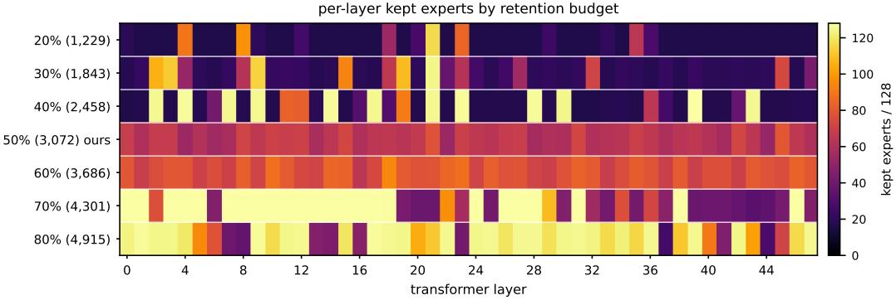  
Figure A1: Layer-wise retained expert counts across exploration budgets. Colors denote retaining counts out of 128 candidate experts. The selected 50% mask allocates capacity in a balanced band (52–79 experts per layer), whereas unconstrained exploration budgets assign as few as 16 experts to resilient layers.

## G STRUCTURAL PROPERTIES OF THE SELECTED MASK

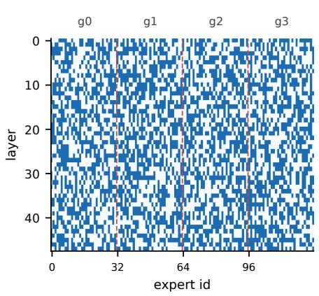

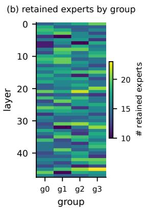

(c) per-layer budget (52--79)  
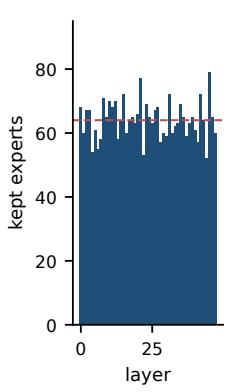  
Figure A2: Structural characteristics of the selected 50% mask. (a) Full 48×128 retaining allocation pattern (dashed lines indicate group boundaries). (b) Retained counts per group per layer. (c) Total retained experts per layer. Every group retains at least 10 experts and each layer preserves at least 52, strictly satisfying grouped top-8 routing feasibility.

The selected 50% mask satisfies architectural routing constraints with substantial margin (Figure A2). Across all 48 layers and four expert groups, the minimum retained expert count in any individual (layer, group) block is 10 (well above the runtime threshold of four required for grouped top-8 routing), with a group-wise mean of 16.0 retained experts. Excised experts are distributed evenly across all four routing groups rather than concentrating within specific subsets. Layer retention counts fluctuate smoothly between 52 and 79, capturing layer-specific sensitivity without inducing architectural bottlenecks.

## H EXTENDED QUALITATIVE COMPARISONS

Figures A3–A6 present qualitative comparisons across all 16 VBench dimensions. For each dimension, we illustrate five evenly spaced frames generated under identical prompts and random seeds, comparing the unpruned baseline (top row) against DIET at 50% retention (bottom row). To provide an objective representation rather than cherry-picked highlights, most displayed instances are the cases whose paired score differentials lie closest to their dimension’s median performance delta, and the remaining instances show representative content for their dimension. Across seven of the sixteen dimensions, the median case exhibits negligible visual divergence, confirming that the pruned model reliably preserves baseline visual motion and fidelity. Figure A7 complements these grids with frame-level, all-arm comparisons on two representative cases.

Prompt: “art gallery”

aesthetic quality (Δ = +0.114)  
Prompt: “a drone flying over a snowy forest.”  
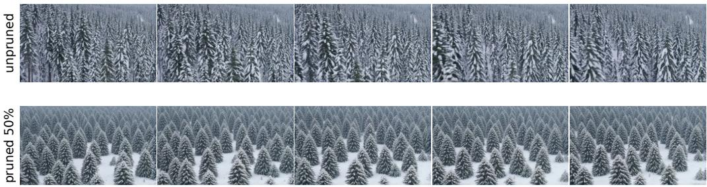  
appearance style (Δ = +0.009)  
Prompt: “An astronaut flying in space, animated style”

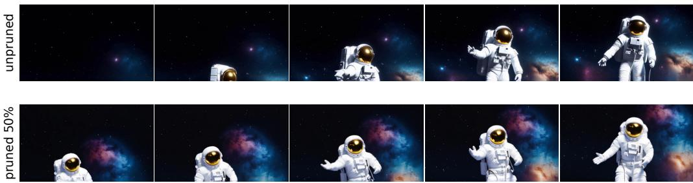  
background consistency (Δ = +0.015)

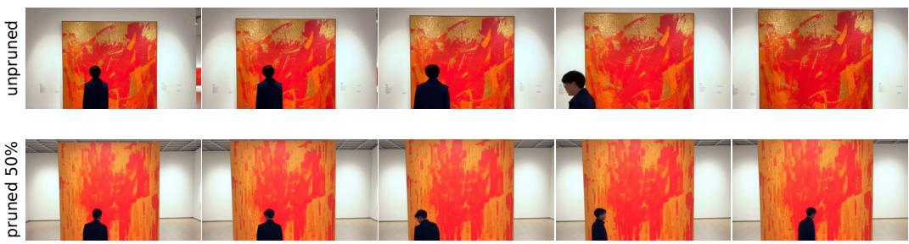  
colour (Δ = +0.000)

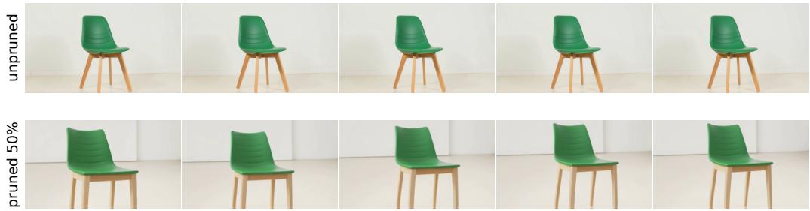  
Figure A3: Qualitative comparisons across visual appearance, background, and color fidelity dimensions. Each panel depicts representative generations under identical initializations for the dense baseline (top) and DIET at 50% retention (bottom).

dynamic degree (Δ = +0.000)

Prompt: “a bicycle accelerating to gain speed”

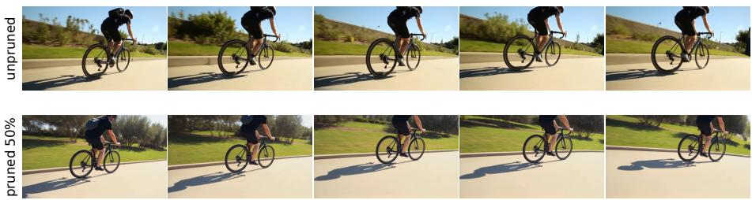  
human action (Δ = +0.000)  
Prompt: “A person is riding or walking with horse”

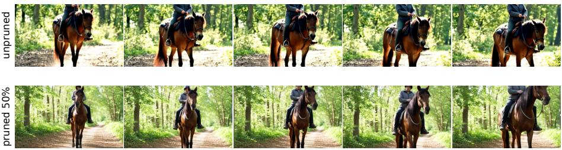  
imaging quality (Δ = -0.029)

Prompt: “Origami dancers in white paper, 3D render, on white background, studio shot, dancing modern dance.”

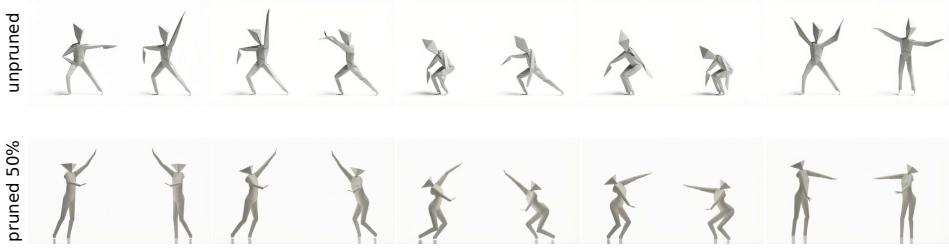  
motion smoothness (Δ = +0.006)  
Prompt: “a bus turning a corner”

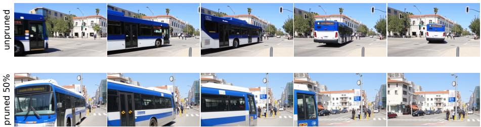  
Figure A4: Qualitative comparisons across dynamic degree, human action, imaging quality, and motion smoothness (protocol matches Figure A3).

multiple objects (Δ = +0.938)

Prompt: “a potted plant and a tv”

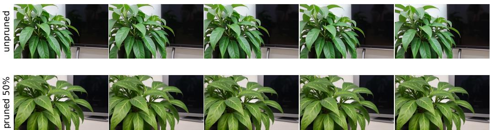  
object class (Δ = +0.000)  
Prompt: “a sandwich”

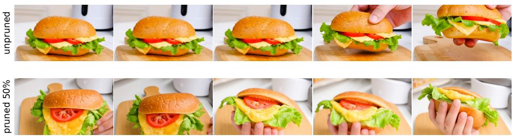  
overall consistency (Δ = -0.021)  
Prompt: “A raccoon is playing the electronic guitar.”

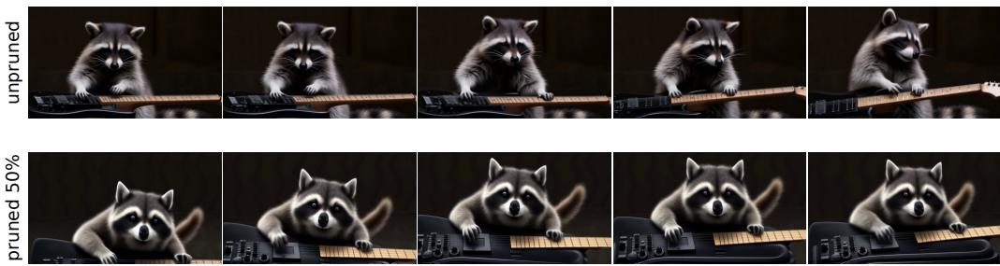  
scene (Δ = +0.000)  
Prompt: “laboratory”

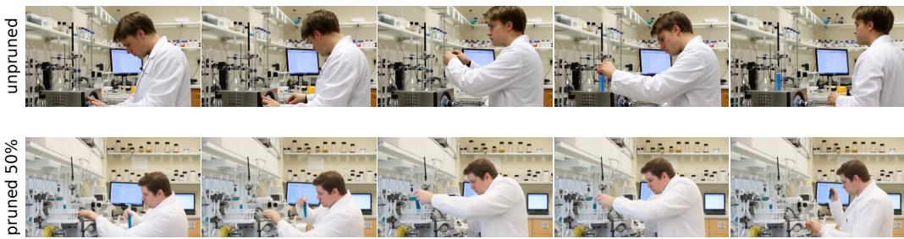  
Figure A5: Qualitative comparisons across multiple objects, object class, overall consistency, and scene composition (protocol matches Figure A3).

spatial relationship (Δ = +0.000)  
Prompt: “a cat on the right of a dog, front view”  
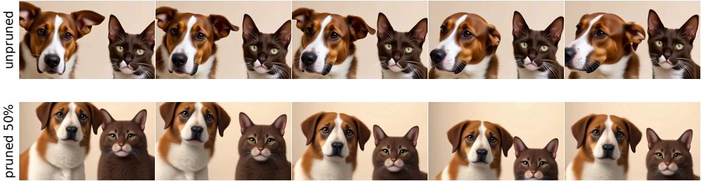  
subject consistency (Δ = +0.217)  
Prompt: “an elephant taking a peaceful walk”

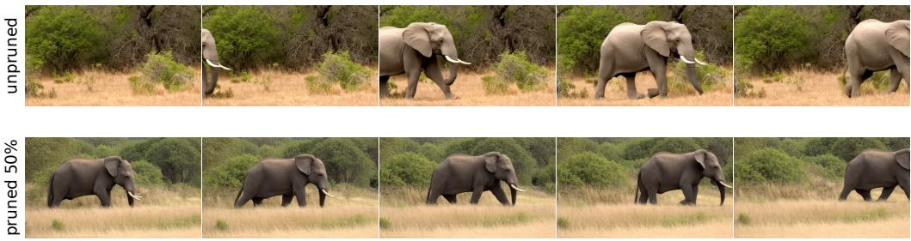  
temporal flickering (Δ = +0.002)  
Prompt: “a dilapidated phone booth stood as a relic of a bygone era on the sidewalk, frozen in time”

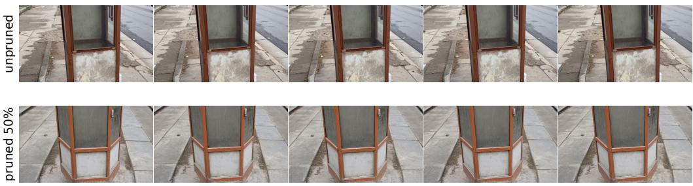  
temporal style (Δ = -0.033)

Prompt: “The bund Shanghai, zoom in”  
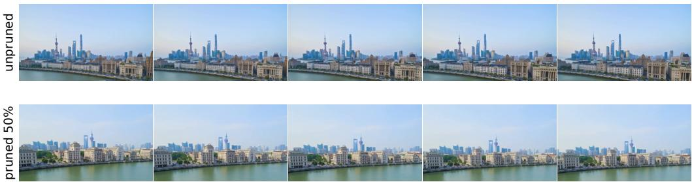  
Figure A6: Qualitative comparisons across spatial relationship, subject consistency, temporal flickering, and temporal style (protocol matches Figure A3).

(a) scene (Δ = +0.000)  
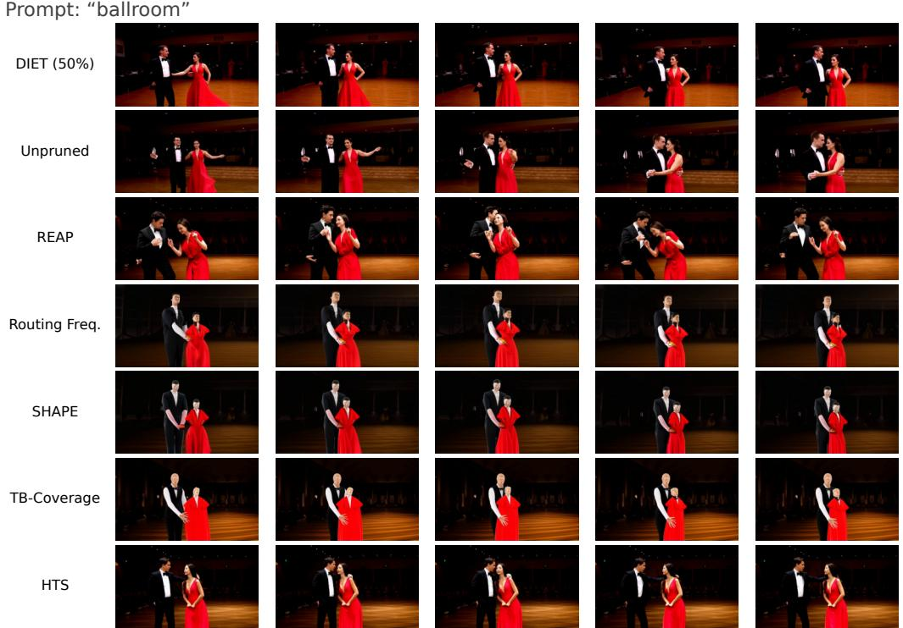

## (b) aesthetic quality (Δ = +0.062)

Prompt: “An astronaut feeding ducks on a sunny afternoon, reflection from the water.”  
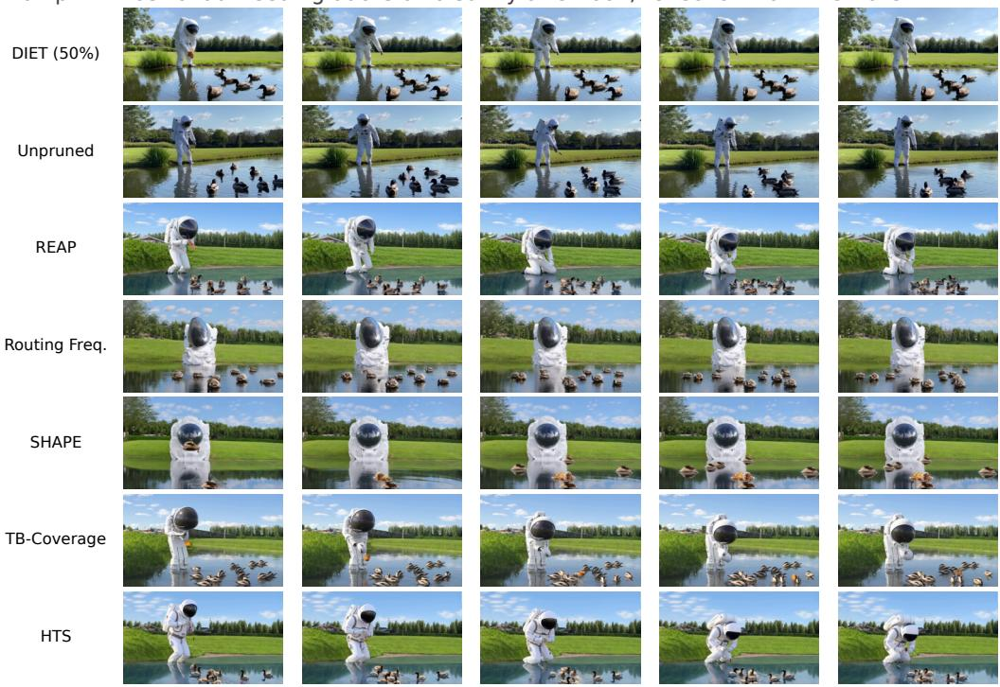  
Figure A7: All-arm frame-level comparisons on two representative cases: (a) a ballroom scene (“ballroom”) and (b) an aesthetic-quality prompt (“An astronaut feeding ducks on a sunny afternoon, reflection from the water.”). Each panel shows DIET at 50% retention, the unpruned baseline, and the five ported criteria (named as in Table 2) as rows, with five evenly spaced frames of the same generation across columns. In (a) the scene composition is preserved across all arms, while in (b) the astronaut’s suit collapses into a featureless mass under SHAPE and Routing Frequency; DIET23 remains visually consistent with the unpruned model in both panels.

## I ROUTING CONCENTRATION AND ACTIVATION ENTROPY

Both CFG branches exhibit smooth, depth-dependent dispersion (Figure A8): the conditional branch displays an average Gini of 0.328 and a top-decile token share of 0.220, while the unconditional branch exhibits 0.364 and 0.243, with average normalized entropies of 0.960 and 0.950, respectively. Crucially, no layer exhibits collapsed or degenerate routing. Pruning based on usage frequency can excise moderately active units possessing unique functional roles, necessitating principled geometric coverage to prevent capacity loss.

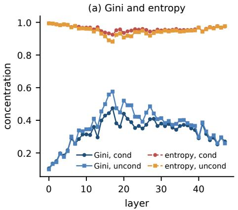

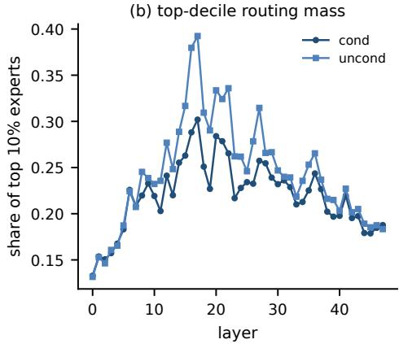  
Figure A8: Layer-wise routing concentration profiles across conditional and unconditional branches. (a) Gini coefficients and normalized entropy across depth. (b) Token share absorbed by the topdecile experts. Routing remains well-dispersed across all layers, demonstrating the absence of inac tive capacity.

## J ROBUSTNESS TO CALIBRATION SET SIZE

To verify that retained expert selection does not overfit to the calibration sample, we analyze solver stability as a function of calibration size C. We re-solve the combinatorial selection using identical algorithmic hyperparameters—four starts (one deterministic backward-greedy path and three randomized GRASP initializations), each refined through 50 swap passes, 300k simulated annealing steps, and 50 final swap iterations—evaluating signatures computed over subsets of $C \in \{ 1 5 , 3 0 , \bar { 6 0 } \}$ cases across five independent draws.

As shown in Figure A9, solution overlap with the 120-case reference mask scales smoothly: 0.555± 0.065 $( C = 1 5 ) , 0 . 5 9 1 \pm 0 . 0 7 1 ( C = 3 0 )$ , and $0 . 6 6 8 \pm 0 . 0 7 8 ( C = 6 0 )$ . When evaluated under the full 120-case objective, masks derived from these smaller subsets achieve objective values within 2.7%, 2.0%, and 1.1% of the best solution found on the 120-case objective, respectively.

This variation must be evaluated relative to stochastic solver variance. Executing the solver on the full 120-case dataset across different random seeds yields an average mask overlap of 0.912 (minimum 0.800) with a negligible objective variation of 0.0003. Because the optimization landscape is relatively flat near the optimum, reducing calibration size primarily shifts selection among functionally equivalent retained expert configurations rather than degrading functional coverage.

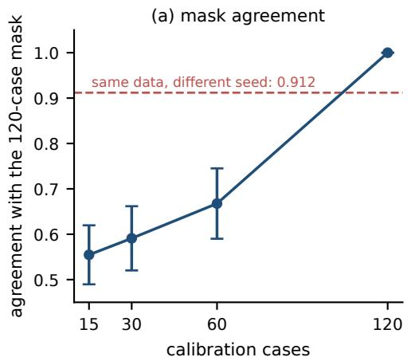

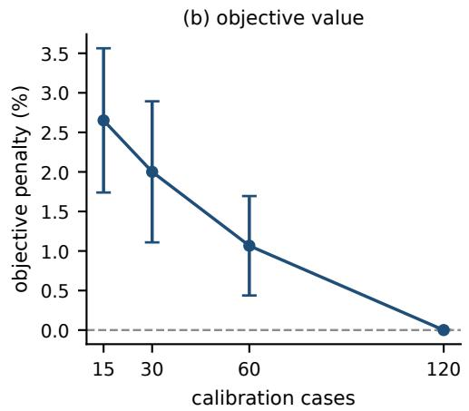  
Figure A9: Stability across calibration sample sizes. (a) Retained expert mask overlap between C case solutions and the 120-case reference (dashed line indicates multi-seed solver variance of 0.912). (b) Relative ODL objective value evaluated against the full calibration set. Reducing calibration size preserves functional objective quality within 2.7%.

## K ANALYSIS OF RESPONSE-SPACE GEOMETRY AND OBJECTIVES

Signatures exhibit near-orthogonality (mean pairwise cosine 0.008–0.019) and exceptionally high dimensionality, with participation ratios spanning 93–119 out of 128 and a flat singular spectrum across all depths (Figures A12, A11). This absence of low-rank subspace concentration renders classical projection or principal-component pruning ineffective; instead, the primary exploitable structure is a sparse tail of functionally aligned pairs, whose mask-level statistics are detailed below and in Table A4.

The intrinsic geometry of deletion-response signatures dictates the performance bounds of candidate pruning rules. Across all layers, signatures exhibit near-orthogonality (mean pairwise cosine 0.008– 0.019) and high intrinsic dimensionality, with singular spectrum participation ratios spanning 93– 119 out of 128 and the top 50 principal components accounting for only 54–60% of cumulative variance (Figures A11, A12). Consequently, subspace-based compression heuristics (e.g., volume maximization or principal component truncation) lack low-rank structure to exploit (Table A3).

Under this setting, the most salient exploitable structure is the sparse positive tail of the pairwise cosine distribution: while the median pairwise cosine is 0.01, a minor subset of expert pairs exhibits marked functional redundancy (cos ≈ 0.6–0.9, with < 0.2% of pairs exceeding 0.3; Figure A11b). In a 50% pruning regime (≈ 64 deletions per layer in an effective ≈ 100-dimensional manifold), no retained expert subset can uniformly span all deleted directions. Pruning algorithms must therefore prioritize excising redundant directions. As confirmed in Table A4, DIET systematically identifies these redundant pairs: pruned experts exhibit an average nearest retained expert cosine of 0.17 (vs. 0.09 among retained experts), with 94% of deletions possessing a surviving substitute above 0.1 cosine similarity.

We validate alternative objective formulations end-to-end under identical layer allocations (52–79 experts retained per layer, Table A3). D-optimal volume selection maximizes log det $( \mathbf { C } _ { \kappa } )$ , where C is the pairwise cosine kernel. PCA energy selection retains experts exhibiting the highest projection energy along the top-r principal eigenvectors $( r \in \{ 8 , 3 2 \}$ ). Variants operating in alternative feature spaces evaluate Equation 3 using uncontextualized expert outputs or routing logits.

Consistent with the flat eigenvalue spectrum, PCA energy pruning lags behind DIET by 2.66–2.78 points (0.7849 and 0.7837), degrading below the unpruned baseline. Rebuilding ODL over isolated expert outputs or routing affinities similarly incurs steep penalties (0.7883 and 0.7813, trailing DIET by +0.0234 and +0.0299 paired delta, respectively), confirming that contextual interaction captured via deletion signatures is critical. D-optimal volume maximization attains 0.8007 (+0.0102 paired difference, CI [−0.0037, +0.0259]); however, it isolates significantly fewer redundant tail pairs (62 vs. 135 high-cosine deletions).

As detailed in Table A4, while all methods incur an average per-expert cosine loss close to 1.0 due to high dimensionality, DIET excises 135 experts possessing close surviving substitutes (cos > 0.3), compared to at most 26 for baseline criteria. Furthermore, DIET retains the least internally redundant retained expert sets, bounding maximum pairwise retained expert cosine to 0.16–0.24 across representative layers (Figure A10).
<table><tr><td>Selection Objective (Matched Budget)</td><td>Total ODL ↓</td><td>High-cos Deletions ↑</td><td>VBench Total ↑</td></tr><tr><td>DIET (ODL, Response Space)</td><td>2561.2</td><td>135</td><td>0.8115</td></tr><tr><td>D-Optimal (Volume Maximization)</td><td>2648.1</td><td>62</td><td>0.8007</td></tr><tr><td>PCA Energy (r = 32)</td><td>2732.9</td><td>5</td><td>0.7849</td></tr><tr><td>PCA Energy (r = 8)</td><td>2755.8</td><td>3</td><td>0.7837</td></tr><tr><td>ODL (Isolated Output Space)</td><td>2676.1</td><td>74</td><td>0.7883</td></tr><tr><td>ODL (Router Score Space)</td><td>2692.6</td><td>77</td><td>0.7813</td></tr></table>

Table A3: End-to-end comparison of candidate selection objectives under identical layer budgets (3,072 retained experts). High-cos deletions denote pruned experts whose nearest retained expert exhibits cos $> 0 . 3 .$ Low-rank PCA truncation and space-ablated variants degrade performance by 2.32–3.02 points.
<table><tr><td>Selection Rule</td><td>Total ODL  $\sum _ { e } \delta _ { e } \downarrow$ </td><td>Mean Loss Per Expert ↓</td><td>Deletions  $\mathrm { ( c o s > 0 . 3 ) \uparrow }$ </td><td>Deletions  $\mathrm { ( c o s > 0 . 5 ) \uparrow }$ </td><td>Mean  $\| \mathbf { s } _ { e } \|$  of Excised</td></tr><tr><td>DIET (50%)</td><td>2561.2</td><td>0.834</td><td>135</td><td>27</td><td>0.706</td></tr><tr><td>HTS (Liu et al., 2026b)</td><td>2760.4</td><td>0.899</td><td>23</td><td>2</td><td>0.521</td></tr><tr><td>REAP (Lasby et al., 2026)</td><td>2763.7</td><td>0.900</td><td>22</td><td>2</td><td>0.484</td></tr><tr><td>SHAPE (Zhang, 2026)</td><td>2767.4</td><td>0.901</td><td>26</td><td>1</td><td>0.468</td></tr><tr><td>Router Frequency</td><td>2769.7</td><td>0.902</td><td>21</td><td>1</td><td>0.463</td></tr><tr><td>TB-Coverage (Zeng et al., 2026)</td><td>2772.6</td><td>0.903</td><td>25</td><td>2</td><td>0.440</td></tr></table>

Table A4: Deletion profiles across pruning heuristics under matched layer budgets (3,072 retained experts, 3,072 deletions). Loss denotes $\delta _ { e } = 1 - \cos ( \mathbf { s } _ { e } , \mathbf { s } _ { f ( e ) } )$ . DIET specifically targets functionally covered experts (135 with cos > 0.3) rather than indiscriminately pruning low-norm units.

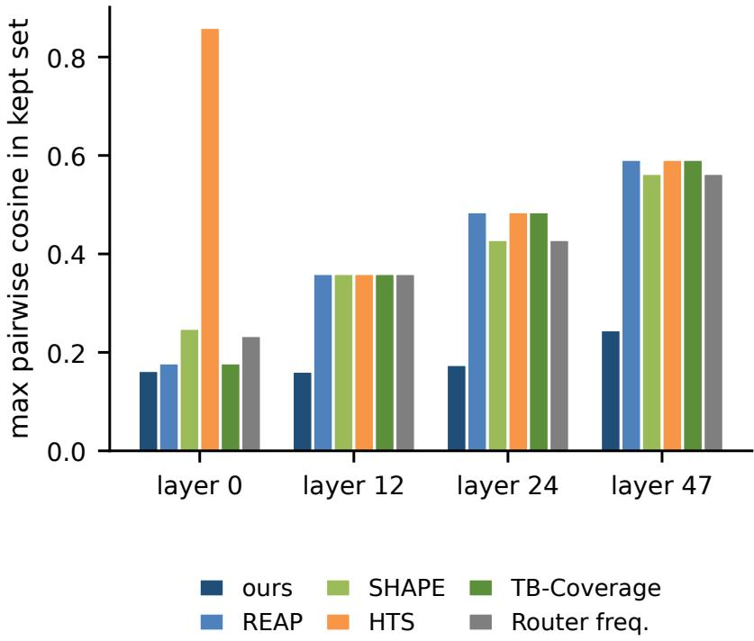  
Figure A10: Maximum pairwise signature cosine within the retained expert sets across four representative layers. DIET consistently maintains the lowest internal redundancy, preserving diverse directional coverage.

(b) sparse positive tail  
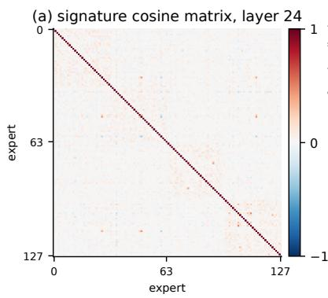

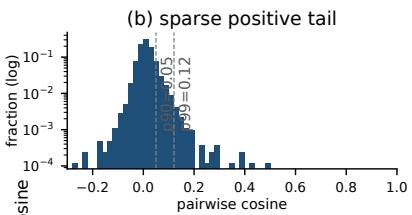

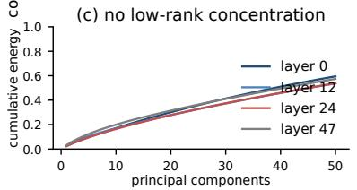  
Figure A11: Geometric properties of deletion-response signatures at layer 24. (a) Pairwise signature cosine matrix. (b) Distribution of pairwise cosines (logarithmic scale), demonstrating sharp concentration near zero with an extended positive tail. (c) Cumulative singular value energy, exhibiting absence of low-rank concentration.

## L RESPONSE GEOMETRY ACROSS ARCHITECTURE DEPTH

The geometric characteristics observed at individual layers generalize throughout the network $( { \mathrm { F i g } } -$ ure A12). The singular spectrum remains uniformly flat across all 48 layers, with participation ratios averaging 109 (range 93–119). Pairwise cosines are densely concentrated around zero $( p _ { 9 0 } \in [ 0 . 0 3 5 , 0 . 0 7 6 ] , p _ { 9 9 } \in [ 0 . 0 9 , 0 . 1 9 ] )$ . While sparse positive tails exist across all depths, their density varies smoothly (averaging 3.6 pairs with cos $> 0 . 3$ per layer). Thus, near-orthogonality and sparse directional alignment represent intrinsic structural features of the video MoE backbone.

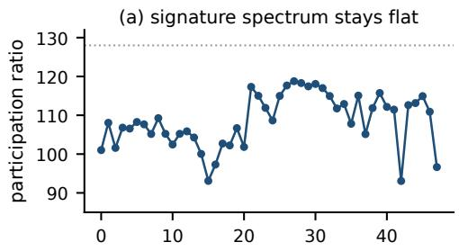

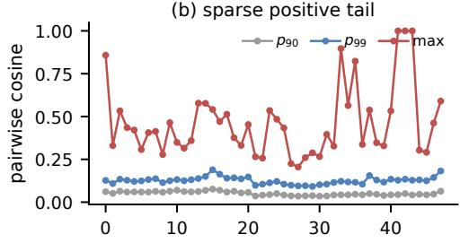

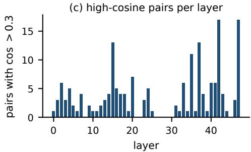

(d) nearest-neighbour similarity  
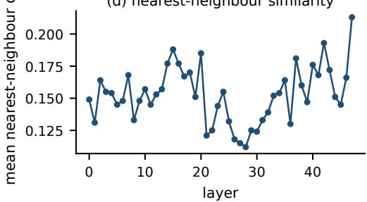  
Figure A12: Layer-wise geometric profile across all 48 transformer blocks. (a) Singular spectrum participation ratios. (b) Pairwise cosine quantiles and maxima. (c) Density of high-cosine pairs $\mathrm { ( c o s > 0 . 3 ) }$ . (d) Mean nearest-neighbor cosine.

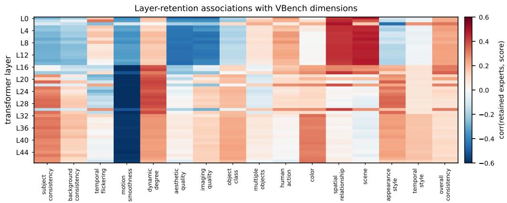  
Figure A13: Empirical correlation between layer-wise retained expert counts and standardized VBench dimension scores across search trajectories, highlighting functional division of labor across network depth.

## M IMPLEMENTATION AND PORTING OF LLM MOE BASELINES

Table A5: Summary of evaluated MoE pruning baselines adapted to video DiT architectures (Lasby et al., 2026; Zhang, 2026; Liu et al., 2026b; Zeng et al., 2026; Lu et al., 2024). All methods utilize identical calibration tensors, evaluation protocols, and budget allocations.

<table><tr><td>Method</td><td>Pruning Metric</td><td>Source Domain</td><td>Reference</td></tr><tr><td>Router Frequency</td><td>Token dispatch counts</td><td>LLM MoE</td><td>Standard Baseline</td></tr><tr><td>REAP</td><td>Gating weight × activation norm</td><td>LLM MoE</td><td>Lasby et al. (2026)</td></tr><tr><td>SHAPE</td><td>Coalition Shapley values</td><td>LLM MoE</td><td>Zhang (2026)</td></tr><tr><td>HTS</td><td>Activation norm formulations</td><td>LLM MoE</td><td>Liu et al. (2026b)</td></tr><tr><td>TB-Coverage</td><td>Round-robin register protection</td><td>LLM MoE</td><td>Zeng et al. (2026)</td></tr><tr><td>NAEE-Style Recon</td><td>Replayed layer-output reconstruction</td><td>LLM MoE</td><td>Lu et al. (2024)</td></tr><tr><td>DIET (Ours)</td><td>Deletion-response overall diversity loss</td><td>Video DiT</td><td>This work</td></tr></table>

Porting baseline criteria. All ported baselines consume identical calibration tensors recorded across the 120 calibration runs over all 48 layers, executing under the same per-layer retention allocations as DIET (summarized in Table A5):

• Router Frequency. Scores each expert by total routed token volume across matched conditional and unconditional branches.

• REAP. Implements the routing-weighted activation saliency metric of Lasby et al. (2026):

$$
s ( e ) ~ = ~ \frac { 1 } { | \mathcal { X } _ { e } | } \sum _ { \substack { t : e \in \mathcal { T } _ { k } ( x _ { t } ) } } g _ { e } ( x _ { t } ) \Vert f _ { e } ( x _ { t } ) \Vert _ { 2 } ,
$$

where $| \mathcal { X } _ { e } |$ is the total number of captured tokens dispatched to expert e.

• SHAPE. Evaluates marginal Shapley values across observed expert coalitions (Zhang, 2026), weighting marginal sub-coalition contributions by empirical occurrence frequency.

• HTS. Ports the unified scoring family of Liu et al. (2026b) and, for each retention budget, reports the stronger of its two task-agnostic gate-free criteria: Mean Squared Activation Norm (MSAN, S(1, 0, 2)), averaging $\| f _ { e } ( \bar { x } _ { t } ) \| _ { 2 } ^ { 2 }$ , and Mean Activation Norm (MAN, S(1, 0, 1)), averaging $\lVert f _ { e } ( \dot { x } _ { t } ) \rVert _ { 2 }$ , across routed tokens.

• TB-Coverage. Ports the coverage pipeline of Generic Expert Coverage (Zeng et al., 2026): each register scores experts with the REAP-style conditional-mean utility and ranks them independently, a round-robin protected set is built by alternating between the two rankings, the protected set is merged with reconstruction-stable candidates selected to minimize the fixed-gate output reconstruction error, and the lowest-scoring unprotected experts are removed to restore the budget.

The video setting has no WikiText2/C4 text corpora, so the two registers are formed from the two prompt families of the calibration corpus (appearance/composition against temporal/physics), with the protection budget fixed at B = 16, the largest value feasible at every layer.

• NAEE-Style Recon. Minimizes the replayed layer-output difference (Lu et al., 2024): for every layer, the solver of Section 3.2 is re-run with the objective replaced by the guidance-weighted $\ell _ { 2 }$ difference between the replayed and the captured layer output, at the same budgets, and the selection receives the same grouped-feasibility repair as the other ports. Evaluated on the full 120-case calibration set, this port reduces the mean replayed output error by about 40% relative to DIET (1.94 to 1.96 against 3.21 to 3.22 across the uniform and searched allocations).

All baseline selections are mapped to satisfy grouped-routing feasibility constraints; where raw selections violate the four-retained expert group floor, the highest-scoring feasible subset is retained. Complete dimension-wise results are compiled in Table A6 (50%); Tables A7 and A8 give the 20% and 80% budgets.

Table A6: Dimension-wise VBench evaluation on the full 284-case protocol under matched 50% budgets (3,072 retained experts).
<table><tr><td>Dimension</td><td>Full model</td><td>Router freq.</td><td>REAP</td><td>SHAPE</td><td>HTS</td><td>TB-Coverage</td><td>NAEE-Style Recon</td><td>Ours</td></tr><tr><td>Aesthetic qual.</td><td>0.554</td><td>0.503</td><td>0.555</td><td>0.485</td><td>0.580</td><td>0.528</td><td>0.540</td><td>0.598</td></tr><tr><td>Appearance style</td><td>0.806</td><td>0.789</td><td>0.785</td><td>0.773</td><td>0.802</td><td>0.812</td><td>0.817</td><td>0.813</td></tr><tr><td>Background cons.</td><td>0.937</td><td>0.929</td><td>0.953</td><td>0.920</td><td>0.955</td><td>0.953</td><td>0.947</td><td>0.954</td></tr><tr><td>Color</td><td>0.845</td><td>0.868</td><td>0.675</td><td>0.768</td><td>0.738</td><td>0.794</td><td>0.905</td><td>0.809</td></tr><tr><td>Dynamic degree</td><td>0.733</td><td>0.467</td><td>0.600</td><td>0.600</td><td>0.733</td><td>0.600</td><td>0.733</td><td>0.800</td></tr><tr><td>Human action</td><td>1.000</td><td>0.905</td><td>0.952</td><td>0.905</td><td>0.905</td><td>0.952</td><td>0.952</td><td>1.000</td></tr><tr><td>Imaging qual.</td><td>0.572</td><td>0.582</td><td>0.565</td><td>0.548</td><td>0.584</td><td>0.573</td><td>0.565</td><td>0.579</td></tr><tr><td>Motion smooth.</td><td>0.973</td><td>0.984</td><td>0.969</td><td>0.983</td><td>0.969</td><td>0.981</td><td>0.974</td><td>0.981</td></tr><tr><td>Multiple objects</td><td>0.610</td><td>0.426</td><td>0.467</td><td>0.390</td><td>0.610</td><td>0.423</td><td>0.544</td><td>0.702</td></tr><tr><td>Object class</td><td>0.846</td><td>0.699</td><td>0.801</td><td>0.702</td><td>0.831</td><td>0.820</td><td>0.798</td><td>0.871</td></tr><tr><td>Overall cons.</td><td>0.740</td><td>0.658</td><td>0.694</td><td>0.661</td><td>0.691</td><td>0.679</td><td>0.627</td><td>0.723</td></tr><tr><td>Scene</td><td>0.359</td><td>0.190</td><td>0.384</td><td>0.279</td><td>0.296</td><td>0.283</td><td>0.194</td><td>0.389</td></tr><tr><td>Spatial rel.</td><td>0.628</td><td>0.501</td><td>0.446</td><td>0.525</td><td>0.460</td><td>0.463</td><td>0.519</td><td>0.639</td></tr><tr><td>Subject cons.</td><td>0.905</td><td>0.866</td><td>0.926</td><td>0.848</td><td>0.919</td><td>0.903</td><td>0.919</td><td>0.927</td></tr><tr><td>Temporal flicker.</td><td>0.974</td><td>0.975</td><td>0.983</td><td>0.980</td><td>0.978</td><td>0.979</td><td>0.983</td><td>0.972</td></tr><tr><td>Temporal style</td><td>0.650</td><td>0.551</td><td>0.628</td><td>0.566</td><td>0.667</td><td>0.577</td><td>0.573</td><td>0.605</td></tr></table>

Table A7: Dimension-wise VBench evaluation on the full 284-case protocol at 20% retention (1,229 retained experts).
<table><tr><td>Dimension</td><td>Full model</td><td>Router freq.</td><td>REAP</td><td>SHAPE</td><td>HTS</td><td>TB-Coverage</td><td>NAEE-Style Recon</td><td>Ours</td></tr><tr><td>Aesthetic qual.</td><td>0.554</td><td>0.336</td><td>0.423</td><td>0.355</td><td>0.415</td><td>0.423</td><td>0.436</td><td>0.535</td></tr><tr><td>Appearance style</td><td>0.806</td><td>0.762</td><td>0.762</td><td>0.767</td><td>0.787</td><td>0.757</td><td>0.771</td><td>0.804</td></tr><tr><td>Background cons.</td><td>0.937</td><td>0.932</td><td>0.967</td><td>0.931</td><td>0.957</td><td>0.958</td><td>0.925</td><td>0.935</td></tr><tr><td>Color</td><td>0.845</td><td>0.818</td><td>0.662</td><td>0.700</td><td>0.615</td><td>0.762</td><td>0.764</td><td>0.769</td></tr><tr><td>Dynamic degree</td><td>0.733</td><td>0.667</td><td>0.267</td><td>0.533</td><td>0.533</td><td>0.600</td><td>0.467</td><td>0.400</td></tr><tr><td>Human action</td><td>1.000</td><td>0.286</td><td>0.524</td><td>0.381</td><td>0.762</td><td>0.476</td><td>0.571</td><td>0.857</td></tr><tr><td>Imaging qual.</td><td>0.572</td><td>0.459</td><td>0.516</td><td>0.481</td><td>0.562</td><td>0.558</td><td>0.574</td><td>0.604</td></tr><tr><td>Motion smooth.</td><td>0.973</td><td>0.981</td><td>0.984</td><td>0.976</td><td>0.979</td><td>0.983</td><td>0.979</td><td>0.988</td></tr><tr><td>Multiple objects</td><td>0.610</td><td>0.026</td><td>0.136</td><td>0.055</td><td>0.254</td><td>0.103</td><td>0.195</td><td>0.507</td></tr><tr><td>Object class</td><td>0.846</td><td>0.346</td><td>0.449</td><td>0.298</td><td>0.412</td><td>0.511</td><td>0.471</td><td>0.801</td></tr><tr><td>Overall cons.</td><td>0.740</td><td>0.487</td><td>0.519</td><td>0.494</td><td>0.486</td><td>0.547</td><td>0.556</td><td>0.643</td></tr><tr><td>Scene</td><td>0.359</td><td>0.013</td><td>0.160</td><td>0.068</td><td>0.114</td><td>0.203</td><td>0.258</td><td>0.224</td></tr><tr><td>Spatial rel.</td><td>0.628</td><td>0.053</td><td>0.148</td><td>0.108</td><td>0.362</td><td>0.161</td><td>0.193</td><td>0.409</td></tr><tr><td>Subject cons.</td><td>0.905</td><td>0.875</td><td>0.953</td><td>0.872</td><td>0.941</td><td>0.944</td><td>0.892</td><td>0.927</td></tr><tr><td>Temporal flicker.</td><td>0.974</td><td>0.980</td><td>0.981</td><td>0.974</td><td>0.978</td><td>0.971</td><td>0.982</td><td>0.984</td></tr><tr><td>Temporal style</td><td>0.650</td><td>0.350</td><td>0.383</td><td>0.359</td><td>0.442</td><td>0.446</td><td>0.417</td><td>0.515</td></tr></table>

## N RESOLUTION TRANSFERABILITY

We evaluate the generalization of the pruning configuration to the backbone’s native 480p resolution (480 × 720) across identical prompts and random seeds.

On the 72 cases shared by this screen and the 284-case protocol: the unpruned model scores 0.7923 at 480p, and the pruned mask reaches 0.8175 against 0.7924 for the baseline on the 71 cases that exclude the one prompt shared with calibration (+0.0251 paired, 95% $\operatorname { C I } { [ - 0 . 0 0 5 1 , + 0 . 0 5 6 3 ] } , n =$ 71; per-dimension shifts in Figure A14b).

Table A8: Dimension-wise VBench evaluation on the full 284-case protocol at 80% retention (4,915 retained experts).
<table><tr><td>Dimension</td><td>Full model</td><td>Router freq.</td><td>REAP</td><td>SHAPE</td><td>HTS</td><td>TB-Coverage</td><td>NAEE-Style Recon</td><td>Ours</td></tr><tr><td>Aesthetic qual.</td><td>0.554</td><td>0.585</td><td>0.576</td><td>0.577</td><td>0.572</td><td>0.589</td><td>0.579</td><td>0.586</td></tr><tr><td>Appearance style</td><td>0.806</td><td>0.814</td><td>0.799</td><td>0.806</td><td>0.795</td><td>0.811</td><td>0.814</td><td>0.800</td></tr><tr><td>Background cons.</td><td>0.937</td><td>0.934</td><td>0.958</td><td>0.944</td><td>0.953</td><td>0.957</td><td>0.954</td><td>0.959</td></tr><tr><td>Color</td><td>0.845</td><td>0.797</td><td>0.769</td><td>0.808</td><td>0.783</td><td>0.794</td><td>0.861</td><td>0.790</td></tr><tr><td>Dynamic degree</td><td>0.733</td><td>0.800</td><td>0.867</td><td>0.800</td><td>0.867</td><td>0.867</td><td>0.867</td><td>0.867</td></tr><tr><td>Human action</td><td>1.000</td><td>1.000</td><td>1.000</td><td>1.000</td><td>1.000</td><td>1.000</td><td>0.952</td><td>1.000</td></tr><tr><td>Imaging qual.</td><td>0.572</td><td>0.571</td><td>0.567</td><td>0.571</td><td>0.572</td><td>0.553</td><td>0.567</td><td>0.570</td></tr><tr><td>Motion smooth.</td><td>0.973</td><td>0.967</td><td>0.957</td><td>0.967</td><td>0.959</td><td>0.956</td><td>0.957</td><td>0.967</td></tr><tr><td>Multiple objects</td><td>0.610</td><td>0.596</td><td>0.618</td><td>0.621</td><td>0.669</td><td>0.614</td><td>0.629</td><td>0.603</td></tr><tr><td>Object class</td><td>0.846</td><td>0.864</td><td>0.816</td><td>0.846</td><td>0.846</td><td>0.853</td><td>0.835</td><td>0.875</td></tr><tr><td>Overall cons.</td><td>0.740</td><td>0.739</td><td>0.741</td><td>0.738</td><td>0.740</td><td>0.728</td><td>0.734</td><td>0.738</td></tr><tr><td>Scene</td><td>0.359</td><td>0.253</td><td>0.313</td><td>0.355</td><td>0.279</td><td>0.380</td><td>0.287</td><td>0.304</td></tr><tr><td>Spatial rel.</td><td>0.628</td><td>0.601</td><td>0.524</td><td>0.496</td><td>0.459</td><td>0.553</td><td>0.562</td><td>0.513</td></tr><tr><td>Subject cons.</td><td>0.905</td><td>0.883</td><td>0.918</td><td>0.881</td><td>0.925</td><td>0.916</td><td>0.915</td><td>0.924</td></tr><tr><td>Temporal flicker.</td><td>0.974</td><td>0.978</td><td>0.979</td><td>0.968</td><td>0.973</td><td>0.973</td><td>0.969</td><td>0.975</td></tr><tr><td>Temporal style</td><td>0.650</td><td>0.674</td><td>0.668</td><td>0.672</td><td>0.673</td><td>0.656</td><td>0.663</td><td>0.659</td></tr></table>

To put the pruned checkpoint on the same footing, the mask of Section 4.1 was run across the full 284-case protocol at native 480p on single-card replicas, attaining a Total score of 0.8179 (compared to 0.8115 for the same mask at 240p). The two 480p checks differ in mask, case set and run configuration, so their levels are not comparable; both agree that the pruned model holds at the higher resolution. The paired differential between resolutions is +0.0066 (95% CI [−0.0087, +0.0203], n = 279), with no systematic qualitative artifacts (Figure A15).

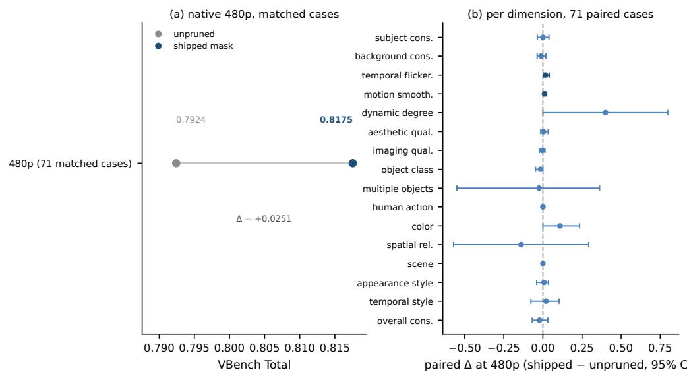  
Figure A14: Cross-resolution evaluation. (a) Total at native 480p for the unpruned model and the pruned mask, on the 71 matched cases of the resolution screen. (b) Paired dimension-wise differentials at native 480p (pruned mask minus unpruned, 95% CI).

selected as the largest gain among the five cases of this dimension

## dynamic degree — gain (Δ = +1.000, 480p)

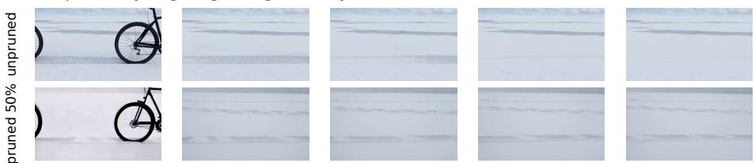  
multiple objects — failure (Δ = -0.812, 480p)  
selected as the largest loss among the five cases of this dimension Prompt: “a bowl and a remote”

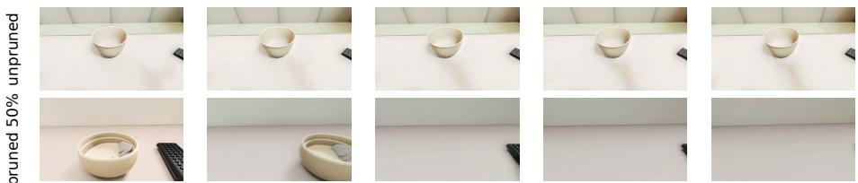  
aesthetic quality — neutral (Δ = -0.004, 480p)  
selected as a case whose score is essentially unchanged  
Prompt: “An astronaut feeding ducks on a sunny afternoon, reflection from the water.”

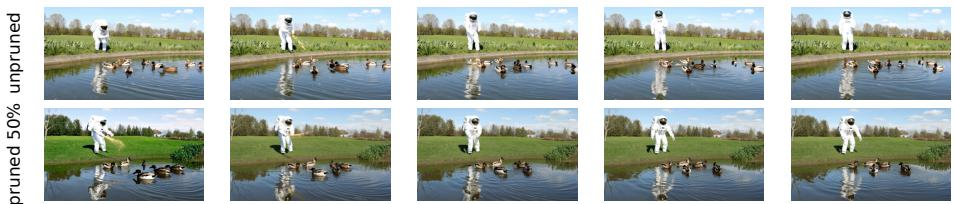  
Figure A15: Representative native 480p generations across positive, neutral, and sensitive dimensions under matched initializations. Panels compare unpruned baselines (top row) against DIET at 50% retention (bottom row).

## O MODEL SLICING AND COMPACT CHECKPOINT ASSEMBLY

Retained expert masks can be deployed via either dynamic runtime masking or physical tensor compaction, both preserving exact routing semantics. In dynamic runtime masking, the router evaluates all E candidate logits, masks excised expert indices to −∞, and re-normalizes surviving gates. In physical compaction (utilized for all reported results), the expert weight tensors are physically sliced along the expert dimension, reducing the expert bank to kℓ surviving blocks. The routing module retains its original index projection, masking excised logits and utilizing an index lookup table to direct surviving indices to their compacted physical memory slots. Attention parameters, shared experts, and normalization layers are preserved unmodified.

Numerical verification confirms that the offline simulator and the compacted runtime model exhibi high-fidelity numerical agreement, displaying a mean token-wise relative output error of $3 . 4 \times 1 0 ^ { - 3 }$ across all 48 layers (40 evaluated scenarios). This residual error arises strictly from floating-point caching quantization (bfloat16 gating values and fp16 expert outputs): evaluating routing in float64 shifts the output delta $\mathrm { b y } < \bar { 1 0 } ^ { - 9 }$ , whereas modifying routing logic to ungrouped top-k increases output divergence to 0.23. Thus, the optimization objective operates on a high-fidelity representation of the physical inference operator.

## P PHYSICAL MEMORY AND DEPLOYMENT FOOTPRINT

As detailed in Table A9, while active computational cost per step remains constant, halving the expert bank reduces the replica’s stored weights from 57 GB to 30 GB in bfloat16. Consequently,

a complete model replica fits on a single 48 GB GPU (e.g., NVIDIA RTX 6000 Ada, A40, or L40), eliminating inter-GPU communication and halving deployment costs.

Table A9: Physical deployment and memory footprint comparison between the unpruned model and DIET at 50% retention. Measurements reflect empirical single-replica execution. Active FLOPs per token remain strictly identical.
<table><tr><td>Metric</td><td>Full Model</td><td>DIET (50%)</td></tr><tr><td>Routed Expert Count</td><td>6,144</td><td>3,072</td></tr><tr><td>Expert Bank Parameters</td><td>29.0B</td><td>14.5B</td></tr><tr><td>Checkpoint Disk Footprint (bfloat16)</td><td>57GB</td><td>30 GB</td></tr><tr><td>Required GPUs per Replica (48 GB VRAM)</td><td>2</td><td>1</td></tr><tr><td>Total Replica VRAM Allocation</td><td>93.2 GiB (2 × 46.6)</td><td>44.7 GiB</td></tr><tr><td>Peak Memory (240 × 416, Batch Size 2)</td><td>46.6 GiB</td><td>44.7 GiB</td></tr><tr><td>Active Experts per Token</td><td>8</td><td>8</td></tr><tr><td>Active FLOPs per Token</td><td colspan="2">Identical</td></tr></table>

## Q ADDITIONAL ABLATIONS

Table 3 summarizes ablation experiments isolating core framework components. Formulating selection via the summed-response norm—an additive proxy prevalent in classical pruning literature— precipitates a 5.44-point degradation, collapsing spatial coherence dimensions from 0.63 to 0.33. As demonstrated in Figure A16, this degradation is consistent with the observed non-additivity of multi-expert removals: the cosine similarity between a joint deletion perturbation and the linear sum of single-deletion responses degrades from 1.00 at k = 1 to 0.66 at k = 64, with relative reconstruction error escalating to 0.95. Consequently, additive norm metrics fail to model multi-expert removal dynamics.

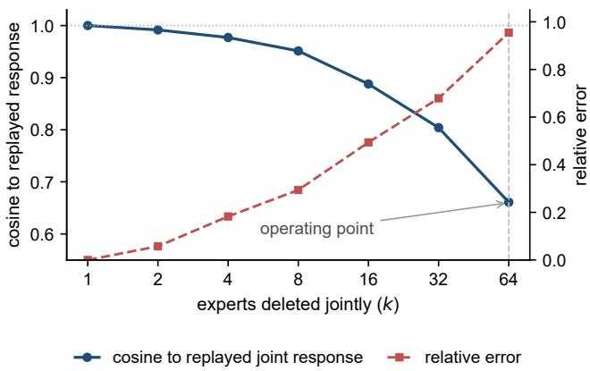  
Figure A16: Breakdown of additive superposition under joint multi-expert deletions. Cosine similarity between true joint response perturbations and constituent single-deletion sums degrades sharply with deletion cardinality.

## R PAIRED STATISTICAL SIGNIFICANCE ANALYSIS

Because all evaluations share identical prompt sequences and seed initializations, statistical significance is quantified via paired bootstrap resampling (10,000 iterations) over prompt cases (Figure A17).

Relative to the unpruned baseline, DIET achieves an overall paired differential of ∆Total = +0.0176 (95% CI [+0.0057, +0.0306], n = 277). When dynamic degree is excluded and remaining dimensions are re-normalized, the improvement remains statistically significant (+0.0145, 95% CI [+0.0039, +0.0249], n = 262), confirming that the aggregate gain is not solely driven by dynamic degree. Against ported LLM baselines, the paired differentials over common completed cases are statistically significant for Router Frequency +0.0632 (95% CI $\left[ + 0 . 0 4 0 9 , + 0 . 0 8 5 2 \right] )$ SHAPE +0.0642 (95% CI [+0.0431, +0.0855]), REAP +0.0349 (95% CI [+0.0183, +0.0531]), TB-Coverage +0.0390 (95% CI [+0.0219, +0.0575]), and NAEE-Style Recon +0.0274 (95% CI $[ + 0 . 0 0 9 1 , + 0 . 0 4 5 8 ] )$ ; against HTS, the strongest ported baseline (best of its variants; Table 2), the paired differential is a positive but not statistically significant +0.0180 (95% CI $[ - 0 . 0 0 1 3 , + \bar { 0 } . 0 3 7 7 ] ) ;$ ; note that this paired estimate over common completed cases differs from the direct mean difference of $0 . 8 1 1 5 - 0 . 7 9 2 1 = 0 . 0 1 9 4$ over the full protocol.

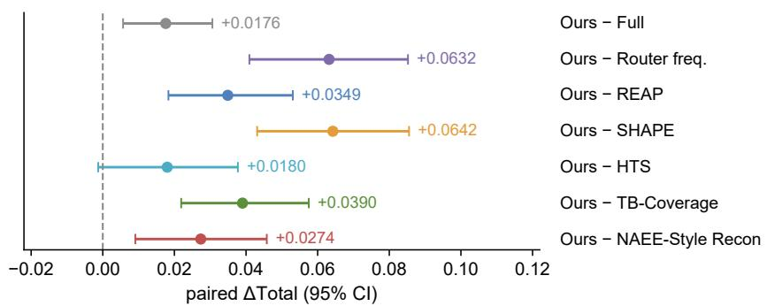  
Figure A17: Paired per-case bootstrap differentials (95% percentile intervals) comparing DIET against the dense baseline and ported MoE pruning heuristics at 50% retention.

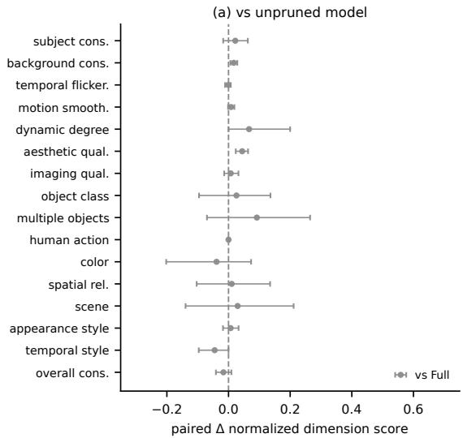

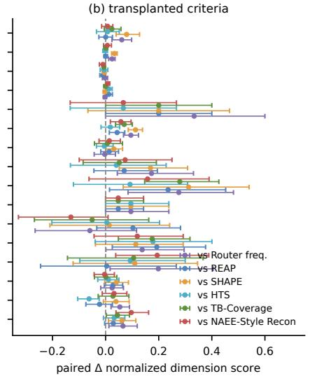  
Figure A18: Dimension-wise paired differentials (95% bootstrap intervals) comparing DIET against (a) the unpruned baseline and (b) ported LLM pruning baselines, including the reconstructioncriterion port NAEE-Style Recon. While differentials against the unpruned baseline exhibit conservative preservation across dimensions, comparisons against ported baselines demonstrate decisive semantic advantages.

As shown in Figure A18, differentials relative to the unpruned baseline reflect robust preservation across most dimensions with localized semantic enhancements. Conversely, comparisons against ported LLM baselines demonstrate consistent, statistically significant advantages concentrated in high-level semantic dimensions. The same decomposition at 20% and 80% retention appears in Figures A19 and A20: margins over every ported criterion—including the fidelity route NAEE-Style Recon—persist at 20% and compress toward parity at 80%, where only one to three dimensions separate the evaluated criteria.

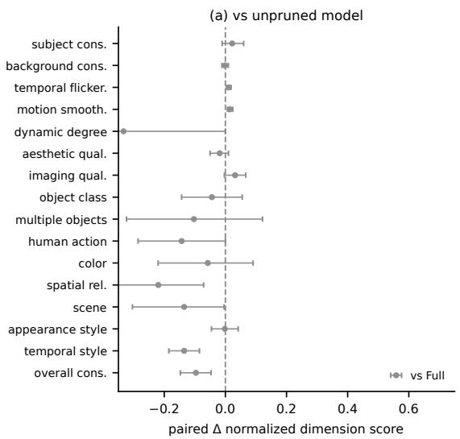

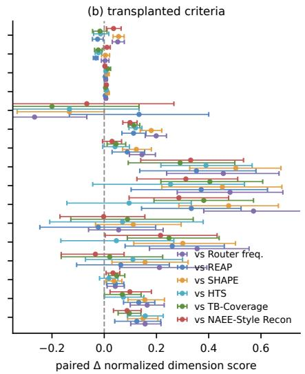

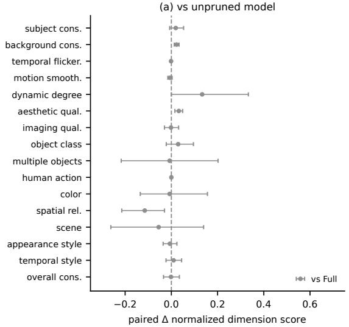

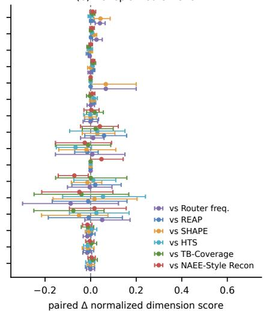

Figure A19: Dimension-wise paired differentials at (top) 20% and (bottom) 80% retention, with the same conventions as Figure A18.  
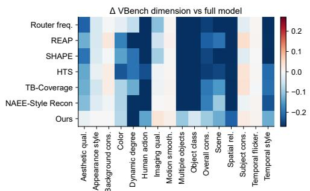

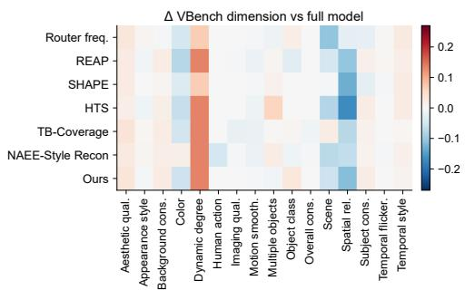  
Figure A20: Per-dimension deviation from the unpruned baseline at (left) 20% and (right) 80% retention; Figure 3 shows the 50% version.

## S GEOMETRIC SURROGATE FORMULATIONS AND FUNCTIONALREDUNDANCY

Overall Diversity Loss operates as a geometric surrogate for functional capacity retention, motivated by empirical deletion responses. Because the signature manifold is high-dimensional and approximately orthogonal, uniform low-rank coverage is unattainable. The ODL metric $1 - \cos ( \mathbf { s } _ { e } , \mathbf { s } _ { f ( e ) } )$ directly quantifies the directional discrepancy between excised expert e and its nearest surviving counterpart $f ( e )$ . Crucially, scale-invariance decouples selection from raw activation magnitude, which our empirical findings demonstrate to be an unreliable proxy for pruning resilience (Section 4.4).

Failure modes of norm-based objectives. Consider the global perturbation metric $\mathcal { N } ( \mathcal { D } ) \ =$ $\| \textstyle \sum _ { e \in { \mathcal { D } } } \mathbf { s } _ { e } \| ^ { 2 }$ . In near-orthogonal manifolds, cross-terms vanish $( \langle \mathbf { s } _ { i } , \mathbf { s } _ { j } \rangle \approx 0 )$ , reducing the objective to the sum of individual squared norms: $\begin{array} { r } { \mathcal { N } ( \mathcal { D } ) \approx \sum _ { e \in \mathcal { D } } \| \mathbf { s } _ { e } \| ^ { 2 } } \end{array}$ . Consequently, norm minimization defaults to excising experts with the smallest individual signature norms. Because signature norm correlates strongly with activation energy $( r = 0 . 9 1 )$ , this heuristic systematically discards directionally unique experts possessing modest activation scales, precipitating severe degradation across fine-grained semantic dimensions.

Discussion: Anisotropic functional sensitivity. The failure of magnitude-based criteria and the corresponding success of directional coverage motivate an insightful conceptual framing: in video diffusion transformers, representational sensitivity appears anisotropic. High-energy activations predominantly govern broad stylistic and low-frequency texture components that exhibit substantial directional redundancy across the expert bank. Conversely, specialized compositional semantics (e.g., spatial layout and fine-grained object categories) are frequently encoded by directionally unique ex perts operating at moderate activation scales. Direction-preserving selection via ODL protects these sparse semantic directions, providing a principled foundation for zero-shot expert trimming in video MoEs.