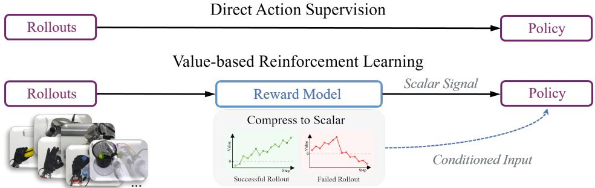
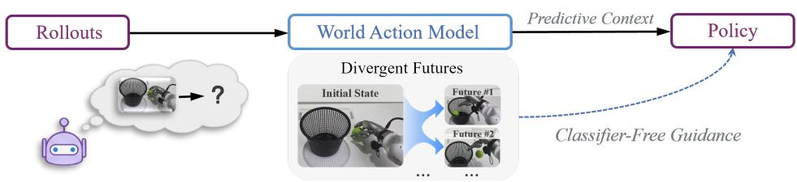
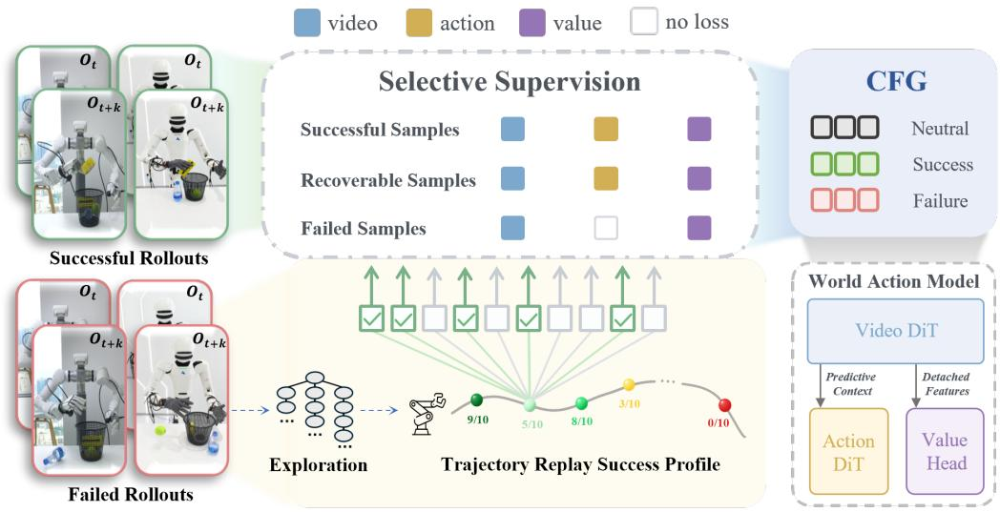
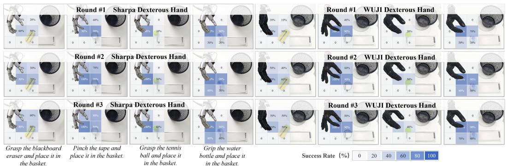
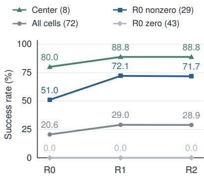
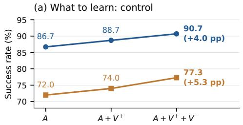
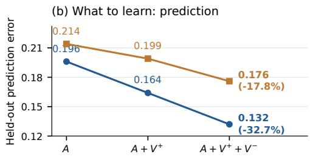
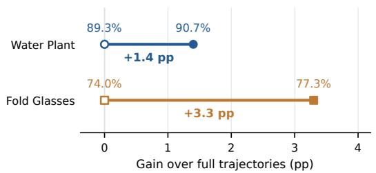
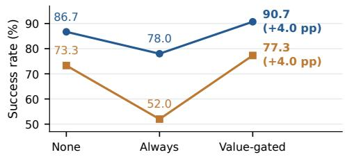

# DIRECT EXPERIENCE WORLD-MODEL OPTIMIZATION:LEARNING THE WORLD BEYOND ACTION IMITATION

Xiangcheng Zhan1 Zirui Chen2 Yicheng Zhao3 Ziteng Gao1 Shuo Yang1

1 Harbin Institute of Technology

2 Dalian University of Technology

Southern University of Science and Technology

## ABSTRACT

World-Action Models (WAMs) couple action generation with predictions of how physical interactions unfold. However, current post-deployment learning paradigms typically improve behavior without requiring better world predictions. Especially in dexterous manipulation, small execution errors can compound in high-dimensional action spaces, hindering policy improvement and pushing interactions beyond the world model’s training distribution. Motivated by this, we propose Direct Experience World-Model Optimization (DEWO), a post-deployment learning paradigm for WAMs that, alongside action imitation, refines world representations through visual experience to better condition action generation. Specifically, it identifies interaction turning points and learns from successful and failed futures to support classifier-free guidance. An additional value head estimates task progress from video representations and activates guidance when progress stalls during inference. Across five DexJoCo tasks, DEWO improves average success across all three WAM formulations. Ablations show that visual supervision from successful and failed continuations improves both prediction and control beyond action supervision alone. On four real-world tasks across Wuji and Sharpa, 3 × 3 grid evaluations show that two rounds of deployment learning increase success from 51.0% to 71.7% in cells with at least one initial success, a gain of 20.7 percentage points. These findings support continued predictive learning for improving control through deployment experience, making world modeling an active part of WAM adaptation.

## 1 INTRODUCTION

World-Action Models (WAMs) couple action generation with predictions of how physical interactions unfold (Tian et al., 2025; Ye et al., 2026; Zhang et al., 2026). Visual prediction provides dense supervision for interaction dynamics and can strengthen control even without explicit future generation at execution time (Finn et al., 2016; Yuan et al., 2026). Deployment offers an opportunity to extend this predictive learning to the interactions a robot actually encounters. Yet post-deployment learning through direct action supervision (Ross et al., 2011; Liu et al., 2023) or value-based reinforcement learning (Amin et al., 2026; Wagenmaker et al., 2025; Yu et al., 2026) primarily targets behavior, without requiring better predictions of deployment interactions (Figure 1).

This gap is especially relevant in dexterous manipulation, where small action deviations can alter contact and send otherwise similar executions toward different physical futures (Yang et al., 2026c; Feng et al., 2026). After such interaction turning points, later actions encounter different object configurations, allowing errors to compound as execution departs from the training distribution (Ross et al., 2011). For a WAM, this creates a coupled adaptation problem: unfamiliar interactions challenge both action generation and the predictive representations that support it.

These interaction turning points provide the key supervision for this adaptation. A failed continuation from such a context records a valid physical future even when its actions should not be imitated. Paired with a successful continuation from a comparable context, it reveals how similar interactions can evolve differently. Building on online world-model updates (Qian et al., 2026) and learning from failed interactions (Peng et al., 2026), we ask: how can continued world modeling from matched continuations around interaction turning points improve control beyond action imitation?

Experience World-Model Optimization  
  
Figure 1: Learning signals for post-deployment policy improvement. Direct action supervision (top) learns from action targets. Value-based reinforcement learning (middle) uses value estimates to improve the policy. DEWO (bottom) learns from observed visual futures and uses the learned success condition to guide actions.

We propose Direct Experience World-Model Optimization (DEWO), a post-deployment learning paradigm for WAMs that, alongside action imitation, refines world representations through visual experience to better condition action generation. Observed visual futures refine the predictive representations that support action generation, with action supervision as a complementary signal. Replay exploration identifies interaction turning points and collects matched successful and failed continuations. These continuations reveal how similar interactions can lead to different physical futures. Both outcomes supply visual supervision under their respective outcome conditions, while action targets come only from successful continuations.

At inference, classifier-free guidance (Ho & Salimans, 2022; Zheng et al., 2023) steers actions toward the learned success condition. A value head over video representations estimates task progress and activates guidance when it stalls. This connects the learned success condition to selective intervention at moments of insufficient task progress.

On five DexJoCo tasks (Wang et al., 2026a), DEWO improves average success across three WAM paradigms: joint modeling, video-then-action inverse dynamics, and FastWAM. In matched comparisons, success rises from 80.7% to 82.3% on FastWAM and from 64.5% to 81.2% on FACT, outperforming SFT on both. Controlled ablations show that visual-future supervision reduces held-out video loss and improves task success beyond action supervision alone. On four real-world tasks across two dexterous-hand platforms, two deployment-learning rounds raise pooled success across all evaluated positions from 20.6% to 28.9%. Spatial evaluation shows where these gains occur: success in cells with at least one initial success rises from 51.0% to 71.7%.

Our main contributions are:

• We formulate DEWO, a post-deployment learning paradigm for WAMs centered on continued world modeling from observed visual futures.

• We develop a framework around interaction turning points that links replay exploration, outcome-conditioned world modeling, and progress-gated guidance. It learns from matched successful and failed futures while reserving action supervision for successful behavior.

  
Figure 2: Overview of Direct Experience World-Model Optimization (DEWO). Replay exploration locates interaction turning points and collects successful and failed continuations from matched contexts. Their visual futures train outcome-conditioned world modeling, while successful behavior supplies action targets. At deployment, a value head monitors task progress and selectively activates classifier-free guidance using the base and success-conditioned action predictions.

• We demonstrate improved average task success across three WAM paradigms and postdeployment gains on two real-world dexterous-hand platforms. Controlled ablations show that learning from successful and failed visual experience improves both prediction and control beyond action supervision.

## 2 DIRECT EXPERIENCE WORLD-MODEL OPTIMIZATION

## 2.1 CONTINUED WORLD MODELING FROM DEPLOYMENT EXPERIENCE

Direct Experience World-Model Optimization (DEWO) formalizes continued world modeling (Kessler et al., 2023; Yao et al., 2026) as a post-deployment learning paradigm for WAMs. Beyond direct action supervision and value-based reinforcement learning, DEWO retains observed physical futures as learning targets. It focuses on interaction turning points, where small deviations can send similar executions toward different futures.

Let R denote deployment rollouts and $\mathcal { T } ( \mathcal { R } )$ their interaction turning points. For each $z \in \mathcal { T } ( \mathcal { R } )$ , hz denotes the interaction context and $\mathcal { C } ( z )$ the set of observed continuations collected around it. At the paradigm level, DEWO continues world-model learning on these continuations:

$$
\theta ^ { + } = \arg \operatorname* { m i n } _ { \theta } \mathbb { E } _ { z \sim \mathcal { T } ( \mathcal { R } ) } \mathbb { E } _ { \xi \sim \mathcal { C } ( z ) } \left[ \ell _ { \mathrm { v i s } } ( \theta ; h _ { z } , c , \xi ) \right] ,\tag{1}
$$

where c is the conditioning input and $\ell _ { \mathrm { v i s } }$ the WAM’s native visual prediction objective. The key distinction is therefore not a new visual loss, but how direct deployment experience is selected and organized for continued predictive learning: around interaction turning points and their subsequent physical futures. Actions from successful experience can additionally provide complementary supervision, which we specify below.

The following sections instantiate this paradigm through turning-point experience collection, outcomeconditioned world-model learning, and progress-gated action guidance (Figure 2).

## 2.2 FROM INTERACTION TURNING POINTS TO DIVERGENT FUTURES

Earlier interaction contexts of a failed rollout may still admit successful alternatives. DEWO revisits these contexts through replay exploration to identify interaction turning points and collect matched continuations that evolve toward different outcomes.

Replay exploration. In simulation, the original failed rollout provides a reference trajectory. At a queried interaction context $h _ { t }$ , we restore the corresponding environment state and sample K continuations $\{ \tau _ { t } ^ { ( k ) } \} _ { k = 1 } ^ { K }$ using the deployed checkpoint for the current collection round. Each continuation records its visual evolution, executed actions, and terminal outcome. Let $Y ( \tau ) \in \{ 0 , 1 \}$ denote task success. Empirical recoverability is

$$
\hat { \rho } _ { K } ( h _ { t } ) = \frac { 1 } { K } \sum _ { k = 1 } ^ { K } Y ( \tau _ { t } ^ { ( k ) } ) .\tag{2}
$$

The original rollout provides a failed continuation anchored at the same interaction context.

Identifying interaction turning points. We query contexts progressively along the failed rollout and use changes in empirical recoverability to localize interaction turning points. For successive queries $h _ { t _ { i } }$ and $h _ { t _ { i + 1 } }$ , we detect a boundary when

$$
\begin{array} { r } { \hat { \rho } _ { K } ( h _ { t _ { i } } ) > 0 , \qquad \hat { \rho } _ { K } ( h _ { t _ { i + 1 } } ) = 0 . } \end{array}\tag{3}
$$

At such a boundary, we retain from $h _ { t _ { i } }$ the shortest sampled successful continuation together with the corresponding continuation from the original failed rollout. Because both originate from the same restored interaction context, the pair exposes how similar interactions can lead to different subsequent physical futures. We also retain failed windows around sharp intermediate drops in recoverability, which provide additional supervision for unfavorable world evolution. Exact query spacing, retention thresholds, and tie-breaking rules are given in Appendix B.1. These turning points reflect the current policy and finite sampling budget; zero sampled successes need not imply physical irrecoverability.

Matched experience on physical robots. Physical collection follows the same principle without requiring exact state restoration. Human inspection selects candidate interaction contexts from failed rollouts, after which the task-relevant scene and robot configuration are restored and alternative continuations are collected. Matching is defined by comparable task-relevant physical configurations rather than identical images or observation histories. Appendix B.1 describes how these configurations are restored on the robots.

Retained experience. The retained successful and failed continuations, $\mathcal { D } _ { + }$ and $\mathcal { D } _ { - }$ , form our critical experience. Both provide visual supervision for how interactions unfold, while only $\mathcal { D } _ { + }$ provides action targets. These futures support outcome-conditioned world modeling; replay statistics also train a value head for progress estimation during execution (Section 2.4).

## 2.3 OUTCOME-CONDITIONED WORLD-MODEL LEARNING

The continuations collected around interaction turning points provide visual evidence of how comparable interaction contexts can evolve toward different outcomes. DEWO uses outcome conditioning to learn these divergent futures while preserving their association with task success or failure. Adding a success or failure label to the original task condition $c _ { \mathrm { b a s e } }$ gives $c _ { + }$ or $c _ { - }$

Successful continuations supervise both visual and action prediction under $c _ { + }$ , whereas failed continuations supervise visual prediction under $c _ { - }$ . The critical-experience objective is

$$
\begin{array} { r l } & { \mathcal { L } _ { \mathrm { c r i t } } = \mathbb { E } _ { \tau ^ { + } \sim \mathcal { D } _ { + } } \left[ \mathcal { L } _ { \mathrm { v i s } } ( \tau ^ { + } \mid c _ { + } ) + \lambda _ { \mathrm { a c t } } \mathcal { L } _ { \mathrm { a c t } } ( \tau ^ { + } \mid c _ { + } ) \right] } \\ & { \phantom { \mathcal { L } _ { \mathrm { c r i t } } = } + \mathbb { E } _ { \tau ^ { - } \sim \mathcal { D } _ { - } } \left[ \mathcal { L } _ { \mathrm { v i s } } ( \tau ^ { - } \mid c _ { - } ) \right] . } \end{array}\tag{4}
$$

Here, ${ \mathcal { L } } _ { \mathrm { v i s } }$ and $\mathcal { L } _ { \mathrm { a c t } }$ are the native WAM objectives applied to windows from each continuation, and $\lambda _ { \mathrm { { a c t } } }$ weights action supervision. Failed continuations thus extend world-model learning beyond the successful behavior available for action supervision. Through the WAM’s existing coupling between prediction and action, these predictive updates support action generation. The role-weighted training objective and implementation-specific regularizers are specified in Appendix B.2.

Preparing success-conditioned guidance. To use the learned success condition during execution, we train a base reference within the same WAM. Alongside the critical experience, we replay retained successful experience $\mathcal { D } _ { 0 }$ under $c _ { \mathrm { b a s e } }$ using the native visual and action objectives. We also randomly drop the success label from critical successful examples, replacing $c _ { + }$ with $c _ { \mathrm { b a s e } }$ . Replay provides broader successful task experience, while condition dropout trains the base reference on the same critical continuations used by the success condition. The base and success predictions share model parameters and provide the two action branches for classifier-free guidance. Section 2.4 uses progress estimates to determine when to invoke this guidance.

## 2.4 PROGRESS-GATED ACTION GUIDANCE

At inference, we use the learned success condition for classifier-free action guidance. The WAM follows $c _ { \mathrm { b a s e } }$ by default. A value head on its video representations, trained on replay continuations to predict discounted terminal success, monitors progress. Guidance is activated when these estimates fail to increase sufficiently over a recent window of replanning decisions.

At generative time $s ,$ let $f _ { b , s } ^ { \mathrm { a c t } }$ and $f _ { + , s } ^ { \mathrm { a c t } }$ denote the native action predictions under $c _ { \mathrm { b a s e } }$ and $c _ { + }$ , with the current action latent and other inputs shared. With guidance scale w and progress gate $g _ { j } \in \{ 0 , 1 \}$ the guided action prediction at replan j is

$$
f _ { \mathrm { g u i d e d } , s } ^ { \mathrm { a c t } } = f _ { { b } , s } ^ { \mathrm { a c t } } + g _ { j } w \left( f _ { + , s } ^ { \mathrm { a c t } } - f _ { { b } , s } ^ { \mathrm { a c t } } \right) .\tag{5}
$$

For flow-matching WAMs (Lipman et al., 2023), f is the predicted velocity field. The gate selectively adds the learned success direction, while visual prediction remains base-conditioned. Appendices B.3 and B.4 specify value targets, feature extraction, and the gating rule; Appendix E analyzes the guidance direction.

## 3 EXPERIMENTS

We evaluate DEWO’s post-deployment gains across prediction–action formulations and track performance over repeated real-world deployment. We also include a complementary construction setting, DEWO-S, which starts from pretrained video and action components. Section 4 analyzes visual supervision, experience selection, and guidance timing.

## 3.1 EXPERIMENTAL SETUP

Simulation. We use five DexJoCo tasks (Wang et al., 2026a): Water Plant, Fold Glasses, Hammer Nail, Pick Bucket, and Pinch Tongs. All simulation tests, including ablations, evaluate each checkpoint on three 50-scene sets per task; overall averages weight tasks equally. Methods within each adaptation comparison share evaluation scenes. Collection and evaluation use distinct spatial configurations; Appendix A.1 details the shared evaluation protocol.

Models and comparisons. We evaluate two WAMs, FastWAM (Yuan et al., 2026) and FACT (Peng et al., 2026), and the VLA $\pi _ { 0 . 5 }$ (Intelligence et al., 2025). On both WAMs, we compare DEWO with supervised fine-tuning (SFT). The WAM SFT baseline follows FACT’s failure-aware training scheme, using all rollouts for video and value/progress supervision, while restricting action imitation to successful rollouts. For $\pi _ { 0 . 5 } ,$ , SFT uses only successful rollouts. We additionally compare RECAP (Amin et al., 2026) and DSRL (Wagenmaker et al., 2025) on $\pi _ { 0 . 5 }$ and FastWAM. Methods share an initial checkpoint within each base-model comparison; the $\pi _ { 0 . 5 }$ and FastWAM comparisons match training-data quantities and budgets. Implementation details are provided in Appendix A.

Table 1B examines prediction–action coupling within a shared mixture-of-transformers (MoT) built from Wan2.2 VideoDiT (Wan et al., 2025) and ActionDiT components. The three formulations— Joint, IDM, and FastWAM—are each evaluated before and after DEWO. Table 1C reports DEWO-S construction: a Joint WAM is trained from pretrained video and action components under the DEWO objective and evaluated before further deployment adaptation.

Real-world evaluation. We evaluate grasp-and-place of a water bottle, tape, an eraser, and a tennis ball with Wuji and Sharpa hands. Success requires grasping the object and placing it in the target basket. Each object–hand pair uses a $3 \times 3$ position grid with ten trials per cell. R0 is the initial DEWO-S model trained on data collected near the center; R1 and R2 each follow a DEWO collection–optimization cycle, giving 2,160 trials across eight pairs and three rounds. We report full-grid success and a fixed subset of cells with at least one R0 success, including centers. π0.5 is a separate reference. Protocols and grid counts appear in Appendices C and G.

Table 1: Simulation success rates (%) over three 50-trial sets per task; Avg. weights tasks equally. A: matched adaptation comparisons. B: prediction–action formulation ablation; FastWAM repeats A. C: DEWO-S construction from pretrained components (—: no subsequent adaptation). Per-set results are in Appendix F.
<table><tr><td>Model</td><td>Method</td><td>Water Plant</td><td>Fold Glasses</td><td>Hammer Nail</td><td>Pick Bucket</td><td>Pinch Tongs</td><td>Avg.</td></tr><tr><td colspan="8">A. Matched post-deployment comparisons</td></tr><tr><td>π0.5</td><td>Initial</td><td>73.3</td><td>58.0</td><td>74.7</td><td>78.7</td><td>62.7</td><td>69.5</td></tr><tr><td></td><td>+ SFT</td><td>75.3</td><td>59.3</td><td>76.7</td><td>85.3</td><td>22.7</td><td>63.9</td></tr><tr><td></td><td>+ RECAP</td><td>75.3</td><td>51.3</td><td>80.0</td><td>84.0</td><td>57.3</td><td>69.6</td></tr><tr><td></td><td>+ DSRL</td><td>76.7</td><td>54.7</td><td>81.3</td><td>86.0</td><td>22.7</td><td>64.3</td></tr><tr><td>FACT</td><td>Initial</td><td>66.0</td><td>68.0</td><td>25.3</td><td>85.3</td><td>78.0</td><td>64.5</td></tr><tr><td></td><td>+ SFT</td><td>68.7</td><td>69.3</td><td>41.3</td><td>86.7</td><td>84.7</td><td>70.1</td></tr><tr><td>FastWAM</td><td>+ DEWO</td><td>94.7</td><td>78.7</td><td>44.7</td><td>92.7</td><td>95.3</td><td>81.2</td></tr><tr><td></td><td>Initial</td><td>88.7</td><td>72.0</td><td>74.7</td><td>92.0</td><td>76.0</td><td>80.7</td></tr><tr><td></td><td>+ SFT</td><td>73.3</td><td>74.7</td><td>78.7</td><td>84.7</td><td>69.3</td><td>76.1</td></tr><tr><td></td><td>+ RECAP</td><td>78.0</td><td>72.7</td><td>71.3</td><td>90.7</td><td>71.3</td><td>76.8</td></tr><tr><td></td><td>+ DSRL</td><td>73.3</td><td>78.0</td><td>74.7</td><td>90.7</td><td>66.0</td><td>76.5</td></tr><tr><td></td><td>+ DEWO</td><td>90.7</td><td>77.3</td><td>72.7</td><td>93.3</td><td>77.3</td><td>82.3</td></tr><tr><td colspan="8">B. Prediction-action formulation ablation</td></tr><tr><td>IDM</td><td>Initial</td><td>86.0</td><td>68.0</td><td>85.3</td><td>86.0</td><td>85.3</td><td>82.1</td></tr><tr><td></td><td>+ DEWO</td><td>96.7</td><td>72.0</td><td>81.3</td><td>88.7</td><td>81.3</td><td>84.0</td></tr><tr><td>FastWAM</td><td>Initial</td><td>88.7</td><td>72.0</td><td>74.7</td><td>92.0</td><td>76.0</td><td>80.7</td></tr><tr><td></td><td>+ DEWO</td><td>90.7</td><td>77.3</td><td>72.7</td><td>93.3</td><td>77.3</td><td>82.3</td></tr><tr><td>Joint</td><td>Initial</td><td>81.3</td><td>74.7</td><td>82.0</td><td>92.7</td><td>78.7</td><td>81.9</td></tr><tr><td></td><td>+ DEWO</td><td>92.0</td><td>75.3</td><td>79.3</td><td>94.7</td><td>92.0</td><td>86.7</td></tr><tr><td colspan="8">C. Construction from pretrained components</td></tr><tr><td>DEWO-S</td><td></td><td>94.7</td><td>82.7</td><td>76.7</td><td>97.3</td><td>98.0</td><td>89.9</td></tr></table>

## 3.2 SIMULATION RESULTS

Post-deployment adaptation in dexterous control. Post-deployment updates do not consistently improve dexterous policies (Table 1A). On FastWAM, SFT, RECAP, and DSRL reach 76.1–76.8% average success, below the initial 80.7%. We attribute this difficulty in part to high-dimensional, contact-sensitive hand control, where small action changes can disrupt coordinated contacts and compound during execution (Yang et al., 2026c). DEWO raises FastWAM to 82.3% and FACT from 64.5% to 81.2%, compared with 70.1% for FACT SFT. Since WAM SFT also uses visual futures, the advantage on both models extends beyond simply retaining visual supervision. Section 3.3 examines how deployment gains relate to the model’s initial spatial generalization.

DEWO benefits from joint modeling. DEWO improves all three prediction–action formulations, with average gains of 4.8 percentage points for Joint, 1.9 for IDM, and 1.6 for FastWAM (Table 1B). Joint benefits most; we hypothesize that its direct coupling of future prediction and action generation allows their learning to reinforce each other. This motivates introducing DEWO from the start of WAM training. DEWO-S applies the DEWO objective while constructing a Joint MoT from pretrained Wan2.2 VideoDiT and ActionDiT components. It reaches 89.9% average success (Table 1C), compared with 86.7% for Joint adapted after initial training. These results suggest that integrating experience-based world-model learning during initial construction can provide a stronger foundation for subsequent adaptation. DEWO-S provides the real-world starting point.

(a) Spatial success maps  

(b) Pooled deployment results  

(c) Full-grid rates (%)
<table><tr><td>Hand</td><td>Object</td><td>π0.5</td><td>RO</td><td>R1</td><td>R2</td></tr><tr><td>Sharpa</td><td>Eraser</td><td>17.8</td><td>17.8</td><td>28.9</td><td>28.9</td></tr><tr><td></td><td>Tape</td><td>30.0</td><td>30.0</td><td>36.7</td><td>36.7</td></tr><tr><td></td><td>Tennis ball</td><td>12.2</td><td>13.3</td><td>23.3</td><td>23.3</td></tr><tr><td>Sharpa</td><td>Water bottle</td><td>26.7</td><td>27.8</td><td>35.6</td><td>35.6</td></tr><tr><td>Wuji</td><td>Average</td><td>21.7</td><td>22.2</td><td>31.1</td><td>31.1</td></tr><tr><td></td><td>Eraser</td><td>12.2</td><td>13.3</td><td>24.4</td><td>24.4</td></tr><tr><td></td><td>Tape</td><td>28.9</td><td>30.0</td><td>35.6</td><td>35.6</td></tr><tr><td></td><td>Tennis ball</td><td>6.7</td><td>6.7</td><td>12.2</td><td>11.1</td></tr><tr><td></td><td>Water bottle</td><td>23.3</td><td>25.6</td><td>35.6</td><td>35.6</td></tr><tr><td>Wuji</td><td>Average</td><td>17.8</td><td>18.9</td><td>26.9</td><td>26.7</td></tr><tr><td>Pooled</td><td>Average</td><td>19.7</td><td>20.6</td><td>29.0</td><td>28.9</td></tr></table>

Figure 3: Spatial and iterative real-world evaluation. (a) Two hands, four objects, three rounds; image labels Round #1/#2/#3 denote R0/R1/R2. (b) Pooled success for eight centers, 29 R0-nonzero cells (including centers), 43 R0-zero cells, and all 72 cells. Groups stay fixed across rounds, with ten trials per cell (720 per round). (c) Full-grid rates by object and hand; $\pi _ { 0 . 5 }$ is a separate reference.

## 3.3 REAL-WORLD RESULTS: ITERATION AND SPATIAL GENERALIZATION

Deployment learning improves both embodiments. All eight object–hand pairs improve from R0 to R2. Pooled full-grid success rises from 20.6% (148/720) to 28.9% (208/720) (Figure 3c). Gains occur on both hands: from 18.9% to 26.7% on Wuji and from 22.2% to 31.1% on Sharpa. Sharpa maintains higher success across rounds. We suspect that its joint articulation better accommodates the tested grasps, contributing to this advantage.

Iterative DEWO reinforces initial spatial generalization. Comparing R0, R1, and R2 locates the gains from successive updates (Figure 3b). On the fixed 29 cells with at least one R0 success, pooled success rises from 51.0% to 72.1% and 71.7%. The improvement concentrates at off-center positions, where success increases from 40.0% to 65.7% and 65.2%, compared with 80.0%, 88.8%, and 88.8% at the centers. These off-center positions already admit occasional R0 success despite initial training near the center. All 43 initially zero cells remain at zero. This pattern indicates that DEWO primarily makes the initial model’s spatial generalization more reliable: most of the improvement emerges in R1 and is retained in R2. Appendix C.4 gives the counts and aggregation.

## 4 ANALYSIS

Figure 4 analyzes consequence supervision, experience selection, and guidance timing on Water Plant and Fold Glasses. Training ablations independently adapt the same FastWAM checkpoint on the same rollout pool; guidance ablations vary only inference settings on one adapted checkpoint. Appendix D specifies the protocols and offline metric.

(c) Where to learn  

(d) When to guide  
  
Figure 4: Component analysis on Water Plant and Fold Glasses. A: successful-action supervision; $V ^ { \mp } / V ^ { - } ;$ successful/failed visual futures. (a,b) Task success and validation video loss (lower is better), with changes from A. Failed actions are not imitation targets. (c) Full trajectories (open) versus critical experience (filled), matching data sizes and training budgets; labels show success. (d) No guidance, continuous guidance, and value-gated guidance; gains are relative to no guidance in percentage points (pp).

## 4.1 LEARNING CONSEQUENCES BEYOND ACTION IMITATION

Consequence supervision improves task success. We retain successful-action supervision and add visual targets in two steps, separating the contribution of successful futures from that of failed futures. Adding successful $( \hat V ^ { + } )$ and then failed $( V ^ { - } )$ visual futures to successful-action supervision (A) raises success from 86.7% to 88.7% to 90.7% on Water Plant and from 72.0% to 74.0% to 77.3% on Fold Glasses (Figure 4a). The second increment comes from continuations that provide no action-imitation targets, showing that their observed consequences can improve control through predictive learning.

Predictive improvements accompany the control gains. To examine whether the same updates also improve world modeling, we evaluate the variants using held-out video prediction loss. This loss falls on both tasks as visual supervision expands from successful to failed continuations (Figure 4b). Relative to action-only training, full visual supervision reduces this loss by 32.7% on Water Plant and 17.8% on Fold Glasses. These complementary measurements show that predictive adaptation accompanies the control improvements, supporting continued world-model learning alongside successful-action supervision.

## 4.2 EXPERIENCE SELECTION AND SELECTIVE GUIDANCE

Learning at interaction turning points improves control. We next test whether concentrating on local outcome divergence improves learning from a fixed deployment pool. Both variants draw from this pool with equal data sizes and training budgets. Critical experience outperforms full trajectories on Water Plant (90.7% vs. 89.3%) and Fold Glasses (77.3% vs. 74.0%; Figure 4c). The gains at matched budgets support the value of organizing supervision around consequential interactions. Matched continuations highlight different physical futures from comparable contexts, directing learning toward the local changes that separate successful and failed execution.

Guidance benefits from selective activation. On Water Plant and Fold Glasses, value-gated guidance achieves 90.7% and 77.3% success, compared with 86.7% and 73.3% without guidance and 78.0% and 52.0% under continuous guidance (Figure 4d). These gains support intervening selectively when estimated progress stalls.

## 5 RELATED WORK

World-action models for robot control. WAMs integrate visual dynamics modeling with action generation, using prediction of future observations to learn how actions affect the physical world (Wang et al., 2026c; Pai et al., 2025; Zeng et al., 2024). A central architectural choice is how this predictive capability supports control: predicted visual futures can serve as intermediate goals from which an inverse-dynamics model infers actions (Tian et al., 2025), or future observations and actions can be generated jointly (Ye et al., 2026; Kim et al., 2026). Predictive learning can also support control without explicitly generating futures at inference, as demonstrated by FastWAM, which retains video prediction during training (Yuan et al., 2026). Across these designs, the physical interactions available during training shape what the model can learn to predict. Deployment brings new interactions that offer opportunities to refine this predictive capacity. In this work, we explore how post-deployment training can refine this predictive capacity within existing WAM architectures to improve subsequent action generation.

Learning from deployment experience. Post-deployment learning commonly improves behavior through direct action supervision or value-based reinforcement learning. Expert corrections and interventions supply action targets (Ross et al., 2011; Liu et al., 2023), while scalar rewards and value estimates indicate which behaviors to favor (Wang et al., 2026b). RECAP uses advantage-conditioned updates (Amin et al., 2026); DSRL optimizes a frozen policy’s latent noise (Wagenmaker et al., 2025). These updates are especially challenging in dexterous manipulation, where small changes in highdimensional hand actions can disrupt coordination and contact. LAMP addresses this difficulty with a learned hand-motion prior that structures residual exploration around demonstrated motions (Yang et al., 2026c). WAMs provide a rich interaction prior through visual prediction, learning how robot motions affect objects and how physical states evolve (Finn et al., 2016). This predictive prior can itself be refined during deployment. Both successful and failed attempts provide physical futures for continued world modeling. Learning from these futures updates the representations supporting action generation alongside successful-action supervision.

Post-training world-action models. Recent work explores several forms of experience for posttraining (Bi et al., 2026; Hou et al., 2026). RISE uses learned dynamics to supply imagined interactions for policy improvement (Yang et al., 2026a), while WAM post-training can also update the predictive model itself. WAM-RL uses successful online rollouts for video supervision alongside reinforcement learning (Qian et al., 2026), whereas WAM-OPD obtains teacher-generated video and action targets on histories visited by the student (Yang et al., 2026b). Concurrent work FACT extends predictive supervision to failed rollouts, retaining their action-conditioned video and task-progress targets while masking action imitation (Peng et al., 2026). These efforts investigate predictive learning within different training objectives and data settings. Together, they motivate a unified view of post-deployment adaptation through continued world modeling. DEWO formalizes this direction as a post-deployment learning paradigm for WAMs. It organizes learning around interaction turning points, where matched successful and failed continuations reveal how similar interactions evolve toward different physical futures.

## 6 CONCLUSION

Direct Experience World-Model Optimization (DEWO) makes continued world modeling an explicit part of post-deployment learning for WAMs, alongside action supervision. By organizing matched successful and failed continuations around interaction turning points, it turns their diverging visual futures into predictive supervision that supports control. Experiments show gains across three WAM formulations and two real-world robot embodiments. Ablations show that successful and failed visual experience improves prediction and control beyond successful-action supervision alone.

Our real-world evaluations show that DEWO makes existing spatial generalization more reliable. Looking ahead, a central question is whether learning around interaction turning points can provide a foundation for sustained self-improvement. We envision agents that trace how failures emerge, learn which changes in an interaction can lead to success, and apply this knowledge to subsequent attempts. Coupled with exploration that uncovers new informative interactions, this process could extend learning beyond the model’s initial competence.

## AI USE STATEMENT

We used generative AI to assist with drafting, revising, and organizing the manuscript; identifying and comparing related work; discussing research framing and interpreting experimental results; and checking and revising mathematical formulations and derivations. The authors reviewed and edited the AI-assisted text, verified cited claims against the original sources, checked the mathematical derivations, and cross-checked reported results against the experimental records. We take responsibility for the final content of the paper, including all AI-assisted text, claims, and artifacts.

## REFERENCES

Ali Amin, Raichelle Aniceto, Ashwin Balakrishna, Kevin Black, Ken Conley, Grace B. Connors, James Darpinian, Karan Dhabalia, Jared Di Carlo, Danny Driess, Michael Robert Equi, Adnan Esmail, Yunhao Fang, Chelsea Finn, Catherine Glossop, Thomas Godden, Ivan Goryachev, Lachy Groom, Hunter Hancock, Karol Hausman, Gashon Hussein, Brian Ichter, Szymon Jakubczak, Rowan Jen, Tim Jones, Benjamin Katz, Liyiming Ke, Chandra Kuchi, Marinda Lamb, Devin Leblanc, Sergey Levine, Adrian Li-Bell, Yao Lu, Vishnu Mano, Mohith Mothukuri, Suraj Nair, Karl Pertsch, Allen Z. Ren, Charvi Sharma, Lucy Xiaoyang Shi, Laura Smith, Jost Tobias Springenberg, Kyle Stachowicz, Will Stoeckle, Alexander Swerdlow, James Tanner, Marcel Torne, Quan Vuong, Anna Walling, Haohuan Wang, Blake Williams, Sukwon Yoo, Lili Yu, Ury Zhilinsky, and Zhiyuan Zhou. π∗ : a VLA that learns from experience. In Proceedings of Robotics: Science and Systems, Sydney, Australia, July 2026. doi: 10.15607/RSS.2026.XXII.087. URL https:// roboticsproceedings.org/rss22/p087.html.

Hongzhe Bi, Zihao Zhou, Yihang Tang, Jingrui Pang, Shuhe Huang, Haitian Liu, Runqing Wang, Shuai Huang, Yichen Wang, Yiming Cheng, Ruowen Zhao, Zhenghua Li, Hengkai Tan, Xiaolong Liu, Jinhui Wan, Jiabao Liu, Min Zhao, Fan Bao, and Jun Zhu. Motus2: A self-evolving general world model for dexterous manipulation, 2026. URL https://arxiv.org/abs/2608. 30237.

Ying Feng, Hongjie Fang, Yinong He, Jingjing Chen, Chenxi Wang, Zihao He, Ruonan Liu, and Cewu Lu. Learning dexterous manipulation with quantized hand state, 2026. URL https: //arxiv.org/abs/2509.17450.

Chelsea Finn, Ian Goodfellow, and Sergey Levine. Unsupervised learning for physical interaction through video prediction. In Advances in Neural Information Processing Systems, volume 29, 2016. URL https://proceedings.neurips.cc/paper/2016/hash/ d9d4f495e875a2e075a1a4a6e1b9770f-Abstract.html.

Jonathan Ho and Tim Salimans. Classifier-free diffusion guidance. arXiv preprint arXiv:2207.12598, 2022. doi: 10.48550/arXiv.2207.12598. URL https://arxiv.org/abs/2207.12598.

Bohan Hou, Gen Li, Jindou Jia, Tuo An, Xinying Guo, Sicong Leng, Haoran Geng, Yanjie Ze, Tatsuya Harada, Philip Torr, Oier Mees, Marc Pollefeys, Zhuang Liu, Jiajun Wu, Pieter Abbeel, Jitendra Malik, Yilun Du, and Jianfei Yang. World model for robot learning: A comprehensive survey, 2026. URL https://arxiv.org/abs/2605.00080.

Physical Intelligence, Kevin Black, Noah Brown, James Darpinian, Karan Dhabalia, Danny Driess, Adnan Esmail, Michael Equi, Chelsea Finn, Niccolo Fusai, Manuel Y. Galliker, Dibya Ghosh, Lachy Groom, Karol Hausman, Brian Ichter, Szymon Jakubczak, Tim Jones, Liyiming Ke, Devin LeBlanc, Sergey Levine, Adrian Li-Bell, Mohith Mothukuri, Suraj Nair, Karl Pertsch, Allen Z. Ren, Lucy Xiaoyang Shi, Laura Smith, Jost Tobias Springenberg, Kyle Stachowicz, James Tanner, Quan Vuong, Homer Walke, Anna Walling, Haohuan Wang, Lili Yu, and Ury Zhilinsky. π : a

vision-language-action model with open-world generalization, 2025. URL https://arxiv. org/abs/2504.16054.

Samuel Kessler, Mateusz Ostaszewski, Michał Bortkiewicz, Mateusz Zarski, Maciej Wołczyk, Jack˙ Parker-Holder, Stephen J. Roberts, and Piotr Miłos. The effectiveness of world models for continual´ reinforcement learning, 2023. URL https://arxiv.org/abs/2211.15944.

Moo Jin Kim, Yihuai Gao, Tsung-Yi Lin, Yen-Chen Lin, Yunhao Ge, Grace Lam, Percy Liang, Shuran Song, Ming-Yu Liu, Chelsea Finn, and Jinwei Gu. Cosmos policy: Finetuning video models for visuomotor control and planning. In International Conference on Learning Representations, volume 2026, pp. 71531–71552, 2026. doi: 10.48550/arXiv.2601. 16163. URL https://proceedings.iclr.cc/paper\_files/paper/2026/hash/ 748becc400a57c0e31cfe6a2e7951467-Abstract-Conference.html.

Yaron Lipman, Ricky T. Q. Chen, Heli Ben-Hamu, Maximilian Nickel, and Matt Le. Flow matching for generative modeling, 2023. URL https://arxiv.org/abs/2210.02747.

Huihan Liu, Soroush Nasiriany, Lance Zhang, Zhiyao Bao, and Yuke Zhu. Robot learning on the job: Human-in-the-loop autonomy and learning during deployment. In Proceedings of Robotics: Science and Systems, Daegu, Republic of Korea, July 2023. doi: 10.15607/RSS.2023.XIX.005. URL https://roboticsproceedings.org/rss19/p005.html.

Jonas Pai, Liam Achenbach, Victoriano Montesinos, Benedek Forrai, Oier Mees, and Elvis Nava. mimic-video: Video-action models for generalizable robot control beyond vlas, 2025. URL https://arxiv.org/abs/2512.15692.

Quanquan Peng, Yutong Liang, Rui Yan, Nicklas Hansen, and Xiaolong Wang. Fact: Failure-aware causal training for world-action models. In Conference on Robot Learning (CoRL), 2026.

Zezhong Qian, Xiaowei Chi, Yu Qi, Haozhan Li, Zhi Yang Chen, and Shanghang Zhang. WAM-RL: World-action model reinforcement learning with reconstruction rewards and online video SFT, 2026. URL https://arxiv.org/abs/2606.17906.

Stephane Ross, Geoffrey Gordon, and Drew Bagnell. A reduction of imitation learning and structured prediction to no-regret online learning. In Geoffrey Gordon, David Dunson, and Miroslav Dudík (eds.), Proceedings of the Fourteenth International Conference on Artificial Intelligence and Statistics, volume 15 of Proceedings of Machine Learning Research, pp. 627–635, Fort Lauderdale, FL, USA, 11–13 Apr 2011. PMLR. URL https://proceedings.mlr.press/v15/ ross11a.html.

Yang Tian, Sizhe Yang, Jia Zeng, Ping Wang, Dahua Lin, Hao Dong, and Jiangmiao Pang. Predictive inverse dynamics models are scalable learners for robotic manipulation. In International Conference on Learning Representations, 2025. URL https://proceedings.iclr.cc/paper\_files/paper/2025/hash/ e5b5c402bb7bd5e60bede6961d6fe39e-Abstract-Conference.html.

Andrew Wagenmaker, Mitsuhiko Nakamoto, Yunchu Zhang, Seohong Park, Waleed Yagoub, Anusha Nagabandi, Abhishek Gupta, and Sergey Levine. Steering your diffusion policy with latent space reinforcement learning. Conference on Robot Learning (CoRL), 2025.

Team Wan, Ang Wang, Baole Ai, Bin Wen, Chaojie Mao, Chen-Wei Xie, Di Chen, Feiwu Yu, Haiming Zhao, Jianxiao Yang, Jianyuan Zeng, Jiayu Wang, Jingfeng Zhang, Jingren Zhou, Jinkai Wang, Jixuan Chen, Kai Zhu, Kang Zhao, Keyu Yan, Lianghua Huang, Mengyang Feng, Ningyi Zhang, Pandeng Li, Pingyu Wu, Ruihang Chu, Ruili Feng, Shiwei Zhang, Siyang Sun, Tao Fang, Tianxing Wang, Tianyi Gui, Tingyu Weng, Tong Shen, Wei Lin, Wei Wang, Wei Wang, Wenmeng Zhou, Wente Wang, Wenting Shen, Wenyuan Yu, Xianzhong Shi, Xiaoming Huang, Xin Xu, Yan Kou, Yangyu Lv, Yifei Li, Yijing Liu, Yiming Wang, Yingya Zhang, Yitong Huang, Yong Li, You Wu, Yu Liu, Yulin Pan, Yun Zheng, Yuntao Hong, Yupeng Shi, Yutong Feng, Zeyinzi Jiang, Zhen Han, Zhi-Fan Wu, and Ziyu Liu. Wan: Open and advanced large-scale video generative models. arXiv preprint arXiv:2503.20314, 2025.

Hanwen Wang, Weizhi Zhao, Xiangyu Wang, Siyuan Huang, He Lin, Boyuan Zheng, Rongtao Xu, Gang Wang, Yao Mu, He Wang, Lue Fan, Hongsheng Li, Zhaoxiang Zhang, and Tieniu Tan. DexJoCo: A benchmark and toolkit for task-oriented dexterous manipulation on MuJoCo. arXiv preprint arXiv:2605.16257, 2026a. doi: 10.48550/arXiv.2605.16257. URL https://arxiv. org/abs/2605.16257.

Yi Wang, Xinchen Li, Pengwei Xie, Pu Yang, Buqing Nie, Yunuo Cai, Qinglin Zhang, Chendi Qu, Jeffrey Wu, Jianheng Song, Xinlin Ren, Jingshun Huang, Mingjie Pan, Siyuan Feng, Zhi Chen, and Jianlan Luo. Learning while deploying: Fleet-scale reinforcement learning for generalist robot policies. arXiv preprint arXiv:2605.00416, 2026b. doi: 10.48550/arXiv.2605.00416. URL https://arxiv.org/abs/2605.00416.

Yuran Wang, Siqiao Huang, Mingleyang Li, Chenhao Zhang, Jiaqi Liang, Weiyang Jin, Yue Chen, Xuemin Chi, Donghao Zhou, Qize Yu, Yu-Kai Wang, Yuhan Rui, Shenzhe Yao, Zhen Yuan, Zhenhao Shen, Kefei Zhu, Zijie Zhu, Ning Gao, Xiaowei Chi, Guanqi He, Shanghang Zhang, Hao Dong, Lin Shao, and Hang Zhao. Openwam: An open, modular exploration towards systematic world-action model pretraining. arXiv preprint arXiv: 2609.07398, 2026c.

Jiazhi Yang, Kunyang Lin, Jinwei Li, Wencong Zhang, Tianwei Lin, Longyan Wu, Zhizhong Su, Hao Zhao, Ya-Qin Zhang, Li Chen, Ping Luo, Xiangyu Yue, and Hongyang Li. RISE: Selfimproving robot policy with compositional world model, 2026a. URL https://arxiv.org/ abs/2602.11075.

Liuhaichen Yang, Zhuang Jiang, Chenchao Sheng, and Zezhi Tang. WAM-OPD: On-policy distillation for world action models, 2026b. URL https://arxiv.org/abs/2608.22364.

Xinye Yang, Zhiyuan Ma, Hongze Yu, Yuanpei Chen, Yaodong Yang, Xiaojie Chai, Xinlei Chen, and Chao Yu. LAMP: Latent motion prior-guided real-world learning for dexterous hand manipulation, 2026c. URL https://arxiv.org/abs/2607.06323.

Xuan Yao, Yuze Zhu, Junyu Gao, Zongmeng Wang, and Changsheng Xu. SC2-WM: A self-correcting world model with closed-loop feedback for vision-and-language navigation in continuous environments. In Proceedings of the 43rd International Conference on Machine Learning (ICML), 2026.

Seonghyeon Ye, Yunhao Ge, Kaiyuan Zheng, Shenyuan Gao, Sihyun Yu, George Kurian, Suneel Indupuru, You Liang Tan, Chuning Zhu, Jiannan Xiang, Ayaan Malik, Kyungmin Lee, William Liang, Nadun Ranawaka, Jiasheng Gu, Yinzhen Xu, Guanzhi Wang, Fengyuan Hu, Avnish Narayan, Johan Bjorck, Jing Wang, Gwanghyun Kim, Dantong Niu, Ruijie Zheng, Yuqi Xie, Jimmy Wu, Qi Wang, Ryan Julian, Danfei Xu, Yilun Du, Yevgen Chebotar, Scott Reed, Jan Kautz, Yuke Zhu, Linxi “Jim” Fan, and Joel Jang. World action models are zero-shot policies. arXiv preprint arXiv:2602.15922, 2026. doi: 10.48550/arXiv.2602.15922. URL https://arxiv.org/abs/ 2602.15922.

Chao Yu, Yuanqing Wang, Zhen Guo, Hao Lin, Si Xu, Hongzhi Zang, Quanlu Zhang, Yongji Wu, Chunyang Zhu, Junhao Hu, Zixiao Huang, Mingjie Wei, Yuqing Xie, Ke Yang, Bo Dai, Zhexuan Xu, Jiakun Du, Xiangyuan Wang, Xu Fu, Letong Shi, Zhihao Liu, Kang Chen, Weilin Liu, Gang Liu, Boxun Li, Jianlei Yang, Zhi Yang, Guohao Dai, and Yu Wang. RLinf: Flexible and efficient Large-Scale reinforcement learning via Macro-to-Micro flow transformation. In 20th USENIX Symposium on Operating Systems Design and Implementation (OSDI 26), pp. 829– 846, Seattle, WA, July 2026. USENIX Association. ISBN 978-1-939133-55-7. URL https: //www.usenix.org/conference/osdi26/presentation/yu-chao.

Tianyuan Yuan, Zibin Dong, Yicheng Liu, and Hang Zhao. Fast-WAM: Do world action models need test-time future imagination? arXiv preprint arXiv:2603.16666, 2026. doi: 10.48550/arXiv.2603. 16666. URL https://arxiv.org/abs/2603.16666.

Jia Zeng, Qingwen Bu, Bangjun Wang, Wenke Xia, Li Chen, Hao Dong, Haoming Song, Dong Wang, Di Hu, Ping Luo, Heming Cui, Bin Zhao, Xuelong Li, Yu Qiao, and Hongyang Li. Learning manipulation by predicting interaction, 2024. URL https://arxiv.org/abs/2406.00439.

Qihang Zhang, Lin Li, Luyao Zhang, Shuai Yang, Yiming Luo, Shuaiting Li, Ruilin Wang, Junke Wang, Jiahao Shao, Gangwei Xu, Jiaming Zhou, Yishu Shen, Yudong Jin, Fangyi Xu, Shuailei Ma, Jiaqi Liao, Guanxing Lu, Zifan Shi, Yongkun Wen, Yujie Zhao, Weixuan Tang, Xinyang Wang, Chaojian Li, Jiapeng Zhu, Ka Leong Cheng, Nan Xue, Xing Zhu, Yujun Shen, and Yinghao Xu. Native video-action pretraining for generalizable robot control, 2026. URL https: //arxiv.org/abs/2607.08639.

Qinqing Zheng, Matt Le, Neta Shaul, Yaron Lipman, Aditya Grover, and Ricky T. Q. Chen. Guided flows for generative modeling and decision making, 2023. URL https://arxiv.org/abs/ 2311.13443.

## A EXPERIMENTAL PROTOCOLS

## A.1 SIMULATION TASKS AND EVALUATION SETS

We evaluate Water Plant, Fold Glasses, Hammer Nail, Pick Bucket, and Pinch Tongs from DexJoCo. Every simulation success evaluation, including ablations, uses three 50-scene sets per task (seeds 0, 1, and 2) with one fixed checkpoint. Task scores pool 150 trials; five-task averages weight tasks equally and pool 750 trials. Seeds index evaluation scenes, not training runs. Per-set results appear in Appendix F.

## A.2 INITIALIZATION AND COMPARISON SCOPE

Table 1A compares SFT, RECAP, and DSRL on $\pi _ { 0 . 5 }$ and FastWAM, with DEWO included in the FastWAM comparison; it also compares SFT and DEWO on FACT. Within each base-model comparison, methods share the corresponding initial checkpoint. FACT uses the FastWAM settings for collection, training, checkpoint selection, and inference, with its own backbone and initial checkpoint.

For FACT and FastWAM, SFT follows FACT’s second-stage training scheme and uses all rollout data. Successful rollouts provide action-imitation, video-prediction, and value/progress supervision. Failed rollouts retain video-prediction and value/progress losses, while their action-imitation loss is masked. For $\pi _ { 0 . 5 }$ , which has no video-prediction loss, SFT uses successful rollouts.

RECAP uses value- and advantage-conditioned improvement, and DSRL performs online reinforcement learning in the action policy’s latent-noise space. In the FastWAM comparison, SFT and RECAP use the same collected deployment data as DEWO, with each method applying its own learning objective.

Table 1B varies prediction–action coupling in a shared mixture-of-transformers (MoT) built from a Wan2.2 VideoDiT and an ActionDiT. The three formulations are joint generation (Joint), video-thenaction inverse dynamics (IDM), and FastWAM. Each is compared before and after DEWO. Repeated FastWAM entries refer to the same measurements as in panel A. The optimization settings below describe five-task FastWAM adaptation with DEWO and Joint WAM construction with DEWO-S.

## A.3 COLLECTION BUDGETS AND TRAINING DATA

Simulation collection uses one round, with seeds 10086–10135 and four initial attempts per seed, or 200 initial attempts per task. At 30 environment steps/s, the standard collection limit is 1,000 steps; Hammer Nail collection uses the maximum expert-episode length plus three seconds. Closed-loop evaluation uses a 1,000-step limit for all five tasks.

DEWO collection uses a query cap of 20 anchors with ten continuations each, or at most 200 extra attempts per failed trajectory. Early stopping can reduce this cost. In the FastWAM comparison, SFT and RECAP use the same collected data as DEWO; DSRL obtains experience through online interaction, as described in Appendix A.2.

The four dataset roles are complete successful source trajectories $D _ { 0 }$ , value-supervision scan entries $D _ { \mathrm { s c a n } } ,$ retained successful continuations or stitches $D _ { + }$ , and failed cliff windows $D _ { \mathrm { f a i l } }$ (the main text’s D ). Table 2 counts source entries before window expansion.

Table 2: Five-task training pools before window expansion. Source-entry counts differ from frame and interaction counts. The expert pool contains 100 successful episodes per task.
<table><tr><td>Pool or source</td><td>DEWO</td><td>DEWO-S</td></tr><tr><td>Expert episodes included in  $D _ { 0 }$ </td><td>0</td><td>500</td></tr><tr><td>Collected successful episodes included in  $D _ { 0 }$ </td><td>106</td><td>106</td></tr><tr><td> $D _ { 0 }$  subtotal</td><td>106</td><td>606</td></tr><tr><td> $D _ { \mathrm { s c a n } }$ </td><td>1,396</td><td>1,396</td></tr><tr><td> $D _ { + }$ </td><td>125</td><td>125</td></tr><tr><td> $D _ { \mathrm { f a i l } }$ </td><td>134</td><td>134</td></tr><tr><td>Total source entries</td><td>1,761</td><td>2,261</td></tr></table>

DEWO uses deployment experience, while DEWO-S additionally includes 500 expert demonstrations. After window construction, samples from all data roles are pooled and uniformly shuffled without rebalancing across roles. Complete trajectories therefore contribute in proportion to their number of windows; $\bar { D } _ { \mathrm { s c a n } }$ supplies only value targets.

Window construction and validation partition. FastWAM windows span 33 action-clock frames: one input and 32 future frames/actions. Sampling video every four steps gives one input and eight future frames. Complete $D _ { 0 }$ and expert episodes use stride one.

For a collection seed with four successful initial attempts, one complete successful rollout enters collected $D _ { 0 } .$ , and the remaining eligible successful rollouts enter validation. Eligible complete successes from the other seeds also enter validation. Scan entries and selected clips from failed source rollouts enter training; expert episodes, when included, enter training only. The resulting validation set contains 557 complete successful episodes. Training and validation are split by episode before window expansion, with no shared episodes; collection seeds may be shared across the two sets. The validation set is used for open-loop evaluation and checkpoint selection.

Training ablations independently adapt the same Round 0 FastWAM checkpoint on rollout-0 data with matched budgets (Appendix D).

## A.4 OPTIMIZATION AND CHECKPOINT SELECTION

Table 3 summarizes the two optimization settings. Both use four GPUs with four examples per GPU in each forward/backward pass.

Table 3: Optimization settings for five-task FastWAM adaptation with DEWO and Joint WAM construction with DEWO-S.
<table><tr><td>Setting</td><td>DEWO</td><td>DEWO-S</td></tr><tr><td>Initialization</td><td>Five-task FastWAM checkpoint at 55,000 updates</td><td>Pretrained VideoDiT and ActionDiT components</td></tr><tr><td>Trainable parameters</td><td>Text cross-attention K/V residual adapters and value head</td><td>Full video/action DiTs and MoT, proprioception/outcome encoders, and value head</td></tr><tr><td>Frozen components</td><td>MoT, VideoDiT, ActionDiT backbone weights</td><td>No additional freezing</td></tr><tr><td>Adapter</td><td>Rank 16, scale parameter 16; video and action experts</td><td>None</td></tr><tr><td>Maximum updates</td><td>10,000</td><td>100,000</td></tr><tr><td>Checkpoint save interval</td><td>2,500 updates</td><td>5,000 updates</td></tr><tr><td>Selected checkpoint Validation protocol</td><td>After 10,000 adaptation updates</td><td>After 35,000 training updates</td></tr><tr><td></td><td>Open-loop evaluation on the validation split</td><td>Open-loop evaluation on the validation split</td></tr><tr><td>Selection basis</td><td>Open-loop validation loss</td><td>Open-loop validation loss</td></tr><tr><td>Simulation CFG scale</td><td>w = 0.2, value-gated</td><td>w = 0</td></tr></table>

DEWO initialization and adaptation. DEWO adapts the five-task FastWAM checkpoint at 55,000 updates. The backbone is frozen, and only low-rank residual adapters in the key and value projections of text cross-attention and the value head are optimized. Both parameter groups use a learning rate of $1 0 ^ { - 4 }$ . The selected checkpoint is obtained after 10,000 adaptation updates.

DEWO-S initialization and selection. DEWO-S initializes VideoDiT with Wan2.2-TI2V-5B and uses a pretrained ActionDiT to construct a Joint WAM. The full model is optimized under the DEWO objective. All five tasks are evaluated using the same checkpoint, selected after 35,000 training updates.

For both runs, checkpoints are selected using open-loop evaluation loss on the validation split described in Appendix A.3. The $3 \times 5 0$ closed-loop evaluation sets are used to report task success, not to select checkpoints.

Table 4: Collection, temporal, and deployment settings. The guidance interval includes replans 10–24 for all five FastWAM DEWO simulation tasks.
<table><tr><td>Setting</td><td>Value</td></tr><tr><td>Simulation evaluation</td><td> $3 \ \mathrm { s e t s } \times 5 0$  scenes per task</td></tr><tr><td>Initial simulation collection</td><td>50 seeds × 4 attempts per task</td></tr><tr><td>Simulation / real continuations per anchor</td><td> $K = 1 0 / K = 4$ </td></tr><tr><td>Simulation query start / interval</td><td>Step 96 / 24 steps</td></tr><tr><td>Maximum queries per failed trajectory</td><td>20 anchors</td></tr><tr><td>Intermediate recoverability-drop threshold</td><td>At least 4/10</td></tr><tr><td>Training window / stride</td><td>33 action-clock frames / 1</td></tr><tr><td>Predicted / executed action horizon</td><td>32 / 24 actions</td></tr><tr><td>Simulation environment frequency</td><td>30 steps/s</td></tr><tr><td>Temporal discount γ</td><td>0.99</td></tr><tr><td>Value-stall threshold / horizon</td><td>α = 1.27 / H = 5 replans</td></tr><tr><td>Guidance interval (inclusive)</td><td>Replans 10–24</td></tr><tr><td>Real-world grid / spacing</td><td> $3 \times 3 /$  approximately 10 cm</td></tr><tr><td>Real-world trials per cell and checkpoint</td><td>10</td></tr><tr><td>Real-world deployment checkpoints</td><td>R0, R1, R2</td></tr></table>

## B DEWO IMPLEMENTATION DETAILS

## B.1 CRITICAL-EXPERIENCE QUERIES

The continuation policy is the deployed checkpoint used for collection. For a failed simulation rollout, queries begin at step 96 and advance along the original trajectory in steps of 24. At each anchor, ten sampled continuations estimate recoverability as $p _ { i } = k _ { i } / 1 0$ . Here i indexes queried anchors, whose environment times satisfy $t _ { i + 1 } - t _ { i } = 2 4$ . This fraction is used to select experience by comparing neighboring queried anchors $( \mathrm { E q } . 3 )$ . The discounted value targets used for progress monitoring are defined in Appendix B.3.

Stopping and terminal-boundary retention. At the first anchor with 0/10 successful continuations, exploration of all later positions on that original trajectory stops. The zero-success query and its failed candidates are used as a stopping signal and are not retained as training entries. At the immediately preceding queried anchor with nonzero success, exactly one successful continuation is retained: the shortest successful candidate. The original failed-rollout window starting at that same anchor supplies the failed counterpart. If there is no preceding nonzero anchor, this rule yields no successful continuation. A failed trajectory also stops being queried when the 20-anchor cap is reached.

Intermediate drops. When two neighboring queried anchors satisfy

$$
p _ { i } - p _ { i + 1 } \ge 0 . 4 ,\tag{6}
$$

the original-rollout window beginning at the earlier anchor i is a failed cliff example. Equality is included: a drop from $9 / 1 0$ to $\bar { 5 / 1 0 }$ labels the segment beginning at the $9 / 1 0$ node. This rule retains no additional successful continuation. Selected failed windows form $D _ { \mathrm { f a i l } }$ and receive the failure condition. Scan entries in $D _ { \mathrm { s c a n } }$ supply value targets only.

Physical queries. For real robots, candidate anchors are proposed by inspecting failed rollouts. In the grasp-and-place tasks, this diagnosis traces failures to pre-grasp alignment, contact, or an unstable grasp. The scene is restored to a corresponding pre-grasp configuration, and $K = 4$ continuations are sampled per anchor. Physical restoration matches task-relevant scene and robot state; it does not reproduce identical camera frames or the exact observation prefix. The successful and failed alternatives supply training examples without a pairwise ranking or contrastive objective.

## B.2 OUTCOME CONDITIONS, POOL MIXING, AND LOSSES

The base condition $c _ { \mathrm { b a s e } }$ is the task instruction, e.g., Fold the glasses and place them into the case. for Fold Glasses. Success and failure conditions append Successful execution. and Failed execution., respectively.

$D _ { 0 }$ and $D _ { \mathrm { s c a n } }$ use the base condition, while $D _ { \mathrm { f a i l } }$ uses the failure condition. For $D _ { + }$ , the success condition is replaced by the base instruction with probability 0.1.

Table 5: Per-role supervision weights. Action and value columns apply to both methods. Value is supervised separately; failed action targets are masked.
<table><tr><td>Role</td><td>Video (DEWO)</td><td>Video (DEWO-S)</td><td>Action</td><td>Value</td></tr><tr><td> $D _ { 0 }$ </td><td>1</td><td>1</td><td>1</td><td>1</td></tr><tr><td> $D _ { + }$ </td><td>1</td><td>1</td><td>1</td><td>1</td></tr><tr><td> $D _ { \mathrm { s c a n } }$ </td><td>0</td><td>0</td><td>0</td><td>1</td></tr><tr><td> $D _ { \mathrm { f a i l } }$ </td><td>1</td><td>1</td><td>0</td><td>1</td></tr></table>

Both settings retain the native video and action prediction objectives. Table 5 gives the supervision weights for each data role. Successful trajectories and continuations supply video, action, and value supervision; failed windows supply video and value supervision, with their action targets masked.

Writing $\overline { { \mathcal { L } } } _ { v } , \overline { { \mathcal { L } } } _ { a }$ , and $\overline { { \mathcal { L } } } _ { u }$ for the video-prediction, action-prediction, and value-regression losses, respectively, after their role weights and masks, the training objectives are

$$
\mathcal { L } _ { \mathrm { D E W O } } = \overline { { \mathcal { L } } } _ { v } + \overline { { \mathcal { L } } } _ { a } + \overline { { \mathcal { L } } } _ { u } + 0 . 1 \mathcal { L } _ { \mathrm { i d e n t i t y } } + 0 . 0 5 \mathcal { L } _ { \mathrm { a c t i o n - r e s i d u a l } } ,\tag{7}
$$

$$
\mathcal { L } _ { \mathrm { D E W O - S } } = \overline { { \mathcal { L } } } _ { v } + \overline { { \mathcal { L } } } _ { a } + \overline { { \mathcal { L } } } _ { u } .\tag{8}
$$

For adapter-based DEWO, $\mathcal { L } _ { \mathrm { i d e n t i t y } }$ penalizes the video residual and $\mathcal { L } _ { \mathrm { a c t i o n - r e s i d u a l } }$ penalizes the action residual, with coefficients 0.1 and 0.05. DEWO-S optimizes the full model without these adapter regularizers. Value targets for all data roles follow the return construction below.

In the FastWAM and Joint implementations described here, visual prediction uses no explicit executedaction input. Visual supervision affects control through the architecture’s native coupling, updating adapters in DEWO and the backbone in DEWO-S. During inference, action guidance combines the base and success conditions, while visual prediction remains base-conditioned.

Checkpoint selection uses the mean training objective on the validation set, including the video, action, and value terms and, for DEWO, the residual regularizers. The prediction metric in Appendix D.2 evaluates only the video term.

## B.3 VALUE LEARNING AND VIDEO FEATURES

The recoverability estimates in Section 2.2 select training experience. For progress monitoring during execution, the value head $V _ { \phi } ( h _ { t } )$ predicts discounted terminal success from the WAM’s video representations. It reads current-observation VideoDiT tokens with feature dimension 3,072. For this encoding the adapter is disabled and the task uses base text. The tokens are detached (stop-gradient), so the value loss does not backpropagate into the main DiT. Mean pooling over the token sequence produces a [B, 3072] representation, followed by LayerNorm and an MLP:

$$
\mathrm { 3 0 7 2 ~ \longrightarrow ~ 2 5 6 ~ \longrightarrow ~ G E L U ~ \longrightarrow ~ 2 5 6 ~ \longrightarrow ~ G E L U ~ \longrightarrow ~ 1 . }\tag{9}
$$

Clamping the logit to [−16, 16] and applying a sigmoid gives $V ( h ) \in ( 0 , 1 )$

For a continuation τ with final decision step $T - 1$ , the return is $G _ { t } ( \tau ) = \gamma ^ { T - 1 - t } Y ( \tau )$ with $\gamma = 0 . 9 9$ where $Y ( \tau )$ is the binary success indicator. Failed continuations contribute zero, while successful continuations contribute larger targets when completion is closer. At a scan anchor, the regression target averages the returns from its $M _ { t }$ extra continuations $\tau _ { t , i } \colon$

$$
\widehat { V } _ { t } = \frac { 1 } { M _ { t } } \sum _ { i = 1 } ^ { M _ { t } } \gamma ^ { T _ { i } - 1 - t } Y ( \tau _ { t , i } ) = \frac { 1 } { M _ { t } } \sum _ { i = 1 } ^ { M _ { t } } G _ { t } ( \tau _ { t , i } ) ,\tag{10}
$$

where $T _ { i } - 1$ is the final decision step of continuation i. The source branch is excluded. Each extra continuation contributes once to this average, including any continuation subsequently retained in $D _ { + }$

For a retained success $\tau ^ { + }$ with final decision step $T _ { + } - 1$ , the return at step u is

$$
G _ { u } ( \tau ^ { + } ) = \gamma ^ { T _ { + } - 1 - u } Y ( \tau ^ { + } ) = \gamma ^ { T _ { + } - 1 - u } .\tag{11}
$$

At queried contexts, the continuation average takes precedence over the return of an individual retained branch. Intervening contexts use trajectory returns or discounted temporal backup. The value objective $\mathcal { L } _ { u }$ applies Huber (SmoothL1) regression between $V ( h _ { t } )$ and its target, with unit weight for all data roles (Table 5).

The value head shares the optimizer and training batches with the adapter in DEWO or the full model in DEWO-S, while its input features remain detached. At inference, progress is estimated from the current observation using the same base-conditioned encoding, with adapters disabled; the value head requires no future-video generation.

## B.4 DISCOUNT-INFORMED PROGRESS GATING

Monitoring progress over a window gives execution time to advance before intervention. Let $V _ { j }$ denote the value estimate at replan j. For $j \geq H$ , the stall indicator is

$$
z _ { j } = \mathbb { I } \bigg [ \operatorname* { m a x } _ { 1 \le k \le H } V _ { j - H + k } < \alpha V _ { j - H } \bigg ] .\tag{12}
$$

Here, H is the monitoring horizon and α the required value-increase factor. Thus, a stall is detected when no estimate within the window reaches this factor relative to its starting value. The deployed gate $g _ { j }$ follows $z _ { j }$ within the eligible replanning interval and is zero outside it.

Along a fixed successful continuation, the target satisfies

$$
G _ { t } = \gamma ^ { T - 1 - t } , \qquad \frac { G _ { t + \Delta } } { G _ { t } } = \gamma ^ { - \Delta } .\tag{13}
$$

$\mathrm { A t } \gamma = 0 . 9 9 ,$ a reference interval of 24 discount steps gives $0 . 9 9 ^ { - 2 4 } \simeq 1 . 2 7 2 8$ , motivating the relative threshold $\alpha = 1 . 2 7$ . We monitor this increase over $H = 5$ replans. The discount reference sets the required increase, while H sets the time allowed to achieve it.

The model predicts 32 actions and executes 24 before replanning. At 30 simulation steps/s, one executed chunk spans 0.8 s, so the monitoring window covers 4.0 s of simulated execution. All five FastWAM DEWO simulation tasks use this rule with the same α and H. Guidance follows the stall indicator from replan 10 through 24, inclusive, and is disabled outside this interval.

The action prediction combines the base and success branches as

$$
f _ { \mathrm { g u i d e d } , s } ^ { \mathrm { a c t } } = f _ { b , s } ^ { \mathrm { a c t } } + g _ { j } w \big ( f _ { + , s } ^ { \mathrm { a c t } } - f _ { b , s } ^ { \mathrm { a c t } } \big ) , \qquad w = 0 . 2 .\tag{14}
$$

The scale is shared across the five FastWAM tasks. Active guidance therefore interpolates the two predictions as $0 . 8 f _ { b , s } ^ { \mathrm { a c t } } + 0 . 2 f _ { + , s } ^ { \mathrm { a c t } }$ . DEWO-S simulation evaluations use $w = 0$ . The relative progress rule is a heuristic applied to estimated values, with no low-value cutoff.

## B.5 DEWO-S: CONSTRUCTION FROM PRETRAINED COMPONENTS

DEWO-S constructs the Joint WAM from the pretrained VideoDiT and ActionDiT components described in Appendix A.4. The DEWO objective trains the full video/action/MoT backbone, proprioception and outcome encoders, and value head. The value head’s final layer is initialized to zero. This applies experience-based supervision during WAM construction, before subsequent deployment adaptation. Table 11 reports the simulation results by evaluation set. The real-world Round 0 model follows the same construction procedure with its own checkpoint.

## C REAL-WORLD EVALUATION AND DEPLOYMENT

## C.1 PLATFORMS, TASKS, AND SUCCESS CRITERIA

The two embodiments pair the Xingchen platform with the Wuji hand and the Tianji platform with the Sharpa hand. Each is evaluated on a water bottle, tape, an eraser, and a tennis ball. A trial succeeds only when the robot grasps the object and places it in the target basket. The reported counts are complete-task successes; grasp acquisition and stability are the principal difficulties identified by inspection.

Each object–embodiment pair uses a fixed $3 \times 3$ initial-position grid with approximately 10 cm between neighboring grid points and ten trials per cell. This gives 90 trials per pair, 360 per hand, and 720 per checkpoint. Initial training data are concentrated around the center region. All nine cell enter the full-grid metric, including locations with no observed successes.

## C.2 VISUAL OBSERVATIONS AND PREPROCESSING

The real-world policy takes a head-view and a wrist-view RGB image. Simulation observations use front and wrist RGB images at 640 × 640 pixels each. In both settings, each view is resized to $2 2 4 \times 2 2 4$ , and the two images are concatenated horizontally to form an input of height 224 and width 448. Real-world videos are stored at 30 frames/s.

## C.3 ROUND DEFINITIONS AND CONTINUATIONS

Round 0 is the initial real-world DEWO-S checkpoint. Rounds 1 and 2 follow one and two additional collection–optimization cycles, respectively. These checkpoints are denoted R0, R1, and R2, corresponding to Round 0, Round 1, and Round 2. Three checkpoints give 2,160 evaluation trials. The separate $\pi _ { 0 . 5 }$ reference contributes another 720 trials and is not a DEWO-S deployment round. Human-assisted selection, matched physical restoration, and four continuations per anchor follow Appendix B.1. These physical deployment rounds are distinct from the single simulation collection round. Spatial groups are defined from initial evaluation outcomes as described below.

## C.4 FIXED SPATIAL GROUPS AND AGGREGATION

For descriptive analysis, all cells are grouped by whether their Round 0 evaluation has at least one success. Membership is fixed thereafter. The R0-nonzero group includes centers and contains 14 Wuji cells and 15 Sharpa cells. Its denominator is 140 and 150 trials per round, respectively, or 290 pooled. We further split this group into center and initially nonzero off-center cells to describe spatial structure. Across eight object–embodiment pairs, there are eight center cells, 21 initially nonzero off-center cells, and 43 initially zero off-center cells. For group S and round r, the success rate is

$$
\mathrm { S R } _ { r } ( S ) = \frac { \sum _ { u \in S } n _ { r , u } } { 1 0 | S | } \times 1 0 0 \% ,\tag{15}
$$

where $n _ { r , u }$ is the number of successes at cell u. The full-grid rate uses all 72 cells. These groups describe observed initial competence, with full-grid success reported separately over all evaluation locations.

Among the 29 cells with a nonzero initial count, 23 improve, five are unchanged, and one decreases from R0 to R2. None of the 43 initially zero cells records a success in the subsequent evaluations. The group-wise trends are descriptive because membership is defined using R0 evaluation outcomes; the full spatial maps and pooled success rates report performance over all locations.

Table 6: Pooled spatial success counts and fixed denominators. The initially nonzero subtotal combines the center and nonzero off-center rows.
<table><tr><td>Spatial group</td><td>Trials/round</td><td>R0</td><td>R1</td><td>R2</td></tr><tr><td>Center</td><td>80</td><td>64</td><td>71</td><td>71</td></tr><tr><td>Initially nonzero off-center</td><td>210</td><td>84</td><td>138</td><td>137</td></tr><tr><td>Initially zero off-center</td><td>430</td><td>0</td><td>0</td><td>0</td></tr><tr><td>All initially nonzero (including center)</td><td>290</td><td>148</td><td>209</td><td>208</td></tr><tr><td>All cells</td><td>720</td><td>148</td><td>209</td><td>208</td></tr></table>

## D ABLATION PROTOCOLS AND VIDEO METRIC

The ablations use FastWAM on Water Plant and Fold Glasses, with $3 \times 5 0$ evaluation trials per task and configuration. Training variants independently adapt the same Round 0 checkpoint on rollout-0 source data, with matched training-data quantities and budgets. Controls include the initial model, action-only adaptation, and unguided inference.

## D.1 VISUAL AND ACTION SUPERVISION

A uses successful-action supervision. $A + V ^ { + }$ adds successful visual futures, and $A + V ^ { + } + V ^ { - }$ additionally uses failed visual futures. Successful visual supervision comes from $D _ { 0 }$ and $D _ { + }$ ; failed visual supervision comes from $D _ { \mathrm { f a i l } }$ , with failed action targets masked. Figure 4a,b reports control and prediction outcomes for these variants.

## D.2 OFFLINE VALIDATION VIDEO LOSS

The prediction metric is the native video prediction loss evaluated offline on the validation set, using the model’s loss normalization, masks, and generative-time/noise handling. It measures the video term alone; checkpoint selection uses the total validation objective (Appendix B.2).

Lower values are better. Comparing A with the full supervision ablation reduces video loss from 0.196 to 0.132 on Water Plant and from 0.214 to 0.176 on Fold Glasses, relative reductions of 32.7% and 17.8%. Lower validation video loss accompanies higher task success on both tasks.

## D.3 EXPERIENCE SELECTION AND GUIDANCE TIMING

The selection ablation contrasts full-trajectory training with critical experience at matched trainingdata quantities and budgets. Both adapt the same initial model using the shared rollout-0 source pool. The guidance comparison evaluates no guidance, continuous guidance, and value-gated guidance on the same adapted FastWAM checkpoint, varying only inference settings (Figure 4d).

## E REFERENCE-GUIDED ACTION GENERATION

Setup. Fix the decision context h and any other conditions shared by the two action branches. We write $q _ { + } ( a \mid h )$ for the critical-success action distribution and $q _ { b } ( a \mid h )$ for the base reference. These are idealized distributions associated with the respective training conditions. The base is not assumed to be the marginal distribution of all successful and failed deployment actions. Consequently, the density ratio below is not identified with the true environment probability of task success.

A reference-regularized preference objective. Assume that both densities are positive on the same support and vanish outside it. Define $R ( a ; h ) = \log [ q _ { + } ( a \mid h ) / q _ { b } ( a \mid h ) ]$ there. For $\lambda \geq 0$ consider the functional

$$
\mathcal { T } _ { \lambda } ( q ) = \lambda \mathbb { E } _ { a \sim q } [ R ( a ; h ) ] - D _ { \mathrm { K L } } ( q \| q _ { b } ) .\tag{16}
$$

Assume

$$
0 < Z _ { \lambda } ( h ) = \int q _ { b } ( a \mid h ) \exp \{ \lambda R ( a ; h ) \} d a < \infty .\tag{17}
$$

Over distributions for which the functional is well-defined, the maximizing distribution is

$$
q _ { \lambda } ^ { * } ( a \mid h ) = \frac { q _ { b } ( a \mid h ) \exp \{ \lambda R ( a ; h ) \} } { Z _ { \lambda } ( h ) } = \frac { q _ { b } ( a \mid h ) ^ { 1 - \lambda } q _ { + } ( a \mid h ) ^ { \lambda } } { Z _ { \lambda } ( h ) } .\tag{18}
$$

Indeed, substitution gives

$$
\mathcal { T } _ { \lambda } ( q ) = \log Z _ { \lambda } ( h ) - D _ { \mathrm { K L } } ( q \| q _ { \lambda } ^ { * } ) ,\tag{19}
$$

which proves the claim. Thus the reference and critical-success distributions are recovered at $\lambda = 0$ and $\lambda = 1$ , respectively; $\lambda > 1$ emphasizes their relative experience preference further. This variational objective provides an interpretation of the guidance rule; the model is trained with the losses in Appendix B.2.

Local guidance along a shared Gaussian path. Let $q _ { c , s } ( x \mid h ) , c \in \{ b , + \}$ , be the densities obtained by applying the same Gaussian corruption path to the two action distributions. At every interior generative time s, exact scores obey

$$
\nabla _ { x } \log { q _ { + , s } ( x \mid h ) } - \nabla _ { x } \log { q _ { b , s } ( x \mid h ) } = \nabla _ { x } \log { \frac { q _ { + , s } ( x \mid h ) } { q _ { b , s } ( x \mid h ) } } .\tag{20}
$$

In particular, their linear combination is the score of the time-local til

$$
\widetilde { q } _ { \lambda , s } ( x \mid h ) \propto q _ { b , s } ( x \mid h ) ^ { 1 - \lambda } q _ { + , s } ( x \mid h ) ^ { \lambda } .\tag{21}
$$

For clarity, use a noise-to-data flow convention

$$
x _ { s } = s a + ( 1 - s ) \epsilon , \qquad \epsilon \sim \mathcal { N } ( 0 , I ) , \quad 0 < s < 1 .\tag{22}
$$

For either branch, $v _ { c } ( x , s ) = \mathbb { E } [ a - \epsilon \mid x _ { s } = x , c , h ]$ . Gaussian conditioning gives

$$
\nabla _ { x } \log { q _ { c , s } ( x \mid h ) } = - \frac { \mathbb { E } [ \epsilon \mid x _ { s } = x , c , h ] } { 1 - s } ,\tag{23}
$$

and hence

$$
v _ { c } ( x , s ) = \frac { x } { s } + \frac { 1 - s } { s } \nabla _ { x } \log q _ { c , s } ( x \mid h ) .\tag{24}
$$

It follows that

$$
v _ { + } ( x , s ) - v _ { b } ( x , s ) = \frac { 1 - s } { s } \nabla _ { x } \log \frac { q _ { + , s } ( x \mid h ) } { q _ { b , s } ( x \mid h ) } .\tag{25}
$$

The general Gaussian-schedule relation is given by Zheng et al. (2023). Here s indexes generative time; it is distinct from environment time. Implementations with the opposite time convention must transform both the field and the integration direction.

With $\lambda = g _ { j }$ w independent of the current generative state, the guided field is

$$
v _ { \mathrm { g u i d e d } } = v _ { b } + g _ { j } w ( v _ { + } - v _ { b } ) .\tag{26}
$$

The implemented network outputs approximate these fields. The interpretation assumes a common probability path and shared non-outcome inputs between the two branches. If visual latents serve as additional conditions, this statement is conditional on those shared inputs, rather than a proof for arbitrary joint multimodal sampling dynamics.

Scope of the interpretation. The equalities above describe a time-local guidance direction and a reference-regularized preference. They do not imply that the complete guided sampler exactly produces the clean-action density in Eq. 18. Time-local geometric mixtures need not form the noising path of that endpoint distribution, a known limitation of a literal endpoint-density interpretation of CFG. They also do not establish monotonic improvement in true task success; that claim must be assessed empirically.

## F SIMULATION RESULTS BY EVALUATION SET

Each seed identifies one fixed 50-scene evaluation set. The tables report success percentages for those scenes and their arithmetic mean, rather than variation across independently trained models. Table 1 reports the corresponding per-task means and equally weighted task averages.

Table 7: Per-evaluation-set $\pi _ { 0 . 5 }$ success rates (%).
<table><tr><td>Method</td><td>Task</td><td>Seed 0</td><td>Seed 1</td><td>Seed 2</td><td>Mean</td></tr><tr><td rowspan="5">Initial</td><td>Water Plant</td><td>76</td><td>70</td><td>74</td><td>73.3</td></tr><tr><td>Fold Glasses</td><td>54</td><td>62</td><td>58</td><td>58.0</td></tr><tr><td>Hammer Nail</td><td>74</td><td>74</td><td>76</td><td>74.7</td></tr><tr><td>Pick Bucket</td><td>80</td><td>78</td><td>78</td><td>78.7</td></tr><tr><td>Pinch Tongs</td><td>66</td><td>64</td><td>58</td><td>62.7</td></tr><tr><td rowspan="5">+ SFT</td><td>Water Plant</td><td>76</td><td>74</td><td>76</td><td>75.3</td></tr><tr><td>Fold Glasses</td><td>58</td><td>58</td><td>62</td><td>59.3</td></tr><tr><td>Hammer Nail</td><td>76</td><td>78</td><td>76</td><td>76.7</td></tr><tr><td>Pick Bucket</td><td>86</td><td>86</td><td>84</td><td>85.3</td></tr><tr><td>Pinch Tongs</td><td>20</td><td>20</td><td>28</td><td>22.7</td></tr><tr><td rowspan="5">+ RECAP</td><td>Water Plant</td><td>76</td><td>72</td><td>78</td><td>75.3</td></tr><tr><td>Fold Glasses</td><td>52</td><td>48</td><td>54</td><td>51.3</td></tr><tr><td>Hammer Nail</td><td>80</td><td>84</td><td>76</td><td>80.0</td></tr><tr><td>Pick Bucket</td><td>84</td><td>84</td><td>84</td><td>84.0</td></tr><tr><td>Pinch Tongs</td><td>60</td><td>54</td><td>58</td><td>57.3</td></tr><tr><td rowspan="5">+ DSRL</td><td>Water Plant</td><td>80</td><td>74</td><td>76</td><td>76.7</td></tr><tr><td>Fold Glasses</td><td>58</td><td>52</td><td>54</td><td>54.7</td></tr><tr><td>Hammer Nail</td><td>84</td><td>76</td><td>84</td><td>81.3</td></tr><tr><td>Pick Bucket</td><td>86</td><td>86</td><td>86</td><td>86.0</td></tr><tr><td>Pinch Tongs</td><td>24</td><td>24</td><td>20</td><td>22.7</td></tr></table>

Table 8: Per-evaluation-set FastWAM success rates (%).
<table><tr><td>Method</td><td>Task</td><td>Seed 0</td><td>Seed 1</td><td>Seed 2</td><td>Mean</td></tr><tr><td rowspan="5">Initial</td><td>Water Plant</td><td>88</td><td>86</td><td>92</td><td>88.7</td></tr><tr><td>Fold Glasses</td><td>74</td><td>70</td><td>72</td><td>72.0</td></tr><tr><td>Hammer Nail</td><td>76</td><td>74</td><td>74</td><td>74.7</td></tr><tr><td>Pick Bucket</td><td>94</td><td>92</td><td>90</td><td>92.0</td></tr><tr><td>Pinch Tongs</td><td>78</td><td>72</td><td>78</td><td>76.0</td></tr><tr><td rowspan="5">+ SFT</td><td>Water Plant</td><td>70</td><td>74</td><td>76</td><td>73.3</td></tr><tr><td>Fold Glasses</td><td>74</td><td>78</td><td>72</td><td>74.7</td></tr><tr><td>Hammer Nail</td><td>76</td><td>80</td><td>80</td><td>78.7</td></tr><tr><td>Pick Bucket</td><td>84</td><td>86</td><td>84</td><td>84.7</td></tr><tr><td>Pinch Tongs</td><td>70</td><td>68</td><td>70</td><td>69.3</td></tr><tr><td rowspan="5">+ RECAP</td><td>Water Plant</td><td>80</td><td>70</td><td>84</td><td>78.0</td></tr><tr><td>Fold Glasses</td><td>70</td><td>74</td><td>74</td><td>72.7</td></tr><tr><td>Hammer Nail</td><td>72</td><td>70</td><td>72</td><td>71.3</td></tr><tr><td>Pick Bucket</td><td>90</td><td>90</td><td>92</td><td>90.7</td></tr><tr><td>Pinch Tongs</td><td>68</td><td>76</td><td>70</td><td>71.3</td></tr><tr><td rowspan="5">+ DSRL</td><td>Water Plant</td><td>68</td><td>76</td><td>76</td><td>73.3</td></tr><tr><td>Fold Glasses</td><td>80</td><td>76</td><td>78</td><td>78.0</td></tr><tr><td>Hammer Nail</td><td>72</td><td>76</td><td>76</td><td>74.7</td></tr><tr><td>Pick Bucket</td><td>88</td><td>94</td><td>90</td><td>90.7</td></tr><tr><td>Pinch Tongs</td><td>66</td><td>64</td><td>68</td><td>66.0</td></tr><tr><td rowspan="5">+ DEWO</td><td>Water Plant</td><td>84</td><td>94</td><td>94</td><td>90.7</td></tr><tr><td>Fold Glasses</td><td>78</td><td>66</td><td>88</td><td>77.3</td></tr><tr><td>Hammer Nail</td><td>80</td><td>64</td><td>74</td><td>72.7</td></tr><tr><td>Pick Bucket</td><td>94</td><td>96</td><td>90</td><td>93.3</td></tr><tr><td>Pinch Tongs</td><td>74</td><td>76</td><td>82</td><td>77.3</td></tr></table>

Table 9: Per-evaluation-set Joint WAM success rates (%).
<table><tr><td>Method</td><td>Task</td><td>Seed 0</td><td>Seed 1</td><td>Seed 2</td><td>Mean</td></tr><tr><td rowspan="5">Initial</td><td>Water Plant</td><td>84</td><td>84</td><td>76</td><td>81.3</td></tr><tr><td>Fold Glasses</td><td>78</td><td>70</td><td>76</td><td>74.7</td></tr><tr><td>Hammer Nail</td><td>92</td><td>78</td><td>76</td><td>82.0</td></tr><tr><td>Pick Bucket</td><td>96</td><td>86</td><td>96</td><td>92.7</td></tr><tr><td>Pinch Tongs</td><td>84</td><td>76</td><td>76</td><td>78.7</td></tr><tr><td rowspan="5">+ DEWO</td><td>Water Plant</td><td>94</td><td>86</td><td>96</td><td>92.0</td></tr><tr><td>Fold Glasses</td><td>74</td><td>70</td><td>82</td><td>75.3</td></tr><tr><td>Hammer Nail</td><td>86</td><td>80</td><td>72</td><td>79.3</td></tr><tr><td>Pick Bucket</td><td>98</td><td>94</td><td>92</td><td>94.7</td></tr><tr><td>Pinch Tongs</td><td>98</td><td>86</td><td>92</td><td>92.0</td></tr></table>

Table 10: Per-evaluation-set IDM WAM success rates (%).
<table><tr><td>Method</td><td>Task</td><td>Seed 0</td><td>Seed 1</td><td>Seed 2</td><td>Mean</td></tr><tr><td rowspan="5">Initial</td><td>Water Plant</td><td>86</td><td>86</td><td>86</td><td>86.0</td></tr><tr><td>Fold Glasses</td><td>66</td><td>66</td><td>72</td><td>68.0</td></tr><tr><td>Hammer Nail</td><td>88</td><td>88</td><td>80</td><td>85.3</td></tr><tr><td>Pick Bucket</td><td>86</td><td>90</td><td>82</td><td>86.0</td></tr><tr><td>Pinch Tongs</td><td>86</td><td>86</td><td>84</td><td>85.3</td></tr><tr><td rowspan="5">+ DEWO</td><td>Water Plant</td><td>96</td><td>98</td><td>96</td><td>96.7</td></tr><tr><td>Fold Glasses</td><td>70</td><td>70</td><td>76</td><td>72.0</td></tr><tr><td>Hammer Nail</td><td>82</td><td>82</td><td>80</td><td>81.3</td></tr><tr><td>Pick Bucket</td><td>90</td><td>88</td><td>88</td><td>88.7</td></tr><tr><td>Pinch Tongs</td><td>78</td><td>80</td><td>86</td><td>81.3</td></tr></table>

Table 11: Per-evaluation-set DEWO-S success rates (%). Parentheses give successful trials / total trials. The final column reports the mean and population standard deviation over the three 50-scene evaluation sets, with pooled trial counts.
<table><tr><td>Task</td><td>Seed 0</td><td>Seed 1</td><td>Seed 2</td><td> $\mathbf { M e a n } \pm \mathbf { S D }$ </td></tr><tr><td>Water Plant</td><td>94 (47/50)</td><td>94 (47/50)</td><td>96 (48/50)</td><td> $9 4 . 7 \pm 0 . 9 \ : ( 1 4 2 / 1 5 0 )$ </td></tr><tr><td>Fold Glasses</td><td>86 (43/50)</td><td>82 (41/50)</td><td>80 (40/50)</td><td> $8 2 . 7 \pm 2 . 5 \ : ( 1 2 4 / 1 5 0 )$ </td></tr><tr><td>Hammer Nail</td><td>82 (41/50)</td><td>74 (37/50)</td><td>74 (37/50)</td><td> $7 6 . 7 \pm 3 . 8 \ : ( 1 1 5 / 1 5 0 )$ </td></tr><tr><td>Pick Bucket</td><td>96 (48/50)</td><td>96 (48/50)</td><td>100 (50/50)</td><td> $9 7 . 3 \pm 1 . 9 ( 1 4 6 / 1 5 0 )$ </td></tr><tr><td>Pinch Tongs</td><td>100 (50/50)</td><td>96 (48/50)</td><td>98 (49/50)</td><td> $9 8 . 0 \pm 1 . 6 \left( 1 4 7 / 1 5 0 \right)$ </td></tr></table>

Table 12: Per-evaluation-set FACT success rates (%). Each method uses one fixed checkpoint across three 50-scene evaluation sets per task. Parentheses give successful trials / total trials. The final column reports the mean over the three sets with pooled trial counts; the all-task rows aggregate 250 trials per set and 750 trials overall.
<table><tr><td>Method</td><td>Task</td><td>Eval. 0</td><td>Eval. 1</td><td>Eval. 2</td><td>Mean</td></tr><tr><td rowspan="6">Initial</td><td>Water Plant</td><td>68 (34/50)</td><td>66 (33/50)</td><td>64 (32/50)</td><td>66.0 (99/150)</td></tr><tr><td>Fold Glasses</td><td>76 (38/50)</td><td>64 (32/50)</td><td>64 (32/50)</td><td>68.0 (102/150)</td></tr><tr><td>Hammer Nail</td><td>26 (13/50)</td><td>24 (12/50)</td><td>26 (13/50)</td><td>25.3 (38/150)</td></tr><tr><td>Pick Bucket</td><td>88 (44/50)</td><td>84 (42/50)</td><td>84 (42/50)</td><td>85.3 (128/150)</td></tr><tr><td>Pinch Tongs</td><td>80 (40/50)</td><td>76 (38/50)</td><td>78 (39/50)</td><td>78.0 (117/150)</td></tr><tr><td>All five tasks</td><td>67.6 (169/250)</td><td>62.8 (157/250)</td><td>63.2 (158/250)</td><td>64.5 (484/750)</td></tr><tr><td rowspan="6">+ SFT</td><td>Water Plant</td><td>76 (38/50)</td><td>60 (30/50)</td><td>70 (35/50)</td><td>68.7 (103/150)</td></tr><tr><td>Fold Glasses</td><td>60 (30/50)</td><td>62 (31/50)</td><td>86 (43/50)</td><td>69.3 (104/150)</td></tr><tr><td>Hammer Nail</td><td>40 (20/50)</td><td>44 (22/50)</td><td>40 (20/50)</td><td>41.3 (62/150)</td></tr><tr><td>Pick Bucket</td><td>86 (43/50)</td><td>86 (43/50)</td><td>88 (44/50)</td><td></td></tr><tr><td>Pinch Tongs</td><td>84 (42/50)</td><td>84 (42/50)</td><td>86 (43/50)</td><td>86.7 (130/150) 84.7 (127/150)</td></tr><tr><td>All five tasks</td><td>69.2 (173/250)</td><td>67.2 (168/250)</td><td>74.0 (185/250)</td><td>70.1 (526/750)</td></tr><tr><td rowspan="6">+ DEWO</td><td>Water Plant</td><td>98 (49/50)</td><td>94 (47/50)</td><td>92 (46/50)</td><td>94.7 (142/150)</td></tr><tr><td>Fold Glasses</td><td>76 (38/50)</td><td>80 (40/50)</td><td>80 (40/50)</td><td>78.7 (118/150)</td></tr><tr><td>Hammer Nail</td><td>50 (25/50)</td><td>42 (21/50)</td><td>42 (21/50)</td><td>44.7 (67/150)</td></tr><tr><td>Pick Bucket</td><td>94 (47/50)</td><td>94 (47/50)</td><td>90 (45/50)</td><td>92.7 (139/150)</td></tr><tr><td>Pinch Tongs</td><td>94 (47/50)</td><td>98 (49/50)</td><td>94 (47/50)</td><td>95.3 (143/150)</td></tr><tr><td>All five tasks</td><td>82.4 (206/250)</td><td>81.6 (204/250)</td><td>79.6 (199/250)</td><td>81.2 (609/750)</td></tr></table>

## G REAL-WORLD SPATIAL EVALUATION GRIDS

Each entry counts complete grasp-and-place successes out of ten trials. Grid rows are TL/TC/TR, ML/C/MR, and BL/BC/BR, from top-left to bottom-right; C is the center. R0/R1/R2 denote Round 0/Round 1/Round 2. To align these coordinates with Figure 3a, vertically flip water-bottle matrices and transpose the other object matrices. This display mapping preserves every count and center-cell membership.

Table 13: Real-world spatial evaluation. Each spatial entry reports complete grasp-and-place successes out of 10 trials; Overall reports the total out of 90 trials and the corresponding success rate. Panels A–D show $\pi _ { 0 . 5 }$ and DEWO-S Rounds 0–2, respectively.
<table><tr><td>Emb.</td><td>Object</td><td>TL</td><td>TC</td><td>TR</td><td>ML</td><td>C</td><td>MR</td><td>BL</td><td>BC</td><td>BR</td><td>Overall</td></tr><tr><td colspan="10">A. π0.5 reference</td><td></td></tr><tr><td></td><td>Water Bottle</td><td>0</td><td>4</td><td>1</td><td>0</td><td>10</td><td></td><td></td><td></td><td></td><td>21/90 (23.3%)</td></tr><tr><td>Wuji</td><td>Tape</td><td>0</td><td>0</td><td>0</td><td>4</td><td>10</td><td>0</td><td></td><td></td><td>0</td><td>26/90 (28.9%)</td></tr><tr><td></td><td>Eraser</td><td>0</td><td>0</td><td>0</td><td>2</td><td>5</td><td>0</td><td></td><td></td><td>0</td><td>11/90 (12.2%)</td></tr><tr><td></td><td>Tennis Ball</td><td>0</td><td>0</td><td>0</td><td>0</td><td>4</td><td>0</td><td>0</td><td>2</td><td>0</td><td>6/90 (6.7%)</td></tr><tr><td></td><td>Water Bottle</td><td>0</td><td>5</td><td>1</td><td>0</td><td>10</td><td>8</td><td>0</td><td>0</td><td>0</td><td>24/90 (26.7%)</td></tr><tr><td>Sharpa</td><td>Tape</td><td>0</td><td>0</td><td>0</td><td>4</td><td>9</td><td>0</td><td>4</td><td>10</td><td>0</td><td>27/90 (30.0%)</td></tr><tr><td></td><td>Eraser</td><td>0</td><td>0</td><td>0</td><td>3</td><td>6</td><td>0</td><td>2</td><td>5</td><td>0</td><td>16/90 (17.8%)</td></tr><tr><td></td><td>Tennis Ball</td><td>0</td><td>0</td><td>0</td><td>1</td><td>9</td><td>0</td><td>0</td><td>1</td><td>0</td><td>11/90 (12.2%)</td></tr><tr><td colspan="10">B. DEWO-S Round 0</td><td></td></tr><tr><td></td><td>Water Bottle</td><td>0</td><td>5</td><td>1</td><td>0</td><td>10</td><td>7</td><td>0</td><td>0</td><td>0</td><td>23/90 (25.6%)</td></tr><tr><td>Wuji</td><td>Tape</td><td>0</td><td>0</td><td>0</td><td>4</td><td>10</td><td>0</td><td>4</td><td>9</td><td>0</td><td>27/90 (30.0%)</td></tr><tr><td></td><td>Eraser</td><td>0</td><td>0</td><td>0</td><td>2</td><td>6</td><td>0</td><td>1</td><td>3</td><td>0</td><td>12/90 (13.3%)</td></tr><tr><td></td><td>Tennis Ball</td><td>0</td><td>0</td><td>0</td><td>0</td><td>4</td><td>0</td><td>0</td><td>2</td><td>0</td><td>6/90 (6.7%)</td></tr><tr><td></td><td>Water Bottle</td><td>0</td><td>5</td><td>2</td><td>0</td><td>10</td><td>8</td><td>0</td><td>0</td><td>0</td><td>25/90 (27.8%)</td></tr><tr><td>Sharpa</td><td>Tape</td><td>0</td><td>0</td><td>0</td><td>5</td><td>9</td><td>0</td><td>4</td><td>9</td><td>0</td><td>27/90 (30.0%)</td></tr><tr><td></td><td>Eraser</td><td>0</td><td>0</td><td>0</td><td>3</td><td>6</td><td>0</td><td>2</td><td>5</td><td>0</td><td>16/90 (17.8%)</td></tr><tr><td></td><td>Tennis Ball</td><td>0</td><td>0</td><td>0</td><td>2</td><td>9</td><td>0</td><td>0</td><td>1</td><td>0</td><td>12/90 (13.3%)</td></tr><tr><td colspan="10">C. DEWO-S Round 1</td><td></td></tr><tr><td></td><td>Water Bottle</td><td>0</td><td>8</td><td>5</td><td>0</td><td>10</td><td>9</td><td>0</td><td>0</td><td>0</td><td>32/90 (35.6%)</td></tr><tr><td>Wuji</td><td>Tape</td><td>0</td><td>0</td><td>0</td><td>7</td><td>10</td><td>0</td><td>6</td><td>9</td><td>0</td><td>32/90 (35.6%)</td></tr><tr><td></td><td>Eraser Tennis Ball</td><td>0</td><td>0</td><td>0</td><td>5</td><td>7</td><td>0</td><td>4</td><td>6</td><td>0</td><td>22/90 (24.4%)</td></tr><tr><td></td><td></td><td>0</td><td>0</td><td>0</td><td>0</td><td>6</td><td>0</td><td>0</td><td>5</td><td>0</td><td>11/90 (12.2%)</td></tr><tr><td></td><td>Water Bottle</td><td>0</td><td>8</td><td>5</td><td>0</td><td>10</td><td>9</td><td>0</td><td>0</td><td>0</td><td>32/90 (35.6%)</td></tr><tr><td>Sharpa</td><td>Tape</td><td>0</td><td>0</td><td>0</td><td>7</td><td>10</td><td>0</td><td>7</td><td>9</td><td>0</td><td>33/90 (36.7%)</td></tr><tr><td></td><td>Eraser</td><td>0</td><td>0</td><td>0</td><td>6</td><td>8</td><td>0</td><td>5</td><td>7</td><td>0</td><td>26/90 (28.9%)</td></tr><tr><td></td><td>Tennis Ball</td><td>0</td><td>0</td><td>0</td><td>6</td><td>10</td><td>0</td><td>0</td><td>5</td><td>0</td><td>21/90 (23.3%)</td></tr><tr><td colspan="10">D. DEWO-S Round 2</td><td></td></tr><tr><td></td><td>Water Bottle</td><td>0</td><td>7</td><td>6</td><td>0</td><td>10</td><td>9</td><td>0</td><td>0</td><td>0</td><td>32/90 (35.6%)</td></tr><tr><td>Wuji</td><td>Tape</td><td>0</td><td>0</td><td>0</td><td>8</td><td>10</td><td>0</td><td>5</td><td>9</td><td>0</td><td>32/90 (35.6%)</td></tr><tr><td></td><td>Eraser</td><td>0</td><td>0</td><td>0</td><td>5</td><td>7</td><td>0</td><td>5</td><td>5</td><td>0</td><td>22/90 (24.4%)</td></tr><tr><td></td><td>Tennis Ball</td><td>0</td><td>0</td><td>0</td><td>0</td><td>6</td><td>0</td><td>0</td><td>4</td><td>0</td><td>10/90 (11.1%)</td></tr><tr><td></td><td>Water Bottle</td><td>0</td><td>8</td><td>6</td><td>0</td><td>10</td><td>8</td><td>0</td><td>0</td><td>0</td><td>32/90 (35.6%)</td></tr><tr><td>Sharpa</td><td>Tape</td><td>0</td><td>0</td><td>0</td><td>7</td><td>10</td><td>0</td><td>8</td><td>8</td><td>0</td><td>33/90 (36.7%)</td></tr><tr><td></td><td>Eraser</td><td>0</td><td>0</td><td>0</td><td>6</td><td>8</td><td>0</td><td>6</td><td>6</td><td>0</td><td>26/90 (28.9%)</td></tr><tr><td></td><td>Tennis Ball</td><td>0</td><td>0</td><td>0</td><td>5</td><td>10</td><td>0</td><td>0</td><td>6</td><td>0</td><td>21/90 (23.3%)</td></tr></table>