# DScale: Scaling Block-Diffusion Speculative Decoding with Adaptive Verification

Rongjian Chen , Minxian Xu , Senior Member, IEEE,

Zhengxin Fang , Graduate Student Member, IEEE,

Kejiang Ye , Senior Member, IEEE, and Chengzhong Xu , Fellow, IEEE

Abstract—Growing large language model applications demand efficient inference. At high concurrency, block-diffusion speculative decoding suffers from verification padding, rejected candidates, and incompatibility between variable prefixes and fixedshape graphs. Uniform truncation sacrifices acceptable tokens. We present DScale, preserving drafter architecture, weights, and full draft length. A separate 112K-parameter predictor requires neither confidence calibration nor hardware speedcurve preparation. Path-aware tiles reduce padding. Dynamic verify-length (DVL) allocation packs scored prefixes into half the native verification capacity. Fixed-address workspaces propagate changing boundaries through verification and acceptance while reusing captured graphs. On A100-40GB with tensor parallelism 1, Qwen3-8B and Qwen3-4B cover four datasets and concurrency 8–32, reusing each target’s frozen predictor. Geometric-mean throughput gains across these configurations are respectively 43.9% and 48.8% over DFlash, 22.2% and 37.7% over DSpark, and 24.4% and 32.0% over Domino, with lower request latency. Cumulative ablations show that adding the three mechanisms successively increases geometric-mean throughput, while budget adjustment improves accepted-token retention. GPU profiling shows that complete decode-step time on GSM8K decreases by 30.8–52.5% relative to DFlash.

Index Terms—Block-diffusion speculative decoding, DFlash, large language model (LLM) serving, verify-side optimization

## I. INTRODUCTION

ERVING large language models (LLMs) under concurrent S demand requires low latency and high throughput [1], [2]. However, LLMs commonly use autoregressive decoding, executing one full model forward per token. This sequential execution limits generation speed.

Speculative decoding uses a small draft model to generate candidates that the larger target model verifies in parallel [3], [4]. Accepting the longest prefix consistent with the target distribution produces multiple tokens per forward when drafting is accurate. EAGLE and Medusa improve candidate quality through target-feature reuse and tree-structured drafting [5]– [8]. Using block diffusion [9], DFlash conditions a lightweight drafter on fused hidden features from multiple target layers, injected into each draft layer’s KV cache. Given this context and the last verified token, it generates a complete block in one parallel forward pass for target verification [10]. At low concurrency, spare GPU capacity can absorb extra verification work. However, target verification dominates GPUkernel time in our Qwen3-8B profile at concurrency 16, detailed in Section II. DSpark combines a purpose-trained semi-autoregressive drafter with confidence calibration and hardware-profiled scheduling [11]. Target verification replays the smallest pre-captured token-capacity bucket covering the batch’s selected tokens. Reducing verification work must still preserve accepted tokens. Here, accepted tokens are newly drafted tokens retained by the target’s acceptance rule as a contiguous prefix, excluding the known anchor.

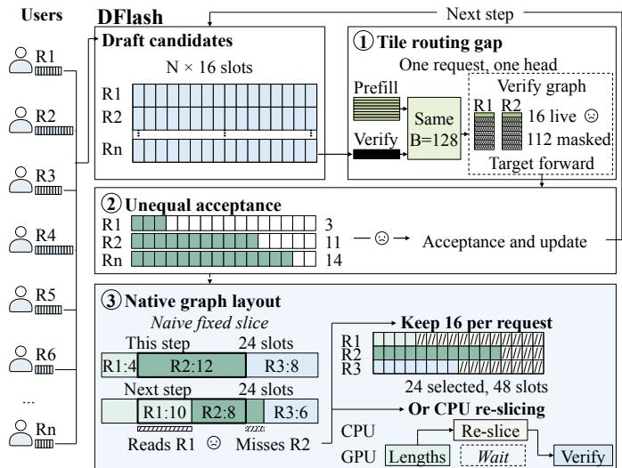  
Fig. 1. Three connected challenges in DFlash serving. (1) A shared prefill and verify tile leaves 16 live and 112 masked rows per request and head. (2) Equal 16-slot windows accommodate unequal accepted prefixes. (3) Changed boundaries make old slices read R1 and miss R2. Equal-width padding restores 16 slots per request, while CPU re-slicing delays verification. The dashed arrow links Challenges 2 and 3. Token lengths are illustrative.

Fig. 1 follows DFlash from request arrival through drafting, verification, and acceptance. We retain the selected DFlash drafters’ training-time block configuration, reserving W=16 target-verification slots per request for one known anchor and 15 new candidates. Equal widths but unequal accepted prefixes expose three connected challenges.

Challenge 1: Workload-shaped tiles. A tile groups query rows for attention. Prefill processes long input sequences, whereas verification processes short candidate blocks. Sharing their tile layout leaves most verify positions as inactive padding.

Challenge 2: Request-varying acceptance. Requests differ in how many drafted tokens they will accept, but the accepted prefix is unknown until the target verifies the candidates. A fixed width cannot match these request-level differences.

Challenge 3: Dynamic prefixes under a fixed verificationgraph interface. Request-specific lengths move packed boundaries between steps. Padding them back to DFlash’s equal-width interface restores wasted work. CPU re-slicing adds a host dependency.

Early-stopping methods adapt autoregressive draft length [12], [13], whereas DFlash generates a full block in one parallel forward without token-by-token stopping [10]. We study serving the same batch with reduced candidateslot capacity per verification graph while preserving the drafter’s architecture, weights, and full draft length. The problem is to allocate this smaller capacity among requestspecific candidate prefixes according to acceptance potential, preserving generation progress while carrying changing request boundaries through compact verification execution and captured-graph replay.

To address these challenges, we present DScale, a drafttraining-free runtime for high-concurrency block-diffusion speculative decoding. It reuses DFlash’s drafter, retaining its architecture, weights, and full draft length, without offline confidence calibration or hardware speed-curve profiling. A 112K-parameter predictor trained once per target–drafter pair allocates prefixes within half of each verification graph’s native candidate-slot capacity.

Our contributions are as follows.

• We design path-aware tile routing to select precompiled attention tiles for prefill and verification, removing padding beyond the verify width while preserving prefill reuse.

• We develop dynamic verify-length (DVL) budget allocation. Predictor scores guide per-request prefix selection under a halved shared budget, and flat-pack compaction preserves long useful prefixes without shortening draft generation.

• We integrate decision and verification graphs through a fixed-shape compact workspace with dynamic request boundaries. Both graphs share prefixes and boundaries through acceptance, preserving compact execution without fixed-width padding or CPU re-slicing.

• Across four datasets, two target models, and concurrency 8–32, DScale improves geometric-mean throughput by 43.9–48.8% and reduces aggregate mean E2E latency by 31.4–33.1% over DFlash. Cumulative ablations show geometric-mean throughput rising with each added mechanism. Budget adjustment raises accepted-token retention from about 71% to over 91%. On GSM8K, GPU profiling shows 30.8–52.5% shorter complete decode steps than DFlash. Prediction, budget allocation, and packing together account for 3.08–4.08% of step time in GPU execution at c = 8.

## II. BACKGROUND AND MOTIVATION

DFlash starts with target prefill to establish the prompt context. At each decode step, a block-diffusion drafter uses the context and a known anchor to propose 15 candidates in one parallel forward. The anchor and candidates occupy W=16 verification slots. One target forward evaluates the block. Acceptance retains the longest valid candidate prefix and produces a successor token at the first rejection or after all candidates pass. The successor becomes the next anchor, and drafting resumes with the updated context until the request finishes [10]. The native verification profile uses Qwen3-8B with a five-layer, approximately 1B-parameter DFlash drafter.

Nsight Systems [14] profiling of native DFlash on GSM8K, A100, TP1, and concurrency 16 attributes 83.3% of summed GPU-kernel time to the target verify graph, 10.9% to the draft graph, and 5.7% to kernels outside these graphs. We collect 700 decode steps after 40 warmup steps, sum kernel durations by graph launch excluding host time, and show that verification is dominant and exposes three distinct bottlenecks requiring different remedies.

## A. Verify Inherits Prefill’s Tile

As illustrated by Challenge 1 in Fig. 1, native DFlash uses the same attention tile configuration for prefill and speculative verification despite their different query lengths. Prefill can supply thousands of query rows per request, allowing a wide tile to reuse loaded KV data across rows. Verification supplies only a short candidate block. The native selector chooses a compile-time tile from hardware and head dimensions, without distinguishing these two workloads.

Batch growth leaves this mismatch intact. Each computation block handles one request’s query-row tile for one head. Adding requests increases the number of blocks without filling their unused query rows. Distinct KV contexts and causal boundaries prevent requests from simply sharing a tile. In the evaluated A100 configuration, the native tile has 128 rows, whereas each verification request supplies W=16. Thus 112 rows, or 87.5%, are masked. Masking excludes invalid rows from attention but does not compact the compiled tile or resize its intermediate arrays.

DSpark’s confidence scheduler selects candidates for verification [11], but does not resize the compiled attention tile. In the shared kernel above, shorter prefixes reduce active query rows but leave vacant rows within the tile.

Opportunity. Explore path-aware attention granularity based on the different query lengths of prefill and speculative verification. Match short verification tiles to the candidate width to reduce inactive query-row positions, while retaining wide-tile KV reuse for prefill. The two paths can then use layouts suited to their respective workloads rather than share one layout.

B. Request-Level Acceptance Variability and Verification Budget Allocation

Verification processes even rejected candidates. Reducing candidate rows lowers general matrix multiplication (GEMM)

and LM-head computation and intermediate-data traffic, but must preserve tokens that advance generation.

Our fixed verification-width experiment retains full-length drafting and verifies the first 4, 6, 8, 10, 12, 14, or 16 slots per request. Each prefix includes one known root token, the anchor, followed by draft candidates. All requests use the same width without a predictor.

Fig. 2 shows a mixed-dataset DFlash trace collection. Perrequest progress, counting one anchor plus accepted draft tokens, has mean 6.09 and a tail reaching 16. Fig. 3 shows the width comparison on GSM8K at concurrency 8. All widths below 16 yield lower throughput than full-width verification. Width 8 reduces throughput by 15% and mean progress from 5.92 to 4.96 tokens. Width 4 further lowers progress to 3.37 tokens, whereas width 14 retains 5.83 tokens but reduces selected verification slots by only 12.5%.

Although eight exceeds the mean progress, a common cutoff wastes slots on short prefixes and truncates long ones. Actual acceptance is only known after verification. Fully verifying blocks to choose their lengths defeats the saving. Fig. 4 shows that draft-side signals already distinguish acceptance potential. The mean Top1–Top2 logit gap across 15 draft positions correlates positively with full-width accepted draft length, with Spearman correlations of 0.741 on 8B and 0.722 on 4B. These signals are available before target verification, motivating request-level prefix prediction.

DSpark couples acceptance estimation to drafter training. Its confidence head is jointly trained with the backbone drafter and sequential module [11]. DSpark’s hardware-aware prefix scheduler uses held-out sequential temperature scaling (STS) to calibrate confidence and a steps-per-second (SPS) curve profiled at engine initialization to select verification budgets. To overlap scheduling with execution, its asynchronous scheduler chooses the current total budget using confidence from two steps earlier, while ranking current candidates by their current scores [11]. Thus, current candidate ranking operates within a capacity chosen from historical estimates, which may differ from current prefix survival.

In contrast, these signals come directly from the existing DFlash drafter, motivating acceptance prediction independent of drafter training. DScale trains only a separate 112Kparameter predictor on draft logits, hidden-state features, and batch context, preserving the drafter’s architecture, weights, and full draft length. This draft-training-free design adds request-level budget allocation to the existing drafter without STS calibration or SPS profiling.

Opportunity. Predict acceptance before verification from draft signals, independently of drafter training and without STS calibration or SPS profiling. Retain full-length drafting and prioritize verification slots for candidate prefixes predicted to be accepted within a preset reduced shared budget.

## C. Adapting Dynamic Prefixes to Fixed Verification Graphs

Shorter logical prefixes do not automatically produce smaller graph executions. For N live requests, DFlash’s native interface reserves $N \times 1 6$ candidate slots. Padding each shortened prefix back to its reserved width leaves GEMM and projection dimensions unchanged. Realizing the savings from Challenge 2 therefore requires reducing the candidaterow capacity processed by the graph, not merely marking shorter request lengths.

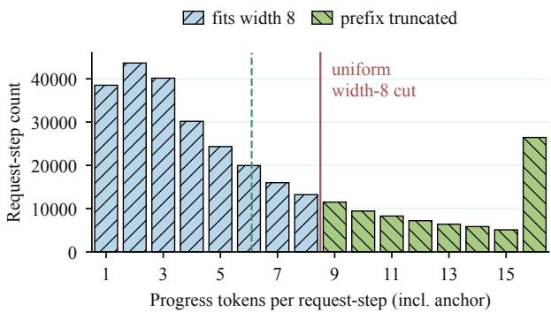

Fig. 2. DFlash progress on 306,215 request-steps from a mixed-dataset training-split trace collection at $c = 8 .$ . Progress includes one anchor. The dashed line marks the mean, 6.09. Prefixes to the right of the width-8 boundary lose their excess tokens under uniform truncation.  
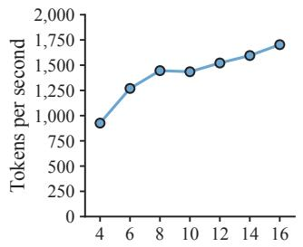

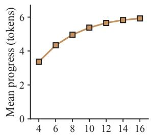  
Verification width (slots)

Fig. 3. Fixed verification widths on Qwen3-8B and GSM8K, A100, TP1, temperature $0 , c = 8 ,$ , with full-length DFlash drafting and no predictor. Each width uses one run with 8 warmup and 256 measured requests. Left shows output-token throughput. Right averages periodically logged progress lengths, including the anchor. Width 16 is native DFlash.  
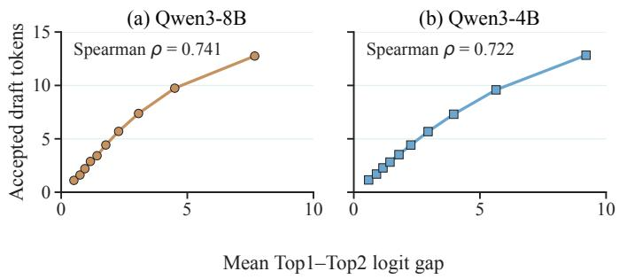  
Fig. 4. Draft logit gaps and acceptance on 31,814 Qwen3-8B and 31,188 Qwen3-4B held-out request-steps. Each point gives mean gap and accepted draft tokens in one of ten equal-count bins. Acceptance excludes the anchor. Spearman correlations use all request-steps.

The observed mean progress of 6.09 motivates testing 8N slots instead of 16N, halving GEMM and projection input rows at the same request count. The distribution’s long tail argues against imposing eight slots on every request. This calls for sharing the smaller capacity among unequal prefixes while retaining full-length drafting. Here, halving concerns each verification graph’s candidate slots, not its request capacity or the draft length.

Smaller capacity still leaves a layout problem. In Challenge 3 of Fig. 1, lengths change from [4, 12, 8] to [10, 8, 6]. Both use 24 slots, but R2’s start moves from 4 to 10. Its old slice would mix requests, while equal-width padding expands 24 rows back to 48. The changed boundaries must consistently identify verification inputs, their sequence positions and KV references, and the outputs used for acceptance.

CPU re-slicing must read back GPU-computed lengths, reconstruct request boundaries, and prepare the next verification inputs before submission. Verification therefore waits on host preparation, placing CPU work on the GPU critical path; if other computation cannot hide it, bubbles appear between successive GPU stages. Compact verification must reduce candidate rows without per-step host synchronization for slice reconstruction.

DSpark packs unequal prefixes and selects the smallest token bucket covering their scheduled total from graphs captured at initialization [11]. For example, reducing a 16-request batch from 111 to 97 verification rows still selects the 112- slot graph. The 96-slot graph becomes usable only when the total falls to 96 or below. Thus, fine-grained prefix pruning produces only bucket-grained capacity reductions. Within a bucket, fewer admitted candidates do not shrink the captured shape. Optional bucket filling spends the spare capacity on additional candidates instead of reducing it.

Opportunity. Let unequal-length prefixes share halved verification capacity while retaining full-length drafting. Keep request boundaries consistent across verification and acceptance as lengths change, and reuse captured graphs without per-step CPU length readback or slice reconstruction.

## III. SYSTEM DESIGN AND IMPLEMENTATION

## A. Overview

We implement DScale on top of SGLang v0.5.14. For a fixed workload R and generation settings, let π assign verification lengths to active requests at each step. OutputTokens (π) counts the output tokens returned for measured request r, and ElapsedTime(π) is the measurement window’s wall-clock duration. The system objective is

$$
\operatorname* { m a x } _ { \pi } \ \frac { \displaystyle \sum _ { r \in { \mathcal R } } \mathrm { O u t p u t T o k e n s } _ { r } ( \pi ) } { \mathrm { E l a p s e d T i m e } ( \pi ) } .\tag{1}
$$

SGLang forms the active batch, and π allocates verification slots within it.

Fig. 5 shows DScale’s request flow. The Request scheduler batches prefilled arrivals with unfinished requests. DFlash drafter generates full-length candidate blocks, and Input staging prepares replay inputs. Within the DVL allocator, the Acceptance predictor estimates prefix lengths, the Budget allocator redistributes the shared budget, and the Flat-buffer packer writes selected prefixes into the Fixed-address workspace (Section III-C). Here KV refs are cache locations for this step’s anchor and draft candidates.

The Target verifier consumes packed inputs through its Path-aware tile router, retaining separate prefill specialization (Section III-B). Target inference evaluates candidates, the Prefix verifier determines accepted prefixes, and the Output builder prepares output tokens. State commit updates token and cache state, returning unfinished requests to the scheduler and completed results to users. Graph integration connects the two replays through the shared workspace (Section III-D).

## B. Path-Aware Tile Routing

To address Challenge 1 in Section II-A, DScale selects tiles by path. Maximum per-request query length $\ell _ { \mathrm { m a x } } \leq W = 1 6$ selects tile height $B = 1 6$ for verification. Prefill and longer queries retain hardware-selected $B _ { \mathrm { h w } } = 1 2 8$ here for reuse. For $N _ { \mathrm { r u n } }$ requests and H heads, the runtime selects matching warps and grid $= \left( N _ { \mathrm { r u n } } , H , \lceil \ell _ { \mathrm { m a x } } / B \rceil \right)$ . Each computation block handles one request’s query tile for one head. Bucketed replay sets $N _ { \mathrm { r u n } } = N _ { \mathrm { b s } }$

For a request with query length $\ell > 0 .$ , tile height B gives the following query-row capacity and inactive-row fraction

$$
\operatorname { r o w s } ( \ell , B ) = B \left\lceil { \frac { \ell } { B } } \right\rceil , \qquad \operatorname { p a d d i n g } ( \ell , B ) = 1 - { \frac { \ell } { \operatorname { r o w s } ( \ell , B ) } } .\tag{2}
$$

With $\ell = 1 6 , B = 1 6$ fits the block. Larger tiles add inactive rows. Smaller tiles remove no further padding and split keyvalue reuse across blocks. Section IV-D evaluates this trade-off between padding and reuse.

Tile routing removes padding beyond the maximum verify width. DVL separately packs $M = N \times 8$ verification rows for GEMM and the LM-head (Section III-C).

## C. DVL Budget Allocation

To address Challenge 2 in Section II-B, DVL uses draft signals available before verification to predict acceptance and allocate unequal prefixes under a halved shared budget, retaining full-length drafting. For live count N, request-bucket capacity $N _ { \mathrm { b s } } .$ , and block width $W = 1 6$ including the anchor, the captured capacity and active budget are

$$
M _ { \mathrm { b s } } = \frac { W N _ { \mathrm { b s } } } { 2 } , \qquad M _ { \mathrm { l i v e } } = \frac { W N } { 2 } , \qquad \sum _ { i = 1 } ^ { N } k _ { i } = M _ { \mathrm { l i v e } } .\tag{3}
$$

Lengths $k _ { i } ~ \in ~ \{ 1 , \ldots , W \}$ can span the full block, with sentinels at the bucket tail. Tile selection uses $W = 1 6$

Acceptance predictor. Each request combines signals from 15 new draft positions and batch context. Each position contributes the highest logit, its 15 gaps to ranks 2–16, the top token’s log-probability, and distribution entropy. These $1 + 1 5 + 1 + 1 = 1 8$ preference and uncertainty values give $1 5 \times 1 8 = 2 7 0$ confidence features in draft order.

Fixed matrices project each hidden-state vector to 64 values and each mean-centered vocabulary-logit vector to 32. Concatenating positions gives $1 5 \times 6 4 = 9 6 0$ hidden-state and $1 5 \times 3 2 = 4 8 0$ logit features. The 25-value batchContexti uses live count N in its first entry, an initial-state flag of

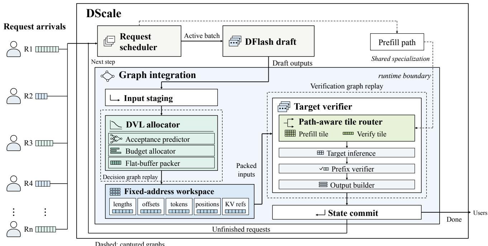  
Fig. 5. DScale request flow and module organization. Dashed boxes mark captured graphs, excluding input staging and state commit. The dashed prefill branch shares tile specialization. Lower and right paths return unfinished requests to the scheduler and completed results to users, respectively.

1 in its fourth, and zeros elsewhere. Appending it gives $2 7 0 + 9 6 0 + 4 8 0 + 2 5 = 1 7 3 5$ features per request

$$
\begin{array} { r } { \mathrm { f e a t u r e s } _ { i } = \mathrm { C o n c a t } ( \mathrm { c o n f i d e n c e } _ { i } , \mathrm { h i d d e n P r o j } _ { i } , } \\ { \mathrm { l o g i t P r o j } _ { i } , \mathrm { b a t c h C o n t e x t } _ { i } ) \in \mathbb { R } ^ { 1 7 3 5 } . } \end{array}\tag{4}
$$

Before verification, a 1735–64–15 multilayer perceptron (MLP) with ReLU produces one output per new draft position

$$
\mathrm { p r e d L o g i t s } _ { i } = \mathrm { P r e d i c t o r } ( \mathrm { f e a t u r e s } _ { i } ) \in \mathbb { R } ^ { W - 1 } .\tag{5}
$$

Sigmoid σ gives acceptance scores, with $q _ { 0 } = 1$ for the known anchor. Acceptance requires accepted predecessors. Cumulative minima therefore enforce nonincreasing prefix scores

$$
\begin{array} { r l } & { q _ { 0 } = 1 , } \\ & { q _ { j } = \mathrm { { m i n } } \big ( q _ { j - 1 } , \ \sigma ( \mathrm { { p r e d L o g i t s } } _ { j } ) \big ) , \quad j = 1 , \ldots , W - 1 . } \end{array}\tag{6}
$$

Summing request $i \mathbf { \ ' } _ { \mathbf { S } }$ 15 prefix scores estimates accepted draft count $\boldsymbol { \hat { \ell } } _ { i }$ . Rounding and clipping to [1, W] initializes heuristic slot count $k _ { i } ^ { ( 0 ) }$ , including the anchor

$$
\begin{array} { r l r } {  { \hat { \ell } _ { i } = \sum _ { j = 1 } ^ { W - 1 } q _ { i , j } , } } \\ & { } & { k _ { i } ^ { ( 0 ) } = \operatorname* { m i n } \Bigl \{ W , \operatorname* { m a x } \Bigl \{ 1 , | \hat { \ell } _ { i } + \frac { 1 } { 2 } | \Bigr \} \Bigr \} . } \end{array}\tag{7}
$$

Thus $\hat { \ell } _ { i } = 6 . 2$ initializes one anchor and five new candidates. The Budget allocator adjusts this seed using $Q = \left( q _ { i , j } \right)$ and the shared budget in Fig. 6.

Position $j$ is labeled 1 if full-width verification accepts at least $j$ new tokens. Training minimizes mean binary crossentropy plus 0.02 times mean squared error between the raw

Algorithm 1 DVL allocation and flat-pack   
Require: features, tokens, positions, KV refs   
1: $1 \leq N \leq N _ { \mathrm { b s } } , \ W _ { . . . } = 1 6 , \ M _ { \mathrm { l i v e } } = 8 N , \ M _ { \mathrm { b s } } = 8 N _ { \mathrm { b s } }$   
Ensure: bufe $\begin{array} { r l } { \mathrm { r _ { b s } } ; } & { { } \sum _ { i = 1 } ^ { N } k _ { i } = M _ { \mathrm { l i v e } } } \end{array}$   
2: predLogits ← Predictor(features)   
3: $Q \gets [ 1 , \mathrm { C u m M i n } _ { j } ( \sigma ( \mathrm { p r e d L o g i t s } ) ) ]$   
4: $k _ { i } ^ { ( 0 ) } \gets \operatorname* { m i n } \{ W , \operatorname* { m a x } \{ 1 , \lfloor \sum _ { j = 1 } ^ { W - 1 } q _ { i , j } + \frac { 1 } { 2 } \rfloor \} \}$   
5: ${ \bf k } _ { 1 : N } \gets { \bf k } ^ { ( 0 ) } ; \Delta \gets M _ { \mathrm { l i v e } } - \sum _ { i = 1 } ^ { N } k _ { i }$   
6: while $\Delta > 0$ do   
7: i∗ ← arg max1≤i≤N, k <W $q _ { i , k _ { i } }$   
8: $( k _ { i ^ { * } } , \Delta ) \gets ( k _ { i ^ { * } } + 1 , \Delta - 1 )$   
9: end while   
10: while $\Delta < 0$ do   
11: i∗ ← arg min1≤i≤N, k >1 qi,k −1   
12: $( k _ { i ^ { * } } , \Delta ) \gets ( k _ { i ^ { * } } ^ { - } - 1 , \Delta + 1 )$   
13: end while   
14: ofset $\begin{array} { r } { 1 { : } N { + } 1  ( 0 , } \end{array}$ cumsum $( \mathbf { k } _ { 1 : N } ) )$   
15: for all $( i , j ,$ field) : $1 \le i \le N , \ 0 \le j < k _ { i }$ do   
16: $s \gets \mathrm { o f f s e t } _ { i } + j$   
17: bufe $\mathrm { r _ { b s } }$ .field[s] ← fieldi[j]   
18: end for   
19: $( k _ { i } , \mathrm { o f f s e t } _ { i + 1 } ) \gets ( 0 , M _ { \mathrm { l i v e } } ) , \quad \forall N < i \leq N _ { \mathrm { b s } }$   
20: bufe $\mathbf { \dot { \theta } } _ { \mathrm { b s } } [ s ] \gets ( 0 , 0 , \mathbf { K } \mathbf { V }$ refs1[0]), $\forall M _ { \mathrm { l i v e } } \le s < M _ { \mathrm { b s } }$   
21: return buferbs

sigmoid sum and accepted draft count, before monotonicity enforcement. The supplement gives reproduction details.

Budget allocator. The prefix-score objective for the sched-

uler’s N requests is

$$
\operatorname* { m a x } _ { \{ k _ { i } \} } \sum _ { i = 1 } ^ { N } \sum _ { j = 0 } ^ { k _ { i } - 1 } q _ { i , j } \quad \mathrm { s . t . } \quad \sum _ { i = 1 } ^ { N } k _ { i } = M _ { \mathrm { l i v e } } , 1 \leq k _ { i } \leq W .\tag{8}
$$

DVL starts at $k _ { i } = k _ { i } ^ { ( 0 ) }$ with $\begin{array} { r } { \Delta = M _ { \mathrm { l i v e } } - \sum _ { i } k _ { i } } \end{array}$ . Next-slot gain $q _ { i , k . }$ and last-slot loss $q _ { i , k _ { i } - 1 }$ determine the request to adjust

$$
\begin{array} { r } { i ^ { * } = \left\{ \begin{array} { l l } { \arg \underset { i : k _ { i } < W } { \operatorname* { m a x } } q _ { i , k _ { i } } , } & { \Delta > 0 , } \\ { \arg \underset { i : k _ { i } > 1 } { \operatorname* { m i n } } q _ { i , k _ { i } - 1 } , } & { \Delta < 0 . } \end{array} \right. } \end{array}\tag{9}
$$

The adjustment loop executes in one GPU computation block within the decision graph, without host round trips or interblock synchronization.

Proposition 1: For integer seeds $1 \le k _ { i } ^ { ( 0 ) } \le W$ , integer budget $N \leq M _ { \mathrm { l i v e } } \leq N W$ , nonincreasing scores, and $\Delta _ { 0 } =$ $M _ { \mathrm { l i v e } } - \textstyle \sum _ { i } k _ { i } ^ { ( 0 ) }$ , Algorithm 1 preserves prefixes and anchors and meets the budget in $| \Delta _ { 0 } |$ updates. It maximizes Eq. (8) over integer lengths subject additionally to $k _ { i } \geq k _ { i } ^ { ( 0 ) }$ for every i if $\Delta _ { 0 } > 0$ , or $k _ { i } \leq k _ { i } ^ { ( 0 ) }$ if $\Delta _ { 0 } < 0$ . Zero gap retains the seed.

The proof is provided in the supplementary material.

Algorithm 1’s k and ofset reside in bufer , Fig. 5’s Fixed-address workspace. KV refs identify candidate cache locations. Lines 2–4 predict logits, apply sigmoid and cumulative minimum, then round draft-only score sums into initial lengths. Line 5 sets the budget gap ∆. Lines 6–9 grow the highest-scoring next slot. Lines 10–13 remove the lowest-scoring tail. Both preserve anchored prefixes and stop at $\Delta = 0$

Line 14 computes offsets. Lines 15–18 pack token IDs, positions, and cache references with identical row mappings. For all permits independent parallel GPU iterations. Lines 19– 20 zero inactive lengths, set their offsets to $M _ { \mathrm { l i v e } } ,$ and initialize tail placeholders. Line 21 returns the buffer with 8N live slots.

Flat-buffer packer. Allocated prefixes of lengths $k _ { i }$ occupy buferbs of capacity $M _ { \mathrm { b s } }$ , using prefix-sum offsets

$$
{ \mathrm { o f f s e t } } _ { i } = \sum _ { j < i } k _ { j }\tag{10}
$$

The packer applies this mapping to each field in tokens, positions, and cache references

$$
\mathrm { b u f f e r } _ { \mathrm { b s } } . \mathrm { f e l d } [ \mathrm { o f f s e t } _ { i } + j ] = \mathrm { f i e l d } _ { i } [ j ] , \quad 0 \leq j < k _ { i } .\tag{11}
$$

Each attention block handles one request and head, masking rows beyond $k _ { i }$ . Acceptance reuses the offsets (Section III-D). In Fig. 6, Initial lengths $k ^ { ( 0 ) } = [ 5 , 1 0 , 7 , 9 ]$ total 31 against budget 32. Prefix scores denote Q. Growing R1 gives adjusted lengths $k = [ 6 , 1 0 , 7 , 9 ]$ , offsets [0, 6, 16, 23], and end boundary 32. R2’s dashed tail illustrates alternative shrinkage.

Complexity analysis. Given draft features, prediction costs $O ( N _ { \mathrm { b s } } d h )$ for input dimension d = 1735 and hidden dimension $h = 6 4$ . Rounding costs $O ( N _ { \mathrm { b s } } W )$ . Packing scans request boundaries for each slot, costing $O ( M _ { \mathrm { b s } } N _ { \mathrm { b s } } )$ , including $O ( M _ { \mathrm { b s } } )$ row writes and tail initialization. At most $O ( N W )$ adjustments each scan $O ( N _ { \mathrm { b s } } W )$ scores, yielding

$$
\mathrm { W o r k _ { D V L } } = { \cal O } ( N _ { \mathrm { b s } } d h + N N _ { \mathrm { b s } } W ^ { 2 } + M _ { \mathrm { b s } } N _ { \mathrm { b s } } ) .\tag{12}
$$

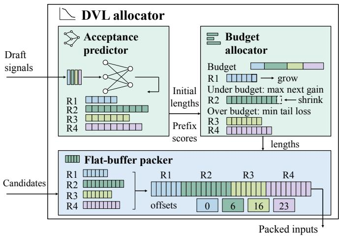  
Fig. 6. DVL allocator. The predictor supplies initial lengths and prefix scores to the Budget allocator. The Flat-buffer packer stores prefixes and offsets. Short strips select from full draft blocks. Grow and shrink are alternative budget conditions. Colors identify requests.

For $W = 1 6 ,$ , the adjustment count is $\begin{array} { r } { | 8 N - \sum _ { i } k _ { i } ^ { ( 0 ) } | \le 7 N } \end{array}$ Each batch-score scan costs $O ( N _ { \mathrm { b s } } )$ , giving $O ( N N _ { \mathrm { b s } } )$ adjustment work. Equation (12) bounds aggregate GPU-thread work, not parallel elapsed time. On GSM8K at $c = 8 .$ , combined GPU execution of the Acceptance predictor, Budget allocator, and Flat-buffer packer accounts for 3.08% of DScale’s complete decode-step time on Qwen3-8B and 4.08% on Qwen3-4B, as measured in Fig. 11(c).

## D. Graph Integration for Ragged Decisions

To address Challenge 3 in Section II-C, a fixed-address workspace carries changing boundaries through packing, verification, and acceptance. Each workspace tensor $\mathrm { a r r a y } _ { \mathrm { b s } }$ retains its address and shape across steps

$$
\begin{array} { r } { \mathrm { \ a d d r ( \mathrm { a r r a y } _ { b s } ^ { ( \mathit { t } + 1 ) } ) = \mathrm { a d d r ( \mathrm { a r r a y } _ { b s } ^ { ( \mathit { t } ) } ) } , } } \\ { \mathrm { \ s h a p e ( \mathrm { a r r a y } _ { b s } ^ { ( \mathit { t } + 1 ) } ) = \mathrm { s h a p e ( \mathrm { a r r a y } _ { b s } ^ { ( \mathit { t } ) } ) } . } } \end{array}\tag{13}
$$

After full-length drafting, Input staging selects from finite captured capacities B

$$
N _ { \mathrm { b s } } = \operatorname* { m i n } \{ b \in { \mathfrak { B } } \mid b \geq N \} .\tag{14}
$$

Inactive lengths are zero. Including tail slots excluded from acceptance, capacity remains half that of DFlash’s same request bucket

$$
M _ { \mathrm { l i v e } } + 8 ( N _ { \mathrm { b s } } - N ) = 8 N _ { \mathrm { b s } } = \frac { 1 6 N _ { \mathrm { b s } } } { 2 } .\tag{15}
$$

For greedy decoding, Algorithm 2, lines 3–7, allocates workspaces and captures Fig. 5’s two pipelines. Features constructs predictor inputs, and DVL invokes Algorithm 1. Target, Accept, and Output denote tile-routed Target inference, the Prefix verifier, and the Output builder. Lines 9–11 perform Input staging and decision replay. The request state supplies context lengths ctxLen, request IDs reqID, and cache mappings cacheMap. Line 12 orders GPU reads after decision and prior cache writes.

Algorithm 2 Fixed-address graph capture and replay   
Require: B, requests, draft, requestState   
1: $\emptyset \neq B \subset \mathbb { Z } _ { > 0 }$ $1 \leq$ |requests| $\leq$ max $\boldsymbol { B }$   
Ensure: Committed outputs and remaining requests   
2: Capture once   
3: for $N _ { \mathrm { b s } } \in B$ do   
4: bufer $\mathrm { \Phi _ { b s } }  \mathrm { A l l o c } ( N _ { \mathrm { b s } } , 8 N _ { \mathrm { b s } } )$   
5: $\mathcal { G } _ { \mathrm { b s } } ^ { \mathrm { d e c } } \left. \mathrm { C a p t u r e } _ { \mathrm { b s } } [ \mathrm { F e a t u r e s } \right. \mathrm { D V L } ]$   
6: $\mathcal { G } _ { \mathrm { b s } } ^ { \mathrm { v e r i f y } }  \mathrm { C a p t u r e } _ { \mathrm { b s } } [ \mathrm { T a r g e t }  \mathrm { A c c e p t }  \mathrm { O u t p u t } ]$   
7: end for   
8: Replay each step   
9: N ← |requests|, $N _ { \mathrm { b s } } $ min $\{ b \in B \mid b \geq N \}$   
10: bufe $\mathrm { \Delta \cdot _ { b s } }$ .inputs $ ( N _ { : }$ , draft, requestState)   
11: $\mathrm { R e p l a y } ( \mathcal { G } _ { \mathrm { b s } } ^ { \mathrm { d e c } } ) _ { \mathrm { . } }$   
12: $\mathrm { W a i t G P U } ( \mathcal { G } _ { \mathrm { b s } } ^ { \mathrm { d e c } }$ , KVWriteprior)   
13: for all $1 \leq i \leq N _ { \mathrm { b s } }$ do   
14: $( { \mathrm { q S t a r t } } _ { i } , { \mathrm { q E n d } } _ { i } ) \gets ( { \mathrm { o f f s e t } } _ { i } , { \mathrm { o f f s e t } } _ { i } + k _ { i } )$   
15: end for   
16: for all $1 \leq i \leq N , \ 0 \leq j <$ ctxLeni do   
17: histor $\mathrm { \ K V } _ { i } [ j ] $ cacheMap[reqID , j]   
18: end for   
19: Replay(Gverifybs )   
20: outputs $ \mathrm { R e a d O u t p u t s } ( \mathrm { b u f f e r } _ { \mathrm { b s } } )$   
21: for all req $_ i \in$ requests do   
22: Append $. ( \mathrm { r e q } _ { i } ,$ outputs .tokens)   
23: req .length $ \mathrm { o u t p u t s } _ { i }$ .length   
24: req .next ← outputs .next   
25: end for   
26: requests $ \{ \mathrm { r e q } _ { i } \in$ requests $| \neg \mathrm { F i n i s h e d } ( \mathrm { r e q } _ { i } ) \}$   
27: return requests, outputs

Lines 13–15 set $\mathrm { \ q S t a r t { \Sigma } }$ and qEnd from k and ofset. Lines 16–18 gather ctxLeni committed-context indices from cacheMap row $\mathrm { r e q I D } _ { i }$ into histor $\mathrm { K V } _ { i }$ . These views reside in persistent buferbs metadata. For all executes independent operations in parallel on the GPU. historyKV indexes unmoved context KV, while candidate KV refs identify new writes. Line 19 replays verification, acceptance, and output construction. Attention retains its grid and masks rows by

$$
\mathrm { v a l i d } _ { i } ( j ) = { \bf 1 } \{ 1 \le i \le N \ \land \ 0 \le j < k _ { i } \} .\tag{16}
$$

Valid rows read $\mathrm { o f f s e t } _ { i } + j$ with request-local causal masking and the supplied cache references.

Prefix verifier. Let P denote the target decoding policy’s next-token distribution conditioned on the current prefix. A deterministic top-1 draft candidate x is accepted with probability $P ( x )$ . At the first rejection, draw a successor from $P$ with x removed and the remaining probabilities renormalized. If all $k _ { i } - 1$ selected candidates pass, use the unmodified target distribution. After $a _ { i }$ accepted candidates, row $\mathrm { o f f s e t } _ { i } + a _ { i }$ supplies the successor. Output the accepted candidates followed by this successor, which anchors the next step. DVL chooses lengths independently of acceptance random numbers. Section 3 of the supplementary material derives the resulting output distribution.

The Output builder also materializes projected draft cache. Line 20 retrieves tokens, committed lengths, and successors.

Lines 21–25 implement State commit outside capture, appending valid tokens under stopping rules and updating committed lengths. Lines 26–27 remove finished requests and return remaining requests and outputs.

## IV. EXPERIMENTAL EVALUATION AND DISCUSSION

## A. Experimental Setup

Hardware and models. The main-paper benchmarks run on a single A100-40GB GPU with tensor parallelism 1 and generation temperature 0. We evaluate Qwen3-8B and Qwen3- 4B [15] as target models.

Workloads. We use four math and code benchmarks.

• GSM8K [16] covers multi-step grade-school math.

• MATH500 [17] has 500 competition math problems.

• HumanEval [18] tests docstring-based completion.

• MBPP [19] tests text-to-Python programming.

Each formal configuration runs 32 warmup requests followed by 512 measured requests, using fixed request manifests with deterministic prompt repetitions shared across systems. The measured manifests contain 256, 256, 164, and 255 distinct prompts for GSM8K, MATH500, HumanEval, and MBPP, respectively. Thinking is disabled, and the output cap is 2048 tokens. Token throughput is the total output tokens generated by the measured requests divided by their measurement window’s wall-clock duration. The separate motivation collections use the protocols specified with their figures.

Concurrency sweep. With matched seeds and prompts, we sweep c ∈ {8, 12, 16, 20, 24, 28, 32}, report five-repetition medians, and compute aggregate throughput ratios as geometric means over dataset–concurrency cells. Here $c$ is both the number of closed-loop client workers and the server’s maximum running requests; each worker submits its next request upon completion until queue exhaustion, then outstanding requests drain, while the active decode batch can vary with scheduling.

Baselines. We compare four SGLang-based systems under the same request protocol. (i) DFlash [10] is the SGLang v0.5.14 implementation before our modifications, using block diffusion at width 16 with the default 128-row verify tile. (ii) DSpark [11] is the implementation in SGLang v0.5.16, configured with its corresponding draft model for each target. We use v0.5.16 because v0.5.14 does not include a DSpark implementation. (iii) Domino [20] uses its official draft configuration. (iv) DScale is our runtime built on the SGLang v0.5.14 DFlash implementation. DFlash and DScale use the same released DFlash draft checkpoint for each target. DSpark and Domino use their respective target-matched draft checkpoints. Tokenization, prompt formatting, stopping criteria, maximum output length, and generation temperature are held fixed.

## B. Throughput Results

Overall gains. For the results in Fig. 7, taking the geometric mean of per-cell throughput ratios across all four datasets and seven concurrencies, DScale improves over DFlash, DSpark, and Domino by 43.9%, 22.2%, and 24.4%, respectively, on Qwen3-8B, and by 48.8%, 37.7%, and 32.0% on Qwen3-4B.

Concurrency scaling. Four-dataset geometric-mean gains over DFlash increase with concurrency on both models. At c = 8, gains are 23.2% on Qwen3-8B and 24.0% on Qwen3- 4B. They reach 42.8% and 49.7% at $c = 1 6 .$ , then 59.6% and 62.3% at c = 32. Against DSpark, gains at these three concurrencies are 20.4%, 25.8%, and 23.4% on Qwen3-8B, and 27.9%, 39.8%, and 43.8% on Qwen3-4B. Gains over Domino also grow from 6.7% to 39.1% on 8B and from 10.5% to 43.4% on 4B between c = 8 and c = 32.

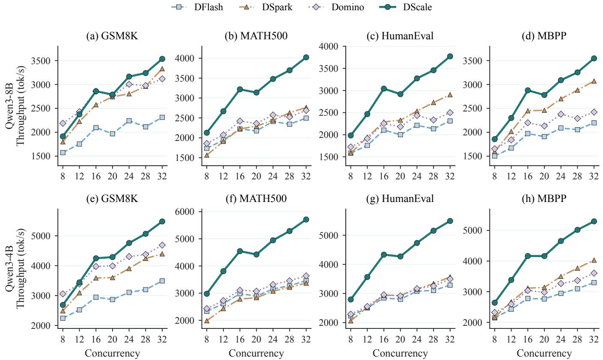  
Fig. 7. Token throughput at concurrency 8–32. Top and bottom rows show Qwen3-8B and Qwen3-4B. Columns show GSM8K, MATH500, HumanEval, and MBPP.

Dataset differences. For each dataset, we take the geometric mean of paired throughput ratios over all seven concurrencies from 8 to 32. In GSM8K, MATH500, HumanEval, and MBPP order, gains over DFlash are 40.0%, 44.1%, 46.5%, and 45.3% on Qwen3-8B, and 44.9%, 51.4%, 50.7%, and 48.5% on Qwen3-4B. In the same dataset order, gains over DSpark are 7.7%, 40.8%, 28.0%, and 14.8% on Qwen3-8B, and 17.4%, 60.1%, 46.7%, and 30.3% on Qwen3-4B. Gains over Domino are 1.6%, 33.9%, 34.7%, and 30.6% on Qwen3- 8B, and 6.3%, 44.1%, 45.1%, and 36.6% on Qwen3-4B.

Sampling and tensor parallelism. Supplementary Figs. 5– 7 show geometric-mean gains over DFlash of 45.2% on Qwen3-8B and 45.8% on Qwen3-4B under TP1 at temperature 1, and 43.9–55.8% under TP2 at temperatures 0 and 1. The same predictors thus support sampling and tensor parallelism without retraining.

## C. End-to-End Latency

End-to-end (E2E) request latency is measured in milliseconds. For mean, p95, and p99, reductions are one minus the geometric mean of DScale-to-baseline ratios of five-repetition medians across four datasets and seven concurrencies.

Mean E2E latency reductions relative to DFlash, DSpark, and Domino are 31.4%, 18.4%, and 20.2% on Qwen3-8B, and 33.1%, 27.1%, and 24.7% on Qwen3-4B.

The p95 and p99 reductions relative to DFlash are 30.7% and 29.3% on Qwen3-8B, and 32.9% and 31.9% on Qwen3- 4B. Relative to DSpark, they are 16.8% and 13.1% on Qwen3- 8B, and 26.4% and 26.8% on Qwen3-4B. Relative to Domino, they are 22.3% and 21.4% on Qwen3-8B, and 28.5% and 27.0% on Qwen3-4B.

Fig. 8 shows lower cross-dataset medians for both mod els than all three baselines at every concurrency for mean, p95, and p99. Supplementary Figs. 1–4 separate the datasets. Geometric-mean p99 reductions over seven concurrencies range from 26.1% to 34.6% relative to DFlash, covering both math and code workloads.

## D. Component Ablation

The GSM8K ablation holds the runtime, target, drafter, and request set fixed, using temperature 0 and memory fraction 0.85. Its DFlash control disables all three optimizations and is measured separately from the main-comparison baseline. Fig. 9 adds tile routing, DVL allocation, and Graph integration successively, using five-repetition medians, 32 warmup requests, and 512 measured requests. Optimized variants share the model-specific predictor and projections.

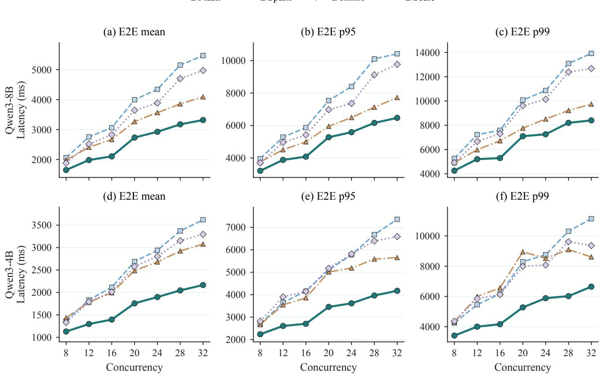  
Fig. 8. End-to-end request latency at concurrency 8–32. Top and bottom rows show Qwen3-8B and Qwen3-4B. Columns show mean, $\mathsf { p 9 5 } ,$ and $\mathsf { p } 9 9 .$ . Each point is the median across four datasets of their five-repetition medians.

Taking geometric means across the seven concurrencies, tile routing improves throughput over the DFlash control by 14.7% on Qwen3-8B and 20.8% on Qwen3-4B. Adding DVL to the tile-routed variant yields a further 11.8% and 3.9%, respectively. Adding Graph integration to that combined variant provides another 9.8% and 15.2%.

Relative to the same DFlash control, the cumulative geometric-mean gains reach 28.2% on 8B and 25.5% on 4B after adding DVL, then rise to 40.8% and 44.6% with all three mechanisms. DVL’s gains are more pronounced at higher concurrency. The complete DScale system exceeds the DFlash control at every evaluated concurrency on both models.

Predictor quality and budget adjustment. Acceptedlength regression on the prompt-disjoint holdout reaches $\bar { R } ^ { 2 } \approx$ 0.70 on Qwen3-8B and 0.68 on Qwen3-4B. We compare accepted-token retention before and after budget adjustment on the deployed predictors’ frozen validation splits, holding logged features and histories fixed. Full-width acceptance labels are $y _ { i }$ . For a window $k _ { i }$ including one anchor slot, retention is $\sum _ { i } \operatorname* { m i n } ( y _ { i } , k _ { i } - 1 ) / \sum _ { i } y _ { i }$ . As shown in Fig. 10, raw predictor windows retain 71.6% of accepted tokens on Qwen3-8B and 70.5% on Qwen3-4B. Score-guided adjustment raises these to 91.3% and 91.6%, respectively. For each model, the same model-specific predictor is used before and after budget adjustment. This single-step evaluation includes both score-guided redistribution and budget expansion. Mean windows increase from 5.11 slots on 8B and 5.08 on 4B to eight on both models, with a total budget of 8N per retainedrow cohort.

Current-runtime decode profile. We profile DFlash and DScale CUDA workers on GSM8K with Nsight Systems, using the TP1 protocol in Section IV-A, memory fraction 0.85, and one run per $c \in \{ 8 , 1 6 , 3 2 \}$ . We average 700 step intervals after discarding 40. Intervals span consecutive nonempty decode-worker entries, including host gaps but excluding prefill and idle boundaries. Kernels are timed in full even when they outlast the CPU step. Fig. 11(a) and (b) support the throughput gains with 30.8–52.5% shorter intervals, using $1 - T _ { \mathrm { D S c a l e } } / T _ { \mathrm { D F l a s h } }$ . Under TP2 at $c = 3 2$ , Supplementary Fig. 8 shows 50.7% and 52.8% reductions on Qwen3-8B and Qwen3-4B, supporting the two-GPU throughput gains.

Allocator kernel costs. Fig. 11(c) breaks down the $c = 8$ costs. The Acceptance predictor, Budget allocator, and Flatbuffer packer together account for 4.08% of step time on 4B and 3.08% on 8B. Predictor timing includes feature extraction, shared Top1 selection, and input preparation, excluding the LM-head. The fused cost covers budget adjustment, metadata, candidate assembly, and flat-pack.

## E. Graph-Pool Memory

Fig. 11(d) reports graph-pool reserved memory for the evaluated TP1 configurations with at most 32 active requests and memory fraction 0.85. After initialization, we sum allocator segment sizes across distinct nondefault graph pools, including unused reserved space. DScale retains 832 MiB on Qwen3- 8B and 724 MiB on Qwen3-4B. This is 20.2% and 11.3% below DFlash, 27.1% and 26.1% below DSpark, and 42.4% and 36.5% below Domino, respectively.

Before adjustment After adjustment  
TABLE I  
VERIFICATION-SIDE SERVING CAPABILITIES OF THE COMPARED EXECUTION PATHS.
<table><tr><td>Method</td><td>Drafter reuseda</td><td>Per-request budgetb</td><td>variable-length verify</td><td>CUDA Graph integrationc</td><td>Extra predictord</td><td>No hardware performance-curve profiling for budget schedulinge</td></tr><tr><td>DFlash [2], [10]</td><td>√</td><td></td><td></td><td>√</td><td>X</td><td>√</td></tr><tr><td>DSpark [11]</td><td>X</td><td>× &gt;</td><td>× &gt;</td><td>V</td><td>√</td><td>X</td></tr><tr><td>Domino [20]</td><td>×</td><td>X</td><td>X</td><td>√</td><td>X</td><td>√</td></tr><tr><td>DScale</td><td>√</td><td>7</td><td>√</td><td>√</td><td>V</td><td>√</td></tr></table>

✓ means the property holds, and × means it does not. The baselines follow the experimental setup in Section IV-A. aDrafter reuse means retaining the existing DFlash drafter’s architecture and weights. bPer-request budget denotes adaptive prefix-length selection before verification. cGraph integration indicates a captured execution path. dExtra predictor denotes an acceptance estimator for budget selection. DSpark integrates a confidence head trained with its drafter, whereas DScale trains a separate predictor and retains the drafter. eDSpark uses a premeasured SPS curve for budget scheduling.

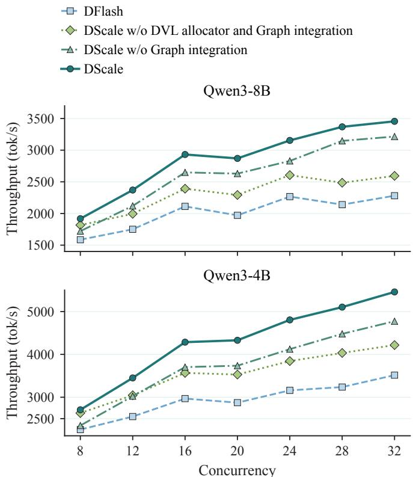  
Fig. 9. GSM8K cumulative ablation using five-repetition medians, successively adding tile routing, DVL, and Graph integration.

## V. RELATED WORK

Speculative decoding. Medusa and EAGLE use draft trees and target features [5]–[8]. Lookahead uses Jacobi ngrams [21], LayerSkip uses early exit [22], and SpecInfer batches draft-tree verification [23]. DSpark and Domino combine parallel backbones with token-dependent sequential correction [11], [20]. Block diffusion generates tokens in parallel within a block [9], while DFlash emits its candidate block in one draft forward [10]. SpecDec++ and AdaEDL stop an autoregressive drafter using predicted acceptance or an entropy-based bound [12], [13]. Instead, DScale retains full-block drafting and allocates reduced verification-graph capacity among already-generated candidate prefixes across requests, without token-by-token draft stopping. Table I compares these serving capabilities.

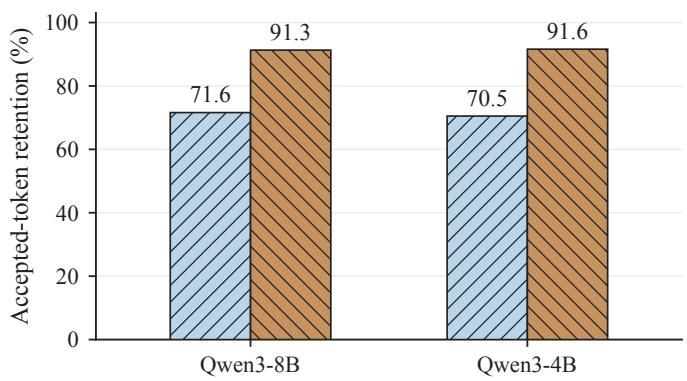  
Fig. 10. Accepted-token retention before and after budget adjustment on 31,814 validation request-steps for Qwen3-8B and 31,188 for Qwen3-4B. Features and full-width labels are fixed. Each collection-step cohort of N retained rows receives 8N slots after adjustment.

KV cache optimization. PagedAttention reduces KVmemory fragmentation and supports cache sharing [1]. SGLang’s RadixAttention reuses common-prefix caches across requests [2]. H2O retains heavy-hitter and recent tokens while evicting other KV entries [24]. These methods optimize stored context, while DScale reduces the candidate verification work added at each decode step.

Serving scheduling and resource adaptation. Orca combines iteration-level scheduling with selective batching, while Sarathi-Serve and DeepSpeed-FastGen schedule mixed prefill and decode workloads [25]–[27]. DistServe separates the two phases across GPUs, and DOPD dynamically reallocates their instances [28], [29]. TightLLM reduces offloading overhead through adaptive KV recomputation and cross-batch weight loading, whereas BrownoutServe merges experts and applies brownout for bursty MoE workloads, trading accuracy for SLO attainment [30], [31]. DScale instead preserves target computation while allocating per-request verification budgets within reusable GPU graphs.

Operator and attention optimization. FlashDecoding++Next improves inference execution through asynchronous softmax, shape-aware flat GEMM optimization, and activation-buffer reuse [32]. MInference assigns sparse patterns to attention heads and constructs input-dependent sparse indices to accelerate long-context prefill [33]. FlexPrefill adapts sparse patterns and computation budgets to each input and attention head [34]. These sparse methods select attention connections. DScale jointly adapts query-row tiles, candidate budgets, and captured-graph interfaces for short verification, preserving prefill tiles and full-length drafting.

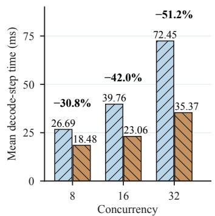  
(a) Qwen3-8B

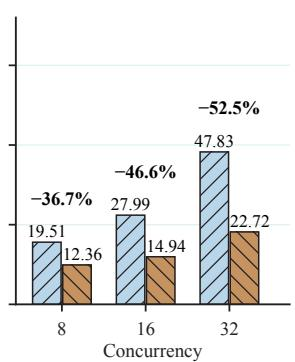  
(b) Qwen3-4B

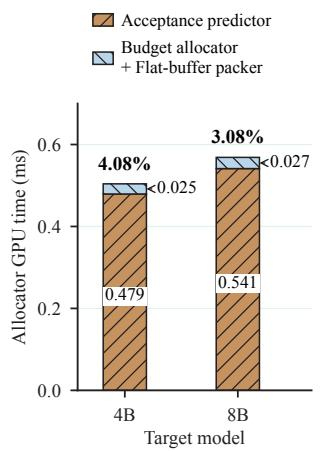  
(c) Allocator at c = 8

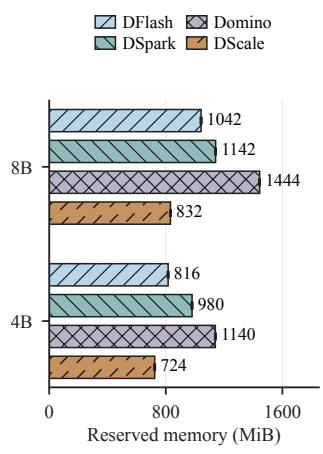  
(d) Graph-pool memory  
Fig. 11. Decode-step time, allocator costs, and graph-pool memory under TP1. Panels a–c use GSM8K at temperature 0. Panels a and b show mean step times and reductions from DFlash. Panel c reports c = 8 allocator time in milliseconds and as a percentage of DScale step time. Overlapping component intervals count once. The Budget allocator and Flat-buffer packer are timed together. Panel d reports reserved memory in MiB, showing means and sample standard deviations over three independent process starts.

## VI. CONCLUSION

DScale combines path-aware tiles, score-guided halfcapacity verification, and fixed-address graphs with dynamic request boundaries. It preserves the drafter’s architecture, weights, and full draft length, training only a small predictor without confidence calibration or hardware speed-curve preparation. On A100 with TP1, two target models, four datasets, and concurrency 8–32, geometric-mean throughput improves by 43.9–48.8% over DFlash, 22.2–37.7% over DSpark, and 24.4–32.0% over Domino, with lower request latency. Ablations, accepted-token retention analysis, and GPU profiling quantify the three mechanisms’ gains and costs. We retain the selected DFlash drafters’ 16-slot blocks and leave other block widths for future adaptation and evaluation.

## ACKNOWLEDGMENT

This work is supported by the National Key R&D Program of China (No. 2026YFE0199800), National Natural Science Foundation of China under Grant 62572462, Guangdong Science and Technology Cooperation Project (No. 2025A0505020065), Guangdong Basic and Applied Basic Research Foundation (No. 2024A1515010251), Key Research and Development and Technology Transfer Program of Inner Mongolia Autonomous Region (2025YFHH0110) and Shenzhen Science and Technology Program under Grants JCYJ20240813155810014 and ZDYJ20251211121533004.

## REFERENCES

[1] W. Kwon et al., “Efficient memory management for large language model serving with PagedAttention,” in Proceedings of the 29th ACM Symposium on Operating Systems Principles, 2023, pp. 611–626.

[2] L. Zheng et al., “SGLang: Efficient execution of structured language model programs,” in Advances in Neural Information Processing Systems, vol. 37, 2024, pp. 62 557–62 583.

[3] Y. Leviathan, M. Kalman, and Y. Matias, “Fast inference from transformers via speculative decoding,” in Proceedings of the 40th International Conference on Machine Learning, ser. Proceedings of Machine Learning Research, vol. 202. PMLR, 2023, pp. 19 274–19 286.

[4] C. Chen, S. Borgeaud, G. Irving, J.-B. Lespiau, L. Sifre, and J. Jumper, “Accelerating large language model decoding with speculative sampling,” 2023, arXiv:2302.01318.

[5] Y. Li, F. Wei, C. Zhang, and H. Zhang, “EAGLE: Speculative sampling requires rethinking feature uncertainty,” in Proceedings of the 41st International Conference on Machine Learning, ser. Proceedings of Machine Learning Research, vol. 235. PMLR, 2024, pp. 28 935–28 948.

[6] T. Cai et al., “Medusa: Simple LLM inference acceleration framework with multiple decoding heads,” in Proceedings of the 41st International Conference on Machine Learning, ser. Proceedings of Machine Learning Research, vol. 235. PMLR, 2024, pp. 5209–5235.

[7] Y. Li, F. Wei, C. Zhang, and H. Zhang, “EAGLE-2: Faster inference of language models with dynamic draft trees,” in Proceedings of the 2024 Conference on Empirical Methods in Natural Language Processing. Association for Computational Linguistics, 2024, pp. 7421–7432.

[8] Y. Li, F. Wei, C. Zhang, and H. Zhang, “EAGLE-3: Scaling up inference acceleration of large language models via training-time test,” in Advances in Neural Information Processing Systems, vol. 38, 2025, pp. 151 568–151 587.

[9] M. Arriola et al., “Block diffusion: Interpolating between autoregressive and diffusion language models,” in International Conference on Learning Representations, 2025, pp. 50 726–50 753.

[10] J. Chen, Y. Liang, and Z. Liu, “DFlash: Block diffusion for flash speculative decoding,” in Proceedings of the 43rd International Conference on Machine Learning, ser. Proceedings of Machine Learning Research, vol. 306. PMLR, 2026. [Online]. Available: https://z-lab.ai/projects/dflash/

[11] X. Cheng et al., “DSpark: Confidence-scheduled speculative decoding with semi-autoregressive generation,” 2026, arXiv:2607.05147.

[12] K. Huang, X. Guo, and M. Wang, “SpecDec++: Boosting speculative decoding via adaptive candidate lengths,” in Proceedings of the 2nd Conference on Language Modeling, 2025. [Online]. Available: https://openreview.net/forum?id=Y131N9fUbU

[13] S. Agrawal, W. Jeon, and M. Lee, “AdaEDL: Early draft stopping for speculative decoding of large language models via an entropy-based lower bound on token acceptance probability,” in Proceedings of the 4th NeurIPS Efficient Natural Language and Speech Processing Workshop, ser. Proceedings of Machine Learning Research, vol. 262. PMLR,

2024, pp. 355–369. [Online]. Available: https://proceedings.mlr.press/ v262/agrawal24a.html

[14] NVIDIA Corporation, “NVIDIA Nsight Systems,” accessed: Sep. 10, 2026. [Online]. Available: https://developer.nvidia.com/nsight-systems

[15] A. Yang et al., “Qwen3 technical report,” 2025, arXiv:2505.09388.

[16] K. Cobbe et al., “Training verifiers to solve math word problems,” 2021, arXiv:2110.14168.

[17] H. Lightman et al., “Let’s verify step by step,” in Proceedings of the 12th International Conference on Learning Representations, 2024, pp. 39 578–39 601.

[18] M. Chen et al., “Evaluating large language models trained on code,” 2021, arXiv:2107.03374.

[19] J. Austin et al., “Program synthesis with large language models,” 2021, arXiv:2108.07732.

[20] J. Huang, Y. Zhang, Q. Zhang, H. Lin, H. Xu, and L. Zhang, “Domino: Decoupling causal modeling from autoregressive drafting in speculative decoding,” in Proceedings of the 2026 Conference on Empirical Methods in Natural Language Processing, 2026. [Online]. Available: https://arxiv.org/abs/2605.29707

[21] Y. Fu, P. Bailis, I. Stoica, and H. Zhang, “Break the sequential dependency of LLM inference using lookahead decoding,” in Proceedings of the 41st International Conference on Machine Learning, ser. Proceedings of Machine Learning Research, vol. 235. PMLR, 2024, pp. 14 060–14 079.

[22] M. Elhoushi et al., “LayerSkip: Enabling early exit inference and selfspeculative decoding,” in Proceedings of the 62nd Annual Meeting of the Association for Computational Linguistics (Volume 1: Long Papers), 2024, pp. 12 622–12 642.

[23] X. Miao et al., “SpecInfer: Accelerating large language model serving with tree-based speculative inference and verification,” in Proceedings of the 29th ACM International Conference on Architectural Support for Programming Languages and Operating Systems, Volume 3, 2024, pp. 932–949.

[24] Z. Zhang et al., “H O: Heavy-hitter oracle for efficient generative inference of large language models,” in Advances in Neural Information Processing Systems, vol. 36, 2023, pp. 34 661–34 710.

[25] G.-I. Yu, J. S. Jeong, G.-W. Kim, S. Kim, and B.-G. Chun, “Orca: A distributed serving system for Transformer-Based generative models,” in Proceedings of the 16th USENIX Symposium on Operating Systems Design and Implementation, 2022, pp. 521–538.

[26] A. Agrawal et al., “Taming throughput-latency tradeoff in LLM inference with Sarathi-Serve,” in Proceedings of the 18th USENIX Symposium on Operating Systems Design and Implementation, 2024, pp. 117– 134.

[27] C. Holmes et al., “DeepSpeed-FastGen: High-throughput text generation for LLMs via MII and DeepSpeed-Inference,” 2024, arXiv:2401.08671.

[28] Y. Zhong et al., “DistServe: Disaggregating prefill and decoding for goodput-optimized large language model serving,” in Proceedings of the 18th USENIX Symposium on Operating Systems Design and Implementation, 2024, pp. 193–210.

[29] J. Liao et al., “DOPD: A dynamic PD-disaggregation architecture for maximizing goodput in LLM inference serving,” IEEE Transactions on Services Computing, vol. 19, no. 2, pp. 1134–1147, Mar./Apr. 2026.

[30] Y. Hu et al., “TightLLM: Maximizing throughput for LLM inference via adaptive offloading policy,” IEEE Transactions on Computers, vol. 74, no. 7, pp. 2195–2209, Jul. 2025.

[31] J. Hu, M. Xu, K. Ye, and C. Xu, “BrownoutServe: SLO-aware inference serving under bursty workloads for MoE-based LLMs,” IEEE Transactions on Computers, vol. 75, no. 4, pp. 1636–1649, Apr. 2026.

[32] G. Dai et al., “FlashDecoding++Next: High throughput LLM inference with latency and memory optimization,” IEEE Transactions on Computers, vol. 74, no. 10, pp. 3263–3276, Oct. 2025.

[33] H. Jiang et al., “MInference 1.0: Accelerating pre-filling for long-context LLMs via dynamic sparse attention,” in Advances in Neural Information Processing Systems, vol. 37, 2024, pp. 52 481–52 515. [Online]. Available: https://proceedings.neurips.cc/paper\_files/paper/2024/hash/ 5dfbe6f5671e82c76841ba687a8a9ecb-Abstract-Conference.html

[34] X. Lai, J. Lu, Y. Luo, Y. Ma, and X. Zhou, “FlexPrefill: A context-aware sparse attention mechanism for efficient long-sequence inference,” in Proceedings of the Thirteenth International Conference on Learning Representations, 2025, pp. 963–989. [Online]. Available: https://openreview.net/forum?id=OfjIlbelrT

Rongjian Chen received the bachelor’s degree from Guangdong University of Finance and Economics. He is currently working toward the master’s degree with the Shenzhen Institutes of Advanced Technology, Chinese Academy of Sciences. His main research interests include large language models inference optimization and system management.

Minxian Xu (Senior Member, IEEE) received the PhD degree from the University of Melbourne, in 2019. He is currently an associate professor with the Shenzhen Institutes of Advanced Technology, Chinese Academy of Sciences. His research interests include resource scheduling and optimization in cloud computing. He has co-authored 90+ peer-reviewed papers published in prominent international journals and conferences. His PhD thesis was awarded the 2019 IEEE TCSC Outstanding PhD Dissertation Award. He was also awarded the 2023 IEEE TCSC

Award for Excellence (Early Career Award).

Zhengxin Fang (Graduate Student Member, IEEE) received his bachelor and master degrees at South China Normal University and Harbin Institute of Technology, in 2019 and 2021, respectively. He is currently pursuing the Ph.D. degree in Computer Science at Victoria University of Wellington, New Zealand. His research interests include cloud computing, microservice resource allocation, evolutionary computation, graph neural networks, reinforcement learning and large language model assisted optimization.

Kejiang Ye (Senior Member, IEEE) received the BSc and PhD degrees from Zhejiang University, in 2008 and 2013, respectively. He was also a joint PhD student with the University of Sydney from 2012 to 2013. After graduation, he works as post-doc researcher with Carnegie Mellon University from 2014 to 2015 and Wayne State University from 2015 to 2016. He is currently a professor with the Shenzhen Institutes of Advanced Technology, Chinese Academy of Sciences. His research interests focus on the performance, energy, and reliability of cloud computing and network systems.

Chengzhong Xu (Fellow, IEEE) received the PhD degree in computer science and engineering from the University of Hong Kong, in 1993. He is with the Institute of AI and Brain Sciences and the Department of Computer Science, University of Macau. He published two research monographs and more than 300 peer-reviewed papers in journals and conference proceedings. His papers received about 17K citations with an H-index of 72. His main research interests lie in parallel and distributed computing and cloud computing.