# DUAL-CHANNEL ROBUST GROUP-RELATIVE POLICYOPTIMIZATION VIA ADVANTAGE ANDSEQUENCE-WEIGHT ESTIMATION

Zhongyi Li1\* Wan Tian2\* Xiang Xu1 Yutian Xiao1 Yikun Ban1 Yijie Peng3† Fuzhen Zhuang1†

1Beihang University 2Peking University 3Nanjing University

\*These authors contributed equally to this work. †Corresponding authors.

Correspondence: pengyijie@nju.edu.cn; zhuangfuzhen@buaa.edu.cn

## ABSTRACT

Group-relative policy optimization relies on reward-derived advantages and sequence-level likelihood weights, both of which can be sensitive to localized outliers. Extreme rewards can collapse the contrast among clean responses after group normalization, while token-level log-ratio perturbations can alter sequence weights and clipping decisions. We introduce RoVR-GSPO, a dual-channel robust optimizer that addresses these failure modes separately. Its reward channel combines robust reference estimation with bounded residual credit, while its ratio channel uses differentiable SoftRoVR aggregation to construct robust sequence weights. We provide stability and efficiency analyses for both channels. Experiments on mathematical reasoning, long-context summarization, and tool-call annotation show consistent improvements over GSPO, while controlled perturbation studies demonstrate stronger robustness to reward contamination and token-ratio anomalies.

## 1 INTRODUCTION

Reinforcement learning is central to language-model post-training (Ouyang et al., 2022; Lightman et al., 2023; Xu et al., 2025). PPO uses a learned value function (Schulman et al., 2017), whereas GRPO removes the critic by comparing several responses sampled for the same prompt (Shao et al., 2024). DAPO and GSPO retain this group-relative structure while changing training and likelihoodcorrection choices (Yu et al., 2025; Zheng et al., 2025). These methods reduce the need for a learned critic, but they still depend on small-sample statistics: one reward reference determines all response advantages, and a sequence-level likelihood weight summarizes many token log-ratios.

The reward-side failure is more specific than the statement that rewards are heavy-tailed. If one reward is replaced by $R _ { j } + \Delta$ , the mean moves by $\Delta / G$ while the RMS grows with |∆|. The standardized advantages stay bounded, but as $| \Delta |  \infty$ the anomalous response approaches sign $( \Delta ) \sqrt { G - 1 }$ and all clean responses approach $- \operatorname { s i g n } ( \Delta ) / \sqrt { G - 1 }$ . Their pairwise advantage differences therefore vanish. This separates two roles that are often conflated: a robust reference limits shared displacement, whereas a bounded residual map protects focal leverage and the scale used to normalize clean responses.

We use this separation as the design principle for RoVR-GSPO. On the reward channel, RoVR computes a robust reference and then applies a bounded odd map and mapped RMS, yielding $\widehat { A } ^ { \mathrm { c r e d i t } }$ . On the ratio channel, SoftRoVR applies differentiable robust aggregation to token logratios and supplies sequence weights to the clipped GSPO objective. The method therefore exposes the reference, credit, and sequence-weight operations as distinct objects that can be analyzed and evaluated separately. Our contributions are:

• We identify two distinct update sensitivities: reward perturbations can erase clean-response advantage contrast, while localized token log-ratio perturbations can change sequence weights and clipping branches.

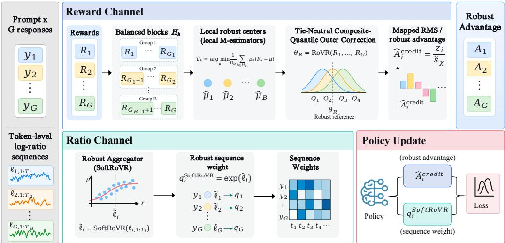  
Figure 1: Overview of RoVR-GSPO. The reward channel first estimates a robust reference, then applies the bounded residual map and mapped RMS to form $\widehat { A } ^ { \mathrm { c r e d i t } }$ . The ratio channel converts token-level log-ratio sequences into differentiable robust sequence weights via SoftRoVR. These two signals jointly determine the policy update.

• We introduce RoVR-GSPO, which combines robust reference estimation with bounded credit on the reward channel and a differentiable robust sequence surrogate on the ratio channel. This separation makes the role of each operation explicit.

• We derive conditional reference, credit-stability, outer-efficiency, and clipping-stability results, and connect them to downstream comparisons, channel placement, and paired perturbation studies.

Here “variance reduction” refers to the outer reference-estimation factor relative to median aggregation. SoftRoVR is a sequence-weight surrogate whose robustness properties are studied directly; it is not treated as an exact importance ratio.

## 2 BACKGROUND: FROM GROUP STATISTICS TO POLICY UPDATES

RoVR-GSPO is motivated by two distinct sensitivities: reward perturbations can collapse cleanresponse advantage contrast, while token log-ratio bursts can alter sequence weights and clipping branches. We analyze these effects below.

## 2.1 MEAN–RMS GROUP-RELATIVE ADVANTAGES

For a prompt x, let the old policy sample responses $\{ y _ { i } \} _ { i = 1 } ^ { G }$ with rewards $\{ R _ { i } \} _ { i = 1 } ^ { G }$ . GRPO constructs

$$
\bar { R } = \frac { 1 } { G } \sum _ { j = 1 } ^ { G } R _ { j } , \qquad s _ { R } ^ { 2 } = \frac { 1 } { G } \sum _ { j = 1 } ^ { G } ( R _ { j } - \bar { R } ) ^ { 2 } + \varepsilon _ { s } , \qquad \widehat { A } _ { i } ^ { \mathrm { G R P O } } = \frac { R _ { i } - \bar { R } } { s _ { R } } ,\tag{1}
$$

where $\varepsilon _ { s } \geq 0 .$ . The next proposition shows that self-normalization masks anomaly magnitude but broadcasts its effect across the group.

Proposition 2.1. Let $G \geq 2 .$ Fix $R _ { 1 } , \ldots , R _ { G } ,$ , replace $R _ { j }$ by $R _ { j } + \Delta$ , and consider values $o f \Delta f o r$ which $s _ { \Delta } > 0$ (in particular, all ∆ when $\varepsilon _ { s } > 0 )$ . Let $\bar { R } _ { \Delta } , s _ { \Delta } , A _ { i , \Delta }$ denote the resulting quantities. Then

$$
\bar { R } _ { \Delta } = \bar { R } + \frac { \Delta } { G } , \qquad s _ { \Delta } ^ { 2 } = s _ { R } ^ { 2 } + \frac { 2 \Delta ( R _ { j } - \bar { R } ) } { G } + \frac { G - 1 } { G ^ { 2 } } \Delta ^ { 2 } .\tag{2}
$$

For every finite group, $\begin{array} { r } { \sum _ { i } A _ { i , \Delta } = 0 , \sum _ { i } A _ { i , \Delta } ^ { 2 } \leq G , } \end{array}$ , and maxi $| A _ { i , \Delta } | \leq \sqrt { G - 1 }$ . Moreover,

$$
A _ { j , \Delta } \longrightarrow \mathrm { s i g n } ( \Delta ) \sqrt { G - 1 } , \qquad A _ { i , \Delta } \longrightarrow - { \frac { \mathrm { s i g n } ( \Delta ) } { \sqrt { G - 1 } } } \quad ( i \ne j )\tag{3}
$$

as $| \Delta |  \infty$ . Consequently, when $G \geq 3 ,$ , any two clean responses $i , k \neq j$ satisfy $A _ { i , \Delta } - A _ { k , \Delta } =$ $( R _ { i } - R _ { k } ) / s _ { \Delta } \to 0$

For a clean index set H with $| H | \ge 2$ , define the retained pairwise advantage contrast $\mathcal { C } _ { H } ( A ) =$ $\textstyle \{ 2 \sum _ { i < k , i , k \in H } ( A _ { i } - A _ { k } ) ^ { 2 } / | \dot { H } | ( | H | - 1 ) \} ^ { 1 / 2 }$ . Equation (3) gives $\mathcal { C } _ { H } ( A _ { \Delta } )  0$ when H contains the fixed clean responses. This quantity is measurable in saved batches and is therefore a primary diagnostic rather than an informal interpretation.

Proposition 2.2. Let a location estimate $m _ { \Delta }$ remain bounded when one reward is $R _ { j } + \Delta$ and all other rewards are fixed. Form raw-residual credits $C _ { i , \Delta } = ( R _ { i } ^ { ( \Delta ) } - m _ { \Delta } ) / d _ { \Delta }$ with $d _ { \Delta } > 0$ . If $d _ { \Delta } = O ( 1 )$ , then $\begin{array} { r } { | C _ { j , \Delta } |  \infty } \end{array}$ $H C _ { j , \Delta } = O ( 1 )$ , then $d _ { \Delta } = \dot { \Omega } ( | \Delta | )$ and $C _ { i , \Delta } \to 0 f o r$ every clean $i \neq j$ . In particular, an RMS about $m _ { \Delta }$ gives $d _ { \Delta } \sim | \Delta | / \sqrt { G } , C _ { j , \Delta }  \mathrm { s i g n } ( \Delta ) \sqrt { G } ,$ , and clean-advantage erasure.

For raw-residual credits with a shared scale, protecting both focal leverage and clean-response contrast therefore requires an additional residual transformation. We use the bounded map in Section 3.2, which also makes its clean-signal fidelity explicit.

## 2.2 SEQUENCE WEIGHTS AND CLIPPING ASYMMETRY

For response length $T _ { i }$ , define token log ratios $\ell _ { i , t } ( \theta ) = \log \pi _ { \theta } ( y _ { i , t } \mid x , y _ { i , < t } ) - \log \pi _ { \mathrm { o l d } } ( y _ { i , t } \mid$ $x , y _ { i , < t } )$ . GSPO uses

$$
q _ { i } ^ { \mathrm { G S P O } } ( \boldsymbol { \theta } ) = \exp \left( \frac { 1 } { T _ { i } } \sum _ { t = 1 } ^ { T _ { i } } \ell _ { i , t } ( \boldsymbol { \theta } ) \right) .\tag{4}
$$

With $l = 1 - \epsilon _ { \mathrm { l o } } > 0$ and $u = 1 + \epsilon _ { \mathrm { h i } }$ , the per-sequence clipped term is

$$
g ( q , A ) = \operatorname* { m i n } \{ q A , \operatorname { c l i p } ( q , l , u ) A \} , \qquad \mathcal { L } _ { \mathrm { G S P O } } ( \theta ) = - \mathbb { E } \left[ \frac { 1 } { G } \sum _ { i = 1 } ^ { G } g ( q _ { i } ( \theta ) , \widehat { A } _ { i } ) \right] .\tag{5}
$$

Writing $q = e ^ { m }$ , away from $q \in \{ l , u \}$

$$
\frac { \partial g ( e ^ { m } , A ) } { \partial m } = \left\{ \begin{array} { l l } { e ^ { m } A , } & { A > 0 , e ^ { m } < u , } \\ { 0 , } & { A > 0 , e ^ { m } > u , } \\ { 0 , } & { A < 0 , e ^ { m } < l , } \\ { e ^ { m } A , } & { A < 0 , e ^ { m } > l . } \end{array} \right.\tag{6}
$$

Therefore an upper-ratio excursion is clipped for positive advantage but remains on the $q A$ branch for negative credit. If a contiguous token set $\mathcal { C }$ receives perturbations $\delta _ { t }$ , then

$$
\frac { q ^ { \prime } } { q } = \exp \left( \frac { 1 } { T } \sum _ { t \in \mathcal { C } } \delta _ { t } \right) ,\tag{7}
$$

If $q < u$ initially, the perturbation crosses the upper boundary whenever $\textstyle T ^ { - 1 } \sum _ { t \in { \mathcal { C } } } \delta _ { t } > \log ( u / q )$ $\operatorname { I f } q \geq u$ already, the same upward perturbation magnifies the active negative-advantage branch. Thus localized token perturbations can affect both the sequence weight and the active optimization branch.

## 3 DUAL-CHANNEL ROBUST ESTIMATION FOR GROUP-RELATIVE POLICYOPTIMIZATION

RoVR-GSPO robustifies the two compact statistics that drive a GSPO update. For prompt-level rewards $R _ { 1 : G }$ , the reward channel separates reference estimation from credit shaping: it computes a hard RoVR reference and converts centered residuals into the bounded normalized advantage $\widehat { A } ^ { \mathrm { c r e d i t } }$ For the token log-ratios $\ell _ { i , 1 : T _ { i } }$ of each response, the ratio channel applies SoftRoVR to obtain a differentiable sequence-weight surrogate. The complete update is therefore $( R _ { 1 : G } , \ell _ { i , 1 : T _ { i } } ) \longrightarrow$ $( \widehat { A } _ { i } ^ { \mathrm { c r e d i t } } , q _ { i } ^ { \mathrm { S o f t R o V R } } ) \longrightarrow \mathcal { L } _ { \mathrm { G S P O } }$ . Building on the composite-quantile aggregation principle used in VRMOM (Tu et al., 2021), RoVR uses bounded-score local centers and an explicit credit map so that reference protection and clean-contrast protection remain distinguishable. We reserve RoVR for the hard reward-reference estimator, SoftRoVR for the differentiable ratio-side aggregator, and RoVR-GSPO for the complete dual-channel optimizer. The single-channel variants serve as placement ablations in Section 5.3.

## 3.1 ROVR ROBUST REFERENCE ESTIMATION

The main method fixes Barron’s shape to $\alpha = 1$ (Barron, 2019). Its loss and score are

$$
\rho _ { c } ( u ) = \sqrt { 1 + ( u / c ) ^ { 2 } } - 1 , \qquad \psi _ { c } ( u ) = \frac { u } { c ^ { 2 } } \left( 1 + \frac { u ^ { 2 } } { c ^ { 2 } } \right) ^ { - 1 / 2 } , \qquad \psi _ { c } ^ { \prime } ( u ) = \frac { 1 } { c ^ { 2 } } \left( 1 + \frac { u ^ { 2 } } { c ^ { 2 } } \right) ^ { - 3 / 2 } .\tag{8}
$$

The empirical objective is strictly convex, its score equation has a unique root, and $M _ { c }   : =$ $\operatorname* { s u p } _ { u } | \psi _ { c } ( u ) | = 1 / c$ . We fix the convex shape $\alpha = 1$ throughout the main experiments and partition $N$ scalar observations into $B \geq 1$ balanced blocks $\{ \mathcal { H } _ { b } \} _ { b = 1 } ^ { \mathtt { B } }$ of sizes $n _ { b }$ , where $\textstyle \sum _ { b } n _ { b } = N$ and $| n _ { b } - n _ { b ^ { \prime } } | \leq 1$ . The local robust center is

$$
\widetilde { \mu } _ { b } = \underset { u \in \mathbb { R } } { \arg \operatorname* { m i n } } \frac { 1 } { n _ { b } } \sum _ { i \in \mathcal { H } _ { b } } \rho _ { c } ( x _ { i } - u ) .\tag{9}
$$

Its population target is the M-functional

$$
\theta _ { \rho } ( P ) : \qquad \mathbb { E } _ { P } [ \psi _ { c } ( X - \theta _ { \rho } ) ] = 0 .\tag{10}
$$

For a symmetric distribution, $\theta _ { \rho }$ equals its center and, when finite, its mean. Under skewness it is an explicit robust reference rather than an undisclosed mean estimator. For each block, define its empirical sandwich scale by

$$
\widehat { a } _ { b } = \frac { 1 } { n _ { b } } \sum _ { i \in \mathcal { H } _ { b } } \psi _ { c } ^ { \prime } ( x _ { i } - \widetilde { \mu } _ { b } ) , \qquad \widehat { b } _ { b } = \frac { 1 } { n _ { b } } \sum _ { i \in \mathcal { H } _ { b } } \psi _ { c } ^ { 2 } ( x _ { i } - \widetilde { \mu } _ { b } ) , \qquad \widehat { \nu } _ { b } = \frac { \sqrt { \widehat { b } _ { b } } } { \widehat { a } _ { b } \vee a _ { \operatorname* { m i n } } } .
$$

We pool and cap these local sandwich scales,

$$
\widehat { \nu } = \mathrm { c l i p } ( \mathrm { m e d i a n } _ { b } \widehat { \nu } _ { b } , \nu _ { \mathrm { m i n } } , \nu _ { \mathrm { m a x } } ) .\tag{11}
$$

For blocks of only two or three observations, a blockwise sandwich estimate can be unstable; the implementation must then use an independent pilot or a lagged running scale and report that choice. The caps are numerical safeguards, not quantities known from theory.

The outer correction is a tie-neutral composite-quantile update. For even $B ,$ the initializer is the midpoint of the two central local centers; for odd $\bar { B , }$ it is the central local center. Let $\widehat { \mu } _ { 0 } = \mathrm { m e d i a n } _ { b } \widetilde { \mu } _ { b }$ and define

$$
\tau _ { k } = \frac { k } { K + 1 } , \qquad \Delta _ { k } = \Phi ^ { - 1 } ( \tau _ { k } ) , \qquad D _ { K } = \sum _ { k = 1 } ^ { K } \phi ( \Delta _ { k } ) , \qquad W _ { B } = \sum _ { b = 1 } ^ { B } \sqrt { n _ { b } } .
$$

Discrete rewards require a tie convention. We use the mid-indicator

$$
J _ { 0 } ( u ) = { \bf 1 } \{ u < 0 \} + \frac { 1 } { 2 } { \bf 1 } \{ u = 0 \} .\tag{12}
$$

The RoVR robust reference is

$$
\widehat { \theta } _ { \mathrm { R o V R } } = \widehat { \mu } _ { 0 } - \frac { \widehat { \nu } } { D _ { K } W _ { B } } \sum _ { b = 1 } ^ { B } \sum _ { k = 1 } ^ { K } \left[ J _ { 0 } \left( \widetilde { \mu } _ { b } - \widehat { \mu } _ { 0 } - \frac { \widehat { \nu } \Delta _ { k } } { \sqrt { n _ { b } } } \right) - \tau _ { k } \right] .\tag{13}
$$

For equal $n _ { b } = n$ , (13) reduces to the usual prefactor $\widehat { \nu } / ( B \sqrt { n } D _ { K } )$ . The denominator $W _ { B }$ is the Newton derivative implied by heteroscedastic normal block centers. Its associated effective sample size is

$$
N _ { \mathrm { e f f } } = \frac { W _ { B } ^ { 2 } } { B } \leq N ,\tag{14}
$$

which equals N for equal blocks. For balanced blocks, $N _ { \mathrm { e f f } } / N \to 1$ when $n _ { \mathrm { m i n } } \to \infty ; ( 1 4 )$ records the exact finite-block loss otherwise.

Proposition 3.1. For every $a \in \mathbb { R } ,$ , the hard RoVR map is translation equivariant and constant preserving:

$$
\mathrm { R o V R } ( x _ { 1 } + a , \ldots , x _ { N } + a ) = \mathrm { R o V R } ( x _ { 1 } , \ldots , x _ { N } ) + a , \qquad \mathrm { R o V R } ( a , \ldots , a ) = a .
$$

When $B = 1$ , it equals the single convex M-center in (9). These statements holdfor even or odd K and for discrete inputs.

The half weight at a tie is essential. With the conventional “≤” $\stackrel { 6 6 } { \leq } \leq \stackrel { 9 } { 2 }$ indicator, odd K gives a spurious correction o $\bar { \dot { \mathbf { \rho } } } - \widehat { \nu } B / ( 2 D _ { K } W _ { B } )$ on constant data. The logistic relaxation below takes value $1 / 2$ at zero, so (12) also aligns the hard and smooth estimators. After the local roots are computed, direct evaluation costs $O ( B K )$ ; the equal-block version admits the same rank-count simplification as VRMOM (Tu et al., 2021).

Table 6 summarizes the reference estimators. Relative to MOM or Robust MOM, RoVR replaces the outer median by a symmetric composite-quantile correction. Under the clean local normal-score model, this changes the outer variance factor from $\pi / 2$ to $V _ { K }$ , with $V _ { K } \to \pi / 3$ as the quantile grid is refined. The complete variance combines this factor with the local sandwich variance. RoVR shares the outer-efficiency principle of VRMOM and adds bounded-score local centers, tie-neutral handling of discrete inputs, and balanced unequal blocks.

## 3.2 REWARD-CHANNEL ADVANTAGE ESTIMATION

The robust reference controls the shared reward baseline, while the credit map controls the focal residual and the scale used for normalization. RoVR therefore uses the following bounded odd residual map when forming reward advantages:

$$
\chi _ { \kappa } ( u ) = \frac { u } { \sqrt { 1 + ( u / \kappa ) ^ { 2 } } } = \kappa ^ { 2 } \psi _ { \kappa } ( u ) , \qquad | \chi _ { \kappa } ( u ) | \leq \kappa , \qquad 0 < \chi _ { \kappa } ^ { \prime } ( u ) \leq 1 .\tag{15}
$$

It preserves sign and local slope while saturating smoothly. With ${ \widehat { \theta } } _ { R } = \operatorname { R o V R } ( R _ { 1 } , \dots , R _ { G } )$ , define

$$
\widehat { s } _ { \chi } = \{ s _ { \mathrm { m i n } } ^ { 2 } + \frac { 1 } { G } \sum _ { j = 1 } ^ { G } \chi _ { \kappa } ^ { 2 } ( R _ { j } - \widehat { \theta } _ { R } ) \} ^ { 1 / 2 } , \quad \widehat { A } _ { i } ^ { \mathrm { c r e d i t } } = \frac { \chi _ { \kappa } ( R _ { i } - \widehat { \theta } _ { R } ) } { \widehat { s } _ { \chi } } .\tag{16}
$$

The main bounded advantage is deterministically bounded,

$$
\vert \widehat { A } _ { i } ^ { \mathrm { c r e d i t } } \vert \leq \operatorname* { m i n } \biggl \{ \frac { \kappa } { s _ { \mathrm { m i n } } } , \sqrt { G } \biggr \} .\tag{17}
$$

The map is close to the raw residual on clean moderate rewards:

$$
| \chi _ { \kappa } ( u ) - u | \leq \frac { | u | ^ { 3 } } { 2 \kappa ^ { 2 } } .\tag{18}
$$

Thus κ controls the fidelity–robustness trade-off. For bounded rule rewards, choosing κ above the reward range makes the distortion small. All reward-side statistics are detached before they enter the policy loss. The center-only comparison below retains the raw residual and raw RMS while replacing only the arithmetic mean by $\begin{array} { r } { \widehat { \theta } _ { R } \colon \widehat { A } _ { i } ^ { \mathrm { c e n t e r } } = \frac { R _ { i } - \widehat { \theta } _ { R } } { \{ \varepsilon _ { s } + G ^ { - 1 } \sum _ { i } ( R _ { j } - \widehat { \theta } _ { R } ) ^ { 2 } \} ^ { 1 / 2 } } } \end{array}$ . This isolates the effect of the RoVR reference from the bounded residual map and mapped scale. For an action-independent control-variate reference, use a linear leave-one-out numerator and a positive leave-one-out scale $S _ { - i } ,$ both computed without $R _ { i } { \mathrm { : } }$

$$
\widehat { A } _ { i } ^ { \mathrm { L O O } } = \frac { R _ { i } - \widehat { \theta } _ { R , - i } } { S _ { - i } } , \qquad \widehat { \theta } _ { R , - i } = \mathrm { R o V R } ( R _ { 1 } , \ldots , R _ { i - 1 } , R _ { i + 1 } , \ldots , R _ { G } ) .\tag{19}
$$

A bounded residual leave-one-out version is a shaped robust surrogate and does not inherit the linear baseline cancellation. Its deviation is quantified in Theorem F.17.

Table 7 separates the roles of the three advantage constructions: $\widehat { A } ^ { \mathrm { c e n t e r } }$ isolates reference substitution, $\widehat { A } ^ { \mathrm { L O O } }$ provides a linear action-independent baseline for analysis, and $\widehat { A } ^ { \mathrm { c r e d i t } }$ is the normalized bounded advantage used by RoVR-GSPO.

## 3.3 SOFTROVR SEQUENCE-WEIGHT ESTIMATION FOR GSPO

The reward statistic uses the hard RoVR operator in (13). The ratio-side differentiable surrogate is called SoftRoVR. For token log-ratios, define $\begin{array} { r } { H _ { \gamma } ( u ) = \frac { 1 } { 1 + \exp ( u / \gamma ) } , \gamma > 0 } \end{array}$ , which converges pointwise to $J _ { 0 }$ , including at ties. A differentiable outer initializer can be obtained from

$$
\operatorname { s m e d } _ { \eta } ( v _ { 1 } , \dots , v _ { B } ) = \arg \operatorname* { m i n } _ { u } \frac { 1 } { B } \sum _ { b = 1 } ^ { B } \rho _ { \eta } ( v _ { b } - u ) , \qquad \eta > 0 .\tag{20}
$$

Let $S _ { \gamma }$ retain the hard block centers, midpoint-median initializer, and pooled scale, replacing only $J _ { 0 }$ by $H _ { \gamma } .$ This auxiliary map isolates indicator-smoothing error. The implemented surrogate SoftRoV $\mathrm { R } _ { \gamma , \eta , S }$ additionally uses (20) for both median operations and unrolls S safeguarded solver iterations. At fixed $\eta > 0$ , the smooth objective specifies a unique initializer, including for even $B .$ We analyze this finite-temperature surrogate directly; comparison with hard RoVR separates indicator, initializer, scale, and solver errors. The zero-temperature indicator limit agrees with $J _ { 0 }$ at ties.

For response i, the robust sequence weight is

$$
q _ { i } ^ { \mathrm { S o f t R o V R } } ( \theta ) = \mathrm { e x p } \left[ \mathrm { S o f t R o V R } _ { \gamma , \eta , S } \left( \ell _ { i , 1 } ( \theta ) , \dots , \ell _ { i , T _ { i } } ( \theta ) \right) \right] .\tag{21}
$$

RoVR-GSPO combines $\widehat { A } ^ { \mathrm { c r e d i t } }$ from (16) with (21). Disabling one channel gives a placement ablation. Robust aggregation defines a sequence-weight surrogate with a different likelihood functional; its calibration and local stability are analyzed in Section 4.

## 3.4 RESOLUTION, FAILURE GEOMETRY, AND FALLBACK

The block design determines the contamination budget. To tolerate q arbitrary blocks while retaining a strict majority of usable blocks, one needs $B \geq 2 q + 1$ . To leave a strict clean majority after at most s replacements inside each usable block, one needs $n _ { \mathrm { m i n } } \geq 2 s + 1$ . Hence a non-degenerate worst-case two-level design requires

$$
N \geq ( 2 q + 1 ) ( 2 s + 1 ) .\tag{22}
$$

This condition describes the resolution needed for simultaneous worst-case protection at both levels. In particular, $G < 9$ permits budgets with $q = 0 \mathrm { o r } s = 0$ , but cannot support both $q \geq 1$ and $s \geq 1$ . RoVR itself is defined for every balanced partition; the budget determines the applicable guarantee. The $B = 1$ case provides a global-M boundary case. Contiguous token blocks encode a burst geometry, while random partitions support the independently assigned contamination model.

## 4 THEORETICAL GUARANTEES

We analyze the three quantities modified by RoVR-GSPO: the reward reference, bounded response credit, and sequence weight. The results cover finite-group stability, clean outer efficiency, calibration, and clipping margins; auxiliary statements and proofs appear in Sections F to I.

Consider B declared blocks, with a fixed set of $q < r _ { B } : = \lceil B / 2 \rceil$ arbitrary blocks and honest complement H. Each $b \in \mathcal H$ contains $n _ { b }$ independent clean draws followed by at most sb adaptive replacements. If $g ( t ) = \mathbb { E } \psi _ { c } ( X - t )$ satisfies $g ( \theta + u ) \leq - a u$ and $g ( \theta - u ) \geq a u$ for $0 \leq u \leq r _ { 0 }$ ， define, for $0 < t \leq r _ { 0 }$

$$
\begin{array} { l } { { \displaystyle H = B - q , \quad \eta _ { q } = ( r _ { B } - q ) / ( B - q ) , \quad p _ { b } ( t ) = \mathrm { e x p } \left[ - \frac { n _ { b } } { 2 M _ { c } ^ { 2 } } \left( a t - \frac { 2 s _ { b } M _ { c } } { n _ { b } } \right) ^ { 2 } \right] , } } \\ { { \displaystyle \bar { p } _ { H } ( t ) = H ^ { - 1 } \sum _ { b \in \mathcal { H } } p _ { b } ( t ) , \quad \beta _ { H } ( t ) = \mathrm { m i n } \{ 1 , 2 e ^ { - 2 H ( \eta _ { q } - \bar { p } _ { H } ( t ) ) ^ { 2 } } \} , } } \\ { { \displaystyle \widehat C _ { B } = | \widehat { \theta } _ { \mathrm { R o V R } } - \widehat { \mu } _ { 0 } | , \qquad C _ { B } = \nu _ { \mathrm { m a x } } B K / ( 2 D _ { K } W _ { B } ) . } } \end{array}
$$

Only the population score separation is distributional; replacement values may be unbounded.

Theorem 4.1 (Finite-group reference and credit stability). $I f \bar { p } _ { H } ( t ) < \eta _ { q } ,$ , then $\widehat { C } _ { B } \leq C _ { B }$ and

$$
\begin{array} { r } { \mathbb { P } \Big ( \vert \widehat { \theta } _ { \mathrm { R o V R } } - \theta \vert > t + \widehat C _ { B } \Big ) \leq \beta _ { H } ( t ) , \qquad \mathbb { P } \Big ( \vert \widehat { \theta } _ { \mathrm { R o V R } } - \theta \vert > t + C _ { B } \Big ) \leq \beta _ { H } ( t ) . } \end{array}\tag{23}
$$

Suppose additionally that the observed reward group and its clean precursor differ in at most r coordinates. Let $A _ { i } ^ { \theta , \star }$ be the bounded credit of the precursor computed with population reference θ, and set $e _ { \theta } ( t ) = \stackrel { \cdot } { t } + C _ { B } , e _ { R , i } = | R _ { i } - R _ { i } ^ { \star } |$ , and $\bar { e } _ { s } ( t ) = \bar { \{ r \bar { \kappa } ^ { 2 } / G + 2 \kappa \bar { e } _ { \theta } ( t ) \} } / ( 2 s _ { \mathrm { m i n } } )$ . With probability at least $1 - \beta _ { H } ( t )$ , simultaneouslyfor all responses,

$$
| \widehat { A } _ { i } ^ { \mathrm { c r e d i t } } - A _ { i } ^ { \theta , \star } | \leq \frac { \operatorname* { m i n } \{ e _ { R , i } + e _ { \theta } ( t ) , 2 \kappa \} } { s _ { \operatorname* { m i n } } } + \frac { \kappa \bar { e } _ { s } ( t ) } { s _ { \operatorname* { m i n } } ^ { 2 } } .\tag{24}
$$

The credit bound includes the perturbed focal response. Its dependence on $e _ { R , i }$ is capped by $2 \kappa$ yielding magnitude-independent control under the stated geometry and population separation. Smaller κ limits leverage more strongly, while larger κ preserves moderate clean residuals more closely. Equation (17) gives the corresponding uniform advantage bound.

To characterize clean reference-estimation efficiency, write $\nu ^ { 2 } = \mathbb { E } \psi _ { c } ^ { 2 } ( X - \theta _ { \rho } ) / \{ \mathbb { E } \psi _ { c } ^ { \prime } ( X - \theta _ { \rho } ) \} ^ { 2 }$ For equal blocks of size n, assume independent honest block centers, $q _ { B } = o ( \sqrt { B } )$ arbitrary blocks, a $B ^ { - 1 / 2 }$ -accurate initializer, an $o _ { \mathbb { P } } ( B ^ { - 1 / 4 } )$ scale error, and the uniform local normal-score and equicontinuity conditions in Theorem F.11.

Theorem 4.2 (Clean outer efficiency). For fixed K, under the preceding transfer conditions,

$$
\sqrt { B n } ( \widehat { \theta } _ { \mathrm { R o V R } } - \theta _ { \rho } ) \stackrel { d } { \to } \mathcal { N } ( 0 , \nu ^ { 2 } V _ { K } ) , \qquad V _ { K } : = \frac { \sum _ { k , \ell } [ \operatorname* { m i n } ( \tau _ { k } , \tau _ { \ell } ) - \tau _ { k } \tau _ { \ell } ] } { \{ \sum _ { k } \phi ( \Delta _ { k } ) \} ^ { 2 } } \longrightarrow \frac { \pi } { 3 } .\tag{25}
$$

The limit first sends $( B , n ) \to \infty$ atfixed K and then refines the quantile grid.

The outer factor improves on the median value $\pi / 2$ under the stated local normal-score model. Total reference-estimation variance combines this factor with the local sandwich factor and, for unequal blocks, the effective sample size in (14).

The ratio channel instead needs calibration and a clipping-margin statement. Let $| \widehat { m } - m ^ { \star } | \leq e _ { m }$ and $( \widehat { q } , q ^ { \star } ) = ( e ^ { \widehat { m } } , e ^ { m ^ { \star } } )$

Proposition 4.3 (Calibration and clipping-margin control). At differentiable inputs, the converged SoftRoVR map, and anyfixed number ofequivariantly initialized solver steps, obey

$$
\mathrm { S o f t R o V R } ( \ell + a \mathbf { 1 } ) = \mathrm { S o f t R o V R } ( \ell ) + a , \quad \sum _ { t } \partial \mathrm { S o f t R o V R } ( \ell ) / \partial \ell _ { t } = 1 , \quad e ^ { - e _ { m } } \leq \widehat { q } / q ^ { \star } \leq e ^ { e _ { m } } .
$$

A clipping branch can change only ifdis $( m ^ { \star } , \{ \log l , \log u \} ) \le e _ { m }$

The proposition links log-weight error to the distance from a clipping boundary. Theorem F.15 extends this relation to same-branch objective and gradient perturbations under explicit Jacobian conditions.

## 5 EXPERIMENTS

We evaluate RoVR-GSPO on mathematical reasoning, long-context summarization, and tool-call annotation, followed by channel ablations and controlled perturbation analyses. Detailed protocols and supplementary diagnostics appear in Sections B and C.

## 5.1 EXPERIMENTAL SETUP

We evaluate three downstream tasks. For mathematical reasoning, Qwen3-4B-Base and OLMo-3- 7B-Instruct are trained on the 7,500-example MATH split (Hendrycks et al., 2021) and evaluated on MATH500, AIME2025, AMC23, Gaokao2023-Math-En (Zhang et al., 2024), and Minerva-Math (Lewkowycz et al., 2022), using either a bounded answer verifier or InternLM2-1.8B-Reward.

For GovReport summarization (Huang et al., 2021), training uses LongDocFACTScore (Bishop et al., 2024) while evaluation uses ROUGE-1/2/L (Lin, 2004); the evaluation metrics are therefore distinct from the training reward. For offline tool-call annotation, Qwen3-4B-Base is trained on the RLLA-4K split from ToolRL (?), and the held-out metric is the training scorer’s format-plus-tool-match reward. No tools are executed in this third task.

GSPO (Zheng et al., 2025) is the parent baseline. Initialization, response and optimizer budgets, decoding, and evaluation code are matched within each comparison. RoVR-GSPO combines the full RoVR reward reference, bounded credit, and SoftRoVR sequence weights; channel ablations disable the corresponding component. The mathematical-reasoning main comparison and channel ablation report mean ± standard deviation over three independent runs; summarization and tool-call annotation are single-run estimates. Section E separately evaluates the reference estimator.

## 5.2 DOWNSTREAM RESULTS

Table 1: Mathematical-reasoning accuracy (%), mean ± standard deviation over three runs. Bold marks the higher mean for each setting.
<table><tr><td rowspan="2">Model</td><td rowspan="2">Dataset</td><td colspan="2">Rule reward</td><td colspan="2">InternLM2 reward</td></tr><tr><td>GSPO</td><td>RoVR-GSPO</td><td>GSPO</td><td>RoVR-GSPO</td></tr><tr><td rowspan="5">Qwen3-4B-Base</td><td>MATH500</td><td> $7 7 . 0 0 \pm 0 . 4 3$ </td><td> ${ \bf 7 7 . 4 7 \pm 0 . 5 7 }$ </td><td> $7 4 . 5 3 \pm 0 . 4 1$ </td><td> ${ \bf 7 5 . 8 0 \pm 0 . 2 8 }$ </td></tr><tr><td>Gaokao2023en</td><td> $3 9 . 7 4 \pm 0 . 2 1$ </td><td> ${ \bf 4 5 . 3 7 \pm 0 . 9 5 }$ </td><td> $3 8 . 5 3 \pm 0 . 3 2$ </td><td> ${ \bf 4 2 . 0 8 \pm 0 . 3 7 }$ </td></tr><tr><td>MinervaMath</td><td> $1 9 . 3 6 \pm 0 . 4 6$ </td><td> ${ \bf 2 1 . 6 9 \pm 1 . 0 4 }$ </td><td> $1 5 . 8 1 \pm 0 . 3 0$ </td><td> ${ \bf 1 6 . 6 7 \pm 0 . 3 4 }$ </td></tr><tr><td>AIME2025</td><td> $1 4 . 4 4 \pm 1 . 5 7$ </td><td> ${ \bf 1 5 . 5 6 \pm 1 . 5 7 }$ </td><td> $8 . 8 9 \pm 1 . 5 7$ </td><td> ${ \bf 1 5 . 5 6 \pm 1 . 5 7 }$ </td></tr><tr><td>AMC23</td><td> $6 2 . 5 0 \pm 2 . 0 4$ </td><td> ${ \bf 6 3 . 3 3 \pm 1 . 1 8 }$ </td><td> $5 6 . 6 7 \pm 1 . 1 8$ </td><td> ${ \bf 6 4 . 1 7 \pm 3 . 1 2 }$ </td></tr><tr><td rowspan="5">OLMo-3-7B-Instruct</td><td>MATH500</td><td> $8 9 . 8 0 \pm 0 . 1 6$ </td><td> ${ \bf 9 0 . 7 3 \pm 0 . 2 5 }$ </td><td> $8 8 . 9 3 \pm 0 . 7 4$ </td><td> $\mathbf { 8 9 . 5 3 \pm 0 . 4 1 }$ </td></tr><tr><td>Gaokao2023en</td><td> $7 3 . 7 7 \pm 0 . 2 1$ </td><td> ${ \bf 7 4 . 6 4 \pm 0 . 7 4 }$ </td><td> $7 1 . 9 4 \pm 0 . 3 6$ </td><td> ${ \bf 7 2 . 9 0 \pm 0 . 2 5 }$ </td></tr><tr><td>MinervaMath</td><td> $2 8 . 8 0 \pm 0 . 7 6$ </td><td> ${ \bf 2 9 . 1 7 \pm 0 . 3 4 }$ </td><td> $2 8 . 5 6 \pm 0 . 1 7$ </td><td> ${ \bf 2 9 . 2 9 \pm 0 . 6 3 }$ </td></tr><tr><td>AIME2025</td><td> $3 7 . 7 8 \pm 1 . 5 7$ </td><td> ${ \bf 4 1 . 1 1 \pm 1 . 5 7 }$ </td><td> $3 7 . 7 8 \pm 1 . 5 7$ </td><td> ${ \bf 4 1 . 1 1 \pm 3 . 1 4 }$ </td></tr><tr><td>AMC23</td><td> $8 6 . 6 7 \pm 2 . 3 6$ </td><td> ${ \bf 8 7 . 5 0 \pm 2 . 0 4 }$ </td><td> $8 6 . 6 7 \pm 2 . 3 6$ </td><td> ${ \bf 9 0 . 8 3 \pm 1 . 1 8 }$ </td></tr></table>

Mathematical reasoning. RoVR-GSPO achieves a higher mean than matched GSPO in all 20 settings. The five-benchmark average improvements are 2.08%/3.97% for Qwen3-4B-Base and 1.27%/1.96% for OLMo-3-7B-Instruct under rule/InternLM2 rewards.

Long-context summarization. For GovReport, both backbones are fine-tuned with LongDoc-FACTScore rewards using eight sampled summaries per input and evaluated with ROUGE-1/2/L.

Table 2: GovReport ROUGE point estimates on a 0–1 scale; bold marks the higher score.
<table><tr><td>Model</td><td>Method</td><td>ROUGE-1</td><td>ROUGE-2</td><td>ROUGE-L</td></tr><tr><td rowspan="2">Qwen3-4B-Base</td><td>GSPO</td><td>0.309</td><td>0.142</td><td>0.166</td></tr><tr><td>RoVR-GSPO</td><td>0.333</td><td>0.164</td><td>0.175</td></tr><tr><td rowspan="2">OLMo-3-7B-Instruct</td><td>GSPO</td><td>0.552</td><td>0.189</td><td>0.221</td></tr><tr><td>RoVR-GSPO</td><td>0.553</td><td>0.195</td><td>0.229</td></tr></table>

RoVR-GSPO improves ROUGE-1/2/L for both backbones: 0.024/0.022/0.009 for Qwen3-4B-Base and 0.001/0.006/0.008 for OLMo-3-7B-Instruct.

The validation-reward trajectories in Figure 2 are consistent with the held-out ROUGE results.

Tool-call annotation. On RLLA-4K, using 80 held-out prompts and one greedy response per prompt, the highest observed mean Total reward is 1.924 for GSPO and 2.009 for RoVR-GSPO. Each value is selected from four logged validations. The score measures format and tool matching without executing tools, and the available logs cover only the early portion of the configured training budget.

## 5.3 CHANNEL PLACEMENT ABLATION

We compare GSPO, reward-only RoVR-Adv, ratio-only SoftRoVR, and the full RoVR-GSPO model (Table 3 and Fig. 3).

Table 3: Channel-ablation accuracy (%) on mathematical reasoning. Values are reported as mean ± standard deviation over three independent runs; bold marks the highest mean in each column.
<table><tr><td>Method</td><td>MATH500</td><td>Gaokao</td><td>Minerva</td><td>AIME25</td><td>AMC23</td></tr><tr><td>GSPO</td><td> $7 4 . 5 3 \pm 0 . 5 0$ </td><td> $3 8 . 5 3 \pm 0 . 4 0$ </td><td> $1 5 . 8 1 \pm 0 . 3 7$ </td><td> $8 . 8 9 \pm 1 . 9 2$ </td><td> $5 6 . 6 7 \pm 1 . 4 4$ </td></tr><tr><td>RoVR-Adv</td><td> $7 4 . 7 3 \pm 0 . 8 1$ </td><td> $4 0 . 6 1 \pm 0 . 4 0$ </td><td> $1 5 . 1 8 \pm 0 . 2 3$ </td><td> $1 2 . 2 2 \pm 1 . 9 2$ </td><td> $5 6 . 6 7 \pm 1 . 4 4$ </td></tr><tr><td>SoftRoVR</td><td> $7 4 . 5 3 \pm 0 . 2 3$ </td><td> $4 0 . 8 7 \pm 1 . 2 8$ </td><td> $1 6 . 4 2 \pm 0 . 3 4$ </td><td> $1 4 . 4 4 \pm 1 . 9 3$ </td><td> $5 9 . 1 7 \pm 1 . 4 4$ </td></tr><tr><td>RoVR-GSPO</td><td> ${ \bf 7 5 . 8 0 \pm 0 . 3 5 }$ </td><td> ${ \bf 4 2 . 0 8 \pm 0 . 4 5 }$ </td><td> ${ \bf 1 6 . 6 7 \pm 0 . 4 2 }$ </td><td> ${ \bf 1 5 . 5 6 \pm 1 . 9 3 }$ </td><td> ${ \bf 6 4 . 1 7 \pm 3 . 8 2 }$ </td></tr></table>

Across the five benchmarks, the macro-average gains over GSPO are 1.00, 2.20, and 3.97 percentage points for RoVR-Adv, SoftRoVR, and RoVR-GSPO, respectively, based on the three-run means. RoVR-GSPO has the highest mean on all five benchmarks and exceeds SoftRoVR by 1.77 points on average.

The combined variant records the highest late-stage reward, while the robust variants show lower late-stage entropy (Figure 3).

Mechanism checks. Offline perturbations support both mechanisms. Robust centering reduces reference displacement from 1.000σ to 0.060σ, while bounded credit limits scale inflation from 28.194× to 1.911× and raises clean-contrast retention from 0.035 to 0.520. SoftRoVR reduces log-weight displacement by about 26% for strong token spikes and 87% for 20% bursts, with fewer clipping flips under strong spikes.

## 6 CONCLUSION

RoVR-GSPO treats reward-derived advantages and sequence-level weights as separate statistical interfaces to group-relative policy optimization. Blockwise M-estimation and tie-neutral compositequantile aggregation construct the reward reference; bounded credit protects the normalized response contrast, and SoftRoVR aggregates token log-ratios before clipping. The analysis links these design choices to reference robustness, clean outer efficiency, and local update stability.

Across mathematical reasoning and GovReport, RoVR-GSPO consistently improves over matched GSPO baselines, with additional gains on the offline tool-call annotation score. Controlled reward and token perturbations further show that the two channels address complementary sources of update sensitivity. These results support robust advantage and sequence-weight estimation as a practical statistical interface for group-relative language-model post-training.

## AI USE STATEMENT

OpenAI Codex was used to assist with manuscript organization, language editing, LaTeX formatting, and stress-testing the exposition and logical consistency of the motivation and theoretical arguments. The authors are responsible for independently verifying every mathematical claim, proof, citation, experimental datum, and conclusion before submission, and they take responsibility for the final content of the paper.

## ETHICS STATEMENT

This work studies robust advantage and sequence-weight estimation for language-model post-training and introduces no new human-subject study or personally identifiable dataset. Robust aggregation can reduce sensitivity to isolated scoring errors, but it does not guarantee reward-model validity, factual correctness, fairness, or safe deployment. Any deployment should therefore retain independent reward audits, distribution-shift evaluation, and the data-governance requirements of the underlying models and datasets.

## REPRODUCIBILITY STATEMENT

The estimator, credit map, token extension, and optimization procedure are specified in Sections 3 and D. The assumptions and complete proofs of the theoretical claims appear in Sections G to I. The experimental protocol, placement ablation, and reporting conventions are specified in Sections C and 5.

## REFERENCES

Jonathan T. Barron. A general and adaptive robust loss function. CVPR, 2019.

Jennifer A Bishop, Sophia Ananiadou, and Qianqian Xie. Longdocfactscore: Evaluating the factuality of long document abstractive summarisation. In Proceedings of the 2024 Joint International Conference on Computational Linguistics, Language Resources and Evaluation (LREC-COLING 2024), pp. 10777–10789, 2024.

Dan Hendrycks, Collin Burns, Saurav Kadavath, Akul Arora, Steven Basart, Eric Tang, Dawn Song, and Jacob Steinhardt. Measuring mathematical problem solving with the math dataset, 2021. URL https://arxiv.org/abs/2103.03874.

Thomas Hitchcox and James Richard Forbes. Mind the gap: Norm-aware adaptive robust loss for multivariate least-squares problems. IEEE Robotics and Automation Letters, 7(3):7116–7123, 2022.

Luyang Huang, Shuyang Cao, Nikolaus Parulian, Heng Ji, and Lu Wang. Efficient attentions for long document summarization. In Proceedings of the 2021 conference of the north American chapter ofthe associationfor computational linguistics: Human language technologies, pp. 1419–1436, 2021.

Peter J Huber. Robust statistics. In International encyclopedia ofstatistical science, pp. 1248–1251. Springer, 2011.

Pierre Humbert, Batiste Le Bars, and Ludovic Minvielle. Robust kernel density estimation with median-of-means principle. In International Conference on Machine Learning, pp. 9444–9465. PMLR, 2022.

Kyungmin Jung, Thomas Hitchcox, and James Richard Forbes. An adaptive graduated nonconvexity loss function for robust nonlinear least-squares solutions. IEEE Transactions on Robotics, 2024.

Thomas Kwa, Drake Thomas, and Adrià Garriga-Alonso. Catastrophic goodhart: regularizing rlhf with kl divergence does not mitigate heavy-tailed reward misspecification. arXiv preprint arXiv:2407.14503, 2024. doi: 10.48550/arXiv.2407.14503.

Guillaume Lecué, Matthieu Lerasle, and Timlothée Mathieu. Robust classification via mom minimization. Machine learning, 109(8):1635–1665, 2020.

Aitor Lewkowycz, Anders Andreassen, David Dohan, Ethan Dyer, Henryk Michalewski, Vinay Ramasesh, Ambrose Slone, Cem Anil, Imanol Schlag, Theo Gutman-Solo, Yuhuai Wu, Behnam Neyshabur, Guy Gur-Ari, and Vedant Misra. Solving quantitative reasoning problems with language models, 2022. URL https://arxiv.org/abs/2206.14858.

Hunter Lightman, Vineet Kosaraju, Yura Burda, Harri Edwards, Bowen Baker, Teddy Lee, Jan Leike, John Schulman, Ilya Sutskever, and Karl Cobbe. Let’s verify step by step. arXiv preprint arXiv:2305.20050, 2023.

Chin-Yew Lin. Rouge: A package for automatic evaluation of summaries. In Text summarization branches out, pp. 74–81, 2004.

Long Ouyang, Jeffrey Wu, Xu Jiang, Diogo Almeida, Carroll L. Wainwright, Pamela Mishkin, Chong Zhang, Sandhini Agarwal, Katarina Slama, Alex Ray, John Schulman, Jacob Hilton, Fraser Kelton, Luke Miller, Maddie Simens, Amanda Askell, Peter Welinder, Paul F. Christiano, Jan Leike, and Ryan Lowe. Training language models to follow instructions with human feedback. In Advances in Neural Information Processing Systems, volume 35, pp. 27730–27744, 2022.

Tao Ren, Jinyang Jiang, Hui Yang, Wan Tian, and Yijie Peng. RiskPO: Risk-based policy optimization with verifiable reward for LLM post-training. In NeurIPS 2025 Workshop MLxOR: Mathematical Foundations and Operational Integration ofMachine Learningfor Uncertainty-Aware Decision-Making, 2025. URL https://openreview.net/forum?id=8hxqmh25ZH.

Helmut Rieder. Robust Asymptotic Statistics: Volume I. Springer Science & Business Media, 2012.

John Schulman, Filip Wolski, Prafulla Dhariwal, Alec Radford, and Oleg Klimov. Proximal policy optimization algorithms. arXiv preprint arXiv:1707.06347, 2017. doi: 10.48550/arXiv.1707.06347.

Zhihong Shao, Peiyi Wang, Qihao Zhu, Runxin Xu, Junxiao Song, Xiao Bi, Haowei Zhang, Mingchuan Zhang, Y. K. Li, Y. Wu, and Daya Guo. Deepseekmath: Pushing the limits of mathematical reasoning in open language models. arXiv preprint arXiv:2402.03300, 2024.

Jiyuan Tu, Weidong Liu, Xiaojun Mao, and Xi Chen. Variance reduced median-of-means estimator for byzantine-robust distributed inference. Journal ofMachine Learning Research, 22(84):1–67, 2021.

Fengli Xu, Qianyue Hao, Zefang Zong, Jingwei Wang, Yunke Zhang, Jingyi Wang, Xiaochong Lan, Jiahui Gong, Tianjian Ouyang, Fanjin Meng, Chenyang Shao, Yuwei Yan, Qinglong Yang, Yiwen Song, Sijian Ren, Xinyuan Hu, Yu Li, Jie Feng, Chen Gao, and Yong Li. Towards large reasoning models: A survey of reinforced reasoning with large language models. arXiv preprint arXiv:2501.09686, 2025.

Fengkai Yang, Zherui Chen, Xiaohan Wang, Xiaodong Lu, Jiajun Chai, Guojun Yin, Wei Lin, Shuai Ma, Fuzhen Zhuang, Deqing Wang, et al. Your group-relative advantage is biased. arXiv preprint arXiv:2601.08521, 2026.

Qiying Yu, Zheng Zhang, Ruofei Zhu, Yufeng Yuan, Xiaochen Zuo, Yu Yue, Weinan Dai, Tiantian Fan, Gaohong Liu, Lingjun Liu, et al. Dapo: An open-source llm reinforcement learning system at scale. arXiv preprint arXiv:2503.14476, 2025.

Xiaotian Zhang, Chunyang Li, Yi Zong, Zhengyu Ying, Liang He, and Xipeng Qiu. Evaluating the performance of large language models on gaokao benchmark, 2024. URL https://arxiv. org/abs/2305.12474.

Chuheng Zheng, Siyuan Liu, Yibo Zhu, Zhijie Deng, Tao Ji, Kai Yang, Zhenyu Li, Ming Liu, et al. Group sequence policy optimization. arXiv preprint arXiv:2507.18071, 2025.

## A RELATED WORK

RoVR-GSPO connects two strands of work: robust construction of reward-derived advantages and robust aggregation of the likelihood statistics used by clipped policy objectives. PPO clips likelihood ratios and is commonly paired with a learned value function in RLHF (Schulman et al., 2017; Ouyang et al., 2022); GRPO replaces the critic with within-group reward normalization (Shao et al., 2024); DAPO studies large-scale choices such as asymmetric clipping and dynamic sampling (Yu et al., 2025); and GSPO uses a length-normalized sequence correction (Zheng et al., 2025). RoVR-GSPO keeps the parent clipped objective and contributes a statistical interface that separates reference estimation, bounded credit, and sequence-weight aggregation.

Robust reward and advantage estimation. Learned reward models can exhibit label errors, calibration shifts, and exploitable tails, while outcome verifiers are bounded and often tie-rich. Process supervision supplies denser feedback (Lightman et al., 2023), and heavy-tailed reward misspecification remains a concern even with KL regularization (Kwa et al., 2024). Reward winsorization and post-normalization advantage clipping limit extremes; RoVR separates robust reference estimation from bounded residual normalization so their effects can be analyzed independently. Risk-sensitive objectives intentionally change the optimized reward functional (Ren et al., 2025), whereas our reward channel exposes the robustness–fidelity trade-off through the explicit map χκ.

Group-relative normalization also induces prompt-dependent difficulty weighting (Yang et al., 2026). This statistical bias concerns the target of advantage estimation, whereas RoVR characterizes sensitivity to localized reward perturbations and the fidelity of bounded credit. The leave-one-out analysis in Theorem F.16 makes the prompt-reweighting effect explicit.

Robust reference estimation. Medians, trimming, and bounded-score M-estimators provide classical contamination protection (Huber, 2011; Rieder, 2012). A global Huber or pseudo-Huber estimator is the B = 1 boundary of our reference construction. MOM methods add an explicit block interface (Lecué et al., 2020; Humbert et al., 2022), while VRMOM reduces the outer median variance through a composite-quantile one-step correction but retains arithmetic local means (Tu et al., 2021). RoVR combines bounded-score local centers with tie-neutral composite-quantile aggregation and then adds a policy-specific bounded credit map, so reference protection and clean-response contrast can be examined separately.

Robust sequence-weight estimation. GSPO summarizes token log-ratios into a sequence-level weight before clipping. SoftRoVR targets this aggregation step directly: it smooths the RoVR construction so gradients can pass through the sequence statistic and then exponentiates the resulting log-weight. Because this robust aggregation changes the likelihood functional, we analyze it as an optimization surrogate and study its calibration and clipping-branch stability rather than treating it as an exact importance ratio.

Barron’s family connects several classical robust penalties (Barron, 2019) and supports adaptive and graduated robust estimation (Jung et al., 2024; Hitchcox & Forbes, 2022). RoVR fixes α = 1 to obtain a convex pseudo-Huber/Charbonnier-type local loss, then combines its bounded score with tie-neutral composite-quantile aggregation and policy-specific bounded residual normalization. This choice gives a unique local root and the score properties used in our analysis.

## B ADDITIONAL EXPERIMENTAL RESULTS

This appendix reports training dynamics and the complete token-ratio and reward-contamination diagnostics using the sampling units specified in each protocol.

## B.1 TRAINING DYNAMICS

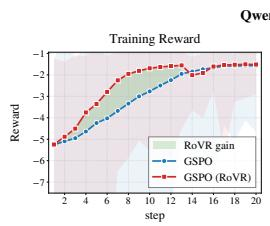

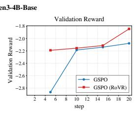

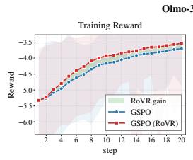

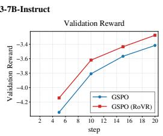

−3.8−3.8Figure 2: GovReport training dynamics for Qwen3-4B-Base (left pair) and OLMo-3-7B-Instruct −5.5 RoVR gain −4.0 5.0−5.5 RoVR gain −4.0 5.0(right pair). Each pair shows training reward followed by validation reward. Blue circles denote −6.0 GSPO (RoVR) −4.2 GSPO (RoVR) 2.5−6.0 GSPO (RoVR) −4.2 GSPO (RoVR) 2.5GSPO, and red squares denote RoVR-GSPO, labeled GSPO (RoVR) in the figure. The green fill visualizes the reward gap.  
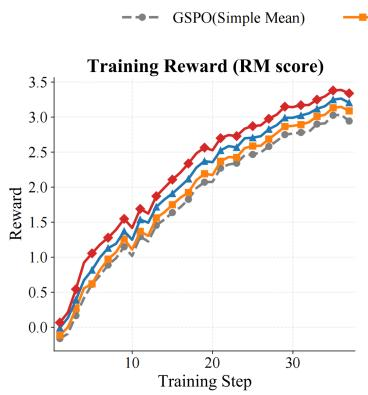

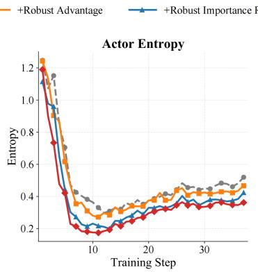

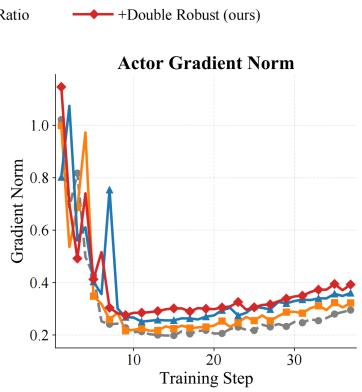  
Figure 3: Training dynamics for the channel ablation: reward, actor entropy, and actor gradient norm. Orange, blue, and red denote RoVR-Adv, SoftRoVR, and RoVR-GSPO; dashed gray denotes GSPO.

## B.2 LOCALIZED TOKEN-RATIO STRESS TEST

We evaluate aggregation sensitivity on saved Qwen3-4B-Base records from a dual-channel run using Abcredit and SoftRoVR. No policy is retrained: GSPO applies arithmetic-mean aggregation to the recorded token log-ratios, while SoftRoVR uses the run’s differentiable aggregation. We then measure how localized token-ratio perturbations change sequence log-weights and clipping branches.

The saved snapshot contains 35 complete training steps, each with 192 prompt groups and 16 responses (107,520 responses in total). The partially recorded step 36 contains only 1,408 responses and is excluded from the stress analysis. We select step 18 using a fixed upper-middle rule on the ordered complete steps and use all 3,072 responses, including all eight within-step optimizer-update positions. For response $i ,$ let $\ell _ { i }$ be the valid token log-ratios and let $\sigma _ { i }$ be their population standard deviation. A single-token spike adds $\Delta = \pm c \sigma _ { i }$ at a uniformly sampled valid position, with c ∈ {0, 2, 4, 8, 16}. A contiguous burst adds $\pm 8 \sigma _ { i }$ to $\lceil f T _ { i } \rceil$ tokens, with $f \in \{ 0 , 0 . 0 1 , 0 . 0 5 , 0 . 1 0 , 0 . 2 0 \}$ Each response uses five paired random positions across methods and severities. We average positions within a response, then responses within a prompt, and finally give every prompt equal weight. Pointwise intervals are 5,000 prompt-cluster percentile bootstrap replicates.

We measure the absolute log-weight displacement

$$
D _ { q } = \vert m _ { \mathrm { c o r r u p t } } - m _ { \mathrm { c l e a n } } \vert
$$

and the fraction of responses whose clipping branch changes relative to its own clean branch. Branches are evaluated with the recorded advantage and the actual GSPO clipping interval [0.9997, 1.0004]. The zero-scale responses (12.5% of responses in the complete steps) remain in the primary analysis; their perturbation is exactly zero. The paired differences in Table 4 are GSPO minus SoftRoVR, so positive values favor SoftRoVR.

At the strongest single-token spike, SoftRoVR reduces $D _ { q }$ by 26.30% for positive perturbations and 26.09% for negative perturbations; clipping-flip rates decrease from 22.526% to 19.362% and from

(a) Spike  
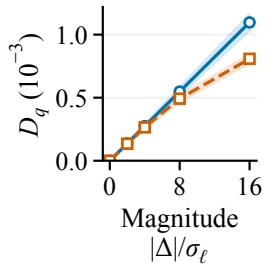

(b) Spike  
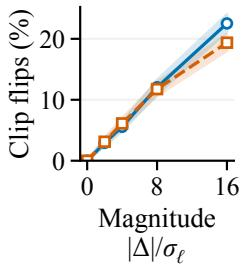

(c) Burst  
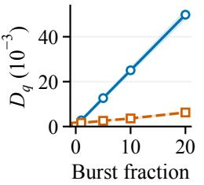  
(%)

(d) Burst  
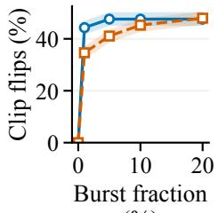  
(%)  
Figure 4: Localized token-ratio stress test at recorded step 18. Curves show means over 192 prompt groups (3,072 responses); shaded regions show pointwise 95% prompt-cluster bootstrap intervals. SoftRoVR attenuates log-weight displacement for both isolated spikes and contiguous bursts. For strong spikes, the paired flip-rate difference favors SoftRoVR; for the positive 20% burst, its interval includes zero.

Table 4: Paired offline token-ratio stress test at step 18 using 192 prompt groups and 3,072 responses. $D _ { q }$ is reported in $1 0 ^ { - 3 }$ units; for Flips, differences are reported in $\%$ . Intervals are pointwise 95% prompt-cluster bootstrap intervals.
<table><tr><td>Perturbation</td><td>Sign</td><td>Metric</td><td>GSPO</td><td>SoftRoVR</td><td>Difference [95% CI]</td></tr><tr><td>Spike 16σe</td><td>十</td><td> $D _ { q }$ </td><td>1.097</td><td>0.808</td><td>0.288 [0.256, 0.324]</td></tr><tr><td>Spike 16σe</td><td>十</td><td>Flips (%)</td><td>22.526</td><td>19.362</td><td>3.164 [2.246, 4.082]</td></tr><tr><td>Burst 20%</td><td>十</td><td> $D _ { q }$ </td><td>49.812</td><td>6.258</td><td>43.554 [42.112, 44.963]</td></tr><tr><td>Burst 20%</td><td>十</td><td>Flips (%)</td><td>47.591</td><td>47.956</td><td>-0.365 [-0.944, 0.221]</td></tr><tr><td>Spike 16σe</td><td></td><td> $D _ { q }$ </td><td>1.097</td><td>0.811</td><td>0.286 [0.254, 0.321]</td></tr><tr><td>Spike 16σe</td><td></td><td>Flips (%)</td><td>21.061</td><td>17.370</td><td>3.691 [2.949, 4.453]</td></tr><tr><td>Burst 20%</td><td></td><td> $D _ { q }$ </td><td>49.812</td><td>6.283</td><td>43.529 [42.088, 44.940]</td></tr><tr><td>Burst 20%</td><td></td><td>Flips (%)</td><td>39.909</td><td>39.102</td><td>0.807 [0.202, 1.413]</td></tr></table>

21.061% to 17.370%. For a 20% burst, $D _ { q }$ decreases by 87.44% and 87.39% in the positive and negative directions. The positive-burst flip rate changes from 47.591% to 47.956% with interval [−0.944%, 0.221%], while the negative-burst rate changes from 39.909% to 39.102% with interval [0.202%, 1.413%]. Overall, SoftRoVR reduces aggregate displacement and strong-spike clipping sensitivity, while long-burst clipping effects depend on perturbation direction and training stage.

Section C.3 provides the negative-direction and across-step analyses.

## B.3 ROBUSTNESS TO REWARD CONTAMINATION

We perturb saved InternLM2 rewards from Qwen3-4B-Base rollouts while keeping responses fixed. From 16,704 complete groups, we select 5,000 evenly spaced groups with $G = 1 6$ and replace one reward at a time by

$$
R _ { t } ^ { \prime } = R _ { t } \pm \alpha \sigma , \qquad \alpha \in \{ 0 . 5 , 1 , 2 , 4 , 8 , 1 6 \} ,\tag{26}
$$

where $\sigma = 1 . 1 6 5$ is the population standard deviation of the saved reward stream. We compare GRPO/GSPO normalization, the RoVR-reference variant $\widehat { A } ^ { \mathrm { c e n t e r } }$ , and the bounded-credit variant $\widehat { A } ^ { \mathrm { c r e d i t } }$ . Both robust variants use the full RoVR reference, including blockwise M-centers with $c = 1$ and the outer composite-quantile correction. The credit map uses $\kappa = 1$ and $s _ { \operatorname* { m i n } } = 1 0 ^ { - 3 }$ . Keeping the reference and block assignment matched isolates the contribution of the bounded residual map.

The baseline divides mean-centered rewards by the sample standard deviation (denominator $G - 1 )$ plus $1 0 ^ { - 6 }$ The RoVR-reference and bounded-credit variants use the RMS of their respective residuals with $1 0 ^ { - 6 }$ inside the square root. At $G = 1 6$ and negligible regularization, sample standard deviation is $\sqrt { 1 6 / 1 5 }$ times mean-centered RMS. The center-to-credit comparison holds both the RoVR reference and the RMS convention fixed.

We measure reference displacement, scale inflation, clean-response contrast retention $\mathcal { C } _ { H }$ , and cleanadvantage RMS deviation relative to each estimator’s clean outputs. Results use within-group medians, averaged over perturbation signs, followed by medians across prompt groups. Pointwise 95% intervals use 500 group-bootstrap replicates.

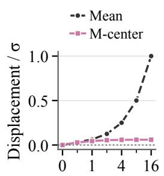

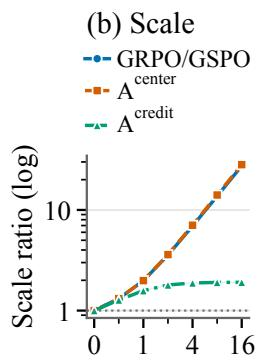

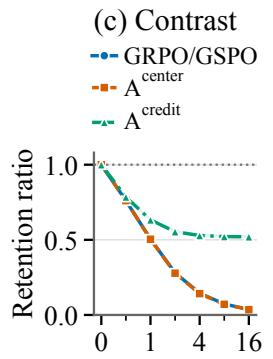

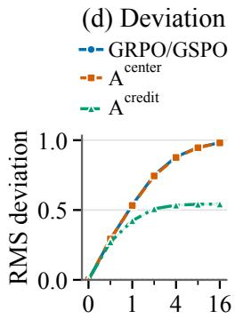  
Figure 5: Offline sensitivity to additive reward contamination. One of $G = 1 6$ rewards is perturbed by ±ασ; curves summarize 5,000 prompt groups and shaded regions denote bootstrap 95% intervals. The RoVR reference (labeled M-center) limits location displacement, while bounded-credit normalization additionally limits scale inflation and preserves more clean-response advantage contrast.

Table 5: Estimator sensitivity at the strongest offline stress level $( \alpha = 1 6 )$ . Scale inflation and clean contrast retention are ideal at $1 ;$ advantage RMS deviation is ideal at 0. Values are medians across the same 5,000 complete prompt groups used in Figure 5.
<table><tr><td>Estimator</td><td>Scale inflation</td><td></td><td>Clean contrast retention Advantage RMS deviation</td></tr><tr><td>GRPO/GSPO</td><td>27.400</td><td>0.036</td><td>0.982</td></tr><tr><td>Robust center</td><td>28.194</td><td>0.035</td><td>0.980</td></tr><tr><td> $A ^ { \mathrm { c r e d i t } }$ </td><td>1.911</td><td>0.520</td><td>0.543</td></tr></table>

Figure 5 and Table 5 separate protection of the reference from protection of the complete advantage. At 16σ, the arithmetic reference shifts by 1.000σ, whereas the robust reference shifts by only 0.060σ. With the reference held fixed, the bounded-credit map further limits scale inflation to 1.911×, retains 0.520 of the clean contrast, and reduces clean-advantage RMS deviation to 0.543; the center-only variant retains only 0.035 of the clean contrast and inflates the scale by 28.194×, close to standard normalization (0.036 and 27.400×).

At the tested 4σ shift, bounded-credit normalization yields 1.881× scale inflation and 0.529 contrast retention, compared with 6.918× and 0.145 for standard normalization. These fixed-batch results match the mechanism in Theorem 2.2: robust centering controls shared reference displacement, while the bounded residual map additionally controls the influence of the perturbed response on scale and advantage. Complementary simulations in Section E isolate the clean outer-efficiency result and compare reference estimators under heavy tails and matched contamination geometries.

## C EXPERIMENTAL PROTOCOL AND HYPERPARAMETERS

This appendix specifies the training configurations, RoVR components, and statistical reporting conventions for Section 5. The channel definitions follow Section 5.3; the offline studies evaluate the corresponding update statistics on saved responses.

## C.1 TRAINING CONFIGURATION

The mathematical-reasoning experiments use Qwen3-4B-Base and OLMo-3-7B-Instruct on a 7,500- example MATH split, with group size $G = 1 6$ , actor learning rate $1 0 ^ { - 6 }$ , prompt/response limits 2,048/8,192, global and mini-batches of 192/24 prompts, asynchronous vLLM rollout with tensor parallelism 2, GPU memory utilization 0.8, and at most 500 steps over 10 epochs. The GovReport runs use the same backbones, sample eight summaries per input with temperature and top-p equal to 1.0, and train with LongDocFACTScore.

The tool-call comparison uses the identical 3,920/80 train/test parquet files and rule scorer in both runs, with Qwen3-4B-Base, $G = 1 6$ , actor learning rate $1 0 ^ { - 6 }$ , prompt/response limits 3,072/1,024, global and mini-batches of 64/16 prompts, and asynchronous vLLM rollout with tensor parallelism 2. Validation uses one greedy response per prompt every 20 steps. The only recorded configuration differences are experiment names and output directories; the RoVR-GSPO launcher selects blockcredit advantages and SoftRoVR sequence weights, while the GSPO launcher selects ordinary group mean/standard-deviation advantages and arithmetic sequence weights. Both configurations request 500 steps, but the supplied logs contain training only through the step-100 checkpoint and validation through step 80. The run identifiers are $\mathtt { s q y 2 3 z 5 0 }$ (RoVR-GSPO) and y1c3z2ii (GSPO).

The dual-channel Qwen3-4B-Base run used in Section B.2 records reward parameters $\kappa = 1$ and $s _ { \operatorname* { m i n } } = 1 0 ^ { - 3 }$ . Its ratio channel uses $B = 8$ balanced contiguous blocks, a minimum block size of 4, $K = 9$ quantiles, $c = 1 , \gamma = \eta = 0 . 0 1 , S = 3 2$ safeguarded solver iterations, $a _ { \mathrm { m i n } } = \nu _ { \mathrm { m i n } } = 1 0 ^ { - 6 }$ $\nu _ { \mathrm { m a x } } = 1 0$ , and denominator regularization $1 0 ^ { - 8 }$ . The recorded clipping interval is [0.9997, 1.0004]. These settings describe the trajectory used by the paired offline comparison.

The reward-contamination analysis uses groups of $G = 1 6 ,$ , the full RoVR reference with local scale $c = 1$ , credit parameters $\kappa = 1$ and $s _ { \operatorname* { m i n } } = 1 0 ^ { - 3 }$ , bootstrap seed 20250904, and 500 bootstrap replicates. The global reward standard deviation is 1.165, and the median within-group population standard deviation is approximately 0.165. A 4σ global shift therefore corresponds to about 28.28 times this typical within-group scale.

## C.2 RESOLUTION AND REPORTING CONVENTIONS

The RoVR configurations in the experiments use blockwise M-centers and the composite-quantile outer correction. The reward-reference ablation retains this construction and changes only the residual normalization; the channel-placement ablations enable the reward channel, the ratio channel, or both. The theoretical conditions $\bar { B } \geq 2 q + 1$ and $n _ { \mathrm { m i n } } \geq 2 s + 1$ specify the contamination budgets covered by the two-level guarantee. Section E studies six scalar reference estimators under matched partitions.

Downstream comparisons match initialization, sampled-response budget, decoding, optimizer budget, and evaluation code; prompt order is not verified across the two tool-call runs. Tables 1 and 3 report means and cross-run standard deviations over three independent runs. GovReport reports single-run point estimates; the tool-call comparison reports one run per method and selects the highest Total reward from each run’s four logged validations. The token-ratio analysis uses 5,000 prompt-cluster bootstrap replicates from a fixed training trajectory, the reward analysis uses 500 group-bootstrap replicates, and the scalar simulations quantify Monte Carlo uncertainty. The GovReport figure displays reward trajectories and their visual separation.

## C.3 ADDITIONAL TOKEN-RATIO STRESS DIAGNOSTICS

The primary token-ratio stress test in Section B.2 uses positive perturbations in the main figure; here we apply the same protocol to negative perturbations. At step 18, the negative 16σℓ spike reduces $D _ { q }$ by 26.09%, while the flip rate decreases from 21.061% to 17.370% with difference 3.691% and interval [2.949%, 4.453%]. For a negative 20% burst, $D _ { q }$ decreases by 87.39% and the flip-rate difference is 0.807% with interval [0.202%, 1.413%]. The corresponding positive-burst interval includes zero.

For a stage-sensitivity check, every complete recorded step is evaluated at spike magnitude 16σ and burst fraction $2 0 \%$ using a fixed seeded sample of 64 complete prompt groups (1,024 responses) and five paired positions per response. Across all 35 complete steps and both directions, the paired differences for $D _ { q }$ and strong-spike flips are positive, with pointwise intervals above zero. For 20% bursts, the reduction in mean $D _ { q }$ ranges from 85.29% to 90.12%. The burst flip difference changes sign across steps: its point estimate favors SoftRoVR in 28/35 positive-direction checks and 20/35 negative-direction checks. These results support lower aggregation sensitivity across recorded stages, while clipping effects remain direction- and stage-dependent. These steps are observations from one training run, not independent seeds, and the pointwise intervals are not adjusted for multiple comparisons.

Negative perturbation  
(b) Spike  
(a) Spike  
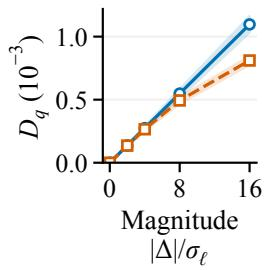

(b) Spike  
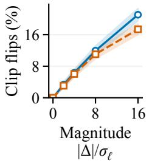

(c) Burst  
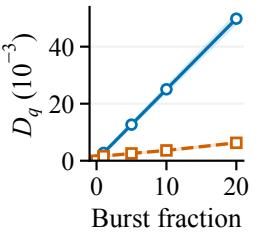  
(%)

(d) Burst  
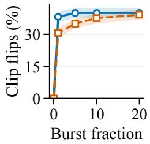  
(%)  
Figure 6: Negative-direction sensitivity analysis at step 18 (192 prompt groups, 3,072 responses). Bands are pointwise 95% prompt-cluster bootstrap intervals. The perturbations are −cσℓ for spikes and $- 8 \sigma _ { \ell }$ for bursts. SoftRoVR reduces $D _ { q }$ throughout the tested nonzero settings. Its clipping benefit is larger for strong spikes and short bursts than for the longest burst.

(a) Spike  
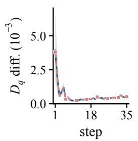

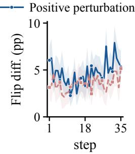

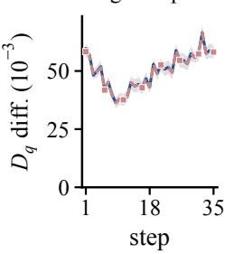  
(d) Burst 20%

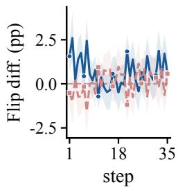  
Figure 7: Paired differences across 35 complete steps for spike 16σℓ and burst 20% stress, using 64 prompt groups per step. Lines connect the recorded estimates without smoothing; shaded bands are pointwise 95% prompt-cluster bootstrap intervals. Positive values favor SoftRoVR. Effects on log-weight displacement are consistent across the recorded stages; long-burst clipping effects are stage-dependent.

Table 6: Comparison of representative location/reference estimators. RoVR combines a bounded local M-estimator with tie-neutral composite-quantile aggregation while retaining explicit block protection.
<table><tr><td>Estimator</td><td>Local statistic</td><td>Outer aggregation</td><td>Bounded local score</td><td>Block protection</td><td>Clean outer factor</td></tr><tr><td>Arithmetic mean</td><td>Mean</td><td>None</td><td></td><td></td><td>1</td></tr><tr><td>Global M-center</td><td>Bounded-score</td><td>None</td><td>√</td><td></td><td></td></tr><tr><td>MOM</td><td>M-center Arithmetic block mean</td><td>Median</td><td></td><td>√</td><td>π/2</td></tr><tr><td>VRMOM</td><td>Arithmetic block mean</td><td>Composite quantile</td><td></td><td>√</td><td> $V _ { K } \stackrel { \cdot } {  } \pi / 3$ </td></tr><tr><td>Robust MOM</td><td>Robust local M-center</td><td>Median</td><td>√</td><td>√</td><td>π/2</td></tr><tr><td>RoVR</td><td>Robust local M-center</td><td>Tie-neutral composite quantile</td><td>√</td><td>√</td><td> $V _ { K } \stackrel { \prime } {  } \pi / 3$ </td></tr></table>

## D IMPLEMENTATION DETAILS

This appendix specifies the numerical object corresponding to the definitions in the main text. It records the full Barron family for completeness, then gives the convex solver, tie convention, balanced-block handling, SoftRoVR path, and complexity. Main results use only α = 1.

Table 7: RoVR-based advantage constructions used in our analysis and algorithm.
<table><tr><td></td><td>Variant RoVR reference Numerator</td><td></td><td>Scale</td><td>Role</td></tr><tr><td> ${ \widehat A } _ { i } ^ { \mathrm { c e n t e r } }$ </td><td> $\operatorname { R o V R } ( R _ { 1 : G } )$ </td><td> $R _ { i } - { \widehat { \theta } } _ { R }$ </td><td>Raw RMS</td><td>Center-only ablation</td></tr><tr><td> $\widehat { A } _ { i } ^ { \mathrm { L O O } }$ </td><td> $\mathrm { R o V R } ( R _ { - i } )$ </td><td> $R _ { i } - { \widehat { \theta } } _ { R , - i }$ </td><td> $S _ { - i }$ </td><td>Leave-one-out theoretical reference</td></tr><tr><td> $\widehat { A } _ { i } ^ { \mathrm { c r e d i t } }$ </td><td> $\operatorname { R o V R } ( R _ { 1 : G } )$ </td><td> $\chi _ { \kappa } { ( R _ { i } - \widehat { \theta } _ { R } ) }$ </td><td> $\widehat { s } _ { \chi }$ </td><td>Default robust advantage; bounded leverage and fidelity control</td></tr><tr><td colspan="5">Only  $\overline { { \widehat { A } _ { i } ^ { \mathrm { c r e d i t } } } }$   $\overline { { \hat { A } _ { i } ^ { \mathrm { c e n t e r } } } }$  is used by default in RoVR-GSPO. is a center-only ablation, whereas leave-one-out reference for the theoretical analysis.</td></tr></table>

## D.1 ESTIMATOR AND UPDATE SUMMARIES

Algorithm 1 RoVR-GSPO: dual-channel robust GSPO update   
Require: rewards $R _ { 1 : G } ;$ proposed B and balanced sizes $\overline { { \{ n _ { b } \} } }$ ; declared failure unit and budgets   
(q, s)   
Require: $( K , c , \kappa , s _ { \mathrm { m i n } } , a _ { \mathrm { m i n } } , \nu _ { \mathrm { m i n } } , \nu _ { \mathrm { m a x } } ) ;$ SoftRoVR switch $z _ { \mathrm { r a t i o } }$   
1: z ← failure unit supported and budgets $( q , s )$ declared   
2: $z _ { \mathrm { b l o c k } }  z _ { \mathrm { b l o c k } } \land ( B > \bar { 1 } ) \land ( B \geq 2 q + 1 )$   
3: $z _ { \mathrm { b l o c k } } \gets z _ { \mathrm { b l o c k } } \wedge \left( \operatorname* { m i n } _ { b } n _ { b } \geq 2 s + 1 \right) \wedge \left( \sum _ { b } n _ { b } = G \right)$   
4: $z _ { \mathrm { b l o c k } }  z _ { \mathrm { b l o c k } } \land ( \operatorname* { m a x } _ { b } n _ { b } - \operatorname* { m i n } _ { b } n _ { b } \leq 1 )$   
5: $\mathbf { i f } \ z _ { \mathrm { b l o c k } } = 0$ or the realized assignment violates the declared sizes then   
6: Set $B \gets 1$ and $\mathcal { H } _ { 1 }  \{ 1 , \dotsc , G \}$ ▷ global-M fallback   
7: else   
8: Use the predeclared balanced assignment sampled independently of corruption labels used   
by the guarantee   
9: end if   
10: Compute every convex local center by (9)   
11: if $B _ { \frown } \bar { = } 1$ then   
12: $\dot { \theta _ { R } }  \widetilde { \mu } _ { 1 }$   
13: else   
14: Compute the capped pooled scale (11) and RoVR reference (13)   
15: end if   
16: $z _ { i } \gets \chi _ { \kappa } ( R _ { i } - \widehat { \theta } _ { R } )$ and $\textstyle \widehat { s } _ { \chi } \gets \{ s _ { \mathrm { m i n } } ^ { 2 } + G ^ { - 1 } \sum _ { j } z _ { j } ^ { 2 } \} ^ { 1 / 2 }$   
17: $\widehat { A } _ { i } ^ { \mathrm { c r e d i t } } \gets z _ { i } / \widehat { s } _ { \chi }$ for $i = 1 , \ldots , G ;$ detach reward statistics   
18: $\mathbf { i f } \ z _ { \mathrm { r a t i o } } = 1$ then   
19: Require a GSPO parent; compute the SoftRoVR sequence weight in (21)   
20: else   
21: Keep the canonical GSPO sequence aggregate   
22: end if   
23: return $\widehat { A } _ { 1 : G } ^ { \mathrm { c r e d i t } }$ and the selected sequence weights

## D.2 BARRON FAMILY AND CONVEX ROOT SOLVER

For residual $u ,$ shape $\alpha ,$ and scale $c > 0 ,$ , Barron’s loss is (Barron, 2019)

$$
\begin{array} { r } { \rho ( u ; \alpha , c ) = \left\{ \begin{array} { l l } { \frac { 1 } { 2 } ( u / c ) ^ { 2 } , } & { \alpha = 2 , } \\ { \log ( 1 + \frac { 1 } { 2 } ( u / c ) ^ { 2 } ) , } & { \alpha = 0 , } \\ { 1 - \exp [ - \frac { 1 } { 2 } ( u / c ) ^ { 2 } ] , } & { \alpha = - \infty , } \\ { \frac { | \alpha - 2 | } { \alpha } \left[ \left( 1 + \frac { ( u / c ) ^ { 2 } } { | \alpha - 2 | } \right) ^ { \alpha / 2 } - 1 \right] , } & { \mathrm { o t h e r w i s e } . } \end{array} \right. } \end{array}
$$

For $\alpha = 1$ , safeguarded Newton or bisection solves the strictly decreasing empirical score. A bracket is given by the sample minimum and maximum. Newton steps leaving the bracket are replaced by bisection, and termination uses both score and interval tolerances.

Shapes $\alpha < 1$ are redescending and may have multiple stationary points. If reported, they use a fixed median initialization, a declared graduated schedule, and a separate label; no convex-root or finite-group theorem is transferred to them.

## D.3 BLOCKS, TIES, SCALES, AND DIFFERENTIATION

The entire balanced random assignment or permutation, not merely the block sizes, is sampled independently of corruption labels whenever Theorem F.2 is invoked. The exact $n _ { b } .$ , partition seed, and whether corruption could adapt to the partition are logged. For $B = 1$ , the composite correction is identically zero by Theorem $3 . 1$ . For even $B ,$ the midpoint median is used consistently in hard reward code; the token map uses the unique finite-temperature initializer in (20).

For exact discrete rewards, $J _ { 0 }$ assigns half weight to equality. A numerical implementation may use a fixed tolerance $\epsilon _ { \mathrm { t i e } }$ to assign $1 / 2$ when $| u | \leq \epsilon _ { \mathrm { t i e } } ;$ ; this convention is part of the estimator specification. The logistic map returns $\bar { 1 } / 2$ at zero.

For small local blocks, an independent pilot or a lagged running statistic can supply the scale. Gradients are stopped through reward-side centering, scale estimation, and partitioning. On the ratio side, gradients pass through the unrolled safeguarded solvers and the finite-temperature correction. The pooled smooth scale uses capped local sandwich scales; derivative checks should evaluate the same finite-temperature map.

With S root iterations, local centers cost $O ( S N )$ scalar operations. Hard median selection costs $O ( B )$ , while the general outer correction costs ${ \dot { O } } ( B K )$ . SoftRoVR’s two smooth median solves add $\dot { O } ( S B )$ operations; bounded reward-credit construction costs $O ( G )$ . Forward aggregation stores local statistics and correction terms, while differentiating through the unrolled solves additionally retains token-level intermediate states. Actual memory usage depends on solver unrolling, token packing, and the autograd implementation.

## E SUPPLEMENTARY EXPERIMENT: REFERENCE-ESTIMATOR VARIANCE AND ROBUSTNESS

This appendix studies the scalar reference estimators under controlled sampling and contamination. Each method receives the same observations and balanced partition, with uncontaminated center 0 as the target. The design isolates reference-estimation variance and error, complementing the downstream policy comparisons.

## E.1 DESIGN AND ESTIMANDS

We use N = 128 observations partitioned into $B = 8$ balanced blocks of size 16, with the RoVR parameters $K = 9$ and $c = 1$ . The clean distributions are standard Gaussian and $t _ { 3 } / \sqrt { 3 }$ , so both have center and variance equal to zero and one, respectively. For the contamination experiments, 16 observations (12.5%) are shifted by +8. In the dispersed condition these observations are allocated as evenly as possible across the eight blocks; in the coherent condition one entire block is shifted. Thus the two geometries have the same contamination budget, while only their placement relative to the block interface differs. The estimator comparison uses 3,000 independent trials, the geometry sweep uses 2,000 trials per shift, and the oracle outer-factor experiment uses 20,000 trials. All random streams are seeded with seed 0.

We compare the arithmetic mean, the global convex M-center, MOM, a matched VRMOM-style estimator, Robust MOM, and RoVR. The VRMOM-style comparator uses arithmetic local means, composite-quantile correction, and the median block standard-deviation scale. We report sampling variance and RMSE to the uncontaminated center. Error bars are 95% bootstrap intervals over Monte Carlo trials.

## E.2 ORACLE OUTER-FACTOR VALIDATION

Table 8 and Figure 8 validate the outer aggregation in isolation. The theoretical factor $V _ { K }$ decreases from $\pi / 2$ at $K = 1$ toward $\pi / 3$ as the quantile grid is refined. At the paper’s setting $K = 9$ $V _ { K } = 1 . 0 6 9 1$ and the empirical oracle factor is 1.0747; at $K = 3 1$ , they are 1.0498 and 1.0540. The empirical median factor is 1.5649, close to $\pi / 2 = 1 . 5 7 0 8$ . The finite-sample agreement supports the implementation of the composite-quantile correction and its stated outer-factor interpretation. The complete estimator additionally incorporates the local sandwich scale, finite block sizes, and estimated initialization.

Table 8: Oracle outer-factor validation. The empirical factors use $2 0 { , } 0 0 0$ trials with $B = 1 0 1$ and block size $n = 3 2$ . The median factor is shown for reference; $\pi / 2$ and $\pi / 3$ are the clean asymptotic reference values.
<table><tr><td>K  $V _ { K }$ </td><td>(theory)</td><td>Oracle correction (emp.)</td><td>Outer median (emp.)</td></tr><tr><td>1</td><td>1.5708</td><td>1.5812</td><td>1.5649</td></tr><tr><td>3</td><td>1.1680</td><td>1.1802</td><td>1.5649</td></tr><tr><td>5</td><td>1.1034</td><td>1.1102</td><td>1.5649</td></tr><tr><td>9</td><td>1.0691</td><td>1.0747</td><td>1.5649</td></tr><tr><td>15</td><td>1.0564</td><td>1.0614</td><td>1.5649</td></tr><tr><td>31</td><td>1.0498</td><td>1.0540</td><td>1.5649</td></tr><tr><td></td><td> $\pi / 2$ </td><td></td><td>1.5708</td></tr><tr><td></td><td> $\pi / 3$ </td><td></td><td>1.0472</td></tr></table>

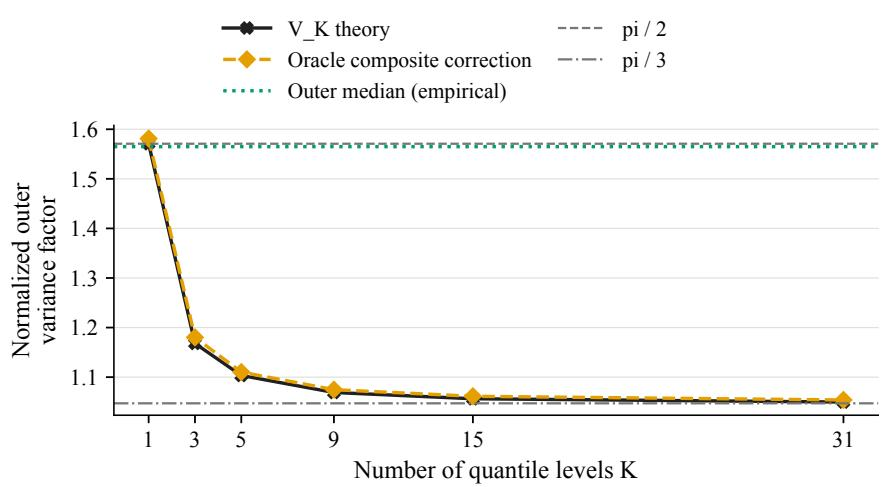

Figure 8: Oracle outer-factor validation. The oracle composite-quantile estimator follows $V _ { K }$ closely, while the outer median remains near $\pi / 2 .$  
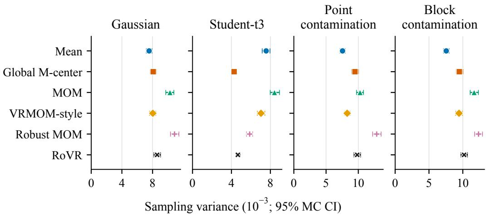  
Figure 9: Sampling variance across clean and contaminated scenarios. Error bars are $9 5 \%$ bootstrap Monte Carlo intervals over 3,000 estimator trials. Under contamination, variance alone is not a sufficient robustness metric because it does not include systematic displacement.

## E.3 FINITE-SAMPLE COMPARISON

The sampling variances are reported in Table 9 and Figure 9. Under clean Gaussian data, the arithmetic mean is the most efficient estimator in this comparison (0.007552), while RoVR has variance 0.008596. This is expected: bounded local scores and block aggregation trade some Gaussian efficiency for robustness. RoVR nevertheless has lower variance than MOM (0.010271) and Robust MOM (0.010865) in this finite configuration. Under the unit-variance $t _ { 3 }$ distribution, robust score estimators benefit from suppressing tail observations; RoVR has variance 0.004660, close to the global M-center (0.004274) and below the arithmetic mean (0.007567) and MOM (0.008424).

Table 9: Sampling variance of the six reference estimators. Each entry is computed from 3,000 trials; the full CSV also reports bootstrap Monte Carlo intervals.
<table><tr><td>Scenario</td><td>Mean Global M</td><td>MOM</td><td>VRMOM-style</td><td>Robust MOM</td><td>RoVR</td></tr><tr><td>Gaussian</td><td>0.007552</td><td>0.008088</td><td>0.010271</td><td>0.008033</td><td>0.010865 0.008596</td></tr><tr><td>Student-  $\cdot t _ { 3 }$ </td><td>0.007567</td><td>0.004274 0.008424</td><td>0.007038</td><td>0.005871</td><td>0.004660</td></tr><tr><td>Point contamination</td><td>0.007552</td><td>0.009483</td><td>0.010271</td><td>0.008273</td><td>0.012848 0.009828</td></tr><tr><td>Block contamination</td><td>0.007552</td><td>0.009486</td><td>0.011677</td><td>0.009443</td><td>0.012323 0.010190</td></tr></table>

## E.4 CONTAMINATION GEOMETRY AND INTERPRETATION

Table 10: RMSE to the uncontaminated center 0 under the fixed +8 contamination. Both contamination geometries modify 16 of 128 observations.
<table><tr><td>Scenario</td><td>Mean</td><td>Global M</td><td>MOM</td><td>VRMOM-style Robust MOM</td><td></td><td>RoVR</td></tr><tr><td>Point contamination</td><td>1.0059</td><td>0.2719</td><td>1.0067</td><td>1.0064</td><td>0.2746</td><td>0.2695</td></tr><tr><td>Block contamination</td><td>1.0059</td><td>0.2718</td><td>0.1171</td><td>0.1129</td><td>0.1206</td><td>0.1170</td></tr></table>

Table 10 and Figure 10 show why the failure geometry must be declared. With dispersed point contamination, the mean, MOM, and VRMOM-style estimator have RMSE approximately 1.006, whereas RoVR has RMSE 0.270, close to the global M-center (0.272) and Robust MOM (0.275). The bounded local score prevents the shifted observations from directly controlling every block mean. With one fully corrupted block, block-based estimators are substantially more effective: MOM, VRMOM-style, and RoVR have RMSE 0.117, 0.113, and 0.117, respectively, while the global M-center has RMSE 0.272. Both RoVR and the VRMOM-style comparator benefit from the block interface in this setting.

The shift sweep in Figures 11 and 12 gives the same qualitative picture over contamination magnitudes from 0 to 16. Under dispersed corruption, the mean-like block estimators grow approximately linearly with the shift, while the global and block-robust estimators saturate. Under coherent block corruption, the explicit block interface allows the median and composite-quantile outer aggregators to reject the bad block for the declared one-block failure geometry. RoVR inherits this behavior through its robust local centers and composite-quantile correction. The sweep evaluates the declared, fixed block-failure geometry across perturbation magnitudes.

The simulations reproduce the predicted outer-efficiency factor and show how local and block robustness contribute under different contamination geometries. RoVR improves over medianbased aggregation in the clean settings and achieves low error under both dispersed and coherent contamination. The downstream effects of the complete optimizer are evaluated in Tables 1 to 3; the exploratory tool-call proxy is reported in Section 5.2.

## F DETAILED THEORETICAL STATEMENTS

This section connects estimator robustness to the group-relative update in four steps. We first give deterministic and fixed-group guarantees under mixed block and observation contamination. We then control the complete bounded credit and its target-fidelity cost. A clean transfer result separates the local sandwich variance from the outer factor and exploits scale orthogonality. The final results cover smoothing, clipping branches, linear leave-one-out baselines, and the bias introduced by robust credit shaping. Throughout, $\mathcal { T } ( a , b ) = [ \operatorname* { m i n } \{ a , b \} , \operatorname* { m a x } \{ a , b \} ]$ denotes the closed interval between two real numbers.

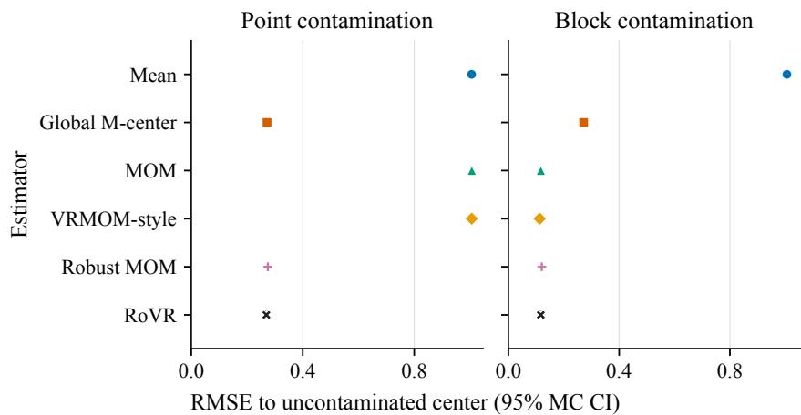

Figure 10: RMSE to the uncontaminated center under the two matched contamination geometries. Error bars are 95% bootstrap Monte Carlo intervals over 3,000 trials.  
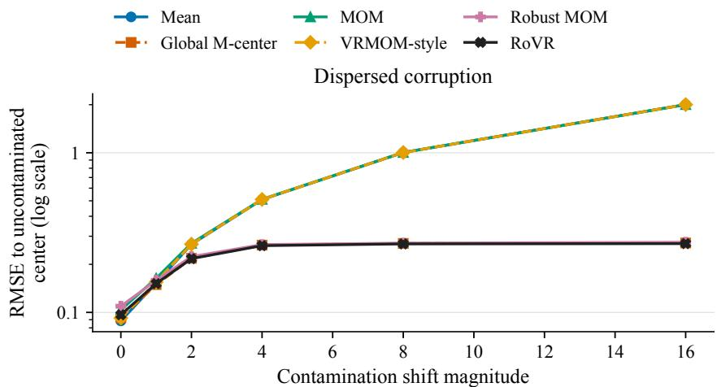

Figure 11: RMSE sweep for dispersed point corruption. The y-axis is logarithmic to show both mean-like and robust estimators over the same range.  
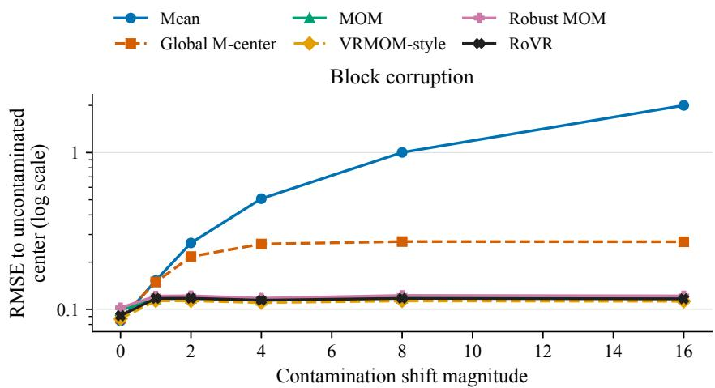  
Figure 12: RMSE sweep for one-block coherent corruption. The favorable behavior of block estimators is conditional on the declared block failure geometry.

## F.1 MIXED CONTAMINATION AT FIXED GROUP SIZE

Bounded score alone does not bound the displacement of a convex M-root because $\psi _ { c } ^ { \prime }$ vanishes in the tails. A deterministic comparison of two realized roots therefore requires curvature on the interval between them. This result is useful for token replacements, where no independence model is imposed.

Proposition F.1. Let datasets $D = ( x _ { 1 } , \ldots , x _ { n } ) $ and $D ^ { \prime } = ( x _ { 1 } ^ { \prime } , \ldots , x _ { n } ^ { \prime } )$ ) differ in at most s coordinates, with convex M-centers T, T′. If

$$
\operatorname* { i n f } _ { u \in \mathcal { I } ( T , T ^ { \prime } ) } \frac { 1 } { n } \sum _ { i = 1 } ^ { n } \psi _ { c } ^ { \prime } ( x _ { i } - u ) \geq a _ { 0 } > 0 ,
$$

then

$$
\left| T ^ { \prime } - T \right| \leq { \frac { 2 s M _ { c } } { n a _ { 0 } } } .\tag{27}
$$

The same conclusion holds when the curvature condition is imposed on $D ^ { \prime } .$

For reward groups, the main stochastic result avoids conditioning on this unknown root path. Let $g ( t ) = \mathbb { E } \psi _ { c } \bar { ( } X \bar { ~ - ~ } t )$ and suppose, for $0 \leq u \leq r _ { 0 }$

$$
g ( \theta + u ) \leq - a u , \qquad g ( \theta - u ) \geq a u
$$

for $a > 0$ . In honest block b, let at most $s _ { b }$ observations be replaced after drawing $n _ { b }$ independent clean observations. Define

$$
p _ { b } ( t ) = \exp \left[ - \frac { n _ { b } } { 2 M _ { c } ^ { 2 } } \left( a t - \frac { 2 s _ { b } M _ { c } } { n _ { b } } \right) ^ { 2 } \right] .\tag{28}
$$

This bound follows by evaluating the contaminated score at the fixed threshold $\theta \pm t ;$ it does not require the empirical root to remain in a postulated curvature basin.

Random reward blocks only justify a within-block load statement if the partition is drawn independently of the corrupted set. The next proposition makes that scope explicit.

Proposition F.2. Fix a set of m corrupted indices among N observations, and draw a balanced partition independently and uniformly at random. $I f S _ { b }$ is the number of corrupted indices in a block ofsize $n _ { b } ,$ thenfor every u $> 0$

$$
\mathbb { P } \bigg ( \operatorname* { m a x } _ { 1 \le b \le B } \Big \{ S _ { b } - \frac { n _ { b } m } { N } \Big \} \geq u \bigg ) \le \sum _ { b = 1 } ^ { B } \exp \bigg ( - \frac { 2 u ^ { 2 } } { n _ { b } } \bigg ) \le B \exp \bigg ( - \frac { 2 u ^ { 2 } } { n _ { \operatorname* { m a x } } } \bigg ) .\tag{29}
$$

The statement does not apply to corruption selected after observing the partition.

We now combine non-identical honest-block tails with two distinct contamination units. Let A contain q arbitrary blocks and let H be its complement, with $H = B - q , r _ { B } = \lceil B / 2 \rceil$ , and $q < r _ { B }$ The set A must be fixed before the clean draws or sampled independently of them; values in these blocks may then be arbitrary and may depend on all clean observations. Latent clean observations in the honest blocks are mutually independent within and across blocks. After those observations are drawn, an adversary may choose the coordinates and values of at most $s _ { b }$ replacements inside each honest block b. Thus the replacement mechanism may be adaptive to all clean values, but neither the honest/arbitrary block labels nor a partition invoked through Theorem F.2 may be selected from those values. Define

$$
\overline { { { p } } } _ { H } ( t ) = \frac { 1 } { H } \sum _ { b \in \mathcal { H } } p _ { b } ( t ) , \qquad \eta _ { q } = \frac { r _ { B } - q } { B - q } ,
$$

and define the observable outer-correction magnitude and its deterministic envelope

$$
\widehat C _ { B } = \lvert \widehat \theta _ { \mathrm { R o V R } } - \widehat \mu _ { 0 } \rvert , \qquad C _ { B } = \frac { \nu _ { \mathrm { m a x } } B K } { 2 D _ { K } W _ { B } } , \qquad \widehat C _ { B } \leq C _ { B } .\tag{30}
$$

The value $\widehat { C } _ { B }$ is computable from a realized sample, but it is not by itself a confidence radius. The probability statement below additionally fixes t and depends on the population-separation quantities $( a , r _ { 0 } )$ through $p _ { b } ( t )$ ; these quantities are not estimated post hoc from the same batch.

Theorem F.3. Suppose the contamination timing and independence conditions above hold and every honest block satisfies the population score separation used in (28). For $0 < t \leq r _ { 0 } , i f \overline { { p } } _ { H } ( t ) < \eta _ { q } ,$ set

$$
\beta _ { H } ( t ) = \mathrm { m i n } \big \{ 1 , 2 \mathrm { e x p } \big [ { - 2 H \{ \eta _ { q } - \overline { { p } } _ { H } ( t ) \} ^ { 2 } } \big ] \big \} .
$$

Then the tie-neutral estimator in (13) satisfies both

$$
\begin{array} { r } { \mathbb { P } \Big ( \vert \widehat { \theta } _ { \mathrm { R o V R } } - \theta \vert > t + \widehat C _ { B } \Big ) \leq \beta _ { H } ( t ) , \qquad \mathbb { P } \Big ( \vert \widehat { \theta } _ { \mathrm { R o V R } } - \theta \vert > t + C _ { B } \Big ) \leq \beta _ { H } ( t ) . } \end{array}\tag{31}
$$

Corollary F.4. Under Theorem F.3 with $q = 0$ , suppose the complete set ofm replacement indices is fixed before an independently sampled uniform balanced partition. For $0 < \delta _ { \mathrm { p a r t } } < 1$ , use the block-specific deviation

$$
u _ { b } ( \delta _ { \mathrm { p a r t } } ) = \sqrt { \frac { n _ { b } } { 2 } \log \frac { B } { \delta _ { \mathrm { p a r t } } } } , \qquad s _ { b } ( \delta _ { \mathrm { p a r t } } ) = \operatorname* { m i n } \Bigl \{ n _ { b } , \Bigl [ \frac { n _ { b } m } { N } + u _ { b } ( \delta _ { \mathrm { p a r t } } ) \Bigr ] \Bigr \} .
$$

Thus each block uses its own n rather than a common deviation based on $n _ { \mathrm { m a x } }$ . Form $p _ { b , \delta } ( t )$ from (28), and let $\begin{array} { r } { \overline { { p } } _ { B , \delta } ( t ) = B ^ { - 1 } \sum _ { b } p _ { b , \delta } ( t ) } \end{array}$ and $\eta _ { 0 } = \lceil B / 2 \rceil / B . \ I f \overline { { p } } _ { B , \delta } ( t ) < \eta _ { 0 }$ , define

$$
\beta _ { B , \delta } ( t ) = \operatorname* { m i n } \bigl \{ 1 , \delta _ { \mathrm { p a r t } } + \operatorname* { m i n } \bigl \{ 1 , 2 \exp \bigl [ - 2 B \{ \eta _ { 0 } - \overline { { p } } _ { B , \delta } ( t ) \} ^ { 2 } \bigr ] \bigr \} \bigr \} .
$$

Then, jointly over the clean sample and partition,

$$
\mathbb { P } \Big ( \vert \widehat { \theta } _ { \mathrm { R o V R } } - \theta \vert > t + \widehat { C } _ { B } \Big ) \leq \beta _ { B , \delta } ( t ) , \qquad \mathbb { P } \Big ( \vert \widehat { \theta } _ { \mathrm { R o V R } } - \theta \vert > t + C _ { B } \Big ) \leq \beta _ { B , \delta } ( t ) .\tag{32}
$$

The conclusion does not cover indices selected after the partition, a block designation selected by inspecting realized block values, or corruption that can observe the partition RNG before choosing its support. As in Theorem F.3, the conditional error statement still depends on the declared populationseparation model.

The theorem covers fixed B and balanced unequal block sizes under the declared populationseparation model. The quantity $\widehat { C } _ { B }$ measures the realized outer correction; an error radius $t + { \widehat { C } } _ { B }$ additionally uses the ex ante threshold t and separation parameters $( a , r _ { 0 } ) . \mathrm { A t } B = 1$ , the estimator equals the global M-center. Clean outer-efficiency rates are characterized separately in Section F.3.

## F.2 TARGET, BOUNDED RESPONSE ADVANTAGE, AND RETAINED CONTRAST

Robust location changes its population target under asymmetry, while bounded credit changes the reward utility. This subsection separates both effects from sampling and contamination error.

Proposition F.5. Let $\mu = \mathbb { E } X$ be finite, $g ( t ) = \mathbb { E } \psi _ { c } ( X - t )$ , and $\theta _ { \rho }$ be a root of g. If

$$
\operatorname* { i n f } _ { u \in \mathcal { T } ( \mu , \theta _ { \rho } ) } \mathbb { E } \psi _ { c } ^ { \prime } ( X - u ) \geq a _ { 0 } > 0 ,
$$

then

$$
| \theta _ { \rho } - \mu | \leq \frac { | \mathbb { E } \psi _ { c } ( X - \mu ) | } { a _ { 0 } } .\tag{33}
$$

If E| $X - \mu | ^ { 3 } < \infty$ and

$$
\operatorname* { i n f } _ { u \in \mathcal { Z } ( \mu , \theta _ { \rho } ) } \mathbb { E } \left[ \left\{ 1 + \frac { ( X - u ) ^ { 2 } } { c ^ { 2 } } \right\} ^ { - 3 / 2 } \right] \geq \bar { a } _ { 0 } > 0 ,
$$

then

$$
\vert \theta _ { \rho } - \mu \vert \leq \frac { \mathbb { E } \vert X - \mu \vert ^ { 3 } } { 2 \bar { a } _ { 0 } c ^ { 2 } } .\tag{34}
$$

Proposition F.6. Let $P _ { \epsilon } = ( 1 - \epsilon ) P _ { 0 } + \epsilon Q$ , where $P _ { 0 }$ is symmetric about $\mu _ { 0 }$ . Ifthe clean score obeys $| \mathbb { E } _ { P _ { 0 } } \psi _ { c } ( X - t ) | \geq a _ { 0 } | t - \mu _ { 0 } |$ between $\mu _ { 0 }$ and $\theta _ { \rho } ( P _ { \epsilon } )$ , then

$$
| \theta _ { \rho } ( P _ { \epsilon } ) - \mu _ { 0 } | \leq \frac { \epsilon M _ { c } } { ( 1 - \epsilon ) a _ { 0 } } .\tag{35}
$$

The next result controls every response, including the replaced focal response omitted by a center-only analysis.

Proposition F.7. Let reward groups R, $R ^ { \star } \in \mathbb { R } ^ { G }$ differ in at most r coordinates, and suppose their RoVR centers differ by at most e . Construct scales and credits with the same $\chi _ { \kappa }$ as in (16). Then

$$
e _ { s } : = | \widehat { s } _ { \chi } - s _ { \chi } ^ { \star } | \leq \frac { r \kappa ^ { 2 } / G + 2 \kappa e _ { \theta } } { 2 s _ { \mathrm { m i n } } } .\tag{36}
$$

For any index i, let $e _ { R , i } = | R _ { i } - R _ { i } ^ { \star } |$ and $d _ { \chi , i } = \operatorname* { m i n } \{ e _ { R , i } + e _ { \theta } , 2 \kappa \}$ . Then

$$
\vert \widehat { A } _ { i } ^ { \mathrm { c r e d i t } } - A _ { i } ^ { \mathrm { c r e d i t , \star } } \vert \leq \frac { d _ { \chi , i } } { s _ { \operatorname* { m i n } } } + \frac { \kappa e _ { s } } { s _ { \operatorname* { m i n } } ^ { 2 } } , \qquad \vert \widehat { A } _ { i } ^ { \mathrm { c r e d i t } } \vert \leq \frac { \kappa } { s _ { \operatorname* { m i n } } } .\tag{37}
$$

The bound is independent of the magnitude of a replaced reward. For an unchanged response, $d _ { \chi , i } \leq e _ { \theta }$ and its sign is preserved whenever $| R _ { i } - \theta _ { R } ^ { \star } | > e _ { \theta } .$

The center and credit bounds can be composed without hiding the focal replacement. Let $R ^ { \star }$ denote the clean precursor group and construct $\cdot A _ { i } ^ { \theta , \star }$ from $R ^ { \star }$ using population reference $\theta ,$ the same $\chi _ { \kappa } .$ and the same $s _ { \mathrm { m i n } }$

Corollary F.8. Under Theorem $F . 3 ,$ suppose the observed and precursor reward groups differ in at most r coordinates. Set

$$
e _ { \theta } ( t ) = t + C _ { B } , \qquad { \overline { { e } } } _ { s } ( t ) = { \frac { r \kappa ^ { 2 } / G + 2 \kappa e _ { \theta } ( t ) } { 2 s _ { \mathrm { m i n } } } } ,
$$

and $e _ { R , i } = | R _ { i } - R _ { i } ^ { \star } |$ . With probability at least $1 - \beta _ { H } ( t )$ , simultaneously for all responses,

$$
| \widehat { A } _ { i } ^ { \mathrm { c r e d i t } } - A _ { i } ^ { \theta , \star } | \leq \frac { \operatorname* { m i n } \{ e _ { R , i } + e _ { \theta } ( t ) , 2 \kappa \} } { s _ { \operatorname* { m i n } } } + \frac { \kappa \overline { { e } } _ { s } ( t ) } { s _ { \operatorname* { m i n } } ^ { 2 } } .\tag{38}
$$

The same population-separation-dependentprobability statement holds with the observable correction magnitude $e _ { \theta } ( t ) = t + \widehat { C } _ { B }$ and the corresponding $\overline { { e } } _ { s } ( t )$ . Hence the complete credit perturbation is independent ofreplacement magnitude, although it can still be numerically loose when $s _ { \mathrm { m i n } }$ is small. A magnitude-independent policy-gradient statement additionally requires a score-Jacobian bound, a stable clipping branch, or explicit gradient clipping; Theorem F.15 states only the corresponding local conditions.

Boundedness need not erase moderate clean contrasts. If two clean residuals lie in $[ - M , M ]$ , the mean-value theorem and $\chi _ { \kappa } ^ { \prime } ( u ) \geq m _ { \kappa , M } : = ( 1 + M ^ { 2 } / \kappa ^ { 2 } ) ^ { - 3 / 2 }$ give

$$
| \widehat { A } _ { i } ^ { \mathrm { c r e d i t } } - \widehat { A } _ { j } ^ { \mathrm { c r e d i t } } | \geq \frac { m _ { \kappa , M } } { \sqrt { s _ { \operatorname* { m i n } } ^ { 2 } + \kappa ^ { 2 } } } | R _ { i } - R _ { j } | .\tag{39}
$$

Together, (18) and (39) state the trade-off: larger κ more closely preserves raw credit, while smaller κ more strongly limits focal leverage.

## F.3 CLEAN EFFICIENCY AND SCALE ORTHOGONALITY

The finite-group bound is conditional on the declared population score separation and uses a deterministic envelope for the outer correction. Clean efficiency instead follows from a separate local block-center model. We first state an exact oracle calculation for unequal blocks, then give the transfer result for the implemented estimator.

Let

$$
a _ { \rho } = \mathbb { E } \psi _ { c } ^ { \prime } ( X - \theta _ { \rho } ) , \qquad b _ { \rho } = \mathbb { E } \psi _ { c } ^ { 2 } ( X - \theta _ { \rho } ) , \qquad \nu ^ { 2 } = \frac { b _ { \rho } } { a _ { \rho } ^ { 2 } } .
$$

The clean transfer assumes $0 < a _ { \rho } < \infty , 0 < b _ { \rho } < \infty , a _ { \rho } > a _ { \operatorname* { m i n } }$ , and $\nu \in ( \nu _ { \operatorname* { m i n } } , \nu _ { \operatorname* { m a x } } )$ , so the implemented floor and cap are asymptotically inactive. Let

$$
A _ { K } = \sum _ { k = 1 } ^ { K } \sum _ { \ell = 1 } ^ { K } [ \operatorname* { m i n } ( \tau _ { k } , \tau _ { \ell } ) - \tau _ { k } \tau _ { \ell } ] , \qquad V _ { K } = \frac { A _ { K } } { D _ { K } ^ { 2 } } .
$$

Proposition F.9. Suppose independent block centers satisfy ${ \widetilde \mu } _ { b } \sim { \mathcal N } ( \theta , \nu ^ { 2 } / n _ { b } )$ exactly. Ifthe one-step correction in (13) is evaluated at the oracle initializer θ and scale $\nu ,$ then it is unbiased and

$$
\mathrm { V a r } ( \widehat \theta _ { \mathrm { o r a c l e } } ) = \frac { \nu ^ { 2 } V _ { K } } { N _ { \mathrm { e f f } } } , \qquad N _ { \mathrm { e f f } } = \frac { W _ { B } ^ { 2 } } { B } .\tag{40}
$$

The symmetric quantile grid makes the one-step score locally insensitive to scale. Define

$$
M _ { \Phi } ( t , s ) = \sum _ { k = 1 } ^ { K } \{ \Phi ( t + s \Delta _ { k } ) - \tau _ { k } \} .
$$

Proposition F.10. At $( t , s ) = ( 0 , 1 )$ ,

$$
M _ { \Phi } ( 0 , 1 ) = 0 , \qquad \partial _ { t } M _ { \Phi } ( 0 , 1 ) = D _ { K } , \qquad \partial _ { s } M _ { \Phi } ( 0 , 1 ) = \sum _ { k = 1 } ^ { K } \Delta _ { k } \phi ( \Delta _ { k } ) = 0 .\tag{41}
$$

For fixed K and $( t , s )$ in a neighborhood of (0, 1),

$$
M _ { \Phi } ( t , s ) = D _ { K } t + O \big ( t ^ { 2 } + ( s - 1 ) ^ { 2 } \big ) .\tag{42}
$$

Scale orthogonality removes the first-order scale term under the local normal-score model. The transfer below requires only $\displaystyle { \widehat { \nu } / \nu - 1 } = o _ { \mathbb { P } } ( B ^ { - 1 / 4 } ) ;$ a root-B pilot is sufficient but not necessary. This remains a conditional asymptotic statement: the local normal-score approximation, stochastic equicontinuity, and pilot-scale rate are explicit assumptions rather than consequences of a pointwise block-center CLT. For a concise statement, take equal blocks of size n and define

$$
\begin{array} { c l } { { Z _ { b , n } = \displaystyle \frac { \sqrt { n } ( \widetilde { \mu } _ { b } - \theta _ { \rho } ) } { \nu } , \qquad F _ { n } ( z ) = \mathbb { E } [ J _ { 0 } ( Z _ { b , n } - z ) ] , } } \\ { { \displaystyle M _ { n } ( t , s ) = \displaystyle \sum _ { k = 1 } ^ { K } \{ F _ { n } ( t + s \Delta _ { k } ) - \tau _ { k } \} , } } \end{array}
$$

For the realized row, let $\mathcal { H } _ { B }$ be the honest-block set and $H _ { B } = \left| \mathcal { H } _ { B } \right| = B - q _ { B }$ . Define the all-block composite score and its honest centered fluctuation by

$$
\begin{array} { l } { \widehat { M } _ { B , n } ( t , s ) = \displaystyle \frac { 1 } { B } \sum _ { b = 1 } ^ { B } \sum _ { k = 1 } ^ { K } \{ J _ { 0 } ( Z _ { b , n } - t - s \Delta _ { k } ) - \tau _ { k } \} , } \\ { \displaystyle \mathbb { U } _ { B , n } ( t , s ) = \displaystyle \frac { 1 } { B } \sum _ { b \in \mathcal { H } _ { B } } \sum _ { k = 1 } ^ { K } \{ J _ { 0 } ( Z _ { b , n } - t - s \Delta _ { k } ) - F _ { n } ( t + s \Delta _ { k } ) \} . } \end{array}
$$

Assumption F.11. For fixed $K ,$ honest block centers are independent and identically distributed within each row, while $q _ { B } = o ( \sqrt { B } )$ blocks may be arbitrary. The population quantities satisfy $0 < a _ { \rho } < \infty , 0 < b _ { \rho } < \infty , a _ { \rho } > a _ { \mathrm { m i n } }$ , and $\nu \in ( \nu _ { \operatorname* { m i n } } , \nu _ { \operatorname* { m a x } } )$ . With $t _ { 0 } = \sqrt { n } ( \widehat { \mu } _ { 0 } - \theta _ { \rho } ) / \nu$ and $\widehat s = \widehat \nu \dot { / } \nu :$

(T1) $t _ { 0 } = O _ { \mathbb { P } } ( B ^ { - 1 / 2 } )$

(T2) $\widehat { s } - 1 = o _ { \mathbb { P } } ( B ^ { - 1 / 4 } )$

(T3) For every fixed $C$ and a deterministic $\varrho _ { B } = o ( B ^ { - 1 / 4 } )$ containing $| \widehat s - 1 |$ with probability tending to one,

$$
\operatorname* { s u p } _ { | t | \leq C / \sqrt { B } , | s - 1 | \leq \varrho _ { B } } \left| M _ { n } ( t , s ) - M _ { \Phi } ( t , s ) \right| = o ( B ^ { - 1 / 2 } ) .
$$

(T4) On the same neighborhood,

$$
\operatorname* { s u p } | \mathbb { U } _ { B , n } ( t , s ) - \mathbb { U } _ { B , n } ( 0 , 1 ) | = o _ { \mathbb { P } } ( B ^ { - 1 / 2 } ) .
$$

(T5) The vector $\{ J _ { 0 } ( Z _ { b , n } - \Delta _ { k } ) \} _ { k = 1 } ^ { K }$ has covariance converging to min $\left( \tau _ { k } , \tau _ { \ell } \right) \mathrm { ~ - ~ } \tau _ { k } \tau _ { \ell } ;$ in particular $F _ { n } ( \Delta _ { k } ) \to \tau _ { k }$ and atoms at the thresholds vanish.

Conditions (T3)–(T4) are local normal-score approximation and stochastic equicontinuity. They are not implied by a pointwise CLT, especially for tie-rich rule rewards. Smooth M-root linearization, a local density approximation, and a root-B pilot scale are sufficient routes to these conditions; the fixed-group theorem remains the relevant result when they fail.

Theorem F.12. Under Theorem F.11,

$$
\sqrt { B n } ( \widehat { \theta } _ { \mathrm { R o V R } } - \theta _ { \rho } ) = - \frac { \nu } { D _ { K } \sqrt { B } } \sum _ { b \in \mathcal { H } _ { B } } \sum _ { k = 1 } ^ { K } [ J _ { 0 } ( Z _ { b , n } - \Delta _ { k } ) - F _ { n } ( \Delta _ { k } ) ] + o _ { \mathbb { P } } ( 1 ) ,\tag{43}
$$

and therefore

$$
\sqrt { B n } ( \widehat { \theta } _ { \mathrm { R o V R } } - \theta _ { \rho } ) \stackrel { d } { \to } \mathcal { N } ( 0 , \nu ^ { 2 } V _ { K } ) .
$$

For the sequential limit in which $( B , n ) \to \infty$ first atfixed K and then $K  \infty , V _ { K }  \pi / 3 .$

The theorem isolates the outer asymptotic factor. Combining it with the local sandwich factor and the unequal-block effective sample size yields the complete asymptotic variance decomposition.

When $\theta _ { \rho } = \mu$ and $0 < \sigma ^ { 2 } < \infty$ , clean efficiency relative to the sample mean is

$$
\mathrm { A R E } _ { \mathrm { m e a n } } = \frac { \sigma ^ { 2 } } { \nu ^ { 2 } V _ { K } } ,\tag{44}
$$

not $1 / V _ { K }$ . Under asymmetry the estimands differ, so this is only a variance ratio. For quadratic local centers under a Gaussian model, $\nu ^ { 2 } = \sigma ^ { 2 }$ and the outer limit is $3 / \pi \approx 0 . 9 5 5$ ; for the robust local center, the sandwich factor must be included.

## F.4 SMOOTHING, CLIPPING BRANCHES, AND POLICY SCOPE

For fixed block centers, initializer, and scale, let

$$
u _ { b k } = \widetilde { \mu } _ { b } - \widehat { \mu } _ { 0 } - \frac { \widehat { \nu } \Delta _ { k } } { \sqrt { n _ { b } } } , \qquad m _ { \star } = \operatorname * { m i n } _ { b , k : u _ { b k } \neq 0 } \big | u _ { b k } \big | .
$$

At a tie $u _ { b k } = 0$ , both $H _ { \gamma }$ and $J _ { 0 }$ equal $1 / 2 ,$ , so that indicator term contributes zero discrepancy.   
Initializer, scale, and solver residuals of the full smooth map remain separate.

Proposition F.13. Ifat least one $u _ { b k }$ is nonzero, then

$$
| S _ { \gamma } - \mathrm { R o V R } | \leq \frac { \widehat { \nu } B K } { D _ { K } W _ { B } } \exp \left( - \frac { m _ { \star } } { \gamma } \right) .\tag{45}
$$

If each margin has no nonzero atoms and its continuous density is bounded by $L _ { z }$ , while $\widehat { \nu } \leq \nu _ { \mathrm { m a x } }$ then $\mathbb { E } | S _ { \gamma } - \mathrm { R o V R } | \le 2 \nu _ { \operatorname* { m a x } } B K L _ { z } \gamma \log 2 / ( D _ { K } W _ { B } )$ . Atoms at zero contribute exactly zero under the mid-rank convention.

For block-center vectors $T , T ^ { \prime }$ on equal blocks of size n and pooled scales $0 < \lambda , \lambda ^ { \prime } \leq \lambda _ { \operatorname* { m a x } } .$ let $d _ { T } = \lVert T - T ^ { \prime } \rVert _ { \infty } , d _ { \lambda } = | \lambda - \grave { \lambda ^ { \prime } } |$ , and $\Delta _ { \mathrm { m a x } } = \operatorname* { m a x } _ { k } \left| \Delta _ { k } \right|$ . With the raw-residual logistic parameterization $H _ { \gamma } ( u )$ defined above, the deterministic Lipschitz calculation in the appendix gives

$$
\begin{array} { l } { \displaystyle | { \mathcal S } _ { \gamma } ( T , \lambda ) - { \mathcal S } _ { \gamma } ( T ^ { \prime } , \lambda ^ { \prime } ) | \leq d _ { T } + \frac { K d _ { \lambda } } { 2 \sqrt { n } D _ { K } } } \\ { \displaystyle + \frac { \lambda _ { \operatorname* { m a x } } K } { 4 \gamma \sqrt { n } D _ { K } } \left( 2 d _ { T } + \frac { { \Delta } _ { \operatorname* { m a x } } d _ { \lambda } } { \sqrt { n } } \right) . } \end{array}\tag{46}
$$

Together with Theorem F.1, this is a distribution-free token replacement statement. The $1 / \gamma$ term is the explicit robustness–smoothness trade-off.

The converged SoftRoVR map is translation equivariant. At differentiable inputs,

$$
\mathrm { S o f t R o V R } _ { \gamma , \eta , S } ( \ell + a \mathbf { 1 } ) = \mathrm { S o f t R o V R } _ { \gamma , \eta , S } ( \ell ) + a , \qquad \sum _ { t = 1 } ^ { T } \frac { \partial \mathrm { S o f t R o V R } _ { \gamma , \eta , S } ( \ell ) } { \partial \ell _ { t } } = 1 .\tag{47}
$$

The same holds for a fixed number of equivariantly initialized solver steps. This common-shift calibration does not make the robust aggregate an exact likelihood ratio; asymmetry and position drift can still change its target.

Let ideal and observed log aggregates satisfy $| \widehat { m } - m ^ { \star } | \leq e _ { m }$ . Then

$$
e ^ { - e _ { m } } \leq \frac { \widehat { q } } { q ^ { \star } } \leq e ^ { e _ { m } } , \qquad \left| \frac { \widehat { q } } { q ^ { \star } } - 1 \right| \leq e ^ { e _ { m } } - 1 .\tag{48}
$$

Branch stability can be checked rather than assumed globally.

Proposition F.14. For sequence i, let $m _ { i } ^ { \star } = \log { q _ { i } ^ { \star } }$ and $\begin{array} { r } { | \widehat { m } _ { i } - m _ { i } ^ { \star } | \leq e _ { m , i } . } \end{array}$ . A ratio clipping boundary can change only if

$$
\mathrm { d i s t } ( m _ { i } ^ { \star } , \{ \log l , \log u \} ) \leq e _ { m , i } .
$$

Let $e _ { R , i } = | R _ { i } - R _ { i } ^ { \star } |$ . An advantage sign can change only $i f | R _ { i } ^ { \star } - \theta _ { R } ^ { \star } | \leq e _ { R , i } + e _ { \theta } ;$ for an unchanged reward, $e _ { R , i } = 0$ . Hence

$$
N _ { \mathrm { r a t i o - f i p } } \leq \sum _ { i } { \bf 1 } \{ \mathrm { d i s t } ( m _ { i } ^ { \star } , \{ \log l , \log u \} ) \leq e _ { m , i } \} , \quad N _ { \mathrm { s i g n - f i p } } \leq \sum _ { i } { \bf 1 } \{ | R _ { i } ^ { \star } - \theta _ { R } ^ { \star } | \leq e _ { R , i } + e _ { \theta } \} .\tag{49}
$$

Let $e _ { A } = | \widehat { A } - A ^ { \star } |$ , using (37) for $\widehat { A } ^ { \mathrm { c r e d i t } }$ . The matched clean reference here uses the same robust functionals; bias relative to the arithmetic-mean objective is a separate target/fidelity term.

Proposition F.15. Suppose $| A ^ { \star } | \leq A _ { \mathrm { m a x } } , q ^ { \star } , \widehat { q } \leq Q _ { \mathrm { m a x } }$ , and $| m ^ { \star } | , | \widehat { m } | \ \leq \ L$ . Set ${ \overline { { Q } } } \ =$ max $\{ Q _ { \mathrm { m a x } } , u \}$ . Then

$$
| g ( \widehat { q } , \widehat { A } ) - g ( q ^ { \star } , A ^ { \star } ) | \leq \overline { { Q } } e _ { A } + A _ { \operatorname* { m a x } } e ^ { L } e _ { m } .\tag{50}
$$

If both pairs have the same advantage sign, remain in the same differentiable clipping branch, $\bigl \| \nabla m ^ { \star } \bigr \| \leq J _ { \operatorname* { m a x } } ,$ , and $\| \nabla \widehat { m } - \nabla m ^ { \star } \| \leq e _ { J }$ , then

$$
\begin{array} { r } { \| \nabla g ( \widehat { q } , \widehat { A } ) - \nabla g ( q ^ { \star } , A ^ { \star } ) \| \leq e ^ { L } \{ e _ { A } ( J _ { \operatorname* { m a x } } + e _ { J } ) + A _ { \operatorname* { m a x } } ( e _ { J } + J _ { \operatorname* { m a x } } e _ { m } ) \} . } \end{array}\tag{51}
$$

The same-branch premise is guaranteed whenever the margins in Theorem F.14 exceed their errors.   
No global policy-improvement claimfollows at clipping kinks.

Finally, linear leave-one-out centering and bounded credit have different semantics.

Theorem F.16. Fix a prompt x and let $Y _ { 1 } , \dots , Y _ { G }$ be independent samplesfrom $\pi _ { \boldsymbol { \theta } } ( \cdot \mid x )$ . Suppose support is parameter independent and differentiation may pass through integration. $H B _ { i }$ and $S _ { i } > 0$ are measurable with respect to $( x , Y _ { - i } , U )$ for independent auxiliary randomness $U ,$ , assume $\mathbb { E } [ S _ { i } ^ { - 1 } \mid x ] <$ ∞ and

$$
\mathbb { E } \bigg [ \| \nabla _ { \theta } \log \pi _ { \theta } ( Y _ { i } \mid x ) \| \frac { | R ( x , Y _ { i } ) | + | B _ { i } | } { S _ { i } } \bigg | x \bigg ] < \infty .
$$

Then

$$
\mathbb { E } \left[ \frac { 1 } { G } \sum _ { i = 1 } ^ { G } \nabla _ { \theta } \log \pi _ { \theta } ( Y _ { i } \mid x ) \frac { R ( x , Y _ { i } ) - B _ { i } } { S _ { i } } \Bigg | x \right] = w ( x ) \nabla _ { \theta } \mathbb { E } _ { \pi _ { \theta } } [ R ( x , Y ) \mid x ] ,\tag{52}
$$

where $\begin{array} { r } { w ( x ) = G ^ { - 1 } \sum _ { i } \mathbb { E } [ S _ { i } ^ { - 1 } \mid x ] \in ( 0 , \infty ) . \ I f S _ { i } \equiv 1 } \end{array}$ , then $w ( x ) = 1 ,$ ; a deterministic $S _ { i } \equiv s$ instead gives $w ( x ) = \bar { 1 } / s$ . Exact off-policy likelihood ratios give the analogous identity under old-policy sampling, with the expectation defining w taken under the old policy.

Equation (52) preserves each prompt’s gradient direction, but prompt-dependent $w ( x )$ reweights the global objective. Clipping, the robust sequence surrogate, and bounded credit introduce additional changes.

Proposition F.17. Under the conditions of Theorem F.16, set $U _ { i } = R ( x , Y _ { i } ) - B _ { i }$ and suppose $S _ { i } \geq s _ { \operatorname* { m i n } } .$ . At a common leave-one-out scale, the numerator-shaping difference between boundedcredit and linear score directions satisfies

$$
\left\| \mathbb { E } \left[ \nabla _ { \theta } \log \pi _ { \theta } ( Y _ { i } \mid x ) \frac { \chi _ { \kappa } ( U _ { i } ) - U _ { i } } { S _ { i } } \Bigg | x \right] \right\| \leq \frac { 1 } { 2 \kappa ^ { 2 } s _ { \operatorname* { m i n } } } \mathbb { E } \left[ \left\| \nabla _ { \theta } \log \pi _ { \theta } ( Y _ { i } \mid x ) \right\| | U _ { i } | ^ { 3 } \Big | x \right] .\tag{53}
$$

The preceding bound isolates numerator shaping at a common scale. The full $\widehat { A } ^ { \mathrm { c r e d i t } }$ construction also replaces a raw scale by the mapped scale; algebraically,

$$
\left| \frac { \chi _ { \kappa } ( U ) } { S _ { \chi } } - \frac { U } { S _ { \mathrm { l i n } } } \right| \leq \frac { | \chi _ { \kappa } ( U ) - U | } { S _ { \chi } } + \frac { | U | | S _ { \chi } - S _ { \mathrm { l i n } } | } { S _ { \chi } S _ { \mathrm { l i n } } } ,
$$

so the scale-construction term must be bounded under additional moments or reported empirically. Thus the error to the original arithmetic objective decomposes into contamination error to the matched robust clean reference, robust-location target bias, numerator-shaping distortion, scale-construction distortion, and smoothing or solver error. Only the first component is addressed by a stability theorem; the others are deliberate surrogate choices.

## G PROOFS FOR FAILURE PROPAGATION AND FINITE-GROUP ROBUSTNESS

This appendix proves the exact GRPO phase diagram, the translation, constant-preservation, and tieneutral properties of RoVR, and the mixed-contamination theorem. The fixed-group proof evaluates bounded empirical scores at deterministic thresholds, thereby avoiding a curvature event along an unknown contaminated root path.

## G.1 SINGLE-REWARD PROPAGATION AND THE CENTER-ONLY IMPOSSIBILITY

Proof of Theorem 2.1. Write $R _ { i } ^ { ( \Delta ) } = R _ { i } + \Delta \mathbf { 1 } \{ i = j \}$ . The mean identity is immediate. Expanding the centered sum of squares, or applying the one-point variance update, gives

$$
{ \frac { 1 } { G } } \sum _ { i } ( R _ { i } ^ { ( \Delta ) } - \bar { R } _ { \Delta } ) ^ { 2 } = { \frac { 1 } { G } } \sum _ { i } ( R _ { i } - \bar { R } ) ^ { 2 } + { \frac { 2 \Delta ( R _ { j } - \bar { R } ) } { G } } + { \frac { G - 1 } { G ^ { 2 } } } \Delta ^ { 2 } ,
$$

which proves (2), including the unchanged floor $\varepsilon _ { s }$

The centered residuals sum to zero, so $\begin{array} { r } { \sum _ { i } A _ { i , \Delta } = 0 } \end{array}$ . Moreover,

$$
\sum _ { i } A _ { i , \Delta } ^ { 2 } = \frac { \sum _ { i } ( R _ { i } ^ { ( \Delta ) } - \bar { R } _ { \Delta } ) ^ { 2 } } { G ^ { - 1 } \sum _ { i } ( R _ { i } ^ { ( \Delta ) } - \bar { R } _ { \Delta } ) ^ { 2 } + \varepsilon _ { s } } \le G .
$$

If $M =$ max $| A _ { i , \Delta } |$ , the other $G - 1$ values sum to a number of magnitude M. Cauchy–Schwarz gives $\begin{array} { r } { \sum _ { k \neq i } A _ { k , \Delta } ^ { 2 } \geq M ^ { 2 } / ( G - 1 ) } \end{array}$ , hence $G \ge M ^ { 2 } G / ( G - 1 )$ and $M \leq \sqrt { G - 1 }$

$\mathrm { A s } | \Delta |  \infty , ( 2 )$ gives $s _ { \Delta } \sim | \Delta | \sqrt { G - 1 } / G$ . The focal centered residual is $\Delta ( G - 1 ) / G + O ( 1 )$ and every other centered residual i $\mathsf { s } - \Delta / \overset { } { G } + O ( 1 )$ . Division proves (3). Finally, $A _ { i , \Delta } - A _ { k , \Delta } =$ $( R _ { i } - { \tilde { R _ { k } } } ) / s _ { \Delta } \to 0$ for clean $i , k .$

ProofofTheorem 2.2. Because $m _ { \Delta } = { \cal O } ( 1 )$ , the focal raw residual is $R _ { i } + \Delta - m _ { \Delta } = \Delta + O ( 1 )$ while every clean residual is $O ( 1 )$ . If $d _ { \Delta } = { \cal O } ( 1 )$ , the focal quotient diverges. Conversely, bounded focal credit requires $d _ { \Delta } = \Omega ( | \dot { \Delta _ { \vert } } | )$ , and division sends every fixed clean residual to zero. For an RMS around $m _ { \Delta }$ , the single squared focal residual dominates its average, so $d _ { \Delta } \sim | \Delta | / \sqrt { G }$ and the stated limits follow. □

## G.2 INVARIANCE AND DETERMINISTIC ROOT SENSITIVITY

Proof of Theorem 3.1. Adding a to every observation shifts each convex block objective by the change of variable $u \mapsto u + a$ . Hence every $\widetilde { \mu } _ { b }$ and their median shift by $^ { a , }$ while all residuals, local sandwich scales, and the arguments of $J _ { 0 }$ remain unchanged. Equation (13) therefore shifts by exactly a.

If every observation equals a, each block center and the median equal a. Symmetry gives $\Delta _ { K + 1 - k } =$ $- \Delta _ { k }$ . For every noncentral pair,

$$
J _ { 0 } ( - \widehat { \nu } \Delta _ { k } / \sqrt { n _ { b } } ) + J _ { 0 } ( - \widehat { \nu } \Delta _ { K + 1 - k } / \sqrt { n _ { b } } ) = 1 .
$$

When K is odd, the central term is $J _ { 0 } ( 0 ) = 1 / 2$ . Thus the sum over k is $K / 2 = \textstyle \sum _ { k } \tau _ { k }$ for every block, and the correction is zero. The same pairing applies when $B = 1$ because its only block center equals the initializer, so RoVR reduces to that local M-center. □

ProofofTheorem F.1. Replacing at most s observations changes the empirical score uniformly by at most $2 s M _ { c } / n$ . Since the score derivative is the negative empirical curvature, the mean-value theorem between the two roots gives

$$
a _ { 0 } | T ^ { \prime } - T | \leq \operatorname* { s u p } _ { u } | S _ { D } ( u ) - S _ { D ^ { \prime } } ( u ) | \leq \frac { 2 s M _ { c } } { n } ,
$$

which proves (27). Interchanging $D , D ^ { \prime }$ gives the alternative condition.

## G.3 RANDOMIZED LOAD AND THE FIXED-THRESHOLD BLOCK TAIL

ProofofTheorem F.2. For a fixed block of size $n _ { b } , S _ { b }$ is hypergeometric with mean $n _ { b } m / N$ . Hoeffding’s inequality for sampling without replacement yields

$$
\mathbb { P } \Big ( S _ { b } - \frac { n _ { b } m } { N } \geq u \Big ) \leq \exp ( - 2 u ^ { 2 } / n _ { b } ) .
$$

A union bound over blocks proves the first inequality in (29). Since $n _ { b } \leq n _ { \operatorname* { m a x } } ,$ each summand is at most $\exp ( - 2 u ^ { 2 } / n _ { \mathrm { m a x } } )$ , proving the second. □

Proof of Theorem F.4. Apply Theorem F.2 using the block-specific threshold for each block $b , u _ { b } =$ $\sqrt { n _ { b } \log ( B / \delta _ { \mathrm { p a r t } } ) / 2 }$ , and then take a union bound. With probability at least $1 - \delta _ { \mathrm { p a r t } }$ , every realized load is at most $s _ { b } ( \delta _ { \mathrm { p a r t } } )$ ). Conditional on the sampled partition and this load event, the clean block samples remain independent, the replacement support obeys the deterministic budgets, and Theorem F.3 applies with $q = 0$ . Its observable-correction-magnitude and deterministic-envelope statements give the two conditional bounds. A final union bound over the load event proves (32). If the replacement indices were chosen after seeing the partition, this conditioning step would not supply the prescribed independent load event. □

Let $\begin{array} { r } { S _ { b } ^ { 0 } ( v ) = n _ { b } ^ { - 1 } \sum _ { i } \psi _ { c } ( X _ { b i } - v ) } \end{array}$ be the clean score and $S _ { b } ( v )$ the score after at most $s _ { b }$ replacements. Uniformly in v,

$$
| S _ { b } ( v ) - S _ { b } ^ { 0 } ( v ) | \leq \frac { 2 s _ { b } M _ { c } } { n _ { b } } .
$$

Because $S _ { b }$ is decreasing, $\{ T _ { b } > \theta + t \} \subseteq \{ S _ { b } ( \theta + t ) > 0 \}$ . Therefore

$$
\{ T _ { b } > \theta + t \} \subseteq \left\{ S _ { b } ^ { 0 } ( \theta + t ) - \mathbb { E } S _ { b } ^ { 0 } ( \theta + t ) > a t - \frac { 2 s _ { b } M _ { c } } { n _ { b } } \right\} .
$$

Each score is in $[ - M _ { c } , M _ { c } ]$ , so Hoeffding’s inequality gives the upper-tail probability $p _ { b } ( t )$ in (28);   
the lower tail is identical.

Proof of Theorem F.3. For every honest block define the clean upper-tail event

$$
E _ { b } ^ { + } ( t ) = \left\{ S _ { b } ^ { 0 } ( \theta + t ) - \mathbb { E } S _ { b } ^ { 0 } ( \theta + t ) > a t - \frac { 2 s _ { b } M _ { c } } { n _ { b } } \right\} .
$$

The fixed-threshold inclusion gives $\{ T _ { b } > \theta + t \} \subseteq E _ { b } ^ { + } ( t )$ regardless of how the allowed replacement coordinates and values are selected after the clean sample is observed. The events $\{ E _ { b } ^ { + } ( t ) : b \in \mathcal { H } \}$ depend only on mutually independent latent clean blocks, so they remain independent and have probabilities at most $p _ { b } ( t )$ . This is why adaptivity of replacement values is allowed but data-dependent selection of H is not.

If the midpoint median for even $B ,$ or the central median for odd B, exceeds $\theta { + } t$ , at least $r _ { B } = \lceil B / 2 \rceil$ block centers lie above the threshold. Even if all q arbitrary blocks do so, at least $r _ { B } \mathrm { ~ - ~ } q$ clean dominating events must occur. Hoeffding’s inequality for independent, non-identically distributed Bernoulli variables gives

$$
\begin{array} { r } { \mathbb { P } ( \widehat { \mu } _ { 0 } > \theta + t ) \le \exp [ - 2 H \{ \eta _ { q } - \overline { { p } } _ { H } ( t ) \} ^ { 2 } ] . } \end{array}
$$

The lower-tail argument is identical, so a union bound yields $\mathbb { P } ( | \widehat { \mu } _ { 0 } - \theta | > t ) \le \beta _ { H } ( t )$

On the complementary event, the triangle inequality combines the population-dependent threshold with the observable correction magnitude

$$
| \widehat { \theta } _ { \mathrm { R o V R } } - \theta | \leq t + | \widehat { \theta } _ { \mathrm { R o V R } } - \widehat { \mu } _ { 0 } | = t + \widehat { C } _ { B } .
$$

For each block, $\begin{array} { r } { 0 \le \sum _ { k } J _ { 0 } ( \cdot ) \le K } \end{array}$ and $\begin{array} { r } { \sum _ { k } \tau _ { k } = K / 2 } \end{array}$ , so its centered composite score has magnitude at most $K / 2 .$ Together with $\widehat { \nu } \leq \overline { { \nu _ { \mathrm { m a x } } } } .$ , this gives

$$
\widehat { C } _ { B } \leq \frac { \nu _ { \operatorname* { m a x } } } { D _ { K } W _ { B } } \frac { B K } { 2 } = C _ { B } .
$$

The two probability statements in (31) follow.

## H PROOFS FOR TARGET, CREDIT, AND CLEAN EFFICIENCY

This appendix proves the target, bounded-credit, unequal-block oracle variance, scale-orthogonality, and clean transfer results. The arguments keep functional bias, contamination bias, finite-sample error, and credit shaping separate.

## H.1 ASYMMETRY AND POPULATION CONTAMINATION

ProofofTheorem F.5. Since $g ( \theta _ { \rho } ) = 0$ , the mean-value theorem and the curvature lower bound give $| g ( \mu ) | \geq a _ { 0 } | \mu - \theta _ { \rho } | .$ , proving (33). For the third-moment statement, let $U = X - \mu$ . The inequality $1 - ( 1 + x ) ^ { - 1 / 2 } \leq x / 2$ gives

$$
\left| { \frac { U } { \sqrt { 1 + U ^ { 2 } / c ^ { 2 } } } } - U \right| \leq { \frac { | U | ^ { 3 } } { 2 c ^ { 2 } } } .
$$

Since $\mathbb { E } U = 0 , | \mathbb { E } \psi _ { c } ( U ) | \le \mathbb { E } | U | ^ { 3 } / ( 2 c ^ { 4 } )$ . The dimensionless curvature condition corresponds to $a _ { 0 } = \bar { a } _ { 0 } / c ^ { 2 }$ , which proves (34). □

ProofofTheorem F.6. At $\theta _ { \epsilon } = \theta _ { \rho } ( P _ { \epsilon } )$

$$
( 1 - \epsilon ) \mathbb { E } _ { P _ { 0 } } \psi _ { c } ( X - \theta _ { \epsilon } ) + \epsilon \mathbb { E } _ { Q } \psi _ { c } ( X - \theta _ { \epsilon } ) = 0 .
$$

The contamination term has magnitude at most $M _ { c } .$ , while the clean term has magnitude at least $a _ { 0 } | \theta _ { \epsilon } - \mu _ { 0 } |$ |. Rearranging proves (35). □

## H.2 BOUNDED-ADVANTAGE STABILITY AND RETAINED CONTRAST

Proof of Theorem F.7. The map $\chi _ { \kappa }$ is 1-Lipschitz and lies in $[ - \kappa , \kappa ]$ . Its square takes values in $[ 0 , \kappa ^ { \bar { 2 } } ]$ and is 2κ-Lipschitz. Each of the r replaced rewards can change a squared-credit summand by at most $\kappa ^ { 2 } ;$ ; each unchanged reward changes by at most 2κe through the center. The two quantities inside the scale square roots therefore differ by at most $r \kappa ^ { 2 } / G + 2 \kappa e _ { \theta }$ . Since the square root is $1 / ( 2 s _ { \mathrm { m i n } } )$ -Lipschitz on $[ s _ { \mathrm { m i n } } ^ { 2 } , \infty )$ , (36) follows.

For response $i ,$

$$
| \chi _ { \kappa } ( R _ { i } - \widehat \theta _ { R } ) - \chi _ { \kappa } ( R _ { i } ^ { \star } - \theta _ { R } ^ { \star } ) | \leq \operatorname* { m i n } \{ e _ { R , i } + e _ { \theta } , 2 \kappa \} = d _ { \chi , i } .
$$

Adding and subtracting the first numerator divided by the oracle scale gives

$$
| \widehat { A } _ { i } - A _ { i } ^ { \star } | \leq \frac { d _ { \chi , i } } { s _ { \operatorname* { m i n } } } + \kappa \frac { | \widehat { s } _ { \chi } - s _ { \chi } ^ { \star } | } { s _ { \operatorname* { m i n } } ^ { 2 } } ,
$$

which is (37). The global magnitude bound follows from $| \chi _ { \kappa } | \leq \kappa .$ . Sign preservation uses the sign-preserving map and the fact that an unchanged residual cannot cross zero when its margin exceeds $e _ { \theta }$

For (39), apply the mean-value theorem to the two residuals. On $[ - M , M ]$ , the derivative is at least $m _ { \kappa , M }$ . The shared center cancels from their raw difference, and $\widehat { s } _ { \chi } \leq \sqrt { s _ { \mathrm { m i n } } ^ { 2 } + \kappa ^ { 2 } }$ □

ProofofTheorem F.8. On the event in Theorem F.3, the observed center is within $e _ { \theta } ( t )$ of the population reference θ. Apply Theorem F.7 to the observed group and the clean precursor centered at θ, then substitute $e _ { \theta } ( t )$ into (36) and (37). The theorem’s tail probability gives the simultaneous statement. □

Equation (18) follows from

$$
| \chi _ { \kappa } ( u ) - u | = | u | \left\{ 1 - ( 1 + u ^ { 2 } / \kappa ^ { 2 } ) ^ { - 1 / 2 } \right\} \leq \frac { | u | ^ { 3 } } { 2 \kappa ^ { 2 } } .
$$

## H.3 UNEQUAL-BLOCK ORACLE VARIANCE AND SCALE ORTHOGONALITY

Proof of Theorem F.9. For block $b ,$ standardization makes $Z _ { b } = \sqrt { n _ { b } } ( \widetilde { \mu } _ { b } - \theta ) / \nu$ standard normal. The block composite score

$$
\xi _ { b } = \sum _ { k = 1 } ^ { K } [ J _ { 0 } ( Z _ { b } - \Delta _ { k } ) - \tau _ { k } ]
$$

has mean zero and variance $A _ { K } ;$ ties have probability zero. Independence across blocks gives

$$
\mathrm { V a r } \left( \frac { \nu } { D _ { K } W _ { B } } \sum _ { b } \xi _ { b } \right) = \frac { \nu ^ { 2 } B A _ { K } } { D _ { K } ^ { 2 } W _ { B } ^ { 2 } } = \frac { \nu ^ { 2 } V _ { K } } { N _ { \mathrm { e f f } } } .
$$

Proof of Theorem F.10. Because $\Phi ( \Delta _ { k } ) = \tau _ { k } , M _ { \Phi } ( 0 , 1 ) = 0$ . Differentiation gives

$$
\partial _ { t } M _ { \Phi } ( 0 , 1 ) = \sum _ { k } \phi ( \Delta _ { k } ) = D _ { K } , \qquad \partial _ { s } M _ { \Phi } ( 0 , 1 ) = \sum _ { k } \Delta _ { k } \phi ( \Delta _ { k } ) .
$$

The quantile grid is symmetric, so terms in the last sum cancel pairwise and the central term, if present, is zero. A second-order Taylor expansion on a fixed neighborhood proves (42). □

## H.4 CLEAN EFFICIENCY TRANSFER

Proof of Theorem F.12. Let

$$
R _ { B , n } ( t , s ) = \frac { 1 } { B } \sum _ { b \notin \mathcal { H } _ { B } } \sum _ { k = 1 } ^ { K } \{ J _ { 0 } ( Z _ { b , n } - t - s \Delta _ { k } ) - \tau _ { k } \} .
$$

Each arbitrary-block composite score has magnitude at most $K / 2 , \mathbf { s o } | R _ { B , n } ( t , s ) | \leq q _ { B } K / ( 2 B ) =$ $o ( B ^ { - 1 / 2 } )$ . The exact decomposition is

$$
\widehat { M } _ { B , n } ( t , s ) = \frac { H _ { B } } { B } M _ { n } ( t , s ) + \mathbb { U } _ { B , n } ( t , s ) + R _ { B , n } ( t , s ) .
$$

For honest blocks, (T3), Theorem F.10, and (T1)–(T2) give

$$
M _ { n } ( t _ { 0 } , \widehat { s } ) = D _ { K } t _ { 0 } + o _ { \mathbb { P } } ( B ^ { - 1 / 2 } ) ,
$$

because $\begin{array} { r c l } { t _ { 0 } ^ { 2 } } & { = } & { { \cal O } _ { \mathbb { P } } ( B ^ { - 1 } ) } \end{array}$ and $( \widehat s - 1 ) ^ { 2 } = o _ { \mathbb { P } } ( B ^ { - 1 / 2 } )$ Moreover, $( H _ { B } / B \ - \ 1 ) M _ { n } =$ $- ( q _ { B } / B ) \bar { O } _ { \mathbb { P } } ( B ^ { - 1 / 2 } ) = o _ { \mathbb { P } } ( B ^ { - 1 / 2 } )$ . Condition (T4) therefore yields

$$
\widehat { M } _ { B , n } ( t _ { 0 } , \widehat { s } ) = D _ { K } t _ { 0 } + \mathbb { U } _ { B , n } ( 0 , 1 ) + o _ { \mathbb { P } } ( B ^ { - 1 / 2 } ) .
$$

Substitution into (13) gives

$$
\begin{array} { r l } {  { \widehat { \theta } _ { \mathrm { R o V R } } - \theta _ { \rho } = \displaystyle - \frac { \nu } { \sqrt { n } D _ { K } } \mathbb { U } _ { B , n } ( 0 , 1 ) + \frac { \nu ( 1 - \widehat { s } ) t _ { 0 } } { \sqrt { n } } } } \\ & { \displaystyle - \frac { \nu ( \widehat { s } - 1 ) } { \sqrt { n } D _ { K } } \mathbb { U } _ { B , n } ( 0 , 1 ) + o _ { \mathbb { P } } ( ( B n ) ^ { - 1 / 2 } ) . } \end{array}
$$

The second residual is $o _ { \mathbb { P } } ( B ^ { - 1 / 2 } / \sqrt { n } )$ because $( \widehat s - 1 ) t _ { 0 } = o _ { \mathbb { P } } ( B ^ { - 3 / 4 } )$ , and the third has the same order because $\mathbb { U } _ { B , n } ( 0 , 1 ) = O _ { \mathbb { P } } ( B ^ { - 1 / 2 } )$ . This proves (43).

The honest block score is bounded by K. Under (T5), its covariance converges to the Brownian-bridge covariance and its variance to $A _ { K } ;$ also $H _ { B } / B  1$ because $q _ { B } = o ( \sqrt { B } )$ . The triangular-array Lindeberg condition is automatic, so the central limit theorem gives variance $\nu ^ { 2 } A _ { K } / D _ { K } ^ { 2 }$ . Finally,

$$
D _ { K } / K \to \int _ { \mathbb { R } } \phi ^ { 2 } ( z ) d z = { \frac { 1 } { 2 { \sqrt { \pi } } } } , \qquad A _ { K } / K ^ { 2 } \to \int _ { 0 } ^ { 1 } \int _ { 0 } ^ { 1 } [ \operatorname* { m i n } ( u , v ) - u v ] d u d v = { \frac { 1 } { 1 2 } } ,
$$

and their ratio tends to $\pi / 3$

## I PROOFS FOR SMOOTHING AND POLICY SCOPE

This appendix proves the tie-aware smoothing, translation calibration, branch-count, policy-stability, leave-one-out, and credit-distortion results. It does not turn the robust token surrogate into an exact likelihood ratio or the bounded advantage into an unbiased raw-reward gradient.

## I.1 SMOOTHING AND TRANSLATION CALIBRATION

ProofofTheorem F.13. For u $\neq 0 , | H _ { \gamma } ( u ) - J _ { 0 } ( u ) | \leq e ^ { - | u | / \gamma } ; \mathrm { a t } u = 0$ , both equal $1 / 2$ . Summing at most BK nonzero errors and multiplying by the prefactor $\widehat { \nu } / ( D _ { K } W _ { B } )$ ) proves (45). Integrating the logistic-step discrepancy over a continuous margin gives $2 \gamma$ log 2, hence the stated $O ( \gamma )$ expected error under a bounded continuous density. Atomic mass at zero has zero discrepancy. □

To verify (46), write $M ( T ) = { \mathrm { m e d i a n } } _ { b } T _ { b }$ and $u _ { b k } ( T , \lambda ) = T _ { b } - M ( T ) - \lambda \Delta _ { k } / \sqrt { n }$ . The sample median is 1-Lipschitz in input sup norm, so the raw residuals satisfy

$$
\operatorname* { m a x } _ { b , k } | u _ { b k } ( T , \lambda ) - u _ { b k } ( T ^ { \prime } , \lambda ^ { \prime } ) | \leq 2 d _ { T } + \frac { \Delta _ { \operatorname* { m a x } } d _ { \lambda } } { \sqrt { n } } .
$$

For $\begin{array} { r } { F _ { \gamma } ( T , \lambda ) = B ^ { - 1 } \sum _ { b , k } [ H _ { \gamma } ( u _ { b k } ( T , \lambda ) ) - \tau _ { k } ] } \end{array}$ , symmetry of the quantile grid gives $\textstyle \sum _ { k } \tau _ { k } = K / 2$ and hence $| F _ { \gamma } | \le K / 2 .$ . Also, $| H _ { \gamma } ^ { \prime } | \leq 1 / ( 4 \gamma )$ implies

$$
| F _ { \gamma } ( T , \lambda ) - F _ { \gamma } ( T ^ { \prime } , \lambda ^ { \prime } ) | \leq \frac { K } { 4 \gamma } \left( 2 d _ { T } + \frac { \Delta _ { \operatorname* { m a x } } d _ { \lambda } } { \sqrt { n } } \right) .
$$

Finally, $\begin{array} { r } { S _ { \gamma } ( T , \lambda ) = M ( T ) - \lambda F _ { \gamma } ( T , \lambda ) / ( \sqrt { n } D _ { K } ) } \end{array}$ . Changing the initializer, scale prefactor, and logistic arguments in turn, and using $\lambda , \lambda ^ { \prime } \leq \lambda _ { \mathrm { m a x } } ,$ , gives (46) for the raw-residual parameterization used by the algorithm.

For (47), translating all token values translates each local convex root and every equivariantly initialized smooth median by the same amount. Residuals, scales, and correction scores are unchanged. Differentiating the translation identity with respect to the common shift gives the gradient-sum identity.

## I.2 BRANCH COUNTS AND LOCAL POLICY STABILITY

Proof of Theorem F.14. $\mathrm { I f } \ | { \widehat { m } } _ { i } - m _ { i } ^ { \star } | \leq e _ { m , i }$ and the oracle log ratio is farther than $e _ { m , i }$ from both log boundaries, the observed and oracle log ratios lie in the same interval cut out by those boundaries. A union count gives the first inequality. The center sign statement follows because an unchanged residual can cross zero only if its oracle magnitude is at most the center displacement. Summing gives (49). □

Proof of Theorem F.15. For nonnegative ratios, $g ( q , A )$ is ${ \overline { { Q } } } .$ -Lipschitz in A over the stated domain and $| A | { \mathrm { - I } }$ ipschitz in q. The exponential mean-value bound gives $\left| \widehat { q } - q ^ { \star } \right| \leq e ^ { L } e _ { m } .$ , proving (50).

Away from clipping kinks and under the same active branch, the gradient is either zero or $A q \nabla m$ The log-aggregate conditions imply

$$
\bigl \| \widehat { q } \nabla \widehat { m } - q ^ { \star } \nabla m ^ { \star } \bigr \| \leq e ^ { L } \bigl ( e _ { J } + J _ { \operatorname* { m a x } } e _ { m } \bigr ) , \qquad \bigl \| \widehat { q } \nabla \widehat { m } \bigr \| \leq e ^ { L } \bigl ( J _ { \operatorname* { m a x } } + e _ { J } \bigr ) .
$$

Adding and subtracting $A ^ { \star } \widehat { q } \nabla \widehat { m }$ proves (51).

## I.3 LINEAR LEAVE-ONE-OUT DIRECTION AND BOUNDED-ADVANTAGE DISTORTION

ProofofTheorem F.16. Condition on $( x , Y _ { - i } , U )$ . Then $B _ { i } , S _ { i }$ are constant with respect to $Y _ { i }$ and

$$
\begin{array} { r } { \mathbb { E } [ \nabla _ { \theta } \log \pi _ { \theta } ( Y _ { i } \mid x ) B _ { i } / S _ { i } \mid x , Y _ { - i } , U ] = 0 . } \end{array}
$$

The reward term equals $S _ { i } ^ { - 1 } \nabla _ { \theta } \mathbb { E } [ R ( x , Y ) \mid x ]$ . Averaging over $Y _ { - i } , U$ and then over i gives (52). Exact likelihood weighting changes old-policy sampling to the same on-policy expectation. □

ProofofTheorem F.17. Equation (18) gives $| \chi _ { \kappa } ( U _ { i } ) - U _ { i } | \leq | U _ { i } | ^ { 3 } / ( 2 \kappa ^ { 2 } )$ . Multiply by the score norm, use $S _ { i } ^ { - 1 } \leq s _ { \operatorname* { m i n } } ^ { - 1 }$ , and apply the triangle inequality inside expectation to prove (53). □