# EGOHUMANOID-V2: HUMAN-TO-HUMANOIDTRANSFER OF COORDINATED WHOLE-BODYSKILLS FOR LOCO-MANIPULATION

Jin Chen1,2,3,4,† Yiming Jiang2,5 Chongyang Xu2,6 Modi Shi7 Shijia Peng7 Li Chen7 Tianyu Li7 Mu Xu2 Yilun Chen2 Steven Hoi2 Hongyang Li1

1OpenDriveLab at The University of Hong Kong 2Alibaba Group 3Shanghai Innovation Institute 4Fudan University 5Beihang University 6Sichuan University 7Archon Robotics

https://opendrivelab.com/EgoHumanoid-V2

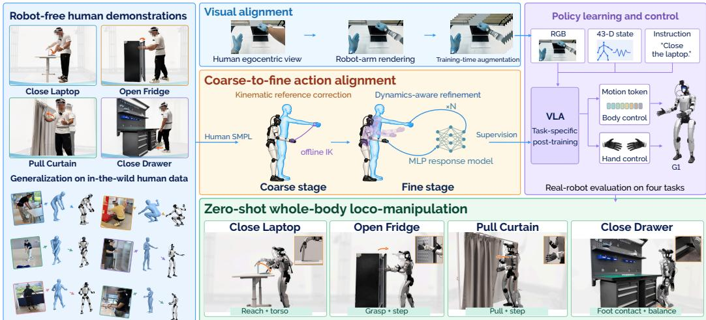  
Figure 1: Introducing EgoHumanoid-V2, the first egocentric human-to-humanoid skill transfer framework for coordinated whole-body loco-manipulation. Robot teleoperation is costly and hard to scale across environments, while human demonstrations capture diverse scenes and coordinated whole-body skills. Action and visual alignment bridge the embodiment gap for VLA training. Four real-world tasks demonstrate zero-shot skill transfer without target-task robot demonstrations.

## ABSTRACT

Human demonstrations capture diverse scenes and rich whole-body skills without requiring robot teleoperation. Prior work on egocentric transfer has emphasized scene generalization in loco-manipulation under decoupled control, leaving direct transfer of coordinated whole-body skills less explored. We present EgoHumanoid-V2, the first egocentric human-to-humanoid skill transfer framework for coordinated whole-body loco-manipulation. At its core, coarse-to-fine action alignment combines kinematic reference correction with dynamics-aware refinement. It improves end-effector pose accuracy while preserving whole-body coordination. We also use robot-arm rendering and training-time image augmentation to reduce the visual embodiment gap and improve viewpoint robustness. On four real-world tasks, vision-language-action (VLA) policies trained on aligned human data show zero-shot skill transfer without target-task robot demonstrations. Task scores are comparable to those of policies trained on teleoperation data at a lower collection cost. These results support human data as direct skill supervision.

## 1 INTRODUCTION

Human demonstrations offer rich manipulation experience across diverse scenes without robot teleoperation (Grauman et al., 2022; 2024). Yet the embodiment gap makes it challenging to exploit human motion for robot policy learning. Some approaches learn loco-manipulation priors from videos without action labels (Ye et al., 2025; Bu et al., 2025; Jiang et al., 2026; Ye et al., 2026). This bypasses explicit action alignment, but may underutilize human motion (Lin et al., 2026). Recent work captures human hand trajectories with the Universal Manipulation Interface (UMI) (Chi et al., 2024; Liu et al., 2026) or VR motion capture (Yuan et al., 2026; Shi et al., 2026). Relative endeffector pose changes provide a shared human–robot action space (Kareer et al., 2026; Yuan et al., 2026). However, these methods primarily transfer bimanual manipulation and navigation, rather than coordinated whole-body loco-manipulation skills.

Humans naturally coordinate their arms, torso, and legs to extend their workspace and manipulate efficiently. Transferring these coordinated skills, however, requires more than matching end-effector trajectories. Whole-body tracking policies enable such coordination through joint whole-body control (Luo et al., 2026; Pan et al., 2026b). Unlike decoupled controllers that support arm inverse kinematics (IK) alongside separate balance and locomotion control (Ben et al., 2025; Li et al., 2025a), these policies jointly generate commands from full-body feedback. However, tracking human references alone can leave substantial end-effector error (Table 1). A straightforward approach is to correct the tracker’s joint commands using online IK. Yet these corrections override part of the coordinated output without adjusting the remaining commands, potentially disrupting balance. Our implementation and evaluation confirm this risk (Appendix D). The challenge is therefore to improve interaction accuracy while preserving whole-body coordination.

We present EgoHumanoid-V2, the first egocentric human-to-humanoid skill transfer framework for coordinated whole-body loco-manipulation (Figure 1). Building on EgoHumanoid’s exploration of egocentric human-to-humanoid transfer (Shi et al., 2026), we extend the scope from loco-manipulation under decoupled control to coordinated whole-body skills. At its core is offline, coarse-to-fine action alignment that accounts for the tracking policy’s execution. In the coarse stage, kinematic reference correction uses offline IK to align motion references with human hand or foot targets, reducing geometric mismatch before tracking. In the fine stage, dynamics-aware refinement combines rollout feedback with a learned local response model to iteratively improve end-effector tracking. Together, these stages improve manipulation accuracy while preserving whole-body coordination. We also use robot-arm rendering to reduce the visual embodiment gap and training-time image augmentation to improve viewpoint robustness. The resulting observations and actions provide paired supervision for vision-language-action (VLA) post-training.

On four real-world tasks, policies trained on 200 human demonstrations per task achieve a mean score of 51.67% without target-task robot demonstrations. On two tasks, human collection requires 76.36% less labor per demonstration than teleoperation. Ablations examine action alignment through tracking accuracy and motion quality, and visual alignment through policy performance.

Our contributions are: (a) The first egocentric human-to-humanoid skill transfer framework for coordinated whole-body loco-manipulation. (b) Coarse-to-fine action alignment through kinematic reference correction and dynamics-aware refinement. (c) Evidence of zero-shot skill transfer on four real-world tasks, with analyses of accuracy, policy scores, and collection cost.

## 2 RELATED WORK

## 2.1 WHOLE-BODY CONTROL FOR LOCO-MANIPULATION

Humanoid whole-body control supports imitation (Ji et al., 2025; Fu et al., 2025) and teleoperation (He et al., 2024; 2025b; Ze et al., 2025). For loco-manipulation, decoupled controllers combine arm joint targets or IK with adaptive lower-body control (Ben et al., 2025; Li et al., 2025a). Whole-body tracking policies instead use motion references and full-body feedback for joint control (Chen et al., 2026; Pan et al., 2026b), supporting diverse motions (Luo et al., 2026; Qi et al., 2026) and precise spatial tracking (Xu et al., 2026a). Retargeting improves reference quality (Araujo et al., 2026), interaction geometry (Yang et al., 2026b), and dynamic feasibility (Pan et al., 2026a). Execution errors nevertheless remain. Residual learning addresses dynamics mismatch (He et al., 2025a) and task interactions (Zhao et al., 2026). We instead correct references and refine execution offline under SONIC, keeping the controller fixed across tasks.

## 2.2 LEARNING FROM HUMAN DEMONSTRATIONS

Human demonstrations support robot learning through visual representations (Nair et al., 2023; Ma et al., 2023; Zeng et al., 2024), predictive pretraining (Wu et al., 2024), and motion priors from latent action models (Ye et al., 2025; Bu et al., 2025; Jiang et al., 2026) or world action models (Ye et al., 2026). Captured human trajectories provide direct action supervision (Hoque et al., 2026) through UMI-based interfaces (Chi et al., 2024; Zhaxizhuoma et al., 2025; Xu et al., 2025; Liu et al., 2026) or VR capture (Yuan et al., 2026). Wearable hand capture enables human–robot co-training (Kareer et al., 2025; Qiu et al., 2025; Tao et al., 2025), with domain adaptation improving transfer (Punamiya et al., 2025). Recent egocentric systems study scaling (Zheng et al., 2026) and humanoid control (Wei et al., 2026; Yang et al., 2026a). Loco-manipulation transfer extends to wheeled robots (Xu et al., 2026b) and humanoids with decoupled control (Shi et al., 2026; Zhong et al., 2026). Scene reconstruction supports contextual whole-body imitation (Allshire et al., 2025), while HuMI and BifrostUMI transfer coordinated manipulation (Nai et al., 2026; Wang et al., 2026). We instead refine action supervision offline under a fixed tracker, without task-specific training or fine-tuning.

## 3 METHOD

Figure 3 illustrates our action and visual alignment pipelines.

## 3.1 PROBLEM SETUP

For each task τ , human demonstrations contain synchronized egocentric images I, body motion x, and hand signals h, together with an instruction ℓ. We convert them into robot observations and actions to post-train a VLA policy $\pi _ { \theta } ^ { \tau }$ without target-task robot demonstrations. The policy predicts whole-body and hand actions from images, proprioceptive states, and instructions.

## 3.2 DATA COLLECTION AND POLICY LEARNING

We use a wearable system based on EgoHumanoid (Shi et al., 2026) to capture human demonstrations without robot hardware (Figure 2).

Human demonstration capture. A neckmounted GoPro captures egocentric RGB images, while the PICO system captures body motion and hand poses. These streams are synchronized at 50 Hz. For deployment, we use a Unitree G1 with a head-mounted GoPro and BrainCo Revo2 hands. The human and robot cameras are placed at similar heights to reduce the viewpoint gap.

Training data construction. Offline action alignment converts human motion into SONIC tokens (Luo et al., 2026). Controller rollouts provide humanoid states for policy inputs and robot-arm rendering. The adapted images and aligned actions form training pairs, with image augmentation applied during training.

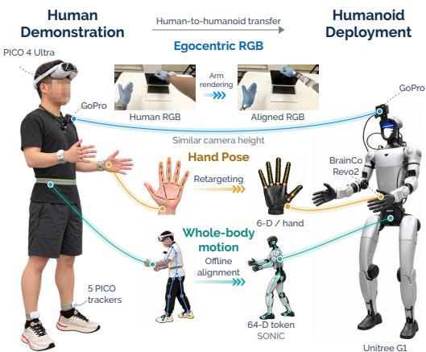  
Figure 2: Hardware for human demonstration capture and humanoid deployment.

Policy learning and deployment. Using the aligned human demonstrations, we post-train one $\pi _ { 0 . 5 }$ policy (Intelligence et al., 2025) per task without target-task robot demonstrations. The policy predicts action sequences from egocentric images, humanoid states, and language instructions, with

a common interface for training and deployment:

$$
o _ { t } = ( \widetilde { I } _ { t } , q _ { t } , \ell ) , \qquad a _ { t } = ( z _ { t } , h _ { t } ^ { \mathrm { L } } , h _ { t } ^ { \mathrm { R } } ) ,\tag{1}
$$

where $\widetilde { I } _ { t }$ denotes the adapted human image during training or the robot camera image at deployment, $q _ { t }$ is the 43-D G1 state, $z _ { t } ~ \in \ \mathbb { R } ^ { 6 4 }$ is a SONIC motion token, and $h _ { t } ^ { \mathrm { L } / R } \in \mathbb { R } ^ { 6 }$ are Revo2 hand commands. Controller rollouts supply $q _ { t }$ in the robot’s state space during training. At deployment, SONIC executes motion tokens and the Revo2 driver executes hand commands. The same SONIC checkpoint serves alignment and deployment across all four tasks.

## 3.3 ACTION ALIGNMENT

Action alignment (Figure 3(a)) targets accurate interaction trajectories while preserving coordinated control. Starting from a controller rollout (H), the coarse stage corrects reference geometry (K), and the fine stage iteratively refines motion tokens using execution feedback (D).

Motion initialization. We obtain an initial robot motion by executing human body motion through SONIC in simulation, retaining the resulting joint trajectory $b _ { 1 : T } ^ { 0 }$ and motion tokens, where $b _ { t } \in$ $\mathbb { R } ^ { 2 9 }$ We denote this initialization by H. Other motion references are also compatible with the framework; we compare their accuracy and motion quality in Table 2.

Target construction. We express motion in pelvis-centered frames with vertical axes fixed upright and horizontal axes following pelvis yaw. Human palm poses define the targets, with heights adjusted by the per-frame human–robot pelvis-height difference from the initial rollout. Targets remain fixed throughout refinement. Palm and sole target definitions appear in Appendix A.2.

## 3.3.1 KINEMATIC REFERENCE CORRECTION (K)

The coarse stage uses constrained offline IK to bring the initial robot reference closer to the human targets. The optimization reduces end-effector pose error while limiting changes to the original motion and maintaining temporal continuity. We encode the corrected reference $b _ { 1 : T } ^ { \mathrm { r e f } }$ using SONIC’s robot motion encoder $\breve { \varepsilon } _ { r }$ (Luo et al., 2026):

$$
z _ { 1 : T } ^ { 0 } = \mathcal { E } _ { r } ( b _ { 1 : T } ^ { \mathrm { r e f } } ) .\tag{2}
$$

Token replay measures the residual tracking errors corrected in the fine stage (Appendix A.2).

## 3.3.2 DYNAMICS-AWARE REFINEMENT (D)

The fine stage uses rollout feedback and an MLP response model $\mathcal { R } _ { \psi }$ . Paired perturbed and unperturbed rollouts train it to predict execution changes from kinematic changes (Appendix A.3).

At iteration $k ,$ a rollout of $z ^ { k }$ provides the controller observation history $s ^ { k }$ and end-effector residual $r ^ { k } \colon$ : position errors and, for hand targets, relative rotation vectors from executed poses to fixed targets. Holding the rollout context fixed, SONIC’s control decoder $\mathcal { D } _ { c }$ maps candidate tokens to joint commands. We predict their effect on execution as

$$
\begin{array} { r l } & { \Delta u ( z ) = \mathcal { D } _ { c } ( z , s ^ { k } ) - \mathcal { D } _ { c } ( z ^ { k } , s ^ { k } ) , } \\ & { \widehat { \Delta e } ( z ) = \mathcal { R } _ { \psi } \big ( J ^ { k } \Delta u ( z ) \big ) . } \end{array}\tag{3}
$$

Here, $J ^ { k }$ maps joint-command changes to kinematic end-effector changes. We optimize the tokens so that the predicted response compensates for the current residual:

$$
\mathcal { L } _ { \mathrm { t r a c k } } ( z ) = \| \widehat { \Delta e } ( z ) - r ^ { k } \| ^ { 2 } .\tag{4}
$$

Gradients pass through the fixed response model and control decoder, not the simulator. Each updated sequence is evaluated in a fresh rollout, which supplies the residual and context for the next iteration. We select a validated sequence from the optimization history for policy training. The selected output, $D _ { s } ,$ may come from an earlier round, including H or ${ \dot { H } } + { \bar { K } }$ . The full formulation adds temporal history, state and token conditioning, task weights, and regularization; selection criteria and implementation details appear in Appendices $\mathrm { A } . 2 \mathrm { - A } . { \bar { 4 } }$

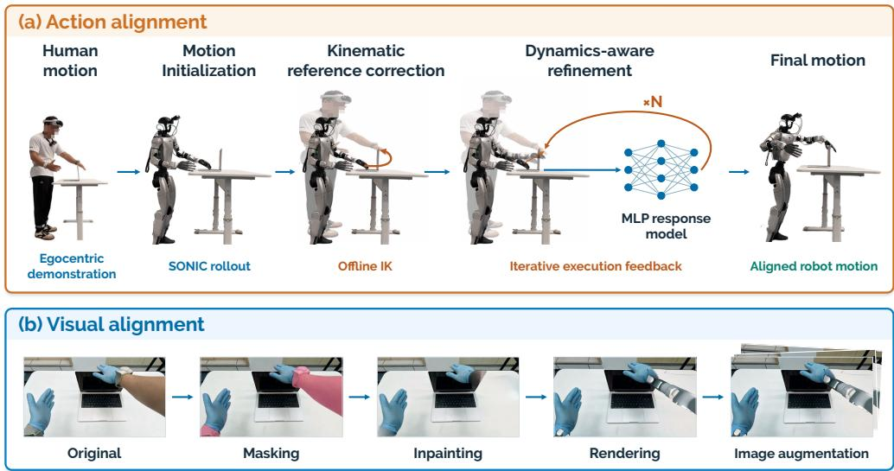  
Figure 3: Action and visual alignment pipelines. (a) Human motion initializes a robot trajectory through a SONIC rollout (H). Offline IK corrects the reference geometry (K), and dynamics-aware refinement (D) uses an MLP response model and iterative execution feedback to produce aligned robot motion. (b) Human forearms and wrist trackers are masked and inpainted, then replaced with rendered robot arms. Image augmentation produces varied training views.

## 3.4 VISUAL ALIGNMENT

Action alignment alone does not close the visual gap between human demonstrations and robot deployment (Table 4). We address differences in arm appearance and camera viewpoint through robot-arm rendering and training-time image augmentation (Figure 3(b)).

Robot-arm rendering. We adapt arm appearance (Chen et al., 2024; 2025). Matching blue gloves on humans during collection and robots during deployment simplify segmentation and visual alignment. We use SAM2 (Ravi et al., 2025) to segment human forearms and wrist-mounted PICO trackers, then fill the masked regions with DiffuEraser (Li et al., 2025b). We render G1 arms from aligned joint positions and adjust their translation, rotation, and uniform scale to match human wrists and forearms before compositing onto the inpainted backgrounds.

Image augmentation. Differences in movement amplitude and speed can alter camera viewpoints despite matching the initial camera height and angle. Random resized crops, small rotations, and photometric jitter improve robustness to these variations. At inference, the policy uses robot images directly (Appendix B.1). Table 4 evaluates rendering and augmentation separately and together.

## 4 EXPERIMENTS

We evaluate skill transfer on a real humanoid and use simulation to examine the accuracy and motion quality of action alignment. We ask four questions:

Q1: Can human demonstrations teach whole-body loco-manipulation skills?

Q2: How do human and robot data compare in performance and cost?

Q3: How does action alignment improve accuracy?

Q4: How does visual alignment improve transfer?

## 4.1 EXPERIMENTAL SETUP

We evaluate four coordinated whole-body manipulation tasks on Unitree G1, covering hand and foot interactions with posture adjustments or stepping (Figure 4).

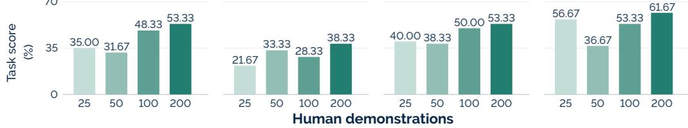

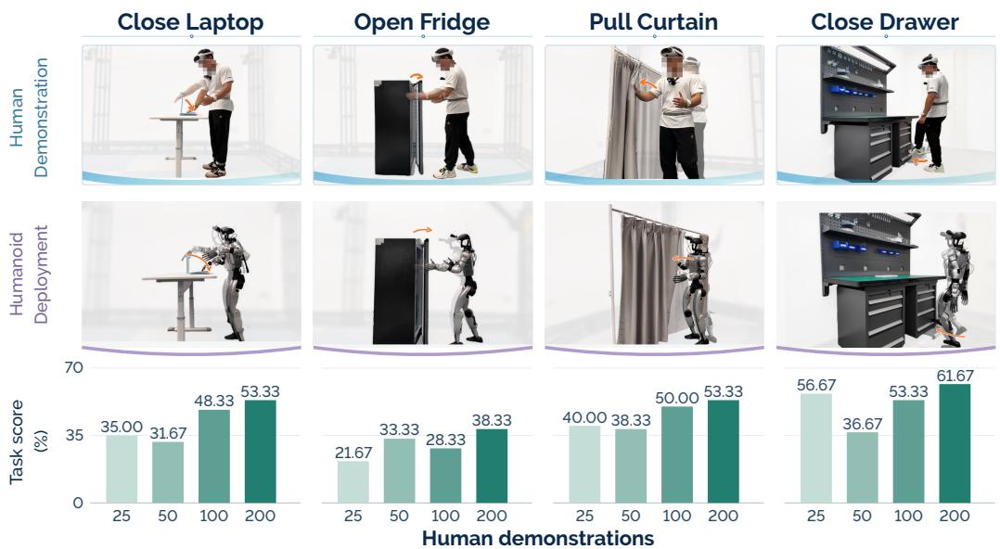  
Figure 4: Q1: Skill transfer on four real-world tasks. Each task column shows human demonstrations (top), humanoid motion illustrations (middle), and task scores with 25, 50, 100, or 200 human demonstrations (bottom). Policies use no target-task robot demonstrations.

(1) Close Laptop. The robot reaches above the laptop with its right hand and presses the lid shut, testing reaching accuracy and controlled downward contact until the lid is closed. (2) Open Fridge. The robot hooks its left hand into the door gap and pulls the door open, requiring precise hand placement and sustained contact as the robot adjusts its posture. (3) Pull Curtain. The robot grasps the curtain with its right hand and pulls it open by one meter, combining grasp maintenance with arm and body motion over an extended pulling distance. (4) Close Drawer. The robot lifts its right foot and pushes the open drawer fully closed with its toe, requiring accurate foot placement while maintaining balance.

For each task, we post-train a separate π0.5 policy for 30,000 steps with batch size 256, using the same pretrained checkpoint and training settings (Appendix B.1). Unless otherwise specified, human demonstrations undergo the full $H + \bar { K } + \bar { D _ { s } }$ action-alignment pipeline, robot-arm rendering, and image augmentation; Close Drawer omits arm rendering. Human-data policies use no target-task robot demonstrations during post-training and are deployed directly on the robot.

Each policy is evaluated over 20 real-world trials with three sequential subtasks, each scored as success or failure. Averaging over subtasks and trials gives a task score that captures partial completion (Appendix B.3). Offline endpoint-error and motion-quality comparisons use a fixed random subset of 25 training trajectories per task (Appendices C.1–C.3). Cross-task means weight tasks equally.

## 4.2 Q1: SKILL TRANSFER FROM HUMAN DEMONSTRATIONS

## Figure 4 evaluates transfer with 25, 50, 100, and 200 human demonstrations per task.

With 200 human demonstrations per task, scores range from 38.33% on Open Fridge to 61.67% on Close Drawer, with a four-task mean of 51.67%. These results show that human demonstrations supervise both arm and foot manipulation through the same whole-body controller. Increasing the budget from 25 to 200 raises the mean from 38.33% to 51.67%, suggesting that additional human demonstrations improve transfer to robot deployment.

## 4.3 Q2: HUMAN VS. ROBOT DEMONSTRATIONS

Figure 5 compares human and robot demonstrations on Close Laptop and Pull Curtain under the same training and evaluation settings. Robot-data policies use 6, 12, 25, or 50 demonstrations. With 200 human demonstrations, both tasks reach 53.33%, compared with 63.33% and 56.67%, respectively, from 50 robot demonstrations. Human data approach robot-data performance but require more episodes, motivating a comparison of collection labor.

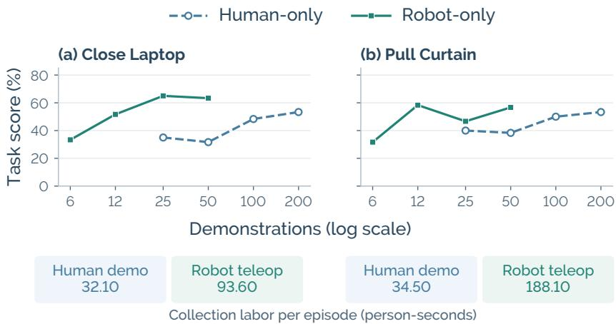  
Figure 5: Task scores and collection labor with human or robot demonstrations. Each point represents an independently trained policy evaluated over 20 trials. Human-only results reuse Figure 4. Cost strips include capture, setup, calibration, troubleshooting, and resets.

We measure collection labor in person-seconds, summing time across operators for capture, setup, calibration, troubleshooting, and scene resets. Shared overhead is amortized over episodes. Human data collection uses one operator, whereas our robot data collection uses two: one for teleoperation and one for scene and robot resets. Collecting a robot demonstration requires 2.92× as much labor as a human demonstration on Close Laptop and 5.45× on Pull Curtain. On average, human collection reduces labor per episode from 140.85 to 33.30 person-seconds, a 76.36% reduction.

On Close Laptop, 100 human demonstrations achieve 48.33% versus 63.33% from 50 robot demonstrations, using 31.41% less collection labor. On Pull Curtain, 200 human demonstrations reach 53.33% versus 56.67% from 50 robot demonstrations, using 26.63% less labor.

## 4.4 Q3: ACTION ALIGNMENT FOR IMPROVED ACCURACY

Why correct actions offline? We first examine whether online IK can improve endpoint accuracy during whole-body tracking. All three tested implementations produce unstable SONIC rollouts, including falls, across the four tasks, so we do not proceed to policy evaluation with these variants. Their designs and failure sequences are reported in Appendix D.

Kinematic reference correction and dynamics-aware refinement. Table 1 compares H, H+K, and the selected $H + K + D _ { s }$ output under the same controller. Position error covers all four tasks; orientation error covers the three palm-interaction tasks. Drawer closing uses sole position only.

Mean position error decreases from 11.21 cm at H to 4.45 cm after K and 3.41 cm at $H + K +$ D ; orientation error falls from 21.22◦ to $1 3 . 7 7 ^ { \circ }$ and 6.71◦. Thus, K removes much of the initial position mismatch, while D further improves execution accuracy, especially in orientation. With 200 demonstrations per task, mean policy score likewise rises from 21.25% to 47.08% and 51.67%. The full pipeline improves policy scores over $H + K$ on every task. An expanded simulation study on 112 trajectories across 50 tasks shows the same stage-wise trend: position error falls from 17.03 to 5.22 to 3.83 cm (Appendix C.6, Table 9).

Motion initialization. Table 2 compares three motion initialization strategies: a SONIC rollout, GMR retargeting (Araujo et al., 2026), and whole-body IK adapted from HuMI (Nai et al., 2026). Each passes through the same subsequent K stage, eight refinement rounds, and selection procedure.

SONIC rollout and retargeting achieve similar position errors (3.41 versus 3.42 cm). Retargeting gives lower orientation error (5.32◦ versus 6.71◦), while SONIC rollout reduces extra yaw from

Table 1: Q3: Effect of action alignment. Top: position (cm) / orientation (◦) errors in simulation (↓). Bottom: real-world task scores (%, ↑) with 200 demonstrations per task and identical visual preprocessing. Means are computed across tasks; Close Drawer uses sole position only and is excluded from orientation averages. Bold/underline mark best/second best. Selection follows Appendix C.2.
<table><tr><td colspan="6">End-effector Tracking Error (↓)</td></tr><tr><td>Alignment</td><td>Close Laptop Pos. (cm) / Ori. (°) Pos. (cm) / Ori. (°) Pos. (cm) / Ori. (°)</td><td>Open Fridge</td><td>Pull Curtain</td><td>Close Drawer Pos. (cm)</td><td>Mean Pos. (cm) / Ori. (°)</td></tr><tr><td>H</td><td>14.08 / 29.43</td><td>13.27 / 19.37</td><td>10.31 / 14.86</td><td>7.17</td><td>11.21 / 21.22</td></tr><tr><td> $H + K$ </td><td>4.22 / 13.84</td><td>4.24 / 14.72</td><td>3.13 / 12.74</td><td>6.22</td><td>4.45 / 13.77</td></tr><tr><td> $H + K + D _ { s }$ </td><td>3.04 / 9.50</td><td>2.76 / 5.77</td><td>2.02 / 4.85</td><td>5.80</td><td>3.41 / 6.71</td></tr><tr><td colspan="6">Real-World Task Score (%, ↑)</td></tr><tr><td>H</td><td>0.00</td><td>0.00</td><td>28.33</td><td>56.67</td><td>21.25</td></tr><tr><td> $H + K$ </td><td>46.67</td><td>31.67</td><td>51.67</td><td>58.33</td><td>47.08</td></tr><tr><td> $H + K + D _ { s }$ </td><td>53.33</td><td>38.33</td><td>53.33</td><td>61.67</td><td>51.67</td></tr></table>

Table 2: Effect of motion initialization. Task-averaged endpoint error at $D _ { s }$ and whole-body motion quality. Pelvis drop measures maximum height loss; tilt, maximum base inclination; joint step, maximum frame-to-frame joint-angle change; extra yaw, heading deviation from the human reference. All variants share $K ,$ eight D rounds, and selection. Drawer orientation is excluded. Lower is better; bold/underline mark best/second best. Appendix C.3 defines the metrics; Tables 6 and 7 report results for each task and initialization.
<table><tr><td rowspan="2">Motion initialization</td><td colspan="2">Endpoint Error</td><td colspan="4">Whole-Body Motion Quality</td></tr><tr><td>Pos. (cm)</td><td>Ori. (°)</td><td>Pelvis drop (cm)</td><td>Tilt (°)</td><td>Joint step (°)</td><td>Extra yaw (°)</td></tr><tr><td>SONIC Rollout</td><td>3.41</td><td>6.71</td><td>3.28</td><td>11.14</td><td>5.94</td><td>7.18</td></tr><tr><td>Retargeting</td><td>3.42</td><td>5.32</td><td>3.30</td><td>11.87</td><td>6.51</td><td>11.45</td></tr><tr><td>Whole-Body IK</td><td>3.82</td><td>6.35</td><td>5.25</td><td>12.77</td><td>7.75</td><td>23.67</td></tr></table>

$1 1 . 4 5 ^ { \circ }$ to $7 . 1 8 ^ { \circ }$ and improves the other motion-quality metrics. This balance of accuracy and motion quality motivates our use of SONIC rollout for motion initialization.

Roles of K and D. Figure 6 supports one K round followed by multiple D rounds. Repeating K eight times changes position error only from 4.86 to 4.77 cm. Instead, adding eight D rounds after one K reduces position error to 3.97 cm and orientation error from $1 6 . 4 6 ^ { \circ }$ to $\mathsf { \bar { 8 } } . 0 \mathsf { \bar { 8 } } ^ { \circ }$ . Eight D rounds alone leave errors of 8.40 cm and 16.40◦. Thus, K provides an accurate reference, while repeated D updates further reduce execution error; repeating K offers little additional benefit. The 50-task experiments likewise support one K round followed by multiple D rounds (Figure 7).

Learning the execution response. Table 3 compares the learned MLP with a unit response that equates kinematic and executed endpoint changes. Under identical settings, the MLP improves all four tasks: arm-task errors fall by 0.13–0.17 cm and 0.11–0.24◦, while Close Drawer improves from 9.18 to 5.80 cm. The larger drawer gain suggests that modeling execution is especially useful when foot corrections require coordinated balance adjustments. On 50 tasks, raw $\bar { K D ^ { 8 } }$ errors also improve from 4.25 to 4.10 cm and 9.39◦ to $9 . 2 1 ^ { \circ }$ (Table 10; training details in Appendix A.3).

## 4.5 Q4: VISUAL ALIGNMENT FOR EASIER TRANSFER

We evaluate robot-arm rendering and image augmentation separately and together, using 200 human demonstrations per task with identical action labels and training settings (Table 4). The baseline uses human images with standard model preprocessing only.

Across the three arm tasks, rendering, augmentation, and their combination score 38.89%, 42.78%, and 48.33%, respectively, with unchanged action labels. Their benefits are complementary but task-

$$
\_ { } \ldots \ D ^ { k } \quad \_ { } \ldots \ K ^ { m } \quad \_ { } \ldots \ K D ^ { k } \quad \_ { } \ldots \ K ^ { m } D ^ { 8 }
$$

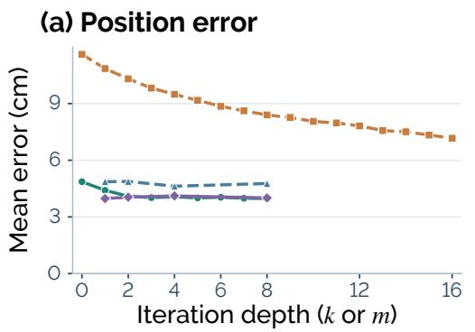

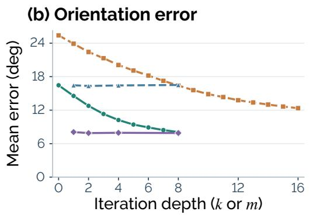  
Figure 6: Complementarity and depth of K and D. Task-macro averages of raw stage outputs for $D ^ { \tilde { k } }$ , repeated $\bar { K } ^ { m } , K D ^ { k }$ , and $K ^ { m } \bar { D ^ { 8 } }$ . Position averages four tasks; orientation averages the three hand tasks. Protocol and processing costs appear in Appendix C.4.

Table 3: MLP response versus unit response. Position (cm) / orientation (◦) errors of historically selected outputs within eight refinement rounds, with shared inputs and evaluation trajectories. Means weight tasks equally; orientation excludes drawer. Bold marks lower errors (Appendix C.5).
<table><tr><td>Response</td><td>Close Laptop</td><td>Open Fridge Pos. (cm) / Ori. (°) Pos. (cm) / Ori. (°) Pos. (cm) / Ori. (°)</td><td>Pull Curtain</td><td>Close Drawer Pos. (cm)</td><td>Mean Pos. (cm) / Ori. (°)</td></tr><tr><td>Unit response</td><td>3.18 / 9.74</td><td>2.89 /5.88</td><td>2.19 / 5.06</td><td>9.18</td><td>4.36 / 6.89</td></tr><tr><td>MLP response</td><td>3.04 / 9.50</td><td>2.76 / 5.77</td><td>2.02 / 4.85</td><td>5.80</td><td>3.41 / 6.71</td></tr></table>

Table 4: Q4: Visual-alignment ablation. Task scores with 200 human demonstrations per task. Means average the available tasks; robot-arm rendering is not evaluated for foot-operated Close Drawer. Bold/underline mark best/second best; shading indicates the full pipeline.
<table><tr><td colspan="2">Visual alignment</td><td colspan="4">Task score (%) Mean</td></tr><tr><td>Image augmentation</td><td>Robot-arm 1 rendering</td><td>Close Laptop Open Fridge Pull Curtain Close Drawer</td><td></td><td></td><td></td></tr><tr><td>X</td><td>X</td><td>31.67</td><td>16.67</td><td>35.00 50.00</td><td>33.33</td></tr><tr><td>X</td><td>√</td><td>51.67</td><td>23.33 41.67</td><td></td><td>38.89</td></tr><tr><td>V</td><td>X</td><td>61.67</td><td>33.33</td><td>33.33 61.67</td><td>47.50</td></tr><tr><td>√</td><td>√</td><td>53.33</td><td>38.33</td><td>53.33</td><td>48.33</td></tr></table>

dependent: combining them performs best on Open Fridge and Pull Curtain, while augmentation alone is best on Close Laptop.

## 5 CONCLUSION

EgoHumanoid-V2 transfers coordinated whole-body loco-manipulation skills from egocentric demonstrations through coarse-to-fine action alignment and visual adaptation. With 200 human demonstrations per task, VLA policies achieve a mean score of 51.67% across four real-world tasks without target-task robot demonstrations, demonstrating zero-shot skill transfer on the tested tasks. The results support human motion as direct supervision for coordinated humanoid skills.

Limitations and future work. Alignment can still produce unstable motions, and IK and repeated rollouts limit throughput. Stronger stability constraints and faster optimization remain directions for improving reliability and processing efficiency.

## AI USE STATEMENT

Generative AI tools assisted with literature discovery and synthesis, method and experimentaldesign feedback, manuscript organization, drafting and editing, reference formatting, figure development, and software development. The authors reviewed this work and take responsibility for the final text, claims, citations, code, and artifacts.

## REPRODUCIBILITY STATEMENT

Sections 3 and 4 describe the learning interface and controlled comparisons. Appendices A and B provide implementation and policy evaluation details. Appendices C and D report supplementary action-alignment experiments and online-IK diagnostics.

## REFERENCES

Arthur Allshire, Hongsuk Choi, Junyi Zhang, David McAllister, Anthony Zhang, Chung Min Kim, Trevor Darrell, Pieter Abbeel, Jitendra Malik, and Angjoo Kanazawa. Visual imitation enables contextual humanoid control. In CoRL, 2025. 3

Joao Pedro Araujo, Yanjie Ze, Pei Xu, Jiajun Wu, and C. Karen Liu. Retargeting Matters: General motion retargeting for humanoid motion tracking. In ICRA, 2026. 2, 7

Qingwei Ben, Feiyu Jia, Jia Zeng, Junting Dong, Dahua Lin, and Jiangmiao Pang. HOMIE: Humanoid loco-manipulation with isomorphic exoskeleton cockpit. In RSS, 2025. 2

Qingwen Bu, Yanting Yang, Jisong Cai, Shenyuan Gao, Guanghui Ren, Maoqing Yao, Ping Luo, and Hongyang Li. Learning to act anywhere with task-centric latent actions. In RSS, 2025. 2, 3

Lawrence Yunliang Chen, Kush Hari, Karthik Dharmarajan, Chenfeng Xu, Quan Vuong, and Ken Goldberg. Mirage: Cross-embodiment zero-shot policy transfer with cross-painting. In RSS, 2024. 5

Lawrence Yunliang Chen, Chenfeng Xu, Karthik Dharmarajan, Richard Cheng, Kurt Keutzer, Masayoshi Tomizuka, Quan Vuong, and Ken Goldberg. RoVi-Aug: Robot and viewpoint augmentation for cross-embodiment robot learning. In CoRL, 2025. 5

Zixuan Chen, Mazeyu Ji, Xuxin Cheng, Xuanbin Peng, Xue Bin Peng, and Xiaolong Wang. GMT: General motion tracking for humanoid whole-body control. In IROS, 2026. 2

Cheng Chi, Zhenjia Xu, Chuer Pan, Eric Cousineau, Benjamin Burchfiel, Siyuan Feng, Russ Tedrake, and Shuran Song. Universal Manipulation Interface: In-the-wild robot teaching without in-the-wild robots. In RSS, 2024. 2, 3

Zipeng Fu, Qingqing Zhao, Qi Wu, Gordon Wetzstein, and Chelsea Finn. HumanPlus: Humanoid shadowing and imitation from humans. In CoRL, 2025. 2

Kristen Grauman, Andrew Westbury, Eugene Byrne, Zachary Chavis, Antonino Furnari, Rohit Girdhar, Jackson Hamburger, Hao Jiang, Miao Liu, Xingyu Liu, et al. Ego4D: Around the world in 3,000 hours of egocentric video. In CVPR, 2022. 2

Kristen Grauman, Andrew Westbury, Lorenzo Torresani, Kris Kitani, Jitendra Malik, Triantafyllos Afouras, Kumar Ashutosh, Vijay Baiyya, Siddhant Bansal, Bikram Boote, et al. Ego-Exo4D: Understanding skilled human activity from first- and third-person perspectives. In CVPR, 2024. 2

Tairan He, Zhengyi Luo, Wenli Xiao, Chong Zhang, Kris Kitani, Changliu Liu, and Guanya Shi. Learning human-to-humanoid real-time whole-body teleoperation. In IROS, 2024. 2

Tairan He, Jiawei Gao, Wenli Xiao, Yuanhang Zhang, Zi Wang, Jiashun Wang, Zhengyi Luo, Guanqi He, Nikhil Sobanbabu, Chaoyi Pan, Zeji Yi, Guannan Qu, Kris Kitani, Jessica Hodgins, Linxi "Jim" Fan, Yuke Zhu, Changliu Liu, and Guanya Shi. ASAP: Aligning simulation and real-world physics for learning agile humanoid whole-body skills. In RSS, 2025a. 2

Tairan He, Zhengyi Luo, Xialin He, Wenli Xiao, Chong Zhang, Weinan Zhang, Kris M Kitani, Changliu Liu, and Guanya Shi. OmniH2O: Universal and dexterous human-to-humanoid wholebody teleoperation and learning. In CoRL, 2025b. 2

Ryan Hoque, Peide Huang, David J Yoon, Mouli Sivapurapu, and Jian Zhang. EgoDex: Learning dexterous manipulation from large-scale egocentric video. In ICLR, 2026. 3

Physical Intelligence, Kevin Black, Noah Brown, James Darpinian, Karan Dhabalia, Danny Driess, Adnan Esmail, Michael Equi, Chelsea Finn, Niccolo Fusai, et al. π0.5: a vision-language-action model with open-world generalization. In CoRL, 2025. 3

Mazeyu Ji, Xuanbin Peng, Fangchen Liu, Jialong Li, Ge Yang, Xuxin Cheng, and Xiaolong Wang. ExBody2: Advanced expressive humanoid whole-body control. In RSS Workshop on Whole-Body Control and Bimanual Manipulation, 2025. 2

Haoran Jiang, Jin Chen, Qingwen Bu, Li Chen, Modi Shi, Yanjie Zhang, Delong Li, Chuanzhe Suo, Chuang Wang, Zhihui Peng, et al. WholeBodyVLA: Towards unified latent vla for whole-body loco-manipulation control. In ICLR, 2026. 2, 3

Simar Kareer, Dhruv Patel, Ryan Punamiya, Pranay Mathur, Shuo Cheng, Chen Wang, Judy Hoffman, and Danfei Xu. EgoMimic: Scaling imitation learning via egocentric video. In ICRA, 2025. 3

Simar Kareer, Karl Pertsch, James Darpinian, Judy Hoffman, Danfei Xu, Sergey Levine, Chelsea Finn, and Suraj Nair. Emergence of human to robot transfer in vision-language-action models. In RSS, 2026. 2

Jialong Li, Xuxin Cheng, Tianshu Huang, Shiqi Yang, Ri-Zhao Qiu, and Xiaolong Wang. AMO: Adaptive motion optimization for hyper-dexterous humanoid whole-body control. In RSS, 2025a. 2

Xiaowen Li, Haolan Xue, Peiran Ren, and Liefeng Bo. DiffuEraser: A diffusion model for video inpainting. arXiv preprint arXiv:2501.10018, 2025b. 5

Fanqi Lin, Kushal Arora, Jean Mercat, Haruki Nishimura, Paarth Shah, Chen Xu, Mengchao Zhang, Mark Zolotas, Maya Angeles, Owen Pfannenstiehl, Andrew Beaulieu, and Jose Barreiros. A systematic study of data modalities and strategies for co-training large behavior models for robot manipulation. In RSS, 2026. 2

Songming Liu, Bangguo Li, Kai Ma, Lingxuan Wu, Hengkai Tan, Xiao Ouyang, Hang Su, and Jun Zhu. RDT2: Exploring the scaling limit of UMI data towards zero-shot cross-embodiment generalization. In ICML, 2026. 2, 3

Zhengyi Luo, Ye Yuan, Tingwu Wang, Chenran Li, Sirui Chen, Fernando Castañeda, Zi-Ang Cao, Jiefeng Li, David Minor, Qingwei Ben, et al. SONIC: Supersizing motion tracking for natural humanoid whole-body control. Science Robotics, 2026. In press. 2, 3, 4

Yecheng Jason Ma, Shagun Sodhani, Dinesh Jayaraman, Osbert Bastani, Vikash Kumar, and Amy Zhang. VIP: Towards universal visual reward and representation via value-implicit pre-training. In ICLR, 2023. 3

Ruiqian Nai, Boyuan Zheng, Junming Zhao, Haodong Zhu, Sicong Dai, Zunhao Chen, Yihang Hu, Yingdong Hu, Tong Zhang, Chuan Wen, and Yang Gao. Humanoid manipulation interface: Humanoid whole-body manipulation from robot-free demonstrations. In CoRL, 2026. 3, 7, 17

Suraj Nair, Aravind Rajeswaran, Vikash Kumar, Chelsea Finn, and Abhinav Gupta. R3M: A universal visual representation for robot manipulation. In CoRL, 2023. 3

Chaoyi Pan, Changhao Wang, Haozhi Qi, Zixi Liu, Homanga Bharadhwaj, Akash Sharma, Tingfan Wu, Guanya Shi, Jitendra Malik, and Francois Hogan. SPIDER: Scalable physics-informed dexterous retargeting. In IROS, 2026a. 2

Yixuan Pan, Ruoyi Qiao, Li Chen, Kashyap Chitta, Liang Pan, Haoguang Mai, Qingwen Bu, Cunyuan Zheng, Hao Zhao, Ping Luo, and Hongyang Li. Agility Meets Stability: Versatile humanoid control with heterogeneous data. In ICRA, 2026b. 2

Ryan Punamiya, Dhruv Patel, Patcharapong Aphiwetsa, Pranav Kuppili, Lawrence Y. Zhu, Simar Kareer, Judy Hoffman, and Danfei Xu. EgoBridge: Domain adaptation for generalizable imitation from egocentric human data. In NeurIPS, 2025. 3

Zekun Qi, Xuchuan Chen, Jilong Wang, Chenghuai Lin, Yunrui Lian, Wenyao Zhang, Xinqiang Yu, He Wang, and Li Yi. Humanoid generative pre-training for zero-shot motion tracking. In CVPR, 2026. 2

Ri-Zhao Qiu, Shiqi Yang, Xuxin Cheng, Chaitanya Chawla, Jialong Li, Tairan He, Ge Yan, David J Yoon, Ryan Hoque, Lars Paulsen, et al. Humanoid policy \~ human policy. In CoRL, 2025. 3

Nikhila Ravi, Valentin Gabeur, Yuan-Ting Hu, Ronghang Hu, Chaitanya Ryali, Tengyu Ma, Haitham Khedr, Roman Rädle, Chloe Rolland, Laura Gustafson, Eric Mintun, Junting Pan, Kalyan Vasudev Alwala, Nicolas Carion, Chao-Yuan Wu, Ross Girshick, Piotr Dollár, and Christoph Feichtenhofer. SAM 2: Segment anything in images and videos. In ICLR, 2025. 5

Modi Shi, Shijia Peng, Jin Chen, Haoran Jiang, Tianyu Li, Ping Luo, Di Huang, Hongyang Li, and Li Chen. Unlocking in-the-wild loco-manipulation with robot-free egocentric demonstration. In RSS, 2026. 2, 3

Tony Tao, Mohan Kumar Srirama, Jason Jingzhou Liu, Kenneth Shaw, and Deepak Pathak. DexWild: Dexterous human interactions for in-the-wild robot policies. In RSS, 2025. 3

Hongwu Wang, Chenhao Yu, Youhao Hu, Jiachen Zhang, Yuanyuan Li, and Shaqi Luo. BifrostUMI: Bridging robot-free demonstrations and humanoid whole-body manipulation. arXiv preprint arXiv:2605.03452, 2026. 3

Songlin Wei, Hongyi Jing, Boqian Li, Zhenyu Zhao, Jiageng Mao, Zhenhao Ni, Sicheng He, Sheng Zang, Xiawei Liu, Kaidi Kang, Jie Liu, Weiduo Yuan, Marco Pavone, Di Huang, and Yue Wang. Ψ : An open foundation model towards universal humanoid loco-manipulation. In RSS, 2026. 3

Hongtao Wu, Ya Jing, Chilam Cheang, Guangzeng Chen, Jiafeng Xu, Xinghang Li, Minghuan Liu, Hang Li, and Tao Kong. Unleashing large-scale video generative pre-training for visual robot manipulation. In ICLR, 2024. 3

Mengda Xu, Han Zhang, Yifan Hou, Zhenjia Xu, Linxi Fan, Manuela Veloso, and Shuran Song. DexUMI: Using human hand as the universal manipulation interface for dexterous manipulation. In CoRL, 2025. 3

Qingyao Xu, Sheng Yin, Zibo Zhou, Ya Zhang, Siheng Chen, and Yue Hu. GLoRI: Closed-loop whole-body tracking with global-local reference interaction for humanoid loco-manipulation. arXiv preprint arXiv:2609.05994, 2026a. 2

Xiaomeng Xu, Jisang Park, Han Zhang, Eric Cousineau, Aditya Bhat, Jose Barreiros, Dian Wang, Jeannette Bohg, and Shuran Song. HoMMI: Learning whole-body mobile manipulation from human demonstrations. In RSS, 2026b. 3

Haoran Yang, Jiacheng Bao, Yucheng Xin, Haoming Song, Yuyang Tian, Bin Zhao, Dong Wang, and Xuelong Li. ZeroWBC: Learning natural whole-body humanoid interaction from human egocentric data. arXiv preprint arXiv:2603.09170, 2026a. 3

Lujie Yang, Xiaoyu Huang, Zhen Wu, Angjoo Kanazawa, Pieter Abbeel, Carmelo Sferrazza, C Karen Liu, Rocky Duan, and Guanya Shi. OmniRetarget: Interaction-preserving data generation for humanoid whole-body loco-manipulation and scene interaction. In ICRA, 2026b. 2

Seonghyeon Ye, Joel Jang, Byeongguk Jeon, Sejune Joo, Jianwei Yang, Baolin Peng, Ajay Mandlekar, Reuben Tan, Yu-Wei Chao, Bill Yuchen Lin, et al. Latent action pretraining from videos. In ICLR, 2025. 2, 3

Seonghyeon Ye, Yunhao Ge, Kaiyuan Zheng, Shenyuan Gao, Sihyun Yu, George Kurian, Suneel Indupuru, You Liang Tan, Chuning Zhu, Jiannan Xiang, Ayaan Malik, Kyungmin Lee, William Liang, Nadun Ranawaka, Jiasheng Gu, Yinzhen Xu, Guanzhi Wang, Fengyuan Hu, Avnish Narayan, Johan Bjorck, Jing Wang, Gwanghyun Kim, Dantong Niu, Ruijie Zheng, Yuqi Xie, Jimmy Wu, Qi Wang, Ryan Julian, Danfei Xu, Yilun Du, Yevgen Chebotar, Scott Reed, Jan Kautz, Yuke Zhu, Linxi Fan, and Joel Jang. World action models are zero-shot policies. In CoRL, 2026. 2, 3

Chengbo Yuan, Rui Zhou, Mengzhen Liu, Yingdong Hu, Shengjie Wang, Li Yi, Chuan Wen, Shanghang Zhang, and Yang Gao. MotionTrans: Human vr data enable motion-level learning for robotic manipulation policies. In ICRA, 2026. 2, 3

Yanjie Ze, Zixuan Chen, João Pedro Araújo, Zi ang Cao, Xue Bin Peng, Jiajun Wu, and C. Karen Liu. TWIST: Teleoperated whole-body imitation system. In CoRL, 2025. 2

Jia Zeng, Qingwen Bu, Bangjun Wang, Wenke Xia, Li Chen, Hao Dong, Haoming Song, Dong Wang, Di Hu, Ping Luo, et al. Learning manipulation by predicting interaction. In RSS, 2024. 3

Siheng Zhao, Yanjie Ze, Yue Wang, C Karen Liu, Pieter Abbeel, Guanya Shi, and Rocky Duan. ResMimic: From general motion tracking to humanoid whole-body loco-manipulation via residual learning. In ICRA, 2026. 3

Zhaxizhuom Zhaxizhuoma, Kehui Liu, Chuyue Guan, Zhongjie Jia, Ziniu Wu, Xin Liu, Tianyu Wang, Shuai Liang, Pengan CHEN, Pingrui Zhang, et al. FastUMI: A scalable and hardware-independent universal manipulation interface with dataset. In CoRL, 2025. 3

Ruijie Zheng, Dantong Niu, Yuqi Xie, Jing Wang, Mengda Xu, Yunfan Jiang, Fernando Castaneda, Fengyuan Hu, You Liang Tan, Letian Fu, Trevor Darrell, Furong Huang, Yuke Zhu, Danfei Xu, and Linxi Fan. EgoScale: Scaling dexterous manipulation with diverse egocentric human data. In CoRL, 2026. 3

Rui Zhong, Yizhe Sun, Junjie Wen, Jinming Li, Chuang Cheng, Wei Dai, Zhiwen Zeng, Huimin Lu, Yichen Zhu, and Yi Xu. HumanoidExo: Scalable whole-body humanoid manipulation via wearable exoskeleton. In ICRA, 2026. 3

## Appendix

## A METHODOLOGY

## A.1 DATA PREPARATION AND VALIDATION

GoPro RGB, PICO whole-body tracking, and hand-pose signals are synchronized into 50 Hz image– trajectory pairs. Signal validation and heading calibration precede motion initialization H; the resulting reference then passes through K and D. Accepted replays supply the states and actions paired with aligned images for VLA post-training. Each sample uses the 43-dimensional state and 76-dimensional action interface in Eq. 1.

Validation follows the same processing order. Checks of timestamp consistency and agreement between video and trajectory frame counts establish whether the source streams can be paired. Endpoint tracking error, changes in joint angles between frames, base tilt, and pelvis displacement assess the resulting robot execution. Without an external pulse, PICO–GoPro timing consistency measures repeatability rather than absolute synchronization error.

## A.2 ACTION ALIGNMENT DETAILS

Both stages use fixed targets from the human recording: kinematic alignment adjusts the robot reference, and dynamics-aware alignment refines its motion tokens.

Target construction and registration. We first remove world translation and heading by expressing each world-space point $p _ { t } ^ { \bigcirc }$ in a pelvis-centered frame:

$$
p _ { t } ^ { L } = R _ { z } ( \psi _ { t } ) ^ { \top } ( p _ { t } ^ { W } - p _ { \mathrm { p e l v i s } , t } ^ { W } ) ,\tag{5}
$$

where $\psi _ { t }$ is pelvis yaw. The frame keeps its z axis vertical, so it does not rotate with body tilt. Human palm targets retain their local horizontal coordinates and orientation. To register height, we set $y _ { t , z } \stackrel { \cdot } { = } p _ { t , z } ^ { \mathrm { H } , L } + h _ { t } ^ { \mathrm { H } } - h _ { t } ^ { \mathrm { R } , 0 }$ , where $h _ { t } ^ { \mathrm { H } }$ and $h _ { t } ^ { \mathrm { R , 0 } }$ are pelvis heights above the floor in the human recording and initial robot rollout. This registration is fixed across refinement rounds. Humanconditioned controller execution supplies the initial joint reference, and independent token replay measures tracking error against the registered targets.

Foot targets approximate each sole center by the midpoint between the human ankle and foot keypoints. We estimate the ground height as the median, over the demonstration, of the lowest ankle or foot keypoint in each frame. We similarly estimate the ground height from the lower of the two sole-center proxies. We subtract the proxy-based estimate minus the keypoint-based estimate from the vertical coordinate of each proxy. This vertical correction is constant throughout the demonstration and preserves changes in foot height. We then apply the same pelvis-height registration used for the hands. The resulting targets approximate sole centers; they are not measured contact points. Both K and D target bilateral hand poses by default; foot-only tasks such as Close Drawer instead target foot positions and omit the orientation objective.

Kinematic reference correction (K). The kinematic stage adjusts the initial robot trajectory toward these targets before encoding it as motion tokens. For hand tasks, the optimization acts only on the arms and waist. Both IK solvers bound deviations from the initial reference, retaining the original motion as the anchor for correction. The corrected reference is then encoded and replayed to obtain the execution residual addressed by D.

Dynamics-aware refinement (D). The dynamics-aware stage uses the response prediction in $\operatorname { E q . 3 }$ to compensate for the measured execution residual. Within each local solve, the context $c ^ { k }$ and observation history $s ^ { k }$ remain fixed, and the task metric Qτ weights endpoint errors:

$$
z ^ { k + 1 } = \arg \operatorname* { m i n } _ { z \in \mathcal { N } ( z ^ { k } ) } \| \widehat { \Delta e } ( z ) - r ^ { k } \| _ { Q _ { \tau } } ^ { 2 } + \mathcal { L } _ { \mathrm { r e g } } ( z , z ^ { k } ) .\tag{6}
$$

The neighborhood $\textstyle { \mathcal { N } } ( z ^ { k } )$ limits how far the tokens can change from their current values $z ^ { k }$ . The regularizer combines a joint-command penalty $\| \Delta u ( z ) \| _ { W _ { \tau } } ^ { 2 }$ , token-change and temporal penalties, and an IK correction prior. Joint-preservation weights for the legs, waist, and arms are (20, 20, 0.1) for hand tasks and (0.1, 20, 20) for foot-only tasks. These are soft penalties on proposed corrections; they do not freeze body parts during execution.

Optimization schedule and output. Each refinement round locally linearizes endpoint geometry and performs 400 Adam steps through the frozen decoder and MLP response model. A fresh rollout evaluates the candidate and supplies the next round’s execution context. The default schedule comprises one K round, seven regular D rounds, and one conservative D round. The recorded candidates then enter the selection and independent validation procedure in Appendix A.4.

## A.3 RESPONSE MODEL AND TRAINING

The response model predicts how a kinematic command change affects execution.

Paired-rollout supervision. Response supervision uses G1 motion trajectories from BONES-SEED1. Reference and perturbed tokens are replayed at 50 Hz from identical simulator states and controller histories. Perturbations combine smooth random changes and token-refinement directions. The input is the Jacobian-based endpoint change between commands decoded under the same baseline observation; the target is the difference between the endpoint poses executed in the two rollouts one policy step later. Training uses 250 motions from 68 capture dates (345,080 frame– perturbation pairs); validation uses 13 motions from seven other dates (20,420 pairs).

Inputs and temporal context. Position and rotation changes for both palms and soles form a 24-D intervention input. The current input and five exponentially smoothed versions of that input, with time constants of 0.02, 0.1, 0.5, 2, and 5 s, form a 144-D causal history. The predictor also conditions on 93 robot-state features and the 64-D reference token. These fixed baseline features constitute ck; they and the causal history are omitted from the compact notation in Eq. 3.

Architecture and training objective. A frozen linear response and an MLP residual jointly predict the 24-dimensional endpoint response. The MLP has two hidden layers of width 64 and SiLU activations. Subtracting its output at zero history enforces zero response when the intervention history is zero. Inputs and targets are normalized using training-set statistics, and the objective combines normalized mean squared error with a squared residual penalty of weight 1. Random perturbations receive 75% of the training weight; the two refinement-derived direction families share the remaining 25%. Within each family, weights balance capture dates and source motions.

Optimization and use during refinement. We train with AdamW at learning rate $3 \times 1 0 ^ { - 5 }$ weight decay 10−4, batch size 512, and gradient clipping at norm 5. Training lasts at most 150 epochs, and the checkpoint with the lowest validation loss is retained. During token optimization, the model weights and baseline features stay fixed; gradients traverse the candidate-dependent history rather than the simulator. Palm tasks blend the learned and unit responses with a learned-response weight of 0.15. Foot-only tasks use the learned position response without an orientation objective. Development rollouts set these task-specific configurations, which remain fixed.

## A.4 MOTION SELECTION AND VALIDATION

Validation checks accuracy, execution consistency, and stability. Limits are 5 cm position error, 15◦ orientation error where applicable, 0.10 m pelvis-height drop, and 25◦ base tilt.

Candidates recorded during initialization, kinematic correction, and refinement that satisfy these checks are ranked first by their largest normalized endpoint error, then by their mean normalized error. They are independently replayed in that order. The selected candidate may be the initial rollout H or the corrected reference replay H + K if later candidates rank lower or fail validation; an episode is rejected if no candidate passes. The accepted replay supplies the state–action pairs.

Task-specific settings also control preprocessing of refrigerator trajectories, hand commands for pulling curtains, and the handling of curtain sequence endings. All tasks use the same low-level controller checkpoint without target-task training or fine-tuning.

## B POLICY TRAINING AND EVALUATION

The policy experiments test whether the aligned supervision supports physical task execution.

## B.1 POST-TRAINING CONFIGURATION

All controlled comparisons post-train $\pi _ { 0 . 5 }$ from pi05\_base in bfloat16 for 30,000 steps with global batch size 256. We use AdamW, gradient clipping at 1.0, and weight decay $1 0 ^ { - 1 \mathrm { { 0 } } }$ . The learning rate warms up for 1,000 steps to $2 . 5 \times 1 0 ^ { - 5 }$ , then follows a cosine decay to $\mathrm { { 2 . 5 \times 1 0 ^ { - 6 } } }$

Visual preprocessing. Robot-arm rendering is performed offline as described in Section 3.4. During post-training, random resized crops, in-plane rotation, and photometric jitter augment the images. Deployment applies standard preprocessing to robot images only.

## B.2 TRAINING DATA AND CONTROLLED COMPARISONS

The default human-data condition combines $H + K + D _ { s }$ action labels, robot-arm rendering, and image augmentation. Foot-operated Close Drawer omits arm rendering. Across conditions, the policy backbone, action interface, and evaluation protocol are held fixed; the following comparisons vary the data budget or supervision component.

Data-budget comparisons. Q1 uses 25, 50, 100, or 200 human demonstrations per task. Q2 trains separate human-data and robot-data policies at the budgets in Section 4.3. Action and visual ablations each use 200 demonstrations per task.

Supervision ablations. In Table 1, the H and H +K conditions use their respective stage-specific action labels, while the full condition uses validated historical candidates (Appendix A.4). Visual preprocessing and optimization settings are identical across these action-label comparisons. Visual ablations instead vary the visual preprocessing components under the shared training configuration.

## B.3 TASK SCORING CRITERIA

Each task consists of three sequential binary-scored subtasks. Evaluation stops at the first failure, and all remaining subtasks receive zero. A trial therefore scores 0, $1 / 3 , 2 / 3 ,$ , or 1. Each condition includes 20 attempted trials, and the task score is

$$
\mathrm { T a s k } \operatorname { s c o r e } \left( \% \right) = \frac { 1 0 0 } { 2 0 } \sum _ { i = 1 } ^ { 2 0 } \left( \frac { 1 } { 3 } \sum _ { j = 1 } ^ { 3 } s _ { i j } \right) , \qquad s _ { i j } \in \{ 0 , 1 \} .\tag{7}
$$

Table 5 lists the ordered criteria for each task. The stages distinguish reaching or establishing contact, performing the interaction, and completing it.

## B.4 RESULT AGGREGATION

Task scores summarize partial completion rather than binary full-task success. Cross-task means give equal weight to the available task scores; visual-ablation rows with arm rendering exclude Close Drawer. No error bars are reported.

The four policies are task-specific. Starting-pose and object variations therefore assess within-task execution, rather than unseen-task generalization by a single policy.

Table 5: Ordered binary scoring criteria for physical policy evaluation.
<table><tr><td>Task</td><td>Stage 1</td><td>Stage 2</td><td>Stage 3</td></tr><tr><td></td><td>position above the lid.</td><td>Close Laptop Right hand reaches a suitable Right hand makes an effective Lid is fully closed. downward press on the lid.</td><td></td></tr><tr><td>Open Fridge</td><td>gap.</td><td>Left hand approaches the door Left hand hooks into the gap. Refrigerator door opens.</td><td></td></tr><tr><td></td><td>Pull Curtain Right hand grasps the curtain. Hand pulls the curtain.</td><td></td><td>Curtain is pulled open by one meter.</td></tr><tr><td></td><td>in front of the lowest drawer&#x27;s inward. outer face.</td><td></td><td>Close Drawer Right foot lifts, with the toe Right foot pushes the drawer Drawer is fully closed.</td></tr></table>

## C SUPPLEMENTARY ACTION-ALIGNMENT EXPERIMENTS

The supplementary experiments evaluate how alignment stages, motion initialization, the number of refinement rounds, and the learned response model affect tracking accuracy, motion quality, and processing time on the four evaluation tasks. A separate 50-task study examines whether these trends extend to a broader set of tasks.

## C.1 SHARED PROTOCOL AND METRICS

The four-task studies use the same fixed random sample of 25 training trajectories per task (Section 4.1). Targets, registration, controller checkpoint, reset states, and evaluation windows are matched, so the comparisons isolate changes in the alignment procedure.

Endpoint metrics and aggregation. Position error is measured in centimeters and orientation error in degrees. For each trajectory, errors are averaged over frames and relevant endpoints; trajectory means are then averaged within each task, and cross-task means weight tasks equally. Position includes both palms for the three hand tasks and both soles for Close Drawer. Orientation is evaluated only for the three hand tasks. Missing measurements receive no numerical error and are not replaced by a more favorable round. We average and rank unrounded values, then report two decimal places.

Candidate selection across comparisons. The stage comparison selects from all recorded candidates, including initialization, kinematic correction, and refinement; the initialization comparison selects only from post-K refinement rounds; and the depth curves report the candidate produced at each specified round, without selecting an earlier candidate.

## C.2 STAGE COMPARISON AND HISTORICAL SELECTION

The offline error block in Table 1 asks how much accuracy is available from the recorded optimization history. Its candidate set includes $H , H + K$ , and all recorded D rounds. For the three hand tasks, we select a candidate by minimizing

$$
S = 0 . 7 5 \frac { e _ { \mathrm { p o s } } } { 5 \mathrm { c m } } + 0 . 2 5 \frac { e _ { \mathrm { o r i } } } { 1 5 ^ { \circ } } .\tag{8}
$$

Here, $e _ { \mathrm { p o s } }$ and $e _ { \mathrm { o r i } }$ are the mean bilateral palm errors of the same candidate. Close Drawer instead minimizes mean bilateral sole-position error. Because the initial and kinematically corrected references remain eligible, the selected $H + K + D _ { s }$ s output may retain H or $H + K$

Recorded measurements are used without validation replay or acceptance filtering.

## C.3 MOTION INITIALIZATION AND WHOLE-BODY MOTION QUALITY

This comparison tests whether the initial reference affects accuracy and whole-body motion quality after a shared refinement budget. We compare SONIC Rollout, GMR retargeting, and HuMI-style whole-body IK (Nai et al., 2026), adapted to our 29-joint model. Every reference is encoded and replayed through the same SONIC checkpoint, then receives one K round and eight $D$ rounds. The comparison isolates initialization; it does not reproduce the cited methods’ complete pipelines.

Table 6: Task-wise endpoint error for motion initialization. Position/orientation errors at $D _ { s }$ are in $\mathrm { c m } / { } ^ { \circ }$ , averaged over 25 episodes per task. Drawer orientation is not evaluated. Lower is better; bold and underline denote the best and second-best values for each metric.
<table><tr><td>Task</td><td>SONIC Rollout Retargeting</td><td></td><td>Whole-Body IK</td></tr><tr><td>Close Laptop</td><td>3.04 / 9.50</td><td> $2 . 6 7 / \underline { { 6 . 3 3 } }$ </td><td> $\underline { { 2 . 7 5 } } / \mathbf { 6 . 1 9 }$ </td></tr><tr><td>Open Fridge</td><td> $2 . 7 6 / \underline { { 5 . 7 7 } }$ </td><td> $\underline { { 3 . 1 5 } } / 5 . 7 4$ </td><td>3.68 / 7.25</td></tr><tr><td>Pull Curtain</td><td>2.02 / 4.85</td><td>2.05 / 3.88</td><td>2.73 / 5.61</td></tr><tr><td>Close Drawer</td><td>5.80 / —</td><td>5.80/—</td><td>6.11/—</td></tr></table>

Table 7: Task-wise whole-body motion quality for motion initialization. Metrics are averaged over the same fixed random 25-trajectory cohort per task as Table 2, using the definitions in $\mathsf { A p - }$ pendix C.3. Lower is better. Bold and underline mark the best and second-best values per task.
<table><tr><td>Task</td><td>Method</td><td>Pelvis drop (cm)</td><td></td><td>Tilt (°) Joint step (°) Extra yaw (°)</td><td></td></tr><tr><td rowspan="3">Close Laptop</td><td>SONIC Rollout</td><td>0.28</td><td>9.62</td><td>2.87</td><td>3.94</td></tr><tr><td>Retargeting</td><td>0.50</td><td>10.86</td><td>3.95</td><td>3.67</td></tr><tr><td>Whole-Body IK</td><td>2.06</td><td>11.32</td><td>6.07</td><td>22.60</td></tr><tr><td rowspan="3">Open Fridge</td><td>SONIC Rollout</td><td>3.51</td><td>10.39</td><td>7.79</td><td>7.39</td></tr><tr><td>Retargeting</td><td>3.35</td><td>11.62</td><td>8.28</td><td>13.96</td></tr><tr><td>Whole-Body IK</td><td>8.08</td><td>13.04</td><td>8.42</td><td>16.70</td></tr><tr><td rowspan="3">Pull Curtain</td><td>SONIC Rollout</td><td>1.94</td><td>5.32</td><td>5.31</td><td>6.55</td></tr><tr><td>Retargeting</td><td>2.48</td><td>6.16</td><td>5.26</td><td>5.66</td></tr><tr><td>Whole-Body IK</td><td>2.92</td><td>7.14</td><td>5.92</td><td>7.24</td></tr><tr><td rowspan="3"></td><td>SONIC Rollout</td><td>7.40</td><td>19.22</td><td>7.78</td><td>10.84</td></tr><tr><td>Close Drawer Retargeting</td><td>6.87</td><td>18.83</td><td>8.58</td><td>22.51</td></tr><tr><td>Whole-Body IK</td><td>7.95</td><td>19.57</td><td>10.60</td><td>48.16</td></tr></table>

Candidate selection. For each initializer, $D _ { s }$ is selected only from $D ^ { 1 } { - } D ^ { 8 }$ after $K .$ . For hand tasks, position errors are divided by 5 cm and orientation errors by $1 5 ^ { \circ }$ . Candidates are ranked by the largest of these normalized errors across both palms; ties are resolved by mean normalized error and then iteration index. Close Drawer uses the analogous bilateral sole-position rule without orientation. No training-data acceptance filter is applied. Table 2 reports task-averaged results, while Tables 6 and 7 give the corresponding task-wise errors and motion diagnostics.

Motion-quality metrics. Tables 2 and 7 report four complementary diagnostics. Pelvis drop is the maximum decrease in pelvis height from its initial value, in cm. Tilt is the maximum angle between the base’s vertical axis and world vertical. Joint step is the largest absolute change in any of the 29 body-joint angles between consecutive replay frames, measuring abrupt joint motion rather than walking step length. Extra yaw compares robot and human heading changes. We unwrap each yaw trajectory and subtract its initial angle, yielding $\psi ^ { r }$ and $\psi ^ { h }$ . The metric is

$$
e _ { \mathrm { y a w } } = \operatorname* { m a x } \left\{ \left| \operatorname* { m i n } _ { t } \psi _ { t } ^ { r } - \operatorname* { m i n } _ { t } \psi _ { t } ^ { h } \right| , \ : \left| \operatorname* { m a x } _ { t } \psi _ { t } ^ { r } - \operatorname* { m a x } _ { t } \psi _ { t } ^ { h } \right| , \ : \left| \psi _ { T } ^ { r } - \psi _ { T } ^ { h } \right| \right\} .\tag{9}
$$

This measures differences in minimum, maximum, and final heading changes. Angles are in degrees.   
Trajectory metrics are averaged within each task, then equally across tasks.

## C.4 REFINEMENT DEPTH AND PROCESSING COST

This study measures the accuracy obtained at a specified optimization depth and the processing time needed to reach it. In Figure 6, $K ^ { m } D ^ { k }$ denotes m kinematic correction rounds followed by k dynamics-aware refinement rounds, starting from the SONIC Rollout reference.

Table 8: Processing cost and endpoint accuracy. Representative configurations from Figure 6. Time includes preparation, optimization, and replay, with reused $H / K$ costs included. It excludes queueing, discarded failed attempts, and subsequent selection and validation. Values are equal-task means; orientation averages the three hand tasks. Errors use raw outputs at each depth (Figure 6).
<table><tr><td>Configuration</td><td>Time (s/frame)</td><td>Pos. (cm)</td><td> ${ \mathrm { O r i . ~ } } ( ^ { \circ } )$ </td></tr><tr><td> $K ^ { 1 }$ </td><td>0.65</td><td>4.86</td><td>16.46</td></tr><tr><td> $K ^ { ^ { 8 } }$ </td><td>2.55</td><td>4.77</td><td>16.51</td></tr><tr><td> $D ^ { 8 }$ </td><td>1.27</td><td>8.40</td><td>16.40</td></tr><tr><td> $D ^ { 1 6 }$ </td><td>2.11</td><td>7.16</td><td>12.36</td></tr><tr><td> $K ^ { 2 } D ^ { 8 }$ </td><td>1.80</td><td>4.04</td><td>7.90</td></tr><tr><td> $K ^ { 4 } D ^ { 8 }$ </td><td>2.33</td><td>4.11</td><td>7.94</td></tr><tr><td> $K ^ { 8 } D ^ { 8 }$ </td><td>3.38</td><td>4.01</td><td>7.90</td></tr><tr><td> $K ^ { 1 } D ^ { 8 }$  (Ours)</td><td>1.49</td><td>3.97</td><td>8.08</td></tr></table>

Depth comparisons. We compare $D ^ { 8 }$ with $K D ^ { 8 }$ and extend the D-only branch to 16 rounds. Repeated-K comparisons use m $\in \{ 1 , 2 , 4 , 8 \}$ , both alone and followed by eight D rounds. The $K \dot { D } ^ { k }$ curve reports the raw output at each depth $k = 0 , \ldots , 8 .$ Thus, these curves measure the effect of additional optimization without historical candidate selection.

Time accounting. Table 8 pairs processing times with the endpoint errors in Figure 6. Elapsed time runs from job start to capture completion, including preparation, optimization, and replay. When an experiment reuses an existing initialization (H) or kinematic correction (K), its recorded processing time is included in the total. Queueing, discarded failed attempts, and subsequent candidate selection and validation are excluded. Episode times are normalized by frame count, averaged within tasks, and then averaged equally across tasks.

Hardware and interpretation. The logged runs use workstations with Ryzen 9 9950X3D CPUs and RTX 4090 GPUs (48 GB VRAM), and a machine with a Core Ultra 9 275HX CPU and an RTX 5090 Laptop GPU (24 GB VRAM). Each host is configured to process three episodes concurrently, while $\bar { K / D }$ rounds within an episode remain sequential. Times are pooled across hosts without division by the number of concurrent episodes, so they characterize these processing runs rather than single-machine latency. Under this accounting, $K ^ { \check { 1 } } D ^ { 8 }$ costs 1.49 s/frame; increasing K depth to eight raises the cost to 3.38 s/frame with similar endpoint error.

## C.5 RESPONSE-MODEL ABLATION

This ablation isolates the learned execution response from the rest of the refinement procedure. Table 3 compares the learned response (Appendix A.3) with a unit response, which assumes that the executed endpoint change equals the change predicted by the kinematic Jacobian. Both use the same Jacobian and token optimizer. Both conditions share $\dot { H / K }$ inputs, targets, refinement settings, and eight D rounds; endpoint configurations remain fixed across episodes.

Position and orientation errors are taken from the same historically selected candidate.

## C.6 ACTION ALIGNMENT ACROSS 50 TASKS

Scope and protocol. The expanded simulation study tests alignment across 50 tasks using 112 paired trajectories, separate from the four-task cohort. Stage, refinement-depth, and response comparisons use this same cohort and equal task weights. Stage comparisons select from all recorded candidates; depth and response comparisons use the output of each specified round.

Kinematic correction and dynamics-aware refinement. Table 9 extends the stage-wise gains in Table 1: K reduces position/orientation errors from 17.03 cm/36.06◦ to 5.22 cm/21.81◦; refinement and historical selection further reduce them to 3.83 cm/10.85◦.

Table 9: Stage comparison on the expanded benchmark. Task-equal endpoint errors over 112 paired trajectories across 50 tasks; lower is better. $H + K + D _ { s }$ uses historical candidate selection.
<table><tr><td>Stage</td><td colspan="2">Pos. (cm) Ori. (°)</td></tr><tr><td>H</td><td>17.03</td><td>36.06</td></tr><tr><td> $H + K$ </td><td>5.22</td><td>21.81</td></tr><tr><td> $H + K + D _ { s }$ </td><td>3.83</td><td>10.85</td></tr></table>

Refinement depth. Figure 7 compares candidates after the same number of refinement rounds, without selecting earlier candidates. Increasing K depth from one to eight changes position error from 5.22 to 5.01 cm. One K round followed by eight D rounds reaches 4.10 cm and $9 . 2 1 ^ { \circ }$ compared with 5.22 cm and $2 1 . 8 1 ^ { \circ }$ after K alone. Eight D rounds without K yield 14.16 cm and $2 1 . { \bar { 9 1 } } ^ { \circ }$ . Repeated K offers little gain, while combining K and D lowers errors further.

$$
\_ \cdot \_ D ^ { k } \quad \_ \cdot \_ K ^ { m } \quad \_ \cdot \_ K D ^ { k } \quad _ { \_ } \_ \cdot \_ K ^ { m } D ^ { 8 }
$$

(a) Position error  
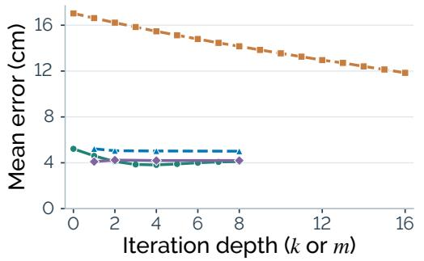

(b) Orientation error  
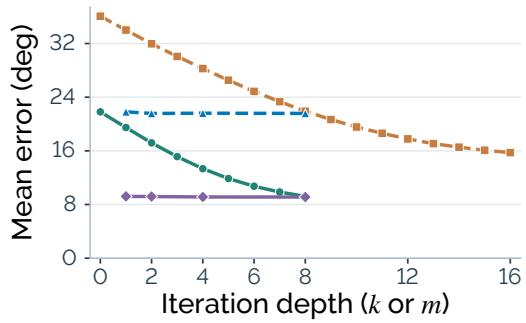  
Figure 7: Refinement depth on the expanded benchmark. Task-equal averages of raw stage outputs for $D ^ { k }$ , repeated $\bar { K } ^ { m } , K D ^ { k }$ , and $\overline { { K ^ { m } D ^ { 8 } } }$ on paired trajectories.

Learned execution response. After one K and eight D rounds, the MLP lowers position error from 4.25 to 4.10 cm and orientation error from $9 . 3 9 ^ { \circ }$ to 9.21◦ (Table 10).

Table 10: Response-model comparison on the expanded benchmark. Task-equal errors over 112 trajectories across 50 tasks after $\mathrm { \bar { \kappa } } D ^ { 8 }$ , without historical selection. Lower is better.
<table><tr><td>Response</td><td>Pos. (cm) Ori. (°)</td></tr><tr><td>Unit response</td><td>4.25 9.39</td></tr><tr><td>MLP response 4.10</td><td>9.21</td></tr></table>

## D ONLINE IK UNDER A WHOLE-BODY TRACKING CONTROLLER

This study examines whether online IK can correct endpoints while preserving coordinated wholebody execution under SONIC. We compare three ways of combining IK and SONIC joint commands on five trajectories per task, giving 60 runs across four tasks. This cohort is separate from Appendix C. The IK objective includes position and orientation, with orientation weight 0.01. Runs are neither accuracy-filtered nor retried for better outcomes.

## D.1 THREE COMMAND COMPOSITIONS

The variants change which joints receive IK commands and whether SONIC’s balance contribution is added. Table 11 defines the same three choices for hand and foot interaction. Variant A uses the

broader IK joint set without the balance contribution; B adds that contribution to A; C restricts IK to fewer joints and leaves the remaining joints under SONIC control. Balance and contact forces dynamically couple the base and limbs, including those with unchanged commands.

Table 11: Joint-command assignments for the three online-IK variants.
<table><tr><td></td><td>Variant Three hand tasks</td><td>Foot-operated Close Drawer</td></tr><tr><td>A</td><td>trols legs.</td><td>IK controls arms and waist; SONIC con- IK controls both legs; SONIC controls remaining joints.</td></tr><tr><td>B</td><td>tribution added.</td><td>Same as A, with SONIC&#x27;s balance con- Same as A, with SONIC&#x27;s balance con- tribution added.</td></tr><tr><td>C</td><td>and legs.</td><td>IK controls arms; SONIC controls waist IK controls the right operating leg; SONIC controls remaining joints.</td></tr></table>

## D.2 ACCURACY AND STABILITY

We evaluate endpoint accuracy and stability together because reaching the final replay frame does not establish stable execution. Table 12 averages tracking errors over frames, both endpoints, and episodes; tilt follows the episode-maximum definition in Appendix C.3. Runs that fail during initialization are counted separately because they do not reach the trajectory replay used to measure tracking error. Fall counts include repeated events within a run.

Table 12: Online-IK stability diagnostics on five episodes per task. Errors use measured endpoints, not IK solutions. Init. falls counts failed runs; Events counts logged falls, including startup. Dashes indicate no formal replay. Bold/underline rank values within each task from lowest to second lowest; they do not indicate that execution is stable.
<table><tr><td>Variant Task</td><td>Pos. (cm)</td><td>Ori. (°)</td><td>Tilt (°)</td><td></td><td>Init. falls Events</td></tr><tr><td rowspan="3">A</td><td rowspan="3">Close Laptop Open Fridge</td><td rowspan="3">4.45</td><td>10.43</td><td>16.97</td><td>0/5 0</td></tr><tr><td>2.33 15.34</td><td>18.97</td><td>0/5 0</td></tr><tr><td rowspan="2">1.58 10.17</td><td rowspan="2">7.03</td><td rowspan="2">0/5 0</td></tr><tr><td rowspan="4">Pull Curtain Close Drawer B</td></tr><tr><td>Close Laptop</td><td></td><td>8.28</td><td>5/5</td></tr><tr><td>Open Fridge</td><td>2.43 1.55</td><td>13.30 17.26</td><td>0/5 0</td></tr><tr><td>Pull Curtain</td><td>14.45 10.07</td><td>6.61</td><td>0/5 0 0</td></tr><tr><td>Close Drawer</td><td>1.50</td><td></td><td></td><td>0/5 5/5</td></tr><tr><td rowspan="4">C</td><td>Close Laptop</td><td>26.50</td><td>40.93</td><td>82.75</td><td>0/5 9</td></tr><tr><td>Open Fridge</td><td>10.61</td><td>20.55</td><td>34.35</td><td>0/5 1</td></tr><tr><td>Pull Curtain</td><td>9.00</td><td>18.66</td><td>10.87</td><td>0/5 0</td></tr><tr><td>Close Drawer</td><td>一</td><td>一</td><td></td><td>5/5</td></tr></table>

Observed behavior and scope. Video inspection identifies instability in all 60 runs. All 15 drawer runs fall during first-pose preparation, whereas the 45 hand-task runs reach their final frames without stable tracking. Variant C logs nine laptop fall events and one fridge fall event. Variant B achieves hand-task position errors of 1.50–2.43 cm but remains visibly unstable, showing why endpoint error alone is insufficient for accepting these trajectories. We therefore exclude the tested variants from policy training. This finding is limited to these SONIC implementations.

## D.3 QUALITATIVE FAILURE SEQUENCES

Figures 8–10 complement the aggregate diagnostics with one simulation sequence per implementation and task. Each sequence is chosen by peak base tilt across the five runs, including initialization. These sequences illustrate failure patterns, not their frequency.

(a) Close Laptop  
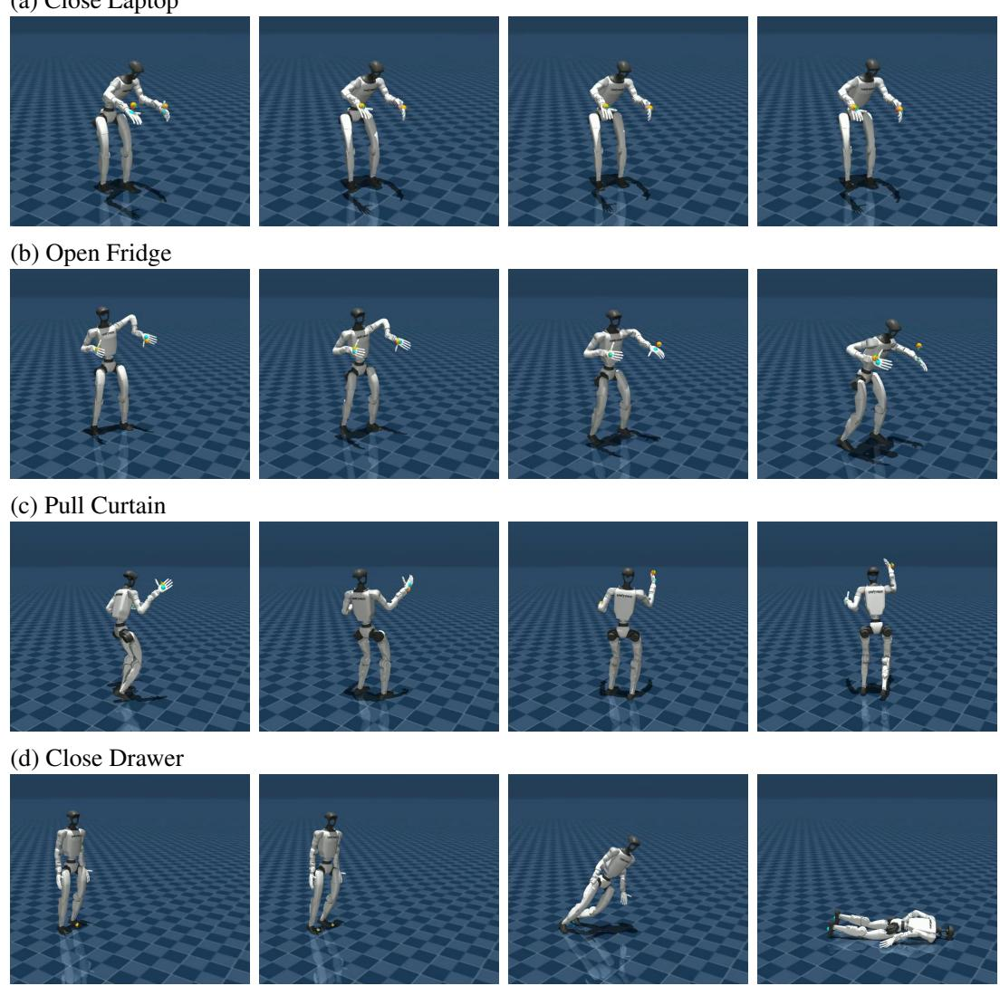  
Figure 8: Online-IK instability: variant A (IK without balance overlay). Each row follows one continuous segment from left to right, selected by peak base tilt as described in Appendix D.3. A fixed crop within each sequence preserves relative motion and keeps robot scale comparable across tasks. Close Drawer ends in an initialization fall. Task objects are omitted.

(a) Close Laptop  
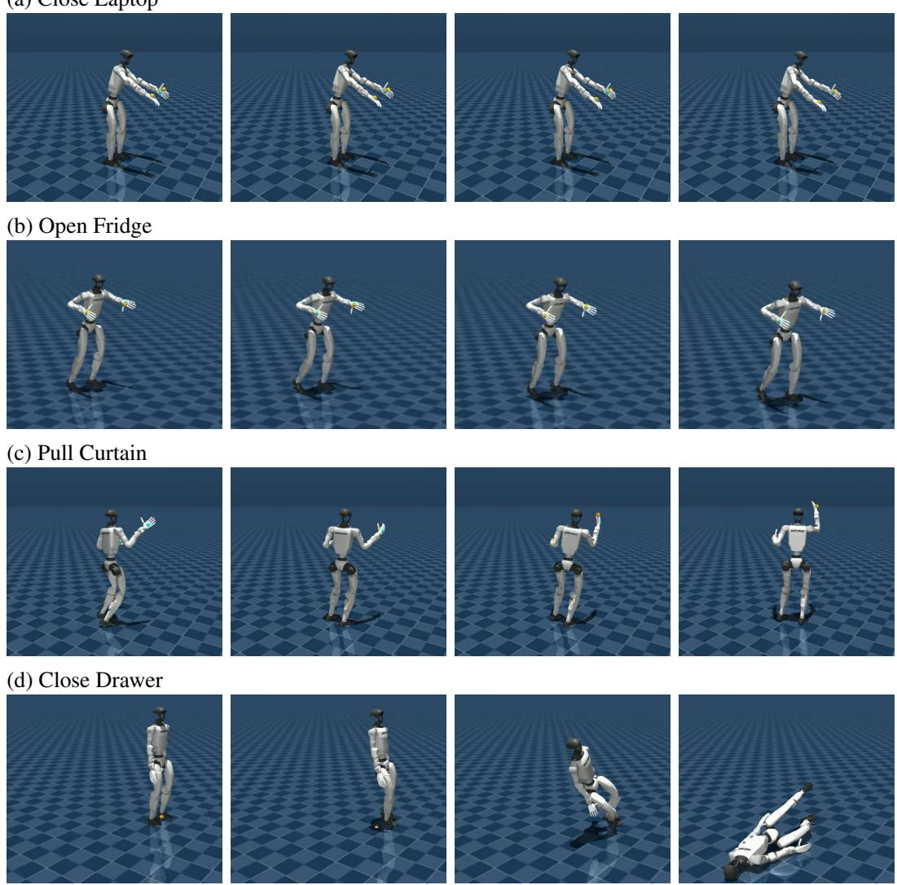  
Figure 9: Online-IK instability: variant B (IK with SONIC balance overlay). Each row follows one continuous segment from left to right, selected by peak base tilt as described in Appendix D.3. A fixed crop within each sequence preserves relative motion and keeps robot scale comparable across tasks. Close Drawer ends in an initialization fall. Task objects are omitted.

(a) Close Laptop  
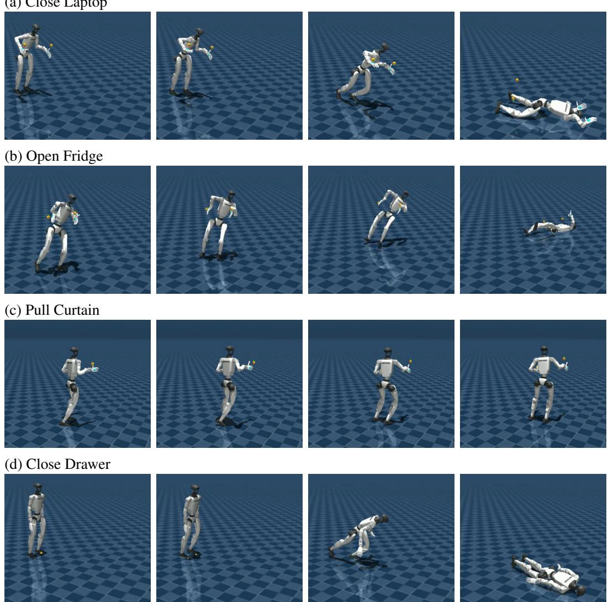  
Figure 10: Online-IK instability: variant C (restricted IK joint control). Each row follows one continuous segment from left to right, selected by peak base tilt as described in Appendix D.3. A fixed crop within each sequence preserves relative motion and keeps robot scale comparable across tasks. Close Drawer ends in an initialization fall. Task objects are omitted.