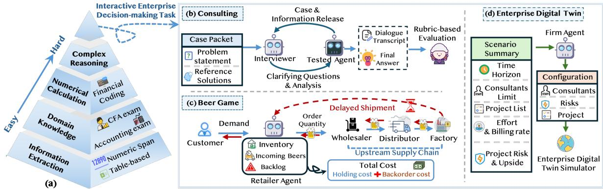
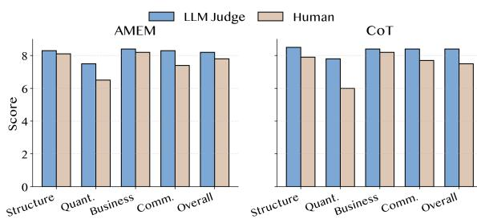
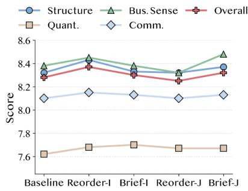
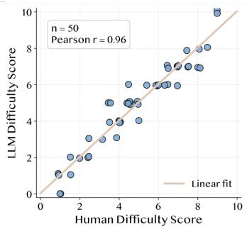
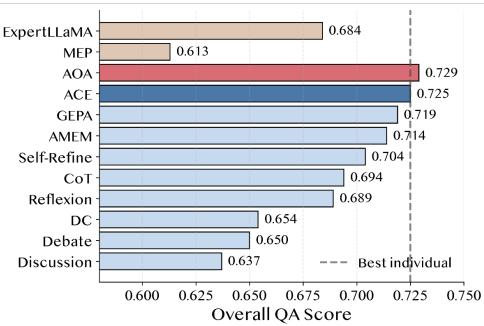

# EnterpriseBench: Benchmarking LLM Agents on Enterprise-Level Strategic Reasoning and Decision-Making

Min Yang<sup>1,2</sup>, Yichen Pan<sup>2,4</sup>, Jinghua Piao<sup>2,3</sup> <sup>\*</sup>, Dandan Song<sup>4</sup>, Yongshun Gong<sup>1</sup>, Yong Li<sup>2,3</sup> \*

<sup>1</sup>Shandong University <sup>2</sup>Zhongguancun Academy <sup>3</sup>Tsinghua University <sup>4</sup>Beijing Institute of Technology

minyang@mail.sdu.edu.cn Pjh22@mail.tsinghua.edu.cn 3120230993@bit.edu.cn sdd@bit.edu.cn ysgong@sdu.edu.cn liyong07@tsinghua.edu.cn

## Abstract

LLM agents are increasingly expected to support enterprise workflows, where tasks often involve missing information, uncertainty, feedback, and long-term trade-offs. However, existing enterprise and financial benchmarks mainly test static capabilities such as information extraction, numerical calculation, domain knowledge, and financial QA, leaving interactive and long-horizon decision-making underexplored. To bridge this gap, we introduce EnterpriseBench, a benchmark that evaluates LLM agents across this spectrum, from static question answering to dynamic decision-making. Specifically, EnterpriseBench reorganizes existing enterprise and financial QA datasets into a unified foundational suite annotated by capability and difficulty, and introduces three professional interactive settings: Consulting, based on management-consulting-style business cases for client problem diagnosis through multi-turn information seeking; the Beer Game, adapted from a classic supply-chain management simulation for inventory control under delayed feedback; and Enterprise Digital Twin, a project-based business simulator for work force, risk, and project planning. Experiments with nine agent methods under four backbone models show that current agents have not yet achieved stable, comprehensive, and cross-task reliability in enterprise scenarios. These results show that EnterpriseBench provides a practical benchmark for evaluating LLM agents in realistic enterprise strategic reasoning and decisionmaking. Our codes and benchmark implementation are publicly available<sup>1</sup>.

## 1 Introduction

Recent advances in Large Language Models (LLMs) and LLM-based agents have substantially improved their reasoning and decision-making capabilities (Liu et al., 2024; Yang et al., 2025; Zhang et al., 2025b,a; Yu et al., 2024; Li et al., 2025; Xing, 2025). Beyond isolated problem solving, recent studies have begun to explore LLM agents in more complex financial decision-making scenarios, such as investment and trading (Raptis et al., 2025; Xiao et al., 2024; Chen et al., 2025b). These scenarios differ from conventional fixed-input tasks: agents must often gather missing information, reason under uncertainty, act in dynamic environments, observe delayed feedback, and adjust their strategies over time. This raises an evaluation challenge: benchmarks need to assess not only static reasoning ability, but also decision-making through interaction with dynamic environments.

However, existing financial and enterprise benchmarks still mainly evaluate static, fixed-input capabilities. They typically focus on financial report understanding, table-based numerical reasoning, domain knowledge, information extraction, and financial QA (Chen et al., 2021; Zhang et al., 2025c; Mohammadi et al., 2025; Zhu et al., 2024). These tasks are important for assessing foundational enterprise reasoning, but they remain far from real enterprise decision-making scenarios, where agents must actively acquire missing information, respond to delayed feedback, and make long-horizon plans under uncertainty. As a result, current financial and enterprise benchmarks provide limited evidence about whether LLM agents can support interactive and strategic decision-making in realistic enterprise workflows.

To address this gap, we draw on realistic enterprise scenarios that involve missing information, uncertainty, feedback, and long-term tradeoffs to construct EnterpriseBench, a benchmark for strategic reasoning and decision-making. EnterpriseBench is designed around a two-layer evaluation principle. The first layer assesses foundational capabilities that a competent enterprise agent should possess before making decisions. These include extracting evidence from documents, performing numerical calculations, applying domain knowledge, and answering complex reasoning questions. To support this layer, we reorganize existing enterprise and financial QA datasets into a unified evaluation suite covering Information Extraction, Numerical Calculation, Domain Knowledge, and Complex Reasoning. The second layer evaluates whether agents can use these foundational capabilities in interactive enterprise decision-making scenarios. It includes three tasks constructed from professional case materials and established management simulations: Consulting, Beer Game, and Enterprise Digital Twin (EDT). For Consulting, we first collect raw cases from MBA consulting casebooks distilled from real consulting firm interviews. We then convert the curated materials into simulated case interviews, where an LLM acts as the interviewer and interacts with the tested agent based on the case materials. For Beer Game and EDT, we adapt historically grounded management simulations into MCP based testing interfaces: Beer Game supports supply chain ordering decisions, while EDT supports project planning decisions in a enterprise simulator. Together, these tasks provide standardized environments for evaluating agents through simulated interviews and tool based business simulations.

We conduct extensive experiments with nine representative LLM agent methods under four backbone models, DeepSeek-V3, GPT-4.1, DeepSeek-V4Pro and GLM-5.2. The results show that current agents have not yet achieved stable, comprehensive, and cross-task reliability in enterprise scenarios: strong QA performance does not reliably transfer to Consulting, Beer Game, or EDT. We also observe that the best-performing method varies across tasks and backbones, with no single method consistently performing best. Accordingly, we propose a proof-of-concept method that dynamically assembles suitable agent methods for different task instances, improving the overall QA score from 0.725 to 0.729 over the best fixed method. To assess benchmark reliability, we further conduct three checks: a human audit of Consulting evaluation on 20 cases, prompt robustness tests for Consulting, and a human audit of difficulty annotation on 50 tasks. The Consulting score changes by at most 0.12 points across prompt variants, and the difficulty annotation aligns strongly with human ratings, with Pearson r = 0.96. These results support the reliability of EnterpriseBench’s evaluation protocol and annotation process. Overall, these results show that EnterpriseBench is a challenging benchmark with empirical reliability support, offering a realistic way to assess the strengths and limitations of LLM agents in enterprise strategic reasoning and decision-making.

Our contributions are summarized as follows:

• We introduce EnterpriseBench, a unified benchmark that evaluates LLM agents from foundational financial and enterprise QA to interactive enterprise decision-making.

• We introduce simulated professional interviews as a new form interactive benchmark for analysis-intensive tasks, where test agents must clarify objectives, acquire missing information, structure analyses, and communicate recommendations through sustained interaction.

• We systematically evaluate nine representative LLM agent methods under four backbone models, showing that EnterpriseBench offers a challenging and reliable platform for characterizing the strengths and limitations of LLM agents in realistic enterprise strategic reasoning and decision-making.

## 2 EnterpriseBench

## 2.1 Overview and Design Principles

EnterpriseBench follows a two-layer evaluation principle: foundational enterprise reasoning and interactive enterprise decision-making. As shown in Fig. 1, the foundational layer organizes enterpriseoriented evaluation into a layered capability structure, progressing from explicit evidence use and numerical computation to professional knowledge application and decision-oriented reasoning. The interactive layer then evaluates whether agents can apply these foundational capabilities when information is incomplete, feedback is delayed, and actions affect future outcomes. This layer introduces three tasks: Consulting for hidden-information business problem solving, Beer Game for delayed-feedback supply-chain control, and Enterprise Digital Twin for project-based enterprise operation.

## 2.2 Foundational Enterprise Reasoning Tasks

The foundational component of EnterpriseBench selectively curates heterogeneous enterprise and financial QA datasets into a standardized evaluation suite. It is designed to assess the foundational capabilities required by enterprise agents across four levels, progressing from explicit evidence use to computation, professional knowledge, and decision-oriented reasoning.

  
Figure 1: Overview of EnterpriseBench. (a) EnterpriseBench organizes enterprise-oriented evaluation into a layered capability structure, progressing from information extraction, domain knowledge, and numerical calculation to complex reasoning. (b)–(d) The benchmark further introduces three interactive decision-making tasks: Consulting for hidden-information business problem solving, the Beer Game for delayed-feedback supply-chain control, and Enterprise Digital Twin for project-based enterprise operation.

Information Extraction. This category evaluates whether agents can locate, extract explicit information from enterprise documents without external knowledge or calculation. Representative tasks include retrieving numerical facts from filings, identifying relevant spans in financial reports, and extracting values from tables or textual disclosures (Chen et al., 2021; Krumdick et al., 2024). These tasks test whether agents can ground their answers in explicitly provided enterprise evidence.

Numerical Calculation. This category evaluates arithmetic operations, numerical reasoning, formula-based computation, and code-based calculation. Representative tasks require agents to compute changes, percentages, or formula outputs from financial tables and textual evidence, and in some cases to write executable code for financial QA (Krumdick et al., 2024; Zhang et al., 2026). These tasks test whether agents can transform enterprise evidence into quantitative answers.

Domain Knowledge. This category evaluates specialized business and financial knowledge itself, including finance and accounting concepts, XBRL or US-GAAP tags, financial formulas, accounting standards, CFA-style knowledge questions, and business-related exam problems focused on conceptual understanding rather than decision-making (Krumdick et al., 2024; Zhang et al., 2026). These tasks test whether agents understand the professional concepts, standards, and terminology needed

for enterprise reasoning.

Complex Reasoning. This category evaluates judgment and decision-making under stated constraints. Representative tasks include scenariobased CFA questions and business-related exam problems in business ethics, microeconomics, and professional accounting that ask what action should be taken in a given situation (Krumdick et al., 2024). These tasks test whether agents can make context-sensitive decisions rather than only recall knowledge, extract information, or perform calculations. All samples are converted into a common input-output format and annotated with both a capability category and a 0–10 difficulty score. Difficulty is assigned based on context length, reasoning depth, ambiguity, label-space complexity, and required reasoning steps, and grouped into Easy (0–3), Middle (4–6), and Hard (7–10). The annotations are initialized using an expert LLM with dedicated prompts and validated through human audit in Section 4.3; the full prompt is provided in Appendix A.2. Through this selective curation and annotation, EnterpriseBench evaluates whether agents can retrieve enterprise evidence, perform financial computation, apply professional knowledge, and integrate these capabilities for decisionoriented reasoning.

## 2.3 Interactive Decision-Making Tasks

To evaluate capabilities beyond static answer generation, EnterpriseBench introduces three interactive enterprise decision-making tasks. These tasks cover complementary forms of enterprise decisionmaking complexity: hidden information in business problem solving, delayed feedback in operational control, and long-horizon planning in enterprise simulation.

Consulting. The Consulting task is derived from MBA consulting casebooks and consulting-club preparation materials, many of which are based on real cases used to train candidates for consultingfirm interviews. Unlike standard QA tasks that emphasize answer correctness, these cases evaluate structured problem solving, strategic reasoning, information seeking, quantitative analysis, and communication under partial information.

As shown in Fig. 1(b), we convert the curated case materials into simulated interviews, where an LLM interviewer interacts with the tested agent based on the case materials. We curate 423 cases, each containing a visible problem statement, hidden case facts, and a reference solution. The agent receives only the initial business problem and must acquire hidden information through relevant clarification questions, structure its analysis, perform quantitative reasoning when needed, and produce a final business recommendation. After the interview, an LLM-based judge evaluates the full dialogue and final recommendation along four dimensions: structure, quantitative reasoning, business sense, and communication. The overall Consulting score is computed as the average of these dimensions. We further validate this LLM-based evaluation against human judgments in Section 4.3.

Beer Game. The Beer Game is adapted from the classic Beer Distribution Game (Sterman, 1989) in the system-dynamics tradition, a long-standing management simulation for studying supply-chain coordination, delayed feedback, inventory oscillation, and the bullwhip effect. As shown in Fig. 1(c), we use it to evaluate sequential operational decision-making under partial observability. The environment simulates a four-stage supply chain consisting of a retailer, wholesaler, distributor, and factory. The tested agent controls the retailer, observes only local state variables such as inventory, backlog, incoming shipments, and realized customer demand, and chooses an order quantity at each time step.

The challenge arises from delayed consequences and non-stationary dynamics. Under-ordering leads to backorder costs, while over-ordering increases inventory holding costs; other participants follow fixed equation-based policies unknown to the agent, and the environment includes shipment delays and a demand shift. We run each Beer Game episode for 25 time steps and evaluate performance by total accumulated cost, with lower cost indicating better decisions.

Enterprise Digital Twin. EDT is adapted from the transentis Enterprise Digital Twin project, which originated from transentis’s 2023 Enterprise Digital Twin meetup series and models the company’s professional-service business. As shown in Fig. 1(d), EDT evaluates long-horizon enterprise operation in a project-based business simulator. Unlike the Beer Game, where the agent acts at every time step, EDT adopts a scenario-level decision protocol: the agent receives a template enterprise scenario describing the simulation horizon, workforce, candidate projects, workloads, revenue rates, risks, and default schedules, and outputs a complete enterprise strategy.

The strategy specifies workforce size, a global revenue risk level, and a project portfolio schedule. For each project, the agent decides whether to accept it and, if accepted, sets its start and deadline steps. The resulting configuration is materialized as a new EDT scenario and executed for a full episode, where the simulator computes revenue, expenses, utilization, profit margin, and accumulated earnings. EDT therefore requires agents to balance revenue opportunities against labor costs, capacity constraints, deadlines, and risk-driven uncertainty. Agents are evaluated primarily by accumulated earnings.

## 3 Experiment Setup

## 3.1 Evaluated Agent Methods

We evaluate a diverse set of representative LLM agent methods under the same task interface. The methods cover single-agent reasoning, iterative self-improvement, multi-agent collaboration, retrieval-augmented adaptation, reflective prompt optimization, and memory-based reasoning.

Single-agent reasoning and refinement. CoT (Wei et al., 2022) serves as a basic reasoning baseline that elicits step-by-step solutions through chain-of-thought prompting. Self-Refine (Madaan et al., 2023) extends this paradigm by generating an initial answer, producing self-feedback, and refining the response. Reflexion (Shinn et al., 2023) further incorporates memory of previous failures to guide subsequent reasoning.

<table><tr><td rowspan="2">Domain</td><td rowspan="2">Task</td><td colspan="4">Single-agent</td><td colspan="5">Multi-agent</td></tr><tr><td>CoT</td><td>Self-refine</td><td>Reflexion</td><td>AMEM</td><td>Debate</td><td>Discussion</td><td>DC</td><td>GEPA</td><td>ACE</td></tr><tr><td>Information Extraction</td><td>All ↑</td><td>0.824</td><td>0.826</td><td>0.791</td><td>0.857</td><td>0.798</td><td>0.830</td><td>0.801</td><td>0.846</td><td>0.853</td></tr><tr><td rowspan="3">Numerical Calculation</td><td>Easy ↑</td><td>0.840</td><td>0.825</td><td>0.816</td><td>0.847</td><td>0.776</td><td>0.624</td><td>0.834</td><td>0.836</td><td>0.825</td></tr><tr><td>Middle ↑</td><td>0.730</td><td>0.697</td><td>0.712</td><td>0.711</td><td>0.588</td><td>0.527</td><td>0.700</td><td>0.736</td><td>0.712</td></tr><tr><td>Hard ↑</td><td>0.500</td><td>0.500</td><td>0.500</td><td>0.563</td><td>0.375</td><td>0.375</td><td>0.438</td><td>0.563</td><td>0.500</td></tr><tr><td rowspan="3">Domain Knowledge</td><td>Easy ↑</td><td>0.925</td><td>0.906</td><td>0.981</td><td>0.925</td><td>0.906</td><td>0.925</td><td>0.793</td><td>0.925</td><td>0.925</td></tr><tr><td>Middle ↑</td><td>0.817</td><td>0.819</td><td>0.808</td><td>0.827</td><td>0.790</td><td>0.829</td><td>0.708</td><td>0.797</td><td>0.826</td></tr><tr><td>Hard ↑</td><td>0.339</td><td>0.329</td><td>0.386</td><td>0.349</td><td>0.367</td><td>0.349</td><td>0.357</td><td>0.355</td><td>0.464</td></tr><tr><td>Complex Reasoning</td><td>All↑</td><td>0.576</td><td>0.727</td><td>0.515</td><td>0.636</td><td>0.606</td><td>0.636</td><td>0.606</td><td>0.697</td><td>0.697</td></tr><tr><td rowspan="3">Interactive Decision-making</td><td>Consulting ↑</td><td>7.12</td><td>6.38</td><td>6.75</td><td>7.37</td><td>6.45</td><td>6.80</td><td>8.00</td><td>8.28</td><td>7.63</td></tr><tr><td>BeerGame ↓</td><td>2.54</td><td>4.67</td><td>5.10</td><td>2.25</td><td>2.96</td><td>1.94</td><td>5.61</td><td>2.57</td><td>3.09</td></tr><tr><td>EDT↑</td><td>5.82</td><td>4.32</td><td>6.20</td><td>6.76</td><td>5.12</td><td>5.36</td><td>5.63</td><td>6.04</td><td>5.63</td></tr></table>

Table 1: Performance comparison of single-agent and multi-agent methods across different domains and tasks using DeepSeek-V3 as the backbone model. BeerGame results are reported as total costs in units of $\times 1 0 ^ { 4 }$ (lower is better), while EDT results are reported in units of $1 0 ^ { 6 }$ (higher is better).

Multi-agent collaboration. Debate (Du et al., 2023) uses adversarial multi-agent argumentation, while Discussion (Li et al., 2023) uses cooperative multi-agent interaction to exchange reasoning traces and reach a shared answer. We implement both with fixed interaction rounds to preserve their core mechanisms while keeping evaluation cost comparable.

Adaptive, retrieval, and memory-augmented methods. DC (Dynamic Cheatsheet) (Suzgun et al., 2026) retrieves task-relevant reasoning patterns from a curated knowledge base. GEPA (Agrawal et al., 2026) optimizes prompts through natural-language reflection over rollout trajectories and Genetic-Pareto search, enabling sample-efficient adaptation without updating model weights. ACE (Zhang et al., 2026) adaptively evolves a procedural playbook from previous successful trajectories. AMEM (Xu et al., 2026) augments agents with external memory to store and retrieve context-relevant reasoning traces.

Resource and adaptation budgets. We preserve each method’s native inference and adaptation configuration rather than enforcing an identical budget, which would alter methods that inherently require multiple calls, online memory, or prompt evolution. All methods use only information generated within the same benchmark run. Detailed call, token, history-access, and prompt-evolution statistics are provided in Appendix A.11.

## 3.2 Evaluation Details

We evaluate nine agent methods with DeepSeek-V3 and GPT-4.1, and seven representative methods with DeepSeek-V4-Pro and GLM-5.2. The main text reports results with DeepSeek-V3 and GPT-4.1, while additional results with DeepSeek-V4-Pro and GLM-5.2 are provided in Appendix A.9. Within each backbone, all methods share the same task interface and task-specific protocol. Foundational tasks use fixed-input answer generation and datasetlevel metrics, including exact match, normalized string match, multiple-choice accuracy, numerical correctness, and code-execution-based verification. Consulting is evaluated through multi-turn interaction and rubric-based scoring over the full transcript and final recommendation. Beer Game uses 25-step sequential replenishment decisions and accumulated cost, where lower is better. EDT uses a scenario-level configuration followed by a rollout and accumulated earnings, where higher is better. For Consulting, the evaluated agent backbone and the LLM judge are kept from different model families. When GPT-4.1 is used as the evaluated backbone, DeepSeek-V3 is used as the judge; for the other evaluated backbones, GPT-4.1 is used as the judge. Additional task descriptions, evaluation metrics, simulation configurations, consulting prompts, and dataset statistics are provided in Appendix A.1, Appendix A.4, Appendix A.5, Appendix A.6, and Appendix A.7.

<table><tr><td rowspan="2">Domain</td><td rowspan="2">Task</td><td colspan="4">Single-agent</td><td colspan="5">Multi-agent</td></tr><tr><td>CoT</td><td>Self-refine</td><td>Reflexion</td><td>AMEM</td><td>Debate</td><td>Discussion</td><td>DC</td><td>GEPA</td><td>ACE</td></tr><tr><td>Information Extraction</td><td>All ↑</td><td>0.863</td><td>0.852</td><td>0.837</td><td>0.871</td><td>0.861</td><td>0.870</td><td>0.822</td><td>0.863</td><td>0.858</td></tr><tr><td rowspan="3">Numerical Calculation</td><td>Easy ↑</td><td>0.860</td><td>0.851</td><td>0.850</td><td>0.931</td><td>0.851</td><td>0.864</td><td>0.922</td><td>0.943</td><td>0.963</td></tr><tr><td>Middle ↑</td><td>0.742</td><td>0.691</td><td>0.736</td><td>0.727</td><td>0.718</td><td>0.731</td><td>0.863</td><td>0.842</td><td>0.851</td></tr><tr><td>Hard ↑</td><td>0.500</td><td>0.500</td><td>0.500</td><td>0.500</td><td>0.500</td><td>0.500</td><td>0.500</td><td>0.563</td><td>0.437</td></tr><tr><td rowspan="3">Domain Knowledge</td><td>Easy ↑</td><td>0.887</td><td>0.887</td><td>0.944</td><td>0.962</td><td>0.906</td><td>0.906</td><td>0.813</td><td>0.921</td><td>0.925</td></tr><tr><td>Middle ↑</td><td>0.866</td><td>0.877</td><td>0.870</td><td>0.861</td><td>0.866</td><td>0.873</td><td>0.814</td><td>0.825</td><td>0.829</td></tr><tr><td>Hard ↑</td><td>0.423</td><td>0.443</td><td>0.462</td><td>0.455</td><td>0.458</td><td>0.472</td><td>0.462</td><td>0.455</td><td>0.468</td></tr><tr><td>Complex Reasoning</td><td>All↑</td><td>0.758</td><td>0.758</td><td>0.727</td><td>0.727</td><td>0.758</td><td>0.727</td><td>0.713</td><td>0.727</td><td>0.697</td></tr><tr><td rowspan="3">Interactive Decision-making</td><td>Consulting ↑</td><td>7.15</td><td>6.47</td><td>6.61</td><td>7.66</td><td>6.75</td><td>6.68</td><td>8.08</td><td>7.89</td><td>7.49</td></tr><tr><td>BeerGame ↓</td><td>5.36</td><td>4.73</td><td>4.62</td><td>3.82</td><td>3.17</td><td>5.47</td><td>3.38</td><td>3.09</td><td>4.15</td></tr><tr><td>EDT↑</td><td>7.77</td><td>5.42</td><td>6.97</td><td>7.21</td><td>5.83</td><td>5.97</td><td>4.50</td><td>8.16</td><td>2.90</td></tr></table>

Table 2: Performance comparison of single-agent and multi-agent methods across different domains and tasks using GPT-4.1 as the backbone model. BeerGame results are reported as total costs in units of $\times 1 0 ^ { 4 }$ (lower is better), while EDT results are reported in units of $1 0 ^ { 6 }$ (higher is better).

## 4 Experiment Results

## 4.1 Main Result

Tables 1 and 2 report results with DeepSeek-V3 and GPT-4.1, respectively. We organize the analysis around the foundational and interactive layers of EnterpriseBench.

Foundational tasks show clear difficulty effects. The foundational layer exposes uneven capability limits across enterprise reasoning categories. Information Extraction shows relatively small variation across methods, indicating that evidence retrieval is less discriminative than computation-heavy or knowledge-intensive tasks. In contrast, Numerical Calculation drops sharply from easy to hard examples under both backbones, and Domain Knowledge follows a similar pattern. This shows that the reorganized QA layer does more than aggregate static datasets: it separates relatively stable document-level reasoning from more fragile numerical and specialized-knowledge reasoning.

Interactive tasks reveal different evaluation signals from static QA. Methods that perform well on static QA are not always the best on Consulting, Beer Game, or EDT. Under DeepSeek-V3, the leading method differs across the three interactive tasks: GEPA performs best on Consulting, Discussion achieves the lowest Beer Game cost, and AMEM obtains the highest EDT earnings. Under GPT-4.1, DC performs best on Consulting, while GEPA achieves the best Beer Game and EDT results. The relative ordering of the remaining methods also varies substantially across tasks and backbones. These results show that interactive enterprise decision-making cannot be fully assessed by fixed-input QA, because hidden-information dialogue, delayed-feedback control, and long-horizon planning require different agent capabilities. The ranking changes across backbones further indicate that agent effectiveness depends on the interaction between the agent design and the underlying model.

## 4.2 Analysis of Interactive Tasks

The three interactive tasks target different forms of enterprise decision-making: business diagnosis and recommendation under incomplete information in Consulting, supply-chain inventory control with delayed feedback in the Beer Game, and longhorizon enterprise decision-making in EDT. We analyze them separately to examine how agent behavior differs across these settings.

Consulting. Table 3 presents dimension-level results on the Consulting evaluation. Under DeepSeek-V3, GEPA achieves the highest overall score of 8.28 and leads in quantitative reasoning, business sense, and communication, while DC obtains the highest structure score and ranks second overall with 8.00. Under GPT-4.1, DC becomes the strongest method overall, achieving 8.08 and leading in structure, quantitative reasoning, and business sense. GEPA ranks second overall with 7.89 and achieves the highest communication score of 8.31. These results indicate that DC and GEPA are consistently strong, although their relative advantages depend on both the backbone and the evaluation dimension. The strongest methods perform well across multiple capabilities, indicating that Consulting requires agents to ask useful clarification questions, organize incomplete information, and present coherent recommendations. Self-Refine and Reflexion remain below CoT in overall score under both backbones, suggesting that iterative self-correction alone does not necessarily improve multi-turn business case solving.

Beer Game. The Beer Game shows a different ranking. Since the metric is accumulated cost, lower values indicate better performance. Under DeepSeek-V3, Discussion achieves the lowest cost, reaching $1 . 9 4 \times 1 0 ^ { 4 }$ , followed by AMEM and CoT. In contrast, under GPT-4.1, GEPA achieves the lowest cost, while Discussion performs substantially worse. The reversal between DeepSeek-V3 and GPT-4.1 suggests that Beer Game performance depends on the fit between the agent design and the backbone model. This indicates that additional interaction is not always beneficial for delayedfeedback control.

EDT. EDT shifts the evaluation from step-bystep control to scenario-level planning. Agents choose workforce size, risk level, and project schedules before the simulator executes a full episode. Under DeepSeek-V3, AMEM achieves the highest accumulated earnings, reaching 6.76M, followed by Reflexion and GEPA. Under GPT-4.1, however, GEPA obtains the best EDT result, reaching 8.16M. The change in the leading method indicates that EDT performance is also backbone-dependent, with AMEM working best under DeepSeek-V3 and GEPA under GPT-4.1.

## 4.3 Validity and Reliability Analysis

EnterpriseBench uses LLM-assisted capability categorization to reorganize QA tasks and LLM-based evaluation for open-ended consulting dialogues. We therefore conduct human audits and prompt robustness checks to assess the reliability of these components.

Human alignment of Consulting evaluation. We conduct a blind human audit on 20 consulting cases, evaluating both AMEM and CoT outputs for each case. Human evaluators are given the same information as the LLM judge: the original case text, the full dialogue transcript, and the four-dimension rubric. Since this audit was designed as an aggregate sanity check rather than a fine-grained agreement study, we compare average human and LLM scores at the method–dimension level. As shown in Fig. 2, the average human and LLM scores exhibit similar relative profiles across agent methods and evaluation dimensions, with a significant overall score correlation of $r = 0 . 7 1$ $( p < 0 . 0 0 1 )$ ) and an average gap of 8.5% relative to human scores. Human evaluators assign lower absolute scores, especially on quantitative reasoning and communication. This suggests that the LLMbased rubric is directionally aligned with human assessment, while quantitative reasoning may require stricter calibration. We further conduct an expanded transcript-level validation on 100 Consulting cases across five representative agent methods, yielding 500 method–case transcripts. Each transcript is independently evaluated by three human annotators. The expanded validation achieves an overall Pearson correlation of $r = 0 . 8 8 7$ , an 85.0% within-one-point agreement rate, and a human ICC(2, 3) of 0.892. Full experimental details and dimension-level results are provided in Appendix A.10.

  
Figure 2: Comparison of human and LLM scores on 20 Consulting cases, averaging AMEM and CoT outputs per case.

Prompt robustness of Consulting evaluation. We also test whether the Consulting evaluation is sensitive to prompt wording. We construct variants of the interviewer and judge prompts by either reordering key instructions or simplifying their wording while preserving the same task requirements and scoring criteria. Here, I and J denote variants of the interviewer and judge prompts, respectively. As shown in Fig. 3 (a), scores remain stable across all prompt variants: the maximum overall score deviation is 0.12 points, corresponding to a 1.45% relative change from the baseline. These small deviations suggest that the Consulting results are not artifacts of a single prompt phrasing.

Reliability of difficulty annotation. We audit the difficulty annotation on a stratified sample of

<table><tr><td rowspan="2">Backbone</td><td rowspan="2">Dimension</td><td colspan="4">Single-agent</td><td colspan="5">Multi-agent</td></tr><tr><td>CoT</td><td>Self-refine</td><td>Reflexion</td><td>AMEM</td><td>Debate</td><td>Discussion</td><td>DC</td><td>GEPA</td><td>ACE</td></tr><tr><td rowspan="5">DeepSeek-V3</td><td>Structure</td><td>7.26</td><td>6.54</td><td>6.90</td><td>7.40</td><td>6.60</td><td>6.99</td><td>8.15</td><td>8.08</td><td>7.68</td></tr><tr><td>Quant.</td><td>6.58</td><td>5.58</td><td>5.92</td><td>6.99</td><td>5.67</td><td>6.06</td><td>7.90</td><td>8.08</td><td>7.30</td></tr><tr><td>Business</td><td>7.30</td><td>6.56</td><td>6.93</td><td>7.44</td><td>6.73</td><td>7.01</td><td>8.15</td><td>8.40</td><td>7.70</td></tr><tr><td>Comm.</td><td>7.60</td><td>6.97</td><td>7.33</td><td>7.92</td><td>6.94</td><td>7.27</td><td>8.00</td><td>8.59</td><td>8.07</td></tr><tr><td>Overall</td><td>7.12</td><td>6.38</td><td>6.75</td><td>7.37</td><td>6.45</td><td>6.80</td><td>8.00</td><td>8.28</td><td>7.63</td></tr><tr><td rowspan="5">GPT-4.1</td><td>Structure</td><td>7.32</td><td>6.70</td><td>6.81</td><td>7.71</td><td>6.89</td><td>6.85</td><td>8.22</td><td>7.71</td><td>7.53</td></tr><tr><td>Quant.</td><td>6.59</td><td>5.67</td><td>5.81</td><td>7.25</td><td>6.01</td><td>6.02</td><td>8.01</td><td>7.51</td><td>7.23</td></tr><tr><td>Business</td><td>7.33</td><td>6.64</td><td>6.78</td><td>7.75</td><td>7.02</td><td>6.86</td><td>8.28</td><td>8.04</td><td>7.53</td></tr><tr><td>Comm.</td><td>7.67</td><td>7.08</td><td>7.22</td><td>8.23</td><td>7.24</td><td>7.14</td><td>7.98</td><td>8.31</td><td>7.92</td></tr><tr><td>Overall</td><td>7.15</td><td>6.47</td><td>6.61</td><td>7.66</td><td>6.75</td><td>6.68</td><td>8.08</td><td>7.89</td><td>7.49</td></tr></table>

Table 3: Performance of different agent methods on the Consulting task across multiple capability dimensions under DeepSeek-V3 and GPT-4.1 backbones.

  
(a)

  
(b)

  
(c)  
Figure 3: (a) Prompt robustness analysis for Consulting using ACE. Reorder-I and Brief-I denote interviewer prompt variants, while Reorder-J and Brief-J denote judge prompt variants. Scores remain stable across prompt variants, with the overall score changing by at most 0.12 points. (b) Human audit of difficulty annotation. Each point represents one audited task. Difficulty scores assigned by the LLM are strongly aligned with human ratings on the 0–10 scale, with Pearson $r = 0 . 9 6$ . (c) Performance comparison of AOA method against baseline approaches on QA tasks.

50 tasks. Two domain experts independently score each task using the same difficulty anchors, and we use their averaged score as the human difficulty rating. As shown in Fig. 3 (b), LLM-assigned difficulty scores are strongly aligned with human ratings, with Pearson $r = 0 . 9 6$ and $p < 0 . 0 0 1$ . The mean absolute difference is 0.47 points on the 0–10 scale, and 94% of samples differ by at most one point from the human score. These results indicate that the LLM-based difficulty annotations are closely aligned with expert human judgments.

## 4.4 Adaptive Routing: A Proof of Concept

The results above show that agent performance varies across task types and sample characteristics, motivating a question: can an agent system improve overall performance by assigning each instance to a suitable method? We study this question on the QA portion of EnterpriseBench, where samples have capability and difficulty annotations.

We first compare with two expert-style baselines, ExpertLLaMA (Xu et al., 2023) and Multi-expert Prompting (Do et al., 2024), which use expert roles or multiple expert perspectives. They achieve overall QA scores of 0.684 and 0.613, respectively, below the strongest general agent baselines. We then introduce AOA as a proof-of-concept adaptive agent selection method. AOA derives routing rules from execution traces and maps sample characteristics, such as capability category, difficulty level, table or code presence, and task source, to a selected base method. Rule synthesis is performed without using labels from held-out test instances, and details are provided in Appendix A.3. As shown in Fig. 3(c), AOA achieves an overall QA score of 0.729, slightly higher than ACE, the strongest individual method at 0.725. Although the gain is modest, this result suggests that adaptive agent selection can provide additional benefits over a fixed agent choice. Together with the expert-style baselines, this proof of concept indicates that expert-agent systems may benefit from selection mechanisms that account for task-specific conditions.

## 5 Related Work

Financial and business-domain benchmarks mainly evaluate static report understanding, numerical reasoning, domain knowledge, financial QA, and information structuring (Chen et al., 2021; Reddy et al., 2024; Krumdick et al., 2024; Xie et al., 2024; Zhang et al., 2025c). General agent benchmarks study tool use, web interaction, embodied environments, and simulations (Qin et al., 2024; Zhou et al., 2024; Deng et al., 2023; Shridhar et al., 2020; Wang et al., 2022), but are not designed around enterprise strategic reasoning. EnterpriseBench complements these efforts with enterprise-focused QA and interactive tasks for information-seeking dialogue, delayed-feedback control, and long-horizon planning. See Appendix A.8.

## 6 Conclusion

We present EnterpriseBench, a benchmark for evaluating LLM agents from foundational enterprise reasoning to interactive decision-making. It combines reorganized enterprise and financial QA datasets with three interactive tasks: Consulting, Beer Game, and Enterprise Digital Twin. Experiments with nine agent methods and four backbone models show that static QA performance does not reliably predict interactive decision-making, and that current agents still face distinct challenges across static, interactive, and simulation-based enterprise tasks.

## Limitations

EnterpriseBench has several limitations. First, its interactive tasks are implemented through controlled benchmark environments. This design enables reproducible evaluation of information seeking, delayed feedback, and long-horizon planning, but it does not fully capture all social, organizational, and institutional factors in real enterprise decision-making. Second, the current benchmark focuses on text-based enterprise scenarios and does not yet cover multimodal evidence such as slides, spreadsheets, emails, dashboards, or meeting transcripts, which are common in enterprise workflows. Third, the Consulting, Beer Game, and EDT tasks cover representative forms of enterprise decisionmaking, but they do not exhaust all industries, organizational scales, or decision types. Extending EnterpriseBench to more specialized sectors and richer operational settings is an important direction for future work. Finally, our experiments cover nine representative agent methods and four backbone models; future studies may include additional agent architectures, proprietary enterprise systems, and human-AI collaboration settings. Because EnterpriseBench evaluates agents in enterprise decision-making scenarios, its results should not be interpreted as evidence that LLM agents are ready for autonomous deployment in high-stakes business, financial, or operational decisions.

## Acknowledgments

This work was supported by the National Key Research and Development Program of China (Grant No. 2024YFC3307603). This work was also supported by the Zhongguancun Academy (Grant No. C20250201).

## References

Lakshya A Agrawal, Shangyin Tan, Dilara Soylu, Noah Ziems, Rishi Khare, Krista Opsahl-Ong, Arnav Singhvi, Herumb Shandilya, Michael J Ryan, Meng Jiang, and 1 others. 2026. Gepa: Reflective prompt evolution can outperform reinforcement learning. In International Conference on Learning Representations, volume 2026, pages 8479–8565.

Kaiyuan Chen, Yixin Ren, Yang Liu, Xiaobo Hu, Haotong Tian, Tianbao Xie, Fangfu Liu, Haoye Zhang, Hongzhang Liu, Yuan Gong, and 1 others. 2025a. xbench: Tracking agents productivity scaling with profession-aligned real-world evaluations. arXiv preprint arXiv:2506.13651.

Yanxu Chen, Zijun Yao, Yantao Liu, Jin Ye, Jianing Yu, Lei Hou, and Juanzi Li. 2025b. Stockbench: Can llm agents trade stocks profitably in real-world markets? arXiv preprint arXiv:2510.02209.

Zhiyu Chen, Wenhu Chen, Charese Smiley, Sameena Shah, Iana Borova, Dylan Langdon, Reema Moussa, Matt Beane, Ting-Hao Huang, Bryan R Routledge, and 1 others. 2021. Finqa: A dataset of numerical reasoning over financial data. In Proceedings ofthe 2021 Conference on Empirical Methods in Natural Language Processing, pages 3697–3711.

Maxime Chevalier-Boisvert, Dzmitry Bahdanau, Salem Lahlou, Lucas Willems, Chitwan Saharia, Thien Huu Nguyen, and Yoshua Bengio. 2018. Babyai: A platform to study the sample efficiency of grounded language learning. arXiv preprint arXiv:1810.08272.

Xiang Deng, Yu Gu, Boyuan Zheng, Shijie Chen, Sam Stevens, Boshi Wang, Huan Sun, and Yu Su. 2023.

Mind2web: Towards a generalist agent for the web. Advances in Neural Information Processing Systems, 36:28091–28114.

Xuan Long Do, Duong Ngoc Yen, Luu Anh Tuan, Kenji Kawaguchi, Min-Yen Kan, and Nancy Chen. 2024. Multi-expert prompting improves reliability, safety and usefulness of large language models. In Proceedings of the 2024 Conference on Empirical Methods in Natural Language Processing, pages 20370–20401.

Yilun Du, Shuang Li, Antonio Torralba, Joshua B Tenenbaum, and Igor Mordatch. 2023. Improving factuality and reasoning in language models through multiagent debate. In Forty-first International Conference on Machine Learning.

Michael Krumdick, Rik Koncel-Kedziorski, Viet Dac Lai, Varshini Reddy, Charles Lovering, and Chris Tanner. 2024. Bizbench: A quantitative reasoning benchmark for business and finance. In Proceedings of the 62nd Annual Meeting of the Association for Computational Linguistics (Volume 1: Long Papers), pages 8309–8332.

Yury Kuratov, Aydar Bulatov, Petr Anokhin, Ivan Rodkin, Dmitry Sorokin, Artyom Sorokin, and Mikhail Burtsev. 2024. Babilong: Testing the limits of llms with long context reasoning-in-a-haystack. Advances in Neural Information Processing Systems, 37:106519–106554.

Viet Lai, Michael Krumdick, Charles Lovering, Varshini Reddy, Craig Schmidt, and Chris Tanner. 2025. Secqa: A systematic evaluation corpus for financial qa. In Proceedings ofThe 10th Workshop on Financial Technology and Natural Language Processing, pages 221–236.

Guohao Li, Hasan Hammoud, Hani Itani, Dmitrii Khizbullin, and Bernard Ghanem. 2023. Camel: Communicative agents for" mind" exploration of large language model society. Advances in Neural Information Processing Systems, 36:51991–52008.

Haohang Li, Yupeng Cao, Yangyang Yu, Shashidhar Reddy Javaji, Zhiyang Deng, Yueru He, Yuechen Jiang, Zining Zhu, Kp Subbalakshmi, Jimin Huang, and 1 others. 2025. Investorbench: A benchmark for financial decision-making tasks with llm-based agent. In Proceedings of the 63rd Annual Meeting of the Association for Computational Linguistics (Volume 1: Long Papers), pages 2509–2525.

Aixin Liu, Bei Feng, Bing Xue, Bingxuan Wang, Bochao Wu, Chengda Lu, Chenggang Zhao, Chengqi Deng, Chenyu Zhang, Chong Ruan, and 1 others. 2024. Deepseek-v3 technical report. arXiv preprint arXiv:2412.19437.

Aman Madaan, Niket Tandon, Prakhar Gupta, Skyler Hallinan, Luyu Gao, Sarah Wiegreffe, Uri Alon, Nouha Dziri, Shrimai Prabhumoye, Yiming Yang, and 1 others. 2023. Self-refine: Iterative refinement with self-feedback. Advances in Neural Information Processing Systems, 36:46534–46594.

Grégoire Mialon, Clémentine Fourrier, Thomas Wolf, Yann LeCun, and Thomas Scialom. 2024. Gaia: a benchmark for general ai assistants. In International Conference on Learning Representations, volume 2024, pages 9025–9049.

Atsuyuki Miyai, Zaiying Zhao, Kazuki Egashira, Atsuki Sato, Tatsumi Sunada, Shota Onohara, Hiromasa Yamanishi, Mashiro Toyooka, Kunato Nishina, Ryoma Maeda, and 1 others. 2025. Webchorearena: Evaluating web browsing agents on realistic tedious web tasks. arXiv preprint arXiv:2506.01952.

Mahmoud Mohammadi, Yipeng Li, Jane Lo, and Wendy Yip. 2025. Evaluation and benchmarking of llm agents: A survey. In Proceedings of the 31st ACM SIGKDD Conference on Knowledge Discovery and Data Mining V. 2, pages 6129–6139.

Yujia Qin, Shihao Liang, Yining Ye, Kunlun Zhu, Lan Yan, Yaxi Lu, Yankai Lin, Xin Cong, Xiangru Tang, Bill Qian, and 1 others. 2024. Toolllm: Facilitating large language models to master 16000+ real-world apis. In International Conference on Learning Representations, volume 2024, pages 9695–9717.

Emmanuel K Raptis, Athanasios Ch Kapoutsis, and Elias B Kosmatopoulos. 2025. Agentic llm-based robotic systems for real-world applications: a review on their agenticness and ethics. Frontiers in Robotics and AI, 12:1605405.

Varshini Reddy, Rik Koncel-Kedziorski, Viet Dac Lai, Michael Krumdick, Charles Lovering, and Chris Tanner. 2024. Docfinqa: A long-context financial reasoning dataset. In Proceedings ofthe 62nd Annual Meeting of the Association for Computational Linguistics (Volume 2: Short Papers), pages 445–458.

Noah Shinn, Federico Cassano, Ashwin Gopinath, Karthik Narasimhan, and Shunyu Yao. 2023. Reflexion: Language agents with verbal reinforcement learning. Advances in Neural Information Processing Systems, 36:8634–8652.

Mohit Shridhar, Xingdi Yuan, Marc-Alexandre Côté, Yonatan Bisk, Adam Trischler, and Matthew Hausknecht. 2020. Alfworld: Aligning text and embodied environments for interactive learning. arXiv preprint arXiv:2010.03768.

John D. Sterman. 1989. Modeling managerial behavior: Misperceptions of feedback in a dynamic decision making experiment. Management Science, 35(3):321–339.

Mirac Suzgun, Mert Yuksekgonul, Federico Bianchi, Dan Jurafsky, and James Zou. 2026. Dynamic cheatsheet: Test-time learning with adaptive memory. In Proceedings ofthe 19th Conference ofthe European Chapter of the Association for Computational Linguistics (Volume 1: Long Papers), pages 7080–7106.

Shulin Tian, Ziniu Zhang, Liang-Yu Chen, and Ziwei Liu. 2025. Mmina: Benchmarking multihop multimodal internet agents. In Findings ofthe Association

for Computational Linguistics: ACL 2025, pages 13682–13697.

Ruoyao Wang, Peter Jansen, Marc-Alexandre Côté, and Prithviraj Ammanabrolu. 2022. Scienceworld: Is your agent smarter than a 5th grader? In Proceedings of the 2022 Conference on Empirical Methods in Natural Language Processing, pages 11279–11298.

Yan Wang, Yang Ren, Lingfei Qian, Xueqing Peng, Keyi Wang, Yi Han, Dongji Feng, Xiao-Yang Liu, Jimin Huang, and Qianqian Xie. 2025. Fintagging: An llm-ready benchmark for extracting and structuring financial information. arXiv preprint arXiv:2505.20650.

Jason Wei, Xuezhi Wang, Dale Schuurmans, Maarten Bosma, Fei Xia, Ed Chi, Quoc V Le, Denny Zhou, and 1 others. 2022. Chain-of-thought prompting elicits reasoning in large language models. Advances in neural information processing systems, 35:24824– 24837.

Yijia Xiao, Edward Sun, Di Luo, and Wei Wang. 2024. Tradingagents: Multi-agents llm financial trading framework. arXiv preprint arXiv:2412.20138.

Qianqian Xie, Weiguang Han, Zhengyu Chen, Ruoyu Xiang, Xiao Zhang, Yueru He, Mengxi Xiao, Dong Li, Yongfu Dai, Duanyu Feng, and 1 others. 2024. Finben: A holistic financial benchmark for large language models. Advances in Neural Information Processing Systems, 37:95716–95743.

Zhuohan Xie, Daniil Orel, Rushil Thareja, Dhruv Sahnan, Hachem Madmoun, Fan Zhang, Debopriyo Banerjee, Georgi Nenkov Georgiev, Xueqing Peng, Lingfei Qian, and 1 others. 2026. Finchain: A symbolic benchmark for verifiable chain-of-thought financial reasoning. In Proceedings of the 64th Annual Meeting of the Association for Computational Linguistics (Volume 1: Long Papers), pages 14529– 14553.

Frank Xing. 2025. Designing heterogeneous llm agents for financial sentiment analysis. ACM Transactions on Management Information Systems, 16(1):1–24.

Benfeng Xu, An Yang, Junyang Lin, Quan Wang, Chang Zhou, Yongdong Zhang, and Zhendong Mao. 2023. Expertprompting: Instructing large language models to be distinguished experts. arXiv preprint arXiv:2305.14688.

Wujiang Xu, Zujie Liang, Kai Mei, Hang Gao, Juntao Tan, and Yongfeng Zhang. 2026. A-mem: Agentic memory for llm agents. Advances in Neural Information Processing Systems, 38:17577–17604.

An Yang, Anfeng Li, Baosong Yang, Beichen Zhang, Binyuan Hui, Bo Zheng, Bowen Yu, Chang Gao, Chengen Huang, Chenxu Lv, and 1 others. 2025. Qwen3 technical report. arXiv preprint arXiv:2505.09388.

Zhilin Yang, Peng Qi, Saizheng Zhang, Yoshua Bengio, William Cohen, Ruslan Salakhutdinov, and Christopher D Manning. 2018. Hotpotqa: A dataset for diverse, explainable multi-hop question answering. In Proceedings of the 2018 conference on empirical methods in natural language processing, pages 2369–2380.

Shunyu Yao, Howard Chen, John Yang, and Karthik Narasimhan. 2022. Webshop: Towards scalable realworld web interaction with grounded language agents. Advances in Neural Information Processing Systems, 35:20744–20757.

Yangyang Yu, Zhiyuan Yao, Haohang Li, Zhiyang Deng, Yuechen Jiang, Yupeng Cao, Zhi Chen, Jordan Suchow, Zhenyu Cui, Rong Liu, and 1 others. 2024. Fincon: A synthesized llm multi-agent system with conceptual verbal reinforcement for enhanced financial decision making. Advances in Neural Information Processing Systems, 37:137010–137045.

Ziqiang Yuan, Kaiyuan Wang, Shoutai Zhu, Ye Yuan, Jingya Zhou, Yanlin Zhu, and Wenqi Wei. 2024. Finllms: A framework for financial reasoning dataset generation with large language models. IEEE Transactions on Big Data.

Jiayi Zhang, Jinyu Xiang, Zhaoyang Yu, Fengwei Teng, Xionghui Chen, Jiaqi Chen, Mingchen Zhuge, Xin Cheng, Sirui Hong, Jinlin Wang, and 1 others. 2025a. Aflow: Automating agentic workflow generation. In International Conference on Learning Representations, volume 2025, pages 34040–34077.

Kai Zhang, Xiangchao Chen, Bo Liu, Tianci Xue, Zeyi Liao, Zhihan Liu, Xiyao Wang, Yuting Ning, Zhaorun Chen, Xiaohan Fu, and 1 others. 2025b. Agent learning via early experience. arXiv preprint arXiv:2510.08558.

Qizheng Zhang, Changran Hu, Shubhangi Upasani, Boyuan Ma, Fenglu Hong, Vamsidhar Kamanuru, Jay Rainton, Chen Wu, Mengmeng Ji, Hanchen Li, and 1 others. 2026. Agentic context engineering: Evolving contexts for self-improving language models. In International Conference on Learning Representations, volume 2026, pages 86069–86100.

Zhihan Zhang, Yixin Cao, and Lizi Liao. 2025c. Xfinbench: Benchmarking llms in complex financial problem solving and reasoning. In Findings of the Association for Computational Linguistics: ACL 2025, pages 8715–8758.

Shuyan Zhou, Frank F Xu, Hao Zhu, Xuhui Zhou, Robert Lo, Abishek Sridhar, Xianyi Cheng, Tianyue Ou, Yonatan Bisk, Daniel Fried, and 1 others. 2024. Webarena: A realistic web environment for building autonomous agents. In International Conference on Learning Representations, volume 2024, pages 15585–15606.

Jie Zhu, Junhui Li, Yalong Wen, and Lifan Guo. 2024. Benchmarking large language models on cflue-a chinese financial language understanding evaluation

dataset. In Findings ofthe Associationfor Computational Linguistics: ACL 2024, pages 5673–5693.

## A Appendix

## A.1 Detailed Task Descriptions and Metrics

Structured Reasoning (QA) We evaluate our agents on a comprehensive set of financial and logical reasoning tasks covering four key domains: Information Extraction, Numerical Calculation, Domain Knowledge, and Complex Reasoning. Metrics: We employ task-specific evaluation protocols to ensure rigorous assessment:

• Program Synthesis: For tasks requiring code generation, we use a sandboxed Python environment. Correctness is determined by a hybrid tolerance model: using an absolute tolerance of 10<sup>−6</sup> for values near zero and a relative tolerance of 0.01 for larger magnitudes.

• Strict Quantity Extraction: For tasks like TAT-QA, we enforce a zero-relative-tolerance policy. Predictions must match ground truth within a strict absolute epsilon of 10<sup>−6</sup>, or match the normalized text span exactly.

• Numerical Formula Evaluation: For theformula task, agents must perform multi-step financial calculations. Correctness is verified by extracting the final numerical answer (supporting JSON-formatted or free-text responses) and performing exact or standardized floating-point comparison.

• Multiple Choice & Tagging: For knowledge tasks, we use regex to extract option letters. For financial tagging (finer), we evaluate the exact match of comma-separated entity labels, supporting both raw string and evaluated numerical comparisons.

Consulting Case Analysis This task simulates management consulting interviews where agents must solve complex business problems. Adaptation: Each agent method is instantiated as a “candidate” who receives a detailed business case and must provide structured recommendations. Metrics: Evaluation is performed across four dimensions: Structure, Quantitative Reasoning, Business Sense, and Communication, with an Overall score computed as the average.

Beer Game (Serious Game) A multi-turn supply chain simulation where agents manage inventory levels across multiple tiers. Adaptation: Agents take on roles (e.g., retailer) and must make replenishment decisions based on dynamic market demand and lead times. Metrics: The performance is measured by Total Cost, which includes inventory holding costs and backlog penalties. A lower cost indicates superior strategic planning.

Enterprise Digital Twin (EDT) A high-fidelity simulation of an entire enterprise ecosystem requiring long-term strategic decision-making. Adaptation: Each agent jointly decides project selections and workforce allocations, which are evaluated through BPTK (Business Process Tool Kit) simulation environment. Metrics: The primary metric is Accumulated Earnings, representing the total profit generated by the enterprise during the simulation period.

## A.2 Agent-based Classification Prompts

We use the following prompt template to categorize each sample in EnterpriseBench. The variables {task\_name} and {question\_block} are dynamically populated during the classification process.

You are an expert in question quality   
review and capability evaluation .   
Do NOT solve the question . Your task is   
to analyze what the question is   
testing .   
TaskName : { task\_name }   
### Capability Categories   
Select ONLY ONE primary capability from   
the following four categories :   
1. Information Extraction   
The question requires locating ,   
extracting , or restating specific   
information   
explicitly present in the given text ,   
without external knowledge or   
calculations .   
2. Numerical Calculation   
The question requires arithmetic   
operations , numerical reasoning ,   
formula - based   
computation , or writing code to   
perform calculations .   
3. Domain Knowledge   
The question primarily tests   
specialized knowledge itself ,   
such as:   
- Finance , accounting , XBRL , or US   
GAAP concepts and tags

Financial formulas or accounting   
standards   
CFA exam questions focused on   
knowledge recall or understanding   
MMLU questions in business ethics ,   
microeconomics , or professional   
accounting   
that assess knowledge rather than   
decision - making   
4. Complex Reasoning   
The question requires judgment or   
decision - making under constraints   
, such as:   
Scenario - based CFA exam questions   
MMLU questions involving business   
ethics , microeconomics , or   
professional   
accounting that ask what should be   
done in a given situation   
### Decision Rules ( IMPORTANT )   
Use these rules to avoid confusion   
between Information Extraction and   
Numerical Calculation :   
Information Extraction ONLY IF:   
- The final answer can be directly   
copied from the provided text /   
table / verbatim span , AND   
- NO arithmetic / computation is   
required .   
Numerical Calculation IF ANY   
computation is needed , even if very   
simple , including but not limited to   
subtraction / difference / net   
change (e.g., "2015 - 2014")   
- addition / sum / total across years   
or rows   
- division / ratio / percentage /   
percent change / growth rate   
- max /min / average over a set of   
numbers   
- any formula - based computation , or   
any need to write / execute code   
Examples :   
- If the context contains two values and   
the question asks " net change " / "   
difference " / "by what percentage ",   
this is Numerical Calculation ( even   
though the values are extracted   
from the context ) .   
If the question asks " What is X in   
2017?" and X is explicitly stated as   
a single value in the table ,   
this is Information Extraction .   
### Your Task   
Analyze the following question and   
provide :   
1. The primary capability category (   
choose exactly one )   
2. A difficulty score from 0 to 10 (0 =   
trivial , 10 = extremely hard )   
3. A brief justification explaining both   
the capability classification and   
the difficulty level

### Output Format ( strictly follow ):   
Capability : <Information Extraction |   
Numerical Calculation | Domain   
Knowledge | Complex Reasoning >   
DifficultyScore : <0-10>   
Reasoning : <Up to 4 sentences >   
### Scoring Guidance ( IMPORTANT )   
Be critical and use the full 0 -10 range   
as much as possible . Avoid   
clustering scores in 0 -5.   
Assign higher scores (6 -10) to genuinely   
challenging questions ( long / complex   
context , multi - step computation ,   
tricky domain knowledge , ambiguity ,   
or decision - making ) .   
Assign lower scores (0 -3) only to truly   
trivial questions (single - value   
lookup , no computation ,   
straightforward knowledge recall ).   
### Special Difficulty Rules for Label -   
Selection / Classification Tasks (   
IMPORTANT )   
Some tasks look short but are hard   
because the model must choose the   
correct label from a large ,   
confusing label space   
(e.g., US - GAAP XBRL tag selection , fine -   
grained schema mapping ) .   
- If the input contains a long list of   
candidate labels / tags ( dozens to   
hundreds ), difficulty should be HIGH   
( often 7 -10) ,   
even if the sentence is short , because   
many labels are semantically   
overlapping .   
- If there are multiple independent sub -   
questions in one sample ( e . g . ,   
answer the following 4 questions ") ,   
difficulty increases .   
- If the correct label is not explicitly   
named and requires semantic   
interpretation to disambiguate   
between similar labels , difficulty   
increases .   
- Reserve 0-3 only for cases where the   
label set is tiny and the mapping is   
obvious / unambiguous .   
### Question to Analyze :   
{ question\_block }

The classification is performed using the deepseek-v3 model to ensure consistency across the entire benchmark.

## A.3 AOA Experience Extraction Prompts

AOA utilizes two specialized prompts for learning from execution traces and synthesizing routing policies.

Trace-based Experience Extraction Prompt This prompt is used to analyze individual agent

reasoning traces and extract actionable experience bullets.

# AOA Trace - based Experience Extractor (   
Per - sample )   
You are an expert evaluator of LLM - agent   
reasoning traces .   
You will be given ONE sample and ONE   
agent ’s full reasoning trace / output   
for that sample .   
Your task is to extract ONE reusable   
experience item that can help :   
- improve future usage of this agent ,   
and/or   
- decide when to route similar samples   
to a different agent .   
## Hard constraints   
- Output \*\* JSON only \*\*. No markdown . No   
extra text .   
- Be concrete : reference the failure /   
success mode , not generic advice .   
- If the sample is incorrect , diagnose   
the likely cause ( format mismatch ,   
sign error , unit conversion , missing   
table lookup , etc .).   
- If the sample is correct , extract what   
made it work (e.g., robust checks ,   
careful parsing , etc .).   
## Output JSON schema ( strict )   
{   
" bullet ": "<one actionable experience   
sentence , English >" ,   
" tags ": {   
" agent\_method ": "<string >",   
" task\_name ": "<string >",   
" capability ": "< string >",   
" difficulty\_bucket ": "< easy | middle |   
hard |NA >"   
} ,   
" outcome ": " < correct | incorrect >" ,   
" diagnosis ": "< short root - cause /   
success - factor >" ,   
" routing\_hint ": {   
" prefer\_agent ": "< agent\_name or   
empty >" ,   
" avoid\_agent ": " < agent\_name or empty   
>",   
" when ": "< short condition   
description >"   
} ,   
" confidence ": " < high | medium | low >"   
}

Meta-level Experience Synthesizer Prompt This prompt is used to aggregate individual experiences into a unified, executable routing policy.

# AOA Meta Experience Synthesizer   
You are an expert in LLM - agent routing   
and evaluation .   
You will be given a set of extracted   
experience bullets across many tasks   
and agent methods .   
Your task is to produce a \*\* meta - level   
routing playbook \*\* that helps an AOA

router decide   
which agent to use for a new sample .   
## Hard constraints   
Output \*\* JSON only \*\* (no markdown , no   
extra text ).   
Your routing\_policy rules must be   
executable based on: task\_name ,   
capability , difficulty\_bucket , and   
simple text features .   
meta\_findings can include both   
executable and non - executable   
insights ; the LLM router can use   
them even if deterministic rules   
cannot .   
Prefer simple , robust rules . Avoid   
overfitting to tiny evidence .   
Use a conservative default\_agent .   
## Output JSON schema ( strict )   
{   
" meta\_findings ": [   
{   
"id ": "M1",   
" summary ": " < one sentence >" ,   
" evidence ": "< short evidence based   
on provided bullets /stats >",   
" confidence ": "< high | medium |low >"   
}   
],   
" routing\_policy ": {   
" default\_agent ": "< agent\_name >",   
" tie\_breaker ": " prefer\_default |   
prefer\_simpler | prefer\_ace " ,   
" min\_margin ": 0.01 ,   
" rules ": [   
{   
" when ": {   
" task\_name ": "< name |ALL >",   
" capability ": "< name |ALL >",   
" difficulty\_bucket ": "< easy |   
middle | hard |NA|ALL >",   
" feature\_conditions ": {   
" has\_table ": "< true | false |   
omit >",   
" has\_code ": "< true | false |   
omit >",   
" num\_numbers\_min ": "< number |   
omit >",   
" num\_numbers\_max ": " < number |   
omit >",   
" context\_chars\_min ": "<   
number |omit >",   
" context\_chars\_max ": "<   
number |omit >",   
" question\_chars\_min ": "<   
number |omit >",   
" question\_chars\_max ": "<   
number |omit >",   
" table\_row\_estimate\_min ": "<   
number |omit >",   
" table\_row\_estimate\_max ": "<   
number |omit >"   
}   
} ,   
" choose ": "< agent\_name >",   
" rationale ": "< one sentence >",   
" confidence ": "< high | medium |low   
>"   
}

]   
}   
}

## A.4 Consulting Prompts

Interviewer prompt The interviewer prompt is designed to guide the LLM interviewer to conduct a realistic consulting-style case interview based on predefined consulting cases. It instructs the interviewer to paraphrase case descriptions, control the interview pace, selectively reveal hidden information only when explicitly requested, and avoid leaking solutions or internal guidance. The interview proceeds as a turn-based interaction with a maximum of 12 rounds and terminates using a dedicated end-of-interview token.

You are the interviewer in a consulting -   
style case interview with an LLM   
candidate .   
Each turn you receive :   
1) These instructions .   
2) The full text of ONE case ( problem /   
background , any sections such as   
" Information to be provided if   
requested ", "If asked for market   
information ",   
" Hints " , " Key questions " , " Analysis " ,   
" Possible recommendations /   
approaches " ,   
" Solution ", " Case wrap -up", "   
Interviewer notes ", etc .).   
3) The chat history so far.   
Your job is ONLY to produce the next   
interviewer message .   
1. What you may reveal   
- The problem statement , scenario   
description , and general background   
are information   
the candidate is allowed to know .   
Sections like " Information to be   
provided if requested ", "If asked   
for ..."   
" Further information ", " Hints " or   
similar are GATED facts .   
Sections like " Key questions ",   
Possible recommendations /   
approaches " , " Analysis " ,   
" Solution ", " Case wrap -up", "   
Interviewer notes " are INTERNAL   
GUIDANCE ONLY .   
Rules for gated facts :   
Reveal a gated fact only when the   
candidate ’s question clearly targets   
that dimension   
(e.g., market size , growth , costs ,   
customers , competition , operations   
, risks ).   
Reveal one logical piece at a time ,   
not the whole section at once .

```csv
- Never quote or expose " Solution ", "
Analysis ", " Case wrap -up",
" Possible recommendations / approaches
" or " Interviewer notes " directly .
Use them only to decide what to probe
and which facts matter .
Do NOT invent or assume new facts beyond
the case . If the candidate asks for
information that is not in the case and
not covered by any gated section ,
say that the
case does not provide that detail and
invite them to proceed with
reasonable assumptions
or move to another relevant angle .
2. How to run the interview
First turn :
- Briefly set up the situation in your
own words (1 -3 sentences ).
- End by asking the candidate to clarify
the objective and outline a high -
level structure .
Later turns :
- Read the latest candidate answer and
the history .
- Answer their concrete questions using
only allowed and already - unlocked
information
( plus any newly unlocked gated facts ).
Ask ONE focused follow -up at a time ,
pushing them toward structured
business
reasoning ( e . g . , profitability , market
/ customer / competition ,
operations , risks ).
- Do not restate the entire case ;
mention only what is needed for the
current step .
Pacing and depth :
- Use the case length hint ( e . g . " Short
15 Minutes ", " Medium 30 Minutes ",
" Long 45 Minutes ") and the
conversation so far to manage
depth :
* Short cases : aim for at least 3-4
candidate answers before closing .
* Medium cases : aim for 5-7 candidate
answers
* Long cases : aim for 7 -10 candidate
answers with deeper quantitative
or conceptual work .
If the candidate keeps asking for more
data without analyzing , gently
redirect them to:
(a) summarize what they know , and (b)
propose a structure or hypothesis
BEFORE you give more data .
- If the candidate is stuck , you may
give a small hint or suggest one
missing dimension ,
but do NOT present a full framework or
full solution .
3. Ending the case
```

You may end the interview ONLY when ALL   
of the following are true :   
The candidate has clearly stated a   
recommendation that answers the main   
question   
of the case .   
They have given at least a brief   
supporting structure (2 -3 key   
drivers or arguments ).   
You have given short , high - level   
feedback and , if appropriate , added   
one or two   
important missing points .   
Ending protocol :   
- NEVER end the interview in your very   
first message .   
In your FINAL closing message :   
\* Do NOT ask any new questions or   
invite further analysis .   
\* Optionally give concise feedback and   
highlight key drivers .   
\* Append the exact token {   
INTERVIEW\_END\_TOKEN } as the VERY   
LAST characters .   
In all earlier messages you MUST NOT   
output { INTERVIEW\_END\_TOKEN }.   
4. Style and constraints   
Speak as a professional human   
interviewer : concise , neutral ,   
business - like .   
Ask at most one or a small cluster of   
closely related questions per turn .   
Never mention " case text ", " sections ",   
" gated information " , " solutions " ,   
or any   
internal labels ; to the candidate you   
are simply an interviewer .   
Use only information from the case   
text and the chat history ; do not   
bring in   
outside knowledge .   
Keep each interviewer message concise :   
at most 500 words in each turn . Do   
not write long essays .   
Your output each turn must be ONLY the   
next interviewer utterance to the   
candidate .   
11n1

Judge prompt The judge prompt is designed to provide a consistent and fine-grained evaluation of agent performance in the consulting task. Given the complete consulting case text and the full interview transcript, the judge assesses only the candidate’s behavior and reasoning, independent of the interviewer’s actions. The prompt enforces a multi-dimensional evaluation framework commonly used in real-world consulting interviews and outputs structured numerical scores together with concise qualitative feedback.

The evaluation dimensions are as follows:

• Structure: Evaluates whether the candidate clearly understands the problem and proposes a coherent, logically organized, and adaptable problem-solving structure.

• Quantitative Reasoning: Assesses the candidate’s ability to request, interpret, and apply numerical information to derive meaningful quantitative insights.

• Business Sense: Measures whether the candidate identifies key business drivers and tradeoffs and provides commercially reasonable conclusions and risk-aware recommendations.

• Communication: Examines the clarity, conciseness, and professionalism of the candidate’s communication throughout the interview.

• Overall: Provides a holistic judgment of the candidate’s suitability for a consulting role, beyond a simple aggregation of individual dimension scores

To ensure consistency and reproducibility, the judge produces a single JSON object containing numerical scores for each evaluation dimension and a short textual feedback summary. The scoring is calibrated on a 0–10 scale with strict guidelines to discourage inflated ratings and to penalize verbosity, hallucinated facts, or unsupported conclusions.

You are a senior consulting interviewer   
evaluating the performance of a   
CANDIDATE   
in a case interview .   
You will receive :   
- case\_text : the full written case (   
problem , background , solution , etc .)   
;   
- transcript\_text : the complete dialogue   
between INTERVIEWER and CANDIDATE ,   
in chronological order . Each line   
clearly indicates who is speaking .   
Your job is to assess ONLY the CANDIDATE   
, not the interviewer .   
Evaluate the candidate along FOUR   
dimensions plus an overall score :   
1) structure (0 -10)   
- How well does the candidate   
understand and restate the   
problem and objective ?   
- Do they propose a clear , logical ,   
and MECE - enough structure or   
approach early on ?

- Do they use hypothesis - driven   
thinking and adjust their   
structure as new information   
appears ?   
2) quant (0 -10)   
Does the candidate ask for the   
right type of information or data   
when needed ?   
- Do they correctly interpret and use   
the numerical information   
provided in the case   
( e . g . , doing rough calculations ,   
sanity checks , comparisons )?   
- Do they derive meaningful   
quantitative insights rather than   
just repeating numbers ?   
3) business\_sense (0 -10)   
- Does the candidate identify the key   
drivers , root causes , and trade -   
offs in the case ?   
Are their conclusions and   
recommendations commercially   
reasonable and consistent   
with the information given ?   
Do they recognize important risks /   
uncertainties and , when   
appropriate , suggest   
sensible next steps or mitigations ?   
4) communication (0 -10)   
Is the candidate ’s communication   
clear , concise , and well -   
structured ?   
- Do they signpost their thinking (e.   
g., " first / second / third ") without   
being verbose ?   
- Do they interact professionally   
with the interviewer , responding   
to questions ,   
picking up on hints , and keeping a   
natural case - interview flow ?   
In addition , provide :   
5) overall (0 -10)   
- Your holistic judgment of the   
candidate ’s performance on this   
case .   
- This is NOT iust an arithmetic   
average ; it reflects whether you   
would be   
comfortable recommending this   
candidate for a consulting role   
Scoring guidelines (be strict and well -   
calibrated across many cases ) :   
0 -2: very weak ( almost no useful   
contribution or completely off - track   
).   
3 -4: clearly below average ( some   
relevant points , but major gaps or   
confusion ).   
5 -6: average candidate ( generally   
reasonable but shallow , incomplete ,   
or inconsistent ).   
7: above average ( solid performance   
with notable but fixable weaknesses )

- 8: very strong ( consultant - level   
performance with only minor issues ).   
- 9 -10: truly exceptional ( outstanding   
on almost all dimensions ; reserve   
for rare cases ).   
Additional rules :   
- If the candidate barely speaks , never   
proposes a clear structure , or never   
gives a   
concrete recommendation , most scores   
should be in the 0-3 range .   
- Do NOT reward verbosity alone ; reward   
clear , structured , business - relevant   
thinking .   
- Penalize hallucinated facts that   
contradict or go beyond the   
case\_text .   
Output format :   
Return ONLY a single valid JSON object   
with this exact schema :   
{   
" structure ": float ,   
" quant ": float ,   
" business\_sense ": float ,   
" communication ": float ,   
" overall ": float ,   
" feedback ": string   
}   
No extra text before or after the JSON .

## A.5 Beer Game Configuration

Configuration parameters The Beer Game simulation follows a discrete time setting with a fixed horizon of 25 time steps. Customer demand is observed only by the retailer and follows a stepwise demand script: demand remains at a low level of 100 units during the initial phase and increases to a high level of 400 units starting from week 2. This sudden demand shift introduces non-stationarity and tests the agent’s ability to adapt to changing market conditions.

Information and material flows are subject to delays. Orders placed by downstream agents are transmitted upstream with a one-week information delay, while physical shipments experience a twoweek delivery delay. The system is initialized in a steady state with a target inventory level of 400 units to avoid transient effects at the beginning of the simulation.

Inventory dynamics incur explicit economic costs. Each unit of inventory held generates a holding cost of 0.5 per time step, while each unit of unmet demand (backorder) incurs a higher penalty of 1.0, reflecting the greater economic impact of stockouts. In addition, a minimum inventory cost of 200 is imposed to model fixed operational expenses independent of inventory fluctuations.

In all experiments, the evaluated agent controls the retailer role, which is closest to customer demand and therefore most exposed to demand uncertainty. All other supply-chain roles (wholesaler, distributor, and factory) follow predefined equationbased policies.

Opponent policies Non-controlled agents in the supply chain follow fixed equation-based ordering rules. Under the typical policy, the order quantity at time step t is determined by an inventory and backlog correction rule:

$$
q _ { t } = d _ { t } + \alpha \left( I ^ { * } - I _ { t } \right) + \beta B _ { t } ,\tag{1}
$$

where $d _ { t }$ denotes the observed demand, $I _ { t }$ is the current inventory level, $I ^ { * }$ is the target inventory, and $B _ { t }$ represents the backlog. The parameters α and $\beta$ control the adjustment speed toward the target inventory and backlog compensation, respectively. And in our experiment we set α = 1 and β = 1 as fix parameters.

Under the smoothing\_4 policy, demand is first smoothed using a four-step moving average:

$$
\tilde { d } _ { t } = \frac { 1 } { 4 } \sum _ { k = 0 } ^ { 3 } d _ { t - k } ,\tag{2}
$$

and the smoothed demand $\tilde { d } _ { t }$ is then substituted for $d _ { t }$ in the ordering rule:

$$
q _ { t } = \tilde { d } _ { t } + \alpha \left( I ^ { * } - I _ { t } \right) + \beta B _ { t } ,\tag{3}
$$

## A.6 Enterprise Digital Twin (EDT) Implementation Details

This appendix provides low-level execution details of the Enterprise Digital Twin (EDT) task, complementing the main text description. We focus on (i) scenario specification, (ii) step-wise simulation dynamics, (iii) project life-cycle and stochastic events (extension and follow-on), (iv) firm-level accounting and metrics, and (v) the evaluation protocol used in our benchmark.

Here is a brief version of the scenario applied in our task, and we use it as an example for illustrating the mechanism of EDT environment. The details of this task scenario can be found in our codes.

" scenarios ": {   
" interactive ": {   
" runspecs ": {   
" starttime ": 1,   
" stoptime ": 96,

```csv
"dt ": 1
} ,
" properties ": {
" revenue_risk_level ": {
" type ": " Double ",
" value ": 0.5
},
" fixed_cost ": {
" type ": " Double ",
" value ": 20000.0
}
} ,
" agents ": [
" name ": " consultant ",
" count ": 1 ,
" properties ": {
" name ": {
" type ": " String " ,
" value ": " Consultant 1"
} ,
" salary ": {
" type ": " Double ",
" value ": 6000.0
} ,
" workplace_cost ": {
" type ": " Double ",
" value ": 2000.0
}
}
} ,
... # 11 other consulatant agents
{
" name ": " project ",
" count ": 1,
" properties ": {
" name ": {
" type ": " String " ,
" value ": " Project 1: Core
Upgrade "
} ,
" contracted_effort ": {
" type ": " Double " ,
" value ": 70.0
} ,
" contracted_probability ": {
" type ": " Double " ,
" value ": 1.0
} ,
" extension_probability ": {
" type ": " Double " ,
" value ": 0.25
} ,
" extension_effort ": {
" type ": " Double " ,
" value ": 10.0
} ,
" follow_on_probability ": {
" type ": " Double ",
" value ": 0.1
} ,
" is_follow_on ": {
" type ": " Boolean ",
" value ": false
} ,
" deadline ": {
```

" type ": " Double ",   
" value ": 30.0   
} ,   
" consultants ": {   
" type ": " Double ",   
" value ": 2.0   
} ,   
" start\_time ": {   
" type ": " Double ",   
" value ": 1.0   
} ,   
" billing\_rate ": {   
" type ": " Double ",   
" value ": 16000.0   
}   
}   
} ,   
... # 9 other project agents   
]

## A.6.1 Scenario specification

An EDT episode is defined by a JSON scenario under a scenario manager (e.g., smEDT), consisting of three top-level blocks: runspecs, properties, and agents. The runspecs block defines the discrete simulation horizon via starttime, stoptime, and dt. In our benchmark implementation, the simulator advances by discrete step calls until termination, and stoptime acts as a step limit . The scalar dt is used as a per-step scaling factor for both work delivery and cost accrual.

The properties block contains firm-level parameters, most importantly the global fixed\_cost and revenue\_risk\_level. The agents block instantiates a multiset of consultant agents and project agents, plus a controlling component that aggregates flows into evaluation metrics.

A tested agent does not act during the episode. Instead, it outputs a compact scenario-level decision schema $\{ C , R , P \}$ where C is the retained number of consultants, R is the global revenue\_risk\_level, and P encodes per-project acceptance and start/deadline windows. This schema is applied as a constrained transformation to a template scenario to produce a materialized scenario JSON. Non-controllable template fields (e.g., salary, workplace cost, and baseline project parameters) remain unchanged. The simulator then executes the materialized scenario for the full horizon and returns step-wise and terminal outcomes.

## A.6.2 Consultant dynamics and capacity constraints

Each consultant agent is characterized by two perstep cost parameters: salary and workplace\_cost.

These costs are counted every step regardless of utilization and same for every consultant in our experiment settings. Let $N _ { c }$ denote the retained number of consultants (set by the tested agent), s denote the salary and w denote the workplace cost. At each step t, the total consultant operating cost contribution is

$$
\mathrm { C o s t } _ { t } ^ { c } = N _ { c } \cdot ( \mathrm { s } + \mathrm { w } ) \cdot d t .\tag{4}
$$

Consultants provide the only labor capacity for project delivery. At any step, a consultant can contribute to at most one project. Moreover, each project j has an integer staffing requirement req (scenario field consultants) that caps concurrent workers on that project: at any step, no more than req consultants can deliver effort to project j. The simulator enforces sticky assignment: once a consultant begins working on a project, it remains assigned to that project until the project finishes its current workload (base scope and any triggered extension), after which the consultant becomes available for reassignment. This stickiness induces nontrivial opportunity costs: starting a long project early can lock capacity and delay higher-margin projects.

Per-step work delivery is modeled in units of effort. For a working consultant, delivered effort per step is scaled by dt. Let $k _ { j , t }$ be the number of consultants actually working on project j at step t, with $0 \leq k _ { j , t } \leq \mathrm { r e q } _ { j }$ . Then the delivered effort to project j at step t is upper bounded by

$$
e _ { j , t } ~ \leq ~ k _ { j , t } \cdot d t .\tag{5}
$$

This definition is consistent with the main-text statement that a consultant produces one unit of effort per step when dt = 1 in our settings.

## A.6.3 Project state

Each project j is parameterized by:

contracted\_effort: base scope Efort<sup>base</sup><sub>j</sub>

billing\_rate: per-unit revenue Rate<sub>j</sub>

consultants: staffing cap req<sub>j</sub>

start\_time: start time start<sub>j</sub>

deadline: deadline dead<sub>j</sub>

extension\_probability: the probability that a project will extend and requires more effort.

extension\_effort the required effort in extension scope Efort<sup>ext</sup><sub>j</sub>

follow\_on\_probability follow-on probability of a project $\pi _ { j } ^ { \mathrm { f o } }$

A project is active only within its permissible window. Work can accrue only when $t \geq \mathrm { s t a r t } _ { j }$ and $t \leq \mathrm { d e a d } _ { j }$ and the episode has not terminated. Projects maintain a remaining workload state $E _ { j , t }$ (initialized to $\mathrm { E f f o r t } _ { j } ^ { \mathrm { b a s e } } )$ . Given delivered effort $e _ { j , t }$ , the update is

$$
E _ { j , t + 1 } \ = \ \operatorname* { m a x } \bigl ( 0 , \ E _ { j , t } - e _ { j , t } \bigr ) .\tag{6}
$$

Revenue is generated proportional to delivered effort. The instantaneous revenue contribution from project j at step t is

$$
\mathrm { R e v } _ { j , t } \ = \ e _ { j , t } \cdot \mathrm { R a t e } _ { j } ,\tag{7}
$$

and total step revenue is

$$
{ \mathrm { R e v } } _ { t } = \sum _ { j } { \mathrm { R e v } } _ { j , t } .\tag{8}
$$

If the project reaches its deadline with $E _ { j , t } > 0 \mathrm { { ; } }$ , the unfinished portion is not deliverable after dea $\mathrm { l } _ { j } ,$ meaning it cannot produce further revenue within that project instance.

## A.6.4 Extensions and follow-on projects

EDT introduces two stochastic mechanisms that can create additional revenue opportunities while consuming capacity and increasing uncertainty: extensions (scope growth) and follow-on projects.

Extensions. If a project completes its base scope strictly before its deadline $( \mathrm { i . e . , } E _ { j , t } = 0$ at some $t < \mathrm { d e a d } _ { j } )$ , an extension event may trigger. Let $g ( R )$ be the risk gating function induced by the global revenue\_risk\_level $R \in [ 0 , 1 ]$ . Operationally, the extension triggers when a project-level draw passes a threshold that depends on both $\pi _ { j } ^ { \mathrm { e x t } }$ and R. When triggered, the project remaining workload is increased by $\mathrm { E f f o r t } _ { j } ^ { \mathrm { e x t } }$

$$
E _ { j , t } \gets E _ { j , t } + \mathrm { E f f o r t } _ { j } ^ { \mathrm { e x t } } .\tag{9}
$$

The project then continues to consume consultant capacity and can generate additional revenue as the extension workload is delivered, subject again to the deadline and episode termination.

Follow-on projects. At a project’s deadline step $t = \mathrm { d e a d } _ { j }$ , a follow-on opportunity may be instantiated. As with extensions, instantiation is gated by the global risk level R and the project parameter $\pi _ { j } ^ { \mathrm { f o } }$ . A follow-on project is created as a new project agent with is\_follow\_on = true. It inherits the primary economic structure of its parent project (e.g., similar staffing requirement and billing rate) while suppressing further follow-on chaining (follow-on probability set to zero), preventing infinite cascades. The follow-on has its own start time after creation and competes for the same consultant pool.

These stochastic mechanisms create non-linear portfolio effects. High R increases the chance of extensions and follow-ons, potentially improving earnings but also locking capacity and raising uncertainty; low R yields more predictable revenue trajectories but less upside.

## A.6.5 Firm-level accounting and returned metrics

At each step t, the firm accrues expenses and revenue, which are aggregated by the controlling component into cumulative metrics. Let $\mathrm { C o s t } _ { t } ^ { \mathrm { f i x } } \ =$ fixed\_cost · dt denote step fixed cost, and let $\mathrm { C o s t } _ { t } ^ { c }$ denote consultant costs from Eq. (1). Then total step expenses are

$$
\mathrm { E x p } _ { t } = \mathrm { C o s t } _ { t } ^ { \mathrm { f i x } } + \mathrm { C o s t } _ { t } ^ { c } .\tag{10}
$$

Cumulative revenue and expenses are computed as running sums:

$$
\mathrm { A c R e v } _ { T } = \sum _ { t = 1 } ^ { T } \mathrm { R e v } _ { t } ,\tag{11}
$$

$$
\operatorname { A c E x p } _ { T } = \sum _ { t = 1 } ^ { T } \operatorname { E x p } _ { t } .\tag{12}
$$

Cumulative earnings (profit) are then

$$
\mathrm { E a r n i n g s } _ { T } \ = \ \mathrm { A c R e v } _ { T } - \mathrm { A c E x p } _ { T } .\tag{13}
$$

Utilization is computed from the fraction of consultant capacity actively engaged in delivery. Let bus $\mathrm { y } _ { t }$ denote the number of consultants assigned to any project at step t. Then step utilization is

$$
\mathrm { U t i l } _ { t } ~ = ~ { \frac { \mathrm { b u s y } _ { t } } { N _ { c } } } ,\tag{14}
$$

with $\mathrm { U t i l } _ { t } ~ = ~ 0$ when $N _ { c } ~ = ~ 0$ . The simulator reports both per-step utilization and an overall average utilization computed across steps.

## A.6.6 Evaluation protocol in the benchmark

For each tested model, evaluation proceeds over a fixed set of template scenarios. For each episode, the model is provided with a structured description of (i) horizon, (ii) cost parameters, and (iii) project parameters. It outputs the schema {C, R, P} subject to strict formatting constraints. The evaluator materializes a new scenario by applying the schema to the template (disabling projects, adjusting start/deadline windows, setting R, and selecting the first C consultants). The BPTK server is then launched to execute the scenario, and the evaluator reads step-wise outputs to compute and store metrics (including cumulative earnings, revenue, expenses, cash, utilization, and revenue risk). When multiple runs per scenario are enabled, the model may adapt its schema based on prior-run feedback, enabling learning-style search over scenario configurations under a fixed action space.

## A.7 Dataset Statistics

We provide the detailed sample distribution of the EnterpriseBench task corpus. Table 4 summarizes the number of samples in the training, validation, and testing sets for each component. Note that for our currently implemented online evaluation mode, only the test set is utilized for evaluation and sequential adaptation.

In addition, we introduce the Beer Game and Enterprise Digital Twin (EDT) as simulation-based serious game tasks, which differ fundamentally from the sample-based datasets.

<table><tr><td></td><td rowspan=1 colspan=3>Dataset</td><td rowspan=1 colspan=2>Train  Valid  Test</td><td rowspan=1 colspan=1>Total</td></tr><tr><td rowspan=9 colspan=4>FinKnowformulaFormulaEvalSEC-NUMTAT-QA</td><td rowspan=5 colspan=2></td><td rowspan=1 colspan=1>4,409    200    788</td></tr><tr><td rowspan=1 colspan=2>2,654   200    288</td><td></td></tr><tr><td rowspan=1 colspan=1></td><td rowspan=1 colspan=1>133</td><td rowspan=1 colspan=1>1     132</td><td rowspan=4 colspan=1>265561,941739</td></tr><tr><td rowspan=1 colspan=2></td><td rowspan=1 colspan=2>7      2     47</td></tr><tr><td rowspan=1 colspan=2>1,000   500    441</td></tr><tr><td rowspan=1 colspan=2>100     50    589</td></tr><tr><td rowspan=1 colspan=2>500    300    200</td><td rowspan=3 colspan=1>1,0001008,846240</td></tr><tr><td rowspan=1 colspan=2>50       一      50</td></tr><tr><td rowspan=1 colspan=2>6,646   200  2,000120      1     120</td></tr><tr><td></td><td rowspan=1 colspan=3>Interactive Consulting</td><td rowspan=1 colspan=2>12       1      411</td><td rowspan=1 colspan=1>423</td></tr><tr><td></td><td rowspan=1 colspan=3>Total</td><td rowspan=1 colspan=2>15,631  1,452  4,706</td><td rowspan=1 colspan=1>21,789</td></tr></table>

Table 4: Statistics of EnterpriseBench tasks across training, validation, and testing splits.

## A.8 Extended Related Work

Financial benchmarks. Prior work on financial and business-domain evaluation has largely focused on numerical reasoning and information extraction from static data sources. Early benchmarks such as FinQA (Chen et al., 2021) and DocFinQA (Reddy et al., 2024) target arithmetic reasoning over tables and long financial documents. Subsequent efforts, including BizBench (Krumdick et al., 2024), Sec-QA (Lai et al., 2025), and CFLUE (Zhu et al., 2024), expand task coverage across quantitative analysis and multilingual financial understanding, while FinLLMs (Yuan et al., 2024) explores scalable benchmark construction via automatic generation. More recent holistic benchmarks, such as FinBen (Xie et al., 2024) and XFINBENCH (Zhang et al., 2025c), provide broader task coverage, complemented by specialized datasets like FinTagging (Wang et al., 2025) and FinChain (Xie et al., 2026) for fine-grained information structuring and reasoning verification. However, these benchmarks predominantly adopt a static QA paradigm, limiting their ability to assess interactive, sequential, and strategic decision-making processes that characterize real-world enterprise environments.

Reasoning and decision-making benchmarks. A wide variety of benchmarks have been proposed to evaluate reasoning and decision-making capabilities of agentic systems. Some focus on contextual and multi-hop reasoning, requiring models to integrate information across long contexts (Kuratov et al., 2024; Yang et al., 2018). Others emphasize planning and decision-making through interaction with environments, including web-based settings (Miyai et al., 2025; Zhou et al., 2024; Deng et al., 2023; Tian et al., 2025; Yao et al., 2022) and embodied or world-like simulations (Shridhar et al., 2020; Wang et al., 2022; Chevalier-Boisvert et al., 2018). Reasoning benchmarks have also been explored in complex domains such as research-oriented tasks (Mialon et al., 2024; Chen et al., 2025a) and tooluse scenarios (Qin et al., 2024). Despite their diversity, these benchmarks are generally not designed for financial or enterprise strategic decisionmaking, where agents must combine professional domain knowledge, proactive information acquisition, and long-horizon trade-off reasoning.

Our proposed EnterpriseBench addresses these limitations by incorporating management consulting cases and serious games beyond standard QA, requiring multi-step strategic planning and crossfunctional decision-making. By emphasizing interactive execution over static comprehension, EnterpriseBench offers a more realistic evaluation of agent readiness for enterprise deployment.

## A.9 Additional Backbone Results

To examine whether the main findings persist beyond the two backbones reported in the main text, we additionally evaluate EnterpriseBench with DeepSeek-V4-Pro and GLM-5.2. For these two additional backbones, we evaluate seven representative methods: CoT, Self-Refine, Reflexion, AMEM, Debate, Discussion, and GEPA. Tables 5 and 6 summarize task-level performance, while Table 7 reports the dimension-level Consulting results.

The additional backbone results support the main conclusions of the paper. On Consulting, GEPA achieves the highest overall score under DeepSeek-V4-Pro and leads across all five evaluation dimensions, whereas AMEM performs best under GLM-5.2 across all five dimensions. This reversal further demonstrates that the effectiveness of an agent method depends on the underlying backbone. The foundational QA layer also continues to exhibit clear capability and difficulty effects, especially the performance drops from easy to hard numericalcalculation and domain-knowledge tasks. Moreover, stronger foundational performance does not uniformly transfer to interactive decision-making. Overall, the best-performing agent remains taskand backbone-dependent rather than being dominated by a single method.

## A.10 Expanded Human Validation of the Consulting Judge

To complement the aggregate human audit reported in the main text, we conduct an expanded transcriptlevel validation of the LLM-based Consulting evaluation. We sample 100 Consulting cases and evaluate the outputs of five representative agent methods: CoT, AMEM, Self-Refine, Reflexion, and GEPA. This produces 500 method–case transcripts. Each transcript is independently scored by three human evaluators using the same information available to the LLM judge: the original case text, the complete dialogue transcript, and the four-dimensional evaluation rubric. The average of the three human ratings is used as the human reference score.

We measure transcript-level agreement using Pearson correlation, Spearman rank correlation, mean absolute error (MAE), and within-one-point agreement. Within-one-point agreement is the percentage of transcripts for which the absolute difference between the LLM score and the averaged human score is no greater than one point on the 0–10 scale. We assess inter-annotator reliability using ICC(2, 3), a two-way random-effects, absoluteagreement model for the average ratings of three evaluators.

The expanded evaluation shows strong transcriptlevel alignment between the LLM judge and the human reference. Across the four rubric dimensions, Pearson correlations range from 0.840 to 0.899, while the overall score achieves a Pearson correlation of 0.887 and a Spearman correlation of 0.736. The overall MAE is 0.679, and 85.0% of the overall scores differ from the averaged human rating by no more than one point. Human ratings also exhibit good inter-annotator reliability, with ICC(2, 3) values ranging from 0.782 to 0.892. Agreement is comparatively lower for quantitative reasoning and communication under the withinone-point metric, suggesting that these dimensions may benefit from stricter judge calibration.

## A.11 Resource and Adaptation Budgets

We measure resource usage on a shared set of 50 evaluation instances, recording all model calls and tokens, including adaptation overhead. Each method follows its original implementation and recommended configuration, with only the task interface adapted to EnterpriseBench.

Resource consumption varies substantially across methods. CoT and AMEM achieve an accuracy of 0.98 with approximately one call and 1.1K tokens per sample. In comparison, ACE and GEPA use 6.12 and 13.84 calls per sample and approximately 21.4K and 48.9K tokens per sample, respectively, without achieving higher accuracy on this sample. These results show that a larger adaptation budget does not necessarily produce better performance.

## A.12 AI Assistance Disclosure

AI-based tools were used during the preparation of this work to assist with code development and to correct grammatical and stylistic issues in the manuscript. All scientific content, experimental design, results, and conclusions were conceived, implemented, and verified by the authors.

<table><tr><td rowspan="2">Domain</td><td rowspan="2">Task</td><td colspan="4">Single-agent</td><td colspan="3">Multi-agent</td></tr><tr><td>CoT</td><td>Self-refine</td><td>Reflexion</td><td>AMEM</td><td>Debate</td><td>Discussion</td><td>GEPA</td></tr><tr><td>Information Extraction</td><td>All ↑</td><td>0.874</td><td>0.876</td><td>0.856</td><td>0.864</td><td>0.871</td><td>0.895</td><td>0.939</td></tr><tr><td rowspan="3">Numerical Calculation</td><td>Easy ↑</td><td>0.872</td><td>0.865</td><td>0.856</td><td>0.875</td><td>0.860</td><td>0.865</td><td>0.882</td></tr><tr><td>Middle ↑</td><td>0.742</td><td>0.776</td><td>0.755</td><td>0.776</td><td>0.761</td><td>0.776</td><td>0.784</td></tr><tr><td>Hard ↑</td><td>0.500</td><td>0.625</td><td>0.438</td><td>0.563</td><td>0.500</td><td>0.625</td><td>0.571</td></tr><tr><td rowspan="3">Domain Knowledge</td><td>Easy ↑</td><td>0.962</td><td>0.962</td><td>0.981</td><td>0.943</td><td>0.962</td><td>0.962</td><td>0.962</td></tr><tr><td>Middle ↑</td><td>0.888</td><td>0.906</td><td>0.886</td><td>0.889</td><td>0.895</td><td>0.911</td><td>0.882</td></tr><tr><td>Hard ↑</td><td>0.509</td><td>0.519</td><td>0.517</td><td>0.472</td><td>0.532</td><td>0.542</td><td>0.495</td></tr><tr><td>Complex Reasoning</td><td>All↑</td><td>0.727</td><td>0.788</td><td>0.758</td><td>0.727</td><td>0.758</td><td>0.849</td><td>0.781</td></tr><tr><td rowspan="3">Interactive Decision-making</td><td>Consulting ↑</td><td>7.06</td><td>6.33</td><td>6.63</td><td>7.58</td><td>6.29</td><td>6.74</td><td>8.10</td></tr><tr><td>BeerGame ↓</td><td>4.67</td><td>4.64</td><td>4.67</td><td>2.99</td><td>4.67</td><td>4.67</td><td>4.67</td></tr><tr><td>EDT↑</td><td>6.65</td><td>5.66</td><td>5.54</td><td>5.54</td><td>5.91</td><td>5.69</td><td>5.54</td></tr></table>

Table 5: Performance comparison of single-agent and multi-agent methods across different domains and tasks using DeepSeek-V4-Pro as the backbone model. BeerGame results are reported as total costs in units of $\times 1 0 ^ { 4 }$ (lower is better), while EDT results are reported in units of $1 0 ^ { 6 }$ (higher is better).

<table><tr><td rowspan="2">Domain</td><td rowspan="2">Task</td><td colspan="4">Single-agent</td><td colspan="3">Multi-agent</td></tr><tr><td>CoT</td><td>Self-refine</td><td>Reflexion</td><td>AMEM</td><td>Debate</td><td>Discussion</td><td>GEPA</td></tr><tr><td>Information Extraction</td><td>All ↑</td><td>0.903</td><td>0.898</td><td>0.875</td><td>0.907</td><td>0.897</td><td>0.911</td><td>0.932</td></tr><tr><td rowspan="3">Numerical Calculation</td><td>Easy ↑</td><td>0.826</td><td>0.821</td><td>0.701</td><td>0.842</td><td>0.841</td><td>0.845</td><td>0.843</td></tr><tr><td>Middle ↑</td><td>0.730</td><td>0.746</td><td>0.642</td><td>0.755</td><td>0.755</td><td>0.746</td><td>0.752</td></tr><tr><td>Hard ↑</td><td>0.500</td><td>0.563</td><td>0.438</td><td>0.563</td><td>0.563</td><td>0.563</td><td>0.563</td></tr><tr><td rowspan="3">Domain Knowledge</td><td>Easy ↑</td><td>0.925</td><td>0.962</td><td>0.925</td><td>0.943</td><td>0.925</td><td>0.906</td><td>0.943</td></tr><tr><td>Middle ↑</td><td>0.911</td><td>0.895</td><td>0.891</td><td>0.907</td><td>0.911</td><td>0.904</td><td>0.904</td></tr><tr><td>Hard ↑</td><td>0.522</td><td>0.497</td><td>0.501</td><td>0.513</td><td>0.517</td><td>0.534</td><td>0.504</td></tr><tr><td>Complex Reasoning</td><td>All ↑</td><td>0.697</td><td>0.758</td><td>0.758</td><td>0.727</td><td>0.727</td><td>0.758</td><td>0.773</td></tr><tr><td rowspan="3">Interactive Decision-making</td><td>Consulting ↑</td><td>7.20</td><td>6.46</td><td>6.41</td><td>7.68</td><td>6.81</td><td>6.89</td><td>7.57</td></tr><tr><td>BeerGame ↓</td><td>2.12</td><td>4.67</td><td>2.54</td><td>2.50</td><td>3.28</td><td>3.69</td><td>1.99</td></tr><tr><td>EDT↑</td><td>7.65</td><td>7.08</td><td>7.69</td><td>7.70</td><td>5.22</td><td>6.24</td><td>7.65</td></tr></table>

Table 6: Performance comparison of single-agent and multi-agent methods across different domains and tasks using GLM-5.2 as the backbone model. BeerGame results are reported as total costs in units of $\times 1 0 ^ { 4 }$ (lower is better), while EDT results are reported in units of $1 0 ^ { 6 }$ (higher is better).

<table><tr><td rowspan="2">Backbone</td><td rowspan="2">Dimension</td><td colspan="4">Single-agent</td><td colspan="3">Multi-agent</td></tr><tr><td>CoT</td><td>Self-Refine</td><td>Reflexion</td><td>AMEM</td><td>Debate</td><td>Discussion</td><td>GEPA</td></tr><tr><td rowspan="6">DeepSeek-V4-Pro</td><td>Structure</td><td>7.21</td><td>6.54</td><td>6.88</td><td>7.59</td><td>6.48</td><td>7.00</td><td>7.92</td></tr><tr><td>Quant.</td><td>6.53</td><td>5.50</td><td>5.82</td><td>7.20</td><td>5.51</td><td>6.03</td><td>7.68</td></tr><tr><td>Business</td><td>7.22</td><td>6.54</td><td>6.78</td><td>7.68</td><td>6.55</td><td>6.92</td><td>8.21</td></tr><tr><td>Comm.</td><td>7.51</td><td>6.95</td><td>7.21</td><td>8.15</td><td>6.78</td><td>7.19</td><td>8.51</td></tr><tr><td>Overall</td><td>7.06</td><td>6.33</td><td>6.63</td><td>7.58</td><td>6.29</td><td>6.74</td><td>8.10</td></tr><tr><td>Structure</td><td>7.35</td><td>6.69</td><td>6.58</td><td>7.73</td><td>6.97</td><td>7.13</td><td>7.45</td></tr><tr><td rowspan="5">GLM-5.2</td><td>Quant.</td><td>6.71</td><td>5.63</td><td>5.60</td><td>7.25</td><td>6.04</td><td>6.20</td><td>7.13</td></tr><tr><td>Business</td><td>7.37</td><td>6.66</td><td>6.64</td><td>7.78</td><td>7.05</td><td>7.11</td><td>7.71</td></tr><tr><td>Comm.</td><td>7.67</td><td>7.06</td><td>6.97</td><td>8.27</td><td>7.31</td><td>7.34</td><td>7.99</td></tr><tr><td>Overall</td><td>7.20</td><td>6.46</td><td>6.41</td><td>7.68</td><td>6.81</td><td>6.89</td><td>7.57</td></tr><tr><td></td><td></td><td></td><td></td><td></td><td></td><td></td><td></td></tr></table>

Table 7: Dimension-level performance on the Consulting task using DeepSeek-V4-Pro and GLM-5.2 as additional backbone models.

<table><tr><td>Dimension</td><td>Pearson  $r \uparrow$ </td><td>Spearman  $\rho \uparrow$ </td><td>MAE↓</td><td>Within-1 ↑</td><td>Human ICC(2, 3) ↑</td></tr><tr><td>Structure</td><td>0.873</td><td>0.743</td><td>0.752</td><td>90.4%</td><td>0.861</td></tr><tr><td>Quantitative Reasoning</td><td>0.840</td><td>0.797</td><td>0.929</td><td>67.4%</td><td>0.782</td></tr><tr><td>Business Sense</td><td>0.864</td><td>0.745</td><td>0.712</td><td>84.4%</td><td>0.834</td></tr><tr><td>Communication</td><td>0.899</td><td>0.656</td><td>0.900</td><td>72.0%</td><td>0.876</td></tr><tr><td>Overall</td><td>0.887</td><td>0.736</td><td>0.679</td><td>85.0%</td><td>0.892</td></tr></table>

Table 8: Transcript-level agreement between the LLM judge and human evaluators on 500 Consulting transcripts. MAE denotes mean absolute error, Within-1 denotes agreement within one point on the 0–10 scale, and ICC(2, 3) measures the absolute agreement of the averaged ratings from three human evaluators.

<table><tr><td>Method</td><td>Acc.</td><td>Calls</td><td>Calls/ sample</td><td>Total tokens</td><td>Tokens/ sample</td><td>Memory/history access</td><td>Prompt evolution</td></tr><tr><td>CoT</td><td>0.98</td><td>50</td><td>1.00</td><td>54,292</td><td>1,086</td><td>None</td><td>None</td></tr><tr><td>AMEM</td><td>0.98</td><td>50</td><td>1.00</td><td>52,502</td><td>1,050</td><td>Online memory from previous samples only</td><td>None</td></tr><tr><td>Self-Refine</td><td>0.92</td><td>103</td><td>2.06</td><td>130,014</td><td>2,600</td><td>Current-sample trajectory only</td><td>None</td></tr><tr><td>Reflexion</td><td>0.98</td><td>102</td><td>2.04</td><td>126,558</td><td>2,531</td><td>Current-sample trajectory only</td><td>None</td></tr><tr><td>Debate</td><td>0.92</td><td>150</td><td>3.00</td><td>206,305</td><td>4,126</td><td>Current-sample discussion only</td><td>None</td></tr><tr><td>Discussion</td><td>0.94</td><td>200</td><td>4.00</td><td>228,917</td><td>4,578</td><td>Current-sample discussion only</td><td>None</td></tr><tr><td>DC</td><td>0.94</td><td>200</td><td>4.00</td><td>972,560</td><td>19,451</td><td>Online cheatsheet from previous samples only</td><td>Online cheatsheet update</td></tr><tr><td>ACE</td><td>0.92</td><td>306</td><td>6.12</td><td>1,070,081</td><td>21,402</td><td>Online experience from previous Reflection and curation samples only</td><td></td></tr><tr><td>GEPA</td><td>0.94</td><td>692</td><td>13.84</td><td>2,443,253</td><td>48,865</td><td>Online mini-batch feedback and Prompt proposal, reflection, history only</td><td>and merging</td></tr></table>

Table 9: Resource and adaptation budgets measured on the same 50 evaluation instances. Calls and tokens include adaptation overhead.