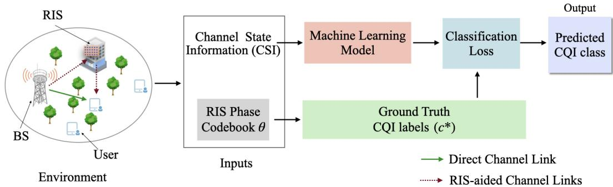
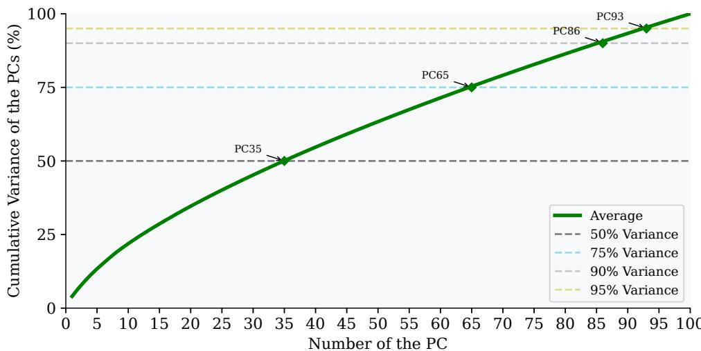

# A 3GPP-Compliant Benchmark Dataset for RIS-Aided Beyond 5G Networks

Pujitha Mamillapalli Department of Artificial Intelligence Indian Institute of Technology Hyderabad, India

Pankaj Singh Rathour Department of Electrical Engineering Indian Institute of Technology Hyderabad, India

Abhinav Kumar Department of Electrical Engineering Indian Institute of Technology Hyderabad, India

## Abstract

Reconfigurable Intelligent Surfaces (RIS) are emerging as a key technology for programmable wireless environments in the beyond the fifth generation (B5G) networks. However, data-driven RIS research remains bottleneck by the lack of standardized, high-fidelity and open-source datasets. In this paper, we introduce a large-scale 3GPP TR 38.901-compliant dataset for RIS-aided millimeter wave (mmWave) networks, that considers severe path loss, blockage sensitivity, and spatial channel sparsity make the RIS assistance more impactful. The dataset spans various canonical 3GPP deployment scenarios across 20 controlled variants, capturing diverse user densities, fading conditions, and blockage regimes. Uniquely, every sample includes oracle RIS phase configurations obtained via a globally optimal brute-force codebook search, providing gold-standard supervision labels that are absent from any existing public dataset. Rich multi-task annotations comprising full channel state information (CSI), per-link channel decomposition, optimal phase matrices, and channel quality index (CQI) labels support a broad range of machine learning paradigms and downstream tasks, including phase optimization, channel estimation, and interference management. As the primary benchmark task, we introduce a novel CSI-to-CQI mapping that frames RIS-aided link-quality prediction as a scalable scalar classification problem, thereby avoiding the exponential output complexity of the direct phase vector prediction. We have evaluated this mapping against state-of-the-art architectures under in-distribution, out-of-distribution, and real-world hardware measurement conditions. Our dataset provides a reproducible, extensible, and community-ready foundation to accelerate data-driven research in RIS-aided B5G networks.

## 1 Introduction

The convergence of massive device proliferation, immersive applications, and stringent latency requirements is pushing wireless infrastructure past its conventional limits in beyond the fifth generation (B5G) networks [1]. Reconfigurable intelligent surfaces (RIS) — planar arrays of independently tunable, passive or semi-passive electromagnetic elements — have emerged as a key technology. Unlike traditional wireless equipment, it can program how signals travel in real time — without needing power amplifiers or other complex radio hardware. [2]. By programming the signals direction, a properly set up RIS can reach areas with poor coverage, reduce signal interference between users and improve overall signal strength. Thus the RIS can transforms an otherwise uncontrollable stochastic channel into a deterministic and programmable resource at a fraction of the energy cost of active alternatives [3, 4]. However, optimizing RIS configurations remains computationally challenging, particularly in large-scale deployment scenarios, where the high-dimensional, non-convex nature of the problem significantly increases complexity [5]. Classical model-based iterative solvers — alternating optimization [6], successive convex approximation [4], and manifold optimization [7] — offer convergence guarantees but scale poorly with high computation cost rendering them impractical under blockage. These limitations have catalyzed a growing research on machine learning (ML)-driven approaches, spanning deep reinforcement learning [8, 9], supervised codebook prediction [10, 11], and unsupervised learning [12], all promising real-time inference and robustness to model mismatch [12]. However, the progress is severely hampered by a fundamental bottleneck: the absence of realistic, standardized and large-scale datasets [13]. Existing works predominantly rely on privately generated, scenario-specific datasets built on simplified channel models that neither conform to 3GPP propagation standards [14] nor provide sufficient diversity to support generalization. Furthermore, the absence of quality labels foreclose rigorous evaluation of supervised and imitation-learning approaches, collectively imposing a substantial hindrance on the field.

To address these limitations, we introduce a large-scale 3GPP TR 38.901-compliant dataset for RIS-aided mmWave networks as a community benchmark. Our dataset spans three canonical deployment scenarios: Urban Macro (UMa), Urban Micro (UMi), and Indoor Hotspot (InH), across 20 controlled variants capturing diverse user densities, fading levels, and blockage probabilities per 3GPP TR 38.901 [14]. Each data sample carries channel state information (CSI), per-link channel decomposition and most distinctively, RIS phase labels obtained via a globally optimal brute-force codebook search [5, 15]. These labels provide standard supervision targets which are not available in many existing dataset. We benchmark our dataset on a novel CSI-to-channel quality indicator (CQI) mapping task using a suite of state-of-the-art architectures under in-distribution, out-of-distribution, and real-world measurement conditions [16, 17], establishing reference performance numbers for the community.

The contributions of this work are as follows:

• Large-scale 3GPP-compliant dataset. A dataset generated using TR 38.901 [14] that spans various scenarios across 20 controlled variants with diverse fading models, user densities, and blockage regimes.

• Richly annotated dataset. Optimal RIS phase configurations obtained via exhaustive codebook search provide gold-standard supervision, complemented by comprehensive multi-task annotations—including full CSI with per-link decomposition, beamforming vectors, optimal phase matrices, and CQI labels—supporting a wide range of supervised, unsupervised, and reinforcement learning tasks.

• Novel CSI-to-CQI mapping framework. We introduce a novel framework that models RIS phase optimization as a direct mapping from CSI to a scalar CQI, avoiding the exponential output complexity of phase vector prediction while yielding an operationally meaningful link-adaptation target.

• Benchmarking and generalization analysis. Comprehensive evaluation of diverse learning paradigms—including deep neural networks, sequence modeling approaches, and classical machine learning methods—with a focused analysis of model generalization under indistribution, out-of-distribution, and real-world hardware measurement conditions.

## 2 Related Work

In this section, we survey the prior literature on RIS-aided systems, including simulation datasets, real-world measurements, and learning-based phase optimization, and highlight limitations in existing datasets that motivate the proposed approach.

Machine learning (ML) methods are increasingly replacing classical iterative solvers for real-time RIS phase configuration. Prior work spans supervised codebook prediction [10, 11], convolutional neural network (CNN)-based feature learning [27], deep reinforcement learning (DRL) [8, 9], and transformer architectures [28, 29]. Classical optimization methods are theoretically grounded but suffer from high computational cost and large inference latency due to iterative updates [5, 6]. This limits their use in large-scale real-time systems. Learning-based approaches enable fast inference but introduce new challenges. DRL methods are sample-inefficient and often unstable in highdimensional action spaces [9]. Unsupervised methods remove the need for labels but lack guarantees of convergence to globally optimal solutions in non-convex settings [30, 31]. Supervised methods are stable and efficient but depend on high-quality oracle or near-optimal labels. Despite this progress, most works rely on privately generated single-scenario datasets without standardized channel models, 3GPP compliance, or oracle labels. This limits fair comparison and weakens conclusions on generalization to realistic deployments.

Table 1: Comparison of related works on RIS datasets and simulation frameworks. GBSCM = geometry-based stochastic channel model, RT = Ray Tracing, CM = Channel Modeling, RW Meas. = Real World Measurements and Avail. = Availability.
<table><tr><td>Work</td><td>Channel Model</td><td>Frequency</td><td>Multi- scenario</td><td>3GPP TR 38.901</td><td>RIS CM</td><td>Oracle Labels</td><td>RW Meas.</td><td>Dataset Avail.</td></tr><tr><td colspan="7">Stochastic channel models</td><td></td><td></td></tr><tr><td>QuaDRiGa [18]</td><td>GBSCM</td><td>Sub-6/mmWave</td><td>√</td><td>√</td><td>x</td><td>x</td><td>x</td><td>x</td></tr><tr><td>COST 2100 [19]</td><td>GBSCM</td><td>Sub-6 GHz</td><td>√</td><td>x</td><td>x</td><td>x</td><td>x</td><td>x</td></tr><tr><td colspan="7">Ray tracing frameworks</td><td></td><td></td></tr><tr><td>DeepMIMO [13]</td><td>RT</td><td>mmWave/sub-6</td><td>√</td><td>x</td><td>x</td><td>x</td><td>x</td><td>√</td></tr><tr><td>Raymobtime [20]</td><td>RT + traffic sim</td><td>60 GHz</td><td>x</td><td>x</td><td>x</td><td>x</td><td>x</td><td>√</td></tr><tr><td>Wireless InSite [21]</td><td>RT (commercial)</td><td>Configurable</td><td>√</td><td>x</td><td>x</td><td>x</td><td>x</td><td>x</td></tr><tr><td>Bayraktar et al. [22]</td><td>RT</td><td>mmWave</td><td>x</td><td>x</td><td>√</td><td>x</td><td>x</td><td>√</td></tr><tr><td>From Lab to DT [23]</td><td>RT + calibration</td><td>mmWave</td><td>x</td><td>x</td><td>√</td><td>x</td><td>x</td><td>x</td></tr><tr><td>SionnaRT [24, 25]</td><td>RT + 3GPP</td><td>Sub-6/mmWave</td><td>√</td><td>√</td><td>x</td><td>x</td><td>x</td><td>√</td></tr><tr><td colspan="7">Real-world RIS measurements</td><td></td><td></td></tr><tr><td>Tewes et al. [26]</td><td>Measured</td><td>sub-6</td><td>x</td><td>x</td><td>√</td><td>x</td><td>√</td><td>√</td></tr><tr><td>Mamillapalli et al. [16]</td><td>Measured</td><td>sub-6/mmWave</td><td>x</td><td>x</td><td>√</td><td>x</td><td>√</td><td>x</td></tr><tr><td>BRISC [17]</td><td>Measured</td><td>sub-6</td><td>x</td><td>x</td><td>√</td><td>x</td><td>√</td><td>√</td></tr><tr><td>Ours</td><td>3GPP TR 38.901</td><td>mmWave</td><td>√</td><td>√</td><td>√</td><td>√</td><td>x</td><td>√</td></tr></table>

Existing Datasets: Datasets such as DeepMIMO [32], Raymobtime [20], Wireless InSite [2], and the RT dataset [22] are typically tied to specific scene geometries, often generating deterministic channel realizations for fixed environments rather than samples from calibrated stochastic models. Geometry-based stochastic channel models (GBSCMs), including QuaDRiGa [18] and COST 2100 [19], provide greater statistical diversity and partial alignment with 3GPP models, but are primarily designed for conventional multiple-input multiple-output (MIMO) and focus on composite end-to-end channels, with limited support for explicit transmitter–RIS and RIS–receiver decomposition. Standards-aligned simulators such as Sionna [24] and SionnaRT [25] implement TR 38.901 and move toward 3GPP-compliant data generation; however, as summarized in Table 1, publicly available datasets based on these tools remain limited in multi-scenario coverage, RIS specific channel decomposition, and oracle labels.

Real-world RIS measurement datasets remain limited in scope and scale. Prior works report indoor and outdoor measurements across sub-6,GHz and mmWave bands, demonstrating measurable SNR and coverage gains under practical hardware conditions [26, 17, 33–38, 16]. However, these datasets are typically small, limited to a few scenarios and frequencies, and show limited alignment with 3GPP standards. They also lack oracle phase labels, restricting their use for systematic machine learning benchmarking and generalization studies.

Table 1 highlights three recurring limitations in existing datasets: (i) scenario diversity—most datasets focus on a single environment, limiting systematic evaluation; (ii) 3GPP compliance—few RISspecific datasets are generated under TR 38.901-aligned propagation settings at 28,GHz; and (iii) RIS channel modeling—limited availability of datasets with explicit per-link transmitter–RIS and RIS–receiver decomposition required for phase optimization. The proposed dataset is designed to address these aspects while additionally providing oracle phase labels and standardized open-source splits for reproducible benchmarking.

## 3 Preliminaries

System Model. In this paper, we consider a downlink MIMO RIS-aided wireless system comprising a base station (BS) equipped with N antennas, a passive RIS with $L ^ { 2 }$ reflecting elements, and K single-antenna users. The RIS is modeled by a diagonal phase-shift matrix $\pmb { \theta } = \left[ e ^ { j \theta _ { 1 } } , \dots , e ^ { j \theta _ { L ^ { 2 } } } \right]$

  
Figure 1: Overview of the proposed CSI-to-CQI mapping framework for RIS-aided mmWave networks.

where $\theta _ { l } ( \in [ 0 , \pi ] ) \subseteq S$ . Here, S denotes a finite discrete phase codebook shared across all elements. Let H $\mathbf { \Psi } _ { B R } \in \mathbb { C } ^ { L ^ { 2 } \times N }$ and $\mathbf { g } _ { k } \in \mathbb { C } ^ { L ^ { 2 } \times 1 }$ denote the BS-to-RIS and RIS-to-user channels, respectively, and $\mathbf { h } _ { d , k } ^ { - \top } \in \mathbb { C } ^ { 1 \times N }$ denote the direct BS-to-user link. The received signal at the $k ^ { t h }$ users is given by

$$
y _ { k } = \left( { \bf g } _ { k } ^ { \dag } \operatorname { d i a g } ( \pmb \theta ) { \bf H } _ { B R } + { \bf h } _ { d , k } \right) { \bf w } _ { k } s _ { k } + I _ { K } + { \bf n } .\tag{1}
$$

where $\mathbf { w } _ { k } \in \mathbb { C } ^ { N \times 1 }$ is the $k ^ { t h }$ user beamforming vector , $s _ { k }$ is the transmitted symbol vector to the $k ^ { t h }$ user, $I _ { k }$ is the interference from other users, and $n _ { k } \sim \mathbb { C } \mathbb { N } ( \mathbf { 0 } , \sigma _ { n } ^ { 2 } )$ denotes additive white Gaussian noise $( \mathrm { A W G N } ) ;$ where $\mathbb { C N } ( \cdot , \cdot )$ represents the complex Gaussian distribution with mean 0 and noise variance $\sigma _ { n } ^ { 2 }$

Performance Metrics: In this paper, α-mean throughput is considered as the performance metric, which is expressed as follows [39]

$$
\mathbb { T } _ { \alpha } ( k , \pmb { \theta } , \mathcal { H } ) = \left\{ \begin{array} { l l } { \displaystyle \left( \frac { 1 } { | K | } \sum _ { k = 1 } ^ { K } ( B * R _ { k } ) ^ { 1 - \alpha } \right) ^ { \frac { 1 } { 1 - \alpha } } , } & { \displaystyle \alpha > 0 , \alpha \neq 1 , } \\ { \displaystyle \left( \prod _ { k = 1 } ^ { K } B * R _ { k } \right) ^ { \frac { 1 } { | K | } } , } & { \displaystyle \alpha = 1 , } \end{array} \right.\tag{2}
$$

where α is the fairness parameter, B is the bandwidth, $K$ is the total number of UEs, and $R _ { k } \stackrel { \triangle } { = }$ $f ( \pmb { \mathcal { H } } , \theta )$ is the achievable rate (Refer to supplementary material).

RIS Phase Optimization Task and Label Generation. Given the composite channel state information (CSI) $\mathbf { \mathcal { H } } = \{ \mathbf { H } _ { B R } , \mathbf { G } , \mathbf { H } _ { d } \}$ , comprising the BS-to-RIS, RIS-to-UE, and direct BS-to-UE links respectively, the optimal RIS phase configuration is obtained by solving:

$$
\pmb { \theta } ^ { * } ( \pmb { \mathcal { H } } ) = \arg \operatorname* { m a x } _ { \pmb { \theta } \in S ^ { L ^ { 2 } } } \sum _ { k = 1 } ^ { K } \mathbb { T } _ { \alpha } ( k , \pmb { \theta } , \pmb { \mathcal { H } } ) ,\tag{3}
$$

where $\mathbb { T } _ { \alpha } ( k , \pmb \theta , \pmb { \mathcal { H } } )$ ) denotes the α-mean throughput of the k-th user (as in (2) under phase configuration θ [39], S is the discrete phase codebook, and $L ^ { 2 } = \varphi$ is the number of RIS elements. The exhaustive search over $S ^ { \varphi }$ guarantees global optimality but incurs complexity $\mathcal { O } ( | S | ^ { \varphi } )$ ), which grows exponentially with the number of elements.

Beyond computational intractability at inference time, directly predicting $\pmb { \theta } ^ { * } \in S ^ { \varphi }$ as a supervised learning target imposes an exponentially large structured output space, making the learning problem itself statistically and computationally prohibitive. To resolve both issues simultaneously, we propose mapping the oracle-optimal configuration to a scalar Channel Quality Indicator (CQI). Specifically, for each CSI realization H, the oracle first computes the globally optimal phase vector $\bar { \pmb { \theta } } ^ { * } ( \pmb { \mathcal { H } } )$ via exhaustive search, evaluates the resulting sum throughput $\begin{array} { r } { \mathbb { T } _ { \alpha } ^ { * } \doteq \dot { \sum _ { k } } \mathbb { T } _ { \alpha } ( \dot { k } , \pmb { \theta } ^ { * } , \pmb { \mathcal { H } } ) } \end{array}$ , and assigns a discrete CQI label via the standardized quantization function [40, 14]:

$$
c ^ { * } ( \mathcal { H } ) = Q ( \mathbb { T } ^ { * } ( \mathcal { H } ) ) , \qquad c ^ { * } \in \{ 1 , \dots , \mathcal { C } \} ,\tag{4}
$$

where $Q ( \cdot ) : \mathbb { R } _ { + } \to \{ 1 , \ldots , \mathcal { C } \}$ partitions the throughput axis into $\mathcal { C }$ discrete levels aligned with 3GPP CQI table definitions [14, 40], and C denotes the total number of CQI levels. This formulation collapses the output space from $| \boldsymbol { S } | ^ { L ^ { 2 } }$ to C classes, reducing exponential structured prediction to efficient scalar classification while producing a label that is directly actionable by the BS scheduler without post processing. The resulting supervised learning problem is defined over the dataset $\mathcal { D } = \{ ( \dot { \mathcal { H } } _ { i } , c _ { i } ^ { * } ) \} _ { i = 1 } ^ { m }$ , where a model $f _ { \Omega } : { \mathcal { H } } \mapsto \{ 1 , \ldots , { \mathcal { C } } \}$ with parameters Ω learns the CSI-to-CQI mapping from oracle-generated labels. The overall pipeline is illustrated in Fig. 1, where a ML model learns the CSI-to-CQI mapping from generated oracle labels.

Learning Framework. The CSI-to-CQI mapping is formulated as an empirical risk minimization (ERM) problem [41]. Given m independently and identically distributed (i.i.d.) samples $\mathcal { D } =$ $\{ ( \pmb { \mathscr { H } } _ { i } , c _ { i } ^ { * } ) \} _ { i = 1 } ^ { m }$ drawn from an unknown channel distribution $\mathcal { P } _ { \mathcal { H } } .$ , the predictor $f _ { \Omega } : { \mathcal { H } }  { \bar { \{ 1 , \dots , { \mathcal { C } } \} } }$ minimizing:

$$
\hat { f } = \arg \operatorname* { m i n } _ { f \in \mathcal { F } } \frac { 1 } { m } \sum _ { i = 1 } ^ { m } \ell ( f ( \mathcal { H } _ { i } ) , c _ { i } ^ { * } ) ,\tag{5}
$$

where $\ell ( \cdot , \cdot )$ is the loss function [41, 42]. Since oracle labels $c ^ { * }$ are globally optimal by construction, any residual risk $\mathcal { L } ( \hat { f } ) = \mathbb { E } [ \ell ( f ( \pmb { \mathcal { H } } ) , c ^ { * } ( \pmb { \mathcal { H } } ) ) ]$ ] reflects genuine model capacity or distributional mismatch rather than label suboptimality, providing a noise-free measure of the true performance ceiling.

## 4 Dataset Generation Pipeline

In this section, we mention the detail pipeline for Algorithm 1 Proposed Dataset Generation   
the dataset generation. The pipeline is identical Pipeline   
across all 20 variants; only the channel configu- Require: Configuration cfg (fading, user density,   
ration cfg varies between runs, ensuring that all topology, blockage, bandwidth, carrier fre  
inter-variant differences arise solely from con- quency), codebook S   
trolled changes in propagation parameters. Al- Ensure: Channels $\{ \mathbf { H } _ { B R } , \mathbf { G } , \mathbf { H } _ { D } \}$ optimal   
gorithm 1 summarizes the end-to-end procedure; phase $\pmb { \theta } ^ { * }$ , CQI label $c ^ { * }$   
full implementation details, 3GPP TR 38.901 1: Sample UE positions and blockage states ac  
model parameters [14], are provided in supple- cording to cfg   
mentary material. 2: Compute large-scale fading (3GPP TR 38.901)   
Topology sampling: For dataset generation,   
we assumed the system model as mentioned in 3: Generate small-scale channels $\mathbf { H } _ { B R } , \mathbf { G } , \mathbf { H } _ { D }$   
Section 3. The BS and RIS are fixed at prede- 4: Initialize $\mathbb { T } _ { \alpha } ^ { * } \gets - \infty$   
termined locations. UEs are distributed as a ho- 5: for each $\pmb \theta \in \mathcal S ^ { N }$ do   
mogeneous Poisson point process (PPP) of den- 6: Compute effective channel: $\begin{array} { r l } { \mathbf { H } _ { \mathrm { e f f } } } & { { } = } \end{array}$   
sity $\mathsf { \bar { \lambda } } _ { k } \left( \mathrm { U E s } / \mathrm { k m ^ { 2 } } \right)$ on a disc of radius R centred ${ \bf G } \mathrm { d i a g } ( \pmb { \theta } ) { \bf H } _ { B R } + { \bf H } _ { D }$   
at the BS, yielding $K \sim \operatorname { P o i s s o n } ( \lambda _ { k } A )$ users 7: Compute beamforming matrix W using   
within the user deployment area $A .$ Inter-cell MMSE-ZF beamforming   
interference is modeled via a single-tier hexago- 8: Calculate the aggregate throughput of the   
nal grid with inter-site distance (ISD) per 3GPP system $\mathbb { T } _ { \alpha }$ as in 2   
TR 38.901 [14]; each interfering BS transmits 9: if $\mathbb { T } _ { \alpha } > \mathbb { T } _ { \alpha } ^ { * }$ then   
at full power with path-loss computed under the 10: $\mathbb { T } _ { \alpha } ^ { * } \gets \tilde { \mathbb { T } } _ { \alpha } ( \pmb { \theta } )$   
same TR 38.901 model as the serving link. 11: $\theta ^ { * }  \theta$   
Large-scale fading: LOS/NLOS states are as- 12: end if   
signed via distance-dependent probability func- 13: end for   
tions and path-loss with log-normal shadowing, 14: Compute CQI label: $c ^ { * }  Q ( \mathbb { T } _ { \alpha } ^ { * } )$   
and is computed as per 3GPP TR 38.901 [14]. 15: Store sample

Channels ${ \bf { H } } _ { B R } , { \bf { G } }$ , and $\mathbf { H } _ { D }$ are generated per 3GPP TR 38.901 [14] under the variant-assigned fading model and stored in explicit per-link form. For each $\pmb { \theta } \in \mathcal { S } ^ { L ^ { 2 } }$ , the effective channel $\mathbf { H } _ { \mathrm { e f f } } ( \pmb { \theta } ) =$ $\mathbf { G } \mathrm { d i a g } ( \pmb { \theta } ) \mathbf { H } _ { B R } + \mathbf { H } _ { D }$ is formed, a zero forcing (ZF) beamforming [43] $\mathbf { W } ( \pmb { \theta } )$ is calculated and $\mathbb { T } _ { \alpha } ( k , \pmb \theta )$ is evaluated [44]. The optimal $\pmb { \theta } ^ { * }$ is obtained via (3), and three oracle quantities are stored per sample: the optimal phase vector $\pmb { \theta } ^ { * }$ , the CQI label $c ^ { * } \in \{ 1 , \ldots , { \mathcal { C } } \}$ , and the optimal aggregate α-mean throughput $\mathbb { T } _ { \alpha } ^ { * }$

Reproducibility. All random number generators are explicitly seeded, and the pipeline executes on deterministic GPU kernels using 64-bit complex arithmetic throughout.

System Parameters. The dataset targets mmWave RIS deployments at 28,GHz over a $1 0 0 \times 1 0 0 , \mathrm { { m ^ { 2 } } }$ area, with a BS equipped with $N = 3 6$ antennas, a $3 0 \times 3 0 ~ \mathrm { \bar { R } I S }$ , and $K = 1 0 0$ users. UE locations are uniformly sampled within scenario-specific bounds to ensure spatial diversity. It comprises 200,000 channel realizations across 20 deployment variants (10,000 each), with each sample represented by a 250,000-dimensional feature vector (real and imaginary parts separated). Detailed dataset visualizations and statistical summaries of the generated dataset are presented in the supplementary material.

  
Figure 2: Cumulative variance explained as a function of the number of principal components (PCs). The solid curve denotes the average across all considered variants, while dashed horizontal lines indicate variance thresholds (50%, 75%, 90% and 95%). The intersection points highlight the minimum number of principle components (PC) required to achieve each threshold.

Implementation. All experiments were run on 2 Nvidia-A6000 GPUs, each with 48 GB RAM.   
The dataset size is around ∼ 300 GB. Dataset and code are available online12.

Limitations. Our dataset is simulation-based and omits hardware impairments such as phase noise and quantization errors, which may impact real-world performance. It further assumes static user locations and fixed blockage, excluding mobility and time-varying propagation dynamics. Future extensions will incorporate hardware-in-the-loop measurements with real RIS prototypes, mobility-aware channel evolution via 3GPP TR 38.901, and dynamic blockage modeling under user mobility.

## 5 Dataset Analysis

This section provides a quantitative analysis of the dataset, focusing on its structure, variance distribution, and implications for learning. The dataset contains 200,000 channel realizations across 20 deployment variants, each represented by a 250,000-dimensional feature vector. We analyze eigenvalue spectra to characterize variance concentration across principal components and its impact on learning and compression.

## 5.1 Feature Variance Distribution via PCA

To quantify intrinsic dimensionality, we perform the principal component analysis (PCA) on the sample covariance matrix and examine the cumulative explained variance ratio as $\begin{array} { r } { \mathcal { V } ( r ) = \frac { \sum _ { i = 1 } ^ { r } \lambda _ { i } } { \sum _ { i = 1 } ^ { d } \lambda _ { i } } } \end{array}$ ; where $\lambda _ { 1 } \geq \lambda _ { 2 } \geq \cdot \cdot \cdot \geq \lambda _ { d }$ are the ordered eigenvalues. Fig. 2 shows the cumulative explained variance averaged across all variants. The curve increases smoothly without a clear elbow, indicating that the variance is not concentrated in a small subset of dominant components.

The first 35 components capture approximately 50% of the total variance, representing the most significant large-scale channel variations. A substantial fraction of the variance is distributed across a wide range of components, with 65 and 86 components required to reach 75% and 90% variance, respectively. This near-linear accumulation reflects a broad spectrum of moderately informative directions, rather than a rapidly decaying eigenvalue profile. The remaining components contribute marginally, with a 95% variance achieved at 93 components.

Table 2: Training and validation performance comparison. Best values per column are highlighted in bold. Acc = Accuracy, MAE = Mean Absolute Error, Params = Number of trainable parameters, $\mathbf { \bar { G P U } = \bar { G P U } }$ memory usage, Time/epoch = Training time per epoch.
<table><tr><td>Model</td><td>Train acc ↑</td><td>Val acc ↑</td><td>Params↓</td><td>MAE↓</td><td> $\mathbf { G P U } \downarrow$ </td><td>Time/epoch↓</td></tr><tr><td>FNN [45]</td><td>85.6%</td><td>85.4%</td><td>0.45 M</td><td>0.277</td><td>1.2 GB</td><td>0.5 min</td></tr><tr><td>CNN [46]</td><td>83.86%</td><td>82.54%</td><td>2.8M</td><td>0.295</td><td>1.8 GB</td><td>0.4min</td></tr><tr><td>XGBoost [47]</td><td>89.9%</td><td>86.7%</td><td></td><td>0.2456</td><td></td><td>20 min</td></tr><tr><td>LR [41]</td><td>68.43%</td><td>68.60%</td><td>~5K</td><td>0.412</td><td></td><td>1 min</td></tr><tr><td>SVM [48]</td><td>81.92%</td><td>81.17%</td><td></td><td>0.310</td><td></td><td>25 min</td></tr><tr><td>Transformer [29]</td><td>84.8%</td><td>84.2%</td><td>33.3 M</td><td>0.309</td><td>3.9 GB</td><td>1.2 min</td></tr><tr><td>Mamba [49]</td><td>85.5%</td><td>85.0%</td><td>55.8M</td><td>0.287</td><td>4.2 GB</td><td>1 min</td></tr></table>

Implication—No Spectral Gap: The gradual decay of the eigenvalues indicate the absence of a spectral gap, with variance distributed across many components rather than concentrated in a low-dimensional subspace. As a result, truncation-based dimensionality reduction is inherently lossy. This finding motivate models that preserve high-dimensional structure or learn task-aware compression. This behavior reflects realistic multi-cluster propagation and provides a challenging benchmark for evaluating robustness and generalization in data-driven RIS optimization.

## 6 Evaluation Experiments

In this section, we benchmark the dataset on the task defined in Section 3: supervised CSI-to-CQI classification using oracle-optimal labels. The benchmark is designed to evaluate not only in-distribution generalization but also robustness to realistic distribution shifts — including noise model variation and real-world hardware-measured channels.

Benchmarking Models. We evaluate a diverse set of models that span classical machine learning, deep learning, and sequence modeling paradigms, including feedforward neural networks (FNN) [45], CNN [46], eXtreme Gradient Boosting (XGBoost) [47], logistic regression (LR) [48], support vector machines (SVM) [48], Transformer encoders [28], and Mamba state space models [49]. These models are selected for their complementary inductive biases: linear and tree-based methods provide strong baselines on compressed representations, FNN captures global feature interactions, CNN model local structure, and Transformer/Mamba architectures capture long-range dependencies—well aligned with our dataset distributed variance and absence of a spectral gap.

Hyperparameters and Architecture. Raw CSI representations (H) are extremely highdimensional $( \sim 2 . 5 \times 1 0 ^ { 5 }$ features per sample), making direct end-to-end learning computationally expensive and prone to overfitting given $2 \times 1 0 ^ { 5 }$ training samples [41]. To mitigate this, we extract 12 statistical descriptors—mean, standard deviation, maximum, minimum, median, energy, skewness, kurtosis, 25th/75th percentiles, range, and log-energy—from each of the three sub-channels, yielding a compact 36-dimensional feature vector. All features are standardized using training-set statistics. The FNN consists of four fully connected layers (512–512–256–128) with layer normalization and GELU activations, and a dropout of 0.2 is applied to the first three layers. A final linear layer maps to the output space. Training uses AdamW (learning rate $1 0 ^ { - 3 }$ , weight decay $1 0 ^ { - 4 } )$ with step decay (factor 0.7 every 10 epochs) for 100 epochs and batch size 64 under an 80:20 split. Kullback-Leibler (KL) divergence loss with batch-mean reduction is used for soft-label supervision, improving calibration over hard cross-entropy [50]. All models are trained under a standard empirical risk minimization (ERM) setting and are uniformly evaluated to establish consistent baseline performance.

Table 2 highlights clear trade-offs between accuracy, training time, and model complexity. XGBoost achieves the best predictive performance, with the highest validation accuracy and lowest mean absolute error (MAE) [27], but at the cost of significantly higher training time and no explicit control over model size. Among neural models, the FNN offers the most efficient balance, achieving competitive accuracy with low parameter count and fast training . The CNN trains fastest but delivers lower accuracy, indicating limited benefit from its convolutional structure. Transformer and Mamba models provide comparable accuracy but incur substantially higher parameter counts and GPU memory usage, resulting in diminishing returns. Classical methods show mixed behavior: Logistic Regression is lightweight but under performs, while SVM improves accuracy at the expense of long training time. Overall, the results suggest that while XGBoost maximizes accuracy, compact neural models such as FNN offer a more favorable accuracy–efficiency trade-off for practical deployment.

## 6.1 Test Datasets

We evaluate generalization under four progressively challenging distribution shifts. T1 is a held-out variant from the same generative process with a modified proportional fairness parameter α and increased noise variance, testing sensitivity to within-distribution parameter shifts. T2 introduces impulsive bursty noise modeled as a Bernoulli-Gaussian mixture, evaluating robustness to heavytailed interference unseen during training [46]. T3 corrupts channels with temporally correlated auto regression AR(1) noise, introducing memory effects absent from the i.i.d. training distribution [46]. T4 uses hardware-measured RIS-aided channels from the BRISC dataset [17] at 5 GHz, representing a joint shift in frequency, channel statistics, and hardware noise characteristics — the most severe sim-to-real evaluation.

Train–Test Distribution Shift. We quantify the distributional distance between the training set and each test set using KL divergence $D _ { \mathrm { K L } } \left[ 5 0 \right]$ , Wasserstein-1 distance W1 [50], and Maximum Mean Discrepancy (MMD) with an RBF kernel [46]. As shown in Table 3, T1–T3 exhibit comparable and moderate shift: T2 incurs slightly higher $D _ { \mathrm { K L } }$ due to the heavy tail of the impulsive noise distribution, while T3 shows marginally lower MMD reflecting the smoother marginal perturbation of AR(1) correlated noise.

Table 3: Train–test distribution shift via $D _ { \mathrm { K L } } , \mathcal { W } _ { 1 }$ , and MMD. ↑ indicates larger shift from the training distribution, imp. = impairments.
<table><tr><td>Set</td><td>Description</td><td> $D _ { \mathrm { K L } }$  ↑</td><td>W1↑</td><td>MMD↑</td></tr><tr><td>T1</td><td>AWGN</td><td>3.320</td><td>0.533</td><td>0.080</td></tr><tr><td>T2</td><td>Bursty</td><td>2.859</td><td>0.534</td><td>0.060</td></tr><tr><td>T3</td><td>Memory AR(1)</td><td>3.294</td><td>0.533</td><td>0.070</td></tr><tr><td>T4 [17]</td><td>Hardware imp.</td><td>8.741</td><td>1.872</td><td>0.284</td></tr></table>

T4 exhibits the largest shift across all three metrics by a substantial margin — more than 2.6× that of any simulated test set — confirming that BRISC real-world 5 GHz measurements occupy a fundamentally different region of feature space from the 3GPP-simulated 28 GHz training distribution. The ordering T1 ≈ T2 ≈ T3 ≪ T4 directly predicts the difficulty ranking observed in Table 4.

Results and Analysis. Table 4 shows the test performance of the trained models across all conditions, along with an additional fine-tuning (FT) step applied to the FNN for 100 epochs. Classical models (LR, SVM, XGBoost) perform poorly, indicating limited capacity to capture the complex, high-dimensional structure of the RIS channels. Neural models significantly improve performance, with FNN achieving the strongest baseline results across simulated settings, suggesting that the extracted features are well-suited to dense representations. CNN shows moderate performance, while Transformer and Mamba

Table 4: Test accuracy (%) across T1–T4. Best in bold, FNN+FT: fine-tuning of the trained FNN model for 100 epochs.
<table><tr><td>Model</td><td>T1</td><td>T2</td><td>T3</td><td>T4</td></tr><tr><td>LR [41]</td><td>25.2%</td><td>21.4%</td><td>23.1%</td><td>18.6%</td></tr><tr><td>SVM [48]</td><td>22.3%</td><td>28.7%</td><td>20.5%</td><td>12.4%</td></tr><tr><td>XGB [47]</td><td>39.5%</td><td>35.2%</td><td>37.8%</td><td>20.1%</td></tr><tr><td>CNN [12]</td><td>52.3%</td><td>55.4%</td><td>58.9%</td><td>28.2%</td></tr><tr><td>FNN [45]</td><td>61.4%</td><td>64.2%</td><td>66.8%</td><td>31.3%</td></tr><tr><td>Transformer [29]</td><td>11.9%</td><td>10.0%</td><td>10.6%</td><td>9.8%</td></tr><tr><td>Mamba [49]</td><td>25.6%</td><td>26.7%</td><td>25.1%</td><td>18.4%</td></tr><tr><td>FNN+FT</td><td>90.8%</td><td>91.3%</td><td>87.8%</td><td>78.4%</td></tr></table>

under perform, indicating that higher model complexity does not guarantee better generalization without task-aligned inductive biases. Under distribution shift, all models degrade, particularly in the sim-to-real setting (T4), confirming a substantial domain gap. Fine-tuning proves highly effective in mitigating this gap: FNN+FT achieves the best performance across all conditions, with significant gains on T4 using only 100 labeled samples. This improvement arises because the pretrained FNN captures general feature representations, which are efficiently adapted to target-domain statistics through fine-tuning.

Detailed Discussion: Generalization, Failure Modes, and Adaptation. Table 4 reveals that model performance is limited not only under real-world shift (T4) but also across simulated conditions (T1–T3). Even without crossing the sim-to-real boundary, most models exhibit noticeable degradation across T1–T3, indicating that they fail to generalize across variations in noise statistics and channel dynamics within the same simulation domain. This suggests that the learned representations are highly sensitive to distributional changes and do not capture invariant features of RIS channels.

High-capacity architectures such as Transformer and Mamba perform particularly poorly, given the huge computation cost and lack of task-aligned inductive bias. Classical models (LR, SVM, XGBoost) also underperform due to limited representational capacity. While neural baselines such as FNN and CNN achieve relatively better results, their performance still drops consistently from T1 to T3 and further on T4, confirming that even these models struggle with cross-scenario generalization. Fine-tuning significantly improves performance across all test sets. The strong results of FNN+FT indicate that the pretrained model captures useful but non-invariant features, which can be adapted to new distributions with minimal supervision. Notably, fine-tuning improves not only T4 (sim-to-real) but also T2 and T3, demonstrating that even simulated domain shifts require adaptation.

These findings are closely linked to the dataset design. Unlike prior datasets that focus on narrow, single-scenario settings, this dataset spans multiple deployment conditions with diverse channel characteristics. This diversity introduces substantial variability even within simulated data, making generalization inherently challenging. As a result, models trained on this dataset are forced to confront realistic distribution shifts rather than overfitting to a fixed environment.

Overall, the results show that state-of-the-art models for RIS applications do not generalize well across heterogeneous conditions without adaptation—even within simulation. This highlights a fundamental limitation of current learning approaches and underscores the need for domain generalization methods that can learn invariant representations across diverse scenarios. The proposed dataset provides a suitable and challenging benchmark for developing such approaches, enabling more robust and deployment-ready RIS optimization.

## 7 Conclusion and Future Directions

In this paper, we introduced a large-scale 3GPP TR 38.901-compliant dataset for RIS-aided mmWave networks that addresses key gaps in standardized channel modeling, per-link decomposition, oracle phase labels, and multi-scenario coverage with reproducible splits, along with a CSI-to-CQI mapping that reformulates RIS phase optimization as a scalable classification task. Extensive benchmarking shows that existing models struggle to generalize across both simulated and real-world distribution shifts, with performance degradation even within simulated settings, while fine-tuning provides only partial mitigation. Overall, our dataset offers a more diverse and realistic benchmark than prior single-scenario datasets, making it well-suited for evaluating robustness and domain generalization in RIS learning. However, the dataset remains simulation-based and does not capture hardware impairments or temporal mobility dynamics; future extensions will incorporate hardware-in-the-loop measurements and time-evolving channels to further improve realism and deployment relevance.

Boarder Impact. The proposed work can positively impact society by improving wireless coverage, energy efficiency, and reliability in future B5G networks, enabling applications such as smart cities, and autonomous systems. The dataset also supports reproducible research in RIS-aided learning systems. However, potential risks include misuse for enhanced surveillance or sensing, unequal access to advanced communication technologies.

## References

[1] ITU-R, “IMT-2030 (6G) Framework Recommendations,” Tech. Rep. ITU-R M.2160, International Telecommunication Union, Geneva, Switzerland, 2023.

[2] E. Basar, M. Di Renzo, J. De Rosny, M. Debbah, M.-S. Alouini, and R. Zhang, “Wireless communications through reconfigurable intelligent surfaces,” IEEE Access, vol. 7, pp. 116753–116773, 2019.

[3] M. Di Renzo, A. Zappone, M. Debbah, M.-S. Alouini, C. Yuen, J. de Rosny, and S. Tretyakov, “Smart radio environments empowered by reconfigurable intelligent surfaces: How it works, state of research, and the road ahead,” IEEE Journal on Selected Areas in Communications, vol. 38, no. 11, pp. 2450–2525, 2020.

[4] C. Huang, A. Zappone, G. C. Alexandropoulos, M. Debbah, and C. Yuen, “Reconfigurable intelligent surfaces for energy efficiency in wireless communication,” IEEE Transactions on Wireless Communications, vol. 18, no. 8, pp. 4157–4170, 2019.

[5] Q. Wu and R. Zhang, “Beamforming optimization for wireless network aided by intelligent reflecting surface with discrete phase shifts,” IEEE Transactions on Communications, vol. 68, no. 3, pp. 1838–1851, 2020.

[6] H. Guo, Y.-C. Liang, J. Chen, and E. G. Larsson, “Weighted sum-rate maximization for reconfigurable intelligent surface aided wireless networks,” IEEE Transactions on Wireless Communications, vol. 19, no. 5, pp. 3064–3076, 2020.

[7] W. D. S. Junior, D. W. M. Guerra, J. C. M. Filho, T. Abrão, and E. Hossain, “Manifold-based optimizations for ris-aided massive mimo systems,” IEEE Open Journal of the Communications Society, vol. 5, pp. 7913– 7940, 2024.

[8] K. Feng, Q. Wang, X. Li, and C.-K. Wen, “Deep reinforcement learning based intelligent reflecting surface optimization for miso communication systems,” IEEE Wireless Communications Letters, vol. 9, no. 5, pp. 745–749, 2020.

[9] A. Taha, M. Alrabeiah, and A. Alkhateeb, “Enabling large intelligent surfaces with compressive sensing and deep learning,” IEEE Access, vol. 9, pp. 44304–44321, 2021.

[10] H. Yang, Z. Xiong, J. Zhao, D. Niyato, L. Xiao, and Q. Wu, “Deep reinforcement learning-based intelligent reflecting surface for secure wireless communications,” IEEE Transactions on Wireless Communications, vol. 20, no. 1, pp. 375–388, 2021.

[11] Q. Hu, Y. Cai, Q. Shi, K. Xu, G. Yu, and Z. Ding, “Iterative algorithm induced deep-unfolding neural networks: Precoding design for multiuser mimo systems,” IEEE Transactions on Wireless Communications, vol. 20, no. 2, pp. 1394–1410, 2021.

[12] H. Song et al., “Unsupervised learning-based joint active and passive beamforming design for reconfigurable intelligent surfaces aided wireless networks,” IEEE Communication Letter, vol. 25, no. 3, pp. 892–896, 2021.

[13] A. Alkhateeb, “Deepmimo: A generic deep learning dataset for millimeter wave and massive MIMO applications,” rXiv preprint arXiv:1902.06435, 2019.

[14] 3GPP, “Study on channel model for frequencies from 0.5 to 100 GHz,” Tech. Rep. TR 138.901, ETSI, Sophia Antipolis, France, 2024.

[15] E. Bjornson, O. Ozdogan, and E. G. Larsson, “Reconfigurable intelligent surfaces: Three myths and two critical questions,” IEEE Communications Magazine, vol. 58, no. 12, pp. 90–96, 2020.

[16] P. Mamillapalli et al., “Indoor dual-band experimental evaluation of RIS-aided wireless links at 5.2 GHz and 28 GHz under NLoS conditions,” in Proceedings ofthe 18th International Conference on Communication Systems and Networks (COMSNETS), pp. 1219–1222, 2026.

[17] A. Raghunath et al., “BRISC: A dataset of channel measurements at 5 GHz with a reflective intelligent surface,” arXiv preprint arXiv:2602.21102, 2025.

[18] S. Jaeckel, L. Raschkowski, K. Börner, and L. Thiele, “Quadriga: A 3-d multi-cell channel model with time evolution for enabling virtual field trials,” IEEE Transactions on Antennas and Propagation, vol. 62, no. 6, pp. 3242–3256, 2014.

[19] L. Liu, C. Oestges, J. Poutanen, K. Haneda, P. Vainikainen, F. Quitin, F. Tufvesson, and P. D. Doncker, “The cost 2100 mimo channel model,” IEEE Wireless Communications, vol. 19, no. 6, pp. 92–99, 2012.

[20] A. Klautau, P. Batista, N. González-Prelcic, Y. Wang, and R. W. Heath, “5g mimo data for machine learning: Application to beam-selection using deep learning,” in Proceedings of the Information Theory and Applications Workshop (ITA), pp. 1–9, 2018.

[21] A. Alkhateeb, G. Leus, and R. W. Heath, “Compressed sensing based multi-user millimeter wave systems: How many measurements are needed?,” in IEEE International Conference on Acoustics, Speech and Signal Processing (ICASSP), pp. 2909–2913, 2015.

[22] Z. Zhang, R. He, M. Yang, Z. Qi, Z. Li, B. Ai, H. Zhang, and J. Han, “Impact of point cloud reconstruction detail on mmwave ray-tracing in indoor environments,” IEEE Internet of Things Journal, vol. 12, no. 24, pp. 54859–54872, 2025.

[23] Z. Zhakipov, M. Makin, A. Nasser, A. Abdallah, A. Celik, and A. M. Eltawil, “From lab to digital twin: Calibration of mmwave ray-tracing with ris reflections,” in Proceedings of the 36th International Symposium on Personal, Indoor and Mobile Radio Communications (PIMRC), pp. 1–6, 2025.

[24] J. Hoydis, S. Cammerer, F. Ait Aoudia, A. Vem, N. Binder, G. Marcus, and A. Keller, “Sionna: An open-source library for next-generation physical layer research,” arXiv preprint arXiv:2203.11854, 2022.

[25] J. Hoydis, F. A. Aoudia, S. Cammerer, M. Nimier-David, N. Binder, G. Marcus, and A. Keller, “Sionna rt: Differentiable ray tracing for radio propagation modeling,” in Proceedings of the IEEE Globecom Workshops, pp. 317–321, 2023.

[26] S. Tewes, M. Heinrichs, K. Weinberger, R. Kronberger, and A. Sezgin, “A comprehensive dataset of ris-based channel measurements in the 5ghz band,” in Proceedings ofthe IEEE 97th Vehicular Technology Conference (VTC2023-Spring), pp. 1–5, 2023.

[27] A. M. Elbir, A. Papazafeiropoulos, P. Kourtessis, and S. Chatzinotas, “Deep channel learning for large intelligent surfaces aided mm-wave massive mimo systems,” IEEE Wireless Communications Letters, vol. 9, no. 9, pp. 1447–1451, 2020.

[28] A. Vaswani, N. Shazeer, N. Parmar, J. Uszkoreit, L. Jones, A. N. Gomez, L. u. Kaiser, and I. Polosukhin, “Attention is all you need,” in Proceedings of the Advances in Neural Information Processing Systems, vol. 30, 2017.

[29] Z. Lin, M. Lin, T. de Cola, J.-B. Wang, W.-P. Zhu, and J. Cheng, “Supporting iot with rate-splitting multiple access in satellite and aerial-integrated networks,” IEEE Internet of Things Journal, vol. 8, no. 14, pp. 11123–11134, 2021.

[30] H. Sun, X. Chen, Q. Shi, M. Hong, X. Fu, and N. D. Sidiropoulos, “Learning to optimize: Training deep neural networks for wireless resource management,” in Proceeding ofthe IEEE 18th International Workshop on Signal Processing Advances in Wireless Communications (SPAWC), pp. 1–6, 2017.

[31] C. Huang, S. Hu, G. C. Alexandropoulos, A. Zappone, C. Yuen, R. Zhang, M. D. Renzo, and M. Debbah, “Holographic mimo surfaces for 6g wireless networks: Opportunities, challenges, and trends,” IEEE Wireless Communications, vol. 27, no. 5, pp. 118–125, 2020.

[32] M. H. Rahman, M. A. S. Sejan, M. A. Aziz, J.-I. Baik, D.-S. Kim, and H.-K. Song, “Deep learning-based improved cascaded channel estimation and signal detection for reconfigurable intelligent surfaces-assisted mu-miso systems,” IEEE Transactions on Green Communications and Networking, vol. 7, no. 3, pp. 1515– 1527, 2023.

[33] K. Weinberger, S. Tewes, and A. Sezgin, “Validating properties of ris channel models with prototypical measurements,” in Proceedings of the 18th European Conference on Antennas and Propagation (EuCAP), pp. 1–5, 2024.

[34] G. C. Trichopoulos, P. Theofanopoulos, B. Kashyap, A. Shekhawat, A. Modi, T. Osman, S. Kumar, A. Sengar, A. Chang, and A. Alkhateeb, “Design and evaluation of reconfigurable intelligent surfaces in real-world environment,” IEEE Open Journal ofthe Communications Society, vol. 3, pp. 462–474, 2022.

[35] M. Rossanese, P. Mursia, A. Garcia-Saavedra, V. Sciancalepore, A. Asadi, and X. Costa-Perez, “Open experimental measurements of sub-6ghz reconfigurable intelligent surfaces,” IEEE Internet Computing, vol. 28, no. 2, pp. 19–28, 2024.

[36] J. Sang, J. Lan, M. Zhou, B. Gao, W. Tang, X. Li, M. Matthaiou, S. Jin, and M. D. Renzo, “Measurementbased small-scale channel model for sub-6 ghz ris-assisted communications,” IEEE Transactions on Vehicular Technology, vol. 73, no. 8, pp. 12178–12183, 2024.

[37] J. Sang, M. Zhou, J. Lan, B. Gao, W. Tang, X. Li, S. Jin, E. Basar, C. Li, Q. Cheng, and T. J. Cui, “Multiscenario broadband channel measurement and modeling for sub-6 ghz ris-assisted wireless communication systems,” IEEE Transactions on Wireless Communications, vol. 23, no. 6, pp. 6312–6329, 2024.

[38] X. Pei, H. Yin, L. Tan, L. Cao, Z. Li, K. Wang, K. Zhang, and E. Björnson, “Ris-aided wireless communications: Prototyping, adaptive beamforming, and indoor/outdoor field trials,” IEEE Transactions on Communications, vol. 69, no. 12, pp. 8627–8640, 2021.

[39] Y. Ramamoorthi and A. Kumar, “Resource allocation for comp in cellular networks with base station sleeping,” IEEE Access, vol. 6, pp. 12620–12633, 2018.

[40] ETSI, “NR; User Equipment (UE) radio transmission and reception; part 4: Performance requirements,” Tech. Rep. TS 138 101-4, European Telecommunications Standards Institute, Sophia Antipolis, France, 2019.

[41] I. Goodfellow, Y. Bengio, and A. Courville, Deep Learning. MIT Press, 2016.

[42] Y. LeCun, Y. Bengio, and G. Hinton, “Deep learning,” Nature, vol. 521, no. 7553, pp. 436–444, 2015.

[43] A. Alkhateeb, O. El Ayach, G. Leus, and R. W. Heath, “Channel estimation and hybrid precoding for millimeter wave cellular systems,” IEEE Journal of Selected Topics in Signal Processing, vol. 8, no. 5, pp. 831–846, 2014.

[44] T. Kebede, Y. Wondie, J. Steinbrunn, H. B. Kassa, and K. T. Kornegay, “Precoding and beamforming techniques in mmwave-massive mimo: Performance assessment,” IEEE Access, vol. 10, pp. 16365–16387, 2022.

[45] V. K. Ojha, A. Abraham, and V. Snásel, “Metaheuristic design of feedforward neural networks: A review of two decades of research,” arXiv preprint arXiv:1705.05584, 2021.

[46] R. Li, O. Bohdal, R. K. Mishra, H. Kim, D. Li, N. D. Lane, and T. Hospedales, “A channel coding benchmark for meta-learning,” arXiv preprint arXiv:2107.07579, 2021.

[47] T. Chen and C. Guestrin, “Xgboost: A scalable tree boosting system,” in Proceedings of the 22nd ACM SIGKDD International Conference on Knowledge Discovery and Data Mining, p. 785–794, 2016.

[48] P. Singh, T. Hasija, and K. Ramkumar, “Malware classification to strengthening digital resilience: Comparing svm kernel and logistic regression,” in proceedings of the 3rd International Conference on Applied Artificial Intelligence and Computing (ICAAIC), pp. 1461–1466, 2024.

[49] A. Gu and T. Dao, “Mamba: Linear-time sequence modeling with selective state spaces,” arXiv preprint arXiv:2312.00752, 2023.

[50] J. Lv, H. Yang, and P. Li, “Wasserstein distance rivals kullback-leibler divergence for knowledge distillation,” in proceedings of the Advances in Neural Information Processing Systems, vol. 37, pp. 65445–65475, 2024.

## NeurIPS Paper Checklist

## 1. Claims

Question: Do the main claims made in the abstract and introduction accurately reflect the paper’s contributions and scope?

Answer: [Yes]

Justification: Our main contributions are presented in Section I, where we also provide the motivation for the dataset design and its key significance.

Guidelines:

• The answer [N/A] means that the abstract and introduction do not include the claims made in the paper.

• The abstract and/or introduction should clearly state the claims made, including the contributions made in the paper and important assumptions and limitations. A [No] or [N/A] answer to this question will not be perceived well by the reviewers.

• The claims made should match theoretical and experimental results, and reflect how much the results can be expected to generalize to other settings.

• It is fine to include aspirational goals as motivation as long as it is clear that these goals are not attained by the paper.

## 2. Limitations

Question: Does the paper discuss the limitations of the work performed by the authors?

Answer: [Yes]

Justification: We explicitly discuss the limitations of our dataset in Section 4.

Guidelines:

• The answer [N/A] means that the paper has no limitation while the answer [No] means that the paper has limitations, but those are not discussed in the paper.

• The authors are encouraged to create a separate “Limitations” section in their paper.

• The paper should point out any strong assumptions and how robust the results are to violations of these assumptions (e.g., independence assumptions, noiseless settings, model well-specification, asymptotic approximations only holding locally). The authors should reflect on how these assumptions might be violated in practice and what the implications would be.

• The authors should reflect on the scope of the claims made, e.g., if the approach was only tested on a few datasets or with a few runs. In general, empirical results often depend on implicit assumptions, which should be articulated.

• The authors should reflect on the factors that influence the performance of the approach. For example, a facial recognition algorithm may perform poorly when image resolution is low or images are taken in low lighting. Or a speech-to-text system might not be used reliably to provide closed captions for online lectures because it fails to handle technical jargon.

• The authors should discuss the computational efficiency of the proposed algorithms and how they scale with dataset size.

• If applicable, the authors should discuss possible limitations of their approach to address problems of privacy and fairness.

• While the authors might fear that complete honesty about limitations might be used by reviewers as grounds for rejection, a worse outcome might be that reviewers discover limitations that aren’t acknowledged in the paper. The authors should use their best judgment and recognize that individual actions in favor of transparency play an important role in developing norms that preserve the integrity of the community. Reviewers will be specifically instructed to not penalize honesty concerning limitations.

## 3. Theory assumptions and proofs

Question: For each theoretical result, does the paper provide the full set of assumptions and a complete (and correct) proof?

Answer: [N/A]

Justification: [TODO]

## Guidelines:

• The answer [N/A] means that the paper does not include theoretical results.

• All the theorems, formulas, and proofs in the paper should be numbered and crossreferenced.

• All assumptions should be clearly stated or referenced in the statement of any theorems.

• The proofs can either appear in the main paper or the supplemental material, but if they appear in the supplemental material, the authors are encouraged to provide a short proof sketch to provide intuition.

• Inversely, any informal proof provided in the core of the paper should be complemented by formal proofs provided in appendix or supplemental material.

• Theorems and Lemmas that the proof relies upon should be properly referenced.

## 4. Experimental result reproducibility

Question: Does the paper fully disclose all the information needed to reproduce the main experimental results of the paper to the extent that it affects the main claims and/or conclusions of the paper (regardless of whether the code and data are provided or not)?

Answer: [Yes]

Justification: We have described the information needed to reproduce the main results in Section 4.

Guidelines:

• The answer [N/A] means that the paper does not include experiments.

• If the paper includes experiments, a [No] answer to this question will not be perceived well by the reviewers: Making the paper reproducible is important, regardless of whether the code and data are provided or not.

• If the contribution is a dataset and/or model, the authors should describe the steps taken to make their results reproducible or verifiable.

• Depending on the contribution, reproducibility can be accomplished in various ways. For example, if the contribution is a novel architecture, describing the architecture fully might suffice, or if the contribution is a specific model and empirical evaluation, it may be necessary to either make it possible for others to replicate the model with the same dataset, or provide access to the model. In general. releasing code and data is often one good way to accomplish this, but reproducibility can also be provided via detailed instructions for how to replicate the results, access to a hosted model (e.g., in the case of a large language model), releasing of a model checkpoint, or other means that are appropriate to the research performed.

• While NeurIPS does not require releasing code, the conference does require all submissions to provide some reasonable avenue for reproducibility, which may depend on the nature of the contribution. For example

(a) If the contribution is primarily a new algorithm, the paper should make it clear how to reproduce that algorithm.

(b) If the contribution is primarily a new model architecture, the paper should describe the architecture clearly and fully.

(c) If the contribution is a new model (e.g., a large language model), then there should either be a way to access this model for reproducing the results or a way to reproduce the model (e.g., with an open-source dataset or instructions for how to construct the dataset).

(d) We recognize that reproducibility may be tricky in some cases, in which case authors are welcome to describe the particular way they provide for reproducibility. In the case of closed-source models, it may be that access to the model is limited in some way (e.g., to registered users), but it should be possible for other researchers to have some path to reproducing or verifying the results.

## 5. Open access to data and code

Question: Does the paper provide open access to the data and code, with sufficient instructions to faithfully reproduce the main experimental results, as described in supplemental material?

## Answer: [Yes]

Justification: We provide open access to the complete dataset, accompanying metadata, and all code necessary to reproduce the main experimental results. Detailed instructions and the access link are provided in Section 4. Dataset and code are available online34.

Guidelines:

• The answer [N/A] means that paper does not include experiments requiring code.

• Please see the NeurIPS code and data submission guidelines (https://neurips.cc/ public/guides/CodeSubmissionPolicy) for more details.

• While we encourage the release of code and data, we understand that this might not be possible, so [No] is an acceptable answer. Papers cannot be rejected simply for not including code, unless this is central to the contribution (e.g., for a new open-source benchmark).

• The instructions should contain the exact command and environment needed to run to reproduce the results. See the NeurIPS code and data submission guidelines (https: //neurips.cc/public/guides/CodeSubmissionPolicy) for more details.

• The authors should provide instructions on data access and preparation, including how to access the raw data, preprocessed data, intermediate data, and generated data, etc.

• The authors should provide scripts to reproduce all experimental results for the new proposed method and baselines. If only a subset of experiments are reproducible, they should state which ones are omitted from the script and why.

• At submission time, to preserve anonymity, the authors should release anonymized versions (if applicable).

• Providing as much information as possible in supplemental material (appended to the paper) is recommended, but including URLs to data and code is permitted.

## 6. Experimental setting/details

Question: Does the paper specify all the training and test details (e.g., data splits, hyperparameters, how they were chosen, type of optimizer) necessary to understand the results?

Answer: [Yes]

Justification: We explicitly discuss the the train and test details of our dataset in Section 6 and more detailed information is provided in the Supplementary material.

Guidelines:

• The answer [N/A] means that the paper does not include experiments.

• The experimental setting should be presented in the core of the paper to a level of detail that is necessary to appreciate the results and make sense of them.

• The full details can be provided either with the code, in appendix, or as supplemental material.

## 7. Experiment statistical significance

Question: Does the paper report error bars suitably and correctly defined or other appropriate information about the statistical significance of the experiments?

Answer: [Yes]

Justification: We have reported the appropriate measures of statistical significance in the Section 6.

Guidelines:

• The answer [N/A] means that the paper does not include experiments.

• The authors should answer [Yes] if the results are accompanied by error bars, confidence intervals, or statistical significance tests, at least for the experiments that support the main claims of the paper.

• The factors of variability that the error bars are capturing should be clearly stated (for example, train/test split, initialization, random drawing of some parameter, or overall run with given experimental conditions).

• The method for calculating the error bars should be explained (closed form formula, call to a library function, bootstrap, etc.)

• The assumptions made should be given (e.g., Normally distributed errors).

• It should be clear whether the error bar is the standard deviation or the standard error of the mean.

• It is OK to report 1-sigma error bars, but one should state it. The authors should preferably report a 2-sigma error bar than state that they have a 96% CI, if the hypothesis of Normality of errors is not verified.

• For asymmetric distributions, the authors should be careful not to show in tables or figures symmetric error bars that would yield results that are out of range (e.g., negative error rates).

• If error bars are reported in tables or plots, the authors should explain in the text how they were calculated and reference the corresponding figures or tables in the text.

## 8. Experiments compute resources

Question: For each experiment, does the paper provide sufficient information on the computer resources (type of compute workers, memory, time of execution) needed to reproduce the experiments?

Answer: [Yes]

Justification: We have provided the details of computation resource in Section 4 implementation paragraph.

Guidelines:

• The answer [N/A] means that the paper does not include experiments.

• The paper should indicate the type of compute workers CPU or GPU, internal cluster, or cloud provider, including relevant memory and storage.

• The paper should provide the amount of compute required for each of the individual experimental runs as well as estimate the total compute.

• The paper should disclose whether the full research project required more compute than the experiments reported in the paper (e.g., preliminary or failed experiments that didn’t make it into the paper).

## 9. Code of ethics

Question: Does the research conducted in the paper conform, in every respect, with the NeurIPS Code of Ethics https://neurips.cc/public/EthicsGuidelines?

Answer: [Yes]

Justification: Our research fully complies with the NeurIPS Code of Ethics. All dataset are generated via simulation setup as given in Section 4.

Guidelines:

• The answer [N/A] means that the authors have not reviewed the NeurIPS Code of Ethics.

• If the authors answer [No], they should explain the special circumstances that require a deviation from the Code of Ethics.

• The authors should make sure to preserve anonymity (e.g., if there is a special consideration due to laws or regulations in their jurisdiction).

## 10. Broader impacts

Question: Does the paper discuss both potential positive societal impacts and negative societal impacts of the work performed?

Answer: [Yes]

Justification: The boarder impact details are explicitly given in the conclusion section.

Guidelines:

• The answer [N/A] means that there is no societal impact of the work performed.

• If the authors answer $[ \mathrm { N } / \mathrm { A } ] \ \mathrm { o r } \ [ \mathrm { N o } ] ,$ they should explain why their work has no societal impact or why the paper does not address societal impact.

• Examples of negative societal impacts include potential malicious or unintended uses (e.g., disinformation, generating fake profiles, surveillance), fairness considerations (e.g., deployment of technologies that could make decisions that unfairly impact specific groups), privacy considerations, and security considerations.

• The conference expects that many papers will be foundational research and not tied to particular applications, let alone deployments. However, if there is a direct path to any negative applications, the authors should point it out. For example, it is legitimate to point out that an improvement in the quality of generative models could be used to generate Deepfakes for disinformation. On the other hand, it is not needed to point out that a generic algorithm for optimizing neural networks could enable people to train models that generate Deepfakes faster.

• The authors should consider possible harms that could arise when the technology is being used as intended and functioning correctly, harms that could arise when the technology is being used as intended but gives incorrect results, and harms following from (intentional or unintentional) misuse of the technology.

• If there are negative societal impacts, the authors could also discuss possible mitigation strategies (e.g., gated release of models, providing defenses in addition to attacks, mechanisms for monitoring misuse, mechanisms to monitor how a system learns from feedback over time, improving the efficiency and accessibility of ML).

## 11. Safeguards

Question: Does the paper describe safeguards that have been put in place for responsible release of data or models that have a high risk for misuse (e.g., pre-trained language models, image generators, or scraped datasets)?

Answer: [N/A]

Justification: [TODO]

Guidelines:

• The answer [N/A] means that the paper poses no such risks.

• Released models that have a high risk for misuse or dual-use should be released with necessary safeguards to allow for controlled use of the model, for example by requiring that users adhere to usage guidelines or restrictions to access the model or implementing safety filters.

• Datasets that have been scraped from the Internet could pose safety risks. The authors should describe how they avoided releasing unsafe images.

• We recognize that providing effective safeguards is challenging, and many papers do not require this, but we encourage authors to take this into account and make a best faith effort.

## 12. Licenses for existing assets

Question: Are the creators or original owners of assets (e.g., code, data, models), used in the paper, properly credited and are the license and terms of use explicitly mentioned and properly respected?

Answer: [Yes]

Justification: All external assets are properly acknowledged as detailed in the paper.

Guidelines:

• The answer [N/A] means that the paper does not use existing assets.

• The authors should cite the original paper that produced the code package or dataset.

• The authors should state which version of the asset is used and, if possible, include a URL.

• The name of the license (e.g., CC-BY 4.0) should be included for each asset.

• For scraped data from a particular source (e.g., website), the copyright and terms of service of that source should be provided.

• If assets are released, the license, copyright information, and terms of use in the package should be provided. For popular datasets, paperswithcode.com/datasets has curated licenses for some datasets. Their licensing guide can help determine the license of a dataset.

• For existing datasets that are re-packaged, both the original license and the license of the derived asset (if it has changed) should be provided.

• If this information is not available online, the authors are encouraged to reach out to the asset’s creators.

## 13. New assets

Question: Are new assets introduced in the paper well documented and is the documentation provided alongside the assets?

Answer: [Yes]

Justification: We provide datasheets and detailed documentation for all newly introduced assets as part of the supplementary material.

Guidelines:

• The answer [N/A] means that the paper does not release new assets.

• Researchers should communicate the details of the dataset/code/model as part of their submissions via structured templates. This includes details about training, license, limitations, etc.

• The paper should discuss whether and how consent was obtained from people whose asset is used.

• At submission time, remember to anonymize your assets (if applicable). You can either create an anonymized URL or include an anonymized zip file.

## 14. Crowdsourcing and research with human subjects

Question: For crowdsourcing experiments and research with human subjects, does the paper include the full text of instructions given to participants and screenshots, if applicable, as well as details about compensation (if any)?

Answer: [N/A]

Justification: [TODO]

Guidelines:

• The answer [N/A] means that the paper does not involve crowdsourcing nor research with human subjects.

• Including this information in the supplemental material is fine, but if the main contribution of the paper involves human subjects, then as much detail as possible should be included in the main paper.

• According to the NeurIPS Code of Ethics, workers involved in data collection, curation, or other labor should be paid at least the minimum wage in the country of the data collector.

## 15. Institutional review board (IRB) approvals or equivalent for research with human subjects

Question: Does the paper describe potential risks incurred by study participants, whether such risks were disclosed to the subjects, and whether Institutional Review Board (IRB) approvals (or an equivalent approval/review based on the requirements of your country or institution) were obtained?

Answer: [N/A]

Justification: [TODO]

Guidelines:

• The answer [N/A] means that the paper does not involve crowdsourcing nor research with human subjects.

• Depending on the country in which research is conducted, IRB approval (or equivalent) may be required for any human subjects research. If you obtained IRB approval, you should clearly state this in the paper.

• We recognize that the procedures for this may vary significantly between institutions and locations, and we expect authors to adhere to the NeurIPS Code of Ethics and the guidelines for their institution.

• For initial submissions, do not include any information that would break anonymity (if applicable), such as the institution conducting the review.

## 16. Declaration of LLM usage

Question: Does the paper describe the usage of LLMs if it is an important, original, or non-standard component of the core methods in this research? Note that if the LLM is used only for writing, editing, or formatting purposes and does not impact the core methodology, scientific rigor, or originality of the research, declaration is not required.

Answer: [N/A]

Justification: [TODO]

Guidelines:

• The answer [N/A] means that the core method development in this research does not involve LLMs as any important, original, or non-standard components.

• Please refer to our LLM policy in the NeurIPS handbook for what should or should not be described.