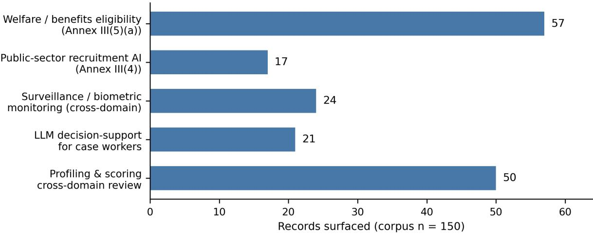

# A Reusable Semantic Web Framework for Evidence-Grounded Fundamental Rights Impact Assessments under the EU AI Act

FAITH OLOPADE, Trinity College Dublin, Ireland

DELARAM GOLPAYEGANI, ADAPT Centre, Trinity College Dublin, Ireland

DAVID LEWIS, ADAPT Centre, Trinity College Dublin, Ireland

The EU AI Act (Art. 27) requires deployers of high-risk AI systems to conduct Fundamental Rights Impact Assessments (FRIAs) before deployment, yet the evidence needed for credible assessments is fragmented across incompatible incident repositories, risk vocabularies, and legal texts. We present a reusable Semantic Web-based framework that consolidates this evidence for two high-risk public sector categories: employment and worker management (Annex III(4)) and access to essential public services (Annex III(5)(a)). A curated 150-record corpus is annotated along four axes using keyword, LLM, and hybrid methods and serialised as a SPARQL-queryable knowledge graph of 1,351 RDF triples. Five FRIA demonstration scenarios surface 103 records (68.7% coverage). Evaluation against a 69-record gold standard reveals that LLM-assisted classification of the employment domain achieves only κ = 0.045, a cautionary result for automated fairness-related evidence retrieval in this domain. All artefacts are released openly to support adoption by regulators, national authorities, and SMEs.

Keywords: EU AI Act, Fundamental Rights Impact Assessment, knowledge graph, Semantic Web, LLM classification, algorithmic fairness, public sector AI

## Reference Format:

Faith Olopade, Delaram Golpayegani, and David Lewis. 2026. A Reusable Semantic Web Framework for Evidence-Grounded Fundamental Rights Impact Assessments under the EU AI Act. In Proceedings ofFifth European Conference on Algorithmic Fairness (ECAF’26). Proceedings of Machine Learning Research, 7 pages.

## 1 Introduction

Government agencies across Europe are deploying large language models (LLMs) at scale: welfare eligibility triage, citizen-facing chatbots, recruitment screening pipelines, and caseworker decision support [4]. The appeal is straightforward, but the risks to fundamental rights are direct. Bias amplification, hallucinated outputs, and opacity bear on individuals’ access to work and essential services in ways that are not always recoverable [3, 26].

Real-world cases demonstrate what inadequate assessment looks like in practice. In the Netherlands, the Tax Administration’s algorithmic risk scoring system embedded racial profiling and operated without meaningful oversight, wrongly accusing tens of thousands of families of benefit fraud [1]. The SyRI case established that automated profiling in public welfare contexts can constitute a violation of the European Convention on Human

Authors’ Contact Information: Faith Olopade, Trinity College Dublin, Dublin, Ireland, olopadef@tcd.ie; Delaram Golpayegani, ADAPT Centre, Trinity College Dublin, Dublin, Ireland, golpayes@tcd.ie; David Lewis, ADAPT Centre, Trinity College Dublin, Dublin, Ireland, dave.lewis@tcd.ie.

Rights [7, 27]. In employment, the Mobley v. Workday litigation alleges that an AI-powered résumé screening tool systematically discriminates on the basis of age, race, and disability. A persistent pattern runs through these incidents: high-stakes public sector AI can cause large-scale rights violations when risk assessment is inadequate.

The EU AI Act responds to this directly. Article 27 requires that deployers of public sector high-risk AI systems, listed in Annex III, conduct a Fundamental Rights Impact Assessment (FRIA) before deployment, documenting how the system may affect rights including non-discrimination, privacy, and good administration [8]. The European Union Agency for Fundamental Rights has noted that many deployments still lack the tools and evidence base to conduct meaningful assessments [10].

The evidence deployers need is not available in a usable form: it is fragmented across sources, described inconsistently, and not interoperable, so assembling it for a given assessment demands substantial manual effort. Incident data resides in repositories such as AIAAIC (AI, Algorithmic and Automation Incidents and Controversies) and AIID (AI Incident Database), which use free-text narratives and community-developed tags rather than AI Act terminology [17, 22]. Existing Semantic Web risk vocabularies—such as Data Privacy Vocabulary (DPV) [21], Vocabulary of AI Risks (VAIR) [15], and AI Risk Ontology (AIRO) [12]—provide structured, machine-readable taxonomies aligned with the regulatory framework but are not integrated into FRIA workflows [15, 25]. Given that legal obligations of the AI Act, including FRIA obligations, and the EU Charter of Fundamental Rights are expressed in natural language, they do not support automation [9]. Therefore, deployers must manually reconcile these disparate sources with no reusable infrastructure to connect incident evidence, risk vocabularies, and regulatory obligations.

Bridging that gap, this paper presents an interoperable framework for AI Act’s FRIAs using Semantic Web technologies, with a focus on two categories of Annex III high-risk AI applications. The full technical implementation is described in the accompanying dissertation [20]. This extended abstract presents the framework, its key empirical findings, and their implications for algorithmic fairness research and practice.

## 2 Framework

## 2.1 Corpus Construction

The corpus combines three complementary evidence sources: approximately 100 records from the AIAAIC incident repository [22], 30 entries from the U.S. Federal AI Use Case Inventory [19], and 20 European Court of Human Rights cases from HUDOC [6]. Together these provide 150 records covering LLM-related and analogous AI deployments in employment and essential public services. The three sources triangulate across evidence types: AIAAIC captures real-world failures; the U.S. Federal Inventory documents active government deployments; ECtHR cases provide authoritative legal analysis of rights violations.

Each record is classified along four axes: (1) Annex III high-risk AI domain (employment or essential services); (2) implicated EU Charter rights (multi-label); (3) risk pattern (bias/discrimination, privacy breach, procedural unfairness, lack of transparency, or other); and (4) causal factor (data quality, model design, deployment context, or oversight failure).

## 2.2 Semantic Schema and Knowledge Graph

The schema is grounded in Semantic Web standards and aligned with DPV [21, 25], VAIR [15], AIRO [12], and the FRIA ontology [24]. Reusing established vocabularies reduces the learning burden for adopters and maximises interoperability with existing compliance tooling. The annotated corpus is serialised in two formats: a Turtle RDF knowledge graph of 1,351 triples (193 nodes, 965 edges) enabling information retrieval using the SPARQL query language1, and 150 JSON-LD records for web-compatible consumption.2

## 2.3 Annotation Pipeline

Three annotation methods are implemented and compared. A keyword baseline uses synonym-expanded dictionary matching against controlled vocabularies. An LLM classifier applies Claude Sonnet [2] with zero-temperature sampling, few-shot prompting, and structured output constraints. A hybrid method resolves conflicts between keyword and LLM outputs using priority logic, retaining keyword classifications for domain and LLM classifications for rights where each method performs better.

## 2.4 Regulatory Crosswalk

A regulatory crosswalk maps the obligations arising from Annex III(4) and Annex III(5)(a) to specific articles of the EU Charter of Fundamental Rights [9]. This mapping is not enumerated in the AI Act itself; the crosswalk makes it explicit and machine-readable, reducing interpretive uncertainty for deployers and providing the structured link between regulatory requirements and rights evidence that the schema’s multi-label rights axis builds on.

## 2.5 Query Interface

A Flask web application loads the knowledge graph on startup and allows users to filter records by Annex III domain, Charter rights, and risk pattern through a form-based interface, moving the framework toward the interactive compliance tooling anticipated by Art. 27(5) [8].

## 3 Evaluation

## 3.1 Gold Standard and Agreement Metrics

Of the 150 corpus records, 69 (46%) were manually annotated to form a gold standard, stratified across sources and both Annex III domains. Each record was annotated by reviewing original source material rather than summary fields alone, following written guidelines with explicit decision criteria per axis. Cohen’s κ [5] and percentage agreement are reported for each axis and method, interpreted using the Landis and Koch scale [16].

The 69 manually annotated records (46%) are a deliberately stratified gold standard rather than a partial annotation effort. The framework’s purpose is to test whether automated annotation can scale beyond what manual labelling feasibly covers, so the manual subset is sized to give reliable per-axis agreement estimates across both Annex III domains and all three sources, not to annotate the corpus exhaustively. Manually labelling all 150 records would defeat the evaluation, since the pipeline exists precisely to avoid that cost at scale.

## 3.2 Domain Classification

For the essential services domain, the best-performing method achieves κ = 0.525 (moderate agreement). For employment, the best-performing method achieves $\kappa = 0 . 0 4 5 \mathrm { . }$ —near-chance. This divergence is attributable to spurious vocabulary correlations: a disproportionate share of records discuss employment incidentally rather than as the primary domain of harm, and both keyword and LLM classifiers over-predict employment for record containing general labour market language.

The implication for algorithmic fairness research is direct. Employment discrimination is among the most extensively documented harms of automated decision-making, and Annex III(4) covers the AI Act’s highest-risk employment applications. Near-chance agreement means that automated annotation of employment-domain risk evidence cannot currently be trusted without human review. Deployers relying on such tools to surface employment risk evidence for a FRIA risk generating an evidence base that is both incomplete and misleading. The finding holds across models: a comparison with GPT-4o-mini yields κ = 0.196 for domain classification, confirming the difficulty lies in the task rather than in a single model.

## 3.3 Coverage and Risk Patterns

Five FRIA demonstration scenarios query the populated knowledge graph for records relevant to realistic deployer contexts: welfare eligibility AI, public sector recruitment screening, surveillance in public housing, LLM decisionsupport for caseworkers, and a cross-domain thematic review by a national regulator. Across all five, 103 of the 150 records are surfaced (68.7% coverage). The 31.3% not surfaced are predominantly records with unknown classifications produced by pipeline underclassification—the direct consequence of the domain agreement failures described above. Figure 1 reports per-scenario retrieval: the welfare-eligibility and cross-domain profiling scenarios surface the largest evidence pools (57 and 50 records), while the employment-focused recruitment scenario surfaces the fewest (17), consistent with the near-chance employment agreement reported above.

The hybrid method reduces unknown risk pattern classifications from 61.3% (keyword baseline) to 14.0%, substantially enlarging the evidence base available for compliance queries. Agreement on risk patterns remains in the slight-to-fair range, with procedural unfairness and lack of transparency the categories of greatest disagreement, driven primarily by multi-label harm structures where incidents involve co-occurring failure modes.

## 3.4 Use Case: A Welfare Eligibility Deployer

A public body preparing to deploy an AI system that supports social-welfare eligibility decisions (Annex III(5)(a)) must document, before deployment, how the system may bear on the rights to social security (Art. 34) and nondiscrimination (Art. 21). Using the query interface, the deployer filters the knowledge graph for essential-services records implicating these rights; the query returns 57 candidate records (Scenario A in Figure 1). Each record carries its risk-pattern and causal-factor classifications together with full provenance back to the originating incident, so a flagged non-discrimination risk can be traced to specific precedents—such as the Dutch childcare-benefits scandal [1] and the SyRI profiling case [7, 27]—rather than to a general assertion that such risks exist. This is what separates an evidence-grounded FRIA from a narrative one: the deployer can judge whether documented failures are analogous to its own context, and the machine-readable output lets a supervisory authority later verify that comparable deployers considered the same rights, as anticipated by Art. 27(5).

  
Fig. 1. Records surfaced by each of the five FRIA demonstration scenarios. Scenarios may retrieve overlapping records; their union is 103 of the 150 corpus records (68.7% coverage). The employment recruitment scenario surfaces the fewest records, mirroring the near-chance employment domain classification.

## 4 Limitations

Four limitations bear on the framework’s current scope. The gold standard was produced by a single annotator; multi-annotator reliability using Fleiss’ κ [11] is a necessary next step before pipeline outputs can be used without human review. The corpus covers only two of the eight Annex III categories; the schema is designed for extensibility but coverage of biometrics, law enforcement, and migration is not yet tested, a gap that prior work on high-risk AI classification highlights [13, 14]. AIAAIC is predominantly English-language and draws heavily on U.S. and U.K. sources, introducing geographic bias in an EU regulatory context. Finally, employment classification quality is insufficient for unsupervised deployment and requires human oversight for any FRIA relying on that domain’s evidence.

## 5 Relevance to ECAF

This work contributes across three of ECAF’s disciplinary areas.

Policy and Law. The regulatory crosswalk and FRIA demonstration scenarios directly address impact assessment obligations under the AI Act, providing concrete, reusable infrastructure for Art. 27 compliance and contributing to emerging standardisation of AI incident reporting [18]. This work can also be considered as a foundation for the automated tool the AI Office should develop for FRIA, as per Art. 27(5). The analysis of GDPR versus AI Act impact assessment requirements [23] provides complementary legal framing.

Computer Science. The annotation pipeline, multi-method comparison, and gold standard evaluation contribute empirical evidence on the reliability of LLM-assisted classification in a regulatory context, with direct implications for auditing framework design.

Social Sciences. The corpus documents real-world AI failures in employment and essential services, two domains where automated systems bear most directly on the rights of marginalised groups. The near-chance employment domain agreement (κ = 0.045) is a cautionary result for practitioners building automated fairness assessment tool in this domain.

## 6 Conclusion

We have presented a Semantic Web-based framework that consolidates fragmented AI risk evidence into a structured, SPARQL-queryable knowledge graph supporting EU AI Act FRIA compliance. Five FRIA demonstration scenarios achieve 68.7% coverage of a 150-record corpus, and gold standard evaluation reveals that LLM-assisted employment domain classification is near-chance—a result with direct implications for automated fairness assessment in the domain most associated with algorithmic discrimination. All schema artefacts and annotated data are released under CC BY 4.0 and pipeline source code under the MIT Licence at https://github.com/faitholopade/Dissertation, to support adoption by regulators, national authorities, and SMEs extending the framework to further Annex III categories.

## Acknowledgments

This work was supported by the School of Computer Science and Statistics, Trinity College Dublin. The authors acknowledge the support of the ADAPT Centre for Digital Content Technology, funded under the Science Foundation Ireland Research Centres Programme (#13/RC/2106\_P2).

## References

[1] Amnesty International. 2021. Xenophobic Machines: Discrimination through Unregulated Use ofAlgorithms in the Dutch Childcare Benefits Scandal. Technical Report. Amnesty International. https://www.amnesty.org/en/latest/news/2021/10/xenophobic-machinesdutch-child-benefit-scandal/

[2] Anthropic. 2024. The Claude 3 Model Family: Opus, Sonnet, Haiku — Model Card. Technical report. https://www.anthropic.com/news/ claude-3-family

[3] Emily M. Bender, Timnit Gebru, Angelina McMillan-Major, and Shmargaret Shmitchell. 2021. On the Dangers of Stochastic Parrots: Can Language Models Be Too Big?. In Proceedings of the 2021 ACM Conference on Fairness, Accountability, and Transparency (FAccT ’21). ACM. https://dl.acm.org/doi/10.1145/3442188.3445922

[4] Rishi Bommasani et al. 2021. On the Opportunities and Risks of Foundation Models. arXiv preprint (2021). https://arxiv.org/abs/2108. 07258

[5] Jacob Cohen. 1960. A Coefficient of Agreement for Nominal Scales. Educational and Psychological Measurement 20, 1 (1960), 37–46. doi:10.1177/001316446002000104

[6] Council of Europe. 2024. HUDOC: European Court of Human Rights Case-Law Database. Online database. https://hudoc.echr.coe.in

[7] District Court of The Hague. 2020. Judgment in the Case of NJCM c.s. versus the State of the Netherlands (SyRI Case), Case No. C-09-550982. Judgment of the District Court of The Hague, 5 February 2020. https://www.julia-project.eu/database/case-law/241

[8] European Parliament and Council of the European Union. 2024. Regulation (EU) 2024/1689 laying down harmonised rules on artificial intelligence (Artificial Intelligence Act). Official Journal of the European Union. https://eur-lex.europa.eu/eli/reg/2024/1689/oj

[9] European Parliament, Council of the European Union, and European Commission. 2000. Charter of Fundamental Rights of the European Union. Official Journal of the European Communities, C 364/1, 18.12.2000. https://www.europarl.europa.eu/charter/pdf/text\_en.pdf

[10] European Union Agency for Fundamental Rights. 2025. Assessing High-Risk Artificial Intelligence: Fundamental Rights Risks. Technical Report. FRA. https://fra.europa.eu/en/publication/2025/assessing-high-risk-ai

[11] Joseph L. Fleiss. 1971. Measuring Nominal Scale Agreement Among Many Raters. Psychological Bulletin 76, 5 (1971), 378–382. doi:10.1037/h0031619

[12] Delaram Golpayegani, Harshvardhan J. Pandit, and Dave Lewis. 2022. AIRO: AI Risk Ontology (v1). Working paper. https://w3id.org/airo

[13] Delaram Golpayegani, Harshvardhan J. Pandit, and Dave Lewis. 2023. To Be High-Risk, or Not To Be—Semantic Specifications and Implications of the AI Act’s High-Risk AI Applications and Harmonised Standards. In Proceedings of the 2023 ACM Conference on Fairness, Accountability, and Transparency (FAccT ’23). ACM, 905–915. doi:10.1145/3593013.3594050

[14] Delaram Golpayegani, Harshvardhan J. Pandit, and Dave Lewis. 2024. To Be High-Risk, or Not To Be—Semantic Specifications and Implications of the AI Act’s High-Risk AI Applications and Harmonised Standards. Working paper / technical report. https: //harshp.com/research/publications/060-AI-Act-high-risk-semantics

[15] Delaram Golpayegani, Harshvardhan J. Pandit, and Dave Lewis. 2024. VAIR: Vocabulary of AI Risks. https://w3id.org/vair/

[16] J. Richard Landis and Gary G. Koch. 1977. The Measurement of Observer Agreement for Categorical Data. Biometrics 33, 1 (1977), 159–174. doi:10.2307/2529310

[17] Sean McGregor. 2021. Preventing Repeated Real World AI Failures by Cataloging Incidents: The AI Incident Database. In Proceedings of the AAAI Conference on Artificial Intelligence, Vol. 35. 15458–15463. https://arxiv.org/abs/2011.08512

[18] OECD. 2025. Towards a Common Reporting Frameworkfor AI Incidents. Technical Report. OECD Artificial Intelligence Papers, No. 34. https://www.oecd.org/en/publications/towards-a-common-reporting-framework-for-ai-incidents\_f326d4ac-en.htm

[19] Office of Management and Budget. 2024. 2024 Consolidated Federal AI Use Case Inventory. Published pursuant to OMB Memorandum M-24-10 and the AI in Government Act of 2020. https://github.com/ombegov/2024-Federal-AI-Use-Case-Inventory

[20] Faith Olopade. 2026. A Reusable Semantic Web-based Framework Linking LLM Risks to Fundamental Rightsfor EU AI Act High-Risk Public Sector Applications. Master’s thesis. Trinity College Dublin. https://github.com/faitholopade/Dissertation

[21] Harshvardhan J. Pandit, Beatriz Esteves, Georg P. Krog, Paul Ryan, Delaram Golpayegani, and Julian Flake. 2024. Data Privacy Vocabulary (DPV)—Version 2. arXiv preprint arXiv:2404.13426 / ISWC 2024. https://arxiv.org/abs/2404.13426

[22] Charlie Pownall. 2024. AIAAIC: AI, Algorithms, and Automation Incidents and Controversies. https://www.aiaaic.org/

[23] Tytti Rintamäki, Delaram Golpayegani, Dave Lewis, Edoardo Celeste, and Harshvardhan J. Pandit. 2026. Impact Assessment Requirements in the GDPR vs the AI Act: Overlaps, Divergence, and Implications. OSF Preprints. doi:10.31219/osf.io/6qhzj

[24] Tytti Rintamäki and Harshvardhan J. Pandit. 2025. Developing an Ontology for AI Act Fundamental Rights Impact Assessments. arXiv preprint arXiv:2501.10391. https://arxiv.org/abs/2501.10391

[25] W3C Data Privacy Vocabulary Community Group. 2022. Data Privacy Vocabulary (DPV) Specification. https://w3id.org/dpv/

[26] Laura Weidinger et al. 2021. Ethical and Social Risks of Harm from Language Models. arXiv preprint (2021). https://arxiv.org/abs/2112. 04359

[27] Maranke Wieringa et al. 2023. “Hey SyRI, Tell Me About Algorithmic Accountability”: Lessons from a Landmark Case. Data & Polic (2023). doi:10.1017/dap.2022.29