# A2Z GameSpec-Bench: How Faithfully Can Coding Agents Generate Games from Game Design Specifications?

Seonho Lee<sup>\*†1</sup>, Wonryeol Jeong<sup>\*†1</sup>, Alberto Cereser<sup>†1</sup>, Inha Kang<sup>‡1,2</sup>, Hyeonjong Kim<sup>1</sup>, Seungmin Kwak<sup>‡1,3</sup> and Dongmin Park<sup>1</sup>

1KRAFTON, 2KAIST, 3Korea National University of Arts

Delegating complete application development to coding agents requires preserving the intended design rather than simply producing plausible outputs through naïve prompting. Game development provides a demanding testbed, as long-form Game Design Documents (GDDs) describe requirements that must work together across game logic, visual rendering, and player interactions. However, existing gamedevelopment benchmarks typically use compact specifications and provide limited support for evaluating interdependent requirements across these aspects in long-form GDDs. We introduce A2Z GameSpec-Bench, a benchmark of 100 long-form GDDs for evaluating end-to-end game development by agents. We measure faithfulness by checking whether the game satisfies the GDD requirements and preserves the relationships among them. Each GDD is turned into a Dependency-Aware Contract that contains rules, constraints, and prerequisite relations. Following game-development practices, we combine sourcecode inspection with agent-generated Test Policies for scenario-based replay and adaptive playtesting. The contract remains fixed across agents and revision rounds, while judgments and evidence linked to the same requirements support consistent comparison and failure detection. Our evaluations show that current agents struggle to jointly satisfy interdependent requirements across code implementation and actual play. Requirement-specific feedback improves GDD Fidelity by 10.9% relative to self-revision after two rounds. A2Z GameSpec-Bench assesses end-to-end specification-following ability beyond implementation judgments and provides targeted feedback to support more faithful game development. Code and datasets are available at https://a2z-gamespec-bench.github.io.

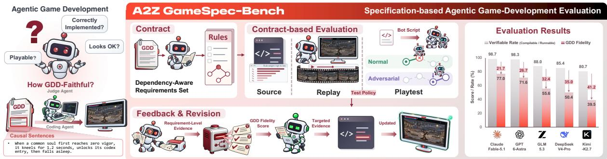  
Figure 1 Overview of A2Z GameSpec-Bench. Dependency-Aware Contracts guide evaluation and targeted revision through source-code inspection, replay, and playtesting. Our evaluation results demonstrate that High compilability and runnability do not guarantee high GDD Fidelity.

## 1. Introduction

Coding agents are increasingly moving from isolated programming tasks to complete application development (Qian et al., 2024; Yang et al., 2026), including playable games from natural-language prompts (Jiang et al., 2026). However, generating a plausible game from a naïve prompt difers significantly from implementing the game that a designer intends. In studio development, delegating implementation requires agents to interpret detailed specifications, connect individual features, and deliver complete games end-to-end without designers repeatedly directing each low-level step. Therefore, specification-driven development is important for retaining design control while scaling the work delegated to the agents. Games provide a demanding testbed for this ability in agents: specified designs must be satisfied across game logic, visual rendering, and player interactions.

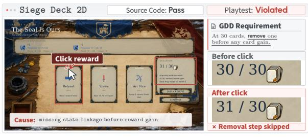  
(a) Cross-Axis Failure Case

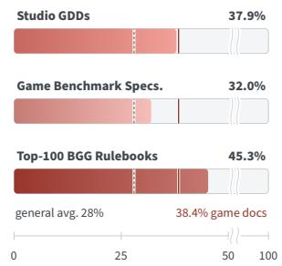  
(b) Causal Sentence Ratio

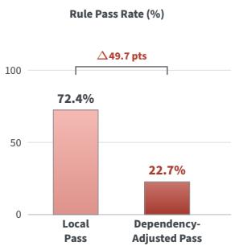  
(c) Rule Dependencies  
Figure 2 Challenges in specification-driven game development. (a) In our game Siege Deck 2D, the decklimit requirement gets full source-code credit, but playtesting reveals a reward gain without the card removal. (b) Across three game-design corpora with 353 documents, CiRA (Fischbach et al., 2021) classifies 38.4% of sentences as causal on average, compared with 28% for general documents (Frattini et al., 2023) (Appendix B.1). (c) Source-code pass rates decrease when all upstream rules must also pass (Appendix B.7).

In game development, long-form specifications called Game Design Documents (GDDs), including studio documents (Hamilton, 1995), often serve as a shared reference for implementing and verifying the intended design (Callele et al., 2005; Salazar et al., 2012). Although their formats vary, their requirements provide the basis for assessing implementation and commonly involve causal dependencies (Figure 2b). In practice, developers verify the results using code-level checks, visual testing of specific scenarios, and quality assurance (QA) playtesting (Epic Games, n.d.; Kisel, 2016). These checks must follow the same requirements and account for relations in which one rule’s efects satisfy another’s conditions. They should also identify requirement-specific mismatches that guide revisions toward the intended design. Thus, faithfulness requires preserving the specified rules and their relationships across implementation, rendered behavior, and actual play. This raises the main question: How faithfully can coding agents implement design specifications as a complete game?

Existing game-development benchmarks assess specified behavior through replay rubrics (Luo et al., 2026), state-initialized tests (Jia et al., 2026), or source-code inspection (Chi et al., 2026). However, their input specifications are substantially compact, and they provide limited support for assessing long-form GDDs through a common representation of requirement dependencies across implementation, rendering, and continuous play (Table 1). As shown in Figure 2a, a single evaluation axis used in existing bench marks such as source-code inspection can miss design violations that our playtests detect during runtime. This implies that evaluating fidelity to long-form GDDs needs tracking dependencies and checking the same requirements through code, visual, and execution evidence.

We introduce A2Z GameSpec-Bench, a benchmark of 100 long-form GDDs for evaluating end-to-end specification-driven game development. Each task asks a coding agent to deliver a source project and playable build from a GDD to measure its faithfulness defined as GDD Fidelity. The corpus contains 50 Small designs with compact scope and 50 Big designs with extensive content. We construct these GDDs from game briefs through an agentic authoring pipeline that checks for omissions and inconsistencies (Appendix A). For evaluation, each GDD is turned into a Dependency-Aware Contract that records individual rules, constraints, and prerequisite relations between rules. Constructed from the GDD and kept fixed across agents and revision rounds, the contract makes these relationships explicit rather than treating requirements as an independent checklist.

Then, we organize evaluation from code-level checks and visual assessment to QA playtesting. Alongside source-code inspection, agents construct requirement-specific Test Policies that determine how to exercise the game and collect evidence against the contract. Scenario-based replays reproduce specified situations, while trace-guided frame selection retrieves visual evidence of the expected responses. For adaptive playtesting, Code-as-Policy (Liang et al., 2023) bots select player inputs based on the current state. Normal play checks how behaviors connect from the initial state, while targeted adversarial tests establish preconditions for unverified requirements and check their subsequent efects. Consequently, agents construct and execute tests to verify each game based on our contract as summarized in Figure 1. The resulting judgments and evidence are linked to the same requirements for GDD Fidelity scoring and further revision feedback.

Table 1 Comparison of agentic game development benchmarks. A2Z GameSpec-Bench fixes a dependencyaware evaluation contract from long-form GDDs independently of generated outputs and links judgments from complementary evidence channels to the same requirements.
<table><tr><td rowspan="2">Benchmark</td><td colspan="3">Benchmark Setup</td><td colspan="4">Requirement Evaluation</td><td colspan="3">Evaluation Channels</td></tr><tr><td>Full-Game Generation</td><td>Input Type</td><td># of Spec. Tokens</td><td>Evaluation Target</td><td></td><td>Relations Predefined Cross-Axis</td><td></td><td>Source Rendered Code Behavior</td><td></td><td>Adaptive Play</td></tr><tr><td>GameDevBench</td><td>x</td><td>Task + project</td><td>185</td><td>Task-specific tests</td><td>×</td><td></td><td>X</td><td></td><td>X</td><td>x</td></tr><tr><td>GameEngineBench</td><td>X</td><td>Spec. + project</td><td></td><td>Tests + LLM judge</td><td>X</td><td></td><td>x</td><td></td><td></td><td>X</td></tr><tr><td>OpenGame-Bench</td><td></td><td>Game spec.</td><td>1,830</td><td>Build / visual / intent</td><td>X</td><td></td><td>x</td><td>X</td><td></td><td>X</td></tr><tr><td>WebGameBench</td><td></td><td>Structured spec.</td><td></td><td>Runtime quality</td><td>x</td><td></td><td>x</td><td>x</td><td></td><td></td></tr><tr><td>GameCraft-Bench</td><td></td><td>Game spec.</td><td>1,547</td><td>Predefined rubric</td><td>x</td><td></td><td>x</td><td>x</td><td></td><td>X</td></tr><tr><td>PlaytestArena</td><td></td><td>Short prompt</td><td>131</td><td>Behavior rubric</td><td>X</td><td></td><td>X</td><td>X</td><td></td><td></td></tr><tr><td>GameGen-Verifier</td><td>x</td><td>Spec. + project</td><td>7,998</td><td>Sparse keypoints</td><td></td><td></td><td></td><td></td><td></td><td></td></tr><tr><td>GameXpert-Bench†</td><td></td><td>Design brief</td><td>84</td><td>Post-hoc event rubric</td><td>X</td><td>X</td><td></td><td></td><td></td><td></td></tr><tr><td>A2Z GameSpec-Bench</td><td>V</td><td>Long-form GDD</td><td>20,191</td><td>GDD contract set</td><td></td><td></td><td></td><td></td><td></td><td></td></tr></table>

† We report the GameGen track; human ratings are omitted from this table. Spec. tokens are rounded mean lengths of accessible specifications using <sub>o200k\_base</sub> without project code; PlaytestArena is author-reported. Dash (–) means that specs. cannot be publicly obtained. For Adaptive Play, ✓denotes closed-loop evaluator interaction in which the next action is selected online based on the current observation or runtime state.

Our evaluation shows that high compilability and runnability do not imply high GDD Fidelity (Figure 1). For example, Claude-Fable-5.1 achieves a verifiable rate of 98.7% under compile and runtime checks, while its overall GDD Fidelity is 77.0. In addition, as shown in Figure 2c, our code-level evaluation shows that locally passing rules can still depend on failed prerequisites. Across 100 GPT-5.6-Sol games, the mean pass rate for dependency-linked rules is 72.4% from local source-code judgments but 22.7% when all upstream rules must also pass, showing a graph-based reachability proxy (Appendix B.7). By checking the same requirements through replay and playtests, A2Z GameSpec-Bench further exposes design mismatches in visual output and execution. With enumerated source judgments held fixed, adding dependency context increases coverage of recorded playtest violations from 71.1% to 80.2% across the 100-game analysis (Section 4.4). On 50 Big GDDs, requirement-specific feedback improves overall GDD Fidelity by 10.9% relative to self-revision after two rounds from the same initial builds. A2Z GameSpec-Bench supports systematic comparison of coding agents’ specification-following ability and targeted revision toward the intended design.

## 2. Related Work

Specification-Based Evaluation. Evaluating generative outputs against detailed specifications often begins by decomposing the specifications into concrete criteria. In text-to-image evaluation, TIFA (Hu et al., 2023) and VPEval (Cho et al., 2023) decompose text prompts into fine-grained visual checks and evaluate them using visual question answering and specialized modules, respectively. In text-to-CAD generation, MUSE (Dong et al., 2026) pairs design instances with structured specifications and evalu ates generated CAD models through code execution, geometric validation, and VLM-based design-intent alignment. For interactive web artifacts, LiveEvalBench (Wang et al., 2026) combines build, source-code, and browser-interaction evidence, while WebVR (Dai et al., 2026) evaluates generated HTML and execution videos against visual and interaction rubrics. For games, these criteria may not be independent: an unmet prerequisite can prevent downstream behavior from being exercised or observed at runtime.

Structured Evaluation Contracts. Davidsonian Scene Graph (Cho et al., 2024) links prompt-derived questions through prerequisite entities, while ComplexBench (Wen et al., 2024) aggregates instructionfollowing judgments according to constraint composition. DafnyCOMP (Xu et al., 2026) studies whether specifications generated for individual functions remain valid when functions interact. This provides a formal-verification analogue, not direct evidence of failures in generated games. For web artifacts, WebRISE (Meng et al., 2026) represents requirements as Interaction Contract Graphs over observable states, transitions, and predicates. WebGrader (Chen et al., 2026a) first plans required flows from the request, then uses source code and the live DOM to ground executable Flow Contracts and evidence-based verdicts. It develops these graders for reinforcement learning. Our contracts apply related principles to GDDs and preserve the distinction between local tests under supplied preconditions and evidence of the specified gameplay paths.

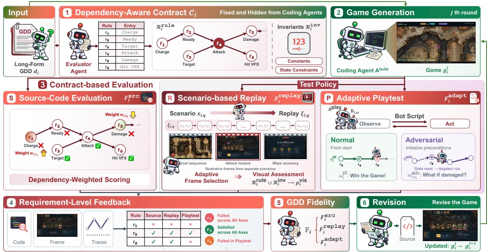  
Figure 3 Overall evaluation and revision pipeline of A2Z GameSpec-Bench.

Agentic Game Development and Evaluation. Benchmarks for agentic game development range from scoped game-engine tasks to complete game generation. GameDevBench (Chi et al., 2026) and GameEngineBench (La et al., 2026) evaluate agents on scoped tasks in existing game projects. At the full-game level, OpenGame-Bench (Jiang et al., 2026) scores browser-native games on build health, visual usability, and intent alignment, while WebGameBench (Zhang et al., 2026) evaluates games from specifications through browser interaction. GameCraft-Bench (Luo et al., 2026) replays traces and assesses fixed-rate sampled frames against a hidden multi-modal rubric. PlaytestArena uses a GUI agent to play browser games against behavior rubrics, and Play2Code uses its feedback for iterative game revision (Huang et al., 2026). Orak (Park et al., 2026), GameWorld (Ouyang et al., 2026), and OmniGameArena (Lin et al., 2026) instead evaluate game-playing agents in predefined games, addressing a diferent setting from testing newly generated games. GameGen-Verifier (Jia et al., 2026) extracts verifiable keypoints from a game specification, initializes their required runtime states, and tests them through bounded interaction. GameXpert-Bench (Chen et al., 2026b) combines code inspection and live validation in its GameGen track using an event rubric derived from cross-model outputs. A2Z GameSpec-Bench instead fixes a Dependency-Aware Contract from each long-form GDD before inspecting generated builds. The contract guides source-code inspection and agent-generated Test Policies for scenario-based replay and adaptive playtesting. Judgments and evidence remain linked to the same requirements across agents and revision rounds for consistent assessment of specification faithfulness and targeted revision.

## 3. A2Z GameSpec-Bench

Our benchmark measures how faithfully coding agents implement a long-form GDD as a complete game. Rather than considering the GDD as a single free-form rubric, we first convert the GDD into a Dependency-Aware Contract that defines which requirements and dependencies must be verified. The contract is withheld from the building agent during initial generation. Then, our Test Policies specify how to exercise the game and collect evidence for them. Together, source-code inspec tion, scenario-based replay, and adaptive playtesting provide complementary judgments linked to the same requirements for GDD Fidelity scoring and revision feedback, as illustrated in Figure 3. We use a 2D single-player Phaser setting for controlled comparison; Section 4.8 demonstrates the framework’s extension to 3D games in Three.js.

## 3.1. Benchmark Setting

Let $\mathcal { D } = \{ d _ { i } \} _ { i = 1 } ^ { N }$ be a corpus of $N$ GDDs, with $\mathcal { U } _ { i }$ denoting the requirements stated in $d _ { i } .$ These include conditional game rules, constraints on states and values, and expected visual responses. Given $d _ { i }$ and a development environment $\Omega ,$ a game-building agent $A ^ { \mathrm { b u i l d } }$ produces

$$
g _ { i } ^ { 0 } = A ^ { \mathrm { b u i l d } } ( d _ { i } ; \Omega ) ,\tag{1}
$$

where $g _ { i } ^ { 0 }$ contains the source project and executable build. The agent receives the GDD $d _ { i } ,$ while its implementation is assessed against an evaluation contract $\mathcal { C } _ { i }$ constructed from that document and withheld during initial generation. We write $g _ { i }$ when evaluating a single build and introduce revision rounds in Section 3.4.

Game Specifications and GDD Generation Protocol. We construct 100 GDDs in two stages: each game brief is first expanded into a creative vision (CV) defining the intended design, and then into a detailed GDD. Then, an agentic authoring pipeline checks each GDD for completeness and consistency. We split the GDDs by implementation scope: 50 Small designs with compact scope and 50 Big designs with broader content and interacting systems. Small GDDs average 14,085 tokens, while $B i g$ GDDs average 26,297 tokens. Further details of the generation procedure, validation, dataset statistics, and representative examples are in Appendix $\mathrm { A }$

## 3.2. Dependency-Aware Contract

We construct an evaluation contract from the requirements $\mathcal { U } _ { i }$ in the GDD $d _ { i }$

$$
\mathcal C _ { i } = ( \mathcal R _ { i } , \mathcal E _ { i } ) , \qquad \mathcal R _ { i } = \mathcal R _ { i } ^ { \mathrm { r u l e } } \cup \mathcal R _ { i } ^ { \mathrm { i n v } } ,\tag{2}
$$

where rules specify conditions, triggering events, and expected efects, while invariants specify constraints within a stated scope. The directed edges $\mathcal { E } _ { i }$ connect rules when one updates a state referenced by another rule’s preconditions or emits an event that triggers it. For example, in our game traces\_left, placing sensors changes the sensor count required by the ‘Run’ rule, linking placement to subsequent execution. For this example, source inspection checks the placement and execution handlers, replay checks the visible response to the prescribed inputs, and adaptive playtesting checks whether the required state transition occurs during play. The dependency identifies which prerequisite to inspect when execution cannot start; each downstream rule still requires its own evidence for a verdict.

Contract construction first fixes a shared state vocabulary and rule entries bound to their supporting GDD rows. Extracted read/write facts determine the dependency skeleton, and rule generation fills in conditions, triggers, and efects within this structure. The accepted contract is frozen before comparing builds, so agents and revision rounds are evaluated against the same requirement definitions and dependencies. Appendix B gives the construction and acceptance procedures, and Section 4.6 reports consistency across repeated generations.

## 3.3. Contract-Guided Evaluation

On average, each GDD specifies 69 outcome requirements and 32 invariants, and evaluation uses 20 replay scenarios. Generated games difer in their internal project structures, and many contract requirements concern rendered or interactive outcomes. We therefore use three complementary evaluation axes: source code inspection, scenario-based replay, and adaptive playtesting. Source-code inspection checks how requirements are implemented, while replay and adaptive playtesting collect runtime evidence of their visual and interactive outcomes through Test Policies. A scenario-based replay policy specifies a fixed input sequence and its timing, whereas an adaptive playtest policy selects inputs in response to runtime observations. The contract defines what to verify, and each test policy specifies how to exercise the game to obtain the required evidence. Judgments from all three axes remain linked to the contract requirements for scoring and feedback.

## 3.3.1. Source-Code Evaluation

First, an evaluator agent inspects the source of $g _ { i }$ against $\mathcal { C } _ { i }$ without executing the game. For each rule, it checks the implementation of the specified conditions, triggers, and efects, assigning a completeness score $f _ { i , r } ^ { \mathrm { s r c } } \in [ 0 , 1 ]$ with source-code references. Invariants use $f _ { i , r } ^ { \mathrm { s r c } } \in \{ 0 , 1 \}$ to record whether their constraints are preserved within the stated scope.

Dependency-Weighted Scoring. Because a failure in one rule can afect requirements that depend on its outputs, we account for each rule’s downstream reach when aggregating source-code judgments. For scoring, we use the state-dependency links $\mathcal { E } _ { i } ^ { \mathrm { s t a t e } } \subseteq \mathcal { E } _ { i } \colon$ one rule writes an attribute inspected by another rule’s condition. These links represent potential prerequisite relations. Let $D _ { i , r }$ count the downstream rules reachable from � via these links, and let $D _ { i } ^ { \operatorname* { m a x } } = \operatorname* { m a x } _ { r \in \mathcal { R } _ { i } ^ { \mathrm { r u l e } } } D _ { i , r }$ . For $D _ { i } ^ { \mathrm { m a x } } > 0 .$ , the weight $w _ { i , r }$ is defined as:

$$
w _ { i , r } = \alpha + ( 1 - \alpha ) \frac { \log ( 1 + D _ { i , r } ) } { \log ( 1 + D _ { i } ^ { \operatorname* { m a x } } ) } .\tag{3}
$$

The parameter $\alpha \in [ 0 , 1 ]$ sets the weight floor: $\alpha = 1$ yields uniform weights, while our default $\alpha = 0 . 5$ gives a rule at most twice the weight of a rule with no downstream dependencies. We set all weights to 1 when $D _ { i } ^ { \mathrm { m a x } } = 0$ . Then, the source-code score combines the weighted rule score with the invariant pass rate:

$$
F _ { i } ^ { \mathrm { s r c } } = F _ { i } ^ { \mathrm { r u l e } } F _ { i } ^ { \mathrm { i n v } } , \quad F _ { i } ^ { \mathrm { r u l e } } = \frac { \sum _ { r \in \mathcal { R } _ { i } ^ { \mathrm { r u l e } } } w _ { i , r } f _ { i , r } ^ { \mathrm { s r c } } } { \sum _ { r \in \mathcal { R } _ { i } ^ { \mathrm { r u l e } } } w _ { i , r } } , \quad F _ { i } ^ { \mathrm { i n v } } = \frac { \sum _ { r \in \mathcal { R } _ { i } ^ { \mathrm { i n v } } } f _ { i , r } ^ { \mathrm { s r c } } } { \vert \mathcal { R } _ { i } ^ { \mathrm { i n v } } \vert } .\tag{4}
$$

Thus, rules with greater downstream reach receive greater influence on the source-code score, while invariant violations reduce it. Appendix F.1.2 analyzes this weighting.

## 3.3.2. Scenario-Based Replay Assessment

Source inspection cannot determine whether the specified visual responses actually appear during execution. Therefore, we use controlled scenario replays to collect rendered evidence for the contract requirements. We derive a canonical scenario set $\bar { \mathcal { S } _ { i } } = \bar { \{ \ : s _ { i , q } \} } _ { q = 1 } ^ { Q _ { i } }$ from $\mathcal { C } _ { i }$ , where each scenario groups requirements with a shared entry condition. After finalizing the build, �<sup>build</sup> provides a fixed replay Test Policy with a sequence of player inputs and their timing for each scenario $s _ { i , q } \colon$

$$
\xi _ { i , q } = [ ( x _ { n } , t _ { n } ) ] _ { n = 1 } ^ { N _ { i , q } } ,\tag{5}
$$

where $x _ { n }$ is the input issued at time $t _ { n }$ . The policy is fixed before execution and does not change with runtime observations. We execute $\xi _ { i , q }$ under $s _ { i , q }$ and record the full replay with input events.

Following the rubric format and evaluation protocol of GameCraft-Bench (Luo et al., 2026), we express replay-observable rules and invariants as a game-level visual rubric $\rho _ { i } ^ { \mathrm { v i s } }$ , preserving their conditions and expected visible outcomes. Each item remains linked to its corresponding requirements. Every canonical scenario is replayed and scored against the fixed rubric using a build-specific input policy, and each judgment must cite observed frame evidence.

Adaptive Frame Selection. Fixed-rate sampling can miss brief responses, while a short temporal window can omit delayed outcomes. Therefore, we keep the full scenario replay and let the judge retrieve evidence relevant to $\rho _ { i } ^ { \mathrm { v i s } }$ . Given $s _ { i , q } , \rho _ { i } ^ { \mathrm { v i s } }$ , and $\xi _ { i , q } ,$ the judge identifies relevant trace events and requests their temporal intervals. Then, a deterministic tool maps these requests to recorded timestamps and returns up to � frames. Using these frames, the multimodal judge scores each rubric item in [0, 1] with supporting visual evidence. We combine the item rewards across scenarios using the category weights and aggregation rules of GameCraft-Bench to obtain $F _ { i } ^ { \mathrm { r e p l a y } }$

## 3.3.3. Adaptive Playtest

A fixed replay provides controlled visual evidence, but it cannot adjust its inputs to the runtime state of the game. Unlike the fixed replay policy, adaptive playtesting requires the Test Policy to respond to the runtime observations. Therefore, we implement it as an executable program following code-aspolicy (Liang et al., 2023). An evaluator-side coding agent $A ^ { \mathrm { p l a y } }$ reads a test objective � and a shared interface API for observing game states and returning valid player inputs:

$$
b _ { i , \omega } = A ^ { \mathrm { p l a y } } ( g _ { i } , \omega , \mathrm { A P I } ) .\tag{6}
$$

The bot uses conditions and loops to select its next input from runtime observations. Executing it from an initial state � produces a trace $\tau _ { i } ( \omega , z )$ as below:

$$
\tau _ { i } ( \omega , z ) = [ ( o _ { t } , x _ { t } ) ] _ { t = 1 } ^ { T _ { i } } ,\tag{7}
$$

Table 2 Main results on A2Z GameSpec-Bench. Overall GDD Fidelity, per-axis scores, and verifiable rates on 100 GDDs. Bold represents the best result, and underline indicates the second-best.
<table><tr><td rowspan="2">Model</td><td rowspan="2" colspan="3">Overall GDD Fidelity</td><td colspan="6">Evaluation Axis</td><td rowspan="2" colspan="2">Verifiable Rate</td></tr><tr><td colspan="2">Source</td><td colspan="2">Replay</td><td colspan="2">Playtest</td></tr><tr><td></td><td>All</td><td>Small</td><td>Big</td><td>Small</td><td>Big</td><td>Small</td><td>Big</td><td>Small</td><td>Big</td><td>Small</td><td>Big</td></tr><tr><td>Claude-Fable-5.1</td><td>77.0</td><td>82.8</td><td>71.1</td><td>89.7</td><td>83.5</td><td>73.5</td><td>55.1</td><td>85.2</td><td>74.7</td><td>98.7%</td><td>98.7%</td></tr><tr><td>Claude-Opus-5</td><td>73.9</td><td>80.9</td><td>66.8</td><td>87.9</td><td>78.4</td><td>71.2</td><td>54.4</td><td>83.6</td><td>67.7</td><td>100.0%</td><td>99.3%</td></tr><tr><td>米米米 Claude-Opus-4.8</td><td>56.8</td><td>67.9</td><td>45.6</td><td>72.5</td><td>49.6</td><td>62.5</td><td>41.4</td><td>68.7</td><td>46.0</td><td>99.3%</td><td>100.0%</td></tr><tr><td>S GPT-6-Astra</td><td>71.6</td><td>78.5</td><td>64.6</td><td>84.2</td><td>74.4</td><td>69.9</td><td>52.1</td><td>81.6</td><td>67.4</td><td>99.3%</td><td>97.3%</td></tr><tr><td>5 GPT-5.6-Sol</td><td>61.8</td><td>72.8</td><td>50.8</td><td>78.5</td><td>46.3</td><td>63.8</td><td>48.3</td><td>76.0</td><td>57.9</td><td>98.7%</td><td>98.0%</td></tr><tr><td>S GPT-5.5</td><td>63.2</td><td>73.1</td><td>53.4</td><td>81.0</td><td>55.9</td><td>60.8</td><td>42.5</td><td>77.5</td><td>61.7</td><td>97.3%</td><td>98.7%</td></tr><tr><td>Z GLM-5.3</td><td>55.6</td><td>66.9</td><td>44.3</td><td>78.6</td><td>58.1</td><td>57.3</td><td>34.5</td><td>64.9</td><td>40.4</td><td>88.7%</td><td>87.3%</td></tr><tr><td>Q DeepSeek-V4-Pro</td><td>50.4</td><td>65.3</td><td>35.6</td><td>75.7</td><td>53.8</td><td>52.2</td><td>25.9</td><td>68.0</td><td>27.0</td><td>88.0%</td><td>82.7%</td></tr><tr><td>Kimi-K2.7</td><td>39.5</td><td>51.4</td><td>27.5</td><td>60.8</td><td>37.3</td><td>47.7</td><td>19.0</td><td>45.7</td><td>26.2</td><td>75.3%</td><td>86.0%</td></tr></table>

where $o _ { t }$ is the observation at step � and $x _ { t }$ is the selected player input. The trace records the states, inputs, events, and timestamps used for requirement-level judgment.

Normal Playtest. First, the objective $\omega _ { i } ^ { \mathrm { p t } }$ asks the bot to complete $g _ { i }$ from its default state $z _ { i } ^ { 0 } { \mathrm { : } }$

$$
\tau _ { i } ^ { \mathrm { p t } } = \tau _ { i } ( \omega _ { i } ^ { \mathrm { p t } } , z _ { i } ^ { 0 } ) .\tag{8}
$$

Only player inputs are allowed, with no intermediate state initialization. This setting tests which contract requirements can be reached and verified through ordinary gameplay. Let ${ \mathcal { R } } _ { i } ^ { \mathrm { p t } } \subseteq { \mathcal { R } } _ { i } ^ { \mathrm { r u l e } }$ denote the verified rules with conclusive evidence from this trace.

Adversarial Playtest. Normal play may leave requirements unverified because their preconditions are not reached. Therefore, we apply targeted adversarial tests to ${ \mathcal R } _ { i } ^ { \mathrm { a d v } } \subseteq { \mathcal R } _ { i } ^ { \mathrm { r u l e } } \setminus { \mathcal R } _ { i } ^ { \mathrm { p t } }$ for checking edge cases that were not reached during normal play. For each rule $r ,$ we initialize the game to a state $z _ { i , r }$ satisfying its preconditions and give the bot an objective $\omega _ { i , r } ^ { \mathrm { a d v } }$ for testing its expected efects:

$$
z _ { i , r } \mid = \phi _ { r } , \qquad \tau _ { i , r } ^ { \mathrm { a d v } } = \tau _ { i } ( \omega _ { i , r } ^ { \mathrm { a d v } } , z _ { i , r } ) .\tag{9}
$$

Initialization supplies the target rule’s preconditions rather than its expected efects; assisted attempts are marked in the trace. After initialization, the protocol requires player inputs through the same interface as normal play, without further state injection. Before-trigger snapshots establish the situation and do not by themselves establish the outcome; the judge checks the subsequent trigger and efects against the recorded execution. Appendix D.3 details the initialization and trace protocol.

Judgment And Scoring. A separate evaluator compares each tested rule’s conditions, trigger, and expected efects with the recorded trace. A rule is satisfied when the evidence supports its specified efects and violated when the observed outcome contradicts them. Rules whose required situation is not established remain unverified. Each rule receives three judgments, and the strict majority determines its verdict. Conclusive normal-play verdicts are retained, while adversarial tests extend runtime verification to rules left unverified during normal play. The adaptive-play score $F _ { i } ^ { \mathrm { a d a p t } }$ is

$$
F _ { i } ^ { \mathrm { a d a p t } } = \frac { \sum _ { r \in \mathcal { R } _ { i } ^ { \mathrm { r u l e } } } f _ { i , r } ^ { \mathrm { a d a p t } } } { \vert \mathcal { R } _ { i } ^ { \mathrm { r u l e } } \vert } ,\tag{10}
$$

where $f _ { i , r } ^ { \mathrm { a d a p t } } = 1$ only when � is confirmed as satisfied and 0 otherwise. We separately report judgment coverage, the fraction of all rules judged either satisfied or violated, to measure the extent of conclusive execution evidence. Detailed interface, judgment, and aggregation procedures are provided in Appendix D.3.

## 3.4. Requirement-Level Evidence and Feedback

For revision round $j ,$ including the initial build at $j = 0$ , we calculate overall GDD Fidelity as

$$
\mathbf { F _ { i } ^ { j } } = \frac { { F _ { i } ^ { \mathrm { s r c } , j } + F _ { i } ^ { \mathrm { r e p l a y } , j } + F _ { i } ^ { \mathrm { a d a p t } , j } } } { 3 } .\tag{11}
$$

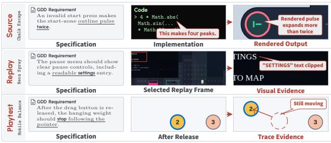  
(a) Evidence across Axes

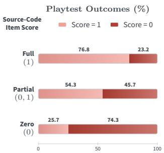  
(b) Playtest Confirmation Gap

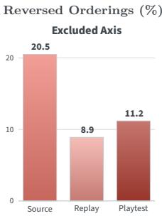  
(c) Axis Omission  
Figure 4 Complementarity of source-code evaluation, scenario-based replay, and adaptive playtesting. (a) Examples of specification violations identified through diferent evidence traces. (b) Playtest judgment outcomes grouped by source-code score. (c) Ratio of reversed GDD fidelity rank orderings across all 100 evaluated games built by GPT-5.6-Sol upon omission of individual evaluation axes.

We report the three axis scores separately and give each evidence channel equal weight in overall GDD Fidelity, without fitting weights to the evaluated agents. To analyze agent performance during execution, we also define runtime fidelity as the equal-weight mean $\begin{array} { r } { F _ { i } ^ { \mathrm { r u n } , j } = ( F _ { i } ^ { \mathrm { r e p l a y } , j } + F _ { i } ^ { \mathrm { a d a p t } , j } ) / 2 } \end{array}$ of the scenario-based replay and adaptive-playtest scores. Equivalently, $\mathbf { F _ { i } ^ { j } } = ( F _ { i } ^ { \mathrm { s r c } , j } + 2 F _ { i } ^ { \mathrm { r u n } , j } ) / 3$ . Appendix F.5 examines alternative axis weights while retaining the default dependency weighting within source-code evaluation.

The score $\mathbf { F _ { i } ^ { j } }$ supports agent comparison, while the requirement-level judgments and supporting evidence such as code, frames, and traces identify where the implementation difers from the design. These results form feedback $h _ { i } ^ { j }$ for the next revision based on $g _ { i } ^ { j }$

$$
g _ { i } ^ { j + 1 } = A ^ { \mathrm { b u i l d } } ( d _ { i } , g _ { i } ^ { j } , h _ { i } ^ { j } ; \Omega ) .\tag{12}
$$

We assess the revised build against the same contract using all three axes, keeping the evaluation target fixed while measuring changes in specification faithfulness.

## 4. Experiments

## 4.1. Experimental Setup

We evaluate coding-agent configurations based on Claude-Fable-5.1 (Anthropic, 2026), Claude-Opus-5 (Anthropic, 2026), Claude-Opus-4.8 (Anthropic, 2026), GPT-6-Astra (OpenAI, 2026c), GPT-5.6-Sol (OpenAI, 2026b), GPT-5.5 (OpenAI, 2026a), Kimi-K2.7 (Kimi Team, 2025), GLM-5.3 (GLM-5-Team, 2026), and DeepSeek-V4-Pro (DeepSeek-AI, 2026). Each configuration is evaluated on all 100 GDDs. For each GDD, the same contract and replay scenarios are used across all outputs.

Unless otherwise stated, evaluator-side agents use GPT-5.6-Luna at high reasoning efort. Evaluatormodel comparisons and cost analyses are provided in Appendix G.2, with further analysis of scenariobased replay assessment in Appendix F.2. Each configuration generates three builds per GDD, and each build is independently judged three times, with axis-specific aggregation described in Appendix D. We report overall GDD Fidelity, the source-code, replay, and adaptive-play scores, and the verifiable rate defined as the average compile and runtime pass rate across the three axes. Benchmark fidelity scores are reported on a 0–100 scale. Further details on agent configurations, computational resources, and evaluation settings are provided in Appendix C.

## 4.2. Main Benchmark Results

As shown in Table 2, Claude-Fable-5.1 achieves the highest overall GDD Fidelity of 77.0 across all 100 GDDs, followed by Claude-Opus-5 at 73.9. Across the evaluated agents, mean overall GDD Fidelity is 71.1 on Small and 51.1 on $B i g ,$ while the corresponding verifiable rates are 93.9% and 94.2%. Although most games can be compiled and executed under our evaluation, high verifiability does not imply faithful implementation of the intended design. In addition, implementing games from Big GDDs is consistently more dificult across all three evaluation axes than implementing games from Small GDDs. Overall score decreases by 20.0 points from Small to Big. The average source-code, scenario-based replay, and adaptive playtest scores similarly decrease by 19.1, 20.6, and 20.3 points, which shows that dificulty of broader specifications is not confined to source implementation, visual rendering, or runtime behavior alone.

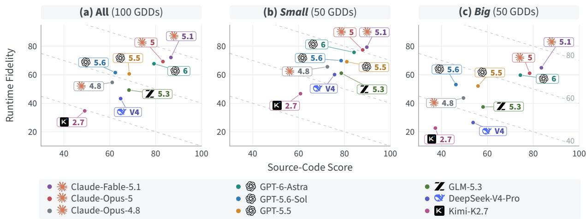  
Figure 5 Source-code scores and runtime fidelity across nine coding agents. The source-code score uses dependency-weighted scoring (� = 0.5); runtime fidelity equally averages scenario-based replay and adaptiveplaytest scores. (a) equally averages the Small and Big split means; (b) and (c) show the splits separately. All panels share the same scales. Dots mark the scores, with ofset icon labels for readability. Dashed lines indicate overall GDD Fidelity of 40, 60, and 80.

Figure 5 compares the nine agents by source-code score and runtime fidelity, using the average of scenario-based replay and adaptive-playtest scores defined in Section 3.4. Both coordinates follow the aggregation protocol of Table 2, and dashed lines indicate overall GDD Fidelity. Claude-Fable-5.1 leads on both coordinates, while other agents exhibit diferent performance profiles. Specifically, GPT-5.5 and GLM-5.3 have nearly equal source-code scores (68.5 vs. 68.4), but their runtime fidelity difers by 11.4 points (60.6 vs. 49.3). Figure 5(c) shows a sharper contrast on Big: GLM-5.3 has a higher sourcecode score (58.1 vs. 55.9), while GPT-5.5 has higher runtime fidelity (52.1 vs. 37.4). These diferences show how evaluation through Test Policies distinguishes agents with comparable source-code scores by assessing their rendered outcomes and interactive behavior. Further pairwise comparisons are provided in Appendix E.

## 4.3. Complementarity of the Evaluation Axes

Figure 4 demonstrates that the three axes capture diferent failures for the same specification. Figure 4(a) presents violations identified through diferent evidence channels: an incorrect pulse count in the implementation, clipped menu text in replay frames, and continued object movement after input release during playtesting. As shown in Figure 4(b), even among rules that pass with a full source-code score, only 76.8% are confirmed as satisfied during playtesting, while 23.2% do not receive a full score. In contrast, 25.7% of rules receiving zero source-code score are judged as satisfied during playtesting. These disagreements show that implementation-level judgments and runtime observations provide diferent evidence on requirement satisfaction. Additionally, Figure 4(c) reports ordering reversals across the 100 games generated by GPT-5.6-Sol when each axis is omitted. Relative to the full three-axis evaluation, omitting source-code evaluation, scenario-based replay assessment, or adaptive playtesting yields reversed-ordering rates of 20.5%, 8.9%, and 11.2%, respectively. Appendix F.4 details the axis-omission analysis and presents additional source-code and runtime discrepancies.

## 4.4. Diagnosing Integration Failures

We test whether dependency context identifies useful inspection targets beyond an enumerated evaluation that scores GDD-derived requirements individually without explicit dependency edges. Using one initial GPT-5.6-Sol build for each of the 100 GDDs, we hold the builds, enumerated source judgments, and requirement mappings fixed. A rule with full enumerated credit is selected for further inspection when a direct predecessor receives less than full credit. This identifies 408 of 908 eligible full-credit targets (44.9%) across 53 games. The share increases from 25.7% on Small to 58.6% on $B i g ,$ concentrating additional inspection targets in the broader Big designs.

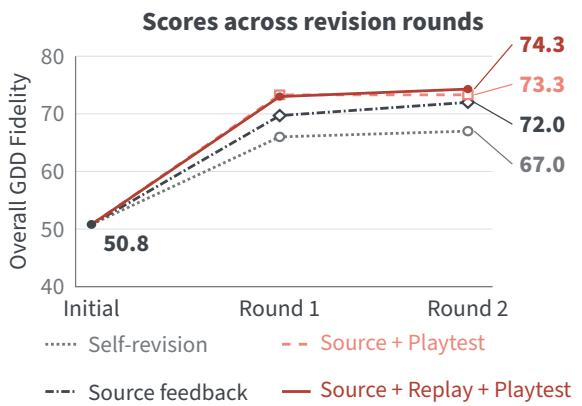  
Figure 6 Iterative revision. Mean overall GDD Fidelity on 50 Big GDDs under matched revision budgets. All conditions share the initial builds and revision agent; Figure 7 shows qualitative comparisons.

Table 3 Dependency-guided diagnosis. Inspection coverage of recorded playtest violations among 2,185 matched targets. Adding dependencies retains enumerated judgments and expands the inspection set.
<table><tr><td></td><td>Small</td><td>Big</td><td>All</td></tr><tr><td>Violation Coverage (%)</td><td></td><td></td><td></td></tr><tr><td>Enumerated</td><td>16.7</td><td>78.3</td><td>71.1</td></tr><tr><td>+ Dependencies</td><td>24.2</td><td>87.7</td><td>80.2</td></tr><tr><td>Added Violations</td><td></td><td></td><td></td></tr><tr><td>Rules</td><td>5</td><td>46</td><td>51</td></tr><tr><td>Games</td><td>3</td><td>23</td><td>26</td></tr><tr><td>Inspection-Set Size</td><td></td><td></td><td></td></tr><tr><td>Enumerated</td><td>49</td><td>722</td><td>771</td></tr><tr><td>+ Dependencies</td><td>140</td><td>974</td><td>1,114</td></tr></table>

The recorded playtests provide a separate check of these inspection targets. Among 2,185 targets with matched source-code scores and conclusive playtest verdicts, 560 are violated. The enumerated inspection set, consisting of targets with source-code scores below 1.0, includes 398 of these violations. Adding dependency context increases this count to 449, improving violation coverage from 71.1% to 80.2% (Table 3). The 9.1-point gain has a 95% paired game bootstrap interval of 6.1–13.0 points, and the additional 51 violations span 26 games. Thus, dependencies direct inspection to runtime failures even when the target itself received full enumerated source credit. Appendix G.1.2 gives the matching procedure, denominators, and source-level comparisons.

Requirement-linked evidence also explains what must change in the implementation. In Grand Atelier 2D, a collection with insuficient grades or inconsistent composition must fail with a reputation penalty of 12. The enumerated source judgments credit the grade and coherence checks, but the submission handler permits only passing collections, leaving the required failure transition and penalty unimplemented. Tracing the stated condition through its required efects reveals the missing branch. This illustrates why diagnosis must follow conditions through the transitions and state updates required by the design. Additional code-level and runtime examples appear in Appendix G.1.2 and Appendix F.4.

## 4.5. Iterative Revision with Three-Axis Feedback

We study whether requirement-level feedback based on our contract improves overall GDD Fidelity beyond revision guided by direct inspection of the GDD and source code, using 50 Big GDDs with GPT-5.6-Sol. All conditions start from the same initial builds, use the same revision agent for two rounds, and are evaluated on all three axes against the same contracts. The self-revision baseline gets feedback from an evaluator agent that directly reviews the GDD and the source code without using our contract or contract-based feedback. We compare it with three benchmark-feedback conditions: Source feedback provides contract-based source-code evaluation, Source + Playtest adds playtest feedback, and Source + Replay + Playtest corresponds to the three-axis feedback. As shown in Figure 6, Source + Replay + Playtest reaches a mean overall GDD Fidelity of 74.3 after two rounds, exceeding the 67.0 of self-revision by 7.3 points (10.9% relative). After two revision rounds, the larger gains from our feedback support using requirement-level judgment evidence to guide revisions toward the specified design, rather than relying solely on the GDD and source code.

Figure 7 compares initial builds with the self-revision baseline and Source + Replay + Playtest after two revision rounds in four games, pairing each GDD requirement with the resulting behavior. In Chameleon Slide, pressing a color key at rest must immediately recolor the character’s body. The initial and self-revision builds retain a green body, whereas Source + Replay + Playtest recolors it. In Fogfall Delivery, Source + Replay + Playtest displays estimate-class icons and confidence in the highlighted cells left blank by the initial and self-revision builds.

Table 4 Component analysis. (a) Mean and maximum absolute changes in source-code score from uniform weighting (Appendix F.1.2). (b) Evidence support for fixed-rate versus adaptive frame selection (Appendix G.3). (c) Judgment coverage (%) after a second normal or adversarial pass under matched budgets. The first normal pass reaches 40.5%; gains are percentage points relative to this shared first pass (Appendix F.3). Coverage includes both satisfied and violated requirements.  
(a) Dependency Weighting
<table><tr><td rowspan="2">Setting (α)</td><td colspan="2">Score Change</td></tr><tr><td>Mean |∆|</td><td>Max. |∆|</td></tr><tr><td>Default (0.5)</td><td>0.38</td><td>3.71</td></tr><tr><td>Stronger (0.1)</td><td>0.96</td><td>19.10</td></tr></table>

(b) Frame Selection
<table><tr><td rowspan="2">Method</td><td colspan="2">Evidence Support</td></tr><tr><td>Item Preference</td><td>Game Wins</td></tr><tr><td>Fixed-Rate</td><td>39.5</td><td>13</td></tr><tr><td>Adaptive Selection</td><td>60.5</td><td>35</td></tr></table>

(c) Adaptive Playtesting
<table><tr><td>Second Pass</td><td colspan="2">After Normal Play</td></tr><tr><td></td><td>Judgment Coverage</td><td>Coverage Gain</td></tr><tr><td>Normal</td><td>41.0</td><td>+0.5</td></tr><tr><td>Adversarial</td><td>48.5</td><td>+8.0</td></tr></table>

The remaining cases show how requirement-specific feedback repairs interaction and state-update errors that persist under self-revision. In Beat Reroute, a captured fragment must follow the pointer with a 20 px vertical ofset. The initial and self-revision builds leave it in its slot, while Source + Replay + Playtest renders it at the required ofset. In Abyssal Chain, oxygen depletion must immediately set Hull to 0. All three builds show a drowned-run screen, but Hull remains 100 in the initial and self-revision builds; only Source + Replay + Playtest performs the specified state update. These cases illustrate why revision feedback must address the behavior and state changes required by the GDD. Appendix I.1 provides the matched probe details and an additional pointer-release comparison.

## 4.6. Evaluation Reliability

We examine the consistency of evaluation targets and agreement across evaluator configurations. In the requirement-extraction comparison on 100 GDDs, contract construction achieves 93% citation overlap across five runs on Big, compared with 57% for a naive judge that identifies requirements while evaluating a build. In a separate experiment, three rule generations per GDD with fixed vocabulary and sourcebound entries preserve all entries and source associations across 300 outputs; reachability agreement, dependency-edge Jaccard similarity, and role preservation are each at least 0.999. These results support using a common, frozen contract to keep evaluation targets aligned across builds. Appendix G.1.1 and Appendix B.5 describe the two experiments and within-rule variation.

We also compare evaluator configurations on fixed inputs. Against GPT-5.6-Sol reference judgments, the default GPT-5.6-Luna high configuration reaches a rule-level Pearson correlation of 0.72 for sourcecode evaluation and an item-level correlation of 0.85 for scenario-based replay assessment, compared with 0.74 and approximately 0.86 for independent reference-model re-runs. The reference judgments for source-code evaluation and scenario-based replay assessment use extra-high reasoning efort, while the adaptive-playtest reference uses high efort. On fixed playtest traces, GPT-5.6-Luna’s verdict agreement is 0.910 on Small and 0.888 on Big; only 6 of 222 and 3 of 242 rules, respectively, change whether they contribute to the playtest score. These comparisons assess agreement under shared contracts and evidence. Appendix G.2 and Appendix F.2 provide the configurations, run-to-run references, and costs.

The aggregate ranking is also robust to the relative weights of the evidence channels. Holding the measured axis scores and source dependency parameter � = 0.5 fixed, Claude-Fable-5.1, Claude-Opus-5, and GPT-6-Astra retain the first three positions under every nonnegative axis weighting that sums to one, separately on Small, Big, and All. For All, 30 of 36 agent-pair orderings are invariant over this full domain. For the All aggregate, when every axis retains at least half its default contribution, 34 of 36 orderings are invariant and each agent remains within one position of its equal-weight rank. Appendix F.5 gives the continuous-domain analysis and representative reweightings.

## 4.7. Component Analysis

Dependency-Weighted Scoring. We examine how dependency weighting (Section 3.3.1) changes sourcecode scores under fixed rule judgments. Relative to uniform weighting, the default � = 0.5 setting adjusts source-code scores by an average of 0.38 points in absolute terms, with a maximum adjustment of 3.71 points, as shown in Table 4(a). Applying stronger weighting at � = 0.1 increases these changes to 0.96 and 19.10 points, respectively, while model rankings remain unchanged across both splits. In a complementary source-code and playtest analysis, weighting lowers rule scores in 61.1% of builds with confirmed high-reach failures, compared with 37.5% of comparison builds (Appendix F.1.2). Section 4.4 further examines how dependency context improves failure diagnosis while keeping enumerated source judgments fixed.

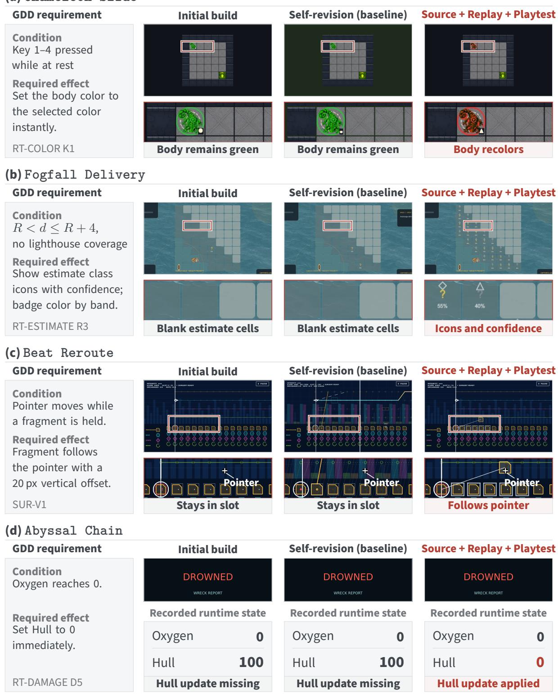  
Figure 7 Requirement-level repairs beyond self-revision. Each panel pairs a GDD requirement with the initial build, the self-revision baseline, and Source + Replay + Playtest; both revision columns show second-round builds. The examples compare (a) body recoloring, (b) estimate-class icons and confidence, (c) a held fragment following the pointer, and (d) the Hull update required by oxygen depletion. In each illustrated case, the violation remains in the initial and self-revision builds and is repaired by Source + Replay + Playtest. Detail crops enlarge the highlighted regions in (a)–(c); crosshairs in (c) mark the actual pointer position. In (d), all three builds display a drowned-run screen, but only the feedback revision sets Hull to 0. The state cards report values recorded during execution. In (b), � is the reveal radius and � is Manhattan distance from the ship.

Adaptive Frame Selection. We compare adaptive frame selection with fixed-rate sampling across all 50 Small GDD games generated by GPT-5.6-Sol, utilizing identical recorded replays, visual rubrics, and frame counts per replay. A separate agent evaluates how efectively the cited frames support each requirement-level rationale. As shown in Table 4(b), adaptive selection is preferred in 60.5% of comparisons where either method is favored, and receives more preferences in 35 out of 50 games, compared to 13 for fixed-rate sampling, with 2 ties. These results indicate that selecting frames around relevant gameplay events provides stronger support for replay judgments than fixed-rate sampling. Appendix G.3 presents a detailed analysis of these sampling methods.

Normal And Adversarial Playtests. We compare a second normal pass with an adversarial pass on 86 dependency-linked rules from 50 games, holding the builds, contracts, test policies, and budgets fixed. Both conditions retain the first normal pass’s conclusive verdicts and re-test only its unverified targets. As shown in Table 4(c), the first pass establishes 40.5% judgment coverage, which increases to 41.0% with another normal pass and 48.5% with an adversarial pass. The 7.5-percentage-point advantage under matched second-pass budgets supports prerequisite initialization as a way to extend verification beyond repeated normal play. Across all nine coding-agent configurations in the main benchmark, adversarial tests add both satisfaction and violation evidence. Appendix F.3 provides the controlled protocol and the full decomposition of the main-table playtest results by agent and split.

## 4.8. Extension to 3D Games

The framework separates GDD-derived contracts from the engine-specific interfaces used to collect evidence, allowing the contract representation and three evaluation axes to be retained across runtimes. Extending the benchmark requires adapting game execution, player input, state observation, scenario initialization, and frame capture, while the brief-to-GDD workflow can specify designs for the target environment. We apply this structure to three additional 3D games built by GPT-6-Astra in Three.js: Sonic: Cascade Coast, Diablo Cathedral, and Rocket League. Each build is evaluated against its fixed GDD-derived contract through source-code inspection, scenario-based replay, and adaptive playtesting. Figure 8 pairs GDD requirement summaries with gameplay examples from two of these builds. Appendix H reports the three-axis scores and requirement-level diagnoses.

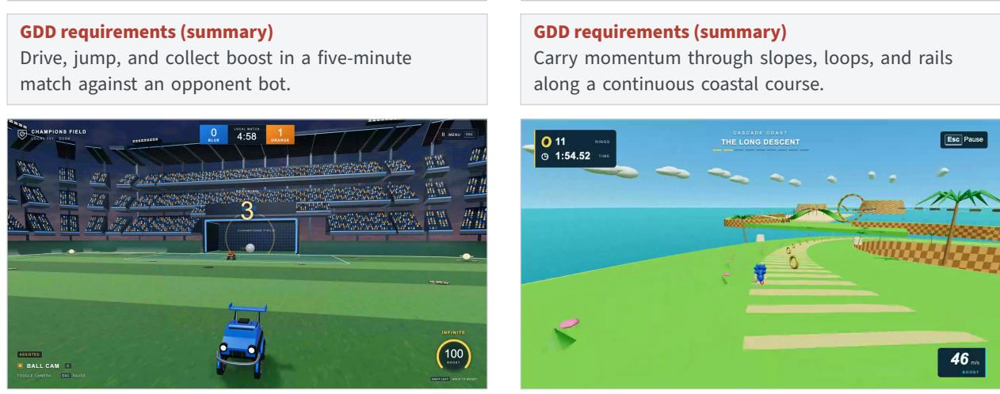  
(a) Rocket League  
Match resumption with a countdown.  
(b) Sonic: Cascade Coast  
A later sector: The Long Descent.

Figure 8 Extension of contract-based evaluation to 3D games. GDD requirement summaries accompany original gameplay captures from two Three.js builds: (a) vehicle-based ball play in Rocket League and (b) momentumbased platforming in Sonic: Cascade Coast. Both builds are assessed through source-code inspection, scenariobased replay, and adaptive playtesting against their fixed contracts. Appendix H reports the scores and requirement-level diagnoses.

## 5. Conclusion

We introduced A2Z GameSpec-Bench, a benchmark for evaluating coding agents’ faithfulness to 100 long-form GDDs in end-to-end game development. Fixed Dependency-Aware Contracts guide both source-code inspection and agent-generated Test Policies for replay and adaptive playtesting, linking evidence to the same requirements. The results show that runnable outputs may not fully correspond to the intended design and that local source-code passes can coexist with failed prerequisites.

Dependency context expands the coverage of recorded execution failures, and the same evaluation structure produces requirement-level diagnoses in three additional 3D games. By connecting requirementlevel evaluation with targeted revision, A2Z GameSpec-Bench enables both assessment and improvement of specification faithfulness in game development.

## Acknowledgments

We sincerely thank Kyungdo Park, Janghoon Ju, Jaeuk Kim, Inkyu Park, Myungseok Oh, Yujin Hong, and Inyoung Cho from the KRAFTON AtoZ team for helpful discussions and support throughout this project. We also thank Kangwook Lee and Junesig Sung from KRAFTON for their support, and Jiho Choi from KAIST for his valuable advice and feedback on this work.

## References

Anthropic. Claude Code overview. Oficial Documentation, 2026. URL https://code.claude.com/ docs/en/overview. Accessed: 2026-08-29.

D. Callele, E. Neufeld, and K. Schneider. Requirements engineering and the creative process in the video game industry. In 13th IEEE International Conference on Requirements Engineering (RE’05), pages 240–250. IEEE, 2005.

B. Chen, H. Liu, and S. Zhang. Webgrader: Training llms for web development with self-evolving programmatic grader. arXiv preprint arXiv:2608.06474, 2026a.

K. Chen, H. Hong, P. Gao, J. Lin, T. Luo, Y. Xie, C. Liu, J. He, Z. Liu, and Z. Zeng. Gamexpert-bench: How far are coding agents from expert game development?, 2026b. URL https://arxiv.org/abs/ 2608.21833.

W. Chi, Y. Fang, A. Yayavaram, S. Yayavaram, S. Karten, Q. A. Wei, R. Chen, A. Wang, V. Chen, A. Talwalkar, et al. GameDevBench: Evaluating agentic capabilities through game development. arXiv preprint arXiv:2602.11103, 2026.

W.-L. Chiang, L. Zheng, Y. Sheng, A. N. Angelopoulos, T. Li, D. Li, H. Zhang, B. Zhu, M. Jordan, J. E. Gonzalez, et al. Chatbot arena: An open platform for evaluating llms by human preference. arXiv preprint arXiv:2403.04132, 2024.

J. Cho, A. Zala, and M. Bansal. Visual programming for step-by-step text-to-image generation and evaluation. Advances in Neural Information Processing Systems, 36:6048–6069, 2023.

J. Cho, Y. Hu, J. Baldridge, R. Garg, P. Anderson, R. Krishna, M. Bansal, J. Pont-Tuset, and S. Wang. Davidsonian scene graph: Improving reliability in fine-grained evaluation for text-to-image generation. In International conference on learning representations, volume 2024, pages 15625–15645, 2024.

Y. Dai, Y. Lai, M. Huang, H. Guo, D. Li, H. Peng, H. Li, Y. Zhao, H. Lyu, Z. Ge, X. Zhang, and D. Jiang. WebVR: Benchmarking multimodal LLMs for webpage recreation from videos via human-aligned visual rubrics. arXiv preprint arXiv:2603.13391, 2026. URL https://arxiv.org/abs/2603.13391.

DeepSeek-AI. Deepseek-v4: Towards highly eficient million-token context intelligence, 2026. URL https://arxiv.org/abs/2606.19348.

X. Dong, Z. Li, and X.-M. Wu. Muse: Benchmarking manufacturable, functional, and assemblable text-to-cad generation. arXiv preprint arXiv:2605.28579, 2026.

Epic Games. Automation Test Framework. Epic Games, n.d. URL https://dev.epicgames.com/ documentation/unreal-engine/automation-test-framework-in-unreal-engine. Unreal Engine documentation. Accessed September 23, 2026.

J. Fischbach, J. Frattini, A. Spaans, M. Kummeth, A. Vogelsang, D. Mendez, and M. Unterkalmsteiner. Automatic detection of causality in requirement artifacts: the CiRA approach. In Requirements Engineering: Foundation for Software Quality (REFSQ), 2021. arXiv:2101.10766.

J. Frattini, J. Fischbach, D. Mendez, M. Unterkalmsteiner, A. Vogelsang, and K. Wnuk. Causality in requirements artifacts: prevalence, detection, and impact. Requirements Engineering, 28(1):49–74, 2023.

GLM-5-Team. Glm-5: from vibe coding to agentic engineering, 2026. URL https://arxiv.org/abs/ 2602.15763.

K. R. Hamilton. Race’n’Chase Game Design. Game Design Document Version 1.05, DMA Design Ltd., Mar. 1995. URL https://www.gamedevs.org/uploads/grand-theft-auto.pdf. March 22, 1995.

Y. Hu, B. Liu, J. Kasai, Y. Wang, M. Ostendorf, R. Krishna, and N. A. Smith. Tifa: Accurate and interpretable text-to-image faithfulness evaluation with question answering. In 2023 ieee/cvf international conference on computer vision (iccv), pages 20349–20360. IEEE, 2023.

Y. Huang, B. Li, N. Li, Z. Wang, K. Chen, H. Ge, Q. Si, Y. Shen, R. Yang, G. Wang, and H. Guo. GUI agents for continual game generation. arXiv preprint arXiv:2605.28258, 2026.

C. Jia, R. Wan, T. Sun, W. Tan, B. Wan, Y. Tong, G. Sheng, and H. Xu. Gamegen-verifier: Parallel keypoint-based verification for llm-generated games via runtime state injection. arXiv preprint arXiv:2605.07442, 2026.

Y. Jiang, J. Hu, Q. Xiao, Y. Zheng, R. Ma, K. Feng, J. Han, T. Peng, K. Fan, M. Zhang, et al. OpenGame: Open agentic coding for games. arXiv preprint arXiv:2604.18394, 2026.

Kimi Team. Kimi K2: Open agentic intelligence. arXiv preprint arXiv:2507.20534, 2025. URL https: //arxiv.org/abs/2507.20534v1.

G. Kisel. Running an Automated Test Pipeline for the League Client Update. Riot Games Tech Blog, Oct. 2016. URL https://www.riotgames.com/en/news/ running-automated-test-pipeline-league-client-update. Published October 25, 2016.

W. Kwon, Z. Li, S. Zhuang, Y. Sheng, L. Zheng, C. H. Yu, J. Gonzalez, H. Zhang, and I. Stoica. Eficient memory management for large language model serving with pagedattention. In Proceedings of the 29th symposium on operating systems principles, pages 611–626, 2023.

B. La, S. Chang, B. Kim, J. Bae, A. A. Beg, S. Chang, G. Gonzalez-Pumariega, and K. Goyal. Gameenginebench: Evaluating coding agents on real c++ runtime environments. arXiv preprint arXiv:2607.03525, 2026.

Y. Lee, R. Nair, Q. Zhang, K. Lee, O. Khattab, and C. Finn. Meta-harness: End-to-end optimization of model harnesses. arXiv preprint arXiv:2603.28052, 2026.

J. Liang, W. Huang, F. Xia, P. Xu, K. Hausman, B. Ichter, P. Florence, and A. Zeng. Code as policies: Language model programs for embodied control. In 2023 IEEE International conference on robotics and automation (ICRA), pages 9493–9500. IEEE, 2023.

M. Lin, S. Qian, Y. Liu, Y.-H. Huang, Y. Wang, W. Huang, Y. Li, F. Zhang, Z. Hu, L. Zhu, et al. Omnigamearena: A unified ue5 benchmark for vlm game agents with improvement dynamics. arXiv preprint arXiv:2606.09826, 2026.

T. Luo, R. Wang, J. Bi, C. Xu, Z. Tang, J. Chen, J. Liang, K. Ji, S. Guo, Y. Du, F. Bu, W. Du, X. Zhang, K. Li, S. Wang, L. Zhang, Y. Liu, X. Lai, C. Li, Y. Guo, Z. Zhang, X. Wang, T. Bai, Z. Li, and B. Wang. GameCraft-Bench: Can agents build playable games end-to-end in a real game engine? arXiv preprint arXiv:2606.17861, 2026.

Y. Meng, Y. Suo, J. Wang, Y. Sun, Y. Yu, R. Zhang, R. Hu, Y. Wang, S. Ruan, B. Wang, et al. Webrise: Requirement-induced state evaluation for mllm-generated web artifacts. arXiv preprint arXiv:2606.03220, 2026.

OpenAI. Gpt-5.5 system card, April 2026a. URL https://openai.com/index/gpt-5-5-system-card/. Published by OpenAI Deployment Safety Hub.

OpenAI. Gpt-5.6 system card, July 2026b. URL https://deploymentsafety.openai.com/gpt-5-6/ gpt-5-6.pdf. Published by OpenAI Deployment Safety Hub.

OpenAI. Gpt-6 astra: A new generation of intelligence, 2026c. URL https://openai.com/index/ gpt-6-astra/. Accessed: 2026-09-16.

M. Ouyang, S. Hu, K. Q. Lin, H. T. Ng, and M. Z. Shou. Gameworld: Towards standardized and verifiable evaluation of multimodal game agents. arXiv preprint arXiv:2604.07429, 2026.

D. Park, M. Kim, B. Choi, J. Kim, K. Lee, J. Lee, I. Park, B. Lee, J. Hwang, J. Ahn, et al. Orak: A foundational benchmark for training and evaluating llm agents on diverse video games. In International Conference on Learning Representations, volume 2026, pages 60684–60744, 2026.

C. Qian, W. Liu, H. Liu, N. Chen, Y. Dang, J. Li, C. Yang, W. Chen, Y. Su, X. Cong, J. Xu, D. Li, Z. Liu, and M. Sun. ChatDev: Communicative agents for software development. In Proceedings of the 62nd Annual Meeting of the Association for Computational Linguistics (Volume 1: Long Papers), pages 15174–15186. Association for Computational Linguistics, 2024. doi: 10.18653/v1/2024.acl-long.810. URL https://aclanthology.org/2024.acl-long.810/.

M. G. Salazar, H. A. Mitre, C. L. Olalde, and J. L. G. Sánchez. Proposal of game design document from software engineering requirements perspective. In 2012 17th International Conference on Computer Games (CGAMES), pages 81–85. IEEE, 2012.

Y. Wang, Z. Wen, Y. Tang, Y. Fu, L. Yuan, X. Zhang, J. Zhou, and W. Chen. LiveEvalBench: Toward open-world evaluation for web generation. arXiv preprint arXiv:2608.03689, 2026. URL https:// arxiv.org/abs/2608.03689.

B. Wen, P. Ke, X. Gu, L. Wu, H. Huang, J. Zhou, W. Li, B. Hu, W. Gao, J. Xu, Y. Liu, J. Tang, H. Wang, and M. Huang. Benchmarking complex instruction-following with multiple constraints composition. Advances in Neural Information Processing Systems, 37, 2024. doi: 10.52202/079017-4371. URL https://papers.nips.cc/paper\_files/paper/2024/hash/ f8c24b08b96a08ec7a7a975feea7777e-Abstract-Datasets\_and\_Benchmarks\_Track.html.

X. Xu, X. Li, X. Qu, J. Fu, and B. Yuan. Local success does not compose: Benchmarking large language models for compositional formal verification. In International Conference on Learning Representations, volume 2026, pages 118471–118508, 2026.

J. Yang, K. Lieret, J. Ma, P. Thakkar, D. Pedchenko, S. Sootla, E. McMilin, P. Yin, R. Hou, G. Synnaeve, et al. Programbench: Can language models rebuild programs from scratch? arXiv preprint arXiv:2605.03546, 2026.

W. Zhang, G. You, Tianlun, H. Zhao, T. Zhu, H. Wang, X. Tang, M. Dai, J. Gu, D. Dong, and J. Wu. WebGameBench: Requirement-to-application evaluation for coding agents via browser-native games. arXiv preprint arXiv:2605.17637, 2026. URL https://arxiv.org/abs/2605.17637.

## Appendix Contents

A Game Design Document Dataset 19   
A.1 Brief-to-GDD Pipeline 19   
A.2 Harness Optimization 19   
A.3 Admission Criteria 20   
A.4 Validation and Repair 21   
A.5 Dataset Splits and Statistics 22   
A.6 Examples of GDDs . 24   
B Details on Contract Generation 27   
B.1 Dependency Structure in Game Specifications . 27   
B.2 Rule Generation 27   
B.3 Properties of the Accepted Contract 29   
B.4 Contract Example 29   
B.5 Stability of Contract Generation 29   
B.6 Value Compatibility 32   
B.7 Dependency-Adjusted Rule Pass Rate 32   
C Experimental Details . 33   
D Details on Evaluation Setup 34   
D.1 Source Code Evaluation 34   
D.2 Scenario-Based Replay Assessment 35   
D.3 Adaptive Playtest 36   
E Additional Analysis on Benchmark Results . 40   
F Ablations on Evaluation 44   
F.1 Source-Code Evaluation 44   
F.2 Scenario-Based Replay Assessment 46   
F.3 Adaptive Playtest 47   
F.4 Complementarity of Evaluation . 50   
F.5 Sensitivity to Evaluation-Axis Weights 50   
G Additional Analysis on Evaluation 53   
G.1 Dependency-Aware Contract 53   
G.2 Cost Analysis . 55   
G.3 Fixed-Rate Sampling vs. Adaptive Frame Selection . 57   
G.4 Gameplay Agent vs. Adaptive Playtest 59   
H Additional 3D Evaluation Results . 60   
I More Visual Results 61   
I.1 GDD-Specific Revision Cases 61   
J Limitations 68

## Appendix

## A. Game Design Document Dataset

A2Z GameSpec-Bench comprises 100 long-form game design documents (GDDs), divided into Small and Big splits of 50 each. Because the benchmark measures how faithfully a game implements its GDD, the documents define the evaluation targets, and their quality afects the validity of the resulting scores. Sections A.3 and A.4 define the admission criteria and the validation-and-repair procedure. Section A.5 describes the splits and dataset statistics, and Section A.6 illustrates the document structure with one example from each split. Separately, Section B.1 examines causal descriptions in external game-design corpora, motivating the dependency-aware representation introduced in Section 3.2.

## A.1. Brief-to-GDD Pipeline

Each GDD is derived from a short game brief in two stages, via a creative vision (CV), as shown in Figure S1. The brief fixes the genre, a one-line premise, the core mechanic, reference games, and the intended scope, under constraints shared by every game: PC, 2D, single player, and keyboard-and-mouse input. A CV generator first expands the brief into a CV with a fixed set of sections: core experience, opening fiction, hook, one pass of the core loop, mechanic intent, and explicit non-goals, plus sections chosen from the game’s genre tags. The CV establishes the intended experience and scope. The harness described in Section A.2 then turns the CV into a GDD that specifies the entities, rules, formulas, stages, screens, and assets required for implementation. This separation establishes the design intent before its detailed specification and provides a reference for evaluating the GDD’s fidelity to that intent.

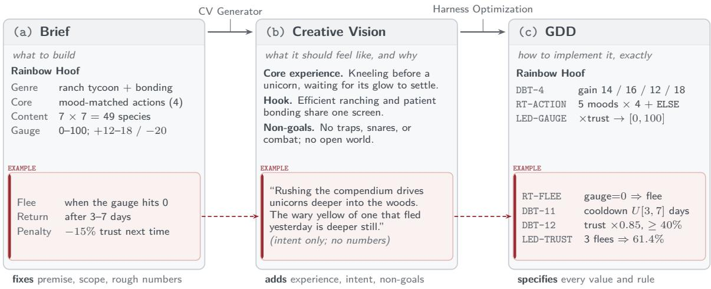  
Figure S1 One game traced from brief to GDD. The brief fixes what to build, the CV adds how the game should feel and why (without numbers), and the GDD specifies every value and rule. The highlighted boxes follow one requirement, the cost of letting a unicorn flee, through all three stages: a rough rule in the brief, a design intent in the CV, and a cited rule, constants, and a worked example in the GDD.

## A.2. Harness Optimization

An agent performs the CV-to-GDD step inside a harness: the generator’s instructions, the project files it can consult, and its authoring-and-review workflow. Rather than tuning the harness by hand, we refine it with an iterative search inspired by Meta-Harness (Lee et al., 2026).

Search procedure. The search uses a fixed set of � CVs. Starting from a seed harness, each iteration has a proposer agent read the search history, which contains earlier harnesses, their GDDs, the evaluator scores, and the evaluators’ feedback. The proposer then produces � candidate harnesses that modify the instructions, the project files, or the workflow. Each candidate generates a GDD from every CV, and the GDDs are scored as described below. The CVs, the fidelity checklists derived from them, and the evaluator configuration stay fixed across candidates to support a controlled comparison of the harnesses.

Document-quality scores. CV fidelity is the fraction of items in a fixed, CV-derived checklist that the GDD satisfies. The checklist covers the CV’s mechanics, constraints, design intentions, and any stated quantitative details. The full checklist is always the denominator, so an item the judge omits counts as unsatisfied. Buildability is computed over ten disciplines: gameplay, systems, economy, AI, UX, level design, art, audio, narrative, and production. For each applicable discipline, the judge lists the required deliverables and computes the fraction that are specified concretely and consistently. A mechanic or asset that is only named does not count. The score is the unweighted mean over applicable disciplines. The two scores check each other. Fidelity alone would reward restating the CV, and buildability alone would reward detailed specifications that drift from it. With $F _ { j } ( h )$ and $B _ { j } ( h )$ the scores of harness ℎ on the �-th CV,

$$
R ( h ) = \frac { 1 } { N } \sum _ { j = 1 } ^ { N } \bigl ( F _ { j } ( h ) + B _ { j } ( h ) \bigr ) ,\tag{13}
$$

which weights both dimensions and all CVs equally. A candidate is scored only if both dimensions are usable for every CV. These scores assess the document and are separate from GDD Fidelity, which assesses the game.

Harness selection. Rewards guide the search, but a candidate replaces the current best harness only if it wins a head-to-head comparison. For each CV, fresh judge sessions compare the two GDDs on every fidelity-checklist item and every applicable buildability discipline. Each item-level comparison is repeated three times independently, and the item-level winner is determined by majority vote; a tie is recorded as undecided. For each dimension, we then determine the CV-level winner by majority vote over the decided item-level outcomes. A tie at this stage is also recorded as undecided. Thus, each CV casts at most one vote per dimension. A candidate must win a strict majority of the decided CV-level votes. If multiple candidates meet this criterion, we select the one with the highest win rate among decided votes.

Configuration. Table S1 lists the search settings and selected checkpoint. All 100 benchmark GDDs are generated with the harness selected at iteration 8. Harness search improves the typical GDD but does not guarantee that any individual GDD is defect-free, so every GDD must still meet the criteria in Section A.3.

<table><tr><td>Setting</td><td>Value</td></tr><tr><td>CVs used in the search (N)</td><td>13</td></tr><tr><td>Candidate harnesses per iteration (K)</td><td>3</td></tr><tr><td>Repeats per quality judgment / pairwise comparison</td><td>1 3 / 3</td></tr><tr><td>Proposer and generator</td><td>Claude-Opus-4.8</td></tr><tr><td>Evaluator (scoring and pairwise judging)</td><td>GPT-5.5</td></tr><tr><td>Maximum iterations</td><td>20</td></tr><tr><td>Selected checkpoint</td><td>iteration 8</td></tr></table>

Table S1 Harness search configuration.

## A.3. Admission Criteria

A conformance score such as GDD Fidelity is meaningful only when the GDD specifies requirements clearly enough to evaluate and consistently enough to admit a coherent implementation. Missing or undefined requirements cannot be checked reliably, while contradictory requirements can make full conformance impossible: any implementation may violate at least one. These specification defects can therefore make low scores dificult to attribute to the agent’s implementation. A rule that can never take efect penalizes faithful implementations. A formula open to more than one reading can make the agent and the evaluator compute diferent correct answers.

We call a document a Golden GDD after it passes the validation-and-repair procedure in Section A.4 with no detected violations of the four criteria in Table S2. These criteria target the specification defects described above. G1 and G4 apply to individual statements. G2 and G3 apply to the document as a whole. G2 is static: the text agrees with itself. G3 is dynamic: the rules still hold together when the game runs. A document can pass G2 and still fail G3. For example, two consistent statements can together leave a mechanic that is impossible to reach.

Making the criteria checkable. GDDs use three conventions that support systematic checks of G2–G4. (i) Every tunable value has a canonical definition with a stable identifier (DBT-�) in a design balance table. Other sections refer to that identifier. Any repeated value must agree with its canonical definition. This makes references and repeated values traceable during G2 checks. (ii) Discrete behavior is written as a rule table (RT-\*). Its rows are evaluated top to bottom. The first match applies, and a final ELSE row covers every remaining case, which makes the totality and determinism required by G3 visible. (iii) Any value computed from several sources is written as a ledger (LED-\*). A ledger fixes the evaluation order and the bounds and gives a worked numeric example that a G4 check can recompute. All 100 GDDs use balance tables, 83 use rule tables, and 35 use ledgers. Most ledgers appear in the Big split, where values combine across systems.

Table S2 Criteria for golden GDDs. Each criterion excludes one way a GDD can invalidate conformance-based evaluation. Example violations are taken from our validation logs.
<table><tr><td>Criterion</td><td>Requirement</td><td>Failure if violated</td><td>Example violation</td></tr><tr><td>G1 Structural Conformance</td><td>• Standalone, all sections present • No empty or [TBD] section • No dangling identifier</td><td>The requirement cannot be checked.</td><td>A section cited elsewhere had been removed.</td></tr><tr><td>G2 Referential Consistency</td><td>• One canonical definition (DBT-n) • Every citation resolves • Repeated values agree</td><td>Contradictions; no implementation can satisfy all.</td><td>bool [56] declared for 55 species; 1 wave in App. A vs. 3 in App. B.</td></tr><tr><td>G3 Behavioral Soundness</td><td>• Total, deterministic rule tables • No unreachable or dead mechanic • Difficulty never decreases</td><td>Faithful implementations are penalized.</td><td>A 90 s boss timer never fires; HP decay kills the patient at 40 s.</td></tr><tr><td>G4 Executable Formulas</td><td>• Variables bound to constants • Fixed evaluation order, bounds • Worked example that recomputes</td><td>Agent and evaluator can compute different answers.</td><td>Kill time ignores the boss&#x27;s DEF; ceil(50/4) written as 12.</td></tr></table>

These criteria concern the GDD’s validity as a specification. A Golden GDD may describe a simple or an unambitious game. The CV fidelity and buildability scores used during harness search (Section A.2) assess alignment with the CV and implementation readiness separately.

## A.4. Validation and Repair

Candidate generation. The briefs span a diverse range of genres, core-mechanic families, and production scopes. Each brief expands into a CV and then into a GDD using the harness detailed in Section A.2.

Validation. Validate-Agents check each candidate against G1–G4, with candidates distributed across validators running in parallel. In the initial validation, the system checks every applicable table, formula, and cross-reference. It does not sample within a document. In subsequent rounds, documents changed during repair are fully re-validated, while unchanged documents are spot-checked for likely regressions. The checks are applied wherever the GDD contains the relevant structure:

• G1: no [TBD] or placeholder remains; every cited section and identifier exists.

• G2: recurring values agree across entity tables, systems, the stage catalog, and level descriptions. Diferent descriptions of the same stage agree on wave count, objectives, enemy composition, and learning goal.

• G3: dificulty arrays are non-decreasing; the first appearance declared for each entity or environment object corresponds to the stage catalog; timers and triggers are reachable given the interacting systems.

• G4: boundary tables are recomputed from their formulas and arrays; derived quantities such as $\lceil H P / d m g \rceil \times t _ { \mathrm { l o o p } }$ are re-derived; every exception to a formula is listed.

Repair and acceptance. Each violation is fixed at its canonical definition. When two sections disagree, the more specific one is kept, and the other is changed to match it, and every fix is logged with its criterion. Documents changed in a round are fully re-validated in the next round. Documents that did not change are spot-checked on the properties most likely to regress. A document is accepted only after three consecutive rounds with no detected violations. As an illustration, in one batch of 13 candidates, the logged rounds record 24 fixes, after which the batch passes three clean rounds in a row. Most fixes are numeric values that disagree with the document’s own worked examples, mismatches between the stage catalog and the level descriptions, and first-appearance columns that do not match the catalog.

Implications for evaluation. The accepted documents form the 100 Golden GDDs in the benchmark. Passing G1–G4 reduces the risk that low conformance scores arise from detectable specification defects, although evaluator and implementation-interpretation errors can remain. Stable identifiers for constants, rules, and formulas provide fixed anchors for checking individual requirements and locating departures from the specification.

## A.5. Dataset Splits and Statistics

Accepted GDDs are organized into Small and Big splits of 50 each according to the scope of the specified game: the mechanics, content, and interacting systems to be implemented, rather than the length or quality of the document. Document lengths and extracted requirement counts are reported as dataset statistics and are not used as thresholds for assigning the splits.

Small GDDs focus on a single core action or a compact set of mechanics, typically within a single screen and a short session. Each specifies clear success and failure conditions, together with input handling, state transitions, feedback, and boundary cases. Campaigns, progression systems, shops, and narrative content outside the core task are excluded. These restrictions limit the scope of the game without reducing specification detail: each GDD remains self-contained and includes the rules, numerical values, inputs, UI text, content, art, audio, and testing requirements needed for implementation. Small GDDs contain approximately 54 outcome requirements on average, with a range of 9–151.

Big GDDs cover broader content and interacting systems, including combinations of combat, progression, economy, exploration, narrative, and management. The split contains complete 2D single-player designs. Specifications that require 3D or 2.5D presentation, mandatory multiplayer, or further adaptation to the target setting are excluded, as are games that duplicate a Small entry. Big GDDs contain approximately 84 outcome requirements on average, with a range of 10–246.

To limit repetition within the Big split, the default selection policy admits at most two entries from the same narrow genre and core-mechanic family. Within a broad genre, designs are treated as distinct families only when their primary inputs, repeated actions, success and failure criteria, and progression structure all difer. This allows several games from one broad genre while limiting repeated instances of the same core task.

The document lengths, requirement composition, and category coverage for the two sets are summarised in Table S3. Outcome requirements count individual promises listed in GDD rule-table rows, including presentation outcomes. A rule in the dependency graph specifies a source row’s conditions, trigger, and state-changing or event-emitting outcomes. On average, the Big GDDs contain about 1.87× as many tokens and 1.55× as many outcome requirements as the Small GDDs. The 50 Small GDDs cover eight task families (Table S4), and the 50 Big GDDs cover 11 commercial game genres (Table S5).

Table S3 GDD dataset statistics. Document length and requirement composition of the Small and Big splits. Outcome requirements count individual promises in GDD rule-table rows, including presentation outcomes.
<table><tr><td>Statistic</td><td>Small</td><td>Big</td></tr><tr><td>Documents</td><td>50</td><td>50</td></tr><tr><td>Lines (mean)</td><td>629</td><td>1,153</td></tr><tr><td>Tokens (total)</td><td>704,270</td><td>1,314,862</td></tr><tr><td>Tokens (mean, range)</td><td>14,085 (5,240–24,022)</td><td>26,297 (12,489–51,433)</td></tr><tr><td>Outcome requirements (total)</td><td>2,710</td><td>4,202</td></tr><tr><td>Outcome requirements (mean, range)</td><td>54.2 (9–151)</td><td>84.0 (10–246)</td></tr><tr><td>Invariants (total)</td><td>1,378</td><td>1,862</td></tr><tr><td>Scenarios (total)</td><td>646</td><td>1,385</td></tr></table>

Table S4 Task-family distribution of the Small GDDs.
<table><tr><td>#</td><td>Task Family</td><td>n</td><td>Games</td></tr><tr><td>1</td><td>Reaction, Inhibition &amp; Speed Classification</td><td>9</td><td>reaction_test, no_response_test, bloom_or_weed, orbit, bin_bit, odd_even_flash, odd_patch, same_or_shift, three_letter_delivery</td></tr><tr><td>2</td><td>Temporal Precision &amp; Rhythm</td><td>7</td><td>beat_bistro, centerline, chord_snap, half_beat_bell, ooga_ooga_tower, ozone_dash, rooftop_rumble</td></tr><tr><td>3</td><td>Continuous &amp; Precision Motor Control</td><td>9</td><td>cursor_pursuit, still_cursor, chalk_escape, stamp_register, pocket_curling, magnet_dock, safe_dial, warm_ascent, wheel_steps</td></tr><tr><td>4</td><td>Short-Term Memory &amp; Attentional Tracking</td><td>3</td><td>echo_three, hidden_spot, key_under_cups</td></tr><tr><td>5</td><td>Perceptual Estimation &amp; Psychophysics</td><td>4</td><td>blink_count, equal_slice, mobile_balance, whisper_compass</td></tr><tr><td>6</td><td>Spatial Reasoning &amp; Mental Transformation</td><td>5</td><td>one_fold_letter, shadow_pair, lighthouse_mirrors, tiny_moving_van, untangled_cords</td></tr><tr><td>7</td><td>Deduction &amp; Constraint Solving</td><td>6</td><td>clue_lock, mini_nonogram, three_switches, traces_left, one_segment_equation, last_match</td></tr><tr><td>8</td><td>Planning &amp; Sequential Decision</td><td>7</td><td>blackout_dispatch, crate_corner, color_flood, peg_garden, pancake_prefix, tile_merge, greedy_die</td></tr></table>

Table S5 Genre distribution of the Big GDD split.
<table><tr><td>#</td><td>Genre</td><td>n</td><td>Games</td></tr><tr><td>1</td><td>Platformer &amp; Metroidvania</td><td>7</td><td>afterglow, chromashade, rainwright, ssitgim, turning_keep, neon_spray, the_librarians_hook</td></tr><tr><td>2</td><td>Action Roguelite &amp; Survival</td><td>4</td><td>abyssal_chain, seamline, todays_best_spot, afterglow_network</td></tr><tr><td>3</td><td>Shooter &amp; Bullet-hell</td><td>3</td><td>golem_workshop, magma_arc, snowfall_draw</td></tr><tr><td>4</td><td>Rhythm</td><td>4</td><td>beat_reroute, beatstorm, cloud_cast, rhythm_of_response</td></tr><tr><td>5</td><td>Puzzle</td><td>4</td><td>chameleon_slide, fable_knot, fogfall_delivery, u001_toyfit</td></tr><tr><td>6</td><td>Strategy &amp; Tactics</td><td>5</td><td>ashen_citadel, gateline_2d, siege_deck_2d, chroma_bastion, xl001_edens_debt</td></tr><tr><td>7</td><td>RPG</td><td>4</td><td>four_of_the_depths, linkbound, dh001_echo_gate_guild, borrowed_faces_2d</td></tr><tr><td>8</td><td>Simulation &amp; Management</td><td>8</td><td>anomaly_factory, grand_atelier_2d, night_shift_rx, rainbow_hoof, reef_bistro,</td></tr><tr><td>9</td><td>Idle &amp; Clicker</td><td>2</td><td>strata_keepers, wham_bam_logistics, wind_winter_camp alias_alchemy_shop, hell_casino</td></tr><tr><td></td><td>10 Adventure &amp; Narrative</td><td>6</td><td>cold_case_archive, u003_acting_human_again, whispers_of_the_wild,</td></tr><tr><td></td><td></td><td></td><td>harukaze_student_council_casebook, last_announcement, backwalker_camp</td></tr><tr><td>11</td><td>Sports &amp; Racing</td><td>3</td><td>last_catch, pixel_pennant, toybox_rider</td></tr></table>

## A.6. Examples of GDDs

The following examples show how the same document conventions apply to both splits.

Figure S2 shows an excerpt of the Small-split GDD traces\_left. Its prose describes the game and its systems, while rule-table rows state situations and their required outcomes. Constants such as the 0.800 s and 1.800 s deadlines have canonical definitions that other sections reference. Each labeled row provides a requirement that can be checked and cited: for example, a build that leaves the phase unchanged when T4’s stated conditions and trigger hold fails that row’s required outcome. Selected rules from these rows appear in the contract graph in Figure S5.

Figure S3 shows a Big-split GDD, chameleon\_slide, under the same conventions. The form doesn’t change, but only the reach of each statement does. The pillars and the player card describe one action by citing several rule tables at once — a slide is stopped by RT-STOP, hides the player by RT-CAMO, and advances the world by RT-TURN — and the rule shown, RT-COLOR K1, is one that a build must honor in the middle of that chain.

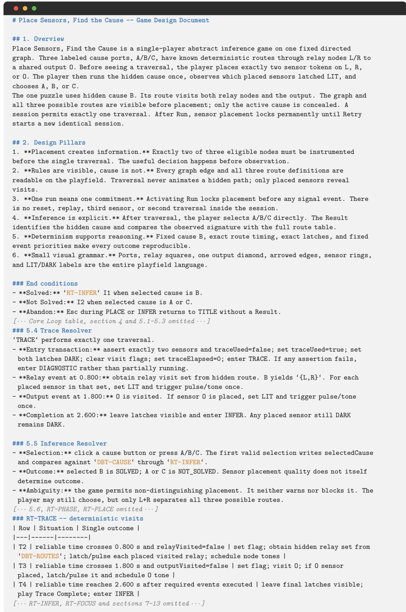  
Figure S2 A Small golden GDD example. Excerpt of traces\_left; omitted sections are marked.

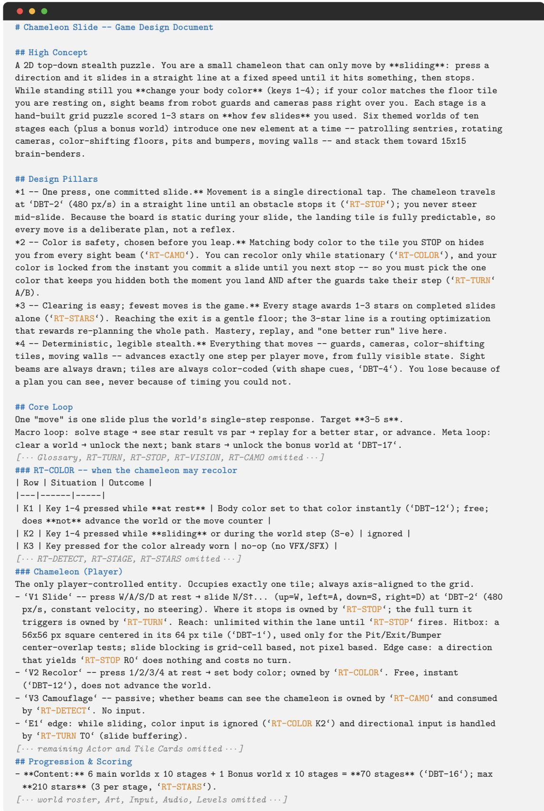  
Figure S3 A Big golden GDD example. Excerpt of chameleon\_slide GDD; omitted sections are marked.

## B. Details on Contract Generation

## B.1. Dependency Structure in Game Specifications

As summarized in Figure 2b, we measure how often sentences in external game-design documents are classified as causal, on three corpora separate from the benchmark GDDs: 10 publicly available studio design documents ranging from short pitch documents to long-form production specifications (Table S6; 11,741 sentences, 37.9% causal), 246 specifications from GameCraft-Bench (Luo et al., 2026) and GameGen-Verifier (Jia et al., 2026) (141 and 105 documents), and 97 English-language primary rulebooks of BoardGameGeek’s top-100 titles covering setup, play, and end conditions, without player aids, FAQs, or fan summaries; in total 353 documents and 73,700 sentences.

We normalize the extracted text, remove formatting artifacts and non-prose content, segment the prose into sentences, and label each sentence causal or non-causal with the published CiRA classifier (Fischbach et al., 2021); a corpus’s causal rate is the share of retained sentences labeled causal. As shown in Table S7, the rate ranges from 32.0% to 45.3% across the three corpora, with a corpus macro average of 38.4% (the value in Figure 2b) and a pooled sentence-level rate of 42.0%, against roughly 28% reported for general requirements documents (Frattini et al., 2023); causal statements thus form a substantial portion of game-design specifications across sources.

Table S6 Studio game-design documents used in the causality analysis. Sentence counts are computed after text normalization and non-prose filtering; causal rates are CiRA predictions over the retained sentences.
<table><tr><td>Document</td><td>Sentences</td><td>Causal (%)</td></tr><tr><td>The Sky Above, the Sky Below</td><td>2,069</td><td>38.3</td></tr><tr><td>Frontier Pharmacist</td><td>1,996</td><td>42.5</td></tr><tr><td>Leisure Suit Larry 5</td><td>1,701</td><td>38.3</td></tr><tr><td>Love for Sail</td><td>1,551</td><td>37.5</td></tr><tr><td>Shape Up or Slip Out</td><td>1,444</td><td>44.6</td></tr><tr><td>Claw</td><td>1,428</td><td>29.6</td></tr><tr><td>Leisure Suit Larry&#x27;s Casino</td><td>797</td><td>31.2</td></tr><tr><td>Planescape: Torment</td><td>483</td><td>34.8</td></tr><tr><td>Diablo (pitch)</td><td>143</td><td>35.0</td></tr><tr><td>Grand Theft Auto</td><td>129</td><td>29.5</td></tr><tr><td>Total</td><td>11,741</td><td>37.9</td></tr></table>

Table S7 Causal-sentence estimates in external game-design corpora. Rates are CiRA predictions on retained prose. The pooled rate weights corpora by sentence count, while the macro average gives equal weight to the three corpora.
<table><tr><td>Corpus</td><td>Documents</td><td>Sentences</td><td>Causal (%)</td></tr><tr><td>Studio GDDs</td><td>10</td><td>11,741</td><td>37.9</td></tr><tr><td>Game benchmark specifications</td><td>246</td><td>11,441</td><td>32.0</td></tr><tr><td>Board game rulebooks</td><td>97</td><td>50,518</td><td>45.3</td></tr><tr><td>Pooled</td><td>353</td><td>73,700</td><td>42.0</td></tr><tr><td>Macro average over corpora</td><td></td><td></td><td>38.4</td></tr></table>

## B.2. Rule Generation

We construct the contract $\mathcal { C } _ { i } = ( \mathcal { R } _ { i } , \mathcal { E } _ { i } )$ from the GDD $d _ { i }$ before inspecting any generated build. The procedure separates identifying the requirements from formalizing their conditions and efects: it first fixes the terminology and source entries, then uses them to constrain rule generation. The six stages in Figure S4 combine model-based interpretation with deterministic extraction, assembly, and validation.

A rule $\boldsymbol { r } = ( t _ { r } , \phi _ { r } , \boldsymbol { F _ { r } } )$ specifies an event $t _ { r }$ , the preconditions $\phi _ { r }$ under which it applies, and the expected efects $F _ { r } ,$ expressed as state updates or event emissions. An invariant $r = \left( \varphi _ { r } , \sigma _ { r } \right)$ instead specifies a condition $\varphi _ { r }$ that must hold throughout its scope $\sigma _ { r } .$ . Dependencies in $\mathcal { E } _ { i }$ connect a rule’s efects to the conditions or triggering events of other rules. These links are derived from the rule fields rather than generated as a separate list of relationships.

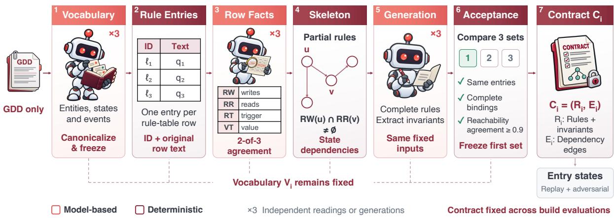  
Figure S4 Contract construction from a GDD. The pipeline fixes vocabulary and rule entries before completing rule definitions and validating the contract. Coral boxes denote model-based stages, while dark-red boxes denote deterministic stages without model calls. The ×3 labels indicate independent repetitions: row facts are consolidated by two-out-of-three voting, whereas generated contracts are compared for structural consistency before one is frozen for evaluation. The dashed line indicates that the vocabulary � remains fixed throughout subsequent stages.

Stage 1: Vocabulary (Model). We establish a shared vocabulary $V _ { i }$ for the entities, state attributes, and events described in the GDD. Three independent readings collect candidate terms, after which synonymous terms are grouped and assigned a common name. The resulting vocabulary is fixed for subsequent stages. This lets requirements that refer to the same game state use the same identifier, even when the GDD describes that state in diferent ways.

Stage 2: Rule Entries (Code). Code extracts candidate rule entries $L _ { i }$ from the GDD’s labeled requirement tables. Each entry $\ell = ( \mathrm { i d } _ { \ell } , q _ { \ell } )$ retains its identifier and original row text. Generated rules remain linked to these entries through the provenance map $\pi : \mathcal { R } _ { i } ^ { \mathrm { r u l e } }  L _ { i } .$ . The source entries therefore determine which requirements are to be formalized, rather than leaving each generation to choose a new set of evaluation targets.

Stage 3: Row Facts (Model). For each entry, the model identifies four facts using the fixed vocabulary: the state attributes it changes, RW(ℓ); the attributes its conditions inspect, RR(ℓ); its triggering event, RT(ℓ); and the operation and value associated with each update, VT(ℓ). A condition-only rule has no triggering event. Each extraction is repeated three times independently. Read and write sets retain elements supported by at least two readings, while triggers and update values require two matching answers. A trigger or value without a majority remains unresolved and is completed from the source text during generation.

Stage 4: Skeleton (Code). Given the fixed row facts, code assembles partial rule definitions and a state-dependency graph. Two entries are linked when one updates an attribute inspected by the other, that is, RW $\mathbf { \ell } ( \ell _ { u } ) \cap \mathrm { R R } ( \ell _ { v } ) \neq \emptyset$ . Through the source-entry associations, these links determine the state dependencies used to compute the downstream counts in Equation 3. Each partial rule also records its known trigger, the attributes used by its preconditions, and the attributes changed by its efects. The next stage completes these fields rather than reconstructing the rule set. Event dependencies are derived from emitted events and matching triggers once the full rule fields are available.

Stage 5: Generation (Model). The model completes each partial rule using its source text $q _ { \ell } ,$ writing precondition predicates and efects consistent with the fixed read/write facts and update specifications. Any unresolved trigger or value is determined from the same source text. When a value cannot be expressed as a literal or supported symbolic reference, its document description is retained as an opaque value instead of inventing a constant. Invariants are extracted separately from the GDD’s state and constraint specifications, with supporting quotations. This stage produces three independent rule and invariant sets under the same fixed inputs.

Stage 6: Acceptance (Code). Programmatic checks validate the generated fields and their source associations, and recompute the dependency graph from the rule definitions. The three generations are compared for source-entry consistency, provenance binding, and dependency reachability. The acceptance check requires the same source-entry set, complete rule-to-entry binding, and reachability agreement of at least 0.9. Once accepted, the first generation is frozen as $\mathcal { C } _ { i }$ for all subsequent build evaluations. This fixes the detailed rule definitions as well as the evaluation targets and dependencies; Section B.5 examines the variation that remains between independent generations.

Entry States. Requirements sharing an entry condition are grouped into the canonical scenario set $s _ { i }$ used for replay evaluation. Each scenario specifies the state a build must establish before the replay begins. For targeted adversarial playtests, the harness similarly initializes the preconditions of a rule left unverified by normal play. Initialization supplies the starting conditions, not the expected outcome: the subsequent behavior must still be exercised and observed. These entry specifications support execution of the contract and are kept separate from the rules and dependency edges in $\mathcal { C } _ { i }$

## B.3. Properties of the Accepted Contract

The contract accepted after Stage 6 provides a fixed representation for build evaluation. First, it separates triggers, preconditions, and efects, giving each judge explicit fields against which to organize its evidence. Second, dependencies are derived from the rule fields using a fixed vocabulary. State dependencies connect rules when one updates an attribute that another inspects, while event dependencies connect an emitted event to a matching trigger. Reach, roots, and leaves are computed from the resulting graph, which identifies downstream requirements that may be afected by a failed rule. Third, the evaluation targets are fixed before any build is inspected. Each accepted rule retains its source association with the GDD, and values that cannot be formalized are preserved as document descriptions rather than replaced with invented constants. Every build is evaluated against the same accepted contract.

## B.4. Contract Example

Figures S5 and S6 follow traces\_left from its GDD to a judged normal playtest. The GDD is shown in Figure S2. Each source row describes a situation and an outcome, which are formalized as the rule’s trigger, preconditions, and efects. For example, P2 adds a sensor when an eligible node is empty, the phase is Place, and fewer than two sensors are placed. It therefore both reads and updates sensorNodes.

Figure S5 is an execution view linked to the fixed contract, rather than the complete static contract graph. Repeated nodes represent occurrences of the same rule during the recorded playtest. Three placements and one removal establish the sensor count required by P4. Committing the run sets the phase and initializes the clock used by subsequent timing rules; T4 completes the trace, after which I1 records the outcome. The focus-handling sequence is displayed separately for readability, although its rules also share phase with the main sequence.

The example illustrates how source-linked rules make execution evidence interpretable in its dependency context. A missing prerequisite can leave downstream behavior unverified, but does not automatically make every downstream rule violated. Section B.5 examines consistency across contract generations, and Section F.1.2 examines how downstream reach afects source-code scoring.

## B.5. Stability of Contract Generation

Contract construction is partially deterministic: model-based extraction supplies the vocabulary and row facts, code fixes the rule entries, binds them to their source GDD rows, and assembles the statedependency skeleton from the extracted read/write sets, and rule generation then completes the preconditions and efects within that structure. In this fixed-input stability experiment, we independently generate rules three times for each of the 50 Small and 50 $B i g$ GDDs under the same fixed inputs and compare the 300 outputs.

As shown in Table S8, all three generations preserve the same rule entries and source associations, and the dependency graphs are nearly identical, with reachability agreement, dependency-edge Jaccard similarity, and role preservation all at or above 0.999; within each rule, the trigger name agrees in 0.94 of cases and the predicate structure, the entities, attributes, and operators used in preconditions and efects, in 0.70. Table S9 shows what the remaining variation looks like: the same row encoded with SET or INCREMENT, or a bound written as a comparison or as a set.

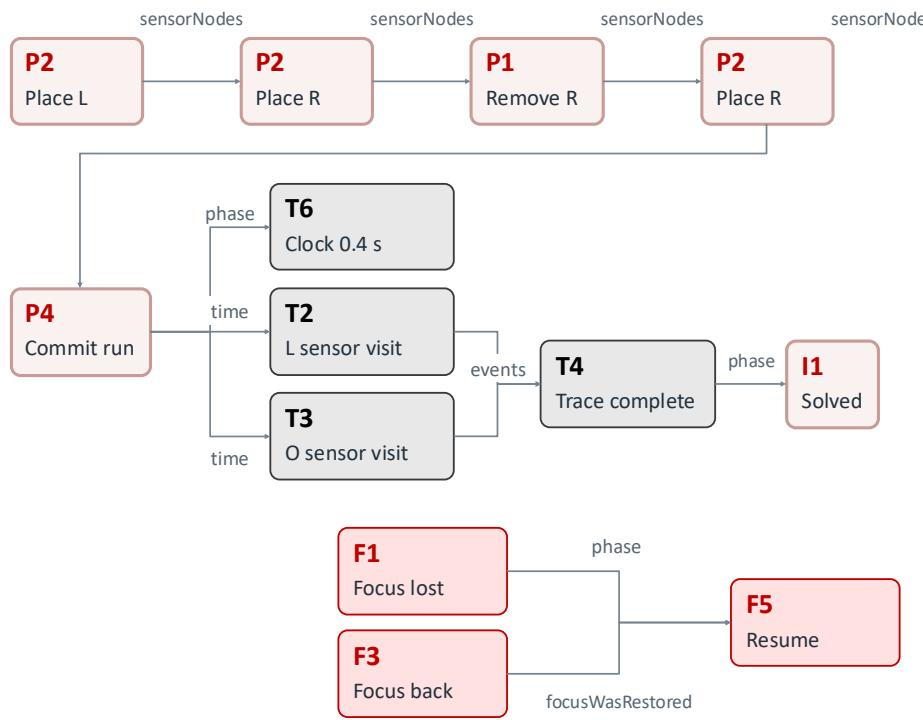  
Figure S5 Contract-linked execution of traces\_left. Nodes show rule occurrences in a recorded normal playtest, and labeled links indicate the state attributes connecting them. Three sensor placements and one removal precede P4, which commits the run. The fixed contract supplies the rule identities and dependencies; the trace supplies their observed order. Source GDD rows appear in Figure S6.

We can check whether this variation changes scores directly, because each generation was also used to judge the same build. Here, the unit is a rule in the dependency graph, which represents a source row’s conditions, trigger, and state-changing or event-emitting outcomes. The 869 Small and 1,860 Big rules are therefore fewer than the individual outcome requirements counted in Table S3. Pairing the three judgments for each rule yields three pairs per rule: 2,607 over the 869 Small rules and 5,580 over the 1,860 Big rules, with no rule excluded since the generations share the same entries. Re-judging a rule whose predicate structure is identical across two generations changes its score by at least 0.25 in 12.7% of pairs on Small and 8.8% on Big, a variation that comes with an agent judge and is of a similar magnitude to the status changes of the naive judge on its matched items; when the predicate structure difers, the rate is 17.7% and 11.1%, an increase of 5.0 and 2.3 percentage points (Table S10). Freezing the accepted contract keeps the evaluation targets, rule definitions, and dependencies fixed across builds and revision rounds. The generation analysis quantifies the variation that would otherwise arise from regenerating those definitions.

<table><tr><td>Row</td><td>Situation → single outcome</td></tr><tr><td>RT-PLACE</td><td>Sensor Placement and Run</td></tr><tr><td>P2:265</td><td>toggle empty eligible node, sensor count &lt; 2, phase PLACE, traceUsed = false</td></tr><tr><td></td><td>→ add token; canonical-sort sensorNodes; play place cue</td></tr><tr><td>P1:264</td><td>toggle eligible node already in sensorNodes, phase PLACE, traceUsed = false</td></tr><tr><td></td><td>→ remove token; latch entry removed; play remove cue</td></tr><tr><td>P4:267</td><td>activate Run with sensor count = 2 and traceUsed = false →execute TRACE entry transaction: set lock, initialize latches / events/ time, enter TRACE</td></tr><tr><td>RT-TRACE</td><td>Deterministic Visits</td></tr><tr><td>T6:284</td><td>TRACE below next deadline</td></tr><tr><td></td><td>→ update traceElapsed only; no visit or phase change</td></tr><tr><td>T2:280</td><td>reliable time crosses 0.800 s and relayVisited = false</td></tr><tr><td></td><td>→ set flag; latch / pulse each placed visited relay; schedule node tones</td></tr><tr><td></td><td>reliable time crosses 1.800 s and outputVisited = false</td></tr><tr><td>T3:281</td><td>→ set flag; visit O; if O sensor placed, latch / pulse it and schedule O tone</td></tr><tr><td></td><td>reliable time reaches 2.600s after required events executed</td></tr><tr><td>T4:282</td><td>→leave final latches visible; play Trace Complete; enter INFER</td></tr><tr><td>RT-INFER</td><td>Cause Selection</td></tr><tr><td>I1:293</td><td>phase INFER, selected cause equals DBT-CAUSE B</td></tr><tr><td></td><td>→write selectedCause; resultKind = SOLVED; enter RESULT; play Solved cue</td></tr><tr><td>RT-FOCUS</td><td>Interruption and Resume</td></tr><tr><td>F1:302</td><td>focus lost during PLACE, TRACE, or INFER</td></tr><tr><td></td><td>→capture phase and traceElapsed; enter FOCUS_HOLD; clear queued input</td></tr><tr><td></td><td>focus returns</td></tr><tr><td>F3:304</td><td>→remain FOCUS_HOLD; set focusWasRestored = true; show Resume and Title</td></tr><tr><td></td><td></td></tr><tr><td>F5:306</td><td>Enter / Resume with focus restored and returnPhase TRACE</td></tr></table>

Figure S6 The GDD rows the entries in Figure S5 were derived from, in the four sections of traces\_left that the run touched, each labelled with its line in the framed GDD. A row states a situation and its required efects (→); the pipeline formalizes the situation as the rule’s trigger and preconditions, and the required efects as state updates or event emissions.

Table S8 Consistency of evaluation targets across repeated generations. Three rule generations per GDD on 50 Small and 50 Big GDDs with fixed vocabulary and rule entries, averaged over the two splits; items are matched by their source entries.
<table><tr><td>Agreement Measure</td><td>Contract</td></tr><tr><td>Matched Items</td><td>100%</td></tr><tr><td>Dependency Graph</td><td>≥ 0.999</td></tr><tr><td>Trigger Name</td><td>0.94</td></tr><tr><td>Predicate Structure</td><td>0.70</td></tr></table>

Table S9 Examples of predicate-structure variation across contract generations. Rules whose predicate structure difers between two contract generations, with the GDD row they encode and the source-code score $f _ { i , r } ^ { \mathrm { s r c } }$ each generation received on the same build.
<table><tr><td>Game &amp; Rule</td><td>GDD statement (abridged)</td><td>Generation A</td><td>Generation B</td><td>Ratio of fsrc (A/B) i, r</td></tr><tr><td>untangled_cords R8 (Small)</td><td>All other frames: keep state, keep updating t in PLAY_ACTIVE</td><td>timer INCREMENT (dt)</td><td>timer SET (advanced by dt〉</td><td>1.00 / 1.00</td></tr><tr><td>magma_arc STAR2 (Big)</td><td>Not STAR3, and hit events ≤ 3 this attempt: 2 stars</td><td>event &lt;= 3 STAR SET 2</td><td>event IN [1, 2, 3] STAR SET 2</td><td>1.00 / 1.00</td></tr></table>

Table S10 Effect of predicate-structure variation on the source-code score. Rule pairs across the three generations, three per rule, judged on the same build; the last column is the share of pairs whose per-rule scores difer by at least 0.25.
<table><tr><td>Split</td><td>games</td><td>rules</td><td>Predicate structure</td><td>pairs</td><td> $| \Delta f _ { i , r } ^ { \mathrm { s r c } } | \geq 0 . 2 5$ </td></tr><tr><td>Small</td><td>50</td><td>869</td><td>identical</td><td>1,773</td><td>12.7%</td></tr><tr><td rowspan="3">Big</td><td></td><td></td><td>different</td><td>834</td><td>17.7%</td></tr><tr><td></td><td>501,860</td><td>identical</td><td>4,045</td><td>8.8%</td></tr><tr><td></td><td></td><td>different</td><td>1,535</td><td>11.1%</td></tr></table>

## B.6. Value Compatibility

In construction, a state-dependency edge in $\mathcal { E } _ { i } ^ { \mathrm { s t a t e } }$ records that one rule updates an attribute inspected by another rule’s condition, without checking the written value against that condition, so two rules that write and read the same enumerated attribute with diferent values are linked as well. After removing state-dependency edges whose written values are provably incompatible with the reading conditions, rule-score rankings remain stable: the dependency-weighted rule score $F _ { i } ^ { \mathrm { r u l e } }$ computed on the reduced graph agrees with the registered one at Spearman 0.99 on Small and 1.00 on Big with a maximum pergame diference of 0.07, the defining root of each root-defective game remains a root in 17 of 18 games, and the sign counts of Appendix F.1.2 stay at 11 of 18 root-defective games and move from 6 to 7 of 16 comparison games. We therefore keep the attribute-level definition, which is computable from the contract alone, and read its edges as potential rather than guaranteed prerequisites.

## B.7. Dependency-Adjusted Rule Pass Rate

Using the source-code judgments and contract graphs of 100 GPT-5.6-Sol games, we compare local and dependency-adjusted rule pass rates. A rule passes locally when its aggregated source-code score is at least 0.8. The dependency-adjusted rate serves as a graph-based reachability proxy: a rule counts only when it and all its direct and indirect predecessors pass. Both rates use the same dependency-linked rule set as the denominator within each game and are averaged across games. Figure 2c reports 72.4% locally and 22.7% after this check, a 49.7-point gap. Since edges encode potential prerequisites, exclusion indicates possible blocking rather than demonstrated runtime unreachability. This rule-level diagnostic does not change the benchmark’s source-code score or propagate violation verdicts to downstream rules during playtesting.

## C. Experimental Details

Game Development Environment. The 100 tasks in the main benchmark focus on 2D single-player browser games developed using Phaser. All coding agents start with the same project and runtimeinterface specification, using Phaser 4.1, TypeScript, and Vite. Given a GDD, the agent creates the source project along with a runnable web build within this environment. The fixed evaluation contract is kept apart from the game-building instructions. This common development environment enables a controlled comparison across coding agents. The extension to a Three.js runtime is presented in Section 4.8, with additional results in Appendix H.

Open-Weight Model Serving and Generation. We generate games with DeepSeek-V4-Pro-0813 (DeepSeek-AI, 2026), GLM-5.3 (GLM-5-Team, 2026), and Kimi-K2.7-Code (Kimi Team, 2025), each served with vLLM 0.28.0 (Kwon et al., 2023) using four NVIDIA B300 GPUs per allocation on a shared slurm cluster. Each cluster node has eight NVIDIA B300 GPUs, 128 vCPUs, and about 4 TB RAM. GLM and Kimi use tensor parallelism across the four allocated GPUs, while DeepSeek uses data parallelism with expert parallelism. Generation follows each checkpoint’s default sampling parameters: temperature 1.0 and top-� 0.95 for GLM and Kimi, and temperature 1.0 and top-� 1.0 for DeepSeek. For each model, we independently generate a game three times per GDD without best-of-� selection. Serving allocations total approximately 1,100 GPU-hours

Evaluation Execution and Resources. For runtime evaluation, we serve production builds locally and run them in Chromium via Playwright at each game’s declared viewport (1280 × 720 by default). Scenariobased replay applies recorded input sequences and captures rendered frames, while adaptive playtesting selects keyboard and pointer inputs based on observations of the running game. Generated games expose shared interfaces for state observation and controlled precondition initialization. Section D details the three evaluation axes, including how these interfaces support normal and adversarial playtests. Evaluation workloads run on ten AWS m7i.4xlarge instances, each with 16 vCPUs, 64 GiB RAM, and Ubuntu Server 24.04 LTS (noble) on x86-64 hardware, plus one workstation with comparable specifications. The total measurement time is approximately 900 wall-clock hours (source-code evaluation takes 3.1%, scenario-based replay assessment takes 40.1%, and playtest takes 56.8%). Games are rendered and replayed on headless Chromium 149.0.7827.55 (Chrome Headless Shell) via Playwright 1.61.0.

## D. Details on Evaluation Setup

## D.1. Source Code Evaluation

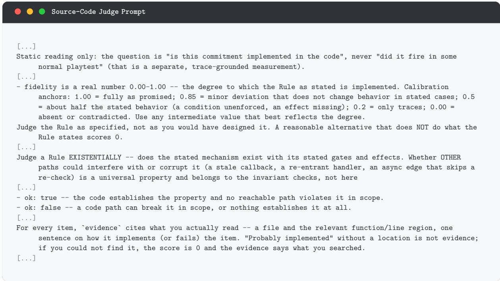  
Figure S7 Excerpt of the source-code judge system prompt. Text is verbatim, and omitted passages are marked [...].

Each source-code evaluation session uses one prompted model call per build. Its system prompt states the question, the continuous scale for rules with its calibration anchors, the two-valued outcome for invariants with the frame-boundary and injection-surface exclusions, and the evidence requirement; Figure S7 reproduces the passages that shape the judgment. The task message is assembled by code from three parts: the rule set ${ \mathcal { R } } _ { i } ^ { \mathrm { r u l e } }$ in the order to be judged, the invariant set $\mathcal { R } _ { i } ^ { \mathrm { i n v } }$ , and the path of the read-only source directory of $g _ { i }$ . The judge answers through a fixed-schema tool call with one entry per rule $( f _ { i , r } ^ { \mathrm { s r c } } \in [ 0 , 1 ]$ and evidence) and one per invariant $( f _ { i , r } ^ { \mathrm { s r c } } \in \{ 0 , 1 \}$ and evidence), and a validator rejects a submission that omits an item, breaks the order, or leaves evidence empty.

## D.1.2. Implementation

Inputs and Session. The source-code judge receives the rule set ${ \mathcal { R } } _ { i } ^ { \mathrm { r u l e } }$ and the invariant set $\mathcal { R } _ { i } ^ { \mathrm { i n v } }$ for contract $\mathcal { C } _ { i } .$ , along with read-only access to the src/ directory of build $g _ { i } .$ . For each item, the judge answers a static question: is this commitment implemented in the code? The judge does not execute the game. Each session evaluates a single build and must return exactly one entry per rule and per invariant, in the specified order, each accompanied by a score and supporting evidence. Submissions that omit items, disrupt the order, or lack evidence are rejected and must be resubmitted. Given the density of generated sources, the judge examines entire files rather than inferring absence from line counts, and does not reuse findings as evidence for multiple rules.

Scoring a Rule. Each rule is decomposed into preconditions, trigger, and efects, accompanied by its originating GDD sentence. The judge assigns a continuous score $f _ { i , r } ^ { \mathrm { s r c } } \in [ 0 , 1 ]$ reflecting the extent to which the causal commitment is implemented, specifically whether the code gates the trigger on the stated conditions and produces the specified efects. The scoring scale is anchored: 1.00 indicates full implementation as specified, 0.85 denotes a minor deviation that does not alter behavior in the stated cases, 0.5 represents partial implementation (such as an unenforced condition or missing efect), 0.2 indicates only traces of implementation, and 0.00 signifies absence or contradiction. Intermediate values are permitted when they more accurately reflect the degree of implementation. Contract names are mapped to code identifiers by meaning. Rules are evaluated as specified, not as reasonable alternatives, and the assessment is existential; potential corruption by other code paths is addressed through invariant checks.

Checking an Invariant. An invariant is defined as a predicate over the game state that must hold at every frame boundary within its declared scope. The judge assigns $f _ { i , r } ^ { \mathrm { s r c } } \in \{ 0 , 1 \}$ : a value of 1 if the code establishes the property and no reachable gameplay path can violate it within scope, and 0 if any path can break it or if the property is not established. Diferences in encoding, such as a 0-based index representing 1-based numbering or alternative enum spellings, are not considered violations. The stateinjection surface present in every build for the verifier (setState, scene mutators, scenario entries) is not treated as a violating path, as it is designed to permit arbitrary state modifications.

Evidence. Every score cites the file and the function or line region the judge read, with one sentence on how that code implements or fails the item; a rule the judge cannot locate scores 0, and its evidence records what is searched. A validator rejects submissions whose evidence strings largely copy one another or that score every rule zero without locating anything.

Aggregation. The rule component $F _ { i } ^ { \mathrm { r u l e } }$ is calculated as the dependency-weighted mean of the continuous per-rule scores, using the weights $w _ { i , r }$ defined in Equation 3. Here, $D _ { i , r }$ represents the number of rules reachable from � via links where one rule updates a state that another rule’s condition evaluates. All weights are set to 1 when $D _ { i } ^ { \mathrm { m a x } } = 0 .$ The invariant component $F _ { i } ^ { \mathrm { i n v } }$ is the fraction of invariants that hold, and is set to 1 if no invariants are declared for a contract. The overall source-code score is the product of these two components (Equation 4).

Runs. Each build is evaluated in three independent sessions, and the mean score is reported. The default source-code judge is GPT-5.6-Luna at high reasoning efort. Appendix G.2 presents judge comparisons and cost analyses.

## D.2. Scenario-Based Replay Assessment

## D.2.1. Prompt

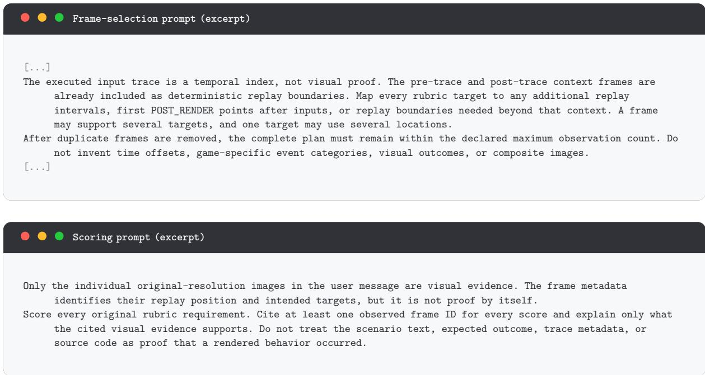  
Figure S8 Excerpts of the two replay-judge system prompts. Frame selection over the recorded replay and scoring from the selected frames. Text is verbatim, and omitted passages are marked [...].

The replay judge is two prompted model calls per scenario replay. The frame-selection call receives the rubric $\rho _ { i } ^ { \mathrm { v i s } }$ , the executed input trace $\xi _ { i , q }$ with the engine’s render timestamps, and the observation budget �, and returns a plan of replay positions per rubric item that a deterministic tool resolves to recorded frames; the scoring call receives only the resolved frames and the rubric and returns one score, one rationale, and the cited frame ids per item through a fixed-schema tool call. The scoring prompt is prefixed with the GameCraft-Bench scoring instruction, which defines the 0–1 scale; Figure S8 reproduces the passages of both prompts that shape the evidence.

## D.2.2. Implementation

The scenario-based replay assessment described in Section 3.3.2 keeps the evaluation protocol of GameCraft-Bench (Luo et al., 2026) where the protocol is engine-neutral: the build gate, the four rubric categories with weights 0.15/0.35/0.15/0.35, the per-item score in [0, 1], the per-item aggregation over replays by max or mean, and the score formula are reused unchanged, and only the Godot replayer is replaced by a Playwright replayer for browser builds, with the same trace format of timed input events. Three parts difer, because the contract rather than the submitter decides what is played, where the evidence is taken, and what is asked.

Scenario Replays. GameCraft-Bench scores the demonstration traces a submitter ships with the project, capped in number and judged on a fixed-length window of each. We replay one fixed policy $\xi _ { i , q }$ per canonical scenario $s _ { i , q } \in S _ { i }$ . For each build, �<sup>build</sup> declares the inputs and their timing, and a tool compiles the declaration into the trace format, rejecting scenarios outside $s _ { i }$ . Every canonical scenario is replayed and scored. Thus, the scenario set is fixed across builds of the same game, while each build supplies its own fixed input policy for those scenarios.

Frame Selection. The reference judge sees frames sampled at a fixed interval, at most forty per replay and from a random window when the replay exceeds the cap, so the frames are independent of the inputs that produce the behavior being judged. Our replaying agent records the whole replay together with the executed inputs, the engine’s render timestamps, and a context frame before and after the trace; the judge’s selection call maps each item of $\rho _ { i } ^ { \mathrm { v i s } }$ to the first render after the relevant input or to an interval between inputs, a deterministic tool resolves these requests to recorded frames and removes duplicates within the budget �, and the judge must cite at least one retrieved frame for every item it scores, which the code verifies before accepting the verdict.

Rubric. GameCraft rubrics are hand-written per task. $\rho _ { i } ^ { \mathrm { v i s } }$ is generated from the contract under the same schema: each item states a condition and its expected visible outcome with the 0, 0.5, and 1 anchors and stays linked to the rules or invariants it expresses, functional items and presentation items are kept in separate categories rather than sharing one criterion, the number of items per category follows what the contract supports (three to five), and the aggregation rule of each item is chosen by its meaning, max for a capability or a screen that one replay can prove and mean for a quality that must hold across all replays.

Reliability. The judge answers through a fixed-schema tool call with one score, one rationale, and the cited frames per item, so a response cannot omit an item or fail to parse; each replay is independently judged three times on the same frames and averaged, and the per-item scores are aggregated across scenarios by the item’s rule and combined by the category weights into $F _ { i } ^ { \mathrm { r e p l a y } }$ (judge settings in Section G.2).

## D.3. Adaptive Playtest

## D.3.1. Prompt

The adaptive-playtest pipeline uses three prompted roles: a normal-playtest author, an adversarialplaytest author, and a separate trace judge. The two authors instantiate $A ^ { \mathrm { p l a y } }$ in Equation (6). Both receive the shared interface API as a fixed system-prompt prefix and the test objective � as a JSON brief containing the target rules, dependency edges, and source paths. The normal objective $\omega _ { i } ^ { \mathrm { p t } }$ asks the bot to complete $g _ { i }$ and collect evidence for ${ \mathcal { R } } _ { i } ^ { \mathrm { r u l e } }$ ; the adversarial objective $\omega _ { i , r } ^ { \mathrm { a d v } }$ targets $r \in \mathcal { R } _ { i } ^ { \mathrm { a d v } }$ and its upstream dependencies. Each author returns the bot $b _ { i , \omega }$ as a JavaScript module.

The playtest author is confined to player input from $z _ { i } ^ { 0 }$ and must follow the snapshot contract the judge binds to: every action aimed at a rule is followed by a snapshot labeled with the rule id and its trigger, and a snapshot taken before the action carries the sufix -before. The adversarial author establishes $z _ { i , r } \Vdash \phi _ { r }$ through a declared scenario entry or a minimal ctx.setState at the root precondition, records it as an ASSISTED\_RULE note, and is instructed to use only player input thereafter, without further state injection. Before-trigger snapshots establish the rule’s situation; the required trigger and subsequent efects must be supported by execution evidence.

The trace judge restricts evidence to the snapshots, events, and notes of the trace $\tau _ { i } ( \omega , z )$ , treats absence of evidence as unverified rather than violated, and answers through a fixed-schema call with one entry per requested rule; three such calls are combined by strict majority. Figure S9 reproduces the passages of the three prompts that shape the evidence.

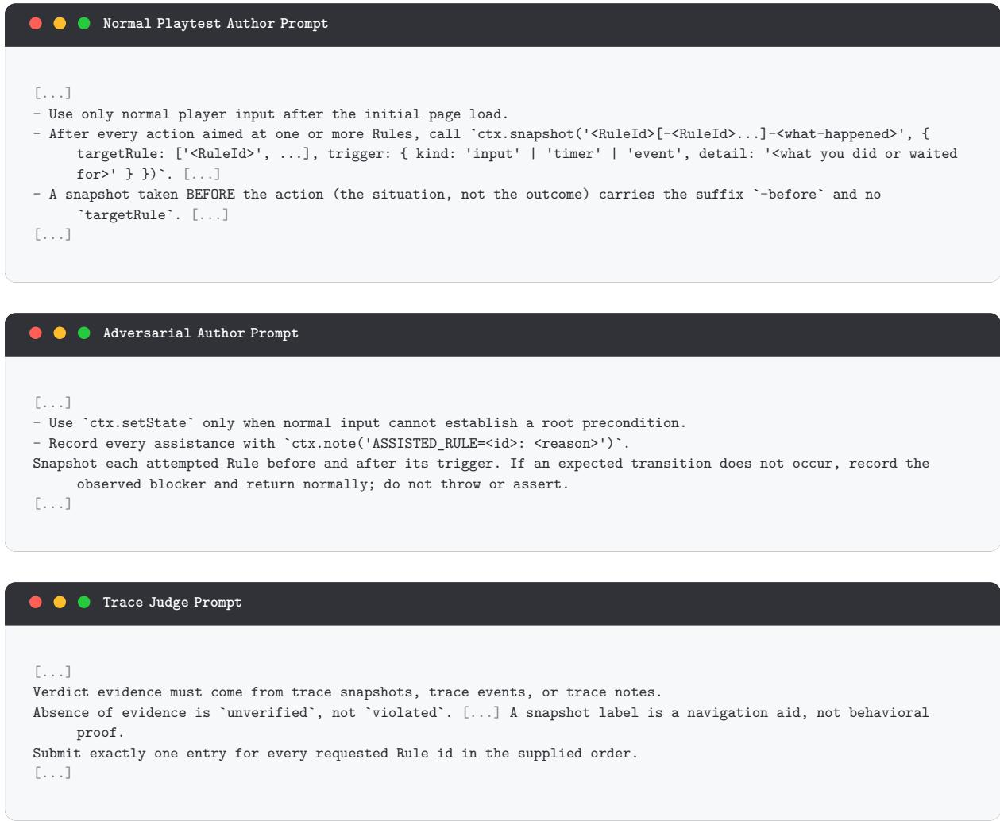  
Figure S9 Excerpts of the three adaptive-playtest system prompts. Text is verbatim, and omitted passages are marked [...].

## D.3.2. Implementation

Shared Runtime Interface. The interface API is exposed to each JavaScript bot as a ctx object; Figure S10 shows excerpts of two recorded bots. ctx.state() reads GameInspector.exportState() and yields the observation $o _ { t } .$ , while keyboard and pointer methods issue the player input $x _ { t }$ to the running game. The bot uses observations in conditions and loops, waits for state changes, and records evidence with ctx.snapshot(). Snapshots contain labels, elapsed times, game states, and available events, and together with the input log they form the trace $\tau _ { i } ( \omega , z )$ of Equation $7 ;$ ctx.watch() adds selected livestate observations. Adversarial tests additionally use declared scenario entries or ctx.setState() to establish $z _ { i , r }$ before observing the specified behavior, whether it follows a player input or elapsed time.

```typescript
(a) The Shared ctx Interface
export const budgetMs: number; export default async function run(ctx: Ctx);
interface Ctx {
state(); live(fn); watch(fn); snapshot(label, extra?); note(msg); // observation, read-only
tap(key); press(keys); type(text); hold(key, ms?); down(key); up(key); // keyboard
click(x, y, button?); move(x, y); mouseDown(); mouseUp(); mouseHold(); drag(points); wheel(dx, dy);
blur(); focus(); hide(); show(); pointerCancel(); // window and document
wait(ms); waitFrames(n); waitFor(predicate, opts?); // waiting
setState(patch); // adversarial only, refused in the normal playtest
}
export const scenario?: string; // declared scenario entry, adversarial only
```

```javascript
(b) Normal Playtest Bot magnet_dock, excerpt
export default async function run(ctx) {
const snap = (label, rules, kind, detail) =>
ctx.snapshot(label, { targetRule: rules, trigger: { kind, detail } });
ctx.watch(() => { // live-state fields attached to every snapshot
const g = window.GameInspector?.exportState?.().game;
return g && { state: g.state, polarity: g.polarity, settleTicks: g.settleTicks };
});
await ctx.snapshot(’initial’);
await ctx.down(’Space’); await ctx.waitFrames(2); // one fresh toggle while held ...
await snap(’I5-first-polarity-toggle’, [’I5’], ’input’, ’fresh Space down’);
await ctx.down(’Space’); await ctx.waitFrames(2); // ... a second down must not toggle
await snap(’I3-held-space-repeat-inert’, [’I3’], ’input’, ’second down while held’);
await ctx.up(’Space’);
if ((await ctx.state()).game.state === ’S_RESULT’) {
await ctx.click(640, 492);
await snap(’S13-result-to-title’, [’S13’], ’input’, ’clicked Title’);
}
}
```

```javascript
(c) Adversarial Playtest Bot magnet_dock, rule D1, excerpt
export const scenario = ’dock_center_at_rest’; // declared scenario entry
export default async function run(ctx) {
const gameState = async () => (await ctx.state())?.game ?? {};
if ((await gameState()).settleTicks !== 59) // pin the final pre-threshold tick
await ctx.setState({ game: { state: ’S_PLAY’, settleTicks: 59, x: 0, v: 0,
polarity: ’Attract’, positionQualified: true, speedQualified: true } });
const before = await gameState();
await ctx.snapshot(’D1-before’);
let after = before;
for (let i = 0; i < 8 && after.settleTicks < 60; i++) {
await ctx.waitFrames(1); after = await gameState();
}
await ctx.snapshot(’D1-after’, { targetRule: [’D1’], trigger: { kind: ’timer’,
detail: { prior: before.settleTicks, observed: after.settleTicks } } });
}
```  
Figure S10 The playtest runtime interface and two recorded bots for magnet\_dock. (a) Every bot receives the same ctx. (b) The normal playtest bot reads state, issues inputs, and records labelled snapshots naming the target rule. (c) The adversarial playtest bot enters through a declared scenario, pins the precondition of rule D1 with setState, and observes the outcome.

Rule-Level Judgments. A separate evaluator checks each rule’s conditions, trigger, and expected efects against the recorded trace, issuing a verdict only when the rule’s required situation $\phi _ { r }$ is established in the trace. The rule is satisfied when the evidence supports its expected behavior and violated when the observed outcome contradicts it. A promised value is interpreted by its meaning rather than its spelling, but the operation and number of fields must match: a SET with a diferent observed value, or an exposed field that contradicts a multi-field efect, constitutes a violation. Code re-checks every cited SET and overrides a satisfied judgment if it finds a contradiction.

When the trace does not establish the required situation or does not support a conclusive outcome, the rule is unverified. This status does not count as a violation. Each verdict retains the rule identifier, supporting execution evidence, and whether the situation was reached through normal play $( \tau _ { i } ^ { \mathrm { p t } } )$ or assisted initialization $( \tau _ { i , r } ^ { \mathrm { a d v } } )$ . Source code may help interpret state fields, but does not serve as verdict evidence. Each rule receives three evaluator judgments; the strict majority determines its verdict, and a rule with no majority is treated as unverified.

Combining Results and Aggregation. Conclusive normal-playtest judgments form $\mathcal { R } _ { i } ^ { \mathrm { p t } }$ and are retained, and adversarial tests address $\mathcal { \bar { R } } _ { i } ^ { \mathrm { a d v } } \subseteq { \mathcal { R } } _ { i } ^ { \mathrm { r u l e } } \backslash { \mathcal { R } } _ { i } ^ { \mathrm { p t } }$ . Across repeated adversarial attempts on the same rule, an observed violation takes precedence; otherwise, a supported satisfaction is retained. Each rule contributes once to the final result. Let $n _ { i } = | \mathcal { R } _ { i } ^ { \mathrm { r u l e } } |$ and let $\begin{array} { r } { \hat { \mathbf { \Omega } } \hat { n } _ { i } ^ { \mathrm { s a t } } = \sum _ { r \in \mathcal { R } _ { i } ^ { \mathrm { r u l e } } } f _ { i , r } ^ { \mathrm { a d a p t } } } \end{array}$ and $n _ { i } ^ { \mathrm { v i o } }$ count the rules finally judged satisfied and violated. The playtest score is $F _ { i } ^ { \mathrm { a d a p t } } = n _ { i } ^ { \mathrm { s a t } } / n _ { i }$ , identical to Equation $^ { 1 0 , }$ and judgment coverage is $( n _ { i } ^ { \mathrm { s a t } } + n _ { i } ^ { \mathrm { v i o } } ) / n _ { i }$ . Both use the full rule set as the denominator. We report unweighted means of per-game values within each split.

## E. Additional Analysis on Benchmark Results

Comparison Protocol. We compare six proprietary coding agents using per-GDD scores from the 100- task benchmark: Claude-Fable-5.1 (Anthropic, 2026), Claude-Opus-5 (Anthropic, 2026), Claude-Opus-4.8 (Anthropic, 2026), GPT-6-Astra (OpenAI, 2026c), GPT-5.6-Sol (OpenAI, 2026b), and GPT-5.5 (OpenAI, 2026a). For each evaluation axis, a higher score on the same GDD contributes one win, a tie one half, and a lower score zero. Matrix entries average these outcomes over matched GDDs. We use scores before display rounding, including recorded zeros. Source uses graph-weighted fidelity with � = 0.5. Overall compares the arithmetic mean of the three axis scores for each game before aggregating model-pair outcomes.

Elo Ratings. We summarize outcomes against all opponents using Bradley–Terry ratings on an Elo scale (Chiang et al., 2024). For each split and axis, the expected comparison outcome for model � against model � is

$$
p _ { m n } = \frac { 1 } { 1 + 1 0 ^ { ( r _ { n } - r _ { m } ) / 4 0 0 } } .\tag{14}
$$

Let $w _ { m n }$ be wins plus half-credit ties and $n _ { m n }$ the number of matched GDDs. We fit all model-pair outcomes jointly by maximizing

$$
\sum _ { m < n } \left[ \left( w _ { m n } + \frac { 1 } { 2 } \right) \log p _ { m n } + \left( n _ { m n } - w _ { m n } + \frac { 1 } { 2 } \right) \log ( 1 - p _ { m n } ) \right] , \qquad \frac { 1 } { M } \sum _ { m = 1 } ^ { M } r _ { m } = 1 , 0 0 0 .\tag{15}
$$

Here $M = 6$ is the number of compared models. Symmetric half-win and half-loss regularization keeps ratings finite under complete separation and does not alter the empirical heatmap. Each axis is fitted independently; Overall Elo is fitted from Overall comparisons rather than averaged from axis ratings. Pooled ratings combine Small and Big GDDs. Uncertainty is estimated with 2,000 GDD-level bootstrap resamples, preserving the Small and Big composition and keeping all comparisons from each sampled GDD together.

Results. Figure S11 combines the empirical win-rate matrices and model-level Elo summaries for the six proprietary agents. GPT-5.5 (OpenAI, 2026a) has a win rate of 76.5% against GPT-5.6-Sol (OpenAI, 2026b) in source-code evaluation and 61.0% in Playtest, compared with 12.9% in scenario-based replay assessment. Their relative Elo ordering follows the same directions, while Claude-Fable-5.1 has the highest pooled Elo on all four axes. Figures S12 and S13 provide split-specific comparisons. Mean fidelity measures the level of specification fulfillment. Specifically, win rates and Elo summarize comparative performance across GDDs, with Elo aggregating outcomes against all opponents.

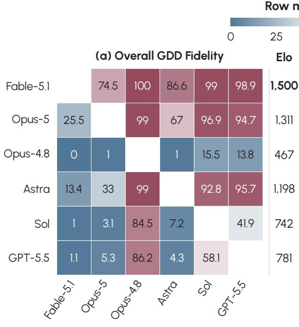

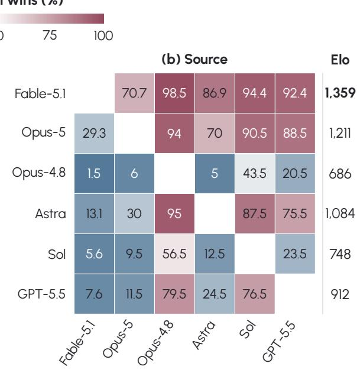

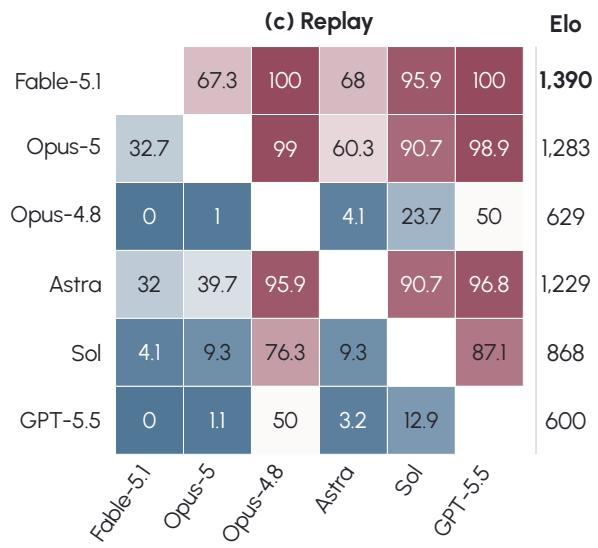

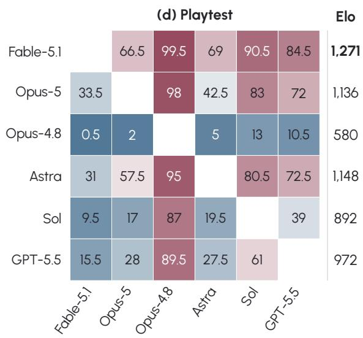  
Figure S11 Pairwise model comparisons and Elo ratings: Pooled GDDs. Matrix entries give the row model's win rate against each column model, with ties counted as one half. The rightmost column reports the model's Elo rating for that panel. Values above 50% favor the row model; Elo ratings are relative and centered at 1,000 within each panel.

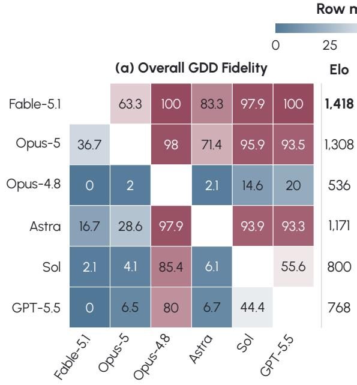

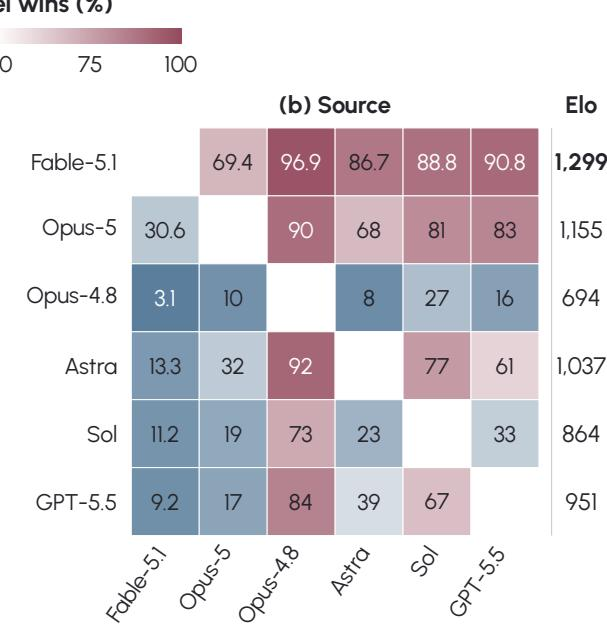

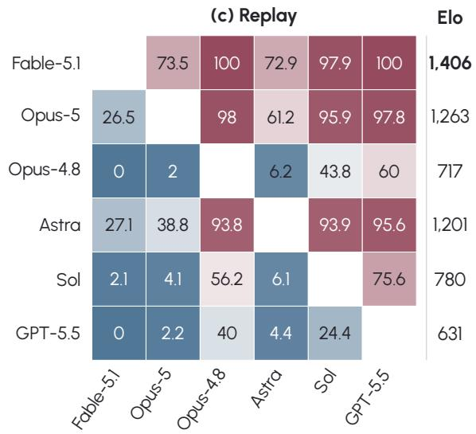

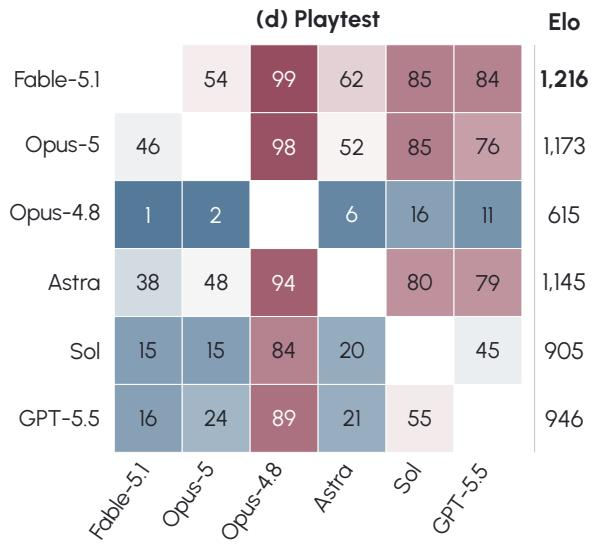  
Figure S12 Pairwise model comparisons and Elo ratings on Small GDDs. The comparison protocol, relative model order, and win-rate color scale follow Figure S11. Each panel includes an Elo column alongside the empirical pairwise matrix.

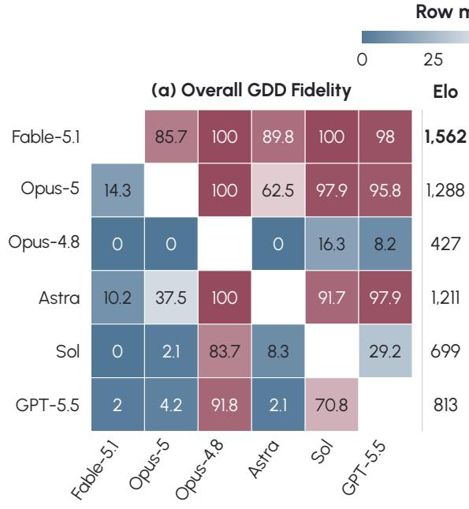

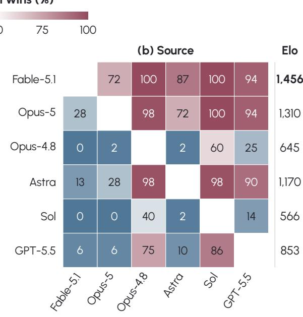

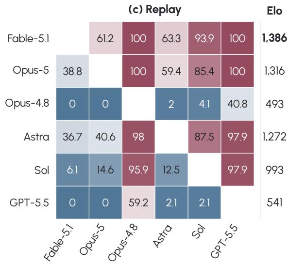

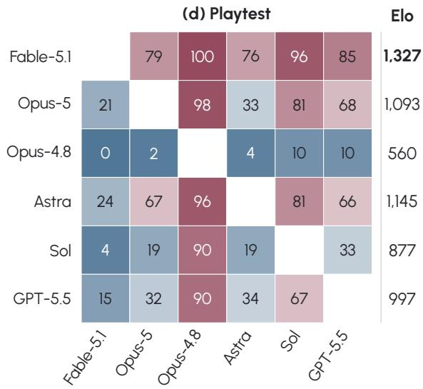  
Figure S13 Pairwise model comparisons and Elo ratings on Big GDDs. The comparison protocol, relative model order, and win-rate color scale follow Figure S11. Each panel includes an Elo column alongside the empirical pairwise matrix.

## F. Ablations on Evaluation

This section examines choices in the evaluation that the method does not force: whether a judge without a contract keeps a stable requirement set, what dependency weighting changes in the source-code score, how the replay judge’s model and reasoning efort shift its scores, and what adversarial initialization adds over repeated normal play. Each ablation modifies a single factor while keeping other inputs constant, such as builds, scenario replays, rubrics, or traces, and results are read against the self-disagreement of the same judge.

## F.1. Source-Code Evaluation

We examine the source-code evaluation in Section 3.3.1 through repeated judgments, changes in judge configuration, and an ablation of dependency-weighted scoring.

## F.1.1. Requirement-Set Consistency

The naive GDD-based judge identifies its own requirements from the GDD and source project, while the contract-based judge scores a fixed set of rules and invariants. Only the naive judge reconstructs its targets on each run. We therefore test whether repeated judgments of an unchanged build use a consistent set of requirements.

We run the naive judge five times per unchanged build for all 100 GDDs, using GPT-5.6-Sol at high reasoning efort. We also repeat dependency-aware contract construction five times for each GDD. After the consistency checks pass, the first generated contract is frozen for benchmark evaluation across builds and revision rounds, as described in Section B. Scores vary little: the median gap between a build’s highest and lowest scores is 0.05. However, the extracted requirements vary substantially: for the median GDD, item counts vary by 60% of their mean, only 35% of items match across runs at a Jaccard threshold of 0.5, and 9% appear in all five runs. This instability is greater for Big GDDs: the median cross-run match is 31%, with $7 \%$ of items appearing in all five runs, compared with 38% and 14% for Small GDDs. Figure S14 shows requirement-count variation and cross-run item alignment. Thus, a stable score can mask shifting evaluation criteria, undermining requirement-level comparisons. Freezing the contract keeps targets fixed across agents and revision rounds; Section B.5 examines how consistently the contract itself can be constructed.

On the same build ${ \mathit { g } } _ { i } ,$ the naive score correlates more strongly with the contract’s rule component $F _ { i } ^ { \mathrm { r u l e } }$ than with its invariant component $F _ { i } ^ { \mathrm { i n v } } \colon$ : Pearson correlations of 0.54 versus 0.16 for Small GDDs, and 0.87 versus 0.23 for $B i g$ GDDs. This limited correspondence with invariant pass rates motivates checking invariants explicitly alongside rules in the source-code measure, as in Equation 4.

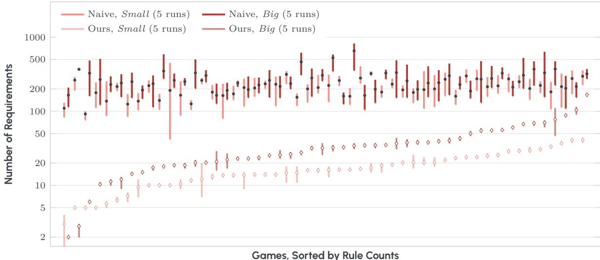

Cross-run requirement alignment (median: Small 38%, Big 31%)  
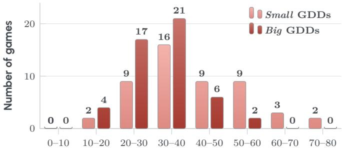  
Requirements of First Run Found Again in Another Run of the Same GDD (%, Jaccard ≥ 0.5)  
Figure S14 Requirement consistency across repeated source-code judgments. The naive judge evaluates each of 100 unchanged builds five times. Top: the minimum, maximum, and mean number of extracted requirements per game, with rule counts shown for comparison. Bottom: the distribution of the fraction of one run’s requirements matched in another run at a Jaccard threshold of 0.5.

## F.1.2. Ablation On Dependency-Weighted Scoring

Table $4 ( \mathrm { a } )$ measures the sensitivity of the full source-code score $F _ { i } ^ { \mathrm { s r c } }$ to dependency weighting. We hold the rule scores and invariant judgments fixed and compare $\alpha = 0 . 5$ and $\alpha = 0 . 1$ with uniform weighting $( \alpha = 1 )$ , reporting the mean and maximum absolute score changes. The analysis below separately examines changes in the rule component $F _ { i } ^ { \mathrm { r u l e } }$ for builds with and without confirmed high reach failures. Weighting rules by their downstream reach, as defined in Equation 3, gives greater influence to mechanics on which other behaviors depend. We compare the dependency-weighted rule score $F _ { i } ^ { \mathrm { r u l e } }$ at $\alpha \ : = \ : 0 . 5$ against its unweighted counterpart at $\alpha = 1$ , and denote the diference by $\Delta _ { \alpha } = \dot { F _ { i } ^ { \mathrm { r u l e } } } ( \alpha ) - F _ { i } ^ { \mathrm { r u l e } } ( 1 )$ . A negative gap means that weighting lowers the score. This is expected when rules with greater downstream reach receive relatively low implementation scores; conversely, the score can increase when failures concentrate on lower-weight leaf rules.

To examine this efect, we classify a game as root-defective when a core root rule, whose downstream reach is at least half the maximum in the game’s contract, receives a score of at most 0.5 under both source-code judge settings and is violated in the adaptive playtest. The comparison group contains games with no observed playtest violation among their assessed root rules. Both groups include Small and $B i g$ games. As shown in Figure S16, negative gaps occur in 11 of 18 root-defective games, compared with 6 of 16 comparison games. Thus, dependency weighting lowers the score more often in games with confirmed foundational failures. Positive gaps in the root-defective group arise primarily when failures are even more prevalent among leaf rules, which pull down the unweighted average more strongly. The sign consequently reflects the distribution of scores across the contract, rather than the presence of a root failure alone. The gaps are small relative to judge variability, so we interpret the group diference

## 23 of 100 GDDs exhibit a pairwise order reversal

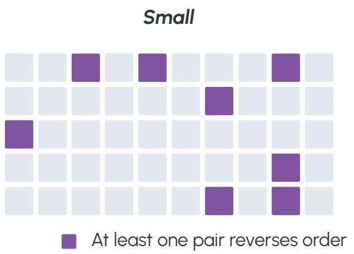

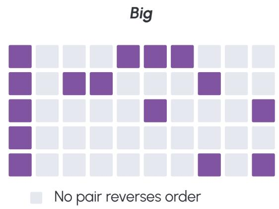  
Figure S15 Dependency weighting changes game-level comparisons. Each cell represents one GDD. Purple cells indicate a strict reversal in the source-code score ordering of at least one pair of the six proprietary agents between uniform weighting (� = 1) and downstream-reach weighting (� = 0), with rule judgments and invariant scores fixed. Such reversals occur on 23 of the 100 GDDs.

as a tendency in the observed scores. This tendency is consistent with the intended role of dependency weighting: giving greater influence to rules with broader downstream efects.

Furthermore, we examine how dependency weighting afects comparisons on individual GDDs. For the six proprietary agents in Appendix E, we hold the rule judgments and invariant scores fixed and compare source-code scores under uniform weighting (� = 1) and downstream-reach weighting (� = 0). As shown in Figure S15, the ordering of at least one agent pair reverses on 23 of the 100 GDDs. The same rule-level judgments can therefore favor diferent agents when greater influence is assigned to rules on which other requirements depend.

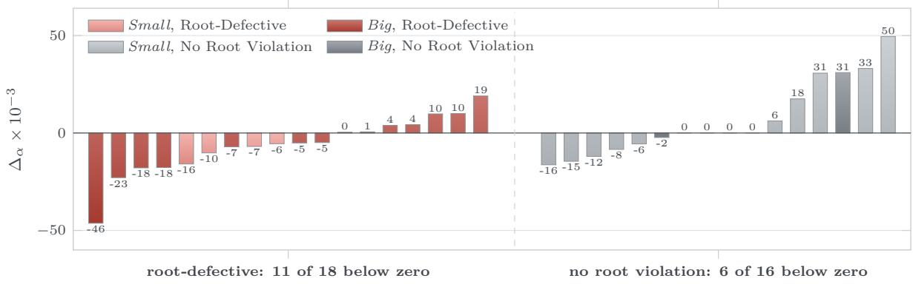  
Figure S16 Effect of dependency weighting on rule scores. Each bar is $\Delta _ { \alpha } = F _ { i } ^ { \mathrm { r u l e } } ( \alpha ) - F _ { i } ^ { \mathrm { r u l e } } ( 1 )$ at $\alpha = 0 . 5$ Left: root-defective games meeting the joint source-code and playtest criteria. Right: comparison games without an observed playtest violation among their assessed root rules. Negative values indicate lower weighted scores; the sign is unchanged at � = 0.

## F.2. Scenario-Based Replay Assessment

Table S11 evaluates GPT-5.6-Sol and GPT-5.6-Luna at four reasoning eforts on the same six builds, scenario replays, and rubrics, against the original sol extra-high judgments; item agreement is the Pearson correlation between the per-item scores of $\rho _ { i } ^ { \mathrm { v i s } }$ and those judgments, with a re-run agreement of about 0.86. At extra-high efort, substituting luna for sol changes the mean $F _ { i } ^ { \mathrm { r e p l a y } } \mathrm { b y } - 0 . 0 0 5$ at an agreement of 0.85. Lowering the efort increases mean scores relative to the reference, though not equally: sol rises by +0.03 to +0.04 at each lower level with agreement between 0.88 and 0.89, whereas luna stays at +0.006 at high and rises to +0.035 at medium and +0.081 at low, with agreement falling to 0.79, mostly on the visual and art items. We therefore use luna at high efort: its bias is smaller than sol’s at any efort below extra-high, its agreement is close to the re-run agreement, and a judgment takes 41 seconds at about \$0.007 against 78 seconds and \$0.048 for the reference, a 6.7× reduction that brings the replay score of a game (three judgments over 13–24 scenario replays) from about \$2–3.5 to \$0.3–0.5.

Table S11 Agent-as-a-judge on six builds with identical scenario replays and rubric. Item � is the Pearson correlation of rubric-item scores with the original sol extra-high judgments of the same builds (re-run agreement ≈ 0.86); Δ is the mean reward diference from them. Cost is per judge call at list prices. sol = GPT-5.6-Sol, luna = GPT-5.6-Luna.
<table><tr><td>Judge, effort</td><td>Item r</td><td>Mean reward</td><td>∆ vs. ref.</td><td>s / call</td><td>$ / call</td></tr><tr><td>sol, xhigh (reference)</td><td></td><td>0.639</td><td></td><td>78</td><td>0.048</td></tr><tr><td>sol, high</td><td>0.88</td><td>0.667</td><td>+0.027</td><td>71</td><td>0.034</td></tr><tr><td>sol, medium</td><td>0.88</td><td>0.669</td><td>+0.030</td><td>63</td><td>0.034</td></tr><tr><td>sol, low</td><td>0.89</td><td>0.680</td><td>+0.041</td><td>52</td><td>0.045</td></tr><tr><td>luna, xhigh</td><td>0.85</td><td>0.634</td><td>-0.005</td><td>63</td><td>0.0074</td></tr><tr><td>luna, high</td><td>0.85</td><td>0.645</td><td>+0.006</td><td>41</td><td>0.0072</td></tr><tr><td>luna, medium</td><td>0.83</td><td>0.674</td><td>+0.035</td><td>27</td><td>0.0070</td></tr><tr><td>luna, low</td><td>0.79</td><td>0.720</td><td>+0.081</td><td>21</td><td>0.0070</td></tr></table>

## F.3. Adaptive Playtest

Evidence Across Coding Agents. Figure S17 and Table S12 decompose the playtest results reported in Table 2. For each coding agent and split, we use the same saved runs and score-reporting cohort as the main comparison, holding the builds and requirement sets fixed across the normal and adversarial phases. The analysis uses the same enumerated contracts and playtest pipeline across agents, with GPT-5.6-Luna as the bot and judge, one normal-play round, and up to two adversarial attempts per unresolved target.

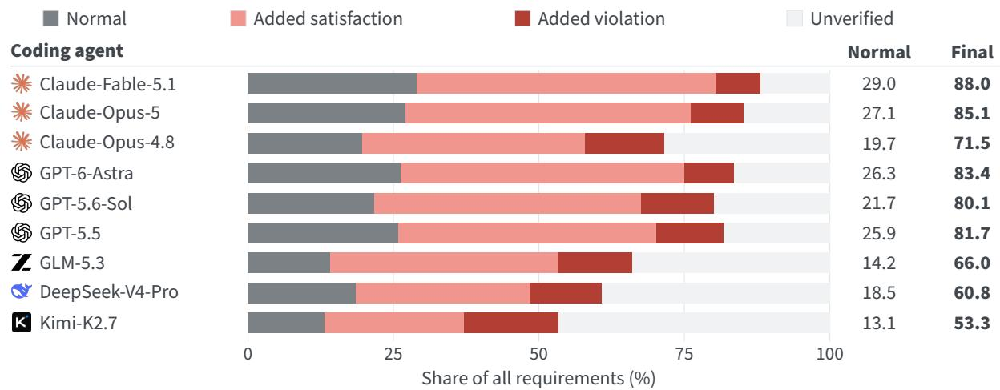  
Figure S17 Additional evidence from adversarial playtesting. Under the fixed playtest protocol, normal coverage includes satisfied and violated requirements. Adversarial testing adds satisfaction and violation evidence for previously unverified requirements on the same builds; the pale remainder is unverified. The right columns report normal and final judgment coverage (%). We use the same score-reporting cohort as Table 2, averaging game-level fractions with the full rule set as the denominator; All equally averages the Small and Big means. Table S12 provides the decomposition by split.

For build $i ,$ let $n _ { i } = | \mathcal { R } _ { i } ^ { \mathrm { r u l e } } |$ , and let $S _ { i } ^ { \mathrm { N } }$ and $V _ { i } ^ { \mathrm { N } }$ count requirements satisfied and violated after normal play. We join phase records by requirement identity and count $\Delta S _ { i }$ and $\Delta V _ { i }$ only when a previously unverified requirement becomes satisfied or violated. All conclusive normal verdicts are preserved in the paired records, so each requirement contributes once. The score and coverage decompose as

$$
{ \cal F } _ { i } ^ { \mathrm { a d a p t } } = \frac { S _ { i } ^ { \mathrm { N } } + \Delta S _ { i } } { n _ { i } } , \qquad { \cal C } _ { i } ^ { \mathrm { N } } = \frac { S _ { i } ^ { \mathrm { N } } + V _ { i } ^ { \mathrm { N } } } { n _ { i } } , \qquad { \cal C } _ { i } ^ { \mathrm { N + A } } = { \cal C } _ { i } ^ { \mathrm { N } } + \frac { \Delta S _ { i } + \Delta V _ { i } } { n _ { i } } .\tag{16}
$$

Every rate retains the full per-game requirement set in its denominator. We first average game-level fractions within each agent and split; All equally averages Small and Big, and aggregate means then equally weight the nine agents. Added satisfaction and violation are percentage-point contributions to the combined result. Judgment coverage measures the extent of conclusive execution evidence obtained under the fixed playtest protocol, including initialized adversarial scenarios.

Mean judgment coverage increases from 21.7% after normal play to 74.4% after adversarial testing, adding 41.1 percentage points of satisfaction and 11.6 points of violation evidence. Every agent gains both types of evidence, with coverage increases of 40.2–59.0 percentage points. The increase is larger on Big, where coverage rises from 8.2% to 68.3%, compared with 35.3% to 80.5% on Small. Additional violation evidence also increases from 7.3 points on Small to 15.8 points on Big. These results characterize the contribution of adversarial testing to the evidence collected for the main benchmark scores.

The recorded judgments can have diferent compositions at similar coverage. On Big, GPT-6-Astra and GPT-5.6-Sol reach coverage of 79.0% and 77.2%, respectively, but their reported Playtest scores are 67.4 and 57.9. Adversarial testing adds more satisfied requirements for GPT-6-Astra (58.7 vs. 48.9 points), while identifying more violations for GPT-5.6-Sol (18.6 vs. 11.4 points). The decomposition separates confirmed satisfaction from observed violations within the collected execution evidence.

A similar distinction arises when normal coverage is close. On Big, Claude-Fable-5.1 and GPT-5.5 begin at 12.7% and 12.0% coverage, but adversarial tests add 62.5 and 50.3 points of satisfaction and 10.5 and 16.9 points of violation, respectively. Their final Playtest scores are 74.7 and 61.7, matching Table 2. Reporting both added outcomes shows how targeted execution evidence separates downstream successes from failures beyond the behavior observed during normal play.

Controlled Comparison. To separate prerequisite initialization from merely running another test, we compare the modes on 86 dependency-linked rules from 25 Small and 25 Big games, with the build, contract, Test Policy, interface API, and budgets held fixed and two seeds per target; initialization supplies $z _ { i , r } \Vdash \phi _ { r }$ , never target outcomes.

Table S13 reports a first normal run and a second pass that re-tests only its unverified targets, once normal and once adversarial, with the adversarial mode alone as reference. Each episode takes the majority of three GPT-5.6-Luna judgments at high efort, and coverage is averaged over targets and seeds, then games and splits. A second normal test increases coverage from 40.5% to 41.0%, whereas an adversarial second test increases it to 48.5%. The combined setting also exceeds the 45.0% coverage of adversarial testing alone, supporting their complementary use: normal play provides evidence along ordinary gameplay paths, while initialization enables additional downstream checks.

Table S12 Normal and adversarial playtest decomposition across agents. Each split uses the same scorereporting cohort as Table 2; All is the mean of Small and Big. Sat., Viol., and Cov. denote satisfied, violated, and conclusively judged requirements, respectively. Adversarial gain reports additional judgments for previously unverified requirements in percentage points (pp). Combined Score reproduces the Small and Big Playtest scores in Table 2 using the same archived per-game scores; phase contributions and coverage use exact verdict counts. All values are reported to one decimal place.
<table><tr><td rowspan="2">Coding agent</td><td colspan="3">Normal (%)</td><td colspan="2">Adversarial gain (pp)</td><td colspan="2">Combined (%)</td></tr><tr><td>Sat.</td><td>Viol.</td><td>Cov.</td><td>Sat.</td><td>Viol.</td><td>Score</td><td>Cov.</td></tr><tr><td colspan="7">All</td></tr><tr><td>Claude-Fable-5.1</td><td>28.6</td><td>0.4</td><td>29.0</td><td>51.4</td><td>7.6</td><td>80.0</td><td>88.0</td></tr><tr><td>Claude-Opus-5</td><td>26.7</td><td>0.4</td><td>27.1</td><td>49.0</td><td>9.0</td><td>75.7</td><td>85.1</td></tr><tr><td>Claude-Opus-4.8</td><td>19.2</td><td>0.6</td><td>19.7</td><td>38.2</td><td>13.6</td><td>57.4</td><td>71.5</td></tr><tr><td>GPT-6-Astra</td><td>25.8</td><td>0.5</td><td>26.3</td><td>48.7</td><td>8.5</td><td>74.5</td><td>83.4</td></tr><tr><td>S GPT-5.6-Sol</td><td>21.1</td><td>0.6</td><td>21.7</td><td>45.8</td><td>12.5</td><td>67.0</td><td>80.1</td></tr><tr><td>S GPT-5.5</td><td>25.3</td><td>0.6</td><td>25.9</td><td>44.3</td><td>11.5</td><td>69.6</td><td>81.7</td></tr><tr><td>GLM-5.3 Z</td><td>13.6</td><td>0.6</td><td>14.2</td><td>39.0</td><td>12.8</td><td>52.6</td><td>66.0</td></tr><tr><td>DeepSeek-V4-Pro</td><td>17.5</td><td>1.0</td><td>18.5</td><td>30.0</td><td>12.3</td><td>47.5</td><td>60.8</td></tr><tr><td>Kimi-K2.7 K</td><td>12.0</td><td>1.1</td><td>13.1</td><td>23.9</td><td>16.2</td><td>36.0</td><td>53.3</td></tr><tr><td colspan="8">Small</td></tr><tr><td>Claude-Fable-5.1</td><td>44.9</td><td>0.4</td><td>45.4</td><td>40.3</td><td>4.8</td><td>85.2</td><td>90.4</td></tr><tr><td>Claude-Opus-5</td><td>41.8</td><td>0.5</td><td>42.3</td><td>41.8</td><td>5.5</td><td>83.6</td><td>89.7</td></tr><tr><td>Claude-Opus-4.8</td><td>32.0</td><td>0.8</td><td>32.8</td><td>36.7</td><td>8.3</td><td>68.7</td><td>77.9</td></tr><tr><td>GPT-6-Astra</td><td>42.9</td><td>0.8</td><td>43.7</td><td>38.6</td><td>5.5</td><td>81.6</td><td>87.9</td></tr><tr><td>S GPT-5.6-Sol</td><td>33.2</td><td>0.5</td><td>33.7</td><td>42.8</td><td>6.4</td><td>76.0</td><td>82.9</td></tr><tr><td>S GPT-5.5</td><td>39.2</td><td>0.6</td><td>39.8</td><td>38.3</td><td>6.1</td><td>77.5</td><td>84.2</td></tr><tr><td>GLM-5.3 Z</td><td>23.4</td><td>0.7</td><td>24.2</td><td>41.5</td><td>8.4</td><td>64.9</td><td>74.0</td></tr><tr><td>DeepSeek-V4-Pro</td><td>31.1</td><td>1.5</td><td>32.6</td><td>36.9</td><td>8.5</td><td>68.0</td><td>78.0</td></tr><tr><td>Kimi-K2.7</td><td>21.4</td><td>1.8</td><td>23.1</td><td>24.4</td><td>12.5</td><td>45.7</td><td>60.0</td></tr><tr><td colspan="8">Big</td></tr><tr><td>Claude-Fable-5.1</td><td>12.3</td><td>0.4</td><td>12.7</td><td>62.5</td><td>10.5</td><td>74.7</td><td>85.6</td></tr><tr><td>Claude-Opus-5</td><td>11.6</td><td>0.3</td><td>11.9</td><td>56.1</td><td>12.5</td><td>67.7</td><td>80.5</td></tr><tr><td>Claude-Opus-4.8</td><td>6.3</td><td>0.3</td><td>6.6</td><td>39.6</td><td>18.9</td><td>46.0</td><td>65.1</td></tr><tr><td>GPT-6-Astra</td><td>8.7</td><td>0.2</td><td>8.9</td><td>58.7</td><td>11.4</td><td>67.4</td><td>79.0</td></tr><tr><td>S GPT-5.6-Sol</td><td>9.0</td><td>0.7</td><td>9.7</td><td>48.9</td><td>18.6</td><td>57.9</td><td>77.2</td></tr><tr><td>S GPT-5.5</td><td>11.5</td><td>0.5</td><td>12.0</td><td>50.3</td><td>16.9</td><td>61.7</td><td>79.2</td></tr><tr><td>GLM-5.3</td><td>3.8</td><td>0.5</td><td>4.2</td><td>36.6</td><td>17.2</td><td>40.4</td><td>58.1</td></tr><tr><td>DeepSeek-V4-Pro</td><td>3.8</td><td>0.5</td><td>4.3</td><td>23.2</td><td>16.1</td><td>27.0</td><td>43.6</td></tr><tr><td>Kimi-K2.7</td><td>2.7</td><td>0.5</td><td>3.1</td><td>23.5</td><td>19.9</td><td>26.2</td><td>46.6</td></tr><tr><td></td><td></td><td></td><td></td><td></td><td></td><td></td><td></td></tr></table>

Table S13 Controlled playtest comparison. Mean judgment coverage (%) on 86 target rules from 25 Small and 25 Big games. A second pass keeps the first pass’s conclusive verdicts and re-tests only the targets it left unverified.
<table><tr><td>First pass</td><td>Second pass</td><td>Coverage</td><td>∆</td></tr><tr><td>Normal</td><td></td><td>40.5</td><td></td></tr><tr><td>Normal</td><td>Normal</td><td>41.0</td><td>+0.5</td></tr><tr><td>Normal</td><td>Adversarial</td><td>48.5</td><td>+8.0</td></tr><tr><td>Adversarial</td><td></td><td>45.0</td><td></td></tr></table>

Table S14 Sensitivity to three-axis aggregation weights. Each cell reports the aggregate score (0–100) and rank among nine agents. The weight order is source, replay, and adaptive playtest. Source dependency weighting remains fixed at $\alpha = 0 . 5$ . All-game axis scores equally average the Small and Big means. Bold cells indicate a rank change from equal weighting.
<table><tr><td>Agent</td><td> $\begin{array} { r } { \big ( \frac { 1 } { 3 } , \frac { 1 } { 3 } , \frac { 1 } { 3 } \big ) } \end{array}$ </td><td> $\begin{array} { r } { \big ( \frac { 1 } { 2 } , \frac { 1 } { 4 } , \frac { 1 } { 4 } \big ) } \end{array}$ </td><td> $\begin{array} { r } { \big ( \frac { 1 } { 4 } , \frac { 1 } { 2 } , \frac { 1 } { 4 } \big ) } \end{array}$ </td><td>Equal Source emphasis Replay emphasis Adaptive emphasis  $\begin{array} { r } { \big ( \frac { 1 } { 4 } , \frac { 1 } { 4 } , \frac { 1 } { 2 } \big ) } \end{array}$ </td></tr><tr><td>Claude-Fable-5.1</td><td>77.0 (1)</td><td>79.4 (1)</td><td>73.8 (1)</td><td>77.7 (1)</td></tr><tr><td>Claude-Opus-5</td><td>73.9 (2)</td><td>76.2 (2)</td><td>71.1 (2)</td><td>74.3 (2)</td></tr><tr><td>GPT-6-Astra</td><td>71.6 (3)</td><td>73.5 (3)</td><td>68.9 (3)</td><td>72.3 (3)</td></tr><tr><td>GPT-5.5</td><td>63.2 (4)</td><td>64.5 (4)</td><td>60.3 (5)</td><td>64.8 (4)</td></tr><tr><td>GPT-5.6-Sol</td><td>61.8 (5)</td><td>62.0 (5)</td><td>60.4 (4)</td><td>63.1 (5)</td></tr><tr><td>Claude-Opus-4.8</td><td>56.8 (6)</td><td>57.8 (7)</td><td>55.6 (6)</td><td>56.9 (6)</td></tr><tr><td>GLM-5.3</td><td>55.6 (7)</td><td>58.8 (6)</td><td>53.2 (7)</td><td>54.9 (7)</td></tr><tr><td>DeepSeek-V4-Pro</td><td>50.4 (8)</td><td>54.0 (8)</td><td>47.6 (8)</td><td>49.7 (8)</td></tr><tr><td>Kimi-K2.7</td><td>39.5 (9)</td><td>41.9 (9)</td><td>37.9 (9)</td><td>38.6 (9)</td></tr></table>

## F.4. Complementarity of Evaluation

Code Implementation and Runtime Gap. Source-code inspection and playtesting provide diferent evidence for the same rule. Figure S18 shows three rules that receive a source-code item score of 1.00 but are judged violated during playtesting. In these cases, the recorded source-code judgments credit relevant implementation logic, while execution reveals problems in its integration with the rest of the game. In Rainwright, the preview turns red when buildDenied is set, but the flag is updated only in tryBuild() on input release, so the preview remains teal while the input is held. In Strata Keepers, the map handler deducts two workdays after excavation setup has already reduced the remaining days from 20 to 18, producing a four-day cost. In Chroma Bastion, the run-end path stages a score initialized to 2,760 without replacing it with the completed run’s score. These examples expose integration failures missed by the recorded source-code judgments: a condition checked at the wrong time, a duplicated efect, and an outdated value. Linking both forms of evidence to the same requirements makes these discrepancies identifiable and provides concrete targets for revision.

Axis Omission. We compare the full three-axis scores with scores recomputed after omitting each axis, using all 100 initial GPT-5.6-Sol builds, comprising 50 Small and 50 Big games. The full score is the arithmetic mean of the three axes, and each omitted-axis score is the arithmetic mean of the remaining two axes. Reversed orderings are counted over all unordered pairs of games within the same split, giving $2 ( _ { 2 } ^ { 5 0 } ) \ = \ 2 { , } 4 5 0$ comparisons. A pair counts as reversed only when its score ordering strictly changes direction; ties in either ordering remain in the denominator but are not counted as reversals.

## F.5. Sensitivity to Evaluation-Axis Weights

Equal weighting gives source inspection, replay, and adaptive playtesting the same contribution to the reported aggregate. To assess the efect of this choice, we hold the measured axis scores and source dependency parameter $\alpha = 0 . 5$ fixed and recompute the aggregate as $F ( \lambda ) = \lambda _ { \mathrm { s r c } } F ^ { \mathrm { s r c } } + \lambda _ { \mathrm { r e p l a y } } F ^ { \mathrm { r e p l a y } } +$ $\lambda _ { \mathrm { a d a p t } } F ^ { \mathrm { a d a p t } }$ , where $\lambda _ { a } \geq 0$ and $\textstyle \sum _ { a } \lambda _ { a } = 1$ . The All score first averages the Small and Big means equally within each axis, following Table 2. These aggregation weights change the relative contribution of the three evidence channels and are distinct from the dependency parameter �, which weights rules within source-code evaluation.

For each pair of agents, the score diference is linear in �. Its extrema therefore occur at the vertices of the weight simplex, allowing us to determine whether a comparison is invariant over the complete continuous weight domain. Claude-Fable-5.1, Claude-Opus-5, and GPT-6-Astra retain the first three positions in this order for every weighting, separately for Small, Big, and All. For the All aggregate, 30 of the 36 pairwise orderings are invariant. In this aggregate, if each axis receives at least half its default contribution, $\lambda _ { a } \geq 1 / 6$ , 34 of 36 orderings are invariant, and every agent remains within one position of its equal-weight rank.

Table S14 reports the default weighting and three alternatives that double one axis relative to either of the others. The changes follow the measured axis strengths. GLM-5.3 exceeds Claude-Opus-4.8 in source-code score (68.4 versus 61.0) but trails it in runtime fidelity (49.3 versus 54.6), so emphasizing source inspection reverses their aggregate order. GPT-5.6-Sol scores higher than GPT-5.5 in replay (56.1 versus 51.6), while GPT-5.5 scores higher in source-code evaluation and adaptive playtesting; emphasizing scenario-based replay changes their order. Reporting the three axes alongside the aggregate makes these diferences explicit.

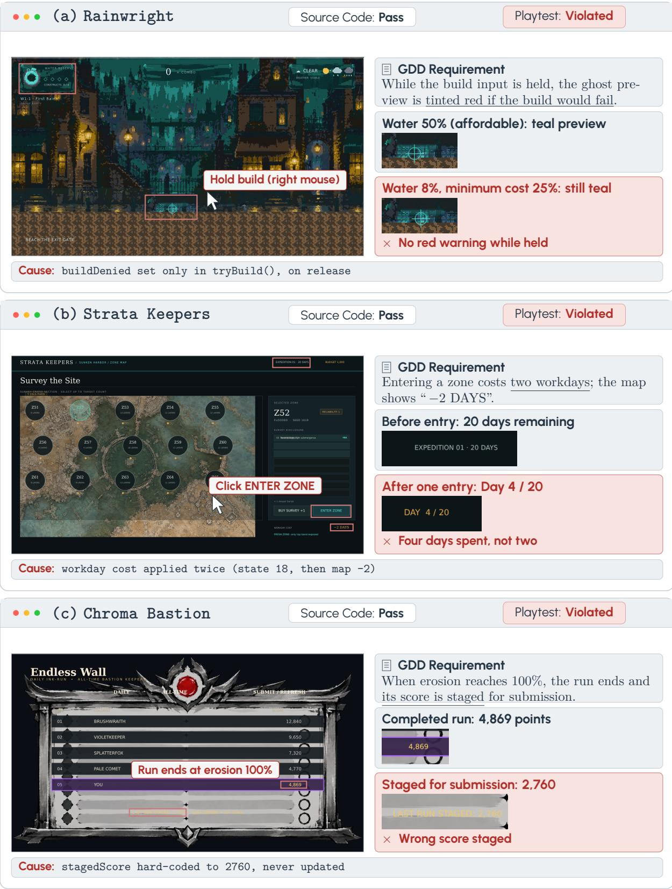  
Figure S18 Full source-code credit with a runtime violation. Each rule passes the source-code judge (item score 1.00) and is judged violated in the playtest. (a) Rainwright: with 8% water, below the 25% minimum cost, the held build preview stays teal instead of turning red, because the denial flag is set only on release. (b) Strata Keepers: a two-day zone entry consumes four days because the cost is applied twice. (c) Chroma Bastion: the finished run scores 4,869 but a constant 2,760 is staged for submission. Screenshots are from asset-integrated builds whose relevant logic is unchanged from the evaluated source; boxes, callouts, and crops are annotations.

## G. Additional Analysis on Evaluation

## G.1. Dependency-Aware Contract

## G.1.1. Rule Coverage and Run-to-Run Consistency

We compare the requirement sets produced by naive judgment and dependency-aware contract construction on all 100 GDDs. The naive judge identifies requirements while evaluating a generated game, whereas the contract is constructed from the GDD alone and represents state constraints as invariants and conditional behaviors as rules, following Appendix B. Both methods use GPT-5.6-Sol and require a supporting GDD quotation for every extracted item.

This requirement-extraction comparison uses five runs per method and is separate from the three fixed-input rule generations in Appendix B.5. For each GDD, we construct a shared pooled reference set from the rules referenced across the five runs of each method, consolidating repeated references to the same rule. Rule coverage is the fraction of rules in this shared set that are referenced by a run’s extracted evaluation items, with each reference rule counted at most once. We average coverage over the five runs for each GDD. Table S15 reports the split-level means: the contract increases mean coverage from 0.84 to 0.88 on Small and from 0.62 to 0.80 on Big. These values measure coverage relative to the rules recovered by repeated extraction.

Citation overlap measures the mean pairwise Jaccard similarity between the sets of referenced requirements across runs of the same GDD. On Big, it is 57% for the naive judge and 93% for repeated contract extractions. Figure S19 summarizes rule coverage and citation overlap across all 100 GDDs. Among naive items that can be matched across runs, judgment status agrees in 91% of pairs on Small and 87% on Big, indicating that much of the instability concerns which requirements are selected for evaluation.

Table S15 Coverage against a pooled reference set. Fraction of a shared per-GDD reference set cited by each method’s extracted items, reported as mean (median) across each split. The reference set pools rules referenced across five runs of both methods; per-GDD coverage is averaged over five runs. The contract is constructed from the GDD alone, whereas the naive judge sees both the GDD and the generated game.  
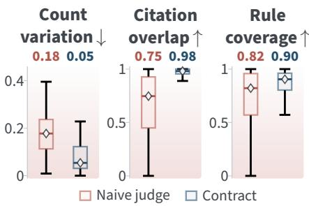

<table><tr><td>GDD Split</td><td>Naive Judge</td><td>Dependency-Aware Contract (Ours)</td></tr><tr><td>Small</td><td>0.84 (0.92)</td><td>0.88 (0.90)</td></tr><tr><td>Big</td><td>0.62 (0.63)</td><td>0.80 (0.92)</td></tr></table>

Figure S19 Requirement set stability. Across 100 GDDs, the contract yields more stable requirement sets than naive GDD-based judgment and higher citation overlap. Boxes show interquartile ranges; diamonds and labels mark medians across GDDs.

## G.1.2. Comparison With Enumerated Evaluation

We compare contract-based source evaluation with an enumerated baseline, which scores individual GDDderived requirements without explicitly representing their dependencies. This baseline evaluates a list of GDD-derived requirements, each recording a condition, an action, and an expected outcome, without explicit dependency edges between requirements. Supporting GDD quotations provide the correspondence between these requirements and contract rules. Using one initial GPT-5.6-Sol build for each of the 100 GDDs (50 Small, 50 Big), we analyze additional inspection targets, their coverage of recorded playtest violations, and implementation omissions identified by comparing against contract-based source evaluation.

Enumerated Source Judgments. We hold the builds, enumerated source judgments, and rule-torequirements mapping fixed. Averaging the mapped requirement scores provides source-code scores for 2,589 of the 2,729 frozen contract rules in Section B.5. We use the same attribute-level links from state updates to conditions as the source scorer (Section 3.3.1). Full credit here means 1.0, whereas the dependency-adjusted analysis in Section B.7 uses a confirmed-pass threshold of 0.8. A full-credit rule is eligible if it has at least one direct predecessor and all predecessor scores are available. We select it for further inspection if any predecessor scores are below 1.0.

This source-only analysis identifies 408 of 908 eligible targets with full enumerated credit (44.9%) in 53 of the 100 games (Table S16). The share is 25.7% in Small and 58.6% in Big, with targets in 17 and 36 games, respectively. Of these, 365 targets across 47 games have a predecessor score of 0.5 or lower.

Table S16 Dependency context identifies additional source-code inspection targets. A target has full enumerated source credit and a lower-scored direct predecessor. Percentages are pooled over eligible targets; the enu merated judgments remain fixed.
<table><tr><td>Measure</td><td>Small</td><td>Big</td><td>All</td></tr><tr><td>Games</td><td>50</td><td>50</td><td>100</td></tr><tr><td>Full-credit rules</td><td>738</td><td>896</td><td>1,634</td></tr><tr><td>Eligible full-credit targets</td><td>377</td><td>531</td><td>908</td></tr><tr><td>Additional inspection targets</td><td>97</td><td>311</td><td>408</td></tr><tr><td>Games with additional targets</td><td>17</td><td>36</td><td>53</td></tr><tr><td>Additional targets / eligible targets</td><td>25.7%</td><td>58.6%</td><td>44.9%</td></tr><tr><td>Targets with a predecessor score ≤ 0.5</td><td>60</td><td>305</td><td>365</td></tr></table>

Deduplicating targets with identical mapped requirement sets within each game leaves 361 distinct sets. Excluding targets that share any requirements with a predecessor still leaves 338 targets across 49 games: 80 in 16 Small games and 258 in 33 Big games.

Runtime Coverage. We match enumerated source-code scores with conclusive adaptive-playtest verdicts for 2,185 targets, of which 560 are violated. A target is violated if any mapped requirement is violated, and satisfied if all are satisfied. The enumerated baseline inspects rules with mapped source-code scores below 1.0; adding dependency context includes the selected full-credit targets. Coverage is the fraction of recorded violated targets included in each inspection set.

Dependency context increases coverage from 398/560 (71.1%) to 449/560 (80.2%), adding 51 violated targets across 26 games to the inspection set (Table 3). These targets comprise 45 distinct game– requirement sets and account for 31.5% of the 162 recorded violations outside the enumerated inspection set. The gain is 9.1 percentage points, with a 95% paired game bootstrap interval of 6.1–13.0 points (20,000 resamples stratified by split). Dependency context thus directs inspection to execution failures that received full enumerated source credit.

Source-Judgment Comparison. We compare archived enumerated (GPT-5.6-Luna) and contract-based (GPT-5.6-Luna) source judgments on identical source revisions, matching requirements through their cited GDD requirements. Among 2,446 rules with paired scores, 244 rules across 68 games receive full enumerated credit but less than full contract-based credit. The reverse occurs for 375 rules across 62 games, yielding 619 disagreements in full-credit status.

A retrospective assistant review checks all 619 disagreements against the original requirements, both judgment rationales, and the source code. It identifies implementation omissions in 17 rules across 13 Big games that received full enumerated credit, corresponding to 15 distinct mapped requirement sets. Sixteen rules across 12 games concern conditions, state propagation, transitions, persistence, or ordering. The following examples illustrate how these connections reveal missing behavior.

In Grand Atelier 2D, rules R-CL2 and R-CL3 require a submitted collection with insuficient grades or inconsistent composition to fail with a reputation penalty of 12. The enumerated judgments credit the grade and coherence checks. However, toggleGarment enables submission only for passing collections, and submitCollection returns otherwise. These checks block the required failure transition, leaving both the failure branch and its penalty unimplemented (scenes/AtelierScene.ts, lines 412–415).

In Last Announcement, rule RT-CAPTURE-1 requires chase success to take priority over capture, remove the threat, and update the retry checkpoint. The enumerated judgment credits the success-beforecapture ordering. The chaseSuccess handler removes the threat and records completion but never updates retryCheckpoint, omitting the required link between encounter completion and retry state (scenes/GameScene.ts, lines 222–227 and 442–451).

In Whispers of the Wild, rule L1 requires a qualifying landscape photo to receive a bonus and set the species’ landscapeBadge. The code calculates the condition and bonus but updates the badge only when the photo also improves the species’ best base score. A qualifying photo below that record therefore misses the required badge (scenes/FieldScene.ts, lines 451–455).

In Rainwright, rule R5#4 requires an overlapping pillar to move to the nearest free adjacent tile. The enumerated judgment credits a one-tile ofset. The code shifts the pillar without checking whether the destination is free, so an occupied adjacent tile produces another overlap (scenes/PlayScene.ts, lines 844–853).

Tracing each condition through its required efects identifies the missing branch, state update, or constraint check and its code location. This produces concrete guidance for the contract-based revision setting in Section 4.5.

## G.2. Cost Analysis

## G.2.1. Source-Code Evaluation

Table S17 Agreement and cost across source-code judge configurations. Rule-level correlation and invariant agreement are measured against a fixed set of reference judgments from GPT-5.6-Sol at extra-high reasoning efort. The first row reports an independent re-run of that configuration. Mean Rule Score reports the average rule implementation score in each run. Relative cost is estimated from token usage per call and the prices used in the experiment, normalized to the first row.
<table><tr><td>Judge</td><td>Effort</td><td>Rule-Level Correlation r</td><td>Invariant Agreement</td><td>Mean Rule Score</td><td>Tokens/Call  $( \mathbf { 1 0 ^ { 3 } } )$ </td><td>Relative Cost</td></tr><tr><td rowspan="4">GPT-5.6-Sol</td><td>Extra high</td><td>0.74</td><td>0.83</td><td>0.76</td><td>213</td><td>1.00</td></tr><tr><td>High</td><td>0.70</td><td>0.83</td><td>0.76</td><td>214</td><td>1.00</td></tr><tr><td>Medium</td><td>0.75</td><td>0.88</td><td>0.78</td><td>176</td><td>0.83</td></tr><tr><td>Low</td><td>0.80</td><td>0.86</td><td>0.79</td><td>160</td><td>0.75</td></tr><tr><td rowspan="4">GPT-5.6-Luna</td><td>Extra high</td><td>0.72</td><td>0.77</td><td>0.79</td><td>198</td><td>0.15</td></tr><tr><td>High</td><td>0.72</td><td>0.76</td><td>0.79</td><td>187</td><td>0.15</td></tr><tr><td>Medium</td><td>0.69</td><td>0.75</td><td>0.80</td><td>169</td><td>0.13</td></tr><tr><td>Low</td><td>0.71</td><td>0.73</td><td>0.77</td><td>151</td><td>0.12</td></tr></table>

We examine how judge model and reasoning efort afect source-code evaluation. We hold the contracts and builds fixed and compare seven configurations against fixed reference judgments produced by GPT-5.6-Sol at extra-high reasoning efort. An independent re-run of GPT-5.6-Sol at extra-high efort yields a rule-level Pearson correlation of 0.74 with those reference judgments. This re-run provides a baseline for interpreting agreement across configurations.

As shown in Table S17, the seven alternative configurations have rule-level correlations from 0.69 to 0.80 with the reference judgments, comparable in magnitude to the 0.74 of the independent re-run. Mean rule scores $f _ { i , r } ^ { \mathrm { s r c } }$ range from 0.76 to 0.80 across all eight runs.

The benchmark’s default configuration is GPT-5.6-Luna at high efort, as described in Section 4.1. It has a rule-level correlation of 0.72 at an estimated cost of 0.15× the independent sol re-run; at low efort, luna has a correlation of 0.71 at 0.12×. Across luna settings, invariant agreement ranges from 0.73 to 0.77, against 0.83 for the independent sol re-run. Luna’s rule-level agreement is therefore comparable in magnitude to the re-run baseline at substantially lower estimated cost.

## G.2.2. Scenario-Based Replay Assessment

The number of image tokens increases with frame width, as shown on the left of Figure S20. A nativewidth frame uses about 4.7K image tokens, compared with 2.0K at 1280 pixels and 0.5K at 640 pixels.

These values exclude the fixed prompt of roughly 39K tokens per call, one call per scenario replay $\xi _ { i , q } .$ . Across six Small and $B i g$ games, evaluation at 640 pixels agrees closely with evaluation at native resolution, with a Pearson correlation of 0.967 between the per-item scores of $\rho _ { i } ^ { \mathrm { v i s } }$ . Each call at 640 pixels uses approximately 45K tokens. Reducing the frame width from 640 to 480 pixels lowers image tokens per frame from 0.5K to 0.36K, a 28% reduction. When both image dimensions scale proportionally, this is smaller than the 44% reduction in pixel count. Total tokens per call decrease little because the fixed prompt accounts for most of the usage. At 480 pixels, the per-item correlation with the 640-pixel setting drops to 0.921. As shown in Figure S21, the word “space” becomes increasingly fragmented and dificult to read at lower resolutions.

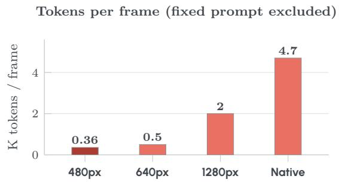

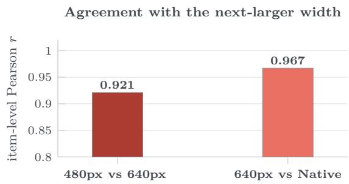  
Figure S20 Tokens vs. frame width. Left: tokens per frame, fixed prompt excluded. Right: item-level agreement with the next-larger width.

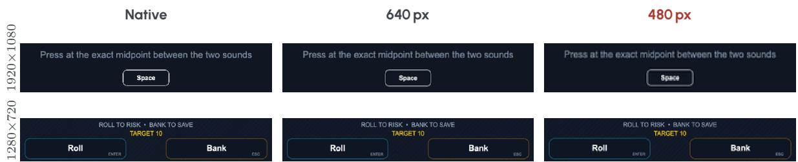  
Figure S21 A sampled frame at different resolutions. The same frame region as the judge receives it at native resolution, 640 px and 480 px (Lanczos downscaling as in the pipeline). Top: 1920×1080 game; bottom: 1280×720 game.

## G.2.3. Adaptive Playtest

Both the bot author $A ^ { \mathrm { p l a y } }$ and the trace judge were developed with GPT-5.6-Sol; our default evaluation uses GPT-5.6-Luna at high reasoning efort. On fixed traces (Table S18), Luna achieves rule-level agreement of 0.910 on Small and 0.888 on Big against the Sol high reference, compared with 0.959 on both splits for an independent re-run of GPT-5.6-Sol at high reasoning efort. Flips that change $f _ { i , r } ^ { \mathrm { a d a p t } }$ occur on 6 of 222 Small rules and 3 of 242 Big rules, compared with 3 and 1, respectively, for the Sol re-run. Token usage per vote decreases from 516K–688K to 51K–71K.

For the bot author, judgment coverage (Section D.3) difers by 0.15–0.17 between Sol and Luna runs, compared with 0.11–0.16 between repeated runs of the same model. These ranges partially overlap, but do not establish equivalence between model substitution and re-running. With three judgments per rule retained, the reported per-game playtest cost decreases from \$0.65–0.73 to \$0.08–0.11.

Table S18 Playtest judge comparison on fixed traces. Each cell reports verdict agreement with a GPT-5.6-Sol high reference, followed by the number of rules whose binary satisfaction score changes (Small: 222 rules; Big: 242 rules). Each rule receives three judgments. An independent Sol high re-run provides a reference for run-to-run variation.
<table><tr><td>Judge, effort</td><td>Small</td><td>Big</td><td>Tokens / vote</td></tr><tr><td>Sol, xhigh</td><td>0.959 / 2</td><td>0.930 /  4</td><td>485-753K</td></tr><tr><td>Sol, high (re-run)</td><td>0.959 / 3</td><td>0.959 / 1</td><td>516-688K</td></tr><tr><td>Sol, low</td><td>0.892 / 7</td><td>0.897 / 3</td><td>217-315K</td></tr><tr><td>Luna, xhigh</td><td>0.919 / 3</td><td>0.893 / 1</td><td>57-86K</td></tr><tr><td>Luna, high</td><td>0.910 / 6</td><td>0.888 / 3</td><td>51-71K</td></tr><tr><td>Luna, low</td><td>0.83 /  9</td><td>0.810 / 10</td><td>46-64K</td></tr></table>

## G.3. Fixed-Rate Sampling vs. Adaptive Frame Selection

Experimental Setup. The comparison in Table 4(b) uses games built by GPT-5.6-Sol on all 50 Small GDDs, comprising 244 scenario replays and 4,102 paired rubric-item assessments. Both conditions use the same recording and visual rubric, and the number of original-resolution frames matches for each replay (2,268 per condition in total). Two games, Bin Bit and Same Or Shift, are also used in preliminary diagnostics.

Selection and Judging. Adaptive selection starts from the first and last frames and uses the input trace, scenario entry condition, and visual rubric to request additional timestamps. A deterministic tool retrieves the first captured frame at or after each requested time, allowing subsequent requests to use the observed frames. All inspected frames count toward the matched frame budget and are passed to the final judge. The selector and final judge use GPT-5.6-Sol with medium reasoning efort in separate sessions, and the final judge receives only the selected frames and rubric.

Audit and Metrics. A separate GPT-5.6-Sol session with high reasoning efort compares how well the cited frames support the two rationales for each rubric item. It selects the better-supported rationale or assigns an equivalent or insuficient-evidence outcome. Method names and frame identifiers are masked, with each method appearing first in 122 scenarios, although image paths retain source directory names. This audit measures rationale support rather than accuracy against reference labels. Item preference is each method’s share of the 1,159 comparisons favoring either method, pooled across all rubric items and scenarios. Equivalent and insuficient-evidence outcomes are excluded from this denominator. Game wins counts games in which a method receives more item-level preferences across its scenarios; equal totals are ties. Adaptive selection obtains 60.5% item preference and 35 game wins, compared with 39.5% and 13 for fixed-rate sampling, with two tied games. Table S19 includes the complete outcomes.

Table S19 Rationale-Support Outcomes. Counts and percentages over all 4,102 paired rubric-item assessments.
<table><tr><td>Audit Outcome</td><td>Assessments</td><td>Share (%)</td></tr><tr><td>Fixed-rate preferred</td><td>458</td><td>11.2</td></tr><tr><td>Adaptive preferred</td><td>701</td><td>17.1</td></tr><tr><td>Equivalent</td><td>2,848</td><td>69.4</td></tr><tr><td>Insufficient evidence</td><td>95</td><td>2.3</td></tr><tr><td>Total</td><td>4,102</td><td>100.0</td></tr></table>

Qualitative Examples. Figure S22 demonstrates that adaptive selection captures intermediate states that uniform sampling omits. In Blackout Dispatch (Figure S22(a)), the Confirm button is disabled during a drag, enabled after both tokens are assigned, and disabled following confirmation; uniform sampling fails to capture the enabled state. In Chalk Escape (Figure S22(b)), adaptive frames display a drawn path and its subsequent removal upon wall contact, while uniform frames only depict the pre-drawing state and the aftermath of the collision, omitting the path itself. These findings provide direct visual evidence for the specified transitions, rather than requiring inference from the final state alone.

After Confirmation

Collision Aftermath 941.1 ms

(a) Blackout Dispatch: Confirm Gating  
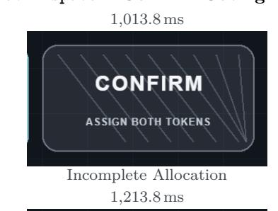

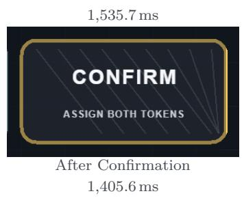

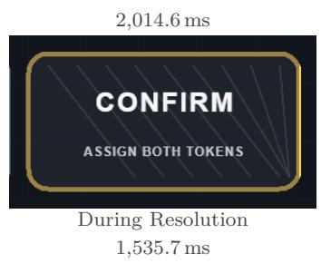

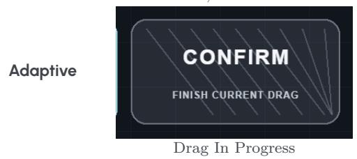


(b) Chalk Escape: Path Removal  
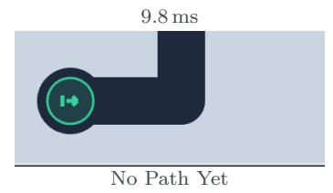

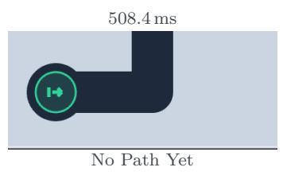

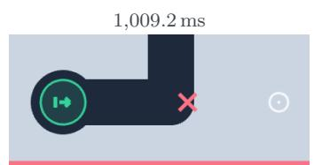

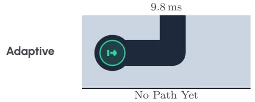

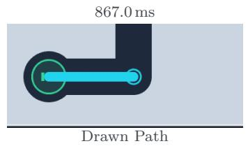  
(c) Rooftop Rumble: Hold and Defense Feedback

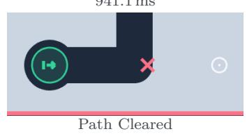

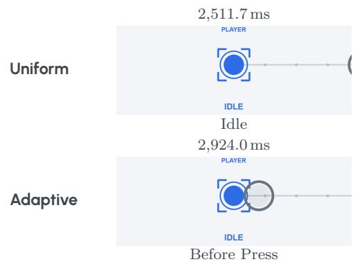

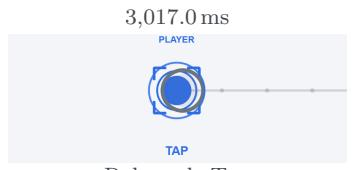

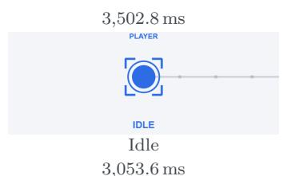

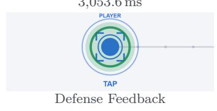

(d) Tile Merge: Merge Animation  
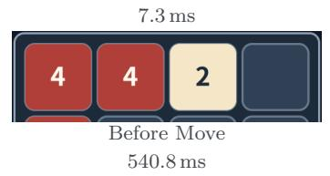

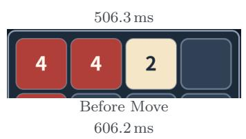

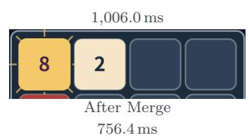

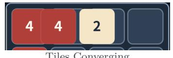

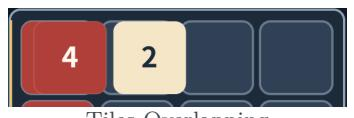

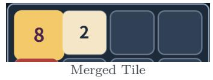  
Figure S22 Visual evidence from adaptive frame selection. Each panel compares the same replay of a Small game. Adaptive selection captures (a) Confirm activation, (b) the path before removal, (c) holding and defense feedback, and (d) tile convergence and overlap. These cues are absent from the displayed uniform samples. Each row shows three cropped frames with timestamps.

## G.4. Gameplay Agent vs. Adaptive Playtest

We compare the evaluation information provided by a gameplay agent from Orak (Park et al., 2026) and our adaptive playtesting with Code-as-Policies on ten Big games generated by GPT-5.6-Sol. The online agent uses GPT-5.6-Luna with high reasoning efort, three seeds, and at most 200 action steps per trial. It receives textual state observations and clickable controls, and is scored by game-specific milestone attainment. Our playtests instead return judgments linked to individual GDD requirements and their execution evidence.

Toybox Rider illustrates the distinction. All three online trials receive credit for reaching Art Desk; the implemented milestone checks whether the area or its speed stage has been reached. In a separate normal-play trace of the same build, our evaluator reports that the game enters Art Desk at 180.23 s but returns to Block Street at 182.98 s, violating the prescribed area sequence and duration. It also reports a moving obstacle at 7.37 s, despite the GDD excluding moving obstacles during the first 120 s of the tutorial. Neither condition is checked by the implemented milestone predicates.

Adversarial playtesting extends this process to requirements left unverified during normal play (Table S20). Across the same ten games, recorded judgment coverage—the fraction of requirements judged satisfied or violated, $( S { + } V ) / N$ —increases from 10.0% with normal play to 73.4% after adding adversarial results.

Table S20 Recorded results for all ten games. Gameplay agent progress is milestone attainment (mean ± sample SD over three seeds); Judgment coverage is $( S + V ) / N$ over the archived GDD-derived requirements. The percentages use diferent target sets. Coverage is calculated from the saved judgments, with unverified requirements retained in the denominator.
<table><tr><td rowspan="2">Game</td><td rowspan="2">Gameplay Agent Progress (%)</td><td rowspan="2">Adaptive Playtest Requirements N</td><td colspan="2">Judgment Coverage (%)</td></tr><tr><td>Normal</td><td>Normal + Adv.</td></tr><tr><td>Abyssal Chain</td><td> $6 . 7 \pm 0 . 0$ </td><td>110</td><td>6.4</td><td>89.1</td></tr><tr><td>Alias Alchemy Shop</td><td> $1 3 . 3 \pm 0 . 0$ </td><td>133</td><td>12.0</td><td>91.0</td></tr><tr><td>Beat Reroute</td><td> $2 6 . 7 \pm 0 . 0$ </td><td>84</td><td>19.1</td><td>86.9</td></tr><tr><td>Chameleon Slide</td><td> $1 3 . 3 \pm 0 . 0$ </td><td>87</td><td>0.0</td><td>67.8</td></tr><tr><td>Fogfall Delivery</td><td> $1 5 . 6 \pm 1 0 . 2$ </td><td>119</td><td>5.0</td><td>88.2</td></tr><tr><td>Night Shift Rx</td><td> $2 3 . 1 \pm 0 . 0$ </td><td>96</td><td>8.3</td><td>87.5</td></tr><tr><td>Today&#x27;s Best Spot</td><td> $3 5 . 7 \pm 0 . 0$ </td><td>103</td><td>5.8</td><td>62.1</td></tr><tr><td>Toybox Rider</td><td> $4 0 . 0 \pm 0 . 0$ </td><td>112</td><td>20.5</td><td>88.4</td></tr><tr><td>ToyFit</td><td> $0 . 0 \pm 0 . 0$ </td><td>100</td><td>1.00</td><td>40.0</td></tr><tr><td>Whispers of the Wild</td><td> $4 2 . 2 \pm 1 0 . 2$ </td><td>117</td><td>21.4</td><td>32.5</td></tr></table>

Compared with the implemented gameplay-agent milestone scores, our benchmark provides a more specific account of implementation errors: it names the violated requirement and links it to execution evidence. That information gives a revision agent a concrete behavior to correct.

## H. Additional 3D Evaluation Results

Evaluation Setup. We evaluate the three GPT-6-Astra builds introduced in Section 4.8: Sonic: Cascade Coast, Diablo Cathedral, and Rocket League. These tasks cover momentum-based platforming, dungeon exploration and combat, and vehicle-based ball play. For each game, source-code inspection, scenario-based replay, and adaptive playtesting assess the reported build against its fixed GDD-derived contract. The Three.js runtime exposes the observation and interaction interfaces needed by the test policies, including precondition initialization for adversarial playtests. Figure 8 shows requirement summaries and gameplay captures for two of the evaluated builds.

Table S21 Evaluation of three additional 3D games. Scores are reported on a 0–100 scale. Playtest combines normal and adversarial judgments, using the full fixed rule set as the denominator.
<table><tr><td>Game</td><td>Source</td><td>Replay</td><td>Playtest</td></tr><tr><td>Sonic: Cascade Coast</td><td>99.71</td><td>53.50</td><td>80.00</td></tr><tr><td>Diablo Cathedral</td><td>86.74</td><td>55.00</td><td>66.55</td></tr><tr><td>Rocket League</td><td>83.64</td><td>57.40</td><td>77.54</td></tr></table>

Table S21 shows that the framework produces complementary fidelity assessments in this 3D environment. Sonic receives a source-code score of 99.71, but its Replay and Playtest scores are 53.50 and 80.00, respectively. Thus, high implementation credit alone does not establish fidelity in rendered output or observed gameplay. These cases demonstrate the applicability of the contract-based evaluation structure beyond the main Phaser setting.

Requirement-Level Feedback. The evaluation also identifies concrete revision targets in these games. For example, Sonic’s GDD requires landing velocity to be projected onto the contacted tangent without creating tangential speed. The source evaluator identifies a rail-landing implementation that imposes a minimum speed of 12 m/s, which can increase speed when the projected component is smaller. This diagnosis points to a targeted revision of the velocity update and a subsequent test of low-speed rail landings. Linking such findings to the fixed contract allows a coding agent to revise the game and be reassessed against the same requirements, extending the framework’s use to specification-driven development and refinement in additional environments.

## I. More Visual Results

## I.1. GDD-Specific Revision Cases

We examine requirement-level behavior in the initial and second-round revision builds, complementing the aggregate results in Section 4.5. Figure S23 extends the main comparisons to four additional games from the Big split. It compares the initial build, self-revision, and Source + Replay + Playtest. Each comparison uses matched inputs and preconditions, with the GDD requirement shown beside the resulting game behavior.

For the main-figure interaction case in Beat Reroute, SUR-V1 requires a captured fragment to follow the pointer with a 20 px vertical ofset. We establish the same held LN-PER fragment at slot 10 and move the pointer while holding its button, first to (850, 610) and then to (1100, 560). The initial and self-revision builds leave the fragment at its timeline origin. Source + Replay + Playtest renders its center at (850, 590) and (1100, 540), respectively (Figure 7(c)). In Abyssal Chain, RT-DAMAGE D5 requires Oxygen reaching 0 to set Hull to 0 immediately. The builds start with Oxygen = 0.5 s and Hull = 100, with enemies and projectiles removed to isolate oxygen depletion. After 0.6 s, all three display the drowned-run screen, but only Source + Replay + Playtest sets Hull to 0. Figure 7(d) reports the values recorded during execution.

In Toybox Rider, UI-02 requires Restart in Pause to open a discard confirmation, with Cancel returning to Pause (Figure S23(a)). The comparison starts from the same paused run at distance 148 m, score 310, and 7 run Bolts. Pressing Enter leaves the initial build in Pause and immediately restarts self-revision with zero run Bolts. Source + Replay + Playtest opens the confirmation while preserving the run; Escape then returns to Pause with the same values. This comparison isolates the confirmation required before discarding a run.

In Night Shift Rx, boss timeout must trigger CODE BLUE, whose visual feedback includes a redgrey life ring (RT-STAGE R1 and VFX-CODEBLUE). We start with 0.05 s remaining on the boss timer and Life = 80, then advance the game by 0.1 s. The initial build leaves the patient in its live state. Self-revision enters CODE BLUE but retains Life ≈ 79.8 and the green ring. Source + Replay + Playtest enters CODE BLUE, sets Life to 0, and displays the required red-grey ring (Figure S23(b)). The diference concerns the state and visual feedback accompanying timeout, beyond the transition to CODE BLUE itself.

In Alias Alchemy Shop, the AliasSelection controls require clicking a signboard and then Open Shop. We perform this two-step sequence in each build (Figure S23(c)). The initial build ignores the second-signboard click and proceeds to the shop without applying that choice. Self-revision selects the second candidate, but Open Shop raises a TypeError during shop rendering, leaving the shop interface incomplete. Source + Replay + Playtest retains the selected alias and renders the shop interface; a subsequent cauldron click also advances production. Thus, candidate selection alone does not estab lish completion of the required interaction. The comparison concerns this selection-to-shop sequence. Candidate names may difer across builds.

In Today’s Best Spot, the Paw Punch hit area must rotate to the cursor’s nearest of eight directions (CARD-PUNCH); RT-PUNCH R3 specifies a 180 × 90 px stage-3 hit area and one vigor pip of damage. We establish an airborne player at (400, 340) and a one-vigor territorial cat at (490, 430), then issue one left-click aimed diagonally down-right. The target lies about 127 px along the aim and 0 px across it, inside the specified area. After one execution frame, the initial and self-revision builds leave the target at one vigor. Source + Replay + Playtest reduces its vigor to zero and the target departs (Figure S23(d)). The recorded attack direction is 45<sup>∘</sup> in all three builds. This probe concerns directional target inclusion and damage, rather than exact boundary dimensions or attack timing.

The screenshots retain the archived game art. Controlled preparation establishes each requirement’s preconditions; the original game logic produces the subsequent state changes and rendered outcomes.

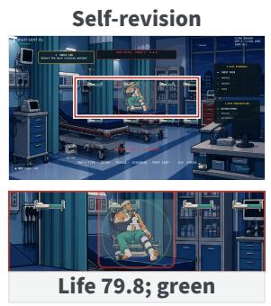  
Condition Restart selected from Pause. Required efect Ask for confirmation before discarding the current run. UI-02

(a) Toybox Rider  
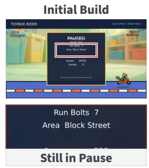

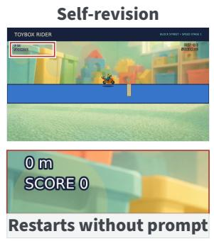

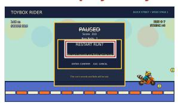


## (b) Night Shift Rx: Boss timeout

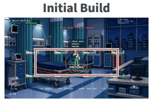


## (c) Alias Alchemy Shop: Opening the selected shop


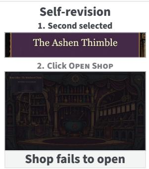


## (d) Today’s Best Spot: Directional hit detection

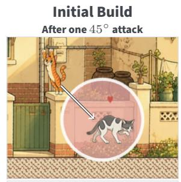  
Miss: vigor remains 1

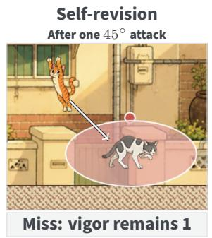

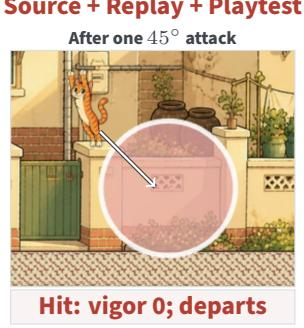  
Figure S23 Selected GDD-specific repairs beyond self-revision. Initial builds are compared with second-round self-revision and Source + Replay + Playtest under matched inputs and preconditions. The cases test (a) confirmation before discarding a run, (b) CODE BLUE feedback on boss timeout, (c) opening the shop after alias selection, and (d) a diagonal attack against a target inside the specified hit area. Each displayed requirement remains unresolved after self-revision and is satisfied by Source + Replay + Playtest in the probe. Life and vigor values are recorded during execution; all targets in (d) start at vigor 1. Crops retain the archived builds’ native art; arrows indicate attack aim. These selected outcomes do not establish complete GDD compliance.

Qualitative Gameplay Examples. Figures S24 and S25 show selected gameplay excerpts from eight generated Small games. Bloom or Weed presents flowers and weeds that require clicking and withholding input, respectively, while Odd Patch asks the player to identify diferences in color or shape. Orbit shows the player on two concentric rings followed by visible feedback at hazard contact, and Echo Three alternates between pattern presentation and player input. Key Under Cups depicts the reveal, shufle, and selection feedback of a visual tracking task, while Bin Bit communicates shape categories through persistent labels and color-coded bins. Greedy Die distinguishes temporary and banked points as the player rolls and secures the target total. Safe Dial combines a rotating dial with a fixed pointer and indicators for confirmed and remaining combination entries. These examples illustrate how gameplay prompts and state changes appear in the generated interfaces.

Qualitative Examples From Big-GDD Games. Figures S26 and S27 present selected gameplay excerpts from eight generated Big games. Cloud Cast combines casting and reeling controls with catch rewards, while Afterglow Network presents traversal tools, regulator installation, and base defense. Siege Deck 2D exposes unit deployment, tactical order cards, and deck rewards, and Wham Bam Logistics provides route, fleet, and hub management within a shared city map. ChromaShade combines shadow controls with platform traversal, while Ssitgim presents soul encounters, a cleansing interface, and a boss encounter. Alias Alchemy Shop exposes production, shared inventory, and the distinction between resources that reset and progress that persists at closure. Strata Keepers provides separate interfaces for recording excavation context, rejoining artifact fragments, and assembling evidence for research hypotheses. These examples illustrate how distinct mechanics are expressed through gameplay controls, state information, and feedback in the generated interfaces.

## (a) Bloom or Weed: Selective Clicking

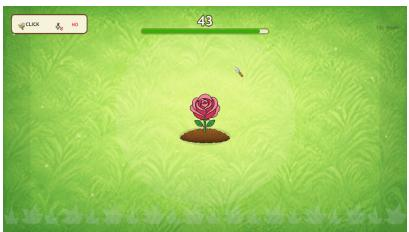  
Click the Bloom Rose prompt

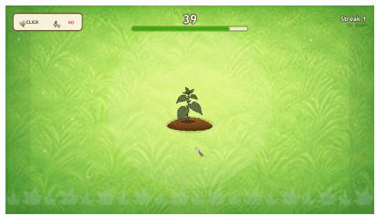  
Ignore the Weed Withhold input

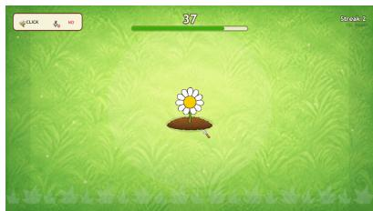  
Click the Bloom Daisy prompt

Bloom and weed prompts require diferent responses: click the flowers and withhold input for the weeds.

## (b) Odd Patch: Color and Shape Discrimination

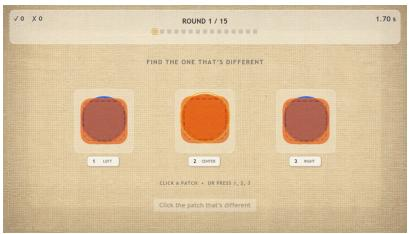  
Different Color Round 1: center patch

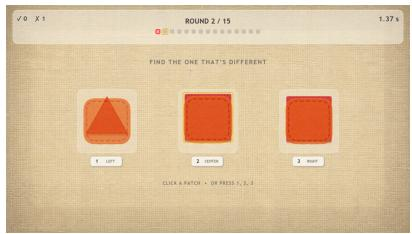

  
Different Color Round 5: center patch  
Choose the patch that difers from the other two. The distinguishing attribute changes across rounds, from color to shape.

## (c) Orbit: Ring Switching and Hazard Contact

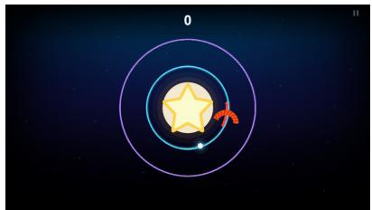

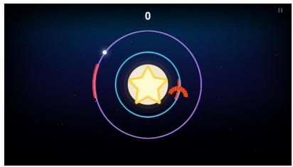  
Outer Ring Player on purple orbit

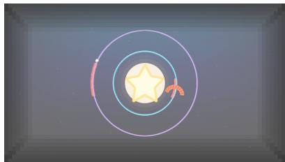  
Hazard Contact Visible collision flash

The player moves between two concentric rings. The final frame shows a screen flash when the player reaches the red hazard.  
(d) Echo Three: Observe and Repeat  
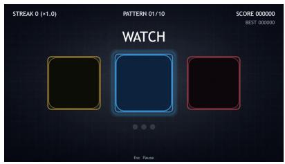  
Watch the Pattern Pattern 1: blue pad

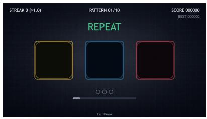  
Repeat the Pattern Pattern 1: input phase

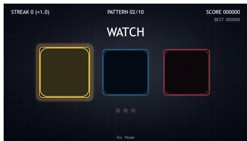  
Watch the Next Pattern Pattern 2: yellow pad

Illuminated pads present a pattern during WATCH, followed by a timed REPEAT phase for player input. A new pattern then begins.

Figure S24 Sampled gameplay in generated Small games (01). Four games from the Small split illustrate (a) selective clicking, (b) visual discrimination, (c) ring switching and collision feedback, and (d) the observation and input phases of a memory task. Each row shows three states in the order of the supplied capture sequence. The full game screens are retained, including their prompts and feedback.

## (a) Key Under Cups: Visual Tracking and Reveal

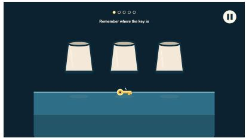  
Remember the Key Key exposed before shufling

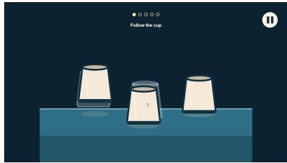  
Follow the Shuffle Cups exchange positions

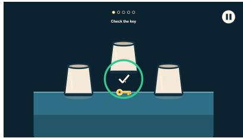  
Check the Choice Key and correct-answer mark  
The key is revealed before the cups move. After the shufle, the selected cup lifts to expose the key, accompanied by a green check mark.

## (b) Bin Bit: Shape Sorting and Immediate Feedback

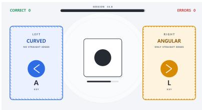  
Read the Shape Circle prompt; correct count 0

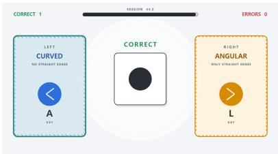  
Choose Curved Left bin highlighted; count 1

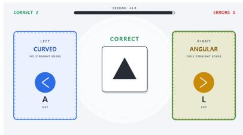  
Choose Angular Right bin highlighted; count 2  
Blue and gold bins retain their curved and angular labels. Correct choices highlight the corresponding bin and increment the visible counter.

## (c) Greedy Die: Rolling, Accumulation, and Banking

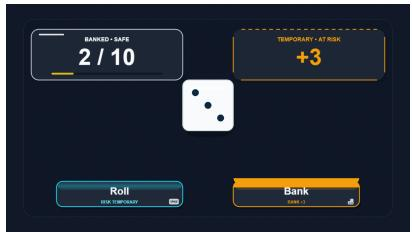  
Choose Roll or Bank Banked: 2; temporary: +3

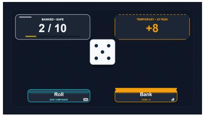

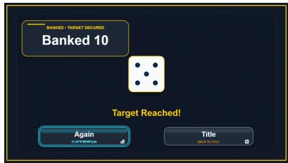  
Bank the Total Banked: 10; target reached  
Separate panels distinguish banked points from the temporary total. Rolling adds five temporary points; banking then secures the target of ten.

## (d) Safe Dial: Dial Rotation and Combination Cues

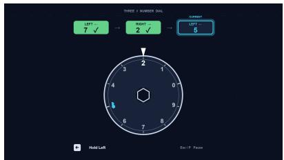  
Read the Next Target Entries 7 and 2 confirmed

  
Rotate the Dial Final target: left to 5

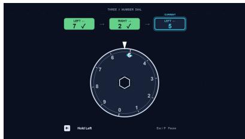  
Approach the Pointer Highlighted 5 near the pointer  
With two entries already confirmed, the dial rotates toward the highlighted final target. A fixed pointer and progress cards expose the current state.

Figure S25 Sampled gameplays in generated Small games (02) Additional four frames illustrate (a) tracking a hidden key through a cup shufle, (b) sorting curved and angular shapes, (c) accumulating and banking dice points, and (d) rotating a combination dial with persistent progress cues. Each row contains three full screenshots from one replay scenario, ordered from left to right.

## (a) Cloud Cast: Gearing, Reeling, and Catch Rewards

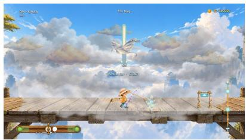  
Geared Max Hold and release Space

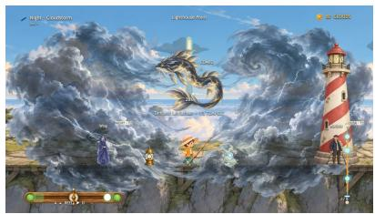  
Reel In Catch progress and timing

  
Catch Reward Grade, size, and coins

Casting prompts, reel controls, and timing cues support fishing. The catch screen reports the fish, its grade and size, and the coin reward.

## (b) Afterglow Network: Traversal and Base Defense

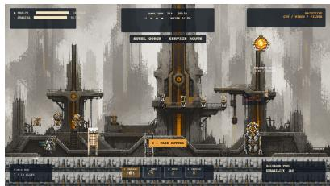  
Traversal Tools Cutter pickup prompt

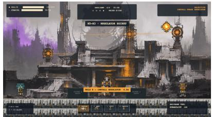  
Install a Regulator Timed interaction prompt

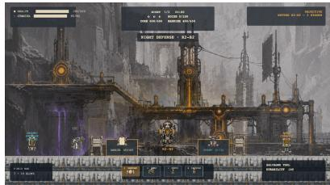  
Night Defense Barrier and turret status  
The selected states show tool pickup, a timed regulator installation prompt, and a defense site with separate core, barrier, and turret status.

## (c) Siege Deck 2D: Deployment and Tactical Cards

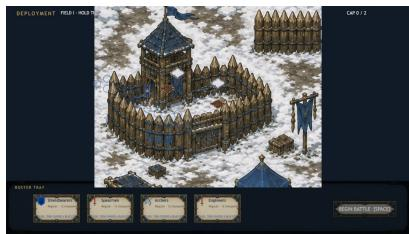  
Deploy Units Roster and placement cells

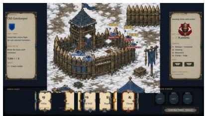  
Plan Orders Three order slots

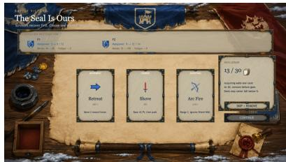  
Choose a Reward Cards and deck changes

Deployment cells guide unit placement, and an order hand supports tactical planning. The victory screen ofers new cards and deck modification options.

## (d) Wham Bam Logistics: Route and Fleet Management

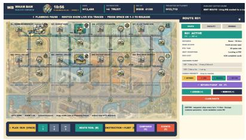  
Edit Routes Waypoints and cargo priorities

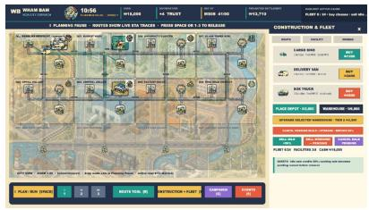  
Manage the Fleet Vehicles and facilities

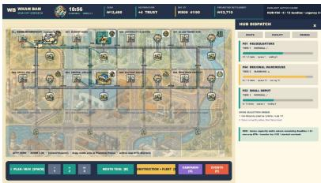  
Monitor Hub Loads Queues and capacity status

A shared city map connects route editing, vehicle and facility purchases, and hub dispatch. Dedicated panels expose cargo priorities and facility loads.

Figure S26 Sampled gameplays in generated Big games (1). Four games illustrate (a) fishing controls and catch rewards, (b) traversal tools and base defense, (c) unit deployment and tactical cards, and (d) delivery route and fleet management. Each row groups three scenario-specific screenshots from one game. Full screenshots retain the gameplay context and interface feedback.

## (a) ChromaShade: Light and Shadow Traversal

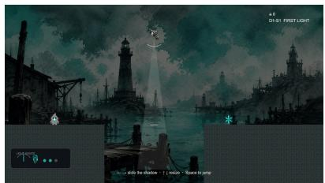  
Shape the Shadow Slide and resize controls

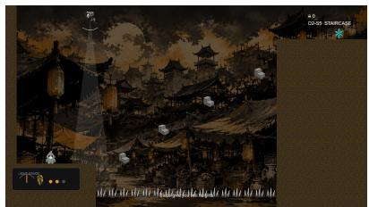  
Climb the Steps Platforms above floor spikes

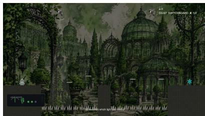  
Switch Lights Two controllable light sources  
Movement puzzles combine shadow controls with platform traversal. Selected stages show stepped obstacles and the option to switch between light sources.

## (b) Ssitgim: Soul Encounters and Cleansing

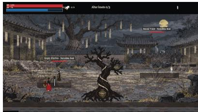  
Encounter Souls Two named soul types

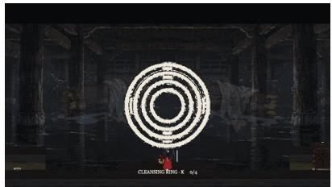  
Perform a Cleansing Rite Ring prompt and progress

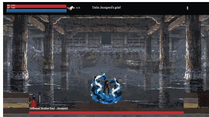  
Confront a Boss Boss identity and health bar  
Soul encounters, a ring-based cleansing interface, and a boss encounter present distinct interactions within the same shrine setting.

## (c) Alias Alchemy Shop: Production and Persistent Progress

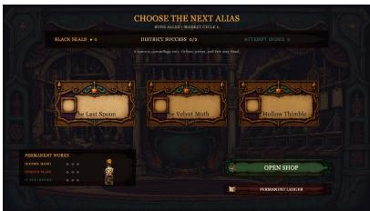  
Choose an Alias Shop identity and upgrades

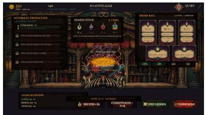

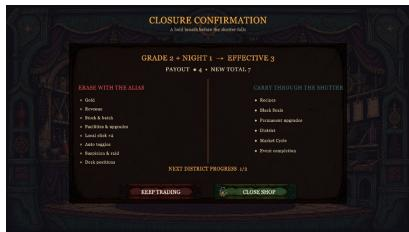  
Review Shop Closure Reset and persistent resources  
The shop combines production, shared inventory, and customer orders. Its closure screen lists resources that reset and progress that carries forward.

## (d) Strata Keepers: Excavation, Restoration, and Research

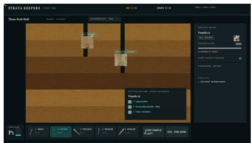  
Record a Find Layer, samples, and orientation

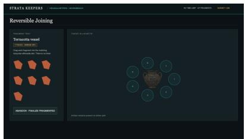  
Rejoin Fragments Drag pieces into target slots

  
Build a Hypothesis Evidence slots and confidence

Artifact records preserve excavation context. A joining puzzle and an evidence board provide separate interfaces for restoration and research.

Figure S27 Sampled gameplays in generated Big games (2). Four games illustrate (a) light and shadow traversal, (b) soul encounters and cleansing, (c) production and persistent shop progress, and (d) excavation, restoration, and research. Each row groups three scenario-specific screenshots from one game. Full screenshots retain the gameplay context, controls, and state information.

## J. Limitations

A2Z GameSpec-Bench primarily evaluates 100 synthetic game design documents (GDDs) for two-dimensional single-player games developed in Phaser. Whether these results generalize to human-authored specifications, alternative game engines, and broader software tasks remains to be established. The three additional Three.js games in Appendix H demonstrate applicability to 3D environments but do not establish performance across a broad range of engines or genres. Contract construction and evidence interpretation are based on generative models, so fixed contracts and repeated judgments cannot fully eliminate omissions or evaluator bias.