# AIMS: An Agentic AI Framework for Sim-to-Real Multi-Modal ISAC

Yijie Bian, Kai Zhang, Wei Guo, Zixin Wang, Shenghui Song, Jun Zhang, Khaled B. Letaief

Abstract—Multi-modal integrated sensing and communication (ISAC) enables environmental perception and reliable connectivity for intelligent wireless networks. Data-driven multi-modal ISAC models depend heavily on annotated real-world data to learn relationships across sensing and wireless observations, thereby constraining scalable deployment. Although synthetic data generation reduces the burden, adapting existing simulation pipelines to a target deployment requires consistent scene, sensing, wireless, and learning configurations, while mismatches among these coupled components impair sim-to-real transferability. To address the challenge, we propose an agentic artificial intelligence (AI) framework for sim-to-real multi-modal ISAC, named AIMS. Given a natural-language deployment request specifying the target task, deployment conditions, and real-data budget, AIMS derives a deployment-specific sim-to-real configuration and coordinates its execution to produce a deployment-specific task model. A two-agent architecture coordinates scene construction with task learning. A scene construction agent generates geographically grounded, synchronized sensing and wireless records from shared physical states, while a scene understanding agent configures task-relevant modalities and mixture-of-experts (MoE) learning for zero-shot inference or few-shot adaptation. Structured domain knowledge guides dependency-aware planning, while validation evidence supports feedback-driven revision of affected decisions. Experiments on the real-world DeepSense 6G dataset demonstrate improved vehicle detection and beam prediction over the considered simulation and fusion baselines. A separate orchestration benchmark evaluates task interpretation, dependency reasoning, and feedback-driven replanning across diverse deployment requests, showing improved plan correctness with structured domain knowledge and validation feedback.

Index Terms—Agentic artificial intelligence (AI), beam predic tion, mixture-of-experts (MoE), multi-modal integrated sensing and communication (ISAC), sim-to-real transfer learning.

## I. INTRODUCTION

Sixth-generation (6G) wireless networks are envisioned to integrate information delivery, environmental awareness, and native intelligence [1], [2]. Integrated sensing and communication (ISAC) facilitates this vision by synergizing environmental perception and wireless connectivity through shared radio resources and infrastructure [3]. Beyond resource sharing, ISAC further enables mutual enhancement by using sensing information to adapt communication to the propagation environment, while exploiting communication signals as probing waveforms to infer environmental properties. As scene geometry and object states shape both sensing observations and radio propagation, heterogeneous sensing data offer complementary insights into the underlying physical environment. Wireless observations capture electromagnetic responses, whereas visual and positional data provide semantic and spatial context. Data-driven multi-modal models can learn task-relevant mappings from these complementary observations to sensing and communication outputs, supporting tasks such as object detection and beam prediction.

However, training such models for a target deployment requires physically aligned sensing observations and task supervision. In particular, cross-modal learning relies on sensing records associated with consistent physical states, while communication tasks additionally require synchronized wireless measurements. Acquiring these data requires coordinated sensor deployment, calibration, and synchronization, together with wireless measurement and task annotation. Consequently, these requirements increase the site-specific data collection effort. Datasets such as DeepSense 6G provide a valuable benchmark for model development [4], yet extending coverage to new environments or modified sensing and wireless configurations requires additional site-specific measurements. These overheads motivate scalable methods that reduce repeated real-world data collection while retaining essential deployment-specific information.

Sim-to-real learning combines synthetic data with sparse realworld measurements for target-domain adaptation [5]–[7]. Although synthetic data reduce the measurement burden, adapting synthetic-data and digital-twin pipelines to a target deployment still requires coordinated scene, sensing, wireless, and learning configurations. Scene geometry and object kinematics jointly govern sensing observations and radio propagation, while sensor and radio settings determine their learning representations. Structural mismatches in these coupled relationships cannot be resolved by increasing the synthetic sample size alone. Therefore, effective sim-to-real transfer requires physically aligned synthetic observations and supervision, together with adaptation to the residual domain gap.

Consequently, deployment adaptation introduces a configuration challenge beyond accurate physical simulation. Translating a high-level natural-language deployment request into a coherent sim-to-real configuration requires interpreting its task and deployment conditions for scene construction, sensing, and wireless data generation. These conditions determine the observations and supervision available for task learning, while the specified real-data budget determines the applicable transfer setting. Since these components are coupled through shared physical states and dependencies, changes in deployment assumptions can invalidate different downstream products. The central challenge is therefore to determine the required capabilities, identify reusable intermediate products, and revise affected decisions using validation evidence. Agentic artificial intelligence (AI) supports this process through requirement interpretation, dependency-aware planning, and feedback-driven configuration revision.

## A. Related Works

Environmental observations have increasingly served as out-of-band information for learning-based wireless decisions. Location-based learning maps user geometry to beamforming strategies [8], while camera observations provide visual cues for beamforming [9]. Environment semantics support joint beam and blockage prediction [10]. Light detection and ranging (LiDAR) point clouds and global positioning system (GPS) measurements add complementary geometric and positional information for vehicular beam tracking [11]. More general multimodal methods fuse heterogeneous observations and develop structural environment representations for beam tracking and beamforming [12]–[14], and mixture-of-experts (MoE) models coordinate modality-specific representations for ISAC tasks [15]. These studies establish the value of visual, geometric, and positional information for communication inference. These models commonly assume that sensing observations and wireless supervision have already been collected for a particular deployment.

Synthetic and digital-twin data reduce repeated site-specific measurement requirements. Multimodal-Wireless, Multimodal-NF, and LAMBDA provide synchronized multi-modal sensing and wireless data for configurable learning tasks [16]–[18], while DeepMIMO provides large-scale wireless data from predefined ray-tracing scenarios [19]. These datasets support reproducible learning and scalable data generation. Their predefined environments can differ from a target deployment in geometry and sensing configuration. Mobility and radio settings can also differ. Digital-twin reconstruction and real-scene alignment narrow this gap. Digital-twin-based beam prediction has demonstrated synthetic training followed by adaptation with limited real measurements [5]. SMART associates sensing and communication data with a physical scene, with a relatively limited range of sensing modalities and communication outputs [7]. SynthSoM-Twin further reconstructs static and dynamic scene components and coordinates multi-modal sensing with propagation simulation for sim-to-real learning [6]. This closer alignment improves the relevance of synthetic data. Adapting the pipeline to a new site or task still requires expert coordination for scene reconstruction and calibration. Crossmodal alignment and simulator integration add further work.

Large language models (LLMs) and agent-based methods offer mechanisms for intelligently organizing wireless knowledge and tools for coordinated execution. WirelessLLM incorporates wireless knowledge and capabilities into LLMs for domain reasoning [20]. WirelessAgent combines perception and memory with planning and action to connect wireless requests with domain tools and network operations [21]. ComAgent uses specialized LLM agents for problem decomposition and planning, followed by tool-assisted execution and feedback-based refinement [22], while WirelessAgent++ studies automated agentic workflow design and benchmarking [23]. RadioSim Agent integrates LLM-based orchestration with deterministic electromagnetic solvers for interactive radio-map generation and physics-grounded propagation analysis, while AutoNetSim further explores intent-driven construction of executable three dimensional (3D) radio environments and wireless simulations through self-evolving agents [24], [25]. Recent tool-augmented agents further externalize domain expertise into verifiable computational tools and use compact language models primarily for reasoning and orchestration [26]. These studies demonstrate knowledge grounding and planning together with tool use and execution feedback. Their applications span wireless reasoning, network operation, and simulation-based optimization.

For deployment-specific sim-to-real multi-modal ISAC learning, a remaining technical challenge is to preserve the physical, task, and execution dependencies that couple scene construction, synchronized sensing and wireless data generation, and task learning. Changes in deployment conditions further require selective reuse or regeneration of affected intermediate products while maintaining cross-domain consistency.

## B. Contributions

To address these challenges, we propose an agentic AI framework for sim-to-real multi-modal ISAC (AIMS). AIMS translates a natural-language deployment request into a deploymentspecific sim-to-real configuration and coordinates the corresponding physical and learning operations to produce a deployment-specific task model. The request specifies the target task, deployment conditions, and real-data budget, while AIMS grounds these requirements in the shared experiment state. The main contributions are summarized as follows.

• Agentic Sim-to-Real Model Instantiation: We address the state-dependent configuration problem in which the required operations depend jointly on the deployment request and available intermediate products. The twoagent architecture grounds these conditions in a shared experiment state and uses structured task, capability, and dependency knowledge to determine the required capabilities, reusable intermediate products, and execution plan. Validation evidence updates the state and triggers local revision of affected decisions as deployment conditions change.

• Domain-Grounded Capabilities and Cross-Domain Alignment: We address sensing–wireless inconsistency by developing domain capabilities for geographic scene grounding, dynamic multi-modal sensing, wireless projection, and task learning under a shared physical state. Each capability specifies its required inputs, generated outputs, and validation conditions. Common physical states, sample references, and configuration provenance are propagated across these capabilities to preserve correspondence between multi-modal observations and task supervision.

Cross-Domain Sim-to-Real Validation: We evaluate AIMS on DeepSense 6G using vehicle detection and beam prediction as representative sensing and communication tasks. Task-level experiments examine scene, codebook, and fusion mismatches under zero-shot inference and limited real-domain adaptation. A separate orchestration benchmark over 140 normal and challenging naturallanguage deployment requests evaluates task interpretation, dependency handling, artifact reuse, and feedback-driven replanning, with AIMS achieving higher plan correctness and dependency-handling performance across both tiers.

## C. Paper Organization and Notations

The remainder of this paper is organized as follows. Section II presents the system model and problem formulation. Section III presents the shared agentic orchestration mechanism. Section IV presents the scene construction and scene understanding agents. Section V reports the experimental setup and performance evaluation. Section VI concludes the paper.

Throughout this paper, boldface lowercase and uppercase letters denote vectors and matrices, respectively, and calligraphic letters denote sets. The sets of real and complex numbers are denoted by R and C, respectively. The operators $( \cdot ) ^ { \top } , ( \cdot ) ^ { \sf H }$ , and $\mathbb { E } [ \cdot ]$ denote transpose, conjugate transpose, and expectation, respectively. Additional notation is defined when first introduced.

## II. SYSTEM MODEL AND PROBLEM FORMULATION

This section formulates multi-modal ISAC learning for a target deployment with limited real supervision. We first establish a common physical representation for sensing and communication, then formulate the associated sim-to-real learning problem and deployment-constrained design objective. The roadside setting provides the representative instantiation evaluated in Section V.

## A. System Model

The natural-language deployment request r specifies the target task $\tau ,$ user-provided deployment conditions, and the realdata budget $n _ { \mathrm { r e a l } }$ . These deployment conditions are organized into a structured deployment profile for subsequent physical and learning operations. The corresponding labeled support set $\mathcal { D } _ { \mathrm { r e a l } } ^ { \tau } ( n _ { \mathrm { r e a l } } )$ is available when real-domain adaptation is requested. The construction specification ξ defines the synthetic counterpart under the resulting deployment conditions.

Let $\mathcal { G }$ describe the scene geometry, environmental conditions, and surface attributes. The surface attributes specify visual appearance and radio-material properties. At observation instant $t ,$ the state $\mathbf { s } _ { t }$ records object identities, poses, and motion. The pair $( \mathcal { G } , \mathbf { s } _ { t } )$ provides a common physical reference for sensing observations and wireless propagation. System configurations determine how these conditions are observed and used for task supervision.

For illustration, we use a roadside vehicular network as a representative system. The roadside instantiation consists of a roadside unit (RSU) communicating with a target vehicle while sensors observe the surrounding environment. The RSU provides downlink transmission, and the communication vehicle serves as the receiving terminal. This setting instantiates the sensing and communication tasks evaluated in Section V.

1) Communication Model: Consider a transmit node with $N _ { \mathrm { t } }$ antennas and a single-antenna receiving terminal. The roadside instantiation assigns these roles to the RSU and communication vehicle. The channel of the selected link at observation instant t is expressed as

$$
\mathbf { h } _ { t } = \sum _ { \ell = 1 } ^ { L _ { t } } \beta _ { \ell , t } \mathbf { a } _ { \mathrm { t } } ( \vartheta _ { \ell , t } ) ,\tag{1}
$$

where $L _ { t }$ is the number of propagation paths, $\beta _ { \ell , t }$ is the complex path coefficient including propagation phase and the fixed receive response, and $\mathbf { a } _ { \mathrm { t } } ( \vartheta _ { \ell , t } )$ is the RSU transmit-array response for departure direction $\vartheta _ { \ell , t }$ . The physical state $( \mathcal { G } , \mathbf { s } _ { t } )$ determines the path coefficients and directions. Vehicle motion and surrounding objects therefore alter both the propagation paths and the preferred transmit beam.

Let $\mathcal { F } ~ = ~ \{ \mathbf { f } _ { 1 } , \ldots , \mathbf { f } _ { Q } \}$ denote the RSU transmit beam codebook, where $\| \mathbf { f } _ { q } \| _ { 2 } = 1$ . For a transmitted symbol $u _ { t }$ satisfying $\mathbb { E } [ | u _ { t } | ^ { 2 } ] = 1$ , the signal received by the vehicle using transmit beam $q$ is

$$
r _ { t , q } = \sqrt { P _ { \mathrm { t x } } } \mathbf { h } _ { t } ^ { \mathsf { H } } \mathbf { f } _ { q } u _ { t } + n _ { t , q } ,\tag{2}
$$

where $P _ { \mathrm { t x } }$ is the RSU transmit power and $n _ { t , q } \sim \mathcal { C N } ( 0 , \sigma ^ { 2 } )$ is receiver noise.

2) Multi-modal Sensing Model: Let $\mathcal { M } _ { \mathrm { a v } }$ denote the sensing modalities present in the target deployment and represented by its simulated counterpart. An observation from modality $m \in \mathcal { M } _ { \mathrm { a v } }$ is represented as

$$
\mathbf { x } _ { t } ^ { ( m ) } = \Psi _ { m } \left( \mathcal { G } , \mathbf { s } _ { t } ; \nu _ { m } , \epsilon _ { t } ^ { ( m ) } \right) ,\tag{3}
$$

where $\Psi _ { m }$ describes the sensing observation process, $\nu _ { m }$ contains the sensor pose and acquisition characteristics, and $\epsilon _ { t } ^ { ( m ) }$ represents measurement imperfections. Changes in $\mathcal { G }$ or s therefore affect several sensing observations through their modality-specific measurement processes. Samples with the same index t correspond to a common dynamic state, while spatial calibration relates their sensor coordinate frames to the shared scene reference.

## B. Problem Formulation

The deployment conditions determine the observations and supervision available for a target task. The formulation connects synthetic-data construction with task learning under the available real support.

1) Task-Specific Multi-modal Inference: Let τ denote a supported sensing or communication task. Vehicle detection and beam prediction instantiate the task outputs and learning objectives considered below. For task τ, let $\bar { \mathcal { M } } _ { \tau } \subseteq \mathcal { M } _ { \mathrm { a v } }$ denote the selected sensing modalities and $\mathcal { X } _ { \tau , t } = \{ \mathbf { x } _ { t } ^ { ( m ) } : m \in \mathcal { M } _ { \tau } \}$ the corresponding observations. The task model $f _ { \Theta } .$ maps $\mathcal { X } _ { \tau , t }$ and the context vector $\mathbf { c } _ { \tau , t }$ to a task-specific output. Here, $\Theta .$ denotes the model parameters, and $\mathbf { c } _ { \tau , t }$ contains task and deployment attributes available to the model. Detection and beam prediction use separate output structures and learning objectives.

For vehicle detection, the reference output is the set of vehicles satisfying the annotation policy in the full image,

$$
\mathcal { V } _ { t } = \{ ( \mathbf { b } _ { t , j } , k _ { t , j } ) \} _ { j = 1 } ^ { J _ { t } } ,\tag{4}
$$

where $\mathbf { b } _ { t , j } \in \mathbb { R } ^ { 4 }$ denotes the bounding box of the jth vehicle, $k _ { t , j }$ denotes its category, and $J _ { t }$ is the number of annotated vehicles at time t. The detector produces a corresponding prediction $\widehat { \mathcal { V } } _ { t }$ containing object locations, categories, and confidence scores. The detection loss $\ell _ { \mathrm { d e t e c t i o n } } ( \widehat { \mathcal { N } } _ { t } , \mathcal { V } _ { t } )$ contains the detector’s classification and localization terms.

For beam prediction, the reference beam index is defined by the beamforming gain under the configured codebook as

$$
q _ { t } ^ { \star } = \underset { q \in \{ 1 , \dots , Q \} } { \arg \operatorname* { m a x } } \left| \mathbf { h } _ { t } ^ { \mathsf { H } } \mathbf { f } _ { q } \right| ^ { 2 } .\tag{5}
$$

The same beam codebook is used to generate synthetic and real beam labels. The beam-prediction model outputs the probability vector $\widehat { \pmb { \pi } } _ { t } = [ \widehat { \pmb { \pi } } _ { t , 1 } , \dots , \widehat { \pmb { \pi } } _ { t , Q } ] ^ { \top } \in [ 0 , \widehat { \bf 1 } ] ^ { Q }$ The component $\widehat { \pi } _ { t , q }$ represents the predicted probability of beam $q ,$ and $\begin{array} { r } { \sum _ { q = 1 } ^ { Q } { \widehat { \pi } } _ { t , q } \ = \ 1 } \end{array}$ . The predicted beam index is $\begin{array} { r l } { \widehat { q } _ { t } } & { { } = } \end{array}$ arg max ${ } _ { \mathit { 1 } } \widehat { \pi } _ { t , q } ,$ and the classification loss is $\ell _ { \mathsf { b e a m } } ( \widehat { \pi } _ { t } , q _ { t } ^ { \star } ) = - \log \widehat { \pi } _ { t , q _ { t } ^ { \star } }$ . The beam index in (5) provides supervision. Inference uses the selected sensing observations.

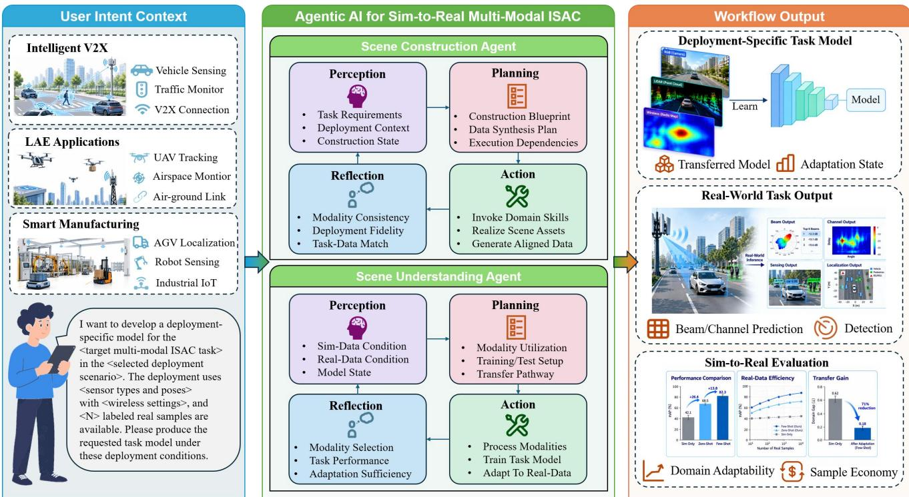  
Fig. 1. Overview of AIMS for deployment-specific sim-to-real multi-modal ISAC learning. A natural-language deployment request is organized into a shared experiment state for two-agent planning and capability execution with validation-driven revision. The scene construction agent produces aligned sensing and wireless data, while the scene understanding agent configures learning and transfer to produce a deployment-specific task model.

The beam-prediction task therefore learns the relationship between observable scene information and the preferred RSU transmit beam under the configured codebook.

2) Sim-to-Real Training and Adaptation: The considered sim-to-real multi-modal ISAC learning problem is specified by

$$
\eta _ { \tau } = \left\{ \xi , \mathcal { M } _ { \tau } , \mathcal { U } _ { \tau } \right\} ,\tag{6}
$$

where ξ specifies the synthetic construction conditions, $\mathcal { M } _ { \tau }$ denotes the selected modality set, and $\mathcal { U } _ { \tau }$ contains the parameter groups available for real-domain adaptation. The specification $\eta _ { \tau }$ is the deployment-specific sim-to-real configuration instan tiated by AIMS from the request $r ,$ shared experiment state, and structured domain knowledge. The request supplies the target task $\tau ,$ deployment conditions, and real-data budget. The experiment state records the corresponding deployment profile and real-support status.

For each instantiated problem specification $\eta _ { \tau }$ , syntheticdomain training produces

$$
\begin{array} { r } { \Theta _ { \tau } ^ { \mathrm { s i m } } = \mathrm { T r a i n } _ { \mathcal { M } _ { \tau } } \left( \mathcal { D } _ { \mathrm { s i m } } ^ { \tau } ( \xi ) \right) . } \end{array}\tag{7}
$$

The empirical task loss used for numerical learning is

$$
\widehat { \mathcal { L } } _ { \tau } ( \boldsymbol { \Theta } , \mathcal { D } ) = \frac { 1 } { | \mathcal { D } | } \sum _ { ( \mathcal { X } _ { \tau } , \mathbf { c } _ { \tau } , Y _ { \tau } ) \in \mathcal { D } } \ell _ { \tau } \big ( f _ { \boldsymbol { \Theta } } ( \mathcal { X } _ { \tau } , \mathbf { c } _ { \tau } ) , Y _ { \tau } \big ) .\tag{8}
$$

Synthetic pretraining minimizes (8) over $\mathcal { D } _ { \mathrm { s i m } } ^ { \tau } ( \boldsymbol { \xi } )$

In this work, we consider zero-shot inference and realdomain adaptation. For $n _ { \mathrm { r e a l } } = 0$ , the synthetic-domain model is directly used as $\Theta _ { \tau } ^ { \mathrm { r e a l } } = \Theta _ { \tau } ^ { \mathrm { s i m } }$ . For $n _ { \mathrm { r e a l } } > 0$ , adaptation initializes from $\Theta _ { \tau } ^ { \mathrm { s i m } }$ and minimizes (8) over $\mathcal { D } _ { \mathrm { r e a l } } ^ { \tau } ( n _ { \mathrm { r e a l } } )$ Parameter updates are restricted to $\mathcal { U } _ { \tau }$ , while the remaining parameters retain their synthetic-domain values. The optimizer and training settings follow Section V-A.

The target-domain risk of the resulting model is

$$
\begin{array} { r } { \mathcal { R } _ { \mathrm { r e a l } } ^ { \tau } ( \eta _ { \tau } ) = \mathbb { E } _ { \mathrm { r e a l } } \Big [ \ell _ { \tau } \Big ( f _ { \Theta _ { \tau } ^ { \mathrm { r e a l } } } ( \chi _ { \tau } , \mathbf { c } _ { \tau } ) , Y _ { \tau } \Big ) \Big ] . } \end{array}\tag{9}
$$

The expectation is taken over task records from the fixed target deployment. Here, $\mathcal { X } _ { \tau }$ contains the observations selected by $\mathcal { M } _ { \tau } , \mathbf { c } _ { \tau }$ denotes the task context, and $Y _ { \tau }$ denotes the reference output. The target is the annotated vehicle set for detection or the measured beam index for beam prediction.

3) Deployment-Constrained Learning Objective: For taskmodel deployment, let π denote an execution plan and let z summarize the shared experiment state. The state records the structured deployment profile and real-support status. It also retains validated products with their configuration references and validation evidence. The deployment-level design problem is

$$
\begin{array} { r l } { \underset { \eta _ { \tau } , \pi } { \mathrm { m i n i m i z e } } } & { \mathcal { R } _ { \mathrm { r e a l } } ^ { \tau } ( \eta _ { \tau } ) } \\ { \mathrm { s u b j e c t ~ t o } } & { C _ { \mathrm { p h y } } ( \boldsymbol { \xi } , \pi , r ) = 1 , } \\ & { C _ { \mathrm { t a s k } } ( \eta _ { \tau } , r , n _ { \mathrm { r e a l } } ) = 1 , } \\ & { C _ { \mathrm { e x e c } } ( \boldsymbol { \pi } , \eta _ { \tau } , \mathbf { z } ) = 1 . } \end{array}\tag{10}
$$

The objective characterizes predictive performance on the target deployment after synthetic training and any permitted adaptation. The three binary conditions specify physical consistency, task compatibility, and execution feasibility.

The physical condition $C _ { \mathrm { p h y } }$ checks agreement with the declared scene, sensing setup, and radio configuration. All task-required products share the physical reference $( \mathcal { G } , \mathbf { s } _ { t } )$ . For beam prediction, this reference associates sensing observations with wireless supervision. For detection, it associates image observations with object annotations. This condition establishes sample correspondence within the adopted physical models. The task condition $C _ { \mathrm { t a s k } }$ requires a nonempty modality set $\mathcal { M } _ { \tau } \subseteq \mathcal { M } _ { \mathrm { a v } }$ and supervision consistent with the requested task. Beam labels follow the configured codebook in (5). Real domain parameter updates follow $\mathcal { U } _ { \tau }$ and use the corresponding support set.

The execution condition $C _ { \mathrm { e x e c } }$ checks that the supported capability invocations realize $\eta _ { \tau }$ from z with valid input dependencies. Previously generated products enter the plan when their validated conditions remain compatible with the requested experiment. The formulated deployment-constrained learning problem in (10) defines the population-level objective. AIMS derives a feasible sim-to-real configuration from the deployment conditions and validation evidence. For the instantiated $\eta _ { \tau }$ numerical learning minimizes the empirical task loss in (8). Held-out target data provide the final performance evaluation.

## III. AGENTIC ORCHESTRATION FOR SIM-TO-REAL MULTI-MODAL ISAC

This section develops the knowledge-guided solution procedure for the deployment-constrained learning problem in (10), as illustrated in Fig. 1. Perception first grounds the naturallanguage deployment request r into the shared experiment state z using structured domain knowledge K and state-inspection capabilities. Planning then operates on the grounded state and $\kappa$ to instantiate the experiment specification $\eta _ { \tau }$ and generate the execution plan $\pi .$

Physical capabilities execute π and generate the data specified by $\eta _ { \tau }$ , while numerical learners minimize (8) during synthetic pretraining and restricted real-domain adaptation. Validation evidence identifies configuration conflicts or inconsistent sample correspondence and updates z for local revision of the affected plan decisions. The primary output is a deploymentspecific task model, while the validated experiment state retains the configuration provenance associated with its construction.

## A. Agentic Formulation and Two-Agent Roles

AIMS uses structured domain knowledge K to connect task requirements with supported operations. Task knowledge identifies the observations and supervision associated with each objective. Capability knowledge specifies the accepted inputs and operating conditions. Dependency knowledge records the upstream scene states and configurations that determine each product. The planner uses these relations to propose an experiment plan, and capability validation checks its inputs against the declared conditions. Given the grounded experiment state z and structured domain knowledge $\kappa ,$ the LLM planner generates

$$
\pi = \Pi ( \mathbf { z } , { \boldsymbol { \mathcal { K } } } ) ,\tag{11}
$$

where $\pi$ records the experiment specification $\eta _ { \tau }$ and the capability invocations that realize it. Planning uses the available deployment evidence to resolve these choices. Numerical learning follows the prescribed synthetic pretraining and realdomain adaptation procedure.

The two-agent architecture follows the physical and learning components of $\eta _ { \tau }$ . The scene construction agent coordinates the physical conditions in $\xi \ 1 0$ generate observations and supervision under a common scene reference. The scene understanding agent specifies $\mathcal { M } _ { \tau }$ and applies the task protocol to configure $\mathcal { U } _ { \tau }$ . The two agents perform reasoning and coordination over these decisions, while the corresponding domain capabilities execute the physical and learning operations specified by the plan.

Before data generation, the scene understanding agent records the required observations and supervision in z. The scene construction agent resolves these requirements using supported capabilities and existing validated products. The resulting data and configuration references return through z as inputs to learning. Validation evidence identifies unmet conditions and returns the affected decisions to planning. This shared-state exchange connects task requirements with their physical realization throughout the experiment.

## B. Perception

Perception grounds the natural-language deployment request r in the shared experiment state z. The request specifies the target objective, deployment conditions, and real-data budget. Perception organizes these conditions into the structured deployment profile. Before planning, state-inspection capabilities update z with available products, configuration references, and validation status. The state also records the real-support status.

Structured domain knowledge K resolves the relations represented in the experiment state. Task knowledge identifies the observations and supervision required by the target objective. Capability knowledge specifies supported operations and their input conditions. Dependency knowledge relates generated products to the physical states and configurations from which they are derived. These relations distinguish deployment conditions that are already specified from experiment decisions resolved during planning.

At the task level, perception records the configuration references required to interpret the available products. For beam prediction, these references include the sensing configuration and beam codebook associated with the physical state $( \mathcal { G } , \mathbf { s } _ { t } )$ For vehicle detection, they relate the sensing observations to the applicable annotation policy. The available real support is associated with the same task state, establishing the conditions used for subsequent transfer planning.

## C. Planning

Planning maps the grounded experiment state to the execution plan π by determining the required endpoint, capability invocations, and reuse of validated products. Validation evidence supports revision of affected decisions during execution. A vehicle-detection request requires aligned sensing observations and annotations, while a beam-prediction request additionally requires wireless supervision for the same physical samples. Requests for deployment-specific models extend the plan to learning and transfer operations.

Dependency knowledge determines how deployment changes affect the current plan. A beam-codebook change modifies the supervision definition while preserving a channel realization whose scene and radio conditions remain compatible. A trajectory change modifies $\mathbf { s } _ { t }$ and invalidates the dependent sensing and wireless realizations. Planning propagates each change through the recorded dependencies and retains products whose defining conditions remain valid.

The scene understanding plan determines the learning configuration from the validated products. User-specified modalities are retained when supported by the deployment, while unspecified inputs are resolved from the task requirements and available sensing configuration. The real support condition determines whether zero-shot inference or real-domain adapta tion is instantiated. The task protocol specifies the adaptable parameter groups $\mathcal { U } _ { \tau }$ . These decisions complete the experiment specification $\eta _ { \tau }$

## D. Action

Action realizes the capability invocations selected in $\pi .$ The planner provides each capability with its resolved configuration and required upstream products. Physical and numerical capabilities operate through defined interfaces and return their outputs to the shared experiment state. The resulting records preserve the configuration references required by subsequent operations.

Capability execution also produces structured validation evidence. The evidence records whether the declared input conditions are satisfied and whether the generated product remains consistent with its upstream state. The evidence updates z together with the corresponding output, providing the experiment state used by downstream capabilities and subsequent reasoning.

For learning actions, the scene understanding agent invokes the numerical learner with the selected observations and task supervision. Synthetic pretraining and real-domain adaptation minimize the empirical task loss in (8) under their respective data conditions. Updates during adaptation are restricted to $\mathcal { U } _ { \tau }$ The domain-specific realization of the physical and learning capabilities is detailed in Section IV.

## E. Reflection

Reflection evaluates the returned evidence against the physical, task, and execution conditions of the formulated deployment-constrained learning problem in (10). A configuration conflict or invalid dependency identifies the experiment decision requiring revision. The corresponding evidence is recorded in z and returned to the planner through (11).

Plan revision follows the dependency relations encoded in $\kappa .$ A change in an upstream physical condition invalidates only the downstream products that depend on the changed state. Products whose defining conditions remain compatible are retained in the revised experiment. This dependency localization restricts reconfiguration to the affected part of π while preserving the validated state of the remaining experiment.

Learning-side reflection evaluates compatibility between the available products and the current learning configuration. Changes in sensing availability revise the corresponding input configuration, while changes in real support update the applicable transfer operation under the task protocol. When the supported capabilities cannot satisfy a requested condition, AIMS records the unmet requirement as a capability gap. The next planning step uses the updated experiment state.

## IV. SCENE CONSTRUCTION AND UNDERSTANDING AGENTS

In this section, we instantiate the agentic decisions formulated in Section III for sim-to-real multi-modal ISAC learning, as illustrated in Fig. 2. Each stage is implemented through a domain capability interface that specifies its required inputs, generated outputs, and validation conditions, connecting the agentic decisions in Section III to the physical and learning operations described below. We first organize the grounded task and deployment information into a task condition shared by the two agents. We then realize task-aligned scene construction and synchronized sensing and wireless data generation. The resulting records support multi-modal learning and real-domain transfer.

## A. Task and Deployment Instantiation

The experiment specification $\eta _ { \tau }$ determined in Section III provides the construction and learning configuration realized by the following capabilities. For vehicle detection, the task condition specifies the sensing observations and annotation products required by the detector. Beam prediction additionally specifies wireless supervision for the same physical samples. The deployment profile supplies the physical scene and mobility profile. It also specifies the sensing and wireless configurations used for synthetic-data generation.

The sensing condition identifies the available modalities and their acquisition profiles. Representative observations include red-green-blue (RGB) images and LiDAR point clouds. Radar measurements and GPS positions provide additional inputs. The acquisition profiles define the sensor geometry and sampling behavior. For beam prediction, the wireless condition also specifies the carrier frequency, antenna configuration, and beam codebook. A vehicle-detection request may instantiate RGB or RGB–LiDAR sensing with object annotations. A beam-prediction request may combine RGB, LiDAR, and GPS observations with channel or beam-index supervision. Userrequested modalities are retained, and other sensing inputs are resolved from the target deployment.

The instantiated task condition also defines the data and learning endpoints. It records the requested number and coverage of synthetic samples, the available real support, and the task outputs required for learning and transfer. For example, a beam-prediction task may require synchronized multi-modal observations and channel-derived beam labels. It can continue through synthetic-domain training and zero-shot inference or few-shot adaptation at the target deployment. A vehicle-detection task can terminate at synchronized sensing, annotation generation, and task learning. The task condition provides the configuration shared by the scene construction agent and the scene understanding agent.

## B. Scene Construction Agent

Given the instantiated task and deployment conditions, the scene construction agent realizes the task-aligned synthetic domain through three construction stages and an alignment handoff. The stages comprise real-to-digital grounding, digitalto-kinetic activation, and kinetic-to-wireless projection. Realto-digital grounding establishes the geographically referenced static environment and infrastructure. Digital-to-kinetic activation introduces dynamic objects, trajectories, and synchronized multi-modal sensing observations. Kinetic-to-wireless projection maps the same dynamic states to their corresponding radio-domain quantities, including propagation, channel, and beam-domain products when required by the target task. Finally, cross-domain alignment links each sensing or wireless product to its annotation or task supervision through common physical states and sample references. This alignment produces taskready synthetic records for subsequent learning and sim-to-real transfer.

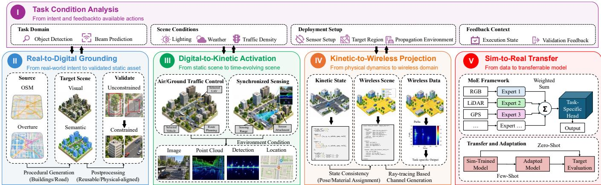  
Fig. 2. Realization of AIMS. The scene construction agent coordinates geographic grounding, dynamic sensing, and wireless projection according to task requirements. The scene understanding agent organizes multi-modal learning and configures zero-shot inference or few-shot adaptation according to the available real support. Execution validation provides feedback for plan revision. Target evaluation reports predictive performance on held-out real data.

1) Real-to-Digital Grounding: Given the geographic extent and infrastructure conditions specified in the deployment profile, real-to-digital grounding establishes the validated static physical reference for subsequent mobility, sensing, and wireless simulation. The scene construction agent determines whether the shared experiment state already contains a validated static scene whose geographic coverage, infrastructure configuration, and semantic content are consistent with the deployment profile. A compatible scene is reused as the common spatial reference for the current task. A new grounding operation is initiated when the requested region or static-scene conditions are not covered by the existing validated result.

OpenStreetMap [27] provides the primary geographic description, while Overture Maps supplies complementary attributes and cross-source evidence for the target area. The selected geographic information is normalized to a common coordinate reference and transformed into a three-dimensional representation of the transport network, built environment, and relevant natural features. The same coordinate reference is used to interpret the RSU and roadside sensor poses specified in the deployment profile. Semantic and infrastructure attributes are retained to support downstream mobility, sensing, and radio simulation.

Building appearance is instantiated through procedural facade generation and texture assignment on the reconstructed geometry. The visual attributes define the surface detail observed under the configured camera and illumination conditions. Scene semantics associate the rendered objects with their geometric representations. The radio scene uses the exported surfaces and their assigned electromagnetic material properties under the same spatial reference.

Geometric and semantic validation checks object placement against the reconstructed building volumes and road geometry. Vegetation intersecting a building volume is removed, and roadside objects conflicting with the road layout are corrected or rejected according to the available source evidence. The checks preserve the spatial relationships used by sensor rendering and radio-scene construction. Unresolved source ambiguities are recorded as validation gaps.

The resulting static scene provides the validated spatial reference for dynamic generation and subsequent wireless projection.

2) Digital-to-Kinetic Activation: Digital-to-kinetic activation transforms the validated static scene into time-varying physical states that support synchronized sensing and subsequent wireless projection. The scene construction agent first determines whether the shared experiment state contains a validated kinetic realization whose mobility, environmental, and sensing conditions remain compatible with the current deployment request. Compatible trajectories and sensing records can be reused. Changes in mobility, environment, or sensing configuration require regeneration of the affected dynamic products.

Once the required kinetic configuration is established, CARLA [28] instantiates the communication vehicle and surrounding traffic on the validated road network and evolves the scene according to the mobility profile and environmental conditions in the deployment profile. The communication vehicle is tracked separately from background traffic so that its position, orientation, and motion remain associated with the corresponding trajectory throughout the experiment. At each retained observation instant, these actor states form the dynamic state st introduced in Section II, which provides the common physical reference for sensing generation and the subsequent wireless projection.

The sensing configuration follows the sensor geometry and acquisition settings of the target deployment. From each retained dynamic state, the enabled RGB and LiDAR modalities generate corresponding observations. Enabled radar and positioning modalities use the same physical scene state. Simulated actor identities and geometry also provide task supervision such as object locations and categories. Data collection is restricted to the effective sensing region defined by the deployment configuration, so that the retained records correspond to the portion of each trajectory that is relevant to the roadside sensing setup. For vehicle detection, these records associate sensing observations with object annotations. For beam prediction, the same retained samples also provide the communication-vehicle state required by the subsequent wireless projection, thereby preserving the physical correspondence between sensing inputs and beam supervision.

Before the kinetic state is exposed to downstream operations, trajectory and sensing validation checks the realized motion and sensor configuration. It also verifies sample completeness and temporal consistency. Common actor and sample references associate observations with annotations generated from the same dynamic state. The output is a validated kinetic representation that combines synchronized physical states with sensing observations and task annotations. This representation provides the dynamic physical interface used by both the scene understanding agent and the kinetic-to-wireless projection stage.

3) Kinetic-to-Wireless Projection: Kinetic-to-wireless projection maps each validated kinetic sample to the radiodomain representation required by the target task. The scene construction agent invokes this stage only when wireless supervision or intermediate radio information is required. It first determines whether a compatible wireless result already exists for the same physical state and radio configuration. The validated static scene and the dynamic state $\mathbf { s } _ { t }$ define the relative geometry of the communication nodes and surrounding objects, while the deployment profile specifies the carrier and antenna settings. The resulting wireless realization therefore remains tied to the same physical sample used for sensing generation.

In the current realization, Blender converts the grounded kinetic scene from CARLA into a ray-tracing representation while preserving the common coordinate reference established in the previous stages. Dynamic objects and communication nodes are instantiated from the retained kinetic state, and supported surfaces are assigned radio-material properties. The Sionna RT ray-tracing engine [29] then evaluates the propagation paths associated with each retained sample and derives the corresponding channel response from the scene geometry, material properties, and radio configuration. The resulting path information comprises complex path parameters and the assembled channel response. Line-of-sight and non-lineof-sight conditions arise directly from the instantiated scene geometry.

The endpoint of wireless processing is determined by the requested task. A channel-oriented task exposes the channel representation directly. For beam prediction, the configured codebook maps each channel response to beam-domain powers and the corresponding beam label.

Before the wireless result is exposed to the scene understanding agent, validation checks its consistency with the corresponding kinetic record. The checks cover geometric, radio, and sample-level consistency. Validated wireless outputs inherit the same trajectory and sample references as the sensing records, which preserves the physical correspondence between sensing observations and wireless supervision. The output of this stage is therefore a validated wireless representation that can be combined with the synchronized sensing records for task learning and sim-to-real transfer.

## C. Scene Understanding Agent

The scene understanding agent converts the validated multi modal records produced by the scene construction agent into a deployment-specific task model. Scene construction determines the physical content of the synthetic domain. Scene understanding configures the resulting observations and supervision for task learning and transfer. The validated records preserve a common physical reference across sensing and wireless quantities and constitute $\mathcal { D } _ { \mathrm { s i m } } ^ { \tau } ( \boldsymbol { \xi } )$ defined in Section II-B2.

For a target task τ , the agent organizes the admissible sensing inputs, the corresponding learning configuration, and the transfer strategy according to the deployment context and the available real support. It first performs task-adaptive multimodal learning in the synthetic domain and then determines whether the resulting model is used directly or adapted to the target deployment. The following subsections describe these two operations.

1) Task-Adaptive Multi-modal Learning: The scene understanding agent converts the validated synthetic records into a task-specific learning configuration. Given a target task τ and the sensing modalities $\mathcal { M } _ { \mathrm { a v } }$ available in the deployment, the agent specifies the input modality set $\mathcal { M } _ { \tau } \subseteq \mathcal { M } _ { \mathrm { a v } }$ according to the task requirements and deployment context. The MoE model learns the contribution of each selected modality from synthetic data.

For each modality $m \in \mathcal { M } _ { \tau }$ , let $\mathbf { x } _ { t } ^ { ( m ) }$ denote its observation at sample t. A modality-specific encoder $e _ { m } ( \cdot )$ extracts its representation, which is mapped into a task-specific fusion space by $\phi _ { m , \tau } ( \cdot )$ as

$$
\begin{array} { r } { \mathbf { Z } _ { m , \tau , t } = \phi _ { m , \tau } \left( e _ { m } \left( \mathbf { x } _ { t } ^ { ( m ) } \right) \right) . } \end{array}\tag{12}
$$

Let $\mathcal { Z } _ { \tau , t } = \{ \mathbf { Z } _ { m , \tau , t } : m \in \mathcal { M } _ { \tau } \}$ . The MoE gating network assigns a normalized weight to each selected modality according to its current representation and the task context $\mathbf { c } _ { \tau , t }$

$$
\gamma _ { m , \tau , t } = \frac { \exp \left( g _ { m , \tau } \left( \mathcal { Z } _ { \tau , t } , \mathbf { c } _ { \tau , t } \right) \right) } { \sum _ { j \in \mathcal { M } _ { \tau } } \exp \left( g _ { j , \tau } \left( \mathcal { Z } _ { \tau , t } , \mathbf { c } _ { \tau , t } \right) \right) } .\tag{13}
$$

The fused task representation is then

$$
\mathbf { F } _ { \tau , t } = \sum _ { m \in \mathcal { M } _ { \tau } } \gamma _ { m , \tau , t } \mathbf { Z } _ { m , \tau , t } .\tag{14}
$$

The representation $\mathbf { F } _ { \tau , t }$ is provided to the corresponding task head. For vehicle detection, the modality mappings preserve the spatial structure required for object localization. For beam prediction, the fused features form a link-level representation used to predict the beam distribution. The encoders, gating network, and task head minimize (8) over $\mathcal { D } _ { \mathrm { s i m } } ^ { \tau } ( \boldsymbol { \xi } )$ . This procedure produces $\Theta _ { \tau } ^ { \mathrm { s i m } }$

The selected modality set and the resulting synthetic-domain model become part of the learning state maintained for the target deployment. A change in the target task or in the sensing modalities available for inference requires the affected learning configuration to be reconsidered.

2) Deployment-Specific Sim-to-Real Transfer: The scene understanding agent instantiates the transfer configuration defined in Section II-B2. Given the synthetic-domain model $\Theta _ { \tau } ^ { \mathrm { s i m } }$ , the available real support determines the applicable transfer branch. For $n _ { \mathrm { r e a l } } = 0$ , the synthetic-domain model is used directly for zero-shot inference. For $n _ { \mathrm { r e a l } } > 0$ , the agent invokes real-domain adaptation using $\mathcal { D } _ { \mathrm { r e a l } } ^ { \tau } ( n _ { \mathrm { r e a l } } )$ under the adaptation scope $\mathcal { U } _ { \tau }$

The task protocol determines the parameter groups exposed to adaptation. Depending on the task implementation, $\mathcal { U } _ { \tau }$ can include modality-specific representations, the fusion module, and the task head. Once the transfer configuration is instantiated, the numerical learner executes the empirical optimization defined in (8). The resulting model $\Theta _ { \tau } ^ { \mathrm { { r e a l } } }$ and its transfer configuration are returned to the shared experiment state.

When the target task and selected modality set remain unchanged, a change in the real-data budget leaves the validated synthetic domain applicable to the experiment. The scene understanding agent therefore updates the transfer operation while retaining the compatible synthetic records and $\Theta _ { \tau } ^ { \mathrm { s i m } }$ This dependency preserves the separation between physical data construction and deployment-specific model adaptation.

## V. EXPERIMENTAL RESULTS

In this section, we evaluate the proposed AIMS framework using the real-world DeepSense 6G multi-modal ISAC dataset [4]. We consider both sensing and communication tasks, including vehicle detection and beam prediction. We also evaluate the agentic orchestration performance.

## A. Experimental Setups

We reconstruct DeepSense 6G deployment environments for Scenarios 3, 4, and 9 [4]. The reconstructions generate synthetic sensing and wireless data for sim-to-real learning. Scenarios 3 and 4 are used for beam prediction, while Scenarios 3 and 9 are used for communication-vehicle detection.

1) Sensing Settings: RGB and GPS are used for the quantitative tasks in Scenarios 3, 4, and 9. The roadside camera provides RGB images with a native resolution of 960 × 540, a field of view of 110◦, and a nominal acquisition rate of 30 frames/s. Vehicle-mounted GPS receivers provide position measurements at 10 Hz. Scenario 9 additionally provides two-dimensional LiDAR scans with a 360◦ field of view and a nominal scanning rate of 10 Hz. The synthetic environments are reconstructed from geographic information using OpenStreetMap and Overture Maps, with CARLA generating vehicle motion and sensor observations under the corresponding deployment and illumination conditions.

2) Wireless Settings: The considered downlink operates at 60 GHz. The RSU employs a 16-element uniform linear transmit array and a transmit beam codebook of $Q \ : = \ : 6 4$ beams, while the communication vehicle is modeled as a single antenna quasi-omnidirectional receiver. Each real wireless record contains the measured per-beam received powers, and the beam-prediction label is the beam index with the highest received power. These labels follow the same beam identities and ordering used in the downlink model.

For synthetic data generation, the reconstructed geometry and dynamic object states are transferred to Sionna RT through the Blender-based scene representation. Ray tracing produces propagation paths and channel realizations from the RSU to the communication vehicle. Beam-domain powers are then computed using the same RSU transmit codebook employed by the target deployment. Synthetic and real beam labels therefore follow the same beam identities and ordering.

3) Learning Settings: We employ task-specific MoE models. RGB uses a ResNet-18 encoder, planar LiDAR uses PointNet, and GPS uses a position encoder. Context-conditioned softmax gating fuses the expert features for 64-class beam prediction and vehicle detection, with spatial features retained for detection. The models are trained on synthetic data using Adam with a learning rate of $1 0 ^ { - 3 }$ and a batch size of 64. Beam prediction uses cross-entropy loss, while detection uses classification and localization losses. Zero-shot evaluation directly applies the learned models. Few-shot adaptation updates the parameter groups in U using limited labeled real samples.

We compare the proposed framework with the following baselines and a real-data training benchmark.

• Scenario-agnostic simulation: Synthetic data are generated in a generic scene without target-specific geographic reconstruction. The sensing configuration and transmit codebook are matched to AIMS. The MoE model and synthetic data volume are also matched.

• Map-derived simulation: The target site is reconstructed from OpenStreetMap with buildings represented by plain volumetric models. The communication vehicle follows predefined straight-line trajectories with background traffic disabled. Blender renders the RGB observations, and Sionna RT generates wireless channels from the same prescribed scene states. The implementation uses datageneration components adapted from [17].

Codebook-agnostic simulation: An oversampled discrete Fourier transform (DFT) transmit codebook replaces the target-device codebook when generating synthetic beam supervision. Beam indices are aligned with the real codebook through a fixed mapping defined by codebook metadata. This baseline retains the reconstructed scene and MoE model and applies only to beam prediction.

• Feature concatenation: Modality-specific features are concatenated and projected to the task head, replacing the MoE fusion mechanism.

• Multi-modal transformer: Transformer attention captures cross-modal interactions and generates fused features for task prediction.

• Real-data training benchmark: The same task-specific MoE model is trained directly on the complete real training partition. This setting provides an empirical performance reference with a larger real-data budget.

4) Agent Settings: The agentic orchestration of AIMS is implemented with a locally deployed Qwen3-14B [30] language model as the common LLM backbone. The LLM interprets target-deployment requests, reasons over the structured domain knowledge and current experiment state, and selects supported capabilities according to the task requirements and intermediateproduct dependencies. Physical solvers execute the simulations, and numerical learners optimize the task models.

We construct 2 benchmark tiers for evaluating the shared orchestration mechanism. Each tier contains 30 expert-designed canonical cases expressed as 70 natural-language requests. In each tier, 20 cases are represented by 3 paraphrases, while 10 additional cases use 1 formulation each. The normal tier contains explicit and feasible deployment requests, with 8 task-endpoint cases, 16 dependency-and-reuse cases, and 6 recovery cases. The challenging tier introduces indirect endpoint descriptions, implicit outputs, and artifact-provenance conflicts. It also includes text-only constraints, unsupported goals, and unseen execution failures. The tier contains 5 taskendpoint cases, 9 dependency-and-reuse cases, and 5 constraint cases. It also contains 5 unsupported-request cases and 6 recovery cases. Across both tiers, the benchmark contains 60 canonical cases and 140 natural-language requests, resulting in 420 method-request evaluations across the 3 compared methods.

We compare the proposed framework with the following baselines.

• Direct LLM: The LLM receives the common capability catalog and a serialized experiment-state snapshot. It produces a single response without tool calls, validation evidence, or structured domain knowledge.

• Tool-only AIMS: The method uses the same state interface and validator as AIMS. It also uses the same feedback format and retry budget. The structured domain knowledge is omitted. It can call the corresponding functions, which return structured schema, dependency, and capabilityconstraint feedback.

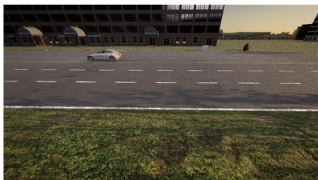  
(a) Synthesized Scenario 3.

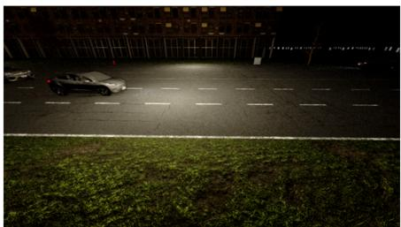  
(b) Synthesized Scenario 4.

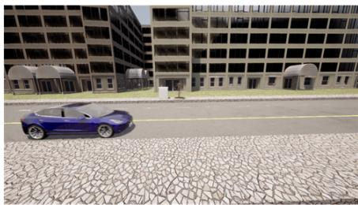  
(c) Synthesized Scenario 9.

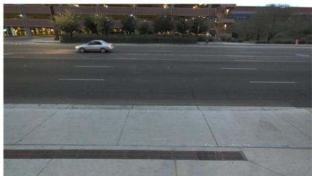  
(d) DeepSense 6G Scenario 3.

  
(e) DeepSense 6G Scenario 4.

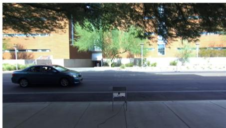  
(f) DeepSense 6G Scenario 9.  
Fig. 3. Examples of the reconstructed synthetic environments and the corresponding real DeepSense 6G deployments for Scenarios 3, 4, and 9.

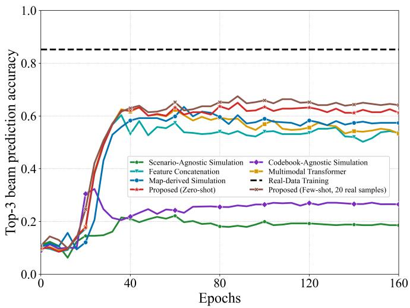  
(a) Top-3 accuracy.

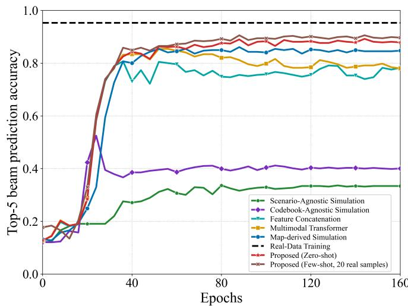  
(b) Top-5 accuracy.  
Fig. 4. Beam prediction accuracy versus training epochs in Scenario 3: (a) Top-3 and (b) Top-5. The proposed few-shot model uses 20 real training samples. The real-data training result is a fixed reference.

## B. Performance Comparison for Beam Prediction

In this subsection, we evaluate beam prediction in Scenarios 3 and 4. The proposed zero-shot model uses no target-domain samples for adaptation, while the few-shot model uses 20 real training samples. The real-data training reference uses the complete real training partition.

Top-k accuracy measures how often the best beam is included among the k highest-ranked predictions:

$$
A _ { k } = \frac { 1 } { N _ { \mathrm { t e } } } \sum _ { i = 1 } ^ { N _ { \mathrm { t e } } } \mathbf { 1 } \Big \{ y _ { i } ^ { \mathrm { b } } \in \widehat { \mathcal { B } } _ { i , k } \Big \} , \qquad k \in \{ 1 , 3 , 5 \} ,\tag{15}
$$

where $N _ { \mathrm { t e } }$ is the real test-set size, $y _ { i } ^ { \mathrm { b } }$ is the best measured beam, and $\widehat { B } _ { i , k }$ contains the Top-k predictions. Figs. 4 and 5 report Top-3 and Top-5 accuracy.

Both proposed configurations outperform all 5 baselines in both scenarios. The largest gaps occur against scenario-agnostic and codebook-agnostic simulation, supporting alignment of scene-dependent propagation and beam-label definitions with the target deployment. The map-derived simulation baseline also remains below AIMS in both scenarios, indicating that target-site reconstruction with simplified geometry and prescribed mobility does not fully reproduce the benefit of the deployment-conditioned construction. The zero-shot model also exceeds feature concatenation and multi-modal transformer. Its final Top-3 gain over the stronger fusion baseline is approximately 7 percentage points in Scenario 3 and 16 percentage points in Scenario 4.

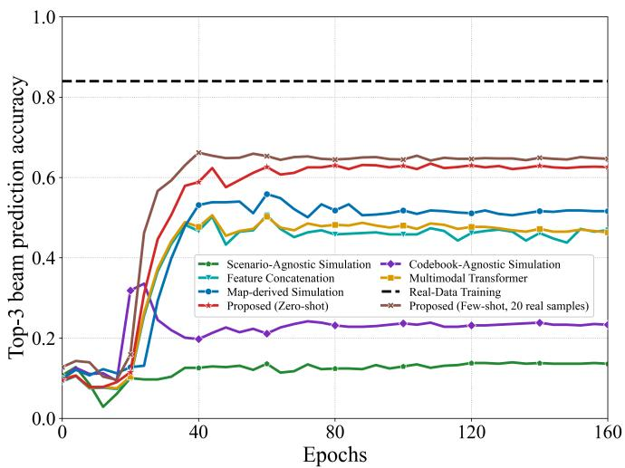  
(a) Top-3 accuracy.

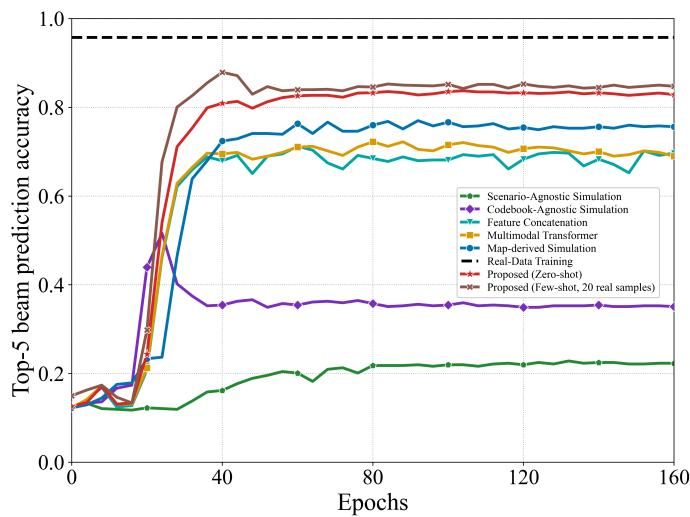  
(b) Top-5 accuracy.  
Fig. 5. Beam prediction accuracy versus training epochs in Scenario 4: (a) Top-3 and (b) Top-5. The proposed few-shot model uses 20 real training samples. The real-data training result is a fixed reference.

Using 20 real training samples further improves all 4 plotted Top-k results. The full real-data training reference remains higher. The gap is smaller for Top-5 than for Top-3, indicating stronger coverage when a larger candidate list is allowed.

## C. Performance Comparison for Object Detection

In this subsection, we evaluate sensing through boundingbox detection of the communication vehicle from RGB and GPS observations. Because multiple vehicles may appear in the camera view, GPS provides positional context for associating the communication vehicle with the corresponding visual target. Scenarios 3 and 9 use zero-shot and 20-sample few-shot settings.

We evaluate detection using average precision (AP) over multiple intersection-over-union (IoU) thresholds and AP at an IoU threshold of 0.50 (AP50). Let $\mathrm { A P } _ { u }$ denote average precision from the precision–recall curve at threshold u. Then

$$
\mathrm { A P 5 0 } = \mathrm { A P _ { 0 . 5 0 } } , \qquad \mathrm { A P } = { \frac { 1 } { 1 0 } } \sum _ { j = 0 } ^ { 9 } \mathrm { A P _ { 0 . 5 0 + 0 . 0 5 j } } .\tag{16}
$$

AP50 uses an IoU threshold of 0.50. AP averages thresholds from 0.50 to 0.95 to assess performance under stricter localization requirements.

At the final epoch, the proposed zero-shot model exceeds scenario-agnostic simulation and both fusion baselines on AP and AP50 in both scenarios. Its AP advantage over the stronger fusion baseline ranges from approximately 6 to 13 percentage points across the two scenarios. The scenarioagnostic gap supports target-relevant scene construction, and the fusion comparisons support the proposed multi-modal learning configuration. The map-derived simulation baseline also remains below the proposed models on both AP and AP50, providing a reference for the contribution of the deployment-conditioned scene construction beyond target-site map reconstruction alone. The codebook-agnostic simulation baseline is excluded because it changes wireless supervision without changing detection inputs or labels.

Few-shot learning with 20 real samples further improves both AP and AP50, and the advantage is maintained through the later training epochs. The gains therefore extend beyond detection at moderate box overlap to the more demanding localization criteria included in AP. A gap to the full realdata training reference remains, particularly in AP, indicating residual sim-to-real mismatch.

## D. Performance Comparison for Agentic Orchestration

In this subsection, we evaluate task interpretation and feedback-driven plan revision across diverse deployment requests. The expert-defined contracts assess whether the selected capabilities and their dependencies satisfy the task and execution conditions in (10).

Following recent agentic wireless evaluation that considers task success, first-try success, and iterative solution attempts [22], we evaluate AIMS using task-level success and finegrained orchestration metrics. Plan task success rate (Plan-TSR) is the fraction of requests whose final plan satisfies the expert-defined contract. The contract covers task interpretation, target endpoint, and capability selection. It also covers intermediate-artifact handling and required recovery behavior. Constraint satisfaction rate (CSR) is the fraction of final plans that satisfy schema and capability constraints together with dependency and cross-field constraints. It measures structural plan validity. Artifact-dependency F1 is the macro-averaged F1 score for determining whether each intermediate artifact should be preserved, recomputed, or excluded from the requested workflow. Capability-F1 measures agreement between the selected capabilities and those required by the expert annotation. First-try success is the fraction of initial plans satisfying the expert-defined contract. Avg. Attempts gives the mean number of planning and replanning attempts per request.

As shown in Table I, AIMS achieves 100% Plan-TSR on the normal tier, exceeding Tool-only AIMS and Direct LLM by 27.1 and 40.0 percentage points, respectively. The controlled comparison with Tool-only AIMS provides direct evidence for the contribution of structured domain knowledge. The two methods share the same model, capability interfaces, and state representation. They also share the validator, feedback format, and retry budget. Their difference is the availability of structured domain knowledge. Incorporating this knowledge increases Dependency-F1 from 87.0% to 100% and Capability-F1 from 77.4% to 100%. AIMS also achieves 78.6% first-try success, compared with 52.9% for Tool-only AIMS. Its average number of attempts is 1.229, compared with 1.286 for Tool-only AIMS.

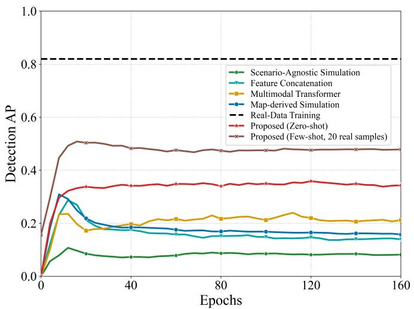  
(a) AP.

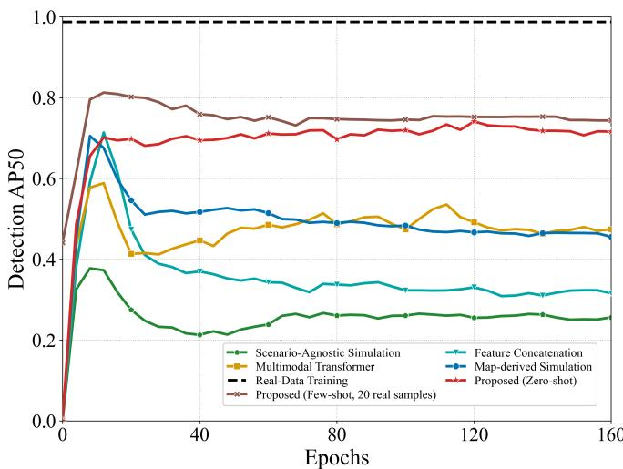  
(b) AP50.  
Fig. 6. Detection performance in Scenario 3: (a) AP and (b) AP50. The proposed few-shot model uses 20 real training samples. The real-data training result is a fixed reference.

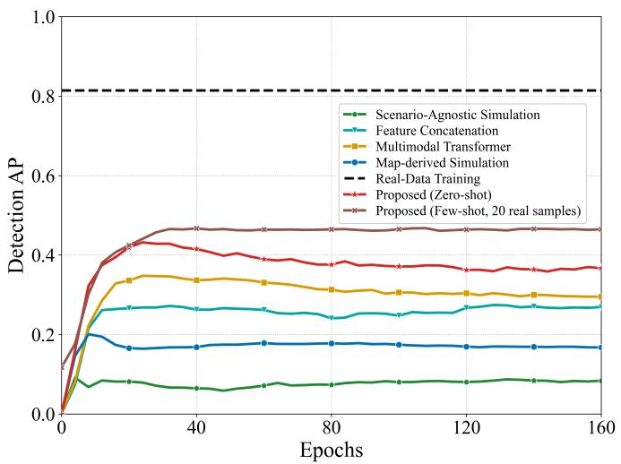  
(a) AP.

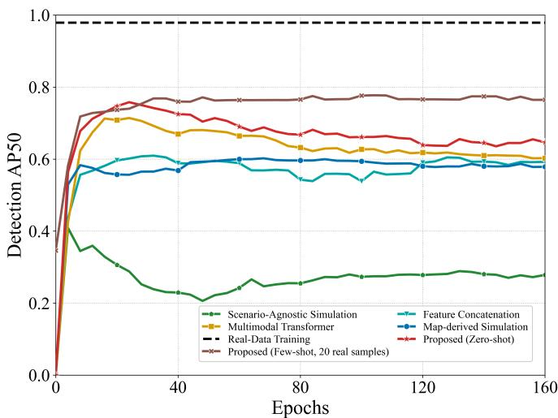  
(b) AP50.  
Fig. 7. Detection performance in Scenario 9: (a) AP and (b) AP50. The proposed few-shot model uses 20 real training samples. The real-data training result is a fixed reference.

Under challenging requests, AIMS attains 88.6% Plan-TSR, compared with 60.0% for Tool-only AIMS and 48.6% for Direct LLM. Its Dependency-F1 and Capability-F1 remain 92.4% and 90.3%, respectively. Tool-only AIMS achieves 72.5% and 65.3%. The first-try success of AIMS decreases from 78.6% on the normal tier to 68.6%, and its average number of attempts rises slightly from 1.229 to 1.257.

Compared with Tool-only AIMS, structured domain knowl edge improves first-try success and final-plan accuracy under shared feedback settings. AIMS also achieves higher Plan-TSR with fewer attempts in both tiers. Dependency-F1 and

Capability-F1 measure agreement with execution requirements. CSR measures structural validity, while Plan-TSR also includes task interpretation and requested outcomes.

## VI. CONCLUSION

In this paper, we presented AIMS for deployment-specific sim-to-real multi-modal ISAC. AIMS grounds a naturallanguage deployment request in the shared experiment state and uses structured domain knowledge to instantiate the deployment-specific sim-to-real configuration, identify reusable intermediate products, and generate the execution plan. The scene construction agent realizes physically aligned sensing and wireless data under shared physical states, while the scene understanding agent configures task-relevant modalities, learning, and sim-to-real adaptation. Validation evidence enables dependency-aware revision as deployment conditions change. Experiments on DeepSense 6G demonstrate zero-shot inference and limited real-domain adaptation for vehicle detection and beam prediction, while the orchestration benchmark validates task interpretation, dependency handling, and feedback-driven replanning across deployment requests. These results can further motivate performance-driven closed-loop refinement, where downstream sensing and communication performance can provide additional feedback for subsequent configuration and adaptation decisions.

TABLE I  
AGENTIC ORCHESTRATION PERFORMANCE ON 70 NORMAL AND 70 CHALLENGING NATURAL-LANGUAGE DEPLOYMENT REQUESTS.
<table><tr><td>Tier</td><td>Method</td><td>Plan-TSR (%)</td><td>CSR (%)</td><td>Dependency-F1 (%)</td><td>Capability-F1 (%)</td><td>First-Try (%)</td><td>Avg. Attempts</td></tr><tr><td rowspan="3">Normal</td><td>Direct LLM</td><td>60.0</td><td>100.0</td><td>88.1</td><td>82.2</td><td>60.0</td><td>1.000</td></tr><tr><td>Tool-only AIMS</td><td>72.9</td><td>98.6</td><td>87.0</td><td>77.4</td><td>52.9</td><td>1.286</td></tr><tr><td>AIMS</td><td>100.0</td><td>100.0</td><td>100.0</td><td>100.0</td><td>78.6</td><td>1.229</td></tr><tr><td rowspan="3">Challenging</td><td>Direct LLM</td><td>48.6</td><td>97.1</td><td>63.6</td><td>61.3</td><td>48.6</td><td>1.000</td></tr><tr><td>Tool-only AIMS</td><td>60.0</td><td>98.6</td><td>72.5</td><td>65.3</td><td>45.7</td><td>1.471</td></tr><tr><td>AIMS</td><td>88.6</td><td>100.0</td><td>92.4</td><td>90.3</td><td>68.6</td><td>1.257</td></tr></table>

## REFERENCES

[1] International Telecommunication Union, “Framework and overall objectives of the future development of IMT for 2030 and beyond,” ITU-R, Recommendation M.2160-0, Nov. 2023. [Online]. Available: https://www.itu.int/rec/R-REC-M.2160-0-202311-I

[2] K. B. Letaief, W. Chen, Y. Shi, J. Zhang, and Y.-J. A. Zhang, “The roadmap to 6G: AI empowered wireless networks,” IEEE Commun. Mag., vol. 57, no. 8, pp. 84–90, Aug. 2019.

[3] F. Liu, Y. Cui, C. Masouros, J. Xu, T. X. Han, Y. C. Eldar, and S. Buzzi, “Integrated sensing and communications: Toward dual-functional wireless networks for 6G and beyond,” IEEE J. Sel. Areas Commun., vol. 40, no. 6, pp. 1728–1767, Jun. 2022.

[4] A. Alkhateeb, G. Charan, T. Osman, A. Hredzak, J. Morais, U. Demirhan, and N. Srinivas, “DeepSense 6G: A large-scale real-world multi-modal sensing and communication dataset,” IEEE Commun. Mag., vol. 61, no. 9, pp. 122–128, Sep. 2023.

[5] S. Jiang and A. Alkhateeb, “Digital twin based beam prediction: Can we train in the digital world and deploy in reality?” in Proc. IEEE Int. Conf. Commun. Workshops (ICC Workshops), May 2023, pp. 36–41.

[6] J. Chen, Z. Huang, X. Cai, X. Cheng, and L. Yang, “SynthSoM-Twin: A multi-modal sensing-communication digital-twin dataset for Sim2Real transfer via synesthesia of machines,” arXiv preprint arXiv:2511.11503, 2025. [Online]. Available: https://arxiv.org/abs/2511.11503

[7] D. Muruganandham, S. Pradhan, J. Gu, T. Braun, D. Roy, and K. Chowdhury, “SMART: Sim2Real meta-learning-based training for mmWave beam selection in V2X networks,” IEEE Trans. Mobile Comput., vol. 24, no. 10, pp. 11 076–11 091, Oct. 2025.

[8] L. L. Magoarou, T. Yassine, S. Paquelet, and M. Crussiére, “Deep learning for location based beamforming with NLoS channels,” in Proc. IEEE Int. Conf. Acoust., Speech, Signal Process. (ICASSP), May 2022, pp. 8812–8816.

[9] Y. Ahn, J. Kim, S. Kim, K. Shim, J. Kim, S. Kim, and B. Shim, “Toward intelligent millimeter and terahertz communication for 6G: Computer vision-aided beamforming,” IEEE Wireless Commun., vol. 30, no. 5, pp. 179–186, Oct. 2023.

[10] Y. Yang, F. Gao, X. Tao, G. Liu, and C. Pan, “Environment semantics aided wireless communications: A case study of mmWave beam prediction and blockage prediction,” IEEE J. Sel. Areas Commun., vol. 41, no. 7, pp. 2025–2040, Jul. 2023.

[11] Y. Bian, J. Yang, S. Xia, and S. Jin, “3-D LiDAR and GPS aided beam tracking in millimeter wave vehicular communications,” IEEE Wireless Commun. Lett., vol. 13, no. 12, pp. 3290–3294, Dec. 2024.

[12] Y. Bian, J. Yang, L. Dai, X. Lin, X. Cheng, H. Que, L. Liang, and S. Jin, “Multi-modal fusion for sensing-aided beam tracking in mmWave communications,” Phys. Commun., vol. 67, p. 102514, Dec. 2024.

[13] Z. Shi, K. Shi, C. Liu, S. He, C. Gu, and J. Chen, “BeMamba: Efficient multimodal sensing-aided beamforming via state space model,” IEEE Trans. Wireless Commun., vol. 25, pp. 384–397, 2026.

[14] Y. Bian, W. Guo, Z. Wang, S. Song, J. Zhang, and K. B. Letaief, “GSBF: Gaussian splatting for environment-aware beamforming,” 2026. [Online]. Available: https://arxiv.org/abs/2608.05896

[15] K. Zhang, W. Yu, H. He, S. Song, J. Zhang, and K. B. Letaief, “Multimodal mixture-of-experts for ISAC in low-altitude wireless networks,” IEEE J. Sel. Topics Signal Process., pp. 1–17, 2026.

[16] T. Mao, L. Liang, J. Yang, H. Ye, S. Jin, and G. Y. Li, “Multimodal-Wireless: A large-scale dataset for sensing and communication,” in Proc. IEEE Int. Conf. Commun. (ICC), May 2026, pp. 1–6.

[17] M. Li, Q. Lu, J. Tian, H. Hu, Y. Han, X. Li, C.-K. Wen, and S. Jin, “Multimodal-NF: A wireless dataset for near-field low-altitude sensing and communications,” IEEE Wireless Communications Letters, vol. 15, pp. 3631–3635, 2026.

[18] L. Zhou, P. Rao, C. Zhang, J. Mo, S. Sun, Z. Chen, and M. Tao, “LAMBDA: A low-altitude multimodal base dataset for UAV sensing and communication,” arXiv preprint arXiv:2607.03826, 2026. [Online]. Available: https://arxiv.org/abs/2607.03826

[19] A. Alkhateeb, “DeepMIMO: A generic deep learning dataset for millimeter wave and massive MIMO applications,” 2019. [Online]. Available: https://arxiv.org/abs/1902.06435

[20] J. Shao, J. Tong, Q. Wu, W. Guo, Z. Li, Z. Lin, and J. Zhang, “WirelessLLM: Empowering large language models towards wireless intelligence,” J. Commun. Inf. Netw., vol. 9, no. 2, pp. 99–112, Jun. 2024.

[21] J. Tong, W. Guo, J. Shao, Q. Wu, Z. Li, Z. Lin, and J. Zhang, “WirelessAgent: Large language model agents for intelligent wireless networks,” China Commun., vol. 23, no. 3, pp. 265–285, Mar. 2026.

[22] H. Li, M. Xiao, K. Wang, R. Schober, D. I. Kim, and Y. L. Guan, “ComAgent: Multi-LLM based agentic AI empowered intelligent wireless networks,” IEEE Wireless Commun., pp. 1–12, 2026.

[23] J. Tong, Z. Li, F. Liu, W. Guo, and J. Zhang, “WirelessAgent++: Automated agentic workflow design and benchmarking for wireless networks,” arXiv preprint arXiv:2603.00501, 2026. [Online]. Available: https://arxiv.org/abs/2603.00501

[24] S. Hussain and C. Brennan, “RadioSim Agent: Combining large language models and deterministic EM simulators for interactive radio map analysis,” in Proc. 20th Eur. Conf. Antennas Propag. (EuCAP), Apr. 2026, pp. 1–4.

[25] R. Si, J. Song, H. Sun, and Z. An, “AutoNetSim: Intent-driven wireless network experimentation with self-evolving agents,” in Proc. IEEE Int. Conf. Netw. Protocols (ICNP), 2026, to appear. [Online]. Available: https://github.com/Pervasive-Intelligence-Lab/agentic-sionna

[26] Y. Zhang, M. A. Kishk, and M.-S. Alouini, “Small models, big impact: Tool-augmented AI agents for wireless network planning,” IEEE Commun. Mag., vol. 64, no. 4, pp. 26–32, 2026.

[27] M. Haklay and P. Weber, “OpenStreetMap: User-generated street maps,” IEEE Pervasive Comput., vol. 7, no. 4, pp. 12–18, Oct.-Dec. 2008.

[28] A. Dosovitskiy, G. Ros, F. Codevilla, A. Lopez, and V. Koltun, “CARLA: An open urban driving simulator,” 2017. [Online]. Available: https://arxiv.org/abs/1711.03938

[29] J. Hoydis, S. Cammerer, F. A. Aoudia, A. Vem, N. Binder, G. Marcus, and A. Keller, “Sionna: An open-source library for next-generation physical layer research,” 2023. [Online]. Available: https://arxiv.org/abs/2203.11854

[30] A. Yang, A. Li, B. Yang, B. Zhang, B. Hui, B. Zheng, B. Yu, C. Gao, C. Huang, C. Lv, C. Zheng, D. Liu, F. Zhou, F. Huang, F. Hu, H. Ge, H. Wei, H. Lin, J. Tang, J. Yang, J. Tu, J. Zhang, J. Yang, J. Yang, J. Zhou, J. Zhou, J. Lin, K. Dang, K. Bao, K. Yang, L. Yu, L. Deng, M. Li, M. Xue, M. Li, P. Zhang, P. Wang, Q. Zhu, R. Men, R. Gao, S. Liu, S. Luo, T. Li, T. Tang, W. Yin, X. Ren, X. Wang, X. Zhang, X. Ren, Y. Fan, Y. Su, Y. Zhang, Y. Zhang, Y. Wan, Y. Liu, Z. Wang, Z. Cui, Z. Zhang, Z. Zhou, and Z. Qiu, “Qwen3 technical report,” 2025. [Online]. Available: https://arxiv.org/abs/2505.09388