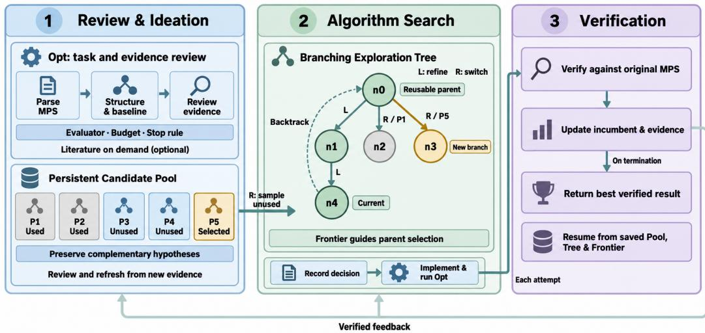
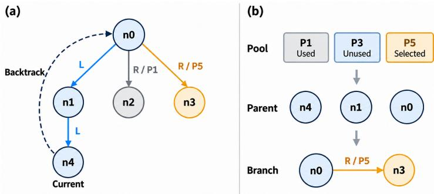
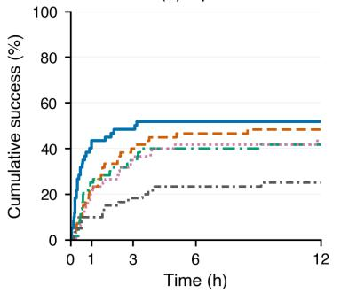
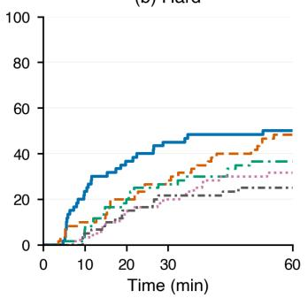
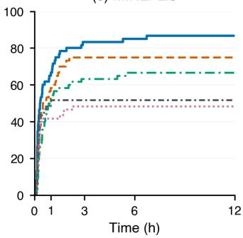
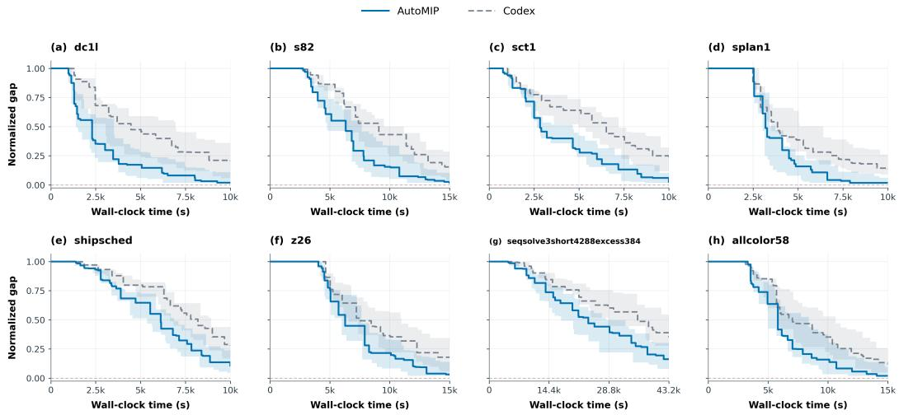

# AUTORESEARCH IN MIXED-INTEGER LINEAR AND NONLINEAR PROGRAMMING

Yuwei Gu1 Yaoxin Wu2∗ Tong Guo3 Wen Song4 Zhiguang Cao5

1Chengdu University of Information Technology 2Eindhoven University of Technology

3Nanyang University of Technology 4Shandong University 5Singapore Management University

## ABSTRACT

Despite recent progress in autoresearch, applying it to practical operations research problems—typically formulated as NP-hard mixed-integer linear or nonlinear programs (MILPs or MINLPs)—remains challenging because effective research requires systematically managing competing ideas and long-horizon experimental trajectories. We introduce AutoMIP, a reusable agent skill for organizing long-horizon autoresearch in mixed-integer programming through idea pooling and algorithm tree search. AutoMIP maintains a persistent pool of complementary candidate ideas while organizing executable experiments into an algorithm tree, enabling the agent to preserve unexplored hypotheses, refine promising algorithms, and switch to alternative methodological directions based on historical states. On MILP and MINLP benchmark cohorts, AutoMIP achieves the highest final success rates among the evaluated autoresearch frameworks. On MIPLib, AutoMIP discovers new best solutions for 31 of 60 instances, surpassing existing autoresearch frameworks. On MINLPLib, it achieves new best solutions for 52 of 60 instances. Ablation studies further demonstrate the complementary contributions of idea pooling and algorithm tree search, highlighting the importance of jointly maintaining diverse research ideas and structured experimental trajectories for long-horizon autoresearch.

## 1 INTRODUCTION

Autoresearch agents improve algorithms by proposing changes, executing experiments, and using measured outcomes to decide what to try next (Zheng et al., 2025a). Execution-guided discovery already demonstrates the value of feeding successful programs and heuristic ideas back into generation. However, existing autoresearch agents have primarily been developed for machine learning and scientific discovery, with applications spanning domains such as chemistry, biology, and materials science. NP-hard operations research (OR) problems modeled as mixed-integer linear or nonlinear programs (MILPs or MINLPs) have received comparatively less attention (Gridach et al., 2025; Ren et al., 2025), which have broad applications across domains such as manufacturing (Naderi et al., 2023), logistics (Zhou et al., 2023), finance (Ararat & Meimanjan, 2023).

Given an OR problem formulated as a MILP or MINLP, a straightforward approach is to apply an exact solver, such as Gurobi or SCIP (Clautiaux & Ljubic, 2025). However, exact solvers may require substantial computational time on challenging instances. To obtain high-quality solutions more quickly, learning-guided approaches enhance different components of the optimization process, including primal heuristics (Han et al., 2023; Huang et al., 2024; Liu et al., 2025), branching heuristics (Zhang et al., 2024; Sun et al., 2024; Feng & Yang, 2025), and cutting-plane selection (Tang et al., 2020; Wang et al., 2024; Paulus et al., 2022). Despite their promise, these approaches typically require substantial expertise in deep learning and considerable problem-specific model design and tuning to achieve effective performance on a given class of optimization problems.

With the advance of current large language models (LLMs), LLM-assisted algorithm design has shown promise for automatically solving OR problems through heuristic design (Liu et al., 2024b; Romera-Paredes et al., 2024). By generating and iteratively evaluating heuristic designs, existing methods explore algorithmic spaces through population-based search (Huang et al., 2026; Liu et al., 2024a; Ye et al., 2024) or tree-based search (Zheng et al., 2025b; Wang et al., 2025; Kiet et al.,

2026), motivating the automatic design of high-performing decomposition-enhanced HGS solvers for the LSCVRP (Guo et al., 2026). Meanwhile, autoformulation work applies LLMs to automate the problem modeling process Ramamonjison et al. (2023); AhmadiTeshnizi et al. (2024); Xiao et al. (2024); Huang et al. (2025b); Jiang et al. (2025). However, these approaches primarily focus on generating or refining individual algorithmic designs or formulations, without explicitly managing diverse research hypotheses together with their corresponding experimental states throughout an iterative research process.

For NP-hard optimization, autoresearch is inherently stateful: a long research run accumulates reusable artifacts, including verified solutions, executable code, failure diagnoses, and untested hypotheses. These artifacts support different decisions: a strong incumbent can be retained while changing research direction; a failed experiment can motivate a repair; an untested hypothesis can become relevant as new evidence emerges. Consequently, each experiment involves two main coupled decisions: which research direction to pursue and which historical state to use as its starting point. Different directions may depend on different representations, algorithmic components, or previously developed code, making some states suitable starting points and others incompatible. Effective autoresearch therefore requires jointly managing research hypotheses and their compatible executable states, so that accumulated evidence can inform both what to explore and where to start.

In this paper, we propose a systematic framework, AutoMIP, for autoresearch on MILP or MINLP optimization. AutoMIP couples a persistent idea pool with an algorithm tree to jointly manage research hypotheses and executable experimental states. A review-and-ideation layer generates and maintains diverse research directions from accumulated evidence; an algorithm-search layer selects refinements or switches between directions while restoring compatible historical states and artifacts; and a verification layer executes candidates, validates their outcomes, and feeds the resulting evidence back into the exploration process. This design enables an LLM agent to iteratively deepen promising directions, revisit earlier states, and explore alternatives within an end-to-end research loop. We demonstrate AutoMIP for solving challenging optimization problems in MILP or MINLP benchmark and show that it can discover effective improvements over the best known solutions under less computational budget than existing autoresearch frameworks. Our contributions are threefold:

• We propose AutoMIP, a systematic autoresearch framework for MILP or MINLP optimization that couples an idea pool with an algorithm tree. The idea pool maintains diverse research directions, while the algorithm tree records experimental states, artifacts, and their dependencies, throughout an iterative research process.

• During the autoresearch, we enable a joint selection of the next research direction and its associated starting state in algorithm tree. When switching research directions, AutoMIP identifies a compatible historical state, restores its artifacts, and continues experimentation from it, enabling effective reuse of accumulated knowledge.

• We apply the end-to-end autoresearch loop and evaluate it AutoMIP on challenging MILP and MINLP benchmarks under fixed computational budgets. AutoMIP finds new best solutions for 31 of 60 instances in MIPLib, and 52 out of 60 on MINLPLib, outperforming existing autoresearch frameworks.

## 2 RELATED WORK

We review important approaches in current autoresearch work, including experience reuse, alternative organization, experiment allocation, which are relevant to the main components in AutoMIP.

Experience Reuse. Recent approaches such as ExpeL (Zhao et al., 2024) and AgentKB (Tang et al., 2025) show that LLMs improve by reusing past trajectories, such as reflections or code edits from past attempts. These methods have proven effective on reasoning tasks such as information retrieval and web browsing. Interleaving reasoning, action, and reflection enables agents to use execution feedback to adapt subsequent decisions (Yao et al., 2023b; Shinn et al., 2023). Other approaches structure experience by decomposing tasks into subgoals and hierarchies, or by organizing and retrieving related memories through linked and hierarchical representations (Hu et al., 2025; Ye, 2025; Xu et al., 2025; Sarthi et al., 2024; Rezazadeh et al., 2025). MemoryArena further evaluates whether agents can reuse experience across interdependent tasks (He et al., 2026).

Alternative Organization. Explicit search complements memory by structuring how alternative decisions are explored and revisited. Tree of Thoughts evaluates intermediate reasoning states to support lookahead and backtracking (Yao et al., 2023a), while LATS combines tree search, value estimation, reflection, and environmental feedback to guide subsequent actions (Zhou et al., 2024). D-SMART further organizes search over a dynamically evolving knowledge graph, enabling structured exploration of related reasoning paths (Lei et al., 2025). These approaches make the selection and continuation of alternative paths explicit. For long-running research, however, continuation also requires recovering the code and artifacts associated with the selected path. Thus, an effective research state must preserve not only the evidence for choosing a continuation, but also the executable artifacts required to resume it.

Experiment Allocation. Execution-guided evolution connects candidate generation with measured experimental outcomes. FunSearch maintains diverse executable programs in an island-based population (Romera-Paredes et al., 2024), while EoH (Liu et al., 2024a) jointly evolves naturallanguage heuristic ideas and their implementations, allowing successful candidates to seed subsequent generation. CORAL extends this paradigm to long-running multi-agent evolution through persistent shared memory and asynchronous experimentation (Qu et al., 2026). However, these methods primarily reuse evaluated implementations rather than explicitly preserving untested research hypotheses or their compatible experimental states. Consequently, experiment allocation remains centered on generating the next candidate, rather than jointly deciding what direction to explore and where to resume within a long-running research process.

In contrast, AutoMIP treats autoresearch as a joint search over research directions and executable states. Its persistent idea pool maintains diverse, untried hypotheses independently of the active experiment, while its algorithm Tree records refinement and switching trajectories together with reusable parent states and artifacts. Rather than selecting a hypothesis and reusing artifacts in separate stages, AutoMIP explicitly couples these decisions by identifying the compatible historical state from which each new direction can be executed.

## 3 AUTOMIP

AutoMIP organizes autoresearch around two coupled pillars: the research direction for the next experiment and the experimental state from which to execute it. We propose a persistent idea pool that maintains complementary research directions, while the algorithm tree preserves the experimental dependencies among directions and their executable states. Together, they enable the autoresearch agent to deepen a productive direction, pursue alternatives, and reuse earlier work throughout an end-to-end research process.

  
Figure 1: AutoMIP workflow. AutoMIP preserves candidate hypotheses in idea pool, selects refinements or new branches (research directions) from reusable experimental states in algorithm tree, and updates idea pool and algorithm tree from experimental feedback. The workflow supports MILP and MINLP optimization, with MPS taken as an example input format.

## 3.1 OVERVIEW

Within an LLM, the primary task skill defines the contract $\mathcal { C } = ( \boldsymbol { \mathcal { S } } , E , B , \tau )$ representing a candidate snapshot interface (S), evaluator $( E )$ , budget $( B )$ , and stopping predicate (τ). The skill constructs, executes, and verifies candidates (see Appendix $\mathrm { A . 1 }$ for skill details), while AutoMIP controls exploration with the skill. The exploration state $M _ { t } = ( T _ { t } , F _ { t } , P _ { t } , c _ { t } , A _ { t } )$ contains the algorithm tree $T _ { t } ,$ , frontier nodes $F _ { t } .$ , idea pool $P _ { t }$ , current node in algorithm tree $c _ { t } .$ , and artifacts $A _ { t }$ at step $t ,$ which is used throughout the reserch process.

Figure 1 presents three layers of AutoMIP. Review-and-ideation layer produce executable hypotheses according to the task and its evidence, resulting in a pool of ideas. Algorithm-search layer selects a refinement or switch and an associated parent state, which is guided by algorithm tree. Verification layer performs the experiment and evaluates the hypotheses and returns the result to the idea pool and algorithm tree. We elucidate the three layers in AutoMIP in next sections.

## 3.2 REVIEW-AND-IDEATION LAYER

The review-and-ideation layer converts the task and evidence into a structured set of research directions for subsequent exploration. This layer comprises three steps: evidence review, candidate generation and screening, pool collection. The review considers the following evidence: task contract and objective, the baseline and best verified results, structural constraints, execution logs, recurring failure modes, and previously generated artifacts. The agent is allowed to review literature in the very beginning without generated results, logs and artifacts. PoolThink synthesizes this evidence into executable research directions, summarizes the rationale and requirements of each direction, and screens redundant or infeasible proposals. The layer outputs a pool of records (i.e., the idea pool) and maintains the pool $P _ { t }$ for the algorithm-search layer. It does not determine a parent state in the algorithm tree or execute experiments. As such, separating candidate generation from active search preserves alternative directions while the current direction is being refined.

Idea Pooling. At the beginning of a problem-solving run, PoolThink synthesizes evidence from task structure, current code, execution logs, and previous attempts to generate and screen five to ten complementary research directions. Candidates are encouraged to differ in their core hypotheses or strategy families, such as neighborhood search, structural decomposition, or model strengthening, whereas parameter changes within the same hypotheses or strategy are treated as local refinements rather than separate directions. The pool is a generation-indexed collection of candidate records.

  
Figure 2: Coupling a direction to its starting state. After n0→n1→n4, selecting P5 and reusing n0 creates the R/P5 branch n3. Solid edges record ancestry; dashed arc restores historical artifacts.

Each record contains an identity, hypothesis (i.e., research direction), supporting evidence, difference from previously attempted directions, starting requirements, potential failure risks, and status (e.g., unused or selected). These fields characterize both the intended experiment and the artifacts it may require, i.e., the reusable executable outputs (e.g., source code, solver configurations, generated models, and intermediate files) associated with each experimental state. At step t, let $U _ { t }$ be the unused subset in the pool $P _ { t } \mathbf { : }$

$$
q _ { t } \sim \mathrm { U n i f o r m } ( U _ { t } ) , \qquad U _ { t } = \{ q \in P _ { t } : \mathrm { s t a t u s } ( q ) = \mathrm { u n u s e d } \} .\tag{1}
$$

When the algorithm-search layer initiates a direction switch, it samples $q _ { t }$ uniformly from $U _ { t }$ . Registering the corresponding branch in the algorithm tree consumes the record. In other words, once a candidate direction is selected to create a new branch in algorithm tree, it is marked as used and cannot be selected again for another direction switch, while subsequent refinement steps may continue developing this selected direction into other candidates. Verification then updates its status and accumulated evidence, which remain available to later research decisions. Once at least five candidates have been used or completed, PoolThink may refresh the pool using the accumulated evi dence while preserving the existing history. This persistence is maintained within a problem-solving run; a new problem instance begins with a new task-specific evidence review rather than inheriting candidate assumptions unchanged. Appendix A.2 provides the complete pool lifecycle.

## 3.3 ALGORITHM SEARCH LAYER

The algorithm-search layer converts a research direction into an executable experiment. Its inputs are the persistent idea pool $P _ { t } ,$ algorithm tree $T _ { t } .$ , frontier nodes $F _ { t }$ , current node $c _ { t }$ in the tree, and artifacts $A _ { t } .$ . The layer determines whether to refine the current research direction or switch to an alternative one, identifies the appropriate historical starting state, restores its artifacts, and registers the experiment before execution. The measured outcome is produced later by the verification layer.

Tree-Guided Algorithm Search. Algorithm Tree is the search structure for executable experimental states. Let $T _ { t } = ( V _ { t } , D _ { t } )$ , where each node stores a research direction, observations, and reusable artifacts, and each directed edge records how the child experiment is derived from its parent. The tree is multiway, with two edge types: L for local refinement and R for switching to a different research direction. Algorithm 1 summarizes the search procedure, and Appendix A.3 provides the complete tree-search and branching-state protocol.

Algorithm 1 Algorithm Tree Search   
Input: Exploration state $M _ { t } = ( T _ { t } , F _ { t } , P _ { t } , c _ { t } , A _ { t } )$   
Output: Registered experiment and restored experimental state.   
Read the current node $c _ { t } ,$ frontier nodes $F _ { t } ,$ candidate pool $P _ { t } ,$ and artifacts $A _ { t } .$   
if An admissible refinement exists:   
Set $d _ { t } = L$ and $p _ { t } = c _ { t } .$   
else if an unused candidate is available:   
Sample $q _ { t } \sim$ Uniform $\left( U _ { t } \right)$   
Construct compatible parent set $C _ { t } ( q _ { t } )$   
Select $p _ { t } \in \bar { C _ { t } } \bar { ( q _ { t } ) }$ using selection policy (Appendix A.4).   
Set $d _ { t } = R$ and associate the experiment with qt.   
else: Terminate the search step.   
Register $( p _ { t } , v _ { t + 1 } , d _ { t } )$ and restore artifacts of $p _ { t } .$   
return Experiment $v _ { t + 1 }$ and restored state.

The search decision is represented by $d _ { t } \in \{ L , R \}$ , where an $L$ edge continues improving the current research direction, whereas an $R$ edge activates an unused research direction sampled from the idea pool $P _ { t } .$ . Switching is triggered when the current research direction stagnates (without performance gain), its underlying assumption is refuted, or no further admissible refinement remains.

The layer determines not only what to explore, but also where to resume. The frontier $F _ { t }$ is the subset of reusable historical nodes whose artifacts are available for research continuation. Let $H _ { t }$ denote the candidate parent nodes, including the current node, its ancestry, and reusable nodes in $F _ { t }$ $\mathbf { A }$ node v is compatible with research direction q if its saved artifacts satisfy the starting requirements of $q ,$ denoted by $K _ { t } ( v , q ) = 1$ . The compatible parent set is

$$
\begin{array} { r l r } & { } & { C _ { t } ( q _ { t } ) = \{ v \in H _ { t } : K _ { t } ( v , q _ { t } ) = 1 \} , } \\ & { } & { \quad d _ { t } = L , } \\ & { } & { p _ { t } = \{ c _ { t } , \quad \quad } \\ & { } & { p _ { t } \in C _ { t } ( q _ { t } ) , \quad d _ { t } = R . } \end{array}\tag{2}
$$

The selected parent determines the executable state of the new experiment. For an example in Figure $^ { 2 , }$ a new research direction may branch from an earlier node, allowing previously developed code and artifacts to be reused. To prevent repeated switching without meaningful progress, we also track consecutive R transitions. Let $r ( v )$ denote the number of consecutive switching edges ending at node v, π(v) denote its parent, and $\ell ( v )$ its incoming edge, we define

$$
r ( v ) = \left\{ \begin{array} { l l } { 0 , } & { v { \mathrm { ~ i s ~ t h e ~ r o o t ~ o r ~ } } \ell ( v ) = L , } \\ { r ( \pi ( v ) ) + 1 , } & { \ell ( v ) = R . } \end{array} \right.\tag{3}
$$

When repeated switches occur, the policy prioritizes compatible historical states over extending the latest branch. The complete selection policy is provided in Appendix ${ \bf A . 4 . }$ . Finally, the layer registers the experiment in the algorithm tree by $\bar { V _ { t + 1 } } = \bar { V _ { t } } \cup \{ v _ { t + 1 } \} , \bar { D _ { t + 1 } } = D _ { t } \cup \{ ( p _ { t } , \bar { v _ { t + 1 } } , d _ { t } ) \}$ , where the new node v stores its research direction q, parent state π(v), branch rationale, and restored artifacts (i.e., the experimental state).

## 3.4 VERIFICATION LAYER

The verification layer executes the registered experiment and converts its outcome into reusable research evidence. Starting from the restored experimental state, the primary task skill constructs and executes the candidate, while the evaluator assesses feasibility, objective value, runtime, and other task-specific acceptance criteria. The layer outputs the evaluation result, updated exploration state, and the current best verified solution.

The verification result is then written back to the exploration state. The registered node stores its observations, evaluation evidence, and newly generated artifacts; the idea pool updates its lifecycle of the corresponding research direction; and the frontier and current node are refreshed for the next search step. A successful experiment may trigger further L refinements, whereas repeated stagnation or refuted assumptions can justify a R direction switch in algorithm tree. The research terminates when the computational budget B is exhausted or the stopping predicate τ is satisfied. Appendix A.5 describes the complete verification, state-update, and recovery protocol.

## 4 EXPERIMENTS

We first assess AutoMIP in MIPLib. Open and Hard set each comprises 60 instances (Gleixner et al., 2021). For Open set, we seek a strict improvement over the best known solution, or first feasibility when no feasible solution is found yet, within 43,200 s. For Hard set, we seek a specified historical objective target within 3,600 s. We also use a 60-instance MINLPLib cohort with a 43,200 s horizon. Given these different tasks, we assess AutoMIP in terms of incumbent improvement, fixed-target attainment, and nonlinear optimization, respectively. All configurations run on an Apple M4 Pro machine with 12 logical CPUs, 12 physical CPU cores, and 24 GB memory. Codex-based configurations use GPT-5.5, whereas the Claude Code interface uses Claude Sonnet 5.

Baselines. Codex is the coding agent used directly for task analysis, code modification, execution, and verification (OpenAI, 2025). Loop adapts the autoresearch cycle to optimization by iteratively modifying a candidate, evaluating its performance, retaining improvements or reverting to the best retained state, and continuing the search (Karpathy, 2026). AutoEoH employs a coding agent to construct the task and evaluation interface for EoH, which evolves heuristic descrip tions and executable implementations based on evaluation feedback (Liu et al., 2024a). EvoX uses an evolutionary-computation framework to search over candidate decisions or strategy parameters, with task-specific solvers providing evaluation, repair, and verification (Huang et al., 2025a). Together, these baselines represent four complementary paradigms: direct coding-agent use, sequential iterative improvement, heuristic-code evolution, and population-based search. We instantiates AutoMIP with Codex agent, augmenting the standard coding-agent workflow with our framework for managing alternative research directions and reusable experimental states.

Metrics. We report Success to represent if the task objective is attained within the time horizon. We also report a win/solved count pair, runtime, and token consumption for each method in disjoint time intervals, followed by their average values. For attaining the historical objective target in Hard set, we only report the solved counts due to the fixed-target attainment target; all methods attain the same objective value whenever they solve an instance. Specifically, win records an instance on which a method achieves the lowest final objective value among all methods. Thus, win measures final solution quality, solved measures task attainment, and runtime measures completion speed. Token values represent average token consumption over all instances (in each time interval), including unsuccessful runs. The cutoffs are 3,600, 10,800, 21,600, and 43,200 s for the time intervals, except for Hard set, which uses 600, 1,200, 1,800, and 3,600 s. We set only one-hour time limit for Hard set because of its easier fixed-target attainment task and shorter completion times across methods. For method m, let $s _ { i m }$ indicate success and $T _ { i m }$ its time on instance i.

## 4.1 RESULTS ON MIPLIB

Open set. As presented in Table 1, AutoMIP completes 24 tasks within 3,600 s, compared with 13 for Codex, 15 for Loop, 12 for AutoEoH, and 6 for EvoX. By three hours, AutoMIP has completed 29 tasks, matching Codex’s final twelve-hour count. In total, AutoMIP finally achieves the goal (achieving the new best-known solutions) for 31 instances, more than the other methods. Moreover, most of its successful instances are achieved early within six hours, thus using shorter average time over all instances.

For 28 Open instances completed within budget by both AutoMIP and Codex, AutoMIP finishes earlier in 24 instances (85.7%), with an average speedup ×2.18. It is also faster on 19 of the 23 instances jointly solved by AutoMIP and Loop, and on 22 of the 24 instances jointly solved by AutoMIP and AutoEoH, with an average speedup ×1.74 and ×3.09, respectively. In terms of final solution quality, AutoMIP achieves the best objective on 18 instances, compared with 5 for Codex, 4 for Loop, 3 for AutoEoH, and 1 for EvoX. Thus, on the Open instances, AutoMIP shows gains in both the speed of reaching its final solution and the quality of the final objective.

Hard set. Comparison in terms of fixed-target attainment shows a similar pattern under a one-hour budget. In Table 2, AutoMIP reaches 14 targets within 600 s versus 6 for Codex, and 27 within 1,800 s versus 17. Halfway through the budget, AutoMIP has already obtained 90.0% of its eventual 30 successes. Codex can only reaches 29 till the end.

Table 1: Open cohort, 60 instances.
<table><tr><td>Method</td><td colspan="3">0-1 h</td><td colspan="2">1-3 h</td><td colspan="2">3-6 h</td><td colspan="2">6–12 h</td><td colspan="2">Total</td></tr><tr><td></td><td>w/s</td><td>time (s)</td><td>token</td><td>w/s</td><td>time (s)</td><td>token w/s</td><td>time (s)</td><td>token</td><td>w/s time (s)</td><td>token w/s</td><td>time (s)</td><td>token</td></tr><tr><td>AutoMIP</td><td>14/24</td><td>1,211</td><td>320,244</td><td>4/5</td><td>5,545</td><td>912,789 0/2</td><td>11,256</td><td>1,960,932</td><td>0/0 43,200</td><td>961,095</td><td>18/31 22,202</td><td>734,057</td></tr><tr><td>Codex</td><td>1/13</td><td>1,822</td><td>393,785</td><td>3/11</td><td>6,426 1,070,770</td><td>0/4</td><td>13,980</td><td>2,857,174 1/1</td><td>42,049</td><td>1,137,639 5/29</td><td>24,931</td><td>1,078,847</td></tr><tr><td>Loop</td><td>3/15</td><td>1,888</td><td>323,983</td><td>1/6</td><td>7,123 648,990</td><td>0/3</td><td>11,665</td><td>1,685,786 0/1</td><td>42,679</td><td>1,700,813 4/25</td><td>27,375</td><td>1,310,672</td></tr><tr><td>AutoEoH</td><td>0/12</td><td>2,157</td><td>606,353</td><td>3/9</td><td>7,142 1,035,190</td><td>0/4</td><td>14,175</td><td>2,556,814 0/1</td><td>43,162</td><td>2,660,954 3/26</td><td>27,626</td><td>1,999,227</td></tr><tr><td>EvoX</td><td>0/6</td><td>1,302</td><td>306,763</td><td>0/5</td><td>7,032 720,454</td><td>0/3</td><td>13,390</td><td>1,586,613 1/1</td><td>42,975</td><td>1,244,128</td><td>1/15 34,333</td><td>2,297,150</td></tr></table>

Table 2: Hard cohort, 60 instances and a one-hour horizon.
<table><tr><td>Method</td><td colspan="3">0–10 min</td><td colspan="3">10–20 min</td><td colspan="3">20–30 min</td><td colspan="3">30–60 min</td><td colspan="3">Total</td></tr><tr><td></td><td>solved</td><td>time (s)</td><td>token</td><td>solved</td><td>time (s)</td><td>token</td><td>solved</td><td>time (s)</td><td>token</td><td>solved</td><td>time (s)</td><td>token</td><td>solved</td><td>time (s)</td><td>token</td></tr><tr><td>AutoMIP</td><td>14</td><td>399</td><td>96,926</td><td>8</td><td>869</td><td>120,307</td><td>5</td><td>1,511</td><td>154,571</td><td>3</td><td>3,454</td><td>171,106</td><td>30</td><td>2,035</td><td>145,646</td></tr><tr><td>Codex</td><td>6</td><td>322</td><td>196,416</td><td>6</td><td>909</td><td>116,999</td><td>5</td><td>1,471</td><td>153,526</td><td>12</td><td>2,912</td><td>206,999</td><td>29</td><td>2,333</td><td>192,485</td></tr><tr><td>Loop</td><td>4</td><td>518</td><td>80,309</td><td>8</td><td>873</td><td>102,209</td><td>4</td><td>1,364</td><td>135,665</td><td>6</td><td>3,218</td><td>228,227</td><td>22</td><td>2,602</td><td>195,393</td></tr><tr><td>AutoEoH</td><td>2</td><td>478</td><td>97,654</td><td>6</td><td>923</td><td>110,134</td><td>4</td><td>1,471</td><td>142,942</td><td>7</td><td>2,943</td><td>182,870</td><td>19</td><td>2,561</td><td>170,094</td></tr><tr><td>EvoX</td><td>3</td><td>574</td><td>117,775</td><td>6</td><td>961</td><td>101,781</td><td>4</td><td>1,546</td><td>203,375</td><td>2</td><td>2,894</td><td>254,562</td><td>15</td><td>2,495</td><td>229,032</td></tr></table>

Among 27 Hard instances completed within budget by both AutoMIP and Codex, AutoMIP is faster in 20 cases, with an average speedup $\times 2 . 0 0$ . The speedup against Loop and AutoEoH is $\times 2 . 6 1$ and ×2.02. Figure 3(a,b) shows the resulting shift toward earlier completion under both the improvement and fixed-target objectives.

(a) Open  

(b) Hard  

(c) MINLPLib  
  
Figure 3: Cumulative task success from per-instance timestamps. Each step adds a successful instance; the denominator is 60 in every panel. Curves extend to 43,200 s for Open and MINLPLib and 3,600 s for Hard. The cutoffs agree with Tables 1, 2, and 4, respectively.

Notably, earlier completion of AutoMIP is accompanied by lower token usage. In Tables 1 and 2, AutoMIP uses total 734,057 versus 1,078,847 tokens for Codex for Open set (32.0% lower), and 145,646 versus 192,485 on Hard set (24.3% lower).

## 4.2 ABLATION STUDY

NoPool removes the idea pool while retaining algorithm tree, generating a new research direction only when a direction switch is triggered. NoTree retains the idea pool and its random selection of unused research directions, but replaces the algorithm tree with a linear execution history, preventing experimental state reuse. Appendix A.6 details the retained and removed components.

As shown in Table 3, on 20 Open-set instances, AutoMIP successfully completes 15 tasks (75.0%), compared with 12 (60.0%) for NoPool and 10 (50.0%) for NoTree. It also achieves the best final objective on 9 instances, versus 4 for NoPool and 2 for NoTree. The degradation of both ablations indicates that the idea pool and algorithm tree provide complementary benefits: the former preserves diverse research directions, while the latter enables effective reuse of compatible experimental states.

Table 3: Ablations on 20 shared instance identities.
<table><tr><td>Method</td><td colspan="3">0–1 h</td><td colspan="3">1-3 h</td><td colspan="2">3–6 h</td><td colspan="2">6–12 h</td><td colspan="2"></td><td colspan="2">Total</td></tr><tr><td></td><td>w/s</td><td>time (s)</td><td>token</td><td>w/s</td><td>time (s)</td><td>token</td><td>w/s</td><td>time (s)</td><td>token</td><td>w/s time (s)</td><td>token</td><td>w/s</td><td>time (s)</td><td>token</td></tr><tr><td>AutoMIP</td><td>5/8</td><td>1,440</td><td>317,315</td><td>3/5</td><td>5,545</td><td>912,789</td><td>1/2 11,256</td><td></td><td>1,960,932</td><td>0/0 43,200</td><td>2,076,973</td><td>9/15</td><td>13,888</td><td>1,070,460</td></tr><tr><td>NoPool</td><td>1/5</td><td>2,019</td><td>233,353</td><td>2/4</td><td>5,643</td><td>450,314</td><td>1/2 11,460</td><td></td><td>1,168,343</td><td>0/1 42,334</td><td>2,874,266</td><td>4/12</td><td>21,829</td><td>1,558,655</td></tr><tr><td>NoTree</td><td>1/3</td><td>1,304</td><td>202,388</td><td>1/6</td><td>5,841</td><td>518,799</td><td>0/1</td><td>13,560</td><td>604,118</td><td>0/0 43,200</td><td>2,935,203</td><td>2/10</td><td>24,226</td><td>1,683,805</td></tr></table>

The joint design also achieves earlier completion with substantially lower token consumption. Within the first three hours, AutoMIP completes 13 tasks, already exceeding the final 12-hour completion count of either ablation. It also uses the fewest tokens overall, with 1,070,460 total tokens, compared with 1,558,655 for NoPool and 1,683,805 for NoTree, representing reductions of 31.3% and 36.4%, respectively.

## 4.3 RESULTS ON MINLPLIB

We further evaluate AutoMIP on MINLPLib to assess whether its benefits extend to nonlinear optimization. As shown in Table 4, AutoMIP successfully completes 52 of 60 instances (86.7%), compared with 45 for Codex (75.0%), 40 for Loop, 29 for AutoEoH, and 31 for EvoX. Its successful set includes all 45 instances solved by Codex, together with 7 additional nonlinear instances. In terms of final solution quality, AutoMIP also achieves the best objective on 16 instances, versus 11 for Codex, 9 for Loop, and 8 each for AutoEoH and EvoX. These results demonstrate that AutoMIP not only solves more nonlinear optimization problems within the budget, but also attains superior final objectives on a larger number of instances. By 10,800 s, AutoMIP reaches 50 completed instances, already exceeding the final Codex count by 5; continued exploration further increases the total to 52 (Figure 3(c)). On 45 instances successfully solved by both methods, AutoMIP finishes earlier in 31 cases, with an average speedup ×1.24.

## 4.4 RESEARCH AGENT COMPARISON

We evaluate AutoMIP as a reusable skill across different agents. On 20 instances, AutoMIP completes 15 tasks with Codex (GPT-5.5) and 12 with Claude Code (Claude Sonnet 5) (Table 5). Both configurations make early progress, with 9 and 7 completions in the first hour, rising to 14 and 10 by three hours. All 12 Claude Code successes are also completed under Codex, and the final-objective comparison yields 9 wins for Codex versus 6 for Claude Code. Together, these results demonstrate that AutoMIP supports successful optimization research under both Codex and Claude Code. We also attempted to run AutoMIP in DeepSeek Harness (DeepSeek-AI, 2026), Gemini CLI (Google, 2025), and DeerFlow (ByteDance, 2025). In our tested configurations, these systems could not sustain the required twelve-hour runs, so these attempts did not yield completed evaluations and are not included in Table 5.

Table 4: MINLPLib, the supplied common 60-instance subset.
<table><tr><td>Method</td><td colspan="3">0–1 h</td><td colspan="2">1-3 h</td><td colspan="2">3–6 h</td><td colspan="2">6–12 h</td><td colspan="3">Total</td></tr><tr><td></td><td>w/s</td><td>time (s)</td><td>token</td><td>w/s</td><td>time (s)</td><td>token w/s</td><td>time (s)</td><td>token</td><td>w/s time (s)</td><td>token</td><td>w/s time (s)</td><td>token</td></tr><tr><td>AutoMIP</td><td>13/40</td><td>1,076</td><td>203,122</td><td>3/10</td><td>5,895</td><td>623,950 0/1</td><td>19,140</td><td>1,051,147</td><td>0/1 41,089</td><td>3,376,242</td><td>16/52 8,182</td><td>763,362</td></tr><tr><td>Codex</td><td>9/35</td><td>1,219</td><td>200,220</td><td>2/10</td><td>5,501 409,595</td><td>0/0</td><td>=</td><td>0/0 ■</td><td>43,200</td><td>2,927,059 11/45</td><td>12,428</td><td>916,826</td></tr><tr><td>Loop</td><td>8/32</td><td>1,553</td><td>262,392</td><td>1/6</td><td>6,437 465,120</td><td>0/2</td><td>18,703</td><td>1,779,411 0/0</td><td>43,200</td><td>3,537,847 9/40</td><td>16,495</td><td>1,425,050</td></tr><tr><td>AutoEoH</td><td>7/25</td><td>933</td><td>193,259</td><td>1/4</td><td>6,538 546,097</td><td>0/0</td><td>1</td><td>0/0 ■</td><td>43,200</td><td>3,513,110 8/29</td><td>23,145</td><td>1,932,038</td></tr><tr><td>EvoX</td><td>8/31</td><td>1,111</td><td>218,111</td><td>0/0</td><td>■ ■</td><td>0/0</td><td></td><td>0/0</td><td>43,200</td><td>3,241,573 8/31</td><td>21,454</td><td>1,679,451</td></tr></table>

Table 5: Cross-agent evaluation on 20 instances. Both agents use AutoMIP.
<table><tr><td>Method</td><td colspan="2">0-1 h</td><td colspan="2">1-3 h</td><td colspan="2">3-6 h</td><td colspan="2">6–12 h</td><td colspan="2">Total</td></tr><tr><td></td><td>w/s s time (s)</td><td>token</td><td>w/s</td><td>time (s)</td><td>token</td><td>w/s time (s) token</td><td>w/s</td><td>time (s)</td><td>token w/s</td><td>time (s) token</td></tr><tr><td>Codex</td><td>6/9 1,385</td><td>312,966</td><td>2/5</td><td>5,089</td><td>944,082 1/1</td><td>11,085 1,688,996</td><td>0/0</td><td>43,200 4,641,312</td><td>9/15</td><td>13,250 1,621,633</td></tr><tr><td>Claude Code</td><td>2/7 1,819</td><td>305,213</td><td>2/3</td><td>6,326 1,182,345</td><td>2/2 13,433</td><td>1,679,399</td><td>0/0 43,200</td><td>4,680,348</td><td>6/12 20,209</td><td>2,324,256</td></tr></table>

## 5 CONCLUSION

We present AutoMIP, a systematic autoresearch framework for MILP and MINLP optimization that couples a persistent idea pool with an Algorithm Tree to jointly manage diverse research directions and reusable experimental states. By selecting both what to explore and where to start, AutoMIP enables LLM agents to refine promising directions, switch to alternatives, and reuse accumulated artifacts within an end-to-end research loop. Experiments on MIPLIB and MINLPLib show that AutoMIP can consistently achieve earlier completion, higher success rates, and more final-objective wins among methods. Ablations further show that removing either component reduces task completion and final-objective performance, demonstrating their complementary roles in autoresearch. The current empirical scope is focused on MIPLib and MINLPLib. Extending AutoMIP to other research domains requires adjustments. Future work includes developing auto-evolving task skill and algorithm search mechanisms for broader domains.

## AI USE STATEMENT

We used large language models (LLMs) only to assist with literature discovery and to improve the grammar, clarity, and readability of the manuscript. Generative AI was not used to develop the core research ideas, algorithmic design, methodology, experimental framework, or conclusions of this work. All AI-assisted content was carefully reviewed and verified by the authors, who take full responsibility for the final manuscript, its claims, and the reported results.

## REFERENCES

Ali AhmadiTeshnizi, Wenzhi Gao, and Madeleine Udell. Optimus: Scalable optimization modeling with (mi)lp solvers and large language models. In Forty-first International Conference on Machine Learning (ICML), 2024.

Çagın Ararat and Nurtai Meimanjan. Computation of systemic risk measures: a mixed-integer˘ programming approach. Operations Research, 71(6):2130–2145, 2023.

ByteDance. DeerFlow: Deep exploration and efficient research flow. https://github.com/ bytedance/deer-flow, 2025. Open-source software. Accessed September 15, 2026.

Francois Clautiaux and Ivana Ljubic. Last fifty years of integer linear programming: A focus on recent practical advances. European Journal ofOperational Research, 324(3):707–731, 2025.

DeepSeek-AI. DeepSeek Harness: Everything is a plugin. https://github.com/ deepseek-ai/deepseek-harness, 2026.

Shengyu Feng and Yiming Yang. Sorrel: Suboptimal-demonstration-guided reinforcement learning for learning to branch. In Proceedings of the AAAI Conference on Artificial Intelligence, volume 39, pp. 11212–11220, 2025.

Ambros Gleixner, Gregor Hendel, Gerald Gamrath, Tobias Achterberg, Michael Bastubbe, Timo Berthold, Philipp Christophel, Kati Jarck, Thorsten Koch, Jeff Linderoth, Marco Lübbecke, Hans D. Mittelmann, Derya Ozyurt, Ted K. Ralphs, Domenico Salvagnin, and Yuji Shinano. MI-PLIB 2017: data-driven compilation of the 6th mixed-integer programming library. Mathematical Programming Computation, 13(3):443–490, January 2021. ISSN 1867-2957.

Google. Gemini CLI. https://github.com/google-gemini/gemini-cli, 2025. Open-source software. Accessed September 15, 2026.

Mourad Gridach, Jay Nanavati, Khaldoun Zine El Abidine, Lenon Mendes, and Christina Mack. Agentic ai for scientific discovery: A survey of progress, challenges, and future directions. arXiv preprint arXiv:2503.08979, 2025.

Tong Guo, Caishun Chen, and Yew Soon Ong. Automated large-scale cvrp solver design via llmassisted flexible mcts. arXiv preprint arXiv:2605.03339, 2026.

Qingyu Han, Linxin Yang, Qian Chen, Xiang Zhou, Dong Zhang, Akang Wang, Ruoyu Sun, and Xiaodong Luo. A gnn-guided predict-and-search framework for mixed-integer linear programming. In The Eleventh International Conference on Learning Representations, 2023.

Zexue He, Yu Wang, Churan Zhi, Yuanzhe Hu, Tzu-Ping Chen, Lang Yin, Ze Chen, Tong Arthur Wu, Siru Ouyang, Zihan Wang, Jiaxin Pei, Julian McAuley, Yejin Choi, and Alex Pentland. MemoryArena: Benchmarking agent memory in interdependent multi-session agentic tasks. arXiv preprint arXiv:2602.16313, 2026.

Mengkang Hu, Tianxing Chen, Qiguang Chen, Yao Mu, Wenqi Shao, and Ping Luo. HiAgent: Hierarchical working memory management for solving long-horizon agent tasks with large language model. In Proceedings of the 63rd Annual Meeting of the Association for Computational Linguistics (Volume 1: Long Papers), pp. 32779–32798, 2025.

Beichen Huang, Ran Cheng, Zhuozhao Li, Yaochu Jin, and Kay Chen Tan. EvoX: A distributed gpu-accelerated framework for scalable evolutionary computation. IEEE Transactions on Evolutionary Computation, 29(5):1649–1662, October 2025a. ISSN 1941-0026.

Chenyu Huang, Zhengyang Tang, Shixi Hu, Ruoqing Jiang, Xin Zheng, Dongdong Ge, Benyou Wang, and Zizhuo Wang. Orlm: A customizable framework in training large models for auto mated optimization modeling. Operations Research, 73(6):2986–3009, 2025b.

Jin Huang, Qihao Liu, Xinyu Li, Liang Gao, and Yue Teng. Automatic programming via large language models with population self-evolution for dynamic fuzzy job shop scheduling problem. IEEE Transactions on Fuzzy Systems, 2026.

Taoan Huang, Aaron M Ferber, Arman Zharmagambetov, Yuandong Tian, and Bistra Dilkina. Contrastive predict-and-search for mixed integer linear programs. In International Conference on Machine Learning, pp. 19757–19771. PMLR, 2024.

Caigao Jiang, Xiang Shu, Hong Qian, Xingyu Lu, Jun Zhou, Aimin Zhou, and Yang Yu. Llmopt: Learning to define and solve general optimization problems from scratch. In The Thirteenth International Conference on Learning Representations (ICLR), 2025.

Andrej Karpathy. autoresearch. https://github.com/karpathy/autoresearch, 2026. Open-source software. Accessed September 15, 2026.

Nguyen Viet Tuan Kiet, Tung Dao, Cong Dao Tran, and Huynh Thi Thanh Binh. Motif: Multistrategy optimization via turn-based interactive framework. In Proceedings of the AAAI Conference on Artificial Intelligence, volume 40, pp. 37000–37008, 2026.

Xiang Lei, Qin Li, Min Zhang, and Min Zhang. D-SMART: Enhancing LLM dialogue consistency via dynamic structured memory and reasoning tree. arXiv preprint arXiv:2510.13363, 2025.

Fei Liu, Xialiang Tong, Mingxuan Yuan, Xi Lin, Fu Luo, Zhenkun Wang, Zhichao Lu, and Qingfu Zhang. Evolution of heuristics: Towards efficient automatic algorithm design using large language model. In Proceedings of the 41st International Conference on Machine Learning, volume 235, pp. 32201–32223, 2024a.

Fei Liu, Rui Zhang, Zhuoliang Xie, Rui Sun, Kai Li, Xi Lin, Zhenkun Wang, Zhichao Lu, and Qingfu Zhang. Llm4ad: A platform for algorithm design with large language model. arXiv preprint arXiv:2412.17287, 2024b.

Haoyang Liu, Jie Wang, Zijie Geng, Xijun Li, Yuxuan Zong, Fangzhou Zhu, Jianye Hao, and Feng Wu. Apollo-milp: An alternating prediction-correction neural solving framework for mixedinteger linear programming. In The Thirteenth International Conference on Learning Representations, 2025.

Bahman Naderi, Rubén Ruiz, and Vahid Roshanaei. Mixed-integer programming vs. constraint programming for shop scheduling problems: new results and outlook. INFORMS Journal on Computing, 35(4):817–843, 2023.

OpenAI. Codex CLI. https://github.com/openai/codex, 2025. Open-source software. Accessed September 15, 2026.

Max B Paulus, Giulia Zarpellon, Andreas Krause, Laurent Charlin, and Chris Maddison. Learning to cut by looking ahead: Cutting plane selection via imitation learning. In International conference on machine learning, pp. 17584–17600. PMLR, 2022.

Ao Qu, Han Zheng, Zijian Zhou, Yihao Yan, Yihong Tang, Shao Yong Ong, Fenglu Hong, Kaichen Zhou, Chonghe Jiang, Minwei Kong, et al. Coral: Towards autonomous multi-agent evolution for open-ended discovery. arXiv preprint arXiv:2604.01658, 2026.

Rindranirina Ramamonjison, Timothy T Yu, Raymond Li, Haley Li, Giuseppe Carenini, Bissan Ghaddar, Shiqi He, Mahdi Mostajabdaveh, Amin Banitalebi-Dehkordi, Zirui Zhou, et al. Nl4opt competition: Formulating optimization problems based on their natural language descriptions. In NeurIPS 2022 Competition Track, pp. 189–203. PMLR, 2023.

Shuo Ren, Can Xie, Pu Jian, Zhenjiang Ren, Chunlin Leng, and Jiajun Zhang. Towards scientific intelligence: A survey of llm-based scientific agents. arXiv preprint arXiv:2503.24047, 2025.

Alireza Rezazadeh, Zichao Li, Wei Wei, and Yujia Bao. From isolated conversations to hierarchical schemas: Dynamic tree memory representation for LLMs. In International Conference on Learning Representations, 2025.

Bernardino Romera-Paredes, Mohammadamin Barekatain, Alexander Novikov, Matej Balog, M Pawan Kumar, Emilien Dupont, Francisco JR Ruiz, Jordan S Ellenberg, Pengming Wang, Omar Fawzi, et al. Mathematical discoveries from program search with large language models. Nature, 625(7995):468–475, 2024.

Parth Sarthi, Salman Abdullah, Aditi Tuli, Shubh Khanna, Anna Goldie, and Christopher D. Manning. RAPTOR: Recursive abstractive processing for tree-organized retrieval. In International Conference on Learning Representations (ICLR), 2024.

Noah Shinn, Federico Cassano, Ashwin Gopinath, Karthik Narasimhan, and Shunyu Yao. Reflexion: language agents with verbal reinforcement learning. In Advances in Neural Information Processing Systems, volume 36, pp. 8634–8652. Curran Associates, Inc., 2023.

Yu Sun, Kai Wang, Zhipeng Hu, Runze Wu, Yaoxin Wu, Wen Song, Xudong Shen, Tangjie Lv, and Changjie Fan. Mgmatch: Fast matchmaking with nonlinear objective and constraints via multimodal deep graph learning. In Proceedings ofthe 30th ACM SIGKDD Conference on Knowledge Discovery and Data Mining, pp. 5741–5751, 2024.

Xiangru Tang et al. Agent kb: Leveraging cross-domain experience for agentic problem solving. arXiv preprint arXiv:2507.06229, 2025.

Yunhao Tang, Shipra Agrawal, and Yuri Faenza. Reinforcement learning for integer programming: Learning to cut. In International conference on machine learning, pp. 9367–9376. PMLR, 2020.

Hui Wang, Xufeng Zhang, and Chaoxu Mu. Planning of heuristics: Strategic planning on large language models with monte carlo tree search for automating heuristic optimization. arXiv preprint arXiv:2502.11422, 2025.

Jie Wang, Zhihai Wang, Xijun Li, Yufei Kuang, Zhihao Shi, Fangzhou Zhu, Mingxuan Yuan, Jia Zeng, Yongdong Zhang, and Feng Wu. Learning to cut via hierarchical sequence/set model for efficient mixed-integer programming. IEEE Transactions on Pattern Analysis and Machine Intelligence, 46(12):9697–9713, 2024.

Ziyang Xiao, Dongxiang Zhang, Yangjun Wu, Lilin Xu, Yuan Jessica Wang, Xiongwei Han, Xiaojin Fu, Tao Zhong, Jia Zeng, Mingli Song, and Gang Chen. Chain-of-experts: When llms meet complex operations research problems. In The Twelfth International Conference on Learning Representations (ICLR), 2024.

Wujiang Xu, Zujie Liang, Kai Mei, Hang Gao, Juntao Tan, and Yongfeng Zhang. A-Mem: Agentic memory for LLM agents. In Advances in Neural Information Processing Systems, volume 38, pp. 20004–20031. Curran Associates, Inc., 2025.

Shunyu Yao, Dian Yu, Jeffrey Zhao, Izhak Shafran, Tom Griffiths, Yuan Cao, and Karthik Narasimhan. Tree of Thoughts: Deliberate problem solving with large language models. In Advances in Neural Information Processing Systems, volume 36, pp. 11809–11822. Curran Associates, Inc., 2023a.

Shunyu Yao, Jeffrey Zhao, Dian Yu, Nan Du, Izhak Shafran, Karthik Narasimhan, and Yuan Cao. ReAct: Synergizing reasoning and acting in language models. In International Conference on Learning Representations, 2023b.

Haoran Ye, Jiarui Wang, Zhiguang Cao, Federico Berto, Chuanbo Hua, Haeyeon Kim, Jinkyoo Park, and Guojie Song. Reevo: Large language models as hyper-heuristics with reflective evolution. Advances in neural information processing systems, 37:43571–43608, 2024.

Ye Ye. Task memory engine (TME): Enhancing state awareness for multi-step LLM agent tasks. arXiv preprint arXiv:2504.08525, 2025.

Changwen Zhang, Wenli Ouyang, Hao Yuan, Liming Gong, Yong Sun, Ziao Guo, Zhichen Dong, and Junchi Yan. Towards imitation learning to branch for mip: A hybrid reinforcement learning based sample augmentation approach. In The Twelfth International Conference on Learning Representations, 2024.

Andrew Zhao, Daniel Huang, Quentin Xu, Matthieu Lin, Yong-Jin Liu, and Gao Huang. Expel: Llm agents are experiential learners. In Proceedings of the AAAI Conference on Artificial Intelligence, pp. 19632–19642, 2024. arXiv:2308.10144.

Tianshi Zheng, Zheye Deng, Hong Ting Tsang, Weiqi Wang, Jiaxin Bai, Zihao Wang, and Yangqiu Song. From automation to autonomy: A survey on large language models in scientific discovery. In Proceedings of the 2025 Conference on Empirical Methods in Natural Language Processing, pp. 17744–17761, 2025a.

Zhi Zheng, Zhuoliang Xie, Zhenkun Wang, and Bryan Hooi. Monte carlo tree search for comprehensive exploration in llm-based automatic heuristic design. arXiv preprint arXiv:2501.08603, 2025b.

Andy Zhou, Kai Yan, Michal Shlapentokh-Rothman, Haohan Wang, and Yu-Xiong Wang. Language agent tree search unifies reasoning, acting, and planning in language models. In Proceedings of the 41st International Conference on Machine Learning, volume 235, pp. 62138–62160, 2024.

Hang Zhou, Hu Qin, Chun Cheng, and Louis-Martin Rousseau. An exact algorithm for the twoechelon vehicle routing problem with drones. Transportation research part B: Methodological, 168:124–150, 2023.

## A COMPLETE SKILL PROTOCOL

This appendix specifies the AutoMIP skill. The skill controls experiment selection and memory; the primary task skill defines candidate construction, execution, and evaluation. Its four inputs are the snapshot interface S, evaluator E, budget B, and stopping predicate τ. The presentation follows the main text: the primary task skill is followed by PoolThink, algorithm-tree search, decision defaults, verification and recovery, and ablation definitions.

## A.1 PRIMARY TASK SKILL: OPT

## Opt: Task Objectives and Method Selection

Task and Input: Understand the original MPS instance, determine its objective and constraints, seek a feasible or improved solution, and record attempts and results. Inputs are the MPS instance, task objective, and any known best or incumbent solution.

Benchmark Context: For MIPLIB instances, the official instance page may be consulted for status, reference objective, and problem family; it supplements rather than replaces direct MPS inspection.

Open: Find a feasible solution that strictly improves the current best-known or incumbent objective in the original optimization direction. An optimality proof is not required.

Hard or Solved: Reach the same known-best or optimal objective with shorter solve time, a faster recovery path, or a more reproducible strategy. An optimality proof is not required.

Method Selection: Choose methods based on MPS structure, variable and constraint patterns, objective, and known failure modes. The method space includes general-purpose solvers (e.g., Gurobi, HiGHS, SCIP, CPLEX, CBC, and OR-Tools), solver strategies, mathematical programming, heuristics, problem-specific algorithms, and hybrid methods. Do not assume that running a general-purpose solver on the full model is the only approach. State the solver’s role, if used: baseline, verifier, subproblem solver, repair method, local-search tool, or primary solver. Reproducible ideas from prior work must be assessed against the current instance structure.

Budget and Stopping: Start timing when work begins. The maximum continuous budget is 43,200 seconds; a task may set a shorter budget. Stop when the objective is reached, the user requests termination, a safety boundary is triggered, or the budget expires. Record all time in seconds only.

## Opt: Workspace and MPS Analysis

Workspace: Create a separate run directory for each instance under the project root’s optcodex-runs/. Keep the original MPS read-only; record the instance, objective, run directory, and start time. Store inputs, code, models, logs, results, solutions, reports, and state in the workspace. Do not mix instances or scatter important artifacts elsewhere.

MPS Inspection: Inspect the MPS directly. Examine the objective and direction; row, column, nonzero, RHS, and bound counts; row and variable types; names and possible index sets; and matrix structure. Use these to infer possible problem families and structures, such as scheduling, routing, flow, assignment, coverage, inventory, temporal, block, or master– subproblem structure.

Analysis Record: Separate Direct observations, Structure-based inferences, and Uncertain points. Record implications for search keywords and subsequent idea generation. Use MIPLIB lookup only to check benchmark context, labels, known objectives, and problem family.

## Opt: Formulation, Verification, and Records

Implementation and Formulation: Understand the instance and objective, select a method, and write the solving code. Derive the mathematical formulation from the implemented code, checking that variables, objective, constraints, indices, parameters, bounds, and do-

mains agree. Prefer a semantic formulation; if business semantics cannot be recovered, use a structured formulation:

Sets: I, J, K. Parameters: $c _ { i } , d _ { j } , e _ { k } , a _ { i j } , b _ { j } , l _ { i } , u _ { i } , \ldots$

Variables:

Constraints:

Objective: $\begin{array} { r } { \operatorname* { m i n } / \operatorname* { m a x } \sum _ { i \in I } c _ { i } x _ { i } + \sum _ { j \in J } d _ { j } y _ { j } + \sum _ { k \in K } e _ { k } z _ { k } . } \end{array}$

$$
\begin{array} { r } { \sum _ { i \in I } a _ { i j } x _ { i } \left\{ = , \stackrel { \bf \bar { \Delta } } \le , \ge \} \ b _ { j } \quad \stackrel { \bf \bar { \Delta } } \forall j \in J , \right. } \end{array}
$$

$$
\overline { { x _ { i } } } \ " \in [ l _ { i } , \mu _ { i } ] \quad \forall i \in I , \quad \quad y _ { j } \in \{ 0 , 1 \} \quad \forall j \in J , \qquad z _ { k } \in \mathbb { Z } \quad \forall k \in K .
$$

Use the row types and objective direction applicable to the instance.

Consistency Check: Verify variable correspondence, objective, constraints, index ranges, bounds, and types between code and formulation. Record the Epoch ID, Island ID, BEMT Node ID, problem type, sets, parameters, variables, MPS row/column interpretations, assumptions, and uncertainties.

Independent Verification: Export solution values, reload the original MPS, and check the candidate with Gurobi or an equivalent solver. Verify objective value, constraints, bounds, and integrality; save the solution and verification result, including pass status and maximum violation. Do not rely on solver logs alone or report an unverified solution as final.

Outputs: Preserve the problem summary, candidate directions, attempt outcomes, best verified result, failure reasons, and next steps. Keep scripts, logs, results, solution files, reports, and state organized in the instance workspace.

Task Contract: $\boldsymbol { \mathcal { C } } = ( \boldsymbol { \mathcal { S } } , \boldsymbol { E } , \boldsymbol { B } , \tau )$ , where $s$ is the executable candidate representation and required artifacts, E is the evaluation and independent verification procedure, B is the taskspecific budget, and τ is the task-specific success and stopping condition.

## A.2 POOL CONSTRUCTION AND LIFECYCLE

## PoolThink: Candidate Generation and Pool Lifecycle

Purpose: The idea pool persistently stores complementary, executable research directions for a single problem-solving run. It separates candidate generation from the decision to execute a candidate.

Initialization and Evidence Review: At the start of a run, PoolThink reviews the task structure and objective, baseline and best verified results, constraints, code, execution logs, previous attempts, and reusable artifacts. Literature review is optional when existing evidence is sufficient; record the evidence sources used and why they are sufficient.

Candidate Generation and Screening: Generate five to ten complementary directions. Candidates should differ in their core hypotheses or strategy families, such as neighborhood search, structural decomposition, or model strengthening. Screen redundant or infeasible proposals. Parameter, seed, or window changes within the same hypothesis are refinements of that direction, not separate candidates.

Candidate Record: Each pool record includes an ID, title, status (unused, selected, runn ${ \mathrm { . n g , } }$ done, or rejected), supporting evidence, hypothesis, difference from attempted directions, starting requirements, parent hint, and potential failure risk. The record also identifies reusable artifacts required by the experiment, such as source code, solver configurations, generated models, and intermediate files.

Sampling and Use: Let $P _ { t }$ be the pool at step t, and

$$
U _ { t } = \{ q \in P _ { t } : \mathrm { s t a t u s } ( q ) = \mathrm { u n u s e d } \}
$$

its unused candidates. When the Tree layer initiates an admissible direction switch, it samples

$$
q _ { t } \sim \mathrm { U n i f o r m } ( U _ { t } ) .
$$

Registering the corresponding R branch consumes the candidate identity for future switches. Later L attempts may continue refining the selected direction. Execution and verification update the candidate’s status and accumulated evidence.

Refresh: Refresh the pool only after at least five distinct candidates have been used or completed. A refresh repeats the state review, failure analysis, evidence check, screening, and candidate generation, while preserving the existing pool history. Pool history persists within the run; a new problem instance begins with a new task-specific review. If fewer than five candidates have been used and no unused candidate is available, do not refresh: continue an admissible L refinement, reject invalid candidates, or record why progress is blocked.

PoolThink Audit Record: For each initialization or refresh, record the current state and available artifacts (State); observed failures and risks (Failures); evidence sources (Evidence); retained and rejected candidates with reasons (Screen); generated directions (Generate); and their IDs, statuses, and pool location (Register).

## A.3 BRANCHING EXPLORATION TREE PROTOCOL

## Branching Exploration Tree: Search Control and Branching State

Tree Representation: Let $T _ { t } = ( V _ { t } , D _ { t } )$ , where each node stores a research direction, observations, and reusable artifacts, and each edge records how a child experiment derives from its parent. The tree is multiway; L and R label edge semantics, not child positions.

$L ,$ refinement: Continue the same direction. Diagnostics, code checks, local repairs, model refinements, and parameter, seed, or window variants remain L when the core direction is unchanged. A failure alone does not justify R.

$R ,$ direction switch: Change the core hypothesis, strategy family, or search path, or open a complementary branch from a historical state.

An R switch requires evidence: at least two related L attempts indicate the same stagnation or failure pattern; the core hypothesis is refuted by counterevidence, infeasibility, conflicting evidence, or resource constraints; no actionable L refinement remains; or an unused pool candidate is complementary to the observed failure. A single unexplained timeout or a vague impression of slow progress is insufficient.

Candidate-Conditioned Parent Selection: For L, use the current node $c _ { t }$ as parent. Before R, sample an unused pool candidate $q _ { t }$ , then compare compatible parent states rather than defaulting to the current leaf. Let $H _ { t }$ contain the current node, its ancestors, and reusable frontier nodes. Let $K _ { t } ( v , q _ { t } ) = 1$ when node v’s artifacts satisfy candidate $q _ { t } \mathbf { \dot { s } }$ starting requirements. Then

$$
C _ { t } ( q _ { t } ) = \{ v \in H _ { t } : K _ { t } ( v , q _ { t } ) = 1 \} , \qquad p _ { t } = \left\{ \begin{array} { l l } { c _ { t } , } & { d _ { t } = L , } \\ { \mathrm { S e l e c t P a r e n t } ( C _ { t } ( q _ { t } ) , F _ { t } , q _ { t } ) , } & { d _ { t } = R . } \end{array} \right.
$$

Parent selection considers candidate applicability, artifact dependencies, evidence value, unexplored complementary directions, and frontier priority. Each R decision records compatible parent alternatives, whether it backtracks or stays, the selected parent and rationale, and the consecutive-R check.

Backtracking and Switch Chains: Prefer a historical parent when the current leaf is a failed local repair, the path contains repeated failures, the candidate fits an ancestor better, or a compatible node is marked backtrackable. Stay when the candidate depends on the current node’s artifacts or failure evidence and no better compatible parent exists. When the consecutive-R chain reaches two, prioritize a compatible ancestor, recent refresh node, or backtrackable frontier node. At length three, do not stay and add another R by default; allow this only when a strong artifact dependency leaves no compatible alternative. R siblings must use different pool candidates and have independent switch and parent rationales. Mark saturated parents in the frontier.

Frontier Control: After each node update, maintain open, backtrackable, stalled, and closed nodes, sibling summaries, priorities, and right\_chain\_len. The frontier must guide search: check open before L, and compare ancestors, backtrackable nodes, and recent refresh nodes before R. Set priorities according to evidence value, unexplored branches, failure complementarity, and artifact reuse.

Registration: Register the parent, edge label, branch rationale, and selected pool candidate before execution. An R registration consumes the selected candidate identity for future switches. Restore the selected parent’s artifacts and pass the registered experiment to the verification layer. Record attempts that affect future decisions in the tree, not only in logs or conversation.

## A.4 DECISION RULES AND DEFAULTS

Node granularity. Any attempt that informs a subsequent decision receives a node. Diagnostics, parameter sweeps, repairs, and failed experiments belong in the tree when they affect the next action. Each node records one coherent attempt at the level used by the primary skill. The relation between hypotheses determines its edge label.

Refinement (L). A trial remains an L attempt when it continues the same direction, regardless of its size or outcome. Examples include modifying a parameter or seed, repairing code, refining a model, testing a different neighborhood size, and checking a counterexample. Evidence favoring L includes a local improvement, a useful diagnosis, a plausible implementation issue, or a concrete next experiment that reduces uncertainty about the current hypothesis.

Switching (R). At least one of the following conditions justifies a direction switch:

1. At least two relevant L nodes support the same stagnation or failure pattern.

2. A counterexample, infeasibility result, conflict, or resource constraint refutes the core hypothesis.

3. The current direction has no concrete next refinement.

4. An unused candidate directly complements an observed failure mode.

An unexplained timeout or an attractive new idea alone does not satisfy this rule. The agent records the evidence supporting the switch before creating the node.

Parent selection. After sampling the unused candidate, the agent compares the current node, ancestors, recent refresh states, and frontier.backtrackable. A parent is compatible when its artifacts and assumptions support the proposed experiment. The parent\_hint guides this comparison. The required backtrack\_check records candidate parents and reasons, the decision to backtrack or stay, the selected parent, and the consecutive-R ancestry check. Staying is appropriate when the selected experiment depends on artifacts specific to the current state. Backtracking is appropriate when earlier artifacts support the direction more directly or the current path repeats a failure pattern.

Repeated switches and siblings. After two consecutive R edges, the next switch prioritizes an earlier compatible parent. After three, another R from the current node requires a strong artifact dependency and no compatible alternative. The agent computes this check from parent ancestry. The CLI’s right\_chain\_len records consecutive execution-order switches and is not a substitute for the ancestry check after backtracking. Multiple R children may share a parent when they use distinct candidates and independent parent-selection rationales. Repeated branching from one parent triggers comparison with other backtrackable states; a saturated parent loses frontier priority.

Frontier maintenance. Open nodes have an actionable refinement. Backtrackable nodes offer reusable starting states. Stalled nodes lack current progress, and closed nodes are no longer eligible for expansion. Priorities reflect evidence value, unexplored alternatives, failure complementarity, and artifact reuse. After each attempt, the agent updates these categories and the sibling index before selecting the next action.

## A.5 VERIFICATION, STATE UPDATE, AND RECOVERY

## Verification Layer: Execution, State Update, and Recovery

Inputs and Execution: Receive the registered experiment, its restored parent artifacts, the candidate interface S, evaluator E, remaining budget B, and stopping predicate τ . The primary task skill constructs and executes the candidate from the restored state. The verification layer does not change the registered parent or branch identity during execution.

Evaluation and Independent Verification: Evaluate feasibility, objective value, runtime, and task-specific acceptance conditions using E. Export the candidate solution and verify it against the original instance, including constraints, bounds, integrality, objective value, pass status, and maximum violation. Do not treat solver logs alone as verification or report an unverified result as final.

State Update: Save observations, validation evidence, generated artifacts, failure reasons, and the next actionable step in the registered node. Update the best verified result independently of the active branch. Update the corresponding pool-candidate lifecycle, frontier categories and priorities, current node, sibling summaries, and timeline. A successful result may support another L refinement; a diagnostic failure may motivate repair; repeated stagnation or refutation may supply evidence for an R switch.

## Persistent State:

• tree/nodes.jsonl: minimal JSONL records with globally unique ID, parent ID (or null for root), side (root, L, or R), and concise action and rationale.

• tree/nodes/<NodeID>/summary.md: hypothesis, action, budget or stopping rule, observations, failure reason, next action, artifacts, and branch decision; include backtrack\_check for every R node.

• tree/frontier.json: current and prioritized frontier categories, sibling summaries, and R-chain length.

• state/current.json: current node, goal, last decision, next action, and update time.

• pool/current\_pool.json: candidate records and lifecycle status; reports/timeline.md: concise audit records for branches, resumes, refreshes, and closures.

Validation and Recovery: The state-writing script checks file formats, parent existence, pool status, and recovery consistency; it does not call an LLM or solver. Run the tree, frontier, pool, L/R, and recovery smoke test before actual solver runs. After interruption, read state/current.json, tree/nodes.jsonl, the current node and ancestors, relevant summaries, tree/frontier.json, and pool/current\_pool.json, in that order. Restore the required artifacts before selecting or executing the next attempt.

Stopping and Final Report: Stop when B is exhausted, τ is satisfied, or another task-specific stopping condition is triggered. Report the best verified result, branch count, pool usage, backtrack count, recurring failure patterns, elapsed time, and consumed budget. Keep the timeline as an audit summary rather than duplicating full experiment logs. Record time and budget in seconds.

## A.6 ABLATION DEFINITIONS

We use two complementary ablations to evaluate the roles of persistent candidate-pool management and branching state management. Both variants use the primary task skill’s candidate execution, evaluator, budget, and stopping conditions.

NoPool. NoPool retains the multiway exploration tree, parent links, L/R labels, frontier, node summaries, backtracking, and restoration of artifacts from historical states. It removes PoolThink, the persistent candidate pool, unused candidate records, candidate lifecycle tracking, and random sampling from stored alternatives. When an R switch is admissible, NoPool generates one complementary direction on demand from the current evidence, including the current node, relevant ancestor summaries, frontier, and observed failures. It does not retain additional unused alternatives. The generated direction is recorded directly in the R node; NoPool then uses the retained tree policy to select a compatible parent and restore its artifacts. Subsequent attempts that continue the selected direction are recorded as L refinements. NoPool therefore evaluates tree-based branching and historical-state reuse without persistent PoolThink-managed alternatives.

NoTree. NoTree retains PoolThink, the persistent candidate pool, candidate records and lifecycle states, and uniform selection from unused directions. It removes tree nodes and parent links, $\dot { L } / R$ labels, the frontier, sibling tracking, historical-parent selection, and backtracking. Experiments are appended to one linear sequence. Each experiment starts from the latest recorded state; local repairs may continue the current strategy in that sequence, while a new strategy is selected from the unused pool and appended as the next experiment. Recovery resumes from the latest step, current state, and pool, without reconstructing ancestry or selecting an earlier parent. In this variant, the pool is refreshed after at least five candidates have completed or been rejected.

<table><tr><td>Mechanism</td><td>NoPool</td><td>NoTree</td></tr><tr><td>PoolThink and persistent candidate pool</td><td>Removed</td><td>Retained</td></tr><tr><td>On-demand direction generation</td><td>Retained</td><td>Not used</td></tr><tr><td>Random selection from unused candidates</td><td>Removed</td><td>Retained</td></tr><tr><td>Multiway tree and parent links</td><td>Retained</td><td>Removed</td></tr><tr><td> $L / R$  labels and frontier</td><td>Retained</td><td>Removed</td></tr><tr><td>Historical-state selection and backtracking</td><td>Retained</td><td>Removed</td></tr><tr><td>Experiment history</td><td>Branching tree</td><td>Linear sequence</td></tr></table>

Table 6: Components retained and removed in the two complementary ablations.

## B TASK PROMPTS

These reusable English templates specify the Open and Hard objectives and stopping rules. Replace {METHOD} with PoolTree, AutoEoH, Loop, or EvoX, and fill the instance, skill path, run directory, and objective. For plain Codex, omit the exploration-skill reading instruction and access permission; retain the same task, budget, verification, and isolation rules. These are standardized templates, not verbatim historical prompts.

## Open Task: Incumbent Improvement

Skill and Instance: Re-read {SKILL\_PATH} for {METHOD} at the start and at regular intervals during the run. Solve the Open instance {INSTANCE\_NAME}, available at {INSTANCE\_URL}.

Objective: Find a feasible solution strictly better than the starting best-known/incumbent objective {REFERENCE\_OBJECTIVE}, respecting the original optimization direction. If no feasible incumbent is known, find any feasible solution. An optimality proof is not required. Check feasibility and the objective against the original instance using the fixed evaluation tolerances.

Budget and Stopping: Work until this target is verified or 43,200 seconds have elapsed from task start. Do not stop early merely because attempts fail. The budget includes preparation, skill reading, coding, solving, and validation. Stop all run-owned computation at the deadline, even if unsuccessful.

Isolation: This is an isolated comparison. Access only {RUN\_DIR}, the supplied instance, and the assigned skill and explicitly allowed dependencies. Do not inspect other experiment directories, previous-run logs, other methods’ results, or hidden reference solutions.

Outputs: Save the best verified solution, objective, elapsed time, and validation evidence in {RUN\_DIR}.

## Hard Task: Time to a Fixed Target

Skill and Instance: Re-read {SKILL\_PATH} for {METHOD} at the start and at regular intervals during the run. Solve the Hard instance {INSTANCE\_NAME}, available at {INSTANCE\_URL}.

Objective: Reach the supplied historical best-known objective {TARGET\_OBJECTIVE} as quickly as possible. A feasible solution that matches or improves this target in the original optimization direction counts as success; a worse feasible solution does not. An optimality proof is not required. Verify feasibility and target attainment against the original instance using the fixed evaluation tolerances.

Budget and Stopping: Work until the target is verified or 3,600 seconds have elapsed from task start. Do not stop early merely because attempts fail. The budget includes preparation, skill reading, coding, solving, and validation. Stop all run-owned computation at the deadline, even if the target remains unmet.

Isolation: This is an isolated comparison. Access only {RUN\_DIR}, the supplied instance, and the assigned skill and explicitly allowed dependencies. Do not inspect other experiment directories, previous-run logs, other methods’ results, or hidden reference solutions.

Outputs: Save the best verified solution, objective, time to verified target attainment (if reached), elapsed time, and validation evidence in {RUN\_DIR}.

## C ILLUSTRATIVE INSTANCE-LEVEL CONVERGENCE

  
Figure 4: Instance-level convergence over ten trajectories per instance: five random seeds for each of the two methods. Lines show each method’s pointwise median; shaded bands show its interquartile range (25th–75th percentiles) across the five seeds.

Figure 4 summarizes ten trajectories per instance, comprising five random seeds for each of the two methods. At every time point, the curve reports the median of the five seed-specific trajecto ries, and the shaded band spans their 25th to 75th percentiles. This presentation makes the typical trajectory and variation across seeds visible throughout the search. In the displayed dc1l, sct1, and splan1 trajectories, the AutoMIP curve enters the lower-gap region through pronounced early drops. The s82, z26, and allcolor58 panels show successive improvements following an initial plateau, while shipsched exhibits a more gradual decline through the middle and later portions of the window. The longest panel, seqsolve3short4288excess384, extends to 43,200 s and retains positive terminal values for both curves. Its continuing descent emphasizes progress accumulated throughout a long search. Across these illustrations, the separation develops over multiple intermediate steps and remains visible at the end of the window.

These two regimes motivate the complementary decisions encoded by the AutoMIP skill. Samedirection refinement uses L transitions to build on productive hypotheses and reusable artifacts. When accumulated evidence supports a change of direction, the persistent pool supplies an unused complementary candidate, and the tree identifies an artifact-compatible parent from which to proceed. Frontier updates preserve promising continuation and backtracking opportunities across these decisions. The control policy is therefore designed to combine sustained refinement with renewed exploration: continue a productive direction while maintaining concrete alternatives for the next switch.

## D PER-INSTANCE OPEN RESULTS

Tables 7–8 list the 60 Open instances across all five methods. YES and NO preserve the source outcome labels. In all per-instance tables, a dash following NO means no successful result was recorded, so no corresponding time or token value is available. All times are in seconds. The main analysis counts successes within the 43,200 s horizon using these timestamps.

Table 7: Per-instance Open results, panel 1.
<table><tr><td rowspan="2">Instance</td><td colspan="3">AutoMIP</td><td colspan="3">Codex</td><td colspan="3">Loop</td></tr><tr><td>Result</td><td>Time (s)</td><td>Token</td><td>Result</td><td>Time (s)</td><td>Token</td><td>Result</td><td>Time (s)</td><td>Token</td></tr><tr><td>allcolor58</td><td>YES</td><td>7,491</td><td>2,242,663</td><td>YES</td><td>11,061</td><td>3,272,799</td><td>YES</td><td>11,460</td><td>944,874</td></tr><tr><td>cmflsp40-36-2-10</td><td>YES</td><td>1,707</td><td>389,130</td><td>YES</td><td>5,460</td><td>558,205</td><td>YES</td><td>32,772</td><td>4,151,482</td></tr><tr><td>dc11</td><td>YES</td><td>1,713</td><td>457,746</td><td>YES</td><td>8,612</td><td>3,614,436</td><td>NO</td><td></td><td></td></tr><tr><td>neos-1423785</td><td>YES</td><td>3,660</td><td>356,572</td><td>YES</td><td>43,200</td><td>2,819,091</td><td>YES</td><td>6,780</td><td>382,582</td></tr><tr><td>nsr8k</td><td>YES</td><td>2,467</td><td>670,627</td><td>YES</td><td>5,460</td><td>951,526</td><td>YES</td><td>5,580</td><td>104,652</td></tr><tr><td>s82</td><td>YES</td><td>172</td><td>76,005</td><td>YES</td><td>13,500</td><td>6,038,343</td><td>NO</td><td></td><td></td></tr><tr><td>supportcase39</td><td>YES</td><td>3,313</td><td>820,920</td><td>YES</td><td>30,540</td><td>3,904,230</td><td>YES</td><td>1,966</td><td>471,842</td></tr><tr><td>supportcase41</td><td>YES</td><td>187</td><td>212,308</td><td>YES</td><td>977</td><td>278,223</td><td>YES</td><td>1,592</td><td>205,822</td></tr><tr><td>triptim4</td><td>NO</td><td></td><td></td><td>NO</td><td></td><td></td><td>NO</td><td></td><td></td></tr><tr><td>zeil</td><td>YES</td><td>11,085</td><td>1,688,996</td><td>YES</td><td>5,209</td><td>887,698</td><td>NO</td><td></td><td></td></tr><tr><td>z26</td><td>YES</td><td>6,972</td><td>1,045,459</td><td>YES</td><td>13,118</td><td>1,397,971</td><td>NO</td><td></td><td></td></tr><tr><td>xmas10-2</td><td>NO</td><td></td><td></td><td>NO</td><td></td><td></td><td>NO</td><td></td><td></td></tr><tr><td>uccase10</td><td>YES</td><td>1,182</td><td>506,774</td><td>YES</td><td></td><td>3,1941,138,567</td><td>YES</td><td>2,058</td><td>99,476</td></tr><tr><td>t1722</td><td>NO</td><td></td><td></td><td>NO</td><td></td><td></td><td>NO</td><td></td><td></td></tr><tr><td>cvrpp-n16k8vrpi</td><td>NO</td><td></td><td></td><td>NO</td><td></td><td></td><td>NO</td><td></td><td></td></tr><tr><td>core2586-950</td><td>NO</td><td></td><td></td><td>NO</td><td></td><td></td><td>NO</td><td></td><td></td></tr><tr><td>bley_xs1noM</td><td>NO</td><td></td><td></td><td>NO</td><td></td><td></td><td>NO</td><td></td><td></td></tr><tr><td>bley_xs1</td><td>NO</td><td></td><td></td><td>NO</td><td></td><td></td><td>NO</td><td></td><td></td></tr><tr><td>a2864-99blp</td><td>NO</td><td></td><td></td><td>NO</td><td></td><td></td><td>NO</td><td></td><td></td></tr><tr><td>assign1-10-4</td><td>NO</td><td></td><td></td><td>NO</td><td></td><td></td><td>NO</td><td></td><td></td></tr><tr><td>d20200</td><td>NO</td><td></td><td></td><td>NO</td><td></td><td></td><td>NO</td><td></td><td></td></tr><tr><td>dano3mip</td><td>NO</td><td></td><td></td><td>NO</td><td></td><td></td><td>NO</td><td></td><td></td></tr><tr><td>neos-2629914-sudost</td><td>NO</td><td></td><td></td><td>NO</td><td></td><td></td><td>NO</td><td></td><td></td></tr><tr><td>neos-2974461-ibar</td><td>NO</td><td></td><td></td><td>NO</td><td></td><td></td><td>NO</td><td></td><td></td></tr><tr><td>neos-2978205-isar</td><td>NO</td><td></td><td></td><td>NO</td><td></td><td></td><td>NO</td><td></td><td></td></tr><tr><td>ns1905797</td><td>NO</td><td></td><td></td><td>NO</td><td></td><td></td><td>NO</td><td></td><td></td></tr><tr><td>tokyometro</td><td>NO</td><td></td><td></td><td>NO</td><td></td><td></td><td>NO</td><td></td><td></td></tr><tr><td>tpl-tub-ws1617</td><td>NO</td><td></td><td></td><td>NO</td><td></td><td></td><td>NO</td><td></td><td></td></tr><tr><td>supportcase35</td><td>YES</td><td>630</td><td>260,812</td><td>YES</td><td>1,316</td><td>283,873</td><td>YES</td><td>1,521</td><td>186,649</td></tr><tr><td>supportcase38</td><td>YES</td><td>2,663</td><td>444,368</td><td>YES</td><td>3,840</td><td>519,658</td><td>NO</td><td></td><td></td></tr><tr><td>supportcase30</td><td>NO</td><td></td><td></td><td>NO</td><td></td><td></td><td>NO</td><td></td><td></td></tr><tr><td>supportcase31</td><td>YES</td><td>644</td><td>119,183</td><td>YES</td><td>1,029</td><td>167,466</td><td>NO</td><td></td><td></td></tr><tr><td>supportcase22</td><td>NO</td><td></td><td></td><td>NO</td><td></td><td></td><td>NO</td><td></td><td></td></tr><tr><td>t1717</td><td>NO</td><td></td><td></td><td>NO</td><td></td><td></td><td>NO</td><td></td><td></td></tr><tr><td>xmas10</td><td>NO</td><td></td><td></td><td>NO</td><td></td><td></td><td>NO</td><td></td><td></td></tr><tr><td>supportcase23</td><td>YES</td><td>506</td><td>323,676</td><td>NO</td><td></td><td></td><td>NO</td><td></td><td></td></tr><tr><td>stockholm</td><td>NO</td><td>32,109</td><td>1,187,297</td><td>YES</td><td>10,440</td><td>366,359</td><td>YES</td><td>10,020</td><td>462,696</td></tr><tr><td>splan1</td><td>YES</td><td>772</td><td>285,522</td><td>YES</td><td>5,777</td><td>382,132</td><td>YES</td><td>11,596</td><td>1,333,815</td></tr><tr><td>sorrell7 snp-10-052-052</td><td>NO</td><td></td><td></td><td>NO</td><td></td><td></td><td>NO</td><td></td><td></td></tr><tr></table>

Table 8: Per-instance Open results, panel 2.
<table><tr><td rowspan=1 colspan=9>Instance                                       AutoEoH                                EvoXResult     Time (s)        Token    Result    Time (s)        Token</td></tr><tr><td rowspan=2 colspan=9>allcolor58                        YES        8,064     1,589,550     NOcmflsp40-36-2-10                 YES        3,399      532,571      NO</td></tr><tr><td rowspan=1 colspan=3></td></tr><tr><td rowspan=2 colspan=3>dc11                              NOneos-1423785                    YES        3,761</td><td rowspan=1 colspan=6>YES       13,380      839,628</td></tr><tr><td rowspan=1 colspan=6>393,219     YES        1,940      322,286</td></tr><tr><td rowspan=1 colspan=3>nsr8k                            YES       13,800</td><td rowspan=1 colspan=6>3,076,397      NO</td></tr><tr><td rowspan=2 colspan=3>s82                               NOsupportcase39</td><td rowspan=1 colspan=6>YES        5,760      469,866</td></tr><tr><td rowspan=1 colspan=2>YES5,531</td><td rowspan=1 colspan=6>593,913     NO</td></tr><tr><td rowspan=1 colspan=1>supportcase41</td><td rowspan=1 colspan=2>YES        1,680</td><td rowspan=1 colspan=6>197,120      NO</td></tr><tr><td rowspan=2 colspan=1>triptim4zeil</td><td rowspan=1 colspan=2>NO</td><td rowspan=1 colspan=6>YES         755      131,559</td></tr><tr><td rowspan=1 colspan=2>YES       13,980</td><td rowspan=3 colspan=6>496,139      NONO</td></tr><tr><td rowspan=1 colspan=1>z26</td><td rowspan=1 colspan=2>NO</td><td rowspan=1 colspan=1></td><td rowspan=1 colspan=4></td></tr><tr><td rowspan=1 colspan=1>xmas10-2</td><td rowspan=1 colspan=2>NO</td><td rowspan=1 colspan=1></td><td rowspan=1 colspan=4></td></tr><tr><td rowspan=1 colspan=1>uccase10</td><td rowspan=1 colspan=2>YES        3,420</td><td rowspan=1 colspan=1>501,324</td><td rowspan=1 colspan=2>YES</td><td rowspan=1 colspan=2>518</td><td rowspan=1 colspan=1>124,042</td></tr><tr><td rowspan=1 colspan=1>t1722</td><td rowspan=1 colspan=2>NO</td><td rowspan=1 colspan=1></td><td rowspan=1 colspan=2>NO</td><td rowspan=1 colspan=2></td><td rowspan=1 colspan=1></td></tr><tr><td rowspan=1 colspan=1>cvrpp-n16k8vrpi</td><td rowspan=1 colspan=2>NO</td><td rowspan=1 colspan=3>NO</td><td rowspan=1 colspan=2></td><td rowspan=1 colspan=1></td></tr><tr><td rowspan=1 colspan=1>core2586-950</td><td rowspan=1 colspan=2>NO</td><td rowspan=1 colspan=3>NO</td><td rowspan=1 colspan=2></td><td rowspan=1 colspan=1></td></tr><tr><td rowspan=1 colspan=1>bley_xs1noM</td><td rowspan=1 colspan=2>NO</td><td rowspan=1 colspan=5>NO</td><td rowspan=1 colspan=1></td></tr><tr><td rowspan=1 colspan=1>bley_xs1</td><td rowspan=1 colspan=2>NO</td><td rowspan=1 colspan=5>NO</td><td rowspan=1 colspan=1></td></tr><tr><td rowspan=1 colspan=1>a2864-99blp</td><td rowspan=1 colspan=2>NO</td><td rowspan=1 colspan=5>NO</td><td rowspan=1 colspan=1></td></tr><tr><td rowspan=1 colspan=1>assign1-10-4</td><td rowspan=1 colspan=2>NO</td><td rowspan=1 colspan=5>NO</td><td rowspan=1 colspan=1></td></tr><tr><td rowspan=1 colspan=1>d20200</td><td rowspan=1 colspan=2>NO</td><td rowspan=1 colspan=5>NO</td><td rowspan=1 colspan=1></td></tr><tr><td rowspan=1 colspan=1>dano3mip</td><td rowspan=1 colspan=2>NO</td><td rowspan=1 colspan=2></td><td rowspan=1 colspan=1>NO</td><td rowspan=1 colspan=2></td><td rowspan=1 colspan=1></td></tr><tr><td rowspan=1 colspan=1>neos-2629914-sudost</td><td rowspan=1 colspan=2>NO</td><td rowspan=1 colspan=2></td><td rowspan=1 colspan=1>NO</td><td rowspan=1 colspan=2></td><td rowspan=1 colspan=1></td></tr><tr><td rowspan=1 colspan=1>neos-2974461-ibar</td><td rowspan=1 colspan=2>NO</td><td rowspan=1 colspan=2></td><td rowspan=1 colspan=1>NO</td><td rowspan=1 colspan=2></td><td rowspan=1 colspan=1></td></tr><tr><td rowspan=1 colspan=1>neos-2978205-isar</td><td rowspan=1 colspan=2>NO</td><td rowspan=1 colspan=2></td><td rowspan=1 colspan=1>NO</td><td rowspan=1 colspan=2></td><td rowspan=1 colspan=1></td></tr><tr><td rowspan=1 colspan=1>ns1905797</td><td rowspan=1 colspan=2>NO</td><td rowspan=1 colspan=2></td><td rowspan=1 colspan=1>NO</td><td rowspan=1 colspan=2></td><td rowspan=1 colspan=1></td></tr><tr><td rowspan=1 colspan=1>tokyometro</td><td rowspan=1 colspan=2>NO</td><td rowspan=1 colspan=2></td><td rowspan=1 colspan=1>NO</td><td rowspan=2 colspan=2></td><td rowspan=2 colspan=1></td></tr><tr><td rowspan=1 colspan=1>tpl-tub-ws1617</td><td rowspan=1 colspan=2>NO</td><td rowspan=1 colspan=2></td><td rowspan=1 colspan=1>NO</td></tr><tr><td rowspan=1 colspan=1>supportcase35</td><td rowspan=1 colspan=2>YES        5,940</td><td rowspan=1 colspan=2>530,271</td><td rowspan=1 colspan=1>YES</td><td rowspan=1 colspan=2>1,906</td><td rowspan=1 colspan=1>333,042</td></tr><tr><td rowspan=1 colspan=1>supportcase38</td><td rowspan=1 colspan=2>NO</td><td rowspan=1 colspan=2></td><td rowspan=1 colspan=1>YES</td><td rowspan=1 colspan=2>14,430</td><td rowspan=1 colspan=1>873,008</td></tr><tr><td rowspan=1 colspan=1>supportcase30</td><td rowspan=1 colspan=1>NO</td><td rowspan=1 colspan=1></td><td rowspan=1 colspan=2></td><td rowspan=1 colspan=1>NO</td><td rowspan=1 colspan=2></td><td></td></tr><tr><td rowspan=2 colspan=1>supportcase31</td><td rowspan=2 colspan=1>YES</td><td rowspan=2 colspan=1>42,394</td><td rowspan=2 colspan=2>1,058,044</td><td rowspan=2 colspan=1>YES</td><td rowspan=2 colspan=2>5,460</td><td></td></tr><tr><td rowspan=1 colspan=1>1,011,311</td></tr><tr><td rowspan=2 colspan=1>supportcase22t1717</td><td rowspan=1 colspan=1>NO</td><td rowspan=1 colspan=1></td><td rowspan=1 colspan=2></td><td rowspan=1 colspan=1>NO</td><td rowspan=2 colspan=2></td><td rowspan=2 colspan=1></td></tr><tr><td rowspan=1 colspan=1>NO</td><td rowspan=1 colspan=1></td><td rowspan=1 colspan=2></td><td rowspan=1 colspan=1>NO</td><td rowspan=1 colspan=1></td></tr><tr><td rowspan=1 colspan=1>xmas10</td><td rowspan=1 colspan=1>NO</td><td rowspan=1 colspan=1></td><td rowspan=1 colspan=2></td><td rowspan=1 colspan=1>NO</td><td rowspan=2 colspan=2></td><td rowspan=3 colspan=1></td></tr><tr><td rowspan=1 colspan=1>supportcase23</td><td rowspan=1 colspan=1>NO</td><td rowspan=1 colspan=1></td><td rowspan=1 colspan=2></td><td rowspan=1 colspan=1>NO</td></tr><tr><td rowspan=1 colspan=1>stockholm</td><td rowspan=1 colspan=1>YES</td><td rowspan=1 colspan=1>10,320</td><td rowspan=1 colspan=2>722,848</td><td rowspan=1 colspan=1>NO</td><td rowspan=1 colspan=2></td></tr><tr><td rowspan=1 colspan=1>splan1</td><td rowspan=1 colspan=1>YES</td><td rowspan=1 colspan=1>8,280</td><td rowspan=1 colspan=2>1,486,570</td><td rowspan=1 colspan=1>YESNO</td><td rowspan=1 colspan=2>5,700</td><td rowspan=1 colspan=1>538,138</td></tr><tr><td rowspan=2 colspan=1>snp-10-052-052</td><td></td><td></td><td></td><td></td><td></td><td></td><td></td><td></td></tr><tr><td rowspan=1 colspan=1>NOYES</td><td rowspan=1 colspan=1>2,976</td><td rowspan=1 colspan=2>2,310,932</td><td rowspan=1 colspan=1>YES</td><td rowspan=1 colspan=2>650</td><td rowspan=1 colspan=1>177,211</td></tr><tr><td rowspan=1 colspan=1>snp-10-004-052</td><td rowspan=1 colspan=1>YES</td><td rowspan=1 colspan=1>2,580</td><td rowspan=1 colspan=2>979,307</td><td rowspan=1 colspan=1>YES</td><td rowspan=1 colspan=2>9,960</td><td rowspan=1 colspan=1>675,733</td></tr><tr><td rowspan=1 colspan=1>snp-06-004-052</td><td rowspan=1 colspan=1>YES</td><td rowspan=1 colspan=1>1,980</td><td rowspan=1 colspan=1>797,414</td><td rowspan=1 colspan=1></td><td rowspan=1 colspan=1>NO</td><td rowspan=1 colspan=2></td><td rowspan=3 colspan=1></td></tr><tr><td rowspan=1 colspan=1>snp-04-052-052</td><td rowspan=1 colspan=1>YES</td><td rowspan=1 colspan=1>2,400</td><td rowspan=1 colspan=1>810,052</td><td rowspan=1 colspan=1></td><td rowspan=1 colspan=1>NO</td><td rowspan=1 colspan=2></td></tr><tr><td rowspan=1 colspan=1>sing17</td><td rowspan=1 colspan=1>YES</td><td rowspan=1 colspan=1>1,209</td><td rowspan=1 colspan=1>136,141</td><td rowspan=1 colspan=1></td><td rowspan=1 colspan=1>NO</td><td rowspan=1 colspan=2></td></tr><tr><td rowspan=1 colspan=1>sing5</td><td rowspan=1 colspan=1>YES</td><td rowspan=1 colspan=1>10,363</td><td rowspan=1 colspan=1>2,401,321</td><td rowspan=1 colspan=1></td><td rowspan=1 colspan=1>YES</td><td rowspan=1 colspan=2>32,864</td><td rowspan=1 colspan=1>445,089</td></tr><tr><td rowspan=1 colspan=1>sing11</td><td rowspan=1 colspan=1>YES</td><td rowspan=1 colspan=1>17,820</td><td rowspan=1 colspan=1>5,616,856</td><td rowspan=1 colspan=1></td><td rowspan=1 colspan=1>NO</td><td rowspan=1 colspan=2></td><td rowspan=2 colspan=1>907,220</td></tr><tr><td rowspan=1 colspan=1>siena1</td><td rowspan=1 colspan=1>YES</td><td rowspan=1 colspan=1>3,616</td><td rowspan=1 colspan=2>1,346,109</td><td rowspan=1 colspan=1>YES</td><td rowspan=1 colspan=2>8,280</td></tr><tr><td rowspan=1 colspan=1>shs1042</td><td rowspan=1 colspan=1>YES</td><td rowspan=1 colspan=1>8,400</td><td rowspan=1 colspan=2>252,910</td><td rowspan=1 colspan=1>NO</td><td></td><td></td><td></td></tr><tr><td></td><td></td><td rowspan=4 colspan=1></td><td rowspan=4 colspan=2></td><td rowspan=4 colspan=1>YES</td><td></td><td></td><td></td></tr><tr><td></td><td></td><td rowspan=3 colspan=2>2,042</td><td></td></tr><tr><td rowspan=3 colspan=1>shs1014shipsched</td><td rowspan=2 colspan=1>NO</td><td></td></tr><tr><td rowspan=3 colspan=1>752,436</td></tr><tr><td rowspan=1 colspan=1>YES</td><td rowspan=1 colspan=1>938</td><td rowspan=1 colspan=1>139,528</td><td rowspan=1 colspan=1></td><td rowspan=1 colspan=1>NO</td><td rowspan=1 colspan=2></td></tr><tr><td rowspan=1 colspan=1>set3-16</td><td rowspan=1 colspan=1>YES</td><td rowspan=1 colspan=1>950</td><td rowspan=1 colspan=1>141,118</td><td rowspan=1 colspan=1></td><td rowspan=1 colspan=1>NO</td><td rowspan=1 colspan=2></td></tr><tr><td rowspan=1 colspan=1>set3-09</td><td rowspan=1 colspan=1>YES</td><td rowspan=1 colspan=1>1,980</td><td rowspan=1 colspan=1>285,647</td><td rowspan=1 colspan=1></td><td rowspan=1 colspan=1>YES</td><td rowspan=1 colspan=2>12,360</td><td rowspan=1 colspan=1>3,047,204</td></tr><tr><td rowspan=4 colspan=1>seqsolve3short4288excess384seqsolve2short4288seqsolve1sct5</td><td rowspan=1 colspan=1>YES</td><td rowspan=1 colspan=1>11,100</td><td rowspan=1 colspan=2>1,037,866</td><td rowspan=1 colspan=1>NO</td><td rowspan=1 colspan=2></td><td rowspan=4 colspan=1></td></tr><tr><td rowspan=1 colspan=1>NO</td><td rowspan=1 colspan=1></td><td rowspan=1 colspan=1></td><td rowspan=1 colspan=1></td><td rowspan=1 colspan=1>NO</td><td rowspan=1 colspan=2></td></tr><tr><td rowspan=1 colspan=2>NO</td><td rowspan=1 colspan=1></td><td rowspan=1 colspan=1></td><td rowspan=1 colspan=1>NO</td><td rowspan=1 colspan=2></td></tr><tr><td rowspan=1 colspan=1>YES</td><td rowspan=1 colspan=1>2,374</td><td rowspan=1 colspan=1>445,084</td><td rowspan=1 colspan=1></td><td rowspan=1 colspan=1>NO</td><td rowspan=1 colspan=2></td></tr><tr><td rowspan=2 colspan=1>sct1scpn2</td><td rowspan=1 colspan=1>NO</td><td rowspan=1 colspan=1></td><td rowspan=1 colspan=1></td><td rowspan=1 colspan=2>NO</td><td rowspan=4 colspan=3></td></tr><tr><td rowspan=1 colspan=1>NO</td><td rowspan=1 colspan=1></td><td rowspan=1 colspan=3>NO</td><td rowspan=1 colspan=2></td></tr><tr><td rowspan=2 colspan=1>scpm1scpl4</td><td rowspan=1 colspan=1>NO</td><td rowspan=1 colspan=1></td><td rowspan=1 colspan=3>NO</td><td rowspan=1 colspan=2></td></tr><tr><td rowspan=1 colspan=2>NO</td><td rowspan=1 colspan=3>NO</td></tr></table>

## E PER-INSTANCE HARD RESULTS

Tables 9–10 list the 60 fixed-target tasks. Successes are counted within 3,600 s. Available token fields for unsuccessful runs remain visible. Table 2 retains the supplied aggregate time and token columns.

Table 9: Per-instance Hard results, panel 1.
<table><tr><td rowspan="2">Instance</td><td colspan="3">AutoMIP</td><td colspan="3">Codex</td><td colspan="3">Loop</td></tr><tr><td>Result</td><td>Time (s)</td><td>Token</td><td>Result</td><td>Time (s)</td><td>Token</td><td>Result</td><td>Time (s)</td><td>Token</td></tr><tr><td>2club200v15p5scn</td><td>YES</td><td>1,048</td><td>118,047</td><td>YES</td><td>3,159</td><td>178,653</td><td>YES</td><td>720</td><td>98,788</td></tr><tr><td>8div-n59k10</td><td>NO</td><td></td><td></td><td>NO</td><td></td><td></td><td>NO</td><td></td><td>187,464</td></tr><tr><td>8div-n59k11</td><td>NO</td><td></td><td></td><td>NO</td><td></td><td>255,446</td><td>NO</td><td></td><td>126,442</td></tr><tr><td>8div-n59k12</td><td>NO</td><td></td><td></td><td>NO</td><td></td><td>217,464</td><td>NO</td><td></td><td></td></tr><tr><td>academictimetablebig</td><td>YES</td><td>1,297</td><td>111,128</td><td>YES</td><td>3,113</td><td>160,989</td><td>YES</td><td>704</td><td>77,285</td></tr><tr><td>adult-max5features</td><td>YES</td><td>694</td><td>154,875</td><td>YES</td><td>310</td><td>831,951</td><td>YES</td><td>1,195</td><td>135,602</td></tr><tr><td>adult-regularized</td><td>YES</td><td>334</td><td>67,349</td><td>YES</td><td>496</td><td>70,269</td><td>YES</td><td>2,769</td><td>183,832</td></tr><tr><td>allcolor10</td><td>NO</td><td></td><td></td><td>YES</td><td>962</td><td>157,564</td><td>NO</td><td></td><td></td></tr><tr><td>amaze22012-07-04i</td><td>NO</td><td></td><td></td><td>NO</td><td></td><td>117,032</td><td>NO</td><td></td><td>177,449</td></tr><tr><td>atm20-100</td><td>NO</td><td></td><td></td><td>NO</td><td></td><td></td><td>NO</td><td></td><td>216,207</td></tr><tr><td>bab1</td><td>YES</td><td>652</td><td>169,845</td><td>YES</td><td>347</td><td>94,893</td><td>YES</td><td>309</td><td>58,707</td></tr><tr><td>bab2</td><td>YES</td><td>1,586</td><td>204,964</td><td>YES</td><td>2,216</td><td>170,933</td><td>NO</td><td></td><td>200,963</td></tr><tr><td>bg512142</td><td>NO</td><td></td><td></td><td>NO</td><td></td><td>125,794</td><td>NO</td><td></td><td>135,260</td></tr><tr><td>bppc6-02</td><td>YES</td><td>503</td><td>98,525</td><td>YES</td><td>245</td><td>51,425</td><td>YES</td><td>596</td><td>81,524</td></tr><tr><td>bts4-cta</td><td>NO</td><td></td><td></td><td>NO</td><td></td><td>72,432</td><td>NO</td><td></td><td></td></tr><tr><td>comp16-3idx</td><td>NO</td><td></td><td></td><td>NO</td><td></td><td></td><td>NO</td><td></td><td></td></tr><tr><td>dc1c</td><td>YES</td><td>1,347</td><td>125,170</td><td>YES</td><td>3,323</td><td>142,528</td><td>NO</td><td></td><td></td></tr><tr><td>dg012142</td><td>NO</td><td></td><td></td><td>NO</td><td></td><td></td><td>NO</td><td></td><td>127,437</td></tr><tr><td>dolom1</td><td>YES</td><td>313</td><td>91,382</td><td>YES</td><td>3,086</td><td>137,235</td><td>YES</td><td>591</td><td>104,627</td></tr><tr><td>ds</td><td>NO</td><td></td><td>261,083</td><td>NO</td><td></td><td>77,736</td><td>NO</td><td></td><td>195,660</td></tr><tr><td>dws008-03</td><td>YES NO</td><td>2,088</td><td></td><td>YES NO</td><td>1,315</td><td>199,248</td><td>NO</td><td></td><td>146,518</td></tr><tr><td>elitserienhandbal113i fhnw-sq2</td><td>YES</td><td>439</td><td>167,200</td><td>YES</td><td>1,454</td><td>168,349</td><td>NO YES</td><td>1,144</td><td>162,127</td></tr><tr><td>fhnw-sq3</td><td>YES</td><td>318</td><td>123,893</td><td>YES</td><td>952</td><td>121,517</td><td>YES</td><td>854</td><td>129,336</td></tr><tr><td></td><td>NO</td><td></td><td>231,594</td><td>NO</td><td></td><td>295,511</td><td>NO</td><td></td><td>246,896</td></tr><tr><td>ger50-17-ptp-pop-6t ger50_17_trans</td><td>NO</td><td></td><td></td><td>NO</td><td></td><td>163,197</td><td>YES</td><td>1,657</td><td>124,697</td></tr><tr><td>germany50-UUM</td><td>NO</td><td></td><td></td><td>NO</td><td></td><td>216,723</td><td>NO</td><td></td><td></td></tr><tr><td>gfd-schedulen180f7d50m30k18-16i</td><td>NO</td><td></td><td>189,249</td><td>NO</td><td></td><td></td><td></td><td></td><td>264,870</td></tr><tr><td></td><td></td><td></td><td>115,922</td><td>NO</td><td></td><td></td><td>NO</td><td></td><td></td></tr><tr><td>gmut-75-50</td><td>NO</td><td>1,119</td><td>72,377</td><td></td><td></td><td></td><td>NO</td><td></td><td>61,694</td></tr><tr><td>graph20-80-1rand</td><td>YES</td><td></td><td>98,916</td><td>YES</td><td>316</td><td>84,011</td><td>YES</td><td>604</td><td></td></tr><tr><td>hgms-det</td><td>YES</td><td>341</td><td></td><td>YES</td><td>765</td><td>91,557</td><td>YES</td><td>889</td><td>81,139</td></tr><tr><td>icir97_potential</td><td>YES</td><td>284</td><td>75,201</td><td>YES</td><td>217</td><td>45,944</td><td>YES</td><td>871</td><td>71,701</td></tr><tr><td>in</td><td>NO</td><td></td><td></td><td>NO</td><td></td><td></td><td>NO</td><td></td><td>249,078</td></tr><tr><td>ivu52</td><td>YES</td><td>3,173</td><td>269,220</td><td>NO</td><td></td><td></td><td>NO</td><td></td><td></td></tr><tr><td>kosova1</td><td>NO</td><td></td><td>126,072</td><td>NO</td><td></td><td></td><td>NO</td><td></td><td></td></tr><tr><td>l2pli</td><td>NO</td><td></td><td></td><td>NO</td><td></td><td></td><td>NO</td><td></td><td></td></tr><tr><td>markshare2</td><td>NO</td><td></td><td></td><td>NO</td><td></td><td></td><td>NO</td><td></td><td></td></tr><tr><td>milo-v13-4-3d-3-0</td><td>YES</td><td>2,040</td><td>242,757</td><td>YES</td><td>1,837</td><td>214,976</td><td>NO</td><td></td><td></td></tr><tr><td>mkc moj-mining</td><td>YES YES</td><td>321 1,596</td><td>78,998 164,379</td><td>YES YES</td><td>893 1,943</td><td>86,753 192,288</td><td>YES</td><td>1,252</td><td>161,679 217,225</td></tr><tr></table>

Table 10: Per-instance Hard results, panel 2.
<table><tr><td rowspan="2">Instance</td><td colspan="3">AutoEoH</td><td colspan="3">EvoX</td></tr><tr><td>Result</td><td>Time (s)</td><td>Token</td><td>Result</td><td>Time (s)</td><td>Token</td></tr><tr><td>2club200v15p5scn</td><td>YES</td><td>1,099</td><td>189,724</td><td>YES</td><td>1,660</td><td>155,633</td></tr><tr><td>8div-n59k10</td><td>NO</td><td></td><td>259,168</td><td>NO</td><td></td><td></td></tr><tr><td>8div-n59k11</td><td>NO</td><td></td><td></td><td>NO</td><td></td><td>114,174</td></tr><tr><td>8div-n59k12</td><td>NO</td><td></td><td></td><td>NO</td><td></td><td>153,108</td></tr><tr><td>academictimetablebig</td><td>NO</td><td></td><td>100,525</td><td>NO</td><td></td><td></td></tr><tr><td>adult-max5features</td><td>YES</td><td>892</td><td>104,780</td><td>NO</td><td></td><td>202,821</td></tr><tr><td>adult-regularized</td><td>YES</td><td>531</td><td>106,018</td><td>YES</td><td>586</td><td>122,327</td></tr><tr><td>allcolor10</td><td>NO</td><td></td><td></td><td>NO</td><td></td><td></td></tr><tr><td>amaze22012-07-04i</td><td>NO</td><td></td><td>60,064</td><td>NO</td><td></td><td>295,929</td></tr><tr><td>atm20-100</td><td>NO</td><td></td><td></td><td>NO</td><td></td><td>220,566</td></tr><tr><td>bab1</td><td>YES</td><td>713</td><td>79,137</td><td>YES</td><td>568</td><td>109,137</td></tr><tr><td>bab2</td><td>NO</td><td></td><td></td><td>NO</td><td></td><td>141,719</td></tr><tr><td>bg512142</td><td>NO</td><td></td><td>193,816</td><td>NO</td><td></td><td>263,482</td></tr><tr><td>bppc6-02</td><td>YES</td><td>424</td><td>89,289</td><td>YES</td><td>886</td><td>90,659</td></tr><tr><td>bts4-cta</td><td>YES</td><td>1,148</td><td>121,413</td><td>YES</td><td>567</td><td>121,862</td></tr><tr><td>comp16-3idx</td><td>NO</td><td></td><td></td><td>NO</td><td></td><td></td></tr><tr><td>dc1c</td><td>NO</td><td></td><td></td><td>NO</td><td></td><td></td></tr><tr><td>dg012142</td><td>NO</td><td></td><td>153,341</td><td>NO</td><td></td><td>317,165</td></tr><tr><td>dolom1</td><td>NO</td><td></td><td></td><td>NO</td><td></td><td></td></tr><tr><td>ds</td><td>NO</td><td></td><td>175,372</td><td>NO</td><td></td><td>184,683</td></tr><tr><td>dws008-03</td><td>YES</td><td>1,211</td><td>167,231</td><td>NO</td><td></td><td></td></tr><tr><td>elitserienhandball13i</td><td>NO</td><td></td><td></td><td>NO</td><td></td><td></td></tr><tr><td>fhnw-sq2</td><td>YES</td><td>2,302</td><td>273,012</td><td>NO</td><td></td><td></td></tr><tr><td>fhnw-sq3</td><td>NO</td><td></td><td>107,761</td><td>YES</td><td>1,133</td><td>119,149</td></tr><tr><td>ger50-17-ptp-pop-6t</td><td>NO</td><td></td><td></td><td>NO</td><td></td><td></td></tr><tr><td>ger50_17_trans</td><td>NO</td><td></td><td>166,150</td><td>YES</td><td>1,351</td><td>190,891</td></tr><tr><td>germany50-UUM</td><td>NO</td><td></td><td></td><td>NO</td><td></td><td></td></tr><tr><td>gfd-schedulen180f7d50m30k18-16i</td><td>NO</td><td></td><td>127,457</td><td>NO</td><td></td><td></td></tr><tr><td>gmut-75-50</td><td>NO</td><td></td><td></td><td>NO</td><td></td><td>242,651</td></tr><tr><td>graph20-80-1rand</td><td>NO</td><td></td><td>78,778</td><td>YES</td><td>692</td><td>98,261</td></tr><tr><td></td><td>YES</td><td>851</td><td>82,331</td><td>NO</td><td></td><td>208,646</td></tr><tr><td>hgms-det</td><td>YES</td><td>2,562</td><td>124,174</td><td>NO</td><td></td><td>272,504</td></tr><tr><td>icir97_potential</td><td>NO</td><td></td><td></td><td>YES</td><td>2,589</td><td>221,296</td></tr><tr><td>in ivu52</td><td>NO</td><td></td><td></td><td>NO</td><td></td><td>156,888</td></tr><tr><td>kosova1</td><td>NO</td><td></td><td>153,148</td><td>NO</td><td></td><td></td></tr><tr><td>l2pli</td><td>NO</td><td></td><td></td><td>YES</td><td>2,816</td><td>305,698</td></tr><tr><td>markshare2</td><td>NO</td><td></td><td>165,088</td><td>NO</td><td></td><td></td></tr><tr><td>milo-v13-4-3d-3-0</td><td>NO</td><td></td><td></td><td>NO</td><td></td><td>220,694</td></tr><tr><td>mkc</td><td>YES</td><td>1,299</td><td>171,274</td><td>NO</td><td></td><td></td></tr><tr><td>moj-mining</td><td>YES</td><td>3,223</td><td>217,139</td><td>NO</td><td></td><td></td></tr><tr><td>neos-1140050</td><td>NO</td><td></td><td></td><td>NO</td><td></td><td></td></tr><tr><td>neos-3068746-nene</td><td>YES</td><td>832</td><td>83,419</td><td>YES</td><td>1,598</td><td>195,704</td></tr><tr><td>neos-3209462-rhin</td><td>NO</td><td></td><td>174,006</td><td>NO</td><td></td><td>111,020</td></tr><tr><td>neos-3211096-shag</td><td>NO</td><td></td><td>138,113</td><td>NO</td><td></td><td>165,861</td></tr><tr><td>neos-3214367-sovi</td><td>NO</td><td></td><td></td><td>NO</td><td></td><td></td></tr><tr><td>neos-3237086-abava</td><td>NO</td><td></td><td></td><td>NO</td><td></td><td>129,706</td></tr><tr><td>neos-3322547-alsek</td><td>YES</td><td>1,729</td><td>141,824</td><td>YES</td><td>883</td><td>115,881</td></tr><tr><td>neos-3352863-ancoa</td><td>YES</td><td>2,058</td><td>117,127</td><td>NO</td><td></td><td></td></tr><tr><td>neos-3372571-onahau</td><td>NO</td><td></td><td></td><td>NO</td><td></td><td>143,493</td></tr><tr><td>neos-3402454-bohle</td><td>NO</td><td></td><td></td><td>NO</td><td></td><td>143,241</td></tr><tr><td>neos-3740487-motru</td><td>NO</td><td></td><td></td><td>NO</td><td></td><td>152,293</td></tr><tr><td>neos-4295773-pissa</td><td>NO</td><td></td><td>211,866</td><td>NO</td><td></td><td>522,515</td></tr><tr><td>neos-4321076-ruwer</td><td>NO NO</td><td></td><td></td><td>NO NO</td><td></td><td></td></tr><tr><td>neos-4335793-snake</td></table>

## F PER-INSTANCE ABLATION RESULTS

Table 11 gives the 20 shared instance identities for the full skill, NoPool, and NoTree. The full-skill column is the corresponding subset of Open observations. All three columns use the 43,200 s analysis horizon.

Table 11: Per-instance Ablation results.
<table><tr><td rowspan="2">Instance</td><td colspan="3">AutoMIP</td><td colspan="3">NoPool</td><td colspan="3">NoTree</td></tr><tr><td>Result Time (s)</td><td></td><td></td><td>Token Result Time (s)</td><td></td><td></td><td>Token Result Time (s)</td><td></td><td>Token</td></tr><tr><td>allcolor58</td><td>YES</td><td></td><td>7,491 2,242,663</td><td>YES</td><td></td><td>10,9201,091,491</td><td>NO</td><td></td><td></td></tr><tr><td>dc11</td><td>YES</td><td>1,713</td><td>457,746</td><td>NO</td><td></td><td></td><td>NO</td><td></td><td></td></tr><tr><td>neos-1423785</td><td>YES</td><td>3,660</td><td>356,572</td><td>NO</td><td></td><td></td><td>YES</td><td>13,560 604,118</td><td></td></tr><tr><td>s82</td><td>YES</td><td>172</td><td>76,005</td><td>YES</td><td></td><td>12,0001,245,195</td><td>YES</td><td></td><td>1,531172,552</td></tr><tr><td>triptim4</td><td>NO</td><td></td><td></td><td>NO</td><td></td><td></td><td>NO</td><td></td><td></td></tr><tr><td>zeil</td><td>YES</td><td></td><td>11,0851,688,996</td><td>YES</td><td>3,380</td><td>325,760</td><td>YES</td><td></td><td>5,160 374,765</td></tr><tr><td>z26</td><td>YES</td><td></td><td>6,9721,045,459</td><td>NO</td><td></td><td></td><td>YES</td><td></td><td>3,876 519,591</td></tr><tr><td>cvrpp-n16k8vrpi</td><td>NO</td><td></td><td></td><td>NO</td><td></td><td></td><td>NO</td><td></td><td></td></tr><tr><td>core2586-950</td><td>NO</td><td></td><td></td><td>NO</td><td></td><td></td><td>NO</td><td></td><td></td></tr><tr><td>neos-2978205-isar</td><td>NO</td><td></td><td></td><td>NO</td><td></td><td></td><td>NO</td><td></td><td></td></tr><tr><td>supportcase35</td><td>YES</td><td>630</td><td>260,812</td><td>YES</td><td>685</td><td>115,381</td><td>YES</td><td></td><td>5,100 507,597</td></tr><tr><td>supportcase38</td><td>YES</td><td>2,663</td><td>444,368</td><td>YES</td><td>4,980</td><td>585,617</td><td>YES</td><td></td><td>3,930 498,680</td></tr><tr><td>splan1</td><td>YES</td><td>772</td><td>285,522</td><td>YES</td><td>766</td><td>143,269</td><td>YES</td><td></td><td>1,260 251,956</td></tr><tr><td>sing5</td><td>YES</td><td>2,119</td><td>578,361</td><td>YES</td><td>9,960</td><td>446,297</td><td>NO</td><td></td><td></td></tr><tr><td>sing11</td><td>YES</td><td>11,427</td><td>2,232,868</td><td>YES</td><td>3,732</td><td>441,758</td><td>YES</td><td></td><td>6,420352,677</td></tr><tr><td>shs1042</td><td>YES</td><td>1,400</td><td>102,233</td><td>YES</td><td>3,180</td><td>355,955</td><td>NO</td><td></td><td></td></tr><tr><td>shs1014</td><td>YES</td><td>2,053</td><td>333,472</td><td>YES</td><td>3,900</td><td>327,582</td><td>YES</td><td></td><td>1,121182,655</td></tr><tr><td>shipsched</td><td>YES</td><td>5,940</td><td>278,176</td><td>YES</td><td>2,083</td><td>226,400</td><td>YES</td><td></td><td>10,560 859,482</td></tr><tr><td>seqsolve3short4288excess384</td><td>NO</td><td></td><td></td><td>NO</td><td></td><td></td><td>NO</td><td></td><td></td></tr><tr><td>sct1</td><td>YES</td><td>3,660</td><td>641,077</td><td>YES</td><td>35,403</td><td>908,939</td><td>NO</td><td></td><td>-</td></tr></table>

## G PER-INSTANCE INTERFACE RESULTS

Table 12 records AutoMIP under Codex and Claude Code. Both columns use the skill and a 43,200 s horizon. These interface observations are kept separate from the Open and ablation records with the same instance identities.

Table 12: Per-instance CLI-transfer results.
<table><tr><td rowspan="2">Instance</td><td colspan="3">Codex</td><td colspan="3">Claude Code</td></tr><tr><td>Result</td><td>Time (s)</td><td>Token</td><td>Result</td><td>Time (s)</td><td>Token</td></tr><tr><td>allcolor58</td><td>YES</td><td>7,491</td><td>2,242,663</td><td>YES</td><td>9,120</td><td>2,942,663</td></tr><tr><td>dc11</td><td>YES</td><td>1,713</td><td>457,746</td><td>NO</td><td></td><td></td></tr><tr><td>s82</td><td>YES</td><td>172</td><td>76,005</td><td>YES</td><td>15,420</td><td>2,743,724</td></tr><tr><td>triptim4</td><td>NO</td><td></td><td></td><td>NO</td><td></td><td></td></tr><tr><td>zeil</td><td>YES</td><td>11,085</td><td>1,688,996</td><td>YES</td><td>3,078</td><td>412,299</td></tr><tr><td>z26</td><td>YES</td><td>6,972</td><td>1,045,459</td><td>NO</td><td></td><td></td></tr><tr><td>neos-1423785</td><td>YES</td><td>3,660</td><td>356,572</td><td>YES</td><td>1,160</td><td>221,741</td></tr><tr><td>cvrpp-n16k8vrpi</td><td>NO</td><td></td><td></td><td>NO</td><td></td><td></td></tr><tr><td>core2586-950</td><td>NO</td><td></td><td></td><td>NO</td><td></td><td></td></tr><tr><td>neos-2978205-isar</td><td>NO</td><td>-</td><td></td><td>NO</td><td>一</td><td></td></tr><tr><td>supportcase35</td><td>YES</td><td>630</td><td>260,812</td><td>YES</td><td>693</td><td>167,785</td></tr><tr><td>supportcase38</td><td>YES</td><td>2,663</td><td>444,368</td><td>YES</td><td>1,917</td><td>398,586</td></tr><tr><td>shipsched</td><td>YES</td><td>940</td><td>278,176</td><td>YES</td><td>1,629</td><td>367,845</td></tr><tr><td>splan1</td><td>YES</td><td>772</td><td>285,522</td><td>YES</td><td>3,043</td><td>434,652</td></tr><tr><td>sing5</td><td>YES</td><td>2,119</td><td>578,361</td><td>NO</td><td></td><td></td></tr><tr><td>sing11</td><td>YES</td><td>3,660</td><td>434,638</td><td>YES</td><td>5,254</td><td>316,520</td></tr><tr><td>shs1042</td><td>YES</td><td>1,400</td><td>102,233</td><td>YES</td><td>4,605</td><td>287,853</td></tr><tr><td>shs1014</td><td>YES</td><td>2,053</td><td>333,472</td><td>YES</td><td>1,214</td><td>133,584</td></tr><tr><td>seqsolve3short4288excess384</td><td>NO</td><td></td><td></td><td>NO</td><td></td><td></td></tr><tr><td>sct1</td><td>YES</td><td>3,660</td><td>641,077</td><td>YES</td><td>11,446</td><td>615,073</td></tr></table>

## H PER-INSTANCE MINLPLIB RESULTS

Tables 13–14 list the retained common 60-instance nonlinear cohort across all five methods. The outcome, time, and token fields support Table 4, Figure 3(c), and the paired and token analyses.

Table 13: Per-instance MINLPLib results, panel 1.
<table><tr><td rowspan=1 colspan=10>Instance                              AutoMIP                  Codex                   LoopResultTime (s)    Token ResultTime (s)    Token ResultTime (s)    Token</td></tr><tr><td rowspan=1 colspan=7>elec100                       NO                      NO</td><td rowspan=1 colspan=3>NO</td></tr><tr><td rowspan=1 colspan=1>gabriel09</td><td rowspan=1 colspan=6>YES   1,012  108,534YES   4,154 242,505</td><td rowspan=1 colspan=2>YES   2,294</td><td rowspan=1 colspan=1>156,847</td></tr><tr><td rowspan=1 colspan=1>etamac</td><td rowspan=1 colspan=5>YES   1,226 358,589YES     611</td><td rowspan=1 colspan=1>200,631</td><td rowspan=1 colspan=2>YES     699</td><td rowspan=1 colspan=1>205,836</td></tr><tr><td rowspan=1 colspan=1>eq6_1</td><td rowspan=1 colspan=5>YES     660  122,384YES     927</td><td rowspan=1 colspan=1>121,620</td><td rowspan=1 colspan=2>YES     754</td><td rowspan=1 colspan=1>316,728</td></tr><tr><td rowspan=1 colspan=1>emfl050</td><td rowspan=1 colspan=5>YES   1,219 215,608YES   3,230</td><td rowspan=1 colspan=1>451,415</td><td rowspan=1 colspan=2>YES   2,678</td><td rowspan=1 colspan=1>423,937</td></tr><tr><td rowspan=1 colspan=1>csched2</td><td rowspan=1 colspan=5>YES  19,1401,051,147YES   5,341</td><td rowspan=1 colspan=1>234,122</td><td rowspan=1 colspan=2>YES   1,205</td><td rowspan=1 colspan=1>221,530</td></tr><tr><td rowspan=2 colspan=1>eg_disc2edgecross24-115</td><td rowspan=1 colspan=5>YES   6,900 317,886NO</td><td rowspan=1 colspan=1></td><td rowspan=1 colspan=2>NO</td><td rowspan=2 colspan=1></td></tr><tr><td rowspan=1 colspan=5>NO                     NO</td><td rowspan=1 colspan=1></td><td rowspan=1 colspan=2>NO</td></tr><tr><td rowspan=1 colspan=1>dtoc5</td><td rowspan=1 colspan=5>YES     461  176,052YES     433</td><td rowspan=1 colspan=1>108,331</td><td rowspan=1 colspan=2>YES   1,155</td><td rowspan=1 colspan=1>311,534</td></tr><tr><td rowspan=1 colspan=1>deb10</td><td rowspan=1 colspan=2>YES     654</td><td rowspan=1 colspan=1>182,053</td><td rowspan=1 colspan=2>YES     734</td><td rowspan=1 colspan=1>269,264</td><td rowspan=1 colspan=2>YES     869</td><td rowspan=1 colspan=1>225,698</td></tr><tr><td rowspan=1 colspan=1>pooling_ct3</td><td rowspan=1 colspan=2>YES   5,340</td><td rowspan=1 colspan=1>357,397</td><td rowspan=1 colspan=2>YES   6,780</td><td rowspan=1 colspan=1>642,700</td><td rowspan=1 colspan=2>YES   3,968</td><td rowspan=1 colspan=1>268,093</td></tr><tr><td rowspan=1 colspan=1>crudeoil_li01</td><td rowspan=1 colspan=2>YES   3,251</td><td rowspan=1 colspan=1>283,999</td><td rowspan=1 colspan=2>YES   3,472</td><td rowspan=1 colspan=1>292,765</td><td rowspan=1 colspan=2>YES  17,820</td><td rowspan=1 colspan=1>751,336</td></tr><tr><td rowspan=1 colspan=1>contvar</td><td rowspan=1 colspan=2>YES     758</td><td rowspan=1 colspan=1>330,630</td><td rowspan=1 colspan=2>YES   2,569</td><td rowspan=1 colspan=1>170,096</td><td rowspan=1 colspan=2>YES   7,929</td><td rowspan=1 colspan=1>546,068</td></tr><tr><td rowspan=1 colspan=1>color_lab6b_4x20</td><td rowspan=1 colspan=2>YES   4,012</td><td rowspan=1 colspan=1>268,186</td><td rowspan=1 colspan=2>NO</td><td rowspan=1 colspan=1></td><td rowspan=1 colspan=2>YES   5,085</td><td rowspan=1 colspan=1>270,194</td></tr><tr><td rowspan=1 colspan=1>color_lab3_4x0</td><td rowspan=1 colspan=2>YES   1,663</td><td rowspan=1 colspan=1>267,996</td><td rowspan=1 colspan=2>NO</td><td rowspan=1 colspan=1></td><td rowspan=1 colspan=2>NO</td><td rowspan=1 colspan=1></td></tr><tr><td rowspan=1 colspan=1>color_lab2_4x0</td><td rowspan=1 colspan=2>YES   4,380</td><td rowspan=1 colspan=1>313,957</td><td rowspan=1 colspan=2>YES   4,524</td><td rowspan=1 colspan=1>255,851</td><td rowspan=1 colspan=2>NO</td><td rowspan=1 colspan=1></td></tr><tr><td rowspan=1 colspan=1>chp_shorttermplan2d</td><td rowspan=1 colspan=2>YES   3,180</td><td rowspan=1 colspan=1>455,533</td><td rowspan=1 colspan=2>YES   3,071</td><td rowspan=1 colspan=1>358,004</td><td rowspan=1 colspan=2>NO</td><td rowspan=1 colspan=1></td></tr><tr><td rowspan=1 colspan=1>chp_shorttermplan2b</td><td rowspan=1 colspan=2>YES   1,260</td><td rowspan=1 colspan=1>303,600</td><td rowspan=1 colspan=2>YES   5,440</td><td rowspan=1 colspan=1>1,077,661</td><td rowspan=1 colspan=2>YES   2,853</td><td rowspan=1 colspan=1>271,882</td></tr><tr><td rowspan=1 colspan=1>chimera_mgw-c16-2031-01</td><td rowspan=1 colspan=2>NO</td><td rowspan=1 colspan=1></td><td rowspan=1 colspan=2>NO</td><td rowspan=1 colspan=1></td><td rowspan=1 colspan=2>NO</td><td rowspan=1 colspan=1></td></tr><tr><td rowspan=1 colspan=1>chimera_mgw-c8-507-onc8-01</td><td rowspan=1 colspan=2>NO</td><td rowspan=1 colspan=1></td><td rowspan=1 colspan=2>NO</td><td rowspan=1 colspan=1></td><td rowspan=1 colspan=2>NO</td><td rowspan=1 colspan=1></td></tr><tr><td rowspan=1 colspan=1>chimera_rfr-01</td><td rowspan=1 colspan=2>NO</td><td rowspan=1 colspan=1></td><td rowspan=1 colspan=1>NO</td><td rowspan=1 colspan=1></td><td rowspan=1 colspan=1></td><td rowspan=1 colspan=2>NO</td><td rowspan=1 colspan=1></td></tr><tr><td rowspan=1 colspan=1>chimera_mgw-c16-2031-02</td><td rowspan=1 colspan=2>NO</td><td rowspan=1 colspan=1></td><td rowspan=1 colspan=1>NO</td><td rowspan=1 colspan=1></td><td rowspan=1 colspan=1></td><td rowspan=1 colspan=2>NO</td><td rowspan=1 colspan=1></td></tr><tr><td rowspan=1 colspan=1>chimera_lga-02</td><td rowspan=1 colspan=2>NO</td><td rowspan=1 colspan=1></td><td rowspan=1 colspan=1>NO</td><td rowspan=1 colspan=1></td><td rowspan=1 colspan=1></td><td rowspan=1 colspan=2>NO</td><td rowspan=1 colspan=1></td></tr><tr><td rowspan=1 colspan=1>chain50</td><td rowspan=1 colspan=2>YES     674</td><td rowspan=1 colspan=1>160,312</td><td rowspan=1 colspan=1>YES</td><td rowspan=1 colspan=1>1,799</td><td rowspan=1 colspan=1>309,002</td><td rowspan=1 colspan=1>YES</td><td rowspan=1 colspan=1>968</td><td rowspan=1 colspan=1>89,302</td></tr><tr><td rowspan=1 colspan=1>chain400</td><td rowspan=1 colspan=2>YES     473</td><td rowspan=1 colspan=1>160,844</td><td rowspan=1 colspan=1>YES</td><td rowspan=1 colspan=1>1,479</td><td rowspan=1 colspan=1>233,991</td><td rowspan=1 colspan=1>YES</td><td rowspan=1 colspan=1>1,614</td><td rowspan=1 colspan=1>158,087</td></tr><tr><td rowspan=1 colspan=1>chain200</td><td rowspan=1 colspan=2>YES     584</td><td rowspan=1 colspan=1>175,414</td><td rowspan=1 colspan=1>YES</td><td rowspan=1 colspan=1>1,413</td><td rowspan=1 colspan=1>161,270</td><td rowspan=1 colspan=1>YES</td><td rowspan=1 colspan=1>834</td><td rowspan=1 colspan=1>133,212</td></tr><tr><td rowspan=1 colspan=1>chain100</td><td rowspan=1 colspan=2>YES    705</td><td rowspan=1 colspan=1>171,110</td><td rowspan=1 colspan=1>YES</td><td rowspan=1 colspan=1>1,030</td><td rowspan=1 colspan=1>175,714</td><td rowspan=1 colspan=1>YES</td><td rowspan=1 colspan=1>19,5862</td><td rowspan=1 colspan=1>,807,486</td></tr><tr><td rowspan=1 colspan=1>cesam2log</td><td rowspan=1 colspan=2>YES   1,340</td><td rowspan=1 colspan=1>234,194</td><td rowspan=1 colspan=1>YES</td><td rowspan=1 colspan=1>857</td><td rowspan=1 colspan=1>207,052</td><td rowspan=1 colspan=1>YES</td><td rowspan=1 colspan=1>440</td><td rowspan=1 colspan=1>101,429</td></tr><tr><td rowspan=1 colspan=1>cesam2cent</td><td rowspan=1 colspan=1>YES</td><td rowspan=1 colspan=1>986</td><td rowspan=1 colspan=1>250,919</td><td rowspan=1 colspan=1>YES</td><td rowspan=1 colspan=1>4,660</td><td rowspan=1 colspan=1>283,297</td><td rowspan=1 colspan=1>YES</td><td rowspan=1 colspan=1>1,687</td><td rowspan=1 colspan=1>329,771</td></tr><tr><td rowspan=1 colspan=1>catmix100</td><td rowspan=1 colspan=1>YES</td><td rowspan=1 colspan=1>951</td><td rowspan=1 colspan=1>144,276</td><td rowspan=1 colspan=1>YES</td><td rowspan=1 colspan=1>768</td><td rowspan=1 colspan=1>141,165</td><td rowspan=1 colspan=1>NO</td><td rowspan=1 colspan=1></td><td rowspan=1 colspan=1></td></tr><tr><td rowspan=1 colspan=1>case_1scv2blendgap</td><td rowspan=1 colspan=1>YESNO</td><td rowspan=1 colspan=1>665</td><td rowspan=1 colspan=1>237,478</td><td rowspan=1 colspan=1>YESNO</td><td rowspan=1 colspan=1>491</td><td rowspan=1 colspan=1>202,184</td><td rowspan=1 colspan=1>YESNO</td><td rowspan=1 colspan=1>3,085</td><td rowspan=1 colspan=1>315,687</td></tr><tr><td rowspan=1 colspan=1>casctanks</td><td rowspan=1 colspan=1>YES</td><td rowspan=1 colspan=1>4,600</td><td rowspan=1 colspan=1>665,727</td><td rowspan=1 colspan=1>YES</td><td rowspan=1 colspan=1>1,405</td><td rowspan=1 colspan=1>255,220</td><td rowspan=1 colspan=1>YES</td><td rowspan=1 colspan=1>2,543</td><td rowspan=1 colspan=1>324,859</td></tr><tr><td rowspan=1 colspan=1>camshape800</td><td rowspan=1 colspan=1>YES</td><td rowspan=1 colspan=1>720</td><td rowspan=1 colspan=1>232,765</td><td rowspan=1 colspan=1>YES</td><td rowspan=1 colspan=1>884</td><td rowspan=1 colspan=1>252,936</td><td rowspan=1 colspan=1>YES</td><td rowspan=1 colspan=1>1,316</td><td rowspan=1 colspan=1>445,334</td></tr><tr><td rowspan=1 colspan=1>camshape200</td><td rowspan=1 colspan=1>YES</td><td rowspan=1 colspan=1>900</td><td rowspan=1 colspan=1>205,779</td><td rowspan=1 colspan=1>YES</td><td rowspan=1 colspan=1>1,413</td><td rowspan=1 colspan=1>161,270</td><td rowspan=1 colspan=1>YES</td><td rowspan=1 colspan=1>1,598</td><td rowspan=1 colspan=1>510,171</td></tr><tr><td rowspan=1 colspan=1>camshape100</td><td rowspan=1 colspan=1>YES</td><td rowspan=1 colspan=1>467</td><td rowspan=1 colspan=1>16,756</td><td rowspan=1 colspan=1>YES</td><td rowspan=1 colspan=1>634</td><td rowspan=1 colspan=1>110,259</td><td rowspan=1 colspan=1>YES</td><td rowspan=1 colspan=1>2,170</td><td rowspan=1 colspan=1>438,354</td></tr><tr><td rowspan=1 colspan=1>btest14</td><td rowspan=1 colspan=1>YES</td><td rowspan=1 colspan=1>365</td><td rowspan=1 colspan=1>118,417</td><td rowspan=1 colspan=1>YES</td><td rowspan=1 colspan=1>1,038</td><td rowspan=1 colspan=1>132,136</td><td rowspan=1 colspan=1>YES</td><td rowspan=1 colspan=1>788</td><td rowspan=1 colspan=1>266,489</td></tr><tr><td rowspan=1 colspan=1>beuster</td><td rowspan=1 colspan=1>YES</td><td rowspan=1 colspan=1>10,440</td><td rowspan=1 colspan=1>1,210,906</td><td rowspan=1 colspan=1>NO</td><td rowspan=1 colspan=1></td><td></td><td></td><td></td><td></td></tr><tr><td rowspan=2 colspan=1>bayes2_30</td><td rowspan=2 colspan=1>YES</td><td rowspan=2 colspan=1>3,887</td><td rowspan=2 colspan=1>224,083</td><td rowspan=2 colspan=1>YES</td><td rowspan=2 colspan=1>1,875</td><td rowspan=2 colspan=1>269,451</td><td rowspan=2 colspan=1>YES</td><td></td><td></td></tr><tr><td rowspan=1 colspan=1>2,143</td><td rowspan=1 colspan=1>231,425</td></tr><tr><td rowspan=1 colspan=1>bayes2_20</td><td rowspan=1 colspan=1>YES</td><td rowspan=1 colspan=1>1,816</td><td rowspan=1 colspan=1>217,604</td><td rowspan=1 colspan=1>YES</td><td rowspan=1 colspan=1>1,068</td><td rowspan=1 colspan=1>223,733</td><td rowspan=1 colspan=1>YES</td><td rowspan=1 colspan=1>2,314</td><td rowspan=1 colspan=1>262,980</td></tr><tr><td rowspan=1 colspan=1>arki0012</td><td rowspan=1 colspan=2>YES   1,745</td><td rowspan=1 colspan=1>417,930</td><td rowspan=1 colspan=1>NO</td><td rowspan=1 colspan=1></td><td rowspan=1 colspan=1></td><td rowspan=1 colspan=1>YES</td><td rowspan=1 colspan=1>7,335</td><td rowspan=1 colspan=1>920,327</td></tr><tr><td rowspan=1 colspan=1>arki0011</td><td rowspan=1 colspan=2>YES     703</td><td rowspan=1 colspan=1>157,341</td><td rowspan=1 colspan=1>YES</td><td rowspan=1 colspan=1>1,247</td><td rowspan=1 colspan=1>261,525</td><td rowspan=1 colspan=1>YES</td><td rowspan=1 colspan=1>1,550</td><td rowspan=1 colspan=1>142,736</td></tr><tr><td rowspan=1 colspan=1>arki0010</td><td rowspan=1 colspan=2>YES     508</td><td rowspan=1 colspan=1>195,330</td><td rowspan=1 colspan=1>YES</td><td rowspan=1 colspan=1>628</td><td rowspan=1 colspan=1>170,298</td><td rowspan=1 colspan=1>YES</td><td rowspan=1 colspan=1>592</td><td rowspan=1 colspan=1>302,760</td></tr><tr><td rowspan=1 colspan=1>arki009</td><td rowspan=1 colspan=2>YES     816</td><td rowspan=1 colspan=1>166,381</td><td rowspan=1 colspan=1>YES</td><td rowspan=1 colspan=1>1,064</td><td rowspan=1 colspan=1>173,050</td><td rowspan=1 colspan=1>YES</td><td rowspan=1 colspan=1>3,452</td><td rowspan=1 colspan=1>311,675</td></tr><tr><td rowspan=1 colspan=1>arki006</td><td rowspan=1 colspan=2>YES   3,8402</td><td rowspan=1 colspan=1>,224,547</td><td rowspan=1 colspan=1>YES</td><td rowspan=1 colspan=1>7,536</td><td rowspan=1 colspan=1>558,761</td><td rowspan=1 colspan=1>NO</td><td rowspan=1 colspan=1></td><td rowspan=1 colspan=1></td></tr><tr><td rowspan=1 colspan=1>arki004</td><td rowspan=1 colspan=2>YES   1,080</td><td rowspan=1 colspan=1>238,489</td><td rowspan=1 colspan=1>YES</td><td rowspan=1 colspan=1>1,717</td><td rowspan=1 colspan=1>330,403</td><td rowspan=1 colspan=1>NO</td><td rowspan=1 colspan=1></td><td rowspan=1 colspan=1></td></tr><tr><td rowspan=1 colspan=1>arki002</td><td rowspan=1 colspan=2>YES     404</td><td rowspan=1 colspan=1>120,740</td><td rowspan=1 colspan=1>YES</td><td rowspan=1 colspan=1>791</td><td rowspan=1 colspan=1>164,558</td><td rowspan=1 colspan=1>YES</td><td rowspan=1 colspan=1>970</td><td rowspan=1 colspan=1>370,699</td></tr><tr><td rowspan=1 colspan=1>ann_peaks_tanh</td><td rowspan=1 colspan=2>YES     608</td><td rowspan=1 colspan=1>142,221</td><td rowspan=1 colspan=1>YES</td><td rowspan=1 colspan=1>402</td><td rowspan=1 colspan=1>98,772</td><td rowspan=1 colspan=1>YES</td><td rowspan=1 colspan=1>781</td><td rowspan=1 colspan=1>149,761</td></tr><tr><td rowspan=2 colspan=1>ann_peaks_expann_fermentation_tanh</td><td rowspan=1 colspan=2>YES     647</td><td rowspan=1 colspan=1>122,942</td><td rowspan=1 colspan=1>YES</td><td rowspan=1 colspan=1>802</td><td rowspan=1 colspan=1>151,447</td><td rowspan=1 colspan=1>NO</td><td rowspan=1 colspan=1></td><td rowspan=2 colspan=1></td></tr><tr><td rowspan=1 colspan=2>YES     632</td><td rowspan=1 colspan=1>124,303</td><td rowspan=1 colspan=1>YES</td><td rowspan=1 colspan=1>736</td><td rowspan=1 colspan=1>135,406</td><td rowspan=1 colspan=1>NO</td><td rowspan=1 colspan=1></td></tr><tr><td rowspan=1 colspan=1>ann_fermentation_exp</td><td rowspan=1 colspan=2>YES     548</td><td rowspan=1 colspan=1>117,099</td><td rowspan=1 colspan=1>YES</td><td rowspan=1 colspan=1>501</td><td rowspan=1 colspan=1>72,721</td><td rowspan=1 colspan=1>YES</td><td rowspan=1 colspan=1>887</td><td rowspan=1 colspan=1>127,660</td></tr><tr><td rowspan=1 colspan=1>ann_cumene_tanh</td><td rowspan=1 colspan=2>YES     527</td><td rowspan=1 colspan=1>149,772</td><td rowspan=1 colspan=1>YES</td><td rowspan=1 colspan=1>556</td><td rowspan=1 colspan=1>148,415</td><td rowspan=1 colspan=1>YES</td><td rowspan=1 colspan=1>820</td><td rowspan=1 colspan=1>287,296</td></tr><tr><td rowspan=1 colspan=1>ann_cumene_exp</td><td rowspan=1 colspan=2>YES     615</td><td rowspan=1 colspan=1>206,200</td><td rowspan=1 colspan=1>YES</td><td rowspan=1 colspan=1>664</td><td rowspan=1 colspan=1>209,323</td><td rowspan=1 colspan=1>YES</td><td rowspan=1 colspan=1>546</td><td rowspan=1 colspan=1>228,799</td></tr><tr><td rowspan=1 colspan=1>ann_compressor_tanh</td><td rowspan=1 colspan=2>YES     619</td><td rowspan=1 colspan=1>121,589</td><td rowspan=1 colspan=1>YES</td><td rowspan=1 colspan=1>561</td><td rowspan=1 colspan=1>139,337</td><td rowspan=1 colspan=1>YES</td><td rowspan=1 colspan=1>1,072</td><td rowspan=1 colspan=1>199,087</td></tr><tr><td rowspan=1 colspan=1>acopf_caseactivsg70k_qcqp</td><td rowspan=1 colspan=3>YES  24,1991,291,624</td><td rowspan=1 colspan=1>NO</td><td rowspan=1 colspan=1></td><td rowspan=1 colspan=1></td><td rowspan=1 colspan=1>NONO</td><td rowspan=1 colspan=1></td><td></td></tr><tr><td rowspan=2 colspan=1>acopf_caseactivsg25k</td><td rowspan=2 colspan=3>YES   5,460 360,159</td><td rowspan=2 colspan=1>NO</td><td rowspan=2 colspan=1></td><td rowspan=2 colspan=1></td><td></td><td></td><td></td></tr><tr><td></td><td></td><td rowspan=1 colspan=1></td></tr><tr><td rowspan=1 colspan=1>acopf_case9241pegase_qcqp</td><td rowspan=1 colspan=3>YES  10,087  296,653</td><td rowspan=1 colspan=1>YES</td><td rowspan=1 colspan=1>6,879</td><td rowspan=1 colspan=1>281,590</td><td rowspan=1 colspan=1>YES</td><td rowspan=1 colspan=1>4,157</td><td rowspan=1 colspan=1>238,994</td></tr><tr><td rowspan=1 colspan=1>acopf_case6468rte_qcqp</td><td rowspan=1 colspan=3>YES   3,597  285,415</td><td rowspan=1 colspan=1>YES</td><td rowspan=1 colspan=1>4,639</td><td rowspan=1 colspan=1>239,463</td><td rowspan=1 colspan=1>YES</td><td rowspan=1 colspan=1>10,148</td><td rowspan=1 colspan=1>547,044</td></tr><tr><td rowspan=1 colspan=1>acopf_case13659pegase_qcqp</td><td rowspan=1 colspan=3>YES   1,740 190,582</td><td rowspan=1 colspan=1>YES</td><td rowspan=1 colspan=1>1,799</td><td rowspan=1 colspan=1>144,929</td><td rowspan=1 colspan=1>YES</td><td rowspan=1 colspan=1>3,318</td><td rowspan=1 colspan=1>305,207</td></tr><tr><td rowspan=1 colspan=6>acopf_case1354pegase_qcqp  YES   2,254 237,694YES   5,053</td><td rowspan=1 colspan=1>280,002</td><td rowspan=1 colspan=1>YES</td><td rowspan=1 colspan=1>1,687</td><td rowspan=1 colspan=1>229,763</td></tr></table>

Table 14: Per-instance MINLPLib results, panel 2.
<table><tr><td rowspan="2">Instance</td><td colspan="3">AutoEoH</td><td colspan="3">EvoX</td></tr><tr><td>Result</td><td>Time (s)</td><td>Token</td><td>Result</td><td>Time (s)</td><td>Token</td></tr><tr><td>elec100</td><td>NO</td><td></td><td></td><td>NO</td><td></td><td></td></tr><tr><td>gabriel09</td><td>YES</td><td>383</td><td>109,927</td><td>YES</td><td>692</td><td>242,582</td></tr><tr><td>etamac</td><td>YES</td><td>1,473</td><td>221,210</td><td>YES</td><td>1,646</td><td>272,268</td></tr><tr><td>eq6_1</td><td>YES</td><td>557</td><td>118,939</td><td>YES</td><td>2,508</td><td>230,076</td></tr><tr><td>emfl050</td><td>YES</td><td>626</td><td>175,207</td><td>YES</td><td>982</td><td>249,243</td></tr><tr><td>csched2</td><td>NO</td><td></td><td></td><td>NO</td><td></td><td></td></tr><tr><td>eg_disc2</td><td>YES</td><td>1,158</td><td>322,742</td><td>NO</td><td></td><td></td></tr><tr><td>edgecross24-115</td><td>NO</td><td></td><td></td><td>NO</td><td></td><td></td></tr><tr><td>dtoc5</td><td>YES</td><td>1,146</td><td>261,275</td><td>YES</td><td>992</td><td>256,388</td></tr><tr><td>deb10</td><td>YES</td><td>704</td><td>142,464</td><td>NO</td><td></td><td></td></tr><tr><td>pooling_ct3</td><td>NO</td><td></td><td></td><td>YES</td><td>1,073</td><td>247,539</td></tr><tr><td>crudeoil_li01</td><td>YES</td><td>6,340</td><td>439,523</td><td>NO</td><td></td><td></td></tr><tr><td>contvar</td><td>YES</td><td>1,114</td><td>327,686</td><td>YES</td><td>2,276</td><td>399,203</td></tr><tr><td>color_lab6b_4x20</td><td>YES</td><td>6,196</td><td>283,413</td><td>NO</td><td></td><td></td></tr><tr><td>color_lab3_4x0</td><td>YES</td><td>8,089</td><td>303,319</td><td>YES</td><td>3,587</td><td>282,293</td></tr><tr><td>color_lab2_4x0</td><td>NO</td><td></td><td></td><td>YES</td><td>1,081</td><td>208,158</td></tr><tr><td>chp_shorttermplan2d</td><td>NO</td><td></td><td></td><td>NO</td><td></td><td></td></tr><tr><td>chp_shorttermplan2b</td><td>NO</td><td></td><td></td><td>NO</td><td></td><td></td></tr><tr><td>chimera_mgw-c16-2031-01</td><td>NO</td><td></td><td></td><td>NO</td><td></td><td></td></tr><tr><td>chimera_mgw-c8-507-onc8-01</td><td>NO</td><td></td><td></td><td>NO</td><td></td><td></td></tr><tr><td>chimera_rfr-01</td><td>NO</td><td></td><td></td><td>YES</td><td>3,518</td><td>244,440</td></tr><tr><td>chimera_mgw-c16-2031-02</td><td>NO</td><td></td><td></td><td>NO</td><td></td><td></td></tr><tr><td>chimera_lga-02</td><td>NO</td><td></td><td></td><td>NO</td><td></td><td></td></tr><tr><td>chain50</td><td>YES</td><td>864</td><td>179,070</td><td>YES</td><td>786</td><td>131,219</td></tr><tr><td>chain400</td><td>YES</td><td>1,002</td><td>204,913</td><td>YES</td><td>684</td><td>324,151</td></tr><tr><td>chain200</td><td>YES</td><td>1,037</td><td>241,699</td><td>NO</td><td></td><td></td></tr><tr><td>chain100</td><td>YES</td><td>1,047</td><td>218,353</td><td>NO</td><td></td><td></td></tr><tr><td>cesam2log</td><td>YES</td><td>1,681</td><td>208,622</td><td>YES</td><td>868</td><td>230,976</td></tr><tr><td>cesam2cent</td><td>NO</td><td></td><td></td><td>YES</td><td>1,021</td><td>234,126</td></tr><tr><td>catmix100</td><td>NO</td><td></td><td></td><td>YES</td><td>650</td><td>229,948</td></tr><tr><td>case_1scv2</td><td>YES</td><td>1,381</td><td>184,725</td><td>YES</td><td>876</td><td>230,808</td></tr><tr><td>blendgap</td><td>NO</td><td></td><td></td><td>NO</td><td></td><td></td></tr><tr><td>casctanks</td><td>NO</td><td></td><td></td><td>NO</td><td></td><td></td></tr><tr><td>camshape800</td><td>YES</td><td>802</td><td>175,577</td><td>YES</td><td>835</td><td>179,399</td></tr><tr><td>camshape200</td><td>NO</td><td></td><td></td><td>NO</td><td></td><td></td></tr><tr><td>camshape100</td><td>YES</td><td>1,208</td><td>171,607</td><td>YES</td><td>817</td><td>208,955</td></tr><tr><td>btest14</td><td>YES</td><td>868</td><td>185,011</td><td>YES</td><td>591</td><td>183,742</td></tr><tr><td>beuster</td><td>NO</td><td></td><td></td><td>NO</td><td></td><td></td></tr><tr><td>bayes2_30</td><td>NO</td><td></td><td></td><td>NO</td><td></td><td></td></tr><tr><td>bayes2_20</td><td>NO</td><td></td><td></td><td>NO</td><td></td><td></td></tr><tr><td>arki0012</td><td>NO</td><td></td><td></td><td>YES</td><td>1,175</td><td>207,922</td></tr><tr><td>arki0011</td><td>NO</td><td></td><td></td><td>YES</td><td>777</td><td>182,896</td></tr><tr><td>arki0010</td><td>YES</td><td>692</td><td>191,775</td><td>YES</td><td>1,070</td><td>255,476</td></tr><tr><td>arki009</td><td>YES</td><td>5,526</td><td>1,158,134</td><td>NO</td><td></td><td></td></tr><tr><td>arki006</td><td>NO</td><td></td><td></td><td>NO</td><td></td><td></td></tr><tr><td>arki004</td><td>YES</td><td>1,034</td><td>270,011</td><td>NO</td><td></td><td></td></tr><tr><td>arki002</td><td>NO</td><td></td><td></td><td>YES</td><td>612</td><td>232,008</td></tr><tr><td>ann_peaks_tanh</td><td>YES</td><td>1,000</td><td>142,099</td><td>YES</td><td>488</td><td>179,109</td></tr><tr><td>ann_peaks_exp ann_fermentation_tanh</td><td>YES</td><td>736</td><td>133,104</td><td>YES</td><td>616</td><td>157,326</td></tr><tr><td></td><td>YES</td><td>948</td><td>84,689</td><td>YES</td><td>558</td><td>132,529</td></tr><tr><td>ann_fermentation_exp</td><td>YES</td><td>643</td><td>94,214</td><td>YES</td><td>570</td><td>79,193</td></tr><tr><td>ann_cumene_tanh</td><td>YES</td><td>713</td><td>251,374</td><td>YES</td><td>585</td><td>189,980</td></tr><tr><td>ann_cumene_exp</td><td>YES NO</td><td>514</td><td>215,174</td><td>YES YES</td><td>712 686</td><td>243,930 180,638</td></tr><tr><td>ann_compressor_tanh acopf_caseactivsg70k_qcqp</td></table>