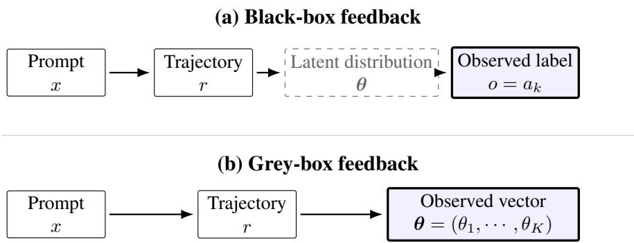
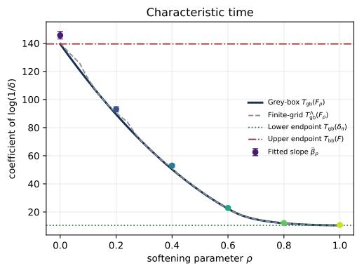
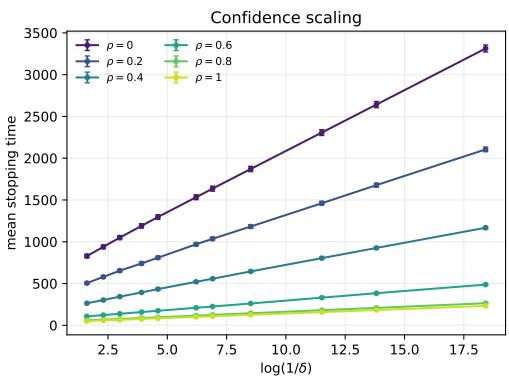
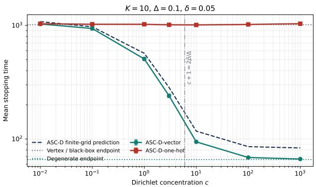
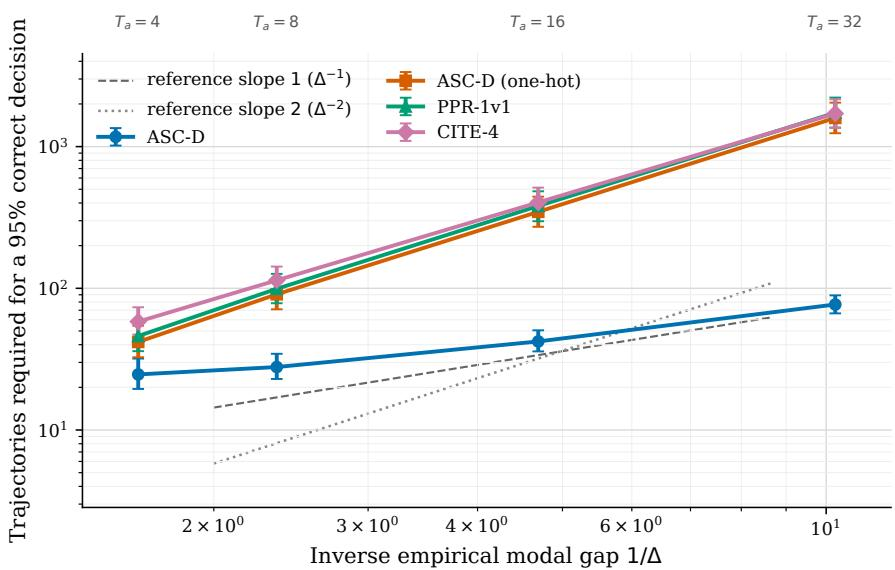

# Adaptive Self-Consistency: From Black-Box Sampling to Distribution-Valued Feedback

Jingkai Huang<sup>\*</sup>   
Stern School of Business   
New York University   
jh9959@nyu.edu   
Yunfan Zhang<sup>\*</sup>   
Stern School of Business   
New York University   
yz11751@stern.nyu.edu   
Weihua Zhou   
School of Management   
Zhejiang University   
larryzhou@zju.edu.cn

Will Ma Graduate School of Business Columbia University wm2428@gsb.columbia.edu

Zhengyuan Zhou   
Stern School of Business   
New York University   
zz26@stern.nyu.edu

## Abstract

Self-consistency samples many reasoning trajectories and aggregates their final answers, treating the LLM as a black box that returns one answer per trajectory. Yet the final answer of each trajectory is sampled from a softmax vector that is available from the model’s log-probabilities. We refer to this as the grey-box setting in which each trajectory reveals this answer distribution rather than a single draw from it. We formulate efficient inference in this setting as sequential mode identification with distribution-valued observations: sample trajectories one at a time and stop as soon as the LLM’s modal answer is identified at a prescribed confidence level. We characterize the asymptotic stopping rate of mode identification with distribution-valued observations exactly and show that it is never worse than the black-box rate. We then propose the ASC-D algorithm, a betting stopping rule that attains this asymptotic stopping rate. On MMLU-Redux, ASC-D uses 46.4–95.6% fewer trajectories than answer-only adaptive self-consistency baselines and achieves the highest fixed-budget correct-certification rate across three open-source models.

## 1 Introduction

Large language models (LLMs) have demonstrated strong performance on challenging mathematical and logical reasoning tasks. When solving a complex problem, an LLM often produces a sequence of intermediate reasoning steps before giving its final answer, a generation pattern commonly known as chain-of-thought reasoning (Wei et al., 2022; Kojima et al., 2022). Because decoding is stochastic, repeatedly querying the same LLM can produce different reasoning trajectories and different final answers. Self-consistency (SC) exploits this diversity by sampling multiple reasoning trajectories and returning their most frequent final answer (Wang et al., 2022). Because each trajectory requires a separate LLM generation, the inference cost of SC grows with its sampling budget. Standard SC fixes this budget in advance, thus it may cause a computation waste on easy problems that require only a few trajectories. Adaptive self-consistency (ASC) addresses this inefficiency by sampling trajectories sequentially and stopping once the observed answers satisfy sufficient agreement (Aggarwal et al., 2023).

Both SC and ASC retain only the final-answer label from each reasoning trajectory, which we refer to as the black-box observation model. Nevertheless, at the end of a trajectory, the probability vector from which the LLM decodes its final answer (token) is readily available and informative. Specifically, when Llama-3.2-3B-Instruct answers a four-choice ARC-Challenge question, we can read the next-token softmax over the four option tokens at the final-answer position, e.g., one recorded trajectory gives (0.26, 0.43, 0.21, 0.10) for options A–D, see Appendix B for details on how we obtain the probabilities. This raises a natural question: can such distribution-valued feedback further reduce the number of trajectories required for reliable self-consistency?

  
Figure 1: Black-box and grey-box feedback from the same reasoning process.

We address this question by introducing adaptive self-consistency with distribution-valued feedback. Figure 1 contrasts it with the black-box model. Both start from the same reasoning process: a prompt x yields a sampled trajectory r, which induces a probability vector θ over the K candidate answers. The black-box model observes only one answer label drawn from θ, whereas our setting observes the vector itself (as well as the answer label). The two settings share the same answer frequencies and the same modal answer, and differ only in how much of θ they reveal. Thus, we call our observation model grey-box. In a white-box setting, where the token-level probabilities for all possible reasoning trajectories are available, we could in principle identify the modal answer without repeated sampling by directly calculating the final answer probabilities. However, enumerating and evaluating all possible trajectories is generally infeasible. Grey-box feedback therefore offers a practical middle ground between black-box and white-box: it retains trajectory sampling while using each trajectory’s probabilities for all candidate answers.

Building on this richer observation model, we study how much grey-box feedback can reduce the number of trajectories required for reliable mode identification and whether this improvement can be attained by a practical adaptive stopping rule. We summarize our main contributions below.

1. The benefit of grey-box feedback. For general distributions of answer-probability vectors, we derive a lower bound on the asymptotic sample complexity of any algorithm and show that grey-box feedback never requires more trajectories than black-box feedback. Specifically, for small frequency gap ∆ between the modal answer and the runner-up, the sample complexity ranges from the black-box order Θ(∆<sup>−2</sup>), when every trajectory commits to a single answer, down to Θ(∆<sup>−1</sup>), when trajectories report the same beliefs.

2. An algorithm that fully realizes the benefit. We develop an algorithm for adaptive self-consistency with distribution-valued feedback (ASC-D), the grey-box counterpart of ASC. Instead of counting answer labels, ASC-D bets on pairwise differences of the probability vectors and stops once the leading answer has accumulated enough evidence against every alternative. It controls the probability of returning a non-modal answer at level δ at every stopping time, and its expected number of trajectories attains the lower bound asymptotically, without any knowledge of the distribution of the probability vectors. The gain identified above is therefore attained in full by a practical procedure.

3. Empirical validation. We validate our theoretical predictions through synthetic experiments and evaluations on MMLU-Redux. On MMLU-Redux, ASC-D uses 46.4–95.6% fewer trajectories than answer-only baselines as the modal gap narrows. Under a fixed maximum budget of $N = 1 2 8$ , it achieves the highest correct-certification rate at every tested confidence level across Llama-3.2-1B, Llama-3.1-8B, and Qwen3-1.7B.

Organization The rest of the paper is organized as follows. Section 2 reviews related literature. Section 3 presents the problem setup, derives and compares asymptotic lower bounds on the expected stopping time under different observation models. Section 4 introduces the ASC-D algorithm and its theoretical guarantees. Section 5 reports the experiment results on both synthetic and real-world datasets, and Section 6 concludes with a discussion of limitations. Appendix A provides the proof of main results in the paper. Appendix B gives a real-world example of grey-box feedback. Appendices C and D provide omitted details and additional results for the synthetic and real-world experiments, respectively.

## 2 Related Literature

Efficient and Adaptive Self-Consistency Adaptive self-consistency reduces the cost of fixed-budget self-consistency by stopping when the sampled answers show sufficient agreement (Aggarwal et al., 2023). Subsequent methods stop based on answer stability (Li et al., 2024), allocate sampling budgets using estimated question difficulty (Wang et al., 2025), or evaluate both answers and reasoning paths (Wan et al., 2025). Other approaches use scalar confidence signals to weight or filter reasoning trajectories (Taubenfeld et al., 2025; Fu et al., 2026). From a theoretical perspective, Huang et al. (2026a) and Huang (2026) compare the sample complexity of self-consistency and verifier-based best-of-N, showing a separation between their quadratic and linear dependence on the answer gap. Most closely related to our setting, Huang et al. (2026b) studies Bayesian stopping using prior information about answer frequencies, but observes only the final-answer labels. In contrast, our method does not require such prior information and instead gains efficiency by observing the full probability vector associated with each trajectory.

Sequential Mode Identification and Anytime-Valid Inference. Our problem is also related to classical sequential hypothesis testing, which studies how to make a reliable decision using as few observations as possible (Wald, 1992; Siegmund, 2013). Sequential mode identification specializes this problem to identifying the most likely outcome of an unknown discrete distribution. Shah et al. (2020) study mode identification under different oracle-query models, while Jain et al. (2022) develops an asymptotically optimal stopping rule using sampled answer labels and martingale confidence sequences. Recent work applies anytime-valid inference to LLM self-consistency: MMC certifies an absolute majority (Cordero-Encinar and Duncan, 2025), whereas CITE certifies a candidate as the unique mode and also considers scalar confidence (Ota et al., 2026). Our work extends this literature from categorical or scalar-weighted observations to probability-vector observations and characterizes the resulting optimal stopping rate.

## 3 Problem Setup

## 3.1 Distribution-Valued Feedback

For a fixed prompt x with a known set of candidate answers $\mathcal { A } = \{ a _ { 1 } , \cdots , a _ { K } \}$ , each LLM call first generates a reasoning trajectory $r _ { n }$ and then produces a final answer. Formally, conditional on $r _ { n }$ and $x ,$ , the model assigns a probability to each candidate answer, yielding the trajectory-specific distribution

$$
\pmb \theta _ { n } : = \mathbb { P } ( \cdot \mid r _ { n } , x ) \in \Delta ^ { K - 1 } , \qquad \theta _ { n , k } : = \mathbb { P } ( a _ { k } \mid r _ { n } , x ) .
$$

Standard black-box self-consistency returns only the realized answer $o _ { n } \mid \pmb { \theta } _ { n } \sim \mathrm { C a t } ( \pmb { \theta } _ { n } )$ sampled from the categorical distribution with parameter $\pmb \theta _ { n } .$ , whereas the grey-box setting observes the entire vector $\theta _ { n } .$ Because different reasoning trajectories can induce different answer distributions, these vectors may vary across calls. We write θ for a generic trajectory-specific distribution.

General Model Since trajectories are sampled independently, the vectors $( \theta _ { n } ) _ { n \geq 1 }$ are i.i.d. drawn from an unknown distribution $F$ on $\Delta ^ { K - 1 }$ . Let M denote the set of all distributions on $\Delta ^ { \overline { { K } } - 1 }$ and

$$
\pi : = \mathbb { E } _ { F } [ \pmb \theta ] = ( p _ { 1 } , \cdot \cdot \cdot , p _ { K } )
$$

for the mean vector of F. We assume throughout that F has a unique mode, and index the candidate answers so that $p _ { 1 } > p _ { 2 } \ge \dots \ge p _ { K }$ , and $a _ { 1 }$ is the modal answer. In this model, the black-box answers are i.i.d. with $\mathbb { P } ( o _ { n } = a _ { k } ) = \mathbb { E } _ { F } [ \theta _ { k } ] = p _ { k }$ . Thus, π is the answer-frequency vector of black-box self-consistency, and both observation models target the same modal answer $a _ { 1 }$

## 3.2 Sequential Mode Identification

The goal of self-consistency is to identify the modal answer $a _ { 1 }$ of the LLM, which is the answer that a majority vote over infinitely many trajectories would return. A sequential procedure samples trajectories one at a time, observes $( \pmb \theta _ { n } ) _ { n \geq 1 }$ in the grey-box setting or $( o _ { n } ) _ { n \geq 1 }$ in the black-box setting, and consists of a stopping time $\tau$ with respect to the observations together with a recommendation $\hat { a } _ { \tau }$ . Stopping is the only decision: every trajectory costs one LLM call, and the procedure should stop as soon as the mode is identified at the prescribed error probability $\delta .$

δ-PAC Procedures A procedure is δ-PAC over M if

$$
\begin{array} { r } { \mathbb { P } _ { F } ( \hat { a } _ { \tau } \ne a _ { 1 } ) \le \delta \qquad \mathrm { f o r e v e r y } \ F \in \mathcal { M } \mathrm { ~ w i t h ~ a ~ u n i q u e ~ m o d e } , } \end{array}
$$

that is, its error guarantee holds whatever the trajectories do.

Characteristic Time Following Garivier and Kaufmann (2016); Jain et al. (2022), we measure the efficiency of a δ-PAC procedure by the asymptotic constant of its expected stopping time as the confidence grows, lim $\mathrm { i n f } _ { \delta \to 0 } \mathbb { E } _ { F } [ \tau ] / \log ( 1 / \delta )$ , and define the characteristic time of $F$ as the best constant over all δ-PAC procedures,

$$
T ^ { \star } ( F ) : = \operatorname* { l i m } _ { \delta \to 0 } \operatorname* { i n f } _ { \log ( 1 / \delta ) } .
$$

By definition, every δ-PAC procedure needs at least $T ^ { \star } ( F ) \cdot \log ( 1 / \delta )$ trajectories on $F$ asymptotically before stopping. Throughout we write

$$
\Delta : = p _ { 1 } - p _ { 2 } , \qquad \bar { p } : = \frac { p _ { 1 } + p _ { 2 } } { 2 } , \qquad X _ { j } : = \theta _ { 1 } - \theta _ { j } \in [ - 1 , 1 ] \quad ( j \neq 1 ) ,\tag{1}
$$

where $\Delta$ is the gap between the top two answers and $X _ { j }$ is the margin of the mode over its j-th challenger in a single trajectory.

The Characteristic Time under Black-Box In the black-box setting, the observations are i.i.d. $\operatorname { C a t } ( \pi )$ whatever the law $F ,$ so the procedure sees only $\pi .$ . Shah et al. (2020); Jain et al. (2022) show that the characteristic time of mode identification from categorical samples is

$$
T _ { \mathrm { b b } } ( F ) : = \frac { 1 } { p _ { 1 } \cdot \log \frac { 2 p _ { 1 } } { p _ { 1 } + p _ { 2 } } + p _ { 2 } \cdot \log \frac { 2 p _ { 2 } } { p _ { 1 } + p _ { 2 } } } = \frac { 4 \bar { p } } { \Delta ^ { 2 } } \cdot \bigl ( 1 + O ( \Delta ^ { 2 } ) \bigr ) ,\tag{2}
$$

where the expansion holds as $\Delta  0$ , see Appendix A for details. We write $T _ { \mathrm { b b } } ( F )$ for this black-box characteristic time, which depends on $F$ only through $\pmb { \pi } = \mathbb { E } _ { F } [ \pmb { \theta } ]$ . The denominator is the Kullback–Leibler divergence from $\operatorname { C a t } ( \pi )$ to the closest categorical law in which $a _ { 2 }$ ties with $a _ { 1 } { \mathrm { : } }$ ; the quadratic dependence on $\Delta$ is the price of resolving a small gap from the hard votes. Since grey-box feedback can always be reduced to black-box feedback by drawing $o \sim \operatorname { C a t } ( \pmb \theta )$ , (2) is an upper bound on the grey-box characteristic time. Whether, and by how much, grey-box feedback improves on this bound is the question we turn to next.

## 3.3 Asymptotic Lower Bounds

How much the grey-box feedback gain depends on how the probability vectors spread around their mean $\pi .$ and two extreme laws with this mean bracket the possibilities. At one end, the degenerate law $\delta _ { \pi }$ puts all its mass at π: every trajectory reports the same beliefs. At the other end, the vertex law $\begin{array} { r } { F _ { 0 } : = \sum _ { k = 1 } ^ { K } p _ { k } \cdot \delta _ { \pmb { e } _ { k } } } \end{array}$ puts $\pmb \theta$ at a vertex of the simplex with probability $p _ { k } \colon$ every trajectory commits to one answer, and $\pmb \theta$ carries no more information than the sampled label $o .$ The following theorem gives the grey-box characteristic time for a general F and shows that these two laws are exactly the two extremes of the characteristic time.

Theorem 3.1 (Asymptotic Lower Bound under Grey-box Feedback). For every δ-PAC procedure and every $F \in { \mathcal { M } }$ with a unique mode, under the grey-box feedback model,

$$
\operatorname* { l i m i n f } _ { \delta \to 0 } \frac { \mathbb { E } _ { F } [ \tau ] } { \log ( 1 / \delta ) } \geq T _ { \mathrm { g b } } ( F ) : = \frac { 1 } { \operatorname* { m i n } _ { j = 2 , \cdots , K } { \mathcal G } _ { j } ( F ) } , \quad \mathcal G _ { j } ( F ) : = \operatorname* { m a x } _ { \lambda \in [ 0 , 1 ] } \mathbb { E } _ { F } \left[ \log \left( 1 + \lambda \cdot ( \theta _ { 1 } - \theta _ { j } ) \right) \right] .\tag{3}
$$

where we use $T _ { \mathrm { g b } } ( F )$ to denote the characteristic timefor distribution F under the grey-boxfeedback model. Moreover,

$$
T _ { \mathrm { g b } } ( \delta _ { \pi } ) = \frac { 1 } { \log ( 1 + \Delta ) } \le T _ { \mathrm { g b } } ( F ) \le T _ { \mathrm { g b } } ( F _ { 0 } ) = T _ { \mathrm { b b } } ( F ) ,\tag{4}
$$

i.e., the two endpoints are the grey-box characteristic times ofthe degenerate law and the vertex law, the most and the least consistent laws with the same answerfrequencies.

For the first part of the theorem: a standard change-of-measure argument (Kaufmann et al., 2016) gives a lower bound through KL minimization over alternative distributions (in which $a _ { 1 }$ is not the unique mode). Making a competitor $a _ { j }$ at least as likely as $a _ { 1 }$ is equivalent to making the mean of $X _ { j } = \theta _ { 1 } - \theta _ { j }$ nonpositive. We show that it suffices to optimize over distributions of this margin. By utilizing the dual representation of Honda and Takemura (2015), we then turn this infinite-dimensional optimization over probability distributions into the one-dimensional maximization over $\lambda \in [ 0 , 1 ]$ in (3). Thus, $\mathcal { G } _ { j } ( F )$ is the minimum KL divergence needed for $a _ { j }$ to be at least as likely as $a _ { 1 }$ , and the hardest competitor determines the characteristic time. The sandwich bound in (4) can then be derived simply through the Jensen’s inequality.

The Value of the Grey-Box Observation Model Under the vertex law $F _ { 0 }$ , every trajectory commits to a single answer and the grey-box observation carries no more information than the sampled answer; accordingly $T _ { \mathrm { g b } } ( F _ { 0 } ) = T _ { \mathrm { b b } } ( F )$ , and the upper bound is attained exactly at this black-box endpoint. Any law that keeps mass away from the vertices stops strictly faster. The gain is bounded, however. Even when every trajectory reports π exactly, a δ-PAC procedure cannot exclude the law that agrees with $\delta _ { \pi }$ on a fraction $1 / ( 1 + \Delta )$ of the trajectories and commits to $a _ { 2 }$ on the rest, whose divergence from $\delta _ { \pi }$ is $\log ( 1 + \Delta )$ , and it says that without further assumptions the dependence on the gap improves from $\Theta ( \Delta ^ { - 2 } )$ to at best $\Theta ( \Delta ^ { - 1 } )$ .

Connection with Best-of-N Best-of-N is another widely applied method for test-time compute, which samples N trajectories and selects the answer with the highest verifier score (Cobbe et al., 2021). With an ideal verifier, it succeeds whenever a correct answer appears among the samples. Assuming that the modal answer is correct, Huang (2026) show that the worst-case sample complexity scales as $\Theta ( \Delta ^ { - 1 } )$ for best-of-N, compared with $\Theta ( \Delta ^ { - 2 } )$ for self-consistency.

In contrast, our Theorem 3.1 shows that, at the degenerate law $\delta _ { \pi }$ , grey-box self-consistency has characteristic time $1 / \log ( 1 + \Delta ) = \Theta ( \Delta ^ { - 1 } )$ . Thus, maximally consistent grey-box feedback yields the same linear inverse-gap dependence as the worst-case benchmark for ideal best-of-N, using the LLM’s own answer probabilities available under our distribution-valued observation model, without training or evaluating a separate verifier.

Connection with Confidence-Weighted ASC Between the black-box and grey-box observation models lies confidence-weighted self-consistency (Taubenfeld et al., 2025; Fu et al., 2026; Ota et al., 2026), in which each trajectory reveals its sampled answer together with the confidence it assigns to that answer. We formalize this feedback as observing the sampled answer together with its conditional probability given the reasoning trajectory:

$$
o \mid \theta \sim \operatorname { C a t } ( \theta ) , \qquad w : = \theta _ { o } \in ( 0 , 1 ] .
$$

The pair $( o , w )$ can be generated from $\pmb \theta$ and reduces to o once w is dropped. Thus, when all three feedback models are used to identify the same modal answer $a _ { 1 }$ , the reduction argument of Section 3.2 places the confidence-feedback characteristic time between the black-box and grey-box times. The following proposition characterizes this intermediate rate, where we write $Q _ { F }$ for the law of $( o , w )$ for $\theta \sim F$

Proposition 3.1 (Asymptotic Lower Bound under Confidence Feedback). For every $F \in { \mathcal { M } }$ with unique mode $a _ { 1 }$ , any procedure that observes $( o , w )$ and is δ-PAC over M satisfies:

$$
\operatorname* { l i m i n f } _ { \delta \to 0 } \frac { \mathbb { E } _ { F } [ \tau ] } { \log ( 1 / \delta ) } \geq T _ { \mathrm { c w } } ( F ) : = \left[ \operatorname* { m i n } _ { \substack { j \neq 1 } } \operatorname* { i n f } _ { F ^ { \prime } \in \mathcal { M } : \mathbb { E } _ { F ^ { \prime } } [ \theta _ { j } ] \geq \mathbb { E } _ { F ^ { \prime } } [ \theta _ { 1 } ] } \mathrm { D } _ { \mathrm { K L } } ( Q _ { F } \| Q _ { F ^ { \prime } } ) \right] ^ { - 1 } .\tag{5}
$$

Moreover, $T _ { \mathrm { g b } } ( F ) \leq T _ { \mathrm { c w } } ( F ) \leq T _ { \mathrm { b b } } ( F )$

Proposition 3.1 shows that confidence feedback can reduce the characteristic time relative to observing only the sampled answer, while revealing the full answer distribution can yield a further reduction.

The Gain under Dirichlet Heterogeneity To further quantify these gains, we now consider a Dirichlet model. We hold the answer frequencies π fixed and vary a single concentration parameter $^ { c , }$ which controls the agreement across trajectories. This lets us compare all three characteristic times on the same family of instances.

Assumption 1 (Dirichlet Heterogeneity). Assume $F = \mathrm { D i r } ( c \pi ) f o r$ a concentration $c > 0 , i . e . , \theta \sim$ Dir $( c p _ { 1 } , \cdot \cdot \cdot , c p _ { K } )$

Under Assumption 1, we still have $\mathbb { E } [ \theta _ { k } ] = p _ { k }$ and

$$
\operatorname { V a r } ( \theta _ { k } ) = { \frac { p _ { k } \cdot ( 1 - p _ { k } ) } { c + 1 } } , \qquad \operatorname { C o v } ( \theta _ { k } , \theta _ { j } ) = - { \frac { p _ { k } \cdot p _ { j } } { c + 1 } } \quad ( k \neq j ) .\tag{6}
$$

The parameter c measures how much the trajectories agree with one another. As $c \to \infty , F$ converges to the degenerate law $\delta _ { \pi }$ , and as $c \to 0$ it converges to the vertex law $F _ { 0 }$ . Between the two endpoints, (6) shows that observing $\theta _ { k }$ instead of the one-hot coordinate of $^ { O , }$ whose variance is $p _ { k } ( 1 - p _ { k } )$ , reduces the variance by exactly the factor $c + 1$

Assumption 1 makes the gain explicit through the single parameter $c ,$ interpolates between the black-box endpoint $F _ { 0 }$ and the fully consistent endpoint $\delta _ { \pi }$ . Besides, although $T _ { \mathrm { g b } } ( \mathrm { D i r } ( c \pi ) )$ still has no closed form for general π, in the hard regime $p _ { 1 } \approx p _ { 2 }$ it reduces to the black-box constant divided by a single factor, as shown in the following proposition.

Proposition 3.2 (Characteristic Time under the Dirichlet Assumption). Let $F = \operatorname { D i r } ( c { \boldsymbol { \pi } } )$ . Fix $c > 0 ,$ , p¯ and $( p _ { 3 } , \cdots , p _ { K } )$ , and let $\Delta \to 0$ . Then

$$
T _ { \mathrm { g b } } ( F ) = \frac { T _ { \mathrm { b b } } ( F ) } { c + 1 } \cdot \big ( 1 + O ( \Delta ) \big ) ,\tag{7}
$$

and the maximizer in (3) is $\begin{array} { r } { \lambda ^ { \star } = \frac { ( c + 1 ) \Delta } { 2 \bar { p } } \cdot \left( 1 + O ( \Delta ) \right) f o r j = 2 . } \end{array}$ . For fixed $\Delta$ and $c  \infty , T _ { \mathrm { g b } } ( F ) $ $1 / \log ( 1 + \Delta )$

The following table compares the three feedback models on the same Dirichlet instances. Confidence feedback gives an intermediate gain, with a substantial gap from grey-box feedback at moderate c. Besides, the approximation $T _ { \mathrm { b b } } ( F ) / ( c + 1 )$ closely matches $T _ { \mathrm { g b } } ( F )$ for small c. As c increases, however, the approximation tends to zero, while $T _ { \mathrm { g b } } ( F )$ approaches the limit $1 / \log ( 1 + \Delta )$

Table 1: Characteristic times for $F = \operatorname { D i r } ( c { \boldsymbol { \pi } } )$ with $\pmb { \pi } = ( 0 . 4 , 0 . 3 , 0 . 2 , 0 . 1 )$ . For all $c , T _ { \mathrm { b b } } ( F ) = 1 3 9 . 5 2$ and $1 / \log ( 1 + \Delta ) = 1 0 . 4 9$ . The values of $T _ { \mathrm { c w } } ( F )$ and $T _ { \mathrm { g b } } ( F )$ are computed numerically through simulation. The last row is the fixed-c, small-gap approximation in (7).
<table><tr><td>C</td><td>0.01</td><td>0.1</td><td>1</td><td>2</td><td>3</td><td>5</td><td>10</td><td>20</td><td>50</td><td>100</td><td>1000</td></tr><tr><td> $T _ { \mathrm { c w } } ( F )$ </td><td>139.52</td><td>139.50</td><td>138.22</td><td>125.66</td><td>109.15</td><td>84.99</td><td>55.76</td><td>33.70</td><td>15.62</td><td>11.85</td><td>10.76</td></tr><tr><td> $T _ { \mathrm { g b } } ( F )$ </td><td>138.15</td><td>126.95</td><td>70.33</td><td>47.24</td><td>35.70</td><td>24.17</td><td>15.01</td><td>12.34</td><td>11.16</td><td>10.82</td><td>10.52</td></tr><tr><td> $T _ { \mathrm { b b } } ( F ) / ( c + 1 )$ </td><td>138.14</td><td>126.84</td><td>69.76</td><td>46.51</td><td>34.88</td><td>23.25</td><td>12.68</td><td>6.64</td><td>2.74</td><td>1.38</td><td>0.14</td></tr></table>

## 4 The ASC-D Algorithm

## 4.1 From the Rate to the Algorithm

The rate in Theorem 3.1 tells us which statistic to compute: Consider a gambler who starts with wealth 1 and, on every trajectory i, bets a fraction λ of his wealth on $^ { 6 6 } a _ { k }$ beats $\boldsymbol { a } _ { j } \ '$ , receiving $1 + \lambda \cdot ( \theta _ { i , k } - \theta _ { i , j } )$ per unit bet. After n trajectories his wealth is

$$
W _ { n } ^ { ( k , j ) } ( \lambda ) : = \prod _ { i = 1 } ^ { n } \big ( 1 + \lambda \cdot ( \theta _ { i , k } - \theta _ { i , j } ) \big ) , \qquad \lambda \in [ 0 , 1 ) ,\tag{8}
$$

which is nonnegative because $\theta _ { i , k } - \theta _ { i , j } \geq - 1$ , and $\mathcal { G } _ { j } ( F )$ is the best expected log-wealth per trajectory of the bet on $^ { 6 6 } a _ { 1 }$ beats $\boldsymbol { a } _ { j } \ '$ . The process has the two properties a stopping statistic needs.

Validity at Stopping Time If $a _ { k }$ does not beat $a _ { j } , \mathrm { i . e . , } \mathbb { E } _ { F } [ \theta _ { k } - \theta _ { j } ] \leq 0 \mathrm { ~ }$ , then $\mathbb { E } _ { F } [ 1 + \lambda ( \theta _ { i , k } - \theta _ { i , j } ) ] \leq 1$ so (8) is a nonnegative supermartingale with initial value 1, and Ville’s inequality gives

$$
\mathbb { P } _ { F } \Big ( \operatorname* { s u p } _ { n \geq 1 } W _ { n } ^ { ( k , j ) } ( \lambda ) \geq \frac { 1 } { \alpha } \Big ) \leq \alpha .
$$

Wealth above $1 / \alpha$ is therefore evidence at level α that $a _ { k }$ beats $a _ { j }$ , and the guarantee holds uniformly over time, which is what a data-dependent stopping rule requires.

Growth at the Optimal Rate $\operatorname { I f } a _ { 1 }$ beats $a _ { j }$ , the law of large numbers gives $\frac { 1 } { n }$ log $W _ { n } ^ { ( 1 , j ) } ( \lambda ) \to \mathbb { E } _ { F } [ \log ( 1 +$ $\lambda ( \theta _ { 1 } - \theta _ { j } ) ) ]$ , so at the optimal fraction the wealth grows at rate $\mathcal { G } _ { j } ( F )$ and crosses $1 / \delta$ after $\log ( 1 / \delta ) / \mathcal { G } _ { j } ( F )$ trajectories, as illustrated by Theorem 3.1.

However, we note that two quantities in this argument are unknown to the procedure: the optimal fraction λ and the modal answer itself.

Unknown Optimal Fraction The optimal fraction depends on F. As F is itself unknown, we consider to average the wealth over a finite grid $\Lambda \subset [ 0 , 1 )$ ,

$$
\overline { { W } } _ { n } ^ { ( k , j ) } : = \frac { 1 } { | \Lambda | } \sum _ { \lambda \in \Lambda } W _ { n } ^ { ( k , j ) } ( \lambda ) .\tag{9}
$$

A convex combination of supermartingales is a supermartingale, so validity is preserved, and log $\overline { { W } } _ { n } ^ { ( k , j ) } \geq$ ma $\zeta _ { \lambda \in \Lambda }$ log $W _ { n } ^ { ( k , j ) } ( \lambda ) { - } \log | \Lambda |$ , so the averaged wealth grows at the best rate on the grid, max $\mathtt { \backslash } \lambda \in \Lambda  \mathbb { E } _ { F } [ \log ( 1 +$ $\lambda ( \theta _ { 1 } - \theta _ { j } ) ) ]$ ], only at the price of a constant that does not affect the rate. The choice of the grid will be discuss in the following subsection.

Unknown Mode Answer As the algorithm cannot know in advance which answer to bet on $( \mathrm { i . e . }$ , which answer is the modal answer), so it calculates (9) for every ordered pair $( k , j )$ . The current leader is the answer with the largest cumulative mass $\begin{array} { r } { S _ { n , k } : = \sum _ { i < n } \theta _ { i , k } } \end{array}$ , the grey-box counterpart of the plurality vote, and the procedure stops once the leader’s averaged wealth against every challenger exceeds $( K - 1 ) / \delta$ . An error means that some $a _ { k } \neq a _ { 1 }$ is returned, which requires $\overline { { W } } _ { n } ^ { ( k , 1 ) } \geq ( K - 1 ) / \delta$ for a pair in which $a _ { k }$ does not beat $a _ { 1 }$ . As each of these $K - 1$ events has probability at most $\delta / ( K - 1 )$ by Ville’s inequality, and a union bound to the $K - 1$ components then gives the error probability δ.

Algorithm 1 provides the detailed procedure. If we use only the sampled answer from each trajectory instead of its full answer distribution, ASC-D reduces to the known-K adaptation of CITE (Ota et al., 2026). Using full answer distributions allows ASC-D to also use the probabilities assigned to answers that were not sampled. Our later analysis will quantify this information gain and shows that ASC-D attains the optimal characteristic time $T _ { \mathrm { g b } } ( F )$ with a properly designed betting grid.

## 4.2 Performance Guarantees

Design of the Grid The grid Λ should approximate each challenger’s optimal betting fraction $\lambda _ { j } ^ { \star }$ in (3). Two insights guide its design (see Appendix A for details). (i) The middle can be coarse; (ii) Both ends should be dense. We therefore utilize the geometric grid

$$
\Lambda _ { r , m } : = \{ r ^ { - i } : \ i = 1 , \cdots , m \} \cup \big \{ 1 - r ^ { - i } : \ i = 1 , \cdots , m \big \} , \qquad r > 1 , \ m \in \mathbb { N } .\tag{10}
$$

```latex
Algorithm 1 ASC-D: adaptive self-consistency with distribution-valued feedback
Require: prompt x, candidate answers $\{ a _ { 1 } , \cdots , a _ { K } \}$ , confidence $\delta ,$ grid $\Lambda .$
1: $\ell _ { k , j } ( \lambda ) \gets 0$ for all $k \neq j$ and $\lambda \in \Lambda ; \ S _ { k } \gets 0$ for all k
2: for $n = 1 , 2 , \cdots$ do
3: sample a trajectory $r _ { n } \sim \mathbb { P } ( { \cdot } \mid x )$ and read off $\theta _ { n } = \mathbb { P } ( \cdot \mid r _ { n } , x )$ over the candidate set
4: $S _ { k } \gets S _ { k } + \theta _ { n , k }$ for all k ▷ cumulative mass of each answer
5: $\ell _ { k , j } ( \lambda )  \ell _ { k , j } ( \lambda ) + \log ( 1 + \lambda \cdot ( \theta _ { n , k } - \theta _ { n , j } ) )$ for all $k \neq j$ and $\lambda \in \Lambda$
6: $\hat { k } \gets \arg \operatorname* { m a x } _ { k } S _ { k }$ ▷ current leader
7: log $\begin{array} { r } { \overline { { W } } _ { j }  \log \frac { 1 } { | \Lambda | } \sum _ { \lambda \in \Lambda } \exp ( \ell _ { \hat { k } , j } ( \lambda ) ) } \end{array}$ for all $j \neq \hat { k }$ ▷ averaged against each challenger
8: if min $\scriptstyle { j \neq { \hat { k } } }$ log $\begin{array} { r } { \dot { \overline { W } } _ { j } \geq \log \frac { K - 1 } { \delta } } \end{array}$ then
9: return $a _ { \hat { k } }$
10: end if
11: end for
```

Asymptotic Upper Bound of ASC-D Define

$$
\mathcal { G } _ { j } ^ { \Lambda } ( F ) : = \operatorname* { m a x } _ { \lambda \in \Lambda } \mathbb { E } _ { F } \big [ \log \big ( 1 + \lambda \cdot ( \theta _ { 1 } - \theta _ { j } ) \big ) \big ] , \qquad T _ { \mathrm { g b } } ^ { \Lambda } ( F ) : = \frac { 1 } { \operatorname* { m i n } _ { j \neq 1 } \mathcal { G } _ { j } ^ { \Lambda } ( F ) } ,\tag{11}
$$

The following theorem provides the performance guarantees of Algorithm 1.

```latex
Theorem 4.1 (Performance Guarantees of ASC-D). Let $( \tau ^ { \mathrm { D } } , \hat { a } _ { \tau ^ { \mathrm { D } } } )$ be the stopping time and the output of
Algorithm 1 with grid $\Lambda \subset [ 0 , 1 )$ , then for every $\delta \in ( 0 , 1 ) , \mathbb { P } _ { F } ( \tau ^ { \mathrm { D } } < \infty , \hat { a } _ { \tau ^ { \mathrm { D } } } \neq a _ { 1 } ) \leq \delta .$
(i) Let $\Lambda = \Lambda _ { r , m }$ with $r ^ { - m } \leq \mathrm { m i n } _ { j \neq 1 } \lambda _ { j } ^ { \star }$ . We have lim sup<sub>δ</sub> $\begin{array} { r } { \Rightarrow \frac { \mathbb { E } _ { F } [ \tau ^ { \mathrm { D } } ] } { \log ( 1 / \delta ) } \leq T _ { \mathrm { g b } } ^ { \Lambda } ( F ) \leq r \cdot T _ { \mathrm { g b } } ( F ) . } \end{array}$
(ii) Let $\Lambda = \Lambda _ { r _ { \delta } , m _ { \delta } }$ with $r _ { \delta } : = 1 + \big ( \log ( 1 / \delta ) \big ) ^ { - 1 / 4 }$ , and $m _ { \delta } : = \lceil ( \log ( 1 / \delta ) ) ^ { 1 / 2 } \rceil$ . We have
E<sub>F</sub>[τ<sup>D</sup>]
lim sup ≤ T<sub>gb</sub>(F). (12)
δ→0 log(1/δ)
```

Together with Theorem 3.1, (12) gives, for every $F$ with a unique mode, lim $\begin{array} { r } { \{ \xi \to 0 \ \frac { \mathbb { E } _ { F } [ \tau ^ { \mathrm { D } } ] } { \log ( 1 / \delta ) } = T _ { \mathrm { g b } } ( F ) } \end{array}$ Thus, ASC-D can attain the optimal characteristic time of distribution-valued feedback exactly.

## 5 Experiments

We evaluate whether distribution-valued feedback improves the sample efficiency of mode identification in both synthetic and real-world settings. In both settings, all methods target the same population mode and are evaluated on the same trajectories. We test sample efficiency in two ways: the number of generations needed to certify the mode at a fixed confidence level $( \mathrm { i . e . }$ , the stopping time), and the probability of correct certification of the mode within a fixed maximum trajectory budget N $( \mathrm { i . e . , } \mathbb { P } ( \hat { a } _ { \tau } = a _ { 1 } , \tau \leq N ) )$ . Section 5.1 studies the effect of the feedback type in synthetic datasets, and Section 5.2 tests whether the same gains persist on the probability vectors generated from live LLM calls.

Code, stored probability vectors and trajectories, and experiment scripts are available at https:// anonymous.4open.science $/ \Sigma / \mathrm { I C L R } 2 0 2 7 - \mathbb { A } \mathrm { S C D } - 7 \mathbb { B } 0 9 / $

## 5.1 Controlled Comparison of Feedback Types

We set $K = 4$ and consider ${ \pmb \pi } _ { \Delta } = ( 0 . 3 5 + \Delta / 2 , 0 . 3 5 - \Delta / 2 , 0 . 1 5 , 0 . 1 5 )$ , where $0 < \Delta \le 0 . 4$ is the probability gap between the top-two answers. At each time t, we draw $Z _ { t } \sim \mathrm { C a t } ( \pi _ { \Delta } )$ , form $\begin{array} { r l } { \pmb { \theta } _ { t } } & { { } = } \end{array}$ $\begin{array} { r } { \frac { 1 } { 2 } e _ { Z _ { t } } + \frac { 1 } { 2 } \pi _ { \Delta } } \end{array}$ , and sample $Y _ { t } \mid \pmb { \theta } _ { t } \sim \mathrm { C a t } ( \pmb { \theta } _ { t } )$ . This construction gives $\mathbb { E } [ \pmb { \theta } _ { t } ] = \pmb { \pi } _ { \Delta }$ and $Y _ { t } \sim \mathrm { C a t } ( \pi _ { \Delta } )$ . We compare the ASC-D with observation of $\theta _ { t } ,$ a confidence-weighted variant using $\theta _ { t , Y _ { t } } \cdot e _ { Y _ { t } }$ , and CITE-4 (Ota et al., 2026) using $e _ { Y _ { t } }$ and its native certification rule. All procedures use the same 15-point grid, and we run 10,000 paired replays per condition.

Table 2: Controlled comparison of feedback types.  
(a) Mean stopping time under $1 - \delta = 0 . 9 5$
<table><tr><td> $\Delta$ </td><td>ASC-D</td><td>Conf.-wt.</td><td>CITE-4</td></tr><tr><td>0.10</td><td>188.42</td><td>444.57</td><td>907.72</td></tr><tr><td>0.20</td><td>46.20</td><td>99.21</td><td>231.54</td></tr><tr><td>0.30</td><td>26.79</td><td>46.58</td><td>109.82</td></tr><tr><td>0.40</td><td>20.62</td><td>32.12</td><td>71.72</td></tr></table>

(b) Correct-certification rate under $\Delta = 0 . 1$
<table><tr><td>1−δ</td><td>ASC-D</td><td>Conf.-wt.</td><td>CITE-4</td></tr><tr><td>0.90</td><td>98.44%</td><td>71.37%</td><td>30.86%</td></tr><tr><td>0.95</td><td>97.49%</td><td>62.49%</td><td>24.22%</td></tr><tr><td>0.975</td><td>96.40%</td><td>54.83%</td><td>18.38%</td></tr><tr><td>0.99</td><td>94.23%</td><td>45.11%</td><td>12.73%</td></tr></table>

Table 2(a) shows that under the 95% confidence level, ASC-D uses 35.8–57.6% fewer than the confidenceweighted method, and 71.3–80.1% fewer than CITE-4, with larger savings at smaller gaps. For the harder setting $\Delta = 0 . 1$ with a maximum trajectory budget of $N = 5 1 2$ , Table 2(b) shows that ASC-D correctly certifies the mode in 94.23–98.44% of trials across the tested confidence levels, substantially more often than the reduced-feedback methods. Note that the correct-certification rate decreases as the confidence requirement 1 − δ becomes stricter, since the fixed budget constraint leaves less time to accumulate the required evidence. Together, these results establish ASC-D as the most sample-efficient among the evaluated methods. Appendix C further validates ASC-D’s characteristic-time scaling and the concentration-dependent gain in Proposition 3.2.

## 5.2 Real-World Experiments

Exp. 1: Required number of trajectory generations across modal gaps. For each of 120 MMLU-Redux questions, we use 256 Qwen3-1.7B trajectories and rescale their stored answer logits with $T _ { a } \in \{ 4 , 8 , 1 6 , 3 2 \}$ where larger $T _ { a }$ flattens the vectors and narrows the modal gap. At each temperature, the rescaled vectors define the empirical population $\widehat { F } = 2 5 6 ^ { - 1 } \textstyle \sum _ { i = 1 } ^ { 2 5 6 } \delta _ { \pmb { \theta } _ { i } }$ , with mean $\textstyle { \widehat { \pmb { \pi } } } = 2 5 6 ^ { - 1 } \sum _ { i = 1 } ^ { 2 5 6 } { \pmb { \theta } } _ { i } .$ , mode index $a ^ { \star } =$ arg max πb , and modal gap $\Delta = \widehat { \pi } _ { a ^ { \star } } - \operatorname* { m a x } _ { j \neq a ^ { \star } } \widehat { \pi } _ { j }$ . We then run 500 paired replays by sampling uniformly from $\widehat F$ . ASC-D observes $\pmb \theta _ { t } ;$ its matched one-hot ablation observes $e _ { Y _ { t } }$ with $Y _ { t } \mid \pmb { \theta } _ { t } \sim \mathrm { C a t } ( \pmb { \theta } _ { t } )$ ; CITE-4 and PPR-1v1 (Jain et al., 2022) observe the same $Y _ { t }$ . The number of trajectory generation (Num. Gen.) is the stopping time for each method under confidence level 95%, and answer accuracy (Ans. Acc.) is evaluated against the correct answer. We observe benefits of our ASC-D over other benchmarks among all the 120 questions. Specifically, we focus on the $^ { 9 0 }$ questions that retain the same ordered top-two answers across temperatures and for which every method attains the 95% success target within the maximum budget of 32,768 trajectories. Table 3 reports the corresponding results on these 90 questions.

The results yield two main findings. First, as $T _ { a }$ increases from 4 to 32, the geometric-mean gap decreases from 0.610 to 0.098, and ASC-D’s advantage grows. It uses 41.0–95.2% fewer trajectories than its matched one-hot ablation, 46.4–95.6% fewer than PPR-1v1, and 57.6–95.5% fewer than CITE-4. Because full-vector and one-hot ASC-D use the same stopping rule and differ only in the observed feedback, their comparison isolates the benefit of distribution-valued feedback. These savings come without a loss in answer accuracy.

Second, regressing each question’s log required budget on $\log ( 1 / \Delta )$ gives a median slope of 0.766 for ASC-D, versus 1.969, 1.966, and 1.854 for its one-hot ablation, PPR-1v1, and CITE-4, respectively. This finite-range comparison supports the predicted near-linear rather than quadratic dependence on the inverse gap, and that the ASC-D slope below one is not an asymptotic claim. Appendix D reports bootstrap confidence intervals and the corresponding log–log plot.

Table 3: Number of trajectory generations required for 95% confidence and the answer accuracy on the 90 common questions. Here, $\Delta _ { \mathrm { g e o } }$ denotes the geometric mean of the modal gap.
<table><tr><td></td><td></td><td colspan="2">ASC-D</td><td colspan="2">ASC-D (one-hot)</td><td colspan="2">PPR-1v1</td><td colspan="2">CITE-4</td></tr><tr><td> $T _ { a }$ </td><td> $\Delta _ { \mathrm { g e o } }$ </td><td></td><td></td><td></td><td></td><td></td><td>Num. Gen. Ans. Acc. Num. Gen. Ans. Acc. Num. Gen. Ans. Acc. Num. Gen. Ans. Acc.</td><td></td><td></td></tr><tr><td>4</td><td>0.61</td><td>24.67</td><td>72.51%</td><td>41.82</td><td>71.83%</td><td>46.05</td><td>71.65%</td><td>58.19</td><td>71.70%</td></tr><tr><td>8</td><td>0.42</td><td>27.82</td><td>72.40%</td><td>90.73</td><td>70.97%</td><td>99.21</td><td>70.92%</td><td>113.92</td><td>70.94%</td></tr><tr><td></td><td>160.21</td><td>42.17</td><td>72.36%</td><td>346.55</td><td>70.78%</td><td>380.76</td><td>70.77%</td><td>403.87</td><td>70.78%</td></tr><tr><td>32</td><td>0.10</td><td>76.87</td><td>72.16%</td><td>1593.49</td><td>70.73%</td><td>1732.97</td><td>70.74%</td><td>1711.74</td><td>70.74%</td></tr></table>

Exp. 2: Correct certification within a fixed budget. At the natural answer temperature $T _ { a } = 1$ , we fix the maximum budget at $N = 1 2 8$ and evaluate the same 90 MMLU-Redux questions used in Exp. 1 across Qwen3-1.7B, Llama-3.2-1B, and Llama-3.1-8B. For each model and question, the first 128 probability vectors define ${ \widehat { F } } , { \widehat { \pi } } .$ and $a ^ { \star }$ as in Exp. 1. We run 200 paired replays at $1 - \delta \in \{ 0 . 9 5 , 0 . 9 7 5 , 0 . 9 9 \}$ . At each step, we sample $\theta _ { t }$ uniformly from $\widehat F$ and draw $Y _ { t } \mid \pmb { \theta } _ { t } \sim \mathrm { C a t } ( \pmb { \theta } _ { t } )$ . ASC-D observes $\pmb \theta _ { t } ,$ , while CITE-4 and PPR-1v1 observe the matched draw $Y _ { t } .$ A replay succeeds only if the method stops within the fixed maximum budget and returns $a ^ { \star }$

Table 4: Correct-certification rate within $N = 1 2 8$ trajectories on the 90 common questions.
<table><tr><td>Model</td><td>Method</td><td> $1 - \delta = 0 . 9 5$ </td><td> $1 - \delta = 0 . 9 7 5$ </td><td> $1 - \delta = 0 . 9 9$ </td></tr><tr><td rowspan="3">Llama-3.2-1B</td><td>ASC-D</td><td>56.57%</td><td>53.38%</td><td>49.83%</td></tr><tr><td>CITE-4</td><td>37.51%</td><td>35.21%</td><td>32.93%</td></tr><tr><td>PPR-1v1</td><td>36.11%</td><td>34.14%</td><td>31.94%</td></tr><tr><td rowspan="3">Llama-3.1-8B</td><td>ASC-D</td><td>80.62%</td><td>78.84%</td><td>76.44%</td></tr><tr><td>CITE-4</td><td>71.69%</td><td>69.48%</td><td>66.94%</td></tr><tr><td>PPR-1v1</td><td>70.34%</td><td>68.34%</td><td>66.01%</td></tr><tr><td rowspan="3">Qwen3-1.7B</td><td>ASC-D</td><td>90.75%</td><td>89.83%</td><td>88.77%</td></tr><tr><td>CITE-4</td><td>89.29%</td><td>88.39%</td><td>87.44%</td></tr><tr><td>PPR-1v1</td><td>88.69%</td><td>87.97%</td><td>87.03%</td></tr></table>

Table 4 shows that ASC-D achieves the highest correct-certification rate for every model and confidence level. Its advantage is largest on Llama-3.2-1B, where it exceeds CITE-4 and PPR-1v1 by up to 19.06 percentage points and 20.46 percentage points, respectively, highlighting the value of distribution-valued feedback.

## 6 Conclusion and Limitations

In this paper, we show that observing the LLM’s probabilities for all candidate answers on each trajectory can reduce the number of trajectories needed to identify the LLM’s most consistent answer. Our analysis characterizes the optimal asymptotic rate and proposes ASC-D, an algorithm that attains this rate with a suitable betting grid.

The limitations of this work are as follows: (i) ASC-D identifies the LLM’s most consistent answer, which need not be the correct answer, and therefore inherits self-consistency’s failure mode when the model is confidently wrong; (ii) the method requires log-probabilities over a finite candidate set, covering multiple-choice and short-answer tasks with specified candidates but not directly open-ended generation with an unbounded answer space; and (iii) our experiments are limited to small open-source models and multiple-choice benchmarks, with evaluation on larger models and open-ended reasoning tasks left for future work.

## References

Pranjal Aggarwal, Aman Madaan, Yiming Yang, et al. Let’s sample step by step: Adaptive-consistency for efficient reasoning and coding with llms. In Proceedings of the 2023 Conference on Empirical Methods in Natural Language Processing, pages 12375–12396, 2023.

Karl Cobbe, Vineet Kosaraju, Mohammad Bavarian, Mark Chen, Heewoo Jun, Lukasz Kaiser, Matthias Plappert, Jerry Tworek, Jacob Hilton, Reiichiro Nakano, et al. Training verifiers to solve math word problems. arXiv preprint arXiv:2110.14168, 2021.

Paula Cordero-Encinar and Andrew B Duncan. Certified self-consistency: Statistical guarantees and test-time training for reliable reasoning in llms. arXiv preprint arXiv:2510.17472, 2025.

Yichao Fu, Xuewei Wang, Hao Zhang, Yuandong Tian, and Jiawei Zhao. Deep think with confidence. In International Conference on Learning Representations, volume 2026, pages 94355–94377, 2026.

Aurélien Garivier and Emilie Kaufmann. Optimal best arm identification with fixed confidence. In Conference on Learning Theory, pages 998–1027. PMLR, 2016.

Junya Honda and Akimichi Takemura. Non-asymptotic analysis of a new bandit algorithm for semi-bounded rewards. The Journal ofMachine Learning Research, 16(1):3721–3756, 2015.

Baihe Huang. Large Language Models as Statistical Decision-Makers at Inference Time. PhD thesis, University of California, Berkeley, 2026.

Baihe Huang, Shanda Li, Tianhao Wu, Yiming Yang, Ameet Talwalkar, Kannan Ramchandran, Michael Jordan, and Jiantao Jiao. Sample complexity and representation ability of test-time scaling paradigms. In International Conference on Learning Representations, volume 2026, pages 54262–54298, 2026a.

Jingkai Huang, Will Ma, and Zhengyuan Zhou. Optimal bayesian stopping for efficient inference of consistent llm answers. arXiv preprint arXiv:2602.05395, 2026b.

Shubham Anand Jain, Rohan Shah, Sanit Gupta, Denil Mehta, Inderjeet J Nair, Jian Vora, Sushil Khyalia, Sourav Das, Vinay J Ribeiro, and Shivaram Kalyanakrishnan. Pac mode estimation using ppr martingale confidence sequences. In International Conference on Artificial Intelligence and Statistics, pages 5815– 5852. PMLR, 2022.

Emilie Kaufmann, Olivier Cappé, and Aurélien Garivier. On the complexity of best-arm identification in multi-armed bandit models. The Journal of Machine Learning Research, 17(1):1–42, 2016.

Takeshi Kojima, Shixiang Shane Gu, Machel Reid, Yutaka Matsuo, and Yusuke Iwasawa. Large language models are zero-shot reasoners. Advances in neural information processing systems, 35:22199–22213, 2022.

Yiwei Li, Peiwen Yuan, Shaoxiong Feng, Boyuan Pan, Xinglin Wang, Bin Sun, Heda Wang, and Kan Li. Escape sky-high cost: Early-stopping self-consistency for multi-step reasoning. In International Conference on Learning Representations, volume 2024, pages 14751–14768, 2024.

Hirofumi Ota, Naoto Iwase, Yuki Ichihara, Junpei Komiyama, and Masaaki Imaizumi. CITE: Anytime-valid statistical inference in LLM self-consistency. arXiv preprint arXiv:2605.05873, 2026.

Dhruti Shah, Tuhinangshu Choudhury, Nikhil Karamchandani, and Aditya Gopalan. Sequential mode estimation with oracle queries. Proceedings of the AAAI Conference on Artificial Intelligence, 34(04): 5644–5651, 2020.

David Siegmund. Sequential analysis: tests and confidence intervals. Springer Science & Business Media, 2013.

Amir Taubenfeld, Tom Sheffer, Eran Ofek, Amir Feder, Ariel Goldstein, Zorik Gekhman, and Gal Yona. Confidence improves self-consistency in llms. In Findings of the Association for Computational Linguistics: ACL 2025, pages 20090–20111, 2025.

Abraham Wald. Sequential tests of statistical hypotheses. In Breakthroughs in statistics: Foundations and basic theory, pages 256–298. Springer, 1992.

Guangya Wan, Yuqi Wu, Jie Chen, and Sheng Li. Reasoning aware self-consistency: Leveraging reasoning paths for efficient llm sampling. In Proceedings ofthe 2025 Conference ofthe Nations ofthe Americas Chapter of the Association for Computational Linguistics: Human Language Technologies (Volume 1: Long Papers), pages 3613–3635, 2025.

Xinglin Wang, Shaoxiong Feng, Yiwei Li, Peiwen Yuan, Yueqi Zhang, Chuyi Tan, Boyuan Pan, Yao Hu, and Kan Li. Make every penny count: Difficulty-adaptive self-consistency for cost-efficient reasoning. In Findings of the Association for Computational Linguistics: NAACL 2025, pages 6919–6932, 2025.

Xuezhi Wang, Jason Wei, Dale Schuurmans, Quoc Le, Ed Chi, Sharan Narang, Aakanksha Chowdhery, and Denny Zhou. Self-consistency improves chain of thought reasoning in language models. arXiv preprint arXiv:2203.11171, 2022.

Jason Wei, Xuezhi Wang, Dale Schuurmans, Maarten Bosma, Fei Xia, Ed Chi, Quoc V Le, Denny Zhou, et al. Chain-of-thought prompting elicits reasoning in large language models. Advances in neural information processing systems, 35:24824–24837, 2022.

## A Proof of Main Results

Characteristic Time for the Black-box Observation Model The reciprocal of the black-box constant is the KL divergence from $\operatorname { C a t } ( \pi )$ to the merge alternative,

$$
\frac { 1 } { T _ { \mathrm { b b } } ( F ) } = p _ { 1 } \log \frac { p _ { 1 } } { \bar { p } } + p _ { 2 } \log \frac { p _ { 2 } } { \bar { p } } = g \Big ( \bar { p } + \frac { \Delta } { 2 } \Big ) + g \Big ( \bar { p } - \frac { \Delta } { 2 } \Big ) , \qquad g ( x ) : = x \log \frac { x } { \bar { p } } .
$$

Expanding $g$ around ${ \bar { p } } ,$ we have $g ( \bar { p } ) = 0 , g ^ { \prime } ( \bar { p } ) = 1$ and $g ^ { \prime \prime } ( \bar { p } ) = 1 / \bar { p } .$ . The first-order terms of the two summands are $+ \frac { \Delta } { 2 }$ and $- \frac { \Delta } { 2 }$ and cancel, so only the second-order terms remain:

$$
\frac { 1 } { T _ { \mathrm { b b } } ( F ) } = 2 \cdot \frac { 1 } { 2 } g ^ { \prime \prime } ( \bar { p } ) \Bigl ( \frac { \Delta } { 2 } \Bigr ) ^ { 2 } + O ( \Delta ^ { 4 } ) = \frac { \Delta ^ { 2 } } { 4 \bar { p } } + O ( \Delta ^ { 4 } ) , \qquad \mathrm { h e n c e } \qquad T _ { \mathrm { b b } } ( F ) = \frac { 4 \bar { p } } { \Delta ^ { 2 } } \cdot \bigl ( 1 + O ( \Delta ^ { 2 } ) \bigr ) .
$$

The cancellation is the whole reason for the quadratic rate: the merge moves $p _ { 1 }$ and $p _ { 2 }$ by the same amount in opposite directions, so the divergence has no linear part in $\Delta .$

ProofofTheorem 3.1. For distribution $F$ with unique mode $a _ { 1 }$ , we define the alternative set $\operatorname { A l t } ( F )$ as

$$
\mathrm { A l t } ( F ) : = \{ F ^ { \prime } \in { \mathcal { M } } : \arg \operatorname* { m a x } _ { k } \mathbb { E } _ { F ^ { \prime } } [ \theta _ { k } ] \neq 1 \} = \bigcup _ { j = 2 } ^ { K } \{ F ^ { \prime } : \mathbb { E } _ { F ^ { \prime } } [ X _ { j } ] \leq 0 \} ,
$$

i.e., $\operatorname { A l t } ( F )$ stands for the set of distributions in $\mathcal { M }$ for which $a _ { 1 }$ is not the unique mode. We let $\mathrm { A l t } _ { j } ( F ) : =$ $\{ F ^ { \prime } : \mathbb { E } _ { F ^ { \prime } } [ X _ { j } ] \leq 0 \}$ for all $j \neq 1$ . Thus $\mathrm { A l t } ( F ) = \cup _ { i = 2 } ^ { K } \mathrm { A l t } _ { j } ( F )$

First, take an alternative $F ^ { \prime } \in \operatorname { A l t } ( F )$ , and let $E$ be the event that the procedure recommends $a _ { 1 }$ as the unique mode. We have the procedure is δ-PAC at both $F$ and the alternative $F ^ { \prime } , \mathrm { i . e . }$

$$
\mathbb { P } _ { F } ( E ) \geq 1 - \delta , \qquad \mathbb { P } _ { F ^ { \prime } } ( E ) \leq \delta .
$$

Then, by applying Lemma 1 of Kaufmann et al. (2016), we can conclude the lower bound of:

$$
\mathbb { E } _ { F } [ \tau ] \cdot \mathrm { D } _ { \mathrm { K L } } ( F \| F ^ { \prime } ) \ge \mathrm { D } _ { \mathrm { K L } } ( \mathrm { B e r n } ( \mathbb { P } _ { F } ( E ) \| \mathbb { P } _ { F ^ { \prime } } ( E ) ) ) \ge ( 1 - 2 \delta ) \cdot \log \frac { 1 - \delta } { \delta } .
$$

Therefore, taking the supremum over the alternative set, we obtain

$$
\operatorname* { l i m } _ { \delta \to 0 } \operatorname* { i n f } _ { \log ( 1 / \delta ) } \geq \frac { 1 } { \operatorname* { i n f } _ { F ^ { \prime } \in \mathrm { A l t } ( F ) } \operatorname* { D } _ { \mathrm { K L } } ( F \Vert F ^ { \prime } ) } .\tag{13}
$$

Next, it suffices to calculate the denominator in (13). We have

$$
\operatorname* { i n f } _ { F ^ { \prime } \in \mathrm { A l t } ( F ) } \mathrm { D } _ { \mathrm { K L } } ( F \| F ^ { \prime } ) = \operatorname* { m i n } _ { j \neq 1 } \operatorname* { i n f } _ { F ^ { \prime } : \mathbb { E } _ { F ^ { \prime } } [ X _ { j } ] \leq 0 } \mathrm { D } _ { \mathrm { K L } } ( F \| F ^ { \prime } )\tag{14}
$$

according to the definition of $\operatorname { A l t } ( F )$ . For a distribution $G$ on $[ - 1 , 1 ]$ , we define

$$
\begin{array} { r } { \mathcal { K } _ { \operatorname* { i n f } } ( G ) : = \operatorname* { i n f } \left. { \mathrm { D } _ { \mathrm { K L } } } ( G \| G ^ { \prime } ) : \operatorname* { s u p p } G ^ { \prime } \subseteq [ - 1 , 1 ] , \mathbb { E } _ { G ^ { \prime } } [ X ] \leq 0 \right. , } \end{array}\tag{15}
$$

which represents the minimal KL divergence from the distribution $G$ to the set of candidate distributions $G ^ { \prime }$ supported on [−1, 1] with a mean less than or equal to 0. According to Proposition 1 of Honda and Takemura (2015), we have for any distribution $G$ on [−1, 1] with positive mean,

$$
\mathcal { K } _ { \operatorname* { i n f } } ( G ) = \operatorname* { m a x } _ { \lambda \in [ 0 , 1 ] } \mathbb { E } _ { G } [ \log ( 1 + \lambda X ) ] .
$$

Fix $j \neq 1$ , and let $G _ { j }$ be the law of $X _ { j }$ under $F .$ . For every $F ^ { \prime } \in \mathrm { A l t } _ { j } ( F )$ , the law $G _ { j } ^ { \prime }$ of $X _ { j }$ under $F ^ { \prime }$ has nonpositive mean. Data processing inequality therefore implies

$$
\begin{array} { r } { \mathrm { D } _ { \mathrm { K L } } ( F \Vert F ^ { \prime } ) \geq \mathrm { D } _ { \mathrm { K L } } ( G _ { j } \Vert G _ { j } ^ { \prime } ) \geq \mathcal { K } _ { \mathrm { i n f } } ( G _ { j } ) . } \end{array}
$$

To obtain the reverse inequality, we construct an alternative $F ^ { \prime }$ that differs from $F$ only in the distribution of $X _ { j }$ . Sampling from $F$ can be viewed as two steps: first draw $X _ { j } \sim G _ { j }$ , and then draw $\theta$ from its conditional distribution under $F$ given $X _ { j }$ . Now we take any candidate law $G ^ { \prime }$ in (15). Replace the first step by drawing $X _ { j } \sim G ^ { \prime }$ , while leaving the second step unchanged. Let $F ^ { \prime }$ denote the resulting distribution of $\theta .$

Under $F ^ { \prime }$ , the margin $X _ { j }$ has exactly the law $G ^ { \prime }$ , whose mean is nonpositive. Thus $F ^ { \prime } \in \mathrm { A l t } _ { j } ( F )$ Moreover, the conditional distribution used in the second step is the same under $F$ and $F ^ { \prime }$ , so it contributes no additional KL divergence. The chain rule for relative entropy therefore gives

$$
\begin{array} { r } { \mathrm { D } _ { \mathrm { K L } } ( F \Vert F ^ { \prime } ) = \mathrm { D } _ { \mathrm { K L } } ( G _ { j } \Vert G ^ { \prime } ) . } \end{array}
$$

Hence every candidate $G ^ { \prime }$ in the one-dimensional problem gives a candidate $F ^ { \prime }$ in the original problem with the same KL divergence. Taking the infimum over $G ^ { \prime }$ proves the reverse inequality:

$$
\operatorname* { i n f } _ { F ^ { \prime } \in \mathrm { A l t } _ { j } ( F ) } \operatorname { D } _ { \mathrm { K L } } ( F \| F ^ { \prime } ) \leq \operatorname* { i n f } _ { G ^ { \prime } : \mathbb { E } _ { G ^ { \prime } } [ X ] \leq 0 } \operatorname { D } _ { \mathrm { K L } } ( G _ { j } \| G ^ { \prime } ) = \mathcal { K } _ { \operatorname { i n f } } ( G _ { j } ) .
$$

Combining these two directions of the inequalities yields the equation of

$$
\operatorname* { i n f } _ { F ^ { \prime } \in \mathrm { A l t } _ { j } ( F ) } \mathrm { D } _ { \mathrm { K L } } ( F \| F ^ { \prime } ) = \mathcal { K } _ { \operatorname* { i n f } } ( G _ { j } ) = \operatorname* { m a x } _ { \lambda \in [ 0 , 1 ] } \mathbb { E } _ { F } [ \log ( 1 + \lambda X _ { j } ) ] = \mathcal { G } _ { j } ( F ) .
$$

Taking the result back to (13) and (14), we obtain the main statement of the theorem.

We then focus on the inequalities of

$$
\frac { 1 } { T _ { \mathrm { b b } } ( F ) } \leq \operatorname* { m i n } _ { j \neq 1 } \mathcal G _ { j } ( F ) \leq \log ( 1 + \Delta ) .\tag{16}
$$

For the RHS of (16): for any F and $\lambda \in [ 0 , 1 ]$ , since log x is concave in x, by applying the Jensen’s inequality,

$$
\begin{array} { r } { \mathbb { E } _ { F } [ \log ( 1 + \lambda X _ { j } ) ] \le \log ( 1 + \lambda \mathbb { E } _ { F } [ X _ { j } ] ) = \log ( 1 + \lambda \cdot ( p _ { 1 } - p _ { j } ) ) \le \log ( 1 + p _ { 1 } - p _ { j } ) . } \end{array}
$$

Let $j = 2$ and we obtain mi ${ \boldsymbol { \mathbf { \rho } } } _ { 1 } { \boldsymbol { \mathbf { \rho } } } _ { j \neq 1 } { \mathcal { G } } _ { j } ( F ) \leq \log ( 1 + \Delta )$ . For $F = \delta _ { \pi }$ , every margin is the positive constant $p _ { 1 } - p _ { j }$ , therefore $\mathcal { G } _ { j } ( \delta _ { \pi } ) = \log ( 1 + p _ { 1 } - p _ { j } )$ and thus $F = \delta _ { \pi }$ can achieve the upper bound.

For the LHS of (16): concavity of the logarithm and $\textstyle \sum _ { k } \theta _ { k } = 1$ give, for $0 \leq \lambda < 1$

$$
\log ( 1 + \lambda ( \theta _ { 1 } - \theta _ { j } ) ) = \log \Bigg ( \theta _ { 1 } ( 1 + \lambda ) + \theta _ { j } ( 1 - \lambda ) + \sum _ { k \not \in \{ 1 , j \} } \theta _ { k } \Bigg )
$$

Taking expectations and optimizing over λ yields

$$
\begin{array} { r l r } {  { \mathcal { G } _ { j } ( F ) \geq \operatorname* { s u p } _ { 0 \leq \lambda < 1 } \{ p _ { 1 } \log ( 1 + \lambda ) + p _ { j } \log ( 1 - \lambda ) \} } } \\ & { } & \\ & { } & { = D _ { j } : = p _ { 1 } \log \frac { 2 p _ { 1 } } { p _ { 1 } + p _ { j } } + p _ { j } \log \frac { 2 p _ { j } } { p _ { 1 } + p _ { j } } , } \end{array}\tag{17}
$$

with the maximizer $\lambda = ( p _ { 1 } - p _ { j } ) / ( p _ { 1 } + p _ { j } )$ . Because $p _ { j } \leq p _ { 2 }$ and log $( 1 - \lambda ) \leq 0$ , the supremum in (17) is at least its value with $p _ { j }$ replaced by $p _ { 2 }$ . Thus $D _ { j } \geq D _ { 2 }$ for every $j \neq 1$ , and

$$
\operatorname* { m i n } _ { j \neq 1 } \mathcal { G } _ { j } ( F ) \geq D _ { 2 } = \frac { 1 } { T _ { \mathrm { b b } } ( F ) } .
$$

Finally, under the vertex law $\begin{array} { r } { F _ { 0 } = \sum _ { k } p _ { k } \delta _ { e _ { k } } } \end{array}$ , the margin $X _ { j }$ equals $1 , - 1$ , and 0 with probabilities $p _ { 1 } , p _ { j }$ and $1 - p _ { 1 } - p _ { j }$ , respectively. Hence $\mathcal { G } _ { j } ( F _ { 0 } ) = D _ { j }$ , and thus the vertex law $F _ { 0 }$ can achieve the lower bound. □

ProofofProposition 3.1. Let $F \in { \mathcal { M } }$ have unique mode $a _ { 1 }$ , and recall that $Q _ { F }$ is the distribution of the observed pair $( o , w )$ . We use the same alternative sets as in the proof of Theorem 3.1:

$$
{ \mathrm { A l t } } _ { j } ( F ) : = \{ F ^ { \prime } \in { \mathcal { M } } : \mathbb { E } _ { F ^ { \prime } } [ X _ { j } ] \leq 0 \} , \qquad { \mathrm { A l t } } ( F ) = \bigcup _ { j \neq 1 } { \mathrm { A l t } } _ { j } ( F ) ,
$$

where $X _ { i } = \theta _ { 1 } - \theta _ { i }$ . Thus $\operatorname { A l t } ( F )$ contains the distributions for which $a _ { 1 }$ is not the unique mode.

First take an alternative $F ^ { \prime } \in \operatorname { A l t } ( F )$ with a unique mode different from $a _ { 1 }$ , and let $E$ be the event that the procedure recommends $a _ { 1 }$ . Since the procedure is δ-PAC under both $F$ and $F ^ { \prime }$

$$
\mathbb { P } _ { F } ( E ) \geq 1 - \delta , \qquad \mathbb { P } _ { F ^ { \prime } } ( E ) \leq \delta .
$$

The same change-of-measure argument used in the proof of Lemma 1 Kaufmann et al. (2016), now applied to observations with laws $Q _ { F }$ and $\boldsymbol { Q } _ { F ^ { \prime } }$ , gives,

$$
\mathbb { E } _ { F } [ \tau ] \cdot \mathrm { D } _ { \mathrm { K L } } ( Q _ { F } \| Q _ { F ^ { \prime } } ) \geq \mathrm { D } _ { \mathrm { K L } } ( \mathrm { B e r n } ( \mathbb { P } _ { F } ( E ) \| \mathbb { P } _ { F ^ { \prime } } ( E ) ) ) \geq ( 1 - 2 \delta ) \cdot \log \frac { 1 - \delta } { \delta } .
$$

Similarly, taking the supremum over the alternative set, and letting $\delta \to 0$ , we obtain

$$
\begin{array} { r l } & { \underset { \delta \to 0 } { \operatorname* { l i m } \operatorname* { i n f } } \frac { \mathbb { E } _ { F } [ \tau ] } { \log ( 1 / \delta ) } \geq \frac { 1 } { \operatorname* { i n f } _ { F ^ { \prime } \in \mathrm { A l t } ( F ) } \mathrm { D } _ { \mathrm { K L } } ( Q _ { F } \| Q _ { F ^ { \prime } } ) } } \\ & { \quad \quad \quad \quad = \left[ \underset { j \neq 1 } { \operatorname* { m i n } } \underset { F ^ { \prime } \in \mathrm { A l t } _ { j } ( F ) } { \operatorname* { i n f } } \mathrm { D } _ { \mathrm { K L } } ( Q _ { F } \| Q _ { F ^ { \prime } } ) \right] ^ { - 1 } = T _ { \mathrm { c w } } ( F ) . } \end{array}
$$

Finally, for the sandwich bound $T _ { \mathrm { g b } } ( F ) \leq T _ { \mathrm { c w } } ( F ) \leq T _ { \mathrm { b b } } ( F )$ : the pair $( o , w )$ can be generated from $\theta ,$ and the sampled answer o is obtained by dropping w. The data processing inequality therefore gives, for every $F ^ { \prime } \in \operatorname { A l t } ( F )$

$$
\operatorname { D } _ { \mathrm { K L } } ( F \Vert F ^ { \prime } ) \geq \operatorname { D } _ { \mathrm { K L } } ( Q _ { F } \Vert Q _ { F ^ { \prime } } ) \geq \operatorname { D } _ { \mathrm { K L } } \left( \operatorname { C a t } ( \pi ) \Vert \operatorname { C a t } ( \mathbb { E } _ { F ^ { \prime } } [ \theta ] ) \right) .
$$

Taking infima over the same alternative set, the first term gives $1 / T _ { \mathrm { g b } } ( F )$ by Theorem 3.1. The last term gives $1 / T _ { \mathrm { b b } } ( F )$ in (2). Thus we obtain the desired result. Besides, we also note that this asymptotic lower bound is achievable through some properly designed algorithm (with similar idea to that of our ASC-D). We omit the details as this is not the main focus of the paper. □

Proof of Proposition 3.2. Throughout, $F = \operatorname { D i r } ( c \pi )$ and $\phi _ { j } ( \lambda ) : = \mathbb { E } _ { F } [ \log ( 1 + \lambda X _ { j } ) ]$ , so that $\mathcal { G } _ { j } ( F ) =$ $\mathrm { m a x } _ { \lambda \in [ 0 , 1 ] } \phi _ { j } ( \lambda )$

Second moment of $X _ { 2 }$ . By (6),

$$
\operatorname { V a r } ( X _ { 2 } ) = \operatorname { V a r } ( \theta _ { 1 } ) + \operatorname { V a r } ( \theta _ { 2 } ) - 2 \operatorname { C o v } ( \theta _ { 1 } , \theta _ { 2 } ) = { \frac { p _ { 1 } ( 1 - p _ { 1 } ) + p _ { 2 } ( 1 - p _ { 2 } ) + 2 p _ { 1 } p _ { 2 } } { c + 1 } } = { \frac { p _ { 1 } + p _ { 2 } - \Delta ^ { 2 } } { c + 1 } } ,
$$

and since $\mathbb { E } [ X _ { 2 } ] = \Delta$

$$
\mathbb { E } [ X _ { 2 } ^ { 2 } ] = \frac { 2 \bar { p } - \Delta ^ { 2 } } { c + 1 } + \Delta ^ { 2 } = \frac { 2 \bar { p } } { c + 1 } \cdot \big ( 1 + O ( \Delta ^ { 2 } ) \big ) .\tag{18}
$$

Expansion of ${ \bf \dot { \boldsymbol { G } } } _ { 2 }$ . The function ϕ<sub>2</sub> is concave on $[ 0 , 1 ]$ , with $\phi _ { 2 } ^ { \prime } ( \lambda ) = \mathbb { E } [ X _ { 2 } / ( 1 + \lambda X _ { 2 } ) ]$ for $0 \leq \lambda < 1$ Fix $\lambda _ { 0 } \in ( 0 , 1 )$ . Since $1 + \lambda _ { 0 } X _ { 2 } \le 2$

$$
\phi _ { 2 } ^ { \prime } ( \lambda _ { 0 } ) = \mathbb { E } \Big [ \frac { X _ { 2 } } { 1 + \lambda _ { 0 } X _ { 2 } } \Big ] = \mathbb { E } \Big [ X _ { 2 } - \frac { \lambda _ { 0 } X _ { 2 } ^ { 2 } } { 1 + \lambda _ { 0 } X _ { 2 } } \Big ] \leq \Delta - \frac { \lambda _ { 0 } } { 2 } \mathbb { E } [ X _ { 2 } ^ { 2 } ] ,
$$

which is negative for small $\Delta$ by (18). Since $\phi _ { 2 } ^ { \prime } ( 0 ) = \Delta > 0$ , the maximizer $\lambda ^ { \star }$ lies in $( 0 , \lambda _ { 0 } )$ , and we have:

$$
\Delta = \lambda ^ { \star } \mathbb { E } \left[ \frac { X _ { 2 } ^ { 2 } } { 1 + \lambda ^ { \star } X _ { 2 } } \right] \geq \frac { \lambda ^ { \star } } { 2 } \mathbb { E } [ X _ { 2 } ^ { 2 } ] ,
$$

so $\lambda ^ { \star } \le 2 \Delta / \mathbb { E } [ X _ { 2 } ^ { 2 } ] = O ( \Delta )$

On this interval, l $\begin{array} { r } { \mathrm { o g } ( 1 + u ) = u - \frac { u ^ { 2 } } { 2 } + R ( u ) } \end{array}$ with $| R ( u ) | \leq C _ { 0 } | u | ^ { 3 }$ for some constant $C _ { 0 } > 0$ for any $| u | \leq \lambda _ { 0 }$ , and $| X _ { 2 } | ^ { 3 } \leq X _ { 2 } ^ { 2 }$ since $| X _ { 2 } | \le 1$ , so with $u = \lambda X _ { 2 }$

$$
\phi _ { 2 } ( \lambda ) = \lambda \Delta - \frac { \lambda ^ { 2 } } { 2 } \mathbb { E } [ X _ { 2 } ^ { 2 } ] + r ( \lambda ) , \qquad | r ( \lambda ) | \leq C _ { 0 } \lambda ^ { 3 } \mathbb { E } [ X _ { 2 } ^ { 2 } ] .\tag{19}
$$

The quadratic part is maximized at $\begin{array} { r } { \hat { \lambda } : = \Delta / \mathbb { E } [ X _ { 2 } ^ { 2 } ] = \frac { ( c + 1 ) \Delta } { 2 \bar { p } } \cdot ( 1 + O ( \Delta ^ { 2 } ) ) } \end{array}$ , which lies in $[ 0 , \lambda _ { 0 } ]$ for small $\Delta .$ , with value $\begin{array} { r } { \frac { \Delta ^ { 2 } } { 2 \mathbb { E } [ X _ { 2 } ^ { 2 } ] } = \frac { ( c + 1 ) \Delta ^ { 2 } } { 4 \bar { p } } \cdot ( 1 + O ( \Delta ^ { 2 } ) ) } \end{array}$ . Evaluating (19) at λ<sup>ˆ</sup> gives $\begin{array} { r } { \mathcal { G } _ { 2 } ( F ) \geq \frac { ( c + 1 ) \Delta ^ { 2 } } { 4 \bar { p } } ( 1 + O ( \Delta ^ { 2 } ) ) - } \end{array}$ $C _ { 0 } \hat { \lambda } ^ { 3 } \mathbb { E } [ X _ { 2 } ^ { 2 } ]$ , and the remainder is $O ( \Delta ^ { 3 } )$ since $\hat { \lambda } = { \cal O } ( \Delta )$ . Conversely, the quadratic part at $\lambda ^ { \star }$ is at most its value at $\hat { \lambda } .$ , and $r ( \lambda ^ { \star } ) = O ( \Delta ^ { 3 } )$ because $\lambda ^ { \star } = O ( \Delta )$ . Thus $\begin{array} { r } { \mathcal { G } _ { 2 } ( F ) \le \frac { \Delta ^ { 2 } } { 2 \mathbb { E } [ X _ { 2 } ^ { 2 } ] } + O ( \Delta ^ { 3 } ) } \end{array}$ . Therefore

$$
\mathcal { G } _ { 2 } ( F ) = \frac { ( c + 1 ) \Delta ^ { 2 } } { 4 \bar { p } } \cdot \big ( 1 + O ( \Delta ) \big ) .\tag{20}
$$

For the maximizer, $\phi _ { 2 } ^ { \prime } ( \lambda ) = \mathbb { E } [ X _ { 2 } ] - \lambda \mathbb { E } [ X _ { 2 } ^ { 2 } ] + O ( \lambda ^ { 2 } \mathbb { E } [ X _ { 2 } ^ { 2 } ] )$ for $\lambda \le \lambda _ { 0 }$ , so the stationary condition $\begin{array} { r } { \phi _ { 2 } ^ { \prime } ( \lambda ^ { \star } ) = 0 \mathrm { g i v e s } \lambda ^ { \star } = \frac { \Delta } { \mathbb { E } [ X _ { \circ } ^ { 2 } ] } \cdot \left( 1 + { \cal O } ( \lambda ^ { \star } ) \right) = \frac { ( c + 1 ) \Delta } { 2 \bar { p } } \cdot \left( 1 + { \cal O } ( \Delta ) \right) } \end{array}$

Along this limit, $p _ { 1 } = \bar { p } + \Delta / 2$ and $p _ { 2 } = \bar { p } - \Delta / 2$ . For $K > 2 .$ , the fixed probabilities satisfy $p _ { j } < \bar { p }$ for every $j \geq 3 ,$ , since $p _ { j } \leq p _ { 2 }$ . The pairwise lower bound $\mathcal { G } _ { j } ( F ) \geq D _ { j }$ in (17) then gives lim inf $\overset { \cdot } { \Delta } \to 0 . 9 { } _ { j } ( F ) > 0$ for each $j \geq 3$ , whereas (20) gives $\mathcal { G } _ { 2 } ( F ) \to 0$ . Thus $\begin{array} { r } { \operatorname* { m i n } _ { j \neq 1 } \mathcal G _ { j } ( F ) = \mathcal G _ { 2 } ( F ) } \end{array}$ for sufficiently small ∆. For $K = 2$ this result is immediate. Combining (20) with the black-box expansion in (2), we thus obtain now

$$
\begin{array} { l } { { \displaystyle T _ { \mathrm { g b } } ( F ) = \frac { 1 } { \mathcal { G } _ { 2 } ( F ) } = \frac { 4 \bar { p } } { ( c + 1 ) \Delta ^ { 2 } } \big ( 1 + O ( \Delta ) \big ) } } \\ { { \displaystyle \qquad = \frac { T _ { \mathrm { b b } } ( F ) } { c + 1 } \big ( 1 + O ( \Delta ) \big ) . } } \end{array}
$$

Insights on the Grid Design The averaged wealth (9) grows at the best rate on the grid. For each challenger $j \neq 1$ , let $\lambda _ { j } ^ { \star } \in ( 0 , 1 ]$ be a maximizer in (3), and write

$$
\phi _ { j } ( \lambda ) : = \mathbb { E } _ { F } [ \log ( 1 + \lambda ( \theta _ { 1 } - \theta _ { j } ) ) ] , \qquad \mathcal { G } _ { j } ( F ) = \phi _ { j } ( \lambda _ { j } ^ { \star } ) .
$$

The optimal fraction depends on the unknown law $F ,$ , so the grid must cover a range of possible values. The two insights are:

(i) The middle can be coarse. The function $\phi _ { j }$ is concave and satisfies $\phi _ { j } ( 0 ) = 0$ . Hence

$$
\phi _ { j } ( \lambda ) \geq \frac { \lambda } { \lambda _ { j } ^ { \star } } \mathcal G _ { j } ( F ) , \qquad 0 \leq \lambda \leq \lambda _ { j } ^ { \star } .
$$

Thus a point in $[ { \lambda } _ { j } ^ { \star } / r , { \lambda } _ { j } ^ { \star } ]$ , for $r > 1$ , retains at least a fraction $1 / r$ of the optimal growth rate. The width of this interval is $\bar { \lambda } _ { j } ^ { \star } ( 1 - 1 / r )$ , so relatively coarse spacing suffices when the optimum lies in the middle of $\lceil 0 , 1 \rceil$

(ii) Both ends should be dense. When $\lambda _ { j } ^ { \star }$ is small, the interval $[ { \lambda } _ { j } ^ { \star } / r , { \lambda } _ { j } ^ { \star } ]$ is narrow. Under Assumption 1, for example, $\lambda _ { 2 } ^ { \star } \approx ( c + 1 ) \Delta / ( 2 \bar { p } )$ tends to zero with the gap for fixed c and ${ \bar { p } } .$ A uniform grid with spacing h cannot provide a positive point below the optimum once $\lambda _ { j } ^ { \star } < h$ . Geometrically spaced points $r ^ { - i }$ instead cover progressively smaller fractions. At the other endpoint, highly consistent trajectories can favor fractions close to 1. We therefore also include points $1 - r ^ { - i }$ , which approach 1 for large i.

Proof of Theorem 4.1. We write ${ \mathcal { F } } _ { n } ~ : = ~ \sigma ( \pmb { \theta } _ { i } ~ : ~ i ~ \leq ~ n )$ and $M _ { i } ^ { ( k , j ) } : = \theta _ { i , k } - \theta _ { i , j } \ \in \ [ - 1 , 1 ]$ , so that $\begin{array} { r } { W _ { n } ^ { ( k , j ) } ( \lambda ) = \prod _ { i < n } ( 1 + \lambda M _ { i } ^ { ( k , j ) } ) } \end{array}$ and $\mathbb { E } _ { F } [ M _ { i } ^ { ( k , j ) } ] = p _ { k } - p _ { j }$ . Throughout, $\phi _ { j } ( \lambda ) : = \mathbb { E } _ { F } [ \log ( 1 + \lambda M _ { 1 } ^ { ( 1 , j ) } ) ]$ so that $\mathcal G _ { j } ^ { \Lambda } ( F ) = \mathrm { \bar { m a x } } _ { \lambda \in \Lambda } \phi _ { j } ( \lambda )$ in (11), and for a finite grid $\Lambda \subset [ 0 , 1 )$ we further define

$$
g _ { \Lambda } : = \operatorname* { m i n } _ { j \neq 1 } \mathcal { G } _ { j } ^ { \Lambda } ( F ) = \frac { 1 } { T _ { \mathrm { g b } } ^ { \Lambda } ( F ) } , \qquad B _ { \Lambda } : = \operatorname* { m a x } _ { \lambda \in \Lambda } \log \frac { 1 } { 1 - \lambda } .
$$

Fix $k \neq 1$ and $\lambda \in \Lambda$ . Since $p _ { k } - p _ { 1 } < 0$

$$
\mathbb { E } _ { F } \big [ W _ { n } ^ { ( k , 1 ) } ( \lambda ) \mid \mathcal { F } _ { n - 1 } \big ] = W _ { n - 1 } ^ { ( k , 1 ) } ( \lambda ) \cdot \big ( 1 + \lambda \cdot ( p _ { k } - p _ { 1 } ) \big ) \le W _ { n - 1 } ^ { ( k , 1 ) } ( \lambda ) ,
$$

so $( W _ { n } ^ { ( k , 1 ) } ( \lambda ) ) _ { n \geq 0 }$ is a nonnegative supermartingale with $W _ { 0 } ^ { ( k , 1 ) } ( \lambda ) = 1$ , and so is its average $\overline { { W } } _ { n } ^ { ( k , 1 ) }$ over $\lambda \in \Lambda$ defined in (9). Ville’s inequality for the supermartingale gives

$$
\mathbb { P } _ { F } \Big ( \operatorname* { s u p } _ { n \geq 1 } \overline { { W } } _ { n } ^ { ( k , 1 ) } \geq \frac { K - 1 } { \delta } \Big ) \leq \frac { \delta } { K - 1 } .
$$

On the event $\{ \tau ^ { \mathrm { D } } < \infty , \hat { a } _ { \tau ^ { \mathrm { D } } } = a _ { k } \}$ the stopping condition of Algorithm 1 holds at time $\tau ^ { \mathrm { D } }$ with leader $\hat { k } _ { \tau ^ { \mathrm { D } } } = k$ , and in particular $\overline { { W } } _ { \tau ^ { \mathrm { D } } } ^ { ( k , 1 ) } \geq ( K - 1 ) / \delta$ . Hence

$$
\mathbb { P } _ { F } \big ( \tau ^ { \mathrm { D } } < \infty , \widehat { a } _ { \tau ^ { \mathrm { D } } } \neq a _ { 1 } \big ) \le \sum _ { k = 2 } ^ { K } \mathbb { P } _ { F } \Big ( \operatorname* { s u p } _ { n \ge 1 } \overline { { W } } _ { n } ^ { ( k , 1 ) } \ge \frac { K - 1 } { \delta } \Big ) \le \delta .
$$

Part (i). Let $\Lambda = \Lambda _ { r , m }$ with $r ^ { - m } \leq \mathrm { m i n } _ { j \neq 1 } \lambda _ { j } ^ { \star }$ . Fix $j \neq 1 , \phi _ { j }$ is concave on $[ 0 , 1 ]$ with $\phi _ { j } ( 0 ) = 0$ and $\phi _ { j } ( \lambda _ { i } ^ { \star } ) = \mathcal G _ { j } ( F ) > 0$ , so $\lambda _ { j } ^ { \star } > 0$ . The grid contains a point $\lambda \in [ \lambda _ { j } ^ { \star } / r , \lambda _ { j } ^ { \star } ] \colon \mathrm { i f } \ \lambda _ { j } ^ { \star } < r ^ { - 1 }$ , then $r ^ { - i } \leq \lambda _ { i } ^ { \star } < r ^ { - i + 1 }$ for some $2 \leq i \leq m$ because $r ^ { - m } \leq \lambda _ { j } ^ { \star }$ , and $\lambda = r ^ { - i }$ falls within the bandwidth. If $\lambda _ { j } ^ { \star } \geq r ^ { - \bar { 1 } }$ , then $\lambda = r ^ { - 1 }$ falls within the bandwidth because $\lambda _ { j } ^ { \star } \leq 1$ . For such $\lambda ,$ concavity and $\phi _ { j } ( 0 ) = 0$ give

$$
\phi _ { j } ( \lambda ) = \phi _ { j } \Big ( \frac { \lambda } { \lambda _ { j } ^ { \star } } \cdot \lambda _ { j } ^ { \star } + \Big ( 1 - \frac { \lambda } { \lambda _ { j } ^ { \star } } \Big ) \cdot 0 \Big ) \geq \frac { \lambda } { \lambda _ { j } ^ { \star } } \cdot \mathcal G _ { j } ( F ) \geq \frac { \mathcal G _ { j } ( F ) } { r } .
$$

Hence $\mathcal { G } _ { j } ^ { \Lambda } ( F ) \ge \mathcal { G } _ { j } ( F ) / r$ for every $j \neq 1$ , i.e.,

$$
g _ { \Lambda _ { r } , m } \geq \frac { 1 } { r \cdot T _ { \mathrm { g b } } ( F ) } > 0 \qquad \mathrm { a n d } \qquad T _ { \mathrm { g b } } ( F ) \leq T _ { \Lambda _ { r } , m } ( F ) \leq r \cdot T _ { \mathrm { g b } } ( F ) .\tag{21}
$$

Next, we show that every finite grid Λ with $g _ { \Lambda } > 0$ satisfies lim s $\begin{array} { r } { \Psi _ { \delta \to 0 } \mathbb E _ { F } [ \tau ^ { \mathrm { D } } ] / \log ( 1 / \delta ) \leq T _ { \mathrm { g b } } ^ { \Lambda } ( F ) } \end{array}$ For each $j \neq 1$ fix $\lambda _ { j } \in \arg \operatorname* { m a x } _ { \lambda \in \Lambda } \phi _ { j } ( \lambda )$ , so that $\phi _ { j } ( \lambda _ { j } ) = \mathcal { G } _ { j } ^ { \Lambda } ( F ) \ge g _ { \Lambda }$ . The variables $Y _ { i , j } : =$ log $( 1 + \lambda _ { j } M _ { i } ^ { ( 1 , j ) } )$ are i.i.d. in i with mean $\phi _ { j } ( \lambda _ { j } )$ and, since $\lambda _ { j } < 1$ and $| M _ { i } ^ { ( 1 , j ) } | \leq 1$ , bounded by $| Y _ { i , j } | \le B _ { \Lambda }$ . Let $L : = \log \left( ( K - 1 ) | \Lambda | / \delta \right)$ and consider the good event

$$
E _ { n } : = \bigcap _ { j \neq 1 } { \Big \{ } \sum _ { i = 1 } ^ { n } Y _ { i , j } \geq L { \Big \} } \cap { \big \{ } { \hat { k } } _ { n } = 1 { \big \} }
$$

that at time n, the leader is the true modal answer and the cumulative log wealth for each challenger j is greater than L. Condition on the good event $E _ { n }$ , we have for every $j \neq 1 , \overline { { { W } } } _ { n } ^ { ( 1 , j ) } \geq | \Lambda | ^ { - 1 } \cdot W _ { n } ^ { ( 1 , j ) } ( \lambda _ { j } ) =$ $\textstyle | \Lambda | ^ { - 1 } \cdot \exp { \bigl ( } \sum _ { i < n } Y _ { i , j } { \bigr ) } \geq ( K - 1 ) / \delta$ (since the wealth is nonnegative), so the stopping condition holds at time n with leader $a _ { 1 }$ and $\tau ^ { \mathrm { D } } \leq n$ . Therefore $\mathbb { P } _ { F } ( \tau ^ { \mathrm { D } } > n ) \le \mathbb { P } _ { F } ( E _ { n } ^ { c } )$ , and we bound the two parts of $E _ { n } ^ { c }$ by Hoeffding’s inequality: for i.i.d. $Z _ { 1 } , \cdots , Z _ { n } \in [ a , b ]$ with mean $\mu$ and $t > 0$ , we have

$$
\mathbb { P } \Big ( \sum _ { i = 1 } ^ { n } Z _ { i } \leq n \cdot ( \mu - t ) \Big ) \leq \exp \Big ( - \frac { 2 n t ^ { 2 } } { ( b - a ) ^ { 2 } } \Big ) .
$$

First, $\hat { k } _ { n } \neq 1$ requires $\begin{array} { r } { S _ { n , 1 } - S _ { n , k } = \sum _ { i \leq n } M _ { i } ^ { ( 1 , k ) } \leq 0 } \end{array}$ for some $k \neq 1$ , and $M _ { i } ^ { ( 1 , k ) } \in [ - 1 , 1 ]$ has mean $p _ { 1 } - p _ { k } \ge \Delta$ , so

$$
\mathbb { P } _ { F } ( \hat { k } _ { n } \neq 1 ) \le \sum _ { k \neq 1 } \mathbb { P } _ { F } \Big ( \sum _ { i \le n } M _ { i } ^ { ( 1 , k ) } \le 0 \Big ) \le ( K - 1 ) \cdot \exp ( - n \Delta ^ { 2 } / 2 ) .
$$

Second, fix $\varepsilon \in \mathsf { \Gamma } ( 0 , 1 )$ and let $n _ { 0 } : = \lceil L / ( ( 1 - \varepsilon ) g _ { \Lambda } ) \rceil$ . For $n \geq n _ { 0 }$ we have $L \ \leq \ ( 1 - \varepsilon ) \cdot n g _ { \Lambda } \ \leq$ $\begin{array} { r } { n \phi _ { j } ( \lambda _ { j } ) - \varepsilon n g _ { \Lambda } , \ : \mathrm { s o } \sum _ { i < n } Y _ { i , j } < L } \end{array}$ implies $\begin{array} { r } { \sum _ { i \leq n } Y _ { i , j } \leq n \cdot ( \phi _ { j } ( \lambda _ { j } ) - \varepsilon g _ { \Lambda } ) } \end{array}$ , and Hoeffding’s inequality with $[ a , b ] = [ - B _ { \Lambda } , B _ { \Lambda } ]$ and $t = \varepsilon g _ { \Lambda }$ gives

$$
\mathbb { P } _ { F } \Big ( \sum _ { i \le n } Y _ { i , j } < L \Big ) \le \exp \Big ( - \frac { n \varepsilon ^ { 2 } g _ { \Lambda } ^ { 2 } } { 2 B _ { \Lambda } ^ { 2 } } \Big ) , \qquad n \ge n _ { 0 } .
$$

With $\gamma : = \operatorname * { m i n } \{ \Delta ^ { 2 } / 2 , \varepsilon ^ { 2 } g _ { \Lambda } ^ { 2 } / ( 2 B _ { \Lambda } ^ { 2 } ) \} > 0$ we obtain $\mathbb { P } _ { F } ( \tau ^ { \mathrm { D } } > n ) \le 2 ( K - 1 ) \cdot e ^ { - \gamma n }$ for all $n \geq n _ { 0 }$ . Hence $\tau ^ { \mathrm { D } } < \infty$ almost surely, and

$$
\begin{array} { r l } & { \mathbb { E } _ { F } [ \tau ^ { \mathrm { D } } ] = \displaystyle \sum _ { n \geq 0 } \mathbb { P } _ { F } \big ( \tau ^ { \mathrm { D } } > n \big ) \leq n _ { 0 } + \displaystyle \sum _ { n \geq n _ { 0 } } 2 ( K - 1 ) \cdot \exp ( - \gamma n ) } \\ & { \quad \leq \displaystyle \frac { \log \big ( ( K - 1 ) | \Lambda | / \delta \big ) } { ( 1 - \varepsilon ) \cdot g _ { \Lambda } } + 1 + \frac { 2 ( K - 1 ) } { 1 - \exp ( - \gamma ) } . } \end{array}\tag{22}
$$

For a fixed grid the last two terms do not depend on $\delta ,$ so dividing by $\log ( 1 / \delta )$ , letting $\delta \to 0$ and then $\varepsilon \to 0$ gives lim sup<sub>δ</sub> ${ \bf \Gamma } _ {  0 } \mathbb { E } _ { F } [ { \tau } ^ { \mathrm { D } } ] / \log ( 1 / \delta ) \leq T _ { \mathrm { g b } } ^ { \Lambda } ( F )$

Part (ii). We write $\tau _ { \delta } ^ { \mathrm { D } }$ for the stopping time with the grid $\Lambda _ { \delta } : = \Lambda _ { r _ { \delta } , m _ { \delta } }$ and $\ell : = \log ( 1 / \delta )$ and let δ be small enough so that $\ell \geq 1$ . Now according to the definition, we have $r _ { \delta } = 1 + \ell ^ { - 1 / 4 }$ and $m _ { \delta } : = \lceil \ell ^ { 1 / 2 } \rceil$ Then $1 < r _ { \delta } \le 2$ and $m _ { \delta } \leq 2 \ell ^ { 1 / 2 }$ . Since log $\ u _ { \cdot } ( 1 + x ) \geq x / 2$ for $x \in [ 0 , 1 ]$

$$
m _ { \delta } \log r _ { \delta } \ge \ell ^ { 1 / 2 } \cdot \frac { 1 } { 2 } \ell ^ { - 1 / 4 } = \frac { 1 } { 2 } \ell ^ { 1 / 4 } \to \infty ,
$$

so $r _ { \delta } ^ { - m _ { \delta } } \to 0$ and the condition $r _ { \delta } ^ { - m _ { \delta } } \leq \mathrm { m i n } _ { j \neq 1 } \lambda _ { j } ^ { \star }$ of Part (i) holds for all $\delta$ small enough. For such $\delta ,$ (21) gives $g _ { \Lambda _ { \delta } } \geq 1 / ( r _ { \delta } T _ { \mathrm { g b } } ( F ) ) \geq 1 / ( 2 T _ { \mathrm { g b } } ( F ) )$ , and the argument of Part (i) gives $\tau _ { \delta } ^ { \mathrm { D } } < \infty$ almost surely together with (22).

It remains to control how the grid enters (22). First, $\lvert \Lambda _ { \delta } \rvert \leq 2 m _ { \delta } \leq 4 \ell ^ { 1 / 2 }$ , so log $( ( K - 1 ) | \Lambda _ { \delta } | ) = O ( \log \ell )$ Second, a point $\lambda = 1 - r _ { \delta } ^ { - i }$ contributes log $1 / ( 1 - \lambda ) ) = i$ i log $r _ { \delta } \leq m _ { \delta }$ log $r _ { \delta } \le m _ { \delta } ( r _ { \delta } - 1 ) \le 2 \ell ^ { 1 / 4 } _ { } 1$ to $B _ { \Lambda _ { \delta } }$ , and a point $\lambda = r _ { \delta } ^ { - i }$ contributes at most $\log ( 1 / ( 1 - r _ { \delta } ^ { - 1 } ) ) = \log ( 1 + 1 / ( r _ { \delta } - 1 ) ) = \log ( 1 + \ell ^ { 1 / 4 } ) \leq \ell ^ { 1 / 4 }$ Hence $B _ { \Lambda _ { \delta } } \leq 2 \ell ^ { 1 / 4 }$ and now we need

$$
\gamma \geq \operatorname* { m i n } \Big \{ \frac { \Delta ^ { 2 } } { 2 } , \frac { \varepsilon ^ { 2 } } { 3 2 T _ { \mathrm { g b } } ( F ) ^ { 2 } \ell ^ { 1 / 2 } } \Big \} .
$$

Using $1 / ( 1 - \exp ( - \gamma ) ) \leq 1 + 1 / \gamma$ , the last two terms of (22) are $O ( \ell ^ { 1 / 2 } )$ for fixed ε. Dividing (22) by ℓ and using $1 / g _ { \Lambda _ { \delta } } \leq r _ { \delta } T _ { \mathrm { g b } } ( F )$ gives:

$$
\frac { \mathbb { E } _ { F } [ \tau _ { \delta } ^ { \mathrm { D } } ] } { \log ( 1 / \delta ) } \le \frac { r _ { \delta } \cdot T _ { \mathrm { g b } } ( F ) } { 1 - \varepsilon } \cdot \Big ( 1 + \frac { \log ( ( K - 1 ) | \Lambda _ { \delta } | ) } { \ell } \Big ) + O ( \ell ^ { - 1 / 2 } ) \xrightarrow [ \delta \to 0 ] \frac { T _ { \mathrm { g b } } ( F ) } { 1 - \varepsilon } .
$$

since $r _ { \delta } \to 1$ . Letting $\varepsilon \to 0$ then proves (12).

## B A Real-World Grey-Box Observation Example

We give a complete example from the released demo data to make the grey-box observation model operationally concrete. The record is trajectory 0 (seed 20260922) for ARC-Challenge test item MCA $\mathrm { S } _ { - } 2 0 0 1 _ { - } 5 _ { - } 3$ generated by mlx-community/Llama-3.2-3B-Instruct-bf16 at reasoning temperature $T _ { r } = 0 . 6$ (top-p = 0.95, top-k = 20). Answer probabilities are evaluated at the natural temperature $T _ { a } = 1$

## Original problem

Question: Which of the following is LEAST responsible for the weathering of rocks?

A. freezing

B. plant growth

C. rain

D. lightning

The benchmark answer is D.

## Prompt The model receives the following system and user messages through its chat template.

System: You are a careful reasoner. The final answer must be exactly one of A, B, C, or D.

User: Solve this multiple-choice problem carefully.

Question:

Which of the following is LEAST responsible for the weathering of rocks?

Options:

A. freezing

B. plant growth

C. rain

D. lightning

Give a concise explanation in at most 120 words. Do not repeat the question or options. During this stage, do not output the final A/B/C/D letter and do not quote the exact chosen option. End exactly with <END\_REASONING>.

## LLM output The sampled reasoning trajectory, before answer scoring, is:

Plant growth is not a primary cause of weathering, as it primarily contributes to physical weathering through roots breaking apart the rock. Freezing, on the other hand, is a significant factor in chemical weathering, causing ice to expand and exert pressure on the rock, leading to cracking. Rain is a major contributor to physical weathering, as it can physically wear away the rock surface through erosion and abrasion. Lightning, while not directly causing weathering, can contribute to it by igniting wildfires that can further break down the rock.

END\_REASONING

## The observed probability vector After this trajectory, we append the decision prefix

Final answer (one letter only):

The prefix ends in the token "):" (token ID 1680). Each allowed continuation is one token: A (362), B (426), $\mathrm { ~ C ~ } ( 3 5 6 ) , \mathrm { o r } \quad \mathrm { ~ D ~ } ( 4 2 3 )$ . Thus the observation comes from one precisely identified next-token position: the transitions from the terminal ): token to each of the four option tokens. If $\ell _ { k }$ is the full-vocabulary log-probability of option token k at that position, we record

$$
q _ { k } = \exp ( \ell _ { k } ) , \qquad \theta _ { k } = \frac { \exp ( \ell _ { k } / T _ { a } ) } { \sum _ { j \in \{ \mathrm { A , B , C , D } \} } \exp ( \ell _ { j } / T _ { a } ) } .
$$

For this trajectory, the exact values are:

Table 5: A single real-world grey-box observation. The raw probabilities $q _ { k }$ are the full-vocabulary next-token probabilities assigned to the four allowed label tokens. Their total mass is 0.9630 and renormalizing over $\mathbf { A - D }$ at $T _ { a } = 1$ gives the observed vector θ = (0.2635, 0.4344, 0.2052, 0.0969).

<table><tr><td>Option token</td><td>Token ID</td><td> $\ell _ { k }$ </td><td> $q _ { k }$ </td><td> $\theta _ { k }$ </td></tr><tr><td>A</td><td>362</td><td>-1.3715</td><td>0.2537</td><td>0.2635</td></tr><tr><td>B</td><td>426</td><td>-0.8715</td><td>0.4183</td><td>0.4344</td></tr><tr><td>C</td><td>356</td><td>-1.6215</td><td>0.1976</td><td>0.2052</td></tr><tr><td>D</td><td>423</td><td>-2.3715</td><td>0.0933</td><td>0.0969</td></tr><tr><td>Sum</td><td></td><td></td><td>0.9630</td><td>1.0000</td></tr></table>

This observation is not a product of probabilities along the reasoning trajectory. It is a single next-token softmax, restricted and renormalized over the known candidate labels, after the sampled reasoning has been placed in the context.

Final answer Since arg max<sub>k</sub> $\theta _ { k } = \mathrm { B }$ , greedy decoding returns B. The released record also stores an independently seeded paired black-box draw $o \sim \operatorname { C a t } ( \pmb \theta )$ , which happened to be A in this trajectory; ASC-D instead observes the entire vector in Table 5. The greedy answer B and the paired draw A are both incorrect relative to the benchmark answer D, illustrating that the grey-box observation exposes uncertainty rather than assuming that a single trajectory is correct.

## C Additional Synthetic Experiments

The following experiments test two distinct theoretical predictions. The first validates the characteristictime scaling for a general, non-Dirichlet feedback law, while the second examines how the gain from distribution-valued feedback changes with Dirichlet concentration.

Characteristic Time Validation To test the characteristic-time prediction beyond the Dirichlet model, we fix $K = 1 0 \mathrm { a n d } \pi = ( 0 . 4 , 0 . 3 , 0 . 0 3 7 5 { \bf 1 } _ { 8 } )$ and consider the discrete family

$$
Z \sim \operatorname { C a t } ( \pi ) , \qquad \theta = ( 1 - \rho ) e _ { Z } + \rho \pi , \qquad \rho \in [ 0 , 1 ] .\tag{23}
$$

Every $F _ { \rho }$ has mean π and therefore induces the same black-box law $\operatorname { C a t } ( \pi )$ . Increasing $\rho$ changes only the information in the probability vector, moving from the vertex law $F _ { 0 }$ to the degenerate law $F _ { 1 } =$ $\delta _ { \pi }$ . For $\rho \in \{ 0 , 0 . 2 , 0 . 4 , 0 . 6 , 0 . 8 , 1 \}$ , we compute $T _ { \mathrm { g b } } ( F _ { \rho } )$ and run 2,000 repetitions of ASC-D for $\delta \in$ $\{ 0 . 2 , 0 . 1 , 0 . 0 5 , 0 . 0 2 , 0 . 0 1 , 0 . 0 0 2 , 1 0 ^ { - 3 } , 2 \times 1 0 ^ { - 4 } , 1 0 ^ { - 5 } , 1 0 ^ { - 6 } , 1 0 ^ { - 8 } \}$ . We use $\Lambda _ { 1 . 5 , 1 6 }$ and a maximum budget of 20,000. For each $\rho ,$ we estimate the empirical characteristic time by fitting $\mathbb { E } [ \tau ^ { \mathrm { D } } ] = \alpha _ { \rho } + \beta _ { \rho } \log ( 1 / \delta )$ over $\delta \leq 1 0 ^ { - 3 }$ . Confidence intervals use 2,000 paired bootstrap samples.



  
Figure 2: Characteristic-time scaling across the feedback family $F _ { \rho } .$

Figure 2 compares theoretical and empirical characteristic times (left) and mean stopping time versus $\log ( 1 / \delta )$ (right). Although all $F _ { \rho }$ induce the same black-box law, $T _ { \mathrm { g b } } ( F _ { \rho } )$ decreases from the vertex upper bound toward the degenerate lower bound as $\rho$ increases. The fitted slopes differ from $T _ { \mathrm { g b } } ( F _ { \rho } )$ by at most 5.2%, while the finite grid increases the predicted leading constant by at most 1.53%. The approximately linear trends in the right panel support the predicted logarithmic dependence on $1 / \delta$

Effect of Dirichlet Concentration To examine the prediction in Proposition 3.2, we fix $K = 1 0 , \delta = 0 . 0 5$ and $\pmb { \pi } = ( 0 . 4 , 0 . 3 , 0 . 0 3 7 5 \mathbf { 1 } _ { 8 } )$ , and draw $\theta _ { t } \sim \operatorname { D i r } ( c { \boldsymbol { \pi } } )$ for $c \in \{ 0 . 0 1 , 0 . 1 , 1 , 3 , 1 0 , 1 0 0 .$ 1000}. For each $^ { c , }$ we run 1,000 paired trials of ASC-D using either the full vector $\pmb { \theta } _ { t }$ or the one-hot sample $e _ { Y _ { t } }$ , where $Y _ { t } \mid \pmb { \theta } _ { t } \sim \mathrm { C a t } ( \pmb { \theta } _ { t } )$ . Both versions use the same grid, stopping rule, and maximum budget of 65,536.

  
Figure 3: Mean stopping time versus Dirichlet concentration.

As shown in Figure 3, the one-hot stopping time is nearly constant because its marginal feedback law remains $\operatorname { C a t } ( \pi )$ , whereas full-vector ASC-D becomes faster as increasing concentration makes trajectories more consistent. The two methods perform similarly near the vertex endpoint; full-vector ASC-D is 4.22× faster at c = 3 and 15.56× faster at $c = 1 0 0 0$ , close to the limiting gain of 15.58×. The concentrationdependent gain and its eventual saturation are consistent with Proposition 3.2.

## D Additional Real-World Analyses

This section supplements Section 5.2 with uncertainty estimates for the modal-gap scaling analysis and budget-resolved results for the fixed-budget cross-dataset replication.

Uncertainty in Modal-Gap Scaling For each of the 90 common questions in Exp. 1, we regress log required budget on $\log ( 1 / \Delta )$ across $T _ { a } \in \{ 4 , 8 , 1 6 , 3 2 \}$ . Table 6 reports the median within-question slope. Here the confidence intervals use 5,000 paired question-bootstrap resamples.

Table 6: Gap-scaling exponents on the 90 common questions.
<table><tr><td></td><td>ASC-D</td><td>ASC-D (one-hot)</td><td>PPR-1v1</td><td>CITE-4</td></tr><tr><td>Median  $\widehat { \beta }$ </td><td>0.766</td><td>1.969</td><td>1.966</td><td>1.854</td></tr><tr><td>95% CI</td><td>[0.692, 0.810]</td><td>[1.953, 2.001]</td><td>[1.949,1.990][1.841,1.861]</td><td></td></tr></table>

  
Figure 4: Required trajectory budget versus inverse empirical modal gap on the 90 common questions. Points show geometric means, error bars show 95% paired question-bootstrap confidence intervals, and reference lines have slopes one and two on the log–log scale.

The bootstrap intervals separate ASC-D from its matched one-hot ablation and the other hard-label methods. Figure 4 shows the same contrast directly: as the modal gap narrows, the required budget grows much more slowly for ASC-D than for ASC-D (one-hot), PPR-1v1, and CITE-4. These are finite-range empirical slopes and do not imply asymptotic scaling better than $\Delta ^ { - 1 }$

Cross-Dataset Replication on ARC-Challenge We replicate Exp. 2 on a fixed set of 100 four-choice ARC-Challenge questions using Qwen3-1.7B and Llama-3.2-1B. For each model and question, 128 probability vectors define the empirical population and its modal answer; we retain all 100 questions without screening by modal majority. We run 200 paired replays at $1 - \delta \in \{ 0 . 9 5 , 0 . 9 7 5 , 0 . 9 9 \}$ with the same N = 128 trajectory budget as in Section 5.2. At each step, ASC-D observes a resampled probability vector, whereas CITE-4 and PPR-1v1 observe the same paired categorical draw. As in Exp. 2, a replay succeeds only if the method stops within the budget and returns the empirical mode.

Table 7: Correct-certification rate within N = 128 trajectories on 100 ARC-Challenge questions. Each entry aggregates 200 paired replays per question.
<table><tr><td>Model</td><td>Method</td><td>1 − δ = 0.95</td><td>1 − δ = 0.975</td><td>1 − δ = 0.99</td></tr><tr><td>Llama-3.2-1B</td><td>ASC-D</td><td>74.48%</td><td>71.99%</td><td>69.06%</td></tr><tr><td></td><td>CITE-4</td><td>55.59%</td><td>53.40%</td><td>51.20%</td></tr><tr><td></td><td>PPR-1v1</td><td>54.25%</td><td>52.43%</td><td>50.30%</td></tr><tr><td>Qwen3-1.7B</td><td>ASC-D</td><td>97.48%</td><td>97.27%</td><td>96.94%</td></tr><tr><td></td><td>CITE-4</td><td>97.07%</td><td>96.72%</td><td>96.20%</td></tr><tr><td></td><td>PPR-1v1</td><td>96.86%</td><td>96.55%</td><td>95.97%</td></tr></table>

Table 7 shows that ASC-D achieves the highest correct-certification rate for both models at every confidence level. The gains are larger for Llama-3.2-1B: ASC-D outperforms CITE-4 by 17.86–18.89 percentage points and PPR-1v1 by 18.76–20.23 percentage points. For Qwen3-1.7B, where all methods already achieve high certification rates, the gains are smaller but remain consistent, ranging from 0.41 to 0.97 percentage points. These results demonstrate that the benefit of distribution-valued feedback transfers from MMLU-Redux to ARC-Challenge and is especially substantial in more challenging certification settings.