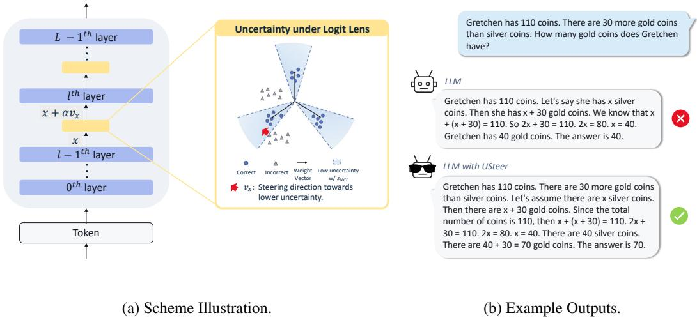
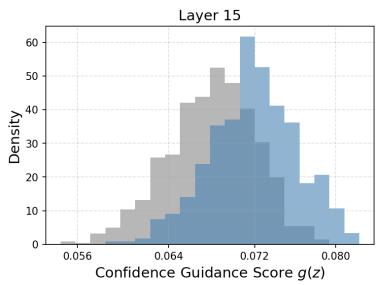
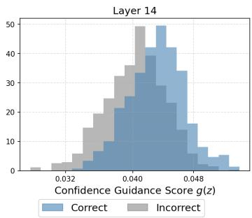
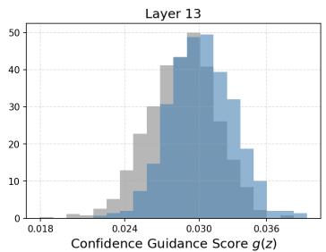
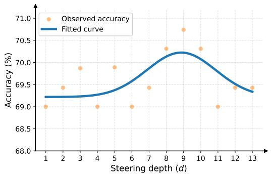
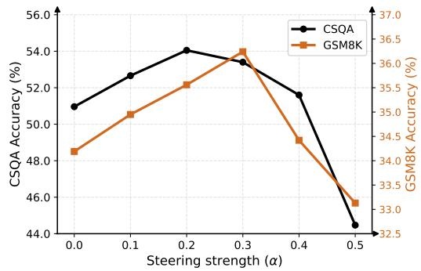

# Alleviating Hallucination in Reasoning Tasks with Training-Free Uncertainty-Guided Steering

Litian Liu1 Qiqi Hou1 Yubing Jian1 Reza Pourreza1 Mohammad Ghavamzadeh1 Roland Memisevic1 Yao Qin2 Hong Cai1

1Qualcomm AI Research∗ 2UC Santa Barbara

litiliu@qti.qualcomm.com

## Abstract

Recent work on hallucination detection in large language models has shown that, for a fixed pre-trained model and reasoning task, it is possible to estimate the model’s confidence in the correctness of its outputs. Such uncertainty estimates have primarily been used to improve truthfulness by detecting or filtering confabulations. In this work, we ask whether these signals can instead be used more proactively to directly improve the accuracy of model-generated answers. We propose USteer, a simple, training-free steering mechanism that adjusts a model’s layer-wise activations during inference using the gradient of a confidence with respect to the activations. This procedure nudges generation toward outputs with lower uncertainty at inference time, without modifying model parameters or requiring additional supervision. We show that this approach consistently reduces hallucination across a range of tasks, demonstrating that confidence signals can be leveraged not only for detection, but also for effective inference-time control of model behavior.

## 1 Introduction

Large language models (LLMs) have demonstrated remarkable capabilities in complex reasoning, yet they remain susceptible to generating plausible but incorrect responses, commonly termed hallucinations (Ji et al., 2023; Huang et al., 2024). Consequently, significant research has focused on hallucination detection, using inference-time uncertainty or confidence estimates to signal when a model should abstain from answering (Xin et al., 2021; Abbasi-Yadkori et al., 2024; Lin et al., 2023, 2022; Manakul et al., 2023; Xiao and Wang, 2021; Kuhn et al., 2023; Chen et al., 2024a; Liu et al., 2025; Hou et al., 2024; Jiang et al., 2023; Gao et al., 2024).

While effective for filtering, these post-hoc detection mechanisms are inherently reactive. In this work, we propose a shift toward a more proactive paradigm: proactive inference-time steering. Rather than merely detecting a hallucination after it has begun, can we leverage internal uncertainty signals to "steer" the model’s generation process toward more reliable and truthful regions of its representation space?

Recent efforts in steering, (Li et al., 2023a; Zhang et al., 2024; Zou et al., 2023; Chen et al., 2024b), have attempted this by learning fixed "truthfulness" directions through supervised probes. However, these methods rely on static displacement vectors that are applied uniformly across all decoding steps. This approach faces a critical bottleneck in the domain of complex reasoning, where the semantic role of intermediate representations is highly dynamic and evolves throughout a multi-step chain of thought. Furthermore, these methods require additional training and are sensitive to shifts between the probe’s training data and the actual inference-time distribution.

  
Figure 1: Overview of USteer, a training-free uncertainty-guided steering method. (a) Scheme Illustration. We intervene on output of intermediate transformer layers, with the steering mechanism highlighted in yellow. USteer is training-free, where steering directions are derived from uncertainty signals defined by the language modeling head. Under the logit lens, we evaluate uncertainty scores based on NCI (Liu et al., 2026)) and steer representations toward regions associated with lower uncertainty. (b) Example Outputs. USteer reduces hallucination, as illustrated on an example from the GSM8K dataset using Llama-3.2-1B-Instruct.

In this paper, we introduce USteer, a simple, training-free steering framework that dynamically adjusts model activations during the forward pass. Our approach is motivated by a key observation: by applying the "logit lens" to intermediate transformer layers, we find that discriminative uncertainty signals—specifically those derived from Neural Collapse Inspired (NCI) scores in Liu et al. (2026)—emerge well before the final layer. These intermediate layers act as an internal ensemble, providing "real-time" feedback on the reliability of the ongoing inference process.

USteer leverages this discovery by treating the uncertainty metric as a differentiable guidance objective, as shown in Figure 1(a). At each decoding step, USteer computes the gradient of the uncertainty score with respect to intermediate hidden representations and performs a single-step "nudge" toward regions of higher confidence. Because this intervention is gradient-based and onthe-fly, it is inherently adaptive to the evolving state of the reasoning chain without requiring any supervised training or parameter updates.

We evaluate USteer across diverse reasoning benchmarks, including CommonsenseQA, StrategyQA, GSM8K, and AQuA, on multiple model families including Llama-3.2, Qwen-2.5, and Qwen-3. Our results show that USteer consistently improves reasoning accuracy while reducing hallucinations across tasks and models. Despite operating through inference-time interventions on intermediate representations, USteer introduces only negligible latency overhead. These results demonstrate that USteer provides a practical and robust framework for uncertainty-guided inference-time control in large language models.

## 2 Related Work

Among inference-time approaches for modifying large language model behavior, our work belongs to the class of steering methods, also known as activation editing. Prior work has explored activation steering across a variety of applications. For example, Subramani et al. (2022); Turner et al. (2023) demonstrate that steering can induce sentiment transfer in language models, noting that these effects are primarily mediated by higher layers. Moving beyond stylistic adjustments, Mahmoud et al. (2025)

show that steering can enhance cross-lingual understanding by shifting representations of non-English tokens toward their English counterparts. Recent work has also introduced steering to mitigate safety risks; for instance, Wang et al. (2025) employ steering to counter jailbreaking and toxic generation by directing representations away from adversarial feature spaces.

Closest to our work are methods leveraging steering for hallucination mitigation in knowledgeintensive tasks (Li et al., 2023a; Zhang et al., 2024; Zou et al., 2023; Chen et al., 2024b). These approaches typically train supervised probes to extract a static "truthfulness" direction, applying a fixed displacement vector across all decoding steps. However, such static interventions face challenges in complex multi-step reasoning tasks, where intermediate representations evolve dynamically. To bridge this gap, USteer introduces a training-free, dynamic steering paradigm, leveraging modelinternal uncertainty signals from hallucination detection literature (Liu et al., 2026) on-the-fly. By dynamically nudging representations toward more confident regions of the activation space at each step, we improve reasoning accuracy via steering.

Another parallel line of work aims to enhance LLM truthfulness and reasoning via contrastive decoding, which modifies the output probability distribution by contrasting the predictions of an "expert" model against an "amateur" baseline (Li et al., 2023b; Kai et al., 2024; Zhang et al., 2025). This family of methods operates under the assumption that subtracting the amateur distribution from the expert distribution can amplify factual signals and suppress common linguistic biases or "surfacelevel" heuristics. In particular, DoLa (Chuang et al., 2023) extends this logic to a single model by treating the final layer as the expert and earlier layers as amateurs, contrasting their respective logits to emphasize knowledge that only matures in the deeper layers of the network. Our work shares a similar intuition by viewing the internal layers of a single LLM as an ensemble. However, instead of performing contrastive token selection at the vocabulary level, we extract localized uncertainty signals from these early layers to dynamically steer the underlying hidden representations.

## 3 Methodology

In this section, we introduce USteer, a training-free steering method that guides intermediate representations toward regions of lower uncertainty to mitigate hallucinations. We first introduce the uncertainty metric, then provide empirical evidence that uncertainty-related signals emerge in intermediate layers, and finally describe the steering algorithm.

## 3.1 Setup

Consider a Large Language Model (LLM) f with model dimension $d _ { \mathrm { m o d e l } }$ and vocabulary V. At decoding step $t ,$ given the input sequence x and previously generated tokens $\scriptstyle { \mathbf { \mathscr { y } } } _ { < t }$ , the model produces a hidden representation $z _ { t } \in \mathbb { R } ^ { d _ { \mathrm { m o d e l } } }$ . This representation is mapped by the language head $f _ { \mathrm { h e a d } }$ to produce logits over $\nu .$ . The language head functions as a linear classifier where the probability of the next token is determined by the proximity of z to a set of learned weight vectors $\{ w _ { v } \} _ { v \in \mathcal { V } } ,$ corresponding to the unembedding weights of the linear output layer.

In state-of-the-art models, these heads are typically zero-biased. Under greedy decoding, the predicted token cˆ is identified as:

$$
\hat { c } = \arg \operatorname* { m a x } _ { v \in \mathcal { V } } ( \pmb { w } _ { v } ^ { \top } z )\tag{1}
$$

To quantify the uncertainty associated with this prediction, we adapt the Neural Collapse Inspired (NCI) score, which was first introduced for out-of-distribution detection in classification tasks by Liu and Qin (2025) and subsequently adapted for post-hoc hallucination detection in LLM reasoning tasks by Liu et al. (2026). The NCI score has been shown to be highly effective for detecting hallucinations in reasoning tasks while remaining computationally inexpensive, making it particularly suitable for inference-time steering and hallucination mitigation. Specifically, NCI measures the geometric alignment between a hidden state and the weight vector of the chosen token, as illustrated in Figure 1. To facilitate the gradient-based steering introduced later in this paper, we utilize a squared, simplified version of the score:

Definition 3.1 (Confidence Guidance Score). Adapted from Liu et al. (2026). Given a hidden representation z and the weight vector ${ \pmb w } _ { \hat { c } }$ corresponding to the most-likely token ${ \hat { c } } ,$ the confidence guidance score $g ( z )$ is defined as the squared cosine similarity:

$$
g ( z ) = \frac { ( \pmb { w } _ { \hat { c } } ^ { \top } z ) ^ { 2 } } { | z | _ { 2 } ^ { 2 } } ,\tag{2}
$$

where $\hat { c } = \arg \operatorname* { m a x } _ { v \in \mathcal { V } } ( \pmb { w } _ { v } ^ { \top } \pmb { z } )$ is the most likely token given the embedding.

Geometrically, a higher $g ( z )$ indicates that the representation is well-aligned with the target token’s semantic direction, signifying high confidence. Conversely, a lower score suggests the representation resides in a "confused" region of the decision landscape—often near decision boundaries—which serves as a reliable precursor to hallucination. We additionally evaluate alternative uncertainty metrics in Section 4.6, demonstrating that the generalizability of proposed framework beyond NCI score.

## 3.2 Observation: Uncertainty Signal Emerges at Intermediate Layers.

While uncertainty is conventionally measured at the final layer, we hypothesize that the model’s internal state exhibits discriminative uncertainty signals much earlier in the computation graph. This hypothesis is rooted in the architecture of modern LLMs: due to the prevalence of residual (skip) connections, the model can be viewed as an iterative refinement process or an ensemble of "weak-to-strong" layers where semantic features are gradually sharpened.

To test this, we employ the logit lens—projecting intermediate activations $\mathbf { \Delta } _ { \mathbf { \boldsymbol { x } } } l$ into the vocabulary space using the pre-trained final language head. Particularly, since state-of-the-art models typically apply a normalization step (e.g., RMSNorm) immediately before the language head to ensure numerical stability and proper feature scaling, we mirror this processing to ensure that intermediate features are compatible with the language head’s weights.

Specifically, for the output of layer ${ \mathrm { \mathbf { } } } l , \mathbf { { \mathbf { \mathit { x } } } } ^ { l }$ , we compute the normalized representation $z ^ { l }$ as:

$$
{ z ^ { l } } = D \frac { \mathbf { \nabla } \mathbf { x } ^ { l } } { \mathrm { R M S } ( \mathbf { \nabla } \mathbf { x } ^ { l } ) }\tag{3}
$$

where D is the diagonal scaling matrix (the learned gain parameters) from the model’s final normalization layer and RMS represents the root mean square over feature dimension d

$$
\mathrm { R M S } ( { \pmb x } ) = \sqrt { \frac { 1 } { d } \sum _ { i = 1 } ^ { d } x _ { i } ^ { 2 } + \epsilon } .\tag{4}
$$

Using this normalized representation, we identify the most likely token at layer l under the logit lens:

$$
\hat { c } _ { l } = \arg \operatorname* { m a x } _ { v \in \mathcal { V } } ( \pmb { w } _ { v } ^ { \top } \pmb { z } ^ { l } )\tag{5}
$$

The intermediate uncertainty guidance score is then calculated as $g ( z ^ { l } )$ following Definition 3.1, using the layer-specific prediction $\hat { c } _ { l }$

Empirical Evidence: In Figure 2, we analyze the distribution of $g ( z ^ { l } )$ for intermediate representations. While the distinction between hallucination and non-hallucination predictions is most pronounced at the final layer, the trend emerges several layers earlier. Specifically, non-hallucinated intermediate embeddings tend to exhibit higher alignment with their corresponding weight vectors, indicating lower uncertainty, whereas those associated with hallucinated generations exhibit lower alignment and thus higher uncertainty. We further confirm that the intermediate-layer uncertainty guidance score is discriminative using AUROC across multiple models, datasets, and layers, with results reported in Appendix F. This early emergence of uncertainty signals confirms that intermediate layers contain sufficient information to identify potential failures, providing a "real-time" signal to steer the model toward more confident representations in inference.

## 3.3 USteer: Uncertainty-guided Steering at Intermediate Layers.

The goal of USteer is to dynamically intervene on the intermediate hidden state $\mathbf { \Delta } _ { \mathbf { \boldsymbol { x } } } l$ such that its normalized counterpart $z ^ { l }$ is nudged toward a region of higher confidence. For maximum efficiency, we achieve this through a single-step gradient ascent update during the forward pass.

  
Figure 2: Uncertainty Signals Emerge at Intermediate Layers of LLM. For each layer, we compute the score from Equation 2 across steps under the logit lens and compare its distribution for non-hallucinated (correct) and hallucinated (incorrect) examples. Correct intermediate embeddings tends to exhibit higher confidence guidance score. While the distinction between correct and incorrect is strongest at the final layer (Layer 15), intermediate layers (Layer 14 and Layer 13) already show such trend. This demonstrates that the language head provides meaningful uncertainty signals before the final layer, motivating steering at intermediate representations. Evaluation is conducted on GSM8K using Llama-3.2-1B-Instruct.

To find the optimal steering direction, we first calculate the gradient of the confidence guidance score in the normalized space where the language head resides.

Lemma 3.2 (Gradient of the Confidence Guidance Score). Let $\begin{array} { r } { g ( z ) = \frac { ( \pmb { w } _ { \hat { c } } ^ { \top } \pmb { z } ) ^ { 2 } } { \| \pmb { z } \| _ { 2 } ^ { 2 } } } \end{array}$ be the confidence guidance score where $\pmb { w } _ { \hat { c } }$ is the target weight vector. The gradient with respect to the normalized representation z is given by:

$$
\nabla _ { z } g ( z ) = \frac { 2 ( \pmb { w } _ { \hat { c } } ^ { \top } z ) } { \| z \| _ { 2 } ^ { 2 } } \left( \pmb { w } _ { \hat { c } } - \frac { \pmb { w } _ { \hat { c } } ^ { \top } z } { \| z \| _ { 2 } ^ { 2 } } z \right)\tag{6}
$$

## Proof. See Appendix D.

While the uncertainty signal is derived from the normalized state $z ^ { l } .$ , the intervention must occur in the pre-normalization space $\mathbf { \Delta } _ { \mathbf { \boldsymbol { x } } } l$ to remain consistent with the model’s residual stream. We propagate the gradient back through the RMSNorm layer using the chain rule:

$$
\begin{array} { c } { \displaystyle \nabla _ { \pmb { x } ^ { l } } g = \left( \frac { \partial z ^ { l } } { \partial \pmb { x } ^ { l } } \right) ^ { \top } \nabla _ { z ^ { l } } g } \\ { = \displaystyle \frac { 1 } { \| \pmb { x } ^ { l } \| _ { 2 } } \left( I - \frac { \pmb { x } ^ { l } ( \pmb { x } ^ { l } ) ^ { \top } } { \| \pmb { x } ^ { l } \| _ { 2 } ^ { 2 } } \right) D \nabla _ { z ^ { l } } g , } \end{array}\tag{7}
$$

The representation is then updated along the normalized gradient direction:

$$
\pmb { x } ^ { l }  \pmb { x } ^ { l } + \alpha \frac { \nabla _ { \pmb { x } ^ { l } } g } { \| \nabla _ { \pmb { x } ^ { l } } g \| _ { 2 } }\tag{8}
$$

where α is a hyperparameter controlling the steering strength. The full procedure is summarized in Algorithm 1.

## 4 Experiments

In this section, we comprehensively evaluate USteer across diverse reasoning datasets and model architectures. Our empirical results demonstrate that USteer consistently mitigates hallucinations and improves reasoning accuracy, with the largest gains observed in low-confidence regions. We further conduct extensive ablation studies to examine the effects of key hyperparameters, including the selection of steering layers and the steering strength. Finally, we evaluate the robustness of USteer under stochastic decoding and demonstrate its compatibility with alternative confidence guidance scores.

Algorithm 1 USteer: Training-Free Uncertainty-Guided Steering   
1: input: input prompt p, steering strength α, steering layers L.   
2: output: Model response y = [y0, y1, . . . , yT].   
3: for each decoding step t do   
4: for each layer l do   
5: Compute $\mathbf { \Delta } _ { \mathbf { \boldsymbol { x } } } l$ using the potentially steered prior layer representations.   
6: if l ∈ L then   
7: Steer layer output: $\begin{array} { r } { \pmb { x } ^ { l }  \pmb { x } ^ { l } + \alpha \frac { \nabla _ { \pmb { x } ^ { l } } g } { \| \nabla _ { \pmb { x } ^ { l } } g \| _ { 2 } } . } \end{array}$   
8: end if   
9: end for   
10: Decode token $y _ { t }$ from the final hidden representation under the chosen decoding scheme.   
11: end for   
12: return Model response $\pmb { y } = [ y _ { 0 } , y _ { 1 } , \dots , y _ { T } ] .$

## 4.1 Main Results

In Table 1, we show compare our uncertainty-based steering, USteer, against baselines. Our method consistently mitigates hallucination across datasets and models, improving reasoning accuracy with negligible latency overhead.

Datasets We consider both commonsense and mathematical reasoning tasks. For commonsense reasoning, we evaluate on CommonsenseQA (CSQA) (Talmor et al., 2019), which assesses commonsense world knowledge in a multiple-choice format, and StrategyQA (Geva et al., 2021), which requires multi-hop reasoning for binary (yes/no) questions. For mathematical reasoning, we evaluate on GSM8K (Cobbe et al., 2021), which requires free-form numerical answers, and AQuA (Ling et al., 2017), which uses a multiple-choice format. These datasets span diverse answer formats, including multiple-choice, binary, and free-form numerical outputs (see Appendix A for examples). We evaluate on the CSQA validation set (1,221 questions), the StrategyQA dev set (229 questions), the GSM8K test set (1,319 questions), and the AQuA validation split (254 questions). To quantify sampling uncertainty arising from the finite evaluation sets, we report 95% bootstrap confidence intervals for the greedy-decoding results in Appendix C.

Models We evaluate on Llama-3.2-1B-Instruct (Grattafiori et al., 2024) and Qwen-2.5-3B-Instruct (Qwen et al., 2025) to assess generality across model families. We further demonstrate scalability to larger models by evaluating Qwen-2.5-14B-Instruct and Qwen-3-32B (Yang et al., 2025) in Appendix B.

Baselines Alongside standard decoding, we compare USteer against three competitive inferencetime baselines, namely DoLa (Chuang et al., 2023), ITI (Li et al., 2023a), and TruthX (Zhang et al., 2024). DoLa represents the contrastive decoding paradigm, contrasting logits from the final layer against early-exit results to alleviate hallucination during decoding. In contrast, ITI and TruthX are training-based steering algorithms that rely on supervised probes to find a static direction, applying the exact same displacement vector at every decoding step. Mechanically, ITI applies these edits exclusively to attention heads, whereas TruthX argues that attention-level editing is insufficient and extends the intervention to all internal hidden representations.

Hyperparameter Selection We select the same steering layers across all datasets for each model architecture. Because uncertainty guidance tends to be more pronounced in the upper layers, we restrict the candidate layers to the final d intermediate layers of the network. Specifically, for Llama-3.2-1B-Instruct, we apply steering to the last 3 intermediate layers, while for Qwen-2.5-3B-Instruct, we target the last 8 intermediate layers.

Table 1: USteer mitigates hallucination across datasets and models with negligible latency overhead. Performance is reported in reasoning task accuracy and latency (ms/token; lower is better). The best performance is shown in bold, and the second-best performance is underlined.
<table><tr><td>Methods</td><td>Training-free</td><td>Latency↓</td><td>CSQA</td><td>StrategyQA</td><td>GSM8K</td><td>AQuA</td></tr><tr><td colspan="7">Model: Llama-3.2-1B-Instruct</td></tr><tr><td>Standard</td><td>-</td><td>12.5</td><td>50.94</td><td>58.52</td><td>34.19</td><td>37.80</td></tr><tr><td>DoLa</td><td>V</td><td>17.2</td><td>51.19</td><td>60.70</td><td>36.39</td><td>31.50</td></tr><tr><td>ITI</td><td>x</td><td>22.1</td><td>54.46</td><td>59.39</td><td>35.56</td><td>37.80</td></tr><tr><td>TruthX</td><td>X</td><td>21.9</td><td>53.07</td><td>61.57</td><td>34.87</td><td>36.22</td></tr><tr><td>USteer (Ours)</td><td>√</td><td>12.8</td><td>54.05</td><td>63.32</td><td>36.24</td><td>39.37</td></tr><tr><td colspan="7">Model: Qwen-2.5-3B-Instruct</td></tr><tr><td>Standard</td><td>–</td><td>21.5</td><td>77.72</td><td>68.56</td><td>79.91</td><td>54.72</td></tr><tr><td>DoLa</td><td>V</td><td>25.8</td><td>78.54</td><td>66.81</td><td>78.85</td><td>54.72</td></tr><tr><td>ITI</td><td>X</td><td>47.7</td><td>77.72</td><td>68.12</td><td>80.89</td><td>57.09</td></tr><tr><td>TruthX</td><td>x</td><td>50.2</td><td>78.62</td><td>67.25</td><td>80.06</td><td>55.12</td></tr><tr><td>USteer (Ours)</td><td>了</td><td>22.8</td><td>79.20</td><td>70.74</td><td>80.97</td><td>55.12</td></tr></table>

The steering strength α is optimized per dataset using a validation set, sweeping values from $\{ 0 . 1 , 0 . 2 , \hdots , 0 . 9 \}$ . For Llama-3.2-1B-Instruct, the optimal strength α is set to 0.2 for CSQA, 0.1 for StrategyQA, and 0.3 for GSM8K, while a smaller grid search yields α = 0.03 for the more sensitive AQuA benchmark. For Qwen-2.5-3B-Instruct, α is selected as 0.9, 0.3, 0.5, and 0.3 for CSQA, StrategyQA, GSM8K, and AQuA, respectively.

Overall Performance In Table 1, we evaluate our steering method, USteer, alongside competitive inference-time baselines under greedy decoding (T = 0). The empirical results reveal that the trainingbased steering methods, ITI and TruthX, face challenges in mitigating hallucination, sometimes degrading reasoning accuracy compared to the base model. Such performance aligns with our intuition that steering along a static, pre-computed direction is ill-suited to accommodate the highly dynamic and evolving nature of representation spaces during a multi-step reasoning chain. Conversely, USteer consistently improves reasoning accuracy across all evaluated datasets and model architectures, demonstrating that leveraging dynamic, on-the-fly uncertainty signals provides a more robust and adaptive guidance mechanism for complex logical tasks.

In addition to task accuracy, we evaluate the computational efficiency of each method by comparing their inference latencies. Latency is reported in milliseconds per token (where lower is better) and measured end-to-end on the StrategyQA dataset using a single NVIDIA A100-80GB GPU for each model. Because USteer restricts its interventions to a select subset of upper intermediate layers and introduces minimal arithmetic computation per layer, it adds negligible overhead to the forward pass. Consequently, our method closely maintains the latency profile of standard decoding.

## 4.2 Performance across Confidence Regions

By explicitly guiding generation toward more confident regions, USteer is particularly effective at correcting low-confidence errors. Meanwhile, it can be less effective for confidently incorrect predictions, as steering toward more confident representations may reinforce an existing error.

We quantitatively examine this behavior on Llama-3.2-1B-Instruct in Table 2. Specifically, we group examples into percentiles based on their per-token softmax confidence within each dataset and then pool the corresponding confidence regions across the four datasets. USteer achieves larger net accuracy gains over greedy decoding than existing methods, with its advantage becoming more pronounced toward the lowest-confidence tail.

Table 2: USteer provides larger accuracy gains in low-confidence regions. Confidence regions are pooled across CSQA, StrategyQA, GSM8K, and AQuA. Net accuracy gains are reported in percentage points over standard greedy decoding on Llama-3.2-1B-Instruct.
<table><tr><td>Confidence Region</td><td>USteer</td><td>DoLa</td><td>ITI</td><td>TruthX</td></tr><tr><td>All examples</td><td>+2.6</td><td>+0.7</td><td>+2.1</td><td>+1.3</td></tr><tr><td>Bottom 25%</td><td>+6.7</td><td>+3.8</td><td>+5.1</td><td>+3.3</td></tr><tr><td>Bottom 5%</td><td>+14.4</td><td>+8.5</td><td>+9.8</td><td>+9.8</td></tr></table>

  
Figure 3: Trade-off in Selecting Steering Layers, reflecting competing effects of steering strength and guidance reliability. The x-axis presents steering depth d. The y-axis presents task accuracy. Experiments on StrategyQA using Qwen-2.5-3B-Instruct.

  
Figure 4: USteer achieves robust performance across varying steering strengths. The x-axis presents steering strength α. The y-axis present task accuracy for CSQA and GSM8K. Experiments using Llama-3.2-1B-Instruct.

## 4.3 Effect of Steering Layers

To study the effect of layer selection, we conduct experiments on StrategyQA using Qwen-2.5-3B-Instruct, which consists of 36 transformer layers. We vary the layers at which steering is applied and report task accuracy.

Steering remains effective across different layer choices. We first study the overall effect of layer choice by partitioning the model into lower layers (0–11), middle layers (11–22), and upper layers (23– 34). For each setting, we report the best accuracy over steering magnitudes $\alpha \in \{ 0 . 1 , 0 . 2 , \ldots , 0 . 9 \}$ As shown in Table 3, applying steering within any of these layer regions consistently improves accuracy over standard decoding, demonstrating the overall robustness of uncertainty-guided steering across the transformer stack.

Despite this broad effectiveness, the magnitude of improvement varies systematically across depth. In particular, steering at upper layers yields larger gains than steering at lower layers. This trend aligns with our earlier analysis in Section 3, where uncertainty signals extracted through the logit lens exhibit stronger distinctions between correct and hallucinated generations in higher layers. This empirical finding justifies our heuristic of restricting the candidate steering layers to the final d intermediate layers of the network.

Layer selection reflects a trade-off. In Figure 3, we study the effect of steering depth d by sweeping d and reporting the best accuracy over steering magnitudes $\alpha \in \{ 0 . 1 , 0 . 2 , \ldots , 0 . 9 \}$ . We observe a trade-off across layers. On one hand, steering deeper layers (larger d) exerts a stronger and more direct influence on the final model output. On the other hand, uncertainty estimates obtained through the logit lens become less reliable at lower layers, where representations are less aligned with the final prediction space. These competing effects lead to an approximately bell-shaped performance trend as a function of steering depth. Nevertheless, all tested steering depths consistently outperform standard decoding (68.56 accuracy). Finally, the optimal layer selection appears to be model-specific. Although a single steering depth generalizes reasonably well across datasets for a fixed model in Section 4.1, the best-performing depth varies across model families, likely reflecting differences in representational geometry and layer-wise feature evolution.

Table 3: USteer consistently mitigates hallucination across different selections of steering layers. Experiments on StrategyQA using Qwen-2.5-3B-Instruct. Accuracy reported. USteer improves performance when applied at lower, middle, and upper layers.
<table><tr><td></td><td>Standard</td><td>Lower Layers</td><td>Middle Layers</td><td>Upper Layers</td></tr><tr><td>Accuracy (%)</td><td>68.56</td><td>69.00</td><td>69.43</td><td>69.43</td></tr></table>

Table 4: USteer mitigates hallucination under stochastic decoding, consistently yielding gains across a range of temperatures with statistical significance. Results are reported on CSQA using Llama-3.2-1B-Instruct, with accuracy shown as the mean and 95% confidence intervals.
<table><tr><td></td><td> $\mathrm { t e m p } = 0 . 2$ </td><td> $\mathrm { t e m p } = 0 . 5$ </td><td> $\mathrm { t e m p } = 0 . 8$ </td><td> $\mathrm { { t e m p } = 1 . 0 }$ </td></tr><tr><td>Standard</td><td> $5 0 . 3 8 \pm 0 . 4 6$ </td><td> $5 0 . 2 2 \pm 0 . 2 9$ </td><td> $4 7 . 8 3 \pm 0 . 3 2$ </td><td> $4 5 . 4 4 \pm 0 . 3 8$ </td></tr><tr><td>USteer (ours)</td><td> $5 3 . 5 5 \pm 0 . 3 8$ </td><td> $5 2 . 2 2 \pm 0 . 4 2$ </td><td> $5 0 . 3 7 \pm 0 . 1 9$ </td><td> $4 8 . 7 8 \pm 0 . 3 2$ </td></tr></table>

## 4.4 Effect of Steering Strength

To study the effect of steering strength α, we conduct experiments on CSQA and GSM8K using Llama-3.2-1B-Instruct. Experimental settings, including steering layer selection, follow Section 4.1. In Figure 4, we plot task accuracy on both reasoning tasks as a function of $\alpha \in \{ 0 , 0 . 1 , 0 . 2 , 0 . 3 , 0 . 4 , 0 . 5 \}$

We observe a trade-off in steering strength. When α is too small, the intervention has only a limited effect on the hidden representations, resulting in relatively modest performance gains over standard decoding. As α increases, steering becomes more effective and accuracy improves accordingly. However, excessively large steering magnitudes $( \mathbf { e . g . } , \alpha = 0 . 5 )$ begin to degrade performance, likely because overly aggressive interventions distort the underlying representation geometry and disrupt the model’s reasoning process. Importantly, performance varies smoothly as a function of α for both tasks. A broad range of steering strengths consistently outperforms standard decoding $( \alpha = 0 )$ , suggesting that USteer is reasonably robust to hyperparameter selection.

## 4.5 Effect of Stochastic Decoding

So far, we have evaluated USteer under greedy decoding (temperature = 0). We now examine whether the proposed steering mechanism remains effective under stochastic decoding, where randomness introduced during sampling can substantially alter the generation trajectory. In Table $^ { 4 , }$ we evaluate USteer on CommonsenseQA (CSQA) using Llama-3.2-1B-Instruct across a range of sampling temperatures temp $\in \{ 0 . 2 , 0 . 5 , 0 . 8 , 1 . 0 \}$ . The remainder of the experimental setup follows Section 4.1. For each temperature, we perform five independent runs with different random seeds and report the mean accuracy together with 95% confidence intervals.

As shown in the table, USteer consistently improves over standard stochastic decoding across all temperature settings. Although the absolute task accuracy varies with temperature, the performance gains introduced by steering remain stable and consistent. Moreover, the corresponding 95% confidence intervals are non-overlapping in most settings, indicating that the improvements are statistically significant. These results suggest that uncertainty-guided steering is compatible with stochastic decoding and can provide reliable benefits subject to sampling noise. Additional analyses of generation behavior under stochastic decoding are provided in Appendix H.

Table 5: USteer improves decoding performance with alternative confidence guidance scores. We report accuracy (%) on Qwen-2.5-3B-Instruct. Both fDBD and softmax confidence improve performance over standard inference across all datasets.
<table><tr><td>Method</td><td>CSQA</td><td>StrategyQA</td><td>GSM8K</td><td>AQuA</td></tr><tr><td>Standard</td><td>77.72</td><td>68.56</td><td>79.91</td><td>54.72</td></tr><tr><td>USteer w/ NCI</td><td>79.20</td><td>70.74</td><td>80.97</td><td>55.12</td></tr><tr><td>USteer w/ fDBD</td><td>78.21</td><td>71.18</td><td>81.20</td><td>55.12</td></tr><tr><td>USteer w/ softmax</td><td>77.89</td><td>69.43</td><td>80.52</td><td>55.12</td></tr></table>

## 4.6 Effect of Alternative Confidence Guidance Scores

So far, we have used NCI variant (Definition 3.1) as the confidence guidance score for USteer given its computational efficiency and effectiveness in hallucination detection in reasoning tasks. We now examine the general applicability of USteer by considering two additional scores: the standard softmax confidence and fDBD Liu et al. (2026). Similar to NCI, fDBD was originally introduced for out-of-distribution detection in classification tasks (Liu and Qin, 2024) and later adapted for hallucination detection in reasoning tasks Liu et al. (2026). Following Definition 3.1, we consider a squared, simplified version of fDBD score with k = 1000, as detailed in Appendix E.

Following the setup in Section 4.1, we USteer with alternative scores on Qwen-2.5-3B-Instruct. For softmax confidence, we use α = 1.1 for CSQA and α = 0.1 for StrategyQA, GSM8K, and AQuA. For fDBD, we use α = 0.5 for CSQA, StrategyQA, and GSM8K, and α = 0.08 for AQuA. As shown in Table 5, both alternative confidence guidance scores improve accuracy over standard inference across all datasets, demonstrating the applicability of USteer to different confidence guidance scores. Meanwhile, softmax confidence yields smaller gains than NCI and fDBD. This result is consistent with the findings of Liu et al. (2026), who show that softmax confidence achieves weaker hallucination detection performance on reasoning tasks than fDBD and NCI.

Limitations. While USteer is highly effective for open-weight models, it requires access to intermediate hidden states and gradients, which limits its applicability to black-box proprietary APIs. In addition, our experiments focus on modern Transformer architectures with residual connections, which form a “weak-to-strong” ensemble and motivate the use of intermediate hidden states for uncertainty-guided steering. For potential future architectures without residual connections, we still expect USteer to provide benefits, as intermediate hidden states may continue to contain informative uncertainty signals. However, without the ensemble structure enabled by residual connections, these uncertainty signals may be less reliable, potentially reducing the effectiveness of USteer.

Broader Impacts. Improving the reliability of LLM reasoning is a critical step toward responsible AI deployment. However, users should remain aware that USteer is focused on redicing hallucination and does not inherently address other vital safety concerns, such as bias, fairness, or the generation of harmful content. These factors must be managed through complementary safety frameworks alongside accuracy-enhancing techniques.

## 5 Conclusion

In this work, we introduced USteer, a simple, training-free steering mechanism designed to alleviate hallucinations by leveraging model-internal uncertainty signals during inference. Unlike prior steering methods that rely on static displacement vectors derived from supervised probes, USteer utilizes the gradient of a geometric uncertainty guidance score to dynamically nudge intermediate representations toward high-confidence regions of the activation space. By integrating this intervention directly into decoding, we provide a proactive mechanism for hallucination mitigation with negligible overhead. Across multiple tasks and settings, we showed that such signals can be used proactively to guide generation toward more reliable outputs. Our results demonstrate that uncertainty-aware mechanisms can be integrated directly into the generation process, moving beyond post-hoc filtering toward more adaptive and controllable language models.

## References

Yasin Abbasi-Yadkori, Ilja Kuzborskij, David Stutz, András György, Adam Fisch, et al. Mitigating llm hallucinations via conformal abstention. In NeurIPS Workshop on Statistical Frontiers in LLMs, 2024.

Chao Chen, Kai Liu, Ze Chen, Yi Gu, Yue Wu, Mingyuan Tao, Zhihang Fu, and Jieping Ye. INSIDE: LLMs’ internal states retain the power of hallucination detection. In The Twelfth International Conference on Learning Representations, 2024a.

Zhongzhi Chen, Xingwu Sun, Xianfeng Jiao, Fengzong Lian, Zhanhui Kang, Di Wang, and Chengzhong Xu. Truth forest: Toward multi-scale truthfulness in large language models through intervention without tuning. In Proceedings ofthe AAAI Conference on Artificial Intelligence, pages 20967–20974, 2024b.

Yung-Sung Chuang, Yujia Xie, Hongyin Luo, Yoon Kim, James R Glass, and Pengcheng He. Dola: Decoding by contrasting layers improves factuality in large language models. In The Twelfth International Conference on Learning Representations, 2023.

Karl Cobbe, Vineet Kosaraju, Mohammad Bavarian, Mark Chen, Heewoo Jun, Lukasz Kaiser, Matthias Plappert, Jerry Tworek, Jacob Hilton, Reiichiro Nakano, et al. Training verifiers to solve math word problems. arXiv preprint arXiv:2110.14168, 2021.

Xiang Gao, Jiaxin Zhang, Lalla Mouatadid, and Kamalika Das. Spuq: Perturbation-based uncertainty quantification for large language models. In Proceedings ofthe 18th Conference ofthe European Chapter ofthe Associationfor Computational Linguistics (Volume 1: Long Papers), pages 2336–2346, 2024.

Mor Geva, Daniel Khashabi, Elad Segal, Tushar Khot, Dan Roth, and Jonathan Berant. Did aristotle use a laptop? a question answering benchmark with implicit reasoning strategies. Transactions of the Association for Computational Linguistics, 9:346–361, 2021.

Aaron Grattafiori, Abhimanyu Dubey, Abhinav Jauhri, Abhinav Pandey, Abhishek Kadian, Ahmad Al-Dahle, Aiesha Letman, Akhil Mathur, Alan Schelten, Alex Vaughan, et al. The llama 3 herd of models. arXiv preprint arXiv:2407.21783, 2024.

Bairu Hou, Yujian Liu, Kaizhi Qian, Jacob Andreas, Shiyu Chang, and Yang Zhang. Decomposing uncertainty for large language models through input clarification ensembling. In ICML, 2024.

Lei Huang, Weijiang Yu, Weitao Ma, Weihong Zhong, Zhangyin Feng, Haotian Wang, Qianglong Chen, Weihua Peng, Xiaocheng Feng, Bing Qin, and Ting Liu. A survey on hallucination in large language models: Principles, taxonomy, challenges, and open questions. ACM Transactions on Information Systems (ACM TOIS), 2024.

Ziwei Ji, Nayeon Lee, Rita Frieske, Tiezheng Yu, Dan Su, Yan Xu, Etsuko Ishii, Ye Jin Bang, Andrea Madotto, and Pascale Fung. Survey of hallucination in natural language generation. ACM Computing Surveys, 55(12): 1–38, 2023.

Mingjian Jiang, Yangjun Ruan, Sicong Huang, Saifei Liao, Silviu Pitis, Roger Baker Grosse, and Jimmy Ba. Calibrating language models via augmented prompt ensembles. 2023.

Jushi Kai, Tianhang Zhang, Hai Hu, and Zhouhan Lin. Sh2: Self-highlighted hesitation helps you decode more truthfully. In Findings of the Association for Computational Linguistics: EMNLP 2024, pages 4514–4530, 2024.

Lorenz Kuhn, Yarin Gal, and Sebastian Farquhar. Semantic uncertainty: Linguistic invariances for uncertainty estimation in natural language generation. In The Eleventh International Conference on Learning Representations, 2023.

Kenneth Li, Oam Patel, Fernanda Viégas, Hanspeter Pfister, and Martin Wattenberg. Inference-time intervention: Eliciting truthful answers from a language model. Advances in Neural Information Processing Systems, 36: 41451–41530, 2023a.

Xiang Lisa Li, Ari Holtzman, Daniel Fried, Percy Liang, Jason Eisner, Tatsunori B Hashimoto, Luke Zettlemoyer, and Mike Lewis. Contrastive decoding: Open-ended text generation as optimization. In Proceedings of the 61st annual meeting of the association for computational linguistics (volume 1: Long papers), pages 12286–12312, 2023b.

Zi Lin, Jeremiah Zhe Liu, and Jingbo Shang. Towards collaborative neural-symbolic graph semantic parsing via uncertainty. Findings ofthe Associationfor Computational Linguistics: ACL 2022, 2022.

Zhen Lin, Shubhendu Trivedi, and Jimeng Sun. Generating with confidence: Uncertainty quantification for black-box large language models. arXiv preprint arXiv:2305.19187, 2023.

Wang Ling, Dani Yogatama, Chris Dyer, and Phil Blunsom. Program induction by rationale generation: Learning to solve and explain algebraic word problems. In Proceedings ofthe 55th Annual Meeting ofthe Association for Computational Linguistics (Volume 1: Long Papers), pages 158–167, 2017.

Litian Liu and Yao Qin. Fast decision boundary based out-of-distribution detector. ICML, 2024.

Litian Liu and Yao Qin. Detecting out-of-distribution through the lens of neural collapse. In 2025 IEEE/CVF Conference on Computer Vision and Pattern Recognition (CVPR), pages 15424–15433. IEEE, 2025.

Litian Liu, Reza Pourreza, Sunny Panchal, Apratim Bhattacharyya, Yao Qin, and Roland Memisevic. Enhancing hallucination detection through noise injection. ICLR, 2025.

Litian Liu, Reza Pourreza, Yubing Jian, Yao Qin, and Roland Memisevic. From out-of-distribution detection to hallucination detection: A geometric view. ICML, 2026.

Omar Mahmoud, Buddhika Laknath Semage, Thommen George Karimpanal, and Santu Rana. Improving multilingual language models by aligning representations through steering. arXiv preprint arXiv:2505.12584, 2025.

Potsawee Manakul, Adian Liusie, and Mark Gales. SelfCheckGPT: Zero-resource black-box hallucination detection for generative large language models. In Proceedings of the 2023 Conference on Empirical Methods in Natural Language Processing, pages 9004–9017, Singapore, 2023. Association for Computational Linguistics.

Qwen, :, An Yang, Baosong Yang, Beichen Zhang, Binyuan Hui, Bo Zheng, Bowen Yu, Chengyuan Li, Dayiheng Liu, Fei Huang, Haoran Wei, Huan Lin, Jian Yang, Jianhong Tu, Jianwei Zhang, Jianxin Yang, Jiaxi Yang, Jingren Zhou, Junyang Lin, Kai Dang, Keming Lu, Keqin Bao, Kexin Yang, Le Yu, Mei Li, Mingfeng Xue, Pei Zhang, Qin Zhu, Rui Men, Runji Lin, Tianhao Li, Tianyi Tang, Tingyu Xia, Xingzhang Ren, Xuancheng Ren, Yang Fan, Yang Su, Yichang Zhang, Yu Wan, Yuqiong Liu, Zeyu Cui, Zhenru Zhang, and Zihan Qiu. Qwen2.5 technical report, 2025.

Nishant Subramani, Nivedita Suresh, and Matthew E Peters. Extracting latent steering vectors from pretrained language models. In Findings of the Association for Computational Linguistics: ACL 2022, pages 566–581, 2022.

Alon Talmor, Jonathan Herzig, Nicholas Lourie, and Jonathan Berant. CommonsenseQA: A question answering challenge targeting commonsense knowledge. In Proceedings ofthe 2019 Conference ofthe North American Chapter ofthe Associationfor Computational Linguistics: Human Language Technologies, Volume 1 (Long and Short Papers), pages 4149–4158, Minneapolis, Minnesota, 2019. Association for Computational Linguistics.

Alexander Matt Turner, Lisa Thiergart, Gavin Leech, David Udell, Juan J Vazquez, Ulisse Mini, and Monte MacDiarmid. Steering language models with activation engineering. arXiv preprint arXiv:2308.10248, 2023.

Han Wang, Gang Wang, and Huan Zhang. Steering away from harm: An adaptive approach to defending vision language model against jailbreaks. In Proceedings of the Computer Vision and Pattern Recognition Conference, pages 29947–29957, 2025.

Jason Wei, Xuezhi Wang, Dale Schuurmans, Maarten Bosma, Fei Xia, Ed Chi, Quoc V Le, Denny Zhou, et al. Chain-of-thought prompting elicits reasoning in large language models. Advances in neural information processing systems, 35:24824–24837, 2022.

Yijun Xiao and William Yang Wang. On hallucination and predictive uncertainty in conditional language generation. In Proceedings ofthe 16th Conference ofthe European Chapter ofthe Associationfor Computational Linguistics: Main Volume, 2021.

Ji Xin, Raphael Tang, Yaoliang Yu, and Jimmy Lin. The art of abstention: Selective prediction and error regularization for natural language processing. In Proceedings of the ACL, 2021.

An Yang, Anfeng Li, Baosong Yang, Beichen Zhang, Binyuan Hui, Bo Zheng, Bowen Yu, Chang Gao, Chengen Huang, Chenxu Lv, Chujie Zheng, Dayiheng Liu, Fan Zhou, Fei Huang, Feng Hu, Hao Ge, Haoran Wei, Huan Lin, Jialong Tang, Jian Yang, Jianhong Tu, Jianwei Zhang, Jianxin Yang, Jiaxi Yang, Jing Zhou, Jingren Zhou, Junyang Lin, Kai Dang, Keqin Bao, Kexin Yang, Le Yu, Lianghao Deng, Mei Li, Mingfeng Xue, Mingze Li, Pei Zhang, Peng Wang, Qin Zhu, Rui Men, Ruize Gao, Shixuan Liu, Shuang Luo, Tianhao Li, Tianyi Tang, Wenbiao Yin, Xingzhang Ren, Xinyu Wang, Xinyu Zhang, Xuancheng Ren, Yang Fan, Yang Su, Yichang Zhang, Yinger Zhang, Yu Wan, Yuqiong Liu, Zekun Wang, Zeyu Cui, Zhenru Zhang, Zhipeng Zhou, and Zihan Qiu. Qwen3 technical report, 2025.

Shaolei Zhang, Tian Yu, and Yang Feng. Truthx: Alleviating hallucinations by editing large language models in truthful space. In Proceedings ofthe 62nd Annual Meeting ofthe Associationfor Computational Linguistics (Volume 1: Long Papers), pages 8908–8949, 2024.

Yue Zhang, Leyang Cui, Shuming Shi, et al. Alleviating hallucinations of large language models through induced hallucinations. In Findings of the Association for Computational Linguistics: NAACL 2025, pages 8218–8232, 2025.

Andy Zou, Long Phan, Sarah Chen, James Campbell, Phillip Guo, Richard Ren, Alexander Pan, Xuwang Yin, Mantas Mazeika, Ann-Kathrin Dombrowski, et al. Representation engineering: A top-down approach to ai transparency. arXiv preprint arXiv:2310.01405, 2023.

## A Implementation details

## A.1 Examples of Questions and Model Responses for each Dataset

## A.1.1 CSQA Example

Question: A revolving door is convenient for two direction travel, but it also serves as a security measure at a what?

(a) bank

(b) library

(c) department store

(d) mall

(e) new york

Model response: The answer should be a place where security is a priority. Of the above choices, a bank is the most likely to use a revolving door as a security measure. So the answer is (a).

## A.1.2 StrategyQA Example

Question: Yes or no: Will the Albany in Georgia reach a hundred thousand occupants before the one in New York?

Model response: Albany, New York, already has a population exceeding 100,000. Albany, Georgia, has a much smaller population and is unlikely to surpass the population of Albany, New York. Thus, the Albany in Georgia will not reach a hundred thousand occupants before the one in New York. So the answer is no.

## A.1.3 GSM8K Example

Question: Janet’s ducks lay 16 eggs per day. She eats three for breakfast every morning and bakes muffins for her friends every day with four. She sells the remainder at the farmers’ market daily for \$2 per fresh duck egg. How much in dollars does she make every day at the farmers’ market?

Model response: Janet’s ducks lay 16 eggs per day. She uses 3 for breakfast and 4 for baking, which totals 3 + 4 = 7 eggs used daily. The remaining eggs are 16 - 7 = 9. She sells these for \$2 each, so 9 x 2 = 18. The answer is 18.

## A.1.4 AQuA Example

Question: A password needs to contain 2 letters and 3 numbers. How many different passwords are possible if repetition of letters and numbers is allowed??

(a) 676000

(b) 676

(c) 100

(d) 6760

(e) 25

Model response: There are 26 letters in the alphabet and 10 digits (0-9). Since repetition is allowed, there are 26 \* 26 = 676 ways to choose the letters and 10 \* 10 \* 10 = 1000 ways to choose the numbers. The total number of different passwords is $6 7 6 * 1 0 0 0 = 6 7 6 0 0 0$ . The answer is (a).

Table 6: USteer consistantly mitigates hallucination and improves reasoning accuracy on Qwen-2.5-14B-Instruct. Performance is reported in reasoning task accuracy. The best performance is shown in bold, and the second-best performance is underlined.
<table><tr><td>Methods</td><td>CSQA</td><td>StrategyQA</td><td>GSM8K</td><td>AQuA</td></tr><tr><td>Standard</td><td>84.44</td><td>72.49</td><td>91.51</td><td>75.20</td></tr><tr><td>DoLa</td><td>84.03</td><td>73.36</td><td>92.19</td><td>75.98</td></tr><tr><td>ITI</td><td>84.19</td><td>75.98</td><td>91.58</td><td>73.80</td></tr><tr><td>TruthX</td><td>84.44</td><td>74.24</td><td>91.81</td><td>74.24</td></tr><tr><td>USteer (Ours)</td><td>85.26</td><td>75.55</td><td>91.74</td><td>77.17</td></tr></table>

## A.2 Chain-of-Thought Few-shot Prompting

Following Wei et al. (2022), we use chain-of-thought few-shot prompting to elicit reasoning in the model’s responses. For all datasets, we adopt the canonical examples from Wei et al. (2022). These prompts guide the model to produce a formatted answer after completing the reasoning process. For answer extraction, we extract the answer choice following “So the answer is” for CSQA, the yes/no answer following “So the answer is” for StrategyQA, the number answer following “The answer is” for GSM8K, and the answer choice following “The answer is” for AQuA. An answer is considered correct if the extracted answer matches the ground truth.

## B Scalability to Larger Language Model

## B.1 Evaluation on Qwen-2.5-14B-Instruct.

To evaluate USteer beyond the sub-8B model scale considered in our main experiments, we conduct additional experiments on Qwen-2.5-14B-Instruct to compare USteer with standard decoding and existing inference-time intervention methods. Specifically, we steer last three intermediate layers. We use α = 0.7 for CSQA, α = 1.1 for StrategyQA and GSM8K, and α = 1.5 for AQuA. The remaining experimental setup follows Section 4.1.

As shown in Table 6, USteer improves reasoning accuracy over standard decoding across all four datasets. It achieves the best performance on CSQA and AQuA and remains competitive with existing inference-time intervention methods on StrategyQA and GSM8K. These results demonstrate that USteer remains effective for larger language models.

## B.2 Evaluation on Qwen-3-32B.

We further scale our evaluation to Qwen-3-32B (Yang et al., 2025). As shown in Table 7, the model achieves substantially higher accuracy across datasets, leaving limited headroom for further improvement compared to smaller models. Nevertheless, USteer consistently improves reasoning accuracy across CSQA, StrategyQA, GSM8K, while maintaining accuracy on the challenging task of AQuA. Overall, these results provide further evidence that uncertainty-based steering remains effective as model scale increases.

Table 7: USteer consistently mitigates hallucination and improves reasoning accuracy on Qwen-3-32B. We report task accuracy. USteer consistently improves standard decoding across datasets.
<table><tr><td>Methods</td><td>CSQA</td><td>StrategyQA</td><td>GSM8K</td><td>AQuA</td></tr><tr><td>Standard</td><td>86.49</td><td>78.60</td><td>94.54</td><td>77.17</td></tr><tr><td>USteer</td><td>86.90</td><td>79.04</td><td>95.00</td><td>77.17</td></tr></table>

Table 8: Accuracy (%) with 95% bootstrap confidence intervals under greedy decoding. The confidence intervals quantify sampling uncertainty arising from the finite evaluation sets. Their widths are largely determined by dataset size, with wider intervals observed on the smaller StrategyQA and AQuA evaluation sets.
<table><tr><td>Method</td><td>CSQA  $( n = 1 2 2 1 )$ </td><td>StrategyQA  $( n = 2 2 9 )$ </td><td>GSM8K  $( n = 1 3 1 9 )$ </td><td>AQuA  $( n = 2 5 4 )$ </td></tr><tr><td colspan="5">Model: Llama-3.2-1B-Instruct</td></tr><tr><td>Standard</td><td> $5 0 . 9 4 \pm 2 . 7 8$ </td><td> $5 8 . 5 2 \pm 6 . 5 5$ </td><td> $3 4 . 1 9 \pm 2 . 5 8$ </td><td> $3 7 . 8 0 \pm 5 . 9 1$ </td></tr><tr><td>DoLa</td><td> $5 1 . 1 9 \pm 2 . 8 3$ </td><td> $6 0 . 7 0 \pm 6 . 3 3$ </td><td> $3 6 . 3 9 \pm 2 . 5 8$ </td><td> $3 1 . 5 0 \pm 5 . 5 1$ </td></tr><tr><td>ITI</td><td> $5 4 . 4 6 \pm 2 . 8 7$ </td><td> $5 9 . 3 9 \pm 6 . 3 3$ </td><td> $3 5 . 5 6 \pm 2 . 5 4$ </td><td> $3 7 . 8 0 \pm 5 . 9 1$ </td></tr><tr><td>TruthX</td><td> $5 3 . 0 7 \pm 2 . 7 8$ </td><td> $6 1 . 5 7 \pm 6 . 3 3$ </td><td> $3 4 . 8 7 \pm 2 . 5 8$ </td><td> $3 6 . 2 2 \pm 5 . 9 1$ </td></tr><tr><td>USteer (Ours)</td><td> $5 4 . 0 5 \pm 2 . 7 8$ </td><td> $6 3 . 3 2 \pm 6 . 1 1$ </td><td> $3 6 . 2 4 \pm 2 . 5 8$ </td><td> $3 9 . 3 7 \pm 5 . 9 1$ </td></tr><tr><td colspan="5">Model: Qwen-2.5-3B-Instruct</td></tr><tr><td>Standard</td><td> $7 7 . 7 2 \pm 2 . 2 9$ </td><td> $6 8 . 5 6 \pm 6 . 1 1$ </td><td> $7 9 . 9 1 \pm 2 . 1 6$ </td><td> $5 4 . 7 2 \pm 6 . 1 0$ </td></tr><tr><td>DoLa</td><td> $7 8 . 5 4 \pm 2 . 2 9$ </td><td> $6 6 . 8 1 \pm 6 . 1 1$ </td><td> $7 8 . 8 5 \pm 2 . 2 4$ </td><td> $5 4 . 7 2 \pm 6 . 3 0$ </td></tr><tr><td>ITI</td><td> $7 7 . 7 2 \pm 2 . 3 3$ </td><td> $6 8 . 1 2 \pm 6 . 1 1$ </td><td> $8 0 . 8 9 \pm 2 . 0 8$ </td><td> $5 7 . 0 9 \pm 6 . 1 0$ </td></tr><tr><td>TruthX</td><td> $7 8 . 6 2 \pm 2 . 2 9$ </td><td> $6 7 . 2 5 \pm 6 . 1 1$ </td><td> $8 0 . 0 6 \pm 2 . 1 6$ </td><td> $5 5 . 1 2 \pm 6 . 1 0$ </td></tr><tr><td>USteer (Ours)</td><td> $7 9 . 2 0 \pm 2 . 2 9$ </td><td> $7 0 . 7 4 \pm 5 . 9 0$ </td><td> $8 0 . 9 7 \pm 2 . 1 2$ </td><td> $5 5 . 1 2 \pm 6 . 3 0$ </td></tr></table>

## C Statistical Analysis under Greedy Decoding

Greedy decoding is deterministic and therefore does not exhibit variation across repeated runs. Nevertheless, uncertainty in the reported accuracy arises from evaluating the methods on a finite set of test examples. To quantify this sampling uncertainty, we compute 95% bootstrap confidence intervals by resampling examples from each evaluation set.

As shown in Table 8, the confidence intervals are relatively wide compared with the differences among methods, precluding conclusive claims of statistical significance under greedy decoding. The interval widths are largely determined by dataset size: they are approximately ±6 percentage points for StrategyQA and AQuA, which contain 229 and 254 examples, respectively, compared with approximately ±3 percentage points or less for CSQA and GSM8K, which contain 1,221 and 1,319 examples. Thus, the statistical power of these comparisons is primarily limited by the sizes of the existing benchmark evaluation sets. Nevertheless, the point estimates show that USteer consistently improves over standard greedy decoding across all datasets and both models. These results provide complementary evidence for the effectiveness of USteer across decoding settings.

## D Proof of Lemma 3.2

Proof. Let $\boldsymbol { u } = ( \boldsymbol { w } _ { \hat { c } } ^ { \top } z ) ^ { 2 }$ and $v = \| z \| _ { 2 } ^ { 2 }$

By the quotient rule, $\begin{array} { r } { \nabla g = \frac { v \nabla u - u \nabla v } { v ^ { 2 } } } \end{array}$

Substituting $\nabla u = 2 ( \mathbf { \boldsymbol { w } } _ { \hat { c } } ^ { \top } \mathbf { \boldsymbol { z } } ) \mathbf { \boldsymbol { w } } _ { \hat { c } }$ and $\nabla v = 2 z$ , we have:

$$
\begin{array} { r l } { \nabla _ { z } g } & { = \frac { \| z \| _ { 2 } ^ { 2 } [ 2 ( w _ { \hat { c } } ^ { \top } z ) w _ { \hat { c } } ] - ( w _ { \hat { c } } ^ { \top } z ) ^ { 2 } [ 2 z ] } { \| z \| _ { 2 } ^ { 4 } } } \\ & { = \frac { 2 ( w _ { \hat { c } } ^ { \top } z ) } { \| z \| _ { 2 } ^ { 2 } } \left( w _ { \hat { c } } - \frac { w _ { \hat { c } } ^ { \top } z } { \| z \| _ { 2 } ^ { 2 } } z \right) } \end{array}
$$

<table><tr><td colspan="2"></td><td rowspan="2">Llama-3.2-1B-Instruct Qwen-2.5-3B-Instruct Qwen-2.5-14B-Instruct L35 / L34 / L33</td><td rowspan="2">L47 / L46 / L45</td></tr><tr><td></td><td>L15/L14/L13</td></tr><tr><td>GSM8K</td><td>74.9 / 69.2 / 65.3</td><td>75.4 / 75.3 / 65.9</td><td>71.2 / 74.3 / 62.8</td></tr><tr><td>CSQA</td><td>60.8 / 56.5 / 55.3</td><td>62.8 / 58.9 / 57.6</td><td>69.1 / 68.7 / 65.5</td></tr><tr><td>StrategyQA</td><td>52.3 / 50.8 / 51.6</td><td>61.3 / 55.2 / 57.1</td><td>74.6 / 73.7 / 67.7</td></tr><tr><td>AQuA</td><td>50.3 / 52.9 / 53.8</td><td>76.5 / 69.6 / 62.3</td><td>75.6 / 77.9 / 62.9</td></tr></table>

Table 9: Intermediate-layer uncertainty guidance scores are predictive of generation correctness across models, datasets, and layers. The layer-wise uncertainty guidance score $g ( z ^ { l } )$ from Definition 3.1 is used as the prediction score, with correct generations treated as the positive class. Each entry reports AUROC for the final three layers, ordered from the final layer to the two preceding layers. A higher AUROC indicates stronger discrimination between correct and incorrect generations.

## E fDBD Confidence Guidance Score.

As an alternative to NCI, we use the fDBD score introduced for out-of-distribution detection and subsequently adapted for hallucination detection (Liu et al., 2026). Let $\mathcal { C } _ { k } ( z )$ denote the k highestscoring alternative tokens under the language head, excluding the most likely token cˆ. Following the simplified, squared formulation in Definition 3.1, we define the fDBD confidence guidance score as

$$
g _ { \mathrm { f D B D } } ( z ) = \frac { 1 } { k } \sum _ { c \in \mathcal { C } _ { k } ( z ) } \frac { \left( ( \pmb { w } _ { \hat { c } } - \pmb { w } _ { c } ) ^ { \top } \pmb { z } \right) ^ { 2 } } { \| \pmb { w } _ { \hat { c } } - \pmb { w } _ { c } \| _ { 2 } ^ { 2 } \| \pmb { z } \| _ { 2 } ^ { 2 } } .\tag{9}
$$

We use k = 1000 in all fDBD experiments. A higher score indicates greater average separation from the decision boundaries associated with competing tokens and thus higher confidence.

## F Quantitative Evaluation of Intermediate-layer Uncertainty Signals

In addition to the qualitative evidence in Figure 2, we quantify the ability of intermediate-layer confidence guidance scores to predict generation correctness. Specifically, we compute AUROC using $g ( z ^ { l } )$ from Definition 3.1 as the prediction score and generation correctness as the binary target. A higher AUROC indicates stronger discrimination between correct and incorrect generations, with 50% corresponding to chance-level performance. Table 9 reports AUROC across four reasoning datasets and the final three layers of Llama-3.2-1B-Instruct, Qwen-2.5-3B-Instruct, and Qwen-2.5-14B-Instruct. Although the strength of the signal varies across models, datasets, and layers, the AUROC results support the distributional trend observed in Figure 2: uncertainty signals predictive of generation correctness can emerge before the final layer. This further motivate using intermediate uncertainty signals to guide model during inference.

## G Qualitative Analysis of Generated Reasoning

Qualitatively, reasoning generated with USteer can be more focused on the constraints and causal implications expressed in the question. In the example below, standard decoding focuses on an association between pets and kennels, leading to an incorrect answer. In contrast, USteer reasons that obtaining only the puppy implies a constraint on the number of pets and selects the correct answer.

$$
\begin{array} { r l } & { \mathrm { Q u e s t i o n . ~ \gamma ~ S h e ~ w a n t e d ~ a ~ k i t t e n ~ a n d ~ a ~ p u p p y , s o ~ w h y ~ d i d ~ s h e ~ g e t ~ o n l y ~ t h e ~ p u p p y ? } } \\ & { \mathrm { ( A ) ~ o n e ~ c h o i c e ~ f o r ~ p e t ~ \gamma ~ ( B ) ~ c u t e ~ \gamma ~ ( C ) ~ k e n n e l ~ \gamma ~ ( D ) ~ s o f t ~ \gamma ~ ( E ) ~ w a x y } } \\ & { \mathrm { C o r r e c t ~ a n s w e r \gamma : ~ ( A ) } } \end{array}
$$

Generation without USteer. The answer must be a reason for getting a pet. Of the above choices, only kennel is a place where pets are kept. So the answer is (C).

Generation with USteer. The answer should be that the person wanted both pets but was limited by her circumstances. Of the above choices, the closest reason would be because she only had space for one pet. So the answer is (A).

This illustrates how USteer can produce a more relevant reasoning trajectory by identifying the implicit constraint underlying the question, rather than following a superficial association with pets.

## H Effect of USteer on Stochastic Generation Behavior

We further examine how USteer affects stochastic generation behavior. As shown in Tables 10 and 11, USteer modestly increases selection of the most likely token and produces trajectories with higher average predictive probabilities. USteer also reduces the average number of distinct answers across five sampling runs (Table 12), indicating more consistent generations. However, USteer is not simply equivalent to reverting to greedy or lower-temperature decoding. Average generation length increases similarly with temperature both with and without USteer (Table 13), suggesting that USteer preserves the temperature-dependent behavior of stochastic decoding while guiding generation toward more confident trajectories.

Table 10: USteer modestly increases the selection of the most likely token. We report the percentage of generation steps at which the token with the highest predictive probability is selected under different sampling temperatures.
<table><tr><td>Temperature</td><td>0.2</td><td>0.5</td><td>0.8</td><td>1.0</td></tr><tr><td>Standard</td><td>96.3%</td><td>90.6%</td><td>83.7%</td><td>77.6%</td></tr><tr><td>USteer</td><td>97.1%</td><td>92.4%</td><td>86.4%</td><td>81.1%</td></tr></table>

Table 11: USteer produces more confident generation trajectories. We report the average predictive probability of the sampled tokens under different sampling temperatures.
<table><tr><td>Temperature</td><td>0.2</td><td>0.5</td><td>0.8</td><td>1.0</td></tr><tr><td>Standard</td><td>0.767</td><td>0.751</td><td>0.718</td><td>0.675</td></tr><tr><td>USteer</td><td>0.800</td><td>0.786</td><td>0.756</td><td>0.719</td></tr></table>

Table 12: USteer produces more consistent answers across repeated sampling runs. We report the average number of distinct answers generated across five runs for each question. Lower values indicate less variation among the generated answers.
<table><tr><td>Temperature</td><td>0.2</td><td>0.5</td><td>0.8</td><td>1.0</td></tr><tr><td>Standard</td><td>1.52</td><td>1.86</td><td>2.15</td><td>2.37</td></tr><tr><td>USteer</td><td>1.36</td><td>1.68</td><td>1.96</td><td>2.20</td></tr></table>

Table 13: Generation length exhibits a similar temperature-dependent trend with and without USteer. We report the average generation length under greedy decoding (T = 0) and stochastic decoding at different sampling temperatures.
<table><tr><td>Temperature</td><td>0.0</td><td>0.2</td><td>0.5</td><td>0.8</td><td>1.0</td></tr><tr><td>Standard</td><td>34.81</td><td>34.89</td><td>35.25</td><td>36.01</td><td>37.16</td></tr><tr><td>USteer</td><td>35.89</td><td>35.81</td><td>35.96</td><td>36.42</td><td>37.83</td></tr></table>

## NeurIPS Paper Checklist

## 1. Claims

Question: Do the main claims made in the abstract and introduction accurately reflect the paper’s contributions and scope?

Answer: [Yes]

Justification: We introduce a training-free steering method that alleviate hallucination in reasoning.

Guidelines:

• The answer [N/A] means that the abstract and introduction do not include the claims made in the paper.

• The abstract and/or introduction should clearly state the claims made, including the contributions made in the paper and important assumptions and limitations. A [No] or [N/A] answer to this question will not be perceived well by the reviewers.

• The claims made should match theoretical and experimental results, and reflect how much the results can be expected to generalize to other settings.

• It is fine to include aspirational goals as motivation as long as it is clear that these goals are not attained by the paper.

## 2. Limitations

Question: Does the paper discuss the limitations of the work performed by the authors?

Answer: [Yes]

Justification: We include a "Limitations" section.

Guidelines:

• The answer [N/A] means that the paper has no limitation while the answer [No] means that the paper has limitations, but those are not discussed in the paper.

• The authors are encouraged to create a separate “Limitations” section in their paper.

• The paper should point out any strong assumptions and how robust the results are to violations of these assumptions (e.g., independence assumptions, noiseless settings, model well-specification, asymptotic approximations only holding locally). The authors should reflect on how these assumptions might be violated in practice and what the implications would be.

• The authors should reflect on the scope of the claims made, e.g., if the approach was only tested on a few datasets or with a few runs. In general, empirical results often depend on implicit assumptions, which should be articulated.

• The authors should reflect on the factors that influence the performance of the approach. For example, a facial recognition algorithm may perform poorly when image resolution is low or images are taken in low lighting. Or a speech-to-text system might not be used reliably to provide closed captions for online lectures because it fails to handle technical jargon.

• The authors should discuss the computational efficiency of the proposed algorithms and how they scale with dataset size.

• If applicable, the authors should discuss possible limitations of their approach to address problems of privacy and fairness.

• While the authors might fear that complete honesty about limitations might be used by reviewers as grounds for rejection, a worse outcome might be that reviewers discover limitations that aren’t acknowledged in the paper. The authors should use their best judgment and recognize that individual actions in favor of transparency play an important role in developing norms that preserve the integrity of the community. Reviewers will be specifically instructed to not penalize honesty concerning limitations.

## 3. Theory assumptions and proofs

Question: For each theoretical result, does the paper provide the full set of assumptions and a complete (and correct) proof?

Answer: [Yes]

Justification: We provide the full set of assumptions and a complete (and correct) proof for each theoretical result.

## Guidelines:

• The answer [N/A] means that the paper does not include theoretical results.

• All the theorems, formulas, and proofs in the paper should be numbered and crossreferenced.

• All assumptions should be clearly stated or referenced in the statement of any theorems.

• The proofs can either appear in the main paper or the supplemental material, but if they appear in the supplemental material, the authors are encouraged to provide a short proof sketch to provide intuition.

• Inversely, any informal proof provided in the core of the paper should be complemented by formal proofs provided in appendix or supplemental material.

• Theorems and Lemmas that the proof relies upon should be properly referenced.

## 4. Experimental result reproducibility

Question: Does the paper fully disclose all the information needed to reproduce the main experimental results of the paper to the extent that it affects the main claims and/or conclusions of the paper (regardless of whether the code and data are provided or not)?

Answer: [Yes]

Justification: We fully disclose all the information for reproduction.

Guidelines:

• The answer [N/A] means that the paper does not include experiments.

• If the paper includes experiments, a [No] answer to this question will not be perceived well by the reviewers: Making the paper reproducible is important, regardless of whether the code and data are provided or not.

• If the contribution is a dataset and/or model, the authors should describe the steps taken to make their results reproducible or verifiable.

• Depending on the contribution, reproducibility can be accomplished in various ways. For example, if the contribution is a novel architecture, describing the architecture fully might suffice, or if the contribution is a specific model and empirical evaluation, it may be necessary to either make it possible for others to replicate the model with the same dataset, or provide access to the model. In general. releasing code and data is often one good way to accomplish this, but reproducibility can also be provided via detailed instructions for how to replicate the results, access to a hosted model (e.g., in the case of a large language model), releasing of a model checkpoint, or other means that are appropriate to the research performed.

• While NeurIPS does not require releasing code, the conference does require all submissions to provide some reasonable avenue for reproducibility, which may depend on the nature of the contribution. For example

(a) If the contribution is primarily a new algorithm, the paper should make it clear how to reproduce that algorithm.

(b) If the contribution is primarily a new model architecture, the paper should describe the architecture clearly and fully.

(c) If the contribution is a new model (e.g., a large language model), then there should either be a way to access this model for reproducing the results or a way to reproduce the model (e.g., with an open-source dataset or instructions for how to construct the dataset).

(d) We recognize that reproducibility may be tricky in some cases, in which case authors are welcome to describe the particular way they provide for reproducibility. In the case of closed-source models, it may be that access to the model is limited in some way (e.g., to registered users), but it should be possible for other researchers to have some path to reproducing or verifying the results.

## 5. Open access to data and code

Question: Does the paper provide open access to the data and code, with sufficient instructions to faithfully reproduce the main experimental results, as described in supplemental material?

## Answer: [No]

Justification: While the paper uses publicly available datasets and model, the code is not currently released, as the release is subject to legal and compliance review; therefore, full open access is not provided at submission time.

## Guidelines:

• The answer [N/A] means that paper does not include experiments requiring code.

• Please see the NeurIPS code and data submission guidelines (https://neurips.cc/ public/guides/CodeSubmissionPolicy) for more details.

• While we encourage the release of code and data, we understand that this might not be possible, so [No] is an acceptable answer. Papers cannot be rejected simply for not including code, unless this is central to the contribution (e.g., for a new open-source benchmark).

• The instructions should contain the exact command and environment needed to run to reproduce the results. See the NeurIPS code and data submission guidelines (https: //neurips.cc/public/guides/CodeSubmissionPolicy) for more details.

• The authors should provide instructions on data access and preparation, including how to access the raw data, preprocessed data, intermediate data, and generated data, etc.

• The authors should provide scripts to reproduce all experimental results for the new proposed method and baselines. If only a subset of experiments are reproducible, they should state which ones are omitted from the script and why.

• At submission time, to preserve anonymity, the authors should release anonymized versions (if applicable).

• Providing as much information as possible in supplemental material (appended to the paper) is recommended, but including URLs to data and code is permitted.

## 6. Experimental setting/details

Question: Does the paper specify all the training and test details (e.g., data splits, hyperparameters, how they were chosen, type of optimizer) necessary to understand the results?

Answer: [Yes]

Justification: Experiments are detailed in section Experiments and Appendix.

Guidelines:

• The answer [N/A] means that the paper does not include experiments.

• The experimental setting should be presented in the core of the paper to a level of detail that is necessary to appreciate the results and make sense of them.

• The full details can be provided either with the code, in appendix, or as supplemental material.

## 7. Experiment statistical significance

Question: Does the paper report error bars suitably and correctly defined or other appropriate information about the statistical significance of the experiments?

Answer: [Yes]

Justification: Some of our experiments are deterministic, using greedy decoding with standard datasets and off-the-shelf models. For experiments involving stochasticity, we report 95% confidence intervals to assess statistical significance.

Guidelines:

• The answer [N/A] means that the paper does not include experiments.

• The authors should answer [Yes] if the results are accompanied by error bars, confidence intervals, or statistical significance tests, at least for the experiments that support the main claims of the paper.

• The factors of variability that the error bars are capturing should be clearly stated (for example, train/test split, initialization, random drawing of some parameter, or overall run with given experimental conditions).

• The method for calculating the error bars should be explained (closed form formula, call to a library function, bootstrap, etc.)

• The assumptions made should be given (e.g., Normally distributed errors).

• It should be clear whether the error bar is the standard deviation or the standard error of the mean.

• It is OK to report 1-sigma error bars, but one should state it. The authors should preferably report a 2-sigma error bar than state that they have a 96% CI, if the hypothesis of Normality of errors is not verified.

• For asymmetric distributions, the authors should be careful not to show in tables or figures symmetric error bars that would yield results that are out of range (e.g., negative error rates).

• If error bars are reported in tables or plots, the authors should explain in the text how they were calculated and reference the corresponding figures or tables in the text.

## 8. Experiments compute resources

Question: For each experiment, does the paper provide sufficient information on the computer resources (type of compute workers, memory, time of execution) needed to reproduce the experiments?

Answer: [Yes]

Justification: We report the GPU type and computational time in "Experiments" section.

Guidelines:

• The answer [N/A] means that the paper does not include experiments.

• The paper should indicate the type of compute workers CPU or GPU, internal cluster, or cloud provider, including relevant memory and storage.

• The paper should provide the amount of compute required for each of the individual experimental runs as well as estimate the total compute.

• The paper should disclose whether the full research project required more compute than the experiments reported in the paper (e.g., preliminary or failed experiments that didn’t make it into the paper).

## 9. Code of ethics

Question: Does the research conducted in the paper conform, in every respect, with the NeurIPS Code of Ethics https://neurips.cc/public/EthicsGuidelines?

Answer: [Yes]

Justification: The research conducted in the paper conforms, in every respect, with the NeurIPS Code of Ethics.

Guidelines:

• The answer [N/A] means that the authors have not reviewed the NeurIPS Code of Ethics.

• If the authors answer [No], they should explain the special circumstances that require a deviation from the Code of Ethics.

• The authors should make sure to preserve anonymity (e.g., if there is a special consideration due to laws or regulations in their jurisdiction).

## 10. Broader impacts

Question: Does the paper discuss both potential positive societal impacts and negative societal impacts of the work performed?

Answer: [Yes]

Justification: We include a "Broader Impacts" section.

Guidelines:

• The answer [N/A] means that there is no societal impact of the work performed.

• If the authors answer [N/A] or [No], they should explain why their work has no societal impact or why the paper does not address societal impact.

• Examples of negative societal impacts include potential malicious or unintended uses (e.g., disinformation, generating fake profiles, surveillance), fairness considerations (e.g., deployment of technologies that could make decisions that unfairly impact specific groups), privacy considerations, and security considerations.

• The conference expects that many papers will be foundational research and not tied to particular applications, let alone deployments. However, if there is a direct path to any negative applications, the authors should point it out. For example, it is legitimate to point out that an improvement in the quality of generative models could be used to generate Deepfakes for disinformation. On the other hand, it is not needed to point out that a generic algorithm for optimizing neural networks could enable people to train models that generate Deepfakes faster.

• The authors should consider possible harms that could arise when the technology is being used as intended and functioning correctly, harms that could arise when the technology is being used as intended but gives incorrect results, and harms following from (intentional or unintentional) misuse of the technology.

• If there are negative societal impacts, the authors could also discuss possible mitigation strategies (e.g., gated release of models, providing defenses in addition to attacks, mechanisms for monitoring misuse, mechanisms to monitor how a system learns from feedback over time, improving the efficiency and accessibility of ML).

## 11. Safeguards

Question: Does the paper describe safeguards that have been put in place for responsible release of data or models that have a high risk for misuse (e.g., pre-trained language models, image generators, or scraped datasets)?

Answer: [N/A]

Justification: The paper poses no such risks.

Guidelines:

• The answer [N/A] means that the paper poses no such risks.

• Released models that have a high risk for misuse or dual-use should be released with necessary safeguards to allow for controlled use of the model, for example by requiring that users adhere to usage guidelines or restrictions to access the model or implementing safety filters.

• Datasets that have been scraped from the Internet could pose safety risks. The authors should describe how they avoided releasing unsafe images.

• We recognize that providing effective safeguards is challenging, and many papers do not require this, but we encourage authors to take this into account and make a best faith effort.

## 12. Licenses for existing assets

Question: Are the creators or original owners of assets (e.g., code, data, models), used in the paper, properly credited and are the license and terms of use explicitly mentioned and properly respected?

Answer: [Yes]

Justification: All licenses are respected.

Guidelines:

• The answer [N/A] means that the paper does not use existing assets.

• The authors should cite the original paper that produced the code package or dataset.

• The authors should state which version of the asset is used and, if possible, include a URL.

• The name of the license (e.g., CC-BY 4.0) should be included for each asset.

• For scraped data from a particular source (e.g., website), the copyright and terms of service of that source should be provided.

• If assets are released, the license, copyright information, and terms of use in the package should be provided. For popular datasets, paperswithcode.com/datasets has curated licenses for some datasets. Their licensing guide can help determine the license of a dataset.

• For existing datasets that are re-packaged, both the original license and the license of the derived asset (if it has changed) should be provided.

• If this information is not available online, the authors are encouraged to reach out to the asset’s creators.

## 13. New assets

Question: Are new assets introduced in the paper well documented and is the documentation provided alongside the assets?

Answer: [N/A]

Justification: The paper does not release new assets.

Guidelines:

• The answer [N/A] means that the paper does not release new assets.

• Researchers should communicate the details of the dataset/code/model as part of their submissions via structured templates. This includes details about training, license, limitations, etc.

• The paper should discuss whether and how consent was obtained from people whose asset is used.

• At submission time, remember to anonymize your assets (if applicable). You can either create an anonymized URL or include an anonymized zip file.

## 14. Crowdsourcing and research with human subjects

Question: For crowdsourcing experiments and research with human subjects, does the paper include the full text of instructions given to participants and screenshots, if applicable, as well as details about compensation (if any)?

Answer: [N/A]

Justification: The paper does not involve crowdsourcing nor research with human subjects. Guidelines:

• The answer [N/A] means that the paper does not involve crowdsourcing nor research with human subjects.

• Including this information in the supplemental material is fine, but if the main contribution of the paper involves human subjects, then as much detail as possible should be included in the main paper.

• According to the NeurIPS Code of Ethics, workers involved in data collection, curation, or other labor should be paid at least the minimum wage in the country of the data collector.

## 15. Institutional review board (IRB) approvals or equivalent for research with human subjects

Question: Does the paper describe potential risks incurred by study participants, whether such risks were disclosed to the subjects, and whether Institutional Review Board (IRB) approvals (or an equivalent approval/review based on the requirements of your country or institution) were obtained?

Answer: [N/A]

Justification: The paper does not involve crowdsourcing nor research with human subjects. Guidelines:

• The answer [N/A] means that the paper does not involve crowdsourcing nor research with human subjects.

• Depending on the country in which research is conducted, IRB approval (or equivalent) may be required for any human subjects research. If you obtained IRB approval, you should clearly state this in the paper.

• We recognize that the procedures for this may vary significantly between institutions and locations, and we expect authors to adhere to the NeurIPS Code of Ethics and the guidelines for their institution.

• For initial submissions, do not include any information that would break anonymity (if applicable), such as the institution conducting the review.

## 16. Declaration of LLM usage

Question: Does the paper describe the usage of LLMs if it is an important, original, or non-standard component of the core methods in this research? Note that if the LLM is used only for writing, editing, or formatting purposes and does not impact the core methodology, scientific rigor, or originality of the research, declaration is not required.

## Answer: [N/A]

Justification: The core method development in this research does not involve LLMs as any important, original, or non-standard components.

## Guidelines:

• The answer [N/A] means that the core method development in this research does not involve LLMs as any important, original, or non-standard components.

• Please refer to our LLM policy in the NeurIPS handbook for what should or should not be described.