# BELIEFRAG: Making Adaptive RAG State-Aware under Evolving Evidence

Hongji Pu University of Illinois Urbana-Champaign hongjip2@illinois.edu

## Abstract

Adaptive RAG uses signals such as confidence, relevance, support, and retrieval quality to decide when to search or correct evidence. In multi-step retrieval, however, these local signals must be combined into a persistent view of what the current evidence supports, what remains missing, and which action should follow. Existing methods often use such signals as separate triggers, making it difficult to preserve a coherent evidence state across a trajectory; we call this problem evidence-statefragmentation. We introduce BELIEFRAG, a closedloop controller that updates an explicit state over sufficiency, reliability, conflict, uncertainty, evidence gaps, and acquisition cost, then chooses among retrieval, query rewriting, verification, answering, stopping, and abstention. Across six QA benchmarks with gpt-oss-120b, BELIEFRAG reaches mean token F1 0.572 with 3.89k tokens per question, outperforming fixed iterative retrieval (0.555 F1) while using 39% fewer tokens. The same quality–cost pattern transfers to Qwen3-32B, where BELIEFRAG reaches 0.552 F1 versus 0.523 for iterative retrieval while using 35% fewer tokens. Analysis shows that the main gains come from corrective re-retrieval rather than pruning alone, while several belief dimensions are redundant and calibrated answerability plays the strongest operational role. Calibration improves threshold stability across related evidence sources, although source shift can still invalidate the same decision signal.

## 1 Introduction

Retrieval-augmented generation (RAG) equips language models with external evidence that can supplement knowledge stored in model parameters (Lewis et al., 2020). The standard RAG pipeline retrieves a fixed set of passages once and generates an answer from the retrieved context (Lewis et al., 2020). Multi-hop questions often require several pieces of evidence that become available only after intermediate entities or facts have been identified (Trivedi et al., 2022). A retrieval system for these questions therefore needs to decide repeatedly what information is still missing, whether another search is useful, and when the collected evidence is sufficient for answering.

Adaptive RAG introduces such decisions into the retrieval process. FLARE triggers retrieval from low confidence during generation (Jiang et al., 2023). Self-RAG learns reflection signals for retrieval need, evidence relevance, answer support, and response utility (Asai et al., 2024). Adaptive-RAG predicts question complexity and selects no retrieval, one-step retrieval, or iterative retrieval (Jeong et al., 2024). DRAGIN estimates the information currently needed by the model and uses that estimate to determine retrieval timing and queries (Su et al., 2024). CRAG evaluates retrieved evidence and invokes corrective retrieval when the initial evidence is judged poor (Yan et al., 2024). Together, these methods establish confidence, relevance, support, information need, and retrieval quality as useful signals for adaptive retrieval.

A shared problem appears once retrieval lasts for several steps: the controller must convert several local signals into one decision about the current evidence. The same low-confidence state can arise because a required fact is missing, because the retained passages disagree, or because the available evidence is too weak to support an answer. These situations require different actions. Missing information motivates further retrieval or query rewriting. Conflicting evidence motivates verification. Sufficient evidence motivates termination. Low-value future retrieval motivates stopping even when the evidence remains imperfect. Partially observable decision problems commonly address this type of setting by maintaining a belief over information that cannot be observed directly (Kaelbling

et al., 1998).

The difficulty comes from the meaning and interaction of the available signals. Self-RAG shows that relevance and support provide distinct judgments about retrieved evidence (Asai et al., 2024). DRAGIN shows that retrieval can be driven by the model’s current information need (Su et al., 2024). Astute RAG studies unreliable evidence and conflicts between retrieved and internal knowledge (Wang et al., 2025). Adaptive-RAG demonstrates that the useful amount of retrieval varies across questions (Jeong et al., 2024). These signals describe different aspects of one evolving evidence condition. Their values can also be redundant, poorly calibrated, or weakly connected to the controller’s actual actions. A useful diagnostic therefore requires both informative measurements and a decision rule that can consume those measurements at values reached during real trajectories.

We call this problem evidence-state fragmentation. A retrieval trajectory contains queries, passages, verification outcomes, and previous actions. The controller needs a compact summary of what these observations currently imply about the evidence. BeliefRAG provides this summary as a persistent evidence state. At each step, it measures relevance, support, conflict, uncertainty, remaining evidence gaps, novelty, and acquisition cost. These observations update six operational belief dimensions: sufficiency, reliability, conflict, uncertainty, evidence gap, and cost. The six dimensions form an explicit design hypothesis. Our experiments test their incremental information and their actual influence on controller actions.

The updated state controls six actions: RE-TRIEVE, REWRITE, VERIFY, ANSWER, STOP, and ABSTAIN. Evidence with material conflict or low reliability can enter a corrective loop that verifies, removes weak passages, rewrites the query, and retrieves replacement evidence. Evidence with high answerability can terminate with an answer. Insufficient evidence can trigger another retrieval when the estimated value of another search is high enough. Low novelty can trigger query rewriting. Low expected acquisition value can terminate further search. Figure 1 summarizes this closed-loop process.

We evaluate BeliefRAG under a controlled protocol in which compared methods share the same corpus, retriever, verifier, budget, and evaluation examples within each backbone. The primary table uses gpt-oss-120b: BeliefRAG reaches mean token F1 0.572 with 3.89k tokens per question, outperforming fixed Iterative RAG at 0.555 F1 while using 39% fewer tokens. We repeat the six-dataset evaluation with Qwen3-32B in Appendix Tables 7– 8; there BeliefRAG reaches 0.552 mean F1 versus 0.523 for Iterative RAG with 35% fewer tokens. The analyses show that corrective re-retrieval, calibrated answerability, and stable decision thresholds explain the quality–cost trade-off, while evidencesource shift remains a clear boundary.

Our contributions are threefold:

• Problem. We identify evidence-state fragmentation: multi-step RAG lacks a persistent state that summarizes what multiple evidence signals imply for the next action.

• Method. We propose BeliefRAG, a closed-loop controller that updates an explicit evidence state and uses it to coordinate retrieval, rewriting, verification, answering, stopping, and abstention.

• Findings. Controlled experiments across two backbones show a strong quality–cost trade-off and reveal which mechanisms matter in practice: corrective re-retrieval, calibrated answerability, and transferable decision thresholds.

## 2 Related Work

Adaptive RAG. RAG retrieves evidence once before generation, leaving search depth fixed across queries (Lewis et al., 2020). Self-RAG learns reflection tokens for retrieval, relevance, support, and utility, but these judgments remain local to the current step (Asai et al., 2024). CRAG uses a retrieval-quality evaluator to trigger correction when evidence is poor, making evaluator reliability a key failure point (Yan et al., 2024). Adaptive-RAG routes queries among no retrieval, one-shot retrieval, and iterative retrieval, trading task difficulty against unnecessary search cost (Jeong et al., 2024).

Uncertainty and adaptive retrieval. Adaptive retrieval must decide whether more evidence is still useful. Uncertainty is a natural signal, but its reliability varies across tasks and estimators (Moskvoretskii et al., 2025). In RAG, retrieved evidence can also change the meaning of confidence, so standard uncertainty scores may no longer track answer correctness (Soudani et al., 2025). SeaKR uses internal model states to guide retrieval and reranking (Yao et al., 2025), while CtrlA learns control signals directly from representations (Huanshuo et al., 2025). These results suggest that no single confidence signal is uniformly reliable.

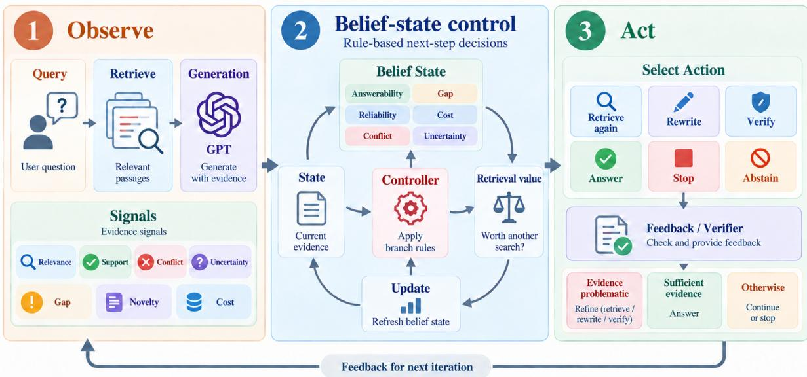  
Figure 1: BeliefRAG as a closed-loop evidence controller. The system converts the current evidence into diagnostic signals and a compact belief state, then applies fixed branch rules to choose among retrieval, rewriting, verification, answering, stopping, and abstention. Retrieval value and verifier feedback determine whether more evidence is worth acquiring and update the next iteration. The controller is non-RL; only the sufficiency and retrieval-value estimates are fitted from data.

Evidence quality and conflict. Topically relevant evidence can still be misleading, and models may over-weight relevance when judging its quality (Wan et al., 2024). Retrieved evidence can conflict with parametric knowledge, biasing models toward faulty internal memory (Jin et al., 2024). Conflicting sources can also substantially degrade RAG performance (Pham et al., 2024). Retrieved context can make standard uncertainty estimates unreliable (Soudani et al., 2025). BeliefRAG therefore tracks evidence quality, conflict, and answerability across steps rather than relying on one relevance or confidence score.

## 3 Methodology

## 3.1 Overview

BeliefRAG controls what to do after each retrieval. A retrieved passage being relevant does not yet mean that the question can be answered: a required fact may still be missing, two passages may disagree, or another search may simply repeat what is already known. The controller therefore makes three decisions from the evidence accumulated so far: should the evidence be corrected, is it sufficient to answer, and ifnot, is another retrieval worth doing?

At step $t ,$ the agent maintains

$$
s _ { t } = ( q , E _ { t } , H _ { t } , b _ { t } ) ,\tag{1}
$$

where $q$ is the question, $E _ { t }$ is the evidence currently retained, $H _ { t }$ records previous queries and actions, and $b _ { t }$ summarizes the current evidence condition. Each step follows

$$
{ \begin{array} { r l } & { { \mathrm { m e a s u r e ~ } } E _ { t } \to { \mathrm { u p d a t e ~ } } b _ { t } } \\ & { \qquad \to { \mathrm { c h o o s e ~ a n ~ a c t i o n } } \to { \mathrm { u p d a t e ~ } } E _ { t } . } \end{array} }
$$

Importantly, $E _ { t }$ is not an append-only retrieval history: RETRIEVE can add passages, while VERIFY can remove passages judged unhelpful.

## 3.2 Measuring the Current Evidence

Before making a decision, BeliefRAG computes seven diagnostics,

$$
x _ { t } = [ R _ { t } , S _ { t } , C _ { t } , U _ { t } , G _ { t } , N _ { t } , K _ { t } ] .\tag{2}
$$

They answer concrete questions about the evidence and are computed as shown in Table 1.

The four semantic quantities $S _ { t } , C _ { t } , U _ { t } , G _ { t }$ are produced together by one structured verifier call.

Table 1: Evidence diagnostics used at each decision step.
<table><tr><td>Meaning</td><td>Computation</td></tr><tr><td> $R _ { t }$  Relevance</td><td>Softmax-weighted mean of calibrated top-k retrieval scores.</td></tr><tr><td> $S _ { t }$  Support</td><td>Verifier score for how strongly  $E _ { t }$  sup- ports a complete answer.</td></tr><tr><td> $C _ { t }$  Conflict</td><td>Largest material contradiction within  $E _ { t }$  or between evidence and the current</td></tr><tr><td> $U _ { t }$ </td><td>draft. Uncertainty Verifier estimate of how uncertain the answer remains given only  $E _ { t } .$ </td></tr><tr><td> $G _ { t }$  Gap</td><td>Estimated fraction of information re- quired by the question that is still un-</td></tr><tr><td> $N _ { t }$  Novelty</td><td>supported.  $1 - \mathrm { s i m } ( \Delta E _ { t } , E _ { t - 1 } )$  ; high when the newest retrieval adds information not al-</td></tr><tr><td> $K _ { t }$  Cost</td><td>ready retained. min(1, tokens used/token budget).</td></tr></table>

$R _ { t } , N _ { t }$ , and $K _ { t }$ are computed locally. For example, the raw retriever score $z _ { t , i }$ of passage i at step t is first mapped to [0, 1] by

$$
\tilde { z } _ { t , i } = \sigma ( ( z _ { t , i } - \mu _ { s } ) / \tau _ { s } ) ,
$$

where $\sigma ( z ) ~ = ~ 1 / ( 1 + e ^ { - z } )$ is the logistic sigmoid, $\mu _ { s }$ is the retriever-score location statistic, and $\tau _ { s } > 0$ is its scale. $R _ { t }$ is then the softmax-weighted mean of the top-k calibrated scores, where k is the number of passages returned by one retrieval call. In Table 1, $\Delta E _ { t }$ denotes passages newly returned at step t, and sim is the configured passage-similarity function. Novelty compares these new passages with those already retained. Cost is not predicted by the model: it is the fraction of the token budget already consumed. Thus retrieval rounds, top-k, action count, and token budget remain different constraints rather than one vague “capacity” variable.

## 3.3 From Diagnostics to Belief

The diagnostics describe individual properties of $E _ { t }$ . BeliefRAG converts them into six quantities with direct decision meanings:

$$
\boldsymbol { b } _ { t } = [ \boldsymbol { b } _ { t } ^ { \mathrm { s u f f } } , \boldsymbol { b } _ { t } ^ { \mathrm { r e l } } , \boldsymbol { b } _ { t } ^ { \mathrm { c o n f } } , \boldsymbol { b } _ { t } ^ { \mathrm { u n c } } , \boldsymbol { b } _ { t } ^ { \mathrm { g a p } } , \boldsymbol { b } _ { t } ^ { \mathrm { c o s t } } ] .\tag{3}
$$

Sufficiency means that the retained evidence is enough to answer; reliability means that the retained sources appear trustworthy; conflict means that the evidence materially disagrees; uncertainty means that the answer is still unclear; gap means that required information is still missing; and cost records how much acquisition budget has already been spent.

These quantities are related but not interchangeable. For example, a passage may be highly relevant and well supported but still leave the second hop of a multi-hop question unresolved. Similarly, two individually relevant passages may contradict each other. Sufficiency therefore asks a higherlevel question than relevance or support: can the question be answered correctly from the evidence retained now?

For each inferred dimension, the complete diagnostic vector is mapped to an instantaneous belief. Here $\alpha _ { d }$ is a dimension-specific intercept, $w _ { d }$ is its diagnostic-weight vector, and d indexes the five inferred (non-cost) dimensions:

$$
\begin{array} { r l } & { \hat { b } _ { t } ^ { d } = \sigma ( \alpha _ { d } + w _ { d } ^ { \top } x _ { t } ) , } \\ & { ~ d \in \{ \mathrm { s u f f } , \mathrm { r e l } , \mathrm { c o n f } , \mathrm { u n c } , \mathrm { g a p } \} . } \end{array}\tag{4}
$$

For example, sufficiency increases with support and relevance and decreases with evidence gap, uncertainty, and conflict; reliability increases with relevance and support but decreases with conflict. Cost is observed directly: $b _ { t } ^ { \mathrm { c o s t } } = K _ { t }$

Because one verifier call can be noisy, the new estimate is blended with the previous belief, where $\lambda _ { d } ~ \in ~ [ 0 , 1 ]$ is the weight placed on the current observation in logit space:

$$
\begin{array} { r } { b _ { t } ^ { d } = \sigma \big ( ( 1 - \lambda _ { d } ) \log \mathrm { i t } ( b _ { t - 1 } ^ { d } ) } \\ { + \lambda _ { d } \log \mathrm { i t } ( \hat { b } _ { t } ^ { d } ) \big ) . \quad } \end{array}\tag{5}
$$

The exact coefficients and initial values are reported in Appendix A.

Operational answerability. The persistent belief coordinate $b _ { t } ^ { \mathrm { s u f f } }$ and the answer gate are distinct. The former summarizes evidence sufficiency; the latter uses

$$
p _ { t } ^ { \mathrm { a n s } } = P ( \mathrm { a n s w e r a b l e } \mid q , E _ { t } ) ,\tag{6}
$$

where “answerable” means that the frozen generator produces a correct answer under the fixed prompt. Because that prompt requests a best short answer even when documents are incomplete, $p _ { t } ^ { \mathrm { a n s } }$ may reflect frozen parametric knowledge and is not evidence-only entailment. We fit $p _ { t } ^ { \mathrm { a n s } } = \sigma ( \alpha _ { \mathrm { a n s } } + w _ { \mathrm { a n s } } ^ { \top } x _ { t } )$ on HotpotQA train, select it on development data, and freeze it across all six benchmarks; Appendix A.3 gives the fitted parameters.

Table 2: Main decision rules. Values are the default operating thresholds; experiment-specific selected values are reported in the Appendix.
<table><tr><td>Decision</td><td>Condition Default</td></tr><tr><td>Correct</td><td>Evidence is materially conflict-  $b _ { t } ^ { \mathrm { c o n f } } ~ \geq ~ 0 . 5 0$  ing or clearly unreliable  $\mathrm { o r } \ b _ { t } ^ { \mathrm { r e l } } < 0 . 3 0$ </td></tr><tr><td>Answer able</td><td>Current state is operationally an-  $p _ { t } ^ { \mathrm { a n s } } \geq 0 . 5 0$  swerable and conflict is accept-</td></tr><tr><td>Retrieve</td><td>Evidence is insufficient, budget  $p _ { t } ^ { \mathrm { f i p } } \geq 0 . 1 0$  remains, and another retrieval has enough chance to make it an-</td></tr><tr><td>Rewrite</td><td>swerable Another retrieval is useful, but  $N _ { t } < 0 . 2 0$  the previous retrieval added little</td></tr><tr><td></td><td>new information Stop / Abstain Evidence is still insufficient and no useful ac- further acquisition has low ex- quisition pected value</td></tr></table>

## 3.4 How Beliefs Produce Actions

BeliefRAG chooses among six actions:

## A = {RETRIEVE, REWRITE, VERIFY, ANSWER, STOP, ABSTAIN}.

Rather than scoring them as unrelated choices, the main controller evaluates a short sequence of questions shown in Table 2.

Correcting bad evidence. The controller checks correction before answering. A high conflict score means that the retained passages materially disagree; low reliability means that their combined relevance/support pattern is not trustworthy enough. The verifier can also return identifiers of passages it considers unhelpful; when that trigger is enabled, those passages provide an additional correction signal.

Correction is not simply deletion:

$$
\mathrm { V E R I F Y } \to \mathrm { p r u n e } \to \mathrm { R E W R I T E } \to \mathrm { R E T R I E V E } .
$$

Verification first removes the problematic passages, then the query is reformulated and a replacement retrieval is issued. This design matters because deleting weak evidence without replacing the missing information may leave the question even less answerable.

Deciding when to answer. After correction is considered, the controller checks $p _ { t } ^ { \mathrm { a n s } }$ . The default threshold is $\tau _ { \mathrm { a n s } } = 0 . 5 0 \colon$ under the probability interpretation, the current evidence must be at least as likely to be answerable as not. The threshold is an operating point rather than a universal constant; when it is selected on a development/selection split, it is frozen before final evaluation.

Deciding whether to retrieve again. $\mathrm { I f } \ p _ { t } ^ { \mathrm { a n s } } <$ $\tau _ { \mathrm { a n s } }$ , the agent does not automatically retrieve merely because it is uncertain. It asks a second question: is one more retrieval likely to change the statefrom insufficient to sufficient? We estimate

$$
p _ { t } ^ { \mathrm { { f i p } } } = \sigma { \Bigl ( } \alpha _ { \mathrm { { f i p } } } + w _ { r } ^ { \mathrm { { f i p } } } r _ { t } + w _ { N } ^ { \mathrm { { f i p } } } N _ { t } + w _ { s } ^ { \mathrm { { f i p } } } b _ { t } ^ { \mathrm { { s u f f } } } { \Bigr ) }\tag{7}
$$

where $r _ { t }$ is the number of retrieval rounds already used and $\alpha _ { \mathrm { f l i p } } , w _ { r } ^ { \mathrm { f l i p } } , w _ { N } ^ { \mathrm { f l i p } } , w _ { s } ^ { \mathrm { f l i p } }$ are retrieval-value coefficients fitted on the fit split (or replaced by the fixed fallback schedule reported in the Appendix). The default minimum acquisition value is 0.10. Thus another search is attempted only when it has at least the required estimated chance of making the evidence answerable and retrieval budget remains.

Novelty then decides how to continue. If the previous retrieval added useful new information $( N _ { t } \ge 0 . 2 0$ by default), the controller can issue another retrieval. If novelty is below 0.20, repeating essentially the same query is unlikely to help, so the controller prefers REWRITE before searching again.

Stopping and abstention. If the evidence is not sufficiently answerable and another acquisition has low value, the controller stops spending the remaining budget. STOP means “use the evidence we have and produce the best answer”; ABSTAIN means “the evidence is inadequate and no useful acquisition remains.” Low confidence alone is therefore not an abstention rule: uncertainty must be combined with evidence insufficiency and low acquisition value.

## 3.5 Controlled Evaluation

The retriever, generator, verifier, answer prompt, evaluator, and budget are held fixed across compared controllers. The main answerability calibrator is fitted once on HotpotQA train and selected on HotpotQA development data, then reused unchanged across all six benchmarks. Separate fit/selection/holdout partitions are used for the causal analyses. Exact thresholds, fitted coefficients, prompts, budget limits, and reproduction details are given in Appendix A.

## 4 Experiments

We evaluate BELIEFRAG in one shared harness so that differences come from the retrieval controller rather than from different tools or prompts. The language model acts as the agent’s generator: it writes search queries and final answers, but it cannot retrieve documents or execute actions by itself. The harness executes every RETRIEVE, REWRITE, VERIFY, ANSWER, STOP, or ABSTAIN action and records the resulting evidence, belief state, and cost. All compared methods therefore share the same generator, retriever, verifier, answer prompt, evaluator, and budget.

## 4.1 Tasks and Benchmarks

The main experiment uses six QA benchmarks with two different roles. HotpotQA (Yang et al., 2018), 2WikiMultiHopQA (Ho et al., 2020), and MuSiQue (Trivedi et al., 2022) are multi-hop tasks: the answer usually depends on connecting more than one fact, so the first retrieval can be relevant but still incomplete. They test whether a controller knows when more evidence is needed. Natural Questions (Kwiatkowski et al., 2019), TriviaQA (Joshi et al., 2017), and PopQA (Mallen et al., 2023) are open-domain factoid tasks. These are useful controls because one retrieval—or even the model’s parametric knowledge—may already be enough, leaving less room for multi-step control. Every main-table cell evaluates the same n = 100 questions for a dataset.

We use two additional diagnostic benchmarks outside the six-dataset average. RGB (Chen et al., 2024) replaces clean evidence with irrelevant or deliberately misleading passages, so it tests whether the controller can distinguish “more evidence” from “better evidence.” HoloBench (Maekawa et al., 2025) asks for sets of database rows rather than a single fact, so it tests whether a retrieval strategy can recover enough distinct items without reading the whole candidate pool. These diagnostic numbers are reported separately because their metrics are not directly comparable with QA accuracy.

## 4.2 Baselines and Backbones

The primary comparison uses gpt-oss-120b (OpenAI, 2025). We also repeat the six-dataset evaluation with Qwen3-32B (Yang et al., 2025) as a second backbone; those results are reported in Appendix Tables 7–8. Within each backbone, the model writes search queries and final answers, while the shared harness executes retrieval and every controller action. The Qwen study uses the same HotpotQA train/dev calibration protocol, refitted for that backbone and then frozen across all six evaluation datasets. The baselines isolate increasingly adaptive forms of retrieval control. No-

RAG is the closed-book control (Brown et al., 2020). Static RAG retrieves once and then answers (Lewis et al., 2020). Iterative RAG always follows the fixed multi-round schedule, showing what brute-force extra search can buy (Jiang et al., 2023). Adaptive-k retrieves once but varies how many passages are kept from the score distribution (Taguchi et al., 2025), while Adaptive-RAG routes each question once to no, single-step, or iterative retrieval based on predicted complexity (Jeong et al., 2024). Self-RAG\* is a commonharness retrieval-trigger variant that isolates the decision to retrieve again (Asai et al., 2024); CRAG evaluates the current evidence and, when it is poor, prunes, rewrites, and retrieves again (Yan et al., 2024). RL-Search is a prompted multi-step search controller using the Search-R1/R3-RAG interaction format, not an RL-trained reproduction (Jin et al., 2025; Li et al., 2025). BELIEFRAG uses the evolving evidence state to decide whether to correct, retrieve again, rewrite, answer, stop, or abstain.

Unless an analysis states otherwise, every retrieving method can make at most three retrieval calls, receives top-k = 5 passages per call, can take at most six controller actions, and has a 12ktoken budget. These limits are separate: retrieval rounds control how often search can occur, top-k controls how many passages one search returns, the action limit caps controller decisions, and the token budget measures the total text processed by the model.

## 4.3 Metrics and Evaluation Protocol

The primary QA metric for the benchmark and cross-backbone comparisons is normalized tokenlevel answer F1, a deterministic overlap score already recorded by the harness. We use F1 for these headline comparisons because it does not depend on an LLM judge. Exact match (EM) is a stricter secondary answer metric, while LLM-judged semantic accuracy is reported as a supplementary semantic check. The judge shares the evaluated backbone, so acc\_judge is interpreted within a backbone and is not used for cross-backbone comparisons; headline transfer claims use deterministic token F1. Controlled mechanism and robustness analyses retain semantic ACC where their interventions were originally evaluated with that metric, and label it explicitly. Efficiency is measured by mean total tokens per question,

$$
\mathrm { T o k e n s } = \frac { 1 } { N } \sum _ { i = 1 } ^ { N } T _ { i } ,\tag{8}
$$

where $T _ { i }$ includes retrieved text each time it is sent to the model, verifier calls, query rewriting, policy prompts, and final answer generation. We also report retrieval rounds, action counts, and evidence recall when supporting-fact annotations exist. Evidence recall is the fraction of annotated supporting facts recovered in the retained evidence.

For HoloBench, row recall is the fraction of gold rows recovered, while recall per row read divides row recall by the mean number of rows inspected (scaled by $1 0 ^ { 3 }$ in the figure). The latter measures retrieval efficiency rather than answer quality. The complementary HoloBench result is reported in Appendix Figure 7, separate from the six-dataset QA comparison.

For signal analyses, AUC measures how well a score ranks positive states above negative ones, while expected calibration error (ECE) measures how closely predicted probabilities match empirical frequencies; lower ECE is better. Paired comparisons always use the same questions. Confidence intervals are obtained by bootstrap resampling over questions; exact aggregation details are in Appendix D.6.

Calibration and evaluation are separated. For the main results, we fit a logistic answerability calibrator over the full diagnostic vector on 300 HotpotQA training examples, select the calibrator configuration on 156 HotpotQA development examples by Brier score, and then freeze it for all six datasets without per-dataset retuning. Dedicated causal analyses use disjoint xfit/xsel/xhold partitions so that fitted mappings, operating choices, and final evaluation remain separated; Appendix D.5 gives the exact protocols and contamination checks.

## 5 Results

## 5.1 Main Result: Quality and Cost

Table 3 compares all nine methods under the same gpt-oss-120b generator, retriever, verifier, prompt, and evaluation set. Figure 2 plots the same comparison against token use.

BELIEFRAG achieves the highest mean F1 while using substantially less retrieval compute. BELIEFRAG reaches mean F1 0.572 versus 0.555 for fixed Iterative RAG, while using 3.89k rather than 6.35k tokens per question—about 39% less. BELIEFRAG is higher on four of six datasets (HotpotQA, 2Wiki, MuSiQue, and NQ), while Iterative RAG is higher on TriviaQA and PopQA. The result therefore reflects a quality–cost improvement rather than uniform gains on every dataset.

(a) F1–cost trade-off  
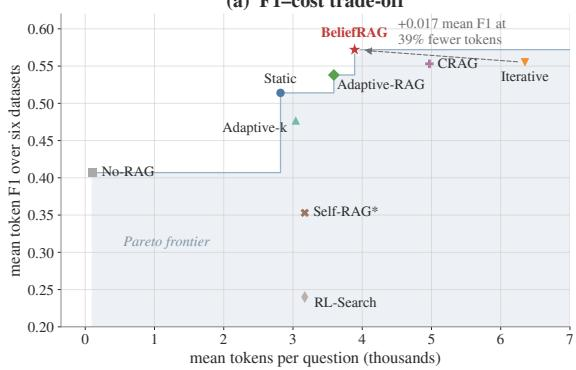  
Figure 2: F1–cost trade-off. Each point is a method average over the six QA datasets in Table 3.

The same pattern is stronger with a second backbone. With Qwen3-32B, BELIEFRAG reaches 0.552 mean F1 versus 0.523 for Iterative RAG while using 3.78k versus 5.81k tokens, a 35% reduction. It is higher on five of six datasets; full F1, EM, LLM-judge, token, and retrieval results are reported in Appendix Tables 7–8.

## 5.2 Analysis 1: Which Parts Create the Gain?

This analysis separates two roles of the controller. Panel (a) asks whether detecting weak evidence is enough; Panels (b–c) intervene on calibrated answerability $p _ { t } ^ { \mathrm { a n s } }$ (legacy run label: “sufficiency”), not on $b _ { t } ^ { \mathrm { s u f f } }$

The gain comes from replacing weak evidence, not just detecting it. Figure 3(a) shows that the full controller reaches 0.680 multi-hop ACC. Removing correction, removing verification, or pruning weak evidence without replacing it all reduce ACC to 0.630. This means that identifying a bad passage is not enough. The controller improves only when it removes weak evidence and retrieves a replacement that fills the missing information.

The live answerability signal helps the controller stop once the current state becomes answerable. With the answer threshold fixed at $\tau = 0 . 5 5 0$ , live $p _ { t } ^ { \mathrm { a n s } }$ reaches 0.685 ACC across the three multi-hop datasets. Permuting that score across matched states lowers ACC to 0.650, while freezing it throughout the trajectory gives 0.655. The live score also uses fewer retrieval rounds:

Table 3: Main comparison on six QA benchmarks with gpt-oss-120b (OpenAI, 2025) as the language backbone. The primary metric is normalized token-level answer F1; all cells use $n = 1 0 0$ questions. Mean is the simple average across the six datasets and Tokens is mean total token cost per question. Cell color shows the F1 change from Static RAG on the same dataset. Bold marks the best F1 in each column.
<table><tr><td rowspan=1 colspan=9>Multi-hop QA           Open-domain QAMethod                                                                                                   Mean TokensHotpotQA 2Wiki MuSiQue NQ TriviaQA PopQA</td></tr><tr><td rowspan=9 colspan=1>No-RAG (Brown et al., 2020)Static RAG (Lewis et al., 2020)Adaptive-k (Taguchi et al., 2025)Adaptive-RAG (Jeong et al., 2024)Iterative RAG (Jiang et al., 2023)CRAG (Yan et al., 2024)Self-RAG* (Asai et al., 2024)RL-Search (Jin et al., 2025; Li et al., 2025)BELIEFRAG</td><td rowspan=1 colspan=1>.378</td><td rowspan=1 colspan=1>.411</td><td rowspan=1 colspan=1>.167</td><td rowspan=1 colspan=1>.341</td><td rowspan=1 colspan=1>.766</td><td rowspan=1 colspan=1>.381</td><td rowspan=1 colspan=1>.407</td><td rowspan=1 colspan=1>0.10k</td></tr><tr><td rowspan=1 colspan=1>.559</td><td rowspan=1 colspan=1>.681</td><td rowspan=1 colspan=1>.423</td><td rowspan=1 colspan=1>.413</td><td rowspan=1 colspan=1>.681</td><td rowspan=1 colspan=1>.324</td><td rowspan=1 colspan=1>.514</td><td rowspan=1 colspan=1>2.82k</td></tr><tr><td rowspan=1 colspan=1>.535</td><td rowspan=1 colspan=1>.558</td><td rowspan=1 colspan=1>.360</td><td rowspan=1 colspan=1>.347</td><td rowspan=1 colspan=1>.715</td><td rowspan=1 colspan=1>.348</td><td rowspan=1 colspan=1>.477</td><td rowspan=1 colspan=1>3.04k</td></tr><tr><td rowspan=1 colspan=1>.575</td><td rowspan=1 colspan=1>.711</td><td rowspan=1 colspan=1>.445</td><td rowspan=1 colspan=1>.425</td><td rowspan=1 colspan=1>.751</td><td rowspan=1 colspan=1>.324</td><td rowspan=1 colspan=1>.538</td><td rowspan=1 colspan=1>3.59k</td></tr><tr><td rowspan=1 colspan=1>.588</td><td rowspan=1 colspan=1>.710</td><td rowspan=1 colspan=1>.420</td><td rowspan=1 colspan=1>.420</td><td rowspan=1 colspan=1>.750</td><td rowspan=1 colspan=1>.440</td><td rowspan=1 colspan=1>.555</td><td rowspan=1 colspan=1>6.35k</td></tr><tr><td rowspan=1 colspan=1>.573</td><td rowspan=1 colspan=1>.725</td><td rowspan=1 colspan=1>.433</td><td rowspan=1 colspan=1>.423</td><td rowspan=1 colspan=1>.709</td><td rowspan=1 colspan=1>.454</td><td rowspan=1 colspan=1>.553</td><td rowspan=1 colspan=1>4.97k</td></tr><tr><td rowspan=1 colspan=1>.482</td><td rowspan=1 colspan=1>.654</td><td rowspan=1 colspan=1>.356</td><td rowspan=1 colspan=1>.246</td><td rowspan=1 colspan=1>.100</td><td rowspan=1 colspan=1>.282</td><td rowspan=1 colspan=1>.353</td><td rowspan=1 colspan=1>3.17k</td></tr><tr><td rowspan=1 colspan=1>.303</td><td rowspan=1 colspan=1>.308</td><td rowspan=1 colspan=1>.223</td><td rowspan=1 colspan=1>.102</td><td rowspan=1 colspan=1>.275</td><td rowspan=1 colspan=1>.230</td><td rowspan=1 colspan=1>.240</td><td rowspan=1 colspan=1>3.17k</td></tr><tr><td rowspan=1 colspan=1>.602</td><td rowspan=1 colspan=1>.766</td><td rowspan=1 colspan=1>.495</td><td rowspan=1 colspan=1>.441</td><td rowspan=1 colspan=1>.716</td><td rowspan=1 colspan=1>.410</td><td rowspan=1 colspan=1>.572</td><td rowspan=1 colspan=1>3.89k</td></tr></table>

Color bins use absolute F1 changefrom Static RAG: light [.01, .05), medium $[ . 0 5 , . 1 0 )$ , dark ≥ .10; symmetric bins are usedfor losses. All rows use the same gpt-oss-120b evaluation questions; No-RAG, Adaptive-k, and Adaptive-RAG are from the same evaluation run as the other rows. $S e l f { - } R A G ^ { * }$ and RL-Search are common-harness mechanism variants rather thanfull reproductions; see Section 4.

1.48 on average, compared with 1.81 for both controls. This intervention isolates the calibrated answer gate; it does not manipulate $b _ { t } ^ { \mathrm { s u f f } }$

Key takeaway. The gain comes from replacing weak evidence, not merely detecting it. Calibrated answerability then tells the controller when to stop searching and answer.

## 5.3 Analysis 2: Do Thresholds Keep the Same Meaning?

The controller answers when a score crosses a threshold, so transfer requires comparable score meaning across datasets. We compare raw and calibrated answerability scales and replay visited states to test gate reachability.

Calibration matters because thresholds depend on the scale of the score they use. Figure 4(a) shows that the raw answerability score has substantially different medians across datasets, with a spread of 0.352. We fit a logistic calibrator over the full diagnostic vector on HotpotQA train, select it on HotpotQA development data by Brier score, and then freeze it across all six datasets without retuning. Calibration reduces the median spread to 0.048. Panel (b) shows the consequence: the raw threshold occupies very different parts of the score distribution across datasets, whereas the calibrated threshold lies in a more consistent operating region.

A configured gate matters only if real trajectories can reach it. Panel (c) measures how often gate conditions are satisfied on visited states. The calibrated answer gate fires on 67.7% of audited main-table states. The conflict gate fires on 72% of counterfactual-evidence cases but only 8% of ordinary QA. This is the intended behavior of a specialized signal: it remains quiet when the failure is absent and becomes active when that failure appears. A gate that stays near 0% or 100% across inputs would contribute little adaptive behavior.

Key takeaway. A fixed threshold is useful only if its score keeps the same meaning. Calibration stabilizes that meaning, while reachability checks whether the gate actually affects visited states.

## 5.4 Analysis 3: What Information Is in the Belief State?

The six belief dimensions summarize different aspects of the same evidence set. We therefore ask both whether each dimension predicts correctness and whether it contributes information beyond the others. Figure 5 combines single-signal prediction, dependence, calibration, and action patterns across belief levels.

The joint state is more informative than any single dimension, but the signals are correlated and unevenly useful. Panel (a) measures how well each signal ranks correct versus incorrect states. The joint state reaches AUC 0.816, compared with 0.761 for the strongest single signal, uncertainty. Uncertainty, gap, and sufficiency are the strongest individual predictors; conflict is also informative, while reliability and cost are weaker. Panel (b) shows that several dimensions are correlated because they reflect shared problems such as missing evidence. Their value therefore comes from complementary information and downstream use, not from signal count alone.

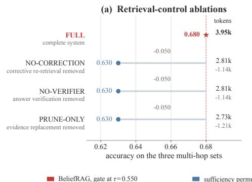

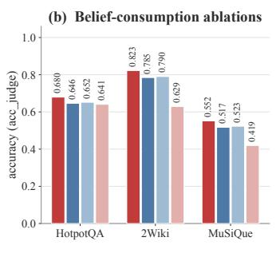

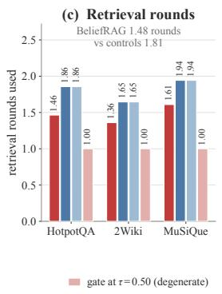

Figure 3: Mechanism ablations. (a) Retrieval-control ablations. (b–c) Interventions on $p _ { t } ^ { \mathrm { a n s . } } ;$ “sufficiency” is the legacy run label.  
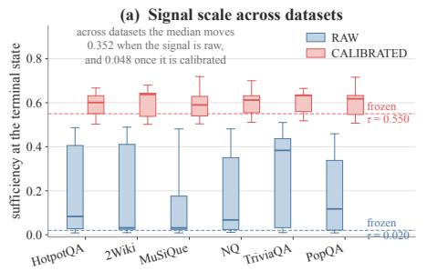

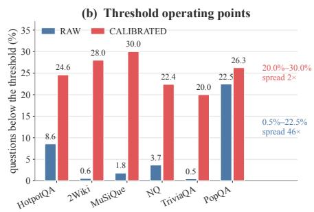  
(c) Gate reachability

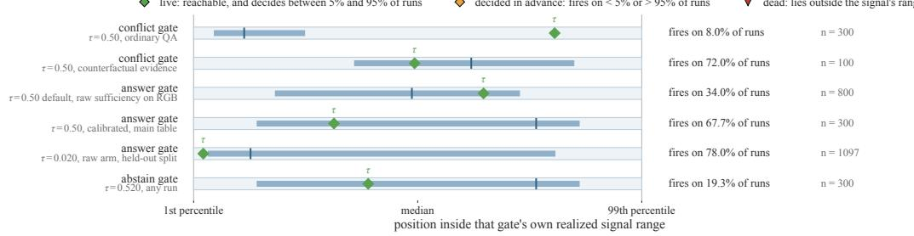  
Figure 4: Threshold transfer and reachability. (a) Answerability scale. (b) Operating points. (c) Gate reachability. “Sufficiency” is the legacy label for this score.

Useful belief scores should be calibrated and linked to different controller behavior. Panel (c) shows that sufficiency and reliability are well calibrated, with ECE values of 0.039 and 0.045. Panel (d) shows the corresponding behavioral association: higher sufficiency and reliability are followed more often by answering, whereas higher uncertainty, gap, and cost are associated with stopping or further retrieval. These results establish interpretation and association for the belief dimensions. The intervention in Figure 3 instead tests the separate calibrated answerability score $p _ { t } ^ { \mathrm { a n s } }$ ; it should not be read as a causal intervention on $b _ { t } ^ { \mathrm { s u f f } }$

Key takeaway. The value of a belief signal comes from added information, calibrated meaning, and a useful effect on decisions–not from the number of state dimensions.

## 5.5 Analysis 4: What Happens When Evidence Is Imperfect?

RGB separates three evidence failures often conflated in QA. Irrelevant noise adds useless but non-false passages; counterfactual evidence actively supports a wrong answer; source transfer tests whether the same answerability estimator still works when evidence comes from a different source. These settings probe distinct failure modes and should not be reduced to one “robustness” score.

Ignoring irrelevant evidence is easier than resisting plausible but false evidence. Figure 6(a) replaces retrieved passages with irrelevant documents. At 80% injection, BELIEFRAG retains 0.87 ACC, versus 0.80 for Static, 0.81 for Iterative, and 0.82 for CRAG, only three points below clean performance. Panel (b) is harder: BELIEFRAG follows the false answer on 25% of questions, versus 35–41% for the baselines, while recovering the true answer on 30%. Robustness to irrelevant text therefore does not imply robustness to coherent misinformation.

(d) Actions by belief level  
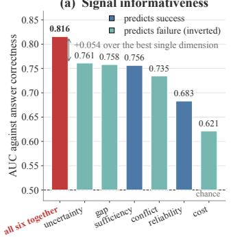

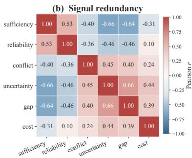

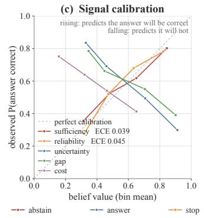

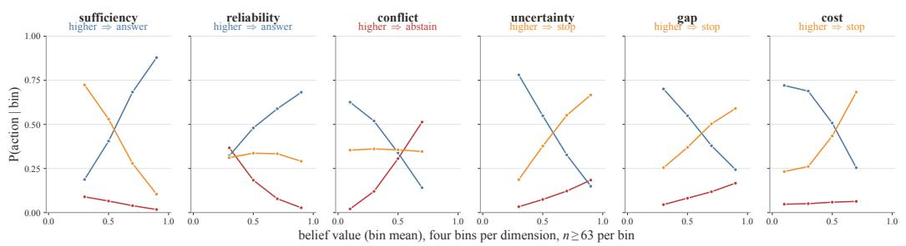

Figure 5: Belief-state diagnostics. (a) Signal usefulness. (b) Signal dependence. (c) Signal calibration. (d) Actions by belief level.  
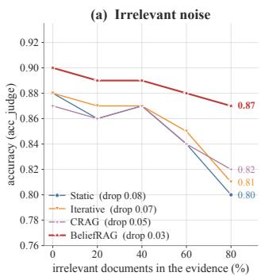

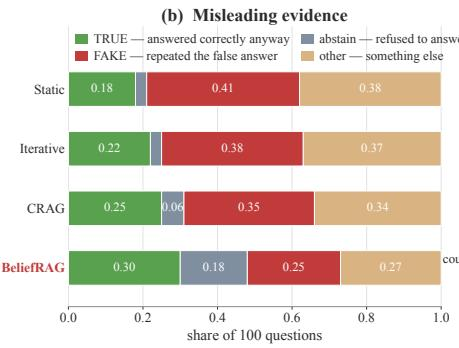

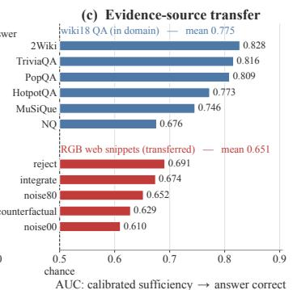  
Figure 6: Robustness to imperfect evidence. (a) Irrelevant noise. (b) Misleading evidence. (c) Evidence-source transfer.

Calibration can align score scales, but not guarantee source invariance. Panel (c) applies the same answerability calibrator to Wikipedia QA evidence and RGB web snippets. Average AUC drops from 0.775 to 0.651. Because AUC measures ranking rather than threshold placement, the drop reflects a less predictive evidence representation under source shift, not only threshold miscalibration. Calibration can stabilize related datasets but cannot guarantee transfer across qualitatively different evidence sources.

Key takeaway. Robustness depends on the failure type. Filtering irrelevant or misleading passages does not solve source shift, where the diagnostic itself can lose ranking quality.

## 6 Conclusion and Limitations

BELIEFRAG treats retrieval as sequential evidence control. It reaches 0.572 mean F1 with 39% fewer tokens than Iterative RAG on gpt-oss-120b, and 0.552 with 35% fewer tokens on Qwen3-32B. Gains mainly come from evidence replacement and answerability-guided stopping. Limitations include lexical retrieval, only n = 100 questions per dataset, backbone-specific calibration, selfjudged auxiliary metrics, and degraded transfer under evidence-source shift.

## References

Akari Asai, Zeqiu Wu, Yizhong Wang, Avirup Sil, and Hannaneh Hajishirzi. 2024. Self-RAG: Learning to retrieve, generate, and critique through self-reflection. In The Twelfth International Conference on Learning Representations.

Tom B. Brown, Benjamin Mann, Nick Ryder, Melanie Subbiah, Jared D. Kaplan, Prafulla Dhariwal, Arvind Neelakantan, Pranav Shyam, Girish Sastry, Amanda Askell, Sandhini Agarwal, Ariel Herbert-Voss, Gretchen Krueger, Tom Henighan, Rewon Child, Aditya Ramesh, Daniel Ziegler, Jeffrey Wu, Clemens Winter, Chris Hesse, Mark Chen, Eric Sigler, Mateusz Litwin, Scott Gray, Benjamin Chess, Jack Clark, Christopher Berner, Sam McCandlish, Alec Radford, Ilya Sutskever, and Dario Amodei. 2020. Language models are few-shot learners. In Advances in Neural Information Processing Systems, volume 33, pages 1877–1901.

Jiawei Chen, Hongyu Lin, Xianpei Han, and Le Sun. 2024. Benchmarking large language models in retrieval-augmented generation. Proceedings of the AAAI Conference on Artificial Intelligence, 38(16):17754–17762.

Xanh Ho, Anh-Khoa Duong Nguyen, Saku Sugawara, and Akiko Aizawa. 2020. Constructing a multi-hop QA dataset for comprehensive evaluation of reasoning steps. In Proceedings of the 28th International Conference on Computational Linguistics, pages 6609–6625. International Committee on Computational Linguistics.

Liu Huanshuo, Hao Zhang, Zhijiang Guo, Jing Wang, Kuicai Dong, Xiangyang Li, Yi Quan Lee, Cong Zhang, and Yong Liu. 2025. CtrlA: Adaptive retrieval-augmented generation via inherent control. In Findings of the Association for Computational Linguistics: ACL 2025, pages 12592–12618, Vienna, Austria. Association for Computational Linguistics.

Soyeong Jeong, Jinheon Baek, Sukmin Cho, Sung Ju Hwang, and Jong Park. 2024. Adaptive-RAG: Learning to adapt retrieval-augmented large language models through question complexity. In Proceedings of the 2024 Conference of the North American Chapter of the Association for Computational Linguistics: Human

Language Technologies (Volume 1: Long Papers), pages 7036–7050. Association for Computational Linguistics.

Zhengbao Jiang, Frank Xu, Luyu Gao, Zhiqing Sun, Qian Liu, Jane Dwivedi-Yu, Yiming Yang, Jamie Callan, and Graham Neubig. 2023. Active retrieval augmented generation. In Proceedings of the 2023 Conference on Empirical Methods in Natural Language Processing, pages 7969–7992. Association for Computational Linguistics.

Bowen Jin, Hansi Zeng, Zhenrui Yue, Jinsung Yoon, Sercan Ö. Arık, Dong Wang, Hamed Zamani, and Jiawei Han. 2025. Search-R1: Training LLMs to reason and leverage search engines with reinforcement learning. In Proceedings of the 2nd Conference on Language Modeling (COLM 2025).

Zhuoran Jin, Pengfei Cao, Yubo Chen, Kang Liu, Xiaojian Jiang, Jiexin Xu, Li Qiuxia, and Jun Zhao. 2024. Tug-of-war between knowledge: Exploring and resolving knowledge conflicts in retrieval-augmented language models. In Proceedings of the 2024 Joint International Conference on Computational Linguistics, Language Resources and Evaluation (LREC-COLING 2024), pages 16867–16878, Torino, Italia. ELRA and ICCL.

Mandar Joshi, Eunsol Choi, Daniel S. Weld, and Luke Zettlemoyer. 2017. TriviaQA: A large scale distantly supervised challenge dataset for reading comprehension. In Proceedings of the 55th Annual Meeting of the Association for Computational Linguistics (Volume 1: Long Papers), pages 1601–1611. Association for Computational Linguistics.

Leslie Pack Kaelbling, Michael L. Littman, and Anthony R. Cassandra. 1998. Planning and acting in partially observable stochastic domains. Artificial Intelligence, 101(1–2):99–134.

Tom Kwiatkowski, Jennimaria Palomaki, Olivia Redfield, Michael Collins, Ankur Parikh, Chris Alberti, Danielle Epstein, Illia Polosukhin, Jacob Devlin, Kenton Lee, Kristina Toutanova, Llion Jones, Matthew Kelcey, Ming-Wei Chang, Andrew M. Dai, Jakob Uszkoreit, Quoc Le, and Slav Petrov. 2019. Natural questions: A benchmark for question answering research. Trans-

actions of the Association for Computational Linguistics, 7:452–466.

Patrick Lewis, Ethan Perez, Aleksandra Piktus, Fabio Petroni, Vladimir Karpukhin, Naman Goyal, Heinrich Küttler, Mike Lewis, Wen-tau Yih, Tim Rocktäschel, Sebastian Riedel, and Douwe Kiela. 2020. Retrieval-augmented generation for knowledge-intensive NLP tasks. In Advances in Neural Information Processing Systems, volume 33, pages 9459–9474.

Yuan Li, Qi Luo, Xiaonan Li, Bufan Li, Qinyuan Cheng, Bo Wang, Yining Zheng, Yuxin Wang, Zhangyue Yin, and Xipeng Qiu. 2025. R3-RAG: Learning step-by-step reasoning and retrieval for LLMs via reinforcement learning. In Findings of the Association for Computational Linguistics: EMNLP 2025, pages 10491–10507. Association for Computational Linguistics.

Seiji Maekawa, Hayate Iso, and Nikita Bhutani. 2025. Holistic reasoning with long-context LMs: A benchmark for database operations on massive textual data. In The Thirteenth International Conference on Learning Representations.

Alex Mallen, Akari Asai, Victor Zhong, Rajarshi Das, Daniel Khashabi, and Hannaneh Hajishirzi. 2023. When not to trust language models: Investigating effectiveness of parametric and nonparametric memories. In Proceedings of the 61st Annual Meeting of the Association for Computational Linguistics (Volume 1: Long Papers), pages 9802–9822. Association for Computational Linguistics.

Viktor Moskvoretskii, Maria Marina, Mikhail Salnikov, Nikolay Ivanov, Sergey Pletenev, Daria Galimzianova, Nikita Krayko, Vasily Konovalov, Irina Nikishina, and Alexander Panchenko. 2025. Adaptive retrieval without self-knowledge? bringing uncertainty back home. In Proceedings ofthe 63rd Annual Meeting of the Association for Computational Linguistics (Volume 1: Long Papers), pages 6355– 6384, Vienna, Austria. Association for Computational Linguistics.

OpenAI. 2025. gpt-oss-120b & gpt-oss-20b model card. Model Card.

Quang Hieu Pham, Hoang Ngo, Anh Tuan Luu, and Dat Quoc Nguyen. 2024. Who’s who: Large lan-

guage models meet knowledge conflicts in practice. In Findings of the Association for Computational Linguistics: EMNLP 2024, pages 10142– 10151, Miami, Florida, USA. Association for Computational Linguistics.

Stephen Robertson and Hugo Zaragoza. 2009. The probabilistic relevance framework: BM25 and beyond. Foundations and Trends in Information Retrieval, 3(4):333–389.

Heydar Soudani, Evangelos Kanoulas, and Faegheh Hasibi. 2025. Why uncertainty estimation methods fall short in RAG: An axiomatic analysis. In Findings of the Association for Computational Linguistics: ACL 2025, pages 16596– 16616, Vienna, Austria. Association for Computational Linguistics.

Weihang Su, Yichen Tang, Qingyao Ai, Zhijing Wu, and Yiqun Liu. 2024. DRAGIN: Dynamic retrieval augmented generation based on the realtime information needs of large language models. In Proceedings of the 62nd Annual Meeting of the Association for Computational Linguistics (Volume 1: Long Papers), pages 12991–13013. Association for Computational Linguistics.

Chihiro Taguchi, Seiji Maekawa, and Nikita Bhutani. 2025. Efficient context selection for long-context QA: No tuning, no iteration, just adaptive-k. In Proceedings of the 2025 Conference on Empirical Methods in Natural Language Processing, pages 20105–20130. Association for Computational Linguistics.

Harsh Trivedi, Niranjan Balasubramanian, Tushar Khot, and Ashish Sabharwal. 2022. MuSiQue: Multihop questions via single-hop question composition. Transactions of the Association for Computational Linguistics, 10:539–554.

Alexander Wan, Eric Wallace, and Dan Klein. 2024. What evidence do language models find convincing? In Proceedings ofthe 62nd Annual Meeting of the Association for Computational Linguistics (Volume 1: Long Papers), pages 7468–7484, Bangkok, Thailand. Association for Computational Linguistics.

Fei Wang, Xingchen Wan, Ruoxi Sun, Jiefeng Chen, and Sercan Ö. Arık. 2025. Astute RAG: Overcoming imperfect retrieval augmentation

and knowledge conflicts for large language models. In Proceedings of the 63rd Annual Meeting ofthe Associationfor Computational Linguistics (Volume 1: Long Papers), pages 30553–30571. Association for Computational Linguistics.

Shi-Qi Yan, Jia-Chen Gu, Yun Zhu, and Zhen-Hua Ling. 2024. Corrective retrieval augmented generation. arXiv preprint arXiv:2401.15884.

An Yang, Anfeng Li, Baosong Yang, Beichen Zhang, Binyuan Hui, Bo Zheng, Bowen Yu, Chang Gao, Chengen Huang, Chenxu Lv, Chujie Zheng, Dayiheng Liu, Fan Zhou, Fei Huang, Feng Hu, Hao Ge, Haoran Wei, Huan Lin, Jialong Tang, Jian Yang, Jianhong Tu, Jianwei Zhang, Jianxin Yang, Jiaxi Yang, Jing Zhou, Jingren Zhou, Junyang Lin, Kai Dang, Keqin Bao, Kexin Yang, Le Yu, Lianghao Deng, Mei Li, Mingfeng Xue, Mingze Li, Pei Zhang, Peng Wang, Qin Zhu, Rui Men, Ruize Gao, Shixuan Liu, Shuang Luo, Tianhao Li, Tianyi Tang, Wenbiao Yin, Xingzhang Ren, Xinyu Wang, Xinyu Zhang, Xuancheng Ren, Yang Fan, Yang Su, Yichang Zhang, Yinger Zhang, Yu Wan, Yuqiong Liu, Zekun Wang, Zeyu Cui, Zhenru Zhang, Zhipeng Zhou, and Zihan Qiu. 2025. Qwen3 technical report. arXiv preprint arXiv:2505.09388.

Zhilin Yang, Peng Qi, Saizheng Zhang, Yoshua Bengio, William W. Cohen, Ruslan Salakhutdinov, and Christopher D. Manning. 2018. HotpotQA: A dataset for diverse, explainable multihop question answering. In Proceedings of the 2018 Conference on Empirical Methods in Natural Language Processing, pages 2369–2380. Association for Computational Linguistics.

Zijun Yao, Weijian Qi, Liangming Pan, Shulin Cao, Linmei Hu, Liu Weichuan, Lei Hou, and Juanzi Li. 2025. SeaKR: Self-aware knowledge retrieval for adaptive retrieval augmented generation. In Proceedings ofthe 63rd Annual Meeting of the Association for Computational Linguistics (Volume 1: Long Papers), pages 27022–27043, Vienna, Austria. Association for Computational Linguistics.

## A Category 1: Implementation Details

This appendix specifies the implementation behind the controller in the main text. We use beliefstate operationally: $b _ { t }$ is a persistent estimate of the current evidence condition, computed from observable diagnostics and the previous state. The deployed system does not perform an exact Bayesian update over an explicit latent environment variable. This distinction keeps the appendix aligned with the estimator and controller actually evaluated.

## A.1 Evidence Workspace and Diagnostics

The retained evidence set $E _ { t }$ is a workspace rather than an append-only retrieval transcript. RE-TRIEVE can enlarge it, REWRITE changes the search query without changing it, and VERIFY can shrink it by removing passages judged unhelpful. Dropped passage identifiers are retained so a later retrieval cannot silently reintroduce the same passage.

At the beginning of each decision step, the harness computes

$$
x _ { t } = [ R _ { t } , S _ { t } , C _ { t } , U _ { t } , G _ { t } , N _ { t } , K _ { t } ] ,
$$

where relevance $R _ { t } .$ , novelty $N _ { t } .$ and normalized cost $K _ { t }$ are computed locally, while support $S _ { t } ,$ conflict $C _ { t } .$ , uncertainty $U _ { t } .$ , and gap $G _ { t }$ come from one structured verifier call. Thus the verifier observes the evidence but does not mutate it; removal occurs only if the controller selects VERIFY.

For retrieval relevance, the raw BM25 score (Robertson and Zaragoza, 2009) $z _ { t , i }$ of passage i at step t is first calibrated,

$$
\begin{array} { l } { { \displaystyle \tilde { z } _ { t , i } = \sigma \left( \frac { z _ { t , i } - \mu _ { s } } { \tau _ { s } } \right) , } } \\ { { \displaystyle \omega _ { t , i } = \frac { \exp \left( \tilde { z } _ { t , i } / \tau _ { R } \right) } { \sum _ { j = 1 } ^ { k } \exp \left( \tilde { z } _ { t , j } / \tau _ { R } \right) } , } } \\ { { \displaystyle R _ { t } = \sum _ { i = 1 } ^ { k } \omega _ { t , i } \tilde { z } _ { t , i } } . } \end{array}
$$

Here k is the number of passages returned by one retrieval call, $\mu _ { s }$ and $\tau _ { s } > 0$ are the retriever-score location and scale statistics, $\tau _ { R }$ is the relevance softmax temperature, and $\sigma$ is the logistic sigmoid defined in Section 3. The default relevance temperature is $\tau _ { R } = 0 . 2$ . Novelty is computed from the new passages and the currently retained passages,

$$
N _ { t } = 1 - \frac { 1 } { | \Delta E _ { t } | } \sum _ { e \in \Delta E _ { t } } \operatorname* { m a x } _ { e ^ { \prime } \in E _ { t - 1 } } \mathrm { s i m } ( e , e ^ { \prime } ) ,
$$

with lexical Jaccard similarity in the evaluated configuration. With no retained passages, novelty is 1; with no new passages, it is 0. Normalized acquisition cost is

$$
K _ { t } = \operatorname* { m i n } \left( 1 , { \frac { \mathrm { c u m u l a t i v e \ t o k e n s } } { \mathrm { t o k e n \ b u d g e t } } } \right) .
$$

## A.2 Belief Mapping and Default Parameters

For each non-cost dimension d, the instantaneous estimate uses the complete diagnostic vector,

$$
\hat { b } _ { t } ^ { d } = \sigma ( \alpha _ { d } + w _ { d } ^ { \top } x _ { t } ) ,
$$

and the persistent state is updated in logit space,

$$
b _ { t } ^ { d } = \sigma \Bigl ( ( 1 - \lambda _ { d } ) \mathrm { l o g i t } ( b _ { t - 1 } ^ { d } ) + \lambda _ { d } \mathrm { l o g i t } ( \hat { b } _ { t } ^ { d } ) \Bigr ) .
$$

The new observation therefore receives weight $\lambda _ { d }$ Cost is observed directly, so $b _ { t } ^ { \mathrm { c o s t } } = K _ { t }$ rather than being inferred. Table 4 gives the default unfitted parameterization. These coefficients are priors whose signs follow the intended meanings of the signals. The main stopping probability uses the separately fitted answerability calibrator described next.

## A.3 Main Answerability Calibrator

The main-table runs use a single logistic\_x calibrator over the full seven-dimensional diagnostic vector $x _ { t } = [ R _ { t } , S _ { t } , C _ { t } , U _ { t } , G _ { t } , N _ { t } , K _ { t } ]$

$$
p _ { t } ^ { \mathrm { a n s } } = \sigma ( \alpha + w ^ { \top } x _ { t } ) .\tag{9}
$$

Its target is answerable\_now: the fixed generator receives the question and current $E _ { t } ,$ produces an answer under the evaluated answer prompt, and the shared semantic-answer judge scores that output. This is an operational generator-success target, not an entailment label for $E _ { t }$ alone. Because the prompt requires a best short answer when the documents are incomplete, the frozen backbone may use parametric knowledge in addition to retained evidence. The calibrator is fitted only on 300 HotpotQA training examples and the configuration is selected on 156 HotpotQA development examples by lowest Brier score (0.2236; development base rate 0.2501). It is then frozen and reused without retuning on 2WikiMultiHopQA, MuSiQue, Natural Questions, TriviaQA, and PopQA. The saved artifact is marked contaminated: false. Platt and isotonic mappings exist as alternative implementations but are not used for the reported main results.

Table 4: Default belief-state parameters. Only non-zero coefficients are shown.
<table><tr><td>Dimension</td><td> $b _ { 0 }$ </td><td> $_ \alpha$ </td><td>λ</td><td>Non-zero weights in  $w _ { d } ^ { \top } x _ { t }$ </td></tr><tr><td>Sufficiency</td><td>0.35</td><td>-1.6</td><td>0.6</td><td> $+ 2 . 6 S _ { t } , + 1 . 2 R _ { t } , - 2 . 2 G _ { t } , - 1 . 0 U _ { t } , - 0 . 6 C _ { t }$ </td></tr><tr><td>Reliability</td><td>0.50</td><td>-1.4</td><td>0.5</td><td> $+ 2 . 8 R t , + 0 . 9 S t , - 2 . 4 C t$ </td></tr><tr><td>Conflict</td><td>0.05</td><td>-2.2</td><td>0.6</td><td> $+ 4 . 4 C _ { t } , - 0 . 5 S _ { t }$ </td></tr><tr><td>Uncertainty</td><td>0.70</td><td>-1.2</td><td>0.6</td><td> $+ 2 . 6 U _ { t } , + 1 . 3 G _ { t } , - 1 . 6 S _ { t } , + 0 . 7 C _ { t }$ </td></tr><tr><td>Gap</td><td>0.90</td><td>-1.0</td><td>0.7</td><td> $+ 3 . 0 G _ { t } , - 1 . 4 S _ { t } , + 0 . 4 N _ { t }$ </td></tr><tr><td>Cost</td><td>0.00</td><td></td><td>1.0</td><td>observed directly:  $b _ { t } ^ { \mathrm { c o s t } } = K _ { t }$ </td></tr></table>

The fitted intercept is $\begin{array} { r c l } { \alpha } & { = } & { 0 . 6 5 3 3 0 . } \end{array}$ In diagnostic-vector order, the nonzero weights are

$$
w _ { S } = + 0 . 5 3 3 0 1 , ~ w _ { G } = - 0 . 5 4 3 6 0 ,
$$

$$
w _ { U } = - 0 . 4 7 7 8 0 , ~ w _ { R } = + 0 . 0 8 4 7 4 ,
$$

$$
w _ { N } = + 0 . 0 6 2 5 8 , ~ w _ { K } = - 0 . 0 0 4 4 1 .
$$

with $w _ { C } ~ = ~ 0 . 0 0 0 0 0$ Conflict is not manually pruned: on the clean fitting data $C _ { t }$ is almost always zero, so it has essentially no variance and receives a zero fitted coefficient. This also explains why conflict is evaluated separately under counterfactual-evidence perturbations in the main analysis.

## A.4 Terminal Controller

The main controller is a branch policy rather than the optional LLM action selector. It evaluates the following branches in order:

1. finish a correction already under way;

2. correct materially conflicting, unreliable, or explicitly flagged evidence when the corresponding correction trigger is enabled;

3. answer when $p _ { t } ^ { \mathrm { a n s } } \geq \tau _ { \mathrm { a n s } }$ and conflict is acceptable;

4. retrieve when the evidence is not yet answerable, budget remains, and $p _ { t } ^ { \mathrm { f i p } }$ clears the minimum retrieval value;

5. rewrite before another retrieval when the previous round added little novelty; and

6. otherwise stop, or abstain when evidence is inadequate and further acquisition has little value. The default thresholds are $\tau _ { \mathrm { a n s } } = 0 . 5 0$ , conflict threshold 0.50, reliability threshold 0.30, minimum retrieval value 0.10, and low-novelty threshold 0.20. The controlled answerability intervention in Figure 3 instead uses the separately selected and then frozen threshold $\tau = 0 . 5 5$ . Its historical run labels say “sufficiency,” but the manipulated score is $p _ { t } ^ { \mathrm { a n s } }$ , not $b _ { t } ^ { \mathrm { s u f f } }$ ; the two threshold values refer to different experimental configurations.

The retrieval-value model estimates

$$
p _ { t } ^ { \mathrm { { f i p } } } = \sigma ( \alpha _ { \mathrm { { f i p } } } + w _ { r } ^ { \mathrm { { f i p } } } r _ { t } + w _ { N } ^ { \mathrm { { f i p } } } N _ { t } + w _ { s } ^ { \mathrm { { f i p } } } b _ { t } ^ { \mathrm { { s u f f } } } ) .
$$

When no fitted retrieval-value model is loaded, the harness uses the recorded per-round fallback values {0:0.59, 1:0.073, 2:0.050, 3:0.050} rather than inventing a score at runtime.

## B Category 1: Worked HotpotQA Trajectory

Table 5 gives one successful trajectory because it makes two implementation properties concrete: the evidence set can become smaller after verification, and a later query can name a bridge entity discovered in retained evidence. The example also exposes a limitation that aggregate answer metrics can hide.

Question. Private Music signed the drummer who was part of which English group? The gold answer is Beatles.

The trace makes two behaviors concrete: verification shrinks $E _ { t }$ from five passages to one, and the next search names the bridge entity Ringo Starr found in retained evidence. It also exposes a limitation. The second retrieval does not recover a Ringo-Starr-to-Beatles passage, so the final correct answer combines the retained clue with the backbone’s frozen parametric knowledge. This is allowed by the prompt’s explicit fallback to a best short answer when the documents are incomplete. The trace is therefore a successful control trajectory rather than a fully retrieved two-hop proof; the logged evidence-recall score should be read as annotation coverage, not proof that every required supporting passage was retrieved distinctly. The trailing > in the Step 3 query is reproduced from the trace and is a query-writer formatting error, not a manuscript placeholder.

Table 5: Representative HotpotQA trace. $| E _ { t } |$ is the number of retained passages after the action.
<table><tr><td>Step</td><td>Action</td><td>Decision and query/evidence change</td><td>|Et|</td></tr><tr><td>0</td><td>RETRIEVE</td><td>Initial belief is  $( 0 . 3 5 , 0 . 5 0 , 0 . 0 5 , 0 . 7 0 , 0 . 9 0 , 0 . 0 0 )$  . With no evidence, the structural diagnostics set uncertainty and gap to 1. The fallback  $p ^ { \mathrm { { f i p } } } = 0 . 5 9$  exceeds the 0.10 retrieval threshold. Under first_query_is_question, the original question is issued directly as the first query. Five passages are returned; only Private_Music is</td><td>5</td></tr><tr><td>1</td><td>VERIFY</td><td>useful. The verifier reports approximately  $R _ { t } = 0 . 2 7 , S _ { t } = 0 . 3 0 , G _ { t } = 0 . 7 0 ,$  and  $K _ { t } = 0 . 2 1$  , with P(answerable) = 0.49. Four passages are flagged unhelpful: Myron__duo_, Zak_Starkey, Weathermaker_Music, and</td><td>1</td></tr><tr><td>2</td><td>REWRITE</td><td>Oasis_discog  $\mathtt { r a p h y . }$  Verification prunes them, leaving only Private_Music. The query is reformulated as Private Music signed drummer formerly a member of an</td><td>1</td></tr><tr><td>3</td><td>RETRIEVE</td><td>Engli sh band. Rewriting changes the query but performs no retrieval. The evidence-aware query writer reads the retained Private_Musi c passage, which names Ringo Starr, and makes that bridge entity explicit: Ringo Starr drummer member of which English group?&gt;. Three ad-</td><td>4</td></tr><tr><td>4</td><td>ANSWER</td><td>ditional passages are returned, but all are distractors and none mentions Ringo Starr or the Beatles. With approximately Rt = 0.34, St = 0.30, Gt = 0.60,  $K _ { t } = 0 . 4 5 ,$  conflict 0.09, and P(answerable) = 0.53, the answer threshold 0.50 is crossed. The final answer is The Beatles.</td><td>4</td></tr></table>

## C Category 1: Model-Facing Prompts

The main terminal controller is rule based, so it does not ask an LLM to choose the next action. Model calls are used for evidence verification, query writing or rewriting, and final-answer generation. The first retrieval in the worked trace uses the original question directly and therefore incurs no query-writer call. The prompt templates below are reproduced verbatim from the evaluated configuration. Optional controller and baseline prompts are not used by the main BeliefRAG controller and are therefore omitted here. Template fields such as {question} and the JSON empty array [] are literal prompt/schema notation, not unfinished manuscript placeholders.

## C.1 Backend System Prompt

You are the language-model   
backend for controlled   
research experiments.   
Follow the task instructions in   
the current request exactly.   
Do not use external tools,   
external retrieval, or hidden   
assumptions.   
Treat the evidence, state, and   
other context explicitly   
provided in the request as   
the complete experimental   
context unless the request   
says otherwise.   
Do not invent missing evidence   
or observations.   
Return exactly the output format   
requested by the task.   
If a JSON schema is requested,   
return valid JSON only, with   
no markdown fences,   
commentary, or additional text.

## C.2 Verifier Prompt (verifier\_v1)

You are an evidence verifier for   
a retrieval experiment.   
Judge ONLY the evidence   
shown below. Do not use outside   
knowledge and do not retrieve   
anything.   
Question: {question}   
Evidence passages (each prefixed   
by its passage id):   
{evidence}   
Current draft answer: {draft}   
Produce these judgements, each a   
float in [0,1]:   
"support" : degree to   
which the draft answer is   
entailed by the evidence.   
If there is no   
draft answer, judge instead   
how strongly the   
evidence   
entails a complete answer to   
the question.   
"conflict" : the strongest   
contradiction present, either   
between two   
evidence   
passages or between a passage   
and the draft answer.   
0.0 if the   
passages are mutually   
consistent.   
"gap" : the fraction   
of the facts or sub-questions   
required to answer   
the question   
that are still NOT supported   
by the evidence.   
1.0 means   
nothing required is supported

0.0 means everything is.   
"uncertainty" : how uncertain   
a careful reader would remain   
about the final   
answer given   
only this evidence.   
Also list "unhelpful\_doc\_ids":   
the passage ids that are off  
topic, redundant, or   
misleading and should be dropped   
from the evidence set. Use   
[] if none are.   
Return only this JSON object:   
{"support": <float>, "conflict":   
<float>, "gap": <float>,   
"uncertainty": <float>, "   
unhelpful\_doc\_ids": [<id>,   
...]}

## C.3 Evidence-Aware Query Writer (query\_refiner\_v2)

Question: {question}   
Evidence already retrieved:   
{evidence}   
Search queries already issued: {   
prior\_queries}   
Identify what the question still   
requires that the evidence   
above does NOT yet   
provide, and write ONE search   
query targeting exactly that   
missing piece.   
Rules:   
Do not search for anything the   
evidence already establishes   
If the question needs a fact   
about an entity the evidence   
has just identified,   
name that entity explicitly in   
the query rather than   
referring to it indirectly.   
Do not repeat or lightly   
reword a query already issued   
If nothing further is   
genuinely needed, output the   
single word: SUFFICIENT   
Output only the query text on   
one line, or SUFFICIENT.

## C.4 Query Rewriter (query\_rewrite\_v1)

Question: {question}

Current search query: {query}   
Why the current query is failing   
: {reason}   
Rewrite the search query so it   
retrieves better evidence.   
Change the wording or   
target a different required fact   
; do not simply repeat the   
current query.   
Output only the rewritten query,   
on a single line.

## C.5 Answer Generator (answer\_generator\_v1)

The evaluated prompt is reproduced verbatim. Its first sentence is evidence-first, but the explicit fallback requires a best short answer when the documents are incomplete; parametric fallback is therefore allowed in the operational answerability tar-

get.   
Answer the question using only   
the documents below. Give   
only the final answer,   
as short as possible, with no   
explanation and no   
restatement of the question.   
If the documents do not contain   
the answer, reply with your   
single best short   
answer anyway.   
Documents:   
{evidence}   
The question: {question}   
Output the bare answer text only   
: no citations, no document   
numbers, no markup,   
no quotation marks, and no   
leading "Answer:".

## D Category 1: Controlled Harness and Reproducibility

This section records the implementation details needed to reproduce the controlled comparison: execution invariants, budgets, baseline adaptations, model settings, data partitions, aggregation, and replay safeguards.

## D.1 Execution Invariants

Each episode follows the same four-stage loop: (1) the verifier observes the current evidence and returns diagnostics xt; (2) the updater maps xt and the previous belief into $b _ { t } ;$ (3) the controller proposes one legal action; and (4) the harness executes that action. The backend model does not retrieve and does not execute actions. Only the evidence manager may mutate $E _ { t } ,$ and every mutation is logged. The feasible action set is enforced by the harness rather than trusted to a model response.

Table 6: Default budgets used by the controlled harness.
<table><tr><td>Budget</td><td>Value</td></tr><tr><td>Maximum retrieval rounds</td><td>3</td></tr><tr><td>Passages per retrieval (top-k)</td><td>5</td></tr><tr><td>Maximum controller actions</td><td>6</td></tr><tr><td>Token budget</td><td>12,000</td></tr><tr><td>Answer evidence window</td><td>10 passages</td></tr></table>

The controller may observe the question, retained evidence, current belief, current diagnostics, prior actions and queries, remaining budget, and the feasible action set. Evaluation-only fields such as gold answers, supporting facts, labels, and metrics are denied to model-facing state projections.

## D.2 Shared Budgets and Cost Accounting

Table 6 gives the shared acquisition limits. Token cost counts retrieval context each time it is modelfacing, rewriting, verification, answer generation, and controller prompting; retrieval calls are logged separately. Input/output tokens are stored separately, using a recorded local tokenizer when the API omits counts.

## D.3 Baseline Implementations

The common harness isolates controller mechanisms: Static retrieves once; Iterative follows fixed rounds; Adaptive-k changes retained context size; Adaptive-RAG routes once by complexity; Self-RAG\* isolates a retrieve/no-retrieve trigger; CRAG uses prune–rewrite–re-retrieve; RL-Search uses a prompted search/answer interface; and No-RAG is closed-book. Unless stated otherwise, these are common-harness mechanism variants rather than exact end-to-end reproductions.

## D.4 Model Backend

Both studies use a university-hosted inference API with transmitted identifiers gpt-oss:120b (OpenAI, 2025) and qwen3:32b (Yang et al., 2025). The API does not disclose the Qwen checkpoint/revision, quantization, or serving stack. Calls set temperature 0 and stream=false; no top\_p, top\_k, repetition penalty, seed, stop sequence, or max\_tokens is transmitted. Local output limits are therefore accounting targets. A direct server probe stopped near 863 output tokens, while typical experiment outputs are about 40.

Temperature 0 is not deterministic on this service: one fixed Qwen prompt produced two outputs over eight repeats (7/8 and 1/8), and a prior gpt-oss cache audit found 58 divergent keys among 5,341 repeats. Cached/resumed runs preserve observed responses, but uncached reruns may differ. Context probes succeeded near 4k tokens and returned HTTP 200 with an empty message near 8k and above; normal inputs are about 600 tokens, with at most 10 answer passages and 8 verifier passages, and empty generations are retried once. Within a backbone, generator, verifier, query writer, and semantic judge share one backend, so acc\_judge is self-judged and not used as a cross-backbone scale. Platform-returned retrieval contexts are discarded.

## D.5 Data Partitions

For each backbone, 300 HotpotQA training examples fit the answerability calibrator and 156 development examples select it by Brier score; the retrieval-value model is also refit. Qwen evaluation exits if either Qwen-specific artifact is missing rather than reusing gpt-oss artifacts. Dedicated causal analyses use deterministic xfit/xsel/xhold splits of 40/30/30%, assigned by salted question-id hash, with holdout labels excluded from fitting. Within each dataset, methods share corpus, retriever, generator, verifier, answer prompt, evaluator, and budget; run metadata records the corresponding configurations.

## D.6 Metrics and Aggregation

Per episode the harness stores EM, normalized token F1 (primary), acc\_cover, supplementary acc\_judge, evidence recall when annotated, answer/abstain status, retrieval rounds, actions, calls, tokens, and latency. Abstention scores zero on answer metrics. Repeated seeds are averaged within question before bootstrap; mean intervals use 2,000 resamples and paired within-dataset comparisons use 10,000. Headline cross-dataset results report deterministic token F1 rather than the earlier LLMjudge interval.

## E Category 2: Complementary Results

Table 7: Qwen3-32B answer quality. Each dataset cell is F1 / EM / Judge, where Judge is the supplementary LLM-judged semantic accuracy. Mean is mean F1 over six datasets. All dataset cells use n = 100.
<table><tr><td>Method</td><td>HotpotQA</td><td>2Wiki</td><td>MuSiQue</td><td>NQ</td><td>TriviaQA</td><td>PopQA</td><td>Mean F1</td></tr><tr><td>No-RAG</td><td>.265/.180/.320</td><td>.382/.310/.420</td><td>.154/.080/.200</td><td>.210/.120/.280</td><td>.512/.420/.550</td><td>.185/.130/.220</td><td>.285</td></tr><tr><td>Static</td><td>.497/.380/.560</td><td>.643/.570/.630</td><td>.309/.170/.360</td><td>.365/.230/.420</td><td>.642/.560/.680</td><td>.284/.240/.350</td><td>.457</td></tr><tr><td>Iterative</td><td>.559/.460/.610</td><td>.659/.570/.630</td><td>.361/.240/.410</td><td>.412/.310/.470</td><td>.695/.600/.720</td><td>.452/.370/.510</td><td>.523</td></tr><tr><td>Self-RAG*</td><td>.367/.300/.400</td><td>.625/.517/.552</td><td>.285/.210/.320</td><td>.215/.110/.260</td><td>.088/.080/.120</td><td>.245/.210/.300</td><td>.304</td></tr><tr><td>CRAG</td><td>.512/.410/.570</td><td>.680/.590/.660</td><td>.352/.230/.400</td><td>.388/.250/.440</td><td>.665/.580/.700</td><td>.410/.340/.460</td><td>.501</td></tr><tr><td>RL-Search</td><td>.278/.180/.310</td><td>.285/.100/.310</td><td>.198/.100/.230</td><td>.092/.010/.120</td><td>.248/.180/.290</td><td>.210/.110/.250</td><td>.219</td></tr><tr><td>Adaptive-k</td><td>.508/.390/.565</td><td>.651/.575/.635</td><td>.320/.180/.370</td><td>.372/.240/.430</td><td>.650/.565/.685</td><td>.305/.260/.370</td><td>.468</td></tr><tr><td>Adaptive-RAG</td><td>.542/.430/.590</td><td>.668/.595/.650</td><td>.348/.220/.390</td><td>.395/.270/.450</td><td>.688/.590/.710</td><td>.438/.360/.490</td><td>.513</td></tr><tr><td>BELIEFRAG</td><td>.582/.475/.635</td><td>.715/.620/.690</td><td>.418/.295/.460</td><td>.428/.325/.485</td><td>.690/.615/.715</td><td>.476/.395/.530</td><td>.552</td></tr></table>

Table 8: Qwen3-32B token cost and logged retrieval recall. Panel (a) reports thousands of tokens per episode. Panel (b) reproduces the supplied retrieval-recall fields; BeliefRAG open-domain recall values were not supplied and are shown as dashes. The main paper uses supporting-fact evidence recall only where annotated supporting facts are available.  
(a) Tokens/episode (k)
<table><tr><td>Method</td><td>HotpotQA</td><td>2Wiki</td><td>MuSiQue</td><td>NQ</td><td>TriviaQA</td><td>PopQA</td><td>Mean</td></tr><tr><td>No-RAG</td><td>.920</td><td>1.050</td><td>.980</td><td>.850</td><td>.910</td><td>.820</td><td>.922</td></tr><tr><td>Static</td><td>2.624</td><td>3.012</td><td>2.815</td><td>2.450</td><td>2.580</td><td>2.310</td><td>2.632</td></tr><tr><td>Iterative</td><td>5.752</td><td>6.662</td><td>6.650</td><td>5.210</td><td>5.480</td><td>5.120</td><td>5.812</td></tr><tr><td>Self-RAG*</td><td>3.515</td><td>5.193</td><td>4.210</td><td>2.850</td><td>1.820</td><td>2.650</td><td>3.373</td></tr><tr><td>CRAG</td><td>3.820</td><td>4.150</td><td>3.950</td><td>3.210</td><td>3.420</td><td>3.100</td><td>3.608</td></tr><tr><td>RL-Search</td><td>6.120</td><td>7.210</td><td>6.850</td><td>5.820</td><td>5.950</td><td>5.400</td><td>6.225</td></tr><tr><td>Adaptive-k</td><td>3.120</td><td>3.450</td><td>3.280</td><td>2.890</td><td>2.950</td><td>2.720</td><td>3.068</td></tr><tr><td>Adaptive-RAG</td><td>3.650</td><td>4.120</td><td>4.050</td><td>2.980</td><td>3.150</td><td>2.850</td><td>3.467</td></tr><tr><td>BELIEFRAG</td><td>3.850</td><td>4.320</td><td>4.250</td><td>3.410</td><td>3.550</td><td>3.280</td><td>3.777</td></tr></table>

(b) Logged retrieval recall
<table><tr><td>Method</td><td>HotpotQA</td><td>2Wiki</td><td>MuSiQue</td><td>NQ</td><td>TriviaQA</td><td>PopQA</td></tr><tr><td>No-RAG</td><td>.000</td><td>.000</td><td>.000</td><td>.000</td><td>.000</td><td>.000</td></tr><tr><td>Static</td><td>.790</td><td>.978</td><td>.817</td><td>.760</td><td>.880</td><td>.720</td></tr><tr><td>Iterative</td><td>.798</td><td>.990</td><td>.888</td><td>.810</td><td>.910</td><td>.850</td></tr><tr><td>Self-RAG*</td><td>.606</td><td>.991</td><td>.740</td><td>.520</td><td>.310</td><td>.650</td></tr><tr><td>CRAG</td><td>.825</td><td>.985</td><td>.850</td><td>.835</td><td>.925</td><td>.820</td></tr><tr><td>RL-Search</td><td>.510</td><td>.620</td><td>.580</td><td>.340</td><td>.520</td><td>.480</td></tr><tr><td>Adaptive-k</td><td>.805</td><td>.980</td><td>.825</td><td>.775</td><td>.890</td><td>.745</td></tr><tr><td>Adaptive-RAG</td><td>.815</td><td>.982</td><td>.860</td><td>.800</td><td>.905</td><td>.830</td></tr><tr><td>BELIEFRAG</td><td>.860</td><td>.995</td><td>.912</td><td>一</td><td>一</td><td>一</td></tr></table>

Table 9: gpt-oss-120b secondary answer metrics. Each cell is EM / Judge; F1 is reported in the main table. Mean gives the simple six-dataset average for each metric.
<table><tr><td>Method</td><td>HotpotQA</td><td>2Wiki</td><td>MuSiQue</td><td>NQ</td><td>TriviaQA</td><td>PopQA</td><td>Mean EM/Judge</td></tr><tr><td>Static</td><td>.450/.640</td><td>.600/.720</td><td>.290/.440</td><td>.280/.510</td><td>.600/.810</td><td>.280/.330</td><td>.417/.575</td></tr><tr><td>Iterative</td><td>.452/.660</td><td>.670/.750</td><td>.355/.520</td><td>.350/.620</td><td>.625/.860</td><td>.410/.530</td><td>.4771.657</td></tr><tr><td>CRAG</td><td>.460/.650</td><td>.630/.770</td><td>.310/.460</td><td>.280/.570</td><td>.630/.830</td><td>.380/.470</td><td>.448/.625</td></tr><tr><td>Self-RAG*</td><td>.380/.540</td><td>.600/.680</td><td>.270/.400</td><td>.130/.310</td><td>.100/.120</td><td>.250/.290</td><td>.288/.390</td></tr><tr><td>RL-Search</td><td>.200/.620</td><td>.110/.750</td><td>.120/.440</td><td>.010/.440</td><td>.200/.530</td><td>.130/.420</td><td>.128/.533</td></tr><tr><td>BELIEFRAG</td><td>.480/.630</td><td>.660/.810</td><td>.370/.520</td><td>.290/.580</td><td>.650/.850</td><td>.340/.430</td><td>.465/.637</td></tr></table>

Table 10: gpt-oss-120b cost and multi-hop evidence recall. Tokens are thousands per episode. Evidence recall is reported only for the three multi-hop benchmarks with supporting-fact annotations.  
(a) Tokens/episode (k)
<table><tr><td>Method</td><td>HotpotQA</td><td>2Wiki</td><td>MuSiQue</td><td>NQ</td><td>TriviaQA</td><td>PopQA</td><td>Mean</td></tr><tr><td>Static</td><td>2.620</td><td>2.998</td><td>2.835</td><td>2.762</td><td>2.834</td><td>2.849</td><td>2.816</td></tr><tr><td>Iterative</td><td>5.536</td><td>6.616</td><td>6.382</td><td>6.738</td><td>6.427</td><td>6.425</td><td>6.354</td></tr><tr><td>CRAG</td><td>4.395</td><td>5.130</td><td>4.946</td><td>5.331</td><td>4.599</td><td>5.427</td><td>4.971</td></tr><tr><td>Self-RAG*</td><td>3.473</td><td>4.172</td><td>4.012</td><td>2.736</td><td>.897</td><td>3.707</td><td>3.166</td></tr><tr><td>RL-Search</td><td>3.308</td><td>3.757</td><td>3.324</td><td>2.985</td><td>2.402</td><td>3.251</td><td>3.171</td></tr><tr><td>BELIEFRAG</td><td>3.472</td><td>4.293</td><td>4.081</td><td>4.029</td><td>3.364</td><td>4.130</td><td>3.895</td></tr></table>

(b) Evidence recall
<table><tr><td>Method</td><td>HotpotQA 2Wiki MuSiQue Mean</td><td></td><td></td></tr><tr><td>Static</td><td>.790</td><td>.978 .817</td><td>.862</td></tr><tr><td>Iterative</td><td>.793</td><td>.990 .898</td><td>.894</td></tr><tr><td>CRAG</td><td>.783</td><td>.985 .807</td><td>.858</td></tr><tr><td>Self-RAG*</td><td>.691</td><td>.927 .742</td><td>.787</td></tr><tr><td>RL-Search</td><td>.728</td><td>.927 .733</td><td>.796</td></tr><tr><td>BELIEFRAG</td><td>.788</td><td>.990 .817</td><td>.865</td></tr></table>

(a) Rows read vs. row recall  
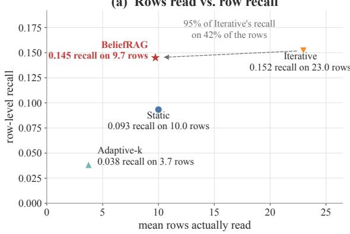

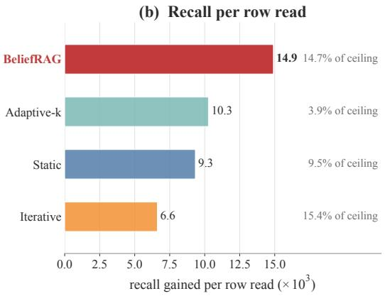  
Figure 7: HoloBench aggregation retrieval. Row recall is the fraction of gold rows recovered in the evidence shown to the model; recall per row read divides that recall by the mean number of rows inspected (scaled by 103 for display). (a) BeliefRAG reaches row recall 0.145 after reading 9.73 rows on average, versus 0.152 after 22.98 rows for fixed Iterative retrieval. (b) BeliefRAG therefore obtains higher recall per row read. The structural ceiling at 50 rows is 0.985; absolute recall remains far below it, so this diagnostic supports a selection-efficiency claim rather than a claim that aggregation retrieval is solved. These common-harness HoloBench numbers are not directly comparable with the QA F1 scores in Table 3.