# Beyond the Remembered World: Predictive 4D Belief for Persistent Navigation in Evolving Worlds

Mingjian Gao1,∗, Zhaocheng Li1,∗, Haoyang Huang2,∗, Wenqiao Zhang1,‡, Yingjie NIU3,4,‡,†, Hao Zhou1, Chao Li3, Juncheng Li1, Siliang Tang1, Yueting Zhuang1

1Zhejiang University, 2University of California, San Diego, 3Deeprobotics, 4Chinese University of Hong Kong

∗Equal contribution, ‡Corresponding authors, †Project lead

Persistent spatial memory enables embodied agents to navigate familiar environments across repeated visits. However, targets may move while unobserved, including during navigation, making remembered locations unreliable by the time an agent arrives. Despite advances in memory retrieval and state prediction, accounting for continued hidden world evolution and revising beliefs under limited visibility remain challenging. We study Evolving-World Navigation, where agents infer target locations from intermittent observations, predict their states at inspection time, and revise beliefs using visual evidence. We propose EvolvingNav, which constructs a time-indexed belief from timestamped 3D object histories through a structured persistence–relocation model. The belief distinguishes persistence at the last observed location from relocation to alternative locations and retains probability mass outside the known candidate set. An event-driven filter propagates the current belief as time elapses, forecasts target occupancy at candidate inspection times, and incorporates new RGB-D evidence. Negative observations downweight location hypotheses according to calibrated, visibility-conditioned detection probabilities, while evidence tracking prevents repeated use of the same observations. A frozen, zero-shot vision–language controller uses the updated belief to choose actions and replan. We further introduce EvoWorld-Bench, a benchmark grounded in human activity traces, comprising 54 scenes and 803,680 tasks with controlled changes before and during navigation. In simulation and real-robot experiments, EvolvingNav improves navigation success and search eficiency over the evaluated baselines. Paired experiments show the clearest gains under learnable temporal patterns, while ablations demonstrate the value of preserving uncertainty and incorporating visibility-aware evidence.

Homepage https://dcdmllm.github.io/EvolvingNav/ Code https://github.com/DCDmllm/EvolvingNav

Date: October 1, 2026

## 1 Introduction

Long-lived embodied agents navigate familiar environments across repeated tasks. Spatial maps and object memories preserve observations from earlier visits [1, 2]. However, those observations may not describe the world when the agent acts. Human activity changes task-relevant states outside observation: a medication box observed on a bedside table may return to a cabinet before the next request. Further changes can occur while the robot travels, invalidating a prediction made at the start of navigation. The agent must therefore plan from observations acquired minutes, hours, or days earlier and estimate what will be true when it inspects a target.

Under partial observability, historical observations are evidence about past states, while the current state remains latent and may evolve. An accurate map can therefore lead an agent to an outdated site, while searching from scratch discards useful history. A time-indexed predictive belief should represent uncertainty over unobserved relocations and support revision during interaction. Candidate destinations have diferent travel times, so their occupancy probabilities must be evaluated at their respective arrival times. A failed inspection should weaken a location hypothesis only when the site was adequately visible. If changes continue during execution, even an inspected site may later become plausible again.

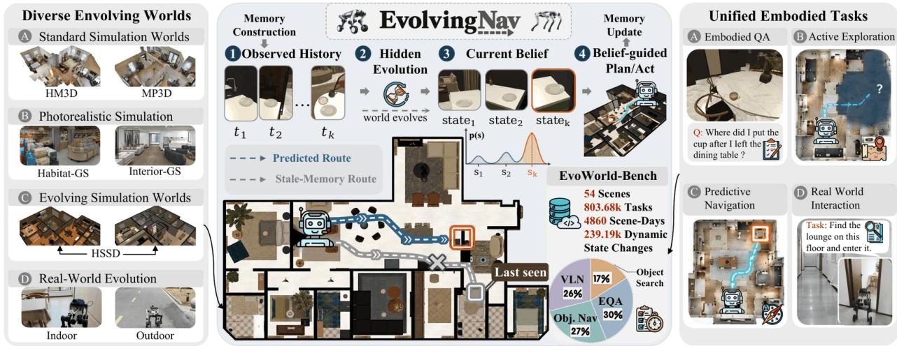  
Figure 1 Overview of EvolvingNav for predictive embodied reasoning and action in evolving worlds.

Existing work has studied both temporal prediction and navigation with moving objects. PredictiveGraphs predicts future object–receptacle states, ranks candidate destinations, and updates its estimates during navigation [3]. Transit-Aware Planning considers portable targets that move while an agent travels [4]. We focus on combining irregular observation histories, candidate-specific arrival times, and visibility-conditioned evidence within one navigation loop. The agent must also retain probability mass outside its known candidate set.

We formalize this problem as Evolving-World Navigation. Given a target, a timestamped observation history, candidate locations, and an action budget, the agent must locate and visually verify the target without access to hidden transitions or current ground truth. It receives new observations only along its executed path. Portable-object search provides a concrete instance because people can move objects outside the robot’s view. We consider two episode types. In fixed-target episodes, a target may move before the query but remains fixed during the search. In continuing-evolution episodes, it may move while the agent navigates.

We introduce EvolvingNav (figure 1), a navigation agent built around a predictive 4D belief. Its persistent memory records entity identity, 3D spatial context, observation times, and evidence provenance. Using irregularly sampled histories, P4D-Nav predicts whether the target is at its last observed site, at another known site, or somewhere outside the known candidate set. It assigns probability to all three possibilities, keeping alternatives available as the robot gathers new evidence. A frozen, zero-shot vision–language controller uses the belief to call memory, prediction, inspection, exploration, and navigation tools.

The agent closes the loop with an event-driven predict–observe–replan filter. Before choosing a destination, it predicts target occupancy at each candidate’s estimated arrival time and weighs that prediction against expected new coverage and travel cost. It then moves in short segments and updates the belief using RGB-D observations gathered along the way and at inspection sites. A clear view of an empty site can redirect its route; an occluded view leaves the corresponding hypothesis largely intact. Time-valid evidence rounds prevent correlated frames from being counted repeatedly. As time passes, the model can also restore probability to a site inspected earlier.

We introduce EvoWorld-Bench to evaluate these decisions under changing conditions. Grounded in human trajectories, it contains 54 evolving scenes and 803,680 task instances spanning state prediction, object navigation, vision-and-language navigation, and embodied question answering. The benchmark measures how predictions afect first inspection, recovery, path eficiency, and online replanning. Paired static, routine, and random worlds keep scenes and queries fixed while varying temporal structure. These comparisons test when learnable patterns help an agent predict and search.

Across the navigation suite, EvolvingNav improves initial inspection and eventual search (table 1). When targets can move during execution, it recovers more reliably and avoids unnecessary travel (table 2). Paired experiments show the clearest benefit when changes follow learnable routines. Ablations examine the roles of alternative hypotheses and visibility-aware updates. Held-out scenes, cross-benchmark tests, diferent frozen VLMs, and physical-robot trials assess performance across the evaluated settings.

Our contributions are threefold:

• Problem setting: We study navigation with hidden changes before a query and, in continuing-evolution episodes, during execution. The agent must reason about arrival times and visually verify the target.

• Belief-driven agent: We introduce EvolvingNav, combining a time-indexed belief over known and unknown locations with an event-driven predict–observe–replan filter.

• Benchmark and evaluation: We introduce EvoWorld-Bench and use paired temporal controls, simulation, and physical-robot trials to evaluate prediction, evidence-based recovery, and navigation eficiency.

## 2 Related Work

Navigation, memory, and changing worlds. Embodied navigation combines perception, spatial reasoning, and action; open-vocabulary maps and scene graphs ground language in spatial representations [1, 5–12]. Foundation-model agents combine maps, tools, and navigation skills [13–19]. Lifelong benchmarks evaluate navigation and memory across tasks [20, 21], while embodied QA benchmarks assess question answering from episodic observations [22]. Dynamic maps and 4D memories support updates and spatiotemporal retrieval [2, 23–26]. EmbodiedSkills verifies skill execution in a closed-loop VLA agent, while VisualThink-VLA routes compact visual evidence for robot control [27, 28]. Complementary multimodal work studies interleaved visual–language instructions (Cheetah), adaptive visual and language experts (HyperLLaVA), instruction curation (Align2LLaVA), and instruction-driven instance segmentation (InstructSAM) [29–32].

Predictive memory and human routines. Predictive navigation models infer object locations from partial histories using discrete states or continuous spatial representations [3, 33, 34]. PredictiveGraphs combines future-state prediction, Top-k navigation, online observations, and agent tools; our focus is an arrival-time filtering loop for continued hidden evolution, with time-valid evidence and candidate reopening. HOME-R/HOMER+, STREAK, and personalized navigation model household routines or context drift [35–38]. HD-EPIC and ParaHome provide human–object interaction traces [39, 40]. EvoWorld-Bench uses human traces and separately tracked simulated evidence to constrain executable histories; paired worlds test temporal regularity beyond location frequency.

## 3 Predictive 4D Belief Navigation

EvolvingNav maintains a current-state belief from timestamped 3D histories and RGB-D evidence; P4D-Nav separates persistence from relocation (figure 2).

## 3.1 Problem Formulation

An environment contains a navigable space X , entities O, and candidate states $\scriptstyle { \mathcal { C } } _ { o }$ with inspection viewpoints. Before query time $t _ { q }$ , the agent has only the causal history

$$
\mathcal { H } _ { \leq t _ { q } } = \{ ( I _ { k } , D _ { k } , \xi _ { k } , t _ { k } ) \ : | \ : t _ { k } \leq t _ { q } \} ,\tag{1}
$$

where $I _ { k } , D _ { k } , \xi _ { k }$ denote RGB, depth, and camera pose. The hidden state lies in $\widetilde { \mathcal { C } } _ { o } = \mathcal { C } _ { o } \cup$ {unknown}; later out-of-view transitions are also hidden.

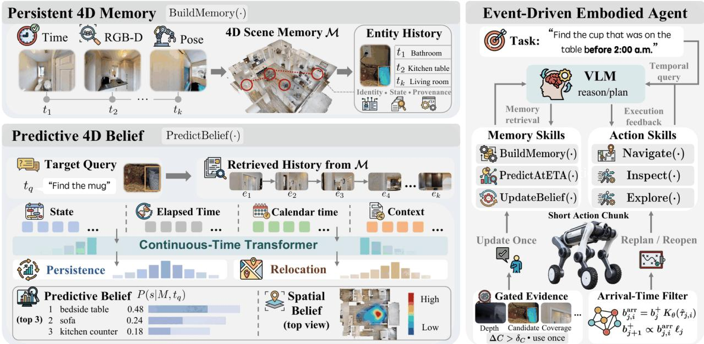  
Figure 2 EvolvingNav couples persistent 4D memory, predictive belief, and an embodied agent that updates and replans from stepwise evidence.

Given a target, initial pose $x _ { 0 } ,$ memory, and action budget, the agent observes $z _ { j }$ after acting and must stop at a valid target viewpoint. It optimizes

$$
\pi ^ { * } = \arg \operatorname* { m a x } _ { \pi } ~ \mathbb { E } _ { \pi } [ \mathbb { I } ( { \mathrm { s u c c e s s } } ) - \lambda _ { d } L - \lambda _ { n } N _ { \mathrm { i n s p e c t } } ] ,\tag{2}
$$

where L is the travel distance and $N _ { \mathrm { { i n s p e c t } } }$ is the inspection count.

## 3.2 Causal 4D Memory and History Encoding

The 4D memory registers RGB-D observations in a shared frame, associates entities using semantics, geometry, and time, and materializes versioned deltas causally:

$$
\mathcal { M } _ { \leq t } = \mathop { \mathrm { M a t e r i a l i z e } } ( \Delta \mathcal { M } _ { 0 } , \ldots , \Delta \mathcal { M } _ { t } ) = ( \mathcal { G } _ { t } , \mathcal { V } _ { t } , \mathcal { B } _ { t } ) ,\tag{3}
$$

where $\mathcal { G } _ { t } , \mathcal { V } _ { t } , B _ { t }$ store relations, time-valid versions, and provenance. Changes append versions without erasing history; perception and versioning details are in Appendix A.2 [41–43].

Target-conditioned history and continuous time. For target $^ { O , }$ a typed query returns the most recent K causal events

$$
H _ { o } = \{ e _ { k } = ( o _ { k } , s _ { k } , t _ { k } , z _ { k } , c _ { k } , v _ { k } ) \} _ { k = 1 } ^ { K } ,\tag{4}
$$

where $o _ { k } , s _ { k } , t _ { k } , z _ { k }$ encode entity, candidate state, time, and {seen, notseen} evidence; ck, vk encode confidence and visibility. Related context events are causal, candidate encodings capture function and geometry, and unknown absorbs unmapped states.

Each event token combines semantic, evidence, and temporal features:

$$
\begin{array} { c } { { { \bf x } _ { k } = E _ { o } ( o _ { k } ) + E _ { s } ( s _ { k } ) + E _ { z } ( z _ { k } ) + E _ { c } ( c _ { k } ) + E _ { v } ( v _ { k } ) } } \\ { { + \phi _ { \Delta } ( t _ { q } - t _ { k } ) + \phi _ { \mathrm { c a l } } ( t _ { k } ) , } } \end{array}\tag{5}
$$

where $\phi _ { \Delta }$ encodes log elapsed time and $\phi _ { \mathrm { c a l } }$ encodes hour and weekday. A query token specifies the target, time, and last observed state; a compact Transformer yields

$$
( { \bf h } _ { 1 } , \dots , { \bf h } _ { K } , { \bf h } _ { q } ) = \mathrm { C T T r a n s f o r m e r } ( { \bf x } _ { 1 } , \dots , { \bf x } _ { K } , { \bf x } _ { q } ) .\tag{6}
$$

The encoding captures irregular intervals, evidence, and event order without hidden labels.

## 3.3 Persistence–Relocation Belief

We predict persistence at the last observed state or relocation elsewhere. Episode validity guarantees a last positively observed state slast (Appendix B.4). The persistence branch predicts

$$
\rho _ { q } = P ( s _ { t _ { q } } ^ { o } = s _ { \mathrm { l a s t } } \mid H _ { o } , t _ { q } ) = \sigma ( \mathbf { w } _ { \rho } ^ { \top } \mathbf { h } _ { q } ) .\tag{7}
$$

For each alternative $i \in \widetilde { \mathcal { C } } _ { o } \setminus \{ s _ { \mathrm { l a s t } } \}$ , a shared pointer head computes

$$
a _ { i } = \frac { ( W _ { q } \mathbf { h } _ { q } ) ^ { \top } ( W _ { c } \mathbf { g } _ { i } ) } { \sqrt { d } } + \psi ( \mathbf { h } _ { q } , \mathbf { g } _ { i } ) , \qquad \pi _ { q } ( i ) = \frac { \exp { a _ { i } } } { \sum _ { u \in \widetilde { \mathcal { C } } _ { o } \setminus \{ s _ { \mathrm { l a s t } } \} } \exp { a _ { u } } } ,\tag{8}
$$

where gi represents candidate $i ,$ d is the projection dimension, and $\psi$ measures learned compatibility. The prior is

$$
\begin{array} { r } { b _ { q } ^ { - } ( i ) = \left\{ \rho _ { q } , \qquad i = s _ { \mathrm { l a s t } } , \right. } \\ { ( 1 - \rho _ { q } ) \pi _ { q } ( i ) , \left. i \neq s _ { \mathrm { l a s t } } . \right. } \end{array}\tag{9}
$$

We train with $\mathcal { L } _ { \mathrm { s t a t e } } = - \log b _ { q } ^ { - } ( s _ { t _ { q } } ^ { o } )$ without change labels; the normalized belief represents returns and alternatives.

## 3.4 Predictive Embodied Agent

A frozen VLM invokes memory, prediction, navigation, inspection, and exploration tools. Action chunks, new coverage or evidence, ETA changes, and arrivals trigger decision epochs. The encoder produces $\mathbf { h } _ { j }$ for the row-normalized operator

$$
[ K _ { \theta } ^ { ( j ) } ( \Delta t ) ] _ { r , u } = \mathrm { s o f t m a x } _ { u } f _ { \theta } ( \mathbf { h } _ { j } , \mathbf { g } _ { r } , \mathbf { g } _ { u } , \phi _ { \Delta } ( \Delta t ) ) .\tag{10}
$$

The operator shares the encoders in equations (6) and (8); a separate head learns chronological state transitions through row-wise cross-entropy (Appendix $\mathrm { A . 4 } )$ . Initialized with $b _ { 0 } ^ { - } = b _ { q } ^ { - }$ , the filter propagates after each chunk:

$$
b _ { j + 1 } ^ { - } = b _ { j } ^ { + } K _ { \theta } ^ { ( j ) } ( t _ { j + 1 } - t _ { j } ) .\tag{11}
$$

Thus $b _ { j } ^ { \pm }$ denotes the current-time belief, separate from arrival forecasts.

Arrival-aware action selection. For candidate viewpoints $\mathcal { W } _ { i }$ , let $d _ { j , i } = d _ { \mathrm { g e o } } ( x _ { j } , \mathcal { W } _ { i } )$ and $\widehat { \tau } _ { j , i }$ be the geodesic distance and estimated travel-plus-inspection time. The agent selects

$$
i _ { j } ^ { * } = \arg \operatorname* { m a x } _ { i \in \mathcal { C } _ { o } } \frac { p _ { j , i } ^ { \mathrm { a r r } } \widehat { q } _ { j , i } ^ { \mathrm { n e w } } } { d _ { j , i } + \lambda _ { t } \widehat { \tau } _ { j , i } + \lambda _ { \mathrm { i n s p e c t } } } ,\tag{12}
$$

where $p _ { j , i } ^ { \mathrm { a r r } }$ is defined below and $\widehat { q } _ { j , i } ^ { \mathrm { n e w } }$ is the detection probability from newly covered surfaces. Exploration expands the candidate set when unknown-state utility is highest.

Visibility-qualified measurement update. A posed RGB-D view can update every covered candidate. A calibrated detector estimates $\widehat { r } _ { j , i } = P ( \operatorname* { d e t e c t } \mid s _ { t _ { j } } = i , \mathbf { f } _ { j , i } )$ from projected candidate geometry, online depth, and view features, without access to ground-truth target masks or poses or simulator visibility flags. Given no detection,

$$
\ell _ { j } ( i ) = P ( y _ { j } = \emptyset \mid s _ { t _ { j } } = i ) = { \left\{ \begin{array} { l l } { 1 - { \widehat { r } } _ { j , i } , } & { i \in \mathcal { C } _ { o } , } \\ { 1 , } & { i = { \mathrm { u n k n o w n } } , } \end{array} \right. }\tag{13}
$$

and the measurement posterior is

$$
b _ { j } ^ { + } ( i ) = \frac { b _ { j } ^ { - } ( i ) \ell _ { j } ( i ) } { \sum _ { u \in \widetilde { \mathcal { C } _ { o } } } b _ { j } ^ { - } ( u ) \ell _ { j } ( u ) } .\tag{14}
$$

An update uses only new surface coverage exceeding $\delta _ { C } = 0 . 0 5$ , preventing duplicate evidence from overlapping views. Dynamic reopening starts a new time-valid round, allowing the same viewpoint to test a changed state. A verified match ends the search.

Posterior propagation and replanning. The current posterior is forecast to each candidate ETA for action selection, without replacing the current-time filter:

$$
b _ { j , i } ^ { \mathrm { a r r } } = b _ { j } ^ { + } K _ { \theta } ^ { ( j ) } ( \widehat { \tau } _ { j , i } ) , \qquad p _ { j , i } ^ { \mathrm { a r r } } = b _ { j , i } ^ { \mathrm { a r r } } ( i ) .\tag{15}
$$

Fixed-target episodes use identity dynamics; continuing evolution follows equations (11) and (15). At each epoch, the agent propagates belief, incorporates new evidence once, forecasts arrival-time states, and replans (Appendix A.4).

## 4 EvoWorld-Bench: Evaluating Navigation in Evolving Worlds

EvoWorld-Bench evaluates decisions based on time-ordered histories while the world changes outside observation. Its 54 scenes and 803.68k task instances combine persistent histories, executable placements, and controlled dynamics.

## 4.1 Tasks and Controlled Dynamics

At the task-modality level in figure 1, the pool comprises object search (17%), object navigation (27%), vision-and-language navigation (VLN; 26%), and embodied question answering (EQA; 30%) [22, 44]. These labels describe task goals; the protocols below distinguish prediction, search, evidence, and online dynamics.

The complementary breakdown by evaluation protocol in figure 3 comprises N1 (13.51%), N2 (13.37%), N3 (13.27%), N4 (26.52%), N5 (3.34%), and EQA (29.99%). In this second view, VLN-conditioned episodes are assigned to their corresponding navigation protocol rather than a separate category. Prediction evaluates the region/receptacle belief independently of control; navigation uses the same target– time queries (figure 3 and table 8). N1 inspects the Top-1 destination; N2 uses the full belief for cost-aware search; N3 adds visibility-qualified updates and recovery. N1–N3 fix the target after the query. N4 advances the world clock during execution, permitting further hidden transitions. N5 applies these protocols to held-out scenes and households.

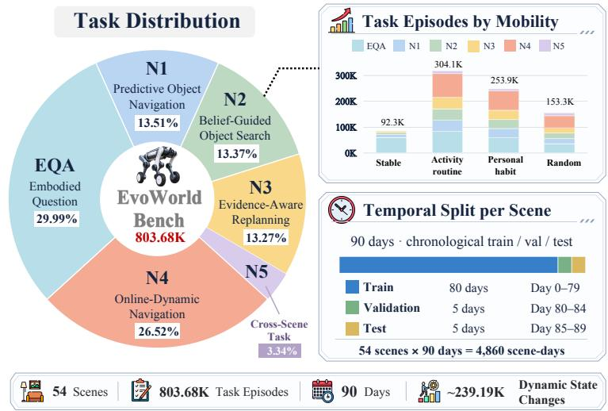  
Figure 3 Overview of EvoWorld-Bench evaluation protocols.

VLN grounds language goals in the same histories; EQA probes current and historical states without future evidence. Our experiments emphasize prediction and navigation, with EQA as a memory diagnostic. Controlled comparisons match public observations, candidates, geometry, starts, controllers, and budgets.

Paired static, routine, and random worlds share public setup variables. Static preserves the last supported state; routine follows household dynamics; random matches legal candidates and marginal movement statistics while removing temporal dependencies. Improvements specific to routine worlds thus support the use of historical regularity over category frequency or spatial convenience.

## 4.2 World Construction and Past-Only Evaluation

Human traces constrain generation; source trajectories are not copied (figure 4). CASAS supplies longitudinal occupancy and timing statistics; ARAS and OPPORTUNITY add activity-context coverage; and HD-EPIC and ParaHome provide object–action and motion evidence [39, 40, 45]. HOMER+ is tracked separately as simulated long-horizon routine evidence [36]. Event records preserve source identifiers and distinguish measured, environment-derived, simulated, and benchmark-authored quantities (Appendix B.1).

Across 54 HSSD scenes [46], household habits and stochastic exceptions generate chronological histories. Stable, routine, personal, and irregular regimes test persistence, activity regularity, owner-specific habits, and uncertainty (table 7); regime labels remain hidden from the agent. Habitat replay ensures semantically valid, collision-free placements and reachable inspection viewpoints.

Patrols collect visibility-qualified RGB-D observations using only maps, time, travel cost, and observed history. Queries expose only observations available by the query time, the last supported state, elapsed/calendar time, candidates, and spatial context; current states, transitions, activities, mobility labels, and oracle viewpoints remain private. Splits group complete temporal sequences, paired worlds, and near-duplicate query/transition groups. Audits cover temporal and metadata leakage, split overlap, paired-world consistency, physical validity, and patrol access to hidden state. Stratification covers mobility, transition, staleness, spatial dificulty, and generalization.

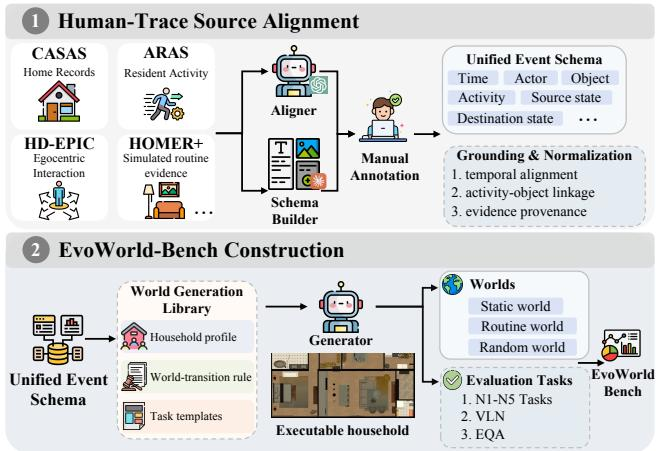  
Figure 4 Construction of EvoWorld-Bench.

## 5 Experiments

We test whether predictive 4D memory improves current-state inference, embodied search, and recovery when observations contradict prior beliefs. Controlled EvoWorld-Bench and robot comparisons use the same public histories, legal candidates, inspection viewpoints, low-level control, and action budgets. Crossenvironment evaluations retain the native policies of released agents and provide system-level generalization evidence. Component ablations support causal comparisons. Further protocol, implementation, and analysis details are summarized in Appendices A–D.

## 5.1 Setup

Datasets. Our primary evaluation uses the complete EvoWorld-Bench N1–N5 suite for First-Inspection navigation, belief-guided search, evidence-aware replanning, online dynamics, and cross-scene transfer. Find ingDory [21] and GOAT-Bench [20] test long-horizon memory and repeated-goal navigation. We additionally evaluate one native task in each of MP3D, HM3D, Habitat-GS, and InteriorGS, and run 64 matched LYNX M20 trials per method.

Real-world setup. We use the DEEP Robotics LYNX M20 for the primary quantitative evaluation over 64 matched trials, with X30 and Lite3 evaluated on matched 32-block transfer subsets. Platform-specific perception and low-level navigation use a common interface, and all methods receive identical pre-query histories, candidate locations, start conditions, and robot-specific control stacks. Each 360-second episode requires online target confirmation within three inspections.

Controllers and baselines. Our main method uses a frozen GPT-5.6-Luna controller in a zero-shot setting: the VLM receives no navigation-task fine-tuning and invokes the fixed memory, prediction, inspection, exploration, and navigation tools. The prompt, tool interface, and inference budget remain fixed within each comparison. Baselines span navigation, structured memory, and predictive world models; paired runs with GPT-4o, GPT-5.5, GPT-5.6-Luna, and Qwen2.5-VL-3B/32B test controller dependence.

Metrics. We evaluate prediction using Top-1, MRR, NLL, ECE, and true-state rank, and navigation using SR, SPL, First-Inspection SR, Recovery SR, inspection count, distance, and time. Main comparisons report five-seed variation; paired static, routine, and random worlds isolate learnable temporal structure.

## 5.2 Main Results

Table 1 Cross-benchmark comparison (%). ± denotes standard deviation over five seeds.
<table><tr><td></td><td colspan="2">FindingDory</td><td colspan="3">GOAT-Bench</td><td colspan="3">EvoWorld-Bench</td></tr><tr><td>Method</td><td>HL-SR↑</td><td>HL-SPL↑</td><td>SR↑</td><td>SPL↑</td><td>Repeat-SR↑</td><td>First-Inspection SR ↑</td><td>Search SR ↑</td><td>SPL↑</td></tr><tr><td colspan="9">Open-vocabulary and lifelong navigation</td></tr><tr><td>VLFM [13]</td><td>13.42</td><td>10.86</td><td>15.79</td><td>5.45</td><td>11.82</td><td>20.65</td><td>28.36</td><td>24.67</td></tr><tr><td>ZSON [47]</td><td>27.89</td><td>21.81</td><td>29.64</td><td>2.45</td><td>16.37</td><td>26.84</td><td>32.13</td><td>28.55</td></tr><tr><td>FindingDory Agent [21]</td><td>52.44PR</td><td>40.92</td><td></td><td></td><td></td><td></td><td></td><td></td></tr><tr><td>LagMemo GLUE [48]</td><td>32.79</td><td>23.25</td><td>20.61</td><td>1.74</td><td>11.27</td><td>30.18</td><td>42.27</td><td>33.82</td></tr><tr><td colspan="9">Structured spatio-temporal memory</td></tr><tr><td>HOV-SG [10]</td><td>21.47</td><td>15.20</td><td>28.37</td><td>2.23</td><td>12.38</td><td>36.46</td><td>52.32</td><td>40.61</td></tr><tr><td>DynaMem [2]</td><td>30.30</td><td>22.78</td><td>14.54</td><td>1.71</td><td>15.79</td><td>45.33</td><td>71.94</td><td>56.83</td></tr><tr><td colspan="9">Predictive world and state modeling</td></tr><tr><td>SLaTe-PRO [36]</td><td>18.18</td><td>14.53</td><td>9.41</td><td>0.99</td><td>6.38</td><td>13.00</td><td>36.33</td><td>26.37</td></tr><tr><td>SGM+NEP [33]</td><td>34.20</td><td>19.48</td><td>10.67</td><td>1.64</td><td>2.56</td><td>27.26</td><td>41.82</td><td>37.00</td></tr><tr><td>FlowMaps [34]</td><td>13.03</td><td>10.24</td><td>25.07</td><td>1.32</td><td>7.25</td><td>14.33</td><td>32.67</td><td>17.35</td></tr><tr><td>PredictiveGraphs [3]</td><td>24.24</td><td>13.50</td><td>10.27</td><td>1.80</td><td>7.48</td><td>36.18</td><td>43.67</td><td>40.36</td></tr><tr><td rowspan="2">EvolvingNav (ours)</td><td>53.22</td><td>38.83</td><td>35.43</td><td>12.98</td><td>19.31</td><td>61.32</td><td>86.18</td><td>70.15</td></tr><tr><td>±3.87</td><td>±2.43</td><td>±2.16</td><td>±0.92</td><td>±0.68</td><td>±3.235</td><td>±2.07</td><td>±1.74</td></tr></table>

PR Paper-reported under the cited native protocol; unmarked baseline scores are our reproductions under the method-preserving protocol in Appendix A.7.

Comparison across embodied benchmarks. EvolvingNav performs strongly across FindingDory, GOAT-Bench, and EvoWorld-Bench (table 1). On EvoWorld-Bench N1–N5, First-Inspection SR increases from 45.33% (DynaMem) to 61.32%, and Search SR from 71.94% to 86.18%. On FindingDory, it achieves the highest HL-SR (53.22%) among the listed methods and the second-highest HL-SPL (38.83%), behind FindingDory Agent (40.92%). The gains on EvoWorld-Bench show the benefit of predictive belief under hidden world evolution; results on FindingDory and GOAT-Bench indicate broader applicability to embodied navigation.

Online navigation under execution-time dynamics. Figure 5 shows how a routine-conditioned belief avoids an obsolete last-seen location. To isolate the dynamic closed loop from episodes in which motion is permitted but no transition is scheduled, table 2 reports the same preselected N4 episodes for every method, with a target transition scheduled inside a common, fixed post-query window.

Table 2 N4 online-dynamic navigation with execution-time target motion.
<table><tr><td>Method</td><td>Dynamic SR ↑</td><td>Online Recovery SR↑</td><td>Excess Distance (m) ↓</td><td>Revisit Success ↑</td></tr><tr><td>SLaTe-PRO [36]</td><td>34.7</td><td>21.5</td><td>18.9</td><td>8.7</td></tr><tr><td>SGM+NEP [33]</td><td>41.3</td><td>27.8</td><td>15.6</td><td>12.4</td></tr><tr><td>FlowMaps [34]</td><td>29.6</td><td>18.9</td><td>22.4</td><td>6.5</td></tr><tr><td>PredictiveGraphs [3]</td><td>46.8</td><td>36.7</td><td>13.2</td><td>18.9</td></tr><tr><td>EvolvingNav (ours)</td><td>65.2</td><td>58.7</td><td>8.4</td><td>32.6</td></tr></table>

Relative to PredictiveGraphs, EvolvingNav improves Dynamic SR by 18.4 points and Online Recovery SR by 22.0 points, while reducing excess distance by 4.8 m and increasing successful revisits by 13.7 points. These results support the execution-time contribution: current-time propagation and time-valid evidence rounds let the agent recover after a target moves, while candidate reopening turns revisits into useful actions rather than permanent exclusions.

Temporal structure. Under paired controls, the SR gain over Last Seen is 22.36 points in routine worlds but 6.93 points under random transitions (table 15). The agent trails Last Seen in static worlds and Direct Transformer under random transitions, locating its strongest advantage in learnable temporal regularity.

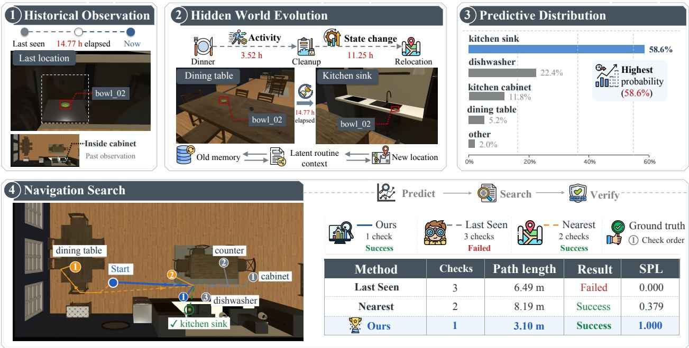  
Figure 5 Predictive, last-seen, and nearest-first search on EvoWorld-Bench.

Across five frozen VLMs, paired Search SR gains over Last Seen range from 14.91 to 25.93 points (20.90 on average; table 12). Matched tools, prompts, episodes, and budgets support transfer across controllers.

Generalization and physical deployment. Across five benchmark tasks, EvolvingNav leads on seven of ten metrics (table 9). Across 64 matched M20 trials, the agent improves both success and eficiency (table 3); details are in Appendix D.

Table 3 Primary LYNX M20 search results.
<table><tr><td>Method</td><td>First-Inspection Search SR↑</td><td>SR↑</td><td>Recovery SR↑</td><td>Dist. (m)↓</td><td>Time (s) ↓</td><td>Inspect. ↓</td></tr><tr><td>Last Seen + Search</td><td>17.2</td><td>26.6</td><td>12.8</td><td>56.2</td><td>284</td><td>2.19</td></tr><tr><td>Time Frequency</td><td>21.9</td><td>31.3</td><td>14.0</td><td>52.9</td><td>277</td><td>2.05</td></tr><tr><td>Retrieval + Reasoning</td><td>26.6</td><td>37.5</td><td>17.1</td><td>50.3</td><td>281</td><td>2.03</td></tr><tr><td>EvolvingNav</td><td>34.4</td><td>48.4</td><td>24.3</td><td>43.8</td><td>248</td><td>1.84</td></tr></table>

Across these evaluations, the gains appear at three levels: cross-benchmark results improve initial destination selection, N4 isolates recovery under execution-time motion, and robot trials translate the same belief interface into shorter paths and fewer inspections. Together, these results suggest that the gains extend beyond benchmark-specific exploration or controller choice.

## 5.3 Ablation Studies

Core components. The full agent achieves First-Inspection SR of 62.17%, Search SR of 85.33%, and SPL of 70.87%, with 3.95 inspections (figure 6). Without predictive belief, First-Inspection SR falls to 12.51%; Latest Observation Only reduces Search SR by 20.91 points, indicating that persistent history informs both initial destination selection and recovery. Direct candidate prediction reduces First-Inspection/Search SR by 13.84/15.75 points, supporting the persistence–relocation factorization. Top-1-only search reduces Search SR by 22.41 points, while removing evidence updates reduces it by 42.02 points and increases inspections to 6.48. These results support retaining alternative hypotheses and revising them online to improve search within a fixed action budget. The pattern separates the roles of the components: predictive belief chooses where inspection begins, the full distribution preserves fallback hypotheses, and evidence updating converts new views into route changes. Because No Evidence Update uses the same predictor, its gap isolates the action-time filter rather than improved ofline state classification.

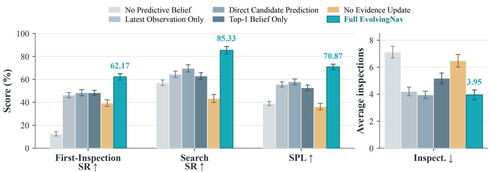  
Figure 6 Core component ablation; error bars show five-seed standard deviations.

Evidence update and calibration. Hard Removal degrades all four metrics (table 4; Top-1 in percent). Our calibrated update achieves the best rank, Top-1, and ECE, although uncalibrated Bayesian updating has slightly lower NLL. These results

Table 4 Negative-evidence update ablation.
<table><tr><td>Update rule</td><td>Rank↓</td><td>Top-1↑</td><td>NLL↓</td><td>ECE↓</td></tr><tr><td>No Update</td><td>5.82</td><td>62.98</td><td>2.838</td><td>0.172</td></tr><tr><td>Hard Removal</td><td>10.09</td><td>42.69</td><td>11.514</td><td>0.204</td></tr><tr><td>Bayesian Update</td><td>5.25</td><td>64.71</td><td>1.497</td><td>0.151</td></tr><tr><td>Bayesian + Calibration</td><td>4.96</td><td>66.93</td><td>1.530</td><td>0.130</td></tr></table>

support soft, visibility-conditioned evidence over irreversible removal after a missed detection.

Prediction quality and transfer. Relative to the Direct Transformer, our predictor improves Top-1 by 4.08 points on the temporal split and 9.47 points on LOSO; NLL decreases by 0.2367 and 0.3379, respectively. It also exceeds the semantic prior, supporting temporal structure beyond location frequency. The larger LOSO gain supports transfer beyond scenespecific destination statistics, while

Table 5 Current-state prediction on temporal and LOSO splits.
<table><tr><td></td><td colspan="3">Temporal</td><td colspan="3">LOSO</td></tr><tr><td>Predictor</td><td>Top-1↑</td><td>MRR↑</td><td>NLL↓</td><td>Top-1↑</td><td>MRR↑</td><td>NLL↓</td></tr><tr><td>Last Seen</td><td>0.00</td><td>0.1699</td><td>3.4011</td><td>50.00</td><td>0.5850</td><td>1.8825</td></tr><tr><td>Time Frequency</td><td>33.85</td><td>0.5462</td><td>1.8400</td><td>49.53</td><td>0.6166</td><td>1.6455</td></tr><tr><td>Direct Transformer</td><td>34.16</td><td>0.5586</td><td>1.7292</td><td>51.71</td><td>0.6884</td><td>1.3157</td></tr><tr><td>Shared semantic prior</td><td>36.02</td><td>0.5957</td><td>1.5766</td><td>59.47</td><td>0.7462</td><td>1.0448</td></tr><tr><td>Ours</td><td>38.24 ±1.42</td><td>0.5971 ±0.0291</td><td>1.4925 ±0.0867</td><td>61.18 ±1.53</td><td>0.7523 ±0.0176</td><td>0.9778 ±0.0228</td></tr></table>

the lower NLL indicates improved probabilistic prediction. Additional ablations are in Appendix C.

## 6 Conclusion

We study persistent navigation under unobserved changes before and during execution. EvolvingNav couples a persistence–relocation belief from 4D histories with an event-driven predict–observe–replan filter. Across EvoWorld-Bench, external benchmarks, and robot trials, it improves initial inspection and recovery, especially under learnable temporal structure. Future work will address interacting objects and continuously changing goals. More broadly, the results suggest that persistent embodied memory should be evaluated not only by what it stores, but by whether it supports calibrated inference and evidence-seeking action when the remembered world is no longer current.

## A Additional Method Details

This section presents the episode interface, memory representation, baseline specifications, and implementation details supporting the main method.

## A.1 Formal Episode Interface

Each navigation episode references one time-indexed prediction query. Public fields include schema version, episode and query identifiers, split, task type, scene and household identifiers, world variant, target description, query time, agent start pose, candidate-state identifiers, budgets, and success criteria. Evaluation-private fields include the current state, target pose, valid goal viewpoints, hidden transition class, oracle path, mobility label, and query-time activity. Train and validation releases may expose analysis labels in metadata; the formal test release replaces them with null values and computes grouped metrics in a private evaluator.

The high-level track exposes

$$
\mathrm { N A V I G A T E \_ T O ( s t a t e ) , \mathrm { I N S P E C T ( s t a t e ) , E X P L O R E , \ S T O P , \mathrm { ~ N O T \_ F O U N D , } } }
$$

with a fixed navigation backend. The low-level track exposes Habitat-style forward, turn, look, and stop actions. The main paper uses the high-level track to isolate predictive state selection; low-level results measure sensitivity to control and perception.

The observation history available at query time $t _ { q }$ is

$$
\mathcal { H } _ { \leq t _ { q } } = \{ ( I _ { k } , D _ { k } , \xi _ { k } , t _ { k } ) \ : | \ : t _ { k } \leq t _ { q } \} ,\tag{16}
$$

where $I _ { k } , D _ { k } , \xi _ { k }$ denote RGB, depth, and camera pose. The task objective in equation (2) balances successful target verification against travel and inspection costs. N1–N3 fix the target after the query to isolate query-time inference and search, whereas N4 allows additional hidden transitions while the agent moves.

## A.2 Detailed 4D Memory Construction

Figure 7 illustrates how observations are converted into persistent entity versions. Each observation contributes spatial evidence and temporal validity, allowing the memory to preserve both previous and current states. Memory is materialized causally from versioned deltas as defined in equation (3), retaining semantic–spatial relations, time-valid entity versions, and observation provenance. Persistent identity is separated from mutable state: an observed change appends a time-valid version without erasing earlier states, and each memory query uses only evidence available at its decision time.

For image coordinate $\widetilde { \mathbf { u } } = [ u , v , 1 ] ^ { \top }$ with depth $D _ { t } ( u , v )$ , the corresponding point in world coordinates is

$$
\mathbf { x } ^ { w } = \mathrm { p r o j } _ { 3 } \bigg ( \mathbf { T } _ { w  c , t } [ \begin{array} { c } { D _ { t } ( u , v ) \mathbf { K } ^ { - 1 } \widetilde { \mathbf { u } } } \\ { 1 } \end{array} ] \bigg ) ,\tag{17}
$$

where K is the camera intrinsic matrix and $\mathbf { T } _ { w  c , t }$ is the camera-to-world transform. Cross-view association uses semantic compatibility, 3D overlap, temporal consistency, and source confidence. The m-th version of entity o is

$$
h _ { o } ^ { m } = ( [ t _ { o , s } ^ { m } , t _ { o , e } ^ { m } ) , s _ { o } ^ { m } , c _ { o } ^ { m } , f _ { o } ^ { m } , \mathcal { P } _ { o } ^ { m } ) ,\tag{18}
$$

containing a validity interval, candidate state, confidence, visual feature, and evidence handles. An observed state change appends a version without erasing the earlier trajectory, preserving both time-ordered history and observation provenance.

## A.3 Belief Encoding and Training

The retrieved history and event representation are defined in equations (4) and (5); the Transformer in equation (6) produces the query representation used by both prediction heads. Event tokens retain entity, state, evidence type, confidence, and visibility alongside elapsed-time and calendar features. The query token specifies the target, query time, and last positive state. The persistence probability in equation (7) measures agreement with that last positive observation, including departures followed by returns. The shared pointer head in equation (8) scores every alternative, including unknown, from the query and candidate representations. The candidate encoder combines context, functional role, geometry, and instance identity. The persistence and pointer heads jointly define the normalized belief in equation (9), trained with current-state negative log-likelihood without a separate change label or oracle mobility type.

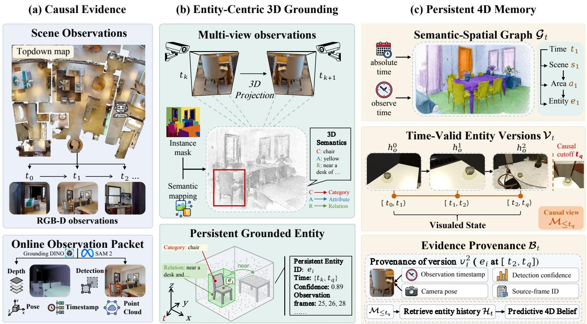  
Figure 7 Temporally versioned 4D memory construction.

## A.4 Evidence Updates and Online Prediction

Transition-kernel parameterization and training. The transition operator in equation (10) is not inferred from a single marginal belief. It is an additional row-conditional prediction head that shares the continuoustime history encoder and candidate embeddings with the query-time predictor. The training set contains chronological tuples $( H _ { \leq t _ { a } } , s _ { t _ { a } } , \Delta t , s _ { t _ { a } + \Delta t } )$ extracted only from training world histories. For each tuple, the known source state selects one row and the future state supervises

$$
\mathcal { L } _ { \mathrm { t r a n s } } = - \log [ K _ { \theta } ( \Delta t \mid H _ { \le t _ { a } } ) ] s _ { t _ { a } , } s _ { t _ { a } + \Delta t } , \qquad \mathcal { L } = \mathcal { L } _ { \mathrm { s t a t e } } + \lambda _ { K } \mathcal { L } _ { \mathrm { t r a n s } } .\tag{19}
$$

Prediction horizons are sampled from the empirical range of action-chunk durations and candidate arrival times. The softmax over destination states makes every row sum to one. No transition label, future state, or mobility tag is available at test time. In N1–N3, where the target is fixed after the query, K is the identity; learned propagation is activated only for N4.

Decision epochs and ETA. The filter begins with $b _ { 0 } ^ { - } = b _ { q } ^ { - }$ and $b _ { 0 } ^ { + } = b _ { 0 } ^ { - }$ when no query-time measurement is available. An epoch is triggered after a short action chunk, when a view adds suficient candidate coverage, when the route or ETA changes materially, when target evidence is obtained, or when the robot reaches an inspection viewpoint. After a chunk of observed duration $\Delta t _ { j } = t _ { j + 1 } - t _ { j }$ , equation (11) first produces the prior at the new current time. For candidate $i ,$ the navigation backend then estimates

$$
\widehat { \tau } _ { j , i } = \frac { d _ { \mathrm { g e o } } ( x _ { j } , \mathcal { W } _ { i } ) } { \widehat { v } _ { j } } + \tau _ { \mathrm { i n s p e c t } } ( i ) , \qquad \widehat { v } _ { j } = \alpha \widehat { v } _ { j - 1 } + ( 1 - \alpha ) \frac { \Delta d _ { j } } { \Delta t _ { j } } .\tag{20}
$$

All ETAs are recomputed after obstruction or replanning. Candidate-specific arrival beliefs forecast future states from the current posterior. They do not replace the current-time filtering state $b _ { j } ^ { + }$ unless the corresponding prediction horizon has elapsed.

Complete event-driven filter. The implementation follows the same ordering at every decision epoch:

1. Initialize $t _ { 0 } = t _ { q } , b _ { 0 } ^ { - } = b _ { q } ^ { - }$ , incorporate any valid query-time measurement once to obtain $b _ { 0 } ^ { + }$ , and initialize an evidence ledger for every candidate.

2. From $b _ { j } ^ { + }$ , forecast each $b _ { j , i } ^ { \mathrm { a r r } }$ to its own ETA, score known candidates and EXPLORE, and select the highest-utility action.

3. Execute only a short action chunk and record its actual elapsed time, displacement, pose, and RGB-D evidence.

4. Propagate to the new current time: $b _ { j + 1 } ^ { - } = b _ { j } ^ { + } K _ { \theta } ^ { ( j ) } ( t _ { j + 1 } - t _ { j } )$

5. Create measurements only for candidates whose evidence ledger identifies new information; apply equation (14) once per evidence identifier to obtain $b _ { j + 1 } ^ { + }$ . Stop on a verified positive detection.

6. Update speed and ETAs, forecast all candidate-specific arrival beliefs from $b _ { j + 1 } ^ { + } .$ reopen eligible states, and replan if the preferred action changes; otherwise execute the next short chunk.

This explicitly separates the current-time filter $b _ { j } ^ { - }  b _ { j } ^ { + }$ from the counterfactual arrival forecasts $\{ b _ { j , i } ^ { \mathrm { a r r } } \} _ { i }$ i.

Time-valid evidence rounds without leakage. Candidate i maintains an evidence-round index $m ( i )$ and $C _ { j } ^ { ( m ) } ( i )$ , the union of surface samples observed within that round. A no-detection event is created only if the previously unused coverage satisfies $\Delta C _ { j } ^ { ( m ) } ( i ) > \delta _ { C }$ , with $\delta _ { C } = 0 . 0 5$ . Candidate surface samples from 4D memory are projected into the live camera, and online depth marks samples as visible when they lie in the frustum and agree with the measured depth. The resulting online-estimated coverage and other view features form $\mathbf { f } _ { j , i }$ for the calibrated detector model $g _ { \phi }$ in equation (13). Crucially, $\widehat { r } _ { j , i }$ is evaluated on the newly admitted surface samples and rays, not on the entire overlapping image. One view can update several candidates with diferent strengths. Opportunistic views and deliberate inspections use the same rule, although the latter usually provide more coverage. A candidate is counted as a suficiently covered inspection when $C _ { j } ^ { ( m ) } ( i ) \geq \tau _ { \mathrm { { c o v } } } = 0 . 7 0 ;$ this designation does not permanently remove it from the candidate set.

Every measurement has a unique evidence identifier and is incorporated once. Its RGB-D frame and pose remain in memory as provenance, but its likelihood is not multiplied again or reintroduced as an independent history token into the current filter. Ground-truth target masks, poses, unoccluded fractions, and simulator visibility flags are retained only by the private evaluator; an oracle-visibility diagnostic is reported separately from fair comparisons. Incremental masking and evidence identifiers do not assert that video frames are statistically independent; they prevent direct reuse of the same surface evidence. The conditional-measurement model approximates the remaining dependence, with detection probabilities calibrated on validation observations. We never multiply repeated whole-view detection probabilities from overlapping frames.

Reopening candidates and executing unknown. There is no permanent exclusion set. Each candidate stores cumulative coverage, the time of the latest clear negative observation, and cumulative detection probability. After propagation, a previously inspected candidate becomes eligible when its belief exceeds $\tau _ { b } = 0 . 1 0$ predicted return probability

$$
P _ { \mathrm { r e t u r n } } ( i ) = \sum _ { r \ne i } b _ { j } ^ { + } ( r ) K _ { \theta } ^ { ( j ) } ( r , i ; \Delta t )\tag{21}
$$

exceeds $\tau _ { \mathrm { r e t u r n } } = 0 . 0 5$ , or a new viewpoint ofers $\Delta C ( i ) > \delta _ { C } = 0 . 0 5$ . Thus a weak or occluded view supports multi-view reinspection, and a location verified to be empty can regain probability mass after suficient world evolution.

Reopening by a new viewpoint alone retains the current round, so only newly observed geometry contributes evidence. Reopening caused by propagated belief or predicted return after elapsed time starts round $m ( i ) + 1$ and resets only the coverage gate for that round; the earlier coverage map and negative observations remain in the provenance ledger. Consequently, the same viewpoint can provide a new measurement after the world may have changed, while adjacent frames within one state-validity interval cannot repeatedly suppress the same hypothesis.

The unknown state invokes an executable EXPLORE action with

$$
U _ { j } ( { \mathrm { E X P L O R E } } ) = \frac { b _ { j } ( \mathrm { u n k n o w n } ) \widehat { \eta } _ { j } ^ { \mathrm { d i s c o v e r } } } { c _ { j } ^ { \mathrm { e x p l o r e } } + \lambda _ { \mathrm { s c a n } } } .\tag{22}
$$

The controller selects a semantic frontier, uncovered region, or unopened container, performs an openvocabulary scan, adds discovered states to ${ \mathcal { C } } _ { o } ,$ redistributes unknown mass, and replans. NOT\_FOUND is allowed only after the exploration budget is exhausted (or no valid frontier remains) and both unknown mass and remaining searchable mass fall below fixed validation thresholds. The same filter supports N1–N4 without a static/dynamic policy router.

## A.5 Full Baseline Specification

Last Seen assigns all mass to the latest positive state. Frequency Prior estimates $P ( s \mid o )$ from training data. Markov Transition estimates $P ( s _ { k + 1 } \mid s _ { k } , o )$ ; Time-Conditioned Prior additionally conditions on public hour and weekday bins. Instance Hotspot uses only the training trajectory of the target instance. GRU Direct and Transformer Direct receive the same event tokens and candidate encoder as P4D-Nav but directly normalize candidate logits without the persistence factorization. P4D-Belief Prior uses equation (9) once at the start of each episode. Full EvolvingNav applies equations (12), (14) and (15) at event-driven decision epochs.

The Oracle Activity diagnostic may use the hidden activity and source location but is excluded from fair rankings. Oracle Current State receives the private target state and measures remaining perception and navigation error. External predictive methods are adapted only through their public inputs; any use of privileged simulator state must be identified and excluded from the main comparison.

## A.6 Implementation Details

Prediction model and optimization. The history encoder uses three Transformer layers, hidden width 128, four attention heads, maximum history length K = 64, and dropout 0.1. Candidate encoders are shared across scenes. The transition scorer $f _ { \theta }$ is a two-layer MLP of width 128 with GELU activation. The history and candidate encoders are shared; the persistence, relocation, and transition heads have separate parameters. We set $\lambda _ { K } = 1$ in equation (19). We optimize the model with AdamW using a learning rate of $3 \times 1 0 ^ { - 4 }$ , a weight decay of $1 0 ^ { - \bar { 2 } }$ , and a batch size of 64 for at most 100 epochs. Gradients are clipped to an $\ell _ { 2 }$ norm of 1.0. Early stopping uses a patience of 10 epochs based on validation NLL, and the checkpoint with the lowest validation NLL is retained. We use random seeds {0, 1, 2, 3, 4}. Experiments use Habitat-Sim 0.3.3 and Habitat-Lab 0.3.3 on 3× NVIDIA GeForce RTX 5080 GPUs.

Perception and controller. The frozen perception stack uses Grounding DINO [41] with a box threshold of 0.35 and a text threshold of 0.25, followed by SAM 2 [42] only for mask refinement. The main high-level agent uses GPT-5.6-Luna as a frozen zero-shot VLM controller, without navigation-task fine-tuning. Candidate viewpoints and low-level planning are fixed in the high-level track; a Habitat low-level action track evaluates the complete embodied stack.

Detection calibration and information boundaries. The function $g _ { \phi }$ in equation (13) is a lightweight logistic calibrator that takes as inputs online-estimated candidate coverage, range, viewing angle, projected size, image quality, category, and validation-set detector recall. It is fitted only on validation observations and remains frozen throughout test evaluation. The agent never accesses ground-truth target masks, ground-truth target poses, unoccluded target fractions, or simulator visibility flags.

All architecture choices, optimization hyperparameters, calibration models, perception thresholds, policy thresholds, and checkpoint-selection rules were determined exclusively from the training and validation splits. The test split was not used for model selection or hyperparameter tuning and was accessed only for final evaluation.

## A.7 Experimental Details

Benchmark protocols. We evaluate the complete agent on EvoWorld-Bench, FindingDory, and GOAT-Bench under their native task definitions. FindingDory reports high-level goal selection and conditional low-level execution; GOAT-Bench reports oficial SR and SPL, with Repeat-SR used only as a marked memory-reuse diagnostic. The cross-domain matrix uses R2R-CE on MP3D, HM3D-OVON on HM3D, native PointNav on Habitat-GS, SAGE-Bench on InteriorGS, and EvoWorld-Bench on HSSD. Scores are never pooled across these heterogeneous tasks, and published values are transferred only when split, sensors, actions, and success rules match.

Result provenance and comparison scope. The entries in tables 1 and 9 come from two explicitly separated sources. A cell marked PR is transcribed from the cited paper only when the benchmark version, evaluation split, metric, and success rule match; the marker applies to that cell rather than to an entire method row. Every unmarked baseline entry is reproduced by us. Missing values are left unreported rather than inferred from another task or checkpoint. Accordingly, table 1 evaluates memory and prediction under the task definition of each benchmark, whereas table 9 measures cross-environment system performance under native navigation tasks. Neither table is interpreted as a single architecture-controlled ablation; causal attribution to our predictive belief is instead provided by the paired-world control and component ablations.

Test-time information boundary. All reproduced methods receive only information public in the target benchmark. On EvoWorld-Bench, observations are truncated at the current decision time. Count and Markov baselines use only the target category, public time, and latest supported state; structured memories such as HOV-SG and DynaMem replay the same causal RGB-D and poses; predictive models receive public state or edge histories and the legal candidate graph. Released navigation agents consume only their native RGB-D/video window, goal specification, and proprioception. The paper-reported FindingDory cell specifically uses the Qwen2.5-VL-3B checkpoint from the cited release and native 96-frame history; it is not recomputed with our planner. No reproduced method receives the private current state, future observations, query-time activity, target pose, oracle viewpoint, or simulator visibility flags. Oracle rows, where present, are diagnostics and are excluded from fair rankings.

Training and model selection. Non-parametric baselines are estimated from the public training split, with smoothing and time-bin settings selected on the validation split. Internal neural baselines use the same event tokens, candidate encoder, training scenes, and validation rule as P4D-Nav. External predictive architectures that require target-domain fitting are trained only on EvoWorld-Bench days 0–79 and selected on days 80–84; days 85–89 remain test-only. When an oficial checkpoint exists for a native benchmark, we retain that checkpoint and its prescribed observation window. Task-adapted systems are labeled separately from zero-shot systems in table 9; interface conversion is not counted as navigation-policy training.

Prediction splits. Each scene history follows a 90-day chronological split: days 0–79 are used for training, days 80–84 for validation, and days 85–89 for testing. Temporal evaluation pools the held-out test periods and reports 319 changed-only queries; leave-one-scene-out evaluation rotates the held-out scene while preserving the same chronological boundaries and reports 644 change-balanced queries. All predictors share query identities, time-ordered histories, and legal candidate sets. The main table reports five-seed variation; no future observation or private transition label is available at inference time.

Real-world protocol. LYNX M20 is the primary quantitative platform, with X30 and Lite3 used for transfer. The primary M20 comparison uses 64 matched trials, whereas X30 and Lite3 use matched 32-block transfer subsets. All methods receive the same pre-query histories, candidate locations, start conditions, perception interface, and robot-specific low-level stack. Success requires autonomous online confirmation within three inspections during a 360-second episode. Missed detections, navigation failures, timeouts, and human interventions count as failures. Indoor/outdoor balance, platform specifications, and condition-wise breakdowns are provided in Appendix D.2.

Reporting controls. We use two method-preserving adaptation regimes. Memory-only and prediction-only systems retain their native representation or predictor, map their outputs onto the legal candidate states, and use the shared planner, inspection viewpoints, and action budget; this isolates temporal reasoning from low-level control. End-to-end navigation agents retain their released perception, mapping, and policy, with adapters limited to sensor conventions, task-goal formatting, action vocabulary, and STOP semantics. We do not add our VLM planner or predictive belief to those agents. The cross-domain scores therefore measure full-system compatibility, while the controlled EvoWorld-Bench and real-robot comparisons support module-level claims. Results are stratified by world variant, staleness, transition class, mobility regime, and generalization split. Paired routine/static/random episodes retain scene, query, and marginal placement factors while changing only the hidden transition mechanism.

The EvoWorld-Bench entries in tables 1, 9, 12 and 13 and figure 6 use the same N1–N5 test episodes, protocol, action budget, and metric definitions. Full-agent results are obtained from separate stochastic runs on these episodes; small numerical diferences therefore do not indicate a change in the test set. Controlled gains are computed within each matched comparison. Routine-world and N4-transition diagnostics condition on specified subsets and are identified separately.

## B Benchmark Construction and Evaluation Protocol

This section documents episode validity, leakage controls, mobility assignment, and the metrics used for all reported comparisons.

## B.1 Construction and Audit Details

Design principles. EvoWorld-Bench follows four principles: temporal continuity, past-only observability, physical executability, and controlled dynamics. Examples are sampled from persistent scene histories rather than independent placements. Public memories contain only evidence available to the robot by the query time. Candidate states must admit collision-free placements and reachable, visibility-checked inspection viewpoints. Paired worlds hold the scene, target, query, and marginal placement factors fixed while varying the hidden transition mechanism. Together, these controls separate predictive reasoning from scene frequency, route geometry, and privileged simulator access.

Source alignment and accounting. Source records constrain the generator rather than serving as episode templates. We distinguish raw source rows or sequences $( N _ { \mathrm { r a w } } )$ , records after normalization specific to each source $( N _ { \mathrm { s t d } } )$ , distinct normalized records referenced by at least one retained generation rule $( N _ { \mathrm { u s e d } } )$ , and total rule references with reuse allowed $( N _ { \mathrm { r e f } } )$ . Table 6 reports counts from the audited consumption manifests; reuse therefore does not inflate the number of independent source observations.

The raw record unit is a sensor row for CASAS, ARAS, and OPPORTUNITY, an annotation row for HD-EPIC, and a sequence for ParaHome and HOMER+. CASAS events are mapped to the room ontology and split into sessions at inactivity gaps exceeding 900 seconds; the resulting occupancy, time-of-day, and weekday statistics parameterize household schedules. ARAS and OPPOR-TUNITY sensor streams are segmented into activity intervals and normalized to the shared activity, room,

Table 6 Audited source contributions.
<table><tr><td>Source</td><td> $\mathbf { N } _ { \mathrm { r a w } }$ </td><td> $\mathbf { N } _ { \mathrm { s t d } } \ \mathbf { N } _ { \mathrm { u s e d } } \ \mathbf { N } _ { \mathrm { r e f } }$ </td><td></td></tr><tr><td>CASAS Aruba</td><td>1,602,820 20,252</td><td></td><td>428 480</td></tr><tr><td>ARAS</td><td>5,184,000 5,080</td><td>312</td><td>360</td></tr><tr><td>HD-EPIC</td><td>59,454 10,786</td><td>742</td><td>864</td></tr><tr><td>ParaHome</td><td>212 seq.</td><td>860 186</td><td>216</td></tr><tr><td>OPPORTUNITY</td><td>869,387 2,551</td><td>318</td><td>372</td></tr><tr><td>HOMER+ (sim.)</td><td>65 seq. 1,991</td><td>356</td><td>420</td></tr></table>

and object vocabularies, supplying complementary activity compatibility and temporal-context statistics. HD-EPIC narration verbs and nouns are mapped through canonical action and object aliases to estimate object–action frequencies, without assigning HSSD destinations. ParaHome annotations and object transforms provide displacement and transition-timing evidence. HOMER+ remains explicitly marked as simulated and contributes only long-horizon activity order and terminal-state priors, not independent human observations or test-time model inputs.

Mapping rules and measured parameters. All adapters emit a common schema containing time, activity, actor context, object category, source state, destination state, and provenance. Measured quantities comprise CASAS occupancy timing, ARAS/OPPORTUNITY activity context, HD-EPIC action–object frequencies, ParaHome displacement and transition timing, and HOMER+ simulated order priors. Legal receptacles, reachable viewpoints, and collision-free placements are derived from HSSD geometry. Category-to-receptacle allowlists, afordance constraints, stochastic exception rates, paired static/routine/random interventions, the 90-day horizon, and query sampling are benchmark-authored and labeled as such. Thus no source trajectory is copied verbatim and no source count is expanded into a claimed number of independent human observations.

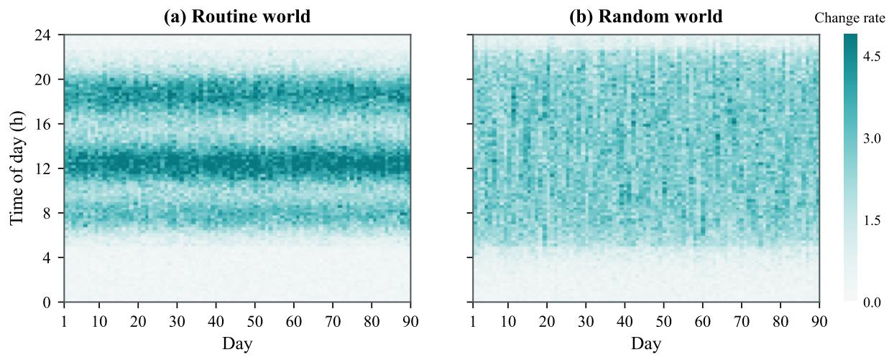  
Figure 8 Temporal change density in paired routine and random worlds.

The final manifest spans 54 scenes and 4,860 scene-days and contains approximately 239.19k dynamic state changes and 803.68k task instances after physical-validity, observability, and leakage audits.

Household generation and behavioral checks. For each HSSD scene [46], resident schedules, room preferences, orderliness, object ownership, and placement habits are fixed at the household level. Activities, resident region trajectories, and object transitions are generated jointly in chronological order over multiple days; stochastic events, delayed returns, and exceptions prevent deterministic evolution. Household profiles, transition rules, and task templates instantiate executable N1–N5, VLN, and EQA episodes. Every relocation is attributed to an activity, resident transition, object lifecycle event, or tidying event. Personal objects alternate between placed and carried states with owner-specific return habits; irregular objects use afordance-valid destinations without temporal or actor-specific predictability. Audits check that personal objects do not simply track their owners and that actor or activity identity does not predict irregular destinations beyond afordance. The audited configuration yields 42.6 region transitions per resident-day, 6.56 relocations per personal object-day, 52.6% within-region relocations, and zero terminal collisions.

The realized transition density in figure 8 provides a direct check of the paired-world intervention. Routine worlds retain repeatable, activity-linked time bands, whereas random worlds spread changes across the day while matching the marginal movement process. The control therefore removes predictable temporal structure without changing the 90-day horizon or scene setup. The “Change rate” color scale is the mean number of object relocations per scene-day in each one-hour time-of-day bin.

## B.2 Automated Audit and Human Spot Checks

All generated episodes undergo automated quality checks before retention. The checks verify entity identity and event ordering, legal and collision-free placements, reachable candidate viewpoints, consistency between world states and rendered observations, and the query-time cutof that prevents future information from entering public histories. They also verify target–episode correspondence, valid not-found tracks, and task budgets that permit executable search. Failed episodes are regenerated or excluded; the audit manifest records the check outcomes for every retained episode.

Human assessment uses stratified spot checks rather than reviewing every episode. Five trained researchers sample across data sources, scenes, mobility regimes, and task types. Using a structured checklist, they assess the plausibility of relocation reasons and household routines, the semantic consistency of negative evidence, and the clarity and relevance of language goals. A supervising researcher adjudicates disputed or high-risk sampled cases. Reviewers record accept, revise, or reject decisions for the sampled items; systematic issues prompt corrections to the generation rules and renewed automated checks of the afected episodes. The human review log identifies the sampled items and decisions, while the automated manifest accounts for the full retained set.

Candidate metadata and query sampling. Chronological Habitat replay records navigability, geodesic cost, camera frustum coverage, unoccluded target fraction, and success viewpoints for each candidate. These fields support the physical validity and visibility checks described in Appendix B.4; candidates without collision-free placements and reachable inspection viewpoints are excluded. Query times are sampled from both the natural temporal distribution and windows relevant to the mechanisms under study, including routine stages and intervals after a personal object is dropped. Each navigation query is augmented with a start pose, candidate inspection viewpoints, a path budget, and frozen success conditions. The patrol policy cannot access current object states, resident locations, hidden activities, or generator latents. Query-time activity and hidden transitions are retained only by the evaluator.

Language tasks and release documentation. EQA questions cover existence, location, temporal order, activity association, count, comparison, and compositional relations over the same time-indexed memories. Answers are evaluated against a normalized ontology, and questions requiring future evidence are excluded. VLN replaces the object label with a language goal whose referents and constraints are grounded in the same versioned scene history. The broader task annotations support studies beyond the prediction and navigation experiments emphasized in this paper. Across tracks, only memory representations, current-state beliefs, and resulting decisions difer between controlled methods. Dataset cards and audit summaries document source mappings, authored assumptions, physical validity, candidate coverage, and leakage tests.

Splits and leakage checks. Each 90-day history uses days 0–79 for training, days 80–84 for validation, and days 85–89 for testing. Complete temporal sequences remain within the same split so that no decision uses observations from a later time. Held-out homes are reserved for cross-scene evaluation; paired static/routine/random members remain in the same split. Near-duplicate queries and transition groups are assigned to splits as indivisible units. Serialized releases are checked for future timestamps, private event fields, answer-correlated filenames or indices, repeated event groups across splits, inconsistent paired variants, invalid physics, unreachable goals, and accidental patrol dependence on hidden state. Episode-level checks and mobility assignment are further specified in Appendices B.4 and B.5.

## B.3 Mobility Regimes and Task Protocols

Mobility labels are used only for stratified evaluation and are hidden from the agent.

Table 7 Mobility regimes in EvoWorld-Bench.

<table><tr><td>Regime</td><td>Mechanism</td><td>Frozen signal</td><td>Role</td></tr><tr><td>Stable/rare</td><td>Infrequent events</td><td>Home/return tendency</td><td>Persistence control</td></tr><tr><td>Routine</td><td>Activity state machine</td><td>Chain-specific locations</td><td>Routine prediction</td></tr><tr><td>Personal</td><td>Placed/carried lifecycle</td><td>Owner placement habit</td><td>Long-term memory</td></tr><tr><td>Irregular</td><td>Affordance sampling</td><td>Affordance only</td><td>Uncertainty control</td></tr></table>

Table 8 Prediction and navigation protocols in EvoWorld-Bench.
<table><tr><td>Task</td><td></td><td>Decision signal</td><td>Primary measure</td></tr><tr><td>P</td><td>Current-state prediction</td><td>Region/receptacle belief</td><td>R@k / NLL</td></tr><tr><td>N1</td><td>Predictive navigation</td><td>Event-filtered belief</td><td>First-Inspection SR</td></tr><tr><td>N2</td><td>Belief-guided search</td><td>Full belief + cost</td><td>Search SR / cost</td></tr><tr><td>N3</td><td>Evidence-aware replanning</td><td>Updated posterior</td><td>Recovery SR</td></tr><tr><td>N4</td><td>Online-dynamic navigation</td><td>Arrival-time belief</td><td>Online Recovery SR</td></tr><tr><td>N5</td><td>Cross-scene generalization</td><td>Any protocol above</td><td>Held-out SR</td></tr></table>

## B.4 Episode Validity and Leakage Audit

An episode is retained only if: (i) the target has at least one positive pre-query observation; (ii) the target state is known to the private evaluator and physically instantiated without collision; (iii) at least one valid viewpoint lies on the NavMesh; (iv) the start is on the NavMesh, at least 3 meters from the target, and does not reveal it; and (v) all public histories terminate at or before the query. A stop is successful only when the robot is within 1 meter geodesic distance of a valid viewpoint, the private evaluator measures target visible fraction $v _ { \mathrm { t a r g e t } } ^ { \mathrm { G T } } \geq \tau _ { \mathrm { s u c c e s s } } = 0 . 2 0$ , and the agent identifies the correct target instance or category. This threshold is used only by the private evaluator and is never exposed to the agent.

The three coverage quantities have distinct roles: $\Delta C > 0 . 0 5$ triggers a new negative-evidence update, $C \geq 0 . 7 0$ defines a suficiently covered inspection, and $v _ { \mathrm { t a r g e t } } ^ { \mathrm { G T } } \geq 0 . 2 0$ defines evaluation success only. The first two are estimated online from candidate geometry and depth; the third is private evaluator state.

We audit serialized examples for future timestamps, hidden event fields, filenames or indices correlated with answers, duplicate event groups across splits, and inconsistent paired variants. Matched static, routine, and random variants must have identical public query fields. Invalid simulator episodes are reported separately and are not counted as ordinary failures.

## B.5 Mobility-Type Assignment

The frozen rule is

$$
\mathrm { t y p e } ( o ) = \left\{ \begin{array} { l l } { \mathrm { s t a b l e , ~ } } & { r _ { \mathrm { m o v e } } ( o ) < \tau _ { \mathrm { m o v e } } , } \\ { \mathrm { a c t i v i t y , ~ } } & { G _ { \mathrm { a c t } } ( o ) \geq \tau _ { \mathrm { a c t } } , } \\ { \mathrm { p e r s o n a l , ~ } } & { C _ { \mathrm { h a b i t } } ( o ) \geq \tau _ { \mathrm { h a b i t } } , } \\ { \mathrm { i r r e g u l a r , ~ } } & { \mathrm { o t h e r w i s e . } } \end{array} \right.\tag{23}
$$

All thresholds are selected on training data before navigation evaluation. When the generator specifies a mobility profile, the same statistics are used to verify that realized trajectories exhibit the intended behavior. Every group must cover several categories, instances, and scenes, and no category may uniquely reveal one mobility type.

## B.6 Metric Definitions

Let $S _ { i }$ be episode success and $L _ { i }$ the executed path. For episodes whose target remains fixed after the query, $\boldsymbol { L } _ { i , \mathrm { f i x } } ^ { * }$ is the shortest feasible path to a valid target viewpoint from the same start. For an online dynamic episode, ${ L } _ { i , \mathrm { d y n } } ^ { * }$ is the minimum travel distance along a time-feasible trajectory to a viewpoint at which the target can be verified in its scheduled state, under the same start, NavMesh, and action/time budget. The dynamic oracle knows the private transition schedule for evaluation only; the agent does not. Writing $L _ { i } ^ { \mathrm { r e f } }$ for the applicable fixed or dynamic oracle path, we use

$$
\mathrm { S P L } = \frac { 1 } { N } \sum _ { i = 1 } ^ { N } S _ { i } \frac { L _ { i } ^ { \mathrm { r e f } } } { \operatorname* { m a x } ( L _ { i } , L _ { i } ^ { \mathrm { r e f } } ) } .\tag{24}
$$

The N1–N5 aggregate includes N4 and applies this reference episode by episode; the fixed-target and onlinedynamic slices use their respective reference paths when computing SPL. The static oracle is never applied to a moving target. First-Inspection SR records whether the first candidate to receive suficient cumulative coverage contains the target; opportunistic evidence and replanning before that inspection are part of the policy. A suficiently covered en-route view counts as the first inspection itself. Recovery SR conditions on an unsuccessful first inspection and measures whether the target is subsequently found. Excess path uses $L _ { i } - L _ { i } ^ { \mathrm { r e f } }$ , with the dynamic oracle for moving-target episodes. Before any N4 rollout, each episode receives a common post-query evaluation window $[ t _ { q } , t _ { q } + T _ { i } ]$ and a fixed schedule of hidden target transitions. The dynamic subset contains exactly the episode identifiers with a scheduled change of target state inside this window, independent of the destinations, trajectories, or termination times of individual methods. All methods are scored on this same set. The complementary no-transition slice is kept separate. Dynamic SR is the success rate on the preselected dynamic set. Online Recovery SR uses the shared subset whose predeclared transition invalidates the pre-transition target state; only successful verification after that transition counts as recovery, and an early stop does not change the denominator. Revisit Success is the percentage of dynamically reopened candidate visits that recover the target.

We compute calibration metrics on the full candidate belief before navigation and after each update. ECE groups predictions by maximum confidence, the Brier score evaluates all candidates, and true-state rank captures changes beyond Top-1 accuracy. Search-cost curves plot success against the inspection budget and distance traveled, providing comparisons across budgets.

Table 9 Cross-environment navigation.
<table><tr><td rowspan="3"></td><td colspan="4">Standard Simulation Worlds</td><td colspan="4">Photorealistic Simulation</td><td colspan="2">Evolving Simulation Worlds</td></tr><tr><td colspan="2">R2R-CE</td><td colspan="2">HM3D-OVON</td><td colspan="2">PointNav</td><td colspan="2">SAGE-Bench</td><td colspan="2">EvoWorld-Bench</td></tr><tr><td>SR</td><td>SPL</td><td>SR</td><td>SPL</td><td>SR</td><td>SPL</td><td>SR</td><td>SPL</td><td>SR</td><td>SPL</td></tr><tr><td colspan="10">Navigation-trained or task-adapted</td></tr><tr><td>MTU3D [49]</td><td> $8 . 8$ </td><td> $_ { 6 . 5 }$ </td><td> $4 0 . 8 ^ { \mathrm { P R } }$ </td><td> $_ { 1 2 . 1 } \mathrm { P R }$ </td><td>75.8</td><td>72.7</td><td>25.9</td><td>15.6</td><td>35.2</td><td>30.7</td></tr><tr><td>NaVid [50]</td><td> $3 7 . 4 ^ { \mathrm { P R } }$ </td><td> $3 5 . 9 ^ { \mathrm { P R } }$ </td><td> $_ { 6 0 . 3 }$ </td><td> $_ { 3 6 . 0 }$ </td><td>15.3</td><td>13.4</td><td>17.4</td><td>15.1</td><td>31.0</td><td>22.6</td></tr><tr><td>Uni-NaVid [51]</td><td> $4 7 . 0 ^ { \mathrm { P R } }$ </td><td> $4 2 . 7 ^ { \mathrm { P R } }$ </td><td> $3 9 . 5 ^ { \mathrm { P R } }$ </td><td> $_ { 1 9 . 8 } \mathrm { P R }$ </td><td>15.9</td><td>13.2</td><td>26.4</td><td>23.1</td><td>55.3</td><td>41.7</td></tr><tr><td>NaVILA [52]</td><td> $5 4 . 0 ^ { \mathrm { P R } }$ </td><td> $_ { 4 9 . 0 } \mathrm { P R }$ </td><td>18.3</td><td>9.7</td><td>78.4</td><td>77.5</td><td>39.0</td><td>34.0</td><td>35.2</td><td>30.7</td></tr><tr><td colspan="9">Zero-shot navigation or task adapters</td><td></td><td></td></tr><tr><td>HSGM [11]</td><td> $_ { 4 7 . 9 } \mathrm { P R }$ </td><td> $3 2 . 8 ^ { \mathrm { P R } }$ </td><td> $4 0 . 0$ </td><td> $^ { 3 2 . 5 }$ </td><td>37.2</td><td>35.3</td><td>11.8</td><td>9.4</td><td>17.0</td><td>12.5</td></tr><tr><td>VLFM [13]</td><td> $^ { 1 2 . 0 }$ </td><td> $_ { 9 . 6 }$ </td><td> $3 5 . 2 ^ { \mathrm { P R } }$ </td><td> $_ { 1 9 . 6 } \mathrm { P R }$ </td><td>53.0</td><td>42.2</td><td>24.4</td><td>18.8</td><td>35.0</td><td>25.8</td></tr><tr><td>AO-Planner [53]</td><td> $2 5 . 5 ^ { \mathrm { P R } }$ </td><td> $1 6 . 6 ^ { \mathrm { P R } }$ </td><td> $_ { 3 0 . 9 }$ </td><td> $^ { 2 2 . 0 }$ </td><td>76.6</td><td>74.7</td><td>27.4</td><td>19.7</td><td>37.0</td><td>29.3</td></tr><tr><td>TANGO [15]</td><td> $_ { 1 4 . 3 }$ </td><td> $9 . 8 7$ </td><td> $3 5 . 5 ^ { \mathrm { P R } }$ </td><td> $1 9 . 5 ^ { \mathrm { P R } }$ </td><td>35.8</td><td>33.5</td><td>22.7</td><td>14.7</td><td>31.0</td><td>23.3</td></tr><tr><td>Uni-LaViRA [54]</td><td> ${ \tt 6 0 . 7 } ^ { \tt P R }$ </td><td> $4 7 . 7 ^ { \mathsf { P R } }$ </td><td> $_ { 6 0 . 0 } \mathrm { P R }$ </td><td> $4 0 . 5 ^ { \mathrm { P R } }$ </td><td>81.3</td><td>77.7</td><td>35.6</td><td>28.7</td><td>65.2</td><td>39.4</td></tr><tr><td>MSGNav [12]</td><td>11.6</td><td>9.4</td><td> $4 8 . 3 ^ { \mathrm { P R } }$ </td><td> $2 7 . 0 ^ { \mathrm { P R } }$ </td><td>37.2</td><td>34.8</td><td>23.5</td><td>17.5</td><td>26.7</td><td>19.6</td></tr><tr><td>EvolvingNav (ours)</td><td>55.8</td><td>43.1</td><td>64.2</td><td>51.7</td><td>86.2</td><td>79.8</td><td>42.4</td><td>32.1</td><td>86.6</td><td>68.2</td></tr></table>

PR Paper-reported under the cited native protocol; unmarked baseline scores are our reproductions under the method-preserving protocol in Appendix A.7.

## C Additional Experimental Results

This section provides extended quantitative results omitted from the main paper because of space constraints.

## C.1 Cross-Environment Navigation

SR and SPL are reported in percent for all environments. Table 9 compares five native benchmark tasks: EvolvingNav leads on seven of ten metrics, including SR and SPL on HM3D-OVON, PointNav, and EvoWorld-Bench. Uni-LaViRA leads on R2R-CE SR, while NaVILA leads on R2R-CE and SAGE-Bench SPL. These task-specific exceptions limit any claim of uniform superiority across navigation protocols.

## C.2 Full Prediction Results

The temporal split contains 319 changed-only queries and LOSO contains 644 change-balanced queries. We report the mean ± standard deviation over five seeds for our method; Top-1 is a percentage, while MRR and NLL are unscaled.

Table 10 Full current-state prediction results.
<table><tr><td>Predictor</td><td>Temporal Top-1 ↑</td><td>MRR↑</td><td>NLL↓</td><td>LOSO Top-1 ↑</td><td>MRR↑</td><td>NLL↓</td></tr><tr><td>Uniform Random</td><td>9.32</td><td>0.2607</td><td>2.4509</td><td>11.96</td><td>0.3050</td><td>2.2980</td></tr><tr><td>Last Seen</td><td>0.00</td><td>0.1699</td><td>3.4011</td><td>50.00</td><td>0.5850</td><td>1.8825</td></tr><tr><td>Object Frequency</td><td>30.75</td><td>0.5476</td><td>1.7397</td><td>50.47</td><td>0.6441</td><td>1.8455</td></tr><tr><td>Time Frequency</td><td>33.85</td><td>0.5462</td><td>1.8400</td><td>49.53</td><td>0.6166</td><td>1.6455</td></tr><tr><td>Markov</td><td>18.94</td><td>0.4435</td><td>2.3772</td><td>49.38</td><td>0.6286</td><td>1.6982</td></tr><tr><td>Activity-Markov</td><td>25.16</td><td>0.4582</td><td>2.2436</td><td>49.84</td><td>0.6221</td><td>1.6183</td></tr><tr><td>Random Forest</td><td>20.50</td><td>0.4851</td><td>1.9181</td><td>58.07</td><td>0.7283</td><td>1.1441</td></tr><tr><td>Packed MLP</td><td>29.50</td><td>0.5225</td><td>2.1036</td><td>58.07</td><td>0.7173</td><td>1.3105</td></tr><tr><td>GRU</td><td>32.61</td><td>0.5471</td><td>1.8279</td><td>54.04</td><td>0.7016</td><td>1.2558</td></tr><tr><td>Direct Transformer</td><td>34.16</td><td>0.5586</td><td>1.7292</td><td>51.71</td><td>0.6884</td><td>1.3157</td></tr><tr><td>Shared semantic prior</td><td>36.02</td><td>0.5957</td><td>1.5766</td><td>59.47</td><td>0.7462</td><td>1.0448</td></tr><tr><td>Ours</td><td>38.24</td><td>0.5971</td><td>1.4925</td><td>61.18</td><td>0.7523</td><td>0.9778</td></tr><tr><td></td><td>±1.42</td><td>±0.0291</td><td>±0.0867</td><td>±1.53</td><td>±0.0176</td><td>±0.0228</td></tr></table>

## C.3 EvoWorld-Bench Detailed Results

Table 11 complements the main benchmark table with search cost and recovery after an unsuccessful first inspection; lower is better for the two cost columns. Table 12 tests whether paired navigation gains persist across diferent VLMs under matched tools, prompts, episodes, and action budgets. In the VLM study, SR is reported in percent and SPL is unscaled.

Table 11 EvoWorld-Bench routine-world search cost and recovery.

<table><tr><td>Method</td><td>Inspect. ↓</td><td>Distance (m) ↓</td><td>Recovery SR (%) ↑</td></tr><tr><td colspan="4">Navigation and persistent memory</td></tr><tr><td>VLFM [13]</td><td>4.85</td><td>18.72</td><td>22.41</td></tr><tr><td>LagMemo GLUE [48]</td><td>3.92</td><td>13.24</td><td>45.62</td></tr><tr><td>HOV-SG [10]</td><td>3.36</td><td>12.08</td><td>51.24</td></tr><tr><td>DynaMem [2]</td><td>2.51</td><td>11.59</td><td>63.93</td></tr><tr><td colspan="4">Predictive world and state modeling</td></tr><tr><td>SLaTe-PRO [36]</td><td>4.40</td><td>14.58</td><td>29.00</td></tr><tr><td>SGM+NEP [33]</td><td>4.08</td><td>7.42</td><td>27.56</td></tr><tr><td>FlowMaps [34]</td><td>4.66</td><td>16.51</td><td>20.27</td></tr><tr><td>PredictiveĠraphs [3]</td><td>3.71</td><td>10.48</td><td>17.96</td></tr><tr><td>EvolvingNav (ours)</td><td>2.18</td><td>8.36</td><td>68.42</td></tr></table>

EvolvingNav requires the fewest inspections (2.18) and achieves the highest Recovery SR (68.42%), improving over DynaMem by 4.49 points after an unsuccessful first inspection. SGM+NEP travels the shortest average distance (7.42 m), while EvolvingNav remains close at 8.36 m. Together with the First-Inspection, Search SR, and SPL results in table 1, these complementary metrics indicate that retaining uncertainty and updating evidence reduce redundant inspections and support recovery from an incorrect initial prediction.

Table 12 VLM robustness on EvoWorld-Bench.
<table><tr><td>Different VLMs</td><td colspan="3">Last-seen Agent</td><td colspan="3">EvolvingNav</td><td>△ Search SR↑</td></tr><tr><td></td><td>First-Inspection SR↑</td><td>Search SR↑</td><td>SPL↑</td><td>First-Inspection SR↑</td><td>Search SR↑</td><td>SPL↑</td><td></td></tr><tr><td>GPT-4o</td><td>31.88</td><td>48.94</td><td>0.3215</td><td>59.72</td><td>71.86</td><td>0.6027</td><td>+22.92</td></tr><tr><td>GPT-5.5</td><td>42.36</td><td>51.31</td><td>0.3732</td><td>63.48</td><td>73.57</td><td>0.6531</td><td>+22.26</td></tr><tr><td>GPT-5.6-Luna</td><td>46.92</td><td>57.43</td><td>0.3970</td><td>63.87</td><td>83.36</td><td>0.6639</td><td>+25.93</td></tr><tr><td>Qwen2.5-VL-3B</td><td>16.26</td><td>26.55</td><td>0.1502</td><td>38.27</td><td>45.02</td><td>0.3727</td><td>+18.47</td></tr><tr><td>Qwen2.5-VL-32B</td><td>18.84</td><td>31.30</td><td>0.1591</td><td>42.44</td><td>46.21</td><td>0.3713</td><td>+14.91</td></tr><tr><td></td><td></td><td></td><td></td><td></td><td></td><td>Average gain</td><td>+20.90</td></tr></table>

## C.4 Real-World Search Case

Instruction: Find the car previously observed near the entrance.

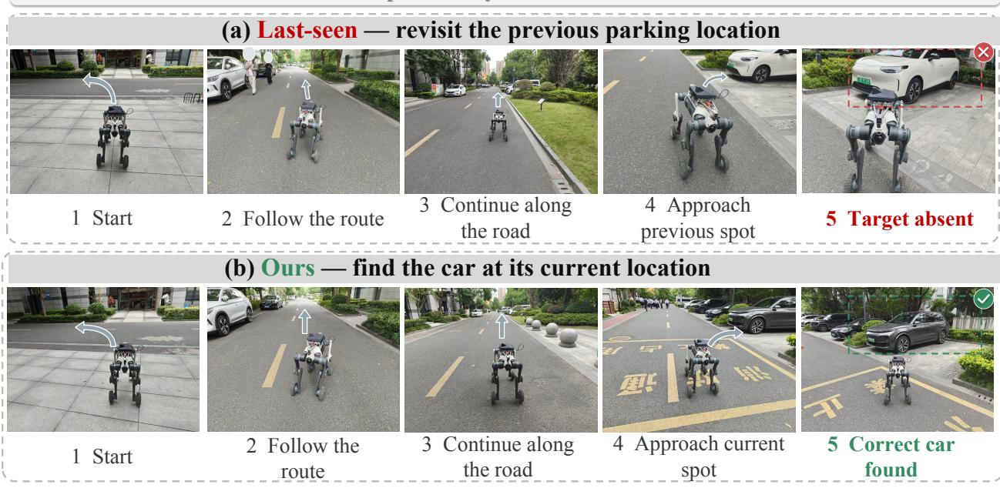  
Figure 9 Outdoor car search under stale and predictive memories.

## C.5 Fine-Grained Ablation Analysis

The main-paper ablation isolates the five decisions that define the complete agent. Here we examine implementation choices within temporal memory, evidence updating, and the predictor while preserving the same perception, candidate set, inspection viewpoints, and low-level navigator.

## C.5.1 Temporal and Memory Ablations

SR and SPL are reported in percent throughout this analysis.

Table 13 Temporal and memory ablations.
<table><tr><td>Group</td><td>Variant</td><td>First-Inspection SR↑</td><td>Search SR↑</td><td>SPL↑</td><td>Inspect.↓</td></tr><tr><td rowspan="3">Temporal encoding</td><td>w/o elapsed-time encoding</td><td>48.37</td><td>80.28</td><td>64.82</td><td>4.36</td></tr><tr><td>w/o calendar context</td><td>47.75</td><td>76.11</td><td>66.20</td><td>4.05</td></tr><tr><td>w/o both temporal cues</td><td>40.84</td><td>76.03</td><td>64.98</td><td>4.12</td></tr><tr><td rowspan="3">Historical evidence</td><td>w/o instance-specific history</td><td>57.57</td><td>80.77</td><td>66.61</td><td>4.30</td></tr><tr><td>w/o negative history</td><td>45.86</td><td>79.53</td><td>63.83</td><td>4.44</td></tr><tr><td></td><td>39.55</td><td>63.77</td><td>56.00</td><td>4.57</td></tr><tr><td rowspan="3">History capacity</td><td>K = 8 K = 16</td><td>45.88</td><td>69.48</td><td>65.77</td><td>4.37</td></tr><tr><td>K = 32</td><td>56.25</td><td>79.60</td><td>68.40</td><td>4.15</td></tr><tr><td>K = 64 (Full)</td><td>60.23</td><td>84.63</td><td>70.34</td><td>3.98</td></tr></table>

Elapsed-time and calendar ablations distinguish irregular observation gaps from daily and weekly periodic context. Removing both cues reduces First-Inspection SR by 19.39 points relative to the full model. Instancespecific trajectories provide smaller but consistent gains, whereas removing negative history reduces First-Inspection SR by 14.37 points and SPL by 6.51 points. Increasing capacity from K = 8 to K = 64 raises First-Inspection SR by 20.68 points, Search SR by 20.86 points, and SPL by 14.34 points while reducing the average inspection count from 4.57 to 3.98. These trends show that performance benefits from temporally structured evidence over a suficiently long history, rather than merely the most recent observations.

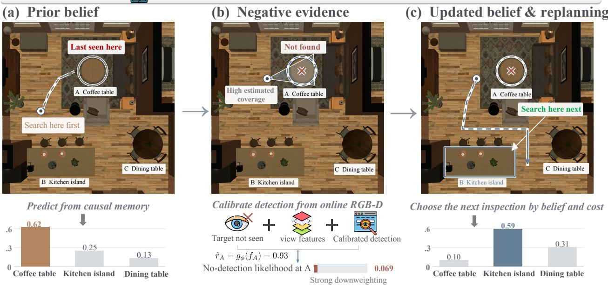  
Figure 10 Evidence-aware belief updating and replanning after a negative inspection.

## C.5.2 Evidence Update Ablations

Figure 10 illustrates one deliberate-inspection event in the same stepwise filter used for opportunistic views. Causal memory initially assigns probability 0.62 to the last-seen cofee table. The frozen logistic calibrator maps the online view features $\mathbf { f } _ { j , i }$ to $\widehat { r } _ { j , i } = 0 . 9 3 1$ ; when the target is not detected, the likelihood at that state is therefore 0.069. The posterior consequently shifts from (0.62, 0.25, 0.13) to (0.10, 0.59, 0.31) and the planner selects the kitchen island next. The inspected state retains nonzero mass, reflecting residual perceptual uncertainty rather than an irreversible deletion.

Table 4 in the main paper compares the four update rules. No Update retains the prior; Hard Removal assigns zero probability after each unsuccessful inspection; Bayesian Update applies a soft likelihood; and our calibrated variant conditions that likelihood on online view features.

## C.5.3 Predictor Architecture

Table 14 Predictor architecture on changed-only queries.
<table><tr><td>Predictor</td><td>Top-1↑</td><td>MRR↑</td><td>NLL↓</td></tr><tr><td>GRU</td><td>32.61</td><td>0.5471</td><td>1.8279</td></tr><tr><td>Direct Transformer</td><td>34.16</td><td>0.5586</td><td>1.7292</td></tr><tr><td>Structured Transformer (ours)</td><td>38.24±1.42</td><td>0.5971 ± 0.0291</td><td>1.4925 ± 0.0867</td></tr></table>

All three predictors use the same observation tokens and candidate encoder. The Direct Transformer normalizes candidate logits directly, whereas the structured model separates persistence from relocation. This controlled comparison therefore isolates architectural factorization from memory content and action selection.

## C.6 Evolution-Aware Diagnostics

Paired-world control. The paired-world comparison in table 15 holds scenes and queries fixed while changing only the world transition mechanism. Last Seen reaches 84.38 SR in static worlds but falls to 38.49 under routine evolution, exposing the failure of stale memory. In contrast, EvolvingNav reaches 60.85 routine-world SR, improving by 22.36 points over Last Seen and by 12.03 points over Transformer Direct. Under matched random motion, the gain over Last Seen decreases to 6.93 points and EvolvingNav trails Transformer Direct by 1.27 points. This contrast localizes its main advantage to learnable temporal regularity rather than a scene-frequency or generic search shortcut.

Table 15 Paired-world SR and routine gain (%).
<table><tr><td>Method</td><td></td><td>Static SR Routine SR Random SR</td><td></td><td>Routine gain over Last Seen</td></tr><tr><td>Last Seen</td><td>84.38</td><td>38.49</td><td>23.19</td><td></td></tr><tr><td>Markov Transition</td><td>80.22</td><td>32.57</td><td>20.64</td><td>-5.92</td></tr><tr><td>Direct Transformer</td><td>69.79</td><td>48.82</td><td>31.39</td><td>+10.33</td></tr><tr><td>EvolvingNav</td><td>82.19</td><td>60.85</td><td>30.12</td><td>+22.36</td></tr></table>

Efect of memory staleness and inspection budget. Figure 11 complements these aggregate tables by showing how performance changes with temporal staleness, inspection budget, and hidden mobility type. These episode-level diagnostics are not inferred from aggregate success rates.

Behavior-shift and trace-grounding diagnostic. Figure 12 tests whether the learned regularities are limited to the nominal timing of the benchmark generator. Online Recovery SR falls for all methods under phase ofsets, return delays, destination shifts, and their combination, but EvolvingNav achieves higher recovery than Last Seen and PredictiveGraphs in every condition. The duration CDF further shows that the generated transition durations track the broad temporal scale of held-out real traces without exactly reproducing them. This diagnostic supports robustness to moderate behavior shift and temporal grounding beyond a single generator setting; it is not presented as evidence of unrestricted out-of-distribution generalization.

## D Real-World Evaluation

This section describes the robot platforms, presents M20 results by environment and temporal condition, and provides qualitative cases.

## D.1 Robot Platforms

We use three commercial DEEP Robotics platforms: LYNX M20, X30, and Lite3. Platform-specific perception and low-level control use a common interface, while the memory, prediction, belief update, and high-level search components remain unchanged.

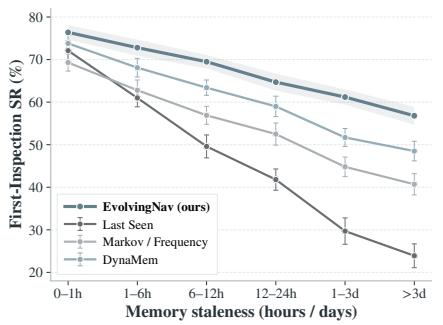

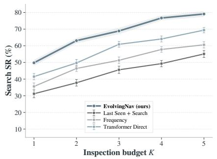

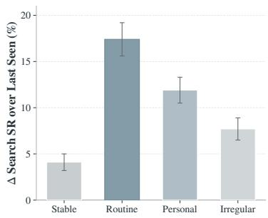  
Figure 11 Predictive diagnostics under memory staleness and search budgets.

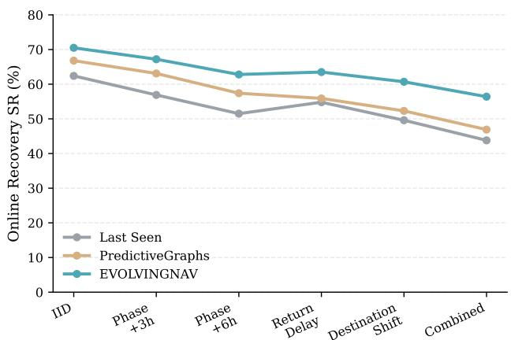

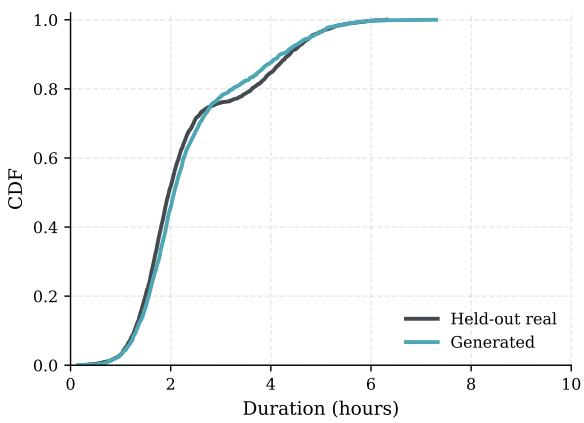  
Figure 12 Recovery under behavior shift and temporal grounding to held-out traces.

Table 16 Robot platforms for real-world evaluation.
<table><tr><td>Platform</td><td>Morphology</td><td>Standing size</td><td>Mass</td><td>Endurance / range</td></tr><tr><td>LYNX M20</td><td>Wheel-legged</td><td> $8 2 0 \times 4 3 0 \times 5 7 0 ~ \mathrm { m m }$ </td><td>~35 kg</td><td>3 h / 15 km unloaded</td></tr><tr><td>X30</td><td>Quadruped</td><td> $1 0 0 0 \times 6 9 5 \times 4 7 0 ~ \mathrm { m m }$ </td><td>56 kg</td><td>2.5-4 h / ≥10 km</td></tr><tr><td>Lite3 (LiDAR)</td><td>Quadruped</td><td> $6 1 0 \times 3 7 0 \times 4 9 6 ~ \mathrm { m m }$ </td><td>13.5 kg</td><td>1.5–2 h / 2.7 km</td></tr></table>

Manufacturer-rated endurance and range are descriptive specifications, not experimental outcomes. Absolute completion time is compared only between methods executed on the same platform.

## D.2 Environment Breakdown

Table 17 separates indoor and outdoor trials. The outdoor setting has longer routes and lower success for all methods, while EvolvingNav improves performance in both environments.

Table 17 LYNX M20 results by environment.

<table><tr><td></td><td colspan="3">Indoor</td><td colspan="3">Outdoor</td></tr><tr><td>Method</td><td>First-Inspection</td><td>Search SR</td><td>Dist.</td><td>First-Inspection</td><td>Search SR</td><td>Dist.</td></tr><tr><td>Last Seen + Search</td><td>18.8</td><td>31.3</td><td>28.6</td><td>15.6</td><td>21.9</td><td>83.8</td></tr><tr><td>Time Frequency</td><td>25.0</td><td>34.4</td><td>27.2</td><td>18.8</td><td>28.1</td><td>78.6</td></tr><tr><td>Retrieval + Reasoning</td><td>31.3</td><td>40.6</td><td>25.1</td><td>21.9</td><td>34.4</td><td>75.5</td></tr><tr><td>EvolvingNav</td><td>40.6</td><td>53.1</td><td>22.4</td><td>28.1</td><td>43.8</td><td>65.2</td></tr></table>

## D.3 Temporal Condition Analysis

Temporal conditions. Table 18 shows that predictive memory is most useful when recurring changes provide a usable historical signal. Last Seen remains strong when nothing changes, whereas all methods degrade as regularity weakens. This breakdown distinguishes the benefits of routine modeling from improvements attributable to generic search.

Table 18 LYNX M20 Search SR by temporal condition (%).
<table><tr><td>Method</td><td>Unchanged</td><td>Routine- consistent</td><td>Weak- routine</td><td>Broken- routine</td></tr><tr><td>Last Seen + Search</td><td>68.8</td><td>18.8</td><td>12.5</td><td>6.3</td></tr><tr><td>Time Frequency</td><td>50.0</td><td>50.0</td><td>18.8</td><td>6.3</td></tr><tr><td>Retrieval + Reasoning</td><td>62.5</td><td>43.8</td><td>25.0</td><td>18.8</td></tr><tr><td>EvolvingNav</td><td>62.5</td><td>68.8</td><td>37.5</td><td>25.0</td></tr></table>

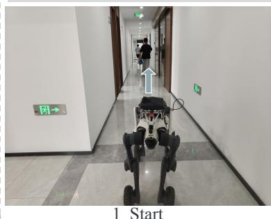  
1 Start

Ours — locate the cup after it moved  
Instruction: Find the cup.  
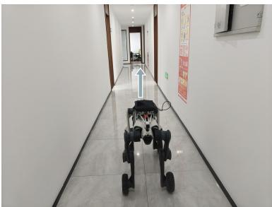  
2 Follow the corridor

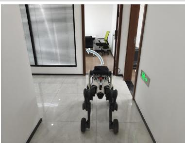  
3 Approach the office

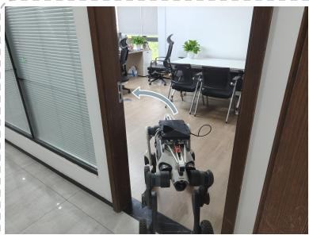  
4 Enter the office

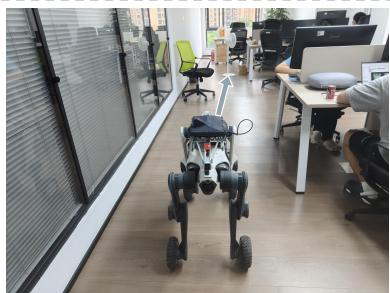  
5 Search the desks

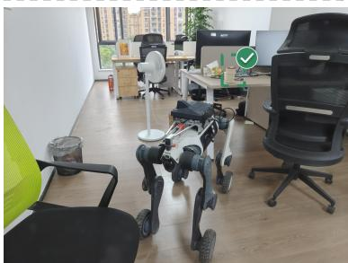  
6 Cup found at its current location

Instruction: Find the cup.  
Last-seen — revisit the cup's previous location  
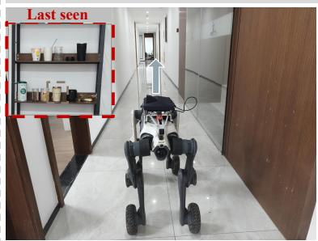  
1 Recall the last-seen location

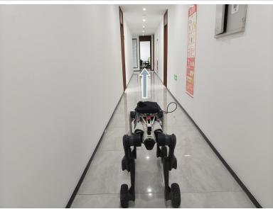  
2 Follow the corridor

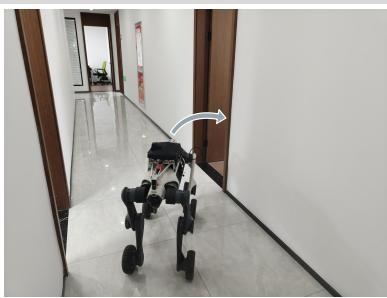  
3 Approach the pantry

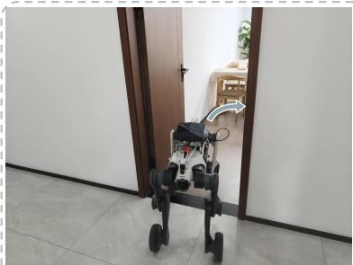  
4 Enter the pantry

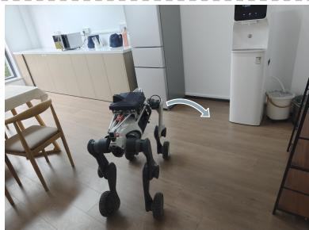  
5 Approach the cup rack

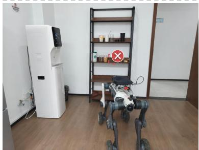  
6 Cup absent — it has moved  
Figure 13 Indoor cup search with predictive belief (top) and stale Last Seen memory (bottom).

Recovery and cross-platform transfer. Following unsuccessful first inspections, EvolvingNav recovered 9/37 M20 episodes (24.3%). Table 19 reports the matched 32-block transfer comparison

Table 19 Cross-platform navigation transfer.
<table><tr><td>Platform</td><td>Method</td><td>First-Inspection SR Search SR</td><td></td><td>Dist. (m)</td></tr><tr><td rowspan="2">LYNX M20</td><td>Last Seen + Search</td><td>18.8</td><td>25.0</td><td>55.4</td></tr><tr><td>EvolvingNav</td><td>37.5</td><td>50.0</td><td>44.6</td></tr><tr><td rowspan="2">X30</td><td>Last Seen + Search</td><td>18.8</td><td>25.0</td><td>54.1</td></tr><tr><td>EvolvingNav</td><td>31.3</td><td>43.8</td><td>46.8</td></tr><tr><td rowspan="2">Lite3 26</td><td>Last Seen + Search</td><td>18.8</td><td>31.3</td><td>51.8</td></tr><tr><td>EvolvingNav</td><td>25.0</td><td>43.8</td><td>45.9</td></tr></table>

Instruction: Find [Person] in the office, collect the documents, and bring them to [Meeting Room].

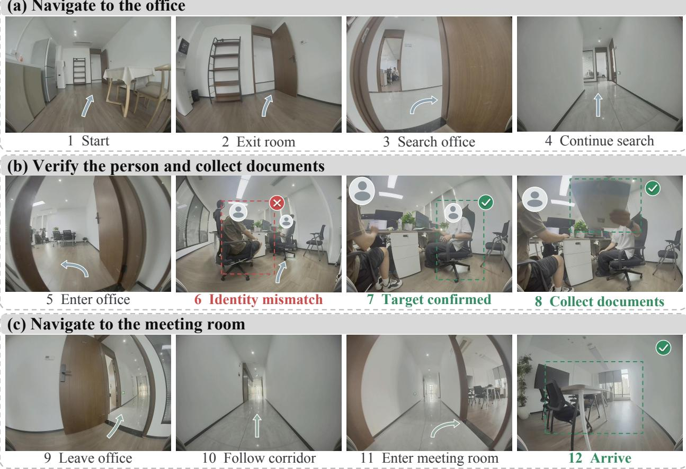  
Figure 14 Long-horizon indoor document-delivery execution.

for X30 and Lite3 alongside the corresponding M20 subset; the primary M20 result still uses all 64 trials. This evaluates transfer, not platform parity.

## D.4 Qualitative Cases

The outdoor comparison in figure 9 isolates stale memory in a car-search task: Last Seen revisits the previous entrance-side parking location and observes that the target is absent, whereas EvolvingNav reaches its current location. The two-row indoor comparison in figure 13 shows the same failure mode for a cup: EvolvingNav routes to the predicted ofice location, while Last Seen first inspects the now-empty pantry rack. These traces visualize representative outcomes and do not add observations to the aggregate success-rate measurements.

Additional system execution cases. Beyond predictive target search, figures 14 and 15 document two longerhorizon executions. The indoor case combines navigation, person verification, document collection, and delivery. The LYNX M20 has no manipulator, so a human places the documents on the robot after person verification; the robot then autonomously transports them to the meeting room. The outdoor case shows obstacle detection and route replanning during shared-bike search. These cases demonstrate broader system orchestration but are not used as quantitative evidence for the predictive-belief module.

3 Route blocked

Instruction: Find the shared bikes usually parked by the intersection at this time of day.

(a) Follow the preferred route and detect the obstacle  
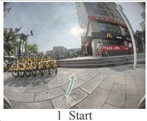

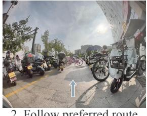

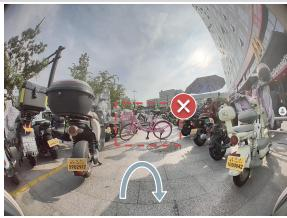

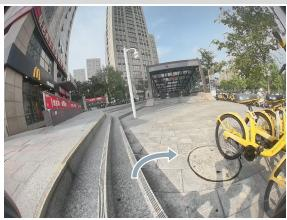  
4 Replan route

(b) Take the alternative route and locate the shared bikes  
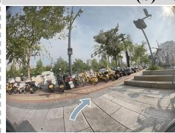  
5 Take the detour

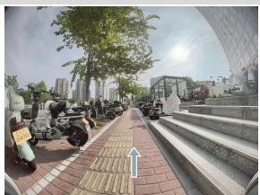  
6 Follow the sidewalk

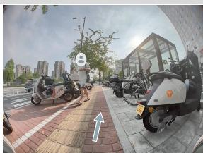  
7 Continue search

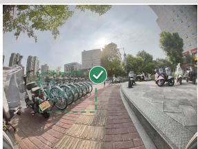  
8 Shared bikes found

Figure 15 Long-horizon outdoor shared-bike search.

## E Reproducibility and Responsible AI

Ethics and AI use. Persistent visual memory can capture people or private spaces, and incorrect beliefs may induce unsafe motion. Deployments should obtain consent, control data retention and access, preserve provenance, and retain platform-specific collision avoidance and emergency stops. The benchmark compiles existing records into simulated HSSD episodes without a new human-subject study. Generative AI assisted manuscript editing, LaTeX checks, and local engineering; it did not produce benchmark observations or ground-truth labels. The authors reviewed this material and remain responsible for the paper and artifacts.

## References

[1] Qiao Gu, Ali Kuwajerwala, Sacha Morin, Krishna Murthy Jatavallabhula, Bipasha Sen, Aditya Agarwal, Corban Rivera, William Paul, Kirsty Ellis, Rama Chellappa, et al. Conceptgraphs: Open-vocabulary 3d scene graphs for perception and planning. In 2024 IEEE International Conference on Robotics and Automation (ICRA), pages 5021–5028. IEEE, 2024.

[2] Peiqi Liu, Zhanqiu Guo, Mohit Warke, Soumith Chintala, Chris Paxton, Nur Muhammad Mahi Shafiullah, and Lerrel Pinto. Dynamem: Online dynamic spatio-semantic memory for open world mobile manipulation. arXiv preprint arXiv:2411.04999, 2024.

[3] Miguel Saavedra-Ruiz, Charlie Gauthier, Kumaraditya Gupta, Shima Shahfar, Kirsty Ellis, Steven Parkison, and Liam Paull. Predictive spatio-temporal scene graphs for semi-static scenes. arXiv preprint arXiv:2605.00121, 2026.

[4] Vishnu Sashank Dorbala, Bhrij Patel, Amrit Singh Bedi, and Dinesh Manocha. Personalized embodied navigation for portable object finding. arXiv preprint arXiv:2403.09905, 2026.

[5] Peter Anderson, Angel Chang, Devendra Singh Chaplot, Alexey Dosovitskiy, Saurabh Gupta, Vladlen Koltun, Jana Kosecka, Jitendra Malik, Roozbeh Mottaghi, Manolis Savva, et al. On evaluation of embodied navigation agents. arXiv preprint arXiv:1807.06757, 2018.

[6] Manolis Savva, Abhishek Kadian, Oleksandr Maksymets, Yili Zhao, Erik Wijmans, Bhavana Jain, Julian Straub, Jia Liu, Vladlen Koltun, Jitendra Malik, et al. Habitat: A platform for embodied ai research. In 2019 IEEE/CVF International Conference on Computer Vision (ICCV), pages 9338–9346. IEEE, 2019.

[7] Devendra Singh Chaplot, Dhiraj Gandhi, Abhinav Gupta, and Ruslan Salakhutdinov. Object goal navigation using goal-oriented semantic exploration. In Advances in Neural Information Processing Systems, 2020.

[8] Zihao Xin, Wentong Li, Yixuan Jiang, Ziyuan Huang, Bin Wang, Piji Li, Jianke Zhu, Jie Qin, and Shengjun Huang. Agentvln: Towards agentic vision-and-language navigation. arXiv preprint arXiv:2603.17670, 2026.

[9] Chenguang Huang, Oier Mees, Andy Zeng, and Wolfram Burgard. Visual language maps for robot navigation. In Proceedings of the IEEE International Conference on Robotics and Automation (ICRA), pages 10608–10615, 2023.

[10] Abdelrhman Werby, Chenguang Huang, Martin Büchner, Abhinav Valada, and Wolfram Burgard. Hierarchical open-vocabulary 3d scene graphs for language-grounded robot navigation. Robotics: Science and Systems, 2024.

[11] Kailing Li, Tianwen Qian, Lijin Yang, Yuqian Fu, Jingyu Gong, Xiaoling Wang, and Liang He. Bridging the 2d-3d gap: A hierarchical semantic-geometric map for vision language navigation. In Proceedings of the IEEE/CVF Conference on Computer Vision and Pattern Recognition (CVPR), pages 15243–15252, June 2026.

[12] Xun Huang, Shijia Zhao, Yunxiang Wang, Xin Lu, Wanfa Zhang, Rongsheng Qu, Weixin Li, Yunhong Wang, and Chenglu Wen. Msgnav: Unleashing the power of multi-modal 3d scene graph for zero-shot embodied navigation. In Proceedings of the IEEE/CVF Conference on Computer Vision and Pattern Recognition, pages 37154–37163, 2026.

[13] Naoki Yokoyama, Sehoon Ha, Dhruv Batra, Jiuguang Wang, and Bernadette Bucher. Vlfm: Vision-language frontier maps for zero-shot semantic navigation. In 2024 IEEE International Conference on Robotics and Automation (ICRA), pages 42–48. IEEE, 2024.

[14] Yuxing Long, Wenzhe Cai, Hongcheng Wang, Guanqi Zhan, and Hao Dong. Instructnav: Zero-shot system for generic instruction navigation in unexplored environment. arXiv preprint arXiv:2406.04882, 2024.

[15] Filippo Ziliotto, Tommaso Campari, Luciano Serafini, and Lamberto Ballan. Tango: training-free embodied ai agents for open-world tasks. In 2025 IEEE/CVF Conference on Computer Vision and Pattern Recognition (CVPR), pages 24603–24613. IEEE, 2025.

[16] Yijian Li, Changze Li, Hantian Shi, Jiaying Luo, Jiyuan Cai, Ming Yang, and Tong Qin. Agenticnav: Zero-shot vision-and-language navigation as a tool-calling harness. arXiv preprint arXiv:2606.10577, 2026.

[17] Kaiyu Zheng, Rohan Chitnis, Yoonchang Sung, George Konidaris, and Stefanie Tellex. Towards optimal correlational object search. In IEEE International Conference on Robotics and Automation, 2022.

[18] Muhammad Fadhil Ginting, Sung-Kyun Kim, David D Fan, Matteo Palieri, Mykel J Kochenderfer, and Ali-akbar Agha-Mohammadi. Seek: Semantic reasoning for object goal navigation in real world inspection tasks. arXiv preprint arXiv:2405.09822, 2024.

[19] Mingjie Zhang, Yuheng Du, Chengkai Wu, Jinni Zhou, Zhenchao Qi, Jun Ma, and Boyu Zhou. Apexnav: An adaptive exploration strategy for zero-shot object navigation with target-centric semantic fusion. IEEE Robotics and Automation Letters, 2025.

[20] Mukul Khanna, Ram Ramrakhya, Gunjan Chhablani, Sriram Yenamandra, Théophile Gervet, Matthew Chang, Zsolt Kira, Devendra Singh Chaplot, Dhruv Batra, and Roozbeh Mottaghi. GOAT-Bench: A benchmark for multi-modal lifelong navigation. In Proceedings of the IEEE/CVF Conference on Computer Vision and Pattern Recognition, 2024.

[21] Karmesh Yadav, Yusuf Ali, Gunshi Gupta, Yarin Gal, and Zsolt Kira. Findingdory: A benchmark to evaluate memory in embodied agents. arXiv preprint arXiv:2506.15635, 2025.

[22] Arjun Majumdar, Anurag Ajay, Xiaohan Zhang, Pranav Putta, Sriram Yenamandra, Mikael Henaf, Sneha Silwal, Paul Mcvay, Oleksandr Maksymets, Sergio Arnaud, et al. Openeqa: Embodied question answering in the era of foundation models. In 2024 IEEE/CVF Conference on Computer Vision and Pattern Recognition (CVPR), pages 16488–16498. IEEE, 2024.

[23] Tin Stribor Sohn, Maximilian Dillitzer, Jason J. Corso, and Eric Sax. R4: Retrieval-augmented reasoning for vision-language models in 4d spatio-temporal space. arXiv preprint arXiv:2512.15940, 2025.

[24] Nicolas Gorlo, Lukas Schmid, and Luca Carlone. Describe anything anywhere at any moment. In Proceedings of the IEEE/CVF Conference on Computer Vision and Pattern Recognition, pages 35002–35013, 2026.

[25] Berta Bescos, José M Fácil, Javier Civera, and José Neira. Dynaslam: Tracking, mapping, and inpainting in dynamic scenes. IEEE robotics and automation letters, 3(4):4076–4083, 2018.

[26] Manjunath Narayana, Andreas Kolling, Lucio Nardelli, and Phil Fong. Lifelong update of semantic maps in dynamic environments. In 2020 IEEE/RSJ International Conference on Intelligent Robots and Systems (IROS), pages 6164–6171. IEEE, 2020.

[27] Wei Wang, Wenqiao Zhang, Yutong Lin, Yuqian Yuan, Tianwei Lin, Jinhao Mao, Zhenxuan Fan, Mingjian Gao, Yang Dai, Wentong Li, Zheqi Lv, Zheng Dong, Yingjie Niu, Jiaqi Zhu, Jun Xiao, Chao Li, and Yueting Zhuang. Embodiedskills: A unified framework for orchestrating, training, and deploying vla agents, 2026. URL https://arxiv.org/abs/2609.01281.

[28] Mingjian Gao, Wenqiao Zhang, Yuqian Yuan, Yang Dai, Binhe Yu, Zheqi Lv, Haoyu Zheng, Jiaqi Zhu, Zhiqi Ge, Zixuan Wan, Siliang Tang, and Yueting Zhuang. Visualthink-vla: Visual intermediate reasoning for efective and low-latency vision-language-action policies, 2026. URL https://arxiv.org/abs/2605.30011.

[29] Juncheng Li, Kaihang Pan, Zhiqi Ge, Minghe Gao, Wei Ji, Wenqiao Zhang, Tat-Seng Chua, Siliang Tang, Hanwang Zhang, and Yueting Zhuang. Fine-tuning multimodal llms to follow zero-shot demonstrative instructions. In The Twelfth International Conference on Learning Representations, 2024. URL https://arxiv.org/abs/2308.04152.

[30] Wenqiao Zhang, Tianwei Lin, Jiang Liu, Fangxun Shu, Haoyuan Li, Lei Zhang, Wanggui He, Hao Zhou, Zheqi Lv, Hao Jiang, Juncheng Li, Siliang Tang, and Yueting Zhuang. Hyperllava: Dynamic visual and language expert tuning for multimodal large language models, 2024. URL https://arxiv.org/abs/2403.13447.

[31] Hongzhe Huang, Jiang Liu, Zhewen Yu, Li Cai, Dian Jiao, Wenqiao Zhang, Siliang Tang, Juncheng Li, Hao Jiang, Haoyuan Li, and Yueting Zhuang. Align2llava: Cascaded human and large language model preference alignment for multi-modal instruction curation, 2024. URL https://arxiv.org/abs/2409.18541.

[32] Yuqian Yuan, Wentong Li, Zhaocheng Li, Yutong Lin, Juncheng Li, Siliang Tang, Jun Xiao, Yueting Zhuang, and Wenqiao Zhang. Instructsam: Segment any instance with any instructions, 2026. URL https://arxiv.org/abs/ 2605.26102.

[33] Andrey Kurenkov, Michael Lingelbach, Tanmay Agarwal, Emily Jin, Chengshu Li, Ruohan Zhang, Li Fei-Fei, Jiajun Wu, Silvio Savarese, and Roberto Martín-Martín. Modeling dynamic environments with scene graph memory. arXiv preprint arXiv:2305.17537, 2023.

[34] Francesco Argenziano, Miguel Saavedra-Ruiz, Sacha Morin, Charlie Gauthier, Daniele Nardi, and Liam Paull. Flowmaps: Modeling long-term multimodal object dynamics with flow matching. arXiv preprint arXiv:2606.20209, 2026.

[35] Maithili Patel and Sonia Chernova. Proactive robot assistance via spatio-temporal object modeling. In Proceedings of the 6th Conference on Robot Learning, pages 881–891, 2023.

[36] Maithili Patel, Aswin Prakash, and Sonia Chernova. Predicting routine object usage for proactive robot assistance. In Conference on Robot Learning, 2023.

[37] Ermanno Bartoli, Fethiye Irmak Doğan, and Iolanda Leite. Streak: Streaming network for continual learning of object relocations under household context drifts. In 2025 34th IEEE International Conference on Robot and Human Interactive Communication (RO-MAN), pages 1550–1557. IEEE, 2025.

[38] Hongcheng Wang, Jinyu Zhu, and Hao Dong. User-centric object navigation: A benchmark with integrated user habits for personalized embodied object search. arXiv preprint arXiv:2602.06459, 2026.

[39] Toby Perrett, Ahmad Darkhalil, Saptarshi Sinha, Omar Emara, Sam Pollard, Kranti Parida, Kaiting Liu, Prajwal Gatti, Siddhant Bansal, Kevin Flanagan, Jacob Chalk, Zhifan Zhu, Rhodri Guerrier, Fahd Abdelazim, Bin Zhu, Davide Moltisanti, Michael Wray, Hazel Doughty, and Dima Damen. HD-EPIC: A highly-detailed egocentric video dataset. In Proceedings of the IEEE/CVF Conference on Computer Vision and Pattern Recognition, 2025.

[40] Jeonghwan Kim, Jisoo Kim, Jeonghyeon Na, and Hanbyul Joo. Parahome: Parameterizing everyday home activities towards 3d generative modeling of human-object interactions. In 2025 IEEE/CVF Conference on Computer Vision and Pattern Recognition (CVPR), pages 1816–1828. IEEE, 2025.

[41] Shilong Liu, Zhaoyang Zeng, Tianhe Ren, Feng Li, Hao Zhang, Jie Yang, Qing Jiang, Chunyuan Li, Jianwei Yang, Hang Su, et al. Grounding dino: Marrying dino with grounded pre-training for open-set object detection. In European conference on computer vision, pages 38–55. Springer, 2024.

[42] Nikhila Ravi, Valentin Gabeur, Yuan-Ting Hu, Ronghang Hu, Chaitanya Ryali, Tengyu Ma, Haitham Khedr, Roman Rädle, Chloe Rolland, Laura Gustafson, et al. Sam 2: Segment anything in images and videos. In International Conference on Learning Representations, volume 2025, pages 28085–28128, 2025.

[43] Alec Radford, Jong Wook Kim, Chris Hallacy, Aditya Ramesh, Gabriel Goh, Sandhini Agarwal, Girish Sastry, Amanda Askell, Pamela Mishkin, Jack Clark, et al. Learning transferable visual models from natural language supervision. In International conference on machine learning, pages 8748–8763. PmLR, 2021.

[44] Koya Sakamoto, Daichi Azuma, Taiki Miyanishi, Shuhei Kurita, and Motoaki Kawanabe. Map-based modular approach for zero-shot embodied question answering. In 2024 IEEE/RSJ International Conference on Intelligent Robots and Systems (IROS), pages 10013–10019. IEEE, 2024.

[45] Diane J. Cook, Aaron S. Crandall, Brian L. Thomas, and Narayanan C. Krishnan. CASAS: A smart home in a box. Computer, 46(7):62–69, 2013.

[46] Mukul Khanna, Yongsen Mao, Hanxiao Jiang, Sanjay Haresh, Brennan Shacklett, Dhruv Batra, Alexander Clegg, Eric Undersander, Angel X. Chang, and Manolis Savva. Habitat synthetic scenes dataset (HSSD-200): An analysis of 3d scene scale and realism tradeofs for objectgoal navigation. In Proceedings of the IEEE/CVF Conference on Computer Vision and Pattern Recognition, 2024.

[47] Arjun Majumdar, Gunjan Aggarwal, Bhavika Devnani, Judy Hofman, and Dhruv Batra. Zson: Zero-shot object-goal navigation using multimodal goal embeddings. Advances in neural information processing systems, 35: 32340–32352, 2022.

[48] Haotian Zhou, Xiaole Wang, He Li, Zhuo Qi, Jinrun Yin, Haiyu Kong, Jianghuan Xu, and Huijing Zhao. Lagmemo: Language 3d gaussian splatting memory for multi-modal open-vocabulary multi-goal visual navigation. arXiv preprint arXiv:2510.24118, 2025.

[49] Ziyu Zhu, Xilin Wang, Yixuan Li, Zhuofan Zhang, Xiaojian Ma, Yixin Chen, Baoxiong Jia, Wei Liang, Qian Yu, Zhidong Deng, et al. Move to understand a 3d scene: Bridging visual grounding and exploration for eficient and versatile embodied navigation. In 2025 IEEE/CVF International Conference on Computer Vision (ICCV), pages 8120–8132. IEEE, 2025.

[50] Jiazhao Zhang, Kunyu Wang, Rongtao Xu, Gengze Zhou, Yicong Hong, Xiaomeng Fang, Qi Wu, Zhizheng Zhang, and He Wang. Navid: Video-based vlm plans the next step for vision-and-language navigation. arXiv preprint arXiv:2402.15852, 2024.

[51] Jiazhao Zhang, Kunyu Wang, Shaoan Wang, Minghan Li, Haoran Liu, Songlin Wei, Zhongyuan Wang, Zhizheng Zhang, and He Wang. Uni-navid: A video-based vision-language-action model for unifying embodied navigation tasks. arXiv preprint arXiv:2412.06224, 2024.

[52] An-Chieh Cheng, Yandong Ji, Zhaojing Yang, Zaitian Gongye, Xueyan Zou, Jan Kautz, Erdem Bıyık, Hongxu Yin, Sifei Liu, and Xiaolong Wang. Navila: Legged robot vision-language-action model for navigation. arXiv preprint arXiv:2412.04453, 2024.

[53] Jiaqi Chen, Bingqian Lin, Xinmin Liu, Lin Ma, Xiaodan Liang, and Kwan-Yee K Wong. Afordances-oriented planning using foundation models for continuous vision-language navigation. In Proceedings of the AAAI Conference on Artificial Intelligence, volume 39, pages 23568–23576, 2025.

[54] Hongyu Ding, Sizhuo Zhang, Ziming Xu, Jinwen Guo, Hongxiu Liu, Xingzhi Cheng, Zixuan Chen, Haifei Qi, Duo Wang, Hao Xu, et al. Uni-lavira: Language-vision-robot actions translation for unified embodied navigation. arXiv preprint arXiv:2605.27582, 2026.